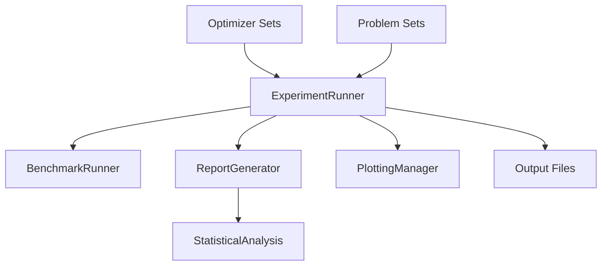

# QQN Optimizer Benchmarking and Reporting System

## Technical Documentation

### Table of Contents
1. [System Overview](#system-overview)
2. [Architecture](#architecture)
3. [Core Components](#core-components)
4. [Features](#features)
5. [Usage Guide](#usage-guide)
6. [Output Formats](#output-formats)
7. [Statistical Analysis](#statistical-analysis)
8. [Visualization](#visualization)
9. [Configuration](#configuration)
10. [Extension Points](#extension-points)

---

## System Overview

The QQN Optimizer Benchmarking and Reporting System is a comprehensive framework for evaluating and comparing optimization algorithms. It provides automated benchmarking, statistical analysis, visualization, and report generation capabilities specifically designed for academic research and algorithm development.

### Key Capabilities
- **Multi-optimizer comparison** across diverse problem sets
- **Statistical significance testing** with multiple comparison methods
- **Automated report generation** in multiple formats (Markdown, LaTeX, CSV)
- **Performance visualization** with convergence plots and comparison matrices
- **Championship mode** for problem-specific optimizer evaluation
- **Detailed per-run analysis** with failure diagnostics

---

## Architecture

### Module Structure

```
experiment_runner/
├── mod.rs                    # Module exports
├── experiment_runner.rs      # Core benchmark execution
├── report_generator.rs       # Report generation logic
├── statistical_analysis.rs   # Statistical testing
├── plotting_manager.rs       # Visualization management
├── optimizer_sets.rs         # Pre-configured optimizers
└── problem_sets.rs          # Test problem collections
```

### Component Relationships



---

## Core Components

### 1. ExperimentRunner
The central orchestrator that manages the entire benchmarking process.

**Key Features:**
- Parallel benchmark execution
- Problem validation
- Result aggregation
- Error recovery

**Methods:**
```rust
pub async fn run_comparative_benchmarks(
    &self,
    problems: Vec<Arc<dyn OptimizationProblem>>,
    optimizers: Vec<(String, Arc<dyn Optimizer>)>,
) -> anyhow::Result<()>

pub async fn run_championship_benchmarks(
    &self,
    problem_optimizer_map: HashMap<String, Vec<(String, Arc<dyn Optimizer>)>>,
) -> anyhow::Result<()>
```

### 2. ReportGenerator
Handles all report generation and formatting tasks.

**Capabilities:**
- Multi-format output (Markdown, LaTeX, CSV)
- Hierarchical report structure
- Problem family classification
- Detailed optimizer-problem analysis

**Report Types:**
- Main benchmark report
- Problem-specific reports
- Optimizer comparison matrices
- Statistical analysis summaries
- LaTeX publication-ready documents

### 3. StatisticalAnalysis
Provides rigorous statistical testing for optimizer comparison.

**Statistical Methods:**
- Welch's t-test for unequal variances
- Cohen's d effect size calculation
- Multiple comparison correction
- Win/loss/tie matrix generation

### 4. PlottingManager
Manages all visualization generation with error recovery.

**Plot Types:**
- Convergence plots (linear and log scale)
- Performance comparison charts
- Distribution boxplots
- Problem-specific visualizations

---

## Features

### 1. Benchmark Execution

#### Standard Benchmarking
```rust
run_benchmark(
    report_path_prefix: &str,
    max_evals: usize,
    num_runs: usize,
    time_limit: Duration,
    problems: Vec<Arc<dyn OptimizationProblem>>,
    optimizers: Vec<(String, Arc<dyn Optimizer>)>,
)
```

**Features:**
- Configurable evaluation limits
- Multiple independent runs with different seeds
- Time-based termination
- Automatic result validation

#### Championship Mode
```rust
run_championship_benchmark(
    report_path_prefix: &str,
    max_evals: usize,
    num_runs: usize,
    time_limit: Duration,
    problems: Vec<Arc<dyn OptimizationProblem>>,
    championship_config: HashMap<String, Vec<String>>,
    all_optimizers: Vec<(String, Arc<dyn Optimizer>)>,
)
```

**Features:**
- Problem-specific optimizer selection
- Focused comparison on best performers
- Reduced computational overhead

### 2. Problem Classification

Problems are automatically classified into families:
- **Convex Unimodal**: Sphere, Matyas
- **Non-Convex Unimodal**: Rosenbrock, Beale, GoldsteinPrice, Levi
- **Highly Multimodal**: Rastrigin, Ackley, Michalewicz, StyblinskiTang
- **ML Regression**: Linear/Logistic Regression
- **ML Neural Networks**: MLP variants
- **ML Classification**: SVM, Logistic models

### 3. Optimizer Organization

Pre-configured optimizer sets include:
- **QQN Variants**: Different line search methods
- **L-BFGS Variants**: Conservative, standard, and aggressive configurations
- **Gradient Descent**: With momentum, Nesterov, weight decay
- **Adam Variants**: Standard, AMSGrad, with weight decay
- **Trust Region**: Conservative, standard, and aggressive radius management

### 4. Report Generation

#### Main Report Structure
1. **Executive Summary**: Quick winner overview
2. **Problem-by-Problem Analysis**: Detailed performance tables
3. **Statistical Analysis**: Significance testing results
4. **Convergence Visualizations**: Plots for each problem
5. **Conclusions**: Key findings and recommendations

#### Detailed Reports
For each optimizer-problem combination:
- Run-by-run performance metrics
- Convergence analysis
- Parameter evolution tracking
- Failure diagnostics
- Computational efficiency metrics

### 5. Statistical Analysis

#### Comparison Methods
- **Pairwise Testing**: All optimizer pairs compared
- **Family-wise Comparison**: Grouped optimizer comparison
- **Effect Size Analysis**: Practical significance assessment
- **Win Matrix Generation**: Visual comparison summary

#### Metrics Analyzed
- Final objective value
- Computational cost (function/gradient evaluations)
- Success rate
- Time efficiency

### 6. Output Formats

#### CSV Files
- `detailed_results.csv`: All run data
- `summary_statistics.csv`: Aggregated metrics
- `statistical_analysis_raw_data.csv`: Test results
- Problem-specific CSV files

#### LaTeX Documents
- Main performance tables
- Problem-specific tables
- Comparison matrices
- Complete benchmark document

#### Markdown Reports
- HTML-compatible formatting
- Embedded visualizations
- Hyperlinked navigation
- Mobile-responsive tables

---

## Usage Guide

### Basic Usage

```rust
#[tokio::test]
async fn benchmark_example() -> Result<(), Box<dyn Error + Send + Sync>> {
    init_logging(false)?;

    let problems = vec![
        Arc::new(RosenbrockFunction::new(10)),
        Arc::new(RastriginFunction::new(10)),
    ];

    let optimizers = vec![
        ("QQN".to_string(), Arc::new(QQNOptimizer::default())),
        ("L-BFGS".to_string(), Arc::new(LBFGSOptimizer::default())),
    ];

    run_benchmark(
        "results/my_benchmark_",
        1000,  // max evaluations
        10,    // number of runs
        Duration::from_secs(60),
        problems,
        optimizers,
    ).await?;

    Ok(())
}
```

### Championship Mode

```rust
let championship_config = HashMap::from([
    ("Rosenbrock 10D".to_string(), vec!["QQN-Bisection-2".to_string()]),
    ("Rastrigin 10D".to_string(), vec!["Adam".to_string()]),
]);

run_championship_benchmark(
    "results/championship_",
    1000,
    20,
    Duration::from_secs(60),
    problems,
    championship_config,
    all_optimizers,
).await?;
```

---

## Output Formats

### Directory Structure
```
output_dir/
├── benchmark_report.md           # Main report
├── detailed_results.csv          # Raw data
├── summary_statistics.csv        # Aggregated metrics
├── statistical_analysis_raw_data.csv
├── problems/                     # Problem-specific CSVs
├── latex/                        # LaTeX files
│   ├── main_performance_table.tex
│   ├── summary_statistics.tex
│   ├── comparison_matrix.tex
│   └── comprehensive_benchmark_report.tex
├── convergence_*.png            # Visualization files
└── detailed_*_*.md              # Detailed reports
```

### Report Features

#### Winner Summary Table
- Quick overview of best performers
- Success rate and performance metrics
- Visual highlighting of QQN variants
- Runner-up identification

#### Performance Tables
- Comprehensive metrics per optimizer
- Separate statistics for successful/failed runs
- Hyperlinked detailed reports
- Rank-based ordering

#### Statistical Comparison Matrix
- Color-coded win/loss/tie results
- Problem-specific comparisons
- Statistical significance indicators
- Effect size visualization

---

## Statistical Analysis

### Welch's t-test Implementation
- Handles unequal variances
- Degrees of freedom calculation
- Two-tailed p-value computation
- Robust to small sample sizes

### Effect Size Calculation
- Cohen's d for standardized differences
- Pooled standard deviation
- Interpretation guidelines
- Practical significance assessment

### Multiple Comparison Handling
- Problem-wise grouping
- Family-wise error rate consideration
- Bonferroni correction option
- False discovery rate control

---

## Visualization

### Convergence Plots
- Linear and logarithmic scales
- Multi-optimizer overlay
- Iteration and evaluation-based views
- Automatic legend generation

### Performance Visualization
- Box plots for distribution analysis
- Bar charts for mean comparison
- Scatter plots for correlation
- Heatmaps for matrix visualization

### Error Handling
- Graceful plot failure recovery
- Fallback visualization options
- Warning messages for missing data
- Panic-safe plotting execution

---

## Configuration

### BenchmarkConfig Options
```rust
pub struct BenchmarkConfig {
    pub max_iterations: usize,
    pub maximum_function_calls: usize,
    pub time_limit: DurationWrapper,
    pub num_runs: usize,
    pub min_improvement_percent: f64,
    pub initial_point_noise: f64,
    // ...
}
```

### Threshold Modes
- **Standard Mode**: Uses problem-specific success thresholds
- **No-Threshold Mode**: Disables convergence thresholds for calibration

### Logging Configuration
- Configurable verbosity levels
- Performance timing logs
- Error tracking
- Progress indicators

---

## Extension Points

### Adding New Optimizers
```rust
pub fn custom_optimizers() -> Vec<(String, Arc<dyn Optimizer>)> {
    vec![
        ("MyOptimizer".to_string(), Arc::new(MyOptimizer::new(_config))),
    ]
}
```

### Adding New Problems
```rust
pub fn custom_problems() -> Vec<Arc<dyn OptimizationProblem>> {
    vec![
        Arc::new(MyProblem::new(dimension)),
    ]
}
```

### Custom Report Sections
- Override `generate_conclusions()`
- Add custom statistical tests
- Implement new visualization types
- Extend CSV export formats

### Custom Analysis
- Implement new statistical methods
- Add performance metrics
- Create specialized comparisons
- Develop domain-specific evaluations

---

## Best Practices

### Performance Optimization
1. Use appropriate number of runs (10-20 for testing, 50+ for publication)
2. Set reasonable time limits
3. Enable parallel execution
4. Use championship mode for large-scale comparisons

### Report Generation
1. Ensure sufficient disk space for outputs
2. Validate problem configurations before benchmarking
3. Use descriptive naming for experiments
4. Archive results with timestamps

### Statistical Rigor
1. Ensure adequate sample sizes
2. Check for outliers in results
3. Report both statistical and practical significance
4. Use appropriate multiple comparison corrections

### Troubleshooting
1. Check log files for detailed error messages
2. Validate optimizer configurations
3. Ensure problems return finite values
4. Monitor memory usage for large experiments
