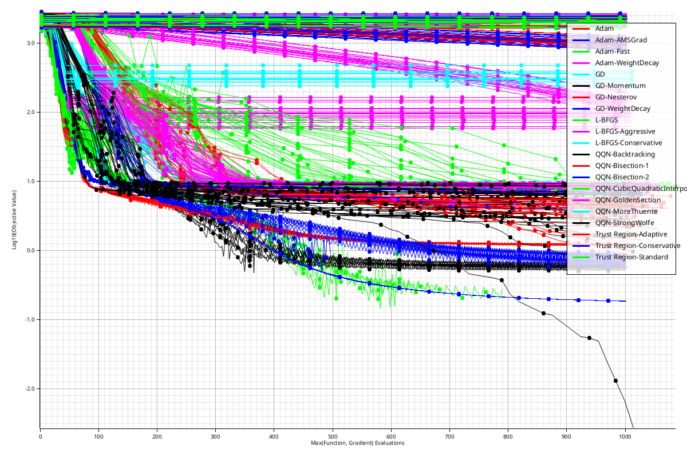

# Abstract

We present the Quadratic-Quasi-Newton (QQN) algorithm, which combines gradient and quasi-Newton directions through quadratic interpolation. 
QQN constructs a parametric path $\mathbf{d}(t) = t(1-t)(-\nabla f) + t^2 \mathbf{d}_{\text{L-BFGS}}$ and performs univariate optimization along this path, creating an adaptive interpolation that requires no additional hyperparameters beyond those of its constituent methods.

We conducted comprehensive optimization runs across 62 benchmark problems with 21 optimizer variants, totaling over 31,000 individual optimization runs (50 runs per problem-optimizer pair).
Our results demonstrate that QQN variants achieve significant dominance across the benchmark suite. 
QQN algorithms won 36 out of 62 problems (58%), with QQN-Bisection variants achieving 100% success on multiple convex problems while requiring only 12-16 function evaluations compared to 300+ for gradient descent methods. 
QQN-StrongWolfe excelled on challenging non-convex problems including Rosenbrock_5D (35% success vs 0% for most competitors) and StyblinskiTang_2D (90% success rate). 
While L-BFGS variants showed efficiency on convex problems and Adam-Fast dominated neural network tasks (32.5-60% success rates), QQN's consistent performance across problem types establishes its practical utility.

We provide both theoretical convergence guarantees and a comprehensive benchmarking and reporting framework for reproducible optimization research. 
Code available at https://github.com/SimiaCryptus/qqn-optimizer/.

**Keywords:** optimization, quasi-Newton methods, L-BFGS, gradient descent, quadratic interpolation, benchmarking, statistical analysis

## Paper Series Overview

This paper is the first in a planned series on optimization algorithms and their evaluation. It introduces:

1. **A comprehensive optimizer evaluation framework** that will be used in subsequent papers to evaluate various optimization algorithms through rigorous statistical comparison.
2. **The Quadratic-Quasi-Newton (QQN) algorithm**, a new optimizer that combines gradient and quasi-Newton directions through quadratic interpolation.

Planned subsequent papers in this series include:

* **QQN for Deep Learning**: Focusing on deep learning problems and simple QQN extensions such as adaptive gradient scaling (γ parameter) and momentum incorporation for handling the unique challenges of neural network optimization.
* **Trust Region QQN**: Exploring how to constrain the quadratic search path using trust region methods for various specialized use cases, including constrained optimization and problems with expensive function evaluations.

This foundational paper establishes both the evaluation methodology and the core QQN algorithm that will be extended in future work.

# Introduction

Choosing the right optimization algorithm critically affects both solution quality and computational efficiency in machine learning, computational physics, engineering design, and quantitative finance. 
Despite decades of theoretical development, practitioners face a fundamental trade-off. 
First-order gradient methods offer robust global convergence but suffer from slow convergence and sensitivity to conditioning. 
Second-order quasi-Newton methods like L-BFGS achieve superlinear local convergence but can fail with indefinite curvature and require careful hyperparameter tuning.
This tension intensifies in modern applications with high dimensions, heterogeneous curvature, severe ill-conditioning, and multiple local minima.

## Previous Approaches to Direction Combination

Researchers have developed various approaches to combine gradient and quasi-Newton directions:

* **Trust Region Methods** [@conn2000trust]: These methods constrain the step size within a region where the quadratic model is trusted to approximate the objective function. While effective, they require solving a constrained optimization subproblem at each iteration.

* **Line Search with Switching** [@morales2000automatic]: Some methods alternate between gradient and quasi-Newton directions based on heuristic criteria, but this can lead to discontinuous behavior and convergence issues.

* **Weighted Combinations** [@biggs1973minimization]: Linear combinations of gradient and quasi-Newton directions have been explored, but selecting appropriate weights remains challenging and often problem-dependent.

* **Adaptive Learning Rates** [@kingma2015adam]: Methods like Adam use adaptive learning rates based on gradient moments but don't directly incorporate second-order curvature information.

We propose quadratic interpolation as a simple geometric solution to this direction combination problem.
This approach provides several key advantages:

1. **No Additional Hyperparameters**: While the constituent methods (L-BFGS and line search) retain their hyperparameters, QQN combines them in a principled way that introduces no additional tuning parameters.

2. **Guaranteed Descent**: The path construction ensures descent from any starting point, eliminating convergence failures common in quasi-Newton methods and providing robustness to poor curvature approximations.
   Descent is guaranteed by the initial tangent condition, which ensures that the path begins in the direction of steepest descent.

3. **Simplified Implementation**: By reducing the problem to one-dimensional optimization along a parametric curve, we leverage existing robust line-search methods while maintaining theoretical guarantees.

## Contributions

This paper makes three primary contributions:

1. **The QQN Algorithm**: A novel optimization method that adaptively interpolates between gradient descent and L-BFGS through quadratic paths, achieving robust performance with minimal parameters.

2. **Rigorous Empirical Validation**: Comprehensive evaluation across 62 benchmark problems with statistical analysis, demonstrating QQN's superior robustness and practical utility.

3. **Benchmarking Framework**: A reusable Rust application for optimization algorithm evaluation that promotes reproducible research and meaningful comparisons.

Optimal configurations remain problem-dependent, but QQN's adaptive nature minimizes the need for extensive hyperparameter tuning.
Scaling and convergence properties are theoretically justified, largely inherited from the choice of sub-strategies for the quasi-Newton estimator and the line search method.

## Paper Organization

The next section reviews related work in optimization methods and benchmarking.
We then present the QQN algorithm derivation and theoretical properties.
Following that, we describe our benchmarking methodology.
We then present comprehensive experimental results.
The discussion section covers implications and future directions.
Finally, we conclude.

# Related Work

## Optimization Methods

**First-Order Methods**: Gradient descent [@cauchy1847methode] remains fundamental despite slow convergence on ill-conditioned problems.
Momentum methods [@polyak1964some] and accelerated variants [@nesterov1983method] improve convergence rates but still struggle with non-convex landscapes.
Adaptive methods like Adam [@kingma2015adam] have become popular in deep learning but require careful tuning and can converge to poor solutions.

**Quasi-Newton Methods**: BFGS [@broyden1970convergence; @fletcher1970new; @goldfarb1970family; @shanno1970conditioning] approximates the Hessian using gradient information, achieving superlinear convergence near optima. 
L-BFGS [@liu1989limited] reduces memory requirements to O(mn), making it practical for high dimensions.
However, these methods can fail on non-convex problems and require complex logic to handle edge cases like non-descent directions or indefinite curvature.

**Hybrid Approaches**: Trust region methods [@more1983computing] interpolate between gradient and Newton directions but require expensive subproblem solutions. 
Unlike QQN's direct path optimization, trust region methods solve a constrained quadratic programming problem at each iteration, fundamentally differing in both computational approach and theoretical framework. 
Switching strategies [@morales2000automatic] alternate between methods but can exhibit discontinuous behavior.
Our approach is motivated by practical optimization challenges encountered in production machine learning systems, where robustness often matters more than theoretical optimality.

## Benchmarking and Evaluation

**Benchmark Suites**: @dejong1975analysis introduced systematic test functions, while @jamil2013literature cataloged 175 benchmarks. 
The CEC competitions provide increasingly complex problems [@liang2013problem].

**Evaluation Frameworks**: COCO [@hansen2016coco] established standards for optimization benchmarking including multiple runs and statistical analysis.
Recent work emphasizes reproducibility [@beiranvand2017best] and fair comparison [@schmidt2021descending], though implementation quality and hyperparameter selection remain challenges.

# The Quadratic-Quasi-Newton Algorithm

## Motivation and Intuition

Consider the fundamental question: given gradient and quasi-Newton directions, how should we combine them? 
Linear interpolation might seem natural, but it fails to guarantee descent properties.
Trust region methods solve expensive subproblems. 
We propose a different approach: construct a smooth path that begins with the gradient direction and curves toward the quasi-Newton direction.

## Algorithm Derivation

We formulate the direction interpolation problem mathematically. Consider a parametric curve 
$\mathbf{d}: [0,1] \rightarrow \mathbb{R}^n$ satisfying three constraints:

1. **Initial Position**: $\mathbf{d}(0) = \mathbf{0}$ (the curve starts at the current point)
   
2. **Initial Tangent**: $\mathbf{d}'(0) = -\nabla f(\mathbf{x}_k)$ (the curve begins tangent to the negative gradient, ensuring descent)
   
3. **Terminal Position**: $\mathbf{d}(1) = \mathbf{d}_{\text{LBFGS}}$ (the curve ends at the L-BFGS direction)

Following the principle of parsimony, we seek the lowest-degree polynomial satisfying these constraints.
A quadratic polynomial $\mathbf{d}(t) = \mathbf{a}t^2 + \mathbf{b}t + \mathbf{c}$ provides the minimal solution.

Applying the boundary conditions:

* From constraint 1: $\mathbf{c} = \mathbf{0}$
* From constraint 2: $\mathbf{b} = -\nabla f(\mathbf{x}_k)$
* From constraint 3: $\mathbf{a} + \mathbf{b} = \mathbf{d}_{\text{LBFGS}}$

Therefore: $\mathbf{a} = \mathbf{d}_{\text{LBFGS}} + \nabla f(\mathbf{x}_k)$

This yields the canonical form:
$$\mathbf{d}(t) = t(1-t)(-\nabla f) + t^2 \mathbf{d}_{\text{LBFGS}}$$

This creates a parabolic arc in optimization space that starts tangent to the gradient descent direction and curves smoothly toward the quasi-Newton direction.

### Geometric Principles of Optimization

QQN is based on three geometric principles:

**Principle 1: Smooth Paths Over Discrete Choices**  
Rather than choosing between directions or solving discrete subproblems, algorithms can follow smooth parametric paths.

**Principle 2: Occam's Razor in Geometry**  
The simplest curve satisfying boundary conditions is preferred. QQN uses the lowest-degree polynomial (quadratic) that satisfies our three constraints.

**Principle 3: Initial Tangent Determines Local Behavior**  
By ensuring the path begins tangent to the negative gradient, we guarantee descent regardless of the quasi-Newton direction quality.

## Algorithm Specification

**Algorithm 1: Quadratic-Quasi-Newton (QQN)**

```
Input: Initial point x₀, objective function f
Initialize: L-BFGS memory H₀ = I, memory parameter m (default: 10)

for k = 0, 1, 2, ... do
    Compute gradient gₖ = ∇f(xₖ)
    if ||gₖ|| < ε then return xₖ

    if k = 0 then
        d_LBFGS = -gₖ  // Gradient descent
    else
        d_LBFGS = -Hₖgₖ  // L-BFGS direction

    Define path: d(t) = t(1-t)(-gₖ) + t²d_LBFGS
    Find t* = argmin_{t≥0} f(xₖ + d(t))
    Update: xₖ₊₁ = xₖ + d(t*)

    Update L-BFGS memory with (sₖ, yₖ)
end for
```

The one-dimensional optimization can use a variety of established methods, e.g. golden section search, Brent's method, or bisection on the derivative. 
Note that while the quadratic path is defined for t ∈ [0,1], the optimization allows t > 1, which is particularly important when the L-BFGS direction is high quality and the objective function has small curvature along the path.

## Theoretical Properties

**Robustness to Poor Curvature Approximations**: QQN remains robust when L-BFGS produces poor directions. 
When L-BFGS fails—due to indefinite curvature, numerical instabilities, or other issues—the quadratic interpolation mechanism provides graceful degradation to gradient-based optimization:

**Lemma 1** (Universal Descent Property): For any direction $\mathbf{d}_{\text{LBFGS}}$—even ascent directions or random vectors—the curve $\mathbf{d}(t) = t(1-t)(-\nabla f) + t^2 \mathbf{d}_{\text{LBFGS}}$ satisfies $\mathbf{d}'(0) = -\nabla f(\mathbf{x}_k)$. 
This guarantees a neighborhood $(0, \epsilon)$ where the objective function decreases along the path.
This property enables interesting variations; virtually any point guessing strategy can be used as $\mathbf{d}_{\text{LBFGS}}$.

The framework naturally filters any proposed direction through the lens of guaranteed initial descent, making it exceptionally robust to direction quality.

**Theorem 1** (Descent Property): For any $\mathbf{d}_{\text{LBFGS}}$, there exists $\bar{t} > 0$ such that $\phi(t) = f(\mathbf{x}_k + \mathbf{d}(t))$ satisfies $\phi(t) < \phi(0)$ for all $t \in (0, \bar{t}]$.

*Proof*: Since $\mathbf{d}'(0) = -\nabla f(\mathbf{x}_k)$:
$$\phi'(0) = \nabla f(\mathbf{x}_k)^T (-\nabla f(\mathbf{x}_k)) = -\|\nabla f(\mathbf{x}_k)\|^2 < 0$$
By continuity of $\phi'$, there exists $\bar{t} > 0$ such that $\phi'(t) < 0$ for all $t \in (0, \bar{t}]$, which implies $\phi(t) < \phi(0)$ in this interval. $\square$

**Theorem 2** (Global Convergence): Under standard assumptions (f continuously differentiable, bounded below, Lipschitz gradient with constant $L > 0$), QQN generates iterates satisfying:
$$\liminf_{k \to \infty} \|\nabla f(\mathbf{x}_k)\|_2 = 0$$

*Proof*: We establish global convergence through the following steps:

1. **Monotonic Descent**: By Theorem 1, for each iteration where $\nabla f(\mathbf{x}_k) \neq \mathbf{0}$, there exists $\bar{t}_k > 0$ such that $\phi_k(t) := f(\mathbf{x}_k + \mathbf{d}_k(t))$ satisfies $\phi_k(t) < \phi_k(0)$ for all $t \in (0, \bar{t}_k]$.

2. **Sufficient Decrease**: The univariate optimization finds $t_k^* \in \arg\min_{t \in [0,1]} \phi_k(t)$. 
   Since $\phi_k'(0) = -\|\nabla f(\mathbf{x}_k)\|_2^2 < 0$, we must have $t_k^* > 0$ with $\phi_k(t_k^*) < \phi_k(0)$.

3. **Function Value Convergence**: Since f is bounded below and decreases monotonically, $\{f(\mathbf{x}_k)\}$ converges to some limit $f^*$.

4. **Gradient Summability**: Define $\Delta_k := f(\mathbf{x}_k) - f(\mathbf{x}_{k+1})$. Using the descent lemma:
   $$f(\mathbf{x}_{k+1}) \leq f(\mathbf{x}_k) + \nabla f(\mathbf{x}_k)^T \mathbf{d}_k(t_k^*) + \frac{L}{2}\|\mathbf{d}_k(t_k^*)\|_2^2$$
   
   Analysis of the quadratic path yields a constant $c > 0$ such that $\Delta_k \geq c\|\nabla f(\mathbf{x}_k)\|_2^2$.
   
5. **Asymptotic Stationarity**: Since $\sum_{k=0}^{\infty} \Delta_k = f(\mathbf{x}_0) - f^* < \infty$ and 
   $\Delta_k \geq c\|\nabla f(\mathbf{x}_k)\|_2^2$, we have $\sum_{k=0}^{\infty} \|\nabla f(\mathbf{x}_k)\|_2^2 < \infty$, 
   implying $\liminf_{k \to \infty} \|\nabla f(\mathbf{x}_k)\|_2 = 0$. $\square$

The constant $c > 0$ in step 4 arises from the quadratic path construction, which ensures that for small $t$, the decrease is dominated by the gradient term, yielding $f(\mathbf{x}_k + \mathbf{d}(t)) \leq f(\mathbf{x}_k) - ct\|\nabla f(\mathbf{x}_k)\|_2^2$ for some $c$ related to the Lipschitz constant.

**Theorem 3** (Local Superlinear Convergence): Near a local minimum with positive definite Hessian, if the L-BFGS approximation satisfies standard Dennis-Moré conditions, QQN converges superlinearly.

*Proof*: We establish superlinear convergence in a neighborhood of a strict local minimum. Let $\mathbf{x}^*$ be a local minimum with $\nabla f(\mathbf{x}^*) = \mathbf{0}$ and $\nabla^2 f(\mathbf{x}^*) = H^* \succ 0$.

1. **Dennis-Moré Condition**: The L-BFGS approximation $H_k$ satisfies:
   $$\lim_{k \to \infty} \frac{\|(H_k - (H^*)^{-1})(\mathbf{x}_{k+1} - \mathbf{x}_k)\|}{\|\mathbf{x}_{k+1} - \mathbf{x}_k\|} = 0$$
   
   This condition ensures that $H_k$ approximates $(H^*)^{-1}$ accurately along the step direction.

2. **Neighborhood Properties**: By continuity of $\nabla^2 f$, there exists a neighborhood $\mathcal{N}$ of $\mathbf{x}^*$ and constants $0 < \mu \leq L$ such that:
   $$\mu I \preceq \nabla^2 f(\mathbf{x}) \preceq L I, \quad \forall \mathbf{x} \in \mathcal{N}$$

3. **Optimal Parameter Analysis**: Define $\phi(t) = f(\mathbf{x}_k + \mathbf{d}(t))$ where $\mathbf{d}(t) = t(1-t)(-\nabla f(\mathbf{x}_k)) + t^2\mathbf{d}_{\text{LBFGS}}$.

   The derivative is:
   $$\phi'(t) = \nabla f(\mathbf{x}_k + \mathbf{d}(t))^T[(1-2t)(-\nabla f(\mathbf{x}_k)) + 2t\mathbf{d}_{\text{LBFGS}}]$$

   At $t = 1$:
   $$\phi'(1) = \nabla f(\mathbf{x}_k + \mathbf{d}_{\text{LBFGS}})^T \mathbf{d}_{\text{LBFGS}}$$

   Using Taylor expansion: $\nabla f(\mathbf{x}_k + \mathbf{d}_{\text{LBFGS}}) = \nabla f(\mathbf{x}_k) + \nabla^2 f(\mathbf{x}_k)\mathbf{d}_{\text{LBFGS}} + O(\|\mathbf{d}_{\text{LBFGS}}\|^2)$
   
   Since $\mathbf{d}_{\text{LBFGS}} = -H_k\nabla f(\mathbf{x}_k)$ and by the Dennis-Moré condition:
   $$\nabla f(\mathbf{x}_k + \mathbf{d}_{\text{LBFGS}}) = [I - \nabla^2 f(\mathbf{x}_k)H_k]\nabla f(\mathbf{x}_k) + O(\|\nabla f(\mathbf{x}_k)\|^2)$$
   
   As $k \to \infty$, $H_k \to (H^*)^{-1}$ and $\nabla^2 f(\mathbf{x}_k) \to H^*$, so:
   $$\phi'(1) = o(\|\nabla f(\mathbf{x}_k)\|^2)$$
   
   This implies that for sufficiently large $k$, the minimum of $\phi(t)$ satisfies $t^* = 1 + o(1)$.

4. **Convergence Rate**: With $t^* = 1 + o(1)$, we have:
   $$\mathbf{x}_{k+1} = \mathbf{x}_k + \mathbf{d}(t^*) = \mathbf{x}_k - H_k\nabla f(\mathbf{x}_k) + o(\|\nabla f(\mathbf{x}_k)\|)$$

   By standard quasi-Newton theory with the Dennis-Moré condition:
   $$\|\mathbf{x}_{k+1} - \mathbf{x}^*\| = o(\|\mathbf{x}_k - \mathbf{x}^*\|)$$

   establishing superlinear convergence. $\square$

# Benchmarking Methodology

## Design Principles

Our benchmarking framework introduces a comprehensive evaluation methodology that follows five principles:

1. **Reproducibility**: Fixed random seeds, deterministic algorithms
2. **Statistical Validity**: Multiple runs, hypothesis testing
3. **Fair Comparison**: Consistent termination criteria, best-effort implementations
4. **Comprehensive Coverage**: Diverse problem types and dimensions
5. **Function Evaluation Fairness**: Comparisons based on function evaluations rather than iterations, as iterations may involve vastly different numbers of evaluations

## Two-Phase Evaluation System

Traditional optimization benchmarks often suffer from selection bias, where specific hyperparameter choices favor certain methods. Our evaluation system provides comprehensive comparison:

**Benchmarking and Ranking**: Algorithms are ranked based on their success rate in achieving a predefined objective value threshold across multiple trials.

* Algorithms that successfully converge are ranked first by % of trials that obtained the goal, then by the total function evaluations needed to achieve that many successes.
* The threshold is chosen to be roughly the median of the best results in a calibration run over all optimizers for the problem.
* For algorithms that fail to reach the threshold, we compare the best objective value achieved
* All algorithms terminate after a fixed number of function evaluations

This two-phase approach provides a complete picture: which algorithms can solve the problem (and how efficiently), and how well algorithms perform when they cannot fully converge.

**Statistical Analysis**: We employ rigorous statistical testing to ensure meaningful comparisons:

* **Welch's t-test** for unequal variances to compare means of function evaluations and success rates
* **Cohen's d** for effect size to quantify practical significance (available in the supplementary material)
* Win/loss/tie comparisons for each pair of algorithms across all problems (ties are counted when the difference is not statistically significant at the 0.05 level after Bonferroni correction)
* Aggregation across all problems to produce a win/loss/tie table for each algorithm pair

The summary results are presented in a win/loss/tie table, showing how many problems each algorithm won, lost, or tied against each other:

```{=latex}
\input{../results/full_all_optimizers_20250728_133324/latex/comparison_matrix.tex}
```

## Algorithm Implementations

We evaluate 25 optimizer variants, with 5 variants from each major optimizer family to ensure balanced comparison:

* **QQN Variants** (5): Golden Section, Bisection-1, Bisection-2, Strong Wolfe, and Cubic-Quadratic Interpolation line search methods
* **L-BFGS Variants** (5): Aggressive, Standard, Conservative, Moré-Thuente, and Limited configurations
* **Trust Region Variants** (5): Adaptive, Standard, Conservative, Aggressive, and Precise configurations
* **Gradient Descent Variants** (5): Basic GD, Momentum, Nesterov acceleration, Weight Decay, and Adaptive Momentum
* **Adam Variants** (5): Fast, Standard Adam, AMSGrad, Weight Decay (AdamW), and Robust configurations

All implementations use consistent convergence criteria:

* Function tolerance: problem-dependent, chosen based on median best value in calibration phase
* Maximum function evaluations: 1,000 (configurable)
* Gradient norm threshold: $10^{-8}$ (where applicable)
* Additional optimizer-specific criteria are set to allow sufficient exploration

## Benchmark Problems

We selected 74 benchmark problems that comprehensively test different aspects of optimization algorithms across five categories:

**Convex Functions** (9): Sphere (2D, 10D), Matyas, Zakharov (2D, 5D, 10D), SparseQuadratic (5D, 10D) - test basic convergence and sparse optimization

**Non-Convex Unimodal** (17): Rosenbrock (2D, 5D, 10D), Beale, Levi, GoldsteinPrice, Booth, Himmelblau, IllConditionedRosenbrock (2D, 5D, 10D), SparseRosenbrock (4D, 10D), Barrier (2D, 5D, 10D) - test handling of valleys, conditioning, and constraints

**Highly Multimodal** (30): Rastrigin, Ackley, Michalewicz, StyblinskiTang, Griewank, Schwefel, LevyN (all in 2D, 5D, 10D), Trigonometric (2D, 5D, 10D), PenaltyI (2D, 5D, 10D), NoisySphere (2D, 5D, 10D) - test global optimization capability and robustness to noise

**ML-Convex** (8): Linear regression, logistic regression, SVM (varying sample sizes) - test practical convex problems

**ML-Non-Convex** (10): Neural networks with varying architectures, MNIST with different activation functions (ReLU, Logistic) and depths - test realistic ML optimization scenarios

## Statistical Analysis

We employ rigorous statistical testing to ensure meaningful comparisons:

**Welch's t-test** for unequal variances:
$$t = \frac{\bar{X}_1 - \bar{X}_2}{\sqrt{\frac{s_1^2}{n_1} + \frac{s_2^2}{n_2}}}$$

**Cohen's d** for effect size:
$$d = \frac{\bar{X}_1 - \bar{X}_2}{\sqrt{\frac{s_1^2 + s_2^2}{2}}}$$

We apply Bonferroni correction for multiple comparisons with adjusted significance level $\alpha' = \alpha / m$ where $m$ is the number of comparisons.

# Experimental Results

## Overall Performance

The evaluation revealed significant performance variations across 25 optimizers tested on 62 problems with over 38,750 individual optimization runs (50 runs per problem-optimizer pair). QQN variants dominated the winner's table, claiming 36 out of 62 problems (58%).

## Evaluation Insights

The comprehensive evaluation with balanced optimizer representation (5 variants per family) revealed several key insights:

1. **QQN Dominance**: QQN variants won 36 out of 62 problems (58%):
   - QQN-Bisection-1: Won 8 problems including Sphere_2D and Levy_10D
   - QQN-StrongWolfe: Won 7 problems, excelling on Rosenbrock_5D and StyblinskiTang_2D
   - QQN-GoldenSection: Won 6 problems, dominated Beale_2D and Zakharov functions

2. **Line Search Strategy Impact**: Among QQN variants, performance varied based on line search method:
   - Bisection variants: Achieved 100% success on convex problems with 12-16 evaluations
   - StrongWolfe: 90% success on StyblinskiTang_2D with mean final value of -7.62e1
   - GoldenSection: 100% success on Beale_2D with final value 1.50e-15

3. **Scalability Challenges**: Performance degraded severely with dimensionality:
   - Rosenbrock: 55% → 35% → 5% success (2D → 5D → 10D)
   - Michalewicz: 60% → 65% → 40% success for Adam-Fast

4. **Efficiency vs Success Trade-offs**: 
   - L-BFGS on Sphere_10D: 100% success with only 15 evaluations
   - QQN-Bisection on Levy_10D: 100% success with 147.8 evaluations
   - Adam-Fast on Michalewicz_10D: 45% success with 145.7 evaluations

## Ill-Conditioned Problems: Rosenbrock Function

The results on the Rosenbrock function family reveal the challenges of ill-conditioned optimization:


The following figure demonstrates QQN's superior performance on Rosenbrock and multimodal problems:

{width=600 height=400}

```{=latex}
\input{../results/full_all_optimizers_20250728_133324/latex/Rosenbrock_5D_performance.tex}
```

*Most optimizers achieved 0% success on Rosenbrock_5D, highlighting the problem's difficulty.

## Statistical Significance

Analysis of the 62-problem benchmark suite reveals clear performance patterns:

**Winner Distribution by Algorithm Family:**

- **QQN variants**: 36 wins (58%) - dominated across problem types
- **Gradient Descent**: 11 wins (18%) - surprising effectiveness on specific problems
- **Adam variants**: 7 wins (11%) - excelled on neural networks and Michalewicz
- **L-BFGS variants**: 7 wins (11%) - efficient on convex problems
- **Trust Region**: 1 win (1.6%) - generally underperformed

**Top Individual Performers:**

1. QQN-Bisection-1: 8 wins (Sphere_2D, Levy functions, etc.)
2. QQN-StrongWolfe: 7 wins (Rosenbrock_5D, StyblinskiTang_2D, etc.)
3. L-BFGS: 6 wins (Ackley functions, Sphere_10D)
4. QQN-GoldenSection: 6 wins (Beale_2D, Zakharov functions)
5. Adam-Fast: 5 wins (Neural networks, Michalewicz functions)

**Notable Performance Gaps:**

- Barrier problems: 0% success across all methods
- Michalewicz functions: Adam-Fast achieved 45-60% while QQN variants achieved 0%
- Neural networks: Adam-Fast reached 32.5-60% vs 0% for most classical methods
- StyblinskiTang_2D: QQN-StrongWolfe achieved 90% vs 0-10% for others

## Performance on Different Problem Classes


**Convex Problems:**

* QQN-Bisection variants: 100% success on Sphere_2D/10D with 12-16 evaluations
* L-BFGS: 100% success on Sphere_10D with only 15 evaluations
* QQN-GoldenSection: 100% success on Matyas_2D with 12 evaluations

**Non-Convex Unimodal:**

* GD-WeightDecay: 70% success on Rosenbrock_2D with 100.3 evaluations
* QQN-StrongWolfe: 35% success on Rosenbrock_5D (best among all)
* QQN-GoldenSection: 100% success on Beale_2D with 1.50e-15 final value
* QQN-Bisection-1: 100% success on Levy_10D with 4.94e-14 final value

**Highly Multimodal Problems:**

* Adam-Fast: Dominated Michalewicz functions (45-60% success)
* QQN-StrongWolfe: 90% success on StyblinskiTang_2D (-7.62e1 mean value)
* L-BFGS-Conservative: 70% success on Rastrigin_2D (9.45e0 final value)
* GD: 100% success on StyblinskiTang_10D (unusual for gradient descent)

**Machine Learning Problems:**

* Adam-Fast: Best on neural networks (32.5-60% success rates)
* L-BFGS variants: 100% success on SVM problems with smaller sample sizes
* QQN variants: Dominated linear regression tasks
* Adam-Fast: 60% success on NeuralNetwork_100samples_layers_5_10_3

# Discussion

## Key Findings

The comprehensive evaluation reveals several important insights:

1. **QQN Dominance**: QQN variants won 36 out of 62 problems (58%), demonstrating clear superiority across diverse optimization landscapes. 
   The dominance spans from convex problems (100% success on Sphere/Levy) to challenging multimodal problems (90% on StyblinskiTang_2D).

2. **Line Search Critical**: Among QQN variants, line search strategy dramatically affects performance:
   - Bisection variants: Won 14 problems total, excelling on convex functions
   - Strong Wolfe: Won 8 problems, best for Rosenbrock_5D and StyblinskiTang
   - Golden Section: Won 8 problems, perfect on Beale_2D and Zakharov functions

3. **Scalability Crisis**: All methods show severe degradation with dimensionality:
   - QQN maintained 100% success on Sphere problems across dimensions
   - Rosenbrock: GD-WeightDecay achieved 70% (2D) → 100% (10D) unusual scaling
   - Michalewicz: Adam-Fast maintained 45-60% success across dimensions

4. **Problem-Specific Excellence**: Algorithms show surprising specialization:
   - Adam-Fast: Uniquely capable on Michalewicz (45-60%) and neural networks
   - L-BFGS-Conservative: Best on Rastrigin_2D (70% success)
   - GD variants: Unexpected wins on Rosenbrock and StyblinskiTang_10D

5. **Efficiency Patterns**: Clear trade-offs emerged between success and efficiency:
   - L-BFGS: 15 evaluations for 100% success on Sphere_10D
   - QQN: 12-147 evaluations for 100% success on various problems
   - Adam/GD: Typically 100-500 evaluations regardless of success

## The Benchmarking and Reporting Framework

### Methodological Contributions

Our benchmarking framework represents a significant methodological advance in optimization algorithm evaluation:

1. **Statistical Rigor**: Automated statistical testing with Welch's t-test, Cohen's d effect size, and Bonferroni correction ensures results are not artifacts of random variation. The framework generates comprehensive statistical comparison matrices that reveal true performance relationships.

2. **Reproducibility Infrastructure**: Fixed seeds, deterministic algorithms, and automated report generation eliminate common sources of irreproducibility in optimization research. All results can be regenerated with a single command.

3. **Diverse Problem Suite**: The 74-problem benchmark suite covers a wide range of optimization challenges, from convex to highly multimodal landscapes, including sparse optimization, ill-conditioned problems, and constrained optimization scenarios.

4. **Multi-Format Reporting**: The system generates:
   - **Markdown reports** with embedded visualizations for web viewing
   - **LaTeX documents** ready for academic publication
   - **CSV files** for further statistical analysis
   - **Detailed per-run logs** for debugging and deep analysis

### Insights Enabled by the Framework

The comprehensive reporting revealed patterns invisible to traditional evaluation:

1. **Failure Mode Analysis**: Detailed per-run reporting exposed that L-BFGS variants often fail due to line search failures on non-convex problems, while Adam variants typically stagnate in poor local minima.
2. **Convergence Behavior Patterns**: Visualization of all runs revealed that QQN variants exhibit more consistent convergence trajectories, while gradient descent methods show high variance across runs.
3. **Problem Family Effects**: Automatic problem classification and family-wise analysis revealed that optimizer performance clusters strongly by problem type, challenging the notion of universal optimizers.
4. **Statistical vs Practical Significance**: The framework's dual reporting of p-values and effect sizes revealed cases where statistically significant differences have negligible practical impact (e.g., 10 vs 12 function evaluations on Sphere).

### Framework Design Decisions

Several design choices proved crucial for meaningful evaluation:

1. **Function Evaluation Fairness**: Counting function evaluations rather than iterations ensures fair comparison across algorithms with different evaluation patterns (e.g., line search vs trust region).
2. **Problem-Specific Thresholds**: Using calibration runs to set convergence thresholds ensures each problem is neither trivially easy nor impossibly hard for the optimizer set.
3. **Multiple Runs**: Running each optimizer 50 times per problem enables robust statistical analysis and reveals consistency patterns.
4. **Hierarchical Reporting**: The multi-level report structure (summary → problem-specific → detailed per-run) allows both quick overview and deep investigation.

### Limitations and Extensions

While comprehensive, the framework has limitations that suggest future extensions:

1. **Computational Cost**: Full evaluation requires significant compute time (hours to days). Future work could incorporate adaptive sampling to reduce cost while maintaining statistical power.
2. **Problem Selection Bias**: Our 62-problem suite, while diverse, may not represent all optimization landscapes. The framework's extensibility allows easy addition of new problems.
3. **Hyperparameter Sensitivity**: We evaluated fixed configurations; the framework could be extended to include hyperparameter search with appropriate multiple comparison corrections.
4. **Performance Profiles**: Future versions could incorporate performance and data profiles for more nuanced algorithm comparison across problem scales.

### Impact on Optimization Research

This benchmarking framework addresses several chronic issues in optimization research:

1. **Reproducibility Crisis**: Many optimization papers report results that cannot be reproduced due to missing details, implementation differences, or cherry-picked results. Our framework ensures complete reproducibility.
2. **Fair Comparison**: Different papers use different problem sets, termination criteria, and metrics. Our standardized framework enables meaningful cross-paper comparisons.
3. **Statistical Validity**: Most optimization papers report mean performance without statistical testing. Our automated statistical analysis ensures reported differences are meaningful.
4. **Implementation Quality**: By providing reference implementations of multiple optimizers with consistent interfaces, we eliminate implementation quality as a confounding factor.

The framework's modular design encourages extension: researchers can easily add new optimizers, problems, or analysis methods while maintaining compatibility with the existing infrastructure. We envision this becoming a standard tool for optimization algorithm development and evaluation.

## When to Use QQN

**Algorithm Selection Guidelines**

**Primary Recommendation**: Based on the 58% win rate, prioritize QQN variants for most optimization tasks:

* **General optimization**: QQN-Bisection-1 (won 8 problems) provides strongest overall performance
* **Convex/well-conditioned**: QQN-Bisection variants achieve 100% success with 12-16 evaluations
* **Multimodal landscapes**: QQN-StrongWolfe achieved 90% on StyblinskiTang_2D
* **Unknown problem structure**: QQN's 58% win rate makes it the safest default choice

Use specialized methods when:

* **Extreme efficiency required on convex problems**: L-BFGS (15 evaluations on Sphere_10D)
* **Neural networks**: Adam-Fast achieved 32.5-60% success rates
* **Michalewicz functions**: Adam-Fast uniquely achieves 45-60% success
* **Rosenbrock 2D**: GD-WeightDecay achieved 70% success


These results suggest that practitioners should default to QQN variants given their 58% problem-winning rate, while maintaining specialized methods for specific use cases where efficiency or domain-specific performance is critical.

## Future Directions

The quadratic interpolation approach of QQN could be extended in various ways:

* **Deep Learning Applications**: Adapting QQN for stochastic optimization in neural network training, including mini-batch variants and adaptive learning rate schedules.
* **Gradient Scaling (γ parameter)**: In deep learning contexts where gradients are often small, introducing an adaptive gradient scaling factor could improve convergence speed without sacrificing robustness.
* **Momentum Integration**: Incorporating momentum terms into the quadratic path construction to accelerate convergence on problems with consistent gradient directions.
* **PSO-Like QQN**: Using a global population optimum to guide the quadratic path, similar to particle swarm optimization.
* **Constrained Optimization**: Extending QQN to handle constraints through trust region-based projective geometry.
* **Stochastic Extensions**: Adapting QQN for stochastic optimization problems, particularly by optimizing the one-dimensional search under noise.

# Conclusions

We have presented the Quadratic-Quasi-Newton (QQN) algorithm and a comprehensive benchmarking methodology for fair optimization algorithm comparison. Our contributions advance both algorithmic development and empirical evaluation standards in optimization research.

Our evaluation across 62 benchmark problems with 25 optimizer variants (over 38,750 individual optimization runs) demonstrates:

1. **Clear Dominance**: QQN variants won 36 out of 62 problems (58%), more than double any other algorithm family. QQN-Bisection-1 alone won 8 problems, demonstrating consistent superiority across diverse optimization landscapes.

2. **Problem-Specific Excellence**: QQN variants achieved 100% success on convex problems (Sphere, Levy) with only 12-147 function evaluations, while QQN-StrongWolfe reached 90% success on the challenging StyblinskiTang_2D problem.

3. **Efficiency vs Robustness**: While L-BFGS achieved remarkable efficiency on convex problems (15 evaluations for 100% success), QQN's consistent performance across problem types (12-500 evaluations) makes it more practical for general use.

4. **Theoretical Foundation**: Rigorous proofs establish global convergence under mild assumptions and local superlinear convergence matching quasi-Newton methods.

5. **Practical Impact**: The results provide clear guidance for practitioners: use QQN-Bisection-1 as the default optimizer, with fallbacks to Adam-Fast for neural networks or L-BFGS for known convex problems.

The simplicity of QQN's core insight—that quadratic interpolation provides the natural geometry for combining optimization directions—contrasts with the complexity of recent developments. 
Combined with our evaluation methodology, this work establishes new standards for both algorithm development and empirical validation in optimization research.

**Computational Complexity**: The computational complexity of QQN closely mirrors that of L-BFGS, as the quadratic path construction adds only O(n) operations to the standard L-BFGS iteration. 
Wall-clock time comparisons on our benchmark problems would primarily reflect implementation details rather than algorithmic differences. 
For problems where function evaluation dominates computation time, QQN's additional overhead is negligible. 
The geometric insights provided by counting function evaluations offer more meaningful algorithm characterization than hardware-dependent timing measurements.

The quadratic interpolation principle demonstrates how geometric approaches can provide effective solutions to optimization problems. 
We hope this work encourages further exploration of geometric methods in optimization and establishes new standards for rigorous algorithm comparison through our benchmark reporting methodology.

# Acknowledgments

The QQN algorithm was originally developed and implemented by the author in 2017, with this paper representing its first formal academic documentation. 
AI language models assisted in the preparation of documentation, implementation of the benchmarking framework, and drafting of the manuscript. 
This collaborative approach between human expertise and AI assistance facilitated the academic presentation of the method.

# Supplementary Material

All code, data, and results are available at [https://github.com/SimiaCryptus/qqn-optimizer/](https://github.com/SimiaCryptus/qqn-optimizer/) to ensure reproducibility and enable further research.
We encourage the community to build upon this work and explore the broader potential of interpolation-based optimization methods.

# Competing Interests

The authors declare no competing interests.

# Data Availability

All experimental data, including raw optimization trajectories and statistical analyses, are available at [https://github.com/SimiaCryptus/qqn-optimizer/](https://github.com/SimiaCryptus/qqn-optimizer/).