# Quadratic Quasi-Newton (QQN) Optimizer: Experimental Validation

*Comprehensive Benchmark Results for Academic Publication*

**Generated on:** 2025-07-28 14:15:26 UTC

# Quadratic Quasi-Newton (QQN) Optimizer: Experimental Validation

*Comprehensive Benchmark Results for Academic Publication*

**Generated on:** 2025-07-28 14:15:26 UTC

## Quick Summary: Winners by Problem
<table style="border-collapse: collapse; width: 100%; margin: 20px 0;">
<tr style="background-color: #f2f2f2;">
<th style="border: 1px solid #ddd; padding: 8px; text-align: center;">Problem</th>
<th style="border: 1px solid #ddd; padding: 8px; text-align: center;">Family</th>
<th style="border: 1px solid #ddd; padding: 8px; text-align: center;">Winner</th>
<th style="border: 1px solid #ddd; padding: 8px; text-align: center;">Success Rate</th>
<th style="border: 1px solid #ddd; padding: 8px; text-align: center;">Mean Final Value</th>
<th style="border: 1px solid #ddd; padding: 8px; text-align: center;">Median Best Value</th>
<th style="border: 1px solid #ddd; padding: 8px; text-align: center;">Runner-up</th>
</tr>
<tr style="background-color: #d4edda; font-weight: bold;">
<td style="border: 1px solid #ddd; padding: 8px; text-align: center;">Sphere_2D</td>
<td style="border: 1px solid #ddd; padding: 8px; text-align: center;">Convex Unimodal</td>
<td style="border: 1px solid #ddd; padding: 8px; text-align: center;">QQN-Bisection-2</td>
<td style="border: 1px solid #ddd; padding: 8px; text-align: center;">100.0%</td>
<td style="border: 1px solid #ddd; padding: 8px; text-align: center;">0.00e0</td>
<td style="border: 1px solid #ddd; padding: 8px; text-align: center;">0.00e0</td>
<td style="border: 1px solid #ddd; padding: 8px; text-align: center;">QQN-CubicQuadraticInterpolation</td>
</tr>
<tr style="background-color: #d4edda; font-weight: bold;">
<td style="border: 1px solid #ddd; padding: 8px; text-align: center;">Sphere_10D</td>
<td style="border: 1px solid #ddd; padding: 8px; text-align: center;">Convex Unimodal</td>
<td style="border: 1px solid #ddd; padding: 8px; text-align: center;">QQN-CubicQuadraticInterpolation</td>
<td style="border: 1px solid #ddd; padding: 8px; text-align: center;">100.0%</td>
<td style="border: 1px solid #ddd; padding: 8px; text-align: center;">0.00e0</td>
<td style="border: 1px solid #ddd; padding: 8px; text-align: center;">0.00e0</td>
<td style="border: 1px solid #ddd; padding: 8px; text-align: center;">L-BFGS-Aggressive</td>
</tr>
<tr style="font-weight: bold;">
<td style="border: 1px solid #ddd; padding: 8px; text-align: center;">Rosenbrock_2D</td>
<td style="border: 1px solid #ddd; padding: 8px; text-align: center;">Non-Convex Unimodal</td>
<td style="border: 1px solid #ddd; padding: 8px; text-align: center;">GD-WeightDecay</td>
<td style="border: 1px solid #ddd; padding: 8px; text-align: center;">50.0%</td>
<td style="border: 1px solid #ddd; padding: 8px; text-align: center;">2.57e0</td>
<td style="border: 1px solid #ddd; padding: 8px; text-align: center;">1.91e0</td>
<td style="border: 1px solid #ddd; padding: 8px; text-align: center;">GD-Nesterov</td>
</tr>
<tr style="background-color: #d4edda; font-weight: bold;">
<td style="border: 1px solid #ddd; padding: 8px; text-align: center;">Rosenbrock_5D</td>
<td style="border: 1px solid #ddd; padding: 8px; text-align: center;">Non-Convex Unimodal</td>
<td style="border: 1px solid #ddd; padding: 8px; text-align: center;">QQN-StrongWolfe</td>
<td style="border: 1px solid #ddd; padding: 8px; text-align: center;">25.0%</td>
<td style="border: 1px solid #ddd; padding: 8px; text-align: center;">1.04e0</td>
<td style="border: 1px solid #ddd; padding: 8px; text-align: center;">7.05e-2</td>
<td style="border: 1px solid #ddd; padding: 8px; text-align: center;">GD-WeightDecay</td>
</tr>
<tr style="font-weight: bold;">
<td style="border: 1px solid #ddd; padding: 8px; text-align: center;">Rosenbrock_10D</td>
<td style="border: 1px solid #ddd; padding: 8px; text-align: center;">Non-Convex Unimodal</td>
<td style="border: 1px solid #ddd; padding: 8px; text-align: center;">GD</td>
<td style="border: 1px solid #ddd; padding: 8px; text-align: center;">100.0%</td>
<td style="border: 1px solid #ddd; padding: 8px; text-align: center;">1.01e1</td>
<td style="border: 1px solid #ddd; padding: 8px; text-align: center;">9.64e0</td>
<td style="border: 1px solid #ddd; padding: 8px; text-align: center;">Adam-Fast</td>
</tr>
<tr style="font-weight: bold;">
<td style="border: 1px solid #ddd; padding: 8px; text-align: center;">Michalewicz_2D_m10</td>
<td style="border: 1px solid #ddd; padding: 8px; text-align: center;">Highly Multimodal</td>
<td style="border: 1px solid #ddd; padding: 8px; text-align: center;">Trust Region-Conservative</td>
<td style="border: 1px solid #ddd; padding: 8px; text-align: center;">65.0%</td>
<td style="border: 1px solid #ddd; padding: 8px; text-align: center;">-7.95e-7</td>
<td style="border: 1px solid #ddd; padding: 8px; text-align: center;">-2.22e-7</td>
<td style="border: 1px solid #ddd; padding: 8px; text-align: center;">Adam-Fast</td>
</tr>
<tr style="font-weight: bold;">
<td style="border: 1px solid #ddd; padding: 8px; text-align: center;">Michalewicz_5D_m10</td>
<td style="border: 1px solid #ddd; padding: 8px; text-align: center;">Highly Multimodal</td>
<td style="border: 1px solid #ddd; padding: 8px; text-align: center;">Adam-Fast</td>
<td style="border: 1px solid #ddd; padding: 8px; text-align: center;">67.5%</td>
<td style="border: 1px solid #ddd; padding: 8px; text-align: center;">-2.81e0</td>
<td style="border: 1px solid #ddd; padding: 8px; text-align: center;">-2.69e0</td>
<td style="border: 1px solid #ddd; padding: 8px; text-align: center;">QQN-Backtracking</td>
</tr>
<tr style="font-weight: bold;">
<td style="border: 1px solid #ddd; padding: 8px; text-align: center;">Michalewicz_10D_m10</td>
<td style="border: 1px solid #ddd; padding: 8px; text-align: center;">Highly Multimodal</td>
<td style="border: 1px solid #ddd; padding: 8px; text-align: center;">Adam-Fast</td>
<td style="border: 1px solid #ddd; padding: 8px; text-align: center;">47.5%</td>
<td style="border: 1px solid #ddd; padding: 8px; text-align: center;">-6.52e0</td>
<td style="border: 1px solid #ddd; padding: 8px; text-align: center;">-6.26e0</td>
<td style="border: 1px solid #ddd; padding: 8px; text-align: center;">Adam-AMSGrad</td>
</tr>
<tr style="background-color: #d4edda; font-weight: bold;">
<td style="border: 1px solid #ddd; padding: 8px; text-align: center;">Rastrigin_2D</td>
<td style="border: 1px solid #ddd; padding: 8px; text-align: center;">Highly Multimodal</td>
<td style="border: 1px solid #ddd; padding: 8px; text-align: center;">QQN-StrongWolfe</td>
<td style="border: 1px solid #ddd; padding: 8px; text-align: center;">70.0%</td>
<td style="border: 1px solid #ddd; padding: 8px; text-align: center;">6.47e0</td>
<td style="border: 1px solid #ddd; padding: 8px; text-align: center;">4.97e0</td>
<td style="border: 1px solid #ddd; padding: 8px; text-align: center;">L-BFGS-Conservative</td>
</tr>
<tr style="font-weight: bold;">
<td style="border: 1px solid #ddd; padding: 8px; text-align: center;">Rastrigin_5D</td>
<td style="border: 1px solid #ddd; padding: 8px; text-align: center;">Highly Multimodal</td>
<td style="border: 1px solid #ddd; padding: 8px; text-align: center;">GD-Nesterov</td>
<td style="border: 1px solid #ddd; padding: 8px; text-align: center;">65.0%</td>
<td style="border: 1px solid #ddd; padding: 8px; text-align: center;">2.14e1</td>
<td style="border: 1px solid #ddd; padding: 8px; text-align: center;">1.99e1</td>
<td style="border: 1px solid #ddd; padding: 8px; text-align: center;">QQN-Backtracking</td>
</tr>
<tr style="font-weight: bold;">
<td style="border: 1px solid #ddd; padding: 8px; text-align: center;">Rastrigin_10D</td>
<td style="border: 1px solid #ddd; padding: 8px; text-align: center;">Highly Multimodal</td>
<td style="border: 1px solid #ddd; padding: 8px; text-align: center;">GD-WeightDecay</td>
<td style="border: 1px solid #ddd; padding: 8px; text-align: center;">55.0%</td>
<td style="border: 1px solid #ddd; padding: 8px; text-align: center;">4.33e1</td>
<td style="border: 1px solid #ddd; padding: 8px; text-align: center;">4.18e1</td>
<td style="border: 1px solid #ddd; padding: 8px; text-align: center;">GD-Nesterov</td>
</tr>
<tr style="font-weight: bold;">
<td style="border: 1px solid #ddd; padding: 8px; text-align: center;">Ackley_2D_a20_b0.2_c6.28e0</td>
<td style="border: 1px solid #ddd; padding: 8px; text-align: center;">Highly Multimodal</td>
<td style="border: 1px solid #ddd; padding: 8px; text-align: center;">L-BFGS</td>
<td style="border: 1px solid #ddd; padding: 8px; text-align: center;">25.0%</td>
<td style="border: 1px solid #ddd; padding: 8px; text-align: center;">3.81e0</td>
<td style="border: 1px solid #ddd; padding: 8px; text-align: center;">3.57e0</td>
<td style="border: 1px solid #ddd; padding: 8px; text-align: center;">QQN-Backtracking</td>
</tr>
<tr style="font-weight: bold;">
<td style="border: 1px solid #ddd; padding: 8px; text-align: center;">Ackley_5D_a20_b0.2_c6.28e0</td>
<td style="border: 1px solid #ddd; padding: 8px; text-align: center;">Highly Multimodal</td>
<td style="border: 1px solid #ddd; padding: 8px; text-align: center;">L-BFGS</td>
<td style="border: 1px solid #ddd; padding: 8px; text-align: center;">45.0%</td>
<td style="border: 1px solid #ddd; padding: 8px; text-align: center;">3.51e0</td>
<td style="border: 1px solid #ddd; padding: 8px; text-align: center;">3.57e0</td>
<td style="border: 1px solid #ddd; padding: 8px; text-align: center;">QQN-Backtracking</td>
</tr>
<tr style="background-color: #d4edda; font-weight: bold;">
<td style="border: 1px solid #ddd; padding: 8px; text-align: center;">Ackley_10D_a20_b0.2_c6.28e0</td>
<td style="border: 1px solid #ddd; padding: 8px; text-align: center;">Highly Multimodal</td>
<td style="border: 1px solid #ddd; padding: 8px; text-align: center;">QQN-Bisection-2</td>
<td style="border: 1px solid #ddd; padding: 8px; text-align: center;">20.0%</td>
<td style="border: 1px solid #ddd; padding: 8px; text-align: center;">3.36e0</td>
<td style="border: 1px solid #ddd; padding: 8px; text-align: center;">3.57e0</td>
<td style="border: 1px solid #ddd; padding: 8px; text-align: center;">L-BFGS</td>
</tr>
<tr style="background-color: #d4edda; font-weight: bold;">
<td style="border: 1px solid #ddd; padding: 8px; text-align: center;">StyblinskiTang_2D</td>
<td style="border: 1px solid #ddd; padding: 8px; text-align: center;">Highly Multimodal</td>
<td style="border: 1px solid #ddd; padding: 8px; text-align: center;">QQN-Bisection-2</td>
<td style="border: 1px solid #ddd; padding: 8px; text-align: center;">90.0%</td>
<td style="border: 1px solid #ddd; padding: 8px; text-align: center;">-7.69e1</td>
<td style="border: 1px solid #ddd; padding: 8px; text-align: center;">-7.83e1</td>
<td style="border: 1px solid #ddd; padding: 8px; text-align: center;">L-BFGS</td>
</tr>
<tr style="font-weight: bold;">
<td style="border: 1px solid #ddd; padding: 8px; text-align: center;">StyblinskiTang_5D</td>
<td style="border: 1px solid #ddd; padding: 8px; text-align: center;">Highly Multimodal</td>
<td style="border: 1px solid #ddd; padding: 8px; text-align: center;">GD</td>
<td style="border: 1px solid #ddd; padding: 8px; text-align: center;">0.0%</td>
<td style="border: 1px solid #ddd; padding: 8px; text-align: center;">-1.92e2</td>
<td style="border: 1px solid #ddd; padding: 8px; text-align: center;">-1.96e2</td>
<td style="border: 1px solid #ddd; padding: 8px; text-align: center;">QQN-StrongWolfe</td>
</tr>
<tr style="font-weight: bold;">
<td style="border: 1px solid #ddd; padding: 8px; text-align: center;">StyblinskiTang_10D</td>
<td style="border: 1px solid #ddd; padding: 8px; text-align: center;">Highly Multimodal</td>
<td style="border: 1px solid #ddd; padding: 8px; text-align: center;">GD-Nesterov</td>
<td style="border: 1px solid #ddd; padding: 8px; text-align: center;">50.0%</td>
<td style="border: 1px solid #ddd; padding: 8px; text-align: center;">-3.81e2</td>
<td style="border: 1px solid #ddd; padding: 8px; text-align: center;">-3.82e2</td>
<td style="border: 1px solid #ddd; padding: 8px; text-align: center;">GD</td>
</tr>
<tr style="background-color: #d4edda; font-weight: bold;">
<td style="border: 1px solid #ddd; padding: 8px; text-align: center;">Beale_2D</td>
<td style="border: 1px solid #ddd; padding: 8px; text-align: center;">Non-Convex Unimodal</td>
<td style="border: 1px solid #ddd; padding: 8px; text-align: center;">QQN-GoldenSection</td>
<td style="border: 1px solid #ddd; padding: 8px; text-align: center;">95.0%</td>
<td style="border: 1px solid #ddd; padding: 8px; text-align: center;">4.60e-3</td>
<td style="border: 1px solid #ddd; padding: 8px; text-align: center;">3.75e-16</td>
<td style="border: 1px solid #ddd; padding: 8px; text-align: center;">QQN-Bisection-1</td>
</tr>
<tr style="font-weight: bold;">
<td style="border: 1px solid #ddd; padding: 8px; text-align: center;">Levi_2D</td>
<td style="border: 1px solid #ddd; padding: 8px; text-align: center;">Non-Convex Unimodal</td>
<td style="border: 1px solid #ddd; padding: 8px; text-align: center;">L-BFGS</td>
<td style="border: 1px solid #ddd; padding: 8px; text-align: center;">40.0%</td>
<td style="border: 1px solid #ddd; padding: 8px; text-align: center;">6.89e0</td>
<td style="border: 1px solid #ddd; padding: 8px; text-align: center;">4.67e-1</td>
<td style="border: 1px solid #ddd; padding: 8px; text-align: center;">QQN-Bisection-2</td>
</tr>
<tr style="background-color: #d4edda; font-weight: bold;">
<td style="border: 1px solid #ddd; padding: 8px; text-align: center;">GoldsteinPrice_2D</td>
<td style="border: 1px solid #ddd; padding: 8px; text-align: center;">Non-Convex Unimodal</td>
<td style="border: 1px solid #ddd; padding: 8px; text-align: center;">QQN-StrongWolfe</td>
<td style="border: 1px solid #ddd; padding: 8px; text-align: center;">45.0%</td>
<td style="border: 1px solid #ddd; padding: 8px; text-align: center;">8.40e1</td>
<td style="border: 1px solid #ddd; padding: 8px; text-align: center;">8.40e1</td>
<td style="border: 1px solid #ddd; padding: 8px; text-align: center;">L-BFGS</td>
</tr>
<tr style="background-color: #d4edda; font-weight: bold;">
<td style="border: 1px solid #ddd; padding: 8px; text-align: center;">Matyas_2D</td>
<td style="border: 1px solid #ddd; padding: 8px; text-align: center;">Convex Unimodal</td>
<td style="border: 1px solid #ddd; padding: 8px; text-align: center;">QQN-StrongWolfe</td>
<td style="border: 1px solid #ddd; padding: 8px; text-align: center;">100.0%</td>
<td style="border: 1px solid #ddd; padding: 8px; text-align: center;">7.82e-29</td>
<td style="border: 1px solid #ddd; padding: 8px; text-align: center;">1.15e-29</td>
<td style="border: 1px solid #ddd; padding: 8px; text-align: center;">QQN-Backtracking</td>
</tr>
<tr style="background-color: #d4edda; font-weight: bold;">
<td style="border: 1px solid #ddd; padding: 8px; text-align: center;">Himmelblau_2D</td>
<td style="border: 1px solid #ddd; padding: 8px; text-align: center;">Himmelblau</td>
<td style="border: 1px solid #ddd; padding: 8px; text-align: center;">QQN-Backtracking</td>
<td style="border: 1px solid #ddd; padding: 8px; text-align: center;">100.0%</td>
<td style="border: 1px solid #ddd; padding: 8px; text-align: center;">1.14e-15</td>
<td style="border: 1px solid #ddd; padding: 8px; text-align: center;">5.73e-16</td>
<td style="border: 1px solid #ddd; padding: 8px; text-align: center;">QQN-Bisection-2</td>
</tr>
<tr style="background-color: #d4edda; font-weight: bold;">
<td style="border: 1px solid #ddd; padding: 8px; text-align: center;">Booth_2D</td>
<td style="border: 1px solid #ddd; padding: 8px; text-align: center;">Booth</td>
<td style="border: 1px solid #ddd; padding: 8px; text-align: center;">QQN-GoldenSection</td>
<td style="border: 1px solid #ddd; padding: 8px; text-align: center;">100.0%</td>
<td style="border: 1px solid #ddd; padding: 8px; text-align: center;">4.13e-26</td>
<td style="border: 1px solid #ddd; padding: 8px; text-align: center;">1.19e-26</td>
<td style="border: 1px solid #ddd; padding: 8px; text-align: center;">QQN-MoreThuente</td>
</tr>
<tr style="background-color: #d4edda; font-weight: bold;">
<td style="border: 1px solid #ddd; padding: 8px; text-align: center;">Griewank_2D</td>
<td style="border: 1px solid #ddd; padding: 8px; text-align: center;">Griewank</td>
<td style="border: 1px solid #ddd; padding: 8px; text-align: center;">QQN-CubicQuadraticInterpolation</td>
<td style="border: 1px solid #ddd; padding: 8px; text-align: center;">0.0%</td>
<td style="border: 1px solid #ddd; padding: 8px; text-align: center;">4.47e0</td>
<td style="border: 1px solid #ddd; padding: 8px; text-align: center;">4.70e0</td>
<td style="border: 1px solid #ddd; padding: 8px; text-align: center;">QQN-StrongWolfe</td>
</tr>
<tr style="background-color: #d4edda; font-weight: bold;">
<td style="border: 1px solid #ddd; padding: 8px; text-align: center;">Griewank_5D</td>
<td style="border: 1px solid #ddd; padding: 8px; text-align: center;">Griewank</td>
<td style="border: 1px solid #ddd; padding: 8px; text-align: center;">QQN-StrongWolfe</td>
<td style="border: 1px solid #ddd; padding: 8px; text-align: center;">0.0%</td>
<td style="border: 1px solid #ddd; padding: 8px; text-align: center;">1.07e1</td>
<td style="border: 1px solid #ddd; padding: 8px; text-align: center;">1.22e1</td>
<td style="border: 1px solid #ddd; padding: 8px; text-align: center;">QQN-Backtracking</td>
</tr>
<tr style="background-color: #d4edda; font-weight: bold;">
<td style="border: 1px solid #ddd; padding: 8px; text-align: center;">Griewank_10D</td>
<td style="border: 1px solid #ddd; padding: 8px; text-align: center;">Griewank</td>
<td style="border: 1px solid #ddd; padding: 8px; text-align: center;">QQN-Bisection-1</td>
<td style="border: 1px solid #ddd; padding: 8px; text-align: center;">2.5%</td>
<td style="border: 1px solid #ddd; padding: 8px; text-align: center;">1.08e1</td>
<td style="border: 1px solid #ddd; padding: 8px; text-align: center;">1.17e0</td>
<td style="border: 1px solid #ddd; padding: 8px; text-align: center;">QQN-StrongWolfe</td>
</tr>
<tr style="background-color: #d4edda; font-weight: bold;">
<td style="border: 1px solid #ddd; padding: 8px; text-align: center;">Schwefel_2D</td>
<td style="border: 1px solid #ddd; padding: 8px; text-align: center;">Schwefel</td>
<td style="border: 1px solid #ddd; padding: 8px; text-align: center;">QQN-StrongWolfe</td>
<td style="border: 1px solid #ddd; padding: 8px; text-align: center;">40.0%</td>
<td style="border: 1px solid #ddd; padding: 8px; text-align: center;">-1.19e2</td>
<td style="border: 1px solid #ddd; padding: 8px; text-align: center;">2.86e2</td>
<td style="border: 1px solid #ddd; padding: 8px; text-align: center;">QQN-Backtracking</td>
</tr>
<tr style="background-color: #d4edda; font-weight: bold;">
<td style="border: 1px solid #ddd; padding: 8px; text-align: center;">Schwefel_5D</td>
<td style="border: 1px solid #ddd; padding: 8px; text-align: center;">Schwefel</td>
<td style="border: 1px solid #ddd; padding: 8px; text-align: center;">QQN-StrongWolfe</td>
<td style="border: 1px solid #ddd; padding: 8px; text-align: center;">5.0%</td>
<td style="border: 1px solid #ddd; padding: 8px; text-align: center;">-2.63e4</td>
<td style="border: 1px solid #ddd; padding: 8px; text-align: center;">1.48e3</td>
<td style="border: 1px solid #ddd; padding: 8px; text-align: center;">QQN-Backtracking</td>
</tr>
<tr style="background-color: #d4edda; font-weight: bold;">
<td style="border: 1px solid #ddd; padding: 8px; text-align: center;">Schwefel_10D</td>
<td style="border: 1px solid #ddd; padding: 8px; text-align: center;">Schwefel</td>
<td style="border: 1px solid #ddd; padding: 8px; text-align: center;">QQN-Backtracking</td>
<td style="border: 1px solid #ddd; padding: 8px; text-align: center;">10.0%</td>
<td style="border: 1px solid #ddd; padding: 8px; text-align: center;">-1.09e7</td>
<td style="border: 1px solid #ddd; padding: 8px; text-align: center;">-2.66e2</td>
<td style="border: 1px solid #ddd; padding: 8px; text-align: center;">QQN-StrongWolfe</td>
</tr>
<tr style="background-color: #d4edda; font-weight: bold;">
<td style="border: 1px solid #ddd; padding: 8px; text-align: center;">Levy_2D</td>
<td style="border: 1px solid #ddd; padding: 8px; text-align: center;">Levy</td>
<td style="border: 1px solid #ddd; padding: 8px; text-align: center;">QQN-Bisection-1</td>
<td style="border: 1px solid #ddd; padding: 8px; text-align: center;">100.0%</td>
<td style="border: 1px solid #ddd; padding: 8px; text-align: center;">3.80e-14</td>
<td style="border: 1px solid #ddd; padding: 8px; text-align: center;">3.06e-15</td>
<td style="border: 1px solid #ddd; padding: 8px; text-align: center;">QQN-CubicQuadraticInterpolation</td>
</tr>
<tr style="background-color: #d4edda; font-weight: bold;">
<td style="border: 1px solid #ddd; padding: 8px; text-align: center;">Levy_5D</td>
<td style="border: 1px solid #ddd; padding: 8px; text-align: center;">Levy</td>
<td style="border: 1px solid #ddd; padding: 8px; text-align: center;">QQN-Bisection-2</td>
<td style="border: 1px solid #ddd; padding: 8px; text-align: center;">100.0%</td>
<td style="border: 1px solid #ddd; padding: 8px; text-align: center;">8.35e-14</td>
<td style="border: 1px solid #ddd; padding: 8px; text-align: center;">2.09e-14</td>
<td style="border: 1px solid #ddd; padding: 8px; text-align: center;">QQN-Bisection-1</td>
</tr>
<tr style="background-color: #d4edda; font-weight: bold;">
<td style="border: 1px solid #ddd; padding: 8px; text-align: center;">Levy_10D</td>
<td style="border: 1px solid #ddd; padding: 8px; text-align: center;">Levy</td>
<td style="border: 1px solid #ddd; padding: 8px; text-align: center;">QQN-Bisection-2</td>
<td style="border: 1px solid #ddd; padding: 8px; text-align: center;">100.0%</td>
<td style="border: 1px solid #ddd; padding: 8px; text-align: center;">5.04e-14</td>
<td style="border: 1px solid #ddd; padding: 8px; text-align: center;">1.23e-14</td>
<td style="border: 1px solid #ddd; padding: 8px; text-align: center;">QQN-Bisection-1</td>
</tr>
<tr style="background-color: #d4edda; font-weight: bold;">
<td style="border: 1px solid #ddd; padding: 8px; text-align: center;">Zakharov_2D</td>
<td style="border: 1px solid #ddd; padding: 8px; text-align: center;">Zakharov</td>
<td style="border: 1px solid #ddd; padding: 8px; text-align: center;">QQN-GoldenSection</td>
<td style="border: 1px solid #ddd; padding: 8px; text-align: center;">100.0%</td>
<td style="border: 1px solid #ddd; padding: 8px; text-align: center;">1.21e-15</td>
<td style="border: 1px solid #ddd; padding: 8px; text-align: center;">8.11e-18</td>
<td style="border: 1px solid #ddd; padding: 8px; text-align: center;">QQN-Bisection-1</td>
</tr>
<tr style="background-color: #d4edda; font-weight: bold;">
<td style="border: 1px solid #ddd; padding: 8px; text-align: center;">Zakharov_5D</td>
<td style="border: 1px solid #ddd; padding: 8px; text-align: center;">Zakharov</td>
<td style="border: 1px solid #ddd; padding: 8px; text-align: center;">QQN-Bisection-1</td>
<td style="border: 1px solid #ddd; padding: 8px; text-align: center;">100.0%</td>
<td style="border: 1px solid #ddd; padding: 8px; text-align: center;">4.43e-16</td>
<td style="border: 1px solid #ddd; padding: 8px; text-align: center;">4.59e-22</td>
<td style="border: 1px solid #ddd; padding: 8px; text-align: center;">QQN-GoldenSection</td>
</tr>
<tr style="background-color: #d4edda; font-weight: bold;">
<td style="border: 1px solid #ddd; padding: 8px; text-align: center;">Zakharov_10D</td>
<td style="border: 1px solid #ddd; padding: 8px; text-align: center;">Zakharov</td>
<td style="border: 1px solid #ddd; padding: 8px; text-align: center;">QQN-GoldenSection</td>
<td style="border: 1px solid #ddd; padding: 8px; text-align: center;">100.0%</td>
<td style="border: 1px solid #ddd; padding: 8px; text-align: center;">1.95e-16</td>
<td style="border: 1px solid #ddd; padding: 8px; text-align: center;">3.94e-19</td>
<td style="border: 1px solid #ddd; padding: 8px; text-align: center;">QQN-StrongWolfe</td>
</tr>
<tr style="background-color: #d4edda; font-weight: bold;">
<td style="border: 1px solid #ddd; padding: 8px; text-align: center;">IllConditionedRosenbrock_2D_alpha100</td>
<td style="border: 1px solid #ddd; padding: 8px; text-align: center;">IllConditionedRosenbrock</td>
<td style="border: 1px solid #ddd; padding: 8px; text-align: center;">QQN-StrongWolfe</td>
<td style="border: 1px solid #ddd; padding: 8px; text-align: center;">25.0%</td>
<td style="border: 1px solid #ddd; padding: 8px; text-align: center;">3.82e-1</td>
<td style="border: 1px solid #ddd; padding: 8px; text-align: center;">4.42e-2</td>
<td style="border: 1px solid #ddd; padding: 8px; text-align: center;">QQN-Bisection-2</td>
</tr>
<tr style="background-color: #d4edda; font-weight: bold;">
<td style="border: 1px solid #ddd; padding: 8px; text-align: center;">IllConditionedRosenbrock_5D_alpha100</td>
<td style="border: 1px solid #ddd; padding: 8px; text-align: center;">IllConditionedRosenbrock</td>
<td style="border: 1px solid #ddd; padding: 8px; text-align: center;">QQN-StrongWolfe</td>
<td style="border: 1px solid #ddd; padding: 8px; text-align: center;">30.0%</td>
<td style="border: 1px solid #ddd; padding: 8px; text-align: center;">9.36e-1</td>
<td style="border: 1px solid #ddd; padding: 8px; text-align: center;">1.69e-2</td>
<td style="border: 1px solid #ddd; padding: 8px; text-align: center;">QQN-Backtracking</td>
</tr>
<tr style="font-weight: bold;">
<td style="border: 1px solid #ddd; padding: 8px; text-align: center;">IllConditionedRosenbrock_10D_alpha100</td>
<td style="border: 1px solid #ddd; padding: 8px; text-align: center;">IllConditionedRosenbrock</td>
<td style="border: 1px solid #ddd; padding: 8px; text-align: center;">GD-Nesterov</td>
<td style="border: 1px solid #ddd; padding: 8px; text-align: center;">0.0%</td>
<td style="border: 1px solid #ddd; padding: 8px; text-align: center;">1.21e0</td>
<td style="border: 1px solid #ddd; padding: 8px; text-align: center;">1.20e0</td>
<td style="border: 1px solid #ddd; padding: 8px; text-align: center;">GD-WeightDecay</td>
</tr>
<tr style="background-color: #d4edda; font-weight: bold;">
<td style="border: 1px solid #ddd; padding: 8px; text-align: center;">Trigonometric_2D</td>
<td style="border: 1px solid #ddd; padding: 8px; text-align: center;">Trigonometric</td>
<td style="border: 1px solid #ddd; padding: 8px; text-align: center;">QQN-MoreThuente</td>
<td style="border: 1px solid #ddd; padding: 8px; text-align: center;">100.0%</td>
<td style="border: 1px solid #ddd; padding: 8px; text-align: center;">7.65e-15</td>
<td style="border: 1px solid #ddd; padding: 8px; text-align: center;">5.53e-16</td>
<td style="border: 1px solid #ddd; padding: 8px; text-align: center;">QQN-CubicQuadraticInterpolation</td>
</tr>
<tr style="background-color: #d4edda; font-weight: bold;">
<td style="border: 1px solid #ddd; padding: 8px; text-align: center;">Trigonometric_5D</td>
<td style="border: 1px solid #ddd; padding: 8px; text-align: center;">Trigonometric</td>
<td style="border: 1px solid #ddd; padding: 8px; text-align: center;">QQN-Backtracking</td>
<td style="border: 1px solid #ddd; padding: 8px; text-align: center;">65.0%</td>
<td style="border: 1px solid #ddd; padding: 8px; text-align: center;">6.01e-7</td>
<td style="border: 1px solid #ddd; padding: 8px; text-align: center;">8.70e-15</td>
<td style="border: 1px solid #ddd; padding: 8px; text-align: center;">QQN-Bisection-2</td>
</tr>
<tr style="background-color: #d4edda; font-weight: bold;">
<td style="border: 1px solid #ddd; padding: 8px; text-align: center;">Trigonometric_10D</td>
<td style="border: 1px solid #ddd; padding: 8px; text-align: center;">Trigonometric</td>
<td style="border: 1px solid #ddd; padding: 8px; text-align: center;">QQN-Backtracking</td>
<td style="border: 1px solid #ddd; padding: 8px; text-align: center;">95.0%</td>
<td style="border: 1px solid #ddd; padding: 8px; text-align: center;">7.18e-4</td>
<td style="border: 1px solid #ddd; padding: 8px; text-align: center;">3.14e-15</td>
<td style="border: 1px solid #ddd; padding: 8px; text-align: center;">GD-WeightDecay</td>
</tr>
<tr style="background-color: #d4edda; font-weight: bold;">
<td style="border: 1px solid #ddd; padding: 8px; text-align: center;">PenaltyI_2D_alpha1e6</td>
<td style="border: 1px solid #ddd; padding: 8px; text-align: center;">PenaltyI</td>
<td style="border: 1px solid #ddd; padding: 8px; text-align: center;">QQN-GoldenSection</td>
<td style="border: 1px solid #ddd; padding: 8px; text-align: center;">0.0%</td>
<td style="border: 1px solid #ddd; padding: 8px; text-align: center;">1.13e0</td>
<td style="border: 1px solid #ddd; padding: 8px; text-align: center;">1.13e0</td>
<td style="border: 1px solid #ddd; padding: 8px; text-align: center;">QQN-Bisection-1</td>
</tr>
<tr style="background-color: #d4edda; font-weight: bold;">
<td style="border: 1px solid #ddd; padding: 8px; text-align: center;">PenaltyI_5D_alpha1e6</td>
<td style="border: 1px solid #ddd; padding: 8px; text-align: center;">PenaltyI</td>
<td style="border: 1px solid #ddd; padding: 8px; text-align: center;">QQN-GoldenSection</td>
<td style="border: 1px solid #ddd; padding: 8px; text-align: center;">0.0%</td>
<td style="border: 1px solid #ddd; padding: 8px; text-align: center;">2.81e0</td>
<td style="border: 1px solid #ddd; padding: 8px; text-align: center;">2.81e0</td>
<td style="border: 1px solid #ddd; padding: 8px; text-align: center;">QQN-Bisection-1</td>
</tr>
<tr style="background-color: #d4edda; font-weight: bold;">
<td style="border: 1px solid #ddd; padding: 8px; text-align: center;">PenaltyI_10D_alpha1e6</td>
<td style="border: 1px solid #ddd; padding: 8px; text-align: center;">PenaltyI</td>
<td style="border: 1px solid #ddd; padding: 8px; text-align: center;">QQN-GoldenSection</td>
<td style="border: 1px solid #ddd; padding: 8px; text-align: center;">0.0%</td>
<td style="border: 1px solid #ddd; padding: 8px; text-align: center;">5.63e0</td>
<td style="border: 1px solid #ddd; padding: 8px; text-align: center;">5.63e0</td>
<td style="border: 1px solid #ddd; padding: 8px; text-align: center;">QQN-Bisection-1</td>
</tr>
<tr style="font-weight: bold;">
<td style="border: 1px solid #ddd; padding: 8px; text-align: center;">Barrier_2D_mu0.1</td>
<td style="border: 1px solid #ddd; padding: 8px; text-align: center;">Barrier</td>
<td style="border: 1px solid #ddd; padding: 8px; text-align: center;">GD</td>
<td style="border: 1px solid #ddd; padding: 8px; text-align: center;">0.0%</td>
<td style="border: 1px solid #ddd; padding: 8px; text-align: center;">4.00e-1</td>
<td style="border: 1px solid #ddd; padding: 8px; text-align: center;">4.00e-1</td>
<td style="border: 1px solid #ddd; padding: 8px; text-align: center;">L-BFGS-Conservative</td>
</tr>
<tr style="font-weight: bold;">
<td style="border: 1px solid #ddd; padding: 8px; text-align: center;">Barrier_5D_mu0.1</td>
<td style="border: 1px solid #ddd; padding: 8px; text-align: center;">Barrier</td>
<td style="border: 1px solid #ddd; padding: 8px; text-align: center;">GD</td>
<td style="border: 1px solid #ddd; padding: 8px; text-align: center;">0.0%</td>
<td style="border: 1px solid #ddd; padding: 8px; text-align: center;">9.99e-1</td>
<td style="border: 1px solid #ddd; padding: 8px; text-align: center;">9.99e-1</td>
<td style="border: 1px solid #ddd; padding: 8px; text-align: center;">L-BFGS-Conservative</td>
</tr>
<tr style="font-weight: bold;">
<td style="border: 1px solid #ddd; padding: 8px; text-align: center;">Barrier_10D_mu0.1</td>
<td style="border: 1px solid #ddd; padding: 8px; text-align: center;">Barrier</td>
<td style="border: 1px solid #ddd; padding: 8px; text-align: center;">GD</td>
<td style="border: 1px solid #ddd; padding: 8px; text-align: center;">0.0%</td>
<td style="border: 1px solid #ddd; padding: 8px; text-align: center;">2.00e0</td>
<td style="border: 1px solid #ddd; padding: 8px; text-align: center;">2.00e0</td>
<td style="border: 1px solid #ddd; padding: 8px; text-align: center;">L-BFGS-Conservative</td>
</tr>
<tr style="font-weight: bold;">
<td style="border: 1px solid #ddd; padding: 8px; text-align: center;">NoisySphere_2D_sigma0.01</td>
<td style="border: 1px solid #ddd; padding: 8px; text-align: center;">NoisySphere</td>
<td style="border: 1px solid #ddd; padding: 8px; text-align: center;">GD-WeightDecay</td>
<td style="border: 1px solid #ddd; padding: 8px; text-align: center;">45.0%</td>
<td style="border: 1px solid #ddd; padding: 8px; text-align: center;">1.73e0</td>
<td style="border: 1px solid #ddd; padding: 8px; text-align: center;">1.50e0</td>
<td style="border: 1px solid #ddd; padding: 8px; text-align: center;">L-BFGS</td>
</tr>
<tr style="font-weight: bold;">
<td style="border: 1px solid #ddd; padding: 8px; text-align: center;">NoisySphere_5D_sigma0.01</td>
<td style="border: 1px solid #ddd; padding: 8px; text-align: center;">NoisySphere</td>
<td style="border: 1px solid #ddd; padding: 8px; text-align: center;">GD-WeightDecay</td>
<td style="border: 1px solid #ddd; padding: 8px; text-align: center;">5.0%</td>
<td style="border: 1px solid #ddd; padding: 8px; text-align: center;">4.74e0</td>
<td style="border: 1px solid #ddd; padding: 8px; text-align: center;">4.12e0</td>
<td style="border: 1px solid #ddd; padding: 8px; text-align: center;">GD-Momentum</td>
</tr>
<tr style="font-weight: bold;">
<td style="border: 1px solid #ddd; padding: 8px; text-align: center;">NoisySphere_10D_sigma0.01</td>
<td style="border: 1px solid #ddd; padding: 8px; text-align: center;">NoisySphere</td>
<td style="border: 1px solid #ddd; padding: 8px; text-align: center;">GD-WeightDecay</td>
<td style="border: 1px solid #ddd; padding: 8px; text-align: center;">5.0%</td>
<td style="border: 1px solid #ddd; padding: 8px; text-align: center;">1.01e1</td>
<td style="border: 1px solid #ddd; padding: 8px; text-align: center;">9.56e0</td>
<td style="border: 1px solid #ddd; padding: 8px; text-align: center;">L-BFGS</td>
</tr>
<tr style="background-color: #d4edda; font-weight: bold;">
<td style="border: 1px solid #ddd; padding: 8px; text-align: center;">SparseRosenbrock_4D</td>
<td style="border: 1px solid #ddd; padding: 8px; text-align: center;">SparseRosenbrock</td>
<td style="border: 1px solid #ddd; padding: 8px; text-align: center;">QQN-StrongWolfe</td>
<td style="border: 1px solid #ddd; padding: 8px; text-align: center;">0.0%</td>
<td style="border: 1px solid #ddd; padding: 8px; text-align: center;">9.69e-1</td>
<td style="border: 1px solid #ddd; padding: 8px; text-align: center;">4.19e-1</td>
<td style="border: 1px solid #ddd; padding: 8px; text-align: center;">QQN-Bisection-2</td>
</tr>
<tr style="font-weight: bold;">
<td style="border: 1px solid #ddd; padding: 8px; text-align: center;">SparseRosenbrock_10D</td>
<td style="border: 1px solid #ddd; padding: 8px; text-align: center;">SparseRosenbrock</td>
<td style="border: 1px solid #ddd; padding: 8px; text-align: center;">GD-Nesterov</td>
<td style="border: 1px solid #ddd; padding: 8px; text-align: center;">0.0%</td>
<td style="border: 1px solid #ddd; padding: 8px; text-align: center;">1.68e0</td>
<td style="border: 1px solid #ddd; padding: 8px; text-align: center;">6.65e-2</td>
<td style="border: 1px solid #ddd; padding: 8px; text-align: center;">Adam-Fast</td>
</tr>
<tr style="background-color: #d4edda; font-weight: bold;">
<td style="border: 1px solid #ddd; padding: 8px; text-align: center;">SparseQuadratic_5D_pattern[1, 3]</td>
<td style="border: 1px solid #ddd; padding: 8px; text-align: center;">SparseQuadratic</td>
<td style="border: 1px solid #ddd; padding: 8px; text-align: center;">QQN-MoreThuente</td>
<td style="border: 1px solid #ddd; padding: 8px; text-align: center;">100.0%</td>
<td style="border: 1px solid #ddd; padding: 8px; text-align: center;">2.41e-14</td>
<td style="border: 1px solid #ddd; padding: 8px; text-align: center;">1.28e-14</td>
<td style="border: 1px solid #ddd; padding: 8px; text-align: center;">QQN-Bisection-2</td>
</tr>
<tr style="background-color: #d4edda; font-weight: bold;">
<td style="border: 1px solid #ddd; padding: 8px; text-align: center;">SparseQuadratic_10D_pattern[1, 3]</td>
<td style="border: 1px solid #ddd; padding: 8px; text-align: center;">SparseQuadratic</td>
<td style="border: 1px solid #ddd; padding: 8px; text-align: center;">QQN-CubicQuadraticInterpolation</td>
<td style="border: 1px solid #ddd; padding: 8px; text-align: center;">100.0%</td>
<td style="border: 1px solid #ddd; padding: 8px; text-align: center;">4.08e-14</td>
<td style="border: 1px solid #ddd; padding: 8px; text-align: center;">2.67e-14</td>
<td style="border: 1px solid #ddd; padding: 8px; text-align: center;">QQN-Bisection-2</td>
</tr>
<tr style="background-color: #d4edda; font-weight: bold;">
<td style="border: 1px solid #ddd; padding: 8px; text-align: center;">LogisticRegression_100samples_5features_reg0.01</td>
<td style="border: 1px solid #ddd; padding: 8px; text-align: center;">ML Regression</td>
<td style="border: 1px solid #ddd; padding: 8px; text-align: center;">QQN-Backtracking</td>
<td style="border: 1px solid #ddd; padding: 8px; text-align: center;">0.0%</td>
<td style="border: 1px solid #ddd; padding: 8px; text-align: center;">3.15e-1</td>
<td style="border: 1px solid #ddd; padding: 8px; text-align: center;">3.15e-1</td>
<td style="border: 1px solid #ddd; padding: 8px; text-align: center;">QQN-StrongWolfe</td>
</tr>
<tr style="background-color: #d4edda; font-weight: bold;">
<td style="border: 1px solid #ddd; padding: 8px; text-align: center;">LogisticRegression_200samples_10features_reg0.01</td>
<td style="border: 1px solid #ddd; padding: 8px; text-align: center;">ML Regression</td>
<td style="border: 1px solid #ddd; padding: 8px; text-align: center;">QQN-StrongWolfe</td>
<td style="border: 1px solid #ddd; padding: 8px; text-align: center;">0.0%</td>
<td style="border: 1px solid #ddd; padding: 8px; text-align: center;">3.23e-1</td>
<td style="border: 1px solid #ddd; padding: 8px; text-align: center;">3.23e-1</td>
<td style="border: 1px solid #ddd; padding: 8px; text-align: center;">QQN-Backtracking</td>
</tr>
<tr style="background-color: #d4edda; font-weight: bold;">
<td style="border: 1px solid #ddd; padding: 8px; text-align: center;">LinearRegression_100samples_5features_reg0.01</td>
<td style="border: 1px solid #ddd; padding: 8px; text-align: center;">ML Regression</td>
<td style="border: 1px solid #ddd; padding: 8px; text-align: center;">QQN-Bisection-2</td>
<td style="border: 1px solid #ddd; padding: 8px; text-align: center;">0.0%</td>
<td style="border: 1px solid #ddd; padding: 8px; text-align: center;">7.15e-2</td>
<td style="border: 1px solid #ddd; padding: 8px; text-align: center;">7.15e-2</td>
<td style="border: 1px solid #ddd; padding: 8px; text-align: center;">QQN-Bisection-1</td>
</tr>
<tr style="background-color: #d4edda; font-weight: bold;">
<td style="border: 1px solid #ddd; padding: 8px; text-align: center;">LinearRegression_200samples_10features_reg0.01</td>
<td style="border: 1px solid #ddd; padding: 8px; text-align: center;">ML Regression</td>
<td style="border: 1px solid #ddd; padding: 8px; text-align: center;">QQN-Bisection-1</td>
<td style="border: 1px solid #ddd; padding: 8px; text-align: center;">100.0%</td>
<td style="border: 1px solid #ddd; padding: 8px; text-align: center;">4.82e-1</td>
<td style="border: 1px solid #ddd; padding: 8px; text-align: center;">4.82e-1</td>
<td style="border: 1px solid #ddd; padding: 8px; text-align: center;">QQN-Bisection-2</td>
</tr>
<tr style="font-weight: bold;">
<td style="border: 1px solid #ddd; padding: 8px; text-align: center;">NeuralNetwork_100samples_layers_5_10_3</td>
<td style="border: 1px solid #ddd; padding: 8px; text-align: center;">ML Neural Networks</td>
<td style="border: 1px solid #ddd; padding: 8px; text-align: center;">Adam-Fast</td>
<td style="border: 1px solid #ddd; padding: 8px; text-align: center;">40.0%</td>
<td style="border: 1px solid #ddd; padding: 8px; text-align: center;">1.38e-1</td>
<td style="border: 1px solid #ddd; padding: 8px; text-align: center;">1.37e-1</td>
<td style="border: 1px solid #ddd; padding: 8px; text-align: center;">QQN-Bisection-2</td>
</tr>
<tr style="font-weight: bold;">
<td style="border: 1px solid #ddd; padding: 8px; text-align: center;">NeuralNetwork_100samples_layers_10_20_5</td>
<td style="border: 1px solid #ddd; padding: 8px; text-align: center;">ML Neural Networks</td>
<td style="border: 1px solid #ddd; padding: 8px; text-align: center;">Adam-Fast</td>
<td style="border: 1px solid #ddd; padding: 8px; text-align: center;">30.0%</td>
<td style="border: 1px solid #ddd; padding: 8px; text-align: center;">4.13e-2</td>
<td style="border: 1px solid #ddd; padding: 8px; text-align: center;">3.72e-2</td>
<td style="border: 1px solid #ddd; padding: 8px; text-align: center;">QQN-StrongWolfe</td>
</tr>
<tr style="font-weight: bold;">
<td style="border: 1px solid #ddd; padding: 8px; text-align: center;">SVM_100samples_5features_C1</td>
<td style="border: 1px solid #ddd; padding: 8px; text-align: center;">ML Classification</td>
<td style="border: 1px solid #ddd; padding: 8px; text-align: center;">GD-WeightDecay</td>
<td style="border: 1px solid #ddd; padding: 8px; text-align: center;">100.0%</td>
<td style="border: 1px solid #ddd; padding: 8px; text-align: center;">6.43e-1</td>
<td style="border: 1px solid #ddd; padding: 8px; text-align: center;">6.43e-1</td>
<td style="border: 1px solid #ddd; padding: 8px; text-align: center;">L-BFGS</td>
</tr>
<tr style="font-weight: bold;">
<td style="border: 1px solid #ddd; padding: 8px; text-align: center;">SVM_200samples_10features_C1</td>
<td style="border: 1px solid #ddd; padding: 8px; text-align: center;">ML Classification</td>
<td style="border: 1px solid #ddd; padding: 8px; text-align: center;">GD-WeightDecay</td>
<td style="border: 1px solid #ddd; padding: 8px; text-align: center;">0.0%</td>
<td style="border: 1px solid #ddd; padding: 8px; text-align: center;">6.86e-1</td>
<td style="border: 1px solid #ddd; padding: 8px; text-align: center;">6.86e-1</td>
<td style="border: 1px solid #ddd; padding: 8px; text-align: center;">QQN-StrongWolfe</td>
</tr>
</table>
**Legend:** Winner determined by success rate first, then by mean final value. QQN winners are highlighted in green.

## Problem: Sphere_2D

**Family:** Convex Unimodal  
**Dimension:** 2  
**Success Threshold:** 1.000e-6  
**Total Runs:** 560

### Performance Summary
<table style="border-collapse: collapse; width: 100%; margin: 20px 0;">
<tr style="background-color: #f2f2f2;">
<th style="border: 1px solid #ddd; padding: 8px; text-align: center;">Rank</th>
<th style="border: 1px solid #ddd; padding: 8px; text-align: center;">Optimizer</th>
<th style="border: 1px solid #ddd; padding: 8px; text-align: center;">Mean Final Value (All/Success/Fail)</th>
<th style="border: 1px solid #ddd; padding: 8px; text-align: center;">Std Dev</th>
<th style="border: 1px solid #ddd; padding: 8px; text-align: center;">Best Value</th>
<th style="border: 1px solid #ddd; padding: 8px; text-align: center;">Worst Value</th>
<th style="border: 1px solid #ddd; padding: 8px; text-align: center;">Mean Function Evals (All/Success/Fail)</th>
<th style="border: 1px solid #ddd; padding: 8px; text-align: center;">Mean Gradient Evals (All/Success/Fail)</th>
<th style="border: 1px solid #ddd; padding: 8px; text-align: center;">Success Rate</th>
<th style="border: 1px solid #ddd; padding: 8px; text-align: center;">Mean Time (s)</th>
</tr>
<tr style="background-color: #d4edda; font-weight: bold;">
<td style="border: 1px solid #ddd; padding: 8px; text-align: center;">1</td>
<td style="border: 1px solid #ddd; padding: 8px; text-align: center;"><a href="detailed_Sphere_2D_QQN-MoreThuente.md">QQN-MoreThuente</a></td>
<td style="border: 1px solid #ddd; padding: 8px; text-align: center;">0.00e0 / 0.00e0 / -</td>
<td style="border: 1px solid #ddd; padding: 8px; text-align: center;">0.00e0</td>
<td style="border: 1px solid #ddd; padding: 8px; text-align: center;">0.00e0</td>
<td style="border: 1px solid #ddd; padding: 8px; text-align: center;">0.00e0</td>
<td style="border: 1px solid #ddd; padding: 8px; text-align: center;">13.0 / 13.0 / -</td>
<td style="border: 1px solid #ddd; padding: 8px; text-align: center;">11.0 / 11.0 / -</td>
<td style="border: 1px solid #ddd; padding: 8px; text-align: center;">100.0%</td>
<td style="border: 1px solid #ddd; padding: 8px; text-align: center;">0.000</td>
</tr>
<tr style="background-color: #fff3cd;">
<td style="border: 1px solid #ddd; padding: 8px; text-align: center;">2</td>
<td style="border: 1px solid #ddd; padding: 8px; text-align: center;"><a href="detailed_Sphere_2D_QQN-CubicQuadraticInterpolation.md">QQN-CubicQuadraticInterpolation</a></td>
<td style="border: 1px solid #ddd; padding: 8px; text-align: center;">0.00e0 / 0.00e0 / -</td>
<td style="border: 1px solid #ddd; padding: 8px; text-align: center;">0.00e0</td>
<td style="border: 1px solid #ddd; padding: 8px; text-align: center;">0.00e0</td>
<td style="border: 1px solid #ddd; padding: 8px; text-align: center;">0.00e0</td>
<td style="border: 1px solid #ddd; padding: 8px; text-align: center;">13.0 / 13.0 / -</td>
<td style="border: 1px solid #ddd; padding: 8px; text-align: center;">11.0 / 11.0 / -</td>
<td style="border: 1px solid #ddd; padding: 8px; text-align: center;">100.0%</td>
<td style="border: 1px solid #ddd; padding: 8px; text-align: center;">0.000</td>
</tr>
<tr style="">
<td style="border: 1px solid #ddd; padding: 8px; text-align: center;">3</td>
<td style="border: 1px solid #ddd; padding: 8px; text-align: center;"><a href="detailed_Sphere_2D_L-BFGS.md">L-BFGS</a></td>
<td style="border: 1px solid #ddd; padding: 8px; text-align: center;">0.00e0 / 0.00e0 / -</td>
<td style="border: 1px solid #ddd; padding: 8px; text-align: center;">0.00e0</td>
<td style="border: 1px solid #ddd; padding: 8px; text-align: center;">0.00e0</td>
<td style="border: 1px solid #ddd; padding: 8px; text-align: center;">0.00e0</td>
<td style="border: 1px solid #ddd; padding: 8px; text-align: center;">13.8 / 13.8 / -</td>
<td style="border: 1px solid #ddd; padding: 8px; text-align: center;">11.2 / 11.2 / -</td>
<td style="border: 1px solid #ddd; padding: 8px; text-align: center;">100.0%</td>
<td style="border: 1px solid #ddd; padding: 8px; text-align: center;">0.000</td>
</tr>
<tr style="">
<td style="border: 1px solid #ddd; padding: 8px; text-align: center;">4</td>
<td style="border: 1px solid #ddd; padding: 8px; text-align: center;"><a href="detailed_Sphere_2D_QQN-Bisection-2.md">QQN-Bisection-2</a></td>
<td style="border: 1px solid #ddd; padding: 8px; text-align: center;">0.00e0 / 0.00e0 / -</td>
<td style="border: 1px solid #ddd; padding: 8px; text-align: center;">0.00e0</td>
<td style="border: 1px solid #ddd; padding: 8px; text-align: center;">0.00e0</td>
<td style="border: 1px solid #ddd; padding: 8px; text-align: center;">0.00e0</td>
<td style="border: 1px solid #ddd; padding: 8px; text-align: center;">14.0 / 14.0 / -</td>
<td style="border: 1px solid #ddd; padding: 8px; text-align: center;">16.0 / 16.0 / -</td>
<td style="border: 1px solid #ddd; padding: 8px; text-align: center;">100.0%</td>
<td style="border: 1px solid #ddd; padding: 8px; text-align: center;">0.000</td>
</tr>
<tr style="">
<td style="border: 1px solid #ddd; padding: 8px; text-align: center;">5</td>
<td style="border: 1px solid #ddd; padding: 8px; text-align: center;"><a href="detailed_Sphere_2D_QQN-Bisection-1.md">QQN-Bisection-1</a></td>
<td style="border: 1px solid #ddd; padding: 8px; text-align: center;">0.00e0 / 0.00e0 / -</td>
<td style="border: 1px solid #ddd; padding: 8px; text-align: center;">0.00e0</td>
<td style="border: 1px solid #ddd; padding: 8px; text-align: center;">0.00e0</td>
<td style="border: 1px solid #ddd; padding: 8px; text-align: center;">0.00e0</td>
<td style="border: 1px solid #ddd; padding: 8px; text-align: center;">16.0 / 16.0 / -</td>
<td style="border: 1px solid #ddd; padding: 8px; text-align: center;">13.0 / 13.0 / -</td>
<td style="border: 1px solid #ddd; padding: 8px; text-align: center;">100.0%</td>
<td style="border: 1px solid #ddd; padding: 8px; text-align: center;">0.000</td>
</tr>
<tr style="">
<td style="border: 1px solid #ddd; padding: 8px; text-align: center;">6</td>
<td style="border: 1px solid #ddd; padding: 8px; text-align: center;"><a href="detailed_Sphere_2D_QQN-Backtracking.md">QQN-Backtracking</a></td>
<td style="border: 1px solid #ddd; padding: 8px; text-align: center;">0.00e0 / 0.00e0 / -</td>
<td style="border: 1px solid #ddd; padding: 8px; text-align: center;">0.00e0</td>
<td style="border: 1px solid #ddd; padding: 8px; text-align: center;">0.00e0</td>
<td style="border: 1px solid #ddd; padding: 8px; text-align: center;">0.00e0</td>
<td style="border: 1px solid #ddd; padding: 8px; text-align: center;">12.0 / 12.0 / -</td>
<td style="border: 1px solid #ddd; padding: 8px; text-align: center;">9.0 / 9.0 / -</td>
<td style="border: 1px solid #ddd; padding: 8px; text-align: center;">100.0%</td>
<td style="border: 1px solid #ddd; padding: 8px; text-align: center;">0.000</td>
</tr>
<tr style="">
<td style="border: 1px solid #ddd; padding: 8px; text-align: center;">7</td>
<td style="border: 1px solid #ddd; padding: 8px; text-align: center;"><a href="detailed_Sphere_2D_L-BFGS-Aggressive.md">L-BFGS-Aggressive</a></td>
<td style="border: 1px solid #ddd; padding: 8px; text-align: center;">0.00e0 / 0.00e0 / -</td>
<td style="border: 1px solid #ddd; padding: 8px; text-align: center;">0.00e0</td>
<td style="border: 1px solid #ddd; padding: 8px; text-align: center;">0.00e0</td>
<td style="border: 1px solid #ddd; padding: 8px; text-align: center;">0.00e0</td>
<td style="border: 1px solid #ddd; padding: 8px; text-align: center;">12.6 / 12.6 / -</td>
<td style="border: 1px solid #ddd; padding: 8px; text-align: center;">8.1 / 8.1 / -</td>
<td style="border: 1px solid #ddd; padding: 8px; text-align: center;">100.0%</td>
<td style="border: 1px solid #ddd; padding: 8px; text-align: center;">0.000</td>
</tr>
<tr style="">
<td style="border: 1px solid #ddd; padding: 8px; text-align: center;">8</td>
<td style="border: 1px solid #ddd; padding: 8px; text-align: center;"><a href="detailed_Sphere_2D_QQN-StrongWolfe.md">QQN-StrongWolfe</a></td>
<td style="border: 1px solid #ddd; padding: 8px; text-align: center;">0.00e0 / 0.00e0 / -</td>
<td style="border: 1px solid #ddd; padding: 8px; text-align: center;">0.00e0</td>
<td style="border: 1px solid #ddd; padding: 8px; text-align: center;">0.00e0</td>
<td style="border: 1px solid #ddd; padding: 8px; text-align: center;">0.00e0</td>
<td style="border: 1px solid #ddd; padding: 8px; text-align: center;">12.0 / 12.0 / -</td>
<td style="border: 1px solid #ddd; padding: 8px; text-align: center;">10.0 / 10.0 / -</td>
<td style="border: 1px solid #ddd; padding: 8px; text-align: center;">100.0%</td>
<td style="border: 1px solid #ddd; padding: 8px; text-align: center;">0.000</td>
</tr>
<tr style="">
<td style="border: 1px solid #ddd; padding: 8px; text-align: center;">9</td>
<td style="border: 1px solid #ddd; padding: 8px; text-align: center;"><a href="detailed_Sphere_2D_QQN-GoldenSection.md">QQN-GoldenSection</a></td>
<td style="border: 1px solid #ddd; padding: 8px; text-align: center;">3.23e-14 / 3.23e-14 / -</td>
<td style="border: 1px solid #ddd; padding: 8px; text-align: center;">4.77e-15</td>
<td style="border: 1px solid #ddd; padding: 8px; text-align: center;">2.19e-14</td>
<td style="border: 1px solid #ddd; padding: 8px; text-align: center;">4.31e-14</td>
<td style="border: 1px solid #ddd; padding: 8px; text-align: center;">47.0 / 47.0 / -</td>
<td style="border: 1px solid #ddd; padding: 8px; text-align: center;">9.0 / 9.0 / -</td>
<td style="border: 1px solid #ddd; padding: 8px; text-align: center;">100.0%</td>
<td style="border: 1px solid #ddd; padding: 8px; text-align: center;">0.000</td>
</tr>
<tr style="">
<td style="border: 1px solid #ddd; padding: 8px; text-align: center;">10</td>
<td style="border: 1px solid #ddd; padding: 8px; text-align: center;"><a href="detailed_Sphere_2D_L-BFGS-Conservative.md">L-BFGS-Conservative</a></td>
<td style="border: 1px solid #ddd; padding: 8px; text-align: center;">7.02e-8 / 2.43e-13 / 7.39e-8</td>
<td style="border: 1px solid #ddd; padding: 8px; text-align: center;">1.36e-7</td>
<td style="border: 1px solid #ddd; padding: 8px; text-align: center;">2.43e-13</td>
<td style="border: 1px solid #ddd; padding: 8px; text-align: center;">5.13e-7</td>
<td style="border: 1px solid #ddd; padding: 8px; text-align: center;">549.9 / 412.0 / 557.1</td>
<td style="border: 1px solid #ddd; padding: 8px; text-align: center;">440.2 / 330.0 / 446.0</td>
<td style="border: 1px solid #ddd; padding: 8px; text-align: center;">5.0%</td>
<td style="border: 1px solid #ddd; padding: 8px; text-align: center;">0.016</td>
</tr>
<tr style="">
<td style="border: 1px solid #ddd; padding: 8px; text-align: center;">11</td>
<td style="border: 1px solid #ddd; padding: 8px; text-align: center;"><a href="detailed_Sphere_2D_GD-WeightDecay.md">GD-WeightDecay</a></td>
<td style="border: 1px solid #ddd; padding: 8px; text-align: center;">3.71e-10 / 3.71e-10 / -</td>
<td style="border: 1px solid #ddd; padding: 8px; text-align: center;">1.67e-11</td>
<td style="border: 1px solid #ddd; padding: 8px; text-align: center;">3.44e-10</td>
<td style="border: 1px solid #ddd; padding: 8px; text-align: center;">3.94e-10</td>
<td style="border: 1px solid #ddd; padding: 8px; text-align: center;">159.8 / 159.8 / -</td>
<td style="border: 1px solid #ddd; padding: 8px; text-align: center;">317.7 / 317.7 / -</td>
<td style="border: 1px solid #ddd; padding: 8px; text-align: center;">100.0%</td>
<td style="border: 1px solid #ddd; padding: 8px; text-align: center;">0.005</td>
</tr>
<tr style="">
<td style="border: 1px solid #ddd; padding: 8px; text-align: center;">12</td>
<td style="border: 1px solid #ddd; padding: 8px; text-align: center;"><a href="detailed_Sphere_2D_GD.md">GD</a></td>
<td style="border: 1px solid #ddd; padding: 8px; text-align: center;">3.01e-6 / - / 3.01e-6</td>
<td style="border: 1px solid #ddd; padding: 8px; text-align: center;">4.49e-7</td>
<td style="border: 1px solid #ddd; padding: 8px; text-align: center;">2.25e-6</td>
<td style="border: 1px solid #ddd; padding: 8px; text-align: center;">3.94e-6</td>
<td style="border: 1px solid #ddd; padding: 8px; text-align: center;">335.0 / - / 335.0</td>
<td style="border: 1px solid #ddd; padding: 8px; text-align: center;">668.0 / - / 668.0</td>
<td style="border: 1px solid #ddd; padding: 8px; text-align: center;">0.0%</td>
<td style="border: 1px solid #ddd; padding: 8px; text-align: center;">0.008</td>
</tr>
<tr style="">
<td style="border: 1px solid #ddd; padding: 8px; text-align: center;">13</td>
<td style="border: 1px solid #ddd; padding: 8px; text-align: center;"><a href="detailed_Sphere_2D_Trust_Region-Standard.md">Trust Region-Standard</a></td>
<td style="border: 1px solid #ddd; padding: 8px; text-align: center;">1.05e-1 / - / 7.46e2</td>
<td style="border: 1px solid #ddd; padding: 8px; text-align: center;">7.90e-2</td>
<td style="border: 1px solid #ddd; padding: 8px; text-align: center;">3.41e-5</td>
<td style="border: 1px solid #ddd; padding: 8px; text-align: center;">2.50e-1</td>
<td style="border: 1px solid #ddd; padding: 8px; text-align: center;">28.6 / - / 28.6</td>
<td style="border: 1px solid #ddd; padding: 8px; text-align: center;">19.1 / - / 19.1</td>
<td style="border: 1px solid #ddd; padding: 8px; text-align: center;">0.0%</td>
<td style="border: 1px solid #ddd; padding: 8px; text-align: center;">0.000</td>
</tr>
<tr style="">
<td style="border: 1px solid #ddd; padding: 8px; text-align: center;">14</td>
<td style="border: 1px solid #ddd; padding: 8px; text-align: center;"><a href="detailed_Sphere_2D_Trust_Region-Adaptive.md">Trust Region-Adaptive</a></td>
<td style="border: 1px solid #ddd; padding: 8px; text-align: center;">2.50e-2 / - / 1.16e3</td>
<td style="border: 1px solid #ddd; padding: 8px; text-align: center;">1.92e-2</td>
<td style="border: 1px solid #ddd; padding: 8px; text-align: center;">9.09e-5</td>
<td style="border: 1px solid #ddd; padding: 8px; text-align: center;">5.95e-2</td>
<td style="border: 1px solid #ddd; padding: 8px; text-align: center;">47.1 / - / 47.1</td>
<td style="border: 1px solid #ddd; padding: 8px; text-align: center;">31.4 / - / 31.4</td>
<td style="border: 1px solid #ddd; padding: 8px; text-align: center;">0.0%</td>
<td style="border: 1px solid #ddd; padding: 8px; text-align: center;">0.000</td>
</tr>
<tr style="">
<td style="border: 1px solid #ddd; padding: 8px; text-align: center;">15</td>
<td style="border: 1px solid #ddd; padding: 8px; text-align: center;"><a href="detailed_Sphere_2D_Trust_Region-Conservative.md">Trust Region-Conservative</a></td>
<td style="border: 1px solid #ddd; padding: 8px; text-align: center;">6.11e-2 / - / 3.67e0</td>
<td style="border: 1px solid #ddd; padding: 8px; text-align: center;">1.18e-1</td>
<td style="border: 1px solid #ddd; padding: 8px; text-align: center;">1.20e-4</td>
<td style="border: 1px solid #ddd; padding: 8px; text-align: center;">4.70e-1</td>
<td style="border: 1px solid #ddd; padding: 8px; text-align: center;">581.6 / - / 581.6</td>
<td style="border: 1px solid #ddd; padding: 8px; text-align: center;">388.1 / - / 388.1</td>
<td style="border: 1px solid #ddd; padding: 8px; text-align: center;">0.0%</td>
<td style="border: 1px solid #ddd; padding: 8px; text-align: center;">0.004</td>
</tr>
<tr style="">
<td style="border: 1px solid #ddd; padding: 8px; text-align: center;">16</td>
<td style="border: 1px solid #ddd; padding: 8px; text-align: center;"><a href="detailed_Sphere_2D_GD-Nesterov.md">GD-Nesterov</a></td>
<td style="border: 1px solid #ddd; padding: 8px; text-align: center;">2.70e-4 / - / 9.81e-2</td>
<td style="border: 1px solid #ddd; padding: 8px; text-align: center;">3.73e-5</td>
<td style="border: 1px solid #ddd; padding: 8px; text-align: center;">1.74e-4</td>
<td style="border: 1px solid #ddd; padding: 8px; text-align: center;">3.56e-4</td>
<td style="border: 1px solid #ddd; padding: 8px; text-align: center;">23.0 / - / 23.0</td>
<td style="border: 1px solid #ddd; padding: 8px; text-align: center;">42.0 / - / 42.0</td>
<td style="border: 1px solid #ddd; padding: 8px; text-align: center;">0.0%</td>
<td style="border: 1px solid #ddd; padding: 8px; text-align: center;">0.001</td>
</tr>
<tr style="">
<td style="border: 1px solid #ddd; padding: 8px; text-align: center;">17</td>
<td style="border: 1px solid #ddd; padding: 8px; text-align: center;"><a href="detailed_Sphere_2D_GD-Momentum.md">GD-Momentum</a></td>
<td style="border: 1px solid #ddd; padding: 8px; text-align: center;">2.49e-4 / - / 1.49e-1</td>
<td style="border: 1px solid #ddd; padding: 8px; text-align: center;">3.90e-5</td>
<td style="border: 1px solid #ddd; padding: 8px; text-align: center;">1.97e-4</td>
<td style="border: 1px solid #ddd; padding: 8px; text-align: center;">3.36e-4</td>
<td style="border: 1px solid #ddd; padding: 8px; text-align: center;">23.0 / - / 23.0</td>
<td style="border: 1px solid #ddd; padding: 8px; text-align: center;">42.0 / - / 42.0</td>
<td style="border: 1px solid #ddd; padding: 8px; text-align: center;">0.0%</td>
<td style="border: 1px solid #ddd; padding: 8px; text-align: center;">0.001</td>
</tr>
<tr style="">
<td style="border: 1px solid #ddd; padding: 8px; text-align: center;">18</td>
<td style="border: 1px solid #ddd; padding: 8px; text-align: center;"><a href="detailed_Sphere_2D_Adam-Fast.md">Adam-Fast</a></td>
<td style="border: 1px solid #ddd; padding: 8px; text-align: center;">8.36e-3 / - / 1.26e-1</td>
<td style="border: 1px solid #ddd; padding: 8px; text-align: center;">7.70e-3</td>
<td style="border: 1px solid #ddd; padding: 8px; text-align: center;">2.57e-4</td>
<td style="border: 1px solid #ddd; padding: 8px; text-align: center;">3.61e-2</td>
<td style="border: 1px solid #ddd; padding: 8px; text-align: center;">36.9 / - / 36.9</td>
<td style="border: 1px solid #ddd; padding: 8px; text-align: center;">35.9 / - / 35.9</td>
<td style="border: 1px solid #ddd; padding: 8px; text-align: center;">0.0%</td>
<td style="border: 1px solid #ddd; padding: 8px; text-align: center;">0.001</td>
</tr>
<tr style="">
<td style="border: 1px solid #ddd; padding: 8px; text-align: center;">19</td>
<td style="border: 1px solid #ddd; padding: 8px; text-align: center;"><a href="detailed_Sphere_2D_Adam-WeightDecay.md">Adam-WeightDecay</a></td>
<td style="border: 1px solid #ddd; padding: 8px; text-align: center;">2.65e-1 / - / 2.65e-1</td>
<td style="border: 1px solid #ddd; padding: 8px; text-align: center;">7.43e-2</td>
<td style="border: 1px solid #ddd; padding: 8px; text-align: center;">1.37e-1</td>
<td style="border: 1px solid #ddd; padding: 8px; text-align: center;">3.79e-1</td>
<td style="border: 1px solid #ddd; padding: 8px; text-align: center;">502.0 / - / 502.0</td>
<td style="border: 1px solid #ddd; padding: 8px; text-align: center;">502.0 / - / 502.0</td>
<td style="border: 1px solid #ddd; padding: 8px; text-align: center;">0.0%</td>
<td style="border: 1px solid #ddd; padding: 8px; text-align: center;">0.011</td>
</tr>
<tr style="">
<td style="border: 1px solid #ddd; padding: 8px; text-align: center;">20</td>
<td style="border: 1px solid #ddd; padding: 8px; text-align: center;"><a href="detailed_Sphere_2D_Adam-AMSGrad.md">Adam-AMSGrad</a></td>
<td style="border: 1px solid #ddd; padding: 8px; text-align: center;">1.16e0 / - / 1.16e0</td>
<td style="border: 1px solid #ddd; padding: 8px; text-align: center;">2.58e-1</td>
<td style="border: 1px solid #ddd; padding: 8px; text-align: center;">6.87e-1</td>
<td style="border: 1px solid #ddd; padding: 8px; text-align: center;">1.62e0</td>
<td style="border: 1px solid #ddd; padding: 8px; text-align: center;">502.0 / - / 502.0</td>
<td style="border: 1px solid #ddd; padding: 8px; text-align: center;">502.0 / - / 502.0</td>
<td style="border: 1px solid #ddd; padding: 8px; text-align: center;">0.0%</td>
<td style="border: 1px solid #ddd; padding: 8px; text-align: center;">0.012</td>
</tr>
<tr style="">
<td style="border: 1px solid #ddd; padding: 8px; text-align: center;">21</td>
<td style="border: 1px solid #ddd; padding: 8px; text-align: center;"><a href="detailed_Sphere_2D_Adam.md">Adam</a></td>
<td style="border: 1px solid #ddd; padding: 8px; text-align: center;">1.15e0 / - / 1.15e0</td>
<td style="border: 1px solid #ddd; padding: 8px; text-align: center;">2.26e-1</td>
<td style="border: 1px solid #ddd; padding: 8px; text-align: center;">7.23e-1</td>
<td style="border: 1px solid #ddd; padding: 8px; text-align: center;">1.55e0</td>
<td style="border: 1px solid #ddd; padding: 8px; text-align: center;">502.0 / - / 502.0</td>
<td style="border: 1px solid #ddd; padding: 8px; text-align: center;">502.0 / - / 502.0</td>
<td style="border: 1px solid #ddd; padding: 8px; text-align: center;">0.0%</td>
<td style="border: 1px solid #ddd; padding: 8px; text-align: center;">0.010</td>
</tr>
</table>

### Convergence Plots

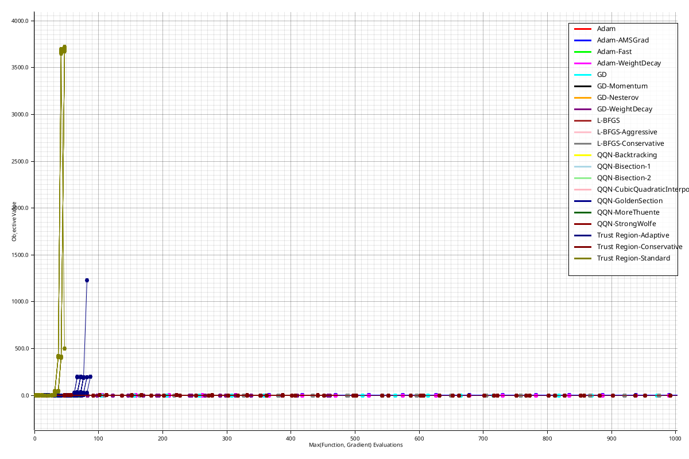
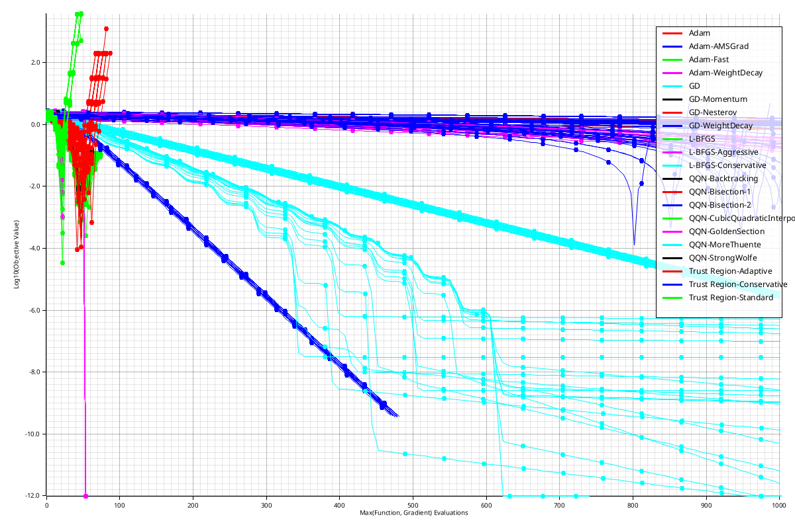

**Figure:** Convergence plots for Sphere_2D showing objective value vs iterations.
Left: Linear scale, Right: Log scale for better visualization of convergence behavior.

**Data:** [Linear scale data (CSV)](convergence_Sphere_2D_data.csv) | [Log scale data (CSV)](convergence_Sphere_2D_log_data.csv)

## Problem: Sphere_10D

**Family:** Convex Unimodal  
**Dimension:** 10  
**Success Threshold:** 1.000e-6  
**Total Runs:** 560

### Performance Summary
<table style="border-collapse: collapse; width: 100%; margin: 20px 0;">
<tr style="background-color: #f2f2f2;">
<th style="border: 1px solid #ddd; padding: 8px; text-align: center;">Rank</th>
<th style="border: 1px solid #ddd; padding: 8px; text-align: center;">Optimizer</th>
<th style="border: 1px solid #ddd; padding: 8px; text-align: center;">Mean Final Value (All/Success/Fail)</th>
<th style="border: 1px solid #ddd; padding: 8px; text-align: center;">Std Dev</th>
<th style="border: 1px solid #ddd; padding: 8px; text-align: center;">Best Value</th>
<th style="border: 1px solid #ddd; padding: 8px; text-align: center;">Worst Value</th>
<th style="border: 1px solid #ddd; padding: 8px; text-align: center;">Mean Function Evals (All/Success/Fail)</th>
<th style="border: 1px solid #ddd; padding: 8px; text-align: center;">Mean Gradient Evals (All/Success/Fail)</th>
<th style="border: 1px solid #ddd; padding: 8px; text-align: center;">Success Rate</th>
<th style="border: 1px solid #ddd; padding: 8px; text-align: center;">Mean Time (s)</th>
</tr>
<tr style="background-color: #d4edda; font-weight: bold;">
<td style="border: 1px solid #ddd; padding: 8px; text-align: center;">1</td>
<td style="border: 1px solid #ddd; padding: 8px; text-align: center;"><a href="detailed_Sphere_10D_QQN-Bisection-1.md">QQN-Bisection-1</a></td>
<td style="border: 1px solid #ddd; padding: 8px; text-align: center;">0.00e0 / 0.00e0 / -</td>
<td style="border: 1px solid #ddd; padding: 8px; text-align: center;">0.00e0</td>
<td style="border: 1px solid #ddd; padding: 8px; text-align: center;">0.00e0</td>
<td style="border: 1px solid #ddd; padding: 8px; text-align: center;">0.00e0</td>
<td style="border: 1px solid #ddd; padding: 8px; text-align: center;">16.0 / 16.0 / -</td>
<td style="border: 1px solid #ddd; padding: 8px; text-align: center;">13.0 / 13.0 / -</td>
<td style="border: 1px solid #ddd; padding: 8px; text-align: center;">100.0%</td>
<td style="border: 1px solid #ddd; padding: 8px; text-align: center;">0.000</td>
</tr>
<tr style="background-color: #fff3cd;">
<td style="border: 1px solid #ddd; padding: 8px; text-align: center;">2</td>
<td style="border: 1px solid #ddd; padding: 8px; text-align: center;"><a href="detailed_Sphere_10D_L-BFGS-Aggressive.md">L-BFGS-Aggressive</a></td>
<td style="border: 1px solid #ddd; padding: 8px; text-align: center;">0.00e0 / 0.00e0 / -</td>
<td style="border: 1px solid #ddd; padding: 8px; text-align: center;">0.00e0</td>
<td style="border: 1px solid #ddd; padding: 8px; text-align: center;">0.00e0</td>
<td style="border: 1px solid #ddd; padding: 8px; text-align: center;">0.00e0</td>
<td style="border: 1px solid #ddd; padding: 8px; text-align: center;">13.5 / 13.5 / -</td>
<td style="border: 1px solid #ddd; padding: 8px; text-align: center;">8.5 / 8.5 / -</td>
<td style="border: 1px solid #ddd; padding: 8px; text-align: center;">100.0%</td>
<td style="border: 1px solid #ddd; padding: 8px; text-align: center;">0.000</td>
</tr>
<tr style="">
<td style="border: 1px solid #ddd; padding: 8px; text-align: center;">3</td>
<td style="border: 1px solid #ddd; padding: 8px; text-align: center;"><a href="detailed_Sphere_10D_QQN-Backtracking.md">QQN-Backtracking</a></td>
<td style="border: 1px solid #ddd; padding: 8px; text-align: center;">0.00e0 / 0.00e0 / -</td>
<td style="border: 1px solid #ddd; padding: 8px; text-align: center;">0.00e0</td>
<td style="border: 1px solid #ddd; padding: 8px; text-align: center;">0.00e0</td>
<td style="border: 1px solid #ddd; padding: 8px; text-align: center;">0.00e0</td>
<td style="border: 1px solid #ddd; padding: 8px; text-align: center;">12.0 / 12.0 / -</td>
<td style="border: 1px solid #ddd; padding: 8px; text-align: center;">9.0 / 9.0 / -</td>
<td style="border: 1px solid #ddd; padding: 8px; text-align: center;">100.0%</td>
<td style="border: 1px solid #ddd; padding: 8px; text-align: center;">0.000</td>
</tr>
<tr style="">
<td style="border: 1px solid #ddd; padding: 8px; text-align: center;">4</td>
<td style="border: 1px solid #ddd; padding: 8px; text-align: center;"><a href="detailed_Sphere_10D_QQN-Bisection-2.md">QQN-Bisection-2</a></td>
<td style="border: 1px solid #ddd; padding: 8px; text-align: center;">0.00e0 / 0.00e0 / -</td>
<td style="border: 1px solid #ddd; padding: 8px; text-align: center;">0.00e0</td>
<td style="border: 1px solid #ddd; padding: 8px; text-align: center;">0.00e0</td>
<td style="border: 1px solid #ddd; padding: 8px; text-align: center;">0.00e0</td>
<td style="border: 1px solid #ddd; padding: 8px; text-align: center;">14.0 / 14.0 / -</td>
<td style="border: 1px solid #ddd; padding: 8px; text-align: center;">16.0 / 16.0 / -</td>
<td style="border: 1px solid #ddd; padding: 8px; text-align: center;">100.0%</td>
<td style="border: 1px solid #ddd; padding: 8px; text-align: center;">0.000</td>
</tr>
<tr style="">
<td style="border: 1px solid #ddd; padding: 8px; text-align: center;">5</td>
<td style="border: 1px solid #ddd; padding: 8px; text-align: center;"><a href="detailed_Sphere_10D_QQN-StrongWolfe.md">QQN-StrongWolfe</a></td>
<td style="border: 1px solid #ddd; padding: 8px; text-align: center;">0.00e0 / 0.00e0 / -</td>
<td style="border: 1px solid #ddd; padding: 8px; text-align: center;">0.00e0</td>
<td style="border: 1px solid #ddd; padding: 8px; text-align: center;">0.00e0</td>
<td style="border: 1px solid #ddd; padding: 8px; text-align: center;">0.00e0</td>
<td style="border: 1px solid #ddd; padding: 8px; text-align: center;">12.0 / 12.0 / -</td>
<td style="border: 1px solid #ddd; padding: 8px; text-align: center;">10.0 / 10.0 / -</td>
<td style="border: 1px solid #ddd; padding: 8px; text-align: center;">100.0%</td>
<td style="border: 1px solid #ddd; padding: 8px; text-align: center;">0.000</td>
</tr>
<tr style="">
<td style="border: 1px solid #ddd; padding: 8px; text-align: center;">6</td>
<td style="border: 1px solid #ddd; padding: 8px; text-align: center;"><a href="detailed_Sphere_10D_L-BFGS.md">L-BFGS</a></td>
<td style="border: 1px solid #ddd; padding: 8px; text-align: center;">0.00e0 / 0.00e0 / -</td>
<td style="border: 1px solid #ddd; padding: 8px; text-align: center;">0.00e0</td>
<td style="border: 1px solid #ddd; padding: 8px; text-align: center;">0.00e0</td>
<td style="border: 1px solid #ddd; padding: 8px; text-align: center;">0.00e0</td>
<td style="border: 1px solid #ddd; padding: 8px; text-align: center;">15.0 / 15.0 / -</td>
<td style="border: 1px solid #ddd; padding: 8px; text-align: center;">12.0 / 12.0 / -</td>
<td style="border: 1px solid #ddd; padding: 8px; text-align: center;">100.0%</td>
<td style="border: 1px solid #ddd; padding: 8px; text-align: center;">0.000</td>
</tr>
<tr style="">
<td style="border: 1px solid #ddd; padding: 8px; text-align: center;">7</td>
<td style="border: 1px solid #ddd; padding: 8px; text-align: center;"><a href="detailed_Sphere_10D_QQN-MoreThuente.md">QQN-MoreThuente</a></td>
<td style="border: 1px solid #ddd; padding: 8px; text-align: center;">0.00e0 / 0.00e0 / -</td>
<td style="border: 1px solid #ddd; padding: 8px; text-align: center;">0.00e0</td>
<td style="border: 1px solid #ddd; padding: 8px; text-align: center;">0.00e0</td>
<td style="border: 1px solid #ddd; padding: 8px; text-align: center;">0.00e0</td>
<td style="border: 1px solid #ddd; padding: 8px; text-align: center;">13.0 / 13.0 / -</td>
<td style="border: 1px solid #ddd; padding: 8px; text-align: center;">11.0 / 11.0 / -</td>
<td style="border: 1px solid #ddd; padding: 8px; text-align: center;">100.0%</td>
<td style="border: 1px solid #ddd; padding: 8px; text-align: center;">0.000</td>
</tr>
<tr style="">
<td style="border: 1px solid #ddd; padding: 8px; text-align: center;">8</td>
<td style="border: 1px solid #ddd; padding: 8px; text-align: center;"><a href="detailed_Sphere_10D_QQN-CubicQuadraticInterpolation.md">QQN-CubicQuadraticInterpolation</a></td>
<td style="border: 1px solid #ddd; padding: 8px; text-align: center;">0.00e0 / 0.00e0 / -</td>
<td style="border: 1px solid #ddd; padding: 8px; text-align: center;">0.00e0</td>
<td style="border: 1px solid #ddd; padding: 8px; text-align: center;">0.00e0</td>
<td style="border: 1px solid #ddd; padding: 8px; text-align: center;">0.00e0</td>
<td style="border: 1px solid #ddd; padding: 8px; text-align: center;">13.0 / 13.0 / -</td>
<td style="border: 1px solid #ddd; padding: 8px; text-align: center;">11.0 / 11.0 / -</td>
<td style="border: 1px solid #ddd; padding: 8px; text-align: center;">100.0%</td>
<td style="border: 1px solid #ddd; padding: 8px; text-align: center;">0.000</td>
</tr>
<tr style="">
<td style="border: 1px solid #ddd; padding: 8px; text-align: center;">9</td>
<td style="border: 1px solid #ddd; padding: 8px; text-align: center;"><a href="detailed_Sphere_10D_QQN-GoldenSection.md">QQN-GoldenSection</a></td>
<td style="border: 1px solid #ddd; padding: 8px; text-align: center;">1.65e-13 / 1.65e-13 / -</td>
<td style="border: 1px solid #ddd; padding: 8px; text-align: center;">9.45e-15</td>
<td style="border: 1px solid #ddd; padding: 8px; text-align: center;">1.45e-13</td>
<td style="border: 1px solid #ddd; padding: 8px; text-align: center;">1.84e-13</td>
<td style="border: 1px solid #ddd; padding: 8px; text-align: center;">47.0 / 47.0 / -</td>
<td style="border: 1px solid #ddd; padding: 8px; text-align: center;">9.0 / 9.0 / -</td>
<td style="border: 1px solid #ddd; padding: 8px; text-align: center;">100.0%</td>
<td style="border: 1px solid #ddd; padding: 8px; text-align: center;">0.000</td>
</tr>
<tr style="">
<td style="border: 1px solid #ddd; padding: 8px; text-align: center;">10</td>
<td style="border: 1px solid #ddd; padding: 8px; text-align: center;"><a href="detailed_Sphere_10D_L-BFGS-Conservative.md">L-BFGS-Conservative</a></td>
<td style="border: 1px solid #ddd; padding: 8px; text-align: center;">2.50e-7 / - / 2.50e-7</td>
<td style="border: 1px solid #ddd; padding: 8px; text-align: center;">2.85e-7</td>
<td style="border: 1px solid #ddd; padding: 8px; text-align: center;">1.07e-12</td>
<td style="border: 1px solid #ddd; padding: 8px; text-align: center;">8.35e-7</td>
<td style="border: 1px solid #ddd; padding: 8px; text-align: center;">557.0 / - / 557.0</td>
<td style="border: 1px solid #ddd; padding: 8px; text-align: center;">446.0 / - / 446.0</td>
<td style="border: 1px solid #ddd; padding: 8px; text-align: center;">0.0%</td>
<td style="border: 1px solid #ddd; padding: 8px; text-align: center;">0.015</td>
</tr>
<tr style="">
<td style="border: 1px solid #ddd; padding: 8px; text-align: center;">11</td>
<td style="border: 1px solid #ddd; padding: 8px; text-align: center;"><a href="detailed_Sphere_10D_GD-WeightDecay.md">GD-WeightDecay</a></td>
<td style="border: 1px solid #ddd; padding: 8px; text-align: center;">3.68e-10 / 3.68e-10 / -</td>
<td style="border: 1px solid #ddd; padding: 8px; text-align: center;">1.48e-11</td>
<td style="border: 1px solid #ddd; padding: 8px; text-align: center;">3.47e-10</td>
<td style="border: 1px solid #ddd; padding: 8px; text-align: center;">3.97e-10</td>
<td style="border: 1px solid #ddd; padding: 8px; text-align: center;">170.7 / 170.7 / -</td>
<td style="border: 1px solid #ddd; padding: 8px; text-align: center;">339.3 / 339.3 / -</td>
<td style="border: 1px solid #ddd; padding: 8px; text-align: center;">100.0%</td>
<td style="border: 1px solid #ddd; padding: 8px; text-align: center;">0.006</td>
</tr>
<tr style="">
<td style="border: 1px solid #ddd; padding: 8px; text-align: center;">12</td>
<td style="border: 1px solid #ddd; padding: 8px; text-align: center;"><a href="detailed_Sphere_10D_GD-Nesterov.md">GD-Nesterov</a></td>
<td style="border: 1px solid #ddd; padding: 8px; text-align: center;">4.22e-3 / - / 4.23e-1</td>
<td style="border: 1px solid #ddd; padding: 8px; text-align: center;">1.90e-3</td>
<td style="border: 1px solid #ddd; padding: 8px; text-align: center;">7.10e-6</td>
<td style="border: 1px solid #ddd; padding: 8px; text-align: center;">7.47e-3</td>
<td style="border: 1px solid #ddd; padding: 8px; text-align: center;">23.4 / - / 23.4</td>
<td style="border: 1px solid #ddd; padding: 8px; text-align: center;">42.9 / - / 42.9</td>
<td style="border: 1px solid #ddd; padding: 8px; text-align: center;">0.0%</td>
<td style="border: 1px solid #ddd; padding: 8px; text-align: center;">0.001</td>
</tr>
<tr style="">
<td style="border: 1px solid #ddd; padding: 8px; text-align: center;">13</td>
<td style="border: 1px solid #ddd; padding: 8px; text-align: center;"><a href="detailed_Sphere_10D_GD-Momentum.md">GD-Momentum</a></td>
<td style="border: 1px solid #ddd; padding: 8px; text-align: center;">4.52e-3 / - / 6.85e-1</td>
<td style="border: 1px solid #ddd; padding: 8px; text-align: center;">3.55e-3</td>
<td style="border: 1px solid #ddd; padding: 8px; text-align: center;">7.44e-6</td>
<td style="border: 1px solid #ddd; padding: 8px; text-align: center;">1.03e-2</td>
<td style="border: 1px solid #ddd; padding: 8px; text-align: center;">23.9 / - / 23.9</td>
<td style="border: 1px solid #ddd; padding: 8px; text-align: center;">43.7 / - / 43.7</td>
<td style="border: 1px solid #ddd; padding: 8px; text-align: center;">0.0%</td>
<td style="border: 1px solid #ddd; padding: 8px; text-align: center;">0.001</td>
</tr>
<tr style="">
<td style="border: 1px solid #ddd; padding: 8px; text-align: center;">14</td>
<td style="border: 1px solid #ddd; padding: 8px; text-align: center;"><a href="detailed_Sphere_10D_GD.md">GD</a></td>
<td style="border: 1px solid #ddd; padding: 8px; text-align: center;">1.51e-5 / - / 1.51e-5</td>
<td style="border: 1px solid #ddd; padding: 8px; text-align: center;">1.18e-6</td>
<td style="border: 1px solid #ddd; padding: 8px; text-align: center;">1.19e-5</td>
<td style="border: 1px solid #ddd; padding: 8px; text-align: center;">1.79e-5</td>
<td style="border: 1px solid #ddd; padding: 8px; text-align: center;">335.0 / - / 335.0</td>
<td style="border: 1px solid #ddd; padding: 8px; text-align: center;">668.0 / - / 668.0</td>
<td style="border: 1px solid #ddd; padding: 8px; text-align: center;">0.0%</td>
<td style="border: 1px solid #ddd; padding: 8px; text-align: center;">0.009</td>
</tr>
<tr style="">
<td style="border: 1px solid #ddd; padding: 8px; text-align: center;">15</td>
<td style="border: 1px solid #ddd; padding: 8px; text-align: center;"><a href="detailed_Sphere_10D_Trust_Region-Standard.md">Trust Region-Standard</a></td>
<td style="border: 1px solid #ddd; padding: 8px; text-align: center;">7.46e-2 / - / 7.40e2</td>
<td style="border: 1px solid #ddd; padding: 8px; text-align: center;">6.41e-2</td>
<td style="border: 1px solid #ddd; padding: 8px; text-align: center;">4.13e-4</td>
<td style="border: 1px solid #ddd; padding: 8px; text-align: center;">2.10e-1</td>
<td style="border: 1px solid #ddd; padding: 8px; text-align: center;">54.8 / - / 54.8</td>
<td style="border: 1px solid #ddd; padding: 8px; text-align: center;">36.5 / - / 36.5</td>
<td style="border: 1px solid #ddd; padding: 8px; text-align: center;">0.0%</td>
<td style="border: 1px solid #ddd; padding: 8px; text-align: center;">0.000</td>
</tr>
<tr style="">
<td style="border: 1px solid #ddd; padding: 8px; text-align: center;">16</td>
<td style="border: 1px solid #ddd; padding: 8px; text-align: center;"><a href="detailed_Sphere_10D_Trust_Region-Adaptive.md">Trust Region-Adaptive</a></td>
<td style="border: 1px solid #ddd; padding: 8px; text-align: center;">3.00e-2 / - / 9.74e2</td>
<td style="border: 1px solid #ddd; padding: 8px; text-align: center;">1.84e-2</td>
<td style="border: 1px solid #ddd; padding: 8px; text-align: center;">2.00e-3</td>
<td style="border: 1px solid #ddd; padding: 8px; text-align: center;">5.80e-2</td>
<td style="border: 1px solid #ddd; padding: 8px; text-align: center;">149.4 / - / 149.4</td>
<td style="border: 1px solid #ddd; padding: 8px; text-align: center;">99.6 / - / 99.6</td>
<td style="border: 1px solid #ddd; padding: 8px; text-align: center;">0.0%</td>
<td style="border: 1px solid #ddd; padding: 8px; text-align: center;">0.001</td>
</tr>
<tr style="">
<td style="border: 1px solid #ddd; padding: 8px; text-align: center;">17</td>
<td style="border: 1px solid #ddd; padding: 8px; text-align: center;"><a href="detailed_Sphere_10D_Adam-Fast.md">Adam-Fast</a></td>
<td style="border: 1px solid #ddd; padding: 8px; text-align: center;">7.77e-2 / - / 6.15e-1</td>
<td style="border: 1px solid #ddd; padding: 8px; text-align: center;">2.52e-2</td>
<td style="border: 1px solid #ddd; padding: 8px; text-align: center;">3.23e-2</td>
<td style="border: 1px solid #ddd; padding: 8px; text-align: center;">1.22e-1</td>
<td style="border: 1px solid #ddd; padding: 8px; text-align: center;">37.8 / - / 37.8</td>
<td style="border: 1px solid #ddd; padding: 8px; text-align: center;">36.8 / - / 36.8</td>
<td style="border: 1px solid #ddd; padding: 8px; text-align: center;">0.0%</td>
<td style="border: 1px solid #ddd; padding: 8px; text-align: center;">0.001</td>
</tr>
<tr style="">
<td style="border: 1px solid #ddd; padding: 8px; text-align: center;">18</td>
<td style="border: 1px solid #ddd; padding: 8px; text-align: center;"><a href="detailed_Sphere_10D_Adam-WeightDecay.md">Adam-WeightDecay</a></td>
<td style="border: 1px solid #ddd; padding: 8px; text-align: center;">7.68e-1 / - / 7.68e-1</td>
<td style="border: 1px solid #ddd; padding: 8px; text-align: center;">1.90e-1</td>
<td style="border: 1px solid #ddd; padding: 8px; text-align: center;">3.57e-1</td>
<td style="border: 1px solid #ddd; padding: 8px; text-align: center;">1.17e0</td>
<td style="border: 1px solid #ddd; padding: 8px; text-align: center;">502.0 / - / 502.0</td>
<td style="border: 1px solid #ddd; padding: 8px; text-align: center;">502.0 / - / 502.0</td>
<td style="border: 1px solid #ddd; padding: 8px; text-align: center;">0.0%</td>
<td style="border: 1px solid #ddd; padding: 8px; text-align: center;">0.012</td>
</tr>
<tr style="">
<td style="border: 1px solid #ddd; padding: 8px; text-align: center;">19</td>
<td style="border: 1px solid #ddd; padding: 8px; text-align: center;"><a href="detailed_Sphere_10D_Adam-AMSGrad.md">Adam-AMSGrad</a></td>
<td style="border: 1px solid #ddd; padding: 8px; text-align: center;">5.94e0 / - / 5.94e0</td>
<td style="border: 1px solid #ddd; padding: 8px; text-align: center;">5.71e-1</td>
<td style="border: 1px solid #ddd; padding: 8px; text-align: center;">4.84e0</td>
<td style="border: 1px solid #ddd; padding: 8px; text-align: center;">7.33e0</td>
<td style="border: 1px solid #ddd; padding: 8px; text-align: center;">502.0 / - / 502.0</td>
<td style="border: 1px solid #ddd; padding: 8px; text-align: center;">502.0 / - / 502.0</td>
<td style="border: 1px solid #ddd; padding: 8px; text-align: center;">0.0%</td>
<td style="border: 1px solid #ddd; padding: 8px; text-align: center;">0.012</td>
</tr>
<tr style="">
<td style="border: 1px solid #ddd; padding: 8px; text-align: center;">20</td>
<td style="border: 1px solid #ddd; padding: 8px; text-align: center;"><a href="detailed_Sphere_10D_Adam.md">Adam</a></td>
<td style="border: 1px solid #ddd; padding: 8px; text-align: center;">5.71e0 / - / 5.71e0</td>
<td style="border: 1px solid #ddd; padding: 8px; text-align: center;">5.58e-1</td>
<td style="border: 1px solid #ddd; padding: 8px; text-align: center;">4.90e0</td>
<td style="border: 1px solid #ddd; padding: 8px; text-align: center;">6.84e0</td>
<td style="border: 1px solid #ddd; padding: 8px; text-align: center;">502.0 / - / 502.0</td>
<td style="border: 1px solid #ddd; padding: 8px; text-align: center;">502.0 / - / 502.0</td>
<td style="border: 1px solid #ddd; padding: 8px; text-align: center;">0.0%</td>
<td style="border: 1px solid #ddd; padding: 8px; text-align: center;">0.011</td>
</tr>
<tr style="">
<td style="border: 1px solid #ddd; padding: 8px; text-align: center;">21</td>
<td style="border: 1px solid #ddd; padding: 8px; text-align: center;"><a href="detailed_Sphere_10D_Trust_Region-Conservative.md">Trust Region-Conservative</a></td>
<td style="border: 1px solid #ddd; padding: 8px; text-align: center;">8.28e0 / - / 8.28e0</td>
<td style="border: 1px solid #ddd; padding: 8px; text-align: center;">7.03e-1</td>
<td style="border: 1px solid #ddd; padding: 8px; text-align: center;">7.19e0</td>
<td style="border: 1px solid #ddd; padding: 8px; text-align: center;">1.01e1</td>
<td style="border: 1px solid #ddd; padding: 8px; text-align: center;">602.0 / - / 602.0</td>
<td style="border: 1px solid #ddd; padding: 8px; text-align: center;">402.0 / - / 402.0</td>
<td style="border: 1px solid #ddd; padding: 8px; text-align: center;">0.0%</td>
<td style="border: 1px solid #ddd; padding: 8px; text-align: center;">0.004</td>
</tr>
</table>

### Convergence Plots

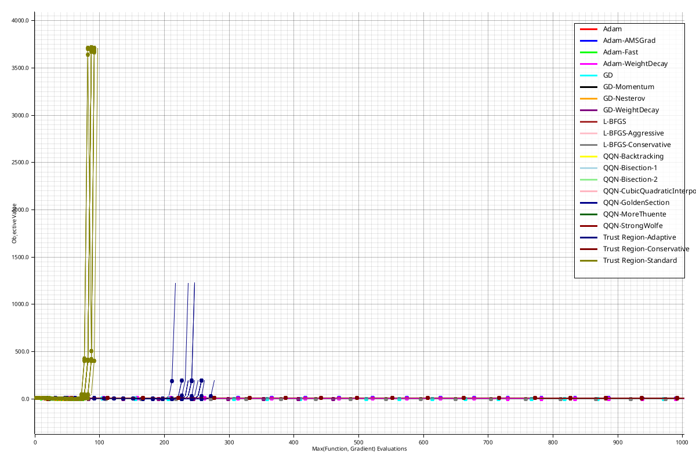
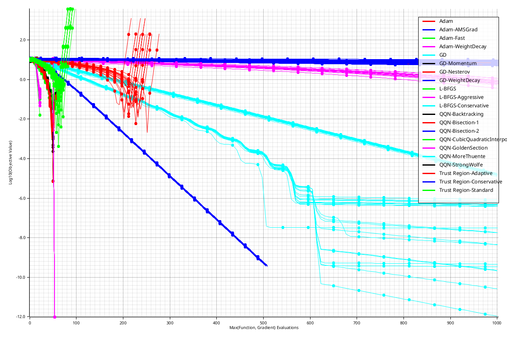

**Figure:** Convergence plots for Sphere_10D showing objective value vs iterations.
Left: Linear scale, Right: Log scale for better visualization of convergence behavior.

**Data:** [Linear scale data (CSV)](convergence_Sphere_10D_data.csv) | [Log scale data (CSV)](convergence_Sphere_10D_log_data.csv)

## Problem: Rosenbrock_2D

**Family:** Non-Convex Unimodal  
**Dimension:** 2  
**Success Threshold:** 7.550e-2  
**Total Runs:** 560

### Performance Summary
<table style="border-collapse: collapse; width: 100%; margin: 20px 0;">
<tr style="background-color: #f2f2f2;">
<th style="border: 1px solid #ddd; padding: 8px; text-align: center;">Rank</th>
<th style="border: 1px solid #ddd; padding: 8px; text-align: center;">Optimizer</th>
<th style="border: 1px solid #ddd; padding: 8px; text-align: center;">Mean Final Value (All/Success/Fail)</th>
<th style="border: 1px solid #ddd; padding: 8px; text-align: center;">Std Dev</th>
<th style="border: 1px solid #ddd; padding: 8px; text-align: center;">Best Value</th>
<th style="border: 1px solid #ddd; padding: 8px; text-align: center;">Worst Value</th>
<th style="border: 1px solid #ddd; padding: 8px; text-align: center;">Mean Function Evals (All/Success/Fail)</th>
<th style="border: 1px solid #ddd; padding: 8px; text-align: center;">Mean Gradient Evals (All/Success/Fail)</th>
<th style="border: 1px solid #ddd; padding: 8px; text-align: center;">Success Rate</th>
<th style="border: 1px solid #ddd; padding: 8px; text-align: center;">Mean Time (s)</th>
</tr>
<tr style="background-color: #d4edda; font-weight: bold;">
<td style="border: 1px solid #ddd; padding: 8px; text-align: center;">1</td>
<td style="border: 1px solid #ddd; padding: 8px; text-align: center;"><a href="detailed_Rosenbrock_2D_QQN-StrongWolfe.md">QQN-StrongWolfe</a></td>
<td style="border: 1px solid #ddd; padding: 8px; text-align: center;">5.94e-1 / 8.96e-18 / 7.92e-1</td>
<td style="border: 1px solid #ddd; padding: 8px; text-align: center;">1.06e0</td>
<td style="border: 1px solid #ddd; padding: 8px; text-align: center;">4.28e-23</td>
<td style="border: 1px solid #ddd; padding: 8px; text-align: center;">3.54e0</td>
<td style="border: 1px solid #ddd; padding: 8px; text-align: center;">519.4 / 341.4 / 578.7</td>
<td style="border: 1px solid #ddd; padding: 8px; text-align: center;">413.0 / 298.6 / 451.1</td>
<td style="border: 1px solid #ddd; padding: 8px; text-align: center;">25.0%</td>
<td style="border: 1px solid #ddd; padding: 8px; text-align: center;">0.013</td>
</tr>
<tr style="background-color: #fff3cd;">
<td style="border: 1px solid #ddd; padding: 8px; text-align: center;">2</td>
<td style="border: 1px solid #ddd; padding: 8px; text-align: center;"><a href="detailed_Rosenbrock_2D_QQN-GoldenSection.md">QQN-GoldenSection</a></td>
<td style="border: 1px solid #ddd; padding: 8px; text-align: center;">1.04e0 / 1.10e-15 / 1.10e0</td>
<td style="border: 1px solid #ddd; padding: 8px; text-align: center;">1.10e0</td>
<td style="border: 1px solid #ddd; padding: 8px; text-align: center;">4.77e-21</td>
<td style="border: 1px solid #ddd; padding: 8px; text-align: center;">3.73e0</td>
<td style="border: 1px solid #ddd; padding: 8px; text-align: center;">885.6 / 591.0 / 901.2</td>
<td style="border: 1px solid #ddd; padding: 8px; text-align: center;">115.3 / 79.0 / 117.2</td>
<td style="border: 1px solid #ddd; padding: 8px; text-align: center;">5.0%</td>
<td style="border: 1px solid #ddd; padding: 8px; text-align: center;">0.014</td>
</tr>
<tr style="">
<td style="border: 1px solid #ddd; padding: 8px; text-align: center;">3</td>
<td style="border: 1px solid #ddd; padding: 8px; text-align: center;"><a href="detailed_Rosenbrock_2D_QQN-Bisection-2.md">QQN-Bisection-2</a></td>
<td style="border: 1px solid #ddd; padding: 8px; text-align: center;">8.70e-2 / 2.46e-16 / 1.02e-1</td>
<td style="border: 1px solid #ddd; padding: 8px; text-align: center;">1.62e-1</td>
<td style="border: 1px solid #ddd; padding: 8px; text-align: center;">5.28e-18</td>
<td style="border: 1px solid #ddd; padding: 8px; text-align: center;">7.66e-1</td>
<td style="border: 1px solid #ddd; padding: 8px; text-align: center;">183.9 / 231.3 / 175.6</td>
<td style="border: 1px solid #ddd; padding: 8px; text-align: center;">163.3 / 222.0 / 152.9</td>
<td style="border: 1px solid #ddd; padding: 8px; text-align: center;">15.0%</td>
<td style="border: 1px solid #ddd; padding: 8px; text-align: center;">0.004</td>
</tr>
<tr style="">
<td style="border: 1px solid #ddd; padding: 8px; text-align: center;">4</td>
<td style="border: 1px solid #ddd; padding: 8px; text-align: center;"><a href="detailed_Rosenbrock_2D_QQN-Bisection-1.md">QQN-Bisection-1</a></td>
<td style="border: 1px solid #ddd; padding: 8px; text-align: center;">1.97e0 / 5.97e-16 / 2.08e0</td>
<td style="border: 1px solid #ddd; padding: 8px; text-align: center;">1.58e0</td>
<td style="border: 1px solid #ddd; padding: 8px; text-align: center;">8.11e-18</td>
<td style="border: 1px solid #ddd; padding: 8px; text-align: center;">3.72e0</td>
<td style="border: 1px solid #ddd; padding: 8px; text-align: center;">487.8 / 307.5 / 497.3</td>
<td style="border: 1px solid #ddd; padding: 8px; text-align: center;">533.0 / 332.0 / 543.6</td>
<td style="border: 1px solid #ddd; padding: 8px; text-align: center;">5.0%</td>
<td style="border: 1px solid #ddd; padding: 8px; text-align: center;">0.010</td>
</tr>
<tr style="">
<td style="border: 1px solid #ddd; padding: 8px; text-align: center;">5</td>
<td style="border: 1px solid #ddd; padding: 8px; text-align: center;"><a href="detailed_Rosenbrock_2D_QQN-Backtracking.md">QQN-Backtracking</a></td>
<td style="border: 1px solid #ddd; padding: 8px; text-align: center;">1.40e-1 / - / 1.40e-1</td>
<td style="border: 1px solid #ddd; padding: 8px; text-align: center;">2.41e-1</td>
<td style="border: 1px solid #ddd; padding: 8px; text-align: center;">1.98e-6</td>
<td style="border: 1px solid #ddd; padding: 8px; text-align: center;">1.12e0</td>
<td style="border: 1px solid #ddd; padding: 8px; text-align: center;">717.0 / - / 717.0</td>
<td style="border: 1px solid #ddd; padding: 8px; text-align: center;">292.6 / - / 292.6</td>
<td style="border: 1px solid #ddd; padding: 8px; text-align: center;">0.0%</td>
<td style="border: 1px solid #ddd; padding: 8px; text-align: center;">0.018</td>
</tr>
<tr style="">
<td style="border: 1px solid #ddd; padding: 8px; text-align: center;">6</td>
<td style="border: 1px solid #ddd; padding: 8px; text-align: center;"><a href="detailed_Rosenbrock_2D_Adam-Fast.md">Adam-Fast</a></td>
<td style="border: 1px solid #ddd; padding: 8px; text-align: center;">1.87e0 / 2.61e-3 / 3.05e0</td>
<td style="border: 1px solid #ddd; padding: 8px; text-align: center;">2.18e0</td>
<td style="border: 1px solid #ddd; padding: 8px; text-align: center;">2.28e-5</td>
<td style="border: 1px solid #ddd; padding: 8px; text-align: center;">4.98e0</td>
<td style="border: 1px solid #ddd; padding: 8px; text-align: center;">267.3 / 375.8 / 231.1</td>
<td style="border: 1px solid #ddd; padding: 8px; text-align: center;">266.6 / 374.8 / 230.5</td>
<td style="border: 1px solid #ddd; padding: 8px; text-align: center;">25.0%</td>
<td style="border: 1px solid #ddd; padding: 8px; text-align: center;">0.005</td>
</tr>
<tr style="">
<td style="border: 1px solid #ddd; padding: 8px; text-align: center;">7</td>
<td style="border: 1px solid #ddd; padding: 8px; text-align: center;"><a href="detailed_Rosenbrock_2D_QQN-CubicQuadraticInterpolation.md">QQN-CubicQuadraticInterpolation</a></td>
<td style="border: 1px solid #ddd; padding: 8px; text-align: center;">1.55e0 / - / 1.55e0</td>
<td style="border: 1px solid #ddd; padding: 8px; text-align: center;">1.59e0</td>
<td style="border: 1px solid #ddd; padding: 8px; text-align: center;">3.84e-4</td>
<td style="border: 1px solid #ddd; padding: 8px; text-align: center;">5.03e0</td>
<td style="border: 1px solid #ddd; padding: 8px; text-align: center;">397.8 / - / 397.8</td>
<td style="border: 1px solid #ddd; padding: 8px; text-align: center;">654.2 / - / 654.2</td>
<td style="border: 1px solid #ddd; padding: 8px; text-align: center;">0.0%</td>
<td style="border: 1px solid #ddd; padding: 8px; text-align: center;">0.014</td>
</tr>
<tr style="">
<td style="border: 1px solid #ddd; padding: 8px; text-align: center;">8</td>
<td style="border: 1px solid #ddd; padding: 8px; text-align: center;"><a href="detailed_Rosenbrock_2D_L-BFGS-Conservative.md">L-BFGS-Conservative</a></td>
<td style="border: 1px solid #ddd; padding: 8px; text-align: center;">1.67e0 / - / 1.67e0</td>
<td style="border: 1px solid #ddd; padding: 8px; text-align: center;">1.80e0</td>
<td style="border: 1px solid #ddd; padding: 8px; text-align: center;">4.65e-4</td>
<td style="border: 1px solid #ddd; padding: 8px; text-align: center;">3.89e0</td>
<td style="border: 1px solid #ddd; padding: 8px; text-align: center;">688.7 / - / 688.7</td>
<td style="border: 1px solid #ddd; padding: 8px; text-align: center;">319.6 / - / 319.6</td>
<td style="border: 1px solid #ddd; padding: 8px; text-align: center;">0.0%</td>
<td style="border: 1px solid #ddd; padding: 8px; text-align: center;">0.010</td>
</tr>
<tr style="">
<td style="border: 1px solid #ddd; padding: 8px; text-align: center;">9</td>
<td style="border: 1px solid #ddd; padding: 8px; text-align: center;"><a href="detailed_Rosenbrock_2D_GD-Momentum.md">GD-Momentum</a></td>
<td style="border: 1px solid #ddd; padding: 8px; text-align: center;">2.65e0 / 3.46e0 / 6.11e0</td>
<td style="border: 1px solid #ddd; padding: 8px; text-align: center;">2.11e0</td>
<td style="border: 1px solid #ddd; padding: 8px; text-align: center;">1.03e-2</td>
<td style="border: 1px solid #ddd; padding: 8px; text-align: center;">6.33e0</td>
<td style="border: 1px solid #ddd; padding: 8px; text-align: center;">29.1 / 54.6 / 20.5</td>
<td style="border: 1px solid #ddd; padding: 8px; text-align: center;">54.1 / 105.2 / 37.1</td>
<td style="border: 1px solid #ddd; padding: 8px; text-align: center;">25.0%</td>
<td style="border: 1px solid #ddd; padding: 8px; text-align: center;">0.001</td>
</tr>
<tr style="">
<td style="border: 1px solid #ddd; padding: 8px; text-align: center;">10</td>
<td style="border: 1px solid #ddd; padding: 8px; text-align: center;"><a href="detailed_Rosenbrock_2D_GD-WeightDecay.md">GD-WeightDecay</a></td>
<td style="border: 1px solid #ddd; padding: 8px; text-align: center;">2.14e0 / 1.21e-1 / 5.03e0</td>
<td style="border: 1px solid #ddd; padding: 8px; text-align: center;">2.13e0</td>
<td style="border: 1px solid #ddd; padding: 8px; text-align: center;">2.08e-2</td>
<td style="border: 1px solid #ddd; padding: 8px; text-align: center;">4.74e0</td>
<td style="border: 1px solid #ddd; padding: 8px; text-align: center;">75.2 / 135.6 / 14.9</td>
<td style="border: 1px solid #ddd; padding: 8px; text-align: center;">146.5 / 267.2 / 25.8</td>
<td style="border: 1px solid #ddd; padding: 8px; text-align: center;">50.0%</td>
<td style="border: 1px solid #ddd; padding: 8px; text-align: center;">0.002</td>
</tr>
<tr style="">
<td style="border: 1px solid #ddd; padding: 8px; text-align: center;">11</td>
<td style="border: 1px solid #ddd; padding: 8px; text-align: center;"><a href="detailed_Rosenbrock_2D_GD-Nesterov.md">GD-Nesterov</a></td>
<td style="border: 1px solid #ddd; padding: 8px; text-align: center;">7.22e-1 / 8.58e-1 / 1.82e0</td>
<td style="border: 1px solid #ddd; padding: 8px; text-align: center;">1.53e0</td>
<td style="border: 1px solid #ddd; padding: 8px; text-align: center;">2.35e-2</td>
<td style="border: 1px solid #ddd; padding: 8px; text-align: center;">4.51e0</td>
<td style="border: 1px solid #ddd; padding: 8px; text-align: center;">48.0 / 57.7 / 40.0</td>
<td style="border: 1px solid #ddd; padding: 8px; text-align: center;">91.9 / 111.3 / 76.0</td>
<td style="border: 1px solid #ddd; padding: 8px; text-align: center;">45.0%</td>
<td style="border: 1px solid #ddd; padding: 8px; text-align: center;">0.001</td>
</tr>
<tr style="">
<td style="border: 1px solid #ddd; padding: 8px; text-align: center;">12</td>
<td style="border: 1px solid #ddd; padding: 8px; text-align: center;"><a href="detailed_Rosenbrock_2D_L-BFGS.md">L-BFGS</a></td>
<td style="border: 1px solid #ddd; padding: 8px; text-align: center;">3.75e0 / 1.50e2 / 1.27e2</td>
<td style="border: 1px solid #ddd; padding: 8px; text-align: center;">2.73e0</td>
<td style="border: 1px solid #ddd; padding: 8px; text-align: center;">6.45e-2</td>
<td style="border: 1px solid #ddd; padding: 8px; text-align: center;">9.88e0</td>
<td style="border: 1px solid #ddd; padding: 8px; text-align: center;">99.8 / 165.0 / 96.4</td>
<td style="border: 1px solid #ddd; padding: 8px; text-align: center;">33.9 / 71.0 / 31.9</td>
<td style="border: 1px solid #ddd; padding: 8px; text-align: center;">5.0%</td>
<td style="border: 1px solid #ddd; padding: 8px; text-align: center;">0.001</td>
</tr>
<tr style="">
<td style="border: 1px solid #ddd; padding: 8px; text-align: center;">13</td>
<td style="border: 1px solid #ddd; padding: 8px; text-align: center;"><a href="detailed_Rosenbrock_2D_QQN-MoreThuente.md">QQN-MoreThuente</a></td>
<td style="border: 1px solid #ddd; padding: 8px; text-align: center;">1.50e1 / - / 1.50e1</td>
<td style="border: 1px solid #ddd; padding: 8px; text-align: center;">1.81e1</td>
<td style="border: 1px solid #ddd; padding: 8px; text-align: center;">1.74e-1</td>
<td style="border: 1px solid #ddd; padding: 8px; text-align: center;">6.14e1</td>
<td style="border: 1px solid #ddd; padding: 8px; text-align: center;">484.8 / - / 484.8</td>
<td style="border: 1px solid #ddd; padding: 8px; text-align: center;">528.9 / - / 528.9</td>
<td style="border: 1px solid #ddd; padding: 8px; text-align: center;">0.0%</td>
<td style="border: 1px solid #ddd; padding: 8px; text-align: center;">0.008</td>
</tr>
<tr style="">
<td style="border: 1px solid #ddd; padding: 8px; text-align: center;">14</td>
<td style="border: 1px solid #ddd; padding: 8px; text-align: center;"><a href="detailed_Rosenbrock_2D_GD.md">GD</a></td>
<td style="border: 1px solid #ddd; padding: 8px; text-align: center;">1.10e0 / - / 1.37e0</td>
<td style="border: 1px solid #ddd; padding: 8px; text-align: center;">1.05e0</td>
<td style="border: 1px solid #ddd; padding: 8px; text-align: center;">7.48e-1</td>
<td style="border: 1px solid #ddd; padding: 8px; text-align: center;">4.35e0</td>
<td style="border: 1px solid #ddd; padding: 8px; text-align: center;">302.6 / - / 302.6</td>
<td style="border: 1px solid #ddd; padding: 8px; text-align: center;">602.9 / - / 602.9</td>
<td style="border: 1px solid #ddd; padding: 8px; text-align: center;">0.0%</td>
<td style="border: 1px solid #ddd; padding: 8px; text-align: center;">0.007</td>
</tr>
<tr style="">
<td style="border: 1px solid #ddd; padding: 8px; text-align: center;">15</td>
<td style="border: 1px solid #ddd; padding: 8px; text-align: center;"><a href="detailed_Rosenbrock_2D_Trust_Region-Conservative.md">Trust Region-Conservative</a></td>
<td style="border: 1px solid #ddd; padding: 8px; text-align: center;">2.64e1 / - / 2.64e1</td>
<td style="border: 1px solid #ddd; padding: 8px; text-align: center;">2.46e1</td>
<td style="border: 1px solid #ddd; padding: 8px; text-align: center;">2.33e0</td>
<td style="border: 1px solid #ddd; padding: 8px; text-align: center;">7.71e1</td>
<td style="border: 1px solid #ddd; padding: 8px; text-align: center;">602.0 / - / 602.0</td>
<td style="border: 1px solid #ddd; padding: 8px; text-align: center;">402.0 / - / 402.0</td>
<td style="border: 1px solid #ddd; padding: 8px; text-align: center;">0.0%</td>
<td style="border: 1px solid #ddd; padding: 8px; text-align: center;">0.004</td>
</tr>
<tr style="">
<td style="border: 1px solid #ddd; padding: 8px; text-align: center;">16</td>
<td style="border: 1px solid #ddd; padding: 8px; text-align: center;"><a href="detailed_Rosenbrock_2D_Adam-WeightDecay.md">Adam-WeightDecay</a></td>
<td style="border: 1px solid #ddd; padding: 8px; text-align: center;">4.20e0 / - / 4.24e0</td>
<td style="border: 1px solid #ddd; padding: 8px; text-align: center;">3.93e-1</td>
<td style="border: 1px solid #ddd; padding: 8px; text-align: center;">2.64e0</td>
<td style="border: 1px solid #ddd; padding: 8px; text-align: center;">4.58e0</td>
<td style="border: 1px solid #ddd; padding: 8px; text-align: center;">151.3 / - / 151.3</td>
<td style="border: 1px solid #ddd; padding: 8px; text-align: center;">150.4 / - / 150.4</td>
<td style="border: 1px solid #ddd; padding: 8px; text-align: center;">0.0%</td>
<td style="border: 1px solid #ddd; padding: 8px; text-align: center;">0.003</td>
</tr>
<tr style="">
<td style="border: 1px solid #ddd; padding: 8px; text-align: center;">17</td>
<td style="border: 1px solid #ddd; padding: 8px; text-align: center;"><a href="detailed_Rosenbrock_2D_Trust_Region-Standard.md">Trust Region-Standard</a></td>
<td style="border: 1px solid #ddd; padding: 8px; text-align: center;">4.17e0 / - / 4.17e0</td>
<td style="border: 1px solid #ddd; padding: 8px; text-align: center;">3.45e-1</td>
<td style="border: 1px solid #ddd; padding: 8px; text-align: center;">2.93e0</td>
<td style="border: 1px solid #ddd; padding: 8px; text-align: center;">4.56e0</td>
<td style="border: 1px solid #ddd; padding: 8px; text-align: center;">101.2 / - / 101.2</td>
<td style="border: 1px solid #ddd; padding: 8px; text-align: center;">68.1 / - / 68.1</td>
<td style="border: 1px solid #ddd; padding: 8px; text-align: center;">0.0%</td>
<td style="border: 1px solid #ddd; padding: 8px; text-align: center;">0.001</td>
</tr>
<tr style="">
<td style="border: 1px solid #ddd; padding: 8px; text-align: center;">18</td>
<td style="border: 1px solid #ddd; padding: 8px; text-align: center;"><a href="detailed_Rosenbrock_2D_Adam.md">Adam</a></td>
<td style="border: 1px solid #ddd; padding: 8px; text-align: center;">4.17e0 / - / 4.17e0</td>
<td style="border: 1px solid #ddd; padding: 8px; text-align: center;">6.16e-1</td>
<td style="border: 1px solid #ddd; padding: 8px; text-align: center;">3.59e0</td>
<td style="border: 1px solid #ddd; padding: 8px; text-align: center;">6.63e0</td>
<td style="border: 1px solid #ddd; padding: 8px; text-align: center;">502.0 / - / 502.0</td>
<td style="border: 1px solid #ddd; padding: 8px; text-align: center;">502.0 / - / 502.0</td>
<td style="border: 1px solid #ddd; padding: 8px; text-align: center;">0.0%</td>
<td style="border: 1px solid #ddd; padding: 8px; text-align: center;">0.010</td>
</tr>
<tr style="">
<td style="border: 1px solid #ddd; padding: 8px; text-align: center;">19</td>
<td style="border: 1px solid #ddd; padding: 8px; text-align: center;"><a href="detailed_Rosenbrock_2D_Adam-AMSGrad.md">Adam-AMSGrad</a></td>
<td style="border: 1px solid #ddd; padding: 8px; text-align: center;">4.34e0 / - / 4.34e0</td>
<td style="border: 1px solid #ddd; padding: 8px; text-align: center;">2.34e-1</td>
<td style="border: 1px solid #ddd; padding: 8px; text-align: center;">3.88e0</td>
<td style="border: 1px solid #ddd; padding: 8px; text-align: center;">4.66e0</td>
<td style="border: 1px solid #ddd; padding: 8px; text-align: center;">279.4 / - / 279.4</td>
<td style="border: 1px solid #ddd; padding: 8px; text-align: center;">278.4 / - / 278.4</td>
<td style="border: 1px solid #ddd; padding: 8px; text-align: center;">0.0%</td>
<td style="border: 1px solid #ddd; padding: 8px; text-align: center;">0.006</td>
</tr>
<tr style="">
<td style="border: 1px solid #ddd; padding: 8px; text-align: center;">20</td>
<td style="border: 1px solid #ddd; padding: 8px; text-align: center;"><a href="detailed_Rosenbrock_2D_Trust_Region-Adaptive.md">Trust Region-Adaptive</a></td>
<td style="border: 1px solid #ddd; padding: 8px; text-align: center;">1.32e1 / - / 1.32e1</td>
<td style="border: 1px solid #ddd; padding: 8px; text-align: center;">1.65e1</td>
<td style="border: 1px solid #ddd; padding: 8px; text-align: center;">3.96e0</td>
<td style="border: 1px solid #ddd; padding: 8px; text-align: center;">5.17e1</td>
<td style="border: 1px solid #ddd; padding: 8px; text-align: center;">308.4 / - / 308.4</td>
<td style="border: 1px solid #ddd; padding: 8px; text-align: center;">206.3 / - / 206.3</td>
<td style="border: 1px solid #ddd; padding: 8px; text-align: center;">0.0%</td>
<td style="border: 1px solid #ddd; padding: 8px; text-align: center;">0.002</td>
</tr>
<tr style="">
<td style="border: 1px solid #ddd; padding: 8px; text-align: center;">21</td>
<td style="border: 1px solid #ddd; padding: 8px; text-align: center;"><a href="detailed_Rosenbrock_2D_L-BFGS-Aggressive.md">L-BFGS-Aggressive</a></td>
<td style="border: 1px solid #ddd; padding: 8px; text-align: center;">2.14e1 / - / 2.14e1</td>
<td style="border: 1px solid #ddd; padding: 8px; text-align: center;">2.16e1</td>
<td style="border: 1px solid #ddd; padding: 8px; text-align: center;">4.27e0</td>
<td style="border: 1px solid #ddd; padding: 8px; text-align: center;">8.65e1</td>
<td style="border: 1px solid #ddd; padding: 8px; text-align: center;">773.3 / - / 773.3</td>
<td style="border: 1px solid #ddd; padding: 8px; text-align: center;">234.0 / - / 234.0</td>
<td style="border: 1px solid #ddd; padding: 8px; text-align: center;">0.0%</td>
<td style="border: 1px solid #ddd; padding: 8px; text-align: center;">0.007</td>
</tr>
</table>

### Convergence Plots

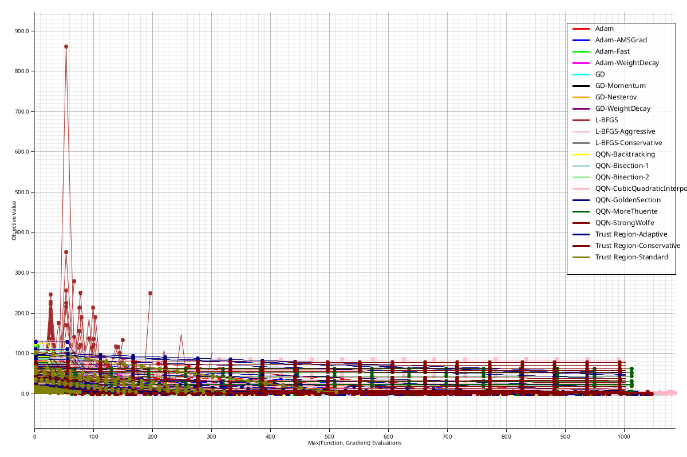
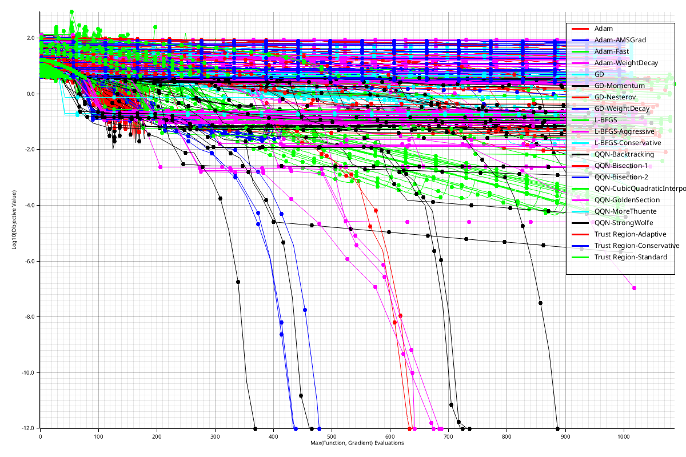

**Figure:** Convergence plots for Rosenbrock_2D showing objective value vs iterations.
Left: Linear scale, Right: Log scale for better visualization of convergence behavior.

**Data:** [Linear scale data (CSV)](convergence_Rosenbrock_2D_data.csv) | [Log scale data (CSV)](convergence_Rosenbrock_2D_log_data.csv)

## Problem: Rosenbrock_5D

**Family:** Non-Convex Unimodal  
**Dimension:** 5  
**Success Threshold:** 3.820e-1  
**Total Runs:** 560

### Performance Summary
<table style="border-collapse: collapse; width: 100%; margin: 20px 0;">
<tr style="background-color: #f2f2f2;">
<th style="border: 1px solid #ddd; padding: 8px; text-align: center;">Rank</th>
<th style="border: 1px solid #ddd; padding: 8px; text-align: center;">Optimizer</th>
<th style="border: 1px solid #ddd; padding: 8px; text-align: center;">Mean Final Value (All/Success/Fail)</th>
<th style="border: 1px solid #ddd; padding: 8px; text-align: center;">Std Dev</th>
<th style="border: 1px solid #ddd; padding: 8px; text-align: center;">Best Value</th>
<th style="border: 1px solid #ddd; padding: 8px; text-align: center;">Worst Value</th>
<th style="border: 1px solid #ddd; padding: 8px; text-align: center;">Mean Function Evals (All/Success/Fail)</th>
<th style="border: 1px solid #ddd; padding: 8px; text-align: center;">Mean Gradient Evals (All/Success/Fail)</th>
<th style="border: 1px solid #ddd; padding: 8px; text-align: center;">Success Rate</th>
<th style="border: 1px solid #ddd; padding: 8px; text-align: center;">Mean Time (s)</th>
</tr>
<tr style="background-color: #d4edda; font-weight: bold;">
<td style="border: 1px solid #ddd; padding: 8px; text-align: center;">1</td>
<td style="border: 1px solid #ddd; padding: 8px; text-align: center;"><a href="detailed_Rosenbrock_5D_QQN-StrongWolfe.md">QQN-StrongWolfe</a></td>
<td style="border: 1px solid #ddd; padding: 8px; text-align: center;">1.04e0 / 3.28e-16 / 1.39e0</td>
<td style="border: 1px solid #ddd; padding: 8px; text-align: center;">1.35e0</td>
<td style="border: 1px solid #ddd; padding: 8px; text-align: center;">2.55e-17</td>
<td style="border: 1px solid #ddd; padding: 8px; text-align: center;">3.97e0</td>
<td style="border: 1px solid #ddd; padding: 8px; text-align: center;">520.9 / 395.8 / 562.5</td>
<td style="border: 1px solid #ddd; padding: 8px; text-align: center;">432.3 / 362.0 / 455.7</td>
<td style="border: 1px solid #ddd; padding: 8px; text-align: center;">25.0%</td>
<td style="border: 1px solid #ddd; padding: 8px; text-align: center;">0.015</td>
</tr>
<tr style="background-color: #fff3cd;">
<td style="border: 1px solid #ddd; padding: 8px; text-align: center;">2</td>
<td style="border: 1px solid #ddd; padding: 8px; text-align: center;"><a href="detailed_Rosenbrock_5D_QQN-Backtracking.md">QQN-Backtracking</a></td>
<td style="border: 1px solid #ddd; padding: 8px; text-align: center;">4.23e-1 / 5.40e-16 / 4.98e-1</td>
<td style="border: 1px solid #ddd; padding: 8px; text-align: center;">7.10e-1</td>
<td style="border: 1px solid #ddd; padding: 8px; text-align: center;">3.06e-16</td>
<td style="border: 1px solid #ddd; padding: 8px; text-align: center;">2.73e0</td>
<td style="border: 1px solid #ddd; padding: 8px; text-align: center;">665.8 / 503.0 / 694.5</td>
<td style="border: 1px solid #ddd; padding: 8px; text-align: center;">310.6 / 277.0 / 316.5</td>
<td style="border: 1px solid #ddd; padding: 8px; text-align: center;">15.0%</td>
<td style="border: 1px solid #ddd; padding: 8px; text-align: center;">0.018</td>
</tr>
<tr style="">
<td style="border: 1px solid #ddd; padding: 8px; text-align: center;">3</td>
<td style="border: 1px solid #ddd; padding: 8px; text-align: center;"><a href="detailed_Rosenbrock_5D_QQN-Bisection-1.md">QQN-Bisection-1</a></td>
<td style="border: 1px solid #ddd; padding: 8px; text-align: center;">2.54e0 / - / 2.54e0</td>
<td style="border: 1px solid #ddd; padding: 8px; text-align: center;">1.55e0</td>
<td style="border: 1px solid #ddd; padding: 8px; text-align: center;">2.97e-14</td>
<td style="border: 1px solid #ddd; padding: 8px; text-align: center;">4.53e0</td>
<td style="border: 1px solid #ddd; padding: 8px; text-align: center;">463.9 / - / 463.9</td>
<td style="border: 1px solid #ddd; padding: 8px; text-align: center;">572.0 / - / 572.0</td>
<td style="border: 1px solid #ddd; padding: 8px; text-align: center;">0.0%</td>
<td style="border: 1px solid #ddd; padding: 8px; text-align: center;">0.011</td>
</tr>
<tr style="">
<td style="border: 1px solid #ddd; padding: 8px; text-align: center;">4</td>
<td style="border: 1px solid #ddd; padding: 8px; text-align: center;"><a href="detailed_Rosenbrock_5D_QQN-GoldenSection.md">QQN-GoldenSection</a></td>
<td style="border: 1px solid #ddd; padding: 8px; text-align: center;">2.62e0 / - / 2.62e0</td>
<td style="border: 1px solid #ddd; padding: 8px; text-align: center;">1.40e0</td>
<td style="border: 1px solid #ddd; padding: 8px; text-align: center;">1.47e-3</td>
<td style="border: 1px solid #ddd; padding: 8px; text-align: center;">4.59e0</td>
<td style="border: 1px solid #ddd; padding: 8px; text-align: center;">913.9 / - / 913.9</td>
<td style="border: 1px solid #ddd; padding: 8px; text-align: center;">119.1 / - / 119.1</td>
<td style="border: 1px solid #ddd; padding: 8px; text-align: center;">0.0%</td>
<td style="border: 1px solid #ddd; padding: 8px; text-align: center;">0.015</td>
</tr>
<tr style="">
<td style="border: 1px solid #ddd; padding: 8px; text-align: center;">5</td>
<td style="border: 1px solid #ddd; padding: 8px; text-align: center;"><a href="detailed_Rosenbrock_5D_GD-WeightDecay.md">GD-WeightDecay</a></td>
<td style="border: 1px solid #ddd; padding: 8px; text-align: center;">8.91e-1 / 1.01e0 / 1.26e0</td>
<td style="border: 1px solid #ddd; padding: 8px; text-align: center;">1.70e0</td>
<td style="border: 1px solid #ddd; padding: 8px; text-align: center;">1.35e-1</td>
<td style="border: 1px solid #ddd; padding: 8px; text-align: center;">6.25e0</td>
<td style="border: 1px solid #ddd; padding: 8px; text-align: center;">163.2 / 85.8 / 188.9</td>
<td style="border: 1px solid #ddd; padding: 8px; text-align: center;">323.0 / 167.6 / 374.8</td>
<td style="border: 1px solid #ddd; padding: 8px; text-align: center;">25.0%</td>
<td style="border: 1px solid #ddd; padding: 8px; text-align: center;">0.005</td>
</tr>
<tr style="">
<td style="border: 1px solid #ddd; padding: 8px; text-align: center;">6</td>
<td style="border: 1px solid #ddd; padding: 8px; text-align: center;"><a href="detailed_Rosenbrock_5D_QQN-Bisection-2.md">QQN-Bisection-2</a></td>
<td style="border: 1px solid #ddd; padding: 8px; text-align: center;">2.33e0 / - / 2.33e0</td>
<td style="border: 1px solid #ddd; padding: 8px; text-align: center;">1.07e0</td>
<td style="border: 1px solid #ddd; padding: 8px; text-align: center;">2.95e-1</td>
<td style="border: 1px solid #ddd; padding: 8px; text-align: center;">3.97e0</td>
<td style="border: 1px solid #ddd; padding: 8px; text-align: center;">608.6 / - / 608.6</td>
<td style="border: 1px solid #ddd; padding: 8px; text-align: center;">379.1 / - / 379.1</td>
<td style="border: 1px solid #ddd; padding: 8px; text-align: center;">0.0%</td>
<td style="border: 1px solid #ddd; padding: 8px; text-align: center;">0.013</td>
</tr>
<tr style="">
<td style="border: 1px solid #ddd; padding: 8px; text-align: center;">7</td>
<td style="border: 1px solid #ddd; padding: 8px; text-align: center;"><a href="detailed_Rosenbrock_5D_GD-Nesterov.md">GD-Nesterov</a></td>
<td style="border: 1px solid #ddd; padding: 8px; text-align: center;">2.58e0 / 3.48e-1 / 3.70e0</td>
<td style="border: 1px solid #ddd; padding: 8px; text-align: center;">3.24e0</td>
<td style="border: 1px solid #ddd; padding: 8px; text-align: center;">3.30e-1</td>
<td style="border: 1px solid #ddd; padding: 8px; text-align: center;">9.04e0</td>
<td style="border: 1px solid #ddd; padding: 8px; text-align: center;">187.2 / 88.0 / 192.5</td>
<td style="border: 1px solid #ddd; padding: 8px; text-align: center;">371.5 / 172.0 / 382.0</td>
<td style="border: 1px solid #ddd; padding: 8px; text-align: center;">5.0%</td>
<td style="border: 1px solid #ddd; padding: 8px; text-align: center;">0.006</td>
</tr>
<tr style="">
<td style="border: 1px solid #ddd; padding: 8px; text-align: center;">8</td>
<td style="border: 1px solid #ddd; padding: 8px; text-align: center;"><a href="detailed_Rosenbrock_5D_QQN-CubicQuadraticInterpolation.md">QQN-CubicQuadraticInterpolation</a></td>
<td style="border: 1px solid #ddd; padding: 8px; text-align: center;">3.60e0 / - / 3.60e0</td>
<td style="border: 1px solid #ddd; padding: 8px; text-align: center;">5.12e-1</td>
<td style="border: 1px solid #ddd; padding: 8px; text-align: center;">2.43e0</td>
<td style="border: 1px solid #ddd; padding: 8px; text-align: center;">4.59e0</td>
<td style="border: 1px solid #ddd; padding: 8px; text-align: center;">391.7 / - / 391.7</td>
<td style="border: 1px solid #ddd; padding: 8px; text-align: center;">643.3 / - / 643.3</td>
<td style="border: 1px solid #ddd; padding: 8px; text-align: center;">0.0%</td>
<td style="border: 1px solid #ddd; padding: 8px; text-align: center;">0.014</td>
</tr>
<tr style="">
<td style="border: 1px solid #ddd; padding: 8px; text-align: center;">9</td>
<td style="border: 1px solid #ddd; padding: 8px; text-align: center;"><a href="detailed_Rosenbrock_5D_L-BFGS-Conservative.md">L-BFGS-Conservative</a></td>
<td style="border: 1px solid #ddd; padding: 8px; text-align: center;">4.00e0 / - / 4.00e0</td>
<td style="border: 1px solid #ddd; padding: 8px; text-align: center;">6.20e-1</td>
<td style="border: 1px solid #ddd; padding: 8px; text-align: center;">2.95e0</td>
<td style="border: 1px solid #ddd; padding: 8px; text-align: center;">5.17e0</td>
<td style="border: 1px solid #ddd; padding: 8px; text-align: center;">708.5 / - / 708.5</td>
<td style="border: 1px solid #ddd; padding: 8px; text-align: center;">275.1 / - / 275.1</td>
<td style="border: 1px solid #ddd; padding: 8px; text-align: center;">0.0%</td>
<td style="border: 1px solid #ddd; padding: 8px; text-align: center;">0.010</td>
</tr>
<tr style="">
<td style="border: 1px solid #ddd; padding: 8px; text-align: center;">10</td>
<td style="border: 1px solid #ddd; padding: 8px; text-align: center;"><a href="detailed_Rosenbrock_5D_GD.md">GD</a></td>
<td style="border: 1px solid #ddd; padding: 8px; text-align: center;">4.74e0 / - / 5.13e0</td>
<td style="border: 1px solid #ddd; padding: 8px; text-align: center;">8.12e-2</td>
<td style="border: 1px solid #ddd; padding: 8px; text-align: center;">4.63e0</td>
<td style="border: 1px solid #ddd; padding: 8px; text-align: center;">4.91e0</td>
<td style="border: 1px solid #ddd; padding: 8px; text-align: center;">33.2 / - / 33.2</td>
<td style="border: 1px solid #ddd; padding: 8px; text-align: center;">62.4 / - / 62.4</td>
<td style="border: 1px solid #ddd; padding: 8px; text-align: center;">0.0%</td>
<td style="border: 1px solid #ddd; padding: 8px; text-align: center;">0.001</td>
</tr>
<tr style="">
<td style="border: 1px solid #ddd; padding: 8px; text-align: center;">11</td>
<td style="border: 1px solid #ddd; padding: 8px; text-align: center;"><a href="detailed_Rosenbrock_5D_Adam-Fast.md">Adam-Fast</a></td>
<td style="border: 1px solid #ddd; padding: 8px; text-align: center;">7.17e0 / - / 1.45e1</td>
<td style="border: 1px solid #ddd; padding: 8px; text-align: center;">1.42e0</td>
<td style="border: 1px solid #ddd; padding: 8px; text-align: center;">5.13e0</td>
<td style="border: 1px solid #ddd; padding: 8px; text-align: center;">1.13e1</td>
<td style="border: 1px solid #ddd; padding: 8px; text-align: center;">39.0 / - / 39.0</td>
<td style="border: 1px solid #ddd; padding: 8px; text-align: center;">38.0 / - / 38.0</td>
<td style="border: 1px solid #ddd; padding: 8px; text-align: center;">0.0%</td>
<td style="border: 1px solid #ddd; padding: 8px; text-align: center;">0.001</td>
</tr>
<tr style="">
<td style="border: 1px solid #ddd; padding: 8px; text-align: center;">12</td>
<td style="border: 1px solid #ddd; padding: 8px; text-align: center;"><a href="detailed_Rosenbrock_5D_L-BFGS.md">L-BFGS</a></td>
<td style="border: 1px solid #ddd; padding: 8px; text-align: center;">1.61e1 / - / 3.02e2</td>
<td style="border: 1px solid #ddd; padding: 8px; text-align: center;">7.09e0</td>
<td style="border: 1px solid #ddd; padding: 8px; text-align: center;">6.62e0</td>
<td style="border: 1px solid #ddd; padding: 8px; text-align: center;">3.05e1</td>
<td style="border: 1px solid #ddd; padding: 8px; text-align: center;">120.2 / - / 120.2</td>
<td style="border: 1px solid #ddd; padding: 8px; text-align: center;">41.5 / - / 41.5</td>
<td style="border: 1px solid #ddd; padding: 8px; text-align: center;">0.0%</td>
<td style="border: 1px solid #ddd; padding: 8px; text-align: center;">0.002</td>
</tr>
<tr style="">
<td style="border: 1px solid #ddd; padding: 8px; text-align: center;">13</td>
<td style="border: 1px solid #ddd; padding: 8px; text-align: center;"><a href="detailed_Rosenbrock_5D_GD-Momentum.md">GD-Momentum</a></td>
<td style="border: 1px solid #ddd; padding: 8px; text-align: center;">1.32e1 / - / 3.48e1</td>
<td style="border: 1px solid #ddd; padding: 8px; text-align: center;">2.74e0</td>
<td style="border: 1px solid #ddd; padding: 8px; text-align: center;">8.39e0</td>
<td style="border: 1px solid #ddd; padding: 8px; text-align: center;">1.93e1</td>
<td style="border: 1px solid #ddd; padding: 8px; text-align: center;">20.7 / - / 20.7</td>
<td style="border: 1px solid #ddd; padding: 8px; text-align: center;">37.4 / - / 37.4</td>
<td style="border: 1px solid #ddd; padding: 8px; text-align: center;">0.0%</td>
<td style="border: 1px solid #ddd; padding: 8px; text-align: center;">0.001</td>
</tr>
<tr style="">
<td style="border: 1px solid #ddd; padding: 8px; text-align: center;">14</td>
<td style="border: 1px solid #ddd; padding: 8px; text-align: center;"><a href="detailed_Rosenbrock_5D_L-BFGS-Aggressive.md">L-BFGS-Aggressive</a></td>
<td style="border: 1px solid #ddd; padding: 8px; text-align: center;">8.94e2 / - / 8.94e2</td>
<td style="border: 1px solid #ddd; padding: 8px; text-align: center;">3.56e2</td>
<td style="border: 1px solid #ddd; padding: 8px; text-align: center;">1.41e1</td>
<td style="border: 1px solid #ddd; padding: 8px; text-align: center;">1.34e3</td>
<td style="border: 1px solid #ddd; padding: 8px; text-align: center;">772.1 / - / 772.1</td>
<td style="border: 1px solid #ddd; padding: 8px; text-align: center;">233.4 / - / 233.4</td>
<td style="border: 1px solid #ddd; padding: 8px; text-align: center;">0.0%</td>
<td style="border: 1px solid #ddd; padding: 8px; text-align: center;">0.006</td>
</tr>
<tr style="">
<td style="border: 1px solid #ddd; padding: 8px; text-align: center;">15</td>
<td style="border: 1px solid #ddd; padding: 8px; text-align: center;"><a href="detailed_Rosenbrock_5D_Adam-WeightDecay.md">Adam-WeightDecay</a></td>
<td style="border: 1px solid #ddd; padding: 8px; text-align: center;">6.42e1 / - / 6.42e1</td>
<td style="border: 1px solid #ddd; padding: 8px; text-align: center;">2.21e1</td>
<td style="border: 1px solid #ddd; padding: 8px; text-align: center;">2.23e1</td>
<td style="border: 1px solid #ddd; padding: 8px; text-align: center;">1.01e2</td>
<td style="border: 1px solid #ddd; padding: 8px; text-align: center;">502.0 / - / 502.0</td>
<td style="border: 1px solid #ddd; padding: 8px; text-align: center;">502.0 / - / 502.0</td>
<td style="border: 1px solid #ddd; padding: 8px; text-align: center;">0.0%</td>
<td style="border: 1px solid #ddd; padding: 8px; text-align: center;">0.011</td>
</tr>
<tr style="">
<td style="border: 1px solid #ddd; padding: 8px; text-align: center;">16</td>
<td style="border: 1px solid #ddd; padding: 8px; text-align: center;"><a href="detailed_Rosenbrock_5D_QQN-MoreThuente.md">QQN-MoreThuente</a></td>
<td style="border: 1px solid #ddd; padding: 8px; text-align: center;">1.67e2 / - / 1.67e2</td>
<td style="border: 1px solid #ddd; padding: 8px; text-align: center;">7.81e1</td>
<td style="border: 1px solid #ddd; padding: 8px; text-align: center;">5.45e1</td>
<td style="border: 1px solid #ddd; padding: 8px; text-align: center;">3.35e2</td>
<td style="border: 1px solid #ddd; padding: 8px; text-align: center;">484.3 / - / 484.3</td>
<td style="border: 1px solid #ddd; padding: 8px; text-align: center;">529.3 / - / 529.3</td>
<td style="border: 1px solid #ddd; padding: 8px; text-align: center;">0.0%</td>
<td style="border: 1px solid #ddd; padding: 8px; text-align: center;">0.009</td>
</tr>
<tr style="">
<td style="border: 1px solid #ddd; padding: 8px; text-align: center;">17</td>
<td style="border: 1px solid #ddd; padding: 8px; text-align: center;"><a href="detailed_Rosenbrock_5D_Adam-AMSGrad.md">Adam-AMSGrad</a></td>
<td style="border: 1px solid #ddd; padding: 8px; text-align: center;">4.78e2 / - / 4.78e2</td>
<td style="border: 1px solid #ddd; padding: 8px; text-align: center;">1.10e2</td>
<td style="border: 1px solid #ddd; padding: 8px; text-align: center;">3.02e2</td>
<td style="border: 1px solid #ddd; padding: 8px; text-align: center;">6.70e2</td>
<td style="border: 1px solid #ddd; padding: 8px; text-align: center;">502.0 / - / 502.0</td>
<td style="border: 1px solid #ddd; padding: 8px; text-align: center;">502.0 / - / 502.0</td>
<td style="border: 1px solid #ddd; padding: 8px; text-align: center;">0.0%</td>
<td style="border: 1px solid #ddd; padding: 8px; text-align: center;">0.012</td>
</tr>
<tr style="">
<td style="border: 1px solid #ddd; padding: 8px; text-align: center;">18</td>
<td style="border: 1px solid #ddd; padding: 8px; text-align: center;"><a href="detailed_Rosenbrock_5D_Adam.md">Adam</a></td>
<td style="border: 1px solid #ddd; padding: 8px; text-align: center;">4.69e2 / - / 4.69e2</td>
<td style="border: 1px solid #ddd; padding: 8px; text-align: center;">9.57e1</td>
<td style="border: 1px solid #ddd; padding: 8px; text-align: center;">3.14e2</td>
<td style="border: 1px solid #ddd; padding: 8px; text-align: center;">6.91e2</td>
<td style="border: 1px solid #ddd; padding: 8px; text-align: center;">502.0 / - / 502.0</td>
<td style="border: 1px solid #ddd; padding: 8px; text-align: center;">502.0 / - / 502.0</td>
<td style="border: 1px solid #ddd; padding: 8px; text-align: center;">0.0%</td>
<td style="border: 1px solid #ddd; padding: 8px; text-align: center;">0.010</td>
</tr>
<tr style="">
<td style="border: 1px solid #ddd; padding: 8px; text-align: center;">19</td>
<td style="border: 1px solid #ddd; padding: 8px; text-align: center;"><a href="detailed_Rosenbrock_5D_Trust_Region-Standard.md">Trust Region-Standard</a></td>
<td style="border: 1px solid #ddd; padding: 8px; text-align: center;">8.36e2 / - / 8.36e2</td>
<td style="border: 1px solid #ddd; padding: 8px; text-align: center;">1.49e2</td>
<td style="border: 1px solid #ddd; padding: 8px; text-align: center;">5.72e2</td>
<td style="border: 1px solid #ddd; padding: 8px; text-align: center;">1.21e3</td>
<td style="border: 1px solid #ddd; padding: 8px; text-align: center;">602.0 / - / 602.0</td>
<td style="border: 1px solid #ddd; padding: 8px; text-align: center;">402.0 / - / 402.0</td>
<td style="border: 1px solid #ddd; padding: 8px; text-align: center;">0.0%</td>
<td style="border: 1px solid #ddd; padding: 8px; text-align: center;">0.004</td>
</tr>
<tr style="">
<td style="border: 1px solid #ddd; padding: 8px; text-align: center;">20</td>
<td style="border: 1px solid #ddd; padding: 8px; text-align: center;"><a href="detailed_Rosenbrock_5D_Trust_Region-Adaptive.md">Trust Region-Adaptive</a></td>
<td style="border: 1px solid #ddd; padding: 8px; text-align: center;">1.04e3 / - / 1.04e3</td>
<td style="border: 1px solid #ddd; padding: 8px; text-align: center;">1.84e2</td>
<td style="border: 1px solid #ddd; padding: 8px; text-align: center;">7.68e2</td>
<td style="border: 1px solid #ddd; padding: 8px; text-align: center;">1.35e3</td>
<td style="border: 1px solid #ddd; padding: 8px; text-align: center;">602.0 / - / 602.0</td>
<td style="border: 1px solid #ddd; padding: 8px; text-align: center;">402.0 / - / 402.0</td>
<td style="border: 1px solid #ddd; padding: 8px; text-align: center;">0.0%</td>
<td style="border: 1px solid #ddd; padding: 8px; text-align: center;">0.004</td>
</tr>
<tr style="">
<td style="border: 1px solid #ddd; padding: 8px; text-align: center;">21</td>
<td style="border: 1px solid #ddd; padding: 8px; text-align: center;"><a href="detailed_Rosenbrock_5D_Trust_Region-Conservative.md">Trust Region-Conservative</a></td>
<td style="border: 1px solid #ddd; padding: 8px; text-align: center;">1.03e3 / - / 1.03e3</td>
<td style="border: 1px solid #ddd; padding: 8px; text-align: center;">1.63e2</td>
<td style="border: 1px solid #ddd; padding: 8px; text-align: center;">7.78e2</td>
<td style="border: 1px solid #ddd; padding: 8px; text-align: center;">1.42e3</td>
<td style="border: 1px solid #ddd; padding: 8px; text-align: center;">602.0 / - / 602.0</td>
<td style="border: 1px solid #ddd; padding: 8px; text-align: center;">402.0 / - / 402.0</td>
<td style="border: 1px solid #ddd; padding: 8px; text-align: center;">0.0%</td>
<td style="border: 1px solid #ddd; padding: 8px; text-align: center;">0.004</td>
</tr>
</table>

### Convergence Plots

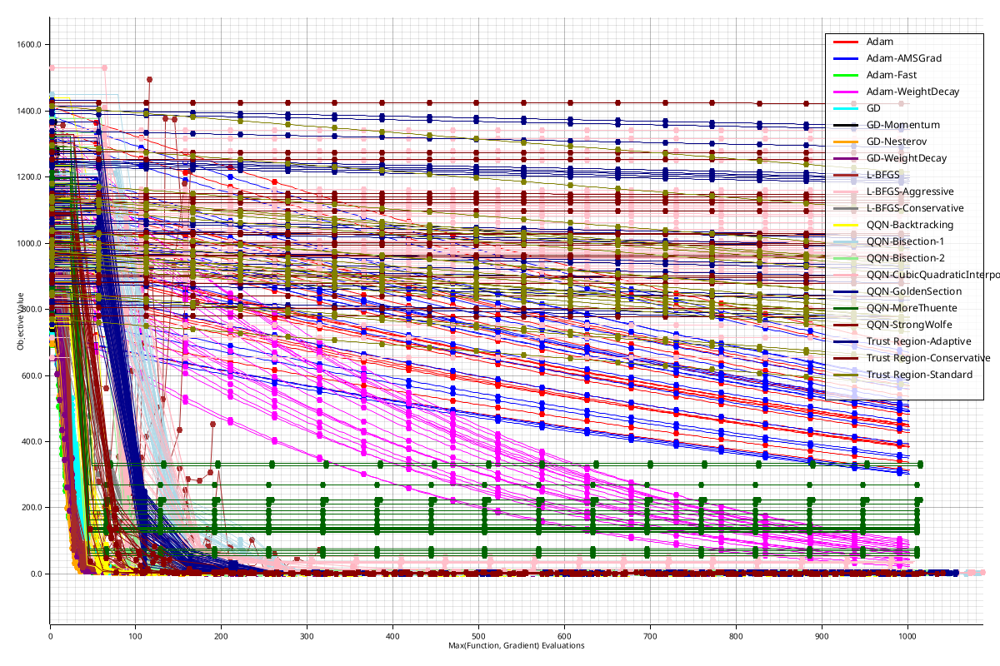
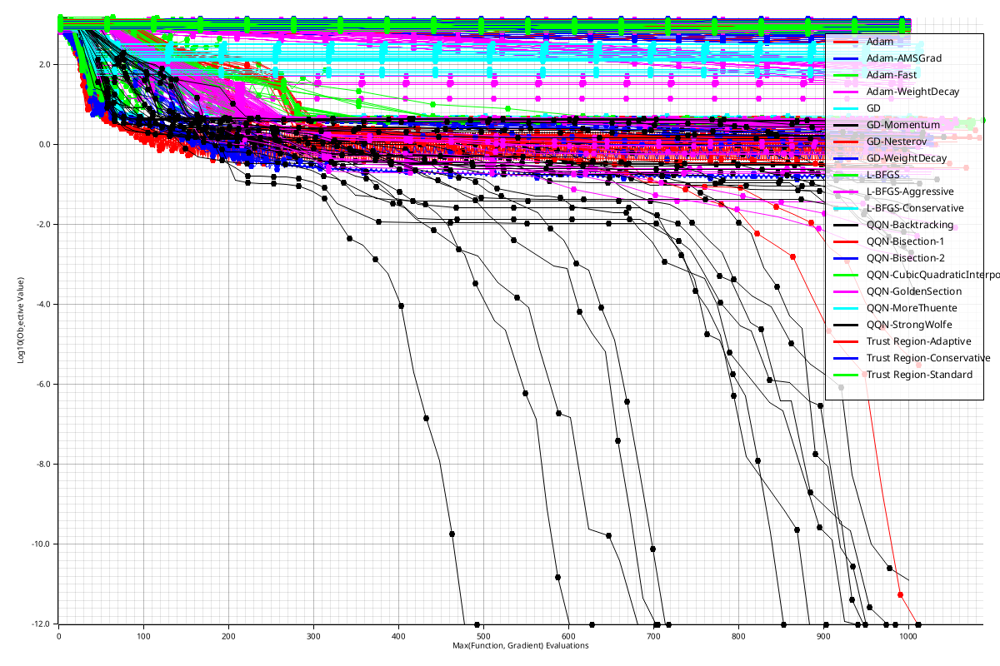

**Figure:** Convergence plots for Rosenbrock_5D showing objective value vs iterations.
Left: Linear scale, Right: Log scale for better visualization of convergence behavior.

**Data:** [Linear scale data (CSV)](convergence_Rosenbrock_5D_data.csv) | [Log scale data (CSV)](convergence_Rosenbrock_5D_log_data.csv)

## Problem: Rosenbrock_10D

**Family:** Non-Convex Unimodal  
**Dimension:** 10  
**Success Threshold:** 1.740e1  
**Total Runs:** 560

### Performance Summary
<table style="border-collapse: collapse; width: 100%; margin: 20px 0;">
<tr style="background-color: #f2f2f2;">
<th style="border: 1px solid #ddd; padding: 8px; text-align: center;">Rank</th>
<th style="border: 1px solid #ddd; padding: 8px; text-align: center;">Optimizer</th>
<th style="border: 1px solid #ddd; padding: 8px; text-align: center;">Mean Final Value (All/Success/Fail)</th>
<th style="border: 1px solid #ddd; padding: 8px; text-align: center;">Std Dev</th>
<th style="border: 1px solid #ddd; padding: 8px; text-align: center;">Best Value</th>
<th style="border: 1px solid #ddd; padding: 8px; text-align: center;">Worst Value</th>
<th style="border: 1px solid #ddd; padding: 8px; text-align: center;">Mean Function Evals (All/Success/Fail)</th>
<th style="border: 1px solid #ddd; padding: 8px; text-align: center;">Mean Gradient Evals (All/Success/Fail)</th>
<th style="border: 1px solid #ddd; padding: 8px; text-align: center;">Success Rate</th>
<th style="border: 1px solid #ddd; padding: 8px; text-align: center;">Mean Time (s)</th>
</tr>
<tr style="background-color: #d4edda; font-weight: bold;">
<td style="border: 1px solid #ddd; padding: 8px; text-align: center;">1</td>
<td style="border: 1px solid #ddd; padding: 8px; text-align: center;"><a href="detailed_Rosenbrock_10D_QQN-StrongWolfe.md">QQN-StrongWolfe</a></td>
<td style="border: 1px solid #ddd; padding: 8px; text-align: center;">5.12e0 / - / 5.12e0</td>
<td style="border: 1px solid #ddd; padding: 8px; text-align: center;">2.11e0</td>
<td style="border: 1px solid #ddd; padding: 8px; text-align: center;">1.06e-3</td>
<td style="border: 1px solid #ddd; padding: 8px; text-align: center;">8.55e0</td>
<td style="border: 1px solid #ddd; padding: 8px; text-align: center;">561.5 / - / 561.5</td>
<td style="border: 1px solid #ddd; padding: 8px; text-align: center;">458.7 / - / 458.7</td>
<td style="border: 1px solid #ddd; padding: 8px; text-align: center;">0.0%</td>
<td style="border: 1px solid #ddd; padding: 8px; text-align: center;">0.016</td>
</tr>
<tr style="background-color: #fff3cd;">
<td style="border: 1px solid #ddd; padding: 8px; text-align: center;">2</td>
<td style="border: 1px solid #ddd; padding: 8px; text-align: center;"><a href="detailed_Rosenbrock_10D_Adam-Fast.md">Adam-Fast</a></td>
<td style="border: 1px solid #ddd; padding: 8px; text-align: center;">1.03e1 / 8.42e0 / 2.79e1</td>
<td style="border: 1px solid #ddd; padding: 8px; text-align: center;">9.85e0</td>
<td style="border: 1px solid #ddd; padding: 8px; text-align: center;">1.34e-1</td>
<td style="border: 1px solid #ddd; padding: 8px; text-align: center;">2.63e1</td>
<td style="border: 1px solid #ddd; padding: 8px; text-align: center;">169.4 / 209.1 / 103.4</td>
<td style="border: 1px solid #ddd; padding: 8px; text-align: center;">168.5 / 208.1 / 102.5</td>
<td style="border: 1px solid #ddd; padding: 8px; text-align: center;">62.5%</td>
<td style="border: 1px solid #ddd; padding: 8px; text-align: center;">0.004</td>
</tr>
<tr style="">
<td style="border: 1px solid #ddd; padding: 8px; text-align: center;">3</td>
<td style="border: 1px solid #ddd; padding: 8px; text-align: center;"><a href="detailed_Rosenbrock_10D_GD-WeightDecay.md">GD-WeightDecay</a></td>
<td style="border: 1px solid #ddd; padding: 8px; text-align: center;">1.42e0 / 3.66e0 / 6.72e-1</td>
<td style="border: 1px solid #ddd; padding: 8px; text-align: center;">1.55e0</td>
<td style="border: 1px solid #ddd; padding: 8px; text-align: center;">1.85e-1</td>
<td style="border: 1px solid #ddd; padding: 8px; text-align: center;">5.00e0</td>
<td style="border: 1px solid #ddd; padding: 8px; text-align: center;">265.8 / 104.2 / 335.0</td>
<td style="border: 1px solid #ddd; padding: 8px; text-align: center;">528.9 / 204.3 / 668.0</td>
<td style="border: 1px solid #ddd; padding: 8px; text-align: center;">30.0%</td>
<td style="border: 1px solid #ddd; padding: 8px; text-align: center;">0.009</td>
</tr>
<tr style="">
<td style="border: 1px solid #ddd; padding: 8px; text-align: center;">4</td>
<td style="border: 1px solid #ddd; padding: 8px; text-align: center;"><a href="detailed_Rosenbrock_10D_QQN-Bisection-1.md">QQN-Bisection-1</a></td>
<td style="border: 1px solid #ddd; padding: 8px; text-align: center;">5.74e0 / - / 5.74e0</td>
<td style="border: 1px solid #ddd; padding: 8px; text-align: center;">2.48e0</td>
<td style="border: 1px solid #ddd; padding: 8px; text-align: center;">3.66e-1</td>
<td style="border: 1px solid #ddd; padding: 8px; text-align: center;">9.60e0</td>
<td style="border: 1px solid #ddd; padding: 8px; text-align: center;">473.4 / - / 473.4</td>
<td style="border: 1px solid #ddd; padding: 8px; text-align: center;">563.9 / - / 563.9</td>
<td style="border: 1px solid #ddd; padding: 8px; text-align: center;">0.0%</td>
<td style="border: 1px solid #ddd; padding: 8px; text-align: center;">0.012</td>
</tr>
<tr style="">
<td style="border: 1px solid #ddd; padding: 8px; text-align: center;">5</td>
<td style="border: 1px solid #ddd; padding: 8px; text-align: center;"><a href="detailed_Rosenbrock_10D_GD-Momentum.md">GD-Momentum</a></td>
<td style="border: 1px solid #ddd; padding: 8px; text-align: center;">2.27e1 / 1.38e0 / 4.52e1</td>
<td style="border: 1px solid #ddd; padding: 8px; text-align: center;">2.72e1</td>
<td style="border: 1px solid #ddd; padding: 8px; text-align: center;">4.81e-1</td>
<td style="border: 1px solid #ddd; padding: 8px; text-align: center;">6.90e1</td>
<td style="border: 1px solid #ddd; padding: 8px; text-align: center;">127.0 / 126.9 / 127.2</td>
<td style="border: 1px solid #ddd; padding: 8px; text-align: center;">250.5 / 249.8 / 251.0</td>
<td style="border: 1px solid #ddd; padding: 8px; text-align: center;">40.0%</td>
<td style="border: 1px solid #ddd; padding: 8px; text-align: center;">0.004</td>
</tr>
<tr style="">
<td style="border: 1px solid #ddd; padding: 8px; text-align: center;">6</td>
<td style="border: 1px solid #ddd; padding: 8px; text-align: center;"><a href="detailed_Rosenbrock_10D_QQN-Bisection-2.md">QQN-Bisection-2</a></td>
<td style="border: 1px solid #ddd; padding: 8px; text-align: center;">7.02e0 / - / 7.02e0</td>
<td style="border: 1px solid #ddd; padding: 8px; text-align: center;">1.96e0</td>
<td style="border: 1px solid #ddd; padding: 8px; text-align: center;">5.91e-1</td>
<td style="border: 1px solid #ddd; padding: 8px; text-align: center;">8.94e0</td>
<td style="border: 1px solid #ddd; padding: 8px; text-align: center;">620.2 / - / 620.2</td>
<td style="border: 1px solid #ddd; padding: 8px; text-align: center;">385.1 / - / 385.1</td>
<td style="border: 1px solid #ddd; padding: 8px; text-align: center;">0.0%</td>
<td style="border: 1px solid #ddd; padding: 8px; text-align: center;">0.014</td>
</tr>
<tr style="">
<td style="border: 1px solid #ddd; padding: 8px; text-align: center;">7</td>
<td style="border: 1px solid #ddd; padding: 8px; text-align: center;"><a href="detailed_Rosenbrock_10D_QQN-Backtracking.md">QQN-Backtracking</a></td>
<td style="border: 1px solid #ddd; padding: 8px; text-align: center;">4.33e0 / - / 4.33e0</td>
<td style="border: 1px solid #ddd; padding: 8px; text-align: center;">1.40e0</td>
<td style="border: 1px solid #ddd; padding: 8px; text-align: center;">1.15e0</td>
<td style="border: 1px solid #ddd; padding: 8px; text-align: center;">6.24e0</td>
<td style="border: 1px solid #ddd; padding: 8px; text-align: center;">694.5 / - / 694.5</td>
<td style="border: 1px solid #ddd; padding: 8px; text-align: center;">317.5 / - / 317.5</td>
<td style="border: 1px solid #ddd; padding: 8px; text-align: center;">0.0%</td>
<td style="border: 1px solid #ddd; padding: 8px; text-align: center;">0.020</td>
</tr>
<tr style="">
<td style="border: 1px solid #ddd; padding: 8px; text-align: center;">8</td>
<td style="border: 1px solid #ddd; padding: 8px; text-align: center;"><a href="detailed_Rosenbrock_10D_GD-Nesterov.md">GD-Nesterov</a></td>
<td style="border: 1px solid #ddd; padding: 8px; text-align: center;">1.19e0 / - / 1.20e0</td>
<td style="border: 1px solid #ddd; padding: 8px; text-align: center;">1.89e-2</td>
<td style="border: 1px solid #ddd; padding: 8px; text-align: center;">1.16e0</td>
<td style="border: 1px solid #ddd; padding: 8px; text-align: center;">1.21e0</td>
<td style="border: 1px solid #ddd; padding: 8px; text-align: center;">335.0 / - / 335.0</td>
<td style="border: 1px solid #ddd; padding: 8px; text-align: center;">668.0 / - / 668.0</td>
<td style="border: 1px solid #ddd; padding: 8px; text-align: center;">0.0%</td>
<td style="border: 1px solid #ddd; padding: 8px; text-align: center;">0.011</td>
</tr>
<tr style="">
<td style="border: 1px solid #ddd; padding: 8px; text-align: center;">9</td>
<td style="border: 1px solid #ddd; padding: 8px; text-align: center;"><a href="detailed_Rosenbrock_10D_QQN-GoldenSection.md">QQN-GoldenSection</a></td>
<td style="border: 1px solid #ddd; padding: 8px; text-align: center;">8.34e0 / - / 8.34e0</td>
<td style="border: 1px solid #ddd; padding: 8px; text-align: center;">1.12e0</td>
<td style="border: 1px solid #ddd; padding: 8px; text-align: center;">2.26e0</td>
<td style="border: 1px solid #ddd; padding: 8px; text-align: center;">9.60e0</td>
<td style="border: 1px solid #ddd; padding: 8px; text-align: center;">914.8 / - / 914.8</td>
<td style="border: 1px solid #ddd; padding: 8px; text-align: center;">118.6 / - / 118.6</td>
<td style="border: 1px solid #ddd; padding: 8px; text-align: center;">0.0%</td>
<td style="border: 1px solid #ddd; padding: 8px; text-align: center;">0.016</td>
</tr>
<tr style="">
<td style="border: 1px solid #ddd; padding: 8px; text-align: center;">10</td>
<td style="border: 1px solid #ddd; padding: 8px; text-align: center;"><a href="detailed_Rosenbrock_10D_L-BFGS-Conservative.md">L-BFGS-Conservative</a></td>
<td style="border: 1px solid #ddd; padding: 8px; text-align: center;">8.70e0 / 9.54e0 / 8.65e0</td>
<td style="border: 1px solid #ddd; padding: 8px; text-align: center;">9.20e-1</td>
<td style="border: 1px solid #ddd; padding: 8px; text-align: center;">6.83e0</td>
<td style="border: 1px solid #ddd; padding: 8px; text-align: center;">9.62e0</td>
<td style="border: 1px solid #ddd; padding: 8px; text-align: center;">685.1 / 476.0 / 696.1</td>
<td style="border: 1px solid #ddd; padding: 8px; text-align: center;">311.0 / 195.0 / 317.1</td>
<td style="border: 1px solid #ddd; padding: 8px; text-align: center;">5.0%</td>
<td style="border: 1px solid #ddd; padding: 8px; text-align: center;">0.011</td>
</tr>
<tr style="">
<td style="border: 1px solid #ddd; padding: 8px; text-align: center;">11</td>
<td style="border: 1px solid #ddd; padding: 8px; text-align: center;"><a href="detailed_Rosenbrock_10D_QQN-CubicQuadraticInterpolation.md">QQN-CubicQuadraticInterpolation</a></td>
<td style="border: 1px solid #ddd; padding: 8px; text-align: center;">8.95e0 / - / 8.95e0</td>
<td style="border: 1px solid #ddd; padding: 8px; text-align: center;">2.52e0</td>
<td style="border: 1px solid #ddd; padding: 8px; text-align: center;">7.44e0</td>
<td style="border: 1px solid #ddd; padding: 8px; text-align: center;">2.45e1</td>
<td style="border: 1px solid #ddd; padding: 8px; text-align: center;">396.9 / - / 396.9</td>
<td style="border: 1px solid #ddd; padding: 8px; text-align: center;">656.9 / - / 656.9</td>
<td style="border: 1px solid #ddd; padding: 8px; text-align: center;">0.0%</td>
<td style="border: 1px solid #ddd; padding: 8px; text-align: center;">0.015</td>
</tr>
<tr style="">
<td style="border: 1px solid #ddd; padding: 8px; text-align: center;">12</td>
<td style="border: 1px solid #ddd; padding: 8px; text-align: center;"><a href="detailed_Rosenbrock_10D_GD.md">GD</a></td>
<td style="border: 1px solid #ddd; padding: 8px; text-align: center;">9.67e0 / 1.01e1 / -</td>
<td style="border: 1px solid #ddd; padding: 8px; text-align: center;">7.25e-2</td>
<td style="border: 1px solid #ddd; padding: 8px; text-align: center;">9.58e0</td>
<td style="border: 1px solid #ddd; padding: 8px; text-align: center;">9.83e0</td>
<td style="border: 1px solid #ddd; padding: 8px; text-align: center;">46.7 / 46.7 / -</td>
<td style="border: 1px solid #ddd; padding: 8px; text-align: center;">89.4 / 89.4 / -</td>
<td style="border: 1px solid #ddd; padding: 8px; text-align: center;">100.0%</td>
<td style="border: 1px solid #ddd; padding: 8px; text-align: center;">0.001</td>
</tr>
<tr style="">
<td style="border: 1px solid #ddd; padding: 8px; text-align: center;">13</td>
<td style="border: 1px solid #ddd; padding: 8px; text-align: center;"><a href="detailed_Rosenbrock_10D_L-BFGS.md">L-BFGS</a></td>
<td style="border: 1px solid #ddd; padding: 8px; text-align: center;">2.92e1 / 8.23e2 / 1.60e2</td>
<td style="border: 1px solid #ddd; padding: 8px; text-align: center;">1.35e1</td>
<td style="border: 1px solid #ddd; padding: 8px; text-align: center;">1.31e1</td>
<td style="border: 1px solid #ddd; padding: 8px; text-align: center;">7.71e1</td>
<td style="border: 1px solid #ddd; padding: 8px; text-align: center;">144.7 / 148.5 / 144.2</td>
<td style="border: 1px solid #ddd; padding: 8px; text-align: center;">45.5 / 46.5 / 45.4</td>
<td style="border: 1px solid #ddd; padding: 8px; text-align: center;">10.0%</td>
<td style="border: 1px solid #ddd; padding: 8px; text-align: center;">0.002</td>
</tr>
<tr style="">
<td style="border: 1px solid #ddd; padding: 8px; text-align: center;">14</td>
<td style="border: 1px solid #ddd; padding: 8px; text-align: center;"><a href="detailed_Rosenbrock_10D_L-BFGS-Aggressive.md">L-BFGS-Aggressive</a></td>
<td style="border: 1px solid #ddd; padding: 8px; text-align: center;">1.14e3 / - / 1.14e3</td>
<td style="border: 1px solid #ddd; padding: 8px; text-align: center;">1.06e3</td>
<td style="border: 1px solid #ddd; padding: 8px; text-align: center;">4.70e1</td>
<td style="border: 1px solid #ddd; padding: 8px; text-align: center;">2.64e3</td>
<td style="border: 1px solid #ddd; padding: 8px; text-align: center;">773.3 / - / 773.3</td>
<td style="border: 1px solid #ddd; padding: 8px; text-align: center;">234.5 / - / 234.5</td>
<td style="border: 1px solid #ddd; padding: 8px; text-align: center;">0.0%</td>
<td style="border: 1px solid #ddd; padding: 8px; text-align: center;">0.009</td>
</tr>
<tr style="">
<td style="border: 1px solid #ddd; padding: 8px; text-align: center;">15</td>
<td style="border: 1px solid #ddd; padding: 8px; text-align: center;"><a href="detailed_Rosenbrock_10D_Adam-WeightDecay.md">Adam-WeightDecay</a></td>
<td style="border: 1px solid #ddd; padding: 8px; text-align: center;">1.38e2 / - / 1.38e2</td>
<td style="border: 1px solid #ddd; padding: 8px; text-align: center;">3.05e1</td>
<td style="border: 1px solid #ddd; padding: 8px; text-align: center;">8.18e1</td>
<td style="border: 1px solid #ddd; padding: 8px; text-align: center;">2.16e2</td>
<td style="border: 1px solid #ddd; padding: 8px; text-align: center;">502.0 / - / 502.0</td>
<td style="border: 1px solid #ddd; padding: 8px; text-align: center;">502.0 / - / 502.0</td>
<td style="border: 1px solid #ddd; padding: 8px; text-align: center;">0.0%</td>
<td style="border: 1px solid #ddd; padding: 8px; text-align: center;">0.012</td>
</tr>
<tr style="">
<td style="border: 1px solid #ddd; padding: 8px; text-align: center;">16</td>
<td style="border: 1px solid #ddd; padding: 8px; text-align: center;"><a href="detailed_Rosenbrock_10D_QQN-MoreThuente.md">QQN-MoreThuente</a></td>
<td style="border: 1px solid #ddd; padding: 8px; text-align: center;">3.38e2 / - / 3.38e2</td>
<td style="border: 1px solid #ddd; padding: 8px; text-align: center;">9.87e1</td>
<td style="border: 1px solid #ddd; padding: 8px; text-align: center;">2.08e2</td>
<td style="border: 1px solid #ddd; padding: 8px; text-align: center;">5.65e2</td>
<td style="border: 1px solid #ddd; padding: 8px; text-align: center;">484.0 / - / 484.0</td>
<td style="border: 1px solid #ddd; padding: 8px; text-align: center;">529.0 / - / 529.0</td>
<td style="border: 1px solid #ddd; padding: 8px; text-align: center;">0.0%</td>
<td style="border: 1px solid #ddd; padding: 8px; text-align: center;">0.009</td>
</tr>
<tr style="">
<td style="border: 1px solid #ddd; padding: 8px; text-align: center;">17</td>
<td style="border: 1px solid #ddd; padding: 8px; text-align: center;"><a href="detailed_Rosenbrock_10D_Adam.md">Adam</a></td>
<td style="border: 1px solid #ddd; padding: 8px; text-align: center;">1.05e3 / - / 1.05e3</td>
<td style="border: 1px solid #ddd; padding: 8px; text-align: center;">1.33e2</td>
<td style="border: 1px solid #ddd; padding: 8px; text-align: center;">8.13e2</td>
<td style="border: 1px solid #ddd; padding: 8px; text-align: center;">1.29e3</td>
<td style="border: 1px solid #ddd; padding: 8px; text-align: center;">502.0 / - / 502.0</td>
<td style="border: 1px solid #ddd; padding: 8px; text-align: center;">502.0 / - / 502.0</td>
<td style="border: 1px solid #ddd; padding: 8px; text-align: center;">0.0%</td>
<td style="border: 1px solid #ddd; padding: 8px; text-align: center;">0.011</td>
</tr>
<tr style="">
<td style="border: 1px solid #ddd; padding: 8px; text-align: center;">18</td>
<td style="border: 1px solid #ddd; padding: 8px; text-align: center;"><a href="detailed_Rosenbrock_10D_Adam-AMSGrad.md">Adam-AMSGrad</a></td>
<td style="border: 1px solid #ddd; padding: 8px; text-align: center;">1.04e3 / - / 1.04e3</td>
<td style="border: 1px solid #ddd; padding: 8px; text-align: center;">1.14e2</td>
<td style="border: 1px solid #ddd; padding: 8px; text-align: center;">8.57e2</td>
<td style="border: 1px solid #ddd; padding: 8px; text-align: center;">1.22e3</td>
<td style="border: 1px solid #ddd; padding: 8px; text-align: center;">502.0 / - / 502.0</td>
<td style="border: 1px solid #ddd; padding: 8px; text-align: center;">502.0 / - / 502.0</td>
<td style="border: 1px solid #ddd; padding: 8px; text-align: center;">0.0%</td>
<td style="border: 1px solid #ddd; padding: 8px; text-align: center;">0.013</td>
</tr>
<tr style="">
<td style="border: 1px solid #ddd; padding: 8px; text-align: center;">19</td>
<td style="border: 1px solid #ddd; padding: 8px; text-align: center;"><a href="detailed_Rosenbrock_10D_Trust_Region-Standard.md">Trust Region-Standard</a></td>
<td style="border: 1px solid #ddd; padding: 8px; text-align: center;">1.94e3 / - / 1.94e3</td>
<td style="border: 1px solid #ddd; padding: 8px; text-align: center;">2.44e2</td>
<td style="border: 1px solid #ddd; padding: 8px; text-align: center;">1.49e3</td>
<td style="border: 1px solid #ddd; padding: 8px; text-align: center;">2.37e3</td>
<td style="border: 1px solid #ddd; padding: 8px; text-align: center;">602.0 / - / 602.0</td>
<td style="border: 1px solid #ddd; padding: 8px; text-align: center;">402.0 / - / 402.0</td>
<td style="border: 1px solid #ddd; padding: 8px; text-align: center;">0.0%</td>
<td style="border: 1px solid #ddd; padding: 8px; text-align: center;">0.004</td>
</tr>
<tr style="">
<td style="border: 1px solid #ddd; padding: 8px; text-align: center;">20</td>
<td style="border: 1px solid #ddd; padding: 8px; text-align: center;"><a href="detailed_Rosenbrock_10D_Trust_Region-Conservative.md">Trust Region-Conservative</a></td>
<td style="border: 1px solid #ddd; padding: 8px; text-align: center;">2.13e3 / - / 2.13e3</td>
<td style="border: 1px solid #ddd; padding: 8px; text-align: center;">1.86e2</td>
<td style="border: 1px solid #ddd; padding: 8px; text-align: center;">1.67e3</td>
<td style="border: 1px solid #ddd; padding: 8px; text-align: center;">2.56e3</td>
<td style="border: 1px solid #ddd; padding: 8px; text-align: center;">602.0 / - / 602.0</td>
<td style="border: 1px solid #ddd; padding: 8px; text-align: center;">402.0 / - / 402.0</td>
<td style="border: 1px solid #ddd; padding: 8px; text-align: center;">0.0%</td>
<td style="border: 1px solid #ddd; padding: 8px; text-align: center;">0.004</td>
</tr>
<tr style="">
<td style="border: 1px solid #ddd; padding: 8px; text-align: center;">21</td>
<td style="border: 1px solid #ddd; padding: 8px; text-align: center;"><a href="detailed_Rosenbrock_10D_Trust_Region-Adaptive.md">Trust Region-Adaptive</a></td>
<td style="border: 1px solid #ddd; padding: 8px; text-align: center;">2.09e3 / - / 2.09e3</td>
<td style="border: 1px solid #ddd; padding: 8px; text-align: center;">2.09e2</td>
<td style="border: 1px solid #ddd; padding: 8px; text-align: center;">1.68e3</td>
<td style="border: 1px solid #ddd; padding: 8px; text-align: center;">2.48e3</td>
<td style="border: 1px solid #ddd; padding: 8px; text-align: center;">602.0 / - / 602.0</td>
<td style="border: 1px solid #ddd; padding: 8px; text-align: center;">402.0 / - / 402.0</td>
<td style="border: 1px solid #ddd; padding: 8px; text-align: center;">0.0%</td>
<td style="border: 1px solid #ddd; padding: 8px; text-align: center;">0.004</td>
</tr>
</table>

### Convergence Plots

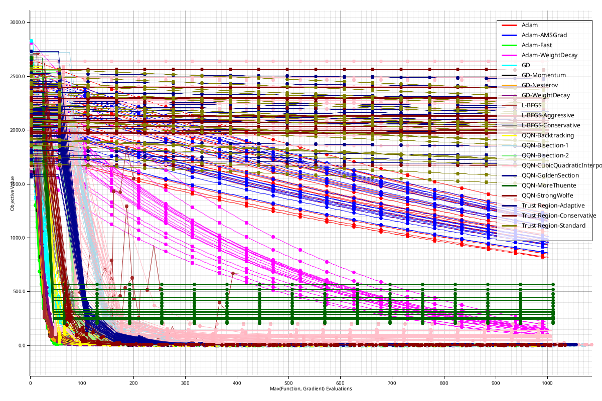
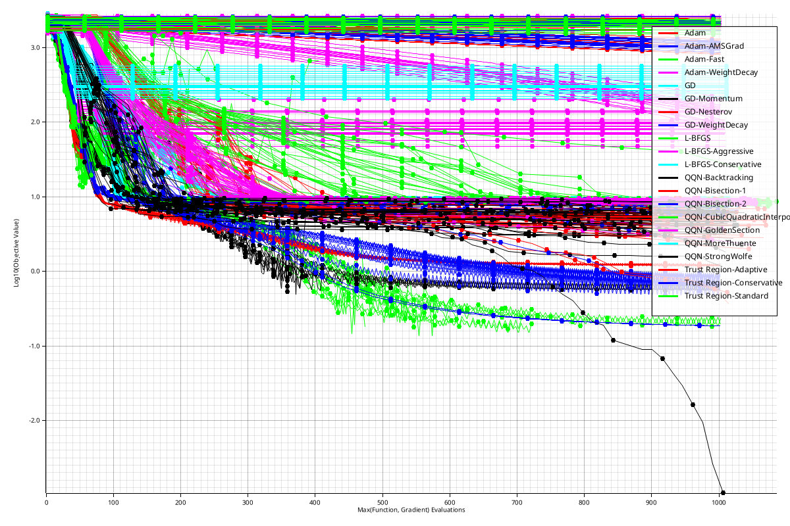

**Figure:** Convergence plots for Rosenbrock_10D showing objective value vs iterations.
Left: Linear scale, Right: Log scale for better visualization of convergence behavior.

**Data:** [Linear scale data (CSV)](convergence_Rosenbrock_10D_data.csv) | [Log scale data (CSV)](convergence_Rosenbrock_10D_log_data.csv)

## Problem: Michalewicz_2D_m10

**Family:** Highly Multimodal  
**Dimension:** 2  
**Success Threshold:** -7.230e-8  
**Total Runs:** 560

### Performance Summary
<table style="border-collapse: collapse; width: 100%; margin: 20px 0;">
<tr style="background-color: #f2f2f2;">
<th style="border: 1px solid #ddd; padding: 8px; text-align: center;">Rank</th>
<th style="border: 1px solid #ddd; padding: 8px; text-align: center;">Optimizer</th>
<th style="border: 1px solid #ddd; padding: 8px; text-align: center;">Mean Final Value (All/Success/Fail)</th>
<th style="border: 1px solid #ddd; padding: 8px; text-align: center;">Std Dev</th>
<th style="border: 1px solid #ddd; padding: 8px; text-align: center;">Best Value</th>
<th style="border: 1px solid #ddd; padding: 8px; text-align: center;">Worst Value</th>
<th style="border: 1px solid #ddd; padding: 8px; text-align: center;">Mean Function Evals (All/Success/Fail)</th>
<th style="border: 1px solid #ddd; padding: 8px; text-align: center;">Mean Gradient Evals (All/Success/Fail)</th>
<th style="border: 1px solid #ddd; padding: 8px; text-align: center;">Success Rate</th>
<th style="border: 1px solid #ddd; padding: 8px; text-align: center;">Mean Time (s)</th>
</tr>
<tr style="background-color: #d4edda; font-weight: bold;">
<td style="border: 1px solid #ddd; padding: 8px; text-align: center;">1</td>
<td style="border: 1px solid #ddd; padding: 8px; text-align: center;"><a href="detailed_Michalewicz_2D_m10_Adam-Fast.md">Adam-Fast</a></td>
<td style="border: 1px solid #ddd; padding: 8px; text-align: center;">-5.99e-1 / -9.79e-1 / -1.48e-10</td>
<td style="border: 1px solid #ddd; padding: 8px; text-align: center;">4.89e-1</td>
<td style="border: 1px solid #ddd; padding: 8px; text-align: center;">-1.00e0</td>
<td style="border: 1px solid #ddd; padding: 8px; text-align: center;">-4.68e-14</td>
<td style="border: 1px solid #ddd; padding: 8px; text-align: center;">210.8 / 99.8 / 377.5</td>
<td style="border: 1px solid #ddd; padding: 8px; text-align: center;">210.2 / 98.8 / 377.5</td>
<td style="border: 1px solid #ddd; padding: 8px; text-align: center;">60.0%</td>
<td style="border: 1px solid #ddd; padding: 8px; text-align: center;">0.004</td>
</tr>
<tr style="background-color: #fff3cd;">
<td style="border: 1px solid #ddd; padding: 8px; text-align: center;">2</td>
<td style="border: 1px solid #ddd; padding: 8px; text-align: center;"><a href="detailed_Michalewicz_2D_m10_L-BFGS-Aggressive.md">L-BFGS-Aggressive</a></td>
<td style="border: 1px solid #ddd; padding: 8px; text-align: center;">-9.18e-2 / -3.71e-14 / -9.25e-2</td>
<td style="border: 1px solid #ddd; padding: 8px; text-align: center;">2.72e-1</td>
<td style="border: 1px solid #ddd; padding: 8px; text-align: center;">-9.88e-1</td>
<td style="border: 1px solid #ddd; padding: 8px; text-align: center;">-7.28e-13</td>
<td style="border: 1px solid #ddd; padding: 8px; text-align: center;">298.7 / 293.0 / 298.9</td>
<td style="border: 1px solid #ddd; padding: 8px; text-align: center;">169.7 / 178.0 / 169.4</td>
<td style="border: 1px solid #ddd; padding: 8px; text-align: center;">2.5%</td>
<td style="border: 1px solid #ddd; padding: 8px; text-align: center;">0.004</td>
</tr>
<tr style="">
<td style="border: 1px solid #ddd; padding: 8px; text-align: center;">3</td>
<td style="border: 1px solid #ddd; padding: 8px; text-align: center;"><a href="detailed_Michalewicz_2D_m10_QQN-Backtracking.md">QQN-Backtracking</a></td>
<td style="border: 1px solid #ddd; padding: 8px; text-align: center;">-4.01e-2 / - / -4.01e-2</td>
<td style="border: 1px solid #ddd; padding: 8px; text-align: center;">1.75e-1</td>
<td style="border: 1px solid #ddd; padding: 8px; text-align: center;">-8.01e-1</td>
<td style="border: 1px solid #ddd; padding: 8px; text-align: center;">-1.48e-13</td>
<td style="border: 1px solid #ddd; padding: 8px; text-align: center;">301.1 / - / 301.1</td>
<td style="border: 1px solid #ddd; padding: 8px; text-align: center;">111.4 / - / 111.4</td>
<td style="border: 1px solid #ddd; padding: 8px; text-align: center;">0.0%</td>
<td style="border: 1px solid #ddd; padding: 8px; text-align: center;">0.006</td>
</tr>
<tr style="">
<td style="border: 1px solid #ddd; padding: 8px; text-align: center;">4</td>
<td style="border: 1px solid #ddd; padding: 8px; text-align: center;"><a href="detailed_Michalewicz_2D_m10_Adam-AMSGrad.md">Adam-AMSGrad</a></td>
<td style="border: 1px solid #ddd; padding: 8px; text-align: center;">-6.48e-2 / -7.22e-7 / -9.26e-2</td>
<td style="border: 1px solid #ddd; padding: 8px; text-align: center;">1.96e-1</td>
<td style="border: 1px solid #ddd; padding: 8px; text-align: center;">-7.13e-1</td>
<td style="border: 1px solid #ddd; padding: 8px; text-align: center;">-9.56e-14</td>
<td style="border: 1px solid #ddd; padding: 8px; text-align: center;">61.9 / 13.0 / 82.9</td>
<td style="border: 1px solid #ddd; padding: 8px; text-align: center;">61.0 / 12.0 / 82.0</td>
<td style="border: 1px solid #ddd; padding: 8px; text-align: center;">30.0%</td>
<td style="border: 1px solid #ddd; padding: 8px; text-align: center;">0.001</td>
</tr>
<tr style="">
<td style="border: 1px solid #ddd; padding: 8px; text-align: center;">5</td>
<td style="border: 1px solid #ddd; padding: 8px; text-align: center;"><a href="detailed_Michalewicz_2D_m10_Adam.md">Adam</a></td>
<td style="border: 1px solid #ddd; padding: 8px; text-align: center;">-1.03e-1 / - / -1.03e-1</td>
<td style="border: 1px solid #ddd; padding: 8px; text-align: center;">2.07e-1</td>
<td style="border: 1px solid #ddd; padding: 8px; text-align: center;">-5.86e-1</td>
<td style="border: 1px solid #ddd; padding: 8px; text-align: center;">-3.32e-13</td>
<td style="border: 1px solid #ddd; padding: 8px; text-align: center;">452.2 / - / 452.2</td>
<td style="border: 1px solid #ddd; padding: 8px; text-align: center;">452.2 / - / 452.2</td>
<td style="border: 1px solid #ddd; padding: 8px; text-align: center;">0.0%</td>
<td style="border: 1px solid #ddd; padding: 8px; text-align: center;">0.009</td>
</tr>
<tr style="">
<td style="border: 1px solid #ddd; padding: 8px; text-align: center;">6</td>
<td style="border: 1px solid #ddd; padding: 8px; text-align: center;"><a href="detailed_Michalewicz_2D_m10_QQN-CubicQuadraticInterpolation.md">QQN-CubicQuadraticInterpolation</a></td>
<td style="border: 1px solid #ddd; padding: 8px; text-align: center;">-3.46e-6 / -1.23e-6 / -3.93e-6</td>
<td style="border: 1px solid #ddd; padding: 8px; text-align: center;">1.03e-5</td>
<td style="border: 1px solid #ddd; padding: 8px; text-align: center;">-5.46e-5</td>
<td style="border: 1px solid #ddd; padding: 8px; text-align: center;">-7.39e-14</td>
<td style="border: 1px solid #ddd; padding: 8px; text-align: center;">137.6 / 265.0 / 110.6</td>
<td style="border: 1px solid #ddd; padding: 8px; text-align: center;">221.7 / 424.0 / 178.8</td>
<td style="border: 1px solid #ddd; padding: 8px; text-align: center;">17.5%</td>
<td style="border: 1px solid #ddd; padding: 8px; text-align: center;">0.004</td>
</tr>
<tr style="">
<td style="border: 1px solid #ddd; padding: 8px; text-align: center;">7</td>
<td style="border: 1px solid #ddd; padding: 8px; text-align: center;"><a href="detailed_Michalewicz_2D_m10_GD-Momentum.md">GD-Momentum</a></td>
<td style="border: 1px solid #ddd; padding: 8px; text-align: center;">-1.48e-6 / -2.90e-7 / -1.87e-6</td>
<td style="border: 1px solid #ddd; padding: 8px; text-align: center;">6.08e-6</td>
<td style="border: 1px solid #ddd; padding: 8px; text-align: center;">-2.80e-5</td>
<td style="border: 1px solid #ddd; padding: 8px; text-align: center;">-1.18e-12</td>
<td style="border: 1px solid #ddd; padding: 8px; text-align: center;">19.6 / 3.0 / 25.1</td>
<td style="border: 1px solid #ddd; padding: 8px; text-align: center;">37.2 / 4.0 / 48.3</td>
<td style="border: 1px solid #ddd; padding: 8px; text-align: center;">25.0%</td>
<td style="border: 1px solid #ddd; padding: 8px; text-align: center;">0.001</td>
</tr>
<tr style="">
<td style="border: 1px solid #ddd; padding: 8px; text-align: center;">8</td>
<td style="border: 1px solid #ddd; padding: 8px; text-align: center;"><a href="detailed_Michalewicz_2D_m10_GD.md">GD</a></td>
<td style="border: 1px solid #ddd; padding: 8px; text-align: center;">-1.23e-6 / -4.33e-7 / -1.50e-6</td>
<td style="border: 1px solid #ddd; padding: 8px; text-align: center;">3.18e-6</td>
<td style="border: 1px solid #ddd; padding: 8px; text-align: center;">-1.33e-5</td>
<td style="border: 1px solid #ddd; padding: 8px; text-align: center;">-3.39e-14</td>
<td style="border: 1px solid #ddd; padding: 8px; text-align: center;">44.5 / 3.0 / 58.3</td>
<td style="border: 1px solid #ddd; padding: 8px; text-align: center;">87.0 / 4.0 / 114.7</td>
<td style="border: 1px solid #ddd; padding: 8px; text-align: center;">25.0%</td>
<td style="border: 1px solid #ddd; padding: 8px; text-align: center;">0.001</td>
</tr>
<tr style="">
<td style="border: 1px solid #ddd; padding: 8px; text-align: center;">9</td>
<td style="border: 1px solid #ddd; padding: 8px; text-align: center;"><a href="detailed_Michalewicz_2D_m10_QQN-StrongWolfe.md">QQN-StrongWolfe</a></td>
<td style="border: 1px solid #ddd; padding: 8px; text-align: center;">-7.90e-7 / - / -7.90e-7</td>
<td style="border: 1px solid #ddd; padding: 8px; text-align: center;">2.85e-6</td>
<td style="border: 1px solid #ddd; padding: 8px; text-align: center;">-1.32e-5</td>
<td style="border: 1px solid #ddd; padding: 8px; text-align: center;">-4.73e-14</td>
<td style="border: 1px solid #ddd; padding: 8px; text-align: center;">226.9 / - / 226.9</td>
<td style="border: 1px solid #ddd; padding: 8px; text-align: center;">135.8 / - / 135.8</td>
<td style="border: 1px solid #ddd; padding: 8px; text-align: center;">0.0%</td>
<td style="border: 1px solid #ddd; padding: 8px; text-align: center;">0.005</td>
</tr>
<tr style="">
<td style="border: 1px solid #ddd; padding: 8px; text-align: center;">10</td>
<td style="border: 1px solid #ddd; padding: 8px; text-align: center;"><a href="detailed_Michalewicz_2D_m10_QQN-GoldenSection.md">QQN-GoldenSection</a></td>
<td style="border: 1px solid #ddd; padding: 8px; text-align: center;">-3.69e-7 / - / -3.69e-7</td>
<td style="border: 1px solid #ddd; padding: 8px; text-align: center;">1.64e-6</td>
<td style="border: 1px solid #ddd; padding: 8px; text-align: center;">-1.26e-5</td>
<td style="border: 1px solid #ddd; padding: 8px; text-align: center;">-2.91e-14</td>
<td style="border: 1px solid #ddd; padding: 8px; text-align: center;">320.4 / - / 320.4</td>
<td style="border: 1px solid #ddd; padding: 8px; text-align: center;">40.2 / - / 40.2</td>
<td style="border: 1px solid #ddd; padding: 8px; text-align: center;">0.0%</td>
<td style="border: 1px solid #ddd; padding: 8px; text-align: center;">0.005</td>
</tr>
<tr style="">
<td style="border: 1px solid #ddd; padding: 8px; text-align: center;">11</td>
<td style="border: 1px solid #ddd; padding: 8px; text-align: center;"><a href="detailed_Michalewicz_2D_m10_Trust_Region-Adaptive.md">Trust Region-Adaptive</a></td>
<td style="border: 1px solid #ddd; padding: 8px; text-align: center;">-7.71e-7 / -3.05e-6 / -1.01e-8</td>
<td style="border: 1px solid #ddd; padding: 8px; text-align: center;">2.55e-6</td>
<td style="border: 1px solid #ddd; padding: 8px; text-align: center;">-1.17e-5</td>
<td style="border: 1px solid #ddd; padding: 8px; text-align: center;">-4.35e-13</td>
<td style="border: 1px solid #ddd; padding: 8px; text-align: center;">4.4 / 5.0 / 4.2</td>
<td style="border: 1px solid #ddd; padding: 8px; text-align: center;">4.0 / 4.0 / 4.0</td>
<td style="border: 1px solid #ddd; padding: 8px; text-align: center;">25.0%</td>
<td style="border: 1px solid #ddd; padding: 8px; text-align: center;">0.000</td>
</tr>
<tr style="">
<td style="border: 1px solid #ddd; padding: 8px; text-align: center;">12</td>
<td style="border: 1px solid #ddd; padding: 8px; text-align: center;"><a href="detailed_Michalewicz_2D_m10_QQN-Bisection-2.md">QQN-Bisection-2</a></td>
<td style="border: 1px solid #ddd; padding: 8px; text-align: center;">-5.73e-7 / - / -5.73e-7</td>
<td style="border: 1px solid #ddd; padding: 8px; text-align: center;">1.93e-6</td>
<td style="border: 1px solid #ddd; padding: 8px; text-align: center;">-8.75e-6</td>
<td style="border: 1px solid #ddd; padding: 8px; text-align: center;">-7.35e-13</td>
<td style="border: 1px solid #ddd; padding: 8px; text-align: center;">74.4 / - / 74.4</td>
<td style="border: 1px solid #ddd; padding: 8px; text-align: center;">37.9 / - / 37.9</td>
<td style="border: 1px solid #ddd; padding: 8px; text-align: center;">0.0%</td>
<td style="border: 1px solid #ddd; padding: 8px; text-align: center;">0.001</td>
</tr>
<tr style="">
<td style="border: 1px solid #ddd; padding: 8px; text-align: center;">13</td>
<td style="border: 1px solid #ddd; padding: 8px; text-align: center;"><a href="detailed_Michalewicz_2D_m10_Trust_Region-Standard.md">Trust Region-Standard</a></td>
<td style="border: 1px solid #ddd; padding: 8px; text-align: center;">-7.75e-7 / -1.94e-6 / -4.51e-10</td>
<td style="border: 1px solid #ddd; padding: 8px; text-align: center;">1.95e-6</td>
<td style="border: 1px solid #ddd; padding: 8px; text-align: center;">-8.56e-6</td>
<td style="border: 1px solid #ddd; padding: 8px; text-align: center;">-8.29e-14</td>
<td style="border: 1px solid #ddd; padding: 8px; text-align: center;">4.4 / 5.0 / 4.0</td>
<td style="border: 1px solid #ddd; padding: 8px; text-align: center;">4.0 / 4.0 / 4.0</td>
<td style="border: 1px solid #ddd; padding: 8px; text-align: center;">40.0%</td>
<td style="border: 1px solid #ddd; padding: 8px; text-align: center;">0.000</td>
</tr>
<tr style="">
<td style="border: 1px solid #ddd; padding: 8px; text-align: center;">14</td>
<td style="border: 1px solid #ddd; padding: 8px; text-align: center;"><a href="detailed_Michalewicz_2D_m10_L-BFGS.md">L-BFGS</a></td>
<td style="border: 1px solid #ddd; padding: 8px; text-align: center;">-5.62e-7 / - / -5.62e-7</td>
<td style="border: 1px solid #ddd; padding: 8px; text-align: center;">1.78e-6</td>
<td style="border: 1px solid #ddd; padding: 8px; text-align: center;">-8.06e-6</td>
<td style="border: 1px solid #ddd; padding: 8px; text-align: center;">-3.14e-13</td>
<td style="border: 1px solid #ddd; padding: 8px; text-align: center;">197.7 / - / 197.7</td>
<td style="border: 1px solid #ddd; padding: 8px; text-align: center;">159.1 / - / 159.1</td>
<td style="border: 1px solid #ddd; padding: 8px; text-align: center;">0.0%</td>
<td style="border: 1px solid #ddd; padding: 8px; text-align: center;">0.003</td>
</tr>
<tr style="">
<td style="border: 1px solid #ddd; padding: 8px; text-align: center;">15</td>
<td style="border: 1px solid #ddd; padding: 8px; text-align: center;"><a href="detailed_Michalewicz_2D_m10_GD-WeightDecay.md">GD-WeightDecay</a></td>
<td style="border: 1px solid #ddd; padding: 8px; text-align: center;">-8.47e-7 / -2.64e-7 / -9.50e-7</td>
<td style="border: 1px solid #ddd; padding: 8px; text-align: center;">2.02e-6</td>
<td style="border: 1px solid #ddd; padding: 8px; text-align: center;">-6.96e-6</td>
<td style="border: 1px solid #ddd; padding: 8px; text-align: center;">-7.96e-14</td>
<td style="border: 1px solid #ddd; padding: 8px; text-align: center;">57.0 / 8.0 / 65.7</td>
<td style="border: 1px solid #ddd; padding: 8px; text-align: center;">110.4 / 12.0 / 127.8</td>
<td style="border: 1px solid #ddd; padding: 8px; text-align: center;">15.0%</td>
<td style="border: 1px solid #ddd; padding: 8px; text-align: center;">0.002</td>
</tr>
<tr style="">
<td style="border: 1px solid #ddd; padding: 8px; text-align: center;">16</td>
<td style="border: 1px solid #ddd; padding: 8px; text-align: center;"><a href="detailed_Michalewicz_2D_m10_QQN-Bisection-1.md">QQN-Bisection-1</a></td>
<td style="border: 1px solid #ddd; padding: 8px; text-align: center;">-8.51e-7 / - / -8.51e-7</td>
<td style="border: 1px solid #ddd; padding: 8px; text-align: center;">1.73e-6</td>
<td style="border: 1px solid #ddd; padding: 8px; text-align: center;">-6.13e-6</td>
<td style="border: 1px solid #ddd; padding: 8px; text-align: center;">-3.40e-13</td>
<td style="border: 1px solid #ddd; padding: 8px; text-align: center;">212.4 / - / 212.4</td>
<td style="border: 1px solid #ddd; padding: 8px; text-align: center;">260.7 / - / 260.7</td>
<td style="border: 1px solid #ddd; padding: 8px; text-align: center;">0.0%</td>
<td style="border: 1px solid #ddd; padding: 8px; text-align: center;">0.005</td>
</tr>
<tr style="">
<td style="border: 1px solid #ddd; padding: 8px; text-align: center;">17</td>
<td style="border: 1px solid #ddd; padding: 8px; text-align: center;"><a href="detailed_Michalewicz_2D_m10_Trust_Region-Conservative.md">Trust Region-Conservative</a></td>
<td style="border: 1px solid #ddd; padding: 8px; text-align: center;">-7.95e-7 / -1.22e-6 / -1.98e-9</td>
<td style="border: 1px solid #ddd; padding: 8px; text-align: center;">1.30e-6</td>
<td style="border: 1px solid #ddd; padding: 8px; text-align: center;">-4.80e-6</td>
<td style="border: 1px solid #ddd; padding: 8px; text-align: center;">-3.63e-13</td>
<td style="border: 1px solid #ddd; padding: 8px; text-align: center;">4.7 / 5.0 / 4.0</td>
<td style="border: 1px solid #ddd; padding: 8px; text-align: center;">4.0 / 4.0 / 4.0</td>
<td style="border: 1px solid #ddd; padding: 8px; text-align: center;">65.0%</td>
<td style="border: 1px solid #ddd; padding: 8px; text-align: center;">0.000</td>
</tr>
<tr style="">
<td style="border: 1px solid #ddd; padding: 8px; text-align: center;">18</td>
<td style="border: 1px solid #ddd; padding: 8px; text-align: center;"><a href="detailed_Michalewicz_2D_m10_GD-Nesterov.md">GD-Nesterov</a></td>
<td style="border: 1px solid #ddd; padding: 8px; text-align: center;">-4.11e-7 / -1.00e-6 / -2.14e-7</td>
<td style="border: 1px solid #ddd; padding: 8px; text-align: center;">8.04e-7</td>
<td style="border: 1px solid #ddd; padding: 8px; text-align: center;">-3.19e-6</td>
<td style="border: 1px solid #ddd; padding: 8px; text-align: center;">-4.77e-14</td>
<td style="border: 1px solid #ddd; padding: 8px; text-align: center;">19.6 / 3.0 / 25.1</td>
<td style="border: 1px solid #ddd; padding: 8px; text-align: center;">37.2 / 4.0 / 48.3</td>
<td style="border: 1px solid #ddd; padding: 8px; text-align: center;">25.0%</td>
<td style="border: 1px solid #ddd; padding: 8px; text-align: center;">0.001</td>
</tr>
<tr style="">
<td style="border: 1px solid #ddd; padding: 8px; text-align: center;">19</td>
<td style="border: 1px solid #ddd; padding: 8px; text-align: center;"><a href="detailed_Michalewicz_2D_m10_QQN-MoreThuente.md">QQN-MoreThuente</a></td>
<td style="border: 1px solid #ddd; padding: 8px; text-align: center;">-3.50e-7 / - / -3.50e-7</td>
<td style="border: 1px solid #ddd; padding: 8px; text-align: center;">8.09e-7</td>
<td style="border: 1px solid #ddd; padding: 8px; text-align: center;">-3.18e-6</td>
<td style="border: 1px solid #ddd; padding: 8px; text-align: center;">-9.53e-13</td>
<td style="border: 1px solid #ddd; padding: 8px; text-align: center;">151.8 / - / 151.8</td>
<td style="border: 1px solid #ddd; padding: 8px; text-align: center;">215.6 / - / 215.6</td>
<td style="border: 1px solid #ddd; padding: 8px; text-align: center;">0.0%</td>
<td style="border: 1px solid #ddd; padding: 8px; text-align: center;">0.004</td>
</tr>
<tr style="">
<td style="border: 1px solid #ddd; padding: 8px; text-align: center;">20</td>
<td style="border: 1px solid #ddd; padding: 8px; text-align: center;"><a href="detailed_Michalewicz_2D_m10_Adam-WeightDecay.md">Adam-WeightDecay</a></td>
<td style="border: 1px solid #ddd; padding: 8px; text-align: center;">-4.43e-7 / -4.42e-7 / -1.38e-10</td>
<td style="border: 1px solid #ddd; padding: 8px; text-align: center;">7.79e-7</td>
<td style="border: 1px solid #ddd; padding: 8px; text-align: center;">-2.90e-6</td>
<td style="border: 1px solid #ddd; padding: 8px; text-align: center;">-1.04e-13</td>
<td style="border: 1px solid #ddd; padding: 8px; text-align: center;">13.0 / 13.0 / 13.0</td>
<td style="border: 1px solid #ddd; padding: 8px; text-align: center;">12.0 / 12.0 / 12.0</td>
<td style="border: 1px solid #ddd; padding: 8px; text-align: center;">55.0%</td>
<td style="border: 1px solid #ddd; padding: 8px; text-align: center;">0.000</td>
</tr>
<tr style="">
<td style="border: 1px solid #ddd; padding: 8px; text-align: center;">21</td>
<td style="border: 1px solid #ddd; padding: 8px; text-align: center;"><a href="detailed_Michalewicz_2D_m10_L-BFGS-Conservative.md">L-BFGS-Conservative</a></td>
<td style="border: 1px solid #ddd; padding: 8px; text-align: center;">-2.69e-7 / - / -2.69e-7</td>
<td style="border: 1px solid #ddd; padding: 8px; text-align: center;">5.81e-7</td>
<td style="border: 1px solid #ddd; padding: 8px; text-align: center;">-1.88e-6</td>
<td style="border: 1px solid #ddd; padding: 8px; text-align: center;">-1.50e-13</td>
<td style="border: 1px solid #ddd; padding: 8px; text-align: center;">143.9 / - / 143.9</td>
<td style="border: 1px solid #ddd; padding: 8px; text-align: center;">115.7 / - / 115.7</td>
<td style="border: 1px solid #ddd; padding: 8px; text-align: center;">0.0%</td>
<td style="border: 1px solid #ddd; padding: 8px; text-align: center;">0.002</td>
</tr>
</table>

### Convergence Plots

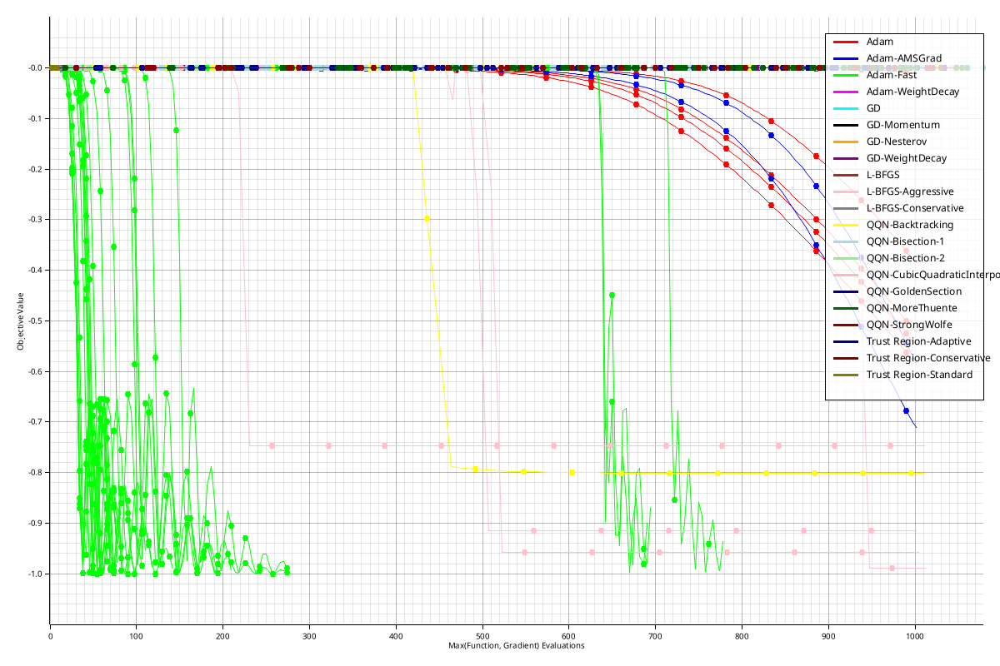

**Figure:** Convergence plots for Michalewicz_2D_m10 showing objective value vs iterations.
Left: Linear scale, Right: Log scale for better visualization of convergence behavior.

**Data:** [Linear scale data (CSV)](convergence_Michalewicz_2D_m10_data.csv) | [Log scale data (CSV)](convergence_Michalewicz_2D_m10_log_data.csv)

## Problem: Michalewicz_5D_m10

**Family:** Highly Multimodal  
**Dimension:** 5  
**Success Threshold:** -2.690e0  
**Total Runs:** 560

### Performance Summary
<table style="border-collapse: collapse; width: 100%; margin: 20px 0;">
<tr style="background-color: #f2f2f2;">
<th style="border: 1px solid #ddd; padding: 8px; text-align: center;">Rank</th>
<th style="border: 1px solid #ddd; padding: 8px; text-align: center;">Optimizer</th>
<th style="border: 1px solid #ddd; padding: 8px; text-align: center;">Mean Final Value (All/Success/Fail)</th>
<th style="border: 1px solid #ddd; padding: 8px; text-align: center;">Std Dev</th>
<th style="border: 1px solid #ddd; padding: 8px; text-align: center;">Best Value</th>
<th style="border: 1px solid #ddd; padding: 8px; text-align: center;">Worst Value</th>
<th style="border: 1px solid #ddd; padding: 8px; text-align: center;">Mean Function Evals (All/Success/Fail)</th>
<th style="border: 1px solid #ddd; padding: 8px; text-align: center;">Mean Gradient Evals (All/Success/Fail)</th>
<th style="border: 1px solid #ddd; padding: 8px; text-align: center;">Success Rate</th>
<th style="border: 1px solid #ddd; padding: 8px; text-align: center;">Mean Time (s)</th>
</tr>
<tr style="background-color: #d4edda; font-weight: bold;">
<td style="border: 1px solid #ddd; padding: 8px; text-align: center;">1</td>
<td style="border: 1px solid #ddd; padding: 8px; text-align: center;"><a href="detailed_Michalewicz_5D_m10_Adam-Fast.md">Adam-Fast</a></td>
<td style="border: 1px solid #ddd; padding: 8px; text-align: center;">-2.84e0 / -3.13e0 / -2.15e0</td>
<td style="border: 1px solid #ddd; padding: 8px; text-align: center;">6.41e-1</td>
<td style="border: 1px solid #ddd; padding: 8px; text-align: center;">-3.69e0</td>
<td style="border: 1px solid #ddd; padding: 8px; text-align: center;">-1.72e0</td>
<td style="border: 1px solid #ddd; padding: 8px; text-align: center;">95.6 / 112.8 / 59.9</td>
<td style="border: 1px solid #ddd; padding: 8px; text-align: center;">94.6 / 111.8 / 58.9</td>
<td style="border: 1px solid #ddd; padding: 8px; text-align: center;">67.5%</td>
<td style="border: 1px solid #ddd; padding: 8px; text-align: center;">0.002</td>
</tr>
<tr style="background-color: #fff3cd;">
<td style="border: 1px solid #ddd; padding: 8px; text-align: center;">2</td>
<td style="border: 1px solid #ddd; padding: 8px; text-align: center;"><a href="detailed_Michalewicz_5D_m10_Adam-AMSGrad.md">Adam-AMSGrad</a></td>
<td style="border: 1px solid #ddd; padding: 8px; text-align: center;">-2.08e0 / -2.69e0 / -1.97e0</td>
<td style="border: 1px solid #ddd; padding: 8px; text-align: center;">6.65e-1</td>
<td style="border: 1px solid #ddd; padding: 8px; text-align: center;">-3.50e0</td>
<td style="border: 1px solid #ddd; padding: 8px; text-align: center;">-8.39e-1</td>
<td style="border: 1px solid #ddd; padding: 8px; text-align: center;">462.6 / 496.3 / 456.6</td>
<td style="border: 1px solid #ddd; padding: 8px; text-align: center;">461.9 / 495.3 / 456.0</td>
<td style="border: 1px solid #ddd; padding: 8px; text-align: center;">15.0%</td>
<td style="border: 1px solid #ddd; padding: 8px; text-align: center;">0.011</td>
</tr>
<tr style="">
<td style="border: 1px solid #ddd; padding: 8px; text-align: center;">3</td>
<td style="border: 1px solid #ddd; padding: 8px; text-align: center;"><a href="detailed_Michalewicz_5D_m10_Adam.md">Adam</a></td>
<td style="border: 1px solid #ddd; padding: 8px; text-align: center;">-2.27e0 / -2.69e0 / -2.20e0</td>
<td style="border: 1px solid #ddd; padding: 8px; text-align: center;">6.37e-1</td>
<td style="border: 1px solid #ddd; padding: 8px; text-align: center;">-3.05e0</td>
<td style="border: 1px solid #ddd; padding: 8px; text-align: center;">-8.39e-1</td>
<td style="border: 1px solid #ddd; padding: 8px; text-align: center;">445.1 / 462.3 / 442.1</td>
<td style="border: 1px solid #ddd; padding: 8px; text-align: center;">444.7 / 461.3 / 441.8</td>
<td style="border: 1px solid #ddd; padding: 8px; text-align: center;">15.0%</td>
<td style="border: 1px solid #ddd; padding: 8px; text-align: center;">0.009</td>
</tr>
<tr style="">
<td style="border: 1px solid #ddd; padding: 8px; text-align: center;">4</td>
<td style="border: 1px solid #ddd; padding: 8px; text-align: center;"><a href="detailed_Michalewicz_5D_m10_QQN-Bisection-1.md">QQN-Bisection-1</a></td>
<td style="border: 1px solid #ddd; padding: 8px; text-align: center;">-1.50e0 / -2.84e0 / -1.47e0</td>
<td style="border: 1px solid #ddd; padding: 8px; text-align: center;">7.23e-1</td>
<td style="border: 1px solid #ddd; padding: 8px; text-align: center;">-2.84e0</td>
<td style="border: 1px solid #ddd; padding: 8px; text-align: center;">-1.84e-5</td>
<td style="border: 1px solid #ddd; padding: 8px; text-align: center;">421.9 / 404.0 / 422.4</td>
<td style="border: 1px solid #ddd; padding: 8px; text-align: center;">478.9 / 506.0 / 478.2</td>
<td style="border: 1px solid #ddd; padding: 8px; text-align: center;">2.5%</td>
<td style="border: 1px solid #ddd; padding: 8px; text-align: center;">0.009</td>
</tr>
<tr style="">
<td style="border: 1px solid #ddd; padding: 8px; text-align: center;">5</td>
<td style="border: 1px solid #ddd; padding: 8px; text-align: center;"><a href="detailed_Michalewicz_5D_m10_QQN-GoldenSection.md">QQN-GoldenSection</a></td>
<td style="border: 1px solid #ddd; padding: 8px; text-align: center;">-1.50e0 / -2.69e0 / -1.43e0</td>
<td style="border: 1px solid #ddd; padding: 8px; text-align: center;">6.77e-1</td>
<td style="border: 1px solid #ddd; padding: 8px; text-align: center;">-2.84e0</td>
<td style="border: 1px solid #ddd; padding: 8px; text-align: center;">-2.51e-5</td>
<td style="border: 1px solid #ddd; padding: 8px; text-align: center;">592.4 / 555.3 / 594.4</td>
<td style="border: 1px solid #ddd; padding: 8px; text-align: center;">91.8 / 91.0 / 91.9</td>
<td style="border: 1px solid #ddd; padding: 8px; text-align: center;">5.0%</td>
<td style="border: 1px solid #ddd; padding: 8px; text-align: center;">0.010</td>
</tr>
<tr style="">
<td style="border: 1px solid #ddd; padding: 8px; text-align: center;">6</td>
<td style="border: 1px solid #ddd; padding: 8px; text-align: center;"><a href="detailed_Michalewicz_5D_m10_QQN-Bisection-2.md">QQN-Bisection-2</a></td>
<td style="border: 1px solid #ddd; padding: 8px; text-align: center;">-1.93e0 / -2.74e0 / -1.89e0</td>
<td style="border: 1px solid #ddd; padding: 8px; text-align: center;">5.28e-1</td>
<td style="border: 1px solid #ddd; padding: 8px; text-align: center;">-2.74e0</td>
<td style="border: 1px solid #ddd; padding: 8px; text-align: center;">-4.92e-1</td>
<td style="border: 1px solid #ddd; padding: 8px; text-align: center;">509.7 / 343.0 / 518.5</td>
<td style="border: 1px solid #ddd; padding: 8px; text-align: center;">287.3 / 246.0 / 289.5</td>
<td style="border: 1px solid #ddd; padding: 8px; text-align: center;">5.0%</td>
<td style="border: 1px solid #ddd; padding: 8px; text-align: center;">0.011</td>
</tr>
<tr style="">
<td style="border: 1px solid #ddd; padding: 8px; text-align: center;">7</td>
<td style="border: 1px solid #ddd; padding: 8px; text-align: center;"><a href="detailed_Michalewicz_5D_m10_QQN-Backtracking.md">QQN-Backtracking</a></td>
<td style="border: 1px solid #ddd; padding: 8px; text-align: center;">-1.75e0 / -2.70e0 / -1.51e0</td>
<td style="border: 1px solid #ddd; padding: 8px; text-align: center;">7.22e-1</td>
<td style="border: 1px solid #ddd; padding: 8px; text-align: center;">-2.74e0</td>
<td style="border: 1px solid #ddd; padding: 8px; text-align: center;">-8.39e-1</td>
<td style="border: 1px solid #ddd; padding: 8px; text-align: center;">534.4 / 451.2 / 555.1</td>
<td style="border: 1px solid #ddd; padding: 8px; text-align: center;">277.1 / 241.0 / 286.1</td>
<td style="border: 1px solid #ddd; padding: 8px; text-align: center;">20.0%</td>
<td style="border: 1px solid #ddd; padding: 8px; text-align: center;">0.016</td>
</tr>
<tr style="">
<td style="border: 1px solid #ddd; padding: 8px; text-align: center;">8</td>
<td style="border: 1px solid #ddd; padding: 8px; text-align: center;"><a href="detailed_Michalewicz_5D_m10_GD.md">GD</a></td>
<td style="border: 1px solid #ddd; padding: 8px; text-align: center;">-1.38e0 / -2.69e0 / -1.23e0</td>
<td style="border: 1px solid #ddd; padding: 8px; text-align: center;">6.89e-1</td>
<td style="border: 1px solid #ddd; padding: 8px; text-align: center;">-2.69e0</td>
<td style="border: 1px solid #ddd; padding: 8px; text-align: center;">-1.79e-5</td>
<td style="border: 1px solid #ddd; padding: 8px; text-align: center;">247.0 / 165.0 / 256.1</td>
<td style="border: 1px solid #ddd; padding: 8px; text-align: center;">491.9 / 328.0 / 510.2</td>
<td style="border: 1px solid #ddd; padding: 8px; text-align: center;">10.0%</td>
<td style="border: 1px solid #ddd; padding: 8px; text-align: center;">0.006</td>
</tr>
<tr style="">
<td style="border: 1px solid #ddd; padding: 8px; text-align: center;">9</td>
<td style="border: 1px solid #ddd; padding: 8px; text-align: center;"><a href="detailed_Michalewicz_5D_m10_QQN-CubicQuadraticInterpolation.md">QQN-CubicQuadraticInterpolation</a></td>
<td style="border: 1px solid #ddd; padding: 8px; text-align: center;">-1.37e0 / -2.69e0 / -1.34e0</td>
<td style="border: 1px solid #ddd; padding: 8px; text-align: center;">6.09e-1</td>
<td style="border: 1px solid #ddd; padding: 8px; text-align: center;">-2.69e0</td>
<td style="border: 1px solid #ddd; padding: 8px; text-align: center;">-3.05e-6</td>
<td style="border: 1px solid #ddd; padding: 8px; text-align: center;">356.1 / 156.0 / 361.2</td>
<td style="border: 1px solid #ddd; padding: 8px; text-align: center;">565.5 / 200.0 / 574.8</td>
<td style="border: 1px solid #ddd; padding: 8px; text-align: center;">2.5%</td>
<td style="border: 1px solid #ddd; padding: 8px; text-align: center;">0.013</td>
</tr>
<tr style="">
<td style="border: 1px solid #ddd; padding: 8px; text-align: center;">10</td>
<td style="border: 1px solid #ddd; padding: 8px; text-align: center;"><a href="detailed_Michalewicz_5D_m10_L-BFGS-Conservative.md">L-BFGS-Conservative</a></td>
<td style="border: 1px solid #ddd; padding: 8px; text-align: center;">-1.52e0 / - / -1.52e0</td>
<td style="border: 1px solid #ddd; padding: 8px; text-align: center;">6.70e-1</td>
<td style="border: 1px solid #ddd; padding: 8px; text-align: center;">-2.69e0</td>
<td style="border: 1px solid #ddd; padding: 8px; text-align: center;">-8.39e-1</td>
<td style="border: 1px solid #ddd; padding: 8px; text-align: center;">620.7 / - / 620.7</td>
<td style="border: 1px solid #ddd; padding: 8px; text-align: center;">341.0 / - / 341.0</td>
<td style="border: 1px solid #ddd; padding: 8px; text-align: center;">0.0%</td>
<td style="border: 1px solid #ddd; padding: 8px; text-align: center;">0.012</td>
</tr>
<tr style="">
<td style="border: 1px solid #ddd; padding: 8px; text-align: center;">11</td>
<td style="border: 1px solid #ddd; padding: 8px; text-align: center;"><a href="detailed_Michalewicz_5D_m10_QQN-MoreThuente.md">QQN-MoreThuente</a></td>
<td style="border: 1px solid #ddd; padding: 8px; text-align: center;">-1.41e0 / - / -1.41e0</td>
<td style="border: 1px solid #ddd; padding: 8px; text-align: center;">5.18e-1</td>
<td style="border: 1px solid #ddd; padding: 8px; text-align: center;">-2.69e0</td>
<td style="border: 1px solid #ddd; padding: 8px; text-align: center;">-7.96e-1</td>
<td style="border: 1px solid #ddd; padding: 8px; text-align: center;">383.9 / - / 383.9</td>
<td style="border: 1px solid #ddd; padding: 8px; text-align: center;">419.2 / - / 419.2</td>
<td style="border: 1px solid #ddd; padding: 8px; text-align: center;">0.0%</td>
<td style="border: 1px solid #ddd; padding: 8px; text-align: center;">0.010</td>
</tr>
<tr style="">
<td style="border: 1px solid #ddd; padding: 8px; text-align: center;">12</td>
<td style="border: 1px solid #ddd; padding: 8px; text-align: center;"><a href="detailed_Michalewicz_5D_m10_Adam-WeightDecay.md">Adam-WeightDecay</a></td>
<td style="border: 1px solid #ddd; padding: 8px; text-align: center;">-1.71e0 / -2.68e0 / -1.46e0</td>
<td style="border: 1px solid #ddd; padding: 8px; text-align: center;">7.33e-1</td>
<td style="border: 1px solid #ddd; padding: 8px; text-align: center;">-2.69e0</td>
<td style="border: 1px solid #ddd; padding: 8px; text-align: center;">-1.38e-6</td>
<td style="border: 1px solid #ddd; padding: 8px; text-align: center;">156.9 / 212.5 / 143.0</td>
<td style="border: 1px solid #ddd; padding: 8px; text-align: center;">155.9 / 211.5 / 142.0</td>
<td style="border: 1px solid #ddd; padding: 8px; text-align: center;">20.0%</td>
<td style="border: 1px solid #ddd; padding: 8px; text-align: center;">0.004</td>
</tr>
<tr style="">
<td style="border: 1px solid #ddd; padding: 8px; text-align: center;">13</td>
<td style="border: 1px solid #ddd; padding: 8px; text-align: center;"><a href="detailed_Michalewicz_5D_m10_GD-Nesterov.md">GD-Nesterov</a></td>
<td style="border: 1px solid #ddd; padding: 8px; text-align: center;">-1.35e0 / - / -1.27e0</td>
<td style="border: 1px solid #ddd; padding: 8px; text-align: center;">6.78e-1</td>
<td style="border: 1px solid #ddd; padding: 8px; text-align: center;">-2.68e0</td>
<td style="border: 1px solid #ddd; padding: 8px; text-align: center;">-8.13e-1</td>
<td style="border: 1px solid #ddd; padding: 8px; text-align: center;">43.9 / - / 43.9</td>
<td style="border: 1px solid #ddd; padding: 8px; text-align: center;">83.9 / - / 83.9</td>
<td style="border: 1px solid #ddd; padding: 8px; text-align: center;">0.0%</td>
<td style="border: 1px solid #ddd; padding: 8px; text-align: center;">0.001</td>
</tr>
<tr style="">
<td style="border: 1px solid #ddd; padding: 8px; text-align: center;">14</td>
<td style="border: 1px solid #ddd; padding: 8px; text-align: center;"><a href="detailed_Michalewicz_5D_m10_GD-WeightDecay.md">GD-WeightDecay</a></td>
<td style="border: 1px solid #ddd; padding: 8px; text-align: center;">-1.30e0 / - / -1.26e0</td>
<td style="border: 1px solid #ddd; padding: 8px; text-align: center;">5.98e-1</td>
<td style="border: 1px solid #ddd; padding: 8px; text-align: center;">-2.65e0</td>
<td style="border: 1px solid #ddd; padding: 8px; text-align: center;">-6.92e-5</td>
<td style="border: 1px solid #ddd; padding: 8px; text-align: center;">68.2 / - / 68.2</td>
<td style="border: 1px solid #ddd; padding: 8px; text-align: center;">132.5 / - / 132.5</td>
<td style="border: 1px solid #ddd; padding: 8px; text-align: center;">0.0%</td>
<td style="border: 1px solid #ddd; padding: 8px; text-align: center;">0.002</td>
</tr>
<tr style="">
<td style="border: 1px solid #ddd; padding: 8px; text-align: center;">15</td>
<td style="border: 1px solid #ddd; padding: 8px; text-align: center;"><a href="detailed_Michalewicz_5D_m10_Trust_Region-Conservative.md">Trust Region-Conservative</a></td>
<td style="border: 1px solid #ddd; padding: 8px; text-align: center;">-1.06e0 / - / -1.05e0</td>
<td style="border: 1px solid #ddd; padding: 8px; text-align: center;">5.74e-1</td>
<td style="border: 1px solid #ddd; padding: 8px; text-align: center;">-2.31e0</td>
<td style="border: 1px solid #ddd; padding: 8px; text-align: center;">-4.18e-5</td>
<td style="border: 1px solid #ddd; padding: 8px; text-align: center;">280.8 / - / 280.8</td>
<td style="border: 1px solid #ddd; padding: 8px; text-align: center;">187.8 / - / 187.8</td>
<td style="border: 1px solid #ddd; padding: 8px; text-align: center;">0.0%</td>
<td style="border: 1px solid #ddd; padding: 8px; text-align: center;">0.002</td>
</tr>
<tr style="">
<td style="border: 1px solid #ddd; padding: 8px; text-align: center;">16</td>
<td style="border: 1px solid #ddd; padding: 8px; text-align: center;"><a href="detailed_Michalewicz_5D_m10_QQN-StrongWolfe.md">QQN-StrongWolfe</a></td>
<td style="border: 1px solid #ddd; padding: 8px; text-align: center;">-1.19e0 / - / -1.19e0</td>
<td style="border: 1px solid #ddd; padding: 8px; text-align: center;">5.24e-1</td>
<td style="border: 1px solid #ddd; padding: 8px; text-align: center;">-2.15e0</td>
<td style="border: 1px solid #ddd; padding: 8px; text-align: center;">-7.90e-5</td>
<td style="border: 1px solid #ddd; padding: 8px; text-align: center;">467.1 / - / 467.1</td>
<td style="border: 1px solid #ddd; padding: 8px; text-align: center;">393.6 / - / 393.6</td>
<td style="border: 1px solid #ddd; padding: 8px; text-align: center;">0.0%</td>
<td style="border: 1px solid #ddd; padding: 8px; text-align: center;">0.013</td>
</tr>
<tr style="">
<td style="border: 1px solid #ddd; padding: 8px; text-align: center;">17</td>
<td style="border: 1px solid #ddd; padding: 8px; text-align: center;"><a href="detailed_Michalewicz_5D_m10_L-BFGS.md">L-BFGS</a></td>
<td style="border: 1px solid #ddd; padding: 8px; text-align: center;">-9.71e-1 / - / -2.67e-1</td>
<td style="border: 1px solid #ddd; padding: 8px; text-align: center;">4.02e-1</td>
<td style="border: 1px solid #ddd; padding: 8px; text-align: center;">-1.78e0</td>
<td style="border: 1px solid #ddd; padding: 8px; text-align: center;">-3.51e-1</td>
<td style="border: 1px solid #ddd; padding: 8px; text-align: center;">108.8 / - / 108.8</td>
<td style="border: 1px solid #ddd; padding: 8px; text-align: center;">59.0 / - / 59.0</td>
<td style="border: 1px solid #ddd; padding: 8px; text-align: center;">0.0%</td>
<td style="border: 1px solid #ddd; padding: 8px; text-align: center;">0.002</td>
</tr>
<tr style="">
<td style="border: 1px solid #ddd; padding: 8px; text-align: center;">18</td>
<td style="border: 1px solid #ddd; padding: 8px; text-align: center;"><a href="detailed_Michalewicz_5D_m10_Trust_Region-Adaptive.md">Trust Region-Adaptive</a></td>
<td style="border: 1px solid #ddd; padding: 8px; text-align: center;">-7.69e-1 / - / -7.68e-1</td>
<td style="border: 1px solid #ddd; padding: 8px; text-align: center;">6.53e-1</td>
<td style="border: 1px solid #ddd; padding: 8px; text-align: center;">-1.74e0</td>
<td style="border: 1px solid #ddd; padding: 8px; text-align: center;">-1.29e-4</td>
<td style="border: 1px solid #ddd; padding: 8px; text-align: center;">11.6 / - / 11.6</td>
<td style="border: 1px solid #ddd; padding: 8px; text-align: center;">8.4 / - / 8.4</td>
<td style="border: 1px solid #ddd; padding: 8px; text-align: center;">0.0%</td>
<td style="border: 1px solid #ddd; padding: 8px; text-align: center;">0.000</td>
</tr>
<tr style="">
<td style="border: 1px solid #ddd; padding: 8px; text-align: center;">19</td>
<td style="border: 1px solid #ddd; padding: 8px; text-align: center;"><a href="detailed_Michalewicz_5D_m10_GD-Momentum.md">GD-Momentum</a></td>
<td style="border: 1px solid #ddd; padding: 8px; text-align: center;">-1.00e0 / - / -5.97e-1</td>
<td style="border: 1px solid #ddd; padding: 8px; text-align: center;">3.34e-1</td>
<td style="border: 1px solid #ddd; padding: 8px; text-align: center;">-1.72e0</td>
<td style="border: 1px solid #ddd; padding: 8px; text-align: center;">-7.29e-1</td>
<td style="border: 1px solid #ddd; padding: 8px; text-align: center;">32.9 / - / 32.9</td>
<td style="border: 1px solid #ddd; padding: 8px; text-align: center;">61.8 / - / 61.8</td>
<td style="border: 1px solid #ddd; padding: 8px; text-align: center;">0.0%</td>
<td style="border: 1px solid #ddd; padding: 8px; text-align: center;">0.001</td>
</tr>
<tr style="">
<td style="border: 1px solid #ddd; padding: 8px; text-align: center;">20</td>
<td style="border: 1px solid #ddd; padding: 8px; text-align: center;"><a href="detailed_Michalewicz_5D_m10_L-BFGS-Aggressive.md">L-BFGS-Aggressive</a></td>
<td style="border: 1px solid #ddd; padding: 8px; text-align: center;">-5.52e-1 / - / -5.46e-1</td>
<td style="border: 1px solid #ddd; padding: 8px; text-align: center;">2.89e-1</td>
<td style="border: 1px solid #ddd; padding: 8px; text-align: center;">-1.04e0</td>
<td style="border: 1px solid #ddd; padding: 8px; text-align: center;">-7.98e-2</td>
<td style="border: 1px solid #ddd; padding: 8px; text-align: center;">736.0 / - / 736.0</td>
<td style="border: 1px solid #ddd; padding: 8px; text-align: center;">224.4 / - / 224.4</td>
<td style="border: 1px solid #ddd; padding: 8px; text-align: center;">0.0%</td>
<td style="border: 1px solid #ddd; padding: 8px; text-align: center;">0.006</td>
</tr>
<tr style="">
<td style="border: 1px solid #ddd; padding: 8px; text-align: center;">21</td>
<td style="border: 1px solid #ddd; padding: 8px; text-align: center;"><a href="detailed_Michalewicz_5D_m10_Trust_Region-Standard.md">Trust Region-Standard</a></td>
<td style="border: 1px solid #ddd; padding: 8px; text-align: center;">-1.50e-1 / - / -1.48e-1</td>
<td style="border: 1px solid #ddd; padding: 8px; text-align: center;">2.14e-1</td>
<td style="border: 1px solid #ddd; padding: 8px; text-align: center;">-7.25e-1</td>
<td style="border: 1px solid #ddd; padding: 8px; text-align: center;">-7.76e-5</td>
<td style="border: 1px solid #ddd; padding: 8px; text-align: center;">5.3 / - / 5.3</td>
<td style="border: 1px solid #ddd; padding: 8px; text-align: center;">4.2 / - / 4.2</td>
<td style="border: 1px solid #ddd; padding: 8px; text-align: center;">0.0%</td>
<td style="border: 1px solid #ddd; padding: 8px; text-align: center;">0.000</td>
</tr>
</table>

### Convergence Plots

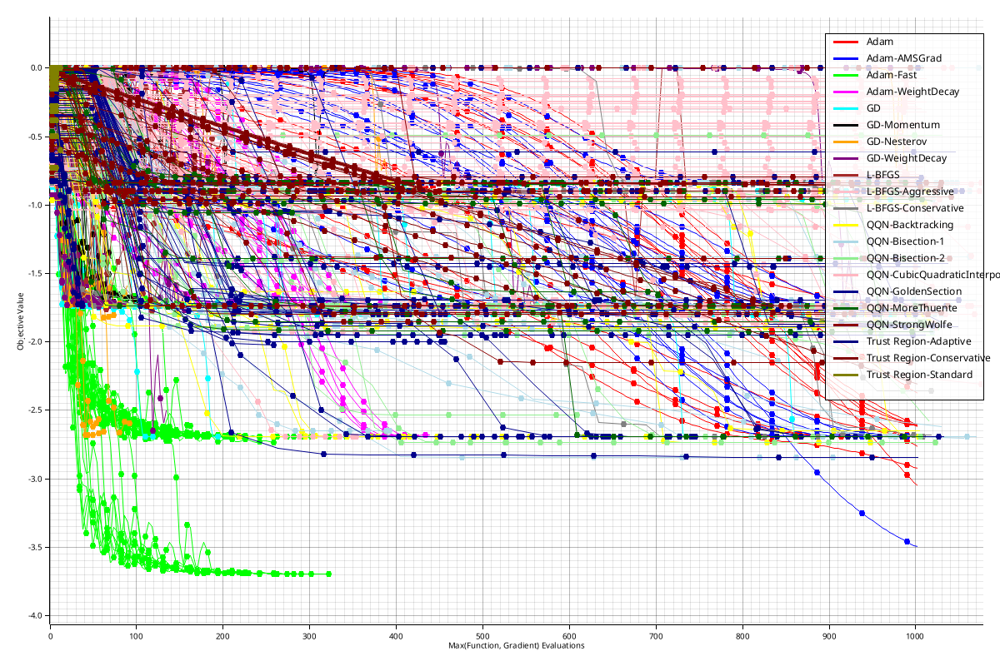
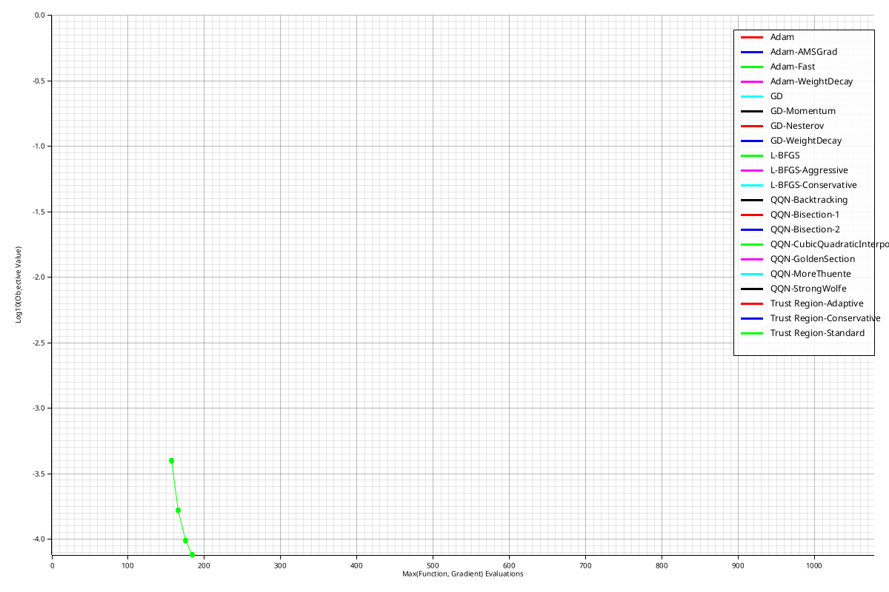

**Figure:** Convergence plots for Michalewicz_5D_m10 showing objective value vs iterations.
Left: Linear scale, Right: Log scale for better visualization of convergence behavior.

**Data:** [Linear scale data (CSV)](convergence_Michalewicz_5D_m10_data.csv) | [Log scale data (CSV)](convergence_Michalewicz_5D_m10_log_data.csv)

## Problem: Michalewicz_10D_m10

**Family:** Highly Multimodal  
**Dimension:** 10  
**Success Threshold:** -6.260e0  
**Total Runs:** 560

### Performance Summary
<table style="border-collapse: collapse; width: 100%; margin: 20px 0;">
<tr style="background-color: #f2f2f2;">
<th style="border: 1px solid #ddd; padding: 8px; text-align: center;">Rank</th>
<th style="border: 1px solid #ddd; padding: 8px; text-align: center;">Optimizer</th>
<th style="border: 1px solid #ddd; padding: 8px; text-align: center;">Mean Final Value (All/Success/Fail)</th>
<th style="border: 1px solid #ddd; padding: 8px; text-align: center;">Std Dev</th>
<th style="border: 1px solid #ddd; padding: 8px; text-align: center;">Best Value</th>
<th style="border: 1px solid #ddd; padding: 8px; text-align: center;">Worst Value</th>
<th style="border: 1px solid #ddd; padding: 8px; text-align: center;">Mean Function Evals (All/Success/Fail)</th>
<th style="border: 1px solid #ddd; padding: 8px; text-align: center;">Mean Gradient Evals (All/Success/Fail)</th>
<th style="border: 1px solid #ddd; padding: 8px; text-align: center;">Success Rate</th>
<th style="border: 1px solid #ddd; padding: 8px; text-align: center;">Mean Time (s)</th>
</tr>
<tr style="background-color: #d4edda; font-weight: bold;">
<td style="border: 1px solid #ddd; padding: 8px; text-align: center;">1</td>
<td style="border: 1px solid #ddd; padding: 8px; text-align: center;"><a href="detailed_Michalewicz_10D_m10_Adam-Fast.md">Adam-Fast</a></td>
<td style="border: 1px solid #ddd; padding: 8px; text-align: center;">-6.54e0 / -7.10e0 / -5.99e0</td>
<td style="border: 1px solid #ddd; padding: 8px; text-align: center;">6.67e-1</td>
<td style="border: 1px solid #ddd; padding: 8px; text-align: center;">-7.26e0</td>
<td style="border: 1px solid #ddd; padding: 8px; text-align: center;">-5.26e0</td>
<td style="border: 1px solid #ddd; padding: 8px; text-align: center;">119.2 / 112.8 / 125.0</td>
<td style="border: 1px solid #ddd; padding: 8px; text-align: center;">118.2 / 111.8 / 124.0</td>
<td style="border: 1px solid #ddd; padding: 8px; text-align: center;">47.5%</td>
<td style="border: 1px solid #ddd; padding: 8px; text-align: center;">0.003</td>
</tr>
<tr style="background-color: #fff3cd;">
<td style="border: 1px solid #ddd; padding: 8px; text-align: center;">2</td>
<td style="border: 1px solid #ddd; padding: 8px; text-align: center;"><a href="detailed_Michalewicz_10D_m10_Adam-AMSGrad.md">Adam-AMSGrad</a></td>
<td style="border: 1px solid #ddd; padding: 8px; text-align: center;">-5.91e0 / - / -5.91e0</td>
<td style="border: 1px solid #ddd; padding: 8px; text-align: center;">5.68e-1</td>
<td style="border: 1px solid #ddd; padding: 8px; text-align: center;">-6.67e0</td>
<td style="border: 1px solid #ddd; padding: 8px; text-align: center;">-4.40e0</td>
<td style="border: 1px solid #ddd; padding: 8px; text-align: center;">478.1 / - / 478.1</td>
<td style="border: 1px solid #ddd; padding: 8px; text-align: center;">477.7 / - / 477.7</td>
<td style="border: 1px solid #ddd; padding: 8px; text-align: center;">0.0%</td>
<td style="border: 1px solid #ddd; padding: 8px; text-align: center;">0.013</td>
</tr>
<tr style="">
<td style="border: 1px solid #ddd; padding: 8px; text-align: center;">3</td>
<td style="border: 1px solid #ddd; padding: 8px; text-align: center;"><a href="detailed_Michalewicz_10D_m10_Adam.md">Adam</a></td>
<td style="border: 1px solid #ddd; padding: 8px; text-align: center;">-5.66e0 / - / -5.65e0</td>
<td style="border: 1px solid #ddd; padding: 8px; text-align: center;">5.74e-1</td>
<td style="border: 1px solid #ddd; padding: 8px; text-align: center;">-6.26e0</td>
<td style="border: 1px solid #ddd; padding: 8px; text-align: center;">-4.40e0</td>
<td style="border: 1px solid #ddd; padding: 8px; text-align: center;">424.4 / - / 424.4</td>
<td style="border: 1px solid #ddd; padding: 8px; text-align: center;">423.6 / - / 423.6</td>
<td style="border: 1px solid #ddd; padding: 8px; text-align: center;">0.0%</td>
<td style="border: 1px solid #ddd; padding: 8px; text-align: center;">0.010</td>
</tr>
<tr style="">
<td style="border: 1px solid #ddd; padding: 8px; text-align: center;">4</td>
<td style="border: 1px solid #ddd; padding: 8px; text-align: center;"><a href="detailed_Michalewicz_10D_m10_QQN-Backtracking.md">QQN-Backtracking</a></td>
<td style="border: 1px solid #ddd; padding: 8px; text-align: center;">-4.11e0 / - / -4.11e0</td>
<td style="border: 1px solid #ddd; padding: 8px; text-align: center;">1.18e0</td>
<td style="border: 1px solid #ddd; padding: 8px; text-align: center;">-6.26e0</td>
<td style="border: 1px solid #ddd; padding: 8px; text-align: center;">-1.90e0</td>
<td style="border: 1px solid #ddd; padding: 8px; text-align: center;">640.4 / - / 640.4</td>
<td style="border: 1px solid #ddd; padding: 8px; text-align: center;">314.2 / - / 314.2</td>
<td style="border: 1px solid #ddd; padding: 8px; text-align: center;">0.0%</td>
<td style="border: 1px solid #ddd; padding: 8px; text-align: center;">0.019</td>
</tr>
<tr style="">
<td style="border: 1px solid #ddd; padding: 8px; text-align: center;">5</td>
<td style="border: 1px solid #ddd; padding: 8px; text-align: center;"><a href="detailed_Michalewicz_10D_m10_QQN-StrongWolfe.md">QQN-StrongWolfe</a></td>
<td style="border: 1px solid #ddd; padding: 8px; text-align: center;">-4.36e0 / - / -4.36e0</td>
<td style="border: 1px solid #ddd; padding: 8px; text-align: center;">1.24e0</td>
<td style="border: 1px solid #ddd; padding: 8px; text-align: center;">-6.26e0</td>
<td style="border: 1px solid #ddd; padding: 8px; text-align: center;">-1.93e0</td>
<td style="border: 1px solid #ddd; padding: 8px; text-align: center;">547.2 / - / 547.2</td>
<td style="border: 1px solid #ddd; padding: 8px; text-align: center;">438.0 / - / 438.0</td>
<td style="border: 1px solid #ddd; padding: 8px; text-align: center;">0.0%</td>
<td style="border: 1px solid #ddd; padding: 8px; text-align: center;">0.016</td>
</tr>
<tr style="">
<td style="border: 1px solid #ddd; padding: 8px; text-align: center;">6</td>
<td style="border: 1px solid #ddd; padding: 8px; text-align: center;"><a href="detailed_Michalewicz_10D_m10_GD-WeightDecay.md">GD-WeightDecay</a></td>
<td style="border: 1px solid #ddd; padding: 8px; text-align: center;">-4.59e0 / - / -4.55e0</td>
<td style="border: 1px solid #ddd; padding: 8px; text-align: center;">8.50e-1</td>
<td style="border: 1px solid #ddd; padding: 8px; text-align: center;">-6.26e0</td>
<td style="border: 1px solid #ddd; padding: 8px; text-align: center;">-3.14e0</td>
<td style="border: 1px solid #ddd; padding: 8px; text-align: center;">74.6 / - / 74.6</td>
<td style="border: 1px solid #ddd; padding: 8px; text-align: center;">145.3 / - / 145.3</td>
<td style="border: 1px solid #ddd; padding: 8px; text-align: center;">0.0%</td>
<td style="border: 1px solid #ddd; padding: 8px; text-align: center;">0.003</td>
</tr>
<tr style="">
<td style="border: 1px solid #ddd; padding: 8px; text-align: center;">7</td>
<td style="border: 1px solid #ddd; padding: 8px; text-align: center;"><a href="detailed_Michalewicz_10D_m10_Adam-WeightDecay.md">Adam-WeightDecay</a></td>
<td style="border: 1px solid #ddd; padding: 8px; text-align: center;">-5.19e0 / - / -5.18e0</td>
<td style="border: 1px solid #ddd; padding: 8px; text-align: center;">5.32e-1</td>
<td style="border: 1px solid #ddd; padding: 8px; text-align: center;">-6.26e0</td>
<td style="border: 1px solid #ddd; padding: 8px; text-align: center;">-4.39e0</td>
<td style="border: 1px solid #ddd; padding: 8px; text-align: center;">170.2 / - / 170.2</td>
<td style="border: 1px solid #ddd; padding: 8px; text-align: center;">169.2 / - / 169.2</td>
<td style="border: 1px solid #ddd; padding: 8px; text-align: center;">0.0%</td>
<td style="border: 1px solid #ddd; padding: 8px; text-align: center;">0.004</td>
</tr>
<tr style="">
<td style="border: 1px solid #ddd; padding: 8px; text-align: center;">8</td>
<td style="border: 1px solid #ddd; padding: 8px; text-align: center;"><a href="detailed_Michalewicz_10D_m10_GD-Nesterov.md">GD-Nesterov</a></td>
<td style="border: 1px solid #ddd; padding: 8px; text-align: center;">-4.09e0 / - / -3.93e0</td>
<td style="border: 1px solid #ddd; padding: 8px; text-align: center;">1.15e0</td>
<td style="border: 1px solid #ddd; padding: 8px; text-align: center;">-6.19e0</td>
<td style="border: 1px solid #ddd; padding: 8px; text-align: center;">-2.08e0</td>
<td style="border: 1px solid #ddd; padding: 8px; text-align: center;">22.0 / - / 22.0</td>
<td style="border: 1px solid #ddd; padding: 8px; text-align: center;">40.0 / - / 40.0</td>
<td style="border: 1px solid #ddd; padding: 8px; text-align: center;">0.0%</td>
<td style="border: 1px solid #ddd; padding: 8px; text-align: center;">0.001</td>
</tr>
<tr style="">
<td style="border: 1px solid #ddd; padding: 8px; text-align: center;">9</td>
<td style="border: 1px solid #ddd; padding: 8px; text-align: center;"><a href="detailed_Michalewicz_10D_m10_QQN-MoreThuente.md">QQN-MoreThuente</a></td>
<td style="border: 1px solid #ddd; padding: 8px; text-align: center;">-4.18e0 / - / -4.18e0</td>
<td style="border: 1px solid #ddd; padding: 8px; text-align: center;">9.30e-1</td>
<td style="border: 1px solid #ddd; padding: 8px; text-align: center;">-5.42e0</td>
<td style="border: 1px solid #ddd; padding: 8px; text-align: center;">-2.21e0</td>
<td style="border: 1px solid #ddd; padding: 8px; text-align: center;">461.5 / - / 461.5</td>
<td style="border: 1px solid #ddd; padding: 8px; text-align: center;">521.8 / - / 521.8</td>
<td style="border: 1px solid #ddd; padding: 8px; text-align: center;">0.0%</td>
<td style="border: 1px solid #ddd; padding: 8px; text-align: center;">0.013</td>
</tr>
<tr style="">
<td style="border: 1px solid #ddd; padding: 8px; text-align: center;">10</td>
<td style="border: 1px solid #ddd; padding: 8px; text-align: center;"><a href="detailed_Michalewicz_10D_m10_QQN-GoldenSection.md">QQN-GoldenSection</a></td>
<td style="border: 1px solid #ddd; padding: 8px; text-align: center;">-3.72e0 / - / -3.72e0</td>
<td style="border: 1px solid #ddd; padding: 8px; text-align: center;">9.32e-1</td>
<td style="border: 1px solid #ddd; padding: 8px; text-align: center;">-5.36e0</td>
<td style="border: 1px solid #ddd; padding: 8px; text-align: center;">-1.50e0</td>
<td style="border: 1px solid #ddd; padding: 8px; text-align: center;">884.4 / - / 884.4</td>
<td style="border: 1px solid #ddd; padding: 8px; text-align: center;">117.2 / - / 117.2</td>
<td style="border: 1px solid #ddd; padding: 8px; text-align: center;">0.0%</td>
<td style="border: 1px solid #ddd; padding: 8px; text-align: center;">0.016</td>
</tr>
<tr style="">
<td style="border: 1px solid #ddd; padding: 8px; text-align: center;">11</td>
<td style="border: 1px solid #ddd; padding: 8px; text-align: center;"><a href="detailed_Michalewicz_10D_m10_QQN-CubicQuadraticInterpolation.md">QQN-CubicQuadraticInterpolation</a></td>
<td style="border: 1px solid #ddd; padding: 8px; text-align: center;">-3.16e0 / - / -3.16e0</td>
<td style="border: 1px solid #ddd; padding: 8px; text-align: center;">9.99e-1</td>
<td style="border: 1px solid #ddd; padding: 8px; text-align: center;">-5.31e0</td>
<td style="border: 1px solid #ddd; padding: 8px; text-align: center;">-7.91e-1</td>
<td style="border: 1px solid #ddd; padding: 8px; text-align: center;">395.5 / - / 395.5</td>
<td style="border: 1px solid #ddd; padding: 8px; text-align: center;">654.5 / - / 654.5</td>
<td style="border: 1px solid #ddd; padding: 8px; text-align: center;">0.0%</td>
<td style="border: 1px solid #ddd; padding: 8px; text-align: center;">0.015</td>
</tr>
<tr style="">
<td style="border: 1px solid #ddd; padding: 8px; text-align: center;">12</td>
<td style="border: 1px solid #ddd; padding: 8px; text-align: center;"><a href="detailed_Michalewicz_10D_m10_QQN-Bisection-1.md">QQN-Bisection-1</a></td>
<td style="border: 1px solid #ddd; padding: 8px; text-align: center;">-3.79e0 / - / -3.79e0</td>
<td style="border: 1px solid #ddd; padding: 8px; text-align: center;">8.79e-1</td>
<td style="border: 1px solid #ddd; padding: 8px; text-align: center;">-5.30e0</td>
<td style="border: 1px solid #ddd; padding: 8px; text-align: center;">-1.54e0</td>
<td style="border: 1px solid #ddd; padding: 8px; text-align: center;">471.4 / - / 471.4</td>
<td style="border: 1px solid #ddd; padding: 8px; text-align: center;">558.1 / - / 558.1</td>
<td style="border: 1px solid #ddd; padding: 8px; text-align: center;">0.0%</td>
<td style="border: 1px solid #ddd; padding: 8px; text-align: center;">0.012</td>
</tr>
<tr style="">
<td style="border: 1px solid #ddd; padding: 8px; text-align: center;">13</td>
<td style="border: 1px solid #ddd; padding: 8px; text-align: center;"><a href="detailed_Michalewicz_10D_m10_L-BFGS-Conservative.md">L-BFGS-Conservative</a></td>
<td style="border: 1px solid #ddd; padding: 8px; text-align: center;">-4.11e0 / - / -4.11e0</td>
<td style="border: 1px solid #ddd; padding: 8px; text-align: center;">7.11e-1</td>
<td style="border: 1px solid #ddd; padding: 8px; text-align: center;">-5.30e0</td>
<td style="border: 1px solid #ddd; padding: 8px; text-align: center;">-2.83e0</td>
<td style="border: 1px solid #ddd; padding: 8px; text-align: center;">707.0 / - / 707.0</td>
<td style="border: 1px solid #ddd; padding: 8px; text-align: center;">265.9 / - / 265.9</td>
<td style="border: 1px solid #ddd; padding: 8px; text-align: center;">0.0%</td>
<td style="border: 1px solid #ddd; padding: 8px; text-align: center;">0.011</td>
</tr>
<tr style="">
<td style="border: 1px solid #ddd; padding: 8px; text-align: center;">14</td>
<td style="border: 1px solid #ddd; padding: 8px; text-align: center;"><a href="detailed_Michalewicz_10D_m10_GD-Momentum.md">GD-Momentum</a></td>
<td style="border: 1px solid #ddd; padding: 8px; text-align: center;">-3.86e0 / - / -3.70e0</td>
<td style="border: 1px solid #ddd; padding: 8px; text-align: center;">8.44e-1</td>
<td style="border: 1px solid #ddd; padding: 8px; text-align: center;">-5.30e0</td>
<td style="border: 1px solid #ddd; padding: 8px; text-align: center;">-1.80e0</td>
<td style="border: 1px solid #ddd; padding: 8px; text-align: center;">38.3 / - / 38.3</td>
<td style="border: 1px solid #ddd; padding: 8px; text-align: center;">72.6 / - / 72.6</td>
<td style="border: 1px solid #ddd; padding: 8px; text-align: center;">0.0%</td>
<td style="border: 1px solid #ddd; padding: 8px; text-align: center;">0.001</td>
</tr>
<tr style="">
<td style="border: 1px solid #ddd; padding: 8px; text-align: center;">15</td>
<td style="border: 1px solid #ddd; padding: 8px; text-align: center;"><a href="detailed_Michalewicz_10D_m10_Trust_Region-Adaptive.md">Trust Region-Adaptive</a></td>
<td style="border: 1px solid #ddd; padding: 8px; text-align: center;">-3.70e0 / - / -3.70e0</td>
<td style="border: 1px solid #ddd; padding: 8px; text-align: center;">7.98e-1</td>
<td style="border: 1px solid #ddd; padding: 8px; text-align: center;">-5.26e0</td>
<td style="border: 1px solid #ddd; padding: 8px; text-align: center;">-2.27e0</td>
<td style="border: 1px solid #ddd; padding: 8px; text-align: center;">33.0 / - / 33.0</td>
<td style="border: 1px solid #ddd; padding: 8px; text-align: center;">22.7 / - / 22.7</td>
<td style="border: 1px solid #ddd; padding: 8px; text-align: center;">0.0%</td>
<td style="border: 1px solid #ddd; padding: 8px; text-align: center;">0.000</td>
</tr>
<tr style="">
<td style="border: 1px solid #ddd; padding: 8px; text-align: center;">16</td>
<td style="border: 1px solid #ddd; padding: 8px; text-align: center;"><a href="detailed_Michalewicz_10D_m10_GD.md">GD</a></td>
<td style="border: 1px solid #ddd; padding: 8px; text-align: center;">-3.25e0 / - / -3.15e0</td>
<td style="border: 1px solid #ddd; padding: 8px; text-align: center;">8.02e-1</td>
<td style="border: 1px solid #ddd; padding: 8px; text-align: center;">-5.15e0</td>
<td style="border: 1px solid #ddd; padding: 8px; text-align: center;">-1.91e0</td>
<td style="border: 1px solid #ddd; padding: 8px; text-align: center;">23.4 / - / 23.4</td>
<td style="border: 1px solid #ddd; padding: 8px; text-align: center;">42.8 / - / 42.8</td>
<td style="border: 1px solid #ddd; padding: 8px; text-align: center;">0.0%</td>
<td style="border: 1px solid #ddd; padding: 8px; text-align: center;">0.001</td>
</tr>
<tr style="">
<td style="border: 1px solid #ddd; padding: 8px; text-align: center;">17</td>
<td style="border: 1px solid #ddd; padding: 8px; text-align: center;"><a href="detailed_Michalewicz_10D_m10_QQN-Bisection-2.md">QQN-Bisection-2</a></td>
<td style="border: 1px solid #ddd; padding: 8px; text-align: center;">-3.58e0 / - / -3.58e0</td>
<td style="border: 1px solid #ddd; padding: 8px; text-align: center;">9.13e-1</td>
<td style="border: 1px solid #ddd; padding: 8px; text-align: center;">-4.76e0</td>
<td style="border: 1px solid #ddd; padding: 8px; text-align: center;">-1.35e0</td>
<td style="border: 1px solid #ddd; padding: 8px; text-align: center;">337.4 / - / 337.4</td>
<td style="border: 1px solid #ddd; padding: 8px; text-align: center;">189.3 / - / 189.3</td>
<td style="border: 1px solid #ddd; padding: 8px; text-align: center;">0.0%</td>
<td style="border: 1px solid #ddd; padding: 8px; text-align: center;">0.008</td>
</tr>
<tr style="">
<td style="border: 1px solid #ddd; padding: 8px; text-align: center;">18</td>
<td style="border: 1px solid #ddd; padding: 8px; text-align: center;"><a href="detailed_Michalewicz_10D_m10_Trust_Region-Conservative.md">Trust Region-Conservative</a></td>
<td style="border: 1px solid #ddd; padding: 8px; text-align: center;">-3.23e0 / - / -3.23e0</td>
<td style="border: 1px solid #ddd; padding: 8px; text-align: center;">6.65e-1</td>
<td style="border: 1px solid #ddd; padding: 8px; text-align: center;">-4.29e0</td>
<td style="border: 1px solid #ddd; padding: 8px; text-align: center;">-2.04e0</td>
<td style="border: 1px solid #ddd; padding: 8px; text-align: center;">524.0 / - / 524.0</td>
<td style="border: 1px solid #ddd; padding: 8px; text-align: center;">350.0 / - / 350.0</td>
<td style="border: 1px solid #ddd; padding: 8px; text-align: center;">0.0%</td>
<td style="border: 1px solid #ddd; padding: 8px; text-align: center;">0.004</td>
</tr>
<tr style="">
<td style="border: 1px solid #ddd; padding: 8px; text-align: center;">19</td>
<td style="border: 1px solid #ddd; padding: 8px; text-align: center;"><a href="detailed_Michalewicz_10D_m10_Trust_Region-Standard.md">Trust Region-Standard</a></td>
<td style="border: 1px solid #ddd; padding: 8px; text-align: center;">-2.54e0 / - / -2.54e0</td>
<td style="border: 1px solid #ddd; padding: 8px; text-align: center;">8.81e-1</td>
<td style="border: 1px solid #ddd; padding: 8px; text-align: center;">-4.08e0</td>
<td style="border: 1px solid #ddd; padding: 8px; text-align: center;">-1.06e0</td>
<td style="border: 1px solid #ddd; padding: 8px; text-align: center;">10.1 / - / 10.1</td>
<td style="border: 1px solid #ddd; padding: 8px; text-align: center;">7.4 / - / 7.4</td>
<td style="border: 1px solid #ddd; padding: 8px; text-align: center;">0.0%</td>
<td style="border: 1px solid #ddd; padding: 8px; text-align: center;">0.000</td>
</tr>
<tr style="">
<td style="border: 1px solid #ddd; padding: 8px; text-align: center;">20</td>
<td style="border: 1px solid #ddd; padding: 8px; text-align: center;"><a href="detailed_Michalewicz_10D_m10_L-BFGS-Aggressive.md">L-BFGS-Aggressive</a></td>
<td style="border: 1px solid #ddd; padding: 8px; text-align: center;">-1.56e0 / - / -1.55e0</td>
<td style="border: 1px solid #ddd; padding: 8px; text-align: center;">5.60e-1</td>
<td style="border: 1px solid #ddd; padding: 8px; text-align: center;">-2.97e0</td>
<td style="border: 1px solid #ddd; padding: 8px; text-align: center;">-6.30e-2</td>
<td style="border: 1px solid #ddd; padding: 8px; text-align: center;">717.9 / - / 717.9</td>
<td style="border: 1px solid #ddd; padding: 8px; text-align: center;">217.2 / - / 217.2</td>
<td style="border: 1px solid #ddd; padding: 8px; text-align: center;">0.0%</td>
<td style="border: 1px solid #ddd; padding: 8px; text-align: center;">0.006</td>
</tr>
<tr style="">
<td style="border: 1px solid #ddd; padding: 8px; text-align: center;">21</td>
<td style="border: 1px solid #ddd; padding: 8px; text-align: center;"><a href="detailed_Michalewicz_10D_m10_L-BFGS.md">L-BFGS</a></td>
<td style="border: 1px solid #ddd; padding: 8px; text-align: center;">-1.71e0 / - / -4.81e-1</td>
<td style="border: 1px solid #ddd; padding: 8px; text-align: center;">3.74e-1</td>
<td style="border: 1px solid #ddd; padding: 8px; text-align: center;">-2.55e0</td>
<td style="border: 1px solid #ddd; padding: 8px; text-align: center;">-9.75e-1</td>
<td style="border: 1px solid #ddd; padding: 8px; text-align: center;">60.9 / - / 60.9</td>
<td style="border: 1px solid #ddd; padding: 8px; text-align: center;">27.9 / - / 27.9</td>
<td style="border: 1px solid #ddd; padding: 8px; text-align: center;">0.0%</td>
<td style="border: 1px solid #ddd; padding: 8px; text-align: center;">0.001</td>
</tr>
</table>

### Convergence Plots

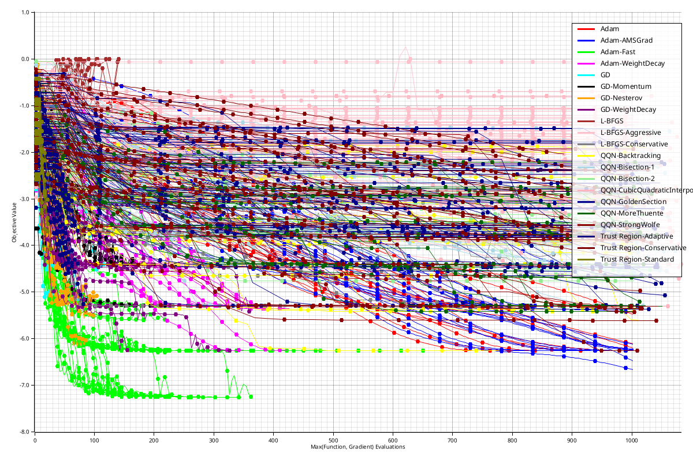
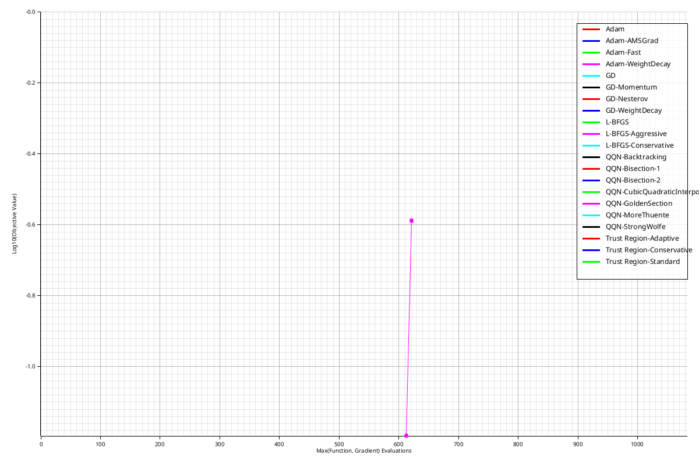

**Figure:** Convergence plots for Michalewicz_10D_m10 showing objective value vs iterations.
Left: Linear scale, Right: Log scale for better visualization of convergence behavior.

**Data:** [Linear scale data (CSV)](convergence_Michalewicz_10D_m10_data.csv) | [Log scale data (CSV)](convergence_Michalewicz_10D_m10_log_data.csv)

## Problem: Rastrigin_2D

**Family:** Highly Multimodal  
**Dimension:** 2  
**Success Threshold:** 7.960e0  
**Total Runs:** 560

### Performance Summary
<table style="border-collapse: collapse; width: 100%; margin: 20px 0;">
<tr style="background-color: #f2f2f2;">
<th style="border: 1px solid #ddd; padding: 8px; text-align: center;">Rank</th>
<th style="border: 1px solid #ddd; padding: 8px; text-align: center;">Optimizer</th>
<th style="border: 1px solid #ddd; padding: 8px; text-align: center;">Mean Final Value (All/Success/Fail)</th>
<th style="border: 1px solid #ddd; padding: 8px; text-align: center;">Std Dev</th>
<th style="border: 1px solid #ddd; padding: 8px; text-align: center;">Best Value</th>
<th style="border: 1px solid #ddd; padding: 8px; text-align: center;">Worst Value</th>
<th style="border: 1px solid #ddd; padding: 8px; text-align: center;">Mean Function Evals (All/Success/Fail)</th>
<th style="border: 1px solid #ddd; padding: 8px; text-align: center;">Mean Gradient Evals (All/Success/Fail)</th>
<th style="border: 1px solid #ddd; padding: 8px; text-align: center;">Success Rate</th>
<th style="border: 1px solid #ddd; padding: 8px; text-align: center;">Mean Time (s)</th>
</tr>
<tr style="background-color: #d4edda; font-weight: bold;">
<td style="border: 1px solid #ddd; padding: 8px; text-align: center;">1</td>
<td style="border: 1px solid #ddd; padding: 8px; text-align: center;"><a href="detailed_Rastrigin_2D_QQN-GoldenSection.md">QQN-GoldenSection</a></td>
<td style="border: 1px solid #ddd; padding: 8px; text-align: center;">8.28e0 / 3.69e0 / 1.32e1</td>
<td style="border: 1px solid #ddd; padding: 8px; text-align: center;">5.49e0</td>
<td style="border: 1px solid #ddd; padding: 8px; text-align: center;">0.00e0</td>
<td style="border: 1px solid #ddd; padding: 8px; text-align: center;">1.99e1</td>
<td style="border: 1px solid #ddd; padding: 8px; text-align: center;">242.6 / 238.7 / 246.8</td>
<td style="border: 1px solid #ddd; padding: 8px; text-align: center;">42.6 / 43.2 / 41.9</td>
<td style="border: 1px solid #ddd; padding: 8px; text-align: center;">51.7%</td>
<td style="border: 1px solid #ddd; padding: 8px; text-align: center;">0.003</td>
</tr>
<tr style="background-color: #fff3cd;">
<td style="border: 1px solid #ddd; padding: 8px; text-align: center;">2</td>
<td style="border: 1px solid #ddd; padding: 8px; text-align: center;"><a href="detailed_Rastrigin_2D_QQN-MoreThuente.md">QQN-MoreThuente</a></td>
<td style="border: 1px solid #ddd; padding: 8px; text-align: center;">8.31e0 / 5.47e0 / 1.11e1</td>
<td style="border: 1px solid #ddd; padding: 8px; text-align: center;">4.04e0</td>
<td style="border: 1px solid #ddd; padding: 8px; text-align: center;">0.00e0</td>
<td style="border: 1px solid #ddd; padding: 8px; text-align: center;">1.29e1</td>
<td style="border: 1px solid #ddd; padding: 8px; text-align: center;">106.6 / 96.4 / 116.8</td>
<td style="border: 1px solid #ddd; padding: 8px; text-align: center;">109.6 / 97.3 / 121.9</td>
<td style="border: 1px solid #ddd; padding: 8px; text-align: center;">50.0%</td>
<td style="border: 1px solid #ddd; padding: 8px; text-align: center;">0.002</td>
</tr>
<tr style="">
<td style="border: 1px solid #ddd; padding: 8px; text-align: center;">3</td>
<td style="border: 1px solid #ddd; padding: 8px; text-align: center;"><a href="detailed_Rastrigin_2D_QQN-StrongWolfe.md">QQN-StrongWolfe</a></td>
<td style="border: 1px solid #ddd; padding: 8px; text-align: center;">6.47e0 / 3.70e0 / 1.29e1</td>
<td style="border: 1px solid #ddd; padding: 8px; text-align: center;">5.69e0</td>
<td style="border: 1px solid #ddd; padding: 8px; text-align: center;">0.00e0</td>
<td style="border: 1px solid #ddd; padding: 8px; text-align: center;">1.99e1</td>
<td style="border: 1px solid #ddd; padding: 8px; text-align: center;">118.5 / 97.9 / 166.7</td>
<td style="border: 1px solid #ddd; padding: 8px; text-align: center;">97.8 / 81.2 / 136.3</td>
<td style="border: 1px solid #ddd; padding: 8px; text-align: center;">70.0%</td>
<td style="border: 1px solid #ddd; padding: 8px; text-align: center;">0.002</td>
</tr>
<tr style="">
<td style="border: 1px solid #ddd; padding: 8px; text-align: center;">4</td>
<td style="border: 1px solid #ddd; padding: 8px; text-align: center;"><a href="detailed_Rastrigin_2D_QQN-Backtracking.md">QQN-Backtracking</a></td>
<td style="border: 1px solid #ddd; padding: 8px; text-align: center;">8.41e0 / 4.07e0 / 1.37e1</td>
<td style="border: 1px solid #ddd; padding: 8px; text-align: center;">5.46e0</td>
<td style="border: 1px solid #ddd; padding: 8px; text-align: center;">0.00e0</td>
<td style="border: 1px solid #ddd; padding: 8px; text-align: center;">1.69e1</td>
<td style="border: 1px solid #ddd; padding: 8px; text-align: center;">128.3 / 173.5 / 73.1</td>
<td style="border: 1px solid #ddd; padding: 8px; text-align: center;">71.6 / 91.7 / 47.0</td>
<td style="border: 1px solid #ddd; padding: 8px; text-align: center;">55.0%</td>
<td style="border: 1px solid #ddd; padding: 8px; text-align: center;">0.003</td>
</tr>
<tr style="">
<td style="border: 1px solid #ddd; padding: 8px; text-align: center;">5</td>
<td style="border: 1px solid #ddd; padding: 8px; text-align: center;"><a href="detailed_Rastrigin_2D_QQN-CubicQuadraticInterpolation.md">QQN-CubicQuadraticInterpolation</a></td>
<td style="border: 1px solid #ddd; padding: 8px; text-align: center;">9.73e0 / 4.83e0 / 1.24e1</td>
<td style="border: 1px solid #ddd; padding: 8px; text-align: center;">5.49e0</td>
<td style="border: 1px solid #ddd; padding: 8px; text-align: center;">9.95e-1</td>
<td style="border: 1px solid #ddd; padding: 8px; text-align: center;">2.59e1</td>
<td style="border: 1px solid #ddd; padding: 8px; text-align: center;">118.8 / 113.6 / 121.5</td>
<td style="border: 1px solid #ddd; padding: 8px; text-align: center;">143.2 / 132.0 / 149.2</td>
<td style="border: 1px solid #ddd; padding: 8px; text-align: center;">35.0%</td>
<td style="border: 1px solid #ddd; padding: 8px; text-align: center;">0.003</td>
</tr>
<tr style="">
<td style="border: 1px solid #ddd; padding: 8px; text-align: center;">6</td>
<td style="border: 1px solid #ddd; padding: 8px; text-align: center;"><a href="detailed_Rastrigin_2D_QQN-Bisection-2.md">QQN-Bisection-2</a></td>
<td style="border: 1px solid #ddd; padding: 8px; text-align: center;">7.30e0 / 3.65e0 / 1.09e1</td>
<td style="border: 1px solid #ddd; padding: 8px; text-align: center;">4.36e0</td>
<td style="border: 1px solid #ddd; padding: 8px; text-align: center;">9.95e-1</td>
<td style="border: 1px solid #ddd; padding: 8px; text-align: center;">1.29e1</td>
<td style="border: 1px solid #ddd; padding: 8px; text-align: center;">25.3 / 98.7 / 12.4</td>
<td style="border: 1px solid #ddd; padding: 8px; text-align: center;">26.9 / 89.0 / 15.9</td>
<td style="border: 1px solid #ddd; padding: 8px; text-align: center;">15.0%</td>
<td style="border: 1px solid #ddd; padding: 8px; text-align: center;">0.000</td>
</tr>
<tr style="">
<td style="border: 1px solid #ddd; padding: 8px; text-align: center;">7</td>
<td style="border: 1px solid #ddd; padding: 8px; text-align: center;"><a href="detailed_Rastrigin_2D_QQN-Bisection-1.md">QQN-Bisection-1</a></td>
<td style="border: 1px solid #ddd; padding: 8px; text-align: center;">9.49e0 / 6.36e0 / 1.22e1</td>
<td style="border: 1px solid #ddd; padding: 8px; text-align: center;">4.02e0</td>
<td style="border: 1px solid #ddd; padding: 8px; text-align: center;">9.95e-1</td>
<td style="border: 1px solid #ddd; padding: 8px; text-align: center;">1.99e1</td>
<td style="border: 1px solid #ddd; padding: 8px; text-align: center;">143.6 / 147.3 / 140.5</td>
<td style="border: 1px solid #ddd; padding: 8px; text-align: center;">177.9 / 175.8 / 179.7</td>
<td style="border: 1px solid #ddd; padding: 8px; text-align: center;">45.0%</td>
<td style="border: 1px solid #ddd; padding: 8px; text-align: center;">0.003</td>
</tr>
<tr style="">
<td style="border: 1px solid #ddd; padding: 8px; text-align: center;">8</td>
<td style="border: 1px solid #ddd; padding: 8px; text-align: center;"><a href="detailed_Rastrigin_2D_L-BFGS.md">L-BFGS</a></td>
<td style="border: 1px solid #ddd; padding: 8px; text-align: center;">1.93e1 / 4.17e1 / 6.07e1</td>
<td style="border: 1px solid #ddd; padding: 8px; text-align: center;">7.73e0</td>
<td style="border: 1px solid #ddd; padding: 8px; text-align: center;">1.61e0</td>
<td style="border: 1px solid #ddd; padding: 8px; text-align: center;">3.13e1</td>
<td style="border: 1px solid #ddd; padding: 8px; text-align: center;">78.8 / 129.0 / 76.1</td>
<td style="border: 1px solid #ddd; padding: 8px; text-align: center;">28.4 / 47.0 / 27.5</td>
<td style="border: 1px solid #ddd; padding: 8px; text-align: center;">5.0%</td>
<td style="border: 1px solid #ddd; padding: 8px; text-align: center;">0.001</td>
</tr>
<tr style="">
<td style="border: 1px solid #ddd; padding: 8px; text-align: center;">9</td>
<td style="border: 1px solid #ddd; padding: 8px; text-align: center;"><a href="detailed_Rastrigin_2D_L-BFGS-Conservative.md">L-BFGS-Conservative</a></td>
<td style="border: 1px solid #ddd; padding: 8px; text-align: center;">9.20e0 / 7.96e0 / 1.21e1</td>
<td style="border: 1px solid #ddd; padding: 8px; text-align: center;">2.15e0</td>
<td style="border: 1px solid #ddd; padding: 8px; text-align: center;">7.96e0</td>
<td style="border: 1px solid #ddd; padding: 8px; text-align: center;">1.29e1</td>
<td style="border: 1px solid #ddd; padding: 8px; text-align: center;">339.4 / 331.6 / 357.5</td>
<td style="border: 1px solid #ddd; padding: 8px; text-align: center;">224.2 / 207.7 / 262.7</td>
<td style="border: 1px solid #ddd; padding: 8px; text-align: center;">70.0%</td>
<td style="border: 1px solid #ddd; padding: 8px; text-align: center;">0.007</td>
</tr>
<tr style="">
<td style="border: 1px solid #ddd; padding: 8px; text-align: center;">10</td>
<td style="border: 1px solid #ddd; padding: 8px; text-align: center;"><a href="detailed_Rastrigin_2D_Trust_Region-Adaptive.md">Trust Region-Adaptive</a></td>
<td style="border: 1px solid #ddd; padding: 8px; text-align: center;">9.47e0 / 2.18e1 / 1.02e1</td>
<td style="border: 1px solid #ddd; padding: 8px; text-align: center;">2.29e0</td>
<td style="border: 1px solid #ddd; padding: 8px; text-align: center;">7.96e0</td>
<td style="border: 1px solid #ddd; padding: 8px; text-align: center;">1.30e1</td>
<td style="border: 1px solid #ddd; padding: 8px; text-align: center;">241.7 / 228.0 / 242.4</td>
<td style="border: 1px solid #ddd; padding: 8px; text-align: center;">161.7 / 152.0 / 162.2</td>
<td style="border: 1px solid #ddd; padding: 8px; text-align: center;">5.0%</td>
<td style="border: 1px solid #ddd; padding: 8px; text-align: center;">0.001</td>
</tr>
<tr style="">
<td style="border: 1px solid #ddd; padding: 8px; text-align: center;">11</td>
<td style="border: 1px solid #ddd; padding: 8px; text-align: center;"><a href="detailed_Rastrigin_2D_Adam-WeightDecay.md">Adam-WeightDecay</a></td>
<td style="border: 1px solid #ddd; padding: 8px; text-align: center;">8.95e0 / 7.98e0 / 1.08e1</td>
<td style="border: 1px solid #ddd; padding: 8px; text-align: center;">1.99e0</td>
<td style="border: 1px solid #ddd; padding: 8px; text-align: center;">7.96e0</td>
<td style="border: 1px solid #ddd; padding: 8px; text-align: center;">1.29e1</td>
<td style="border: 1px solid #ddd; padding: 8px; text-align: center;">252.3 / 240.2 / 274.7</td>
<td style="border: 1px solid #ddd; padding: 8px; text-align: center;">251.3 / 239.2 / 273.7</td>
<td style="border: 1px solid #ddd; padding: 8px; text-align: center;">65.0%</td>
<td style="border: 1px solid #ddd; padding: 8px; text-align: center;">0.005</td>
</tr>
<tr style="">
<td style="border: 1px solid #ddd; padding: 8px; text-align: center;">12</td>
<td style="border: 1px solid #ddd; padding: 8px; text-align: center;"><a href="detailed_Rastrigin_2D_GD-Nesterov.md">GD-Nesterov</a></td>
<td style="border: 1px solid #ddd; padding: 8px; text-align: center;">8.73e0 / 8.27e0 / 9.18e0</td>
<td style="border: 1px solid #ddd; padding: 8px; text-align: center;">1.77e0</td>
<td style="border: 1px solid #ddd; padding: 8px; text-align: center;">7.96e0</td>
<td style="border: 1px solid #ddd; padding: 8px; text-align: center;">1.30e1</td>
<td style="border: 1px solid #ddd; padding: 8px; text-align: center;">21.8 / 24.0 / 21.6</td>
<td style="border: 1px solid #ddd; padding: 8px; text-align: center;">39.5 / 44.0 / 39.3</td>
<td style="border: 1px solid #ddd; padding: 8px; text-align: center;">5.0%</td>
<td style="border: 1px solid #ddd; padding: 8px; text-align: center;">0.001</td>
</tr>
<tr style="">
<td style="border: 1px solid #ddd; padding: 8px; text-align: center;">13</td>
<td style="border: 1px solid #ddd; padding: 8px; text-align: center;"><a href="detailed_Rastrigin_2D_GD-WeightDecay.md">GD-WeightDecay</a></td>
<td style="border: 1px solid #ddd; padding: 8px; text-align: center;">9.26e0 / 7.96e0 / 9.62e0</td>
<td style="border: 1px solid #ddd; padding: 8px; text-align: center;">2.15e0</td>
<td style="border: 1px solid #ddd; padding: 8px; text-align: center;">7.96e0</td>
<td style="border: 1px solid #ddd; padding: 8px; text-align: center;">1.31e1</td>
<td style="border: 1px solid #ddd; padding: 8px; text-align: center;">26.2 / 31.0 / 25.9</td>
<td style="border: 1px solid #ddd; padding: 8px; text-align: center;">48.4 / 58.0 / 47.9</td>
<td style="border: 1px solid #ddd; padding: 8px; text-align: center;">5.0%</td>
<td style="border: 1px solid #ddd; padding: 8px; text-align: center;">0.001</td>
</tr>
<tr style="">
<td style="border: 1px solid #ddd; padding: 8px; text-align: center;">14</td>
<td style="border: 1px solid #ddd; padding: 8px; text-align: center;"><a href="detailed_Rastrigin_2D_GD.md">GD</a></td>
<td style="border: 1px solid #ddd; padding: 8px; text-align: center;">9.75e0 / - / 9.99e0</td>
<td style="border: 1px solid #ddd; padding: 8px; text-align: center;">2.37e0</td>
<td style="border: 1px solid #ddd; padding: 8px; text-align: center;">7.96e0</td>
<td style="border: 1px solid #ddd; padding: 8px; text-align: center;">1.34e1</td>
<td style="border: 1px solid #ddd; padding: 8px; text-align: center;">13.1 / - / 13.1</td>
<td style="border: 1px solid #ddd; padding: 8px; text-align: center;">22.2 / - / 22.2</td>
<td style="border: 1px solid #ddd; padding: 8px; text-align: center;">0.0%</td>
<td style="border: 1px solid #ddd; padding: 8px; text-align: center;">0.000</td>
</tr>
<tr style="">
<td style="border: 1px solid #ddd; padding: 8px; text-align: center;">15</td>
<td style="border: 1px solid #ddd; padding: 8px; text-align: center;"><a href="detailed_Rastrigin_2D_Adam-AMSGrad.md">Adam-AMSGrad</a></td>
<td style="border: 1px solid #ddd; padding: 8px; text-align: center;">1.30e1 / - / 1.30e1</td>
<td style="border: 1px solid #ddd; padding: 8px; text-align: center;">3.80e0</td>
<td style="border: 1px solid #ddd; padding: 8px; text-align: center;">7.96e0</td>
<td style="border: 1px solid #ddd; padding: 8px; text-align: center;">1.88e1</td>
<td style="border: 1px solid #ddd; padding: 8px; text-align: center;">502.0 / - / 502.0</td>
<td style="border: 1px solid #ddd; padding: 8px; text-align: center;">502.0 / - / 502.0</td>
<td style="border: 1px solid #ddd; padding: 8px; text-align: center;">0.0%</td>
<td style="border: 1px solid #ddd; padding: 8px; text-align: center;">0.011</td>
</tr>
<tr style="">
<td style="border: 1px solid #ddd; padding: 8px; text-align: center;">16</td>
<td style="border: 1px solid #ddd; padding: 8px; text-align: center;"><a href="detailed_Rastrigin_2D_Trust_Region-Standard.md">Trust Region-Standard</a></td>
<td style="border: 1px solid #ddd; padding: 8px; text-align: center;">9.91e0 / - / 9.91e0</td>
<td style="border: 1px solid #ddd; padding: 8px; text-align: center;">4.99e0</td>
<td style="border: 1px solid #ddd; padding: 8px; text-align: center;">7.96e0</td>
<td style="border: 1px solid #ddd; padding: 8px; text-align: center;">3.03e1</td>
<td style="border: 1px solid #ddd; padding: 8px; text-align: center;">67.8 / - / 67.8</td>
<td style="border: 1px solid #ddd; padding: 8px; text-align: center;">45.9 / - / 45.9</td>
<td style="border: 1px solid #ddd; padding: 8px; text-align: center;">0.0%</td>
<td style="border: 1px solid #ddd; padding: 8px; text-align: center;">0.000</td>
</tr>
<tr style="">
<td style="border: 1px solid #ddd; padding: 8px; text-align: center;">17</td>
<td style="border: 1px solid #ddd; padding: 8px; text-align: center;"><a href="detailed_Rastrigin_2D_Adam-Fast.md">Adam-Fast</a></td>
<td style="border: 1px solid #ddd; padding: 8px; text-align: center;">9.49e0 / - / 9.93e0</td>
<td style="border: 1px solid #ddd; padding: 8px; text-align: center;">2.17e0</td>
<td style="border: 1px solid #ddd; padding: 8px; text-align: center;">7.96e0</td>
<td style="border: 1px solid #ddd; padding: 8px; text-align: center;">1.34e1</td>
<td style="border: 1px solid #ddd; padding: 8px; text-align: center;">48.0 / - / 48.0</td>
<td style="border: 1px solid #ddd; padding: 8px; text-align: center;">47.0 / - / 47.0</td>
<td style="border: 1px solid #ddd; padding: 8px; text-align: center;">0.0%</td>
<td style="border: 1px solid #ddd; padding: 8px; text-align: center;">0.001</td>
</tr>
<tr style="">
<td style="border: 1px solid #ddd; padding: 8px; text-align: center;">18</td>
<td style="border: 1px solid #ddd; padding: 8px; text-align: center;"><a href="detailed_Rastrigin_2D_Adam.md">Adam</a></td>
<td style="border: 1px solid #ddd; padding: 8px; text-align: center;">1.33e1 / - / 1.33e1</td>
<td style="border: 1px solid #ddd; padding: 8px; text-align: center;">3.24e0</td>
<td style="border: 1px solid #ddd; padding: 8px; text-align: center;">7.96e0</td>
<td style="border: 1px solid #ddd; padding: 8px; text-align: center;">1.71e1</td>
<td style="border: 1px solid #ddd; padding: 8px; text-align: center;">502.0 / - / 502.0</td>
<td style="border: 1px solid #ddd; padding: 8px; text-align: center;">502.0 / - / 502.0</td>
<td style="border: 1px solid #ddd; padding: 8px; text-align: center;">0.0%</td>
<td style="border: 1px solid #ddd; padding: 8px; text-align: center;">0.010</td>
</tr>
<tr style="">
<td style="border: 1px solid #ddd; padding: 8px; text-align: center;">19</td>
<td style="border: 1px solid #ddd; padding: 8px; text-align: center;"><a href="detailed_Rastrigin_2D_GD-Momentum.md">GD-Momentum</a></td>
<td style="border: 1px solid #ddd; padding: 8px; text-align: center;">1.07e1 / - / 1.18e1</td>
<td style="border: 1px solid #ddd; padding: 8px; text-align: center;">2.89e0</td>
<td style="border: 1px solid #ddd; padding: 8px; text-align: center;">7.97e0</td>
<td style="border: 1px solid #ddd; padding: 8px; text-align: center;">1.59e1</td>
<td style="border: 1px solid #ddd; padding: 8px; text-align: center;">18.1 / - / 18.1</td>
<td style="border: 1px solid #ddd; padding: 8px; text-align: center;">32.2 / - / 32.2</td>
<td style="border: 1px solid #ddd; padding: 8px; text-align: center;">0.0%</td>
<td style="border: 1px solid #ddd; padding: 8px; text-align: center;">0.000</td>
</tr>
<tr style="">
<td style="border: 1px solid #ddd; padding: 8px; text-align: center;">20</td>
<td style="border: 1px solid #ddd; padding: 8px; text-align: center;"><a href="detailed_Rastrigin_2D_Trust_Region-Conservative.md">Trust Region-Conservative</a></td>
<td style="border: 1px solid #ddd; padding: 8px; text-align: center;">2.50e1 / - / 2.50e1</td>
<td style="border: 1px solid #ddd; padding: 8px; text-align: center;">5.05e0</td>
<td style="border: 1px solid #ddd; padding: 8px; text-align: center;">1.56e1</td>
<td style="border: 1px solid #ddd; padding: 8px; text-align: center;">3.20e1</td>
<td style="border: 1px solid #ddd; padding: 8px; text-align: center;">602.0 / - / 602.0</td>
<td style="border: 1px solid #ddd; padding: 8px; text-align: center;">402.0 / - / 402.0</td>
<td style="border: 1px solid #ddd; padding: 8px; text-align: center;">0.0%</td>
<td style="border: 1px solid #ddd; padding: 8px; text-align: center;">0.004</td>
</tr>
<tr style="">
<td style="border: 1px solid #ddd; padding: 8px; text-align: center;">21</td>
<td style="border: 1px solid #ddd; padding: 8px; text-align: center;"><a href="detailed_Rastrigin_2D_L-BFGS-Aggressive.md">L-BFGS-Aggressive</a></td>
<td style="border: 1px solid #ddd; padding: 8px; text-align: center;">2.77e1 / - / 2.77e1</td>
<td style="border: 1px solid #ddd; padding: 8px; text-align: center;">5.60e0</td>
<td style="border: 1px solid #ddd; padding: 8px; text-align: center;">1.75e1</td>
<td style="border: 1px solid #ddd; padding: 8px; text-align: center;">3.61e1</td>
<td style="border: 1px solid #ddd; padding: 8px; text-align: center;">771.9 / - / 771.9</td>
<td style="border: 1px solid #ddd; padding: 8px; text-align: center;">233.0 / - / 233.0</td>
<td style="border: 1px solid #ddd; padding: 8px; text-align: center;">0.0%</td>
<td style="border: 1px solid #ddd; padding: 8px; text-align: center;">0.005</td>
</tr>
</table>

### Convergence Plots

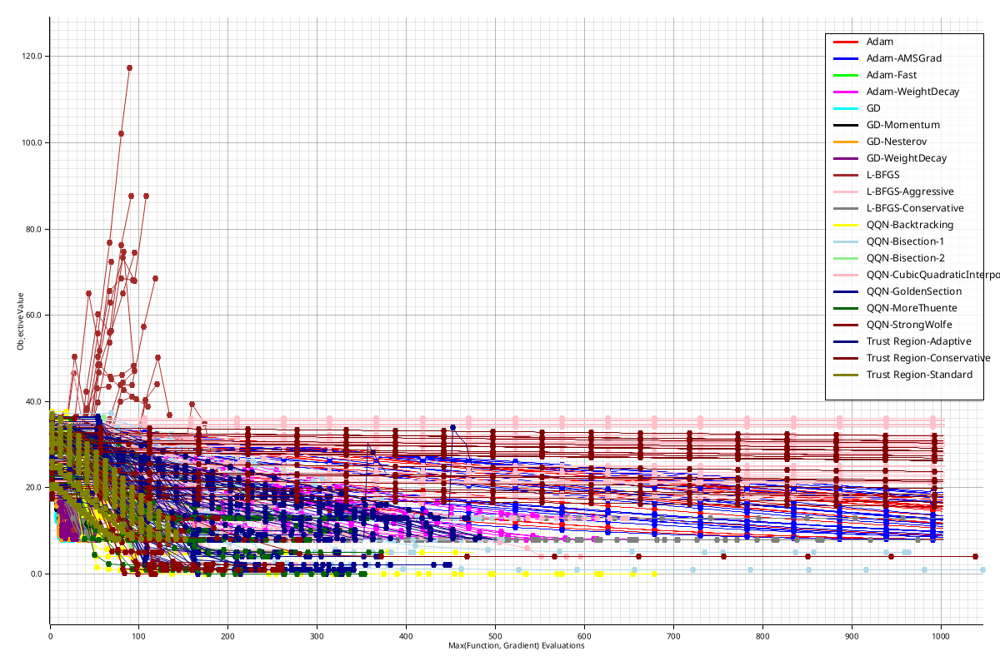
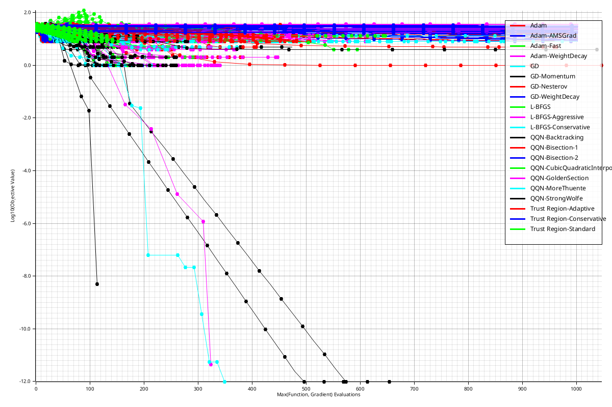

**Figure:** Convergence plots for Rastrigin_2D showing objective value vs iterations.
Left: Linear scale, Right: Log scale for better visualization of convergence behavior.

**Data:** [Linear scale data (CSV)](convergence_Rastrigin_2D_data.csv) | [Log scale data (CSV)](convergence_Rastrigin_2D_log_data.csv)

## Problem: Rastrigin_5D

**Family:** Highly Multimodal  
**Dimension:** 5  
**Success Threshold:** 2.090e1  
**Total Runs:** 560

### Performance Summary
<table style="border-collapse: collapse; width: 100%; margin: 20px 0;">
<tr style="background-color: #f2f2f2;">
<th style="border: 1px solid #ddd; padding: 8px; text-align: center;">Rank</th>
<th style="border: 1px solid #ddd; padding: 8px; text-align: center;">Optimizer</th>
<th style="border: 1px solid #ddd; padding: 8px; text-align: center;">Mean Final Value (All/Success/Fail)</th>
<th style="border: 1px solid #ddd; padding: 8px; text-align: center;">Std Dev</th>
<th style="border: 1px solid #ddd; padding: 8px; text-align: center;">Best Value</th>
<th style="border: 1px solid #ddd; padding: 8px; text-align: center;">Worst Value</th>
<th style="border: 1px solid #ddd; padding: 8px; text-align: center;">Mean Function Evals (All/Success/Fail)</th>
<th style="border: 1px solid #ddd; padding: 8px; text-align: center;">Mean Gradient Evals (All/Success/Fail)</th>
<th style="border: 1px solid #ddd; padding: 8px; text-align: center;">Success Rate</th>
<th style="border: 1px solid #ddd; padding: 8px; text-align: center;">Mean Time (s)</th>
</tr>
<tr style="background-color: #d4edda; font-weight: bold;">
<td style="border: 1px solid #ddd; padding: 8px; text-align: center;">1</td>
<td style="border: 1px solid #ddd; padding: 8px; text-align: center;"><a href="detailed_Rastrigin_5D_QQN-GoldenSection.md">QQN-GoldenSection</a></td>
<td style="border: 1px solid #ddd; padding: 8px; text-align: center;">2.31e1 / 1.61e1 / 2.83e1</td>
<td style="border: 1px solid #ddd; padding: 8px; text-align: center;">8.18e0</td>
<td style="border: 1px solid #ddd; padding: 8px; text-align: center;">2.98e0</td>
<td style="border: 1px solid #ddd; padding: 8px; text-align: center;">4.32e1</td>
<td style="border: 1px solid #ddd; padding: 8px; text-align: center;">353.2 / 350.1 / 355.4</td>
<td style="border: 1px solid #ddd; padding: 8px; text-align: center;">58.4 / 63.1 / 55.1</td>
<td style="border: 1px solid #ddd; padding: 8px; text-align: center;">41.7%</td>
<td style="border: 1px solid #ddd; padding: 8px; text-align: center;">0.005</td>
</tr>
<tr style="background-color: #fff3cd;">
<td style="border: 1px solid #ddd; padding: 8px; text-align: center;">2</td>
<td style="border: 1px solid #ddd; padding: 8px; text-align: center;"><a href="detailed_Rastrigin_5D_QQN-Backtracking.md">QQN-Backtracking</a></td>
<td style="border: 1px solid #ddd; padding: 8px; text-align: center;">2.14e1 / 1.49e1 / 2.94e1</td>
<td style="border: 1px solid #ddd; padding: 8px; text-align: center;">1.00e1</td>
<td style="border: 1px solid #ddd; padding: 8px; text-align: center;">3.98e0</td>
<td style="border: 1px solid #ddd; padding: 8px; text-align: center;">4.58e1</td>
<td style="border: 1px solid #ddd; padding: 8px; text-align: center;">103.4 / 107.5 / 98.4</td>
<td style="border: 1px solid #ddd; padding: 8px; text-align: center;">61.5 / 62.5 / 60.3</td>
<td style="border: 1px solid #ddd; padding: 8px; text-align: center;">55.0%</td>
<td style="border: 1px solid #ddd; padding: 8px; text-align: center;">0.002</td>
</tr>
<tr style="">
<td style="border: 1px solid #ddd; padding: 8px; text-align: center;">3</td>
<td style="border: 1px solid #ddd; padding: 8px; text-align: center;"><a href="detailed_Rastrigin_5D_QQN-Bisection-1.md">QQN-Bisection-1</a></td>
<td style="border: 1px solid #ddd; padding: 8px; text-align: center;">2.49e1 / 1.61e1 / 2.94e1</td>
<td style="border: 1px solid #ddd; padding: 8px; text-align: center;">8.53e0</td>
<td style="border: 1px solid #ddd; padding: 8px; text-align: center;">7.96e0</td>
<td style="border: 1px solid #ddd; padding: 8px; text-align: center;">4.97e1</td>
<td style="border: 1px solid #ddd; padding: 8px; text-align: center;">197.8 / 169.5 / 211.4</td>
<td style="border: 1px solid #ddd; padding: 8px; text-align: center;">228.8 / 197.9 / 243.6</td>
<td style="border: 1px solid #ddd; padding: 8px; text-align: center;">32.5%</td>
<td style="border: 1px solid #ddd; padding: 8px; text-align: center;">0.004</td>
</tr>
<tr style="">
<td style="border: 1px solid #ddd; padding: 8px; text-align: center;">4</td>
<td style="border: 1px solid #ddd; padding: 8px; text-align: center;"><a href="detailed_Rastrigin_5D_QQN-Bisection-2.md">QQN-Bisection-2</a></td>
<td style="border: 1px solid #ddd; padding: 8px; text-align: center;">2.95e1 / 1.44e1 / 3.45e1</td>
<td style="border: 1px solid #ddd; padding: 8px; text-align: center;">1.06e1</td>
<td style="border: 1px solid #ddd; padding: 8px; text-align: center;">7.96e0</td>
<td style="border: 1px solid #ddd; padding: 8px; text-align: center;">4.48e1</td>
<td style="border: 1px solid #ddd; padding: 8px; text-align: center;">43.3 / 119.0 / 34.9</td>
<td style="border: 1px solid #ddd; padding: 8px; text-align: center;">47.8 / 126.5 / 39.1</td>
<td style="border: 1px solid #ddd; padding: 8px; text-align: center;">10.0%</td>
<td style="border: 1px solid #ddd; padding: 8px; text-align: center;">0.001</td>
</tr>
<tr style="">
<td style="border: 1px solid #ddd; padding: 8px; text-align: center;">5</td>
<td style="border: 1px solid #ddd; padding: 8px; text-align: center;"><a href="detailed_Rastrigin_5D_QQN-MoreThuente.md">QQN-MoreThuente</a></td>
<td style="border: 1px solid #ddd; padding: 8px; text-align: center;">2.44e1 / 1.71e1 / 2.76e1</td>
<td style="border: 1px solid #ddd; padding: 8px; text-align: center;">6.59e0</td>
<td style="border: 1px solid #ddd; padding: 8px; text-align: center;">1.29e1</td>
<td style="border: 1px solid #ddd; padding: 8px; text-align: center;">3.98e1</td>
<td style="border: 1px solid #ddd; padding: 8px; text-align: center;">138.4 / 129.2 / 142.4</td>
<td style="border: 1px solid #ddd; padding: 8px; text-align: center;">141.9 / 132.0 / 146.2</td>
<td style="border: 1px solid #ddd; padding: 8px; text-align: center;">30.0%</td>
<td style="border: 1px solid #ddd; padding: 8px; text-align: center;">0.003</td>
</tr>
<tr style="">
<td style="border: 1px solid #ddd; padding: 8px; text-align: center;">6</td>
<td style="border: 1px solid #ddd; padding: 8px; text-align: center;"><a href="detailed_Rastrigin_5D_QQN-CubicQuadraticInterpolation.md">QQN-CubicQuadraticInterpolation</a></td>
<td style="border: 1px solid #ddd; padding: 8px; text-align: center;">2.76e1 / 1.75e1 / 3.09e1</td>
<td style="border: 1px solid #ddd; padding: 8px; text-align: center;">9.41e0</td>
<td style="border: 1px solid #ddd; padding: 8px; text-align: center;">1.29e1</td>
<td style="border: 1px solid #ddd; padding: 8px; text-align: center;">5.27e1</td>
<td style="border: 1px solid #ddd; padding: 8px; text-align: center;">166.0 / 161.6 / 167.5</td>
<td style="border: 1px solid #ddd; padding: 8px; text-align: center;">217.8 / 207.3 / 221.3</td>
<td style="border: 1px solid #ddd; padding: 8px; text-align: center;">25.0%</td>
<td style="border: 1px solid #ddd; padding: 8px; text-align: center;">0.004</td>
</tr>
<tr style="">
<td style="border: 1px solid #ddd; padding: 8px; text-align: center;">7</td>
<td style="border: 1px solid #ddd; padding: 8px; text-align: center;"><a href="detailed_Rastrigin_5D_QQN-StrongWolfe.md">QQN-StrongWolfe</a></td>
<td style="border: 1px solid #ddd; padding: 8px; text-align: center;">2.45e1 / 1.96e1 / 2.86e1</td>
<td style="border: 1px solid #ddd; padding: 8px; text-align: center;">7.14e0</td>
<td style="border: 1px solid #ddd; padding: 8px; text-align: center;">1.69e1</td>
<td style="border: 1px solid #ddd; padding: 8px; text-align: center;">4.58e1</td>
<td style="border: 1px solid #ddd; padding: 8px; text-align: center;">127.3 / 133.4 / 122.4</td>
<td style="border: 1px solid #ddd; padding: 8px; text-align: center;">109.8 / 110.8 / 109.1</td>
<td style="border: 1px solid #ddd; padding: 8px; text-align: center;">45.0%</td>
<td style="border: 1px solid #ddd; padding: 8px; text-align: center;">0.003</td>
</tr>
<tr style="">
<td style="border: 1px solid #ddd; padding: 8px; text-align: center;">8</td>
<td style="border: 1px solid #ddd; padding: 8px; text-align: center;"><a href="detailed_Rastrigin_5D_GD-WeightDecay.md">GD-WeightDecay</a></td>
<td style="border: 1px solid #ddd; padding: 8px; text-align: center;">2.22e1 / 1.91e1 / 2.59e1</td>
<td style="border: 1px solid #ddd; padding: 8px; text-align: center;">3.87e0</td>
<td style="border: 1px solid #ddd; padding: 8px; text-align: center;">1.69e1</td>
<td style="border: 1px solid #ddd; padding: 8px; text-align: center;">2.99e1</td>
<td style="border: 1px solid #ddd; padding: 8px; text-align: center;">84.8 / 83.5 / 86.2</td>
<td style="border: 1px solid #ddd; padding: 8px; text-align: center;">165.5 / 163.1 / 168.4</td>
<td style="border: 1px solid #ddd; padding: 8px; text-align: center;">55.0%</td>
<td style="border: 1px solid #ddd; padding: 8px; text-align: center;">0.002</td>
</tr>
<tr style="">
<td style="border: 1px solid #ddd; padding: 8px; text-align: center;">9</td>
<td style="border: 1px solid #ddd; padding: 8px; text-align: center;"><a href="detailed_Rastrigin_5D_L-BFGS-Conservative.md">L-BFGS-Conservative</a></td>
<td style="border: 1px solid #ddd; padding: 8px; text-align: center;">2.28e1 / 1.94e1 / 2.43e1</td>
<td style="border: 1px solid #ddd; padding: 8px; text-align: center;">3.63e0</td>
<td style="border: 1px solid #ddd; padding: 8px; text-align: center;">1.69e1</td>
<td style="border: 1px solid #ddd; padding: 8px; text-align: center;">2.98e1</td>
<td style="border: 1px solid #ddd; padding: 8px; text-align: center;">483.4 / 382.7 / 526.6</td>
<td style="border: 1px solid #ddd; padding: 8px; text-align: center;">189.2 / 176.3 / 194.8</td>
<td style="border: 1px solid #ddd; padding: 8px; text-align: center;">30.0%</td>
<td style="border: 1px solid #ddd; padding: 8px; text-align: center;">0.006</td>
</tr>
<tr style="">
<td style="border: 1px solid #ddd; padding: 8px; text-align: center;">10</td>
<td style="border: 1px solid #ddd; padding: 8px; text-align: center;"><a href="detailed_Rastrigin_5D_Adam-WeightDecay.md">Adam-WeightDecay</a></td>
<td style="border: 1px solid #ddd; padding: 8px; text-align: center;">2.17e1 / 1.86e1 / 2.43e1</td>
<td style="border: 1px solid #ddd; padding: 8px; text-align: center;">3.20e0</td>
<td style="border: 1px solid #ddd; padding: 8px; text-align: center;">1.69e1</td>
<td style="border: 1px solid #ddd; padding: 8px; text-align: center;">2.69e1</td>
<td style="border: 1px solid #ddd; padding: 8px; text-align: center;">270.9 / 282.1 / 261.7</td>
<td style="border: 1px solid #ddd; padding: 8px; text-align: center;">269.9 / 281.1 / 260.7</td>
<td style="border: 1px solid #ddd; padding: 8px; text-align: center;">45.0%</td>
<td style="border: 1px solid #ddd; padding: 8px; text-align: center;">0.006</td>
</tr>
<tr style="">
<td style="border: 1px solid #ddd; padding: 8px; text-align: center;">11</td>
<td style="border: 1px solid #ddd; padding: 8px; text-align: center;"><a href="detailed_Rastrigin_5D_GD-Nesterov.md">GD-Nesterov</a></td>
<td style="border: 1px solid #ddd; padding: 8px; text-align: center;">2.09e1 / 1.98e1 / 2.43e1</td>
<td style="border: 1px solid #ddd; padding: 8px; text-align: center;">2.63e0</td>
<td style="border: 1px solid #ddd; padding: 8px; text-align: center;">1.69e1</td>
<td style="border: 1px solid #ddd; padding: 8px; text-align: center;">2.49e1</td>
<td style="border: 1px solid #ddd; padding: 8px; text-align: center;">26.1 / 25.4 / 27.6</td>
<td style="border: 1px solid #ddd; padding: 8px; text-align: center;">48.3 / 46.8 / 51.1</td>
<td style="border: 1px solid #ddd; padding: 8px; text-align: center;">65.0%</td>
<td style="border: 1px solid #ddd; padding: 8px; text-align: center;">0.001</td>
</tr>
<tr style="">
<td style="border: 1px solid #ddd; padding: 8px; text-align: center;">12</td>
<td style="border: 1px solid #ddd; padding: 8px; text-align: center;"><a href="detailed_Rastrigin_5D_GD.md">GD</a></td>
<td style="border: 1px solid #ddd; padding: 8px; text-align: center;">2.24e1 / 1.98e1 / 2.53e1</td>
<td style="border: 1px solid #ddd; padding: 8px; text-align: center;">3.21e0</td>
<td style="border: 1px solid #ddd; padding: 8px; text-align: center;">1.69e1</td>
<td style="border: 1px solid #ddd; padding: 8px; text-align: center;">2.99e1</td>
<td style="border: 1px solid #ddd; padding: 8px; text-align: center;">16.7 / 16.5 / 16.9</td>
<td style="border: 1px solid #ddd; padding: 8px; text-align: center;">29.4 / 28.9 / 29.8</td>
<td style="border: 1px solid #ddd; padding: 8px; text-align: center;">47.5%</td>
<td style="border: 1px solid #ddd; padding: 8px; text-align: center;">0.000</td>
</tr>
<tr style="">
<td style="border: 1px solid #ddd; padding: 8px; text-align: center;">13</td>
<td style="border: 1px solid #ddd; padding: 8px; text-align: center;"><a href="detailed_Rastrigin_5D_Adam-Fast.md">Adam-Fast</a></td>
<td style="border: 1px solid #ddd; padding: 8px; text-align: center;">2.36e1 / 1.98e1 / 2.56e1</td>
<td style="border: 1px solid #ddd; padding: 8px; text-align: center;">3.32e0</td>
<td style="border: 1px solid #ddd; padding: 8px; text-align: center;">1.69e1</td>
<td style="border: 1px solid #ddd; padding: 8px; text-align: center;">2.99e1</td>
<td style="border: 1px solid #ddd; padding: 8px; text-align: center;">71.5 / 88.3 / 64.4</td>
<td style="border: 1px solid #ddd; padding: 8px; text-align: center;">70.5 / 87.3 / 63.4</td>
<td style="border: 1px solid #ddd; padding: 8px; text-align: center;">30.0%</td>
<td style="border: 1px solid #ddd; padding: 8px; text-align: center;">0.001</td>
</tr>
<tr style="">
<td style="border: 1px solid #ddd; padding: 8px; text-align: center;">14</td>
<td style="border: 1px solid #ddd; padding: 8px; text-align: center;"><a href="detailed_Rastrigin_5D_GD-Momentum.md">GD-Momentum</a></td>
<td style="border: 1px solid #ddd; padding: 8px; text-align: center;">2.63e1 / 2.20e1 / 3.29e1</td>
<td style="border: 1px solid #ddd; padding: 8px; text-align: center;">7.22e0</td>
<td style="border: 1px solid #ddd; padding: 8px; text-align: center;">1.70e1</td>
<td style="border: 1px solid #ddd; padding: 8px; text-align: center;">4.74e1</td>
<td style="border: 1px solid #ddd; padding: 8px; text-align: center;">30.9 / 54.5 / 25.1</td>
<td style="border: 1px solid #ddd; padding: 8px; text-align: center;">57.9 / 105.0 / 46.1</td>
<td style="border: 1px solid #ddd; padding: 8px; text-align: center;">20.0%</td>
<td style="border: 1px solid #ddd; padding: 8px; text-align: center;">0.001</td>
</tr>
<tr style="">
<td style="border: 1px solid #ddd; padding: 8px; text-align: center;">15</td>
<td style="border: 1px solid #ddd; padding: 8px; text-align: center;"><a href="detailed_Rastrigin_5D_Trust_Region-Standard.md">Trust Region-Standard</a></td>
<td style="border: 1px solid #ddd; padding: 8px; text-align: center;">2.34e1 / 1.92e1 / 2.57e1</td>
<td style="border: 1px solid #ddd; padding: 8px; text-align: center;">3.82e0</td>
<td style="border: 1px solid #ddd; padding: 8px; text-align: center;">1.70e1</td>
<td style="border: 1px solid #ddd; padding: 8px; text-align: center;">3.01e1</td>
<td style="border: 1px solid #ddd; padding: 8px; text-align: center;">174.3 / 189.7 / 166.1</td>
<td style="border: 1px solid #ddd; padding: 8px; text-align: center;">116.9 / 127.1 / 111.4</td>
<td style="border: 1px solid #ddd; padding: 8px; text-align: center;">35.0%</td>
<td style="border: 1px solid #ddd; padding: 8px; text-align: center;">0.001</td>
</tr>
<tr style="">
<td style="border: 1px solid #ddd; padding: 8px; text-align: center;">16</td>
<td style="border: 1px solid #ddd; padding: 8px; text-align: center;"><a href="detailed_Rastrigin_5D_Trust_Region-Adaptive.md">Trust Region-Adaptive</a></td>
<td style="border: 1px solid #ddd; padding: 8px; text-align: center;">2.98e1 / 1.99e1 / 3.23e1</td>
<td style="border: 1px solid #ddd; padding: 8px; text-align: center;">7.04e0</td>
<td style="border: 1px solid #ddd; padding: 8px; text-align: center;">1.99e1</td>
<td style="border: 1px solid #ddd; padding: 8px; text-align: center;">3.95e1</td>
<td style="border: 1px solid #ddd; padding: 8px; text-align: center;">592.0 / 551.8 / 602.0</td>
<td style="border: 1px solid #ddd; padding: 8px; text-align: center;">395.3 / 368.5 / 402.0</td>
<td style="border: 1px solid #ddd; padding: 8px; text-align: center;">20.0%</td>
<td style="border: 1px solid #ddd; padding: 8px; text-align: center;">0.004</td>
</tr>
<tr style="">
<td style="border: 1px solid #ddd; padding: 8px; text-align: center;">17</td>
<td style="border: 1px solid #ddd; padding: 8px; text-align: center;"><a href="detailed_Rastrigin_5D_Adam-AMSGrad.md">Adam-AMSGrad</a></td>
<td style="border: 1px solid #ddd; padding: 8px; text-align: center;">3.05e1 / - / 3.05e1</td>
<td style="border: 1px solid #ddd; padding: 8px; text-align: center;">4.75e0</td>
<td style="border: 1px solid #ddd; padding: 8px; text-align: center;">2.25e1</td>
<td style="border: 1px solid #ddd; padding: 8px; text-align: center;">3.97e1</td>
<td style="border: 1px solid #ddd; padding: 8px; text-align: center;">502.0 / - / 502.0</td>
<td style="border: 1px solid #ddd; padding: 8px; text-align: center;">502.0 / - / 502.0</td>
<td style="border: 1px solid #ddd; padding: 8px; text-align: center;">0.0%</td>
<td style="border: 1px solid #ddd; padding: 8px; text-align: center;">0.011</td>
</tr>
<tr style="">
<td style="border: 1px solid #ddd; padding: 8px; text-align: center;">18</td>
<td style="border: 1px solid #ddd; padding: 8px; text-align: center;"><a href="detailed_Rastrigin_5D_Adam.md">Adam</a></td>
<td style="border: 1px solid #ddd; padding: 8px; text-align: center;">3.12e1 / - / 3.12e1</td>
<td style="border: 1px solid #ddd; padding: 8px; text-align: center;">3.62e0</td>
<td style="border: 1px solid #ddd; padding: 8px; text-align: center;">2.28e1</td>
<td style="border: 1px solid #ddd; padding: 8px; text-align: center;">3.92e1</td>
<td style="border: 1px solid #ddd; padding: 8px; text-align: center;">502.0 / - / 502.0</td>
<td style="border: 1px solid #ddd; padding: 8px; text-align: center;">502.0 / - / 502.0</td>
<td style="border: 1px solid #ddd; padding: 8px; text-align: center;">0.0%</td>
<td style="border: 1px solid #ddd; padding: 8px; text-align: center;">0.010</td>
</tr>
<tr style="">
<td style="border: 1px solid #ddd; padding: 8px; text-align: center;">19</td>
<td style="border: 1px solid #ddd; padding: 8px; text-align: center;"><a href="detailed_Rastrigin_5D_L-BFGS.md">L-BFGS</a></td>
<td style="border: 1px solid #ddd; padding: 8px; text-align: center;">6.29e1 / - / 1.10e2</td>
<td style="border: 1px solid #ddd; padding: 8px; text-align: center;">1.17e1</td>
<td style="border: 1px solid #ddd; padding: 8px; text-align: center;">4.44e1</td>
<td style="border: 1px solid #ddd; padding: 8px; text-align: center;">8.85e1</td>
<td style="border: 1px solid #ddd; padding: 8px; text-align: center;">84.8 / - / 84.8</td>
<td style="border: 1px solid #ddd; padding: 8px; text-align: center;">30.5 / - / 30.5</td>
<td style="border: 1px solid #ddd; padding: 8px; text-align: center;">0.0%</td>
<td style="border: 1px solid #ddd; padding: 8px; text-align: center;">0.001</td>
</tr>
<tr style="">
<td style="border: 1px solid #ddd; padding: 8px; text-align: center;">20</td>
<td style="border: 1px solid #ddd; padding: 8px; text-align: center;"><a href="detailed_Rastrigin_5D_Trust_Region-Conservative.md">Trust Region-Conservative</a></td>
<td style="border: 1px solid #ddd; padding: 8px; text-align: center;">7.61e1 / - / 7.61e1</td>
<td style="border: 1px solid #ddd; padding: 8px; text-align: center;">6.88e0</td>
<td style="border: 1px solid #ddd; padding: 8px; text-align: center;">5.81e1</td>
<td style="border: 1px solid #ddd; padding: 8px; text-align: center;">8.75e1</td>
<td style="border: 1px solid #ddd; padding: 8px; text-align: center;">602.0 / - / 602.0</td>
<td style="border: 1px solid #ddd; padding: 8px; text-align: center;">402.0 / - / 402.0</td>
<td style="border: 1px solid #ddd; padding: 8px; text-align: center;">0.0%</td>
<td style="border: 1px solid #ddd; padding: 8px; text-align: center;">0.004</td>
</tr>
<tr style="">
<td style="border: 1px solid #ddd; padding: 8px; text-align: center;">21</td>
<td style="border: 1px solid #ddd; padding: 8px; text-align: center;"><a href="detailed_Rastrigin_5D_L-BFGS-Aggressive.md">L-BFGS-Aggressive</a></td>
<td style="border: 1px solid #ddd; padding: 8px; text-align: center;">7.56e1 / - / 7.56e1</td>
<td style="border: 1px solid #ddd; padding: 8px; text-align: center;">8.22e0</td>
<td style="border: 1px solid #ddd; padding: 8px; text-align: center;">5.92e1</td>
<td style="border: 1px solid #ddd; padding: 8px; text-align: center;">8.99e1</td>
<td style="border: 1px solid #ddd; padding: 8px; text-align: center;">772.0 / - / 772.0</td>
<td style="border: 1px solid #ddd; padding: 8px; text-align: center;">233.0 / - / 233.0</td>
<td style="border: 1px solid #ddd; padding: 8px; text-align: center;">0.0%</td>
<td style="border: 1px solid #ddd; padding: 8px; text-align: center;">0.006</td>
</tr>
</table>

### Convergence Plots

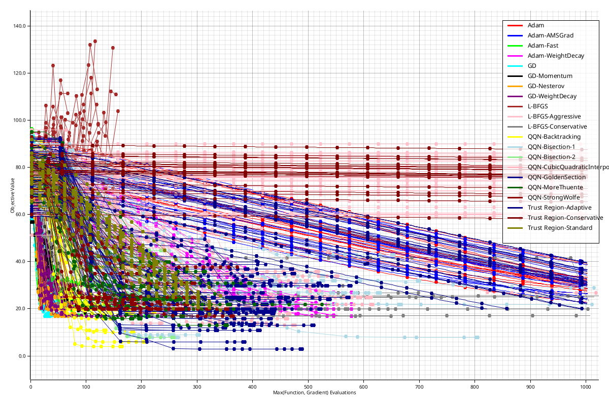
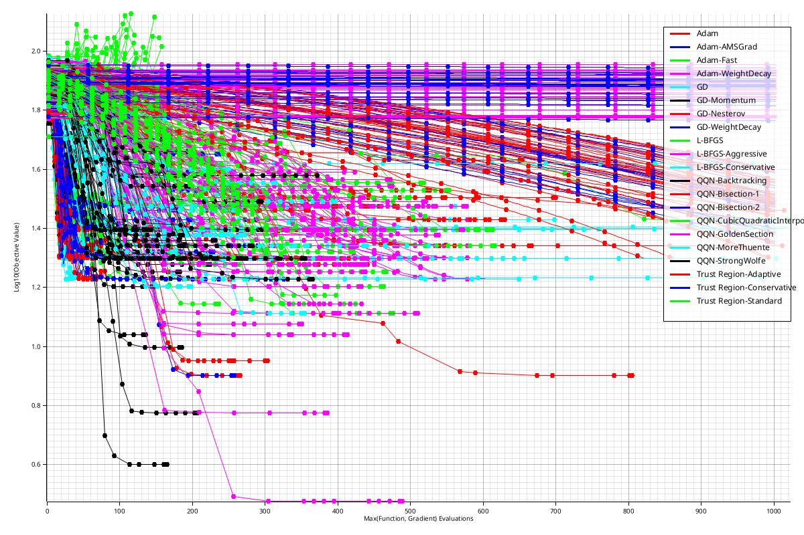

**Figure:** Convergence plots for Rastrigin_5D showing objective value vs iterations.
Left: Linear scale, Right: Log scale for better visualization of convergence behavior.

**Data:** [Linear scale data (CSV)](convergence_Rastrigin_5D_data.csv) | [Log scale data (CSV)](convergence_Rastrigin_5D_log_data.csv)

## Problem: Rastrigin_10D

**Family:** Highly Multimodal  
**Dimension:** 10  
**Success Threshold:** 4.180e1  
**Total Runs:** 560

### Performance Summary
<table style="border-collapse: collapse; width: 100%; margin: 20px 0;">
<tr style="background-color: #f2f2f2;">
<th style="border: 1px solid #ddd; padding: 8px; text-align: center;">Rank</th>
<th style="border: 1px solid #ddd; padding: 8px; text-align: center;">Optimizer</th>
<th style="border: 1px solid #ddd; padding: 8px; text-align: center;">Mean Final Value (All/Success/Fail)</th>
<th style="border: 1px solid #ddd; padding: 8px; text-align: center;">Std Dev</th>
<th style="border: 1px solid #ddd; padding: 8px; text-align: center;">Best Value</th>
<th style="border: 1px solid #ddd; padding: 8px; text-align: center;">Worst Value</th>
<th style="border: 1px solid #ddd; padding: 8px; text-align: center;">Mean Function Evals (All/Success/Fail)</th>
<th style="border: 1px solid #ddd; padding: 8px; text-align: center;">Mean Gradient Evals (All/Success/Fail)</th>
<th style="border: 1px solid #ddd; padding: 8px; text-align: center;">Success Rate</th>
<th style="border: 1px solid #ddd; padding: 8px; text-align: center;">Mean Time (s)</th>
</tr>
<tr style="background-color: #d4edda; font-weight: bold;">
<td style="border: 1px solid #ddd; padding: 8px; text-align: center;">1</td>
<td style="border: 1px solid #ddd; padding: 8px; text-align: center;"><a href="detailed_Rastrigin_10D_QQN-CubicQuadraticInterpolation.md">QQN-CubicQuadraticInterpolation</a></td>
<td style="border: 1px solid #ddd; padding: 8px; text-align: center;">5.30e1 / 3.64e1 / 5.85e1</td>
<td style="border: 1px solid #ddd; padding: 8px; text-align: center;">1.64e1</td>
<td style="border: 1px solid #ddd; padding: 8px; text-align: center;">1.29e1</td>
<td style="border: 1px solid #ddd; padding: 8px; text-align: center;">1.13e2</td>
<td style="border: 1px solid #ddd; padding: 8px; text-align: center;">213.3 / 213.9 / 213.1</td>
<td style="border: 1px solid #ddd; padding: 8px; text-align: center;">292.6 / 298.5 / 290.6</td>
<td style="border: 1px solid #ddd; padding: 8px; text-align: center;">25.0%</td>
<td style="border: 1px solid #ddd; padding: 8px; text-align: center;">0.007</td>
</tr>
<tr style="background-color: #fff3cd;">
<td style="border: 1px solid #ddd; padding: 8px; text-align: center;">2</td>
<td style="border: 1px solid #ddd; padding: 8px; text-align: center;"><a href="detailed_Rastrigin_10D_QQN-GoldenSection.md">QQN-GoldenSection</a></td>
<td style="border: 1px solid #ddd; padding: 8px; text-align: center;">4.43e1 / 3.39e1 / 4.92e1</td>
<td style="border: 1px solid #ddd; padding: 8px; text-align: center;">1.19e1</td>
<td style="border: 1px solid #ddd; padding: 8px; text-align: center;">1.29e1</td>
<td style="border: 1px solid #ddd; padding: 8px; text-align: center;">7.76e1</td>
<td style="border: 1px solid #ddd; padding: 8px; text-align: center;">405.7 / 411.0 / 403.3</td>
<td style="border: 1px solid #ddd; padding: 8px; text-align: center;">66.4 / 70.2 / 64.6</td>
<td style="border: 1px solid #ddd; padding: 8px; text-align: center;">31.7%</td>
<td style="border: 1px solid #ddd; padding: 8px; text-align: center;">0.006</td>
</tr>
<tr style="">
<td style="border: 1px solid #ddd; padding: 8px; text-align: center;">3</td>
<td style="border: 1px solid #ddd; padding: 8px; text-align: center;"><a href="detailed_Rastrigin_10D_QQN-Bisection-1.md">QQN-Bisection-1</a></td>
<td style="border: 1px solid #ddd; padding: 8px; text-align: center;">4.86e1 / 3.63e1 / 5.22e1</td>
<td style="border: 1px solid #ddd; padding: 8px; text-align: center;">1.23e1</td>
<td style="border: 1px solid #ddd; padding: 8px; text-align: center;">2.49e1</td>
<td style="border: 1px solid #ddd; padding: 8px; text-align: center;">9.05e1</td>
<td style="border: 1px solid #ddd; padding: 8px; text-align: center;">249.2 / 219.9 / 257.7</td>
<td style="border: 1px solid #ddd; padding: 8px; text-align: center;">285.9 / 253.8 / 295.2</td>
<td style="border: 1px solid #ddd; padding: 8px; text-align: center;">22.5%</td>
<td style="border: 1px solid #ddd; padding: 8px; text-align: center;">0.005</td>
</tr>
<tr style="">
<td style="border: 1px solid #ddd; padding: 8px; text-align: center;">4</td>
<td style="border: 1px solid #ddd; padding: 8px; text-align: center;"><a href="detailed_Rastrigin_10D_QQN-StrongWolfe.md">QQN-StrongWolfe</a></td>
<td style="border: 1px solid #ddd; padding: 8px; text-align: center;">5.36e1 / 3.72e1 / 6.25e1</td>
<td style="border: 1px solid #ddd; padding: 8px; text-align: center;">2.14e1</td>
<td style="border: 1px solid #ddd; padding: 8px; text-align: center;">2.69e1</td>
<td style="border: 1px solid #ddd; padding: 8px; text-align: center;">1.03e2</td>
<td style="border: 1px solid #ddd; padding: 8px; text-align: center;">140.7 / 152.3 / 134.5</td>
<td style="border: 1px solid #ddd; padding: 8px; text-align: center;">123.8 / 133.6 / 118.5</td>
<td style="border: 1px solid #ddd; padding: 8px; text-align: center;">35.0%</td>
<td style="border: 1px solid #ddd; padding: 8px; text-align: center;">0.003</td>
</tr>
<tr style="">
<td style="border: 1px solid #ddd; padding: 8px; text-align: center;">5</td>
<td style="border: 1px solid #ddd; padding: 8px; text-align: center;"><a href="detailed_Rastrigin_10D_QQN-MoreThuente.md">QQN-MoreThuente</a></td>
<td style="border: 1px solid #ddd; padding: 8px; text-align: center;">5.63e1 / 4.00e1 / 6.03e1</td>
<td style="border: 1px solid #ddd; padding: 8px; text-align: center;">1.72e1</td>
<td style="border: 1px solid #ddd; padding: 8px; text-align: center;">3.38e1</td>
<td style="border: 1px solid #ddd; padding: 8px; text-align: center;">9.25e1</td>
<td style="border: 1px solid #ddd; padding: 8px; text-align: center;">172.9 / 160.8 / 175.9</td>
<td style="border: 1px solid #ddd; padding: 8px; text-align: center;">180.7 / 165.8 / 184.4</td>
<td style="border: 1px solid #ddd; padding: 8px; text-align: center;">20.0%</td>
<td style="border: 1px solid #ddd; padding: 8px; text-align: center;">0.004</td>
</tr>
<tr style="">
<td style="border: 1px solid #ddd; padding: 8px; text-align: center;">6</td>
<td style="border: 1px solid #ddd; padding: 8px; text-align: center;"><a href="detailed_Rastrigin_10D_QQN-Backtracking.md">QQN-Backtracking</a></td>
<td style="border: 1px solid #ddd; padding: 8px; text-align: center;">5.08e1 / 3.83e1 / 5.92e1</td>
<td style="border: 1px solid #ddd; padding: 8px; text-align: center;">1.32e1</td>
<td style="border: 1px solid #ddd; padding: 8px; text-align: center;">3.38e1</td>
<td style="border: 1px solid #ddd; padding: 8px; text-align: center;">7.86e1</td>
<td style="border: 1px solid #ddd; padding: 8px; text-align: center;">119.9 / 106.5 / 128.8</td>
<td style="border: 1px solid #ddd; padding: 8px; text-align: center;">70.3 / 66.0 / 73.2</td>
<td style="border: 1px solid #ddd; padding: 8px; text-align: center;">40.0%</td>
<td style="border: 1px solid #ddd; padding: 8px; text-align: center;">0.002</td>
</tr>
<tr style="">
<td style="border: 1px solid #ddd; padding: 8px; text-align: center;">7</td>
<td style="border: 1px solid #ddd; padding: 8px; text-align: center;"><a href="detailed_Rastrigin_10D_Adam-WeightDecay.md">Adam-WeightDecay</a></td>
<td style="border: 1px solid #ddd; padding: 8px; text-align: center;">4.25e1 / 3.80e1 / 4.57e1</td>
<td style="border: 1px solid #ddd; padding: 8px; text-align: center;">4.27e0</td>
<td style="border: 1px solid #ddd; padding: 8px; text-align: center;">3.38e1</td>
<td style="border: 1px solid #ddd; padding: 8px; text-align: center;">4.98e1</td>
<td style="border: 1px solid #ddd; padding: 8px; text-align: center;">271.6 / 275.8 / 268.8</td>
<td style="border: 1px solid #ddd; padding: 8px; text-align: center;">270.6 / 274.8 / 267.8</td>
<td style="border: 1px solid #ddd; padding: 8px; text-align: center;">40.0%</td>
<td style="border: 1px solid #ddd; padding: 8px; text-align: center;">0.006</td>
</tr>
<tr style="">
<td style="border: 1px solid #ddd; padding: 8px; text-align: center;">8</td>
<td style="border: 1px solid #ddd; padding: 8px; text-align: center;"><a href="detailed_Rastrigin_10D_GD-Momentum.md">GD-Momentum</a></td>
<td style="border: 1px solid #ddd; padding: 8px; text-align: center;">4.99e1 / 3.75e1 / 5.96e1</td>
<td style="border: 1px solid #ddd; padding: 8px; text-align: center;">1.04e1</td>
<td style="border: 1px solid #ddd; padding: 8px; text-align: center;">3.39e1</td>
<td style="border: 1px solid #ddd; padding: 8px; text-align: center;">7.04e1</td>
<td style="border: 1px solid #ddd; padding: 8px; text-align: center;">40.5 / 72.0 / 32.7</td>
<td style="border: 1px solid #ddd; padding: 8px; text-align: center;">77.1 / 140.0 / 61.4</td>
<td style="border: 1px solid #ddd; padding: 8px; text-align: center;">20.0%</td>
<td style="border: 1px solid #ddd; padding: 8px; text-align: center;">0.001</td>
</tr>
<tr style="">
<td style="border: 1px solid #ddd; padding: 8px; text-align: center;">9</td>
<td style="border: 1px solid #ddd; padding: 8px; text-align: center;"><a href="detailed_Rastrigin_10D_Adam-Fast.md">Adam-Fast</a></td>
<td style="border: 1px solid #ddd; padding: 8px; text-align: center;">4.45e1 / 3.95e1 / 4.80e1</td>
<td style="border: 1px solid #ddd; padding: 8px; text-align: center;">5.85e0</td>
<td style="border: 1px solid #ddd; padding: 8px; text-align: center;">3.40e1</td>
<td style="border: 1px solid #ddd; padding: 8px; text-align: center;">6.27e1</td>
<td style="border: 1px solid #ddd; padding: 8px; text-align: center;">110.6 / 143.1 / 93.1</td>
<td style="border: 1px solid #ddd; padding: 8px; text-align: center;">109.6 / 142.1 / 92.1</td>
<td style="border: 1px solid #ddd; padding: 8px; text-align: center;">35.0%</td>
<td style="border: 1px solid #ddd; padding: 8px; text-align: center;">0.002</td>
</tr>
<tr style="">
<td style="border: 1px solid #ddd; padding: 8px; text-align: center;">10</td>
<td style="border: 1px solid #ddd; padding: 8px; text-align: center;"><a href="detailed_Rastrigin_10D_L-BFGS-Conservative.md">L-BFGS-Conservative</a></td>
<td style="border: 1px solid #ddd; padding: 8px; text-align: center;">4.37e1 / 4.12e1 / 4.41e1</td>
<td style="border: 1px solid #ddd; padding: 8px; text-align: center;">5.27e0</td>
<td style="border: 1px solid #ddd; padding: 8px; text-align: center;">3.41e1</td>
<td style="border: 1px solid #ddd; padding: 8px; text-align: center;">5.79e1</td>
<td style="border: 1px solid #ddd; padding: 8px; text-align: center;">668.1 / 356.3 / 723.1</td>
<td style="border: 1px solid #ddd; padding: 8px; text-align: center;">183.8 / 120.7 / 194.9</td>
<td style="border: 1px solid #ddd; padding: 8px; text-align: center;">15.0%</td>
<td style="border: 1px solid #ddd; padding: 8px; text-align: center;">0.007</td>
</tr>
<tr style="">
<td style="border: 1px solid #ddd; padding: 8px; text-align: center;">11</td>
<td style="border: 1px solid #ddd; padding: 8px; text-align: center;"><a href="detailed_Rastrigin_10D_GD-WeightDecay.md">GD-WeightDecay</a></td>
<td style="border: 1px solid #ddd; padding: 8px; text-align: center;">4.33e1 / 3.96e1 / 4.78e1</td>
<td style="border: 1px solid #ddd; padding: 8px; text-align: center;">4.63e0</td>
<td style="border: 1px solid #ddd; padding: 8px; text-align: center;">3.68e1</td>
<td style="border: 1px solid #ddd; padding: 8px; text-align: center;">5.17e1</td>
<td style="border: 1px solid #ddd; padding: 8px; text-align: center;">93.2 / 103.6 / 80.6</td>
<td style="border: 1px solid #ddd; padding: 8px; text-align: center;">182.5 / 203.3 / 157.1</td>
<td style="border: 1px solid #ddd; padding: 8px; text-align: center;">55.0%</td>
<td style="border: 1px solid #ddd; padding: 8px; text-align: center;">0.003</td>
</tr>
<tr style="">
<td style="border: 1px solid #ddd; padding: 8px; text-align: center;">12</td>
<td style="border: 1px solid #ddd; padding: 8px; text-align: center;"><a href="detailed_Rastrigin_10D_GD-Nesterov.md">GD-Nesterov</a></td>
<td style="border: 1px solid #ddd; padding: 8px; text-align: center;">4.33e1 / 3.96e1 / 4.78e1</td>
<td style="border: 1px solid #ddd; padding: 8px; text-align: center;">4.94e0</td>
<td style="border: 1px solid #ddd; padding: 8px; text-align: center;">3.68e1</td>
<td style="border: 1px solid #ddd; padding: 8px; text-align: center;">5.47e1</td>
<td style="border: 1px solid #ddd; padding: 8px; text-align: center;">45.0 / 31.4 / 58.7</td>
<td style="border: 1px solid #ddd; padding: 8px; text-align: center;">86.2 / 58.8 / 113.6</td>
<td style="border: 1px solid #ddd; padding: 8px; text-align: center;">50.0%</td>
<td style="border: 1px solid #ddd; padding: 8px; text-align: center;">0.001</td>
</tr>
<tr style="">
<td style="border: 1px solid #ddd; padding: 8px; text-align: center;">13</td>
<td style="border: 1px solid #ddd; padding: 8px; text-align: center;"><a href="detailed_Rastrigin_10D_Trust_Region-Standard.md">Trust Region-Standard</a></td>
<td style="border: 1px solid #ddd; padding: 8px; text-align: center;">4.28e1 / 3.89e1 / 4.49e1</td>
<td style="border: 1px solid #ddd; padding: 8px; text-align: center;">4.12e0</td>
<td style="border: 1px solid #ddd; padding: 8px; text-align: center;">3.68e1</td>
<td style="border: 1px solid #ddd; padding: 8px; text-align: center;">4.98e1</td>
<td style="border: 1px solid #ddd; padding: 8px; text-align: center;">365.8 / 392.9 / 351.2</td>
<td style="border: 1px solid #ddd; padding: 8px; text-align: center;">244.5 / 262.6 / 234.8</td>
<td style="border: 1px solid #ddd; padding: 8px; text-align: center;">35.0%</td>
<td style="border: 1px solid #ddd; padding: 8px; text-align: center;">0.002</td>
</tr>
<tr style="">
<td style="border: 1px solid #ddd; padding: 8px; text-align: center;">14</td>
<td style="border: 1px solid #ddd; padding: 8px; text-align: center;"><a href="detailed_Rastrigin_10D_GD.md">GD</a></td>
<td style="border: 1px solid #ddd; padding: 8px; text-align: center;">4.45e1 / 3.90e1 / 4.62e1</td>
<td style="border: 1px solid #ddd; padding: 8px; text-align: center;">4.34e0</td>
<td style="border: 1px solid #ddd; padding: 8px; text-align: center;">3.68e1</td>
<td style="border: 1px solid #ddd; padding: 8px; text-align: center;">5.48e1</td>
<td style="border: 1px solid #ddd; padding: 8px; text-align: center;">20.8 / 20.4 / 20.9</td>
<td style="border: 1px solid #ddd; padding: 8px; text-align: center;">37.5 / 36.9 / 37.7</td>
<td style="border: 1px solid #ddd; padding: 8px; text-align: center;">22.5%</td>
<td style="border: 1px solid #ddd; padding: 8px; text-align: center;">0.000</td>
</tr>
<tr style="">
<td style="border: 1px solid #ddd; padding: 8px; text-align: center;">15</td>
<td style="border: 1px solid #ddd; padding: 8px; text-align: center;"><a href="detailed_Rastrigin_10D_QQN-Bisection-2.md">QQN-Bisection-2</a></td>
<td style="border: 1px solid #ddd; padding: 8px; text-align: center;">6.38e1 / - / 6.38e1</td>
<td style="border: 1px solid #ddd; padding: 8px; text-align: center;">1.46e1</td>
<td style="border: 1px solid #ddd; padding: 8px; text-align: center;">4.28e1</td>
<td style="border: 1px solid #ddd; padding: 8px; text-align: center;">8.56e1</td>
<td style="border: 1px solid #ddd; padding: 8px; text-align: center;">78.5 / - / 78.5</td>
<td style="border: 1px solid #ddd; padding: 8px; text-align: center;">73.0 / - / 73.0</td>
<td style="border: 1px solid #ddd; padding: 8px; text-align: center;">0.0%</td>
<td style="border: 1px solid #ddd; padding: 8px; text-align: center;">0.002</td>
</tr>
<tr style="">
<td style="border: 1px solid #ddd; padding: 8px; text-align: center;">16</td>
<td style="border: 1px solid #ddd; padding: 8px; text-align: center;"><a href="detailed_Rastrigin_10D_Adam-AMSGrad.md">Adam-AMSGrad</a></td>
<td style="border: 1px solid #ddd; padding: 8px; text-align: center;">5.96e1 / - / 5.96e1</td>
<td style="border: 1px solid #ddd; padding: 8px; text-align: center;">6.96e0</td>
<td style="border: 1px solid #ddd; padding: 8px; text-align: center;">4.40e1</td>
<td style="border: 1px solid #ddd; padding: 8px; text-align: center;">7.26e1</td>
<td style="border: 1px solid #ddd; padding: 8px; text-align: center;">502.0 / - / 502.0</td>
<td style="border: 1px solid #ddd; padding: 8px; text-align: center;">502.0 / - / 502.0</td>
<td style="border: 1px solid #ddd; padding: 8px; text-align: center;">0.0%</td>
<td style="border: 1px solid #ddd; padding: 8px; text-align: center;">0.012</td>
</tr>
<tr style="">
<td style="border: 1px solid #ddd; padding: 8px; text-align: center;">17</td>
<td style="border: 1px solid #ddd; padding: 8px; text-align: center;"><a href="detailed_Rastrigin_10D_Adam.md">Adam</a></td>
<td style="border: 1px solid #ddd; padding: 8px; text-align: center;">6.03e1 / - / 6.03e1</td>
<td style="border: 1px solid #ddd; padding: 8px; text-align: center;">5.38e0</td>
<td style="border: 1px solid #ddd; padding: 8px; text-align: center;">5.18e1</td>
<td style="border: 1px solid #ddd; padding: 8px; text-align: center;">7.57e1</td>
<td style="border: 1px solid #ddd; padding: 8px; text-align: center;">502.0 / - / 502.0</td>
<td style="border: 1px solid #ddd; padding: 8px; text-align: center;">502.0 / - / 502.0</td>
<td style="border: 1px solid #ddd; padding: 8px; text-align: center;">0.0%</td>
<td style="border: 1px solid #ddd; padding: 8px; text-align: center;">0.011</td>
</tr>
<tr style="">
<td style="border: 1px solid #ddd; padding: 8px; text-align: center;">18</td>
<td style="border: 1px solid #ddd; padding: 8px; text-align: center;"><a href="detailed_Rastrigin_10D_Trust_Region-Adaptive.md">Trust Region-Adaptive</a></td>
<td style="border: 1px solid #ddd; padding: 8px; text-align: center;">1.12e2 / - / 1.12e2</td>
<td style="border: 1px solid #ddd; padding: 8px; text-align: center;">1.14e1</td>
<td style="border: 1px solid #ddd; padding: 8px; text-align: center;">9.41e1</td>
<td style="border: 1px solid #ddd; padding: 8px; text-align: center;">1.31e2</td>
<td style="border: 1px solid #ddd; padding: 8px; text-align: center;">602.0 / - / 602.0</td>
<td style="border: 1px solid #ddd; padding: 8px; text-align: center;">402.0 / - / 402.0</td>
<td style="border: 1px solid #ddd; padding: 8px; text-align: center;">0.0%</td>
<td style="border: 1px solid #ddd; padding: 8px; text-align: center;">0.004</td>
</tr>
<tr style="">
<td style="border: 1px solid #ddd; padding: 8px; text-align: center;">19</td>
<td style="border: 1px solid #ddd; padding: 8px; text-align: center;"><a href="detailed_Rastrigin_10D_L-BFGS.md">L-BFGS</a></td>
<td style="border: 1px solid #ddd; padding: 8px; text-align: center;">1.34e2 / - / 1.88e2</td>
<td style="border: 1px solid #ddd; padding: 8px; text-align: center;">1.62e1</td>
<td style="border: 1px solid #ddd; padding: 8px; text-align: center;">9.67e1</td>
<td style="border: 1px solid #ddd; padding: 8px; text-align: center;">1.60e2</td>
<td style="border: 1px solid #ddd; padding: 8px; text-align: center;">107.7 / - / 107.7</td>
<td style="border: 1px solid #ddd; padding: 8px; text-align: center;">38.7 / - / 38.7</td>
<td style="border: 1px solid #ddd; padding: 8px; text-align: center;">0.0%</td>
<td style="border: 1px solid #ddd; padding: 8px; text-align: center;">0.001</td>
</tr>
<tr style="">
<td style="border: 1px solid #ddd; padding: 8px; text-align: center;">20</td>
<td style="border: 1px solid #ddd; padding: 8px; text-align: center;"><a href="detailed_Rastrigin_10D_L-BFGS-Aggressive.md">L-BFGS-Aggressive</a></td>
<td style="border: 1px solid #ddd; padding: 8px; text-align: center;">1.61e2 / - / 1.61e2</td>
<td style="border: 1px solid #ddd; padding: 8px; text-align: center;">1.33e1</td>
<td style="border: 1px solid #ddd; padding: 8px; text-align: center;">1.35e2</td>
<td style="border: 1px solid #ddd; padding: 8px; text-align: center;">1.86e2</td>
<td style="border: 1px solid #ddd; padding: 8px; text-align: center;">772.0 / - / 772.0</td>
<td style="border: 1px solid #ddd; padding: 8px; text-align: center;">233.0 / - / 233.0</td>
<td style="border: 1px solid #ddd; padding: 8px; text-align: center;">0.0%</td>
<td style="border: 1px solid #ddd; padding: 8px; text-align: center;">0.006</td>
</tr>
<tr style="">
<td style="border: 1px solid #ddd; padding: 8px; text-align: center;">21</td>
<td style="border: 1px solid #ddd; padding: 8px; text-align: center;"><a href="detailed_Rastrigin_10D_Trust_Region-Conservative.md">Trust Region-Conservative</a></td>
<td style="border: 1px solid #ddd; padding: 8px; text-align: center;">1.61e2 / - / 1.61e2</td>
<td style="border: 1px solid #ddd; padding: 8px; text-align: center;">1.23e1</td>
<td style="border: 1px solid #ddd; padding: 8px; text-align: center;">1.41e2</td>
<td style="border: 1px solid #ddd; padding: 8px; text-align: center;">1.87e2</td>
<td style="border: 1px solid #ddd; padding: 8px; text-align: center;">602.0 / - / 602.0</td>
<td style="border: 1px solid #ddd; padding: 8px; text-align: center;">402.0 / - / 402.0</td>
<td style="border: 1px solid #ddd; padding: 8px; text-align: center;">0.0%</td>
<td style="border: 1px solid #ddd; padding: 8px; text-align: center;">0.004</td>
</tr>
</table>

### Convergence Plots

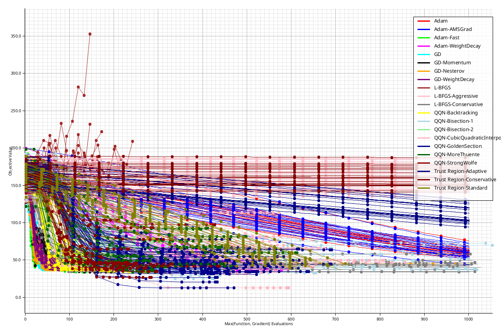
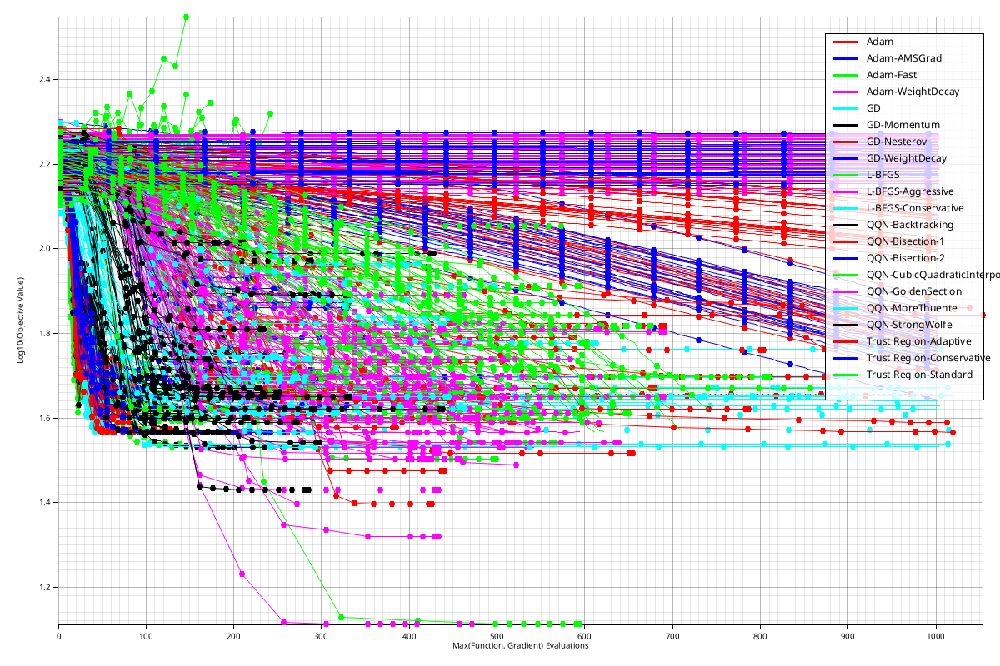

**Figure:** Convergence plots for Rastrigin_10D showing objective value vs iterations.
Left: Linear scale, Right: Log scale for better visualization of convergence behavior.

**Data:** [Linear scale data (CSV)](convergence_Rastrigin_10D_data.csv) | [Log scale data (CSV)](convergence_Rastrigin_10D_log_data.csv)

## Problem: Ackley_2D_a20_b0.2_c6.28e0

**Family:** Highly Multimodal  
**Dimension:** 2  
**Success Threshold:** 2.640e0  
**Total Runs:** 560

### Performance Summary
<table style="border-collapse: collapse; width: 100%; margin: 20px 0;">
<tr style="background-color: #f2f2f2;">
<th style="border: 1px solid #ddd; padding: 8px; text-align: center;">Rank</th>
<th style="border: 1px solid #ddd; padding: 8px; text-align: center;">Optimizer</th>
<th style="border: 1px solid #ddd; padding: 8px; text-align: center;">Mean Final Value (All/Success/Fail)</th>
<th style="border: 1px solid #ddd; padding: 8px; text-align: center;">Std Dev</th>
<th style="border: 1px solid #ddd; padding: 8px; text-align: center;">Best Value</th>
<th style="border: 1px solid #ddd; padding: 8px; text-align: center;">Worst Value</th>
<th style="border: 1px solid #ddd; padding: 8px; text-align: center;">Mean Function Evals (All/Success/Fail)</th>
<th style="border: 1px solid #ddd; padding: 8px; text-align: center;">Mean Gradient Evals (All/Success/Fail)</th>
<th style="border: 1px solid #ddd; padding: 8px; text-align: center;">Success Rate</th>
<th style="border: 1px solid #ddd; padding: 8px; text-align: center;">Mean Time (s)</th>
</tr>
<tr style="background-color: #d4edda; font-weight: bold;">
<td style="border: 1px solid #ddd; padding: 8px; text-align: center;">1</td>
<td style="border: 1px solid #ddd; padding: 8px; text-align: center;"><a href="detailed_Ackley_2D_a20_b0.2_c6.28e0_QQN-GoldenSection.md">QQN-GoldenSection</a></td>
<td style="border: 1px solid #ddd; padding: 8px; text-align: center;">2.97e0 / 2.58e0 / 3.00e0</td>
<td style="border: 1px solid #ddd; padding: 8px; text-align: center;">1.27e0</td>
<td style="border: 1px solid #ddd; padding: 8px; text-align: center;">5.33e-11</td>
<td style="border: 1px solid #ddd; padding: 8px; text-align: center;">3.57e0</td>
<td style="border: 1px solid #ddd; padding: 8px; text-align: center;">193.5 / 249.5 / 189.5</td>
<td style="border: 1px solid #ddd; padding: 8px; text-align: center;">34.7 / 48.0 / 33.8</td>
<td style="border: 1px solid #ddd; padding: 8px; text-align: center;">6.7%</td>
<td style="border: 1px solid #ddd; padding: 8px; text-align: center;">0.002</td>
</tr>
<tr style="background-color: #fff3cd;">
<td style="border: 1px solid #ddd; padding: 8px; text-align: center;">2</td>
<td style="border: 1px solid #ddd; padding: 8px; text-align: center;"><a href="detailed_Ackley_2D_a20_b0.2_c6.28e0_QQN-Backtracking.md">QQN-Backtracking</a></td>
<td style="border: 1px solid #ddd; padding: 8px; text-align: center;">2.53e0 / 2.58e0 / 2.52e0</td>
<td style="border: 1px solid #ddd; padding: 8px; text-align: center;">1.50e0</td>
<td style="border: 1px solid #ddd; padding: 8px; text-align: center;">1.87e-10</td>
<td style="border: 1px solid #ddd; padding: 8px; text-align: center;">3.57e0</td>
<td style="border: 1px solid #ddd; padding: 8px; text-align: center;">168.9 / 235.3 / 157.2</td>
<td style="border: 1px solid #ddd; padding: 8px; text-align: center;">74.5 / 151.7 / 60.9</td>
<td style="border: 1px solid #ddd; padding: 8px; text-align: center;">15.0%</td>
<td style="border: 1px solid #ddd; padding: 8px; text-align: center;">0.004</td>
</tr>
<tr style="">
<td style="border: 1px solid #ddd; padding: 8px; text-align: center;">3</td>
<td style="border: 1px solid #ddd; padding: 8px; text-align: center;"><a href="detailed_Ackley_2D_a20_b0.2_c6.28e0_QQN-MoreThuente.md">QQN-MoreThuente</a></td>
<td style="border: 1px solid #ddd; padding: 8px; text-align: center;">3.22e0 / - / 3.22e0</td>
<td style="border: 1px solid #ddd; padding: 8px; text-align: center;">1.07e0</td>
<td style="border: 1px solid #ddd; padding: 8px; text-align: center;">2.75e-10</td>
<td style="border: 1px solid #ddd; padding: 8px; text-align: center;">3.57e0</td>
<td style="border: 1px solid #ddd; padding: 8px; text-align: center;">128.1 / - / 128.1</td>
<td style="border: 1px solid #ddd; padding: 8px; text-align: center;">139.3 / - / 139.3</td>
<td style="border: 1px solid #ddd; padding: 8px; text-align: center;">0.0%</td>
<td style="border: 1px solid #ddd; padding: 8px; text-align: center;">0.003</td>
</tr>
<tr style="">
<td style="border: 1px solid #ddd; padding: 8px; text-align: center;">4</td>
<td style="border: 1px solid #ddd; padding: 8px; text-align: center;"><a href="detailed_Ackley_2D_a20_b0.2_c6.28e0_QQN-Bisection-1.md">QQN-Bisection-1</a></td>
<td style="border: 1px solid #ddd; padding: 8px; text-align: center;">2.27e0 / 2.58e0 / 2.26e0</td>
<td style="border: 1px solid #ddd; padding: 8px; text-align: center;">1.68e0</td>
<td style="border: 1px solid #ddd; padding: 8px; text-align: center;">1.28e-9</td>
<td style="border: 1px solid #ddd; padding: 8px; text-align: center;">3.57e0</td>
<td style="border: 1px solid #ddd; padding: 8px; text-align: center;">220.0 / 116.0 / 225.5</td>
<td style="border: 1px solid #ddd; padding: 8px; text-align: center;">279.9 / 148.5 / 286.8</td>
<td style="border: 1px solid #ddd; padding: 8px; text-align: center;">5.0%</td>
<td style="border: 1px solid #ddd; padding: 8px; text-align: center;">0.005</td>
</tr>
<tr style="">
<td style="border: 1px solid #ddd; padding: 8px; text-align: center;">5</td>
<td style="border: 1px solid #ddd; padding: 8px; text-align: center;"><a href="detailed_Ackley_2D_a20_b0.2_c6.28e0_QQN-CubicQuadraticInterpolation.md">QQN-CubicQuadraticInterpolation</a></td>
<td style="border: 1px solid #ddd; padding: 8px; text-align: center;">2.61e0 / 2.58e0 / 2.62e0</td>
<td style="border: 1px solid #ddd; padding: 8px; text-align: center;">1.42e0</td>
<td style="border: 1px solid #ddd; padding: 8px; text-align: center;">1.01e-8</td>
<td style="border: 1px solid #ddd; padding: 8px; text-align: center;">3.57e0</td>
<td style="border: 1px solid #ddd; padding: 8px; text-align: center;">194.5 / 154.2 / 199.0</td>
<td style="border: 1px solid #ddd; padding: 8px; text-align: center;">282.1 / 198.0 / 291.4</td>
<td style="border: 1px solid #ddd; padding: 8px; text-align: center;">10.0%</td>
<td style="border: 1px solid #ddd; padding: 8px; text-align: center;">0.006</td>
</tr>
<tr style="">
<td style="border: 1px solid #ddd; padding: 8px; text-align: center;">6</td>
<td style="border: 1px solid #ddd; padding: 8px; text-align: center;"><a href="detailed_Ackley_2D_a20_b0.2_c6.28e0_QQN-StrongWolfe.md">QQN-StrongWolfe</a></td>
<td style="border: 1px solid #ddd; padding: 8px; text-align: center;">2.40e0 / 2.58e0 / 2.38e0</td>
<td style="border: 1px solid #ddd; padding: 8px; text-align: center;">1.60e0</td>
<td style="border: 1px solid #ddd; padding: 8px; text-align: center;">5.23e-8</td>
<td style="border: 1px solid #ddd; padding: 8px; text-align: center;">3.57e0</td>
<td style="border: 1px solid #ddd; padding: 8px; text-align: center;">147.7 / 73.5 / 155.9</td>
<td style="border: 1px solid #ddd; padding: 8px; text-align: center;">109.8 / 67.0 / 114.6</td>
<td style="border: 1px solid #ddd; padding: 8px; text-align: center;">10.0%</td>
<td style="border: 1px solid #ddd; padding: 8px; text-align: center;">0.003</td>
</tr>
<tr style="">
<td style="border: 1px solid #ddd; padding: 8px; text-align: center;">7</td>
<td style="border: 1px solid #ddd; padding: 8px; text-align: center;"><a href="detailed_Ackley_2D_a20_b0.2_c6.28e0_QQN-Bisection-2.md">QQN-Bisection-2</a></td>
<td style="border: 1px solid #ddd; padding: 8px; text-align: center;">2.32e0 / 2.58e0 / 2.27e0</td>
<td style="border: 1px solid #ddd; padding: 8px; text-align: center;">1.59e0</td>
<td style="border: 1px solid #ddd; padding: 8px; text-align: center;">5.22e-6</td>
<td style="border: 1px solid #ddd; padding: 8px; text-align: center;">3.57e0</td>
<td style="border: 1px solid #ddd; padding: 8px; text-align: center;">58.6 / 103.0 / 53.7</td>
<td style="border: 1px solid #ddd; padding: 8px; text-align: center;">52.8 / 117.0 / 45.7</td>
<td style="border: 1px solid #ddd; padding: 8px; text-align: center;">10.0%</td>
<td style="border: 1px solid #ddd; padding: 8px; text-align: center;">0.001</td>
</tr>
<tr style="">
<td style="border: 1px solid #ddd; padding: 8px; text-align: center;">8</td>
<td style="border: 1px solid #ddd; padding: 8px; text-align: center;"><a href="detailed_Ackley_2D_a20_b0.2_c6.28e0_L-BFGS.md">L-BFGS</a></td>
<td style="border: 1px solid #ddd; padding: 8px; text-align: center;">2.84e0 / 4.14e0 / 3.70e0</td>
<td style="border: 1px solid #ddd; padding: 8px; text-align: center;">1.27e0</td>
<td style="border: 1px solid #ddd; padding: 8px; text-align: center;">3.55e-2</td>
<td style="border: 1px solid #ddd; padding: 8px; text-align: center;">3.57e0</td>
<td style="border: 1px solid #ddd; padding: 8px; text-align: center;">307.4 / 179.0 / 350.1</td>
<td style="border: 1px solid #ddd; padding: 8px; text-align: center;">122.6 / 70.4 / 140.0</td>
<td style="border: 1px solid #ddd; padding: 8px; text-align: center;">25.0%</td>
<td style="border: 1px solid #ddd; padding: 8px; text-align: center;">0.004</td>
</tr>
<tr style="">
<td style="border: 1px solid #ddd; padding: 8px; text-align: center;">9</td>
<td style="border: 1px solid #ddd; padding: 8px; text-align: center;"><a href="detailed_Ackley_2D_a20_b0.2_c6.28e0_L-BFGS-Aggressive.md">L-BFGS-Aggressive</a></td>
<td style="border: 1px solid #ddd; padding: 8px; text-align: center;">3.63e0 / - / 3.63e0</td>
<td style="border: 1px solid #ddd; padding: 8px; text-align: center;">9.99e-1</td>
<td style="border: 1px solid #ddd; padding: 8px; text-align: center;">5.19e-1</td>
<td style="border: 1px solid #ddd; padding: 8px; text-align: center;">4.93e0</td>
<td style="border: 1px solid #ddd; padding: 8px; text-align: center;">772.1 / - / 772.1</td>
<td style="border: 1px solid #ddd; padding: 8px; text-align: center;">233.3 / - / 233.3</td>
<td style="border: 1px solid #ddd; padding: 8px; text-align: center;">0.0%</td>
<td style="border: 1px solid #ddd; padding: 8px; text-align: center;">0.005</td>
</tr>
<tr style="">
<td style="border: 1px solid #ddd; padding: 8px; text-align: center;">10</td>
<td style="border: 1px solid #ddd; padding: 8px; text-align: center;"><a href="detailed_Ackley_2D_a20_b0.2_c6.28e0_L-BFGS-Conservative.md">L-BFGS-Conservative</a></td>
<td style="border: 1px solid #ddd; padding: 8px; text-align: center;">3.57e0 / - / 3.57e0</td>
<td style="border: 1px solid #ddd; padding: 8px; text-align: center;">4.96e-8</td>
<td style="border: 1px solid #ddd; padding: 8px; text-align: center;">3.57e0</td>
<td style="border: 1px solid #ddd; padding: 8px; text-align: center;">3.57e0</td>
<td style="border: 1px solid #ddd; padding: 8px; text-align: center;">164.3 / - / 164.3</td>
<td style="border: 1px solid #ddd; padding: 8px; text-align: center;">101.7 / - / 101.7</td>
<td style="border: 1px solid #ddd; padding: 8px; text-align: center;">0.0%</td>
<td style="border: 1px solid #ddd; padding: 8px; text-align: center;">0.003</td>
</tr>
<tr style="">
<td style="border: 1px solid #ddd; padding: 8px; text-align: center;">11</td>
<td style="border: 1px solid #ddd; padding: 8px; text-align: center;"><a href="detailed_Ackley_2D_a20_b0.2_c6.28e0_GD-Nesterov.md">GD-Nesterov</a></td>
<td style="border: 1px solid #ddd; padding: 8px; text-align: center;">3.57e0 / - / 3.57e0</td>
<td style="border: 1px solid #ddd; padding: 8px; text-align: center;">4.85e-4</td>
<td style="border: 1px solid #ddd; padding: 8px; text-align: center;">3.57e0</td>
<td style="border: 1px solid #ddd; padding: 8px; text-align: center;">3.58e0</td>
<td style="border: 1px solid #ddd; padding: 8px; text-align: center;">30.3 / - / 30.3</td>
<td style="border: 1px solid #ddd; padding: 8px; text-align: center;">57.9 / - / 57.9</td>
<td style="border: 1px solid #ddd; padding: 8px; text-align: center;">0.0%</td>
<td style="border: 1px solid #ddd; padding: 8px; text-align: center;">0.001</td>
</tr>
<tr style="">
<td style="border: 1px solid #ddd; padding: 8px; text-align: center;">12</td>
<td style="border: 1px solid #ddd; padding: 8px; text-align: center;"><a href="detailed_Ackley_2D_a20_b0.2_c6.28e0_GD.md">GD</a></td>
<td style="border: 1px solid #ddd; padding: 8px; text-align: center;">3.57e0 / - / 3.57e0</td>
<td style="border: 1px solid #ddd; padding: 8px; text-align: center;">1.85e-11</td>
<td style="border: 1px solid #ddd; padding: 8px; text-align: center;">3.57e0</td>
<td style="border: 1px solid #ddd; padding: 8px; text-align: center;">3.57e0</td>
<td style="border: 1px solid #ddd; padding: 8px; text-align: center;">20.1 / - / 20.1</td>
<td style="border: 1px solid #ddd; padding: 8px; text-align: center;">38.1 / - / 38.1</td>
<td style="border: 1px solid #ddd; padding: 8px; text-align: center;">0.0%</td>
<td style="border: 1px solid #ddd; padding: 8px; text-align: center;">0.000</td>
</tr>
<tr style="">
<td style="border: 1px solid #ddd; padding: 8px; text-align: center;">13</td>
<td style="border: 1px solid #ddd; padding: 8px; text-align: center;"><a href="detailed_Ackley_2D_a20_b0.2_c6.28e0_Adam-AMSGrad.md">Adam-AMSGrad</a></td>
<td style="border: 1px solid #ddd; padding: 8px; text-align: center;">3.58e0 / - / 3.58e0</td>
<td style="border: 1px solid #ddd; padding: 8px; text-align: center;">3.49e-3</td>
<td style="border: 1px solid #ddd; padding: 8px; text-align: center;">3.57e0</td>
<td style="border: 1px solid #ddd; padding: 8px; text-align: center;">3.58e0</td>
<td style="border: 1px solid #ddd; padding: 8px; text-align: center;">489.9 / - / 489.9</td>
<td style="border: 1px solid #ddd; padding: 8px; text-align: center;">489.8 / - / 489.8</td>
<td style="border: 1px solid #ddd; padding: 8px; text-align: center;">0.0%</td>
<td style="border: 1px solid #ddd; padding: 8px; text-align: center;">0.011</td>
</tr>
<tr style="">
<td style="border: 1px solid #ddd; padding: 8px; text-align: center;">14</td>
<td style="border: 1px solid #ddd; padding: 8px; text-align: center;"><a href="detailed_Ackley_2D_a20_b0.2_c6.28e0_GD-WeightDecay.md">GD-WeightDecay</a></td>
<td style="border: 1px solid #ddd; padding: 8px; text-align: center;">3.58e0 / - / 3.58e0</td>
<td style="border: 1px solid #ddd; padding: 8px; text-align: center;">8.88e-3</td>
<td style="border: 1px solid #ddd; padding: 8px; text-align: center;">3.57e0</td>
<td style="border: 1px solid #ddd; padding: 8px; text-align: center;">3.61e0</td>
<td style="border: 1px solid #ddd; padding: 8px; text-align: center;">38.2 / - / 38.2</td>
<td style="border: 1px solid #ddd; padding: 8px; text-align: center;">72.4 / - / 72.4</td>
<td style="border: 1px solid #ddd; padding: 8px; text-align: center;">0.0%</td>
<td style="border: 1px solid #ddd; padding: 8px; text-align: center;">0.001</td>
</tr>
<tr style="">
<td style="border: 1px solid #ddd; padding: 8px; text-align: center;">15</td>
<td style="border: 1px solid #ddd; padding: 8px; text-align: center;"><a href="detailed_Ackley_2D_a20_b0.2_c6.28e0_Adam.md">Adam</a></td>
<td style="border: 1px solid #ddd; padding: 8px; text-align: center;">3.57e0 / - / 3.57e0</td>
<td style="border: 1px solid #ddd; padding: 8px; text-align: center;">1.18e-5</td>
<td style="border: 1px solid #ddd; padding: 8px; text-align: center;">3.57e0</td>
<td style="border: 1px solid #ddd; padding: 8px; text-align: center;">3.57e0</td>
<td style="border: 1px solid #ddd; padding: 8px; text-align: center;">295.1 / - / 295.1</td>
<td style="border: 1px solid #ddd; padding: 8px; text-align: center;">294.1 / - / 294.1</td>
<td style="border: 1px solid #ddd; padding: 8px; text-align: center;">0.0%</td>
<td style="border: 1px solid #ddd; padding: 8px; text-align: center;">0.006</td>
</tr>
<tr style="">
<td style="border: 1px solid #ddd; padding: 8px; text-align: center;">16</td>
<td style="border: 1px solid #ddd; padding: 8px; text-align: center;"><a href="detailed_Ackley_2D_a20_b0.2_c6.28e0_Trust_Region-Conservative.md">Trust Region-Conservative</a></td>
<td style="border: 1px solid #ddd; padding: 8px; text-align: center;">3.58e0 / - / 3.59e0</td>
<td style="border: 1px solid #ddd; padding: 8px; text-align: center;">9.65e-4</td>
<td style="border: 1px solid #ddd; padding: 8px; text-align: center;">3.57e0</td>
<td style="border: 1px solid #ddd; padding: 8px; text-align: center;">3.58e0</td>
<td style="border: 1px solid #ddd; padding: 8px; text-align: center;">156.6 / - / 156.6</td>
<td style="border: 1px solid #ddd; padding: 8px; text-align: center;">104.9 / - / 104.9</td>
<td style="border: 1px solid #ddd; padding: 8px; text-align: center;">0.0%</td>
<td style="border: 1px solid #ddd; padding: 8px; text-align: center;">0.001</td>
</tr>
<tr style="">
<td style="border: 1px solid #ddd; padding: 8px; text-align: center;">17</td>
<td style="border: 1px solid #ddd; padding: 8px; text-align: center;"><a href="detailed_Ackley_2D_a20_b0.2_c6.28e0_Adam-WeightDecay.md">Adam-WeightDecay</a></td>
<td style="border: 1px solid #ddd; padding: 8px; text-align: center;">3.58e0 / - / 3.58e0</td>
<td style="border: 1px solid #ddd; padding: 8px; text-align: center;">6.33e-4</td>
<td style="border: 1px solid #ddd; padding: 8px; text-align: center;">3.57e0</td>
<td style="border: 1px solid #ddd; padding: 8px; text-align: center;">3.58e0</td>
<td style="border: 1px solid #ddd; padding: 8px; text-align: center;">107.8 / - / 107.8</td>
<td style="border: 1px solid #ddd; padding: 8px; text-align: center;">106.8 / - / 106.8</td>
<td style="border: 1px solid #ddd; padding: 8px; text-align: center;">0.0%</td>
<td style="border: 1px solid #ddd; padding: 8px; text-align: center;">0.002</td>
</tr>
<tr style="">
<td style="border: 1px solid #ddd; padding: 8px; text-align: center;">18</td>
<td style="border: 1px solid #ddd; padding: 8px; text-align: center;"><a href="detailed_Ackley_2D_a20_b0.2_c6.28e0_Adam-Fast.md">Adam-Fast</a></td>
<td style="border: 1px solid #ddd; padding: 8px; text-align: center;">3.60e0 / - / 3.64e0</td>
<td style="border: 1px solid #ddd; padding: 8px; text-align: center;">3.39e-2</td>
<td style="border: 1px solid #ddd; padding: 8px; text-align: center;">3.57e0</td>
<td style="border: 1px solid #ddd; padding: 8px; text-align: center;">3.68e0</td>
<td style="border: 1px solid #ddd; padding: 8px; text-align: center;">38.1 / - / 38.1</td>
<td style="border: 1px solid #ddd; padding: 8px; text-align: center;">37.1 / - / 37.1</td>
<td style="border: 1px solid #ddd; padding: 8px; text-align: center;">0.0%</td>
<td style="border: 1px solid #ddd; padding: 8px; text-align: center;">0.001</td>
</tr>
<tr style="">
<td style="border: 1px solid #ddd; padding: 8px; text-align: center;">19</td>
<td style="border: 1px solid #ddd; padding: 8px; text-align: center;"><a href="detailed_Ackley_2D_a20_b0.2_c6.28e0_Trust_Region-Adaptive.md">Trust Region-Adaptive</a></td>
<td style="border: 1px solid #ddd; padding: 8px; text-align: center;">3.59e0 / - / 3.73e0</td>
<td style="border: 1px solid #ddd; padding: 8px; text-align: center;">1.88e-2</td>
<td style="border: 1px solid #ddd; padding: 8px; text-align: center;">3.57e0</td>
<td style="border: 1px solid #ddd; padding: 8px; text-align: center;">3.64e0</td>
<td style="border: 1px solid #ddd; padding: 8px; text-align: center;">14.0 / - / 14.0</td>
<td style="border: 1px solid #ddd; padding: 8px; text-align: center;">10.0 / - / 10.0</td>
<td style="border: 1px solid #ddd; padding: 8px; text-align: center;">0.0%</td>
<td style="border: 1px solid #ddd; padding: 8px; text-align: center;">0.000</td>
</tr>
<tr style="">
<td style="border: 1px solid #ddd; padding: 8px; text-align: center;">20</td>
<td style="border: 1px solid #ddd; padding: 8px; text-align: center;"><a href="detailed_Ackley_2D_a20_b0.2_c6.28e0_GD-Momentum.md">GD-Momentum</a></td>
<td style="border: 1px solid #ddd; padding: 8px; text-align: center;">3.58e0 / - / 3.67e0</td>
<td style="border: 1px solid #ddd; padding: 8px; text-align: center;">7.21e-3</td>
<td style="border: 1px solid #ddd; padding: 8px; text-align: center;">3.57e0</td>
<td style="border: 1px solid #ddd; padding: 8px; text-align: center;">3.60e0</td>
<td style="border: 1px solid #ddd; padding: 8px; text-align: center;">17.7 / - / 17.7</td>
<td style="border: 1px solid #ddd; padding: 8px; text-align: center;">31.4 / - / 31.4</td>
<td style="border: 1px solid #ddd; padding: 8px; text-align: center;">0.0%</td>
<td style="border: 1px solid #ddd; padding: 8px; text-align: center;">0.000</td>
</tr>
<tr style="">
<td style="border: 1px solid #ddd; padding: 8px; text-align: center;">21</td>
<td style="border: 1px solid #ddd; padding: 8px; text-align: center;"><a href="detailed_Ackley_2D_a20_b0.2_c6.28e0_Trust_Region-Standard.md">Trust Region-Standard</a></td>
<td style="border: 1px solid #ddd; padding: 8px; text-align: center;">3.67e0 / - / 4.47e0</td>
<td style="border: 1px solid #ddd; padding: 8px; text-align: center;">9.49e-2</td>
<td style="border: 1px solid #ddd; padding: 8px; text-align: center;">3.57e0</td>
<td style="border: 1px solid #ddd; padding: 8px; text-align: center;">3.92e0</td>
<td style="border: 1px solid #ddd; padding: 8px; text-align: center;">7.8 / - / 7.8</td>
<td style="border: 1px solid #ddd; padding: 8px; text-align: center;">5.9 / - / 5.9</td>
<td style="border: 1px solid #ddd; padding: 8px; text-align: center;">0.0%</td>
<td style="border: 1px solid #ddd; padding: 8px; text-align: center;">0.000</td>
</tr>
</table>

### Convergence Plots

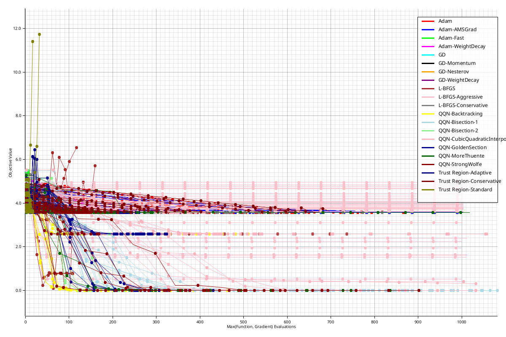
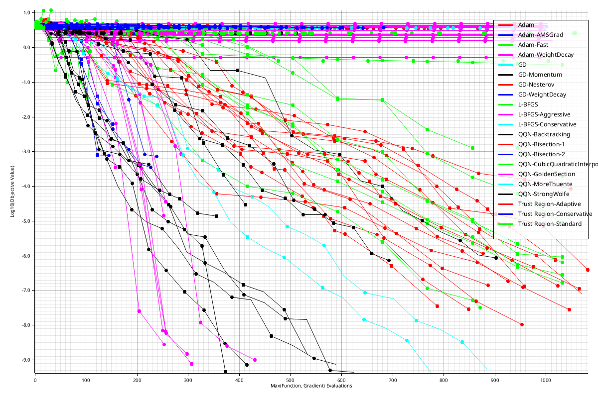

**Figure:** Convergence plots for Ackley_2D_a20_b0.2_c6.28e0 showing objective value vs iterations.
Left: Linear scale, Right: Log scale for better visualization of convergence behavior.

**Data:** [Linear scale data (CSV)](convergence_Ackley_2D_a20_b0.2_c6.28e0_data.csv) | [Log scale data (CSV)](convergence_Ackley_2D_a20_b0.2_c6.28e0_log_data.csv)

## Problem: Ackley_5D_a20_b0.2_c6.28e0

**Family:** Highly Multimodal  
**Dimension:** 5  
**Success Threshold:** 3.570e0  
**Total Runs:** 560

### Performance Summary
<table style="border-collapse: collapse; width: 100%; margin: 20px 0;">
<tr style="background-color: #f2f2f2;">
<th style="border: 1px solid #ddd; padding: 8px; text-align: center;">Rank</th>
<th style="border: 1px solid #ddd; padding: 8px; text-align: center;">Optimizer</th>
<th style="border: 1px solid #ddd; padding: 8px; text-align: center;">Mean Final Value (All/Success/Fail)</th>
<th style="border: 1px solid #ddd; padding: 8px; text-align: center;">Std Dev</th>
<th style="border: 1px solid #ddd; padding: 8px; text-align: center;">Best Value</th>
<th style="border: 1px solid #ddd; padding: 8px; text-align: center;">Worst Value</th>
<th style="border: 1px solid #ddd; padding: 8px; text-align: center;">Mean Function Evals (All/Success/Fail)</th>
<th style="border: 1px solid #ddd; padding: 8px; text-align: center;">Mean Gradient Evals (All/Success/Fail)</th>
<th style="border: 1px solid #ddd; padding: 8px; text-align: center;">Success Rate</th>
<th style="border: 1px solid #ddd; padding: 8px; text-align: center;">Mean Time (s)</th>
</tr>
<tr style="background-color: #d4edda; font-weight: bold;">
<td style="border: 1px solid #ddd; padding: 8px; text-align: center;">1</td>
<td style="border: 1px solid #ddd; padding: 8px; text-align: center;"><a href="detailed_Ackley_5D_a20_b0.2_c6.28e0_QQN-Backtracking.md">QQN-Backtracking</a></td>
<td style="border: 1px solid #ddd; padding: 8px; text-align: center;">2.92e0 / 1.98e0 / 3.32e0</td>
<td style="border: 1px solid #ddd; padding: 8px; text-align: center;">1.00e0</td>
<td style="border: 1px solid #ddd; padding: 8px; text-align: center;">1.36e-11</td>
<td style="border: 1px solid #ddd; padding: 8px; text-align: center;">3.57e0</td>
<td style="border: 1px solid #ddd; padding: 8px; text-align: center;">122.9 / 148.0 / 112.1</td>
<td style="border: 1px solid #ddd; padding: 8px; text-align: center;">85.0 / 111.7 / 73.6</td>
<td style="border: 1px solid #ddd; padding: 8px; text-align: center;">30.0%</td>
<td style="border: 1px solid #ddd; padding: 8px; text-align: center;">0.003</td>
</tr>
<tr style="background-color: #fff3cd;">
<td style="border: 1px solid #ddd; padding: 8px; text-align: center;">2</td>
<td style="border: 1px solid #ddd; padding: 8px; text-align: center;"><a href="detailed_Ackley_5D_a20_b0.2_c6.28e0_QQN-GoldenSection.md">QQN-GoldenSection</a></td>
<td style="border: 1px solid #ddd; padding: 8px; text-align: center;">3.29e0 / 2.32e0 / 3.38e0</td>
<td style="border: 1px solid #ddd; padding: 8px; text-align: center;">6.58e-1</td>
<td style="border: 1px solid #ddd; padding: 8px; text-align: center;">6.60e-11</td>
<td style="border: 1px solid #ddd; padding: 8px; text-align: center;">3.57e0</td>
<td style="border: 1px solid #ddd; padding: 8px; text-align: center;">217.1 / 354.0 / 204.6</td>
<td style="border: 1px solid #ddd; padding: 8px; text-align: center;">41.6 / 61.8 / 39.7</td>
<td style="border: 1px solid #ddd; padding: 8px; text-align: center;">8.3%</td>
<td style="border: 1px solid #ddd; padding: 8px; text-align: center;">0.003</td>
</tr>
<tr style="">
<td style="border: 1px solid #ddd; padding: 8px; text-align: center;">3</td>
<td style="border: 1px solid #ddd; padding: 8px; text-align: center;"><a href="detailed_Ackley_5D_a20_b0.2_c6.28e0_QQN-Bisection-1.md">QQN-Bisection-1</a></td>
<td style="border: 1px solid #ddd; padding: 8px; text-align: center;">3.16e0 / 1.81e0 / 3.31e0</td>
<td style="border: 1px solid #ddd; padding: 8px; text-align: center;">9.28e-1</td>
<td style="border: 1px solid #ddd; padding: 8px; text-align: center;">2.56e-7</td>
<td style="border: 1px solid #ddd; padding: 8px; text-align: center;">3.57e0</td>
<td style="border: 1px solid #ddd; padding: 8px; text-align: center;">152.8 / 310.8 / 135.2</td>
<td style="border: 1px solid #ddd; padding: 8px; text-align: center;">194.8 / 358.5 / 176.6</td>
<td style="border: 1px solid #ddd; padding: 8px; text-align: center;">10.0%</td>
<td style="border: 1px solid #ddd; padding: 8px; text-align: center;">0.003</td>
</tr>
<tr style="">
<td style="border: 1px solid #ddd; padding: 8px; text-align: center;">4</td>
<td style="border: 1px solid #ddd; padding: 8px; text-align: center;"><a href="detailed_Ackley_5D_a20_b0.2_c6.28e0_QQN-CubicQuadraticInterpolation.md">QQN-CubicQuadraticInterpolation</a></td>
<td style="border: 1px solid #ddd; padding: 8px; text-align: center;">3.25e0 / 2.77e0 / 3.28e0</td>
<td style="border: 1px solid #ddd; padding: 8px; text-align: center;">9.10e-1</td>
<td style="border: 1px solid #ddd; padding: 8px; text-align: center;">3.03e-5</td>
<td style="border: 1px solid #ddd; padding: 8px; text-align: center;">3.66e0</td>
<td style="border: 1px solid #ddd; padding: 8px; text-align: center;">151.2 / 216.5 / 147.8</td>
<td style="border: 1px solid #ddd; padding: 8px; text-align: center;">200.7 / 320.5 / 194.4</td>
<td style="border: 1px solid #ddd; padding: 8px; text-align: center;">5.0%</td>
<td style="border: 1px solid #ddd; padding: 8px; text-align: center;">0.004</td>
</tr>
<tr style="">
<td style="border: 1px solid #ddd; padding: 8px; text-align: center;">5</td>
<td style="border: 1px solid #ddd; padding: 8px; text-align: center;"><a href="detailed_Ackley_5D_a20_b0.2_c6.28e0_QQN-Bisection-2.md">QQN-Bisection-2</a></td>
<td style="border: 1px solid #ddd; padding: 8px; text-align: center;">2.96e0 / 2.15e0 / 3.25e0</td>
<td style="border: 1px solid #ddd; padding: 8px; text-align: center;">1.02e0</td>
<td style="border: 1px solid #ddd; padding: 8px; text-align: center;">2.59e-4</td>
<td style="border: 1px solid #ddd; padding: 8px; text-align: center;">3.57e0</td>
<td style="border: 1px solid #ddd; padding: 8px; text-align: center;">79.0 / 170.5 / 56.2</td>
<td style="border: 1px solid #ddd; padding: 8px; text-align: center;">72.2 / 128.8 / 58.0</td>
<td style="border: 1px solid #ddd; padding: 8px; text-align: center;">20.0%</td>
<td style="border: 1px solid #ddd; padding: 8px; text-align: center;">0.001</td>
</tr>
<tr style="">
<td style="border: 1px solid #ddd; padding: 8px; text-align: center;">6</td>
<td style="border: 1px solid #ddd; padding: 8px; text-align: center;"><a href="detailed_Ackley_5D_a20_b0.2_c6.28e0_L-BFGS.md">L-BFGS</a></td>
<td style="border: 1px solid #ddd; padding: 8px; text-align: center;">3.00e0 / 3.44e0 / 3.57e0</td>
<td style="border: 1px solid #ddd; padding: 8px; text-align: center;">9.69e-1</td>
<td style="border: 1px solid #ddd; padding: 8px; text-align: center;">8.94e-3</td>
<td style="border: 1px solid #ddd; padding: 8px; text-align: center;">3.57e0</td>
<td style="border: 1px solid #ddd; padding: 8px; text-align: center;">152.4 / 149.2 / 155.1</td>
<td style="border: 1px solid #ddd; padding: 8px; text-align: center;">68.5 / 64.9 / 71.5</td>
<td style="border: 1px solid #ddd; padding: 8px; text-align: center;">45.0%</td>
<td style="border: 1px solid #ddd; padding: 8px; text-align: center;">0.002</td>
</tr>
<tr style="">
<td style="border: 1px solid #ddd; padding: 8px; text-align: center;">7</td>
<td style="border: 1px solid #ddd; padding: 8px; text-align: center;"><a href="detailed_Ackley_5D_a20_b0.2_c6.28e0_QQN-MoreThuente.md">QQN-MoreThuente</a></td>
<td style="border: 1px solid #ddd; padding: 8px; text-align: center;">3.40e0 / - / 3.40e0</td>
<td style="border: 1px solid #ddd; padding: 8px; text-align: center;">7.72e-1</td>
<td style="border: 1px solid #ddd; padding: 8px; text-align: center;">3.45e-2</td>
<td style="border: 1px solid #ddd; padding: 8px; text-align: center;">3.57e0</td>
<td style="border: 1px solid #ddd; padding: 8px; text-align: center;">95.0 / - / 95.0</td>
<td style="border: 1px solid #ddd; padding: 8px; text-align: center;">90.2 / - / 90.2</td>
<td style="border: 1px solid #ddd; padding: 8px; text-align: center;">0.0%</td>
<td style="border: 1px solid #ddd; padding: 8px; text-align: center;">0.002</td>
</tr>
<tr style="">
<td style="border: 1px solid #ddd; padding: 8px; text-align: center;">8</td>
<td style="border: 1px solid #ddd; padding: 8px; text-align: center;"><a href="detailed_Ackley_5D_a20_b0.2_c6.28e0_L-BFGS-Aggressive.md">L-BFGS-Aggressive</a></td>
<td style="border: 1px solid #ddd; padding: 8px; text-align: center;">3.40e0 / - / 3.40e0</td>
<td style="border: 1px solid #ddd; padding: 8px; text-align: center;">8.55e-1</td>
<td style="border: 1px solid #ddd; padding: 8px; text-align: center;">1.09e0</td>
<td style="border: 1px solid #ddd; padding: 8px; text-align: center;">4.06e0</td>
<td style="border: 1px solid #ddd; padding: 8px; text-align: center;">771.5 / - / 771.5</td>
<td style="border: 1px solid #ddd; padding: 8px; text-align: center;">233.7 / - / 233.7</td>
<td style="border: 1px solid #ddd; padding: 8px; text-align: center;">0.0%</td>
<td style="border: 1px solid #ddd; padding: 8px; text-align: center;">0.007</td>
</tr>
<tr style="">
<td style="border: 1px solid #ddd; padding: 8px; text-align: center;">9</td>
<td style="border: 1px solid #ddd; padding: 8px; text-align: center;"><a href="detailed_Ackley_5D_a20_b0.2_c6.28e0_QQN-StrongWolfe.md">QQN-StrongWolfe</a></td>
<td style="border: 1px solid #ddd; padding: 8px; text-align: center;">3.38e0 / 1.65e0 / 3.57e0</td>
<td style="border: 1px solid #ddd; padding: 8px; text-align: center;">5.78e-1</td>
<td style="border: 1px solid #ddd; padding: 8px; text-align: center;">1.65e0</td>
<td style="border: 1px solid #ddd; padding: 8px; text-align: center;">3.57e0</td>
<td style="border: 1px solid #ddd; padding: 8px; text-align: center;">84.5 / 380.5 / 51.6</td>
<td style="border: 1px solid #ddd; padding: 8px; text-align: center;">83.5 / 409.0 / 47.4</td>
<td style="border: 1px solid #ddd; padding: 8px; text-align: center;">10.0%</td>
<td style="border: 1px solid #ddd; padding: 8px; text-align: center;">0.002</td>
</tr>
<tr style="">
<td style="border: 1px solid #ddd; padding: 8px; text-align: center;">10</td>
<td style="border: 1px solid #ddd; padding: 8px; text-align: center;"><a href="detailed_Ackley_5D_a20_b0.2_c6.28e0_L-BFGS-Conservative.md">L-BFGS-Conservative</a></td>
<td style="border: 1px solid #ddd; padding: 8px; text-align: center;">3.57e0 / - / 3.57e0</td>
<td style="border: 1px solid #ddd; padding: 8px; text-align: center;">8.25e-5</td>
<td style="border: 1px solid #ddd; padding: 8px; text-align: center;">3.57e0</td>
<td style="border: 1px solid #ddd; padding: 8px; text-align: center;">3.57e0</td>
<td style="border: 1px solid #ddd; padding: 8px; text-align: center;">234.4 / - / 234.4</td>
<td style="border: 1px solid #ddd; padding: 8px; text-align: center;">129.8 / - / 129.8</td>
<td style="border: 1px solid #ddd; padding: 8px; text-align: center;">0.0%</td>
<td style="border: 1px solid #ddd; padding: 8px; text-align: center;">0.004</td>
</tr>
<tr style="">
<td style="border: 1px solid #ddd; padding: 8px; text-align: center;">11</td>
<td style="border: 1px solid #ddd; padding: 8px; text-align: center;"><a href="detailed_Ackley_5D_a20_b0.2_c6.28e0_GD.md">GD</a></td>
<td style="border: 1px solid #ddd; padding: 8px; text-align: center;">3.57e0 / - / 3.57e0</td>
<td style="border: 1px solid #ddd; padding: 8px; text-align: center;">5.12e-11</td>
<td style="border: 1px solid #ddd; padding: 8px; text-align: center;">3.57e0</td>
<td style="border: 1px solid #ddd; padding: 8px; text-align: center;">3.57e0</td>
<td style="border: 1px solid #ddd; padding: 8px; text-align: center;">51.0 / - / 51.0</td>
<td style="border: 1px solid #ddd; padding: 8px; text-align: center;">98.3 / - / 98.3</td>
<td style="border: 1px solid #ddd; padding: 8px; text-align: center;">0.0%</td>
<td style="border: 1px solid #ddd; padding: 8px; text-align: center;">0.001</td>
</tr>
<tr style="">
<td style="border: 1px solid #ddd; padding: 8px; text-align: center;">12</td>
<td style="border: 1px solid #ddd; padding: 8px; text-align: center;"><a href="detailed_Ackley_5D_a20_b0.2_c6.28e0_Adam.md">Adam</a></td>
<td style="border: 1px solid #ddd; padding: 8px; text-align: center;">3.57e0 / - / 3.57e0</td>
<td style="border: 1px solid #ddd; padding: 8px; text-align: center;">4.84e-5</td>
<td style="border: 1px solid #ddd; padding: 8px; text-align: center;">3.57e0</td>
<td style="border: 1px solid #ddd; padding: 8px; text-align: center;">3.57e0</td>
<td style="border: 1px solid #ddd; padding: 8px; text-align: center;">486.9 / - / 486.9</td>
<td style="border: 1px solid #ddd; padding: 8px; text-align: center;">486.6 / - / 486.6</td>
<td style="border: 1px solid #ddd; padding: 8px; text-align: center;">0.0%</td>
<td style="border: 1px solid #ddd; padding: 8px; text-align: center;">0.010</td>
</tr>
<tr style="">
<td style="border: 1px solid #ddd; padding: 8px; text-align: center;">13</td>
<td style="border: 1px solid #ddd; padding: 8px; text-align: center;"><a href="detailed_Ackley_5D_a20_b0.2_c6.28e0_GD-Nesterov.md">GD-Nesterov</a></td>
<td style="border: 1px solid #ddd; padding: 8px; text-align: center;">3.58e0 / - / 3.61e0</td>
<td style="border: 1px solid #ddd; padding: 8px; text-align: center;">7.35e-3</td>
<td style="border: 1px solid #ddd; padding: 8px; text-align: center;">3.57e0</td>
<td style="border: 1px solid #ddd; padding: 8px; text-align: center;">3.60e0</td>
<td style="border: 1px solid #ddd; padding: 8px; text-align: center;">18.3 / - / 18.3</td>
<td style="border: 1px solid #ddd; padding: 8px; text-align: center;">32.6 / - / 32.6</td>
<td style="border: 1px solid #ddd; padding: 8px; text-align: center;">0.0%</td>
<td style="border: 1px solid #ddd; padding: 8px; text-align: center;">0.000</td>
</tr>
<tr style="">
<td style="border: 1px solid #ddd; padding: 8px; text-align: center;">14</td>
<td style="border: 1px solid #ddd; padding: 8px; text-align: center;"><a href="detailed_Ackley_5D_a20_b0.2_c6.28e0_Adam-WeightDecay.md">Adam-WeightDecay</a></td>
<td style="border: 1px solid #ddd; padding: 8px; text-align: center;">3.57e0 / - / 3.57e0</td>
<td style="border: 1px solid #ddd; padding: 8px; text-align: center;">3.47e-4</td>
<td style="border: 1px solid #ddd; padding: 8px; text-align: center;">3.57e0</td>
<td style="border: 1px solid #ddd; padding: 8px; text-align: center;">3.58e0</td>
<td style="border: 1px solid #ddd; padding: 8px; text-align: center;">183.7 / - / 183.7</td>
<td style="border: 1px solid #ddd; padding: 8px; text-align: center;">182.7 / - / 182.7</td>
<td style="border: 1px solid #ddd; padding: 8px; text-align: center;">0.0%</td>
<td style="border: 1px solid #ddd; padding: 8px; text-align: center;">0.004</td>
</tr>
<tr style="">
<td style="border: 1px solid #ddd; padding: 8px; text-align: center;">15</td>
<td style="border: 1px solid #ddd; padding: 8px; text-align: center;"><a href="detailed_Ackley_5D_a20_b0.2_c6.28e0_Adam-Fast.md">Adam-Fast</a></td>
<td style="border: 1px solid #ddd; padding: 8px; text-align: center;">3.61e0 / - / 3.62e0</td>
<td style="border: 1px solid #ddd; padding: 8px; text-align: center;">4.14e-2</td>
<td style="border: 1px solid #ddd; padding: 8px; text-align: center;">3.57e0</td>
<td style="border: 1px solid #ddd; padding: 8px; text-align: center;">3.71e0</td>
<td style="border: 1px solid #ddd; padding: 8px; text-align: center;">67.2 / - / 67.2</td>
<td style="border: 1px solid #ddd; padding: 8px; text-align: center;">66.2 / - / 66.2</td>
<td style="border: 1px solid #ddd; padding: 8px; text-align: center;">0.0%</td>
<td style="border: 1px solid #ddd; padding: 8px; text-align: center;">0.001</td>
</tr>
<tr style="">
<td style="border: 1px solid #ddd; padding: 8px; text-align: center;">16</td>
<td style="border: 1px solid #ddd; padding: 8px; text-align: center;"><a href="detailed_Ackley_5D_a20_b0.2_c6.28e0_Trust_Region-Conservative.md">Trust Region-Conservative</a></td>
<td style="border: 1px solid #ddd; padding: 8px; text-align: center;">3.58e0 / - / 3.60e0</td>
<td style="border: 1px solid #ddd; padding: 8px; text-align: center;">7.20e-4</td>
<td style="border: 1px solid #ddd; padding: 8px; text-align: center;">3.57e0</td>
<td style="border: 1px solid #ddd; padding: 8px; text-align: center;">3.58e0</td>
<td style="border: 1px solid #ddd; padding: 8px; text-align: center;">186.4 / - / 186.4</td>
<td style="border: 1px solid #ddd; padding: 8px; text-align: center;">124.9 / - / 124.9</td>
<td style="border: 1px solid #ddd; padding: 8px; text-align: center;">0.0%</td>
<td style="border: 1px solid #ddd; padding: 8px; text-align: center;">0.001</td>
</tr>
<tr style="">
<td style="border: 1px solid #ddd; padding: 8px; text-align: center;">17</td>
<td style="border: 1px solid #ddd; padding: 8px; text-align: center;"><a href="detailed_Ackley_5D_a20_b0.2_c6.28e0_GD-Momentum.md">GD-Momentum</a></td>
<td style="border: 1px solid #ddd; padding: 8px; text-align: center;">3.59e0 / - / 3.72e0</td>
<td style="border: 1px solid #ddd; padding: 8px; text-align: center;">9.92e-3</td>
<td style="border: 1px solid #ddd; padding: 8px; text-align: center;">3.57e0</td>
<td style="border: 1px solid #ddd; padding: 8px; text-align: center;">3.61e0</td>
<td style="border: 1px solid #ddd; padding: 8px; text-align: center;">14.2 / - / 14.2</td>
<td style="border: 1px solid #ddd; padding: 8px; text-align: center;">24.3 / - / 24.3</td>
<td style="border: 1px solid #ddd; padding: 8px; text-align: center;">0.0%</td>
<td style="border: 1px solid #ddd; padding: 8px; text-align: center;">0.000</td>
</tr>
<tr style="">
<td style="border: 1px solid #ddd; padding: 8px; text-align: center;">18</td>
<td style="border: 1px solid #ddd; padding: 8px; text-align: center;"><a href="detailed_Ackley_5D_a20_b0.2_c6.28e0_Adam-AMSGrad.md">Adam-AMSGrad</a></td>
<td style="border: 1px solid #ddd; padding: 8px; text-align: center;">3.58e0 / - / 3.58e0</td>
<td style="border: 1px solid #ddd; padding: 8px; text-align: center;">4.99e-3</td>
<td style="border: 1px solid #ddd; padding: 8px; text-align: center;">3.57e0</td>
<td style="border: 1px solid #ddd; padding: 8px; text-align: center;">3.59e0</td>
<td style="border: 1px solid #ddd; padding: 8px; text-align: center;">502.0 / - / 502.0</td>
<td style="border: 1px solid #ddd; padding: 8px; text-align: center;">502.0 / - / 502.0</td>
<td style="border: 1px solid #ddd; padding: 8px; text-align: center;">0.0%</td>
<td style="border: 1px solid #ddd; padding: 8px; text-align: center;">0.011</td>
</tr>
<tr style="">
<td style="border: 1px solid #ddd; padding: 8px; text-align: center;">19</td>
<td style="border: 1px solid #ddd; padding: 8px; text-align: center;"><a href="detailed_Ackley_5D_a20_b0.2_c6.28e0_Trust_Region-Adaptive.md">Trust Region-Adaptive</a></td>
<td style="border: 1px solid #ddd; padding: 8px; text-align: center;">3.60e0 / - / 3.72e0</td>
<td style="border: 1px solid #ddd; padding: 8px; text-align: center;">2.07e-2</td>
<td style="border: 1px solid #ddd; padding: 8px; text-align: center;">3.57e0</td>
<td style="border: 1px solid #ddd; padding: 8px; text-align: center;">3.65e0</td>
<td style="border: 1px solid #ddd; padding: 8px; text-align: center;">16.7 / - / 16.7</td>
<td style="border: 1px solid #ddd; padding: 8px; text-align: center;">11.8 / - / 11.8</td>
<td style="border: 1px solid #ddd; padding: 8px; text-align: center;">0.0%</td>
<td style="border: 1px solid #ddd; padding: 8px; text-align: center;">0.000</td>
</tr>
<tr style="">
<td style="border: 1px solid #ddd; padding: 8px; text-align: center;">20</td>
<td style="border: 1px solid #ddd; padding: 8px; text-align: center;"><a href="detailed_Ackley_5D_a20_b0.2_c6.28e0_GD-WeightDecay.md">GD-WeightDecay</a></td>
<td style="border: 1px solid #ddd; padding: 8px; text-align: center;">3.58e0 / - / 3.62e0</td>
<td style="border: 1px solid #ddd; padding: 8px; text-align: center;">3.13e-3</td>
<td style="border: 1px solid #ddd; padding: 8px; text-align: center;">3.58e0</td>
<td style="border: 1px solid #ddd; padding: 8px; text-align: center;">3.58e0</td>
<td style="border: 1px solid #ddd; padding: 8px; text-align: center;">15.2 / - / 15.2</td>
<td style="border: 1px solid #ddd; padding: 8px; text-align: center;">26.5 / - / 26.5</td>
<td style="border: 1px solid #ddd; padding: 8px; text-align: center;">0.0%</td>
<td style="border: 1px solid #ddd; padding: 8px; text-align: center;">0.000</td>
</tr>
<tr style="">
<td style="border: 1px solid #ddd; padding: 8px; text-align: center;">21</td>
<td style="border: 1px solid #ddd; padding: 8px; text-align: center;"><a href="detailed_Ackley_5D_a20_b0.2_c6.28e0_Trust_Region-Standard.md">Trust Region-Standard</a></td>
<td style="border: 1px solid #ddd; padding: 8px; text-align: center;">3.66e0 / - / 4.35e0</td>
<td style="border: 1px solid #ddd; padding: 8px; text-align: center;">8.64e-2</td>
<td style="border: 1px solid #ddd; padding: 8px; text-align: center;">3.58e0</td>
<td style="border: 1px solid #ddd; padding: 8px; text-align: center;">3.82e0</td>
<td style="border: 1px solid #ddd; padding: 8px; text-align: center;">9.7 / - / 9.7</td>
<td style="border: 1px solid #ddd; padding: 8px; text-align: center;">7.1 / - / 7.1</td>
<td style="border: 1px solid #ddd; padding: 8px; text-align: center;">0.0%</td>
<td style="border: 1px solid #ddd; padding: 8px; text-align: center;">0.000</td>
</tr>
</table>

### Convergence Plots

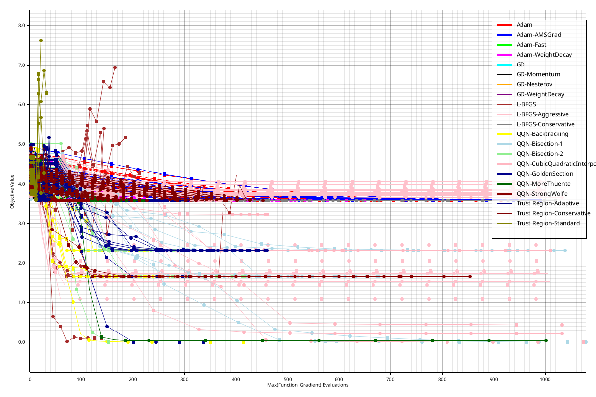
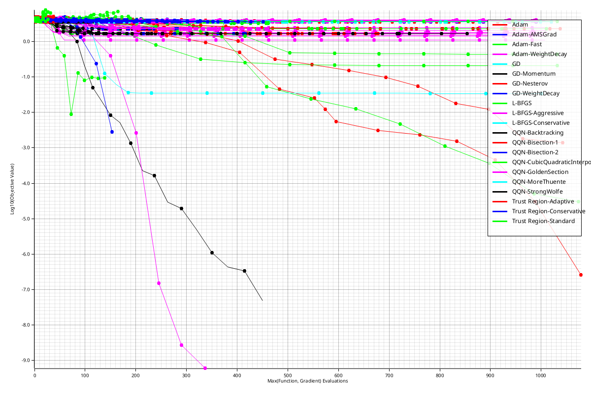

**Figure:** Convergence plots for Ackley_5D_a20_b0.2_c6.28e0 showing objective value vs iterations.
Left: Linear scale, Right: Log scale for better visualization of convergence behavior.

**Data:** [Linear scale data (CSV)](convergence_Ackley_5D_a20_b0.2_c6.28e0_data.csv) | [Log scale data (CSV)](convergence_Ackley_5D_a20_b0.2_c6.28e0_log_data.csv)

## Problem: Ackley_10D_a20_b0.2_c6.28e0

**Family:** Highly Multimodal  
**Dimension:** 10  
**Success Threshold:** 3.570e0  
**Total Runs:** 560

### Performance Summary
<table style="border-collapse: collapse; width: 100%; margin: 20px 0;">
<tr style="background-color: #f2f2f2;">
<th style="border: 1px solid #ddd; padding: 8px; text-align: center;">Rank</th>
<th style="border: 1px solid #ddd; padding: 8px; text-align: center;">Optimizer</th>
<th style="border: 1px solid #ddd; padding: 8px; text-align: center;">Mean Final Value (All/Success/Fail)</th>
<th style="border: 1px solid #ddd; padding: 8px; text-align: center;">Std Dev</th>
<th style="border: 1px solid #ddd; padding: 8px; text-align: center;">Best Value</th>
<th style="border: 1px solid #ddd; padding: 8px; text-align: center;">Worst Value</th>
<th style="border: 1px solid #ddd; padding: 8px; text-align: center;">Mean Function Evals (All/Success/Fail)</th>
<th style="border: 1px solid #ddd; padding: 8px; text-align: center;">Mean Gradient Evals (All/Success/Fail)</th>
<th style="border: 1px solid #ddd; padding: 8px; text-align: center;">Success Rate</th>
<th style="border: 1px solid #ddd; padding: 8px; text-align: center;">Mean Time (s)</th>
</tr>
<tr style="background-color: #d4edda; font-weight: bold;">
<td style="border: 1px solid #ddd; padding: 8px; text-align: center;">1</td>
<td style="border: 1px solid #ddd; padding: 8px; text-align: center;"><a href="detailed_Ackley_10D_a20_b0.2_c6.28e0_QQN-GoldenSection.md">QQN-GoldenSection</a></td>
<td style="border: 1px solid #ddd; padding: 8px; text-align: center;">3.35e0 / 2.43e0 / 3.38e0</td>
<td style="border: 1px solid #ddd; padding: 8px; text-align: center;">7.32e-1</td>
<td style="border: 1px solid #ddd; padding: 8px; text-align: center;">1.86e-11</td>
<td style="border: 1px solid #ddd; padding: 8px; text-align: center;">3.57e0</td>
<td style="border: 1px solid #ddd; padding: 8px; text-align: center;">203.4 / 325.5 / 199.2</td>
<td style="border: 1px solid #ddd; padding: 8px; text-align: center;">43.5 / 63.0 / 42.9</td>
<td style="border: 1px solid #ddd; padding: 8px; text-align: center;">3.3%</td>
<td style="border: 1px solid #ddd; padding: 8px; text-align: center;">0.003</td>
</tr>
<tr style="background-color: #fff3cd;">
<td style="border: 1px solid #ddd; padding: 8px; text-align: center;">2</td>
<td style="border: 1px solid #ddd; padding: 8px; text-align: center;"><a href="detailed_Ackley_10D_a20_b0.2_c6.28e0_L-BFGS-Aggressive.md">L-BFGS-Aggressive</a></td>
<td style="border: 1px solid #ddd; padding: 8px; text-align: center;">3.47e0 / 2.81e0 / 3.49e0</td>
<td style="border: 1px solid #ddd; padding: 8px; text-align: center;">5.52e-1</td>
<td style="border: 1px solid #ddd; padding: 8px; text-align: center;">1.18e-1</td>
<td style="border: 1px solid #ddd; padding: 8px; text-align: center;">3.79e0</td>
<td style="border: 1px solid #ddd; padding: 8px; text-align: center;">200.8 / 202.0 / 200.8</td>
<td style="border: 1px solid #ddd; padding: 8px; text-align: center;">67.0 / 71.0 / 66.9</td>
<td style="border: 1px solid #ddd; padding: 8px; text-align: center;">2.5%</td>
<td style="border: 1px solid #ddd; padding: 8px; text-align: center;">0.003</td>
</tr>
<tr style="">
<td style="border: 1px solid #ddd; padding: 8px; text-align: center;">3</td>
<td style="border: 1px solid #ddd; padding: 8px; text-align: center;"><a href="detailed_Ackley_10D_a20_b0.2_c6.28e0_QQN-MoreThuente.md">QQN-MoreThuente</a></td>
<td style="border: 1px solid #ddd; padding: 8px; text-align: center;">3.45e0 / 1.16e0 / 3.57e0</td>
<td style="border: 1px solid #ddd; padding: 8px; text-align: center;">5.27e-1</td>
<td style="border: 1px solid #ddd; padding: 8px; text-align: center;">1.16e0</td>
<td style="border: 1px solid #ddd; padding: 8px; text-align: center;">3.57e0</td>
<td style="border: 1px solid #ddd; padding: 8px; text-align: center;">91.4 / 290.0 / 80.9</td>
<td style="border: 1px solid #ddd; padding: 8px; text-align: center;">86.1 / 329.0 / 73.3</td>
<td style="border: 1px solid #ddd; padding: 8px; text-align: center;">5.0%</td>
<td style="border: 1px solid #ddd; padding: 8px; text-align: center;">0.002</td>
</tr>
<tr style="">
<td style="border: 1px solid #ddd; padding: 8px; text-align: center;">4</td>
<td style="border: 1px solid #ddd; padding: 8px; text-align: center;"><a href="detailed_Ackley_10D_a20_b0.2_c6.28e0_QQN-Bisection-1.md">QQN-Bisection-1</a></td>
<td style="border: 1px solid #ddd; padding: 8px; text-align: center;">3.46e0 / 1.98e0 / 3.53e0</td>
<td style="border: 1px solid #ddd; padding: 8px; text-align: center;">4.23e-1</td>
<td style="border: 1px solid #ddd; padding: 8px; text-align: center;">1.65e0</td>
<td style="border: 1px solid #ddd; padding: 8px; text-align: center;">3.57e0</td>
<td style="border: 1px solid #ddd; padding: 8px; text-align: center;">120.2 / 196.5 / 116.1</td>
<td style="border: 1px solid #ddd; padding: 8px; text-align: center;">154.1 / 243.5 / 149.3</td>
<td style="border: 1px solid #ddd; padding: 8px; text-align: center;">5.0%</td>
<td style="border: 1px solid #ddd; padding: 8px; text-align: center;">0.002</td>
</tr>
<tr style="">
<td style="border: 1px solid #ddd; padding: 8px; text-align: center;">5</td>
<td style="border: 1px solid #ddd; padding: 8px; text-align: center;"><a href="detailed_Ackley_10D_a20_b0.2_c6.28e0_L-BFGS.md">L-BFGS</a></td>
<td style="border: 1px solid #ddd; padding: 8px; text-align: center;">3.39e0 / 3.30e0 / 3.57e0</td>
<td style="border: 1px solid #ddd; padding: 8px; text-align: center;">5.13e-1</td>
<td style="border: 1px solid #ddd; padding: 8px; text-align: center;">1.73e0</td>
<td style="border: 1px solid #ddd; padding: 8px; text-align: center;">3.57e0</td>
<td style="border: 1px solid #ddd; padding: 8px; text-align: center;">146.7 / 143.2 / 147.6</td>
<td style="border: 1px solid #ddd; padding: 8px; text-align: center;">76.2 / 72.5 / 77.1</td>
<td style="border: 1px solid #ddd; padding: 8px; text-align: center;">20.0%</td>
<td style="border: 1px solid #ddd; padding: 8px; text-align: center;">0.003</td>
</tr>
<tr style="">
<td style="border: 1px solid #ddd; padding: 8px; text-align: center;">6</td>
<td style="border: 1px solid #ddd; padding: 8px; text-align: center;"><a href="detailed_Ackley_10D_a20_b0.2_c6.28e0_QQN-Backtracking.md">QQN-Backtracking</a></td>
<td style="border: 1px solid #ddd; padding: 8px; text-align: center;">3.50e0 / 2.01e0 / 3.57e0</td>
<td style="border: 1px solid #ddd; padding: 8px; text-align: center;">3.40e-1</td>
<td style="border: 1px solid #ddd; padding: 8px; text-align: center;">2.01e0</td>
<td style="border: 1px solid #ddd; padding: 8px; text-align: center;">3.57e0</td>
<td style="border: 1px solid #ddd; padding: 8px; text-align: center;">148.9 / 119.0 / 150.5</td>
<td style="border: 1px solid #ddd; padding: 8px; text-align: center;">122.7 / 99.0 / 123.9</td>
<td style="border: 1px solid #ddd; padding: 8px; text-align: center;">5.0%</td>
<td style="border: 1px solid #ddd; padding: 8px; text-align: center;">0.005</td>
</tr>
<tr style="">
<td style="border: 1px solid #ddd; padding: 8px; text-align: center;">7</td>
<td style="border: 1px solid #ddd; padding: 8px; text-align: center;"><a href="detailed_Ackley_10D_a20_b0.2_c6.28e0_QQN-CubicQuadraticInterpolation.md">QQN-CubicQuadraticInterpolation</a></td>
<td style="border: 1px solid #ddd; padding: 8px; text-align: center;">3.50e0 / 2.01e0 / 3.53e0</td>
<td style="border: 1px solid #ddd; padding: 8px; text-align: center;">3.40e-1</td>
<td style="border: 1px solid #ddd; padding: 8px; text-align: center;">2.01e0</td>
<td style="border: 1px solid #ddd; padding: 8px; text-align: center;">3.58e0</td>
<td style="border: 1px solid #ddd; padding: 8px; text-align: center;">295.6 / 183.0 / 298.4</td>
<td style="border: 1px solid #ddd; padding: 8px; text-align: center;">467.6 / 252.0 / 473.1</td>
<td style="border: 1px solid #ddd; padding: 8px; text-align: center;">2.5%</td>
<td style="border: 1px solid #ddd; padding: 8px; text-align: center;">0.011</td>
</tr>
<tr style="">
<td style="border: 1px solid #ddd; padding: 8px; text-align: center;">8</td>
<td style="border: 1px solid #ddd; padding: 8px; text-align: center;"><a href="detailed_Ackley_10D_a20_b0.2_c6.28e0_QQN-Bisection-2.md">QQN-Bisection-2</a></td>
<td style="border: 1px solid #ddd; padding: 8px; text-align: center;">3.36e0 / 2.67e0 / 3.57e0</td>
<td style="border: 1px solid #ddd; padding: 8px; text-align: center;">4.15e-1</td>
<td style="border: 1px solid #ddd; padding: 8px; text-align: center;">2.32e0</td>
<td style="border: 1px solid #ddd; padding: 8px; text-align: center;">3.57e0</td>
<td style="border: 1px solid #ddd; padding: 8px; text-align: center;">114.5 / 334.0 / 59.6</td>
<td style="border: 1px solid #ddd; padding: 8px; text-align: center;">104.8 / 222.2 / 75.4</td>
<td style="border: 1px solid #ddd; padding: 8px; text-align: center;">20.0%</td>
<td style="border: 1px solid #ddd; padding: 8px; text-align: center;">0.002</td>
</tr>
<tr style="">
<td style="border: 1px solid #ddd; padding: 8px; text-align: center;">9</td>
<td style="border: 1px solid #ddd; padding: 8px; text-align: center;"><a href="detailed_Ackley_10D_a20_b0.2_c6.28e0_QQN-StrongWolfe.md">QQN-StrongWolfe</a></td>
<td style="border: 1px solid #ddd; padding: 8px; text-align: center;">3.57e0 / - / 3.57e0</td>
<td style="border: 1px solid #ddd; padding: 8px; text-align: center;">1.01e-14</td>
<td style="border: 1px solid #ddd; padding: 8px; text-align: center;">3.57e0</td>
<td style="border: 1px solid #ddd; padding: 8px; text-align: center;">3.57e0</td>
<td style="border: 1px solid #ddd; padding: 8px; text-align: center;">79.2 / - / 79.2</td>
<td style="border: 1px solid #ddd; padding: 8px; text-align: center;">79.3 / - / 79.3</td>
<td style="border: 1px solid #ddd; padding: 8px; text-align: center;">0.0%</td>
<td style="border: 1px solid #ddd; padding: 8px; text-align: center;">0.002</td>
</tr>
<tr style="">
<td style="border: 1px solid #ddd; padding: 8px; text-align: center;">10</td>
<td style="border: 1px solid #ddd; padding: 8px; text-align: center;"><a href="detailed_Ackley_10D_a20_b0.2_c6.28e0_L-BFGS-Conservative.md">L-BFGS-Conservative</a></td>
<td style="border: 1px solid #ddd; padding: 8px; text-align: center;">3.57e0 / - / 3.57e0</td>
<td style="border: 1px solid #ddd; padding: 8px; text-align: center;">5.40e-5</td>
<td style="border: 1px solid #ddd; padding: 8px; text-align: center;">3.57e0</td>
<td style="border: 1px solid #ddd; padding: 8px; text-align: center;">3.57e0</td>
<td style="border: 1px solid #ddd; padding: 8px; text-align: center;">223.4 / - / 223.4</td>
<td style="border: 1px solid #ddd; padding: 8px; text-align: center;">144.1 / - / 144.1</td>
<td style="border: 1px solid #ddd; padding: 8px; text-align: center;">0.0%</td>
<td style="border: 1px solid #ddd; padding: 8px; text-align: center;">0.005</td>
</tr>
<tr style="">
<td style="border: 1px solid #ddd; padding: 8px; text-align: center;">11</td>
<td style="border: 1px solid #ddd; padding: 8px; text-align: center;"><a href="detailed_Ackley_10D_a20_b0.2_c6.28e0_GD.md">GD</a></td>
<td style="border: 1px solid #ddd; padding: 8px; text-align: center;">3.57e0 / - / 3.57e0</td>
<td style="border: 1px solid #ddd; padding: 8px; text-align: center;">3.84e-10</td>
<td style="border: 1px solid #ddd; padding: 8px; text-align: center;">3.57e0</td>
<td style="border: 1px solid #ddd; padding: 8px; text-align: center;">3.57e0</td>
<td style="border: 1px solid #ddd; padding: 8px; text-align: center;">98.3 / - / 98.3</td>
<td style="border: 1px solid #ddd; padding: 8px; text-align: center;">193.2 / - / 193.2</td>
<td style="border: 1px solid #ddd; padding: 8px; text-align: center;">0.0%</td>
<td style="border: 1px solid #ddd; padding: 8px; text-align: center;">0.003</td>
</tr>
<tr style="">
<td style="border: 1px solid #ddd; padding: 8px; text-align: center;">12</td>
<td style="border: 1px solid #ddd; padding: 8px; text-align: center;"><a href="detailed_Ackley_10D_a20_b0.2_c6.28e0_Adam-Fast.md">Adam-Fast</a></td>
<td style="border: 1px solid #ddd; padding: 8px; text-align: center;">3.60e0 / - / 3.61e0</td>
<td style="border: 1px solid #ddd; padding: 8px; text-align: center;">3.38e-2</td>
<td style="border: 1px solid #ddd; padding: 8px; text-align: center;">3.57e0</td>
<td style="border: 1px solid #ddd; padding: 8px; text-align: center;">3.67e0</td>
<td style="border: 1px solid #ddd; padding: 8px; text-align: center;">135.6 / - / 135.6</td>
<td style="border: 1px solid #ddd; padding: 8px; text-align: center;">134.6 / - / 134.6</td>
<td style="border: 1px solid #ddd; padding: 8px; text-align: center;">0.0%</td>
<td style="border: 1px solid #ddd; padding: 8px; text-align: center;">0.003</td>
</tr>
<tr style="">
<td style="border: 1px solid #ddd; padding: 8px; text-align: center;">13</td>
<td style="border: 1px solid #ddd; padding: 8px; text-align: center;"><a href="detailed_Ackley_10D_a20_b0.2_c6.28e0_Adam-AMSGrad.md">Adam-AMSGrad</a></td>
<td style="border: 1px solid #ddd; padding: 8px; text-align: center;">3.58e0 / - / 3.58e0</td>
<td style="border: 1px solid #ddd; padding: 8px; text-align: center;">3.94e-3</td>
<td style="border: 1px solid #ddd; padding: 8px; text-align: center;">3.57e0</td>
<td style="border: 1px solid #ddd; padding: 8px; text-align: center;">3.59e0</td>
<td style="border: 1px solid #ddd; padding: 8px; text-align: center;">502.0 / - / 502.0</td>
<td style="border: 1px solid #ddd; padding: 8px; text-align: center;">502.0 / - / 502.0</td>
<td style="border: 1px solid #ddd; padding: 8px; text-align: center;">0.0%</td>
<td style="border: 1px solid #ddd; padding: 8px; text-align: center;">0.012</td>
</tr>
<tr style="">
<td style="border: 1px solid #ddd; padding: 8px; text-align: center;">14</td>
<td style="border: 1px solid #ddd; padding: 8px; text-align: center;"><a href="detailed_Ackley_10D_a20_b0.2_c6.28e0_Adam.md">Adam</a></td>
<td style="border: 1px solid #ddd; padding: 8px; text-align: center;">3.57e0 / - / 3.57e0</td>
<td style="border: 1px solid #ddd; padding: 8px; text-align: center;">1.92e-4</td>
<td style="border: 1px solid #ddd; padding: 8px; text-align: center;">3.57e0</td>
<td style="border: 1px solid #ddd; padding: 8px; text-align: center;">3.58e0</td>
<td style="border: 1px solid #ddd; padding: 8px; text-align: center;">502.0 / - / 502.0</td>
<td style="border: 1px solid #ddd; padding: 8px; text-align: center;">502.0 / - / 502.0</td>
<td style="border: 1px solid #ddd; padding: 8px; text-align: center;">0.0%</td>
<td style="border: 1px solid #ddd; padding: 8px; text-align: center;">0.011</td>
</tr>
<tr style="">
<td style="border: 1px solid #ddd; padding: 8px; text-align: center;">15</td>
<td style="border: 1px solid #ddd; padding: 8px; text-align: center;"><a href="detailed_Ackley_10D_a20_b0.2_c6.28e0_Adam-WeightDecay.md">Adam-WeightDecay</a></td>
<td style="border: 1px solid #ddd; padding: 8px; text-align: center;">3.57e0 / - / 3.57e0</td>
<td style="border: 1px solid #ddd; padding: 8px; text-align: center;">2.36e-5</td>
<td style="border: 1px solid #ddd; padding: 8px; text-align: center;">3.57e0</td>
<td style="border: 1px solid #ddd; padding: 8px; text-align: center;">3.57e0</td>
<td style="border: 1px solid #ddd; padding: 8px; text-align: center;">270.2 / - / 270.2</td>
<td style="border: 1px solid #ddd; padding: 8px; text-align: center;">269.2 / - / 269.2</td>
<td style="border: 1px solid #ddd; padding: 8px; text-align: center;">0.0%</td>
<td style="border: 1px solid #ddd; padding: 8px; text-align: center;">0.006</td>
</tr>
<tr style="">
<td style="border: 1px solid #ddd; padding: 8px; text-align: center;">16</td>
<td style="border: 1px solid #ddd; padding: 8px; text-align: center;"><a href="detailed_Ackley_10D_a20_b0.2_c6.28e0_Trust_Region-Conservative.md">Trust Region-Conservative</a></td>
<td style="border: 1px solid #ddd; padding: 8px; text-align: center;">3.58e0 / - / 3.58e0</td>
<td style="border: 1px solid #ddd; padding: 8px; text-align: center;">8.30e-4</td>
<td style="border: 1px solid #ddd; padding: 8px; text-align: center;">3.57e0</td>
<td style="border: 1px solid #ddd; padding: 8px; text-align: center;">3.58e0</td>
<td style="border: 1px solid #ddd; padding: 8px; text-align: center;">215.8 / - / 215.8</td>
<td style="border: 1px solid #ddd; padding: 8px; text-align: center;">144.3 / - / 144.3</td>
<td style="border: 1px solid #ddd; padding: 8px; text-align: center;">0.0%</td>
<td style="border: 1px solid #ddd; padding: 8px; text-align: center;">0.002</td>
</tr>
<tr style="">
<td style="border: 1px solid #ddd; padding: 8px; text-align: center;">17</td>
<td style="border: 1px solid #ddd; padding: 8px; text-align: center;"><a href="detailed_Ackley_10D_a20_b0.2_c6.28e0_GD-WeightDecay.md">GD-WeightDecay</a></td>
<td style="border: 1px solid #ddd; padding: 8px; text-align: center;">3.58e0 / - / 3.59e0</td>
<td style="border: 1px solid #ddd; padding: 8px; text-align: center;">1.17e-3</td>
<td style="border: 1px solid #ddd; padding: 8px; text-align: center;">3.57e0</td>
<td style="border: 1px solid #ddd; padding: 8px; text-align: center;">3.58e0</td>
<td style="border: 1px solid #ddd; padding: 8px; text-align: center;">19.4 / - / 19.4</td>
<td style="border: 1px solid #ddd; padding: 8px; text-align: center;">34.8 / - / 34.8</td>
<td style="border: 1px solid #ddd; padding: 8px; text-align: center;">0.0%</td>
<td style="border: 1px solid #ddd; padding: 8px; text-align: center;">0.001</td>
</tr>
<tr style="">
<td style="border: 1px solid #ddd; padding: 8px; text-align: center;">18</td>
<td style="border: 1px solid #ddd; padding: 8px; text-align: center;"><a href="detailed_Ackley_10D_a20_b0.2_c6.28e0_GD-Momentum.md">GD-Momentum</a></td>
<td style="border: 1px solid #ddd; padding: 8px; text-align: center;">3.58e0 / - / 3.76e0</td>
<td style="border: 1px solid #ddd; padding: 8px; text-align: center;">4.41e-3</td>
<td style="border: 1px solid #ddd; padding: 8px; text-align: center;">3.57e0</td>
<td style="border: 1px solid #ddd; padding: 8px; text-align: center;">3.59e0</td>
<td style="border: 1px solid #ddd; padding: 8px; text-align: center;">14.4 / - / 14.4</td>
<td style="border: 1px solid #ddd; padding: 8px; text-align: center;">24.9 / - / 24.9</td>
<td style="border: 1px solid #ddd; padding: 8px; text-align: center;">0.0%</td>
<td style="border: 1px solid #ddd; padding: 8px; text-align: center;">0.000</td>
</tr>
<tr style="">
<td style="border: 1px solid #ddd; padding: 8px; text-align: center;">19</td>
<td style="border: 1px solid #ddd; padding: 8px; text-align: center;"><a href="detailed_Ackley_10D_a20_b0.2_c6.28e0_GD-Nesterov.md">GD-Nesterov</a></td>
<td style="border: 1px solid #ddd; padding: 8px; text-align: center;">3.58e0 / - / 3.66e0</td>
<td style="border: 1px solid #ddd; padding: 8px; text-align: center;">3.50e-3</td>
<td style="border: 1px solid #ddd; padding: 8px; text-align: center;">3.58e0</td>
<td style="border: 1px solid #ddd; padding: 8px; text-align: center;">3.59e0</td>
<td style="border: 1px solid #ddd; padding: 8px; text-align: center;">14.1 / - / 14.1</td>
<td style="border: 1px solid #ddd; padding: 8px; text-align: center;">24.1 / - / 24.1</td>
<td style="border: 1px solid #ddd; padding: 8px; text-align: center;">0.0%</td>
<td style="border: 1px solid #ddd; padding: 8px; text-align: center;">0.000</td>
</tr>
<tr style="">
<td style="border: 1px solid #ddd; padding: 8px; text-align: center;">20</td>
<td style="border: 1px solid #ddd; padding: 8px; text-align: center;"><a href="detailed_Ackley_10D_a20_b0.2_c6.28e0_Trust_Region-Adaptive.md">Trust Region-Adaptive</a></td>
<td style="border: 1px solid #ddd; padding: 8px; text-align: center;">3.60e0 / - / 3.91e0</td>
<td style="border: 1px solid #ddd; padding: 8px; text-align: center;">2.13e-2</td>
<td style="border: 1px solid #ddd; padding: 8px; text-align: center;">3.58e0</td>
<td style="border: 1px solid #ddd; padding: 8px; text-align: center;">3.64e0</td>
<td style="border: 1px solid #ddd; padding: 8px; text-align: center;">16.9 / - / 16.9</td>
<td style="border: 1px solid #ddd; padding: 8px; text-align: center;">11.9 / - / 11.9</td>
<td style="border: 1px solid #ddd; padding: 8px; text-align: center;">0.0%</td>
<td style="border: 1px solid #ddd; padding: 8px; text-align: center;">0.000</td>
</tr>
<tr style="">
<td style="border: 1px solid #ddd; padding: 8px; text-align: center;">21</td>
<td style="border: 1px solid #ddd; padding: 8px; text-align: center;"><a href="detailed_Ackley_10D_a20_b0.2_c6.28e0_Trust_Region-Standard.md">Trust Region-Standard</a></td>
<td style="border: 1px solid #ddd; padding: 8px; text-align: center;">3.62e0 / - / 4.71e0</td>
<td style="border: 1px solid #ddd; padding: 8px; text-align: center;">5.17e-2</td>
<td style="border: 1px solid #ddd; padding: 8px; text-align: center;">3.58e0</td>
<td style="border: 1px solid #ddd; padding: 8px; text-align: center;">3.78e0</td>
<td style="border: 1px solid #ddd; padding: 8px; text-align: center;">9.9 / - / 9.9</td>
<td style="border: 1px solid #ddd; padding: 8px; text-align: center;">7.3 / - / 7.3</td>
<td style="border: 1px solid #ddd; padding: 8px; text-align: center;">0.0%</td>
<td style="border: 1px solid #ddd; padding: 8px; text-align: center;">0.000</td>
</tr>
</table>

### Convergence Plots

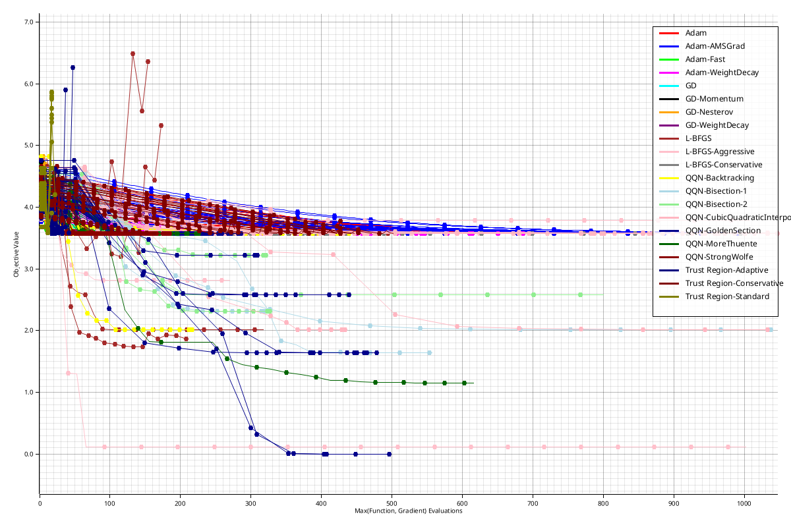
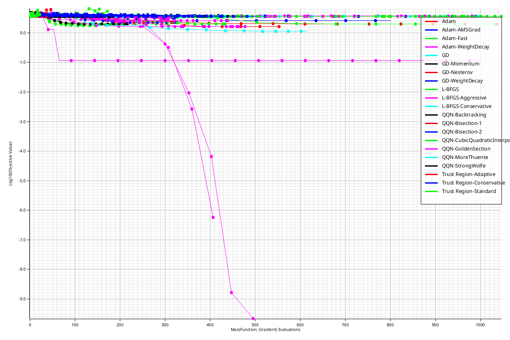

**Figure:** Convergence plots for Ackley_10D_a20_b0.2_c6.28e0 showing objective value vs iterations.
Left: Linear scale, Right: Log scale for better visualization of convergence behavior.

**Data:** [Linear scale data (CSV)](convergence_Ackley_10D_a20_b0.2_c6.28e0_data.csv) | [Log scale data (CSV)](convergence_Ackley_10D_a20_b0.2_c6.28e0_log_data.csv)

## Problem: StyblinskiTang_2D

**Family:** Highly Multimodal  
**Dimension:** 2  
**Success Threshold:** -7.830e1  
**Total Runs:** 560

### Performance Summary
<table style="border-collapse: collapse; width: 100%; margin: 20px 0;">
<tr style="background-color: #f2f2f2;">
<th style="border: 1px solid #ddd; padding: 8px; text-align: center;">Rank</th>
<th style="border: 1px solid #ddd; padding: 8px; text-align: center;">Optimizer</th>
<th style="border: 1px solid #ddd; padding: 8px; text-align: center;">Mean Final Value (All/Success/Fail)</th>
<th style="border: 1px solid #ddd; padding: 8px; text-align: center;">Std Dev</th>
<th style="border: 1px solid #ddd; padding: 8px; text-align: center;">Best Value</th>
<th style="border: 1px solid #ddd; padding: 8px; text-align: center;">Worst Value</th>
<th style="border: 1px solid #ddd; padding: 8px; text-align: center;">Mean Function Evals (All/Success/Fail)</th>
<th style="border: 1px solid #ddd; padding: 8px; text-align: center;">Mean Gradient Evals (All/Success/Fail)</th>
<th style="border: 1px solid #ddd; padding: 8px; text-align: center;">Success Rate</th>
<th style="border: 1px solid #ddd; padding: 8px; text-align: center;">Mean Time (s)</th>
</tr>
<tr style="background-color: #d4edda; font-weight: bold;">
<td style="border: 1px solid #ddd; padding: 8px; text-align: center;">1</td>
<td style="border: 1px solid #ddd; padding: 8px; text-align: center;"><a href="detailed_StyblinskiTang_2D_QQN-MoreThuente.md">QQN-MoreThuente</a></td>
<td style="border: 1px solid #ddd; padding: 8px; text-align: center;">-6.59e1 / -7.83e1 / -5.08e1</td>
<td style="border: 1px solid #ddd; padding: 8px; text-align: center;">1.63e1</td>
<td style="border: 1px solid #ddd; padding: 8px; text-align: center;">-7.83e1</td>
<td style="border: 1px solid #ddd; padding: 8px; text-align: center;">-3.99e1</td>
<td style="border: 1px solid #ddd; padding: 8px; text-align: center;">240.7 / 114.2 / 395.2</td>
<td style="border: 1px solid #ddd; padding: 8px; text-align: center;">314.6 / 108.6 / 566.2</td>
<td style="border: 1px solid #ddd; padding: 8px; text-align: center;">55.0%</td>
<td style="border: 1px solid #ddd; padding: 8px; text-align: center;">0.007</td>
</tr>
<tr style="background-color: #fff3cd;">
<td style="border: 1px solid #ddd; padding: 8px; text-align: center;">2</td>
<td style="border: 1px solid #ddd; padding: 8px; text-align: center;"><a href="detailed_StyblinskiTang_2D_QQN-GoldenSection.md">QQN-GoldenSection</a></td>
<td style="border: 1px solid #ddd; padding: 8px; text-align: center;">-7.43e1 / -7.83e1 / -6.23e1</td>
<td style="border: 1px solid #ddd; padding: 8px; text-align: center;">7.34e0</td>
<td style="border: 1px solid #ddd; padding: 8px; text-align: center;">-7.83e1</td>
<td style="border: 1px solid #ddd; padding: 8px; text-align: center;">-5.01e1</td>
<td style="border: 1px solid #ddd; padding: 8px; text-align: center;">268.8 / 274.5 / 251.6</td>
<td style="border: 1px solid #ddd; padding: 8px; text-align: center;">51.6 / 52.2 / 49.7</td>
<td style="border: 1px solid #ddd; padding: 8px; text-align: center;">75.0%</td>
<td style="border: 1px solid #ddd; padding: 8px; text-align: center;">0.004</td>
</tr>
<tr style="">
<td style="border: 1px solid #ddd; padding: 8px; text-align: center;">3</td>
<td style="border: 1px solid #ddd; padding: 8px; text-align: center;"><a href="detailed_StyblinskiTang_2D_QQN-Backtracking.md">QQN-Backtracking</a></td>
<td style="border: 1px solid #ddd; padding: 8px; text-align: center;">-7.20e1 / -7.83e1 / -6.02e1</td>
<td style="border: 1px solid #ddd; padding: 8px; text-align: center;">9.46e0</td>
<td style="border: 1px solid #ddd; padding: 8px; text-align: center;">-7.83e1</td>
<td style="border: 1px solid #ddd; padding: 8px; text-align: center;">-5.01e1</td>
<td style="border: 1px solid #ddd; padding: 8px; text-align: center;">133.4 / 103.5 / 189.0</td>
<td style="border: 1px solid #ddd; padding: 8px; text-align: center;">95.2 / 75.9 / 131.0</td>
<td style="border: 1px solid #ddd; padding: 8px; text-align: center;">65.0%</td>
<td style="border: 1px solid #ddd; padding: 8px; text-align: center;">0.003</td>
</tr>
<tr style="">
<td style="border: 1px solid #ddd; padding: 8px; text-align: center;">4</td>
<td style="border: 1px solid #ddd; padding: 8px; text-align: center;"><a href="detailed_StyblinskiTang_2D_QQN-Bisection-1.md">QQN-Bisection-1</a></td>
<td style="border: 1px solid #ddd; padding: 8px; text-align: center;">-7.44e1 / -7.83e1 / -6.85e1</td>
<td style="border: 1px solid #ddd; padding: 8px; text-align: center;">7.04e0</td>
<td style="border: 1px solid #ddd; padding: 8px; text-align: center;">-7.83e1</td>
<td style="border: 1px solid #ddd; padding: 8px; text-align: center;">-5.01e1</td>
<td style="border: 1px solid #ddd; padding: 8px; text-align: center;">272.1 / 181.0 / 408.8</td>
<td style="border: 1px solid #ddd; padding: 8px; text-align: center;">290.0 / 211.6 / 407.6</td>
<td style="border: 1px solid #ddd; padding: 8px; text-align: center;">60.0%</td>
<td style="border: 1px solid #ddd; padding: 8px; text-align: center;">0.004</td>
</tr>
<tr style="">
<td style="border: 1px solid #ddd; padding: 8px; text-align: center;">5</td>
<td style="border: 1px solid #ddd; padding: 8px; text-align: center;"><a href="detailed_StyblinskiTang_2D_QQN-Bisection-2.md">QQN-Bisection-2</a></td>
<td style="border: 1px solid #ddd; padding: 8px; text-align: center;">-7.69e1 / -7.83e1 / -6.42e1</td>
<td style="border: 1px solid #ddd; padding: 8px; text-align: center;">4.24e0</td>
<td style="border: 1px solid #ddd; padding: 8px; text-align: center;">-7.83e1</td>
<td style="border: 1px solid #ddd; padding: 8px; text-align: center;">-6.42e1</td>
<td style="border: 1px solid #ddd; padding: 8px; text-align: center;">142.2 / 116.4 / 375.0</td>
<td style="border: 1px solid #ddd; padding: 8px; text-align: center;">132.1 / 120.3 / 238.0</td>
<td style="border: 1px solid #ddd; padding: 8px; text-align: center;">90.0%</td>
<td style="border: 1px solid #ddd; padding: 8px; text-align: center;">0.003</td>
</tr>
<tr style="">
<td style="border: 1px solid #ddd; padding: 8px; text-align: center;">6</td>
<td style="border: 1px solid #ddd; padding: 8px; text-align: center;"><a href="detailed_StyblinskiTang_2D_QQN-CubicQuadraticInterpolation.md">QQN-CubicQuadraticInterpolation</a></td>
<td style="border: 1px solid #ddd; padding: 8px; text-align: center;">-7.52e1 / -7.83e1 / -6.68e1</td>
<td style="border: 1px solid #ddd; padding: 8px; text-align: center;">5.90e0</td>
<td style="border: 1px solid #ddd; padding: 8px; text-align: center;">-7.83e1</td>
<td style="border: 1px solid #ddd; padding: 8px; text-align: center;">-6.42e1</td>
<td style="border: 1px solid #ddd; padding: 8px; text-align: center;">208.9 / 193.6 / 249.5</td>
<td style="border: 1px solid #ddd; padding: 8px; text-align: center;">286.1 / 258.3 / 359.6</td>
<td style="border: 1px solid #ddd; padding: 8px; text-align: center;">72.5%</td>
<td style="border: 1px solid #ddd; padding: 8px; text-align: center;">0.006</td>
</tr>
<tr style="">
<td style="border: 1px solid #ddd; padding: 8px; text-align: center;">7</td>
<td style="border: 1px solid #ddd; padding: 8px; text-align: center;"><a href="detailed_StyblinskiTang_2D_QQN-StrongWolfe.md">QQN-StrongWolfe</a></td>
<td style="border: 1px solid #ddd; padding: 8px; text-align: center;">-7.54e1 / -7.83e1 / -6.67e1</td>
<td style="border: 1px solid #ddd; padding: 8px; text-align: center;">5.63e0</td>
<td style="border: 1px solid #ddd; padding: 8px; text-align: center;">-7.83e1</td>
<td style="border: 1px solid #ddd; padding: 8px; text-align: center;">-6.42e1</td>
<td style="border: 1px solid #ddd; padding: 8px; text-align: center;">196.2 / 110.3 / 454.0</td>
<td style="border: 1px solid #ddd; padding: 8px; text-align: center;">175.3 / 105.1 / 386.0</td>
<td style="border: 1px solid #ddd; padding: 8px; text-align: center;">75.0%</td>
<td style="border: 1px solid #ddd; padding: 8px; text-align: center;">0.005</td>
</tr>
<tr style="">
<td style="border: 1px solid #ddd; padding: 8px; text-align: center;">8</td>
<td style="border: 1px solid #ddd; padding: 8px; text-align: center;"><a href="detailed_StyblinskiTang_2D_L-BFGS.md">L-BFGS</a></td>
<td style="border: 1px solid #ddd; padding: 8px; text-align: center;">-7.76e1 / -7.80e1 / -7.14e1</td>
<td style="border: 1px solid #ddd; padding: 8px; text-align: center;">3.07e0</td>
<td style="border: 1px solid #ddd; padding: 8px; text-align: center;">-7.83e1</td>
<td style="border: 1px solid #ddd; padding: 8px; text-align: center;">-6.42e1</td>
<td style="border: 1px solid #ddd; padding: 8px; text-align: center;">170.2 / 180.1 / 130.8</td>
<td style="border: 1px solid #ddd; padding: 8px; text-align: center;">80.7 / 86.5 / 57.5</td>
<td style="border: 1px solid #ddd; padding: 8px; text-align: center;">80.0%</td>
<td style="border: 1px solid #ddd; padding: 8px; text-align: center;">0.002</td>
</tr>
<tr style="">
<td style="border: 1px solid #ddd; padding: 8px; text-align: center;">9</td>
<td style="border: 1px solid #ddd; padding: 8px; text-align: center;"><a href="detailed_StyblinskiTang_2D_GD.md">GD</a></td>
<td style="border: 1px solid #ddd; padding: 8px; text-align: center;">-7.41e1 / -7.83e1 / -6.29e1</td>
<td style="border: 1px solid #ddd; padding: 8px; text-align: center;">7.21e0</td>
<td style="border: 1px solid #ddd; padding: 8px; text-align: center;">-7.83e1</td>
<td style="border: 1px solid #ddd; padding: 8px; text-align: center;">-5.01e1</td>
<td style="border: 1px solid #ddd; padding: 8px; text-align: center;">78.0 / 74.1 / 88.3</td>
<td style="border: 1px solid #ddd; padding: 8px; text-align: center;">152.3 / 144.5 / 172.9</td>
<td style="border: 1px solid #ddd; padding: 8px; text-align: center;">72.5%</td>
<td style="border: 1px solid #ddd; padding: 8px; text-align: center;">0.002</td>
</tr>
<tr style="">
<td style="border: 1px solid #ddd; padding: 8px; text-align: center;">10</td>
<td style="border: 1px solid #ddd; padding: 8px; text-align: center;"><a href="detailed_StyblinskiTang_2D_GD-Nesterov.md">GD-Nesterov</a></td>
<td style="border: 1px solid #ddd; padding: 8px; text-align: center;">-6.69e1 / -7.79e1 / -6.12e1</td>
<td style="border: 1px solid #ddd; padding: 8px; text-align: center;">1.48e1</td>
<td style="border: 1px solid #ddd; padding: 8px; text-align: center;">-7.83e1</td>
<td style="border: 1px solid #ddd; padding: 8px; text-align: center;">-3.84e1</td>
<td style="border: 1px solid #ddd; padding: 8px; text-align: center;">31.4 / 55.7 / 27.1</td>
<td style="border: 1px solid #ddd; padding: 8px; text-align: center;">58.7 / 107.3 / 50.1</td>
<td style="border: 1px solid #ddd; padding: 8px; text-align: center;">15.0%</td>
<td style="border: 1px solid #ddd; padding: 8px; text-align: center;">0.001</td>
</tr>
<tr style="">
<td style="border: 1px solid #ddd; padding: 8px; text-align: center;">11</td>
<td style="border: 1px solid #ddd; padding: 8px; text-align: center;"><a href="detailed_StyblinskiTang_2D_L-BFGS-Conservative.md">L-BFGS-Conservative</a></td>
<td style="border: 1px solid #ddd; padding: 8px; text-align: center;">-7.69e1 / -7.83e1 / -7.48e1</td>
<td style="border: 1px solid #ddd; padding: 8px; text-align: center;">4.24e0</td>
<td style="border: 1px solid #ddd; padding: 8px; text-align: center;">-7.83e1</td>
<td style="border: 1px solid #ddd; padding: 8px; text-align: center;">-6.42e1</td>
<td style="border: 1px solid #ddd; padding: 8px; text-align: center;">505.4 / 472.6 / 554.8</td>
<td style="border: 1px solid #ddd; padding: 8px; text-align: center;">400.4 / 374.8 / 439.0</td>
<td style="border: 1px solid #ddd; padding: 8px; text-align: center;">60.0%</td>
<td style="border: 1px solid #ddd; padding: 8px; text-align: center;">0.011</td>
</tr>
<tr style="">
<td style="border: 1px solid #ddd; padding: 8px; text-align: center;">12</td>
<td style="border: 1px solid #ddd; padding: 8px; text-align: center;"><a href="detailed_StyblinskiTang_2D_GD-WeightDecay.md">GD-WeightDecay</a></td>
<td style="border: 1px solid #ddd; padding: 8px; text-align: center;">-7.20e1 / -7.83e1 / -6.97e1</td>
<td style="border: 1px solid #ddd; padding: 8px; text-align: center;">9.96e0</td>
<td style="border: 1px solid #ddd; padding: 8px; text-align: center;">-7.83e1</td>
<td style="border: 1px solid #ddd; padding: 8px; text-align: center;">-3.90e1</td>
<td style="border: 1px solid #ddd; padding: 8px; text-align: center;">54.9 / 93.6 / 41.9</td>
<td style="border: 1px solid #ddd; padding: 8px; text-align: center;">105.7 / 183.2 / 79.9</td>
<td style="border: 1px solid #ddd; padding: 8px; text-align: center;">25.0%</td>
<td style="border: 1px solid #ddd; padding: 8px; text-align: center;">0.002</td>
</tr>
<tr style="">
<td style="border: 1px solid #ddd; padding: 8px; text-align: center;">13</td>
<td style="border: 1px solid #ddd; padding: 8px; text-align: center;"><a href="detailed_StyblinskiTang_2D_GD-Momentum.md">GD-Momentum</a></td>
<td style="border: 1px solid #ddd; padding: 8px; text-align: center;">-5.79e1 / -7.83e1 / -4.27e1</td>
<td style="border: 1px solid #ddd; padding: 8px; text-align: center;">1.83e1</td>
<td style="border: 1px solid #ddd; padding: 8px; text-align: center;">-7.83e1</td>
<td style="border: 1px solid #ddd; padding: 8px; text-align: center;">-3.88e1</td>
<td style="border: 1px solid #ddd; padding: 8px; text-align: center;">41.2 / 195.0 / 24.2</td>
<td style="border: 1px solid #ddd; padding: 8px; text-align: center;">78.5 / 386.0 / 44.3</td>
<td style="border: 1px solid #ddd; padding: 8px; text-align: center;">10.0%</td>
<td style="border: 1px solid #ddd; padding: 8px; text-align: center;">0.001</td>
</tr>
<tr style="">
<td style="border: 1px solid #ddd; padding: 8px; text-align: center;">14</td>
<td style="border: 1px solid #ddd; padding: 8px; text-align: center;"><a href="detailed_StyblinskiTang_2D_Adam-Fast.md">Adam-Fast</a></td>
<td style="border: 1px solid #ddd; padding: 8px; text-align: center;">-7.68e1 / -7.50e1 / -7.30e1</td>
<td style="border: 1px solid #ddd; padding: 8px; text-align: center;">4.32e0</td>
<td style="border: 1px solid #ddd; padding: 8px; text-align: center;">-7.83e1</td>
<td style="border: 1px solid #ddd; padding: 8px; text-align: center;">-6.38e1</td>
<td style="border: 1px solid #ddd; padding: 8px; text-align: center;">72.0 / 71.5 / 72.2</td>
<td style="border: 1px solid #ddd; padding: 8px; text-align: center;">71.0 / 70.5 / 71.2</td>
<td style="border: 1px solid #ddd; padding: 8px; text-align: center;">30.0%</td>
<td style="border: 1px solid #ddd; padding: 8px; text-align: center;">0.001</td>
</tr>
<tr style="">
<td style="border: 1px solid #ddd; padding: 8px; text-align: center;">15</td>
<td style="border: 1px solid #ddd; padding: 8px; text-align: center;"><a href="detailed_StyblinskiTang_2D_Trust_Region-Standard.md">Trust Region-Standard</a></td>
<td style="border: 1px solid #ddd; padding: 8px; text-align: center;">-7.21e1 / -7.77e1 / 2.67e1</td>
<td style="border: 1px solid #ddd; padding: 8px; text-align: center;">9.92e0</td>
<td style="border: 1px solid #ddd; padding: 8px; text-align: center;">-7.83e1</td>
<td style="border: 1px solid #ddd; padding: 8px; text-align: center;">-3.90e1</td>
<td style="border: 1px solid #ddd; padding: 8px; text-align: center;">223.3 / 247.0 / 213.1</td>
<td style="border: 1px solid #ddd; padding: 8px; text-align: center;">149.5 / 165.3 / 142.7</td>
<td style="border: 1px solid #ddd; padding: 8px; text-align: center;">30.0%</td>
<td style="border: 1px solid #ddd; padding: 8px; text-align: center;">0.001</td>
</tr>
<tr style="">
<td style="border: 1px solid #ddd; padding: 8px; text-align: center;">16</td>
<td style="border: 1px solid #ddd; padding: 8px; text-align: center;"><a href="detailed_StyblinskiTang_2D_L-BFGS-Aggressive.md">L-BFGS-Aggressive</a></td>
<td style="border: 1px solid #ddd; padding: 8px; text-align: center;">-4.51e1 / - / -4.51e1</td>
<td style="border: 1px solid #ddd; padding: 8px; text-align: center;">1.41e1</td>
<td style="border: 1px solid #ddd; padding: 8px; text-align: center;">-7.71e1</td>
<td style="border: 1px solid #ddd; padding: 8px; text-align: center;">-2.92e1</td>
<td style="border: 1px solid #ddd; padding: 8px; text-align: center;">775.2 / - / 775.2</td>
<td style="border: 1px solid #ddd; padding: 8px; text-align: center;">235.7 / - / 235.7</td>
<td style="border: 1px solid #ddd; padding: 8px; text-align: center;">0.0%</td>
<td style="border: 1px solid #ddd; padding: 8px; text-align: center;">0.006</td>
</tr>
<tr style="">
<td style="border: 1px solid #ddd; padding: 8px; text-align: center;">17</td>
<td style="border: 1px solid #ddd; padding: 8px; text-align: center;"><a href="detailed_StyblinskiTang_2D_Trust_Region-Adaptive.md">Trust Region-Adaptive</a></td>
<td style="border: 1px solid #ddd; padding: 8px; text-align: center;">-4.76e1 / - / -4.76e1</td>
<td style="border: 1px solid #ddd; padding: 8px; text-align: center;">1.10e1</td>
<td style="border: 1px solid #ddd; padding: 8px; text-align: center;">-5.07e1</td>
<td style="border: 1px solid #ddd; padding: 8px; text-align: center;">3.85e-1</td>
<td style="border: 1px solid #ddd; padding: 8px; text-align: center;">572.1 / - / 572.1</td>
<td style="border: 1px solid #ddd; padding: 8px; text-align: center;">382.1 / - / 382.1</td>
<td style="border: 1px solid #ddd; padding: 8px; text-align: center;">0.0%</td>
<td style="border: 1px solid #ddd; padding: 8px; text-align: center;">0.003</td>
</tr>
<tr style="">
<td style="border: 1px solid #ddd; padding: 8px; text-align: center;">18</td>
<td style="border: 1px solid #ddd; padding: 8px; text-align: center;"><a href="detailed_StyblinskiTang_2D_Adam-WeightDecay.md">Adam-WeightDecay</a></td>
<td style="border: 1px solid #ddd; padding: 8px; text-align: center;">-1.35e1 / - / -1.35e1</td>
<td style="border: 1px solid #ddd; padding: 8px; text-align: center;">2.16e0</td>
<td style="border: 1px solid #ddd; padding: 8px; text-align: center;">-1.80e1</td>
<td style="border: 1px solid #ddd; padding: 8px; text-align: center;">-9.45e0</td>
<td style="border: 1px solid #ddd; padding: 8px; text-align: center;">502.0 / - / 502.0</td>
<td style="border: 1px solid #ddd; padding: 8px; text-align: center;">502.0 / - / 502.0</td>
<td style="border: 1px solid #ddd; padding: 8px; text-align: center;">0.0%</td>
<td style="border: 1px solid #ddd; padding: 8px; text-align: center;">0.010</td>
</tr>
<tr style="">
<td style="border: 1px solid #ddd; padding: 8px; text-align: center;">19</td>
<td style="border: 1px solid #ddd; padding: 8px; text-align: center;"><a href="detailed_StyblinskiTang_2D_Adam.md">Adam</a></td>
<td style="border: 1px solid #ddd; padding: 8px; text-align: center;">-2.96e0 / - / -2.96e0</td>
<td style="border: 1px solid #ddd; padding: 8px; text-align: center;">9.09e-1</td>
<td style="border: 1px solid #ddd; padding: 8px; text-align: center;">-5.09e0</td>
<td style="border: 1px solid #ddd; padding: 8px; text-align: center;">-1.54e0</td>
<td style="border: 1px solid #ddd; padding: 8px; text-align: center;">502.0 / - / 502.0</td>
<td style="border: 1px solid #ddd; padding: 8px; text-align: center;">502.0 / - / 502.0</td>
<td style="border: 1px solid #ddd; padding: 8px; text-align: center;">0.0%</td>
<td style="border: 1px solid #ddd; padding: 8px; text-align: center;">0.010</td>
</tr>
<tr style="">
<td style="border: 1px solid #ddd; padding: 8px; text-align: center;">20</td>
<td style="border: 1px solid #ddd; padding: 8px; text-align: center;"><a href="detailed_StyblinskiTang_2D_Adam-AMSGrad.md">Adam-AMSGrad</a></td>
<td style="border: 1px solid #ddd; padding: 8px; text-align: center;">-3.12e0 / - / -3.12e0</td>
<td style="border: 1px solid #ddd; padding: 8px; text-align: center;">1.19e0</td>
<td style="border: 1px solid #ddd; padding: 8px; text-align: center;">-5.01e0</td>
<td style="border: 1px solid #ddd; padding: 8px; text-align: center;">-1.70e0</td>
<td style="border: 1px solid #ddd; padding: 8px; text-align: center;">502.0 / - / 502.0</td>
<td style="border: 1px solid #ddd; padding: 8px; text-align: center;">502.0 / - / 502.0</td>
<td style="border: 1px solid #ddd; padding: 8px; text-align: center;">0.0%</td>
<td style="border: 1px solid #ddd; padding: 8px; text-align: center;">0.011</td>
</tr>
<tr style="">
<td style="border: 1px solid #ddd; padding: 8px; text-align: center;">21</td>
<td style="border: 1px solid #ddd; padding: 8px; text-align: center;"><a href="detailed_StyblinskiTang_2D_Trust_Region-Conservative.md">Trust Region-Conservative</a></td>
<td style="border: 1px solid #ddd; padding: 8px; text-align: center;">-2.12e0 / - / -2.12e0</td>
<td style="border: 1px solid #ddd; padding: 8px; text-align: center;">3.30e-1</td>
<td style="border: 1px solid #ddd; padding: 8px; text-align: center;">-2.70e0</td>
<td style="border: 1px solid #ddd; padding: 8px; text-align: center;">-1.73e0</td>
<td style="border: 1px solid #ddd; padding: 8px; text-align: center;">602.0 / - / 602.0</td>
<td style="border: 1px solid #ddd; padding: 8px; text-align: center;">402.0 / - / 402.0</td>
<td style="border: 1px solid #ddd; padding: 8px; text-align: center;">0.0%</td>
<td style="border: 1px solid #ddd; padding: 8px; text-align: center;">0.004</td>
</tr>
</table>

### Convergence Plots

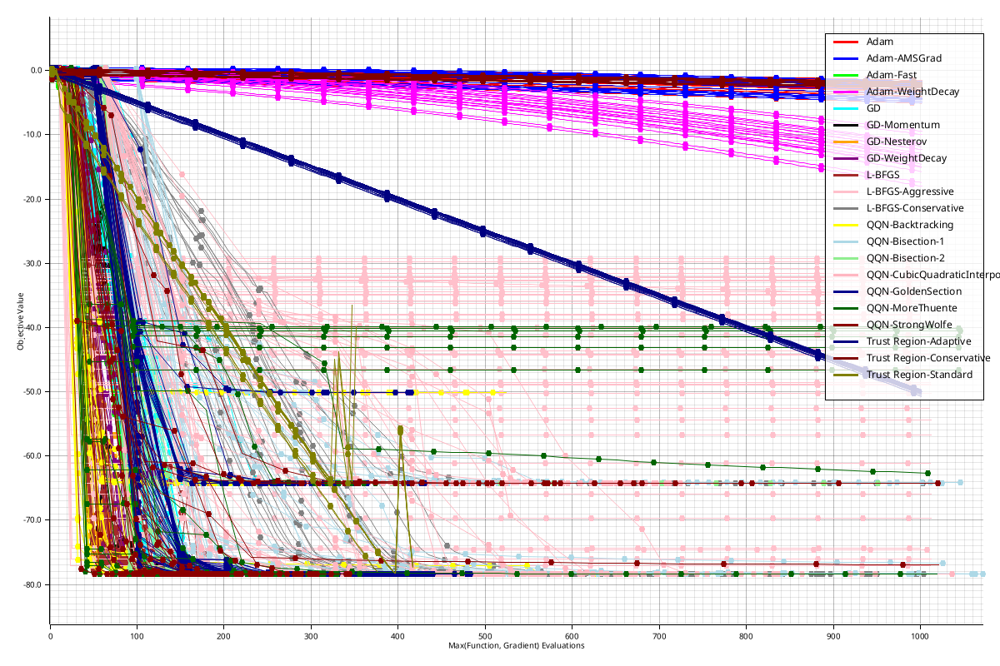
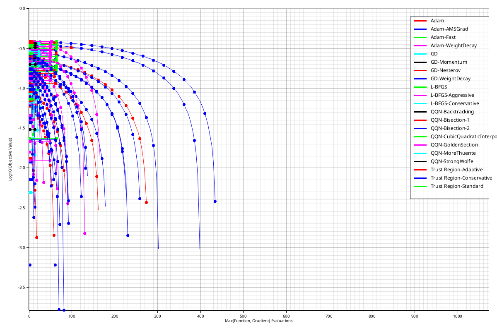

**Figure:** Convergence plots for StyblinskiTang_2D showing objective value vs iterations.
Left: Linear scale, Right: Log scale for better visualization of convergence behavior.

**Data:** [Linear scale data (CSV)](convergence_StyblinskiTang_2D_data.csv) | [Log scale data (CSV)](convergence_StyblinskiTang_2D_log_data.csv)

## Problem: StyblinskiTang_5D

**Family:** Highly Multimodal  
**Dimension:** 5  
**Success Threshold:** -1.960e2  
**Total Runs:** 560

### Performance Summary
<table style="border-collapse: collapse; width: 100%; margin: 20px 0;">
<tr style="background-color: #f2f2f2;">
<th style="border: 1px solid #ddd; padding: 8px; text-align: center;">Rank</th>
<th style="border: 1px solid #ddd; padding: 8px; text-align: center;">Optimizer</th>
<th style="border: 1px solid #ddd; padding: 8px; text-align: center;">Mean Final Value (All/Success/Fail)</th>
<th style="border: 1px solid #ddd; padding: 8px; text-align: center;">Std Dev</th>
<th style="border: 1px solid #ddd; padding: 8px; text-align: center;">Best Value</th>
<th style="border: 1px solid #ddd; padding: 8px; text-align: center;">Worst Value</th>
<th style="border: 1px solid #ddd; padding: 8px; text-align: center;">Mean Function Evals (All/Success/Fail)</th>
<th style="border: 1px solid #ddd; padding: 8px; text-align: center;">Mean Gradient Evals (All/Success/Fail)</th>
<th style="border: 1px solid #ddd; padding: 8px; text-align: center;">Success Rate</th>
<th style="border: 1px solid #ddd; padding: 8px; text-align: center;">Mean Time (s)</th>
</tr>
<tr style="background-color: #d4edda; font-weight: bold;">
<td style="border: 1px solid #ddd; padding: 8px; text-align: center;">1</td>
<td style="border: 1px solid #ddd; padding: 8px; text-align: center;"><a href="detailed_StyblinskiTang_5D_QQN-GoldenSection.md">QQN-GoldenSection</a></td>
<td style="border: 1px solid #ddd; padding: 8px; text-align: center;">-1.89e2 / - / -1.89e2</td>
<td style="border: 1px solid #ddd; padding: 8px; text-align: center;">9.48e0</td>
<td style="border: 1px solid #ddd; padding: 8px; text-align: center;">-1.96e2</td>
<td style="border: 1px solid #ddd; padding: 8px; text-align: center;">-1.68e2</td>
<td style="border: 1px solid #ddd; padding: 8px; text-align: center;">461.5 / - / 461.5</td>
<td style="border: 1px solid #ddd; padding: 8px; text-align: center;">77.5 / - / 77.5</td>
<td style="border: 1px solid #ddd; padding: 8px; text-align: center;">0.0%</td>
<td style="border: 1px solid #ddd; padding: 8px; text-align: center;">0.007</td>
</tr>
<tr style="background-color: #fff3cd;">
<td style="border: 1px solid #ddd; padding: 8px; text-align: center;">2</td>
<td style="border: 1px solid #ddd; padding: 8px; text-align: center;"><a href="detailed_StyblinskiTang_5D_QQN-CubicQuadraticInterpolation.md">QQN-CubicQuadraticInterpolation</a></td>
<td style="border: 1px solid #ddd; padding: 8px; text-align: center;">-1.89e2 / - / -1.89e2</td>
<td style="border: 1px solid #ddd; padding: 8px; text-align: center;">9.46e0</td>
<td style="border: 1px solid #ddd; padding: 8px; text-align: center;">-1.96e2</td>
<td style="border: 1px solid #ddd; padding: 8px; text-align: center;">-1.53e2</td>
<td style="border: 1px solid #ddd; padding: 8px; text-align: center;">276.3 / - / 276.3</td>
<td style="border: 1px solid #ddd; padding: 8px; text-align: center;">399.0 / - / 399.0</td>
<td style="border: 1px solid #ddd; padding: 8px; text-align: center;">0.0%</td>
<td style="border: 1px solid #ddd; padding: 8px; text-align: center;">0.009</td>
</tr>
<tr style="">
<td style="border: 1px solid #ddd; padding: 8px; text-align: center;">3</td>
<td style="border: 1px solid #ddd; padding: 8px; text-align: center;"><a href="detailed_StyblinskiTang_5D_QQN-MoreThuente.md">QQN-MoreThuente</a></td>
<td style="border: 1px solid #ddd; padding: 8px; text-align: center;">-1.66e2 / - / -1.66e2</td>
<td style="border: 1px solid #ddd; padding: 8px; text-align: center;">4.65e1</td>
<td style="border: 1px solid #ddd; padding: 8px; text-align: center;">-1.96e2</td>
<td style="border: 1px solid #ddd; padding: 8px; text-align: center;">-4.50e1</td>
<td style="border: 1px solid #ddd; padding: 8px; text-align: center;">349.9 / - / 349.9</td>
<td style="border: 1px solid #ddd; padding: 8px; text-align: center;">386.4 / - / 386.4</td>
<td style="border: 1px solid #ddd; padding: 8px; text-align: center;">0.0%</td>
<td style="border: 1px solid #ddd; padding: 8px; text-align: center;">0.009</td>
</tr>
<tr style="">
<td style="border: 1px solid #ddd; padding: 8px; text-align: center;">4</td>
<td style="border: 1px solid #ddd; padding: 8px; text-align: center;"><a href="detailed_StyblinskiTang_5D_QQN-Backtracking.md">QQN-Backtracking</a></td>
<td style="border: 1px solid #ddd; padding: 8px; text-align: center;">-1.88e2 / - / -1.88e2</td>
<td style="border: 1px solid #ddd; padding: 8px; text-align: center;">9.46e0</td>
<td style="border: 1px solid #ddd; padding: 8px; text-align: center;">-1.96e2</td>
<td style="border: 1px solid #ddd; padding: 8px; text-align: center;">-1.68e2</td>
<td style="border: 1px solid #ddd; padding: 8px; text-align: center;">135.4 / - / 135.4</td>
<td style="border: 1px solid #ddd; padding: 8px; text-align: center;">95.8 / - / 95.8</td>
<td style="border: 1px solid #ddd; padding: 8px; text-align: center;">0.0%</td>
<td style="border: 1px solid #ddd; padding: 8px; text-align: center;">0.003</td>
</tr>
<tr style="">
<td style="border: 1px solid #ddd; padding: 8px; text-align: center;">5</td>
<td style="border: 1px solid #ddd; padding: 8px; text-align: center;"><a href="detailed_StyblinskiTang_5D_QQN-StrongWolfe.md">QQN-StrongWolfe</a></td>
<td style="border: 1px solid #ddd; padding: 8px; text-align: center;">-1.89e2 / - / -1.89e2</td>
<td style="border: 1px solid #ddd; padding: 8px; text-align: center;">9.46e0</td>
<td style="border: 1px solid #ddd; padding: 8px; text-align: center;">-1.96e2</td>
<td style="border: 1px solid #ddd; padding: 8px; text-align: center;">-1.68e2</td>
<td style="border: 1px solid #ddd; padding: 8px; text-align: center;">225.4 / - / 225.4</td>
<td style="border: 1px solid #ddd; padding: 8px; text-align: center;">206.3 / - / 206.3</td>
<td style="border: 1px solid #ddd; padding: 8px; text-align: center;">0.0%</td>
<td style="border: 1px solid #ddd; padding: 8px; text-align: center;">0.006</td>
</tr>
<tr style="">
<td style="border: 1px solid #ddd; padding: 8px; text-align: center;">6</td>
<td style="border: 1px solid #ddd; padding: 8px; text-align: center;"><a href="detailed_StyblinskiTang_5D_QQN-Bisection-1.md">QQN-Bisection-1</a></td>
<td style="border: 1px solid #ddd; padding: 8px; text-align: center;">-1.87e2 / - / -1.87e2</td>
<td style="border: 1px solid #ddd; padding: 8px; text-align: center;">1.04e1</td>
<td style="border: 1px solid #ddd; padding: 8px; text-align: center;">-1.96e2</td>
<td style="border: 1px solid #ddd; padding: 8px; text-align: center;">-1.65e2</td>
<td style="border: 1px solid #ddd; padding: 8px; text-align: center;">350.3 / - / 350.3</td>
<td style="border: 1px solid #ddd; padding: 8px; text-align: center;">381.2 / - / 381.2</td>
<td style="border: 1px solid #ddd; padding: 8px; text-align: center;">0.0%</td>
<td style="border: 1px solid #ddd; padding: 8px; text-align: center;">0.006</td>
</tr>
<tr style="">
<td style="border: 1px solid #ddd; padding: 8px; text-align: center;">7</td>
<td style="border: 1px solid #ddd; padding: 8px; text-align: center;"><a href="detailed_StyblinskiTang_5D_QQN-Bisection-2.md">QQN-Bisection-2</a></td>
<td style="border: 1px solid #ddd; padding: 8px; text-align: center;">-1.89e2 / - / -1.89e2</td>
<td style="border: 1px solid #ddd; padding: 8px; text-align: center;">9.48e0</td>
<td style="border: 1px solid #ddd; padding: 8px; text-align: center;">-1.96e2</td>
<td style="border: 1px solid #ddd; padding: 8px; text-align: center;">-1.68e2</td>
<td style="border: 1px solid #ddd; padding: 8px; text-align: center;">270.1 / - / 270.1</td>
<td style="border: 1px solid #ddd; padding: 8px; text-align: center;">197.1 / - / 197.1</td>
<td style="border: 1px solid #ddd; padding: 8px; text-align: center;">0.0%</td>
<td style="border: 1px solid #ddd; padding: 8px; text-align: center;">0.005</td>
</tr>
<tr style="">
<td style="border: 1px solid #ddd; padding: 8px; text-align: center;">8</td>
<td style="border: 1px solid #ddd; padding: 8px; text-align: center;"><a href="detailed_StyblinskiTang_5D_L-BFGS.md">L-BFGS</a></td>
<td style="border: 1px solid #ddd; padding: 8px; text-align: center;">-1.91e2 / - / -1.86e2</td>
<td style="border: 1px solid #ddd; padding: 8px; text-align: center;">6.55e0</td>
<td style="border: 1px solid #ddd; padding: 8px; text-align: center;">-1.96e2</td>
<td style="border: 1px solid #ddd; padding: 8px; text-align: center;">-1.81e2</td>
<td style="border: 1px solid #ddd; padding: 8px; text-align: center;">162.8 / - / 162.8</td>
<td style="border: 1px solid #ddd; padding: 8px; text-align: center;">72.3 / - / 72.3</td>
<td style="border: 1px solid #ddd; padding: 8px; text-align: center;">0.0%</td>
<td style="border: 1px solid #ddd; padding: 8px; text-align: center;">0.002</td>
</tr>
<tr style="">
<td style="border: 1px solid #ddd; padding: 8px; text-align: center;">9</td>
<td style="border: 1px solid #ddd; padding: 8px; text-align: center;"><a href="detailed_StyblinskiTang_5D_GD.md">GD</a></td>
<td style="border: 1px solid #ddd; padding: 8px; text-align: center;">-1.92e2 / - / -1.92e2</td>
<td style="border: 1px solid #ddd; padding: 8px; text-align: center;">8.48e0</td>
<td style="border: 1px solid #ddd; padding: 8px; text-align: center;">-1.96e2</td>
<td style="border: 1px solid #ddd; padding: 8px; text-align: center;">-1.53e2</td>
<td style="border: 1px solid #ddd; padding: 8px; text-align: center;">106.8 / - / 106.8</td>
<td style="border: 1px solid #ddd; padding: 8px; text-align: center;">209.7 / - / 209.7</td>
<td style="border: 1px solid #ddd; padding: 8px; text-align: center;">0.0%</td>
<td style="border: 1px solid #ddd; padding: 8px; text-align: center;">0.003</td>
</tr>
<tr style="">
<td style="border: 1px solid #ddd; padding: 8px; text-align: center;">10</td>
<td style="border: 1px solid #ddd; padding: 8px; text-align: center;"><a href="detailed_StyblinskiTang_5D_GD-Nesterov.md">GD-Nesterov</a></td>
<td style="border: 1px solid #ddd; padding: 8px; text-align: center;">-1.79e2 / - / -1.79e2</td>
<td style="border: 1px solid #ddd; padding: 8px; text-align: center;">1.77e1</td>
<td style="border: 1px solid #ddd; padding: 8px; text-align: center;">-1.96e2</td>
<td style="border: 1px solid #ddd; padding: 8px; text-align: center;">-1.17e2</td>
<td style="border: 1px solid #ddd; padding: 8px; text-align: center;">62.1 / - / 62.1</td>
<td style="border: 1px solid #ddd; padding: 8px; text-align: center;">120.2 / - / 120.2</td>
<td style="border: 1px solid #ddd; padding: 8px; text-align: center;">0.0%</td>
<td style="border: 1px solid #ddd; padding: 8px; text-align: center;">0.002</td>
</tr>
<tr style="">
<td style="border: 1px solid #ddd; padding: 8px; text-align: center;">11</td>
<td style="border: 1px solid #ddd; padding: 8px; text-align: center;"><a href="detailed_StyblinskiTang_5D_L-BFGS-Conservative.md">L-BFGS-Conservative</a></td>
<td style="border: 1px solid #ddd; padding: 8px; text-align: center;">-1.87e2 / - / -1.87e2</td>
<td style="border: 1px solid #ddd; padding: 8px; text-align: center;">1.13e1</td>
<td style="border: 1px solid #ddd; padding: 8px; text-align: center;">-1.96e2</td>
<td style="border: 1px solid #ddd; padding: 8px; text-align: center;">-1.53e2</td>
<td style="border: 1px solid #ddd; padding: 8px; text-align: center;">547.4 / - / 547.4</td>
<td style="border: 1px solid #ddd; padding: 8px; text-align: center;">436.6 / - / 436.6</td>
<td style="border: 1px solid #ddd; padding: 8px; text-align: center;">0.0%</td>
<td style="border: 1px solid #ddd; padding: 8px; text-align: center;">0.013</td>
</tr>
<tr style="">
<td style="border: 1px solid #ddd; padding: 8px; text-align: center;">12</td>
<td style="border: 1px solid #ddd; padding: 8px; text-align: center;"><a href="detailed_StyblinskiTang_5D_GD-WeightDecay.md">GD-WeightDecay</a></td>
<td style="border: 1px solid #ddd; padding: 8px; text-align: center;">-1.87e2 / - / -1.87e2</td>
<td style="border: 1px solid #ddd; padding: 8px; text-align: center;">1.21e1</td>
<td style="border: 1px solid #ddd; padding: 8px; text-align: center;">-1.96e2</td>
<td style="border: 1px solid #ddd; padding: 8px; text-align: center;">-1.53e2</td>
<td style="border: 1px solid #ddd; padding: 8px; text-align: center;">72.8 / - / 72.8</td>
<td style="border: 1px solid #ddd; padding: 8px; text-align: center;">141.6 / - / 141.6</td>
<td style="border: 1px solid #ddd; padding: 8px; text-align: center;">0.0%</td>
<td style="border: 1px solid #ddd; padding: 8px; text-align: center;">0.002</td>
</tr>
<tr style="">
<td style="border: 1px solid #ddd; padding: 8px; text-align: center;">13</td>
<td style="border: 1px solid #ddd; padding: 8px; text-align: center;"><a href="detailed_StyblinskiTang_5D_GD-Momentum.md">GD-Momentum</a></td>
<td style="border: 1px solid #ddd; padding: 8px; text-align: center;">-1.73e2 / - / -1.68e2</td>
<td style="border: 1px solid #ddd; padding: 8px; text-align: center;">2.51e1</td>
<td style="border: 1px solid #ddd; padding: 8px; text-align: center;">-1.96e2</td>
<td style="border: 1px solid #ddd; padding: 8px; text-align: center;">-1.09e2</td>
<td style="border: 1px solid #ddd; padding: 8px; text-align: center;">69.0 / - / 69.0</td>
<td style="border: 1px solid #ddd; padding: 8px; text-align: center;">133.9 / - / 133.9</td>
<td style="border: 1px solid #ddd; padding: 8px; text-align: center;">0.0%</td>
<td style="border: 1px solid #ddd; padding: 8px; text-align: center;">0.002</td>
</tr>
<tr style="">
<td style="border: 1px solid #ddd; padding: 8px; text-align: center;">14</td>
<td style="border: 1px solid #ddd; padding: 8px; text-align: center;"><a href="detailed_StyblinskiTang_5D_Trust_Region-Standard.md">Trust Region-Standard</a></td>
<td style="border: 1px solid #ddd; padding: 8px; text-align: center;">-1.92e2 / - / -1.88e2</td>
<td style="border: 1px solid #ddd; padding: 8px; text-align: center;">6.09e0</td>
<td style="border: 1px solid #ddd; padding: 8px; text-align: center;">-1.96e2</td>
<td style="border: 1px solid #ddd; padding: 8px; text-align: center;">-1.81e2</td>
<td style="border: 1px solid #ddd; padding: 8px; text-align: center;">583.8 / - / 583.8</td>
<td style="border: 1px solid #ddd; padding: 8px; text-align: center;">389.8 / - / 389.8</td>
<td style="border: 1px solid #ddd; padding: 8px; text-align: center;">0.0%</td>
<td style="border: 1px solid #ddd; padding: 8px; text-align: center;">0.004</td>
</tr>
<tr style="">
<td style="border: 1px solid #ddd; padding: 8px; text-align: center;">15</td>
<td style="border: 1px solid #ddd; padding: 8px; text-align: center;"><a href="detailed_StyblinskiTang_5D_Adam-Fast.md">Adam-Fast</a></td>
<td style="border: 1px solid #ddd; padding: 8px; text-align: center;">-1.90e2 / - / -1.83e2</td>
<td style="border: 1px solid #ddd; padding: 8px; text-align: center;">9.70e0</td>
<td style="border: 1px solid #ddd; padding: 8px; text-align: center;">-1.96e2</td>
<td style="border: 1px solid #ddd; padding: 8px; text-align: center;">-1.67e2</td>
<td style="border: 1px solid #ddd; padding: 8px; text-align: center;">72.2 / - / 72.2</td>
<td style="border: 1px solid #ddd; padding: 8px; text-align: center;">71.2 / - / 71.2</td>
<td style="border: 1px solid #ddd; padding: 8px; text-align: center;">0.0%</td>
<td style="border: 1px solid #ddd; padding: 8px; text-align: center;">0.001</td>
</tr>
<tr style="">
<td style="border: 1px solid #ddd; padding: 8px; text-align: center;">16</td>
<td style="border: 1px solid #ddd; padding: 8px; text-align: center;"><a href="detailed_StyblinskiTang_5D_L-BFGS-Aggressive.md">L-BFGS-Aggressive</a></td>
<td style="border: 1px solid #ddd; padding: 8px; text-align: center;">-9.88e1 / - / -9.88e1</td>
<td style="border: 1px solid #ddd; padding: 8px; text-align: center;">3.53e1</td>
<td style="border: 1px solid #ddd; padding: 8px; text-align: center;">-1.65e2</td>
<td style="border: 1px solid #ddd; padding: 8px; text-align: center;">-2.37e1</td>
<td style="border: 1px solid #ddd; padding: 8px; text-align: center;">775.7 / - / 775.7</td>
<td style="border: 1px solid #ddd; padding: 8px; text-align: center;">235.7 / - / 235.7</td>
<td style="border: 1px solid #ddd; padding: 8px; text-align: center;">0.0%</td>
<td style="border: 1px solid #ddd; padding: 8px; text-align: center;">0.007</td>
</tr>
<tr style="">
<td style="border: 1px solid #ddd; padding: 8px; text-align: center;">17</td>
<td style="border: 1px solid #ddd; padding: 8px; text-align: center;"><a href="detailed_StyblinskiTang_5D_Trust_Region-Adaptive.md">Trust Region-Adaptive</a></td>
<td style="border: 1px solid #ddd; padding: 8px; text-align: center;">-5.05e1 / - / -5.05e1</td>
<td style="border: 1px solid #ddd; padding: 8px; text-align: center;">7.73e-1</td>
<td style="border: 1px solid #ddd; padding: 8px; text-align: center;">-5.24e1</td>
<td style="border: 1px solid #ddd; padding: 8px; text-align: center;">-4.93e1</td>
<td style="border: 1px solid #ddd; padding: 8px; text-align: center;">602.0 / - / 602.0</td>
<td style="border: 1px solid #ddd; padding: 8px; text-align: center;">402.0 / - / 402.0</td>
<td style="border: 1px solid #ddd; padding: 8px; text-align: center;">0.0%</td>
<td style="border: 1px solid #ddd; padding: 8px; text-align: center;">0.004</td>
</tr>
<tr style="">
<td style="border: 1px solid #ddd; padding: 8px; text-align: center;">18</td>
<td style="border: 1px solid #ddd; padding: 8px; text-align: center;"><a href="detailed_StyblinskiTang_5D_Adam-WeightDecay.md">Adam-WeightDecay</a></td>
<td style="border: 1px solid #ddd; padding: 8px; text-align: center;">-3.39e1 / - / -3.39e1</td>
<td style="border: 1px solid #ddd; padding: 8px; text-align: center;">2.55e0</td>
<td style="border: 1px solid #ddd; padding: 8px; text-align: center;">-3.76e1</td>
<td style="border: 1px solid #ddd; padding: 8px; text-align: center;">-2.75e1</td>
<td style="border: 1px solid #ddd; padding: 8px; text-align: center;">502.0 / - / 502.0</td>
<td style="border: 1px solid #ddd; padding: 8px; text-align: center;">502.0 / - / 502.0</td>
<td style="border: 1px solid #ddd; padding: 8px; text-align: center;">0.0%</td>
<td style="border: 1px solid #ddd; padding: 8px; text-align: center;">0.011</td>
</tr>
<tr style="">
<td style="border: 1px solid #ddd; padding: 8px; text-align: center;">19</td>
<td style="border: 1px solid #ddd; padding: 8px; text-align: center;"><a href="detailed_StyblinskiTang_5D_Adam.md">Adam</a></td>
<td style="border: 1px solid #ddd; padding: 8px; text-align: center;">-6.74e0 / - / -6.74e0</td>
<td style="border: 1px solid #ddd; padding: 8px; text-align: center;">1.55e0</td>
<td style="border: 1px solid #ddd; padding: 8px; text-align: center;">-1.02e1</td>
<td style="border: 1px solid #ddd; padding: 8px; text-align: center;">-3.86e0</td>
<td style="border: 1px solid #ddd; padding: 8px; text-align: center;">502.0 / - / 502.0</td>
<td style="border: 1px solid #ddd; padding: 8px; text-align: center;">502.0 / - / 502.0</td>
<td style="border: 1px solid #ddd; padding: 8px; text-align: center;">0.0%</td>
<td style="border: 1px solid #ddd; padding: 8px; text-align: center;">0.010</td>
</tr>
<tr style="">
<td style="border: 1px solid #ddd; padding: 8px; text-align: center;">20</td>
<td style="border: 1px solid #ddd; padding: 8px; text-align: center;"><a href="detailed_StyblinskiTang_5D_Adam-AMSGrad.md">Adam-AMSGrad</a></td>
<td style="border: 1px solid #ddd; padding: 8px; text-align: center;">-6.62e0 / - / -6.62e0</td>
<td style="border: 1px solid #ddd; padding: 8px; text-align: center;">1.45e0</td>
<td style="border: 1px solid #ddd; padding: 8px; text-align: center;">-9.24e0</td>
<td style="border: 1px solid #ddd; padding: 8px; text-align: center;">-4.01e0</td>
<td style="border: 1px solid #ddd; padding: 8px; text-align: center;">502.0 / - / 502.0</td>
<td style="border: 1px solid #ddd; padding: 8px; text-align: center;">502.0 / - / 502.0</td>
<td style="border: 1px solid #ddd; padding: 8px; text-align: center;">0.0%</td>
<td style="border: 1px solid #ddd; padding: 8px; text-align: center;">0.011</td>
</tr>
<tr style="">
<td style="border: 1px solid #ddd; padding: 8px; text-align: center;">21</td>
<td style="border: 1px solid #ddd; padding: 8px; text-align: center;"><a href="detailed_StyblinskiTang_5D_Trust_Region-Conservative.md">Trust Region-Conservative</a></td>
<td style="border: 1px solid #ddd; padding: 8px; text-align: center;">-2.71e0 / - / -2.71e0</td>
<td style="border: 1px solid #ddd; padding: 8px; text-align: center;">6.60e-1</td>
<td style="border: 1px solid #ddd; padding: 8px; text-align: center;">-4.44e0</td>
<td style="border: 1px solid #ddd; padding: 8px; text-align: center;">-1.25e0</td>
<td style="border: 1px solid #ddd; padding: 8px; text-align: center;">602.0 / - / 602.0</td>
<td style="border: 1px solid #ddd; padding: 8px; text-align: center;">402.0 / - / 402.0</td>
<td style="border: 1px solid #ddd; padding: 8px; text-align: center;">0.0%</td>
<td style="border: 1px solid #ddd; padding: 8px; text-align: center;">0.004</td>
</tr>
</table>

### Convergence Plots

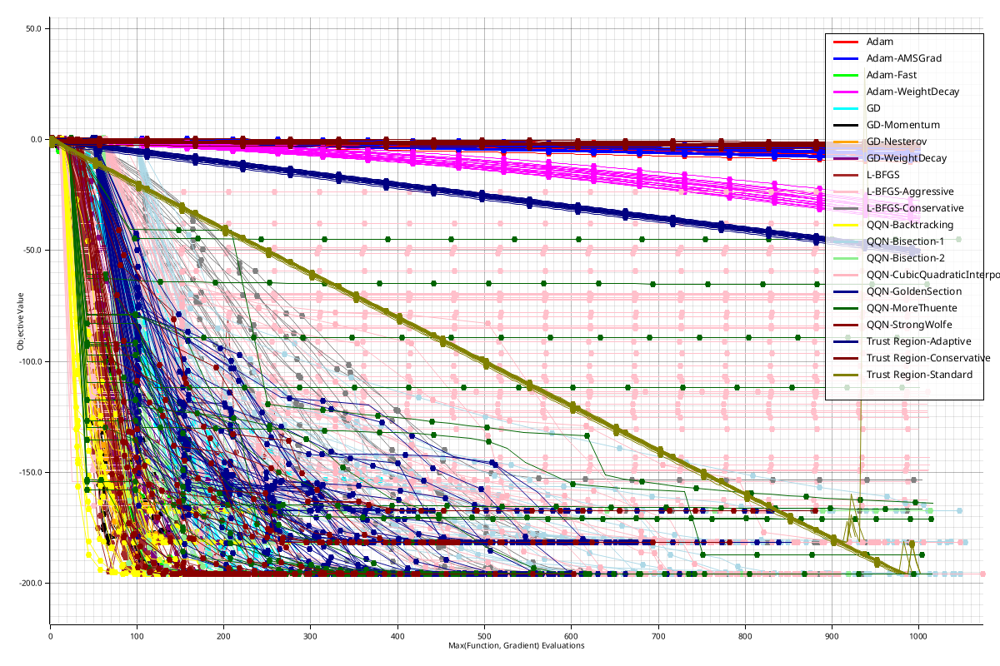
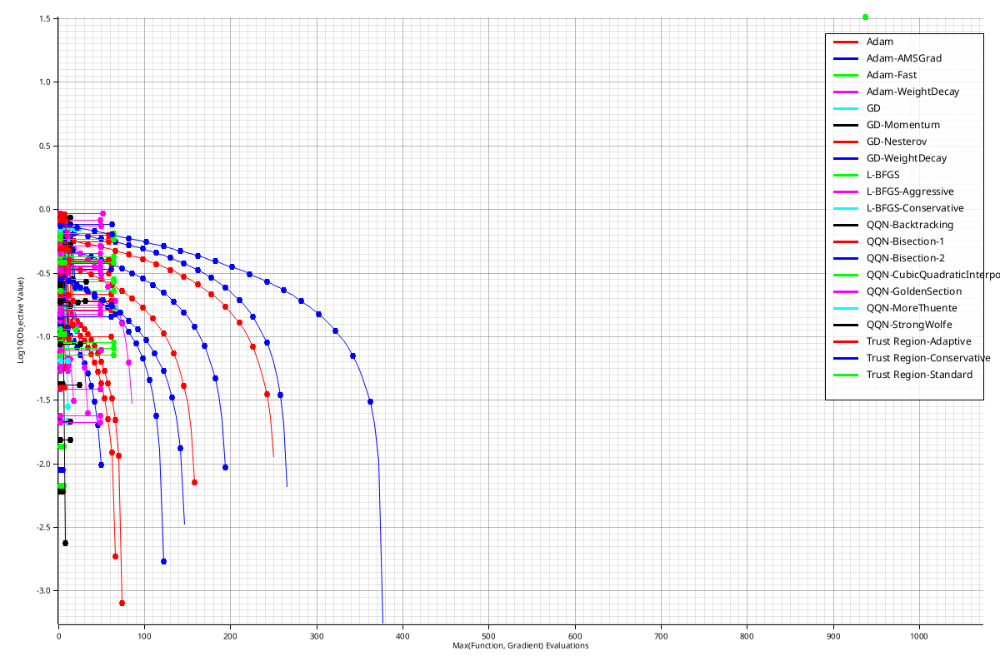

**Figure:** Convergence plots for StyblinskiTang_5D showing objective value vs iterations.
Left: Linear scale, Right: Log scale for better visualization of convergence behavior.

**Data:** [Linear scale data (CSV)](convergence_StyblinskiTang_5D_data.csv) | [Log scale data (CSV)](convergence_StyblinskiTang_5D_log_data.csv)

## Problem: StyblinskiTang_10D

**Family:** Highly Multimodal  
**Dimension:** 10  
**Success Threshold:** -3.780e2  
**Total Runs:** 560

### Performance Summary
<table style="border-collapse: collapse; width: 100%; margin: 20px 0;">
<tr style="background-color: #f2f2f2;">
<th style="border: 1px solid #ddd; padding: 8px; text-align: center;">Rank</th>
<th style="border: 1px solid #ddd; padding: 8px; text-align: center;">Optimizer</th>
<th style="border: 1px solid #ddd; padding: 8px; text-align: center;">Mean Final Value (All/Success/Fail)</th>
<th style="border: 1px solid #ddd; padding: 8px; text-align: center;">Std Dev</th>
<th style="border: 1px solid #ddd; padding: 8px; text-align: center;">Best Value</th>
<th style="border: 1px solid #ddd; padding: 8px; text-align: center;">Worst Value</th>
<th style="border: 1px solid #ddd; padding: 8px; text-align: center;">Mean Function Evals (All/Success/Fail)</th>
<th style="border: 1px solid #ddd; padding: 8px; text-align: center;">Mean Gradient Evals (All/Success/Fail)</th>
<th style="border: 1px solid #ddd; padding: 8px; text-align: center;">Success Rate</th>
<th style="border: 1px solid #ddd; padding: 8px; text-align: center;">Mean Time (s)</th>
</tr>
<tr style="background-color: #d4edda; font-weight: bold;">
<td style="border: 1px solid #ddd; padding: 8px; text-align: center;">1</td>
<td style="border: 1px solid #ddd; padding: 8px; text-align: center;"><a href="detailed_StyblinskiTang_10D_QQN-GoldenSection.md">QQN-GoldenSection</a></td>
<td style="border: 1px solid #ddd; padding: 8px; text-align: center;">-3.76e2 / -3.92e2 / -3.72e2</td>
<td style="border: 1px solid #ddd; padding: 8px; text-align: center;">1.38e1</td>
<td style="border: 1px solid #ddd; padding: 8px; text-align: center;">-3.92e2</td>
<td style="border: 1px solid #ddd; padding: 8px; text-align: center;">-3.49e2</td>
<td style="border: 1px solid #ddd; padding: 8px; text-align: center;">575.8 / 546.1 / 583.2</td>
<td style="border: 1px solid #ddd; padding: 8px; text-align: center;">96.8 / 100.7 / 95.8</td>
<td style="border: 1px solid #ddd; padding: 8px; text-align: center;">20.0%</td>
<td style="border: 1px solid #ddd; padding: 8px; text-align: center;">0.010</td>
</tr>
<tr style="background-color: #fff3cd;">
<td style="border: 1px solid #ddd; padding: 8px; text-align: center;">2</td>
<td style="border: 1px solid #ddd; padding: 8px; text-align: center;"><a href="detailed_StyblinskiTang_10D_QQN-Bisection-2.md">QQN-Bisection-2</a></td>
<td style="border: 1px solid #ddd; padding: 8px; text-align: center;">-3.76e2 / -3.92e2 / -3.72e2</td>
<td style="border: 1px solid #ddd; padding: 8px; text-align: center;">1.09e1</td>
<td style="border: 1px solid #ddd; padding: 8px; text-align: center;">-3.92e2</td>
<td style="border: 1px solid #ddd; padding: 8px; text-align: center;">-3.49e2</td>
<td style="border: 1px solid #ddd; padding: 8px; text-align: center;">259.8 / 258.8 / 260.0</td>
<td style="border: 1px solid #ddd; padding: 8px; text-align: center;">204.0 / 197.8 / 205.6</td>
<td style="border: 1px solid #ddd; padding: 8px; text-align: center;">20.0%</td>
<td style="border: 1px solid #ddd; padding: 8px; text-align: center;">0.005</td>
</tr>
<tr style="">
<td style="border: 1px solid #ddd; padding: 8px; text-align: center;">3</td>
<td style="border: 1px solid #ddd; padding: 8px; text-align: center;"><a href="detailed_StyblinskiTang_10D_QQN-MoreThuente.md">QQN-MoreThuente</a></td>
<td style="border: 1px solid #ddd; padding: 8px; text-align: center;">-3.49e2 / -3.92e2 / -3.25e2</td>
<td style="border: 1px solid #ddd; padding: 8px; text-align: center;">6.16e1</td>
<td style="border: 1px solid #ddd; padding: 8px; text-align: center;">-3.92e2</td>
<td style="border: 1px solid #ddd; padding: 8px; text-align: center;">-1.51e2</td>
<td style="border: 1px solid #ddd; padding: 8px; text-align: center;">308.8 / 215.9 / 358.8</td>
<td style="border: 1px solid #ddd; padding: 8px; text-align: center;">345.0 / 216.9 / 414.0</td>
<td style="border: 1px solid #ddd; padding: 8px; text-align: center;">35.0%</td>
<td style="border: 1px solid #ddd; padding: 8px; text-align: center;">0.008</td>
</tr>
<tr style="">
<td style="border: 1px solid #ddd; padding: 8px; text-align: center;">4</td>
<td style="border: 1px solid #ddd; padding: 8px; text-align: center;"><a href="detailed_StyblinskiTang_10D_QQN-Backtracking.md">QQN-Backtracking</a></td>
<td style="border: 1px solid #ddd; padding: 8px; text-align: center;">-3.63e2 / -3.92e2 / -3.55e2</td>
<td style="border: 1px solid #ddd; padding: 8px; text-align: center;">1.92e1</td>
<td style="border: 1px solid #ddd; padding: 8px; text-align: center;">-3.92e2</td>
<td style="border: 1px solid #ddd; padding: 8px; text-align: center;">-3.35e2</td>
<td style="border: 1px solid #ddd; padding: 8px; text-align: center;">160.2 / 123.0 / 169.6</td>
<td style="border: 1px solid #ddd; padding: 8px; text-align: center;">115.4 / 91.5 / 121.4</td>
<td style="border: 1px solid #ddd; padding: 8px; text-align: center;">20.0%</td>
<td style="border: 1px solid #ddd; padding: 8px; text-align: center;">0.004</td>
</tr>
<tr style="">
<td style="border: 1px solid #ddd; padding: 8px; text-align: center;">5</td>
<td style="border: 1px solid #ddd; padding: 8px; text-align: center;"><a href="detailed_StyblinskiTang_10D_QQN-Bisection-1.md">QQN-Bisection-1</a></td>
<td style="border: 1px solid #ddd; padding: 8px; text-align: center;">-3.73e2 / -3.92e2 / -3.70e2</td>
<td style="border: 1px solid #ddd; padding: 8px; text-align: center;">1.87e1</td>
<td style="border: 1px solid #ddd; padding: 8px; text-align: center;">-3.92e2</td>
<td style="border: 1px solid #ddd; padding: 8px; text-align: center;">-2.93e2</td>
<td style="border: 1px solid #ddd; padding: 8px; text-align: center;">355.6 / 338.1 / 359.4</td>
<td style="border: 1px solid #ddd; padding: 8px; text-align: center;">392.4 / 386.1 / 393.7</td>
<td style="border: 1px solid #ddd; padding: 8px; text-align: center;">17.5%</td>
<td style="border: 1px solid #ddd; padding: 8px; text-align: center;">0.007</td>
</tr>
<tr style="">
<td style="border: 1px solid #ddd; padding: 8px; text-align: center;">6</td>
<td style="border: 1px solid #ddd; padding: 8px; text-align: center;"><a href="detailed_StyblinskiTang_10D_QQN-CubicQuadraticInterpolation.md">QQN-CubicQuadraticInterpolation</a></td>
<td style="border: 1px solid #ddd; padding: 8px; text-align: center;">-3.63e2 / -3.92e2 / -3.58e2</td>
<td style="border: 1px solid #ddd; padding: 8px; text-align: center;">2.15e1</td>
<td style="border: 1px solid #ddd; padding: 8px; text-align: center;">-3.92e2</td>
<td style="border: 1px solid #ddd; padding: 8px; text-align: center;">-3.07e2</td>
<td style="border: 1px solid #ddd; padding: 8px; text-align: center;">348.7 / 284.7 / 360.0</td>
<td style="border: 1px solid #ddd; padding: 8px; text-align: center;">532.9 / 405.3 / 555.4</td>
<td style="border: 1px solid #ddd; padding: 8px; text-align: center;">15.0%</td>
<td style="border: 1px solid #ddd; padding: 8px; text-align: center;">0.012</td>
</tr>
<tr style="">
<td style="border: 1px solid #ddd; padding: 8px; text-align: center;">7</td>
<td style="border: 1px solid #ddd; padding: 8px; text-align: center;"><a href="detailed_StyblinskiTang_10D_QQN-StrongWolfe.md">QQN-StrongWolfe</a></td>
<td style="border: 1px solid #ddd; padding: 8px; text-align: center;">-3.71e2 / -3.92e2 / -3.60e2</td>
<td style="border: 1px solid #ddd; padding: 8px; text-align: center;">1.89e1</td>
<td style="border: 1px solid #ddd; padding: 8px; text-align: center;">-3.92e2</td>
<td style="border: 1px solid #ddd; padding: 8px; text-align: center;">-3.35e2</td>
<td style="border: 1px solid #ddd; padding: 8px; text-align: center;">290.7 / 187.9 / 346.1</td>
<td style="border: 1px solid #ddd; padding: 8px; text-align: center;">262.9 / 174.9 / 310.2</td>
<td style="border: 1px solid #ddd; padding: 8px; text-align: center;">35.0%</td>
<td style="border: 1px solid #ddd; padding: 8px; text-align: center;">0.008</td>
</tr>
<tr style="">
<td style="border: 1px solid #ddd; padding: 8px; text-align: center;">8</td>
<td style="border: 1px solid #ddd; padding: 8px; text-align: center;"><a href="detailed_StyblinskiTang_10D_L-BFGS.md">L-BFGS</a></td>
<td style="border: 1px solid #ddd; padding: 8px; text-align: center;">-3.77e2 / -3.86e2 / -3.68e2</td>
<td style="border: 1px solid #ddd; padding: 8px; text-align: center;">1.17e1</td>
<td style="border: 1px solid #ddd; padding: 8px; text-align: center;">-3.92e2</td>
<td style="border: 1px solid #ddd; padding: 8px; text-align: center;">-3.49e2</td>
<td style="border: 1px solid #ddd; padding: 8px; text-align: center;">212.8 / 173.1 / 234.1</td>
<td style="border: 1px solid #ddd; padding: 8px; text-align: center;">91.7 / 74.6 / 100.8</td>
<td style="border: 1px solid #ddd; padding: 8px; text-align: center;">35.0%</td>
<td style="border: 1px solid #ddd; padding: 8px; text-align: center;">0.003</td>
</tr>
<tr style="">
<td style="border: 1px solid #ddd; padding: 8px; text-align: center;">9</td>
<td style="border: 1px solid #ddd; padding: 8px; text-align: center;"><a href="detailed_StyblinskiTang_10D_GD.md">GD</a></td>
<td style="border: 1px solid #ddd; padding: 8px; text-align: center;">-3.77e2 / -3.92e2 / -3.68e2</td>
<td style="border: 1px solid #ddd; padding: 8px; text-align: center;">1.41e1</td>
<td style="border: 1px solid #ddd; padding: 8px; text-align: center;">-3.92e2</td>
<td style="border: 1px solid #ddd; padding: 8px; text-align: center;">-3.49e2</td>
<td style="border: 1px solid #ddd; padding: 8px; text-align: center;">144.1 / 141.6 / 145.6</td>
<td style="border: 1px solid #ddd; padding: 8px; text-align: center;">284.2 / 279.2 / 287.3</td>
<td style="border: 1px solid #ddd; padding: 8px; text-align: center;">37.5%</td>
<td style="border: 1px solid #ddd; padding: 8px; text-align: center;">0.004</td>
</tr>
<tr style="">
<td style="border: 1px solid #ddd; padding: 8px; text-align: center;">10</td>
<td style="border: 1px solid #ddd; padding: 8px; text-align: center;"><a href="detailed_StyblinskiTang_10D_GD-Nesterov.md">GD-Nesterov</a></td>
<td style="border: 1px solid #ddd; padding: 8px; text-align: center;">-3.81e2 / -3.91e2 / -3.71e2</td>
<td style="border: 1px solid #ddd; padding: 8px; text-align: center;">1.17e1</td>
<td style="border: 1px solid #ddd; padding: 8px; text-align: center;">-3.92e2</td>
<td style="border: 1px solid #ddd; padding: 8px; text-align: center;">-3.49e2</td>
<td style="border: 1px solid #ddd; padding: 8px; text-align: center;">74.8 / 70.7 / 78.8</td>
<td style="border: 1px solid #ddd; padding: 8px; text-align: center;">145.5 / 137.4 / 153.6</td>
<td style="border: 1px solid #ddd; padding: 8px; text-align: center;">50.0%</td>
<td style="border: 1px solid #ddd; padding: 8px; text-align: center;">0.002</td>
</tr>
<tr style="">
<td style="border: 1px solid #ddd; padding: 8px; text-align: center;">11</td>
<td style="border: 1px solid #ddd; padding: 8px; text-align: center;"><a href="detailed_StyblinskiTang_10D_L-BFGS-Conservative.md">L-BFGS-Conservative</a></td>
<td style="border: 1px solid #ddd; padding: 8px; text-align: center;">-3.78e2 / -3.92e2 / -3.78e2</td>
<td style="border: 1px solid #ddd; padding: 8px; text-align: center;">1.30e1</td>
<td style="border: 1px solid #ddd; padding: 8px; text-align: center;">-3.92e2</td>
<td style="border: 1px solid #ddd; padding: 8px; text-align: center;">-3.49e2</td>
<td style="border: 1px solid #ddd; padding: 8px; text-align: center;">557.9 / 511.0 / 560.4</td>
<td style="border: 1px solid #ddd; padding: 8px; text-align: center;">445.1 / 408.0 / 447.0</td>
<td style="border: 1px solid #ddd; padding: 8px; text-align: center;">5.0%</td>
<td style="border: 1px solid #ddd; padding: 8px; text-align: center;">0.014</td>
</tr>
<tr style="">
<td style="border: 1px solid #ddd; padding: 8px; text-align: center;">12</td>
<td style="border: 1px solid #ddd; padding: 8px; text-align: center;"><a href="detailed_StyblinskiTang_10D_GD-WeightDecay.md">GD-WeightDecay</a></td>
<td style="border: 1px solid #ddd; padding: 8px; text-align: center;">-3.75e2 / -3.92e2 / -3.68e2</td>
<td style="border: 1px solid #ddd; padding: 8px; text-align: center;">1.57e1</td>
<td style="border: 1px solid #ddd; padding: 8px; text-align: center;">-3.92e2</td>
<td style="border: 1px solid #ddd; padding: 8px; text-align: center;">-3.35e2</td>
<td style="border: 1px solid #ddd; padding: 8px; text-align: center;">95.7 / 106.3 / 91.1</td>
<td style="border: 1px solid #ddd; padding: 8px; text-align: center;">187.3 / 208.7 / 178.1</td>
<td style="border: 1px solid #ddd; padding: 8px; text-align: center;">30.0%</td>
<td style="border: 1px solid #ddd; padding: 8px; text-align: center;">0.003</td>
</tr>
<tr style="">
<td style="border: 1px solid #ddd; padding: 8px; text-align: center;">13</td>
<td style="border: 1px solid #ddd; padding: 8px; text-align: center;"><a href="detailed_StyblinskiTang_10D_GD-Momentum.md">GD-Momentum</a></td>
<td style="border: 1px solid #ddd; padding: 8px; text-align: center;">-3.60e2 / -3.85e2 / -3.47e2</td>
<td style="border: 1px solid #ddd; padding: 8px; text-align: center;">3.39e1</td>
<td style="border: 1px solid #ddd; padding: 8px; text-align: center;">-3.92e2</td>
<td style="border: 1px solid #ddd; padding: 8px; text-align: center;">-2.65e2</td>
<td style="border: 1px solid #ddd; padding: 8px; text-align: center;">73.2 / 91.4 / 67.1</td>
<td style="border: 1px solid #ddd; padding: 8px; text-align: center;">142.3 / 178.8 / 130.1</td>
<td style="border: 1px solid #ddd; padding: 8px; text-align: center;">25.0%</td>
<td style="border: 1px solid #ddd; padding: 8px; text-align: center;">0.002</td>
</tr>
<tr style="">
<td style="border: 1px solid #ddd; padding: 8px; text-align: center;">14</td>
<td style="border: 1px solid #ddd; padding: 8px; text-align: center;"><a href="detailed_StyblinskiTang_10D_Adam-Fast.md">Adam-Fast</a></td>
<td style="border: 1px solid #ddd; padding: 8px; text-align: center;">-3.75e2 / -3.76e2 / -3.56e2</td>
<td style="border: 1px solid #ddd; padding: 8px; text-align: center;">1.42e1</td>
<td style="border: 1px solid #ddd; padding: 8px; text-align: center;">-3.92e2</td>
<td style="border: 1px solid #ddd; padding: 8px; text-align: center;">-3.33e2</td>
<td style="border: 1px solid #ddd; padding: 8px; text-align: center;">72.7 / 73.0 / 72.5</td>
<td style="border: 1px solid #ddd; padding: 8px; text-align: center;">71.7 / 72.0 / 71.5</td>
<td style="border: 1px solid #ddd; padding: 8px; text-align: center;">30.0%</td>
<td style="border: 1px solid #ddd; padding: 8px; text-align: center;">0.001</td>
</tr>
<tr style="">
<td style="border: 1px solid #ddd; padding: 8px; text-align: center;">15</td>
<td style="border: 1px solid #ddd; padding: 8px; text-align: center;"><a href="detailed_StyblinskiTang_10D_L-BFGS-Aggressive.md">L-BFGS-Aggressive</a></td>
<td style="border: 1px solid #ddd; padding: 8px; text-align: center;">-1.71e2 / - / -1.71e2</td>
<td style="border: 1px solid #ddd; padding: 8px; text-align: center;">6.04e1</td>
<td style="border: 1px solid #ddd; padding: 8px; text-align: center;">-2.81e2</td>
<td style="border: 1px solid #ddd; padding: 8px; text-align: center;">-1.06e1</td>
<td style="border: 1px solid #ddd; padding: 8px; text-align: center;">775.9 / - / 775.9</td>
<td style="border: 1px solid #ddd; padding: 8px; text-align: center;">235.4 / - / 235.4</td>
<td style="border: 1px solid #ddd; padding: 8px; text-align: center;">0.0%</td>
<td style="border: 1px solid #ddd; padding: 8px; text-align: center;">0.007</td>
</tr>
<tr style="">
<td style="border: 1px solid #ddd; padding: 8px; text-align: center;">16</td>
<td style="border: 1px solid #ddd; padding: 8px; text-align: center;"><a href="detailed_StyblinskiTang_10D_Trust_Region-Standard.md">Trust Region-Standard</a></td>
<td style="border: 1px solid #ddd; padding: 8px; text-align: center;">-2.01e2 / - / -2.01e2</td>
<td style="border: 1px solid #ddd; padding: 8px; text-align: center;">7.74e-1</td>
<td style="border: 1px solid #ddd; padding: 8px; text-align: center;">-2.02e2</td>
<td style="border: 1px solid #ddd; padding: 8px; text-align: center;">-1.99e2</td>
<td style="border: 1px solid #ddd; padding: 8px; text-align: center;">602.0 / - / 602.0</td>
<td style="border: 1px solid #ddd; padding: 8px; text-align: center;">402.0 / - / 402.0</td>
<td style="border: 1px solid #ddd; padding: 8px; text-align: center;">0.0%</td>
<td style="border: 1px solid #ddd; padding: 8px; text-align: center;">0.004</td>
</tr>
<tr style="">
<td style="border: 1px solid #ddd; padding: 8px; text-align: center;">17</td>
<td style="border: 1px solid #ddd; padding: 8px; text-align: center;"><a href="detailed_StyblinskiTang_10D_Adam-WeightDecay.md">Adam-WeightDecay</a></td>
<td style="border: 1px solid #ddd; padding: 8px; text-align: center;">-6.94e1 / - / -6.94e1</td>
<td style="border: 1px solid #ddd; padding: 8px; text-align: center;">3.46e0</td>
<td style="border: 1px solid #ddd; padding: 8px; text-align: center;">-7.48e1</td>
<td style="border: 1px solid #ddd; padding: 8px; text-align: center;">-6.07e1</td>
<td style="border: 1px solid #ddd; padding: 8px; text-align: center;">502.0 / - / 502.0</td>
<td style="border: 1px solid #ddd; padding: 8px; text-align: center;">502.0 / - / 502.0</td>
<td style="border: 1px solid #ddd; padding: 8px; text-align: center;">0.0%</td>
<td style="border: 1px solid #ddd; padding: 8px; text-align: center;">0.011</td>
</tr>
<tr style="">
<td style="border: 1px solid #ddd; padding: 8px; text-align: center;">18</td>
<td style="border: 1px solid #ddd; padding: 8px; text-align: center;"><a href="detailed_StyblinskiTang_10D_Trust_Region-Adaptive.md">Trust Region-Adaptive</a></td>
<td style="border: 1px solid #ddd; padding: 8px; text-align: center;">-5.10e1 / - / -5.10e1</td>
<td style="border: 1px solid #ddd; padding: 8px; text-align: center;">9.65e-1</td>
<td style="border: 1px solid #ddd; padding: 8px; text-align: center;">-5.28e1</td>
<td style="border: 1px solid #ddd; padding: 8px; text-align: center;">-4.93e1</td>
<td style="border: 1px solid #ddd; padding: 8px; text-align: center;">602.0 / - / 602.0</td>
<td style="border: 1px solid #ddd; padding: 8px; text-align: center;">402.0 / - / 402.0</td>
<td style="border: 1px solid #ddd; padding: 8px; text-align: center;">0.0%</td>
<td style="border: 1px solid #ddd; padding: 8px; text-align: center;">0.004</td>
</tr>
<tr style="">
<td style="border: 1px solid #ddd; padding: 8px; text-align: center;">19</td>
<td style="border: 1px solid #ddd; padding: 8px; text-align: center;"><a href="detailed_StyblinskiTang_10D_Adam.md">Adam</a></td>
<td style="border: 1px solid #ddd; padding: 8px; text-align: center;">-1.23e1 / - / -1.23e1</td>
<td style="border: 1px solid #ddd; padding: 8px; text-align: center;">2.44e0</td>
<td style="border: 1px solid #ddd; padding: 8px; text-align: center;">-1.69e1</td>
<td style="border: 1px solid #ddd; padding: 8px; text-align: center;">-7.00e0</td>
<td style="border: 1px solid #ddd; padding: 8px; text-align: center;">502.0 / - / 502.0</td>
<td style="border: 1px solid #ddd; padding: 8px; text-align: center;">502.0 / - / 502.0</td>
<td style="border: 1px solid #ddd; padding: 8px; text-align: center;">0.0%</td>
<td style="border: 1px solid #ddd; padding: 8px; text-align: center;">0.011</td>
</tr>
<tr style="">
<td style="border: 1px solid #ddd; padding: 8px; text-align: center;">20</td>
<td style="border: 1px solid #ddd; padding: 8px; text-align: center;"><a href="detailed_StyblinskiTang_10D_Adam-AMSGrad.md">Adam-AMSGrad</a></td>
<td style="border: 1px solid #ddd; padding: 8px; text-align: center;">-1.34e1 / - / -1.34e1</td>
<td style="border: 1px solid #ddd; padding: 8px; text-align: center;">2.09e0</td>
<td style="border: 1px solid #ddd; padding: 8px; text-align: center;">-1.67e1</td>
<td style="border: 1px solid #ddd; padding: 8px; text-align: center;">-9.13e0</td>
<td style="border: 1px solid #ddd; padding: 8px; text-align: center;">502.0 / - / 502.0</td>
<td style="border: 1px solid #ddd; padding: 8px; text-align: center;">502.0 / - / 502.0</td>
<td style="border: 1px solid #ddd; padding: 8px; text-align: center;">0.0%</td>
<td style="border: 1px solid #ddd; padding: 8px; text-align: center;">0.012</td>
</tr>
<tr style="">
<td style="border: 1px solid #ddd; padding: 8px; text-align: center;">21</td>
<td style="border: 1px solid #ddd; padding: 8px; text-align: center;"><a href="detailed_StyblinskiTang_10D_Trust_Region-Conservative.md">Trust Region-Conservative</a></td>
<td style="border: 1px solid #ddd; padding: 8px; text-align: center;">-2.80e0 / - / -2.80e0</td>
<td style="border: 1px solid #ddd; padding: 8px; text-align: center;">8.32e-1</td>
<td style="border: 1px solid #ddd; padding: 8px; text-align: center;">-4.77e0</td>
<td style="border: 1px solid #ddd; padding: 8px; text-align: center;">-1.02e0</td>
<td style="border: 1px solid #ddd; padding: 8px; text-align: center;">602.0 / - / 602.0</td>
<td style="border: 1px solid #ddd; padding: 8px; text-align: center;">402.0 / - / 402.0</td>
<td style="border: 1px solid #ddd; padding: 8px; text-align: center;">0.0%</td>
<td style="border: 1px solid #ddd; padding: 8px; text-align: center;">0.004</td>
</tr>
</table>

### Convergence Plots

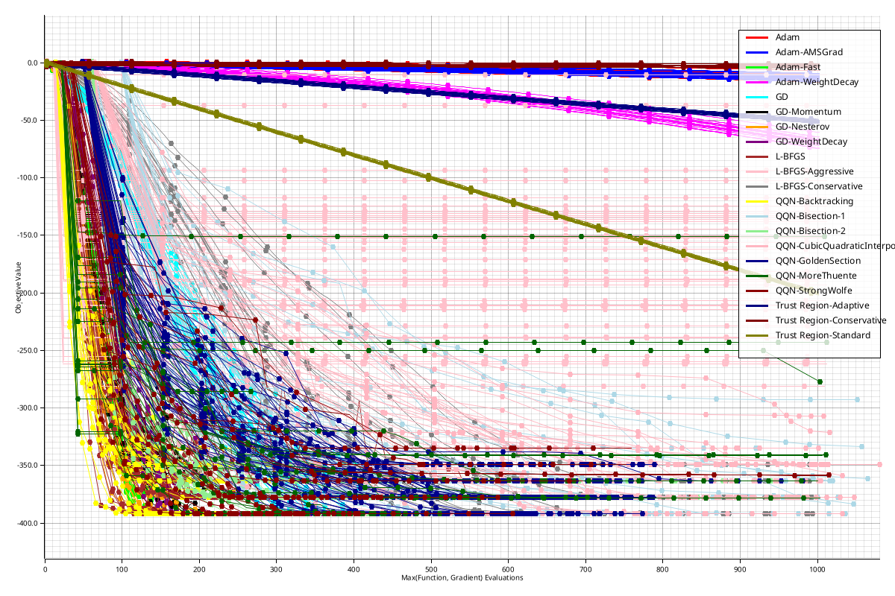
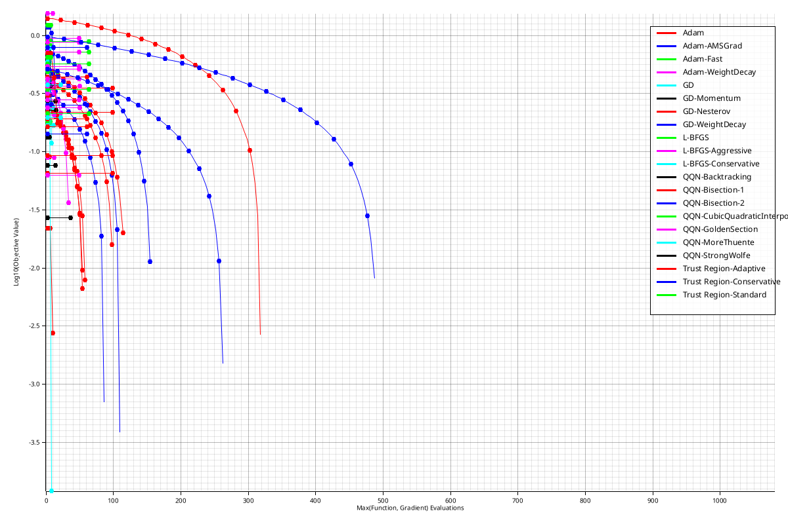

**Figure:** Convergence plots for StyblinskiTang_10D showing objective value vs iterations.
Left: Linear scale, Right: Log scale for better visualization of convergence behavior.

**Data:** [Linear scale data (CSV)](convergence_StyblinskiTang_10D_data.csv) | [Log scale data (CSV)](convergence_StyblinskiTang_10D_log_data.csv)

## Problem: Beale_2D

**Family:** Non-Convex Unimodal  
**Dimension:** 2  
**Success Threshold:** 1.000e-6  
**Total Runs:** 560

### Performance Summary
<table style="border-collapse: collapse; width: 100%; margin: 20px 0;">
<tr style="background-color: #f2f2f2;">
<th style="border: 1px solid #ddd; padding: 8px; text-align: center;">Rank</th>
<th style="border: 1px solid #ddd; padding: 8px; text-align: center;">Optimizer</th>
<th style="border: 1px solid #ddd; padding: 8px; text-align: center;">Mean Final Value (All/Success/Fail)</th>
<th style="border: 1px solid #ddd; padding: 8px; text-align: center;">Std Dev</th>
<th style="border: 1px solid #ddd; padding: 8px; text-align: center;">Best Value</th>
<th style="border: 1px solid #ddd; padding: 8px; text-align: center;">Worst Value</th>
<th style="border: 1px solid #ddd; padding: 8px; text-align: center;">Mean Function Evals (All/Success/Fail)</th>
<th style="border: 1px solid #ddd; padding: 8px; text-align: center;">Mean Gradient Evals (All/Success/Fail)</th>
<th style="border: 1px solid #ddd; padding: 8px; text-align: center;">Success Rate</th>
<th style="border: 1px solid #ddd; padding: 8px; text-align: center;">Mean Time (s)</th>
</tr>
<tr style="background-color: #d4edda; font-weight: bold;">
<td style="border: 1px solid #ddd; padding: 8px; text-align: center;">1</td>
<td style="border: 1px solid #ddd; padding: 8px; text-align: center;"><a href="detailed_Beale_2D_QQN-Backtracking.md">QQN-Backtracking</a></td>
<td style="border: 1px solid #ddd; padding: 8px; text-align: center;">7.35e-3 / 9.38e-22 / 7.73e-3</td>
<td style="border: 1px solid #ddd; padding: 8px; text-align: center;">2.05e-2</td>
<td style="border: 1px solid #ddd; padding: 8px; text-align: center;">9.38e-22</td>
<td style="border: 1px solid #ddd; padding: 8px; text-align: center;">9.01e-2</td>
<td style="border: 1px solid #ddd; padding: 8px; text-align: center;">582.2 / 110.0 / 607.1</td>
<td style="border: 1px solid #ddd; padding: 8px; text-align: center;">387.8 / 87.0 / 403.6</td>
<td style="border: 1px solid #ddd; padding: 8px; text-align: center;">5.0%</td>
<td style="border: 1px solid #ddd; padding: 8px; text-align: center;">0.018</td>
</tr>
<tr style="background-color: #fff3cd;">
<td style="border: 1px solid #ddd; padding: 8px; text-align: center;">2</td>
<td style="border: 1px solid #ddd; padding: 8px; text-align: center;"><a href="detailed_Beale_2D_QQN-Bisection-2.md">QQN-Bisection-2</a></td>
<td style="border: 1px solid #ddd; padding: 8px; text-align: center;">1.39e0 / 1.33e-15 / 6.96e0</td>
<td style="border: 1px solid #ddd; padding: 8px; text-align: center;">3.30e0</td>
<td style="border: 1px solid #ddd; padding: 8px; text-align: center;">1.45e-20</td>
<td style="border: 1px solid #ddd; padding: 8px; text-align: center;">9.40e0</td>
<td style="border: 1px solid #ddd; padding: 8px; text-align: center;">169.2 / 159.7 / 207.0</td>
<td style="border: 1px solid #ddd; padding: 8px; text-align: center;">161.7 / 162.1 / 160.0</td>
<td style="border: 1px solid #ddd; padding: 8px; text-align: center;">80.0%</td>
<td style="border: 1px solid #ddd; padding: 8px; text-align: center;">0.003</td>
</tr>
<tr style="">
<td style="border: 1px solid #ddd; padding: 8px; text-align: center;">3</td>
<td style="border: 1px solid #ddd; padding: 8px; text-align: center;"><a href="detailed_Beale_2D_QQN-Bisection-1.md">QQN-Bisection-1</a></td>
<td style="border: 1px solid #ddd; padding: 8px; text-align: center;">2.45e-1 / 2.38e-14 / 3.27e0</td>
<td style="border: 1px solid #ddd; padding: 8px; text-align: center;">1.51e0</td>
<td style="border: 1px solid #ddd; padding: 8px; text-align: center;">1.92e-20</td>
<td style="border: 1px solid #ddd; padding: 8px; text-align: center;">9.68e0</td>
<td style="border: 1px solid #ddd; padding: 8px; text-align: center;">258.6 / 239.6 / 493.0</td>
<td style="border: 1px solid #ddd; padding: 8px; text-align: center;">293.4 / 272.1 / 556.3</td>
<td style="border: 1px solid #ddd; padding: 8px; text-align: center;">92.5%</td>
<td style="border: 1px solid #ddd; padding: 8px; text-align: center;">0.004</td>
</tr>
<tr style="">
<td style="border: 1px solid #ddd; padding: 8px; text-align: center;">4</td>
<td style="border: 1px solid #ddd; padding: 8px; text-align: center;"><a href="detailed_Beale_2D_QQN-CubicQuadraticInterpolation.md">QQN-CubicQuadraticInterpolation</a></td>
<td style="border: 1px solid #ddd; padding: 8px; text-align: center;">2.49e-1 / 3.86e-14 / 1.42e0</td>
<td style="border: 1px solid #ddd; padding: 8px; text-align: center;">1.38e0</td>
<td style="border: 1px solid #ddd; padding: 8px; text-align: center;">2.19e-20</td>
<td style="border: 1px solid #ddd; padding: 8px; text-align: center;">8.79e0</td>
<td style="border: 1px solid #ddd; padding: 8px; text-align: center;">316.0 / 298.4 / 399.0</td>
<td style="border: 1px solid #ddd; padding: 8px; text-align: center;">497.0 / 462.8 / 658.0</td>
<td style="border: 1px solid #ddd; padding: 8px; text-align: center;">82.5%</td>
<td style="border: 1px solid #ddd; padding: 8px; text-align: center;">0.010</td>
</tr>
<tr style="">
<td style="border: 1px solid #ddd; padding: 8px; text-align: center;">5</td>
<td style="border: 1px solid #ddd; padding: 8px; text-align: center;"><a href="detailed_Beale_2D_QQN-GoldenSection.md">QQN-GoldenSection</a></td>
<td style="border: 1px solid #ddd; padding: 8px; text-align: center;">4.60e-3 / 2.27e-15 / 9.20e-2</td>
<td style="border: 1px solid #ddd; padding: 8px; text-align: center;">2.61e-2</td>
<td style="border: 1px solid #ddd; padding: 8px; text-align: center;">2.38e-19</td>
<td style="border: 1px solid #ddd; padding: 8px; text-align: center;">1.83e-1</td>
<td style="border: 1px solid #ddd; padding: 8px; text-align: center;">638.8 / 624.0 / 920.3</td>
<td style="border: 1px solid #ddd; padding: 8px; text-align: center;">90.3 / 88.9 / 117.0</td>
<td style="border: 1px solid #ddd; padding: 8px; text-align: center;">95.0%</td>
<td style="border: 1px solid #ddd; padding: 8px; text-align: center;">0.010</td>
</tr>
<tr style="">
<td style="border: 1px solid #ddd; padding: 8px; text-align: center;">6</td>
<td style="border: 1px solid #ddd; padding: 8px; text-align: center;"><a href="detailed_Beale_2D_QQN-MoreThuente.md">QQN-MoreThuente</a></td>
<td style="border: 1px solid #ddd; padding: 8px; text-align: center;">4.94e0 / 1.85e-13 / 7.60e0</td>
<td style="border: 1px solid #ddd; padding: 8px; text-align: center;">4.79e0</td>
<td style="border: 1px solid #ddd; padding: 8px; text-align: center;">6.71e-19</td>
<td style="border: 1px solid #ddd; padding: 8px; text-align: center;">1.49e1</td>
<td style="border: 1px solid #ddd; padding: 8px; text-align: center;">401.8 / 249.7 / 483.6</td>
<td style="border: 1px solid #ddd; padding: 8px; text-align: center;">433.1 / 255.9 / 528.6</td>
<td style="border: 1px solid #ddd; padding: 8px; text-align: center;">35.0%</td>
<td style="border: 1px solid #ddd; padding: 8px; text-align: center;">0.007</td>
</tr>
<tr style="">
<td style="border: 1px solid #ddd; padding: 8px; text-align: center;">7</td>
<td style="border: 1px solid #ddd; padding: 8px; text-align: center;"><a href="detailed_Beale_2D_L-BFGS-Conservative.md">L-BFGS-Conservative</a></td>
<td style="border: 1px solid #ddd; padding: 8px; text-align: center;">1.86e-6 / - / 1.86e-6</td>
<td style="border: 1px solid #ddd; padding: 8px; text-align: center;">7.32e-6</td>
<td style="border: 1px solid #ddd; padding: 8px; text-align: center;">1.66e-11</td>
<td style="border: 1px solid #ddd; padding: 8px; text-align: center;">3.36e-5</td>
<td style="border: 1px solid #ddd; padding: 8px; text-align: center;">571.1 / - / 571.1</td>
<td style="border: 1px solid #ddd; padding: 8px; text-align: center;">435.1 / - / 435.1</td>
<td style="border: 1px solid #ddd; padding: 8px; text-align: center;">0.0%</td>
<td style="border: 1px solid #ddd; padding: 8px; text-align: center;">0.013</td>
</tr>
<tr style="">
<td style="border: 1px solid #ddd; padding: 8px; text-align: center;">8</td>
<td style="border: 1px solid #ddd; padding: 8px; text-align: center;"><a href="detailed_Beale_2D_L-BFGS.md">L-BFGS</a></td>
<td style="border: 1px solid #ddd; padding: 8px; text-align: center;">2.40e-2 / 1.47e-7 / 1.07e0</td>
<td style="border: 1px solid #ddd; padding: 8px; text-align: center;">6.43e-2</td>
<td style="border: 1px solid #ddd; padding: 8px; text-align: center;">9.92e-8</td>
<td style="border: 1px solid #ddd; padding: 8px; text-align: center;">2.80e-1</td>
<td style="border: 1px solid #ddd; padding: 8px; text-align: center;">283.7 / 604.0 / 266.8</td>
<td style="border: 1px solid #ddd; padding: 8px; text-align: center;">129.4 / 282.0 / 121.4</td>
<td style="border: 1px solid #ddd; padding: 8px; text-align: center;">5.0%</td>
<td style="border: 1px solid #ddd; padding: 8px; text-align: center;">0.004</td>
</tr>
<tr style="">
<td style="border: 1px solid #ddd; padding: 8px; text-align: center;">9</td>
<td style="border: 1px solid #ddd; padding: 8px; text-align: center;"><a href="detailed_Beale_2D_GD-Momentum.md">GD-Momentum</a></td>
<td style="border: 1px solid #ddd; padding: 8px; text-align: center;">6.91e-1 / 5.67e-6 / 1.02e0</td>
<td style="border: 1px solid #ddd; padding: 8px; text-align: center;">8.03e-1</td>
<td style="border: 1px solid #ddd; padding: 8px; text-align: center;">8.03e-7</td>
<td style="border: 1px solid #ddd; padding: 8px; text-align: center;">2.08e0</td>
<td style="border: 1px solid #ddd; padding: 8px; text-align: center;">31.1 / 142.0 / 25.3</td>
<td style="border: 1px solid #ddd; padding: 8px; text-align: center;">58.2 / 280.0 / 46.5</td>
<td style="border: 1px solid #ddd; padding: 8px; text-align: center;">5.0%</td>
<td style="border: 1px solid #ddd; padding: 8px; text-align: center;">0.001</td>
</tr>
<tr style="">
<td style="border: 1px solid #ddd; padding: 8px; text-align: center;">10</td>
<td style="border: 1px solid #ddd; padding: 8px; text-align: center;"><a href="detailed_Beale_2D_GD-Nesterov.md">GD-Nesterov</a></td>
<td style="border: 1px solid #ddd; padding: 8px; text-align: center;">1.06e-4 / - / 1.93e-3</td>
<td style="border: 1px solid #ddd; padding: 8px; text-align: center;">1.19e-4</td>
<td style="border: 1px solid #ddd; padding: 8px; text-align: center;">1.33e-6</td>
<td style="border: 1px solid #ddd; padding: 8px; text-align: center;">4.70e-4</td>
<td style="border: 1px solid #ddd; padding: 8px; text-align: center;">38.8 / - / 38.8</td>
<td style="border: 1px solid #ddd; padding: 8px; text-align: center;">73.6 / - / 73.6</td>
<td style="border: 1px solid #ddd; padding: 8px; text-align: center;">0.0%</td>
<td style="border: 1px solid #ddd; padding: 8px; text-align: center;">0.001</td>
</tr>
<tr style="">
<td style="border: 1px solid #ddd; padding: 8px; text-align: center;">11</td>
<td style="border: 1px solid #ddd; padding: 8px; text-align: center;"><a href="detailed_Beale_2D_GD-WeightDecay.md">GD-WeightDecay</a></td>
<td style="border: 1px solid #ddd; padding: 8px; text-align: center;">1.21e-4 / - / 1.21e-4</td>
<td style="border: 1px solid #ddd; padding: 8px; text-align: center;">2.62e-6</td>
<td style="border: 1px solid #ddd; padding: 8px; text-align: center;">1.16e-4</td>
<td style="border: 1px solid #ddd; padding: 8px; text-align: center;">1.25e-4</td>
<td style="border: 1px solid #ddd; padding: 8px; text-align: center;">335.0 / - / 335.0</td>
<td style="border: 1px solid #ddd; padding: 8px; text-align: center;">668.0 / - / 668.0</td>
<td style="border: 1px solid #ddd; padding: 8px; text-align: center;">0.0%</td>
<td style="border: 1px solid #ddd; padding: 8px; text-align: center;">0.010</td>
</tr>
<tr style="">
<td style="border: 1px solid #ddd; padding: 8px; text-align: center;">12</td>
<td style="border: 1px solid #ddd; padding: 8px; text-align: center;"><a href="detailed_Beale_2D_QQN-StrongWolfe.md">QQN-StrongWolfe</a></td>
<td style="border: 1px solid #ddd; padding: 8px; text-align: center;">2.80e-2 / - / 2.80e-2</td>
<td style="border: 1px solid #ddd; padding: 8px; text-align: center;">3.56e-2</td>
<td style="border: 1px solid #ddd; padding: 8px; text-align: center;">4.98e-4</td>
<td style="border: 1px solid #ddd; padding: 8px; text-align: center;">1.72e-1</td>
<td style="border: 1px solid #ddd; padding: 8px; text-align: center;">525.2 / - / 525.2</td>
<td style="border: 1px solid #ddd; padding: 8px; text-align: center;">498.4 / - / 498.4</td>
<td style="border: 1px solid #ddd; padding: 8px; text-align: center;">0.0%</td>
<td style="border: 1px solid #ddd; padding: 8px; text-align: center;">0.014</td>
</tr>
<tr style="">
<td style="border: 1px solid #ddd; padding: 8px; text-align: center;">13</td>
<td style="border: 1px solid #ddd; padding: 8px; text-align: center;"><a href="detailed_Beale_2D_GD.md">GD</a></td>
<td style="border: 1px solid #ddd; padding: 8px; text-align: center;">5.41e-3 / - / 5.41e-3</td>
<td style="border: 1px solid #ddd; padding: 8px; text-align: center;">1.26e-4</td>
<td style="border: 1px solid #ddd; padding: 8px; text-align: center;">5.16e-3</td>
<td style="border: 1px solid #ddd; padding: 8px; text-align: center;">5.63e-3</td>
<td style="border: 1px solid #ddd; padding: 8px; text-align: center;">335.0 / - / 335.0</td>
<td style="border: 1px solid #ddd; padding: 8px; text-align: center;">668.0 / - / 668.0</td>
<td style="border: 1px solid #ddd; padding: 8px; text-align: center;">0.0%</td>
<td style="border: 1px solid #ddd; padding: 8px; text-align: center;">0.008</td>
</tr>
<tr style="">
<td style="border: 1px solid #ddd; padding: 8px; text-align: center;">14</td>
<td style="border: 1px solid #ddd; padding: 8px; text-align: center;"><a href="detailed_Beale_2D_Trust_Region-Standard.md">Trust Region-Standard</a></td>
<td style="border: 1px solid #ddd; padding: 8px; text-align: center;">3.85e-1 / - / 1.38e2</td>
<td style="border: 1px solid #ddd; padding: 8px; text-align: center;">1.81e-1</td>
<td style="border: 1px solid #ddd; padding: 8px; text-align: center;">1.02e-2</td>
<td style="border: 1px solid #ddd; padding: 8px; text-align: center;">6.36e-1</td>
<td style="border: 1px solid #ddd; padding: 8px; text-align: center;">54.6 / - / 54.6</td>
<td style="border: 1px solid #ddd; padding: 8px; text-align: center;">37.0 / - / 37.0</td>
<td style="border: 1px solid #ddd; padding: 8px; text-align: center;">0.0%</td>
<td style="border: 1px solid #ddd; padding: 8px; text-align: center;">0.000</td>
</tr>
<tr style="">
<td style="border: 1px solid #ddd; padding: 8px; text-align: center;">15</td>
<td style="border: 1px solid #ddd; padding: 8px; text-align: center;"><a href="detailed_Beale_2D_Trust_Region-Adaptive.md">Trust Region-Adaptive</a></td>
<td style="border: 1px solid #ddd; padding: 8px; text-align: center;">1.04e-1 / - / 1.04e-1</td>
<td style="border: 1px solid #ddd; padding: 8px; text-align: center;">4.41e-2</td>
<td style="border: 1px solid #ddd; padding: 8px; text-align: center;">2.72e-2</td>
<td style="border: 1px solid #ddd; padding: 8px; text-align: center;">1.87e-1</td>
<td style="border: 1px solid #ddd; padding: 8px; text-align: center;">175.8 / - / 175.8</td>
<td style="border: 1px solid #ddd; padding: 8px; text-align: center;">117.9 / - / 117.9</td>
<td style="border: 1px solid #ddd; padding: 8px; text-align: center;">0.0%</td>
<td style="border: 1px solid #ddd; padding: 8px; text-align: center;">0.001</td>
</tr>
<tr style="">
<td style="border: 1px solid #ddd; padding: 8px; text-align: center;">16</td>
<td style="border: 1px solid #ddd; padding: 8px; text-align: center;"><a href="detailed_Beale_2D_Adam-WeightDecay.md">Adam-WeightDecay</a></td>
<td style="border: 1px solid #ddd; padding: 8px; text-align: center;">1.35e0 / - / 1.35e0</td>
<td style="border: 1px solid #ddd; padding: 8px; text-align: center;">9.62e-1</td>
<td style="border: 1px solid #ddd; padding: 8px; text-align: center;">2.52e-1</td>
<td style="border: 1px solid #ddd; padding: 8px; text-align: center;">3.16e0</td>
<td style="border: 1px solid #ddd; padding: 8px; text-align: center;">502.0 / - / 502.0</td>
<td style="border: 1px solid #ddd; padding: 8px; text-align: center;">502.0 / - / 502.0</td>
<td style="border: 1px solid #ddd; padding: 8px; text-align: center;">0.0%</td>
<td style="border: 1px solid #ddd; padding: 8px; text-align: center;">0.010</td>
</tr>
<tr style="">
<td style="border: 1px solid #ddd; padding: 8px; text-align: center;">17</td>
<td style="border: 1px solid #ddd; padding: 8px; text-align: center;"><a href="detailed_Beale_2D_L-BFGS-Aggressive.md">L-BFGS-Aggressive</a></td>
<td style="border: 1px solid #ddd; padding: 8px; text-align: center;">1.38e1 / - / 1.38e1</td>
<td style="border: 1px solid #ddd; padding: 8px; text-align: center;">4.97e0</td>
<td style="border: 1px solid #ddd; padding: 8px; text-align: center;">4.40e-1</td>
<td style="border: 1px solid #ddd; padding: 8px; text-align: center;">2.19e1</td>
<td style="border: 1px solid #ddd; padding: 8px; text-align: center;">772.4 / - / 772.4</td>
<td style="border: 1px solid #ddd; padding: 8px; text-align: center;">233.2 / - / 233.2</td>
<td style="border: 1px solid #ddd; padding: 8px; text-align: center;">0.0%</td>
<td style="border: 1px solid #ddd; padding: 8px; text-align: center;">0.005</td>
</tr>
<tr style="">
<td style="border: 1px solid #ddd; padding: 8px; text-align: center;">18</td>
<td style="border: 1px solid #ddd; padding: 8px; text-align: center;"><a href="detailed_Beale_2D_Adam-Fast.md">Adam-Fast</a></td>
<td style="border: 1px solid #ddd; padding: 8px; text-align: center;">1.04e0 / - / 1.66e0</td>
<td style="border: 1px solid #ddd; padding: 8px; text-align: center;">2.81e-1</td>
<td style="border: 1px solid #ddd; padding: 8px; text-align: center;">5.08e-1</td>
<td style="border: 1px solid #ddd; padding: 8px; text-align: center;">1.65e0</td>
<td style="border: 1px solid #ddd; padding: 8px; text-align: center;">39.6 / - / 39.6</td>
<td style="border: 1px solid #ddd; padding: 8px; text-align: center;">38.6 / - / 38.6</td>
<td style="border: 1px solid #ddd; padding: 8px; text-align: center;">0.0%</td>
<td style="border: 1px solid #ddd; padding: 8px; text-align: center;">0.001</td>
</tr>
<tr style="">
<td style="border: 1px solid #ddd; padding: 8px; text-align: center;">19</td>
<td style="border: 1px solid #ddd; padding: 8px; text-align: center;"><a href="detailed_Beale_2D_Adam-AMSGrad.md">Adam-AMSGrad</a></td>
<td style="border: 1px solid #ddd; padding: 8px; text-align: center;">8.63e0 / - / 8.63e0</td>
<td style="border: 1px solid #ddd; padding: 8px; text-align: center;">2.67e0</td>
<td style="border: 1px solid #ddd; padding: 8px; text-align: center;">4.59e0</td>
<td style="border: 1px solid #ddd; padding: 8px; text-align: center;">1.30e1</td>
<td style="border: 1px solid #ddd; padding: 8px; text-align: center;">502.0 / - / 502.0</td>
<td style="border: 1px solid #ddd; padding: 8px; text-align: center;">502.0 / - / 502.0</td>
<td style="border: 1px solid #ddd; padding: 8px; text-align: center;">0.0%</td>
<td style="border: 1px solid #ddd; padding: 8px; text-align: center;">0.011</td>
</tr>
<tr style="">
<td style="border: 1px solid #ddd; padding: 8px; text-align: center;">20</td>
<td style="border: 1px solid #ddd; padding: 8px; text-align: center;"><a href="detailed_Beale_2D_Adam.md">Adam</a></td>
<td style="border: 1px solid #ddd; padding: 8px; text-align: center;">8.73e0 / - / 8.73e0</td>
<td style="border: 1px solid #ddd; padding: 8px; text-align: center;">2.44e0</td>
<td style="border: 1px solid #ddd; padding: 8px; text-align: center;">4.69e0</td>
<td style="border: 1px solid #ddd; padding: 8px; text-align: center;">1.29e1</td>
<td style="border: 1px solid #ddd; padding: 8px; text-align: center;">502.0 / - / 502.0</td>
<td style="border: 1px solid #ddd; padding: 8px; text-align: center;">502.0 / - / 502.0</td>
<td style="border: 1px solid #ddd; padding: 8px; text-align: center;">0.0%</td>
<td style="border: 1px solid #ddd; padding: 8px; text-align: center;">0.010</td>
</tr>
<tr style="">
<td style="border: 1px solid #ddd; padding: 8px; text-align: center;">21</td>
<td style="border: 1px solid #ddd; padding: 8px; text-align: center;"><a href="detailed_Beale_2D_Trust_Region-Conservative.md">Trust Region-Conservative</a></td>
<td style="border: 1px solid #ddd; padding: 8px; text-align: center;">1.19e1 / - / 1.19e1</td>
<td style="border: 1px solid #ddd; padding: 8px; text-align: center;">3.24e0</td>
<td style="border: 1px solid #ddd; padding: 8px; text-align: center;">8.34e0</td>
<td style="border: 1px solid #ddd; padding: 8px; text-align: center;">1.90e1</td>
<td style="border: 1px solid #ddd; padding: 8px; text-align: center;">602.0 / - / 602.0</td>
<td style="border: 1px solid #ddd; padding: 8px; text-align: center;">402.0 / - / 402.0</td>
<td style="border: 1px solid #ddd; padding: 8px; text-align: center;">0.0%</td>
<td style="border: 1px solid #ddd; padding: 8px; text-align: center;">0.003</td>
</tr>
</table>

### Convergence Plots

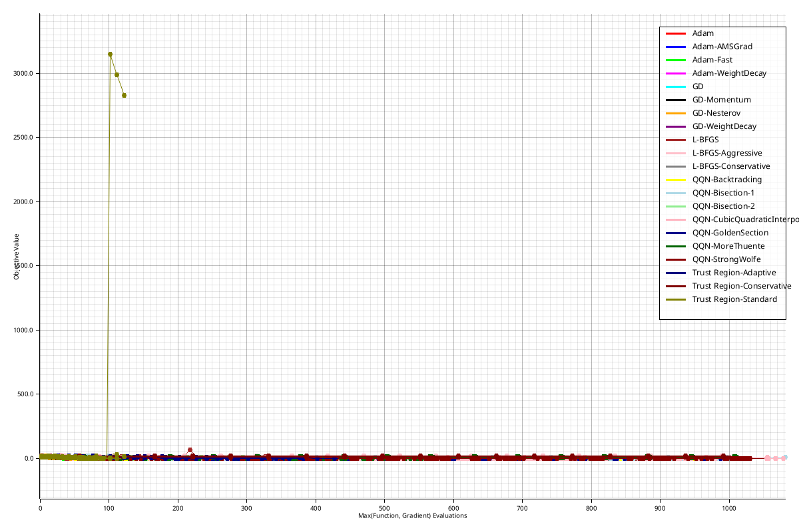
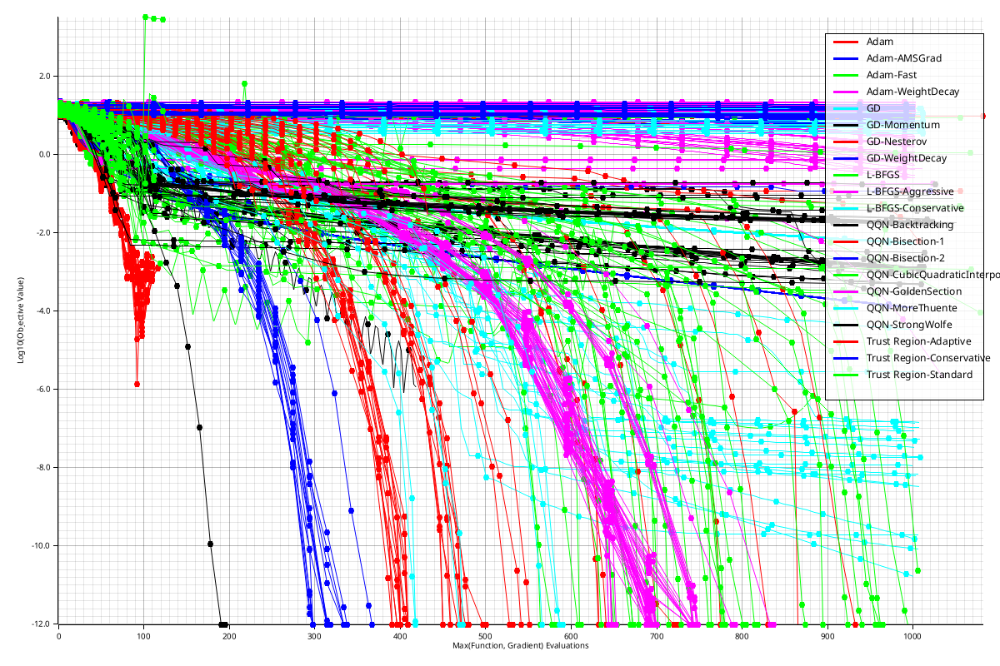

**Figure:** Convergence plots for Beale_2D showing objective value vs iterations.
Left: Linear scale, Right: Log scale for better visualization of convergence behavior.

**Data:** [Linear scale data (CSV)](convergence_Beale_2D_data.csv) | [Log scale data (CSV)](convergence_Beale_2D_log_data.csv)

## Problem: Levi_2D

**Family:** Non-Convex Unimodal  
**Dimension:** 2  
**Success Threshold:** 3.500e-1  
**Total Runs:** 560

### Performance Summary
<table style="border-collapse: collapse; width: 100%; margin: 20px 0;">
<tr style="background-color: #f2f2f2;">
<th style="border: 1px solid #ddd; padding: 8px; text-align: center;">Rank</th>
<th style="border: 1px solid #ddd; padding: 8px; text-align: center;">Optimizer</th>
<th style="border: 1px solid #ddd; padding: 8px; text-align: center;">Mean Final Value (All/Success/Fail)</th>
<th style="border: 1px solid #ddd; padding: 8px; text-align: center;">Std Dev</th>
<th style="border: 1px solid #ddd; padding: 8px; text-align: center;">Best Value</th>
<th style="border: 1px solid #ddd; padding: 8px; text-align: center;">Worst Value</th>
<th style="border: 1px solid #ddd; padding: 8px; text-align: center;">Mean Function Evals (All/Success/Fail)</th>
<th style="border: 1px solid #ddd; padding: 8px; text-align: center;">Mean Gradient Evals (All/Success/Fail)</th>
<th style="border: 1px solid #ddd; padding: 8px; text-align: center;">Success Rate</th>
<th style="border: 1px solid #ddd; padding: 8px; text-align: center;">Mean Time (s)</th>
</tr>
<tr style="background-color: #d4edda; font-weight: bold;">
<td style="border: 1px solid #ddd; padding: 8px; text-align: center;">1</td>
<td style="border: 1px solid #ddd; padding: 8px; text-align: center;"><a href="detailed_Levi_2D_QQN-GoldenSection.md">QQN-GoldenSection</a></td>
<td style="border: 1px solid #ddd; padding: 8px; text-align: center;">8.39e-1 / 6.76e-2 / 1.06e0</td>
<td style="border: 1px solid #ddd; padding: 8px; text-align: center;">9.77e-1</td>
<td style="border: 1px solid #ddd; padding: 8px; text-align: center;">9.52e-25</td>
<td style="border: 1px solid #ddd; padding: 8px; text-align: center;">3.96e0</td>
<td style="border: 1px solid #ddd; padding: 8px; text-align: center;">524.7 / 517.2 / 526.8</td>
<td style="border: 1px solid #ddd; padding: 8px; text-align: center;">74.6 / 73.9 / 74.8</td>
<td style="border: 1px solid #ddd; padding: 8px; text-align: center;">21.7%</td>
<td style="border: 1px solid #ddd; padding: 8px; text-align: center;">0.008</td>
</tr>
<tr style="background-color: #fff3cd;">
<td style="border: 1px solid #ddd; padding: 8px; text-align: center;">2</td>
<td style="border: 1px solid #ddd; padding: 8px; text-align: center;"><a href="detailed_Levi_2D_QQN-Bisection-2.md">QQN-Bisection-2</a></td>
<td style="border: 1px solid #ddd; padding: 8px; text-align: center;">8.60e-1 / 6.59e-2 / 1.30e0</td>
<td style="border: 1px solid #ddd; padding: 8px; text-align: center;">8.64e-1</td>
<td style="border: 1px solid #ddd; padding: 8px; text-align: center;">7.09e-19</td>
<td style="border: 1px solid #ddd; padding: 8px; text-align: center;">1.98e0</td>
<td style="border: 1px solid #ddd; padding: 8px; text-align: center;">184.4 / 305.4 / 144.1</td>
<td style="border: 1px solid #ddd; padding: 8px; text-align: center;">106.2 / 185.2 / 79.9</td>
<td style="border: 1px solid #ddd; padding: 8px; text-align: center;">25.0%</td>
<td style="border: 1px solid #ddd; padding: 8px; text-align: center;">0.003</td>
</tr>
<tr style="">
<td style="border: 1px solid #ddd; padding: 8px; text-align: center;">3</td>
<td style="border: 1px solid #ddd; padding: 8px; text-align: center;"><a href="detailed_Levi_2D_QQN-Bisection-1.md">QQN-Bisection-1</a></td>
<td style="border: 1px solid #ddd; padding: 8px; text-align: center;">1.25e0 / 5.49e-2 / 1.38e0</td>
<td style="border: 1px solid #ddd; padding: 8px; text-align: center;">7.84e-1</td>
<td style="border: 1px solid #ddd; padding: 8px; text-align: center;">1.02e-17</td>
<td style="border: 1px solid #ddd; padding: 8px; text-align: center;">2.44e0</td>
<td style="border: 1px solid #ddd; padding: 8px; text-align: center;">192.0 / 187.0 / 192.6</td>
<td style="border: 1px solid #ddd; padding: 8px; text-align: center;">219.8 / 212.5 / 220.6</td>
<td style="border: 1px solid #ddd; padding: 8px; text-align: center;">10.0%</td>
<td style="border: 1px solid #ddd; padding: 8px; text-align: center;">0.003</td>
</tr>
<tr style="">
<td style="border: 1px solid #ddd; padding: 8px; text-align: center;">4</td>
<td style="border: 1px solid #ddd; padding: 8px; text-align: center;"><a href="detailed_Levi_2D_QQN-CubicQuadraticInterpolation.md">QQN-CubicQuadraticInterpolation</a></td>
<td style="border: 1px solid #ddd; padding: 8px; text-align: center;">1.39e0 / 7.22e-2 / 1.54e0</td>
<td style="border: 1px solid #ddd; padding: 8px; text-align: center;">8.96e-1</td>
<td style="border: 1px solid #ddd; padding: 8px; text-align: center;">1.38e-17</td>
<td style="border: 1px solid #ddd; padding: 8px; text-align: center;">3.07e0</td>
<td style="border: 1px solid #ddd; padding: 8px; text-align: center;">211.4 / 264.8 / 205.5</td>
<td style="border: 1px solid #ddd; padding: 8px; text-align: center;">308.9 / 394.2 / 299.4</td>
<td style="border: 1px solid #ddd; padding: 8px; text-align: center;">10.0%</td>
<td style="border: 1px solid #ddd; padding: 8px; text-align: center;">0.006</td>
</tr>
<tr style="">
<td style="border: 1px solid #ddd; padding: 8px; text-align: center;">5</td>
<td style="border: 1px solid #ddd; padding: 8px; text-align: center;"><a href="detailed_Levi_2D_QQN-StrongWolfe.md">QQN-StrongWolfe</a></td>
<td style="border: 1px solid #ddd; padding: 8px; text-align: center;">1.29e0 / 3.76e-17 / 1.36e0</td>
<td style="border: 1px solid #ddd; padding: 8px; text-align: center;">9.72e-1</td>
<td style="border: 1px solid #ddd; padding: 8px; text-align: center;">3.76e-17</td>
<td style="border: 1px solid #ddd; padding: 8px; text-align: center;">2.75e0</td>
<td style="border: 1px solid #ddd; padding: 8px; text-align: center;">246.4 / 289.0 / 244.2</td>
<td style="border: 1px solid #ddd; padding: 8px; text-align: center;">216.6 / 265.0 / 214.0</td>
<td style="border: 1px solid #ddd; padding: 8px; text-align: center;">5.0%</td>
<td style="border: 1px solid #ddd; padding: 8px; text-align: center;">0.006</td>
</tr>
<tr style="">
<td style="border: 1px solid #ddd; padding: 8px; text-align: center;">6</td>
<td style="border: 1px solid #ddd; padding: 8px; text-align: center;"><a href="detailed_Levi_2D_QQN-Backtracking.md">QQN-Backtracking</a></td>
<td style="border: 1px solid #ddd; padding: 8px; text-align: center;">1.37e0 / 5.49e-2 / 1.70e0</td>
<td style="border: 1px solid #ddd; padding: 8px; text-align: center;">9.26e-1</td>
<td style="border: 1px solid #ddd; padding: 8px; text-align: center;">5.79e-17</td>
<td style="border: 1px solid #ddd; padding: 8px; text-align: center;">3.07e0</td>
<td style="border: 1px solid #ddd; padding: 8px; text-align: center;">172.8 / 290.5 / 143.4</td>
<td style="border: 1px solid #ddd; padding: 8px; text-align: center;">102.4 / 164.5 / 86.9</td>
<td style="border: 1px solid #ddd; padding: 8px; text-align: center;">20.0%</td>
<td style="border: 1px solid #ddd; padding: 8px; text-align: center;">0.004</td>
</tr>
<tr style="">
<td style="border: 1px solid #ddd; padding: 8px; text-align: center;">7</td>
<td style="border: 1px solid #ddd; padding: 8px; text-align: center;"><a href="detailed_Levi_2D_L-BFGS.md">L-BFGS</a></td>
<td style="border: 1px solid #ddd; padding: 8px; text-align: center;">5.57e-1 / 8.91e0 / 5.55e0</td>
<td style="border: 1px solid #ddd; padding: 8px; text-align: center;">3.93e-1</td>
<td style="border: 1px solid #ddd; padding: 8px; text-align: center;">2.10e-2</td>
<td style="border: 1px solid #ddd; padding: 8px; text-align: center;">1.37e0</td>
<td style="border: 1px solid #ddd; padding: 8px; text-align: center;">109.8 / 121.0 / 102.2</td>
<td style="border: 1px solid #ddd; padding: 8px; text-align: center;">48.3 / 55.6 / 43.4</td>
<td style="border: 1px solid #ddd; padding: 8px; text-align: center;">40.0%</td>
<td style="border: 1px solid #ddd; padding: 8px; text-align: center;">0.001</td>
</tr>
<tr style="">
<td style="border: 1px solid #ddd; padding: 8px; text-align: center;">8</td>
<td style="border: 1px solid #ddd; padding: 8px; text-align: center;"><a href="detailed_Levi_2D_QQN-MoreThuente.md">QQN-MoreThuente</a></td>
<td style="border: 1px solid #ddd; padding: 8px; text-align: center;">1.81e0 / 1.10e-1 / 1.89e0</td>
<td style="border: 1px solid #ddd; padding: 8px; text-align: center;">5.87e-1</td>
<td style="border: 1px solid #ddd; padding: 8px; text-align: center;">1.10e-1</td>
<td style="border: 1px solid #ddd; padding: 8px; text-align: center;">3.07e0</td>
<td style="border: 1px solid #ddd; padding: 8px; text-align: center;">132.2 / 295.0 / 123.7</td>
<td style="border: 1px solid #ddd; padding: 8px; text-align: center;">136.9 / 313.0 / 127.6</td>
<td style="border: 1px solid #ddd; padding: 8px; text-align: center;">5.0%</td>
<td style="border: 1px solid #ddd; padding: 8px; text-align: center;">0.003</td>
</tr>
<tr style="">
<td style="border: 1px solid #ddd; padding: 8px; text-align: center;">9</td>
<td style="border: 1px solid #ddd; padding: 8px; text-align: center;"><a href="detailed_Levi_2D_L-BFGS-Aggressive.md">L-BFGS-Aggressive</a></td>
<td style="border: 1px solid #ddd; padding: 8px; text-align: center;">2.52e0 / - / 2.52e0</td>
<td style="border: 1px solid #ddd; padding: 8px; text-align: center;">1.21e0</td>
<td style="border: 1px solid #ddd; padding: 8px; text-align: center;">1.93e-1</td>
<td style="border: 1px solid #ddd; padding: 8px; text-align: center;">4.76e0</td>
<td style="border: 1px solid #ddd; padding: 8px; text-align: center;">754.3 / - / 754.3</td>
<td style="border: 1px solid #ddd; padding: 8px; text-align: center;">250.7 / - / 250.7</td>
<td style="border: 1px solid #ddd; padding: 8px; text-align: center;">0.0%</td>
<td style="border: 1px solid #ddd; padding: 8px; text-align: center;">0.006</td>
</tr>
<tr style="">
<td style="border: 1px solid #ddd; padding: 8px; text-align: center;">10</td>
<td style="border: 1px solid #ddd; padding: 8px; text-align: center;"><a href="detailed_Levi_2D_GD-Momentum.md">GD-Momentum</a></td>
<td style="border: 1px solid #ddd; padding: 8px; text-align: center;">1.80e0 / - / 2.05e0</td>
<td style="border: 1px solid #ddd; padding: 8px; text-align: center;">4.46e-1</td>
<td style="border: 1px solid #ddd; padding: 8px; text-align: center;">4.40e-1</td>
<td style="border: 1px solid #ddd; padding: 8px; text-align: center;">2.40e0</td>
<td style="border: 1px solid #ddd; padding: 8px; text-align: center;">20.1 / - / 20.1</td>
<td style="border: 1px solid #ddd; padding: 8px; text-align: center;">36.1 / - / 36.1</td>
<td style="border: 1px solid #ddd; padding: 8px; text-align: center;">0.0%</td>
<td style="border: 1px solid #ddd; padding: 8px; text-align: center;">0.000</td>
</tr>
<tr style="">
<td style="border: 1px solid #ddd; padding: 8px; text-align: center;">11</td>
<td style="border: 1px solid #ddd; padding: 8px; text-align: center;"><a href="detailed_Levi_2D_Adam-Fast.md">Adam-Fast</a></td>
<td style="border: 1px solid #ddd; padding: 8px; text-align: center;">1.90e0 / - / 1.99e0</td>
<td style="border: 1px solid #ddd; padding: 8px; text-align: center;">3.05e-1</td>
<td style="border: 1px solid #ddd; padding: 8px; text-align: center;">6.48e-1</td>
<td style="border: 1px solid #ddd; padding: 8px; text-align: center;">2.76e0</td>
<td style="border: 1px solid #ddd; padding: 8px; text-align: center;">52.0 / - / 52.0</td>
<td style="border: 1px solid #ddd; padding: 8px; text-align: center;">51.0 / - / 51.0</td>
<td style="border: 1px solid #ddd; padding: 8px; text-align: center;">0.0%</td>
<td style="border: 1px solid #ddd; padding: 8px; text-align: center;">0.001</td>
</tr>
<tr style="">
<td style="border: 1px solid #ddd; padding: 8px; text-align: center;">12</td>
<td style="border: 1px solid #ddd; padding: 8px; text-align: center;"><a href="detailed_Levi_2D_GD-Nesterov.md">GD-Nesterov</a></td>
<td style="border: 1px solid #ddd; padding: 8px; text-align: center;">1.93e0 / - / 2.09e0</td>
<td style="border: 1px solid #ddd; padding: 8px; text-align: center;">2.31e-1</td>
<td style="border: 1px solid #ddd; padding: 8px; text-align: center;">1.09e0</td>
<td style="border: 1px solid #ddd; padding: 8px; text-align: center;">2.05e0</td>
<td style="border: 1px solid #ddd; padding: 8px; text-align: center;">16.3 / - / 16.3</td>
<td style="border: 1px solid #ddd; padding: 8px; text-align: center;">28.6 / - / 28.6</td>
<td style="border: 1px solid #ddd; padding: 8px; text-align: center;">0.0%</td>
<td style="border: 1px solid #ddd; padding: 8px; text-align: center;">0.000</td>
</tr>
<tr style="">
<td style="border: 1px solid #ddd; padding: 8px; text-align: center;">13</td>
<td style="border: 1px solid #ddd; padding: 8px; text-align: center;"><a href="detailed_Levi_2D_GD-WeightDecay.md">GD-WeightDecay</a></td>
<td style="border: 1px solid #ddd; padding: 8px; text-align: center;">1.79e0 / - / 1.84e0</td>
<td style="border: 1px solid #ddd; padding: 8px; text-align: center;">2.88e-1</td>
<td style="border: 1px solid #ddd; padding: 8px; text-align: center;">1.19e0</td>
<td style="border: 1px solid #ddd; padding: 8px; text-align: center;">2.07e0</td>
<td style="border: 1px solid #ddd; padding: 8px; text-align: center;">35.0 / - / 35.0</td>
<td style="border: 1px solid #ddd; padding: 8px; text-align: center;">66.1 / - / 66.1</td>
<td style="border: 1px solid #ddd; padding: 8px; text-align: center;">0.0%</td>
<td style="border: 1px solid #ddd; padding: 8px; text-align: center;">0.001</td>
</tr>
<tr style="">
<td style="border: 1px solid #ddd; padding: 8px; text-align: center;">14</td>
<td style="border: 1px solid #ddd; padding: 8px; text-align: center;"><a href="detailed_Levi_2D_Trust_Region-Standard.md">Trust Region-Standard</a></td>
<td style="border: 1px solid #ddd; padding: 8px; text-align: center;">2.05e0 / - / 2.05e0</td>
<td style="border: 1px solid #ddd; padding: 8px; text-align: center;">2.73e-1</td>
<td style="border: 1px solid #ddd; padding: 8px; text-align: center;">1.31e0</td>
<td style="border: 1px solid #ddd; padding: 8px; text-align: center;">2.66e0</td>
<td style="border: 1px solid #ddd; padding: 8px; text-align: center;">11.2 / - / 11.2</td>
<td style="border: 1px solid #ddd; padding: 8px; text-align: center;">8.1 / - / 8.1</td>
<td style="border: 1px solid #ddd; padding: 8px; text-align: center;">0.0%</td>
<td style="border: 1px solid #ddd; padding: 8px; text-align: center;">0.000</td>
</tr>
<tr style="">
<td style="border: 1px solid #ddd; padding: 8px; text-align: center;">15</td>
<td style="border: 1px solid #ddd; padding: 8px; text-align: center;"><a href="detailed_Levi_2D_GD.md">GD</a></td>
<td style="border: 1px solid #ddd; padding: 8px; text-align: center;">2.05e0 / - / 2.16e0</td>
<td style="border: 1px solid #ddd; padding: 8px; text-align: center;">3.33e-1</td>
<td style="border: 1px solid #ddd; padding: 8px; text-align: center;">1.43e0</td>
<td style="border: 1px solid #ddd; padding: 8px; text-align: center;">3.10e0</td>
<td style="border: 1px solid #ddd; padding: 8px; text-align: center;">18.2 / - / 18.2</td>
<td style="border: 1px solid #ddd; padding: 8px; text-align: center;">32.5 / - / 32.5</td>
<td style="border: 1px solid #ddd; padding: 8px; text-align: center;">0.0%</td>
<td style="border: 1px solid #ddd; padding: 8px; text-align: center;">0.000</td>
</tr>
<tr style="">
<td style="border: 1px solid #ddd; padding: 8px; text-align: center;">16</td>
<td style="border: 1px solid #ddd; padding: 8px; text-align: center;"><a href="detailed_Levi_2D_Adam-AMSGrad.md">Adam-AMSGrad</a></td>
<td style="border: 1px solid #ddd; padding: 8px; text-align: center;">1.86e0 / - / 1.86e0</td>
<td style="border: 1px solid #ddd; padding: 8px; text-align: center;">2.05e-1</td>
<td style="border: 1px solid #ddd; padding: 8px; text-align: center;">1.43e0</td>
<td style="border: 1px solid #ddd; padding: 8px; text-align: center;">1.98e0</td>
<td style="border: 1px solid #ddd; padding: 8px; text-align: center;">309.8 / - / 309.8</td>
<td style="border: 1px solid #ddd; padding: 8px; text-align: center;">308.8 / - / 308.8</td>
<td style="border: 1px solid #ddd; padding: 8px; text-align: center;">0.0%</td>
<td style="border: 1px solid #ddd; padding: 8px; text-align: center;">0.007</td>
</tr>
<tr style="">
<td style="border: 1px solid #ddd; padding: 8px; text-align: center;">17</td>
<td style="border: 1px solid #ddd; padding: 8px; text-align: center;"><a href="detailed_Levi_2D_Adam.md">Adam</a></td>
<td style="border: 1px solid #ddd; padding: 8px; text-align: center;">1.94e0 / - / 1.94e0</td>
<td style="border: 1px solid #ddd; padding: 8px; text-align: center;">1.32e-1</td>
<td style="border: 1px solid #ddd; padding: 8px; text-align: center;">1.43e0</td>
<td style="border: 1px solid #ddd; padding: 8px; text-align: center;">1.98e0</td>
<td style="border: 1px solid #ddd; padding: 8px; text-align: center;">272.7 / - / 272.7</td>
<td style="border: 1px solid #ddd; padding: 8px; text-align: center;">271.7 / - / 271.7</td>
<td style="border: 1px solid #ddd; padding: 8px; text-align: center;">0.0%</td>
<td style="border: 1px solid #ddd; padding: 8px; text-align: center;">0.005</td>
</tr>
<tr style="">
<td style="border: 1px solid #ddd; padding: 8px; text-align: center;">18</td>
<td style="border: 1px solid #ddd; padding: 8px; text-align: center;"><a href="detailed_Levi_2D_Adam-WeightDecay.md">Adam-WeightDecay</a></td>
<td style="border: 1px solid #ddd; padding: 8px; text-align: center;">1.87e0 / - / 1.88e0</td>
<td style="border: 1px solid #ddd; padding: 8px; text-align: center;">2.99e-1</td>
<td style="border: 1px solid #ddd; padding: 8px; text-align: center;">1.43e0</td>
<td style="border: 1px solid #ddd; padding: 8px; text-align: center;">2.75e0</td>
<td style="border: 1px solid #ddd; padding: 8px; text-align: center;">97.7 / - / 97.7</td>
<td style="border: 1px solid #ddd; padding: 8px; text-align: center;">96.7 / - / 96.7</td>
<td style="border: 1px solid #ddd; padding: 8px; text-align: center;">0.0%</td>
<td style="border: 1px solid #ddd; padding: 8px; text-align: center;">0.002</td>
</tr>
<tr style="">
<td style="border: 1px solid #ddd; padding: 8px; text-align: center;">19</td>
<td style="border: 1px solid #ddd; padding: 8px; text-align: center;"><a href="detailed_Levi_2D_Trust_Region-Adaptive.md">Trust Region-Adaptive</a></td>
<td style="border: 1px solid #ddd; padding: 8px; text-align: center;">2.07e0 / - / 2.23e0</td>
<td style="border: 1px solid #ddd; padding: 8px; text-align: center;">4.71e-1</td>
<td style="border: 1px solid #ddd; padding: 8px; text-align: center;">1.43e0</td>
<td style="border: 1px solid #ddd; padding: 8px; text-align: center;">3.39e0</td>
<td style="border: 1px solid #ddd; padding: 8px; text-align: center;">19.4 / - / 19.4</td>
<td style="border: 1px solid #ddd; padding: 8px; text-align: center;">13.6 / - / 13.6</td>
<td style="border: 1px solid #ddd; padding: 8px; text-align: center;">0.0%</td>
<td style="border: 1px solid #ddd; padding: 8px; text-align: center;">0.000</td>
</tr>
<tr style="">
<td style="border: 1px solid #ddd; padding: 8px; text-align: center;">20</td>
<td style="border: 1px solid #ddd; padding: 8px; text-align: center;"><a href="detailed_Levi_2D_L-BFGS-Conservative.md">L-BFGS-Conservative</a></td>
<td style="border: 1px solid #ddd; padding: 8px; text-align: center;">1.99e0 / - / 1.99e0</td>
<td style="border: 1px solid #ddd; padding: 8px; text-align: center;">1.94e-1</td>
<td style="border: 1px solid #ddd; padding: 8px; text-align: center;">1.70e0</td>
<td style="border: 1px solid #ddd; padding: 8px; text-align: center;">2.75e0</td>
<td style="border: 1px solid #ddd; padding: 8px; text-align: center;">221.8 / - / 221.8</td>
<td style="border: 1px solid #ddd; padding: 8px; text-align: center;">114.2 / - / 114.2</td>
<td style="border: 1px solid #ddd; padding: 8px; text-align: center;">0.0%</td>
<td style="border: 1px solid #ddd; padding: 8px; text-align: center;">0.003</td>
</tr>
<tr style="">
<td style="border: 1px solid #ddd; padding: 8px; text-align: center;">21</td>
<td style="border: 1px solid #ddd; padding: 8px; text-align: center;"><a href="detailed_Levi_2D_Trust_Region-Conservative.md">Trust Region-Conservative</a></td>
<td style="border: 1px solid #ddd; padding: 8px; text-align: center;">2.43e0 / - / 2.43e0</td>
<td style="border: 1px solid #ddd; padding: 8px; text-align: center;">6.20e-1</td>
<td style="border: 1px solid #ddd; padding: 8px; text-align: center;">1.70e0</td>
<td style="border: 1px solid #ddd; padding: 8px; text-align: center;">4.24e0</td>
<td style="border: 1px solid #ddd; padding: 8px; text-align: center;">440.1 / - / 440.1</td>
<td style="border: 1px solid #ddd; padding: 8px; text-align: center;">294.1 / - / 294.1</td>
<td style="border: 1px solid #ddd; padding: 8px; text-align: center;">0.0%</td>
<td style="border: 1px solid #ddd; padding: 8px; text-align: center;">0.003</td>
</tr>
</table>

### Convergence Plots

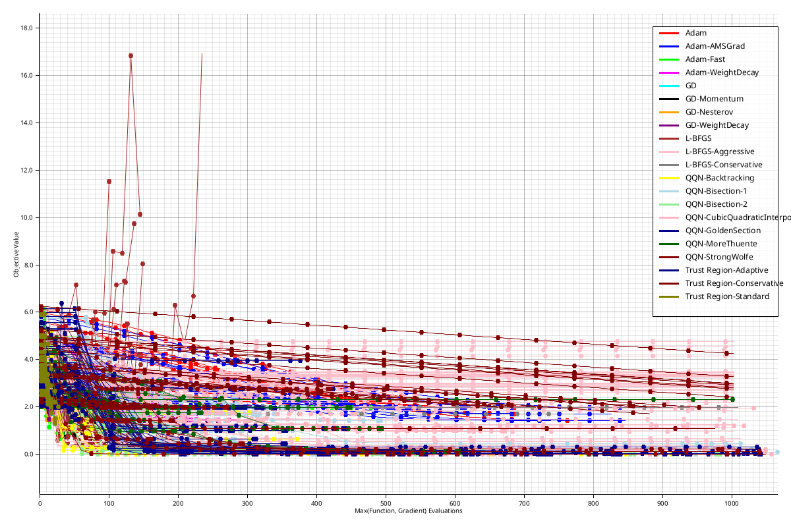
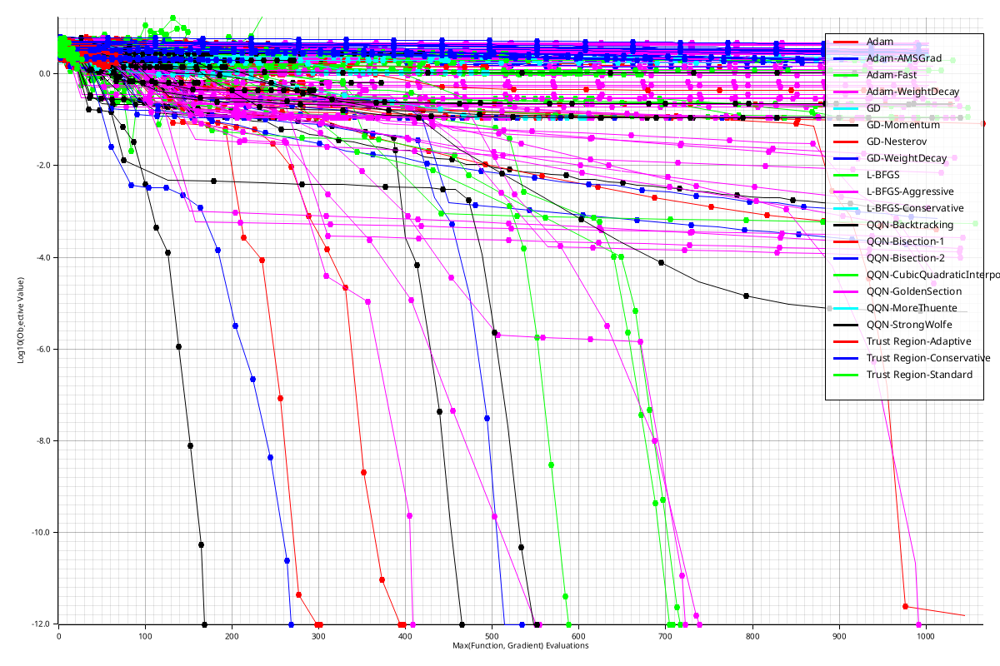

**Figure:** Convergence plots for Levi_2D showing objective value vs iterations.
Left: Linear scale, Right: Log scale for better visualization of convergence behavior.

**Data:** [Linear scale data (CSV)](convergence_Levi_2D_data.csv) | [Log scale data (CSV)](convergence_Levi_2D_log_data.csv)

## Problem: GoldsteinPrice_2D

**Family:** Non-Convex Unimodal  
**Dimension:** 2  
**Success Threshold:** 1.700e2  
**Total Runs:** 560

### Performance Summary
<table style="border-collapse: collapse; width: 100%; margin: 20px 0;">
<tr style="background-color: #f2f2f2;">
<th style="border: 1px solid #ddd; padding: 8px; text-align: center;">Rank</th>
<th style="border: 1px solid #ddd; padding: 8px; text-align: center;">Optimizer</th>
<th style="border: 1px solid #ddd; padding: 8px; text-align: center;">Mean Final Value (All/Success/Fail)</th>
<th style="border: 1px solid #ddd; padding: 8px; text-align: center;">Std Dev</th>
<th style="border: 1px solid #ddd; padding: 8px; text-align: center;">Best Value</th>
<th style="border: 1px solid #ddd; padding: 8px; text-align: center;">Worst Value</th>
<th style="border: 1px solid #ddd; padding: 8px; text-align: center;">Mean Function Evals (All/Success/Fail)</th>
<th style="border: 1px solid #ddd; padding: 8px; text-align: center;">Mean Gradient Evals (All/Success/Fail)</th>
<th style="border: 1px solid #ddd; padding: 8px; text-align: center;">Success Rate</th>
<th style="border: 1px solid #ddd; padding: 8px; text-align: center;">Mean Time (s)</th>
</tr>
<tr style="background-color: #d4edda; font-weight: bold;">
<td style="border: 1px solid #ddd; padding: 8px; text-align: center;">1</td>
<td style="border: 1px solid #ddd; padding: 8px; text-align: center;"><a href="detailed_GoldsteinPrice_2D_QQN-Bisection-2.md">QQN-Bisection-2</a></td>
<td style="border: 1px solid #ddd; padding: 8px; text-align: center;">1.97e2 / - / 1.97e2</td>
<td style="border: 1px solid #ddd; padding: 8px; text-align: center;">2.75e2</td>
<td style="border: 1px solid #ddd; padding: 8px; text-align: center;">3.00e0</td>
<td style="border: 1px solid #ddd; padding: 8px; text-align: center;">8.40e2</td>
<td style="border: 1px solid #ddd; padding: 8px; text-align: center;">34.4 / - / 34.4</td>
<td style="border: 1px solid #ddd; padding: 8px; text-align: center;">52.2 / - / 52.2</td>
<td style="border: 1px solid #ddd; padding: 8px; text-align: center;">0.0%</td>
<td style="border: 1px solid #ddd; padding: 8px; text-align: center;">0.001</td>
</tr>
<tr style="background-color: #fff3cd;">
<td style="border: 1px solid #ddd; padding: 8px; text-align: center;">2</td>
<td style="border: 1px solid #ddd; padding: 8px; text-align: center;"><a href="detailed_GoldsteinPrice_2D_QQN-CubicQuadraticInterpolation.md">QQN-CubicQuadraticInterpolation</a></td>
<td style="border: 1px solid #ddd; padding: 8px; text-align: center;">3.30e2 / - / 3.30e2</td>
<td style="border: 1px solid #ddd; padding: 8px; text-align: center;">3.54e2</td>
<td style="border: 1px solid #ddd; padding: 8px; text-align: center;">7.66e1</td>
<td style="border: 1px solid #ddd; padding: 8px; text-align: center;">8.40e2</td>
<td style="border: 1px solid #ddd; padding: 8px; text-align: center;">374.3 / - / 374.3</td>
<td style="border: 1px solid #ddd; padding: 8px; text-align: center;">610.0 / - / 610.0</td>
<td style="border: 1px solid #ddd; padding: 8px; text-align: center;">0.0%</td>
<td style="border: 1px solid #ddd; padding: 8px; text-align: center;">0.012</td>
</tr>
<tr style="">
<td style="border: 1px solid #ddd; padding: 8px; text-align: center;">3</td>
<td style="border: 1px solid #ddd; padding: 8px; text-align: center;"><a href="detailed_GoldsteinPrice_2D_QQN-GoldenSection.md">QQN-GoldenSection</a></td>
<td style="border: 1px solid #ddd; padding: 8px; text-align: center;">8.40e1 / - / 8.40e1</td>
<td style="border: 1px solid #ddd; padding: 8px; text-align: center;">1.93e-11</td>
<td style="border: 1px solid #ddd; padding: 8px; text-align: center;">8.40e1</td>
<td style="border: 1px solid #ddd; padding: 8px; text-align: center;">8.40e1</td>
<td style="border: 1px solid #ddd; padding: 8px; text-align: center;">370.4 / - / 370.4</td>
<td style="border: 1px solid #ddd; padding: 8px; text-align: center;">58.3 / - / 58.3</td>
<td style="border: 1px solid #ddd; padding: 8px; text-align: center;">0.0%</td>
<td style="border: 1px solid #ddd; padding: 8px; text-align: center;">0.005</td>
</tr>
<tr style="">
<td style="border: 1px solid #ddd; padding: 8px; text-align: center;">4</td>
<td style="border: 1px solid #ddd; padding: 8px; text-align: center;"><a href="detailed_GoldsteinPrice_2D_QQN-Bisection-1.md">QQN-Bisection-1</a></td>
<td style="border: 1px solid #ddd; padding: 8px; text-align: center;">1.22e2 / 8.40e1 / 1.30e2</td>
<td style="border: 1px solid #ddd; padding: 8px; text-align: center;">1.65e2</td>
<td style="border: 1px solid #ddd; padding: 8px; text-align: center;">8.40e1</td>
<td style="border: 1px solid #ddd; padding: 8px; text-align: center;">8.40e2</td>
<td style="border: 1px solid #ddd; padding: 8px; text-align: center;">306.4 / 344.1 / 298.4</td>
<td style="border: 1px solid #ddd; padding: 8px; text-align: center;">365.9 / 417.7 / 354.9</td>
<td style="border: 1px solid #ddd; padding: 8px; text-align: center;">17.5%</td>
<td style="border: 1px solid #ddd; padding: 8px; text-align: center;">0.008</td>
</tr>
<tr style="">
<td style="border: 1px solid #ddd; padding: 8px; text-align: center;">5</td>
<td style="border: 1px solid #ddd; padding: 8px; text-align: center;"><a href="detailed_GoldsteinPrice_2D_QQN-StrongWolfe.md">QQN-StrongWolfe</a></td>
<td style="border: 1px solid #ddd; padding: 8px; text-align: center;">8.40e1 / 8.40e1 / 8.40e1</td>
<td style="border: 1px solid #ddd; padding: 8px; text-align: center;">2.01e-5</td>
<td style="border: 1px solid #ddd; padding: 8px; text-align: center;">8.40e1</td>
<td style="border: 1px solid #ddd; padding: 8px; text-align: center;">8.40e1</td>
<td style="border: 1px solid #ddd; padding: 8px; text-align: center;">496.1 / 473.4 / 514.5</td>
<td style="border: 1px solid #ddd; padding: 8px; text-align: center;">265.9 / 254.1 / 275.5</td>
<td style="border: 1px solid #ddd; padding: 8px; text-align: center;">45.0%</td>
<td style="border: 1px solid #ddd; padding: 8px; text-align: center;">0.011</td>
</tr>
<tr style="">
<td style="border: 1px solid #ddd; padding: 8px; text-align: center;">6</td>
<td style="border: 1px solid #ddd; padding: 8px; text-align: center;"><a href="detailed_GoldsteinPrice_2D_QQN-Backtracking.md">QQN-Backtracking</a></td>
<td style="border: 1px solid #ddd; padding: 8px; text-align: center;">8.59e1 / - / 8.59e1</td>
<td style="border: 1px solid #ddd; padding: 8px; text-align: center;">1.32e0</td>
<td style="border: 1px solid #ddd; padding: 8px; text-align: center;">8.43e1</td>
<td style="border: 1px solid #ddd; padding: 8px; text-align: center;">8.86e1</td>
<td style="border: 1px solid #ddd; padding: 8px; text-align: center;">787.9 / - / 787.9</td>
<td style="border: 1px solid #ddd; padding: 8px; text-align: center;">229.3 / - / 229.3</td>
<td style="border: 1px solid #ddd; padding: 8px; text-align: center;">0.0%</td>
<td style="border: 1px solid #ddd; padding: 8px; text-align: center;">0.016</td>
</tr>
<tr style="">
<td style="border: 1px solid #ddd; padding: 8px; text-align: center;">7</td>
<td style="border: 1px solid #ddd; padding: 8px; text-align: center;"><a href="detailed_GoldsteinPrice_2D_GD-Momentum.md">GD-Momentum</a></td>
<td style="border: 1px solid #ddd; padding: 8px; text-align: center;">6.65e2 / 1.80e3 / 8.85e2</td>
<td style="border: 1px solid #ddd; padding: 8px; text-align: center;">3.18e2</td>
<td style="border: 1px solid #ddd; padding: 8px; text-align: center;">8.44e1</td>
<td style="border: 1px solid #ddd; padding: 8px; text-align: center;">8.61e2</td>
<td style="border: 1px solid #ddd; padding: 8px; text-align: center;">19.1 / 20.8 / 18.8</td>
<td style="border: 1px solid #ddd; padding: 8px; text-align: center;">34.3 / 37.5 / 33.5</td>
<td style="border: 1px solid #ddd; padding: 8px; text-align: center;">20.0%</td>
<td style="border: 1px solid #ddd; padding: 8px; text-align: center;">0.000</td>
</tr>
<tr style="">
<td style="border: 1px solid #ddd; padding: 8px; text-align: center;">8</td>
<td style="border: 1px solid #ddd; padding: 8px; text-align: center;"><a href="detailed_GoldsteinPrice_2D_L-BFGS.md">L-BFGS</a></td>
<td style="border: 1px solid #ddd; padding: 8px; text-align: center;">3.94e2 / 6.76e3 / 1.02e3</td>
<td style="border: 1px solid #ddd; padding: 8px; text-align: center;">2.98e2</td>
<td style="border: 1px solid #ddd; padding: 8px; text-align: center;">8.66e1</td>
<td style="border: 1px solid #ddd; padding: 8px; text-align: center;">9.46e2</td>
<td style="border: 1px solid #ddd; padding: 8px; text-align: center;">130.6 / 154.0 / 111.4</td>
<td style="border: 1px solid #ddd; padding: 8px; text-align: center;">40.8 / 48.0 / 34.9</td>
<td style="border: 1px solid #ddd; padding: 8px; text-align: center;">45.0%</td>
<td style="border: 1px solid #ddd; padding: 8px; text-align: center;">0.002</td>
</tr>
<tr style="">
<td style="border: 1px solid #ddd; padding: 8px; text-align: center;">9</td>
<td style="border: 1px solid #ddd; padding: 8px; text-align: center;"><a href="detailed_GoldsteinPrice_2D_L-BFGS-Aggressive.md">L-BFGS-Aggressive</a></td>
<td style="border: 1px solid #ddd; padding: 8px; text-align: center;">1.68e3 / - / 1.68e3</td>
<td style="border: 1px solid #ddd; padding: 8px; text-align: center;">1.48e3</td>
<td style="border: 1px solid #ddd; padding: 8px; text-align: center;">9.11e1</td>
<td style="border: 1px solid #ddd; padding: 8px; text-align: center;">6.78e3</td>
<td style="border: 1px solid #ddd; padding: 8px; text-align: center;">774.3 / - / 774.3</td>
<td style="border: 1px solid #ddd; padding: 8px; text-align: center;">234.5 / - / 234.5</td>
<td style="border: 1px solid #ddd; padding: 8px; text-align: center;">0.0%</td>
<td style="border: 1px solid #ddd; padding: 8px; text-align: center;">0.006</td>
</tr>
<tr style="">
<td style="border: 1px solid #ddd; padding: 8px; text-align: center;">10</td>
<td style="border: 1px solid #ddd; padding: 8px; text-align: center;"><a href="detailed_GoldsteinPrice_2D_QQN-MoreThuente.md">QQN-MoreThuente</a></td>
<td style="border: 1px solid #ddd; padding: 8px; text-align: center;">1.11e3 / - / 1.11e3</td>
<td style="border: 1px solid #ddd; padding: 8px; text-align: center;">8.77e2</td>
<td style="border: 1px solid #ddd; padding: 8px; text-align: center;">9.73e1</td>
<td style="border: 1px solid #ddd; padding: 8px; text-align: center;">3.10e3</td>
<td style="border: 1px solid #ddd; padding: 8px; text-align: center;">483.2 / - / 483.2</td>
<td style="border: 1px solid #ddd; padding: 8px; text-align: center;">529.2 / - / 529.2</td>
<td style="border: 1px solid #ddd; padding: 8px; text-align: center;">0.0%</td>
<td style="border: 1px solid #ddd; padding: 8px; text-align: center;">0.008</td>
</tr>
<tr style="">
<td style="border: 1px solid #ddd; padding: 8px; text-align: center;">11</td>
<td style="border: 1px solid #ddd; padding: 8px; text-align: center;"><a href="detailed_GoldsteinPrice_2D_L-BFGS-Conservative.md">L-BFGS-Conservative</a></td>
<td style="border: 1px solid #ddd; padding: 8px; text-align: center;">8.03e2 / 9.89e1 / 8.49e2</td>
<td style="border: 1px solid #ddd; padding: 8px; text-align: center;">1.62e2</td>
<td style="border: 1px solid #ddd; padding: 8px; text-align: center;">9.82e1</td>
<td style="border: 1px solid #ddd; padding: 8px; text-align: center;">8.40e2</td>
<td style="border: 1px solid #ddd; padding: 8px; text-align: center;">235.7 / 232.0 / 235.9</td>
<td style="border: 1px solid #ddd; padding: 8px; text-align: center;">125.8 / 85.0 / 127.9</td>
<td style="border: 1px solid #ddd; padding: 8px; text-align: center;">5.0%</td>
<td style="border: 1px solid #ddd; padding: 8px; text-align: center;">0.003</td>
</tr>
<tr style="">
<td style="border: 1px solid #ddd; padding: 8px; text-align: center;">12</td>
<td style="border: 1px solid #ddd; padding: 8px; text-align: center;"><a href="detailed_GoldsteinPrice_2D_Adam-WeightDecay.md">Adam-WeightDecay</a></td>
<td style="border: 1px solid #ddd; padding: 8px; text-align: center;">8.40e2 / - / 8.40e2</td>
<td style="border: 1px solid #ddd; padding: 8px; text-align: center;">3.77e-1</td>
<td style="border: 1px solid #ddd; padding: 8px; text-align: center;">8.40e2</td>
<td style="border: 1px solid #ddd; padding: 8px; text-align: center;">8.42e2</td>
<td style="border: 1px solid #ddd; padding: 8px; text-align: center;">215.0 / - / 215.0</td>
<td style="border: 1px solid #ddd; padding: 8px; text-align: center;">214.0 / - / 214.0</td>
<td style="border: 1px solid #ddd; padding: 8px; text-align: center;">0.0%</td>
<td style="border: 1px solid #ddd; padding: 8px; text-align: center;">0.004</td>
</tr>
<tr style="">
<td style="border: 1px solid #ddd; padding: 8px; text-align: center;">13</td>
<td style="border: 1px solid #ddd; padding: 8px; text-align: center;"><a href="detailed_GoldsteinPrice_2D_Adam.md">Adam</a></td>
<td style="border: 1px solid #ddd; padding: 8px; text-align: center;">8.78e2 / - / 8.78e2</td>
<td style="border: 1px solid #ddd; padding: 8px; text-align: center;">7.84e1</td>
<td style="border: 1px solid #ddd; padding: 8px; text-align: center;">8.40e2</td>
<td style="border: 1px solid #ddd; padding: 8px; text-align: center;">1.12e3</td>
<td style="border: 1px solid #ddd; padding: 8px; text-align: center;">420.1 / - / 420.1</td>
<td style="border: 1px solid #ddd; padding: 8px; text-align: center;">419.8 / - / 419.8</td>
<td style="border: 1px solid #ddd; padding: 8px; text-align: center;">0.0%</td>
<td style="border: 1px solid #ddd; padding: 8px; text-align: center;">0.008</td>
</tr>
<tr style="">
<td style="border: 1px solid #ddd; padding: 8px; text-align: center;">14</td>
<td style="border: 1px solid #ddd; padding: 8px; text-align: center;"><a href="detailed_GoldsteinPrice_2D_Adam-AMSGrad.md">Adam-AMSGrad</a></td>
<td style="border: 1px solid #ddd; padding: 8px; text-align: center;">9.00e2 / - / 9.00e2</td>
<td style="border: 1px solid #ddd; padding: 8px; text-align: center;">8.79e1</td>
<td style="border: 1px solid #ddd; padding: 8px; text-align: center;">8.40e2</td>
<td style="border: 1px solid #ddd; padding: 8px; text-align: center;">1.14e3</td>
<td style="border: 1px solid #ddd; padding: 8px; text-align: center;">444.2 / - / 444.2</td>
<td style="border: 1px solid #ddd; padding: 8px; text-align: center;">444.0 / - / 444.0</td>
<td style="border: 1px solid #ddd; padding: 8px; text-align: center;">0.0%</td>
<td style="border: 1px solid #ddd; padding: 8px; text-align: center;">0.010</td>
</tr>
<tr style="">
<td style="border: 1px solid #ddd; padding: 8px; text-align: center;">15</td>
<td style="border: 1px solid #ddd; padding: 8px; text-align: center;"><a href="detailed_GoldsteinPrice_2D_GD-WeightDecay.md">GD-WeightDecay</a></td>
<td style="border: 1px solid #ddd; padding: 8px; text-align: center;">8.43e2 / - / 8.64e2</td>
<td style="border: 1px solid #ddd; padding: 8px; text-align: center;">3.86e0</td>
<td style="border: 1px solid #ddd; padding: 8px; text-align: center;">8.40e2</td>
<td style="border: 1px solid #ddd; padding: 8px; text-align: center;">8.52e2</td>
<td style="border: 1px solid #ddd; padding: 8px; text-align: center;">19.5 / - / 19.5</td>
<td style="border: 1px solid #ddd; padding: 8px; text-align: center;">35.0 / - / 35.0</td>
<td style="border: 1px solid #ddd; padding: 8px; text-align: center;">0.0%</td>
<td style="border: 1px solid #ddd; padding: 8px; text-align: center;">0.001</td>
</tr>
<tr style="">
<td style="border: 1px solid #ddd; padding: 8px; text-align: center;">16</td>
<td style="border: 1px solid #ddd; padding: 8px; text-align: center;"><a href="detailed_GoldsteinPrice_2D_Trust_Region-Standard.md">Trust Region-Standard</a></td>
<td style="border: 1px solid #ddd; padding: 8px; text-align: center;">1.79e3 / - / 1.79e3</td>
<td style="border: 1px solid #ddd; padding: 8px; text-align: center;">1.27e3</td>
<td style="border: 1px solid #ddd; padding: 8px; text-align: center;">8.40e2</td>
<td style="border: 1px solid #ddd; padding: 8px; text-align: center;">4.76e3</td>
<td style="border: 1px solid #ddd; padding: 8px; text-align: center;">526.4 / - / 526.4</td>
<td style="border: 1px solid #ddd; padding: 8px; text-align: center;">351.6 / - / 351.6</td>
<td style="border: 1px solid #ddd; padding: 8px; text-align: center;">0.0%</td>
<td style="border: 1px solid #ddd; padding: 8px; text-align: center;">0.003</td>
</tr>
<tr style="">
<td style="border: 1px solid #ddd; padding: 8px; text-align: center;">17</td>
<td style="border: 1px solid #ddd; padding: 8px; text-align: center;"><a href="detailed_GoldsteinPrice_2D_GD-Nesterov.md">GD-Nesterov</a></td>
<td style="border: 1px solid #ddd; padding: 8px; text-align: center;">8.41e2 / - / 8.58e2</td>
<td style="border: 1px solid #ddd; padding: 8px; text-align: center;">1.36e0</td>
<td style="border: 1px solid #ddd; padding: 8px; text-align: center;">8.40e2</td>
<td style="border: 1px solid #ddd; padding: 8px; text-align: center;">8.46e2</td>
<td style="border: 1px solid #ddd; padding: 8px; text-align: center;">25.9 / - / 25.9</td>
<td style="border: 1px solid #ddd; padding: 8px; text-align: center;">47.9 / - / 47.9</td>
<td style="border: 1px solid #ddd; padding: 8px; text-align: center;">0.0%</td>
<td style="border: 1px solid #ddd; padding: 8px; text-align: center;">0.001</td>
</tr>
<tr style="">
<td style="border: 1px solid #ddd; padding: 8px; text-align: center;">18</td>
<td style="border: 1px solid #ddd; padding: 8px; text-align: center;"><a href="detailed_GoldsteinPrice_2D_Adam-Fast.md">Adam-Fast</a></td>
<td style="border: 1px solid #ddd; padding: 8px; text-align: center;">8.44e2 / - / 8.52e2</td>
<td style="border: 1px solid #ddd; padding: 8px; text-align: center;">6.20e0</td>
<td style="border: 1px solid #ddd; padding: 8px; text-align: center;">8.40e2</td>
<td style="border: 1px solid #ddd; padding: 8px; text-align: center;">8.63e2</td>
<td style="border: 1px solid #ddd; padding: 8px; text-align: center;">36.1 / - / 36.1</td>
<td style="border: 1px solid #ddd; padding: 8px; text-align: center;">35.1 / - / 35.1</td>
<td style="border: 1px solid #ddd; padding: 8px; text-align: center;">0.0%</td>
<td style="border: 1px solid #ddd; padding: 8px; text-align: center;">0.001</td>
</tr>
<tr style="">
<td style="border: 1px solid #ddd; padding: 8px; text-align: center;">19</td>
<td style="border: 1px solid #ddd; padding: 8px; text-align: center;"><a href="detailed_GoldsteinPrice_2D_GD.md">GD</a></td>
<td style="border: 1px solid #ddd; padding: 8px; text-align: center;">8.49e2 / - / 8.51e2</td>
<td style="border: 1px solid #ddd; padding: 8px; text-align: center;">5.06e0</td>
<td style="border: 1px solid #ddd; padding: 8px; text-align: center;">8.40e2</td>
<td style="border: 1px solid #ddd; padding: 8px; text-align: center;">8.56e2</td>
<td style="border: 1px solid #ddd; padding: 8px; text-align: center;">25.4 / - / 25.4</td>
<td style="border: 1px solid #ddd; padding: 8px; text-align: center;">46.9 / - / 46.9</td>
<td style="border: 1px solid #ddd; padding: 8px; text-align: center;">0.0%</td>
<td style="border: 1px solid #ddd; padding: 8px; text-align: center;">0.001</td>
</tr>
<tr style="">
<td style="border: 1px solid #ddd; padding: 8px; text-align: center;">20</td>
<td style="border: 1px solid #ddd; padding: 8px; text-align: center;"><a href="detailed_GoldsteinPrice_2D_Trust_Region-Conservative.md">Trust Region-Conservative</a></td>
<td style="border: 1px solid #ddd; padding: 8px; text-align: center;">2.22e3 / - / 2.22e3</td>
<td style="border: 1px solid #ddd; padding: 8px; text-align: center;">1.14e3</td>
<td style="border: 1px solid #ddd; padding: 8px; text-align: center;">8.45e2</td>
<td style="border: 1px solid #ddd; padding: 8px; text-align: center;">4.77e3</td>
<td style="border: 1px solid #ddd; padding: 8px; text-align: center;">602.0 / - / 602.0</td>
<td style="border: 1px solid #ddd; padding: 8px; text-align: center;">402.0 / - / 402.0</td>
<td style="border: 1px solid #ddd; padding: 8px; text-align: center;">0.0%</td>
<td style="border: 1px solid #ddd; padding: 8px; text-align: center;">0.004</td>
</tr>
<tr style="">
<td style="border: 1px solid #ddd; padding: 8px; text-align: center;">21</td>
<td style="border: 1px solid #ddd; padding: 8px; text-align: center;"><a href="detailed_GoldsteinPrice_2D_Trust_Region-Adaptive.md">Trust Region-Adaptive</a></td>
<td style="border: 1px solid #ddd; padding: 8px; text-align: center;">2.51e3 / - / 2.51e3</td>
<td style="border: 1px solid #ddd; padding: 8px; text-align: center;">1.37e3</td>
<td style="border: 1px solid #ddd; padding: 8px; text-align: center;">1.11e3</td>
<td style="border: 1px solid #ddd; padding: 8px; text-align: center;">5.74e3</td>
<td style="border: 1px solid #ddd; padding: 8px; text-align: center;">602.0 / - / 602.0</td>
<td style="border: 1px solid #ddd; padding: 8px; text-align: center;">402.0 / - / 402.0</td>
<td style="border: 1px solid #ddd; padding: 8px; text-align: center;">0.0%</td>
<td style="border: 1px solid #ddd; padding: 8px; text-align: center;">0.004</td>
</tr>
</table>

### Convergence Plots

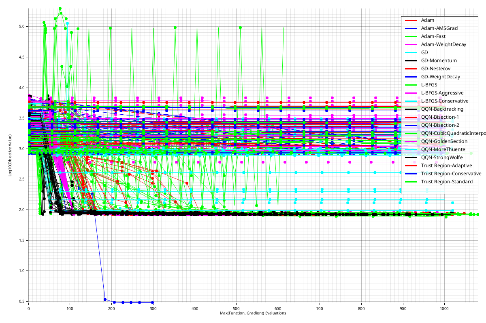

**Figure:** Convergence plots for GoldsteinPrice_2D showing objective value vs iterations.
Left: Linear scale, Right: Log scale for better visualization of convergence behavior.

**Data:** [Linear scale data (CSV)](convergence_GoldsteinPrice_2D_data.csv) | [Log scale data (CSV)](convergence_GoldsteinPrice_2D_log_data.csv)

## Problem: Matyas_2D

**Family:** Convex Unimodal  
**Dimension:** 2  
**Success Threshold:** 1.000e-6  
**Total Runs:** 560

### Performance Summary
<table style="border-collapse: collapse; width: 100%; margin: 20px 0;">
<tr style="background-color: #f2f2f2;">
<th style="border: 1px solid #ddd; padding: 8px; text-align: center;">Rank</th>
<th style="border: 1px solid #ddd; padding: 8px; text-align: center;">Optimizer</th>
<th style="border: 1px solid #ddd; padding: 8px; text-align: center;">Mean Final Value (All/Success/Fail)</th>
<th style="border: 1px solid #ddd; padding: 8px; text-align: center;">Std Dev</th>
<th style="border: 1px solid #ddd; padding: 8px; text-align: center;">Best Value</th>
<th style="border: 1px solid #ddd; padding: 8px; text-align: center;">Worst Value</th>
<th style="border: 1px solid #ddd; padding: 8px; text-align: center;">Mean Function Evals (All/Success/Fail)</th>
<th style="border: 1px solid #ddd; padding: 8px; text-align: center;">Mean Gradient Evals (All/Success/Fail)</th>
<th style="border: 1px solid #ddd; padding: 8px; text-align: center;">Success Rate</th>
<th style="border: 1px solid #ddd; padding: 8px; text-align: center;">Mean Time (s)</th>
</tr>
<tr style="background-color: #d4edda; font-weight: bold;">
<td style="border: 1px solid #ddd; padding: 8px; text-align: center;">1</td>
<td style="border: 1px solid #ddd; padding: 8px; text-align: center;"><a href="detailed_Matyas_2D_QQN-CubicQuadraticInterpolation.md">QQN-CubicQuadraticInterpolation</a></td>
<td style="border: 1px solid #ddd; padding: 8px; text-align: center;">6.82e-14 / 6.82e-14 / -</td>
<td style="border: 1px solid #ddd; padding: 8px; text-align: center;">1.64e-13</td>
<td style="border: 1px solid #ddd; padding: 8px; text-align: center;">4.93e-34</td>
<td style="border: 1px solid #ddd; padding: 8px; text-align: center;">6.69e-13</td>
<td style="border: 1px solid #ddd; padding: 8px; text-align: center;">115.6 / 115.6 / -</td>
<td style="border: 1px solid #ddd; padding: 8px; text-align: center;">162.8 / 162.8 / -</td>
<td style="border: 1px solid #ddd; padding: 8px; text-align: center;">100.0%</td>
<td style="border: 1px solid #ddd; padding: 8px; text-align: center;">0.003</td>
</tr>
<tr style="background-color: #fff3cd;">
<td style="border: 1px solid #ddd; padding: 8px; text-align: center;">2</td>
<td style="border: 1px solid #ddd; padding: 8px; text-align: center;"><a href="detailed_Matyas_2D_QQN-Backtracking.md">QQN-Backtracking</a></td>
<td style="border: 1px solid #ddd; padding: 8px; text-align: center;">2.40e-28 / 2.40e-28 / -</td>
<td style="border: 1px solid #ddd; padding: 8px; text-align: center;">8.84e-28</td>
<td style="border: 1px solid #ddd; padding: 8px; text-align: center;">1.23e-32</td>
<td style="border: 1px solid #ddd; padding: 8px; text-align: center;">4.09e-27</td>
<td style="border: 1px solid #ddd; padding: 8px; text-align: center;">25.0 / 25.0 / -</td>
<td style="border: 1px solid #ddd; padding: 8px; text-align: center;">21.0 / 21.0 / -</td>
<td style="border: 1px solid #ddd; padding: 8px; text-align: center;">100.0%</td>
<td style="border: 1px solid #ddd; padding: 8px; text-align: center;">0.000</td>
</tr>
<tr style="">
<td style="border: 1px solid #ddd; padding: 8px; text-align: center;">3</td>
<td style="border: 1px solid #ddd; padding: 8px; text-align: center;"><a href="detailed_Matyas_2D_QQN-StrongWolfe.md">QQN-StrongWolfe</a></td>
<td style="border: 1px solid #ddd; padding: 8px; text-align: center;">7.82e-29 / 7.82e-29 / -</td>
<td style="border: 1px solid #ddd; padding: 8px; text-align: center;">2.23e-28</td>
<td style="border: 1px solid #ddd; padding: 8px; text-align: center;">3.16e-32</td>
<td style="border: 1px solid #ddd; padding: 8px; text-align: center;">1.04e-27</td>
<td style="border: 1px solid #ddd; padding: 8px; text-align: center;">25.0 / 25.0 / -</td>
<td style="border: 1px solid #ddd; padding: 8px; text-align: center;">26.0 / 26.0 / -</td>
<td style="border: 1px solid #ddd; padding: 8px; text-align: center;">100.0%</td>
<td style="border: 1px solid #ddd; padding: 8px; text-align: center;">0.000</td>
</tr>
<tr style="">
<td style="border: 1px solid #ddd; padding: 8px; text-align: center;">4</td>
<td style="border: 1px solid #ddd; padding: 8px; text-align: center;"><a href="detailed_Matyas_2D_QQN-MoreThuente.md">QQN-MoreThuente</a></td>
<td style="border: 1px solid #ddd; padding: 8px; text-align: center;">1.61e-13 / 1.61e-13 / -</td>
<td style="border: 1px solid #ddd; padding: 8px; text-align: center;">2.21e-13</td>
<td style="border: 1px solid #ddd; padding: 8px; text-align: center;">4.15e-31</td>
<td style="border: 1px solid #ddd; padding: 8px; text-align: center;">6.21e-13</td>
<td style="border: 1px solid #ddd; padding: 8px; text-align: center;">122.5 / 122.5 / -</td>
<td style="border: 1px solid #ddd; padding: 8px; text-align: center;">125.1 / 125.1 / -</td>
<td style="border: 1px solid #ddd; padding: 8px; text-align: center;">100.0%</td>
<td style="border: 1px solid #ddd; padding: 8px; text-align: center;">0.002</td>
</tr>
<tr style="">
<td style="border: 1px solid #ddd; padding: 8px; text-align: center;">5</td>
<td style="border: 1px solid #ddd; padding: 8px; text-align: center;"><a href="detailed_Matyas_2D_QQN-GoldenSection.md">QQN-GoldenSection</a></td>
<td style="border: 1px solid #ddd; padding: 8px; text-align: center;">1.96e-13 / 1.96e-13 / -</td>
<td style="border: 1px solid #ddd; padding: 8px; text-align: center;">3.10e-13</td>
<td style="border: 1px solid #ddd; padding: 8px; text-align: center;">2.39e-24</td>
<td style="border: 1px solid #ddd; padding: 8px; text-align: center;">1.34e-12</td>
<td style="border: 1px solid #ddd; padding: 8px; text-align: center;">348.1 / 348.1 / -</td>
<td style="border: 1px solid #ddd; padding: 8px; text-align: center;">50.8 / 50.8 / -</td>
<td style="border: 1px solid #ddd; padding: 8px; text-align: center;">100.0%</td>
<td style="border: 1px solid #ddd; padding: 8px; text-align: center;">0.005</td>
</tr>
<tr style="">
<td style="border: 1px solid #ddd; padding: 8px; text-align: center;">6</td>
<td style="border: 1px solid #ddd; padding: 8px; text-align: center;"><a href="detailed_Matyas_2D_QQN-Bisection-1.md">QQN-Bisection-1</a></td>
<td style="border: 1px solid #ddd; padding: 8px; text-align: center;">1.96e-13 / 1.96e-13 / -</td>
<td style="border: 1px solid #ddd; padding: 8px; text-align: center;">4.50e-13</td>
<td style="border: 1px solid #ddd; padding: 8px; text-align: center;">5.38e-21</td>
<td style="border: 1px solid #ddd; padding: 8px; text-align: center;">2.80e-12</td>
<td style="border: 1px solid #ddd; padding: 8px; text-align: center;">100.5 / 100.5 / -</td>
<td style="border: 1px solid #ddd; padding: 8px; text-align: center;">136.8 / 136.8 / -</td>
<td style="border: 1px solid #ddd; padding: 8px; text-align: center;">100.0%</td>
<td style="border: 1px solid #ddd; padding: 8px; text-align: center;">0.002</td>
</tr>
<tr style="">
<td style="border: 1px solid #ddd; padding: 8px; text-align: center;">7</td>
<td style="border: 1px solid #ddd; padding: 8px; text-align: center;"><a href="detailed_Matyas_2D_QQN-Bisection-2.md">QQN-Bisection-2</a></td>
<td style="border: 1px solid #ddd; padding: 8px; text-align: center;">3.41e-14 / 3.41e-14 / -</td>
<td style="border: 1px solid #ddd; padding: 8px; text-align: center;">8.26e-14</td>
<td style="border: 1px solid #ddd; padding: 8px; text-align: center;">5.44e-17</td>
<td style="border: 1px solid #ddd; padding: 8px; text-align: center;">3.41e-13</td>
<td style="border: 1px solid #ddd; padding: 8px; text-align: center;">95.7 / 95.7 / -</td>
<td style="border: 1px solid #ddd; padding: 8px; text-align: center;">107.7 / 107.7 / -</td>
<td style="border: 1px solid #ddd; padding: 8px; text-align: center;">100.0%</td>
<td style="border: 1px solid #ddd; padding: 8px; text-align: center;">0.002</td>
</tr>
<tr style="">
<td style="border: 1px solid #ddd; padding: 8px; text-align: center;">8</td>
<td style="border: 1px solid #ddd; padding: 8px; text-align: center;"><a href="detailed_Matyas_2D_L-BFGS-Conservative.md">L-BFGS-Conservative</a></td>
<td style="border: 1px solid #ddd; padding: 8px; text-align: center;">3.12e-6 / - / 3.12e-6</td>
<td style="border: 1px solid #ddd; padding: 8px; text-align: center;">9.97e-6</td>
<td style="border: 1px solid #ddd; padding: 8px; text-align: center;">5.75e-12</td>
<td style="border: 1px solid #ddd; padding: 8px; text-align: center;">4.45e-5</td>
<td style="border: 1px solid #ddd; padding: 8px; text-align: center;">558.5 / - / 558.5</td>
<td style="border: 1px solid #ddd; padding: 8px; text-align: center;">445.6 / - / 445.6</td>
<td style="border: 1px solid #ddd; padding: 8px; text-align: center;">0.0%</td>
<td style="border: 1px solid #ddd; padding: 8px; text-align: center;">0.013</td>
</tr>
<tr style="">
<td style="border: 1px solid #ddd; padding: 8px; text-align: center;">9</td>
<td style="border: 1px solid #ddd; padding: 8px; text-align: center;"><a href="detailed_Matyas_2D_L-BFGS.md">L-BFGS</a></td>
<td style="border: 1px solid #ddd; padding: 8px; text-align: center;">3.00e-3 / 1.07e-11 / 1.33e-2</td>
<td style="border: 1px solid #ddd; padding: 8px; text-align: center;">8.01e-3</td>
<td style="border: 1px solid #ddd; padding: 8px; text-align: center;">1.01e-11</td>
<td style="border: 1px solid #ddd; padding: 8px; text-align: center;">3.10e-2</td>
<td style="border: 1px solid #ddd; padding: 8px; text-align: center;">365.4 / 384.0 / 363.4</td>
<td style="border: 1px solid #ddd; padding: 8px; text-align: center;">265.8 / 290.0 / 263.1</td>
<td style="border: 1px solid #ddd; padding: 8px; text-align: center;">10.0%</td>
<td style="border: 1px solid #ddd; padding: 8px; text-align: center;">0.008</td>
</tr>
<tr style="">
<td style="border: 1px solid #ddd; padding: 8px; text-align: center;">10</td>
<td style="border: 1px solid #ddd; padding: 8px; text-align: center;"><a href="detailed_Matyas_2D_L-BFGS-Aggressive.md">L-BFGS-Aggressive</a></td>
<td style="border: 1px solid #ddd; padding: 8px; text-align: center;">2.19e-3 / - / 2.19e-3</td>
<td style="border: 1px solid #ddd; padding: 8px; text-align: center;">7.23e-3</td>
<td style="border: 1px solid #ddd; padding: 8px; text-align: center;">7.54e-7</td>
<td style="border: 1px solid #ddd; padding: 8px; text-align: center;">3.66e-2</td>
<td style="border: 1px solid #ddd; padding: 8px; text-align: center;">728.6 / - / 728.6</td>
<td style="border: 1px solid #ddd; padding: 8px; text-align: center;">279.8 / - / 279.8</td>
<td style="border: 1px solid #ddd; padding: 8px; text-align: center;">0.0%</td>
<td style="border: 1px solid #ddd; padding: 8px; text-align: center;">0.010</td>
</tr>
<tr style="">
<td style="border: 1px solid #ddd; padding: 8px; text-align: center;">11</td>
<td style="border: 1px solid #ddd; padding: 8px; text-align: center;"><a href="detailed_Matyas_2D_Adam-Fast.md">Adam-Fast</a></td>
<td style="border: 1px solid #ddd; padding: 8px; text-align: center;">8.19e-5 / 2.63e-3 / 1.19e-3</td>
<td style="border: 1px solid #ddd; padding: 8px; text-align: center;">6.49e-5</td>
<td style="border: 1px solid #ddd; padding: 8px; text-align: center;">8.07e-7</td>
<td style="border: 1px solid #ddd; padding: 8px; text-align: center;">2.01e-4</td>
<td style="border: 1px solid #ddd; padding: 8px; text-align: center;">55.1 / 39.0 / 55.5</td>
<td style="border: 1px solid #ddd; padding: 8px; text-align: center;">54.1 / 38.0 / 54.5</td>
<td style="border: 1px solid #ddd; padding: 8px; text-align: center;">2.5%</td>
<td style="border: 1px solid #ddd; padding: 8px; text-align: center;">0.001</td>
</tr>
<tr style="">
<td style="border: 1px solid #ddd; padding: 8px; text-align: center;">12</td>
<td style="border: 1px solid #ddd; padding: 8px; text-align: center;"><a href="detailed_Matyas_2D_GD-Momentum.md">GD-Momentum</a></td>
<td style="border: 1px solid #ddd; padding: 8px; text-align: center;">2.79e-3 / - / 2.79e-3</td>
<td style="border: 1px solid #ddd; padding: 8px; text-align: center;">4.25e-4</td>
<td style="border: 1px solid #ddd; padding: 8px; text-align: center;">2.06e-3</td>
<td style="border: 1px solid #ddd; padding: 8px; text-align: center;">3.47e-3</td>
<td style="border: 1px solid #ddd; padding: 8px; text-align: center;">335.0 / - / 335.0</td>
<td style="border: 1px solid #ddd; padding: 8px; text-align: center;">668.0 / - / 668.0</td>
<td style="border: 1px solid #ddd; padding: 8px; text-align: center;">0.0%</td>
<td style="border: 1px solid #ddd; padding: 8px; text-align: center;">0.009</td>
</tr>
<tr style="">
<td style="border: 1px solid #ddd; padding: 8px; text-align: center;">13</td>
<td style="border: 1px solid #ddd; padding: 8px; text-align: center;"><a href="detailed_Matyas_2D_GD-Nesterov.md">GD-Nesterov</a></td>
<td style="border: 1px solid #ddd; padding: 8px; text-align: center;">2.81e-3 / - / 2.81e-3</td>
<td style="border: 1px solid #ddd; padding: 8px; text-align: center;">3.47e-4</td>
<td style="border: 1px solid #ddd; padding: 8px; text-align: center;">2.31e-3</td>
<td style="border: 1px solid #ddd; padding: 8px; text-align: center;">3.51e-3</td>
<td style="border: 1px solid #ddd; padding: 8px; text-align: center;">335.0 / - / 335.0</td>
<td style="border: 1px solid #ddd; padding: 8px; text-align: center;">668.0 / - / 668.0</td>
<td style="border: 1px solid #ddd; padding: 8px; text-align: center;">0.0%</td>
<td style="border: 1px solid #ddd; padding: 8px; text-align: center;">0.009</td>
</tr>
<tr style="">
<td style="border: 1px solid #ddd; padding: 8px; text-align: center;">14</td>
<td style="border: 1px solid #ddd; padding: 8px; text-align: center;"><a href="detailed_Matyas_2D_Adam-WeightDecay.md">Adam-WeightDecay</a></td>
<td style="border: 1px solid #ddd; padding: 8px; text-align: center;">1.05e-2 / - / 1.05e-2</td>
<td style="border: 1px solid #ddd; padding: 8px; text-align: center;">4.47e-3</td>
<td style="border: 1px solid #ddd; padding: 8px; text-align: center;">2.97e-3</td>
<td style="border: 1px solid #ddd; padding: 8px; text-align: center;">1.90e-2</td>
<td style="border: 1px solid #ddd; padding: 8px; text-align: center;">502.0 / - / 502.0</td>
<td style="border: 1px solid #ddd; padding: 8px; text-align: center;">502.0 / - / 502.0</td>
<td style="border: 1px solid #ddd; padding: 8px; text-align: center;">0.0%</td>
<td style="border: 1px solid #ddd; padding: 8px; text-align: center;">0.010</td>
</tr>
<tr style="">
<td style="border: 1px solid #ddd; padding: 8px; text-align: center;">15</td>
<td style="border: 1px solid #ddd; padding: 8px; text-align: center;"><a href="detailed_Matyas_2D_GD-WeightDecay.md">GD-WeightDecay</a></td>
<td style="border: 1px solid #ddd; padding: 8px; text-align: center;">2.17e-2 / - / 2.17e-2</td>
<td style="border: 1px solid #ddd; padding: 8px; text-align: center;">3.15e-3</td>
<td style="border: 1px solid #ddd; padding: 8px; text-align: center;">1.60e-2</td>
<td style="border: 1px solid #ddd; padding: 8px; text-align: center;">2.74e-2</td>
<td style="border: 1px solid #ddd; padding: 8px; text-align: center;">335.0 / - / 335.0</td>
<td style="border: 1px solid #ddd; padding: 8px; text-align: center;">668.0 / - / 668.0</td>
<td style="border: 1px solid #ddd; padding: 8px; text-align: center;">0.0%</td>
<td style="border: 1px solid #ddd; padding: 8px; text-align: center;">0.010</td>
</tr>
<tr style="">
<td style="border: 1px solid #ddd; padding: 8px; text-align: center;">16</td>
<td style="border: 1px solid #ddd; padding: 8px; text-align: center;"><a href="detailed_Matyas_2D_Adam.md">Adam</a></td>
<td style="border: 1px solid #ddd; padding: 8px; text-align: center;">2.77e-2 / - / 2.77e-2</td>
<td style="border: 1px solid #ddd; padding: 8px; text-align: center;">5.76e-3</td>
<td style="border: 1px solid #ddd; padding: 8px; text-align: center;">1.87e-2</td>
<td style="border: 1px solid #ddd; padding: 8px; text-align: center;">3.88e-2</td>
<td style="border: 1px solid #ddd; padding: 8px; text-align: center;">502.0 / - / 502.0</td>
<td style="border: 1px solid #ddd; padding: 8px; text-align: center;">502.0 / - / 502.0</td>
<td style="border: 1px solid #ddd; padding: 8px; text-align: center;">0.0%</td>
<td style="border: 1px solid #ddd; padding: 8px; text-align: center;">0.009</td>
</tr>
<tr style="">
<td style="border: 1px solid #ddd; padding: 8px; text-align: center;">17</td>
<td style="border: 1px solid #ddd; padding: 8px; text-align: center;"><a href="detailed_Matyas_2D_Adam-AMSGrad.md">Adam-AMSGrad</a></td>
<td style="border: 1px solid #ddd; padding: 8px; text-align: center;">2.90e-2 / - / 2.90e-2</td>
<td style="border: 1px solid #ddd; padding: 8px; text-align: center;">6.92e-3</td>
<td style="border: 1px solid #ddd; padding: 8px; text-align: center;">1.87e-2</td>
<td style="border: 1px solid #ddd; padding: 8px; text-align: center;">3.87e-2</td>
<td style="border: 1px solid #ddd; padding: 8px; text-align: center;">502.0 / - / 502.0</td>
<td style="border: 1px solid #ddd; padding: 8px; text-align: center;">502.0 / - / 502.0</td>
<td style="border: 1px solid #ddd; padding: 8px; text-align: center;">0.0%</td>
<td style="border: 1px solid #ddd; padding: 8px; text-align: center;">0.011</td>
</tr>
<tr style="">
<td style="border: 1px solid #ddd; padding: 8px; text-align: center;">18</td>
<td style="border: 1px solid #ddd; padding: 8px; text-align: center;"><a href="detailed_Matyas_2D_GD.md">GD</a></td>
<td style="border: 1px solid #ddd; padding: 8px; text-align: center;">3.10e-2 / - / 3.10e-2</td>
<td style="border: 1px solid #ddd; padding: 8px; text-align: center;">4.61e-3</td>
<td style="border: 1px solid #ddd; padding: 8px; text-align: center;">2.29e-2</td>
<td style="border: 1px solid #ddd; padding: 8px; text-align: center;">4.05e-2</td>
<td style="border: 1px solid #ddd; padding: 8px; text-align: center;">335.0 / - / 335.0</td>
<td style="border: 1px solid #ddd; padding: 8px; text-align: center;">668.0 / - / 668.0</td>
<td style="border: 1px solid #ddd; padding: 8px; text-align: center;">0.0%</td>
<td style="border: 1px solid #ddd; padding: 8px; text-align: center;">0.008</td>
</tr>
<tr style="">
<td style="border: 1px solid #ddd; padding: 8px; text-align: center;">19</td>
<td style="border: 1px solid #ddd; padding: 8px; text-align: center;"><a href="detailed_Matyas_2D_Trust_Region-Adaptive.md">Trust Region-Adaptive</a></td>
<td style="border: 1px solid #ddd; padding: 8px; text-align: center;">4.57e-2 / - / 5.58e-2</td>
<td style="border: 1px solid #ddd; padding: 8px; text-align: center;">1.20e-2</td>
<td style="border: 1px solid #ddd; padding: 8px; text-align: center;">2.63e-2</td>
<td style="border: 1px solid #ddd; padding: 8px; text-align: center;">6.45e-2</td>
<td style="border: 1px solid #ddd; padding: 8px; text-align: center;">5.9 / - / 5.9</td>
<td style="border: 1px solid #ddd; padding: 8px; text-align: center;">4.6 / - / 4.6</td>
<td style="border: 1px solid #ddd; padding: 8px; text-align: center;">0.0%</td>
<td style="border: 1px solid #ddd; padding: 8px; text-align: center;">0.000</td>
</tr>
<tr style="">
<td style="border: 1px solid #ddd; padding: 8px; text-align: center;">20</td>
<td style="border: 1px solid #ddd; padding: 8px; text-align: center;"><a href="detailed_Matyas_2D_Trust_Region-Standard.md">Trust Region-Standard</a></td>
<td style="border: 1px solid #ddd; padding: 8px; text-align: center;">4.42e-2 / - / 2.26e-1</td>
<td style="border: 1px solid #ddd; padding: 8px; text-align: center;">9.30e-3</td>
<td style="border: 1px solid #ddd; padding: 8px; text-align: center;">2.67e-2</td>
<td style="border: 1px solid #ddd; padding: 8px; text-align: center;">6.57e-2</td>
<td style="border: 1px solid #ddd; padding: 8px; text-align: center;">7.1 / - / 7.1</td>
<td style="border: 1px solid #ddd; padding: 8px; text-align: center;">5.4 / - / 5.4</td>
<td style="border: 1px solid #ddd; padding: 8px; text-align: center;">0.0%</td>
<td style="border: 1px solid #ddd; padding: 8px; text-align: center;">0.000</td>
</tr>
<tr style="">
<td style="border: 1px solid #ddd; padding: 8px; text-align: center;">21</td>
<td style="border: 1px solid #ddd; padding: 8px; text-align: center;"><a href="detailed_Matyas_2D_Trust_Region-Conservative.md">Trust Region-Conservative</a></td>
<td style="border: 1px solid #ddd; padding: 8px; text-align: center;">4.02e-2 / - / 4.02e-2</td>
<td style="border: 1px solid #ddd; padding: 8px; text-align: center;">6.25e-3</td>
<td style="border: 1px solid #ddd; padding: 8px; text-align: center;">2.95e-2</td>
<td style="border: 1px solid #ddd; padding: 8px; text-align: center;">5.19e-2</td>
<td style="border: 1px solid #ddd; padding: 8px; text-align: center;">7.4 / - / 7.4</td>
<td style="border: 1px solid #ddd; padding: 8px; text-align: center;">5.6 / - / 5.6</td>
<td style="border: 1px solid #ddd; padding: 8px; text-align: center;">0.0%</td>
<td style="border: 1px solid #ddd; padding: 8px; text-align: center;">0.000</td>
</tr>
</table>

### Convergence Plots

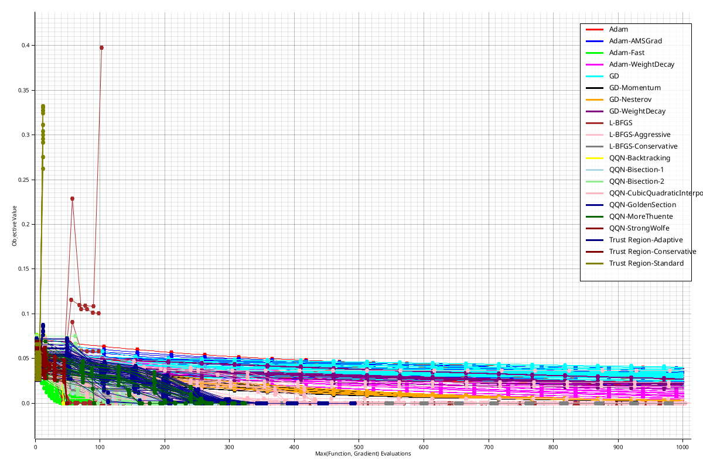
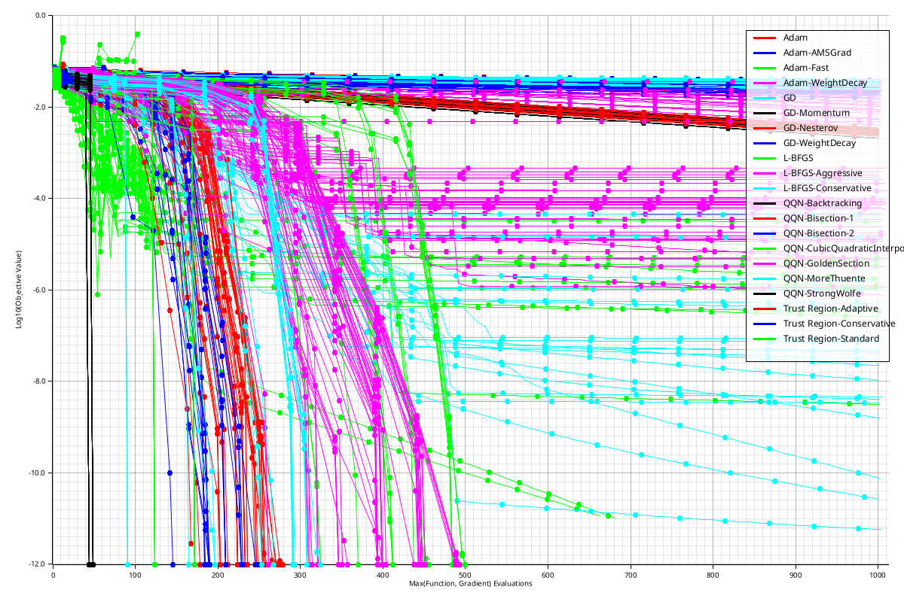

**Figure:** Convergence plots for Matyas_2D showing objective value vs iterations.
Left: Linear scale, Right: Log scale for better visualization of convergence behavior.

**Data:** [Linear scale data (CSV)](convergence_Matyas_2D_data.csv) | [Log scale data (CSV)](convergence_Matyas_2D_log_data.csv)

## Problem: Himmelblau_2D

**Family:** Himmelblau  
**Dimension:** 2  
**Success Threshold:** 1.000e-8  
**Total Runs:** 560

### Performance Summary
<table style="border-collapse: collapse; width: 100%; margin: 20px 0;">
<tr style="background-color: #f2f2f2;">
<th style="border: 1px solid #ddd; padding: 8px; text-align: center;">Rank</th>
<th style="border: 1px solid #ddd; padding: 8px; text-align: center;">Optimizer</th>
<th style="border: 1px solid #ddd; padding: 8px; text-align: center;">Mean Final Value (All/Success/Fail)</th>
<th style="border: 1px solid #ddd; padding: 8px; text-align: center;">Std Dev</th>
<th style="border: 1px solid #ddd; padding: 8px; text-align: center;">Best Value</th>
<th style="border: 1px solid #ddd; padding: 8px; text-align: center;">Worst Value</th>
<th style="border: 1px solid #ddd; padding: 8px; text-align: center;">Mean Function Evals (All/Success/Fail)</th>
<th style="border: 1px solid #ddd; padding: 8px; text-align: center;">Mean Gradient Evals (All/Success/Fail)</th>
<th style="border: 1px solid #ddd; padding: 8px; text-align: center;">Success Rate</th>
<th style="border: 1px solid #ddd; padding: 8px; text-align: center;">Mean Time (s)</th>
</tr>
<tr style="background-color: #d4edda; font-weight: bold;">
<td style="border: 1px solid #ddd; padding: 8px; text-align: center;">1</td>
<td style="border: 1px solid #ddd; padding: 8px; text-align: center;"><a href="detailed_Himmelblau_2D_QQN-GoldenSection.md">QQN-GoldenSection</a></td>
<td style="border: 1px solid #ddd; padding: 8px; text-align: center;">5.41e-12 / 1.42e-15 / 3.61e-11</td>
<td style="border: 1px solid #ddd; padding: 8px; text-align: center;">1.51e-11</td>
<td style="border: 1px solid #ddd; padding: 8px; text-align: center;">6.54e-23</td>
<td style="border: 1px solid #ddd; padding: 8px; text-align: center;">5.65e-11</td>
<td style="border: 1px solid #ddd; padding: 8px; text-align: center;">395.7 / 317.2 / 840.7</td>
<td style="border: 1px solid #ddd; padding: 8px; text-align: center;">63.4 / 45.2 / 166.3</td>
<td style="border: 1px solid #ddd; padding: 8px; text-align: center;">85.0%</td>
<td style="border: 1px solid #ddd; padding: 8px; text-align: center;">0.006</td>
</tr>
<tr style="background-color: #fff3cd;">
<td style="border: 1px solid #ddd; padding: 8px; text-align: center;">2</td>
<td style="border: 1px solid #ddd; padding: 8px; text-align: center;"><a href="detailed_Himmelblau_2D_QQN-Bisection-2.md">QQN-Bisection-2</a></td>
<td style="border: 1px solid #ddd; padding: 8px; text-align: center;">1.23e-15 / 1.23e-15 / -</td>
<td style="border: 1px solid #ddd; padding: 8px; text-align: center;">2.03e-15</td>
<td style="border: 1px solid #ddd; padding: 8px; text-align: center;">2.42e-22</td>
<td style="border: 1px solid #ddd; padding: 8px; text-align: center;">7.54e-15</td>
<td style="border: 1px solid #ddd; padding: 8px; text-align: center;">114.4 / 114.4 / -</td>
<td style="border: 1px solid #ddd; padding: 8px; text-align: center;">121.3 / 121.3 / -</td>
<td style="border: 1px solid #ddd; padding: 8px; text-align: center;">100.0%</td>
<td style="border: 1px solid #ddd; padding: 8px; text-align: center;">0.002</td>
</tr>
<tr style="">
<td style="border: 1px solid #ddd; padding: 8px; text-align: center;">3</td>
<td style="border: 1px solid #ddd; padding: 8px; text-align: center;"><a href="detailed_Himmelblau_2D_QQN-Bisection-1.md">QQN-Bisection-1</a></td>
<td style="border: 1px solid #ddd; padding: 8px; text-align: center;">9.24e-7 / 9.03e-16 / 1.23e-5</td>
<td style="border: 1px solid #ddd; padding: 8px; text-align: center;">5.65e-6</td>
<td style="border: 1px solid #ddd; padding: 8px; text-align: center;">3.76e-22</td>
<td style="border: 1px solid #ddd; padding: 8px; text-align: center;">3.62e-5</td>
<td style="border: 1px solid #ddd; padding: 8px; text-align: center;">193.6 / 168.0 / 509.3</td>
<td style="border: 1px solid #ddd; padding: 8px; text-align: center;">230.9 / 204.9 / 551.3</td>
<td style="border: 1px solid #ddd; padding: 8px; text-align: center;">92.5%</td>
<td style="border: 1px solid #ddd; padding: 8px; text-align: center;">0.003</td>
</tr>
<tr style="">
<td style="border: 1px solid #ddd; padding: 8px; text-align: center;">4</td>
<td style="border: 1px solid #ddd; padding: 8px; text-align: center;"><a href="detailed_Himmelblau_2D_QQN-CubicQuadraticInterpolation.md">QQN-CubicQuadraticInterpolation</a></td>
<td style="border: 1px solid #ddd; padding: 8px; text-align: center;">1.55e-4 / 1.41e-15 / 8.88e-4</td>
<td style="border: 1px solid #ddd; padding: 8px; text-align: center;">9.70e-4</td>
<td style="border: 1px solid #ddd; padding: 8px; text-align: center;">7.85e-21</td>
<td style="border: 1px solid #ddd; padding: 8px; text-align: center;">6.22e-3</td>
<td style="border: 1px solid #ddd; padding: 8px; text-align: center;">249.8 / 201.7 / 476.3</td>
<td style="border: 1px solid #ddd; padding: 8px; text-align: center;">333.6 / 288.1 / 548.6</td>
<td style="border: 1px solid #ddd; padding: 8px; text-align: center;">82.5%</td>
<td style="border: 1px solid #ddd; padding: 8px; text-align: center;">0.007</td>
</tr>
<tr style="">
<td style="border: 1px solid #ddd; padding: 8px; text-align: center;">5</td>
<td style="border: 1px solid #ddd; padding: 8px; text-align: center;"><a href="detailed_Himmelblau_2D_QQN-Backtracking.md">QQN-Backtracking</a></td>
<td style="border: 1px solid #ddd; padding: 8px; text-align: center;">1.14e-15 / 1.14e-15 / -</td>
<td style="border: 1px solid #ddd; padding: 8px; text-align: center;">1.33e-15</td>
<td style="border: 1px solid #ddd; padding: 8px; text-align: center;">1.00e-20</td>
<td style="border: 1px solid #ddd; padding: 8px; text-align: center;">4.33e-15</td>
<td style="border: 1px solid #ddd; padding: 8px; text-align: center;">154.7 / 154.7 / -</td>
<td style="border: 1px solid #ddd; padding: 8px; text-align: center;">100.8 / 100.8 / -</td>
<td style="border: 1px solid #ddd; padding: 8px; text-align: center;">100.0%</td>
<td style="border: 1px solid #ddd; padding: 8px; text-align: center;">0.004</td>
</tr>
<tr style="">
<td style="border: 1px solid #ddd; padding: 8px; text-align: center;">6</td>
<td style="border: 1px solid #ddd; padding: 8px; text-align: center;"><a href="detailed_Himmelblau_2D_QQN-StrongWolfe.md">QQN-StrongWolfe</a></td>
<td style="border: 1px solid #ddd; padding: 8px; text-align: center;">2.66e-5 / 1.26e-15 / 5.31e-4</td>
<td style="border: 1px solid #ddd; padding: 8px; text-align: center;">1.16e-4</td>
<td style="border: 1px solid #ddd; padding: 8px; text-align: center;">1.79e-20</td>
<td style="border: 1px solid #ddd; padding: 8px; text-align: center;">5.31e-4</td>
<td style="border: 1px solid #ddd; padding: 8px; text-align: center;">217.1 / 200.1 / 540.0</td>
<td style="border: 1px solid #ddd; padding: 8px; text-align: center;">196.1 / 181.8 / 466.0</td>
<td style="border: 1px solid #ddd; padding: 8px; text-align: center;">95.0%</td>
<td style="border: 1px solid #ddd; padding: 8px; text-align: center;">0.005</td>
</tr>
<tr style="">
<td style="border: 1px solid #ddd; padding: 8px; text-align: center;">7</td>
<td style="border: 1px solid #ddd; padding: 8px; text-align: center;"><a href="detailed_Himmelblau_2D_QQN-MoreThuente.md">QQN-MoreThuente</a></td>
<td style="border: 1px solid #ddd; padding: 8px; text-align: center;">3.74e1 / 2.73e-16 / 5.35e1</td>
<td style="border: 1px solid #ddd; padding: 8px; text-align: center;">4.68e1</td>
<td style="border: 1px solid #ddd; padding: 8px; text-align: center;">2.76e-18</td>
<td style="border: 1px solid #ddd; padding: 8px; text-align: center;">1.48e2</td>
<td style="border: 1px solid #ddd; padding: 8px; text-align: center;">383.1 / 147.3 / 484.1</td>
<td style="border: 1px solid #ddd; padding: 8px; text-align: center;">417.1 / 149.7 / 531.7</td>
<td style="border: 1px solid #ddd; padding: 8px; text-align: center;">30.0%</td>
<td style="border: 1px solid #ddd; padding: 8px; text-align: center;">0.008</td>
</tr>
<tr style="">
<td style="border: 1px solid #ddd; padding: 8px; text-align: center;">8</td>
<td style="border: 1px solid #ddd; padding: 8px; text-align: center;"><a href="detailed_Himmelblau_2D_L-BFGS-Conservative.md">L-BFGS-Conservative</a></td>
<td style="border: 1px solid #ddd; padding: 8px; text-align: center;">2.05e-7 / 7.80e-15 / 2.16e-7</td>
<td style="border: 1px solid #ddd; padding: 8px; text-align: center;">4.33e-7</td>
<td style="border: 1px solid #ddd; padding: 8px; text-align: center;">7.80e-15</td>
<td style="border: 1px solid #ddd; padding: 8px; text-align: center;">1.60e-6</td>
<td style="border: 1px solid #ddd; padding: 8px; text-align: center;">565.5 / 426.0 / 572.9</td>
<td style="border: 1px solid #ddd; padding: 8px; text-align: center;">428.6 / 325.0 / 434.1</td>
<td style="border: 1px solid #ddd; padding: 8px; text-align: center;">5.0%</td>
<td style="border: 1px solid #ddd; padding: 8px; text-align: center;">0.012</td>
</tr>
<tr style="">
<td style="border: 1px solid #ddd; padding: 8px; text-align: center;">9</td>
<td style="border: 1px solid #ddd; padding: 8px; text-align: center;"><a href="detailed_Himmelblau_2D_GD-Nesterov.md">GD-Nesterov</a></td>
<td style="border: 1px solid #ddd; padding: 8px; text-align: center;">2.16e0 / 7.36e-10 / 1.37e1</td>
<td style="border: 1px solid #ddd; padding: 8px; text-align: center;">3.32e0</td>
<td style="border: 1px solid #ddd; padding: 8px; text-align: center;">2.81e-12</td>
<td style="border: 1px solid #ddd; padding: 8px; text-align: center;">1.28e1</td>
<td style="border: 1px solid #ddd; padding: 8px; text-align: center;">41.2 / 72.9 / 24.2</td>
<td style="border: 1px solid #ddd; padding: 8px; text-align: center;">79.0 / 143.4 / 44.3</td>
<td style="border: 1px solid #ddd; padding: 8px; text-align: center;">35.0%</td>
<td style="border: 1px solid #ddd; padding: 8px; text-align: center;">0.001</td>
</tr>
<tr style="">
<td style="border: 1px solid #ddd; padding: 8px; text-align: center;">10</td>
<td style="border: 1px solid #ddd; padding: 8px; text-align: center;"><a href="detailed_Himmelblau_2D_GD.md">GD</a></td>
<td style="border: 1px solid #ddd; padding: 8px; text-align: center;">1.44e-10 / 1.44e-10 / -</td>
<td style="border: 1px solid #ddd; padding: 8px; text-align: center;">2.48e-11</td>
<td style="border: 1px solid #ddd; padding: 8px; text-align: center;">1.08e-10</td>
<td style="border: 1px solid #ddd; padding: 8px; text-align: center;">1.94e-10</td>
<td style="border: 1px solid #ddd; padding: 8px; text-align: center;">78.5 / 78.5 / -</td>
<td style="border: 1px solid #ddd; padding: 8px; text-align: center;">155.1 / 155.1 / -</td>
<td style="border: 1px solid #ddd; padding: 8px; text-align: center;">100.0%</td>
<td style="border: 1px solid #ddd; padding: 8px; text-align: center;">0.002</td>
</tr>
<tr style="">
<td style="border: 1px solid #ddd; padding: 8px; text-align: center;">11</td>
<td style="border: 1px solid #ddd; padding: 8px; text-align: center;"><a href="detailed_Himmelblau_2D_GD-WeightDecay.md">GD-WeightDecay</a></td>
<td style="border: 1px solid #ddd; padding: 8px; text-align: center;">1.71e-1 / - / 4.57e-1</td>
<td style="border: 1px solid #ddd; padding: 8px; text-align: center;">1.78e-1</td>
<td style="border: 1px solid #ddd; padding: 8px; text-align: center;">2.48e-7</td>
<td style="border: 1px solid #ddd; padding: 8px; text-align: center;">7.44e-1</td>
<td style="border: 1px solid #ddd; padding: 8px; text-align: center;">40.9 / - / 40.9</td>
<td style="border: 1px solid #ddd; padding: 8px; text-align: center;">77.8 / - / 77.8</td>
<td style="border: 1px solid #ddd; padding: 8px; text-align: center;">0.0%</td>
<td style="border: 1px solid #ddd; padding: 8px; text-align: center;">0.001</td>
</tr>
<tr style="">
<td style="border: 1px solid #ddd; padding: 8px; text-align: center;">12</td>
<td style="border: 1px solid #ddd; padding: 8px; text-align: center;"><a href="detailed_Himmelblau_2D_L-BFGS.md">L-BFGS</a></td>
<td style="border: 1px solid #ddd; padding: 8px; text-align: center;">2.25e0 / - / 1.01e1</td>
<td style="border: 1px solid #ddd; padding: 8px; text-align: center;">2.53e0</td>
<td style="border: 1px solid #ddd; padding: 8px; text-align: center;">3.26e-4</td>
<td style="border: 1px solid #ddd; padding: 8px; text-align: center;">7.91e0</td>
<td style="border: 1px solid #ddd; padding: 8px; text-align: center;">145.4 / - / 145.4</td>
<td style="border: 1px solid #ddd; padding: 8px; text-align: center;">60.8 / - / 60.8</td>
<td style="border: 1px solid #ddd; padding: 8px; text-align: center;">0.0%</td>
<td style="border: 1px solid #ddd; padding: 8px; text-align: center;">0.002</td>
</tr>
<tr style="">
<td style="border: 1px solid #ddd; padding: 8px; text-align: center;">13</td>
<td style="border: 1px solid #ddd; padding: 8px; text-align: center;"><a href="detailed_Himmelblau_2D_Trust_Region-Standard.md">Trust Region-Standard</a></td>
<td style="border: 1px solid #ddd; padding: 8px; text-align: center;">1.46e-1 / - / 1.46e-1</td>
<td style="border: 1px solid #ddd; padding: 8px; text-align: center;">1.04e-1</td>
<td style="border: 1px solid #ddd; padding: 8px; text-align: center;">1.42e-2</td>
<td style="border: 1px solid #ddd; padding: 8px; text-align: center;">3.64e-1</td>
<td style="border: 1px solid #ddd; padding: 8px; text-align: center;">514.7 / - / 514.7</td>
<td style="border: 1px solid #ddd; padding: 8px; text-align: center;">343.8 / - / 343.8</td>
<td style="border: 1px solid #ddd; padding: 8px; text-align: center;">0.0%</td>
<td style="border: 1px solid #ddd; padding: 8px; text-align: center;">0.003</td>
</tr>
<tr style="">
<td style="border: 1px solid #ddd; padding: 8px; text-align: center;">14</td>
<td style="border: 1px solid #ddd; padding: 8px; text-align: center;"><a href="detailed_Himmelblau_2D_GD-Momentum.md">GD-Momentum</a></td>
<td style="border: 1px solid #ddd; padding: 8px; text-align: center;">8.84e0 / - / 3.41e1</td>
<td style="border: 1px solid #ddd; padding: 8px; text-align: center;">9.54e0</td>
<td style="border: 1px solid #ddd; padding: 8px; text-align: center;">9.46e-2</td>
<td style="border: 1px solid #ddd; padding: 8px; text-align: center;">2.97e1</td>
<td style="border: 1px solid #ddd; padding: 8px; text-align: center;">26.6 / - / 26.6</td>
<td style="border: 1px solid #ddd; padding: 8px; text-align: center;">49.1 / - / 49.1</td>
<td style="border: 1px solid #ddd; padding: 8px; text-align: center;">0.0%</td>
<td style="border: 1px solid #ddd; padding: 8px; text-align: center;">0.001</td>
</tr>
<tr style="">
<td style="border: 1px solid #ddd; padding: 8px; text-align: center;">15</td>
<td style="border: 1px solid #ddd; padding: 8px; text-align: center;"><a href="detailed_Himmelblau_2D_Adam-Fast.md">Adam-Fast</a></td>
<td style="border: 1px solid #ddd; padding: 8px; text-align: center;">3.39e0 / - / 4.99e0</td>
<td style="border: 1px solid #ddd; padding: 8px; text-align: center;">1.14e0</td>
<td style="border: 1px solid #ddd; padding: 8px; text-align: center;">9.92e-2</td>
<td style="border: 1px solid #ddd; padding: 8px; text-align: center;">5.32e0</td>
<td style="border: 1px solid #ddd; padding: 8px; text-align: center;">70.3 / - / 70.3</td>
<td style="border: 1px solid #ddd; padding: 8px; text-align: center;">69.3 / - / 69.3</td>
<td style="border: 1px solid #ddd; padding: 8px; text-align: center;">0.0%</td>
<td style="border: 1px solid #ddd; padding: 8px; text-align: center;">0.001</td>
</tr>
<tr style="">
<td style="border: 1px solid #ddd; padding: 8px; text-align: center;">16</td>
<td style="border: 1px solid #ddd; padding: 8px; text-align: center;"><a href="detailed_Himmelblau_2D_L-BFGS-Aggressive.md">L-BFGS-Aggressive</a></td>
<td style="border: 1px solid #ddd; padding: 8px; text-align: center;">8.27e1 / - / 8.27e1</td>
<td style="border: 1px solid #ddd; padding: 8px; text-align: center;">4.32e1</td>
<td style="border: 1px solid #ddd; padding: 8px; text-align: center;">1.89e0</td>
<td style="border: 1px solid #ddd; padding: 8px; text-align: center;">1.47e2</td>
<td style="border: 1px solid #ddd; padding: 8px; text-align: center;">770.9 / - / 770.9</td>
<td style="border: 1px solid #ddd; padding: 8px; text-align: center;">233.0 / - / 233.0</td>
<td style="border: 1px solid #ddd; padding: 8px; text-align: center;">0.0%</td>
<td style="border: 1px solid #ddd; padding: 8px; text-align: center;">0.005</td>
</tr>
<tr style="">
<td style="border: 1px solid #ddd; padding: 8px; text-align: center;">17</td>
<td style="border: 1px solid #ddd; padding: 8px; text-align: center;"><a href="detailed_Himmelblau_2D_Trust_Region-Adaptive.md">Trust Region-Adaptive</a></td>
<td style="border: 1px solid #ddd; padding: 8px; text-align: center;">1.19e2 / - / 1.19e2</td>
<td style="border: 1px solid #ddd; padding: 8px; text-align: center;">2.79e0</td>
<td style="border: 1px solid #ddd; padding: 8px; text-align: center;">1.14e2</td>
<td style="border: 1px solid #ddd; padding: 8px; text-align: center;">1.24e2</td>
<td style="border: 1px solid #ddd; padding: 8px; text-align: center;">602.0 / - / 602.0</td>
<td style="border: 1px solid #ddd; padding: 8px; text-align: center;">402.0 / - / 402.0</td>
<td style="border: 1px solid #ddd; padding: 8px; text-align: center;">0.0%</td>
<td style="border: 1px solid #ddd; padding: 8px; text-align: center;">0.003</td>
</tr>
<tr style="">
<td style="border: 1px solid #ddd; padding: 8px; text-align: center;">18</td>
<td style="border: 1px solid #ddd; padding: 8px; text-align: center;"><a href="detailed_Himmelblau_2D_Adam-WeightDecay.md">Adam-WeightDecay</a></td>
<td style="border: 1px solid #ddd; padding: 8px; text-align: center;">1.24e2 / - / 1.24e2</td>
<td style="border: 1px solid #ddd; padding: 8px; text-align: center;">5.57e0</td>
<td style="border: 1px solid #ddd; padding: 8px; text-align: center;">1.16e2</td>
<td style="border: 1px solid #ddd; padding: 8px; text-align: center;">1.37e2</td>
<td style="border: 1px solid #ddd; padding: 8px; text-align: center;">502.0 / - / 502.0</td>
<td style="border: 1px solid #ddd; padding: 8px; text-align: center;">502.0 / - / 502.0</td>
<td style="border: 1px solid #ddd; padding: 8px; text-align: center;">0.0%</td>
<td style="border: 1px solid #ddd; padding: 8px; text-align: center;">0.010</td>
</tr>
<tr style="">
<td style="border: 1px solid #ddd; padding: 8px; text-align: center;">19</td>
<td style="border: 1px solid #ddd; padding: 8px; text-align: center;"><a href="detailed_Himmelblau_2D_Adam.md">Adam</a></td>
<td style="border: 1px solid #ddd; padding: 8px; text-align: center;">1.57e2 / - / 1.57e2</td>
<td style="border: 1px solid #ddd; padding: 8px; text-align: center;">3.49e0</td>
<td style="border: 1px solid #ddd; padding: 8px; text-align: center;">1.50e2</td>
<td style="border: 1px solid #ddd; padding: 8px; text-align: center;">1.63e2</td>
<td style="border: 1px solid #ddd; padding: 8px; text-align: center;">502.0 / - / 502.0</td>
<td style="border: 1px solid #ddd; padding: 8px; text-align: center;">502.0 / - / 502.0</td>
<td style="border: 1px solid #ddd; padding: 8px; text-align: center;">0.0%</td>
<td style="border: 1px solid #ddd; padding: 8px; text-align: center;">0.010</td>
</tr>
<tr style="">
<td style="border: 1px solid #ddd; padding: 8px; text-align: center;">20</td>
<td style="border: 1px solid #ddd; padding: 8px; text-align: center;"><a href="detailed_Himmelblau_2D_Adam-AMSGrad.md">Adam-AMSGrad</a></td>
<td style="border: 1px solid #ddd; padding: 8px; text-align: center;">1.58e2 / - / 1.58e2</td>
<td style="border: 1px solid #ddd; padding: 8px; text-align: center;">4.18e0</td>
<td style="border: 1px solid #ddd; padding: 8px; text-align: center;">1.51e2</td>
<td style="border: 1px solid #ddd; padding: 8px; text-align: center;">1.66e2</td>
<td style="border: 1px solid #ddd; padding: 8px; text-align: center;">502.0 / - / 502.0</td>
<td style="border: 1px solid #ddd; padding: 8px; text-align: center;">502.0 / - / 502.0</td>
<td style="border: 1px solid #ddd; padding: 8px; text-align: center;">0.0%</td>
<td style="border: 1px solid #ddd; padding: 8px; text-align: center;">0.011</td>
</tr>
<tr style="">
<td style="border: 1px solid #ddd; padding: 8px; text-align: center;">21</td>
<td style="border: 1px solid #ddd; padding: 8px; text-align: center;"><a href="detailed_Himmelblau_2D_Trust_Region-Conservative.md">Trust Region-Conservative</a></td>
<td style="border: 1px solid #ddd; padding: 8px; text-align: center;">1.67e2 / - / 1.67e2</td>
<td style="border: 1px solid #ddd; padding: 8px; text-align: center;">2.87e0</td>
<td style="border: 1px solid #ddd; padding: 8px; text-align: center;">1.61e2</td>
<td style="border: 1px solid #ddd; padding: 8px; text-align: center;">1.71e2</td>
<td style="border: 1px solid #ddd; padding: 8px; text-align: center;">602.0 / - / 602.0</td>
<td style="border: 1px solid #ddd; padding: 8px; text-align: center;">402.0 / - / 402.0</td>
<td style="border: 1px solid #ddd; padding: 8px; text-align: center;">0.0%</td>
<td style="border: 1px solid #ddd; padding: 8px; text-align: center;">0.003</td>
</tr>
</table>

### Convergence Plots

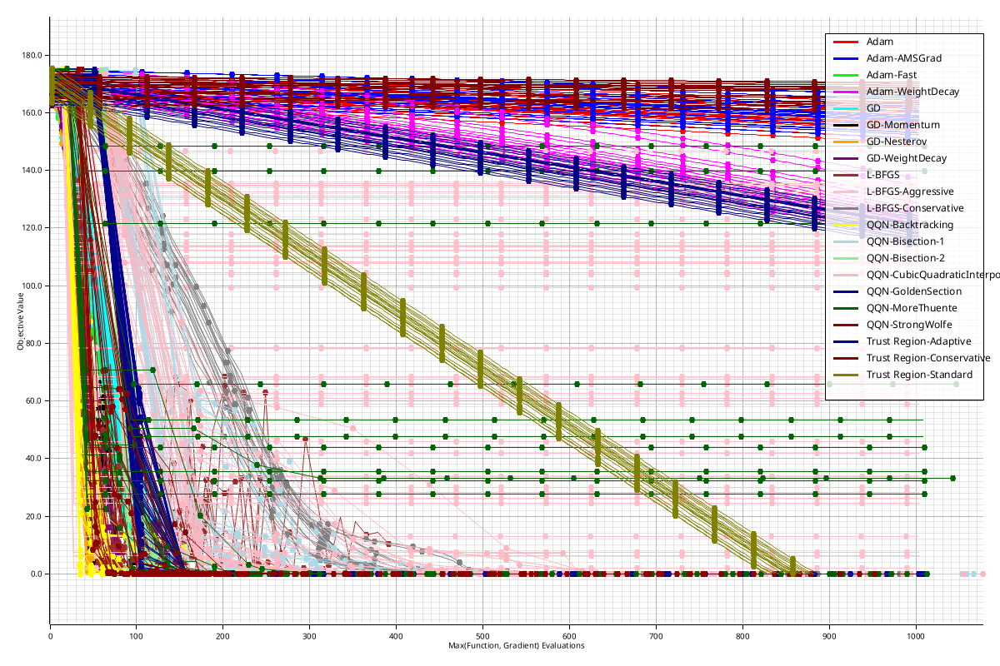
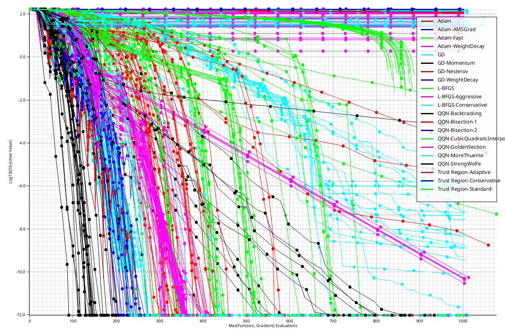

**Figure:** Convergence plots for Himmelblau_2D showing objective value vs iterations.
Left: Linear scale, Right: Log scale for better visualization of convergence behavior.

**Data:** [Linear scale data (CSV)](convergence_Himmelblau_2D_data.csv) | [Log scale data (CSV)](convergence_Himmelblau_2D_log_data.csv)

## Problem: Booth_2D

**Family:** Booth  
**Dimension:** 2  
**Success Threshold:** 1.000e-8  
**Total Runs:** 560

### Performance Summary
<table style="border-collapse: collapse; width: 100%; margin: 20px 0;">
<tr style="background-color: #f2f2f2;">
<th style="border: 1px solid #ddd; padding: 8px; text-align: center;">Rank</th>
<th style="border: 1px solid #ddd; padding: 8px; text-align: center;">Optimizer</th>
<th style="border: 1px solid #ddd; padding: 8px; text-align: center;">Mean Final Value (All/Success/Fail)</th>
<th style="border: 1px solid #ddd; padding: 8px; text-align: center;">Std Dev</th>
<th style="border: 1px solid #ddd; padding: 8px; text-align: center;">Best Value</th>
<th style="border: 1px solid #ddd; padding: 8px; text-align: center;">Worst Value</th>
<th style="border: 1px solid #ddd; padding: 8px; text-align: center;">Mean Function Evals (All/Success/Fail)</th>
<th style="border: 1px solid #ddd; padding: 8px; text-align: center;">Mean Gradient Evals (All/Success/Fail)</th>
<th style="border: 1px solid #ddd; padding: 8px; text-align: center;">Success Rate</th>
<th style="border: 1px solid #ddd; padding: 8px; text-align: center;">Mean Time (s)</th>
</tr>
<tr style="background-color: #d4edda; font-weight: bold;">
<td style="border: 1px solid #ddd; padding: 8px; text-align: center;">1</td>
<td style="border: 1px solid #ddd; padding: 8px; text-align: center;"><a href="detailed_Booth_2D_QQN-Backtracking.md">QQN-Backtracking</a></td>
<td style="border: 1px solid #ddd; padding: 8px; text-align: center;">8.97e-2 / 2.24e-15 / 1.63e-1</td>
<td style="border: 1px solid #ddd; padding: 8px; text-align: center;">8.17e-2</td>
<td style="border: 1px solid #ddd; padding: 8px; text-align: center;">6.31e-30</td>
<td style="border: 1px solid #ddd; padding: 8px; text-align: center;">1.88e-1</td>
<td style="border: 1px solid #ddd; padding: 8px; text-align: center;">322.6 / 47.0 / 548.0</td>
<td style="border: 1px solid #ddd; padding: 8px; text-align: center;">269.5 / 33.0 / 463.0</td>
<td style="border: 1px solid #ddd; padding: 8px; text-align: center;">45.0%</td>
<td style="border: 1px solid #ddd; padding: 8px; text-align: center;">0.011</td>
</tr>
<tr style="background-color: #fff3cd;">
<td style="border: 1px solid #ddd; padding: 8px; text-align: center;">2</td>
<td style="border: 1px solid #ddd; padding: 8px; text-align: center;"><a href="detailed_Booth_2D_QQN-GoldenSection.md">QQN-GoldenSection</a></td>
<td style="border: 1px solid #ddd; padding: 8px; text-align: center;">4.13e-26 / 4.13e-26 / -</td>
<td style="border: 1px solid #ddd; padding: 8px; text-align: center;">7.11e-26</td>
<td style="border: 1px solid #ddd; padding: 8px; text-align: center;">1.28e-28</td>
<td style="border: 1px solid #ddd; padding: 8px; text-align: center;">3.53e-25</td>
<td style="border: 1px solid #ddd; padding: 8px; text-align: center;">229.8 / 229.8 / -</td>
<td style="border: 1px solid #ddd; padding: 8px; text-align: center;">33.1 / 33.1 / -</td>
<td style="border: 1px solid #ddd; padding: 8px; text-align: center;">100.0%</td>
<td style="border: 1px solid #ddd; padding: 8px; text-align: center;">0.003</td>
</tr>
<tr style="">
<td style="border: 1px solid #ddd; padding: 8px; text-align: center;">3</td>
<td style="border: 1px solid #ddd; padding: 8px; text-align: center;"><a href="detailed_Booth_2D_QQN-MoreThuente.md">QQN-MoreThuente</a></td>
<td style="border: 1px solid #ddd; padding: 8px; text-align: center;">1.52e-17 / 1.52e-17 / -</td>
<td style="border: 1px solid #ddd; padding: 8px; text-align: center;">2.75e-17</td>
<td style="border: 1px solid #ddd; padding: 8px; text-align: center;">3.05e-22</td>
<td style="border: 1px solid #ddd; padding: 8px; text-align: center;">8.57e-17</td>
<td style="border: 1px solid #ddd; padding: 8px; text-align: center;">135.2 / 135.2 / -</td>
<td style="border: 1px solid #ddd; padding: 8px; text-align: center;">159.2 / 159.2 / -</td>
<td style="border: 1px solid #ddd; padding: 8px; text-align: center;">100.0%</td>
<td style="border: 1px solid #ddd; padding: 8px; text-align: center;">0.004</td>
</tr>
<tr style="">
<td style="border: 1px solid #ddd; padding: 8px; text-align: center;">4</td>
<td style="border: 1px solid #ddd; padding: 8px; text-align: center;"><a href="detailed_Booth_2D_QQN-CubicQuadraticInterpolation.md">QQN-CubicQuadraticInterpolation</a></td>
<td style="border: 1px solid #ddd; padding: 8px; text-align: center;">1.25e-14 / 2.68e-15 / 1.99e-13</td>
<td style="border: 1px solid #ddd; padding: 8px; text-align: center;">4.50e-14</td>
<td style="border: 1px solid #ddd; padding: 8px; text-align: center;">2.54e-21</td>
<td style="border: 1px solid #ddd; padding: 8px; text-align: center;">2.55e-13</td>
<td style="border: 1px solid #ddd; padding: 8px; text-align: center;">151.5 / 131.6 / 530.0</td>
<td style="border: 1px solid #ddd; padding: 8px; text-align: center;">192.1 / 177.3 / 474.0</td>
<td style="border: 1px solid #ddd; padding: 8px; text-align: center;">95.0%</td>
<td style="border: 1px solid #ddd; padding: 8px; text-align: center;">0.004</td>
</tr>
<tr style="">
<td style="border: 1px solid #ddd; padding: 8px; text-align: center;">5</td>
<td style="border: 1px solid #ddd; padding: 8px; text-align: center;"><a href="detailed_Booth_2D_QQN-Bisection-1.md">QQN-Bisection-1</a></td>
<td style="border: 1px solid #ddd; padding: 8px; text-align: center;">8.91e-15 / 8.91e-15 / -</td>
<td style="border: 1px solid #ddd; padding: 8px; text-align: center;">1.02e-14</td>
<td style="border: 1px solid #ddd; padding: 8px; text-align: center;">1.22e-17</td>
<td style="border: 1px solid #ddd; padding: 8px; text-align: center;">2.83e-14</td>
<td style="border: 1px solid #ddd; padding: 8px; text-align: center;">198.2 / 198.2 / -</td>
<td style="border: 1px solid #ddd; padding: 8px; text-align: center;">212.5 / 212.5 / -</td>
<td style="border: 1px solid #ddd; padding: 8px; text-align: center;">100.0%</td>
<td style="border: 1px solid #ddd; padding: 8px; text-align: center;">0.003</td>
</tr>
<tr style="">
<td style="border: 1px solid #ddd; padding: 8px; text-align: center;">6</td>
<td style="border: 1px solid #ddd; padding: 8px; text-align: center;"><a href="detailed_Booth_2D_QQN-Bisection-2.md">QQN-Bisection-2</a></td>
<td style="border: 1px solid #ddd; padding: 8px; text-align: center;">1.04e-14 / 1.04e-14 / -</td>
<td style="border: 1px solid #ddd; padding: 8px; text-align: center;">9.24e-15</td>
<td style="border: 1px solid #ddd; padding: 8px; text-align: center;">1.39e-17</td>
<td style="border: 1px solid #ddd; padding: 8px; text-align: center;">2.37e-14</td>
<td style="border: 1px solid #ddd; padding: 8px; text-align: center;">135.1 / 135.1 / -</td>
<td style="border: 1px solid #ddd; padding: 8px; text-align: center;">128.5 / 128.5 / -</td>
<td style="border: 1px solid #ddd; padding: 8px; text-align: center;">100.0%</td>
<td style="border: 1px solid #ddd; padding: 8px; text-align: center;">0.002</td>
</tr>
<tr style="">
<td style="border: 1px solid #ddd; padding: 8px; text-align: center;">7</td>
<td style="border: 1px solid #ddd; padding: 8px; text-align: center;"><a href="detailed_Booth_2D_L-BFGS.md">L-BFGS</a></td>
<td style="border: 1px solid #ddd; padding: 8px; text-align: center;">4.20e-4 / 7.77e-14 / 5.37e-2</td>
<td style="border: 1px solid #ddd; padding: 8px; text-align: center;">1.23e-3</td>
<td style="border: 1px solid #ddd; padding: 8px; text-align: center;">2.21e-14</td>
<td style="border: 1px solid #ddd; padding: 8px; text-align: center;">5.36e-3</td>
<td style="border: 1px solid #ddd; padding: 8px; text-align: center;">396.3 / 466.8 / 325.8</td>
<td style="border: 1px solid #ddd; padding: 8px; text-align: center;">220.6 / 252.0 / 189.1</td>
<td style="border: 1px solid #ddd; padding: 8px; text-align: center;">50.0%</td>
<td style="border: 1px solid #ddd; padding: 8px; text-align: center;">0.007</td>
</tr>
<tr style="">
<td style="border: 1px solid #ddd; padding: 8px; text-align: center;">8</td>
<td style="border: 1px solid #ddd; padding: 8px; text-align: center;"><a href="detailed_Booth_2D_L-BFGS-Conservative.md">L-BFGS-Conservative</a></td>
<td style="border: 1px solid #ddd; padding: 8px; text-align: center;">4.42e-8 / 2.78e-14 / 4.65e-8</td>
<td style="border: 1px solid #ddd; padding: 8px; text-align: center;">5.83e-8</td>
<td style="border: 1px solid #ddd; padding: 8px; text-align: center;">2.78e-14</td>
<td style="border: 1px solid #ddd; padding: 8px; text-align: center;">1.75e-7</td>
<td style="border: 1px solid #ddd; padding: 8px; text-align: center;">555.5 / 527.0 / 557.0</td>
<td style="border: 1px solid #ddd; padding: 8px; text-align: center;">444.8 / 422.0 / 446.0</td>
<td style="border: 1px solid #ddd; padding: 8px; text-align: center;">5.0%</td>
<td style="border: 1px solid #ddd; padding: 8px; text-align: center;">0.013</td>
</tr>
<tr style="">
<td style="border: 1px solid #ddd; padding: 8px; text-align: center;">9</td>
<td style="border: 1px solid #ddd; padding: 8px; text-align: center;"><a href="detailed_Booth_2D_GD-WeightDecay.md">GD-WeightDecay</a></td>
<td style="border: 1px solid #ddd; padding: 8px; text-align: center;">1.12e0 / - / 1.29e0</td>
<td style="border: 1px solid #ddd; padding: 8px; text-align: center;">4.06e-1</td>
<td style="border: 1px solid #ddd; padding: 8px; text-align: center;">1.02e-8</td>
<td style="border: 1px solid #ddd; padding: 8px; text-align: center;">1.55e0</td>
<td style="border: 1px solid #ddd; padding: 8px; text-align: center;">39.3 / - / 39.3</td>
<td style="border: 1px solid #ddd; padding: 8px; text-align: center;">74.8 / - / 74.8</td>
<td style="border: 1px solid #ddd; padding: 8px; text-align: center;">0.0%</td>
<td style="border: 1px solid #ddd; padding: 8px; text-align: center;">0.001</td>
</tr>
<tr style="">
<td style="border: 1px solid #ddd; padding: 8px; text-align: center;">10</td>
<td style="border: 1px solid #ddd; padding: 8px; text-align: center;"><a href="detailed_Booth_2D_GD.md">GD</a></td>
<td style="border: 1px solid #ddd; padding: 8px; text-align: center;">5.32e-6 / - / 5.32e-6</td>
<td style="border: 1px solid #ddd; padding: 8px; text-align: center;">9.13e-7</td>
<td style="border: 1px solid #ddd; padding: 8px; text-align: center;">3.89e-6</td>
<td style="border: 1px solid #ddd; padding: 8px; text-align: center;">7.51e-6</td>
<td style="border: 1px solid #ddd; padding: 8px; text-align: center;">335.0 / - / 335.0</td>
<td style="border: 1px solid #ddd; padding: 8px; text-align: center;">668.0 / - / 668.0</td>
<td style="border: 1px solid #ddd; padding: 8px; text-align: center;">0.0%</td>
<td style="border: 1px solid #ddd; padding: 8px; text-align: center;">0.008</td>
</tr>
<tr style="">
<td style="border: 1px solid #ddd; padding: 8px; text-align: center;">11</td>
<td style="border: 1px solid #ddd; padding: 8px; text-align: center;"><a href="detailed_Booth_2D_QQN-StrongWolfe.md">QQN-StrongWolfe</a></td>
<td style="border: 1px solid #ddd; padding: 8px; text-align: center;">1.31e-5 / - / 1.31e-5</td>
<td style="border: 1px solid #ddd; padding: 8px; text-align: center;">1.07e-6</td>
<td style="border: 1px solid #ddd; padding: 8px; text-align: center;">1.09e-5</td>
<td style="border: 1px solid #ddd; padding: 8px; text-align: center;">1.51e-5</td>
<td style="border: 1px solid #ddd; padding: 8px; text-align: center;">482.0 / - / 482.0</td>
<td style="border: 1px solid #ddd; padding: 8px; text-align: center;">526.8 / - / 526.8</td>
<td style="border: 1px solid #ddd; padding: 8px; text-align: center;">0.0%</td>
<td style="border: 1px solid #ddd; padding: 8px; text-align: center;">0.016</td>
</tr>
<tr style="">
<td style="border: 1px solid #ddd; padding: 8px; text-align: center;">12</td>
<td style="border: 1px solid #ddd; padding: 8px; text-align: center;"><a href="detailed_Booth_2D_Trust_Region-Standard.md">Trust Region-Standard</a></td>
<td style="border: 1px solid #ddd; padding: 8px; text-align: center;">3.50e-1 / - / 5.01e-1</td>
<td style="border: 1px solid #ddd; padding: 8px; text-align: center;">1.78e-1</td>
<td style="border: 1px solid #ddd; padding: 8px; text-align: center;">1.08e-1</td>
<td style="border: 1px solid #ddd; padding: 8px; text-align: center;">7.81e-1</td>
<td style="border: 1px solid #ddd; padding: 8px; text-align: center;">234.1 / - / 234.1</td>
<td style="border: 1px solid #ddd; padding: 8px; text-align: center;">156.7 / - / 156.7</td>
<td style="border: 1px solid #ddd; padding: 8px; text-align: center;">0.0%</td>
<td style="border: 1px solid #ddd; padding: 8px; text-align: center;">0.001</td>
</tr>
<tr style="">
<td style="border: 1px solid #ddd; padding: 8px; text-align: center;">13</td>
<td style="border: 1px solid #ddd; padding: 8px; text-align: center;"><a href="detailed_Booth_2D_GD-Momentum.md">GD-Momentum</a></td>
<td style="border: 1px solid #ddd; padding: 8px; text-align: center;">1.49e0 / - / 7.20e0</td>
<td style="border: 1px solid #ddd; padding: 8px; text-align: center;">2.41e-1</td>
<td style="border: 1px solid #ddd; padding: 8px; text-align: center;">1.04e0</td>
<td style="border: 1px solid #ddd; padding: 8px; text-align: center;">2.07e0</td>
<td style="border: 1px solid #ddd; padding: 8px; text-align: center;">21.2 / - / 21.2</td>
<td style="border: 1px solid #ddd; padding: 8px; text-align: center;">38.4 / - / 38.4</td>
<td style="border: 1px solid #ddd; padding: 8px; text-align: center;">0.0%</td>
<td style="border: 1px solid #ddd; padding: 8px; text-align: center;">0.001</td>
</tr>
<tr style="">
<td style="border: 1px solid #ddd; padding: 8px; text-align: center;">14</td>
<td style="border: 1px solid #ddd; padding: 8px; text-align: center;"><a href="detailed_Booth_2D_GD-Nesterov.md">GD-Nesterov</a></td>
<td style="border: 1px solid #ddd; padding: 8px; text-align: center;">1.37e0 / - / 2.65e0</td>
<td style="border: 1px solid #ddd; padding: 8px; text-align: center;">1.89e-1</td>
<td style="border: 1px solid #ddd; padding: 8px; text-align: center;">1.10e0</td>
<td style="border: 1px solid #ddd; padding: 8px; text-align: center;">1.84e0</td>
<td style="border: 1px solid #ddd; padding: 8px; text-align: center;">20.6 / - / 20.6</td>
<td style="border: 1px solid #ddd; padding: 8px; text-align: center;">37.1 / - / 37.1</td>
<td style="border: 1px solid #ddd; padding: 8px; text-align: center;">0.0%</td>
<td style="border: 1px solid #ddd; padding: 8px; text-align: center;">0.001</td>
</tr>
<tr style="">
<td style="border: 1px solid #ddd; padding: 8px; text-align: center;">15</td>
<td style="border: 1px solid #ddd; padding: 8px; text-align: center;"><a href="detailed_Booth_2D_Adam-Fast.md">Adam-Fast</a></td>
<td style="border: 1px solid #ddd; padding: 8px; text-align: center;">1.87e0 / - / 3.04e0</td>
<td style="border: 1px solid #ddd; padding: 8px; text-align: center;">2.78e-1</td>
<td style="border: 1px solid #ddd; padding: 8px; text-align: center;">1.33e0</td>
<td style="border: 1px solid #ddd; padding: 8px; text-align: center;">2.53e0</td>
<td style="border: 1px solid #ddd; padding: 8px; text-align: center;">55.9 / - / 55.9</td>
<td style="border: 1px solid #ddd; padding: 8px; text-align: center;">54.9 / - / 54.9</td>
<td style="border: 1px solid #ddd; padding: 8px; text-align: center;">0.0%</td>
<td style="border: 1px solid #ddd; padding: 8px; text-align: center;">0.001</td>
</tr>
<tr style="">
<td style="border: 1px solid #ddd; padding: 8px; text-align: center;">16</td>
<td style="border: 1px solid #ddd; padding: 8px; text-align: center;"><a href="detailed_Booth_2D_Trust_Region-Adaptive.md">Trust Region-Adaptive</a></td>
<td style="border: 1px solid #ddd; padding: 8px; text-align: center;">2.30e1 / - / 2.30e1</td>
<td style="border: 1px solid #ddd; padding: 8px; text-align: center;">5.24e0</td>
<td style="border: 1px solid #ddd; padding: 8px; text-align: center;">1.26e1</td>
<td style="border: 1px solid #ddd; padding: 8px; text-align: center;">3.31e1</td>
<td style="border: 1px solid #ddd; padding: 8px; text-align: center;">602.0 / - / 602.0</td>
<td style="border: 1px solid #ddd; padding: 8px; text-align: center;">402.0 / - / 402.0</td>
<td style="border: 1px solid #ddd; padding: 8px; text-align: center;">0.0%</td>
<td style="border: 1px solid #ddd; padding: 8px; text-align: center;">0.003</td>
</tr>
<tr style="">
<td style="border: 1px solid #ddd; padding: 8px; text-align: center;">17</td>
<td style="border: 1px solid #ddd; padding: 8px; text-align: center;"><a href="detailed_Booth_2D_Adam-WeightDecay.md">Adam-WeightDecay</a></td>
<td style="border: 1px solid #ddd; padding: 8px; text-align: center;">3.23e1 / - / 3.23e1</td>
<td style="border: 1px solid #ddd; padding: 8px; text-align: center;">3.62e0</td>
<td style="border: 1px solid #ddd; padding: 8px; text-align: center;">2.41e1</td>
<td style="border: 1px solid #ddd; padding: 8px; text-align: center;">3.87e1</td>
<td style="border: 1px solid #ddd; padding: 8px; text-align: center;">502.0 / - / 502.0</td>
<td style="border: 1px solid #ddd; padding: 8px; text-align: center;">502.0 / - / 502.0</td>
<td style="border: 1px solid #ddd; padding: 8px; text-align: center;">0.0%</td>
<td style="border: 1px solid #ddd; padding: 8px; text-align: center;">0.010</td>
</tr>
<tr style="">
<td style="border: 1px solid #ddd; padding: 8px; text-align: center;">18</td>
<td style="border: 1px solid #ddd; padding: 8px; text-align: center;"><a href="detailed_Booth_2D_Adam-AMSGrad.md">Adam-AMSGrad</a></td>
<td style="border: 1px solid #ddd; padding: 8px; text-align: center;">5.60e1 / - / 5.60e1</td>
<td style="border: 1px solid #ddd; padding: 8px; text-align: center;">6.09e0</td>
<td style="border: 1px solid #ddd; padding: 8px; text-align: center;">4.64e1</td>
<td style="border: 1px solid #ddd; padding: 8px; text-align: center;">6.85e1</td>
<td style="border: 1px solid #ddd; padding: 8px; text-align: center;">502.0 / - / 502.0</td>
<td style="border: 1px solid #ddd; padding: 8px; text-align: center;">502.0 / - / 502.0</td>
<td style="border: 1px solid #ddd; padding: 8px; text-align: center;">0.0%</td>
<td style="border: 1px solid #ddd; padding: 8px; text-align: center;">0.011</td>
</tr>
<tr style="">
<td style="border: 1px solid #ddd; padding: 8px; text-align: center;">19</td>
<td style="border: 1px solid #ddd; padding: 8px; text-align: center;"><a href="detailed_Booth_2D_Adam.md">Adam</a></td>
<td style="border: 1px solid #ddd; padding: 8px; text-align: center;">5.61e1 / - / 5.61e1</td>
<td style="border: 1px solid #ddd; padding: 8px; text-align: center;">5.60e0</td>
<td style="border: 1px solid #ddd; padding: 8px; text-align: center;">4.66e1</td>
<td style="border: 1px solid #ddd; padding: 8px; text-align: center;">6.62e1</td>
<td style="border: 1px solid #ddd; padding: 8px; text-align: center;">502.0 / - / 502.0</td>
<td style="border: 1px solid #ddd; padding: 8px; text-align: center;">502.0 / - / 502.0</td>
<td style="border: 1px solid #ddd; padding: 8px; text-align: center;">0.0%</td>
<td style="border: 1px solid #ddd; padding: 8px; text-align: center;">0.010</td>
</tr>
<tr style="">
<td style="border: 1px solid #ddd; padding: 8px; text-align: center;">20</td>
<td style="border: 1px solid #ddd; padding: 8px; text-align: center;"><a href="detailed_Booth_2D_Trust_Region-Conservative.md">Trust Region-Conservative</a></td>
<td style="border: 1px solid #ddd; padding: 8px; text-align: center;">7.12e1 / - / 7.12e1</td>
<td style="border: 1px solid #ddd; padding: 8px; text-align: center;">6.27e0</td>
<td style="border: 1px solid #ddd; padding: 8px; text-align: center;">6.08e1</td>
<td style="border: 1px solid #ddd; padding: 8px; text-align: center;">8.41e1</td>
<td style="border: 1px solid #ddd; padding: 8px; text-align: center;">602.0 / - / 602.0</td>
<td style="border: 1px solid #ddd; padding: 8px; text-align: center;">402.0 / - / 402.0</td>
<td style="border: 1px solid #ddd; padding: 8px; text-align: center;">0.0%</td>
<td style="border: 1px solid #ddd; padding: 8px; text-align: center;">0.004</td>
</tr>
<tr style="">
<td style="border: 1px solid #ddd; padding: 8px; text-align: center;">21</td>
<td style="border: 1px solid #ddd; padding: 8px; text-align: center;"><a href="detailed_Booth_2D_L-BFGS-Aggressive.md">L-BFGS-Aggressive</a></td>
<td style="border: 1px solid #ddd; padding: 8px; text-align: center;">7.43e1 / - / 7.43e1</td>
<td style="border: 1px solid #ddd; padding: 8px; text-align: center;">5.82e0</td>
<td style="border: 1px solid #ddd; padding: 8px; text-align: center;">6.37e1</td>
<td style="border: 1px solid #ddd; padding: 8px; text-align: center;">8.48e1</td>
<td style="border: 1px solid #ddd; padding: 8px; text-align: center;">772.0 / - / 772.0</td>
<td style="border: 1px solid #ddd; padding: 8px; text-align: center;">233.0 / - / 233.0</td>
<td style="border: 1px solid #ddd; padding: 8px; text-align: center;">0.0%</td>
<td style="border: 1px solid #ddd; padding: 8px; text-align: center;">0.005</td>
</tr>
</table>

### Convergence Plots

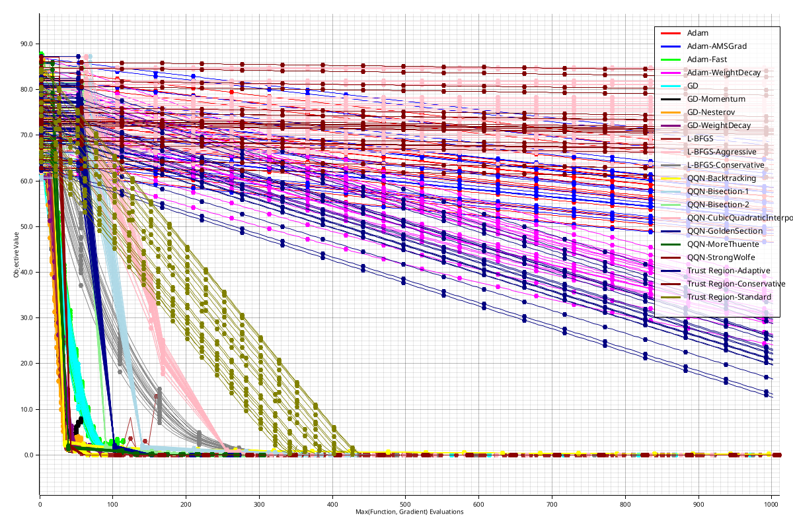
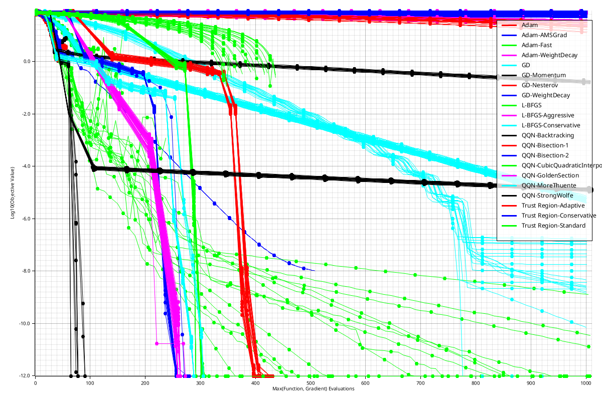

**Figure:** Convergence plots for Booth_2D showing objective value vs iterations.
Left: Linear scale, Right: Log scale for better visualization of convergence behavior.

**Data:** [Linear scale data (CSV)](convergence_Booth_2D_data.csv) | [Log scale data (CSV)](convergence_Booth_2D_log_data.csv)

## Problem: Griewank_2D

**Family:** Griewank  
**Dimension:** 2  
**Success Threshold:** 1.000e-8  
**Total Runs:** 560

### Performance Summary
<table style="border-collapse: collapse; width: 100%; margin: 20px 0;">
<tr style="background-color: #f2f2f2;">
<th style="border: 1px solid #ddd; padding: 8px; text-align: center;">Rank</th>
<th style="border: 1px solid #ddd; padding: 8px; text-align: center;">Optimizer</th>
<th style="border: 1px solid #ddd; padding: 8px; text-align: center;">Mean Final Value (All/Success/Fail)</th>
<th style="border: 1px solid #ddd; padding: 8px; text-align: center;">Std Dev</th>
<th style="border: 1px solid #ddd; padding: 8px; text-align: center;">Best Value</th>
<th style="border: 1px solid #ddd; padding: 8px; text-align: center;">Worst Value</th>
<th style="border: 1px solid #ddd; padding: 8px; text-align: center;">Mean Function Evals (All/Success/Fail)</th>
<th style="border: 1px solid #ddd; padding: 8px; text-align: center;">Mean Gradient Evals (All/Success/Fail)</th>
<th style="border: 1px solid #ddd; padding: 8px; text-align: center;">Success Rate</th>
<th style="border: 1px solid #ddd; padding: 8px; text-align: center;">Mean Time (s)</th>
</tr>
<tr style="background-color: #d4edda; font-weight: bold;">
<td style="border: 1px solid #ddd; padding: 8px; text-align: center;">1</td>
<td style="border: 1px solid #ddd; padding: 8px; text-align: center;"><a href="detailed_Griewank_2D_QQN-CubicQuadraticInterpolation.md">QQN-CubicQuadraticInterpolation</a></td>
<td style="border: 1px solid #ddd; padding: 8px; text-align: center;">4.47e0 / - / 4.47e0</td>
<td style="border: 1px solid #ddd; padding: 8px; text-align: center;">7.53e-1</td>
<td style="border: 1px solid #ddd; padding: 8px; text-align: center;">1.80e0</td>
<td style="border: 1px solid #ddd; padding: 8px; text-align: center;">5.30e0</td>
<td style="border: 1px solid #ddd; padding: 8px; text-align: center;">178.1 / - / 178.1</td>
<td style="border: 1px solid #ddd; padding: 8px; text-align: center;">257.5 / - / 257.5</td>
<td style="border: 1px solid #ddd; padding: 8px; text-align: center;">0.0%</td>
<td style="border: 1px solid #ddd; padding: 8px; text-align: center;">0.005</td>
</tr>
<tr style="background-color: #fff3cd;">
<td style="border: 1px solid #ddd; padding: 8px; text-align: center;">2</td>
<td style="border: 1px solid #ddd; padding: 8px; text-align: center;"><a href="detailed_Griewank_2D_QQN-Backtracking.md">QQN-Backtracking</a></td>
<td style="border: 1px solid #ddd; padding: 8px; text-align: center;">4.75e0 / - / 4.75e0</td>
<td style="border: 1px solid #ddd; padding: 8px; text-align: center;">4.12e-1</td>
<td style="border: 1px solid #ddd; padding: 8px; text-align: center;">3.26e0</td>
<td style="border: 1px solid #ddd; padding: 8px; text-align: center;">4.91e0</td>
<td style="border: 1px solid #ddd; padding: 8px; text-align: center;">313.9 / - / 313.9</td>
<td style="border: 1px solid #ddd; padding: 8px; text-align: center;">266.4 / - / 266.4</td>
<td style="border: 1px solid #ddd; padding: 8px; text-align: center;">0.0%</td>
<td style="border: 1px solid #ddd; padding: 8px; text-align: center;">0.011</td>
</tr>
<tr style="">
<td style="border: 1px solid #ddd; padding: 8px; text-align: center;">3</td>
<td style="border: 1px solid #ddd; padding: 8px; text-align: center;"><a href="detailed_Griewank_2D_QQN-StrongWolfe.md">QQN-StrongWolfe</a></td>
<td style="border: 1px solid #ddd; padding: 8px; text-align: center;">4.73e0 / - / 4.73e0</td>
<td style="border: 1px solid #ddd; padding: 8px; text-align: center;">4.04e-1</td>
<td style="border: 1px solid #ddd; padding: 8px; text-align: center;">3.48e0</td>
<td style="border: 1px solid #ddd; padding: 8px; text-align: center;">4.91e0</td>
<td style="border: 1px solid #ddd; padding: 8px; text-align: center;">286.9 / - / 286.9</td>
<td style="border: 1px solid #ddd; padding: 8px; text-align: center;">318.2 / - / 318.2</td>
<td style="border: 1px solid #ddd; padding: 8px; text-align: center;">0.0%</td>
<td style="border: 1px solid #ddd; padding: 8px; text-align: center;">0.009</td>
</tr>
<tr style="">
<td style="border: 1px solid #ddd; padding: 8px; text-align: center;">4</td>
<td style="border: 1px solid #ddd; padding: 8px; text-align: center;"><a href="detailed_Griewank_2D_QQN-Bisection-2.md">QQN-Bisection-2</a></td>
<td style="border: 1px solid #ddd; padding: 8px; text-align: center;">4.80e0 / - / 4.80e0</td>
<td style="border: 1px solid #ddd; padding: 8px; text-align: center;">1.68e-1</td>
<td style="border: 1px solid #ddd; padding: 8px; text-align: center;">4.54e0</td>
<td style="border: 1px solid #ddd; padding: 8px; text-align: center;">4.91e0</td>
<td style="border: 1px solid #ddd; padding: 8px; text-align: center;">87.9 / - / 87.9</td>
<td style="border: 1px solid #ddd; padding: 8px; text-align: center;">90.0 / - / 90.0</td>
<td style="border: 1px solid #ddd; padding: 8px; text-align: center;">0.0%</td>
<td style="border: 1px solid #ddd; padding: 8px; text-align: center;">0.001</td>
</tr>
<tr style="">
<td style="border: 1px solid #ddd; padding: 8px; text-align: center;">5</td>
<td style="border: 1px solid #ddd; padding: 8px; text-align: center;"><a href="detailed_Griewank_2D_QQN-GoldenSection.md">QQN-GoldenSection</a></td>
<td style="border: 1px solid #ddd; padding: 8px; text-align: center;">4.91e0 / - / 4.91e0</td>
<td style="border: 1px solid #ddd; padding: 8px; text-align: center;">1.80e-7</td>
<td style="border: 1px solid #ddd; padding: 8px; text-align: center;">4.91e0</td>
<td style="border: 1px solid #ddd; padding: 8px; text-align: center;">4.91e0</td>
<td style="border: 1px solid #ddd; padding: 8px; text-align: center;">259.6 / - / 259.6</td>
<td style="border: 1px solid #ddd; padding: 8px; text-align: center;">46.6 / - / 46.6</td>
<td style="border: 1px solid #ddd; padding: 8px; text-align: center;">0.0%</td>
<td style="border: 1px solid #ddd; padding: 8px; text-align: center;">0.004</td>
</tr>
<tr style="">
<td style="border: 1px solid #ddd; padding: 8px; text-align: center;">6</td>
<td style="border: 1px solid #ddd; padding: 8px; text-align: center;"><a href="detailed_Griewank_2D_QQN-Bisection-1.md">QQN-Bisection-1</a></td>
<td style="border: 1px solid #ddd; padding: 8px; text-align: center;">4.91e0 / - / 4.91e0</td>
<td style="border: 1px solid #ddd; padding: 8px; text-align: center;">8.23e-14</td>
<td style="border: 1px solid #ddd; padding: 8px; text-align: center;">4.91e0</td>
<td style="border: 1px solid #ddd; padding: 8px; text-align: center;">4.91e0</td>
<td style="border: 1px solid #ddd; padding: 8px; text-align: center;">77.5 / - / 77.5</td>
<td style="border: 1px solid #ddd; padding: 8px; text-align: center;">118.8 / - / 118.8</td>
<td style="border: 1px solid #ddd; padding: 8px; text-align: center;">0.0%</td>
<td style="border: 1px solid #ddd; padding: 8px; text-align: center;">0.002</td>
</tr>
<tr style="">
<td style="border: 1px solid #ddd; padding: 8px; text-align: center;">7</td>
<td style="border: 1px solid #ddd; padding: 8px; text-align: center;"><a href="detailed_Griewank_2D_QQN-MoreThuente.md">QQN-MoreThuente</a></td>
<td style="border: 1px solid #ddd; padding: 8px; text-align: center;">4.91e0 / - / 4.91e0</td>
<td style="border: 1px solid #ddd; padding: 8px; text-align: center;">1.12e-13</td>
<td style="border: 1px solid #ddd; padding: 8px; text-align: center;">4.91e0</td>
<td style="border: 1px solid #ddd; padding: 8px; text-align: center;">4.91e0</td>
<td style="border: 1px solid #ddd; padding: 8px; text-align: center;">78.0 / - / 78.0</td>
<td style="border: 1px solid #ddd; padding: 8px; text-align: center;">74.1 / - / 74.1</td>
<td style="border: 1px solid #ddd; padding: 8px; text-align: center;">0.0%</td>
<td style="border: 1px solid #ddd; padding: 8px; text-align: center;">0.001</td>
</tr>
<tr style="">
<td style="border: 1px solid #ddd; padding: 8px; text-align: center;">8</td>
<td style="border: 1px solid #ddd; padding: 8px; text-align: center;"><a href="detailed_Griewank_2D_L-BFGS-Aggressive.md">L-BFGS-Aggressive</a></td>
<td style="border: 1px solid #ddd; padding: 8px; text-align: center;">4.91e0 / - / 4.91e0</td>
<td style="border: 1px solid #ddd; padding: 8px; text-align: center;">4.68e-3</td>
<td style="border: 1px solid #ddd; padding: 8px; text-align: center;">4.91e0</td>
<td style="border: 1px solid #ddd; padding: 8px; text-align: center;">4.94e0</td>
<td style="border: 1px solid #ddd; padding: 8px; text-align: center;">510.9 / - / 510.9</td>
<td style="border: 1px solid #ddd; padding: 8px; text-align: center;">282.0 / - / 282.0</td>
<td style="border: 1px solid #ddd; padding: 8px; text-align: center;">0.0%</td>
<td style="border: 1px solid #ddd; padding: 8px; text-align: center;">0.011</td>
</tr>
<tr style="">
<td style="border: 1px solid #ddd; padding: 8px; text-align: center;">9</td>
<td style="border: 1px solid #ddd; padding: 8px; text-align: center;"><a href="detailed_Griewank_2D_L-BFGS.md">L-BFGS</a></td>
<td style="border: 1px solid #ddd; padding: 8px; text-align: center;">4.91e0 / - / 4.91e0</td>
<td style="border: 1px solid #ddd; padding: 8px; text-align: center;">2.66e-7</td>
<td style="border: 1px solid #ddd; padding: 8px; text-align: center;">4.91e0</td>
<td style="border: 1px solid #ddd; padding: 8px; text-align: center;">4.91e0</td>
<td style="border: 1px solid #ddd; padding: 8px; text-align: center;">226.9 / - / 226.9</td>
<td style="border: 1px solid #ddd; padding: 8px; text-align: center;">164.1 / - / 164.1</td>
<td style="border: 1px solid #ddd; padding: 8px; text-align: center;">0.0%</td>
<td style="border: 1px solid #ddd; padding: 8px; text-align: center;">0.005</td>
</tr>
<tr style="">
<td style="border: 1px solid #ddd; padding: 8px; text-align: center;">10</td>
<td style="border: 1px solid #ddd; padding: 8px; text-align: center;"><a href="detailed_Griewank_2D_L-BFGS-Conservative.md">L-BFGS-Conservative</a></td>
<td style="border: 1px solid #ddd; padding: 8px; text-align: center;">4.91e0 / - / 4.91e0</td>
<td style="border: 1px solid #ddd; padding: 8px; text-align: center;">3.69e-9</td>
<td style="border: 1px solid #ddd; padding: 8px; text-align: center;">4.91e0</td>
<td style="border: 1px solid #ddd; padding: 8px; text-align: center;">4.91e0</td>
<td style="border: 1px solid #ddd; padding: 8px; text-align: center;">503.2 / - / 503.2</td>
<td style="border: 1px solid #ddd; padding: 8px; text-align: center;">401.9 / - / 401.9</td>
<td style="border: 1px solid #ddd; padding: 8px; text-align: center;">0.0%</td>
<td style="border: 1px solid #ddd; padding: 8px; text-align: center;">0.012</td>
</tr>
<tr style="">
<td style="border: 1px solid #ddd; padding: 8px; text-align: center;">11</td>
<td style="border: 1px solid #ddd; padding: 8px; text-align: center;"><a href="detailed_Griewank_2D_GD-Nesterov.md">GD-Nesterov</a></td>
<td style="border: 1px solid #ddd; padding: 8px; text-align: center;">4.91e0 / - / 4.91e0</td>
<td style="border: 1px solid #ddd; padding: 8px; text-align: center;">1.55e-4</td>
<td style="border: 1px solid #ddd; padding: 8px; text-align: center;">4.91e0</td>
<td style="border: 1px solid #ddd; padding: 8px; text-align: center;">4.91e0</td>
<td style="border: 1px solid #ddd; padding: 8px; text-align: center;">132.1 / - / 132.1</td>
<td style="border: 1px solid #ddd; padding: 8px; text-align: center;">260.2 / - / 260.2</td>
<td style="border: 1px solid #ddd; padding: 8px; text-align: center;">0.0%</td>
<td style="border: 1px solid #ddd; padding: 8px; text-align: center;">0.004</td>
</tr>
<tr style="">
<td style="border: 1px solid #ddd; padding: 8px; text-align: center;">12</td>
<td style="border: 1px solid #ddd; padding: 8px; text-align: center;"><a href="detailed_Griewank_2D_GD-Momentum.md">GD-Momentum</a></td>
<td style="border: 1px solid #ddd; padding: 8px; text-align: center;">4.91e0 / - / 4.91e0</td>
<td style="border: 1px solid #ddd; padding: 8px; text-align: center;">3.82e-4</td>
<td style="border: 1px solid #ddd; padding: 8px; text-align: center;">4.91e0</td>
<td style="border: 1px solid #ddd; padding: 8px; text-align: center;">4.91e0</td>
<td style="border: 1px solid #ddd; padding: 8px; text-align: center;">106.2 / - / 106.2</td>
<td style="border: 1px solid #ddd; padding: 8px; text-align: center;">208.3 / - / 208.3</td>
<td style="border: 1px solid #ddd; padding: 8px; text-align: center;">0.0%</td>
<td style="border: 1px solid #ddd; padding: 8px; text-align: center;">0.003</td>
</tr>
<tr style="">
<td style="border: 1px solid #ddd; padding: 8px; text-align: center;">13</td>
<td style="border: 1px solid #ddd; padding: 8px; text-align: center;"><a href="detailed_Griewank_2D_Adam-Fast.md">Adam-Fast</a></td>
<td style="border: 1px solid #ddd; padding: 8px; text-align: center;">4.91e0 / - / 4.93e0</td>
<td style="border: 1px solid #ddd; padding: 8px; text-align: center;">4.66e-3</td>
<td style="border: 1px solid #ddd; padding: 8px; text-align: center;">4.91e0</td>
<td style="border: 1px solid #ddd; padding: 8px; text-align: center;">4.93e0</td>
<td style="border: 1px solid #ddd; padding: 8px; text-align: center;">67.9 / - / 67.9</td>
<td style="border: 1px solid #ddd; padding: 8px; text-align: center;">66.9 / - / 66.9</td>
<td style="border: 1px solid #ddd; padding: 8px; text-align: center;">0.0%</td>
<td style="border: 1px solid #ddd; padding: 8px; text-align: center;">0.001</td>
</tr>
<tr style="">
<td style="border: 1px solid #ddd; padding: 8px; text-align: center;">14</td>
<td style="border: 1px solid #ddd; padding: 8px; text-align: center;"><a href="detailed_Griewank_2D_GD-WeightDecay.md">GD-WeightDecay</a></td>
<td style="border: 1px solid #ddd; padding: 8px; text-align: center;">4.91e0 / - / 4.91e0</td>
<td style="border: 1px solid #ddd; padding: 8px; text-align: center;">7.02e-5</td>
<td style="border: 1px solid #ddd; padding: 8px; text-align: center;">4.91e0</td>
<td style="border: 1px solid #ddd; padding: 8px; text-align: center;">4.91e0</td>
<td style="border: 1px solid #ddd; padding: 8px; text-align: center;">335.0 / - / 335.0</td>
<td style="border: 1px solid #ddd; padding: 8px; text-align: center;">668.0 / - / 668.0</td>
<td style="border: 1px solid #ddd; padding: 8px; text-align: center;">0.0%</td>
<td style="border: 1px solid #ddd; padding: 8px; text-align: center;">0.010</td>
</tr>
<tr style="">
<td style="border: 1px solid #ddd; padding: 8px; text-align: center;">15</td>
<td style="border: 1px solid #ddd; padding: 8px; text-align: center;"><a href="detailed_Griewank_2D_Trust_Region-Conservative.md">Trust Region-Conservative</a></td>
<td style="border: 1px solid #ddd; padding: 8px; text-align: center;">4.92e0 / - / 4.92e0</td>
<td style="border: 1px solid #ddd; padding: 8px; text-align: center;">1.58e-3</td>
<td style="border: 1px solid #ddd; padding: 8px; text-align: center;">4.91e0</td>
<td style="border: 1px solid #ddd; padding: 8px; text-align: center;">4.92e0</td>
<td style="border: 1px solid #ddd; padding: 8px; text-align: center;">344.1 / - / 344.1</td>
<td style="border: 1px solid #ddd; padding: 8px; text-align: center;">230.1 / - / 230.1</td>
<td style="border: 1px solid #ddd; padding: 8px; text-align: center;">0.0%</td>
<td style="border: 1px solid #ddd; padding: 8px; text-align: center;">0.002</td>
</tr>
<tr style="">
<td style="border: 1px solid #ddd; padding: 8px; text-align: center;">16</td>
<td style="border: 1px solid #ddd; padding: 8px; text-align: center;"><a href="detailed_Griewank_2D_GD.md">GD</a></td>
<td style="border: 1px solid #ddd; padding: 8px; text-align: center;">5.01e0 / - / 5.01e0</td>
<td style="border: 1px solid #ddd; padding: 8px; text-align: center;">2.69e-2</td>
<td style="border: 1px solid #ddd; padding: 8px; text-align: center;">4.98e0</td>
<td style="border: 1px solid #ddd; padding: 8px; text-align: center;">5.07e0</td>
<td style="border: 1px solid #ddd; padding: 8px; text-align: center;">335.0 / - / 335.0</td>
<td style="border: 1px solid #ddd; padding: 8px; text-align: center;">668.0 / - / 668.0</td>
<td style="border: 1px solid #ddd; padding: 8px; text-align: center;">0.0%</td>
<td style="border: 1px solid #ddd; padding: 8px; text-align: center;">0.008</td>
</tr>
<tr style="">
<td style="border: 1px solid #ddd; padding: 8px; text-align: center;">17</td>
<td style="border: 1px solid #ddd; padding: 8px; text-align: center;"><a href="detailed_Griewank_2D_Trust_Region-Adaptive.md">Trust Region-Adaptive</a></td>
<td style="border: 1px solid #ddd; padding: 8px; text-align: center;">5.14e0 / - / 5.14e0</td>
<td style="border: 1px solid #ddd; padding: 8px; text-align: center;">1.65e-1</td>
<td style="border: 1px solid #ddd; padding: 8px; text-align: center;">5.00e0</td>
<td style="border: 1px solid #ddd; padding: 8px; text-align: center;">5.61e0</td>
<td style="border: 1px solid #ddd; padding: 8px; text-align: center;">16.2 / - / 16.2</td>
<td style="border: 1px solid #ddd; padding: 8px; text-align: center;">11.5 / - / 11.5</td>
<td style="border: 1px solid #ddd; padding: 8px; text-align: center;">0.0%</td>
<td style="border: 1px solid #ddd; padding: 8px; text-align: center;">0.000</td>
</tr>
<tr style="">
<td style="border: 1px solid #ddd; padding: 8px; text-align: center;">18</td>
<td style="border: 1px solid #ddd; padding: 8px; text-align: center;"><a href="detailed_Griewank_2D_Adam-WeightDecay.md">Adam-WeightDecay</a></td>
<td style="border: 1px solid #ddd; padding: 8px; text-align: center;">5.58e0 / - / 5.58e0</td>
<td style="border: 1px solid #ddd; padding: 8px; text-align: center;">9.25e-2</td>
<td style="border: 1px solid #ddd; padding: 8px; text-align: center;">5.44e0</td>
<td style="border: 1px solid #ddd; padding: 8px; text-align: center;">5.77e0</td>
<td style="border: 1px solid #ddd; padding: 8px; text-align: center;">502.0 / - / 502.0</td>
<td style="border: 1px solid #ddd; padding: 8px; text-align: center;">502.0 / - / 502.0</td>
<td style="border: 1px solid #ddd; padding: 8px; text-align: center;">0.0%</td>
<td style="border: 1px solid #ddd; padding: 8px; text-align: center;">0.010</td>
</tr>
<tr style="">
<td style="border: 1px solid #ddd; padding: 8px; text-align: center;">19</td>
<td style="border: 1px solid #ddd; padding: 8px; text-align: center;"><a href="detailed_Griewank_2D_Adam-AMSGrad.md">Adam-AMSGrad</a></td>
<td style="border: 1px solid #ddd; padding: 8px; text-align: center;">5.85e0 / - / 5.85e0</td>
<td style="border: 1px solid #ddd; padding: 8px; text-align: center;">8.74e-2</td>
<td style="border: 1px solid #ddd; padding: 8px; text-align: center;">5.72e0</td>
<td style="border: 1px solid #ddd; padding: 8px; text-align: center;">5.99e0</td>
<td style="border: 1px solid #ddd; padding: 8px; text-align: center;">502.0 / - / 502.0</td>
<td style="border: 1px solid #ddd; padding: 8px; text-align: center;">502.0 / - / 502.0</td>
<td style="border: 1px solid #ddd; padding: 8px; text-align: center;">0.0%</td>
<td style="border: 1px solid #ddd; padding: 8px; text-align: center;">0.011</td>
</tr>
<tr style="">
<td style="border: 1px solid #ddd; padding: 8px; text-align: center;">20</td>
<td style="border: 1px solid #ddd; padding: 8px; text-align: center;"><a href="detailed_Griewank_2D_Adam.md">Adam</a></td>
<td style="border: 1px solid #ddd; padding: 8px; text-align: center;">5.88e0 / - / 5.88e0</td>
<td style="border: 1px solid #ddd; padding: 8px; text-align: center;">6.97e-2</td>
<td style="border: 1px solid #ddd; padding: 8px; text-align: center;">5.74e0</td>
<td style="border: 1px solid #ddd; padding: 8px; text-align: center;">5.98e0</td>
<td style="border: 1px solid #ddd; padding: 8px; text-align: center;">502.0 / - / 502.0</td>
<td style="border: 1px solid #ddd; padding: 8px; text-align: center;">502.0 / - / 502.0</td>
<td style="border: 1px solid #ddd; padding: 8px; text-align: center;">0.0%</td>
<td style="border: 1px solid #ddd; padding: 8px; text-align: center;">0.010</td>
</tr>
<tr style="">
<td style="border: 1px solid #ddd; padding: 8px; text-align: center;">21</td>
<td style="border: 1px solid #ddd; padding: 8px; text-align: center;"><a href="detailed_Griewank_2D_Trust_Region-Standard.md">Trust Region-Standard</a></td>
<td style="border: 1px solid #ddd; padding: 8px; text-align: center;">6.00e0 / - / 6.00e0</td>
<td style="border: 1px solid #ddd; padding: 8px; text-align: center;">6.90e-2</td>
<td style="border: 1px solid #ddd; padding: 8px; text-align: center;">5.90e0</td>
<td style="border: 1px solid #ddd; padding: 8px; text-align: center;">6.12e0</td>
<td style="border: 1px solid #ddd; padding: 8px; text-align: center;">5.0 / - / 5.0</td>
<td style="border: 1px solid #ddd; padding: 8px; text-align: center;">4.0 / - / 4.0</td>
<td style="border: 1px solid #ddd; padding: 8px; text-align: center;">0.0%</td>
<td style="border: 1px solid #ddd; padding: 8px; text-align: center;">0.000</td>
</tr>
</table>

### Convergence Plots

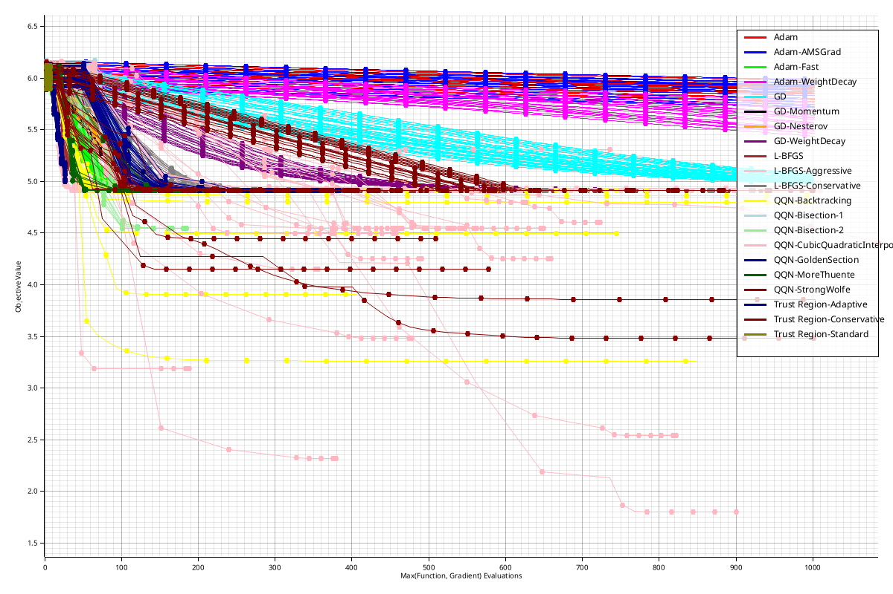
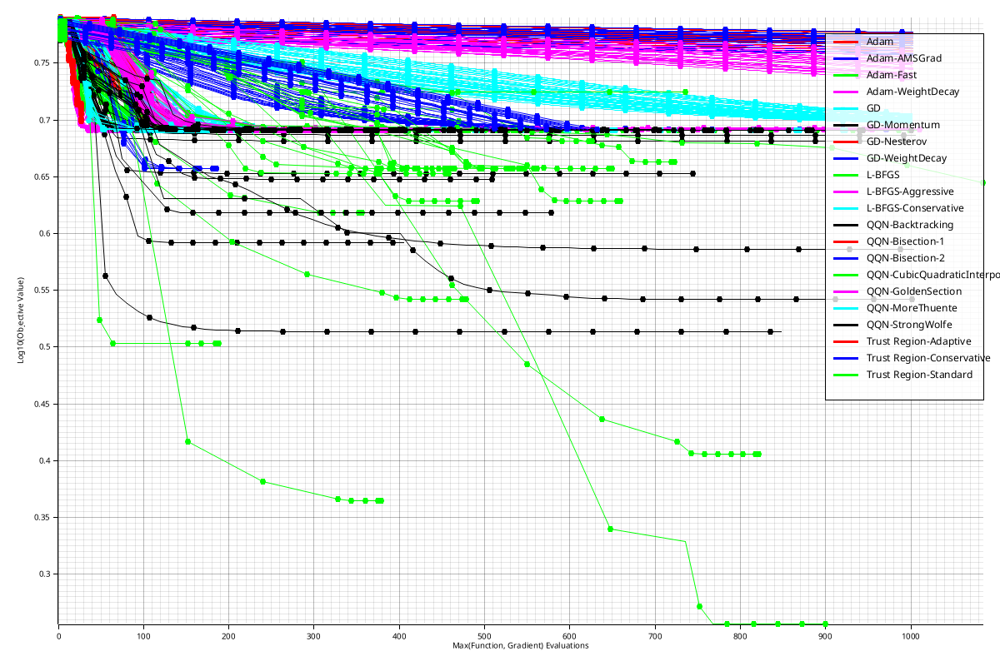

**Figure:** Convergence plots for Griewank_2D showing objective value vs iterations.
Left: Linear scale, Right: Log scale for better visualization of convergence behavior.

**Data:** [Linear scale data (CSV)](convergence_Griewank_2D_data.csv) | [Log scale data (CSV)](convergence_Griewank_2D_log_data.csv)

## Problem: Griewank_5D

**Family:** Griewank  
**Dimension:** 5  
**Success Threshold:** 1.000e-8  
**Total Runs:** 560

### Performance Summary
<table style="border-collapse: collapse; width: 100%; margin: 20px 0;">
<tr style="background-color: #f2f2f2;">
<th style="border: 1px solid #ddd; padding: 8px; text-align: center;">Rank</th>
<th style="border: 1px solid #ddd; padding: 8px; text-align: center;">Optimizer</th>
<th style="border: 1px solid #ddd; padding: 8px; text-align: center;">Mean Final Value (All/Success/Fail)</th>
<th style="border: 1px solid #ddd; padding: 8px; text-align: center;">Std Dev</th>
<th style="border: 1px solid #ddd; padding: 8px; text-align: center;">Best Value</th>
<th style="border: 1px solid #ddd; padding: 8px; text-align: center;">Worst Value</th>
<th style="border: 1px solid #ddd; padding: 8px; text-align: center;">Mean Function Evals (All/Success/Fail)</th>
<th style="border: 1px solid #ddd; padding: 8px; text-align: center;">Mean Gradient Evals (All/Success/Fail)</th>
<th style="border: 1px solid #ddd; padding: 8px; text-align: center;">Success Rate</th>
<th style="border: 1px solid #ddd; padding: 8px; text-align: center;">Mean Time (s)</th>
</tr>
<tr style="background-color: #d4edda; font-weight: bold;">
<td style="border: 1px solid #ddd; padding: 8px; text-align: center;">1</td>
<td style="border: 1px solid #ddd; padding: 8px; text-align: center;"><a href="detailed_Griewank_5D_QQN-CubicQuadraticInterpolation.md">QQN-CubicQuadraticInterpolation</a></td>
<td style="border: 1px solid #ddd; padding: 8px; text-align: center;">1.17e1 / - / 1.17e1</td>
<td style="border: 1px solid #ddd; padding: 8px; text-align: center;">1.91e0</td>
<td style="border: 1px solid #ddd; padding: 8px; text-align: center;">9.52e-1</td>
<td style="border: 1px solid #ddd; padding: 8px; text-align: center;">1.32e1</td>
<td style="border: 1px solid #ddd; padding: 8px; text-align: center;">349.6 / - / 349.6</td>
<td style="border: 1px solid #ddd; padding: 8px; text-align: center;">554.0 / - / 554.0</td>
<td style="border: 1px solid #ddd; padding: 8px; text-align: center;">0.0%</td>
<td style="border: 1px solid #ddd; padding: 8px; text-align: center;">0.012</td>
</tr>
<tr style="background-color: #fff3cd;">
<td style="border: 1px solid #ddd; padding: 8px; text-align: center;">2</td>
<td style="border: 1px solid #ddd; padding: 8px; text-align: center;"><a href="detailed_Griewank_5D_QQN-StrongWolfe.md">QQN-StrongWolfe</a></td>
<td style="border: 1px solid #ddd; padding: 8px; text-align: center;">1.07e1 / - / 1.07e1</td>
<td style="border: 1px solid #ddd; padding: 8px; text-align: center;">2.95e0</td>
<td style="border: 1px solid #ddd; padding: 8px; text-align: center;">1.30e0</td>
<td style="border: 1px solid #ddd; padding: 8px; text-align: center;">1.28e1</td>
<td style="border: 1px solid #ddd; padding: 8px; text-align: center;">481.5 / - / 481.5</td>
<td style="border: 1px solid #ddd; padding: 8px; text-align: center;">528.2 / - / 528.2</td>
<td style="border: 1px solid #ddd; padding: 8px; text-align: center;">0.0%</td>
<td style="border: 1px solid #ddd; padding: 8px; text-align: center;">0.017</td>
</tr>
<tr style="">
<td style="border: 1px solid #ddd; padding: 8px; text-align: center;">3</td>
<td style="border: 1px solid #ddd; padding: 8px; text-align: center;"><a href="detailed_Griewank_5D_QQN-Bisection-2.md">QQN-Bisection-2</a></td>
<td style="border: 1px solid #ddd; padding: 8px; text-align: center;">1.19e1 / - / 1.19e1</td>
<td style="border: 1px solid #ddd; padding: 8px; text-align: center;">1.87e0</td>
<td style="border: 1px solid #ddd; padding: 8px; text-align: center;">4.18e0</td>
<td style="border: 1px solid #ddd; padding: 8px; text-align: center;">1.30e1</td>
<td style="border: 1px solid #ddd; padding: 8px; text-align: center;">330.3 / - / 330.3</td>
<td style="border: 1px solid #ddd; padding: 8px; text-align: center;">188.9 / - / 188.9</td>
<td style="border: 1px solid #ddd; padding: 8px; text-align: center;">0.0%</td>
<td style="border: 1px solid #ddd; padding: 8px; text-align: center;">0.007</td>
</tr>
<tr style="">
<td style="border: 1px solid #ddd; padding: 8px; text-align: center;">4</td>
<td style="border: 1px solid #ddd; padding: 8px; text-align: center;"><a href="detailed_Griewank_5D_QQN-Backtracking.md">QQN-Backtracking</a></td>
<td style="border: 1px solid #ddd; padding: 8px; text-align: center;">1.16e1 / - / 1.16e1</td>
<td style="border: 1px solid #ddd; padding: 8px; text-align: center;">1.66e0</td>
<td style="border: 1px solid #ddd; padding: 8px; text-align: center;">5.65e0</td>
<td style="border: 1px solid #ddd; padding: 8px; text-align: center;">1.23e1</td>
<td style="border: 1px solid #ddd; padding: 8px; text-align: center;">557.4 / - / 557.4</td>
<td style="border: 1px solid #ddd; padding: 8px; text-align: center;">450.4 / - / 450.4</td>
<td style="border: 1px solid #ddd; padding: 8px; text-align: center;">0.0%</td>
<td style="border: 1px solid #ddd; padding: 8px; text-align: center;">0.021</td>
</tr>
<tr style="">
<td style="border: 1px solid #ddd; padding: 8px; text-align: center;">5</td>
<td style="border: 1px solid #ddd; padding: 8px; text-align: center;"><a href="detailed_Griewank_5D_QQN-GoldenSection.md">QQN-GoldenSection</a></td>
<td style="border: 1px solid #ddd; padding: 8px; text-align: center;">1.22e1 / - / 1.22e1</td>
<td style="border: 1px solid #ddd; padding: 8px; text-align: center;">1.03e0</td>
<td style="border: 1px solid #ddd; padding: 8px; text-align: center;">7.12e0</td>
<td style="border: 1px solid #ddd; padding: 8px; text-align: center;">1.32e1</td>
<td style="border: 1px solid #ddd; padding: 8px; text-align: center;">697.5 / - / 697.5</td>
<td style="border: 1px solid #ddd; padding: 8px; text-align: center;">107.5 / - / 107.5</td>
<td style="border: 1px solid #ddd; padding: 8px; text-align: center;">0.0%</td>
<td style="border: 1px solid #ddd; padding: 8px; text-align: center;">0.011</td>
</tr>
<tr style="">
<td style="border: 1px solid #ddd; padding: 8px; text-align: center;">6</td>
<td style="border: 1px solid #ddd; padding: 8px; text-align: center;"><a href="detailed_Griewank_5D_QQN-Bisection-1.md">QQN-Bisection-1</a></td>
<td style="border: 1px solid #ddd; padding: 8px; text-align: center;">1.21e1 / - / 1.21e1</td>
<td style="border: 1px solid #ddd; padding: 8px; text-align: center;">1.00e0</td>
<td style="border: 1px solid #ddd; padding: 8px; text-align: center;">7.29e0</td>
<td style="border: 1px solid #ddd; padding: 8px; text-align: center;">1.32e1</td>
<td style="border: 1px solid #ddd; padding: 8px; text-align: center;">318.7 / - / 318.7</td>
<td style="border: 1px solid #ddd; padding: 8px; text-align: center;">334.6 / - / 334.6</td>
<td style="border: 1px solid #ddd; padding: 8px; text-align: center;">0.0%</td>
<td style="border: 1px solid #ddd; padding: 8px; text-align: center;">0.006</td>
</tr>
<tr style="">
<td style="border: 1px solid #ddd; padding: 8px; text-align: center;">7</td>
<td style="border: 1px solid #ddd; padding: 8px; text-align: center;"><a href="detailed_Griewank_5D_L-BFGS-Aggressive.md">L-BFGS-Aggressive</a></td>
<td style="border: 1px solid #ddd; padding: 8px; text-align: center;">1.21e1 / - / 1.21e1</td>
<td style="border: 1px solid #ddd; padding: 8px; text-align: center;">4.39e-1</td>
<td style="border: 1px solid #ddd; padding: 8px; text-align: center;">1.01e1</td>
<td style="border: 1px solid #ddd; padding: 8px; text-align: center;">1.23e1</td>
<td style="border: 1px solid #ddd; padding: 8px; text-align: center;">263.2 / - / 263.2</td>
<td style="border: 1px solid #ddd; padding: 8px; text-align: center;">112.5 / - / 112.5</td>
<td style="border: 1px solid #ddd; padding: 8px; text-align: center;">0.0%</td>
<td style="border: 1px solid #ddd; padding: 8px; text-align: center;">0.004</td>
</tr>
<tr style="">
<td style="border: 1px solid #ddd; padding: 8px; text-align: center;">8</td>
<td style="border: 1px solid #ddd; padding: 8px; text-align: center;"><a href="detailed_Griewank_5D_QQN-MoreThuente.md">QQN-MoreThuente</a></td>
<td style="border: 1px solid #ddd; padding: 8px; text-align: center;">1.23e1 / - / 1.23e1</td>
<td style="border: 1px solid #ddd; padding: 8px; text-align: center;">2.05e-1</td>
<td style="border: 1px solid #ddd; padding: 8px; text-align: center;">1.22e1</td>
<td style="border: 1px solid #ddd; padding: 8px; text-align: center;">1.32e1</td>
<td style="border: 1px solid #ddd; padding: 8px; text-align: center;">341.3 / - / 341.3</td>
<td style="border: 1px solid #ddd; padding: 8px; text-align: center;">385.9 / - / 385.9</td>
<td style="border: 1px solid #ddd; padding: 8px; text-align: center;">0.0%</td>
<td style="border: 1px solid #ddd; padding: 8px; text-align: center;">0.010</td>
</tr>
<tr style="">
<td style="border: 1px solid #ddd; padding: 8px; text-align: center;">9</td>
<td style="border: 1px solid #ddd; padding: 8px; text-align: center;"><a href="detailed_Griewank_5D_L-BFGS.md">L-BFGS</a></td>
<td style="border: 1px solid #ddd; padding: 8px; text-align: center;">1.22e1 / - / 1.22e1</td>
<td style="border: 1px solid #ddd; padding: 8px; text-align: center;">2.77e-4</td>
<td style="border: 1px solid #ddd; padding: 8px; text-align: center;">1.22e1</td>
<td style="border: 1px solid #ddd; padding: 8px; text-align: center;">1.22e1</td>
<td style="border: 1px solid #ddd; padding: 8px; text-align: center;">302.9 / - / 302.9</td>
<td style="border: 1px solid #ddd; padding: 8px; text-align: center;">210.4 / - / 210.4</td>
<td style="border: 1px solid #ddd; padding: 8px; text-align: center;">0.0%</td>
<td style="border: 1px solid #ddd; padding: 8px; text-align: center;">0.007</td>
</tr>
<tr style="">
<td style="border: 1px solid #ddd; padding: 8px; text-align: center;">10</td>
<td style="border: 1px solid #ddd; padding: 8px; text-align: center;"><a href="detailed_Griewank_5D_L-BFGS-Conservative.md">L-BFGS-Conservative</a></td>
<td style="border: 1px solid #ddd; padding: 8px; text-align: center;">1.22e1 / - / 1.22e1</td>
<td style="border: 1px solid #ddd; padding: 8px; text-align: center;">1.24e-5</td>
<td style="border: 1px solid #ddd; padding: 8px; text-align: center;">1.22e1</td>
<td style="border: 1px solid #ddd; padding: 8px; text-align: center;">1.22e1</td>
<td style="border: 1px solid #ddd; padding: 8px; text-align: center;">558.2 / - / 558.2</td>
<td style="border: 1px solid #ddd; padding: 8px; text-align: center;">446.0 / - / 446.0</td>
<td style="border: 1px solid #ddd; padding: 8px; text-align: center;">0.0%</td>
<td style="border: 1px solid #ddd; padding: 8px; text-align: center;">0.014</td>
</tr>
<tr style="">
<td style="border: 1px solid #ddd; padding: 8px; text-align: center;">11</td>
<td style="border: 1px solid #ddd; padding: 8px; text-align: center;"><a href="detailed_Griewank_5D_GD-Momentum.md">GD-Momentum</a></td>
<td style="border: 1px solid #ddd; padding: 8px; text-align: center;">1.22e1 / - / 1.22e1</td>
<td style="border: 1px solid #ddd; padding: 8px; text-align: center;">2.29e-7</td>
<td style="border: 1px solid #ddd; padding: 8px; text-align: center;">1.22e1</td>
<td style="border: 1px solid #ddd; padding: 8px; text-align: center;">1.22e1</td>
<td style="border: 1px solid #ddd; padding: 8px; text-align: center;">335.0 / - / 335.0</td>
<td style="border: 1px solid #ddd; padding: 8px; text-align: center;">668.0 / - / 668.0</td>
<td style="border: 1px solid #ddd; padding: 8px; text-align: center;">0.0%</td>
<td style="border: 1px solid #ddd; padding: 8px; text-align: center;">0.009</td>
</tr>
<tr style="">
<td style="border: 1px solid #ddd; padding: 8px; text-align: center;">12</td>
<td style="border: 1px solid #ddd; padding: 8px; text-align: center;"><a href="detailed_Griewank_5D_GD-Nesterov.md">GD-Nesterov</a></td>
<td style="border: 1px solid #ddd; padding: 8px; text-align: center;">1.22e1 / - / 1.22e1</td>
<td style="border: 1px solid #ddd; padding: 8px; text-align: center;">4.00e-7</td>
<td style="border: 1px solid #ddd; padding: 8px; text-align: center;">1.22e1</td>
<td style="border: 1px solid #ddd; padding: 8px; text-align: center;">1.22e1</td>
<td style="border: 1px solid #ddd; padding: 8px; text-align: center;">335.0 / - / 335.0</td>
<td style="border: 1px solid #ddd; padding: 8px; text-align: center;">668.0 / - / 668.0</td>
<td style="border: 1px solid #ddd; padding: 8px; text-align: center;">0.0%</td>
<td style="border: 1px solid #ddd; padding: 8px; text-align: center;">0.010</td>
</tr>
<tr style="">
<td style="border: 1px solid #ddd; padding: 8px; text-align: center;">13</td>
<td style="border: 1px solid #ddd; padding: 8px; text-align: center;"><a href="detailed_Griewank_5D_Adam-Fast.md">Adam-Fast</a></td>
<td style="border: 1px solid #ddd; padding: 8px; text-align: center;">1.23e1 / - / 1.23e1</td>
<td style="border: 1px solid #ddd; padding: 8px; text-align: center;">1.67e-2</td>
<td style="border: 1px solid #ddd; padding: 8px; text-align: center;">1.22e1</td>
<td style="border: 1px solid #ddd; padding: 8px; text-align: center;">1.23e1</td>
<td style="border: 1px solid #ddd; padding: 8px; text-align: center;">67.5 / - / 67.5</td>
<td style="border: 1px solid #ddd; padding: 8px; text-align: center;">66.5 / - / 66.5</td>
<td style="border: 1px solid #ddd; padding: 8px; text-align: center;">0.0%</td>
<td style="border: 1px solid #ddd; padding: 8px; text-align: center;">0.001</td>
</tr>
<tr style="">
<td style="border: 1px solid #ddd; padding: 8px; text-align: center;">14</td>
<td style="border: 1px solid #ddd; padding: 8px; text-align: center;"><a href="detailed_Griewank_5D_Trust_Region-Conservative.md">Trust Region-Conservative</a></td>
<td style="border: 1px solid #ddd; padding: 8px; text-align: center;">1.23e1 / - / 1.23e1</td>
<td style="border: 1px solid #ddd; padding: 8px; text-align: center;">2.45e-3</td>
<td style="border: 1px solid #ddd; padding: 8px; text-align: center;">1.23e1</td>
<td style="border: 1px solid #ddd; padding: 8px; text-align: center;">1.23e1</td>
<td style="border: 1px solid #ddd; padding: 8px; text-align: center;">379.6 / - / 379.6</td>
<td style="border: 1px solid #ddd; padding: 8px; text-align: center;">253.7 / - / 253.7</td>
<td style="border: 1px solid #ddd; padding: 8px; text-align: center;">0.0%</td>
<td style="border: 1px solid #ddd; padding: 8px; text-align: center;">0.003</td>
</tr>
<tr style="">
<td style="border: 1px solid #ddd; padding: 8px; text-align: center;">15</td>
<td style="border: 1px solid #ddd; padding: 8px; text-align: center;"><a href="detailed_Griewank_5D_GD-WeightDecay.md">GD-WeightDecay</a></td>
<td style="border: 1px solid #ddd; padding: 8px; text-align: center;">1.24e1 / - / 1.24e1</td>
<td style="border: 1px solid #ddd; padding: 8px; text-align: center;">6.71e-2</td>
<td style="border: 1px solid #ddd; padding: 8px; text-align: center;">1.23e1</td>
<td style="border: 1px solid #ddd; padding: 8px; text-align: center;">1.26e1</td>
<td style="border: 1px solid #ddd; padding: 8px; text-align: center;">335.0 / - / 335.0</td>
<td style="border: 1px solid #ddd; padding: 8px; text-align: center;">668.0 / - / 668.0</td>
<td style="border: 1px solid #ddd; padding: 8px; text-align: center;">0.0%</td>
<td style="border: 1px solid #ddd; padding: 8px; text-align: center;">0.010</td>
</tr>
<tr style="">
<td style="border: 1px solid #ddd; padding: 8px; text-align: center;">16</td>
<td style="border: 1px solid #ddd; padding: 8px; text-align: center;"><a href="detailed_Griewank_5D_GD.md">GD</a></td>
<td style="border: 1px solid #ddd; padding: 8px; text-align: center;">1.33e1 / - / 1.33e1</td>
<td style="border: 1px solid #ddd; padding: 8px; text-align: center;">8.22e-2</td>
<td style="border: 1px solid #ddd; padding: 8px; text-align: center;">1.30e1</td>
<td style="border: 1px solid #ddd; padding: 8px; text-align: center;">1.34e1</td>
<td style="border: 1px solid #ddd; padding: 8px; text-align: center;">335.0 / - / 335.0</td>
<td style="border: 1px solid #ddd; padding: 8px; text-align: center;">668.0 / - / 668.0</td>
<td style="border: 1px solid #ddd; padding: 8px; text-align: center;">0.0%</td>
<td style="border: 1px solid #ddd; padding: 8px; text-align: center;">0.008</td>
</tr>
<tr style="">
<td style="border: 1px solid #ddd; padding: 8px; text-align: center;">17</td>
<td style="border: 1px solid #ddd; padding: 8px; text-align: center;"><a href="detailed_Griewank_5D_Adam-WeightDecay.md">Adam-WeightDecay</a></td>
<td style="border: 1px solid #ddd; padding: 8px; text-align: center;">1.32e1 / - / 1.32e1</td>
<td style="border: 1px solid #ddd; padding: 8px; text-align: center;">6.07e-2</td>
<td style="border: 1px solid #ddd; padding: 8px; text-align: center;">1.30e1</td>
<td style="border: 1px solid #ddd; padding: 8px; text-align: center;">1.33e1</td>
<td style="border: 1px solid #ddd; padding: 8px; text-align: center;">502.0 / - / 502.0</td>
<td style="border: 1px solid #ddd; padding: 8px; text-align: center;">502.0 / - / 502.0</td>
<td style="border: 1px solid #ddd; padding: 8px; text-align: center;">0.0%</td>
<td style="border: 1px solid #ddd; padding: 8px; text-align: center;">0.011</td>
</tr>
<tr style="">
<td style="border: 1px solid #ddd; padding: 8px; text-align: center;">18</td>
<td style="border: 1px solid #ddd; padding: 8px; text-align: center;"><a href="detailed_Griewank_5D_Adam-AMSGrad.md">Adam-AMSGrad</a></td>
<td style="border: 1px solid #ddd; padding: 8px; text-align: center;">1.34e1 / - / 1.34e1</td>
<td style="border: 1px solid #ddd; padding: 8px; text-align: center;">2.76e-2</td>
<td style="border: 1px solid #ddd; padding: 8px; text-align: center;">1.33e1</td>
<td style="border: 1px solid #ddd; padding: 8px; text-align: center;">1.34e1</td>
<td style="border: 1px solid #ddd; padding: 8px; text-align: center;">502.0 / - / 502.0</td>
<td style="border: 1px solid #ddd; padding: 8px; text-align: center;">502.0 / - / 502.0</td>
<td style="border: 1px solid #ddd; padding: 8px; text-align: center;">0.0%</td>
<td style="border: 1px solid #ddd; padding: 8px; text-align: center;">0.012</td>
</tr>
<tr style="">
<td style="border: 1px solid #ddd; padding: 8px; text-align: center;">19</td>
<td style="border: 1px solid #ddd; padding: 8px; text-align: center;"><a href="detailed_Griewank_5D_Adam.md">Adam</a></td>
<td style="border: 1px solid #ddd; padding: 8px; text-align: center;">1.34e1 / - / 1.34e1</td>
<td style="border: 1px solid #ddd; padding: 8px; text-align: center;">2.95e-2</td>
<td style="border: 1px solid #ddd; padding: 8px; text-align: center;">1.33e1</td>
<td style="border: 1px solid #ddd; padding: 8px; text-align: center;">1.34e1</td>
<td style="border: 1px solid #ddd; padding: 8px; text-align: center;">502.0 / - / 502.0</td>
<td style="border: 1px solid #ddd; padding: 8px; text-align: center;">502.0 / - / 502.0</td>
<td style="border: 1px solid #ddd; padding: 8px; text-align: center;">0.0%</td>
<td style="border: 1px solid #ddd; padding: 8px; text-align: center;">0.010</td>
</tr>
<tr style="">
<td style="border: 1px solid #ddd; padding: 8px; text-align: center;">20</td>
<td style="border: 1px solid #ddd; padding: 8px; text-align: center;"><a href="detailed_Griewank_5D_Trust_Region-Adaptive.md">Trust Region-Adaptive</a></td>
<td style="border: 1px solid #ddd; padding: 8px; text-align: center;">1.35e1 / - / 1.35e1</td>
<td style="border: 1px solid #ddd; padding: 8px; text-align: center;">2.45e-2</td>
<td style="border: 1px solid #ddd; padding: 8px; text-align: center;">1.35e1</td>
<td style="border: 1px solid #ddd; padding: 8px; text-align: center;">1.35e1</td>
<td style="border: 1px solid #ddd; padding: 8px; text-align: center;">5.0 / - / 5.0</td>
<td style="border: 1px solid #ddd; padding: 8px; text-align: center;">4.0 / - / 4.0</td>
<td style="border: 1px solid #ddd; padding: 8px; text-align: center;">0.0%</td>
<td style="border: 1px solid #ddd; padding: 8px; text-align: center;">0.000</td>
</tr>
<tr style="">
<td style="border: 1px solid #ddd; padding: 8px; text-align: center;">21</td>
<td style="border: 1px solid #ddd; padding: 8px; text-align: center;"><a href="detailed_Griewank_5D_Trust_Region-Standard.md">Trust Region-Standard</a></td>
<td style="border: 1px solid #ddd; padding: 8px; text-align: center;">1.35e1 / - / 1.35e1</td>
<td style="border: 1px solid #ddd; padding: 8px; text-align: center;">2.24e-2</td>
<td style="border: 1px solid #ddd; padding: 8px; text-align: center;">1.35e1</td>
<td style="border: 1px solid #ddd; padding: 8px; text-align: center;">1.36e1</td>
<td style="border: 1px solid #ddd; padding: 8px; text-align: center;">5.0 / - / 5.0</td>
<td style="border: 1px solid #ddd; padding: 8px; text-align: center;">4.0 / - / 4.0</td>
<td style="border: 1px solid #ddd; padding: 8px; text-align: center;">0.0%</td>
<td style="border: 1px solid #ddd; padding: 8px; text-align: center;">0.000</td>
</tr>
</table>

### Convergence Plots

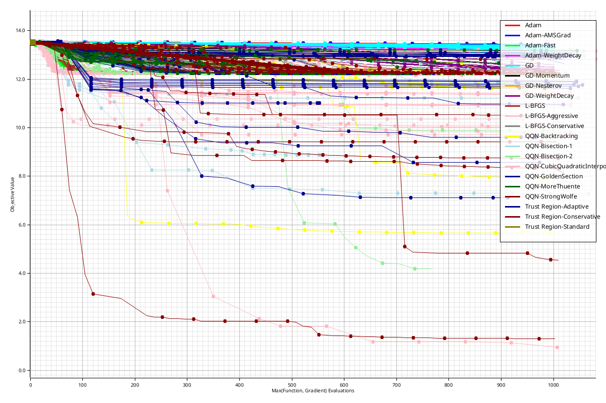
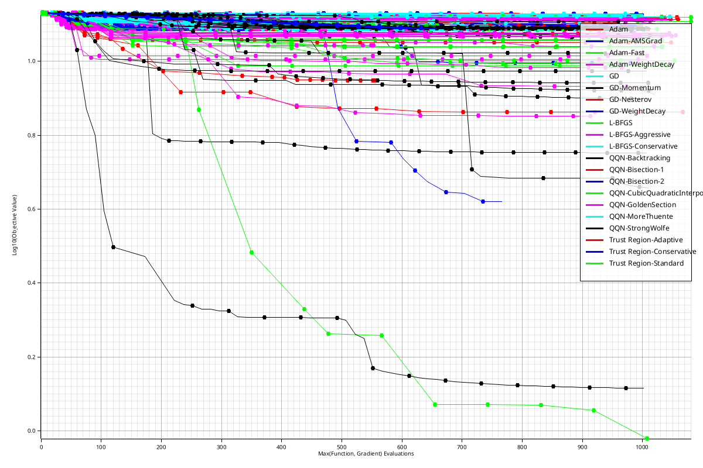

**Figure:** Convergence plots for Griewank_5D showing objective value vs iterations.
Left: Linear scale, Right: Log scale for better visualization of convergence behavior.

**Data:** [Linear scale data (CSV)](convergence_Griewank_5D_data.csv) | [Log scale data (CSV)](convergence_Griewank_5D_log_data.csv)

## Problem: Griewank_10D

**Family:** Griewank  
**Dimension:** 10  
**Success Threshold:** 1.000e-8  
**Total Runs:** 560

### Performance Summary
<table style="border-collapse: collapse; width: 100%; margin: 20px 0;">
<tr style="background-color: #f2f2f2;">
<th style="border: 1px solid #ddd; padding: 8px; text-align: center;">Rank</th>
<th style="border: 1px solid #ddd; padding: 8px; text-align: center;">Optimizer</th>
<th style="border: 1px solid #ddd; padding: 8px; text-align: center;">Mean Final Value (All/Success/Fail)</th>
<th style="border: 1px solid #ddd; padding: 8px; text-align: center;">Std Dev</th>
<th style="border: 1px solid #ddd; padding: 8px; text-align: center;">Best Value</th>
<th style="border: 1px solid #ddd; padding: 8px; text-align: center;">Worst Value</th>
<th style="border: 1px solid #ddd; padding: 8px; text-align: center;">Mean Function Evals (All/Success/Fail)</th>
<th style="border: 1px solid #ddd; padding: 8px; text-align: center;">Mean Gradient Evals (All/Success/Fail)</th>
<th style="border: 1px solid #ddd; padding: 8px; text-align: center;">Success Rate</th>
<th style="border: 1px solid #ddd; padding: 8px; text-align: center;">Mean Time (s)</th>
</tr>
<tr style="background-color: #d4edda; font-weight: bold;">
<td style="border: 1px solid #ddd; padding: 8px; text-align: center;">1</td>
<td style="border: 1px solid #ddd; padding: 8px; text-align: center;"><a href="detailed_Griewank_10D_QQN-Bisection-1.md">QQN-Bisection-1</a></td>
<td style="border: 1px solid #ddd; padding: 8px; text-align: center;">1.08e1 / 1.86e-12 / 1.11e1</td>
<td style="border: 1px solid #ddd; padding: 8px; text-align: center;">1.21e1</td>
<td style="border: 1px solid #ddd; padding: 8px; text-align: center;">1.86e-12</td>
<td style="border: 1px solid #ddd; padding: 8px; text-align: center;">2.58e1</td>
<td style="border: 1px solid #ddd; padding: 8px; text-align: center;">506.3 / 369.0 / 509.8</td>
<td style="border: 1px solid #ddd; padding: 8px; text-align: center;">513.1 / 370.0 / 516.8</td>
<td style="border: 1px solid #ddd; padding: 8px; text-align: center;">2.5%</td>
<td style="border: 1px solid #ddd; padding: 8px; text-align: center;">0.011</td>
</tr>
<tr style="background-color: #fff3cd;">
<td style="border: 1px solid #ddd; padding: 8px; text-align: center;">2</td>
<td style="border: 1px solid #ddd; padding: 8px; text-align: center;"><a href="detailed_Griewank_10D_QQN-GoldenSection.md">QQN-GoldenSection</a></td>
<td style="border: 1px solid #ddd; padding: 8px; text-align: center;">1.77e1 / - / 1.77e1</td>
<td style="border: 1px solid #ddd; padding: 8px; text-align: center;">1.17e1</td>
<td style="border: 1px solid #ddd; padding: 8px; text-align: center;">7.85e-3</td>
<td style="border: 1px solid #ddd; padding: 8px; text-align: center;">2.58e1</td>
<td style="border: 1px solid #ddd; padding: 8px; text-align: center;">913.7 / - / 913.7</td>
<td style="border: 1px solid #ddd; padding: 8px; text-align: center;">113.1 / - / 113.1</td>
<td style="border: 1px solid #ddd; padding: 8px; text-align: center;">0.0%</td>
<td style="border: 1px solid #ddd; padding: 8px; text-align: center;">0.015</td>
</tr>
<tr style="">
<td style="border: 1px solid #ddd; padding: 8px; text-align: center;">3</td>
<td style="border: 1px solid #ddd; padding: 8px; text-align: center;"><a href="detailed_Griewank_10D_QQN-Backtracking.md">QQN-Backtracking</a></td>
<td style="border: 1px solid #ddd; padding: 8px; text-align: center;">8.40e0 / - / 8.40e0</td>
<td style="border: 1px solid #ddd; padding: 8px; text-align: center;">1.15e1</td>
<td style="border: 1px solid #ddd; padding: 8px; text-align: center;">1.72e-2</td>
<td style="border: 1px solid #ddd; padding: 8px; text-align: center;">2.60e1</td>
<td style="border: 1px solid #ddd; padding: 8px; text-align: center;">595.4 / - / 595.4</td>
<td style="border: 1px solid #ddd; padding: 8px; text-align: center;">373.9 / - / 373.9</td>
<td style="border: 1px solid #ddd; padding: 8px; text-align: center;">0.0%</td>
<td style="border: 1px solid #ddd; padding: 8px; text-align: center;">0.020</td>
</tr>
<tr style="">
<td style="border: 1px solid #ddd; padding: 8px; text-align: center;">4</td>
<td style="border: 1px solid #ddd; padding: 8px; text-align: center;"><a href="detailed_Griewank_10D_QQN-StrongWolfe.md">QQN-StrongWolfe</a></td>
<td style="border: 1px solid #ddd; padding: 8px; text-align: center;">8.29e0 / - / 8.29e0</td>
<td style="border: 1px solid #ddd; padding: 8px; text-align: center;">1.16e1</td>
<td style="border: 1px solid #ddd; padding: 8px; text-align: center;">1.97e-2</td>
<td style="border: 1px solid #ddd; padding: 8px; text-align: center;">2.60e1</td>
<td style="border: 1px solid #ddd; padding: 8px; text-align: center;">517.9 / - / 517.9</td>
<td style="border: 1px solid #ddd; padding: 8px; text-align: center;">457.6 / - / 457.6</td>
<td style="border: 1px solid #ddd; padding: 8px; text-align: center;">0.0%</td>
<td style="border: 1px solid #ddd; padding: 8px; text-align: center;">0.016</td>
</tr>
<tr style="">
<td style="border: 1px solid #ddd; padding: 8px; text-align: center;">5</td>
<td style="border: 1px solid #ddd; padding: 8px; text-align: center;"><a href="detailed_Griewank_10D_QQN-CubicQuadraticInterpolation.md">QQN-CubicQuadraticInterpolation</a></td>
<td style="border: 1px solid #ddd; padding: 8px; text-align: center;">1.03e1 / - / 1.03e1</td>
<td style="border: 1px solid #ddd; padding: 8px; text-align: center;">1.20e1</td>
<td style="border: 1px solid #ddd; padding: 8px; text-align: center;">1.20e-1</td>
<td style="border: 1px solid #ddd; padding: 8px; text-align: center;">2.58e1</td>
<td style="border: 1px solid #ddd; padding: 8px; text-align: center;">344.4 / - / 344.4</td>
<td style="border: 1px solid #ddd; padding: 8px; text-align: center;">566.5 / - / 566.5</td>
<td style="border: 1px solid #ddd; padding: 8px; text-align: center;">0.0%</td>
<td style="border: 1px solid #ddd; padding: 8px; text-align: center;">0.013</td>
</tr>
<tr style="">
<td style="border: 1px solid #ddd; padding: 8px; text-align: center;">6</td>
<td style="border: 1px solid #ddd; padding: 8px; text-align: center;"><a href="detailed_Griewank_10D_L-BFGS-Aggressive.md">L-BFGS-Aggressive</a></td>
<td style="border: 1px solid #ddd; padding: 8px; text-align: center;">1.29e1 / - / 2.84e2</td>
<td style="border: 1px solid #ddd; padding: 8px; text-align: center;">8.80e0</td>
<td style="border: 1px solid #ddd; padding: 8px; text-align: center;">9.30e-1</td>
<td style="border: 1px solid #ddd; padding: 8px; text-align: center;">2.47e1</td>
<td style="border: 1px solid #ddd; padding: 8px; text-align: center;">663.4 / - / 663.4</td>
<td style="border: 1px solid #ddd; padding: 8px; text-align: center;">245.2 / - / 245.2</td>
<td style="border: 1px solid #ddd; padding: 8px; text-align: center;">0.0%</td>
<td style="border: 1px solid #ddd; padding: 8px; text-align: center;">0.011</td>
</tr>
<tr style="">
<td style="border: 1px solid #ddd; padding: 8px; text-align: center;">7</td>
<td style="border: 1px solid #ddd; padding: 8px; text-align: center;"><a href="detailed_Griewank_10D_QQN-Bisection-2.md">QQN-Bisection-2</a></td>
<td style="border: 1px solid #ddd; padding: 8px; text-align: center;">2.45e1 / - / 2.45e1</td>
<td style="border: 1px solid #ddd; padding: 8px; text-align: center;">5.41e0</td>
<td style="border: 1px solid #ddd; padding: 8px; text-align: center;">9.42e-1</td>
<td style="border: 1px solid #ddd; padding: 8px; text-align: center;">2.58e1</td>
<td style="border: 1px solid #ddd; padding: 8px; text-align: center;">644.6 / - / 644.6</td>
<td style="border: 1px solid #ddd; padding: 8px; text-align: center;">312.1 / - / 312.1</td>
<td style="border: 1px solid #ddd; padding: 8px; text-align: center;">0.0%</td>
<td style="border: 1px solid #ddd; padding: 8px; text-align: center;">0.014</td>
</tr>
<tr style="">
<td style="border: 1px solid #ddd; padding: 8px; text-align: center;">8</td>
<td style="border: 1px solid #ddd; padding: 8px; text-align: center;"><a href="detailed_Griewank_10D_L-BFGS.md">L-BFGS</a></td>
<td style="border: 1px solid #ddd; padding: 8px; text-align: center;">1.85e1 / - / 1.85e1</td>
<td style="border: 1px solid #ddd; padding: 8px; text-align: center;">3.12e0</td>
<td style="border: 1px solid #ddd; padding: 8px; text-align: center;">1.22e1</td>
<td style="border: 1px solid #ddd; padding: 8px; text-align: center;">2.34e1</td>
<td style="border: 1px solid #ddd; padding: 8px; text-align: center;">430.9 / - / 430.9</td>
<td style="border: 1px solid #ddd; padding: 8px; text-align: center;">296.4 / - / 296.4</td>
<td style="border: 1px solid #ddd; padding: 8px; text-align: center;">0.0%</td>
<td style="border: 1px solid #ddd; padding: 8px; text-align: center;">0.010</td>
</tr>
<tr style="">
<td style="border: 1px solid #ddd; padding: 8px; text-align: center;">9</td>
<td style="border: 1px solid #ddd; padding: 8px; text-align: center;"><a href="detailed_Griewank_10D_Adam-Fast.md">Adam-Fast</a></td>
<td style="border: 1px solid #ddd; padding: 8px; text-align: center;">1.57e1 / - / 1.57e1</td>
<td style="border: 1px solid #ddd; padding: 8px; text-align: center;">6.84e-2</td>
<td style="border: 1px solid #ddd; padding: 8px; text-align: center;">1.56e1</td>
<td style="border: 1px solid #ddd; padding: 8px; text-align: center;">1.59e1</td>
<td style="border: 1px solid #ddd; padding: 8px; text-align: center;">502.0 / - / 502.0</td>
<td style="border: 1px solid #ddd; padding: 8px; text-align: center;">502.0 / - / 502.0</td>
<td style="border: 1px solid #ddd; padding: 8px; text-align: center;">0.0%</td>
<td style="border: 1px solid #ddd; padding: 8px; text-align: center;">0.011</td>
</tr>
<tr style="">
<td style="border: 1px solid #ddd; padding: 8px; text-align: center;">10</td>
<td style="border: 1px solid #ddd; padding: 8px; text-align: center;"><a href="detailed_Griewank_10D_L-BFGS-Conservative.md">L-BFGS-Conservative</a></td>
<td style="border: 1px solid #ddd; padding: 8px; text-align: center;">2.50e1 / - / 2.50e1</td>
<td style="border: 1px solid #ddd; padding: 8px; text-align: center;">5.19e-1</td>
<td style="border: 1px solid #ddd; padding: 8px; text-align: center;">2.37e1</td>
<td style="border: 1px solid #ddd; padding: 8px; text-align: center;">2.57e1</td>
<td style="border: 1px solid #ddd; padding: 8px; text-align: center;">557.5 / - / 557.5</td>
<td style="border: 1px solid #ddd; padding: 8px; text-align: center;">444.6 / - / 444.6</td>
<td style="border: 1px solid #ddd; padding: 8px; text-align: center;">0.0%</td>
<td style="border: 1px solid #ddd; padding: 8px; text-align: center;">0.015</td>
</tr>
<tr style="">
<td style="border: 1px solid #ddd; padding: 8px; text-align: center;">11</td>
<td style="border: 1px solid #ddd; padding: 8px; text-align: center;"><a href="detailed_Griewank_10D_Trust_Region-Conservative.md">Trust Region-Conservative</a></td>
<td style="border: 1px solid #ddd; padding: 8px; text-align: center;">2.40e1 / - / 2.40e1</td>
<td style="border: 1px solid #ddd; padding: 8px; text-align: center;">5.92e-2</td>
<td style="border: 1px solid #ddd; padding: 8px; text-align: center;">2.40e1</td>
<td style="border: 1px solid #ddd; padding: 8px; text-align: center;">2.43e1</td>
<td style="border: 1px solid #ddd; padding: 8px; text-align: center;">597.8 / - / 597.8</td>
<td style="border: 1px solid #ddd; padding: 8px; text-align: center;">399.2 / - / 399.2</td>
<td style="border: 1px solid #ddd; padding: 8px; text-align: center;">0.0%</td>
<td style="border: 1px solid #ddd; padding: 8px; text-align: center;">0.004</td>
</tr>
<tr style="">
<td style="border: 1px solid #ddd; padding: 8px; text-align: center;">12</td>
<td style="border: 1px solid #ddd; padding: 8px; text-align: center;"><a href="detailed_Griewank_10D_GD-Momentum.md">GD-Momentum</a></td>
<td style="border: 1px solid #ddd; padding: 8px; text-align: center;">2.52e1 / - / 2.52e1</td>
<td style="border: 1px solid #ddd; padding: 8px; text-align: center;">1.81e-2</td>
<td style="border: 1px solid #ddd; padding: 8px; text-align: center;">2.52e1</td>
<td style="border: 1px solid #ddd; padding: 8px; text-align: center;">2.53e1</td>
<td style="border: 1px solid #ddd; padding: 8px; text-align: center;">335.0 / - / 335.0</td>
<td style="border: 1px solid #ddd; padding: 8px; text-align: center;">668.0 / - / 668.0</td>
<td style="border: 1px solid #ddd; padding: 8px; text-align: center;">0.0%</td>
<td style="border: 1px solid #ddd; padding: 8px; text-align: center;">0.010</td>
</tr>
<tr style="">
<td style="border: 1px solid #ddd; padding: 8px; text-align: center;">13</td>
<td style="border: 1px solid #ddd; padding: 8px; text-align: center;"><a href="detailed_Griewank_10D_GD-Nesterov.md">GD-Nesterov</a></td>
<td style="border: 1px solid #ddd; padding: 8px; text-align: center;">2.53e1 / - / 2.53e1</td>
<td style="border: 1px solid #ddd; padding: 8px; text-align: center;">1.95e-2</td>
<td style="border: 1px solid #ddd; padding: 8px; text-align: center;">2.52e1</td>
<td style="border: 1px solid #ddd; padding: 8px; text-align: center;">2.53e1</td>
<td style="border: 1px solid #ddd; padding: 8px; text-align: center;">335.0 / - / 335.0</td>
<td style="border: 1px solid #ddd; padding: 8px; text-align: center;">668.0 / - / 668.0</td>
<td style="border: 1px solid #ddd; padding: 8px; text-align: center;">0.0%</td>
<td style="border: 1px solid #ddd; padding: 8px; text-align: center;">0.011</td>
</tr>
<tr style="">
<td style="border: 1px solid #ddd; padding: 8px; text-align: center;">14</td>
<td style="border: 1px solid #ddd; padding: 8px; text-align: center;"><a href="detailed_Griewank_10D_Adam-WeightDecay.md">Adam-WeightDecay</a></td>
<td style="border: 1px solid #ddd; padding: 8px; text-align: center;">2.56e1 / - / 2.56e1</td>
<td style="border: 1px solid #ddd; padding: 8px; text-align: center;">2.08e-2</td>
<td style="border: 1px solid #ddd; padding: 8px; text-align: center;">2.56e1</td>
<td style="border: 1px solid #ddd; padding: 8px; text-align: center;">2.57e1</td>
<td style="border: 1px solid #ddd; padding: 8px; text-align: center;">502.0 / - / 502.0</td>
<td style="border: 1px solid #ddd; padding: 8px; text-align: center;">502.0 / - / 502.0</td>
<td style="border: 1px solid #ddd; padding: 8px; text-align: center;">0.0%</td>
<td style="border: 1px solid #ddd; padding: 8px; text-align: center;">0.012</td>
</tr>
<tr style="">
<td style="border: 1px solid #ddd; padding: 8px; text-align: center;">15</td>
<td style="border: 1px solid #ddd; padding: 8px; text-align: center;"><a href="detailed_Griewank_10D_QQN-MoreThuente.md">QQN-MoreThuente</a></td>
<td style="border: 1px solid #ddd; padding: 8px; text-align: center;">2.57e1 / - / 2.57e1</td>
<td style="border: 1px solid #ddd; padding: 8px; text-align: center;">1.34e-2</td>
<td style="border: 1px solid #ddd; padding: 8px; text-align: center;">2.57e1</td>
<td style="border: 1px solid #ddd; padding: 8px; text-align: center;">2.58e1</td>
<td style="border: 1px solid #ddd; padding: 8px; text-align: center;">414.3 / - / 414.3</td>
<td style="border: 1px solid #ddd; padding: 8px; text-align: center;">621.2 / - / 621.2</td>
<td style="border: 1px solid #ddd; padding: 8px; text-align: center;">0.0%</td>
<td style="border: 1px solid #ddd; padding: 8px; text-align: center;">0.015</td>
</tr>
<tr style="">
<td style="border: 1px solid #ddd; padding: 8px; text-align: center;">16</td>
<td style="border: 1px solid #ddd; padding: 8px; text-align: center;"><a href="detailed_Griewank_10D_GD-WeightDecay.md">GD-WeightDecay</a></td>
<td style="border: 1px solid #ddd; padding: 8px; text-align: center;">2.58e1 / - / 2.58e1</td>
<td style="border: 1px solid #ddd; padding: 8px; text-align: center;">1.91e-2</td>
<td style="border: 1px solid #ddd; padding: 8px; text-align: center;">2.57e1</td>
<td style="border: 1px solid #ddd; padding: 8px; text-align: center;">2.58e1</td>
<td style="border: 1px solid #ddd; padding: 8px; text-align: center;">335.0 / - / 335.0</td>
<td style="border: 1px solid #ddd; padding: 8px; text-align: center;">668.0 / - / 668.0</td>
<td style="border: 1px solid #ddd; padding: 8px; text-align: center;">0.0%</td>
<td style="border: 1px solid #ddd; padding: 8px; text-align: center;">0.011</td>
</tr>
<tr style="">
<td style="border: 1px solid #ddd; padding: 8px; text-align: center;">17</td>
<td style="border: 1px solid #ddd; padding: 8px; text-align: center;"><a href="detailed_Griewank_10D_Adam.md">Adam</a></td>
<td style="border: 1px solid #ddd; padding: 8px; text-align: center;">2.59e1 / - / 2.59e1</td>
<td style="border: 1px solid #ddd; padding: 8px; text-align: center;">1.65e-2</td>
<td style="border: 1px solid #ddd; padding: 8px; text-align: center;">2.58e1</td>
<td style="border: 1px solid #ddd; padding: 8px; text-align: center;">2.59e1</td>
<td style="border: 1px solid #ddd; padding: 8px; text-align: center;">502.0 / - / 502.0</td>
<td style="border: 1px solid #ddd; padding: 8px; text-align: center;">502.0 / - / 502.0</td>
<td style="border: 1px solid #ddd; padding: 8px; text-align: center;">0.0%</td>
<td style="border: 1px solid #ddd; padding: 8px; text-align: center;">0.011</td>
</tr>
<tr style="">
<td style="border: 1px solid #ddd; padding: 8px; text-align: center;">18</td>
<td style="border: 1px solid #ddd; padding: 8px; text-align: center;"><a href="detailed_Griewank_10D_Adam-AMSGrad.md">Adam-AMSGrad</a></td>
<td style="border: 1px solid #ddd; padding: 8px; text-align: center;">2.59e1 / - / 2.59e1</td>
<td style="border: 1px solid #ddd; padding: 8px; text-align: center;">1.82e-2</td>
<td style="border: 1px solid #ddd; padding: 8px; text-align: center;">2.59e1</td>
<td style="border: 1px solid #ddd; padding: 8px; text-align: center;">2.59e1</td>
<td style="border: 1px solid #ddd; padding: 8px; text-align: center;">502.0 / - / 502.0</td>
<td style="border: 1px solid #ddd; padding: 8px; text-align: center;">502.0 / - / 502.0</td>
<td style="border: 1px solid #ddd; padding: 8px; text-align: center;">0.0%</td>
<td style="border: 1px solid #ddd; padding: 8px; text-align: center;">0.012</td>
</tr>
<tr style="">
<td style="border: 1px solid #ddd; padding: 8px; text-align: center;">19</td>
<td style="border: 1px solid #ddd; padding: 8px; text-align: center;"><a href="detailed_Griewank_10D_GD.md">GD</a></td>
<td style="border: 1px solid #ddd; padding: 8px; text-align: center;">2.59e1 / - / 2.59e1</td>
<td style="border: 1px solid #ddd; padding: 8px; text-align: center;">1.76e-2</td>
<td style="border: 1px solid #ddd; padding: 8px; text-align: center;">2.59e1</td>
<td style="border: 1px solid #ddd; padding: 8px; text-align: center;">2.60e1</td>
<td style="border: 1px solid #ddd; padding: 8px; text-align: center;">335.0 / - / 335.0</td>
<td style="border: 1px solid #ddd; padding: 8px; text-align: center;">668.0 / - / 668.0</td>
<td style="border: 1px solid #ddd; padding: 8px; text-align: center;">0.0%</td>
<td style="border: 1px solid #ddd; padding: 8px; text-align: center;">0.009</td>
</tr>
<tr style="">
<td style="border: 1px solid #ddd; padding: 8px; text-align: center;">20</td>
<td style="border: 1px solid #ddd; padding: 8px; text-align: center;"><a href="detailed_Griewank_10D_Trust_Region-Standard.md">Trust Region-Standard</a></td>
<td style="border: 1px solid #ddd; padding: 8px; text-align: center;">2.60e1 / - / 2.60e1</td>
<td style="border: 1px solid #ddd; padding: 8px; text-align: center;">1.94e-2</td>
<td style="border: 1px solid #ddd; padding: 8px; text-align: center;">2.60e1</td>
<td style="border: 1px solid #ddd; padding: 8px; text-align: center;">2.60e1</td>
<td style="border: 1px solid #ddd; padding: 8px; text-align: center;">5.0 / - / 5.0</td>
<td style="border: 1px solid #ddd; padding: 8px; text-align: center;">4.0 / - / 4.0</td>
<td style="border: 1px solid #ddd; padding: 8px; text-align: center;">0.0%</td>
<td style="border: 1px solid #ddd; padding: 8px; text-align: center;">0.000</td>
</tr>
<tr style="">
<td style="border: 1px solid #ddd; padding: 8px; text-align: center;">21</td>
<td style="border: 1px solid #ddd; padding: 8px; text-align: center;"><a href="detailed_Griewank_10D_Trust_Region-Adaptive.md">Trust Region-Adaptive</a></td>
<td style="border: 1px solid #ddd; padding: 8px; text-align: center;">2.60e1 / - / 2.60e1</td>
<td style="border: 1px solid #ddd; padding: 8px; text-align: center;">1.70e-2</td>
<td style="border: 1px solid #ddd; padding: 8px; text-align: center;">2.60e1</td>
<td style="border: 1px solid #ddd; padding: 8px; text-align: center;">2.60e1</td>
<td style="border: 1px solid #ddd; padding: 8px; text-align: center;">5.0 / - / 5.0</td>
<td style="border: 1px solid #ddd; padding: 8px; text-align: center;">4.0 / - / 4.0</td>
<td style="border: 1px solid #ddd; padding: 8px; text-align: center;">0.0%</td>
<td style="border: 1px solid #ddd; padding: 8px; text-align: center;">0.000</td>
</tr>
</table>

### Convergence Plots

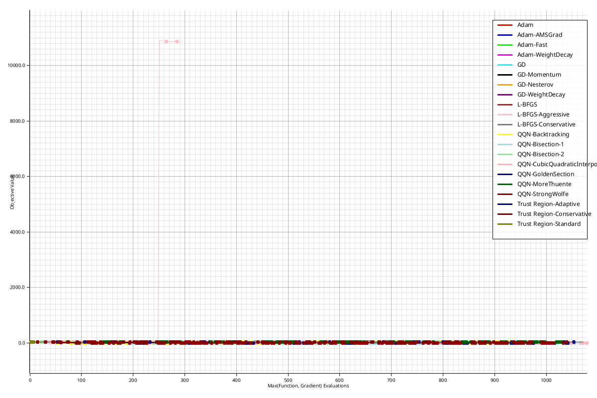
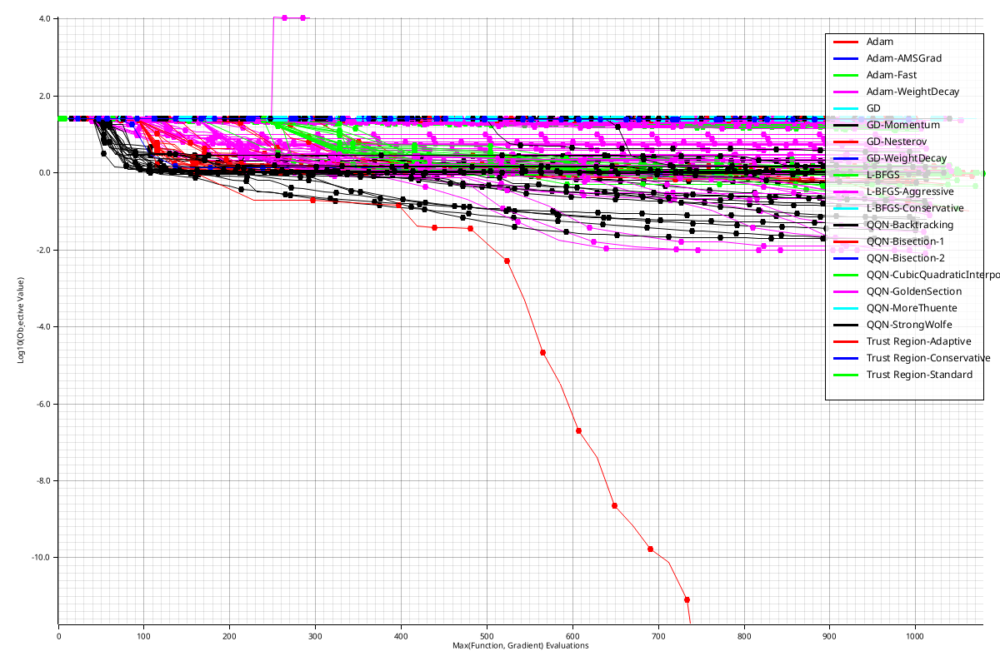

**Figure:** Convergence plots for Griewank_10D showing objective value vs iterations.
Left: Linear scale, Right: Log scale for better visualization of convergence behavior.

**Data:** [Linear scale data (CSV)](convergence_Griewank_10D_data.csv) | [Log scale data (CSV)](convergence_Griewank_10D_log_data.csv)

## Problem: Schwefel_2D

**Family:** Schwefel  
**Dimension:** 2  
**Success Threshold:** 1.000e-8  
**Total Runs:** 560

### Performance Summary
<table style="border-collapse: collapse; width: 100%; margin: 20px 0;">
<tr style="background-color: #f2f2f2;">
<th style="border: 1px solid #ddd; padding: 8px; text-align: center;">Rank</th>
<th style="border: 1px solid #ddd; padding: 8px; text-align: center;">Optimizer</th>
<th style="border: 1px solid #ddd; padding: 8px; text-align: center;">Mean Final Value (All/Success/Fail)</th>
<th style="border: 1px solid #ddd; padding: 8px; text-align: center;">Std Dev</th>
<th style="border: 1px solid #ddd; padding: 8px; text-align: center;">Best Value</th>
<th style="border: 1px solid #ddd; padding: 8px; text-align: center;">Worst Value</th>
<th style="border: 1px solid #ddd; padding: 8px; text-align: center;">Mean Function Evals (All/Success/Fail)</th>
<th style="border: 1px solid #ddd; padding: 8px; text-align: center;">Mean Gradient Evals (All/Success/Fail)</th>
<th style="border: 1px solid #ddd; padding: 8px; text-align: center;">Success Rate</th>
<th style="border: 1px solid #ddd; padding: 8px; text-align: center;">Mean Time (s)</th>
</tr>
<tr style="background-color: #d4edda; font-weight: bold;">
<td style="border: 1px solid #ddd; padding: 8px; text-align: center;">1</td>
<td style="border: 1px solid #ddd; padding: 8px; text-align: center;"><a href="detailed_Schwefel_2D_QQN-Backtracking.md">QQN-Backtracking</a></td>
<td style="border: 1px solid #ddd; padding: 8px; text-align: center;">-5.03e4 / -1.97e1 / -5.59e4</td>
<td style="border: 1px solid #ddd; padding: 8px; text-align: center;">2.11e5</td>
<td style="border: 1px solid #ddd; padding: 8px; text-align: center;">-9.68e5</td>
<td style="border: 1px solid #ddd; padding: 8px; text-align: center;">5.92e2</td>
<td style="border: 1px solid #ddd; padding: 8px; text-align: center;">491.1 / 298.0 / 512.6</td>
<td style="border: 1px solid #ddd; padding: 8px; text-align: center;">409.9 / 253.0 / 427.3</td>
<td style="border: 1px solid #ddd; padding: 8px; text-align: center;">10.0%</td>
<td style="border: 1px solid #ddd; padding: 8px; text-align: center;">0.018</td>
</tr>
<tr style="background-color: #fff3cd;">
<td style="border: 1px solid #ddd; padding: 8px; text-align: center;">2</td>
<td style="border: 1px solid #ddd; padding: 8px; text-align: center;"><a href="detailed_Schwefel_2D_QQN-StrongWolfe.md">QQN-StrongWolfe</a></td>
<td style="border: 1px solid #ddd; padding: 8px; text-align: center;">-1.19e2 / -1.51e2 / -9.81e1</td>
<td style="border: 1px solid #ddd; padding: 8px; text-align: center;">1.33e3</td>
<td style="border: 1px solid #ddd; padding: 8px; text-align: center;">-5.26e3</td>
<td style="border: 1px solid #ddd; padding: 8px; text-align: center;">5.92e2</td>
<td style="border: 1px solid #ddd; padding: 8px; text-align: center;">421.1 / 349.8 / 468.8</td>
<td style="border: 1px solid #ddd; padding: 8px; text-align: center;">469.8 / 389.0 / 523.7</td>
<td style="border: 1px solid #ddd; padding: 8px; text-align: center;">40.0%</td>
<td style="border: 1px solid #ddd; padding: 8px; text-align: center;">0.014</td>
</tr>
<tr style="">
<td style="border: 1px solid #ddd; padding: 8px; text-align: center;">3</td>
<td style="border: 1px solid #ddd; padding: 8px; text-align: center;"><a href="detailed_Schwefel_2D_QQN-CubicQuadraticInterpolation.md">QQN-CubicQuadraticInterpolation</a></td>
<td style="border: 1px solid #ddd; padding: 8px; text-align: center;">6.20e2 / - / 6.20e2</td>
<td style="border: 1px solid #ddd; padding: 8px; text-align: center;">2.45e2</td>
<td style="border: 1px solid #ddd; padding: 8px; text-align: center;">2.37e2</td>
<td style="border: 1px solid #ddd; padding: 8px; text-align: center;">8.85e2</td>
<td style="border: 1px solid #ddd; padding: 8px; text-align: center;">168.1 / - / 168.1</td>
<td style="border: 1px solid #ddd; padding: 8px; text-align: center;">246.2 / - / 246.2</td>
<td style="border: 1px solid #ddd; padding: 8px; text-align: center;">0.0%</td>
<td style="border: 1px solid #ddd; padding: 8px; text-align: center;">0.005</td>
</tr>
<tr style="">
<td style="border: 1px solid #ddd; padding: 8px; text-align: center;">4</td>
<td style="border: 1px solid #ddd; padding: 8px; text-align: center;"><a href="detailed_Schwefel_2D_QQN-Bisection-1.md">QQN-Bisection-1</a></td>
<td style="border: 1px solid #ddd; padding: 8px; text-align: center;">7.11e2 / - / 7.11e2</td>
<td style="border: 1px solid #ddd; padding: 8px; text-align: center;">6.67e-13</td>
<td style="border: 1px solid #ddd; padding: 8px; text-align: center;">7.11e2</td>
<td style="border: 1px solid #ddd; padding: 8px; text-align: center;">7.11e2</td>
<td style="border: 1px solid #ddd; padding: 8px; text-align: center;">50.2 / - / 50.2</td>
<td style="border: 1px solid #ddd; padding: 8px; text-align: center;">94.0 / - / 94.0</td>
<td style="border: 1px solid #ddd; padding: 8px; text-align: center;">0.0%</td>
<td style="border: 1px solid #ddd; padding: 8px; text-align: center;">0.001</td>
</tr>
<tr style="">
<td style="border: 1px solid #ddd; padding: 8px; text-align: center;">5</td>
<td style="border: 1px solid #ddd; padding: 8px; text-align: center;"><a href="detailed_Schwefel_2D_QQN-GoldenSection.md">QQN-GoldenSection</a></td>
<td style="border: 1px solid #ddd; padding: 8px; text-align: center;">7.11e2 / - / 7.11e2</td>
<td style="border: 1px solid #ddd; padding: 8px; text-align: center;">7.93e-5</td>
<td style="border: 1px solid #ddd; padding: 8px; text-align: center;">7.11e2</td>
<td style="border: 1px solid #ddd; padding: 8px; text-align: center;">7.11e2</td>
<td style="border: 1px solid #ddd; padding: 8px; text-align: center;">145.9 / - / 145.9</td>
<td style="border: 1px solid #ddd; padding: 8px; text-align: center;">32.5 / - / 32.5</td>
<td style="border: 1px solid #ddd; padding: 8px; text-align: center;">0.0%</td>
<td style="border: 1px solid #ddd; padding: 8px; text-align: center;">0.002</td>
</tr>
<tr style="">
<td style="border: 1px solid #ddd; padding: 8px; text-align: center;">6</td>
<td style="border: 1px solid #ddd; padding: 8px; text-align: center;"><a href="detailed_Schwefel_2D_QQN-Bisection-2.md">QQN-Bisection-2</a></td>
<td style="border: 1px solid #ddd; padding: 8px; text-align: center;">7.11e2 / - / 7.11e2</td>
<td style="border: 1px solid #ddd; padding: 8px; text-align: center;">3.57e-13</td>
<td style="border: 1px solid #ddd; padding: 8px; text-align: center;">7.11e2</td>
<td style="border: 1px solid #ddd; padding: 8px; text-align: center;">7.11e2</td>
<td style="border: 1px solid #ddd; padding: 8px; text-align: center;">48.7 / - / 48.7</td>
<td style="border: 1px solid #ddd; padding: 8px; text-align: center;">77.3 / - / 77.3</td>
<td style="border: 1px solid #ddd; padding: 8px; text-align: center;">0.0%</td>
<td style="border: 1px solid #ddd; padding: 8px; text-align: center;">0.001</td>
</tr>
<tr style="">
<td style="border: 1px solid #ddd; padding: 8px; text-align: center;">7</td>
<td style="border: 1px solid #ddd; padding: 8px; text-align: center;"><a href="detailed_Schwefel_2D_QQN-MoreThuente.md">QQN-MoreThuente</a></td>
<td style="border: 1px solid #ddd; padding: 8px; text-align: center;">7.11e2 / - / 7.11e2</td>
<td style="border: 1px solid #ddd; padding: 8px; text-align: center;">3.35e-13</td>
<td style="border: 1px solid #ddd; padding: 8px; text-align: center;">7.11e2</td>
<td style="border: 1px solid #ddd; padding: 8px; text-align: center;">7.11e2</td>
<td style="border: 1px solid #ddd; padding: 8px; text-align: center;">65.2 / - / 65.2</td>
<td style="border: 1px solid #ddd; padding: 8px; text-align: center;">61.4 / - / 61.4</td>
<td style="border: 1px solid #ddd; padding: 8px; text-align: center;">0.0%</td>
<td style="border: 1px solid #ddd; padding: 8px; text-align: center;">0.001</td>
</tr>
<tr style="">
<td style="border: 1px solid #ddd; padding: 8px; text-align: center;">8</td>
<td style="border: 1px solid #ddd; padding: 8px; text-align: center;"><a href="detailed_Schwefel_2D_L-BFGS-Aggressive.md">L-BFGS-Aggressive</a></td>
<td style="border: 1px solid #ddd; padding: 8px; text-align: center;">7.11e2 / - / 7.11e2</td>
<td style="border: 1px solid #ddd; padding: 8px; text-align: center;">6.72e-2</td>
<td style="border: 1px solid #ddd; padding: 8px; text-align: center;">7.11e2</td>
<td style="border: 1px solid #ddd; padding: 8px; text-align: center;">7.11e2</td>
<td style="border: 1px solid #ddd; padding: 8px; text-align: center;">210.1 / - / 210.1</td>
<td style="border: 1px solid #ddd; padding: 8px; text-align: center;">102.8 / - / 102.8</td>
<td style="border: 1px solid #ddd; padding: 8px; text-align: center;">0.0%</td>
<td style="border: 1px solid #ddd; padding: 8px; text-align: center;">0.004</td>
</tr>
<tr style="">
<td style="border: 1px solid #ddd; padding: 8px; text-align: center;">9</td>
<td style="border: 1px solid #ddd; padding: 8px; text-align: center;"><a href="detailed_Schwefel_2D_L-BFGS.md">L-BFGS</a></td>
<td style="border: 1px solid #ddd; padding: 8px; text-align: center;">7.11e2 / - / 7.11e2</td>
<td style="border: 1px solid #ddd; padding: 8px; text-align: center;">1.72e-6</td>
<td style="border: 1px solid #ddd; padding: 8px; text-align: center;">7.11e2</td>
<td style="border: 1px solid #ddd; padding: 8px; text-align: center;">7.11e2</td>
<td style="border: 1px solid #ddd; padding: 8px; text-align: center;">307.0 / - / 307.0</td>
<td style="border: 1px solid #ddd; padding: 8px; text-align: center;">232.0 / - / 232.0</td>
<td style="border: 1px solid #ddd; padding: 8px; text-align: center;">0.0%</td>
<td style="border: 1px solid #ddd; padding: 8px; text-align: center;">0.007</td>
</tr>
<tr style="">
<td style="border: 1px solid #ddd; padding: 8px; text-align: center;">10</td>
<td style="border: 1px solid #ddd; padding: 8px; text-align: center;"><a href="detailed_Schwefel_2D_GD-Momentum.md">GD-Momentum</a></td>
<td style="border: 1px solid #ddd; padding: 8px; text-align: center;">7.11e2 / - / 7.11e2</td>
<td style="border: 1px solid #ddd; padding: 8px; text-align: center;">1.21e-7</td>
<td style="border: 1px solid #ddd; padding: 8px; text-align: center;">7.11e2</td>
<td style="border: 1px solid #ddd; padding: 8px; text-align: center;">7.11e2</td>
<td style="border: 1px solid #ddd; padding: 8px; text-align: center;">277.5 / - / 277.5</td>
<td style="border: 1px solid #ddd; padding: 8px; text-align: center;">551.0 / - / 551.0</td>
<td style="border: 1px solid #ddd; padding: 8px; text-align: center;">0.0%</td>
<td style="border: 1px solid #ddd; padding: 8px; text-align: center;">0.007</td>
</tr>
<tr style="">
<td style="border: 1px solid #ddd; padding: 8px; text-align: center;">11</td>
<td style="border: 1px solid #ddd; padding: 8px; text-align: center;"><a href="detailed_Schwefel_2D_GD-Nesterov.md">GD-Nesterov</a></td>
<td style="border: 1px solid #ddd; padding: 8px; text-align: center;">7.11e2 / - / 7.11e2</td>
<td style="border: 1px solid #ddd; padding: 8px; text-align: center;">1.83e-7</td>
<td style="border: 1px solid #ddd; padding: 8px; text-align: center;">7.11e2</td>
<td style="border: 1px solid #ddd; padding: 8px; text-align: center;">7.11e2</td>
<td style="border: 1px solid #ddd; padding: 8px; text-align: center;">292.4 / - / 292.4</td>
<td style="border: 1px solid #ddd; padding: 8px; text-align: center;">580.9 / - / 580.9</td>
<td style="border: 1px solid #ddd; padding: 8px; text-align: center;">0.0%</td>
<td style="border: 1px solid #ddd; padding: 8px; text-align: center;">0.008</td>
</tr>
<tr style="">
<td style="border: 1px solid #ddd; padding: 8px; text-align: center;">12</td>
<td style="border: 1px solid #ddd; padding: 8px; text-align: center;"><a href="detailed_Schwefel_2D_GD-WeightDecay.md">GD-WeightDecay</a></td>
<td style="border: 1px solid #ddd; padding: 8px; text-align: center;">7.18e2 / - / 7.18e2</td>
<td style="border: 1px solid #ddd; padding: 8px; text-align: center;">7.44e-2</td>
<td style="border: 1px solid #ddd; padding: 8px; text-align: center;">7.18e2</td>
<td style="border: 1px solid #ddd; padding: 8px; text-align: center;">7.18e2</td>
<td style="border: 1px solid #ddd; padding: 8px; text-align: center;">335.0 / - / 335.0</td>
<td style="border: 1px solid #ddd; padding: 8px; text-align: center;">668.0 / - / 668.0</td>
<td style="border: 1px solid #ddd; padding: 8px; text-align: center;">0.0%</td>
<td style="border: 1px solid #ddd; padding: 8px; text-align: center;">0.010</td>
</tr>
<tr style="">
<td style="border: 1px solid #ddd; padding: 8px; text-align: center;">13</td>
<td style="border: 1px solid #ddd; padding: 8px; text-align: center;"><a href="detailed_Schwefel_2D_Adam-Fast.md">Adam-Fast</a></td>
<td style="border: 1px solid #ddd; padding: 8px; text-align: center;">7.45e2 / - / 7.45e2</td>
<td style="border: 1px solid #ddd; padding: 8px; text-align: center;">2.89e-1</td>
<td style="border: 1px solid #ddd; padding: 8px; text-align: center;">7.44e2</td>
<td style="border: 1px solid #ddd; padding: 8px; text-align: center;">7.45e2</td>
<td style="border: 1px solid #ddd; padding: 8px; text-align: center;">502.0 / - / 502.0</td>
<td style="border: 1px solid #ddd; padding: 8px; text-align: center;">502.0 / - / 502.0</td>
<td style="border: 1px solid #ddd; padding: 8px; text-align: center;">0.0%</td>
<td style="border: 1px solid #ddd; padding: 8px; text-align: center;">0.010</td>
</tr>
<tr style="">
<td style="border: 1px solid #ddd; padding: 8px; text-align: center;">14</td>
<td style="border: 1px solid #ddd; padding: 8px; text-align: center;"><a href="detailed_Schwefel_2D_Trust_Region-Standard.md">Trust Region-Standard</a></td>
<td style="border: 1px solid #ddd; padding: 8px; text-align: center;">7.48e2 / - / 7.48e2</td>
<td style="border: 1px solid #ddd; padding: 8px; text-align: center;">6.22e-1</td>
<td style="border: 1px solid #ddd; padding: 8px; text-align: center;">7.47e2</td>
<td style="border: 1px solid #ddd; padding: 8px; text-align: center;">7.49e2</td>
<td style="border: 1px solid #ddd; padding: 8px; text-align: center;">602.0 / - / 602.0</td>
<td style="border: 1px solid #ddd; padding: 8px; text-align: center;">402.0 / - / 402.0</td>
<td style="border: 1px solid #ddd; padding: 8px; text-align: center;">0.0%</td>
<td style="border: 1px solid #ddd; padding: 8px; text-align: center;">0.004</td>
</tr>
<tr style="">
<td style="border: 1px solid #ddd; padding: 8px; text-align: center;">15</td>
<td style="border: 1px solid #ddd; padding: 8px; text-align: center;"><a href="detailed_Schwefel_2D_GD.md">GD</a></td>
<td style="border: 1px solid #ddd; padding: 8px; text-align: center;">7.97e2 / - / 7.97e2</td>
<td style="border: 1px solid #ddd; padding: 8px; text-align: center;">6.14e-1</td>
<td style="border: 1px solid #ddd; padding: 8px; text-align: center;">7.96e2</td>
<td style="border: 1px solid #ddd; padding: 8px; text-align: center;">7.98e2</td>
<td style="border: 1px solid #ddd; padding: 8px; text-align: center;">335.0 / - / 335.0</td>
<td style="border: 1px solid #ddd; padding: 8px; text-align: center;">668.0 / - / 668.0</td>
<td style="border: 1px solid #ddd; padding: 8px; text-align: center;">0.0%</td>
<td style="border: 1px solid #ddd; padding: 8px; text-align: center;">0.008</td>
</tr>
<tr style="">
<td style="border: 1px solid #ddd; padding: 8px; text-align: center;">16</td>
<td style="border: 1px solid #ddd; padding: 8px; text-align: center;"><a href="detailed_Schwefel_2D_L-BFGS-Conservative.md">L-BFGS-Conservative</a></td>
<td style="border: 1px solid #ddd; padding: 8px; text-align: center;">8.45e2 / - / 8.45e2</td>
<td style="border: 1px solid #ddd; padding: 8px; text-align: center;">7.94e-1</td>
<td style="border: 1px solid #ddd; padding: 8px; text-align: center;">8.43e2</td>
<td style="border: 1px solid #ddd; padding: 8px; text-align: center;">8.47e2</td>
<td style="border: 1px solid #ddd; padding: 8px; text-align: center;">558.7 / - / 558.7</td>
<td style="border: 1px solid #ddd; padding: 8px; text-align: center;">446.1 / - / 446.1</td>
<td style="border: 1px solid #ddd; padding: 8px; text-align: center;">0.0%</td>
<td style="border: 1px solid #ddd; padding: 8px; text-align: center;">0.013</td>
</tr>
<tr style="">
<td style="border: 1px solid #ddd; padding: 8px; text-align: center;">17</td>
<td style="border: 1px solid #ddd; padding: 8px; text-align: center;"><a href="detailed_Schwefel_2D_Trust_Region-Adaptive.md">Trust Region-Adaptive</a></td>
<td style="border: 1px solid #ddd; padding: 8px; text-align: center;">8.97e2 / - / 8.97e2</td>
<td style="border: 1px solid #ddd; padding: 8px; text-align: center;">7.80e-1</td>
<td style="border: 1px solid #ddd; padding: 8px; text-align: center;">8.96e2</td>
<td style="border: 1px solid #ddd; padding: 8px; text-align: center;">8.98e2</td>
<td style="border: 1px solid #ddd; padding: 8px; text-align: center;">602.0 / - / 602.0</td>
<td style="border: 1px solid #ddd; padding: 8px; text-align: center;">402.0 / - / 402.0</td>
<td style="border: 1px solid #ddd; padding: 8px; text-align: center;">0.0%</td>
<td style="border: 1px solid #ddd; padding: 8px; text-align: center;">0.004</td>
</tr>
<tr style="">
<td style="border: 1px solid #ddd; padding: 8px; text-align: center;">18</td>
<td style="border: 1px solid #ddd; padding: 8px; text-align: center;"><a href="detailed_Schwefel_2D_Adam-WeightDecay.md">Adam-WeightDecay</a></td>
<td style="border: 1px solid #ddd; padding: 8px; text-align: center;">9.40e2 / - / 9.40e2</td>
<td style="border: 1px solid #ddd; padding: 8px; text-align: center;">7.69e-1</td>
<td style="border: 1px solid #ddd; padding: 8px; text-align: center;">9.38e2</td>
<td style="border: 1px solid #ddd; padding: 8px; text-align: center;">9.41e2</td>
<td style="border: 1px solid #ddd; padding: 8px; text-align: center;">502.0 / - / 502.0</td>
<td style="border: 1px solid #ddd; padding: 8px; text-align: center;">502.0 / - / 502.0</td>
<td style="border: 1px solid #ddd; padding: 8px; text-align: center;">0.0%</td>
<td style="border: 1px solid #ddd; padding: 8px; text-align: center;">0.010</td>
</tr>
<tr style="">
<td style="border: 1px solid #ddd; padding: 8px; text-align: center;">19</td>
<td style="border: 1px solid #ddd; padding: 8px; text-align: center;"><a href="detailed_Schwefel_2D_Adam-AMSGrad.md">Adam-AMSGrad</a></td>
<td style="border: 1px solid #ddd; padding: 8px; text-align: center;">9.44e2 / - / 9.44e2</td>
<td style="border: 1px solid #ddd; padding: 8px; text-align: center;">8.25e-1</td>
<td style="border: 1px solid #ddd; padding: 8px; text-align: center;">9.43e2</td>
<td style="border: 1px solid #ddd; padding: 8px; text-align: center;">9.45e2</td>
<td style="border: 1px solid #ddd; padding: 8px; text-align: center;">502.0 / - / 502.0</td>
<td style="border: 1px solid #ddd; padding: 8px; text-align: center;">502.0 / - / 502.0</td>
<td style="border: 1px solid #ddd; padding: 8px; text-align: center;">0.0%</td>
<td style="border: 1px solid #ddd; padding: 8px; text-align: center;">0.011</td>
</tr>
<tr style="">
<td style="border: 1px solid #ddd; padding: 8px; text-align: center;">20</td>
<td style="border: 1px solid #ddd; padding: 8px; text-align: center;"><a href="detailed_Schwefel_2D_Trust_Region-Conservative.md">Trust Region-Conservative</a></td>
<td style="border: 1px solid #ddd; padding: 8px; text-align: center;">9.45e2 / - / 9.45e2</td>
<td style="border: 1px solid #ddd; padding: 8px; text-align: center;">6.60e-1</td>
<td style="border: 1px solid #ddd; padding: 8px; text-align: center;">9.43e2</td>
<td style="border: 1px solid #ddd; padding: 8px; text-align: center;">9.46e2</td>
<td style="border: 1px solid #ddd; padding: 8px; text-align: center;">602.0 / - / 602.0</td>
<td style="border: 1px solid #ddd; padding: 8px; text-align: center;">402.0 / - / 402.0</td>
<td style="border: 1px solid #ddd; padding: 8px; text-align: center;">0.0%</td>
<td style="border: 1px solid #ddd; padding: 8px; text-align: center;">0.004</td>
</tr>
<tr style="">
<td style="border: 1px solid #ddd; padding: 8px; text-align: center;">21</td>
<td style="border: 1px solid #ddd; padding: 8px; text-align: center;"><a href="detailed_Schwefel_2D_Adam.md">Adam</a></td>
<td style="border: 1px solid #ddd; padding: 8px; text-align: center;">9.45e2 / - / 9.45e2</td>
<td style="border: 1px solid #ddd; padding: 8px; text-align: center;">8.50e-1</td>
<td style="border: 1px solid #ddd; padding: 8px; text-align: center;">9.43e2</td>
<td style="border: 1px solid #ddd; padding: 8px; text-align: center;">9.46e2</td>
<td style="border: 1px solid #ddd; padding: 8px; text-align: center;">502.0 / - / 502.0</td>
<td style="border: 1px solid #ddd; padding: 8px; text-align: center;">502.0 / - / 502.0</td>
<td style="border: 1px solid #ddd; padding: 8px; text-align: center;">0.0%</td>
<td style="border: 1px solid #ddd; padding: 8px; text-align: center;">0.010</td>
</tr>
</table>

### Convergence Plots

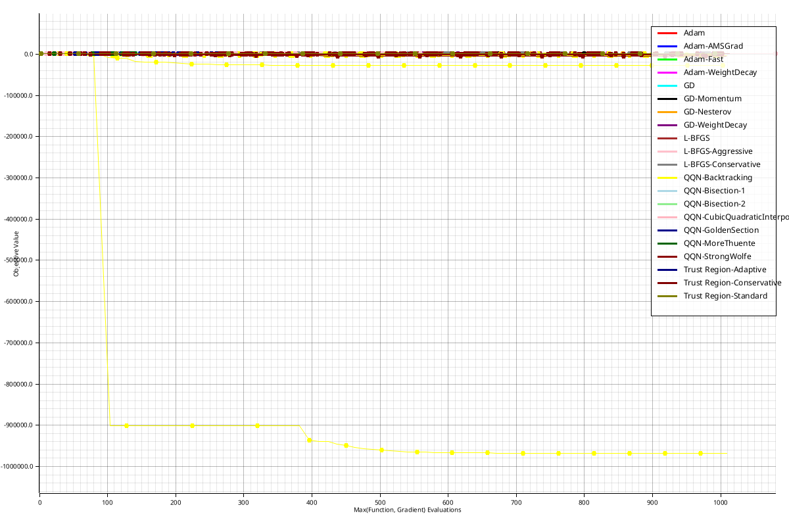
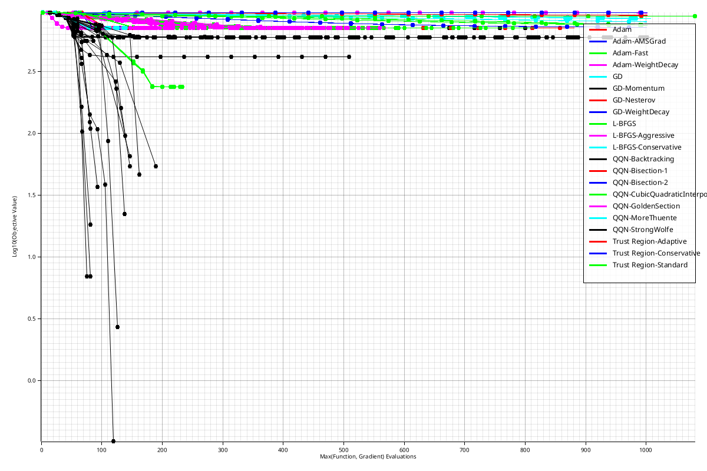

**Figure:** Convergence plots for Schwefel_2D showing objective value vs iterations.
Left: Linear scale, Right: Log scale for better visualization of convergence behavior.

**Data:** [Linear scale data (CSV)](convergence_Schwefel_2D_data.csv) | [Log scale data (CSV)](convergence_Schwefel_2D_log_data.csv)

## Problem: Schwefel_5D

**Family:** Schwefel  
**Dimension:** 5  
**Success Threshold:** 1.000e-8  
**Total Runs:** 560

### Performance Summary
<table style="border-collapse: collapse; width: 100%; margin: 20px 0;">
<tr style="background-color: #f2f2f2;">
<th style="border: 1px solid #ddd; padding: 8px; text-align: center;">Rank</th>
<th style="border: 1px solid #ddd; padding: 8px; text-align: center;">Optimizer</th>
<th style="border: 1px solid #ddd; padding: 8px; text-align: center;">Mean Final Value (All/Success/Fail)</th>
<th style="border: 1px solid #ddd; padding: 8px; text-align: center;">Std Dev</th>
<th style="border: 1px solid #ddd; padding: 8px; text-align: center;">Best Value</th>
<th style="border: 1px solid #ddd; padding: 8px; text-align: center;">Worst Value</th>
<th style="border: 1px solid #ddd; padding: 8px; text-align: center;">Mean Function Evals (All/Success/Fail)</th>
<th style="border: 1px solid #ddd; padding: 8px; text-align: center;">Mean Gradient Evals (All/Success/Fail)</th>
<th style="border: 1px solid #ddd; padding: 8px; text-align: center;">Success Rate</th>
<th style="border: 1px solid #ddd; padding: 8px; text-align: center;">Mean Time (s)</th>
</tr>
<tr style="background-color: #d4edda; font-weight: bold;">
<td style="border: 1px solid #ddd; padding: 8px; text-align: center;">1</td>
<td style="border: 1px solid #ddd; padding: 8px; text-align: center;"><a href="detailed_Schwefel_5D_QQN-StrongWolfe.md">QQN-StrongWolfe</a></td>
<td style="border: 1px solid #ddd; padding: 8px; text-align: center;">-2.63e4 / -1.70e3 / -2.76e4</td>
<td style="border: 1px solid #ddd; padding: 8px; text-align: center;">7.28e4</td>
<td style="border: 1px solid #ddd; padding: 8px; text-align: center;">-3.08e5</td>
<td style="border: 1px solid #ddd; padding: 8px; text-align: center;">1.48e3</td>
<td style="border: 1px solid #ddd; padding: 8px; text-align: center;">465.5 / 394.0 / 469.3</td>
<td style="border: 1px solid #ddd; padding: 8px; text-align: center;">521.0 / 442.0 / 525.2</td>
<td style="border: 1px solid #ddd; padding: 8px; text-align: center;">5.0%</td>
<td style="border: 1px solid #ddd; padding: 8px; text-align: center;">0.016</td>
</tr>
<tr style="background-color: #fff3cd;">
<td style="border: 1px solid #ddd; padding: 8px; text-align: center;">2</td>
<td style="border: 1px solid #ddd; padding: 8px; text-align: center;"><a href="detailed_Schwefel_5D_QQN-Backtracking.md">QQN-Backtracking</a></td>
<td style="border: 1px solid #ddd; padding: 8px; text-align: center;">3.76e2 / - / 3.76e2</td>
<td style="border: 1px solid #ddd; padding: 8px; text-align: center;">2.23e3</td>
<td style="border: 1px solid #ddd; padding: 8px; text-align: center;">-6.68e3</td>
<td style="border: 1px solid #ddd; padding: 8px; text-align: center;">1.48e3</td>
<td style="border: 1px solid #ddd; padding: 8px; text-align: center;">531.3 / - / 531.3</td>
<td style="border: 1px solid #ddd; padding: 8px; text-align: center;">446.5 / - / 446.5</td>
<td style="border: 1px solid #ddd; padding: 8px; text-align: center;">0.0%</td>
<td style="border: 1px solid #ddd; padding: 8px; text-align: center;">0.020</td>
</tr>
<tr style="">
<td style="border: 1px solid #ddd; padding: 8px; text-align: center;">3</td>
<td style="border: 1px solid #ddd; padding: 8px; text-align: center;"><a href="detailed_Schwefel_5D_QQN-CubicQuadraticInterpolation.md">QQN-CubicQuadraticInterpolation</a></td>
<td style="border: 1px solid #ddd; padding: 8px; text-align: center;">1.55e3 / - / 1.55e3</td>
<td style="border: 1px solid #ddd; padding: 8px; text-align: center;">6.13e2</td>
<td style="border: 1px solid #ddd; padding: 8px; text-align: center;">5.92e2</td>
<td style="border: 1px solid #ddd; padding: 8px; text-align: center;">2.21e3</td>
<td style="border: 1px solid #ddd; padding: 8px; text-align: center;">166.2 / - / 166.2</td>
<td style="border: 1px solid #ddd; padding: 8px; text-align: center;">244.7 / - / 244.7</td>
<td style="border: 1px solid #ddd; padding: 8px; text-align: center;">0.0%</td>
<td style="border: 1px solid #ddd; padding: 8px; text-align: center;">0.005</td>
</tr>
<tr style="">
<td style="border: 1px solid #ddd; padding: 8px; text-align: center;">4</td>
<td style="border: 1px solid #ddd; padding: 8px; text-align: center;"><a href="detailed_Schwefel_5D_L-BFGS-Aggressive.md">L-BFGS-Aggressive</a></td>
<td style="border: 1px solid #ddd; padding: 8px; text-align: center;">1.77e3 / - / 1.77e3</td>
<td style="border: 1px solid #ddd; padding: 8px; text-align: center;">4.63e1</td>
<td style="border: 1px solid #ddd; padding: 8px; text-align: center;">1.48e3</td>
<td style="border: 1px solid #ddd; padding: 8px; text-align: center;">1.78e3</td>
<td style="border: 1px solid #ddd; padding: 8px; text-align: center;">206.0 / - / 206.0</td>
<td style="border: 1px solid #ddd; padding: 8px; text-align: center;">100.2 / - / 100.2</td>
<td style="border: 1px solid #ddd; padding: 8px; text-align: center;">0.0%</td>
<td style="border: 1px solid #ddd; padding: 8px; text-align: center;">0.004</td>
</tr>
<tr style="">
<td style="border: 1px solid #ddd; padding: 8px; text-align: center;">5</td>
<td style="border: 1px solid #ddd; padding: 8px; text-align: center;"><a href="detailed_Schwefel_5D_QQN-GoldenSection.md">QQN-GoldenSection</a></td>
<td style="border: 1px solid #ddd; padding: 8px; text-align: center;">1.78e3 / - / 1.78e3</td>
<td style="border: 1px solid #ddd; padding: 8px; text-align: center;">6.95e-13</td>
<td style="border: 1px solid #ddd; padding: 8px; text-align: center;">1.78e3</td>
<td style="border: 1px solid #ddd; padding: 8px; text-align: center;">1.78e3</td>
<td style="border: 1px solid #ddd; padding: 8px; text-align: center;">152.0 / - / 152.0</td>
<td style="border: 1px solid #ddd; padding: 8px; text-align: center;">28.2 / - / 28.2</td>
<td style="border: 1px solid #ddd; padding: 8px; text-align: center;">0.0%</td>
<td style="border: 1px solid #ddd; padding: 8px; text-align: center;">0.002</td>
</tr>
<tr style="">
<td style="border: 1px solid #ddd; padding: 8px; text-align: center;">6</td>
<td style="border: 1px solid #ddd; padding: 8px; text-align: center;"><a href="detailed_Schwefel_5D_QQN-Bisection-2.md">QQN-Bisection-2</a></td>
<td style="border: 1px solid #ddd; padding: 8px; text-align: center;">1.78e3 / - / 1.78e3</td>
<td style="border: 1px solid #ddd; padding: 8px; text-align: center;">4.69e-13</td>
<td style="border: 1px solid #ddd; padding: 8px; text-align: center;">1.78e3</td>
<td style="border: 1px solid #ddd; padding: 8px; text-align: center;">1.78e3</td>
<td style="border: 1px solid #ddd; padding: 8px; text-align: center;">52.0 / - / 52.0</td>
<td style="border: 1px solid #ddd; padding: 8px; text-align: center;">80.0 / - / 80.0</td>
<td style="border: 1px solid #ddd; padding: 8px; text-align: center;">0.0%</td>
<td style="border: 1px solid #ddd; padding: 8px; text-align: center;">0.001</td>
</tr>
<tr style="">
<td style="border: 1px solid #ddd; padding: 8px; text-align: center;">7</td>
<td style="border: 1px solid #ddd; padding: 8px; text-align: center;"><a href="detailed_Schwefel_5D_QQN-Bisection-1.md">QQN-Bisection-1</a></td>
<td style="border: 1px solid #ddd; padding: 8px; text-align: center;">1.78e3 / - / 1.78e3</td>
<td style="border: 1px solid #ddd; padding: 8px; text-align: center;">4.55e-13</td>
<td style="border: 1px solid #ddd; padding: 8px; text-align: center;">1.78e3</td>
<td style="border: 1px solid #ddd; padding: 8px; text-align: center;">1.78e3</td>
<td style="border: 1px solid #ddd; padding: 8px; text-align: center;">53.5 / - / 53.5</td>
<td style="border: 1px solid #ddd; padding: 8px; text-align: center;">97.0 / - / 97.0</td>
<td style="border: 1px solid #ddd; padding: 8px; text-align: center;">0.0%</td>
<td style="border: 1px solid #ddd; padding: 8px; text-align: center;">0.001</td>
</tr>
<tr style="">
<td style="border: 1px solid #ddd; padding: 8px; text-align: center;">8</td>
<td style="border: 1px solid #ddd; padding: 8px; text-align: center;"><a href="detailed_Schwefel_5D_QQN-MoreThuente.md">QQN-MoreThuente</a></td>
<td style="border: 1px solid #ddd; padding: 8px; text-align: center;">1.78e3 / - / 1.78e3</td>
<td style="border: 1px solid #ddd; padding: 8px; text-align: center;">4.55e-13</td>
<td style="border: 1px solid #ddd; padding: 8px; text-align: center;">1.78e3</td>
<td style="border: 1px solid #ddd; padding: 8px; text-align: center;">1.78e3</td>
<td style="border: 1px solid #ddd; padding: 8px; text-align: center;">67.6 / - / 67.6</td>
<td style="border: 1px solid #ddd; padding: 8px; text-align: center;">63.4 / - / 63.4</td>
<td style="border: 1px solid #ddd; padding: 8px; text-align: center;">0.0%</td>
<td style="border: 1px solid #ddd; padding: 8px; text-align: center;">0.001</td>
</tr>
<tr style="">
<td style="border: 1px solid #ddd; padding: 8px; text-align: center;">9</td>
<td style="border: 1px solid #ddd; padding: 8px; text-align: center;"><a href="detailed_Schwefel_5D_L-BFGS.md">L-BFGS</a></td>
<td style="border: 1px solid #ddd; padding: 8px; text-align: center;">1.78e3 / - / 1.78e3</td>
<td style="border: 1px solid #ddd; padding: 8px; text-align: center;">1.39e-5</td>
<td style="border: 1px solid #ddd; padding: 8px; text-align: center;">1.78e3</td>
<td style="border: 1px solid #ddd; padding: 8px; text-align: center;">1.78e3</td>
<td style="border: 1px solid #ddd; padding: 8px; text-align: center;">307.9 / - / 307.9</td>
<td style="border: 1px solid #ddd; padding: 8px; text-align: center;">230.8 / - / 230.8</td>
<td style="border: 1px solid #ddd; padding: 8px; text-align: center;">0.0%</td>
<td style="border: 1px solid #ddd; padding: 8px; text-align: center;">0.007</td>
</tr>
<tr style="">
<td style="border: 1px solid #ddd; padding: 8px; text-align: center;">10</td>
<td style="border: 1px solid #ddd; padding: 8px; text-align: center;"><a href="detailed_Schwefel_5D_GD-Momentum.md">GD-Momentum</a></td>
<td style="border: 1px solid #ddd; padding: 8px; text-align: center;">1.78e3 / - / 1.78e3</td>
<td style="border: 1px solid #ddd; padding: 8px; text-align: center;">2.96e-7</td>
<td style="border: 1px solid #ddd; padding: 8px; text-align: center;">1.78e3</td>
<td style="border: 1px solid #ddd; padding: 8px; text-align: center;">1.78e3</td>
<td style="border: 1px solid #ddd; padding: 8px; text-align: center;">323.6 / - / 323.6</td>
<td style="border: 1px solid #ddd; padding: 8px; text-align: center;">643.2 / - / 643.2</td>
<td style="border: 1px solid #ddd; padding: 8px; text-align: center;">0.0%</td>
<td style="border: 1px solid #ddd; padding: 8px; text-align: center;">0.009</td>
</tr>
<tr style="">
<td style="border: 1px solid #ddd; padding: 8px; text-align: center;">11</td>
<td style="border: 1px solid #ddd; padding: 8px; text-align: center;"><a href="detailed_Schwefel_5D_GD-Nesterov.md">GD-Nesterov</a></td>
<td style="border: 1px solid #ddd; padding: 8px; text-align: center;">1.78e3 / - / 1.78e3</td>
<td style="border: 1px solid #ddd; padding: 8px; text-align: center;">1.02e-7</td>
<td style="border: 1px solid #ddd; padding: 8px; text-align: center;">1.78e3</td>
<td style="border: 1px solid #ddd; padding: 8px; text-align: center;">1.78e3</td>
<td style="border: 1px solid #ddd; padding: 8px; text-align: center;">335.0 / - / 335.0</td>
<td style="border: 1px solid #ddd; padding: 8px; text-align: center;">667.8 / - / 667.8</td>
<td style="border: 1px solid #ddd; padding: 8px; text-align: center;">0.0%</td>
<td style="border: 1px solid #ddd; padding: 8px; text-align: center;">0.010</td>
</tr>
<tr style="">
<td style="border: 1px solid #ddd; padding: 8px; text-align: center;">12</td>
<td style="border: 1px solid #ddd; padding: 8px; text-align: center;"><a href="detailed_Schwefel_5D_GD-WeightDecay.md">GD-WeightDecay</a></td>
<td style="border: 1px solid #ddd; padding: 8px; text-align: center;">1.80e3 / - / 1.80e3</td>
<td style="border: 1px solid #ddd; padding: 8px; text-align: center;">1.23e-1</td>
<td style="border: 1px solid #ddd; padding: 8px; text-align: center;">1.80e3</td>
<td style="border: 1px solid #ddd; padding: 8px; text-align: center;">1.80e3</td>
<td style="border: 1px solid #ddd; padding: 8px; text-align: center;">335.0 / - / 335.0</td>
<td style="border: 1px solid #ddd; padding: 8px; text-align: center;">668.0 / - / 668.0</td>
<td style="border: 1px solid #ddd; padding: 8px; text-align: center;">0.0%</td>
<td style="border: 1px solid #ddd; padding: 8px; text-align: center;">0.010</td>
</tr>
<tr style="">
<td style="border: 1px solid #ddd; padding: 8px; text-align: center;">13</td>
<td style="border: 1px solid #ddd; padding: 8px; text-align: center;"><a href="detailed_Schwefel_5D_Adam-Fast.md">Adam-Fast</a></td>
<td style="border: 1px solid #ddd; padding: 8px; text-align: center;">1.86e3 / - / 1.86e3</td>
<td style="border: 1px solid #ddd; padding: 8px; text-align: center;">5.41e-1</td>
<td style="border: 1px solid #ddd; padding: 8px; text-align: center;">1.85e3</td>
<td style="border: 1px solid #ddd; padding: 8px; text-align: center;">1.86e3</td>
<td style="border: 1px solid #ddd; padding: 8px; text-align: center;">502.0 / - / 502.0</td>
<td style="border: 1px solid #ddd; padding: 8px; text-align: center;">502.0 / - / 502.0</td>
<td style="border: 1px solid #ddd; padding: 8px; text-align: center;">0.0%</td>
<td style="border: 1px solid #ddd; padding: 8px; text-align: center;">0.010</td>
</tr>
<tr style="">
<td style="border: 1px solid #ddd; padding: 8px; text-align: center;">14</td>
<td style="border: 1px solid #ddd; padding: 8px; text-align: center;"><a href="detailed_Schwefel_5D_GD.md">GD</a></td>
<td style="border: 1px solid #ddd; padding: 8px; text-align: center;">2.01e3 / - / 2.01e3</td>
<td style="border: 1px solid #ddd; padding: 8px; text-align: center;">9.87e-1</td>
<td style="border: 1px solid #ddd; padding: 8px; text-align: center;">2.01e3</td>
<td style="border: 1px solid #ddd; padding: 8px; text-align: center;">2.01e3</td>
<td style="border: 1px solid #ddd; padding: 8px; text-align: center;">335.0 / - / 335.0</td>
<td style="border: 1px solid #ddd; padding: 8px; text-align: center;">668.0 / - / 668.0</td>
<td style="border: 1px solid #ddd; padding: 8px; text-align: center;">0.0%</td>
<td style="border: 1px solid #ddd; padding: 8px; text-align: center;">0.008</td>
</tr>
<tr style="">
<td style="border: 1px solid #ddd; padding: 8px; text-align: center;">15</td>
<td style="border: 1px solid #ddd; padding: 8px; text-align: center;"><a href="detailed_Schwefel_5D_L-BFGS-Conservative.md">L-BFGS-Conservative</a></td>
<td style="border: 1px solid #ddd; padding: 8px; text-align: center;">2.12e3 / - / 2.12e3</td>
<td style="border: 1px solid #ddd; padding: 8px; text-align: center;">1.68e0</td>
<td style="border: 1px solid #ddd; padding: 8px; text-align: center;">2.12e3</td>
<td style="border: 1px solid #ddd; padding: 8px; text-align: center;">2.12e3</td>
<td style="border: 1px solid #ddd; padding: 8px; text-align: center;">558.6 / - / 558.6</td>
<td style="border: 1px solid #ddd; padding: 8px; text-align: center;">446.1 / - / 446.1</td>
<td style="border: 1px solid #ddd; padding: 8px; text-align: center;">0.0%</td>
<td style="border: 1px solid #ddd; padding: 8px; text-align: center;">0.014</td>
</tr>
<tr style="">
<td style="border: 1px solid #ddd; padding: 8px; text-align: center;">16</td>
<td style="border: 1px solid #ddd; padding: 8px; text-align: center;"><a href="detailed_Schwefel_5D_Trust_Region-Standard.md">Trust Region-Standard</a></td>
<td style="border: 1px solid #ddd; padding: 8px; text-align: center;">2.17e3 / - / 2.17e3</td>
<td style="border: 1px solid #ddd; padding: 8px; text-align: center;">1.12e0</td>
<td style="border: 1px solid #ddd; padding: 8px; text-align: center;">2.17e3</td>
<td style="border: 1px solid #ddd; padding: 8px; text-align: center;">2.17e3</td>
<td style="border: 1px solid #ddd; padding: 8px; text-align: center;">602.0 / - / 602.0</td>
<td style="border: 1px solid #ddd; padding: 8px; text-align: center;">402.0 / - / 402.0</td>
<td style="border: 1px solid #ddd; padding: 8px; text-align: center;">0.0%</td>
<td style="border: 1px solid #ddd; padding: 8px; text-align: center;">0.004</td>
</tr>
<tr style="">
<td style="border: 1px solid #ddd; padding: 8px; text-align: center;">17</td>
<td style="border: 1px solid #ddd; padding: 8px; text-align: center;"><a href="detailed_Schwefel_5D_Trust_Region-Adaptive.md">Trust Region-Adaptive</a></td>
<td style="border: 1px solid #ddd; padding: 8px; text-align: center;">2.32e3 / - / 2.32e3</td>
<td style="border: 1px solid #ddd; padding: 8px; text-align: center;">1.17e0</td>
<td style="border: 1px solid #ddd; padding: 8px; text-align: center;">2.31e3</td>
<td style="border: 1px solid #ddd; padding: 8px; text-align: center;">2.32e3</td>
<td style="border: 1px solid #ddd; padding: 8px; text-align: center;">602.0 / - / 602.0</td>
<td style="border: 1px solid #ddd; padding: 8px; text-align: center;">402.0 / - / 402.0</td>
<td style="border: 1px solid #ddd; padding: 8px; text-align: center;">0.0%</td>
<td style="border: 1px solid #ddd; padding: 8px; text-align: center;">0.004</td>
</tr>
<tr style="">
<td style="border: 1px solid #ddd; padding: 8px; text-align: center;">18</td>
<td style="border: 1px solid #ddd; padding: 8px; text-align: center;"><a href="detailed_Schwefel_5D_Adam-WeightDecay.md">Adam-WeightDecay</a></td>
<td style="border: 1px solid #ddd; padding: 8px; text-align: center;">2.35e3 / - / 2.35e3</td>
<td style="border: 1px solid #ddd; padding: 8px; text-align: center;">1.16e0</td>
<td style="border: 1px solid #ddd; padding: 8px; text-align: center;">2.35e3</td>
<td style="border: 1px solid #ddd; padding: 8px; text-align: center;">2.35e3</td>
<td style="border: 1px solid #ddd; padding: 8px; text-align: center;">502.0 / - / 502.0</td>
<td style="border: 1px solid #ddd; padding: 8px; text-align: center;">502.0 / - / 502.0</td>
<td style="border: 1px solid #ddd; padding: 8px; text-align: center;">0.0%</td>
<td style="border: 1px solid #ddd; padding: 8px; text-align: center;">0.011</td>
</tr>
<tr style="">
<td style="border: 1px solid #ddd; padding: 8px; text-align: center;">19</td>
<td style="border: 1px solid #ddd; padding: 8px; text-align: center;"><a href="detailed_Schwefel_5D_Adam-AMSGrad.md">Adam-AMSGrad</a></td>
<td style="border: 1px solid #ddd; padding: 8px; text-align: center;">2.36e3 / - / 2.36e3</td>
<td style="border: 1px solid #ddd; padding: 8px; text-align: center;">1.05e0</td>
<td style="border: 1px solid #ddd; padding: 8px; text-align: center;">2.36e3</td>
<td style="border: 1px solid #ddd; padding: 8px; text-align: center;">2.36e3</td>
<td style="border: 1px solid #ddd; padding: 8px; text-align: center;">502.0 / - / 502.0</td>
<td style="border: 1px solid #ddd; padding: 8px; text-align: center;">502.0 / - / 502.0</td>
<td style="border: 1px solid #ddd; padding: 8px; text-align: center;">0.0%</td>
<td style="border: 1px solid #ddd; padding: 8px; text-align: center;">0.012</td>
</tr>
<tr style="">
<td style="border: 1px solid #ddd; padding: 8px; text-align: center;">20</td>
<td style="border: 1px solid #ddd; padding: 8px; text-align: center;"><a href="detailed_Schwefel_5D_Adam.md">Adam</a></td>
<td style="border: 1px solid #ddd; padding: 8px; text-align: center;">2.36e3 / - / 2.36e3</td>
<td style="border: 1px solid #ddd; padding: 8px; text-align: center;">9.42e-1</td>
<td style="border: 1px solid #ddd; padding: 8px; text-align: center;">2.36e3</td>
<td style="border: 1px solid #ddd; padding: 8px; text-align: center;">2.36e3</td>
<td style="border: 1px solid #ddd; padding: 8px; text-align: center;">502.0 / - / 502.0</td>
<td style="border: 1px solid #ddd; padding: 8px; text-align: center;">502.0 / - / 502.0</td>
<td style="border: 1px solid #ddd; padding: 8px; text-align: center;">0.0%</td>
<td style="border: 1px solid #ddd; padding: 8px; text-align: center;">0.010</td>
</tr>
<tr style="">
<td style="border: 1px solid #ddd; padding: 8px; text-align: center;">21</td>
<td style="border: 1px solid #ddd; padding: 8px; text-align: center;"><a href="detailed_Schwefel_5D_Trust_Region-Conservative.md">Trust Region-Conservative</a></td>
<td style="border: 1px solid #ddd; padding: 8px; text-align: center;">2.37e3 / - / 2.37e3</td>
<td style="border: 1px solid #ddd; padding: 8px; text-align: center;">1.03e0</td>
<td style="border: 1px solid #ddd; padding: 8px; text-align: center;">2.36e3</td>
<td style="border: 1px solid #ddd; padding: 8px; text-align: center;">2.37e3</td>
<td style="border: 1px solid #ddd; padding: 8px; text-align: center;">602.0 / - / 602.0</td>
<td style="border: 1px solid #ddd; padding: 8px; text-align: center;">402.0 / - / 402.0</td>
<td style="border: 1px solid #ddd; padding: 8px; text-align: center;">0.0%</td>
<td style="border: 1px solid #ddd; padding: 8px; text-align: center;">0.004</td>
</tr>
</table>

### Convergence Plots

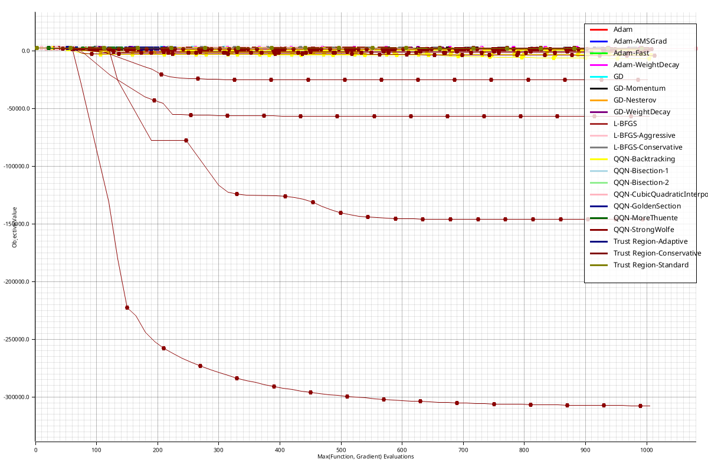
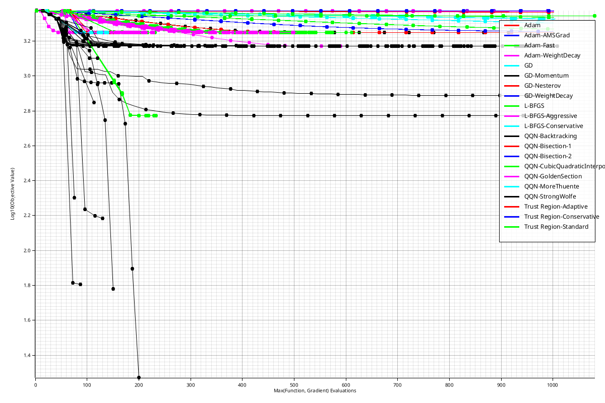

**Figure:** Convergence plots for Schwefel_5D showing objective value vs iterations.
Left: Linear scale, Right: Log scale for better visualization of convergence behavior.

**Data:** [Linear scale data (CSV)](convergence_Schwefel_5D_data.csv) | [Log scale data (CSV)](convergence_Schwefel_5D_log_data.csv)

## Problem: Schwefel_10D

**Family:** Schwefel  
**Dimension:** 10  
**Success Threshold:** 1.000e-8  
**Total Runs:** 560

### Performance Summary
<table style="border-collapse: collapse; width: 100%; margin: 20px 0;">
<tr style="background-color: #f2f2f2;">
<th style="border: 1px solid #ddd; padding: 8px; text-align: center;">Rank</th>
<th style="border: 1px solid #ddd; padding: 8px; text-align: center;">Optimizer</th>
<th style="border: 1px solid #ddd; padding: 8px; text-align: center;">Mean Final Value (All/Success/Fail)</th>
<th style="border: 1px solid #ddd; padding: 8px; text-align: center;">Std Dev</th>
<th style="border: 1px solid #ddd; padding: 8px; text-align: center;">Best Value</th>
<th style="border: 1px solid #ddd; padding: 8px; text-align: center;">Worst Value</th>
<th style="border: 1px solid #ddd; padding: 8px; text-align: center;">Mean Function Evals (All/Success/Fail)</th>
<th style="border: 1px solid #ddd; padding: 8px; text-align: center;">Mean Gradient Evals (All/Success/Fail)</th>
<th style="border: 1px solid #ddd; padding: 8px; text-align: center;">Success Rate</th>
<th style="border: 1px solid #ddd; padding: 8px; text-align: center;">Mean Time (s)</th>
</tr>
<tr style="background-color: #d4edda; font-weight: bold;">
<td style="border: 1px solid #ddd; padding: 8px; text-align: center;">1</td>
<td style="border: 1px solid #ddd; padding: 8px; text-align: center;"><a href="detailed_Schwefel_10D_QQN-Backtracking.md">QQN-Backtracking</a></td>
<td style="border: 1px solid #ddd; padding: 8px; text-align: center;">-1.09e7 / -1.44e3 / -1.21e7</td>
<td style="border: 1px solid #ddd; padding: 8px; text-align: center;">4.75e7</td>
<td style="border: 1px solid #ddd; padding: 8px; text-align: center;">-2.18e8</td>
<td style="border: 1px solid #ddd; padding: 8px; text-align: center;">2.96e3</td>
<td style="border: 1px solid #ddd; padding: 8px; text-align: center;">484.1 / 287.5 / 505.9</td>
<td style="border: 1px solid #ddd; padding: 8px; text-align: center;">407.5 / 244.0 / 425.7</td>
<td style="border: 1px solid #ddd; padding: 8px; text-align: center;">10.0%</td>
<td style="border: 1px solid #ddd; padding: 8px; text-align: center;">0.019</td>
</tr>
<tr style="background-color: #fff3cd;">
<td style="border: 1px solid #ddd; padding: 8px; text-align: center;">2</td>
<td style="border: 1px solid #ddd; padding: 8px; text-align: center;"><a href="detailed_Schwefel_10D_QQN-StrongWolfe.md">QQN-StrongWolfe</a></td>
<td style="border: 1px solid #ddd; padding: 8px; text-align: center;">-4.35e5 / -4.34e6 / -2.30e5</td>
<td style="border: 1px solid #ddd; padding: 8px; text-align: center;">1.21e6</td>
<td style="border: 1px solid #ddd; padding: 8px; text-align: center;">-4.34e6</td>
<td style="border: 1px solid #ddd; padding: 8px; text-align: center;">2.96e3</td>
<td style="border: 1px solid #ddd; padding: 8px; text-align: center;">462.4 / 385.0 / 466.4</td>
<td style="border: 1px solid #ddd; padding: 8px; text-align: center;">513.4 / 416.0 / 518.5</td>
<td style="border: 1px solid #ddd; padding: 8px; text-align: center;">5.0%</td>
<td style="border: 1px solid #ddd; padding: 8px; text-align: center;">0.017</td>
</tr>
<tr style="">
<td style="border: 1px solid #ddd; padding: 8px; text-align: center;">3</td>
<td style="border: 1px solid #ddd; padding: 8px; text-align: center;"><a href="detailed_Schwefel_10D_QQN-CubicQuadraticInterpolation.md">QQN-CubicQuadraticInterpolation</a></td>
<td style="border: 1px solid #ddd; padding: 8px; text-align: center;">2.77e3 / - / 2.77e3</td>
<td style="border: 1px solid #ddd; padding: 8px; text-align: center;">1.26e3</td>
<td style="border: 1px solid #ddd; padding: 8px; text-align: center;">1.18e3</td>
<td style="border: 1px solid #ddd; padding: 8px; text-align: center;">4.42e3</td>
<td style="border: 1px solid #ddd; padding: 8px; text-align: center;">136.1 / - / 136.1</td>
<td style="border: 1px solid #ddd; padding: 8px; text-align: center;">188.2 / - / 188.2</td>
<td style="border: 1px solid #ddd; padding: 8px; text-align: center;">0.0%</td>
<td style="border: 1px solid #ddd; padding: 8px; text-align: center;">0.004</td>
</tr>
<tr style="">
<td style="border: 1px solid #ddd; padding: 8px; text-align: center;">4</td>
<td style="border: 1px solid #ddd; padding: 8px; text-align: center;"><a href="detailed_Schwefel_10D_QQN-GoldenSection.md">QQN-GoldenSection</a></td>
<td style="border: 1px solid #ddd; padding: 8px; text-align: center;">3.55e3 / - / 3.55e3</td>
<td style="border: 1px solid #ddd; padding: 8px; text-align: center;">1.38e-12</td>
<td style="border: 1px solid #ddd; padding: 8px; text-align: center;">3.55e3</td>
<td style="border: 1px solid #ddd; padding: 8px; text-align: center;">3.55e3</td>
<td style="border: 1px solid #ddd; padding: 8px; text-align: center;">149.2 / - / 149.2</td>
<td style="border: 1px solid #ddd; padding: 8px; text-align: center;">27.4 / - / 27.4</td>
<td style="border: 1px solid #ddd; padding: 8px; text-align: center;">0.0%</td>
<td style="border: 1px solid #ddd; padding: 8px; text-align: center;">0.002</td>
</tr>
<tr style="">
<td style="border: 1px solid #ddd; padding: 8px; text-align: center;">5</td>
<td style="border: 1px solid #ddd; padding: 8px; text-align: center;"><a href="detailed_Schwefel_10D_QQN-MoreThuente.md">QQN-MoreThuente</a></td>
<td style="border: 1px solid #ddd; padding: 8px; text-align: center;">3.55e3 / - / 3.55e3</td>
<td style="border: 1px solid #ddd; padding: 8px; text-align: center;">9.09e-13</td>
<td style="border: 1px solid #ddd; padding: 8px; text-align: center;">3.55e3</td>
<td style="border: 1px solid #ddd; padding: 8px; text-align: center;">3.55e3</td>
<td style="border: 1px solid #ddd; padding: 8px; text-align: center;">66.8 / - / 66.8</td>
<td style="border: 1px solid #ddd; padding: 8px; text-align: center;">62.6 / - / 62.6</td>
<td style="border: 1px solid #ddd; padding: 8px; text-align: center;">0.0%</td>
<td style="border: 1px solid #ddd; padding: 8px; text-align: center;">0.001</td>
</tr>
<tr style="">
<td style="border: 1px solid #ddd; padding: 8px; text-align: center;">6</td>
<td style="border: 1px solid #ddd; padding: 8px; text-align: center;"><a href="detailed_Schwefel_10D_QQN-Bisection-2.md">QQN-Bisection-2</a></td>
<td style="border: 1px solid #ddd; padding: 8px; text-align: center;">3.55e3 / - / 3.55e3</td>
<td style="border: 1px solid #ddd; padding: 8px; text-align: center;">9.09e-13</td>
<td style="border: 1px solid #ddd; padding: 8px; text-align: center;">3.55e3</td>
<td style="border: 1px solid #ddd; padding: 8px; text-align: center;">3.55e3</td>
<td style="border: 1px solid #ddd; padding: 8px; text-align: center;">52.0 / - / 52.0</td>
<td style="border: 1px solid #ddd; padding: 8px; text-align: center;">80.0 / - / 80.0</td>
<td style="border: 1px solid #ddd; padding: 8px; text-align: center;">0.0%</td>
<td style="border: 1px solid #ddd; padding: 8px; text-align: center;">0.001</td>
</tr>
<tr style="">
<td style="border: 1px solid #ddd; padding: 8px; text-align: center;">7</td>
<td style="border: 1px solid #ddd; padding: 8px; text-align: center;"><a href="detailed_Schwefel_10D_QQN-Bisection-1.md">QQN-Bisection-1</a></td>
<td style="border: 1px solid #ddd; padding: 8px; text-align: center;">3.55e3 / - / 3.55e3</td>
<td style="border: 1px solid #ddd; padding: 8px; text-align: center;">9.09e-13</td>
<td style="border: 1px solid #ddd; padding: 8px; text-align: center;">3.55e3</td>
<td style="border: 1px solid #ddd; padding: 8px; text-align: center;">3.55e3</td>
<td style="border: 1px solid #ddd; padding: 8px; text-align: center;">53.5 / - / 53.5</td>
<td style="border: 1px solid #ddd; padding: 8px; text-align: center;">97.0 / - / 97.0</td>
<td style="border: 1px solid #ddd; padding: 8px; text-align: center;">0.0%</td>
<td style="border: 1px solid #ddd; padding: 8px; text-align: center;">0.001</td>
</tr>
<tr style="">
<td style="border: 1px solid #ddd; padding: 8px; text-align: center;">8</td>
<td style="border: 1px solid #ddd; padding: 8px; text-align: center;"><a href="detailed_Schwefel_10D_L-BFGS-Aggressive.md">L-BFGS-Aggressive</a></td>
<td style="border: 1px solid #ddd; padding: 8px; text-align: center;">3.55e3 / - / 3.55e3</td>
<td style="border: 1px solid #ddd; padding: 8px; text-align: center;">2.17e-1</td>
<td style="border: 1px solid #ddd; padding: 8px; text-align: center;">3.55e3</td>
<td style="border: 1px solid #ddd; padding: 8px; text-align: center;">3.55e3</td>
<td style="border: 1px solid #ddd; padding: 8px; text-align: center;">209.5 / - / 209.5</td>
<td style="border: 1px solid #ddd; padding: 8px; text-align: center;">101.8 / - / 101.8</td>
<td style="border: 1px solid #ddd; padding: 8px; text-align: center;">0.0%</td>
<td style="border: 1px solid #ddd; padding: 8px; text-align: center;">0.004</td>
</tr>
<tr style="">
<td style="border: 1px solid #ddd; padding: 8px; text-align: center;">9</td>
<td style="border: 1px solid #ddd; padding: 8px; text-align: center;"><a href="detailed_Schwefel_10D_L-BFGS.md">L-BFGS</a></td>
<td style="border: 1px solid #ddd; padding: 8px; text-align: center;">3.55e3 / - / 3.55e3</td>
<td style="border: 1px solid #ddd; padding: 8px; text-align: center;">5.52e-6</td>
<td style="border: 1px solid #ddd; padding: 8px; text-align: center;">3.55e3</td>
<td style="border: 1px solid #ddd; padding: 8px; text-align: center;">3.55e3</td>
<td style="border: 1px solid #ddd; padding: 8px; text-align: center;">295.6 / - / 295.6</td>
<td style="border: 1px solid #ddd; padding: 8px; text-align: center;">222.7 / - / 222.7</td>
<td style="border: 1px solid #ddd; padding: 8px; text-align: center;">0.0%</td>
<td style="border: 1px solid #ddd; padding: 8px; text-align: center;">0.007</td>
</tr>
<tr style="">
<td style="border: 1px solid #ddd; padding: 8px; text-align: center;">10</td>
<td style="border: 1px solid #ddd; padding: 8px; text-align: center;"><a href="detailed_Schwefel_10D_GD-Momentum.md">GD-Momentum</a></td>
<td style="border: 1px solid #ddd; padding: 8px; text-align: center;">3.55e3 / - / 3.55e3</td>
<td style="border: 1px solid #ddd; padding: 8px; text-align: center;">4.89e-6</td>
<td style="border: 1px solid #ddd; padding: 8px; text-align: center;">3.55e3</td>
<td style="border: 1px solid #ddd; padding: 8px; text-align: center;">3.55e3</td>
<td style="border: 1px solid #ddd; padding: 8px; text-align: center;">335.0 / - / 335.0</td>
<td style="border: 1px solid #ddd; padding: 8px; text-align: center;">668.0 / - / 668.0</td>
<td style="border: 1px solid #ddd; padding: 8px; text-align: center;">0.0%</td>
<td style="border: 1px solid #ddd; padding: 8px; text-align: center;">0.010</td>
</tr>
<tr style="">
<td style="border: 1px solid #ddd; padding: 8px; text-align: center;">11</td>
<td style="border: 1px solid #ddd; padding: 8px; text-align: center;"><a href="detailed_Schwefel_10D_GD-Nesterov.md">GD-Nesterov</a></td>
<td style="border: 1px solid #ddd; padding: 8px; text-align: center;">3.55e3 / - / 3.55e3</td>
<td style="border: 1px solid #ddd; padding: 8px; text-align: center;">1.05e-5</td>
<td style="border: 1px solid #ddd; padding: 8px; text-align: center;">3.55e3</td>
<td style="border: 1px solid #ddd; padding: 8px; text-align: center;">3.55e3</td>
<td style="border: 1px solid #ddd; padding: 8px; text-align: center;">335.0 / - / 335.0</td>
<td style="border: 1px solid #ddd; padding: 8px; text-align: center;">668.0 / - / 668.0</td>
<td style="border: 1px solid #ddd; padding: 8px; text-align: center;">0.0%</td>
<td style="border: 1px solid #ddd; padding: 8px; text-align: center;">0.011</td>
</tr>
<tr style="">
<td style="border: 1px solid #ddd; padding: 8px; text-align: center;">12</td>
<td style="border: 1px solid #ddd; padding: 8px; text-align: center;"><a href="detailed_Schwefel_10D_GD-WeightDecay.md">GD-WeightDecay</a></td>
<td style="border: 1px solid #ddd; padding: 8px; text-align: center;">3.66e3 / - / 3.66e3</td>
<td style="border: 1px solid #ddd; padding: 8px; text-align: center;">5.40e-1</td>
<td style="border: 1px solid #ddd; padding: 8px; text-align: center;">3.66e3</td>
<td style="border: 1px solid #ddd; padding: 8px; text-align: center;">3.66e3</td>
<td style="border: 1px solid #ddd; padding: 8px; text-align: center;">335.0 / - / 335.0</td>
<td style="border: 1px solid #ddd; padding: 8px; text-align: center;">668.0 / - / 668.0</td>
<td style="border: 1px solid #ddd; padding: 8px; text-align: center;">0.0%</td>
<td style="border: 1px solid #ddd; padding: 8px; text-align: center;">0.011</td>
</tr>
<tr style="">
<td style="border: 1px solid #ddd; padding: 8px; text-align: center;">13</td>
<td style="border: 1px solid #ddd; padding: 8px; text-align: center;"><a href="detailed_Schwefel_10D_Adam-Fast.md">Adam-Fast</a></td>
<td style="border: 1px solid #ddd; padding: 8px; text-align: center;">3.68e3 / - / 3.68e3</td>
<td style="border: 1px solid #ddd; padding: 8px; text-align: center;">8.14e-1</td>
<td style="border: 1px solid #ddd; padding: 8px; text-align: center;">3.68e3</td>
<td style="border: 1px solid #ddd; padding: 8px; text-align: center;">3.68e3</td>
<td style="border: 1px solid #ddd; padding: 8px; text-align: center;">502.0 / - / 502.0</td>
<td style="border: 1px solid #ddd; padding: 8px; text-align: center;">502.0 / - / 502.0</td>
<td style="border: 1px solid #ddd; padding: 8px; text-align: center;">0.0%</td>
<td style="border: 1px solid #ddd; padding: 8px; text-align: center;">0.011</td>
</tr>
<tr style="">
<td style="border: 1px solid #ddd; padding: 8px; text-align: center;">14</td>
<td style="border: 1px solid #ddd; padding: 8px; text-align: center;"><a href="detailed_Schwefel_10D_GD.md">GD</a></td>
<td style="border: 1px solid #ddd; padding: 8px; text-align: center;">4.22e3 / - / 4.22e3</td>
<td style="border: 1px solid #ddd; padding: 8px; text-align: center;">1.73e0</td>
<td style="border: 1px solid #ddd; padding: 8px; text-align: center;">4.22e3</td>
<td style="border: 1px solid #ddd; padding: 8px; text-align: center;">4.23e3</td>
<td style="border: 1px solid #ddd; padding: 8px; text-align: center;">335.0 / - / 335.0</td>
<td style="border: 1px solid #ddd; padding: 8px; text-align: center;">668.0 / - / 668.0</td>
<td style="border: 1px solid #ddd; padding: 8px; text-align: center;">0.0%</td>
<td style="border: 1px solid #ddd; padding: 8px; text-align: center;">0.009</td>
</tr>
<tr style="">
<td style="border: 1px solid #ddd; padding: 8px; text-align: center;">15</td>
<td style="border: 1px solid #ddd; padding: 8px; text-align: center;"><a href="detailed_Schwefel_10D_L-BFGS-Conservative.md">L-BFGS-Conservative</a></td>
<td style="border: 1px solid #ddd; padding: 8px; text-align: center;">4.24e3 / - / 4.24e3</td>
<td style="border: 1px solid #ddd; padding: 8px; text-align: center;">4.05e0</td>
<td style="border: 1px solid #ddd; padding: 8px; text-align: center;">4.23e3</td>
<td style="border: 1px solid #ddd; padding: 8px; text-align: center;">4.25e3</td>
<td style="border: 1px solid #ddd; padding: 8px; text-align: center;">558.0 / - / 558.0</td>
<td style="border: 1px solid #ddd; padding: 8px; text-align: center;">446.1 / - / 446.1</td>
<td style="border: 1px solid #ddd; padding: 8px; text-align: center;">0.0%</td>
<td style="border: 1px solid #ddd; padding: 8px; text-align: center;">0.015</td>
</tr>
<tr style="">
<td style="border: 1px solid #ddd; padding: 8px; text-align: center;">16</td>
<td style="border: 1px solid #ddd; padding: 8px; text-align: center;"><a href="detailed_Schwefel_10D_Trust_Region-Standard.md">Trust Region-Standard</a></td>
<td style="border: 1px solid #ddd; padding: 8px; text-align: center;">4.54e3 / - / 4.54e3</td>
<td style="border: 1px solid #ddd; padding: 8px; text-align: center;">8.06e-1</td>
<td style="border: 1px solid #ddd; padding: 8px; text-align: center;">4.53e3</td>
<td style="border: 1px solid #ddd; padding: 8px; text-align: center;">4.54e3</td>
<td style="border: 1px solid #ddd; padding: 8px; text-align: center;">602.0 / - / 602.0</td>
<td style="border: 1px solid #ddd; padding: 8px; text-align: center;">402.0 / - / 402.0</td>
<td style="border: 1px solid #ddd; padding: 8px; text-align: center;">0.0%</td>
<td style="border: 1px solid #ddd; padding: 8px; text-align: center;">0.004</td>
</tr>
<tr style="">
<td style="border: 1px solid #ddd; padding: 8px; text-align: center;">17</td>
<td style="border: 1px solid #ddd; padding: 8px; text-align: center;"><a href="detailed_Schwefel_10D_Trust_Region-Adaptive.md">Trust Region-Adaptive</a></td>
<td style="border: 1px solid #ddd; padding: 8px; text-align: center;">4.68e3 / - / 4.68e3</td>
<td style="border: 1px solid #ddd; padding: 8px; text-align: center;">1.79e0</td>
<td style="border: 1px solid #ddd; padding: 8px; text-align: center;">4.68e3</td>
<td style="border: 1px solid #ddd; padding: 8px; text-align: center;">4.69e3</td>
<td style="border: 1px solid #ddd; padding: 8px; text-align: center;">602.0 / - / 602.0</td>
<td style="border: 1px solid #ddd; padding: 8px; text-align: center;">402.0 / - / 402.0</td>
<td style="border: 1px solid #ddd; padding: 8px; text-align: center;">0.0%</td>
<td style="border: 1px solid #ddd; padding: 8px; text-align: center;">0.004</td>
</tr>
<tr style="">
<td style="border: 1px solid #ddd; padding: 8px; text-align: center;">18</td>
<td style="border: 1px solid #ddd; padding: 8px; text-align: center;"><a href="detailed_Schwefel_10D_Adam-WeightDecay.md">Adam-WeightDecay</a></td>
<td style="border: 1px solid #ddd; padding: 8px; text-align: center;">4.70e3 / - / 4.70e3</td>
<td style="border: 1px solid #ddd; padding: 8px; text-align: center;">1.46e0</td>
<td style="border: 1px solid #ddd; padding: 8px; text-align: center;">4.70e3</td>
<td style="border: 1px solid #ddd; padding: 8px; text-align: center;">4.70e3</td>
<td style="border: 1px solid #ddd; padding: 8px; text-align: center;">502.0 / - / 502.0</td>
<td style="border: 1px solid #ddd; padding: 8px; text-align: center;">502.0 / - / 502.0</td>
<td style="border: 1px solid #ddd; padding: 8px; text-align: center;">0.0%</td>
<td style="border: 1px solid #ddd; padding: 8px; text-align: center;">0.012</td>
</tr>
<tr style="">
<td style="border: 1px solid #ddd; padding: 8px; text-align: center;">19</td>
<td style="border: 1px solid #ddd; padding: 8px; text-align: center;"><a href="detailed_Schwefel_10D_Adam-AMSGrad.md">Adam-AMSGrad</a></td>
<td style="border: 1px solid #ddd; padding: 8px; text-align: center;">4.72e3 / - / 4.72e3</td>
<td style="border: 1px solid #ddd; padding: 8px; text-align: center;">2.26e0</td>
<td style="border: 1px solid #ddd; padding: 8px; text-align: center;">4.72e3</td>
<td style="border: 1px solid #ddd; padding: 8px; text-align: center;">4.73e3</td>
<td style="border: 1px solid #ddd; padding: 8px; text-align: center;">502.0 / - / 502.0</td>
<td style="border: 1px solid #ddd; padding: 8px; text-align: center;">502.0 / - / 502.0</td>
<td style="border: 1px solid #ddd; padding: 8px; text-align: center;">0.0%</td>
<td style="border: 1px solid #ddd; padding: 8px; text-align: center;">0.012</td>
</tr>
<tr style="">
<td style="border: 1px solid #ddd; padding: 8px; text-align: center;">20</td>
<td style="border: 1px solid #ddd; padding: 8px; text-align: center;"><a href="detailed_Schwefel_10D_Adam.md">Adam</a></td>
<td style="border: 1px solid #ddd; padding: 8px; text-align: center;">4.72e3 / - / 4.72e3</td>
<td style="border: 1px solid #ddd; padding: 8px; text-align: center;">1.79e0</td>
<td style="border: 1px solid #ddd; padding: 8px; text-align: center;">4.72e3</td>
<td style="border: 1px solid #ddd; padding: 8px; text-align: center;">4.72e3</td>
<td style="border: 1px solid #ddd; padding: 8px; text-align: center;">502.0 / - / 502.0</td>
<td style="border: 1px solid #ddd; padding: 8px; text-align: center;">502.0 / - / 502.0</td>
<td style="border: 1px solid #ddd; padding: 8px; text-align: center;">0.0%</td>
<td style="border: 1px solid #ddd; padding: 8px; text-align: center;">0.011</td>
</tr>
<tr style="">
<td style="border: 1px solid #ddd; padding: 8px; text-align: center;">21</td>
<td style="border: 1px solid #ddd; padding: 8px; text-align: center;"><a href="detailed_Schwefel_10D_Trust_Region-Conservative.md">Trust Region-Conservative</a></td>
<td style="border: 1px solid #ddd; padding: 8px; text-align: center;">4.73e3 / - / 4.73e3</td>
<td style="border: 1px solid #ddd; padding: 8px; text-align: center;">1.69e0</td>
<td style="border: 1px solid #ddd; padding: 8px; text-align: center;">4.73e3</td>
<td style="border: 1px solid #ddd; padding: 8px; text-align: center;">4.74e3</td>
<td style="border: 1px solid #ddd; padding: 8px; text-align: center;">602.0 / - / 602.0</td>
<td style="border: 1px solid #ddd; padding: 8px; text-align: center;">402.0 / - / 402.0</td>
<td style="border: 1px solid #ddd; padding: 8px; text-align: center;">0.0%</td>
<td style="border: 1px solid #ddd; padding: 8px; text-align: center;">0.004</td>
</tr>
</table>

### Convergence Plots

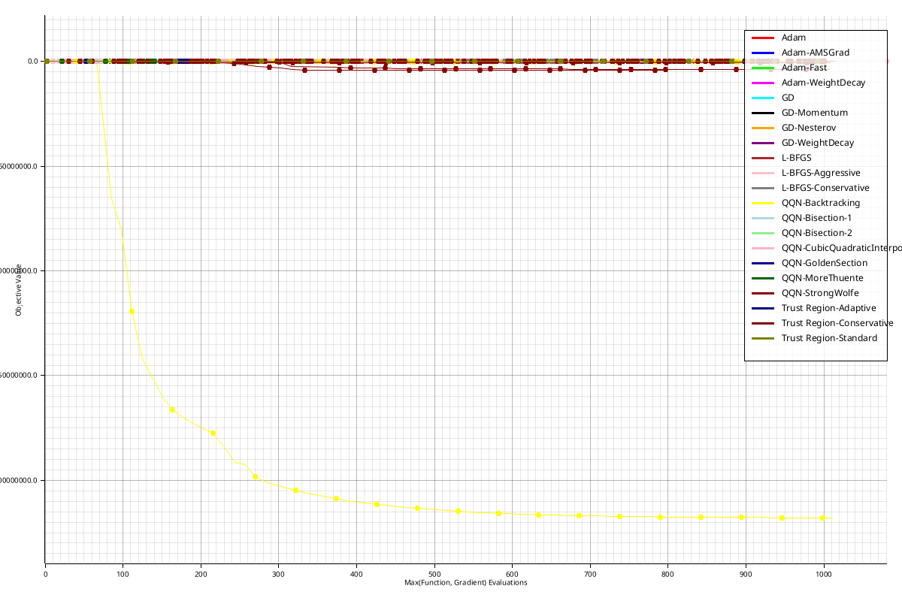
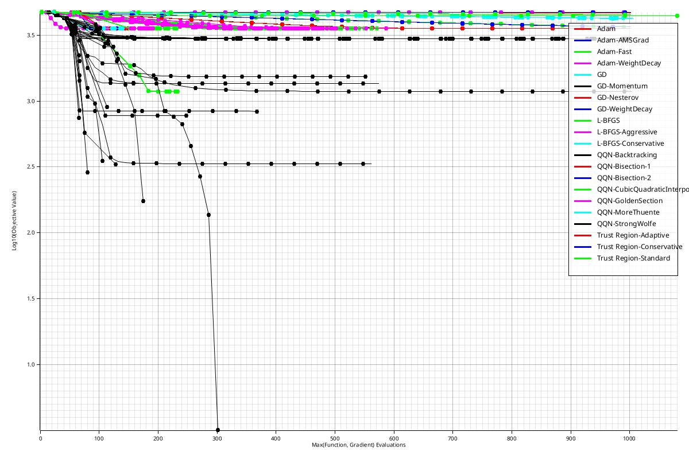

**Figure:** Convergence plots for Schwefel_10D showing objective value vs iterations.
Left: Linear scale, Right: Log scale for better visualization of convergence behavior.

**Data:** [Linear scale data (CSV)](convergence_Schwefel_10D_data.csv) | [Log scale data (CSV)](convergence_Schwefel_10D_log_data.csv)

## Problem: Levy_2D

**Family:** Levy  
**Dimension:** 2  
**Success Threshold:** 1.000e-6  
**Total Runs:** 560

### Performance Summary
<table style="border-collapse: collapse; width: 100%; margin: 20px 0;">
<tr style="background-color: #f2f2f2;">
<th style="border: 1px solid #ddd; padding: 8px; text-align: center;">Rank</th>
<th style="border: 1px solid #ddd; padding: 8px; text-align: center;">Optimizer</th>
<th style="border: 1px solid #ddd; padding: 8px; text-align: center;">Mean Final Value (All/Success/Fail)</th>
<th style="border: 1px solid #ddd; padding: 8px; text-align: center;">Std Dev</th>
<th style="border: 1px solid #ddd; padding: 8px; text-align: center;">Best Value</th>
<th style="border: 1px solid #ddd; padding: 8px; text-align: center;">Worst Value</th>
<th style="border: 1px solid #ddd; padding: 8px; text-align: center;">Mean Function Evals (All/Success/Fail)</th>
<th style="border: 1px solid #ddd; padding: 8px; text-align: center;">Mean Gradient Evals (All/Success/Fail)</th>
<th style="border: 1px solid #ddd; padding: 8px; text-align: center;">Success Rate</th>
<th style="border: 1px solid #ddd; padding: 8px; text-align: center;">Mean Time (s)</th>
</tr>
<tr style="background-color: #d4edda; font-weight: bold;">
<td style="border: 1px solid #ddd; padding: 8px; text-align: center;">1</td>
<td style="border: 1px solid #ddd; padding: 8px; text-align: center;"><a href="detailed_Levy_2D_QQN-CubicQuadraticInterpolation.md">QQN-CubicQuadraticInterpolation</a></td>
<td style="border: 1px solid #ddd; padding: 8px; text-align: center;">1.01e-13 / 1.01e-13 / -</td>
<td style="border: 1px solid #ddd; padding: 8px; text-align: center;">1.63e-13</td>
<td style="border: 1px solid #ddd; padding: 8px; text-align: center;">1.20e-21</td>
<td style="border: 1px solid #ddd; padding: 8px; text-align: center;">6.07e-13</td>
<td style="border: 1px solid #ddd; padding: 8px; text-align: center;">206.4 / 206.4 / -</td>
<td style="border: 1px solid #ddd; padding: 8px; text-align: center;">298.8 / 298.8 / -</td>
<td style="border: 1px solid #ddd; padding: 8px; text-align: center;">100.0%</td>
<td style="border: 1px solid #ddd; padding: 8px; text-align: center;">0.006</td>
</tr>
<tr style="background-color: #fff3cd;">
<td style="border: 1px solid #ddd; padding: 8px; text-align: center;">2</td>
<td style="border: 1px solid #ddd; padding: 8px; text-align: center;"><a href="detailed_Levy_2D_QQN-MoreThuente.md">QQN-MoreThuente</a></td>
<td style="border: 1px solid #ddd; padding: 8px; text-align: center;">2.05e-13 / 3.83e-14 / 1.71e-12</td>
<td style="border: 1px solid #ddd; padding: 8px; text-align: center;">5.26e-13</td>
<td style="border: 1px solid #ddd; padding: 8px; text-align: center;">3.51e-21</td>
<td style="border: 1px solid #ddd; padding: 8px; text-align: center;">2.18e-12</td>
<td style="border: 1px solid #ddd; padding: 8px; text-align: center;">196.3 / 157.3 / 547.0</td>
<td style="border: 1px solid #ddd; padding: 8px; text-align: center;">189.5 / 159.4 / 460.5</td>
<td style="border: 1px solid #ddd; padding: 8px; text-align: center;">90.0%</td>
<td style="border: 1px solid #ddd; padding: 8px; text-align: center;">0.004</td>
</tr>
<tr style="">
<td style="border: 1px solid #ddd; padding: 8px; text-align: center;">3</td>
<td style="border: 1px solid #ddd; padding: 8px; text-align: center;"><a href="detailed_Levy_2D_QQN-Backtracking.md">QQN-Backtracking</a></td>
<td style="border: 1px solid #ddd; padding: 8px; text-align: center;">1.83e-12 / 1.83e-12 / -</td>
<td style="border: 1px solid #ddd; padding: 8px; text-align: center;">1.53e-12</td>
<td style="border: 1px solid #ddd; padding: 8px; text-align: center;">3.81e-21</td>
<td style="border: 1px solid #ddd; padding: 8px; text-align: center;">3.83e-12</td>
<td style="border: 1px solid #ddd; padding: 8px; text-align: center;">198.5 / 198.5 / -</td>
<td style="border: 1px solid #ddd; padding: 8px; text-align: center;">169.2 / 169.2 / -</td>
<td style="border: 1px solid #ddd; padding: 8px; text-align: center;">100.0%</td>
<td style="border: 1px solid #ddd; padding: 8px; text-align: center;">0.007</td>
</tr>
<tr style="">
<td style="border: 1px solid #ddd; padding: 8px; text-align: center;">4</td>
<td style="border: 1px solid #ddd; padding: 8px; text-align: center;"><a href="detailed_Levy_2D_QQN-GoldenSection.md">QQN-GoldenSection</a></td>
<td style="border: 1px solid #ddd; padding: 8px; text-align: center;">1.93e-13 / 4.86e-14 / 8.72e-12</td>
<td style="border: 1px solid #ddd; padding: 8px; text-align: center;">1.13e-12</td>
<td style="border: 1px solid #ddd; padding: 8px; text-align: center;">1.72e-19</td>
<td style="border: 1px solid #ddd; padding: 8px; text-align: center;">8.72e-12</td>
<td style="border: 1px solid #ddd; padding: 8px; text-align: center;">406.6 / 401.7 / 695.0</td>
<td style="border: 1px solid #ddd; padding: 8px; text-align: center;">63.6 / 59.3 / 313.0</td>
<td style="border: 1px solid #ddd; padding: 8px; text-align: center;">98.3%</td>
<td style="border: 1px solid #ddd; padding: 8px; text-align: center;">0.006</td>
</tr>
<tr style="">
<td style="border: 1px solid #ddd; padding: 8px; text-align: center;">5</td>
<td style="border: 1px solid #ddd; padding: 8px; text-align: center;"><a href="detailed_Levy_2D_QQN-StrongWolfe.md">QQN-StrongWolfe</a></td>
<td style="border: 1px solid #ddd; padding: 8px; text-align: center;">1.47e-9 / 5.49e-13 / 2.94e-8</td>
<td style="border: 1px solid #ddd; padding: 8px; text-align: center;">6.40e-9</td>
<td style="border: 1px solid #ddd; padding: 8px; text-align: center;">2.29e-18</td>
<td style="border: 1px solid #ddd; padding: 8px; text-align: center;">2.94e-8</td>
<td style="border: 1px solid #ddd; padding: 8px; text-align: center;">111.7 / 92.5 / 475.0</td>
<td style="border: 1px solid #ddd; padding: 8px; text-align: center;">123.8 / 102.4 / 531.0</td>
<td style="border: 1px solid #ddd; padding: 8px; text-align: center;">95.0%</td>
<td style="border: 1px solid #ddd; padding: 8px; text-align: center;">0.003</td>
</tr>
<tr style="">
<td style="border: 1px solid #ddd; padding: 8px; text-align: center;">6</td>
<td style="border: 1px solid #ddd; padding: 8px; text-align: center;"><a href="detailed_Levy_2D_QQN-Bisection-2.md">QQN-Bisection-2</a></td>
<td style="border: 1px solid #ddd; padding: 8px; text-align: center;">1.20e-13 / 1.20e-13 / -</td>
<td style="border: 1px solid #ddd; padding: 8px; text-align: center;">2.90e-13</td>
<td style="border: 1px solid #ddd; padding: 8px; text-align: center;">6.17e-18</td>
<td style="border: 1px solid #ddd; padding: 8px; text-align: center;">1.29e-12</td>
<td style="border: 1px solid #ddd; padding: 8px; text-align: center;">118.0 / 118.0 / -</td>
<td style="border: 1px solid #ddd; padding: 8px; text-align: center;">127.2 / 127.2 / -</td>
<td style="border: 1px solid #ddd; padding: 8px; text-align: center;">100.0%</td>
<td style="border: 1px solid #ddd; padding: 8px; text-align: center;">0.002</td>
</tr>
<tr style="">
<td style="border: 1px solid #ddd; padding: 8px; text-align: center;">7</td>
<td style="border: 1px solid #ddd; padding: 8px; text-align: center;"><a href="detailed_Levy_2D_QQN-Bisection-1.md">QQN-Bisection-1</a></td>
<td style="border: 1px solid #ddd; padding: 8px; text-align: center;">3.80e-14 / 3.80e-14 / -</td>
<td style="border: 1px solid #ddd; padding: 8px; text-align: center;">1.00e-13</td>
<td style="border: 1px solid #ddd; padding: 8px; text-align: center;">1.28e-16</td>
<td style="border: 1px solid #ddd; padding: 8px; text-align: center;">5.33e-13</td>
<td style="border: 1px solid #ddd; padding: 8px; text-align: center;">130.0 / 130.0 / -</td>
<td style="border: 1px solid #ddd; padding: 8px; text-align: center;">171.3 / 171.3 / -</td>
<td style="border: 1px solid #ddd; padding: 8px; text-align: center;">100.0%</td>
<td style="border: 1px solid #ddd; padding: 8px; text-align: center;">0.003</td>
</tr>
<tr style="">
<td style="border: 1px solid #ddd; padding: 8px; text-align: center;">8</td>
<td style="border: 1px solid #ddd; padding: 8px; text-align: center;"><a href="detailed_Levy_2D_L-BFGS.md">L-BFGS</a></td>
<td style="border: 1px solid #ddd; padding: 8px; text-align: center;">2.15e-4 / 1.74e-12 / 7.75e-4</td>
<td style="border: 1px solid #ddd; padding: 8px; text-align: center;">7.42e-4</td>
<td style="border: 1px solid #ddd; padding: 8px; text-align: center;">2.12e-13</td>
<td style="border: 1px solid #ddd; padding: 8px; text-align: center;">3.40e-3</td>
<td style="border: 1px solid #ddd; padding: 8px; text-align: center;">486.5 / 386.5 / 511.5</td>
<td style="border: 1px solid #ddd; padding: 8px; text-align: center;">371.5 / 297.5 / 390.0</td>
<td style="border: 1px solid #ddd; padding: 8px; text-align: center;">20.0%</td>
<td style="border: 1px solid #ddd; padding: 8px; text-align: center;">0.012</td>
</tr>
<tr style="">
<td style="border: 1px solid #ddd; padding: 8px; text-align: center;">9</td>
<td style="border: 1px solid #ddd; padding: 8px; text-align: center;"><a href="detailed_Levy_2D_L-BFGS-Aggressive.md">L-BFGS-Aggressive</a></td>
<td style="border: 1px solid #ddd; padding: 8px; text-align: center;">6.51e-4 / 2.47e-12 / 8.98e-4</td>
<td style="border: 1px solid #ddd; padding: 8px; text-align: center;">2.11e-3</td>
<td style="border: 1px solid #ddd; padding: 8px; text-align: center;">4.17e-13</td>
<td style="border: 1px solid #ddd; padding: 8px; text-align: center;">1.29e-2</td>
<td style="border: 1px solid #ddd; padding: 8px; text-align: center;">669.2 / 537.7 / 719.1</td>
<td style="border: 1px solid #ddd; padding: 8px; text-align: center;">278.9 / 254.6 / 288.0</td>
<td style="border: 1px solid #ddd; padding: 8px; text-align: center;">27.5%</td>
<td style="border: 1px solid #ddd; padding: 8px; text-align: center;">0.011</td>
</tr>
<tr style="">
<td style="border: 1px solid #ddd; padding: 8px; text-align: center;">10</td>
<td style="border: 1px solid #ddd; padding: 8px; text-align: center;"><a href="detailed_Levy_2D_L-BFGS-Conservative.md">L-BFGS-Conservative</a></td>
<td style="border: 1px solid #ddd; padding: 8px; text-align: center;">4.01e-7 / - / 4.01e-7</td>
<td style="border: 1px solid #ddd; padding: 8px; text-align: center;">1.02e-6</td>
<td style="border: 1px solid #ddd; padding: 8px; text-align: center;">1.20e-11</td>
<td style="border: 1px solid #ddd; padding: 8px; text-align: center;">4.08e-6</td>
<td style="border: 1px solid #ddd; padding: 8px; text-align: center;">559.2 / - / 559.2</td>
<td style="border: 1px solid #ddd; padding: 8px; text-align: center;">445.6 / - / 445.6</td>
<td style="border: 1px solid #ddd; padding: 8px; text-align: center;">0.0%</td>
<td style="border: 1px solid #ddd; padding: 8px; text-align: center;">0.014</td>
</tr>
<tr style="">
<td style="border: 1px solid #ddd; padding: 8px; text-align: center;">11</td>
<td style="border: 1px solid #ddd; padding: 8px; text-align: center;"><a href="detailed_Levy_2D_Adam-Fast.md">Adam-Fast</a></td>
<td style="border: 1px solid #ddd; padding: 8px; text-align: center;">1.28e-3 / - / 7.85e-2</td>
<td style="border: 1px solid #ddd; padding: 8px; text-align: center;">1.41e-3</td>
<td style="border: 1px solid #ddd; padding: 8px; text-align: center;">5.38e-5</td>
<td style="border: 1px solid #ddd; padding: 8px; text-align: center;">5.43e-3</td>
<td style="border: 1px solid #ddd; padding: 8px; text-align: center;">36.2 / - / 36.2</td>
<td style="border: 1px solid #ddd; padding: 8px; text-align: center;">35.2 / - / 35.2</td>
<td style="border: 1px solid #ddd; padding: 8px; text-align: center;">0.0%</td>
<td style="border: 1px solid #ddd; padding: 8px; text-align: center;">0.001</td>
</tr>
<tr style="">
<td style="border: 1px solid #ddd; padding: 8px; text-align: center;">12</td>
<td style="border: 1px solid #ddd; padding: 8px; text-align: center;"><a href="detailed_Levy_2D_Trust_Region-Standard.md">Trust Region-Standard</a></td>
<td style="border: 1px solid #ddd; padding: 8px; text-align: center;">8.61e-2 / - / 3.23e0</td>
<td style="border: 1px solid #ddd; padding: 8px; text-align: center;">9.03e-2</td>
<td style="border: 1px solid #ddd; padding: 8px; text-align: center;">1.11e-3</td>
<td style="border: 1px solid #ddd; padding: 8px; text-align: center;">2.89e-1</td>
<td style="border: 1px solid #ddd; padding: 8px; text-align: center;">20.1 / - / 20.1</td>
<td style="border: 1px solid #ddd; padding: 8px; text-align: center;">14.0 / - / 14.0</td>
<td style="border: 1px solid #ddd; padding: 8px; text-align: center;">0.0%</td>
<td style="border: 1px solid #ddd; padding: 8px; text-align: center;">0.000</td>
</tr>
<tr style="">
<td style="border: 1px solid #ddd; padding: 8px; text-align: center;">13</td>
<td style="border: 1px solid #ddd; padding: 8px; text-align: center;"><a href="detailed_Levy_2D_GD-WeightDecay.md">GD-WeightDecay</a></td>
<td style="border: 1px solid #ddd; padding: 8px; text-align: center;">2.24e-3 / - / 2.24e-3</td>
<td style="border: 1px solid #ddd; padding: 8px; text-align: center;">2.97e-4</td>
<td style="border: 1px solid #ddd; padding: 8px; text-align: center;">1.67e-3</td>
<td style="border: 1px solid #ddd; padding: 8px; text-align: center;">2.77e-3</td>
<td style="border: 1px solid #ddd; padding: 8px; text-align: center;">335.0 / - / 335.0</td>
<td style="border: 1px solid #ddd; padding: 8px; text-align: center;">668.0 / - / 668.0</td>
<td style="border: 1px solid #ddd; padding: 8px; text-align: center;">0.0%</td>
<td style="border: 1px solid #ddd; padding: 8px; text-align: center;">0.010</td>
</tr>
<tr style="">
<td style="border: 1px solid #ddd; padding: 8px; text-align: center;">14</td>
<td style="border: 1px solid #ddd; padding: 8px; text-align: center;"><a href="detailed_Levy_2D_Trust_Region-Conservative.md">Trust Region-Conservative</a></td>
<td style="border: 1px solid #ddd; padding: 8px; text-align: center;">1.39e-2 / - / 1.39e-2</td>
<td style="border: 1px solid #ddd; padding: 8px; text-align: center;">2.60e-3</td>
<td style="border: 1px solid #ddd; padding: 8px; text-align: center;">1.04e-2</td>
<td style="border: 1px solid #ddd; padding: 8px; text-align: center;">1.81e-2</td>
<td style="border: 1px solid #ddd; padding: 8px; text-align: center;">411.4 / - / 411.4</td>
<td style="border: 1px solid #ddd; padding: 8px; text-align: center;">274.9 / - / 274.9</td>
<td style="border: 1px solid #ddd; padding: 8px; text-align: center;">0.0%</td>
<td style="border: 1px solid #ddd; padding: 8px; text-align: center;">0.003</td>
</tr>
<tr style="">
<td style="border: 1px solid #ddd; padding: 8px; text-align: center;">15</td>
<td style="border: 1px solid #ddd; padding: 8px; text-align: center;"><a href="detailed_Levy_2D_GD.md">GD</a></td>
<td style="border: 1px solid #ddd; padding: 8px; text-align: center;">1.69e-2 / - / 1.69e-2</td>
<td style="border: 1px solid #ddd; padding: 8px; text-align: center;">3.92e-3</td>
<td style="border: 1px solid #ddd; padding: 8px; text-align: center;">1.06e-2</td>
<td style="border: 1px solid #ddd; padding: 8px; text-align: center;">2.45e-2</td>
<td style="border: 1px solid #ddd; padding: 8px; text-align: center;">335.0 / - / 335.0</td>
<td style="border: 1px solid #ddd; padding: 8px; text-align: center;">668.0 / - / 668.0</td>
<td style="border: 1px solid #ddd; padding: 8px; text-align: center;">0.0%</td>
<td style="border: 1px solid #ddd; padding: 8px; text-align: center;">0.008</td>
</tr>
<tr style="">
<td style="border: 1px solid #ddd; padding: 8px; text-align: center;">16</td>
<td style="border: 1px solid #ddd; padding: 8px; text-align: center;"><a href="detailed_Levy_2D_Trust_Region-Adaptive.md">Trust Region-Adaptive</a></td>
<td style="border: 1px solid #ddd; padding: 8px; text-align: center;">9.28e-2 / - / 1.49e1</td>
<td style="border: 1px solid #ddd; padding: 8px; text-align: center;">3.05e-2</td>
<td style="border: 1px solid #ddd; padding: 8px; text-align: center;">1.72e-2</td>
<td style="border: 1px solid #ddd; padding: 8px; text-align: center;">1.54e-1</td>
<td style="border: 1px solid #ddd; padding: 8px; text-align: center;">26.1 / - / 26.1</td>
<td style="border: 1px solid #ddd; padding: 8px; text-align: center;">17.9 / - / 17.9</td>
<td style="border: 1px solid #ddd; padding: 8px; text-align: center;">0.0%</td>
<td style="border: 1px solid #ddd; padding: 8px; text-align: center;">0.000</td>
</tr>
<tr style="">
<td style="border: 1px solid #ddd; padding: 8px; text-align: center;">17</td>
<td style="border: 1px solid #ddd; padding: 8px; text-align: center;"><a href="detailed_Levy_2D_GD-Momentum.md">GD-Momentum</a></td>
<td style="border: 1px solid #ddd; padding: 8px; text-align: center;">7.91e-2 / - / 1.54e-1</td>
<td style="border: 1px solid #ddd; padding: 8px; text-align: center;">2.47e-2</td>
<td style="border: 1px solid #ddd; padding: 8px; text-align: center;">4.97e-2</td>
<td style="border: 1px solid #ddd; padding: 8px; text-align: center;">1.37e-1</td>
<td style="border: 1px solid #ddd; padding: 8px; text-align: center;">22.4 / - / 22.4</td>
<td style="border: 1px solid #ddd; padding: 8px; text-align: center;">40.8 / - / 40.8</td>
<td style="border: 1px solid #ddd; padding: 8px; text-align: center;">0.0%</td>
<td style="border: 1px solid #ddd; padding: 8px; text-align: center;">0.001</td>
</tr>
<tr style="">
<td style="border: 1px solid #ddd; padding: 8px; text-align: center;">18</td>
<td style="border: 1px solid #ddd; padding: 8px; text-align: center;"><a href="detailed_Levy_2D_GD-Nesterov.md">GD-Nesterov</a></td>
<td style="border: 1px solid #ddd; padding: 8px; text-align: center;">7.60e-2 / - / 1.22e-1</td>
<td style="border: 1px solid #ddd; padding: 8px; text-align: center;">2.45e-2</td>
<td style="border: 1px solid #ddd; padding: 8px; text-align: center;">5.05e-2</td>
<td style="border: 1px solid #ddd; padding: 8px; text-align: center;">1.21e-1</td>
<td style="border: 1px solid #ddd; padding: 8px; text-align: center;">22.4 / - / 22.4</td>
<td style="border: 1px solid #ddd; padding: 8px; text-align: center;">40.8 / - / 40.8</td>
<td style="border: 1px solid #ddd; padding: 8px; text-align: center;">0.0%</td>
<td style="border: 1px solid #ddd; padding: 8px; text-align: center;">0.001</td>
</tr>
<tr style="">
<td style="border: 1px solid #ddd; padding: 8px; text-align: center;">19</td>
<td style="border: 1px solid #ddd; padding: 8px; text-align: center;"><a href="detailed_Levy_2D_Adam-WeightDecay.md">Adam-WeightDecay</a></td>
<td style="border: 1px solid #ddd; padding: 8px; text-align: center;">1.59e-1 / - / 1.59e-1</td>
<td style="border: 1px solid #ddd; padding: 8px; text-align: center;">6.69e-2</td>
<td style="border: 1px solid #ddd; padding: 8px; text-align: center;">8.48e-2</td>
<td style="border: 1px solid #ddd; padding: 8px; text-align: center;">3.06e-1</td>
<td style="border: 1px solid #ddd; padding: 8px; text-align: center;">502.0 / - / 502.0</td>
<td style="border: 1px solid #ddd; padding: 8px; text-align: center;">502.0 / - / 502.0</td>
<td style="border: 1px solid #ddd; padding: 8px; text-align: center;">0.0%</td>
<td style="border: 1px solid #ddd; padding: 8px; text-align: center;">0.011</td>
</tr>
<tr style="">
<td style="border: 1px solid #ddd; padding: 8px; text-align: center;">20</td>
<td style="border: 1px solid #ddd; padding: 8px; text-align: center;"><a href="detailed_Levy_2D_Adam-AMSGrad.md">Adam-AMSGrad</a></td>
<td style="border: 1px solid #ddd; padding: 8px; text-align: center;">8.06e-1 / - / 8.06e-1</td>
<td style="border: 1px solid #ddd; padding: 8px; text-align: center;">1.89e-1</td>
<td style="border: 1px solid #ddd; padding: 8px; text-align: center;">4.43e-1</td>
<td style="border: 1px solid #ddd; padding: 8px; text-align: center;">1.12e0</td>
<td style="border: 1px solid #ddd; padding: 8px; text-align: center;">502.0 / - / 502.0</td>
<td style="border: 1px solid #ddd; padding: 8px; text-align: center;">502.0 / - / 502.0</td>
<td style="border: 1px solid #ddd; padding: 8px; text-align: center;">0.0%</td>
<td style="border: 1px solid #ddd; padding: 8px; text-align: center;">0.011</td>
</tr>
<tr style="">
<td style="border: 1px solid #ddd; padding: 8px; text-align: center;">21</td>
<td style="border: 1px solid #ddd; padding: 8px; text-align: center;"><a href="detailed_Levy_2D_Adam.md">Adam</a></td>
<td style="border: 1px solid #ddd; padding: 8px; text-align: center;">7.89e-1 / - / 7.89e-1</td>
<td style="border: 1px solid #ddd; padding: 8px; text-align: center;">1.61e-1</td>
<td style="border: 1px solid #ddd; padding: 8px; text-align: center;">4.55e-1</td>
<td style="border: 1px solid #ddd; padding: 8px; text-align: center;">1.11e0</td>
<td style="border: 1px solid #ddd; padding: 8px; text-align: center;">502.0 / - / 502.0</td>
<td style="border: 1px solid #ddd; padding: 8px; text-align: center;">502.0 / - / 502.0</td>
<td style="border: 1px solid #ddd; padding: 8px; text-align: center;">0.0%</td>
<td style="border: 1px solid #ddd; padding: 8px; text-align: center;">0.010</td>
</tr>
</table>

### Convergence Plots

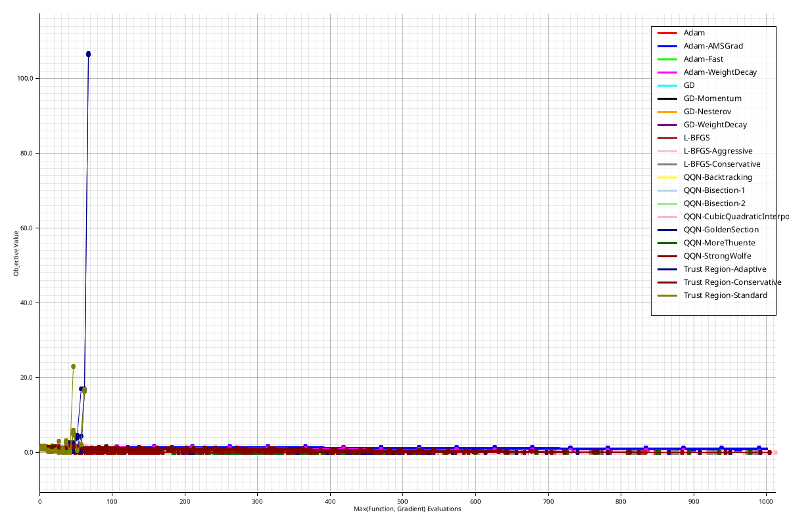
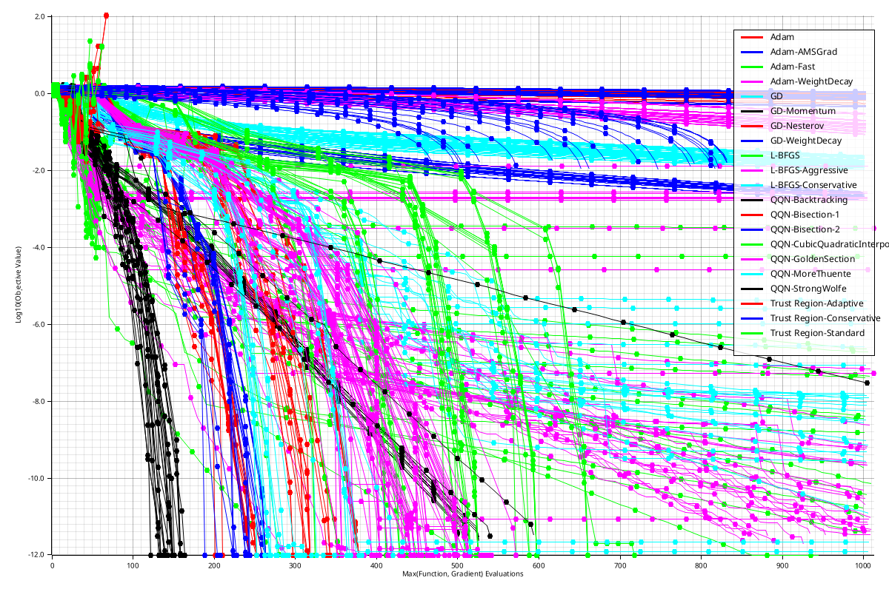

**Figure:** Convergence plots for Levy_2D showing objective value vs iterations.
Left: Linear scale, Right: Log scale for better visualization of convergence behavior.

**Data:** [Linear scale data (CSV)](convergence_Levy_2D_data.csv) | [Log scale data (CSV)](convergence_Levy_2D_log_data.csv)

## Problem: Levy_5D

**Family:** Levy  
**Dimension:** 5  
**Success Threshold:** 1.000e-6  
**Total Runs:** 560

### Performance Summary
<table style="border-collapse: collapse; width: 100%; margin: 20px 0;">
<tr style="background-color: #f2f2f2;">
<th style="border: 1px solid #ddd; padding: 8px; text-align: center;">Rank</th>
<th style="border: 1px solid #ddd; padding: 8px; text-align: center;">Optimizer</th>
<th style="border: 1px solid #ddd; padding: 8px; text-align: center;">Mean Final Value (All/Success/Fail)</th>
<th style="border: 1px solid #ddd; padding: 8px; text-align: center;">Std Dev</th>
<th style="border: 1px solid #ddd; padding: 8px; text-align: center;">Best Value</th>
<th style="border: 1px solid #ddd; padding: 8px; text-align: center;">Worst Value</th>
<th style="border: 1px solid #ddd; padding: 8px; text-align: center;">Mean Function Evals (All/Success/Fail)</th>
<th style="border: 1px solid #ddd; padding: 8px; text-align: center;">Mean Gradient Evals (All/Success/Fail)</th>
<th style="border: 1px solid #ddd; padding: 8px; text-align: center;">Success Rate</th>
<th style="border: 1px solid #ddd; padding: 8px; text-align: center;">Mean Time (s)</th>
</tr>
<tr style="background-color: #d4edda; font-weight: bold;">
<td style="border: 1px solid #ddd; padding: 8px; text-align: center;">1</td>
<td style="border: 1px solid #ddd; padding: 8px; text-align: center;"><a href="detailed_Levy_5D_QQN-Bisection-1.md">QQN-Bisection-1</a></td>
<td style="border: 1px solid #ddd; padding: 8px; text-align: center;">9.69e-14 / 9.69e-14 / -</td>
<td style="border: 1px solid #ddd; padding: 8px; text-align: center;">1.32e-13</td>
<td style="border: 1px solid #ddd; padding: 8px; text-align: center;">4.92e-19</td>
<td style="border: 1px solid #ddd; padding: 8px; text-align: center;">6.77e-13</td>
<td style="border: 1px solid #ddd; padding: 8px; text-align: center;">144.3 / 144.3 / -</td>
<td style="border: 1px solid #ddd; padding: 8px; text-align: center;">181.6 / 181.6 / -</td>
<td style="border: 1px solid #ddd; padding: 8px; text-align: center;">100.0%</td>
<td style="border: 1px solid #ddd; padding: 8px; text-align: center;">0.003</td>
</tr>
<tr style="background-color: #fff3cd;">
<td style="border: 1px solid #ddd; padding: 8px; text-align: center;">2</td>
<td style="border: 1px solid #ddd; padding: 8px; text-align: center;"><a href="detailed_Levy_5D_QQN-Bisection-2.md">QQN-Bisection-2</a></td>
<td style="border: 1px solid #ddd; padding: 8px; text-align: center;">8.35e-14 / 8.35e-14 / -</td>
<td style="border: 1px solid #ddd; padding: 8px; text-align: center;">1.69e-13</td>
<td style="border: 1px solid #ddd; padding: 8px; text-align: center;">1.33e-17</td>
<td style="border: 1px solid #ddd; padding: 8px; text-align: center;">6.96e-13</td>
<td style="border: 1px solid #ddd; padding: 8px; text-align: center;">141.9 / 141.9 / -</td>
<td style="border: 1px solid #ddd; padding: 8px; text-align: center;">152.7 / 152.7 / -</td>
<td style="border: 1px solid #ddd; padding: 8px; text-align: center;">100.0%</td>
<td style="border: 1px solid #ddd; padding: 8px; text-align: center;">0.003</td>
</tr>
<tr style="">
<td style="border: 1px solid #ddd; padding: 8px; text-align: center;">3</td>
<td style="border: 1px solid #ddd; padding: 8px; text-align: center;"><a href="detailed_Levy_5D_QQN-CubicQuadraticInterpolation.md">QQN-CubicQuadraticInterpolation</a></td>
<td style="border: 1px solid #ddd; padding: 8px; text-align: center;">1.27e-13 / 1.13e-13 / 6.55e-13</td>
<td style="border: 1px solid #ddd; padding: 8px; text-align: center;">2.30e-13</td>
<td style="border: 1px solid #ddd; padding: 8px; text-align: center;">1.74e-17</td>
<td style="border: 1px solid #ddd; padding: 8px; text-align: center;">1.24e-12</td>
<td style="border: 1px solid #ddd; padding: 8px; text-align: center;">252.2 / 247.5 / 435.0</td>
<td style="border: 1px solid #ddd; padding: 8px; text-align: center;">376.4 / 371.5 / 568.0</td>
<td style="border: 1px solid #ddd; padding: 8px; text-align: center;">97.5%</td>
<td style="border: 1px solid #ddd; padding: 8px; text-align: center;">0.008</td>
</tr>
<tr style="">
<td style="border: 1px solid #ddd; padding: 8px; text-align: center;">4</td>
<td style="border: 1px solid #ddd; padding: 8px; text-align: center;"><a href="detailed_Levy_5D_QQN-GoldenSection.md">QQN-GoldenSection</a></td>
<td style="border: 1px solid #ddd; padding: 8px; text-align: center;">1.26e-13 / 7.91e-14 / 1.48e-12</td>
<td style="border: 1px solid #ddd; padding: 8px; text-align: center;">3.23e-13</td>
<td style="border: 1px solid #ddd; padding: 8px; text-align: center;">2.25e-17</td>
<td style="border: 1px solid #ddd; padding: 8px; text-align: center;">2.36e-12</td>
<td style="border: 1px solid #ddd; padding: 8px; text-align: center;">522.8 / 513.6 / 789.0</td>
<td style="border: 1px solid #ddd; padding: 8px; text-align: center;">80.5 / 75.9 / 214.0</td>
<td style="border: 1px solid #ddd; padding: 8px; text-align: center;">96.7%</td>
<td style="border: 1px solid #ddd; padding: 8px; text-align: center;">0.008</td>
</tr>
<tr style="">
<td style="border: 1px solid #ddd; padding: 8px; text-align: center;">5</td>
<td style="border: 1px solid #ddd; padding: 8px; text-align: center;"><a href="detailed_Levy_5D_QQN-MoreThuente.md">QQN-MoreThuente</a></td>
<td style="border: 1px solid #ddd; padding: 8px; text-align: center;">3.04e-13 / 9.47e-14 / 4.27e-12</td>
<td style="border: 1px solid #ddd; padding: 8px; text-align: center;">9.13e-13</td>
<td style="border: 1px solid #ddd; padding: 8px; text-align: center;">1.54e-16</td>
<td style="border: 1px solid #ddd; padding: 8px; text-align: center;">4.27e-12</td>
<td style="border: 1px solid #ddd; padding: 8px; text-align: center;">233.6 / 219.5 / 501.0</td>
<td style="border: 1px solid #ddd; padding: 8px; text-align: center;">241.1 / 226.4 / 519.0</td>
<td style="border: 1px solid #ddd; padding: 8px; text-align: center;">95.0%</td>
<td style="border: 1px solid #ddd; padding: 8px; text-align: center;">0.005</td>
</tr>
<tr style="">
<td style="border: 1px solid #ddd; padding: 8px; text-align: center;">6</td>
<td style="border: 1px solid #ddd; padding: 8px; text-align: center;"><a href="detailed_Levy_5D_QQN-StrongWolfe.md">QQN-StrongWolfe</a></td>
<td style="border: 1px solid #ddd; padding: 8px; text-align: center;">6.92e-13 / 6.92e-13 / -</td>
<td style="border: 1px solid #ddd; padding: 8px; text-align: center;">1.05e-12</td>
<td style="border: 1px solid #ddd; padding: 8px; text-align: center;">2.28e-16</td>
<td style="border: 1px solid #ddd; padding: 8px; text-align: center;">2.80e-12</td>
<td style="border: 1px solid #ddd; padding: 8px; text-align: center;">125.2 / 125.2 / -</td>
<td style="border: 1px solid #ddd; padding: 8px; text-align: center;">139.3 / 139.3 / -</td>
<td style="border: 1px solid #ddd; padding: 8px; text-align: center;">100.0%</td>
<td style="border: 1px solid #ddd; padding: 8px; text-align: center;">0.004</td>
</tr>
<tr style="">
<td style="border: 1px solid #ddd; padding: 8px; text-align: center;">7</td>
<td style="border: 1px solid #ddd; padding: 8px; text-align: center;"><a href="detailed_Levy_5D_QQN-Backtracking.md">QQN-Backtracking</a></td>
<td style="border: 1px solid #ddd; padding: 8px; text-align: center;">1.17e-12 / 1.17e-12 / -</td>
<td style="border: 1px solid #ddd; padding: 8px; text-align: center;">1.41e-12</td>
<td style="border: 1px solid #ddd; padding: 8px; text-align: center;">6.15e-16</td>
<td style="border: 1px solid #ddd; padding: 8px; text-align: center;">3.98e-12</td>
<td style="border: 1px solid #ddd; padding: 8px; text-align: center;">156.7 / 156.7 / -</td>
<td style="border: 1px solid #ddd; padding: 8px; text-align: center;">133.5 / 133.5 / -</td>
<td style="border: 1px solid #ddd; padding: 8px; text-align: center;">100.0%</td>
<td style="border: 1px solid #ddd; padding: 8px; text-align: center;">0.005</td>
</tr>
<tr style="">
<td style="border: 1px solid #ddd; padding: 8px; text-align: center;">8</td>
<td style="border: 1px solid #ddd; padding: 8px; text-align: center;"><a href="detailed_Levy_5D_L-BFGS-Aggressive.md">L-BFGS-Aggressive</a></td>
<td style="border: 1px solid #ddd; padding: 8px; text-align: center;">5.51e-2 / 2.34e-12 / 7.11e-2</td>
<td style="border: 1px solid #ddd; padding: 8px; text-align: center;">2.27e-1</td>
<td style="border: 1px solid #ddd; padding: 8px; text-align: center;">5.16e-13</td>
<td style="border: 1px solid #ddd; padding: 8px; text-align: center;">1.43e0</td>
<td style="border: 1px solid #ddd; padding: 8px; text-align: center;">698.9 / 564.2 / 738.0</td>
<td style="border: 1px solid #ddd; padding: 8px; text-align: center;">268.3 / 264.8 / 269.3</td>
<td style="border: 1px solid #ddd; padding: 8px; text-align: center;">22.5%</td>
<td style="border: 1px solid #ddd; padding: 8px; text-align: center;">0.011</td>
</tr>
<tr style="">
<td style="border: 1px solid #ddd; padding: 8px; text-align: center;">9</td>
<td style="border: 1px solid #ddd; padding: 8px; text-align: center;"><a href="detailed_Levy_5D_L-BFGS.md">L-BFGS</a></td>
<td style="border: 1px solid #ddd; padding: 8px; text-align: center;">7.09e-5 / 1.72e-12 / 8.30e-4</td>
<td style="border: 1px solid #ddd; padding: 8px; text-align: center;">2.11e-4</td>
<td style="border: 1px solid #ddd; padding: 8px; text-align: center;">7.16e-13</td>
<td style="border: 1px solid #ddd; padding: 8px; text-align: center;">7.45e-4</td>
<td style="border: 1px solid #ddd; padding: 8px; text-align: center;">493.8 / 447.8 / 509.1</td>
<td style="border: 1px solid #ddd; padding: 8px; text-align: center;">329.1 / 310.0 / 335.4</td>
<td style="border: 1px solid #ddd; padding: 8px; text-align: center;">25.0%</td>
<td style="border: 1px solid #ddd; padding: 8px; text-align: center;">0.011</td>
</tr>
<tr style="">
<td style="border: 1px solid #ddd; padding: 8px; text-align: center;">10</td>
<td style="border: 1px solid #ddd; padding: 8px; text-align: center;"><a href="detailed_Levy_5D_L-BFGS-Conservative.md">L-BFGS-Conservative</a></td>
<td style="border: 1px solid #ddd; padding: 8px; text-align: center;">1.98e-8 / - / 1.98e-8</td>
<td style="border: 1px solid #ddd; padding: 8px; text-align: center;">2.17e-8</td>
<td style="border: 1px solid #ddd; padding: 8px; text-align: center;">6.10e-10</td>
<td style="border: 1px solid #ddd; padding: 8px; text-align: center;">7.38e-8</td>
<td style="border: 1px solid #ddd; padding: 8px; text-align: center;">557.2 / - / 557.2</td>
<td style="border: 1px solid #ddd; padding: 8px; text-align: center;">446.0 / - / 446.0</td>
<td style="border: 1px solid #ddd; padding: 8px; text-align: center;">0.0%</td>
<td style="border: 1px solid #ddd; padding: 8px; text-align: center;">0.014</td>
</tr>
<tr style="">
<td style="border: 1px solid #ddd; padding: 8px; text-align: center;">11</td>
<td style="border: 1px solid #ddd; padding: 8px; text-align: center;"><a href="detailed_Levy_5D_GD-Momentum.md">GD-Momentum</a></td>
<td style="border: 1px solid #ddd; padding: 8px; text-align: center;">1.28e-1 / - / 1.59e-1</td>
<td style="border: 1px solid #ddd; padding: 8px; text-align: center;">4.52e-2</td>
<td style="border: 1px solid #ddd; padding: 8px; text-align: center;">6.51e-7</td>
<td style="border: 1px solid #ddd; padding: 8px; text-align: center;">1.75e-1</td>
<td style="border: 1px solid #ddd; padding: 8px; text-align: center;">57.8 / - / 57.8</td>
<td style="border: 1px solid #ddd; padding: 8px; text-align: center;">111.8 / - / 111.8</td>
<td style="border: 1px solid #ddd; padding: 8px; text-align: center;">0.0%</td>
<td style="border: 1px solid #ddd; padding: 8px; text-align: center;">0.002</td>
</tr>
<tr style="">
<td style="border: 1px solid #ddd; padding: 8px; text-align: center;">12</td>
<td style="border: 1px solid #ddd; padding: 8px; text-align: center;"><a href="detailed_Levy_5D_GD-Nesterov.md">GD-Nesterov</a></td>
<td style="border: 1px solid #ddd; padding: 8px; text-align: center;">5.56e-2 / - / 6.14e-2</td>
<td style="border: 1px solid #ddd; padding: 8px; text-align: center;">5.70e-2</td>
<td style="border: 1px solid #ddd; padding: 8px; text-align: center;">7.31e-7</td>
<td style="border: 1px solid #ddd; padding: 8px; text-align: center;">1.50e-1</td>
<td style="border: 1px solid #ddd; padding: 8px; text-align: center;">180.9 / - / 180.9</td>
<td style="border: 1px solid #ddd; padding: 8px; text-align: center;">358.9 / - / 358.9</td>
<td style="border: 1px solid #ddd; padding: 8px; text-align: center;">0.0%</td>
<td style="border: 1px solid #ddd; padding: 8px; text-align: center;">0.006</td>
</tr>
<tr style="">
<td style="border: 1px solid #ddd; padding: 8px; text-align: center;">13</td>
<td style="border: 1px solid #ddd; padding: 8px; text-align: center;"><a href="detailed_Levy_5D_Trust_Region-Standard.md">Trust Region-Standard</a></td>
<td style="border: 1px solid #ddd; padding: 8px; text-align: center;">1.23e-1 / - / 4.89e0</td>
<td style="border: 1px solid #ddd; padding: 8px; text-align: center;">1.09e-1</td>
<td style="border: 1px solid #ddd; padding: 8px; text-align: center;">9.69e-4</td>
<td style="border: 1px solid #ddd; padding: 8px; text-align: center;">4.12e-1</td>
<td style="border: 1px solid #ddd; padding: 8px; text-align: center;">22.8 / - / 22.8</td>
<td style="border: 1px solid #ddd; padding: 8px; text-align: center;">15.8 / - / 15.8</td>
<td style="border: 1px solid #ddd; padding: 8px; text-align: center;">0.0%</td>
<td style="border: 1px solid #ddd; padding: 8px; text-align: center;">0.000</td>
</tr>
<tr style="">
<td style="border: 1px solid #ddd; padding: 8px; text-align: center;">14</td>
<td style="border: 1px solid #ddd; padding: 8px; text-align: center;"><a href="detailed_Levy_5D_GD-WeightDecay.md">GD-WeightDecay</a></td>
<td style="border: 1px solid #ddd; padding: 8px; text-align: center;">2.21e-3 / - / 2.21e-3</td>
<td style="border: 1px solid #ddd; padding: 8px; text-align: center;">3.19e-4</td>
<td style="border: 1px solid #ddd; padding: 8px; text-align: center;">1.68e-3</td>
<td style="border: 1px solid #ddd; padding: 8px; text-align: center;">2.70e-3</td>
<td style="border: 1px solid #ddd; padding: 8px; text-align: center;">335.0 / - / 335.0</td>
<td style="border: 1px solid #ddd; padding: 8px; text-align: center;">668.0 / - / 668.0</td>
<td style="border: 1px solid #ddd; padding: 8px; text-align: center;">0.0%</td>
<td style="border: 1px solid #ddd; padding: 8px; text-align: center;">0.011</td>
</tr>
<tr style="">
<td style="border: 1px solid #ddd; padding: 8px; text-align: center;">15</td>
<td style="border: 1px solid #ddd; padding: 8px; text-align: center;"><a href="detailed_Levy_5D_Adam-Fast.md">Adam-Fast</a></td>
<td style="border: 1px solid #ddd; padding: 8px; text-align: center;">1.19e-2 / - / 1.68e-1</td>
<td style="border: 1px solid #ddd; padding: 8px; text-align: center;">4.75e-3</td>
<td style="border: 1px solid #ddd; padding: 8px; text-align: center;">3.70e-3</td>
<td style="border: 1px solid #ddd; padding: 8px; text-align: center;">2.74e-2</td>
<td style="border: 1px solid #ddd; padding: 8px; text-align: center;">37.2 / - / 37.2</td>
<td style="border: 1px solid #ddd; padding: 8px; text-align: center;">36.2 / - / 36.2</td>
<td style="border: 1px solid #ddd; padding: 8px; text-align: center;">0.0%</td>
<td style="border: 1px solid #ddd; padding: 8px; text-align: center;">0.001</td>
</tr>
<tr style="">
<td style="border: 1px solid #ddd; padding: 8px; text-align: center;">16</td>
<td style="border: 1px solid #ddd; padding: 8px; text-align: center;"><a href="detailed_Levy_5D_GD.md">GD</a></td>
<td style="border: 1px solid #ddd; padding: 8px; text-align: center;">1.76e-2 / - / 1.76e-2</td>
<td style="border: 1px solid #ddd; padding: 8px; text-align: center;">4.83e-3</td>
<td style="border: 1px solid #ddd; padding: 8px; text-align: center;">1.12e-2</td>
<td style="border: 1px solid #ddd; padding: 8px; text-align: center;">2.60e-2</td>
<td style="border: 1px solid #ddd; padding: 8px; text-align: center;">335.0 / - / 335.0</td>
<td style="border: 1px solid #ddd; padding: 8px; text-align: center;">668.0 / - / 668.0</td>
<td style="border: 1px solid #ddd; padding: 8px; text-align: center;">0.0%</td>
<td style="border: 1px solid #ddd; padding: 8px; text-align: center;">0.009</td>
</tr>
<tr style="">
<td style="border: 1px solid #ddd; padding: 8px; text-align: center;">17</td>
<td style="border: 1px solid #ddd; padding: 8px; text-align: center;"><a href="detailed_Levy_5D_Trust_Region-Adaptive.md">Trust Region-Adaptive</a></td>
<td style="border: 1px solid #ddd; padding: 8px; text-align: center;">7.36e-2 / - / 3.49e0</td>
<td style="border: 1px solid #ddd; padding: 8px; text-align: center;">2.70e-2</td>
<td style="border: 1px solid #ddd; padding: 8px; text-align: center;">1.93e-2</td>
<td style="border: 1px solid #ddd; padding: 8px; text-align: center;">1.34e-1</td>
<td style="border: 1px solid #ddd; padding: 8px; text-align: center;">47.9 / - / 47.9</td>
<td style="border: 1px solid #ddd; padding: 8px; text-align: center;">32.5 / - / 32.5</td>
<td style="border: 1px solid #ddd; padding: 8px; text-align: center;">0.0%</td>
<td style="border: 1px solid #ddd; padding: 8px; text-align: center;">0.000</td>
</tr>
<tr style="">
<td style="border: 1px solid #ddd; padding: 8px; text-align: center;">18</td>
<td style="border: 1px solid #ddd; padding: 8px; text-align: center;"><a href="detailed_Levy_5D_Adam-WeightDecay.md">Adam-WeightDecay</a></td>
<td style="border: 1px solid #ddd; padding: 8px; text-align: center;">3.46e-1 / - / 3.46e-1</td>
<td style="border: 1px solid #ddd; padding: 8px; text-align: center;">8.91e-2</td>
<td style="border: 1px solid #ddd; padding: 8px; text-align: center;">2.13e-1</td>
<td style="border: 1px solid #ddd; padding: 8px; text-align: center;">5.65e-1</td>
<td style="border: 1px solid #ddd; padding: 8px; text-align: center;">502.0 / - / 502.0</td>
<td style="border: 1px solid #ddd; padding: 8px; text-align: center;">502.0 / - / 502.0</td>
<td style="border: 1px solid #ddd; padding: 8px; text-align: center;">0.0%</td>
<td style="border: 1px solid #ddd; padding: 8px; text-align: center;">0.011</td>
</tr>
<tr style="">
<td style="border: 1px solid #ddd; padding: 8px; text-align: center;">19</td>
<td style="border: 1px solid #ddd; padding: 8px; text-align: center;"><a href="detailed_Levy_5D_Trust_Region-Conservative.md">Trust Region-Conservative</a></td>
<td style="border: 1px solid #ddd; padding: 8px; text-align: center;">1.20e0 / - / 1.20e0</td>
<td style="border: 1px solid #ddd; padding: 8px; text-align: center;">2.73e-1</td>
<td style="border: 1px solid #ddd; padding: 8px; text-align: center;">7.44e-1</td>
<td style="border: 1px solid #ddd; padding: 8px; text-align: center;">1.76e0</td>
<td style="border: 1px solid #ddd; padding: 8px; text-align: center;">602.0 / - / 602.0</td>
<td style="border: 1px solid #ddd; padding: 8px; text-align: center;">402.0 / - / 402.0</td>
<td style="border: 1px solid #ddd; padding: 8px; text-align: center;">0.0%</td>
<td style="border: 1px solid #ddd; padding: 8px; text-align: center;">0.004</td>
</tr>
<tr style="">
<td style="border: 1px solid #ddd; padding: 8px; text-align: center;">20</td>
<td style="border: 1px solid #ddd; padding: 8px; text-align: center;"><a href="detailed_Levy_5D_Adam.md">Adam</a></td>
<td style="border: 1px solid #ddd; padding: 8px; text-align: center;">1.92e0 / - / 1.92e0</td>
<td style="border: 1px solid #ddd; padding: 8px; text-align: center;">2.91e-1</td>
<td style="border: 1px solid #ddd; padding: 8px; text-align: center;">1.34e0</td>
<td style="border: 1px solid #ddd; padding: 8px; text-align: center;">2.40e0</td>
<td style="border: 1px solid #ddd; padding: 8px; text-align: center;">502.0 / - / 502.0</td>
<td style="border: 1px solid #ddd; padding: 8px; text-align: center;">502.0 / - / 502.0</td>
<td style="border: 1px solid #ddd; padding: 8px; text-align: center;">0.0%</td>
<td style="border: 1px solid #ddd; padding: 8px; text-align: center;">0.011</td>
</tr>
<tr style="">
<td style="border: 1px solid #ddd; padding: 8px; text-align: center;">21</td>
<td style="border: 1px solid #ddd; padding: 8px; text-align: center;"><a href="detailed_Levy_5D_Adam-AMSGrad.md">Adam-AMSGrad</a></td>
<td style="border: 1px solid #ddd; padding: 8px; text-align: center;">1.96e0 / - / 1.96e0</td>
<td style="border: 1px solid #ddd; padding: 8px; text-align: center;">2.87e-1</td>
<td style="border: 1px solid #ddd; padding: 8px; text-align: center;">1.49e0</td>
<td style="border: 1px solid #ddd; padding: 8px; text-align: center;">2.64e0</td>
<td style="border: 1px solid #ddd; padding: 8px; text-align: center;">502.0 / - / 502.0</td>
<td style="border: 1px solid #ddd; padding: 8px; text-align: center;">502.0 / - / 502.0</td>
<td style="border: 1px solid #ddd; padding: 8px; text-align: center;">0.0%</td>
<td style="border: 1px solid #ddd; padding: 8px; text-align: center;">0.012</td>
</tr>
</table>

### Convergence Plots

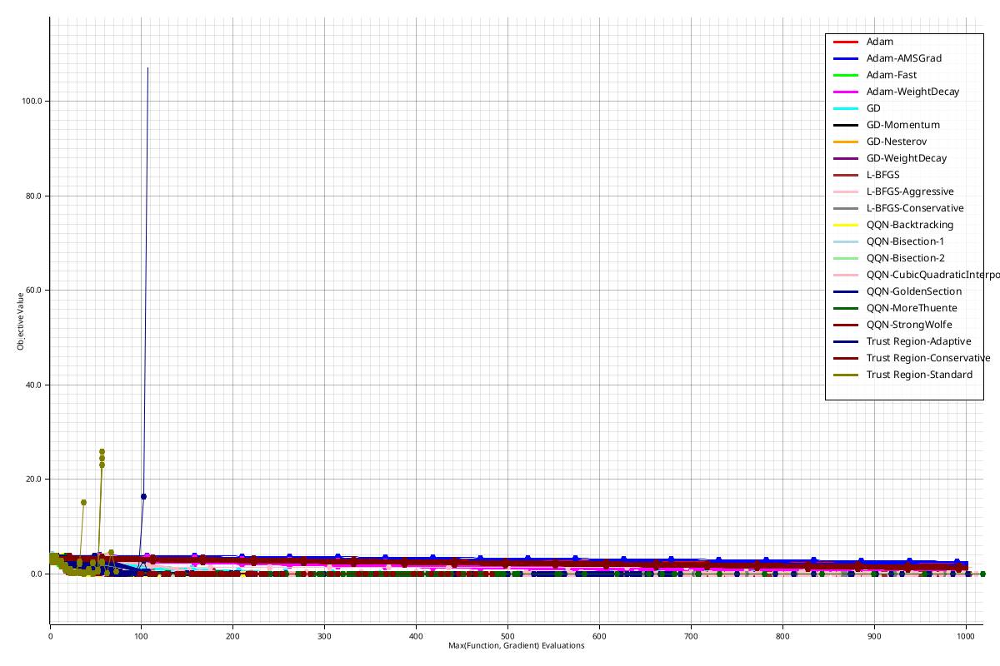
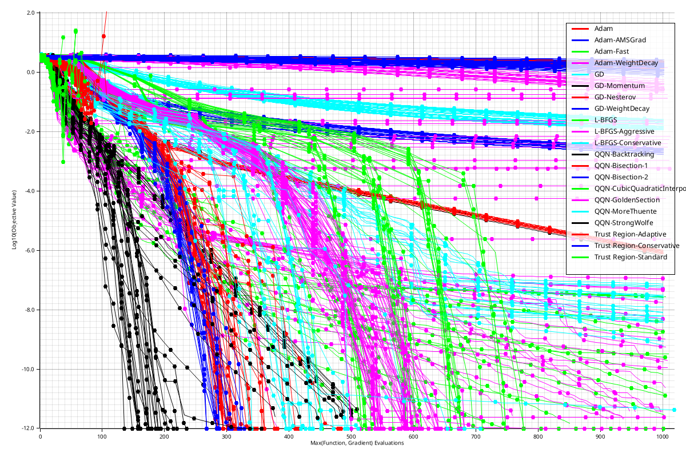

**Figure:** Convergence plots for Levy_5D showing objective value vs iterations.
Left: Linear scale, Right: Log scale for better visualization of convergence behavior.

**Data:** [Linear scale data (CSV)](convergence_Levy_5D_data.csv) | [Log scale data (CSV)](convergence_Levy_5D_log_data.csv)

## Problem: Levy_10D

**Family:** Levy  
**Dimension:** 10  
**Success Threshold:** 1.000e-6  
**Total Runs:** 560

### Performance Summary
<table style="border-collapse: collapse; width: 100%; margin: 20px 0;">
<tr style="background-color: #f2f2f2;">
<th style="border: 1px solid #ddd; padding: 8px; text-align: center;">Rank</th>
<th style="border: 1px solid #ddd; padding: 8px; text-align: center;">Optimizer</th>
<th style="border: 1px solid #ddd; padding: 8px; text-align: center;">Mean Final Value (All/Success/Fail)</th>
<th style="border: 1px solid #ddd; padding: 8px; text-align: center;">Std Dev</th>
<th style="border: 1px solid #ddd; padding: 8px; text-align: center;">Best Value</th>
<th style="border: 1px solid #ddd; padding: 8px; text-align: center;">Worst Value</th>
<th style="border: 1px solid #ddd; padding: 8px; text-align: center;">Mean Function Evals (All/Success/Fail)</th>
<th style="border: 1px solid #ddd; padding: 8px; text-align: center;">Mean Gradient Evals (All/Success/Fail)</th>
<th style="border: 1px solid #ddd; padding: 8px; text-align: center;">Success Rate</th>
<th style="border: 1px solid #ddd; padding: 8px; text-align: center;">Mean Time (s)</th>
</tr>
<tr style="background-color: #d4edda; font-weight: bold;">
<td style="border: 1px solid #ddd; padding: 8px; text-align: center;">1</td>
<td style="border: 1px solid #ddd; padding: 8px; text-align: center;"><a href="detailed_Levy_10D_QQN-CubicQuadraticInterpolation.md">QQN-CubicQuadraticInterpolation</a></td>
<td style="border: 1px solid #ddd; padding: 8px; text-align: center;">2.15e-13 / 1.38e-13 / 1.16e-12</td>
<td style="border: 1px solid #ddd; padding: 8px; text-align: center;">3.57e-13</td>
<td style="border: 1px solid #ddd; padding: 8px; text-align: center;">8.80e-17</td>
<td style="border: 1px solid #ddd; padding: 8px; text-align: center;">1.57e-12</td>
<td style="border: 1px solid #ddd; padding: 8px; text-align: center;">281.6 / 267.3 / 458.0</td>
<td style="border: 1px solid #ddd; padding: 8px; text-align: center;">422.3 / 411.9 / 550.0</td>
<td style="border: 1px solid #ddd; padding: 8px; text-align: center;">92.5%</td>
<td style="border: 1px solid #ddd; padding: 8px; text-align: center;">0.010</td>
</tr>
<tr style="background-color: #fff3cd;">
<td style="border: 1px solid #ddd; padding: 8px; text-align: center;">2</td>
<td style="border: 1px solid #ddd; padding: 8px; text-align: center;"><a href="detailed_Levy_10D_QQN-GoldenSection.md">QQN-GoldenSection</a></td>
<td style="border: 1px solid #ddd; padding: 8px; text-align: center;">1.88e-13 / 1.34e-13 / 6.75e-13</td>
<td style="border: 1px solid #ddd; padding: 8px; text-align: center;">2.48e-13</td>
<td style="border: 1px solid #ddd; padding: 8px; text-align: center;">9.03e-17</td>
<td style="border: 1px solid #ddd; padding: 8px; text-align: center;">1.36e-12</td>
<td style="border: 1px solid #ddd; padding: 8px; text-align: center;">554.2 / 531.2 / 761.0</td>
<td style="border: 1px solid #ddd; padding: 8px; text-align: center;">94.7 / 78.0 / 245.0</td>
<td style="border: 1px solid #ddd; padding: 8px; text-align: center;">90.0%</td>
<td style="border: 1px solid #ddd; padding: 8px; text-align: center;">0.010</td>
</tr>
<tr style="">
<td style="border: 1px solid #ddd; padding: 8px; text-align: center;">3</td>
<td style="border: 1px solid #ddd; padding: 8px; text-align: center;"><a href="detailed_Levy_10D_QQN-Bisection-2.md">QQN-Bisection-2</a></td>
<td style="border: 1px solid #ddd; padding: 8px; text-align: center;">5.04e-14 / 5.04e-14 / -</td>
<td style="border: 1px solid #ddd; padding: 8px; text-align: center;">7.79e-14</td>
<td style="border: 1px solid #ddd; padding: 8px; text-align: center;">1.00e-16</td>
<td style="border: 1px solid #ddd; padding: 8px; text-align: center;">2.73e-13</td>
<td style="border: 1px solid #ddd; padding: 8px; text-align: center;">147.1 / 147.1 / -</td>
<td style="border: 1px solid #ddd; padding: 8px; text-align: center;">156.3 / 156.3 / -</td>
<td style="border: 1px solid #ddd; padding: 8px; text-align: center;">100.0%</td>
<td style="border: 1px solid #ddd; padding: 8px; text-align: center;">0.003</td>
</tr>
<tr style="">
<td style="border: 1px solid #ddd; padding: 8px; text-align: center;">4</td>
<td style="border: 1px solid #ddd; padding: 8px; text-align: center;"><a href="detailed_Levy_10D_QQN-Bisection-1.md">QQN-Bisection-1</a></td>
<td style="border: 1px solid #ddd; padding: 8px; text-align: center;">1.09e-13 / 1.09e-13 / -</td>
<td style="border: 1px solid #ddd; padding: 8px; text-align: center;">1.42e-13</td>
<td style="border: 1px solid #ddd; padding: 8px; text-align: center;">1.86e-16</td>
<td style="border: 1px solid #ddd; padding: 8px; text-align: center;">5.96e-13</td>
<td style="border: 1px solid #ddd; padding: 8px; text-align: center;">147.1 / 147.1 / -</td>
<td style="border: 1px solid #ddd; padding: 8px; text-align: center;">183.4 / 183.4 / -</td>
<td style="border: 1px solid #ddd; padding: 8px; text-align: center;">100.0%</td>
<td style="border: 1px solid #ddd; padding: 8px; text-align: center;">0.004</td>
</tr>
<tr style="">
<td style="border: 1px solid #ddd; padding: 8px; text-align: center;">5</td>
<td style="border: 1px solid #ddd; padding: 8px; text-align: center;"><a href="detailed_Levy_10D_QQN-StrongWolfe.md">QQN-StrongWolfe</a></td>
<td style="border: 1px solid #ddd; padding: 8px; text-align: center;">4.83e-13 / 4.83e-13 / -</td>
<td style="border: 1px solid #ddd; padding: 8px; text-align: center;">9.46e-13</td>
<td style="border: 1px solid #ddd; padding: 8px; text-align: center;">7.42e-16</td>
<td style="border: 1px solid #ddd; padding: 8px; text-align: center;">2.95e-12</td>
<td style="border: 1px solid #ddd; padding: 8px; text-align: center;">122.8 / 122.8 / -</td>
<td style="border: 1px solid #ddd; padding: 8px; text-align: center;">136.7 / 136.7 / -</td>
<td style="border: 1px solid #ddd; padding: 8px; text-align: center;">100.0%</td>
<td style="border: 1px solid #ddd; padding: 8px; text-align: center;">0.004</td>
</tr>
<tr style="">
<td style="border: 1px solid #ddd; padding: 8px; text-align: center;">6</td>
<td style="border: 1px solid #ddd; padding: 8px; text-align: center;"><a href="detailed_Levy_10D_QQN-MoreThuente.md">QQN-MoreThuente</a></td>
<td style="border: 1px solid #ddd; padding: 8px; text-align: center;">5.46e-13 / 2.61e-13 / 5.96e-12</td>
<td style="border: 1px solid #ddd; padding: 8px; text-align: center;">1.30e-12</td>
<td style="border: 1px solid #ddd; padding: 8px; text-align: center;">2.18e-15</td>
<td style="border: 1px solid #ddd; padding: 8px; text-align: center;">5.96e-12</td>
<td style="border: 1px solid #ddd; padding: 8px; text-align: center;">219.7 / 203.0 / 537.0</td>
<td style="border: 1px solid #ddd; padding: 8px; text-align: center;">222.2 / 209.2 / 470.0</td>
<td style="border: 1px solid #ddd; padding: 8px; text-align: center;">95.0%</td>
<td style="border: 1px solid #ddd; padding: 8px; text-align: center;">0.005</td>
</tr>
<tr style="">
<td style="border: 1px solid #ddd; padding: 8px; text-align: center;">7</td>
<td style="border: 1px solid #ddd; padding: 8px; text-align: center;"><a href="detailed_Levy_10D_QQN-Backtracking.md">QQN-Backtracking</a></td>
<td style="border: 1px solid #ddd; padding: 8px; text-align: center;">1.83e-12 / 1.83e-12 / -</td>
<td style="border: 1px solid #ddd; padding: 8px; text-align: center;">1.35e-12</td>
<td style="border: 1px solid #ddd; padding: 8px; text-align: center;">4.12e-15</td>
<td style="border: 1px solid #ddd; padding: 8px; text-align: center;">3.82e-12</td>
<td style="border: 1px solid #ddd; padding: 8px; text-align: center;">200.7 / 200.7 / -</td>
<td style="border: 1px solid #ddd; padding: 8px; text-align: center;">171.0 / 171.0 / -</td>
<td style="border: 1px solid #ddd; padding: 8px; text-align: center;">100.0%</td>
<td style="border: 1px solid #ddd; padding: 8px; text-align: center;">0.007</td>
</tr>
<tr style="">
<td style="border: 1px solid #ddd; padding: 8px; text-align: center;">8</td>
<td style="border: 1px solid #ddd; padding: 8px; text-align: center;"><a href="detailed_Levy_10D_L-BFGS.md">L-BFGS</a></td>
<td style="border: 1px solid #ddd; padding: 8px; text-align: center;">4.37e-4 / 1.24e-12 / 1.12e-2</td>
<td style="border: 1px solid #ddd; padding: 8px; text-align: center;">1.29e-3</td>
<td style="border: 1px solid #ddd; padding: 8px; text-align: center;">5.36e-13</td>
<td style="border: 1px solid #ddd; padding: 8px; text-align: center;">5.06e-3</td>
<td style="border: 1px solid #ddd; padding: 8px; text-align: center;">419.8 / 341.2 / 439.4</td>
<td style="border: 1px solid #ddd; padding: 8px; text-align: center;">278.8 / 250.5 / 285.9</td>
<td style="border: 1px solid #ddd; padding: 8px; text-align: center;">20.0%</td>
<td style="border: 1px solid #ddd; padding: 8px; text-align: center;">0.010</td>
</tr>
<tr style="">
<td style="border: 1px solid #ddd; padding: 8px; text-align: center;">9</td>
<td style="border: 1px solid #ddd; padding: 8px; text-align: center;"><a href="detailed_Levy_10D_L-BFGS-Aggressive.md">L-BFGS-Aggressive</a></td>
<td style="border: 1px solid #ddd; padding: 8px; text-align: center;">5.10e-1 / 1.69e-12 / 5.67e-1</td>
<td style="border: 1px solid #ddd; padding: 8px; text-align: center;">8.17e-1</td>
<td style="border: 1px solid #ddd; padding: 8px; text-align: center;">8.27e-13</td>
<td style="border: 1px solid #ddd; padding: 8px; text-align: center;">1.95e0</td>
<td style="border: 1px solid #ddd; padding: 8px; text-align: center;">691.4 / 447.0 / 718.6</td>
<td style="border: 1px solid #ddd; padding: 8px; text-align: center;">253.3 / 220.2 / 257.0</td>
<td style="border: 1px solid #ddd; padding: 8px; text-align: center;">10.0%</td>
<td style="border: 1px solid #ddd; padding: 8px; text-align: center;">0.011</td>
</tr>
<tr style="">
<td style="border: 1px solid #ddd; padding: 8px; text-align: center;">10</td>
<td style="border: 1px solid #ddd; padding: 8px; text-align: center;"><a href="detailed_Levy_10D_L-BFGS-Conservative.md">L-BFGS-Conservative</a></td>
<td style="border: 1px solid #ddd; padding: 8px; text-align: center;">8.89e-9 / - / 8.89e-9</td>
<td style="border: 1px solid #ddd; padding: 8px; text-align: center;">1.17e-8</td>
<td style="border: 1px solid #ddd; padding: 8px; text-align: center;">5.94e-10</td>
<td style="border: 1px solid #ddd; padding: 8px; text-align: center;">5.53e-8</td>
<td style="border: 1px solid #ddd; padding: 8px; text-align: center;">558.0 / - / 558.0</td>
<td style="border: 1px solid #ddd; padding: 8px; text-align: center;">446.0 / - / 446.0</td>
<td style="border: 1px solid #ddd; padding: 8px; text-align: center;">0.0%</td>
<td style="border: 1px solid #ddd; padding: 8px; text-align: center;">0.015</td>
</tr>
<tr style="">
<td style="border: 1px solid #ddd; padding: 8px; text-align: center;">11</td>
<td style="border: 1px solid #ddd; padding: 8px; text-align: center;"><a href="detailed_Levy_10D_GD-WeightDecay.md">GD-WeightDecay</a></td>
<td style="border: 1px solid #ddd; padding: 8px; text-align: center;">2.18e-3 / - / 2.18e-3</td>
<td style="border: 1px solid #ddd; padding: 8px; text-align: center;">3.64e-4</td>
<td style="border: 1px solid #ddd; padding: 8px; text-align: center;">1.70e-3</td>
<td style="border: 1px solid #ddd; padding: 8px; text-align: center;">2.74e-3</td>
<td style="border: 1px solid #ddd; padding: 8px; text-align: center;">335.0 / - / 335.0</td>
<td style="border: 1px solid #ddd; padding: 8px; text-align: center;">668.0 / - / 668.0</td>
<td style="border: 1px solid #ddd; padding: 8px; text-align: center;">0.0%</td>
<td style="border: 1px solid #ddd; padding: 8px; text-align: center;">0.012</td>
</tr>
<tr style="">
<td style="border: 1px solid #ddd; padding: 8px; text-align: center;">12</td>
<td style="border: 1px solid #ddd; padding: 8px; text-align: center;"><a href="detailed_Levy_10D_GD.md">GD</a></td>
<td style="border: 1px solid #ddd; padding: 8px; text-align: center;">1.84e-2 / - / 1.84e-2</td>
<td style="border: 1px solid #ddd; padding: 8px; text-align: center;">3.47e-3</td>
<td style="border: 1px solid #ddd; padding: 8px; text-align: center;">1.21e-2</td>
<td style="border: 1px solid #ddd; padding: 8px; text-align: center;">2.58e-2</td>
<td style="border: 1px solid #ddd; padding: 8px; text-align: center;">335.0 / - / 335.0</td>
<td style="border: 1px solid #ddd; padding: 8px; text-align: center;">668.0 / - / 668.0</td>
<td style="border: 1px solid #ddd; padding: 8px; text-align: center;">0.0%</td>
<td style="border: 1px solid #ddd; padding: 8px; text-align: center;">0.009</td>
</tr>
<tr style="">
<td style="border: 1px solid #ddd; padding: 8px; text-align: center;">13</td>
<td style="border: 1px solid #ddd; padding: 8px; text-align: center;"><a href="detailed_Levy_10D_Adam-Fast.md">Adam-Fast</a></td>
<td style="border: 1px solid #ddd; padding: 8px; text-align: center;">2.96e-2 / - / 3.17e-1</td>
<td style="border: 1px solid #ddd; padding: 8px; text-align: center;">1.04e-2</td>
<td style="border: 1px solid #ddd; padding: 8px; text-align: center;">1.33e-2</td>
<td style="border: 1px solid #ddd; padding: 8px; text-align: center;">5.13e-2</td>
<td style="border: 1px solid #ddd; padding: 8px; text-align: center;">37.2 / - / 37.2</td>
<td style="border: 1px solid #ddd; padding: 8px; text-align: center;">36.2 / - / 36.2</td>
<td style="border: 1px solid #ddd; padding: 8px; text-align: center;">0.0%</td>
<td style="border: 1px solid #ddd; padding: 8px; text-align: center;">0.001</td>
</tr>
<tr style="">
<td style="border: 1px solid #ddd; padding: 8px; text-align: center;">14</td>
<td style="border: 1px solid #ddd; padding: 8px; text-align: center;"><a href="detailed_Levy_10D_Trust_Region-Standard.md">Trust Region-Standard</a></td>
<td style="border: 1px solid #ddd; padding: 8px; text-align: center;">2.18e-1 / - / 6.68e-1</td>
<td style="border: 1px solid #ddd; padding: 8px; text-align: center;">1.27e-1</td>
<td style="border: 1px solid #ddd; padding: 8px; text-align: center;">1.96e-2</td>
<td style="border: 1px solid #ddd; padding: 8px; text-align: center;">3.92e-1</td>
<td style="border: 1px solid #ddd; padding: 8px; text-align: center;">29.0 / - / 29.0</td>
<td style="border: 1px solid #ddd; padding: 8px; text-align: center;">20.0 / - / 20.0</td>
<td style="border: 1px solid #ddd; padding: 8px; text-align: center;">0.0%</td>
<td style="border: 1px solid #ddd; padding: 8px; text-align: center;">0.000</td>
</tr>
<tr style="">
<td style="border: 1px solid #ddd; padding: 8px; text-align: center;">15</td>
<td style="border: 1px solid #ddd; padding: 8px; text-align: center;"><a href="detailed_Levy_10D_Trust_Region-Adaptive.md">Trust Region-Adaptive</a></td>
<td style="border: 1px solid #ddd; padding: 8px; text-align: center;">6.92e-2 / - / 3.78e0</td>
<td style="border: 1px solid #ddd; padding: 8px; text-align: center;">3.70e-2</td>
<td style="border: 1px solid #ddd; padding: 8px; text-align: center;">1.99e-2</td>
<td style="border: 1px solid #ddd; padding: 8px; text-align: center;">1.51e-1</td>
<td style="border: 1px solid #ddd; padding: 8px; text-align: center;">90.3 / - / 90.3</td>
<td style="border: 1px solid #ddd; padding: 8px; text-align: center;">60.8 / - / 60.8</td>
<td style="border: 1px solid #ddd; padding: 8px; text-align: center;">0.0%</td>
<td style="border: 1px solid #ddd; padding: 8px; text-align: center;">0.001</td>
</tr>
<tr style="">
<td style="border: 1px solid #ddd; padding: 8px; text-align: center;">16</td>
<td style="border: 1px solid #ddd; padding: 8px; text-align: center;"><a href="detailed_Levy_10D_GD-Nesterov.md">GD-Nesterov</a></td>
<td style="border: 1px solid #ddd; padding: 8px; text-align: center;">1.34e-1 / - / 1.81e-1</td>
<td style="border: 1px solid #ddd; padding: 8px; text-align: center;">2.70e-2</td>
<td style="border: 1px solid #ddd; padding: 8px; text-align: center;">8.69e-2</td>
<td style="border: 1px solid #ddd; padding: 8px; text-align: center;">1.85e-1</td>
<td style="border: 1px solid #ddd; padding: 8px; text-align: center;">28.4 / - / 28.4</td>
<td style="border: 1px solid #ddd; padding: 8px; text-align: center;">52.9 / - / 52.9</td>
<td style="border: 1px solid #ddd; padding: 8px; text-align: center;">0.0%</td>
<td style="border: 1px solid #ddd; padding: 8px; text-align: center;">0.001</td>
</tr>
<tr style="">
<td style="border: 1px solid #ddd; padding: 8px; text-align: center;">17</td>
<td style="border: 1px solid #ddd; padding: 8px; text-align: center;"><a href="detailed_Levy_10D_GD-Momentum.md">GD-Momentum</a></td>
<td style="border: 1px solid #ddd; padding: 8px; text-align: center;">1.55e-1 / - / 2.45e-1</td>
<td style="border: 1px solid #ddd; padding: 8px; text-align: center;">2.37e-2</td>
<td style="border: 1px solid #ddd; padding: 8px; text-align: center;">1.29e-1</td>
<td style="border: 1px solid #ddd; padding: 8px; text-align: center;">2.09e-1</td>
<td style="border: 1px solid #ddd; padding: 8px; text-align: center;">27.8 / - / 27.8</td>
<td style="border: 1px solid #ddd; padding: 8px; text-align: center;">51.6 / - / 51.6</td>
<td style="border: 1px solid #ddd; padding: 8px; text-align: center;">0.0%</td>
<td style="border: 1px solid #ddd; padding: 8px; text-align: center;">0.001</td>
</tr>
<tr style="">
<td style="border: 1px solid #ddd; padding: 8px; text-align: center;">18</td>
<td style="border: 1px solid #ddd; padding: 8px; text-align: center;"><a href="detailed_Levy_10D_Adam-WeightDecay.md">Adam-WeightDecay</a></td>
<td style="border: 1px solid #ddd; padding: 8px; text-align: center;">5.26e-1 / - / 5.26e-1</td>
<td style="border: 1px solid #ddd; padding: 8px; text-align: center;">9.88e-2</td>
<td style="border: 1px solid #ddd; padding: 8px; text-align: center;">3.92e-1</td>
<td style="border: 1px solid #ddd; padding: 8px; text-align: center;">7.77e-1</td>
<td style="border: 1px solid #ddd; padding: 8px; text-align: center;">502.0 / - / 502.0</td>
<td style="border: 1px solid #ddd; padding: 8px; text-align: center;">502.0 / - / 502.0</td>
<td style="border: 1px solid #ddd; padding: 8px; text-align: center;">0.0%</td>
<td style="border: 1px solid #ddd; padding: 8px; text-align: center;">0.012</td>
</tr>
<tr style="">
<td style="border: 1px solid #ddd; padding: 8px; text-align: center;">19</td>
<td style="border: 1px solid #ddd; padding: 8px; text-align: center;"><a href="detailed_Levy_10D_Adam.md">Adam</a></td>
<td style="border: 1px solid #ddd; padding: 8px; text-align: center;">3.95e0 / - / 3.95e0</td>
<td style="border: 1px solid #ddd; padding: 8px; text-align: center;">3.49e-1</td>
<td style="border: 1px solid #ddd; padding: 8px; text-align: center;">3.08e0</td>
<td style="border: 1px solid #ddd; padding: 8px; text-align: center;">4.60e0</td>
<td style="border: 1px solid #ddd; padding: 8px; text-align: center;">502.0 / - / 502.0</td>
<td style="border: 1px solid #ddd; padding: 8px; text-align: center;">502.0 / - / 502.0</td>
<td style="border: 1px solid #ddd; padding: 8px; text-align: center;">0.0%</td>
<td style="border: 1px solid #ddd; padding: 8px; text-align: center;">0.012</td>
</tr>
<tr style="">
<td style="border: 1px solid #ddd; padding: 8px; text-align: center;">20</td>
<td style="border: 1px solid #ddd; padding: 8px; text-align: center;"><a href="detailed_Levy_10D_Adam-AMSGrad.md">Adam-AMSGrad</a></td>
<td style="border: 1px solid #ddd; padding: 8px; text-align: center;">3.96e0 / - / 3.96e0</td>
<td style="border: 1px solid #ddd; padding: 8px; text-align: center;">4.04e-1</td>
<td style="border: 1px solid #ddd; padding: 8px; text-align: center;">3.26e0</td>
<td style="border: 1px solid #ddd; padding: 8px; text-align: center;">4.61e0</td>
<td style="border: 1px solid #ddd; padding: 8px; text-align: center;">502.0 / - / 502.0</td>
<td style="border: 1px solid #ddd; padding: 8px; text-align: center;">502.0 / - / 502.0</td>
<td style="border: 1px solid #ddd; padding: 8px; text-align: center;">0.0%</td>
<td style="border: 1px solid #ddd; padding: 8px; text-align: center;">0.013</td>
</tr>
<tr style="">
<td style="border: 1px solid #ddd; padding: 8px; text-align: center;">21</td>
<td style="border: 1px solid #ddd; padding: 8px; text-align: center;"><a href="detailed_Levy_10D_Trust_Region-Conservative.md">Trust Region-Conservative</a></td>
<td style="border: 1px solid #ddd; padding: 8px; text-align: center;">4.48e0 / - / 4.48e0</td>
<td style="border: 1px solid #ddd; padding: 8px; text-align: center;">5.60e-1</td>
<td style="border: 1px solid #ddd; padding: 8px; text-align: center;">3.39e0</td>
<td style="border: 1px solid #ddd; padding: 8px; text-align: center;">5.29e0</td>
<td style="border: 1px solid #ddd; padding: 8px; text-align: center;">602.0 / - / 602.0</td>
<td style="border: 1px solid #ddd; padding: 8px; text-align: center;">402.0 / - / 402.0</td>
<td style="border: 1px solid #ddd; padding: 8px; text-align: center;">0.0%</td>
<td style="border: 1px solid #ddd; padding: 8px; text-align: center;">0.005</td>
</tr>
</table>

### Convergence Plots

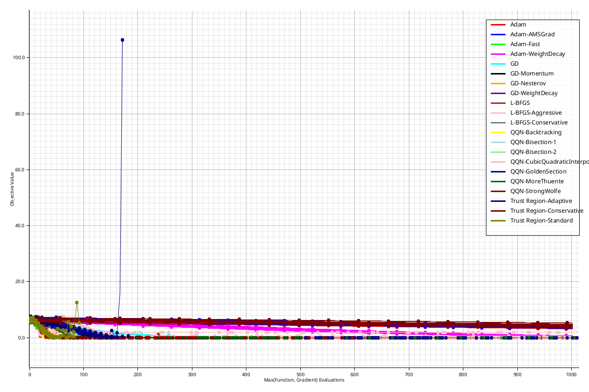
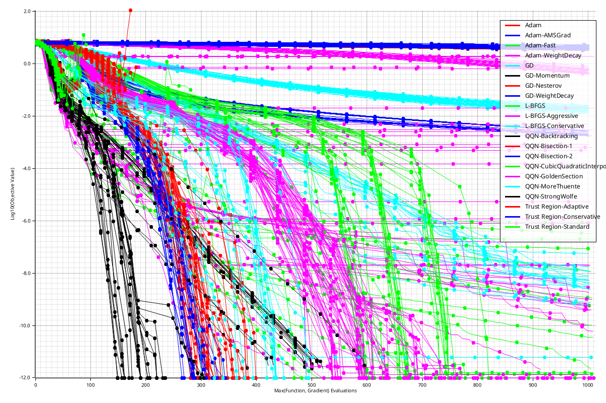

**Figure:** Convergence plots for Levy_10D showing objective value vs iterations.
Left: Linear scale, Right: Log scale for better visualization of convergence behavior.

**Data:** [Linear scale data (CSV)](convergence_Levy_10D_data.csv) | [Log scale data (CSV)](convergence_Levy_10D_log_data.csv)

## Problem: Zakharov_2D

**Family:** Zakharov  
**Dimension:** 2  
**Success Threshold:** 1.000e-8  
**Total Runs:** 560

### Performance Summary
<table style="border-collapse: collapse; width: 100%; margin: 20px 0;">
<tr style="background-color: #f2f2f2;">
<th style="border: 1px solid #ddd; padding: 8px; text-align: center;">Rank</th>
<th style="border: 1px solid #ddd; padding: 8px; text-align: center;">Optimizer</th>
<th style="border: 1px solid #ddd; padding: 8px; text-align: center;">Mean Final Value (All/Success/Fail)</th>
<th style="border: 1px solid #ddd; padding: 8px; text-align: center;">Std Dev</th>
<th style="border: 1px solid #ddd; padding: 8px; text-align: center;">Best Value</th>
<th style="border: 1px solid #ddd; padding: 8px; text-align: center;">Worst Value</th>
<th style="border: 1px solid #ddd; padding: 8px; text-align: center;">Mean Function Evals (All/Success/Fail)</th>
<th style="border: 1px solid #ddd; padding: 8px; text-align: center;">Mean Gradient Evals (All/Success/Fail)</th>
<th style="border: 1px solid #ddd; padding: 8px; text-align: center;">Success Rate</th>
<th style="border: 1px solid #ddd; padding: 8px; text-align: center;">Mean Time (s)</th>
</tr>
<tr style="background-color: #d4edda; font-weight: bold;">
<td style="border: 1px solid #ddd; padding: 8px; text-align: center;">1</td>
<td style="border: 1px solid #ddd; padding: 8px; text-align: center;"><a href="detailed_Zakharov_2D_QQN-GoldenSection.md">QQN-GoldenSection</a></td>
<td style="border: 1px solid #ddd; padding: 8px; text-align: center;">1.21e-15 / 1.21e-15 / -</td>
<td style="border: 1px solid #ddd; padding: 8px; text-align: center;">4.49e-15</td>
<td style="border: 1px solid #ddd; padding: 8px; text-align: center;">6.45e-24</td>
<td style="border: 1px solid #ddd; padding: 8px; text-align: center;">3.06e-14</td>
<td style="border: 1px solid #ddd; padding: 8px; text-align: center;">185.8 / 185.8 / -</td>
<td style="border: 1px solid #ddd; padding: 8px; text-align: center;">27.0 / 27.0 / -</td>
<td style="border: 1px solid #ddd; padding: 8px; text-align: center;">100.0%</td>
<td style="border: 1px solid #ddd; padding: 8px; text-align: center;">0.002</td>
</tr>
<tr style="background-color: #fff3cd;">
<td style="border: 1px solid #ddd; padding: 8px; text-align: center;">2</td>
<td style="border: 1px solid #ddd; padding: 8px; text-align: center;"><a href="detailed_Zakharov_2D_QQN-Bisection-1.md">QQN-Bisection-1</a></td>
<td style="border: 1px solid #ddd; padding: 8px; text-align: center;">1.36e-14 / 1.36e-14 / -</td>
<td style="border: 1px solid #ddd; padding: 8px; text-align: center;">2.52e-14</td>
<td style="border: 1px solid #ddd; padding: 8px; text-align: center;">7.20e-23</td>
<td style="border: 1px solid #ddd; padding: 8px; text-align: center;">9.12e-14</td>
<td style="border: 1px solid #ddd; padding: 8px; text-align: center;">124.3 / 124.3 / -</td>
<td style="border: 1px solid #ddd; padding: 8px; text-align: center;">170.3 / 170.3 / -</td>
<td style="border: 1px solid #ddd; padding: 8px; text-align: center;">100.0%</td>
<td style="border: 1px solid #ddd; padding: 8px; text-align: center;">0.002</td>
</tr>
<tr style="">
<td style="border: 1px solid #ddd; padding: 8px; text-align: center;">3</td>
<td style="border: 1px solid #ddd; padding: 8px; text-align: center;"><a href="detailed_Zakharov_2D_QQN-Bisection-2.md">QQN-Bisection-2</a></td>
<td style="border: 1px solid #ddd; padding: 8px; text-align: center;">1.42e-14 / 1.42e-14 / -</td>
<td style="border: 1px solid #ddd; padding: 8px; text-align: center;">3.06e-14</td>
<td style="border: 1px solid #ddd; padding: 8px; text-align: center;">1.60e-21</td>
<td style="border: 1px solid #ddd; padding: 8px; text-align: center;">1.04e-13</td>
<td style="border: 1px solid #ddd; padding: 8px; text-align: center;">86.1 / 86.1 / -</td>
<td style="border: 1px solid #ddd; padding: 8px; text-align: center;">91.9 / 91.9 / -</td>
<td style="border: 1px solid #ddd; padding: 8px; text-align: center;">100.0%</td>
<td style="border: 1px solid #ddd; padding: 8px; text-align: center;">0.001</td>
</tr>
<tr style="">
<td style="border: 1px solid #ddd; padding: 8px; text-align: center;">4</td>
<td style="border: 1px solid #ddd; padding: 8px; text-align: center;"><a href="detailed_Zakharov_2D_QQN-MoreThuente.md">QQN-MoreThuente</a></td>
<td style="border: 1px solid #ddd; padding: 8px; text-align: center;">2.75e-14 / 2.75e-14 / -</td>
<td style="border: 1px solid #ddd; padding: 8px; text-align: center;">6.18e-14</td>
<td style="border: 1px solid #ddd; padding: 8px; text-align: center;">4.87e-20</td>
<td style="border: 1px solid #ddd; padding: 8px; text-align: center;">2.03e-13</td>
<td style="border: 1px solid #ddd; padding: 8px; text-align: center;">77.7 / 77.7 / -</td>
<td style="border: 1px solid #ddd; padding: 8px; text-align: center;">82.9 / 82.9 / -</td>
<td style="border: 1px solid #ddd; padding: 8px; text-align: center;">100.0%</td>
<td style="border: 1px solid #ddd; padding: 8px; text-align: center;">0.002</td>
</tr>
<tr style="">
<td style="border: 1px solid #ddd; padding: 8px; text-align: center;">5</td>
<td style="border: 1px solid #ddd; padding: 8px; text-align: center;"><a href="detailed_Zakharov_2D_QQN-CubicQuadraticInterpolation.md">QQN-CubicQuadraticInterpolation</a></td>
<td style="border: 1px solid #ddd; padding: 8px; text-align: center;">2.39e-14 / 2.39e-14 / -</td>
<td style="border: 1px solid #ddd; padding: 8px; text-align: center;">5.16e-14</td>
<td style="border: 1px solid #ddd; padding: 8px; text-align: center;">1.61e-19</td>
<td style="border: 1px solid #ddd; padding: 8px; text-align: center;">1.91e-13</td>
<td style="border: 1px solid #ddd; padding: 8px; text-align: center;">144.8 / 144.8 / -</td>
<td style="border: 1px solid #ddd; padding: 8px; text-align: center;">190.3 / 190.3 / -</td>
<td style="border: 1px solid #ddd; padding: 8px; text-align: center;">100.0%</td>
<td style="border: 1px solid #ddd; padding: 8px; text-align: center;">0.004</td>
</tr>
<tr style="">
<td style="border: 1px solid #ddd; padding: 8px; text-align: center;">6</td>
<td style="border: 1px solid #ddd; padding: 8px; text-align: center;"><a href="detailed_Zakharov_2D_L-BFGS-Aggressive.md">L-BFGS-Aggressive</a></td>
<td style="border: 1px solid #ddd; padding: 8px; text-align: center;">5.87e0 / 2.44e-14 / 8.70e0</td>
<td style="border: 1px solid #ddd; padding: 8px; text-align: center;">6.26e0</td>
<td style="border: 1px solid #ddd; padding: 8px; text-align: center;">2.64e-15</td>
<td style="border: 1px solid #ddd; padding: 8px; text-align: center;">1.65e1</td>
<td style="border: 1px solid #ddd; padding: 8px; text-align: center;">558.8 / 118.7 / 770.7</td>
<td style="border: 1px solid #ddd; padding: 8px; text-align: center;">174.1 / 46.8 / 235.3</td>
<td style="border: 1px solid #ddd; padding: 8px; text-align: center;">32.5%</td>
<td style="border: 1px solid #ddd; padding: 8px; text-align: center;">0.005</td>
</tr>
<tr style="">
<td style="border: 1px solid #ddd; padding: 8px; text-align: center;">7</td>
<td style="border: 1px solid #ddd; padding: 8px; text-align: center;"><a href="detailed_Zakharov_2D_L-BFGS.md">L-BFGS</a></td>
<td style="border: 1px solid #ddd; padding: 8px; text-align: center;">9.34e-3 / 7.77e-14 / 7.24e-2</td>
<td style="border: 1px solid #ddd; padding: 8px; text-align: center;">1.77e-2</td>
<td style="border: 1px solid #ddd; padding: 8px; text-align: center;">5.33e-15</td>
<td style="border: 1px solid #ddd; padding: 8px; text-align: center;">5.84e-2</td>
<td style="border: 1px solid #ddd; padding: 8px; text-align: center;">183.8 / 238.4 / 101.9</td>
<td style="border: 1px solid #ddd; padding: 8px; text-align: center;">106.0 / 141.7 / 52.6</td>
<td style="border: 1px solid #ddd; padding: 8px; text-align: center;">60.0%</td>
<td style="border: 1px solid #ddd; padding: 8px; text-align: center;">0.003</td>
</tr>
<tr style="">
<td style="border: 1px solid #ddd; padding: 8px; text-align: center;">8</td>
<td style="border: 1px solid #ddd; padding: 8px; text-align: center;"><a href="detailed_Zakharov_2D_QQN-StrongWolfe.md">QQN-StrongWolfe</a></td>
<td style="border: 1px solid #ddd; padding: 8px; text-align: center;">7.79e-14 / 7.79e-14 / -</td>
<td style="border: 1px solid #ddd; padding: 8px; text-align: center;">6.47e-14</td>
<td style="border: 1px solid #ddd; padding: 8px; text-align: center;">1.60e-14</td>
<td style="border: 1px solid #ddd; padding: 8px; text-align: center;">2.29e-13</td>
<td style="border: 1px solid #ddd; padding: 8px; text-align: center;">140.9 / 140.9 / -</td>
<td style="border: 1px solid #ddd; padding: 8px; text-align: center;">150.1 / 150.1 / -</td>
<td style="border: 1px solid #ddd; padding: 8px; text-align: center;">100.0%</td>
<td style="border: 1px solid #ddd; padding: 8px; text-align: center;">0.004</td>
</tr>
<tr style="">
<td style="border: 1px solid #ddd; padding: 8px; text-align: center;">9</td>
<td style="border: 1px solid #ddd; padding: 8px; text-align: center;"><a href="detailed_Zakharov_2D_QQN-Backtracking.md">QQN-Backtracking</a></td>
<td style="border: 1px solid #ddd; padding: 8px; text-align: center;">1.55e-13 / 1.55e-13 / -</td>
<td style="border: 1px solid #ddd; padding: 8px; text-align: center;">7.93e-14</td>
<td style="border: 1px solid #ddd; padding: 8px; text-align: center;">1.93e-14</td>
<td style="border: 1px solid #ddd; padding: 8px; text-align: center;">2.50e-13</td>
<td style="border: 1px solid #ddd; padding: 8px; text-align: center;">271.8 / 271.8 / -</td>
<td style="border: 1px solid #ddd; padding: 8px; text-align: center;">227.7 / 227.7 / -</td>
<td style="border: 1px solid #ddd; padding: 8px; text-align: center;">100.0%</td>
<td style="border: 1px solid #ddd; padding: 8px; text-align: center;">0.009</td>
</tr>
<tr style="">
<td style="border: 1px solid #ddd; padding: 8px; text-align: center;">10</td>
<td style="border: 1px solid #ddd; padding: 8px; text-align: center;"><a href="detailed_Zakharov_2D_L-BFGS-Conservative.md">L-BFGS-Conservative</a></td>
<td style="border: 1px solid #ddd; padding: 8px; text-align: center;">4.84e-7 / 1.75e-13 / 6.45e-7</td>
<td style="border: 1px solid #ddd; padding: 8px; text-align: center;">1.58e-6</td>
<td style="border: 1px solid #ddd; padding: 8px; text-align: center;">1.06e-13</td>
<td style="border: 1px solid #ddd; padding: 8px; text-align: center;">7.09e-6</td>
<td style="border: 1px solid #ddd; padding: 8px; text-align: center;">536.7 / 468.6 / 559.4</td>
<td style="border: 1px solid #ddd; padding: 8px; text-align: center;">427.9 / 373.4 / 446.1</td>
<td style="border: 1px solid #ddd; padding: 8px; text-align: center;">25.0%</td>
<td style="border: 1px solid #ddd; padding: 8px; text-align: center;">0.013</td>
</tr>
<tr style="">
<td style="border: 1px solid #ddd; padding: 8px; text-align: center;">11</td>
<td style="border: 1px solid #ddd; padding: 8px; text-align: center;"><a href="detailed_Zakharov_2D_GD-WeightDecay.md">GD-WeightDecay</a></td>
<td style="border: 1px solid #ddd; padding: 8px; text-align: center;">7.35e-2 / 3.62e-10 / 1.27e-1</td>
<td style="border: 1px solid #ddd; padding: 8px; text-align: center;">4.86e-2</td>
<td style="border: 1px solid #ddd; padding: 8px; text-align: center;">3.49e-10</td>
<td style="border: 1px solid #ddd; padding: 8px; text-align: center;">1.69e-1</td>
<td style="border: 1px solid #ddd; padding: 8px; text-align: center;">40.6 / 151.0 / 21.1</td>
<td style="border: 1px solid #ddd; padding: 8px; text-align: center;">77.5 / 300.0 / 38.2</td>
<td style="border: 1px solid #ddd; padding: 8px; text-align: center;">15.0%</td>
<td style="border: 1px solid #ddd; padding: 8px; text-align: center;">0.001</td>
</tr>
<tr style="">
<td style="border: 1px solid #ddd; padding: 8px; text-align: center;">12</td>
<td style="border: 1px solid #ddd; padding: 8px; text-align: center;"><a href="detailed_Zakharov_2D_GD.md">GD</a></td>
<td style="border: 1px solid #ddd; padding: 8px; text-align: center;">3.68e-7 / - / 3.68e-7</td>
<td style="border: 1px solid #ddd; padding: 8px; text-align: center;">1.50e-7</td>
<td style="border: 1px solid #ddd; padding: 8px; text-align: center;">7.22e-8</td>
<td style="border: 1px solid #ddd; padding: 8px; text-align: center;">6.81e-7</td>
<td style="border: 1px solid #ddd; padding: 8px; text-align: center;">335.0 / - / 335.0</td>
<td style="border: 1px solid #ddd; padding: 8px; text-align: center;">668.0 / - / 668.0</td>
<td style="border: 1px solid #ddd; padding: 8px; text-align: center;">0.0%</td>
<td style="border: 1px solid #ddd; padding: 8px; text-align: center;">0.008</td>
</tr>
<tr style="">
<td style="border: 1px solid #ddd; padding: 8px; text-align: center;">13</td>
<td style="border: 1px solid #ddd; padding: 8px; text-align: center;"><a href="detailed_Zakharov_2D_Adam-Fast.md">Adam-Fast</a></td>
<td style="border: 1px solid #ddd; padding: 8px; text-align: center;">1.18e-2 / - / 2.79e-1</td>
<td style="border: 1px solid #ddd; padding: 8px; text-align: center;">1.39e-2</td>
<td style="border: 1px solid #ddd; padding: 8px; text-align: center;">2.79e-4</td>
<td style="border: 1px solid #ddd; padding: 8px; text-align: center;">6.03e-2</td>
<td style="border: 1px solid #ddd; padding: 8px; text-align: center;">37.5 / - / 37.5</td>
<td style="border: 1px solid #ddd; padding: 8px; text-align: center;">36.5 / - / 36.5</td>
<td style="border: 1px solid #ddd; padding: 8px; text-align: center;">0.0%</td>
<td style="border: 1px solid #ddd; padding: 8px; text-align: center;">0.001</td>
</tr>
<tr style="">
<td style="border: 1px solid #ddd; padding: 8px; text-align: center;">14</td>
<td style="border: 1px solid #ddd; padding: 8px; text-align: center;"><a href="detailed_Zakharov_2D_Trust_Region-Adaptive.md">Trust Region-Adaptive</a></td>
<td style="border: 1px solid #ddd; padding: 8px; text-align: center;">3.75e-2 / - / 1.13e1</td>
<td style="border: 1px solid #ddd; padding: 8px; text-align: center;">1.88e-2</td>
<td style="border: 1px solid #ddd; padding: 8px; text-align: center;">1.21e-2</td>
<td style="border: 1px solid #ddd; padding: 8px; text-align: center;">7.60e-2</td>
<td style="border: 1px solid #ddd; padding: 8px; text-align: center;">124.3 / - / 124.3</td>
<td style="border: 1px solid #ddd; padding: 8px; text-align: center;">83.5 / - / 83.5</td>
<td style="border: 1px solid #ddd; padding: 8px; text-align: center;">0.0%</td>
<td style="border: 1px solid #ddd; padding: 8px; text-align: center;">0.001</td>
</tr>
<tr style="">
<td style="border: 1px solid #ddd; padding: 8px; text-align: center;">15</td>
<td style="border: 1px solid #ddd; padding: 8px; text-align: center;"><a href="detailed_Zakharov_2D_GD-Nesterov.md">GD-Nesterov</a></td>
<td style="border: 1px solid #ddd; padding: 8px; text-align: center;">1.13e-1 / - / 5.82e-1</td>
<td style="border: 1px solid #ddd; padding: 8px; text-align: center;">6.13e-2</td>
<td style="border: 1px solid #ddd; padding: 8px; text-align: center;">2.23e-2</td>
<td style="border: 1px solid #ddd; padding: 8px; text-align: center;">2.11e-1</td>
<td style="border: 1px solid #ddd; padding: 8px; text-align: center;">16.8 / - / 16.8</td>
<td style="border: 1px solid #ddd; padding: 8px; text-align: center;">29.5 / - / 29.5</td>
<td style="border: 1px solid #ddd; padding: 8px; text-align: center;">0.0%</td>
<td style="border: 1px solid #ddd; padding: 8px; text-align: center;">0.000</td>
</tr>
<tr style="">
<td style="border: 1px solid #ddd; padding: 8px; text-align: center;">16</td>
<td style="border: 1px solid #ddd; padding: 8px; text-align: center;"><a href="detailed_Zakharov_2D_GD-Momentum.md">GD-Momentum</a></td>
<td style="border: 1px solid #ddd; padding: 8px; text-align: center;">1.20e-1 / - / 1.08e0</td>
<td style="border: 1px solid #ddd; padding: 8px; text-align: center;">5.97e-2</td>
<td style="border: 1px solid #ddd; padding: 8px; text-align: center;">3.23e-2</td>
<td style="border: 1px solid #ddd; padding: 8px; text-align: center;">2.50e-1</td>
<td style="border: 1px solid #ddd; padding: 8px; text-align: center;">17.1 / - / 17.1</td>
<td style="border: 1px solid #ddd; padding: 8px; text-align: center;">30.2 / - / 30.2</td>
<td style="border: 1px solid #ddd; padding: 8px; text-align: center;">0.0%</td>
<td style="border: 1px solid #ddd; padding: 8px; text-align: center;">0.000</td>
</tr>
<tr style="">
<td style="border: 1px solid #ddd; padding: 8px; text-align: center;">17</td>
<td style="border: 1px solid #ddd; padding: 8px; text-align: center;"><a href="detailed_Zakharov_2D_Trust_Region-Standard.md">Trust Region-Standard</a></td>
<td style="border: 1px solid #ddd; padding: 8px; text-align: center;">1.12e-1 / - / 1.12e3</td>
<td style="border: 1px solid #ddd; padding: 8px; text-align: center;">5.88e-2</td>
<td style="border: 1px solid #ddd; padding: 8px; text-align: center;">4.15e-2</td>
<td style="border: 1px solid #ddd; padding: 8px; text-align: center;">2.30e-1</td>
<td style="border: 1px solid #ddd; padding: 8px; text-align: center;">42.1 / - / 42.1</td>
<td style="border: 1px solid #ddd; padding: 8px; text-align: center;">28.6 / - / 28.6</td>
<td style="border: 1px solid #ddd; padding: 8px; text-align: center;">0.0%</td>
<td style="border: 1px solid #ddd; padding: 8px; text-align: center;">0.000</td>
</tr>
<tr style="">
<td style="border: 1px solid #ddd; padding: 8px; text-align: center;">18</td>
<td style="border: 1px solid #ddd; padding: 8px; text-align: center;"><a href="detailed_Zakharov_2D_Adam-WeightDecay.md">Adam-WeightDecay</a></td>
<td style="border: 1px solid #ddd; padding: 8px; text-align: center;">3.43e-1 / - / 3.43e-1</td>
<td style="border: 1px solid #ddd; padding: 8px; text-align: center;">2.24e-1</td>
<td style="border: 1px solid #ddd; padding: 8px; text-align: center;">8.58e-2</td>
<td style="border: 1px solid #ddd; padding: 8px; text-align: center;">8.80e-1</td>
<td style="border: 1px solid #ddd; padding: 8px; text-align: center;">502.0 / - / 502.0</td>
<td style="border: 1px solid #ddd; padding: 8px; text-align: center;">502.0 / - / 502.0</td>
<td style="border: 1px solid #ddd; padding: 8px; text-align: center;">0.0%</td>
<td style="border: 1px solid #ddd; padding: 8px; text-align: center;">0.011</td>
</tr>
<tr style="">
<td style="border: 1px solid #ddd; padding: 8px; text-align: center;">19</td>
<td style="border: 1px solid #ddd; padding: 8px; text-align: center;"><a href="detailed_Zakharov_2D_Adam.md">Adam</a></td>
<td style="border: 1px solid #ddd; padding: 8px; text-align: center;">4.04e0 / - / 4.04e0</td>
<td style="border: 1px solid #ddd; padding: 8px; text-align: center;">1.15e0</td>
<td style="border: 1px solid #ddd; padding: 8px; text-align: center;">1.89e0</td>
<td style="border: 1px solid #ddd; padding: 8px; text-align: center;">6.24e0</td>
<td style="border: 1px solid #ddd; padding: 8px; text-align: center;">502.0 / - / 502.0</td>
<td style="border: 1px solid #ddd; padding: 8px; text-align: center;">502.0 / - / 502.0</td>
<td style="border: 1px solid #ddd; padding: 8px; text-align: center;">0.0%</td>
<td style="border: 1px solid #ddd; padding: 8px; text-align: center;">0.010</td>
</tr>
<tr style="">
<td style="border: 1px solid #ddd; padding: 8px; text-align: center;">20</td>
<td style="border: 1px solid #ddd; padding: 8px; text-align: center;"><a href="detailed_Zakharov_2D_Adam-AMSGrad.md">Adam-AMSGrad</a></td>
<td style="border: 1px solid #ddd; padding: 8px; text-align: center;">4.65e0 / - / 4.65e0</td>
<td style="border: 1px solid #ddd; padding: 8px; text-align: center;">1.53e0</td>
<td style="border: 1px solid #ddd; padding: 8px; text-align: center;">2.45e0</td>
<td style="border: 1px solid #ddd; padding: 8px; text-align: center;">7.38e0</td>
<td style="border: 1px solid #ddd; padding: 8px; text-align: center;">502.0 / - / 502.0</td>
<td style="border: 1px solid #ddd; padding: 8px; text-align: center;">502.0 / - / 502.0</td>
<td style="border: 1px solid #ddd; padding: 8px; text-align: center;">0.0%</td>
<td style="border: 1px solid #ddd; padding: 8px; text-align: center;">0.011</td>
</tr>
<tr style="">
<td style="border: 1px solid #ddd; padding: 8px; text-align: center;">21</td>
<td style="border: 1px solid #ddd; padding: 8px; text-align: center;"><a href="detailed_Zakharov_2D_Trust_Region-Conservative.md">Trust Region-Conservative</a></td>
<td style="border: 1px solid #ddd; padding: 8px; text-align: center;">7.69e0 / - / 7.69e0</td>
<td style="border: 1px solid #ddd; padding: 8px; text-align: center;">2.56e0</td>
<td style="border: 1px solid #ddd; padding: 8px; text-align: center;">3.13e0</td>
<td style="border: 1px solid #ddd; padding: 8px; text-align: center;">1.34e1</td>
<td style="border: 1px solid #ddd; padding: 8px; text-align: center;">602.0 / - / 602.0</td>
<td style="border: 1px solid #ddd; padding: 8px; text-align: center;">402.0 / - / 402.0</td>
<td style="border: 1px solid #ddd; padding: 8px; text-align: center;">0.0%</td>
<td style="border: 1px solid #ddd; padding: 8px; text-align: center;">0.004</td>
</tr>
</table>

### Convergence Plots

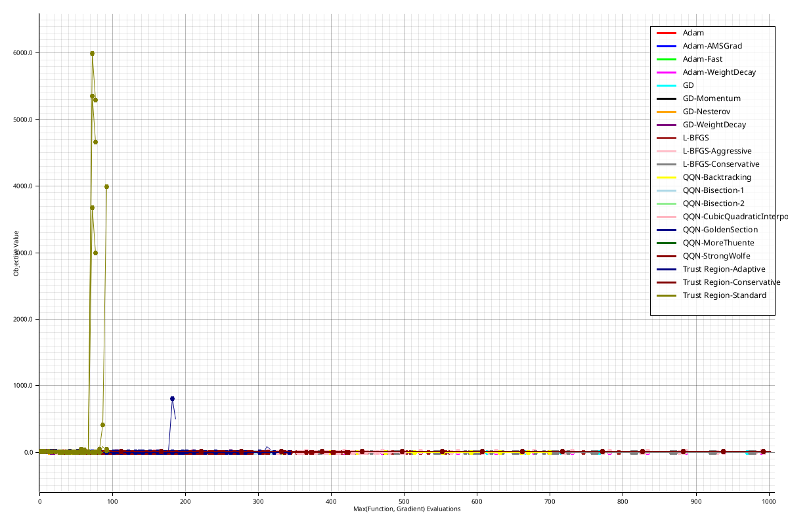
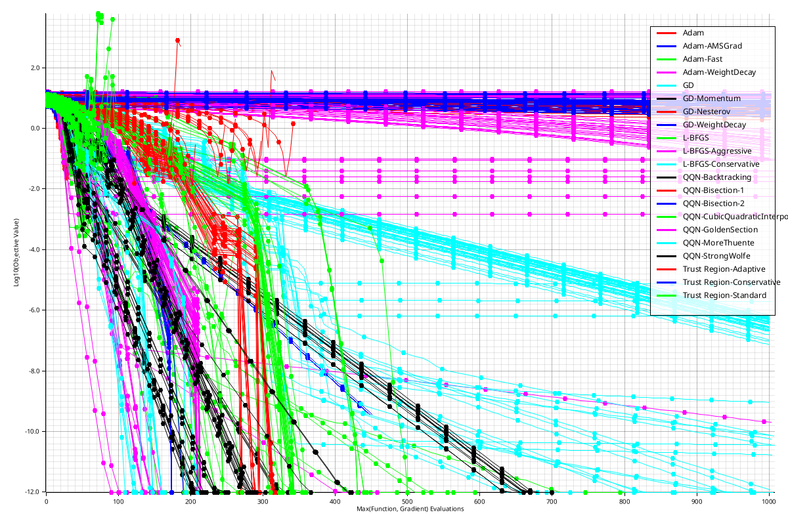

**Figure:** Convergence plots for Zakharov_2D showing objective value vs iterations.
Left: Linear scale, Right: Log scale for better visualization of convergence behavior.

**Data:** [Linear scale data (CSV)](convergence_Zakharov_2D_data.csv) | [Log scale data (CSV)](convergence_Zakharov_2D_log_data.csv)

## Problem: Zakharov_5D

**Family:** Zakharov  
**Dimension:** 5  
**Success Threshold:** 1.000e-8  
**Total Runs:** 560

### Performance Summary
<table style="border-collapse: collapse; width: 100%; margin: 20px 0;">
<tr style="background-color: #f2f2f2;">
<th style="border: 1px solid #ddd; padding: 8px; text-align: center;">Rank</th>
<th style="border: 1px solid #ddd; padding: 8px; text-align: center;">Optimizer</th>
<th style="border: 1px solid #ddd; padding: 8px; text-align: center;">Mean Final Value (All/Success/Fail)</th>
<th style="border: 1px solid #ddd; padding: 8px; text-align: center;">Std Dev</th>
<th style="border: 1px solid #ddd; padding: 8px; text-align: center;">Best Value</th>
<th style="border: 1px solid #ddd; padding: 8px; text-align: center;">Worst Value</th>
<th style="border: 1px solid #ddd; padding: 8px; text-align: center;">Mean Function Evals (All/Success/Fail)</th>
<th style="border: 1px solid #ddd; padding: 8px; text-align: center;">Mean Gradient Evals (All/Success/Fail)</th>
<th style="border: 1px solid #ddd; padding: 8px; text-align: center;">Success Rate</th>
<th style="border: 1px solid #ddd; padding: 8px; text-align: center;">Mean Time (s)</th>
</tr>
<tr style="background-color: #d4edda; font-weight: bold;">
<td style="border: 1px solid #ddd; padding: 8px; text-align: center;">1</td>
<td style="border: 1px solid #ddd; padding: 8px; text-align: center;"><a href="detailed_Zakharov_5D_QQN-GoldenSection.md">QQN-GoldenSection</a></td>
<td style="border: 1px solid #ddd; padding: 8px; text-align: center;">1.01e-14 / 1.01e-14 / -</td>
<td style="border: 1px solid #ddd; padding: 8px; text-align: center;">4.17e-14</td>
<td style="border: 1px solid #ddd; padding: 8px; text-align: center;">6.87e-34</td>
<td style="border: 1px solid #ddd; padding: 8px; text-align: center;">2.40e-13</td>
<td style="border: 1px solid #ddd; padding: 8px; text-align: center;">182.8 / 182.8 / -</td>
<td style="border: 1px solid #ddd; padding: 8px; text-align: center;">26.3 / 26.3 / -</td>
<td style="border: 1px solid #ddd; padding: 8px; text-align: center;">100.0%</td>
<td style="border: 1px solid #ddd; padding: 8px; text-align: center;">0.002</td>
</tr>
<tr style="background-color: #fff3cd;">
<td style="border: 1px solid #ddd; padding: 8px; text-align: center;">2</td>
<td style="border: 1px solid #ddd; padding: 8px; text-align: center;"><a href="detailed_Zakharov_5D_QQN-Bisection-1.md">QQN-Bisection-1</a></td>
<td style="border: 1px solid #ddd; padding: 8px; text-align: center;">4.43e-16 / 4.43e-16 / -</td>
<td style="border: 1px solid #ddd; padding: 8px; text-align: center;">1.24e-15</td>
<td style="border: 1px solid #ddd; padding: 8px; text-align: center;">2.38e-25</td>
<td style="border: 1px solid #ddd; padding: 8px; text-align: center;">6.23e-15</td>
<td style="border: 1px solid #ddd; padding: 8px; text-align: center;">136.2 / 136.2 / -</td>
<td style="border: 1px solid #ddd; padding: 8px; text-align: center;">171.2 / 171.2 / -</td>
<td style="border: 1px solid #ddd; padding: 8px; text-align: center;">100.0%</td>
<td style="border: 1px solid #ddd; padding: 8px; text-align: center;">0.002</td>
</tr>
<tr style="">
<td style="border: 1px solid #ddd; padding: 8px; text-align: center;">3</td>
<td style="border: 1px solid #ddd; padding: 8px; text-align: center;"><a href="detailed_Zakharov_5D_QQN-MoreThuente.md">QQN-MoreThuente</a></td>
<td style="border: 1px solid #ddd; padding: 8px; text-align: center;">1.09e0 / 1.43e-15 / 1.29e0</td>
<td style="border: 1px solid #ddd; padding: 8px; text-align: center;">4.98e-1</td>
<td style="border: 1px solid #ddd; padding: 8px; text-align: center;">4.18e-21</td>
<td style="border: 1px solid #ddd; padding: 8px; text-align: center;">1.63e0</td>
<td style="border: 1px solid #ddd; padding: 8px; text-align: center;">440.6 / 188.7 / 485.0</td>
<td style="border: 1px solid #ddd; padding: 8px; text-align: center;">479.6 / 193.7 / 530.0</td>
<td style="border: 1px solid #ddd; padding: 8px; text-align: center;">15.0%</td>
<td style="border: 1px solid #ddd; padding: 8px; text-align: center;">0.008</td>
</tr>
<tr style="">
<td style="border: 1px solid #ddd; padding: 8px; text-align: center;">4</td>
<td style="border: 1px solid #ddd; padding: 8px; text-align: center;"><a href="detailed_Zakharov_5D_QQN-StrongWolfe.md">QQN-StrongWolfe</a></td>
<td style="border: 1px solid #ddd; padding: 8px; text-align: center;">9.81e-5 / 6.99e-15 / 1.96e-3</td>
<td style="border: 1px solid #ddd; padding: 8px; text-align: center;">4.28e-4</td>
<td style="border: 1px solid #ddd; padding: 8px; text-align: center;">2.71e-20</td>
<td style="border: 1px solid #ddd; padding: 8px; text-align: center;">1.96e-3</td>
<td style="border: 1px solid #ddd; padding: 8px; text-align: center;">130.1 / 108.6 / 538.0</td>
<td style="border: 1px solid #ddd; padding: 8px; text-align: center;">120.1 / 100.3 / 496.0</td>
<td style="border: 1px solid #ddd; padding: 8px; text-align: center;">95.0%</td>
<td style="border: 1px solid #ddd; padding: 8px; text-align: center;">0.003</td>
</tr>
<tr style="">
<td style="border: 1px solid #ddd; padding: 8px; text-align: center;">5</td>
<td style="border: 1px solid #ddd; padding: 8px; text-align: center;"><a href="detailed_Zakharov_5D_QQN-Bisection-2.md">QQN-Bisection-2</a></td>
<td style="border: 1px solid #ddd; padding: 8px; text-align: center;">1.23e-14 / 1.23e-14 / -</td>
<td style="border: 1px solid #ddd; padding: 8px; text-align: center;">2.79e-14</td>
<td style="border: 1px solid #ddd; padding: 8px; text-align: center;">8.88e-19</td>
<td style="border: 1px solid #ddd; padding: 8px; text-align: center;">9.70e-14</td>
<td style="border: 1px solid #ddd; padding: 8px; text-align: center;">123.9 / 123.9 / -</td>
<td style="border: 1px solid #ddd; padding: 8px; text-align: center;">122.2 / 122.2 / -</td>
<td style="border: 1px solid #ddd; padding: 8px; text-align: center;">100.0%</td>
<td style="border: 1px solid #ddd; padding: 8px; text-align: center;">0.002</td>
</tr>
<tr style="">
<td style="border: 1px solid #ddd; padding: 8px; text-align: center;">6</td>
<td style="border: 1px solid #ddd; padding: 8px; text-align: center;"><a href="detailed_Zakharov_5D_QQN-Backtracking.md">QQN-Backtracking</a></td>
<td style="border: 1px solid #ddd; padding: 8px; text-align: center;">1.58e-10 / 1.78e-15 / 1.58e-9</td>
<td style="border: 1px solid #ddd; padding: 8px; text-align: center;">5.16e-10</td>
<td style="border: 1px solid #ddd; padding: 8px; text-align: center;">2.35e-18</td>
<td style="border: 1px solid #ddd; padding: 8px; text-align: center;">2.23e-9</td>
<td style="border: 1px solid #ddd; padding: 8px; text-align: center;">173.1 / 127.0 / 587.5</td>
<td style="border: 1px solid #ddd; padding: 8px; text-align: center;">118.9 / 85.0 / 424.0</td>
<td style="border: 1px solid #ddd; padding: 8px; text-align: center;">90.0%</td>
<td style="border: 1px solid #ddd; padding: 8px; text-align: center;">0.004</td>
</tr>
<tr style="">
<td style="border: 1px solid #ddd; padding: 8px; text-align: center;">7</td>
<td style="border: 1px solid #ddd; padding: 8px; text-align: center;"><a href="detailed_Zakharov_5D_L-BFGS-Conservative.md">L-BFGS-Conservative</a></td>
<td style="border: 1px solid #ddd; padding: 8px; text-align: center;">2.40e-8 / - / 2.40e-8</td>
<td style="border: 1px solid #ddd; padding: 8px; text-align: center;">6.11e-8</td>
<td style="border: 1px solid #ddd; padding: 8px; text-align: center;">7.70e-14</td>
<td style="border: 1px solid #ddd; padding: 8px; text-align: center;">2.65e-7</td>
<td style="border: 1px solid #ddd; padding: 8px; text-align: center;">581.5 / - / 581.5</td>
<td style="border: 1px solid #ddd; padding: 8px; text-align: center;">425.5 / - / 425.5</td>
<td style="border: 1px solid #ddd; padding: 8px; text-align: center;">0.0%</td>
<td style="border: 1px solid #ddd; padding: 8px; text-align: center;">0.014</td>
</tr>
<tr style="">
<td style="border: 1px solid #ddd; padding: 8px; text-align: center;">8</td>
<td style="border: 1px solid #ddd; padding: 8px; text-align: center;"><a href="detailed_Zakharov_5D_GD-WeightDecay.md">GD-WeightDecay</a></td>
<td style="border: 1px solid #ddd; padding: 8px; text-align: center;">3.94e-1 / 3.71e-10 / 1.09e0</td>
<td style="border: 1px solid #ddd; padding: 8px; text-align: center;">4.95e-1</td>
<td style="border: 1px solid #ddd; padding: 8px; text-align: center;">3.49e-10</td>
<td style="border: 1px solid #ddd; padding: 8px; text-align: center;">1.21e0</td>
<td style="border: 1px solid #ddd; padding: 8px; text-align: center;">110.4 / 170.0 / 21.0</td>
<td style="border: 1px solid #ddd; padding: 8px; text-align: center;">218.0 / 338.0 / 38.0</td>
<td style="border: 1px solid #ddd; padding: 8px; text-align: center;">60.0%</td>
<td style="border: 1px solid #ddd; padding: 8px; text-align: center;">0.003</td>
</tr>
<tr style="">
<td style="border: 1px solid #ddd; padding: 8px; text-align: center;">9</td>
<td style="border: 1px solid #ddd; padding: 8px; text-align: center;"><a href="detailed_Zakharov_5D_L-BFGS.md">L-BFGS</a></td>
<td style="border: 1px solid #ddd; padding: 8px; text-align: center;">1.01e0 / - / 4.17e1</td>
<td style="border: 1px solid #ddd; padding: 8px; text-align: center;">1.18e0</td>
<td style="border: 1px solid #ddd; padding: 8px; text-align: center;">4.56e-7</td>
<td style="border: 1px solid #ddd; padding: 8px; text-align: center;">4.19e0</td>
<td style="border: 1px solid #ddd; padding: 8px; text-align: center;">123.0 / - / 123.0</td>
<td style="border: 1px solid #ddd; padding: 8px; text-align: center;">52.3 / - / 52.3</td>
<td style="border: 1px solid #ddd; padding: 8px; text-align: center;">0.0%</td>
<td style="border: 1px solid #ddd; padding: 8px; text-align: center;">0.002</td>
</tr>
<tr style="">
<td style="border: 1px solid #ddd; padding: 8px; text-align: center;">10</td>
<td style="border: 1px solid #ddd; padding: 8px; text-align: center;"><a href="detailed_Zakharov_5D_GD.md">GD</a></td>
<td style="border: 1px solid #ddd; padding: 8px; text-align: center;">2.92e-6 / - / 2.92e-6</td>
<td style="border: 1px solid #ddd; padding: 8px; text-align: center;">6.18e-7</td>
<td style="border: 1px solid #ddd; padding: 8px; text-align: center;">1.78e-6</td>
<td style="border: 1px solid #ddd; padding: 8px; text-align: center;">4.27e-6</td>
<td style="border: 1px solid #ddd; padding: 8px; text-align: center;">335.0 / - / 335.0</td>
<td style="border: 1px solid #ddd; padding: 8px; text-align: center;">668.0 / - / 668.0</td>
<td style="border: 1px solid #ddd; padding: 8px; text-align: center;">0.0%</td>
<td style="border: 1px solid #ddd; padding: 8px; text-align: center;">0.008</td>
</tr>
<tr style="">
<td style="border: 1px solid #ddd; padding: 8px; text-align: center;">11</td>
<td style="border: 1px solid #ddd; padding: 8px; text-align: center;"><a href="detailed_Zakharov_5D_QQN-CubicQuadraticInterpolation.md">QQN-CubicQuadraticInterpolation</a></td>
<td style="border: 1px solid #ddd; padding: 8px; text-align: center;">3.77e-1 / - / 3.77e-1</td>
<td style="border: 1px solid #ddd; padding: 8px; text-align: center;">2.00e-1</td>
<td style="border: 1px solid #ddd; padding: 8px; text-align: center;">3.59e-3</td>
<td style="border: 1px solid #ddd; padding: 8px; text-align: center;">8.16e-1</td>
<td style="border: 1px solid #ddd; padding: 8px; text-align: center;">398.7 / - / 398.7</td>
<td style="border: 1px solid #ddd; padding: 8px; text-align: center;">662.5 / - / 662.5</td>
<td style="border: 1px solid #ddd; padding: 8px; text-align: center;">0.0%</td>
<td style="border: 1px solid #ddd; padding: 8px; text-align: center;">0.014</td>
</tr>
<tr style="">
<td style="border: 1px solid #ddd; padding: 8px; text-align: center;">12</td>
<td style="border: 1px solid #ddd; padding: 8px; text-align: center;"><a href="detailed_Zakharov_5D_Adam-Fast.md">Adam-Fast</a></td>
<td style="border: 1px solid #ddd; padding: 8px; text-align: center;">1.02e-1 / - / 9.63e0</td>
<td style="border: 1px solid #ddd; padding: 8px; text-align: center;">5.44e-2</td>
<td style="border: 1px solid #ddd; padding: 8px; text-align: center;">1.52e-2</td>
<td style="border: 1px solid #ddd; padding: 8px; text-align: center;">2.30e-1</td>
<td style="border: 1px solid #ddd; padding: 8px; text-align: center;">34.9 / - / 34.9</td>
<td style="border: 1px solid #ddd; padding: 8px; text-align: center;">33.9 / - / 33.9</td>
<td style="border: 1px solid #ddd; padding: 8px; text-align: center;">0.0%</td>
<td style="border: 1px solid #ddd; padding: 8px; text-align: center;">0.001</td>
</tr>
<tr style="">
<td style="border: 1px solid #ddd; padding: 8px; text-align: center;">13</td>
<td style="border: 1px solid #ddd; padding: 8px; text-align: center;"><a href="detailed_Zakharov_5D_GD-Momentum.md">GD-Momentum</a></td>
<td style="border: 1px solid #ddd; padding: 8px; text-align: center;">1.13e0 / - / 5.40e1</td>
<td style="border: 1px solid #ddd; padding: 8px; text-align: center;">2.90e-1</td>
<td style="border: 1px solid #ddd; padding: 8px; text-align: center;">6.10e-1</td>
<td style="border: 1px solid #ddd; padding: 8px; text-align: center;">1.63e0</td>
<td style="border: 1px solid #ddd; padding: 8px; text-align: center;">18.9 / - / 18.9</td>
<td style="border: 1px solid #ddd; padding: 8px; text-align: center;">33.8 / - / 33.8</td>
<td style="border: 1px solid #ddd; padding: 8px; text-align: center;">0.0%</td>
<td style="border: 1px solid #ddd; padding: 8px; text-align: center;">0.000</td>
</tr>
<tr style="">
<td style="border: 1px solid #ddd; padding: 8px; text-align: center;">14</td>
<td style="border: 1px solid #ddd; padding: 8px; text-align: center;"><a href="detailed_Zakharov_5D_GD-Nesterov.md">GD-Nesterov</a></td>
<td style="border: 1px solid #ddd; padding: 8px; text-align: center;">1.08e0 / - / 5.20e0</td>
<td style="border: 1px solid #ddd; padding: 8px; text-align: center;">2.66e-1</td>
<td style="border: 1px solid #ddd; padding: 8px; text-align: center;">6.88e-1</td>
<td style="border: 1px solid #ddd; padding: 8px; text-align: center;">1.68e0</td>
<td style="border: 1px solid #ddd; padding: 8px; text-align: center;">18.1 / - / 18.1</td>
<td style="border: 1px solid #ddd; padding: 8px; text-align: center;">32.2 / - / 32.2</td>
<td style="border: 1px solid #ddd; padding: 8px; text-align: center;">0.0%</td>
<td style="border: 1px solid #ddd; padding: 8px; text-align: center;">0.000</td>
</tr>
<tr style="">
<td style="border: 1px solid #ddd; padding: 8px; text-align: center;">15</td>
<td style="border: 1px solid #ddd; padding: 8px; text-align: center;"><a href="detailed_Zakharov_5D_Adam-WeightDecay.md">Adam-WeightDecay</a></td>
<td style="border: 1px solid #ddd; padding: 8px; text-align: center;">2.43e1 / - / 2.43e1</td>
<td style="border: 1px solid #ddd; padding: 8px; text-align: center;">1.92e1</td>
<td style="border: 1px solid #ddd; padding: 8px; text-align: center;">1.21e0</td>
<td style="border: 1px solid #ddd; padding: 8px; text-align: center;">7.60e1</td>
<td style="border: 1px solid #ddd; padding: 8px; text-align: center;">502.0 / - / 502.0</td>
<td style="border: 1px solid #ddd; padding: 8px; text-align: center;">502.0 / - / 502.0</td>
<td style="border: 1px solid #ddd; padding: 8px; text-align: center;">0.0%</td>
<td style="border: 1px solid #ddd; padding: 8px; text-align: center;">0.011</td>
</tr>
<tr style="">
<td style="border: 1px solid #ddd; padding: 8px; text-align: center;">16</td>
<td style="border: 1px solid #ddd; padding: 8px; text-align: center;"><a href="detailed_Zakharov_5D_L-BFGS-Aggressive.md">L-BFGS-Aggressive</a></td>
<td style="border: 1px solid #ddd; padding: 8px; text-align: center;">1.72e3 / - / 1.72e3</td>
<td style="border: 1px solid #ddd; padding: 8px; text-align: center;">1.77e3</td>
<td style="border: 1px solid #ddd; padding: 8px; text-align: center;">2.56e1</td>
<td style="border: 1px solid #ddd; padding: 8px; text-align: center;">5.10e3</td>
<td style="border: 1px solid #ddd; padding: 8px; text-align: center;">712.2 / - / 712.2</td>
<td style="border: 1px solid #ddd; padding: 8px; text-align: center;">292.2 / - / 292.2</td>
<td style="border: 1px solid #ddd; padding: 8px; text-align: center;">0.0%</td>
<td style="border: 1px solid #ddd; padding: 8px; text-align: center;">0.009</td>
</tr>
<tr style="">
<td style="border: 1px solid #ddd; padding: 8px; text-align: center;">17</td>
<td style="border: 1px solid #ddd; padding: 8px; text-align: center;"><a href="detailed_Zakharov_5D_Adam-AMSGrad.md">Adam-AMSGrad</a></td>
<td style="border: 1px solid #ddd; padding: 8px; text-align: center;">1.05e3 / - / 1.05e3</td>
<td style="border: 1px solid #ddd; padding: 8px; text-align: center;">2.82e2</td>
<td style="border: 1px solid #ddd; padding: 8px; text-align: center;">6.87e2</td>
<td style="border: 1px solid #ddd; padding: 8px; text-align: center;">1.90e3</td>
<td style="border: 1px solid #ddd; padding: 8px; text-align: center;">502.0 / - / 502.0</td>
<td style="border: 1px solid #ddd; padding: 8px; text-align: center;">502.0 / - / 502.0</td>
<td style="border: 1px solid #ddd; padding: 8px; text-align: center;">0.0%</td>
<td style="border: 1px solid #ddd; padding: 8px; text-align: center;">0.012</td>
</tr>
<tr style="">
<td style="border: 1px solid #ddd; padding: 8px; text-align: center;">18</td>
<td style="border: 1px solid #ddd; padding: 8px; text-align: center;"><a href="detailed_Zakharov_5D_Adam.md">Adam</a></td>
<td style="border: 1px solid #ddd; padding: 8px; text-align: center;">1.14e3 / - / 1.14e3</td>
<td style="border: 1px solid #ddd; padding: 8px; text-align: center;">3.87e2</td>
<td style="border: 1px solid #ddd; padding: 8px; text-align: center;">7.29e2</td>
<td style="border: 1px solid #ddd; padding: 8px; text-align: center;">2.23e3</td>
<td style="border: 1px solid #ddd; padding: 8px; text-align: center;">502.0 / - / 502.0</td>
<td style="border: 1px solid #ddd; padding: 8px; text-align: center;">502.0 / - / 502.0</td>
<td style="border: 1px solid #ddd; padding: 8px; text-align: center;">0.0%</td>
<td style="border: 1px solid #ddd; padding: 8px; text-align: center;">0.010</td>
</tr>
<tr style="">
<td style="border: 1px solid #ddd; padding: 8px; text-align: center;">19</td>
<td style="border: 1px solid #ddd; padding: 8px; text-align: center;"><a href="detailed_Zakharov_5D_Trust_Region-Standard.md">Trust Region-Standard</a></td>
<td style="border: 1px solid #ddd; padding: 8px; text-align: center;">2.94e3 / - / 2.94e3</td>
<td style="border: 1px solid #ddd; padding: 8px; text-align: center;">7.54e2</td>
<td style="border: 1px solid #ddd; padding: 8px; text-align: center;">1.44e3</td>
<td style="border: 1px solid #ddd; padding: 8px; text-align: center;">4.37e3</td>
<td style="border: 1px solid #ddd; padding: 8px; text-align: center;">602.0 / - / 602.0</td>
<td style="border: 1px solid #ddd; padding: 8px; text-align: center;">402.0 / - / 402.0</td>
<td style="border: 1px solid #ddd; padding: 8px; text-align: center;">0.0%</td>
<td style="border: 1px solid #ddd; padding: 8px; text-align: center;">0.004</td>
</tr>
<tr style="">
<td style="border: 1px solid #ddd; padding: 8px; text-align: center;">20</td>
<td style="border: 1px solid #ddd; padding: 8px; text-align: center;"><a href="detailed_Zakharov_5D_Trust_Region-Conservative.md">Trust Region-Conservative</a></td>
<td style="border: 1px solid #ddd; padding: 8px; text-align: center;">3.47e3 / - / 3.47e3</td>
<td style="border: 1px solid #ddd; padding: 8px; text-align: center;">7.79e2</td>
<td style="border: 1px solid #ddd; padding: 8px; text-align: center;">2.14e3</td>
<td style="border: 1px solid #ddd; padding: 8px; text-align: center;">5.19e3</td>
<td style="border: 1px solid #ddd; padding: 8px; text-align: center;">602.0 / - / 602.0</td>
<td style="border: 1px solid #ddd; padding: 8px; text-align: center;">402.0 / - / 402.0</td>
<td style="border: 1px solid #ddd; padding: 8px; text-align: center;">0.0%</td>
<td style="border: 1px solid #ddd; padding: 8px; text-align: center;">0.004</td>
</tr>
<tr style="">
<td style="border: 1px solid #ddd; padding: 8px; text-align: center;">21</td>
<td style="border: 1px solid #ddd; padding: 8px; text-align: center;"><a href="detailed_Zakharov_5D_Trust_Region-Adaptive.md">Trust Region-Adaptive</a></td>
<td style="border: 1px solid #ddd; padding: 8px; text-align: center;">3.32e3 / - / 3.32e3</td>
<td style="border: 1px solid #ddd; padding: 8px; text-align: center;">7.43e2</td>
<td style="border: 1px solid #ddd; padding: 8px; text-align: center;">2.22e3</td>
<td style="border: 1px solid #ddd; padding: 8px; text-align: center;">4.82e3</td>
<td style="border: 1px solid #ddd; padding: 8px; text-align: center;">602.0 / - / 602.0</td>
<td style="border: 1px solid #ddd; padding: 8px; text-align: center;">402.0 / - / 402.0</td>
<td style="border: 1px solid #ddd; padding: 8px; text-align: center;">0.0%</td>
<td style="border: 1px solid #ddd; padding: 8px; text-align: center;">0.004</td>
</tr>
</table>

### Convergence Plots

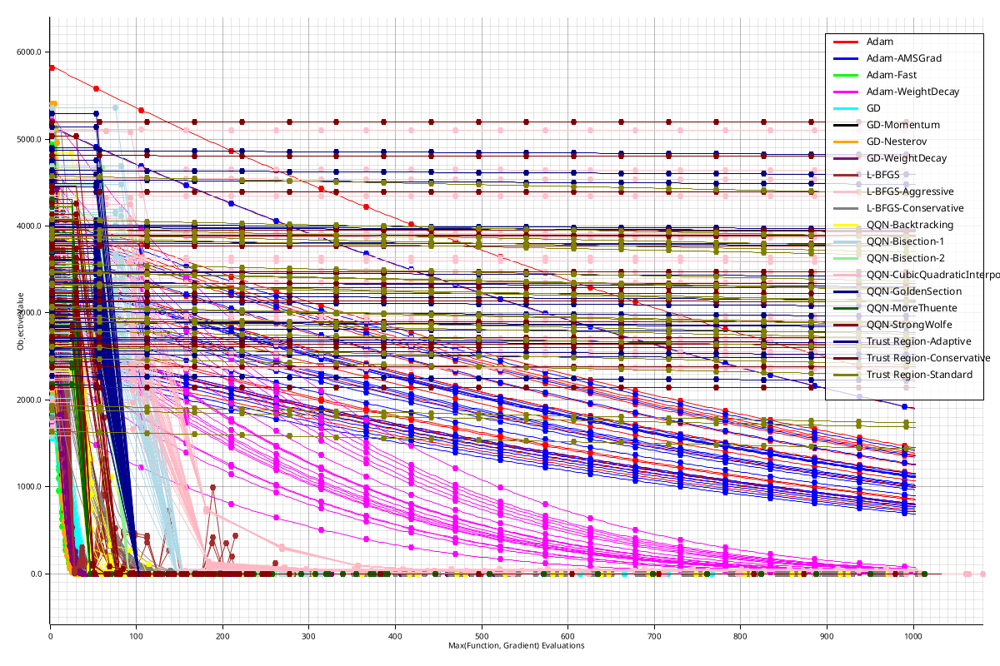
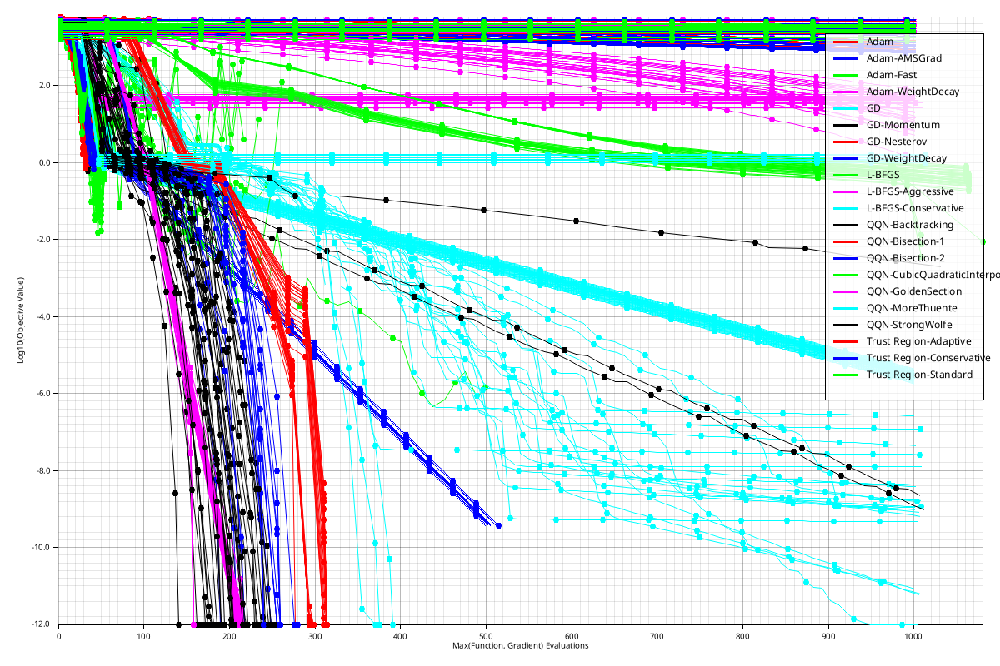

**Figure:** Convergence plots for Zakharov_5D showing objective value vs iterations.
Left: Linear scale, Right: Log scale for better visualization of convergence behavior.

**Data:** [Linear scale data (CSV)](convergence_Zakharov_5D_data.csv) | [Log scale data (CSV)](convergence_Zakharov_5D_log_data.csv)

## Problem: Zakharov_10D

**Family:** Zakharov  
**Dimension:** 10  
**Success Threshold:** 1.000e-8  
**Total Runs:** 560

### Performance Summary
<table style="border-collapse: collapse; width: 100%; margin: 20px 0;">
<tr style="background-color: #f2f2f2;">
<th style="border: 1px solid #ddd; padding: 8px; text-align: center;">Rank</th>
<th style="border: 1px solid #ddd; padding: 8px; text-align: center;">Optimizer</th>
<th style="border: 1px solid #ddd; padding: 8px; text-align: center;">Mean Final Value (All/Success/Fail)</th>
<th style="border: 1px solid #ddd; padding: 8px; text-align: center;">Std Dev</th>
<th style="border: 1px solid #ddd; padding: 8px; text-align: center;">Best Value</th>
<th style="border: 1px solid #ddd; padding: 8px; text-align: center;">Worst Value</th>
<th style="border: 1px solid #ddd; padding: 8px; text-align: center;">Mean Function Evals (All/Success/Fail)</th>
<th style="border: 1px solid #ddd; padding: 8px; text-align: center;">Mean Gradient Evals (All/Success/Fail)</th>
<th style="border: 1px solid #ddd; padding: 8px; text-align: center;">Success Rate</th>
<th style="border: 1px solid #ddd; padding: 8px; text-align: center;">Mean Time (s)</th>
</tr>
<tr style="background-color: #d4edda; font-weight: bold;">
<td style="border: 1px solid #ddd; padding: 8px; text-align: center;">1</td>
<td style="border: 1px solid #ddd; padding: 8px; text-align: center;"><a href="detailed_Zakharov_10D_QQN-GoldenSection.md">QQN-GoldenSection</a></td>
<td style="border: 1px solid #ddd; padding: 8px; text-align: center;">1.95e-16 / 1.95e-16 / -</td>
<td style="border: 1px solid #ddd; padding: 8px; text-align: center;">5.55e-16</td>
<td style="border: 1px solid #ddd; padding: 8px; text-align: center;">5.98e-28</td>
<td style="border: 1px solid #ddd; padding: 8px; text-align: center;">2.82e-15</td>
<td style="border: 1px solid #ddd; padding: 8px; text-align: center;">278.8 / 278.8 / -</td>
<td style="border: 1px solid #ddd; padding: 8px; text-align: center;">39.8 / 39.8 / -</td>
<td style="border: 1px solid #ddd; padding: 8px; text-align: center;">100.0%</td>
<td style="border: 1px solid #ddd; padding: 8px; text-align: center;">0.004</td>
</tr>
<tr style="background-color: #fff3cd;">
<td style="border: 1px solid #ddd; padding: 8px; text-align: center;">2</td>
<td style="border: 1px solid #ddd; padding: 8px; text-align: center;"><a href="detailed_Zakharov_10D_QQN-Bisection-1.md">QQN-Bisection-1</a></td>
<td style="border: 1px solid #ddd; padding: 8px; text-align: center;">8.30e-2 / 2.31e-16 / 4.15e-1</td>
<td style="border: 1px solid #ddd; padding: 8px; text-align: center;">1.70e-1</td>
<td style="border: 1px solid #ddd; padding: 8px; text-align: center;">9.63e-23</td>
<td style="border: 1px solid #ddd; padding: 8px; text-align: center;">5.27e-1</td>
<td style="border: 1px solid #ddd; padding: 8px; text-align: center;">243.7 / 172.1 / 530.1</td>
<td style="border: 1px solid #ddd; padding: 8px; text-align: center;">258.3 / 191.0 / 527.6</td>
<td style="border: 1px solid #ddd; padding: 8px; text-align: center;">80.0%</td>
<td style="border: 1px solid #ddd; padding: 8px; text-align: center;">0.004</td>
</tr>
<tr style="">
<td style="border: 1px solid #ddd; padding: 8px; text-align: center;">3</td>
<td style="border: 1px solid #ddd; padding: 8px; text-align: center;"><a href="detailed_Zakharov_10D_QQN-Backtracking.md">QQN-Backtracking</a></td>
<td style="border: 1px solid #ddd; padding: 8px; text-align: center;">3.82e-15 / 3.82e-15 / -</td>
<td style="border: 1px solid #ddd; padding: 8px; text-align: center;">1.09e-14</td>
<td style="border: 1px solid #ddd; padding: 8px; text-align: center;">2.69e-19</td>
<td style="border: 1px solid #ddd; padding: 8px; text-align: center;">3.94e-14</td>
<td style="border: 1px solid #ddd; padding: 8px; text-align: center;">157.6 / 157.6 / -</td>
<td style="border: 1px solid #ddd; padding: 8px; text-align: center;">92.7 / 92.7 / -</td>
<td style="border: 1px solid #ddd; padding: 8px; text-align: center;">100.0%</td>
<td style="border: 1px solid #ddd; padding: 8px; text-align: center;">0.004</td>
</tr>
<tr style="">
<td style="border: 1px solid #ddd; padding: 8px; text-align: center;">4</td>
<td style="border: 1px solid #ddd; padding: 8px; text-align: center;"><a href="detailed_Zakharov_10D_QQN-Bisection-2.md">QQN-Bisection-2</a></td>
<td style="border: 1px solid #ddd; padding: 8px; text-align: center;">2.28e-15 / 2.28e-15 / -</td>
<td style="border: 1px solid #ddd; padding: 8px; text-align: center;">8.26e-15</td>
<td style="border: 1px solid #ddd; padding: 8px; text-align: center;">3.07e-19</td>
<td style="border: 1px solid #ddd; padding: 8px; text-align: center;">3.82e-14</td>
<td style="border: 1px solid #ddd; padding: 8px; text-align: center;">180.6 / 180.6 / -</td>
<td style="border: 1px solid #ddd; padding: 8px; text-align: center;">180.4 / 180.4 / -</td>
<td style="border: 1px solid #ddd; padding: 8px; text-align: center;">100.0%</td>
<td style="border: 1px solid #ddd; padding: 8px; text-align: center;">0.004</td>
</tr>
<tr style="">
<td style="border: 1px solid #ddd; padding: 8px; text-align: center;">5</td>
<td style="border: 1px solid #ddd; padding: 8px; text-align: center;"><a href="detailed_Zakharov_10D_QQN-StrongWolfe.md">QQN-StrongWolfe</a></td>
<td style="border: 1px solid #ddd; padding: 8px; text-align: center;">5.99e-16 / 5.99e-16 / -</td>
<td style="border: 1px solid #ddd; padding: 8px; text-align: center;">7.94e-16</td>
<td style="border: 1px solid #ddd; padding: 8px; text-align: center;">3.81e-19</td>
<td style="border: 1px solid #ddd; padding: 8px; text-align: center;">2.85e-15</td>
<td style="border: 1px solid #ddd; padding: 8px; text-align: center;">153.0 / 153.0 / -</td>
<td style="border: 1px solid #ddd; padding: 8px; text-align: center;">135.2 / 135.2 / -</td>
<td style="border: 1px solid #ddd; padding: 8px; text-align: center;">100.0%</td>
<td style="border: 1px solid #ddd; padding: 8px; text-align: center;">0.004</td>
</tr>
<tr style="">
<td style="border: 1px solid #ddd; padding: 8px; text-align: center;">6</td>
<td style="border: 1px solid #ddd; padding: 8px; text-align: center;"><a href="detailed_Zakharov_10D_GD-WeightDecay.md">GD-WeightDecay</a></td>
<td style="border: 1px solid #ddd; padding: 8px; text-align: center;">1.80e0 / 3.76e-10 / 3.29e1</td>
<td style="border: 1px solid #ddd; padding: 8px; text-align: center;">1.71e0</td>
<td style="border: 1px solid #ddd; padding: 8px; text-align: center;">3.49e-10</td>
<td style="border: 1px solid #ddd; padding: 8px; text-align: center;">4.98e0</td>
<td style="border: 1px solid #ddd; padding: 8px; text-align: center;">89.8 / 187.0 / 24.9</td>
<td style="border: 1px solid #ddd; padding: 8px; text-align: center;">176.3 / 372.0 / 45.8</td>
<td style="border: 1px solid #ddd; padding: 8px; text-align: center;">40.0%</td>
<td style="border: 1px solid #ddd; padding: 8px; text-align: center;">0.003</td>
</tr>
<tr style="">
<td style="border: 1px solid #ddd; padding: 8px; text-align: center;">7</td>
<td style="border: 1px solid #ddd; padding: 8px; text-align: center;"><a href="detailed_Zakharov_10D_L-BFGS-Conservative.md">L-BFGS-Conservative</a></td>
<td style="border: 1px solid #ddd; padding: 8px; text-align: center;">5.71e4 / - / 3.45e24</td>
<td style="border: 1px solid #ddd; padding: 8px; text-align: center;">2.99e4</td>
<td style="border: 1px solid #ddd; padding: 8px; text-align: center;">9.96e-9</td>
<td style="border: 1px solid #ddd; padding: 8px; text-align: center;">9.81e4</td>
<td style="border: 1px solid #ddd; padding: 8px; text-align: center;">124.3 / - / 124.3</td>
<td style="border: 1px solid #ddd; padding: 8px; text-align: center;">79.2 / - / 79.2</td>
<td style="border: 1px solid #ddd; padding: 8px; text-align: center;">0.0%</td>
<td style="border: 1px solid #ddd; padding: 8px; text-align: center;">0.003</td>
</tr>
<tr style="">
<td style="border: 1px solid #ddd; padding: 8px; text-align: center;">8</td>
<td style="border: 1px solid #ddd; padding: 8px; text-align: center;"><a href="detailed_Zakharov_10D_GD.md">GD</a></td>
<td style="border: 1px solid #ddd; padding: 8px; text-align: center;">2.32e-1 / - / 2.38e-1</td>
<td style="border: 1px solid #ddd; padding: 8px; text-align: center;">1.41e-1</td>
<td style="border: 1px solid #ddd; padding: 8px; text-align: center;">7.65e-6</td>
<td style="border: 1px solid #ddd; padding: 8px; text-align: center;">5.73e-1</td>
<td style="border: 1px solid #ddd; padding: 8px; text-align: center;">328.4 / - / 328.4</td>
<td style="border: 1px solid #ddd; padding: 8px; text-align: center;">654.6 / - / 654.6</td>
<td style="border: 1px solid #ddd; padding: 8px; text-align: center;">0.0%</td>
<td style="border: 1px solid #ddd; padding: 8px; text-align: center;">0.009</td>
</tr>
<tr style="">
<td style="border: 1px solid #ddd; padding: 8px; text-align: center;">9</td>
<td style="border: 1px solid #ddd; padding: 8px; text-align: center;"><a href="detailed_Zakharov_10D_L-BFGS-Aggressive.md">L-BFGS-Aggressive</a></td>
<td style="border: 1px solid #ddd; padding: 8px; text-align: center;">2.95e5 / - / 2.95e5</td>
<td style="border: 1px solid #ddd; padding: 8px; text-align: center;">3.01e5</td>
<td style="border: 1px solid #ddd; padding: 8px; text-align: center;">4.15e-2</td>
<td style="border: 1px solid #ddd; padding: 8px; text-align: center;">7.39e5</td>
<td style="border: 1px solid #ddd; padding: 8px; text-align: center;">762.8 / - / 762.8</td>
<td style="border: 1px solid #ddd; padding: 8px; text-align: center;">243.3 / - / 243.3</td>
<td style="border: 1px solid #ddd; padding: 8px; text-align: center;">0.0%</td>
<td style="border: 1px solid #ddd; padding: 8px; text-align: center;">0.008</td>
</tr>
<tr style="">
<td style="border: 1px solid #ddd; padding: 8px; text-align: center;">10</td>
<td style="border: 1px solid #ddd; padding: 8px; text-align: center;"><a href="detailed_Zakharov_10D_Adam-Fast.md">Adam-Fast</a></td>
<td style="border: 1px solid #ddd; padding: 8px; text-align: center;">1.64e0 / - / 9.69e2</td>
<td style="border: 1px solid #ddd; padding: 8px; text-align: center;">1.57e0</td>
<td style="border: 1px solid #ddd; padding: 8px; text-align: center;">1.42e-1</td>
<td style="border: 1px solid #ddd; padding: 8px; text-align: center;">5.42e0</td>
<td style="border: 1px solid #ddd; padding: 8px; text-align: center;">34.9 / - / 34.9</td>
<td style="border: 1px solid #ddd; padding: 8px; text-align: center;">33.9 / - / 33.9</td>
<td style="border: 1px solid #ddd; padding: 8px; text-align: center;">0.0%</td>
<td style="border: 1px solid #ddd; padding: 8px; text-align: center;">0.001</td>
</tr>
<tr style="">
<td style="border: 1px solid #ddd; padding: 8px; text-align: center;">11</td>
<td style="border: 1px solid #ddd; padding: 8px; text-align: center;"><a href="detailed_Zakharov_10D_QQN-CubicQuadraticInterpolation.md">QQN-CubicQuadraticInterpolation</a></td>
<td style="border: 1px solid #ddd; padding: 8px; text-align: center;">2.95e0 / - / 2.95e0</td>
<td style="border: 1px solid #ddd; padding: 8px; text-align: center;">7.06e-1</td>
<td style="border: 1px solid #ddd; padding: 8px; text-align: center;">2.12e0</td>
<td style="border: 1px solid #ddd; padding: 8px; text-align: center;">5.56e0</td>
<td style="border: 1px solid #ddd; padding: 8px; text-align: center;">401.9 / - / 401.9</td>
<td style="border: 1px solid #ddd; padding: 8px; text-align: center;">669.9 / - / 669.9</td>
<td style="border: 1px solid #ddd; padding: 8px; text-align: center;">0.0%</td>
<td style="border: 1px solid #ddd; padding: 8px; text-align: center;">0.015</td>
</tr>
<tr style="">
<td style="border: 1px solid #ddd; padding: 8px; text-align: center;">12</td>
<td style="border: 1px solid #ddd; padding: 8px; text-align: center;"><a href="detailed_Zakharov_10D_GD-Nesterov.md">GD-Nesterov</a></td>
<td style="border: 1px solid #ddd; padding: 8px; text-align: center;">7.28e0 / - / 8.16e2</td>
<td style="border: 1px solid #ddd; padding: 8px; text-align: center;">4.32e0</td>
<td style="border: 1px solid #ddd; padding: 8px; text-align: center;">2.14e0</td>
<td style="border: 1px solid #ddd; padding: 8px; text-align: center;">1.39e1</td>
<td style="border: 1px solid #ddd; padding: 8px; text-align: center;">20.2 / - / 20.2</td>
<td style="border: 1px solid #ddd; padding: 8px; text-align: center;">36.5 / - / 36.5</td>
<td style="border: 1px solid #ddd; padding: 8px; text-align: center;">0.0%</td>
<td style="border: 1px solid #ddd; padding: 8px; text-align: center;">0.001</td>
</tr>
<tr style="">
<td style="border: 1px solid #ddd; padding: 8px; text-align: center;">13</td>
<td style="border: 1px solid #ddd; padding: 8px; text-align: center;"><a href="detailed_Zakharov_10D_GD-Momentum.md">GD-Momentum</a></td>
<td style="border: 1px solid #ddd; padding: 8px; text-align: center;">6.41e0 / - / 6.35e3</td>
<td style="border: 1px solid #ddd; padding: 8px; text-align: center;">4.84e0</td>
<td style="border: 1px solid #ddd; padding: 8px; text-align: center;">2.50e0</td>
<td style="border: 1px solid #ddd; padding: 8px; text-align: center;">1.68e1</td>
<td style="border: 1px solid #ddd; padding: 8px; text-align: center;">21.2 / - / 21.2</td>
<td style="border: 1px solid #ddd; padding: 8px; text-align: center;">38.4 / - / 38.4</td>
<td style="border: 1px solid #ddd; padding: 8px; text-align: center;">0.0%</td>
<td style="border: 1px solid #ddd; padding: 8px; text-align: center;">0.001</td>
</tr>
<tr style="">
<td style="border: 1px solid #ddd; padding: 8px; text-align: center;">14</td>
<td style="border: 1px solid #ddd; padding: 8px; text-align: center;"><a href="detailed_Zakharov_10D_L-BFGS.md">L-BFGS</a></td>
<td style="border: 1px solid #ddd; padding: 8px; text-align: center;">4.36e3 / - / 1.83e4</td>
<td style="border: 1px solid #ddd; padding: 8px; text-align: center;">2.34e3</td>
<td style="border: 1px solid #ddd; padding: 8px; text-align: center;">6.70e2</td>
<td style="border: 1px solid #ddd; padding: 8px; text-align: center;">8.45e3</td>
<td style="border: 1px solid #ddd; padding: 8px; text-align: center;">737.5 / - / 737.5</td>
<td style="border: 1px solid #ddd; padding: 8px; text-align: center;">222.7 / - / 222.7</td>
<td style="border: 1px solid #ddd; padding: 8px; text-align: center;">0.0%</td>
<td style="border: 1px solid #ddd; padding: 8px; text-align: center;">0.011</td>
</tr>
<tr style="">
<td style="border: 1px solid #ddd; padding: 8px; text-align: center;">15</td>
<td style="border: 1px solid #ddd; padding: 8px; text-align: center;"><a href="detailed_Zakharov_10D_Adam-WeightDecay.md">Adam-WeightDecay</a></td>
<td style="border: 1px solid #ddd; padding: 8px; text-align: center;">2.82e3 / - / 2.82e3</td>
<td style="border: 1px solid #ddd; padding: 8px; text-align: center;">1.25e3</td>
<td style="border: 1px solid #ddd; padding: 8px; text-align: center;">8.38e2</td>
<td style="border: 1px solid #ddd; padding: 8px; text-align: center;">5.25e3</td>
<td style="border: 1px solid #ddd; padding: 8px; text-align: center;">502.0 / - / 502.0</td>
<td style="border: 1px solid #ddd; padding: 8px; text-align: center;">502.0 / - / 502.0</td>
<td style="border: 1px solid #ddd; padding: 8px; text-align: center;">0.0%</td>
<td style="border: 1px solid #ddd; padding: 8px; text-align: center;">0.012</td>
</tr>
<tr style="">
<td style="border: 1px solid #ddd; padding: 8px; text-align: center;">16</td>
<td style="border: 1px solid #ddd; padding: 8px; text-align: center;"><a href="detailed_Zakharov_10D_QQN-MoreThuente.md">QQN-MoreThuente</a></td>
<td style="border: 1px solid #ddd; padding: 8px; text-align: center;">2.88e4 / - / 2.88e4</td>
<td style="border: 1px solid #ddd; padding: 8px; text-align: center;">1.99e4</td>
<td style="border: 1px solid #ddd; padding: 8px; text-align: center;">2.68e3</td>
<td style="border: 1px solid #ddd; padding: 8px; text-align: center;">7.00e4</td>
<td style="border: 1px solid #ddd; padding: 8px; text-align: center;">483.4 / - / 483.4</td>
<td style="border: 1px solid #ddd; padding: 8px; text-align: center;">528.0 / - / 528.0</td>
<td style="border: 1px solid #ddd; padding: 8px; text-align: center;">0.0%</td>
<td style="border: 1px solid #ddd; padding: 8px; text-align: center;">0.009</td>
</tr>
<tr style="">
<td style="border: 1px solid #ddd; padding: 8px; text-align: center;">17</td>
<td style="border: 1px solid #ddd; padding: 8px; text-align: center;"><a href="detailed_Zakharov_10D_Adam.md">Adam</a></td>
<td style="border: 1px solid #ddd; padding: 8px; text-align: center;">1.89e5 / - / 1.89e5</td>
<td style="border: 1px solid #ddd; padding: 8px; text-align: center;">4.42e4</td>
<td style="border: 1px solid #ddd; padding: 8px; text-align: center;">1.15e5</td>
<td style="border: 1px solid #ddd; padding: 8px; text-align: center;">2.57e5</td>
<td style="border: 1px solid #ddd; padding: 8px; text-align: center;">502.0 / - / 502.0</td>
<td style="border: 1px solid #ddd; padding: 8px; text-align: center;">502.0 / - / 502.0</td>
<td style="border: 1px solid #ddd; padding: 8px; text-align: center;">0.0%</td>
<td style="border: 1px solid #ddd; padding: 8px; text-align: center;">0.011</td>
</tr>
<tr style="">
<td style="border: 1px solid #ddd; padding: 8px; text-align: center;">18</td>
<td style="border: 1px solid #ddd; padding: 8px; text-align: center;"><a href="detailed_Zakharov_10D_Adam-AMSGrad.md">Adam-AMSGrad</a></td>
<td style="border: 1px solid #ddd; padding: 8px; text-align: center;">1.87e5 / - / 1.87e5</td>
<td style="border: 1px solid #ddd; padding: 8px; text-align: center;">3.19e4</td>
<td style="border: 1px solid #ddd; padding: 8px; text-align: center;">1.21e5</td>
<td style="border: 1px solid #ddd; padding: 8px; text-align: center;">2.49e5</td>
<td style="border: 1px solid #ddd; padding: 8px; text-align: center;">502.0 / - / 502.0</td>
<td style="border: 1px solid #ddd; padding: 8px; text-align: center;">502.0 / - / 502.0</td>
<td style="border: 1px solid #ddd; padding: 8px; text-align: center;">0.0%</td>
<td style="border: 1px solid #ddd; padding: 8px; text-align: center;">0.012</td>
</tr>
<tr style="">
<td style="border: 1px solid #ddd; padding: 8px; text-align: center;">19</td>
<td style="border: 1px solid #ddd; padding: 8px; text-align: center;"><a href="detailed_Zakharov_10D_Trust_Region-Conservative.md">Trust Region-Conservative</a></td>
<td style="border: 1px solid #ddd; padding: 8px; text-align: center;">5.75e5 / - / 5.75e5</td>
<td style="border: 1px solid #ddd; padding: 8px; text-align: center;">8.96e4</td>
<td style="border: 1px solid #ddd; padding: 8px; text-align: center;">4.04e5</td>
<td style="border: 1px solid #ddd; padding: 8px; text-align: center;">7.53e5</td>
<td style="border: 1px solid #ddd; padding: 8px; text-align: center;">602.0 / - / 602.0</td>
<td style="border: 1px solid #ddd; padding: 8px; text-align: center;">402.0 / - / 402.0</td>
<td style="border: 1px solid #ddd; padding: 8px; text-align: center;">0.0%</td>
<td style="border: 1px solid #ddd; padding: 8px; text-align: center;">0.004</td>
</tr>
<tr style="">
<td style="border: 1px solid #ddd; padding: 8px; text-align: center;">20</td>
<td style="border: 1px solid #ddd; padding: 8px; text-align: center;"><a href="detailed_Zakharov_10D_Trust_Region-Standard.md">Trust Region-Standard</a></td>
<td style="border: 1px solid #ddd; padding: 8px; text-align: center;">6.04e5 / - / 6.04e5</td>
<td style="border: 1px solid #ddd; padding: 8px; text-align: center;">9.48e4</td>
<td style="border: 1px solid #ddd; padding: 8px; text-align: center;">4.13e5</td>
<td style="border: 1px solid #ddd; padding: 8px; text-align: center;">7.66e5</td>
<td style="border: 1px solid #ddd; padding: 8px; text-align: center;">602.0 / - / 602.0</td>
<td style="border: 1px solid #ddd; padding: 8px; text-align: center;">402.0 / - / 402.0</td>
<td style="border: 1px solid #ddd; padding: 8px; text-align: center;">0.0%</td>
<td style="border: 1px solid #ddd; padding: 8px; text-align: center;">0.004</td>
</tr>
<tr style="">
<td style="border: 1px solid #ddd; padding: 8px; text-align: center;">21</td>
<td style="border: 1px solid #ddd; padding: 8px; text-align: center;"><a href="detailed_Zakharov_10D_Trust_Region-Adaptive.md">Trust Region-Adaptive</a></td>
<td style="border: 1px solid #ddd; padding: 8px; text-align: center;">5.97e5 / - / 5.97e5</td>
<td style="border: 1px solid #ddd; padding: 8px; text-align: center;">9.18e4</td>
<td style="border: 1px solid #ddd; padding: 8px; text-align: center;">4.70e5</td>
<td style="border: 1px solid #ddd; padding: 8px; text-align: center;">7.61e5</td>
<td style="border: 1px solid #ddd; padding: 8px; text-align: center;">602.0 / - / 602.0</td>
<td style="border: 1px solid #ddd; padding: 8px; text-align: center;">402.0 / - / 402.0</td>
<td style="border: 1px solid #ddd; padding: 8px; text-align: center;">0.0%</td>
<td style="border: 1px solid #ddd; padding: 8px; text-align: center;">0.004</td>
</tr>
</table>

### Convergence Plots

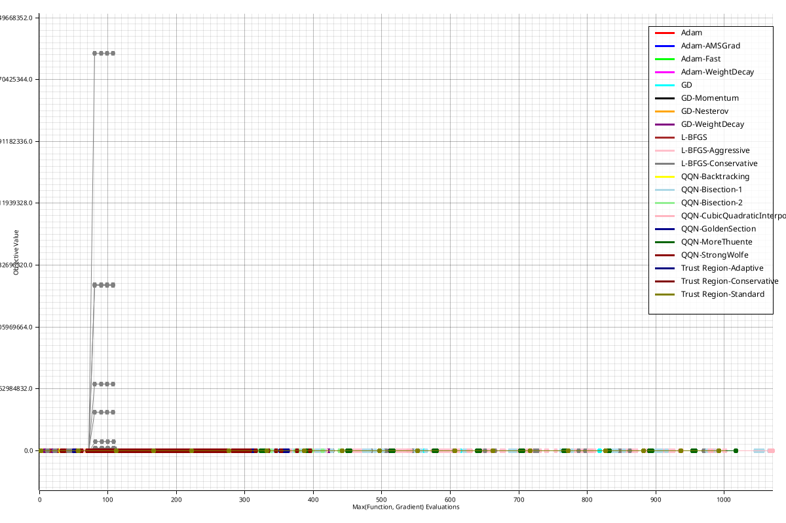
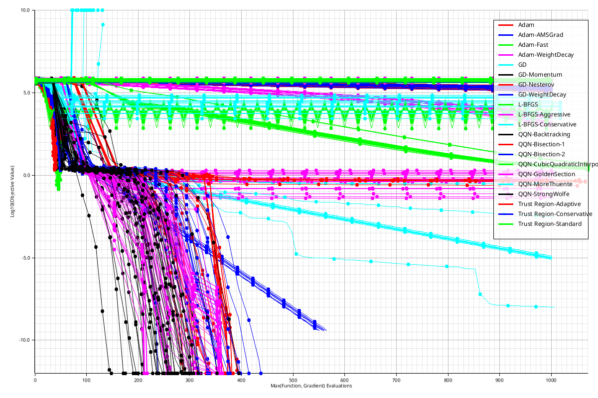

**Figure:** Convergence plots for Zakharov_10D showing objective value vs iterations.
Left: Linear scale, Right: Log scale for better visualization of convergence behavior.

**Data:** [Linear scale data (CSV)](convergence_Zakharov_10D_data.csv) | [Log scale data (CSV)](convergence_Zakharov_10D_log_data.csv)

## Problem: IllConditionedRosenbrock_2D_alpha100

**Family:** IllConditionedRosenbrock  
**Dimension:** 2  
**Success Threshold:** 1.000e-6  
**Total Runs:** 560

### Performance Summary
<table style="border-collapse: collapse; width: 100%; margin: 20px 0;">
<tr style="background-color: #f2f2f2;">
<th style="border: 1px solid #ddd; padding: 8px; text-align: center;">Rank</th>
<th style="border: 1px solid #ddd; padding: 8px; text-align: center;">Optimizer</th>
<th style="border: 1px solid #ddd; padding: 8px; text-align: center;">Mean Final Value (All/Success/Fail)</th>
<th style="border: 1px solid #ddd; padding: 8px; text-align: center;">Std Dev</th>
<th style="border: 1px solid #ddd; padding: 8px; text-align: center;">Best Value</th>
<th style="border: 1px solid #ddd; padding: 8px; text-align: center;">Worst Value</th>
<th style="border: 1px solid #ddd; padding: 8px; text-align: center;">Mean Function Evals (All/Success/Fail)</th>
<th style="border: 1px solid #ddd; padding: 8px; text-align: center;">Mean Gradient Evals (All/Success/Fail)</th>
<th style="border: 1px solid #ddd; padding: 8px; text-align: center;">Success Rate</th>
<th style="border: 1px solid #ddd; padding: 8px; text-align: center;">Mean Time (s)</th>
</tr>
<tr style="background-color: #d4edda; font-weight: bold;">
<td style="border: 1px solid #ddd; padding: 8px; text-align: center;">1</td>
<td style="border: 1px solid #ddd; padding: 8px; text-align: center;"><a href="detailed_IllConditionedRosenbrock_2D_alpha100_QQN-Bisection-2.md">QQN-Bisection-2</a></td>
<td style="border: 1px solid #ddd; padding: 8px; text-align: center;">1.36e-1 / 6.24e-19 / 1.70e-1</td>
<td style="border: 1px solid #ddd; padding: 8px; text-align: center;">2.01e-1</td>
<td style="border: 1px solid #ddd; padding: 8px; text-align: center;">1.11e-19</td>
<td style="border: 1px solid #ddd; padding: 8px; text-align: center;">9.54e-1</td>
<td style="border: 1px solid #ddd; padding: 8px; text-align: center;">152.4 / 235.0 / 131.8</td>
<td style="border: 1px solid #ddd; padding: 8px; text-align: center;">146.8 / 225.0 / 127.3</td>
<td style="border: 1px solid #ddd; padding: 8px; text-align: center;">20.0%</td>
<td style="border: 1px solid #ddd; padding: 8px; text-align: center;">0.003</td>
</tr>
<tr style="background-color: #fff3cd;">
<td style="border: 1px solid #ddd; padding: 8px; text-align: center;">2</td>
<td style="border: 1px solid #ddd; padding: 8px; text-align: center;"><a href="detailed_IllConditionedRosenbrock_2D_alpha100_QQN-Bisection-1.md">QQN-Bisection-1</a></td>
<td style="border: 1px solid #ddd; padding: 8px; text-align: center;">1.45e0 / 1.75e-16 / 1.57e0</td>
<td style="border: 1px solid #ddd; padding: 8px; text-align: center;">1.53e0</td>
<td style="border: 1px solid #ddd; padding: 8px; text-align: center;">1.96e-19</td>
<td style="border: 1px solid #ddd; padding: 8px; text-align: center;">3.60e0</td>
<td style="border: 1px solid #ddd; padding: 8px; text-align: center;">478.4 / 314.3 / 491.6</td>
<td style="border: 1px solid #ddd; padding: 8px; text-align: center;">525.4 / 344.7 / 540.1</td>
<td style="border: 1px solid #ddd; padding: 8px; text-align: center;">7.5%</td>
<td style="border: 1px solid #ddd; padding: 8px; text-align: center;">0.009</td>
</tr>
<tr style="">
<td style="border: 1px solid #ddd; padding: 8px; text-align: center;">3</td>
<td style="border: 1px solid #ddd; padding: 8px; text-align: center;"><a href="detailed_IllConditionedRosenbrock_2D_alpha100_QQN-StrongWolfe.md">QQN-StrongWolfe</a></td>
<td style="border: 1px solid #ddd; padding: 8px; text-align: center;">3.82e-1 / 3.69e-17 / 5.10e-1</td>
<td style="border: 1px solid #ddd; padding: 8px; text-align: center;">8.10e-1</td>
<td style="border: 1px solid #ddd; padding: 8px; text-align: center;">2.09e-18</td>
<td style="border: 1px solid #ddd; padding: 8px; text-align: center;">3.09e0</td>
<td style="border: 1px solid #ddd; padding: 8px; text-align: center;">499.5 / 266.2 / 577.3</td>
<td style="border: 1px solid #ddd; padding: 8px; text-align: center;">396.5 / 242.4 / 447.9</td>
<td style="border: 1px solid #ddd; padding: 8px; text-align: center;">25.0%</td>
<td style="border: 1px solid #ddd; padding: 8px; text-align: center;">0.012</td>
</tr>
<tr style="">
<td style="border: 1px solid #ddd; padding: 8px; text-align: center;">4</td>
<td style="border: 1px solid #ddd; padding: 8px; text-align: center;"><a href="detailed_IllConditionedRosenbrock_2D_alpha100_QQN-GoldenSection.md">QQN-GoldenSection</a></td>
<td style="border: 1px solid #ddd; padding: 8px; text-align: center;">1.01e0 / 2.07e-16 / 1.06e0</td>
<td style="border: 1px solid #ddd; padding: 8px; text-align: center;">1.05e0</td>
<td style="border: 1px solid #ddd; padding: 8px; text-align: center;">2.92e-18</td>
<td style="border: 1px solid #ddd; padding: 8px; text-align: center;">2.62e0</td>
<td style="border: 1px solid #ddd; padding: 8px; text-align: center;">884.2 / 487.0 / 905.1</td>
<td style="border: 1px solid #ddd; padding: 8px; text-align: center;">115.0 / 67.0 / 117.5</td>
<td style="border: 1px solid #ddd; padding: 8px; text-align: center;">5.0%</td>
<td style="border: 1px solid #ddd; padding: 8px; text-align: center;">0.014</td>
</tr>
<tr style="">
<td style="border: 1px solid #ddd; padding: 8px; text-align: center;">5</td>
<td style="border: 1px solid #ddd; padding: 8px; text-align: center;"><a href="detailed_IllConditionedRosenbrock_2D_alpha100_L-BFGS-Conservative.md">L-BFGS-Conservative</a></td>
<td style="border: 1px solid #ddd; padding: 8px; text-align: center;">1.13e0 / - / 1.13e0</td>
<td style="border: 1px solid #ddd; padding: 8px; text-align: center;">1.67e0</td>
<td style="border: 1px solid #ddd; padding: 8px; text-align: center;">2.61e-7</td>
<td style="border: 1px solid #ddd; padding: 8px; text-align: center;">3.91e0</td>
<td style="border: 1px solid #ddd; padding: 8px; text-align: center;">678.9 / - / 678.9</td>
<td style="border: 1px solid #ddd; padding: 8px; text-align: center;">330.6 / - / 330.6</td>
<td style="border: 1px solid #ddd; padding: 8px; text-align: center;">0.0%</td>
<td style="border: 1px solid #ddd; padding: 8px; text-align: center;">0.010</td>
</tr>
<tr style="">
<td style="border: 1px solid #ddd; padding: 8px; text-align: center;">6</td>
<td style="border: 1px solid #ddd; padding: 8px; text-align: center;"><a href="detailed_IllConditionedRosenbrock_2D_alpha100_QQN-Backtracking.md">QQN-Backtracking</a></td>
<td style="border: 1px solid #ddd; padding: 8px; text-align: center;">3.20e-1 / - / 3.20e-1</td>
<td style="border: 1px solid #ddd; padding: 8px; text-align: center;">5.63e-1</td>
<td style="border: 1px solid #ddd; padding: 8px; text-align: center;">1.01e-6</td>
<td style="border: 1px solid #ddd; padding: 8px; text-align: center;">2.63e0</td>
<td style="border: 1px solid #ddd; padding: 8px; text-align: center;">709.5 / - / 709.5</td>
<td style="border: 1px solid #ddd; padding: 8px; text-align: center;">301.6 / - / 301.6</td>
<td style="border: 1px solid #ddd; padding: 8px; text-align: center;">0.0%</td>
<td style="border: 1px solid #ddd; padding: 8px; text-align: center;">0.017</td>
</tr>
<tr style="">
<td style="border: 1px solid #ddd; padding: 8px; text-align: center;">7</td>
<td style="border: 1px solid #ddd; padding: 8px; text-align: center;"><a href="detailed_IllConditionedRosenbrock_2D_alpha100_Adam-Fast.md">Adam-Fast</a></td>
<td style="border: 1px solid #ddd; padding: 8px; text-align: center;">1.78e0 / - / 2.28e0</td>
<td style="border: 1px solid #ddd; padding: 8px; text-align: center;">2.19e0</td>
<td style="border: 1px solid #ddd; padding: 8px; text-align: center;">2.54e-5</td>
<td style="border: 1px solid #ddd; padding: 8px; text-align: center;">4.82e0</td>
<td style="border: 1px solid #ddd; padding: 8px; text-align: center;">270.6 / - / 270.6</td>
<td style="border: 1px solid #ddd; padding: 8px; text-align: center;">270.0 / - / 270.0</td>
<td style="border: 1px solid #ddd; padding: 8px; text-align: center;">0.0%</td>
<td style="border: 1px solid #ddd; padding: 8px; text-align: center;">0.005</td>
</tr>
<tr style="">
<td style="border: 1px solid #ddd; padding: 8px; text-align: center;">8</td>
<td style="border: 1px solid #ddd; padding: 8px; text-align: center;"><a href="detailed_IllConditionedRosenbrock_2D_alpha100_QQN-CubicQuadraticInterpolation.md">QQN-CubicQuadraticInterpolation</a></td>
<td style="border: 1px solid #ddd; padding: 8px; text-align: center;">1.74e0 / - / 1.74e0</td>
<td style="border: 1px solid #ddd; padding: 8px; text-align: center;">1.51e0</td>
<td style="border: 1px solid #ddd; padding: 8px; text-align: center;">3.82e-3</td>
<td style="border: 1px solid #ddd; padding: 8px; text-align: center;">3.71e0</td>
<td style="border: 1px solid #ddd; padding: 8px; text-align: center;">395.8 / - / 395.8</td>
<td style="border: 1px solid #ddd; padding: 8px; text-align: center;">651.4 / - / 651.4</td>
<td style="border: 1px solid #ddd; padding: 8px; text-align: center;">0.0%</td>
<td style="border: 1px solid #ddd; padding: 8px; text-align: center;">0.013</td>
</tr>
<tr style="">
<td style="border: 1px solid #ddd; padding: 8px; text-align: center;">9</td>
<td style="border: 1px solid #ddd; padding: 8px; text-align: center;"><a href="detailed_IllConditionedRosenbrock_2D_alpha100_GD-Nesterov.md">GD-Nesterov</a></td>
<td style="border: 1px solid #ddd; padding: 8px; text-align: center;">1.35e0 / - / 2.17e0</td>
<td style="border: 1px solid #ddd; padding: 8px; text-align: center;">1.94e0</td>
<td style="border: 1px solid #ddd; padding: 8px; text-align: center;">1.66e-2</td>
<td style="border: 1px solid #ddd; padding: 8px; text-align: center;">4.56e0</td>
<td style="border: 1px solid #ddd; padding: 8px; text-align: center;">41.3 / - / 41.3</td>
<td style="border: 1px solid #ddd; padding: 8px; text-align: center;">78.6 / - / 78.6</td>
<td style="border: 1px solid #ddd; padding: 8px; text-align: center;">0.0%</td>
<td style="border: 1px solid #ddd; padding: 8px; text-align: center;">0.001</td>
</tr>
<tr style="">
<td style="border: 1px solid #ddd; padding: 8px; text-align: center;">10</td>
<td style="border: 1px solid #ddd; padding: 8px; text-align: center;"><a href="detailed_IllConditionedRosenbrock_2D_alpha100_GD-Momentum.md">GD-Momentum</a></td>
<td style="border: 1px solid #ddd; padding: 8px; text-align: center;">2.72e0 / - / 5.37e0</td>
<td style="border: 1px solid #ddd; padding: 8px; text-align: center;">1.92e0</td>
<td style="border: 1px solid #ddd; padding: 8px; text-align: center;">1.75e-2</td>
<td style="border: 1px solid #ddd; padding: 8px; text-align: center;">4.82e0</td>
<td style="border: 1px solid #ddd; padding: 8px; text-align: center;">27.7 / - / 27.7</td>
<td style="border: 1px solid #ddd; padding: 8px; text-align: center;">51.4 / - / 51.4</td>
<td style="border: 1px solid #ddd; padding: 8px; text-align: center;">0.0%</td>
<td style="border: 1px solid #ddd; padding: 8px; text-align: center;">0.001</td>
</tr>
<tr style="">
<td style="border: 1px solid #ddd; padding: 8px; text-align: center;">11</td>
<td style="border: 1px solid #ddd; padding: 8px; text-align: center;"><a href="detailed_IllConditionedRosenbrock_2D_alpha100_GD-WeightDecay.md">GD-WeightDecay</a></td>
<td style="border: 1px solid #ddd; padding: 8px; text-align: center;">8.73e-1 / - / 1.14e0</td>
<td style="border: 1px solid #ddd; padding: 8px; text-align: center;">1.72e0</td>
<td style="border: 1px solid #ddd; padding: 8px; text-align: center;">1.83e-2</td>
<td style="border: 1px solid #ddd; padding: 8px; text-align: center;">5.21e0</td>
<td style="border: 1px solid #ddd; padding: 8px; text-align: center;">112.5 / - / 112.5</td>
<td style="border: 1px solid #ddd; padding: 8px; text-align: center;">221.1 / - / 221.1</td>
<td style="border: 1px solid #ddd; padding: 8px; text-align: center;">0.0%</td>
<td style="border: 1px solid #ddd; padding: 8px; text-align: center;">0.003</td>
</tr>
<tr style="">
<td style="border: 1px solid #ddd; padding: 8px; text-align: center;">12</td>
<td style="border: 1px solid #ddd; padding: 8px; text-align: center;"><a href="detailed_IllConditionedRosenbrock_2D_alpha100_L-BFGS.md">L-BFGS</a></td>
<td style="border: 1px solid #ddd; padding: 8px; text-align: center;">2.47e0 / - / 1.16e2</td>
<td style="border: 1px solid #ddd; padding: 8px; text-align: center;">2.14e0</td>
<td style="border: 1px solid #ddd; padding: 8px; text-align: center;">6.48e-2</td>
<td style="border: 1px solid #ddd; padding: 8px; text-align: center;">8.61e0</td>
<td style="border: 1px solid #ddd; padding: 8px; text-align: center;">125.9 / - / 125.9</td>
<td style="border: 1px solid #ddd; padding: 8px; text-align: center;">46.5 / - / 46.5</td>
<td style="border: 1px solid #ddd; padding: 8px; text-align: center;">0.0%</td>
<td style="border: 1px solid #ddd; padding: 8px; text-align: center;">0.002</td>
</tr>
<tr style="">
<td style="border: 1px solid #ddd; padding: 8px; text-align: center;">13</td>
<td style="border: 1px solid #ddd; padding: 8px; text-align: center;"><a href="detailed_IllConditionedRosenbrock_2D_alpha100_QQN-MoreThuente.md">QQN-MoreThuente</a></td>
<td style="border: 1px solid #ddd; padding: 8px; text-align: center;">1.56e1 / - / 1.56e1</td>
<td style="border: 1px solid #ddd; padding: 8px; text-align: center;">1.64e1</td>
<td style="border: 1px solid #ddd; padding: 8px; text-align: center;">5.43e-1</td>
<td style="border: 1px solid #ddd; padding: 8px; text-align: center;">5.44e1</td>
<td style="border: 1px solid #ddd; padding: 8px; text-align: center;">485.7 / - / 485.7</td>
<td style="border: 1px solid #ddd; padding: 8px; text-align: center;">529.5 / - / 529.5</td>
<td style="border: 1px solid #ddd; padding: 8px; text-align: center;">0.0%</td>
<td style="border: 1px solid #ddd; padding: 8px; text-align: center;">0.008</td>
</tr>
<tr style="">
<td style="border: 1px solid #ddd; padding: 8px; text-align: center;">14</td>
<td style="border: 1px solid #ddd; padding: 8px; text-align: center;"><a href="detailed_IllConditionedRosenbrock_2D_alpha100_GD.md">GD</a></td>
<td style="border: 1px solid #ddd; padding: 8px; text-align: center;">1.43e0 / - / 1.80e0</td>
<td style="border: 1px solid #ddd; padding: 8px; text-align: center;">1.37e0</td>
<td style="border: 1px solid #ddd; padding: 8px; text-align: center;">7.47e-1</td>
<td style="border: 1px solid #ddd; padding: 8px; text-align: center;">4.44e0</td>
<td style="border: 1px solid #ddd; padding: 8px; text-align: center;">270.2 / - / 270.2</td>
<td style="border: 1px solid #ddd; padding: 8px; text-align: center;">538.0 / - / 538.0</td>
<td style="border: 1px solid #ddd; padding: 8px; text-align: center;">0.0%</td>
<td style="border: 1px solid #ddd; padding: 8px; text-align: center;">0.006</td>
</tr>
<tr style="">
<td style="border: 1px solid #ddd; padding: 8px; text-align: center;">15</td>
<td style="border: 1px solid #ddd; padding: 8px; text-align: center;"><a href="detailed_IllConditionedRosenbrock_2D_alpha100_Trust_Region-Standard.md">Trust Region-Standard</a></td>
<td style="border: 1px solid #ddd; padding: 8px; text-align: center;">4.15e0 / - / 4.15e0</td>
<td style="border: 1px solid #ddd; padding: 8px; text-align: center;">2.94e-1</td>
<td style="border: 1px solid #ddd; padding: 8px; text-align: center;">3.29e0</td>
<td style="border: 1px solid #ddd; padding: 8px; text-align: center;">4.61e0</td>
<td style="border: 1px solid #ddd; padding: 8px; text-align: center;">105.3 / - / 105.3</td>
<td style="border: 1px solid #ddd; padding: 8px; text-align: center;">70.9 / - / 70.9</td>
<td style="border: 1px solid #ddd; padding: 8px; text-align: center;">0.0%</td>
<td style="border: 1px solid #ddd; padding: 8px; text-align: center;">0.001</td>
</tr>
<tr style="">
<td style="border: 1px solid #ddd; padding: 8px; text-align: center;">16</td>
<td style="border: 1px solid #ddd; padding: 8px; text-align: center;"><a href="detailed_IllConditionedRosenbrock_2D_alpha100_Trust_Region-Conservative.md">Trust Region-Conservative</a></td>
<td style="border: 1px solid #ddd; padding: 8px; text-align: center;">3.58e1 / - / 3.58e1</td>
<td style="border: 1px solid #ddd; padding: 8px; text-align: center;">2.48e1</td>
<td style="border: 1px solid #ddd; padding: 8px; text-align: center;">3.42e0</td>
<td style="border: 1px solid #ddd; padding: 8px; text-align: center;">1.10e2</td>
<td style="border: 1px solid #ddd; padding: 8px; text-align: center;">602.0 / - / 602.0</td>
<td style="border: 1px solid #ddd; padding: 8px; text-align: center;">402.0 / - / 402.0</td>
<td style="border: 1px solid #ddd; padding: 8px; text-align: center;">0.0%</td>
<td style="border: 1px solid #ddd; padding: 8px; text-align: center;">0.003</td>
</tr>
<tr style="">
<td style="border: 1px solid #ddd; padding: 8px; text-align: center;">17</td>
<td style="border: 1px solid #ddd; padding: 8px; text-align: center;"><a href="detailed_IllConditionedRosenbrock_2D_alpha100_Adam.md">Adam</a></td>
<td style="border: 1px solid #ddd; padding: 8px; text-align: center;">4.16e0 / - / 4.16e0</td>
<td style="border: 1px solid #ddd; padding: 8px; text-align: center;">1.04e0</td>
<td style="border: 1px solid #ddd; padding: 8px; text-align: center;">3.53e0</td>
<td style="border: 1px solid #ddd; padding: 8px; text-align: center;">8.64e0</td>
<td style="border: 1px solid #ddd; padding: 8px; text-align: center;">479.6 / - / 479.6</td>
<td style="border: 1px solid #ddd; padding: 8px; text-align: center;">479.5 / - / 479.5</td>
<td style="border: 1px solid #ddd; padding: 8px; text-align: center;">0.0%</td>
<td style="border: 1px solid #ddd; padding: 8px; text-align: center;">0.009</td>
</tr>
<tr style="">
<td style="border: 1px solid #ddd; padding: 8px; text-align: center;">18</td>
<td style="border: 1px solid #ddd; padding: 8px; text-align: center;"><a href="detailed_IllConditionedRosenbrock_2D_alpha100_Trust_Region-Adaptive.md">Trust Region-Adaptive</a></td>
<td style="border: 1px solid #ddd; padding: 8px; text-align: center;">4.69e0 / - / 4.69e0</td>
<td style="border: 1px solid #ddd; padding: 8px; text-align: center;">2.40e0</td>
<td style="border: 1px solid #ddd; padding: 8px; text-align: center;">3.77e0</td>
<td style="border: 1px solid #ddd; padding: 8px; text-align: center;">1.51e1</td>
<td style="border: 1px solid #ddd; padding: 8px; text-align: center;">169.8 / - / 169.8</td>
<td style="border: 1px solid #ddd; padding: 8px; text-align: center;">113.9 / - / 113.9</td>
<td style="border: 1px solid #ddd; padding: 8px; text-align: center;">0.0%</td>
<td style="border: 1px solid #ddd; padding: 8px; text-align: center;">0.001</td>
</tr>
<tr style="">
<td style="border: 1px solid #ddd; padding: 8px; text-align: center;">19</td>
<td style="border: 1px solid #ddd; padding: 8px; text-align: center;"><a href="detailed_IllConditionedRosenbrock_2D_alpha100_Adam-WeightDecay.md">Adam-WeightDecay</a></td>
<td style="border: 1px solid #ddd; padding: 8px; text-align: center;">4.33e0 / - / 4.37e0</td>
<td style="border: 1px solid #ddd; padding: 8px; text-align: center;">1.92e-1</td>
<td style="border: 1px solid #ddd; padding: 8px; text-align: center;">3.92e0</td>
<td style="border: 1px solid #ddd; padding: 8px; text-align: center;">4.69e0</td>
<td style="border: 1px solid #ddd; padding: 8px; text-align: center;">125.9 / - / 125.9</td>
<td style="border: 1px solid #ddd; padding: 8px; text-align: center;">124.9 / - / 124.9</td>
<td style="border: 1px solid #ddd; padding: 8px; text-align: center;">0.0%</td>
<td style="border: 1px solid #ddd; padding: 8px; text-align: center;">0.003</td>
</tr>
<tr style="">
<td style="border: 1px solid #ddd; padding: 8px; text-align: center;">20</td>
<td style="border: 1px solid #ddd; padding: 8px; text-align: center;"><a href="detailed_IllConditionedRosenbrock_2D_alpha100_Adam-AMSGrad.md">Adam-AMSGrad</a></td>
<td style="border: 1px solid #ddd; padding: 8px; text-align: center;">4.32e0 / - / 4.32e0</td>
<td style="border: 1px solid #ddd; padding: 8px; text-align: center;">2.37e-1</td>
<td style="border: 1px solid #ddd; padding: 8px; text-align: center;">3.94e0</td>
<td style="border: 1px solid #ddd; padding: 8px; text-align: center;">4.82e0</td>
<td style="border: 1px solid #ddd; padding: 8px; text-align: center;">308.6 / - / 308.6</td>
<td style="border: 1px solid #ddd; padding: 8px; text-align: center;">307.7 / - / 307.7</td>
<td style="border: 1px solid #ddd; padding: 8px; text-align: center;">0.0%</td>
<td style="border: 1px solid #ddd; padding: 8px; text-align: center;">0.007</td>
</tr>
<tr style="">
<td style="border: 1px solid #ddd; padding: 8px; text-align: center;">21</td>
<td style="border: 1px solid #ddd; padding: 8px; text-align: center;"><a href="detailed_IllConditionedRosenbrock_2D_alpha100_L-BFGS-Aggressive.md">L-BFGS-Aggressive</a></td>
<td style="border: 1px solid #ddd; padding: 8px; text-align: center;">1.59e1 / - / 1.59e1</td>
<td style="border: 1px solid #ddd; padding: 8px; text-align: center;">1.38e1</td>
<td style="border: 1px solid #ddd; padding: 8px; text-align: center;">4.19e0</td>
<td style="border: 1px solid #ddd; padding: 8px; text-align: center;">6.71e1</td>
<td style="border: 1px solid #ddd; padding: 8px; text-align: center;">773.5 / - / 773.5</td>
<td style="border: 1px solid #ddd; padding: 8px; text-align: center;">234.1 / - / 234.1</td>
<td style="border: 1px solid #ddd; padding: 8px; text-align: center;">0.0%</td>
<td style="border: 1px solid #ddd; padding: 8px; text-align: center;">0.007</td>
</tr>
</table>

### Convergence Plots

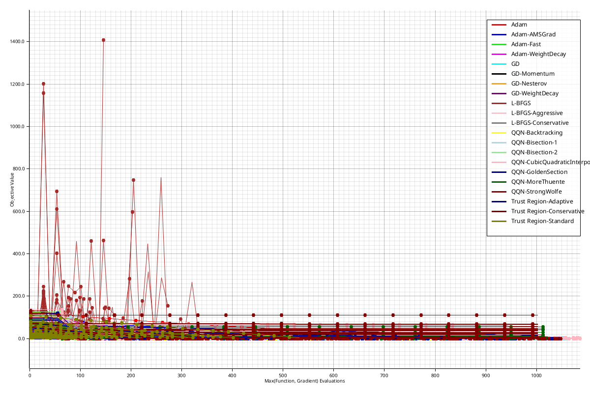
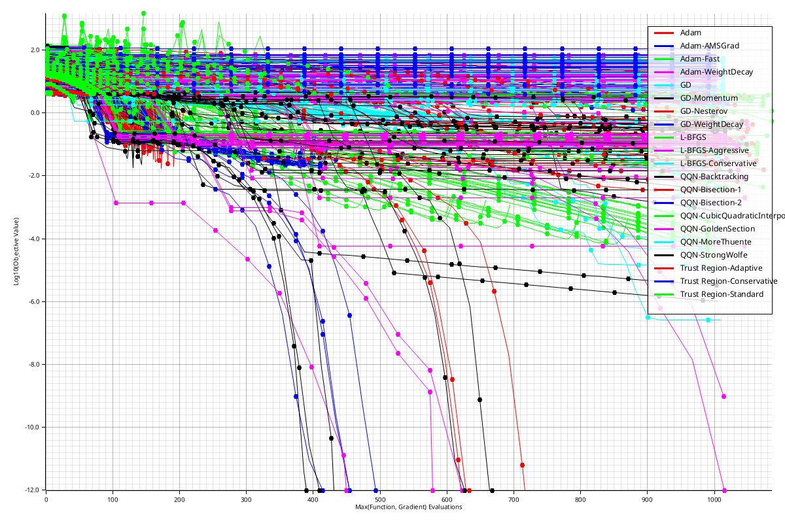

**Figure:** Convergence plots for IllConditionedRosenbrock_2D_alpha100 showing objective value vs iterations.
Left: Linear scale, Right: Log scale for better visualization of convergence behavior.

**Data:** [Linear scale data (CSV)](convergence_IllConditionedRosenbrock_2D_alpha100_data.csv) | [Log scale data (CSV)](convergence_IllConditionedRosenbrock_2D_alpha100_log_data.csv)

## Problem: IllConditionedRosenbrock_5D_alpha100

**Family:** IllConditionedRosenbrock  
**Dimension:** 5  
**Success Threshold:** 1.000e-6  
**Total Runs:** 560

### Performance Summary
<table style="border-collapse: collapse; width: 100%; margin: 20px 0;">
<tr style="background-color: #f2f2f2;">
<th style="border: 1px solid #ddd; padding: 8px; text-align: center;">Rank</th>
<th style="border: 1px solid #ddd; padding: 8px; text-align: center;">Optimizer</th>
<th style="border: 1px solid #ddd; padding: 8px; text-align: center;">Mean Final Value (All/Success/Fail)</th>
<th style="border: 1px solid #ddd; padding: 8px; text-align: center;">Std Dev</th>
<th style="border: 1px solid #ddd; padding: 8px; text-align: center;">Best Value</th>
<th style="border: 1px solid #ddd; padding: 8px; text-align: center;">Worst Value</th>
<th style="border: 1px solid #ddd; padding: 8px; text-align: center;">Mean Function Evals (All/Success/Fail)</th>
<th style="border: 1px solid #ddd; padding: 8px; text-align: center;">Mean Gradient Evals (All/Success/Fail)</th>
<th style="border: 1px solid #ddd; padding: 8px; text-align: center;">Success Rate</th>
<th style="border: 1px solid #ddd; padding: 8px; text-align: center;">Mean Time (s)</th>
</tr>
<tr style="background-color: #d4edda; font-weight: bold;">
<td style="border: 1px solid #ddd; padding: 8px; text-align: center;">1</td>
<td style="border: 1px solid #ddd; padding: 8px; text-align: center;"><a href="detailed_IllConditionedRosenbrock_5D_alpha100_QQN-StrongWolfe.md">QQN-StrongWolfe</a></td>
<td style="border: 1px solid #ddd; padding: 8px; text-align: center;">9.36e-1 / 2.69e-16 / 1.34e0</td>
<td style="border: 1px solid #ddd; padding: 8px; text-align: center;">1.45e0</td>
<td style="border: 1px solid #ddd; padding: 8px; text-align: center;">3.97e-18</td>
<td style="border: 1px solid #ddd; padding: 8px; text-align: center;">4.10e0</td>
<td style="border: 1px solid #ddd; padding: 8px; text-align: center;">518.2 / 397.7 / 569.9</td>
<td style="border: 1px solid #ddd; padding: 8px; text-align: center;">428.2 / 374.3 / 451.4</td>
<td style="border: 1px solid #ddd; padding: 8px; text-align: center;">30.0%</td>
<td style="border: 1px solid #ddd; padding: 8px; text-align: center;">0.014</td>
</tr>
<tr style="background-color: #fff3cd;">
<td style="border: 1px solid #ddd; padding: 8px; text-align: center;">2</td>
<td style="border: 1px solid #ddd; padding: 8px; text-align: center;"><a href="detailed_IllConditionedRosenbrock_5D_alpha100_QQN-Backtracking.md">QQN-Backtracking</a></td>
<td style="border: 1px solid #ddd; padding: 8px; text-align: center;">5.13e-1 / 2.70e-15 / 5.70e-1</td>
<td style="border: 1px solid #ddd; padding: 8px; text-align: center;">7.26e-1</td>
<td style="border: 1px solid #ddd; padding: 8px; text-align: center;">2.56e-17</td>
<td style="border: 1px solid #ddd; padding: 8px; text-align: center;">2.37e0</td>
<td style="border: 1px solid #ddd; padding: 8px; text-align: center;">671.8 / 545.5 / 685.8</td>
<td style="border: 1px solid #ddd; padding: 8px; text-align: center;">321.3 / 285.0 / 325.3</td>
<td style="border: 1px solid #ddd; padding: 8px; text-align: center;">10.0%</td>
<td style="border: 1px solid #ddd; padding: 8px; text-align: center;">0.018</td>
</tr>
<tr style="">
<td style="border: 1px solid #ddd; padding: 8px; text-align: center;">3</td>
<td style="border: 1px solid #ddd; padding: 8px; text-align: center;"><a href="detailed_IllConditionedRosenbrock_5D_alpha100_QQN-GoldenSection.md">QQN-GoldenSection</a></td>
<td style="border: 1px solid #ddd; padding: 8px; text-align: center;">2.80e0 / - / 2.80e0</td>
<td style="border: 1px solid #ddd; padding: 8px; text-align: center;">1.37e0</td>
<td style="border: 1px solid #ddd; padding: 8px; text-align: center;">1.36e-3</td>
<td style="border: 1px solid #ddd; padding: 8px; text-align: center;">4.57e0</td>
<td style="border: 1px solid #ddd; padding: 8px; text-align: center;">911.9 / - / 911.9</td>
<td style="border: 1px solid #ddd; padding: 8px; text-align: center;">118.2 / - / 118.2</td>
<td style="border: 1px solid #ddd; padding: 8px; text-align: center;">0.0%</td>
<td style="border: 1px solid #ddd; padding: 8px; text-align: center;">0.014</td>
</tr>
<tr style="">
<td style="border: 1px solid #ddd; padding: 8px; text-align: center;">4</td>
<td style="border: 1px solid #ddd; padding: 8px; text-align: center;"><a href="detailed_IllConditionedRosenbrock_5D_alpha100_QQN-Bisection-1.md">QQN-Bisection-1</a></td>
<td style="border: 1px solid #ddd; padding: 8px; text-align: center;">2.17e0 / - / 2.17e0</td>
<td style="border: 1px solid #ddd; padding: 8px; text-align: center;">1.36e0</td>
<td style="border: 1px solid #ddd; padding: 8px; text-align: center;">4.92e-2</td>
<td style="border: 1px solid #ddd; padding: 8px; text-align: center;">4.51e0</td>
<td style="border: 1px solid #ddd; padding: 8px; text-align: center;">467.2 / - / 467.2</td>
<td style="border: 1px solid #ddd; padding: 8px; text-align: center;">570.6 / - / 570.6</td>
<td style="border: 1px solid #ddd; padding: 8px; text-align: center;">0.0%</td>
<td style="border: 1px solid #ddd; padding: 8px; text-align: center;">0.011</td>
</tr>
<tr style="">
<td style="border: 1px solid #ddd; padding: 8px; text-align: center;">5</td>
<td style="border: 1px solid #ddd; padding: 8px; text-align: center;"><a href="detailed_IllConditionedRosenbrock_5D_alpha100_QQN-Bisection-2.md">QQN-Bisection-2</a></td>
<td style="border: 1px solid #ddd; padding: 8px; text-align: center;">2.19e0 / - / 2.19e0</td>
<td style="border: 1px solid #ddd; padding: 8px; text-align: center;">9.27e-1</td>
<td style="border: 1px solid #ddd; padding: 8px; text-align: center;">1.02e-1</td>
<td style="border: 1px solid #ddd; padding: 8px; text-align: center;">3.97e0</td>
<td style="border: 1px solid #ddd; padding: 8px; text-align: center;">581.0 / - / 581.0</td>
<td style="border: 1px solid #ddd; padding: 8px; text-align: center;">366.1 / - / 366.1</td>
<td style="border: 1px solid #ddd; padding: 8px; text-align: center;">0.0%</td>
<td style="border: 1px solid #ddd; padding: 8px; text-align: center;">0.012</td>
</tr>
<tr style="">
<td style="border: 1px solid #ddd; padding: 8px; text-align: center;">6</td>
<td style="border: 1px solid #ddd; padding: 8px; text-align: center;"><a href="detailed_IllConditionedRosenbrock_5D_alpha100_GD-WeightDecay.md">GD-WeightDecay</a></td>
<td style="border: 1px solid #ddd; padding: 8px; text-align: center;">9.63e-1 / - / 1.20e0</td>
<td style="border: 1px solid #ddd; padding: 8px; text-align: center;">1.52e0</td>
<td style="border: 1px solid #ddd; padding: 8px; text-align: center;">1.50e-1</td>
<td style="border: 1px solid #ddd; padding: 8px; text-align: center;">5.56e0</td>
<td style="border: 1px solid #ddd; padding: 8px; text-align: center;">96.2 / - / 96.2</td>
<td style="border: 1px solid #ddd; padding: 8px; text-align: center;">188.5 / - / 188.5</td>
<td style="border: 1px solid #ddd; padding: 8px; text-align: center;">0.0%</td>
<td style="border: 1px solid #ddd; padding: 8px; text-align: center;">0.003</td>
</tr>
<tr style="">
<td style="border: 1px solid #ddd; padding: 8px; text-align: center;">7</td>
<td style="border: 1px solid #ddd; padding: 8px; text-align: center;"><a href="detailed_IllConditionedRosenbrock_5D_alpha100_GD-Nesterov.md">GD-Nesterov</a></td>
<td style="border: 1px solid #ddd; padding: 8px; text-align: center;">3.17e0 / - / 3.97e0</td>
<td style="border: 1px solid #ddd; padding: 8px; text-align: center;">3.54e0</td>
<td style="border: 1px solid #ddd; padding: 8px; text-align: center;">3.68e-1</td>
<td style="border: 1px solid #ddd; padding: 8px; text-align: center;">9.05e0</td>
<td style="border: 1px solid #ddd; padding: 8px; text-align: center;">184.1 / - / 184.1</td>
<td style="border: 1px solid #ddd; padding: 8px; text-align: center;">365.2 / - / 365.2</td>
<td style="border: 1px solid #ddd; padding: 8px; text-align: center;">0.0%</td>
<td style="border: 1px solid #ddd; padding: 8px; text-align: center;">0.006</td>
</tr>
<tr style="">
<td style="border: 1px solid #ddd; padding: 8px; text-align: center;">8</td>
<td style="border: 1px solid #ddd; padding: 8px; text-align: center;"><a href="detailed_IllConditionedRosenbrock_5D_alpha100_L-BFGS-Conservative.md">L-BFGS-Conservative</a></td>
<td style="border: 1px solid #ddd; padding: 8px; text-align: center;">3.93e0 / - / 3.94e0</td>
<td style="border: 1px solid #ddd; padding: 8px; text-align: center;">8.66e-1</td>
<td style="border: 1px solid #ddd; padding: 8px; text-align: center;">1.13e0</td>
<td style="border: 1px solid #ddd; padding: 8px; text-align: center;">4.67e0</td>
<td style="border: 1px solid #ddd; padding: 8px; text-align: center;">718.2 / - / 718.2</td>
<td style="border: 1px solid #ddd; padding: 8px; text-align: center;">284.6 / - / 284.6</td>
<td style="border: 1px solid #ddd; padding: 8px; text-align: center;">0.0%</td>
<td style="border: 1px solid #ddd; padding: 8px; text-align: center;">0.009</td>
</tr>
<tr style="">
<td style="border: 1px solid #ddd; padding: 8px; text-align: center;">9</td>
<td style="border: 1px solid #ddd; padding: 8px; text-align: center;"><a href="detailed_IllConditionedRosenbrock_5D_alpha100_QQN-CubicQuadraticInterpolation.md">QQN-CubicQuadraticInterpolation</a></td>
<td style="border: 1px solid #ddd; padding: 8px; text-align: center;">3.59e0 / - / 3.59e0</td>
<td style="border: 1px solid #ddd; padding: 8px; text-align: center;">4.77e-1</td>
<td style="border: 1px solid #ddd; padding: 8px; text-align: center;">2.63e0</td>
<td style="border: 1px solid #ddd; padding: 8px; text-align: center;">4.58e0</td>
<td style="border: 1px solid #ddd; padding: 8px; text-align: center;">387.5 / - / 387.5</td>
<td style="border: 1px solid #ddd; padding: 8px; text-align: center;">634.2 / - / 634.2</td>
<td style="border: 1px solid #ddd; padding: 8px; text-align: center;">0.0%</td>
<td style="border: 1px solid #ddd; padding: 8px; text-align: center;">0.013</td>
</tr>
<tr style="">
<td style="border: 1px solid #ddd; padding: 8px; text-align: center;">10</td>
<td style="border: 1px solid #ddd; padding: 8px; text-align: center;"><a href="detailed_IllConditionedRosenbrock_5D_alpha100_L-BFGS.md">L-BFGS</a></td>
<td style="border: 1px solid #ddd; padding: 8px; text-align: center;">1.70e1 / - / 1.77e2</td>
<td style="border: 1px solid #ddd; padding: 8px; text-align: center;">1.05e1</td>
<td style="border: 1px solid #ddd; padding: 8px; text-align: center;">4.58e0</td>
<td style="border: 1px solid #ddd; padding: 8px; text-align: center;">3.57e1</td>
<td style="border: 1px solid #ddd; padding: 8px; text-align: center;">126.3 / - / 126.3</td>
<td style="border: 1px solid #ddd; padding: 8px; text-align: center;">42.6 / - / 42.6</td>
<td style="border: 1px solid #ddd; padding: 8px; text-align: center;">0.0%</td>
<td style="border: 1px solid #ddd; padding: 8px; text-align: center;">0.002</td>
</tr>
<tr style="">
<td style="border: 1px solid #ddd; padding: 8px; text-align: center;">11</td>
<td style="border: 1px solid #ddd; padding: 8px; text-align: center;"><a href="detailed_IllConditionedRosenbrock_5D_alpha100_Adam-Fast.md">Adam-Fast</a></td>
<td style="border: 1px solid #ddd; padding: 8px; text-align: center;">6.73e0 / - / 1.45e1</td>
<td style="border: 1px solid #ddd; padding: 8px; text-align: center;">1.08e0</td>
<td style="border: 1px solid #ddd; padding: 8px; text-align: center;">4.58e0</td>
<td style="border: 1px solid #ddd; padding: 8px; text-align: center;">9.56e0</td>
<td style="border: 1px solid #ddd; padding: 8px; text-align: center;">39.2 / - / 39.2</td>
<td style="border: 1px solid #ddd; padding: 8px; text-align: center;">38.2 / - / 38.2</td>
<td style="border: 1px solid #ddd; padding: 8px; text-align: center;">0.0%</td>
<td style="border: 1px solid #ddd; padding: 8px; text-align: center;">0.001</td>
</tr>
<tr style="">
<td style="border: 1px solid #ddd; padding: 8px; text-align: center;">12</td>
<td style="border: 1px solid #ddd; padding: 8px; text-align: center;"><a href="detailed_IllConditionedRosenbrock_5D_alpha100_GD.md">GD</a></td>
<td style="border: 1px solid #ddd; padding: 8px; text-align: center;">4.73e0 / - / 5.07e0</td>
<td style="border: 1px solid #ddd; padding: 8px; text-align: center;">6.48e-2</td>
<td style="border: 1px solid #ddd; padding: 8px; text-align: center;">4.64e0</td>
<td style="border: 1px solid #ddd; padding: 8px; text-align: center;">4.88e0</td>
<td style="border: 1px solid #ddd; padding: 8px; text-align: center;">32.5 / - / 32.5</td>
<td style="border: 1px solid #ddd; padding: 8px; text-align: center;">61.0 / - / 61.0</td>
<td style="border: 1px solid #ddd; padding: 8px; text-align: center;">0.0%</td>
<td style="border: 1px solid #ddd; padding: 8px; text-align: center;">0.001</td>
</tr>
<tr style="">
<td style="border: 1px solid #ddd; padding: 8px; text-align: center;">13</td>
<td style="border: 1px solid #ddd; padding: 8px; text-align: center;"><a href="detailed_IllConditionedRosenbrock_5D_alpha100_GD-Momentum.md">GD-Momentum</a></td>
<td style="border: 1px solid #ddd; padding: 8px; text-align: center;">1.45e1 / - / 3.23e1</td>
<td style="border: 1px solid #ddd; padding: 8px; text-align: center;">2.24e0</td>
<td style="border: 1px solid #ddd; padding: 8px; text-align: center;">8.96e0</td>
<td style="border: 1px solid #ddd; padding: 8px; text-align: center;">1.91e1</td>
<td style="border: 1px solid #ddd; padding: 8px; text-align: center;">21.1 / - / 21.1</td>
<td style="border: 1px solid #ddd; padding: 8px; text-align: center;">38.3 / - / 38.3</td>
<td style="border: 1px solid #ddd; padding: 8px; text-align: center;">0.0%</td>
<td style="border: 1px solid #ddd; padding: 8px; text-align: center;">0.001</td>
</tr>
<tr style="">
<td style="border: 1px solid #ddd; padding: 8px; text-align: center;">14</td>
<td style="border: 1px solid #ddd; padding: 8px; text-align: center;"><a href="detailed_IllConditionedRosenbrock_5D_alpha100_L-BFGS-Aggressive.md">L-BFGS-Aggressive</a></td>
<td style="border: 1px solid #ddd; padding: 8px; text-align: center;">8.27e2 / - / 8.27e2</td>
<td style="border: 1px solid #ddd; padding: 8px; text-align: center;">3.96e2</td>
<td style="border: 1px solid #ddd; padding: 8px; text-align: center;">1.46e1</td>
<td style="border: 1px solid #ddd; padding: 8px; text-align: center;">1.30e3</td>
<td style="border: 1px solid #ddd; padding: 8px; text-align: center;">772.1 / - / 772.1</td>
<td style="border: 1px solid #ddd; padding: 8px; text-align: center;">233.5 / - / 233.5</td>
<td style="border: 1px solid #ddd; padding: 8px; text-align: center;">0.0%</td>
<td style="border: 1px solid #ddd; padding: 8px; text-align: center;">0.006</td>
</tr>
<tr style="">
<td style="border: 1px solid #ddd; padding: 8px; text-align: center;">15</td>
<td style="border: 1px solid #ddd; padding: 8px; text-align: center;"><a href="detailed_IllConditionedRosenbrock_5D_alpha100_Adam-WeightDecay.md">Adam-WeightDecay</a></td>
<td style="border: 1px solid #ddd; padding: 8px; text-align: center;">6.20e1 / - / 6.20e1</td>
<td style="border: 1px solid #ddd; padding: 8px; text-align: center;">2.38e1</td>
<td style="border: 1px solid #ddd; padding: 8px; text-align: center;">2.88e1</td>
<td style="border: 1px solid #ddd; padding: 8px; text-align: center;">1.16e2</td>
<td style="border: 1px solid #ddd; padding: 8px; text-align: center;">502.0 / - / 502.0</td>
<td style="border: 1px solid #ddd; padding: 8px; text-align: center;">502.0 / - / 502.0</td>
<td style="border: 1px solid #ddd; padding: 8px; text-align: center;">0.0%</td>
<td style="border: 1px solid #ddd; padding: 8px; text-align: center;">0.011</td>
</tr>
<tr style="">
<td style="border: 1px solid #ddd; padding: 8px; text-align: center;">16</td>
<td style="border: 1px solid #ddd; padding: 8px; text-align: center;"><a href="detailed_IllConditionedRosenbrock_5D_alpha100_QQN-MoreThuente.md">QQN-MoreThuente</a></td>
<td style="border: 1px solid #ddd; padding: 8px; text-align: center;">1.72e2 / - / 1.72e2</td>
<td style="border: 1px solid #ddd; padding: 8px; text-align: center;">6.98e1</td>
<td style="border: 1px solid #ddd; padding: 8px; text-align: center;">7.43e1</td>
<td style="border: 1px solid #ddd; padding: 8px; text-align: center;">3.24e2</td>
<td style="border: 1px solid #ddd; padding: 8px; text-align: center;">484.4 / - / 484.4</td>
<td style="border: 1px solid #ddd; padding: 8px; text-align: center;">529.4 / - / 529.4</td>
<td style="border: 1px solid #ddd; padding: 8px; text-align: center;">0.0%</td>
<td style="border: 1px solid #ddd; padding: 8px; text-align: center;">0.008</td>
</tr>
<tr style="">
<td style="border: 1px solid #ddd; padding: 8px; text-align: center;">17</td>
<td style="border: 1px solid #ddd; padding: 8px; text-align: center;"><a href="detailed_IllConditionedRosenbrock_5D_alpha100_Adam.md">Adam</a></td>
<td style="border: 1px solid #ddd; padding: 8px; text-align: center;">4.99e2 / - / 4.99e2</td>
<td style="border: 1px solid #ddd; padding: 8px; text-align: center;">1.08e2</td>
<td style="border: 1px solid #ddd; padding: 8px; text-align: center;">3.25e2</td>
<td style="border: 1px solid #ddd; padding: 8px; text-align: center;">7.38e2</td>
<td style="border: 1px solid #ddd; padding: 8px; text-align: center;">502.0 / - / 502.0</td>
<td style="border: 1px solid #ddd; padding: 8px; text-align: center;">502.0 / - / 502.0</td>
<td style="border: 1px solid #ddd; padding: 8px; text-align: center;">0.0%</td>
<td style="border: 1px solid #ddd; padding: 8px; text-align: center;">0.010</td>
</tr>
<tr style="">
<td style="border: 1px solid #ddd; padding: 8px; text-align: center;">18</td>
<td style="border: 1px solid #ddd; padding: 8px; text-align: center;"><a href="detailed_IllConditionedRosenbrock_5D_alpha100_Adam-AMSGrad.md">Adam-AMSGrad</a></td>
<td style="border: 1px solid #ddd; padding: 8px; text-align: center;">4.71e2 / - / 4.71e2</td>
<td style="border: 1px solid #ddd; padding: 8px; text-align: center;">7.69e1</td>
<td style="border: 1px solid #ddd; padding: 8px; text-align: center;">3.27e2</td>
<td style="border: 1px solid #ddd; padding: 8px; text-align: center;">5.89e2</td>
<td style="border: 1px solid #ddd; padding: 8px; text-align: center;">502.0 / - / 502.0</td>
<td style="border: 1px solid #ddd; padding: 8px; text-align: center;">502.0 / - / 502.0</td>
<td style="border: 1px solid #ddd; padding: 8px; text-align: center;">0.0%</td>
<td style="border: 1px solid #ddd; padding: 8px; text-align: center;">0.011</td>
</tr>
<tr style="">
<td style="border: 1px solid #ddd; padding: 8px; text-align: center;">19</td>
<td style="border: 1px solid #ddd; padding: 8px; text-align: center;"><a href="detailed_IllConditionedRosenbrock_5D_alpha100_Trust_Region-Standard.md">Trust Region-Standard</a></td>
<td style="border: 1px solid #ddd; padding: 8px; text-align: center;">8.51e2 / - / 8.51e2</td>
<td style="border: 1px solid #ddd; padding: 8px; text-align: center;">1.33e2</td>
<td style="border: 1px solid #ddd; padding: 8px; text-align: center;">6.38e2</td>
<td style="border: 1px solid #ddd; padding: 8px; text-align: center;">1.13e3</td>
<td style="border: 1px solid #ddd; padding: 8px; text-align: center;">602.0 / - / 602.0</td>
<td style="border: 1px solid #ddd; padding: 8px; text-align: center;">402.0 / - / 402.0</td>
<td style="border: 1px solid #ddd; padding: 8px; text-align: center;">0.0%</td>
<td style="border: 1px solid #ddd; padding: 8px; text-align: center;">0.004</td>
</tr>
<tr style="">
<td style="border: 1px solid #ddd; padding: 8px; text-align: center;">20</td>
<td style="border: 1px solid #ddd; padding: 8px; text-align: center;"><a href="detailed_IllConditionedRosenbrock_5D_alpha100_Trust_Region-Adaptive.md">Trust Region-Adaptive</a></td>
<td style="border: 1px solid #ddd; padding: 8px; text-align: center;">1.02e3 / - / 1.02e3</td>
<td style="border: 1px solid #ddd; padding: 8px; text-align: center;">1.56e2</td>
<td style="border: 1px solid #ddd; padding: 8px; text-align: center;">6.91e2</td>
<td style="border: 1px solid #ddd; padding: 8px; text-align: center;">1.37e3</td>
<td style="border: 1px solid #ddd; padding: 8px; text-align: center;">602.0 / - / 602.0</td>
<td style="border: 1px solid #ddd; padding: 8px; text-align: center;">402.0 / - / 402.0</td>
<td style="border: 1px solid #ddd; padding: 8px; text-align: center;">0.0%</td>
<td style="border: 1px solid #ddd; padding: 8px; text-align: center;">0.004</td>
</tr>
<tr style="">
<td style="border: 1px solid #ddd; padding: 8px; text-align: center;">21</td>
<td style="border: 1px solid #ddd; padding: 8px; text-align: center;"><a href="detailed_IllConditionedRosenbrock_5D_alpha100_Trust_Region-Conservative.md">Trust Region-Conservative</a></td>
<td style="border: 1px solid #ddd; padding: 8px; text-align: center;">1.05e3 / - / 1.05e3</td>
<td style="border: 1px solid #ddd; padding: 8px; text-align: center;">1.73e2</td>
<td style="border: 1px solid #ddd; padding: 8px; text-align: center;">7.93e2</td>
<td style="border: 1px solid #ddd; padding: 8px; text-align: center;">1.43e3</td>
<td style="border: 1px solid #ddd; padding: 8px; text-align: center;">602.0 / - / 602.0</td>
<td style="border: 1px solid #ddd; padding: 8px; text-align: center;">402.0 / - / 402.0</td>
<td style="border: 1px solid #ddd; padding: 8px; text-align: center;">0.0%</td>
<td style="border: 1px solid #ddd; padding: 8px; text-align: center;">0.004</td>
</tr>
</table>

### Convergence Plots

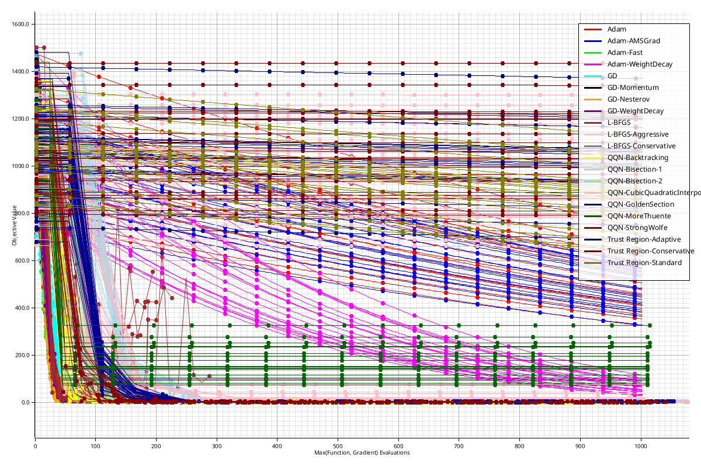
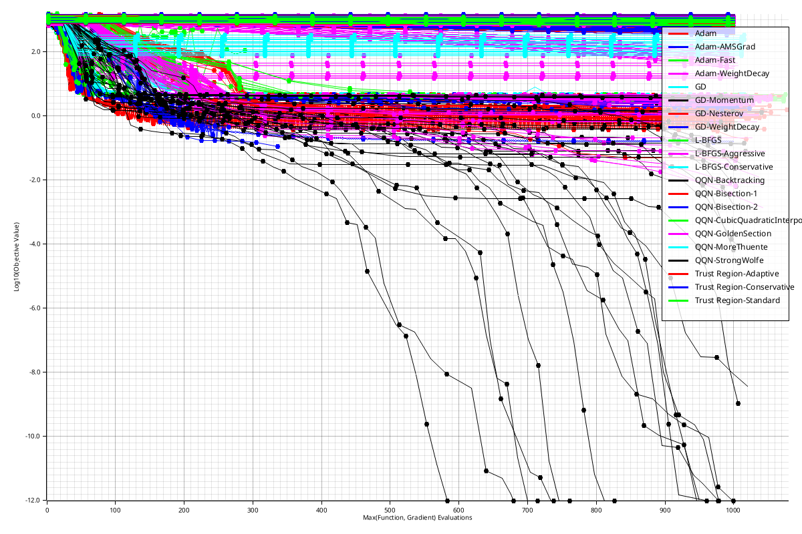

**Figure:** Convergence plots for IllConditionedRosenbrock_5D_alpha100 showing objective value vs iterations.
Left: Linear scale, Right: Log scale for better visualization of convergence behavior.

**Data:** [Linear scale data (CSV)](convergence_IllConditionedRosenbrock_5D_alpha100_data.csv) | [Log scale data (CSV)](convergence_IllConditionedRosenbrock_5D_alpha100_log_data.csv)

## Problem: IllConditionedRosenbrock_10D_alpha100

**Family:** IllConditionedRosenbrock  
**Dimension:** 10  
**Success Threshold:** 1.000e-6  
**Total Runs:** 560

### Performance Summary
<table style="border-collapse: collapse; width: 100%; margin: 20px 0;">
<tr style="background-color: #f2f2f2;">
<th style="border: 1px solid #ddd; padding: 8px; text-align: center;">Rank</th>
<th style="border: 1px solid #ddd; padding: 8px; text-align: center;">Optimizer</th>
<th style="border: 1px solid #ddd; padding: 8px; text-align: center;">Mean Final Value (All/Success/Fail)</th>
<th style="border: 1px solid #ddd; padding: 8px; text-align: center;">Std Dev</th>
<th style="border: 1px solid #ddd; padding: 8px; text-align: center;">Best Value</th>
<th style="border: 1px solid #ddd; padding: 8px; text-align: center;">Worst Value</th>
<th style="border: 1px solid #ddd; padding: 8px; text-align: center;">Mean Function Evals (All/Success/Fail)</th>
<th style="border: 1px solid #ddd; padding: 8px; text-align: center;">Mean Gradient Evals (All/Success/Fail)</th>
<th style="border: 1px solid #ddd; padding: 8px; text-align: center;">Success Rate</th>
<th style="border: 1px solid #ddd; padding: 8px; text-align: center;">Mean Time (s)</th>
</tr>
<tr style="background-color: #d4edda; font-weight: bold;">
<td style="border: 1px solid #ddd; padding: 8px; text-align: center;">1</td>
<td style="border: 1px solid #ddd; padding: 8px; text-align: center;"><a href="detailed_IllConditionedRosenbrock_10D_alpha100_QQN-Backtracking.md">QQN-Backtracking</a></td>
<td style="border: 1px solid #ddd; padding: 8px; text-align: center;">4.76e0 / - / 4.76e0</td>
<td style="border: 1px solid #ddd; padding: 8px; text-align: center;">2.20e0</td>
<td style="border: 1px solid #ddd; padding: 8px; text-align: center;">2.29e-2</td>
<td style="border: 1px solid #ddd; padding: 8px; text-align: center;">7.94e0</td>
<td style="border: 1px solid #ddd; padding: 8px; text-align: center;">691.9 / - / 691.9</td>
<td style="border: 1px solid #ddd; padding: 8px; text-align: center;">321.7 / - / 321.7</td>
<td style="border: 1px solid #ddd; padding: 8px; text-align: center;">0.0%</td>
<td style="border: 1px solid #ddd; padding: 8px; text-align: center;">0.019</td>
</tr>
<tr style="background-color: #fff3cd;">
<td style="border: 1px solid #ddd; padding: 8px; text-align: center;">2</td>
<td style="border: 1px solid #ddd; padding: 8px; text-align: center;"><a href="detailed_IllConditionedRosenbrock_10D_alpha100_Adam-Fast.md">Adam-Fast</a></td>
<td style="border: 1px solid #ddd; padding: 8px; text-align: center;">7.83e0 / - / 1.21e1</td>
<td style="border: 1px solid #ddd; padding: 8px; text-align: center;">1.02e1</td>
<td style="border: 1px solid #ddd; padding: 8px; text-align: center;">9.81e-2</td>
<td style="border: 1px solid #ddd; padding: 8px; text-align: center;">2.95e1</td>
<td style="border: 1px solid #ddd; padding: 8px; text-align: center;">217.8 / - / 217.8</td>
<td style="border: 1px solid #ddd; padding: 8px; text-align: center;">216.9 / - / 216.9</td>
<td style="border: 1px solid #ddd; padding: 8px; text-align: center;">0.0%</td>
<td style="border: 1px solid #ddd; padding: 8px; text-align: center;">0.005</td>
</tr>
<tr style="">
<td style="border: 1px solid #ddd; padding: 8px; text-align: center;">3</td>
<td style="border: 1px solid #ddd; padding: 8px; text-align: center;"><a href="detailed_IllConditionedRosenbrock_10D_alpha100_GD-WeightDecay.md">GD-WeightDecay</a></td>
<td style="border: 1px solid #ddd; padding: 8px; text-align: center;">1.24e0 / - / 1.35e0</td>
<td style="border: 1px solid #ddd; padding: 8px; text-align: center;">1.54e0</td>
<td style="border: 1px solid #ddd; padding: 8px; text-align: center;">1.84e-1</td>
<td style="border: 1px solid #ddd; padding: 8px; text-align: center;">4.89e0</td>
<td style="border: 1px solid #ddd; padding: 8px; text-align: center;">268.9 / - / 268.9</td>
<td style="border: 1px solid #ddd; padding: 8px; text-align: center;">535.2 / - / 535.2</td>
<td style="border: 1px solid #ddd; padding: 8px; text-align: center;">0.0%</td>
<td style="border: 1px solid #ddd; padding: 8px; text-align: center;">0.009</td>
</tr>
<tr style="">
<td style="border: 1px solid #ddd; padding: 8px; text-align: center;">4</td>
<td style="border: 1px solid #ddd; padding: 8px; text-align: center;"><a href="detailed_IllConditionedRosenbrock_10D_alpha100_GD-Momentum.md">GD-Momentum</a></td>
<td style="border: 1px solid #ddd; padding: 8px; text-align: center;">1.04e1 / - / 1.08e1</td>
<td style="border: 1px solid #ddd; padding: 8px; text-align: center;">2.32e1</td>
<td style="border: 1px solid #ddd; padding: 8px; text-align: center;">5.07e-1</td>
<td style="border: 1px solid #ddd; padding: 8px; text-align: center;">7.44e1</td>
<td style="border: 1px solid #ddd; padding: 8px; text-align: center;">235.3 / - / 235.3</td>
<td style="border: 1px solid #ddd; padding: 8px; text-align: center;">467.8 / - / 467.8</td>
<td style="border: 1px solid #ddd; padding: 8px; text-align: center;">0.0%</td>
<td style="border: 1px solid #ddd; padding: 8px; text-align: center;">0.007</td>
</tr>
<tr style="">
<td style="border: 1px solid #ddd; padding: 8px; text-align: center;">5</td>
<td style="border: 1px solid #ddd; padding: 8px; text-align: center;"><a href="detailed_IllConditionedRosenbrock_10D_alpha100_QQN-StrongWolfe.md">QQN-StrongWolfe</a></td>
<td style="border: 1px solid #ddd; padding: 8px; text-align: center;">4.71e0 / - / 4.71e0</td>
<td style="border: 1px solid #ddd; padding: 8px; text-align: center;">2.60e0</td>
<td style="border: 1px solid #ddd; padding: 8px; text-align: center;">8.59e-1</td>
<td style="border: 1px solid #ddd; padding: 8px; text-align: center;">9.52e0</td>
<td style="border: 1px solid #ddd; padding: 8px; text-align: center;">568.1 / - / 568.1</td>
<td style="border: 1px solid #ddd; padding: 8px; text-align: center;">454.1 / - / 454.1</td>
<td style="border: 1px solid #ddd; padding: 8px; text-align: center;">0.0%</td>
<td style="border: 1px solid #ddd; padding: 8px; text-align: center;">0.016</td>
</tr>
<tr style="">
<td style="border: 1px solid #ddd; padding: 8px; text-align: center;">6</td>
<td style="border: 1px solid #ddd; padding: 8px; text-align: center;"><a href="detailed_IllConditionedRosenbrock_10D_alpha100_QQN-Bisection-1.md">QQN-Bisection-1</a></td>
<td style="border: 1px solid #ddd; padding: 8px; text-align: center;">5.28e0 / - / 5.28e0</td>
<td style="border: 1px solid #ddd; padding: 8px; text-align: center;">2.45e0</td>
<td style="border: 1px solid #ddd; padding: 8px; text-align: center;">1.07e0</td>
<td style="border: 1px solid #ddd; padding: 8px; text-align: center;">9.59e0</td>
<td style="border: 1px solid #ddd; padding: 8px; text-align: center;">475.3 / - / 475.3</td>
<td style="border: 1px solid #ddd; padding: 8px; text-align: center;">565.5 / - / 565.5</td>
<td style="border: 1px solid #ddd; padding: 8px; text-align: center;">0.0%</td>
<td style="border: 1px solid #ddd; padding: 8px; text-align: center;">0.012</td>
</tr>
<tr style="">
<td style="border: 1px solid #ddd; padding: 8px; text-align: center;">7</td>
<td style="border: 1px solid #ddd; padding: 8px; text-align: center;"><a href="detailed_IllConditionedRosenbrock_10D_alpha100_GD-Nesterov.md">GD-Nesterov</a></td>
<td style="border: 1px solid #ddd; padding: 8px; text-align: center;">1.19e0 / - / 1.21e0</td>
<td style="border: 1px solid #ddd; padding: 8px; text-align: center;">1.69e-2</td>
<td style="border: 1px solid #ddd; padding: 8px; text-align: center;">1.16e0</td>
<td style="border: 1px solid #ddd; padding: 8px; text-align: center;">1.21e0</td>
<td style="border: 1px solid #ddd; padding: 8px; text-align: center;">335.0 / - / 335.0</td>
<td style="border: 1px solid #ddd; padding: 8px; text-align: center;">668.0 / - / 668.0</td>
<td style="border: 1px solid #ddd; padding: 8px; text-align: center;">0.0%</td>
<td style="border: 1px solid #ddd; padding: 8px; text-align: center;">0.011</td>
</tr>
<tr style="">
<td style="border: 1px solid #ddd; padding: 8px; text-align: center;">8</td>
<td style="border: 1px solid #ddd; padding: 8px; text-align: center;"><a href="detailed_IllConditionedRosenbrock_10D_alpha100_QQN-Bisection-2.md">QQN-Bisection-2</a></td>
<td style="border: 1px solid #ddd; padding: 8px; text-align: center;">7.27e0 / - / 7.27e0</td>
<td style="border: 1px solid #ddd; padding: 8px; text-align: center;">1.35e0</td>
<td style="border: 1px solid #ddd; padding: 8px; text-align: center;">2.20e0</td>
<td style="border: 1px solid #ddd; padding: 8px; text-align: center;">8.77e0</td>
<td style="border: 1px solid #ddd; padding: 8px; text-align: center;">611.2 / - / 611.2</td>
<td style="border: 1px solid #ddd; padding: 8px; text-align: center;">384.1 / - / 384.1</td>
<td style="border: 1px solid #ddd; padding: 8px; text-align: center;">0.0%</td>
<td style="border: 1px solid #ddd; padding: 8px; text-align: center;">0.013</td>
</tr>
<tr style="">
<td style="border: 1px solid #ddd; padding: 8px; text-align: center;">9</td>
<td style="border: 1px solid #ddd; padding: 8px; text-align: center;"><a href="detailed_IllConditionedRosenbrock_10D_alpha100_QQN-GoldenSection.md">QQN-GoldenSection</a></td>
<td style="border: 1px solid #ddd; padding: 8px; text-align: center;">8.17e0 / - / 8.17e0</td>
<td style="border: 1px solid #ddd; padding: 8px; text-align: center;">9.27e-1</td>
<td style="border: 1px solid #ddd; padding: 8px; text-align: center;">3.54e0</td>
<td style="border: 1px solid #ddd; padding: 8px; text-align: center;">9.55e0</td>
<td style="border: 1px solid #ddd; padding: 8px; text-align: center;">910.4 / - / 910.4</td>
<td style="border: 1px solid #ddd; padding: 8px; text-align: center;">118.4 / - / 118.4</td>
<td style="border: 1px solid #ddd; padding: 8px; text-align: center;">0.0%</td>
<td style="border: 1px solid #ddd; padding: 8px; text-align: center;">0.015</td>
</tr>
<tr style="">
<td style="border: 1px solid #ddd; padding: 8px; text-align: center;">10</td>
<td style="border: 1px solid #ddd; padding: 8px; text-align: center;"><a href="detailed_IllConditionedRosenbrock_10D_alpha100_QQN-CubicQuadraticInterpolation.md">QQN-CubicQuadraticInterpolation</a></td>
<td style="border: 1px solid #ddd; padding: 8px; text-align: center;">8.49e0 / - / 8.49e0</td>
<td style="border: 1px solid #ddd; padding: 8px; text-align: center;">6.44e-1</td>
<td style="border: 1px solid #ddd; padding: 8px; text-align: center;">6.72e0</td>
<td style="border: 1px solid #ddd; padding: 8px; text-align: center;">9.74e0</td>
<td style="border: 1px solid #ddd; padding: 8px; text-align: center;">396.0 / - / 396.0</td>
<td style="border: 1px solid #ddd; padding: 8px; text-align: center;">655.5 / - / 655.5</td>
<td style="border: 1px solid #ddd; padding: 8px; text-align: center;">0.0%</td>
<td style="border: 1px solid #ddd; padding: 8px; text-align: center;">0.014</td>
</tr>
<tr style="">
<td style="border: 1px solid #ddd; padding: 8px; text-align: center;">11</td>
<td style="border: 1px solid #ddd; padding: 8px; text-align: center;"><a href="detailed_IllConditionedRosenbrock_10D_alpha100_L-BFGS-Conservative.md">L-BFGS-Conservative</a></td>
<td style="border: 1px solid #ddd; padding: 8px; text-align: center;">8.83e0 / - / 8.83e0</td>
<td style="border: 1px solid #ddd; padding: 8px; text-align: center;">8.60e-1</td>
<td style="border: 1px solid #ddd; padding: 8px; text-align: center;">7.14e0</td>
<td style="border: 1px solid #ddd; padding: 8px; text-align: center;">1.03e1</td>
<td style="border: 1px solid #ddd; padding: 8px; text-align: center;">702.1 / - / 702.1</td>
<td style="border: 1px solid #ddd; padding: 8px; text-align: center;">310.2 / - / 310.2</td>
<td style="border: 1px solid #ddd; padding: 8px; text-align: center;">0.0%</td>
<td style="border: 1px solid #ddd; padding: 8px; text-align: center;">0.011</td>
</tr>
<tr style="">
<td style="border: 1px solid #ddd; padding: 8px; text-align: center;">12</td>
<td style="border: 1px solid #ddd; padding: 8px; text-align: center;"><a href="detailed_IllConditionedRosenbrock_10D_alpha100_GD.md">GD</a></td>
<td style="border: 1px solid #ddd; padding: 8px; text-align: center;">9.68e0 / - / 1.01e1</td>
<td style="border: 1px solid #ddd; padding: 8px; text-align: center;">7.38e-2</td>
<td style="border: 1px solid #ddd; padding: 8px; text-align: center;">9.58e0</td>
<td style="border: 1px solid #ddd; padding: 8px; text-align: center;">9.82e0</td>
<td style="border: 1px solid #ddd; padding: 8px; text-align: center;">46.8 / - / 46.8</td>
<td style="border: 1px solid #ddd; padding: 8px; text-align: center;">89.5 / - / 89.5</td>
<td style="border: 1px solid #ddd; padding: 8px; text-align: center;">0.0%</td>
<td style="border: 1px solid #ddd; padding: 8px; text-align: center;">0.001</td>
</tr>
<tr style="">
<td style="border: 1px solid #ddd; padding: 8px; text-align: center;">13</td>
<td style="border: 1px solid #ddd; padding: 8px; text-align: center;"><a href="detailed_IllConditionedRosenbrock_10D_alpha100_L-BFGS.md">L-BFGS</a></td>
<td style="border: 1px solid #ddd; padding: 8px; text-align: center;">3.19e1 / - / 1.00e2</td>
<td style="border: 1px solid #ddd; padding: 8px; text-align: center;">2.19e1</td>
<td style="border: 1px solid #ddd; padding: 8px; text-align: center;">1.23e1</td>
<td style="border: 1px solid #ddd; padding: 8px; text-align: center;">1.05e2</td>
<td style="border: 1px solid #ddd; padding: 8px; text-align: center;">150.1 / - / 150.1</td>
<td style="border: 1px solid #ddd; padding: 8px; text-align: center;">47.4 / - / 47.4</td>
<td style="border: 1px solid #ddd; padding: 8px; text-align: center;">0.0%</td>
<td style="border: 1px solid #ddd; padding: 8px; text-align: center;">0.002</td>
</tr>
<tr style="">
<td style="border: 1px solid #ddd; padding: 8px; text-align: center;">14</td>
<td style="border: 1px solid #ddd; padding: 8px; text-align: center;"><a href="detailed_IllConditionedRosenbrock_10D_alpha100_L-BFGS-Aggressive.md">L-BFGS-Aggressive</a></td>
<td style="border: 1px solid #ddd; padding: 8px; text-align: center;">1.14e3 / - / 1.14e3</td>
<td style="border: 1px solid #ddd; padding: 8px; text-align: center;">1.08e3</td>
<td style="border: 1px solid #ddd; padding: 8px; text-align: center;">4.94e1</td>
<td style="border: 1px solid #ddd; padding: 8px; text-align: center;">2.86e3</td>
<td style="border: 1px solid #ddd; padding: 8px; text-align: center;">773.3 / - / 773.3</td>
<td style="border: 1px solid #ddd; padding: 8px; text-align: center;">234.5 / - / 234.5</td>
<td style="border: 1px solid #ddd; padding: 8px; text-align: center;">0.0%</td>
<td style="border: 1px solid #ddd; padding: 8px; text-align: center;">0.008</td>
</tr>
<tr style="">
<td style="border: 1px solid #ddd; padding: 8px; text-align: center;">15</td>
<td style="border: 1px solid #ddd; padding: 8px; text-align: center;"><a href="detailed_IllConditionedRosenbrock_10D_alpha100_Adam-WeightDecay.md">Adam-WeightDecay</a></td>
<td style="border: 1px solid #ddd; padding: 8px; text-align: center;">1.45e2 / - / 1.45e2</td>
<td style="border: 1px solid #ddd; padding: 8px; text-align: center;">3.25e1</td>
<td style="border: 1px solid #ddd; padding: 8px; text-align: center;">8.36e1</td>
<td style="border: 1px solid #ddd; padding: 8px; text-align: center;">2.05e2</td>
<td style="border: 1px solid #ddd; padding: 8px; text-align: center;">502.0 / - / 502.0</td>
<td style="border: 1px solid #ddd; padding: 8px; text-align: center;">502.0 / - / 502.0</td>
<td style="border: 1px solid #ddd; padding: 8px; text-align: center;">0.0%</td>
<td style="border: 1px solid #ddd; padding: 8px; text-align: center;">0.011</td>
</tr>
<tr style="">
<td style="border: 1px solid #ddd; padding: 8px; text-align: center;">16</td>
<td style="border: 1px solid #ddd; padding: 8px; text-align: center;"><a href="detailed_IllConditionedRosenbrock_10D_alpha100_QQN-MoreThuente.md">QQN-MoreThuente</a></td>
<td style="border: 1px solid #ddd; padding: 8px; text-align: center;">3.35e2 / - / 3.35e2</td>
<td style="border: 1px solid #ddd; padding: 8px; text-align: center;">7.79e1</td>
<td style="border: 1px solid #ddd; padding: 8px; text-align: center;">2.25e2</td>
<td style="border: 1px solid #ddd; padding: 8px; text-align: center;">4.99e2</td>
<td style="border: 1px solid #ddd; padding: 8px; text-align: center;">484.2 / - / 484.2</td>
<td style="border: 1px solid #ddd; padding: 8px; text-align: center;">529.2 / - / 529.2</td>
<td style="border: 1px solid #ddd; padding: 8px; text-align: center;">0.0%</td>
<td style="border: 1px solid #ddd; padding: 8px; text-align: center;">0.009</td>
</tr>
<tr style="">
<td style="border: 1px solid #ddd; padding: 8px; text-align: center;">17</td>
<td style="border: 1px solid #ddd; padding: 8px; text-align: center;"><a href="detailed_IllConditionedRosenbrock_10D_alpha100_Adam.md">Adam</a></td>
<td style="border: 1px solid #ddd; padding: 8px; text-align: center;">9.87e2 / - / 9.87e2</td>
<td style="border: 1px solid #ddd; padding: 8px; text-align: center;">1.31e2</td>
<td style="border: 1px solid #ddd; padding: 8px; text-align: center;">8.05e2</td>
<td style="border: 1px solid #ddd; padding: 8px; text-align: center;">1.17e3</td>
<td style="border: 1px solid #ddd; padding: 8px; text-align: center;">502.0 / - / 502.0</td>
<td style="border: 1px solid #ddd; padding: 8px; text-align: center;">502.0 / - / 502.0</td>
<td style="border: 1px solid #ddd; padding: 8px; text-align: center;">0.0%</td>
<td style="border: 1px solid #ddd; padding: 8px; text-align: center;">0.011</td>
</tr>
<tr style="">
<td style="border: 1px solid #ddd; padding: 8px; text-align: center;">18</td>
<td style="border: 1px solid #ddd; padding: 8px; text-align: center;"><a href="detailed_IllConditionedRosenbrock_10D_alpha100_Adam-AMSGrad.md">Adam-AMSGrad</a></td>
<td style="border: 1px solid #ddd; padding: 8px; text-align: center;">1.01e3 / - / 1.01e3</td>
<td style="border: 1px solid #ddd; padding: 8px; text-align: center;">9.09e1</td>
<td style="border: 1px solid #ddd; padding: 8px; text-align: center;">8.81e2</td>
<td style="border: 1px solid #ddd; padding: 8px; text-align: center;">1.21e3</td>
<td style="border: 1px solid #ddd; padding: 8px; text-align: center;">502.0 / - / 502.0</td>
<td style="border: 1px solid #ddd; padding: 8px; text-align: center;">502.0 / - / 502.0</td>
<td style="border: 1px solid #ddd; padding: 8px; text-align: center;">0.0%</td>
<td style="border: 1px solid #ddd; padding: 8px; text-align: center;">0.012</td>
</tr>
<tr style="">
<td style="border: 1px solid #ddd; padding: 8px; text-align: center;">19</td>
<td style="border: 1px solid #ddd; padding: 8px; text-align: center;"><a href="detailed_IllConditionedRosenbrock_10D_alpha100_Trust_Region-Adaptive.md">Trust Region-Adaptive</a></td>
<td style="border: 1px solid #ddd; padding: 8px; text-align: center;">2.11e3 / - / 2.11e3</td>
<td style="border: 1px solid #ddd; padding: 8px; text-align: center;">3.28e2</td>
<td style="border: 1px solid #ddd; padding: 8px; text-align: center;">1.50e3</td>
<td style="border: 1px solid #ddd; padding: 8px; text-align: center;">2.82e3</td>
<td style="border: 1px solid #ddd; padding: 8px; text-align: center;">602.0 / - / 602.0</td>
<td style="border: 1px solid #ddd; padding: 8px; text-align: center;">402.0 / - / 402.0</td>
<td style="border: 1px solid #ddd; padding: 8px; text-align: center;">0.0%</td>
<td style="border: 1px solid #ddd; padding: 8px; text-align: center;">0.004</td>
</tr>
<tr style="">
<td style="border: 1px solid #ddd; padding: 8px; text-align: center;">20</td>
<td style="border: 1px solid #ddd; padding: 8px; text-align: center;"><a href="detailed_IllConditionedRosenbrock_10D_alpha100_Trust_Region-Standard.md">Trust Region-Standard</a></td>
<td style="border: 1px solid #ddd; padding: 8px; text-align: center;">1.93e3 / - / 1.93e3</td>
<td style="border: 1px solid #ddd; padding: 8px; text-align: center;">1.96e2</td>
<td style="border: 1px solid #ddd; padding: 8px; text-align: center;">1.64e3</td>
<td style="border: 1px solid #ddd; padding: 8px; text-align: center;">2.27e3</td>
<td style="border: 1px solid #ddd; padding: 8px; text-align: center;">602.0 / - / 602.0</td>
<td style="border: 1px solid #ddd; padding: 8px; text-align: center;">402.0 / - / 402.0</td>
<td style="border: 1px solid #ddd; padding: 8px; text-align: center;">0.0%</td>
<td style="border: 1px solid #ddd; padding: 8px; text-align: center;">0.004</td>
</tr>
<tr style="">
<td style="border: 1px solid #ddd; padding: 8px; text-align: center;">21</td>
<td style="border: 1px solid #ddd; padding: 8px; text-align: center;"><a href="detailed_IllConditionedRosenbrock_10D_alpha100_Trust_Region-Conservative.md">Trust Region-Conservative</a></td>
<td style="border: 1px solid #ddd; padding: 8px; text-align: center;">2.04e3 / - / 2.04e3</td>
<td style="border: 1px solid #ddd; padding: 8px; text-align: center;">2.94e2</td>
<td style="border: 1px solid #ddd; padding: 8px; text-align: center;">1.77e3</td>
<td style="border: 1px solid #ddd; padding: 8px; text-align: center;">2.75e3</td>
<td style="border: 1px solid #ddd; padding: 8px; text-align: center;">602.0 / - / 602.0</td>
<td style="border: 1px solid #ddd; padding: 8px; text-align: center;">402.0 / - / 402.0</td>
<td style="border: 1px solid #ddd; padding: 8px; text-align: center;">0.0%</td>
<td style="border: 1px solid #ddd; padding: 8px; text-align: center;">0.004</td>
</tr>
</table>

### Convergence Plots

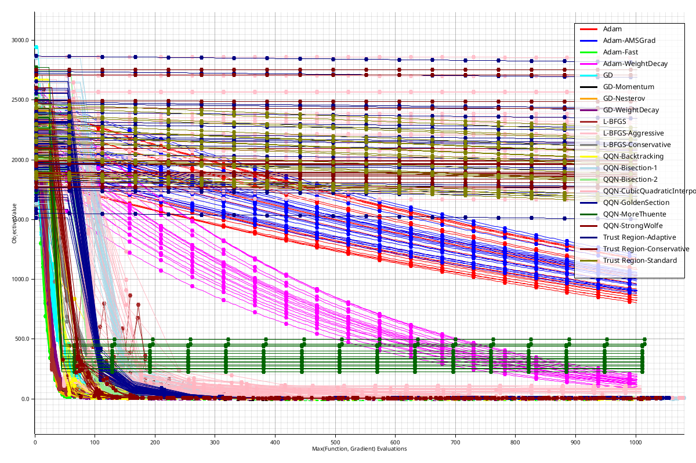
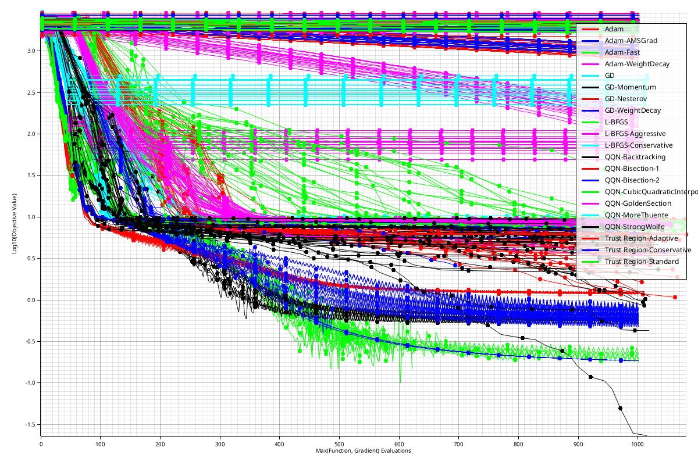

**Figure:** Convergence plots for IllConditionedRosenbrock_10D_alpha100 showing objective value vs iterations.
Left: Linear scale, Right: Log scale for better visualization of convergence behavior.

**Data:** [Linear scale data (CSV)](convergence_IllConditionedRosenbrock_10D_alpha100_data.csv) | [Log scale data (CSV)](convergence_IllConditionedRosenbrock_10D_alpha100_log_data.csv)

## Problem: Trigonometric_2D

**Family:** Trigonometric  
**Dimension:** 2  
**Success Threshold:** 1.000e-6  
**Total Runs:** 560

### Performance Summary
<table style="border-collapse: collapse; width: 100%; margin: 20px 0;">
<tr style="background-color: #f2f2f2;">
<th style="border: 1px solid #ddd; padding: 8px; text-align: center;">Rank</th>
<th style="border: 1px solid #ddd; padding: 8px; text-align: center;">Optimizer</th>
<th style="border: 1px solid #ddd; padding: 8px; text-align: center;">Mean Final Value (All/Success/Fail)</th>
<th style="border: 1px solid #ddd; padding: 8px; text-align: center;">Std Dev</th>
<th style="border: 1px solid #ddd; padding: 8px; text-align: center;">Best Value</th>
<th style="border: 1px solid #ddd; padding: 8px; text-align: center;">Worst Value</th>
<th style="border: 1px solid #ddd; padding: 8px; text-align: center;">Mean Function Evals (All/Success/Fail)</th>
<th style="border: 1px solid #ddd; padding: 8px; text-align: center;">Mean Gradient Evals (All/Success/Fail)</th>
<th style="border: 1px solid #ddd; padding: 8px; text-align: center;">Success Rate</th>
<th style="border: 1px solid #ddd; padding: 8px; text-align: center;">Mean Time (s)</th>
</tr>
<tr style="background-color: #d4edda; font-weight: bold;">
<td style="border: 1px solid #ddd; padding: 8px; text-align: center;">1</td>
<td style="border: 1px solid #ddd; padding: 8px; text-align: center;"><a href="detailed_Trigonometric_2D_QQN-Bisection-2.md">QQN-Bisection-2</a></td>
<td style="border: 1px solid #ddd; padding: 8px; text-align: center;">1.47e-3 / 1.09e-14 / 2.94e-2</td>
<td style="border: 1px solid #ddd; padding: 8px; text-align: center;">6.41e-3</td>
<td style="border: 1px solid #ddd; padding: 8px; text-align: center;">4.35e-22</td>
<td style="border: 1px solid #ddd; padding: 8px; text-align: center;">2.94e-2</td>
<td style="border: 1px solid #ddd; padding: 8px; text-align: center;">156.9 / 130.8 / 652.0</td>
<td style="border: 1px solid #ddd; padding: 8px; text-align: center;">140.3 / 129.3 / 350.0</td>
<td style="border: 1px solid #ddd; padding: 8px; text-align: center;">95.0%</td>
<td style="border: 1px solid #ddd; padding: 8px; text-align: center;">0.003</td>
</tr>
<tr style="background-color: #fff3cd;">
<td style="border: 1px solid #ddd; padding: 8px; text-align: center;">2</td>
<td style="border: 1px solid #ddd; padding: 8px; text-align: center;"><a href="detailed_Trigonometric_2D_QQN-GoldenSection.md">QQN-GoldenSection</a></td>
<td style="border: 1px solid #ddd; padding: 8px; text-align: center;">3.13e-3 / 1.36e-14 / 3.76e-2</td>
<td style="border: 1px solid #ddd; padding: 8px; text-align: center;">1.07e-2</td>
<td style="border: 1px solid #ddd; padding: 8px; text-align: center;">8.09e-20</td>
<td style="border: 1px solid #ddd; padding: 8px; text-align: center;">5.14e-2</td>
<td style="border: 1px solid #ddd; padding: 8px; text-align: center;">445.0 / 403.7 / 899.2</td>
<td style="border: 1px solid #ddd; padding: 8px; text-align: center;">62.9 / 57.1 / 127.0</td>
<td style="border: 1px solid #ddd; padding: 8px; text-align: center;">91.7%</td>
<td style="border: 1px solid #ddd; padding: 8px; text-align: center;">0.007</td>
</tr>
<tr style="">
<td style="border: 1px solid #ddd; padding: 8px; text-align: center;">3</td>
<td style="border: 1px solid #ddd; padding: 8px; text-align: center;"><a href="detailed_Trigonometric_2D_QQN-CubicQuadraticInterpolation.md">QQN-CubicQuadraticInterpolation</a></td>
<td style="border: 1px solid #ddd; padding: 8px; text-align: center;">7.44e-4 / 2.04e-14 / 2.98e-2</td>
<td style="border: 1px solid #ddd; padding: 8px; text-align: center;">4.65e-3</td>
<td style="border: 1px solid #ddd; padding: 8px; text-align: center;">2.76e-19</td>
<td style="border: 1px solid #ddd; padding: 8px; text-align: center;">2.98e-2</td>
<td style="border: 1px solid #ddd; padding: 8px; text-align: center;">200.3 / 195.4 / 394.0</td>
<td style="border: 1px solid #ddd; padding: 8px; text-align: center;">294.8 / 285.5 / 656.0</td>
<td style="border: 1px solid #ddd; padding: 8px; text-align: center;">97.5%</td>
<td style="border: 1px solid #ddd; padding: 8px; text-align: center;">0.006</td>
</tr>
<tr style="">
<td style="border: 1px solid #ddd; padding: 8px; text-align: center;">4</td>
<td style="border: 1px solid #ddd; padding: 8px; text-align: center;"><a href="detailed_Trigonometric_2D_QQN-Bisection-1.md">QQN-Bisection-1</a></td>
<td style="border: 1px solid #ddd; padding: 8px; text-align: center;">1.62e-3 / 6.27e-15 / 1.30e-2</td>
<td style="border: 1px solid #ddd; padding: 8px; text-align: center;">6.37e-3</td>
<td style="border: 1px solid #ddd; padding: 8px; text-align: center;">9.89e-19</td>
<td style="border: 1px solid #ddd; padding: 8px; text-align: center;">3.15e-2</td>
<td style="border: 1px solid #ddd; padding: 8px; text-align: center;">211.4 / 169.9 / 502.0</td>
<td style="border: 1px solid #ddd; padding: 8px; text-align: center;">240.3 / 200.2 / 521.4</td>
<td style="border: 1px solid #ddd; padding: 8px; text-align: center;">87.5%</td>
<td style="border: 1px solid #ddd; padding: 8px; text-align: center;">0.004</td>
</tr>
<tr style="">
<td style="border: 1px solid #ddd; padding: 8px; text-align: center;">5</td>
<td style="border: 1px solid #ddd; padding: 8px; text-align: center;"><a href="detailed_Trigonometric_2D_QQN-MoreThuente.md">QQN-MoreThuente</a></td>
<td style="border: 1px solid #ddd; padding: 8px; text-align: center;">7.65e-15 / 7.65e-15 / -</td>
<td style="border: 1px solid #ddd; padding: 8px; text-align: center;">1.63e-14</td>
<td style="border: 1px solid #ddd; padding: 8px; text-align: center;">2.69e-18</td>
<td style="border: 1px solid #ddd; padding: 8px; text-align: center;">6.48e-14</td>
<td style="border: 1px solid #ddd; padding: 8px; text-align: center;">163.3 / 163.3 / -</td>
<td style="border: 1px solid #ddd; padding: 8px; text-align: center;">168.0 / 168.0 / -</td>
<td style="border: 1px solid #ddd; padding: 8px; text-align: center;">100.0%</td>
<td style="border: 1px solid #ddd; padding: 8px; text-align: center;">0.003</td>
</tr>
<tr style="">
<td style="border: 1px solid #ddd; padding: 8px; text-align: center;">6</td>
<td style="border: 1px solid #ddd; padding: 8px; text-align: center;"><a href="detailed_Trigonometric_2D_L-BFGS-Aggressive.md">L-BFGS-Aggressive</a></td>
<td style="border: 1px solid #ddd; padding: 8px; text-align: center;">2.36e-3 / 6.48e-14 / 9.45e-3</td>
<td style="border: 1px solid #ddd; padding: 8px; text-align: center;">6.44e-3</td>
<td style="border: 1px solid #ddd; padding: 8px; text-align: center;">2.37e-16</td>
<td style="border: 1px solid #ddd; padding: 8px; text-align: center;">2.70e-2</td>
<td style="border: 1px solid #ddd; padding: 8px; text-align: center;">323.0 / 173.7 / 771.1</td>
<td style="border: 1px solid #ddd; padding: 8px; text-align: center;">108.4 / 65.3 / 237.5</td>
<td style="border: 1px solid #ddd; padding: 8px; text-align: center;">75.0%</td>
<td style="border: 1px solid #ddd; padding: 8px; text-align: center;">0.004</td>
</tr>
<tr style="">
<td style="border: 1px solid #ddd; padding: 8px; text-align: center;">7</td>
<td style="border: 1px solid #ddd; padding: 8px; text-align: center;"><a href="detailed_Trigonometric_2D_QQN-StrongWolfe.md">QQN-StrongWolfe</a></td>
<td style="border: 1px solid #ddd; padding: 8px; text-align: center;">2.38e-3 / 9.97e-14 / 2.38e-2</td>
<td style="border: 1px solid #ddd; padding: 8px; text-align: center;">1.04e-2</td>
<td style="border: 1px solid #ddd; padding: 8px; text-align: center;">3.15e-16</td>
<td style="border: 1px solid #ddd; padding: 8px; text-align: center;">4.75e-2</td>
<td style="border: 1px solid #ddd; padding: 8px; text-align: center;">231.7 / 204.2 / 478.5</td>
<td style="border: 1px solid #ddd; padding: 8px; text-align: center;">252.7 / 222.0 / 529.0</td>
<td style="border: 1px solid #ddd; padding: 8px; text-align: center;">90.0%</td>
<td style="border: 1px solid #ddd; padding: 8px; text-align: center;">0.007</td>
</tr>
<tr style="">
<td style="border: 1px solid #ddd; padding: 8px; text-align: center;">8</td>
<td style="border: 1px solid #ddd; padding: 8px; text-align: center;"><a href="detailed_Trigonometric_2D_L-BFGS.md">L-BFGS</a></td>
<td style="border: 1px solid #ddd; padding: 8px; text-align: center;">6.25e-4 / 7.45e-14 / 1.98e-1</td>
<td style="border: 1px solid #ddd; padding: 8px; text-align: center;">2.67e-3</td>
<td style="border: 1px solid #ddd; padding: 8px; text-align: center;">5.25e-16</td>
<td style="border: 1px solid #ddd; padding: 8px; text-align: center;">1.23e-2</td>
<td style="border: 1px solid #ddd; padding: 8px; text-align: center;">237.3 / 252.2 / 103.5</td>
<td style="border: 1px solid #ddd; padding: 8px; text-align: center;">144.2 / 154.7 / 49.5</td>
<td style="border: 1px solid #ddd; padding: 8px; text-align: center;">90.0%</td>
<td style="border: 1px solid #ddd; padding: 8px; text-align: center;">0.004</td>
</tr>
<tr style="">
<td style="border: 1px solid #ddd; padding: 8px; text-align: center;">9</td>
<td style="border: 1px solid #ddd; padding: 8px; text-align: center;"><a href="detailed_Trigonometric_2D_QQN-Backtracking.md">QQN-Backtracking</a></td>
<td style="border: 1px solid #ddd; padding: 8px; text-align: center;">8.58e-5 / 1.33e-13 / 1.72e-3</td>
<td style="border: 1px solid #ddd; padding: 8px; text-align: center;">3.74e-4</td>
<td style="border: 1px solid #ddd; padding: 8px; text-align: center;">3.19e-14</td>
<td style="border: 1px solid #ddd; padding: 8px; text-align: center;">1.72e-3</td>
<td style="border: 1px solid #ddd; padding: 8px; text-align: center;">273.4 / 258.6 / 554.0</td>
<td style="border: 1px solid #ddd; padding: 8px; text-align: center;">229.7 / 217.7 / 457.0</td>
<td style="border: 1px solid #ddd; padding: 8px; text-align: center;">95.0%</td>
<td style="border: 1px solid #ddd; padding: 8px; text-align: center;">0.009</td>
</tr>
<tr style="">
<td style="border: 1px solid #ddd; padding: 8px; text-align: center;">10</td>
<td style="border: 1px solid #ddd; padding: 8px; text-align: center;"><a href="detailed_Trigonometric_2D_L-BFGS-Conservative.md">L-BFGS-Conservative</a></td>
<td style="border: 1px solid #ddd; padding: 8px; text-align: center;">3.04e-8 / 1.66e-13 / 3.20e-8</td>
<td style="border: 1px solid #ddd; padding: 8px; text-align: center;">8.83e-8</td>
<td style="border: 1px solid #ddd; padding: 8px; text-align: center;">1.66e-13</td>
<td style="border: 1px solid #ddd; padding: 8px; text-align: center;">4.06e-7</td>
<td style="border: 1px solid #ddd; padding: 8px; text-align: center;">560.2 / 552.0 / 560.6</td>
<td style="border: 1px solid #ddd; padding: 8px; text-align: center;">444.5 / 434.0 / 445.1</td>
<td style="border: 1px solid #ddd; padding: 8px; text-align: center;">5.0%</td>
<td style="border: 1px solid #ddd; padding: 8px; text-align: center;">0.014</td>
</tr>
<tr style="">
<td style="border: 1px solid #ddd; padding: 8px; text-align: center;">11</td>
<td style="border: 1px solid #ddd; padding: 8px; text-align: center;"><a href="detailed_Trigonometric_2D_Adam-AMSGrad.md">Adam-AMSGrad</a></td>
<td style="border: 1px solid #ddd; padding: 8px; text-align: center;">2.49e-2 / 5.29e-10 / 2.62e-2</td>
<td style="border: 1px solid #ddd; padding: 8px; text-align: center;">2.11e-2</td>
<td style="border: 1px solid #ddd; padding: 8px; text-align: center;">9.29e-12</td>
<td style="border: 1px solid #ddd; padding: 8px; text-align: center;">5.62e-2</td>
<td style="border: 1px solid #ddd; padding: 8px; text-align: center;">495.4 / 371.0 / 502.0</td>
<td style="border: 1px solid #ddd; padding: 8px; text-align: center;">495.4 / 370.0 / 502.0</td>
<td style="border: 1px solid #ddd; padding: 8px; text-align: center;">5.0%</td>
<td style="border: 1px solid #ddd; padding: 8px; text-align: center;">0.011</td>
</tr>
<tr style="">
<td style="border: 1px solid #ddd; padding: 8px; text-align: center;">12</td>
<td style="border: 1px solid #ddd; padding: 8px; text-align: center;"><a href="detailed_Trigonometric_2D_Adam-WeightDecay.md">Adam-WeightDecay</a></td>
<td style="border: 1px solid #ddd; padding: 8px; text-align: center;">9.78e-5 / 2.21e-6 / 2.53e-4</td>
<td style="border: 1px solid #ddd; padding: 8px; text-align: center;">2.41e-4</td>
<td style="border: 1px solid #ddd; padding: 8px; text-align: center;">2.98e-10</td>
<td style="border: 1px solid #ddd; padding: 8px; text-align: center;">9.30e-4</td>
<td style="border: 1px solid #ddd; padding: 8px; text-align: center;">334.6 / 309.3 / 372.4</td>
<td style="border: 1px solid #ddd; padding: 8px; text-align: center;">333.8 / 308.3 / 372.0</td>
<td style="border: 1px solid #ddd; padding: 8px; text-align: center;">60.0%</td>
<td style="border: 1px solid #ddd; padding: 8px; text-align: center;">0.007</td>
</tr>
<tr style="">
<td style="border: 1px solid #ddd; padding: 8px; text-align: center;">13</td>
<td style="border: 1px solid #ddd; padding: 8px; text-align: center;"><a href="detailed_Trigonometric_2D_GD-WeightDecay.md">GD-WeightDecay</a></td>
<td style="border: 1px solid #ddd; padding: 8px; text-align: center;">5.67e-3 / 3.76e-10 / 1.96e-2</td>
<td style="border: 1px solid #ddd; padding: 8px; text-align: center;">1.61e-2</td>
<td style="border: 1px solid #ddd; padding: 8px; text-align: center;">3.52e-10</td>
<td style="border: 1px solid #ddd; padding: 8px; text-align: center;">5.41e-2</td>
<td style="border: 1px solid #ddd; padding: 8px; text-align: center;">133.7 / 177.8 / 30.7</td>
<td style="border: 1px solid #ddd; padding: 8px; text-align: center;">264.7 / 353.6 / 57.3</td>
<td style="border: 1px solid #ddd; padding: 8px; text-align: center;">70.0%</td>
<td style="border: 1px solid #ddd; padding: 8px; text-align: center;">0.004</td>
</tr>
<tr style="">
<td style="border: 1px solid #ddd; padding: 8px; text-align: center;">14</td>
<td style="border: 1px solid #ddd; padding: 8px; text-align: center;"><a href="detailed_Trigonometric_2D_Adam.md">Adam</a></td>
<td style="border: 1px solid #ddd; padding: 8px; text-align: center;">1.43e-2 / 5.80e-8 / 1.51e-2</td>
<td style="border: 1px solid #ddd; padding: 8px; text-align: center;">1.95e-2</td>
<td style="border: 1px solid #ddd; padding: 8px; text-align: center;">4.25e-10</td>
<td style="border: 1px solid #ddd; padding: 8px; text-align: center;">6.31e-2</td>
<td style="border: 1px solid #ddd; padding: 8px; text-align: center;">487.6 / 213.0 / 502.0</td>
<td style="border: 1px solid #ddd; padding: 8px; text-align: center;">487.5 / 212.0 / 502.0</td>
<td style="border: 1px solid #ddd; padding: 8px; text-align: center;">5.0%</td>
<td style="border: 1px solid #ddd; padding: 8px; text-align: center;">0.009</td>
</tr>
<tr style="">
<td style="border: 1px solid #ddd; padding: 8px; text-align: center;">15</td>
<td style="border: 1px solid #ddd; padding: 8px; text-align: center;"><a href="detailed_Trigonometric_2D_GD.md">GD</a></td>
<td style="border: 1px solid #ddd; padding: 8px; text-align: center;">5.13e-4 / 2.45e-9 / 5.69e-4</td>
<td style="border: 1px solid #ddd; padding: 8px; text-align: center;">2.36e-3</td>
<td style="border: 1px solid #ddd; padding: 8px; text-align: center;">2.41e-9</td>
<td style="border: 1px solid #ddd; padding: 8px; text-align: center;">1.46e-2</td>
<td style="border: 1px solid #ddd; padding: 8px; text-align: center;">330.5 / 290.2 / 335.0</td>
<td style="border: 1px solid #ddd; padding: 8px; text-align: center;">659.0 / 578.5 / 668.0</td>
<td style="border: 1px solid #ddd; padding: 8px; text-align: center;">10.0%</td>
<td style="border: 1px solid #ddd; padding: 8px; text-align: center;">0.008</td>
</tr>
<tr style="">
<td style="border: 1px solid #ddd; padding: 8px; text-align: center;">16</td>
<td style="border: 1px solid #ddd; padding: 8px; text-align: center;"><a href="detailed_Trigonometric_2D_Adam-Fast.md">Adam-Fast</a></td>
<td style="border: 1px solid #ddd; padding: 8px; text-align: center;">1.85e-3 / 3.24e-5 / 6.36e-3</td>
<td style="border: 1px solid #ddd; padding: 8px; text-align: center;">2.49e-3</td>
<td style="border: 1px solid #ddd; padding: 8px; text-align: center;">1.88e-8</td>
<td style="border: 1px solid #ddd; padding: 8px; text-align: center;">1.21e-2</td>
<td style="border: 1px solid #ddd; padding: 8px; text-align: center;">45.1 / 167.0 / 38.7</td>
<td style="border: 1px solid #ddd; padding: 8px; text-align: center;">44.1 / 166.0 / 37.7</td>
<td style="border: 1px solid #ddd; padding: 8px; text-align: center;">5.0%</td>
<td style="border: 1px solid #ddd; padding: 8px; text-align: center;">0.001</td>
</tr>
<tr style="">
<td style="border: 1px solid #ddd; padding: 8px; text-align: center;">17</td>
<td style="border: 1px solid #ddd; padding: 8px; text-align: center;"><a href="detailed_Trigonometric_2D_GD-Nesterov.md">GD-Nesterov</a></td>
<td style="border: 1px solid #ddd; padding: 8px; text-align: center;">9.60e-3 / - / 1.30e-2</td>
<td style="border: 1px solid #ddd; padding: 8px; text-align: center;">1.83e-2</td>
<td style="border: 1px solid #ddd; padding: 8px; text-align: center;">4.20e-6</td>
<td style="border: 1px solid #ddd; padding: 8px; text-align: center;">5.37e-2</td>
<td style="border: 1px solid #ddd; padding: 8px; text-align: center;">23.1 / - / 23.1</td>
<td style="border: 1px solid #ddd; padding: 8px; text-align: center;">42.2 / - / 42.2</td>
<td style="border: 1px solid #ddd; padding: 8px; text-align: center;">0.0%</td>
<td style="border: 1px solid #ddd; padding: 8px; text-align: center;">0.001</td>
</tr>
<tr style="">
<td style="border: 1px solid #ddd; padding: 8px; text-align: center;">18</td>
<td style="border: 1px solid #ddd; padding: 8px; text-align: center;"><a href="detailed_Trigonometric_2D_GD-Momentum.md">GD-Momentum</a></td>
<td style="border: 1px solid #ddd; padding: 8px; text-align: center;">2.29e-2 / - / 3.84e-2</td>
<td style="border: 1px solid #ddd; padding: 8px; text-align: center;">2.05e-2</td>
<td style="border: 1px solid #ddd; padding: 8px; text-align: center;">9.31e-6</td>
<td style="border: 1px solid #ddd; padding: 8px; text-align: center;">5.53e-2</td>
<td style="border: 1px solid #ddd; padding: 8px; text-align: center;">21.3 / - / 21.3</td>
<td style="border: 1px solid #ddd; padding: 8px; text-align: center;">38.6 / - / 38.6</td>
<td style="border: 1px solid #ddd; padding: 8px; text-align: center;">0.0%</td>
<td style="border: 1px solid #ddd; padding: 8px; text-align: center;">0.001</td>
</tr>
<tr style="">
<td style="border: 1px solid #ddd; padding: 8px; text-align: center;">19</td>
<td style="border: 1px solid #ddd; padding: 8px; text-align: center;"><a href="detailed_Trigonometric_2D_Trust_Region-Conservative.md">Trust Region-Conservative</a></td>
<td style="border: 1px solid #ddd; padding: 8px; text-align: center;">4.92e-3 / - / 6.78e-3</td>
<td style="border: 1px solid #ddd; padding: 8px; text-align: center;">1.19e-2</td>
<td style="border: 1px solid #ddd; padding: 8px; text-align: center;">3.57e-5</td>
<td style="border: 1px solid #ddd; padding: 8px; text-align: center;">5.64e-2</td>
<td style="border: 1px solid #ddd; padding: 8px; text-align: center;">48.0 / - / 48.0</td>
<td style="border: 1px solid #ddd; padding: 8px; text-align: center;">32.7 / - / 32.7</td>
<td style="border: 1px solid #ddd; padding: 8px; text-align: center;">0.0%</td>
<td style="border: 1px solid #ddd; padding: 8px; text-align: center;">0.000</td>
</tr>
<tr style="">
<td style="border: 1px solid #ddd; padding: 8px; text-align: center;">20</td>
<td style="border: 1px solid #ddd; padding: 8px; text-align: center;"><a href="detailed_Trigonometric_2D_Trust_Region-Adaptive.md">Trust Region-Adaptive</a></td>
<td style="border: 1px solid #ddd; padding: 8px; text-align: center;">4.08e-2 / - / 1.68e0</td>
<td style="border: 1px solid #ddd; padding: 8px; text-align: center;">2.98e-2</td>
<td style="border: 1px solid #ddd; padding: 8px; text-align: center;">1.42e-3</td>
<td style="border: 1px solid #ddd; padding: 8px; text-align: center;">1.26e-1</td>
<td style="border: 1px solid #ddd; padding: 8px; text-align: center;">14.1 / - / 14.1</td>
<td style="border: 1px solid #ddd; padding: 8px; text-align: center;">10.0 / - / 10.0</td>
<td style="border: 1px solid #ddd; padding: 8px; text-align: center;">0.0%</td>
<td style="border: 1px solid #ddd; padding: 8px; text-align: center;">0.000</td>
</tr>
<tr style="">
<td style="border: 1px solid #ddd; padding: 8px; text-align: center;">21</td>
<td style="border: 1px solid #ddd; padding: 8px; text-align: center;"><a href="detailed_Trigonometric_2D_Trust_Region-Standard.md">Trust Region-Standard</a></td>
<td style="border: 1px solid #ddd; padding: 8px; text-align: center;">6.85e-2 / - / 6.92e0</td>
<td style="border: 1px solid #ddd; padding: 8px; text-align: center;">3.87e-2</td>
<td style="border: 1px solid #ddd; padding: 8px; text-align: center;">1.66e-2</td>
<td style="border: 1px solid #ddd; padding: 8px; text-align: center;">1.38e-1</td>
<td style="border: 1px solid #ddd; padding: 8px; text-align: center;">13.5 / - / 13.5</td>
<td style="border: 1px solid #ddd; padding: 8px; text-align: center;">9.6 / - / 9.6</td>
<td style="border: 1px solid #ddd; padding: 8px; text-align: center;">0.0%</td>
<td style="border: 1px solid #ddd; padding: 8px; text-align: center;">0.000</td>
</tr>
</table>

### Convergence Plots

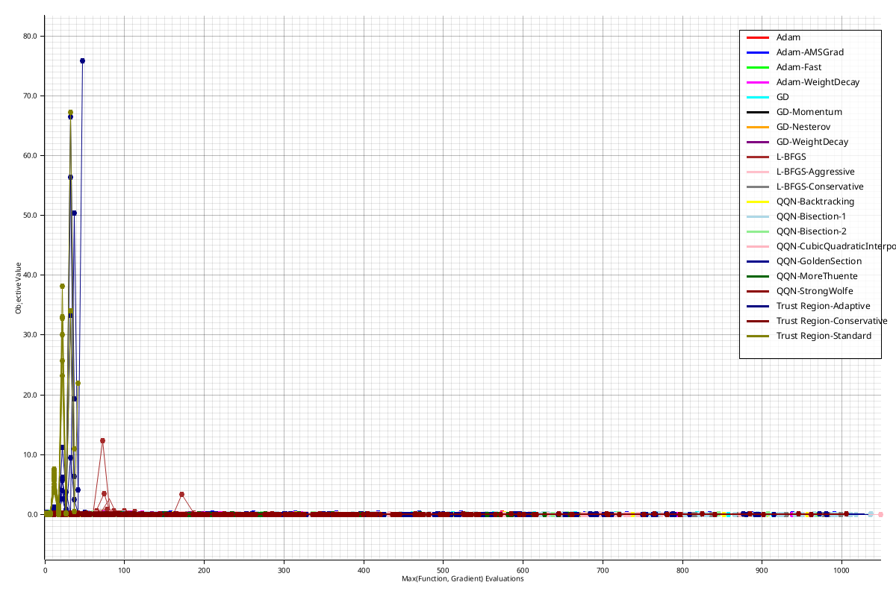
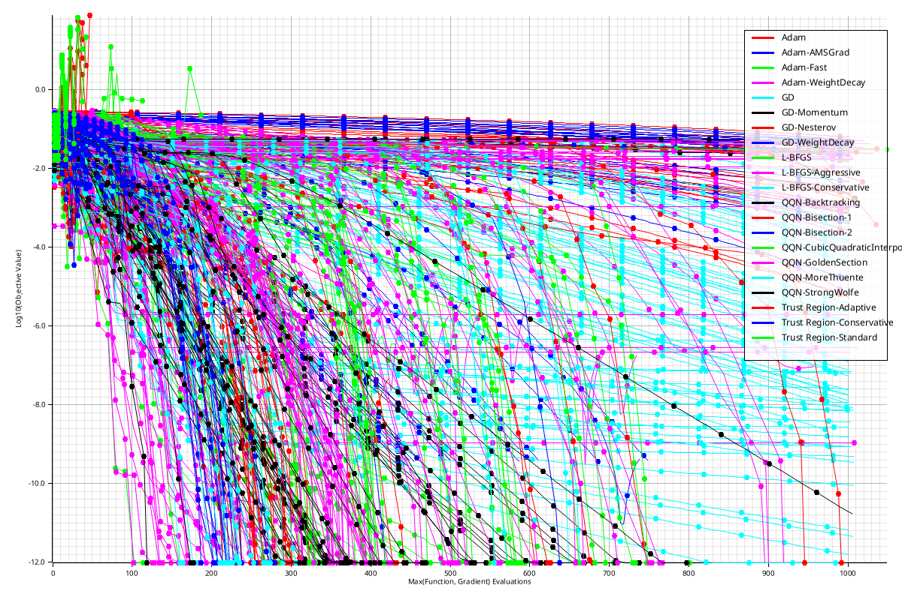

**Figure:** Convergence plots for Trigonometric_2D showing objective value vs iterations.
Left: Linear scale, Right: Log scale for better visualization of convergence behavior.

**Data:** [Linear scale data (CSV)](convergence_Trigonometric_2D_data.csv) | [Log scale data (CSV)](convergence_Trigonometric_2D_log_data.csv)

## Problem: Trigonometric_5D

**Family:** Trigonometric  
**Dimension:** 5  
**Success Threshold:** 1.000e-6  
**Total Runs:** 560

### Performance Summary
<table style="border-collapse: collapse; width: 100%; margin: 20px 0;">
<tr style="background-color: #f2f2f2;">
<th style="border: 1px solid #ddd; padding: 8px; text-align: center;">Rank</th>
<th style="border: 1px solid #ddd; padding: 8px; text-align: center;">Optimizer</th>
<th style="border: 1px solid #ddd; padding: 8px; text-align: center;">Mean Final Value (All/Success/Fail)</th>
<th style="border: 1px solid #ddd; padding: 8px; text-align: center;">Std Dev</th>
<th style="border: 1px solid #ddd; padding: 8px; text-align: center;">Best Value</th>
<th style="border: 1px solid #ddd; padding: 8px; text-align: center;">Worst Value</th>
<th style="border: 1px solid #ddd; padding: 8px; text-align: center;">Mean Function Evals (All/Success/Fail)</th>
<th style="border: 1px solid #ddd; padding: 8px; text-align: center;">Mean Gradient Evals (All/Success/Fail)</th>
<th style="border: 1px solid #ddd; padding: 8px; text-align: center;">Success Rate</th>
<th style="border: 1px solid #ddd; padding: 8px; text-align: center;">Mean Time (s)</th>
</tr>
<tr style="background-color: #d4edda; font-weight: bold;">
<td style="border: 1px solid #ddd; padding: 8px; text-align: center;">1</td>
<td style="border: 1px solid #ddd; padding: 8px; text-align: center;"><a href="detailed_Trigonometric_5D_QQN-Bisection-1.md">QQN-Bisection-1</a></td>
<td style="border: 1px solid #ddd; padding: 8px; text-align: center;">6.99e-3 / 5.67e-15 / 1.87e-2</td>
<td style="border: 1px solid #ddd; padding: 8px; text-align: center;">1.47e-2</td>
<td style="border: 1px solid #ddd; padding: 8px; text-align: center;">1.39e-18</td>
<td style="border: 1px solid #ddd; padding: 8px; text-align: center;">5.20e-2</td>
<td style="border: 1px solid #ddd; padding: 8px; text-align: center;">350.6 / 259.3 / 502.7</td>
<td style="border: 1px solid #ddd; padding: 8px; text-align: center;">374.5 / 276.7 / 537.5</td>
<td style="border: 1px solid #ddd; padding: 8px; text-align: center;">62.5%</td>
<td style="border: 1px solid #ddd; padding: 8px; text-align: center;">0.007</td>
</tr>
<tr style="background-color: #fff3cd;">
<td style="border: 1px solid #ddd; padding: 8px; text-align: center;">2</td>
<td style="border: 1px solid #ddd; padding: 8px; text-align: center;"><a href="detailed_Trigonometric_5D_QQN-StrongWolfe.md">QQN-StrongWolfe</a></td>
<td style="border: 1px solid #ddd; padding: 8px; text-align: center;">6.94e-3 / 1.02e-14 / 1.20e-2</td>
<td style="border: 1px solid #ddd; padding: 8px; text-align: center;">1.31e-2</td>
<td style="border: 1px solid #ddd; padding: 8px; text-align: center;">2.75e-18</td>
<td style="border: 1px solid #ddd; padding: 8px; text-align: center;">5.39e-2</td>
<td style="border: 1px solid #ddd; padding: 8px; text-align: center;">369.3 / 200.5 / 481.8</td>
<td style="border: 1px solid #ddd; padding: 8px; text-align: center;">357.8 / 203.4 / 460.8</td>
<td style="border: 1px solid #ddd; padding: 8px; text-align: center;">40.0%</td>
<td style="border: 1px solid #ddd; padding: 8px; text-align: center;">0.011</td>
</tr>
<tr style="">
<td style="border: 1px solid #ddd; padding: 8px; text-align: center;">3</td>
<td style="border: 1px solid #ddd; padding: 8px; text-align: center;"><a href="detailed_Trigonometric_5D_QQN-GoldenSection.md">QQN-GoldenSection</a></td>
<td style="border: 1px solid #ddd; padding: 8px; text-align: center;">5.55e-3 / 1.27e-14 / 9.09e-3</td>
<td style="border: 1px solid #ddd; padding: 8px; text-align: center;">1.35e-2</td>
<td style="border: 1px solid #ddd; padding: 8px; text-align: center;">2.90e-18</td>
<td style="border: 1px solid #ddd; padding: 8px; text-align: center;">5.44e-2</td>
<td style="border: 1px solid #ddd; padding: 8px; text-align: center;">814.4 / 711.7 / 878.2</td>
<td style="border: 1px solid #ddd; padding: 8px; text-align: center;">112.2 / 101.3 / 118.9</td>
<td style="border: 1px solid #ddd; padding: 8px; text-align: center;">38.3%</td>
<td style="border: 1px solid #ddd; padding: 8px; text-align: center;">0.013</td>
</tr>
<tr style="">
<td style="border: 1px solid #ddd; padding: 8px; text-align: center;">4</td>
<td style="border: 1px solid #ddd; padding: 8px; text-align: center;"><a href="detailed_Trigonometric_5D_QQN-MoreThuente.md">QQN-MoreThuente</a></td>
<td style="border: 1px solid #ddd; padding: 8px; text-align: center;">1.36e-1 / 7.58e-15 / 3.41e-1</td>
<td style="border: 1px solid #ddd; padding: 8px; text-align: center;">3.60e-1</td>
<td style="border: 1px solid #ddd; padding: 8px; text-align: center;">3.09e-18</td>
<td style="border: 1px solid #ddd; padding: 8px; text-align: center;">1.50e0</td>
<td style="border: 1px solid #ddd; padding: 8px; text-align: center;">401.9 / 347.0 / 484.1</td>
<td style="border: 1px solid #ddd; padding: 8px; text-align: center;">429.6 / 358.2 / 536.9</td>
<td style="border: 1px solid #ddd; padding: 8px; text-align: center;">60.0%</td>
<td style="border: 1px solid #ddd; padding: 8px; text-align: center;">0.010</td>
</tr>
<tr style="">
<td style="border: 1px solid #ddd; padding: 8px; text-align: center;">5</td>
<td style="border: 1px solid #ddd; padding: 8px; text-align: center;"><a href="detailed_Trigonometric_5D_QQN-Backtracking.md">QQN-Backtracking</a></td>
<td style="border: 1px solid #ddd; padding: 8px; text-align: center;">6.01e-7 / 7.87e-15 / 1.72e-6</td>
<td style="border: 1px solid #ddd; padding: 8px; text-align: center;">2.22e-6</td>
<td style="border: 1px solid #ddd; padding: 8px; text-align: center;">7.27e-17</td>
<td style="border: 1px solid #ddd; padding: 8px; text-align: center;">1.02e-5</td>
<td style="border: 1px solid #ddd; padding: 8px; text-align: center;">304.8 / 141.5 / 608.1</td>
<td style="border: 1px solid #ddd; padding: 8px; text-align: center;">212.6 / 111.9 / 399.6</td>
<td style="border: 1px solid #ddd; padding: 8px; text-align: center;">65.0%</td>
<td style="border: 1px solid #ddd; padding: 8px; text-align: center;">0.010</td>
</tr>
<tr style="">
<td style="border: 1px solid #ddd; padding: 8px; text-align: center;">6</td>
<td style="border: 1px solid #ddd; padding: 8px; text-align: center;"><a href="detailed_Trigonometric_5D_QQN-Bisection-2.md">QQN-Bisection-2</a></td>
<td style="border: 1px solid #ddd; padding: 8px; text-align: center;">1.61e-3 / 9.55e-15 / 6.84e-3</td>
<td style="border: 1px solid #ddd; padding: 8px; text-align: center;">6.43e-3</td>
<td style="border: 1px solid #ddd; padding: 8px; text-align: center;">1.05e-16</td>
<td style="border: 1px solid #ddd; padding: 8px; text-align: center;">2.73e-2</td>
<td style="border: 1px solid #ddd; padding: 8px; text-align: center;">333.1 / 311.3 / 373.7</td>
<td style="border: 1px solid #ddd; padding: 8px; text-align: center;">211.1 / 213.2 / 207.1</td>
<td style="border: 1px solid #ddd; padding: 8px; text-align: center;">65.0%</td>
<td style="border: 1px solid #ddd; padding: 8px; text-align: center;">0.007</td>
</tr>
<tr style="">
<td style="border: 1px solid #ddd; padding: 8px; text-align: center;">7</td>
<td style="border: 1px solid #ddd; padding: 8px; text-align: center;"><a href="detailed_Trigonometric_5D_QQN-CubicQuadraticInterpolation.md">QQN-CubicQuadraticInterpolation</a></td>
<td style="border: 1px solid #ddd; padding: 8px; text-align: center;">1.36e-2 / 8.23e-15 / 1.51e-2</td>
<td style="border: 1px solid #ddd; padding: 8px; text-align: center;">2.15e-2</td>
<td style="border: 1px solid #ddd; padding: 8px; text-align: center;">7.51e-16</td>
<td style="border: 1px solid #ddd; padding: 8px; text-align: center;">9.15e-2</td>
<td style="border: 1px solid #ddd; padding: 8px; text-align: center;">386.1 / 347.0 / 390.4</td>
<td style="border: 1px solid #ddd; padding: 8px; text-align: center;">635.1 / 546.0 / 645.0</td>
<td style="border: 1px solid #ddd; padding: 8px; text-align: center;">10.0%</td>
<td style="border: 1px solid #ddd; padding: 8px; text-align: center;">0.014</td>
</tr>
<tr style="">
<td style="border: 1px solid #ddd; padding: 8px; text-align: center;">8</td>
<td style="border: 1px solid #ddd; padding: 8px; text-align: center;"><a href="detailed_Trigonometric_5D_L-BFGS.md">L-BFGS</a></td>
<td style="border: 1px solid #ddd; padding: 8px; text-align: center;">3.02e-2 / - / 1.11e0</td>
<td style="border: 1px solid #ddd; padding: 8px; text-align: center;">4.70e-2</td>
<td style="border: 1px solid #ddd; padding: 8px; text-align: center;">1.08e-13</td>
<td style="border: 1px solid #ddd; padding: 8px; text-align: center;">1.49e-1</td>
<td style="border: 1px solid #ddd; padding: 8px; text-align: center;">328.8 / - / 328.8</td>
<td style="border: 1px solid #ddd; padding: 8px; text-align: center;">141.5 / - / 141.5</td>
<td style="border: 1px solid #ddd; padding: 8px; text-align: center;">0.0%</td>
<td style="border: 1px solid #ddd; padding: 8px; text-align: center;">0.005</td>
</tr>
<tr style="">
<td style="border: 1px solid #ddd; padding: 8px; text-align: center;">9</td>
<td style="border: 1px solid #ddd; padding: 8px; text-align: center;"><a href="detailed_Trigonometric_5D_L-BFGS-Conservative.md">L-BFGS-Conservative</a></td>
<td style="border: 1px solid #ddd; padding: 8px; text-align: center;">1.73e-3 / - / 1.73e-3</td>
<td style="border: 1px solid #ddd; padding: 8px; text-align: center;">6.60e-3</td>
<td style="border: 1px solid #ddd; padding: 8px; text-align: center;">3.45e-11</td>
<td style="border: 1px solid #ddd; padding: 8px; text-align: center;">3.04e-2</td>
<td style="border: 1px solid #ddd; padding: 8px; text-align: center;">646.0 / - / 646.0</td>
<td style="border: 1px solid #ddd; padding: 8px; text-align: center;">362.9 / - / 362.9</td>
<td style="border: 1px solid #ddd; padding: 8px; text-align: center;">0.0%</td>
<td style="border: 1px solid #ddd; padding: 8px; text-align: center;">0.012</td>
</tr>
<tr style="">
<td style="border: 1px solid #ddd; padding: 8px; text-align: center;">10</td>
<td style="border: 1px solid #ddd; padding: 8px; text-align: center;"><a href="detailed_Trigonometric_5D_GD-WeightDecay.md">GD-WeightDecay</a></td>
<td style="border: 1px solid #ddd; padding: 8px; text-align: center;">2.01e-2 / 1.67e-9 / 4.62e-2</td>
<td style="border: 1px solid #ddd; padding: 8px; text-align: center;">2.67e-2</td>
<td style="border: 1px solid #ddd; padding: 8px; text-align: center;">3.61e-10</td>
<td style="border: 1px solid #ddd; padding: 8px; text-align: center;">6.25e-2</td>
<td style="border: 1px solid #ddd; padding: 8px; text-align: center;">128.7 / 206.5 / 33.7</td>
<td style="border: 1px solid #ddd; padding: 8px; text-align: center;">254.5 / 410.9 / 63.3</td>
<td style="border: 1px solid #ddd; padding: 8px; text-align: center;">55.0%</td>
<td style="border: 1px solid #ddd; padding: 8px; text-align: center;">0.004</td>
</tr>
<tr style="">
<td style="border: 1px solid #ddd; padding: 8px; text-align: center;">11</td>
<td style="border: 1px solid #ddd; padding: 8px; text-align: center;"><a href="detailed_Trigonometric_5D_GD.md">GD</a></td>
<td style="border: 1px solid #ddd; padding: 8px; text-align: center;">3.84e-3 / 2.45e-9 / 3.94e-3</td>
<td style="border: 1px solid #ddd; padding: 8px; text-align: center;">1.19e-2</td>
<td style="border: 1px solid #ddd; padding: 8px; text-align: center;">2.45e-9</td>
<td style="border: 1px solid #ddd; padding: 8px; text-align: center;">5.33e-2</td>
<td style="border: 1px solid #ddd; padding: 8px; text-align: center;">334.0 / 296.0 / 335.0</td>
<td style="border: 1px solid #ddd; padding: 8px; text-align: center;">666.0 / 590.0 / 668.0</td>
<td style="border: 1px solid #ddd; padding: 8px; text-align: center;">2.5%</td>
<td style="border: 1px solid #ddd; padding: 8px; text-align: center;">0.009</td>
</tr>
<tr style="">
<td style="border: 1px solid #ddd; padding: 8px; text-align: center;">12</td>
<td style="border: 1px solid #ddd; padding: 8px; text-align: center;"><a href="detailed_Trigonometric_5D_Adam-WeightDecay.md">Adam-WeightDecay</a></td>
<td style="border: 1px solid #ddd; padding: 8px; text-align: center;">3.15e-2 / 3.32e-6 / 4.21e-2</td>
<td style="border: 1px solid #ddd; padding: 8px; text-align: center;">3.27e-2</td>
<td style="border: 1px solid #ddd; padding: 8px; text-align: center;">3.78e-9</td>
<td style="border: 1px solid #ddd; padding: 8px; text-align: center;">8.61e-2</td>
<td style="border: 1px solid #ddd; padding: 8px; text-align: center;">404.3 / 377.0 / 413.4</td>
<td style="border: 1px solid #ddd; padding: 8px; text-align: center;">403.8 / 376.0 / 413.1</td>
<td style="border: 1px solid #ddd; padding: 8px; text-align: center;">25.0%</td>
<td style="border: 1px solid #ddd; padding: 8px; text-align: center;">0.009</td>
</tr>
<tr style="">
<td style="border: 1px solid #ddd; padding: 8px; text-align: center;">13</td>
<td style="border: 1px solid #ddd; padding: 8px; text-align: center;"><a href="detailed_Trigonometric_5D_GD-Nesterov.md">GD-Nesterov</a></td>
<td style="border: 1px solid #ddd; padding: 8px; text-align: center;">5.91e-3 / - / 7.27e-3</td>
<td style="border: 1px solid #ddd; padding: 8px; text-align: center;">1.24e-2</td>
<td style="border: 1px solid #ddd; padding: 8px; text-align: center;">8.99e-6</td>
<td style="border: 1px solid #ddd; padding: 8px; text-align: center;">4.10e-2</td>
<td style="border: 1px solid #ddd; padding: 8px; text-align: center;">36.5 / - / 36.5</td>
<td style="border: 1px solid #ddd; padding: 8px; text-align: center;">69.0 / - / 69.0</td>
<td style="border: 1px solid #ddd; padding: 8px; text-align: center;">0.0%</td>
<td style="border: 1px solid #ddd; padding: 8px; text-align: center;">0.001</td>
</tr>
<tr style="">
<td style="border: 1px solid #ddd; padding: 8px; text-align: center;">14</td>
<td style="border: 1px solid #ddd; padding: 8px; text-align: center;"><a href="detailed_Trigonometric_5D_Adam-Fast.md">Adam-Fast</a></td>
<td style="border: 1px solid #ddd; padding: 8px; text-align: center;">3.23e-2 / - / 4.35e-2</td>
<td style="border: 1px solid #ddd; padding: 8px; text-align: center;">4.11e-2</td>
<td style="border: 1px solid #ddd; padding: 8px; text-align: center;">1.33e-4</td>
<td style="border: 1px solid #ddd; padding: 8px; text-align: center;">1.72e-1</td>
<td style="border: 1px solid #ddd; padding: 8px; text-align: center;">60.0 / - / 60.0</td>
<td style="border: 1px solid #ddd; padding: 8px; text-align: center;">59.0 / - / 59.0</td>
<td style="border: 1px solid #ddd; padding: 8px; text-align: center;">0.0%</td>
<td style="border: 1px solid #ddd; padding: 8px; text-align: center;">0.001</td>
</tr>
<tr style="">
<td style="border: 1px solid #ddd; padding: 8px; text-align: center;">15</td>
<td style="border: 1px solid #ddd; padding: 8px; text-align: center;"><a href="detailed_Trigonometric_5D_GD-Momentum.md">GD-Momentum</a></td>
<td style="border: 1px solid #ddd; padding: 8px; text-align: center;">7.16e-2 / - / 1.26e-1</td>
<td style="border: 1px solid #ddd; padding: 8px; text-align: center;">1.19e-1</td>
<td style="border: 1px solid #ddd; padding: 8px; text-align: center;">2.95e-4</td>
<td style="border: 1px solid #ddd; padding: 8px; text-align: center;">5.59e-1</td>
<td style="border: 1px solid #ddd; padding: 8px; text-align: center;">27.8 / - / 27.8</td>
<td style="border: 1px solid #ddd; padding: 8px; text-align: center;">51.6 / - / 51.6</td>
<td style="border: 1px solid #ddd; padding: 8px; text-align: center;">0.0%</td>
<td style="border: 1px solid #ddd; padding: 8px; text-align: center;">0.001</td>
</tr>
<tr style="">
<td style="border: 1px solid #ddd; padding: 8px; text-align: center;">16</td>
<td style="border: 1px solid #ddd; padding: 8px; text-align: center;"><a href="detailed_Trigonometric_5D_Trust_Region-Conservative.md">Trust Region-Conservative</a></td>
<td style="border: 1px solid #ddd; padding: 8px; text-align: center;">1.17e-1 / - / 1.18e-1</td>
<td style="border: 1px solid #ddd; padding: 8px; text-align: center;">1.88e-1</td>
<td style="border: 1px solid #ddd; padding: 8px; text-align: center;">1.20e-3</td>
<td style="border: 1px solid #ddd; padding: 8px; text-align: center;">6.16e-1</td>
<td style="border: 1px solid #ddd; padding: 8px; text-align: center;">361.7 / - / 361.7</td>
<td style="border: 1px solid #ddd; padding: 8px; text-align: center;">241.8 / - / 241.8</td>
<td style="border: 1px solid #ddd; padding: 8px; text-align: center;">0.0%</td>
<td style="border: 1px solid #ddd; padding: 8px; text-align: center;">0.003</td>
</tr>
<tr style="">
<td style="border: 1px solid #ddd; padding: 8px; text-align: center;">17</td>
<td style="border: 1px solid #ddd; padding: 8px; text-align: center;"><a href="detailed_Trigonometric_5D_Adam-AMSGrad.md">Adam-AMSGrad</a></td>
<td style="border: 1px solid #ddd; padding: 8px; text-align: center;">1.99e-1 / - / 1.99e-1</td>
<td style="border: 1px solid #ddd; padding: 8px; text-align: center;">1.23e-1</td>
<td style="border: 1px solid #ddd; padding: 8px; text-align: center;">3.43e-3</td>
<td style="border: 1px solid #ddd; padding: 8px; text-align: center;">4.90e-1</td>
<td style="border: 1px solid #ddd; padding: 8px; text-align: center;">502.0 / - / 502.0</td>
<td style="border: 1px solid #ddd; padding: 8px; text-align: center;">502.0 / - / 502.0</td>
<td style="border: 1px solid #ddd; padding: 8px; text-align: center;">0.0%</td>
<td style="border: 1px solid #ddd; padding: 8px; text-align: center;">0.012</td>
</tr>
<tr style="">
<td style="border: 1px solid #ddd; padding: 8px; text-align: center;">18</td>
<td style="border: 1px solid #ddd; padding: 8px; text-align: center;"><a href="detailed_Trigonometric_5D_Adam.md">Adam</a></td>
<td style="border: 1px solid #ddd; padding: 8px; text-align: center;">9.61e-2 / - / 9.61e-2</td>
<td style="border: 1px solid #ddd; padding: 8px; text-align: center;">9.88e-2</td>
<td style="border: 1px solid #ddd; padding: 8px; text-align: center;">5.75e-3</td>
<td style="border: 1px solid #ddd; padding: 8px; text-align: center;">4.32e-1</td>
<td style="border: 1px solid #ddd; padding: 8px; text-align: center;">502.0 / - / 502.0</td>
<td style="border: 1px solid #ddd; padding: 8px; text-align: center;">502.0 / - / 502.0</td>
<td style="border: 1px solid #ddd; padding: 8px; text-align: center;">0.0%</td>
<td style="border: 1px solid #ddd; padding: 8px; text-align: center;">0.011</td>
</tr>
<tr style="">
<td style="border: 1px solid #ddd; padding: 8px; text-align: center;">19</td>
<td style="border: 1px solid #ddd; padding: 8px; text-align: center;"><a href="detailed_Trigonometric_5D_Trust_Region-Adaptive.md">Trust Region-Adaptive</a></td>
<td style="border: 1px solid #ddd; padding: 8px; text-align: center;">1.09e-1 / - / 1.20e-1</td>
<td style="border: 1px solid #ddd; padding: 8px; text-align: center;">6.31e-2</td>
<td style="border: 1px solid #ddd; padding: 8px; text-align: center;">3.24e-2</td>
<td style="border: 1px solid #ddd; padding: 8px; text-align: center;">3.24e-1</td>
<td style="border: 1px solid #ddd; padding: 8px; text-align: center;">25.9 / - / 25.9</td>
<td style="border: 1px solid #ddd; padding: 8px; text-align: center;">17.9 / - / 17.9</td>
<td style="border: 1px solid #ddd; padding: 8px; text-align: center;">0.0%</td>
<td style="border: 1px solid #ddd; padding: 8px; text-align: center;">0.000</td>
</tr>
<tr style="">
<td style="border: 1px solid #ddd; padding: 8px; text-align: center;">20</td>
<td style="border: 1px solid #ddd; padding: 8px; text-align: center;"><a href="detailed_Trigonometric_5D_Trust_Region-Standard.md">Trust Region-Standard</a></td>
<td style="border: 1px solid #ddd; padding: 8px; text-align: center;">3.76e-1 / - / 3.76e-1</td>
<td style="border: 1px solid #ddd; padding: 8px; text-align: center;">1.46e-1</td>
<td style="border: 1px solid #ddd; padding: 8px; text-align: center;">1.18e-1</td>
<td style="border: 1px solid #ddd; padding: 8px; text-align: center;">7.03e-1</td>
<td style="border: 1px solid #ddd; padding: 8px; text-align: center;">8.8 / - / 8.8</td>
<td style="border: 1px solid #ddd; padding: 8px; text-align: center;">6.5 / - / 6.5</td>
<td style="border: 1px solid #ddd; padding: 8px; text-align: center;">0.0%</td>
<td style="border: 1px solid #ddd; padding: 8px; text-align: center;">0.000</td>
</tr>
<tr style="">
<td style="border: 1px solid #ddd; padding: 8px; text-align: center;">21</td>
<td style="border: 1px solid #ddd; padding: 8px; text-align: center;"><a href="detailed_Trigonometric_5D_L-BFGS-Aggressive.md">L-BFGS-Aggressive</a></td>
<td style="border: 1px solid #ddd; padding: 8px; text-align: center;">1.51e0 / - / 1.51e0</td>
<td style="border: 1px solid #ddd; padding: 8px; text-align: center;">6.60e-1</td>
<td style="border: 1px solid #ddd; padding: 8px; text-align: center;">2.92e-1</td>
<td style="border: 1px solid #ddd; padding: 8px; text-align: center;">2.68e0</td>
<td style="border: 1px solid #ddd; padding: 8px; text-align: center;">772.0 / - / 772.0</td>
<td style="border: 1px solid #ddd; padding: 8px; text-align: center;">233.0 / - / 233.0</td>
<td style="border: 1px solid #ddd; padding: 8px; text-align: center;">0.0%</td>
<td style="border: 1px solid #ddd; padding: 8px; text-align: center;">0.006</td>
</tr>
</table>

### Convergence Plots

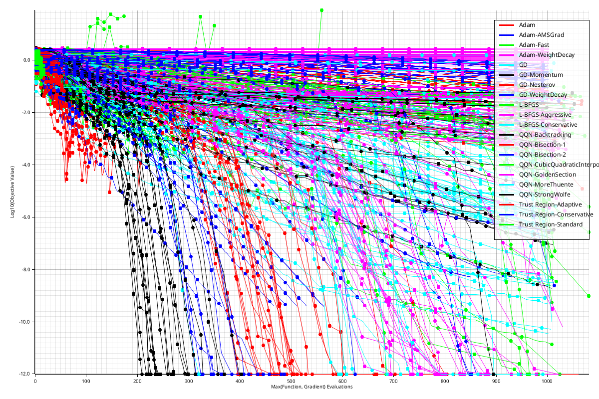

**Figure:** Convergence plots for Trigonometric_5D showing objective value vs iterations.
Left: Linear scale, Right: Log scale for better visualization of convergence behavior.

**Data:** [Linear scale data (CSV)](convergence_Trigonometric_5D_data.csv) | [Log scale data (CSV)](convergence_Trigonometric_5D_log_data.csv)

## Problem: Trigonometric_10D

**Family:** Trigonometric  
**Dimension:** 10  
**Success Threshold:** 1.000e-6  
**Total Runs:** 560

### Performance Summary
<table style="border-collapse: collapse; width: 100%; margin: 20px 0;">
<tr style="background-color: #f2f2f2;">
<th style="border: 1px solid #ddd; padding: 8px; text-align: center;">Rank</th>
<th style="border: 1px solid #ddd; padding: 8px; text-align: center;">Optimizer</th>
<th style="border: 1px solid #ddd; padding: 8px; text-align: center;">Mean Final Value (All/Success/Fail)</th>
<th style="border: 1px solid #ddd; padding: 8px; text-align: center;">Std Dev</th>
<th style="border: 1px solid #ddd; padding: 8px; text-align: center;">Best Value</th>
<th style="border: 1px solid #ddd; padding: 8px; text-align: center;">Worst Value</th>
<th style="border: 1px solid #ddd; padding: 8px; text-align: center;">Mean Function Evals (All/Success/Fail)</th>
<th style="border: 1px solid #ddd; padding: 8px; text-align: center;">Mean Gradient Evals (All/Success/Fail)</th>
<th style="border: 1px solid #ddd; padding: 8px; text-align: center;">Success Rate</th>
<th style="border: 1px solid #ddd; padding: 8px; text-align: center;">Mean Time (s)</th>
</tr>
<tr style="background-color: #d4edda; font-weight: bold;">
<td style="border: 1px solid #ddd; padding: 8px; text-align: center;">1</td>
<td style="border: 1px solid #ddd; padding: 8px; text-align: center;"><a href="detailed_Trigonometric_10D_QQN-Backtracking.md">QQN-Backtracking</a></td>
<td style="border: 1px solid #ddd; padding: 8px; text-align: center;">7.18e-4 / 5.46e-15 / 1.44e-2</td>
<td style="border: 1px solid #ddd; padding: 8px; text-align: center;">3.13e-3</td>
<td style="border: 1px solid #ddd; padding: 8px; text-align: center;">9.84e-17</td>
<td style="border: 1px solid #ddd; padding: 8px; text-align: center;">1.44e-2</td>
<td style="border: 1px solid #ddd; padding: 8px; text-align: center;">306.9 / 288.4 / 658.0</td>
<td style="border: 1px solid #ddd; padding: 8px; text-align: center;">220.1 / 213.0 / 355.0</td>
<td style="border: 1px solid #ddd; padding: 8px; text-align: center;">95.0%</td>
<td style="border: 1px solid #ddd; padding: 8px; text-align: center;">0.011</td>
</tr>
<tr style="background-color: #fff3cd;">
<td style="border: 1px solid #ddd; padding: 8px; text-align: center;">2</td>
<td style="border: 1px solid #ddd; padding: 8px; text-align: center;"><a href="detailed_Trigonometric_10D_QQN-StrongWolfe.md">QQN-StrongWolfe</a></td>
<td style="border: 1px solid #ddd; padding: 8px; text-align: center;">1.28e-2 / 1.50e-14 / 3.65e-2</td>
<td style="border: 1px solid #ddd; padding: 8px; text-align: center;">3.70e-2</td>
<td style="border: 1px solid #ddd; padding: 8px; text-align: center;">1.17e-15</td>
<td style="border: 1px solid #ddd; padding: 8px; text-align: center;">1.67e-1</td>
<td style="border: 1px solid #ddd; padding: 8px; text-align: center;">403.7 / 329.4 / 541.7</td>
<td style="border: 1px solid #ddd; padding: 8px; text-align: center;">388.0 / 340.3 / 476.6</td>
<td style="border: 1px solid #ddd; padding: 8px; text-align: center;">65.0%</td>
<td style="border: 1px solid #ddd; padding: 8px; text-align: center;">0.014</td>
</tr>
<tr style="">
<td style="border: 1px solid #ddd; padding: 8px; text-align: center;">3</td>
<td style="border: 1px solid #ddd; padding: 8px; text-align: center;"><a href="detailed_Trigonometric_10D_QQN-Bisection-1.md">QQN-Bisection-1</a></td>
<td style="border: 1px solid #ddd; padding: 8px; text-align: center;">9.38e-3 / 1.00e-14 / 1.17e-2</td>
<td style="border: 1px solid #ddd; padding: 8px; text-align: center;">2.02e-2</td>
<td style="border: 1px solid #ddd; padding: 8px; text-align: center;">3.14e-15</td>
<td style="border: 1px solid #ddd; padding: 8px; text-align: center;">8.28e-2</td>
<td style="border: 1px solid #ddd; padding: 8px; text-align: center;">485.4 / 448.9 / 494.6</td>
<td style="border: 1px solid #ddd; padding: 8px; text-align: center;">517.4 / 470.8 / 529.1</td>
<td style="border: 1px solid #ddd; padding: 8px; text-align: center;">20.0%</td>
<td style="border: 1px solid #ddd; padding: 8px; text-align: center;">0.015</td>
</tr>
<tr style="">
<td style="border: 1px solid #ddd; padding: 8px; text-align: center;">4</td>
<td style="border: 1px solid #ddd; padding: 8px; text-align: center;"><a href="detailed_Trigonometric_10D_QQN-Bisection-2.md">QQN-Bisection-2</a></td>
<td style="border: 1px solid #ddd; padding: 8px; text-align: center;">3.63e-3 / 9.85e-15 / 9.08e-3</td>
<td style="border: 1px solid #ddd; padding: 8px; text-align: center;">8.40e-3</td>
<td style="border: 1px solid #ddd; padding: 8px; text-align: center;">5.41e-15</td>
<td style="border: 1px solid #ddd; padding: 8px; text-align: center;">2.76e-2</td>
<td style="border: 1px solid #ddd; padding: 8px; text-align: center;">258.4 / 457.2 / 173.3</td>
<td style="border: 1px solid #ddd; padding: 8px; text-align: center;">184.4 / 346.8 / 114.8</td>
<td style="border: 1px solid #ddd; padding: 8px; text-align: center;">30.0%</td>
<td style="border: 1px solid #ddd; padding: 8px; text-align: center;">0.007</td>
</tr>
<tr style="">
<td style="border: 1px solid #ddd; padding: 8px; text-align: center;">5</td>
<td style="border: 1px solid #ddd; padding: 8px; text-align: center;"><a href="detailed_Trigonometric_10D_GD-WeightDecay.md">GD-WeightDecay</a></td>
<td style="border: 1px solid #ddd; padding: 8px; text-align: center;">4.68e-3 / 1.81e-9 / 3.13e-2</td>
<td style="border: 1px solid #ddd; padding: 8px; text-align: center;">1.90e-2</td>
<td style="border: 1px solid #ddd; padding: 8px; text-align: center;">2.06e-10</td>
<td style="border: 1px solid #ddd; padding: 8px; text-align: center;">8.75e-2</td>
<td style="border: 1px solid #ddd; padding: 8px; text-align: center;">210.1 / 205.7 / 235.0</td>
<td style="border: 1px solid #ddd; padding: 8px; text-align: center;">418.0 / 409.3 / 467.3</td>
<td style="border: 1px solid #ddd; padding: 8px; text-align: center;">85.0%</td>
<td style="border: 1px solid #ddd; padding: 8px; text-align: center;">0.009</td>
</tr>
<tr style="">
<td style="border: 1px solid #ddd; padding: 8px; text-align: center;">6</td>
<td style="border: 1px solid #ddd; padding: 8px; text-align: center;"><a href="detailed_Trigonometric_10D_GD.md">GD</a></td>
<td style="border: 1px solid #ddd; padding: 8px; text-align: center;">4.24e-3 / - / 4.24e-3</td>
<td style="border: 1px solid #ddd; padding: 8px; text-align: center;">1.18e-2</td>
<td style="border: 1px solid #ddd; padding: 8px; text-align: center;">5.96e-7</td>
<td style="border: 1px solid #ddd; padding: 8px; text-align: center;">5.21e-2</td>
<td style="border: 1px solid #ddd; padding: 8px; text-align: center;">335.0 / - / 335.0</td>
<td style="border: 1px solid #ddd; padding: 8px; text-align: center;">668.0 / - / 668.0</td>
<td style="border: 1px solid #ddd; padding: 8px; text-align: center;">0.0%</td>
<td style="border: 1px solid #ddd; padding: 8px; text-align: center;">0.012</td>
</tr>
<tr style="">
<td style="border: 1px solid #ddd; padding: 8px; text-align: center;">7</td>
<td style="border: 1px solid #ddd; padding: 8px; text-align: center;"><a href="detailed_Trigonometric_10D_QQN-GoldenSection.md">QQN-GoldenSection</a></td>
<td style="border: 1px solid #ddd; padding: 8px; text-align: center;">2.48e-2 / - / 2.48e-2</td>
<td style="border: 1px solid #ddd; padding: 8px; text-align: center;">4.68e-2</td>
<td style="border: 1px solid #ddd; padding: 8px; text-align: center;">5.99e-7</td>
<td style="border: 1px solid #ddd; padding: 8px; text-align: center;">2.48e-1</td>
<td style="border: 1px solid #ddd; padding: 8px; text-align: center;">909.8 / - / 909.8</td>
<td style="border: 1px solid #ddd; padding: 8px; text-align: center;">125.3 / - / 125.3</td>
<td style="border: 1px solid #ddd; padding: 8px; text-align: center;">0.0%</td>
<td style="border: 1px solid #ddd; padding: 8px; text-align: center;">0.016</td>
</tr>
<tr style="">
<td style="border: 1px solid #ddd; padding: 8px; text-align: center;">8</td>
<td style="border: 1px solid #ddd; padding: 8px; text-align: center;"><a href="detailed_Trigonometric_10D_L-BFGS-Conservative.md">L-BFGS-Conservative</a></td>
<td style="border: 1px solid #ddd; padding: 8px; text-align: center;">2.51e-2 / - / 2.51e-2</td>
<td style="border: 1px solid #ddd; padding: 8px; text-align: center;">5.35e-2</td>
<td style="border: 1px solid #ddd; padding: 8px; text-align: center;">7.44e-7</td>
<td style="border: 1px solid #ddd; padding: 8px; text-align: center;">2.36e-1</td>
<td style="border: 1px solid #ddd; padding: 8px; text-align: center;">701.5 / - / 701.5</td>
<td style="border: 1px solid #ddd; padding: 8px; text-align: center;">308.8 / - / 308.8</td>
<td style="border: 1px solid #ddd; padding: 8px; text-align: center;">0.0%</td>
<td style="border: 1px solid #ddd; padding: 8px; text-align: center;">0.012</td>
</tr>
<tr style="">
<td style="border: 1px solid #ddd; padding: 8px; text-align: center;">9</td>
<td style="border: 1px solid #ddd; padding: 8px; text-align: center;"><a href="detailed_Trigonometric_10D_QQN-MoreThuente.md">QQN-MoreThuente</a></td>
<td style="border: 1px solid #ddd; padding: 8px; text-align: center;">4.17e-1 / - / 4.17e-1</td>
<td style="border: 1px solid #ddd; padding: 8px; text-align: center;">1.17e0</td>
<td style="border: 1px solid #ddd; padding: 8px; text-align: center;">1.30e-6</td>
<td style="border: 1px solid #ddd; padding: 8px; text-align: center;">4.29e0</td>
<td style="border: 1px solid #ddd; padding: 8px; text-align: center;">500.2 / - / 500.2</td>
<td style="border: 1px solid #ddd; padding: 8px; text-align: center;">529.9 / - / 529.9</td>
<td style="border: 1px solid #ddd; padding: 8px; text-align: center;">0.0%</td>
<td style="border: 1px solid #ddd; padding: 8px; text-align: center;">0.013</td>
</tr>
<tr style="">
<td style="border: 1px solid #ddd; padding: 8px; text-align: center;">10</td>
<td style="border: 1px solid #ddd; padding: 8px; text-align: center;"><a href="detailed_Trigonometric_10D_Adam-Fast.md">Adam-Fast</a></td>
<td style="border: 1px solid #ddd; padding: 8px; text-align: center;">4.27e-2 / - / 5.19e-2</td>
<td style="border: 1px solid #ddd; padding: 8px; text-align: center;">6.68e-2</td>
<td style="border: 1px solid #ddd; padding: 8px; text-align: center;">1.76e-6</td>
<td style="border: 1px solid #ddd; padding: 8px; text-align: center;">2.64e-1</td>
<td style="border: 1px solid #ddd; padding: 8px; text-align: center;">123.8 / - / 123.8</td>
<td style="border: 1px solid #ddd; padding: 8px; text-align: center;">122.8 / - / 122.8</td>
<td style="border: 1px solid #ddd; padding: 8px; text-align: center;">0.0%</td>
<td style="border: 1px solid #ddd; padding: 8px; text-align: center;">0.003</td>
</tr>
<tr style="">
<td style="border: 1px solid #ddd; padding: 8px; text-align: center;">11</td>
<td style="border: 1px solid #ddd; padding: 8px; text-align: center;"><a href="detailed_Trigonometric_10D_Adam-WeightDecay.md">Adam-WeightDecay</a></td>
<td style="border: 1px solid #ddd; padding: 8px; text-align: center;">4.74e-2 / - / 4.74e-2</td>
<td style="border: 1px solid #ddd; padding: 8px; text-align: center;">6.94e-2</td>
<td style="border: 1px solid #ddd; padding: 8px; text-align: center;">5.60e-5</td>
<td style="border: 1px solid #ddd; padding: 8px; text-align: center;">3.09e-1</td>
<td style="border: 1px solid #ddd; padding: 8px; text-align: center;">493.1 / - / 493.1</td>
<td style="border: 1px solid #ddd; padding: 8px; text-align: center;">493.0 / - / 493.0</td>
<td style="border: 1px solid #ddd; padding: 8px; text-align: center;">0.0%</td>
<td style="border: 1px solid #ddd; padding: 8px; text-align: center;">0.014</td>
</tr>
<tr style="">
<td style="border: 1px solid #ddd; padding: 8px; text-align: center;">12</td>
<td style="border: 1px solid #ddd; padding: 8px; text-align: center;"><a href="detailed_Trigonometric_10D_GD-Momentum.md">GD-Momentum</a></td>
<td style="border: 1px solid #ddd; padding: 8px; text-align: center;">5.92e-1 / - / 7.71e-1</td>
<td style="border: 1px solid #ddd; padding: 8px; text-align: center;">9.96e-1</td>
<td style="border: 1px solid #ddd; padding: 8px; text-align: center;">1.80e-4</td>
<td style="border: 1px solid #ddd; padding: 8px; text-align: center;">3.35e0</td>
<td style="border: 1px solid #ddd; padding: 8px; text-align: center;">49.0 / - / 49.0</td>
<td style="border: 1px solid #ddd; padding: 8px; text-align: center;">94.1 / - / 94.1</td>
<td style="border: 1px solid #ddd; padding: 8px; text-align: center;">0.0%</td>
<td style="border: 1px solid #ddd; padding: 8px; text-align: center;">0.002</td>
</tr>
<tr style="">
<td style="border: 1px solid #ddd; padding: 8px; text-align: center;">13</td>
<td style="border: 1px solid #ddd; padding: 8px; text-align: center;"><a href="detailed_Trigonometric_10D_GD-Nesterov.md">GD-Nesterov</a></td>
<td style="border: 1px solid #ddd; padding: 8px; text-align: center;">9.73e-2 / - / 1.59e-1</td>
<td style="border: 1px solid #ddd; padding: 8px; text-align: center;">4.15e-2</td>
<td style="border: 1px solid #ddd; padding: 8px; text-align: center;">2.32e-3</td>
<td style="border: 1px solid #ddd; padding: 8px; text-align: center;">1.58e-1</td>
<td style="border: 1px solid #ddd; padding: 8px; text-align: center;">51.0 / - / 51.0</td>
<td style="border: 1px solid #ddd; padding: 8px; text-align: center;">98.0 / - / 98.0</td>
<td style="border: 1px solid #ddd; padding: 8px; text-align: center;">0.0%</td>
<td style="border: 1px solid #ddd; padding: 8px; text-align: center;">0.002</td>
</tr>
<tr style="">
<td style="border: 1px solid #ddd; padding: 8px; text-align: center;">14</td>
<td style="border: 1px solid #ddd; padding: 8px; text-align: center;"><a href="detailed_Trigonometric_10D_QQN-CubicQuadraticInterpolation.md">QQN-CubicQuadraticInterpolation</a></td>
<td style="border: 1px solid #ddd; padding: 8px; text-align: center;">1.30e-1 / - / 1.30e-1</td>
<td style="border: 1px solid #ddd; padding: 8px; text-align: center;">1.32e-1</td>
<td style="border: 1px solid #ddd; padding: 8px; text-align: center;">3.64e-3</td>
<td style="border: 1px solid #ddd; padding: 8px; text-align: center;">6.49e-1</td>
<td style="border: 1px solid #ddd; padding: 8px; text-align: center;">389.8 / - / 389.8</td>
<td style="border: 1px solid #ddd; padding: 8px; text-align: center;">652.2 / - / 652.2</td>
<td style="border: 1px solid #ddd; padding: 8px; text-align: center;">0.0%</td>
<td style="border: 1px solid #ddd; padding: 8px; text-align: center;">0.017</td>
</tr>
<tr style="">
<td style="border: 1px solid #ddd; padding: 8px; text-align: center;">15</td>
<td style="border: 1px solid #ddd; padding: 8px; text-align: center;"><a href="detailed_Trigonometric_10D_Adam-AMSGrad.md">Adam-AMSGrad</a></td>
<td style="border: 1px solid #ddd; padding: 8px; text-align: center;">6.02e-1 / - / 6.02e-1</td>
<td style="border: 1px solid #ddd; padding: 8px; text-align: center;">5.10e-1</td>
<td style="border: 1px solid #ddd; padding: 8px; text-align: center;">2.35e-2</td>
<td style="border: 1px solid #ddd; padding: 8px; text-align: center;">1.95e0</td>
<td style="border: 1px solid #ddd; padding: 8px; text-align: center;">502.0 / - / 502.0</td>
<td style="border: 1px solid #ddd; padding: 8px; text-align: center;">502.0 / - / 502.0</td>
<td style="border: 1px solid #ddd; padding: 8px; text-align: center;">0.0%</td>
<td style="border: 1px solid #ddd; padding: 8px; text-align: center;">0.015</td>
</tr>
<tr style="">
<td style="border: 1px solid #ddd; padding: 8px; text-align: center;">16</td>
<td style="border: 1px solid #ddd; padding: 8px; text-align: center;"><a href="detailed_Trigonometric_10D_Trust_Region-Adaptive.md">Trust Region-Adaptive</a></td>
<td style="border: 1px solid #ddd; padding: 8px; text-align: center;">2.01e-1 / - / 2.01e-1</td>
<td style="border: 1px solid #ddd; padding: 8px; text-align: center;">1.15e-1</td>
<td style="border: 1px solid #ddd; padding: 8px; text-align: center;">4.21e-2</td>
<td style="border: 1px solid #ddd; padding: 8px; text-align: center;">4.08e-1</td>
<td style="border: 1px solid #ddd; padding: 8px; text-align: center;">126.5 / - / 126.5</td>
<td style="border: 1px solid #ddd; padding: 8px; text-align: center;">85.0 / - / 85.0</td>
<td style="border: 1px solid #ddd; padding: 8px; text-align: center;">0.0%</td>
<td style="border: 1px solid #ddd; padding: 8px; text-align: center;">0.001</td>
</tr>
<tr style="">
<td style="border: 1px solid #ddd; padding: 8px; text-align: center;">17</td>
<td style="border: 1px solid #ddd; padding: 8px; text-align: center;"><a href="detailed_Trigonometric_10D_Adam.md">Adam</a></td>
<td style="border: 1px solid #ddd; padding: 8px; text-align: center;">6.52e-1 / - / 6.52e-1</td>
<td style="border: 1px solid #ddd; padding: 8px; text-align: center;">5.74e-1</td>
<td style="border: 1px solid #ddd; padding: 8px; text-align: center;">5.24e-2</td>
<td style="border: 1px solid #ddd; padding: 8px; text-align: center;">2.34e0</td>
<td style="border: 1px solid #ddd; padding: 8px; text-align: center;">502.0 / - / 502.0</td>
<td style="border: 1px solid #ddd; padding: 8px; text-align: center;">502.0 / - / 502.0</td>
<td style="border: 1px solid #ddd; padding: 8px; text-align: center;">0.0%</td>
<td style="border: 1px solid #ddd; padding: 8px; text-align: center;">0.013</td>
</tr>
<tr style="">
<td style="border: 1px solid #ddd; padding: 8px; text-align: center;">18</td>
<td style="border: 1px solid #ddd; padding: 8px; text-align: center;"><a href="detailed_Trigonometric_10D_Trust_Region-Standard.md">Trust Region-Standard</a></td>
<td style="border: 1px solid #ddd; padding: 8px; text-align: center;">6.45e-1 / - / 6.45e-1</td>
<td style="border: 1px solid #ddd; padding: 8px; text-align: center;">3.67e-1</td>
<td style="border: 1px solid #ddd; padding: 8px; text-align: center;">7.82e-2</td>
<td style="border: 1px solid #ddd; padding: 8px; text-align: center;">1.65e0</td>
<td style="border: 1px solid #ddd; padding: 8px; text-align: center;">36.4 / - / 36.4</td>
<td style="border: 1px solid #ddd; padding: 8px; text-align: center;">24.9 / - / 24.9</td>
<td style="border: 1px solid #ddd; padding: 8px; text-align: center;">0.0%</td>
<td style="border: 1px solid #ddd; padding: 8px; text-align: center;">0.000</td>
</tr>
<tr style="">
<td style="border: 1px solid #ddd; padding: 8px; text-align: center;">19</td>
<td style="border: 1px solid #ddd; padding: 8px; text-align: center;"><a href="detailed_Trigonometric_10D_L-BFGS.md">L-BFGS</a></td>
<td style="border: 1px solid #ddd; padding: 8px; text-align: center;">7.79e0 / - / 4.09e1</td>
<td style="border: 1px solid #ddd; padding: 8px; text-align: center;">2.93e0</td>
<td style="border: 1px solid #ddd; padding: 8px; text-align: center;">1.27e0</td>
<td style="border: 1px solid #ddd; padding: 8px; text-align: center;">1.20e1</td>
<td style="border: 1px solid #ddd; padding: 8px; text-align: center;">72.4 / - / 72.4</td>
<td style="border: 1px solid #ddd; padding: 8px; text-align: center;">24.8 / - / 24.8</td>
<td style="border: 1px solid #ddd; padding: 8px; text-align: center;">0.0%</td>
<td style="border: 1px solid #ddd; padding: 8px; text-align: center;">0.001</td>
</tr>
<tr style="">
<td style="border: 1px solid #ddd; padding: 8px; text-align: center;">20</td>
<td style="border: 1px solid #ddd; padding: 8px; text-align: center;"><a href="detailed_Trigonometric_10D_Trust_Region-Conservative.md">Trust Region-Conservative</a></td>
<td style="border: 1px solid #ddd; padding: 8px; text-align: center;">9.04e0 / - / 9.04e0</td>
<td style="border: 1px solid #ddd; padding: 8px; text-align: center;">3.56e0</td>
<td style="border: 1px solid #ddd; padding: 8px; text-align: center;">3.43e0</td>
<td style="border: 1px solid #ddd; padding: 8px; text-align: center;">1.45e1</td>
<td style="border: 1px solid #ddd; padding: 8px; text-align: center;">602.0 / - / 602.0</td>
<td style="border: 1px solid #ddd; padding: 8px; text-align: center;">402.0 / - / 402.0</td>
<td style="border: 1px solid #ddd; padding: 8px; text-align: center;">0.0%</td>
<td style="border: 1px solid #ddd; padding: 8px; text-align: center;">0.006</td>
</tr>
<tr style="">
<td style="border: 1px solid #ddd; padding: 8px; text-align: center;">21</td>
<td style="border: 1px solid #ddd; padding: 8px; text-align: center;"><a href="detailed_Trigonometric_10D_L-BFGS-Aggressive.md">L-BFGS-Aggressive</a></td>
<td style="border: 1px solid #ddd; padding: 8px; text-align: center;">1.04e1 / - / 1.04e1</td>
<td style="border: 1px solid #ddd; padding: 8px; text-align: center;">2.89e0</td>
<td style="border: 1px solid #ddd; padding: 8px; text-align: center;">5.25e0</td>
<td style="border: 1px solid #ddd; padding: 8px; text-align: center;">1.56e1</td>
<td style="border: 1px solid #ddd; padding: 8px; text-align: center;">772.0 / - / 772.0</td>
<td style="border: 1px solid #ddd; padding: 8px; text-align: center;">233.0 / - / 233.0</td>
<td style="border: 1px solid #ddd; padding: 8px; text-align: center;">0.0%</td>
<td style="border: 1px solid #ddd; padding: 8px; text-align: center;">0.007</td>
</tr>
</table>

### Convergence Plots

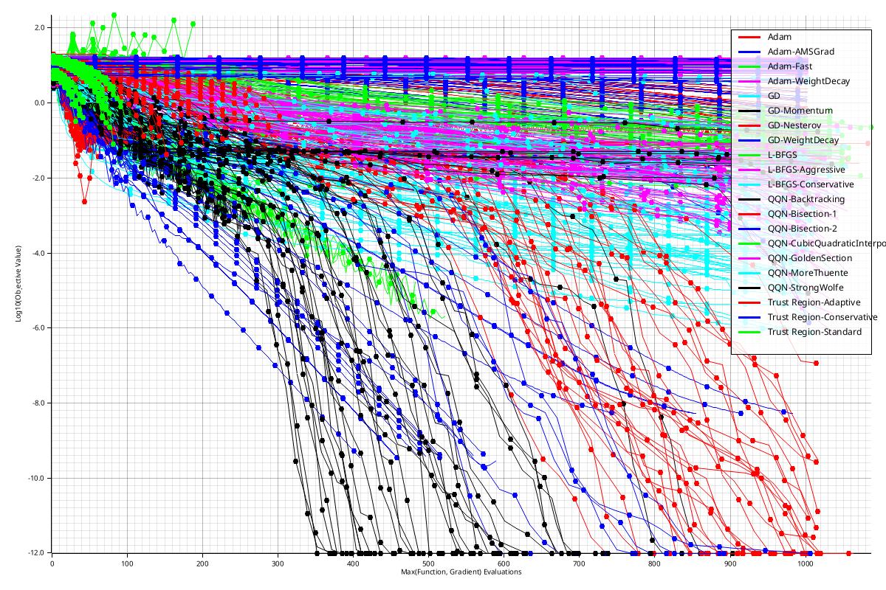

**Figure:** Convergence plots for Trigonometric_10D showing objective value vs iterations.
Left: Linear scale, Right: Log scale for better visualization of convergence behavior.

**Data:** [Linear scale data (CSV)](convergence_Trigonometric_10D_data.csv) | [Log scale data (CSV)](convergence_Trigonometric_10D_log_data.csv)

## Problem: PenaltyI_2D_alpha1e6

**Family:** PenaltyI  
**Dimension:** 2  
**Success Threshold:** 1.000e-6  
**Total Runs:** 560

### Performance Summary
<table style="border-collapse: collapse; width: 100%; margin: 20px 0;">
<tr style="background-color: #f2f2f2;">
<th style="border: 1px solid #ddd; padding: 8px; text-align: center;">Rank</th>
<th style="border: 1px solid #ddd; padding: 8px; text-align: center;">Optimizer</th>
<th style="border: 1px solid #ddd; padding: 8px; text-align: center;">Mean Final Value (All/Success/Fail)</th>
<th style="border: 1px solid #ddd; padding: 8px; text-align: center;">Std Dev</th>
<th style="border: 1px solid #ddd; padding: 8px; text-align: center;">Best Value</th>
<th style="border: 1px solid #ddd; padding: 8px; text-align: center;">Worst Value</th>
<th style="border: 1px solid #ddd; padding: 8px; text-align: center;">Mean Function Evals (All/Success/Fail)</th>
<th style="border: 1px solid #ddd; padding: 8px; text-align: center;">Mean Gradient Evals (All/Success/Fail)</th>
<th style="border: 1px solid #ddd; padding: 8px; text-align: center;">Success Rate</th>
<th style="border: 1px solid #ddd; padding: 8px; text-align: center;">Mean Time (s)</th>
</tr>
<tr style="background-color: #d4edda; font-weight: bold;">
<td style="border: 1px solid #ddd; padding: 8px; text-align: center;">1</td>
<td style="border: 1px solid #ddd; padding: 8px; text-align: center;"><a href="detailed_PenaltyI_2D_alpha1e6_QQN-GoldenSection.md">QQN-GoldenSection</a></td>
<td style="border: 1px solid #ddd; padding: 8px; text-align: center;">1.13e0 / - / 1.13e0</td>
<td style="border: 1px solid #ddd; padding: 8px; text-align: center;">2.63e-4</td>
<td style="border: 1px solid #ddd; padding: 8px; text-align: center;">1.12e0</td>
<td style="border: 1px solid #ddd; padding: 8px; text-align: center;">1.13e0</td>
<td style="border: 1px solid #ddd; padding: 8px; text-align: center;">853.9 / - / 853.9</td>
<td style="border: 1px solid #ddd; padding: 8px; text-align: center;">111.3 / - / 111.3</td>
<td style="border: 1px solid #ddd; padding: 8px; text-align: center;">0.0%</td>
<td style="border: 1px solid #ddd; padding: 8px; text-align: center;">0.013</td>
</tr>
<tr style="background-color: #fff3cd;">
<td style="border: 1px solid #ddd; padding: 8px; text-align: center;">2</td>
<td style="border: 1px solid #ddd; padding: 8px; text-align: center;"><a href="detailed_PenaltyI_2D_alpha1e6_QQN-Bisection-1.md">QQN-Bisection-1</a></td>
<td style="border: 1px solid #ddd; padding: 8px; text-align: center;">1.13e0 / - / 1.13e0</td>
<td style="border: 1px solid #ddd; padding: 8px; text-align: center;">7.75e-4</td>
<td style="border: 1px solid #ddd; padding: 8px; text-align: center;">1.12e0</td>
<td style="border: 1px solid #ddd; padding: 8px; text-align: center;">1.13e0</td>
<td style="border: 1px solid #ddd; padding: 8px; text-align: center;">440.3 / - / 440.3</td>
<td style="border: 1px solid #ddd; padding: 8px; text-align: center;">581.8 / - / 581.8</td>
<td style="border: 1px solid #ddd; padding: 8px; text-align: center;">0.0%</td>
<td style="border: 1px solid #ddd; padding: 8px; text-align: center;">0.011</td>
</tr>
<tr style="">
<td style="border: 1px solid #ddd; padding: 8px; text-align: center;">3</td>
<td style="border: 1px solid #ddd; padding: 8px; text-align: center;"><a href="detailed_PenaltyI_2D_alpha1e6_L-BFGS-Conservative.md">L-BFGS-Conservative</a></td>
<td style="border: 1px solid #ddd; padding: 8px; text-align: center;">1.13e0 / - / 1.13e0</td>
<td style="border: 1px solid #ddd; padding: 8px; text-align: center;">2.17e-3</td>
<td style="border: 1px solid #ddd; padding: 8px; text-align: center;">1.12e0</td>
<td style="border: 1px solid #ddd; padding: 8px; text-align: center;">1.13e0</td>
<td style="border: 1px solid #ddd; padding: 8px; text-align: center;">495.5 / - / 495.5</td>
<td style="border: 1px solid #ddd; padding: 8px; text-align: center;">188.4 / - / 188.4</td>
<td style="border: 1px solid #ddd; padding: 8px; text-align: center;">0.0%</td>
<td style="border: 1px solid #ddd; padding: 8px; text-align: center;">0.006</td>
</tr>
<tr style="">
<td style="border: 1px solid #ddd; padding: 8px; text-align: center;">4</td>
<td style="border: 1px solid #ddd; padding: 8px; text-align: center;"><a href="detailed_PenaltyI_2D_alpha1e6_QQN-CubicQuadraticInterpolation.md">QQN-CubicQuadraticInterpolation</a></td>
<td style="border: 1px solid #ddd; padding: 8px; text-align: center;">3.36e0 / - / 3.36e0</td>
<td style="border: 1px solid #ddd; padding: 8px; text-align: center;">4.60e0</td>
<td style="border: 1px solid #ddd; padding: 8px; text-align: center;">1.13e0</td>
<td style="border: 1px solid #ddd; padding: 8px; text-align: center;">2.39e1</td>
<td style="border: 1px solid #ddd; padding: 8px; text-align: center;">394.1 / - / 394.1</td>
<td style="border: 1px solid #ddd; padding: 8px; text-align: center;">649.5 / - / 649.5</td>
<td style="border: 1px solid #ddd; padding: 8px; text-align: center;">0.0%</td>
<td style="border: 1px solid #ddd; padding: 8px; text-align: center;">0.014</td>
</tr>
<tr style="">
<td style="border: 1px solid #ddd; padding: 8px; text-align: center;">5</td>
<td style="border: 1px solid #ddd; padding: 8px; text-align: center;"><a href="detailed_PenaltyI_2D_alpha1e6_QQN-Backtracking.md">QQN-Backtracking</a></td>
<td style="border: 1px solid #ddd; padding: 8px; text-align: center;">2.77e0 / - / 2.77e0</td>
<td style="border: 1px solid #ddd; padding: 8px; text-align: center;">4.00e0</td>
<td style="border: 1px solid #ddd; padding: 8px; text-align: center;">1.13e0</td>
<td style="border: 1px solid #ddd; padding: 8px; text-align: center;">1.90e1</td>
<td style="border: 1px solid #ddd; padding: 8px; text-align: center;">747.7 / - / 747.7</td>
<td style="border: 1px solid #ddd; padding: 8px; text-align: center;">268.3 / - / 268.3</td>
<td style="border: 1px solid #ddd; padding: 8px; text-align: center;">0.0%</td>
<td style="border: 1px solid #ddd; padding: 8px; text-align: center;">0.017</td>
</tr>
<tr style="">
<td style="border: 1px solid #ddd; padding: 8px; text-align: center;">6</td>
<td style="border: 1px solid #ddd; padding: 8px; text-align: center;"><a href="detailed_PenaltyI_2D_alpha1e6_Adam-AMSGrad.md">Adam-AMSGrad</a></td>
<td style="border: 1px solid #ddd; padding: 8px; text-align: center;">1.37e4 / - / 1.37e4</td>
<td style="border: 1px solid #ddd; padding: 8px; text-align: center;">1.20e4</td>
<td style="border: 1px solid #ddd; padding: 8px; text-align: center;">1.13e0</td>
<td style="border: 1px solid #ddd; padding: 8px; text-align: center;">3.71e4</td>
<td style="border: 1px solid #ddd; padding: 8px; text-align: center;">489.4 / - / 489.4</td>
<td style="border: 1px solid #ddd; padding: 8px; text-align: center;">489.4 / - / 489.4</td>
<td style="border: 1px solid #ddd; padding: 8px; text-align: center;">0.0%</td>
<td style="border: 1px solid #ddd; padding: 8px; text-align: center;">0.011</td>
</tr>
<tr style="">
<td style="border: 1px solid #ddd; padding: 8px; text-align: center;">7</td>
<td style="border: 1px solid #ddd; padding: 8px; text-align: center;"><a href="detailed_PenaltyI_2D_alpha1e6_Adam.md">Adam</a></td>
<td style="border: 1px solid #ddd; padding: 8px; text-align: center;">9.49e3 / - / 9.49e3</td>
<td style="border: 1px solid #ddd; padding: 8px; text-align: center;">1.39e4</td>
<td style="border: 1px solid #ddd; padding: 8px; text-align: center;">1.13e0</td>
<td style="border: 1px solid #ddd; padding: 8px; text-align: center;">5.22e4</td>
<td style="border: 1px solid #ddd; padding: 8px; text-align: center;">453.1 / - / 453.1</td>
<td style="border: 1px solid #ddd; padding: 8px; text-align: center;">452.6 / - / 452.6</td>
<td style="border: 1px solid #ddd; padding: 8px; text-align: center;">0.0%</td>
<td style="border: 1px solid #ddd; padding: 8px; text-align: center;">0.009</td>
</tr>
<tr style="">
<td style="border: 1px solid #ddd; padding: 8px; text-align: center;">8</td>
<td style="border: 1px solid #ddd; padding: 8px; text-align: center;"><a href="detailed_PenaltyI_2D_alpha1e6_GD.md">GD</a></td>
<td style="border: 1px solid #ddd; padding: 8px; text-align: center;">1.18e0 / - / 1.83e1</td>
<td style="border: 1px solid #ddd; padding: 8px; text-align: center;">2.96e-2</td>
<td style="border: 1px solid #ddd; padding: 8px; text-align: center;">1.13e0</td>
<td style="border: 1px solid #ddd; padding: 8px; text-align: center;">1.23e0</td>
<td style="border: 1px solid #ddd; padding: 8px; text-align: center;">14.4 / - / 14.4</td>
<td style="border: 1px solid #ddd; padding: 8px; text-align: center;">24.8 / - / 24.8</td>
<td style="border: 1px solid #ddd; padding: 8px; text-align: center;">0.0%</td>
<td style="border: 1px solid #ddd; padding: 8px; text-align: center;">0.000</td>
</tr>
<tr style="">
<td style="border: 1px solid #ddd; padding: 8px; text-align: center;">9</td>
<td style="border: 1px solid #ddd; padding: 8px; text-align: center;"><a href="detailed_PenaltyI_2D_alpha1e6_Adam-WeightDecay.md">Adam-WeightDecay</a></td>
<td style="border: 1px solid #ddd; padding: 8px; text-align: center;">1.14e0 / - / 3.60e0</td>
<td style="border: 1px solid #ddd; padding: 8px; text-align: center;">4.32e-3</td>
<td style="border: 1px solid #ddd; padding: 8px; text-align: center;">1.13e0</td>
<td style="border: 1px solid #ddd; padding: 8px; text-align: center;">1.15e0</td>
<td style="border: 1px solid #ddd; padding: 8px; text-align: center;">203.5 / - / 203.5</td>
<td style="border: 1px solid #ddd; padding: 8px; text-align: center;">202.5 / - / 202.5</td>
<td style="border: 1px solid #ddd; padding: 8px; text-align: center;">0.0%</td>
<td style="border: 1px solid #ddd; padding: 8px; text-align: center;">0.004</td>
</tr>
<tr style="">
<td style="border: 1px solid #ddd; padding: 8px; text-align: center;">10</td>
<td style="border: 1px solid #ddd; padding: 8px; text-align: center;"><a href="detailed_PenaltyI_2D_alpha1e6_GD-Momentum.md">GD-Momentum</a></td>
<td style="border: 1px solid #ddd; padding: 8px; text-align: center;">1.27e0 / - / 5.97e1</td>
<td style="border: 1px solid #ddd; padding: 8px; text-align: center;">1.08e-1</td>
<td style="border: 1px solid #ddd; padding: 8px; text-align: center;">1.14e0</td>
<td style="border: 1px solid #ddd; padding: 8px; text-align: center;">1.49e0</td>
<td style="border: 1px solid #ddd; padding: 8px; text-align: center;">12.8 / - / 12.8</td>
<td style="border: 1px solid #ddd; padding: 8px; text-align: center;">21.5 / - / 21.5</td>
<td style="border: 1px solid #ddd; padding: 8px; text-align: center;">0.0%</td>
<td style="border: 1px solid #ddd; padding: 8px; text-align: center;">0.000</td>
</tr>
<tr style="">
<td style="border: 1px solid #ddd; padding: 8px; text-align: center;">11</td>
<td style="border: 1px solid #ddd; padding: 8px; text-align: center;"><a href="detailed_PenaltyI_2D_alpha1e6_GD-Nesterov.md">GD-Nesterov</a></td>
<td style="border: 1px solid #ddd; padding: 8px; text-align: center;">1.31e0 / - / 1.92e2</td>
<td style="border: 1px solid #ddd; padding: 8px; text-align: center;">1.19e-1</td>
<td style="border: 1px solid #ddd; padding: 8px; text-align: center;">1.14e0</td>
<td style="border: 1px solid #ddd; padding: 8px; text-align: center;">1.52e0</td>
<td style="border: 1px solid #ddd; padding: 8px; text-align: center;">13.9 / - / 13.9</td>
<td style="border: 1px solid #ddd; padding: 8px; text-align: center;">23.9 / - / 23.9</td>
<td style="border: 1px solid #ddd; padding: 8px; text-align: center;">0.0%</td>
<td style="border: 1px solid #ddd; padding: 8px; text-align: center;">0.000</td>
</tr>
<tr style="">
<td style="border: 1px solid #ddd; padding: 8px; text-align: center;">12</td>
<td style="border: 1px solid #ddd; padding: 8px; text-align: center;"><a href="detailed_PenaltyI_2D_alpha1e6_QQN-StrongWolfe.md">QQN-StrongWolfe</a></td>
<td style="border: 1px solid #ddd; padding: 8px; text-align: center;">1.84e0 / - / 1.84e0</td>
<td style="border: 1px solid #ddd; padding: 8px; text-align: center;">1.20e0</td>
<td style="border: 1px solid #ddd; padding: 8px; text-align: center;">1.15e0</td>
<td style="border: 1px solid #ddd; padding: 8px; text-align: center;">6.40e0</td>
<td style="border: 1px solid #ddd; padding: 8px; text-align: center;">639.5 / - / 639.5</td>
<td style="border: 1px solid #ddd; padding: 8px; text-align: center;">377.5 / - / 377.5</td>
<td style="border: 1px solid #ddd; padding: 8px; text-align: center;">0.0%</td>
<td style="border: 1px solid #ddd; padding: 8px; text-align: center;">0.015</td>
</tr>
<tr style="">
<td style="border: 1px solid #ddd; padding: 8px; text-align: center;">13</td>
<td style="border: 1px solid #ddd; padding: 8px; text-align: center;"><a href="detailed_PenaltyI_2D_alpha1e6_L-BFGS.md">L-BFGS</a></td>
<td style="border: 1px solid #ddd; padding: 8px; text-align: center;">1.44e0 / - / 7.77e4</td>
<td style="border: 1px solid #ddd; padding: 8px; text-align: center;">1.84e-1</td>
<td style="border: 1px solid #ddd; padding: 8px; text-align: center;">1.16e0</td>
<td style="border: 1px solid #ddd; padding: 8px; text-align: center;">1.76e0</td>
<td style="border: 1px solid #ddd; padding: 8px; text-align: center;">99.8 / - / 99.8</td>
<td style="border: 1px solid #ddd; padding: 8px; text-align: center;">38.8 / - / 38.8</td>
<td style="border: 1px solid #ddd; padding: 8px; text-align: center;">0.0%</td>
<td style="border: 1px solid #ddd; padding: 8px; text-align: center;">0.001</td>
</tr>
<tr style="">
<td style="border: 1px solid #ddd; padding: 8px; text-align: center;">14</td>
<td style="border: 1px solid #ddd; padding: 8px; text-align: center;"><a href="detailed_PenaltyI_2D_alpha1e6_Adam-Fast.md">Adam-Fast</a></td>
<td style="border: 1px solid #ddd; padding: 8px; text-align: center;">1.42e0 / - / 3.76e1</td>
<td style="border: 1px solid #ddd; padding: 8px; text-align: center;">1.22e-1</td>
<td style="border: 1px solid #ddd; padding: 8px; text-align: center;">1.16e0</td>
<td style="border: 1px solid #ddd; padding: 8px; text-align: center;">1.66e0</td>
<td style="border: 1px solid #ddd; padding: 8px; text-align: center;">22.8 / - / 22.8</td>
<td style="border: 1px solid #ddd; padding: 8px; text-align: center;">21.8 / - / 21.8</td>
<td style="border: 1px solid #ddd; padding: 8px; text-align: center;">0.0%</td>
<td style="border: 1px solid #ddd; padding: 8px; text-align: center;">0.000</td>
</tr>
<tr style="">
<td style="border: 1px solid #ddd; padding: 8px; text-align: center;">15</td>
<td style="border: 1px solid #ddd; padding: 8px; text-align: center;"><a href="detailed_PenaltyI_2D_alpha1e6_L-BFGS-Aggressive.md">L-BFGS-Aggressive</a></td>
<td style="border: 1px solid #ddd; padding: 8px; text-align: center;">1.59e4 / - / 1.59e4</td>
<td style="border: 1px solid #ddd; padding: 8px; text-align: center;">6.96e4</td>
<td style="border: 1px solid #ddd; padding: 8px; text-align: center;">1.17e0</td>
<td style="border: 1px solid #ddd; padding: 8px; text-align: center;">3.54e5</td>
<td style="border: 1px solid #ddd; padding: 8px; text-align: center;">633.0 / - / 633.0</td>
<td style="border: 1px solid #ddd; padding: 8px; text-align: center;">324.5 / - / 324.5</td>
<td style="border: 1px solid #ddd; padding: 8px; text-align: center;">0.0%</td>
<td style="border: 1px solid #ddd; padding: 8px; text-align: center;">0.010</td>
</tr>
<tr style="">
<td style="border: 1px solid #ddd; padding: 8px; text-align: center;">16</td>
<td style="border: 1px solid #ddd; padding: 8px; text-align: center;"><a href="detailed_PenaltyI_2D_alpha1e6_GD-WeightDecay.md">GD-WeightDecay</a></td>
<td style="border: 1px solid #ddd; padding: 8px; text-align: center;">1.30e0 / - / 2.62e0</td>
<td style="border: 1px solid #ddd; padding: 8px; text-align: center;">9.60e-2</td>
<td style="border: 1px solid #ddd; padding: 8px; text-align: center;">1.17e0</td>
<td style="border: 1px solid #ddd; padding: 8px; text-align: center;">1.50e0</td>
<td style="border: 1px solid #ddd; padding: 8px; text-align: center;">13.2 / - / 13.2</td>
<td style="border: 1px solid #ddd; padding: 8px; text-align: center;">22.4 / - / 22.4</td>
<td style="border: 1px solid #ddd; padding: 8px; text-align: center;">0.0%</td>
<td style="border: 1px solid #ddd; padding: 8px; text-align: center;">0.000</td>
</tr>
<tr style="">
<td style="border: 1px solid #ddd; padding: 8px; text-align: center;">17</td>
<td style="border: 1px solid #ddd; padding: 8px; text-align: center;"><a href="detailed_PenaltyI_2D_alpha1e6_QQN-Bisection-2.md">QQN-Bisection-2</a></td>
<td style="border: 1px solid #ddd; padding: 8px; text-align: center;">2.68e0 / - / 2.68e0</td>
<td style="border: 1px solid #ddd; padding: 8px; text-align: center;">1.34e0</td>
<td style="border: 1px solid #ddd; padding: 8px; text-align: center;">1.28e0</td>
<td style="border: 1px solid #ddd; padding: 8px; text-align: center;">6.62e0</td>
<td style="border: 1px solid #ddd; padding: 8px; text-align: center;">267.6 / - / 267.6</td>
<td style="border: 1px solid #ddd; padding: 8px; text-align: center;">175.9 / - / 175.9</td>
<td style="border: 1px solid #ddd; padding: 8px; text-align: center;">0.0%</td>
<td style="border: 1px solid #ddd; padding: 8px; text-align: center;">0.005</td>
</tr>
<tr style="">
<td style="border: 1px solid #ddd; padding: 8px; text-align: center;">18</td>
<td style="border: 1px solid #ddd; padding: 8px; text-align: center;"><a href="detailed_PenaltyI_2D_alpha1e6_QQN-MoreThuente.md">QQN-MoreThuente</a></td>
<td style="border: 1px solid #ddd; padding: 8px; text-align: center;">2.79e4 / - / 2.79e4</td>
<td style="border: 1px solid #ddd; padding: 8px; text-align: center;">1.30e4</td>
<td style="border: 1px solid #ddd; padding: 8px; text-align: center;">5.98e3</td>
<td style="border: 1px solid #ddd; padding: 8px; text-align: center;">5.55e4</td>
<td style="border: 1px solid #ddd; padding: 8px; text-align: center;">487.0 / - / 487.0</td>
<td style="border: 1px solid #ddd; padding: 8px; text-align: center;">532.0 / - / 532.0</td>
<td style="border: 1px solid #ddd; padding: 8px; text-align: center;">0.0%</td>
<td style="border: 1px solid #ddd; padding: 8px; text-align: center;">0.009</td>
</tr>
<tr style="">
<td style="border: 1px solid #ddd; padding: 8px; text-align: center;">19</td>
<td style="border: 1px solid #ddd; padding: 8px; text-align: center;"><a href="detailed_PenaltyI_2D_alpha1e6_Trust_Region-Conservative.md">Trust Region-Conservative</a></td>
<td style="border: 1px solid #ddd; padding: 8px; text-align: center;">1.38e5 / - / 1.38e5</td>
<td style="border: 1px solid #ddd; padding: 8px; text-align: center;">8.19e4</td>
<td style="border: 1px solid #ddd; padding: 8px; text-align: center;">1.04e4</td>
<td style="border: 1px solid #ddd; padding: 8px; text-align: center;">3.23e5</td>
<td style="border: 1px solid #ddd; padding: 8px; text-align: center;">602.0 / - / 602.0</td>
<td style="border: 1px solid #ddd; padding: 8px; text-align: center;">402.0 / - / 402.0</td>
<td style="border: 1px solid #ddd; padding: 8px; text-align: center;">0.0%</td>
<td style="border: 1px solid #ddd; padding: 8px; text-align: center;">0.004</td>
</tr>
<tr style="">
<td style="border: 1px solid #ddd; padding: 8px; text-align: center;">20</td>
<td style="border: 1px solid #ddd; padding: 8px; text-align: center;"><a href="detailed_PenaltyI_2D_alpha1e6_Trust_Region-Adaptive.md">Trust Region-Adaptive</a></td>
<td style="border: 1px solid #ddd; padding: 8px; text-align: center;">1.31e5 / - / 1.31e5</td>
<td style="border: 1px solid #ddd; padding: 8px; text-align: center;">8.28e4</td>
<td style="border: 1px solid #ddd; padding: 8px; text-align: center;">2.33e4</td>
<td style="border: 1px solid #ddd; padding: 8px; text-align: center;">2.95e5</td>
<td style="border: 1px solid #ddd; padding: 8px; text-align: center;">602.0 / - / 602.0</td>
<td style="border: 1px solid #ddd; padding: 8px; text-align: center;">402.0 / - / 402.0</td>
<td style="border: 1px solid #ddd; padding: 8px; text-align: center;">0.0%</td>
<td style="border: 1px solid #ddd; padding: 8px; text-align: center;">0.004</td>
</tr>
<tr style="">
<td style="border: 1px solid #ddd; padding: 8px; text-align: center;">21</td>
<td style="border: 1px solid #ddd; padding: 8px; text-align: center;"><a href="detailed_PenaltyI_2D_alpha1e6_Trust_Region-Standard.md">Trust Region-Standard</a></td>
<td style="border: 1px solid #ddd; padding: 8px; text-align: center;">1.79e5 / - / 1.79e5</td>
<td style="border: 1px solid #ddd; padding: 8px; text-align: center;">8.92e4</td>
<td style="border: 1px solid #ddd; padding: 8px; text-align: center;">6.12e4</td>
<td style="border: 1px solid #ddd; padding: 8px; text-align: center;">3.77e5</td>
<td style="border: 1px solid #ddd; padding: 8px; text-align: center;">602.0 / - / 602.0</td>
<td style="border: 1px solid #ddd; padding: 8px; text-align: center;">402.0 / - / 402.0</td>
<td style="border: 1px solid #ddd; padding: 8px; text-align: center;">0.0%</td>
<td style="border: 1px solid #ddd; padding: 8px; text-align: center;">0.004</td>
</tr>
</table>

### Convergence Plots

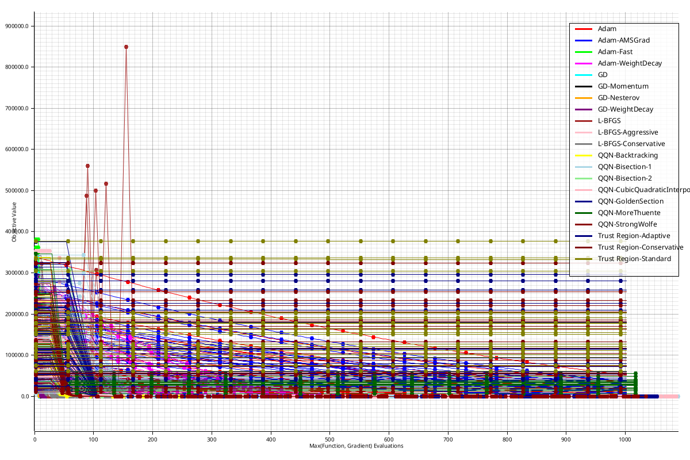
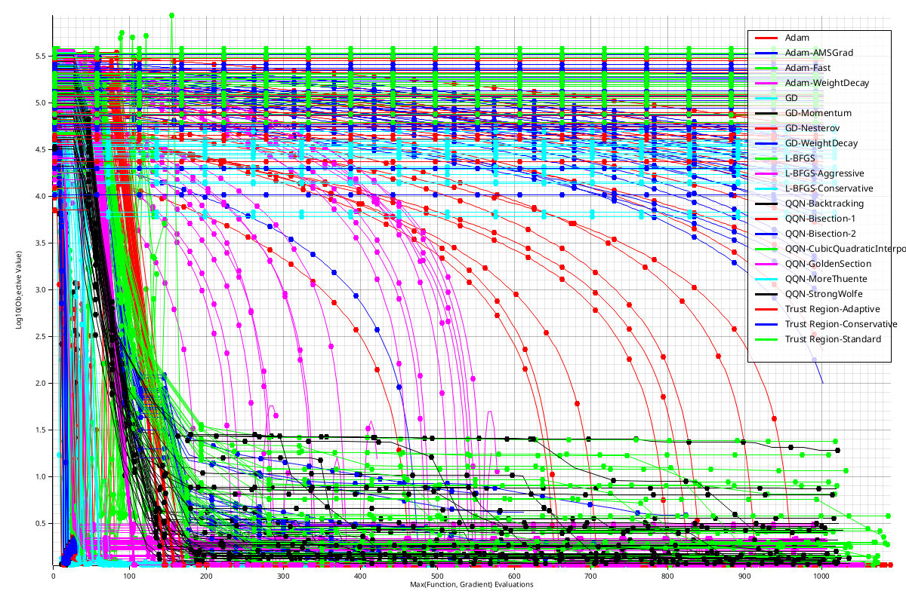

**Figure:** Convergence plots for PenaltyI_2D_alpha1e6 showing objective value vs iterations.
Left: Linear scale, Right: Log scale for better visualization of convergence behavior.

**Data:** [Linear scale data (CSV)](convergence_PenaltyI_2D_alpha1e6_data.csv) | [Log scale data (CSV)](convergence_PenaltyI_2D_alpha1e6_log_data.csv)

## Problem: PenaltyI_5D_alpha1e6

**Family:** PenaltyI  
**Dimension:** 5  
**Success Threshold:** 1.000e-6  
**Total Runs:** 560

### Performance Summary
<table style="border-collapse: collapse; width: 100%; margin: 20px 0;">
<tr style="background-color: #f2f2f2;">
<th style="border: 1px solid #ddd; padding: 8px; text-align: center;">Rank</th>
<th style="border: 1px solid #ddd; padding: 8px; text-align: center;">Optimizer</th>
<th style="border: 1px solid #ddd; padding: 8px; text-align: center;">Mean Final Value (All/Success/Fail)</th>
<th style="border: 1px solid #ddd; padding: 8px; text-align: center;">Std Dev</th>
<th style="border: 1px solid #ddd; padding: 8px; text-align: center;">Best Value</th>
<th style="border: 1px solid #ddd; padding: 8px; text-align: center;">Worst Value</th>
<th style="border: 1px solid #ddd; padding: 8px; text-align: center;">Mean Function Evals (All/Success/Fail)</th>
<th style="border: 1px solid #ddd; padding: 8px; text-align: center;">Mean Gradient Evals (All/Success/Fail)</th>
<th style="border: 1px solid #ddd; padding: 8px; text-align: center;">Success Rate</th>
<th style="border: 1px solid #ddd; padding: 8px; text-align: center;">Mean Time (s)</th>
</tr>
<tr style="background-color: #d4edda; font-weight: bold;">
<td style="border: 1px solid #ddd; padding: 8px; text-align: center;">1</td>
<td style="border: 1px solid #ddd; padding: 8px; text-align: center;"><a href="detailed_PenaltyI_5D_alpha1e6_QQN-Bisection-1.md">QQN-Bisection-1</a></td>
<td style="border: 1px solid #ddd; padding: 8px; text-align: center;">2.82e0 / - / 2.82e0</td>
<td style="border: 1px solid #ddd; padding: 8px; text-align: center;">1.97e-3</td>
<td style="border: 1px solid #ddd; padding: 8px; text-align: center;">2.81e0</td>
<td style="border: 1px solid #ddd; padding: 8px; text-align: center;">2.82e0</td>
<td style="border: 1px solid #ddd; padding: 8px; text-align: center;">441.4 / - / 441.4</td>
<td style="border: 1px solid #ddd; padding: 8px; text-align: center;">590.6 / - / 590.6</td>
<td style="border: 1px solid #ddd; padding: 8px; text-align: center;">0.0%</td>
<td style="border: 1px solid #ddd; padding: 8px; text-align: center;">0.012</td>
</tr>
<tr style="background-color: #fff3cd;">
<td style="border: 1px solid #ddd; padding: 8px; text-align: center;">2</td>
<td style="border: 1px solid #ddd; padding: 8px; text-align: center;"><a href="detailed_PenaltyI_5D_alpha1e6_QQN-GoldenSection.md">QQN-GoldenSection</a></td>
<td style="border: 1px solid #ddd; padding: 8px; text-align: center;">2.81e0 / - / 2.81e0</td>
<td style="border: 1px solid #ddd; padding: 8px; text-align: center;">6.47e-4</td>
<td style="border: 1px solid #ddd; padding: 8px; text-align: center;">2.81e0</td>
<td style="border: 1px solid #ddd; padding: 8px; text-align: center;">2.82e0</td>
<td style="border: 1px solid #ddd; padding: 8px; text-align: center;">907.2 / - / 907.2</td>
<td style="border: 1px solid #ddd; padding: 8px; text-align: center;">117.0 / - / 117.0</td>
<td style="border: 1px solid #ddd; padding: 8px; text-align: center;">0.0%</td>
<td style="border: 1px solid #ddd; padding: 8px; text-align: center;">0.014</td>
</tr>
<tr style="">
<td style="border: 1px solid #ddd; padding: 8px; text-align: center;">3</td>
<td style="border: 1px solid #ddd; padding: 8px; text-align: center;"><a href="detailed_PenaltyI_5D_alpha1e6_L-BFGS-Conservative.md">L-BFGS-Conservative</a></td>
<td style="border: 1px solid #ddd; padding: 8px; text-align: center;">2.86e0 / - / 4.88e4</td>
<td style="border: 1px solid #ddd; padding: 8px; text-align: center;">5.53e-2</td>
<td style="border: 1px solid #ddd; padding: 8px; text-align: center;">2.81e0</td>
<td style="border: 1px solid #ddd; padding: 8px; text-align: center;">3.03e0</td>
<td style="border: 1px solid #ddd; padding: 8px; text-align: center;">732.9 / - / 732.9</td>
<td style="border: 1px solid #ddd; padding: 8px; text-align: center;">234.5 / - / 234.5</td>
<td style="border: 1px solid #ddd; padding: 8px; text-align: center;">0.0%</td>
<td style="border: 1px solid #ddd; padding: 8px; text-align: center;">0.008</td>
</tr>
<tr style="">
<td style="border: 1px solid #ddd; padding: 8px; text-align: center;">4</td>
<td style="border: 1px solid #ddd; padding: 8px; text-align: center;"><a href="detailed_PenaltyI_5D_alpha1e6_GD.md">GD</a></td>
<td style="border: 1px solid #ddd; padding: 8px; text-align: center;">2.94e0 / - / 9.29e1</td>
<td style="border: 1px solid #ddd; padding: 8px; text-align: center;">8.22e-2</td>
<td style="border: 1px solid #ddd; padding: 8px; text-align: center;">2.82e0</td>
<td style="border: 1px solid #ddd; padding: 8px; text-align: center;">3.11e0</td>
<td style="border: 1px solid #ddd; padding: 8px; text-align: center;">15.8 / - / 15.8</td>
<td style="border: 1px solid #ddd; padding: 8px; text-align: center;">27.6 / - / 27.6</td>
<td style="border: 1px solid #ddd; padding: 8px; text-align: center;">0.0%</td>
<td style="border: 1px solid #ddd; padding: 8px; text-align: center;">0.000</td>
</tr>
<tr style="">
<td style="border: 1px solid #ddd; padding: 8px; text-align: center;">5</td>
<td style="border: 1px solid #ddd; padding: 8px; text-align: center;"><a href="detailed_PenaltyI_5D_alpha1e6_Adam-AMSGrad.md">Adam-AMSGrad</a></td>
<td style="border: 1px solid #ddd; padding: 8px; text-align: center;">2.98e4 / - / 2.98e4</td>
<td style="border: 1px solid #ddd; padding: 8px; text-align: center;">2.18e4</td>
<td style="border: 1px solid #ddd; padding: 8px; text-align: center;">2.82e0</td>
<td style="border: 1px solid #ddd; padding: 8px; text-align: center;">7.74e4</td>
<td style="border: 1px solid #ddd; padding: 8px; text-align: center;">501.9 / - / 501.9</td>
<td style="border: 1px solid #ddd; padding: 8px; text-align: center;">501.8 / - / 501.8</td>
<td style="border: 1px solid #ddd; padding: 8px; text-align: center;">0.0%</td>
<td style="border: 1px solid #ddd; padding: 8px; text-align: center;">0.012</td>
</tr>
<tr style="">
<td style="border: 1px solid #ddd; padding: 8px; text-align: center;">6</td>
<td style="border: 1px solid #ddd; padding: 8px; text-align: center;"><a href="detailed_PenaltyI_5D_alpha1e6_Adam.md">Adam</a></td>
<td style="border: 1px solid #ddd; padding: 8px; text-align: center;">2.48e4 / - / 2.48e4</td>
<td style="border: 1px solid #ddd; padding: 8px; text-align: center;">2.11e4</td>
<td style="border: 1px solid #ddd; padding: 8px; text-align: center;">2.82e0</td>
<td style="border: 1px solid #ddd; padding: 8px; text-align: center;">7.04e4</td>
<td style="border: 1px solid #ddd; padding: 8px; text-align: center;">482.3 / - / 482.3</td>
<td style="border: 1px solid #ddd; padding: 8px; text-align: center;">482.2 / - / 482.2</td>
<td style="border: 1px solid #ddd; padding: 8px; text-align: center;">0.0%</td>
<td style="border: 1px solid #ddd; padding: 8px; text-align: center;">0.010</td>
</tr>
<tr style="">
<td style="border: 1px solid #ddd; padding: 8px; text-align: center;">7</td>
<td style="border: 1px solid #ddd; padding: 8px; text-align: center;"><a href="detailed_PenaltyI_5D_alpha1e6_Adam-WeightDecay.md">Adam-WeightDecay</a></td>
<td style="border: 1px solid #ddd; padding: 8px; text-align: center;">2.85e0 / - / 1.09e1</td>
<td style="border: 1px solid #ddd; padding: 8px; text-align: center;">7.37e-3</td>
<td style="border: 1px solid #ddd; padding: 8px; text-align: center;">2.83e0</td>
<td style="border: 1px solid #ddd; padding: 8px; text-align: center;">2.86e0</td>
<td style="border: 1px solid #ddd; padding: 8px; text-align: center;">270.2 / - / 270.2</td>
<td style="border: 1px solid #ddd; padding: 8px; text-align: center;">269.2 / - / 269.2</td>
<td style="border: 1px solid #ddd; padding: 8px; text-align: center;">0.0%</td>
<td style="border: 1px solid #ddd; padding: 8px; text-align: center;">0.006</td>
</tr>
<tr style="">
<td style="border: 1px solid #ddd; padding: 8px; text-align: center;">8</td>
<td style="border: 1px solid #ddd; padding: 8px; text-align: center;"><a href="detailed_PenaltyI_5D_alpha1e6_GD-Momentum.md">GD-Momentum</a></td>
<td style="border: 1px solid #ddd; padding: 8px; text-align: center;">3.16e0 / - / 8.55e1</td>
<td style="border: 1px solid #ddd; padding: 8px; text-align: center;">2.24e-1</td>
<td style="border: 1px solid #ddd; padding: 8px; text-align: center;">2.84e0</td>
<td style="border: 1px solid #ddd; padding: 8px; text-align: center;">3.52e0</td>
<td style="border: 1px solid #ddd; padding: 8px; text-align: center;">14.2 / - / 14.2</td>
<td style="border: 1px solid #ddd; padding: 8px; text-align: center;">24.4 / - / 24.4</td>
<td style="border: 1px solid #ddd; padding: 8px; text-align: center;">0.0%</td>
<td style="border: 1px solid #ddd; padding: 8px; text-align: center;">0.000</td>
</tr>
<tr style="">
<td style="border: 1px solid #ddd; padding: 8px; text-align: center;">9</td>
<td style="border: 1px solid #ddd; padding: 8px; text-align: center;"><a href="detailed_PenaltyI_5D_alpha1e6_GD-WeightDecay.md">GD-WeightDecay</a></td>
<td style="border: 1px solid #ddd; padding: 8px; text-align: center;">3.07e0 / - / 4.44e1</td>
<td style="border: 1px solid #ddd; padding: 8px; text-align: center;">1.49e-1</td>
<td style="border: 1px solid #ddd; padding: 8px; text-align: center;">2.85e0</td>
<td style="border: 1px solid #ddd; padding: 8px; text-align: center;">3.32e0</td>
<td style="border: 1px solid #ddd; padding: 8px; text-align: center;">14.4 / - / 14.4</td>
<td style="border: 1px solid #ddd; padding: 8px; text-align: center;">24.8 / - / 24.8</td>
<td style="border: 1px solid #ddd; padding: 8px; text-align: center;">0.0%</td>
<td style="border: 1px solid #ddd; padding: 8px; text-align: center;">0.000</td>
</tr>
<tr style="">
<td style="border: 1px solid #ddd; padding: 8px; text-align: center;">10</td>
<td style="border: 1px solid #ddd; padding: 8px; text-align: center;"><a href="detailed_PenaltyI_5D_alpha1e6_GD-Nesterov.md">GD-Nesterov</a></td>
<td style="border: 1px solid #ddd; padding: 8px; text-align: center;">3.18e0 / - / 3.92e2</td>
<td style="border: 1px solid #ddd; padding: 8px; text-align: center;">1.66e-1</td>
<td style="border: 1px solid #ddd; padding: 8px; text-align: center;">2.93e0</td>
<td style="border: 1px solid #ddd; padding: 8px; text-align: center;">3.63e0</td>
<td style="border: 1px solid #ddd; padding: 8px; text-align: center;">13.8 / - / 13.8</td>
<td style="border: 1px solid #ddd; padding: 8px; text-align: center;">23.6 / - / 23.6</td>
<td style="border: 1px solid #ddd; padding: 8px; text-align: center;">0.0%</td>
<td style="border: 1px solid #ddd; padding: 8px; text-align: center;">0.000</td>
</tr>
<tr style="">
<td style="border: 1px solid #ddd; padding: 8px; text-align: center;">11</td>
<td style="border: 1px solid #ddd; padding: 8px; text-align: center;"><a href="detailed_PenaltyI_5D_alpha1e6_Adam-Fast.md">Adam-Fast</a></td>
<td style="border: 1px solid #ddd; padding: 8px; text-align: center;">3.94e0 / - / 1.16e3</td>
<td style="border: 1px solid #ddd; padding: 8px; text-align: center;">2.39e-1</td>
<td style="border: 1px solid #ddd; padding: 8px; text-align: center;">3.22e0</td>
<td style="border: 1px solid #ddd; padding: 8px; text-align: center;">4.29e0</td>
<td style="border: 1px solid #ddd; padding: 8px; text-align: center;">24.8 / - / 24.8</td>
<td style="border: 1px solid #ddd; padding: 8px; text-align: center;">23.8 / - / 23.8</td>
<td style="border: 1px solid #ddd; padding: 8px; text-align: center;">0.0%</td>
<td style="border: 1px solid #ddd; padding: 8px; text-align: center;">0.000</td>
</tr>
<tr style="">
<td style="border: 1px solid #ddd; padding: 8px; text-align: center;">12</td>
<td style="border: 1px solid #ddd; padding: 8px; text-align: center;"><a href="detailed_PenaltyI_5D_alpha1e6_QQN-CubicQuadraticInterpolation.md">QQN-CubicQuadraticInterpolation</a></td>
<td style="border: 1px solid #ddd; padding: 8px; text-align: center;">1.31e1 / - / 1.31e1</td>
<td style="border: 1px solid #ddd; padding: 8px; text-align: center;">9.44e0</td>
<td style="border: 1px solid #ddd; padding: 8px; text-align: center;">3.32e0</td>
<td style="border: 1px solid #ddd; padding: 8px; text-align: center;">4.02e1</td>
<td style="border: 1px solid #ddd; padding: 8px; text-align: center;">397.0 / - / 397.0</td>
<td style="border: 1px solid #ddd; padding: 8px; text-align: center;">646.0 / - / 646.0</td>
<td style="border: 1px solid #ddd; padding: 8px; text-align: center;">0.0%</td>
<td style="border: 1px solid #ddd; padding: 8px; text-align: center;">0.014</td>
</tr>
<tr style="">
<td style="border: 1px solid #ddd; padding: 8px; text-align: center;">13</td>
<td style="border: 1px solid #ddd; padding: 8px; text-align: center;"><a href="detailed_PenaltyI_5D_alpha1e6_QQN-Backtracking.md">QQN-Backtracking</a></td>
<td style="border: 1px solid #ddd; padding: 8px; text-align: center;">8.76e0 / - / 8.76e0</td>
<td style="border: 1px solid #ddd; padding: 8px; text-align: center;">4.55e0</td>
<td style="border: 1px solid #ddd; padding: 8px; text-align: center;">3.33e0</td>
<td style="border: 1px solid #ddd; padding: 8px; text-align: center;">2.18e1</td>
<td style="border: 1px solid #ddd; padding: 8px; text-align: center;">719.6 / - / 719.6</td>
<td style="border: 1px solid #ddd; padding: 8px; text-align: center;">292.0 / - / 292.0</td>
<td style="border: 1px solid #ddd; padding: 8px; text-align: center;">0.0%</td>
<td style="border: 1px solid #ddd; padding: 8px; text-align: center;">0.018</td>
</tr>
<tr style="">
<td style="border: 1px solid #ddd; padding: 8px; text-align: center;">14</td>
<td style="border: 1px solid #ddd; padding: 8px; text-align: center;"><a href="detailed_PenaltyI_5D_alpha1e6_L-BFGS.md">L-BFGS</a></td>
<td style="border: 1px solid #ddd; padding: 8px; text-align: center;">4.17e0 / - / 1.14e5</td>
<td style="border: 1px solid #ddd; padding: 8px; text-align: center;">4.89e-1</td>
<td style="border: 1px solid #ddd; padding: 8px; text-align: center;">3.55e0</td>
<td style="border: 1px solid #ddd; padding: 8px; text-align: center;">5.32e0</td>
<td style="border: 1px solid #ddd; padding: 8px; text-align: center;">97.9 / - / 97.9</td>
<td style="border: 1px solid #ddd; padding: 8px; text-align: center;">37.9 / - / 37.9</td>
<td style="border: 1px solid #ddd; padding: 8px; text-align: center;">0.0%</td>
<td style="border: 1px solid #ddd; padding: 8px; text-align: center;">0.001</td>
</tr>
<tr style="">
<td style="border: 1px solid #ddd; padding: 8px; text-align: center;">15</td>
<td style="border: 1px solid #ddd; padding: 8px; text-align: center;"><a href="detailed_PenaltyI_5D_alpha1e6_L-BFGS-Aggressive.md">L-BFGS-Aggressive</a></td>
<td style="border: 1px solid #ddd; padding: 8px; text-align: center;">1.84e5 / - / 1.84e5</td>
<td style="border: 1px solid #ddd; padding: 8px; text-align: center;">2.13e5</td>
<td style="border: 1px solid #ddd; padding: 8px; text-align: center;">3.84e0</td>
<td style="border: 1px solid #ddd; padding: 8px; text-align: center;">6.63e5</td>
<td style="border: 1px solid #ddd; padding: 8px; text-align: center;">404.8 / - / 404.8</td>
<td style="border: 1px solid #ddd; padding: 8px; text-align: center;">160.9 / - / 160.9</td>
<td style="border: 1px solid #ddd; padding: 8px; text-align: center;">0.0%</td>
<td style="border: 1px solid #ddd; padding: 8px; text-align: center;">0.004</td>
</tr>
<tr style="">
<td style="border: 1px solid #ddd; padding: 8px; text-align: center;">16</td>
<td style="border: 1px solid #ddd; padding: 8px; text-align: center;"><a href="detailed_PenaltyI_5D_alpha1e6_QQN-StrongWolfe.md">QQN-StrongWolfe</a></td>
<td style="border: 1px solid #ddd; padding: 8px; text-align: center;">1.34e1 / - / 1.34e1</td>
<td style="border: 1px solid #ddd; padding: 8px; text-align: center;">7.05e0</td>
<td style="border: 1px solid #ddd; padding: 8px; text-align: center;">4.42e0</td>
<td style="border: 1px solid #ddd; padding: 8px; text-align: center;">2.56e1</td>
<td style="border: 1px solid #ddd; padding: 8px; text-align: center;">609.2 / - / 609.2</td>
<td style="border: 1px solid #ddd; padding: 8px; text-align: center;">415.7 / - / 415.7</td>
<td style="border: 1px solid #ddd; padding: 8px; text-align: center;">0.0%</td>
<td style="border: 1px solid #ddd; padding: 8px; text-align: center;">0.015</td>
</tr>
<tr style="">
<td style="border: 1px solid #ddd; padding: 8px; text-align: center;">17</td>
<td style="border: 1px solid #ddd; padding: 8px; text-align: center;"><a href="detailed_PenaltyI_5D_alpha1e6_QQN-Bisection-2.md">QQN-Bisection-2</a></td>
<td style="border: 1px solid #ddd; padding: 8px; text-align: center;">1.12e1 / - / 1.12e1</td>
<td style="border: 1px solid #ddd; padding: 8px; text-align: center;">5.63e0</td>
<td style="border: 1px solid #ddd; padding: 8px; text-align: center;">5.17e0</td>
<td style="border: 1px solid #ddd; padding: 8px; text-align: center;">2.88e1</td>
<td style="border: 1px solid #ddd; padding: 8px; text-align: center;">412.4 / - / 412.4</td>
<td style="border: 1px solid #ddd; padding: 8px; text-align: center;">243.9 / - / 243.9</td>
<td style="border: 1px solid #ddd; padding: 8px; text-align: center;">0.0%</td>
<td style="border: 1px solid #ddd; padding: 8px; text-align: center;">0.008</td>
</tr>
<tr style="">
<td style="border: 1px solid #ddd; padding: 8px; text-align: center;">18</td>
<td style="border: 1px solid #ddd; padding: 8px; text-align: center;"><a href="detailed_PenaltyI_5D_alpha1e6_QQN-MoreThuente.md">QQN-MoreThuente</a></td>
<td style="border: 1px solid #ddd; padding: 8px; text-align: center;">6.48e4 / - / 6.48e4</td>
<td style="border: 1px solid #ddd; padding: 8px; text-align: center;">1.98e4</td>
<td style="border: 1px solid #ddd; padding: 8px; text-align: center;">3.64e4</td>
<td style="border: 1px solid #ddd; padding: 8px; text-align: center;">1.01e5</td>
<td style="border: 1px solid #ddd; padding: 8px; text-align: center;">487.0 / - / 487.0</td>
<td style="border: 1px solid #ddd; padding: 8px; text-align: center;">532.0 / - / 532.0</td>
<td style="border: 1px solid #ddd; padding: 8px; text-align: center;">0.0%</td>
<td style="border: 1px solid #ddd; padding: 8px; text-align: center;">0.008</td>
</tr>
<tr style="">
<td style="border: 1px solid #ddd; padding: 8px; text-align: center;">19</td>
<td style="border: 1px solid #ddd; padding: 8px; text-align: center;"><a href="detailed_PenaltyI_5D_alpha1e6_Trust_Region-Conservative.md">Trust Region-Conservative</a></td>
<td style="border: 1px solid #ddd; padding: 8px; text-align: center;">3.42e5 / - / 3.42e5</td>
<td style="border: 1px solid #ddd; padding: 8px; text-align: center;">1.16e5</td>
<td style="border: 1px solid #ddd; padding: 8px; text-align: center;">1.13e5</td>
<td style="border: 1px solid #ddd; padding: 8px; text-align: center;">5.25e5</td>
<td style="border: 1px solid #ddd; padding: 8px; text-align: center;">602.0 / - / 602.0</td>
<td style="border: 1px solid #ddd; padding: 8px; text-align: center;">402.0 / - / 402.0</td>
<td style="border: 1px solid #ddd; padding: 8px; text-align: center;">0.0%</td>
<td style="border: 1px solid #ddd; padding: 8px; text-align: center;">0.004</td>
</tr>
<tr style="">
<td style="border: 1px solid #ddd; padding: 8px; text-align: center;">20</td>
<td style="border: 1px solid #ddd; padding: 8px; text-align: center;"><a href="detailed_PenaltyI_5D_alpha1e6_Trust_Region-Adaptive.md">Trust Region-Adaptive</a></td>
<td style="border: 1px solid #ddd; padding: 8px; text-align: center;">4.10e5 / - / 4.10e5</td>
<td style="border: 1px solid #ddd; padding: 8px; text-align: center;">1.21e5</td>
<td style="border: 1px solid #ddd; padding: 8px; text-align: center;">1.76e5</td>
<td style="border: 1px solid #ddd; padding: 8px; text-align: center;">6.16e5</td>
<td style="border: 1px solid #ddd; padding: 8px; text-align: center;">602.0 / - / 602.0</td>
<td style="border: 1px solid #ddd; padding: 8px; text-align: center;">402.0 / - / 402.0</td>
<td style="border: 1px solid #ddd; padding: 8px; text-align: center;">0.0%</td>
<td style="border: 1px solid #ddd; padding: 8px; text-align: center;">0.004</td>
</tr>
<tr style="">
<td style="border: 1px solid #ddd; padding: 8px; text-align: center;">21</td>
<td style="border: 1px solid #ddd; padding: 8px; text-align: center;"><a href="detailed_PenaltyI_5D_alpha1e6_Trust_Region-Standard.md">Trust Region-Standard</a></td>
<td style="border: 1px solid #ddd; padding: 8px; text-align: center;">4.00e5 / - / 4.00e5</td>
<td style="border: 1px solid #ddd; padding: 8px; text-align: center;">1.27e5</td>
<td style="border: 1px solid #ddd; padding: 8px; text-align: center;">1.92e5</td>
<td style="border: 1px solid #ddd; padding: 8px; text-align: center;">6.26e5</td>
<td style="border: 1px solid #ddd; padding: 8px; text-align: center;">602.0 / - / 602.0</td>
<td style="border: 1px solid #ddd; padding: 8px; text-align: center;">402.0 / - / 402.0</td>
<td style="border: 1px solid #ddd; padding: 8px; text-align: center;">0.0%</td>
<td style="border: 1px solid #ddd; padding: 8px; text-align: center;">0.004</td>
</tr>
</table>

### Convergence Plots

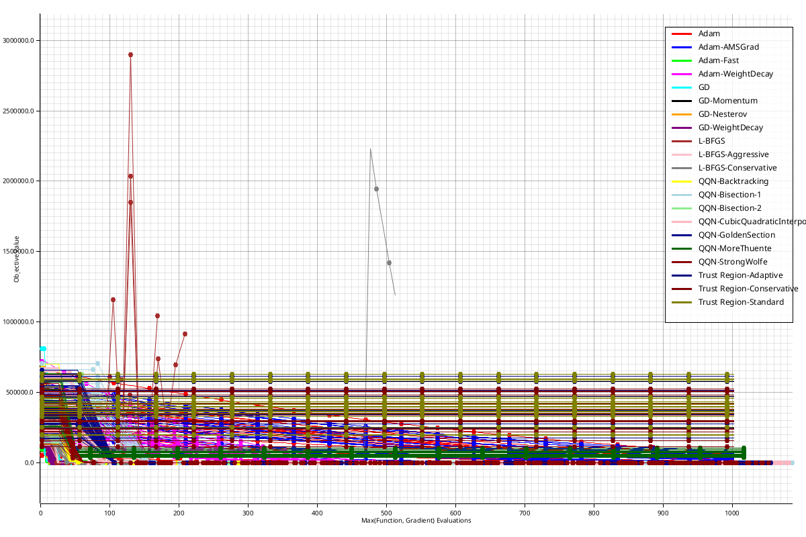
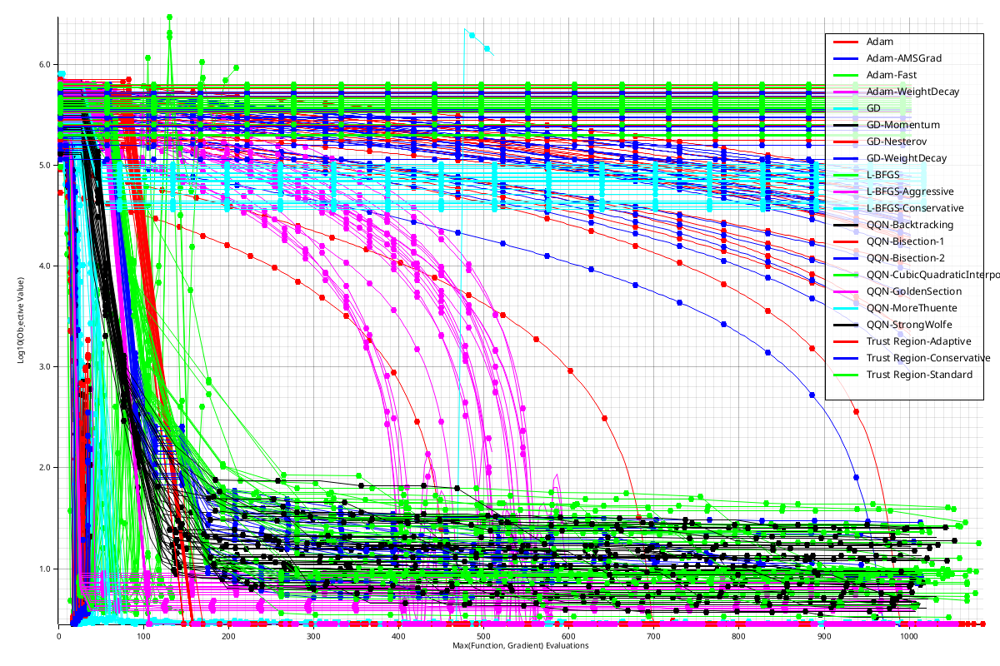

**Figure:** Convergence plots for PenaltyI_5D_alpha1e6 showing objective value vs iterations.
Left: Linear scale, Right: Log scale for better visualization of convergence behavior.

**Data:** [Linear scale data (CSV)](convergence_PenaltyI_5D_alpha1e6_data.csv) | [Log scale data (CSV)](convergence_PenaltyI_5D_alpha1e6_log_data.csv)

## Problem: PenaltyI_10D_alpha1e6

**Family:** PenaltyI  
**Dimension:** 10  
**Success Threshold:** 1.000e-6  
**Total Runs:** 560

### Performance Summary
<table style="border-collapse: collapse; width: 100%; margin: 20px 0;">
<tr style="background-color: #f2f2f2;">
<th style="border: 1px solid #ddd; padding: 8px; text-align: center;">Rank</th>
<th style="border: 1px solid #ddd; padding: 8px; text-align: center;">Optimizer</th>
<th style="border: 1px solid #ddd; padding: 8px; text-align: center;">Mean Final Value (All/Success/Fail)</th>
<th style="border: 1px solid #ddd; padding: 8px; text-align: center;">Std Dev</th>
<th style="border: 1px solid #ddd; padding: 8px; text-align: center;">Best Value</th>
<th style="border: 1px solid #ddd; padding: 8px; text-align: center;">Worst Value</th>
<th style="border: 1px solid #ddd; padding: 8px; text-align: center;">Mean Function Evals (All/Success/Fail)</th>
<th style="border: 1px solid #ddd; padding: 8px; text-align: center;">Mean Gradient Evals (All/Success/Fail)</th>
<th style="border: 1px solid #ddd; padding: 8px; text-align: center;">Success Rate</th>
<th style="border: 1px solid #ddd; padding: 8px; text-align: center;">Mean Time (s)</th>
</tr>
<tr style="background-color: #d4edda; font-weight: bold;">
<td style="border: 1px solid #ddd; padding: 8px; text-align: center;">1</td>
<td style="border: 1px solid #ddd; padding: 8px; text-align: center;"><a href="detailed_PenaltyI_10D_alpha1e6_L-BFGS-Conservative.md">L-BFGS-Conservative</a></td>
<td style="border: 1px solid #ddd; padding: 8px; text-align: center;">5.72e0 / - / 2.09e5</td>
<td style="border: 1px solid #ddd; padding: 8px; text-align: center;">1.20e-1</td>
<td style="border: 1px solid #ddd; padding: 8px; text-align: center;">5.62e0</td>
<td style="border: 1px solid #ddd; padding: 8px; text-align: center;">6.05e0</td>
<td style="border: 1px solid #ddd; padding: 8px; text-align: center;">681.9 / - / 681.9</td>
<td style="border: 1px solid #ddd; padding: 8px; text-align: center;">238.8 / - / 238.8</td>
<td style="border: 1px solid #ddd; padding: 8px; text-align: center;">0.0%</td>
<td style="border: 1px solid #ddd; padding: 8px; text-align: center;">0.008</td>
</tr>
<tr style="background-color: #fff3cd;">
<td style="border: 1px solid #ddd; padding: 8px; text-align: center;">2</td>
<td style="border: 1px solid #ddd; padding: 8px; text-align: center;"><a href="detailed_PenaltyI_10D_alpha1e6_QQN-GoldenSection.md">QQN-GoldenSection</a></td>
<td style="border: 1px solid #ddd; padding: 8px; text-align: center;">5.63e0 / - / 5.63e0</td>
<td style="border: 1px solid #ddd; padding: 8px; text-align: center;">9.55e-4</td>
<td style="border: 1px solid #ddd; padding: 8px; text-align: center;">5.63e0</td>
<td style="border: 1px solid #ddd; padding: 8px; text-align: center;">5.63e0</td>
<td style="border: 1px solid #ddd; padding: 8px; text-align: center;">908.6 / - / 908.6</td>
<td style="border: 1px solid #ddd; padding: 8px; text-align: center;">117.8 / - / 117.8</td>
<td style="border: 1px solid #ddd; padding: 8px; text-align: center;">0.0%</td>
<td style="border: 1px solid #ddd; padding: 8px; text-align: center;">0.015</td>
</tr>
<tr style="">
<td style="border: 1px solid #ddd; padding: 8px; text-align: center;">3</td>
<td style="border: 1px solid #ddd; padding: 8px; text-align: center;"><a href="detailed_PenaltyI_10D_alpha1e6_GD-Momentum.md">GD-Momentum</a></td>
<td style="border: 1px solid #ddd; padding: 8px; text-align: center;">6.08e0 / - / 3.89e2</td>
<td style="border: 1px solid #ddd; padding: 8px; text-align: center;">2.72e-1</td>
<td style="border: 1px solid #ddd; padding: 8px; text-align: center;">5.63e0</td>
<td style="border: 1px solid #ddd; padding: 8px; text-align: center;">6.62e0</td>
<td style="border: 1px solid #ddd; padding: 8px; text-align: center;">15.2 / - / 15.2</td>
<td style="border: 1px solid #ddd; padding: 8px; text-align: center;">26.3 / - / 26.3</td>
<td style="border: 1px solid #ddd; padding: 8px; text-align: center;">0.0%</td>
<td style="border: 1px solid #ddd; padding: 8px; text-align: center;">0.000</td>
</tr>
<tr style="">
<td style="border: 1px solid #ddd; padding: 8px; text-align: center;">4</td>
<td style="border: 1px solid #ddd; padding: 8px; text-align: center;"><a href="detailed_PenaltyI_10D_alpha1e6_QQN-Bisection-1.md">QQN-Bisection-1</a></td>
<td style="border: 1px solid #ddd; padding: 8px; text-align: center;">5.64e0 / - / 5.64e0</td>
<td style="border: 1px solid #ddd; padding: 8px; text-align: center;">2.68e-3</td>
<td style="border: 1px solid #ddd; padding: 8px; text-align: center;">5.63e0</td>
<td style="border: 1px solid #ddd; padding: 8px; text-align: center;">5.64e0</td>
<td style="border: 1px solid #ddd; padding: 8px; text-align: center;">444.6 / - / 444.6</td>
<td style="border: 1px solid #ddd; padding: 8px; text-align: center;">601.1 / - / 601.1</td>
<td style="border: 1px solid #ddd; padding: 8px; text-align: center;">0.0%</td>
<td style="border: 1px solid #ddd; padding: 8px; text-align: center;">0.012</td>
</tr>
<tr style="">
<td style="border: 1px solid #ddd; padding: 8px; text-align: center;">5</td>
<td style="border: 1px solid #ddd; padding: 8px; text-align: center;"><a href="detailed_PenaltyI_10D_alpha1e6_GD.md">GD</a></td>
<td style="border: 1px solid #ddd; padding: 8px; text-align: center;">5.83e0 / - / 8.58e0</td>
<td style="border: 1px solid #ddd; padding: 8px; text-align: center;">1.15e-1</td>
<td style="border: 1px solid #ddd; padding: 8px; text-align: center;">5.64e0</td>
<td style="border: 1px solid #ddd; padding: 8px; text-align: center;">6.03e0</td>
<td style="border: 1px solid #ddd; padding: 8px; text-align: center;">18.4 / - / 18.4</td>
<td style="border: 1px solid #ddd; padding: 8px; text-align: center;">32.8 / - / 32.8</td>
<td style="border: 1px solid #ddd; padding: 8px; text-align: center;">0.0%</td>
<td style="border: 1px solid #ddd; padding: 8px; text-align: center;">0.000</td>
</tr>
<tr style="">
<td style="border: 1px solid #ddd; padding: 8px; text-align: center;">6</td>
<td style="border: 1px solid #ddd; padding: 8px; text-align: center;"><a href="detailed_PenaltyI_10D_alpha1e6_GD-Nesterov.md">GD-Nesterov</a></td>
<td style="border: 1px solid #ddd; padding: 8px; text-align: center;">6.08e0 / - / 1.05e2</td>
<td style="border: 1px solid #ddd; padding: 8px; text-align: center;">2.66e-1</td>
<td style="border: 1px solid #ddd; padding: 8px; text-align: center;">5.66e0</td>
<td style="border: 1px solid #ddd; padding: 8px; text-align: center;">6.66e0</td>
<td style="border: 1px solid #ddd; padding: 8px; text-align: center;">14.7 / - / 14.7</td>
<td style="border: 1px solid #ddd; padding: 8px; text-align: center;">25.3 / - / 25.3</td>
<td style="border: 1px solid #ddd; padding: 8px; text-align: center;">0.0%</td>
<td style="border: 1px solid #ddd; padding: 8px; text-align: center;">0.000</td>
</tr>
<tr style="">
<td style="border: 1px solid #ddd; padding: 8px; text-align: center;">7</td>
<td style="border: 1px solid #ddd; padding: 8px; text-align: center;"><a href="detailed_PenaltyI_10D_alpha1e6_Adam-WeightDecay.md">Adam-WeightDecay</a></td>
<td style="border: 1px solid #ddd; padding: 8px; text-align: center;">5.71e0 / - / 9.72e0</td>
<td style="border: 1px solid #ddd; padding: 8px; text-align: center;">1.39e-2</td>
<td style="border: 1px solid #ddd; padding: 8px; text-align: center;">5.68e0</td>
<td style="border: 1px solid #ddd; padding: 8px; text-align: center;">5.74e0</td>
<td style="border: 1px solid #ddd; padding: 8px; text-align: center;">272.2 / - / 272.2</td>
<td style="border: 1px solid #ddd; padding: 8px; text-align: center;">271.2 / - / 271.2</td>
<td style="border: 1px solid #ddd; padding: 8px; text-align: center;">0.0%</td>
<td style="border: 1px solid #ddd; padding: 8px; text-align: center;">0.006</td>
</tr>
<tr style="">
<td style="border: 1px solid #ddd; padding: 8px; text-align: center;">8</td>
<td style="border: 1px solid #ddd; padding: 8px; text-align: center;"><a href="detailed_PenaltyI_10D_alpha1e6_GD-WeightDecay.md">GD-WeightDecay</a></td>
<td style="border: 1px solid #ddd; padding: 8px; text-align: center;">6.08e0 / - / 1.88e1</td>
<td style="border: 1px solid #ddd; padding: 8px; text-align: center;">2.08e-1</td>
<td style="border: 1px solid #ddd; padding: 8px; text-align: center;">5.75e0</td>
<td style="border: 1px solid #ddd; padding: 8px; text-align: center;">6.42e0</td>
<td style="border: 1px solid #ddd; padding: 8px; text-align: center;">16.0 / - / 16.0</td>
<td style="border: 1px solid #ddd; padding: 8px; text-align: center;">28.0 / - / 28.0</td>
<td style="border: 1px solid #ddd; padding: 8px; text-align: center;">0.0%</td>
<td style="border: 1px solid #ddd; padding: 8px; text-align: center;">0.000</td>
</tr>
<tr style="">
<td style="border: 1px solid #ddd; padding: 8px; text-align: center;">9</td>
<td style="border: 1px solid #ddd; padding: 8px; text-align: center;"><a href="detailed_PenaltyI_10D_alpha1e6_L-BFGS.md">L-BFGS</a></td>
<td style="border: 1px solid #ddd; padding: 8px; text-align: center;">8.85e0 / - / 2.73e5</td>
<td style="border: 1px solid #ddd; padding: 8px; text-align: center;">9.19e-1</td>
<td style="border: 1px solid #ddd; padding: 8px; text-align: center;">6.51e0</td>
<td style="border: 1px solid #ddd; padding: 8px; text-align: center;">1.07e1</td>
<td style="border: 1px solid #ddd; padding: 8px; text-align: center;">117.4 / - / 117.4</td>
<td style="border: 1px solid #ddd; padding: 8px; text-align: center;">43.4 / - / 43.4</td>
<td style="border: 1px solid #ddd; padding: 8px; text-align: center;">0.0%</td>
<td style="border: 1px solid #ddd; padding: 8px; text-align: center;">0.001</td>
</tr>
<tr style="">
<td style="border: 1px solid #ddd; padding: 8px; text-align: center;">10</td>
<td style="border: 1px solid #ddd; padding: 8px; text-align: center;"><a href="detailed_PenaltyI_10D_alpha1e6_Adam-Fast.md">Adam-Fast</a></td>
<td style="border: 1px solid #ddd; padding: 8px; text-align: center;">8.02e0 / - / 1.46e3</td>
<td style="border: 1px solid #ddd; padding: 8px; text-align: center;">4.28e-1</td>
<td style="border: 1px solid #ddd; padding: 8px; text-align: center;">6.93e0</td>
<td style="border: 1px solid #ddd; padding: 8px; text-align: center;">8.59e0</td>
<td style="border: 1px solid #ddd; padding: 8px; text-align: center;">28.9 / - / 28.9</td>
<td style="border: 1px solid #ddd; padding: 8px; text-align: center;">27.9 / - / 27.9</td>
<td style="border: 1px solid #ddd; padding: 8px; text-align: center;">0.0%</td>
<td style="border: 1px solid #ddd; padding: 8px; text-align: center;">0.001</td>
</tr>
<tr style="">
<td style="border: 1px solid #ddd; padding: 8px; text-align: center;">11</td>
<td style="border: 1px solid #ddd; padding: 8px; text-align: center;"><a href="detailed_PenaltyI_10D_alpha1e6_L-BFGS-Aggressive.md">L-BFGS-Aggressive</a></td>
<td style="border: 1px solid #ddd; padding: 8px; text-align: center;">3.72e5 / - / 3.72e5</td>
<td style="border: 1px solid #ddd; padding: 8px; text-align: center;">3.87e5</td>
<td style="border: 1px solid #ddd; padding: 8px; text-align: center;">8.09e0</td>
<td style="border: 1px solid #ddd; padding: 8px; text-align: center;">1.01e6</td>
<td style="border: 1px solid #ddd; padding: 8px; text-align: center;">387.1 / - / 387.1</td>
<td style="border: 1px solid #ddd; padding: 8px; text-align: center;">129.0 / - / 129.0</td>
<td style="border: 1px solid #ddd; padding: 8px; text-align: center;">0.0%</td>
<td style="border: 1px solid #ddd; padding: 8px; text-align: center;">0.003</td>
</tr>
<tr style="">
<td style="border: 1px solid #ddd; padding: 8px; text-align: center;">12</td>
<td style="border: 1px solid #ddd; padding: 8px; text-align: center;"><a href="detailed_PenaltyI_10D_alpha1e6_QQN-Backtracking.md">QQN-Backtracking</a></td>
<td style="border: 1px solid #ddd; padding: 8px; text-align: center;">2.41e1 / - / 2.41e1</td>
<td style="border: 1px solid #ddd; padding: 8px; text-align: center;">8.76e0</td>
<td style="border: 1px solid #ddd; padding: 8px; text-align: center;">1.13e1</td>
<td style="border: 1px solid #ddd; padding: 8px; text-align: center;">4.56e1</td>
<td style="border: 1px solid #ddd; padding: 8px; text-align: center;">707.1 / - / 707.1</td>
<td style="border: 1px solid #ddd; padding: 8px; text-align: center;">304.6 / - / 304.6</td>
<td style="border: 1px solid #ddd; padding: 8px; text-align: center;">0.0%</td>
<td style="border: 1px solid #ddd; padding: 8px; text-align: center;">0.019</td>
</tr>
<tr style="">
<td style="border: 1px solid #ddd; padding: 8px; text-align: center;">13</td>
<td style="border: 1px solid #ddd; padding: 8px; text-align: center;"><a href="detailed_PenaltyI_10D_alpha1e6_QQN-Bisection-2.md">QQN-Bisection-2</a></td>
<td style="border: 1px solid #ddd; padding: 8px; text-align: center;">2.26e1 / - / 2.26e1</td>
<td style="border: 1px solid #ddd; padding: 8px; text-align: center;">6.82e0</td>
<td style="border: 1px solid #ddd; padding: 8px; text-align: center;">1.18e1</td>
<td style="border: 1px solid #ddd; padding: 8px; text-align: center;">4.42e1</td>
<td style="border: 1px solid #ddd; padding: 8px; text-align: center;">549.2 / - / 549.2</td>
<td style="border: 1px solid #ddd; padding: 8px; text-align: center;">309.2 / - / 309.2</td>
<td style="border: 1px solid #ddd; padding: 8px; text-align: center;">0.0%</td>
<td style="border: 1px solid #ddd; padding: 8px; text-align: center;">0.011</td>
</tr>
<tr style="">
<td style="border: 1px solid #ddd; padding: 8px; text-align: center;">14</td>
<td style="border: 1px solid #ddd; padding: 8px; text-align: center;"><a href="detailed_PenaltyI_10D_alpha1e6_QQN-CubicQuadraticInterpolation.md">QQN-CubicQuadraticInterpolation</a></td>
<td style="border: 1px solid #ddd; padding: 8px; text-align: center;">4.03e1 / - / 4.03e1</td>
<td style="border: 1px solid #ddd; padding: 8px; text-align: center;">2.31e1</td>
<td style="border: 1px solid #ddd; padding: 8px; text-align: center;">1.18e1</td>
<td style="border: 1px solid #ddd; padding: 8px; text-align: center;">1.05e2</td>
<td style="border: 1px solid #ddd; padding: 8px; text-align: center;">396.8 / - / 396.8</td>
<td style="border: 1px solid #ddd; padding: 8px; text-align: center;">642.2 / - / 642.2</td>
<td style="border: 1px solid #ddd; padding: 8px; text-align: center;">0.0%</td>
<td style="border: 1px solid #ddd; padding: 8px; text-align: center;">0.014</td>
</tr>
<tr style="">
<td style="border: 1px solid #ddd; padding: 8px; text-align: center;">15</td>
<td style="border: 1px solid #ddd; padding: 8px; text-align: center;"><a href="detailed_PenaltyI_10D_alpha1e6_QQN-StrongWolfe.md">QQN-StrongWolfe</a></td>
<td style="border: 1px solid #ddd; padding: 8px; text-align: center;">2.91e1 / - / 2.91e1</td>
<td style="border: 1px solid #ddd; padding: 8px; text-align: center;">1.13e1</td>
<td style="border: 1px solid #ddd; padding: 8px; text-align: center;">1.23e1</td>
<td style="border: 1px solid #ddd; padding: 8px; text-align: center;">5.49e1</td>
<td style="border: 1px solid #ddd; padding: 8px; text-align: center;">588.8 / - / 588.8</td>
<td style="border: 1px solid #ddd; padding: 8px; text-align: center;">431.1 / - / 431.1</td>
<td style="border: 1px solid #ddd; padding: 8px; text-align: center;">0.0%</td>
<td style="border: 1px solid #ddd; padding: 8px; text-align: center;">0.015</td>
</tr>
<tr style="">
<td style="border: 1px solid #ddd; padding: 8px; text-align: center;">16</td>
<td style="border: 1px solid #ddd; padding: 8px; text-align: center;"><a href="detailed_PenaltyI_10D_alpha1e6_Adam.md">Adam</a></td>
<td style="border: 1px solid #ddd; padding: 8px; text-align: center;">6.20e4 / - / 6.20e4</td>
<td style="border: 1px solid #ddd; padding: 8px; text-align: center;">3.53e4</td>
<td style="border: 1px solid #ddd; padding: 8px; text-align: center;">1.37e3</td>
<td style="border: 1px solid #ddd; padding: 8px; text-align: center;">1.42e5</td>
<td style="border: 1px solid #ddd; padding: 8px; text-align: center;">502.0 / - / 502.0</td>
<td style="border: 1px solid #ddd; padding: 8px; text-align: center;">502.0 / - / 502.0</td>
<td style="border: 1px solid #ddd; padding: 8px; text-align: center;">0.0%</td>
<td style="border: 1px solid #ddd; padding: 8px; text-align: center;">0.011</td>
</tr>
<tr style="">
<td style="border: 1px solid #ddd; padding: 8px; text-align: center;">17</td>
<td style="border: 1px solid #ddd; padding: 8px; text-align: center;"><a href="detailed_PenaltyI_10D_alpha1e6_Adam-AMSGrad.md">Adam-AMSGrad</a></td>
<td style="border: 1px solid #ddd; padding: 8px; text-align: center;">6.14e4 / - / 6.14e4</td>
<td style="border: 1px solid #ddd; padding: 8px; text-align: center;">2.76e4</td>
<td style="border: 1px solid #ddd; padding: 8px; text-align: center;">1.80e4</td>
<td style="border: 1px solid #ddd; padding: 8px; text-align: center;">1.15e5</td>
<td style="border: 1px solid #ddd; padding: 8px; text-align: center;">502.0 / - / 502.0</td>
<td style="border: 1px solid #ddd; padding: 8px; text-align: center;">502.0 / - / 502.0</td>
<td style="border: 1px solid #ddd; padding: 8px; text-align: center;">0.0%</td>
<td style="border: 1px solid #ddd; padding: 8px; text-align: center;">0.012</td>
</tr>
<tr style="">
<td style="border: 1px solid #ddd; padding: 8px; text-align: center;">18</td>
<td style="border: 1px solid #ddd; padding: 8px; text-align: center;"><a href="detailed_PenaltyI_10D_alpha1e6_QQN-MoreThuente.md">QQN-MoreThuente</a></td>
<td style="border: 1px solid #ddd; padding: 8px; text-align: center;">1.25e5 / - / 1.25e5</td>
<td style="border: 1px solid #ddd; padding: 8px; text-align: center;">2.64e4</td>
<td style="border: 1px solid #ddd; padding: 8px; text-align: center;">7.51e4</td>
<td style="border: 1px solid #ddd; padding: 8px; text-align: center;">1.72e5</td>
<td style="border: 1px solid #ddd; padding: 8px; text-align: center;">487.0 / - / 487.0</td>
<td style="border: 1px solid #ddd; padding: 8px; text-align: center;">532.0 / - / 532.0</td>
<td style="border: 1px solid #ddd; padding: 8px; text-align: center;">0.0%</td>
<td style="border: 1px solid #ddd; padding: 8px; text-align: center;">0.009</td>
</tr>
<tr style="">
<td style="border: 1px solid #ddd; padding: 8px; text-align: center;">19</td>
<td style="border: 1px solid #ddd; padding: 8px; text-align: center;"><a href="detailed_PenaltyI_10D_alpha1e6_Trust_Region-Conservative.md">Trust Region-Conservative</a></td>
<td style="border: 1px solid #ddd; padding: 8px; text-align: center;">7.66e5 / - / 7.66e5</td>
<td style="border: 1px solid #ddd; padding: 8px; text-align: center;">1.70e5</td>
<td style="border: 1px solid #ddd; padding: 8px; text-align: center;">3.81e5</td>
<td style="border: 1px solid #ddd; padding: 8px; text-align: center;">1.09e6</td>
<td style="border: 1px solid #ddd; padding: 8px; text-align: center;">602.0 / - / 602.0</td>
<td style="border: 1px solid #ddd; padding: 8px; text-align: center;">402.0 / - / 402.0</td>
<td style="border: 1px solid #ddd; padding: 8px; text-align: center;">0.0%</td>
<td style="border: 1px solid #ddd; padding: 8px; text-align: center;">0.004</td>
</tr>
<tr style="">
<td style="border: 1px solid #ddd; padding: 8px; text-align: center;">20</td>
<td style="border: 1px solid #ddd; padding: 8px; text-align: center;"><a href="detailed_PenaltyI_10D_alpha1e6_Trust_Region-Standard.md">Trust Region-Standard</a></td>
<td style="border: 1px solid #ddd; padding: 8px; text-align: center;">7.17e5 / - / 7.17e5</td>
<td style="border: 1px solid #ddd; padding: 8px; text-align: center;">1.75e5</td>
<td style="border: 1px solid #ddd; padding: 8px; text-align: center;">4.22e5</td>
<td style="border: 1px solid #ddd; padding: 8px; text-align: center;">1.12e6</td>
<td style="border: 1px solid #ddd; padding: 8px; text-align: center;">602.0 / - / 602.0</td>
<td style="border: 1px solid #ddd; padding: 8px; text-align: center;">402.0 / - / 402.0</td>
<td style="border: 1px solid #ddd; padding: 8px; text-align: center;">0.0%</td>
<td style="border: 1px solid #ddd; padding: 8px; text-align: center;">0.004</td>
</tr>
<tr style="">
<td style="border: 1px solid #ddd; padding: 8px; text-align: center;">21</td>
<td style="border: 1px solid #ddd; padding: 8px; text-align: center;"><a href="detailed_PenaltyI_10D_alpha1e6_Trust_Region-Adaptive.md">Trust Region-Adaptive</a></td>
<td style="border: 1px solid #ddd; padding: 8px; text-align: center;">7.78e5 / - / 7.78e5</td>
<td style="border: 1px solid #ddd; padding: 8px; text-align: center;">1.59e5</td>
<td style="border: 1px solid #ddd; padding: 8px; text-align: center;">4.78e5</td>
<td style="border: 1px solid #ddd; padding: 8px; text-align: center;">1.05e6</td>
<td style="border: 1px solid #ddd; padding: 8px; text-align: center;">602.0 / - / 602.0</td>
<td style="border: 1px solid #ddd; padding: 8px; text-align: center;">402.0 / - / 402.0</td>
<td style="border: 1px solid #ddd; padding: 8px; text-align: center;">0.0%</td>
<td style="border: 1px solid #ddd; padding: 8px; text-align: center;">0.004</td>
</tr>
</table>

### Convergence Plots

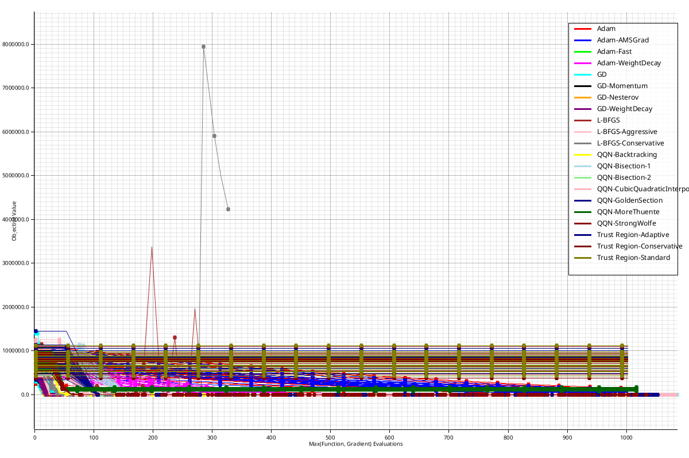
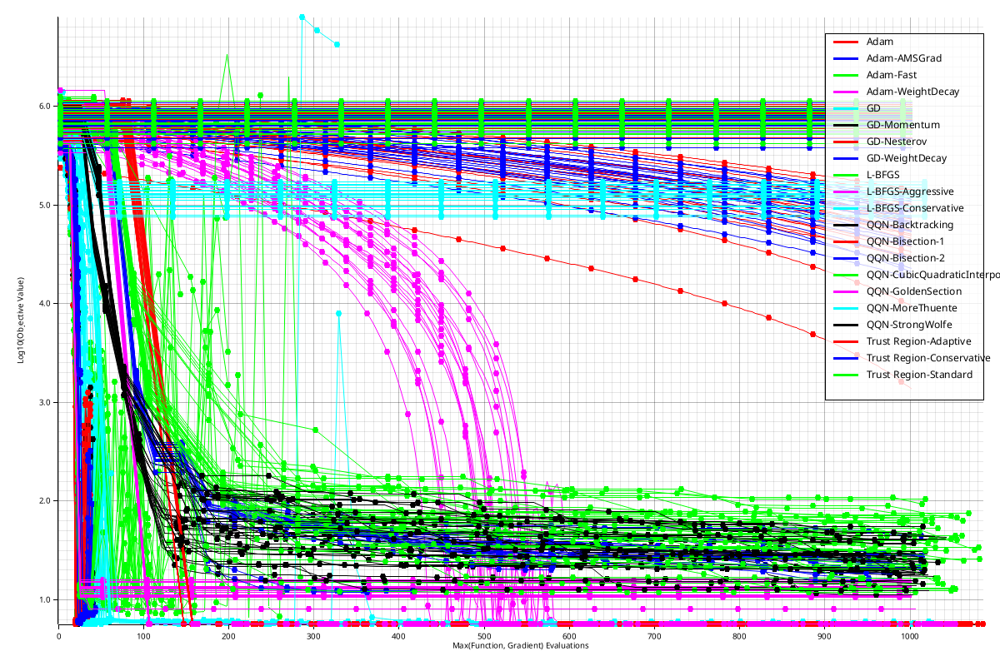

**Figure:** Convergence plots for PenaltyI_10D_alpha1e6 showing objective value vs iterations.
Left: Linear scale, Right: Log scale for better visualization of convergence behavior.

**Data:** [Linear scale data (CSV)](convergence_PenaltyI_10D_alpha1e6_data.csv) | [Log scale data (CSV)](convergence_PenaltyI_10D_alpha1e6_log_data.csv)

## Problem: Barrier_2D_mu0.1

**Family:** Barrier  
**Dimension:** 2  
**Success Threshold:** 1.000e-6  
**Total Runs:** 560

### Performance Summary
<table style="border-collapse: collapse; width: 100%; margin: 20px 0;">
<tr style="background-color: #f2f2f2;">
<th style="border: 1px solid #ddd; padding: 8px; text-align: center;">Rank</th>
<th style="border: 1px solid #ddd; padding: 8px; text-align: center;">Optimizer</th>
<th style="border: 1px solid #ddd; padding: 8px; text-align: center;">Mean Final Value (All/Success/Fail)</th>
<th style="border: 1px solid #ddd; padding: 8px; text-align: center;">Std Dev</th>
<th style="border: 1px solid #ddd; padding: 8px; text-align: center;">Best Value</th>
<th style="border: 1px solid #ddd; padding: 8px; text-align: center;">Worst Value</th>
<th style="border: 1px solid #ddd; padding: 8px; text-align: center;">Mean Function Evals (All/Success/Fail)</th>
<th style="border: 1px solid #ddd; padding: 8px; text-align: center;">Mean Gradient Evals (All/Success/Fail)</th>
<th style="border: 1px solid #ddd; padding: 8px; text-align: center;">Success Rate</th>
<th style="border: 1px solid #ddd; padding: 8px; text-align: center;">Mean Time (s)</th>
</tr>
<tr style="background-color: #d4edda; font-weight: bold;">
<td style="border: 1px solid #ddd; padding: 8px; text-align: center;">1</td>
<td style="border: 1px solid #ddd; padding: 8px; text-align: center;"><a href="detailed_Barrier_2D_mu0.1_L-BFGS-Conservative.md">L-BFGS-Conservative</a></td>
<td style="border: 1px solid #ddd; padding: 8px; text-align: center;">4.00e-1 / - / 4.00e-1</td>
<td style="border: 1px solid #ddd; padding: 8px; text-align: center;">1.18e-7</td>
<td style="border: 1px solid #ddd; padding: 8px; text-align: center;">4.00e-1</td>
<td style="border: 1px solid #ddd; padding: 8px; text-align: center;">4.00e-1</td>
<td style="border: 1px solid #ddd; padding: 8px; text-align: center;">468.5 / - / 468.5</td>
<td style="border: 1px solid #ddd; padding: 8px; text-align: center;">370.0 / - / 370.0</td>
<td style="border: 1px solid #ddd; padding: 8px; text-align: center;">0.0%</td>
<td style="border: 1px solid #ddd; padding: 8px; text-align: center;">0.011</td>
</tr>
<tr style="background-color: #fff3cd;">
<td style="border: 1px solid #ddd; padding: 8px; text-align: center;">2</td>
<td style="border: 1px solid #ddd; padding: 8px; text-align: center;"><a href="detailed_Barrier_2D_mu0.1_GD.md">GD</a></td>
<td style="border: 1px solid #ddd; padding: 8px; text-align: center;">4.00e-1 / - / 4.00e-1</td>
<td style="border: 1px solid #ddd; padding: 8px; text-align: center;">2.70e-11</td>
<td style="border: 1px solid #ddd; padding: 8px; text-align: center;">4.00e-1</td>
<td style="border: 1px solid #ddd; padding: 8px; text-align: center;">4.00e-1</td>
<td style="border: 1px solid #ddd; padding: 8px; text-align: center;">291.9 / - / 291.9</td>
<td style="border: 1px solid #ddd; padding: 8px; text-align: center;">581.7 / - / 581.7</td>
<td style="border: 1px solid #ddd; padding: 8px; text-align: center;">0.0%</td>
<td style="border: 1px solid #ddd; padding: 8px; text-align: center;">0.007</td>
</tr>
<tr style="">
<td style="border: 1px solid #ddd; padding: 8px; text-align: center;">3</td>
<td style="border: 1px solid #ddd; padding: 8px; text-align: center;"><a href="detailed_Barrier_2D_mu0.1_GD-WeightDecay.md">GD-WeightDecay</a></td>
<td style="border: 1px solid #ddd; padding: 8px; text-align: center;">4.00e-1 / - / 4.00e-1</td>
<td style="border: 1px solid #ddd; padding: 8px; text-align: center;">1.03e-5</td>
<td style="border: 1px solid #ddd; padding: 8px; text-align: center;">4.00e-1</td>
<td style="border: 1px solid #ddd; padding: 8px; text-align: center;">4.00e-1</td>
<td style="border: 1px solid #ddd; padding: 8px; text-align: center;">48.7 / - / 48.7</td>
<td style="border: 1px solid #ddd; padding: 8px; text-align: center;">93.4 / - / 93.4</td>
<td style="border: 1px solid #ddd; padding: 8px; text-align: center;">0.0%</td>
<td style="border: 1px solid #ddd; padding: 8px; text-align: center;">0.001</td>
</tr>
<tr style="">
<td style="border: 1px solid #ddd; padding: 8px; text-align: center;">4</td>
<td style="border: 1px solid #ddd; padding: 8px; text-align: center;"><a href="detailed_Barrier_2D_mu0.1_Trust_Region-Conservative.md">Trust Region-Conservative</a></td>
<td style="border: 1px solid #ddd; padding: 8px; text-align: center;">4.16e-1 / - / 4.31e-1</td>
<td style="border: 1px solid #ddd; padding: 8px; text-align: center;">4.12e-2</td>
<td style="border: 1px solid #ddd; padding: 8px; text-align: center;">4.00e-1</td>
<td style="border: 1px solid #ddd; padding: 8px; text-align: center;">5.83e-1</td>
<td style="border: 1px solid #ddd; padding: 8px; text-align: center;">516.1 / - / 516.1</td>
<td style="border: 1px solid #ddd; padding: 8px; text-align: center;">344.8 / - / 344.8</td>
<td style="border: 1px solid #ddd; padding: 8px; text-align: center;">0.0%</td>
<td style="border: 1px solid #ddd; padding: 8px; text-align: center;">0.003</td>
</tr>
<tr style="">
<td style="border: 1px solid #ddd; padding: 8px; text-align: center;">5</td>
<td style="border: 1px solid #ddd; padding: 8px; text-align: center;"><a href="detailed_Barrier_2D_mu0.1_GD-Nesterov.md">GD-Nesterov</a></td>
<td style="border: 1px solid #ddd; padding: 8px; text-align: center;">4.02e-1 / - / 4.99e-1</td>
<td style="border: 1px solid #ddd; padding: 8px; text-align: center;">1.23e-3</td>
<td style="border: 1px solid #ddd; padding: 8px; text-align: center;">4.00e-1</td>
<td style="border: 1px solid #ddd; padding: 8px; text-align: center;">4.04e-1</td>
<td style="border: 1px solid #ddd; padding: 8px; text-align: center;">20.6 / - / 20.6</td>
<td style="border: 1px solid #ddd; padding: 8px; text-align: center;">37.1 / - / 37.1</td>
<td style="border: 1px solid #ddd; padding: 8px; text-align: center;">0.0%</td>
<td style="border: 1px solid #ddd; padding: 8px; text-align: center;">0.001</td>
</tr>
<tr style="">
<td style="border: 1px solid #ddd; padding: 8px; text-align: center;">6</td>
<td style="border: 1px solid #ddd; padding: 8px; text-align: center;"><a href="detailed_Barrier_2D_mu0.1_GD-Momentum.md">GD-Momentum</a></td>
<td style="border: 1px solid #ddd; padding: 8px; text-align: center;">4.02e-1 / - / 5.11e-1</td>
<td style="border: 1px solid #ddd; padding: 8px; text-align: center;">1.07e-3</td>
<td style="border: 1px solid #ddd; padding: 8px; text-align: center;">4.00e-1</td>
<td style="border: 1px solid #ddd; padding: 8px; text-align: center;">4.04e-1</td>
<td style="border: 1px solid #ddd; padding: 8px; text-align: center;">20.9 / - / 20.9</td>
<td style="border: 1px solid #ddd; padding: 8px; text-align: center;">37.7 / - / 37.7</td>
<td style="border: 1px solid #ddd; padding: 8px; text-align: center;">0.0%</td>
<td style="border: 1px solid #ddd; padding: 8px; text-align: center;">0.001</td>
</tr>
<tr style="">
<td style="border: 1px solid #ddd; padding: 8px; text-align: center;">7</td>
<td style="border: 1px solid #ddd; padding: 8px; text-align: center;"><a href="detailed_Barrier_2D_mu0.1_Adam-Fast.md">Adam-Fast</a></td>
<td style="border: 1px solid #ddd; padding: 8px; text-align: center;">4.20e-1 / - / 5.14e-1</td>
<td style="border: 1px solid #ddd; padding: 8px; text-align: center;">2.10e-2</td>
<td style="border: 1px solid #ddd; padding: 8px; text-align: center;">4.00e-1</td>
<td style="border: 1px solid #ddd; padding: 8px; text-align: center;">4.79e-1</td>
<td style="border: 1px solid #ddd; padding: 8px; text-align: center;">32.0 / - / 32.0</td>
<td style="border: 1px solid #ddd; padding: 8px; text-align: center;">31.0 / - / 31.0</td>
<td style="border: 1px solid #ddd; padding: 8px; text-align: center;">0.0%</td>
<td style="border: 1px solid #ddd; padding: 8px; text-align: center;">0.001</td>
</tr>
<tr style="">
<td style="border: 1px solid #ddd; padding: 8px; text-align: center;">8</td>
<td style="border: 1px solid #ddd; padding: 8px; text-align: center;"><a href="detailed_Barrier_2D_mu0.1_Trust_Region-Adaptive.md">Trust Region-Adaptive</a></td>
<td style="border: 1px solid #ddd; padding: 8px; text-align: center;">4.72e-1 / - / 4.72e-1</td>
<td style="border: 1px solid #ddd; padding: 8px; text-align: center;">9.46e-2</td>
<td style="border: 1px solid #ddd; padding: 8px; text-align: center;">4.02e-1</td>
<td style="border: 1px solid #ddd; padding: 8px; text-align: center;">7.22e-1</td>
<td style="border: 1px solid #ddd; padding: 8px; text-align: center;">25.4 / - / 25.4</td>
<td style="border: 1px solid #ddd; padding: 8px; text-align: center;">17.8 / - / 17.8</td>
<td style="border: 1px solid #ddd; padding: 8px; text-align: center;">0.0%</td>
<td style="border: 1px solid #ddd; padding: 8px; text-align: center;">0.000</td>
</tr>
<tr style="">
<td style="border: 1px solid #ddd; padding: 8px; text-align: center;">9</td>
<td style="border: 1px solid #ddd; padding: 8px; text-align: center;"><a href="detailed_Barrier_2D_mu0.1_Trust_Region-Standard.md">Trust Region-Standard</a></td>
<td style="border: 1px solid #ddd; padding: 8px; text-align: center;">6.15e-1 / - / 6.15e-1</td>
<td style="border: 1px solid #ddd; padding: 8px; text-align: center;">3.19e-1</td>
<td style="border: 1px solid #ddd; padding: 8px; text-align: center;">4.08e-1</td>
<td style="border: 1px solid #ddd; padding: 8px; text-align: center;">1.57e0</td>
<td style="border: 1px solid #ddd; padding: 8px; text-align: center;">9.5 / - / 9.5</td>
<td style="border: 1px solid #ddd; padding: 8px; text-align: center;">7.3 / - / 7.3</td>
<td style="border: 1px solid #ddd; padding: 8px; text-align: center;">0.0%</td>
<td style="border: 1px solid #ddd; padding: 8px; text-align: center;">0.000</td>
</tr>
<tr style="">
<td style="border: 1px solid #ddd; padding: 8px; text-align: center;">10</td>
<td style="border: 1px solid #ddd; padding: 8px; text-align: center;"><a href="detailed_Barrier_2D_mu0.1_Adam-WeightDecay.md">Adam-WeightDecay</a></td>
<td style="border: 1px solid #ddd; padding: 8px; text-align: center;">4.88e-1 / - / 4.88e-1</td>
<td style="border: 1px solid #ddd; padding: 8px; text-align: center;">3.91e-2</td>
<td style="border: 1px solid #ddd; padding: 8px; text-align: center;">4.23e-1</td>
<td style="border: 1px solid #ddd; padding: 8px; text-align: center;">5.53e-1</td>
<td style="border: 1px solid #ddd; padding: 8px; text-align: center;">502.0 / - / 502.0</td>
<td style="border: 1px solid #ddd; padding: 8px; text-align: center;">502.0 / - / 502.0</td>
<td style="border: 1px solid #ddd; padding: 8px; text-align: center;">0.0%</td>
<td style="border: 1px solid #ddd; padding: 8px; text-align: center;">0.011</td>
</tr>
<tr style="">
<td style="border: 1px solid #ddd; padding: 8px; text-align: center;">11</td>
<td style="border: 1px solid #ddd; padding: 8px; text-align: center;"><a href="detailed_Barrier_2D_mu0.1_Adam.md">Adam</a></td>
<td style="border: 1px solid #ddd; padding: 8px; text-align: center;">1.29e0 / - / 1.29e0</td>
<td style="border: 1px solid #ddd; padding: 8px; text-align: center;">1.94e-1</td>
<td style="border: 1px solid #ddd; padding: 8px; text-align: center;">8.23e-1</td>
<td style="border: 1px solid #ddd; padding: 8px; text-align: center;">1.60e0</td>
<td style="border: 1px solid #ddd; padding: 8px; text-align: center;">502.0 / - / 502.0</td>
<td style="border: 1px solid #ddd; padding: 8px; text-align: center;">502.0 / - / 502.0</td>
<td style="border: 1px solid #ddd; padding: 8px; text-align: center;">0.0%</td>
<td style="border: 1px solid #ddd; padding: 8px; text-align: center;">0.010</td>
</tr>
<tr style="">
<td style="border: 1px solid #ddd; padding: 8px; text-align: center;">12</td>
<td style="border: 1px solid #ddd; padding: 8px; text-align: center;"><a href="detailed_Barrier_2D_mu0.1_Adam-AMSGrad.md">Adam-AMSGrad</a></td>
<td style="border: 1px solid #ddd; padding: 8px; text-align: center;">1.22e0 / - / 1.22e0</td>
<td style="border: 1px solid #ddd; padding: 8px; text-align: center;">2.07e-1</td>
<td style="border: 1px solid #ddd; padding: 8px; text-align: center;">8.56e-1</td>
<td style="border: 1px solid #ddd; padding: 8px; text-align: center;">1.76e0</td>
<td style="border: 1px solid #ddd; padding: 8px; text-align: center;">502.0 / - / 502.0</td>
<td style="border: 1px solid #ddd; padding: 8px; text-align: center;">502.0 / - / 502.0</td>
<td style="border: 1px solid #ddd; padding: 8px; text-align: center;">0.0%</td>
<td style="border: 1px solid #ddd; padding: 8px; text-align: center;">0.011</td>
</tr>
</table>

### Convergence Plots

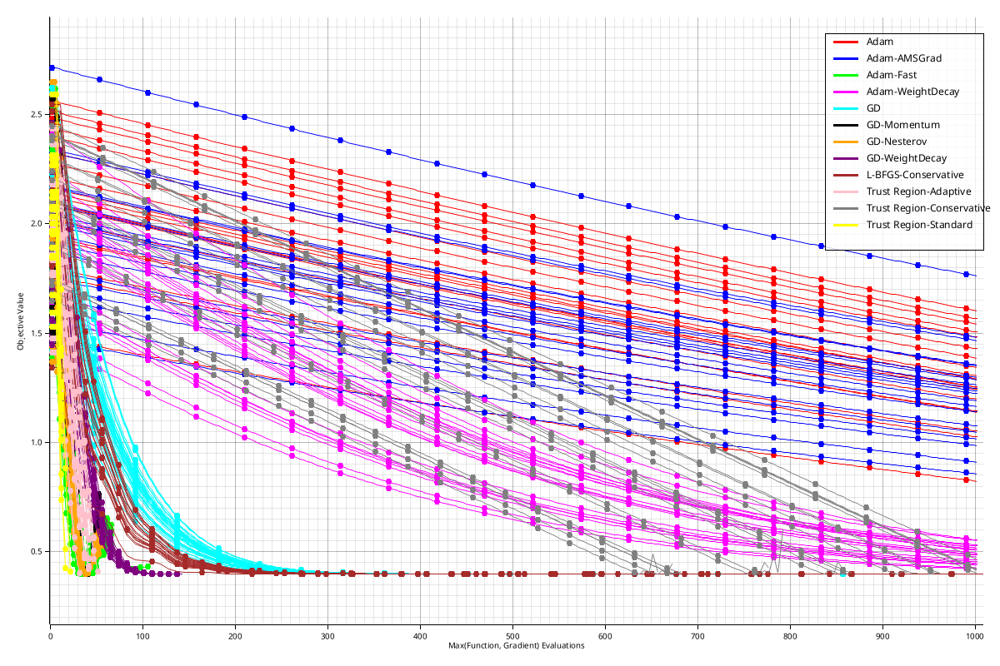
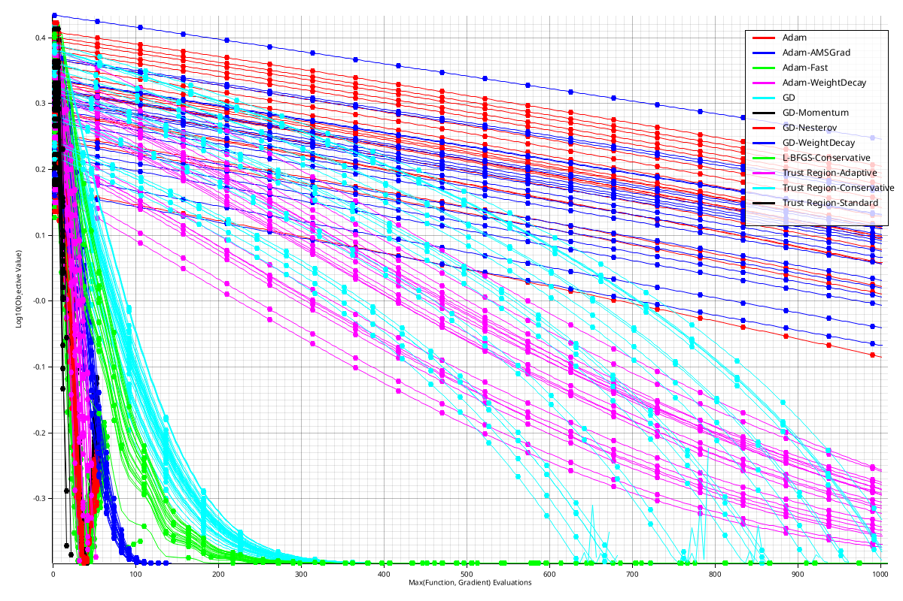

**Figure:** Convergence plots for Barrier_2D_mu0.1 showing objective value vs iterations.
Left: Linear scale, Right: Log scale for better visualization of convergence behavior.

**Data:** [Linear scale data (CSV)](convergence_Barrier_2D_mu0.1_data.csv) | [Log scale data (CSV)](convergence_Barrier_2D_mu0.1_log_data.csv)

## Problem: Barrier_5D_mu0.1

**Family:** Barrier  
**Dimension:** 5  
**Success Threshold:** 1.000e-6  
**Total Runs:** 560

### Performance Summary
<table style="border-collapse: collapse; width: 100%; margin: 20px 0;">
<tr style="background-color: #f2f2f2;">
<th style="border: 1px solid #ddd; padding: 8px; text-align: center;">Rank</th>
<th style="border: 1px solid #ddd; padding: 8px; text-align: center;">Optimizer</th>
<th style="border: 1px solid #ddd; padding: 8px; text-align: center;">Mean Final Value (All/Success/Fail)</th>
<th style="border: 1px solid #ddd; padding: 8px; text-align: center;">Std Dev</th>
<th style="border: 1px solid #ddd; padding: 8px; text-align: center;">Best Value</th>
<th style="border: 1px solid #ddd; padding: 8px; text-align: center;">Worst Value</th>
<th style="border: 1px solid #ddd; padding: 8px; text-align: center;">Mean Function Evals (All/Success/Fail)</th>
<th style="border: 1px solid #ddd; padding: 8px; text-align: center;">Mean Gradient Evals (All/Success/Fail)</th>
<th style="border: 1px solid #ddd; padding: 8px; text-align: center;">Success Rate</th>
<th style="border: 1px solid #ddd; padding: 8px; text-align: center;">Mean Time (s)</th>
</tr>
<tr style="background-color: #d4edda; font-weight: bold;">
<td style="border: 1px solid #ddd; padding: 8px; text-align: center;">1</td>
<td style="border: 1px solid #ddd; padding: 8px; text-align: center;"><a href="detailed_Barrier_5D_mu0.1_L-BFGS-Conservative.md">L-BFGS-Conservative</a></td>
<td style="border: 1px solid #ddd; padding: 8px; text-align: center;">9.99e-1 / - / 9.99e-1</td>
<td style="border: 1px solid #ddd; padding: 8px; text-align: center;">4.48e-8</td>
<td style="border: 1px solid #ddd; padding: 8px; text-align: center;">9.99e-1</td>
<td style="border: 1px solid #ddd; padding: 8px; text-align: center;">9.99e-1</td>
<td style="border: 1px solid #ddd; padding: 8px; text-align: center;">412.4 / - / 412.4</td>
<td style="border: 1px solid #ddd; padding: 8px; text-align: center;">329.4 / - / 329.4</td>
<td style="border: 1px solid #ddd; padding: 8px; text-align: center;">0.0%</td>
<td style="border: 1px solid #ddd; padding: 8px; text-align: center;">0.010</td>
</tr>
<tr style="background-color: #fff3cd;">
<td style="border: 1px solid #ddd; padding: 8px; text-align: center;">2</td>
<td style="border: 1px solid #ddd; padding: 8px; text-align: center;"><a href="detailed_Barrier_5D_mu0.1_GD.md">GD</a></td>
<td style="border: 1px solid #ddd; padding: 8px; text-align: center;">9.99e-1 / - / 9.99e-1</td>
<td style="border: 1px solid #ddd; padding: 8px; text-align: center;">2.52e-11</td>
<td style="border: 1px solid #ddd; padding: 8px; text-align: center;">9.99e-1</td>
<td style="border: 1px solid #ddd; padding: 8px; text-align: center;">9.99e-1</td>
<td style="border: 1px solid #ddd; padding: 8px; text-align: center;">302.2 / - / 302.2</td>
<td style="border: 1px solid #ddd; padding: 8px; text-align: center;">602.5 / - / 602.5</td>
<td style="border: 1px solid #ddd; padding: 8px; text-align: center;">0.0%</td>
<td style="border: 1px solid #ddd; padding: 8px; text-align: center;">0.007</td>
</tr>
<tr style="">
<td style="border: 1px solid #ddd; padding: 8px; text-align: center;">3</td>
<td style="border: 1px solid #ddd; padding: 8px; text-align: center;"><a href="detailed_Barrier_5D_mu0.1_GD-WeightDecay.md">GD-WeightDecay</a></td>
<td style="border: 1px solid #ddd; padding: 8px; text-align: center;">9.99e-1 / - / 9.99e-1</td>
<td style="border: 1px solid #ddd; padding: 8px; text-align: center;">2.34e-5</td>
<td style="border: 1px solid #ddd; padding: 8px; text-align: center;">9.99e-1</td>
<td style="border: 1px solid #ddd; padding: 8px; text-align: center;">9.99e-1</td>
<td style="border: 1px solid #ddd; padding: 8px; text-align: center;">49.5 / - / 49.5</td>
<td style="border: 1px solid #ddd; padding: 8px; text-align: center;">94.9 / - / 94.9</td>
<td style="border: 1px solid #ddd; padding: 8px; text-align: center;">0.0%</td>
<td style="border: 1px solid #ddd; padding: 8px; text-align: center;">0.001</td>
</tr>
<tr style="">
<td style="border: 1px solid #ddd; padding: 8px; text-align: center;">4</td>
<td style="border: 1px solid #ddd; padding: 8px; text-align: center;"><a href="detailed_Barrier_5D_mu0.1_Trust_Region-Standard.md">Trust Region-Standard</a></td>
<td style="border: 1px solid #ddd; padding: 8px; text-align: center;">1.31e0 / - / 1.31e0</td>
<td style="border: 1px solid #ddd; padding: 8px; text-align: center;">3.71e-1</td>
<td style="border: 1px solid #ddd; padding: 8px; text-align: center;">1.00e0</td>
<td style="border: 1px solid #ddd; padding: 8px; text-align: center;">2.36e0</td>
<td style="border: 1px solid #ddd; padding: 8px; text-align: center;">17.6 / - / 17.6</td>
<td style="border: 1px solid #ddd; padding: 8px; text-align: center;">12.7 / - / 12.7</td>
<td style="border: 1px solid #ddd; padding: 8px; text-align: center;">0.0%</td>
<td style="border: 1px solid #ddd; padding: 8px; text-align: center;">0.000</td>
</tr>
<tr style="">
<td style="border: 1px solid #ddd; padding: 8px; text-align: center;">5</td>
<td style="border: 1px solid #ddd; padding: 8px; text-align: center;"><a href="detailed_Barrier_5D_mu0.1_Trust_Region-Adaptive.md">Trust Region-Adaptive</a></td>
<td style="border: 1px solid #ddd; padding: 8px; text-align: center;">1.18e0 / - / 1.18e0</td>
<td style="border: 1px solid #ddd; padding: 8px; text-align: center;">3.94e-1</td>
<td style="border: 1px solid #ddd; padding: 8px; text-align: center;">1.00e0</td>
<td style="border: 1px solid #ddd; padding: 8px; text-align: center;">2.81e0</td>
<td style="border: 1px solid #ddd; padding: 8px; text-align: center;">57.2 / - / 57.2</td>
<td style="border: 1px solid #ddd; padding: 8px; text-align: center;">39.0 / - / 39.0</td>
<td style="border: 1px solid #ddd; padding: 8px; text-align: center;">0.0%</td>
<td style="border: 1px solid #ddd; padding: 8px; text-align: center;">0.000</td>
</tr>
<tr style="">
<td style="border: 1px solid #ddd; padding: 8px; text-align: center;">6</td>
<td style="border: 1px solid #ddd; padding: 8px; text-align: center;"><a href="detailed_Barrier_5D_mu0.1_GD-Momentum.md">GD-Momentum</a></td>
<td style="border: 1px solid #ddd; padding: 8px; text-align: center;">1.00e0 / - / 1.38e0</td>
<td style="border: 1px solid #ddd; padding: 8px; text-align: center;">2.19e-3</td>
<td style="border: 1px solid #ddd; padding: 8px; text-align: center;">1.00e0</td>
<td style="border: 1px solid #ddd; padding: 8px; text-align: center;">1.01e0</td>
<td style="border: 1px solid #ddd; padding: 8px; text-align: center;">21.0 / - / 21.0</td>
<td style="border: 1px solid #ddd; padding: 8px; text-align: center;">38.0 / - / 38.0</td>
<td style="border: 1px solid #ddd; padding: 8px; text-align: center;">0.0%</td>
<td style="border: 1px solid #ddd; padding: 8px; text-align: center;">0.001</td>
</tr>
<tr style="">
<td style="border: 1px solid #ddd; padding: 8px; text-align: center;">7</td>
<td style="border: 1px solid #ddd; padding: 8px; text-align: center;"><a href="detailed_Barrier_5D_mu0.1_GD-Nesterov.md">GD-Nesterov</a></td>
<td style="border: 1px solid #ddd; padding: 8px; text-align: center;">1.01e0 / - / 1.25e0</td>
<td style="border: 1px solid #ddd; padding: 8px; text-align: center;">1.66e-3</td>
<td style="border: 1px solid #ddd; padding: 8px; text-align: center;">1.00e0</td>
<td style="border: 1px solid #ddd; padding: 8px; text-align: center;">1.01e0</td>
<td style="border: 1px solid #ddd; padding: 8px; text-align: center;">20.6 / - / 20.6</td>
<td style="border: 1px solid #ddd; padding: 8px; text-align: center;">37.2 / - / 37.2</td>
<td style="border: 1px solid #ddd; padding: 8px; text-align: center;">0.0%</td>
<td style="border: 1px solid #ddd; padding: 8px; text-align: center;">0.001</td>
</tr>
<tr style="">
<td style="border: 1px solid #ddd; padding: 8px; text-align: center;">8</td>
<td style="border: 1px solid #ddd; padding: 8px; text-align: center;"><a href="detailed_Barrier_5D_mu0.1_Adam-Fast.md">Adam-Fast</a></td>
<td style="border: 1px solid #ddd; padding: 8px; text-align: center;">1.08e0 / - / 1.31e0</td>
<td style="border: 1px solid #ddd; padding: 8px; text-align: center;">3.51e-2</td>
<td style="border: 1px solid #ddd; padding: 8px; text-align: center;">1.01e0</td>
<td style="border: 1px solid #ddd; padding: 8px; text-align: center;">1.17e0</td>
<td style="border: 1px solid #ddd; padding: 8px; text-align: center;">31.8 / - / 31.8</td>
<td style="border: 1px solid #ddd; padding: 8px; text-align: center;">30.8 / - / 30.8</td>
<td style="border: 1px solid #ddd; padding: 8px; text-align: center;">0.0%</td>
<td style="border: 1px solid #ddd; padding: 8px; text-align: center;">0.001</td>
</tr>
<tr style="">
<td style="border: 1px solid #ddd; padding: 8px; text-align: center;">9</td>
<td style="border: 1px solid #ddd; padding: 8px; text-align: center;"><a href="detailed_Barrier_5D_mu0.1_Adam-WeightDecay.md">Adam-WeightDecay</a></td>
<td style="border: 1px solid #ddd; padding: 8px; text-align: center;">1.12e0 / - / 1.12e0</td>
<td style="border: 1px solid #ddd; padding: 8px; text-align: center;">3.72e-2</td>
<td style="border: 1px solid #ddd; padding: 8px; text-align: center;">1.06e0</td>
<td style="border: 1px solid #ddd; padding: 8px; text-align: center;">1.24e0</td>
<td style="border: 1px solid #ddd; padding: 8px; text-align: center;">502.0 / - / 502.0</td>
<td style="border: 1px solid #ddd; padding: 8px; text-align: center;">502.0 / - / 502.0</td>
<td style="border: 1px solid #ddd; padding: 8px; text-align: center;">0.0%</td>
<td style="border: 1px solid #ddd; padding: 8px; text-align: center;">0.011</td>
</tr>
<tr style="">
<td style="border: 1px solid #ddd; padding: 8px; text-align: center;">10</td>
<td style="border: 1px solid #ddd; padding: 8px; text-align: center;"><a href="detailed_Barrier_5D_mu0.1_Trust_Region-Conservative.md">Trust Region-Conservative</a></td>
<td style="border: 1px solid #ddd; padding: 8px; text-align: center;">2.99e0 / - / 2.99e0</td>
<td style="border: 1px solid #ddd; padding: 8px; text-align: center;">4.97e-1</td>
<td style="border: 1px solid #ddd; padding: 8px; text-align: center;">2.39e0</td>
<td style="border: 1px solid #ddd; padding: 8px; text-align: center;">3.89e0</td>
<td style="border: 1px solid #ddd; padding: 8px; text-align: center;">602.0 / - / 602.0</td>
<td style="border: 1px solid #ddd; padding: 8px; text-align: center;">402.0 / - / 402.0</td>
<td style="border: 1px solid #ddd; padding: 8px; text-align: center;">0.0%</td>
<td style="border: 1px solid #ddd; padding: 8px; text-align: center;">0.004</td>
</tr>
<tr style="">
<td style="border: 1px solid #ddd; padding: 8px; text-align: center;">11</td>
<td style="border: 1px solid #ddd; padding: 8px; text-align: center;"><a href="detailed_Barrier_5D_mu0.1_Adam.md">Adam</a></td>
<td style="border: 1px solid #ddd; padding: 8px; text-align: center;">2.96e0 / - / 2.96e0</td>
<td style="border: 1px solid #ddd; padding: 8px; text-align: center;">2.85e-1</td>
<td style="border: 1px solid #ddd; padding: 8px; text-align: center;">2.41e0</td>
<td style="border: 1px solid #ddd; padding: 8px; text-align: center;">3.38e0</td>
<td style="border: 1px solid #ddd; padding: 8px; text-align: center;">502.0 / - / 502.0</td>
<td style="border: 1px solid #ddd; padding: 8px; text-align: center;">502.0 / - / 502.0</td>
<td style="border: 1px solid #ddd; padding: 8px; text-align: center;">0.0%</td>
<td style="border: 1px solid #ddd; padding: 8px; text-align: center;">0.010</td>
</tr>
<tr style="">
<td style="border: 1px solid #ddd; padding: 8px; text-align: center;">12</td>
<td style="border: 1px solid #ddd; padding: 8px; text-align: center;"><a href="detailed_Barrier_5D_mu0.1_Adam-AMSGrad.md">Adam-AMSGrad</a></td>
<td style="border: 1px solid #ddd; padding: 8px; text-align: center;">3.11e0 / - / 3.11e0</td>
<td style="border: 1px solid #ddd; padding: 8px; text-align: center;">3.16e-1</td>
<td style="border: 1px solid #ddd; padding: 8px; text-align: center;">2.50e0</td>
<td style="border: 1px solid #ddd; padding: 8px; text-align: center;">3.60e0</td>
<td style="border: 1px solid #ddd; padding: 8px; text-align: center;">502.0 / - / 502.0</td>
<td style="border: 1px solid #ddd; padding: 8px; text-align: center;">502.0 / - / 502.0</td>
<td style="border: 1px solid #ddd; padding: 8px; text-align: center;">0.0%</td>
<td style="border: 1px solid #ddd; padding: 8px; text-align: center;">0.011</td>
</tr>
</table>

### Convergence Plots

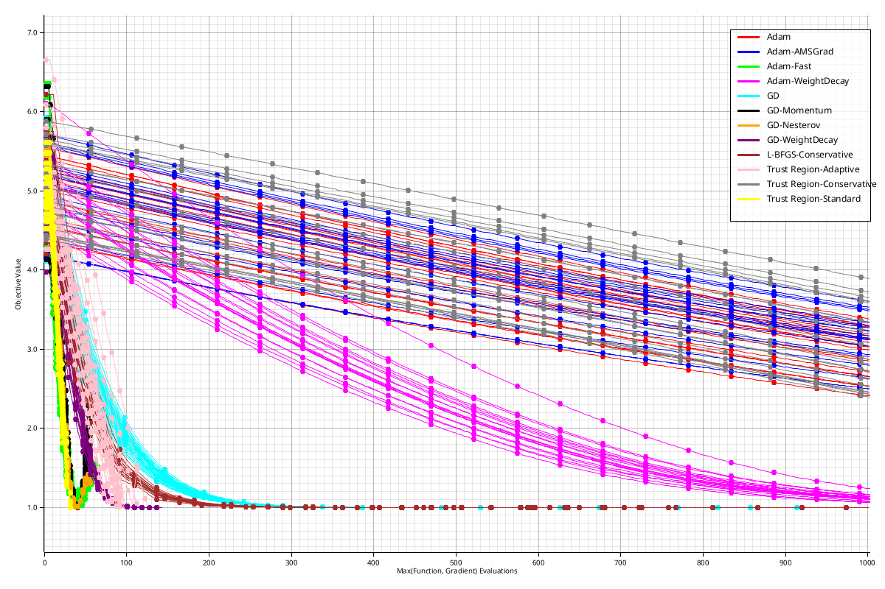
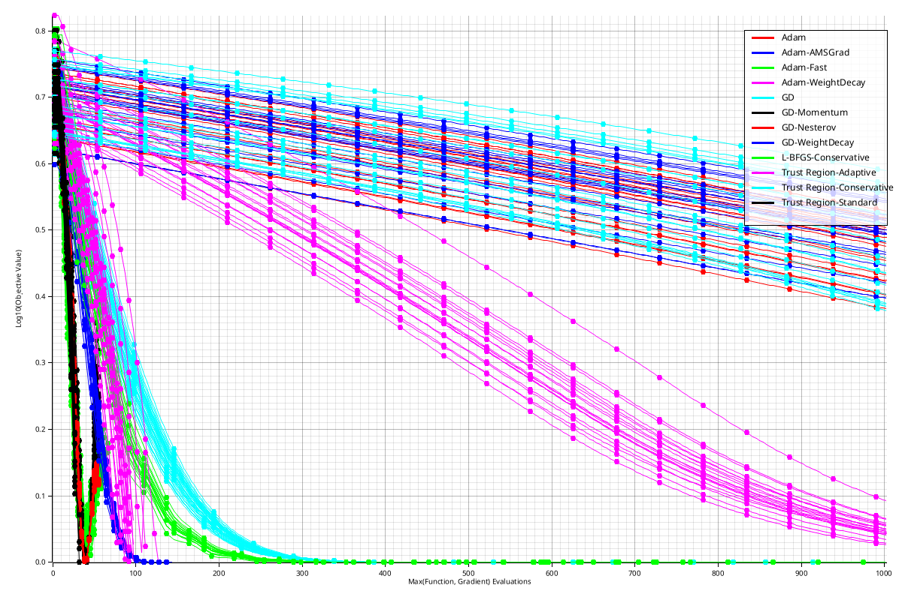

**Figure:** Convergence plots for Barrier_5D_mu0.1 showing objective value vs iterations.
Left: Linear scale, Right: Log scale for better visualization of convergence behavior.

**Data:** [Linear scale data (CSV)](convergence_Barrier_5D_mu0.1_data.csv) | [Log scale data (CSV)](convergence_Barrier_5D_mu0.1_log_data.csv)

## Problem: Barrier_10D_mu0.1

**Family:** Barrier  
**Dimension:** 10  
**Success Threshold:** 1.000e-6  
**Total Runs:** 560

### Performance Summary
<table style="border-collapse: collapse; width: 100%; margin: 20px 0;">
<tr style="background-color: #f2f2f2;">
<th style="border: 1px solid #ddd; padding: 8px; text-align: center;">Rank</th>
<th style="border: 1px solid #ddd; padding: 8px; text-align: center;">Optimizer</th>
<th style="border: 1px solid #ddd; padding: 8px; text-align: center;">Mean Final Value (All/Success/Fail)</th>
<th style="border: 1px solid #ddd; padding: 8px; text-align: center;">Std Dev</th>
<th style="border: 1px solid #ddd; padding: 8px; text-align: center;">Best Value</th>
<th style="border: 1px solid #ddd; padding: 8px; text-align: center;">Worst Value</th>
<th style="border: 1px solid #ddd; padding: 8px; text-align: center;">Mean Function Evals (All/Success/Fail)</th>
<th style="border: 1px solid #ddd; padding: 8px; text-align: center;">Mean Gradient Evals (All/Success/Fail)</th>
<th style="border: 1px solid #ddd; padding: 8px; text-align: center;">Success Rate</th>
<th style="border: 1px solid #ddd; padding: 8px; text-align: center;">Mean Time (s)</th>
</tr>
<tr style="background-color: #d4edda; font-weight: bold;">
<td style="border: 1px solid #ddd; padding: 8px; text-align: center;">1</td>
<td style="border: 1px solid #ddd; padding: 8px; text-align: center;"><a href="detailed_Barrier_10D_mu0.1_L-BFGS-Conservative.md">L-BFGS-Conservative</a></td>
<td style="border: 1px solid #ddd; padding: 8px; text-align: center;">2.00e0 / - / 2.00e0</td>
<td style="border: 1px solid #ddd; padding: 8px; text-align: center;">8.95e-9</td>
<td style="border: 1px solid #ddd; padding: 8px; text-align: center;">2.00e0</td>
<td style="border: 1px solid #ddd; padding: 8px; text-align: center;">2.00e0</td>
<td style="border: 1px solid #ddd; padding: 8px; text-align: center;">404.7 / - / 404.7</td>
<td style="border: 1px solid #ddd; padding: 8px; text-align: center;">323.0 / - / 323.0</td>
<td style="border: 1px solid #ddd; padding: 8px; text-align: center;">0.0%</td>
<td style="border: 1px solid #ddd; padding: 8px; text-align: center;">0.010</td>
</tr>
<tr style="background-color: #fff3cd;">
<td style="border: 1px solid #ddd; padding: 8px; text-align: center;">2</td>
<td style="border: 1px solid #ddd; padding: 8px; text-align: center;"><a href="detailed_Barrier_10D_mu0.1_GD.md">GD</a></td>
<td style="border: 1px solid #ddd; padding: 8px; text-align: center;">2.00e0 / - / 2.00e0</td>
<td style="border: 1px solid #ddd; padding: 8px; text-align: center;">6.16e-11</td>
<td style="border: 1px solid #ddd; padding: 8px; text-align: center;">2.00e0</td>
<td style="border: 1px solid #ddd; padding: 8px; text-align: center;">2.00e0</td>
<td style="border: 1px solid #ddd; padding: 8px; text-align: center;">304.6 / - / 304.6</td>
<td style="border: 1px solid #ddd; padding: 8px; text-align: center;">605.1 / - / 605.1</td>
<td style="border: 1px solid #ddd; padding: 8px; text-align: center;">0.0%</td>
<td style="border: 1px solid #ddd; padding: 8px; text-align: center;">0.008</td>
</tr>
<tr style="">
<td style="border: 1px solid #ddd; padding: 8px; text-align: center;">3</td>
<td style="border: 1px solid #ddd; padding: 8px; text-align: center;"><a href="detailed_Barrier_10D_mu0.1_GD-WeightDecay.md">GD-WeightDecay</a></td>
<td style="border: 1px solid #ddd; padding: 8px; text-align: center;">2.00e0 / - / 2.00e0</td>
<td style="border: 1px solid #ddd; padding: 8px; text-align: center;">2.57e-5</td>
<td style="border: 1px solid #ddd; padding: 8px; text-align: center;">2.00e0</td>
<td style="border: 1px solid #ddd; padding: 8px; text-align: center;">2.00e0</td>
<td style="border: 1px solid #ddd; padding: 8px; text-align: center;">49.5 / - / 49.5</td>
<td style="border: 1px solid #ddd; padding: 8px; text-align: center;">95.1 / - / 95.1</td>
<td style="border: 1px solid #ddd; padding: 8px; text-align: center;">0.0%</td>
<td style="border: 1px solid #ddd; padding: 8px; text-align: center;">0.002</td>
</tr>
<tr style="">
<td style="border: 1px solid #ddd; padding: 8px; text-align: center;">4</td>
<td style="border: 1px solid #ddd; padding: 8px; text-align: center;"><a href="detailed_Barrier_10D_mu0.1_Trust_Region-Adaptive.md">Trust Region-Adaptive</a></td>
<td style="border: 1px solid #ddd; padding: 8px; text-align: center;">2.26e0 / - / 2.29e0</td>
<td style="border: 1px solid #ddd; padding: 8px; text-align: center;">5.00e-1</td>
<td style="border: 1px solid #ddd; padding: 8px; text-align: center;">2.00e0</td>
<td style="border: 1px solid #ddd; padding: 8px; text-align: center;">3.89e0</td>
<td style="border: 1px solid #ddd; padding: 8px; text-align: center;">108.2 / - / 108.2</td>
<td style="border: 1px solid #ddd; padding: 8px; text-align: center;">73.0 / - / 73.0</td>
<td style="border: 1px solid #ddd; padding: 8px; text-align: center;">0.0%</td>
<td style="border: 1px solid #ddd; padding: 8px; text-align: center;">0.001</td>
</tr>
<tr style="">
<td style="border: 1px solid #ddd; padding: 8px; text-align: center;">5</td>
<td style="border: 1px solid #ddd; padding: 8px; text-align: center;"><a href="detailed_Barrier_10D_mu0.1_Trust_Region-Standard.md">Trust Region-Standard</a></td>
<td style="border: 1px solid #ddd; padding: 8px; text-align: center;">2.31e0 / - / 2.31e0</td>
<td style="border: 1px solid #ddd; padding: 8px; text-align: center;">4.66e-1</td>
<td style="border: 1px solid #ddd; padding: 8px; text-align: center;">2.00e0</td>
<td style="border: 1px solid #ddd; padding: 8px; text-align: center;">3.31e0</td>
<td style="border: 1px solid #ddd; padding: 8px; text-align: center;">30.4 / - / 30.4</td>
<td style="border: 1px solid #ddd; padding: 8px; text-align: center;">21.2 / - / 21.2</td>
<td style="border: 1px solid #ddd; padding: 8px; text-align: center;">0.0%</td>
<td style="border: 1px solid #ddd; padding: 8px; text-align: center;">0.000</td>
</tr>
<tr style="">
<td style="border: 1px solid #ddd; padding: 8px; text-align: center;">6</td>
<td style="border: 1px solid #ddd; padding: 8px; text-align: center;"><a href="detailed_Barrier_10D_mu0.1_GD-Nesterov.md">GD-Nesterov</a></td>
<td style="border: 1px solid #ddd; padding: 8px; text-align: center;">2.00e0 / - / 2.51e0</td>
<td style="border: 1px solid #ddd; padding: 8px; text-align: center;">2.61e-3</td>
<td style="border: 1px solid #ddd; padding: 8px; text-align: center;">2.00e0</td>
<td style="border: 1px solid #ddd; padding: 8px; text-align: center;">2.01e0</td>
<td style="border: 1px solid #ddd; padding: 8px; text-align: center;">21.0 / - / 21.0</td>
<td style="border: 1px solid #ddd; padding: 8px; text-align: center;">38.0 / - / 38.0</td>
<td style="border: 1px solid #ddd; padding: 8px; text-align: center;">0.0%</td>
<td style="border: 1px solid #ddd; padding: 8px; text-align: center;">0.001</td>
</tr>
<tr style="">
<td style="border: 1px solid #ddd; padding: 8px; text-align: center;">7</td>
<td style="border: 1px solid #ddd; padding: 8px; text-align: center;"><a href="detailed_Barrier_10D_mu0.1_GD-Momentum.md">GD-Momentum</a></td>
<td style="border: 1px solid #ddd; padding: 8px; text-align: center;">2.01e0 / - / 3.25e0</td>
<td style="border: 1px solid #ddd; padding: 8px; text-align: center;">8.46e-3</td>
<td style="border: 1px solid #ddd; padding: 8px; text-align: center;">2.00e0</td>
<td style="border: 1px solid #ddd; padding: 8px; text-align: center;">2.03e0</td>
<td style="border: 1px solid #ddd; padding: 8px; text-align: center;">21.1 / - / 21.1</td>
<td style="border: 1px solid #ddd; padding: 8px; text-align: center;">38.3 / - / 38.3</td>
<td style="border: 1px solid #ddd; padding: 8px; text-align: center;">0.0%</td>
<td style="border: 1px solid #ddd; padding: 8px; text-align: center;">0.001</td>
</tr>
<tr style="">
<td style="border: 1px solid #ddd; padding: 8px; text-align: center;">8</td>
<td style="border: 1px solid #ddd; padding: 8px; text-align: center;"><a href="detailed_Barrier_10D_mu0.1_Adam-WeightDecay.md">Adam-WeightDecay</a></td>
<td style="border: 1px solid #ddd; padding: 8px; text-align: center;">2.17e0 / - / 2.17e0</td>
<td style="border: 1px solid #ddd; padding: 8px; text-align: center;">6.77e-2</td>
<td style="border: 1px solid #ddd; padding: 8px; text-align: center;">2.05e0</td>
<td style="border: 1px solid #ddd; padding: 8px; text-align: center;">2.29e0</td>
<td style="border: 1px solid #ddd; padding: 8px; text-align: center;">502.0 / - / 502.0</td>
<td style="border: 1px solid #ddd; padding: 8px; text-align: center;">502.0 / - / 502.0</td>
<td style="border: 1px solid #ddd; padding: 8px; text-align: center;">0.0%</td>
<td style="border: 1px solid #ddd; padding: 8px; text-align: center;">0.012</td>
</tr>
<tr style="">
<td style="border: 1px solid #ddd; padding: 8px; text-align: center;">9</td>
<td style="border: 1px solid #ddd; padding: 8px; text-align: center;"><a href="detailed_Barrier_10D_mu0.1_Adam-Fast.md">Adam-Fast</a></td>
<td style="border: 1px solid #ddd; padding: 8px; text-align: center;">2.16e0 / - / 2.62e0</td>
<td style="border: 1px solid #ddd; padding: 8px; text-align: center;">5.02e-2</td>
<td style="border: 1px solid #ddd; padding: 8px; text-align: center;">2.06e0</td>
<td style="border: 1px solid #ddd; padding: 8px; text-align: center;">2.28e0</td>
<td style="border: 1px solid #ddd; padding: 8px; text-align: center;">31.4 / - / 31.4</td>
<td style="border: 1px solid #ddd; padding: 8px; text-align: center;">30.4 / - / 30.4</td>
<td style="border: 1px solid #ddd; padding: 8px; text-align: center;">0.0%</td>
<td style="border: 1px solid #ddd; padding: 8px; text-align: center;">0.001</td>
</tr>
<tr style="">
<td style="border: 1px solid #ddd; padding: 8px; text-align: center;">10</td>
<td style="border: 1px solid #ddd; padding: 8px; text-align: center;"><a href="detailed_Barrier_10D_mu0.1_Adam-AMSGrad.md">Adam-AMSGrad</a></td>
<td style="border: 1px solid #ddd; padding: 8px; text-align: center;">6.12e0 / - / 6.12e0</td>
<td style="border: 1px solid #ddd; padding: 8px; text-align: center;">3.39e-1</td>
<td style="border: 1px solid #ddd; padding: 8px; text-align: center;">5.31e0</td>
<td style="border: 1px solid #ddd; padding: 8px; text-align: center;">6.65e0</td>
<td style="border: 1px solid #ddd; padding: 8px; text-align: center;">502.0 / - / 502.0</td>
<td style="border: 1px solid #ddd; padding: 8px; text-align: center;">502.0 / - / 502.0</td>
<td style="border: 1px solid #ddd; padding: 8px; text-align: center;">0.0%</td>
<td style="border: 1px solid #ddd; padding: 8px; text-align: center;">0.012</td>
</tr>
<tr style="">
<td style="border: 1px solid #ddd; padding: 8px; text-align: center;">11</td>
<td style="border: 1px solid #ddd; padding: 8px; text-align: center;"><a href="detailed_Barrier_10D_mu0.1_Adam.md">Adam</a></td>
<td style="border: 1px solid #ddd; padding: 8px; text-align: center;">6.16e0 / - / 6.16e0</td>
<td style="border: 1px solid #ddd; padding: 8px; text-align: center;">3.75e-1</td>
<td style="border: 1px solid #ddd; padding: 8px; text-align: center;">5.65e0</td>
<td style="border: 1px solid #ddd; padding: 8px; text-align: center;">6.77e0</td>
<td style="border: 1px solid #ddd; padding: 8px; text-align: center;">502.0 / - / 502.0</td>
<td style="border: 1px solid #ddd; padding: 8px; text-align: center;">502.0 / - / 502.0</td>
<td style="border: 1px solid #ddd; padding: 8px; text-align: center;">0.0%</td>
<td style="border: 1px solid #ddd; padding: 8px; text-align: center;">0.011</td>
</tr>
<tr style="">
<td style="border: 1px solid #ddd; padding: 8px; text-align: center;">12</td>
<td style="border: 1px solid #ddd; padding: 8px; text-align: center;"><a href="detailed_Barrier_10D_mu0.1_Trust_Region-Conservative.md">Trust Region-Conservative</a></td>
<td style="border: 1px solid #ddd; padding: 8px; text-align: center;">8.12e0 / - / 8.12e0</td>
<td style="border: 1px solid #ddd; padding: 8px; text-align: center;">8.57e-1</td>
<td style="border: 1px solid #ddd; padding: 8px; text-align: center;">6.05e0</td>
<td style="border: 1px solid #ddd; padding: 8px; text-align: center;">9.68e0</td>
<td style="border: 1px solid #ddd; padding: 8px; text-align: center;">602.0 / - / 602.0</td>
<td style="border: 1px solid #ddd; padding: 8px; text-align: center;">402.0 / - / 402.0</td>
<td style="border: 1px solid #ddd; padding: 8px; text-align: center;">0.0%</td>
<td style="border: 1px solid #ddd; padding: 8px; text-align: center;">0.004</td>
</tr>
</table>

### Convergence Plots

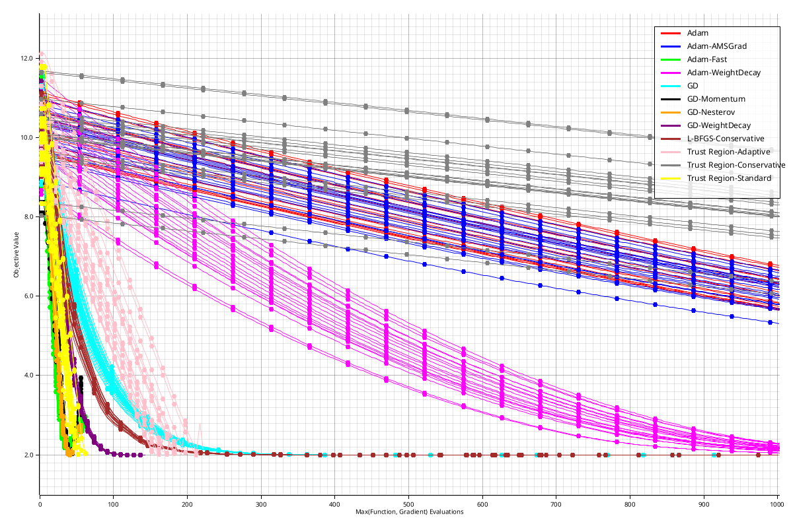
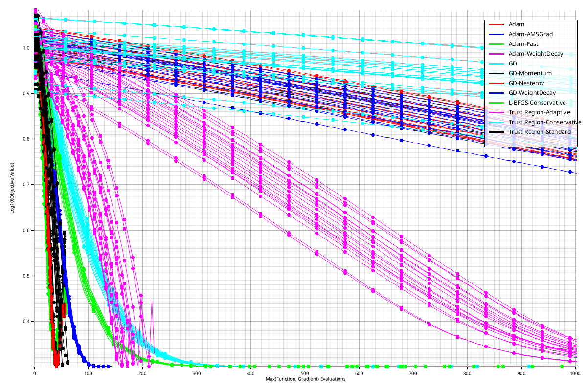

**Figure:** Convergence plots for Barrier_10D_mu0.1 showing objective value vs iterations.
Left: Linear scale, Right: Log scale for better visualization of convergence behavior.

**Data:** [Linear scale data (CSV)](convergence_Barrier_10D_mu0.1_data.csv) | [Log scale data (CSV)](convergence_Barrier_10D_mu0.1_log_data.csv)

## Problem: NoisySphere_2D_sigma0.01

**Family:** NoisySphere  
**Dimension:** 2  
**Success Threshold:** 1.370e0  
**Total Runs:** 560

### Performance Summary
<table style="border-collapse: collapse; width: 100%; margin: 20px 0;">
<tr style="background-color: #f2f2f2;">
<th style="border: 1px solid #ddd; padding: 8px; text-align: center;">Rank</th>
<th style="border: 1px solid #ddd; padding: 8px; text-align: center;">Optimizer</th>
<th style="border: 1px solid #ddd; padding: 8px; text-align: center;">Mean Final Value (All/Success/Fail)</th>
<th style="border: 1px solid #ddd; padding: 8px; text-align: center;">Std Dev</th>
<th style="border: 1px solid #ddd; padding: 8px; text-align: center;">Best Value</th>
<th style="border: 1px solid #ddd; padding: 8px; text-align: center;">Worst Value</th>
<th style="border: 1px solid #ddd; padding: 8px; text-align: center;">Mean Function Evals (All/Success/Fail)</th>
<th style="border: 1px solid #ddd; padding: 8px; text-align: center;">Mean Gradient Evals (All/Success/Fail)</th>
<th style="border: 1px solid #ddd; padding: 8px; text-align: center;">Success Rate</th>
<th style="border: 1px solid #ddd; padding: 8px; text-align: center;">Mean Time (s)</th>
</tr>
<tr style="background-color: #d4edda; font-weight: bold;">
<td style="border: 1px solid #ddd; padding: 8px; text-align: center;">1</td>
<td style="border: 1px solid #ddd; padding: 8px; text-align: center;"><a href="detailed_NoisySphere_2D_sigma0.01_L-BFGS-Conservative.md">L-BFGS-Conservative</a></td>
<td style="border: 1px solid #ddd; padding: 8px; text-align: center;">3.26e-1 / 6.92e-1 / 2.34e-1</td>
<td style="border: 1px solid #ddd; padding: 8px; text-align: center;">4.26e-1</td>
<td style="border: 1px solid #ddd; padding: 8px; text-align: center;">-9.57e-3</td>
<td style="border: 1px solid #ddd; padding: 8px; text-align: center;">1.76e0</td>
<td style="border: 1px solid #ddd; padding: 8px; text-align: center;">778.5 / 648.8 / 811.0</td>
<td style="border: 1px solid #ddd; padding: 8px; text-align: center;">160.8 / 117.5 / 171.7</td>
<td style="border: 1px solid #ddd; padding: 8px; text-align: center;">20.0%</td>
<td style="border: 1px solid #ddd; padding: 8px; text-align: center;">0.017</td>
</tr>
<tr style="background-color: #fff3cd;">
<td style="border: 1px solid #ddd; padding: 8px; text-align: center;">2</td>
<td style="border: 1px solid #ddd; padding: 8px; text-align: center;"><a href="detailed_NoisySphere_2D_sigma0.01_QQN-StrongWolfe.md">QQN-StrongWolfe</a></td>
<td style="border: 1px solid #ddd; padding: 8px; text-align: center;">1.14e0 / - / 1.14e0</td>
<td style="border: 1px solid #ddd; padding: 8px; text-align: center;">7.41e-1</td>
<td style="border: 1px solid #ddd; padding: 8px; text-align: center;">-6.63e-3</td>
<td style="border: 1px solid #ddd; padding: 8px; text-align: center;">2.44e0</td>
<td style="border: 1px solid #ddd; padding: 8px; text-align: center;">36.7 / - / 36.7</td>
<td style="border: 1px solid #ddd; padding: 8px; text-align: center;">15.5 / - / 15.5</td>
<td style="border: 1px solid #ddd; padding: 8px; text-align: center;">0.0%</td>
<td style="border: 1px solid #ddd; padding: 8px; text-align: center;">0.002</td>
</tr>
<tr style="">
<td style="border: 1px solid #ddd; padding: 8px; text-align: center;">3</td>
<td style="border: 1px solid #ddd; padding: 8px; text-align: center;"><a href="detailed_NoisySphere_2D_sigma0.01_QQN-Backtracking.md">QQN-Backtracking</a></td>
<td style="border: 1px solid #ddd; padding: 8px; text-align: center;">1.17e0 / - / 1.17e0</td>
<td style="border: 1px solid #ddd; padding: 8px; text-align: center;">8.57e-1</td>
<td style="border: 1px solid #ddd; padding: 8px; text-align: center;">-5.30e-3</td>
<td style="border: 1px solid #ddd; padding: 8px; text-align: center;">2.72e0</td>
<td style="border: 1px solid #ddd; padding: 8px; text-align: center;">190.5 / - / 190.5</td>
<td style="border: 1px solid #ddd; padding: 8px; text-align: center;">35.0 / - / 35.0</td>
<td style="border: 1px solid #ddd; padding: 8px; text-align: center;">0.0%</td>
<td style="border: 1px solid #ddd; padding: 8px; text-align: center;">0.006</td>
</tr>
<tr style="">
<td style="border: 1px solid #ddd; padding: 8px; text-align: center;">4</td>
<td style="border: 1px solid #ddd; padding: 8px; text-align: center;"><a href="detailed_NoisySphere_2D_sigma0.01_GD-WeightDecay.md">GD-WeightDecay</a></td>
<td style="border: 1px solid #ddd; padding: 8px; text-align: center;">1.26e0 / 6.68e-1 / 2.60e0</td>
<td style="border: 1px solid #ddd; padding: 8px; text-align: center;">9.25e-1</td>
<td style="border: 1px solid #ddd; padding: 8px; text-align: center;">-4.80e-3</td>
<td style="border: 1px solid #ddd; padding: 8px; text-align: center;">2.61e0</td>
<td style="border: 1px solid #ddd; padding: 8px; text-align: center;">18.4 / 27.9 / 10.6</td>
<td style="border: 1px solid #ddd; padding: 8px; text-align: center;">32.8 / 51.8 / 17.3</td>
<td style="border: 1px solid #ddd; padding: 8px; text-align: center;">45.0%</td>
<td style="border: 1px solid #ddd; padding: 8px; text-align: center;">0.002</td>
</tr>
<tr style="">
<td style="border: 1px solid #ddd; padding: 8px; text-align: center;">5</td>
<td style="border: 1px solid #ddd; padding: 8px; text-align: center;"><a href="detailed_NoisySphere_2D_sigma0.01_QQN-CubicQuadraticInterpolation.md">QQN-CubicQuadraticInterpolation</a></td>
<td style="border: 1px solid #ddd; padding: 8px; text-align: center;">1.48e0 / - / 1.48e0</td>
<td style="border: 1px solid #ddd; padding: 8px; text-align: center;">7.31e-1</td>
<td style="border: 1px solid #ddd; padding: 8px; text-align: center;">6.06e-5</td>
<td style="border: 1px solid #ddd; padding: 8px; text-align: center;">2.29e0</td>
<td style="border: 1px solid #ddd; padding: 8px; text-align: center;">30.4 / - / 30.4</td>
<td style="border: 1px solid #ddd; padding: 8px; text-align: center;">37.4 / - / 37.4</td>
<td style="border: 1px solid #ddd; padding: 8px; text-align: center;">0.0%</td>
<td style="border: 1px solid #ddd; padding: 8px; text-align: center;">0.002</td>
</tr>
<tr style="">
<td style="border: 1px solid #ddd; padding: 8px; text-align: center;">6</td>
<td style="border: 1px solid #ddd; padding: 8px; text-align: center;"><a href="detailed_NoisySphere_2D_sigma0.01_QQN-GoldenSection.md">QQN-GoldenSection</a></td>
<td style="border: 1px solid #ddd; padding: 8px; text-align: center;">1.78e0 / - / 1.78e0</td>
<td style="border: 1px solid #ddd; padding: 8px; text-align: center;">6.27e-1</td>
<td style="border: 1px solid #ddd; padding: 8px; text-align: center;">3.13e-3</td>
<td style="border: 1px solid #ddd; padding: 8px; text-align: center;">2.73e0</td>
<td style="border: 1px solid #ddd; padding: 8px; text-align: center;">22.1 / - / 22.1</td>
<td style="border: 1px solid #ddd; padding: 8px; text-align: center;">5.2 / - / 5.2</td>
<td style="border: 1px solid #ddd; padding: 8px; text-align: center;">0.0%</td>
<td style="border: 1px solid #ddd; padding: 8px; text-align: center;">0.001</td>
</tr>
<tr style="">
<td style="border: 1px solid #ddd; padding: 8px; text-align: center;">7</td>
<td style="border: 1px solid #ddd; padding: 8px; text-align: center;"><a href="detailed_NoisySphere_2D_sigma0.01_L-BFGS.md">L-BFGS</a></td>
<td style="border: 1px solid #ddd; padding: 8px; text-align: center;">1.21e0 / 1.57e1 / 1.34e1</td>
<td style="border: 1px solid #ddd; padding: 8px; text-align: center;">8.98e-1</td>
<td style="border: 1px solid #ddd; padding: 8px; text-align: center;">5.06e-3</td>
<td style="border: 1px solid #ddd; padding: 8px; text-align: center;">2.48e0</td>
<td style="border: 1px solid #ddd; padding: 8px; text-align: center;">70.0 / 86.3 / 56.6</td>
<td style="border: 1px solid #ddd; padding: 8px; text-align: center;">22.1 / 27.0 / 18.1</td>
<td style="border: 1px solid #ddd; padding: 8px; text-align: center;">45.0%</td>
<td style="border: 1px solid #ddd; padding: 8px; text-align: center;">0.002</td>
</tr>
<tr style="">
<td style="border: 1px solid #ddd; padding: 8px; text-align: center;">8</td>
<td style="border: 1px solid #ddd; padding: 8px; text-align: center;"><a href="detailed_NoisySphere_2D_sigma0.01_QQN-MoreThuente.md">QQN-MoreThuente</a></td>
<td style="border: 1px solid #ddd; padding: 8px; text-align: center;">1.74e0 / - / 1.74e0</td>
<td style="border: 1px solid #ddd; padding: 8px; text-align: center;">5.38e-1</td>
<td style="border: 1px solid #ddd; padding: 8px; text-align: center;">5.59e-3</td>
<td style="border: 1px solid #ddd; padding: 8px; text-align: center;">2.25e0</td>
<td style="border: 1px solid #ddd; padding: 8px; text-align: center;">23.1 / - / 23.1</td>
<td style="border: 1px solid #ddd; padding: 8px; text-align: center;">23.2 / - / 23.2</td>
<td style="border: 1px solid #ddd; padding: 8px; text-align: center;">0.0%</td>
<td style="border: 1px solid #ddd; padding: 8px; text-align: center;">0.001</td>
</tr>
<tr style="">
<td style="border: 1px solid #ddd; padding: 8px; text-align: center;">9</td>
<td style="border: 1px solid #ddd; padding: 8px; text-align: center;"><a href="detailed_NoisySphere_2D_sigma0.01_QQN-Bisection-1.md">QQN-Bisection-1</a></td>
<td style="border: 1px solid #ddd; padding: 8px; text-align: center;">9.53e-1 / - / 9.53e-1</td>
<td style="border: 1px solid #ddd; padding: 8px; text-align: center;">8.00e-1</td>
<td style="border: 1px solid #ddd; padding: 8px; text-align: center;">1.03e-2</td>
<td style="border: 1px solid #ddd; padding: 8px; text-align: center;">2.29e0</td>
<td style="border: 1px solid #ddd; padding: 8px; text-align: center;">131.1 / - / 131.1</td>
<td style="border: 1px solid #ddd; padding: 8px; text-align: center;">173.8 / - / 173.8</td>
<td style="border: 1px solid #ddd; padding: 8px; text-align: center;">0.0%</td>
<td style="border: 1px solid #ddd; padding: 8px; text-align: center;">0.012</td>
</tr>
<tr style="">
<td style="border: 1px solid #ddd; padding: 8px; text-align: center;">10</td>
<td style="border: 1px solid #ddd; padding: 8px; text-align: center;"><a href="detailed_NoisySphere_2D_sigma0.01_Adam-Fast.md">Adam-Fast</a></td>
<td style="border: 1px solid #ddd; padding: 8px; text-align: center;">1.60e0 / 9.43e-1 / 2.66e0</td>
<td style="border: 1px solid #ddd; padding: 8px; text-align: center;">7.14e-1</td>
<td style="border: 1px solid #ddd; padding: 8px; text-align: center;">2.95e-2</td>
<td style="border: 1px solid #ddd; padding: 8px; text-align: center;">2.61e0</td>
<td style="border: 1px solid #ddd; padding: 8px; text-align: center;">29.2 / 51.8 / 15.7</td>
<td style="border: 1px solid #ddd; padding: 8px; text-align: center;">28.2 / 50.8 / 14.7</td>
<td style="border: 1px solid #ddd; padding: 8px; text-align: center;">37.5%</td>
<td style="border: 1px solid #ddd; padding: 8px; text-align: center;">0.002</td>
</tr>
<tr style="">
<td style="border: 1px solid #ddd; padding: 8px; text-align: center;">11</td>
<td style="border: 1px solid #ddd; padding: 8px; text-align: center;"><a href="detailed_NoisySphere_2D_sigma0.01_GD-Nesterov.md">GD-Nesterov</a></td>
<td style="border: 1px solid #ddd; padding: 8px; text-align: center;">1.51e0 / 1.65e0 / 2.78e0</td>
<td style="border: 1px solid #ddd; padding: 8px; text-align: center;">5.75e-1</td>
<td style="border: 1px solid #ddd; padding: 8px; text-align: center;">3.90e-2</td>
<td style="border: 1px solid #ddd; padding: 8px; text-align: center;">2.41e0</td>
<td style="border: 1px solid #ddd; padding: 8px; text-align: center;">13.8 / 19.6 / 10.8</td>
<td style="border: 1px solid #ddd; padding: 8px; text-align: center;">23.7 / 35.1 / 17.5</td>
<td style="border: 1px solid #ddd; padding: 8px; text-align: center;">35.0%</td>
<td style="border: 1px solid #ddd; padding: 8px; text-align: center;">0.001</td>
</tr>
<tr style="">
<td style="border: 1px solid #ddd; padding: 8px; text-align: center;">12</td>
<td style="border: 1px solid #ddd; padding: 8px; text-align: center;"><a href="detailed_NoisySphere_2D_sigma0.01_GD-Momentum.md">GD-Momentum</a></td>
<td style="border: 1px solid #ddd; padding: 8px; text-align: center;">1.34e0 / 1.33e0 / 2.35e0</td>
<td style="border: 1px solid #ddd; padding: 8px; text-align: center;">6.43e-1</td>
<td style="border: 1px solid #ddd; padding: 8px; text-align: center;">6.65e-2</td>
<td style="border: 1px solid #ddd; padding: 8px; text-align: center;">2.17e0</td>
<td style="border: 1px solid #ddd; padding: 8px; text-align: center;">13.1 / 19.5 / 8.8</td>
<td style="border: 1px solid #ddd; padding: 8px; text-align: center;">22.1 / 35.0 / 13.5</td>
<td style="border: 1px solid #ddd; padding: 8px; text-align: center;">40.0%</td>
<td style="border: 1px solid #ddd; padding: 8px; text-align: center;">0.001</td>
</tr>
<tr style="">
<td style="border: 1px solid #ddd; padding: 8px; text-align: center;">13</td>
<td style="border: 1px solid #ddd; padding: 8px; text-align: center;"><a href="detailed_NoisySphere_2D_sigma0.01_GD.md">GD</a></td>
<td style="border: 1px solid #ddd; padding: 8px; text-align: center;">1.62e0 / 1.35e0 / 2.57e0</td>
<td style="border: 1px solid #ddd; padding: 8px; text-align: center;">4.74e-1</td>
<td style="border: 1px solid #ddd; padding: 8px; text-align: center;">5.70e-1</td>
<td style="border: 1px solid #ddd; padding: 8px; text-align: center;">2.51e0</td>
<td style="border: 1px solid #ddd; padding: 8px; text-align: center;">12.8 / 17.4 / 10.8</td>
<td style="border: 1px solid #ddd; padding: 8px; text-align: center;">21.5 / 30.8 / 17.5</td>
<td style="border: 1px solid #ddd; padding: 8px; text-align: center;">30.0%</td>
<td style="border: 1px solid #ddd; padding: 8px; text-align: center;">0.001</td>
</tr>
<tr style="">
<td style="border: 1px solid #ddd; padding: 8px; text-align: center;">14</td>
<td style="border: 1px solid #ddd; padding: 8px; text-align: center;"><a href="detailed_NoisySphere_2D_sigma0.01_QQN-Bisection-2.md">QQN-Bisection-2</a></td>
<td style="border: 1px solid #ddd; padding: 8px; text-align: center;">1.29e0 / - / 1.29e0</td>
<td style="border: 1px solid #ddd; padding: 8px; text-align: center;">7.64e-1</td>
<td style="border: 1px solid #ddd; padding: 8px; text-align: center;">6.76e-1</td>
<td style="border: 1px solid #ddd; padding: 8px; text-align: center;">2.37e0</td>
<td style="border: 1px solid #ddd; padding: 8px; text-align: center;">3.6 / - / 3.6</td>
<td style="border: 1px solid #ddd; padding: 8px; text-align: center;">1.5 / - / 1.5</td>
<td style="border: 1px solid #ddd; padding: 8px; text-align: center;">0.0%</td>
<td style="border: 1px solid #ddd; padding: 8px; text-align: center;">0.000</td>
</tr>
<tr style="">
<td style="border: 1px solid #ddd; padding: 8px; text-align: center;">15</td>
<td style="border: 1px solid #ddd; padding: 8px; text-align: center;"><a href="detailed_NoisySphere_2D_sigma0.01_Trust_Region-Standard.md">Trust Region-Standard</a></td>
<td style="border: 1px solid #ddd; padding: 8px; text-align: center;">2.08e0 / 1.35e0 / 2.12e0</td>
<td style="border: 1px solid #ddd; padding: 8px; text-align: center;">2.61e-1</td>
<td style="border: 1px solid #ddd; padding: 8px; text-align: center;">1.35e0</td>
<td style="border: 1px solid #ddd; padding: 8px; text-align: center;">2.46e0</td>
<td style="border: 1px solid #ddd; padding: 8px; text-align: center;">5.0 / 5.0 / 5.0</td>
<td style="border: 1px solid #ddd; padding: 8px; text-align: center;">4.0 / 4.0 / 4.0</td>
<td style="border: 1px solid #ddd; padding: 8px; text-align: center;">5.0%</td>
<td style="border: 1px solid #ddd; padding: 8px; text-align: center;">0.000</td>
</tr>
<tr style="">
<td style="border: 1px solid #ddd; padding: 8px; text-align: center;">16</td>
<td style="border: 1px solid #ddd; padding: 8px; text-align: center;"><a href="detailed_NoisySphere_2D_sigma0.01_Trust_Region-Adaptive.md">Trust Region-Adaptive</a></td>
<td style="border: 1px solid #ddd; padding: 8px; text-align: center;">1.91e0 / 1.36e0 / 1.94e0</td>
<td style="border: 1px solid #ddd; padding: 8px; text-align: center;">4.06e-1</td>
<td style="border: 1px solid #ddd; padding: 8px; text-align: center;">1.36e0</td>
<td style="border: 1px solid #ddd; padding: 8px; text-align: center;">2.55e0</td>
<td style="border: 1px solid #ddd; padding: 8px; text-align: center;">5.0 / 5.0 / 5.0</td>
<td style="border: 1px solid #ddd; padding: 8px; text-align: center;">4.0 / 4.0 / 4.0</td>
<td style="border: 1px solid #ddd; padding: 8px; text-align: center;">5.0%</td>
<td style="border: 1px solid #ddd; padding: 8px; text-align: center;">0.000</td>
</tr>
<tr style="">
<td style="border: 1px solid #ddd; padding: 8px; text-align: center;">17</td>
<td style="border: 1px solid #ddd; padding: 8px; text-align: center;"><a href="detailed_NoisySphere_2D_sigma0.01_Adam-AMSGrad.md">Adam-AMSGrad</a></td>
<td style="border: 1px solid #ddd; padding: 8px; text-align: center;">2.03e0 / - / 2.04e0</td>
<td style="border: 1px solid #ddd; padding: 8px; text-align: center;">3.65e-1</td>
<td style="border: 1px solid #ddd; padding: 8px; text-align: center;">1.38e0</td>
<td style="border: 1px solid #ddd; padding: 8px; text-align: center;">2.71e0</td>
<td style="border: 1px solid #ddd; padding: 8px; text-align: center;">28.0 / - / 28.0</td>
<td style="border: 1px solid #ddd; padding: 8px; text-align: center;">27.0 / - / 27.0</td>
<td style="border: 1px solid #ddd; padding: 8px; text-align: center;">0.0%</td>
<td style="border: 1px solid #ddd; padding: 8px; text-align: center;">0.002</td>
</tr>
<tr style="">
<td style="border: 1px solid #ddd; padding: 8px; text-align: center;">18</td>
<td style="border: 1px solid #ddd; padding: 8px; text-align: center;"><a href="detailed_NoisySphere_2D_sigma0.01_L-BFGS-Aggressive.md">L-BFGS-Aggressive</a></td>
<td style="border: 1px solid #ddd; padding: 8px; text-align: center;">1.99e0 / - / 1.99e0</td>
<td style="border: 1px solid #ddd; padding: 8px; text-align: center;">3.81e-1</td>
<td style="border: 1px solid #ddd; padding: 8px; text-align: center;">1.40e0</td>
<td style="border: 1px solid #ddd; padding: 8px; text-align: center;">2.75e0</td>
<td style="border: 1px solid #ddd; padding: 8px; text-align: center;">6.7 / - / 6.7</td>
<td style="border: 1px solid #ddd; padding: 8px; text-align: center;">2.9 / - / 2.9</td>
<td style="border: 1px solid #ddd; padding: 8px; text-align: center;">0.0%</td>
<td style="border: 1px solid #ddd; padding: 8px; text-align: center;">0.000</td>
</tr>
<tr style="">
<td style="border: 1px solid #ddd; padding: 8px; text-align: center;">19</td>
<td style="border: 1px solid #ddd; padding: 8px; text-align: center;"><a href="detailed_NoisySphere_2D_sigma0.01_Adam-WeightDecay.md">Adam-WeightDecay</a></td>
<td style="border: 1px solid #ddd; padding: 8px; text-align: center;">2.06e0 / - / 2.08e0</td>
<td style="border: 1px solid #ddd; padding: 8px; text-align: center;">2.93e-1</td>
<td style="border: 1px solid #ddd; padding: 8px; text-align: center;">1.44e0</td>
<td style="border: 1px solid #ddd; padding: 8px; text-align: center;">2.64e0</td>
<td style="border: 1px solid #ddd; padding: 8px; text-align: center;">34.5 / - / 34.5</td>
<td style="border: 1px solid #ddd; padding: 8px; text-align: center;">33.5 / - / 33.5</td>
<td style="border: 1px solid #ddd; padding: 8px; text-align: center;">0.0%</td>
<td style="border: 1px solid #ddd; padding: 8px; text-align: center;">0.002</td>
</tr>
<tr style="">
<td style="border: 1px solid #ddd; padding: 8px; text-align: center;">20</td>
<td style="border: 1px solid #ddd; padding: 8px; text-align: center;"><a href="detailed_NoisySphere_2D_sigma0.01_Trust_Region-Conservative.md">Trust Region-Conservative</a></td>
<td style="border: 1px solid #ddd; padding: 8px; text-align: center;">2.17e0 / - / 2.17e0</td>
<td style="border: 1px solid #ddd; padding: 8px; text-align: center;">2.95e-1</td>
<td style="border: 1px solid #ddd; padding: 8px; text-align: center;">1.45e0</td>
<td style="border: 1px solid #ddd; padding: 8px; text-align: center;">2.70e0</td>
<td style="border: 1px solid #ddd; padding: 8px; text-align: center;">6.8 / - / 6.8</td>
<td style="border: 1px solid #ddd; padding: 8px; text-align: center;">5.2 / - / 5.2</td>
<td style="border: 1px solid #ddd; padding: 8px; text-align: center;">0.0%</td>
<td style="border: 1px solid #ddd; padding: 8px; text-align: center;">0.000</td>
</tr>
<tr style="">
<td style="border: 1px solid #ddd; padding: 8px; text-align: center;">21</td>
<td style="border: 1px solid #ddd; padding: 8px; text-align: center;"><a href="detailed_NoisySphere_2D_sigma0.01_Adam.md">Adam</a></td>
<td style="border: 1px solid #ddd; padding: 8px; text-align: center;">2.03e0 / - / 2.03e0</td>
<td style="border: 1px solid #ddd; padding: 8px; text-align: center;">2.88e-1</td>
<td style="border: 1px solid #ddd; padding: 8px; text-align: center;">1.56e0</td>
<td style="border: 1px solid #ddd; padding: 8px; text-align: center;">2.50e0</td>
<td style="border: 1px solid #ddd; padding: 8px; text-align: center;">30.9 / - / 30.9</td>
<td style="border: 1px solid #ddd; padding: 8px; text-align: center;">29.9 / - / 29.9</td>
<td style="border: 1px solid #ddd; padding: 8px; text-align: center;">0.0%</td>
<td style="border: 1px solid #ddd; padding: 8px; text-align: center;">0.002</td>
</tr>
</table>

### Convergence Plots

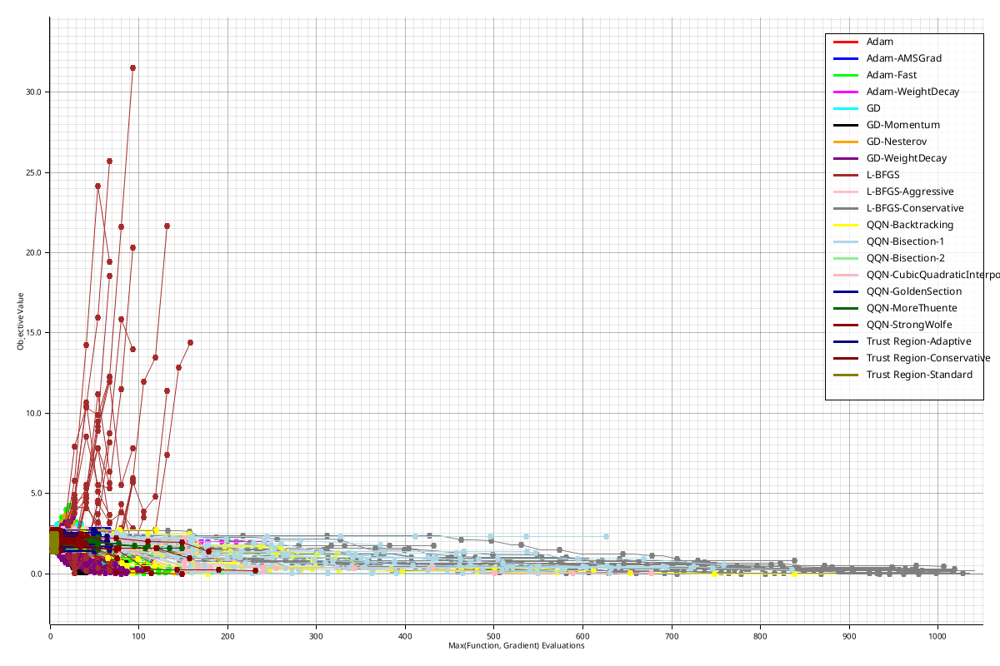
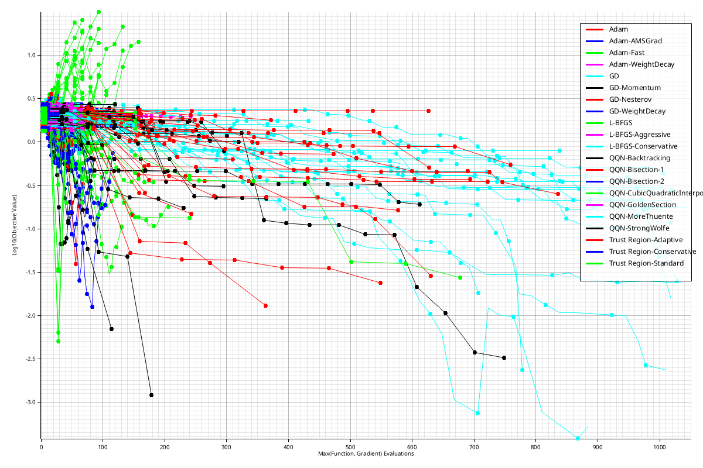

**Figure:** Convergence plots for NoisySphere_2D_sigma0.01 showing objective value vs iterations.
Left: Linear scale, Right: Log scale for better visualization of convergence behavior.

**Data:** [Linear scale data (CSV)](convergence_NoisySphere_2D_sigma0.01_data.csv) | [Log scale data (CSV)](convergence_NoisySphere_2D_sigma0.01_log_data.csv)

## Problem: NoisySphere_5D_sigma0.01

**Family:** NoisySphere  
**Dimension:** 5  
**Success Threshold:** 2.010e0  
**Total Runs:** 560

### Performance Summary
<table style="border-collapse: collapse; width: 100%; margin: 20px 0;">
<tr style="background-color: #f2f2f2;">
<th style="border: 1px solid #ddd; padding: 8px; text-align: center;">Rank</th>
<th style="border: 1px solid #ddd; padding: 8px; text-align: center;">Optimizer</th>
<th style="border: 1px solid #ddd; padding: 8px; text-align: center;">Mean Final Value (All/Success/Fail)</th>
<th style="border: 1px solid #ddd; padding: 8px; text-align: center;">Std Dev</th>
<th style="border: 1px solid #ddd; padding: 8px; text-align: center;">Best Value</th>
<th style="border: 1px solid #ddd; padding: 8px; text-align: center;">Worst Value</th>
<th style="border: 1px solid #ddd; padding: 8px; text-align: center;">Mean Function Evals (All/Success/Fail)</th>
<th style="border: 1px solid #ddd; padding: 8px; text-align: center;">Mean Gradient Evals (All/Success/Fail)</th>
<th style="border: 1px solid #ddd; padding: 8px; text-align: center;">Success Rate</th>
<th style="border: 1px solid #ddd; padding: 8px; text-align: center;">Mean Time (s)</th>
</tr>
<tr style="background-color: #d4edda; font-weight: bold;">
<td style="border: 1px solid #ddd; padding: 8px; text-align: center;">1</td>
<td style="border: 1px solid #ddd; padding: 8px; text-align: center;"><a href="detailed_NoisySphere_5D_sigma0.01_GD-Momentum.md">GD-Momentum</a></td>
<td style="border: 1px solid #ddd; padding: 8px; text-align: center;">4.35e0 / 8.76e-1 / 5.37e0</td>
<td style="border: 1px solid #ddd; padding: 8px; text-align: center;">1.25e0</td>
<td style="border: 1px solid #ddd; padding: 8px; text-align: center;">2.08e-1</td>
<td style="border: 1px solid #ddd; padding: 8px; text-align: center;">5.71e0</td>
<td style="border: 1px solid #ddd; padding: 8px; text-align: center;">16.4 / 48.0 / 14.7</td>
<td style="border: 1px solid #ddd; padding: 8px; text-align: center;">28.7 / 92.0 / 25.4</td>
<td style="border: 1px solid #ddd; padding: 8px; text-align: center;">5.0%</td>
<td style="border: 1px solid #ddd; padding: 8px; text-align: center;">0.003</td>
</tr>
<tr style="background-color: #fff3cd;">
<td style="border: 1px solid #ddd; padding: 8px; text-align: center;">2</td>
<td style="border: 1px solid #ddd; padding: 8px; text-align: center;"><a href="detailed_NoisySphere_5D_sigma0.01_QQN-Bisection-1.md">QQN-Bisection-1</a></td>
<td style="border: 1px solid #ddd; padding: 8px; text-align: center;">3.44e0 / - / 3.44e0</td>
<td style="border: 1px solid #ddd; padding: 8px; text-align: center;">1.20e0</td>
<td style="border: 1px solid #ddd; padding: 8px; text-align: center;">4.02e-1</td>
<td style="border: 1px solid #ddd; padding: 8px; text-align: center;">5.76e0</td>
<td style="border: 1px solid #ddd; padding: 8px; text-align: center;">133.2 / - / 133.2</td>
<td style="border: 1px solid #ddd; padding: 8px; text-align: center;">169.7 / - / 169.7</td>
<td style="border: 1px solid #ddd; padding: 8px; text-align: center;">0.0%</td>
<td style="border: 1px solid #ddd; padding: 8px; text-align: center;">0.021</td>
</tr>
<tr style="">
<td style="border: 1px solid #ddd; padding: 8px; text-align: center;">3</td>
<td style="border: 1px solid #ddd; padding: 8px; text-align: center;"><a href="detailed_NoisySphere_5D_sigma0.01_L-BFGS-Conservative.md">L-BFGS-Conservative</a></td>
<td style="border: 1px solid #ddd; padding: 8px; text-align: center;">1.97e0 / - / 1.97e0</td>
<td style="border: 1px solid #ddd; padding: 8px; text-align: center;">8.53e-1</td>
<td style="border: 1px solid #ddd; padding: 8px; text-align: center;">4.05e-1</td>
<td style="border: 1px solid #ddd; padding: 8px; text-align: center;">3.61e0</td>
<td style="border: 1px solid #ddd; padding: 8px; text-align: center;">827.2 / - / 827.2</td>
<td style="border: 1px solid #ddd; padding: 8px; text-align: center;">176.9 / - / 176.9</td>
<td style="border: 1px solid #ddd; padding: 8px; text-align: center;">0.0%</td>
<td style="border: 1px solid #ddd; padding: 8px; text-align: center;">0.027</td>
</tr>
<tr style="">
<td style="border: 1px solid #ddd; padding: 8px; text-align: center;">4</td>
<td style="border: 1px solid #ddd; padding: 8px; text-align: center;"><a href="detailed_NoisySphere_5D_sigma0.01_QQN-GoldenSection.md">QQN-GoldenSection</a></td>
<td style="border: 1px solid #ddd; padding: 8px; text-align: center;">4.35e0 / - / 4.35e0</td>
<td style="border: 1px solid #ddd; padding: 8px; text-align: center;">1.23e0</td>
<td style="border: 1px solid #ddd; padding: 8px; text-align: center;">4.51e-1</td>
<td style="border: 1px solid #ddd; padding: 8px; text-align: center;">5.95e0</td>
<td style="border: 1px solid #ddd; padding: 8px; text-align: center;">24.0 / - / 24.0</td>
<td style="border: 1px solid #ddd; padding: 8px; text-align: center;">5.3 / - / 5.3</td>
<td style="border: 1px solid #ddd; padding: 8px; text-align: center;">0.0%</td>
<td style="border: 1px solid #ddd; padding: 8px; text-align: center;">0.001</td>
</tr>
<tr style="">
<td style="border: 1px solid #ddd; padding: 8px; text-align: center;">5</td>
<td style="border: 1px solid #ddd; padding: 8px; text-align: center;"><a href="detailed_NoisySphere_5D_sigma0.01_QQN-Backtracking.md">QQN-Backtracking</a></td>
<td style="border: 1px solid #ddd; padding: 8px; text-align: center;">4.53e0 / - / 4.53e0</td>
<td style="border: 1px solid #ddd; padding: 8px; text-align: center;">1.34e0</td>
<td style="border: 1px solid #ddd; padding: 8px; text-align: center;">9.95e-1</td>
<td style="border: 1px solid #ddd; padding: 8px; text-align: center;">5.71e0</td>
<td style="border: 1px solid #ddd; padding: 8px; text-align: center;">202.2 / - / 202.2</td>
<td style="border: 1px solid #ddd; padding: 8px; text-align: center;">35.0 / - / 35.0</td>
<td style="border: 1px solid #ddd; padding: 8px; text-align: center;">0.0%</td>
<td style="border: 1px solid #ddd; padding: 8px; text-align: center;">0.009</td>
</tr>
<tr style="">
<td style="border: 1px solid #ddd; padding: 8px; text-align: center;">6</td>
<td style="border: 1px solid #ddd; padding: 8px; text-align: center;"><a href="detailed_NoisySphere_5D_sigma0.01_L-BFGS.md">L-BFGS</a></td>
<td style="border: 1px solid #ddd; padding: 8px; text-align: center;">4.38e0 / 1.31e1 / 1.80e1</td>
<td style="border: 1px solid #ddd; padding: 8px; text-align: center;">1.38e0</td>
<td style="border: 1px solid #ddd; padding: 8px; text-align: center;">1.21e0</td>
<td style="border: 1px solid #ddd; padding: 8px; text-align: center;">6.46e0</td>
<td style="border: 1px solid #ddd; padding: 8px; text-align: center;">59.0 / 73.0 / 58.3</td>
<td style="border: 1px solid #ddd; padding: 8px; text-align: center;">18.8 / 23.0 / 18.6</td>
<td style="border: 1px solid #ddd; padding: 8px; text-align: center;">5.0%</td>
<td style="border: 1px solid #ddd; padding: 8px; text-align: center;">0.002</td>
</tr>
<tr style="">
<td style="border: 1px solid #ddd; padding: 8px; text-align: center;">7</td>
<td style="border: 1px solid #ddd; padding: 8px; text-align: center;"><a href="detailed_NoisySphere_5D_sigma0.01_GD-WeightDecay.md">GD-WeightDecay</a></td>
<td style="border: 1px solid #ddd; padding: 8px; text-align: center;">4.08e0 / 1.53e0 / 4.91e0</td>
<td style="border: 1px solid #ddd; padding: 8px; text-align: center;">1.07e0</td>
<td style="border: 1px solid #ddd; padding: 8px; text-align: center;">1.32e0</td>
<td style="border: 1px solid #ddd; padding: 8px; text-align: center;">5.78e0</td>
<td style="border: 1px solid #ddd; padding: 8px; text-align: center;">17.7 / 30.0 / 17.1</td>
<td style="border: 1px solid #ddd; padding: 8px; text-align: center;">31.4 / 56.0 / 30.1</td>
<td style="border: 1px solid #ddd; padding: 8px; text-align: center;">5.0%</td>
<td style="border: 1px solid #ddd; padding: 8px; text-align: center;">0.003</td>
</tr>
<tr style="">
<td style="border: 1px solid #ddd; padding: 8px; text-align: center;">8</td>
<td style="border: 1px solid #ddd; padding: 8px; text-align: center;"><a href="detailed_NoisySphere_5D_sigma0.01_GD-Nesterov.md">GD-Nesterov</a></td>
<td style="border: 1px solid #ddd; padding: 8px; text-align: center;">4.43e0 / 2.36e0 / 5.42e0</td>
<td style="border: 1px solid #ddd; padding: 8px; text-align: center;">1.09e0</td>
<td style="border: 1px solid #ddd; padding: 8px; text-align: center;">1.56e0</td>
<td style="border: 1px solid #ddd; padding: 8px; text-align: center;">5.89e0</td>
<td style="border: 1px solid #ddd; padding: 8px; text-align: center;">14.1 / 29.0 / 13.3</td>
<td style="border: 1px solid #ddd; padding: 8px; text-align: center;">24.2 / 54.0 / 22.6</td>
<td style="border: 1px solid #ddd; padding: 8px; text-align: center;">5.0%</td>
<td style="border: 1px solid #ddd; padding: 8px; text-align: center;">0.002</td>
</tr>
<tr style="">
<td style="border: 1px solid #ddd; padding: 8px; text-align: center;">9</td>
<td style="border: 1px solid #ddd; padding: 8px; text-align: center;"><a href="detailed_NoisySphere_5D_sigma0.01_QQN-CubicQuadraticInterpolation.md">QQN-CubicQuadraticInterpolation</a></td>
<td style="border: 1px solid #ddd; padding: 8px; text-align: center;">4.33e0 / - / 4.33e0</td>
<td style="border: 1px solid #ddd; padding: 8px; text-align: center;">1.18e0</td>
<td style="border: 1px solid #ddd; padding: 8px; text-align: center;">1.72e0</td>
<td style="border: 1px solid #ddd; padding: 8px; text-align: center;">6.29e0</td>
<td style="border: 1px solid #ddd; padding: 8px; text-align: center;">38.8 / - / 38.8</td>
<td style="border: 1px solid #ddd; padding: 8px; text-align: center;">48.0 / - / 48.0</td>
<td style="border: 1px solid #ddd; padding: 8px; text-align: center;">0.0%</td>
<td style="border: 1px solid #ddd; padding: 8px; text-align: center;">0.005</td>
</tr>
<tr style="">
<td style="border: 1px solid #ddd; padding: 8px; text-align: center;">10</td>
<td style="border: 1px solid #ddd; padding: 8px; text-align: center;"><a href="detailed_NoisySphere_5D_sigma0.01_QQN-StrongWolfe.md">QQN-StrongWolfe</a></td>
<td style="border: 1px solid #ddd; padding: 8px; text-align: center;">3.96e0 / - / 3.96e0</td>
<td style="border: 1px solid #ddd; padding: 8px; text-align: center;">1.04e0</td>
<td style="border: 1px solid #ddd; padding: 8px; text-align: center;">2.23e0</td>
<td style="border: 1px solid #ddd; padding: 8px; text-align: center;">5.54e0</td>
<td style="border: 1px solid #ddd; padding: 8px; text-align: center;">37.8 / - / 37.8</td>
<td style="border: 1px solid #ddd; padding: 8px; text-align: center;">13.8 / - / 13.8</td>
<td style="border: 1px solid #ddd; padding: 8px; text-align: center;">0.0%</td>
<td style="border: 1px solid #ddd; padding: 8px; text-align: center;">0.002</td>
</tr>
<tr style="">
<td style="border: 1px solid #ddd; padding: 8px; text-align: center;">11</td>
<td style="border: 1px solid #ddd; padding: 8px; text-align: center;"><a href="detailed_NoisySphere_5D_sigma0.01_Adam-Fast.md">Adam-Fast</a></td>
<td style="border: 1px solid #ddd; padding: 8px; text-align: center;">4.47e0 / - / 5.54e0</td>
<td style="border: 1px solid #ddd; padding: 8px; text-align: center;">8.37e-1</td>
<td style="border: 1px solid #ddd; padding: 8px; text-align: center;">2.39e0</td>
<td style="border: 1px solid #ddd; padding: 8px; text-align: center;">6.22e0</td>
<td style="border: 1px solid #ddd; padding: 8px; text-align: center;">22.4 / - / 22.4</td>
<td style="border: 1px solid #ddd; padding: 8px; text-align: center;">21.4 / - / 21.4</td>
<td style="border: 1px solid #ddd; padding: 8px; text-align: center;">0.0%</td>
<td style="border: 1px solid #ddd; padding: 8px; text-align: center;">0.002</td>
</tr>
<tr style="">
<td style="border: 1px solid #ddd; padding: 8px; text-align: center;">12</td>
<td style="border: 1px solid #ddd; padding: 8px; text-align: center;"><a href="detailed_NoisySphere_5D_sigma0.01_GD.md">GD</a></td>
<td style="border: 1px solid #ddd; padding: 8px; text-align: center;">4.63e0 / - / 5.13e0</td>
<td style="border: 1px solid #ddd; padding: 8px; text-align: center;">7.88e-1</td>
<td style="border: 1px solid #ddd; padding: 8px; text-align: center;">2.72e0</td>
<td style="border: 1px solid #ddd; padding: 8px; text-align: center;">6.10e0</td>
<td style="border: 1px solid #ddd; padding: 8px; text-align: center;">14.7 / - / 14.7</td>
<td style="border: 1px solid #ddd; padding: 8px; text-align: center;">25.4 / - / 25.4</td>
<td style="border: 1px solid #ddd; padding: 8px; text-align: center;">0.0%</td>
<td style="border: 1px solid #ddd; padding: 8px; text-align: center;">0.002</td>
</tr>
<tr style="">
<td style="border: 1px solid #ddd; padding: 8px; text-align: center;">13</td>
<td style="border: 1px solid #ddd; padding: 8px; text-align: center;"><a href="detailed_NoisySphere_5D_sigma0.01_Adam-AMSGrad.md">Adam-AMSGrad</a></td>
<td style="border: 1px solid #ddd; padding: 8px; text-align: center;">4.83e0 / - / 4.84e0</td>
<td style="border: 1px solid #ddd; padding: 8px; text-align: center;">5.89e-1</td>
<td style="border: 1px solid #ddd; padding: 8px; text-align: center;">3.86e0</td>
<td style="border: 1px solid #ddd; padding: 8px; text-align: center;">5.96e0</td>
<td style="border: 1px solid #ddd; padding: 8px; text-align: center;">25.5 / - / 25.5</td>
<td style="border: 1px solid #ddd; padding: 8px; text-align: center;">24.5 / - / 24.5</td>
<td style="border: 1px solid #ddd; padding: 8px; text-align: center;">0.0%</td>
<td style="border: 1px solid #ddd; padding: 8px; text-align: center;">0.003</td>
</tr>
<tr style="">
<td style="border: 1px solid #ddd; padding: 8px; text-align: center;">14</td>
<td style="border: 1px solid #ddd; padding: 8px; text-align: center;"><a href="detailed_NoisySphere_5D_sigma0.01_Adam-WeightDecay.md">Adam-WeightDecay</a></td>
<td style="border: 1px solid #ddd; padding: 8px; text-align: center;">5.13e0 / - / 5.15e0</td>
<td style="border: 1px solid #ddd; padding: 8px; text-align: center;">5.42e-1</td>
<td style="border: 1px solid #ddd; padding: 8px; text-align: center;">4.00e0</td>
<td style="border: 1px solid #ddd; padding: 8px; text-align: center;">5.99e0</td>
<td style="border: 1px solid #ddd; padding: 8px; text-align: center;">28.6 / - / 28.6</td>
<td style="border: 1px solid #ddd; padding: 8px; text-align: center;">27.6 / - / 27.6</td>
<td style="border: 1px solid #ddd; padding: 8px; text-align: center;">0.0%</td>
<td style="border: 1px solid #ddd; padding: 8px; text-align: center;">0.003</td>
</tr>
<tr style="">
<td style="border: 1px solid #ddd; padding: 8px; text-align: center;">15</td>
<td style="border: 1px solid #ddd; padding: 8px; text-align: center;"><a href="detailed_NoisySphere_5D_sigma0.01_Trust_Region-Conservative.md">Trust Region-Conservative</a></td>
<td style="border: 1px solid #ddd; padding: 8px; text-align: center;">5.25e0 / - / 5.25e0</td>
<td style="border: 1px solid #ddd; padding: 8px; text-align: center;">5.01e-1</td>
<td style="border: 1px solid #ddd; padding: 8px; text-align: center;">4.08e0</td>
<td style="border: 1px solid #ddd; padding: 8px; text-align: center;">5.99e0</td>
<td style="border: 1px solid #ddd; padding: 8px; text-align: center;">6.3 / - / 6.3</td>
<td style="border: 1px solid #ddd; padding: 8px; text-align: center;">4.9 / - / 4.9</td>
<td style="border: 1px solid #ddd; padding: 8px; text-align: center;">0.0%</td>
<td style="border: 1px solid #ddd; padding: 8px; text-align: center;">0.000</td>
</tr>
<tr style="">
<td style="border: 1px solid #ddd; padding: 8px; text-align: center;">16</td>
<td style="border: 1px solid #ddd; padding: 8px; text-align: center;"><a href="detailed_NoisySphere_5D_sigma0.01_QQN-MoreThuente.md">QQN-MoreThuente</a></td>
<td style="border: 1px solid #ddd; padding: 8px; text-align: center;">4.89e0 / - / 4.89e0</td>
<td style="border: 1px solid #ddd; padding: 8px; text-align: center;">5.00e-1</td>
<td style="border: 1px solid #ddd; padding: 8px; text-align: center;">4.11e0</td>
<td style="border: 1px solid #ddd; padding: 8px; text-align: center;">5.57e0</td>
<td style="border: 1px solid #ddd; padding: 8px; text-align: center;">17.9 / - / 17.9</td>
<td style="border: 1px solid #ddd; padding: 8px; text-align: center;">18.4 / - / 18.4</td>
<td style="border: 1px solid #ddd; padding: 8px; text-align: center;">0.0%</td>
<td style="border: 1px solid #ddd; padding: 8px; text-align: center;">0.002</td>
</tr>
<tr style="">
<td style="border: 1px solid #ddd; padding: 8px; text-align: center;">17</td>
<td style="border: 1px solid #ddd; padding: 8px; text-align: center;"><a href="detailed_NoisySphere_5D_sigma0.01_L-BFGS-Aggressive.md">L-BFGS-Aggressive</a></td>
<td style="border: 1px solid #ddd; padding: 8px; text-align: center;">4.90e0 / - / 4.90e0</td>
<td style="border: 1px solid #ddd; padding: 8px; text-align: center;">4.51e-1</td>
<td style="border: 1px solid #ddd; padding: 8px; text-align: center;">4.14e0</td>
<td style="border: 1px solid #ddd; padding: 8px; text-align: center;">5.83e0</td>
<td style="border: 1px solid #ddd; padding: 8px; text-align: center;">7.4 / - / 7.4</td>
<td style="border: 1px solid #ddd; padding: 8px; text-align: center;">3.2 / - / 3.2</td>
<td style="border: 1px solid #ddd; padding: 8px; text-align: center;">0.0%</td>
<td style="border: 1px solid #ddd; padding: 8px; text-align: center;">0.000</td>
</tr>
<tr style="">
<td style="border: 1px solid #ddd; padding: 8px; text-align: center;">18</td>
<td style="border: 1px solid #ddd; padding: 8px; text-align: center;"><a href="detailed_NoisySphere_5D_sigma0.01_Trust_Region-Adaptive.md">Trust Region-Adaptive</a></td>
<td style="border: 1px solid #ddd; padding: 8px; text-align: center;">4.99e0 / - / 4.99e0</td>
<td style="border: 1px solid #ddd; padding: 8px; text-align: center;">5.64e-1</td>
<td style="border: 1px solid #ddd; padding: 8px; text-align: center;">4.24e0</td>
<td style="border: 1px solid #ddd; padding: 8px; text-align: center;">6.25e0</td>
<td style="border: 1px solid #ddd; padding: 8px; text-align: center;">5.0 / - / 5.0</td>
<td style="border: 1px solid #ddd; padding: 8px; text-align: center;">4.0 / - / 4.0</td>
<td style="border: 1px solid #ddd; padding: 8px; text-align: center;">0.0%</td>
<td style="border: 1px solid #ddd; padding: 8px; text-align: center;">0.000</td>
</tr>
<tr style="">
<td style="border: 1px solid #ddd; padding: 8px; text-align: center;">19</td>
<td style="border: 1px solid #ddd; padding: 8px; text-align: center;"><a href="detailed_NoisySphere_5D_sigma0.01_Adam.md">Adam</a></td>
<td style="border: 1px solid #ddd; padding: 8px; text-align: center;">4.96e0 / - / 4.98e0</td>
<td style="border: 1px solid #ddd; padding: 8px; text-align: center;">5.38e-1</td>
<td style="border: 1px solid #ddd; padding: 8px; text-align: center;">4.26e0</td>
<td style="border: 1px solid #ddd; padding: 8px; text-align: center;">6.21e0</td>
<td style="border: 1px solid #ddd; padding: 8px; text-align: center;">35.4 / - / 35.4</td>
<td style="border: 1px solid #ddd; padding: 8px; text-align: center;">34.4 / - / 34.4</td>
<td style="border: 1px solid #ddd; padding: 8px; text-align: center;">0.0%</td>
<td style="border: 1px solid #ddd; padding: 8px; text-align: center;">0.004</td>
</tr>
<tr style="">
<td style="border: 1px solid #ddd; padding: 8px; text-align: center;">20</td>
<td style="border: 1px solid #ddd; padding: 8px; text-align: center;"><a href="detailed_NoisySphere_5D_sigma0.01_Trust_Region-Standard.md">Trust Region-Standard</a></td>
<td style="border: 1px solid #ddd; padding: 8px; text-align: center;">5.15e0 / - / 5.15e0</td>
<td style="border: 1px solid #ddd; padding: 8px; text-align: center;">4.21e-1</td>
<td style="border: 1px solid #ddd; padding: 8px; text-align: center;">4.27e0</td>
<td style="border: 1px solid #ddd; padding: 8px; text-align: center;">5.97e0</td>
<td style="border: 1px solid #ddd; padding: 8px; text-align: center;">5.0 / - / 5.0</td>
<td style="border: 1px solid #ddd; padding: 8px; text-align: center;">4.0 / - / 4.0</td>
<td style="border: 1px solid #ddd; padding: 8px; text-align: center;">0.0%</td>
<td style="border: 1px solid #ddd; padding: 8px; text-align: center;">0.000</td>
</tr>
</table>

### Convergence Plots

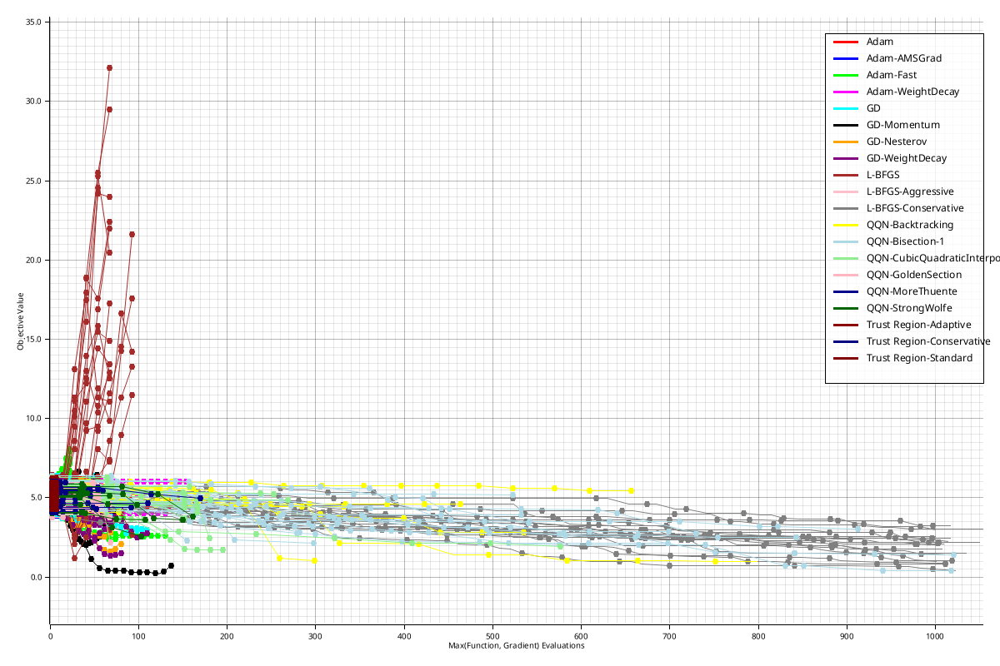
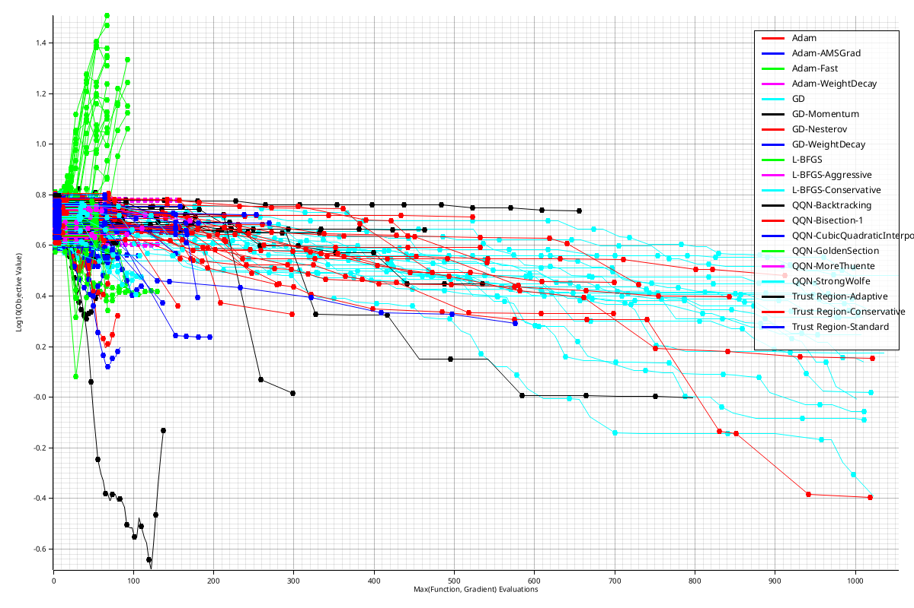

**Figure:** Convergence plots for NoisySphere_5D_sigma0.01 showing objective value vs iterations.
Left: Linear scale, Right: Log scale for better visualization of convergence behavior.

**Data:** [Linear scale data (CSV)](convergence_NoisySphere_5D_sigma0.01_data.csv) | [Log scale data (CSV)](convergence_NoisySphere_5D_sigma0.01_log_data.csv)

## Problem: NoisySphere_10D_sigma0.01

**Family:** NoisySphere  
**Dimension:** 10  
**Success Threshold:** 5.890e0  
**Total Runs:** 560

### Performance Summary
<table style="border-collapse: collapse; width: 100%; margin: 20px 0;">
<tr style="background-color: #f2f2f2;">
<th style="border: 1px solid #ddd; padding: 8px; text-align: center;">Rank</th>
<th style="border: 1px solid #ddd; padding: 8px; text-align: center;">Optimizer</th>
<th style="border: 1px solid #ddd; padding: 8px; text-align: center;">Mean Final Value (All/Success/Fail)</th>
<th style="border: 1px solid #ddd; padding: 8px; text-align: center;">Std Dev</th>
<th style="border: 1px solid #ddd; padding: 8px; text-align: center;">Best Value</th>
<th style="border: 1px solid #ddd; padding: 8px; text-align: center;">Worst Value</th>
<th style="border: 1px solid #ddd; padding: 8px; text-align: center;">Mean Function Evals (All/Success/Fail)</th>
<th style="border: 1px solid #ddd; padding: 8px; text-align: center;">Mean Gradient Evals (All/Success/Fail)</th>
<th style="border: 1px solid #ddd; padding: 8px; text-align: center;">Success Rate</th>
<th style="border: 1px solid #ddd; padding: 8px; text-align: center;">Mean Time (s)</th>
</tr>
<tr style="background-color: #d4edda; font-weight: bold;">
<td style="border: 1px solid #ddd; padding: 8px; text-align: center;">1</td>
<td style="border: 1px solid #ddd; padding: 8px; text-align: center;"><a href="detailed_NoisySphere_10D_sigma0.01_GD-WeightDecay.md">GD-WeightDecay</a></td>
<td style="border: 1px solid #ddd; padding: 8px; text-align: center;">9.44e0 / 2.03e0 / 1.05e1</td>
<td style="border: 1px solid #ddd; padding: 8px; text-align: center;">2.06e0</td>
<td style="border: 1px solid #ddd; padding: 8px; text-align: center;">1.96e0</td>
<td style="border: 1px solid #ddd; padding: 8px; text-align: center;">1.18e1</td>
<td style="border: 1px solid #ddd; padding: 8px; text-align: center;">15.1 / 47.0 / 13.4</td>
<td style="border: 1px solid #ddd; padding: 8px; text-align: center;">26.1 / 90.0 / 22.7</td>
<td style="border: 1px solid #ddd; padding: 8px; text-align: center;">5.0%</td>
<td style="border: 1px solid #ddd; padding: 8px; text-align: center;">0.005</td>
</tr>
<tr style="background-color: #fff3cd;">
<td style="border: 1px solid #ddd; padding: 8px; text-align: center;">2</td>
<td style="border: 1px solid #ddd; padding: 8px; text-align: center;"><a href="detailed_NoisySphere_10D_sigma0.01_QQN-GoldenSection.md">QQN-GoldenSection</a></td>
<td style="border: 1px solid #ddd; padding: 8px; text-align: center;">9.49e0 / - / 9.49e0</td>
<td style="border: 1px solid #ddd; padding: 8px; text-align: center;">1.68e0</td>
<td style="border: 1px solid #ddd; padding: 8px; text-align: center;">2.52e0</td>
<td style="border: 1px solid #ddd; padding: 8px; text-align: center;">1.11e1</td>
<td style="border: 1px solid #ddd; padding: 8px; text-align: center;">29.5 / - / 29.5</td>
<td style="border: 1px solid #ddd; padding: 8px; text-align: center;">5.8 / - / 5.8</td>
<td style="border: 1px solid #ddd; padding: 8px; text-align: center;">0.0%</td>
<td style="border: 1px solid #ddd; padding: 8px; text-align: center;">0.002</td>
</tr>
<tr style="">
<td style="border: 1px solid #ddd; padding: 8px; text-align: center;">3</td>
<td style="border: 1px solid #ddd; padding: 8px; text-align: center;"><a href="detailed_NoisySphere_10D_sigma0.01_L-BFGS-Conservative.md">L-BFGS-Conservative</a></td>
<td style="border: 1px solid #ddd; padding: 8px; text-align: center;">5.56e0 / - / 5.56e0</td>
<td style="border: 1px solid #ddd; padding: 8px; text-align: center;">1.17e0</td>
<td style="border: 1px solid #ddd; padding: 8px; text-align: center;">3.61e0</td>
<td style="border: 1px solid #ddd; padding: 8px; text-align: center;">8.49e0</td>
<td style="border: 1px solid #ddd; padding: 8px; text-align: center;">829.6 / - / 829.6</td>
<td style="border: 1px solid #ddd; padding: 8px; text-align: center;">176.2 / - / 176.2</td>
<td style="border: 1px solid #ddd; padding: 8px; text-align: center;">0.0%</td>
<td style="border: 1px solid #ddd; padding: 8px; text-align: center;">0.041</td>
</tr>
<tr style="">
<td style="border: 1px solid #ddd; padding: 8px; text-align: center;">4</td>
<td style="border: 1px solid #ddd; padding: 8px; text-align: center;"><a href="detailed_NoisySphere_10D_sigma0.01_QQN-StrongWolfe.md">QQN-StrongWolfe</a></td>
<td style="border: 1px solid #ddd; padding: 8px; text-align: center;">7.97e0 / - / 7.97e0</td>
<td style="border: 1px solid #ddd; padding: 8px; text-align: center;">2.20e0</td>
<td style="border: 1px solid #ddd; padding: 8px; text-align: center;">3.70e0</td>
<td style="border: 1px solid #ddd; padding: 8px; text-align: center;">1.08e1</td>
<td style="border: 1px solid #ddd; padding: 8px; text-align: center;">41.5 / - / 41.5</td>
<td style="border: 1px solid #ddd; padding: 8px; text-align: center;">14.4 / - / 14.4</td>
<td style="border: 1px solid #ddd; padding: 8px; text-align: center;">0.0%</td>
<td style="border: 1px solid #ddd; padding: 8px; text-align: center;">0.004</td>
</tr>
<tr style="">
<td style="border: 1px solid #ddd; padding: 8px; text-align: center;">5</td>
<td style="border: 1px solid #ddd; padding: 8px; text-align: center;"><a href="detailed_NoisySphere_10D_sigma0.01_QQN-Bisection-1.md">QQN-Bisection-1</a></td>
<td style="border: 1px solid #ddd; padding: 8px; text-align: center;">8.40e0 / - / 8.40e0</td>
<td style="border: 1px solid #ddd; padding: 8px; text-align: center;">1.84e0</td>
<td style="border: 1px solid #ddd; padding: 8px; text-align: center;">3.79e0</td>
<td style="border: 1px solid #ddd; padding: 8px; text-align: center;">1.23e1</td>
<td style="border: 1px solid #ddd; padding: 8px; text-align: center;">139.5 / - / 139.5</td>
<td style="border: 1px solid #ddd; padding: 8px; text-align: center;">170.5 / - / 170.5</td>
<td style="border: 1px solid #ddd; padding: 8px; text-align: center;">0.0%</td>
<td style="border: 1px solid #ddd; padding: 8px; text-align: center;">0.038</td>
</tr>
<tr style="">
<td style="border: 1px solid #ddd; padding: 8px; text-align: center;">6</td>
<td style="border: 1px solid #ddd; padding: 8px; text-align: center;"><a href="detailed_NoisySphere_10D_sigma0.01_L-BFGS.md">L-BFGS</a></td>
<td style="border: 1px solid #ddd; padding: 8px; text-align: center;">9.03e0 / 2.61e1 / 3.14e1</td>
<td style="border: 1px solid #ddd; padding: 8px; text-align: center;">1.43e0</td>
<td style="border: 1px solid #ddd; padding: 8px; text-align: center;">4.15e0</td>
<td style="border: 1px solid #ddd; padding: 8px; text-align: center;">1.09e1</td>
<td style="border: 1px solid #ddd; padding: 8px; text-align: center;">66.5 / 113.0 / 64.1</td>
<td style="border: 1px solid #ddd; padding: 8px; text-align: center;">21.1 / 35.0 / 20.3</td>
<td style="border: 1px solid #ddd; padding: 8px; text-align: center;">5.0%</td>
<td style="border: 1px solid #ddd; padding: 8px; text-align: center;">0.005</td>
</tr>
<tr style="">
<td style="border: 1px solid #ddd; padding: 8px; text-align: center;">7</td>
<td style="border: 1px solid #ddd; padding: 8px; text-align: center;"><a href="detailed_NoisySphere_10D_sigma0.01_QQN-Backtracking.md">QQN-Backtracking</a></td>
<td style="border: 1px solid #ddd; padding: 8px; text-align: center;">8.96e0 / - / 8.96e0</td>
<td style="border: 1px solid #ddd; padding: 8px; text-align: center;">1.76e0</td>
<td style="border: 1px solid #ddd; padding: 8px; text-align: center;">5.06e0</td>
<td style="border: 1px solid #ddd; padding: 8px; text-align: center;">1.11e1</td>
<td style="border: 1px solid #ddd; padding: 8px; text-align: center;">213.6 / - / 213.6</td>
<td style="border: 1px solid #ddd; padding: 8px; text-align: center;">36.5 / - / 36.5</td>
<td style="border: 1px solid #ddd; padding: 8px; text-align: center;">0.0%</td>
<td style="border: 1px solid #ddd; padding: 8px; text-align: center;">0.012</td>
</tr>
<tr style="">
<td style="border: 1px solid #ddd; padding: 8px; text-align: center;">8</td>
<td style="border: 1px solid #ddd; padding: 8px; text-align: center;"><a href="detailed_NoisySphere_10D_sigma0.01_Adam-Fast.md">Adam-Fast</a></td>
<td style="border: 1px solid #ddd; padding: 8px; text-align: center;">9.68e0 / - / 1.14e1</td>
<td style="border: 1px solid #ddd; padding: 8px; text-align: center;">1.05e0</td>
<td style="border: 1px solid #ddd; padding: 8px; text-align: center;">5.91e0</td>
<td style="border: 1px solid #ddd; padding: 8px; text-align: center;">1.13e1</td>
<td style="border: 1px solid #ddd; padding: 8px; text-align: center;">18.9 / - / 18.9</td>
<td style="border: 1px solid #ddd; padding: 8px; text-align: center;">17.9 / - / 17.9</td>
<td style="border: 1px solid #ddd; padding: 8px; text-align: center;">0.0%</td>
<td style="border: 1px solid #ddd; padding: 8px; text-align: center;">0.003</td>
</tr>
<tr style="">
<td style="border: 1px solid #ddd; padding: 8px; text-align: center;">9</td>
<td style="border: 1px solid #ddd; padding: 8px; text-align: center;"><a href="detailed_NoisySphere_10D_sigma0.01_GD-Momentum.md">GD-Momentum</a></td>
<td style="border: 1px solid #ddd; padding: 8px; text-align: center;">9.57e0 / - / 1.03e1</td>
<td style="border: 1px solid #ddd; padding: 8px; text-align: center;">1.33e0</td>
<td style="border: 1px solid #ddd; padding: 8px; text-align: center;">6.62e0</td>
<td style="border: 1px solid #ddd; padding: 8px; text-align: center;">1.21e1</td>
<td style="border: 1px solid #ddd; padding: 8px; text-align: center;">13.5 / - / 13.5</td>
<td style="border: 1px solid #ddd; padding: 8px; text-align: center;">23.0 / - / 23.0</td>
<td style="border: 1px solid #ddd; padding: 8px; text-align: center;">0.0%</td>
<td style="border: 1px solid #ddd; padding: 8px; text-align: center;">0.004</td>
</tr>
<tr style="">
<td style="border: 1px solid #ddd; padding: 8px; text-align: center;">10</td>
<td style="border: 1px solid #ddd; padding: 8px; text-align: center;"><a href="detailed_NoisySphere_10D_sigma0.01_QQN-CubicQuadraticInterpolation.md">QQN-CubicQuadraticInterpolation</a></td>
<td style="border: 1px solid #ddd; padding: 8px; text-align: center;">1.01e1 / - / 1.01e1</td>
<td style="border: 1px solid #ddd; padding: 8px; text-align: center;">8.74e-1</td>
<td style="border: 1px solid #ddd; padding: 8px; text-align: center;">7.66e0</td>
<td style="border: 1px solid #ddd; padding: 8px; text-align: center;">1.14e1</td>
<td style="border: 1px solid #ddd; padding: 8px; text-align: center;">25.2 / - / 25.2</td>
<td style="border: 1px solid #ddd; padding: 8px; text-align: center;">26.7 / - / 26.7</td>
<td style="border: 1px solid #ddd; padding: 8px; text-align: center;">0.0%</td>
<td style="border: 1px solid #ddd; padding: 8px; text-align: center;">0.005</td>
</tr>
<tr style="">
<td style="border: 1px solid #ddd; padding: 8px; text-align: center;">11</td>
<td style="border: 1px solid #ddd; padding: 8px; text-align: center;"><a href="detailed_NoisySphere_10D_sigma0.01_GD.md">GD</a></td>
<td style="border: 1px solid #ddd; padding: 8px; text-align: center;">9.75e0 / - / 1.02e1</td>
<td style="border: 1px solid #ddd; padding: 8px; text-align: center;">8.72e-1</td>
<td style="border: 1px solid #ddd; padding: 8px; text-align: center;">7.66e0</td>
<td style="border: 1px solid #ddd; padding: 8px; text-align: center;">1.12e1</td>
<td style="border: 1px solid #ddd; padding: 8px; text-align: center;">13.9 / - / 13.9</td>
<td style="border: 1px solid #ddd; padding: 8px; text-align: center;">23.8 / - / 23.8</td>
<td style="border: 1px solid #ddd; padding: 8px; text-align: center;">0.0%</td>
<td style="border: 1px solid #ddd; padding: 8px; text-align: center;">0.004</td>
</tr>
<tr style="">
<td style="border: 1px solid #ddd; padding: 8px; text-align: center;">12</td>
<td style="border: 1px solid #ddd; padding: 8px; text-align: center;"><a href="detailed_NoisySphere_10D_sigma0.01_QQN-MoreThuente.md">QQN-MoreThuente</a></td>
<td style="border: 1px solid #ddd; padding: 8px; text-align: center;">9.65e0 / - / 9.65e0</td>
<td style="border: 1px solid #ddd; padding: 8px; text-align: center;">8.12e-1</td>
<td style="border: 1px solid #ddd; padding: 8px; text-align: center;">7.67e0</td>
<td style="border: 1px solid #ddd; padding: 8px; text-align: center;">1.10e1</td>
<td style="border: 1px solid #ddd; padding: 8px; text-align: center;">24.4 / - / 24.4</td>
<td style="border: 1px solid #ddd; padding: 8px; text-align: center;">25.6 / - / 25.6</td>
<td style="border: 1px solid #ddd; padding: 8px; text-align: center;">0.0%</td>
<td style="border: 1px solid #ddd; padding: 8px; text-align: center;">0.005</td>
</tr>
<tr style="">
<td style="border: 1px solid #ddd; padding: 8px; text-align: center;">13</td>
<td style="border: 1px solid #ddd; padding: 8px; text-align: center;"><a href="detailed_NoisySphere_10D_sigma0.01_Trust_Region-Conservative.md">Trust Region-Conservative</a></td>
<td style="border: 1px solid #ddd; padding: 8px; text-align: center;">1.00e1 / - / 1.00e1</td>
<td style="border: 1px solid #ddd; padding: 8px; text-align: center;">6.46e-1</td>
<td style="border: 1px solid #ddd; padding: 8px; text-align: center;">8.49e0</td>
<td style="border: 1px solid #ddd; padding: 8px; text-align: center;">1.10e1</td>
<td style="border: 1px solid #ddd; padding: 8px; text-align: center;">6.0 / - / 6.0</td>
<td style="border: 1px solid #ddd; padding: 8px; text-align: center;">4.7 / - / 4.7</td>
<td style="border: 1px solid #ddd; padding: 8px; text-align: center;">0.0%</td>
<td style="border: 1px solid #ddd; padding: 8px; text-align: center;">0.001</td>
</tr>
<tr style="">
<td style="border: 1px solid #ddd; padding: 8px; text-align: center;">14</td>
<td style="border: 1px solid #ddd; padding: 8px; text-align: center;"><a href="detailed_NoisySphere_10D_sigma0.01_Adam-WeightDecay.md">Adam-WeightDecay</a></td>
<td style="border: 1px solid #ddd; padding: 8px; text-align: center;">9.89e0 / - / 9.94e0</td>
<td style="border: 1px solid #ddd; padding: 8px; text-align: center;">6.25e-1</td>
<td style="border: 1px solid #ddd; padding: 8px; text-align: center;">8.55e0</td>
<td style="border: 1px solid #ddd; padding: 8px; text-align: center;">1.11e1</td>
<td style="border: 1px solid #ddd; padding: 8px; text-align: center;">31.5 / - / 31.5</td>
<td style="border: 1px solid #ddd; padding: 8px; text-align: center;">30.5 / - / 30.5</td>
<td style="border: 1px solid #ddd; padding: 8px; text-align: center;">0.0%</td>
<td style="border: 1px solid #ddd; padding: 8px; text-align: center;">0.006</td>
</tr>
<tr style="">
<td style="border: 1px solid #ddd; padding: 8px; text-align: center;">15</td>
<td style="border: 1px solid #ddd; padding: 8px; text-align: center;"><a href="detailed_NoisySphere_10D_sigma0.01_Adam.md">Adam</a></td>
<td style="border: 1px solid #ddd; padding: 8px; text-align: center;">9.90e0 / - / 9.91e0</td>
<td style="border: 1px solid #ddd; padding: 8px; text-align: center;">7.61e-1</td>
<td style="border: 1px solid #ddd; padding: 8px; text-align: center;">8.59e0</td>
<td style="border: 1px solid #ddd; padding: 8px; text-align: center;">1.12e1</td>
<td style="border: 1px solid #ddd; padding: 8px; text-align: center;">29.2 / - / 29.2</td>
<td style="border: 1px solid #ddd; padding: 8px; text-align: center;">28.2 / - / 28.2</td>
<td style="border: 1px solid #ddd; padding: 8px; text-align: center;">0.0%</td>
<td style="border: 1px solid #ddd; padding: 8px; text-align: center;">0.005</td>
</tr>
<tr style="">
<td style="border: 1px solid #ddd; padding: 8px; text-align: center;">16</td>
<td style="border: 1px solid #ddd; padding: 8px; text-align: center;"><a href="detailed_NoisySphere_10D_sigma0.01_Trust_Region-Adaptive.md">Trust Region-Adaptive</a></td>
<td style="border: 1px solid #ddd; padding: 8px; text-align: center;">9.81e0 / - / 9.81e0</td>
<td style="border: 1px solid #ddd; padding: 8px; text-align: center;">7.42e-1</td>
<td style="border: 1px solid #ddd; padding: 8px; text-align: center;">8.67e0</td>
<td style="border: 1px solid #ddd; padding: 8px; text-align: center;">1.11e1</td>
<td style="border: 1px solid #ddd; padding: 8px; text-align: center;">5.0 / - / 5.0</td>
<td style="border: 1px solid #ddd; padding: 8px; text-align: center;">4.0 / - / 4.0</td>
<td style="border: 1px solid #ddd; padding: 8px; text-align: center;">0.0%</td>
<td style="border: 1px solid #ddd; padding: 8px; text-align: center;">0.001</td>
</tr>
<tr style="">
<td style="border: 1px solid #ddd; padding: 8px; text-align: center;">17</td>
<td style="border: 1px solid #ddd; padding: 8px; text-align: center;"><a href="detailed_NoisySphere_10D_sigma0.01_GD-Nesterov.md">GD-Nesterov</a></td>
<td style="border: 1px solid #ddd; padding: 8px; text-align: center;">1.01e1 / - / 1.11e1</td>
<td style="border: 1px solid #ddd; padding: 8px; text-align: center;">5.99e-1</td>
<td style="border: 1px solid #ddd; padding: 8px; text-align: center;">8.83e0</td>
<td style="border: 1px solid #ddd; padding: 8px; text-align: center;">1.09e1</td>
<td style="border: 1px solid #ddd; padding: 8px; text-align: center;">11.7 / - / 11.7</td>
<td style="border: 1px solid #ddd; padding: 8px; text-align: center;">19.4 / - / 19.4</td>
<td style="border: 1px solid #ddd; padding: 8px; text-align: center;">0.0%</td>
<td style="border: 1px solid #ddd; padding: 8px; text-align: center;">0.003</td>
</tr>
<tr style="">
<td style="border: 1px solid #ddd; padding: 8px; text-align: center;">18</td>
<td style="border: 1px solid #ddd; padding: 8px; text-align: center;"><a href="detailed_NoisySphere_10D_sigma0.01_L-BFGS-Aggressive.md">L-BFGS-Aggressive</a></td>
<td style="border: 1px solid #ddd; padding: 8px; text-align: center;">1.00e1 / - / 1.00e1</td>
<td style="border: 1px solid #ddd; padding: 8px; text-align: center;">6.29e-1</td>
<td style="border: 1px solid #ddd; padding: 8px; text-align: center;">8.87e0</td>
<td style="border: 1px solid #ddd; padding: 8px; text-align: center;">1.10e1</td>
<td style="border: 1px solid #ddd; padding: 8px; text-align: center;">9.6 / - / 9.6</td>
<td style="border: 1px solid #ddd; padding: 8px; text-align: center;">4.0 / - / 4.0</td>
<td style="border: 1px solid #ddd; padding: 8px; text-align: center;">0.0%</td>
<td style="border: 1px solid #ddd; padding: 8px; text-align: center;">0.001</td>
</tr>
<tr style="">
<td style="border: 1px solid #ddd; padding: 8px; text-align: center;">19</td>
<td style="border: 1px solid #ddd; padding: 8px; text-align: center;"><a href="detailed_NoisySphere_10D_sigma0.01_Trust_Region-Standard.md">Trust Region-Standard</a></td>
<td style="border: 1px solid #ddd; padding: 8px; text-align: center;">1.01e1 / - / 1.01e1</td>
<td style="border: 1px solid #ddd; padding: 8px; text-align: center;">5.44e-1</td>
<td style="border: 1px solid #ddd; padding: 8px; text-align: center;">9.00e0</td>
<td style="border: 1px solid #ddd; padding: 8px; text-align: center;">1.13e1</td>
<td style="border: 1px solid #ddd; padding: 8px; text-align: center;">5.0 / - / 5.0</td>
<td style="border: 1px solid #ddd; padding: 8px; text-align: center;">4.0 / - / 4.0</td>
<td style="border: 1px solid #ddd; padding: 8px; text-align: center;">0.0%</td>
<td style="border: 1px solid #ddd; padding: 8px; text-align: center;">0.001</td>
</tr>
<tr style="">
<td style="border: 1px solid #ddd; padding: 8px; text-align: center;">20</td>
<td style="border: 1px solid #ddd; padding: 8px; text-align: center;"><a href="detailed_NoisySphere_10D_sigma0.01_Adam-AMSGrad.md">Adam-AMSGrad</a></td>
<td style="border: 1px solid #ddd; padding: 8px; text-align: center;">1.00e1 / - / 1.00e1</td>
<td style="border: 1px solid #ddd; padding: 8px; text-align: center;">7.00e-1</td>
<td style="border: 1px solid #ddd; padding: 8px; text-align: center;">9.02e0</td>
<td style="border: 1px solid #ddd; padding: 8px; text-align: center;">1.16e1</td>
<td style="border: 1px solid #ddd; padding: 8px; text-align: center;">29.3 / - / 29.3</td>
<td style="border: 1px solid #ddd; padding: 8px; text-align: center;">28.3 / - / 28.3</td>
<td style="border: 1px solid #ddd; padding: 8px; text-align: center;">0.0%</td>
<td style="border: 1px solid #ddd; padding: 8px; text-align: center;">0.005</td>
</tr>
</table>

### Convergence Plots

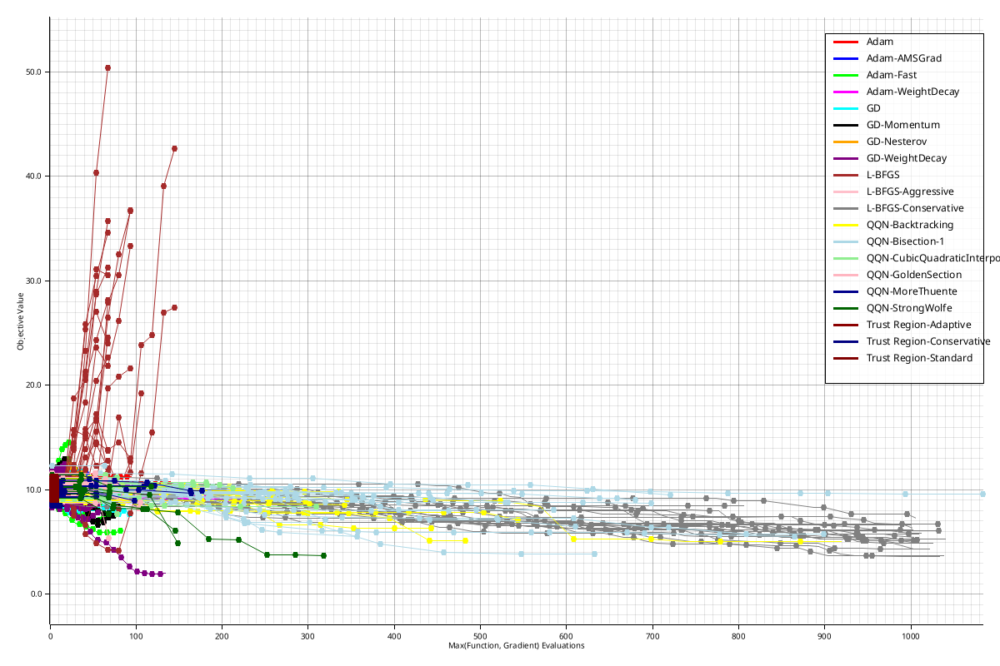
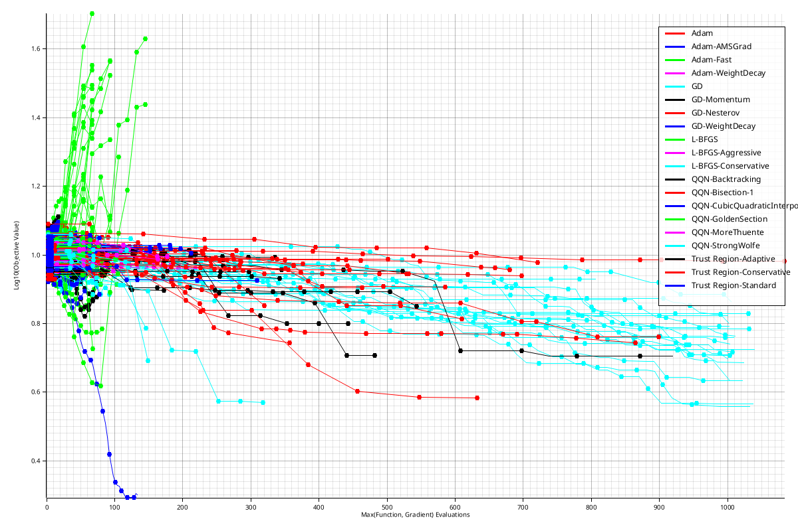

**Figure:** Convergence plots for NoisySphere_10D_sigma0.01 showing objective value vs iterations.
Left: Linear scale, Right: Log scale for better visualization of convergence behavior.

**Data:** [Linear scale data (CSV)](convergence_NoisySphere_10D_sigma0.01_data.csv) | [Log scale data (CSV)](convergence_NoisySphere_10D_sigma0.01_log_data.csv)

## Problem: SparseRosenbrock_4D

**Family:** SparseRosenbrock  
**Dimension:** 4  
**Success Threshold:** 1.000e-6  
**Total Runs:** 560

### Performance Summary
<table style="border-collapse: collapse; width: 100%; margin: 20px 0;">
<tr style="background-color: #f2f2f2;">
<th style="border: 1px solid #ddd; padding: 8px; text-align: center;">Rank</th>
<th style="border: 1px solid #ddd; padding: 8px; text-align: center;">Optimizer</th>
<th style="border: 1px solid #ddd; padding: 8px; text-align: center;">Mean Final Value (All/Success/Fail)</th>
<th style="border: 1px solid #ddd; padding: 8px; text-align: center;">Std Dev</th>
<th style="border: 1px solid #ddd; padding: 8px; text-align: center;">Best Value</th>
<th style="border: 1px solid #ddd; padding: 8px; text-align: center;">Worst Value</th>
<th style="border: 1px solid #ddd; padding: 8px; text-align: center;">Mean Function Evals (All/Success/Fail)</th>
<th style="border: 1px solid #ddd; padding: 8px; text-align: center;">Mean Gradient Evals (All/Success/Fail)</th>
<th style="border: 1px solid #ddd; padding: 8px; text-align: center;">Success Rate</th>
<th style="border: 1px solid #ddd; padding: 8px; text-align: center;">Mean Time (s)</th>
</tr>
<tr style="background-color: #d4edda; font-weight: bold;">
<td style="border: 1px solid #ddd; padding: 8px; text-align: center;">1</td>
<td style="border: 1px solid #ddd; padding: 8px; text-align: center;"><a href="detailed_SparseRosenbrock_4D_QQN-Backtracking.md">QQN-Backtracking</a></td>
<td style="border: 1px solid #ddd; padding: 8px; text-align: center;">2.14e0 / - / 2.14e0</td>
<td style="border: 1px solid #ddd; padding: 8px; text-align: center;">2.14e0</td>
<td style="border: 1px solid #ddd; padding: 8px; text-align: center;">1.04e-6</td>
<td style="border: 1px solid #ddd; padding: 8px; text-align: center;">6.66e0</td>
<td style="border: 1px solid #ddd; padding: 8px; text-align: center;">705.1 / - / 705.1</td>
<td style="border: 1px solid #ddd; padding: 8px; text-align: center;">304.3 / - / 304.3</td>
<td style="border: 1px solid #ddd; padding: 8px; text-align: center;">0.0%</td>
<td style="border: 1px solid #ddd; padding: 8px; text-align: center;">0.018</td>
</tr>
<tr style="background-color: #fff3cd;">
<td style="border: 1px solid #ddd; padding: 8px; text-align: center;">2</td>
<td style="border: 1px solid #ddd; padding: 8px; text-align: center;"><a href="detailed_SparseRosenbrock_4D_Adam-Fast.md">Adam-Fast</a></td>
<td style="border: 1px solid #ddd; padding: 8px; text-align: center;">2.09e0 / - / 2.39e0</td>
<td style="border: 1px solid #ddd; padding: 8px; text-align: center;">3.87e0</td>
<td style="border: 1px solid #ddd; padding: 8px; text-align: center;">4.67e-4</td>
<td style="border: 1px solid #ddd; padding: 8px; text-align: center;">1.19e1</td>
<td style="border: 1px solid #ddd; padding: 8px; text-align: center;">237.2 / - / 237.2</td>
<td style="border: 1px solid #ddd; padding: 8px; text-align: center;">236.2 / - / 236.2</td>
<td style="border: 1px solid #ddd; padding: 8px; text-align: center;">0.0%</td>
<td style="border: 1px solid #ddd; padding: 8px; text-align: center;">0.005</td>
</tr>
<tr style="">
<td style="border: 1px solid #ddd; padding: 8px; text-align: center;">3</td>
<td style="border: 1px solid #ddd; padding: 8px; text-align: center;"><a href="detailed_SparseRosenbrock_4D_QQN-GoldenSection.md">QQN-GoldenSection</a></td>
<td style="border: 1px solid #ddd; padding: 8px; text-align: center;">4.70e0 / - / 4.70e0</td>
<td style="border: 1px solid #ddd; padding: 8px; text-align: center;">2.65e0</td>
<td style="border: 1px solid #ddd; padding: 8px; text-align: center;">2.28e-3</td>
<td style="border: 1px solid #ddd; padding: 8px; text-align: center;">7.95e0</td>
<td style="border: 1px solid #ddd; padding: 8px; text-align: center;">914.0 / - / 914.0</td>
<td style="border: 1px solid #ddd; padding: 8px; text-align: center;">112.2 / - / 112.2</td>
<td style="border: 1px solid #ddd; padding: 8px; text-align: center;">0.0%</td>
<td style="border: 1px solid #ddd; padding: 8px; text-align: center;">0.014</td>
</tr>
<tr style="">
<td style="border: 1px solid #ddd; padding: 8px; text-align: center;">4</td>
<td style="border: 1px solid #ddd; padding: 8px; text-align: center;"><a href="detailed_SparseRosenbrock_4D_GD-Nesterov.md">GD-Nesterov</a></td>
<td style="border: 1px solid #ddd; padding: 8px; text-align: center;">2.19e0 / - / 3.45e0</td>
<td style="border: 1px solid #ddd; padding: 8px; text-align: center;">3.66e0</td>
<td style="border: 1px solid #ddd; padding: 8px; text-align: center;">1.88e-2</td>
<td style="border: 1px solid #ddd; padding: 8px; text-align: center;">8.88e0</td>
<td style="border: 1px solid #ddd; padding: 8px; text-align: center;">58.6 / - / 58.6</td>
<td style="border: 1px solid #ddd; padding: 8px; text-align: center;">113.2 / - / 113.2</td>
<td style="border: 1px solid #ddd; padding: 8px; text-align: center;">0.0%</td>
<td style="border: 1px solid #ddd; padding: 8px; text-align: center;">0.002</td>
</tr>
<tr style="">
<td style="border: 1px solid #ddd; padding: 8px; text-align: center;">5</td>
<td style="border: 1px solid #ddd; padding: 8px; text-align: center;"><a href="detailed_SparseRosenbrock_4D_QQN-StrongWolfe.md">QQN-StrongWolfe</a></td>
<td style="border: 1px solid #ddd; padding: 8px; text-align: center;">9.69e-1 / - / 9.69e-1</td>
<td style="border: 1px solid #ddd; padding: 8px; text-align: center;">1.43e0</td>
<td style="border: 1px solid #ddd; padding: 8px; text-align: center;">2.16e-2</td>
<td style="border: 1px solid #ddd; padding: 8px; text-align: center;">5.83e0</td>
<td style="border: 1px solid #ddd; padding: 8px; text-align: center;">578.9 / - / 578.9</td>
<td style="border: 1px solid #ddd; padding: 8px; text-align: center;">448.4 / - / 448.4</td>
<td style="border: 1px solid #ddd; padding: 8px; text-align: center;">0.0%</td>
<td style="border: 1px solid #ddd; padding: 8px; text-align: center;">0.015</td>
</tr>
<tr style="">
<td style="border: 1px solid #ddd; padding: 8px; text-align: center;">6</td>
<td style="border: 1px solid #ddd; padding: 8px; text-align: center;"><a href="detailed_SparseRosenbrock_4D_L-BFGS-Conservative.md">L-BFGS-Conservative</a></td>
<td style="border: 1px solid #ddd; padding: 8px; text-align: center;">4.82e0 / - / 4.82e0</td>
<td style="border: 1px solid #ddd; padding: 8px; text-align: center;">3.02e0</td>
<td style="border: 1px solid #ddd; padding: 8px; text-align: center;">3.18e-2</td>
<td style="border: 1px solid #ddd; padding: 8px; text-align: center;">8.44e0</td>
<td style="border: 1px solid #ddd; padding: 8px; text-align: center;">712.3 / - / 712.3</td>
<td style="border: 1px solid #ddd; padding: 8px; text-align: center;">257.6 / - / 257.6</td>
<td style="border: 1px solid #ddd; padding: 8px; text-align: center;">0.0%</td>
<td style="border: 1px solid #ddd; padding: 8px; text-align: center;">0.009</td>
</tr>
<tr style="">
<td style="border: 1px solid #ddd; padding: 8px; text-align: center;">7</td>
<td style="border: 1px solid #ddd; padding: 8px; text-align: center;"><a href="detailed_SparseRosenbrock_4D_GD-WeightDecay.md">GD-WeightDecay</a></td>
<td style="border: 1px solid #ddd; padding: 8px; text-align: center;">4.35e0 / - / 5.80e0</td>
<td style="border: 1px solid #ddd; padding: 8px; text-align: center;">4.31e0</td>
<td style="border: 1px solid #ddd; padding: 8px; text-align: center;">3.38e-2</td>
<td style="border: 1px solid #ddd; padding: 8px; text-align: center;">9.33e0</td>
<td style="border: 1px solid #ddd; padding: 8px; text-align: center;">81.5 / - / 81.5</td>
<td style="border: 1px solid #ddd; padding: 8px; text-align: center;">159.1 / - / 159.1</td>
<td style="border: 1px solid #ddd; padding: 8px; text-align: center;">0.0%</td>
<td style="border: 1px solid #ddd; padding: 8px; text-align: center;">0.002</td>
</tr>
<tr style="">
<td style="border: 1px solid #ddd; padding: 8px; text-align: center;">8</td>
<td style="border: 1px solid #ddd; padding: 8px; text-align: center;"><a href="detailed_SparseRosenbrock_4D_QQN-Bisection-1.md">QQN-Bisection-1</a></td>
<td style="border: 1px solid #ddd; padding: 8px; text-align: center;">4.40e0 / - / 4.40e0</td>
<td style="border: 1px solid #ddd; padding: 8px; text-align: center;">2.77e0</td>
<td style="border: 1px solid #ddd; padding: 8px; text-align: center;">4.39e-2</td>
<td style="border: 1px solid #ddd; padding: 8px; text-align: center;">7.64e0</td>
<td style="border: 1px solid #ddd; padding: 8px; text-align: center;">469.1 / - / 469.1</td>
<td style="border: 1px solid #ddd; padding: 8px; text-align: center;">565.5 / - / 565.5</td>
<td style="border: 1px solid #ddd; padding: 8px; text-align: center;">0.0%</td>
<td style="border: 1px solid #ddd; padding: 8px; text-align: center;">0.011</td>
</tr>
<tr style="">
<td style="border: 1px solid #ddd; padding: 8px; text-align: center;">9</td>
<td style="border: 1px solid #ddd; padding: 8px; text-align: center;"><a href="detailed_SparseRosenbrock_4D_QQN-Bisection-2.md">QQN-Bisection-2</a></td>
<td style="border: 1px solid #ddd; padding: 8px; text-align: center;">1.36e0 / - / 1.36e0</td>
<td style="border: 1px solid #ddd; padding: 8px; text-align: center;">1.31e0</td>
<td style="border: 1px solid #ddd; padding: 8px; text-align: center;">4.56e-2</td>
<td style="border: 1px solid #ddd; padding: 8px; text-align: center;">3.97e0</td>
<td style="border: 1px solid #ddd; padding: 8px; text-align: center;">150.6 / - / 150.6</td>
<td style="border: 1px solid #ddd; padding: 8px; text-align: center;">108.8 / - / 108.8</td>
<td style="border: 1px solid #ddd; padding: 8px; text-align: center;">0.0%</td>
<td style="border: 1px solid #ddd; padding: 8px; text-align: center;">0.003</td>
</tr>
<tr style="">
<td style="border: 1px solid #ddd; padding: 8px; text-align: center;">10</td>
<td style="border: 1px solid #ddd; padding: 8px; text-align: center;"><a href="detailed_SparseRosenbrock_4D_GD-Momentum.md">GD-Momentum</a></td>
<td style="border: 1px solid #ddd; padding: 8px; text-align: center;">7.48e0 / - / 1.21e1</td>
<td style="border: 1px solid #ddd; padding: 8px; text-align: center;">3.26e0</td>
<td style="border: 1px solid #ddd; padding: 8px; text-align: center;">5.25e-2</td>
<td style="border: 1px solid #ddd; padding: 8px; text-align: center;">1.10e1</td>
<td style="border: 1px solid #ddd; padding: 8px; text-align: center;">22.9 / - / 22.9</td>
<td style="border: 1px solid #ddd; padding: 8px; text-align: center;">41.8 / - / 41.8</td>
<td style="border: 1px solid #ddd; padding: 8px; text-align: center;">0.0%</td>
<td style="border: 1px solid #ddd; padding: 8px; text-align: center;">0.001</td>
</tr>
<tr style="">
<td style="border: 1px solid #ddd; padding: 8px; text-align: center;">11</td>
<td style="border: 1px solid #ddd; padding: 8px; text-align: center;"><a href="detailed_SparseRosenbrock_4D_QQN-CubicQuadraticInterpolation.md">QQN-CubicQuadraticInterpolation</a></td>
<td style="border: 1px solid #ddd; padding: 8px; text-align: center;">4.73e0 / - / 4.73e0</td>
<td style="border: 1px solid #ddd; padding: 8px; text-align: center;">2.29e0</td>
<td style="border: 1px solid #ddd; padding: 8px; text-align: center;">8.87e-2</td>
<td style="border: 1px solid #ddd; padding: 8px; text-align: center;">7.64e0</td>
<td style="border: 1px solid #ddd; padding: 8px; text-align: center;">393.6 / - / 393.6</td>
<td style="border: 1px solid #ddd; padding: 8px; text-align: center;">643.4 / - / 643.4</td>
<td style="border: 1px solid #ddd; padding: 8px; text-align: center;">0.0%</td>
<td style="border: 1px solid #ddd; padding: 8px; text-align: center;">0.013</td>
</tr>
<tr style="">
<td style="border: 1px solid #ddd; padding: 8px; text-align: center;">12</td>
<td style="border: 1px solid #ddd; padding: 8px; text-align: center;"><a href="detailed_SparseRosenbrock_4D_GD.md">GD</a></td>
<td style="border: 1px solid #ddd; padding: 8px; text-align: center;">3.46e0 / - / 3.70e0</td>
<td style="border: 1px solid #ddd; padding: 8px; text-align: center;">3.47e0</td>
<td style="border: 1px solid #ddd; padding: 8px; text-align: center;">9.48e-1</td>
<td style="border: 1px solid #ddd; padding: 8px; text-align: center;">9.41e0</td>
<td style="border: 1px solid #ddd; padding: 8px; text-align: center;">178.4 / - / 178.4</td>
<td style="border: 1px solid #ddd; padding: 8px; text-align: center;">352.9 / - / 352.9</td>
<td style="border: 1px solid #ddd; padding: 8px; text-align: center;">0.0%</td>
<td style="border: 1px solid #ddd; padding: 8px; text-align: center;">0.004</td>
</tr>
<tr style="">
<td style="border: 1px solid #ddd; padding: 8px; text-align: center;">13</td>
<td style="border: 1px solid #ddd; padding: 8px; text-align: center;"><a href="detailed_SparseRosenbrock_4D_L-BFGS.md">L-BFGS</a></td>
<td style="border: 1px solid #ddd; padding: 8px; text-align: center;">8.13e0 / - / 1.39e2</td>
<td style="border: 1px solid #ddd; padding: 8px; text-align: center;">8.97e0</td>
<td style="border: 1px solid #ddd; padding: 8px; text-align: center;">1.86e0</td>
<td style="border: 1px solid #ddd; padding: 8px; text-align: center;">3.62e1</td>
<td style="border: 1px solid #ddd; padding: 8px; text-align: center;">135.9 / - / 135.9</td>
<td style="border: 1px solid #ddd; padding: 8px; text-align: center;">42.5 / - / 42.5</td>
<td style="border: 1px solid #ddd; padding: 8px; text-align: center;">0.0%</td>
<td style="border: 1px solid #ddd; padding: 8px; text-align: center;">0.002</td>
</tr>
<tr style="">
<td style="border: 1px solid #ddd; padding: 8px; text-align: center;">14</td>
<td style="border: 1px solid #ddd; padding: 8px; text-align: center;"><a href="detailed_SparseRosenbrock_4D_QQN-MoreThuente.md">QQN-MoreThuente</a></td>
<td style="border: 1px solid #ddd; padding: 8px; text-align: center;">2.43e1 / - / 2.43e1</td>
<td style="border: 1px solid #ddd; padding: 8px; text-align: center;">2.46e1</td>
<td style="border: 1px solid #ddd; padding: 8px; text-align: center;">3.73e0</td>
<td style="border: 1px solid #ddd; padding: 8px; text-align: center;">9.77e1</td>
<td style="border: 1px solid #ddd; padding: 8px; text-align: center;">485.2 / - / 485.2</td>
<td style="border: 1px solid #ddd; padding: 8px; text-align: center;">529.7 / - / 529.7</td>
<td style="border: 1px solid #ddd; padding: 8px; text-align: center;">0.0%</td>
<td style="border: 1px solid #ddd; padding: 8px; text-align: center;">0.008</td>
</tr>
<tr style="">
<td style="border: 1px solid #ddd; padding: 8px; text-align: center;">15</td>
<td style="border: 1px solid #ddd; padding: 8px; text-align: center;"><a href="detailed_SparseRosenbrock_4D_Adam-WeightDecay.md">Adam-WeightDecay</a></td>
<td style="border: 1px solid #ddd; padding: 8px; text-align: center;">7.39e0 / - / 7.41e0</td>
<td style="border: 1px solid #ddd; padding: 8px; text-align: center;">1.62e0</td>
<td style="border: 1px solid #ddd; padding: 8px; text-align: center;">4.97e0</td>
<td style="border: 1px solid #ddd; padding: 8px; text-align: center;">9.10e0</td>
<td style="border: 1px solid #ddd; padding: 8px; text-align: center;">256.6 / - / 256.6</td>
<td style="border: 1px solid #ddd; padding: 8px; text-align: center;">256.0 / - / 256.0</td>
<td style="border: 1px solid #ddd; padding: 8px; text-align: center;">0.0%</td>
<td style="border: 1px solid #ddd; padding: 8px; text-align: center;">0.005</td>
</tr>
<tr style="">
<td style="border: 1px solid #ddd; padding: 8px; text-align: center;">16</td>
<td style="border: 1px solid #ddd; padding: 8px; text-align: center;"><a href="detailed_SparseRosenbrock_4D_Adam.md">Adam</a></td>
<td style="border: 1px solid #ddd; padding: 8px; text-align: center;">8.07e0 / - / 8.07e0</td>
<td style="border: 1px solid #ddd; padding: 8px; text-align: center;">7.83e-1</td>
<td style="border: 1px solid #ddd; padding: 8px; text-align: center;">7.09e0</td>
<td style="border: 1px solid #ddd; padding: 8px; text-align: center;">1.07e1</td>
<td style="border: 1px solid #ddd; padding: 8px; text-align: center;">502.0 / - / 502.0</td>
<td style="border: 1px solid #ddd; padding: 8px; text-align: center;">502.0 / - / 502.0</td>
<td style="border: 1px solid #ddd; padding: 8px; text-align: center;">0.0%</td>
<td style="border: 1px solid #ddd; padding: 8px; text-align: center;">0.010</td>
</tr>
<tr style="">
<td style="border: 1px solid #ddd; padding: 8px; text-align: center;">17</td>
<td style="border: 1px solid #ddd; padding: 8px; text-align: center;"><a href="detailed_SparseRosenbrock_4D_Adam-AMSGrad.md">Adam-AMSGrad</a></td>
<td style="border: 1px solid #ddd; padding: 8px; text-align: center;">8.71e0 / - / 8.71e0</td>
<td style="border: 1px solid #ddd; padding: 8px; text-align: center;">1.07e0</td>
<td style="border: 1px solid #ddd; padding: 8px; text-align: center;">7.28e0</td>
<td style="border: 1px solid #ddd; padding: 8px; text-align: center;">1.15e1</td>
<td style="border: 1px solid #ddd; padding: 8px; text-align: center;">485.1 / - / 485.1</td>
<td style="border: 1px solid #ddd; padding: 8px; text-align: center;">485.0 / - / 485.0</td>
<td style="border: 1px solid #ddd; padding: 8px; text-align: center;">0.0%</td>
<td style="border: 1px solid #ddd; padding: 8px; text-align: center;">0.011</td>
</tr>
<tr style="">
<td style="border: 1px solid #ddd; padding: 8px; text-align: center;">18</td>
<td style="border: 1px solid #ddd; padding: 8px; text-align: center;"><a href="detailed_SparseRosenbrock_4D_Trust_Region-Adaptive.md">Trust Region-Adaptive</a></td>
<td style="border: 1px solid #ddd; padding: 8px; text-align: center;">3.53e1 / - / 3.53e1</td>
<td style="border: 1px solid #ddd; padding: 8px; text-align: center;">3.04e1</td>
<td style="border: 1px solid #ddd; padding: 8px; text-align: center;">7.77e0</td>
<td style="border: 1px solid #ddd; padding: 8px; text-align: center;">1.07e2</td>
<td style="border: 1px solid #ddd; padding: 8px; text-align: center;">462.6 / - / 462.6</td>
<td style="border: 1px solid #ddd; padding: 8px; text-align: center;">309.1 / - / 309.1</td>
<td style="border: 1px solid #ddd; padding: 8px; text-align: center;">0.0%</td>
<td style="border: 1px solid #ddd; padding: 8px; text-align: center;">0.003</td>
</tr>
<tr style="">
<td style="border: 1px solid #ddd; padding: 8px; text-align: center;">19</td>
<td style="border: 1px solid #ddd; padding: 8px; text-align: center;"><a href="detailed_SparseRosenbrock_4D_Trust_Region-Standard.md">Trust Region-Standard</a></td>
<td style="border: 1px solid #ddd; padding: 8px; text-align: center;">8.42e0 / - / 8.42e0</td>
<td style="border: 1px solid #ddd; padding: 8px; text-align: center;">3.09e-1</td>
<td style="border: 1px solid #ddd; padding: 8px; text-align: center;">7.83e0</td>
<td style="border: 1px solid #ddd; padding: 8px; text-align: center;">8.87e0</td>
<td style="border: 1px solid #ddd; padding: 8px; text-align: center;">205.6 / - / 205.6</td>
<td style="border: 1px solid #ddd; padding: 8px; text-align: center;">137.7 / - / 137.7</td>
<td style="border: 1px solid #ddd; padding: 8px; text-align: center;">0.0%</td>
<td style="border: 1px solid #ddd; padding: 8px; text-align: center;">0.001</td>
</tr>
<tr style="">
<td style="border: 1px solid #ddd; padding: 8px; text-align: center;">20</td>
<td style="border: 1px solid #ddd; padding: 8px; text-align: center;"><a href="detailed_SparseRosenbrock_4D_Trust_Region-Conservative.md">Trust Region-Conservative</a></td>
<td style="border: 1px solid #ddd; padding: 8px; text-align: center;">7.84e1 / - / 7.84e1</td>
<td style="border: 1px solid #ddd; padding: 8px; text-align: center;">3.98e1</td>
<td style="border: 1px solid #ddd; padding: 8px; text-align: center;">7.96e0</td>
<td style="border: 1px solid #ddd; padding: 8px; text-align: center;">1.85e2</td>
<td style="border: 1px solid #ddd; padding: 8px; text-align: center;">602.0 / - / 602.0</td>
<td style="border: 1px solid #ddd; padding: 8px; text-align: center;">402.0 / - / 402.0</td>
<td style="border: 1px solid #ddd; padding: 8px; text-align: center;">0.0%</td>
<td style="border: 1px solid #ddd; padding: 8px; text-align: center;">0.004</td>
</tr>
<tr style="">
<td style="border: 1px solid #ddd; padding: 8px; text-align: center;">21</td>
<td style="border: 1px solid #ddd; padding: 8px; text-align: center;"><a href="detailed_SparseRosenbrock_4D_L-BFGS-Aggressive.md">L-BFGS-Aggressive</a></td>
<td style="border: 1px solid #ddd; padding: 8px; text-align: center;">4.43e1 / - / 4.43e1</td>
<td style="border: 1px solid #ddd; padding: 8px; text-align: center;">3.48e1</td>
<td style="border: 1px solid #ddd; padding: 8px; text-align: center;">1.53e1</td>
<td style="border: 1px solid #ddd; padding: 8px; text-align: center;">1.50e2</td>
<td style="border: 1px solid #ddd; padding: 8px; text-align: center;">774.2 / - / 774.2</td>
<td style="border: 1px solid #ddd; padding: 8px; text-align: center;">234.3 / - / 234.3</td>
<td style="border: 1px solid #ddd; padding: 8px; text-align: center;">0.0%</td>
<td style="border: 1px solid #ddd; padding: 8px; text-align: center;">0.007</td>
</tr>
</table>

### Convergence Plots

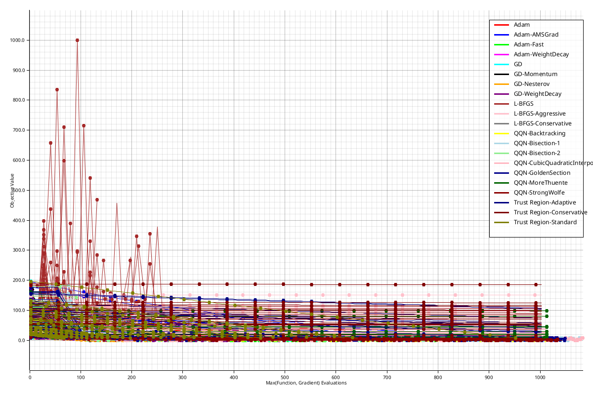
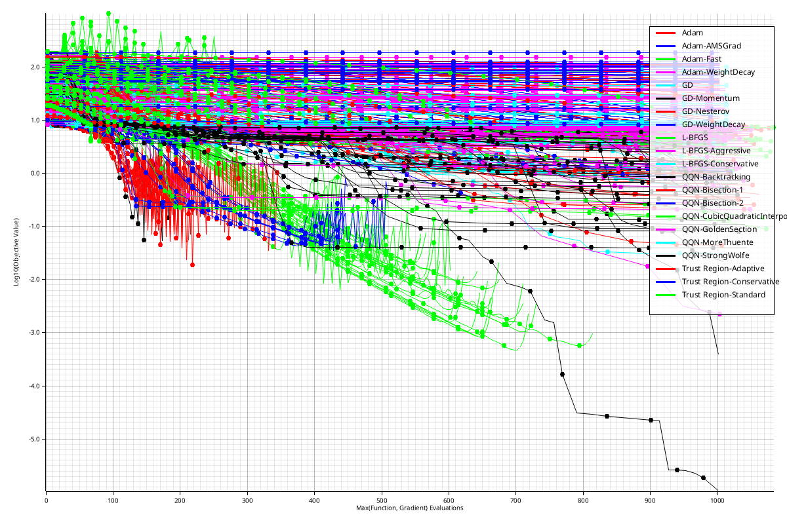

**Figure:** Convergence plots for SparseRosenbrock_4D showing objective value vs iterations.
Left: Linear scale, Right: Log scale for better visualization of convergence behavior.

**Data:** [Linear scale data (CSV)](convergence_SparseRosenbrock_4D_data.csv) | [Log scale data (CSV)](convergence_SparseRosenbrock_4D_log_data.csv)

## Problem: SparseRosenbrock_10D

**Family:** SparseRosenbrock  
**Dimension:** 10  
**Success Threshold:** 1.000e-6  
**Total Runs:** 560

### Performance Summary
<table style="border-collapse: collapse; width: 100%; margin: 20px 0;">
<tr style="background-color: #f2f2f2;">
<th style="border: 1px solid #ddd; padding: 8px; text-align: center;">Rank</th>
<th style="border: 1px solid #ddd; padding: 8px; text-align: center;">Optimizer</th>
<th style="border: 1px solid #ddd; padding: 8px; text-align: center;">Mean Final Value (All/Success/Fail)</th>
<th style="border: 1px solid #ddd; padding: 8px; text-align: center;">Std Dev</th>
<th style="border: 1px solid #ddd; padding: 8px; text-align: center;">Best Value</th>
<th style="border: 1px solid #ddd; padding: 8px; text-align: center;">Worst Value</th>
<th style="border: 1px solid #ddd; padding: 8px; text-align: center;">Mean Function Evals (All/Success/Fail)</th>
<th style="border: 1px solid #ddd; padding: 8px; text-align: center;">Mean Gradient Evals (All/Success/Fail)</th>
<th style="border: 1px solid #ddd; padding: 8px; text-align: center;">Success Rate</th>
<th style="border: 1px solid #ddd; padding: 8px; text-align: center;">Mean Time (s)</th>
</tr>
<tr style="background-color: #d4edda; font-weight: bold;">
<td style="border: 1px solid #ddd; padding: 8px; text-align: center;">1</td>
<td style="border: 1px solid #ddd; padding: 8px; text-align: center;"><a href="detailed_SparseRosenbrock_10D_GD-Momentum.md">GD-Momentum</a></td>
<td style="border: 1px solid #ddd; padding: 8px; text-align: center;">1.64e1 / - / 2.71e1</td>
<td style="border: 1px solid #ddd; padding: 8px; text-align: center;">9.44e0</td>
<td style="border: 1px solid #ddd; padding: 8px; text-align: center;">1.05e-2</td>
<td style="border: 1px solid #ddd; padding: 8px; text-align: center;">2.55e1</td>
<td style="border: 1px solid #ddd; padding: 8px; text-align: center;">33.9 / - / 33.9</td>
<td style="border: 1px solid #ddd; padding: 8px; text-align: center;">63.7 / - / 63.7</td>
<td style="border: 1px solid #ddd; padding: 8px; text-align: center;">0.0%</td>
<td style="border: 1px solid #ddd; padding: 8px; text-align: center;">0.001</td>
</tr>
<tr style="background-color: #fff3cd;">
<td style="border: 1px solid #ddd; padding: 8px; text-align: center;">2</td>
<td style="border: 1px solid #ddd; padding: 8px; text-align: center;"><a href="detailed_SparseRosenbrock_10D_GD-Nesterov.md">GD-Nesterov</a></td>
<td style="border: 1px solid #ddd; padding: 8px; text-align: center;">1.08e0 / - / 1.68e0</td>
<td style="border: 1px solid #ddd; padding: 8px; text-align: center;">4.43e0</td>
<td style="border: 1px solid #ddd; padding: 8px; text-align: center;">1.47e-2</td>
<td style="border: 1px solid #ddd; padding: 8px; text-align: center;">2.04e1</td>
<td style="border: 1px solid #ddd; padding: 8px; text-align: center;">122.8 / - / 122.8</td>
<td style="border: 1px solid #ddd; padding: 8px; text-align: center;">241.7 / - / 241.7</td>
<td style="border: 1px solid #ddd; padding: 8px; text-align: center;">0.0%</td>
<td style="border: 1px solid #ddd; padding: 8px; text-align: center;">0.004</td>
</tr>
<tr style="">
<td style="border: 1px solid #ddd; padding: 8px; text-align: center;">3</td>
<td style="border: 1px solid #ddd; padding: 8px; text-align: center;"><a href="detailed_SparseRosenbrock_10D_Adam-Fast.md">Adam-Fast</a></td>
<td style="border: 1px solid #ddd; padding: 8px; text-align: center;">1.56e0 / - / 1.97e0</td>
<td style="border: 1px solid #ddd; padding: 8px; text-align: center;">5.84e0</td>
<td style="border: 1px solid #ddd; padding: 8px; text-align: center;">2.58e-2</td>
<td style="border: 1px solid #ddd; padding: 8px; text-align: center;">2.85e1</td>
<td style="border: 1px solid #ddd; padding: 8px; text-align: center;">202.6 / - / 202.6</td>
<td style="border: 1px solid #ddd; padding: 8px; text-align: center;">201.6 / - / 201.6</td>
<td style="border: 1px solid #ddd; padding: 8px; text-align: center;">0.0%</td>
<td style="border: 1px solid #ddd; padding: 8px; text-align: center;">0.004</td>
</tr>
<tr style="">
<td style="border: 1px solid #ddd; padding: 8px; text-align: center;">4</td>
<td style="border: 1px solid #ddd; padding: 8px; text-align: center;"><a href="detailed_SparseRosenbrock_10D_GD-WeightDecay.md">GD-WeightDecay</a></td>
<td style="border: 1px solid #ddd; padding: 8px; text-align: center;">4.38e0 / - / 4.86e0</td>
<td style="border: 1px solid #ddd; padding: 8px; text-align: center;">8.57e0</td>
<td style="border: 1px solid #ddd; padding: 8px; text-align: center;">5.59e-2</td>
<td style="border: 1px solid #ddd; padding: 8px; text-align: center;">2.20e1</td>
<td style="border: 1px solid #ddd; padding: 8px; text-align: center;">130.1 / - / 130.1</td>
<td style="border: 1px solid #ddd; padding: 8px; text-align: center;">256.1 / - / 256.1</td>
<td style="border: 1px solid #ddd; padding: 8px; text-align: center;">0.0%</td>
<td style="border: 1px solid #ddd; padding: 8px; text-align: center;">0.004</td>
</tr>
<tr style="">
<td style="border: 1px solid #ddd; padding: 8px; text-align: center;">5</td>
<td style="border: 1px solid #ddd; padding: 8px; text-align: center;"><a href="detailed_SparseRosenbrock_10D_QQN-StrongWolfe.md">QQN-StrongWolfe</a></td>
<td style="border: 1px solid #ddd; padding: 8px; text-align: center;">3.53e0 / - / 3.53e0</td>
<td style="border: 1px solid #ddd; padding: 8px; text-align: center;">2.20e0</td>
<td style="border: 1px solid #ddd; padding: 8px; text-align: center;">1.98e-1</td>
<td style="border: 1px solid #ddd; padding: 8px; text-align: center;">8.58e0</td>
<td style="border: 1px solid #ddd; padding: 8px; text-align: center;">576.2 / - / 576.2</td>
<td style="border: 1px solid #ddd; padding: 8px; text-align: center;">452.6 / - / 452.6</td>
<td style="border: 1px solid #ddd; padding: 8px; text-align: center;">0.0%</td>
<td style="border: 1px solid #ddd; padding: 8px; text-align: center;">0.015</td>
</tr>
<tr style="">
<td style="border: 1px solid #ddd; padding: 8px; text-align: center;">6</td>
<td style="border: 1px solid #ddd; padding: 8px; text-align: center;"><a href="detailed_SparseRosenbrock_10D_QQN-Backtracking.md">QQN-Backtracking</a></td>
<td style="border: 1px solid #ddd; padding: 8px; text-align: center;">7.87e0 / - / 7.87e0</td>
<td style="border: 1px solid #ddd; padding: 8px; text-align: center;">5.09e0</td>
<td style="border: 1px solid #ddd; padding: 8px; text-align: center;">2.19e-1</td>
<td style="border: 1px solid #ddd; padding: 8px; text-align: center;">1.64e1</td>
<td style="border: 1px solid #ddd; padding: 8px; text-align: center;">709.5 / - / 709.5</td>
<td style="border: 1px solid #ddd; padding: 8px; text-align: center;">302.8 / - / 302.8</td>
<td style="border: 1px solid #ddd; padding: 8px; text-align: center;">0.0%</td>
<td style="border: 1px solid #ddd; padding: 8px; text-align: center;">0.019</td>
</tr>
<tr style="">
<td style="border: 1px solid #ddd; padding: 8px; text-align: center;">7</td>
<td style="border: 1px solid #ddd; padding: 8px; text-align: center;"><a href="detailed_SparseRosenbrock_10D_QQN-GoldenSection.md">QQN-GoldenSection</a></td>
<td style="border: 1px solid #ddd; padding: 8px; text-align: center;">1.18e1 / - / 1.18e1</td>
<td style="border: 1px solid #ddd; padding: 8px; text-align: center;">5.49e0</td>
<td style="border: 1px solid #ddd; padding: 8px; text-align: center;">3.66e-1</td>
<td style="border: 1px solid #ddd; padding: 8px; text-align: center;">1.83e1</td>
<td style="border: 1px solid #ddd; padding: 8px; text-align: center;">918.1 / - / 918.1</td>
<td style="border: 1px solid #ddd; padding: 8px; text-align: center;">114.3 / - / 114.3</td>
<td style="border: 1px solid #ddd; padding: 8px; text-align: center;">0.0%</td>
<td style="border: 1px solid #ddd; padding: 8px; text-align: center;">0.015</td>
</tr>
<tr style="">
<td style="border: 1px solid #ddd; padding: 8px; text-align: center;">8</td>
<td style="border: 1px solid #ddd; padding: 8px; text-align: center;"><a href="detailed_SparseRosenbrock_10D_GD.md">GD</a></td>
<td style="border: 1px solid #ddd; padding: 8px; text-align: center;">3.87e0 / - / 3.98e0</td>
<td style="border: 1px solid #ddd; padding: 8px; text-align: center;">6.18e0</td>
<td style="border: 1px solid #ddd; padding: 8px; text-align: center;">1.37e0</td>
<td style="border: 1px solid #ddd; padding: 8px; text-align: center;">2.09e1</td>
<td style="border: 1px solid #ddd; padding: 8px; text-align: center;">292.9 / - / 292.9</td>
<td style="border: 1px solid #ddd; padding: 8px; text-align: center;">583.4 / - / 583.4</td>
<td style="border: 1px solid #ddd; padding: 8px; text-align: center;">0.0%</td>
<td style="border: 1px solid #ddd; padding: 8px; text-align: center;">0.008</td>
</tr>
<tr style="">
<td style="border: 1px solid #ddd; padding: 8px; text-align: center;">9</td>
<td style="border: 1px solid #ddd; padding: 8px; text-align: center;"><a href="detailed_SparseRosenbrock_10D_L-BFGS-Conservative.md">L-BFGS-Conservative</a></td>
<td style="border: 1px solid #ddd; padding: 8px; text-align: center;">1.63e1 / - / 1.63e1</td>
<td style="border: 1px solid #ddd; padding: 8px; text-align: center;">5.44e0</td>
<td style="border: 1px solid #ddd; padding: 8px; text-align: center;">1.62e0</td>
<td style="border: 1px solid #ddd; padding: 8px; text-align: center;">2.10e1</td>
<td style="border: 1px solid #ddd; padding: 8px; text-align: center;">732.1 / - / 732.1</td>
<td style="border: 1px solid #ddd; padding: 8px; text-align: center;">227.8 / - / 227.8</td>
<td style="border: 1px solid #ddd; padding: 8px; text-align: center;">0.0%</td>
<td style="border: 1px solid #ddd; padding: 8px; text-align: center;">0.008</td>
</tr>
<tr style="">
<td style="border: 1px solid #ddd; padding: 8px; text-align: center;">10</td>
<td style="border: 1px solid #ddd; padding: 8px; text-align: center;"><a href="detailed_SparseRosenbrock_10D_QQN-Bisection-2.md">QQN-Bisection-2</a></td>
<td style="border: 1px solid #ddd; padding: 8px; text-align: center;">1.17e1 / - / 1.17e1</td>
<td style="border: 1px solid #ddd; padding: 8px; text-align: center;">4.36e0</td>
<td style="border: 1px solid #ddd; padding: 8px; text-align: center;">2.98e0</td>
<td style="border: 1px solid #ddd; padding: 8px; text-align: center;">1.68e1</td>
<td style="border: 1px solid #ddd; padding: 8px; text-align: center;">231.2 / - / 231.2</td>
<td style="border: 1px solid #ddd; padding: 8px; text-align: center;">138.6 / - / 138.6</td>
<td style="border: 1px solid #ddd; padding: 8px; text-align: center;">0.0%</td>
<td style="border: 1px solid #ddd; padding: 8px; text-align: center;">0.005</td>
</tr>
<tr style="">
<td style="border: 1px solid #ddd; padding: 8px; text-align: center;">11</td>
<td style="border: 1px solid #ddd; padding: 8px; text-align: center;"><a href="detailed_SparseRosenbrock_10D_QQN-Bisection-1.md">QQN-Bisection-1</a></td>
<td style="border: 1px solid #ddd; padding: 8px; text-align: center;">1.54e1 / - / 1.54e1</td>
<td style="border: 1px solid #ddd; padding: 8px; text-align: center;">3.58e0</td>
<td style="border: 1px solid #ddd; padding: 8px; text-align: center;">4.26e0</td>
<td style="border: 1px solid #ddd; padding: 8px; text-align: center;">1.93e1</td>
<td style="border: 1px solid #ddd; padding: 8px; text-align: center;">451.9 / - / 451.9</td>
<td style="border: 1px solid #ddd; padding: 8px; text-align: center;">579.8 / - / 579.8</td>
<td style="border: 1px solid #ddd; padding: 8px; text-align: center;">0.0%</td>
<td style="border: 1px solid #ddd; padding: 8px; text-align: center;">0.011</td>
</tr>
<tr style="">
<td style="border: 1px solid #ddd; padding: 8px; text-align: center;">12</td>
<td style="border: 1px solid #ddd; padding: 8px; text-align: center;"><a href="detailed_SparseRosenbrock_10D_QQN-CubicQuadraticInterpolation.md">QQN-CubicQuadraticInterpolation</a></td>
<td style="border: 1px solid #ddd; padding: 8px; text-align: center;">1.36e1 / - / 1.36e1</td>
<td style="border: 1px solid #ddd; padding: 8px; text-align: center;">3.72e0</td>
<td style="border: 1px solid #ddd; padding: 8px; text-align: center;">5.03e0</td>
<td style="border: 1px solid #ddd; padding: 8px; text-align: center;">1.90e1</td>
<td style="border: 1px solid #ddd; padding: 8px; text-align: center;">391.0 / - / 391.0</td>
<td style="border: 1px solid #ddd; padding: 8px; text-align: center;">639.8 / - / 639.8</td>
<td style="border: 1px solid #ddd; padding: 8px; text-align: center;">0.0%</td>
<td style="border: 1px solid #ddd; padding: 8px; text-align: center;">0.014</td>
</tr>
<tr style="">
<td style="border: 1px solid #ddd; padding: 8px; text-align: center;">13</td>
<td style="border: 1px solid #ddd; padding: 8px; text-align: center;"><a href="detailed_SparseRosenbrock_10D_L-BFGS.md">L-BFGS</a></td>
<td style="border: 1px solid #ddd; padding: 8px; text-align: center;">3.43e1 / - / 4.48e2</td>
<td style="border: 1px solid #ddd; padding: 8px; text-align: center;">1.78e1</td>
<td style="border: 1px solid #ddd; padding: 8px; text-align: center;">7.89e0</td>
<td style="border: 1px solid #ddd; padding: 8px; text-align: center;">7.41e1</td>
<td style="border: 1px solid #ddd; padding: 8px; text-align: center;">140.7 / - / 140.7</td>
<td style="border: 1px solid #ddd; padding: 8px; text-align: center;">50.4 / - / 50.4</td>
<td style="border: 1px solid #ddd; padding: 8px; text-align: center;">0.0%</td>
<td style="border: 1px solid #ddd; padding: 8px; text-align: center;">0.002</td>
</tr>
<tr style="">
<td style="border: 1px solid #ddd; padding: 8px; text-align: center;">14</td>
<td style="border: 1px solid #ddd; padding: 8px; text-align: center;"><a href="detailed_SparseRosenbrock_10D_Adam-WeightDecay.md">Adam-WeightDecay</a></td>
<td style="border: 1px solid #ddd; padding: 8px; text-align: center;">1.27e1 / - / 1.27e1</td>
<td style="border: 1px solid #ddd; padding: 8px; text-align: center;">9.35e-1</td>
<td style="border: 1px solid #ddd; padding: 8px; text-align: center;">1.12e1</td>
<td style="border: 1px solid #ddd; padding: 8px; text-align: center;">1.41e1</td>
<td style="border: 1px solid #ddd; padding: 8px; text-align: center;">502.0 / - / 502.0</td>
<td style="border: 1px solid #ddd; padding: 8px; text-align: center;">502.0 / - / 502.0</td>
<td style="border: 1px solid #ddd; padding: 8px; text-align: center;">0.0%</td>
<td style="border: 1px solid #ddd; padding: 8px; text-align: center;">0.011</td>
</tr>
<tr style="">
<td style="border: 1px solid #ddd; padding: 8px; text-align: center;">15</td>
<td style="border: 1px solid #ddd; padding: 8px; text-align: center;"><a href="detailed_SparseRosenbrock_10D_Adam-AMSGrad.md">Adam-AMSGrad</a></td>
<td style="border: 1px solid #ddd; padding: 8px; text-align: center;">2.12e1 / - / 2.12e1</td>
<td style="border: 1px solid #ddd; padding: 8px; text-align: center;">1.63e0</td>
<td style="border: 1px solid #ddd; padding: 8px; text-align: center;">1.89e1</td>
<td style="border: 1px solid #ddd; padding: 8px; text-align: center;">2.49e1</td>
<td style="border: 1px solid #ddd; padding: 8px; text-align: center;">502.0 / - / 502.0</td>
<td style="border: 1px solid #ddd; padding: 8px; text-align: center;">502.0 / - / 502.0</td>
<td style="border: 1px solid #ddd; padding: 8px; text-align: center;">0.0%</td>
<td style="border: 1px solid #ddd; padding: 8px; text-align: center;">0.012</td>
</tr>
<tr style="">
<td style="border: 1px solid #ddd; padding: 8px; text-align: center;">16</td>
<td style="border: 1px solid #ddd; padding: 8px; text-align: center;"><a href="detailed_SparseRosenbrock_10D_Adam.md">Adam</a></td>
<td style="border: 1px solid #ddd; padding: 8px; text-align: center;">2.04e1 / - / 2.04e1</td>
<td style="border: 1px solid #ddd; padding: 8px; text-align: center;">8.04e-1</td>
<td style="border: 1px solid #ddd; padding: 8px; text-align: center;">1.89e1</td>
<td style="border: 1px solid #ddd; padding: 8px; text-align: center;">2.21e1</td>
<td style="border: 1px solid #ddd; padding: 8px; text-align: center;">502.0 / - / 502.0</td>
<td style="border: 1px solid #ddd; padding: 8px; text-align: center;">502.0 / - / 502.0</td>
<td style="border: 1px solid #ddd; padding: 8px; text-align: center;">0.0%</td>
<td style="border: 1px solid #ddd; padding: 8px; text-align: center;">0.011</td>
</tr>
<tr style="">
<td style="border: 1px solid #ddd; padding: 8px; text-align: center;">17</td>
<td style="border: 1px solid #ddd; padding: 8px; text-align: center;"><a href="detailed_SparseRosenbrock_10D_Trust_Region-Standard.md">Trust Region-Standard</a></td>
<td style="border: 1px solid #ddd; padding: 8px; text-align: center;">2.67e1 / - / 2.67e1</td>
<td style="border: 1px solid #ddd; padding: 8px; text-align: center;">2.16e1</td>
<td style="border: 1px solid #ddd; padding: 8px; text-align: center;">1.96e1</td>
<td style="border: 1px solid #ddd; padding: 8px; text-align: center;">1.19e2</td>
<td style="border: 1px solid #ddd; padding: 8px; text-align: center;">373.6 / - / 373.6</td>
<td style="border: 1px solid #ddd; padding: 8px; text-align: center;">249.7 / - / 249.7</td>
<td style="border: 1px solid #ddd; padding: 8px; text-align: center;">0.0%</td>
<td style="border: 1px solid #ddd; padding: 8px; text-align: center;">0.002</td>
</tr>
<tr style="">
<td style="border: 1px solid #ddd; padding: 8px; text-align: center;">18</td>
<td style="border: 1px solid #ddd; padding: 8px; text-align: center;"><a href="detailed_SparseRosenbrock_10D_Trust_Region-Adaptive.md">Trust Region-Adaptive</a></td>
<td style="border: 1px solid #ddd; padding: 8px; text-align: center;">1.27e2 / - / 1.27e2</td>
<td style="border: 1px solid #ddd; padding: 8px; text-align: center;">5.90e1</td>
<td style="border: 1px solid #ddd; padding: 8px; text-align: center;">2.01e1</td>
<td style="border: 1px solid #ddd; padding: 8px; text-align: center;">2.32e2</td>
<td style="border: 1px solid #ddd; padding: 8px; text-align: center;">580.2 / - / 580.2</td>
<td style="border: 1px solid #ddd; padding: 8px; text-align: center;">387.5 / - / 387.5</td>
<td style="border: 1px solid #ddd; padding: 8px; text-align: center;">0.0%</td>
<td style="border: 1px solid #ddd; padding: 8px; text-align: center;">0.004</td>
</tr>
<tr style="">
<td style="border: 1px solid #ddd; padding: 8px; text-align: center;">19</td>
<td style="border: 1px solid #ddd; padding: 8px; text-align: center;"><a href="detailed_SparseRosenbrock_10D_QQN-MoreThuente.md">QQN-MoreThuente</a></td>
<td style="border: 1px solid #ddd; padding: 8px; text-align: center;">5.67e1 / - / 5.67e1</td>
<td style="border: 1px solid #ddd; padding: 8px; text-align: center;">5.79e1</td>
<td style="border: 1px solid #ddd; padding: 8px; text-align: center;">2.07e1</td>
<td style="border: 1px solid #ddd; padding: 8px; text-align: center;">1.87e2</td>
<td style="border: 1px solid #ddd; padding: 8px; text-align: center;">485.2 / - / 485.2</td>
<td style="border: 1px solid #ddd; padding: 8px; text-align: center;">530.2 / - / 530.2</td>
<td style="border: 1px solid #ddd; padding: 8px; text-align: center;">0.0%</td>
<td style="border: 1px solid #ddd; padding: 8px; text-align: center;">0.008</td>
</tr>
<tr style="">
<td style="border: 1px solid #ddd; padding: 8px; text-align: center;">20</td>
<td style="border: 1px solid #ddd; padding: 8px; text-align: center;"><a href="detailed_SparseRosenbrock_10D_L-BFGS-Aggressive.md">L-BFGS-Aggressive</a></td>
<td style="border: 1px solid #ddd; padding: 8px; text-align: center;">1.18e2 / - / 1.18e2</td>
<td style="border: 1px solid #ddd; padding: 8px; text-align: center;">7.70e1</td>
<td style="border: 1px solid #ddd; padding: 8px; text-align: center;">3.90e1</td>
<td style="border: 1px solid #ddd; padding: 8px; text-align: center;">3.65e2</td>
<td style="border: 1px solid #ddd; padding: 8px; text-align: center;">774.4 / - / 774.4</td>
<td style="border: 1px solid #ddd; padding: 8px; text-align: center;">234.4 / - / 234.4</td>
<td style="border: 1px solid #ddd; padding: 8px; text-align: center;">0.0%</td>
<td style="border: 1px solid #ddd; padding: 8px; text-align: center;">0.007</td>
</tr>
<tr style="">
<td style="border: 1px solid #ddd; padding: 8px; text-align: center;">21</td>
<td style="border: 1px solid #ddd; padding: 8px; text-align: center;"><a href="detailed_SparseRosenbrock_10D_Trust_Region-Conservative.md">Trust Region-Conservative</a></td>
<td style="border: 1px solid #ddd; padding: 8px; text-align: center;">2.03e2 / - / 2.03e2</td>
<td style="border: 1px solid #ddd; padding: 8px; text-align: center;">5.26e1</td>
<td style="border: 1px solid #ddd; padding: 8px; text-align: center;">9.29e1</td>
<td style="border: 1px solid #ddd; padding: 8px; text-align: center;">2.98e2</td>
<td style="border: 1px solid #ddd; padding: 8px; text-align: center;">602.0 / - / 602.0</td>
<td style="border: 1px solid #ddd; padding: 8px; text-align: center;">402.0 / - / 402.0</td>
<td style="border: 1px solid #ddd; padding: 8px; text-align: center;">0.0%</td>
<td style="border: 1px solid #ddd; padding: 8px; text-align: center;">0.004</td>
</tr>
</table>

### Convergence Plots

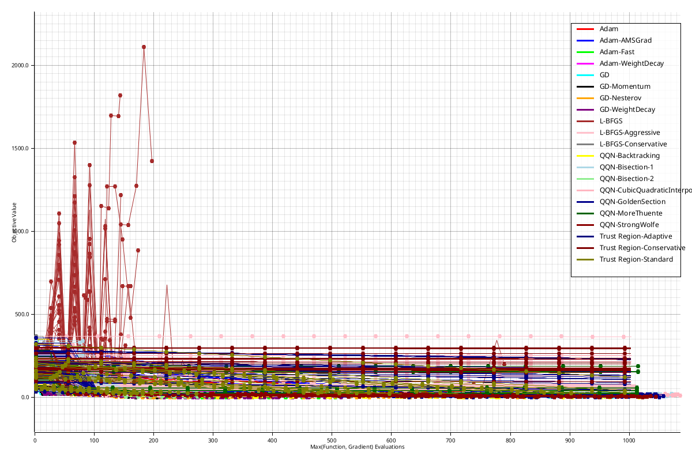
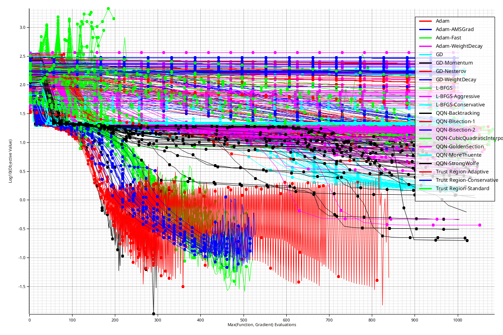

**Figure:** Convergence plots for SparseRosenbrock_10D showing objective value vs iterations.
Left: Linear scale, Right: Log scale for better visualization of convergence behavior.

**Data:** [Linear scale data (CSV)](convergence_SparseRosenbrock_10D_data.csv) | [Log scale data (CSV)](convergence_SparseRosenbrock_10D_log_data.csv)

## Problem: SparseQuadratic_5D_pattern[1, 3]

**Family:** SparseQuadratic  
**Dimension:** 5  
**Success Threshold:** 1.000e-6  
**Total Runs:** 560

### Performance Summary
<table style="border-collapse: collapse; width: 100%; margin: 20px 0;">
<tr style="background-color: #f2f2f2;">
<th style="border: 1px solid #ddd; padding: 8px; text-align: center;">Rank</th>
<th style="border: 1px solid #ddd; padding: 8px; text-align: center;">Optimizer</th>
<th style="border: 1px solid #ddd; padding: 8px; text-align: center;">Mean Final Value (All/Success/Fail)</th>
<th style="border: 1px solid #ddd; padding: 8px; text-align: center;">Std Dev</th>
<th style="border: 1px solid #ddd; padding: 8px; text-align: center;">Best Value</th>
<th style="border: 1px solid #ddd; padding: 8px; text-align: center;">Worst Value</th>
<th style="border: 1px solid #ddd; padding: 8px; text-align: center;">Mean Function Evals (All/Success/Fail)</th>
<th style="border: 1px solid #ddd; padding: 8px; text-align: center;">Mean Gradient Evals (All/Success/Fail)</th>
<th style="border: 1px solid #ddd; padding: 8px; text-align: center;">Success Rate</th>
<th style="border: 1px solid #ddd; padding: 8px; text-align: center;">Mean Time (s)</th>
</tr>
<tr style="background-color: #d4edda; font-weight: bold;">
<td style="border: 1px solid #ddd; padding: 8px; text-align: center;">1</td>
<td style="border: 1px solid #ddd; padding: 8px; text-align: center;"><a href="detailed_SparseQuadratic_5D_pattern[1,_3]_QQN-GoldenSection.md">QQN-GoldenSection</a></td>
<td style="border: 1px solid #ddd; padding: 8px; text-align: center;">3.62e-14 / 3.62e-14 / -</td>
<td style="border: 1px solid #ddd; padding: 8px; text-align: center;">5.62e-14</td>
<td style="border: 1px solid #ddd; padding: 8px; text-align: center;">1.30e-20</td>
<td style="border: 1px solid #ddd; padding: 8px; text-align: center;">2.65e-13</td>
<td style="border: 1px solid #ddd; padding: 8px; text-align: center;">253.9 / 253.9 / -</td>
<td style="border: 1px solid #ddd; padding: 8px; text-align: center;">37.6 / 37.6 / -</td>
<td style="border: 1px solid #ddd; padding: 8px; text-align: center;">100.0%</td>
<td style="border: 1px solid #ddd; padding: 8px; text-align: center;">0.003</td>
</tr>
<tr style="background-color: #fff3cd;">
<td style="border: 1px solid #ddd; padding: 8px; text-align: center;">2</td>
<td style="border: 1px solid #ddd; padding: 8px; text-align: center;"><a href="detailed_SparseQuadratic_5D_pattern[1,_3]_QQN-Bisection-1.md">QQN-Bisection-1</a></td>
<td style="border: 1px solid #ddd; padding: 8px; text-align: center;">4.15e-14 / 4.15e-14 / -</td>
<td style="border: 1px solid #ddd; padding: 8px; text-align: center;">5.00e-14</td>
<td style="border: 1px solid #ddd; padding: 8px; text-align: center;">3.17e-19</td>
<td style="border: 1px solid #ddd; padding: 8px; text-align: center;">2.20e-13</td>
<td style="border: 1px solid #ddd; padding: 8px; text-align: center;">70.9 / 70.9 / -</td>
<td style="border: 1px solid #ddd; padding: 8px; text-align: center;">112.5 / 112.5 / -</td>
<td style="border: 1px solid #ddd; padding: 8px; text-align: center;">100.0%</td>
<td style="border: 1px solid #ddd; padding: 8px; text-align: center;">0.001</td>
</tr>
<tr style="">
<td style="border: 1px solid #ddd; padding: 8px; text-align: center;">3</td>
<td style="border: 1px solid #ddd; padding: 8px; text-align: center;"><a href="detailed_SparseQuadratic_5D_pattern[1,_3]_QQN-StrongWolfe.md">QQN-StrongWolfe</a></td>
<td style="border: 1px solid #ddd; padding: 8px; text-align: center;">3.63e-14 / 3.63e-14 / -</td>
<td style="border: 1px solid #ddd; padding: 8px; text-align: center;">4.49e-14</td>
<td style="border: 1px solid #ddd; padding: 8px; text-align: center;">3.37e-18</td>
<td style="border: 1px solid #ddd; padding: 8px; text-align: center;">2.25e-13</td>
<td style="border: 1px solid #ddd; padding: 8px; text-align: center;">52.5 / 52.5 / -</td>
<td style="border: 1px solid #ddd; padding: 8px; text-align: center;">55.6 / 55.6 / -</td>
<td style="border: 1px solid #ddd; padding: 8px; text-align: center;">100.0%</td>
<td style="border: 1px solid #ddd; padding: 8px; text-align: center;">0.001</td>
</tr>
<tr style="">
<td style="border: 1px solid #ddd; padding: 8px; text-align: center;">4</td>
<td style="border: 1px solid #ddd; padding: 8px; text-align: center;"><a href="detailed_SparseQuadratic_5D_pattern[1,_3]_QQN-MoreThuente.md">QQN-MoreThuente</a></td>
<td style="border: 1px solid #ddd; padding: 8px; text-align: center;">2.41e-14 / 2.41e-14 / -</td>
<td style="border: 1px solid #ddd; padding: 8px; text-align: center;">3.35e-14</td>
<td style="border: 1px solid #ddd; padding: 8px; text-align: center;">1.11e-17</td>
<td style="border: 1px solid #ddd; padding: 8px; text-align: center;">1.43e-13</td>
<td style="border: 1px solid #ddd; padding: 8px; text-align: center;">69.2 / 69.2 / -</td>
<td style="border: 1px solid #ddd; padding: 8px; text-align: center;">68.2 / 68.2 / -</td>
<td style="border: 1px solid #ddd; padding: 8px; text-align: center;">100.0%</td>
<td style="border: 1px solid #ddd; padding: 8px; text-align: center;">0.001</td>
</tr>
<tr style="">
<td style="border: 1px solid #ddd; padding: 8px; text-align: center;">5</td>
<td style="border: 1px solid #ddd; padding: 8px; text-align: center;"><a href="detailed_SparseQuadratic_5D_pattern[1,_3]_QQN-Bisection-2.md">QQN-Bisection-2</a></td>
<td style="border: 1px solid #ddd; padding: 8px; text-align: center;">3.14e-14 / 3.14e-14 / -</td>
<td style="border: 1px solid #ddd; padding: 8px; text-align: center;">4.06e-14</td>
<td style="border: 1px solid #ddd; padding: 8px; text-align: center;">7.96e-16</td>
<td style="border: 1px solid #ddd; padding: 8px; text-align: center;">1.41e-13</td>
<td style="border: 1px solid #ddd; padding: 8px; text-align: center;">69.3 / 69.3 / -</td>
<td style="border: 1px solid #ddd; padding: 8px; text-align: center;">96.7 / 96.7 / -</td>
<td style="border: 1px solid #ddd; padding: 8px; text-align: center;">100.0%</td>
<td style="border: 1px solid #ddd; padding: 8px; text-align: center;">0.001</td>
</tr>
<tr style="">
<td style="border: 1px solid #ddd; padding: 8px; text-align: center;">6</td>
<td style="border: 1px solid #ddd; padding: 8px; text-align: center;"><a href="detailed_SparseQuadratic_5D_pattern[1,_3]_QQN-CubicQuadraticInterpolation.md">QQN-CubicQuadraticInterpolation</a></td>
<td style="border: 1px solid #ddd; padding: 8px; text-align: center;">6.51e-14 / 6.51e-14 / -</td>
<td style="border: 1px solid #ddd; padding: 8px; text-align: center;">7.95e-14</td>
<td style="border: 1px solid #ddd; padding: 8px; text-align: center;">2.04e-15</td>
<td style="border: 1px solid #ddd; padding: 8px; text-align: center;">2.80e-13</td>
<td style="border: 1px solid #ddd; padding: 8px; text-align: center;">116.6 / 116.6 / -</td>
<td style="border: 1px solid #ddd; padding: 8px; text-align: center;">117.6 / 117.6 / -</td>
<td style="border: 1px solid #ddd; padding: 8px; text-align: center;">100.0%</td>
<td style="border: 1px solid #ddd; padding: 8px; text-align: center;">0.003</td>
</tr>
<tr style="">
<td style="border: 1px solid #ddd; padding: 8px; text-align: center;">7</td>
<td style="border: 1px solid #ddd; padding: 8px; text-align: center;"><a href="detailed_SparseQuadratic_5D_pattern[1,_3]_L-BFGS-Aggressive.md">L-BFGS-Aggressive</a></td>
<td style="border: 1px solid #ddd; padding: 8px; text-align: center;">4.75e-4 / 1.44e-13 / 9.49e-4</td>
<td style="border: 1px solid #ddd; padding: 8px; text-align: center;">9.16e-4</td>
<td style="border: 1px solid #ddd; padding: 8px; text-align: center;">7.17e-15</td>
<td style="border: 1px solid #ddd; padding: 8px; text-align: center;">5.65e-3</td>
<td style="border: 1px solid #ddd; padding: 8px; text-align: center;">415.8 / 60.8 / 770.9</td>
<td style="border: 1px solid #ddd; padding: 8px; text-align: center;">132.4 / 28.8 / 236.0</td>
<td style="border: 1px solid #ddd; padding: 8px; text-align: center;">50.0%</td>
<td style="border: 1px solid #ddd; padding: 8px; text-align: center;">0.005</td>
</tr>
<tr style="">
<td style="border: 1px solid #ddd; padding: 8px; text-align: center;">8</td>
<td style="border: 1px solid #ddd; padding: 8px; text-align: center;"><a href="detailed_SparseQuadratic_5D_pattern[1,_3]_L-BFGS.md">L-BFGS</a></td>
<td style="border: 1px solid #ddd; padding: 8px; text-align: center;">1.10e-6 / 1.83e-13 / 2.32e-3</td>
<td style="border: 1px solid #ddd; padding: 8px; text-align: center;">4.51e-6</td>
<td style="border: 1px solid #ddd; padding: 8px; text-align: center;">9.42e-15</td>
<td style="border: 1px solid #ddd; padding: 8px; text-align: center;">2.07e-5</td>
<td style="border: 1px solid #ddd; padding: 8px; text-align: center;">215.8 / 174.8 / 379.8</td>
<td style="border: 1px solid #ddd; padding: 8px; text-align: center;">136.8 / 119.3 / 206.8</td>
<td style="border: 1px solid #ddd; padding: 8px; text-align: center;">80.0%</td>
<td style="border: 1px solid #ddd; padding: 8px; text-align: center;">0.004</td>
</tr>
<tr style="">
<td style="border: 1px solid #ddd; padding: 8px; text-align: center;">9</td>
<td style="border: 1px solid #ddd; padding: 8px; text-align: center;"><a href="detailed_SparseQuadratic_5D_pattern[1,_3]_QQN-Backtracking.md">QQN-Backtracking</a></td>
<td style="border: 1px solid #ddd; padding: 8px; text-align: center;">1.13e-13 / 1.13e-13 / -</td>
<td style="border: 1px solid #ddd; padding: 8px; text-align: center;">8.33e-14</td>
<td style="border: 1px solid #ddd; padding: 8px; text-align: center;">3.65e-14</td>
<td style="border: 1px solid #ddd; padding: 8px; text-align: center;">2.77e-13</td>
<td style="border: 1px solid #ddd; padding: 8px; text-align: center;">78.8 / 78.8 / -</td>
<td style="border: 1px solid #ddd; padding: 8px; text-align: center;">65.4 / 65.4 / -</td>
<td style="border: 1px solid #ddd; padding: 8px; text-align: center;">100.0%</td>
<td style="border: 1px solid #ddd; padding: 8px; text-align: center;">0.002</td>
</tr>
<tr style="">
<td style="border: 1px solid #ddd; padding: 8px; text-align: center;">10</td>
<td style="border: 1px solid #ddd; padding: 8px; text-align: center;"><a href="detailed_SparseQuadratic_5D_pattern[1,_3]_L-BFGS-Conservative.md">L-BFGS-Conservative</a></td>
<td style="border: 1px solid #ddd; padding: 8px; text-align: center;">7.23e-8 / 1.42e-13 / 8.03e-8</td>
<td style="border: 1px solid #ddd; padding: 8px; text-align: center;">1.64e-7</td>
<td style="border: 1px solid #ddd; padding: 8px; text-align: center;">8.08e-14</td>
<td style="border: 1px solid #ddd; padding: 8px; text-align: center;">5.44e-7</td>
<td style="border: 1px solid #ddd; padding: 8px; text-align: center;">540.0 / 387.0 / 557.1</td>
<td style="border: 1px solid #ddd; padding: 8px; text-align: center;">432.4 / 310.0 / 446.0</td>
<td style="border: 1px solid #ddd; padding: 8px; text-align: center;">10.0%</td>
<td style="border: 1px solid #ddd; padding: 8px; text-align: center;">0.013</td>
</tr>
<tr style="">
<td style="border: 1px solid #ddd; padding: 8px; text-align: center;">11</td>
<td style="border: 1px solid #ddd; padding: 8px; text-align: center;"><a href="detailed_SparseQuadratic_5D_pattern[1,_3]_GD-WeightDecay.md">GD-WeightDecay</a></td>
<td style="border: 1px solid #ddd; padding: 8px; text-align: center;">4.28e-10 / 4.28e-10 / -</td>
<td style="border: 1px solid #ddd; padding: 8px; text-align: center;">2.53e-11</td>
<td style="border: 1px solid #ddd; padding: 8px; text-align: center;">3.46e-10</td>
<td style="border: 1px solid #ddd; padding: 8px; text-align: center;">4.55e-10</td>
<td style="border: 1px solid #ddd; padding: 8px; text-align: center;">161.9 / 161.9 / -</td>
<td style="border: 1px solid #ddd; padding: 8px; text-align: center;">321.9 / 321.9 / -</td>
<td style="border: 1px solid #ddd; padding: 8px; text-align: center;">100.0%</td>
<td style="border: 1px solid #ddd; padding: 8px; text-align: center;">0.005</td>
</tr>
<tr style="">
<td style="border: 1px solid #ddd; padding: 8px; text-align: center;">12</td>
<td style="border: 1px solid #ddd; padding: 8px; text-align: center;"><a href="detailed_SparseQuadratic_5D_pattern[1,_3]_GD.md">GD</a></td>
<td style="border: 1px solid #ddd; padding: 8px; text-align: center;">2.17e-6 / - / 2.17e-6</td>
<td style="border: 1px solid #ddd; padding: 8px; text-align: center;">3.75e-7</td>
<td style="border: 1px solid #ddd; padding: 8px; text-align: center;">1.59e-6</td>
<td style="border: 1px solid #ddd; padding: 8px; text-align: center;">3.22e-6</td>
<td style="border: 1px solid #ddd; padding: 8px; text-align: center;">335.0 / - / 335.0</td>
<td style="border: 1px solid #ddd; padding: 8px; text-align: center;">668.0 / - / 668.0</td>
<td style="border: 1px solid #ddd; padding: 8px; text-align: center;">0.0%</td>
<td style="border: 1px solid #ddd; padding: 8px; text-align: center;">0.008</td>
</tr>
<tr style="">
<td style="border: 1px solid #ddd; padding: 8px; text-align: center;">13</td>
<td style="border: 1px solid #ddd; padding: 8px; text-align: center;"><a href="detailed_SparseQuadratic_5D_pattern[1,_3]_Trust_Region-Adaptive.md">Trust Region-Adaptive</a></td>
<td style="border: 1px solid #ddd; padding: 8px; text-align: center;">2.21e-2 / - / 1.15e3</td>
<td style="border: 1px solid #ddd; padding: 8px; text-align: center;">2.05e-2</td>
<td style="border: 1px solid #ddd; padding: 8px; text-align: center;">1.78e-4</td>
<td style="border: 1px solid #ddd; padding: 8px; text-align: center;">6.25e-2</td>
<td style="border: 1px solid #ddd; padding: 8px; text-align: center;">88.7 / - / 88.7</td>
<td style="border: 1px solid #ddd; padding: 8px; text-align: center;">59.2 / - / 59.2</td>
<td style="border: 1px solid #ddd; padding: 8px; text-align: center;">0.0%</td>
<td style="border: 1px solid #ddd; padding: 8px; text-align: center;">0.001</td>
</tr>
<tr style="">
<td style="border: 1px solid #ddd; padding: 8px; text-align: center;">14</td>
<td style="border: 1px solid #ddd; padding: 8px; text-align: center;"><a href="detailed_SparseQuadratic_5D_pattern[1,_3]_Trust_Region-Standard.md">Trust Region-Standard</a></td>
<td style="border: 1px solid #ddd; padding: 8px; text-align: center;">8.87e-2 / - / 1.64e2</td>
<td style="border: 1px solid #ddd; padding: 8px; text-align: center;">8.85e-2</td>
<td style="border: 1px solid #ddd; padding: 8px; text-align: center;">5.82e-4</td>
<td style="border: 1px solid #ddd; padding: 8px; text-align: center;">2.52e-1</td>
<td style="border: 1px solid #ddd; padding: 8px; text-align: center;">38.2 / - / 38.2</td>
<td style="border: 1px solid #ddd; padding: 8px; text-align: center;">25.6 / - / 25.6</td>
<td style="border: 1px solid #ddd; padding: 8px; text-align: center;">0.0%</td>
<td style="border: 1px solid #ddd; padding: 8px; text-align: center;">0.000</td>
</tr>
<tr style="">
<td style="border: 1px solid #ddd; padding: 8px; text-align: center;">15</td>
<td style="border: 1px solid #ddd; padding: 8px; text-align: center;"><a href="detailed_SparseQuadratic_5D_pattern[1,_3]_GD-Momentum.md">GD-Momentum</a></td>
<td style="border: 1px solid #ddd; padding: 8px; text-align: center;">2.51e-3 / - / 4.88e-1</td>
<td style="border: 1px solid #ddd; padding: 8px; text-align: center;">9.68e-4</td>
<td style="border: 1px solid #ddd; padding: 8px; text-align: center;">8.47e-4</td>
<td style="border: 1px solid #ddd; padding: 8px; text-align: center;">4.69e-3</td>
<td style="border: 1px solid #ddd; padding: 8px; text-align: center;">22.0 / - / 22.0</td>
<td style="border: 1px solid #ddd; padding: 8px; text-align: center;">40.0 / - / 40.0</td>
<td style="border: 1px solid #ddd; padding: 8px; text-align: center;">0.0%</td>
<td style="border: 1px solid #ddd; padding: 8px; text-align: center;">0.001</td>
</tr>
<tr style="">
<td style="border: 1px solid #ddd; padding: 8px; text-align: center;">16</td>
<td style="border: 1px solid #ddd; padding: 8px; text-align: center;"><a href="detailed_SparseQuadratic_5D_pattern[1,_3]_GD-Nesterov.md">GD-Nesterov</a></td>
<td style="border: 1px solid #ddd; padding: 8px; text-align: center;">2.76e-3 / - / 3.30e-1</td>
<td style="border: 1px solid #ddd; padding: 8px; text-align: center;">1.13e-3</td>
<td style="border: 1px solid #ddd; padding: 8px; text-align: center;">1.04e-3</td>
<td style="border: 1px solid #ddd; padding: 8px; text-align: center;">5.80e-3</td>
<td style="border: 1px solid #ddd; padding: 8px; text-align: center;">22.0 / - / 22.0</td>
<td style="border: 1px solid #ddd; padding: 8px; text-align: center;">40.0 / - / 40.0</td>
<td style="border: 1px solid #ddd; padding: 8px; text-align: center;">0.0%</td>
<td style="border: 1px solid #ddd; padding: 8px; text-align: center;">0.001</td>
</tr>
<tr style="">
<td style="border: 1px solid #ddd; padding: 8px; text-align: center;">17</td>
<td style="border: 1px solid #ddd; padding: 8px; text-align: center;"><a href="detailed_SparseQuadratic_5D_pattern[1,_3]_Adam-Fast.md">Adam-Fast</a></td>
<td style="border: 1px solid #ddd; padding: 8px; text-align: center;">3.64e-2 / - / 3.53e-1</td>
<td style="border: 1px solid #ddd; padding: 8px; text-align: center;">1.71e-2</td>
<td style="border: 1px solid #ddd; padding: 8px; text-align: center;">9.18e-3</td>
<td style="border: 1px solid #ddd; padding: 8px; text-align: center;">9.37e-2</td>
<td style="border: 1px solid #ddd; padding: 8px; text-align: center;">37.5 / - / 37.5</td>
<td style="border: 1px solid #ddd; padding: 8px; text-align: center;">36.5 / - / 36.5</td>
<td style="border: 1px solid #ddd; padding: 8px; text-align: center;">0.0%</td>
<td style="border: 1px solid #ddd; padding: 8px; text-align: center;">0.001</td>
</tr>
<tr style="">
<td style="border: 1px solid #ddd; padding: 8px; text-align: center;">18</td>
<td style="border: 1px solid #ddd; padding: 8px; text-align: center;"><a href="detailed_SparseQuadratic_5D_pattern[1,_3]_Adam-WeightDecay.md">Adam-WeightDecay</a></td>
<td style="border: 1px solid #ddd; padding: 8px; text-align: center;">4.82e-1 / - / 4.82e-1</td>
<td style="border: 1px solid #ddd; padding: 8px; text-align: center;">1.34e-1</td>
<td style="border: 1px solid #ddd; padding: 8px; text-align: center;">2.64e-1</td>
<td style="border: 1px solid #ddd; padding: 8px; text-align: center;">7.95e-1</td>
<td style="border: 1px solid #ddd; padding: 8px; text-align: center;">502.0 / - / 502.0</td>
<td style="border: 1px solid #ddd; padding: 8px; text-align: center;">502.0 / - / 502.0</td>
<td style="border: 1px solid #ddd; padding: 8px; text-align: center;">0.0%</td>
<td style="border: 1px solid #ddd; padding: 8px; text-align: center;">0.011</td>
</tr>
<tr style="">
<td style="border: 1px solid #ddd; padding: 8px; text-align: center;">19</td>
<td style="border: 1px solid #ddd; padding: 8px; text-align: center;"><a href="detailed_SparseQuadratic_5D_pattern[1,_3]_Adam.md">Adam</a></td>
<td style="border: 1px solid #ddd; padding: 8px; text-align: center;">3.02e0 / - / 3.02e0</td>
<td style="border: 1px solid #ddd; padding: 8px; text-align: center;">4.87e-1</td>
<td style="border: 1px solid #ddd; padding: 8px; text-align: center;">2.11e0</td>
<td style="border: 1px solid #ddd; padding: 8px; text-align: center;">3.92e0</td>
<td style="border: 1px solid #ddd; padding: 8px; text-align: center;">502.0 / - / 502.0</td>
<td style="border: 1px solid #ddd; padding: 8px; text-align: center;">502.0 / - / 502.0</td>
<td style="border: 1px solid #ddd; padding: 8px; text-align: center;">0.0%</td>
<td style="border: 1px solid #ddd; padding: 8px; text-align: center;">0.010</td>
</tr>
<tr style="">
<td style="border: 1px solid #ddd; padding: 8px; text-align: center;">20</td>
<td style="border: 1px solid #ddd; padding: 8px; text-align: center;"><a href="detailed_SparseQuadratic_5D_pattern[1,_3]_Adam-AMSGrad.md">Adam-AMSGrad</a></td>
<td style="border: 1px solid #ddd; padding: 8px; text-align: center;">3.30e0 / - / 3.30e0</td>
<td style="border: 1px solid #ddd; padding: 8px; text-align: center;">3.92e-1</td>
<td style="border: 1px solid #ddd; padding: 8px; text-align: center;">2.47e0</td>
<td style="border: 1px solid #ddd; padding: 8px; text-align: center;">3.81e0</td>
<td style="border: 1px solid #ddd; padding: 8px; text-align: center;">502.0 / - / 502.0</td>
<td style="border: 1px solid #ddd; padding: 8px; text-align: center;">502.0 / - / 502.0</td>
<td style="border: 1px solid #ddd; padding: 8px; text-align: center;">0.0%</td>
<td style="border: 1px solid #ddd; padding: 8px; text-align: center;">0.011</td>
</tr>
<tr style="">
<td style="border: 1px solid #ddd; padding: 8px; text-align: center;">21</td>
<td style="border: 1px solid #ddd; padding: 8px; text-align: center;"><a href="detailed_SparseQuadratic_5D_pattern[1,_3]_Trust_Region-Conservative.md">Trust Region-Conservative</a></td>
<td style="border: 1px solid #ddd; padding: 8px; text-align: center;">3.72e0 / - / 3.72e0</td>
<td style="border: 1px solid #ddd; padding: 8px; text-align: center;">5.90e-1</td>
<td style="border: 1px solid #ddd; padding: 8px; text-align: center;">2.76e0</td>
<td style="border: 1px solid #ddd; padding: 8px; text-align: center;">4.86e0</td>
<td style="border: 1px solid #ddd; padding: 8px; text-align: center;">602.0 / - / 602.0</td>
<td style="border: 1px solid #ddd; padding: 8px; text-align: center;">402.0 / - / 402.0</td>
<td style="border: 1px solid #ddd; padding: 8px; text-align: center;">0.0%</td>
<td style="border: 1px solid #ddd; padding: 8px; text-align: center;">0.004</td>
</tr>
</table>

### Convergence Plots

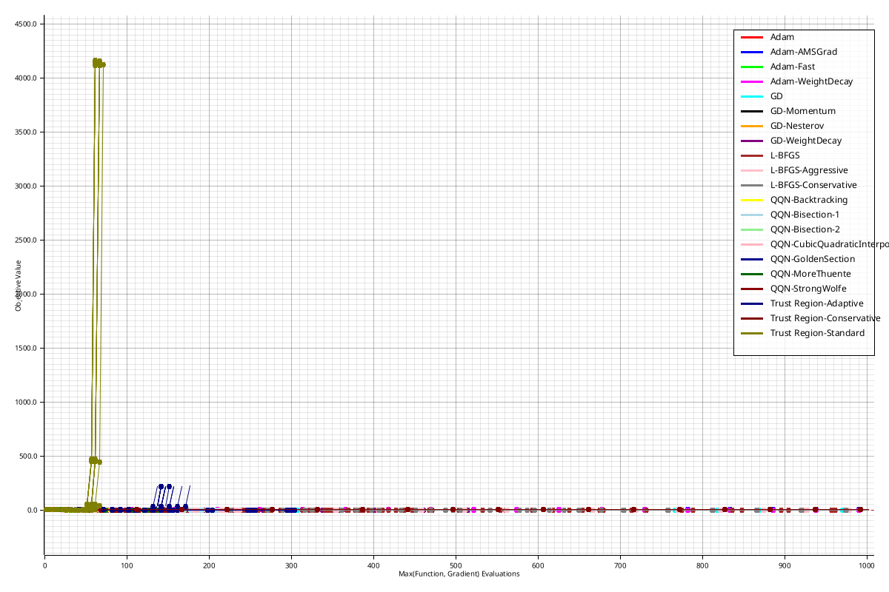
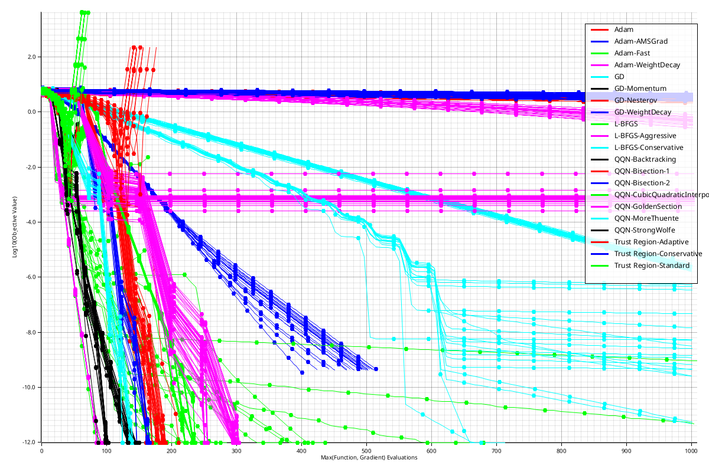

**Figure:** Convergence plots for SparseQuadratic_5D_pattern[1, 3] showing objective value vs iterations.
Left: Linear scale, Right: Log scale for better visualization of convergence behavior.

**Data:** [Linear scale data (CSV)](convergence_SparseQuadratic_5D_pattern[1,_3]_data.csv) | [Log scale data (CSV)](convergence_SparseQuadratic_5D_pattern[1,_3]_log_data.csv)

## Problem: SparseQuadratic_10D_pattern[1, 3]

**Family:** SparseQuadratic  
**Dimension:** 10  
**Success Threshold:** 1.000e-6  
**Total Runs:** 560

### Performance Summary
<table style="border-collapse: collapse; width: 100%; margin: 20px 0;">
<tr style="background-color: #f2f2f2;">
<th style="border: 1px solid #ddd; padding: 8px; text-align: center;">Rank</th>
<th style="border: 1px solid #ddd; padding: 8px; text-align: center;">Optimizer</th>
<th style="border: 1px solid #ddd; padding: 8px; text-align: center;">Mean Final Value (All/Success/Fail)</th>
<th style="border: 1px solid #ddd; padding: 8px; text-align: center;">Std Dev</th>
<th style="border: 1px solid #ddd; padding: 8px; text-align: center;">Best Value</th>
<th style="border: 1px solid #ddd; padding: 8px; text-align: center;">Worst Value</th>
<th style="border: 1px solid #ddd; padding: 8px; text-align: center;">Mean Function Evals (All/Success/Fail)</th>
<th style="border: 1px solid #ddd; padding: 8px; text-align: center;">Mean Gradient Evals (All/Success/Fail)</th>
<th style="border: 1px solid #ddd; padding: 8px; text-align: center;">Success Rate</th>
<th style="border: 1px solid #ddd; padding: 8px; text-align: center;">Mean Time (s)</th>
</tr>
<tr style="background-color: #d4edda; font-weight: bold;">
<td style="border: 1px solid #ddd; padding: 8px; text-align: center;">1</td>
<td style="border: 1px solid #ddd; padding: 8px; text-align: center;"><a href="detailed_SparseQuadratic_10D_pattern[1,_3]_QQN-Bisection-1.md">QQN-Bisection-1</a></td>
<td style="border: 1px solid #ddd; padding: 8px; text-align: center;">6.24e-14 / 6.24e-14 / -</td>
<td style="border: 1px solid #ddd; padding: 8px; text-align: center;">7.31e-14</td>
<td style="border: 1px solid #ddd; padding: 8px; text-align: center;">2.56e-16</td>
<td style="border: 1px solid #ddd; padding: 8px; text-align: center;">2.72e-13</td>
<td style="border: 1px solid #ddd; padding: 8px; text-align: center;">96.0 / 96.0 / -</td>
<td style="border: 1px solid #ddd; padding: 8px; text-align: center;">132.6 / 132.6 / -</td>
<td style="border: 1px solid #ddd; padding: 8px; text-align: center;">100.0%</td>
<td style="border: 1px solid #ddd; padding: 8px; text-align: center;">0.002</td>
</tr>
<tr style="background-color: #fff3cd;">
<td style="border: 1px solid #ddd; padding: 8px; text-align: center;">2</td>
<td style="border: 1px solid #ddd; padding: 8px; text-align: center;"><a href="detailed_SparseQuadratic_10D_pattern[1,_3]_QQN-Bisection-2.md">QQN-Bisection-2</a></td>
<td style="border: 1px solid #ddd; padding: 8px; text-align: center;">4.15e-14 / 4.15e-14 / -</td>
<td style="border: 1px solid #ddd; padding: 8px; text-align: center;">4.33e-14</td>
<td style="border: 1px solid #ddd; padding: 8px; text-align: center;">3.98e-16</td>
<td style="border: 1px solid #ddd; padding: 8px; text-align: center;">1.55e-13</td>
<td style="border: 1px solid #ddd; padding: 8px; text-align: center;">82.7 / 82.7 / -</td>
<td style="border: 1px solid #ddd; padding: 8px; text-align: center;">104.7 / 104.7 / -</td>
<td style="border: 1px solid #ddd; padding: 8px; text-align: center;">100.0%</td>
<td style="border: 1px solid #ddd; padding: 8px; text-align: center;">0.002</td>
</tr>
<tr style="">
<td style="border: 1px solid #ddd; padding: 8px; text-align: center;">3</td>
<td style="border: 1px solid #ddd; padding: 8px; text-align: center;"><a href="detailed_SparseQuadratic_10D_pattern[1,_3]_QQN-MoreThuente.md">QQN-MoreThuente</a></td>
<td style="border: 1px solid #ddd; padding: 8px; text-align: center;">8.03e-14 / 8.03e-14 / -</td>
<td style="border: 1px solid #ddd; padding: 8px; text-align: center;">6.96e-14</td>
<td style="border: 1px solid #ddd; padding: 8px; text-align: center;">1.12e-15</td>
<td style="border: 1px solid #ddd; padding: 8px; text-align: center;">2.70e-13</td>
<td style="border: 1px solid #ddd; padding: 8px; text-align: center;">92.7 / 92.7 / -</td>
<td style="border: 1px solid #ddd; padding: 8px; text-align: center;">93.2 / 93.2 / -</td>
<td style="border: 1px solid #ddd; padding: 8px; text-align: center;">100.0%</td>
<td style="border: 1px solid #ddd; padding: 8px; text-align: center;">0.002</td>
</tr>
<tr style="">
<td style="border: 1px solid #ddd; padding: 8px; text-align: center;">4</td>
<td style="border: 1px solid #ddd; padding: 8px; text-align: center;"><a href="detailed_SparseQuadratic_10D_pattern[1,_3]_QQN-GoldenSection.md">QQN-GoldenSection</a></td>
<td style="border: 1px solid #ddd; padding: 8px; text-align: center;">7.61e-14 / 7.61e-14 / -</td>
<td style="border: 1px solid #ddd; padding: 8px; text-align: center;">6.97e-14</td>
<td style="border: 1px solid #ddd; padding: 8px; text-align: center;">1.30e-15</td>
<td style="border: 1px solid #ddd; padding: 8px; text-align: center;">2.53e-13</td>
<td style="border: 1px solid #ddd; padding: 8px; text-align: center;">279.1 / 279.1 / -</td>
<td style="border: 1px solid #ddd; padding: 8px; text-align: center;">41.1 / 41.1 / -</td>
<td style="border: 1px solid #ddd; padding: 8px; text-align: center;">100.0%</td>
<td style="border: 1px solid #ddd; padding: 8px; text-align: center;">0.004</td>
</tr>
<tr style="">
<td style="border: 1px solid #ddd; padding: 8px; text-align: center;">5</td>
<td style="border: 1px solid #ddd; padding: 8px; text-align: center;"><a href="detailed_SparseQuadratic_10D_pattern[1,_3]_QQN-CubicQuadraticInterpolation.md">QQN-CubicQuadraticInterpolation</a></td>
<td style="border: 1px solid #ddd; padding: 8px; text-align: center;">4.08e-14 / 4.08e-14 / -</td>
<td style="border: 1px solid #ddd; padding: 8px; text-align: center;">5.17e-14</td>
<td style="border: 1px solid #ddd; padding: 8px; text-align: center;">2.57e-15</td>
<td style="border: 1px solid #ddd; padding: 8px; text-align: center;">2.53e-13</td>
<td style="border: 1px solid #ddd; padding: 8px; text-align: center;">106.4 / 106.4 / -</td>
<td style="border: 1px solid #ddd; padding: 8px; text-align: center;">107.4 / 107.4 / -</td>
<td style="border: 1px solid #ddd; padding: 8px; text-align: center;">100.0%</td>
<td style="border: 1px solid #ddd; padding: 8px; text-align: center;">0.002</td>
</tr>
<tr style="">
<td style="border: 1px solid #ddd; padding: 8px; text-align: center;">6</td>
<td style="border: 1px solid #ddd; padding: 8px; text-align: center;"><a href="detailed_SparseQuadratic_10D_pattern[1,_3]_L-BFGS.md">L-BFGS</a></td>
<td style="border: 1px solid #ddd; padding: 8px; text-align: center;">9.31e-7 / 4.18e-2 / 2.15e-1</td>
<td style="border: 1px solid #ddd; padding: 8px; text-align: center;">2.74e-6</td>
<td style="border: 1px solid #ddd; padding: 8px; text-align: center;">9.68e-15</td>
<td style="border: 1px solid #ddd; padding: 8px; text-align: center;">1.08e-5</td>
<td style="border: 1px solid #ddd; padding: 8px; text-align: center;">190.2 / 173.1 / 287.3</td>
<td style="border: 1px solid #ddd; padding: 8px; text-align: center;">116.2 / 110.6 / 147.7</td>
<td style="border: 1px solid #ddd; padding: 8px; text-align: center;">85.0%</td>
<td style="border: 1px solid #ddd; padding: 8px; text-align: center;">0.004</td>
</tr>
<tr style="">
<td style="border: 1px solid #ddd; padding: 8px; text-align: center;">7</td>
<td style="border: 1px solid #ddd; padding: 8px; text-align: center;"><a href="detailed_SparseQuadratic_10D_pattern[1,_3]_QQN-Backtracking.md">QQN-Backtracking</a></td>
<td style="border: 1px solid #ddd; padding: 8px; text-align: center;">1.70e-13 / 1.70e-13 / -</td>
<td style="border: 1px solid #ddd; padding: 8px; text-align: center;">7.21e-14</td>
<td style="border: 1px solid #ddd; padding: 8px; text-align: center;">3.57e-14</td>
<td style="border: 1px solid #ddd; padding: 8px; text-align: center;">2.88e-13</td>
<td style="border: 1px solid #ddd; padding: 8px; text-align: center;">82.0 / 82.0 / -</td>
<td style="border: 1px solid #ddd; padding: 8px; text-align: center;">68.1 / 68.1 / -</td>
<td style="border: 1px solid #ddd; padding: 8px; text-align: center;">100.0%</td>
<td style="border: 1px solid #ddd; padding: 8px; text-align: center;">0.002</td>
</tr>
<tr style="">
<td style="border: 1px solid #ddd; padding: 8px; text-align: center;">8</td>
<td style="border: 1px solid #ddd; padding: 8px; text-align: center;"><a href="detailed_SparseQuadratic_10D_pattern[1,_3]_QQN-StrongWolfe.md">QQN-StrongWolfe</a></td>
<td style="border: 1px solid #ddd; padding: 8px; text-align: center;">1.12e-13 / 1.12e-13 / -</td>
<td style="border: 1px solid #ddd; padding: 8px; text-align: center;">7.68e-14</td>
<td style="border: 1px solid #ddd; padding: 8px; text-align: center;">3.82e-14</td>
<td style="border: 1px solid #ddd; padding: 8px; text-align: center;">2.65e-13</td>
<td style="border: 1px solid #ddd; padding: 8px; text-align: center;">86.2 / 86.2 / -</td>
<td style="border: 1px solid #ddd; padding: 8px; text-align: center;">93.2 / 93.2 / -</td>
<td style="border: 1px solid #ddd; padding: 8px; text-align: center;">100.0%</td>
<td style="border: 1px solid #ddd; padding: 8px; text-align: center;">0.002</td>
</tr>
<tr style="">
<td style="border: 1px solid #ddd; padding: 8px; text-align: center;">9</td>
<td style="border: 1px solid #ddd; padding: 8px; text-align: center;"><a href="detailed_SparseQuadratic_10D_pattern[1,_3]_L-BFGS-Aggressive.md">L-BFGS-Aggressive</a></td>
<td style="border: 1px solid #ddd; padding: 8px; text-align: center;">1.16e-3 / 9.30e-14 / 2.31e-3</td>
<td style="border: 1px solid #ddd; padding: 8px; text-align: center;">1.22e-3</td>
<td style="border: 1px solid #ddd; padding: 8px; text-align: center;">3.93e-14</td>
<td style="border: 1px solid #ddd; padding: 8px; text-align: center;">3.07e-3</td>
<td style="border: 1px solid #ddd; padding: 8px; text-align: center;">425.5 / 80.0 / 771.0</td>
<td style="border: 1px solid #ddd; padding: 8px; text-align: center;">136.5 / 37.0 / 236.0</td>
<td style="border: 1px solid #ddd; padding: 8px; text-align: center;">50.0%</td>
<td style="border: 1px solid #ddd; padding: 8px; text-align: center;">0.005</td>
</tr>
<tr style="">
<td style="border: 1px solid #ddd; padding: 8px; text-align: center;">10</td>
<td style="border: 1px solid #ddd; padding: 8px; text-align: center;"><a href="detailed_SparseQuadratic_10D_pattern[1,_3]_L-BFGS-Conservative.md">L-BFGS-Conservative</a></td>
<td style="border: 1px solid #ddd; padding: 8px; text-align: center;">1.35e-7 / 1.98e-13 / 1.50e-7</td>
<td style="border: 1px solid #ddd; padding: 8px; text-align: center;">2.23e-7</td>
<td style="border: 1px solid #ddd; padding: 8px; text-align: center;">1.98e-13</td>
<td style="border: 1px solid #ddd; padding: 8px; text-align: center;">6.86e-7</td>
<td style="border: 1px solid #ddd; padding: 8px; text-align: center;">553.0 / 517.0 / 557.0</td>
<td style="border: 1px solid #ddd; padding: 8px; text-align: center;">442.8 / 414.0 / 446.0</td>
<td style="border: 1px solid #ddd; padding: 8px; text-align: center;">10.0%</td>
<td style="border: 1px solid #ddd; padding: 8px; text-align: center;">0.015</td>
</tr>
<tr style="">
<td style="border: 1px solid #ddd; padding: 8px; text-align: center;">11</td>
<td style="border: 1px solid #ddd; padding: 8px; text-align: center;"><a href="detailed_SparseQuadratic_10D_pattern[1,_3]_GD-WeightDecay.md">GD-WeightDecay</a></td>
<td style="border: 1px solid #ddd; padding: 8px; text-align: center;">4.26e-10 / 4.26e-10 / -</td>
<td style="border: 1px solid #ddd; padding: 8px; text-align: center;">2.32e-11</td>
<td style="border: 1px solid #ddd; padding: 8px; text-align: center;">3.90e-10</td>
<td style="border: 1px solid #ddd; padding: 8px; text-align: center;">4.76e-10</td>
<td style="border: 1px solid #ddd; padding: 8px; text-align: center;">164.9 / 164.9 / -</td>
<td style="border: 1px solid #ddd; padding: 8px; text-align: center;">327.9 / 327.9 / -</td>
<td style="border: 1px solid #ddd; padding: 8px; text-align: center;">100.0%</td>
<td style="border: 1px solid #ddd; padding: 8px; text-align: center;">0.006</td>
</tr>
<tr style="">
<td style="border: 1px solid #ddd; padding: 8px; text-align: center;">12</td>
<td style="border: 1px solid #ddd; padding: 8px; text-align: center;"><a href="detailed_SparseQuadratic_10D_pattern[1,_3]_GD.md">GD</a></td>
<td style="border: 1px solid #ddd; padding: 8px; text-align: center;">2.85e-6 / - / 2.85e-6</td>
<td style="border: 1px solid #ddd; padding: 8px; text-align: center;">3.38e-7</td>
<td style="border: 1px solid #ddd; padding: 8px; text-align: center;">2.24e-6</td>
<td style="border: 1px solid #ddd; padding: 8px; text-align: center;">3.76e-6</td>
<td style="border: 1px solid #ddd; padding: 8px; text-align: center;">335.0 / - / 335.0</td>
<td style="border: 1px solid #ddd; padding: 8px; text-align: center;">668.0 / - / 668.0</td>
<td style="border: 1px solid #ddd; padding: 8px; text-align: center;">0.0%</td>
<td style="border: 1px solid #ddd; padding: 8px; text-align: center;">0.009</td>
</tr>
<tr style="">
<td style="border: 1px solid #ddd; padding: 8px; text-align: center;">13</td>
<td style="border: 1px solid #ddd; padding: 8px; text-align: center;"><a href="detailed_SparseQuadratic_10D_pattern[1,_3]_Trust_Region-Adaptive.md">Trust Region-Adaptive</a></td>
<td style="border: 1px solid #ddd; padding: 8px; text-align: center;">1.99e-2 / - / 1.27e3</td>
<td style="border: 1px solid #ddd; padding: 8px; text-align: center;">2.05e-2</td>
<td style="border: 1px solid #ddd; padding: 8px; text-align: center;">2.55e-4</td>
<td style="border: 1px solid #ddd; padding: 8px; text-align: center;">6.20e-2</td>
<td style="border: 1px solid #ddd; padding: 8px; text-align: center;">163.2 / - / 163.2</td>
<td style="border: 1px solid #ddd; padding: 8px; text-align: center;">108.9 / - / 108.9</td>
<td style="border: 1px solid #ddd; padding: 8px; text-align: center;">0.0%</td>
<td style="border: 1px solid #ddd; padding: 8px; text-align: center;">0.001</td>
</tr>
<tr style="">
<td style="border: 1px solid #ddd; padding: 8px; text-align: center;">14</td>
<td style="border: 1px solid #ddd; padding: 8px; text-align: center;"><a href="detailed_SparseQuadratic_10D_pattern[1,_3]_Trust_Region-Standard.md">Trust Region-Standard</a></td>
<td style="border: 1px solid #ddd; padding: 8px; text-align: center;">1.11e-1 / - / 1.21e2</td>
<td style="border: 1px solid #ddd; padding: 8px; text-align: center;">8.22e-2</td>
<td style="border: 1px solid #ddd; padding: 8px; text-align: center;">8.14e-4</td>
<td style="border: 1px solid #ddd; padding: 8px; text-align: center;">2.56e-1</td>
<td style="border: 1px solid #ddd; padding: 8px; text-align: center;">57.9 / - / 57.9</td>
<td style="border: 1px solid #ddd; padding: 8px; text-align: center;">38.6 / - / 38.6</td>
<td style="border: 1px solid #ddd; padding: 8px; text-align: center;">0.0%</td>
<td style="border: 1px solid #ddd; padding: 8px; text-align: center;">0.000</td>
</tr>
<tr style="">
<td style="border: 1px solid #ddd; padding: 8px; text-align: center;">15</td>
<td style="border: 1px solid #ddd; padding: 8px; text-align: center;"><a href="detailed_SparseQuadratic_10D_pattern[1,_3]_GD-Nesterov.md">GD-Nesterov</a></td>
<td style="border: 1px solid #ddd; padding: 8px; text-align: center;">7.33e-3 / - / 6.04e-1</td>
<td style="border: 1px solid #ddd; padding: 8px; text-align: center;">3.35e-3</td>
<td style="border: 1px solid #ddd; padding: 8px; text-align: center;">3.15e-3</td>
<td style="border: 1px solid #ddd; padding: 8px; text-align: center;">1.80e-2</td>
<td style="border: 1px solid #ddd; padding: 8px; text-align: center;">23.0 / - / 23.0</td>
<td style="border: 1px solid #ddd; padding: 8px; text-align: center;">42.0 / - / 42.0</td>
<td style="border: 1px solid #ddd; padding: 8px; text-align: center;">0.0%</td>
<td style="border: 1px solid #ddd; padding: 8px; text-align: center;">0.001</td>
</tr>
<tr style="">
<td style="border: 1px solid #ddd; padding: 8px; text-align: center;">16</td>
<td style="border: 1px solid #ddd; padding: 8px; text-align: center;"><a href="detailed_SparseQuadratic_10D_pattern[1,_3]_GD-Momentum.md">GD-Momentum</a></td>
<td style="border: 1px solid #ddd; padding: 8px; text-align: center;">1.21e-2 / - / 9.00e-1</td>
<td style="border: 1px solid #ddd; padding: 8px; text-align: center;">4.71e-3</td>
<td style="border: 1px solid #ddd; padding: 8px; text-align: center;">5.99e-3</td>
<td style="border: 1px solid #ddd; padding: 8px; text-align: center;">2.13e-2</td>
<td style="border: 1px solid #ddd; padding: 8px; text-align: center;">23.1 / - / 23.1</td>
<td style="border: 1px solid #ddd; padding: 8px; text-align: center;">42.1 / - / 42.1</td>
<td style="border: 1px solid #ddd; padding: 8px; text-align: center;">0.0%</td>
<td style="border: 1px solid #ddd; padding: 8px; text-align: center;">0.001</td>
</tr>
<tr style="">
<td style="border: 1px solid #ddd; padding: 8px; text-align: center;">17</td>
<td style="border: 1px solid #ddd; padding: 8px; text-align: center;"><a href="detailed_SparseQuadratic_10D_pattern[1,_3]_Adam-Fast.md">Adam-Fast</a></td>
<td style="border: 1px solid #ddd; padding: 8px; text-align: center;">8.38e-2 / - / 7.28e-1</td>
<td style="border: 1px solid #ddd; padding: 8px; text-align: center;">2.46e-2</td>
<td style="border: 1px solid #ddd; padding: 8px; text-align: center;">3.37e-2</td>
<td style="border: 1px solid #ddd; padding: 8px; text-align: center;">1.45e-1</td>
<td style="border: 1px solid #ddd; padding: 8px; text-align: center;">37.3 / - / 37.3</td>
<td style="border: 1px solid #ddd; padding: 8px; text-align: center;">36.3 / - / 36.3</td>
<td style="border: 1px solid #ddd; padding: 8px; text-align: center;">0.0%</td>
<td style="border: 1px solid #ddd; padding: 8px; text-align: center;">0.001</td>
</tr>
<tr style="">
<td style="border: 1px solid #ddd; padding: 8px; text-align: center;">18</td>
<td style="border: 1px solid #ddd; padding: 8px; text-align: center;"><a href="detailed_SparseQuadratic_10D_pattern[1,_3]_Adam-WeightDecay.md">Adam-WeightDecay</a></td>
<td style="border: 1px solid #ddd; padding: 8px; text-align: center;">9.16e-1 / - / 9.16e-1</td>
<td style="border: 1px solid #ddd; padding: 8px; text-align: center;">2.17e-1</td>
<td style="border: 1px solid #ddd; padding: 8px; text-align: center;">5.70e-1</td>
<td style="border: 1px solid #ddd; padding: 8px; text-align: center;">1.37e0</td>
<td style="border: 1px solid #ddd; padding: 8px; text-align: center;">502.0 / - / 502.0</td>
<td style="border: 1px solid #ddd; padding: 8px; text-align: center;">502.0 / - / 502.0</td>
<td style="border: 1px solid #ddd; padding: 8px; text-align: center;">0.0%</td>
<td style="border: 1px solid #ddd; padding: 8px; text-align: center;">0.012</td>
</tr>
<tr style="">
<td style="border: 1px solid #ddd; padding: 8px; text-align: center;">19</td>
<td style="border: 1px solid #ddd; padding: 8px; text-align: center;"><a href="detailed_SparseQuadratic_10D_pattern[1,_3]_Adam-AMSGrad.md">Adam-AMSGrad</a></td>
<td style="border: 1px solid #ddd; padding: 8px; text-align: center;">6.60e0 / - / 6.60e0</td>
<td style="border: 1px solid #ddd; padding: 8px; text-align: center;">6.38e-1</td>
<td style="border: 1px solid #ddd; padding: 8px; text-align: center;">5.64e0</td>
<td style="border: 1px solid #ddd; padding: 8px; text-align: center;">7.81e0</td>
<td style="border: 1px solid #ddd; padding: 8px; text-align: center;">502.0 / - / 502.0</td>
<td style="border: 1px solid #ddd; padding: 8px; text-align: center;">502.0 / - / 502.0</td>
<td style="border: 1px solid #ddd; padding: 8px; text-align: center;">0.0%</td>
<td style="border: 1px solid #ddd; padding: 8px; text-align: center;">0.013</td>
</tr>
<tr style="">
<td style="border: 1px solid #ddd; padding: 8px; text-align: center;">20</td>
<td style="border: 1px solid #ddd; padding: 8px; text-align: center;"><a href="detailed_SparseQuadratic_10D_pattern[1,_3]_Adam.md">Adam</a></td>
<td style="border: 1px solid #ddd; padding: 8px; text-align: center;">7.12e0 / - / 7.12e0</td>
<td style="border: 1px solid #ddd; padding: 8px; text-align: center;">5.53e-1</td>
<td style="border: 1px solid #ddd; padding: 8px; text-align: center;">5.85e0</td>
<td style="border: 1px solid #ddd; padding: 8px; text-align: center;">7.94e0</td>
<td style="border: 1px solid #ddd; padding: 8px; text-align: center;">502.0 / - / 502.0</td>
<td style="border: 1px solid #ddd; padding: 8px; text-align: center;">502.0 / - / 502.0</td>
<td style="border: 1px solid #ddd; padding: 8px; text-align: center;">0.0%</td>
<td style="border: 1px solid #ddd; padding: 8px; text-align: center;">0.011</td>
</tr>
<tr style="">
<td style="border: 1px solid #ddd; padding: 8px; text-align: center;">21</td>
<td style="border: 1px solid #ddd; padding: 8px; text-align: center;"><a href="detailed_SparseQuadratic_10D_pattern[1,_3]_Trust_Region-Conservative.md">Trust Region-Conservative</a></td>
<td style="border: 1px solid #ddd; padding: 8px; text-align: center;">9.78e0 / - / 9.78e0</td>
<td style="border: 1px solid #ddd; padding: 8px; text-align: center;">7.73e-1</td>
<td style="border: 1px solid #ddd; padding: 8px; text-align: center;">8.40e0</td>
<td style="border: 1px solid #ddd; padding: 8px; text-align: center;">1.15e1</td>
<td style="border: 1px solid #ddd; padding: 8px; text-align: center;">602.0 / - / 602.0</td>
<td style="border: 1px solid #ddd; padding: 8px; text-align: center;">402.0 / - / 402.0</td>
<td style="border: 1px solid #ddd; padding: 8px; text-align: center;">0.0%</td>
<td style="border: 1px solid #ddd; padding: 8px; text-align: center;">0.005</td>
</tr>
</table>

### Convergence Plots

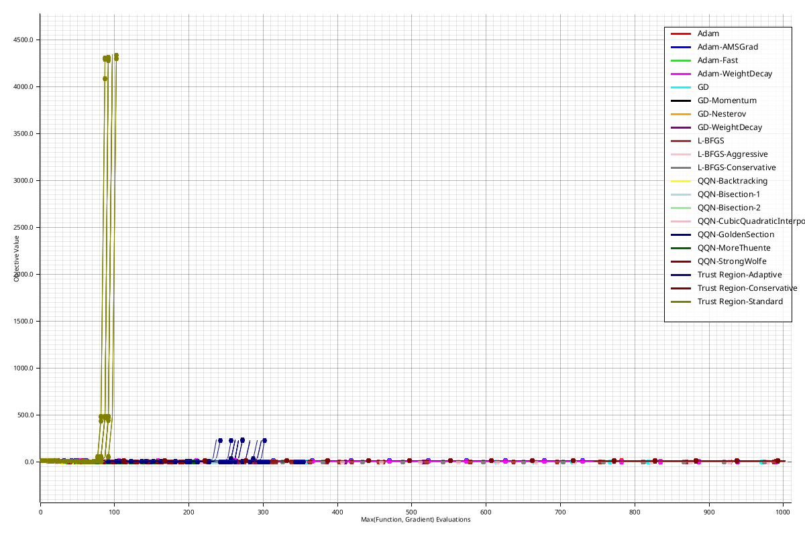
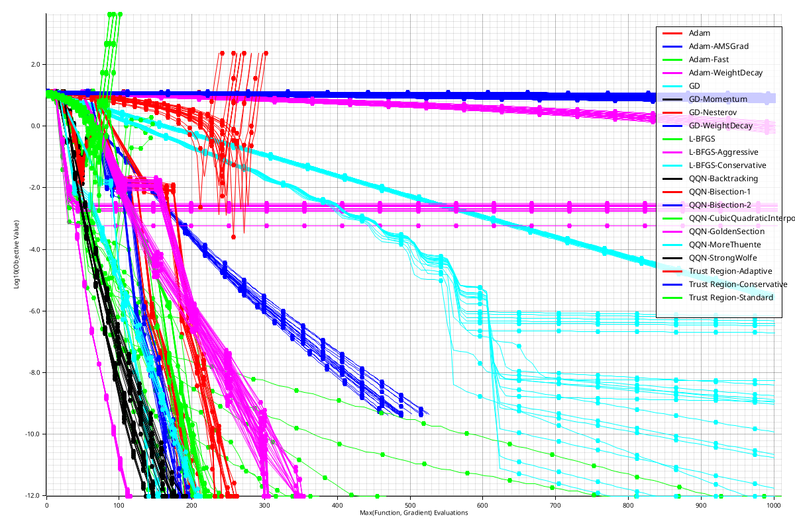

**Figure:** Convergence plots for SparseQuadratic_10D_pattern[1, 3] showing objective value vs iterations.
Left: Linear scale, Right: Log scale for better visualization of convergence behavior.

**Data:** [Linear scale data (CSV)](convergence_SparseQuadratic_10D_pattern[1,_3]_data.csv) | [Log scale data (CSV)](convergence_SparseQuadratic_10D_pattern[1,_3]_log_data.csv)

## Problem: LogisticRegression_100samples_5features_reg0.01

**Family:** ML Regression  
**Dimension:** 5  
**Success Threshold:** 3.150e-1  
**Total Runs:** 560

### Performance Summary
<table style="border-collapse: collapse; width: 100%; margin: 20px 0;">
<tr style="background-color: #f2f2f2;">
<th style="border: 1px solid #ddd; padding: 8px; text-align: center;">Rank</th>
<th style="border: 1px solid #ddd; padding: 8px; text-align: center;">Optimizer</th>
<th style="border: 1px solid #ddd; padding: 8px; text-align: center;">Mean Final Value (All/Success/Fail)</th>
<th style="border: 1px solid #ddd; padding: 8px; text-align: center;">Std Dev</th>
<th style="border: 1px solid #ddd; padding: 8px; text-align: center;">Best Value</th>
<th style="border: 1px solid #ddd; padding: 8px; text-align: center;">Worst Value</th>
<th style="border: 1px solid #ddd; padding: 8px; text-align: center;">Mean Function Evals (All/Success/Fail)</th>
<th style="border: 1px solid #ddd; padding: 8px; text-align: center;">Mean Gradient Evals (All/Success/Fail)</th>
<th style="border: 1px solid #ddd; padding: 8px; text-align: center;">Success Rate</th>
<th style="border: 1px solid #ddd; padding: 8px; text-align: center;">Mean Time (s)</th>
</tr>
<tr style="background-color: #d4edda; font-weight: bold;">
<td style="border: 1px solid #ddd; padding: 8px; text-align: center;">1</td>
<td style="border: 1px solid #ddd; padding: 8px; text-align: center;"><a href="detailed_LogisticRegression_100samples_5features_reg0.01_QQN-CubicQuadraticInterpolation.md">QQN-CubicQuadraticInterpolation</a></td>
<td style="border: 1px solid #ddd; padding: 8px; text-align: center;">3.15e-1 / - / 3.15e-1</td>
<td style="border: 1px solid #ddd; padding: 8px; text-align: center;">7.41e-9</td>
<td style="border: 1px solid #ddd; padding: 8px; text-align: center;">3.15e-1</td>
<td style="border: 1px solid #ddd; padding: 8px; text-align: center;">3.15e-1</td>
<td style="border: 1px solid #ddd; padding: 8px; text-align: center;">155.0 / - / 155.0</td>
<td style="border: 1px solid #ddd; padding: 8px; text-align: center;">212.3 / - / 212.3</td>
<td style="border: 1px solid #ddd; padding: 8px; text-align: center;">0.0%</td>
<td style="border: 1px solid #ddd; padding: 8px; text-align: center;">0.068</td>
</tr>
<tr style="background-color: #fff3cd;">
<td style="border: 1px solid #ddd; padding: 8px; text-align: center;">2</td>
<td style="border: 1px solid #ddd; padding: 8px; text-align: center;"><a href="detailed_LogisticRegression_100samples_5features_reg0.01_QQN-GoldenSection.md">QQN-GoldenSection</a></td>
<td style="border: 1px solid #ddd; padding: 8px; text-align: center;">3.15e-1 / - / 3.15e-1</td>
<td style="border: 1px solid #ddd; padding: 8px; text-align: center;">2.56e-12</td>
<td style="border: 1px solid #ddd; padding: 8px; text-align: center;">3.15e-1</td>
<td style="border: 1px solid #ddd; padding: 8px; text-align: center;">3.15e-1</td>
<td style="border: 1px solid #ddd; padding: 8px; text-align: center;">317.9 / - / 317.9</td>
<td style="border: 1px solid #ddd; padding: 8px; text-align: center;">55.9 / - / 55.9</td>
<td style="border: 1px solid #ddd; padding: 8px; text-align: center;">0.0%</td>
<td style="border: 1px solid #ddd; padding: 8px; text-align: center;">0.068</td>
</tr>
<tr style="">
<td style="border: 1px solid #ddd; padding: 8px; text-align: center;">3</td>
<td style="border: 1px solid #ddd; padding: 8px; text-align: center;"><a href="detailed_LogisticRegression_100samples_5features_reg0.01_QQN-Bisection-1.md">QQN-Bisection-1</a></td>
<td style="border: 1px solid #ddd; padding: 8px; text-align: center;">3.15e-1 / - / 3.15e-1</td>
<td style="border: 1px solid #ddd; padding: 8px; text-align: center;">3.04e-12</td>
<td style="border: 1px solid #ddd; padding: 8px; text-align: center;">3.15e-1</td>
<td style="border: 1px solid #ddd; padding: 8px; text-align: center;">3.15e-1</td>
<td style="border: 1px solid #ddd; padding: 8px; text-align: center;">101.3 / - / 101.3</td>
<td style="border: 1px solid #ddd; padding: 8px; text-align: center;">118.7 / - / 118.7</td>
<td style="border: 1px solid #ddd; padding: 8px; text-align: center;">0.0%</td>
<td style="border: 1px solid #ddd; padding: 8px; text-align: center;">0.039</td>
</tr>
<tr style="">
<td style="border: 1px solid #ddd; padding: 8px; text-align: center;">4</td>
<td style="border: 1px solid #ddd; padding: 8px; text-align: center;"><a href="detailed_LogisticRegression_100samples_5features_reg0.01_QQN-Backtracking.md">QQN-Backtracking</a></td>
<td style="border: 1px solid #ddd; padding: 8px; text-align: center;">3.15e-1 / - / 3.15e-1</td>
<td style="border: 1px solid #ddd; padding: 8px; text-align: center;">3.11e-12</td>
<td style="border: 1px solid #ddd; padding: 8px; text-align: center;">3.15e-1</td>
<td style="border: 1px solid #ddd; padding: 8px; text-align: center;">3.15e-1</td>
<td style="border: 1px solid #ddd; padding: 8px; text-align: center;">80.7 / - / 80.7</td>
<td style="border: 1px solid #ddd; padding: 8px; text-align: center;">68.7 / - / 68.7</td>
<td style="border: 1px solid #ddd; padding: 8px; text-align: center;">0.0%</td>
<td style="border: 1px solid #ddd; padding: 8px; text-align: center;">0.027</td>
</tr>
<tr style="">
<td style="border: 1px solid #ddd; padding: 8px; text-align: center;">5</td>
<td style="border: 1px solid #ddd; padding: 8px; text-align: center;"><a href="detailed_LogisticRegression_100samples_5features_reg0.01_QQN-StrongWolfe.md">QQN-StrongWolfe</a></td>
<td style="border: 1px solid #ddd; padding: 8px; text-align: center;">3.15e-1 / - / 3.15e-1</td>
<td style="border: 1px solid #ddd; padding: 8px; text-align: center;">3.28e-12</td>
<td style="border: 1px solid #ddd; padding: 8px; text-align: center;">3.15e-1</td>
<td style="border: 1px solid #ddd; padding: 8px; text-align: center;">3.15e-1</td>
<td style="border: 1px solid #ddd; padding: 8px; text-align: center;">74.0 / - / 74.0</td>
<td style="border: 1px solid #ddd; padding: 8px; text-align: center;">82.0 / - / 82.0</td>
<td style="border: 1px solid #ddd; padding: 8px; text-align: center;">0.0%</td>
<td style="border: 1px solid #ddd; padding: 8px; text-align: center;">0.029</td>
</tr>
<tr style="">
<td style="border: 1px solid #ddd; padding: 8px; text-align: center;">6</td>
<td style="border: 1px solid #ddd; padding: 8px; text-align: center;"><a href="detailed_LogisticRegression_100samples_5features_reg0.01_QQN-Bisection-2.md">QQN-Bisection-2</a></td>
<td style="border: 1px solid #ddd; padding: 8px; text-align: center;">3.15e-1 / - / 3.15e-1</td>
<td style="border: 1px solid #ddd; padding: 8px; text-align: center;">2.48e-12</td>
<td style="border: 1px solid #ddd; padding: 8px; text-align: center;">3.15e-1</td>
<td style="border: 1px solid #ddd; padding: 8px; text-align: center;">3.15e-1</td>
<td style="border: 1px solid #ddd; padding: 8px; text-align: center;">98.0 / - / 98.0</td>
<td style="border: 1px solid #ddd; padding: 8px; text-align: center;">74.0 / - / 74.0</td>
<td style="border: 1px solid #ddd; padding: 8px; text-align: center;">0.0%</td>
<td style="border: 1px solid #ddd; padding: 8px; text-align: center;">0.031</td>
</tr>
<tr style="">
<td style="border: 1px solid #ddd; padding: 8px; text-align: center;">7</td>
<td style="border: 1px solid #ddd; padding: 8px; text-align: center;"><a href="detailed_LogisticRegression_100samples_5features_reg0.01_QQN-MoreThuente.md">QQN-MoreThuente</a></td>
<td style="border: 1px solid #ddd; padding: 8px; text-align: center;">3.15e-1 / - / 3.15e-1</td>
<td style="border: 1px solid #ddd; padding: 8px; text-align: center;">2.58e-12</td>
<td style="border: 1px solid #ddd; padding: 8px; text-align: center;">3.15e-1</td>
<td style="border: 1px solid #ddd; padding: 8px; text-align: center;">3.15e-1</td>
<td style="border: 1px solid #ddd; padding: 8px; text-align: center;">124.6 / - / 124.6</td>
<td style="border: 1px solid #ddd; padding: 8px; text-align: center;">121.3 / - / 121.3</td>
<td style="border: 1px solid #ddd; padding: 8px; text-align: center;">0.0%</td>
<td style="border: 1px solid #ddd; padding: 8px; text-align: center;">0.044</td>
</tr>
<tr style="">
<td style="border: 1px solid #ddd; padding: 8px; text-align: center;">8</td>
<td style="border: 1px solid #ddd; padding: 8px; text-align: center;"><a href="detailed_LogisticRegression_100samples_5features_reg0.01_L-BFGS-Aggressive.md">L-BFGS-Aggressive</a></td>
<td style="border: 1px solid #ddd; padding: 8px; text-align: center;">3.15e-1 / - / 3.15e-1</td>
<td style="border: 1px solid #ddd; padding: 8px; text-align: center;">4.77e-4</td>
<td style="border: 1px solid #ddd; padding: 8px; text-align: center;">3.15e-1</td>
<td style="border: 1px solid #ddd; padding: 8px; text-align: center;">3.18e-1</td>
<td style="border: 1px solid #ddd; padding: 8px; text-align: center;">561.9 / - / 561.9</td>
<td style="border: 1px solid #ddd; padding: 8px; text-align: center;">269.7 / - / 269.7</td>
<td style="border: 1px solid #ddd; padding: 8px; text-align: center;">0.0%</td>
<td style="border: 1px solid #ddd; padding: 8px; text-align: center;">0.150</td>
</tr>
<tr style="">
<td style="border: 1px solid #ddd; padding: 8px; text-align: center;">9</td>
<td style="border: 1px solid #ddd; padding: 8px; text-align: center;"><a href="detailed_LogisticRegression_100samples_5features_reg0.01_L-BFGS-Conservative.md">L-BFGS-Conservative</a></td>
<td style="border: 1px solid #ddd; padding: 8px; text-align: center;">3.15e-1 / - / 3.15e-1</td>
<td style="border: 1px solid #ddd; padding: 8px; text-align: center;">8.76e-11</td>
<td style="border: 1px solid #ddd; padding: 8px; text-align: center;">3.15e-1</td>
<td style="border: 1px solid #ddd; padding: 8px; text-align: center;">3.15e-1</td>
<td style="border: 1px solid #ddd; padding: 8px; text-align: center;">555.8 / - / 555.8</td>
<td style="border: 1px solid #ddd; padding: 8px; text-align: center;">444.8 / - / 444.8</td>
<td style="border: 1px solid #ddd; padding: 8px; text-align: center;">0.0%</td>
<td style="border: 1px solid #ddd; padding: 8px; text-align: center;">0.183</td>
</tr>
<tr style="">
<td style="border: 1px solid #ddd; padding: 8px; text-align: center;">10</td>
<td style="border: 1px solid #ddd; padding: 8px; text-align: center;"><a href="detailed_LogisticRegression_100samples_5features_reg0.01_L-BFGS.md">L-BFGS</a></td>
<td style="border: 1px solid #ddd; padding: 8px; text-align: center;">3.15e-1 / - / 3.16e-1</td>
<td style="border: 1px solid #ddd; padding: 8px; text-align: center;">1.93e-4</td>
<td style="border: 1px solid #ddd; padding: 8px; text-align: center;">3.15e-1</td>
<td style="border: 1px solid #ddd; padding: 8px; text-align: center;">3.16e-1</td>
<td style="border: 1px solid #ddd; padding: 8px; text-align: center;">450.1 / - / 450.1</td>
<td style="border: 1px solid #ddd; padding: 8px; text-align: center;">292.8 / - / 292.8</td>
<td style="border: 1px solid #ddd; padding: 8px; text-align: center;">0.0%</td>
<td style="border: 1px solid #ddd; padding: 8px; text-align: center;">0.135</td>
</tr>
<tr style="">
<td style="border: 1px solid #ddd; padding: 8px; text-align: center;">11</td>
<td style="border: 1px solid #ddd; padding: 8px; text-align: center;"><a href="detailed_LogisticRegression_100samples_5features_reg0.01_Adam-Fast.md">Adam-Fast</a></td>
<td style="border: 1px solid #ddd; padding: 8px; text-align: center;">3.16e-1 / - / 3.16e-1</td>
<td style="border: 1px solid #ddd; padding: 8px; text-align: center;">1.00e-4</td>
<td style="border: 1px solid #ddd; padding: 8px; text-align: center;">3.15e-1</td>
<td style="border: 1px solid #ddd; padding: 8px; text-align: center;">3.16e-1</td>
<td style="border: 1px solid #ddd; padding: 8px; text-align: center;">89.3 / - / 89.3</td>
<td style="border: 1px solid #ddd; padding: 8px; text-align: center;">88.3 / - / 88.3</td>
<td style="border: 1px solid #ddd; padding: 8px; text-align: center;">0.0%</td>
<td style="border: 1px solid #ddd; padding: 8px; text-align: center;">0.032</td>
</tr>
<tr style="">
<td style="border: 1px solid #ddd; padding: 8px; text-align: center;">12</td>
<td style="border: 1px solid #ddd; padding: 8px; text-align: center;"><a href="detailed_LogisticRegression_100samples_5features_reg0.01_GD-Momentum.md">GD-Momentum</a></td>
<td style="border: 1px solid #ddd; padding: 8px; text-align: center;">3.33e-1 / - / 3.33e-1</td>
<td style="border: 1px solid #ddd; padding: 8px; text-align: center;">5.94e-4</td>
<td style="border: 1px solid #ddd; padding: 8px; text-align: center;">3.32e-1</td>
<td style="border: 1px solid #ddd; padding: 8px; text-align: center;">3.35e-1</td>
<td style="border: 1px solid #ddd; padding: 8px; text-align: center;">335.0 / - / 335.0</td>
<td style="border: 1px solid #ddd; padding: 8px; text-align: center;">668.0 / - / 668.0</td>
<td style="border: 1px solid #ddd; padding: 8px; text-align: center;">0.0%</td>
<td style="border: 1px solid #ddd; padding: 8px; text-align: center;">0.182</td>
</tr>
<tr style="">
<td style="border: 1px solid #ddd; padding: 8px; text-align: center;">13</td>
<td style="border: 1px solid #ddd; padding: 8px; text-align: center;"><a href="detailed_LogisticRegression_100samples_5features_reg0.01_GD-Nesterov.md">GD-Nesterov</a></td>
<td style="border: 1px solid #ddd; padding: 8px; text-align: center;">3.34e-1 / - / 3.34e-1</td>
<td style="border: 1px solid #ddd; padding: 8px; text-align: center;">5.50e-4</td>
<td style="border: 1px solid #ddd; padding: 8px; text-align: center;">3.33e-1</td>
<td style="border: 1px solid #ddd; padding: 8px; text-align: center;">3.34e-1</td>
<td style="border: 1px solid #ddd; padding: 8px; text-align: center;">335.0 / - / 335.0</td>
<td style="border: 1px solid #ddd; padding: 8px; text-align: center;">668.0 / - / 668.0</td>
<td style="border: 1px solid #ddd; padding: 8px; text-align: center;">0.0%</td>
<td style="border: 1px solid #ddd; padding: 8px; text-align: center;">0.182</td>
</tr>
<tr style="">
<td style="border: 1px solid #ddd; padding: 8px; text-align: center;">14</td>
<td style="border: 1px solid #ddd; padding: 8px; text-align: center;"><a href="detailed_LogisticRegression_100samples_5features_reg0.01_Trust_Region-Conservative.md">Trust Region-Conservative</a></td>
<td style="border: 1px solid #ddd; padding: 8px; text-align: center;">4.24e-1 / - / 4.24e-1</td>
<td style="border: 1px solid #ddd; padding: 8px; text-align: center;">2.45e-3</td>
<td style="border: 1px solid #ddd; padding: 8px; text-align: center;">4.19e-1</td>
<td style="border: 1px solid #ddd; padding: 8px; text-align: center;">4.27e-1</td>
<td style="border: 1px solid #ddd; padding: 8px; text-align: center;">87.2 / - / 87.2</td>
<td style="border: 1px solid #ddd; padding: 8px; text-align: center;">58.8 / - / 58.8</td>
<td style="border: 1px solid #ddd; padding: 8px; text-align: center;">0.0%</td>
<td style="border: 1px solid #ddd; padding: 8px; text-align: center;">0.026</td>
</tr>
<tr style="">
<td style="border: 1px solid #ddd; padding: 8px; text-align: center;">15</td>
<td style="border: 1px solid #ddd; padding: 8px; text-align: center;"><a href="detailed_LogisticRegression_100samples_5features_reg0.01_GD-WeightDecay.md">GD-WeightDecay</a></td>
<td style="border: 1px solid #ddd; padding: 8px; text-align: center;">4.49e-1 / - / 4.49e-1</td>
<td style="border: 1px solid #ddd; padding: 8px; text-align: center;">6.87e-3</td>
<td style="border: 1px solid #ddd; padding: 8px; text-align: center;">4.35e-1</td>
<td style="border: 1px solid #ddd; padding: 8px; text-align: center;">4.60e-1</td>
<td style="border: 1px solid #ddd; padding: 8px; text-align: center;">335.0 / - / 335.0</td>
<td style="border: 1px solid #ddd; padding: 8px; text-align: center;">668.0 / - / 668.0</td>
<td style="border: 1px solid #ddd; padding: 8px; text-align: center;">0.0%</td>
<td style="border: 1px solid #ddd; padding: 8px; text-align: center;">0.183</td>
</tr>
<tr style="">
<td style="border: 1px solid #ddd; padding: 8px; text-align: center;">16</td>
<td style="border: 1px solid #ddd; padding: 8px; text-align: center;"><a href="detailed_LogisticRegression_100samples_5features_reg0.01_Adam-WeightDecay.md">Adam-WeightDecay</a></td>
<td style="border: 1px solid #ddd; padding: 8px; text-align: center;">4.66e-1 / - / 4.66e-1</td>
<td style="border: 1px solid #ddd; padding: 8px; text-align: center;">1.45e-2</td>
<td style="border: 1px solid #ddd; padding: 8px; text-align: center;">4.48e-1</td>
<td style="border: 1px solid #ddd; padding: 8px; text-align: center;">4.95e-1</td>
<td style="border: 1px solid #ddd; padding: 8px; text-align: center;">502.0 / - / 502.0</td>
<td style="border: 1px solid #ddd; padding: 8px; text-align: center;">502.0 / - / 502.0</td>
<td style="border: 1px solid #ddd; padding: 8px; text-align: center;">0.0%</td>
<td style="border: 1px solid #ddd; padding: 8px; text-align: center;">0.181</td>
</tr>
<tr style="">
<td style="border: 1px solid #ddd; padding: 8px; text-align: center;">17</td>
<td style="border: 1px solid #ddd; padding: 8px; text-align: center;"><a href="detailed_LogisticRegression_100samples_5features_reg0.01_GD.md">GD</a></td>
<td style="border: 1px solid #ddd; padding: 8px; text-align: center;">5.55e-1 / - / 5.55e-1</td>
<td style="border: 1px solid #ddd; padding: 8px; text-align: center;">1.32e-2</td>
<td style="border: 1px solid #ddd; padding: 8px; text-align: center;">5.27e-1</td>
<td style="border: 1px solid #ddd; padding: 8px; text-align: center;">5.78e-1</td>
<td style="border: 1px solid #ddd; padding: 8px; text-align: center;">335.0 / - / 335.0</td>
<td style="border: 1px solid #ddd; padding: 8px; text-align: center;">668.0 / - / 668.0</td>
<td style="border: 1px solid #ddd; padding: 8px; text-align: center;">0.0%</td>
<td style="border: 1px solid #ddd; padding: 8px; text-align: center;">0.181</td>
</tr>
<tr style="">
<td style="border: 1px solid #ddd; padding: 8px; text-align: center;">18</td>
<td style="border: 1px solid #ddd; padding: 8px; text-align: center;"><a href="detailed_LogisticRegression_100samples_5features_reg0.01_Adam.md">Adam</a></td>
<td style="border: 1px solid #ddd; padding: 8px; text-align: center;">5.95e-1 / - / 5.95e-1</td>
<td style="border: 1px solid #ddd; padding: 8px; text-align: center;">2.74e-2</td>
<td style="border: 1px solid #ddd; padding: 8px; text-align: center;">5.45e-1</td>
<td style="border: 1px solid #ddd; padding: 8px; text-align: center;">6.40e-1</td>
<td style="border: 1px solid #ddd; padding: 8px; text-align: center;">502.0 / - / 502.0</td>
<td style="border: 1px solid #ddd; padding: 8px; text-align: center;">502.0 / - / 502.0</td>
<td style="border: 1px solid #ddd; padding: 8px; text-align: center;">0.0%</td>
<td style="border: 1px solid #ddd; padding: 8px; text-align: center;">0.180</td>
</tr>
<tr style="">
<td style="border: 1px solid #ddd; padding: 8px; text-align: center;">19</td>
<td style="border: 1px solid #ddd; padding: 8px; text-align: center;"><a href="detailed_LogisticRegression_100samples_5features_reg0.01_Adam-AMSGrad.md">Adam-AMSGrad</a></td>
<td style="border: 1px solid #ddd; padding: 8px; text-align: center;">5.98e-1 / - / 5.98e-1</td>
<td style="border: 1px solid #ddd; padding: 8px; text-align: center;">2.59e-2</td>
<td style="border: 1px solid #ddd; padding: 8px; text-align: center;">5.59e-1</td>
<td style="border: 1px solid #ddd; padding: 8px; text-align: center;">6.48e-1</td>
<td style="border: 1px solid #ddd; padding: 8px; text-align: center;">502.0 / - / 502.0</td>
<td style="border: 1px solid #ddd; padding: 8px; text-align: center;">502.0 / - / 502.0</td>
<td style="border: 1px solid #ddd; padding: 8px; text-align: center;">0.0%</td>
<td style="border: 1px solid #ddd; padding: 8px; text-align: center;">0.181</td>
</tr>
<tr style="">
<td style="border: 1px solid #ddd; padding: 8px; text-align: center;">20</td>
<td style="border: 1px solid #ddd; padding: 8px; text-align: center;"><a href="detailed_LogisticRegression_100samples_5features_reg0.01_Trust_Region-Standard.md">Trust Region-Standard</a></td>
<td style="border: 1px solid #ddd; padding: 8px; text-align: center;">6.97e-1 / - / 6.97e-1</td>
<td style="border: 1px solid #ddd; padding: 8px; text-align: center;">2.76e-2</td>
<td style="border: 1px solid #ddd; padding: 8px; text-align: center;">6.40e-1</td>
<td style="border: 1px solid #ddd; padding: 8px; text-align: center;">7.52e-1</td>
<td style="border: 1px solid #ddd; padding: 8px; text-align: center;">5.0 / - / 5.0</td>
<td style="border: 1px solid #ddd; padding: 8px; text-align: center;">4.0 / - / 4.0</td>
<td style="border: 1px solid #ddd; padding: 8px; text-align: center;">0.0%</td>
<td style="border: 1px solid #ddd; padding: 8px; text-align: center;">0.002</td>
</tr>
<tr style="">
<td style="border: 1px solid #ddd; padding: 8px; text-align: center;">21</td>
<td style="border: 1px solid #ddd; padding: 8px; text-align: center;"><a href="detailed_LogisticRegression_100samples_5features_reg0.01_Trust_Region-Adaptive.md">Trust Region-Adaptive</a></td>
<td style="border: 1px solid #ddd; padding: 8px; text-align: center;">6.96e-1 / - / 6.96e-1</td>
<td style="border: 1px solid #ddd; padding: 8px; text-align: center;">2.25e-2</td>
<td style="border: 1px solid #ddd; padding: 8px; text-align: center;">6.48e-1</td>
<td style="border: 1px solid #ddd; padding: 8px; text-align: center;">7.31e-1</td>
<td style="border: 1px solid #ddd; padding: 8px; text-align: center;">5.0 / - / 5.0</td>
<td style="border: 1px solid #ddd; padding: 8px; text-align: center;">4.0 / - / 4.0</td>
<td style="border: 1px solid #ddd; padding: 8px; text-align: center;">0.0%</td>
<td style="border: 1px solid #ddd; padding: 8px; text-align: center;">0.002</td>
</tr>
</table>

### Convergence Plots

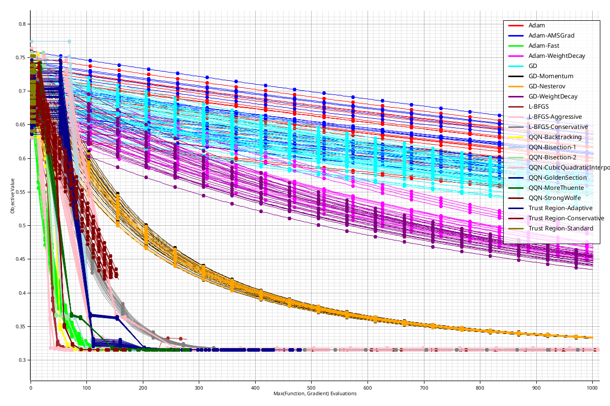
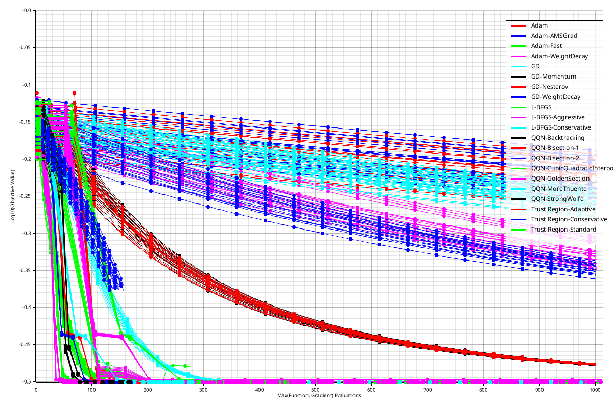

**Figure:** Convergence plots for LogisticRegression_100samples_5features_reg0.01 showing objective value vs iterations.
Left: Linear scale, Right: Log scale for better visualization of convergence behavior.

**Data:** [Linear scale data (CSV)](convergence_LogisticRegression_100samples_5features_reg0.01_data.csv) | [Log scale data (CSV)](convergence_LogisticRegression_100samples_5features_reg0.01_log_data.csv)

## Problem: LogisticRegression_200samples_10features_reg0.01

**Family:** ML Regression  
**Dimension:** 10  
**Success Threshold:** 3.230e-1  
**Total Runs:** 560

### Performance Summary
<table style="border-collapse: collapse; width: 100%; margin: 20px 0;">
<tr style="background-color: #f2f2f2;">
<th style="border: 1px solid #ddd; padding: 8px; text-align: center;">Rank</th>
<th style="border: 1px solid #ddd; padding: 8px; text-align: center;">Optimizer</th>
<th style="border: 1px solid #ddd; padding: 8px; text-align: center;">Mean Final Value (All/Success/Fail)</th>
<th style="border: 1px solid #ddd; padding: 8px; text-align: center;">Std Dev</th>
<th style="border: 1px solid #ddd; padding: 8px; text-align: center;">Best Value</th>
<th style="border: 1px solid #ddd; padding: 8px; text-align: center;">Worst Value</th>
<th style="border: 1px solid #ddd; padding: 8px; text-align: center;">Mean Function Evals (All/Success/Fail)</th>
<th style="border: 1px solid #ddd; padding: 8px; text-align: center;">Mean Gradient Evals (All/Success/Fail)</th>
<th style="border: 1px solid #ddd; padding: 8px; text-align: center;">Success Rate</th>
<th style="border: 1px solid #ddd; padding: 8px; text-align: center;">Mean Time (s)</th>
</tr>
<tr style="background-color: #d4edda; font-weight: bold;">
<td style="border: 1px solid #ddd; padding: 8px; text-align: center;">1</td>
<td style="border: 1px solid #ddd; padding: 8px; text-align: center;"><a href="detailed_LogisticRegression_200samples_10features_reg0.01_QQN-GoldenSection.md">QQN-GoldenSection</a></td>
<td style="border: 1px solid #ddd; padding: 8px; text-align: center;">3.23e-1 / - / 3.23e-1</td>
<td style="border: 1px solid #ddd; padding: 8px; text-align: center;">2.02e-12</td>
<td style="border: 1px solid #ddd; padding: 8px; text-align: center;">3.23e-1</td>
<td style="border: 1px solid #ddd; padding: 8px; text-align: center;">3.23e-1</td>
<td style="border: 1px solid #ddd; padding: 8px; text-align: center;">359.4 / - / 359.4</td>
<td style="border: 1px solid #ddd; padding: 8px; text-align: center;">67.0 / - / 67.0</td>
<td style="border: 1px solid #ddd; padding: 8px; text-align: center;">0.0%</td>
<td style="border: 1px solid #ddd; padding: 8px; text-align: center;">0.136</td>
</tr>
<tr style="background-color: #fff3cd;">
<td style="border: 1px solid #ddd; padding: 8px; text-align: center;">2</td>
<td style="border: 1px solid #ddd; padding: 8px; text-align: center;"><a href="detailed_LogisticRegression_200samples_10features_reg0.01_QQN-CubicQuadraticInterpolation.md">QQN-CubicQuadraticInterpolation</a></td>
<td style="border: 1px solid #ddd; padding: 8px; text-align: center;">3.23e-1 / - / 3.23e-1</td>
<td style="border: 1px solid #ddd; padding: 8px; text-align: center;">2.06e-12</td>
<td style="border: 1px solid #ddd; padding: 8px; text-align: center;">3.23e-1</td>
<td style="border: 1px solid #ddd; padding: 8px; text-align: center;">3.23e-1</td>
<td style="border: 1px solid #ddd; padding: 8px; text-align: center;">173.4 / - / 173.4</td>
<td style="border: 1px solid #ddd; padding: 8px; text-align: center;">229.6 / - / 229.6</td>
<td style="border: 1px solid #ddd; padding: 8px; text-align: center;">0.0%</td>
<td style="border: 1px solid #ddd; padding: 8px; text-align: center;">0.133</td>
</tr>
<tr style="">
<td style="border: 1px solid #ddd; padding: 8px; text-align: center;">3</td>
<td style="border: 1px solid #ddd; padding: 8px; text-align: center;"><a href="detailed_LogisticRegression_200samples_10features_reg0.01_QQN-Bisection-1.md">QQN-Bisection-1</a></td>
<td style="border: 1px solid #ddd; padding: 8px; text-align: center;">3.23e-1 / - / 3.23e-1</td>
<td style="border: 1px solid #ddd; padding: 8px; text-align: center;">2.44e-12</td>
<td style="border: 1px solid #ddd; padding: 8px; text-align: center;">3.23e-1</td>
<td style="border: 1px solid #ddd; padding: 8px; text-align: center;">3.23e-1</td>
<td style="border: 1px solid #ddd; padding: 8px; text-align: center;">117.6 / - / 117.6</td>
<td style="border: 1px solid #ddd; padding: 8px; text-align: center;">134.1 / - / 134.1</td>
<td style="border: 1px solid #ddd; padding: 8px; text-align: center;">0.0%</td>
<td style="border: 1px solid #ddd; padding: 8px; text-align: center;">0.082</td>
</tr>
<tr style="">
<td style="border: 1px solid #ddd; padding: 8px; text-align: center;">4</td>
<td style="border: 1px solid #ddd; padding: 8px; text-align: center;"><a href="detailed_LogisticRegression_200samples_10features_reg0.01_QQN-Backtracking.md">QQN-Backtracking</a></td>
<td style="border: 1px solid #ddd; padding: 8px; text-align: center;">3.23e-1 / - / 3.23e-1</td>
<td style="border: 1px solid #ddd; padding: 8px; text-align: center;">1.71e-12</td>
<td style="border: 1px solid #ddd; padding: 8px; text-align: center;">3.23e-1</td>
<td style="border: 1px solid #ddd; padding: 8px; text-align: center;">3.23e-1</td>
<td style="border: 1px solid #ddd; padding: 8px; text-align: center;">79.6 / - / 79.6</td>
<td style="border: 1px solid #ddd; padding: 8px; text-align: center;">67.8 / - / 67.8</td>
<td style="border: 1px solid #ddd; padding: 8px; text-align: center;">0.0%</td>
<td style="border: 1px solid #ddd; padding: 8px; text-align: center;">0.048</td>
</tr>
<tr style="">
<td style="border: 1px solid #ddd; padding: 8px; text-align: center;">5</td>
<td style="border: 1px solid #ddd; padding: 8px; text-align: center;"><a href="detailed_LogisticRegression_200samples_10features_reg0.01_QQN-StrongWolfe.md">QQN-StrongWolfe</a></td>
<td style="border: 1px solid #ddd; padding: 8px; text-align: center;">3.23e-1 / - / 3.23e-1</td>
<td style="border: 1px solid #ddd; padding: 8px; text-align: center;">1.85e-12</td>
<td style="border: 1px solid #ddd; padding: 8px; text-align: center;">3.23e-1</td>
<td style="border: 1px solid #ddd; padding: 8px; text-align: center;">3.23e-1</td>
<td style="border: 1px solid #ddd; padding: 8px; text-align: center;">80.3 / - / 80.3</td>
<td style="border: 1px solid #ddd; padding: 8px; text-align: center;">89.2 / - / 89.2</td>
<td style="border: 1px solid #ddd; padding: 8px; text-align: center;">0.0%</td>
<td style="border: 1px solid #ddd; padding: 8px; text-align: center;">0.056</td>
</tr>
<tr style="">
<td style="border: 1px solid #ddd; padding: 8px; text-align: center;">6</td>
<td style="border: 1px solid #ddd; padding: 8px; text-align: center;"><a href="detailed_LogisticRegression_200samples_10features_reg0.01_QQN-Bisection-2.md">QQN-Bisection-2</a></td>
<td style="border: 1px solid #ddd; padding: 8px; text-align: center;">3.23e-1 / - / 3.23e-1</td>
<td style="border: 1px solid #ddd; padding: 8px; text-align: center;">1.74e-12</td>
<td style="border: 1px solid #ddd; padding: 8px; text-align: center;">3.23e-1</td>
<td style="border: 1px solid #ddd; padding: 8px; text-align: center;">3.23e-1</td>
<td style="border: 1px solid #ddd; padding: 8px; text-align: center;">109.5 / - / 109.5</td>
<td style="border: 1px solid #ddd; padding: 8px; text-align: center;">83.5 / - / 83.5</td>
<td style="border: 1px solid #ddd; padding: 8px; text-align: center;">0.0%</td>
<td style="border: 1px solid #ddd; padding: 8px; text-align: center;">0.062</td>
</tr>
<tr style="">
<td style="border: 1px solid #ddd; padding: 8px; text-align: center;">7</td>
<td style="border: 1px solid #ddd; padding: 8px; text-align: center;"><a href="detailed_LogisticRegression_200samples_10features_reg0.01_QQN-MoreThuente.md">QQN-MoreThuente</a></td>
<td style="border: 1px solid #ddd; padding: 8px; text-align: center;">3.23e-1 / - / 3.23e-1</td>
<td style="border: 1px solid #ddd; padding: 8px; text-align: center;">1.81e-12</td>
<td style="border: 1px solid #ddd; padding: 8px; text-align: center;">3.23e-1</td>
<td style="border: 1px solid #ddd; padding: 8px; text-align: center;">3.23e-1</td>
<td style="border: 1px solid #ddd; padding: 8px; text-align: center;">135.1 / - / 135.1</td>
<td style="border: 1px solid #ddd; padding: 8px; text-align: center;">128.7 / - / 128.7</td>
<td style="border: 1px solid #ddd; padding: 8px; text-align: center;">0.0%</td>
<td style="border: 1px solid #ddd; padding: 8px; text-align: center;">0.085</td>
</tr>
<tr style="">
<td style="border: 1px solid #ddd; padding: 8px; text-align: center;">8</td>
<td style="border: 1px solid #ddd; padding: 8px; text-align: center;"><a href="detailed_LogisticRegression_200samples_10features_reg0.01_L-BFGS-Aggressive.md">L-BFGS-Aggressive</a></td>
<td style="border: 1px solid #ddd; padding: 8px; text-align: center;">3.24e-1 / - / 3.24e-1</td>
<td style="border: 1px solid #ddd; padding: 8px; text-align: center;">8.77e-4</td>
<td style="border: 1px solid #ddd; padding: 8px; text-align: center;">3.23e-1</td>
<td style="border: 1px solid #ddd; padding: 8px; text-align: center;">3.26e-1</td>
<td style="border: 1px solid #ddd; padding: 8px; text-align: center;">638.6 / - / 638.6</td>
<td style="border: 1px solid #ddd; padding: 8px; text-align: center;">214.8 / - / 214.8</td>
<td style="border: 1px solid #ddd; padding: 8px; text-align: center;">0.0%</td>
<td style="border: 1px solid #ddd; padding: 8px; text-align: center;">0.266</td>
</tr>
<tr style="">
<td style="border: 1px solid #ddd; padding: 8px; text-align: center;">9</td>
<td style="border: 1px solid #ddd; padding: 8px; text-align: center;"><a href="detailed_LogisticRegression_200samples_10features_reg0.01_L-BFGS-Conservative.md">L-BFGS-Conservative</a></td>
<td style="border: 1px solid #ddd; padding: 8px; text-align: center;">3.23e-1 / - / 3.23e-1</td>
<td style="border: 1px solid #ddd; padding: 8px; text-align: center;">7.58e-11</td>
<td style="border: 1px solid #ddd; padding: 8px; text-align: center;">3.23e-1</td>
<td style="border: 1px solid #ddd; padding: 8px; text-align: center;">3.23e-1</td>
<td style="border: 1px solid #ddd; padding: 8px; text-align: center;">545.8 / - / 545.8</td>
<td style="border: 1px solid #ddd; padding: 8px; text-align: center;">436.2 / - / 436.2</td>
<td style="border: 1px solid #ddd; padding: 8px; text-align: center;">0.0%</td>
<td style="border: 1px solid #ddd; padding: 8px; text-align: center;">0.320</td>
</tr>
<tr style="">
<td style="border: 1px solid #ddd; padding: 8px; text-align: center;">10</td>
<td style="border: 1px solid #ddd; padding: 8px; text-align: center;"><a href="detailed_LogisticRegression_200samples_10features_reg0.01_L-BFGS.md">L-BFGS</a></td>
<td style="border: 1px solid #ddd; padding: 8px; text-align: center;">3.23e-1 / - / 3.24e-1</td>
<td style="border: 1px solid #ddd; padding: 8px; text-align: center;">8.79e-5</td>
<td style="border: 1px solid #ddd; padding: 8px; text-align: center;">3.23e-1</td>
<td style="border: 1px solid #ddd; padding: 8px; text-align: center;">3.24e-1</td>
<td style="border: 1px solid #ddd; padding: 8px; text-align: center;">454.8 / - / 454.8</td>
<td style="border: 1px solid #ddd; padding: 8px; text-align: center;">322.5 / - / 322.5</td>
<td style="border: 1px solid #ddd; padding: 8px; text-align: center;">0.0%</td>
<td style="border: 1px solid #ddd; padding: 8px; text-align: center;">0.252</td>
</tr>
<tr style="">
<td style="border: 1px solid #ddd; padding: 8px; text-align: center;">11</td>
<td style="border: 1px solid #ddd; padding: 8px; text-align: center;"><a href="detailed_LogisticRegression_200samples_10features_reg0.01_Adam-Fast.md">Adam-Fast</a></td>
<td style="border: 1px solid #ddd; padding: 8px; text-align: center;">3.24e-1 / - / 3.25e-1</td>
<td style="border: 1px solid #ddd; padding: 8px; text-align: center;">2.89e-4</td>
<td style="border: 1px solid #ddd; padding: 8px; text-align: center;">3.23e-1</td>
<td style="border: 1px solid #ddd; padding: 8px; text-align: center;">3.24e-1</td>
<td style="border: 1px solid #ddd; padding: 8px; text-align: center;">76.0 / - / 76.0</td>
<td style="border: 1px solid #ddd; padding: 8px; text-align: center;">75.0 / - / 75.0</td>
<td style="border: 1px solid #ddd; padding: 8px; text-align: center;">0.0%</td>
<td style="border: 1px solid #ddd; padding: 8px; text-align: center;">0.049</td>
</tr>
<tr style="">
<td style="border: 1px solid #ddd; padding: 8px; text-align: center;">12</td>
<td style="border: 1px solid #ddd; padding: 8px; text-align: center;"><a href="detailed_LogisticRegression_200samples_10features_reg0.01_GD-Nesterov.md">GD-Nesterov</a></td>
<td style="border: 1px solid #ddd; padding: 8px; text-align: center;">3.47e-1 / - / 3.47e-1</td>
<td style="border: 1px solid #ddd; padding: 8px; text-align: center;">1.02e-3</td>
<td style="border: 1px solid #ddd; padding: 8px; text-align: center;">3.45e-1</td>
<td style="border: 1px solid #ddd; padding: 8px; text-align: center;">3.49e-1</td>
<td style="border: 1px solid #ddd; padding: 8px; text-align: center;">335.0 / - / 335.0</td>
<td style="border: 1px solid #ddd; padding: 8px; text-align: center;">668.0 / - / 668.0</td>
<td style="border: 1px solid #ddd; padding: 8px; text-align: center;">0.0%</td>
<td style="border: 1px solid #ddd; padding: 8px; text-align: center;">0.330</td>
</tr>
<tr style="">
<td style="border: 1px solid #ddd; padding: 8px; text-align: center;">13</td>
<td style="border: 1px solid #ddd; padding: 8px; text-align: center;"><a href="detailed_LogisticRegression_200samples_10features_reg0.01_GD-Momentum.md">GD-Momentum</a></td>
<td style="border: 1px solid #ddd; padding: 8px; text-align: center;">3.47e-1 / - / 3.47e-1</td>
<td style="border: 1px solid #ddd; padding: 8px; text-align: center;">6.05e-4</td>
<td style="border: 1px solid #ddd; padding: 8px; text-align: center;">3.46e-1</td>
<td style="border: 1px solid #ddd; padding: 8px; text-align: center;">3.48e-1</td>
<td style="border: 1px solid #ddd; padding: 8px; text-align: center;">335.0 / - / 335.0</td>
<td style="border: 1px solid #ddd; padding: 8px; text-align: center;">668.0 / - / 668.0</td>
<td style="border: 1px solid #ddd; padding: 8px; text-align: center;">0.0%</td>
<td style="border: 1px solid #ddd; padding: 8px; text-align: center;">0.332</td>
</tr>
<tr style="">
<td style="border: 1px solid #ddd; padding: 8px; text-align: center;">14</td>
<td style="border: 1px solid #ddd; padding: 8px; text-align: center;"><a href="detailed_LogisticRegression_200samples_10features_reg0.01_Adam-WeightDecay.md">Adam-WeightDecay</a></td>
<td style="border: 1px solid #ddd; padding: 8px; text-align: center;">4.59e-1 / - / 4.59e-1</td>
<td style="border: 1px solid #ddd; padding: 8px; text-align: center;">1.26e-2</td>
<td style="border: 1px solid #ddd; padding: 8px; text-align: center;">4.34e-1</td>
<td style="border: 1px solid #ddd; padding: 8px; text-align: center;">4.80e-1</td>
<td style="border: 1px solid #ddd; padding: 8px; text-align: center;">502.0 / - / 502.0</td>
<td style="border: 1px solid #ddd; padding: 8px; text-align: center;">502.0 / - / 502.0</td>
<td style="border: 1px solid #ddd; padding: 8px; text-align: center;">0.0%</td>
<td style="border: 1px solid #ddd; padding: 8px; text-align: center;">0.324</td>
</tr>
<tr style="">
<td style="border: 1px solid #ddd; padding: 8px; text-align: center;">15</td>
<td style="border: 1px solid #ddd; padding: 8px; text-align: center;"><a href="detailed_LogisticRegression_200samples_10features_reg0.01_Trust_Region-Conservative.md">Trust Region-Conservative</a></td>
<td style="border: 1px solid #ddd; padding: 8px; text-align: center;">4.46e-1 / - / 4.46e-1</td>
<td style="border: 1px solid #ddd; padding: 8px; text-align: center;">2.79e-3</td>
<td style="border: 1px solid #ddd; padding: 8px; text-align: center;">4.41e-1</td>
<td style="border: 1px solid #ddd; padding: 8px; text-align: center;">4.50e-1</td>
<td style="border: 1px solid #ddd; padding: 8px; text-align: center;">83.0 / - / 83.0</td>
<td style="border: 1px solid #ddd; padding: 8px; text-align: center;">56.0 / - / 56.0</td>
<td style="border: 1px solid #ddd; padding: 8px; text-align: center;">0.0%</td>
<td style="border: 1px solid #ddd; padding: 8px; text-align: center;">0.043</td>
</tr>
<tr style="">
<td style="border: 1px solid #ddd; padding: 8px; text-align: center;">16</td>
<td style="border: 1px solid #ddd; padding: 8px; text-align: center;"><a href="detailed_LogisticRegression_200samples_10features_reg0.01_GD-WeightDecay.md">GD-WeightDecay</a></td>
<td style="border: 1px solid #ddd; padding: 8px; text-align: center;">4.69e-1 / - / 4.69e-1</td>
<td style="border: 1px solid #ddd; padding: 8px; text-align: center;">7.59e-3</td>
<td style="border: 1px solid #ddd; padding: 8px; text-align: center;">4.53e-1</td>
<td style="border: 1px solid #ddd; padding: 8px; text-align: center;">4.83e-1</td>
<td style="border: 1px solid #ddd; padding: 8px; text-align: center;">335.0 / - / 335.0</td>
<td style="border: 1px solid #ddd; padding: 8px; text-align: center;">668.0 / - / 668.0</td>
<td style="border: 1px solid #ddd; padding: 8px; text-align: center;">0.0%</td>
<td style="border: 1px solid #ddd; padding: 8px; text-align: center;">0.332</td>
</tr>
<tr style="">
<td style="border: 1px solid #ddd; padding: 8px; text-align: center;">17</td>
<td style="border: 1px solid #ddd; padding: 8px; text-align: center;"><a href="detailed_LogisticRegression_200samples_10features_reg0.01_Adam.md">Adam</a></td>
<td style="border: 1px solid #ddd; padding: 8px; text-align: center;">5.81e-1 / - / 5.81e-1</td>
<td style="border: 1px solid #ddd; padding: 8px; text-align: center;">2.14e-2</td>
<td style="border: 1px solid #ddd; padding: 8px; text-align: center;">5.30e-1</td>
<td style="border: 1px solid #ddd; padding: 8px; text-align: center;">6.15e-1</td>
<td style="border: 1px solid #ddd; padding: 8px; text-align: center;">502.0 / - / 502.0</td>
<td style="border: 1px solid #ddd; padding: 8px; text-align: center;">502.0 / - / 502.0</td>
<td style="border: 1px solid #ddd; padding: 8px; text-align: center;">0.0%</td>
<td style="border: 1px solid #ddd; padding: 8px; text-align: center;">0.326</td>
</tr>
<tr style="">
<td style="border: 1px solid #ddd; padding: 8px; text-align: center;">18</td>
<td style="border: 1px solid #ddd; padding: 8px; text-align: center;"><a href="detailed_LogisticRegression_200samples_10features_reg0.01_Adam-AMSGrad.md">Adam-AMSGrad</a></td>
<td style="border: 1px solid #ddd; padding: 8px; text-align: center;">5.79e-1 / - / 5.79e-1</td>
<td style="border: 1px solid #ddd; padding: 8px; text-align: center;">1.85e-2</td>
<td style="border: 1px solid #ddd; padding: 8px; text-align: center;">5.44e-1</td>
<td style="border: 1px solid #ddd; padding: 8px; text-align: center;">6.17e-1</td>
<td style="border: 1px solid #ddd; padding: 8px; text-align: center;">502.0 / - / 502.0</td>
<td style="border: 1px solid #ddd; padding: 8px; text-align: center;">502.0 / - / 502.0</td>
<td style="border: 1px solid #ddd; padding: 8px; text-align: center;">0.0%</td>
<td style="border: 1px solid #ddd; padding: 8px; text-align: center;">0.325</td>
</tr>
<tr style="">
<td style="border: 1px solid #ddd; padding: 8px; text-align: center;">19</td>
<td style="border: 1px solid #ddd; padding: 8px; text-align: center;"><a href="detailed_LogisticRegression_200samples_10features_reg0.01_GD.md">GD</a></td>
<td style="border: 1px solid #ddd; padding: 8px; text-align: center;">5.69e-1 / - / 5.69e-1</td>
<td style="border: 1px solid #ddd; padding: 8px; text-align: center;">1.17e-2</td>
<td style="border: 1px solid #ddd; padding: 8px; text-align: center;">5.51e-1</td>
<td style="border: 1px solid #ddd; padding: 8px; text-align: center;">5.95e-1</td>
<td style="border: 1px solid #ddd; padding: 8px; text-align: center;">335.0 / - / 335.0</td>
<td style="border: 1px solid #ddd; padding: 8px; text-align: center;">668.0 / - / 668.0</td>
<td style="border: 1px solid #ddd; padding: 8px; text-align: center;">0.0%</td>
<td style="border: 1px solid #ddd; padding: 8px; text-align: center;">0.330</td>
</tr>
<tr style="">
<td style="border: 1px solid #ddd; padding: 8px; text-align: center;">20</td>
<td style="border: 1px solid #ddd; padding: 8px; text-align: center;"><a href="detailed_LogisticRegression_200samples_10features_reg0.01_Trust_Region-Standard.md">Trust Region-Standard</a></td>
<td style="border: 1px solid #ddd; padding: 8px; text-align: center;">6.98e-1 / - / 6.98e-1</td>
<td style="border: 1px solid #ddd; padding: 8px; text-align: center;">2.71e-2</td>
<td style="border: 1px solid #ddd; padding: 8px; text-align: center;">6.41e-1</td>
<td style="border: 1px solid #ddd; padding: 8px; text-align: center;">7.56e-1</td>
<td style="border: 1px solid #ddd; padding: 8px; text-align: center;">5.0 / - / 5.0</td>
<td style="border: 1px solid #ddd; padding: 8px; text-align: center;">4.0 / - / 4.0</td>
<td style="border: 1px solid #ddd; padding: 8px; text-align: center;">0.0%</td>
<td style="border: 1px solid #ddd; padding: 8px; text-align: center;">0.003</td>
</tr>
<tr style="">
<td style="border: 1px solid #ddd; padding: 8px; text-align: center;">21</td>
<td style="border: 1px solid #ddd; padding: 8px; text-align: center;"><a href="detailed_LogisticRegression_200samples_10features_reg0.01_Trust_Region-Adaptive.md">Trust Region-Adaptive</a></td>
<td style="border: 1px solid #ddd; padding: 8px; text-align: center;">6.96e-1 / - / 6.96e-1</td>
<td style="border: 1px solid #ddd; padding: 8px; text-align: center;">2.75e-2</td>
<td style="border: 1px solid #ddd; padding: 8px; text-align: center;">6.46e-1</td>
<td style="border: 1px solid #ddd; padding: 8px; text-align: center;">7.58e-1</td>
<td style="border: 1px solid #ddd; padding: 8px; text-align: center;">5.0 / - / 5.0</td>
<td style="border: 1px solid #ddd; padding: 8px; text-align: center;">4.0 / - / 4.0</td>
<td style="border: 1px solid #ddd; padding: 8px; text-align: center;">0.0%</td>
<td style="border: 1px solid #ddd; padding: 8px; text-align: center;">0.003</td>
</tr>
</table>

### Convergence Plots

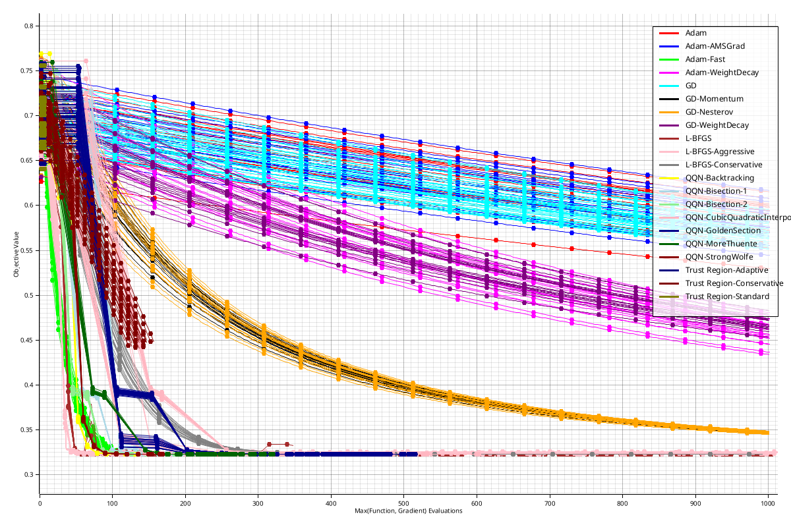
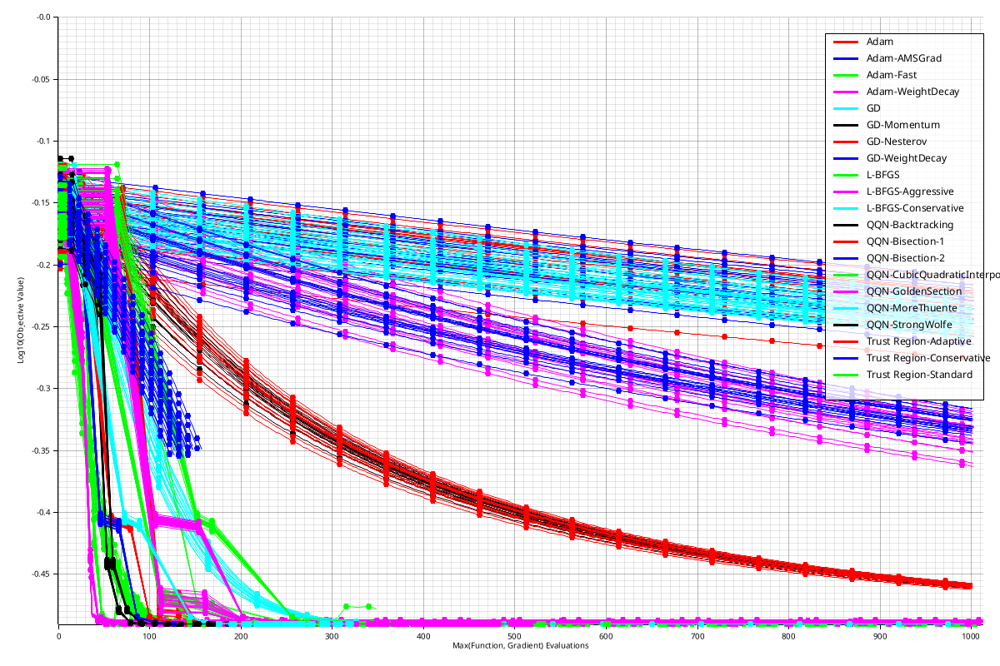

**Figure:** Convergence plots for LogisticRegression_200samples_10features_reg0.01 showing objective value vs iterations.
Left: Linear scale, Right: Log scale for better visualization of convergence behavior.

**Data:** [Linear scale data (CSV)](convergence_LogisticRegression_200samples_10features_reg0.01_data.csv) | [Log scale data (CSV)](convergence_LogisticRegression_200samples_10features_reg0.01_log_data.csv)

## Problem: LinearRegression_100samples_5features_reg0.01

**Family:** ML Regression  
**Dimension:** 5  
**Success Threshold:** 7.150e-2  
**Total Runs:** 560

### Performance Summary
<table style="border-collapse: collapse; width: 100%; margin: 20px 0;">
<tr style="background-color: #f2f2f2;">
<th style="border: 1px solid #ddd; padding: 8px; text-align: center;">Rank</th>
<th style="border: 1px solid #ddd; padding: 8px; text-align: center;">Optimizer</th>
<th style="border: 1px solid #ddd; padding: 8px; text-align: center;">Mean Final Value (All/Success/Fail)</th>
<th style="border: 1px solid #ddd; padding: 8px; text-align: center;">Std Dev</th>
<th style="border: 1px solid #ddd; padding: 8px; text-align: center;">Best Value</th>
<th style="border: 1px solid #ddd; padding: 8px; text-align: center;">Worst Value</th>
<th style="border: 1px solid #ddd; padding: 8px; text-align: center;">Mean Function Evals (All/Success/Fail)</th>
<th style="border: 1px solid #ddd; padding: 8px; text-align: center;">Mean Gradient Evals (All/Success/Fail)</th>
<th style="border: 1px solid #ddd; padding: 8px; text-align: center;">Success Rate</th>
<th style="border: 1px solid #ddd; padding: 8px; text-align: center;">Mean Time (s)</th>
</tr>
<tr style="background-color: #d4edda; font-weight: bold;">
<td style="border: 1px solid #ddd; padding: 8px; text-align: center;">1</td>
<td style="border: 1px solid #ddd; padding: 8px; text-align: center;"><a href="detailed_LinearRegression_100samples_5features_reg0.01_L-BFGS-Aggressive.md">L-BFGS-Aggressive</a></td>
<td style="border: 1px solid #ddd; padding: 8px; text-align: center;">7.20e-2 / - / 7.20e-2</td>
<td style="border: 1px solid #ddd; padding: 8px; text-align: center;">1.90e-3</td>
<td style="border: 1px solid #ddd; padding: 8px; text-align: center;">7.15e-2</td>
<td style="border: 1px solid #ddd; padding: 8px; text-align: center;">8.04e-2</td>
<td style="border: 1px solid #ddd; padding: 8px; text-align: center;">309.3 / - / 309.3</td>
<td style="border: 1px solid #ddd; padding: 8px; text-align: center;">111.2 / - / 111.2</td>
<td style="border: 1px solid #ddd; padding: 8px; text-align: center;">0.0%</td>
<td style="border: 1px solid #ddd; padding: 8px; text-align: center;">0.066</td>
</tr>
<tr style="background-color: #fff3cd;">
<td style="border: 1px solid #ddd; padding: 8px; text-align: center;">2</td>
<td style="border: 1px solid #ddd; padding: 8px; text-align: center;"><a href="detailed_LinearRegression_100samples_5features_reg0.01_QQN-GoldenSection.md">QQN-GoldenSection</a></td>
<td style="border: 1px solid #ddd; padding: 8px; text-align: center;">7.15e-2 / - / 7.15e-2</td>
<td style="border: 1px solid #ddd; padding: 8px; text-align: center;">7.23e-10</td>
<td style="border: 1px solid #ddd; padding: 8px; text-align: center;">7.15e-2</td>
<td style="border: 1px solid #ddd; padding: 8px; text-align: center;">7.15e-2</td>
<td style="border: 1px solid #ddd; padding: 8px; text-align: center;">326.5 / - / 326.5</td>
<td style="border: 1px solid #ddd; padding: 8px; text-align: center;">58.6 / - / 58.6</td>
<td style="border: 1px solid #ddd; padding: 8px; text-align: center;">0.0%</td>
<td style="border: 1px solid #ddd; padding: 8px; text-align: center;">0.060</td>
</tr>
<tr style="">
<td style="border: 1px solid #ddd; padding: 8px; text-align: center;">3</td>
<td style="border: 1px solid #ddd; padding: 8px; text-align: center;"><a href="detailed_LinearRegression_100samples_5features_reg0.01_QQN-Bisection-1.md">QQN-Bisection-1</a></td>
<td style="border: 1px solid #ddd; padding: 8px; text-align: center;">7.15e-2 / - / 7.15e-2</td>
<td style="border: 1px solid #ddd; padding: 8px; text-align: center;">3.15e-14</td>
<td style="border: 1px solid #ddd; padding: 8px; text-align: center;">7.15e-2</td>
<td style="border: 1px solid #ddd; padding: 8px; text-align: center;">7.15e-2</td>
<td style="border: 1px solid #ddd; padding: 8px; text-align: center;">124.5 / - / 124.5</td>
<td style="border: 1px solid #ddd; padding: 8px; text-align: center;">156.0 / - / 156.0</td>
<td style="border: 1px solid #ddd; padding: 8px; text-align: center;">0.0%</td>
<td style="border: 1px solid #ddd; padding: 8px; text-align: center;">0.046</td>
</tr>
<tr style="">
<td style="border: 1px solid #ddd; padding: 8px; text-align: center;">4</td>
<td style="border: 1px solid #ddd; padding: 8px; text-align: center;"><a href="detailed_LinearRegression_100samples_5features_reg0.01_QQN-Bisection-2.md">QQN-Bisection-2</a></td>
<td style="border: 1px solid #ddd; padding: 8px; text-align: center;">7.15e-2 / - / 7.15e-2</td>
<td style="border: 1px solid #ddd; padding: 8px; text-align: center;">1.62e-14</td>
<td style="border: 1px solid #ddd; padding: 8px; text-align: center;">7.15e-2</td>
<td style="border: 1px solid #ddd; padding: 8px; text-align: center;">7.15e-2</td>
<td style="border: 1px solid #ddd; padding: 8px; text-align: center;">103.0 / - / 103.0</td>
<td style="border: 1px solid #ddd; padding: 8px; text-align: center;">117.0 / - / 117.0</td>
<td style="border: 1px solid #ddd; padding: 8px; text-align: center;">0.0%</td>
<td style="border: 1px solid #ddd; padding: 8px; text-align: center;">0.037</td>
</tr>
<tr style="">
<td style="border: 1px solid #ddd; padding: 8px; text-align: center;">5</td>
<td style="border: 1px solid #ddd; padding: 8px; text-align: center;"><a href="detailed_LinearRegression_100samples_5features_reg0.01_QQN-CubicQuadraticInterpolation.md">QQN-CubicQuadraticInterpolation</a></td>
<td style="border: 1px solid #ddd; padding: 8px; text-align: center;">7.15e-2 / - / 7.15e-2</td>
<td style="border: 1px solid #ddd; padding: 8px; text-align: center;">2.72e-10</td>
<td style="border: 1px solid #ddd; padding: 8px; text-align: center;">7.15e-2</td>
<td style="border: 1px solid #ddd; padding: 8px; text-align: center;">7.15e-2</td>
<td style="border: 1px solid #ddd; padding: 8px; text-align: center;">131.7 / - / 131.7</td>
<td style="border: 1px solid #ddd; padding: 8px; text-align: center;">125.3 / - / 125.3</td>
<td style="border: 1px solid #ddd; padding: 8px; text-align: center;">0.0%</td>
<td style="border: 1px solid #ddd; padding: 8px; text-align: center;">0.043</td>
</tr>
<tr style="">
<td style="border: 1px solid #ddd; padding: 8px; text-align: center;">6</td>
<td style="border: 1px solid #ddd; padding: 8px; text-align: center;"><a href="detailed_LinearRegression_100samples_5features_reg0.01_QQN-MoreThuente.md">QQN-MoreThuente</a></td>
<td style="border: 1px solid #ddd; padding: 8px; text-align: center;">7.15e-2 / - / 7.15e-2</td>
<td style="border: 1px solid #ddd; padding: 8px; text-align: center;">5.59e-10</td>
<td style="border: 1px solid #ddd; padding: 8px; text-align: center;">7.15e-2</td>
<td style="border: 1px solid #ddd; padding: 8px; text-align: center;">7.15e-2</td>
<td style="border: 1px solid #ddd; padding: 8px; text-align: center;">91.2 / - / 91.2</td>
<td style="border: 1px solid #ddd; padding: 8px; text-align: center;">83.2 / - / 83.2</td>
<td style="border: 1px solid #ddd; padding: 8px; text-align: center;">0.0%</td>
<td style="border: 1px solid #ddd; padding: 8px; text-align: center;">0.029</td>
</tr>
<tr style="">
<td style="border: 1px solid #ddd; padding: 8px; text-align: center;">7</td>
<td style="border: 1px solid #ddd; padding: 8px; text-align: center;"><a href="detailed_LinearRegression_100samples_5features_reg0.01_QQN-StrongWolfe.md">QQN-StrongWolfe</a></td>
<td style="border: 1px solid #ddd; padding: 8px; text-align: center;">7.15e-2 / - / 7.15e-2</td>
<td style="border: 1px solid #ddd; padding: 8px; text-align: center;">6.70e-14</td>
<td style="border: 1px solid #ddd; padding: 8px; text-align: center;">7.15e-2</td>
<td style="border: 1px solid #ddd; padding: 8px; text-align: center;">7.15e-2</td>
<td style="border: 1px solid #ddd; padding: 8px; text-align: center;">110.6 / - / 110.6</td>
<td style="border: 1px solid #ddd; padding: 8px; text-align: center;">117.6 / - / 117.6</td>
<td style="border: 1px solid #ddd; padding: 8px; text-align: center;">0.0%</td>
<td style="border: 1px solid #ddd; padding: 8px; text-align: center;">0.039</td>
</tr>
<tr style="">
<td style="border: 1px solid #ddd; padding: 8px; text-align: center;">8</td>
<td style="border: 1px solid #ddd; padding: 8px; text-align: center;"><a href="detailed_LinearRegression_100samples_5features_reg0.01_QQN-Backtracking.md">QQN-Backtracking</a></td>
<td style="border: 1px solid #ddd; padding: 8px; text-align: center;">7.15e-2 / - / 7.15e-2</td>
<td style="border: 1px solid #ddd; padding: 8px; text-align: center;">3.44e-14</td>
<td style="border: 1px solid #ddd; padding: 8px; text-align: center;">7.15e-2</td>
<td style="border: 1px solid #ddd; padding: 8px; text-align: center;">7.15e-2</td>
<td style="border: 1px solid #ddd; padding: 8px; text-align: center;">83.0 / - / 83.0</td>
<td style="border: 1px solid #ddd; padding: 8px; text-align: center;">69.0 / - / 69.0</td>
<td style="border: 1px solid #ddd; padding: 8px; text-align: center;">0.0%</td>
<td style="border: 1px solid #ddd; padding: 8px; text-align: center;">0.026</td>
</tr>
<tr style="">
<td style="border: 1px solid #ddd; padding: 8px; text-align: center;">9</td>
<td style="border: 1px solid #ddd; padding: 8px; text-align: center;"><a href="detailed_LinearRegression_100samples_5features_reg0.01_L-BFGS.md">L-BFGS</a></td>
<td style="border: 1px solid #ddd; padding: 8px; text-align: center;">7.16e-2 / - / 8.02e-2</td>
<td style="border: 1px solid #ddd; padding: 8px; text-align: center;">1.09e-4</td>
<td style="border: 1px solid #ddd; padding: 8px; text-align: center;">7.15e-2</td>
<td style="border: 1px solid #ddd; padding: 8px; text-align: center;">7.20e-2</td>
<td style="border: 1px solid #ddd; padding: 8px; text-align: center;">239.8 / - / 239.8</td>
<td style="border: 1px solid #ddd; padding: 8px; text-align: center;">134.1 / - / 134.1</td>
<td style="border: 1px solid #ddd; padding: 8px; text-align: center;">0.0%</td>
<td style="border: 1px solid #ddd; padding: 8px; text-align: center;">0.061</td>
</tr>
<tr style="">
<td style="border: 1px solid #ddd; padding: 8px; text-align: center;">10</td>
<td style="border: 1px solid #ddd; padding: 8px; text-align: center;"><a href="detailed_LinearRegression_100samples_5features_reg0.01_L-BFGS-Conservative.md">L-BFGS-Conservative</a></td>
<td style="border: 1px solid #ddd; padding: 8px; text-align: center;">7.15e-2 / - / 7.15e-2</td>
<td style="border: 1px solid #ddd; padding: 8px; text-align: center;">1.66e-8</td>
<td style="border: 1px solid #ddd; padding: 8px; text-align: center;">7.15e-2</td>
<td style="border: 1px solid #ddd; padding: 8px; text-align: center;">7.15e-2</td>
<td style="border: 1px solid #ddd; padding: 8px; text-align: center;">553.2 / - / 553.2</td>
<td style="border: 1px solid #ddd; padding: 8px; text-align: center;">442.8 / - / 442.8</td>
<td style="border: 1px solid #ddd; padding: 8px; text-align: center;">0.0%</td>
<td style="border: 1px solid #ddd; padding: 8px; text-align: center;">0.167</td>
</tr>
<tr style="">
<td style="border: 1px solid #ddd; padding: 8px; text-align: center;">11</td>
<td style="border: 1px solid #ddd; padding: 8px; text-align: center;"><a href="detailed_LinearRegression_100samples_5features_reg0.01_GD-WeightDecay.md">GD-WeightDecay</a></td>
<td style="border: 1px solid #ddd; padding: 8px; text-align: center;">7.15e-2 / - / 7.15e-2</td>
<td style="border: 1px solid #ddd; padding: 8px; text-align: center;">1.85e-10</td>
<td style="border: 1px solid #ddd; padding: 8px; text-align: center;">7.15e-2</td>
<td style="border: 1px solid #ddd; padding: 8px; text-align: center;">7.15e-2</td>
<td style="border: 1px solid #ddd; padding: 8px; text-align: center;">165.3 / - / 165.3</td>
<td style="border: 1px solid #ddd; padding: 8px; text-align: center;">328.7 / - / 328.7</td>
<td style="border: 1px solid #ddd; padding: 8px; text-align: center;">0.0%</td>
<td style="border: 1px solid #ddd; padding: 8px; text-align: center;">0.084</td>
</tr>
<tr style="">
<td style="border: 1px solid #ddd; padding: 8px; text-align: center;">12</td>
<td style="border: 1px solid #ddd; padding: 8px; text-align: center;"><a href="detailed_LinearRegression_100samples_5features_reg0.01_GD.md">GD</a></td>
<td style="border: 1px solid #ddd; padding: 8px; text-align: center;">7.16e-2 / - / 7.16e-2</td>
<td style="border: 1px solid #ddd; padding: 8px; text-align: center;">5.10e-7</td>
<td style="border: 1px solid #ddd; padding: 8px; text-align: center;">7.15e-2</td>
<td style="border: 1px solid #ddd; padding: 8px; text-align: center;">7.16e-2</td>
<td style="border: 1px solid #ddd; padding: 8px; text-align: center;">335.0 / - / 335.0</td>
<td style="border: 1px solid #ddd; padding: 8px; text-align: center;">668.0 / - / 668.0</td>
<td style="border: 1px solid #ddd; padding: 8px; text-align: center;">0.0%</td>
<td style="border: 1px solid #ddd; padding: 8px; text-align: center;">0.170</td>
</tr>
<tr style="">
<td style="border: 1px solid #ddd; padding: 8px; text-align: center;">13</td>
<td style="border: 1px solid #ddd; padding: 8px; text-align: center;"><a href="detailed_LinearRegression_100samples_5features_reg0.01_Adam-Fast.md">Adam-Fast</a></td>
<td style="border: 1px solid #ddd; padding: 8px; text-align: center;">1.67e-1 / - / 2.10e-1</td>
<td style="border: 1px solid #ddd; padding: 8px; text-align: center;">4.56e-2</td>
<td style="border: 1px solid #ddd; padding: 8px; text-align: center;">7.20e-2</td>
<td style="border: 1px solid #ddd; padding: 8px; text-align: center;">2.39e-1</td>
<td style="border: 1px solid #ddd; padding: 8px; text-align: center;">88.3 / - / 88.3</td>
<td style="border: 1px solid #ddd; padding: 8px; text-align: center;">87.3 / - / 87.3</td>
<td style="border: 1px solid #ddd; padding: 8px; text-align: center;">0.0%</td>
<td style="border: 1px solid #ddd; padding: 8px; text-align: center;">0.029</td>
</tr>
<tr style="">
<td style="border: 1px solid #ddd; padding: 8px; text-align: center;">14</td>
<td style="border: 1px solid #ddd; padding: 8px; text-align: center;"><a href="detailed_LinearRegression_100samples_5features_reg0.01_Trust_Region-Adaptive.md">Trust Region-Adaptive</a></td>
<td style="border: 1px solid #ddd; padding: 8px; text-align: center;">9.09e-2 / - / 1.81e3</td>
<td style="border: 1px solid #ddd; padding: 8px; text-align: center;">1.27e-2</td>
<td style="border: 1px solid #ddd; padding: 8px; text-align: center;">7.43e-2</td>
<td style="border: 1px solid #ddd; padding: 8px; text-align: center;">1.22e-1</td>
<td style="border: 1px solid #ddd; padding: 8px; text-align: center;">232.8 / - / 232.8</td>
<td style="border: 1px solid #ddd; padding: 8px; text-align: center;">155.2 / - / 155.2</td>
<td style="border: 1px solid #ddd; padding: 8px; text-align: center;">0.0%</td>
<td style="border: 1px solid #ddd; padding: 8px; text-align: center;">0.060</td>
</tr>
<tr style="">
<td style="border: 1px solid #ddd; padding: 8px; text-align: center;">15</td>
<td style="border: 1px solid #ddd; padding: 8px; text-align: center;"><a href="detailed_LinearRegression_100samples_5features_reg0.01_Trust_Region-Standard.md">Trust Region-Standard</a></td>
<td style="border: 1px solid #ddd; padding: 8px; text-align: center;">1.63e-1 / - / 1.21e2</td>
<td style="border: 1px solid #ddd; padding: 8px; text-align: center;">8.09e-2</td>
<td style="border: 1px solid #ddd; padding: 8px; text-align: center;">8.32e-2</td>
<td style="border: 1px solid #ddd; padding: 8px; text-align: center;">3.36e-1</td>
<td style="border: 1px solid #ddd; padding: 8px; text-align: center;">76.8 / - / 76.8</td>
<td style="border: 1px solid #ddd; padding: 8px; text-align: center;">51.3 / - / 51.3</td>
<td style="border: 1px solid #ddd; padding: 8px; text-align: center;">0.0%</td>
<td style="border: 1px solid #ddd; padding: 8px; text-align: center;">0.020</td>
</tr>
<tr style="">
<td style="border: 1px solid #ddd; padding: 8px; text-align: center;">16</td>
<td style="border: 1px solid #ddd; padding: 8px; text-align: center;"><a href="detailed_LinearRegression_100samples_5features_reg0.01_GD-Nesterov.md">GD-Nesterov</a></td>
<td style="border: 1px solid #ddd; padding: 8px; text-align: center;">1.86e-1 / - / 9.04e-1</td>
<td style="border: 1px solid #ddd; padding: 8px; text-align: center;">9.18e-3</td>
<td style="border: 1px solid #ddd; padding: 8px; text-align: center;">1.71e-1</td>
<td style="border: 1px solid #ddd; padding: 8px; text-align: center;">2.03e-1</td>
<td style="border: 1px solid #ddd; padding: 8px; text-align: center;">23.8 / - / 23.8</td>
<td style="border: 1px solid #ddd; padding: 8px; text-align: center;">43.6 / - / 43.6</td>
<td style="border: 1px solid #ddd; padding: 8px; text-align: center;">0.0%</td>
<td style="border: 1px solid #ddd; padding: 8px; text-align: center;">0.012</td>
</tr>
<tr style="">
<td style="border: 1px solid #ddd; padding: 8px; text-align: center;">17</td>
<td style="border: 1px solid #ddd; padding: 8px; text-align: center;"><a href="detailed_LinearRegression_100samples_5features_reg0.01_GD-Momentum.md">GD-Momentum</a></td>
<td style="border: 1px solid #ddd; padding: 8px; text-align: center;">2.20e-1 / - / 1.38e0</td>
<td style="border: 1px solid #ddd; padding: 8px; text-align: center;">1.52e-2</td>
<td style="border: 1px solid #ddd; padding: 8px; text-align: center;">1.99e-1</td>
<td style="border: 1px solid #ddd; padding: 8px; text-align: center;">2.51e-1</td>
<td style="border: 1px solid #ddd; padding: 8px; text-align: center;">24.1 / - / 24.1</td>
<td style="border: 1px solid #ddd; padding: 8px; text-align: center;">44.3 / - / 44.3</td>
<td style="border: 1px solid #ddd; padding: 8px; text-align: center;">0.0%</td>
<td style="border: 1px solid #ddd; padding: 8px; text-align: center;">0.012</td>
</tr>
<tr style="">
<td style="border: 1px solid #ddd; padding: 8px; text-align: center;">18</td>
<td style="border: 1px solid #ddd; padding: 8px; text-align: center;"><a href="detailed_LinearRegression_100samples_5features_reg0.01_Adam-WeightDecay.md">Adam-WeightDecay</a></td>
<td style="border: 1px solid #ddd; padding: 8px; text-align: center;">7.28e0 / - / 7.28e0</td>
<td style="border: 1px solid #ddd; padding: 8px; text-align: center;">5.46e-1</td>
<td style="border: 1px solid #ddd; padding: 8px; text-align: center;">6.17e0</td>
<td style="border: 1px solid #ddd; padding: 8px; text-align: center;">7.93e0</td>
<td style="border: 1px solid #ddd; padding: 8px; text-align: center;">502.0 / - / 502.0</td>
<td style="border: 1px solid #ddd; padding: 8px; text-align: center;">502.0 / - / 502.0</td>
<td style="border: 1px solid #ddd; padding: 8px; text-align: center;">0.0%</td>
<td style="border: 1px solid #ddd; padding: 8px; text-align: center;">0.166</td>
</tr>
<tr style="">
<td style="border: 1px solid #ddd; padding: 8px; text-align: center;">19</td>
<td style="border: 1px solid #ddd; padding: 8px; text-align: center;"><a href="detailed_LinearRegression_100samples_5features_reg0.01_Adam.md">Adam</a></td>
<td style="border: 1px solid #ddd; padding: 8px; text-align: center;">1.31e1 / - / 1.31e1</td>
<td style="border: 1px solid #ddd; padding: 8px; text-align: center;">9.42e-1</td>
<td style="border: 1px solid #ddd; padding: 8px; text-align: center;">1.17e1</td>
<td style="border: 1px solid #ddd; padding: 8px; text-align: center;">1.45e1</td>
<td style="border: 1px solid #ddd; padding: 8px; text-align: center;">502.0 / - / 502.0</td>
<td style="border: 1px solid #ddd; padding: 8px; text-align: center;">502.0 / - / 502.0</td>
<td style="border: 1px solid #ddd; padding: 8px; text-align: center;">0.0%</td>
<td style="border: 1px solid #ddd; padding: 8px; text-align: center;">0.165</td>
</tr>
<tr style="">
<td style="border: 1px solid #ddd; padding: 8px; text-align: center;">20</td>
<td style="border: 1px solid #ddd; padding: 8px; text-align: center;"><a href="detailed_LinearRegression_100samples_5features_reg0.01_Adam-AMSGrad.md">Adam-AMSGrad</a></td>
<td style="border: 1px solid #ddd; padding: 8px; text-align: center;">1.34e1 / - / 1.34e1</td>
<td style="border: 1px solid #ddd; padding: 8px; text-align: center;">8.32e-1</td>
<td style="border: 1px solid #ddd; padding: 8px; text-align: center;">1.17e1</td>
<td style="border: 1px solid #ddd; padding: 8px; text-align: center;">1.52e1</td>
<td style="border: 1px solid #ddd; padding: 8px; text-align: center;">502.0 / - / 502.0</td>
<td style="border: 1px solid #ddd; padding: 8px; text-align: center;">502.0 / - / 502.0</td>
<td style="border: 1px solid #ddd; padding: 8px; text-align: center;">0.0%</td>
<td style="border: 1px solid #ddd; padding: 8px; text-align: center;">0.166</td>
</tr>
<tr style="">
<td style="border: 1px solid #ddd; padding: 8px; text-align: center;">21</td>
<td style="border: 1px solid #ddd; padding: 8px; text-align: center;"><a href="detailed_LinearRegression_100samples_5features_reg0.01_Trust_Region-Conservative.md">Trust Region-Conservative</a></td>
<td style="border: 1px solid #ddd; padding: 8px; text-align: center;">1.57e1 / - / 1.57e1</td>
<td style="border: 1px solid #ddd; padding: 8px; text-align: center;">1.19e0</td>
<td style="border: 1px solid #ddd; padding: 8px; text-align: center;">1.32e1</td>
<td style="border: 1px solid #ddd; padding: 8px; text-align: center;">1.79e1</td>
<td style="border: 1px solid #ddd; padding: 8px; text-align: center;">602.0 / - / 602.0</td>
<td style="border: 1px solid #ddd; padding: 8px; text-align: center;">402.0 / - / 402.0</td>
<td style="border: 1px solid #ddd; padding: 8px; text-align: center;">0.0%</td>
<td style="border: 1px solid #ddd; padding: 8px; text-align: center;">0.155</td>
</tr>
</table>

### Convergence Plots

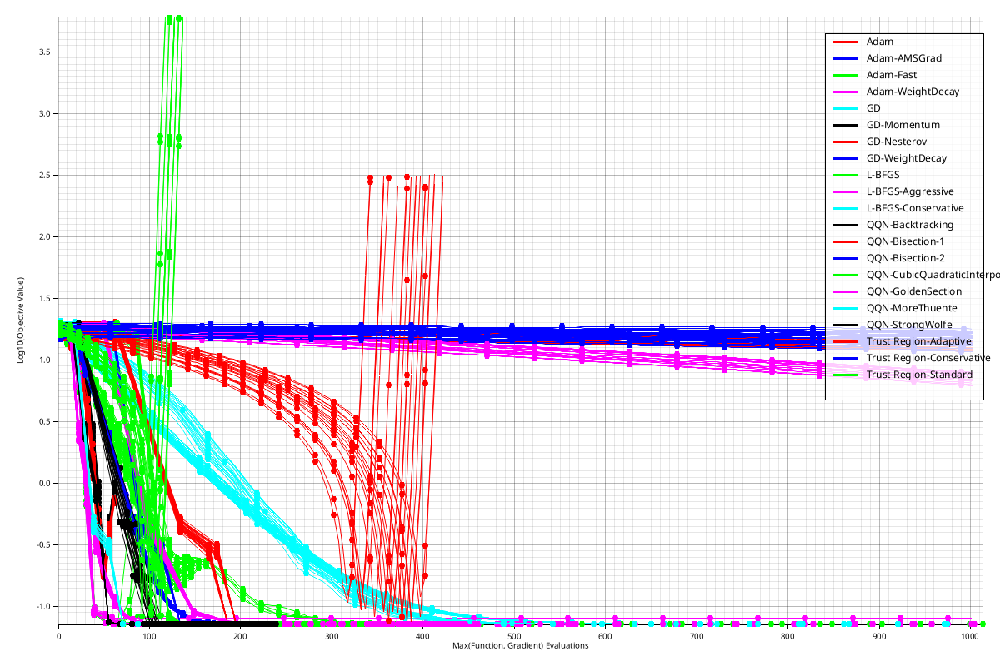

**Figure:** Convergence plots for LinearRegression_100samples_5features_reg0.01 showing objective value vs iterations.
Left: Linear scale, Right: Log scale for better visualization of convergence behavior.

**Data:** [Linear scale data (CSV)](convergence_LinearRegression_100samples_5features_reg0.01_data.csv) | [Log scale data (CSV)](convergence_LinearRegression_100samples_5features_reg0.01_log_data.csv)

## Problem: LinearRegression_200samples_10features_reg0.01

**Family:** ML Regression  
**Dimension:** 10  
**Success Threshold:** 4.820e-1  
**Total Runs:** 560

### Performance Summary
<table style="border-collapse: collapse; width: 100%; margin: 20px 0;">
<tr style="background-color: #f2f2f2;">
<th style="border: 1px solid #ddd; padding: 8px; text-align: center;">Rank</th>
<th style="border: 1px solid #ddd; padding: 8px; text-align: center;">Optimizer</th>
<th style="border: 1px solid #ddd; padding: 8px; text-align: center;">Mean Final Value (All/Success/Fail)</th>
<th style="border: 1px solid #ddd; padding: 8px; text-align: center;">Std Dev</th>
<th style="border: 1px solid #ddd; padding: 8px; text-align: center;">Best Value</th>
<th style="border: 1px solid #ddd; padding: 8px; text-align: center;">Worst Value</th>
<th style="border: 1px solid #ddd; padding: 8px; text-align: center;">Mean Function Evals (All/Success/Fail)</th>
<th style="border: 1px solid #ddd; padding: 8px; text-align: center;">Mean Gradient Evals (All/Success/Fail)</th>
<th style="border: 1px solid #ddd; padding: 8px; text-align: center;">Success Rate</th>
<th style="border: 1px solid #ddd; padding: 8px; text-align: center;">Mean Time (s)</th>
</tr>
<tr style="background-color: #d4edda; font-weight: bold;">
<td style="border: 1px solid #ddd; padding: 8px; text-align: center;">1</td>
<td style="border: 1px solid #ddd; padding: 8px; text-align: center;"><a href="detailed_LinearRegression_200samples_10features_reg0.01_L-BFGS-Aggressive.md">L-BFGS-Aggressive</a></td>
<td style="border: 1px solid #ddd; padding: 8px; text-align: center;">5.22e-1 / 4.82e-1 / 5.72e-1</td>
<td style="border: 1px solid #ddd; padding: 8px; text-align: center;">6.13e-2</td>
<td style="border: 1px solid #ddd; padding: 8px; text-align: center;">4.82e-1</td>
<td style="border: 1px solid #ddd; padding: 8px; text-align: center;">7.10e-1</td>
<td style="border: 1px solid #ddd; padding: 8px; text-align: center;">553.2 / 379.1 / 765.9</td>
<td style="border: 1px solid #ddd; padding: 8px; text-align: center;">198.0 / 164.0 / 239.5</td>
<td style="border: 1px solid #ddd; padding: 8px; text-align: center;">55.0%</td>
<td style="border: 1px solid #ddd; padding: 8px; text-align: center;">0.213</td>
</tr>
<tr style="background-color: #fff3cd;">
<td style="border: 1px solid #ddd; padding: 8px; text-align: center;">2</td>
<td style="border: 1px solid #ddd; padding: 8px; text-align: center;"><a href="detailed_LinearRegression_200samples_10features_reg0.01_QQN-MoreThuente.md">QQN-MoreThuente</a></td>
<td style="border: 1px solid #ddd; padding: 8px; text-align: center;">4.82e-1 / 4.82e-1 / -</td>
<td style="border: 1px solid #ddd; padding: 8px; text-align: center;">3.89e-9</td>
<td style="border: 1px solid #ddd; padding: 8px; text-align: center;">4.82e-1</td>
<td style="border: 1px solid #ddd; padding: 8px; text-align: center;">4.82e-1</td>
<td style="border: 1px solid #ddd; padding: 8px; text-align: center;">144.6 / 144.6 / -</td>
<td style="border: 1px solid #ddd; padding: 8px; text-align: center;">133.9 / 133.9 / -</td>
<td style="border: 1px solid #ddd; padding: 8px; text-align: center;">100.0%</td>
<td style="border: 1px solid #ddd; padding: 8px; text-align: center;">0.084</td>
</tr>
<tr style="">
<td style="border: 1px solid #ddd; padding: 8px; text-align: center;">3</td>
<td style="border: 1px solid #ddd; padding: 8px; text-align: center;"><a href="detailed_LinearRegression_200samples_10features_reg0.01_QQN-CubicQuadraticInterpolation.md">QQN-CubicQuadraticInterpolation</a></td>
<td style="border: 1px solid #ddd; padding: 8px; text-align: center;">4.82e-1 / 4.82e-1 / -</td>
<td style="border: 1px solid #ddd; padding: 8px; text-align: center;">6.66e-9</td>
<td style="border: 1px solid #ddd; padding: 8px; text-align: center;">4.82e-1</td>
<td style="border: 1px solid #ddd; padding: 8px; text-align: center;">4.82e-1</td>
<td style="border: 1px solid #ddd; padding: 8px; text-align: center;">155.9 / 155.9 / -</td>
<td style="border: 1px solid #ddd; padding: 8px; text-align: center;">159.2 / 159.2 / -</td>
<td style="border: 1px solid #ddd; padding: 8px; text-align: center;">100.0%</td>
<td style="border: 1px solid #ddd; padding: 8px; text-align: center;">0.096</td>
</tr>
<tr style="">
<td style="border: 1px solid #ddd; padding: 8px; text-align: center;">4</td>
<td style="border: 1px solid #ddd; padding: 8px; text-align: center;"><a href="detailed_LinearRegression_200samples_10features_reg0.01_QQN-GoldenSection.md">QQN-GoldenSection</a></td>
<td style="border: 1px solid #ddd; padding: 8px; text-align: center;">4.82e-1 / 4.82e-1 / -</td>
<td style="border: 1px solid #ddd; padding: 8px; text-align: center;">5.86e-14</td>
<td style="border: 1px solid #ddd; padding: 8px; text-align: center;">4.82e-1</td>
<td style="border: 1px solid #ddd; padding: 8px; text-align: center;">4.82e-1</td>
<td style="border: 1px solid #ddd; padding: 8px; text-align: center;">365.6 / 365.6 / -</td>
<td style="border: 1px solid #ddd; padding: 8px; text-align: center;">64.9 / 64.9 / -</td>
<td style="border: 1px solid #ddd; padding: 8px; text-align: center;">100.0%</td>
<td style="border: 1px solid #ddd; padding: 8px; text-align: center;">0.120</td>
</tr>
<tr style="">
<td style="border: 1px solid #ddd; padding: 8px; text-align: center;">5</td>
<td style="border: 1px solid #ddd; padding: 8px; text-align: center;"><a href="detailed_LinearRegression_200samples_10features_reg0.01_L-BFGS.md">L-BFGS</a></td>
<td style="border: 1px solid #ddd; padding: 8px; text-align: center;">4.82e-1 / 4.88e-1 / -</td>
<td style="border: 1px solid #ddd; padding: 8px; text-align: center;">5.68e-5</td>
<td style="border: 1px solid #ddd; padding: 8px; text-align: center;">4.82e-1</td>
<td style="border: 1px solid #ddd; padding: 8px; text-align: center;">4.82e-1</td>
<td style="border: 1px solid #ddd; padding: 8px; text-align: center;">189.4 / 189.4 / -</td>
<td style="border: 1px solid #ddd; padding: 8px; text-align: center;">122.9 / 122.9 / -</td>
<td style="border: 1px solid #ddd; padding: 8px; text-align: center;">100.0%</td>
<td style="border: 1px solid #ddd; padding: 8px; text-align: center;">0.094</td>
</tr>
<tr style="">
<td style="border: 1px solid #ddd; padding: 8px; text-align: center;">6</td>
<td style="border: 1px solid #ddd; padding: 8px; text-align: center;"><a href="detailed_LinearRegression_200samples_10features_reg0.01_QQN-Bisection-1.md">QQN-Bisection-1</a></td>
<td style="border: 1px solid #ddd; padding: 8px; text-align: center;">4.82e-1 / 4.82e-1 / -</td>
<td style="border: 1px solid #ddd; padding: 8px; text-align: center;">4.55e-14</td>
<td style="border: 1px solid #ddd; padding: 8px; text-align: center;">4.82e-1</td>
<td style="border: 1px solid #ddd; padding: 8px; text-align: center;">4.82e-1</td>
<td style="border: 1px solid #ddd; padding: 8px; text-align: center;">144.3 / 144.3 / -</td>
<td style="border: 1px solid #ddd; padding: 8px; text-align: center;">174.0 / 174.0 / -</td>
<td style="border: 1px solid #ddd; padding: 8px; text-align: center;">100.0%</td>
<td style="border: 1px solid #ddd; padding: 8px; text-align: center;">0.096</td>
</tr>
<tr style="">
<td style="border: 1px solid #ddd; padding: 8px; text-align: center;">7</td>
<td style="border: 1px solid #ddd; padding: 8px; text-align: center;"><a href="detailed_LinearRegression_200samples_10features_reg0.01_QQN-Bisection-2.md">QQN-Bisection-2</a></td>
<td style="border: 1px solid #ddd; padding: 8px; text-align: center;">4.82e-1 / 4.82e-1 / -</td>
<td style="border: 1px solid #ddd; padding: 8px; text-align: center;">5.79e-14</td>
<td style="border: 1px solid #ddd; padding: 8px; text-align: center;">4.82e-1</td>
<td style="border: 1px solid #ddd; padding: 8px; text-align: center;">4.82e-1</td>
<td style="border: 1px solid #ddd; padding: 8px; text-align: center;">121.7 / 121.7 / -</td>
<td style="border: 1px solid #ddd; padding: 8px; text-align: center;">132.3 / 132.3 / -</td>
<td style="border: 1px solid #ddd; padding: 8px; text-align: center;">100.0%</td>
<td style="border: 1px solid #ddd; padding: 8px; text-align: center;">0.077</td>
</tr>
<tr style="">
<td style="border: 1px solid #ddd; padding: 8px; text-align: center;">8</td>
<td style="border: 1px solid #ddd; padding: 8px; text-align: center;"><a href="detailed_LinearRegression_200samples_10features_reg0.01_QQN-StrongWolfe.md">QQN-StrongWolfe</a></td>
<td style="border: 1px solid #ddd; padding: 8px; text-align: center;">4.82e-1 / 4.82e-1 / -</td>
<td style="border: 1px solid #ddd; padding: 8px; text-align: center;">1.26e-14</td>
<td style="border: 1px solid #ddd; padding: 8px; text-align: center;">4.82e-1</td>
<td style="border: 1px solid #ddd; padding: 8px; text-align: center;">4.82e-1</td>
<td style="border: 1px solid #ddd; padding: 8px; text-align: center;">126.0 / 126.0 / -</td>
<td style="border: 1px solid #ddd; padding: 8px; text-align: center;">136.2 / 136.2 / -</td>
<td style="border: 1px solid #ddd; padding: 8px; text-align: center;">100.0%</td>
<td style="border: 1px solid #ddd; padding: 8px; text-align: center;">0.080</td>
</tr>
<tr style="">
<td style="border: 1px solid #ddd; padding: 8px; text-align: center;">9</td>
<td style="border: 1px solid #ddd; padding: 8px; text-align: center;"><a href="detailed_LinearRegression_200samples_10features_reg0.01_QQN-Backtracking.md">QQN-Backtracking</a></td>
<td style="border: 1px solid #ddd; padding: 8px; text-align: center;">4.82e-1 / 4.82e-1 / -</td>
<td style="border: 1px solid #ddd; padding: 8px; text-align: center;">6.64e-15</td>
<td style="border: 1px solid #ddd; padding: 8px; text-align: center;">4.82e-1</td>
<td style="border: 1px solid #ddd; padding: 8px; text-align: center;">4.82e-1</td>
<td style="border: 1px solid #ddd; padding: 8px; text-align: center;">104.0 / 104.0 / -</td>
<td style="border: 1px solid #ddd; padding: 8px; text-align: center;">87.0 / 87.0 / -</td>
<td style="border: 1px solid #ddd; padding: 8px; text-align: center;">100.0%</td>
<td style="border: 1px solid #ddd; padding: 8px; text-align: center;">0.057</td>
</tr>
<tr style="">
<td style="border: 1px solid #ddd; padding: 8px; text-align: center;">10</td>
<td style="border: 1px solid #ddd; padding: 8px; text-align: center;"><a href="detailed_LinearRegression_200samples_10features_reg0.01_Adam-Fast.md">Adam-Fast</a></td>
<td style="border: 1px solid #ddd; padding: 8px; text-align: center;">4.99e-1 / 4.83e-1 / 5.04e-1</td>
<td style="border: 1px solid #ddd; padding: 8px; text-align: center;">3.33e-2</td>
<td style="border: 1px solid #ddd; padding: 8px; text-align: center;">4.82e-1</td>
<td style="border: 1px solid #ddd; padding: 8px; text-align: center;">5.74e-1</td>
<td style="border: 1px solid #ddd; padding: 8px; text-align: center;">208.3 / 267.0 / 197.9</td>
<td style="border: 1px solid #ddd; padding: 8px; text-align: center;">207.3 / 266.0 / 196.9</td>
<td style="border: 1px solid #ddd; padding: 8px; text-align: center;">15.0%</td>
<td style="border: 1px solid #ddd; padding: 8px; text-align: center;">0.124</td>
</tr>
<tr style="">
<td style="border: 1px solid #ddd; padding: 8px; text-align: center;">11</td>
<td style="border: 1px solid #ddd; padding: 8px; text-align: center;"><a href="detailed_LinearRegression_200samples_10features_reg0.01_L-BFGS-Conservative.md">L-BFGS-Conservative</a></td>
<td style="border: 1px solid #ddd; padding: 8px; text-align: center;">4.82e-1 / - / 4.82e-1</td>
<td style="border: 1px solid #ddd; padding: 8px; text-align: center;">6.47e-7</td>
<td style="border: 1px solid #ddd; padding: 8px; text-align: center;">4.82e-1</td>
<td style="border: 1px solid #ddd; padding: 8px; text-align: center;">4.82e-1</td>
<td style="border: 1px solid #ddd; padding: 8px; text-align: center;">557.0 / - / 557.0</td>
<td style="border: 1px solid #ddd; padding: 8px; text-align: center;">446.0 / - / 446.0</td>
<td style="border: 1px solid #ddd; padding: 8px; text-align: center;">0.0%</td>
<td style="border: 1px solid #ddd; padding: 8px; text-align: center;">0.301</td>
</tr>
<tr style="">
<td style="border: 1px solid #ddd; padding: 8px; text-align: center;">12</td>
<td style="border: 1px solid #ddd; padding: 8px; text-align: center;"><a href="detailed_LinearRegression_200samples_10features_reg0.01_GD-WeightDecay.md">GD-WeightDecay</a></td>
<td style="border: 1px solid #ddd; padding: 8px; text-align: center;">4.82e-1 / 4.82e-1 / -</td>
<td style="border: 1px solid #ddd; padding: 8px; text-align: center;">2.38e-10</td>
<td style="border: 1px solid #ddd; padding: 8px; text-align: center;">4.82e-1</td>
<td style="border: 1px solid #ddd; padding: 8px; text-align: center;">4.82e-1</td>
<td style="border: 1px solid #ddd; padding: 8px; text-align: center;">226.3 / 226.3 / -</td>
<td style="border: 1px solid #ddd; padding: 8px; text-align: center;">450.6 / 450.6 / -</td>
<td style="border: 1px solid #ddd; padding: 8px; text-align: center;">100.0%</td>
<td style="border: 1px solid #ddd; padding: 8px; text-align: center;">0.212</td>
</tr>
<tr style="">
<td style="border: 1px solid #ddd; padding: 8px; text-align: center;">13</td>
<td style="border: 1px solid #ddd; padding: 8px; text-align: center;"><a href="detailed_LinearRegression_200samples_10features_reg0.01_GD.md">GD</a></td>
<td style="border: 1px solid #ddd; padding: 8px; text-align: center;">4.82e-1 / - / 4.82e-1</td>
<td style="border: 1px solid #ddd; padding: 8px; text-align: center;">2.81e-5</td>
<td style="border: 1px solid #ddd; padding: 8px; text-align: center;">4.82e-1</td>
<td style="border: 1px solid #ddd; padding: 8px; text-align: center;">4.82e-1</td>
<td style="border: 1px solid #ddd; padding: 8px; text-align: center;">335.0 / - / 335.0</td>
<td style="border: 1px solid #ddd; padding: 8px; text-align: center;">668.0 / - / 668.0</td>
<td style="border: 1px solid #ddd; padding: 8px; text-align: center;">0.0%</td>
<td style="border: 1px solid #ddd; padding: 8px; text-align: center;">0.311</td>
</tr>
<tr style="">
<td style="border: 1px solid #ddd; padding: 8px; text-align: center;">14</td>
<td style="border: 1px solid #ddd; padding: 8px; text-align: center;"><a href="detailed_LinearRegression_200samples_10features_reg0.01_Trust_Region-Standard.md">Trust Region-Standard</a></td>
<td style="border: 1px solid #ddd; padding: 8px; text-align: center;">5.58e-1 / - / 2.76e3</td>
<td style="border: 1px solid #ddd; padding: 8px; text-align: center;">7.47e-2</td>
<td style="border: 1px solid #ddd; padding: 8px; text-align: center;">4.95e-1</td>
<td style="border: 1px solid #ddd; padding: 8px; text-align: center;">7.23e-1</td>
<td style="border: 1px solid #ddd; padding: 8px; text-align: center;">373.2 / - / 373.2</td>
<td style="border: 1px solid #ddd; padding: 8px; text-align: center;">248.9 / - / 248.9</td>
<td style="border: 1px solid #ddd; padding: 8px; text-align: center;">0.0%</td>
<td style="border: 1px solid #ddd; padding: 8px; text-align: center;">0.177</td>
</tr>
<tr style="">
<td style="border: 1px solid #ddd; padding: 8px; text-align: center;">15</td>
<td style="border: 1px solid #ddd; padding: 8px; text-align: center;"><a href="detailed_LinearRegression_200samples_10features_reg0.01_GD-Nesterov.md">GD-Nesterov</a></td>
<td style="border: 1px solid #ddd; padding: 8px; text-align: center;">1.30e0 / - / 1.80e0</td>
<td style="border: 1px solid #ddd; padding: 8px; text-align: center;">1.58e-2</td>
<td style="border: 1px solid #ddd; padding: 8px; text-align: center;">1.27e0</td>
<td style="border: 1px solid #ddd; padding: 8px; text-align: center;">1.33e0</td>
<td style="border: 1px solid #ddd; padding: 8px; text-align: center;">38.0 / - / 38.0</td>
<td style="border: 1px solid #ddd; padding: 8px; text-align: center;">71.9 / - / 71.9</td>
<td style="border: 1px solid #ddd; padding: 8px; text-align: center;">0.0%</td>
<td style="border: 1px solid #ddd; padding: 8px; text-align: center;">0.034</td>
</tr>
<tr style="">
<td style="border: 1px solid #ddd; padding: 8px; text-align: center;">16</td>
<td style="border: 1px solid #ddd; padding: 8px; text-align: center;"><a href="detailed_LinearRegression_200samples_10features_reg0.01_GD-Momentum.md">GD-Momentum</a></td>
<td style="border: 1px solid #ddd; padding: 8px; text-align: center;">1.57e0 / - / 2.46e0</td>
<td style="border: 1px solid #ddd; padding: 8px; text-align: center;">1.58e-2</td>
<td style="border: 1px solid #ddd; padding: 8px; text-align: center;">1.55e0</td>
<td style="border: 1px solid #ddd; padding: 8px; text-align: center;">1.60e0</td>
<td style="border: 1px solid #ddd; padding: 8px; text-align: center;">38.1 / - / 38.1</td>
<td style="border: 1px solid #ddd; padding: 8px; text-align: center;">72.2 / - / 72.2</td>
<td style="border: 1px solid #ddd; padding: 8px; text-align: center;">0.0%</td>
<td style="border: 1px solid #ddd; padding: 8px; text-align: center;">0.034</td>
</tr>
<tr style="">
<td style="border: 1px solid #ddd; padding: 8px; text-align: center;">17</td>
<td style="border: 1px solid #ddd; padding: 8px; text-align: center;"><a href="detailed_LinearRegression_200samples_10features_reg0.01_Trust_Region-Adaptive.md">Trust Region-Adaptive</a></td>
<td style="border: 1px solid #ddd; padding: 8px; text-align: center;">6.55e1 / - / 6.55e1</td>
<td style="border: 1px solid #ddd; padding: 8px; text-align: center;">2.65e0</td>
<td style="border: 1px solid #ddd; padding: 8px; text-align: center;">6.13e1</td>
<td style="border: 1px solid #ddd; padding: 8px; text-align: center;">7.13e1</td>
<td style="border: 1px solid #ddd; padding: 8px; text-align: center;">602.0 / - / 602.0</td>
<td style="border: 1px solid #ddd; padding: 8px; text-align: center;">402.0 / - / 402.0</td>
<td style="border: 1px solid #ddd; padding: 8px; text-align: center;">0.0%</td>
<td style="border: 1px solid #ddd; padding: 8px; text-align: center;">0.286</td>
</tr>
<tr style="">
<td style="border: 1px solid #ddd; padding: 8px; text-align: center;">18</td>
<td style="border: 1px solid #ddd; padding: 8px; text-align: center;"><a href="detailed_LinearRegression_200samples_10features_reg0.01_Adam-WeightDecay.md">Adam-WeightDecay</a></td>
<td style="border: 1px solid #ddd; padding: 8px; text-align: center;">7.52e1 / - / 7.52e1</td>
<td style="border: 1px solid #ddd; padding: 8px; text-align: center;">2.22e0</td>
<td style="border: 1px solid #ddd; padding: 8px; text-align: center;">6.91e1</td>
<td style="border: 1px solid #ddd; padding: 8px; text-align: center;">7.88e1</td>
<td style="border: 1px solid #ddd; padding: 8px; text-align: center;">502.0 / - / 502.0</td>
<td style="border: 1px solid #ddd; padding: 8px; text-align: center;">502.0 / - / 502.0</td>
<td style="border: 1px solid #ddd; padding: 8px; text-align: center;">0.0%</td>
<td style="border: 1px solid #ddd; padding: 8px; text-align: center;">0.302</td>
</tr>
<tr style="">
<td style="border: 1px solid #ddd; padding: 8px; text-align: center;">19</td>
<td style="border: 1px solid #ddd; padding: 8px; text-align: center;"><a href="detailed_LinearRegression_200samples_10features_reg0.01_Adam-AMSGrad.md">Adam-AMSGrad</a></td>
<td style="border: 1px solid #ddd; padding: 8px; text-align: center;">1.01e2 / - / 1.01e2</td>
<td style="border: 1px solid #ddd; padding: 8px; text-align: center;">3.16e0</td>
<td style="border: 1px solid #ddd; padding: 8px; text-align: center;">9.68e1</td>
<td style="border: 1px solid #ddd; padding: 8px; text-align: center;">1.09e2</td>
<td style="border: 1px solid #ddd; padding: 8px; text-align: center;">502.0 / - / 502.0</td>
<td style="border: 1px solid #ddd; padding: 8px; text-align: center;">502.0 / - / 502.0</td>
<td style="border: 1px solid #ddd; padding: 8px; text-align: center;">0.0%</td>
<td style="border: 1px solid #ddd; padding: 8px; text-align: center;">0.303</td>
</tr>
<tr style="">
<td style="border: 1px solid #ddd; padding: 8px; text-align: center;">20</td>
<td style="border: 1px solid #ddd; padding: 8px; text-align: center;"><a href="detailed_LinearRegression_200samples_10features_reg0.01_Adam.md">Adam</a></td>
<td style="border: 1px solid #ddd; padding: 8px; text-align: center;">1.01e2 / - / 1.01e2</td>
<td style="border: 1px solid #ddd; padding: 8px; text-align: center;">2.46e0</td>
<td style="border: 1px solid #ddd; padding: 8px; text-align: center;">9.69e1</td>
<td style="border: 1px solid #ddd; padding: 8px; text-align: center;">1.05e2</td>
<td style="border: 1px solid #ddd; padding: 8px; text-align: center;">502.0 / - / 502.0</td>
<td style="border: 1px solid #ddd; padding: 8px; text-align: center;">502.0 / - / 502.0</td>
<td style="border: 1px solid #ddd; padding: 8px; text-align: center;">0.0%</td>
<td style="border: 1px solid #ddd; padding: 8px; text-align: center;">0.302</td>
</tr>
<tr style="">
<td style="border: 1px solid #ddd; padding: 8px; text-align: center;">21</td>
<td style="border: 1px solid #ddd; padding: 8px; text-align: center;"><a href="detailed_LinearRegression_200samples_10features_reg0.01_Trust_Region-Conservative.md">Trust Region-Conservative</a></td>
<td style="border: 1px solid #ddd; padding: 8px; text-align: center;">1.14e2 / - / 1.14e2</td>
<td style="border: 1px solid #ddd; padding: 8px; text-align: center;">2.66e0</td>
<td style="border: 1px solid #ddd; padding: 8px; text-align: center;">1.06e2</td>
<td style="border: 1px solid #ddd; padding: 8px; text-align: center;">1.18e2</td>
<td style="border: 1px solid #ddd; padding: 8px; text-align: center;">602.0 / - / 602.0</td>
<td style="border: 1px solid #ddd; padding: 8px; text-align: center;">402.0 / - / 402.0</td>
<td style="border: 1px solid #ddd; padding: 8px; text-align: center;">0.0%</td>
<td style="border: 1px solid #ddd; padding: 8px; text-align: center;">0.287</td>
</tr>
</table>

### Convergence Plots

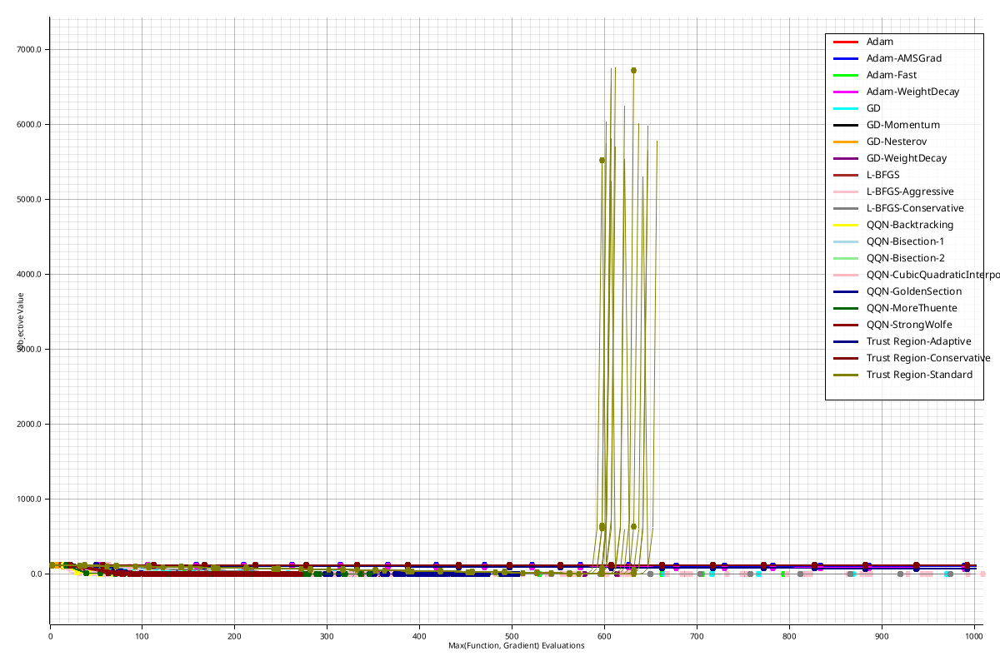
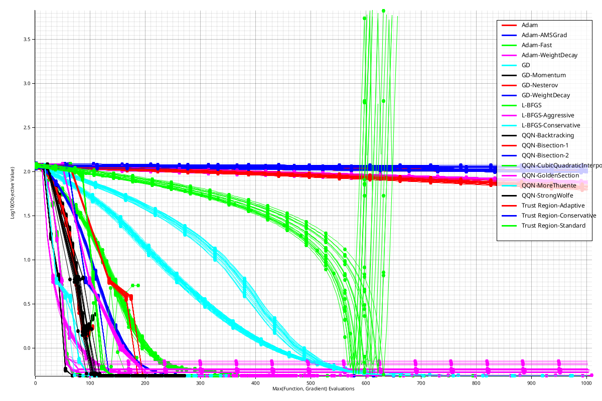

**Figure:** Convergence plots for LinearRegression_200samples_10features_reg0.01 showing objective value vs iterations.
Left: Linear scale, Right: Log scale for better visualization of convergence behavior.

**Data:** [Linear scale data (CSV)](convergence_LinearRegression_200samples_10features_reg0.01_data.csv) | [Log scale data (CSV)](convergence_LinearRegression_200samples_10features_reg0.01_log_data.csv)

## Problem: NeuralNetwork_100samples_layers_5_10_3

**Family:** ML Neural Networks  
**Dimension:** 93  
**Success Threshold:** 1.360e-1  
**Total Runs:** 560

### Performance Summary
<table style="border-collapse: collapse; width: 100%; margin: 20px 0;">
<tr style="background-color: #f2f2f2;">
<th style="border: 1px solid #ddd; padding: 8px; text-align: center;">Rank</th>
<th style="border: 1px solid #ddd; padding: 8px; text-align: center;">Optimizer</th>
<th style="border: 1px solid #ddd; padding: 8px; text-align: center;">Mean Final Value (All/Success/Fail)</th>
<th style="border: 1px solid #ddd; padding: 8px; text-align: center;">Std Dev</th>
<th style="border: 1px solid #ddd; padding: 8px; text-align: center;">Best Value</th>
<th style="border: 1px solid #ddd; padding: 8px; text-align: center;">Worst Value</th>
<th style="border: 1px solid #ddd; padding: 8px; text-align: center;">Mean Function Evals (All/Success/Fail)</th>
<th style="border: 1px solid #ddd; padding: 8px; text-align: center;">Mean Gradient Evals (All/Success/Fail)</th>
<th style="border: 1px solid #ddd; padding: 8px; text-align: center;">Success Rate</th>
<th style="border: 1px solid #ddd; padding: 8px; text-align: center;">Mean Time (s)</th>
</tr>
<tr style="background-color: #d4edda; font-weight: bold;">
<td style="border: 1px solid #ddd; padding: 8px; text-align: center;">1</td>
<td style="border: 1px solid #ddd; padding: 8px; text-align: center;"><a href="detailed_NeuralNetwork_100samples_layers_5_10_3_Adam-Fast.md">Adam-Fast</a></td>
<td style="border: 1px solid #ddd; padding: 8px; text-align: center;">1.37e-1 / 1.25e-1 / 1.47e-1</td>
<td style="border: 1px solid #ddd; padding: 8px; text-align: center;">1.41e-2</td>
<td style="border: 1px solid #ddd; padding: 8px; text-align: center;">1.11e-1</td>
<td style="border: 1px solid #ddd; padding: 8px; text-align: center;">1.61e-1</td>
<td style="border: 1px solid #ddd; padding: 8px; text-align: center;">232.6 / 227.0 / 236.2</td>
<td style="border: 1px solid #ddd; padding: 8px; text-align: center;">231.6 / 226.0 / 235.2</td>
<td style="border: 1px solid #ddd; padding: 8px; text-align: center;">40.0%</td>
<td style="border: 1px solid #ddd; padding: 8px; text-align: center;">0.192</td>
</tr>
<tr style="background-color: #fff3cd;">
<td style="border: 1px solid #ddd; padding: 8px; text-align: center;">2</td>
<td style="border: 1px solid #ddd; padding: 8px; text-align: center;"><a href="detailed_NeuralNetwork_100samples_layers_5_10_3_QQN-Bisection-2.md">QQN-Bisection-2</a></td>
<td style="border: 1px solid #ddd; padding: 8px; text-align: center;">1.42e-1 / - / 1.42e-1</td>
<td style="border: 1px solid #ddd; padding: 8px; text-align: center;">9.94e-3</td>
<td style="border: 1px solid #ddd; padding: 8px; text-align: center;">1.20e-1</td>
<td style="border: 1px solid #ddd; padding: 8px; text-align: center;">1.58e-1</td>
<td style="border: 1px solid #ddd; padding: 8px; text-align: center;">550.4 / - / 550.4</td>
<td style="border: 1px solid #ddd; padding: 8px; text-align: center;">465.4 / - / 465.4</td>
<td style="border: 1px solid #ddd; padding: 8px; text-align: center;">0.0%</td>
<td style="border: 1px solid #ddd; padding: 8px; text-align: center;">0.415</td>
</tr>
<tr style="">
<td style="border: 1px solid #ddd; padding: 8px; text-align: center;">3</td>
<td style="border: 1px solid #ddd; padding: 8px; text-align: center;"><a href="detailed_NeuralNetwork_100samples_layers_5_10_3_QQN-MoreThuente.md">QQN-MoreThuente</a></td>
<td style="border: 1px solid #ddd; padding: 8px; text-align: center;">1.63e-1 / - / 1.63e-1</td>
<td style="border: 1px solid #ddd; padding: 8px; text-align: center;">2.33e-2</td>
<td style="border: 1px solid #ddd; padding: 8px; text-align: center;">1.20e-1</td>
<td style="border: 1px solid #ddd; padding: 8px; text-align: center;">1.95e-1</td>
<td style="border: 1px solid #ddd; padding: 8px; text-align: center;">494.9 / - / 494.9</td>
<td style="border: 1px solid #ddd; padding: 8px; text-align: center;">522.0 / - / 522.0</td>
<td style="border: 1px solid #ddd; padding: 8px; text-align: center;">0.0%</td>
<td style="border: 1px solid #ddd; padding: 8px; text-align: center;">0.430</td>
</tr>
<tr style="">
<td style="border: 1px solid #ddd; padding: 8px; text-align: center;">4</td>
<td style="border: 1px solid #ddd; padding: 8px; text-align: center;"><a href="detailed_NeuralNetwork_100samples_layers_5_10_3_QQN-Bisection-1.md">QQN-Bisection-1</a></td>
<td style="border: 1px solid #ddd; padding: 8px; text-align: center;">1.50e-1 / - / 1.50e-1</td>
<td style="border: 1px solid #ddd; padding: 8px; text-align: center;">9.70e-3</td>
<td style="border: 1px solid #ddd; padding: 8px; text-align: center;">1.21e-1</td>
<td style="border: 1px solid #ddd; padding: 8px; text-align: center;">1.69e-1</td>
<td style="border: 1px solid #ddd; padding: 8px; text-align: center;">496.8 / - / 496.8</td>
<td style="border: 1px solid #ddd; padding: 8px; text-align: center;">518.5 / - / 518.5</td>
<td style="border: 1px solid #ddd; padding: 8px; text-align: center;">0.0%</td>
<td style="border: 1px solid #ddd; padding: 8px; text-align: center;">0.428</td>
</tr>
<tr style="">
<td style="border: 1px solid #ddd; padding: 8px; text-align: center;">5</td>
<td style="border: 1px solid #ddd; padding: 8px; text-align: center;"><a href="detailed_NeuralNetwork_100samples_layers_5_10_3_QQN-StrongWolfe.md">QQN-StrongWolfe</a></td>
<td style="border: 1px solid #ddd; padding: 8px; text-align: center;">1.47e-1 / - / 1.47e-1</td>
<td style="border: 1px solid #ddd; padding: 8px; text-align: center;">1.26e-2</td>
<td style="border: 1px solid #ddd; padding: 8px; text-align: center;">1.26e-1</td>
<td style="border: 1px solid #ddd; padding: 8px; text-align: center;">1.65e-1</td>
<td style="border: 1px solid #ddd; padding: 8px; text-align: center;">480.2 / - / 480.2</td>
<td style="border: 1px solid #ddd; padding: 8px; text-align: center;">535.9 / - / 535.9</td>
<td style="border: 1px solid #ddd; padding: 8px; text-align: center;">0.0%</td>
<td style="border: 1px solid #ddd; padding: 8px; text-align: center;">0.444</td>
</tr>
<tr style="">
<td style="border: 1px solid #ddd; padding: 8px; text-align: center;">6</td>
<td style="border: 1px solid #ddd; padding: 8px; text-align: center;"><a href="detailed_NeuralNetwork_100samples_layers_5_10_3_QQN-Backtracking.md">QQN-Backtracking</a></td>
<td style="border: 1px solid #ddd; padding: 8px; text-align: center;">1.49e-1 / - / 1.49e-1</td>
<td style="border: 1px solid #ddd; padding: 8px; text-align: center;">8.28e-3</td>
<td style="border: 1px solid #ddd; padding: 8px; text-align: center;">1.31e-1</td>
<td style="border: 1px solid #ddd; padding: 8px; text-align: center;">1.64e-1</td>
<td style="border: 1px solid #ddd; padding: 8px; text-align: center;">544.5 / - / 544.5</td>
<td style="border: 1px solid #ddd; padding: 8px; text-align: center;">463.0 / - / 463.0</td>
<td style="border: 1px solid #ddd; padding: 8px; text-align: center;">0.0%</td>
<td style="border: 1px solid #ddd; padding: 8px; text-align: center;">0.425</td>
</tr>
<tr style="">
<td style="border: 1px solid #ddd; padding: 8px; text-align: center;">7</td>
<td style="border: 1px solid #ddd; padding: 8px; text-align: center;"><a href="detailed_NeuralNetwork_100samples_layers_5_10_3_L-BFGS-Conservative.md">L-BFGS-Conservative</a></td>
<td style="border: 1px solid #ddd; padding: 8px; text-align: center;">1.61e-1 / - / 1.61e-1</td>
<td style="border: 1px solid #ddd; padding: 8px; text-align: center;">1.18e-2</td>
<td style="border: 1px solid #ddd; padding: 8px; text-align: center;">1.37e-1</td>
<td style="border: 1px solid #ddd; padding: 8px; text-align: center;">1.86e-1</td>
<td style="border: 1px solid #ddd; padding: 8px; text-align: center;">575.4 / - / 575.4</td>
<td style="border: 1px solid #ddd; padding: 8px; text-align: center;">431.4 / - / 431.4</td>
<td style="border: 1px solid #ddd; padding: 8px; text-align: center;">0.0%</td>
<td style="border: 1px solid #ddd; padding: 8px; text-align: center;">0.398</td>
</tr>
<tr style="">
<td style="border: 1px solid #ddd; padding: 8px; text-align: center;">8</td>
<td style="border: 1px solid #ddd; padding: 8px; text-align: center;"><a href="detailed_NeuralNetwork_100samples_layers_5_10_3_L-BFGS.md">L-BFGS</a></td>
<td style="border: 1px solid #ddd; padding: 8px; text-align: center;">1.73e-1 / - / 1.91e-1</td>
<td style="border: 1px solid #ddd; padding: 8px; text-align: center;">1.78e-2</td>
<td style="border: 1px solid #ddd; padding: 8px; text-align: center;">1.50e-1</td>
<td style="border: 1px solid #ddd; padding: 8px; text-align: center;">2.06e-1</td>
<td style="border: 1px solid #ddd; padding: 8px; text-align: center;">466.6 / - / 466.6</td>
<td style="border: 1px solid #ddd; padding: 8px; text-align: center;">303.8 / - / 303.8</td>
<td style="border: 1px solid #ddd; padding: 8px; text-align: center;">0.0%</td>
<td style="border: 1px solid #ddd; padding: 8px; text-align: center;">0.296</td>
</tr>
<tr style="">
<td style="border: 1px solid #ddd; padding: 8px; text-align: center;">9</td>
<td style="border: 1px solid #ddd; padding: 8px; text-align: center;"><a href="detailed_NeuralNetwork_100samples_layers_5_10_3_QQN-GoldenSection.md">QQN-GoldenSection</a></td>
<td style="border: 1px solid #ddd; padding: 8px; text-align: center;">1.73e-1 / - / 1.73e-1</td>
<td style="border: 1px solid #ddd; padding: 8px; text-align: center;">6.18e-3</td>
<td style="border: 1px solid #ddd; padding: 8px; text-align: center;">1.57e-1</td>
<td style="border: 1px solid #ddd; padding: 8px; text-align: center;">1.93e-1</td>
<td style="border: 1px solid #ddd; padding: 8px; text-align: center;">901.7 / - / 901.7</td>
<td style="border: 1px solid #ddd; padding: 8px; text-align: center;">126.8 / - / 126.8</td>
<td style="border: 1px solid #ddd; padding: 8px; text-align: center;">0.0%</td>
<td style="border: 1px solid #ddd; padding: 8px; text-align: center;">0.299</td>
</tr>
<tr style="">
<td style="border: 1px solid #ddd; padding: 8px; text-align: center;">10</td>
<td style="border: 1px solid #ddd; padding: 8px; text-align: center;"><a href="detailed_NeuralNetwork_100samples_layers_5_10_3_L-BFGS-Aggressive.md">L-BFGS-Aggressive</a></td>
<td style="border: 1px solid #ddd; padding: 8px; text-align: center;">1.72e-1 / - / 1.72e-1</td>
<td style="border: 1px solid #ddd; padding: 8px; text-align: center;">6.36e-3</td>
<td style="border: 1px solid #ddd; padding: 8px; text-align: center;">1.58e-1</td>
<td style="border: 1px solid #ddd; padding: 8px; text-align: center;">1.87e-1</td>
<td style="border: 1px solid #ddd; padding: 8px; text-align: center;">696.1 / - / 696.1</td>
<td style="border: 1px solid #ddd; padding: 8px; text-align: center;">310.0 / - / 310.0</td>
<td style="border: 1px solid #ddd; padding: 8px; text-align: center;">0.0%</td>
<td style="border: 1px solid #ddd; padding: 8px; text-align: center;">0.355</td>
</tr>
<tr style="">
<td style="border: 1px solid #ddd; padding: 8px; text-align: center;">11</td>
<td style="border: 1px solid #ddd; padding: 8px; text-align: center;"><a href="detailed_NeuralNetwork_100samples_layers_5_10_3_Adam-WeightDecay.md">Adam-WeightDecay</a></td>
<td style="border: 1px solid #ddd; padding: 8px; text-align: center;">1.75e-1 / - / 1.75e-1</td>
<td style="border: 1px solid #ddd; padding: 8px; text-align: center;">6.35e-3</td>
<td style="border: 1px solid #ddd; padding: 8px; text-align: center;">1.65e-1</td>
<td style="border: 1px solid #ddd; padding: 8px; text-align: center;">1.88e-1</td>
<td style="border: 1px solid #ddd; padding: 8px; text-align: center;">502.0 / - / 502.0</td>
<td style="border: 1px solid #ddd; padding: 8px; text-align: center;">502.0 / - / 502.0</td>
<td style="border: 1px solid #ddd; padding: 8px; text-align: center;">0.0%</td>
<td style="border: 1px solid #ddd; padding: 8px; text-align: center;">0.419</td>
</tr>
<tr style="">
<td style="border: 1px solid #ddd; padding: 8px; text-align: center;">12</td>
<td style="border: 1px solid #ddd; padding: 8px; text-align: center;"><a href="detailed_NeuralNetwork_100samples_layers_5_10_3_Trust_Region-Adaptive.md">Trust Region-Adaptive</a></td>
<td style="border: 1px solid #ddd; padding: 8px; text-align: center;">2.02e-1 / - / 2.76e-1</td>
<td style="border: 1px solid #ddd; padding: 8px; text-align: center;">2.01e-2</td>
<td style="border: 1px solid #ddd; padding: 8px; text-align: center;">1.72e-1</td>
<td style="border: 1px solid #ddd; padding: 8px; text-align: center;">2.44e-1</td>
<td style="border: 1px solid #ddd; padding: 8px; text-align: center;">67.2 / - / 67.2</td>
<td style="border: 1px solid #ddd; padding: 8px; text-align: center;">45.3 / - / 45.3</td>
<td style="border: 1px solid #ddd; padding: 8px; text-align: center;">0.0%</td>
<td style="border: 1px solid #ddd; padding: 8px; text-align: center;">0.041</td>
</tr>
<tr style="">
<td style="border: 1px solid #ddd; padding: 8px; text-align: center;">13</td>
<td style="border: 1px solid #ddd; padding: 8px; text-align: center;"><a href="detailed_NeuralNetwork_100samples_layers_5_10_3_QQN-CubicQuadraticInterpolation.md">QQN-CubicQuadraticInterpolation</a></td>
<td style="border: 1px solid #ddd; padding: 8px; text-align: center;">1.94e-1 / - / 1.94e-1</td>
<td style="border: 1px solid #ddd; padding: 8px; text-align: center;">4.26e-3</td>
<td style="border: 1px solid #ddd; padding: 8px; text-align: center;">1.87e-1</td>
<td style="border: 1px solid #ddd; padding: 8px; text-align: center;">2.06e-1</td>
<td style="border: 1px solid #ddd; padding: 8px; text-align: center;">394.3 / - / 394.3</td>
<td style="border: 1px solid #ddd; padding: 8px; text-align: center;">657.8 / - / 657.8</td>
<td style="border: 1px solid #ddd; padding: 8px; text-align: center;">0.0%</td>
<td style="border: 1px solid #ddd; padding: 8px; text-align: center;">0.490</td>
</tr>
<tr style="">
<td style="border: 1px solid #ddd; padding: 8px; text-align: center;">14</td>
<td style="border: 1px solid #ddd; padding: 8px; text-align: center;"><a href="detailed_NeuralNetwork_100samples_layers_5_10_3_Adam-AMSGrad.md">Adam-AMSGrad</a></td>
<td style="border: 1px solid #ddd; padding: 8px; text-align: center;">2.04e-1 / - / 2.04e-1</td>
<td style="border: 1px solid #ddd; padding: 8px; text-align: center;">6.89e-3</td>
<td style="border: 1px solid #ddd; padding: 8px; text-align: center;">1.91e-1</td>
<td style="border: 1px solid #ddd; padding: 8px; text-align: center;">2.17e-1</td>
<td style="border: 1px solid #ddd; padding: 8px; text-align: center;">502.0 / - / 502.0</td>
<td style="border: 1px solid #ddd; padding: 8px; text-align: center;">502.0 / - / 502.0</td>
<td style="border: 1px solid #ddd; padding: 8px; text-align: center;">0.0%</td>
<td style="border: 1px solid #ddd; padding: 8px; text-align: center;">0.420</td>
</tr>
<tr style="">
<td style="border: 1px solid #ddd; padding: 8px; text-align: center;">15</td>
<td style="border: 1px solid #ddd; padding: 8px; text-align: center;"><a href="detailed_NeuralNetwork_100samples_layers_5_10_3_Trust_Region-Standard.md">Trust Region-Standard</a></td>
<td style="border: 1px solid #ddd; padding: 8px; text-align: center;">2.43e-1 / - / 4.17e-1</td>
<td style="border: 1px solid #ddd; padding: 8px; text-align: center;">4.30e-2</td>
<td style="border: 1px solid #ddd; padding: 8px; text-align: center;">1.91e-1</td>
<td style="border: 1px solid #ddd; padding: 8px; text-align: center;">3.23e-1</td>
<td style="border: 1px solid #ddd; padding: 8px; text-align: center;">21.1 / - / 21.1</td>
<td style="border: 1px solid #ddd; padding: 8px; text-align: center;">14.6 / - / 14.6</td>
<td style="border: 1px solid #ddd; padding: 8px; text-align: center;">0.0%</td>
<td style="border: 1px solid #ddd; padding: 8px; text-align: center;">0.013</td>
</tr>
<tr style="">
<td style="border: 1px solid #ddd; padding: 8px; text-align: center;">16</td>
<td style="border: 1px solid #ddd; padding: 8px; text-align: center;"><a href="detailed_NeuralNetwork_100samples_layers_5_10_3_Adam.md">Adam</a></td>
<td style="border: 1px solid #ddd; padding: 8px; text-align: center;">2.02e-1 / - / 2.02e-1</td>
<td style="border: 1px solid #ddd; padding: 8px; text-align: center;">4.89e-3</td>
<td style="border: 1px solid #ddd; padding: 8px; text-align: center;">1.93e-1</td>
<td style="border: 1px solid #ddd; padding: 8px; text-align: center;">2.12e-1</td>
<td style="border: 1px solid #ddd; padding: 8px; text-align: center;">502.0 / - / 502.0</td>
<td style="border: 1px solid #ddd; padding: 8px; text-align: center;">502.0 / - / 502.0</td>
<td style="border: 1px solid #ddd; padding: 8px; text-align: center;">0.0%</td>
<td style="border: 1px solid #ddd; padding: 8px; text-align: center;">0.416</td>
</tr>
<tr style="">
<td style="border: 1px solid #ddd; padding: 8px; text-align: center;">17</td>
<td style="border: 1px solid #ddd; padding: 8px; text-align: center;"><a href="detailed_NeuralNetwork_100samples_layers_5_10_3_GD-WeightDecay.md">GD-WeightDecay</a></td>
<td style="border: 1px solid #ddd; padding: 8px; text-align: center;">2.09e-1 / - / 2.09e-1</td>
<td style="border: 1px solid #ddd; padding: 8px; text-align: center;">2.47e-3</td>
<td style="border: 1px solid #ddd; padding: 8px; text-align: center;">2.05e-1</td>
<td style="border: 1px solid #ddd; padding: 8px; text-align: center;">2.16e-1</td>
<td style="border: 1px solid #ddd; padding: 8px; text-align: center;">335.0 / - / 335.0</td>
<td style="border: 1px solid #ddd; padding: 8px; text-align: center;">668.0 / - / 668.0</td>
<td style="border: 1px solid #ddd; padding: 8px; text-align: center;">0.0%</td>
<td style="border: 1px solid #ddd; padding: 8px; text-align: center;">0.481</td>
</tr>
<tr style="">
<td style="border: 1px solid #ddd; padding: 8px; text-align: center;">18</td>
<td style="border: 1px solid #ddd; padding: 8px; text-align: center;"><a href="detailed_NeuralNetwork_100samples_layers_5_10_3_GD.md">GD</a></td>
<td style="border: 1px solid #ddd; padding: 8px; text-align: center;">2.16e-1 / - / 2.16e-1</td>
<td style="border: 1px solid #ddd; padding: 8px; text-align: center;">2.89e-3</td>
<td style="border: 1px solid #ddd; padding: 8px; text-align: center;">2.08e-1</td>
<td style="border: 1px solid #ddd; padding: 8px; text-align: center;">2.21e-1</td>
<td style="border: 1px solid #ddd; padding: 8px; text-align: center;">335.0 / - / 335.0</td>
<td style="border: 1px solid #ddd; padding: 8px; text-align: center;">668.0 / - / 668.0</td>
<td style="border: 1px solid #ddd; padding: 8px; text-align: center;">0.0%</td>
<td style="border: 1px solid #ddd; padding: 8px; text-align: center;">0.471</td>
</tr>
<tr style="">
<td style="border: 1px solid #ddd; padding: 8px; text-align: center;">19</td>
<td style="border: 1px solid #ddd; padding: 8px; text-align: center;"><a href="detailed_NeuralNetwork_100samples_layers_5_10_3_Trust_Region-Conservative.md">Trust Region-Conservative</a></td>
<td style="border: 1px solid #ddd; padding: 8px; text-align: center;">2.18e-1 / - / 2.18e-1</td>
<td style="border: 1px solid #ddd; padding: 8px; text-align: center;">2.48e-3</td>
<td style="border: 1px solid #ddd; padding: 8px; text-align: center;">2.13e-1</td>
<td style="border: 1px solid #ddd; padding: 8px; text-align: center;">2.23e-1</td>
<td style="border: 1px solid #ddd; padding: 8px; text-align: center;">144.9 / - / 144.9</td>
<td style="border: 1px solid #ddd; padding: 8px; text-align: center;">97.3 / - / 97.3</td>
<td style="border: 1px solid #ddd; padding: 8px; text-align: center;">0.0%</td>
<td style="border: 1px solid #ddd; padding: 8px; text-align: center;">0.089</td>
</tr>
<tr style="">
<td style="border: 1px solid #ddd; padding: 8px; text-align: center;">20</td>
<td style="border: 1px solid #ddd; padding: 8px; text-align: center;"><a href="detailed_NeuralNetwork_100samples_layers_5_10_3_GD-Momentum.md">GD-Momentum</a></td>
<td style="border: 1px solid #ddd; padding: 8px; text-align: center;">2.23e-1 / - / 2.33e-1</td>
<td style="border: 1px solid #ddd; padding: 8px; text-align: center;">2.66e-3</td>
<td style="border: 1px solid #ddd; padding: 8px; text-align: center;">2.16e-1</td>
<td style="border: 1px solid #ddd; padding: 8px; text-align: center;">2.28e-1</td>
<td style="border: 1px solid #ddd; padding: 8px; text-align: center;">21.4 / - / 21.4</td>
<td style="border: 1px solid #ddd; padding: 8px; text-align: center;">38.7 / - / 38.7</td>
<td style="border: 1px solid #ddd; padding: 8px; text-align: center;">0.0%</td>
<td style="border: 1px solid #ddd; padding: 8px; text-align: center;">0.028</td>
</tr>
<tr style="">
<td style="border: 1px solid #ddd; padding: 8px; text-align: center;">21</td>
<td style="border: 1px solid #ddd; padding: 8px; text-align: center;"><a href="detailed_NeuralNetwork_100samples_layers_5_10_3_GD-Nesterov.md">GD-Nesterov</a></td>
<td style="border: 1px solid #ddd; padding: 8px; text-align: center;">2.23e-1 / - / 2.27e-1</td>
<td style="border: 1px solid #ddd; padding: 8px; text-align: center;">1.79e-3</td>
<td style="border: 1px solid #ddd; padding: 8px; text-align: center;">2.19e-1</td>
<td style="border: 1px solid #ddd; padding: 8px; text-align: center;">2.26e-1</td>
<td style="border: 1px solid #ddd; padding: 8px; text-align: center;">21.6 / - / 21.6</td>
<td style="border: 1px solid #ddd; padding: 8px; text-align: center;">39.3 / - / 39.3</td>
<td style="border: 1px solid #ddd; padding: 8px; text-align: center;">0.0%</td>
<td style="border: 1px solid #ddd; padding: 8px; text-align: center;">0.029</td>
</tr>
</table>

### Convergence Plots

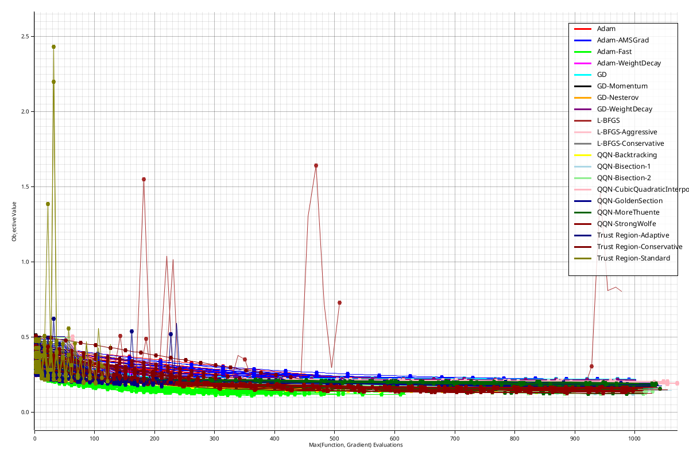
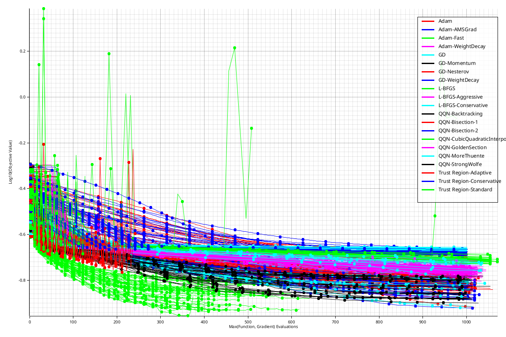

**Figure:** Convergence plots for NeuralNetwork_100samples_layers_5_10_3 showing objective value vs iterations.
Left: Linear scale, Right: Log scale for better visualization of convergence behavior.

**Data:** [Linear scale data (CSV)](convergence_NeuralNetwork_100samples_layers_5_10_3_data.csv) | [Log scale data (CSV)](convergence_NeuralNetwork_100samples_layers_5_10_3_log_data.csv)

## Problem: NeuralNetwork_100samples_layers_10_20_5

**Family:** ML Neural Networks  
**Dimension:** 325  
**Success Threshold:** 3.540e-2  
**Total Runs:** 560

### Performance Summary
<table style="border-collapse: collapse; width: 100%; margin: 20px 0;">
<tr style="background-color: #f2f2f2;">
<th style="border: 1px solid #ddd; padding: 8px; text-align: center;">Rank</th>
<th style="border: 1px solid #ddd; padding: 8px; text-align: center;">Optimizer</th>
<th style="border: 1px solid #ddd; padding: 8px; text-align: center;">Mean Final Value (All/Success/Fail)</th>
<th style="border: 1px solid #ddd; padding: 8px; text-align: center;">Std Dev</th>
<th style="border: 1px solid #ddd; padding: 8px; text-align: center;">Best Value</th>
<th style="border: 1px solid #ddd; padding: 8px; text-align: center;">Worst Value</th>
<th style="border: 1px solid #ddd; padding: 8px; text-align: center;">Mean Function Evals (All/Success/Fail)</th>
<th style="border: 1px solid #ddd; padding: 8px; text-align: center;">Mean Gradient Evals (All/Success/Fail)</th>
<th style="border: 1px solid #ddd; padding: 8px; text-align: center;">Success Rate</th>
<th style="border: 1px solid #ddd; padding: 8px; text-align: center;">Mean Time (s)</th>
</tr>
<tr style="background-color: #d4edda; font-weight: bold;">
<td style="border: 1px solid #ddd; padding: 8px; text-align: center;">1</td>
<td style="border: 1px solid #ddd; padding: 8px; text-align: center;"><a href="detailed_NeuralNetwork_100samples_layers_10_20_5_Adam-Fast.md">Adam-Fast</a></td>
<td style="border: 1px solid #ddd; padding: 8px; text-align: center;">3.83e-2 / 3.45e-2 / 4.42e-2</td>
<td style="border: 1px solid #ddd; padding: 8px; text-align: center;">6.41e-3</td>
<td style="border: 1px solid #ddd; padding: 8px; text-align: center;">2.61e-2</td>
<td style="border: 1px solid #ddd; padding: 8px; text-align: center;">5.41e-2</td>
<td style="border: 1px solid #ddd; padding: 8px; text-align: center;">198.4 / 237.3 / 181.7</td>
<td style="border: 1px solid #ddd; padding: 8px; text-align: center;">197.4 / 236.3 / 180.7</td>
<td style="border: 1px solid #ddd; padding: 8px; text-align: center;">30.0%</td>
<td style="border: 1px solid #ddd; padding: 8px; text-align: center;">0.308</td>
</tr>
<tr style="background-color: #fff3cd;">
<td style="border: 1px solid #ddd; padding: 8px; text-align: center;">2</td>
<td style="border: 1px solid #ddd; padding: 8px; text-align: center;"><a href="detailed_NeuralNetwork_100samples_layers_10_20_5_QQN-StrongWolfe.md">QQN-StrongWolfe</a></td>
<td style="border: 1px solid #ddd; padding: 8px; text-align: center;">5.00e-2 / - / 5.00e-2</td>
<td style="border: 1px solid #ddd; padding: 8px; text-align: center;">1.08e-2</td>
<td style="border: 1px solid #ddd; padding: 8px; text-align: center;">3.31e-2</td>
<td style="border: 1px solid #ddd; padding: 8px; text-align: center;">7.12e-2</td>
<td style="border: 1px solid #ddd; padding: 8px; text-align: center;">474.6 / - / 474.6</td>
<td style="border: 1px solid #ddd; padding: 8px; text-align: center;">535.0 / - / 535.0</td>
<td style="border: 1px solid #ddd; padding: 8px; text-align: center;">0.0%</td>
<td style="border: 1px solid #ddd; padding: 8px; text-align: center;">0.824</td>
</tr>
<tr style="">
<td style="border: 1px solid #ddd; padding: 8px; text-align: center;">3</td>
<td style="border: 1px solid #ddd; padding: 8px; text-align: center;"><a href="detailed_NeuralNetwork_100samples_layers_10_20_5_QQN-MoreThuente.md">QQN-MoreThuente</a></td>
<td style="border: 1px solid #ddd; padding: 8px; text-align: center;">5.58e-2 / - / 5.58e-2</td>
<td style="border: 1px solid #ddd; padding: 8px; text-align: center;">2.13e-2</td>
<td style="border: 1px solid #ddd; padding: 8px; text-align: center;">3.42e-2</td>
<td style="border: 1px solid #ddd; padding: 8px; text-align: center;">9.60e-2</td>
<td style="border: 1px solid #ddd; padding: 8px; text-align: center;">501.9 / - / 501.9</td>
<td style="border: 1px solid #ddd; padding: 8px; text-align: center;">514.4 / - / 514.4</td>
<td style="border: 1px solid #ddd; padding: 8px; text-align: center;">0.0%</td>
<td style="border: 1px solid #ddd; padding: 8px; text-align: center;">0.805</td>
</tr>
<tr style="">
<td style="border: 1px solid #ddd; padding: 8px; text-align: center;">4</td>
<td style="border: 1px solid #ddd; padding: 8px; text-align: center;"><a href="detailed_NeuralNetwork_100samples_layers_10_20_5_QQN-Bisection-2.md">QQN-Bisection-2</a></td>
<td style="border: 1px solid #ddd; padding: 8px; text-align: center;">5.21e-2 / - / 5.21e-2</td>
<td style="border: 1px solid #ddd; padding: 8px; text-align: center;">4.83e-3</td>
<td style="border: 1px solid #ddd; padding: 8px; text-align: center;">4.17e-2</td>
<td style="border: 1px solid #ddd; padding: 8px; text-align: center;">5.98e-2</td>
<td style="border: 1px solid #ddd; padding: 8px; text-align: center;">535.4 / - / 535.4</td>
<td style="border: 1px solid #ddd; padding: 8px; text-align: center;">473.9 / - / 473.9</td>
<td style="border: 1px solid #ddd; padding: 8px; text-align: center;">0.0%</td>
<td style="border: 1px solid #ddd; padding: 8px; text-align: center;">0.769</td>
</tr>
<tr style="">
<td style="border: 1px solid #ddd; padding: 8px; text-align: center;">5</td>
<td style="border: 1px solid #ddd; padding: 8px; text-align: center;"><a href="detailed_NeuralNetwork_100samples_layers_10_20_5_QQN-Bisection-1.md">QQN-Bisection-1</a></td>
<td style="border: 1px solid #ddd; padding: 8px; text-align: center;">5.61e-2 / - / 5.61e-2</td>
<td style="border: 1px solid #ddd; padding: 8px; text-align: center;">4.70e-3</td>
<td style="border: 1px solid #ddd; padding: 8px; text-align: center;">4.46e-2</td>
<td style="border: 1px solid #ddd; padding: 8px; text-align: center;">6.44e-2</td>
<td style="border: 1px solid #ddd; padding: 8px; text-align: center;">503.3 / - / 503.3</td>
<td style="border: 1px solid #ddd; padding: 8px; text-align: center;">509.5 / - / 509.5</td>
<td style="border: 1px solid #ddd; padding: 8px; text-align: center;">0.0%</td>
<td style="border: 1px solid #ddd; padding: 8px; text-align: center;">0.791</td>
</tr>
<tr style="">
<td style="border: 1px solid #ddd; padding: 8px; text-align: center;">6</td>
<td style="border: 1px solid #ddd; padding: 8px; text-align: center;"><a href="detailed_NeuralNetwork_100samples_layers_10_20_5_L-BFGS-Conservative.md">L-BFGS-Conservative</a></td>
<td style="border: 1px solid #ddd; padding: 8px; text-align: center;">6.55e-2 / - / 6.70e-2</td>
<td style="border: 1px solid #ddd; padding: 8px; text-align: center;">9.77e-3</td>
<td style="border: 1px solid #ddd; padding: 8px; text-align: center;">4.58e-2</td>
<td style="border: 1px solid #ddd; padding: 8px; text-align: center;">9.08e-2</td>
<td style="border: 1px solid #ddd; padding: 8px; text-align: center;">568.1 / - / 568.1</td>
<td style="border: 1px solid #ddd; padding: 8px; text-align: center;">438.0 / - / 438.0</td>
<td style="border: 1px solid #ddd; padding: 8px; text-align: center;">0.0%</td>
<td style="border: 1px solid #ddd; padding: 8px; text-align: center;">0.752</td>
</tr>
<tr style="">
<td style="border: 1px solid #ddd; padding: 8px; text-align: center;">7</td>
<td style="border: 1px solid #ddd; padding: 8px; text-align: center;"><a href="detailed_NeuralNetwork_100samples_layers_10_20_5_QQN-Backtracking.md">QQN-Backtracking</a></td>
<td style="border: 1px solid #ddd; padding: 8px; text-align: center;">6.08e-2 / - / 6.08e-2</td>
<td style="border: 1px solid #ddd; padding: 8px; text-align: center;">5.66e-3</td>
<td style="border: 1px solid #ddd; padding: 8px; text-align: center;">5.00e-2</td>
<td style="border: 1px solid #ddd; padding: 8px; text-align: center;">7.12e-2</td>
<td style="border: 1px solid #ddd; padding: 8px; text-align: center;">544.4 / - / 544.4</td>
<td style="border: 1px solid #ddd; padding: 8px; text-align: center;">463.0 / - / 463.0</td>
<td style="border: 1px solid #ddd; padding: 8px; text-align: center;">0.0%</td>
<td style="border: 1px solid #ddd; padding: 8px; text-align: center;">0.793</td>
</tr>
<tr style="">
<td style="border: 1px solid #ddd; padding: 8px; text-align: center;">8</td>
<td style="border: 1px solid #ddd; padding: 8px; text-align: center;"><a href="detailed_NeuralNetwork_100samples_layers_10_20_5_Adam-WeightDecay.md">Adam-WeightDecay</a></td>
<td style="border: 1px solid #ddd; padding: 8px; text-align: center;">6.69e-2 / - / 6.69e-2</td>
<td style="border: 1px solid #ddd; padding: 8px; text-align: center;">6.33e-3</td>
<td style="border: 1px solid #ddd; padding: 8px; text-align: center;">5.57e-2</td>
<td style="border: 1px solid #ddd; padding: 8px; text-align: center;">8.14e-2</td>
<td style="border: 1px solid #ddd; padding: 8px; text-align: center;">502.0 / - / 502.0</td>
<td style="border: 1px solid #ddd; padding: 8px; text-align: center;">502.0 / - / 502.0</td>
<td style="border: 1px solid #ddd; padding: 8px; text-align: center;">0.0%</td>
<td style="border: 1px solid #ddd; padding: 8px; text-align: center;">0.788</td>
</tr>
<tr style="">
<td style="border: 1px solid #ddd; padding: 8px; text-align: center;">9</td>
<td style="border: 1px solid #ddd; padding: 8px; text-align: center;"><a href="detailed_NeuralNetwork_100samples_layers_10_20_5_L-BFGS.md">L-BFGS</a></td>
<td style="border: 1px solid #ddd; padding: 8px; text-align: center;">9.06e-2 / - / 1.18e-1</td>
<td style="border: 1px solid #ddd; padding: 8px; text-align: center;">1.95e-2</td>
<td style="border: 1px solid #ddd; padding: 8px; text-align: center;">7.22e-2</td>
<td style="border: 1px solid #ddd; padding: 8px; text-align: center;">1.45e-1</td>
<td style="border: 1px solid #ddd; padding: 8px; text-align: center;">493.2 / - / 493.2</td>
<td style="border: 1px solid #ddd; padding: 8px; text-align: center;">317.9 / - / 317.9</td>
<td style="border: 1px solid #ddd; padding: 8px; text-align: center;">0.0%</td>
<td style="border: 1px solid #ddd; padding: 8px; text-align: center;">0.580</td>
</tr>
<tr style="">
<td style="border: 1px solid #ddd; padding: 8px; text-align: center;">10</td>
<td style="border: 1px solid #ddd; padding: 8px; text-align: center;"><a href="detailed_NeuralNetwork_100samples_layers_10_20_5_QQN-GoldenSection.md">QQN-GoldenSection</a></td>
<td style="border: 1px solid #ddd; padding: 8px; text-align: center;">8.57e-2 / - / 8.57e-2</td>
<td style="border: 1px solid #ddd; padding: 8px; text-align: center;">3.80e-3</td>
<td style="border: 1px solid #ddd; padding: 8px; text-align: center;">7.47e-2</td>
<td style="border: 1px solid #ddd; padding: 8px; text-align: center;">9.50e-2</td>
<td style="border: 1px solid #ddd; padding: 8px; text-align: center;">895.5 / - / 895.5</td>
<td style="border: 1px solid #ddd; padding: 8px; text-align: center;">127.0 / - / 127.0</td>
<td style="border: 1px solid #ddd; padding: 8px; text-align: center;">0.0%</td>
<td style="border: 1px solid #ddd; padding: 8px; text-align: center;">0.550</td>
</tr>
<tr style="">
<td style="border: 1px solid #ddd; padding: 8px; text-align: center;">11</td>
<td style="border: 1px solid #ddd; padding: 8px; text-align: center;"><a href="detailed_NeuralNetwork_100samples_layers_10_20_5_L-BFGS-Aggressive.md">L-BFGS-Aggressive</a></td>
<td style="border: 1px solid #ddd; padding: 8px; text-align: center;">8.56e-2 / - / 8.56e-2</td>
<td style="border: 1px solid #ddd; padding: 8px; text-align: center;">4.11e-3</td>
<td style="border: 1px solid #ddd; padding: 8px; text-align: center;">7.95e-2</td>
<td style="border: 1px solid #ddd; padding: 8px; text-align: center;">9.59e-2</td>
<td style="border: 1px solid #ddd; padding: 8px; text-align: center;">705.8 / - / 705.8</td>
<td style="border: 1px solid #ddd; padding: 8px; text-align: center;">300.3 / - / 300.3</td>
<td style="border: 1px solid #ddd; padding: 8px; text-align: center;">0.0%</td>
<td style="border: 1px solid #ddd; padding: 8px; text-align: center;">0.656</td>
</tr>
<tr style="">
<td style="border: 1px solid #ddd; padding: 8px; text-align: center;">12</td>
<td style="border: 1px solid #ddd; padding: 8px; text-align: center;"><a href="detailed_NeuralNetwork_100samples_layers_10_20_5_GD-Nesterov.md">GD-Nesterov</a></td>
<td style="border: 1px solid #ddd; padding: 8px; text-align: center;">1.47e-1 / - / 1.50e-1</td>
<td style="border: 1px solid #ddd; padding: 8px; text-align: center;">2.43e-2</td>
<td style="border: 1px solid #ddd; padding: 8px; text-align: center;">1.01e-1</td>
<td style="border: 1px solid #ddd; padding: 8px; text-align: center;">1.67e-1</td>
<td style="border: 1px solid #ddd; padding: 8px; text-align: center;">98.9 / - / 98.9</td>
<td style="border: 1px solid #ddd; padding: 8px; text-align: center;">194.3 / - / 194.3</td>
<td style="border: 1px solid #ddd; padding: 8px; text-align: center;">0.0%</td>
<td style="border: 1px solid #ddd; padding: 8px; text-align: center;">0.263</td>
</tr>
<tr style="">
<td style="border: 1px solid #ddd; padding: 8px; text-align: center;">13</td>
<td style="border: 1px solid #ddd; padding: 8px; text-align: center;"><a href="detailed_NeuralNetwork_100samples_layers_10_20_5_Adam-AMSGrad.md">Adam-AMSGrad</a></td>
<td style="border: 1px solid #ddd; padding: 8px; text-align: center;">1.16e-1 / - / 1.16e-1</td>
<td style="border: 1px solid #ddd; padding: 8px; text-align: center;">5.80e-3</td>
<td style="border: 1px solid #ddd; padding: 8px; text-align: center;">1.02e-1</td>
<td style="border: 1px solid #ddd; padding: 8px; text-align: center;">1.25e-1</td>
<td style="border: 1px solid #ddd; padding: 8px; text-align: center;">502.0 / - / 502.0</td>
<td style="border: 1px solid #ddd; padding: 8px; text-align: center;">502.0 / - / 502.0</td>
<td style="border: 1px solid #ddd; padding: 8px; text-align: center;">0.0%</td>
<td style="border: 1px solid #ddd; padding: 8px; text-align: center;">0.788</td>
</tr>
<tr style="">
<td style="border: 1px solid #ddd; padding: 8px; text-align: center;">14</td>
<td style="border: 1px solid #ddd; padding: 8px; text-align: center;"><a href="detailed_NeuralNetwork_100samples_layers_10_20_5_QQN-CubicQuadraticInterpolation.md">QQN-CubicQuadraticInterpolation</a></td>
<td style="border: 1px solid #ddd; padding: 8px; text-align: center;">1.18e-1 / - / 1.18e-1</td>
<td style="border: 1px solid #ddd; padding: 8px; text-align: center;">3.98e-3</td>
<td style="border: 1px solid #ddd; padding: 8px; text-align: center;">1.06e-1</td>
<td style="border: 1px solid #ddd; padding: 8px; text-align: center;">1.26e-1</td>
<td style="border: 1px solid #ddd; padding: 8px; text-align: center;">394.2 / - / 394.2</td>
<td style="border: 1px solid #ddd; padding: 8px; text-align: center;">657.8 / - / 657.8</td>
<td style="border: 1px solid #ddd; padding: 8px; text-align: center;">0.0%</td>
<td style="border: 1px solid #ddd; padding: 8px; text-align: center;">0.915</td>
</tr>
<tr style="">
<td style="border: 1px solid #ddd; padding: 8px; text-align: center;">15</td>
<td style="border: 1px solid #ddd; padding: 8px; text-align: center;"><a href="detailed_NeuralNetwork_100samples_layers_10_20_5_Adam.md">Adam</a></td>
<td style="border: 1px solid #ddd; padding: 8px; text-align: center;">1.17e-1 / - / 1.17e-1</td>
<td style="border: 1px solid #ddd; padding: 8px; text-align: center;">4.31e-3</td>
<td style="border: 1px solid #ddd; padding: 8px; text-align: center;">1.08e-1</td>
<td style="border: 1px solid #ddd; padding: 8px; text-align: center;">1.24e-1</td>
<td style="border: 1px solid #ddd; padding: 8px; text-align: center;">502.0 / - / 502.0</td>
<td style="border: 1px solid #ddd; padding: 8px; text-align: center;">502.0 / - / 502.0</td>
<td style="border: 1px solid #ddd; padding: 8px; text-align: center;">0.0%</td>
<td style="border: 1px solid #ddd; padding: 8px; text-align: center;">0.786</td>
</tr>
<tr style="">
<td style="border: 1px solid #ddd; padding: 8px; text-align: center;">16</td>
<td style="border: 1px solid #ddd; padding: 8px; text-align: center;"><a href="detailed_NeuralNetwork_100samples_layers_10_20_5_GD-Momentum.md">GD-Momentum</a></td>
<td style="border: 1px solid #ddd; padding: 8px; text-align: center;">1.56e-1 / - / 1.60e-1</td>
<td style="border: 1px solid #ddd; padding: 8px; text-align: center;">1.39e-2</td>
<td style="border: 1px solid #ddd; padding: 8px; text-align: center;">1.12e-1</td>
<td style="border: 1px solid #ddd; padding: 8px; text-align: center;">1.64e-1</td>
<td style="border: 1px solid #ddd; padding: 8px; text-align: center;">51.9 / - / 51.9</td>
<td style="border: 1px solid #ddd; padding: 8px; text-align: center;">99.9 / - / 99.9</td>
<td style="border: 1px solid #ddd; padding: 8px; text-align: center;">0.0%</td>
<td style="border: 1px solid #ddd; padding: 8px; text-align: center;">0.136</td>
</tr>
<tr style="">
<td style="border: 1px solid #ddd; padding: 8px; text-align: center;">17</td>
<td style="border: 1px solid #ddd; padding: 8px; text-align: center;"><a href="detailed_NeuralNetwork_100samples_layers_10_20_5_Trust_Region-Adaptive.md">Trust Region-Adaptive</a></td>
<td style="border: 1px solid #ddd; padding: 8px; text-align: center;">1.67e-1 / - / 1.77e-1</td>
<td style="border: 1px solid #ddd; padding: 8px; text-align: center;">1.80e-2</td>
<td style="border: 1px solid #ddd; padding: 8px; text-align: center;">1.16e-1</td>
<td style="border: 1px solid #ddd; padding: 8px; text-align: center;">1.85e-1</td>
<td style="border: 1px solid #ddd; padding: 8px; text-align: center;">18.6 / - / 18.6</td>
<td style="border: 1px solid #ddd; padding: 8px; text-align: center;">13.0 / - / 13.0</td>
<td style="border: 1px solid #ddd; padding: 8px; text-align: center;">0.0%</td>
<td style="border: 1px solid #ddd; padding: 8px; text-align: center;">0.022</td>
</tr>
<tr style="">
<td style="border: 1px solid #ddd; padding: 8px; text-align: center;">18</td>
<td style="border: 1px solid #ddd; padding: 8px; text-align: center;"><a href="detailed_NeuralNetwork_100samples_layers_10_20_5_GD-WeightDecay.md">GD-WeightDecay</a></td>
<td style="border: 1px solid #ddd; padding: 8px; text-align: center;">1.43e-1 / - / 1.43e-1</td>
<td style="border: 1px solid #ddd; padding: 8px; text-align: center;">2.34e-3</td>
<td style="border: 1px solid #ddd; padding: 8px; text-align: center;">1.39e-1</td>
<td style="border: 1px solid #ddd; padding: 8px; text-align: center;">1.47e-1</td>
<td style="border: 1px solid #ddd; padding: 8px; text-align: center;">335.0 / - / 335.0</td>
<td style="border: 1px solid #ddd; padding: 8px; text-align: center;">668.0 / - / 668.0</td>
<td style="border: 1px solid #ddd; padding: 8px; text-align: center;">0.0%</td>
<td style="border: 1px solid #ddd; padding: 8px; text-align: center;">0.899</td>
</tr>
<tr style="">
<td style="border: 1px solid #ddd; padding: 8px; text-align: center;">19</td>
<td style="border: 1px solid #ddd; padding: 8px; text-align: center;"><a href="detailed_NeuralNetwork_100samples_layers_10_20_5_Trust_Region-Conservative.md">Trust Region-Conservative</a></td>
<td style="border: 1px solid #ddd; padding: 8px; text-align: center;">1.50e-1 / - / 1.50e-1</td>
<td style="border: 1px solid #ddd; padding: 8px; text-align: center;">2.63e-3</td>
<td style="border: 1px solid #ddd; padding: 8px; text-align: center;">1.46e-1</td>
<td style="border: 1px solid #ddd; padding: 8px; text-align: center;">1.56e-1</td>
<td style="border: 1px solid #ddd; padding: 8px; text-align: center;">132.8 / - / 132.8</td>
<td style="border: 1px solid #ddd; padding: 8px; text-align: center;">89.2 / - / 89.2</td>
<td style="border: 1px solid #ddd; padding: 8px; text-align: center;">0.0%</td>
<td style="border: 1px solid #ddd; padding: 8px; text-align: center;">0.153</td>
</tr>
<tr style="">
<td style="border: 1px solid #ddd; padding: 8px; text-align: center;">20</td>
<td style="border: 1px solid #ddd; padding: 8px; text-align: center;"><a href="detailed_NeuralNetwork_100samples_layers_10_20_5_GD.md">GD</a></td>
<td style="border: 1px solid #ddd; padding: 8px; text-align: center;">1.52e-1 / - / 1.52e-1</td>
<td style="border: 1px solid #ddd; padding: 8px; text-align: center;">1.96e-3</td>
<td style="border: 1px solid #ddd; padding: 8px; text-align: center;">1.49e-1</td>
<td style="border: 1px solid #ddd; padding: 8px; text-align: center;">1.56e-1</td>
<td style="border: 1px solid #ddd; padding: 8px; text-align: center;">335.0 / - / 335.0</td>
<td style="border: 1px solid #ddd; padding: 8px; text-align: center;">668.0 / - / 668.0</td>
<td style="border: 1px solid #ddd; padding: 8px; text-align: center;">0.0%</td>
<td style="border: 1px solid #ddd; padding: 8px; text-align: center;">0.884</td>
</tr>
<tr style="">
<td style="border: 1px solid #ddd; padding: 8px; text-align: center;">21</td>
<td style="border: 1px solid #ddd; padding: 8px; text-align: center;"><a href="detailed_NeuralNetwork_100samples_layers_10_20_5_Trust_Region-Standard.md">Trust Region-Standard</a></td>
<td style="border: 1px solid #ddd; padding: 8px; text-align: center;">2.09e-1 / - / 3.98e-1</td>
<td style="border: 1px solid #ddd; padding: 8px; text-align: center;">2.18e-2</td>
<td style="border: 1px solid #ddd; padding: 8px; text-align: center;">1.76e-1</td>
<td style="border: 1px solid #ddd; padding: 8px; text-align: center;">2.64e-1</td>
<td style="border: 1px solid #ddd; padding: 8px; text-align: center;">6.8 / - / 6.8</td>
<td style="border: 1px solid #ddd; padding: 8px; text-align: center;">5.2 / - / 5.2</td>
<td style="border: 1px solid #ddd; padding: 8px; text-align: center;">0.0%</td>
<td style="border: 1px solid #ddd; padding: 8px; text-align: center;">0.008</td>
</tr>
</table>

### Convergence Plots

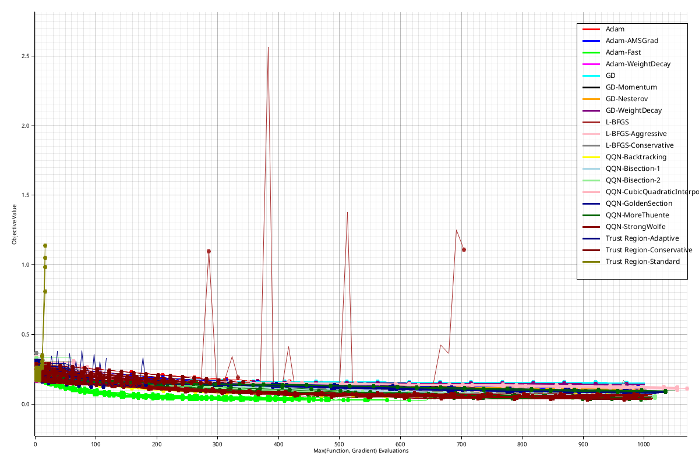
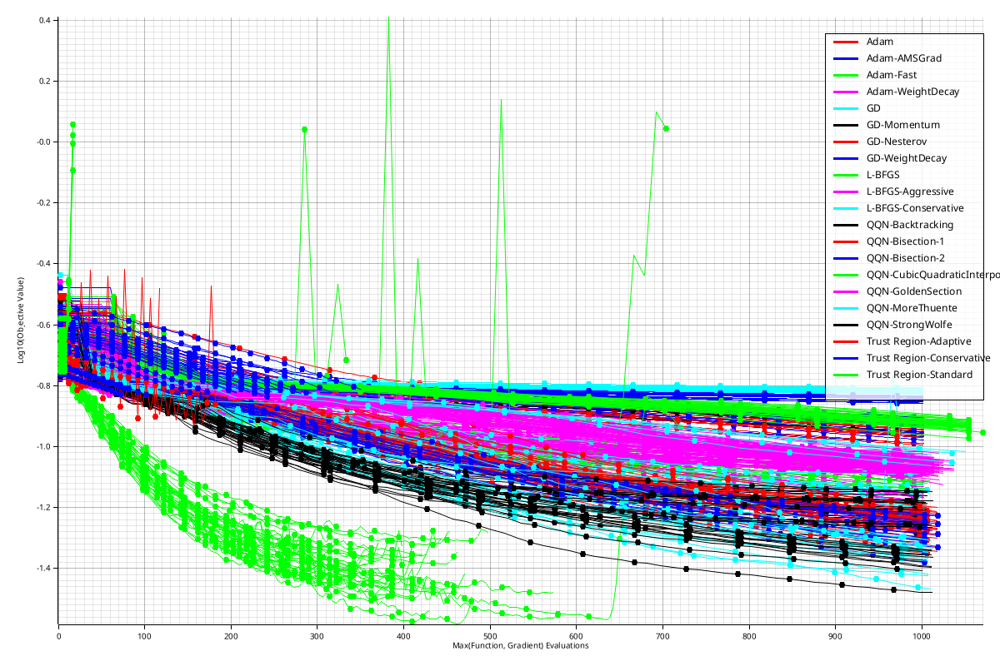

**Figure:** Convergence plots for NeuralNetwork_100samples_layers_10_20_5 showing objective value vs iterations.
Left: Linear scale, Right: Log scale for better visualization of convergence behavior.

**Data:** [Linear scale data (CSV)](convergence_NeuralNetwork_100samples_layers_10_20_5_data.csv) | [Log scale data (CSV)](convergence_NeuralNetwork_100samples_layers_10_20_5_log_data.csv)

## Problem: SVM_100samples_5features_C1

**Family:** ML Classification  
**Dimension:** 5  
**Success Threshold:** 6.430e-1  
**Total Runs:** 560

### Performance Summary
<table style="border-collapse: collapse; width: 100%; margin: 20px 0;">
<tr style="background-color: #f2f2f2;">
<th style="border: 1px solid #ddd; padding: 8px; text-align: center;">Rank</th>
<th style="border: 1px solid #ddd; padding: 8px; text-align: center;">Optimizer</th>
<th style="border: 1px solid #ddd; padding: 8px; text-align: center;">Mean Final Value (All/Success/Fail)</th>
<th style="border: 1px solid #ddd; padding: 8px; text-align: center;">Std Dev</th>
<th style="border: 1px solid #ddd; padding: 8px; text-align: center;">Best Value</th>
<th style="border: 1px solid #ddd; padding: 8px; text-align: center;">Worst Value</th>
<th style="border: 1px solid #ddd; padding: 8px; text-align: center;">Mean Function Evals (All/Success/Fail)</th>
<th style="border: 1px solid #ddd; padding: 8px; text-align: center;">Mean Gradient Evals (All/Success/Fail)</th>
<th style="border: 1px solid #ddd; padding: 8px; text-align: center;">Success Rate</th>
<th style="border: 1px solid #ddd; padding: 8px; text-align: center;">Mean Time (s)</th>
</tr>
<tr style="background-color: #d4edda; font-weight: bold;">
<td style="border: 1px solid #ddd; padding: 8px; text-align: center;">1</td>
<td style="border: 1px solid #ddd; padding: 8px; text-align: center;"><a href="detailed_SVM_100samples_5features_C1_QQN-GoldenSection.md">QQN-GoldenSection</a></td>
<td style="border: 1px solid #ddd; padding: 8px; text-align: center;">6.43e-1 / 6.43e-1 / 6.43e-1</td>
<td style="border: 1px solid #ddd; padding: 8px; text-align: center;">2.58e-5</td>
<td style="border: 1px solid #ddd; padding: 8px; text-align: center;">6.43e-1</td>
<td style="border: 1px solid #ddd; padding: 8px; text-align: center;">6.43e-1</td>
<td style="border: 1px solid #ddd; padding: 8px; text-align: center;">410.1 / 442.3 / 406.5</td>
<td style="border: 1px solid #ddd; padding: 8px; text-align: center;">58.5 / 63.0 / 58.0</td>
<td style="border: 1px solid #ddd; padding: 8px; text-align: center;">10.0%</td>
<td style="border: 1px solid #ddd; padding: 8px; text-align: center;">0.079</td>
</tr>
<tr style="background-color: #fff3cd;">
<td style="border: 1px solid #ddd; padding: 8px; text-align: center;">2</td>
<td style="border: 1px solid #ddd; padding: 8px; text-align: center;"><a href="detailed_SVM_100samples_5features_C1_QQN-MoreThuente.md">QQN-MoreThuente</a></td>
<td style="border: 1px solid #ddd; padding: 8px; text-align: center;">6.43e-1 / 6.43e-1 / 6.43e-1</td>
<td style="border: 1px solid #ddd; padding: 8px; text-align: center;">9.92e-6</td>
<td style="border: 1px solid #ddd; padding: 8px; text-align: center;">6.43e-1</td>
<td style="border: 1px solid #ddd; padding: 8px; text-align: center;">6.43e-1</td>
<td style="border: 1px solid #ddd; padding: 8px; text-align: center;">409.4 / 367.4 / 451.4</td>
<td style="border: 1px solid #ddd; padding: 8px; text-align: center;">510.2 / 463.3 / 557.2</td>
<td style="border: 1px solid #ddd; padding: 8px; text-align: center;">50.0%</td>
<td style="border: 1px solid #ddd; padding: 8px; text-align: center;">0.168</td>
</tr>
<tr style="">
<td style="border: 1px solid #ddd; padding: 8px; text-align: center;">3</td>
<td style="border: 1px solid #ddd; padding: 8px; text-align: center;"><a href="detailed_SVM_100samples_5features_C1_QQN-StrongWolfe.md">QQN-StrongWolfe</a></td>
<td style="border: 1px solid #ddd; padding: 8px; text-align: center;">6.43e-1 / 6.43e-1 / 6.43e-1</td>
<td style="border: 1px solid #ddd; padding: 8px; text-align: center;">5.20e-6</td>
<td style="border: 1px solid #ddd; padding: 8px; text-align: center;">6.43e-1</td>
<td style="border: 1px solid #ddd; padding: 8px; text-align: center;">6.43e-1</td>
<td style="border: 1px solid #ddd; padding: 8px; text-align: center;">396.6 / 454.0 / 393.5</td>
<td style="border: 1px solid #ddd; padding: 8px; text-align: center;">289.9 / 310.0 / 288.8</td>
<td style="border: 1px solid #ddd; padding: 8px; text-align: center;">5.0%</td>
<td style="border: 1px solid #ddd; padding: 8px; text-align: center;">0.129</td>
</tr>
<tr style="">
<td style="border: 1px solid #ddd; padding: 8px; text-align: center;">4</td>
<td style="border: 1px solid #ddd; padding: 8px; text-align: center;"><a href="detailed_SVM_100samples_5features_C1_QQN-Bisection-1.md">QQN-Bisection-1</a></td>
<td style="border: 1px solid #ddd; padding: 8px; text-align: center;">6.43e-1 / - / 6.43e-1</td>
<td style="border: 1px solid #ddd; padding: 8px; text-align: center;">7.55e-6</td>
<td style="border: 1px solid #ddd; padding: 8px; text-align: center;">6.43e-1</td>
<td style="border: 1px solid #ddd; padding: 8px; text-align: center;">6.43e-1</td>
<td style="border: 1px solid #ddd; padding: 8px; text-align: center;">467.2 / - / 467.2</td>
<td style="border: 1px solid #ddd; padding: 8px; text-align: center;">570.5 / - / 570.5</td>
<td style="border: 1px solid #ddd; padding: 8px; text-align: center;">0.0%</td>
<td style="border: 1px solid #ddd; padding: 8px; text-align: center;">0.187</td>
</tr>
<tr style="">
<td style="border: 1px solid #ddd; padding: 8px; text-align: center;">5</td>
<td style="border: 1px solid #ddd; padding: 8px; text-align: center;"><a href="detailed_SVM_100samples_5features_C1_QQN-Bisection-2.md">QQN-Bisection-2</a></td>
<td style="border: 1px solid #ddd; padding: 8px; text-align: center;">6.43e-1 / - / 6.43e-1</td>
<td style="border: 1px solid #ddd; padding: 8px; text-align: center;">1.56e-5</td>
<td style="border: 1px solid #ddd; padding: 8px; text-align: center;">6.43e-1</td>
<td style="border: 1px solid #ddd; padding: 8px; text-align: center;">6.43e-1</td>
<td style="border: 1px solid #ddd; padding: 8px; text-align: center;">229.9 / - / 229.9</td>
<td style="border: 1px solid #ddd; padding: 8px; text-align: center;">168.7 / - / 168.7</td>
<td style="border: 1px solid #ddd; padding: 8px; text-align: center;">0.0%</td>
<td style="border: 1px solid #ddd; padding: 8px; text-align: center;">0.074</td>
</tr>
<tr style="">
<td style="border: 1px solid #ddd; padding: 8px; text-align: center;">6</td>
<td style="border: 1px solid #ddd; padding: 8px; text-align: center;"><a href="detailed_SVM_100samples_5features_C1_GD-WeightDecay.md">GD-WeightDecay</a></td>
<td style="border: 1px solid #ddd; padding: 8px; text-align: center;">6.43e-1 / 6.43e-1 / -</td>
<td style="border: 1px solid #ddd; padding: 8px; text-align: center;">5.84e-7</td>
<td style="border: 1px solid #ddd; padding: 8px; text-align: center;">6.43e-1</td>
<td style="border: 1px solid #ddd; padding: 8px; text-align: center;">6.43e-1</td>
<td style="border: 1px solid #ddd; padding: 8px; text-align: center;">176.7 / 176.7 / -</td>
<td style="border: 1px solid #ddd; padding: 8px; text-align: center;">349.3 / 349.3 / -</td>
<td style="border: 1px solid #ddd; padding: 8px; text-align: center;">100.0%</td>
<td style="border: 1px solid #ddd; padding: 8px; text-align: center;">0.095</td>
</tr>
<tr style="">
<td style="border: 1px solid #ddd; padding: 8px; text-align: center;">7</td>
<td style="border: 1px solid #ddd; padding: 8px; text-align: center;"><a href="detailed_SVM_100samples_5features_C1_L-BFGS.md">L-BFGS</a></td>
<td style="border: 1px solid #ddd; padding: 8px; text-align: center;">6.43e-1 / 6.43e-1 / -</td>
<td style="border: 1px solid #ddd; padding: 8px; text-align: center;">4.64e-7</td>
<td style="border: 1px solid #ddd; padding: 8px; text-align: center;">6.43e-1</td>
<td style="border: 1px solid #ddd; padding: 8px; text-align: center;">6.43e-1</td>
<td style="border: 1px solid #ddd; padding: 8px; text-align: center;">346.1 / 346.1 / -</td>
<td style="border: 1px solid #ddd; padding: 8px; text-align: center;">151.0 / 151.0 / -</td>
<td style="border: 1px solid #ddd; padding: 8px; text-align: center;">100.0%</td>
<td style="border: 1px solid #ddd; padding: 8px; text-align: center;">0.083</td>
</tr>
<tr style="">
<td style="border: 1px solid #ddd; padding: 8px; text-align: center;">8</td>
<td style="border: 1px solid #ddd; padding: 8px; text-align: center;"><a href="detailed_SVM_100samples_5features_C1_GD.md">GD</a></td>
<td style="border: 1px solid #ddd; padding: 8px; text-align: center;">6.43e-1 / 6.43e-1 / 6.43e-1</td>
<td style="border: 1px solid #ddd; padding: 8px; text-align: center;">1.29e-5</td>
<td style="border: 1px solid #ddd; padding: 8px; text-align: center;">6.43e-1</td>
<td style="border: 1px solid #ddd; padding: 8px; text-align: center;">6.43e-1</td>
<td style="border: 1px solid #ddd; padding: 8px; text-align: center;">334.6 / 318.0 / 335.0</td>
<td style="border: 1px solid #ddd; padding: 8px; text-align: center;">667.1 / 632.0 / 668.0</td>
<td style="border: 1px solid #ddd; padding: 8px; text-align: center;">2.5%</td>
<td style="border: 1px solid #ddd; padding: 8px; text-align: center;">0.180</td>
</tr>
<tr style="">
<td style="border: 1px solid #ddd; padding: 8px; text-align: center;">9</td>
<td style="border: 1px solid #ddd; padding: 8px; text-align: center;"><a href="detailed_SVM_100samples_5features_C1_L-BFGS-Conservative.md">L-BFGS-Conservative</a></td>
<td style="border: 1px solid #ddd; padding: 8px; text-align: center;">6.43e-1 / 6.43e-1 / -</td>
<td style="border: 1px solid #ddd; padding: 8px; text-align: center;">9.99e-6</td>
<td style="border: 1px solid #ddd; padding: 8px; text-align: center;">6.43e-1</td>
<td style="border: 1px solid #ddd; padding: 8px; text-align: center;">6.43e-1</td>
<td style="border: 1px solid #ddd; padding: 8px; text-align: center;">420.9 / 420.9 / -</td>
<td style="border: 1px solid #ddd; padding: 8px; text-align: center;">187.5 / 187.5 / -</td>
<td style="border: 1px solid #ddd; padding: 8px; text-align: center;">100.0%</td>
<td style="border: 1px solid #ddd; padding: 8px; text-align: center;">0.102</td>
</tr>
<tr style="">
<td style="border: 1px solid #ddd; padding: 8px; text-align: center;">10</td>
<td style="border: 1px solid #ddd; padding: 8px; text-align: center;"><a href="detailed_SVM_100samples_5features_C1_Adam-WeightDecay.md">Adam-WeightDecay</a></td>
<td style="border: 1px solid #ddd; padding: 8px; text-align: center;">6.44e-1 / - / 6.44e-1</td>
<td style="border: 1px solid #ddd; padding: 8px; text-align: center;">9.10e-4</td>
<td style="border: 1px solid #ddd; padding: 8px; text-align: center;">6.43e-1</td>
<td style="border: 1px solid #ddd; padding: 8px; text-align: center;">6.47e-1</td>
<td style="border: 1px solid #ddd; padding: 8px; text-align: center;">502.0 / - / 502.0</td>
<td style="border: 1px solid #ddd; padding: 8px; text-align: center;">502.0 / - / 502.0</td>
<td style="border: 1px solid #ddd; padding: 8px; text-align: center;">0.0%</td>
<td style="border: 1px solid #ddd; padding: 8px; text-align: center;">0.175</td>
</tr>
<tr style="">
<td style="border: 1px solid #ddd; padding: 8px; text-align: center;">11</td>
<td style="border: 1px solid #ddd; padding: 8px; text-align: center;"><a href="detailed_SVM_100samples_5features_C1_L-BFGS-Aggressive.md">L-BFGS-Aggressive</a></td>
<td style="border: 1px solid #ddd; padding: 8px; text-align: center;">6.43e-1 / 6.43e-1 / 6.44e-1</td>
<td style="border: 1px solid #ddd; padding: 8px; text-align: center;">1.55e-4</td>
<td style="border: 1px solid #ddd; padding: 8px; text-align: center;">6.43e-1</td>
<td style="border: 1px solid #ddd; padding: 8px; text-align: center;">6.44e-1</td>
<td style="border: 1px solid #ddd; padding: 8px; text-align: center;">138.3 / 122.0 / 775.0</td>
<td style="border: 1px solid #ddd; padding: 8px; text-align: center;">48.8 / 44.0 / 236.0</td>
<td style="border: 1px solid #ddd; padding: 8px; text-align: center;">97.5%</td>
<td style="border: 1px solid #ddd; padding: 8px; text-align: center;">0.031</td>
</tr>
<tr style="">
<td style="border: 1px solid #ddd; padding: 8px; text-align: center;">12</td>
<td style="border: 1px solid #ddd; padding: 8px; text-align: center;"><a href="detailed_SVM_100samples_5features_C1_QQN-CubicQuadraticInterpolation.md">QQN-CubicQuadraticInterpolation</a></td>
<td style="border: 1px solid #ddd; padding: 8px; text-align: center;">6.43e-1 / - / 6.43e-1</td>
<td style="border: 1px solid #ddd; padding: 8px; text-align: center;">5.12e-6</td>
<td style="border: 1px solid #ddd; padding: 8px; text-align: center;">6.43e-1</td>
<td style="border: 1px solid #ddd; padding: 8px; text-align: center;">6.43e-1</td>
<td style="border: 1px solid #ddd; padding: 8px; text-align: center;">396.2 / - / 396.2</td>
<td style="border: 1px solid #ddd; padding: 8px; text-align: center;">660.8 / - / 660.8</td>
<td style="border: 1px solid #ddd; padding: 8px; text-align: center;">0.0%</td>
<td style="border: 1px solid #ddd; padding: 8px; text-align: center;">0.197</td>
</tr>
<tr style="">
<td style="border: 1px solid #ddd; padding: 8px; text-align: center;">13</td>
<td style="border: 1px solid #ddd; padding: 8px; text-align: center;"><a href="detailed_SVM_100samples_5features_C1_QQN-Backtracking.md">QQN-Backtracking</a></td>
<td style="border: 1px solid #ddd; padding: 8px; text-align: center;">6.43e-1 / 6.43e-1 / -</td>
<td style="border: 1px solid #ddd; padding: 8px; text-align: center;">5.36e-7</td>
<td style="border: 1px solid #ddd; padding: 8px; text-align: center;">6.43e-1</td>
<td style="border: 1px solid #ddd; padding: 8px; text-align: center;">6.43e-1</td>
<td style="border: 1px solid #ddd; padding: 8px; text-align: center;">354.4 / 354.4 / -</td>
<td style="border: 1px solid #ddd; padding: 8px; text-align: center;">142.0 / 142.0 / -</td>
<td style="border: 1px solid #ddd; padding: 8px; text-align: center;">100.0%</td>
<td style="border: 1px solid #ddd; padding: 8px; text-align: center;">0.087</td>
</tr>
<tr style="">
<td style="border: 1px solid #ddd; padding: 8px; text-align: center;">14</td>
<td style="border: 1px solid #ddd; padding: 8px; text-align: center;"><a href="detailed_SVM_100samples_5features_C1_Adam-Fast.md">Adam-Fast</a></td>
<td style="border: 1px solid #ddd; padding: 8px; text-align: center;">6.60e-1 / 6.43e-1 / 6.83e-1</td>
<td style="border: 1px solid #ddd; padding: 8px; text-align: center;">1.17e-2</td>
<td style="border: 1px solid #ddd; padding: 8px; text-align: center;">6.43e-1</td>
<td style="border: 1px solid #ddd; padding: 8px; text-align: center;">6.85e-1</td>
<td style="border: 1px solid #ddd; padding: 8px; text-align: center;">34.7 / 165.0 / 31.4</td>
<td style="border: 1px solid #ddd; padding: 8px; text-align: center;">33.7 / 164.0 / 30.4</td>
<td style="border: 1px solid #ddd; padding: 8px; text-align: center;">2.5%</td>
<td style="border: 1px solid #ddd; padding: 8px; text-align: center;">0.012</td>
</tr>
<tr style="">
<td style="border: 1px solid #ddd; padding: 8px; text-align: center;">15</td>
<td style="border: 1px solid #ddd; padding: 8px; text-align: center;"><a href="detailed_SVM_100samples_5features_C1_Trust_Region-Conservative.md">Trust Region-Conservative</a></td>
<td style="border: 1px solid #ddd; padding: 8px; text-align: center;">6.44e-1 / - / 3.09e0</td>
<td style="border: 1px solid #ddd; padding: 8px; text-align: center;">1.10e-3</td>
<td style="border: 1px solid #ddd; padding: 8px; text-align: center;">6.43e-1</td>
<td style="border: 1px solid #ddd; padding: 8px; text-align: center;">6.47e-1</td>
<td style="border: 1px solid #ddd; padding: 8px; text-align: center;">151.9 / - / 151.9</td>
<td style="border: 1px solid #ddd; padding: 8px; text-align: center;">101.5 / - / 101.5</td>
<td style="border: 1px solid #ddd; padding: 8px; text-align: center;">0.0%</td>
<td style="border: 1px solid #ddd; padding: 8px; text-align: center;">0.041</td>
</tr>
<tr style="">
<td style="border: 1px solid #ddd; padding: 8px; text-align: center;">16</td>
<td style="border: 1px solid #ddd; padding: 8px; text-align: center;"><a href="detailed_SVM_100samples_5features_C1_GD-Nesterov.md">GD-Nesterov</a></td>
<td style="border: 1px solid #ddd; padding: 8px; text-align: center;">6.47e-1 / - / 6.62e-1</td>
<td style="border: 1px solid #ddd; padding: 8px; text-align: center;">1.96e-3</td>
<td style="border: 1px solid #ddd; padding: 8px; text-align: center;">6.43e-1</td>
<td style="border: 1px solid #ddd; padding: 8px; text-align: center;">6.50e-1</td>
<td style="border: 1px solid #ddd; padding: 8px; text-align: center;">24.8 / - / 24.8</td>
<td style="border: 1px solid #ddd; padding: 8px; text-align: center;">45.6 / - / 45.6</td>
<td style="border: 1px solid #ddd; padding: 8px; text-align: center;">0.0%</td>
<td style="border: 1px solid #ddd; padding: 8px; text-align: center;">0.013</td>
</tr>
<tr style="">
<td style="border: 1px solid #ddd; padding: 8px; text-align: center;">17</td>
<td style="border: 1px solid #ddd; padding: 8px; text-align: center;"><a href="detailed_SVM_100samples_5features_C1_GD-Momentum.md">GD-Momentum</a></td>
<td style="border: 1px solid #ddd; padding: 8px; text-align: center;">6.47e-1 / - / 6.74e-1</td>
<td style="border: 1px solid #ddd; padding: 8px; text-align: center;">1.82e-3</td>
<td style="border: 1px solid #ddd; padding: 8px; text-align: center;">6.45e-1</td>
<td style="border: 1px solid #ddd; padding: 8px; text-align: center;">6.52e-1</td>
<td style="border: 1px solid #ddd; padding: 8px; text-align: center;">25.1 / - / 25.1</td>
<td style="border: 1px solid #ddd; padding: 8px; text-align: center;">46.2 / - / 46.2</td>
<td style="border: 1px solid #ddd; padding: 8px; text-align: center;">0.0%</td>
<td style="border: 1px solid #ddd; padding: 8px; text-align: center;">0.013</td>
</tr>
<tr style="">
<td style="border: 1px solid #ddd; padding: 8px; text-align: center;">18</td>
<td style="border: 1px solid #ddd; padding: 8px; text-align: center;"><a href="detailed_SVM_100samples_5features_C1_Trust_Region-Standard.md">Trust Region-Standard</a></td>
<td style="border: 1px solid #ddd; padding: 8px; text-align: center;">7.94e-1 / - / 6.82e2</td>
<td style="border: 1px solid #ddd; padding: 8px; text-align: center;">1.63e-1</td>
<td style="border: 1px solid #ddd; padding: 8px; text-align: center;">6.45e-1</td>
<td style="border: 1px solid #ddd; padding: 8px; text-align: center;">1.04e0</td>
<td style="border: 1px solid #ddd; padding: 8px; text-align: center;">20.1 / - / 20.1</td>
<td style="border: 1px solid #ddd; padding: 8px; text-align: center;">13.9 / - / 13.9</td>
<td style="border: 1px solid #ddd; padding: 8px; text-align: center;">0.0%</td>
<td style="border: 1px solid #ddd; padding: 8px; text-align: center;">0.006</td>
</tr>
<tr style="">
<td style="border: 1px solid #ddd; padding: 8px; text-align: center;">19</td>
<td style="border: 1px solid #ddd; padding: 8px; text-align: center;"><a href="detailed_SVM_100samples_5features_C1_Trust_Region-Adaptive.md">Trust Region-Adaptive</a></td>
<td style="border: 1px solid #ddd; padding: 8px; text-align: center;">6.68e-1 / - / 6.69e0</td>
<td style="border: 1px solid #ddd; padding: 8px; text-align: center;">1.98e-2</td>
<td style="border: 1px solid #ddd; padding: 8px; text-align: center;">6.46e-1</td>
<td style="border: 1px solid #ddd; padding: 8px; text-align: center;">7.04e-1</td>
<td style="border: 1px solid #ddd; padding: 8px; text-align: center;">20.7 / - / 20.7</td>
<td style="border: 1px solid #ddd; padding: 8px; text-align: center;">14.4 / - / 14.4</td>
<td style="border: 1px solid #ddd; padding: 8px; text-align: center;">0.0%</td>
<td style="border: 1px solid #ddd; padding: 8px; text-align: center;">0.006</td>
</tr>
<tr style="">
<td style="border: 1px solid #ddd; padding: 8px; text-align: center;">20</td>
<td style="border: 1px solid #ddd; padding: 8px; text-align: center;"><a href="detailed_SVM_100samples_5features_C1_Adam.md">Adam</a></td>
<td style="border: 1px solid #ddd; padding: 8px; text-align: center;">7.39e-1 / - / 7.39e-1</td>
<td style="border: 1px solid #ddd; padding: 8px; text-align: center;">5.10e-2</td>
<td style="border: 1px solid #ddd; padding: 8px; text-align: center;">6.51e-1</td>
<td style="border: 1px solid #ddd; padding: 8px; text-align: center;">8.40e-1</td>
<td style="border: 1px solid #ddd; padding: 8px; text-align: center;">502.0 / - / 502.0</td>
<td style="border: 1px solid #ddd; padding: 8px; text-align: center;">502.0 / - / 502.0</td>
<td style="border: 1px solid #ddd; padding: 8px; text-align: center;">0.0%</td>
<td style="border: 1px solid #ddd; padding: 8px; text-align: center;">0.174</td>
</tr>
<tr style="">
<td style="border: 1px solid #ddd; padding: 8px; text-align: center;">21</td>
<td style="border: 1px solid #ddd; padding: 8px; text-align: center;"><a href="detailed_SVM_100samples_5features_C1_Adam-AMSGrad.md">Adam-AMSGrad</a></td>
<td style="border: 1px solid #ddd; padding: 8px; text-align: center;">7.24e-1 / - / 7.24e-1</td>
<td style="border: 1px solid #ddd; padding: 8px; text-align: center;">4.19e-2</td>
<td style="border: 1px solid #ddd; padding: 8px; text-align: center;">6.61e-1</td>
<td style="border: 1px solid #ddd; padding: 8px; text-align: center;">8.10e-1</td>
<td style="border: 1px solid #ddd; padding: 8px; text-align: center;">502.0 / - / 502.0</td>
<td style="border: 1px solid #ddd; padding: 8px; text-align: center;">502.0 / - / 502.0</td>
<td style="border: 1px solid #ddd; padding: 8px; text-align: center;">0.0%</td>
<td style="border: 1px solid #ddd; padding: 8px; text-align: center;">0.175</td>
</tr>
</table>

### Convergence Plots

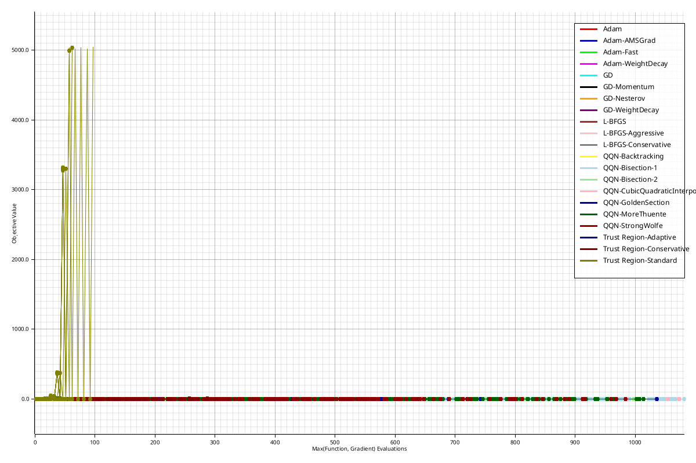

**Figure:** Convergence plots for SVM_100samples_5features_C1 showing objective value vs iterations.
Left: Linear scale, Right: Log scale for better visualization of convergence behavior.

**Data:** [Linear scale data (CSV)](convergence_SVM_100samples_5features_C1_data.csv) | [Log scale data (CSV)](convergence_SVM_100samples_5features_C1_log_data.csv)

## Problem: SVM_200samples_10features_C1

**Family:** ML Classification  
**Dimension:** 10  
**Success Threshold:** 6.860e-1  
**Total Runs:** 560

### Performance Summary
<table style="border-collapse: collapse; width: 100%; margin: 20px 0;">
<tr style="background-color: #f2f2f2;">
<th style="border: 1px solid #ddd; padding: 8px; text-align: center;">Rank</th>
<th style="border: 1px solid #ddd; padding: 8px; text-align: center;">Optimizer</th>
<th style="border: 1px solid #ddd; padding: 8px; text-align: center;">Mean Final Value (All/Success/Fail)</th>
<th style="border: 1px solid #ddd; padding: 8px; text-align: center;">Std Dev</th>
<th style="border: 1px solid #ddd; padding: 8px; text-align: center;">Best Value</th>
<th style="border: 1px solid #ddd; padding: 8px; text-align: center;">Worst Value</th>
<th style="border: 1px solid #ddd; padding: 8px; text-align: center;">Mean Function Evals (All/Success/Fail)</th>
<th style="border: 1px solid #ddd; padding: 8px; text-align: center;">Mean Gradient Evals (All/Success/Fail)</th>
<th style="border: 1px solid #ddd; padding: 8px; text-align: center;">Success Rate</th>
<th style="border: 1px solid #ddd; padding: 8px; text-align: center;">Mean Time (s)</th>
</tr>
<tr style="background-color: #d4edda; font-weight: bold;">
<td style="border: 1px solid #ddd; padding: 8px; text-align: center;">1</td>
<td style="border: 1px solid #ddd; padding: 8px; text-align: center;"><a href="detailed_SVM_200samples_10features_C1_GD-WeightDecay.md">GD-WeightDecay</a></td>
<td style="border: 1px solid #ddd; padding: 8px; text-align: center;">6.86e-1 / - / 6.86e-1</td>
<td style="border: 1px solid #ddd; padding: 8px; text-align: center;">8.70e-7</td>
<td style="border: 1px solid #ddd; padding: 8px; text-align: center;">6.86e-1</td>
<td style="border: 1px solid #ddd; padding: 8px; text-align: center;">6.86e-1</td>
<td style="border: 1px solid #ddd; padding: 8px; text-align: center;">178.7 / - / 178.7</td>
<td style="border: 1px solid #ddd; padding: 8px; text-align: center;">353.3 / - / 353.3</td>
<td style="border: 1px solid #ddd; padding: 8px; text-align: center;">0.0%</td>
<td style="border: 1px solid #ddd; padding: 8px; text-align: center;">0.181</td>
</tr>
<tr style="background-color: #fff3cd;">
<td style="border: 1px solid #ddd; padding: 8px; text-align: center;">2</td>
<td style="border: 1px solid #ddd; padding: 8px; text-align: center;"><a href="detailed_SVM_200samples_10features_C1_QQN-Bisection-2.md">QQN-Bisection-2</a></td>
<td style="border: 1px solid #ddd; padding: 8px; text-align: center;">6.86e-1 / - / 6.86e-1</td>
<td style="border: 1px solid #ddd; padding: 8px; text-align: center;">1.30e-5</td>
<td style="border: 1px solid #ddd; padding: 8px; text-align: center;">6.86e-1</td>
<td style="border: 1px solid #ddd; padding: 8px; text-align: center;">6.86e-1</td>
<td style="border: 1px solid #ddd; padding: 8px; text-align: center;">324.1 / - / 324.1</td>
<td style="border: 1px solid #ddd; padding: 8px; text-align: center;">219.2 / - / 219.2</td>
<td style="border: 1px solid #ddd; padding: 8px; text-align: center;">0.0%</td>
<td style="border: 1px solid #ddd; padding: 8px; text-align: center;">0.187</td>
</tr>
<tr style="">
<td style="border: 1px solid #ddd; padding: 8px; text-align: center;">3</td>
<td style="border: 1px solid #ddd; padding: 8px; text-align: center;"><a href="detailed_SVM_200samples_10features_C1_Adam-WeightDecay.md">Adam-WeightDecay</a></td>
<td style="border: 1px solid #ddd; padding: 8px; text-align: center;">6.86e-1 / - / 6.86e-1</td>
<td style="border: 1px solid #ddd; padding: 8px; text-align: center;">4.20e-4</td>
<td style="border: 1px solid #ddd; padding: 8px; text-align: center;">6.86e-1</td>
<td style="border: 1px solid #ddd; padding: 8px; text-align: center;">6.88e-1</td>
<td style="border: 1px solid #ddd; padding: 8px; text-align: center;">481.4 / - / 481.4</td>
<td style="border: 1px solid #ddd; padding: 8px; text-align: center;">481.2 / - / 481.2</td>
<td style="border: 1px solid #ddd; padding: 8px; text-align: center;">0.0%</td>
<td style="border: 1px solid #ddd; padding: 8px; text-align: center;">0.317</td>
</tr>
<tr style="">
<td style="border: 1px solid #ddd; padding: 8px; text-align: center;">4</td>
<td style="border: 1px solid #ddd; padding: 8px; text-align: center;"><a href="detailed_SVM_200samples_10features_C1_L-BFGS.md">L-BFGS</a></td>
<td style="border: 1px solid #ddd; padding: 8px; text-align: center;">6.86e-1 / - / 6.87e-1</td>
<td style="border: 1px solid #ddd; padding: 8px; text-align: center;">8.85e-5</td>
<td style="border: 1px solid #ddd; padding: 8px; text-align: center;">6.86e-1</td>
<td style="border: 1px solid #ddd; padding: 8px; text-align: center;">6.86e-1</td>
<td style="border: 1px solid #ddd; padding: 8px; text-align: center;">269.8 / - / 269.8</td>
<td style="border: 1px solid #ddd; padding: 8px; text-align: center;">131.1 / - / 131.1</td>
<td style="border: 1px solid #ddd; padding: 8px; text-align: center;">0.0%</td>
<td style="border: 1px solid #ddd; padding: 8px; text-align: center;">0.125</td>
</tr>
<tr style="">
<td style="border: 1px solid #ddd; padding: 8px; text-align: center;">5</td>
<td style="border: 1px solid #ddd; padding: 8px; text-align: center;"><a href="detailed_SVM_200samples_10features_C1_QQN-StrongWolfe.md">QQN-StrongWolfe</a></td>
<td style="border: 1px solid #ddd; padding: 8px; text-align: center;">6.86e-1 / - / 6.86e-1</td>
<td style="border: 1px solid #ddd; padding: 8px; text-align: center;">2.94e-6</td>
<td style="border: 1px solid #ddd; padding: 8px; text-align: center;">6.86e-1</td>
<td style="border: 1px solid #ddd; padding: 8px; text-align: center;">6.86e-1</td>
<td style="border: 1px solid #ddd; padding: 8px; text-align: center;">551.6 / - / 551.6</td>
<td style="border: 1px solid #ddd; padding: 8px; text-align: center;">471.4 / - / 471.4</td>
<td style="border: 1px solid #ddd; padding: 8px; text-align: center;">0.0%</td>
<td style="border: 1px solid #ddd; padding: 8px; text-align: center;">0.348</td>
</tr>
<tr style="">
<td style="border: 1px solid #ddd; padding: 8px; text-align: center;">6</td>
<td style="border: 1px solid #ddd; padding: 8px; text-align: center;"><a href="detailed_SVM_200samples_10features_C1_QQN-Bisection-1.md">QQN-Bisection-1</a></td>
<td style="border: 1px solid #ddd; padding: 8px; text-align: center;">6.86e-1 / - / 6.86e-1</td>
<td style="border: 1px solid #ddd; padding: 8px; text-align: center;">6.62e-6</td>
<td style="border: 1px solid #ddd; padding: 8px; text-align: center;">6.86e-1</td>
<td style="border: 1px solid #ddd; padding: 8px; text-align: center;">6.86e-1</td>
<td style="border: 1px solid #ddd; padding: 8px; text-align: center;">478.8 / - / 478.8</td>
<td style="border: 1px solid #ddd; padding: 8px; text-align: center;">559.9 / - / 559.9</td>
<td style="border: 1px solid #ddd; padding: 8px; text-align: center;">0.0%</td>
<td style="border: 1px solid #ddd; padding: 8px; text-align: center;">0.356</td>
</tr>
<tr style="">
<td style="border: 1px solid #ddd; padding: 8px; text-align: center;">7</td>
<td style="border: 1px solid #ddd; padding: 8px; text-align: center;"><a href="detailed_SVM_200samples_10features_C1_L-BFGS-Conservative.md">L-BFGS-Conservative</a></td>
<td style="border: 1px solid #ddd; padding: 8px; text-align: center;">6.86e-1 / - / 6.86e-1</td>
<td style="border: 1px solid #ddd; padding: 8px; text-align: center;">7.92e-6</td>
<td style="border: 1px solid #ddd; padding: 8px; text-align: center;">6.86e-1</td>
<td style="border: 1px solid #ddd; padding: 8px; text-align: center;">6.86e-1</td>
<td style="border: 1px solid #ddd; padding: 8px; text-align: center;">555.9 / - / 555.9</td>
<td style="border: 1px solid #ddd; padding: 8px; text-align: center;">241.7 / - / 241.7</td>
<td style="border: 1px solid #ddd; padding: 8px; text-align: center;">0.0%</td>
<td style="border: 1px solid #ddd; padding: 8px; text-align: center;">0.246</td>
</tr>
<tr style="">
<td style="border: 1px solid #ddd; padding: 8px; text-align: center;">8</td>
<td style="border: 1px solid #ddd; padding: 8px; text-align: center;"><a href="detailed_SVM_200samples_10features_C1_QQN-GoldenSection.md">QQN-GoldenSection</a></td>
<td style="border: 1px solid #ddd; padding: 8px; text-align: center;">6.86e-1 / - / 6.86e-1</td>
<td style="border: 1px solid #ddd; padding: 8px; text-align: center;">6.09e-6</td>
<td style="border: 1px solid #ddd; padding: 8px; text-align: center;">6.86e-1</td>
<td style="border: 1px solid #ddd; padding: 8px; text-align: center;">6.86e-1</td>
<td style="border: 1px solid #ddd; padding: 8px; text-align: center;">672.1 / - / 672.1</td>
<td style="border: 1px solid #ddd; padding: 8px; text-align: center;">92.3 / - / 92.3</td>
<td style="border: 1px solid #ddd; padding: 8px; text-align: center;">0.0%</td>
<td style="border: 1px solid #ddd; padding: 8px; text-align: center;">0.234</td>
</tr>
<tr style="">
<td style="border: 1px solid #ddd; padding: 8px; text-align: center;">9</td>
<td style="border: 1px solid #ddd; padding: 8px; text-align: center;"><a href="detailed_SVM_200samples_10features_C1_QQN-MoreThuente.md">QQN-MoreThuente</a></td>
<td style="border: 1px solid #ddd; padding: 8px; text-align: center;">6.86e-1 / - / 6.86e-1</td>
<td style="border: 1px solid #ddd; padding: 8px; text-align: center;">6.37e-6</td>
<td style="border: 1px solid #ddd; padding: 8px; text-align: center;">6.86e-1</td>
<td style="border: 1px solid #ddd; padding: 8px; text-align: center;">6.86e-1</td>
<td style="border: 1px solid #ddd; padding: 8px; text-align: center;">443.4 / - / 443.4</td>
<td style="border: 1px solid #ddd; padding: 8px; text-align: center;">576.8 / - / 576.8</td>
<td style="border: 1px solid #ddd; padding: 8px; text-align: center;">0.0%</td>
<td style="border: 1px solid #ddd; padding: 8px; text-align: center;">0.344</td>
</tr>
<tr style="">
<td style="border: 1px solid #ddd; padding: 8px; text-align: center;">10</td>
<td style="border: 1px solid #ddd; padding: 8px; text-align: center;"><a href="detailed_SVM_200samples_10features_C1_GD.md">GD</a></td>
<td style="border: 1px solid #ddd; padding: 8px; text-align: center;">6.86e-1 / - / 6.86e-1</td>
<td style="border: 1px solid #ddd; padding: 8px; text-align: center;">1.27e-5</td>
<td style="border: 1px solid #ddd; padding: 8px; text-align: center;">6.86e-1</td>
<td style="border: 1px solid #ddd; padding: 8px; text-align: center;">6.86e-1</td>
<td style="border: 1px solid #ddd; padding: 8px; text-align: center;">334.8 / - / 334.8</td>
<td style="border: 1px solid #ddd; padding: 8px; text-align: center;">667.5 / - / 667.5</td>
<td style="border: 1px solid #ddd; padding: 8px; text-align: center;">0.0%</td>
<td style="border: 1px solid #ddd; padding: 8px; text-align: center;">0.342</td>
</tr>
<tr style="">
<td style="border: 1px solid #ddd; padding: 8px; text-align: center;">11</td>
<td style="border: 1px solid #ddd; padding: 8px; text-align: center;"><a href="detailed_SVM_200samples_10features_C1_QQN-Backtracking.md">QQN-Backtracking</a></td>
<td style="border: 1px solid #ddd; padding: 8px; text-align: center;">6.86e-1 / - / 6.86e-1</td>
<td style="border: 1px solid #ddd; padding: 8px; text-align: center;">2.72e-6</td>
<td style="border: 1px solid #ddd; padding: 8px; text-align: center;">6.86e-1</td>
<td style="border: 1px solid #ddd; padding: 8px; text-align: center;">6.86e-1</td>
<td style="border: 1px solid #ddd; padding: 8px; text-align: center;">679.4 / - / 679.4</td>
<td style="border: 1px solid #ddd; padding: 8px; text-align: center;">281.2 / - / 281.2</td>
<td style="border: 1px solid #ddd; padding: 8px; text-align: center;">0.0%</td>
<td style="border: 1px solid #ddd; padding: 8px; text-align: center;">0.307</td>
</tr>
<tr style="">
<td style="border: 1px solid #ddd; padding: 8px; text-align: center;">12</td>
<td style="border: 1px solid #ddd; padding: 8px; text-align: center;"><a href="detailed_SVM_200samples_10features_C1_QQN-CubicQuadraticInterpolation.md">QQN-CubicQuadraticInterpolation</a></td>
<td style="border: 1px solid #ddd; padding: 8px; text-align: center;">6.86e-1 / - / 6.86e-1</td>
<td style="border: 1px solid #ddd; padding: 8px; text-align: center;">5.45e-6</td>
<td style="border: 1px solid #ddd; padding: 8px; text-align: center;">6.86e-1</td>
<td style="border: 1px solid #ddd; padding: 8px; text-align: center;">6.86e-1</td>
<td style="border: 1px solid #ddd; padding: 8px; text-align: center;">395.0 / - / 395.0</td>
<td style="border: 1px solid #ddd; padding: 8px; text-align: center;">657.0 / - / 657.0</td>
<td style="border: 1px solid #ddd; padding: 8px; text-align: center;">0.0%</td>
<td style="border: 1px solid #ddd; padding: 8px; text-align: center;">0.362</td>
</tr>
<tr style="">
<td style="border: 1px solid #ddd; padding: 8px; text-align: center;">13</td>
<td style="border: 1px solid #ddd; padding: 8px; text-align: center;"><a href="detailed_SVM_200samples_10features_C1_L-BFGS-Aggressive.md">L-BFGS-Aggressive</a></td>
<td style="border: 1px solid #ddd; padding: 8px; text-align: center;">6.86e-1 / - / 6.86e-1</td>
<td style="border: 1px solid #ddd; padding: 8px; text-align: center;">1.47e-5</td>
<td style="border: 1px solid #ddd; padding: 8px; text-align: center;">6.86e-1</td>
<td style="border: 1px solid #ddd; padding: 8px; text-align: center;">6.86e-1</td>
<td style="border: 1px solid #ddd; padding: 8px; text-align: center;">135.1 / - / 135.1</td>
<td style="border: 1px solid #ddd; padding: 8px; text-align: center;">49.8 / - / 49.8</td>
<td style="border: 1px solid #ddd; padding: 8px; text-align: center;">0.0%</td>
<td style="border: 1px solid #ddd; padding: 8px; text-align: center;">0.057</td>
</tr>
<tr style="">
<td style="border: 1px solid #ddd; padding: 8px; text-align: center;">14</td>
<td style="border: 1px solid #ddd; padding: 8px; text-align: center;"><a href="detailed_SVM_200samples_10features_C1_Adam-Fast.md">Adam-Fast</a></td>
<td style="border: 1px solid #ddd; padding: 8px; text-align: center;">7.02e-1 / - / 7.10e-1</td>
<td style="border: 1px solid #ddd; padding: 8px; text-align: center;">1.39e-2</td>
<td style="border: 1px solid #ddd; padding: 8px; text-align: center;">6.86e-1</td>
<td style="border: 1px solid #ddd; padding: 8px; text-align: center;">7.32e-1</td>
<td style="border: 1px solid #ddd; padding: 8px; text-align: center;">55.8 / - / 55.8</td>
<td style="border: 1px solid #ddd; padding: 8px; text-align: center;">54.8 / - / 54.8</td>
<td style="border: 1px solid #ddd; padding: 8px; text-align: center;">0.0%</td>
<td style="border: 1px solid #ddd; padding: 8px; text-align: center;">0.036</td>
</tr>
<tr style="">
<td style="border: 1px solid #ddd; padding: 8px; text-align: center;">15</td>
<td style="border: 1px solid #ddd; padding: 8px; text-align: center;"><a href="detailed_SVM_200samples_10features_C1_Trust_Region-Conservative.md">Trust Region-Conservative</a></td>
<td style="border: 1px solid #ddd; padding: 8px; text-align: center;">6.88e-1 / - / 2.67e0</td>
<td style="border: 1px solid #ddd; padding: 8px; text-align: center;">8.08e-4</td>
<td style="border: 1px solid #ddd; padding: 8px; text-align: center;">6.87e-1</td>
<td style="border: 1px solid #ddd; padding: 8px; text-align: center;">6.89e-1</td>
<td style="border: 1px solid #ddd; padding: 8px; text-align: center;">128.8 / - / 128.8</td>
<td style="border: 1px solid #ddd; padding: 8px; text-align: center;">86.1 / - / 86.1</td>
<td style="border: 1px solid #ddd; padding: 8px; text-align: center;">0.0%</td>
<td style="border: 1px solid #ddd; padding: 8px; text-align: center;">0.067</td>
</tr>
<tr style="">
<td style="border: 1px solid #ddd; padding: 8px; text-align: center;">16</td>
<td style="border: 1px solid #ddd; padding: 8px; text-align: center;"><a href="detailed_SVM_200samples_10features_C1_Adam.md">Adam</a></td>
<td style="border: 1px solid #ddd; padding: 8px; text-align: center;">7.48e-1 / - / 7.48e-1</td>
<td style="border: 1px solid #ddd; padding: 8px; text-align: center;">3.72e-2</td>
<td style="border: 1px solid #ddd; padding: 8px; text-align: center;">6.88e-1</td>
<td style="border: 1px solid #ddd; padding: 8px; text-align: center;">8.32e-1</td>
<td style="border: 1px solid #ddd; padding: 8px; text-align: center;">502.0 / - / 502.0</td>
<td style="border: 1px solid #ddd; padding: 8px; text-align: center;">502.0 / - / 502.0</td>
<td style="border: 1px solid #ddd; padding: 8px; text-align: center;">0.0%</td>
<td style="border: 1px solid #ddd; padding: 8px; text-align: center;">0.329</td>
</tr>
<tr style="">
<td style="border: 1px solid #ddd; padding: 8px; text-align: center;">17</td>
<td style="border: 1px solid #ddd; padding: 8px; text-align: center;"><a href="detailed_SVM_200samples_10features_C1_Trust_Region-Standard.md">Trust Region-Standard</a></td>
<td style="border: 1px solid #ddd; padding: 8px; text-align: center;">8.33e-1 / - / 9.97e-1</td>
<td style="border: 1px solid #ddd; padding: 8px; text-align: center;">1.46e-1</td>
<td style="border: 1px solid #ddd; padding: 8px; text-align: center;">6.88e-1</td>
<td style="border: 1px solid #ddd; padding: 8px; text-align: center;">1.08e0</td>
<td style="border: 1px solid #ddd; padding: 8px; text-align: center;">21.9 / - / 21.9</td>
<td style="border: 1px solid #ddd; padding: 8px; text-align: center;">15.0 / - / 15.0</td>
<td style="border: 1px solid #ddd; padding: 8px; text-align: center;">0.0%</td>
<td style="border: 1px solid #ddd; padding: 8px; text-align: center;">0.012</td>
</tr>
<tr style="">
<td style="border: 1px solid #ddd; padding: 8px; text-align: center;">18</td>
<td style="border: 1px solid #ddd; padding: 8px; text-align: center;"><a href="detailed_SVM_200samples_10features_C1_GD-Momentum.md">GD-Momentum</a></td>
<td style="border: 1px solid #ddd; padding: 8px; text-align: center;">6.93e-1 / - / 7.11e-1</td>
<td style="border: 1px solid #ddd; padding: 8px; text-align: center;">1.84e-3</td>
<td style="border: 1px solid #ddd; padding: 8px; text-align: center;">6.89e-1</td>
<td style="border: 1px solid #ddd; padding: 8px; text-align: center;">6.95e-1</td>
<td style="border: 1px solid #ddd; padding: 8px; text-align: center;">25.8 / - / 25.8</td>
<td style="border: 1px solid #ddd; padding: 8px; text-align: center;">47.5 / - / 47.5</td>
<td style="border: 1px solid #ddd; padding: 8px; text-align: center;">0.0%</td>
<td style="border: 1px solid #ddd; padding: 8px; text-align: center;">0.025</td>
</tr>
<tr style="">
<td style="border: 1px solid #ddd; padding: 8px; text-align: center;">19</td>
<td style="border: 1px solid #ddd; padding: 8px; text-align: center;"><a href="detailed_SVM_200samples_10features_C1_Trust_Region-Adaptive.md">Trust Region-Adaptive</a></td>
<td style="border: 1px solid #ddd; padding: 8px; text-align: center;">7.12e-1 / - / 8.45e0</td>
<td style="border: 1px solid #ddd; padding: 8px; text-align: center;">2.08e-2</td>
<td style="border: 1px solid #ddd; padding: 8px; text-align: center;">6.89e-1</td>
<td style="border: 1px solid #ddd; padding: 8px; text-align: center;">7.56e-1</td>
<td style="border: 1px solid #ddd; padding: 8px; text-align: center;">21.8 / - / 21.8</td>
<td style="border: 1px solid #ddd; padding: 8px; text-align: center;">15.0 / - / 15.0</td>
<td style="border: 1px solid #ddd; padding: 8px; text-align: center;">0.0%</td>
<td style="border: 1px solid #ddd; padding: 8px; text-align: center;">0.011</td>
</tr>
<tr style="">
<td style="border: 1px solid #ddd; padding: 8px; text-align: center;">20</td>
<td style="border: 1px solid #ddd; padding: 8px; text-align: center;"><a href="detailed_SVM_200samples_10features_C1_GD-Nesterov.md">GD-Nesterov</a></td>
<td style="border: 1px solid #ddd; padding: 8px; text-align: center;">6.92e-1 / - / 7.02e-1</td>
<td style="border: 1px solid #ddd; padding: 8px; text-align: center;">1.10e-3</td>
<td style="border: 1px solid #ddd; padding: 8px; text-align: center;">6.90e-1</td>
<td style="border: 1px solid #ddd; padding: 8px; text-align: center;">6.94e-1</td>
<td style="border: 1px solid #ddd; padding: 8px; text-align: center;">25.7 / - / 25.7</td>
<td style="border: 1px solid #ddd; padding: 8px; text-align: center;">47.4 / - / 47.4</td>
<td style="border: 1px solid #ddd; padding: 8px; text-align: center;">0.0%</td>
<td style="border: 1px solid #ddd; padding: 8px; text-align: center;">0.025</td>
</tr>
<tr style="">
<td style="border: 1px solid #ddd; padding: 8px; text-align: center;">21</td>
<td style="border: 1px solid #ddd; padding: 8px; text-align: center;"><a href="detailed_SVM_200samples_10features_C1_Adam-AMSGrad.md">Adam-AMSGrad</a></td>
<td style="border: 1px solid #ddd; padding: 8px; text-align: center;">7.37e-1 / - / 7.37e-1</td>
<td style="border: 1px solid #ddd; padding: 8px; text-align: center;">3.08e-2</td>
<td style="border: 1px solid #ddd; padding: 8px; text-align: center;">6.92e-1</td>
<td style="border: 1px solid #ddd; padding: 8px; text-align: center;">7.99e-1</td>
<td style="border: 1px solid #ddd; padding: 8px; text-align: center;">502.0 / - / 502.0</td>
<td style="border: 1px solid #ddd; padding: 8px; text-align: center;">502.0 / - / 502.0</td>
<td style="border: 1px solid #ddd; padding: 8px; text-align: center;">0.0%</td>
<td style="border: 1px solid #ddd; padding: 8px; text-align: center;">0.328</td>
</tr>
</table>

### Convergence Plots

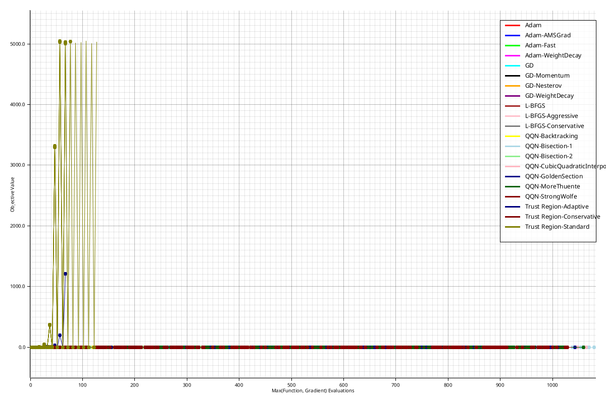
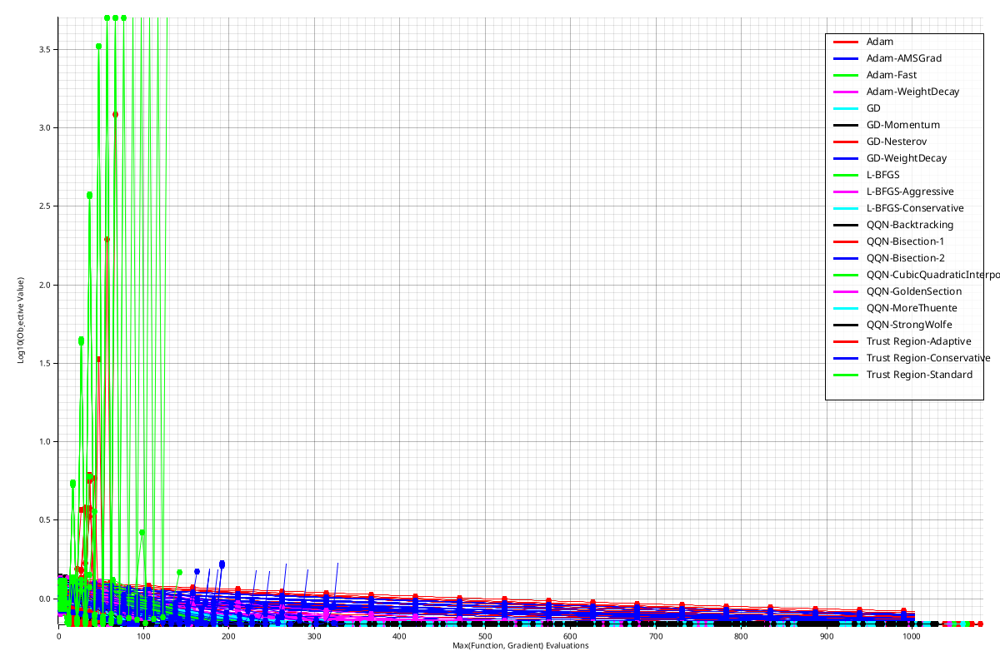

**Figure:** Convergence plots for SVM_200samples_10features_C1 showing objective value vs iterations.
Left: Linear scale, Right: Log scale for better visualization of convergence behavior.

**Data:** [Linear scale data (CSV)](convergence_SVM_200samples_10features_C1_data.csv) | [Log scale data (CSV)](convergence_SVM_200samples_10features_C1_log_data.csv)

# Optimizer Comparison Matrix

Matrix showing all comparisons. Green indicates QQN won (statistically significant), red indicates non-QQN optimizer won (statistically significant), gray indicates no significant difference.

<table class="comparison-matrix">
  <tr><th></th>
    <th>Adam</th>
    <th>Adam-AMSGrad</th>
    <th>Adam-Fast</th>
    <th>Adam-WeightDecay</th>
    <th>GD</th>
    <th>GD-Momentum</th>
    <th>GD-Nesterov</th>
    <th>GD-WeightDecay</th>
    <th>L-BFGS</th>
    <th>L-BFGS-Aggressive</th>
    <th>L-BFGS-Conservative</th>
    <th>Trust Region-Adaptive</th>
    <th>Trust Region-Conservative</th>
    <th>Trust Region-Standard</th>
  </tr>
  <tr>
    <th>QQN-Backtracking</th>
    <td>
<strong>Ackley_10D_a20_b0.2_c6.28e0</strong> obj: -0.078 cost: -353.10

<strong>Ackley_2D_a20_b0.2_c6.28e0</strong> obj: -1.04 cost: -126.15

<strong>Ackley_5D_a20_b0.2_c6.28e0</strong> obj: -0.657 cost: -364.00

<strong>Barrier_10D_mu0.1</strong> obj: inf cost: -502.00

<strong>Barrier_2D_mu0.1</strong> obj: inf cost: -502.00

<strong>Barrier_5D_mu0.1</strong> obj: inf cost: -502.00

<strong>Beale_2D</strong> obj: -8.72 cost: 80.25

<strong>Booth_2D</strong> obj: -56.05 cost: -179.45

<strong>GoldsteinPrice_2D</strong> obj: -792.36 cost: 367.70

<strong>Griewank_10D</strong> obj: -17.48 cost: 93.35

<strong>Griewank_2D</strong> obj: -1.13 cost: -188.05

<strong>Griewank_5D</strong> obj: -1.79 cost: 55.40

<strong>Himmelblau_2D</strong> obj: -156.57 cost: -347.30

<strong>IllConditionedRosenbrock_10D_alpha100</strong> obj: -982.00 cost: 189.85

<strong>IllConditionedRosenbrock_2D_alpha100</strong> obj: -3.84 cost: 229.95

<strong>IllConditionedRosenbrock_5D_alpha100</strong> obj: -498.31 cost: 169.80

<strong>Levi_2D</strong> obj: -0.573 cost: -99.85

<strong>Levy_10D</strong> obj: -3.95 cost: -301.30

<strong>Levy_2D</strong> obj: -0.789 cost: -303.50

<strong>Levy_5D</strong> obj: -1.92 cost: -345.30

<strong>LinearRegression_100samples_5features_reg0.01</strong> obj: -13.02 cost: -419.00

<strong>LinearRegression_200samples_10features_reg0.01</strong> obj: -100.37 cost: -398.00

<strong>LogisticRegression_100samples_5features_reg0.01</strong> obj: -0.280 cost: -421.30

<strong>LogisticRegression_200samples_10features_reg0.01</strong> obj: -0.258 cost: -422.40

<strong>Matyas_2D</strong> obj: -0.028 cost: -477.00

<strong>Michalewicz_10D_m10</strong> obj: 1.55 cost: 216.00

<strong>Michalewicz_2D_m10</strong> obj: 0.063 cost: -151.10

<strong>Michalewicz_5D_m10</strong> obj: 0.518 cost: 89.20

<strong>NeuralNetwork_100samples_layers_10_20_5</strong> obj: -0.056 cost: 42.35

<strong>NeuralNetwork_100samples_layers_5_10_3</strong> obj: -0.054 cost: 42.50

<strong>NoisySphere_10D_sigma0.01</strong> obj: -0.950 cost: 184.40

<strong>NoisySphere_2D_sigma0.01</strong> obj: -0.869 cost: 159.60

<strong>NoisySphere_5D_sigma0.01</strong> obj: -0.445 cost: 166.75

<strong>PenaltyI_10D_alpha1e6</strong> obj: -6.2e4 cost: 205.10

<strong>PenaltyI_2D_alpha1e6</strong> obj: -9.5e3 cost: 294.65

<strong>PenaltyI_5D_alpha1e6</strong> obj: -2.5e4 cost: 237.35

<strong>Rastrigin_10D</strong> obj: -9.44 cost: -382.10

<strong>Rastrigin_2D</strong> obj: -4.85 cost: -373.70

<strong>Rastrigin_5D</strong> obj: -9.76 cost: -398.60

<strong>Rosenbrock_10D</strong> obj: -1.0e3 cost: 192.55

<strong>Rosenbrock_2D</strong> obj: -4.03 cost: 215.00

<strong>Rosenbrock_5D</strong> obj: -468.38 cost: 163.75

<strong>SVM_100samples_5features_C1</strong> obj: -0.096 cost: -147.55

<strong>SVM_200samples_10features_C1</strong> obj: -0.061 cost: 177.40

<strong>Schwefel_10D</strong> obj: -1.1e7 cost: -17.95

<strong>Schwefel_2D</strong> obj: -5.1e4 cost: -10.90

<strong>Schwefel_5D</strong> obj: -2.0e3 cost: 29.30

<strong>SparseQuadratic_10D_pattern[1, 3]</strong> obj: -7.12 cost: -420.05

<strong>SparseQuadratic_5D_pattern[1, 3]</strong> obj: -3.02 cost: -423.20

<strong>SparseRosenbrock_10D</strong> obj: -12.48 cost: 207.50

<strong>SparseRosenbrock_4D</strong> obj: -5.93 cost: 203.10

<strong>Sphere_10D</strong> obj: -5.71 cost: -490.00

<strong>Sphere_2D</strong> obj: -1.15 cost: -490.00

<strong>StyblinskiTang_10D</strong> obj: -350.38 cost: -341.75

<strong>StyblinskiTang_2D</strong> obj: -69.01 cost: -368.60

<strong>StyblinskiTang_5D</strong> obj: -181.32 cost: -366.60

<strong>Trigonometric_10D</strong> obj: -0.652 cost: -195.10

<strong>Trigonometric_2D</strong> obj: -0.014 cost: -214.15

<strong>Trigonometric_5D</strong> obj: -0.096 cost: -197.20

<strong>Zakharov_10D</strong> obj: -1.9e5 cost: -344.45

<strong>Zakharov_2D</strong> obj: -4.04 cost: -230.20

<strong>Zakharov_5D</strong> obj: -1.1e3 cost: -328.95
</td>
    <td>
<strong>Ackley_10D_a20_b0.2_c6.28e0</strong> obj: -0.083 cost: -353.10

<strong>Ackley_2D_a20_b0.2_c6.28e0</strong> obj: -1.05 cost: -321.00

<strong>Ackley_5D_a20_b0.2_c6.28e0</strong> obj: -0.661 cost: -379.10

<strong>Barrier_10D_mu0.1</strong> obj: inf cost: -502.00

<strong>Barrier_2D_mu0.1</strong> obj: inf cost: -502.00

<strong>Barrier_5D_mu0.1</strong> obj: inf cost: -502.00

<strong>Beale_2D</strong> obj: -8.62 cost: 80.25

<strong>Booth_2D</strong> obj: -55.95 cost: -179.45

<strong>GoldsteinPrice_2D</strong> obj: -814.03 cost: 343.65

<strong>Griewank_10D</strong> obj: -17.48 cost: 93.35

<strong>Griewank_2D</strong> obj: -1.10 cost: -188.05

<strong>Griewank_5D</strong> obj: -1.79 cost: 55.40

<strong>Himmelblau_2D</strong> obj: -158.25 cost: -347.30

<strong>IllConditionedRosenbrock_10D_alpha100</strong> obj: -1.0e3 cost: 189.85

<strong>IllConditionedRosenbrock_2D_alpha100</strong> obj: -4.00 cost: 400.95

<strong>IllConditionedRosenbrock_5D_alpha100</strong> obj: -470.79 cost: 169.80

<strong>Levi_2D</strong> obj: -0.489 cost: -136.95

<strong>Levy_10D</strong> obj: -3.96 cost: -301.30

<strong>Levy_2D</strong> obj: -0.806 cost: -303.50

<strong>Levy_5D</strong> obj: -1.96 cost: -345.30

<strong>LinearRegression_100samples_5features_reg0.01</strong> obj: -13.29 cost: -419.00

<strong>LinearRegression_200samples_10features_reg0.01</strong> obj: -100.77 cost: -398.00

<strong>LogisticRegression_100samples_5features_reg0.01</strong> obj: -0.282 cost: -421.30

<strong>LogisticRegression_200samples_10features_reg0.01</strong> obj: -0.256 cost: -422.40

<strong>Matyas_2D</strong> obj: -0.029 cost: -477.00

<strong>Michalewicz_10D_m10</strong> obj: 1.80 cost: 162.25

<strong>Michalewicz_2D_m10</strong> obj: 0.025 cost: 239.20

<strong>Michalewicz_5D_m10</strong> obj: 0.323 cost: 71.80

<strong>NeuralNetwork_100samples_layers_10_20_5</strong> obj: -0.055 cost: 42.35

<strong>NeuralNetwork_100samples_layers_5_10_3</strong> obj: -0.055 cost: 42.50

<strong>NoisySphere_10D_sigma0.01</strong> obj: -1.05 cost: 184.30

<strong>NoisySphere_2D_sigma0.01</strong> obj: -0.877 cost: 162.50

<strong>NoisySphere_5D_sigma0.01</strong> obj: -0.309 cost: 176.65

<strong>PenaltyI_10D_alpha1e6</strong> obj: -6.1e4 cost: 205.10

<strong>PenaltyI_2D_alpha1e6</strong> obj: -1.4e4 cost: 258.25

<strong>PenaltyI_5D_alpha1e6</strong> obj: -3.0e4 cost: 217.80

<strong>Rastrigin_10D</strong> obj: -8.73 cost: -382.10

<strong>Rastrigin_2D</strong> obj: -4.59 cost: -373.70

<strong>Rastrigin_5D</strong> obj: -9.08 cost: -398.60

<strong>Rosenbrock_10D</strong> obj: -1.0e3 cost: 192.55

<strong>Rosenbrock_2D</strong> obj: -4.20 cost: 437.65

<strong>Rosenbrock_5D</strong> obj: -477.44 cost: 163.75

<strong>SVM_100samples_5features_C1</strong> obj: -0.081 cost: -147.55

<strong>SVM_200samples_10features_C1</strong> obj: -0.051 cost: 177.40

<strong>Schwefel_10D</strong> obj: -1.1e7 cost: -17.95

<strong>Schwefel_2D</strong> obj: -5.1e4 cost: -10.90

<strong>Schwefel_5D</strong> obj: -2.0e3 cost: 29.30

<strong>SparseQuadratic_10D_pattern[1, 3]</strong> obj: -6.60 cost: -420.05

<strong>SparseQuadratic_5D_pattern[1, 3]</strong> obj: -3.30 cost: -423.20

<strong>SparseRosenbrock_10D</strong> obj: -13.31 cost: 207.50

<strong>SparseRosenbrock_4D</strong> obj: -6.57 cost: 220.05

<strong>Sphere_10D</strong> obj: -5.94 cost: -490.00

<strong>Sphere_2D</strong> obj: -1.16 cost: -490.00

<strong>StyblinskiTang_10D</strong> obj: -349.32 cost: -341.75

<strong>StyblinskiTang_2D</strong> obj: -68.85 cost: -368.60

<strong>StyblinskiTang_5D</strong> obj: -181.43 cost: -366.60

<strong>Trigonometric_10D</strong> obj: -0.601 cost: -195.10

<strong>Trigonometric_2D</strong> obj: -0.025 cost: -222.05

<strong>Trigonometric_5D</strong> obj: -0.199 cost: -197.20

<strong>Zakharov_10D</strong> obj: -1.9e5 cost: -344.45

<strong>Zakharov_2D</strong> obj: -4.65 cost: -230.20

<strong>Zakharov_5D</strong> obj: -1.0e3 cost: -328.95
</td>
    <td>
<strong>Ackley_10D_a20_b0.2_c6.28e0</strong> obj: -0.110 cost: 13.35

<strong>Ackley_2D_a20_b0.2_c6.28e0</strong> obj: -1.11 cost: 130.85

<strong>Ackley_5D_a20_b0.2_c6.28e0</strong> obj: -0.706 cost: 55.70

<strong>Barrier_10D_mu0.1</strong> obj: inf cost: -31.45

<strong>Barrier_2D_mu0.1</strong> obj: inf cost: -32.00

<strong>Barrier_5D_mu0.1</strong> obj: inf cost: -31.80

<strong>Beale_2D</strong> obj: -1.66 cost: 542.65

<strong>Booth_2D</strong> obj: -2.95 cost: 266.65

<strong>GoldsteinPrice_2D</strong> obj: -766.19 cost: 751.70

<strong>Griewank_10D</strong> obj: -7.29 cost: 93.35

<strong>Griewank_2D</strong> obj: -0.181 cost: 246.05

<strong>Griewank_5D</strong> obj: -0.694 cost: 489.95

<strong>Himmelblau_2D</strong> obj: -4.99 cost: 84.35

<strong>IllConditionedRosenbrock_10D_alpha100</strong> obj: -7.33 cost: 474.03

<strong>IllConditionedRosenbrock_2D_alpha100</strong> obj: -1.96 cost: 438.85

<strong>IllConditionedRosenbrock_5D_alpha100</strong> obj: -14.00 cost: 632.60

<strong>Levi_2D</strong> obj: -0.618 cost: 120.90

<strong>Levy_10D</strong> obj: -0.317 cost: 163.45

<strong>Levy_2D</strong> obj: -0.079 cost: 162.25

<strong>Levy_5D</strong> obj: -0.168 cost: 119.45

<strong>LinearRegression_100samples_5features_reg0.01</strong> obj: -0.138 cost: -5.30

<strong>LinearRegression_200samples_10features_reg0.01</strong> obj: -0.019 cost: -104.30

<strong>LogisticRegression_100samples_5features_reg0.01</strong> obj: -0.001 cost: -8.60

<strong>LogisticRegression_200samples_10features_reg0.01</strong> obj: -0.001 cost: 3.65

<strong>Matyas_2D</strong> obj: -0.001 cost: -30.10

<strong>Michalewicz_10D_m10</strong> obj: 2.41 cost: 521.15

<strong>Michalewicz_2D_m10</strong> obj: 0.547 cost: 90.25

<strong>Michalewicz_5D_m10</strong> obj: 1.06 cost: 438.75

<strong>NeuralNetwork_100samples_layers_10_20_5</strong> obj: 0.020 cost: 345.95

<strong>NeuralNetwork_100samples_layers_5_10_3</strong> obj: 0.010 cost: 311.95

<strong>NoisySphere_10D_sigma0.01</strong> obj: -2.40 cost: 194.75

<strong>NoisySphere_2D_sigma0.01</strong> obj: -0.849 cost: 161.25

<strong>NoisySphere_5D_sigma0.01</strong> obj: -1.01 cost: 179.80

<strong>PenaltyI_10D_alpha1e6</strong> obj: -1.4e3 cost: 678.20

<strong>PenaltyI_2D_alpha1e6</strong> obj: -34.86 cost: 724.95

<strong>PenaltyI_5D_alpha1e6</strong> obj: -1.2e3 cost: 694.85

<strong>Rastrigin_10D</strong> obj: 5.83 cost: 9.30

<strong>Rastrigin_2D</strong> obj: -1.52 cost: 80.25

<strong>Rastrigin_5D</strong> obj: -2.41 cost: 31.85

<strong>Rosenbrock_10D</strong> obj: -11.39 cost: 525.10

<strong>Rosenbrock_2D</strong> obj: -2.15 cost: 449.73

<strong>Rosenbrock_5D</strong> obj: -14.11 cost: 626.75

<strong>SVM_100samples_5features_C1</strong> obj: -0.039 cost: 319.75

<strong>SVM_200samples_10features_C1</strong> obj: -0.024 cost: 623.65

<strong>Schwefel_10D</strong> obj: -1.1e7 cost: -17.95

<strong>Schwefel_2D</strong> obj: -5.1e4 cost: -10.90

<strong>Schwefel_5D</strong> obj: -1.5e3 cost: 29.30

<strong>SparseQuadratic_10D_pattern[1, 3]</strong> obj: -0.728 cost: 44.65

<strong>SparseQuadratic_5D_pattern[1, 3]</strong> obj: -0.353 cost: 41.30

<strong>SparseRosenbrock_10D</strong> obj: 5.89 cost: 506.90

<strong>SparseRosenbrock_4D</strong> obj: -0.254 cost: 467.95

<strong>Sphere_10D</strong> obj: -0.615 cost: -25.75

<strong>Sphere_2D</strong> obj: -0.126 cost: -24.90

<strong>StyblinskiTang_10D</strong> obj: -0.956 cost: 87.60

<strong>StyblinskiTang_2D</strong> obj: 1.64 cost: 61.40

<strong>StyblinskiTang_5D</strong> obj: -5.46 cost: 63.25

<strong>Trigonometric_10D</strong> obj: -0.051 cost: 183.10

<strong>Trigonometric_2D</strong> obj: -0.006 cost: 228.30

<strong>Trigonometric_5D</strong> obj: -0.043 cost: 244.85

<strong>Zakharov_10D</strong> obj: -969.41 cost: 122.70

<strong>Zakharov_2D</strong> obj: -0.279 cost: 234.30

<strong>Zakharov_5D</strong> obj: -9.63 cost: 138.20
</td>
    <td>
<strong>Ackley_10D_a20_b0.2_c6.28e0</strong> obj: -0.078 cost: -121.30

<strong>Ackley_2D_a20_b0.2_c6.28e0</strong> obj: -1.05 cost: 61.15

<strong>Ackley_5D_a20_b0.2_c6.28e0</strong> obj: -0.657 cost: -60.80

<strong>Barrier_10D_mu0.1</strong> obj: inf cost: -502.00

<strong>Barrier_2D_mu0.1</strong> obj: inf cost: -502.00

<strong>Barrier_5D_mu0.1</strong> obj: inf cost: -502.00

<strong>Beale_2D</strong> obj: -1.35 cost: 80.25

<strong>Booth_2D</strong> obj: -32.21 cost: -179.45

<strong>GoldsteinPrice_2D</strong> obj: -754.49 cost: 572.85

<strong>Griewank_10D</strong> obj: -17.23 cost: 93.35

<strong>Griewank_2D</strong> obj: -0.834 cost: -188.05

<strong>Griewank_5D</strong> obj: -1.56 cost: 55.40

<strong>Himmelblau_2D</strong> obj: -123.57 cost: -347.30

<strong>IllConditionedRosenbrock_10D_alpha100</strong> obj: -139.92 cost: 189.85

<strong>IllConditionedRosenbrock_2D_alpha100</strong> obj: -4.05 cost: 583.60

<strong>IllConditionedRosenbrock_5D_alpha100</strong> obj: -61.49 cost: 169.80

<strong>Levi_2D</strong> obj: -0.510 cost: 75.15

<strong>Levy_10D</strong> obj: -0.526 cost: -301.30

<strong>Levy_2D</strong> obj: -0.159 cost: -303.50

<strong>Levy_5D</strong> obj: -0.346 cost: -345.30

<strong>LinearRegression_100samples_5features_reg0.01</strong> obj: -7.20 cost: -419.00

<strong>LinearRegression_200samples_10features_reg0.01</strong> obj: -74.70 cost: -398.00

<strong>LogisticRegression_100samples_5features_reg0.01</strong> obj: -0.151 cost: -421.30

<strong>LogisticRegression_200samples_10features_reg0.01</strong> obj: -0.136 cost: -422.40

<strong>Matyas_2D</strong> obj: -0.011 cost: -477.00

<strong>Michalewicz_10D_m10</strong> obj: 1.07 cost: 470.15

<strong>Michalewicz_2D_m10</strong> obj: -0.040 cost: 288.10

<strong>Michalewicz_5D_m10</strong> obj: -0.051 cost: 377.45

<strong>NeuralNetwork_100samples_layers_10_20_5</strong> obj: -0.006 cost: 42.35

<strong>NeuralNetwork_100samples_layers_5_10_3</strong> obj: -0.027 cost: 42.50

<strong>NoisySphere_10D_sigma0.01</strong> obj: -0.974 cost: 182.10

<strong>NoisySphere_2D_sigma0.01</strong> obj: -0.915 cost: 156.00

<strong>NoisySphere_5D_sigma0.01</strong> obj: -0.619 cost: 173.55

<strong>PenaltyI_10D_alpha1e6</strong> obj: 14.37 cost: 434.90

<strong>PenaltyI_2D_alpha1e6</strong> obj: -0.832 cost: 544.20

<strong>PenaltyI_5D_alpha1e6</strong> obj: -2.12 cost: 449.45

<strong>Rastrigin_10D</strong> obj: 8.24 cost: -151.70

<strong>Rastrigin_2D</strong> obj: -0.564 cost: -124.00

<strong>Rastrigin_5D</strong> obj: -0.284 cost: -167.50

<strong>Rosenbrock_10D</strong> obj: -133.61 cost: 192.55

<strong>Rosenbrock_2D</strong> obj: -4.10 cost: 565.65

<strong>Rosenbrock_5D</strong> obj: -63.81 cost: 163.75

<strong>SVM_100samples_5features_C1</strong> obj: -0.001 cost: -147.55

<strong>SVM_200samples_10features_C1</strong> obj: -0.000 cost: 197.95

<strong>Schwefel_10D</strong> obj: -1.1e7 cost: -17.95

<strong>Schwefel_2D</strong> obj: -5.1e4 cost: -10.90

<strong>Schwefel_5D</strong> obj: -2.0e3 cost: 29.30

<strong>SparseQuadratic_10D_pattern[1, 3]</strong> obj: -0.916 cost: -420.05

<strong>SparseQuadratic_5D_pattern[1, 3]</strong> obj: -0.482 cost: -423.20

<strong>SparseRosenbrock_10D</strong> obj: -4.86 cost: 207.50

<strong>SparseRosenbrock_4D</strong> obj: -5.27 cost: 448.45

<strong>Sphere_10D</strong> obj: -0.768 cost: -490.00

<strong>Sphere_2D</strong> obj: -0.265 cost: -490.00

<strong>StyblinskiTang_10D</strong> obj: -293.32 cost: -341.75

<strong>StyblinskiTang_2D</strong> obj: -58.44 cost: -368.60

<strong>StyblinskiTang_5D</strong> obj: -154.16 cost: -366.60

<strong>Trigonometric_10D</strong> obj: -0.047 cost: -186.15

<strong>Trigonometric_2D</strong> obj: -0.000 cost: -61.15

<strong>Trigonometric_5D</strong> obj: -0.032 cost: -99.50

<strong>Zakharov_10D</strong> obj: -2.8e3 cost: -344.45

<strong>Zakharov_2D</strong> obj: -0.343 cost: -230.20

<strong>Zakharov_5D</strong> obj: -24.26 cost: -328.95
</td>
    <td>
<strong>Ackley_10D_a20_b0.2_c6.28e0</strong> obj: -0.078 cost: -44.30

<strong>Ackley_2D_a20_b0.2_c6.28e0</strong> obj: -1.04 cost: 130.85

<strong>Ackley_5D_a20_b0.2_c6.28e0</strong> obj: -0.657 cost: 24.60

<strong>Barrier_10D_mu0.1</strong> obj: inf cost: -605.10

<strong>Barrier_2D_mu0.1</strong> obj: inf cost: -581.70

<strong>Barrier_5D_mu0.1</strong> obj: inf cost: -602.50

<strong>Beale_2D</strong> obj: 0.002 cost: -85.75

<strong>Booth_2D</strong> obj: 0.090 cost: -345.45

<strong>GoldsteinPrice_2D</strong> obj: -765.24 cost: 741.00

<strong>Griewank_10D</strong> obj: -17.52 cost: -72.65

<strong>Griewank_2D</strong> obj: -0.264 cost: -354.05

<strong>Griewank_5D</strong> obj: -1.66 cost: -110.60

<strong>Himmelblau_2D</strong> obj: -0.000 cost: -0.400

<strong>IllConditionedRosenbrock_10D_alpha100</strong> obj: -5.34 cost: 602.35

<strong>IllConditionedRosenbrock_2D_alpha100</strong> obj: -1.48 cost: 171.45

<strong>IllConditionedRosenbrock_5D_alpha100</strong> obj: -4.56 cost: 610.80

<strong>Levi_2D</strong> obj: -0.789 cost: 140.40

<strong>Levy_10D</strong> obj: -0.018 cost: -467.30

<strong>Levy_2D</strong> obj: -0.017 cost: -469.50

<strong>Levy_5D</strong> obj: -0.018 cost: -511.30

<strong>LinearRegression_100samples_5features_reg0.01</strong> obj: -0.000 cost: -585.00

<strong>LinearRegression_200samples_10features_reg0.01</strong> obj: -0.000 cost: -564.00

<strong>LogisticRegression_100samples_5features_reg0.01</strong> obj: -0.240 cost: -587.30

<strong>LogisticRegression_200samples_10features_reg0.01</strong> obj: -0.246 cost: -588.40

<strong>Matyas_2D</strong> obj: -0.031 cost: -643.00

<strong>Michalewicz_10D_m10</strong> obj: -0.952 cost: 597.60

<strong>Michalewicz_2D_m10</strong> obj: -0.040 cost: 214.10

<strong>Michalewicz_5D_m10</strong> obj: -0.372 cost: 42.40

<strong>NeuralNetwork_100samples_layers_10_20_5</strong> obj: -0.091 cost: -123.65

<strong>NeuralNetwork_100samples_layers_5_10_3</strong> obj: -0.067 cost: -123.50

<strong>NoisySphere_10D_sigma0.01</strong> obj: -1.25 cost: 189.85

<strong>NoisySphere_2D_sigma0.01</strong> obj: -1.04 cost: 169.00

<strong>NoisySphere_5D_sigma0.01</strong> obj: -0.593 cost: 176.80

<strong>PenaltyI_10D_alpha1e6</strong> obj: 15.52 cost: 674.35

<strong>PenaltyI_2D_alpha1e6</strong> obj: -15.50 cost: 722.90

<strong>PenaltyI_5D_alpha1e6</strong> obj: -84.13 cost: 692.00

<strong>Rastrigin_10D</strong> obj: 6.21 cost: 82.35

<strong>Rastrigin_2D</strong> obj: -1.59 cost: 106.05

<strong>Rastrigin_5D</strong> obj: -1.28 cost: 74.00

<strong>Rosenbrock_10D</strong> obj: -5.77 cost: 605.15

<strong>Rosenbrock_2D</strong> obj: -1.23 cost: 114.10

<strong>Rosenbrock_5D</strong> obj: -4.71 cost: 603.40

<strong>SVM_100samples_5features_C1</strong> obj: -0.000 cost: -312.65

<strong>SVM_200samples_10features_C1</strong> obj: -0.000 cost: 11.95

<strong>Schwefel_10D</strong> obj: -1.1e7 cost: -183.95

<strong>Schwefel_2D</strong> obj: -5.1e4 cost: -176.90

<strong>Schwefel_5D</strong> obj: -1.6e3 cost: -136.70

<strong>SparseQuadratic_10D_pattern[1, 3]</strong> obj: -0.000 cost: -586.05

<strong>SparseQuadratic_5D_pattern[1, 3]</strong> obj: -0.000 cost: -589.20

<strong>SparseRosenbrock_10D</strong> obj: 3.89 cost: 126.15

<strong>SparseRosenbrock_4D</strong> obj: -1.57 cost: 352.20

<strong>Sphere_10D</strong> obj: -0.000 cost: -656.00

<strong>Sphere_2D</strong> obj: -0.000 cost: -656.00

<strong>StyblinskiTang_10D</strong> obj: 14.14 cost: -124.00

<strong>StyblinskiTang_2D</strong> obj: 2.12 cost: -18.90

<strong>StyblinskiTang_5D</strong> obj: 3.53 cost: -74.25

<strong>Trigonometric_10D</strong> obj: -0.004 cost: -361.10

<strong>Trigonometric_2D</strong> obj: -0.000 cost: -385.65

<strong>Trigonometric_5D</strong> obj: -0.004 cost: -361.25

<strong>Zakharov_10D</strong> obj: -0.238 cost: -497.10

<strong>Zakharov_2D</strong> obj: -0.000 cost: -396.20

<strong>Zakharov_5D</strong> obj: -0.000 cost: -494.95
</td>
    <td>
<strong>Ackley_10D_a20_b0.2_c6.28e0</strong> obj: -0.265 cost: 124.00

<strong>Ackley_2D_a20_b0.2_c6.28e0</strong> obj: -1.13 cost: 137.55

<strong>Ackley_5D_a20_b0.2_c6.28e0</strong> obj: -0.806 cost: 98.60

<strong>Barrier_10D_mu0.1</strong> obj: inf cost: -38.30

<strong>Barrier_2D_mu0.1</strong> obj: inf cost: -37.70

<strong>Barrier_5D_mu0.1</strong> obj: inf cost: -38.00

<strong>Beale_2D</strong> obj: -0.966 cost: 524.05

<strong>Booth_2D</strong> obj: -7.11 cost: 284.15

<strong>GoldsteinPrice_2D</strong> obj: -981.48 cost: 753.55

<strong>Griewank_10D</strong> obj: -16.84 cost: -72.65

<strong>Griewank_2D</strong> obj: -0.162 cost: 105.65

<strong>Griewank_5D</strong> obj: -0.635 cost: -110.60

<strong>Himmelblau_2D</strong> obj: -34.13 cost: 105.60

<strong>IllConditionedRosenbrock_10D_alpha100</strong> obj: -6.02 cost: 224.05

<strong>IllConditionedRosenbrock_2D_alpha100</strong> obj: -5.05 cost: 658.10

<strong>IllConditionedRosenbrock_5D_alpha100</strong> obj: -31.74 cost: 633.50

<strong>Levi_2D</strong> obj: -0.679 cost: 136.75

<strong>Levy_10D</strong> obj: -0.245 cost: 149.10

<strong>Levy_2D</strong> obj: -0.154 cost: 157.70

<strong>Levy_5D</strong> obj: -0.159 cost: 44.90

<strong>LinearRegression_100samples_5features_reg0.01</strong> obj: -1.31 cost: 38.70

<strong>LinearRegression_200samples_10features_reg0.01</strong> obj: -1.98 cost: 31.80

<strong>LogisticRegression_100samples_5features_reg0.01</strong> obj: -0.018 cost: -587.30

<strong>LogisticRegression_200samples_10features_reg0.01</strong> obj: -0.024 cost: -588.40

<strong>Matyas_2D</strong> obj: -0.003 cost: -643.00

<strong>Michalewicz_10D_m10</strong> obj: -0.402 cost: 567.75

<strong>Michalewicz_2D_m10</strong> obj: -0.040 cost: 263.90

<strong>Michalewicz_5D_m10</strong> obj: -1.16 cost: 472.55

<strong>NeuralNetwork_100samples_layers_10_20_5</strong> obj: -0.100 cost: 444.45

<strong>NeuralNetwork_100samples_layers_5_10_3</strong> obj: -0.085 cost: 505.80

<strong>NoisySphere_10D_sigma0.01</strong> obj: -1.29 cost: 190.60

<strong>NoisySphere_2D_sigma0.01</strong> obj: -0.776 cost: 168.40

<strong>NoisySphere_5D_sigma0.01</strong> obj: -0.609 cost: 173.45

<strong>PenaltyI_10D_alpha1e6</strong> obj: -364.96 cost: 680.80

<strong>PenaltyI_2D_alpha1e6</strong> obj: -56.90 cost: 726.20

<strong>PenaltyI_5D_alpha1e6</strong> obj: -76.73 cost: 695.25

<strong>Rastrigin_10D</strong> obj: -4.31 cost: 42.80

<strong>Rastrigin_2D</strong> obj: -3.41 cost: 96.10

<strong>Rastrigin_5D</strong> obj: -9.29 cost: 45.50

<strong>Rosenbrock_10D</strong> obj: -23.33 cost: 444.05

<strong>Rosenbrock_2D</strong> obj: -5.31 cost: 662.90

<strong>Rosenbrock_5D</strong> obj: -34.38 cost: 628.35

<strong>SVM_100samples_5features_C1</strong> obj: -0.031 cost: 308.25

<strong>SVM_200samples_10features_C1</strong> obj: -0.025 cost: 631.90

<strong>Schwefel_10D</strong> obj: -1.1e7 cost: -183.95

<strong>Schwefel_2D</strong> obj: -5.1e4 cost: -59.90

<strong>Schwefel_5D</strong> obj: -1.4e3 cost: -111.90

<strong>SparseQuadratic_10D_pattern[1, 3]</strong> obj: -0.900 cost: 39.85

<strong>SparseQuadratic_5D_pattern[1, 3]</strong> obj: -0.488 cost: 38.80

<strong>SparseRosenbrock_10D</strong> obj: -19.27 cost: 645.80

<strong>SparseRosenbrock_4D</strong> obj: -9.98 cost: 663.30

<strong>Sphere_10D</strong> obj: -0.685 cost: -31.70

<strong>Sphere_2D</strong> obj: -0.149 cost: -30.00

<strong>StyblinskiTang_10D</strong> obj: -5.77 cost: 17.95

<strong>StyblinskiTang_2D</strong> obj: -25.68 cost: 54.90

<strong>StyblinskiTang_5D</strong> obj: -20.28 cost: 1.50

<strong>Trigonometric_10D</strong> obj: -0.771 cost: 212.80

<strong>Trigonometric_2D</strong> obj: -0.038 cost: 234.80

<strong>Trigonometric_5D</strong> obj: -0.126 cost: 253.20

<strong>Zakharov_10D</strong> obj: -6.4e3 cost: 119.15

<strong>Zakharov_2D</strong> obj: -1.08 cost: 241.60

<strong>Zakharov_5D</strong> obj: -54.03 cost: 139.25
</td>
    <td>
<strong>Ackley_10D_a20_b0.2_c6.28e0</strong> obj: -0.167 cost: 124.80

<strong>Ackley_2D_a20_b0.2_c6.28e0</strong> obj: -1.04 cost: 111.05

<strong>Ackley_5D_a20_b0.2_c6.28e0</strong> obj: -0.693 cost: 90.30

<strong>Barrier_10D_mu0.1</strong> obj: inf cost: -38.00

<strong>Barrier_2D_mu0.1</strong> obj: inf cost: -37.10

<strong>Barrier_5D_mu0.1</strong> obj: inf cost: -37.20

<strong>Beale_2D</strong> obj: 0.005 cost: 508.65

<strong>Booth_2D</strong> obj: -2.56 cost: 285.45

<strong>GoldsteinPrice_2D</strong> obj: -771.90 cost: 739.95

<strong>Griewank_10D</strong> obj: -16.85 cost: -72.65

<strong>Griewank_2D</strong> obj: -0.162 cost: 53.75

<strong>Griewank_5D</strong> obj: -0.635 cost: -110.60

<strong>Himmelblau_2D</strong> obj: -8.91 cost: 75.70

<strong>IllConditionedRosenbrock_10D_alpha100</strong> obj: 3.55 cost: 23.85

<strong>IllConditionedRosenbrock_2D_alpha100</strong> obj: -1.85 cost: 630.90

<strong>IllConditionedRosenbrock_5D_alpha100</strong> obj: -3.46 cost: 306.60

<strong>Levi_2D</strong> obj: -0.723 cost: 144.25

<strong>Levy_10D</strong> obj: -0.181 cost: 147.80

<strong>Levy_2D</strong> obj: -0.122 cost: 157.70

<strong>Levy_5D</strong> obj: -0.061 cost: -202.20

<strong>LinearRegression_100samples_5features_reg0.01</strong> obj: -0.833 cost: 39.40

<strong>LinearRegression_200samples_10features_reg0.01</strong> obj: -1.32 cost: 32.10

<strong>LogisticRegression_100samples_5features_reg0.01</strong> obj: -0.018 cost: -587.30

<strong>LogisticRegression_200samples_10features_reg0.01</strong> obj: -0.024 cost: -588.40

<strong>Matyas_2D</strong> obj: -0.003 cost: -643.00

<strong>Michalewicz_10D_m10</strong> obj: -0.173 cost: 600.35

<strong>Michalewicz_2D_m10</strong> obj: -0.040 cost: 263.90

<strong>Michalewicz_5D_m10</strong> obj: -0.480 cost: 450.45

<strong>NeuralNetwork_100samples_layers_10_20_5</strong> obj: -0.089 cost: 350.05

<strong>NeuralNetwork_100samples_layers_5_10_3</strong> obj: -0.079 cost: 505.20

<strong>NoisySphere_10D_sigma0.01</strong> obj: -2.17 cost: 194.20

<strong>NoisySphere_2D_sigma0.01</strong> obj: -1.22 cost: 166.80

<strong>NoisySphere_5D_sigma0.01</strong> obj: -0.735 cost: 177.95

<strong>PenaltyI_10D_alpha1e6</strong> obj: -80.75 cost: 681.80

<strong>PenaltyI_2D_alpha1e6</strong> obj: -188.74 cost: 723.80

<strong>PenaltyI_5D_alpha1e6</strong> obj: -382.95 cost: 696.05

<strong>Rastrigin_10D</strong> obj: 7.15 cost: 33.70

<strong>Rastrigin_2D</strong> obj: -0.724 cost: 88.80

<strong>Rastrigin_5D</strong> obj: 0.079 cost: 55.10

<strong>Rosenbrock_10D</strong> obj: 3.13 cost: 26.55

<strong>Rosenbrock_2D</strong> obj: -1.25 cost: 625.10

<strong>Rosenbrock_5D</strong> obj: -3.11 cost: 294.25

<strong>SVM_100samples_5features_C1</strong> obj: -0.019 cost: 308.85

<strong>SVM_200samples_10features_C1</strong> obj: -0.016 cost: 632.00

<strong>Schwefel_10D</strong> obj: -1.1e7 cost: -183.95

<strong>Schwefel_2D</strong> obj: -5.1e4 cost: -89.80

<strong>Schwefel_5D</strong> obj: -1.4e3 cost: -136.50

<strong>SparseQuadratic_10D_pattern[1, 3]</strong> obj: -0.604 cost: 39.95

<strong>SparseQuadratic_5D_pattern[1, 3]</strong> obj: -0.330 cost: 38.80

<strong>SparseRosenbrock_10D</strong> obj: 6.18 cost: 467.80

<strong>SparseRosenbrock_4D</strong> obj: -1.31 cost: 591.90

<strong>Sphere_10D</strong> obj: -0.423 cost: -30.90

<strong>Sphere_2D</strong> obj: -0.098 cost: -30.00

<strong>StyblinskiTang_10D</strong> obj: 18.23 cost: 14.75

<strong>StyblinskiTang_2D</strong> obj: -8.29 cost: 74.70

<strong>StyblinskiTang_5D</strong> obj: -9.55 cost: 15.20

<strong>Trigonometric_10D</strong> obj: -0.158 cost: 208.90

<strong>Trigonometric_2D</strong> obj: -0.013 cost: 231.20

<strong>Trigonometric_5D</strong> obj: -0.007 cost: 235.80

<strong>Zakharov_10D</strong> obj: -816.09 cost: 121.05

<strong>Zakharov_2D</strong> obj: -0.582 cost: 242.30

<strong>Zakharov_5D</strong> obj: -5.20 cost: 140.85
</td>
    <td>
<strong>Ackley_10D_a20_b0.2_c6.28e0</strong> obj: -0.098 cost: 114.10

<strong>Ackley_2D_a20_b0.2_c6.28e0</strong> obj: -1.05 cost: 96.55

<strong>Ackley_5D_a20_b0.2_c6.28e0</strong> obj: -0.701 cost: 96.40

<strong>Barrier_10D_mu0.1</strong> obj: inf cost: -95.10

<strong>Barrier_2D_mu0.1</strong> obj: inf cost: -93.40

<strong>Barrier_5D_mu0.1</strong> obj: inf cost: -94.90

<strong>Beale_2D</strong> obj: 0.007 cost: -85.75

<strong>Booth_2D</strong> obj: -1.20 cost: 247.75

<strong>GoldsteinPrice_2D</strong> obj: -778.04 cost: 752.85

<strong>Griewank_10D</strong> obj: -17.37 cost: -72.65

<strong>Griewank_2D</strong> obj: -0.162 cost: -354.05

<strong>Griewank_5D</strong> obj: -0.794 cost: -110.60

<strong>Himmelblau_2D</strong> obj: -0.457 cost: 76.90

<strong>IllConditionedRosenbrock_10D_alpha100</strong> obj: 3.41 cost: 156.65

<strong>IllConditionedRosenbrock_2D_alpha100</strong> obj: -0.823 cost: 488.40

<strong>IllConditionedRosenbrock_5D_alpha100</strong> obj: -0.685 cost: 483.30

<strong>Levi_2D</strong> obj: -0.472 cost: 106.75

<strong>Levy_10D</strong> obj: -0.002 cost: -467.30

<strong>Levy_2D</strong> obj: -0.002 cost: -469.50

<strong>Levy_5D</strong> obj: -0.002 cost: -511.30

<strong>LinearRegression_100samples_5features_reg0.01</strong> obj: -0.000 cost: -245.70

<strong>LinearRegression_200samples_10features_reg0.01</strong> obj: -0.000 cost: -346.60

<strong>LogisticRegression_100samples_5features_reg0.01</strong> obj: -0.134 cost: -587.30

<strong>LogisticRegression_200samples_10features_reg0.01</strong> obj: -0.146 cost: -588.40

<strong>Matyas_2D</strong> obj: -0.022 cost: -643.00

<strong>Michalewicz_10D_m10</strong> obj: 0.442 cost: 495.05

<strong>Michalewicz_2D_m10</strong> obj: -0.040 cost: 190.70

<strong>Michalewicz_5D_m10</strong> obj: -0.489 cost: 401.85

<strong>NeuralNetwork_100samples_layers_10_20_5</strong> obj: -0.082 cost: -123.65

<strong>NeuralNetwork_100samples_layers_5_10_3</strong> obj: -0.060 cost: -123.50

<strong>NoisySphere_10D_sigma0.01</strong> obj: -1.13 cost: 187.50

<strong>NoisySphere_2D_sigma0.01</strong> obj: -0.567 cost: 157.70

<strong>NoisySphere_5D_sigma0.01</strong> obj: -0.203 cost: 170.75

<strong>PenaltyI_10D_alpha1e6</strong> obj: 5.26 cost: 679.10

<strong>PenaltyI_2D_alpha1e6</strong> obj: 0.148 cost: 725.30

<strong>PenaltyI_5D_alpha1e6</strong> obj: -35.61 cost: 694.85

<strong>Rastrigin_10D</strong> obj: 7.56 cost: -62.60

<strong>Rastrigin_2D</strong> obj: -1.13 cost: 79.90

<strong>Rastrigin_5D</strong> obj: -0.739 cost: -62.10

<strong>Rosenbrock_10D</strong> obj: 2.76 cost: 165.65

<strong>Rosenbrock_2D</strong> obj: -2.43 cost: 570.50

<strong>Rosenbrock_5D</strong> obj: -0.774 cost: 342.75

<strong>SVM_100samples_5features_C1</strong> obj: 0.000 cost: 5.15

<strong>SVM_200samples_10features_C1</strong> obj: 0.000 cost: 326.10

<strong>Schwefel_10D</strong> obj: -1.1e7 cost: -183.95

<strong>Schwefel_2D</strong> obj: -5.1e4 cost: -176.90

<strong>Schwefel_5D</strong> obj: -1.4e3 cost: -136.70

<strong>SparseQuadratic_10D_pattern[1, 3]</strong> obj: -0.000 cost: -245.95

<strong>SparseQuadratic_5D_pattern[1, 3]</strong> obj: -0.000 cost: -243.10

<strong>SparseRosenbrock_10D</strong> obj: 3.00 cost: 453.40

<strong>SparseRosenbrock_4D</strong> obj: -3.66 cost: 546.00

<strong>Sphere_10D</strong> obj: -0.000 cost: -327.30

<strong>Sphere_2D</strong> obj: -0.000 cost: -305.70

<strong>StyblinskiTang_10D</strong> obj: 12.10 cost: -27.05

<strong>StyblinskiTang_2D</strong> obj: -0.115 cost: 27.70

<strong>StyblinskiTang_5D</strong> obj: -0.861 cost: -6.20

<strong>Trigonometric_10D</strong> obj: -0.004 cost: -111.10

<strong>Trigonometric_2D</strong> obj: -0.006 cost: 8.70

<strong>Trigonometric_5D</strong> obj: -0.021 cost: 50.30

<strong>Zakharov_10D</strong> obj: -19.71 cost: -18.75

<strong>Zakharov_2D</strong> obj: -0.108 cost: 194.30

<strong>Zakharov_5D</strong> obj: -0.437 cost: -44.95
</td>
    <td>
<strong>Ackley_10D_a20_b0.2_c6.28e0</strong> obj: -0.022 cost: 2.20

<strong>Ackley_2D_a20_b0.2_c6.28e0</strong> obj: -1.28 cost: -138.40

<strong>Ackley_5D_a20_b0.2_c6.28e0</strong> obj: -0.596 cost: -29.55

<strong>Barrier_10D_mu0.1</strong> obj: NaN cost: 0.000

<strong>Barrier_2D_mu0.1</strong> obj: NaN cost: 0.000

<strong>Barrier_5D_mu0.1</strong> obj: NaN cost: 0.000

<strong>Beale_2D</strong> obj: -1.01 cost: 298.55

<strong>Booth_2D</strong> obj: 0.063 cost: -73.75

<strong>GoldsteinPrice_2D</strong> obj: -3.5e3 cost: 657.30

<strong>Griewank_10D</strong> obj: -10.14 cost: 164.40

<strong>Griewank_2D</strong> obj: -0.162 cost: 87.05

<strong>Griewank_5D</strong> obj: -0.636 cost: 254.55

<strong>Himmelblau_2D</strong> obj: -10.11 cost: 9.30

<strong>IllConditionedRosenbrock_10D_alpha100</strong> obj: -95.63 cost: 541.80

<strong>IllConditionedRosenbrock_2D_alpha100</strong> obj: -115.81 cost: 583.60

<strong>IllConditionedRosenbrock_5D_alpha100</strong> obj: -176.34 cost: 545.45

<strong>Levi_2D</strong> obj: -5.53 cost: 63.10

<strong>Levy_10D</strong> obj: -0.009 cost: -219.05

<strong>Levy_2D</strong> obj: -0.001 cost: -288.00

<strong>Levy_5D</strong> obj: -0.001 cost: -337.10

<strong>LinearRegression_100samples_5features_reg0.01</strong> obj: -0.009 cost: -156.80

<strong>LinearRegression_200samples_10features_reg0.01</strong> obj: -0.007 cost: -85.45

<strong>LogisticRegression_100samples_5features_reg0.01</strong> obj: -0.000 cost: -369.40

<strong>LogisticRegression_200samples_10features_reg0.01</strong> obj: -0.001 cost: -375.15

<strong>Matyas_2D</strong> obj: -0.012 cost: -340.45

<strong>Michalewicz_10D_m10</strong> obj: -3.62 cost: 579.50

<strong>Michalewicz_2D_m10</strong> obj: -0.040 cost: 102.95

<strong>Michalewicz_5D_m10</strong> obj: -1.49 cost: 425.50

<strong>NeuralNetwork_100samples_layers_10_20_5</strong> obj: -0.057 cost: 51.10

<strong>NeuralNetwork_100samples_layers_5_10_3</strong> obj: -0.043 cost: 77.95

<strong>NoisySphere_10D_sigma0.01</strong> obj: -22.21 cost: 147.10

<strong>NoisySphere_2D_sigma0.01</strong> obj: -13.29 cost: 120.50

<strong>NoisySphere_5D_sigma0.01</strong> obj: -13.21 cost: 143.15

<strong>PenaltyI_10D_alpha1e6</strong> obj: -2.7e5 cost: 589.70

<strong>PenaltyI_2D_alpha1e6</strong> obj: -7.8e4 cost: 647.95

<strong>PenaltyI_5D_alpha1e6</strong> obj: -1.1e5 cost: 621.75

<strong>Rastrigin_10D</strong> obj: -137.13 cost: 12.25

<strong>Rastrigin_2D</strong> obj: -51.35 cost: 49.55

<strong>Rastrigin_5D</strong> obj: -88.95 cost: 18.55

<strong>Rosenbrock_10D</strong> obj: -222.29 cost: 549.90

<strong>Rosenbrock_2D</strong> obj: -128.45 cost: 617.15

<strong>Rosenbrock_5D</strong> obj: -301.79 cost: 545.50

<strong>SVM_100samples_5features_C1</strong> obj: 0.000 cost: 8.40

<strong>SVM_200samples_10features_C1</strong> obj: -0.001 cost: 409.65

<strong>Schwefel_10D</strong> obj: -1.1e7 cost: 188.50

<strong>Schwefel_2D</strong> obj: -5.1e4 cost: 184.10

<strong>Schwefel_5D</strong> obj: -1.4e3 cost: 223.45

<strong>SparseQuadratic_10D_pattern[1, 3]</strong> obj: -0.068 cost: -108.25

<strong>SparseQuadratic_5D_pattern[1, 3]</strong> obj: -0.000 cost: -137.00

<strong>SparseRosenbrock_10D</strong> obj: -439.71 cost: 568.85

<strong>SparseRosenbrock_4D</strong> obj: -136.96 cost: 569.20

<strong>Sphere_10D</strong> obj: 0.000 cost: -3.00

<strong>Sphere_2D</strong> obj: 0.000 cost: -1.80

<strong>StyblinskiTang_10D</strong> obj: 11.76 cost: -52.50

<strong>StyblinskiTang_2D</strong> obj: 4.72 cost: -36.85

<strong>StyblinskiTang_5D</strong> obj: -1.64 cost: -27.45

<strong>Trigonometric_10D</strong> obj: -40.88 cost: 234.50

<strong>Trigonometric_2D</strong> obj: -0.020 cost: 36.10

<strong>Trigonometric_5D</strong> obj: -1.11 cost: -24.00

<strong>Zakharov_10D</strong> obj: -1.8e4 cost: -580.00

<strong>Zakharov_2D</strong> obj: -0.029 cost: 88.00

<strong>Zakharov_5D</strong> obj: -41.71 cost: 50.05
</td>
    <td>
<strong>Ackley_10D_a20_b0.2_c6.28e0</strong> obj: 0.022 cost: -51.92

<strong>Ackley_2D_a20_b0.2_c6.28e0</strong> obj: -1.10 cost: -603.20

<strong>Ackley_5D_a20_b0.2_c6.28e0</strong> obj: -0.481 cost: -648.65

<strong>Barrier_10D_mu0.1</strong> obj: NaN cost: 0.000

<strong>Barrier_2D_mu0.1</strong> obj: NaN cost: 0.000

<strong>Barrier_5D_mu0.1</strong> obj: NaN cost: 0.000

<strong>Beale_2D</strong> obj: -13.82 cost: -190.12

<strong>Booth_2D</strong> obj: -74.23 cost: -449.45

<strong>GoldsteinPrice_2D</strong> obj: -1.6e3 cost: 13.55

<strong>Griewank_10D</strong> obj: -275.41 cost: -68.00

<strong>Griewank_2D</strong> obj: -0.164 cost: -196.93

<strong>Griewank_5D</strong> obj: -0.538 cost: 294.22

<strong>Himmelblau_2D</strong> obj: -82.66 cost: -616.22

<strong>IllConditionedRosenbrock_10D_alpha100</strong> obj: -1.1e3 cost: -81.42

<strong>IllConditionedRosenbrock_2D_alpha100</strong> obj: -15.57 cost: -63.95

<strong>IllConditionedRosenbrock_5D_alpha100</strong> obj: -826.72 cost: -100.35

<strong>Levi_2D</strong> obj: -1.16 cost: -581.48

<strong>Levy_10D</strong> obj: -0.510 cost: -490.70

<strong>Levy_2D</strong> obj: -0.001 cost: -470.70

<strong>Levy_5D</strong> obj: -0.055 cost: -542.20

<strong>LinearRegression_100samples_5features_reg0.01</strong> obj: -0.000 cost: -226.30

<strong>LinearRegression_200samples_10features_reg0.01</strong> obj: -0.041 cost: -449.17

<strong>LogisticRegression_100samples_5features_reg0.01</strong> obj: -0.000 cost: -481.15

<strong>LogisticRegression_200samples_10features_reg0.01</strong> obj: -0.001 cost: -559.05

<strong>Matyas_2D</strong> obj: -0.002 cost: -703.60

<strong>Michalewicz_10D_m10</strong> obj: -2.56 cost: -77.57

<strong>Michalewicz_2D_m10</strong> obj: 0.050 cost: 1.98

<strong>Michalewicz_5D_m10</strong> obj: -1.21 cost: -201.62

<strong>NeuralNetwork_100samples_layers_10_20_5</strong> obj: -0.025 cost: -161.42

<strong>NeuralNetwork_100samples_layers_5_10_3</strong> obj: -0.023 cost: -151.65

<strong>NoisySphere_10D_sigma0.01</strong> obj: -inf cost: 204.03

<strong>NoisySphere_2D_sigma0.01</strong> obj: -inf cost: 183.80

<strong>NoisySphere_5D_sigma0.01</strong> obj: -inf cost: 194.72

<strong>PenaltyI_10D_alpha1e6</strong> obj: -3.7e5 cost: 316.50

<strong>PenaltyI_2D_alpha1e6</strong> obj: -1.6e4 cost: 114.33

<strong>PenaltyI_5D_alpha1e6</strong> obj: -1.8e5 cost: 311.72

<strong>Rastrigin_10D</strong> obj: -110.57 cost: -652.10

<strong>Rastrigin_2D</strong> obj: -19.26 cost: -643.62

<strong>Rastrigin_5D</strong> obj: -54.17 cost: -668.60

<strong>Rosenbrock_10D</strong> obj: -1.1e3 cost: -78.78

<strong>Rosenbrock_2D</strong> obj: -21.29 cost: -56.30

<strong>Rosenbrock_5D</strong> obj: -893.49 cost: -106.33

<strong>SVM_100samples_5features_C1</strong> obj: -0.000 cost: 216.12

<strong>SVM_200samples_10features_C1</strong> obj: -0.000 cost: 544.35

<strong>Schwefel_10D</strong> obj: -1.1e7 cost: 274.55

<strong>Schwefel_2D</strong> obj: -5.1e4 cost: 281.03

<strong>Schwefel_5D</strong> obj: -1.4e3 cost: 325.27

<strong>SparseQuadratic_10D_pattern[1, 3]</strong> obj: -0.001 cost: -343.55

<strong>SparseQuadratic_5D_pattern[1, 3]</strong> obj: -0.000 cost: -337.02

<strong>SparseRosenbrock_10D</strong> obj: -109.84 cost: -64.88

<strong>SparseRosenbrock_4D</strong> obj: -42.15 cost: -69.15

<strong>Sphere_10D</strong> obj: 0.000 cost: -1.50

<strong>Sphere_2D</strong> obj: 0.000 cost: -0.625

<strong>StyblinskiTang_10D</strong> obj: -191.47 cost: -615.60

<strong>StyblinskiTang_2D</strong> obj: -26.89 cost: -641.80

<strong>StyblinskiTang_5D</strong> obj: -89.25 cost: -640.30

<strong>Trigonometric_10D</strong> obj: -10.36 cost: -465.10

<strong>Trigonometric_2D</strong> obj: -0.002 cost: -49.62

<strong>Trigonometric_5D</strong> obj: -1.51 cost: -467.20

<strong>Zakharov_10D</strong> obj: -2.9e5 cost: -605.28

<strong>Zakharov_2D</strong> obj: -5.87 cost: -287.03

<strong>Zakharov_5D</strong> obj: -1.7e3 cost: -539.20
</td>
    <td>
<strong>Ackley_10D_a20_b0.2_c6.28e0</strong> obj: -0.078 cost: -74.50

<strong>Ackley_2D_a20_b0.2_c6.28e0</strong> obj: -1.04 cost: 4.65

<strong>Ackley_5D_a20_b0.2_c6.28e0</strong> obj: -0.657 cost: -111.50

<strong>Barrier_10D_mu0.1</strong> obj: inf cost: -404.70

<strong>Barrier_2D_mu0.1</strong> obj: inf cost: -468.50

<strong>Barrier_5D_mu0.1</strong> obj: inf cost: -412.35

<strong>Beale_2D</strong> obj: 0.007 cost: 11.15

<strong>Booth_2D</strong> obj: 0.090 cost: -232.95

<strong>GoldsteinPrice_2D</strong> obj: -725.88 cost: 552.15

<strong>Griewank_10D</strong> obj: -16.60 cost: 37.90

<strong>Griewank_2D</strong> obj: -0.162 cost: -189.30

<strong>Griewank_5D</strong> obj: -0.635 cost: -0.800

<strong>Himmelblau_2D</strong> obj: -0.000 cost: -410.85

<strong>IllConditionedRosenbrock_10D_alpha100</strong> obj: -4.07 cost: -10.25

<strong>IllConditionedRosenbrock_2D_alpha100</strong> obj: -0.808 cost: 30.60

<strong>IllConditionedRosenbrock_5D_alpha100</strong> obj: -3.43 cost: -46.40

<strong>Levi_2D</strong> obj: -0.625 cost: -48.95

<strong>Levy_10D</strong> obj: -0.000 cost: -357.25

<strong>Levy_2D</strong> obj: -0.000 cost: -360.70

<strong>Levy_5D</strong> obj: -0.000 cost: -400.55

<strong>LinearRegression_100samples_5features_reg0.01</strong> obj: -0.000 cost: -470.25

<strong>LinearRegression_200samples_10features_reg0.01</strong> obj: -0.000 cost: -453.00

<strong>LogisticRegression_100samples_5features_reg0.01</strong> obj: -0.000 cost: -475.05

<strong>LogisticRegression_200samples_10features_reg0.01</strong> obj: -0.000 cost: -466.15

<strong>Matyas_2D</strong> obj: -0.000 cost: -533.55

<strong>Michalewicz_10D_m10</strong> obj: 0.004 cost: -66.70

<strong>Michalewicz_2D_m10</strong> obj: -0.040 cost: 157.05

<strong>Michalewicz_5D_m10</strong> obj: -0.235 cost: -86.35

<strong>NeuralNetwork_100samples_layers_10_20_5</strong> obj: -0.006 cost: -23.75

<strong>NeuralNetwork_100samples_layers_5_10_3</strong> obj: -0.012 cost: -30.85

<strong>NoisySphere_10D_sigma0.01</strong> obj: 3.40 cost: -616.00

<strong>NoisySphere_2D_sigma0.01</strong> obj: 0.840 cost: -588.05

<strong>NoisySphere_5D_sigma0.01</strong> obj: 2.56 cost: -625.10

<strong>PenaltyI_10D_alpha1e6</strong> obj: -2.1e5 cost: 25.20

<strong>PenaltyI_2D_alpha1e6</strong> obj: 1.65 cost: 252.20

<strong>PenaltyI_5D_alpha1e6</strong> obj: -4.9e4 cost: -13.20

<strong>Rastrigin_10D</strong> obj: 7.19 cost: -548.20

<strong>Rastrigin_2D</strong> obj: -0.796 cost: -211.05

<strong>Rastrigin_5D</strong> obj: -1.39 cost: -380.00

<strong>Rosenbrock_10D</strong> obj: -4.37 cost: 9.45

<strong>Rosenbrock_2D</strong> obj: -1.53 cost: 28.30

<strong>Rosenbrock_5D</strong> obj: -3.58 cost: -42.70

<strong>SVM_100samples_5features_C1</strong> obj: -0.000 cost: -66.50

<strong>SVM_200samples_10features_C1</strong> obj: -0.000 cost: 123.55

<strong>Schwefel_10D</strong> obj: -1.1e7 cost: -73.90

<strong>Schwefel_2D</strong> obj: -5.1e4 cost: -67.60

<strong>Schwefel_5D</strong> obj: -1.7e3 cost: -27.30

<strong>SparseQuadratic_10D_pattern[1, 3]</strong> obj: -0.000 cost: -471.05

<strong>SparseQuadratic_5D_pattern[1, 3]</strong> obj: -0.000 cost: -461.25

<strong>SparseRosenbrock_10D</strong> obj: -8.43 cost: -22.65

<strong>SparseRosenbrock_4D</strong> obj: -2.68 cost: -7.20

<strong>Sphere_10D</strong> obj: -0.000 cost: -545.00

<strong>Sphere_2D</strong> obj: -0.000 cost: -537.85

<strong>StyblinskiTang_10D</strong> obj: 15.55 cost: -397.65

<strong>StyblinskiTang_2D</strong> obj: 4.95 cost: -372.05

<strong>StyblinskiTang_5D</strong> obj: -0.707 cost: -411.95

<strong>Trigonometric_10D</strong> obj: -0.024 cost: -394.60

<strong>Trigonometric_2D</strong> obj: 0.000 cost: -286.80

<strong>Trigonometric_5D</strong> obj: -0.002 cost: -341.20

<strong>Zakharov_10D</strong> obj: -3.5e24 cost: 33.20

<strong>Zakharov_2D</strong> obj: -0.000 cost: -264.90

<strong>Zakharov_5D</strong> obj: -0.000 cost: -408.40
</td>
    <td>
<strong>Ackley_10D_a20_b0.2_c6.28e0</strong> obj: -0.418 cost: 132.05

<strong>Ackley_2D_a20_b0.2_c6.28e0</strong> obj: -1.20 cost: 154.95

<strong>Ackley_5D_a20_b0.2_c6.28e0</strong> obj: -0.799 cost: 106.20

<strong>Barrier_10D_mu0.1</strong> obj: inf cost: -108.20

<strong>Barrier_2D_mu0.1</strong> obj: inf cost: -25.35

<strong>Barrier_5D_mu0.1</strong> obj: inf cost: -57.25

<strong>Beale_2D</strong> obj: -0.097 cost: 406.40

<strong>Booth_2D</strong> obj: -22.87 cost: -279.45

<strong>GoldsteinPrice_2D</strong> obj: -2.4e3 cost: 185.85

<strong>Griewank_10D</strong> obj: -17.60 cost: 590.35

<strong>Griewank_2D</strong> obj: -0.392 cost: 297.70

<strong>Griewank_5D</strong> obj: -1.90 cost: 552.40

<strong>Himmelblau_2D</strong> obj: -119.38 cost: -447.30

<strong>IllConditionedRosenbrock_10D_alpha100</strong> obj: -2.1e3 cost: 89.85

<strong>IllConditionedRosenbrock_2D_alpha100</strong> obj: -4.37 cost: 539.65

<strong>IllConditionedRosenbrock_5D_alpha100</strong> obj: -1.0e3 cost: 69.80

<strong>Levi_2D</strong> obj: -0.861 cost: 153.45

<strong>Levy_10D</strong> obj: -3.78 cost: 110.35

<strong>Levy_2D</strong> obj: -14.89 cost: 172.45

<strong>Levy_5D</strong> obj: -3.49 cost: 108.85

<strong>LinearRegression_100samples_5features_reg0.01</strong> obj: -1.8e3 cost: -149.80

<strong>LinearRegression_200samples_10features_reg0.01</strong> obj: -65.04 cost: -498.00

<strong>LogisticRegression_100samples_5features_reg0.01</strong> obj: -0.380 cost: 75.70

<strong>LogisticRegression_200samples_10features_reg0.01</strong> obj: -0.373 cost: 74.60

<strong>Matyas_2D</strong> obj: -0.056 cost: 19.10

<strong>Michalewicz_10D_m10</strong> obj: -0.405 cost: 607.30

<strong>Michalewicz_2D_m10</strong> obj: -0.040 cost: 296.70

<strong>Michalewicz_5D_m10</strong> obj: -0.985 cost: 522.75

<strong>NeuralNetwork_100samples_layers_10_20_5</strong> obj: -0.116 cost: 525.75

<strong>NeuralNetwork_100samples_layers_5_10_3</strong> obj: -0.128 cost: 477.35

<strong>NoisySphere_10D_sigma0.01</strong> obj: -0.846 cost: 208.60

<strong>NoisySphere_2D_sigma0.01</strong> obj: -0.749 cost: 185.50

<strong>NoisySphere_5D_sigma0.01</strong> obj: -0.460 cost: 197.15

<strong>PenaltyI_10D_alpha1e6</strong> obj: -7.8e5 cost: 105.10

<strong>PenaltyI_2D_alpha1e6</strong> obj: -1.3e5 cost: 145.70

<strong>PenaltyI_5D_alpha1e6</strong> obj: -4.1e5 cost: 117.65

<strong>Rastrigin_10D</strong> obj: -60.91 cost: -482.10

<strong>Rastrigin_2D</strong> obj: -2.33 cost: -113.35

<strong>Rastrigin_5D</strong> obj: -8.36 cost: -488.55

<strong>Rosenbrock_10D</strong> obj: -2.1e3 cost: 92.55

<strong>Rosenbrock_2D</strong> obj: -13.03 cost: 408.55

<strong>Rosenbrock_5D</strong> obj: -1.0e3 cost: 63.75

<strong>SVM_100samples_5features_C1</strong> obj: -6.05 cost: 333.75

<strong>SVM_200samples_10features_C1</strong> obj: -7.77 cost: 657.65

<strong>Schwefel_10D</strong> obj: -1.1e7 cost: -117.95

<strong>Schwefel_2D</strong> obj: -5.1e4 cost: -110.90

<strong>Schwefel_5D</strong> obj: -1.9e3 cost: -70.70

<strong>SparseQuadratic_10D_pattern[1, 3]</strong> obj: -1.3e3 cost: -81.30

<strong>SparseQuadratic_5D_pattern[1, 3]</strong> obj: -1.2e3 cost: -9.85

<strong>SparseRosenbrock_10D</strong> obj: -119.53 cost: 129.25

<strong>SparseRosenbrock_4D</strong> obj: -33.16 cost: 242.45

<strong>Sphere_10D</strong> obj: -973.64 cost: -137.40

<strong>Sphere_2D</strong> obj: -1.2e3 cost: -35.10

<strong>StyblinskiTang_10D</strong> obj: -311.67 cost: -441.75

<strong>StyblinskiTang_2D</strong> obj: -24.38 cost: -438.75

<strong>StyblinskiTang_5D</strong> obj: -137.53 cost: -466.60

<strong>Trigonometric_10D</strong> obj: -0.200 cost: 180.40

<strong>Trigonometric_2D</strong> obj: -1.68 cost: 259.30

<strong>Trigonometric_5D</strong> obj: -0.120 cost: 278.95

<strong>Zakharov_10D</strong> obj: -6.0e5 cost: -444.45

<strong>Zakharov_2D</strong> obj: -11.28 cost: 147.45

<strong>Zakharov_5D</strong> obj: -3.3e3 cost: -428.95
</td>
    <td>
<strong>Ackley_10D_a20_b0.2_c6.28e0</strong> obj: -0.082 cost: -66.85

<strong>Ackley_2D_a20_b0.2_c6.28e0</strong> obj: -1.05 cost: 12.35

<strong>Ackley_5D_a20_b0.2_c6.28e0</strong> obj: -0.683 cost: -63.55

<strong>Barrier_10D_mu0.1</strong> obj: inf cost: -602.00

<strong>Barrier_2D_mu0.1</strong> obj: inf cost: -516.10

<strong>Barrier_5D_mu0.1</strong> obj: inf cost: -602.00

<strong>Beale_2D</strong> obj: -11.90 cost: -19.75

<strong>Booth_2D</strong> obj: -71.13 cost: -279.45

<strong>GoldsteinPrice_2D</strong> obj: -2.1e3 cost: 185.85

<strong>Griewank_10D</strong> obj: -15.62 cost: -2.45

<strong>Griewank_2D</strong> obj: -0.167 cost: -30.20

<strong>Griewank_5D</strong> obj: -0.653 cost: 177.85

<strong>Himmelblau_2D</strong> obj: -166.78 cost: -447.30

<strong>IllConditionedRosenbrock_10D_alpha100</strong> obj: -2.0e3 cost: 89.85

<strong>IllConditionedRosenbrock_2D_alpha100</strong> obj: -35.53 cost: 107.50

<strong>IllConditionedRosenbrock_5D_alpha100</strong> obj: -1.1e3 cost: 69.80

<strong>Levi_2D</strong> obj: -1.06 cost: -267.30

<strong>Levy_10D</strong> obj: -4.48 cost: -401.30

<strong>Levy_2D</strong> obj: -0.014 cost: -212.85

<strong>Levy_5D</strong> obj: -1.20 cost: -445.30

<strong>LinearRegression_100samples_5features_reg0.01</strong> obj: -15.62 cost: -519.00

<strong>LinearRegression_200samples_10features_reg0.01</strong> obj: -113.26 cost: -498.00

<strong>LogisticRegression_100samples_5features_reg0.01</strong> obj: -0.108 cost: -6.50

<strong>LogisticRegression_200samples_10features_reg0.01</strong> obj: -0.123 cost: -3.40

<strong>Matyas_2D</strong> obj: -0.040 cost: 17.60

<strong>Michalewicz_10D_m10</strong> obj: -0.873 cost: 116.35

<strong>Michalewicz_2D_m10</strong> obj: -0.040 cost: 296.45

<strong>Michalewicz_5D_m10</strong> obj: -0.705 cost: 253.60

<strong>NeuralNetwork_100samples_layers_10_20_5</strong> obj: -0.090 cost: 411.55

<strong>NeuralNetwork_100samples_layers_5_10_3</strong> obj: -0.070 cost: 399.55

<strong>NoisySphere_10D_sigma0.01</strong> obj: -1.05 cost: 207.55

<strong>NoisySphere_2D_sigma0.01</strong> obj: -1.01 cost: 183.70

<strong>NoisySphere_5D_sigma0.01</strong> obj: -0.719 cost: 195.80

<strong>PenaltyI_10D_alpha1e6</strong> obj: -7.7e5 cost: 105.10

<strong>PenaltyI_2D_alpha1e6</strong> obj: -1.4e5 cost: 145.70

<strong>PenaltyI_5D_alpha1e6</strong> obj: -3.4e5 cost: 117.65

<strong>Rastrigin_10D</strong> obj: -110.03 cost: -482.10

<strong>Rastrigin_2D</strong> obj: -16.55 cost: -473.70

<strong>Rastrigin_5D</strong> obj: -54.67 cost: -498.60

<strong>Rosenbrock_10D</strong> obj: -2.1e3 cost: 92.55

<strong>Rosenbrock_2D</strong> obj: -26.28 cost: 115.00

<strong>Rosenbrock_5D</strong> obj: -1.0e3 cost: 63.75

<strong>SVM_100samples_5features_C1</strong> obj: -2.44 cost: 202.50

<strong>SVM_200samples_10features_C1</strong> obj: -1.99 cost: 550.60

<strong>Schwefel_10D</strong> obj: -1.1e7 cost: -117.95

<strong>Schwefel_2D</strong> obj: -5.1e4 cost: -110.90

<strong>Schwefel_5D</strong> obj: -2.0e3 cost: -70.70

<strong>SparseQuadratic_10D_pattern[1, 3]</strong> obj: -9.78 cost: -520.05

<strong>SparseQuadratic_5D_pattern[1, 3]</strong> obj: -3.72 cost: -523.20

<strong>SparseRosenbrock_10D</strong> obj: -195.05 cost: 107.50

<strong>SparseRosenbrock_4D</strong> obj: -76.23 cost: 103.10

<strong>Sphere_10D</strong> obj: -8.28 cost: -590.00

<strong>Sphere_2D</strong> obj: -3.67 cost: -569.65

<strong>StyblinskiTang_10D</strong> obj: -359.88 cost: -441.75

<strong>StyblinskiTang_2D</strong> obj: -69.85 cost: -468.60

<strong>StyblinskiTang_5D</strong> obj: -185.35 cost: -466.60

<strong>Trigonometric_10D</strong> obj: -9.04 cost: -295.10

<strong>Trigonometric_2D</strong> obj: -0.007 cost: 225.35

<strong>Trigonometric_5D</strong> obj: -0.118 cost: -56.90

<strong>Zakharov_10D</strong> obj: -5.8e5 cost: -444.45

<strong>Zakharov_2D</strong> obj: -7.69 cost: -330.20

<strong>Zakharov_5D</strong> obj: -3.5e3 cost: -428.95
</td>
    <td>
<strong>Ackley_10D_a20_b0.2_c6.28e0</strong> obj: -1.21 cost: 138.95

<strong>Ackley_2D_a20_b0.2_c6.28e0</strong> obj: -1.94 cost: 161.10

<strong>Ackley_5D_a20_b0.2_c6.28e0</strong> obj: -1.43 cost: 113.25

<strong>Barrier_10D_mu0.1</strong> obj: inf cost: -30.40

<strong>Barrier_2D_mu0.1</strong> obj: inf cost: -9.50

<strong>Barrier_5D_mu0.1</strong> obj: inf cost: -17.60

<strong>Beale_2D</strong> obj: -137.72 cost: 527.65

<strong>Booth_2D</strong> obj: -0.412 cost: 88.50

<strong>GoldsteinPrice_2D</strong> obj: -1.7e3 cost: 261.45

<strong>Griewank_10D</strong> obj: -17.59 cost: 590.35

<strong>Griewank_2D</strong> obj: -1.25 cost: 308.95

<strong>Griewank_5D</strong> obj: -1.89 cost: 552.40

<strong>Himmelblau_2D</strong> obj: -0.146 cost: -360.00

<strong>IllConditionedRosenbrock_10D_alpha100</strong> obj: -1.9e3 cost: 89.85

<strong>IllConditionedRosenbrock_2D_alpha100</strong> obj: -3.83 cost: 604.15

<strong>IllConditionedRosenbrock_5D_alpha100</strong> obj: -850.64 cost: 69.80

<strong>Levi_2D</strong> obj: -0.680 cost: 161.70

<strong>Levy_10D</strong> obj: -0.668 cost: 171.70

<strong>Levy_2D</strong> obj: -3.23 cost: 178.35

<strong>Levy_5D</strong> obj: -4.89 cost: 133.95

<strong>LinearRegression_100samples_5features_reg0.01</strong> obj: -121.18 cost: 6.15

<strong>LinearRegression_200samples_10features_reg0.01</strong> obj: -2.8e3 cost: -269.25

<strong>LogisticRegression_100samples_5features_reg0.01</strong> obj: -0.382 cost: 75.70

<strong>LogisticRegression_200samples_10features_reg0.01</strong> obj: -0.374 cost: 74.60

<strong>Matyas_2D</strong> obj: -0.226 cost: 17.90

<strong>Michalewicz_10D_m10</strong> obj: -1.57 cost: 630.25

<strong>Michalewicz_2D_m10</strong> obj: -0.040 cost: 296.70

<strong>Michalewicz_5D_m10</strong> obj: -1.60 cost: 529.05

<strong>NeuralNetwork_100samples_layers_10_20_5</strong> obj: -0.337 cost: 537.55

<strong>NeuralNetwork_100samples_layers_5_10_3</strong> obj: -0.268 cost: 523.45

<strong>NoisySphere_10D_sigma0.01</strong> obj: -1.12 cost: 208.60

<strong>NoisySphere_2D_sigma0.01</strong> obj: -0.913 cost: 185.50

<strong>NoisySphere_5D_sigma0.01</strong> obj: -0.616 cost: 197.15

<strong>PenaltyI_10D_alpha1e6</strong> obj: -7.2e5 cost: 105.10

<strong>PenaltyI_2D_alpha1e6</strong> obj: -1.8e5 cost: 145.70

<strong>PenaltyI_5D_alpha1e6</strong> obj: -4.0e5 cost: 117.65

<strong>Rastrigin_10D</strong> obj: 8.08 cost: -245.85

<strong>Rastrigin_2D</strong> obj: -1.51 cost: 60.45

<strong>Rastrigin_5D</strong> obj: -1.96 cost: -70.95

<strong>Rosenbrock_10D</strong> obj: -1.9e3 cost: 92.55

<strong>Rosenbrock_2D</strong> obj: -4.03 cost: 615.85

<strong>Rosenbrock_5D</strong> obj: -835.11 cost: 63.75

<strong>SVM_100samples_5features_C1</strong> obj: -681.63 cost: 334.30

<strong>SVM_200samples_10features_C1</strong> obj: -0.311 cost: 657.45

<strong>Schwefel_10D</strong> obj: -1.1e7 cost: -117.95

<strong>Schwefel_2D</strong> obj: -5.1e4 cost: -110.90

<strong>Schwefel_5D</strong> obj: -1.8e3 cost: -70.70

<strong>SparseQuadratic_10D_pattern[1, 3]</strong> obj: -121.01 cost: 24.10

<strong>SparseQuadratic_5D_pattern[1, 3]</strong> obj: -164.33 cost: 40.55

<strong>SparseRosenbrock_10D</strong> obj: -18.81 cost: 335.95

<strong>SparseRosenbrock_4D</strong> obj: -6.28 cost: 499.55

<strong>Sphere_10D</strong> obj: -740.10 cost: -42.75

<strong>Sphere_2D</strong> obj: -746.48 cost: -16.65

<strong>StyblinskiTang_10D</strong> obj: -161.82 cost: -441.75

<strong>StyblinskiTang_2D</strong> obj: -67.33 cost: -89.90

<strong>StyblinskiTang_5D</strong> obj: -0.054 cost: -448.35

<strong>Trigonometric_10D</strong> obj: -0.644 cost: 270.55

<strong>Trigonometric_2D</strong> obj: -6.92 cost: 259.90

<strong>Trigonometric_5D</strong> obj: -0.376 cost: 296.05

<strong>Zakharov_10D</strong> obj: -6.0e5 cost: -444.45

<strong>Zakharov_2D</strong> obj: -1.1e3 cost: 229.70

<strong>Zakharov_5D</strong> obj: -2.9e3 cost: -428.95
</td>
                </tr>
  <tr>
    <th>QQN-Bisection-1</th>
    <td>
<strong>Ackley_10D_a20_b0.2_c6.28e0</strong> obj: -0.119 cost: -346.88

<strong>Ackley_2D_a20_b0.2_c6.28e0</strong> obj: -1.30 cost: -13.62

<strong>Ackley_5D_a20_b0.2_c6.28e0</strong> obj: -0.418 cost: -289.82

<strong>Barrier_10D_mu0.1</strong> obj: inf cost: -502.00

<strong>Barrier_2D_mu0.1</strong> obj: inf cost: -502.00

<strong>Barrier_5D_mu0.1</strong> obj: inf cost: -502.00

<strong>Beale_2D</strong> obj: -8.49 cost: -207.90

<strong>Booth_2D</strong> obj: -56.14 cost: -289.50

<strong>GoldsteinPrice_2D</strong> obj: -756.24 cost: -54.25

<strong>Griewank_10D</strong> obj: -15.07 cost: 20.27

<strong>Griewank_2D</strong> obj: -0.965 cost: -383.25

<strong>Griewank_5D</strong> obj: -1.28 cost: -158.45

<strong>Himmelblau_2D</strong> obj: -156.57 cost: -271.07

<strong>IllConditionedRosenbrock_10D_alpha100</strong> obj: -981.48 cost: 63.55

<strong>IllConditionedRosenbrock_2D_alpha100</strong> obj: -2.71 cost: 45.85

<strong>IllConditionedRosenbrock_5D_alpha100</strong> obj: -496.66 cost: 68.60

<strong>Levi_2D</strong> obj: -0.693 cost: -49.12

<strong>Levy_10D</strong> obj: -3.95 cost: -318.62

<strong>Levy_2D</strong> obj: -0.789 cost: -330.68

<strong>Levy_5D</strong> obj: -1.92 cost: -320.40

<strong>LinearRegression_100samples_5features_reg0.01</strong> obj: -13.02 cost: -346.00

<strong>LinearRegression_200samples_10features_reg0.01</strong> obj: -100.37 cost: -328.00

<strong>LogisticRegression_100samples_5features_reg0.01</strong> obj: -0.280 cost: -380.35

<strong>LogisticRegression_200samples_10features_reg0.01</strong> obj: -0.258 cost: -364.25

<strong>Matyas_2D</strong> obj: -0.028 cost: -364.73

<strong>Michalewicz_10D_m10</strong> obj: 1.86 cost: 133.80

<strong>Michalewicz_2D_m10</strong> obj: 0.103 cost: -191.47

<strong>Michalewicz_5D_m10</strong> obj: inf cost: 34.10

<strong>NeuralNetwork_100samples_layers_10_20_5</strong> obj: -0.061 cost: 7.52

<strong>NeuralNetwork_100samples_layers_5_10_3</strong> obj: -0.052 cost: 16.52

<strong>NoisySphere_10D_sigma0.01</strong> obj: inf cost: 142.40

<strong>NoisySphere_2D_sigma0.01</strong> obj: inf cost: 143.82

<strong>NoisySphere_5D_sigma0.01</strong> obj: inf cost: 134.47

<strong>PenaltyI_10D_alpha1e6</strong> obj: -6.2e4 cost: 99.08

<strong>PenaltyI_2D_alpha1e6</strong> obj: -9.5e3 cost: 128.75

<strong>PenaltyI_5D_alpha1e6</strong> obj: -2.5e4 cost: 108.35

<strong>Rastrigin_10D</strong> obj: -11.68 cost: -214.38

<strong>Rastrigin_2D</strong> obj: inf cost: -323.32

<strong>Rastrigin_5D</strong> obj: inf cost: -271.62

<strong>Rosenbrock_10D</strong> obj: -1.0e3 cost: 61.92

<strong>Rosenbrock_2D</strong> obj: -2.20 cost: 30.98

<strong>Rosenbrock_5D</strong> obj: -466.26 cost: 70.02

<strong>SVM_100samples_5features_C1</strong> obj: -0.096 cost: 68.48

<strong>SVM_200samples_10features_C1</strong> obj: -0.061 cost: 57.92

<strong>Schwefel_10D</strong> obj: -1.2e3 cost: -405.00

<strong>Schwefel_2D</strong> obj: -233.96 cost: -408.00

<strong>Schwefel_5D</strong> obj: -584.23 cost: -405.00

<strong>SparseQuadratic_10D_pattern[1, 3]</strong> obj: -7.12 cost: -369.45

<strong>SparseQuadratic_5D_pattern[1, 3]</strong> obj: -3.02 cost: -389.48

<strong>SparseRosenbrock_10D</strong> obj: -4.95 cost: 77.80

<strong>SparseRosenbrock_4D</strong> obj: -3.67 cost: 63.52

<strong>Sphere_10D</strong> obj: -5.71 cost: -486.00

<strong>Sphere_2D</strong> obj: -1.15 cost: -486.00

<strong>StyblinskiTang_10D</strong> obj: -361.15 cost: -108.73

<strong>StyblinskiTang_2D</strong> obj: -71.44 cost: -205.32

<strong>StyblinskiTang_5D</strong> obj: -179.83 cost: -117.77

<strong>Trigonometric_10D</strong> obj: -0.643 cost: 16.67

<strong>Trigonometric_2D</strong> obj: -0.013 cost: -245.65

<strong>Trigonometric_5D</strong> obj: -0.089 cost: -122.88

<strong>Zakharov_10D</strong> obj: -1.9e5 cost: -242.95

<strong>Zakharov_2D</strong> obj: -4.04 cost: -331.68

<strong>Zakharov_5D</strong> obj: -1.1e3 cost: -330.75
</td>
    <td>
<strong>Ackley_10D_a20_b0.2_c6.28e0</strong> obj: -0.124 cost: -346.88

<strong>Ackley_2D_a20_b0.2_c6.28e0</strong> obj: -1.30 cost: -208.47

<strong>Ackley_5D_a20_b0.2_c6.28e0</strong> obj: -0.422 cost: -304.93

<strong>Barrier_10D_mu0.1</strong> obj: inf cost: -502.00

<strong>Barrier_2D_mu0.1</strong> obj: inf cost: -502.00

<strong>Barrier_5D_mu0.1</strong> obj: inf cost: -502.00

<strong>Beale_2D</strong> obj: -8.39 cost: -207.90

<strong>Booth_2D</strong> obj: -56.04 cost: -289.50

<strong>GoldsteinPrice_2D</strong> obj: -777.92 cost: -78.30

<strong>Griewank_10D</strong> obj: -15.08 cost: 20.27

<strong>Griewank_2D</strong> obj: -0.940 cost: -383.25

<strong>Griewank_5D</strong> obj: -1.27 cost: -158.45

<strong>Himmelblau_2D</strong> obj: -158.25 cost: -271.07

<strong>IllConditionedRosenbrock_10D_alpha100</strong> obj: -1.0e3 cost: 63.55

<strong>IllConditionedRosenbrock_2D_alpha100</strong> obj: -2.87 cost: 216.85

<strong>IllConditionedRosenbrock_5D_alpha100</strong> obj: -469.13 cost: 68.60

<strong>Levi_2D</strong> obj: -0.609 cost: -86.23

<strong>Levy_10D</strong> obj: -3.96 cost: -318.62

<strong>Levy_2D</strong> obj: -0.806 cost: -330.68

<strong>Levy_5D</strong> obj: -1.96 cost: -320.40

<strong>LinearRegression_100samples_5features_reg0.01</strong> obj: -13.29 cost: -346.00

<strong>LinearRegression_200samples_10features_reg0.01</strong> obj: -100.77 cost: -328.00

<strong>LogisticRegression_100samples_5features_reg0.01</strong> obj: -0.282 cost: -380.35

<strong>LogisticRegression_200samples_10features_reg0.01</strong> obj: -0.256 cost: -364.25

<strong>Matyas_2D</strong> obj: -0.029 cost: -364.73

<strong>Michalewicz_10D_m10</strong> obj: 2.11 cost: 80.05

<strong>Michalewicz_2D_m10</strong> obj: 0.065 cost: 198.83

<strong>Michalewicz_5D_m10</strong> obj: inf cost: 16.70

<strong>NeuralNetwork_100samples_layers_10_20_5</strong> obj: -0.060 cost: 7.52

<strong>NeuralNetwork_100samples_layers_5_10_3</strong> obj: -0.053 cost: 16.52

<strong>NoisySphere_10D_sigma0.01</strong> obj: inf cost: 142.30

<strong>NoisySphere_2D_sigma0.01</strong> obj: inf cost: 146.72

<strong>NoisySphere_5D_sigma0.01</strong> obj: inf cost: 144.38

<strong>PenaltyI_10D_alpha1e6</strong> obj: -6.1e4 cost: 99.08

<strong>PenaltyI_2D_alpha1e6</strong> obj: -1.4e4 cost: 92.35

<strong>PenaltyI_5D_alpha1e6</strong> obj: -3.0e4 cost: 88.80

<strong>Rastrigin_10D</strong> obj: -10.97 cost: -214.38

<strong>Rastrigin_2D</strong> obj: inf cost: -323.32

<strong>Rastrigin_5D</strong> obj: inf cost: -271.62

<strong>Rosenbrock_10D</strong> obj: -1.0e3 cost: 61.92

<strong>Rosenbrock_2D</strong> obj: -2.37 cost: 253.62

<strong>Rosenbrock_5D</strong> obj: -475.32 cost: 70.02

<strong>SVM_100samples_5features_C1</strong> obj: -0.081 cost: 68.48

<strong>SVM_200samples_10features_C1</strong> obj: -0.051 cost: 57.92

<strong>Schwefel_10D</strong> obj: -1.2e3 cost: -405.00

<strong>Schwefel_2D</strong> obj: -233.51 cost: -408.00

<strong>Schwefel_5D</strong> obj: -584.10 cost: -405.00

<strong>SparseQuadratic_10D_pattern[1, 3]</strong> obj: -6.60 cost: -369.45

<strong>SparseQuadratic_5D_pattern[1, 3]</strong> obj: -3.30 cost: -389.48

<strong>SparseRosenbrock_10D</strong> obj: -5.77 cost: 77.80

<strong>SparseRosenbrock_4D</strong> obj: -4.31 cost: 80.47

<strong>Sphere_10D</strong> obj: -5.94 cost: -486.00

<strong>Sphere_2D</strong> obj: -1.16 cost: -486.00

<strong>StyblinskiTang_10D</strong> obj: -360.09 cost: -108.73

<strong>StyblinskiTang_2D</strong> obj: -71.28 cost: -205.32

<strong>StyblinskiTang_5D</strong> obj: -179.94 cost: -117.77

<strong>Trigonometric_10D</strong> obj: -0.592 cost: 16.67

<strong>Trigonometric_2D</strong> obj: -0.023 cost: -253.55

<strong>Trigonometric_5D</strong> obj: -0.192 cost: -122.88

<strong>Zakharov_10D</strong> obj: -1.9e5 cost: -242.95

<strong>Zakharov_2D</strong> obj: -4.65 cost: -331.68

<strong>Zakharov_5D</strong> obj: -1.0e3 cost: -330.75
</td>
    <td>
<strong>Ackley_10D_a20_b0.2_c6.28e0</strong> obj: -0.151 cost: 19.57

<strong>Ackley_2D_a20_b0.2_c6.28e0</strong> obj: -1.37 cost: 243.38

<strong>Ackley_5D_a20_b0.2_c6.28e0</strong> obj: -0.467 cost: 129.88

<strong>Barrier_10D_mu0.1</strong> obj: inf cost: -31.45

<strong>Barrier_2D_mu0.1</strong> obj: inf cost: -32.00

<strong>Barrier_5D_mu0.1</strong> obj: inf cost: -31.80

<strong>Beale_2D</strong> obj: -1.42 cost: 254.50

<strong>Booth_2D</strong> obj: -3.04 cost: 156.60

<strong>GoldsteinPrice_2D</strong> obj: -730.07 cost: 329.75

<strong>Griewank_10D</strong> obj: -4.89 cost: 20.27

<strong>Griewank_2D</strong> obj: -0.020 cost: 50.85

<strong>Griewank_5D</strong> obj: -0.176 cost: 276.10

<strong>Himmelblau_2D</strong> obj: -4.99 cost: 160.58

<strong>IllConditionedRosenbrock_10D_alpha100</strong> obj: -6.81 cost: 347.72

<strong>IllConditionedRosenbrock_2D_alpha100</strong> obj: -0.831 cost: 254.75

<strong>IllConditionedRosenbrock_5D_alpha100</strong> obj: -12.34 cost: 531.40

<strong>Levi_2D</strong> obj: -0.739 cost: 171.62

<strong>Levy_10D</strong> obj: -0.317 cost: 146.12

<strong>Levy_2D</strong> obj: -0.079 cost: 135.07

<strong>Levy_5D</strong> obj: -0.168 cost: 144.35

<strong>LinearRegression_100samples_5features_reg0.01</strong> obj: -0.138 cost: 67.70

<strong>LinearRegression_200samples_10features_reg0.01</strong> obj: -0.019 cost: -34.30

<strong>LogisticRegression_100samples_5features_reg0.01</strong> obj: -0.001 cost: 32.35

<strong>LogisticRegression_200samples_10features_reg0.01</strong> obj: -0.001 cost: 61.80

<strong>Matyas_2D</strong> obj: -0.001 cost: 82.18

<strong>Michalewicz_10D_m10</strong> obj: 2.73 cost: 438.95

<strong>Michalewicz_2D_m10</strong> obj: 0.587 cost: 49.88

<strong>Michalewicz_5D_m10</strong> obj: inf cost: 383.65

<strong>NeuralNetwork_100samples_layers_10_20_5</strong> obj: 0.015 cost: 311.12

<strong>NeuralNetwork_100samples_layers_5_10_3</strong> obj: 0.012 cost: 285.97

<strong>NoisySphere_10D_sigma0.01</strong> obj: inf cost: 152.75

<strong>NoisySphere_2D_sigma0.01</strong> obj: inf cost: 145.47

<strong>NoisySphere_5D_sigma0.01</strong> obj: inf cost: 147.53

<strong>PenaltyI_10D_alpha1e6</strong> obj: -1.5e3 cost: 572.18

<strong>PenaltyI_2D_alpha1e6</strong> obj: -36.51 cost: 559.05

<strong>PenaltyI_5D_alpha1e6</strong> obj: -1.2e3 cost: 565.85

<strong>Rastrigin_10D</strong> obj: 3.59 cost: 177.03

<strong>Rastrigin_2D</strong> obj: inf cost: 130.62

<strong>Rastrigin_5D</strong> obj: inf cost: 158.82

<strong>Rosenbrock_10D</strong> obj: -9.97 cost: 394.47

<strong>Rosenbrock_2D</strong> obj: -0.319 cost: 265.70

<strong>Rosenbrock_5D</strong> obj: -11.99 cost: 533.02

<strong>SVM_100samples_5features_C1</strong> obj: -0.039 cost: 535.77

<strong>SVM_200samples_10features_C1</strong> obj: -0.024 cost: 504.17

<strong>Schwefel_10D</strong> obj: -124.22 cost: -405.00

<strong>Schwefel_2D</strong> obj: -34.13 cost: -408.00

<strong>Schwefel_5D</strong> obj: -78.45 cost: -405.00

<strong>SparseQuadratic_10D_pattern[1, 3]</strong> obj: -0.728 cost: 95.25

<strong>SparseQuadratic_5D_pattern[1, 3]</strong> obj: -0.353 cost: 75.03

<strong>SparseRosenbrock_10D</strong> obj: 13.43 cost: 377.20

<strong>SparseRosenbrock_4D</strong> obj: 2.01 cost: 328.38

<strong>Sphere_10D</strong> obj: -0.615 cost: -21.75

<strong>Sphere_2D</strong> obj: -0.126 cost: -20.90

<strong>StyblinskiTang_10D</strong> obj: -11.73 cost: 320.62

<strong>StyblinskiTang_2D</strong> obj: -0.788 cost: 224.68

<strong>StyblinskiTang_5D</strong> obj: -3.96 cost: 312.08

<strong>Trigonometric_10D</strong> obj: -0.043 cost: 394.87

<strong>Trigonometric_2D</strong> obj: -0.004 cost: 196.80

<strong>Trigonometric_5D</strong> obj: -0.036 cost: 319.18

<strong>Zakharov_10D</strong> obj: -969.33 cost: 224.20

<strong>Zakharov_2D</strong> obj: -0.279 cost: 132.82

<strong>Zakharov_5D</strong> obj: -9.63 cost: 136.40
</td>
    <td>
<strong>Ackley_10D_a20_b0.2_c6.28e0</strong> obj: -0.119 cost: -115.07

<strong>Ackley_2D_a20_b0.2_c6.28e0</strong> obj: -1.30 cost: 173.68

<strong>Ackley_5D_a20_b0.2_c6.28e0</strong> obj: -0.418 cost: 13.38

<strong>Barrier_10D_mu0.1</strong> obj: inf cost: -502.00

<strong>Barrier_2D_mu0.1</strong> obj: inf cost: -502.00

<strong>Barrier_5D_mu0.1</strong> obj: inf cost: -502.00

<strong>Beale_2D</strong> obj: -1.11 cost: -207.90

<strong>Booth_2D</strong> obj: -32.30 cost: -289.50

<strong>GoldsteinPrice_2D</strong> obj: -718.37 cost: 150.90

<strong>Griewank_10D</strong> obj: -14.82 cost: 20.27

<strong>Griewank_2D</strong> obj: -0.672 cost: -383.25

<strong>Griewank_5D</strong> obj: -1.05 cost: -158.45

<strong>Himmelblau_2D</strong> obj: -123.57 cost: -271.07

<strong>IllConditionedRosenbrock_10D_alpha100</strong> obj: -139.40 cost: 63.55

<strong>IllConditionedRosenbrock_2D_alpha100</strong> obj: -2.92 cost: 399.50

<strong>IllConditionedRosenbrock_5D_alpha100</strong> obj: -59.83 cost: 68.60

<strong>Levi_2D</strong> obj: -0.630 cost: 125.87

<strong>Levy_10D</strong> obj: -0.526 cost: -318.62

<strong>Levy_2D</strong> obj: -0.159 cost: -330.68

<strong>Levy_5D</strong> obj: -0.346 cost: -320.40

<strong>LinearRegression_100samples_5features_reg0.01</strong> obj: -7.20 cost: -346.00

<strong>LinearRegression_200samples_10features_reg0.01</strong> obj: -74.70 cost: -328.00

<strong>LogisticRegression_100samples_5features_reg0.01</strong> obj: -0.151 cost: -380.35

<strong>LogisticRegression_200samples_10features_reg0.01</strong> obj: -0.136 cost: -364.25

<strong>Matyas_2D</strong> obj: -0.011 cost: -364.73

<strong>Michalewicz_10D_m10</strong> obj: 1.38 cost: 387.95

<strong>Michalewicz_2D_m10</strong> obj: -0.000 cost: 247.73

<strong>Michalewicz_5D_m10</strong> obj: inf cost: 322.35

<strong>NeuralNetwork_100samples_layers_10_20_5</strong> obj: -0.011 cost: 7.52

<strong>NeuralNetwork_100samples_layers_5_10_3</strong> obj: -0.025 cost: 16.52

<strong>NoisySphere_10D_sigma0.01</strong> obj: inf cost: 140.10

<strong>NoisySphere_2D_sigma0.01</strong> obj: inf cost: 140.22

<strong>NoisySphere_5D_sigma0.01</strong> obj: inf cost: 141.28

<strong>PenaltyI_10D_alpha1e6</strong> obj: -4.09 cost: 328.88

<strong>PenaltyI_2D_alpha1e6</strong> obj: -2.48 cost: 378.30

<strong>PenaltyI_5D_alpha1e6</strong> obj: -8.06 cost: 320.45

<strong>Rastrigin_10D</strong> obj: 6.00 cost: 16.02

<strong>Rastrigin_2D</strong> obj: inf cost: -73.62

<strong>Rastrigin_5D</strong> obj: inf cost: -40.52

<strong>Rosenbrock_10D</strong> obj: -132.20 cost: 61.92

<strong>Rosenbrock_2D</strong> obj: -2.26 cost: 381.62

<strong>Rosenbrock_5D</strong> obj: -61.69 cost: 70.02

<strong>SVM_100samples_5features_C1</strong> obj: -0.001 cost: 68.48

<strong>SVM_200samples_10features_C1</strong> obj: -0.000 cost: 78.47

<strong>Schwefel_10D</strong> obj: -1.1e3 cost: -405.00

<strong>Schwefel_2D</strong> obj: -228.97 cost: -408.00

<strong>Schwefel_5D</strong> obj: -572.40 cost: -405.00

<strong>SparseQuadratic_10D_pattern[1, 3]</strong> obj: -0.916 cost: -369.45

<strong>SparseQuadratic_5D_pattern[1, 3]</strong> obj: -0.482 cost: -389.48

<strong>SparseRosenbrock_10D</strong> obj: 2.67 cost: 77.80

<strong>SparseRosenbrock_4D</strong> obj: -3.01 cost: 308.88

<strong>Sphere_10D</strong> obj: -0.768 cost: -486.00

<strong>Sphere_2D</strong> obj: -0.265 cost: -486.00

<strong>StyblinskiTang_10D</strong> obj: -304.10 cost: -108.73

<strong>StyblinskiTang_2D</strong> obj: -60.87 cost: -205.32

<strong>StyblinskiTang_5D</strong> obj: -152.67 cost: -117.77

<strong>Trigonometric_10D</strong> obj: -0.038 cost: 25.62

<strong>Trigonometric_2D</strong> obj: 0.002 cost: -92.65

<strong>Trigonometric_5D</strong> obj: -0.025 cost: -25.18

<strong>Zakharov_10D</strong> obj: -2.8e3 cost: -242.95

<strong>Zakharov_2D</strong> obj: -0.343 cost: -331.68

<strong>Zakharov_5D</strong> obj: -24.26 cost: -330.75
</td>
    <td>
<strong>Ackley_10D_a20_b0.2_c6.28e0</strong> obj: -0.119 cost: -38.07

<strong>Ackley_2D_a20_b0.2_c6.28e0</strong> obj: -1.30 cost: 243.38

<strong>Ackley_5D_a20_b0.2_c6.28e0</strong> obj: -0.418 cost: 98.77

<strong>Barrier_10D_mu0.1</strong> obj: inf cost: -605.10

<strong>Barrier_2D_mu0.1</strong> obj: inf cost: -581.70

<strong>Barrier_5D_mu0.1</strong> obj: inf cost: -602.50

<strong>Beale_2D</strong> obj: 0.240 cost: -373.90

<strong>Booth_2D</strong> obj: -0.000 cost: -455.50

<strong>GoldsteinPrice_2D</strong> obj: -729.12 cost: 319.05

<strong>Griewank_10D</strong> obj: -15.12 cost: -145.73

<strong>Griewank_2D</strong> obj: -0.103 cost: -549.25

<strong>Griewank_5D</strong> obj: -1.14 cost: -324.45

<strong>Himmelblau_2D</strong> obj: 0.000 cost: 75.83

<strong>IllConditionedRosenbrock_10D_alpha100</strong> obj: -4.82 cost: 476.05

<strong>IllConditionedRosenbrock_2D_alpha100</strong> obj: -0.348 cost: -12.65

<strong>IllConditionedRosenbrock_5D_alpha100</strong> obj: -2.90 cost: 509.60

<strong>Levi_2D</strong> obj: -0.909 cost: 191.12

<strong>Levy_10D</strong> obj: -0.018 cost: -484.62

<strong>Levy_2D</strong> obj: -0.017 cost: -496.68

<strong>Levy_5D</strong> obj: -0.018 cost: -486.40

<strong>LinearRegression_100samples_5features_reg0.01</strong> obj: -0.000 cost: -512.00

<strong>LinearRegression_200samples_10features_reg0.01</strong> obj: -0.000 cost: -494.00

<strong>LogisticRegression_100samples_5features_reg0.01</strong> obj: -0.240 cost: -546.35

<strong>LogisticRegression_200samples_10features_reg0.01</strong> obj: -0.246 cost: -530.25

<strong>Matyas_2D</strong> obj: -0.031 cost: -530.73

<strong>Michalewicz_10D_m10</strong> obj: -0.638 cost: 515.40

<strong>Michalewicz_2D_m10</strong> obj: 0.000 cost: 173.73

<strong>Michalewicz_5D_m10</strong> obj: inf cost: -12.70

<strong>NeuralNetwork_100samples_layers_10_20_5</strong> obj: -0.096 cost: -158.48

<strong>NeuralNetwork_100samples_layers_5_10_3</strong> obj: -0.065 cost: -149.48

<strong>NoisySphere_10D_sigma0.01</strong> obj: inf cost: 147.85

<strong>NoisySphere_2D_sigma0.01</strong> obj: inf cost: 153.22

<strong>NoisySphere_5D_sigma0.01</strong> obj: inf cost: 144.53

<strong>PenaltyI_10D_alpha1e6</strong> obj: -2.94 cost: 568.33

<strong>PenaltyI_2D_alpha1e6</strong> obj: -17.15 cost: 557.00

<strong>PenaltyI_5D_alpha1e6</strong> obj: -90.06 cost: 563.00

<strong>Rastrigin_10D</strong> obj: 3.98 cost: 250.07

<strong>Rastrigin_2D</strong> obj: inf cost: 156.43

<strong>Rastrigin_5D</strong> obj: inf cost: 200.97

<strong>Rosenbrock_10D</strong> obj: -4.35 cost: 474.52

<strong>Rosenbrock_2D</strong> obj: 0.599 cost: -69.92

<strong>Rosenbrock_5D</strong> obj: -2.58 cost: 509.67

<strong>SVM_100samples_5features_C1</strong> obj: -0.000 cost: -96.62

<strong>SVM_200samples_10features_C1</strong> obj: -0.000 cost: -107.53

<strong>Schwefel_10D</strong> obj: -668.67 cost: -571.00

<strong>Schwefel_2D</strong> obj: -85.99 cost: -574.00

<strong>Schwefel_5D</strong> obj: -235.19 cost: -571.00

<strong>SparseQuadratic_10D_pattern[1, 3]</strong> obj: -0.000 cost: -535.45

<strong>SparseQuadratic_5D_pattern[1, 3]</strong> obj: -0.000 cost: -555.48

<strong>SparseRosenbrock_10D</strong> obj: 11.42 cost: -3.55

<strong>SparseRosenbrock_4D</strong> obj: 0.695 cost: 212.62

<strong>Sphere_10D</strong> obj: -0.000 cost: -652.00

<strong>Sphere_2D</strong> obj: -0.000 cost: -652.00

<strong>StyblinskiTang_10D</strong> obj: 3.36 cost: 109.02

<strong>StyblinskiTang_2D</strong> obj: -0.307 cost: 144.38

<strong>StyblinskiTang_5D</strong> obj: 5.03 cost: 174.58

<strong>Trigonometric_10D</strong> obj: 0.005 cost: -149.33

<strong>Trigonometric_2D</strong> obj: 0.001 cost: -417.15

<strong>Trigonometric_5D</strong> obj: 0.003 cost: -286.92

<strong>Zakharov_10D</strong> obj: -0.155 cost: -395.60

<strong>Zakharov_2D</strong> obj: -0.000 cost: -497.68

<strong>Zakharov_5D</strong> obj: -0.000 cost: -496.75
</td>
    <td>
<strong>Ackley_10D_a20_b0.2_c6.28e0</strong> obj: -0.306 cost: 130.22

<strong>Ackley_2D_a20_b0.2_c6.28e0</strong> obj: -1.39 cost: 250.08

<strong>Ackley_5D_a20_b0.2_c6.28e0</strong> obj: -0.567 cost: 172.77

<strong>Barrier_10D_mu0.1</strong> obj: inf cost: -38.30

<strong>Barrier_2D_mu0.1</strong> obj: inf cost: -37.70

<strong>Barrier_5D_mu0.1</strong> obj: inf cost: -38.00

<strong>Beale_2D</strong> obj: -0.729 cost: 235.90

<strong>Booth_2D</strong> obj: -7.20 cost: 174.10

<strong>GoldsteinPrice_2D</strong> obj: -945.36 cost: 331.60

<strong>Griewank_10D</strong> obj: -14.44 cost: -145.73

<strong>Griewank_2D</strong> obj: -0.000 cost: -89.55

<strong>Griewank_5D</strong> obj: -0.117 cost: -324.45

<strong>Himmelblau_2D</strong> obj: -34.13 cost: 181.83

<strong>IllConditionedRosenbrock_10D_alpha100</strong> obj: -5.50 cost: 97.75

<strong>IllConditionedRosenbrock_2D_alpha100</strong> obj: -3.92 cost: 474.00

<strong>IllConditionedRosenbrock_5D_alpha100</strong> obj: -30.09 cost: 532.30

<strong>Levi_2D</strong> obj: -0.800 cost: 187.47

<strong>Levy_10D</strong> obj: -0.245 cost: 131.78

<strong>Levy_2D</strong> obj: -0.154 cost: 130.52

<strong>Levy_5D</strong> obj: -0.159 cost: 69.80

<strong>LinearRegression_100samples_5features_reg0.01</strong> obj: -1.31 cost: 111.70

<strong>LinearRegression_200samples_10features_reg0.01</strong> obj: -1.98 cost: 101.80

<strong>LogisticRegression_100samples_5features_reg0.01</strong> obj: -0.018 cost: -546.35

<strong>LogisticRegression_200samples_10features_reg0.01</strong> obj: -0.024 cost: -530.25

<strong>Matyas_2D</strong> obj: -0.003 cost: -530.73

<strong>Michalewicz_10D_m10</strong> obj: -0.088 cost: 485.55

<strong>Michalewicz_2D_m10</strong> obj: 0.000 cost: 223.53

<strong>Michalewicz_5D_m10</strong> obj: inf cost: 417.45

<strong>NeuralNetwork_100samples_layers_10_20_5</strong> obj: -0.104 cost: 409.62

<strong>NeuralNetwork_100samples_layers_5_10_3</strong> obj: -0.083 cost: 479.82

<strong>NoisySphere_10D_sigma0.01</strong> obj: inf cost: 148.60

<strong>NoisySphere_2D_sigma0.01</strong> obj: inf cost: 152.62

<strong>NoisySphere_5D_sigma0.01</strong> obj: inf cost: 141.18

<strong>PenaltyI_10D_alpha1e6</strong> obj: -383.42 cost: 574.78

<strong>PenaltyI_2D_alpha1e6</strong> obj: -58.55 cost: 560.30

<strong>PenaltyI_5D_alpha1e6</strong> obj: -82.67 cost: 566.25

<strong>Rastrigin_10D</strong> obj: -6.54 cost: 210.53

<strong>Rastrigin_2D</strong> obj: inf cost: 146.48

<strong>Rastrigin_5D</strong> obj: inf cost: 172.47

<strong>Rosenbrock_10D</strong> obj: -21.92 cost: 313.42

<strong>Rosenbrock_2D</strong> obj: -3.48 cost: 478.88

<strong>Rosenbrock_5D</strong> obj: -32.26 cost: 534.62

<strong>SVM_100samples_5features_C1</strong> obj: -0.031 cost: 524.27

<strong>SVM_200samples_10features_C1</strong> obj: -0.025 cost: 512.42

<strong>Schwefel_10D</strong> obj: -0.000 cost: -571.00

<strong>Schwefel_2D</strong> obj: -0.000 cost: -457.00

<strong>Schwefel_5D</strong> obj: -0.000 cost: -546.20

<strong>SparseQuadratic_10D_pattern[1, 3]</strong> obj: -0.900 cost: 90.45

<strong>SparseQuadratic_5D_pattern[1, 3]</strong> obj: -0.488 cost: 72.53

<strong>SparseRosenbrock_10D</strong> obj: -11.74 cost: 516.10

<strong>SparseRosenbrock_4D</strong> obj: -7.72 cost: 523.73

<strong>Sphere_10D</strong> obj: -0.685 cost: -27.70

<strong>Sphere_2D</strong> obj: -0.149 cost: -26.00

<strong>StyblinskiTang_10D</strong> obj: -16.55 cost: 250.97

<strong>StyblinskiTang_2D</strong> obj: -28.11 cost: 218.18

<strong>StyblinskiTang_5D</strong> obj: -18.78 cost: 250.33

<strong>Trigonometric_10D</strong> obj: -0.762 cost: 424.57

<strong>Trigonometric_2D</strong> obj: -0.037 cost: 203.30

<strong>Trigonometric_5D</strong> obj: -0.119 cost: 327.52

<strong>Zakharov_10D</strong> obj: -6.4e3 cost: 220.65

<strong>Zakharov_2D</strong> obj: -1.08 cost: 140.12

<strong>Zakharov_5D</strong> obj: -54.03 cost: 137.45
</td>
    <td>
<strong>Ackley_10D_a20_b0.2_c6.28e0</strong> obj: -0.207 cost: 131.03

<strong>Ackley_2D_a20_b0.2_c6.28e0</strong> obj: -1.30 cost: 223.58

<strong>Ackley_5D_a20_b0.2_c6.28e0</strong> obj: -0.454 cost: 164.47

<strong>Barrier_10D_mu0.1</strong> obj: inf cost: -38.00

<strong>Barrier_2D_mu0.1</strong> obj: inf cost: -37.10

<strong>Barrier_5D_mu0.1</strong> obj: inf cost: -37.20

<strong>Beale_2D</strong> obj: 0.243 cost: 220.50

<strong>Booth_2D</strong> obj: -2.65 cost: 175.40

<strong>GoldsteinPrice_2D</strong> obj: -735.78 cost: 318.00

<strong>Griewank_10D</strong> obj: -14.45 cost: -145.73

<strong>Griewank_2D</strong> obj: -0.000 cost: -141.45

<strong>Griewank_5D</strong> obj: -0.117 cost: -324.45

<strong>Himmelblau_2D</strong> obj: -8.91 cost: 151.93

<strong>IllConditionedRosenbrock_10D_alpha100</strong> obj: 4.07 cost: -102.45

<strong>IllConditionedRosenbrock_2D_alpha100</strong> obj: -0.722 cost: 446.80

<strong>IllConditionedRosenbrock_5D_alpha100</strong> obj: -1.80 cost: 205.40

<strong>Levi_2D</strong> obj: -0.843 cost: 194.97

<strong>Levy_10D</strong> obj: -0.181 cost: 130.47

<strong>Levy_2D</strong> obj: -0.122 cost: 130.52

<strong>Levy_5D</strong> obj: -0.061 cost: -177.30

<strong>LinearRegression_100samples_5features_reg0.01</strong> obj: -0.833 cost: 112.40

<strong>LinearRegression_200samples_10features_reg0.01</strong> obj: -1.32 cost: 102.10

<strong>LogisticRegression_100samples_5features_reg0.01</strong> obj: -0.018 cost: -546.35

<strong>LogisticRegression_200samples_10features_reg0.01</strong> obj: -0.024 cost: -530.25

<strong>Matyas_2D</strong> obj: -0.003 cost: -530.73

<strong>Michalewicz_10D_m10</strong> obj: 0.141 cost: 518.15

<strong>Michalewicz_2D_m10</strong> obj: -0.000 cost: 223.53

<strong>Michalewicz_5D_m10</strong> obj: inf cost: 395.35

<strong>NeuralNetwork_100samples_layers_10_20_5</strong> obj: -0.094 cost: 315.22

<strong>NeuralNetwork_100samples_layers_5_10_3</strong> obj: -0.077 cost: 479.22

<strong>NoisySphere_10D_sigma0.01</strong> obj: inf cost: 152.20

<strong>NoisySphere_2D_sigma0.01</strong> obj: inf cost: 151.03

<strong>NoisySphere_5D_sigma0.01</strong> obj: inf cost: 145.68

<strong>PenaltyI_10D_alpha1e6</strong> obj: -99.20 cost: 575.78

<strong>PenaltyI_2D_alpha1e6</strong> obj: -190.38 cost: 557.90

<strong>PenaltyI_5D_alpha1e6</strong> obj: -388.89 cost: 567.05

<strong>Rastrigin_10D</strong> obj: 4.91 cost: 201.43

<strong>Rastrigin_2D</strong> obj: inf cost: 139.18

<strong>Rastrigin_5D</strong> obj: inf cost: 182.07

<strong>Rosenbrock_10D</strong> obj: 4.54 cost: -104.08

<strong>Rosenbrock_2D</strong> obj: 0.586 cost: 441.08

<strong>Rosenbrock_5D</strong> obj: -0.992 cost: 200.52

<strong>SVM_100samples_5features_C1</strong> obj: -0.019 cost: 524.88

<strong>SVM_200samples_10features_C1</strong> obj: -0.016 cost: 512.52

<strong>Schwefel_10D</strong> obj: -0.001 cost: -571.00

<strong>Schwefel_2D</strong> obj: -0.000 cost: -486.90

<strong>Schwefel_5D</strong> obj: -0.000 cost: -570.80

<strong>SparseQuadratic_10D_pattern[1, 3]</strong> obj: -0.604 cost: 90.55

<strong>SparseQuadratic_5D_pattern[1, 3]</strong> obj: -0.330 cost: 72.53

<strong>SparseRosenbrock_10D</strong> obj: 13.72 cost: 338.10

<strong>SparseRosenbrock_4D</strong> obj: 0.950 cost: 452.32

<strong>Sphere_10D</strong> obj: -0.423 cost: -26.90

<strong>Sphere_2D</strong> obj: -0.098 cost: -26.00

<strong>StyblinskiTang_10D</strong> obj: 7.45 cost: 247.77

<strong>StyblinskiTang_2D</strong> obj: -10.72 cost: 237.98

<strong>StyblinskiTang_5D</strong> obj: -8.06 cost: 264.03

<strong>Trigonometric_10D</strong> obj: -0.149 cost: 420.67

<strong>Trigonometric_2D</strong> obj: -0.011 cost: 199.70

<strong>Trigonometric_5D</strong> obj: -0.000 cost: 310.12

<strong>Zakharov_10D</strong> obj: -816.00 cost: 222.55

<strong>Zakharov_2D</strong> obj: -0.582 cost: 140.82

<strong>Zakharov_5D</strong> obj: -5.20 cost: 139.05
</td>
    <td>
<strong>Ackley_10D_a20_b0.2_c6.28e0</strong> obj: -0.139 cost: 120.33

<strong>Ackley_2D_a20_b0.2_c6.28e0</strong> obj: -1.31 cost: 209.08

<strong>Ackley_5D_a20_b0.2_c6.28e0</strong> obj: -0.462 cost: 170.57

<strong>Barrier_10D_mu0.1</strong> obj: inf cost: -95.10

<strong>Barrier_2D_mu0.1</strong> obj: inf cost: -93.40

<strong>Barrier_5D_mu0.1</strong> obj: inf cost: -94.90

<strong>Beale_2D</strong> obj: 0.245 cost: -373.90

<strong>Booth_2D</strong> obj: -1.29 cost: 137.70

<strong>GoldsteinPrice_2D</strong> obj: -741.93 cost: 330.90

<strong>Griewank_10D</strong> obj: -14.97 cost: -145.73

<strong>Griewank_2D</strong> obj: -0.000 cost: -549.25

<strong>Griewank_5D</strong> obj: -0.276 cost: -324.45

<strong>Himmelblau_2D</strong> obj: -0.457 cost: 153.12

<strong>IllConditionedRosenbrock_10D_alpha100</strong> obj: 3.93 cost: 30.35

<strong>IllConditionedRosenbrock_2D_alpha100</strong> obj: 0.306 cost: 304.30

<strong>IllConditionedRosenbrock_5D_alpha100</strong> obj: 0.972 cost: 382.10

<strong>Levi_2D</strong> obj: -0.592 cost: 157.47

<strong>Levy_10D</strong> obj: -0.002 cost: -484.62

<strong>Levy_2D</strong> obj: -0.002 cost: -496.68

<strong>Levy_5D</strong> obj: -0.002 cost: -486.40

<strong>LinearRegression_100samples_5features_reg0.01</strong> obj: -0.000 cost: -172.70

<strong>LinearRegression_200samples_10features_reg0.01</strong> obj: -0.000 cost: -276.60

<strong>LogisticRegression_100samples_5features_reg0.01</strong> obj: -0.134 cost: -546.35

<strong>LogisticRegression_200samples_10features_reg0.01</strong> obj: -0.146 cost: -530.25

<strong>Matyas_2D</strong> obj: -0.022 cost: -530.73

<strong>Michalewicz_10D_m10</strong> obj: 0.756 cost: 412.85

<strong>Michalewicz_2D_m10</strong> obj: -0.000 cost: 150.33

<strong>Michalewicz_5D_m10</strong> obj: inf cost: 346.75

<strong>NeuralNetwork_100samples_layers_10_20_5</strong> obj: -0.087 cost: -158.48

<strong>NeuralNetwork_100samples_layers_5_10_3</strong> obj: -0.058 cost: -149.48

<strong>NoisySphere_10D_sigma0.01</strong> obj: inf cost: 145.50

<strong>NoisySphere_2D_sigma0.01</strong> obj: inf cost: 141.93

<strong>NoisySphere_5D_sigma0.01</strong> obj: inf cost: 138.47

<strong>PenaltyI_10D_alpha1e6</strong> obj: -13.20 cost: 573.08

<strong>PenaltyI_2D_alpha1e6</strong> obj: -1.50 cost: 559.40

<strong>PenaltyI_5D_alpha1e6</strong> obj: -41.55 cost: 565.85

<strong>Rastrigin_10D</strong> obj: 5.32 cost: 105.12

<strong>Rastrigin_2D</strong> obj: inf cost: 130.28

<strong>Rastrigin_5D</strong> obj: inf cost: 64.88

<strong>Rosenbrock_10D</strong> obj: 4.17 cost: 35.02

<strong>Rosenbrock_2D</strong> obj: -0.601 cost: 386.48

<strong>Rosenbrock_5D</strong> obj: 1.35 cost: 249.02

<strong>SVM_100samples_5features_C1</strong> obj: 0.000 cost: 221.18

<strong>SVM_200samples_10features_C1</strong> obj: 0.000 cost: 206.62

<strong>Schwefel_10D</strong> obj: -106.32 cost: -571.00

<strong>Schwefel_2D</strong> obj: -7.31 cost: -574.00

<strong>Schwefel_5D</strong> obj: -20.70 cost: -571.00

<strong>SparseQuadratic_10D_pattern[1, 3]</strong> obj: -0.000 cost: -195.35

<strong>SparseQuadratic_5D_pattern[1, 3]</strong> obj: -0.000 cost: -209.37

<strong>SparseRosenbrock_10D</strong> obj: 10.54 cost: 323.70

<strong>SparseRosenbrock_4D</strong> obj: -1.40 cost: 406.42

<strong>Sphere_10D</strong> obj: -0.000 cost: -323.30

<strong>Sphere_2D</strong> obj: -0.000 cost: -301.70

<strong>StyblinskiTang_10D</strong> obj: 1.33 cost: 205.97

<strong>StyblinskiTang_2D</strong> obj: -2.54 cost: 190.98

<strong>StyblinskiTang_5D</strong> obj: 0.631 cost: 242.63

<strong>Trigonometric_10D</strong> obj: 0.005 cost: 100.67

<strong>Trigonometric_2D</strong> obj: -0.004 cost: -22.80

<strong>Trigonometric_5D</strong> obj: -0.014 cost: 124.62

<strong>Zakharov_10D</strong> obj: -19.63 cost: 82.75

<strong>Zakharov_2D</strong> obj: -0.108 cost: 92.82

<strong>Zakharov_5D</strong> obj: -0.437 cost: -46.75
</td>
    <td>
<strong>Ackley_10D_a20_b0.2_c6.28e0</strong> obj: -0.063 cost: 8.43

<strong>Ackley_2D_a20_b0.2_c6.28e0</strong> obj: -1.54 cost: -25.88

<strong>Ackley_5D_a20_b0.2_c6.28e0</strong> obj: -0.357 cost: 44.62

<strong>Barrier_10D_mu0.1</strong> obj: NaN cost: 0.000

<strong>Barrier_2D_mu0.1</strong> obj: NaN cost: 0.000

<strong>Barrier_5D_mu0.1</strong> obj: NaN cost: 0.000

<strong>Beale_2D</strong> obj: -0.776 cost: 10.40

<strong>Booth_2D</strong> obj: -0.027 cost: -183.80

<strong>GoldsteinPrice_2D</strong> obj: -3.5e3 cost: 235.35

<strong>Griewank_10D</strong> obj: -7.74 cost: 91.32

<strong>Griewank_2D</strong> obj: -0.000 cost: -108.15

<strong>Griewank_5D</strong> obj: -0.118 cost: 40.70

<strong>Himmelblau_2D</strong> obj: -10.11 cost: 85.53

<strong>IllConditionedRosenbrock_10D_alpha100</strong> obj: -95.11 cost: 415.50

<strong>IllConditionedRosenbrock_2D_alpha100</strong> obj: -114.68 cost: 399.50

<strong>IllConditionedRosenbrock_5D_alpha100</strong> obj: -174.69 cost: 444.25

<strong>Levi_2D</strong> obj: -5.65 cost: 113.82

<strong>Levy_10D</strong> obj: -0.009 cost: -236.38

<strong>Levy_2D</strong> obj: -0.001 cost: -315.18

<strong>Levy_5D</strong> obj: -0.001 cost: -312.20

<strong>LinearRegression_100samples_5features_reg0.01</strong> obj: -0.009 cost: -83.80

<strong>LinearRegression_200samples_10features_reg0.01</strong> obj: -0.007 cost: -15.45

<strong>LogisticRegression_100samples_5features_reg0.01</strong> obj: -0.000 cost: -328.45

<strong>LogisticRegression_200samples_10features_reg0.01</strong> obj: -0.001 cost: -317.00

<strong>Matyas_2D</strong> obj: -0.012 cost: -228.17

<strong>Michalewicz_10D_m10</strong> obj: -3.31 cost: 497.30

<strong>Michalewicz_2D_m10</strong> obj: -0.000 cost: 62.58

<strong>Michalewicz_5D_m10</strong> obj: inf cost: 370.40

<strong>NeuralNetwork_100samples_layers_10_20_5</strong> obj: -0.061 cost: 16.27

<strong>NeuralNetwork_100samples_layers_5_10_3</strong> obj: -0.041 cost: 51.97

<strong>NoisySphere_10D_sigma0.01</strong> obj: inf cost: 105.10

<strong>NoisySphere_2D_sigma0.01</strong> obj: inf cost: 104.72

<strong>NoisySphere_5D_sigma0.01</strong> obj: inf cost: 110.88

<strong>PenaltyI_10D_alpha1e6</strong> obj: -2.7e5 cost: 483.68

<strong>PenaltyI_2D_alpha1e6</strong> obj: -7.8e4 cost: 482.05

<strong>PenaltyI_5D_alpha1e6</strong> obj: -1.1e5 cost: 492.75

<strong>Rastrigin_10D</strong> obj: -139.37 cost: 179.97

<strong>Rastrigin_2D</strong> obj: inf cost: 99.93

<strong>Rastrigin_5D</strong> obj: inf cost: 145.53

<strong>Rosenbrock_10D</strong> obj: -220.88 cost: 419.27

<strong>Rosenbrock_2D</strong> obj: -126.62 cost: 433.12

<strong>Rosenbrock_5D</strong> obj: -299.67 cost: 451.77

<strong>SVM_100samples_5features_C1</strong> obj: 0.000 cost: 224.43

<strong>SVM_200samples_10features_C1</strong> obj: -0.001 cost: 290.17

<strong>Schwefel_10D</strong> obj: -0.000 cost: -198.55

<strong>Schwefel_2D</strong> obj: -0.000 cost: -213.00

<strong>Schwefel_5D</strong> obj: -0.000 cost: -210.85

<strong>SparseQuadratic_10D_pattern[1, 3]</strong> obj: -0.068 cost: -57.65

<strong>SparseQuadratic_5D_pattern[1, 3]</strong> obj: -0.000 cost: -103.28

<strong>SparseRosenbrock_10D</strong> obj: -432.17 cost: 439.15

<strong>SparseRosenbrock_4D</strong> obj: -134.69 cost: 429.62

<strong>Sphere_10D</strong> obj: 0.000 cost: 1.00

<strong>Sphere_2D</strong> obj: 0.000 cost: 2.20

<strong>StyblinskiTang_10D</strong> obj: 0.979 cost: 180.52

<strong>StyblinskiTang_2D</strong> obj: 2.29 cost: 126.43

<strong>StyblinskiTang_5D</strong> obj: -0.151 cost: 221.38

<strong>Trigonometric_10D</strong> obj: -40.87 cost: 446.27

<strong>Trigonometric_2D</strong> obj: -0.018 cost: 4.60

<strong>Trigonometric_5D</strong> obj: -1.11 cost: 50.32

<strong>Zakharov_10D</strong> obj: -1.8e4 cost: -478.50

<strong>Zakharov_2D</strong> obj: -0.029 cost: -13.48

<strong>Zakharov_5D</strong> obj: -41.71 cost: 48.25
</td>
    <td>
<strong>Ackley_10D_a20_b0.2_c6.28e0</strong> obj: -0.019 cost: -45.70

<strong>Ackley_2D_a20_b0.2_c6.28e0</strong> obj: -1.35 cost: -490.67

<strong>Ackley_5D_a20_b0.2_c6.28e0</strong> obj: -0.242 cost: -574.47

<strong>Barrier_10D_mu0.1</strong> obj: NaN cost: 0.000

<strong>Barrier_2D_mu0.1</strong> obj: NaN cost: 0.000

<strong>Barrier_5D_mu0.1</strong> obj: NaN cost: 0.000

<strong>Beale_2D</strong> obj: -13.59 cost: -478.27

<strong>Booth_2D</strong> obj: -74.32 cost: -559.50

<strong>GoldsteinPrice_2D</strong> obj: -1.6e3 cost: -408.40

<strong>Griewank_10D</strong> obj: -273.01 cost: -141.08

<strong>Griewank_2D</strong> obj: -0.002 cost: -392.12

<strong>Griewank_5D</strong> obj: -0.020 cost: 80.38

<strong>Himmelblau_2D</strong> obj: -82.66 cost: -540.00

<strong>IllConditionedRosenbrock_10D_alpha100</strong> obj: -1.1e3 cost: -207.73

<strong>IllConditionedRosenbrock_2D_alpha100</strong> obj: -14.44 cost: -248.05

<strong>IllConditionedRosenbrock_5D_alpha100</strong> obj: -825.07 cost: -201.55

<strong>Levi_2D</strong> obj: -1.28 cost: -530.75

<strong>Levy_10D</strong> obj: -0.510 cost: -508.02

<strong>Levy_2D</strong> obj: -0.001 cost: -497.88

<strong>Levy_5D</strong> obj: -0.055 cost: -517.30

<strong>LinearRegression_100samples_5features_reg0.01</strong> obj: -0.000 cost: -153.30

<strong>LinearRegression_200samples_10features_reg0.01</strong> obj: -0.041 cost: -379.17

<strong>LogisticRegression_100samples_5features_reg0.01</strong> obj: -0.000 cost: -440.20

<strong>LogisticRegression_200samples_10features_reg0.01</strong> obj: -0.001 cost: -500.90

<strong>Matyas_2D</strong> obj: -0.002 cost: -591.33

<strong>Michalewicz_10D_m10</strong> obj: -2.25 cost: -159.77

<strong>Michalewicz_2D_m10</strong> obj: 0.090 cost: -38.40

<strong>Michalewicz_5D_m10</strong> obj: inf cost: -256.73

<strong>NeuralNetwork_100samples_layers_10_20_5</strong> obj: -0.029 cost: -196.25

<strong>NeuralNetwork_100samples_layers_5_10_3</strong> obj: -0.021 cost: -177.62

<strong>NoisySphere_10D_sigma0.01</strong> obj: NaN cost: 162.03

<strong>NoisySphere_2D_sigma0.01</strong> obj: NaN cost: 168.03

<strong>NoisySphere_5D_sigma0.01</strong> obj: NaN cost: 162.45

<strong>PenaltyI_10D_alpha1e6</strong> obj: -3.7e5 cost: 210.48

<strong>PenaltyI_2D_alpha1e6</strong> obj: -1.6e4 cost: -51.58

<strong>PenaltyI_5D_alpha1e6</strong> obj: -1.8e5 cost: 182.72

<strong>Rastrigin_10D</strong> obj: -112.81 cost: -484.38

<strong>Rastrigin_2D</strong> obj: inf cost: -593.25

<strong>Rastrigin_5D</strong> obj: inf cost: -541.62

<strong>Rosenbrock_10D</strong> obj: -1.1e3 cost: -209.40

<strong>Rosenbrock_2D</strong> obj: -19.45 cost: -240.32

<strong>Rosenbrock_5D</strong> obj: -891.36 cost: -200.05

<strong>SVM_100samples_5features_C1</strong> obj: -0.000 cost: 432.15

<strong>SVM_200samples_10features_C1</strong> obj: -0.000 cost: 424.87

<strong>Schwefel_10D</strong> obj: -0.215 cost: -112.50

<strong>Schwefel_2D</strong> obj: -0.065 cost: -116.07

<strong>Schwefel_5D</strong> obj: 7.28 cost: -109.03

<strong>SparseQuadratic_10D_pattern[1, 3]</strong> obj: -0.001 cost: -292.95

<strong>SparseQuadratic_5D_pattern[1, 3]</strong> obj: -0.000 cost: -303.30

<strong>SparseRosenbrock_10D</strong> obj: -102.30 cost: -194.58

<strong>SparseRosenbrock_4D</strong> obj: -39.89 cost: -208.73

<strong>Sphere_10D</strong> obj: 0.000 cost: 2.50

<strong>Sphere_2D</strong> obj: 0.000 cost: 3.38

<strong>StyblinskiTang_10D</strong> obj: -202.25 cost: -382.58

<strong>StyblinskiTang_2D</strong> obj: -29.32 cost: -478.53

<strong>StyblinskiTang_5D</strong> obj: -87.76 cost: -391.48

<strong>Trigonometric_10D</strong> obj: -10.36 cost: -253.33

<strong>Trigonometric_2D</strong> obj: -0.001 cost: -81.12

<strong>Trigonometric_5D</strong> obj: -1.50 cost: -392.88

<strong>Zakharov_10D</strong> obj: -2.9e5 cost: -503.78

<strong>Zakharov_2D</strong> obj: -5.87 cost: -388.50

<strong>Zakharov_5D</strong> obj: -1.7e3 cost: -541.00
</td>
    <td>
<strong>Ackley_10D_a20_b0.2_c6.28e0</strong> obj: -0.119 cost: -68.28

<strong>Ackley_2D_a20_b0.2_c6.28e0</strong> obj: -1.30 cost: 117.18

<strong>Ackley_5D_a20_b0.2_c6.28e0</strong> obj: -0.418 cost: -37.33

<strong>Barrier_10D_mu0.1</strong> obj: inf cost: -404.70

<strong>Barrier_2D_mu0.1</strong> obj: inf cost: -468.50

<strong>Barrier_5D_mu0.1</strong> obj: inf cost: -412.35

<strong>Beale_2D</strong> obj: 0.245 cost: -277.00

<strong>Booth_2D</strong> obj: -0.000 cost: -343.00

<strong>GoldsteinPrice_2D</strong> obj: -689.76 cost: 130.20

<strong>Griewank_10D</strong> obj: -14.20 cost: -35.18

<strong>Griewank_2D</strong> obj: -0.000 cost: -384.50

<strong>Griewank_5D</strong> obj: -0.117 cost: -214.65

<strong>Himmelblau_2D</strong> obj: 0.000 cost: -334.62

<strong>IllConditionedRosenbrock_10D_alpha100</strong> obj: -3.55 cost: -136.55

<strong>IllConditionedRosenbrock_2D_alpha100</strong> obj: 0.321 cost: -153.50

<strong>IllConditionedRosenbrock_5D_alpha100</strong> obj: -1.77 cost: -147.60

<strong>Levi_2D</strong> obj: -0.745 cost: 1.77

<strong>Levy_10D</strong> obj: -0.000 cost: -374.58

<strong>Levy_2D</strong> obj: -0.000 cost: -387.88

<strong>Levy_5D</strong> obj: -0.000 cost: -375.65

<strong>LinearRegression_100samples_5features_reg0.01</strong> obj: -0.000 cost: -397.25

<strong>LinearRegression_200samples_10features_reg0.01</strong> obj: -0.000 cost: -383.00

<strong>LogisticRegression_100samples_5features_reg0.01</strong> obj: -0.000 cost: -434.10

<strong>LogisticRegression_200samples_10features_reg0.01</strong> obj: -0.000 cost: -408.00

<strong>Matyas_2D</strong> obj: -0.000 cost: -421.27

<strong>Michalewicz_10D_m10</strong> obj: 0.318 cost: -148.90

<strong>Michalewicz_2D_m10</strong> obj: -0.000 cost: 116.68

<strong>Michalewicz_5D_m10</strong> obj: inf cost: -141.45

<strong>NeuralNetwork_100samples_layers_10_20_5</strong> obj: -0.011 cost: -58.58

<strong>NeuralNetwork_100samples_layers_5_10_3</strong> obj: -0.010 cost: -56.83

<strong>NoisySphere_10D_sigma0.01</strong> obj: inf cost: -658.00

<strong>NoisySphere_2D_sigma0.01</strong> obj: inf cost: -603.82

<strong>NoisySphere_5D_sigma0.01</strong> obj: inf cost: -657.38

<strong>PenaltyI_10D_alpha1e6</strong> obj: -2.1e5 cost: -80.82

<strong>PenaltyI_2D_alpha1e6</strong> obj: -0.000 cost: 86.30

<strong>PenaltyI_5D_alpha1e6</strong> obj: -4.9e4 cost: -142.20

<strong>Rastrigin_10D</strong> obj: 4.95 cost: -380.48

<strong>Rastrigin_2D</strong> obj: inf cost: -160.68

<strong>Rastrigin_5D</strong> obj: inf cost: -253.02

<strong>Rosenbrock_10D</strong> obj: -2.96 cost: -121.18

<strong>Rosenbrock_2D</strong> obj: 0.299 cost: -155.73

<strong>Rosenbrock_5D</strong> obj: -1.46 cost: -136.43

<strong>SVM_100samples_5features_C1</strong> obj: -0.000 cost: 149.53

<strong>SVM_200samples_10features_C1</strong> obj: -0.000 cost: 4.07

<strong>Schwefel_10D</strong> obj: -691.46 cost: -460.95

<strong>Schwefel_2D</strong> obj: -134.38 cost: -464.70

<strong>Schwefel_5D</strong> obj: -342.35 cost: -461.60

<strong>SparseQuadratic_10D_pattern[1, 3]</strong> obj: -0.000 cost: -420.45

<strong>SparseQuadratic_5D_pattern[1, 3]</strong> obj: -0.000 cost: -427.52

<strong>SparseRosenbrock_10D</strong> obj: -0.890 cost: -152.35

<strong>SparseRosenbrock_4D</strong> obj: -0.419 cost: -146.77

<strong>Sphere_10D</strong> obj: -0.000 cost: -541.00

<strong>Sphere_2D</strong> obj: -0.000 cost: -533.85

<strong>StyblinskiTang_10D</strong> obj: 4.77 cost: -164.62

<strong>StyblinskiTang_2D</strong> obj: 2.52 cost: -208.77

<strong>StyblinskiTang_5D</strong> obj: 0.786 cost: -163.12

<strong>Trigonometric_10D</strong> obj: -0.016 cost: -182.83

<strong>Trigonometric_2D</strong> obj: 0.002 cost: -318.30

<strong>Trigonometric_5D</strong> obj: 0.005 cost: -266.88

<strong>Zakharov_10D</strong> obj: -3.5e24 cost: 134.70

<strong>Zakharov_2D</strong> obj: -0.000 cost: -366.38

<strong>Zakharov_5D</strong> obj: -0.000 cost: -410.20
</td>
    <td>
<strong>Ackley_10D_a20_b0.2_c6.28e0</strong> obj: -0.458 cost: 138.28

<strong>Ackley_2D_a20_b0.2_c6.28e0</strong> obj: -1.45 cost: 267.48

<strong>Ackley_5D_a20_b0.2_c6.28e0</strong> obj: -0.560 cost: 180.38

<strong>Barrier_10D_mu0.1</strong> obj: inf cost: -108.20

<strong>Barrier_2D_mu0.1</strong> obj: inf cost: -25.35

<strong>Barrier_5D_mu0.1</strong> obj: inf cost: -57.25

<strong>Beale_2D</strong> obj: 0.141 cost: 118.25

<strong>Booth_2D</strong> obj: -22.96 cost: -389.50

<strong>GoldsteinPrice_2D</strong> obj: -2.4e3 cost: -236.10

<strong>Griewank_10D</strong> obj: -15.20 cost: 517.27

<strong>Griewank_2D</strong> obj: -0.230 cost: 102.50

<strong>Griewank_5D</strong> obj: -1.38 cost: 338.55

<strong>Himmelblau_2D</strong> obj: -119.38 cost: -371.07

<strong>IllConditionedRosenbrock_10D_alpha100</strong> obj: -2.1e3 cost: -36.45

<strong>IllConditionedRosenbrock_2D_alpha100</strong> obj: -3.24 cost: 355.55

<strong>IllConditionedRosenbrock_5D_alpha100</strong> obj: -1.0e3 cost: -31.40

<strong>Levi_2D</strong> obj: -0.981 cost: 204.17

<strong>Levy_10D</strong> obj: -3.78 cost: 93.03

<strong>Levy_2D</strong> obj: -14.89 cost: 145.27

<strong>Levy_5D</strong> obj: -3.49 cost: 133.75

<strong>LinearRegression_100samples_5features_reg0.01</strong> obj: -1.8e3 cost: -76.80

<strong>LinearRegression_200samples_10features_reg0.01</strong> obj: -65.04 cost: -428.00

<strong>LogisticRegression_100samples_5features_reg0.01</strong> obj: -0.380 cost: 116.65

<strong>LogisticRegression_200samples_10features_reg0.01</strong> obj: -0.373 cost: 132.75

<strong>Matyas_2D</strong> obj: -0.056 cost: 131.38

<strong>Michalewicz_10D_m10</strong> obj: -0.091 cost: 525.10

<strong>Michalewicz_2D_m10</strong> obj: -0.000 cost: 256.33

<strong>Michalewicz_5D_m10</strong> obj: inf cost: 467.65

<strong>NeuralNetwork_100samples_layers_10_20_5</strong> obj: -0.121 cost: 490.92

<strong>NeuralNetwork_100samples_layers_5_10_3</strong> obj: -0.126 cost: 451.38

<strong>NoisySphere_10D_sigma0.01</strong> obj: inf cost: 166.60

<strong>NoisySphere_2D_sigma0.01</strong> obj: inf cost: 169.72

<strong>NoisySphere_5D_sigma0.01</strong> obj: inf cost: 164.88

<strong>PenaltyI_10D_alpha1e6</strong> obj: -7.8e5 cost: -0.925

<strong>PenaltyI_2D_alpha1e6</strong> obj: -1.3e5 cost: -20.20

<strong>PenaltyI_5D_alpha1e6</strong> obj: -4.1e5 cost: -11.35

<strong>Rastrigin_10D</strong> obj: -63.15 cost: -314.38

<strong>Rastrigin_2D</strong> obj: inf cost: -62.97

<strong>Rastrigin_5D</strong> obj: inf cost: -361.58

<strong>Rosenbrock_10D</strong> obj: -2.1e3 cost: -38.08

<strong>Rosenbrock_2D</strong> obj: -11.20 cost: 224.53

<strong>Rosenbrock_5D</strong> obj: -1.0e3 cost: -29.98

<strong>SVM_100samples_5features_C1</strong> obj: -6.05 cost: 549.77

<strong>SVM_200samples_10features_C1</strong> obj: -7.77 cost: 538.17

<strong>Schwefel_10D</strong> obj: -1.1e3 cost: -505.00

<strong>Schwefel_2D</strong> obj: -186.07 cost: -508.00

<strong>Schwefel_5D</strong> obj: -540.59 cost: -505.00

<strong>SparseQuadratic_10D_pattern[1, 3]</strong> obj: -1.3e3 cost: -30.70

<strong>SparseQuadratic_5D_pattern[1, 3]</strong> obj: -1.2e3 cost: 23.88

<strong>SparseRosenbrock_10D</strong> obj: -112.00 cost: -0.450

<strong>SparseRosenbrock_4D</strong> obj: -30.90 cost: 102.88

<strong>Sphere_10D</strong> obj: -973.64 cost: -133.40

<strong>Sphere_2D</strong> obj: -1.2e3 cost: -31.10

<strong>StyblinskiTang_10D</strong> obj: -322.45 cost: -208.73

<strong>StyblinskiTang_2D</strong> obj: -26.81 cost: -275.47

<strong>StyblinskiTang_5D</strong> obj: -136.04 cost: -217.77

<strong>Trigonometric_10D</strong> obj: -0.192 cost: 392.17

<strong>Trigonometric_2D</strong> obj: -1.68 cost: 227.80

<strong>Trigonometric_5D</strong> obj: -0.113 cost: 353.27

<strong>Zakharov_10D</strong> obj: -6.0e5 cost: -342.95

<strong>Zakharov_2D</strong> obj: -11.28 cost: 45.97

<strong>Zakharov_5D</strong> obj: -3.3e3 cost: -430.75
</td>
    <td>
<strong>Ackley_10D_a20_b0.2_c6.28e0</strong> obj: -0.122 cost: -60.62

<strong>Ackley_2D_a20_b0.2_c6.28e0</strong> obj: -1.31 cost: 124.88

<strong>Ackley_5D_a20_b0.2_c6.28e0</strong> obj: -0.444 cost: 10.62

<strong>Barrier_10D_mu0.1</strong> obj: inf cost: -602.00

<strong>Barrier_2D_mu0.1</strong> obj: inf cost: -516.10

<strong>Barrier_5D_mu0.1</strong> obj: inf cost: -602.00

<strong>Beale_2D</strong> obj: -11.66 cost: -307.90

<strong>Booth_2D</strong> obj: -71.22 cost: -389.50

<strong>GoldsteinPrice_2D</strong> obj: -2.1e3 cost: -236.10

<strong>Griewank_10D</strong> obj: -13.22 cost: -75.52

<strong>Griewank_2D</strong> obj: -0.006 cost: -225.40

<strong>Griewank_5D</strong> obj: -0.135 cost: -36.00

<strong>Himmelblau_2D</strong> obj: -166.78 cost: -371.07

<strong>IllConditionedRosenbrock_10D_alpha100</strong> obj: -2.0e3 cost: -36.45

<strong>IllConditionedRosenbrock_2D_alpha100</strong> obj: -34.40 cost: -76.60

<strong>IllConditionedRosenbrock_5D_alpha100</strong> obj: -1.1e3 cost: -31.40

<strong>Levi_2D</strong> obj: -1.18 cost: -216.57

<strong>Levy_10D</strong> obj: -4.48 cost: -418.62

<strong>Levy_2D</strong> obj: -0.014 cost: -240.03

<strong>Levy_5D</strong> obj: -1.20 cost: -420.40

<strong>LinearRegression_100samples_5features_reg0.01</strong> obj: -15.62 cost: -446.00

<strong>LinearRegression_200samples_10features_reg0.01</strong> obj: -113.26 cost: -428.00

<strong>LogisticRegression_100samples_5features_reg0.01</strong> obj: -0.108 cost: 34.45

<strong>LogisticRegression_200samples_10features_reg0.01</strong> obj: -0.123 cost: 54.75

<strong>Matyas_2D</strong> obj: -0.040 cost: 129.88

<strong>Michalewicz_10D_m10</strong> obj: -0.560 cost: 34.15

<strong>Michalewicz_2D_m10</strong> obj: -0.000 cost: 256.08

<strong>Michalewicz_5D_m10</strong> obj: inf cost: 198.50

<strong>NeuralNetwork_100samples_layers_10_20_5</strong> obj: -0.094 cost: 376.72

<strong>NeuralNetwork_100samples_layers_5_10_3</strong> obj: -0.068 cost: 373.57

<strong>NoisySphere_10D_sigma0.01</strong> obj: inf cost: 165.55

<strong>NoisySphere_2D_sigma0.01</strong> obj: inf cost: 167.92

<strong>NoisySphere_5D_sigma0.01</strong> obj: inf cost: 163.53

<strong>PenaltyI_10D_alpha1e6</strong> obj: -7.7e5 cost: -0.925

<strong>PenaltyI_2D_alpha1e6</strong> obj: -1.4e5 cost: -20.20

<strong>PenaltyI_5D_alpha1e6</strong> obj: -3.4e5 cost: -11.35

<strong>Rastrigin_10D</strong> obj: -112.27 cost: -314.38

<strong>Rastrigin_2D</strong> obj: inf cost: -423.32

<strong>Rastrigin_5D</strong> obj: inf cost: -371.62

<strong>Rosenbrock_10D</strong> obj: -2.1e3 cost: -38.08

<strong>Rosenbrock_2D</strong> obj: -24.45 cost: -69.02

<strong>Rosenbrock_5D</strong> obj: -1.0e3 cost: -29.98

<strong>SVM_100samples_5features_C1</strong> obj: -2.44 cost: 418.53

<strong>SVM_200samples_10features_C1</strong> obj: -1.99 cost: 431.12

<strong>Schwefel_10D</strong> obj: -1.2e3 cost: -505.00

<strong>Schwefel_2D</strong> obj: -233.86 cost: -508.00

<strong>Schwefel_5D</strong> obj: -588.41 cost: -505.00

<strong>SparseQuadratic_10D_pattern[1, 3]</strong> obj: -9.78 cost: -469.45

<strong>SparseQuadratic_5D_pattern[1, 3]</strong> obj: -3.72 cost: -489.48

<strong>SparseRosenbrock_10D</strong> obj: -187.52 cost: -22.20

<strong>SparseRosenbrock_4D</strong> obj: -73.97 cost: -36.48

<strong>Sphere_10D</strong> obj: -8.28 cost: -586.00

<strong>Sphere_2D</strong> obj: -3.67 cost: -565.65

<strong>StyblinskiTang_10D</strong> obj: -370.66 cost: -208.73

<strong>StyblinskiTang_2D</strong> obj: -72.28 cost: -305.32

<strong>StyblinskiTang_5D</strong> obj: -183.86 cost: -217.77

<strong>Trigonometric_10D</strong> obj: -9.03 cost: -83.33

<strong>Trigonometric_2D</strong> obj: -0.005 cost: 193.85

<strong>Trigonometric_5D</strong> obj: -0.111 cost: 17.43

<strong>Zakharov_10D</strong> obj: -5.8e5 cost: -342.95

<strong>Zakharov_2D</strong> obj: -7.69 cost: -431.68

<strong>Zakharov_5D</strong> obj: -3.5e3 cost: -430.75
</td>
    <td>
<strong>Ackley_10D_a20_b0.2_c6.28e0</strong> obj: -1.25 cost: 145.18

<strong>Ackley_2D_a20_b0.2_c6.28e0</strong> obj: -2.20 cost: 273.62

<strong>Ackley_5D_a20_b0.2_c6.28e0</strong> obj: -1.19 cost: 187.42

<strong>Barrier_10D_mu0.1</strong> obj: inf cost: -30.40

<strong>Barrier_2D_mu0.1</strong> obj: inf cost: -9.50

<strong>Barrier_5D_mu0.1</strong> obj: inf cost: -17.60

<strong>Beale_2D</strong> obj: -137.48 cost: 239.50

<strong>Booth_2D</strong> obj: -0.501 cost: -21.55

<strong>GoldsteinPrice_2D</strong> obj: -1.7e3 cost: -160.50

<strong>Griewank_10D</strong> obj: -15.19 cost: 517.27

<strong>Griewank_2D</strong> obj: -1.09 cost: 113.75

<strong>Griewank_5D</strong> obj: -1.37 cost: 338.55

<strong>Himmelblau_2D</strong> obj: -0.146 cost: -283.78

<strong>IllConditionedRosenbrock_10D_alpha100</strong> obj: -1.9e3 cost: -36.45

<strong>IllConditionedRosenbrock_2D_alpha100</strong> obj: -2.70 cost: 420.05

<strong>IllConditionedRosenbrock_5D_alpha100</strong> obj: -848.98 cost: -31.40

<strong>Levi_2D</strong> obj: -0.800 cost: 212.42

<strong>Levy_10D</strong> obj: -0.668 cost: 154.38

<strong>Levy_2D</strong> obj: -3.23 cost: 151.17

<strong>Levy_5D</strong> obj: -4.89 cost: 158.85

<strong>LinearRegression_100samples_5features_reg0.01</strong> obj: -121.18 cost: 79.15

<strong>LinearRegression_200samples_10features_reg0.01</strong> obj: -2.8e3 cost: -199.25

<strong>LogisticRegression_100samples_5features_reg0.01</strong> obj: -0.382 cost: 116.65

<strong>LogisticRegression_200samples_10features_reg0.01</strong> obj: -0.374 cost: 132.75

<strong>Matyas_2D</strong> obj: -0.226 cost: 130.18

<strong>Michalewicz_10D_m10</strong> obj: -1.26 cost: 548.05

<strong>Michalewicz_2D_m10</strong> obj: -0.000 cost: 256.33

<strong>Michalewicz_5D_m10</strong> obj: inf cost: 473.95

<strong>NeuralNetwork_100samples_layers_10_20_5</strong> obj: -0.342 cost: 502.72

<strong>NeuralNetwork_100samples_layers_5_10_3</strong> obj: -0.267 cost: 497.47

<strong>NoisySphere_10D_sigma0.01</strong> obj: inf cost: 166.60

<strong>NoisySphere_2D_sigma0.01</strong> obj: inf cost: 169.72

<strong>NoisySphere_5D_sigma0.01</strong> obj: inf cost: 164.88

<strong>PenaltyI_10D_alpha1e6</strong> obj: -7.2e5 cost: -0.925

<strong>PenaltyI_2D_alpha1e6</strong> obj: -1.8e5 cost: -20.20

<strong>PenaltyI_5D_alpha1e6</strong> obj: -4.0e5 cost: -11.35

<strong>Rastrigin_10D</strong> obj: 5.85 cost: -78.12

<strong>Rastrigin_2D</strong> obj: inf cost: 110.83

<strong>Rastrigin_5D</strong> obj: inf cost: 56.03

<strong>Rosenbrock_10D</strong> obj: -1.9e3 cost: -38.08

<strong>Rosenbrock_2D</strong> obj: -2.20 cost: 431.83

<strong>Rosenbrock_5D</strong> obj: -832.99 cost: -29.98

<strong>SVM_100samples_5features_C1</strong> obj: -681.63 cost: 550.33

<strong>SVM_200samples_10features_C1</strong> obj: -0.311 cost: 537.97

<strong>Schwefel_10D</strong> obj: -981.70 cost: -505.00

<strong>Schwefel_2D</strong> obj: -37.30 cost: -508.00

<strong>Schwefel_5D</strong> obj: -391.12 cost: -505.00

<strong>SparseQuadratic_10D_pattern[1, 3]</strong> obj: -121.01 cost: 74.70

<strong>SparseQuadratic_5D_pattern[1, 3]</strong> obj: -164.33 cost: 74.28

<strong>SparseRosenbrock_10D</strong> obj: -11.27 cost: 206.25

<strong>SparseRosenbrock_4D</strong> obj: -4.02 cost: 359.97

<strong>Sphere_10D</strong> obj: -740.10 cost: -38.75

<strong>Sphere_2D</strong> obj: -746.48 cost: -12.65

<strong>StyblinskiTang_10D</strong> obj: -172.59 cost: -208.73

<strong>StyblinskiTang_2D</strong> obj: -69.76 cost: 73.38

<strong>StyblinskiTang_5D</strong> obj: 1.44 cost: -199.52

<strong>Trigonometric_10D</strong> obj: -0.636 cost: 482.32

<strong>Trigonometric_2D</strong> obj: -6.92 cost: 228.40

<strong>Trigonometric_5D</strong> obj: -0.369 cost: 370.38

<strong>Zakharov_10D</strong> obj: -6.0e5 cost: -342.95

<strong>Zakharov_2D</strong> obj: -1.1e3 cost: 128.22

<strong>Zakharov_5D</strong> obj: -2.9e3 cost: -430.75
</td>
                </tr>
  <tr>
    <th>QQN-Bisection-2</th>
    <td>
<strong>Ackley_10D_a20_b0.2_c6.28e0</strong> obj: inf cost: -374.35

<strong>Ackley_2D_a20_b0.2_c6.28e0</strong> obj: inf cost: -232.05

<strong>Ackley_5D_a20_b0.2_c6.28e0</strong> obj: inf cost: -401.00

<strong>Barrier_10D_mu0.1</strong> obj: inf cost: -502.00

<strong>Barrier_2D_mu0.1</strong> obj: inf cost: -502.00

<strong>Barrier_5D_mu0.1</strong> obj: inf cost: -502.00

<strong>Beale_2D</strong> obj: -7.34 cost: -325.55

<strong>Booth_2D</strong> obj: -56.14 cost: -366.95

<strong>GoldsteinPrice_2D</strong> obj: inf cost: -366.65

<strong>Griewank_10D</strong> obj: -1.38 cost: 142.65

<strong>Griewank_2D</strong> obj: -1.08 cost: -398.70

<strong>Griewank_5D</strong> obj: -1.53 cost: -171.70

<strong>Himmelblau_2D</strong> obj: -156.57 cost: -380.50

<strong>IllConditionedRosenbrock_10D_alpha100</strong> obj: -979.48 cost: 109.20

<strong>IllConditionedRosenbrock_2D_alpha100</strong> obj: -4.02 cost: -316.40

<strong>IllConditionedRosenbrock_5D_alpha100</strong> obj: -496.63 cost: 79.00

<strong>Levi_2D</strong> obj: inf cost: -86.90

<strong>Levy_10D</strong> obj: -3.95 cost: -345.25

<strong>Levy_2D</strong> obj: -0.789 cost: -374.85

<strong>Levy_5D</strong> obj: -1.92 cost: -349.25

<strong>LinearRegression_100samples_5features_reg0.01</strong> obj: -13.02 cost: -385.00

<strong>LinearRegression_200samples_10features_reg0.01</strong> obj: -100.37 cost: -369.70

<strong>LogisticRegression_100samples_5features_reg0.01</strong> obj: -0.280 cost: -404.00

<strong>LogisticRegression_200samples_10features_reg0.01</strong> obj: -0.258 cost: -392.45

<strong>Matyas_2D</strong> obj: -0.028 cost: -390.05

<strong>Michalewicz_10D_m10</strong> obj: inf cost: -86.10

<strong>Michalewicz_2D_m10</strong> obj: 0.103 cost: -377.80

<strong>Michalewicz_5D_m10</strong> obj: inf cost: 64.55

<strong>NeuralNetwork_100samples_layers_10_20_5</strong> obj: -0.065 cost: 33.35

<strong>NeuralNetwork_100samples_layers_5_10_3</strong> obj: -0.060 cost: 48.35

<strong>NoisySphere_10D_sigma0.01</strong> obj: inf cost: -29.20

<strong>NoisySphere_2D_sigma0.01</strong> obj: inf cost: -27.30

<strong>NoisySphere_5D_sigma0.01</strong> obj: inf cost: -35.40

<strong>PenaltyI_10D_alpha1e6</strong> obj: -6.2e4 cost: 47.25

<strong>PenaltyI_2D_alpha1e6</strong> obj: -9.5e3 cost: -185.40

<strong>PenaltyI_5D_alpha1e6</strong> obj: -2.5e4 cost: -69.90

<strong>Rastrigin_10D</strong> obj: inf cost: -420.70

<strong>Rastrigin_2D</strong> obj: inf cost: -471.90

<strong>Rastrigin_5D</strong> obj: inf cost: -454.20

<strong>Rosenbrock_10D</strong> obj: -1.0e3 cost: 118.20

<strong>Rosenbrock_2D</strong> obj: -4.08 cost: -309.05

<strong>Rosenbrock_5D</strong> obj: -466.47 cost: 106.60

<strong>SVM_100samples_5features_C1</strong> obj: -0.096 cost: -271.80

<strong>SVM_200samples_10features_C1</strong> obj: -0.061 cost: -177.90

<strong>Schwefel_10D</strong> obj: -1.2e3 cost: -422.00

<strong>Schwefel_2D</strong> obj: -233.96 cost: -424.70

<strong>Schwefel_5D</strong> obj: -584.23 cost: -422.00

<strong>SparseQuadratic_10D_pattern[1, 3]</strong> obj: -7.12 cost: -397.30

<strong>SparseQuadratic_5D_pattern[1, 3]</strong> obj: -3.02 cost: -405.35

<strong>SparseRosenbrock_10D</strong> obj: inf cost: -270.45

<strong>SparseRosenbrock_4D</strong> obj: inf cost: -349.80

<strong>Sphere_10D</strong> obj: -5.71 cost: -486.00

<strong>Sphere_2D</strong> obj: -1.15 cost: -486.00

<strong>StyblinskiTang_10D</strong> obj: -363.81 cost: -242.25

<strong>StyblinskiTang_2D</strong> obj: -73.96 cost: -351.55

<strong>StyblinskiTang_5D</strong> obj: -182.03 cost: -229.65

<strong>Trigonometric_10D</strong> obj: inf cost: -243.55

<strong>Trigonometric_2D</strong> obj: -0.013 cost: -320.70

<strong>Trigonometric_5D</strong> obj: inf cost: -168.65

<strong>Zakharov_10D</strong> obj: -1.9e5 cost: -320.15

<strong>Zakharov_2D</strong> obj: -4.04 cost: -410.10

<strong>Zakharov_5D</strong> obj: -1.1e3 cost: -375.75
</td>
    <td>
<strong>Ackley_10D_a20_b0.2_c6.28e0</strong> obj: inf cost: -374.35

<strong>Ackley_2D_a20_b0.2_c6.28e0</strong> obj: inf cost: -426.90

<strong>Ackley_5D_a20_b0.2_c6.28e0</strong> obj: inf cost: -416.10

<strong>Barrier_10D_mu0.1</strong> obj: inf cost: -502.00

<strong>Barrier_2D_mu0.1</strong> obj: inf cost: -502.00

<strong>Barrier_5D_mu0.1</strong> obj: inf cost: -502.00

<strong>Beale_2D</strong> obj: -7.24 cost: -325.55

<strong>Booth_2D</strong> obj: -56.04 cost: -366.95

<strong>GoldsteinPrice_2D</strong> obj: inf cost: -390.70

<strong>Griewank_10D</strong> obj: -1.38 cost: 142.65

<strong>Griewank_2D</strong> obj: -1.05 cost: -398.70

<strong>Griewank_5D</strong> obj: -1.52 cost: -171.70

<strong>Himmelblau_2D</strong> obj: -158.25 cost: -380.50

<strong>IllConditionedRosenbrock_10D_alpha100</strong> obj: -999.58 cost: 109.20

<strong>IllConditionedRosenbrock_2D_alpha100</strong> obj: -4.18 cost: -145.40

<strong>IllConditionedRosenbrock_5D_alpha100</strong> obj: -469.11 cost: 79.00

<strong>Levi_2D</strong> obj: inf cost: -124.00

<strong>Levy_10D</strong> obj: -3.96 cost: -345.25

<strong>Levy_2D</strong> obj: -0.806 cost: -374.85

<strong>Levy_5D</strong> obj: -1.96 cost: -349.25

<strong>LinearRegression_100samples_5features_reg0.01</strong> obj: -13.29 cost: -385.00

<strong>LinearRegression_200samples_10features_reg0.01</strong> obj: -100.77 cost: -369.70

<strong>LogisticRegression_100samples_5features_reg0.01</strong> obj: -0.282 cost: -404.00

<strong>LogisticRegression_200samples_10features_reg0.01</strong> obj: -0.256 cost: -392.45

<strong>Matyas_2D</strong> obj: -0.029 cost: -390.05

<strong>Michalewicz_10D_m10</strong> obj: inf cost: -139.85

<strong>Michalewicz_2D_m10</strong> obj: 0.065 cost: 12.50

<strong>Michalewicz_5D_m10</strong> obj: inf cost: 47.15

<strong>NeuralNetwork_100samples_layers_10_20_5</strong> obj: -0.064 cost: 33.35

<strong>NeuralNetwork_100samples_layers_5_10_3</strong> obj: -0.062 cost: 48.35

<strong>NoisySphere_10D_sigma0.01</strong> obj: inf cost: -29.30

<strong>NoisySphere_2D_sigma0.01</strong> obj: inf cost: -24.40

<strong>NoisySphere_5D_sigma0.01</strong> obj: inf cost: -25.50

<strong>PenaltyI_10D_alpha1e6</strong> obj: -6.1e4 cost: 47.25

<strong>PenaltyI_2D_alpha1e6</strong> obj: -1.4e4 cost: -221.80

<strong>PenaltyI_5D_alpha1e6</strong> obj: -3.0e4 cost: -89.45

<strong>Rastrigin_10D</strong> obj: inf cost: -420.70

<strong>Rastrigin_2D</strong> obj: inf cost: -471.90

<strong>Rastrigin_5D</strong> obj: inf cost: -454.20

<strong>Rosenbrock_10D</strong> obj: -1.0e3 cost: 118.20

<strong>Rosenbrock_2D</strong> obj: -4.25 cost: -86.40

<strong>Rosenbrock_5D</strong> obj: -475.53 cost: 106.60

<strong>SVM_100samples_5features_C1</strong> obj: -0.081 cost: -271.80

<strong>SVM_200samples_10features_C1</strong> obj: -0.051 cost: -177.90

<strong>Schwefel_10D</strong> obj: -1.2e3 cost: -422.00

<strong>Schwefel_2D</strong> obj: -233.51 cost: -424.70

<strong>Schwefel_5D</strong> obj: -584.10 cost: -422.00

<strong>SparseQuadratic_10D_pattern[1, 3]</strong> obj: -6.60 cost: -397.30

<strong>SparseQuadratic_5D_pattern[1, 3]</strong> obj: -3.30 cost: -405.35

<strong>SparseRosenbrock_10D</strong> obj: inf cost: -270.45

<strong>SparseRosenbrock_4D</strong> obj: inf cost: -332.85

<strong>Sphere_10D</strong> obj: -5.94 cost: -486.00

<strong>Sphere_2D</strong> obj: -1.16 cost: -486.00

<strong>StyblinskiTang_10D</strong> obj: -362.75 cost: -242.25

<strong>StyblinskiTang_2D</strong> obj: -73.80 cost: -351.55

<strong>StyblinskiTang_5D</strong> obj: -182.14 cost: -229.65

<strong>Trigonometric_10D</strong> obj: inf cost: -243.55

<strong>Trigonometric_2D</strong> obj: -0.023 cost: -328.60

<strong>Trigonometric_5D</strong> obj: inf cost: -168.65

<strong>Zakharov_10D</strong> obj: -1.9e5 cost: -320.15

<strong>Zakharov_2D</strong> obj: -4.65 cost: -410.10

<strong>Zakharov_5D</strong> obj: -1.0e3 cost: -375.75
</td>
    <td>
<strong>Ackley_10D_a20_b0.2_c6.28e0</strong> obj: inf cost: -7.90

<strong>Ackley_2D_a20_b0.2_c6.28e0</strong> obj: inf cost: 24.95

<strong>Ackley_5D_a20_b0.2_c6.28e0</strong> obj: inf cost: 18.70

<strong>Barrier_10D_mu0.1</strong> obj: inf cost: -31.45

<strong>Barrier_2D_mu0.1</strong> obj: inf cost: -32.00

<strong>Barrier_5D_mu0.1</strong> obj: inf cost: -31.80

<strong>Beale_2D</strong> obj: -0.272 cost: 136.85

<strong>Booth_2D</strong> obj: -3.04 cost: 79.15

<strong>GoldsteinPrice_2D</strong> obj: inf cost: 17.35

<strong>Griewank_10D</strong> obj: 8.81 cost: 142.65

<strong>Griewank_2D</strong> obj: -0.130 cost: 35.40

<strong>Griewank_5D</strong> obj: -0.431 cost: 262.85

<strong>Himmelblau_2D</strong> obj: -4.99 cost: 51.15

<strong>IllConditionedRosenbrock_10D_alpha100</strong> obj: -4.82 cost: 393.38

<strong>IllConditionedRosenbrock_2D_alpha100</strong> obj: -2.14 cost: -107.50

<strong>IllConditionedRosenbrock_5D_alpha100</strong> obj: -12.32 cost: 541.80

<strong>Levi_2D</strong> obj: inf cost: 133.85

<strong>Levy_10D</strong> obj: -0.317 cost: 119.50

<strong>Levy_2D</strong> obj: -0.079 cost: 90.90

<strong>Levy_5D</strong> obj: -0.168 cost: 115.50

<strong>LinearRegression_100samples_5features_reg0.01</strong> obj: -0.138 cost: 28.70

<strong>LinearRegression_200samples_10features_reg0.01</strong> obj: -0.019 cost: -76.00

<strong>LogisticRegression_100samples_5features_reg0.01</strong> obj: -0.001 cost: 8.70

<strong>LogisticRegression_200samples_10features_reg0.01</strong> obj: -0.001 cost: 33.60

<strong>Matyas_2D</strong> obj: -0.001 cost: 56.85

<strong>Michalewicz_10D_m10</strong> obj: inf cost: 219.05

<strong>Michalewicz_2D_m10</strong> obj: 0.587 cost: -136.45

<strong>Michalewicz_5D_m10</strong> obj: inf cost: 414.10

<strong>NeuralNetwork_100samples_layers_10_20_5</strong> obj: 0.011 cost: 336.95

<strong>NeuralNetwork_100samples_layers_5_10_3</strong> obj: 0.004 cost: 317.80

<strong>NoisySphere_10D_sigma0.01</strong> obj: inf cost: -18.85

<strong>NoisySphere_2D_sigma0.01</strong> obj: inf cost: -25.65

<strong>NoisySphere_5D_sigma0.01</strong> obj: inf cost: -22.35

<strong>PenaltyI_10D_alpha1e6</strong> obj: -1.4e3 cost: 520.35

<strong>PenaltyI_2D_alpha1e6</strong> obj: -34.95 cost: 244.90

<strong>PenaltyI_5D_alpha1e6</strong> obj: -1.2e3 cost: 387.60

<strong>Rastrigin_10D</strong> obj: inf cost: -29.30

<strong>Rastrigin_2D</strong> obj: inf cost: -17.95

<strong>Rastrigin_5D</strong> obj: inf cost: -23.75

<strong>Rosenbrock_10D</strong> obj: -8.70 cost: 450.75

<strong>Rosenbrock_2D</strong> obj: -2.20 cost: -74.32

<strong>Rosenbrock_5D</strong> obj: -12.20 cost: 569.60

<strong>SVM_100samples_5features_C1</strong> obj: -0.039 cost: 195.50

<strong>SVM_200samples_10features_C1</strong> obj: -0.024 cost: 268.35

<strong>Schwefel_10D</strong> obj: -124.22 cost: -422.00

<strong>Schwefel_2D</strong> obj: -34.13 cost: -424.70

<strong>Schwefel_5D</strong> obj: -78.45 cost: -422.00

<strong>SparseQuadratic_10D_pattern[1, 3]</strong> obj: -0.728 cost: 67.40

<strong>SparseQuadratic_5D_pattern[1, 3]</strong> obj: -0.353 cost: 59.15

<strong>SparseRosenbrock_10D</strong> obj: inf cost: 28.95

<strong>SparseRosenbrock_4D</strong> obj: inf cost: -84.95

<strong>Sphere_10D</strong> obj: -0.615 cost: -21.75

<strong>Sphere_2D</strong> obj: -0.126 cost: -20.90

<strong>StyblinskiTang_10D</strong> obj: -14.39 cost: 187.10

<strong>StyblinskiTang_2D</strong> obj: -3.31 cost: 78.45

<strong>StyblinskiTang_5D</strong> obj: -6.16 cost: 200.20

<strong>Trigonometric_10D</strong> obj: inf cost: 134.65

<strong>Trigonometric_2D</strong> obj: -0.005 cost: 121.75

<strong>Trigonometric_5D</strong> obj: inf cost: 273.40

<strong>Zakharov_10D</strong> obj: -969.41 cost: 147.00

<strong>Zakharov_2D</strong> obj: -0.279 cost: 54.40

<strong>Zakharov_5D</strong> obj: -9.63 cost: 91.40
</td>
    <td>
<strong>Ackley_10D_a20_b0.2_c6.28e0</strong> obj: inf cost: -142.55

<strong>Ackley_2D_a20_b0.2_c6.28e0</strong> obj: inf cost: -44.75

<strong>Ackley_5D_a20_b0.2_c6.28e0</strong> obj: inf cost: -97.80

<strong>Barrier_10D_mu0.1</strong> obj: inf cost: -502.00

<strong>Barrier_2D_mu0.1</strong> obj: inf cost: -502.00

<strong>Barrier_5D_mu0.1</strong> obj: inf cost: -502.00

<strong>Beale_2D</strong> obj: 0.038 cost: -325.55

<strong>Booth_2D</strong> obj: -32.30 cost: -366.95

<strong>GoldsteinPrice_2D</strong> obj: inf cost: -161.50

<strong>Griewank_10D</strong> obj: -1.12 cost: 142.65

<strong>Griewank_2D</strong> obj: -0.782 cost: -398.70

<strong>Griewank_5D</strong> obj: -1.30 cost: -171.70

<strong>Himmelblau_2D</strong> obj: -123.57 cost: -380.50

<strong>IllConditionedRosenbrock_10D_alpha100</strong> obj: -137.41 cost: 109.20

<strong>IllConditionedRosenbrock_2D_alpha100</strong> obj: -4.24 cost: 37.25

<strong>IllConditionedRosenbrock_5D_alpha100</strong> obj: -59.81 cost: 79.00

<strong>Levi_2D</strong> obj: inf cost: 88.10

<strong>Levy_10D</strong> obj: -0.526 cost: -345.25

<strong>Levy_2D</strong> obj: -0.159 cost: -374.85

<strong>Levy_5D</strong> obj: -0.346 cost: -349.25

<strong>LinearRegression_100samples_5features_reg0.01</strong> obj: -7.20 cost: -385.00

<strong>LinearRegression_200samples_10features_reg0.01</strong> obj: -74.70 cost: -369.70

<strong>LogisticRegression_100samples_5features_reg0.01</strong> obj: -0.151 cost: -404.00

<strong>LogisticRegression_200samples_10features_reg0.01</strong> obj: -0.136 cost: -392.45

<strong>Matyas_2D</strong> obj: -0.011 cost: -390.05

<strong>Michalewicz_10D_m10</strong> obj: inf cost: 168.05

<strong>Michalewicz_2D_m10</strong> obj: -0.000 cost: 61.40

<strong>Michalewicz_5D_m10</strong> obj: inf cost: 352.80

<strong>NeuralNetwork_100samples_layers_10_20_5</strong> obj: -0.015 cost: 33.35

<strong>NeuralNetwork_100samples_layers_5_10_3</strong> obj: -0.033 cost: 48.35

<strong>NoisySphere_10D_sigma0.01</strong> obj: inf cost: -31.50

<strong>NoisySphere_2D_sigma0.01</strong> obj: inf cost: -30.90

<strong>NoisySphere_5D_sigma0.01</strong> obj: inf cost: -28.60

<strong>PenaltyI_10D_alpha1e6</strong> obj: 12.89 cost: 277.05

<strong>PenaltyI_2D_alpha1e6</strong> obj: -0.920 cost: 64.15

<strong>PenaltyI_5D_alpha1e6</strong> obj: 0.341 cost: 142.20

<strong>Rastrigin_10D</strong> obj: inf cost: -190.30

<strong>Rastrigin_2D</strong> obj: inf cost: -222.20

<strong>Rastrigin_5D</strong> obj: inf cost: -223.10

<strong>Rosenbrock_10D</strong> obj: -130.92 cost: 118.20

<strong>Rosenbrock_2D</strong> obj: -4.15 cost: 41.60

<strong>Rosenbrock_5D</strong> obj: -61.90 cost: 106.60

<strong>SVM_100samples_5features_C1</strong> obj: -0.001 cost: -271.80

<strong>SVM_200samples_10features_C1</strong> obj: -0.000 cost: -157.35

<strong>Schwefel_10D</strong> obj: -1.1e3 cost: -422.00

<strong>Schwefel_2D</strong> obj: -228.97 cost: -424.70

<strong>Schwefel_5D</strong> obj: -572.40 cost: -422.00

<strong>SparseQuadratic_10D_pattern[1, 3]</strong> obj: -0.916 cost: -397.30

<strong>SparseQuadratic_5D_pattern[1, 3]</strong> obj: -0.482 cost: -405.35

<strong>SparseRosenbrock_10D</strong> obj: inf cost: -270.45

<strong>SparseRosenbrock_4D</strong> obj: inf cost: -104.45

<strong>Sphere_10D</strong> obj: -0.768 cost: -486.00

<strong>Sphere_2D</strong> obj: -0.265 cost: -486.00

<strong>StyblinskiTang_10D</strong> obj: -306.75 cost: -242.25

<strong>StyblinskiTang_2D</strong> obj: -63.39 cost: -351.55

<strong>StyblinskiTang_5D</strong> obj: -154.87 cost: -229.65

<strong>Trigonometric_10D</strong> obj: inf cost: -234.60

<strong>Trigonometric_2D</strong> obj: 0.001 cost: -167.70

<strong>Trigonometric_5D</strong> obj: inf cost: -70.95

<strong>Zakharov_10D</strong> obj: -2.8e3 cost: -320.15

<strong>Zakharov_2D</strong> obj: -0.343 cost: -410.10

<strong>Zakharov_5D</strong> obj: -24.26 cost: -375.75
</td>
    <td>
<strong>Ackley_10D_a20_b0.2_c6.28e0</strong> obj: inf cost: -65.55

<strong>Ackley_2D_a20_b0.2_c6.28e0</strong> obj: inf cost: 24.95

<strong>Ackley_5D_a20_b0.2_c6.28e0</strong> obj: inf cost: -12.40

<strong>Barrier_10D_mu0.1</strong> obj: inf cost: -605.10

<strong>Barrier_2D_mu0.1</strong> obj: inf cost: -581.70

<strong>Barrier_5D_mu0.1</strong> obj: inf cost: -602.50

<strong>Beale_2D</strong> obj: 1.39 cost: -491.55

<strong>Booth_2D</strong> obj: -0.000 cost: -532.95

<strong>GoldsteinPrice_2D</strong> obj: inf cost: 6.65

<strong>Griewank_10D</strong> obj: -1.42 cost: -23.35

<strong>Griewank_2D</strong> obj: -0.213 cost: -564.70

<strong>Griewank_5D</strong> obj: -1.40 cost: -337.70

<strong>Himmelblau_2D</strong> obj: -0.000 cost: -33.60

<strong>IllConditionedRosenbrock_10D_alpha100</strong> obj: -2.83 cost: 521.70

<strong>IllConditionedRosenbrock_2D_alpha100</strong> obj: -1.66 cost: -374.90

<strong>IllConditionedRosenbrock_5D_alpha100</strong> obj: -2.88 cost: 520.00

<strong>Levi_2D</strong> obj: inf cost: 153.35

<strong>Levy_10D</strong> obj: -0.018 cost: -511.25

<strong>Levy_2D</strong> obj: -0.017 cost: -540.85

<strong>Levy_5D</strong> obj: -0.018 cost: -515.25

<strong>LinearRegression_100samples_5features_reg0.01</strong> obj: -0.000 cost: -551.00

<strong>LinearRegression_200samples_10features_reg0.01</strong> obj: -0.000 cost: -535.70

<strong>LogisticRegression_100samples_5features_reg0.01</strong> obj: -0.240 cost: -570.00

<strong>LogisticRegression_200samples_10features_reg0.01</strong> obj: -0.246 cost: -558.45

<strong>Matyas_2D</strong> obj: -0.031 cost: -556.05

<strong>Michalewicz_10D_m10</strong> obj: inf cost: 295.50

<strong>Michalewicz_2D_m10</strong> obj: 0.000 cost: -12.60

<strong>Michalewicz_5D_m10</strong> obj: inf cost: 17.75

<strong>NeuralNetwork_100samples_layers_10_20_5</strong> obj: -0.100 cost: -132.65

<strong>NeuralNetwork_100samples_layers_5_10_3</strong> obj: -0.074 cost: -117.65

<strong>NoisySphere_10D_sigma0.01</strong> obj: inf cost: -23.75

<strong>NoisySphere_2D_sigma0.01</strong> obj: inf cost: -17.90

<strong>NoisySphere_5D_sigma0.01</strong> obj: inf cost: -25.35

<strong>PenaltyI_10D_alpha1e6</strong> obj: 14.04 cost: 516.50

<strong>PenaltyI_2D_alpha1e6</strong> obj: -15.59 cost: 242.85

<strong>PenaltyI_5D_alpha1e6</strong> obj: -81.67 cost: 384.75

<strong>Rastrigin_10D</strong> obj: inf cost: 43.75

<strong>Rastrigin_2D</strong> obj: inf cost: 7.85

<strong>Rastrigin_5D</strong> obj: inf cost: 18.40

<strong>Rosenbrock_10D</strong> obj: -3.08 cost: 530.80

<strong>Rosenbrock_2D</strong> obj: -1.29 cost: -409.95

<strong>Rosenbrock_5D</strong> obj: -2.79 cost: 546.25

<strong>SVM_100samples_5features_C1</strong> obj: -0.000 cost: -436.90

<strong>SVM_200samples_10features_C1</strong> obj: -0.000 cost: -343.35

<strong>Schwefel_10D</strong> obj: -668.67 cost: -588.00

<strong>Schwefel_2D</strong> obj: -85.99 cost: -590.70

<strong>Schwefel_5D</strong> obj: -235.19 cost: -588.00

<strong>SparseQuadratic_10D_pattern[1, 3]</strong> obj: -0.000 cost: -563.30

<strong>SparseQuadratic_5D_pattern[1, 3]</strong> obj: -0.000 cost: -571.35

<strong>SparseRosenbrock_10D</strong> obj: inf cost: -351.80

<strong>SparseRosenbrock_4D</strong> obj: inf cost: -200.70

<strong>Sphere_10D</strong> obj: -0.000 cost: -652.00

<strong>Sphere_2D</strong> obj: -0.000 cost: -652.00

<strong>StyblinskiTang_10D</strong> obj: 0.707 cost: -24.50

<strong>StyblinskiTang_2D</strong> obj: -2.83 cost: -1.85

<strong>StyblinskiTang_5D</strong> obj: 2.83 cost: 62.70

<strong>Trigonometric_10D</strong> obj: inf cost: -409.55

<strong>Trigonometric_2D</strong> obj: 0.001 cost: -492.20

<strong>Trigonometric_5D</strong> obj: inf cost: -332.70

<strong>Zakharov_10D</strong> obj: -0.238 cost: -472.80

<strong>Zakharov_2D</strong> obj: -0.000 cost: -576.10

<strong>Zakharov_5D</strong> obj: -0.000 cost: -541.75
</td>
    <td>
<strong>Ackley_10D_a20_b0.2_c6.28e0</strong> obj: inf cost: 102.75

<strong>Ackley_2D_a20_b0.2_c6.28e0</strong> obj: inf cost: 31.65

<strong>Ackley_5D_a20_b0.2_c6.28e0</strong> obj: inf cost: 61.60

<strong>Barrier_10D_mu0.1</strong> obj: inf cost: -38.30

<strong>Barrier_2D_mu0.1</strong> obj: inf cost: -37.70

<strong>Barrier_5D_mu0.1</strong> obj: inf cost: -38.00

<strong>Beale_2D</strong> obj: 0.418 cost: 118.25

<strong>Booth_2D</strong> obj: -7.20 cost: 96.65

<strong>GoldsteinPrice_2D</strong> obj: inf cost: 19.20

<strong>Griewank_10D</strong> obj: -0.742 cost: -23.35

<strong>Griewank_2D</strong> obj: -0.111 cost: -105.00

<strong>Griewank_5D</strong> obj: -0.372 cost: -337.70

<strong>Himmelblau_2D</strong> obj: -34.13 cost: 72.40

<strong>IllConditionedRosenbrock_10D_alpha100</strong> obj: -3.51 cost: 143.40

<strong>IllConditionedRosenbrock_2D_alpha100</strong> obj: -5.24 cost: 111.75

<strong>IllConditionedRosenbrock_5D_alpha100</strong> obj: -30.06 cost: 542.70

<strong>Levi_2D</strong> obj: inf cost: 149.70

<strong>Levy_10D</strong> obj: -0.245 cost: 105.15

<strong>Levy_2D</strong> obj: -0.154 cost: 86.35

<strong>Levy_5D</strong> obj: -0.159 cost: 40.95

<strong>LinearRegression_100samples_5features_reg0.01</strong> obj: -1.31 cost: 72.70

<strong>LinearRegression_200samples_10features_reg0.01</strong> obj: -1.98 cost: 60.10

<strong>LogisticRegression_100samples_5features_reg0.01</strong> obj: -0.018 cost: -570.00

<strong>LogisticRegression_200samples_10features_reg0.01</strong> obj: -0.024 cost: -558.45

<strong>Matyas_2D</strong> obj: -0.003 cost: -556.05

<strong>Michalewicz_10D_m10</strong> obj: inf cost: 265.65

<strong>Michalewicz_2D_m10</strong> obj: 0.000 cost: 37.20

<strong>Michalewicz_5D_m10</strong> obj: inf cost: 447.90

<strong>NeuralNetwork_100samples_layers_10_20_5</strong> obj: -0.108 cost: 435.45

<strong>NeuralNetwork_100samples_layers_5_10_3</strong> obj: -0.091 cost: 511.65

<strong>NoisySphere_10D_sigma0.01</strong> obj: inf cost: -23.00

<strong>NoisySphere_2D_sigma0.01</strong> obj: inf cost: -18.50

<strong>NoisySphere_5D_sigma0.01</strong> obj: inf cost: -28.70

<strong>PenaltyI_10D_alpha1e6</strong> obj: -366.44 cost: 522.95

<strong>PenaltyI_2D_alpha1e6</strong> obj: -56.99 cost: 246.15

<strong>PenaltyI_5D_alpha1e6</strong> obj: -74.27 cost: 388.00

<strong>Rastrigin_10D</strong> obj: inf cost: 4.20

<strong>Rastrigin_2D</strong> obj: inf cost: -2.10

<strong>Rastrigin_5D</strong> obj: inf cost: -10.10

<strong>Rosenbrock_10D</strong> obj: -20.65 cost: 369.70

<strong>Rosenbrock_2D</strong> obj: -5.36 cost: 138.85

<strong>Rosenbrock_5D</strong> obj: -32.47 cost: 571.20

<strong>SVM_100samples_5features_C1</strong> obj: -0.031 cost: 184.00

<strong>SVM_200samples_10features_C1</strong> obj: -0.025 cost: 276.60

<strong>Schwefel_10D</strong> obj: -0.000 cost: -588.00

<strong>Schwefel_2D</strong> obj: -0.000 cost: -473.70

<strong>Schwefel_5D</strong> obj: -0.000 cost: -563.20

<strong>SparseQuadratic_10D_pattern[1, 3]</strong> obj: -0.900 cost: 62.60

<strong>SparseQuadratic_5D_pattern[1, 3]</strong> obj: -0.488 cost: 56.65

<strong>SparseRosenbrock_10D</strong> obj: inf cost: 167.85

<strong>SparseRosenbrock_4D</strong> obj: inf cost: 110.40

<strong>Sphere_10D</strong> obj: -0.685 cost: -27.70

<strong>Sphere_2D</strong> obj: -0.149 cost: -26.00

<strong>StyblinskiTang_10D</strong> obj: -19.20 cost: 117.45

<strong>StyblinskiTang_2D</strong> obj: -30.63 cost: 71.95

<strong>StyblinskiTang_5D</strong> obj: -20.98 cost: 138.45

<strong>Trigonometric_10D</strong> obj: inf cost: 164.35

<strong>Trigonometric_2D</strong> obj: -0.037 cost: 128.25

<strong>Trigonometric_5D</strong> obj: inf cost: 281.75

<strong>Zakharov_10D</strong> obj: -6.4e3 cost: 143.45

<strong>Zakharov_2D</strong> obj: -1.08 cost: 61.70

<strong>Zakharov_5D</strong> obj: -54.03 cost: 92.45
</td>
    <td>
<strong>Ackley_10D_a20_b0.2_c6.28e0</strong> obj: inf cost: 103.55

<strong>Ackley_2D_a20_b0.2_c6.28e0</strong> obj: inf cost: 5.15

<strong>Ackley_5D_a20_b0.2_c6.28e0</strong> obj: inf cost: 53.30

<strong>Barrier_10D_mu0.1</strong> obj: inf cost: -38.00

<strong>Barrier_2D_mu0.1</strong> obj: inf cost: -37.10

<strong>Barrier_5D_mu0.1</strong> obj: inf cost: -37.20

<strong>Beale_2D</strong> obj: 1.39 cost: 102.85

<strong>Booth_2D</strong> obj: -2.65 cost: 97.95

<strong>GoldsteinPrice_2D</strong> obj: inf cost: 5.60

<strong>Griewank_10D</strong> obj: -0.753 cost: -23.35

<strong>Griewank_2D</strong> obj: -0.110 cost: -156.90

<strong>Griewank_5D</strong> obj: -0.372 cost: -337.70

<strong>Himmelblau_2D</strong> obj: -8.91 cost: 42.50

<strong>IllConditionedRosenbrock_10D_alpha100</strong> obj: 6.07 cost: -56.80

<strong>IllConditionedRosenbrock_2D_alpha100</strong> obj: -2.04 cost: 84.55

<strong>IllConditionedRosenbrock_5D_alpha100</strong> obj: -1.78 cost: 215.80

<strong>Levi_2D</strong> obj: inf cost: 157.20

<strong>Levy_10D</strong> obj: -0.181 cost: 103.85

<strong>Levy_2D</strong> obj: -0.122 cost: 86.35

<strong>Levy_5D</strong> obj: -0.061 cost: -206.15

<strong>LinearRegression_100samples_5features_reg0.01</strong> obj: -0.833 cost: 73.40

<strong>LinearRegression_200samples_10features_reg0.01</strong> obj: -1.32 cost: 60.40

<strong>LogisticRegression_100samples_5features_reg0.01</strong> obj: -0.018 cost: -570.00

<strong>LogisticRegression_200samples_10features_reg0.01</strong> obj: -0.024 cost: -558.45

<strong>Matyas_2D</strong> obj: -0.003 cost: -556.05

<strong>Michalewicz_10D_m10</strong> obj: inf cost: 298.25

<strong>Michalewicz_2D_m10</strong> obj: -0.000 cost: 37.20

<strong>Michalewicz_5D_m10</strong> obj: inf cost: 425.80

<strong>NeuralNetwork_100samples_layers_10_20_5</strong> obj: -0.098 cost: 341.05

<strong>NeuralNetwork_100samples_layers_5_10_3</strong> obj: -0.085 cost: 511.05

<strong>NoisySphere_10D_sigma0.01</strong> obj: inf cost: -19.40

<strong>NoisySphere_2D_sigma0.01</strong> obj: inf cost: -20.10

<strong>NoisySphere_5D_sigma0.01</strong> obj: inf cost: -24.20

<strong>PenaltyI_10D_alpha1e6</strong> obj: -82.23 cost: 523.95

<strong>PenaltyI_2D_alpha1e6</strong> obj: -188.83 cost: 243.75

<strong>PenaltyI_5D_alpha1e6</strong> obj: -380.49 cost: 388.80

<strong>Rastrigin_10D</strong> obj: inf cost: -4.90

<strong>Rastrigin_2D</strong> obj: inf cost: -9.40

<strong>Rastrigin_5D</strong> obj: inf cost: -0.500

<strong>Rosenbrock_10D</strong> obj: 5.82 cost: -47.80

<strong>Rosenbrock_2D</strong> obj: -1.30 cost: 101.05

<strong>Rosenbrock_5D</strong> obj: -1.20 cost: 237.10

<strong>SVM_100samples_5features_C1</strong> obj: -0.019 cost: 184.60

<strong>SVM_200samples_10features_C1</strong> obj: -0.016 cost: 276.70

<strong>Schwefel_10D</strong> obj: -0.001 cost: -588.00

<strong>Schwefel_2D</strong> obj: -0.000 cost: -503.60

<strong>Schwefel_5D</strong> obj: -0.000 cost: -587.80

<strong>SparseQuadratic_10D_pattern[1, 3]</strong> obj: -0.604 cost: 62.70

<strong>SparseQuadratic_5D_pattern[1, 3]</strong> obj: -0.330 cost: 56.65

<strong>SparseRosenbrock_10D</strong> obj: inf cost: -10.15

<strong>SparseRosenbrock_4D</strong> obj: inf cost: 39.00

<strong>Sphere_10D</strong> obj: -0.423 cost: -26.90

<strong>Sphere_2D</strong> obj: -0.098 cost: -26.00

<strong>StyblinskiTang_10D</strong> obj: 4.80 cost: 114.25

<strong>StyblinskiTang_2D</strong> obj: -13.24 cost: 91.75

<strong>StyblinskiTang_5D</strong> obj: -10.26 cost: 152.15

<strong>Trigonometric_10D</strong> obj: inf cost: 160.45

<strong>Trigonometric_2D</strong> obj: -0.012 cost: 124.65

<strong>Trigonometric_5D</strong> obj: inf cost: 264.35

<strong>Zakharov_10D</strong> obj: -816.09 cost: 145.35

<strong>Zakharov_2D</strong> obj: -0.582 cost: 62.40

<strong>Zakharov_5D</strong> obj: -5.20 cost: 94.05
</td>
    <td>
<strong>Ackley_10D_a20_b0.2_c6.28e0</strong> obj: inf cost: 92.85

<strong>Ackley_2D_a20_b0.2_c6.28e0</strong> obj: inf cost: -9.35

<strong>Ackley_5D_a20_b0.2_c6.28e0</strong> obj: inf cost: 59.40

<strong>Barrier_10D_mu0.1</strong> obj: inf cost: -95.10

<strong>Barrier_2D_mu0.1</strong> obj: inf cost: -93.40

<strong>Barrier_5D_mu0.1</strong> obj: inf cost: -94.90

<strong>Beale_2D</strong> obj: 1.39 cost: -491.55

<strong>Booth_2D</strong> obj: -1.29 cost: 60.25

<strong>GoldsteinPrice_2D</strong> obj: inf cost: 18.50

<strong>Griewank_10D</strong> obj: -1.27 cost: -23.35

<strong>Griewank_2D</strong> obj: -0.110 cost: -564.70

<strong>Griewank_5D</strong> obj: -0.531 cost: -337.70

<strong>Himmelblau_2D</strong> obj: -0.457 cost: 43.70

<strong>IllConditionedRosenbrock_10D_alpha100</strong> obj: 5.92 cost: 76.00

<strong>IllConditionedRosenbrock_2D_alpha100</strong> obj: -1.01 cost: -57.95

<strong>IllConditionedRosenbrock_5D_alpha100</strong> obj: 0.995 cost: 392.50

<strong>Levi_2D</strong> obj: inf cost: 119.70

<strong>Levy_10D</strong> obj: -0.002 cost: -511.25

<strong>Levy_2D</strong> obj: -0.002 cost: -540.85

<strong>Levy_5D</strong> obj: -0.002 cost: -515.25

<strong>LinearRegression_100samples_5features_reg0.01</strong> obj: -0.000 cost: -211.70

<strong>LinearRegression_200samples_10features_reg0.01</strong> obj: -0.000 cost: -318.30

<strong>LogisticRegression_100samples_5features_reg0.01</strong> obj: -0.134 cost: -570.00

<strong>LogisticRegression_200samples_10features_reg0.01</strong> obj: -0.146 cost: -558.45

<strong>Matyas_2D</strong> obj: -0.022 cost: -556.05

<strong>Michalewicz_10D_m10</strong> obj: inf cost: 192.95

<strong>Michalewicz_2D_m10</strong> obj: 0.000 cost: -36.00

<strong>Michalewicz_5D_m10</strong> obj: inf cost: 377.20

<strong>NeuralNetwork_100samples_layers_10_20_5</strong> obj: -0.091 cost: -132.65

<strong>NeuralNetwork_100samples_layers_5_10_3</strong> obj: -0.067 cost: -117.65

<strong>NoisySphere_10D_sigma0.01</strong> obj: inf cost: -26.10

<strong>NoisySphere_2D_sigma0.01</strong> obj: inf cost: -29.20

<strong>NoisySphere_5D_sigma0.01</strong> obj: inf cost: -31.40

<strong>PenaltyI_10D_alpha1e6</strong> obj: 3.77 cost: 521.25

<strong>PenaltyI_2D_alpha1e6</strong> obj: 0.059 cost: 245.25

<strong>PenaltyI_5D_alpha1e6</strong> obj: -33.15 cost: 387.60

<strong>Rastrigin_10D</strong> obj: inf cost: -101.20

<strong>Rastrigin_2D</strong> obj: inf cost: -18.30

<strong>Rastrigin_5D</strong> obj: inf cost: -117.70

<strong>Rosenbrock_10D</strong> obj: 5.45 cost: 91.30

<strong>Rosenbrock_2D</strong> obj: -2.49 cost: 46.45

<strong>Rosenbrock_5D</strong> obj: 1.14 cost: 285.60

<strong>SVM_100samples_5features_C1</strong> obj: 0.000 cost: -119.10

<strong>SVM_200samples_10features_C1</strong> obj: 0.000 cost: -29.20

<strong>Schwefel_10D</strong> obj: -106.32 cost: -588.00

<strong>Schwefel_2D</strong> obj: -7.31 cost: -590.70

<strong>Schwefel_5D</strong> obj: -20.70 cost: -588.00

<strong>SparseQuadratic_10D_pattern[1, 3]</strong> obj: -0.000 cost: -223.20

<strong>SparseQuadratic_5D_pattern[1, 3]</strong> obj: -0.000 cost: -225.25

<strong>SparseRosenbrock_10D</strong> obj: inf cost: -24.55

<strong>SparseRosenbrock_4D</strong> obj: inf cost: -6.90

<strong>Sphere_10D</strong> obj: -0.000 cost: -323.30

<strong>Sphere_2D</strong> obj: -0.000 cost: -301.70

<strong>StyblinskiTang_10D</strong> obj: -1.33 cost: 72.45

<strong>StyblinskiTang_2D</strong> obj: -5.06 cost: 44.75

<strong>StyblinskiTang_5D</strong> obj: -1.57 cost: 130.75

<strong>Trigonometric_10D</strong> obj: inf cost: -159.55

<strong>Trigonometric_2D</strong> obj: -0.004 cost: -97.85

<strong>Trigonometric_5D</strong> obj: inf cost: 78.85

<strong>Zakharov_10D</strong> obj: -19.71 cost: 5.55

<strong>Zakharov_2D</strong> obj: -0.108 cost: 14.40

<strong>Zakharov_5D</strong> obj: -0.437 cost: -91.75
</td>
    <td>
<strong>Ackley_10D_a20_b0.2_c6.28e0</strong> obj: inf cost: -19.05

<strong>Ackley_2D_a20_b0.2_c6.28e0</strong> obj: inf cost: -244.30

<strong>Ackley_5D_a20_b0.2_c6.28e0</strong> obj: inf cost: -66.55

<strong>Barrier_10D_mu0.1</strong> obj: NaN cost: 0.000

<strong>Barrier_2D_mu0.1</strong> obj: NaN cost: 0.000

<strong>Barrier_5D_mu0.1</strong> obj: NaN cost: 0.000

<strong>Beale_2D</strong> obj: 0.371 cost: -107.25

<strong>Booth_2D</strong> obj: -0.027 cost: -261.25

<strong>GoldsteinPrice_2D</strong> obj: inf cost: -77.05

<strong>Griewank_10D</strong> obj: 5.96 cost: 213.70

<strong>Griewank_2D</strong> obj: -0.110 cost: -123.60

<strong>Griewank_5D</strong> obj: -0.373 cost: 27.45

<strong>Himmelblau_2D</strong> obj: -10.11 cost: -23.90

<strong>IllConditionedRosenbrock_10D_alpha100</strong> obj: -93.12 cost: 461.15

<strong>IllConditionedRosenbrock_2D_alpha100</strong> obj: -115.99 cost: 37.25

<strong>IllConditionedRosenbrock_5D_alpha100</strong> obj: -174.67 cost: 454.65

<strong>Levi_2D</strong> obj: inf cost: 76.05

<strong>Levy_10D</strong> obj: -0.009 cost: -263.00

<strong>Levy_2D</strong> obj: -0.001 cost: -359.35

<strong>Levy_5D</strong> obj: -0.001 cost: -341.05

<strong>LinearRegression_100samples_5features_reg0.01</strong> obj: -0.009 cost: -122.80

<strong>LinearRegression_200samples_10features_reg0.01</strong> obj: -0.007 cost: -57.15

<strong>LogisticRegression_100samples_5features_reg0.01</strong> obj: -0.000 cost: -352.10

<strong>LogisticRegression_200samples_10features_reg0.01</strong> obj: -0.001 cost: -345.20

<strong>Matyas_2D</strong> obj: -0.012 cost: -253.50

<strong>Michalewicz_10D_m10</strong> obj: inf cost: 277.40

<strong>Michalewicz_2D_m10</strong> obj: -0.000 cost: -123.75

<strong>Michalewicz_5D_m10</strong> obj: inf cost: 400.85

<strong>NeuralNetwork_100samples_layers_10_20_5</strong> obj: -0.065 cost: 42.10

<strong>NeuralNetwork_100samples_layers_5_10_3</strong> obj: -0.049 cost: 83.80

<strong>NoisySphere_10D_sigma0.01</strong> obj: inf cost: -66.50

<strong>NoisySphere_2D_sigma0.01</strong> obj: inf cost: -66.40

<strong>NoisySphere_5D_sigma0.01</strong> obj: inf cost: -59.00

<strong>PenaltyI_10D_alpha1e6</strong> obj: -2.7e5 cost: 431.85

<strong>PenaltyI_2D_alpha1e6</strong> obj: -7.8e4 cost: 167.90

<strong>PenaltyI_5D_alpha1e6</strong> obj: -1.1e5 cost: 314.50

<strong>Rastrigin_10D</strong> obj: inf cost: -26.35

<strong>Rastrigin_2D</strong> obj: inf cost: -48.65

<strong>Rastrigin_5D</strong> obj: inf cost: -37.05

<strong>Rosenbrock_10D</strong> obj: -219.61 cost: 475.55

<strong>Rosenbrock_2D</strong> obj: -128.50 cost: 93.10

<strong>Rosenbrock_5D</strong> obj: -299.88 cost: 488.35

<strong>SVM_100samples_5features_C1</strong> obj: 0.000 cost: -115.85

<strong>SVM_200samples_10features_C1</strong> obj: -0.001 cost: 54.35

<strong>Schwefel_10D</strong> obj: -0.000 cost: -215.55

<strong>Schwefel_2D</strong> obj: -0.000 cost: -229.70

<strong>Schwefel_5D</strong> obj: -0.000 cost: -227.85

<strong>SparseQuadratic_10D_pattern[1, 3]</strong> obj: -0.068 cost: -85.50

<strong>SparseQuadratic_5D_pattern[1, 3]</strong> obj: -0.000 cost: -119.15

<strong>SparseRosenbrock_10D</strong> obj: inf cost: 90.90

<strong>SparseRosenbrock_4D</strong> obj: inf cost: 16.30

<strong>Sphere_10D</strong> obj: 0.000 cost: 1.00

<strong>Sphere_2D</strong> obj: 0.000 cost: 2.20

<strong>StyblinskiTang_10D</strong> obj: -1.67 cost: 47.00

<strong>StyblinskiTang_2D</strong> obj: -0.229 cost: -19.80

<strong>StyblinskiTang_5D</strong> obj: -2.35 cost: 109.50

<strong>Trigonometric_10D</strong> obj: inf cost: 186.05

<strong>Trigonometric_2D</strong> obj: -0.018 cost: -70.45

<strong>Trigonometric_5D</strong> obj: inf cost: 4.55

<strong>Zakharov_10D</strong> obj: -1.8e4 cost: -555.70

<strong>Zakharov_2D</strong> obj: -0.029 cost: -91.90

<strong>Zakharov_5D</strong> obj: -41.71 cost: 3.25
</td>
    <td>
<strong>Ackley_10D_a20_b0.2_c6.28e0</strong> obj: inf cost: -73.17

<strong>Ackley_2D_a20_b0.2_c6.28e0</strong> obj: inf cost: -709.10

<strong>Ackley_5D_a20_b0.2_c6.28e0</strong> obj: inf cost: -685.65

<strong>Barrier_10D_mu0.1</strong> obj: NaN cost: 0.000

<strong>Barrier_2D_mu0.1</strong> obj: NaN cost: 0.000

<strong>Barrier_5D_mu0.1</strong> obj: NaN cost: 0.000

<strong>Beale_2D</strong> obj: -12.44 cost: -595.92

<strong>Booth_2D</strong> obj: -74.32 cost: -636.95

<strong>GoldsteinPrice_2D</strong> obj: inf cost: -720.80

<strong>Griewank_10D</strong> obj: -259.31 cost: -18.70

<strong>Griewank_2D</strong> obj: -0.113 cost: -407.57

<strong>Griewank_5D</strong> obj: -0.274 cost: 67.12

<strong>Himmelblau_2D</strong> obj: -82.66 cost: -649.42

<strong>IllConditionedRosenbrock_10D_alpha100</strong> obj: -1.1e3 cost: -162.07

<strong>IllConditionedRosenbrock_2D_alpha100</strong> obj: -15.75 cost: -610.30

<strong>IllConditionedRosenbrock_5D_alpha100</strong> obj: -825.05 cost: -191.15

<strong>Levi_2D</strong> obj: inf cost: -568.53

<strong>Levy_10D</strong> obj: -0.510 cost: -534.65

<strong>Levy_2D</strong> obj: -0.001 cost: -542.05

<strong>Levy_5D</strong> obj: -0.055 cost: -546.15

<strong>LinearRegression_100samples_5features_reg0.01</strong> obj: -0.000 cost: -192.30

<strong>LinearRegression_200samples_10features_reg0.01</strong> obj: -0.041 cost: -420.87

<strong>LogisticRegression_100samples_5features_reg0.01</strong> obj: -0.000 cost: -463.85

<strong>LogisticRegression_200samples_10features_reg0.01</strong> obj: -0.001 cost: -529.10

<strong>Matyas_2D</strong> obj: -0.002 cost: -616.65

<strong>Michalewicz_10D_m10</strong> obj: inf cost: -379.67

<strong>Michalewicz_2D_m10</strong> obj: 0.090 cost: -224.72

<strong>Michalewicz_5D_m10</strong> obj: inf cost: -226.28

<strong>NeuralNetwork_100samples_layers_10_20_5</strong> obj: -0.033 cost: -170.42

<strong>NeuralNetwork_100samples_layers_5_10_3</strong> obj: -0.030 cost: -145.80

<strong>NoisySphere_10D_sigma0.01</strong> obj: NaN cost: -9.57

<strong>NoisySphere_2D_sigma0.01</strong> obj: NaN cost: -3.10

<strong>NoisySphere_5D_sigma0.01</strong> obj: NaN cost: -7.42

<strong>PenaltyI_10D_alpha1e6</strong> obj: -3.7e5 cost: 158.65

<strong>PenaltyI_2D_alpha1e6</strong> obj: -1.6e4 cost: -365.73

<strong>PenaltyI_5D_alpha1e6</strong> obj: -1.8e5 cost: 4.47

<strong>Rastrigin_10D</strong> obj: inf cost: -690.70

<strong>Rastrigin_2D</strong> obj: inf cost: -741.82

<strong>Rastrigin_5D</strong> obj: inf cost: -724.20

<strong>Rosenbrock_10D</strong> obj: -1.1e3 cost: -153.12

<strong>Rosenbrock_2D</strong> obj: -21.34 cost: -580.35

<strong>Rosenbrock_5D</strong> obj: -891.57 cost: -163.48

<strong>SVM_100samples_5features_C1</strong> obj: -0.000 cost: 91.88

<strong>SVM_200samples_10features_C1</strong> obj: -0.000 cost: 189.05

<strong>Schwefel_10D</strong> obj: -0.215 cost: -129.50

<strong>Schwefel_2D</strong> obj: -0.065 cost: -132.77

<strong>Schwefel_5D</strong> obj: 7.28 cost: -126.03

<strong>SparseQuadratic_10D_pattern[1, 3]</strong> obj: -0.001 cost: -320.80

<strong>SparseQuadratic_5D_pattern[1, 3]</strong> obj: -0.000 cost: -319.17

<strong>SparseRosenbrock_10D</strong> obj: inf cost: -542.83

<strong>SparseRosenbrock_4D</strong> obj: inf cost: -622.05

<strong>Sphere_10D</strong> obj: 0.000 cost: 2.50

<strong>Sphere_2D</strong> obj: 0.000 cost: 3.38

<strong>StyblinskiTang_10D</strong> obj: -204.90 cost: -516.10

<strong>StyblinskiTang_2D</strong> obj: -31.84 cost: -624.75

<strong>StyblinskiTang_5D</strong> obj: -89.96 cost: -503.35

<strong>Trigonometric_10D</strong> obj: inf cost: -513.55

<strong>Trigonometric_2D</strong> obj: -0.001 cost: -156.17

<strong>Trigonometric_5D</strong> obj: inf cost: -438.65

<strong>Zakharov_10D</strong> obj: -2.9e5 cost: -580.98

<strong>Zakharov_2D</strong> obj: -5.87 cost: -466.93

<strong>Zakharov_5D</strong> obj: -1.7e3 cost: -586.00
</td>
    <td>
<strong>Ackley_10D_a20_b0.2_c6.28e0</strong> obj: inf cost: -95.75

<strong>Ackley_2D_a20_b0.2_c6.28e0</strong> obj: inf cost: -101.25

<strong>Ackley_5D_a20_b0.2_c6.28e0</strong> obj: inf cost: -148.50

<strong>Barrier_10D_mu0.1</strong> obj: inf cost: -404.70

<strong>Barrier_2D_mu0.1</strong> obj: inf cost: -468.50

<strong>Barrier_5D_mu0.1</strong> obj: inf cost: -412.35

<strong>Beale_2D</strong> obj: 1.39 cost: -394.65

<strong>Booth_2D</strong> obj: -0.000 cost: -420.45

<strong>GoldsteinPrice_2D</strong> obj: inf cost: -182.20

<strong>Griewank_10D</strong> obj: -0.498 cost: 87.20

<strong>Griewank_2D</strong> obj: -0.110 cost: -399.95

<strong>Griewank_5D</strong> obj: -0.372 cost: -227.90

<strong>Himmelblau_2D</strong> obj: -0.000 cost: -444.05

<strong>IllConditionedRosenbrock_10D_alpha100</strong> obj: -1.56 cost: -90.90

<strong>IllConditionedRosenbrock_2D_alpha100</strong> obj: -0.992 cost: -515.75

<strong>IllConditionedRosenbrock_5D_alpha100</strong> obj: -1.75 cost: -137.20

<strong>Levi_2D</strong> obj: inf cost: -36.00

<strong>Levy_10D</strong> obj: -0.000 cost: -401.20

<strong>Levy_2D</strong> obj: -0.000 cost: -432.05

<strong>Levy_5D</strong> obj: -0.000 cost: -404.50

<strong>LinearRegression_100samples_5features_reg0.01</strong> obj: -0.000 cost: -436.25

<strong>LinearRegression_200samples_10features_reg0.01</strong> obj: -0.000 cost: -424.70

<strong>LogisticRegression_100samples_5features_reg0.01</strong> obj: -0.000 cost: -457.75

<strong>LogisticRegression_200samples_10features_reg0.01</strong> obj: -0.000 cost: -436.20

<strong>Matyas_2D</strong> obj: -0.000 cost: -446.60

<strong>Michalewicz_10D_m10</strong> obj: inf cost: -368.80

<strong>Michalewicz_2D_m10</strong> obj: -0.000 cost: -69.65

<strong>Michalewicz_5D_m10</strong> obj: inf cost: -111.00

<strong>NeuralNetwork_100samples_layers_10_20_5</strong> obj: -0.015 cost: -32.75

<strong>NeuralNetwork_100samples_layers_5_10_3</strong> obj: -0.019 cost: -25.00

<strong>NoisySphere_10D_sigma0.01</strong> obj: inf cost: -829.60

<strong>NoisySphere_2D_sigma0.01</strong> obj: inf cost: -774.95

<strong>NoisySphere_5D_sigma0.01</strong> obj: inf cost: -827.25

<strong>PenaltyI_10D_alpha1e6</strong> obj: -2.1e5 cost: -132.65

<strong>PenaltyI_2D_alpha1e6</strong> obj: 1.56 cost: -227.85

<strong>PenaltyI_5D_alpha1e6</strong> obj: -4.9e4 cost: -320.45

<strong>Rastrigin_10D</strong> obj: inf cost: -586.80

<strong>Rastrigin_2D</strong> obj: inf cost: -309.25

<strong>Rastrigin_5D</strong> obj: inf cost: -435.60

<strong>Rosenbrock_10D</strong> obj: -1.68 cost: -64.90

<strong>Rosenbrock_2D</strong> obj: -1.59 cost: -495.75

<strong>Rosenbrock_5D</strong> obj: -1.67 cost: -99.85

<strong>SVM_100samples_5features_C1</strong> obj: -0.000 cost: -190.75

<strong>SVM_200samples_10features_C1</strong> obj: 0.000 cost: -231.75

<strong>Schwefel_10D</strong> obj: -691.46 cost: -477.95

<strong>Schwefel_2D</strong> obj: -134.38 cost: -481.40

<strong>Schwefel_5D</strong> obj: -342.35 cost: -478.60

<strong>SparseQuadratic_10D_pattern[1, 3]</strong> obj: -0.000 cost: -448.30

<strong>SparseQuadratic_5D_pattern[1, 3]</strong> obj: -0.000 cost: -443.40

<strong>SparseRosenbrock_10D</strong> obj: inf cost: -500.60

<strong>SparseRosenbrock_4D</strong> obj: inf cost: -560.10

<strong>Sphere_10D</strong> obj: -0.000 cost: -541.00

<strong>Sphere_2D</strong> obj: -0.000 cost: -533.85

<strong>StyblinskiTang_10D</strong> obj: 2.12 cost: -298.15

<strong>StyblinskiTang_2D</strong> obj: -0.000 cost: -355.00

<strong>StyblinskiTang_5D</strong> obj: -1.41 cost: -275.00

<strong>Trigonometric_10D</strong> obj: inf cost: -443.05

<strong>Trigonometric_2D</strong> obj: 0.001 cost: -393.35

<strong>Trigonometric_5D</strong> obj: inf cost: -312.65

<strong>Zakharov_10D</strong> obj: -3.5e24 cost: 57.50

<strong>Zakharov_2D</strong> obj: -0.000 cost: -444.80

<strong>Zakharov_5D</strong> obj: -0.000 cost: -455.20
</td>
    <td>
<strong>Ackley_10D_a20_b0.2_c6.28e0</strong> obj: inf cost: 110.80

<strong>Ackley_2D_a20_b0.2_c6.28e0</strong> obj: inf cost: 49.05

<strong>Ackley_5D_a20_b0.2_c6.28e0</strong> obj: inf cost: 69.20

<strong>Barrier_10D_mu0.1</strong> obj: inf cost: -108.20

<strong>Barrier_2D_mu0.1</strong> obj: inf cost: -25.35

<strong>Barrier_5D_mu0.1</strong> obj: inf cost: -57.25

<strong>Beale_2D</strong> obj: 1.29 cost: 0.600

<strong>Booth_2D</strong> obj: -22.96 cost: -466.95

<strong>GoldsteinPrice_2D</strong> obj: inf cost: -548.50

<strong>Griewank_10D</strong> obj: -1.50 cost: 639.65

<strong>Griewank_2D</strong> obj: -0.340 cost: 87.05

<strong>Griewank_5D</strong> obj: -1.63 cost: 325.30

<strong>Himmelblau_2D</strong> obj: -119.38 cost: -480.50

<strong>IllConditionedRosenbrock_10D_alpha100</strong> obj: -2.1e3 cost: 9.20

<strong>IllConditionedRosenbrock_2D_alpha100</strong> obj: -4.56 cost: -6.70

<strong>IllConditionedRosenbrock_5D_alpha100</strong> obj: -1.0e3 cost: -21.00

<strong>Levi_2D</strong> obj: inf cost: 166.40

<strong>Levy_10D</strong> obj: -3.78 cost: 66.40

<strong>Levy_2D</strong> obj: -14.89 cost: 101.10

<strong>Levy_5D</strong> obj: -3.49 cost: 104.90

<strong>LinearRegression_100samples_5features_reg0.01</strong> obj: -1.8e3 cost: -115.80

<strong>LinearRegression_200samples_10features_reg0.01</strong> obj: -65.04 cost: -469.70

<strong>LogisticRegression_100samples_5features_reg0.01</strong> obj: -0.380 cost: 93.00

<strong>LogisticRegression_200samples_10features_reg0.01</strong> obj: -0.373 cost: 104.55

<strong>Matyas_2D</strong> obj: -0.056 cost: 106.05

<strong>Michalewicz_10D_m10</strong> obj: inf cost: 305.20

<strong>Michalewicz_2D_m10</strong> obj: 0.000 cost: 70.00

<strong>Michalewicz_5D_m10</strong> obj: inf cost: 498.10

<strong>NeuralNetwork_100samples_layers_10_20_5</strong> obj: -0.125 cost: 516.75

<strong>NeuralNetwork_100samples_layers_5_10_3</strong> obj: -0.134 cost: 483.20

<strong>NoisySphere_10D_sigma0.01</strong> obj: inf cost: -5.00

<strong>NoisySphere_2D_sigma0.01</strong> obj: inf cost: -1.40

<strong>NoisySphere_5D_sigma0.01</strong> obj: inf cost: -5.00

<strong>PenaltyI_10D_alpha1e6</strong> obj: -7.8e5 cost: -52.75

<strong>PenaltyI_2D_alpha1e6</strong> obj: -1.3e5 cost: -334.35

<strong>PenaltyI_5D_alpha1e6</strong> obj: -4.1e5 cost: -189.60

<strong>Rastrigin_10D</strong> obj: inf cost: -520.70

<strong>Rastrigin_2D</strong> obj: inf cost: -211.55

<strong>Rastrigin_5D</strong> obj: inf cost: -544.15

<strong>Rosenbrock_10D</strong> obj: -2.1e3 cost: 18.20

<strong>Rosenbrock_2D</strong> obj: -13.08 cost: -115.50

<strong>Rosenbrock_5D</strong> obj: -1.0e3 cost: 6.60

<strong>SVM_100samples_5features_C1</strong> obj: -6.05 cost: 209.50

<strong>SVM_200samples_10features_C1</strong> obj: -7.77 cost: 302.35

<strong>Schwefel_10D</strong> obj: -1.1e3 cost: -522.00

<strong>Schwefel_2D</strong> obj: -186.07 cost: -524.70

<strong>Schwefel_5D</strong> obj: -540.59 cost: -522.00

<strong>SparseQuadratic_10D_pattern[1, 3]</strong> obj: -1.3e3 cost: -58.55

<strong>SparseQuadratic_5D_pattern[1, 3]</strong> obj: -1.2e3 cost: 8.00

<strong>SparseRosenbrock_10D</strong> obj: inf cost: -348.70

<strong>SparseRosenbrock_4D</strong> obj: inf cost: -310.45

<strong>Sphere_10D</strong> obj: -973.64 cost: -133.40

<strong>Sphere_2D</strong> obj: -1.2e3 cost: -31.10

<strong>StyblinskiTang_10D</strong> obj: -325.10 cost: -342.25

<strong>StyblinskiTang_2D</strong> obj: -29.33 cost: -421.70

<strong>StyblinskiTang_5D</strong> obj: -138.24 cost: -329.65

<strong>Trigonometric_10D</strong> obj: inf cost: 131.95

<strong>Trigonometric_2D</strong> obj: -1.68 cost: 152.75

<strong>Trigonometric_5D</strong> obj: inf cost: 307.50

<strong>Zakharov_10D</strong> obj: -6.0e5 cost: -420.15

<strong>Zakharov_2D</strong> obj: -11.28 cost: -32.45

<strong>Zakharov_5D</strong> obj: -3.3e3 cost: -475.75
</td>
    <td>
<strong>Ackley_10D_a20_b0.2_c6.28e0</strong> obj: inf cost: -88.10

<strong>Ackley_2D_a20_b0.2_c6.28e0</strong> obj: inf cost: -93.55

<strong>Ackley_5D_a20_b0.2_c6.28e0</strong> obj: inf cost: -100.55

<strong>Barrier_10D_mu0.1</strong> obj: inf cost: -602.00

<strong>Barrier_2D_mu0.1</strong> obj: inf cost: -516.10

<strong>Barrier_5D_mu0.1</strong> obj: inf cost: -602.00

<strong>Beale_2D</strong> obj: -10.51 cost: -425.55

<strong>Booth_2D</strong> obj: -71.22 cost: -466.95

<strong>GoldsteinPrice_2D</strong> obj: inf cost: -548.50

<strong>Griewank_10D</strong> obj: 0.478 cost: 46.85

<strong>Griewank_2D</strong> obj: -0.116 cost: -240.85

<strong>Griewank_5D</strong> obj: -0.390 cost: -49.25

<strong>Himmelblau_2D</strong> obj: -166.78 cost: -480.50

<strong>IllConditionedRosenbrock_10D_alpha100</strong> obj: -2.0e3 cost: 9.20

<strong>IllConditionedRosenbrock_2D_alpha100</strong> obj: -35.71 cost: -438.85

<strong>IllConditionedRosenbrock_5D_alpha100</strong> obj: -1.1e3 cost: -21.00

<strong>Levi_2D</strong> obj: inf cost: -254.35

<strong>Levy_10D</strong> obj: -4.48 cost: -445.25

<strong>Levy_2D</strong> obj: -0.014 cost: -284.20

<strong>Levy_5D</strong> obj: -1.20 cost: -449.25

<strong>LinearRegression_100samples_5features_reg0.01</strong> obj: -15.62 cost: -485.00

<strong>LinearRegression_200samples_10features_reg0.01</strong> obj: -113.26 cost: -469.70

<strong>LogisticRegression_100samples_5features_reg0.01</strong> obj: -0.108 cost: 10.80

<strong>LogisticRegression_200samples_10features_reg0.01</strong> obj: -0.123 cost: 26.55

<strong>Matyas_2D</strong> obj: -0.040 cost: 104.55

<strong>Michalewicz_10D_m10</strong> obj: inf cost: -185.75

<strong>Michalewicz_2D_m10</strong> obj: 0.000 cost: 69.75

<strong>Michalewicz_5D_m10</strong> obj: inf cost: 228.95

<strong>NeuralNetwork_100samples_layers_10_20_5</strong> obj: -0.098 cost: 402.55

<strong>NeuralNetwork_100samples_layers_5_10_3</strong> obj: -0.076 cost: 405.40

<strong>NoisySphere_10D_sigma0.01</strong> obj: inf cost: -6.05

<strong>NoisySphere_2D_sigma0.01</strong> obj: inf cost: -3.20

<strong>NoisySphere_5D_sigma0.01</strong> obj: inf cost: -6.35

<strong>PenaltyI_10D_alpha1e6</strong> obj: -7.7e5 cost: -52.75

<strong>PenaltyI_2D_alpha1e6</strong> obj: -1.4e5 cost: -334.35

<strong>PenaltyI_5D_alpha1e6</strong> obj: -3.4e5 cost: -189.60

<strong>Rastrigin_10D</strong> obj: inf cost: -520.70

<strong>Rastrigin_2D</strong> obj: inf cost: -571.90

<strong>Rastrigin_5D</strong> obj: inf cost: -554.20

<strong>Rosenbrock_10D</strong> obj: -2.1e3 cost: 18.20

<strong>Rosenbrock_2D</strong> obj: -26.33 cost: -409.05

<strong>Rosenbrock_5D</strong> obj: -1.0e3 cost: 6.60

<strong>SVM_100samples_5features_C1</strong> obj: -2.44 cost: 78.25

<strong>SVM_200samples_10features_C1</strong> obj: -1.99 cost: 195.30

<strong>Schwefel_10D</strong> obj: -1.2e3 cost: -522.00

<strong>Schwefel_2D</strong> obj: -233.86 cost: -524.70

<strong>Schwefel_5D</strong> obj: -588.41 cost: -522.00

<strong>SparseQuadratic_10D_pattern[1, 3]</strong> obj: -9.78 cost: -497.30

<strong>SparseQuadratic_5D_pattern[1, 3]</strong> obj: -3.72 cost: -505.35

<strong>SparseRosenbrock_10D</strong> obj: inf cost: -370.45

<strong>SparseRosenbrock_4D</strong> obj: inf cost: -449.80

<strong>Sphere_10D</strong> obj: -8.28 cost: -586.00

<strong>Sphere_2D</strong> obj: -3.67 cost: -565.65

<strong>StyblinskiTang_10D</strong> obj: -373.31 cost: -342.25

<strong>StyblinskiTang_2D</strong> obj: -74.80 cost: -451.55

<strong>StyblinskiTang_5D</strong> obj: -186.06 cost: -329.65

<strong>Trigonometric_10D</strong> obj: inf cost: -343.55

<strong>Trigonometric_2D</strong> obj: -0.005 cost: 118.80

<strong>Trigonometric_5D</strong> obj: inf cost: -28.35

<strong>Zakharov_10D</strong> obj: -5.8e5 cost: -420.15

<strong>Zakharov_2D</strong> obj: -7.69 cost: -510.10

<strong>Zakharov_5D</strong> obj: -3.5e3 cost: -475.75
</td>
    <td>
<strong>Ackley_10D_a20_b0.2_c6.28e0</strong> obj: inf cost: 117.70

<strong>Ackley_2D_a20_b0.2_c6.28e0</strong> obj: inf cost: 55.20

<strong>Ackley_5D_a20_b0.2_c6.28e0</strong> obj: inf cost: 76.25

<strong>Barrier_10D_mu0.1</strong> obj: inf cost: -30.40

<strong>Barrier_2D_mu0.1</strong> obj: inf cost: -9.50

<strong>Barrier_5D_mu0.1</strong> obj: inf cost: -17.60

<strong>Beale_2D</strong> obj: -136.33 cost: 121.85

<strong>Booth_2D</strong> obj: -0.501 cost: -99.00

<strong>GoldsteinPrice_2D</strong> obj: inf cost: -472.90

<strong>Griewank_10D</strong> obj: -1.49 cost: 639.65

<strong>Griewank_2D</strong> obj: -1.20 cost: 98.30

<strong>Griewank_5D</strong> obj: -1.63 cost: 325.30

<strong>Himmelblau_2D</strong> obj: -0.146 cost: -393.20

<strong>IllConditionedRosenbrock_10D_alpha100</strong> obj: -1.9e3 cost: 9.20

<strong>IllConditionedRosenbrock_2D_alpha100</strong> obj: -4.01 cost: 57.80

<strong>IllConditionedRosenbrock_5D_alpha100</strong> obj: -848.96 cost: -21.00

<strong>Levi_2D</strong> obj: inf cost: 174.65

<strong>Levy_10D</strong> obj: -0.668 cost: 127.75

<strong>Levy_2D</strong> obj: -3.23 cost: 107.00

<strong>Levy_5D</strong> obj: -4.89 cost: 130.00

<strong>LinearRegression_100samples_5features_reg0.01</strong> obj: -121.18 cost: 40.15

<strong>LinearRegression_200samples_10features_reg0.01</strong> obj: -2.8e3 cost: -240.95

<strong>LogisticRegression_100samples_5features_reg0.01</strong> obj: -0.382 cost: 93.00

<strong>LogisticRegression_200samples_10features_reg0.01</strong> obj: -0.374 cost: 104.55

<strong>Matyas_2D</strong> obj: -0.226 cost: 104.85

<strong>Michalewicz_10D_m10</strong> obj: inf cost: 328.15

<strong>Michalewicz_2D_m10</strong> obj: 0.000 cost: 70.00

<strong>Michalewicz_5D_m10</strong> obj: inf cost: 504.40

<strong>NeuralNetwork_100samples_layers_10_20_5</strong> obj: -0.346 cost: 528.55

<strong>NeuralNetwork_100samples_layers_5_10_3</strong> obj: -0.275 cost: 529.30

<strong>NoisySphere_10D_sigma0.01</strong> obj: inf cost: -5.00

<strong>NoisySphere_2D_sigma0.01</strong> obj: inf cost: -1.40

<strong>NoisySphere_5D_sigma0.01</strong> obj: inf cost: -5.00

<strong>PenaltyI_10D_alpha1e6</strong> obj: -7.2e5 cost: -52.75

<strong>PenaltyI_2D_alpha1e6</strong> obj: -1.8e5 cost: -334.35

<strong>PenaltyI_5D_alpha1e6</strong> obj: -4.0e5 cost: -189.60

<strong>Rastrigin_10D</strong> obj: inf cost: -284.45

<strong>Rastrigin_2D</strong> obj: inf cost: -37.75

<strong>Rastrigin_5D</strong> obj: inf cost: -126.55

<strong>Rosenbrock_10D</strong> obj: -1.9e3 cost: 18.20

<strong>Rosenbrock_2D</strong> obj: -4.09 cost: 91.80

<strong>Rosenbrock_5D</strong> obj: -833.20 cost: 6.60

<strong>SVM_100samples_5features_C1</strong> obj: -681.63 cost: 210.05

<strong>SVM_200samples_10features_C1</strong> obj: -0.311 cost: 302.15

<strong>Schwefel_10D</strong> obj: -981.70 cost: -522.00

<strong>Schwefel_2D</strong> obj: -37.30 cost: -524.70

<strong>Schwefel_5D</strong> obj: -391.12 cost: -522.00

<strong>SparseQuadratic_10D_pattern[1, 3]</strong> obj: -121.01 cost: 46.85

<strong>SparseQuadratic_5D_pattern[1, 3]</strong> obj: -164.33 cost: 58.40

<strong>SparseRosenbrock_10D</strong> obj: inf cost: -142.00

<strong>SparseRosenbrock_4D</strong> obj: inf cost: -53.35

<strong>Sphere_10D</strong> obj: -740.10 cost: -38.75

<strong>Sphere_2D</strong> obj: -746.48 cost: -12.65

<strong>StyblinskiTang_10D</strong> obj: -175.25 cost: -342.25

<strong>StyblinskiTang_2D</strong> obj: -72.28 cost: -72.85

<strong>StyblinskiTang_5D</strong> obj: -0.761 cost: -311.40

<strong>Trigonometric_10D</strong> obj: inf cost: 222.10

<strong>Trigonometric_2D</strong> obj: -6.92 cost: 153.35

<strong>Trigonometric_5D</strong> obj: inf cost: 324.60

<strong>Zakharov_10D</strong> obj: -6.0e5 cost: -420.15

<strong>Zakharov_2D</strong> obj: -1.1e3 cost: 49.80

<strong>Zakharov_5D</strong> obj: -2.9e3 cost: -475.75
</td>
                </tr>
  <tr>
    <th>QQN-CubicQuadraticInterpolation</th>
    <td>
<strong>Ackley_10D_a20_b0.2_c6.28e0</strong> obj: -0.078 cost: -33.35

<strong>Ackley_2D_a20_b0.2_c6.28e0</strong> obj: -0.960 cost: -11.95

<strong>Ackley_5D_a20_b0.2_c6.28e0</strong> obj: -0.321 cost: -284.97

<strong>Barrier_10D_mu0.1</strong> obj: inf cost: -502.00

<strong>Barrier_2D_mu0.1</strong> obj: inf cost: -502.00

<strong>Barrier_5D_mu0.1</strong> obj: inf cost: -502.00

<strong>Beale_2D</strong> obj: -8.48 cost: -5.02

<strong>Booth_2D</strong> obj: -56.14 cost: -307.10

<strong>GoldsteinPrice_2D</strong> obj: -548.48 cost: 189.83

<strong>Griewank_10D</strong> obj: -15.59 cost: 64.55

<strong>Griewank_2D</strong> obj: -1.41 cost: -244.52

<strong>Griewank_5D</strong> obj: -1.70 cost: 52.00

<strong>Himmelblau_2D</strong> obj: -156.57 cost: -166.05

<strong>IllConditionedRosenbrock_10D_alpha100</strong> obj: -978.27 cost: 153.50

<strong>IllConditionedRosenbrock_2D_alpha100</strong> obj: -2.42 cost: 171.85

<strong>IllConditionedRosenbrock_5D_alpha100</strong> obj: -495.23 cost: 132.20

<strong>Levi_2D</strong> obj: -0.546 cost: 36.65

<strong>Levy_10D</strong> obj: -3.95 cost: -79.70

<strong>Levy_2D</strong> obj: -0.789 cost: -203.25

<strong>Levy_5D</strong> obj: -1.92 cost: -125.60

<strong>LinearRegression_100samples_5features_reg0.01</strong> obj: -13.02 cost: -370.23

<strong>LinearRegression_200samples_10features_reg0.01</strong> obj: -100.37 cost: -337.95

<strong>LogisticRegression_100samples_5features_reg0.01</strong> obj: -0.280 cost: -289.70

<strong>LogisticRegression_200samples_10features_reg0.01</strong> obj: -0.258 cost: -272.40

<strong>Matyas_2D</strong> obj: -0.028 cost: -339.23

<strong>Michalewicz_10D_m10</strong> obj: 2.50 cost: 230.15

<strong>Michalewicz_2D_m10</strong> obj: 0.103 cost: -230.50

<strong>Michalewicz_5D_m10</strong> obj: 0.901 cost: 120.30

<strong>NeuralNetwork_100samples_layers_10_20_5</strong> obj: 0.001 cost: 155.80

<strong>NeuralNetwork_100samples_layers_5_10_3</strong> obj: -0.008 cost: 155.80

<strong>NoisySphere_10D_sigma0.01</strong> obj: inf cost: -0.650

<strong>NoisySphere_2D_sigma0.01</strong> obj: inf cost: 7.75

<strong>NoisySphere_5D_sigma0.01</strong> obj: inf cost: 13.88

<strong>PenaltyI_10D_alpha1e6</strong> obj: -6.2e4 cost: 140.25

<strong>PenaltyI_2D_alpha1e6</strong> obj: -9.5e3 cost: 196.45

<strong>PenaltyI_5D_alpha1e6</strong> obj: -2.5e4 cost: 163.75

<strong>Rastrigin_10D</strong> obj: -7.33 cost: -209.27

<strong>Rastrigin_2D</strong> obj: -3.53 cost: -358.50

<strong>Rastrigin_5D</strong> obj: -3.64 cost: -284.18

<strong>Rosenbrock_10D</strong> obj: -1.0e3 cost: 154.92

<strong>Rosenbrock_2D</strong> obj: -2.62 cost: 152.25

<strong>Rosenbrock_5D</strong> obj: -465.21 cost: 141.27

<strong>SVM_100samples_5features_C1</strong> obj: -0.096 cost: 158.77

<strong>SVM_200samples_10features_C1</strong> obj: -0.061 cost: 155.00

<strong>Schwefel_10D</strong> obj: -1.9e3 cost: -313.85

<strong>Schwefel_2D</strong> obj: -325.12 cost: -255.75

<strong>Schwefel_5D</strong> obj: -812.23 cost: -257.30

<strong>SparseQuadratic_10D_pattern[1, 3]</strong> obj: -7.12 cost: -394.60

<strong>SparseQuadratic_5D_pattern[1, 3]</strong> obj: -3.02 cost: -384.40

<strong>SparseRosenbrock_10D</strong> obj: -6.78 cost: 137.80

<strong>SparseRosenbrock_4D</strong> obj: -3.34 cost: 141.40

<strong>Sphere_10D</strong> obj: -5.71 cost: -489.00

<strong>Sphere_2D</strong> obj: -1.15 cost: -489.00

<strong>StyblinskiTang_10D</strong> obj: -350.97 cost: 30.88

<strong>StyblinskiTang_2D</strong> obj: -72.19 cost: -215.80

<strong>StyblinskiTang_5D</strong> obj: -182.73 cost: -103.02

<strong>Trigonometric_10D</strong> obj: -0.522 cost: 150.17

<strong>Trigonometric_2D</strong> obj: -0.014 cost: -192.80

<strong>Trigonometric_5D</strong> obj: -0.083 cost: 133.12

<strong>Zakharov_10D</strong> obj: -1.9e5 cost: 167.85

<strong>Zakharov_2D</strong> obj: -4.04 cost: -311.70

<strong>Zakharov_5D</strong> obj: -1.1e3 cost: 160.55
</td>
    <td>
<strong>Ackley_10D_a20_b0.2_c6.28e0</strong> obj: -0.083 cost: -33.35

<strong>Ackley_2D_a20_b0.2_c6.28e0</strong> obj: -0.963 cost: -206.80

<strong>Ackley_5D_a20_b0.2_c6.28e0</strong> obj: -0.326 cost: -300.07

<strong>Barrier_10D_mu0.1</strong> obj: inf cost: -502.00

<strong>Barrier_2D_mu0.1</strong> obj: inf cost: -502.00

<strong>Barrier_5D_mu0.1</strong> obj: inf cost: -502.00

<strong>Beale_2D</strong> obj: -8.38 cost: -5.02

<strong>Booth_2D</strong> obj: -56.04 cost: -307.10

<strong>GoldsteinPrice_2D</strong> obj: -570.16 cost: 165.78

<strong>Griewank_10D</strong> obj: -15.60 cost: 64.55

<strong>Griewank_2D</strong> obj: -1.38 cost: -244.52

<strong>Griewank_5D</strong> obj: -1.70 cost: 52.00

<strong>Himmelblau_2D</strong> obj: -158.25 cost: -166.05

<strong>IllConditionedRosenbrock_10D_alpha100</strong> obj: -998.36 cost: 153.50

<strong>IllConditionedRosenbrock_2D_alpha100</strong> obj: -2.59 cost: 342.85

<strong>IllConditionedRosenbrock_5D_alpha100</strong> obj: -467.71 cost: 132.20

<strong>Levi_2D</strong> obj: -0.461 cost: -0.450

<strong>Levy_10D</strong> obj: -3.96 cost: -79.70

<strong>Levy_2D</strong> obj: -0.806 cost: -203.25

<strong>Levy_5D</strong> obj: -1.96 cost: -125.60

<strong>LinearRegression_100samples_5features_reg0.01</strong> obj: -13.29 cost: -370.23

<strong>LinearRegression_200samples_10features_reg0.01</strong> obj: -100.77 cost: -337.95

<strong>LogisticRegression_100samples_5features_reg0.01</strong> obj: -0.282 cost: -289.70

<strong>LogisticRegression_200samples_10features_reg0.01</strong> obj: -0.256 cost: -272.40

<strong>Matyas_2D</strong> obj: -0.029 cost: -339.23

<strong>Michalewicz_10D_m10</strong> obj: 2.75 cost: 176.40

<strong>Michalewicz_2D_m10</strong> obj: 0.065 cost: 159.80

<strong>Michalewicz_5D_m10</strong> obj: 0.706 cost: 102.90

<strong>NeuralNetwork_100samples_layers_10_20_5</strong> obj: 0.002 cost: 155.80

<strong>NeuralNetwork_100samples_layers_5_10_3</strong> obj: -0.010 cost: 155.80

<strong>NoisySphere_10D_sigma0.01</strong> obj: inf cost: -0.750

<strong>NoisySphere_2D_sigma0.01</strong> obj: inf cost: 10.65

<strong>NoisySphere_5D_sigma0.01</strong> obj: inf cost: 23.77

<strong>PenaltyI_10D_alpha1e6</strong> obj: -6.1e4 cost: 140.25

<strong>PenaltyI_2D_alpha1e6</strong> obj: -1.4e4 cost: 160.05

<strong>PenaltyI_5D_alpha1e6</strong> obj: -3.0e4 cost: 144.20

<strong>Rastrigin_10D</strong> obj: -6.61 cost: -209.27

<strong>Rastrigin_2D</strong> obj: -3.27 cost: -358.50

<strong>Rastrigin_5D</strong> obj: -2.96 cost: -284.18

<strong>Rosenbrock_10D</strong> obj: -1.0e3 cost: 154.92

<strong>Rosenbrock_2D</strong> obj: -2.79 cost: 374.90

<strong>Rosenbrock_5D</strong> obj: -474.26 cost: 141.27

<strong>SVM_100samples_5features_C1</strong> obj: -0.081 cost: 158.77

<strong>SVM_200samples_10features_C1</strong> obj: -0.051 cost: 155.00

<strong>Schwefel_10D</strong> obj: -1.9e3 cost: -313.85

<strong>Schwefel_2D</strong> obj: -324.67 cost: -255.75

<strong>Schwefel_5D</strong> obj: -812.10 cost: -257.30

<strong>SparseQuadratic_10D_pattern[1, 3]</strong> obj: -6.60 cost: -394.60

<strong>SparseQuadratic_5D_pattern[1, 3]</strong> obj: -3.30 cost: -384.40

<strong>SparseRosenbrock_10D</strong> obj: -7.60 cost: 137.80

<strong>SparseRosenbrock_4D</strong> obj: -3.98 cost: 158.35

<strong>Sphere_10D</strong> obj: -5.94 cost: -489.00

<strong>Sphere_2D</strong> obj: -1.16 cost: -489.00

<strong>StyblinskiTang_10D</strong> obj: -349.91 cost: 30.88

<strong>StyblinskiTang_2D</strong> obj: -72.03 cost: -215.80

<strong>StyblinskiTang_5D</strong> obj: -182.85 cost: -103.02

<strong>Trigonometric_10D</strong> obj: -0.472 cost: 150.17

<strong>Trigonometric_2D</strong> obj: -0.024 cost: -200.70

<strong>Trigonometric_5D</strong> obj: -0.185 cost: 133.12

<strong>Zakharov_10D</strong> obj: -1.9e5 cost: 167.85

<strong>Zakharov_2D</strong> obj: -4.65 cost: -311.70

<strong>Zakharov_5D</strong> obj: -1.0e3 cost: 160.55
</td>
    <td>
<strong>Ackley_10D_a20_b0.2_c6.28e0</strong> obj: -0.110 cost: 333.10

<strong>Ackley_2D_a20_b0.2_c6.28e0</strong> obj: -1.03 cost: 245.05

<strong>Ackley_5D_a20_b0.2_c6.28e0</strong> obj: -0.371 cost: 134.73

<strong>Barrier_10D_mu0.1</strong> obj: inf cost: -31.45

<strong>Barrier_2D_mu0.1</strong> obj: inf cost: -32.00

<strong>Barrier_5D_mu0.1</strong> obj: inf cost: -31.80

<strong>Beale_2D</strong> obj: -1.41 cost: 457.38

<strong>Booth_2D</strong> obj: -3.04 cost: 139.00

<strong>GoldsteinPrice_2D</strong> obj: -522.31 cost: 573.83

<strong>Griewank_10D</strong> obj: -5.41 cost: 64.55

<strong>Griewank_2D</strong> obj: -0.460 cost: 189.58

<strong>Griewank_5D</strong> obj: -0.603 cost: 486.55

<strong>Himmelblau_2D</strong> obj: -4.99 cost: 265.60

<strong>IllConditionedRosenbrock_10D_alpha100</strong> obj: -3.60 cost: 437.68

<strong>IllConditionedRosenbrock_2D_alpha100</strong> obj: -0.545 cost: 380.75

<strong>IllConditionedRosenbrock_5D_alpha100</strong> obj: -10.92 cost: 595.00

<strong>Levi_2D</strong> obj: -0.591 cost: 257.40

<strong>Levy_10D</strong> obj: -0.317 cost: 385.05

<strong>Levy_2D</strong> obj: -0.079 cost: 262.50

<strong>Levy_5D</strong> obj: -0.168 cost: 339.15

<strong>LinearRegression_100samples_5features_reg0.01</strong> obj: -0.138 cost: 43.48

<strong>LinearRegression_200samples_10features_reg0.01</strong> obj: -0.019 cost: -44.25

<strong>LogisticRegression_100samples_5features_reg0.01</strong> obj: -0.001 cost: 123.00

<strong>LogisticRegression_200samples_10features_reg0.01</strong> obj: -0.001 cost: 153.65

<strong>Matyas_2D</strong> obj: -0.001 cost: 107.68

<strong>Michalewicz_10D_m10</strong> obj: 3.36 cost: 535.30

<strong>Michalewicz_2D_m10</strong> obj: 0.587 cost: 10.85

<strong>Michalewicz_5D_m10</strong> obj: 1.44 cost: 469.85

<strong>NeuralNetwork_100samples_layers_10_20_5</strong> obj: 0.076 cost: 459.40

<strong>NeuralNetwork_100samples_layers_5_10_3</strong> obj: 0.055 cost: 425.25

<strong>NoisySphere_10D_sigma0.01</strong> obj: inf cost: 9.70

<strong>NoisySphere_2D_sigma0.01</strong> obj: inf cost: 9.40

<strong>NoisySphere_5D_sigma0.01</strong> obj: inf cost: 26.92

<strong>PenaltyI_10D_alpha1e6</strong> obj: -1.4e3 cost: 613.35

<strong>PenaltyI_2D_alpha1e6</strong> obj: -34.28 cost: 626.75

<strong>PenaltyI_5D_alpha1e6</strong> obj: -1.2e3 cost: 621.25

<strong>Rastrigin_10D</strong> obj: 7.94 cost: 182.13

<strong>Rastrigin_2D</strong> obj: -0.205 cost: 95.45

<strong>Rastrigin_5D</strong> obj: 3.70 cost: 146.27

<strong>Rosenbrock_10D</strong> obj: -6.76 cost: 487.47

<strong>Rosenbrock_2D</strong> obj: -0.742 cost: 386.98

<strong>Rosenbrock_5D</strong> obj: -10.93 cost: 604.27

<strong>SVM_100samples_5features_C1</strong> obj: -0.039 cost: 626.07

<strong>SVM_200samples_10features_C1</strong> obj: -0.024 cost: 601.25

<strong>Schwefel_10D</strong> obj: -903.98 cost: -313.85

<strong>Schwefel_2D</strong> obj: -125.30 cost: -255.75

<strong>Schwefel_5D</strong> obj: -306.44 cost: -257.30

<strong>SparseQuadratic_10D_pattern[1, 3]</strong> obj: -0.728 cost: 70.10

<strong>SparseQuadratic_5D_pattern[1, 3]</strong> obj: -0.353 cost: 80.10

<strong>SparseRosenbrock_10D</strong> obj: 11.60 cost: 437.20

<strong>SparseRosenbrock_4D</strong> obj: 2.34 cost: 406.25

<strong>Sphere_10D</strong> obj: -0.615 cost: -24.75

<strong>Sphere_2D</strong> obj: -0.126 cost: -23.90

<strong>StyblinskiTang_10D</strong> obj: -1.55 cost: 460.23

<strong>StyblinskiTang_2D</strong> obj: -1.54 cost: 214.20

<strong>StyblinskiTang_5D</strong> obj: -6.87 cost: 326.83

<strong>Trigonometric_10D</strong> obj: 0.078 cost: 528.38

<strong>Trigonometric_2D</strong> obj: -0.005 cost: 249.65

<strong>Trigonometric_5D</strong> obj: -0.030 cost: 575.17

<strong>Zakharov_10D</strong> obj: -966.46 cost: 635.00

<strong>Zakharov_2D</strong> obj: -0.279 cost: 152.80

<strong>Zakharov_5D</strong> obj: -9.25 cost: 627.70
</td>
    <td>
<strong>Ackley_10D_a20_b0.2_c6.28e0</strong> obj: -0.078 cost: 198.45

<strong>Ackley_2D_a20_b0.2_c6.28e0</strong> obj: -0.963 cost: 175.35

<strong>Ackley_5D_a20_b0.2_c6.28e0</strong> obj: -0.322 cost: 18.23

<strong>Barrier_10D_mu0.1</strong> obj: inf cost: -502.00

<strong>Barrier_2D_mu0.1</strong> obj: inf cost: -502.00

<strong>Barrier_5D_mu0.1</strong> obj: inf cost: -502.00

<strong>Beale_2D</strong> obj: -1.11 cost: -5.02

<strong>Booth_2D</strong> obj: -32.30 cost: -307.10

<strong>GoldsteinPrice_2D</strong> obj: -510.61 cost: 394.98

<strong>Griewank_10D</strong> obj: -15.34 cost: 64.55

<strong>Griewank_2D</strong> obj: -1.11 cost: -244.52

<strong>Griewank_5D</strong> obj: -1.47 cost: 52.00

<strong>Himmelblau_2D</strong> obj: -123.57 cost: -166.05

<strong>IllConditionedRosenbrock_10D_alpha100</strong> obj: -136.19 cost: 153.50

<strong>IllConditionedRosenbrock_2D_alpha100</strong> obj: -2.64 cost: 525.50

<strong>IllConditionedRosenbrock_5D_alpha100</strong> obj: -58.41 cost: 132.20

<strong>Levi_2D</strong> obj: -0.482 cost: 211.65

<strong>Levy_10D</strong> obj: -0.526 cost: -79.70

<strong>Levy_2D</strong> obj: -0.159 cost: -203.25

<strong>Levy_5D</strong> obj: -0.346 cost: -125.60

<strong>LinearRegression_100samples_5features_reg0.01</strong> obj: -7.20 cost: -370.23

<strong>LinearRegression_200samples_10features_reg0.01</strong> obj: -74.70 cost: -337.95

<strong>LogisticRegression_100samples_5features_reg0.01</strong> obj: -0.151 cost: -289.70

<strong>LogisticRegression_200samples_10features_reg0.01</strong> obj: -0.136 cost: -272.40

<strong>Matyas_2D</strong> obj: -0.011 cost: -339.23

<strong>Michalewicz_10D_m10</strong> obj: 2.02 cost: 484.30

<strong>Michalewicz_2D_m10</strong> obj: -0.000 cost: 208.70

<strong>Michalewicz_5D_m10</strong> obj: 0.332 cost: 408.55

<strong>NeuralNetwork_100samples_layers_10_20_5</strong> obj: 0.051 cost: 155.80

<strong>NeuralNetwork_100samples_layers_5_10_3</strong> obj: 0.018 cost: 155.80

<strong>NoisySphere_10D_sigma0.01</strong> obj: inf cost: -2.95

<strong>NoisySphere_2D_sigma0.01</strong> obj: inf cost: 4.15

<strong>NoisySphere_5D_sigma0.01</strong> obj: inf cost: 20.67

<strong>PenaltyI_10D_alpha1e6</strong> obj: 30.60 cost: 370.05

<strong>PenaltyI_2D_alpha1e6</strong> obj: -0.246 cost: 446.00

<strong>PenaltyI_5D_alpha1e6</strong> obj: 2.24 cost: 375.85

<strong>Rastrigin_10D</strong> obj: 10.35 cost: 21.12

<strong>Rastrigin_2D</strong> obj: 0.754 cost: -108.80

<strong>Rastrigin_5D</strong> obj: 5.84 cost: -53.07

<strong>Rosenbrock_10D</strong> obj: -128.99 cost: 154.92

<strong>Rosenbrock_2D</strong> obj: -2.69 cost: 502.90

<strong>Rosenbrock_5D</strong> obj: -60.64 cost: 141.27

<strong>SVM_100samples_5features_C1</strong> obj: -0.001 cost: 158.77

<strong>SVM_200samples_10features_C1</strong> obj: -0.000 cost: 175.55

<strong>Schwefel_10D</strong> obj: -1.9e3 cost: -313.85

<strong>Schwefel_2D</strong> obj: -320.14 cost: -255.75

<strong>Schwefel_5D</strong> obj: -800.40 cost: -257.30

<strong>SparseQuadratic_10D_pattern[1, 3]</strong> obj: -0.916 cost: -394.60

<strong>SparseQuadratic_5D_pattern[1, 3]</strong> obj: -0.482 cost: -384.40

<strong>SparseRosenbrock_10D</strong> obj: 0.841 cost: 137.80

<strong>SparseRosenbrock_4D</strong> obj: -2.68 cost: 386.75

<strong>Sphere_10D</strong> obj: -0.768 cost: -489.00

<strong>Sphere_2D</strong> obj: -0.265 cost: -489.00

<strong>StyblinskiTang_10D</strong> obj: -293.91 cost: 30.88

<strong>StyblinskiTang_2D</strong> obj: -61.62 cost: -215.80

<strong>StyblinskiTang_5D</strong> obj: -155.58 cost: -103.02

<strong>Trigonometric_10D</strong> obj: 0.083 cost: 159.12

<strong>Trigonometric_2D</strong> obj: 0.001 cost: -39.80

<strong>Trigonometric_5D</strong> obj: -0.018 cost: 230.82

<strong>Zakharov_10D</strong> obj: -2.8e3 cost: 167.85

<strong>Zakharov_2D</strong> obj: -0.343 cost: -311.70

<strong>Zakharov_5D</strong> obj: -23.88 cost: 160.55
</td>
    <td>
<strong>Ackley_10D_a20_b0.2_c6.28e0</strong> obj: -0.078 cost: 275.45

<strong>Ackley_2D_a20_b0.2_c6.28e0</strong> obj: -0.960 cost: 245.05

<strong>Ackley_5D_a20_b0.2_c6.28e0</strong> obj: -0.321 cost: 103.63

<strong>Barrier_10D_mu0.1</strong> obj: inf cost: -605.10

<strong>Barrier_2D_mu0.1</strong> obj: inf cost: -581.70

<strong>Barrier_5D_mu0.1</strong> obj: inf cost: -602.50

<strong>Beale_2D</strong> obj: 0.244 cost: -171.02

<strong>Booth_2D</strong> obj: -0.000 cost: -473.10

<strong>GoldsteinPrice_2D</strong> obj: -521.36 cost: 563.12

<strong>Griewank_10D</strong> obj: -15.64 cost: -101.45

<strong>Griewank_2D</strong> obj: -0.543 cost: -410.52

<strong>Griewank_5D</strong> obj: -1.57 cost: -114.00

<strong>Himmelblau_2D</strong> obj: 0.000 cost: 180.85

<strong>IllConditionedRosenbrock_10D_alpha100</strong> obj: -1.61 cost: 566.00

<strong>IllConditionedRosenbrock_2D_alpha100</strong> obj: -0.062 cost: 113.35

<strong>IllConditionedRosenbrock_5D_alpha100</strong> obj: -1.48 cost: 573.20

<strong>Levi_2D</strong> obj: -0.762 cost: 276.90

<strong>Levy_10D</strong> obj: -0.018 cost: -245.70

<strong>Levy_2D</strong> obj: -0.017 cost: -369.25

<strong>Levy_5D</strong> obj: -0.018 cost: -291.60

<strong>LinearRegression_100samples_5features_reg0.01</strong> obj: -0.000 cost: -536.23

<strong>LinearRegression_200samples_10features_reg0.01</strong> obj: -0.000 cost: -503.95

<strong>LogisticRegression_100samples_5features_reg0.01</strong> obj: -0.240 cost: -455.70

<strong>LogisticRegression_200samples_10features_reg0.01</strong> obj: -0.246 cost: -438.40

<strong>Matyas_2D</strong> obj: -0.031 cost: -505.23

<strong>Michalewicz_10D_m10</strong> obj: -0.004 cost: 611.75

<strong>Michalewicz_2D_m10</strong> obj: -0.000 cost: 134.70

<strong>Michalewicz_5D_m10</strong> obj: 0.011 cost: 73.50

<strong>NeuralNetwork_100samples_layers_10_20_5</strong> obj: -0.034 cost: -10.20

<strong>NeuralNetwork_100samples_layers_5_10_3</strong> obj: -0.022 cost: -10.20

<strong>NoisySphere_10D_sigma0.01</strong> obj: inf cost: 4.80

<strong>NoisySphere_2D_sigma0.01</strong> obj: inf cost: 17.15

<strong>NoisySphere_5D_sigma0.01</strong> obj: inf cost: 23.92

<strong>PenaltyI_10D_alpha1e6</strong> obj: 31.75 cost: 609.50

<strong>PenaltyI_2D_alpha1e6</strong> obj: -14.92 cost: 624.70

<strong>PenaltyI_5D_alpha1e6</strong> obj: -79.77 cost: 618.40

<strong>Rastrigin_10D</strong> obj: 8.33 cost: 255.18

<strong>Rastrigin_2D</strong> obj: -0.269 cost: 121.25

<strong>Rastrigin_5D</strong> obj: 4.83 cost: 188.42

<strong>Rosenbrock_10D</strong> obj: -1.14 cost: 567.52

<strong>Rosenbrock_2D</strong> obj: 0.177 cost: 51.35

<strong>Rosenbrock_5D</strong> obj: -1.53 cost: 580.92

<strong>SVM_100samples_5features_C1</strong> obj: -0.000 cost: -6.33

<strong>SVM_200samples_10features_C1</strong> obj: -0.000 cost: -10.45

<strong>Schwefel_10D</strong> obj: -1.4e3 cost: -479.85

<strong>Schwefel_2D</strong> obj: -177.15 cost: -421.75

<strong>Schwefel_5D</strong> obj: -463.19 cost: -423.30

<strong>SparseQuadratic_10D_pattern[1, 3]</strong> obj: -0.000 cost: -560.60

<strong>SparseQuadratic_5D_pattern[1, 3]</strong> obj: -0.000 cost: -550.40

<strong>SparseRosenbrock_10D</strong> obj: 9.59 cost: 56.45

<strong>SparseRosenbrock_4D</strong> obj: 1.03 cost: 290.50

<strong>Sphere_10D</strong> obj: -0.000 cost: -655.00

<strong>Sphere_2D</strong> obj: -0.000 cost: -655.00

<strong>StyblinskiTang_10D</strong> obj: 13.55 cost: 248.62

<strong>StyblinskiTang_2D</strong> obj: -1.06 cost: 133.90

<strong>StyblinskiTang_5D</strong> obj: 2.12 cost: 189.33

<strong>Trigonometric_10D</strong> obj: 0.126 cost: -15.83

<strong>Trigonometric_2D</strong> obj: 0.000 cost: -364.30

<strong>Trigonometric_5D</strong> obj: 0.010 cost: -30.92

<strong>Zakharov_10D</strong> obj: 2.71 cost: 15.20

<strong>Zakharov_2D</strong> obj: -0.000 cost: -477.70

<strong>Zakharov_5D</strong> obj: 0.377 cost: -5.45
</td>
    <td>
<strong>Ackley_10D_a20_b0.2_c6.28e0</strong> obj: -0.265 cost: 443.75

<strong>Ackley_2D_a20_b0.2_c6.28e0</strong> obj: -1.05 cost: 251.75

<strong>Ackley_5D_a20_b0.2_c6.28e0</strong> obj: -0.471 cost: 177.62

<strong>Barrier_10D_mu0.1</strong> obj: inf cost: -38.30

<strong>Barrier_2D_mu0.1</strong> obj: inf cost: -37.70

<strong>Barrier_5D_mu0.1</strong> obj: inf cost: -38.00

<strong>Beale_2D</strong> obj: -0.725 cost: 438.78

<strong>Booth_2D</strong> obj: -7.20 cost: 156.50

<strong>GoldsteinPrice_2D</strong> obj: -737.60 cost: 575.68

<strong>Griewank_10D</strong> obj: -14.96 cost: -101.45

<strong>Griewank_2D</strong> obj: -0.441 cost: 49.18

<strong>Griewank_5D</strong> obj: -0.544 cost: -114.00

<strong>Himmelblau_2D</strong> obj: -34.13 cost: 286.85

<strong>IllConditionedRosenbrock_10D_alpha100</strong> obj: -2.29 cost: 187.70

<strong>IllConditionedRosenbrock_2D_alpha100</strong> obj: -3.64 cost: 600.00

<strong>IllConditionedRosenbrock_5D_alpha100</strong> obj: -28.66 cost: 595.90

<strong>Levi_2D</strong> obj: -0.652 cost: 273.25

<strong>Levy_10D</strong> obj: -0.245 cost: 370.70

<strong>Levy_2D</strong> obj: -0.154 cost: 257.95

<strong>Levy_5D</strong> obj: -0.159 cost: 264.60

<strong>LinearRegression_100samples_5features_reg0.01</strong> obj: -1.31 cost: 87.48

<strong>LinearRegression_200samples_10features_reg0.01</strong> obj: -1.98 cost: 91.85

<strong>LogisticRegression_100samples_5features_reg0.01</strong> obj: -0.018 cost: -455.70

<strong>LogisticRegression_200samples_10features_reg0.01</strong> obj: -0.024 cost: -438.40

<strong>Matyas_2D</strong> obj: -0.003 cost: -505.23

<strong>Michalewicz_10D_m10</strong> obj: 0.546 cost: 581.90

<strong>Michalewicz_2D_m10</strong> obj: -0.000 cost: 184.50

<strong>Michalewicz_5D_m10</strong> obj: -0.772 cost: 503.65

<strong>NeuralNetwork_100samples_layers_10_20_5</strong> obj: -0.043 cost: 557.90

<strong>NeuralNetwork_100samples_layers_5_10_3</strong> obj: -0.040 cost: 619.10

<strong>NoisySphere_10D_sigma0.01</strong> obj: inf cost: 5.55

<strong>NoisySphere_2D_sigma0.01</strong> obj: inf cost: 16.55

<strong>NoisySphere_5D_sigma0.01</strong> obj: inf cost: 20.57

<strong>PenaltyI_10D_alpha1e6</strong> obj: -348.73 cost: 615.95

<strong>PenaltyI_2D_alpha1e6</strong> obj: -56.32 cost: 628.00

<strong>PenaltyI_5D_alpha1e6</strong> obj: -72.37 cost: 621.65

<strong>Rastrigin_10D</strong> obj: -2.19 cost: 215.63

<strong>Rastrigin_2D</strong> obj: -2.09 cost: 111.30

<strong>Rastrigin_5D</strong> obj: -3.17 cost: 159.92

<strong>Rosenbrock_10D</strong> obj: -18.71 cost: 406.42

<strong>Rosenbrock_2D</strong> obj: -3.90 cost: 600.15

<strong>Rosenbrock_5D</strong> obj: -31.20 cost: 605.88

<strong>SVM_100samples_5features_C1</strong> obj: -0.031 cost: 614.57

<strong>SVM_200samples_10features_C1</strong> obj: -0.025 cost: 609.50

<strong>Schwefel_10D</strong> obj: -779.76 cost: -479.85

<strong>Schwefel_2D</strong> obj: -91.16 cost: -304.75

<strong>Schwefel_5D</strong> obj: -228.00 cost: -398.50

<strong>SparseQuadratic_10D_pattern[1, 3]</strong> obj: -0.900 cost: 65.30

<strong>SparseQuadratic_5D_pattern[1, 3]</strong> obj: -0.488 cost: 77.60

<strong>SparseRosenbrock_10D</strong> obj: -13.57 cost: 576.10

<strong>SparseRosenbrock_4D</strong> obj: -7.39 cost: 601.60

<strong>Sphere_10D</strong> obj: -0.685 cost: -30.70

<strong>Sphere_2D</strong> obj: -0.149 cost: -29.00

<strong>StyblinskiTang_10D</strong> obj: -6.36 cost: 390.57

<strong>StyblinskiTang_2D</strong> obj: -28.86 cost: 207.70

<strong>StyblinskiTang_5D</strong> obj: -21.69 cost: 265.08

<strong>Trigonometric_10D</strong> obj: -0.641 cost: 558.07

<strong>Trigonometric_2D</strong> obj: -0.038 cost: 256.15

<strong>Trigonometric_5D</strong> obj: -0.113 cost: 583.52

<strong>Zakharov_10D</strong> obj: -6.3e3 cost: 631.45

<strong>Zakharov_2D</strong> obj: -1.08 cost: 160.10

<strong>Zakharov_5D</strong> obj: -53.65 cost: 628.75
</td>
    <td>
<strong>Ackley_10D_a20_b0.2_c6.28e0</strong> obj: -0.166 cost: 444.55

<strong>Ackley_2D_a20_b0.2_c6.28e0</strong> obj: -0.961 cost: 225.25

<strong>Ackley_5D_a20_b0.2_c6.28e0</strong> obj: -0.358 cost: 169.33

<strong>Barrier_10D_mu0.1</strong> obj: inf cost: -38.00

<strong>Barrier_2D_mu0.1</strong> obj: inf cost: -37.10

<strong>Barrier_5D_mu0.1</strong> obj: inf cost: -37.20

<strong>Beale_2D</strong> obj: 0.247 cost: 423.38

<strong>Booth_2D</strong> obj: -2.65 cost: 157.80

<strong>GoldsteinPrice_2D</strong> obj: -528.02 cost: 562.08

<strong>Griewank_10D</strong> obj: -14.97 cost: -101.45

<strong>Griewank_2D</strong> obj: -0.440 cost: -2.72

<strong>Griewank_5D</strong> obj: -0.544 cost: -114.00

<strong>Himmelblau_2D</strong> obj: -8.91 cost: 256.95

<strong>IllConditionedRosenbrock_10D_alpha100</strong> obj: 7.29 cost: -12.50

<strong>IllConditionedRosenbrock_2D_alpha100</strong> obj: -0.435 cost: 572.80

<strong>IllConditionedRosenbrock_5D_alpha100</strong> obj: -0.378 cost: 269.00

<strong>Levi_2D</strong> obj: -0.696 cost: 280.75

<strong>Levy_10D</strong> obj: -0.181 cost: 369.40

<strong>Levy_2D</strong> obj: -0.122 cost: 257.95

<strong>Levy_5D</strong> obj: -0.061 cost: 17.50

<strong>LinearRegression_100samples_5features_reg0.01</strong> obj: -0.833 cost: 88.18

<strong>LinearRegression_200samples_10features_reg0.01</strong> obj: -1.32 cost: 92.15

<strong>LogisticRegression_100samples_5features_reg0.01</strong> obj: -0.018 cost: -455.70

<strong>LogisticRegression_200samples_10features_reg0.01</strong> obj: -0.024 cost: -438.40

<strong>Matyas_2D</strong> obj: -0.003 cost: -505.23

<strong>Michalewicz_10D_m10</strong> obj: 0.775 cost: 614.50

<strong>Michalewicz_2D_m10</strong> obj: -0.000 cost: 184.50

<strong>Michalewicz_5D_m10</strong> obj: -0.097 cost: 481.55

<strong>NeuralNetwork_100samples_layers_10_20_5</strong> obj: -0.032 cost: 463.50

<strong>NeuralNetwork_100samples_layers_5_10_3</strong> obj: -0.033 cost: 618.50

<strong>NoisySphere_10D_sigma0.01</strong> obj: inf cost: 9.15

<strong>NoisySphere_2D_sigma0.01</strong> obj: inf cost: 14.95

<strong>NoisySphere_5D_sigma0.01</strong> obj: inf cost: 25.07

<strong>PenaltyI_10D_alpha1e6</strong> obj: -64.52 cost: 616.95

<strong>PenaltyI_2D_alpha1e6</strong> obj: -188.15 cost: 625.60

<strong>PenaltyI_5D_alpha1e6</strong> obj: -378.59 cost: 622.45

<strong>Rastrigin_10D</strong> obj: 9.26 cost: 206.53

<strong>Rastrigin_2D</strong> obj: 0.594 cost: 104.00

<strong>Rastrigin_5D</strong> obj: 6.20 cost: 169.52

<strong>Rosenbrock_10D</strong> obj: 7.75 cost: -11.08

<strong>Rosenbrock_2D</strong> obj: 0.164 cost: 562.35

<strong>Rosenbrock_5D</strong> obj: 0.065 cost: 271.77

<strong>SVM_100samples_5features_C1</strong> obj: -0.019 cost: 615.17

<strong>SVM_200samples_10features_C1</strong> obj: -0.016 cost: 609.60

<strong>Schwefel_10D</strong> obj: -779.76 cost: -479.85

<strong>Schwefel_2D</strong> obj: -91.16 cost: -334.65

<strong>Schwefel_5D</strong> obj: -228.00 cost: -423.10

<strong>SparseQuadratic_10D_pattern[1, 3]</strong> obj: -0.604 cost: 65.40

<strong>SparseQuadratic_5D_pattern[1, 3]</strong> obj: -0.330 cost: 77.60

<strong>SparseRosenbrock_10D</strong> obj: 11.89 cost: 398.10

<strong>SparseRosenbrock_4D</strong> obj: 1.28 cost: 530.20

<strong>Sphere_10D</strong> obj: -0.423 cost: -29.90

<strong>Sphere_2D</strong> obj: -0.098 cost: -29.00

<strong>StyblinskiTang_10D</strong> obj: 17.64 cost: 387.38

<strong>StyblinskiTang_2D</strong> obj: -11.48 cost: 227.50

<strong>StyblinskiTang_5D</strong> obj: -10.97 cost: 278.78

<strong>Trigonometric_10D</strong> obj: -0.029 cost: 554.17

<strong>Trigonometric_2D</strong> obj: -0.012 cost: 252.55

<strong>Trigonometric_5D</strong> obj: 0.006 cost: 566.12

<strong>Zakharov_10D</strong> obj: -813.13 cost: 633.35

<strong>Zakharov_2D</strong> obj: -0.582 cost: 160.80

<strong>Zakharov_5D</strong> obj: -4.83 cost: 630.35
</td>
    <td>
<strong>Ackley_10D_a20_b0.2_c6.28e0</strong> obj: -0.098 cost: 433.85

<strong>Ackley_2D_a20_b0.2_c6.28e0</strong> obj: -0.969 cost: 210.75

<strong>Ackley_5D_a20_b0.2_c6.28e0</strong> obj: -0.366 cost: 175.43

<strong>Barrier_10D_mu0.1</strong> obj: inf cost: -95.10

<strong>Barrier_2D_mu0.1</strong> obj: inf cost: -93.40

<strong>Barrier_5D_mu0.1</strong> obj: inf cost: -94.90

<strong>Beale_2D</strong> obj: 0.249 cost: -171.02

<strong>Booth_2D</strong> obj: -1.29 cost: 120.10

<strong>GoldsteinPrice_2D</strong> obj: -534.17 cost: 574.98

<strong>Griewank_10D</strong> obj: -15.48 cost: -101.45

<strong>Griewank_2D</strong> obj: -0.440 cost: -410.52

<strong>Griewank_5D</strong> obj: -0.702 cost: -114.00

<strong>Himmelblau_2D</strong> obj: -0.457 cost: 258.15

<strong>IllConditionedRosenbrock_10D_alpha100</strong> obj: 7.14 cost: 120.30

<strong>IllConditionedRosenbrock_2D_alpha100</strong> obj: 0.592 cost: 430.30

<strong>IllConditionedRosenbrock_5D_alpha100</strong> obj: 2.39 cost: 445.70

<strong>Levi_2D</strong> obj: -0.445 cost: 243.25

<strong>Levy_10D</strong> obj: -0.002 cost: -245.70

<strong>Levy_2D</strong> obj: -0.002 cost: -369.25

<strong>Levy_5D</strong> obj: -0.002 cost: -291.60

<strong>LinearRegression_100samples_5features_reg0.01</strong> obj: -0.000 cost: -196.92

<strong>LinearRegression_200samples_10features_reg0.01</strong> obj: -0.000 cost: -286.55

<strong>LogisticRegression_100samples_5features_reg0.01</strong> obj: -0.134 cost: -455.70

<strong>LogisticRegression_200samples_10features_reg0.01</strong> obj: -0.146 cost: -438.40

<strong>Matyas_2D</strong> obj: -0.022 cost: -505.23

<strong>Michalewicz_10D_m10</strong> obj: 1.39 cost: 509.20

<strong>Michalewicz_2D_m10</strong> obj: -0.000 cost: 111.30

<strong>Michalewicz_5D_m10</strong> obj: -0.106 cost: 432.95

<strong>NeuralNetwork_100samples_layers_10_20_5</strong> obj: -0.026 cost: -10.20

<strong>NeuralNetwork_100samples_layers_5_10_3</strong> obj: -0.015 cost: -10.20

<strong>NoisySphere_10D_sigma0.01</strong> obj: inf cost: 2.45

<strong>NoisySphere_2D_sigma0.01</strong> obj: inf cost: 5.85

<strong>NoisySphere_5D_sigma0.01</strong> obj: inf cost: 17.88

<strong>PenaltyI_10D_alpha1e6</strong> obj: 21.48 cost: 614.25

<strong>PenaltyI_2D_alpha1e6</strong> obj: 0.733 cost: 627.10

<strong>PenaltyI_5D_alpha1e6</strong> obj: -31.26 cost: 621.25

<strong>Rastrigin_10D</strong> obj: 9.67 cost: 110.23

<strong>Rastrigin_2D</strong> obj: 0.186 cost: 95.10

<strong>Rastrigin_5D</strong> obj: 5.38 cost: 52.32

<strong>Rosenbrock_10D</strong> obj: 7.38 cost: 128.02

<strong>Rosenbrock_2D</strong> obj: -1.02 cost: 507.75

<strong>Rosenbrock_5D</strong> obj: 2.41 cost: 320.27

<strong>SVM_100samples_5features_C1</strong> obj: 0.000 cost: 311.47

<strong>SVM_200samples_10features_C1</strong> obj: 0.000 cost: 303.70

<strong>Schwefel_10D</strong> obj: -886.08 cost: -479.85

<strong>Schwefel_2D</strong> obj: -98.47 cost: -421.75

<strong>Schwefel_5D</strong> obj: -248.70 cost: -423.30

<strong>SparseQuadratic_10D_pattern[1, 3]</strong> obj: -0.000 cost: -220.50

<strong>SparseQuadratic_5D_pattern[1, 3]</strong> obj: -0.000 cost: -204.30

<strong>SparseRosenbrock_10D</strong> obj: 8.71 cost: 383.70

<strong>SparseRosenbrock_4D</strong> obj: -1.07 cost: 484.30

<strong>Sphere_10D</strong> obj: -0.000 cost: -326.30

<strong>Sphere_2D</strong> obj: -0.000 cost: -304.70

<strong>StyblinskiTang_10D</strong> obj: 11.51 cost: 345.57

<strong>StyblinskiTang_2D</strong> obj: -3.30 cost: 180.50

<strong>StyblinskiTang_5D</strong> obj: -2.28 cost: 257.38

<strong>Trigonometric_10D</strong> obj: 0.125 cost: 234.17

<strong>Trigonometric_2D</strong> obj: -0.005 cost: 30.05

<strong>Trigonometric_5D</strong> obj: -0.007 cost: 380.62

<strong>Zakharov_10D</strong> obj: -16.76 cost: 493.55

<strong>Zakharov_2D</strong> obj: -0.108 cost: 112.80

<strong>Zakharov_5D</strong> obj: -0.060 cost: 444.55
</td>
    <td>
<strong>Ackley_10D_a20_b0.2_c6.28e0</strong> obj: -0.022 cost: 321.95

<strong>Ackley_2D_a20_b0.2_c6.28e0</strong> obj: -1.20 cost: -24.20

<strong>Ackley_5D_a20_b0.2_c6.28e0</strong> obj: -0.261 cost: 49.48

<strong>Barrier_10D_mu0.1</strong> obj: NaN cost: 0.000

<strong>Barrier_2D_mu0.1</strong> obj: NaN cost: 0.000

<strong>Barrier_5D_mu0.1</strong> obj: NaN cost: 0.000

<strong>Beale_2D</strong> obj: -0.772 cost: 213.28

<strong>Booth_2D</strong> obj: -0.027 cost: -201.40

<strong>GoldsteinPrice_2D</strong> obj: -3.3e3 cost: 479.43

<strong>Griewank_10D</strong> obj: -8.26 cost: 135.60

<strong>Griewank_2D</strong> obj: -0.440 cost: 30.58

<strong>Griewank_5D</strong> obj: -0.544 cost: 251.15

<strong>Himmelblau_2D</strong> obj: -10.11 cost: 190.55

<strong>IllConditionedRosenbrock_10D_alpha100</strong> obj: -91.90 cost: 505.45

<strong>IllConditionedRosenbrock_2D_alpha100</strong> obj: -114.39 cost: 525.50

<strong>IllConditionedRosenbrock_5D_alpha100</strong> obj: -173.27 cost: 507.85

<strong>Levi_2D</strong> obj: -5.50 cost: 199.60

<strong>Levy_10D</strong> obj: -0.009 cost: 2.55

<strong>Levy_2D</strong> obj: -0.001 cost: -187.75

<strong>Levy_5D</strong> obj: -0.001 cost: -117.40

<strong>LinearRegression_100samples_5features_reg0.01</strong> obj: -0.009 cost: -108.03

<strong>LinearRegression_200samples_10features_reg0.01</strong> obj: -0.007 cost: -25.40

<strong>LogisticRegression_100samples_5features_reg0.01</strong> obj: -0.000 cost: -237.80

<strong>LogisticRegression_200samples_10features_reg0.01</strong> obj: -0.001 cost: -225.15

<strong>Matyas_2D</strong> obj: -0.012 cost: -202.67

<strong>Michalewicz_10D_m10</strong> obj: -2.68 cost: 593.65

<strong>Michalewicz_2D_m10</strong> obj: -0.000 cost: 23.55

<strong>Michalewicz_5D_m10</strong> obj: -1.10 cost: 456.60

<strong>NeuralNetwork_100samples_layers_10_20_5</strong> obj: -0.000 cost: 164.55

<strong>NeuralNetwork_100samples_layers_5_10_3</strong> obj: 0.002 cost: 191.25

<strong>NoisySphere_10D_sigma0.01</strong> obj: inf cost: -37.95

<strong>NoisySphere_2D_sigma0.01</strong> obj: inf cost: -31.35

<strong>NoisySphere_5D_sigma0.01</strong> obj: inf cost: -9.73

<strong>PenaltyI_10D_alpha1e6</strong> obj: -2.7e5 cost: 524.85

<strong>PenaltyI_2D_alpha1e6</strong> obj: -7.8e4 cost: 549.75

<strong>PenaltyI_5D_alpha1e6</strong> obj: -1.1e5 cost: 548.15

<strong>Rastrigin_10D</strong> obj: -135.02 cost: 185.08

<strong>Rastrigin_2D</strong> obj: -50.03 cost: 64.75

<strong>Rastrigin_5D</strong> obj: -82.83 cost: 132.97

<strong>Rosenbrock_10D</strong> obj: -217.67 cost: 512.27

<strong>Rosenbrock_2D</strong> obj: -127.04 cost: 554.40

<strong>Rosenbrock_5D</strong> obj: -298.61 cost: 523.02

<strong>SVM_100samples_5features_C1</strong> obj: 0.000 cost: 314.72

<strong>SVM_200samples_10features_C1</strong> obj: -0.001 cost: 387.25

<strong>Schwefel_10D</strong> obj: -779.76 cost: -107.40

<strong>Schwefel_2D</strong> obj: -91.16 cost: -60.75

<strong>Schwefel_5D</strong> obj: -228.00 cost: -63.15

<strong>SparseQuadratic_10D_pattern[1, 3]</strong> obj: -0.068 cost: -82.80

<strong>SparseQuadratic_5D_pattern[1, 3]</strong> obj: -0.000 cost: -98.20

<strong>SparseRosenbrock_10D</strong> obj: -434.00 cost: 499.15

<strong>SparseRosenbrock_4D</strong> obj: -134.36 cost: 507.50

<strong>Sphere_10D</strong> obj: 0.000 cost: -2.00

<strong>Sphere_2D</strong> obj: 0.000 cost: -0.800

<strong>StyblinskiTang_10D</strong> obj: 11.16 cost: 320.12

<strong>StyblinskiTang_2D</strong> obj: 1.54 cost: 115.95

<strong>StyblinskiTang_5D</strong> obj: -3.06 cost: 236.13

<strong>Trigonometric_10D</strong> obj: -40.75 cost: 579.77

<strong>Trigonometric_2D</strong> obj: -0.019 cost: 57.45

<strong>Trigonometric_5D</strong> obj: -1.10 cost: 306.32

<strong>Zakharov_10D</strong> obj: -1.8e4 cost: -67.70

<strong>Zakharov_2D</strong> obj: -0.029 cost: 6.50

<strong>Zakharov_5D</strong> obj: -41.33 cost: 539.55
</td>
    <td>
<strong>Ackley_10D_a20_b0.2_c6.28e0</strong> obj: 0.022 cost: 267.82

<strong>Ackley_2D_a20_b0.2_c6.28e0</strong> obj: -1.01 cost: -489.00

<strong>Ackley_5D_a20_b0.2_c6.28e0</strong> obj: -0.146 cost: -569.62

<strong>Barrier_10D_mu0.1</strong> obj: NaN cost: 0.000

<strong>Barrier_2D_mu0.1</strong> obj: NaN cost: 0.000

<strong>Barrier_5D_mu0.1</strong> obj: NaN cost: 0.000

<strong>Beale_2D</strong> obj: -13.58 cost: -275.40

<strong>Booth_2D</strong> obj: -74.32 cost: -577.10

<strong>GoldsteinPrice_2D</strong> obj: -1.4e3 cost: -164.32

<strong>Griewank_10D</strong> obj: -273.52 cost: -96.80

<strong>Griewank_2D</strong> obj: -0.443 cost: -253.40

<strong>Griewank_5D</strong> obj: -0.446 cost: 290.82

<strong>Himmelblau_2D</strong> obj: -82.66 cost: -434.97

<strong>IllConditionedRosenbrock_10D_alpha100</strong> obj: -1.1e3 cost: -117.77

<strong>IllConditionedRosenbrock_2D_alpha100</strong> obj: -14.15 cost: -122.05

<strong>IllConditionedRosenbrock_5D_alpha100</strong> obj: -823.65 cost: -137.95

<strong>Levi_2D</strong> obj: -1.13 cost: -444.98

<strong>Levy_10D</strong> obj: -0.510 cost: -269.10

<strong>Levy_2D</strong> obj: -0.001 cost: -370.45

<strong>Levy_5D</strong> obj: -0.055 cost: -322.50

<strong>LinearRegression_100samples_5features_reg0.01</strong> obj: -0.000 cost: -177.53

<strong>LinearRegression_200samples_10features_reg0.01</strong> obj: -0.041 cost: -389.12

<strong>LogisticRegression_100samples_5features_reg0.01</strong> obj: -0.000 cost: -349.55

<strong>LogisticRegression_200samples_10features_reg0.01</strong> obj: -0.001 cost: -409.05

<strong>Matyas_2D</strong> obj: -0.002 cost: -565.83

<strong>Michalewicz_10D_m10</strong> obj: -1.61 cost: -63.42

<strong>Michalewicz_2D_m10</strong> obj: 0.090 cost: -77.43

<strong>Michalewicz_5D_m10</strong> obj: -0.824 cost: -170.52

<strong>NeuralNetwork_100samples_layers_10_20_5</strong> obj: 0.032 cost: -47.98

<strong>NeuralNetwork_100samples_layers_5_10_3</strong> obj: 0.022 cost: -38.35

<strong>NoisySphere_10D_sigma0.01</strong> obj: NaN cost: 18.98

<strong>NoisySphere_2D_sigma0.01</strong> obj: NaN cost: 31.95

<strong>NoisySphere_5D_sigma0.01</strong> obj: NaN cost: 41.85

<strong>PenaltyI_10D_alpha1e6</strong> obj: -3.7e5 cost: 251.65

<strong>PenaltyI_2D_alpha1e6</strong> obj: -1.6e4 cost: 16.12

<strong>PenaltyI_5D_alpha1e6</strong> obj: -1.8e5 cost: 238.12

<strong>Rastrigin_10D</strong> obj: -108.46 cost: -479.27

<strong>Rastrigin_2D</strong> obj: -17.94 cost: -628.42

<strong>Rastrigin_5D</strong> obj: -48.05 cost: -554.17

<strong>Rosenbrock_10D</strong> obj: -1.1e3 cost: -116.40

<strong>Rosenbrock_2D</strong> obj: -19.88 cost: -119.05

<strong>Rosenbrock_5D</strong> obj: -890.31 cost: -128.80

<strong>SVM_100samples_5features_C1</strong> obj: -0.000 cost: 522.45

<strong>SVM_200samples_10features_C1</strong> obj: -0.000 cost: 521.95

<strong>Schwefel_10D</strong> obj: -779.98 cost: -21.35

<strong>Schwefel_2D</strong> obj: -91.23 cost: 36.18

<strong>Schwefel_5D</strong> obj: -220.71 cost: 38.67

<strong>SparseQuadratic_10D_pattern[1, 3]</strong> obj: -0.001 cost: -318.10

<strong>SparseQuadratic_5D_pattern[1, 3]</strong> obj: -0.000 cost: -298.23

<strong>SparseRosenbrock_10D</strong> obj: -104.13 cost: -134.58

<strong>SparseRosenbrock_4D</strong> obj: -39.56 cost: -130.85

<strong>Sphere_10D</strong> obj: 0.000 cost: -0.500

<strong>Sphere_2D</strong> obj: 0.000 cost: 0.375

<strong>StyblinskiTang_10D</strong> obj: -192.06 cost: -242.98

<strong>StyblinskiTang_2D</strong> obj: -30.07 cost: -489.00

<strong>StyblinskiTang_5D</strong> obj: -90.66 cost: -376.73

<strong>Trigonometric_10D</strong> obj: -10.24 cost: -119.83

<strong>Trigonometric_2D</strong> obj: -0.002 cost: -28.27

<strong>Trigonometric_5D</strong> obj: -1.49 cost: -136.88

<strong>Zakharov_10D</strong> obj: -2.9e5 cost: -92.98

<strong>Zakharov_2D</strong> obj: -5.87 cost: -368.53

<strong>Zakharov_5D</strong> obj: -1.7e3 cost: -49.70
</td>
    <td>
<strong>Ackley_10D_a20_b0.2_c6.28e0</strong> obj: -0.078 cost: 245.25

<strong>Ackley_2D_a20_b0.2_c6.28e0</strong> obj: -0.960 cost: 118.85

<strong>Ackley_5D_a20_b0.2_c6.28e0</strong> obj: -0.321 cost: -32.47

<strong>Barrier_10D_mu0.1</strong> obj: inf cost: -404.70

<strong>Barrier_2D_mu0.1</strong> obj: inf cost: -468.50

<strong>Barrier_5D_mu0.1</strong> obj: inf cost: -412.35

<strong>Beale_2D</strong> obj: 0.249 cost: -74.12

<strong>Booth_2D</strong> obj: -0.000 cost: -360.60

<strong>GoldsteinPrice_2D</strong> obj: -482.00 cost: 374.28

<strong>Griewank_10D</strong> obj: -14.71 cost: 9.10

<strong>Griewank_2D</strong> obj: -0.440 cost: -245.77

<strong>Griewank_5D</strong> obj: -0.544 cost: -4.20

<strong>Himmelblau_2D</strong> obj: 0.000 cost: -229.60

<strong>IllConditionedRosenbrock_10D_alpha100</strong> obj: -0.336 cost: -46.60

<strong>IllConditionedRosenbrock_2D_alpha100</strong> obj: 0.607 cost: -27.50

<strong>IllConditionedRosenbrock_5D_alpha100</strong> obj: -0.351 cost: -84.00

<strong>Levi_2D</strong> obj: -0.598 cost: 87.55

<strong>Levy_10D</strong> obj: -0.000 cost: -135.65

<strong>Levy_2D</strong> obj: -0.000 cost: -260.45

<strong>Levy_5D</strong> obj: -0.000 cost: -180.85

<strong>LinearRegression_100samples_5features_reg0.01</strong> obj: -0.000 cost: -421.48

<strong>LinearRegression_200samples_10features_reg0.01</strong> obj: -0.000 cost: -392.95

<strong>LogisticRegression_100samples_5features_reg0.01</strong> obj: 0.000 cost: -343.45

<strong>LogisticRegression_200samples_10features_reg0.01</strong> obj: -0.000 cost: -316.15

<strong>Matyas_2D</strong> obj: -0.000 cost: -395.77

<strong>Michalewicz_10D_m10</strong> obj: 0.952 cost: -52.55

<strong>Michalewicz_2D_m10</strong> obj: -0.000 cost: 77.65

<strong>Michalewicz_5D_m10</strong> obj: 0.148 cost: -55.25

<strong>NeuralNetwork_100samples_layers_10_20_5</strong> obj: 0.051 cost: 89.70

<strong>NeuralNetwork_100samples_layers_5_10_3</strong> obj: 0.033 cost: 82.45

<strong>NoisySphere_10D_sigma0.01</strong> obj: inf cost: -801.05

<strong>NoisySphere_2D_sigma0.01</strong> obj: inf cost: -739.90

<strong>NoisySphere_5D_sigma0.01</strong> obj: inf cost: -777.98

<strong>PenaltyI_10D_alpha1e6</strong> obj: -2.1e5 cost: -39.65

<strong>PenaltyI_2D_alpha1e6</strong> obj: 2.23 cost: 154.00

<strong>PenaltyI_5D_alpha1e6</strong> obj: -4.9e4 cost: -86.80

<strong>Rastrigin_10D</strong> obj: 9.30 cost: -375.38

<strong>Rastrigin_2D</strong> obj: 0.522 cost: -195.85

<strong>Rastrigin_5D</strong> obj: 4.73 cost: -265.57

<strong>Rosenbrock_10D</strong> obj: 0.251 cost: -28.18

<strong>Rosenbrock_2D</strong> obj: -0.123 cost: -34.45

<strong>Rosenbrock_5D</strong> obj: -0.399 cost: -65.18

<strong>SVM_100samples_5features_C1</strong> obj: -0.000 cost: 239.82

<strong>SVM_200samples_10features_C1</strong> obj: 0.000 cost: 101.15

<strong>Schwefel_10D</strong> obj: -1.5e3 cost: -369.80

<strong>Schwefel_2D</strong> obj: -225.54 cost: -312.45

<strong>Schwefel_5D</strong> obj: -570.34 cost: -313.90

<strong>SparseQuadratic_10D_pattern[1, 3]</strong> obj: -0.000 cost: -445.60

<strong>SparseQuadratic_5D_pattern[1, 3]</strong> obj: -0.000 cost: -422.45

<strong>SparseRosenbrock_10D</strong> obj: -2.72 cost: -92.35

<strong>SparseRosenbrock_4D</strong> obj: -0.086 cost: -68.90

<strong>Sphere_10D</strong> obj: -0.000 cost: -544.00

<strong>Sphere_2D</strong> obj: -0.000 cost: -536.85

<strong>StyblinskiTang_10D</strong> obj: 14.96 cost: -25.02

<strong>StyblinskiTang_2D</strong> obj: 1.77 cost: -219.25

<strong>StyblinskiTang_5D</strong> obj: -2.12 cost: -148.38

<strong>Trigonometric_10D</strong> obj: 0.105 cost: -49.33

<strong>Trigonometric_2D</strong> obj: 0.001 cost: -265.45

<strong>Trigonometric_5D</strong> obj: 0.012 cost: -10.88

<strong>Zakharov_10D</strong> obj: -3.5e24 cost: 545.50

<strong>Zakharov_2D</strong> obj: -0.000 cost: -346.40

<strong>Zakharov_5D</strong> obj: 0.377 cost: 81.10
</td>
    <td>
<strong>Ackley_10D_a20_b0.2_c6.28e0</strong> obj: -0.417 cost: 451.80

<strong>Ackley_2D_a20_b0.2_c6.28e0</strong> obj: -1.11 cost: 269.15

<strong>Ackley_5D_a20_b0.2_c6.28e0</strong> obj: -0.464 cost: 185.23

<strong>Barrier_10D_mu0.1</strong> obj: inf cost: -108.20

<strong>Barrier_2D_mu0.1</strong> obj: inf cost: -25.35

<strong>Barrier_5D_mu0.1</strong> obj: inf cost: -57.25

<strong>Beale_2D</strong> obj: 0.145 cost: 321.12

<strong>Booth_2D</strong> obj: -22.96 cost: -407.10

<strong>GoldsteinPrice_2D</strong> obj: -2.2e3 cost: 7.98

<strong>Griewank_10D</strong> obj: -15.71 cost: 561.55

<strong>Griewank_2D</strong> obj: -0.670 cost: 241.23

<strong>Griewank_5D</strong> obj: -1.81 cost: 549.00

<strong>Himmelblau_2D</strong> obj: -119.38 cost: -266.05

<strong>IllConditionedRosenbrock_10D_alpha100</strong> obj: -2.1e3 cost: 53.50

<strong>IllConditionedRosenbrock_2D_alpha100</strong> obj: -2.96 cost: 481.55

<strong>IllConditionedRosenbrock_5D_alpha100</strong> obj: -1.0e3 cost: 32.20

<strong>Levi_2D</strong> obj: -0.834 cost: 289.95

<strong>Levy_10D</strong> obj: -3.78 cost: 331.95

<strong>Levy_2D</strong> obj: -14.89 cost: 272.70

<strong>Levy_5D</strong> obj: -3.49 cost: 328.55

<strong>LinearRegression_100samples_5features_reg0.01</strong> obj: -1.8e3 cost: -101.03

<strong>LinearRegression_200samples_10features_reg0.01</strong> obj: -65.04 cost: -437.95

<strong>LogisticRegression_100samples_5features_reg0.01</strong> obj: -0.380 cost: 207.30

<strong>LogisticRegression_200samples_10features_reg0.01</strong> obj: -0.373 cost: 224.60

<strong>Matyas_2D</strong> obj: -0.056 cost: 156.88

<strong>Michalewicz_10D_m10</strong> obj: 0.543 cost: 621.45

<strong>Michalewicz_2D_m10</strong> obj: -0.000 cost: 217.30

<strong>Michalewicz_5D_m10</strong> obj: -0.602 cost: 553.85

<strong>NeuralNetwork_100samples_layers_10_20_5</strong> obj: -0.060 cost: 639.20

<strong>NeuralNetwork_100samples_layers_5_10_3</strong> obj: -0.083 cost: 590.65

<strong>NoisySphere_10D_sigma0.01</strong> obj: inf cost: 23.55

<strong>NoisySphere_2D_sigma0.01</strong> obj: inf cost: 33.65

<strong>NoisySphere_5D_sigma0.01</strong> obj: inf cost: 44.27

<strong>PenaltyI_10D_alpha1e6</strong> obj: -7.8e5 cost: 40.25

<strong>PenaltyI_2D_alpha1e6</strong> obj: -1.3e5 cost: 47.50

<strong>PenaltyI_5D_alpha1e6</strong> obj: -4.1e5 cost: 44.05

<strong>Rastrigin_10D</strong> obj: -58.80 cost: -309.27

<strong>Rastrigin_2D</strong> obj: -1.01 cost: -98.15

<strong>Rastrigin_5D</strong> obj: -2.25 cost: -374.13

<strong>Rosenbrock_10D</strong> obj: -2.1e3 cost: 54.92

<strong>Rosenbrock_2D</strong> obj: -11.62 cost: 345.80

<strong>Rosenbrock_5D</strong> obj: -1.0e3 cost: 41.27

<strong>SVM_100samples_5features_C1</strong> obj: -6.05 cost: 640.07

<strong>SVM_200samples_10features_C1</strong> obj: -7.77 cost: 635.25

<strong>Schwefel_10D</strong> obj: -1.9e3 cost: -413.85

<strong>Schwefel_2D</strong> obj: -277.23 cost: -355.75

<strong>Schwefel_5D</strong> obj: -768.59 cost: -357.30

<strong>SparseQuadratic_10D_pattern[1, 3]</strong> obj: -1.3e3 cost: -55.85

<strong>SparseQuadratic_5D_pattern[1, 3]</strong> obj: -1.2e3 cost: 28.95

<strong>SparseRosenbrock_10D</strong> obj: -113.83 cost: 59.55

<strong>SparseRosenbrock_4D</strong> obj: -30.57 cost: 180.75

<strong>Sphere_10D</strong> obj: -973.64 cost: -136.40

<strong>Sphere_2D</strong> obj: -1.2e3 cost: -34.10

<strong>StyblinskiTang_10D</strong> obj: -312.26 cost: -69.12

<strong>StyblinskiTang_2D</strong> obj: -27.56 cost: -285.95

<strong>StyblinskiTang_5D</strong> obj: -138.95 cost: -203.02

<strong>Trigonometric_10D</strong> obj: -0.071 cost: 525.67

<strong>Trigonometric_2D</strong> obj: -1.68 cost: 280.65

<strong>Trigonometric_5D</strong> obj: -0.106 cost: 609.27

<strong>Zakharov_10D</strong> obj: -6.0e5 cost: 67.85

<strong>Zakharov_2D</strong> obj: -11.28 cost: 65.95

<strong>Zakharov_5D</strong> obj: -3.3e3 cost: 60.55
</td>
    <td>
<strong>Ackley_10D_a20_b0.2_c6.28e0</strong> obj: -0.081 cost: 252.90

<strong>Ackley_2D_a20_b0.2_c6.28e0</strong> obj: -0.972 cost: 126.55

<strong>Ackley_5D_a20_b0.2_c6.28e0</strong> obj: -0.348 cost: 15.48

<strong>Barrier_10D_mu0.1</strong> obj: inf cost: -602.00

<strong>Barrier_2D_mu0.1</strong> obj: inf cost: -516.10

<strong>Barrier_5D_mu0.1</strong> obj: inf cost: -602.00

<strong>Beale_2D</strong> obj: -11.65 cost: -105.02

<strong>Booth_2D</strong> obj: -71.22 cost: -407.10

<strong>GoldsteinPrice_2D</strong> obj: -1.9e3 cost: 7.98

<strong>Griewank_10D</strong> obj: -13.74 cost: -31.25

<strong>Griewank_2D</strong> obj: -0.446 cost: -86.67

<strong>Griewank_5D</strong> obj: -0.561 cost: 174.45

<strong>Himmelblau_2D</strong> obj: -166.78 cost: -266.05

<strong>IllConditionedRosenbrock_10D_alpha100</strong> obj: -2.0e3 cost: 53.50

<strong>IllConditionedRosenbrock_2D_alpha100</strong> obj: -34.11 cost: 49.40

<strong>IllConditionedRosenbrock_5D_alpha100</strong> obj: -1.0e3 cost: 32.20

<strong>Levi_2D</strong> obj: -1.04 cost: -130.80

<strong>Levy_10D</strong> obj: -4.48 cost: -179.70

<strong>Levy_2D</strong> obj: -0.014 cost: -112.60

<strong>Levy_5D</strong> obj: -1.20 cost: -225.60

<strong>LinearRegression_100samples_5features_reg0.01</strong> obj: -15.62 cost: -470.23

<strong>LinearRegression_200samples_10features_reg0.01</strong> obj: -113.26 cost: -437.95

<strong>LogisticRegression_100samples_5features_reg0.01</strong> obj: -0.108 cost: 125.10

<strong>LogisticRegression_200samples_10features_reg0.01</strong> obj: -0.123 cost: 146.60

<strong>Matyas_2D</strong> obj: -0.040 cost: 155.38

<strong>Michalewicz_10D_m10</strong> obj: 0.075 cost: 130.50

<strong>Michalewicz_2D_m10</strong> obj: -0.000 cost: 217.05

<strong>Michalewicz_5D_m10</strong> obj: -0.322 cost: 284.70

<strong>NeuralNetwork_100samples_layers_10_20_5</strong> obj: -0.033 cost: 525.00

<strong>NeuralNetwork_100samples_layers_5_10_3</strong> obj: -0.025 cost: 512.85

<strong>NoisySphere_10D_sigma0.01</strong> obj: inf cost: 22.50

<strong>NoisySphere_2D_sigma0.01</strong> obj: inf cost: 31.85

<strong>NoisySphere_5D_sigma0.01</strong> obj: inf cost: 42.92

<strong>PenaltyI_10D_alpha1e6</strong> obj: -7.7e5 cost: 40.25

<strong>PenaltyI_2D_alpha1e6</strong> obj: -1.4e5 cost: 47.50

<strong>PenaltyI_5D_alpha1e6</strong> obj: -3.4e5 cost: 44.05

<strong>Rastrigin_10D</strong> obj: -107.91 cost: -309.27

<strong>Rastrigin_2D</strong> obj: -15.24 cost: -458.50

<strong>Rastrigin_5D</strong> obj: -48.55 cost: -384.18

<strong>Rosenbrock_10D</strong> obj: -2.1e3 cost: 54.92

<strong>Rosenbrock_2D</strong> obj: -24.87 cost: 52.25

<strong>Rosenbrock_5D</strong> obj: -1.0e3 cost: 41.27

<strong>SVM_100samples_5features_C1</strong> obj: -2.44 cost: 508.82

<strong>SVM_200samples_10features_C1</strong> obj: -1.99 cost: 528.20

<strong>Schwefel_10D</strong> obj: -2.0e3 cost: -413.85

<strong>Schwefel_2D</strong> obj: -325.02 cost: -355.75

<strong>Schwefel_5D</strong> obj: -816.40 cost: -357.30

<strong>SparseQuadratic_10D_pattern[1, 3]</strong> obj: -9.78 cost: -494.60

<strong>SparseQuadratic_5D_pattern[1, 3]</strong> obj: -3.72 cost: -484.40

<strong>SparseRosenbrock_10D</strong> obj: -189.35 cost: 37.80

<strong>SparseRosenbrock_4D</strong> obj: -73.64 cost: 41.40

<strong>Sphere_10D</strong> obj: -8.28 cost: -589.00

<strong>Sphere_2D</strong> obj: -3.67 cost: -568.65

<strong>StyblinskiTang_10D</strong> obj: -360.47 cost: -69.12

<strong>StyblinskiTang_2D</strong> obj: -73.03 cost: -315.80

<strong>StyblinskiTang_5D</strong> obj: -186.76 cost: -203.02

<strong>Trigonometric_10D</strong> obj: -8.91 cost: 50.17

<strong>Trigonometric_2D</strong> obj: -0.006 cost: 246.70

<strong>Trigonometric_5D</strong> obj: -0.104 cost: 273.43

<strong>Zakharov_10D</strong> obj: -5.8e5 cost: 67.85

<strong>Zakharov_2D</strong> obj: -7.69 cost: -411.70

<strong>Zakharov_5D</strong> obj: -3.5e3 cost: 60.55
</td>
    <td>
<strong>Ackley_10D_a20_b0.2_c6.28e0</strong> obj: -1.21 cost: 458.70

<strong>Ackley_2D_a20_b0.2_c6.28e0</strong> obj: -1.86 cost: 275.30

<strong>Ackley_5D_a20_b0.2_c6.28e0</strong> obj: -1.10 cost: 192.28

<strong>Barrier_10D_mu0.1</strong> obj: inf cost: -30.40

<strong>Barrier_2D_mu0.1</strong> obj: inf cost: -9.50

<strong>Barrier_5D_mu0.1</strong> obj: inf cost: -17.60

<strong>Beale_2D</strong> obj: -137.48 cost: 442.38

<strong>Booth_2D</strong> obj: -0.501 cost: -39.15

<strong>GoldsteinPrice_2D</strong> obj: -1.5e3 cost: 83.58

<strong>Griewank_10D</strong> obj: -15.71 cost: 561.55

<strong>Griewank_2D</strong> obj: -1.53 cost: 252.48

<strong>Griewank_5D</strong> obj: -1.80 cost: 549.00

<strong>Himmelblau_2D</strong> obj: -0.146 cost: -178.75

<strong>IllConditionedRosenbrock_10D_alpha100</strong> obj: -1.9e3 cost: 53.50

<strong>IllConditionedRosenbrock_2D_alpha100</strong> obj: -2.41 cost: 546.05

<strong>IllConditionedRosenbrock_5D_alpha100</strong> obj: -847.56 cost: 32.20

<strong>Levi_2D</strong> obj: -0.653 cost: 298.20

<strong>Levy_10D</strong> obj: -0.668 cost: 393.30

<strong>Levy_2D</strong> obj: -3.23 cost: 278.60

<strong>Levy_5D</strong> obj: -4.89 cost: 353.65

<strong>LinearRegression_100samples_5features_reg0.01</strong> obj: -121.18 cost: 54.93

<strong>LinearRegression_200samples_10features_reg0.01</strong> obj: -2.8e3 cost: -209.20

<strong>LogisticRegression_100samples_5features_reg0.01</strong> obj: -0.382 cost: 207.30

<strong>LogisticRegression_200samples_10features_reg0.01</strong> obj: -0.374 cost: 224.60

<strong>Matyas_2D</strong> obj: -0.226 cost: 155.68

<strong>Michalewicz_10D_m10</strong> obj: -0.622 cost: 644.40

<strong>Michalewicz_2D_m10</strong> obj: -0.000 cost: 217.30

<strong>Michalewicz_5D_m10</strong> obj: -1.22 cost: 560.15

<strong>NeuralNetwork_100samples_layers_10_20_5</strong> obj: -0.281 cost: 651.00

<strong>NeuralNetwork_100samples_layers_5_10_3</strong> obj: -0.223 cost: 636.75

<strong>NoisySphere_10D_sigma0.01</strong> obj: inf cost: 23.55

<strong>NoisySphere_2D_sigma0.01</strong> obj: inf cost: 33.65

<strong>NoisySphere_5D_sigma0.01</strong> obj: inf cost: 44.27

<strong>PenaltyI_10D_alpha1e6</strong> obj: -7.2e5 cost: 40.25

<strong>PenaltyI_2D_alpha1e6</strong> obj: -1.8e5 cost: 47.50

<strong>PenaltyI_5D_alpha1e6</strong> obj: -4.0e5 cost: 44.05

<strong>Rastrigin_10D</strong> obj: 10.20 cost: -73.02

<strong>Rastrigin_2D</strong> obj: -0.189 cost: 75.65

<strong>Rastrigin_5D</strong> obj: 4.16 cost: 43.47

<strong>Rosenbrock_10D</strong> obj: -1.9e3 cost: 54.92

<strong>Rosenbrock_2D</strong> obj: -2.62 cost: 553.10

<strong>Rosenbrock_5D</strong> obj: -831.93 cost: 41.27

<strong>SVM_100samples_5features_C1</strong> obj: -681.63 cost: 640.62

<strong>SVM_200samples_10features_C1</strong> obj: -0.311 cost: 635.05

<strong>Schwefel_10D</strong> obj: -1.8e3 cost: -413.85

<strong>Schwefel_2D</strong> obj: -128.47 cost: -355.75

<strong>Schwefel_5D</strong> obj: -619.12 cost: -357.30

<strong>SparseQuadratic_10D_pattern[1, 3]</strong> obj: -121.01 cost: 49.55

<strong>SparseQuadratic_5D_pattern[1, 3]</strong> obj: -164.33 cost: 79.35

<strong>SparseRosenbrock_10D</strong> obj: -13.11 cost: 266.25

<strong>SparseRosenbrock_4D</strong> obj: -3.69 cost: 437.85

<strong>Sphere_10D</strong> obj: -740.10 cost: -41.75

<strong>Sphere_2D</strong> obj: -746.48 cost: -15.65

<strong>StyblinskiTang_10D</strong> obj: -162.41 cost: -69.12

<strong>StyblinskiTang_2D</strong> obj: -70.51 cost: 62.90

<strong>StyblinskiTang_5D</strong> obj: -1.47 cost: -184.77

<strong>Trigonometric_10D</strong> obj: -0.515 cost: 615.82

<strong>Trigonometric_2D</strong> obj: -6.92 cost: 281.25

<strong>Trigonometric_5D</strong> obj: -0.362 cost: 626.38

<strong>Zakharov_10D</strong> obj: -6.0e5 cost: 67.85

<strong>Zakharov_2D</strong> obj: -1.1e3 cost: 148.20

<strong>Zakharov_5D</strong> obj: -2.9e3 cost: 60.55
</td>
                </tr>
  <tr>
    <th>QQN-GoldenSection</th>
    <td>
<strong>Ackley_10D_a20_b0.2_c6.28e0</strong> obj: -0.223 cost: -298.57

<strong>Ackley_2D_a20_b0.2_c6.28e0</strong> obj: -0.603 cost: -101.63

<strong>Ackley_5D_a20_b0.2_c6.28e0</strong> obj: -0.280 cost: -269.83

<strong>Barrier_10D_mu0.1</strong> obj: inf cost: -502.00

<strong>Barrier_2D_mu0.1</strong> obj: inf cost: -502.00

<strong>Barrier_5D_mu0.1</strong> obj: inf cost: -502.00

<strong>Beale_2D</strong> obj: -8.73 cost: 136.80

<strong>Booth_2D</strong> obj: -56.14 cost: -272.20

<strong>GoldsteinPrice_2D</strong> obj: -794.28 cost: -49.70

<strong>Griewank_10D</strong> obj: -8.15 cost: 411.70

<strong>Griewank_2D</strong> obj: -0.965 cost: -242.42

<strong>Griewank_5D</strong> obj: -1.23 cost: 195.48

<strong>Himmelblau_2D</strong> obj: -156.57 cost: -106.30

<strong>IllConditionedRosenbrock_10D_alpha100</strong> obj: -978.59 cost: 408.42

<strong>IllConditionedRosenbrock_2D_alpha100</strong> obj: -3.15 cost: 404.62

<strong>IllConditionedRosenbrock_5D_alpha100</strong> obj: -496.02 cost: 409.85

<strong>Levi_2D</strong> obj: inf cost: 252.00

<strong>Levy_10D</strong> obj: -3.95 cost: 52.22

<strong>Levy_2D</strong> obj: -0.789 cost: -95.43

<strong>Levy_5D</strong> obj: -1.92 cost: 20.78

<strong>LinearRegression_100samples_5features_reg0.01</strong> obj: -13.02 cost: -175.52

<strong>LinearRegression_200samples_10features_reg0.01</strong> obj: -100.37 cost: -136.35

<strong>LogisticRegression_100samples_5features_reg0.01</strong> obj: -0.280 cost: -184.13

<strong>LogisticRegression_200samples_10features_reg0.01</strong> obj: -0.258 cost: -142.58

<strong>Matyas_2D</strong> obj: -0.028 cost: -153.93

<strong>Michalewicz_10D_m10</strong> obj: 1.94 cost: 460.05

<strong>Michalewicz_2D_m10</strong> obj: 0.103 cost: -131.83

<strong>Michalewicz_5D_m10</strong> obj: inf cost: 147.25

<strong>NeuralNetwork_100samples_layers_10_20_5</strong> obj: -0.031 cost: 393.48

<strong>NeuralNetwork_100samples_layers_5_10_3</strong> obj: -0.029 cost: 399.68

<strong>NoisySphere_10D_sigma0.01</strong> obj: inf cost: 0.317

<strong>NoisySphere_2D_sigma0.01</strong> obj: inf cost: -8.75

<strong>NoisySphere_5D_sigma0.01</strong> obj: inf cost: -11.42

<strong>PenaltyI_10D_alpha1e6</strong> obj: -6.2e4 cost: 406.60

<strong>PenaltyI_2D_alpha1e6</strong> obj: -9.5e3 cost: 400.85

<strong>PenaltyI_5D_alpha1e6</strong> obj: -2.5e4 cost: 424.92

<strong>Rastrigin_10D</strong> obj: -15.96 cost: -96.28

<strong>Rastrigin_2D</strong> obj: -4.98 cost: -259.40

<strong>Rastrigin_5D</strong> obj: inf cost: -148.82

<strong>Rosenbrock_10D</strong> obj: -1.0e3 cost: 412.83

<strong>Rosenbrock_2D</strong> obj: -3.13 cost: 383.65

<strong>Rosenbrock_5D</strong> obj: -466.19 cost: 411.85

<strong>SVM_100samples_5features_C1</strong> obj: -0.096 cost: -91.93

<strong>SVM_200samples_10features_C1</strong> obj: -0.061 cost: 170.08

<strong>Schwefel_10D</strong> obj: -1.2e3 cost: -352.80

<strong>Schwefel_2D</strong> obj: -233.96 cost: -356.05

<strong>Schwefel_5D</strong> obj: -584.23 cost: -350.03

<strong>SparseQuadratic_10D_pattern[1, 3]</strong> obj: -7.12 cost: -222.85

<strong>SparseQuadratic_5D_pattern[1, 3]</strong> obj: -3.02 cost: -248.13

<strong>SparseRosenbrock_10D</strong> obj: -8.56 cost: 416.15

<strong>SparseRosenbrock_4D</strong> obj: -3.37 cost: 411.98

<strong>Sphere_10D</strong> obj: -5.71 cost: -455.00

<strong>Sphere_2D</strong> obj: -1.15 cost: -455.00

<strong>StyblinskiTang_10D</strong> obj: -363.81 cost: 73.80

<strong>StyblinskiTang_2D</strong> obj: -71.37 cost: -233.22

<strong>StyblinskiTang_5D</strong> obj: -181.79 cost: -40.53

<strong>Trigonometric_10D</strong> obj: -0.628 cost: 407.80

<strong>Trigonometric_2D</strong> obj: -0.011 cost: -42.58

<strong>Trigonometric_5D</strong> obj: inf cost: 312.37

<strong>Zakharov_10D</strong> obj: -1.9e5 cost: -223.23

<strong>Zakharov_2D</strong> obj: -4.04 cost: -316.18

<strong>Zakharov_5D</strong> obj: -1.1e3 cost: -319.18
</td>
    <td>
<strong>Ackley_10D_a20_b0.2_c6.28e0</strong> obj: -0.228 cost: -298.57

<strong>Ackley_2D_a20_b0.2_c6.28e0</strong> obj: -0.605 cost: -296.48

<strong>Ackley_5D_a20_b0.2_c6.28e0</strong> obj: -0.285 cost: -284.93

<strong>Barrier_10D_mu0.1</strong> obj: inf cost: -502.00

<strong>Barrier_2D_mu0.1</strong> obj: inf cost: -502.00

<strong>Barrier_5D_mu0.1</strong> obj: inf cost: -502.00

<strong>Beale_2D</strong> obj: -8.63 cost: 136.80

<strong>Booth_2D</strong> obj: -56.04 cost: -272.20

<strong>GoldsteinPrice_2D</strong> obj: -815.96 cost: -73.75

<strong>Griewank_10D</strong> obj: -8.15 cost: 411.70

<strong>Griewank_2D</strong> obj: -0.940 cost: -242.42

<strong>Griewank_5D</strong> obj: -1.23 cost: 195.48

<strong>Himmelblau_2D</strong> obj: -158.25 cost: -106.30

<strong>IllConditionedRosenbrock_10D_alpha100</strong> obj: -998.69 cost: 408.42

<strong>IllConditionedRosenbrock_2D_alpha100</strong> obj: -3.31 cost: 575.62

<strong>IllConditionedRosenbrock_5D_alpha100</strong> obj: -468.50 cost: 409.85

<strong>Levi_2D</strong> obj: inf cost: 214.90

<strong>Levy_10D</strong> obj: -3.96 cost: 52.22

<strong>Levy_2D</strong> obj: -0.806 cost: -95.43

<strong>Levy_5D</strong> obj: -1.96 cost: 20.78

<strong>LinearRegression_100samples_5features_reg0.01</strong> obj: -13.29 cost: -175.52

<strong>LinearRegression_200samples_10features_reg0.01</strong> obj: -100.77 cost: -136.35

<strong>LogisticRegression_100samples_5features_reg0.01</strong> obj: -0.282 cost: -184.13

<strong>LogisticRegression_200samples_10features_reg0.01</strong> obj: -0.256 cost: -142.58

<strong>Matyas_2D</strong> obj: -0.029 cost: -153.93

<strong>Michalewicz_10D_m10</strong> obj: 2.19 cost: 406.30

<strong>Michalewicz_2D_m10</strong> obj: 0.065 cost: 258.47

<strong>Michalewicz_5D_m10</strong> obj: inf cost: 129.85

<strong>NeuralNetwork_100samples_layers_10_20_5</strong> obj: -0.030 cost: 393.48

<strong>NeuralNetwork_100samples_layers_5_10_3</strong> obj: -0.031 cost: 399.68

<strong>NoisySphere_10D_sigma0.01</strong> obj: inf cost: 0.217

<strong>NoisySphere_2D_sigma0.01</strong> obj: inf cost: -5.85

<strong>NoisySphere_5D_sigma0.01</strong> obj: inf cost: -1.52

<strong>PenaltyI_10D_alpha1e6</strong> obj: -6.1e4 cost: 406.60

<strong>PenaltyI_2D_alpha1e6</strong> obj: -1.4e4 cost: 364.45

<strong>PenaltyI_5D_alpha1e6</strong> obj: -3.0e4 cost: 405.37

<strong>Rastrigin_10D</strong> obj: -15.24 cost: -96.28

<strong>Rastrigin_2D</strong> obj: -4.72 cost: -259.40

<strong>Rastrigin_5D</strong> obj: inf cost: -148.82

<strong>Rosenbrock_10D</strong> obj: -1.0e3 cost: 412.83

<strong>Rosenbrock_2D</strong> obj: -3.30 cost: 606.30

<strong>Rosenbrock_5D</strong> obj: -475.25 cost: 411.85

<strong>SVM_100samples_5features_C1</strong> obj: -0.081 cost: -91.93

<strong>SVM_200samples_10features_C1</strong> obj: -0.051 cost: 170.08

<strong>Schwefel_10D</strong> obj: -1.2e3 cost: -352.80

<strong>Schwefel_2D</strong> obj: -233.51 cost: -356.05

<strong>Schwefel_5D</strong> obj: -584.10 cost: -350.03

<strong>SparseQuadratic_10D_pattern[1, 3]</strong> obj: -6.60 cost: -222.85

<strong>SparseQuadratic_5D_pattern[1, 3]</strong> obj: -3.30 cost: -248.13

<strong>SparseRosenbrock_10D</strong> obj: -9.38 cost: 416.15

<strong>SparseRosenbrock_4D</strong> obj: -4.01 cost: 428.93

<strong>Sphere_10D</strong> obj: -5.94 cost: -455.00

<strong>Sphere_2D</strong> obj: -1.16 cost: -455.00

<strong>StyblinskiTang_10D</strong> obj: -362.75 cost: 73.80

<strong>StyblinskiTang_2D</strong> obj: -71.21 cost: -233.22

<strong>StyblinskiTang_5D</strong> obj: -181.90 cost: -40.53

<strong>Trigonometric_10D</strong> obj: -0.577 cost: 407.80

<strong>Trigonometric_2D</strong> obj: -0.022 cost: -50.48

<strong>Trigonometric_5D</strong> obj: inf cost: 312.37

<strong>Zakharov_10D</strong> obj: -1.9e5 cost: -223.23

<strong>Zakharov_2D</strong> obj: -4.65 cost: -316.18

<strong>Zakharov_5D</strong> obj: -1.0e3 cost: -319.18
</td>
    <td>
<strong>Ackley_10D_a20_b0.2_c6.28e0</strong> obj: -0.255 cost: 67.88

<strong>Ackley_2D_a20_b0.2_c6.28e0</strong> obj: -0.672 cost: 155.37

<strong>Ackley_5D_a20_b0.2_c6.28e0</strong> obj: -0.330 cost: 149.87

<strong>Barrier_10D_mu0.1</strong> obj: inf cost: -31.45

<strong>Barrier_2D_mu0.1</strong> obj: inf cost: -32.00

<strong>Barrier_5D_mu0.1</strong> obj: inf cost: -31.80

<strong>Beale_2D</strong> obj: -1.66 cost: 599.20

<strong>Booth_2D</strong> obj: -3.04 cost: 173.90

<strong>GoldsteinPrice_2D</strong> obj: -768.11 cost: 334.30

<strong>Griewank_10D</strong> obj: 2.04 cost: 411.70

<strong>Griewank_2D</strong> obj: -0.020 cost: 191.68

<strong>Griewank_5D</strong> obj: -0.135 cost: 630.03

<strong>Himmelblau_2D</strong> obj: -4.99 cost: 325.35

<strong>IllConditionedRosenbrock_10D_alpha100</strong> obj: -3.93 cost: 692.59

<strong>IllConditionedRosenbrock_2D_alpha100</strong> obj: -1.27 cost: 613.52

<strong>IllConditionedRosenbrock_5D_alpha100</strong> obj: -11.71 cost: 872.65

<strong>Levi_2D</strong> obj: inf cost: 472.75

<strong>Levy_10D</strong> obj: -0.317 cost: 516.97

<strong>Levy_2D</strong> obj: -0.079 cost: 370.32

<strong>Levy_5D</strong> obj: -0.168 cost: 485.53

<strong>LinearRegression_100samples_5features_reg0.01</strong> obj: -0.138 cost: 238.18

<strong>LinearRegression_200samples_10features_reg0.01</strong> obj: -0.019 cost: 157.35

<strong>LogisticRegression_100samples_5features_reg0.01</strong> obj: -0.001 cost: 228.57

<strong>LogisticRegression_200samples_10features_reg0.01</strong> obj: -0.001 cost: 283.47

<strong>Matyas_2D</strong> obj: -0.001 cost: 292.97

<strong>Michalewicz_10D_m10</strong> obj: 2.80 cost: 765.20

<strong>Michalewicz_2D_m10</strong> obj: 0.587 cost: 109.52

<strong>Michalewicz_5D_m10</strong> obj: inf cost: 496.80

<strong>NeuralNetwork_100samples_layers_10_20_5</strong> obj: 0.044 cost: 697.08

<strong>NeuralNetwork_100samples_layers_5_10_3</strong> obj: 0.034 cost: 669.13

<strong>NoisySphere_10D_sigma0.01</strong> obj: inf cost: 10.67

<strong>NoisySphere_2D_sigma0.01</strong> obj: inf cost: -7.10

<strong>NoisySphere_5D_sigma0.01</strong> obj: inf cost: 1.63

<strong>PenaltyI_10D_alpha1e6</strong> obj: -1.5e3 cost: 879.70

<strong>PenaltyI_2D_alpha1e6</strong> obj: -36.51 cost: 831.15

<strong>PenaltyI_5D_alpha1e6</strong> obj: -1.2e3 cost: 882.42

<strong>Rastrigin_10D</strong> obj: -0.687 cost: 295.12

<strong>Rastrigin_2D</strong> obj: -1.66 cost: 194.55

<strong>Rastrigin_5D</strong> obj: inf cost: 281.63

<strong>Rosenbrock_10D</strong> obj: -7.37 cost: 745.38

<strong>Rosenbrock_2D</strong> obj: -1.25 cost: 618.38

<strong>Rosenbrock_5D</strong> obj: -11.91 cost: 874.85

<strong>SVM_100samples_5features_C1</strong> obj: -0.039 cost: 375.37

<strong>SVM_200samples_10features_C1</strong> obj: -0.024 cost: 616.33

<strong>Schwefel_10D</strong> obj: -124.22 cost: -352.80

<strong>Schwefel_2D</strong> obj: -34.13 cost: -356.05

<strong>Schwefel_5D</strong> obj: -78.45 cost: -350.03

<strong>SparseQuadratic_10D_pattern[1, 3]</strong> obj: -0.728 cost: 241.85

<strong>SparseQuadratic_5D_pattern[1, 3]</strong> obj: -0.353 cost: 216.37

<strong>SparseRosenbrock_10D</strong> obj: 9.82 cost: 715.55

<strong>SparseRosenbrock_4D</strong> obj: 2.31 cost: 676.83

<strong>Sphere_10D</strong> obj: -0.615 cost: 9.25

<strong>Sphere_2D</strong> obj: -0.126 cost: 10.10

<strong>StyblinskiTang_10D</strong> obj: -14.39 cost: 503.15

<strong>StyblinskiTang_2D</strong> obj: -0.716 cost: 196.78

<strong>StyblinskiTang_5D</strong> obj: -5.93 cost: 389.32

<strong>Trigonometric_10D</strong> obj: -0.027 cost: 786.00

<strong>Trigonometric_2D</strong> obj: -0.003 cost: 399.87

<strong>Trigonometric_5D</strong> obj: inf cost: 754.42

<strong>Zakharov_10D</strong> obj: -969.41 cost: 243.92

<strong>Zakharov_2D</strong> obj: -0.279 cost: 148.32

<strong>Zakharov_5D</strong> obj: -9.63 cost: 147.97
</td>
    <td>
<strong>Ackley_10D_a20_b0.2_c6.28e0</strong> obj: -0.222 cost: -66.77

<strong>Ackley_2D_a20_b0.2_c6.28e0</strong> obj: -0.605 cost: 85.67

<strong>Ackley_5D_a20_b0.2_c6.28e0</strong> obj: -0.281 cost: 33.37

<strong>Barrier_10D_mu0.1</strong> obj: inf cost: -502.00

<strong>Barrier_2D_mu0.1</strong> obj: inf cost: -502.00

<strong>Barrier_5D_mu0.1</strong> obj: inf cost: -502.00

<strong>Beale_2D</strong> obj: -1.35 cost: 136.80

<strong>Booth_2D</strong> obj: -32.30 cost: -272.20

<strong>GoldsteinPrice_2D</strong> obj: -756.41 cost: 155.45

<strong>Griewank_10D</strong> obj: -7.90 cost: 411.70

<strong>Griewank_2D</strong> obj: -0.672 cost: -242.42

<strong>Griewank_5D</strong> obj: -1.01 cost: 195.48

<strong>Himmelblau_2D</strong> obj: -123.57 cost: -106.30

<strong>IllConditionedRosenbrock_10D_alpha100</strong> obj: -136.52 cost: 408.42

<strong>IllConditionedRosenbrock_2D_alpha100</strong> obj: -3.36 cost: 758.27

<strong>IllConditionedRosenbrock_5D_alpha100</strong> obj: -59.20 cost: 409.85

<strong>Levi_2D</strong> obj: inf cost: 427.00

<strong>Levy_10D</strong> obj: -0.526 cost: 52.22

<strong>Levy_2D</strong> obj: -0.159 cost: -95.43

<strong>Levy_5D</strong> obj: -0.346 cost: 20.78

<strong>LinearRegression_100samples_5features_reg0.01</strong> obj: -7.20 cost: -175.52

<strong>LinearRegression_200samples_10features_reg0.01</strong> obj: -74.70 cost: -136.35

<strong>LogisticRegression_100samples_5features_reg0.01</strong> obj: -0.151 cost: -184.13

<strong>LogisticRegression_200samples_10features_reg0.01</strong> obj: -0.136 cost: -142.58

<strong>Matyas_2D</strong> obj: -0.011 cost: -153.93

<strong>Michalewicz_10D_m10</strong> obj: 1.46 cost: 714.20

<strong>Michalewicz_2D_m10</strong> obj: -0.000 cost: 307.37

<strong>Michalewicz_5D_m10</strong> obj: inf cost: 435.50

<strong>NeuralNetwork_100samples_layers_10_20_5</strong> obj: 0.019 cost: 393.48

<strong>NeuralNetwork_100samples_layers_5_10_3</strong> obj: -0.003 cost: 399.68

<strong>NoisySphere_10D_sigma0.01</strong> obj: inf cost: -1.98

<strong>NoisySphere_2D_sigma0.01</strong> obj: inf cost: -12.35

<strong>NoisySphere_5D_sigma0.01</strong> obj: inf cost: -4.62

<strong>PenaltyI_10D_alpha1e6</strong> obj: -4.10 cost: 636.40

<strong>PenaltyI_2D_alpha1e6</strong> obj: -2.48 cost: 650.40

<strong>PenaltyI_5D_alpha1e6</strong> obj: -8.06 cost: 637.02

<strong>Rastrigin_10D</strong> obj: 1.72 cost: 134.12

<strong>Rastrigin_2D</strong> obj: -0.696 cost: -9.70

<strong>Rastrigin_5D</strong> obj: inf cost: 82.28

<strong>Rosenbrock_10D</strong> obj: -129.60 cost: 412.83

<strong>Rosenbrock_2D</strong> obj: -3.19 cost: 734.30

<strong>Rosenbrock_5D</strong> obj: -61.62 cost: 411.85

<strong>SVM_100samples_5features_C1</strong> obj: -0.001 cost: -91.93

<strong>SVM_200samples_10features_C1</strong> obj: -0.000 cost: 190.63

<strong>Schwefel_10D</strong> obj: -1.1e3 cost: -352.80

<strong>Schwefel_2D</strong> obj: -228.97 cost: -356.05

<strong>Schwefel_5D</strong> obj: -572.40 cost: -350.03

<strong>SparseQuadratic_10D_pattern[1, 3]</strong> obj: -0.916 cost: -222.85

<strong>SparseQuadratic_5D_pattern[1, 3]</strong> obj: -0.482 cost: -248.13

<strong>SparseRosenbrock_10D</strong> obj: -0.934 cost: 416.15

<strong>SparseRosenbrock_4D</strong> obj: -2.71 cost: 657.33

<strong>Sphere_10D</strong> obj: -0.768 cost: -455.00

<strong>Sphere_2D</strong> obj: -0.265 cost: -455.00

<strong>StyblinskiTang_10D</strong> obj: -306.75 cost: 73.80

<strong>StyblinskiTang_2D</strong> obj: -60.79 cost: -233.22

<strong>StyblinskiTang_5D</strong> obj: -154.63 cost: -40.53

<strong>Trigonometric_10D</strong> obj: -0.023 cost: 416.75

<strong>Trigonometric_2D</strong> obj: 0.003 cost: 110.42

<strong>Trigonometric_5D</strong> obj: inf cost: 410.07

<strong>Zakharov_10D</strong> obj: -2.8e3 cost: -223.23

<strong>Zakharov_2D</strong> obj: -0.343 cost: -316.18

<strong>Zakharov_5D</strong> obj: -24.26 cost: -319.18
</td>
    <td>
<strong>Ackley_10D_a20_b0.2_c6.28e0</strong> obj: -0.222 cost: 10.23

<strong>Ackley_2D_a20_b0.2_c6.28e0</strong> obj: -0.602 cost: 155.37

<strong>Ackley_5D_a20_b0.2_c6.28e0</strong> obj: -0.280 cost: 118.77

<strong>Barrier_10D_mu0.1</strong> obj: inf cost: -605.10

<strong>Barrier_2D_mu0.1</strong> obj: inf cost: -581.70

<strong>Barrier_5D_mu0.1</strong> obj: inf cost: -602.50

<strong>Beale_2D</strong> obj: -0.001 cost: -29.20

<strong>Booth_2D</strong> obj: -0.000 cost: -438.20

<strong>GoldsteinPrice_2D</strong> obj: -767.16 cost: 323.60

<strong>Griewank_10D</strong> obj: -8.19 cost: 245.70

<strong>Griewank_2D</strong> obj: -0.103 cost: -408.42

<strong>Griewank_5D</strong> obj: -1.10 cost: 29.48

<strong>Himmelblau_2D</strong> obj: -0.000 cost: 240.60

<strong>IllConditionedRosenbrock_10D_alpha100</strong> obj: -1.93 cost: 820.92

<strong>IllConditionedRosenbrock_2D_alpha100</strong> obj: -0.787 cost: 346.12

<strong>IllConditionedRosenbrock_5D_alpha100</strong> obj: -2.27 cost: 850.85

<strong>Levi_2D</strong> obj: inf cost: 492.25

<strong>Levy_10D</strong> obj: -0.018 cost: -113.78

<strong>Levy_2D</strong> obj: -0.017 cost: -261.43

<strong>Levy_5D</strong> obj: -0.018 cost: -145.22

<strong>LinearRegression_100samples_5features_reg0.01</strong> obj: -0.000 cost: -341.52

<strong>LinearRegression_200samples_10features_reg0.01</strong> obj: -0.000 cost: -302.35

<strong>LogisticRegression_100samples_5features_reg0.01</strong> obj: -0.240 cost: -350.13

<strong>LogisticRegression_200samples_10features_reg0.01</strong> obj: -0.246 cost: -308.58

<strong>Matyas_2D</strong> obj: -0.031 cost: -319.93

<strong>Michalewicz_10D_m10</strong> obj: -0.561 cost: 841.65

<strong>Michalewicz_2D_m10</strong> obj: 0.000 cost: 233.37

<strong>Michalewicz_5D_m10</strong> obj: inf cost: 100.45

<strong>NeuralNetwork_100samples_layers_10_20_5</strong> obj: -0.066 cost: 227.48

<strong>NeuralNetwork_100samples_layers_5_10_3</strong> obj: -0.043 cost: 233.68

<strong>NoisySphere_10D_sigma0.01</strong> obj: inf cost: 5.77

<strong>NoisySphere_2D_sigma0.01</strong> obj: inf cost: 0.650

<strong>NoisySphere_5D_sigma0.01</strong> obj: inf cost: -1.37

<strong>PenaltyI_10D_alpha1e6</strong> obj: -2.95 cost: 875.85

<strong>PenaltyI_2D_alpha1e6</strong> obj: -17.15 cost: 829.10

<strong>PenaltyI_5D_alpha1e6</strong> obj: -90.07 cost: 879.57

<strong>Rastrigin_10D</strong> obj: -0.302 cost: 368.17

<strong>Rastrigin_2D</strong> obj: -1.72 cost: 220.35

<strong>Rastrigin_5D</strong> obj: inf cost: 323.78

<strong>Rosenbrock_10D</strong> obj: -1.75 cost: 825.43

<strong>Rosenbrock_2D</strong> obj: -0.330 cost: 282.75

<strong>Rosenbrock_5D</strong> obj: -2.51 cost: 851.50

<strong>SVM_100samples_5features_C1</strong> obj: -0.000 cost: -257.03

<strong>SVM_200samples_10features_C1</strong> obj: -0.000 cost: 4.63

<strong>Schwefel_10D</strong> obj: -668.67 cost: -518.80

<strong>Schwefel_2D</strong> obj: -85.99 cost: -522.05

<strong>Schwefel_5D</strong> obj: -235.19 cost: -516.03

<strong>SparseQuadratic_10D_pattern[1, 3]</strong> obj: -0.000 cost: -388.85

<strong>SparseQuadratic_5D_pattern[1, 3]</strong> obj: -0.000 cost: -414.13

<strong>SparseRosenbrock_10D</strong> obj: 7.81 cost: 334.80

<strong>SparseRosenbrock_4D</strong> obj: 0.998 cost: 561.08

<strong>Sphere_10D</strong> obj: -0.000 cost: -621.00

<strong>Sphere_2D</strong> obj: -0.000 cost: -621.00

<strong>StyblinskiTang_10D</strong> obj: 0.707 cost: 291.55

<strong>StyblinskiTang_2D</strong> obj: -0.236 cost: 116.48

<strong>StyblinskiTang_5D</strong> obj: 3.06 cost: 251.82

<strong>Trigonometric_10D</strong> obj: 0.021 cost: 241.80

<strong>Trigonometric_2D</strong> obj: 0.003 cost: -214.08

<strong>Trigonometric_5D</strong> obj: inf cost: 148.32

<strong>Zakharov_10D</strong> obj: -0.238 cost: -375.88

<strong>Zakharov_2D</strong> obj: -0.000 cost: -482.18

<strong>Zakharov_5D</strong> obj: -0.000 cost: -485.18
</td>
    <td>
<strong>Ackley_10D_a20_b0.2_c6.28e0</strong> obj: -0.410 cost: 178.53

<strong>Ackley_2D_a20_b0.2_c6.28e0</strong> obj: -0.694 cost: 162.07

<strong>Ackley_5D_a20_b0.2_c6.28e0</strong> obj: -0.429 cost: 192.77

<strong>Barrier_10D_mu0.1</strong> obj: inf cost: -38.30

<strong>Barrier_2D_mu0.1</strong> obj: inf cost: -37.70

<strong>Barrier_5D_mu0.1</strong> obj: inf cost: -38.00

<strong>Beale_2D</strong> obj: -0.969 cost: 580.60

<strong>Booth_2D</strong> obj: -7.20 cost: 191.40

<strong>GoldsteinPrice_2D</strong> obj: -983.40 cost: 336.15

<strong>Griewank_10D</strong> obj: -7.51 cost: 245.70

<strong>Griewank_2D</strong> obj: -0.000 cost: 51.28

<strong>Griewank_5D</strong> obj: -0.075 cost: 29.48

<strong>Himmelblau_2D</strong> obj: -34.13 cost: 346.60

<strong>IllConditionedRosenbrock_10D_alpha100</strong> obj: -2.62 cost: 442.62

<strong>IllConditionedRosenbrock_2D_alpha100</strong> obj: -4.36 cost: 832.77

<strong>IllConditionedRosenbrock_5D_alpha100</strong> obj: -29.45 cost: 873.55

<strong>Levi_2D</strong> obj: inf cost: 488.60

<strong>Levy_10D</strong> obj: -0.245 cost: 502.62

<strong>Levy_2D</strong> obj: -0.154 cost: 365.77

<strong>Levy_5D</strong> obj: -0.159 cost: 410.98

<strong>LinearRegression_100samples_5features_reg0.01</strong> obj: -1.31 cost: 282.18

<strong>LinearRegression_200samples_10features_reg0.01</strong> obj: -1.98 cost: 293.45

<strong>LogisticRegression_100samples_5features_reg0.01</strong> obj: -0.018 cost: -350.13

<strong>LogisticRegression_200samples_10features_reg0.01</strong> obj: -0.024 cost: -308.58

<strong>Matyas_2D</strong> obj: -0.003 cost: -319.93

<strong>Michalewicz_10D_m10</strong> obj: -0.011 cost: 811.80

<strong>Michalewicz_2D_m10</strong> obj: 0.000 cost: 283.17

<strong>Michalewicz_5D_m10</strong> obj: inf cost: 530.60

<strong>NeuralNetwork_100samples_layers_10_20_5</strong> obj: -0.075 cost: 795.58

<strong>NeuralNetwork_100samples_layers_5_10_3</strong> obj: -0.061 cost: 862.98

<strong>NoisySphere_10D_sigma0.01</strong> obj: inf cost: 6.52

<strong>NoisySphere_2D_sigma0.01</strong> obj: inf cost: 0.050

<strong>NoisySphere_5D_sigma0.01</strong> obj: inf cost: -4.72

<strong>PenaltyI_10D_alpha1e6</strong> obj: -383.43 cost: 882.30

<strong>PenaltyI_2D_alpha1e6</strong> obj: -58.55 cost: 832.40

<strong>PenaltyI_5D_alpha1e6</strong> obj: -82.67 cost: 882.82

<strong>Rastrigin_10D</strong> obj: -10.82 cost: 328.62

<strong>Rastrigin_2D</strong> obj: -3.54 cost: 210.40

<strong>Rastrigin_5D</strong> obj: inf cost: 295.28

<strong>Rosenbrock_10D</strong> obj: -19.32 cost: 664.33

<strong>Rosenbrock_2D</strong> obj: -4.41 cost: 831.55

<strong>Rosenbrock_5D</strong> obj: -32.18 cost: 876.45

<strong>SVM_100samples_5features_C1</strong> obj: -0.031 cost: 363.87

<strong>SVM_200samples_10features_C1</strong> obj: -0.025 cost: 624.58

<strong>Schwefel_10D</strong> obj: -0.000 cost: -518.80

<strong>Schwefel_2D</strong> obj: 0.000 cost: -405.05

<strong>Schwefel_5D</strong> obj: -0.000 cost: -491.23

<strong>SparseQuadratic_10D_pattern[1, 3]</strong> obj: -0.900 cost: 237.05

<strong>SparseQuadratic_5D_pattern[1, 3]</strong> obj: -0.488 cost: 213.87

<strong>SparseRosenbrock_10D</strong> obj: -15.34 cost: 854.45

<strong>SparseRosenbrock_4D</strong> obj: -7.42 cost: 872.18

<strong>Sphere_10D</strong> obj: -0.685 cost: 3.30

<strong>Sphere_2D</strong> obj: -0.149 cost: 5.00

<strong>StyblinskiTang_10D</strong> obj: -19.20 cost: 433.50

<strong>StyblinskiTang_2D</strong> obj: -28.04 cost: 190.28

<strong>StyblinskiTang_5D</strong> obj: -20.75 cost: 327.57

<strong>Trigonometric_10D</strong> obj: -0.747 cost: 815.70

<strong>Trigonometric_2D</strong> obj: -0.035 cost: 406.37

<strong>Trigonometric_5D</strong> obj: inf cost: 762.77

<strong>Zakharov_10D</strong> obj: -6.4e3 cost: 240.37

<strong>Zakharov_2D</strong> obj: -1.08 cost: 155.62

<strong>Zakharov_5D</strong> obj: -54.03 cost: 149.02
</td>
    <td>
<strong>Ackley_10D_a20_b0.2_c6.28e0</strong> obj: -0.311 cost: 179.33

<strong>Ackley_2D_a20_b0.2_c6.28e0</strong> obj: -0.603 cost: 135.57

<strong>Ackley_5D_a20_b0.2_c6.28e0</strong> obj: -0.317 cost: 184.47

<strong>Barrier_10D_mu0.1</strong> obj: inf cost: -38.00

<strong>Barrier_2D_mu0.1</strong> obj: inf cost: -37.10

<strong>Barrier_5D_mu0.1</strong> obj: inf cost: -37.20

<strong>Beale_2D</strong> obj: 0.003 cost: 565.20

<strong>Booth_2D</strong> obj: -2.65 cost: 192.70

<strong>GoldsteinPrice_2D</strong> obj: -773.82 cost: 322.55

<strong>Griewank_10D</strong> obj: -7.53 cost: 245.70

<strong>Griewank_2D</strong> obj: -0.000 cost: -0.617

<strong>Griewank_5D</strong> obj: -0.075 cost: 29.48

<strong>Himmelblau_2D</strong> obj: -8.91 cost: 316.70

<strong>IllConditionedRosenbrock_10D_alpha100</strong> obj: 6.96 cost: 242.42

<strong>IllConditionedRosenbrock_2D_alpha100</strong> obj: -1.16 cost: 805.57

<strong>IllConditionedRosenbrock_5D_alpha100</strong> obj: -1.17 cost: 546.65

<strong>Levi_2D</strong> obj: inf cost: 496.10

<strong>Levy_10D</strong> obj: -0.181 cost: 501.32

<strong>Levy_2D</strong> obj: -0.122 cost: 365.77

<strong>Levy_5D</strong> obj: -0.061 cost: 163.88

<strong>LinearRegression_100samples_5features_reg0.01</strong> obj: -0.833 cost: 282.88

<strong>LinearRegression_200samples_10features_reg0.01</strong> obj: -1.32 cost: 293.75

<strong>LogisticRegression_100samples_5features_reg0.01</strong> obj: -0.018 cost: -350.13

<strong>LogisticRegression_200samples_10features_reg0.01</strong> obj: -0.024 cost: -308.58

<strong>Matyas_2D</strong> obj: -0.003 cost: -319.93

<strong>Michalewicz_10D_m10</strong> obj: 0.218 cost: 844.40

<strong>Michalewicz_2D_m10</strong> obj: 0.000 cost: 283.17

<strong>Michalewicz_5D_m10</strong> obj: inf cost: 508.50

<strong>NeuralNetwork_100samples_layers_10_20_5</strong> obj: -0.064 cost: 701.18

<strong>NeuralNetwork_100samples_layers_5_10_3</strong> obj: -0.054 cost: 862.38

<strong>NoisySphere_10D_sigma0.01</strong> obj: inf cost: 10.12

<strong>NoisySphere_2D_sigma0.01</strong> obj: inf cost: -1.55

<strong>NoisySphere_5D_sigma0.01</strong> obj: inf cost: -0.217

<strong>PenaltyI_10D_alpha1e6</strong> obj: -99.21 cost: 883.30

<strong>PenaltyI_2D_alpha1e6</strong> obj: -190.38 cost: 830.00

<strong>PenaltyI_5D_alpha1e6</strong> obj: -388.89 cost: 883.62

<strong>Rastrigin_10D</strong> obj: 0.631 cost: 319.52

<strong>Rastrigin_2D</strong> obj: -0.856 cost: 203.10

<strong>Rastrigin_5D</strong> obj: inf cost: 304.88

<strong>Rosenbrock_10D</strong> obj: 7.14 cost: 246.83

<strong>Rosenbrock_2D</strong> obj: -0.343 cost: 793.75

<strong>Rosenbrock_5D</strong> obj: -0.918 cost: 542.35

<strong>SVM_100samples_5features_C1</strong> obj: -0.019 cost: 364.47

<strong>SVM_200samples_10features_C1</strong> obj: -0.016 cost: 624.68

<strong>Schwefel_10D</strong> obj: -0.001 cost: -518.80

<strong>Schwefel_2D</strong> obj: 0.000 cost: -434.95

<strong>Schwefel_5D</strong> obj: -0.000 cost: -515.83

<strong>SparseQuadratic_10D_pattern[1, 3]</strong> obj: -0.604 cost: 237.15

<strong>SparseQuadratic_5D_pattern[1, 3]</strong> obj: -0.330 cost: 213.87

<strong>SparseRosenbrock_10D</strong> obj: 10.11 cost: 676.45

<strong>SparseRosenbrock_4D</strong> obj: 1.25 cost: 800.78

<strong>Sphere_10D</strong> obj: -0.423 cost: 4.10

<strong>Sphere_2D</strong> obj: -0.098 cost: 5.00

<strong>StyblinskiTang_10D</strong> obj: 4.80 cost: 430.30

<strong>StyblinskiTang_2D</strong> obj: -10.65 cost: 210.08

<strong>StyblinskiTang_5D</strong> obj: -10.03 cost: 341.27

<strong>Trigonometric_10D</strong> obj: -0.134 cost: 811.80

<strong>Trigonometric_2D</strong> obj: -0.010 cost: 402.77

<strong>Trigonometric_5D</strong> obj: inf cost: 745.37

<strong>Zakharov_10D</strong> obj: -816.09 cost: 242.27

<strong>Zakharov_2D</strong> obj: -0.582 cost: 156.32

<strong>Zakharov_5D</strong> obj: -5.20 cost: 150.62
</td>
    <td>
<strong>Ackley_10D_a20_b0.2_c6.28e0</strong> obj: -0.242 cost: 168.63

<strong>Ackley_2D_a20_b0.2_c6.28e0</strong> obj: -0.612 cost: 121.07

<strong>Ackley_5D_a20_b0.2_c6.28e0</strong> obj: -0.325 cost: 190.57

<strong>Barrier_10D_mu0.1</strong> obj: inf cost: -95.10

<strong>Barrier_2D_mu0.1</strong> obj: inf cost: -93.40

<strong>Barrier_5D_mu0.1</strong> obj: inf cost: -94.90

<strong>Beale_2D</strong> obj: 0.004 cost: -29.20

<strong>Booth_2D</strong> obj: -1.29 cost: 155.00

<strong>GoldsteinPrice_2D</strong> obj: -779.97 cost: 335.45

<strong>Griewank_10D</strong> obj: -8.04 cost: 245.70

<strong>Griewank_2D</strong> obj: -0.000 cost: -408.42

<strong>Griewank_5D</strong> obj: -0.234 cost: 29.48

<strong>Himmelblau_2D</strong> obj: -0.457 cost: 317.90

<strong>IllConditionedRosenbrock_10D_alpha100</strong> obj: 6.82 cost: 375.22

<strong>IllConditionedRosenbrock_2D_alpha100</strong> obj: -0.133 cost: 663.07

<strong>IllConditionedRosenbrock_5D_alpha100</strong> obj: 1.61 cost: 723.35

<strong>Levi_2D</strong> obj: inf cost: 458.60

<strong>Levy_10D</strong> obj: -0.002 cost: -113.78

<strong>Levy_2D</strong> obj: -0.002 cost: -261.43

<strong>Levy_5D</strong> obj: -0.002 cost: -145.22

<strong>LinearRegression_100samples_5features_reg0.01</strong> obj: -0.000 cost: -2.22

<strong>LinearRegression_200samples_10features_reg0.01</strong> obj: -0.000 cost: -84.95

<strong>LogisticRegression_100samples_5features_reg0.01</strong> obj: -0.134 cost: -350.13

<strong>LogisticRegression_200samples_10features_reg0.01</strong> obj: -0.146 cost: -308.58

<strong>Matyas_2D</strong> obj: -0.022 cost: -319.93

<strong>Michalewicz_10D_m10</strong> obj: 0.833 cost: 739.10

<strong>Michalewicz_2D_m10</strong> obj: 0.000 cost: 209.97

<strong>Michalewicz_5D_m10</strong> obj: inf cost: 459.90

<strong>NeuralNetwork_100samples_layers_10_20_5</strong> obj: -0.057 cost: 227.48

<strong>NeuralNetwork_100samples_layers_5_10_3</strong> obj: -0.036 cost: 233.68

<strong>NoisySphere_10D_sigma0.01</strong> obj: inf cost: 3.42

<strong>NoisySphere_2D_sigma0.01</strong> obj: inf cost: -10.65

<strong>NoisySphere_5D_sigma0.01</strong> obj: inf cost: -7.42

<strong>PenaltyI_10D_alpha1e6</strong> obj: -13.21 cost: 880.60

<strong>PenaltyI_2D_alpha1e6</strong> obj: -1.50 cost: 831.50

<strong>PenaltyI_5D_alpha1e6</strong> obj: -41.56 cost: 882.42

<strong>Rastrigin_10D</strong> obj: 1.04 cost: 223.22

<strong>Rastrigin_2D</strong> obj: -1.26 cost: 194.20

<strong>Rastrigin_5D</strong> obj: inf cost: 187.68

<strong>Rosenbrock_10D</strong> obj: 6.77 cost: 385.93

<strong>Rosenbrock_2D</strong> obj: -1.53 cost: 739.15

<strong>Rosenbrock_5D</strong> obj: 1.42 cost: 590.85

<strong>SVM_100samples_5features_C1</strong> obj: 0.000 cost: 60.77

<strong>SVM_200samples_10features_C1</strong> obj: 0.000 cost: 318.78

<strong>Schwefel_10D</strong> obj: -106.32 cost: -518.80

<strong>Schwefel_2D</strong> obj: -7.31 cost: -522.05

<strong>Schwefel_5D</strong> obj: -20.70 cost: -516.03

<strong>SparseQuadratic_10D_pattern[1, 3]</strong> obj: -0.000 cost: -48.75

<strong>SparseQuadratic_5D_pattern[1, 3]</strong> obj: -0.000 cost: -68.03

<strong>SparseRosenbrock_10D</strong> obj: 6.93 cost: 662.05

<strong>SparseRosenbrock_4D</strong> obj: -1.10 cost: 754.88

<strong>Sphere_10D</strong> obj: -0.000 cost: -292.30

<strong>Sphere_2D</strong> obj: -0.000 cost: -270.70

<strong>StyblinskiTang_10D</strong> obj: -1.33 cost: 388.50

<strong>StyblinskiTang_2D</strong> obj: -2.47 cost: 163.08

<strong>StyblinskiTang_5D</strong> obj: -1.33 cost: 319.87

<strong>Trigonometric_10D</strong> obj: 0.020 cost: 491.80

<strong>Trigonometric_2D</strong> obj: -0.003 cost: 180.27

<strong>Trigonometric_5D</strong> obj: inf cost: 559.87

<strong>Zakharov_10D</strong> obj: -19.71 cost: 102.47

<strong>Zakharov_2D</strong> obj: -0.108 cost: 108.32

<strong>Zakharov_5D</strong> obj: -0.437 cost: -35.18
</td>
    <td>
<strong>Ackley_10D_a20_b0.2_c6.28e0</strong> obj: -0.167 cost: 56.73

<strong>Ackley_2D_a20_b0.2_c6.28e0</strong> obj: -0.840 cost: -113.88

<strong>Ackley_5D_a20_b0.2_c6.28e0</strong> obj: -0.220 cost: 64.62

<strong>Barrier_10D_mu0.1</strong> obj: NaN cost: 0.000

<strong>Barrier_2D_mu0.1</strong> obj: NaN cost: 0.000

<strong>Barrier_5D_mu0.1</strong> obj: NaN cost: 0.000

<strong>Beale_2D</strong> obj: -1.02 cost: 355.10

<strong>Booth_2D</strong> obj: -0.027 cost: -166.50

<strong>GoldsteinPrice_2D</strong> obj: -3.5e3 cost: 239.90

<strong>Griewank_10D</strong> obj: -0.814 cost: 482.75

<strong>Griewank_2D</strong> obj: -0.000 cost: 32.68

<strong>Griewank_5D</strong> obj: -0.076 cost: 394.63

<strong>Himmelblau_2D</strong> obj: -10.11 cost: 250.30

<strong>IllConditionedRosenbrock_10D_alpha100</strong> obj: -92.23 cost: 760.37

<strong>IllConditionedRosenbrock_2D_alpha100</strong> obj: -115.12 cost: 758.27

<strong>IllConditionedRosenbrock_5D_alpha100</strong> obj: -174.05 cost: 785.50

<strong>Levi_2D</strong> obj: inf cost: 414.95

<strong>Levy_10D</strong> obj: -0.009 cost: 134.47

<strong>Levy_2D</strong> obj: -0.001 cost: -79.93

<strong>Levy_5D</strong> obj: -0.001 cost: 28.98

<strong>LinearRegression_100samples_5features_reg0.01</strong> obj: -0.009 cost: 86.68

<strong>LinearRegression_200samples_10features_reg0.01</strong> obj: -0.007 cost: 176.20

<strong>LogisticRegression_100samples_5features_reg0.01</strong> obj: -0.000 cost: -132.23

<strong>LogisticRegression_200samples_10features_reg0.01</strong> obj: -0.001 cost: -95.33

<strong>Matyas_2D</strong> obj: -0.012 cost: -17.38

<strong>Michalewicz_10D_m10</strong> obj: -3.23 cost: 823.55

<strong>Michalewicz_2D_m10</strong> obj: 0.000 cost: 122.22

<strong>Michalewicz_5D_m10</strong> obj: inf cost: 483.55

<strong>NeuralNetwork_100samples_layers_10_20_5</strong> obj: -0.032 cost: 402.23

<strong>NeuralNetwork_100samples_layers_5_10_3</strong> obj: -0.019 cost: 435.13

<strong>NoisySphere_10D_sigma0.01</strong> obj: inf cost: -36.98

<strong>NoisySphere_2D_sigma0.01</strong> obj: inf cost: -47.85

<strong>NoisySphere_5D_sigma0.01</strong> obj: inf cost: -35.02

<strong>PenaltyI_10D_alpha1e6</strong> obj: -2.7e5 cost: 791.20

<strong>PenaltyI_2D_alpha1e6</strong> obj: -7.8e4 cost: 754.15

<strong>PenaltyI_5D_alpha1e6</strong> obj: -1.1e5 cost: 809.32

<strong>Rastrigin_10D</strong> obj: -143.65 cost: 298.07

<strong>Rastrigin_2D</strong> obj: -51.48 cost: 163.85

<strong>Rastrigin_5D</strong> obj: inf cost: 268.33

<strong>Rosenbrock_10D</strong> obj: -218.28 cost: 770.18

<strong>Rosenbrock_2D</strong> obj: -127.55 cost: 785.80

<strong>Rosenbrock_5D</strong> obj: -299.60 cost: 793.60

<strong>SVM_100samples_5features_C1</strong> obj: 0.000 cost: 64.02

<strong>SVM_200samples_10features_C1</strong> obj: -0.001 cost: 402.33

<strong>Schwefel_10D</strong> obj: -0.000 cost: -146.35

<strong>Schwefel_2D</strong> obj: 0.000 cost: -161.05

<strong>Schwefel_5D</strong> obj: -0.000 cost: -155.88

<strong>SparseQuadratic_10D_pattern[1, 3]</strong> obj: -0.068 cost: 88.95

<strong>SparseQuadratic_5D_pattern[1, 3]</strong> obj: -0.000 cost: 38.07

<strong>SparseRosenbrock_10D</strong> obj: -435.78 cost: 777.50

<strong>SparseRosenbrock_4D</strong> obj: -134.39 cost: 778.08

<strong>Sphere_10D</strong> obj: 0.000 cost: 32.00

<strong>Sphere_2D</strong> obj: 0.000 cost: 33.20

<strong>StyblinskiTang_10D</strong> obj: -1.67 cost: 363.05

<strong>StyblinskiTang_2D</strong> obj: 2.36 cost: 98.53

<strong>StyblinskiTang_5D</strong> obj: -2.12 cost: 298.62

<strong>Trigonometric_10D</strong> obj: -40.86 cost: 837.40

<strong>Trigonometric_2D</strong> obj: -0.017 cost: 207.67

<strong>Trigonometric_5D</strong> obj: inf cost: 485.57

<strong>Zakharov_10D</strong> obj: -1.8e4 cost: -458.78

<strong>Zakharov_2D</strong> obj: -0.029 cost: 2.02

<strong>Zakharov_5D</strong> obj: -41.71 cost: 59.82
</td>
    <td>
<strong>Ackley_10D_a20_b0.2_c6.28e0</strong> obj: -0.122 cost: 2.61

<strong>Ackley_2D_a20_b0.2_c6.28e0</strong> obj: -0.657 cost: -578.68

<strong>Ackley_5D_a20_b0.2_c6.28e0</strong> obj: -0.104 cost: -554.48

<strong>Barrier_10D_mu0.1</strong> obj: NaN cost: 0.000

<strong>Barrier_2D_mu0.1</strong> obj: NaN cost: 0.000

<strong>Barrier_5D_mu0.1</strong> obj: NaN cost: 0.000

<strong>Beale_2D</strong> obj: -13.83 cost: -133.58

<strong>Booth_2D</strong> obj: -74.32 cost: -542.20

<strong>GoldsteinPrice_2D</strong> obj: -1.6e3 cost: -403.85

<strong>Griewank_10D</strong> obj: -266.08 cost: 250.35

<strong>Griewank_2D</strong> obj: -0.002 cost: -251.29

<strong>Griewank_5D</strong> obj: 0.022 cost: 434.31

<strong>Himmelblau_2D</strong> obj: -82.66 cost: -375.22

<strong>IllConditionedRosenbrock_10D_alpha100</strong> obj: -1.1e3 cost: 137.14

<strong>IllConditionedRosenbrock_2D_alpha100</strong> obj: -14.88 cost: 110.72

<strong>IllConditionedRosenbrock_5D_alpha100</strong> obj: -824.43 cost: 139.70

<strong>Levi_2D</strong> obj: inf cost: -229.62

<strong>Levy_10D</strong> obj: -0.510 cost: -137.18

<strong>Levy_2D</strong> obj: -0.001 cost: -262.63

<strong>Levy_5D</strong> obj: -0.055 cost: -176.12

<strong>LinearRegression_100samples_5features_reg0.01</strong> obj: -0.000 cost: 17.18

<strong>LinearRegression_200samples_10features_reg0.01</strong> obj: -0.041 cost: -187.52

<strong>LogisticRegression_100samples_5features_reg0.01</strong> obj: -0.000 cost: -243.98

<strong>LogisticRegression_200samples_10features_reg0.01</strong> obj: -0.001 cost: -279.23

<strong>Matyas_2D</strong> obj: -0.002 cost: -380.53

<strong>Michalewicz_10D_m10</strong> obj: -2.17 cost: 166.48

<strong>Michalewicz_2D_m10</strong> obj: 0.090 cost: 21.24

<strong>Michalewicz_5D_m10</strong> obj: inf cost: -143.58

<strong>NeuralNetwork_100samples_layers_10_20_5</strong> obj: 0.000 cost: 189.71

<strong>NeuralNetwork_100samples_layers_5_10_3</strong> obj: 0.001 cost: 205.53

<strong>NoisySphere_10D_sigma0.01</strong> obj: NaN cost: 19.94

<strong>NoisySphere_2D_sigma0.01</strong> obj: NaN cost: 15.45

<strong>NoisySphere_5D_sigma0.01</strong> obj: NaN cost: 16.56

<strong>PenaltyI_10D_alpha1e6</strong> obj: -3.7e5 cost: 518.00

<strong>PenaltyI_2D_alpha1e6</strong> obj: -1.6e4 cost: 220.52

<strong>PenaltyI_5D_alpha1e6</strong> obj: -1.8e5 cost: 499.29

<strong>Rastrigin_10D</strong> obj: -117.09 cost: -366.28

<strong>Rastrigin_2D</strong> obj: -19.39 cost: -529.32

<strong>Rastrigin_5D</strong> obj: inf cost: -418.82

<strong>Rosenbrock_10D</strong> obj: -1.1e3 cost: 141.51

<strong>Rosenbrock_2D</strong> obj: -20.38 cost: 112.35

<strong>Rosenbrock_5D</strong> obj: -891.29 cost: 141.77

<strong>SVM_100samples_5features_C1</strong> obj: -0.000 cost: 271.74

<strong>SVM_200samples_10features_C1</strong> obj: -0.000 cost: 537.03

<strong>Schwefel_10D</strong> obj: -0.215 cost: -60.30

<strong>Schwefel_2D</strong> obj: -0.065 cost: -64.12

<strong>Schwefel_5D</strong> obj: 7.28 cost: -54.06

<strong>SparseQuadratic_10D_pattern[1, 3]</strong> obj: -0.001 cost: -146.35

<strong>SparseQuadratic_5D_pattern[1, 3]</strong> obj: -0.000 cost: -161.96

<strong>SparseRosenbrock_10D</strong> obj: -105.91 cost: 143.77

<strong>SparseRosenbrock_4D</strong> obj: -39.59 cost: 139.73

<strong>Sphere_10D</strong> obj: 0.000 cost: 33.50

<strong>Sphere_2D</strong> obj: 0.000 cost: 34.38

<strong>StyblinskiTang_10D</strong> obj: -204.90 cost: -200.05

<strong>StyblinskiTang_2D</strong> obj: -29.25 cost: -506.42

<strong>StyblinskiTang_5D</strong> obj: -89.72 cost: -314.23

<strong>Trigonometric_10D</strong> obj: -10.34 cost: 137.80

<strong>Trigonometric_2D</strong> obj: 0.001 cost: 121.94

<strong>Trigonometric_5D</strong> obj: inf cost: 42.37

<strong>Zakharov_10D</strong> obj: -2.9e5 cost: -484.06

<strong>Zakharov_2D</strong> obj: -5.87 cost: -373.01

<strong>Zakharov_5D</strong> obj: -1.7e3 cost: -529.43
</td>
    <td>
<strong>Ackley_10D_a20_b0.2_c6.28e0</strong> obj: -0.222 cost: -19.97

<strong>Ackley_2D_a20_b0.2_c6.28e0</strong> obj: -0.602 cost: 29.17

<strong>Ackley_5D_a20_b0.2_c6.28e0</strong> obj: -0.280 cost: -17.33

<strong>Barrier_10D_mu0.1</strong> obj: inf cost: -404.70

<strong>Barrier_2D_mu0.1</strong> obj: inf cost: -468.50

<strong>Barrier_5D_mu0.1</strong> obj: inf cost: -412.35

<strong>Beale_2D</strong> obj: 0.005 cost: 67.70

<strong>Booth_2D</strong> obj: -0.000 cost: -325.70

<strong>GoldsteinPrice_2D</strong> obj: -727.80 cost: 134.75

<strong>Griewank_10D</strong> obj: -7.27 cost: 356.25

<strong>Griewank_2D</strong> obj: 0.000 cost: -243.67

<strong>Griewank_5D</strong> obj: -0.075 cost: 139.28

<strong>Himmelblau_2D</strong> obj: -0.000 cost: -169.85

<strong>IllConditionedRosenbrock_10D_alpha100</strong> obj: -0.662 cost: 208.32

<strong>IllConditionedRosenbrock_2D_alpha100</strong> obj: -0.118 cost: 205.27

<strong>IllConditionedRosenbrock_5D_alpha100</strong> obj: -1.14 cost: 193.65

<strong>Levi_2D</strong> obj: inf cost: 302.90

<strong>Levy_10D</strong> obj: -0.000 cost: -3.73

<strong>Levy_2D</strong> obj: -0.000 cost: -152.63

<strong>Levy_5D</strong> obj: -0.000 cost: -34.47

<strong>LinearRegression_100samples_5features_reg0.01</strong> obj: -0.000 cost: -226.77

<strong>LinearRegression_200samples_10features_reg0.01</strong> obj: -0.000 cost: -191.35

<strong>LogisticRegression_100samples_5features_reg0.01</strong> obj: -0.000 cost: -237.88

<strong>LogisticRegression_200samples_10features_reg0.01</strong> obj: -0.000 cost: -186.33

<strong>Matyas_2D</strong> obj: -0.000 cost: -210.48

<strong>Michalewicz_10D_m10</strong> obj: 0.395 cost: 177.35

<strong>Michalewicz_2D_m10</strong> obj: -0.000 cost: 176.32

<strong>Michalewicz_5D_m10</strong> obj: inf cost: -28.30

<strong>NeuralNetwork_100samples_layers_10_20_5</strong> obj: 0.019 cost: 327.38

<strong>NeuralNetwork_100samples_layers_5_10_3</strong> obj: 0.012 cost: 326.33

<strong>NoisySphere_10D_sigma0.01</strong> obj: inf cost: -800.08

<strong>NoisySphere_2D_sigma0.01</strong> obj: inf cost: -756.40

<strong>NoisySphere_5D_sigma0.01</strong> obj: inf cost: -803.27

<strong>PenaltyI_10D_alpha1e6</strong> obj: -2.1e5 cost: 226.70

<strong>PenaltyI_2D_alpha1e6</strong> obj: -0.001 cost: 358.40

<strong>PenaltyI_5D_alpha1e6</strong> obj: -4.9e4 cost: 174.37

<strong>Rastrigin_10D</strong> obj: 0.670 cost: -262.38

<strong>Rastrigin_2D</strong> obj: -0.928 cost: -96.75

<strong>Rastrigin_5D</strong> obj: inf cost: -130.22

<strong>Rosenbrock_10D</strong> obj: -0.355 cost: 229.73

<strong>Rosenbrock_2D</strong> obj: -0.630 cost: 196.95

<strong>Rosenbrock_5D</strong> obj: -1.38 cost: 205.40

<strong>SVM_100samples_5features_C1</strong> obj: 0.000 cost: -10.88

<strong>SVM_200samples_10features_C1</strong> obj: 0.000 cost: 116.23

<strong>Schwefel_10D</strong> obj: -691.46 cost: -408.75

<strong>Schwefel_2D</strong> obj: -134.38 cost: -412.75

<strong>Schwefel_5D</strong> obj: -342.35 cost: -406.63

<strong>SparseQuadratic_10D_pattern[1, 3]</strong> obj: -0.000 cost: -273.85

<strong>SparseQuadratic_5D_pattern[1, 3]</strong> obj: -0.000 cost: -286.18

<strong>SparseRosenbrock_10D</strong> obj: -4.50 cost: 186.00

<strong>SparseRosenbrock_4D</strong> obj: -0.116 cost: 201.68

<strong>Sphere_10D</strong> obj: -0.000 cost: -510.00

<strong>Sphere_2D</strong> obj: -0.000 cost: -502.85

<strong>StyblinskiTang_10D</strong> obj: 2.12 cost: 17.90

<strong>StyblinskiTang_2D</strong> obj: 2.59 cost: -236.67

<strong>StyblinskiTang_5D</strong> obj: -1.18 cost: -85.88

<strong>Trigonometric_10D</strong> obj: -0.000 cost: 208.30

<strong>Trigonometric_2D</strong> obj: 0.003 cost: -115.23

<strong>Trigonometric_5D</strong> obj: inf cost: 168.37

<strong>Zakharov_10D</strong> obj: -3.5e24 cost: 154.42

<strong>Zakharov_2D</strong> obj: -0.000 cost: -350.88

<strong>Zakharov_5D</strong> obj: -0.000 cost: -398.63
</td>
    <td>
<strong>Ackley_10D_a20_b0.2_c6.28e0</strong> obj: -0.562 cost: 186.58

<strong>Ackley_2D_a20_b0.2_c6.28e0</strong> obj: -0.755 cost: 179.47

<strong>Ackley_5D_a20_b0.2_c6.28e0</strong> obj: -0.423 cost: 200.37

<strong>Barrier_10D_mu0.1</strong> obj: inf cost: -108.20

<strong>Barrier_2D_mu0.1</strong> obj: inf cost: -25.35

<strong>Barrier_5D_mu0.1</strong> obj: inf cost: -57.25

<strong>Beale_2D</strong> obj: -0.100 cost: 462.95

<strong>Booth_2D</strong> obj: -22.96 cost: -372.20

<strong>GoldsteinPrice_2D</strong> obj: -2.4e3 cost: -231.55

<strong>Griewank_10D</strong> obj: -8.27 cost: 908.70

<strong>Griewank_2D</strong> obj: -0.230 cost: 243.33

<strong>Griewank_5D</strong> obj: -1.34 cost: 692.48

<strong>Himmelblau_2D</strong> obj: -119.38 cost: -206.30

<strong>IllConditionedRosenbrock_10D_alpha100</strong> obj: -2.1e3 cost: 308.42

<strong>IllConditionedRosenbrock_2D_alpha100</strong> obj: -3.68 cost: 714.32

<strong>IllConditionedRosenbrock_5D_alpha100</strong> obj: -1.0e3 cost: 309.85

<strong>Levi_2D</strong> obj: inf cost: 505.30

<strong>Levy_10D</strong> obj: -3.78 cost: 463.87

<strong>Levy_2D</strong> obj: -14.89 cost: 380.52

<strong>Levy_5D</strong> obj: -3.49 cost: 474.93

<strong>LinearRegression_100samples_5features_reg0.01</strong> obj: -1.8e3 cost: 93.68

<strong>LinearRegression_200samples_10features_reg0.01</strong> obj: -65.04 cost: -236.35

<strong>LogisticRegression_100samples_5features_reg0.01</strong> obj: -0.380 cost: 312.87

<strong>LogisticRegression_200samples_10features_reg0.01</strong> obj: -0.373 cost: 354.42

<strong>Matyas_2D</strong> obj: -0.056 cost: 342.17

<strong>Michalewicz_10D_m10</strong> obj: -0.014 cost: 851.35

<strong>Michalewicz_2D_m10</strong> obj: 0.000 cost: 315.97

<strong>Michalewicz_5D_m10</strong> obj: inf cost: 580.80

<strong>NeuralNetwork_100samples_layers_10_20_5</strong> obj: -0.091 cost: 876.88

<strong>NeuralNetwork_100samples_layers_5_10_3</strong> obj: -0.104 cost: 834.53

<strong>NoisySphere_10D_sigma0.01</strong> obj: inf cost: 24.52

<strong>NoisySphere_2D_sigma0.01</strong> obj: inf cost: 17.15

<strong>NoisySphere_5D_sigma0.01</strong> obj: inf cost: 18.98

<strong>PenaltyI_10D_alpha1e6</strong> obj: -7.8e5 cost: 306.60

<strong>PenaltyI_2D_alpha1e6</strong> obj: -1.3e5 cost: 251.90

<strong>PenaltyI_5D_alpha1e6</strong> obj: -4.1e5 cost: 305.22

<strong>Rastrigin_10D</strong> obj: -67.43 cost: -196.28

<strong>Rastrigin_2D</strong> obj: -2.46 cost: 0.950

<strong>Rastrigin_5D</strong> obj: inf cost: -238.77

<strong>Rosenbrock_10D</strong> obj: -2.1e3 cost: 312.83

<strong>Rosenbrock_2D</strong> obj: -12.13 cost: 577.20

<strong>Rosenbrock_5D</strong> obj: -1.0e3 cost: 311.85

<strong>SVM_100samples_5features_C1</strong> obj: -6.05 cost: 389.37

<strong>SVM_200samples_10features_C1</strong> obj: -7.77 cost: 650.33

<strong>Schwefel_10D</strong> obj: -1.1e3 cost: -452.80

<strong>Schwefel_2D</strong> obj: -186.07 cost: -456.05

<strong>Schwefel_5D</strong> obj: -540.59 cost: -450.03

<strong>SparseQuadratic_10D_pattern[1, 3]</strong> obj: -1.3e3 cost: 115.90

<strong>SparseQuadratic_5D_pattern[1, 3]</strong> obj: -1.2e3 cost: 165.22

<strong>SparseRosenbrock_10D</strong> obj: -115.61 cost: 337.90

<strong>SparseRosenbrock_4D</strong> obj: -30.60 cost: 451.33

<strong>Sphere_10D</strong> obj: -973.64 cost: -102.40

<strong>Sphere_2D</strong> obj: -1.2e3 cost: -0.100

<strong>StyblinskiTang_10D</strong> obj: -325.10 cost: -26.20

<strong>StyblinskiTang_2D</strong> obj: -26.74 cost: -303.37

<strong>StyblinskiTang_5D</strong> obj: -138.00 cost: -140.53

<strong>Trigonometric_10D</strong> obj: -0.176 cost: 783.30

<strong>Trigonometric_2D</strong> obj: -1.68 cost: 430.87

<strong>Trigonometric_5D</strong> obj: inf cost: 788.52

<strong>Zakharov_10D</strong> obj: -6.0e5 cost: -323.23

<strong>Zakharov_2D</strong> obj: -11.28 cost: 61.47

<strong>Zakharov_5D</strong> obj: -3.3e3 cost: -419.18
</td>
    <td>
<strong>Ackley_10D_a20_b0.2_c6.28e0</strong> obj: -0.226 cost: -12.32

<strong>Ackley_2D_a20_b0.2_c6.28e0</strong> obj: -0.614 cost: 36.87

<strong>Ackley_5D_a20_b0.2_c6.28e0</strong> obj: -0.307 cost: 30.62

<strong>Barrier_10D_mu0.1</strong> obj: inf cost: -602.00

<strong>Barrier_2D_mu0.1</strong> obj: inf cost: -516.10

<strong>Barrier_5D_mu0.1</strong> obj: inf cost: -602.00

<strong>Beale_2D</strong> obj: -11.90 cost: 36.80

<strong>Booth_2D</strong> obj: -71.22 cost: -372.20

<strong>GoldsteinPrice_2D</strong> obj: -2.1e3 cost: -231.55

<strong>Griewank_10D</strong> obj: -6.29 cost: 315.90

<strong>Griewank_2D</strong> obj: -0.006 cost: -84.57

<strong>Griewank_5D</strong> obj: -0.093 cost: 317.93

<strong>Himmelblau_2D</strong> obj: -166.78 cost: -206.30

<strong>IllConditionedRosenbrock_10D_alpha100</strong> obj: -2.0e3 cost: 308.42

<strong>IllConditionedRosenbrock_2D_alpha100</strong> obj: -34.84 cost: 282.17

<strong>IllConditionedRosenbrock_5D_alpha100</strong> obj: -1.0e3 cost: 309.85

<strong>Levi_2D</strong> obj: inf cost: 84.55

<strong>Levy_10D</strong> obj: -4.48 cost: -47.78

<strong>Levy_2D</strong> obj: -0.014 cost: -4.78

<strong>Levy_5D</strong> obj: -1.20 cost: -79.22

<strong>LinearRegression_100samples_5features_reg0.01</strong> obj: -15.62 cost: -275.52

<strong>LinearRegression_200samples_10features_reg0.01</strong> obj: -113.26 cost: -236.35

<strong>LogisticRegression_100samples_5features_reg0.01</strong> obj: -0.108 cost: 230.67

<strong>LogisticRegression_200samples_10features_reg0.01</strong> obj: -0.123 cost: 276.42

<strong>Matyas_2D</strong> obj: -0.040 cost: 340.67

<strong>Michalewicz_10D_m10</strong> obj: -0.482 cost: 360.40

<strong>Michalewicz_2D_m10</strong> obj: 0.000 cost: 315.72

<strong>Michalewicz_5D_m10</strong> obj: inf cost: 311.65

<strong>NeuralNetwork_100samples_layers_10_20_5</strong> obj: -0.065 cost: 762.68

<strong>NeuralNetwork_100samples_layers_5_10_3</strong> obj: -0.046 cost: 756.73

<strong>NoisySphere_10D_sigma0.01</strong> obj: inf cost: 23.47

<strong>NoisySphere_2D_sigma0.01</strong> obj: inf cost: 15.35

<strong>NoisySphere_5D_sigma0.01</strong> obj: inf cost: 17.63

<strong>PenaltyI_10D_alpha1e6</strong> obj: -7.7e5 cost: 306.60

<strong>PenaltyI_2D_alpha1e6</strong> obj: -1.4e5 cost: 251.90

<strong>PenaltyI_5D_alpha1e6</strong> obj: -3.4e5 cost: 305.22

<strong>Rastrigin_10D</strong> obj: -116.54 cost: -196.28

<strong>Rastrigin_2D</strong> obj: -16.69 cost: -359.40

<strong>Rastrigin_5D</strong> obj: inf cost: -248.82

<strong>Rosenbrock_10D</strong> obj: -2.1e3 cost: 312.83

<strong>Rosenbrock_2D</strong> obj: -25.38 cost: 283.65

<strong>Rosenbrock_5D</strong> obj: -1.0e3 cost: 311.85

<strong>SVM_100samples_5features_C1</strong> obj: -2.44 cost: 258.12

<strong>SVM_200samples_10features_C1</strong> obj: -1.99 cost: 543.28

<strong>Schwefel_10D</strong> obj: -1.2e3 cost: -452.80

<strong>Schwefel_2D</strong> obj: -233.86 cost: -456.05

<strong>Schwefel_5D</strong> obj: -588.41 cost: -450.03

<strong>SparseQuadratic_10D_pattern[1, 3]</strong> obj: -9.78 cost: -322.85

<strong>SparseQuadratic_5D_pattern[1, 3]</strong> obj: -3.72 cost: -348.13

<strong>SparseRosenbrock_10D</strong> obj: -191.13 cost: 316.15

<strong>SparseRosenbrock_4D</strong> obj: -73.67 cost: 311.98

<strong>Sphere_10D</strong> obj: -8.28 cost: -555.00

<strong>Sphere_2D</strong> obj: -3.67 cost: -534.65

<strong>StyblinskiTang_10D</strong> obj: -373.31 cost: -26.20

<strong>StyblinskiTang_2D</strong> obj: -72.21 cost: -333.22

<strong>StyblinskiTang_5D</strong> obj: -185.82 cost: -140.53

<strong>Trigonometric_10D</strong> obj: -9.02 cost: 307.80

<strong>Trigonometric_2D</strong> obj: -0.004 cost: 396.92

<strong>Trigonometric_5D</strong> obj: inf cost: 452.67

<strong>Zakharov_10D</strong> obj: -5.8e5 cost: -323.23

<strong>Zakharov_2D</strong> obj: -7.69 cost: -416.18

<strong>Zakharov_5D</strong> obj: -3.5e3 cost: -419.18
</td>
    <td>
<strong>Ackley_10D_a20_b0.2_c6.28e0</strong> obj: -1.36 cost: 193.48

<strong>Ackley_2D_a20_b0.2_c6.28e0</strong> obj: -1.50 cost: 185.62

<strong>Ackley_5D_a20_b0.2_c6.28e0</strong> obj: -1.05 cost: 207.42

<strong>Barrier_10D_mu0.1</strong> obj: inf cost: -30.40

<strong>Barrier_2D_mu0.1</strong> obj: inf cost: -9.50

<strong>Barrier_5D_mu0.1</strong> obj: inf cost: -17.60

<strong>Beale_2D</strong> obj: -137.72 cost: 584.20

<strong>Booth_2D</strong> obj: -0.501 cost: -4.25

<strong>GoldsteinPrice_2D</strong> obj: -1.7e3 cost: -155.95

<strong>Griewank_10D</strong> obj: -8.26 cost: 908.70

<strong>Griewank_2D</strong> obj: -1.09 cost: 254.58

<strong>Griewank_5D</strong> obj: -1.33 cost: 692.48

<strong>Himmelblau_2D</strong> obj: -0.146 cost: -119.00

<strong>IllConditionedRosenbrock_10D_alpha100</strong> obj: -1.9e3 cost: 308.42

<strong>IllConditionedRosenbrock_2D_alpha100</strong> obj: -3.14 cost: 778.82

<strong>IllConditionedRosenbrock_5D_alpha100</strong> obj: -848.35 cost: 309.85

<strong>Levi_2D</strong> obj: inf cost: 513.55

<strong>Levy_10D</strong> obj: -0.668 cost: 525.22

<strong>Levy_2D</strong> obj: -3.23 cost: 386.42

<strong>Levy_5D</strong> obj: -4.89 cost: 500.03

<strong>LinearRegression_100samples_5features_reg0.01</strong> obj: -121.18 cost: 249.63

<strong>LinearRegression_200samples_10features_reg0.01</strong> obj: -2.8e3 cost: -7.60

<strong>LogisticRegression_100samples_5features_reg0.01</strong> obj: -0.382 cost: 312.87

<strong>LogisticRegression_200samples_10features_reg0.01</strong> obj: -0.374 cost: 354.42

<strong>Matyas_2D</strong> obj: -0.226 cost: 340.97

<strong>Michalewicz_10D_m10</strong> obj: -1.18 cost: 874.30

<strong>Michalewicz_2D_m10</strong> obj: 0.000 cost: 315.97

<strong>Michalewicz_5D_m10</strong> obj: inf cost: 587.10

<strong>NeuralNetwork_100samples_layers_10_20_5</strong> obj: -0.313 cost: 888.68

<strong>NeuralNetwork_100samples_layers_5_10_3</strong> obj: -0.244 cost: 880.63

<strong>NoisySphere_10D_sigma0.01</strong> obj: inf cost: 24.52

<strong>NoisySphere_2D_sigma0.01</strong> obj: inf cost: 17.15

<strong>NoisySphere_5D_sigma0.01</strong> obj: inf cost: 18.98

<strong>PenaltyI_10D_alpha1e6</strong> obj: -7.2e5 cost: 306.60

<strong>PenaltyI_2D_alpha1e6</strong> obj: -1.8e5 cost: 251.90

<strong>PenaltyI_5D_alpha1e6</strong> obj: -4.0e5 cost: 305.22

<strong>Rastrigin_10D</strong> obj: 1.57 cost: 39.97

<strong>Rastrigin_2D</strong> obj: -1.64 cost: 174.75

<strong>Rastrigin_5D</strong> obj: inf cost: 178.83

<strong>Rosenbrock_10D</strong> obj: -1.9e3 cost: 312.83

<strong>Rosenbrock_2D</strong> obj: -3.13 cost: 784.50

<strong>Rosenbrock_5D</strong> obj: -832.91 cost: 311.85

<strong>SVM_100samples_5features_C1</strong> obj: -681.63 cost: 389.92

<strong>SVM_200samples_10features_C1</strong> obj: -0.311 cost: 650.13

<strong>Schwefel_10D</strong> obj: -981.70 cost: -452.80

<strong>Schwefel_2D</strong> obj: -37.30 cost: -456.05

<strong>Schwefel_5D</strong> obj: -391.12 cost: -450.03

<strong>SparseQuadratic_10D_pattern[1, 3]</strong> obj: -121.01 cost: 221.30

<strong>SparseQuadratic_5D_pattern[1, 3]</strong> obj: -164.33 cost: 215.62

<strong>SparseRosenbrock_10D</strong> obj: -14.88 cost: 544.60

<strong>SparseRosenbrock_4D</strong> obj: -3.72 cost: 708.43

<strong>Sphere_10D</strong> obj: -740.10 cost: -7.75

<strong>Sphere_2D</strong> obj: -746.48 cost: 18.35

<strong>StyblinskiTang_10D</strong> obj: -175.25 cost: -26.20

<strong>StyblinskiTang_2D</strong> obj: -69.69 cost: 45.48

<strong>StyblinskiTang_5D</strong> obj: -0.525 cost: -122.28

<strong>Trigonometric_10D</strong> obj: -0.620 cost: 873.45

<strong>Trigonometric_2D</strong> obj: -6.92 cost: 431.47

<strong>Trigonometric_5D</strong> obj: inf cost: 805.62

<strong>Zakharov_10D</strong> obj: -6.0e5 cost: -323.23

<strong>Zakharov_2D</strong> obj: -1.1e3 cost: 143.72

<strong>Zakharov_5D</strong> obj: -2.9e3 cost: -419.18
</td>
                </tr>
  <tr>
    <th>QQN-MoreThuente</th>
    <td>
<strong>Ackley_10D_a20_b0.2_c6.28e0</strong> obj: -0.121 cost: -408.00

<strong>Ackley_2D_a20_b0.2_c6.28e0</strong> obj: -0.357 cost: -151.75

<strong>Ackley_5D_a20_b0.2_c6.28e0</strong> obj: -0.177 cost: -390.05

<strong>Barrier_10D_mu0.1</strong> obj: inf cost: -502.00

<strong>Barrier_2D_mu0.1</strong> obj: inf cost: -502.00

<strong>Barrier_5D_mu0.1</strong> obj: inf cost: -502.00

<strong>Beale_2D</strong> obj: -3.79 cost: -68.85

<strong>Booth_2D</strong> obj: -56.14 cost: -342.75

<strong>GoldsteinPrice_2D</strong> obj: 235.55 cost: 109.10

<strong>Griewank_10D</strong> obj: -0.131 cost: 119.20

<strong>Griewank_2D</strong> obj: -0.965 cost: -424.00

<strong>Griewank_5D</strong> obj: -1.11 cost: -115.75

<strong>Himmelblau_2D</strong> obj: -119.14 cost: -69.60

<strong>IllConditionedRosenbrock_10D_alpha100</strong> obj: -651.50 cost: 27.20

<strong>IllConditionedRosenbrock_2D_alpha100</strong> obj: 11.47 cost: 49.90

<strong>IllConditionedRosenbrock_5D_alpha100</strong> obj: -326.44 cost: 27.40

<strong>Levi_2D</strong> obj: -0.135 cost: -133.90

<strong>Levy_10D</strong> obj: -3.95 cost: -276.45

<strong>Levy_2D</strong> obj: -0.789 cost: -303.05

<strong>Levy_5D</strong> obj: -1.92 cost: -260.95

<strong>LinearRegression_100samples_5features_reg0.01</strong> obj: -13.02 cost: -410.75

<strong>LinearRegression_200samples_10features_reg0.01</strong> obj: -100.37 cost: -357.45

<strong>LogisticRegression_100samples_5features_reg0.01</strong> obj: -0.280 cost: -377.25

<strong>LogisticRegression_200samples_10features_reg0.01</strong> obj: -0.258 cost: -366.90

<strong>Matyas_2D</strong> obj: -0.028 cost: -376.75

<strong>Michalewicz_10D_m10</strong> obj: 1.47 cost: 97.45

<strong>Michalewicz_2D_m10</strong> obj: 0.103 cost: -236.65

<strong>Michalewicz_5D_m10</strong> obj: 0.860 cost: -23.90

<strong>NeuralNetwork_100samples_layers_10_20_5</strong> obj: -0.061 cost: 12.40

<strong>NeuralNetwork_100samples_layers_5_10_3</strong> obj: -0.039 cost: 19.95

<strong>NoisySphere_10D_sigma0.01</strong> obj: inf cost: -2.70

<strong>NoisySphere_2D_sigma0.01</strong> obj: inf cost: -6.70

<strong>NoisySphere_5D_sigma0.01</strong> obj: inf cost: -15.90

<strong>PenaltyI_10D_alpha1e6</strong> obj: 6.3e4 cost: 30.00

<strong>PenaltyI_2D_alpha1e6</strong> obj: 1.8e4 cost: 78.95

<strong>PenaltyI_5D_alpha1e6</strong> obj: 4.0e4 cost: 49.70

<strong>Rastrigin_10D</strong> obj: -4.02 cost: -321.25

<strong>Rastrigin_2D</strong> obj: -4.95 cost: -391.45

<strong>Rastrigin_5D</strong> obj: -6.78 cost: -358.85

<strong>Rosenbrock_10D</strong> obj: -711.72 cost: 27.00

<strong>Rosenbrock_2D</strong> obj: 10.79 cost: 26.85

<strong>Rosenbrock_5D</strong> obj: -302.20 cost: 27.30

<strong>SVM_100samples_5features_C1</strong> obj: -0.096 cost: 8.25

<strong>SVM_200samples_10features_C1</strong> obj: -0.061 cost: 74.75

<strong>Schwefel_10D</strong> obj: -1.2e3 cost: -435.20

<strong>Schwefel_2D</strong> obj: -233.96 cost: -436.80

<strong>Schwefel_5D</strong> obj: -584.23 cost: -434.40

<strong>SparseQuadratic_10D_pattern[1, 3]</strong> obj: -7.12 cost: -408.30

<strong>SparseQuadratic_5D_pattern[1, 3]</strong> obj: -3.02 cost: -432.80

<strong>SparseRosenbrock_10D</strong> obj: 36.31 cost: 28.20

<strong>SparseRosenbrock_4D</strong> obj: 16.28 cost: 27.70

<strong>Sphere_10D</strong> obj: -5.71 cost: -489.00

<strong>Sphere_2D</strong> obj: -1.15 cost: -489.00

<strong>StyblinskiTang_10D</strong> obj: -336.20 cost: -155.95

<strong>StyblinskiTang_2D</strong> obj: -62.97 cost: -184.40

<strong>StyblinskiTang_5D</strong> obj: -158.85 cost: -114.60

<strong>Trigonometric_10D</strong> obj: -0.235 cost: 27.90

<strong>Trigonometric_2D</strong> obj: -0.014 cost: -319.55

<strong>Trigonometric_5D</strong> obj: 0.040 cost: -72.35

<strong>Zakharov_10D</strong> obj: -1.6e5 cost: 25.95

<strong>Zakharov_2D</strong> obj: -4.04 cost: -418.85

<strong>Zakharov_5D</strong> obj: -1.1e3 cost: -22.45
</td>
    <td>
<strong>Ackley_10D_a20_b0.2_c6.28e0</strong> obj: -0.126 cost: -408.00

<strong>Ackley_2D_a20_b0.2_c6.28e0</strong> obj: -0.360 cost: -346.60

<strong>Ackley_5D_a20_b0.2_c6.28e0</strong> obj: -0.181 cost: -405.15

<strong>Barrier_10D_mu0.1</strong> obj: inf cost: -502.00

<strong>Barrier_2D_mu0.1</strong> obj: inf cost: -502.00

<strong>Barrier_5D_mu0.1</strong> obj: inf cost: -502.00

<strong>Beale_2D</strong> obj: -3.69 cost: -68.85

<strong>Booth_2D</strong> obj: -56.04 cost: -342.75

<strong>GoldsteinPrice_2D</strong> obj: 213.87 cost: 85.05

<strong>Griewank_10D</strong> obj: -0.137 cost: 119.20

<strong>Griewank_2D</strong> obj: -0.940 cost: -424.00

<strong>Griewank_5D</strong> obj: -1.10 cost: -115.75

<strong>Himmelblau_2D</strong> obj: -120.82 cost: -69.60

<strong>IllConditionedRosenbrock_10D_alpha100</strong> obj: -671.60 cost: 27.20

<strong>IllConditionedRosenbrock_2D_alpha100</strong> obj: 11.31 cost: 220.90

<strong>IllConditionedRosenbrock_5D_alpha100</strong> obj: -298.91 cost: 27.40

<strong>Levi_2D</strong> obj: -0.050 cost: -171.00

<strong>Levy_10D</strong> obj: -3.96 cost: -276.45

<strong>Levy_2D</strong> obj: -0.806 cost: -303.05

<strong>Levy_5D</strong> obj: -1.96 cost: -260.95

<strong>LinearRegression_100samples_5features_reg0.01</strong> obj: -13.29 cost: -410.75

<strong>LinearRegression_200samples_10features_reg0.01</strong> obj: -100.77 cost: -357.45

<strong>LogisticRegression_100samples_5features_reg0.01</strong> obj: -0.282 cost: -377.25

<strong>LogisticRegression_200samples_10features_reg0.01</strong> obj: -0.256 cost: -366.90

<strong>Matyas_2D</strong> obj: -0.029 cost: -376.75

<strong>Michalewicz_10D_m10</strong> obj: 1.72 cost: 43.70

<strong>Michalewicz_2D_m10</strong> obj: 0.065 cost: 153.65

<strong>Michalewicz_5D_m10</strong> obj: 0.664 cost: -41.30

<strong>NeuralNetwork_100samples_layers_10_20_5</strong> obj: -0.060 cost: 12.40

<strong>NeuralNetwork_100samples_layers_5_10_3</strong> obj: -0.041 cost: 19.95

<strong>NoisySphere_10D_sigma0.01</strong> obj: inf cost: -2.80

<strong>NoisySphere_2D_sigma0.01</strong> obj: inf cost: -3.80

<strong>NoisySphere_5D_sigma0.01</strong> obj: inf cost: -6.00

<strong>PenaltyI_10D_alpha1e6</strong> obj: 6.3e4 cost: 30.00

<strong>PenaltyI_2D_alpha1e6</strong> obj: 1.4e4 cost: 42.55

<strong>PenaltyI_5D_alpha1e6</strong> obj: 3.5e4 cost: 30.15

<strong>Rastrigin_10D</strong> obj: -3.30 cost: -321.25

<strong>Rastrigin_2D</strong> obj: -4.69 cost: -391.45

<strong>Rastrigin_5D</strong> obj: -6.10 cost: -358.85

<strong>Rosenbrock_10D</strong> obj: -700.17 cost: 27.00

<strong>Rosenbrock_2D</strong> obj: 10.62 cost: 249.50

<strong>Rosenbrock_5D</strong> obj: -311.26 cost: 27.30

<strong>SVM_100samples_5features_C1</strong> obj: -0.081 cost: 8.25

<strong>SVM_200samples_10features_C1</strong> obj: -0.051 cost: 74.75

<strong>Schwefel_10D</strong> obj: -1.2e3 cost: -435.20

<strong>Schwefel_2D</strong> obj: -233.51 cost: -436.80

<strong>Schwefel_5D</strong> obj: -584.10 cost: -434.40

<strong>SparseQuadratic_10D_pattern[1, 3]</strong> obj: -6.60 cost: -408.30

<strong>SparseQuadratic_5D_pattern[1, 3]</strong> obj: -3.30 cost: -432.80

<strong>SparseRosenbrock_10D</strong> obj: 35.49 cost: 28.20

<strong>SparseRosenbrock_4D</strong> obj: 15.64 cost: 44.65

<strong>Sphere_10D</strong> obj: -5.94 cost: -489.00

<strong>Sphere_2D</strong> obj: -1.16 cost: -489.00

<strong>StyblinskiTang_10D</strong> obj: -335.14 cost: -155.95

<strong>StyblinskiTang_2D</strong> obj: -62.81 cost: -184.40

<strong>StyblinskiTang_5D</strong> obj: -158.96 cost: -114.60

<strong>Trigonometric_10D</strong> obj: -0.185 cost: 27.90

<strong>Trigonometric_2D</strong> obj: -0.025 cost: -327.45

<strong>Trigonometric_5D</strong> obj: -0.062 cost: -72.35

<strong>Zakharov_10D</strong> obj: -1.6e5 cost: 25.95

<strong>Zakharov_2D</strong> obj: -4.65 cost: -418.85

<strong>Zakharov_5D</strong> obj: -1.0e3 cost: -22.45
</td>
    <td>
<strong>Ackley_10D_a20_b0.2_c6.28e0</strong> obj: -0.153 cost: -41.55

<strong>Ackley_2D_a20_b0.2_c6.28e0</strong> obj: -0.427 cost: 105.25

<strong>Ackley_5D_a20_b0.2_c6.28e0</strong> obj: -0.227 cost: 29.65

<strong>Barrier_10D_mu0.1</strong> obj: inf cost: -31.45

<strong>Barrier_2D_mu0.1</strong> obj: inf cost: -32.00

<strong>Barrier_5D_mu0.1</strong> obj: inf cost: -31.80

<strong>Beale_2D</strong> obj: 3.28 cost: 393.55

<strong>Booth_2D</strong> obj: -3.04 cost: 103.35

<strong>GoldsteinPrice_2D</strong> obj: 261.72 cost: 493.10

<strong>Griewank_10D</strong> obj: 10.05 cost: 119.20

<strong>Griewank_2D</strong> obj: -0.020 cost: 10.10

<strong>Griewank_5D</strong> obj: -0.012 cost: 318.80

<strong>Himmelblau_2D</strong> obj: 32.43 cost: 362.05

<strong>IllConditionedRosenbrock_10D_alpha100</strong> obj: 323.16 cost: 311.38

<strong>IllConditionedRosenbrock_2D_alpha100</strong> obj: 13.35 cost: 258.80

<strong>IllConditionedRosenbrock_5D_alpha100</strong> obj: 157.88 cost: 490.20

<strong>Levi_2D</strong> obj: -0.180 cost: 86.85

<strong>Levy_10D</strong> obj: -0.317 cost: 188.30

<strong>Levy_2D</strong> obj: -0.079 cost: 162.70

<strong>Levy_5D</strong> obj: -0.168 cost: 203.80

<strong>LinearRegression_100samples_5features_reg0.01</strong> obj: -0.138 cost: 2.95

<strong>LinearRegression_200samples_10features_reg0.01</strong> obj: -0.019 cost: -63.75

<strong>LogisticRegression_100samples_5features_reg0.01</strong> obj: -0.001 cost: 35.45

<strong>LogisticRegression_200samples_10features_reg0.01</strong> obj: -0.001 cost: 59.15

<strong>Matyas_2D</strong> obj: -0.001 cost: 70.15

<strong>Michalewicz_10D_m10</strong> obj: 2.34 cost: 402.60

<strong>Michalewicz_2D_m10</strong> obj: 0.587 cost: 4.70

<strong>Michalewicz_5D_m10</strong> obj: 1.40 cost: 325.65

<strong>NeuralNetwork_100samples_layers_10_20_5</strong> obj: 0.015 cost: 316.00

<strong>NeuralNetwork_100samples_layers_5_10_3</strong> obj: 0.025 cost: 289.40

<strong>NoisySphere_10D_sigma0.01</strong> obj: inf cost: 7.65

<strong>NoisySphere_2D_sigma0.01</strong> obj: inf cost: -5.05

<strong>NoisySphere_5D_sigma0.01</strong> obj: inf cost: -2.85

<strong>PenaltyI_10D_alpha1e6</strong> obj: 1.2e5 cost: 503.10

<strong>PenaltyI_2D_alpha1e6</strong> obj: 2.8e4 cost: 509.25

<strong>PenaltyI_5D_alpha1e6</strong> obj: 6.4e4 cost: 507.20

<strong>Rastrigin_10D</strong> obj: 11.25 cost: 70.15

<strong>Rastrigin_2D</strong> obj: -1.62 cost: 62.50

<strong>Rastrigin_5D</strong> obj: 0.571 cost: 71.60

<strong>Rosenbrock_10D</strong> obj: 321.98 cost: 359.55

<strong>Rosenbrock_2D</strong> obj: 12.66 cost: 261.58

<strong>Rosenbrock_5D</strong> obj: 152.07 cost: 490.30

<strong>SVM_100samples_5features_C1</strong> obj: -0.039 cost: 475.55

<strong>SVM_200samples_10features_C1</strong> obj: -0.024 cost: 521.00

<strong>Schwefel_10D</strong> obj: -124.22 cost: -435.20

<strong>Schwefel_2D</strong> obj: -34.13 cost: -436.80

<strong>Schwefel_5D</strong> obj: -78.45 cost: -434.40

<strong>SparseQuadratic_10D_pattern[1, 3]</strong> obj: -0.728 cost: 56.40

<strong>SparseQuadratic_5D_pattern[1, 3]</strong> obj: -0.353 cost: 31.70

<strong>SparseRosenbrock_10D</strong> obj: 54.69 cost: 327.60

<strong>SparseRosenbrock_4D</strong> obj: 21.96 cost: 292.55

<strong>Sphere_10D</strong> obj: -0.615 cost: -24.75

<strong>Sphere_2D</strong> obj: -0.126 cost: -23.90

<strong>StyblinskiTang_10D</strong> obj: 13.22 cost: 273.40

<strong>StyblinskiTang_2D</strong> obj: 7.68 cost: 245.60

<strong>StyblinskiTang_5D</strong> obj: 17.01 cost: 315.25

<strong>Trigonometric_10D</strong> obj: 0.365 cost: 406.10

<strong>Trigonometric_2D</strong> obj: -0.006 cost: 122.90

<strong>Trigonometric_5D</strong> obj: 0.093 cost: 369.70

<strong>Zakharov_10D</strong> obj: 2.8e4 cost: 493.10

<strong>Zakharov_2D</strong> obj: -0.279 cost: 45.65

<strong>Zakharov_5D</strong> obj: -8.53 cost: 444.70
</td>
    <td>
<strong>Ackley_10D_a20_b0.2_c6.28e0</strong> obj: -0.121 cost: -176.20

<strong>Ackley_2D_a20_b0.2_c6.28e0</strong> obj: -0.360 cost: 35.55

<strong>Ackley_5D_a20_b0.2_c6.28e0</strong> obj: -0.177 cost: -86.85

<strong>Barrier_10D_mu0.1</strong> obj: inf cost: -502.00

<strong>Barrier_2D_mu0.1</strong> obj: inf cost: -502.00

<strong>Barrier_5D_mu0.1</strong> obj: inf cost: -502.00

<strong>Beale_2D</strong> obj: 3.58 cost: -68.85

<strong>Booth_2D</strong> obj: -32.30 cost: -342.75

<strong>GoldsteinPrice_2D</strong> obj: 273.42 cost: 314.25

<strong>Griewank_10D</strong> obj: 0.120 cost: 119.20

<strong>Griewank_2D</strong> obj: -0.672 cost: -424.00

<strong>Griewank_5D</strong> obj: -0.882 cost: -115.75

<strong>Himmelblau_2D</strong> obj: -86.15 cost: -69.60

<strong>IllConditionedRosenbrock_10D_alpha100</strong> obj: 190.57 cost: 27.20

<strong>IllConditionedRosenbrock_2D_alpha100</strong> obj: 11.26 cost: 403.55

<strong>IllConditionedRosenbrock_5D_alpha100</strong> obj: 110.39 cost: 27.40

<strong>Levi_2D</strong> obj: -0.071 cost: 41.10

<strong>Levy_10D</strong> obj: -0.526 cost: -276.45

<strong>Levy_2D</strong> obj: -0.159 cost: -303.05

<strong>Levy_5D</strong> obj: -0.346 cost: -260.95

<strong>LinearRegression_100samples_5features_reg0.01</strong> obj: -7.20 cost: -410.75

<strong>LinearRegression_200samples_10features_reg0.01</strong> obj: -74.70 cost: -357.45

<strong>LogisticRegression_100samples_5features_reg0.01</strong> obj: -0.151 cost: -377.25

<strong>LogisticRegression_200samples_10features_reg0.01</strong> obj: -0.136 cost: -366.90

<strong>Matyas_2D</strong> obj: -0.011 cost: -376.75

<strong>Michalewicz_10D_m10</strong> obj: 0.995 cost: 351.60

<strong>Michalewicz_2D_m10</strong> obj: -0.000 cost: 202.55

<strong>Michalewicz_5D_m10</strong> obj: 0.291 cost: 264.35

<strong>NeuralNetwork_100samples_layers_10_20_5</strong> obj: -0.011 cost: 12.40

<strong>NeuralNetwork_100samples_layers_5_10_3</strong> obj: -0.012 cost: 19.95

<strong>NoisySphere_10D_sigma0.01</strong> obj: inf cost: -5.00

<strong>NoisySphere_2D_sigma0.01</strong> obj: inf cost: -10.30

<strong>NoisySphere_5D_sigma0.01</strong> obj: inf cost: -9.10

<strong>PenaltyI_10D_alpha1e6</strong> obj: 1.2e5 cost: 259.80

<strong>PenaltyI_2D_alpha1e6</strong> obj: 2.8e4 cost: 328.50

<strong>PenaltyI_5D_alpha1e6</strong> obj: 6.5e4 cost: 261.80

<strong>Rastrigin_10D</strong> obj: 13.66 cost: -90.85

<strong>Rastrigin_2D</strong> obj: -0.664 cost: -141.75

<strong>Rastrigin_5D</strong> obj: 2.70 cost: -127.75

<strong>Rosenbrock_10D</strong> obj: 199.75 cost: 27.00

<strong>Rosenbrock_2D</strong> obj: 10.72 cost: 377.50

<strong>Rosenbrock_5D</strong> obj: 102.37 cost: 27.30

<strong>SVM_100samples_5features_C1</strong> obj: -0.001 cost: 8.25

<strong>SVM_200samples_10features_C1</strong> obj: -0.000 cost: 95.30

<strong>Schwefel_10D</strong> obj: -1.1e3 cost: -435.20

<strong>Schwefel_2D</strong> obj: -228.97 cost: -436.80

<strong>Schwefel_5D</strong> obj: -572.40 cost: -434.40

<strong>SparseQuadratic_10D_pattern[1, 3]</strong> obj: -0.916 cost: -408.30

<strong>SparseQuadratic_5D_pattern[1, 3]</strong> obj: -0.482 cost: -432.80

<strong>SparseRosenbrock_10D</strong> obj: 43.93 cost: 28.20

<strong>SparseRosenbrock_4D</strong> obj: 16.94 cost: 273.05

<strong>Sphere_10D</strong> obj: -0.768 cost: -489.00

<strong>Sphere_2D</strong> obj: -0.265 cost: -489.00

<strong>StyblinskiTang_10D</strong> obj: -279.14 cost: -155.95

<strong>StyblinskiTang_2D</strong> obj: -52.40 cost: -184.40

<strong>StyblinskiTang_5D</strong> obj: -131.69 cost: -114.60

<strong>Trigonometric_10D</strong> obj: 0.370 cost: 36.85

<strong>Trigonometric_2D</strong> obj: -0.000 cost: -166.55

<strong>Trigonometric_5D</strong> obj: 0.105 cost: 25.35

<strong>Zakharov_10D</strong> obj: 2.6e4 cost: 25.95

<strong>Zakharov_2D</strong> obj: -0.343 cost: -418.85

<strong>Zakharov_5D</strong> obj: -23.16 cost: -22.45
</td>
    <td>
<strong>Ackley_10D_a20_b0.2_c6.28e0</strong> obj: -0.121 cost: -99.20

<strong>Ackley_2D_a20_b0.2_c6.28e0</strong> obj: -0.357 cost: 105.25

<strong>Ackley_5D_a20_b0.2_c6.28e0</strong> obj: -0.177 cost: -1.45

<strong>Barrier_10D_mu0.1</strong> obj: inf cost: -605.10

<strong>Barrier_2D_mu0.1</strong> obj: inf cost: -581.70

<strong>Barrier_5D_mu0.1</strong> obj: inf cost: -602.50

<strong>Beale_2D</strong> obj: 4.93 cost: -234.85

<strong>Booth_2D</strong> obj: -0.000 cost: -508.75

<strong>GoldsteinPrice_2D</strong> obj: 262.67 cost: 482.40

<strong>Griewank_10D</strong> obj: -0.177 cost: -46.80

<strong>Griewank_2D</strong> obj: -0.103 cost: -590.00

<strong>Griewank_5D</strong> obj: -0.979 cost: -281.75

<strong>Himmelblau_2D</strong> obj: 37.43 cost: 277.30

<strong>IllConditionedRosenbrock_10D_alpha100</strong> obj: 325.16 cost: 439.70

<strong>IllConditionedRosenbrock_2D_alpha100</strong> obj: 13.83 cost: -8.60

<strong>IllConditionedRosenbrock_5D_alpha100</strong> obj: 167.31 cost: 468.40

<strong>Levi_2D</strong> obj: -0.351 cost: 106.35

<strong>Levy_10D</strong> obj: -0.018 cost: -442.45

<strong>Levy_2D</strong> obj: -0.017 cost: -469.05

<strong>Levy_5D</strong> obj: -0.018 cost: -426.95

<strong>LinearRegression_100samples_5features_reg0.01</strong> obj: -0.000 cost: -576.75

<strong>LinearRegression_200samples_10features_reg0.01</strong> obj: -0.000 cost: -523.45

<strong>LogisticRegression_100samples_5features_reg0.01</strong> obj: -0.240 cost: -543.25

<strong>LogisticRegression_200samples_10features_reg0.01</strong> obj: -0.246 cost: -532.90

<strong>Matyas_2D</strong> obj: -0.031 cost: -542.75

<strong>Michalewicz_10D_m10</strong> obj: -1.03 cost: 479.05

<strong>Michalewicz_2D_m10</strong> obj: 0.000 cost: 128.55

<strong>Michalewicz_5D_m10</strong> obj: -0.030 cost: -70.70

<strong>NeuralNetwork_100samples_layers_10_20_5</strong> obj: -0.096 cost: -153.60

<strong>NeuralNetwork_100samples_layers_5_10_3</strong> obj: -0.053 cost: -146.05

<strong>NoisySphere_10D_sigma0.01</strong> obj: inf cost: 2.75

<strong>NoisySphere_2D_sigma0.01</strong> obj: inf cost: 2.70

<strong>NoisySphere_5D_sigma0.01</strong> obj: inf cost: -5.85

<strong>PenaltyI_10D_alpha1e6</strong> obj: 1.2e5 cost: 499.25

<strong>PenaltyI_2D_alpha1e6</strong> obj: 2.8e4 cost: 507.20

<strong>PenaltyI_5D_alpha1e6</strong> obj: 6.5e4 cost: 504.35

<strong>Rastrigin_10D</strong> obj: 11.64 cost: 143.20

<strong>Rastrigin_2D</strong> obj: -1.69 cost: 88.30

<strong>Rastrigin_5D</strong> obj: 1.70 cost: 113.75

<strong>Rosenbrock_10D</strong> obj: 327.60 cost: 439.60

<strong>Rosenbrock_2D</strong> obj: 13.58 cost: -74.05

<strong>Rosenbrock_5D</strong> obj: 161.48 cost: 466.95

<strong>SVM_100samples_5features_C1</strong> obj: -0.000 cost: -156.85

<strong>SVM_200samples_10features_C1</strong> obj: -0.000 cost: -90.70

<strong>Schwefel_10D</strong> obj: -668.67 cost: -601.20

<strong>Schwefel_2D</strong> obj: -85.99 cost: -602.80

<strong>Schwefel_5D</strong> obj: -235.19 cost: -600.40

<strong>SparseQuadratic_10D_pattern[1, 3]</strong> obj: -0.000 cost: -574.30

<strong>SparseQuadratic_5D_pattern[1, 3]</strong> obj: -0.000 cost: -598.80

<strong>SparseRosenbrock_10D</strong> obj: 52.68 cost: -53.15

<strong>SparseRosenbrock_4D</strong> obj: 20.64 cost: 176.80

<strong>Sphere_10D</strong> obj: -0.000 cost: -655.00

<strong>Sphere_2D</strong> obj: -0.000 cost: -655.00

<strong>StyblinskiTang_10D</strong> obj: 28.31 cost: 61.80

<strong>StyblinskiTang_2D</strong> obj: 8.16 cost: 165.30

<strong>StyblinskiTang_5D</strong> obj: 26.00 cost: 177.75

<strong>Trigonometric_10D</strong> obj: 0.413 cost: -138.10

<strong>Trigonometric_2D</strong> obj: -0.001 cost: -491.05

<strong>Trigonometric_5D</strong> obj: 0.132 cost: -236.40

<strong>Zakharov_10D</strong> obj: 2.9e4 cost: -126.70

<strong>Zakharov_2D</strong> obj: -0.000 cost: -584.85

<strong>Zakharov_5D</strong> obj: 1.09 cost: -188.45
</td>
    <td>
<strong>Ackley_10D_a20_b0.2_c6.28e0</strong> obj: -0.308 cost: 69.10

<strong>Ackley_2D_a20_b0.2_c6.28e0</strong> obj: -0.449 cost: 111.95

<strong>Ackley_5D_a20_b0.2_c6.28e0</strong> obj: -0.326 cost: 72.55

<strong>Barrier_10D_mu0.1</strong> obj: inf cost: -38.30

<strong>Barrier_2D_mu0.1</strong> obj: inf cost: -37.70

<strong>Barrier_5D_mu0.1</strong> obj: inf cost: -38.00

<strong>Beale_2D</strong> obj: 3.97 cost: 374.95

<strong>Booth_2D</strong> obj: -7.20 cost: 120.85

<strong>GoldsteinPrice_2D</strong> obj: 46.42 cost: 494.95

<strong>Griewank_10D</strong> obj: 0.502 cost: -46.80

<strong>Griewank_2D</strong> obj: -0.000 cost: -130.30

<strong>Griewank_5D</strong> obj: 0.047 cost: -281.75

<strong>Himmelblau_2D</strong> obj: 3.30 cost: 383.30

<strong>IllConditionedRosenbrock_10D_alpha100</strong> obj: 324.47 cost: 61.40

<strong>IllConditionedRosenbrock_2D_alpha100</strong> obj: 10.25 cost: 478.05

<strong>IllConditionedRosenbrock_5D_alpha100</strong> obj: 140.13 cost: 491.10

<strong>Levi_2D</strong> obj: -0.241 cost: 102.70

<strong>Levy_10D</strong> obj: -0.245 cost: 173.95

<strong>Levy_2D</strong> obj: -0.154 cost: 158.15

<strong>Levy_5D</strong> obj: -0.159 cost: 129.25

<strong>LinearRegression_100samples_5features_reg0.01</strong> obj: -1.31 cost: 46.95

<strong>LinearRegression_200samples_10features_reg0.01</strong> obj: -1.98 cost: 72.35

<strong>LogisticRegression_100samples_5features_reg0.01</strong> obj: -0.018 cost: -543.25

<strong>LogisticRegression_200samples_10features_reg0.01</strong> obj: -0.024 cost: -532.90

<strong>Matyas_2D</strong> obj: -0.003 cost: -542.75

<strong>Michalewicz_10D_m10</strong> obj: -0.476 cost: 449.20

<strong>Michalewicz_2D_m10</strong> obj: 0.000 cost: 178.35

<strong>Michalewicz_5D_m10</strong> obj: -0.814 cost: 359.45

<strong>NeuralNetwork_100samples_layers_10_20_5</strong> obj: -0.105 cost: 414.50

<strong>NeuralNetwork_100samples_layers_5_10_3</strong> obj: -0.070 cost: 483.25

<strong>NoisySphere_10D_sigma0.01</strong> obj: inf cost: 3.50

<strong>NoisySphere_2D_sigma0.01</strong> obj: inf cost: 2.10

<strong>NoisySphere_5D_sigma0.01</strong> obj: inf cost: -9.20

<strong>PenaltyI_10D_alpha1e6</strong> obj: 1.2e5 cost: 505.70

<strong>PenaltyI_2D_alpha1e6</strong> obj: 2.8e4 cost: 510.50

<strong>PenaltyI_5D_alpha1e6</strong> obj: 6.5e4 cost: 507.60

<strong>Rastrigin_10D</strong> obj: 1.12 cost: 103.65

<strong>Rastrigin_2D</strong> obj: -3.51 cost: 78.35

<strong>Rastrigin_5D</strong> obj: -6.31 cost: 85.25

<strong>Rosenbrock_10D</strong> obj: 310.03 cost: 278.50

<strong>Rosenbrock_2D</strong> obj: 9.50 cost: 474.75

<strong>Rosenbrock_5D</strong> obj: 131.80 cost: 491.90

<strong>SVM_100samples_5features_C1</strong> obj: -0.031 cost: 464.05

<strong>SVM_200samples_10features_C1</strong> obj: -0.025 cost: 529.25

<strong>Schwefel_10D</strong> obj: -0.000 cost: -601.20

<strong>Schwefel_2D</strong> obj: -0.000 cost: -485.80

<strong>Schwefel_5D</strong> obj: -0.000 cost: -575.60

<strong>SparseQuadratic_10D_pattern[1, 3]</strong> obj: -0.900 cost: 51.60

<strong>SparseQuadratic_5D_pattern[1, 3]</strong> obj: -0.488 cost: 29.20

<strong>SparseRosenbrock_10D</strong> obj: 29.52 cost: 466.50

<strong>SparseRosenbrock_4D</strong> obj: 12.23 cost: 487.90

<strong>Sphere_10D</strong> obj: -0.685 cost: -30.70

<strong>Sphere_2D</strong> obj: -0.149 cost: -29.00

<strong>StyblinskiTang_10D</strong> obj: 8.41 cost: 203.75

<strong>StyblinskiTang_2D</strong> obj: -19.64 cost: 239.10

<strong>StyblinskiTang_5D</strong> obj: 2.19 cost: 253.50

<strong>Trigonometric_10D</strong> obj: -0.354 cost: 435.80

<strong>Trigonometric_2D</strong> obj: -0.038 cost: 129.40

<strong>Trigonometric_5D</strong> obj: 0.010 cost: 378.05

<strong>Zakharov_10D</strong> obj: 2.2e4 cost: 489.55

<strong>Zakharov_2D</strong> obj: -1.08 cost: 52.95

<strong>Zakharov_5D</strong> obj: -52.94 cost: 445.75
</td>
    <td>
<strong>Ackley_10D_a20_b0.2_c6.28e0</strong> obj: -0.209 cost: 69.90

<strong>Ackley_2D_a20_b0.2_c6.28e0</strong> obj: -0.358 cost: 85.45

<strong>Ackley_5D_a20_b0.2_c6.28e0</strong> obj: -0.213 cost: 64.25

<strong>Barrier_10D_mu0.1</strong> obj: inf cost: -38.00

<strong>Barrier_2D_mu0.1</strong> obj: inf cost: -37.10

<strong>Barrier_5D_mu0.1</strong> obj: inf cost: -37.20

<strong>Beale_2D</strong> obj: 4.94 cost: 359.55

<strong>Booth_2D</strong> obj: -2.65 cost: 122.15

<strong>GoldsteinPrice_2D</strong> obj: 256.01 cost: 481.35

<strong>Griewank_10D</strong> obj: 0.491 cost: -46.80

<strong>Griewank_2D</strong> obj: -0.000 cost: -182.20

<strong>Griewank_5D</strong> obj: 0.047 cost: -281.75

<strong>Himmelblau_2D</strong> obj: 28.52 cost: 353.40

<strong>IllConditionedRosenbrock_10D_alpha100</strong> obj: 334.05 cost: -138.80

<strong>IllConditionedRosenbrock_2D_alpha100</strong> obj: 13.46 cost: 450.85

<strong>IllConditionedRosenbrock_5D_alpha100</strong> obj: 168.42 cost: 164.20

<strong>Levi_2D</strong> obj: -0.285 cost: 110.20

<strong>Levy_10D</strong> obj: -0.181 cost: 172.65

<strong>Levy_2D</strong> obj: -0.122 cost: 158.15

<strong>Levy_5D</strong> obj: -0.061 cost: -117.85

<strong>LinearRegression_100samples_5features_reg0.01</strong> obj: -0.833 cost: 47.65

<strong>LinearRegression_200samples_10features_reg0.01</strong> obj: -1.32 cost: 72.65

<strong>LogisticRegression_100samples_5features_reg0.01</strong> obj: -0.018 cost: -543.25

<strong>LogisticRegression_200samples_10features_reg0.01</strong> obj: -0.024 cost: -532.90

<strong>Matyas_2D</strong> obj: -0.003 cost: -542.75

<strong>Michalewicz_10D_m10</strong> obj: -0.247 cost: 481.80

<strong>Michalewicz_2D_m10</strong> obj: 0.000 cost: 178.35

<strong>Michalewicz_5D_m10</strong> obj: -0.138 cost: 337.35

<strong>NeuralNetwork_100samples_layers_10_20_5</strong> obj: -0.094 cost: 320.10

<strong>NeuralNetwork_100samples_layers_5_10_3</strong> obj: -0.064 cost: 482.65

<strong>NoisySphere_10D_sigma0.01</strong> obj: inf cost: 7.10

<strong>NoisySphere_2D_sigma0.01</strong> obj: inf cost: 0.500

<strong>NoisySphere_5D_sigma0.01</strong> obj: inf cost: -4.70

<strong>PenaltyI_10D_alpha1e6</strong> obj: 1.2e5 cost: 506.70

<strong>PenaltyI_2D_alpha1e6</strong> obj: 2.8e4 cost: 508.10

<strong>PenaltyI_5D_alpha1e6</strong> obj: 6.4e4 cost: 508.40

<strong>Rastrigin_10D</strong> obj: 12.57 cost: 94.55

<strong>Rastrigin_2D</strong> obj: -0.824 cost: 71.05

<strong>Rastrigin_5D</strong> obj: 3.06 cost: 94.85

<strong>Rosenbrock_10D</strong> obj: 336.50 cost: -139.00

<strong>Rosenbrock_2D</strong> obj: 13.57 cost: 436.95

<strong>Rosenbrock_5D</strong> obj: 163.07 cost: 157.80

<strong>SVM_100samples_5features_C1</strong> obj: -0.019 cost: 464.65

<strong>SVM_200samples_10features_C1</strong> obj: -0.016 cost: 529.35

<strong>Schwefel_10D</strong> obj: -0.001 cost: -601.20

<strong>Schwefel_2D</strong> obj: -0.000 cost: -515.70

<strong>Schwefel_5D</strong> obj: -0.000 cost: -600.20

<strong>SparseQuadratic_10D_pattern[1, 3]</strong> obj: -0.604 cost: 51.70

<strong>SparseQuadratic_5D_pattern[1, 3]</strong> obj: -0.330 cost: 29.20

<strong>SparseRosenbrock_10D</strong> obj: 54.98 cost: 288.50

<strong>SparseRosenbrock_4D</strong> obj: 20.90 cost: 416.50

<strong>Sphere_10D</strong> obj: -0.423 cost: -29.90

<strong>Sphere_2D</strong> obj: -0.098 cost: -29.00

<strong>StyblinskiTang_10D</strong> obj: 32.41 cost: 200.55

<strong>StyblinskiTang_2D</strong> obj: -2.25 cost: 258.90

<strong>StyblinskiTang_5D</strong> obj: 12.92 cost: 267.20

<strong>Trigonometric_10D</strong> obj: 0.258 cost: 431.90

<strong>Trigonometric_2D</strong> obj: -0.013 cost: 125.80

<strong>Trigonometric_5D</strong> obj: 0.129 cost: 360.65

<strong>Zakharov_10D</strong> obj: 2.8e4 cost: 491.45

<strong>Zakharov_2D</strong> obj: -0.582 cost: 53.65

<strong>Zakharov_5D</strong> obj: -4.11 cost: 447.35
</td>
    <td>
<strong>Ackley_10D_a20_b0.2_c6.28e0</strong> obj: -0.141 cost: 59.20

<strong>Ackley_2D_a20_b0.2_c6.28e0</strong> obj: -0.367 cost: 70.95

<strong>Ackley_5D_a20_b0.2_c6.28e0</strong> obj: -0.222 cost: 70.35

<strong>Barrier_10D_mu0.1</strong> obj: inf cost: -95.10

<strong>Barrier_2D_mu0.1</strong> obj: inf cost: -93.40

<strong>Barrier_5D_mu0.1</strong> obj: inf cost: -94.90

<strong>Beale_2D</strong> obj: 4.94 cost: -234.85

<strong>Booth_2D</strong> obj: -1.29 cost: 84.45

<strong>GoldsteinPrice_2D</strong> obj: 249.86 cost: 494.25

<strong>Griewank_10D</strong> obj: -0.022 cost: -46.80

<strong>Griewank_2D</strong> obj: -0.000 cost: -590.00

<strong>Griewank_5D</strong> obj: -0.111 cost: -281.75

<strong>Himmelblau_2D</strong> obj: 36.97 cost: 354.60

<strong>IllConditionedRosenbrock_10D_alpha100</strong> obj: 333.91 cost: -6.00

<strong>IllConditionedRosenbrock_2D_alpha100</strong> obj: 14.48 cost: 308.35

<strong>IllConditionedRosenbrock_5D_alpha100</strong> obj: 171.19 cost: 340.90

<strong>Levi_2D</strong> obj: -0.034 cost: 72.70

<strong>Levy_10D</strong> obj: -0.002 cost: -442.45

<strong>Levy_2D</strong> obj: -0.002 cost: -469.05

<strong>Levy_5D</strong> obj: -0.002 cost: -426.95

<strong>LinearRegression_100samples_5features_reg0.01</strong> obj: -0.000 cost: -237.45

<strong>LinearRegression_200samples_10features_reg0.01</strong> obj: -0.000 cost: -306.05

<strong>LogisticRegression_100samples_5features_reg0.01</strong> obj: -0.134 cost: -543.25

<strong>LogisticRegression_200samples_10features_reg0.01</strong> obj: -0.146 cost: -532.90

<strong>Matyas_2D</strong> obj: -0.022 cost: -542.75

<strong>Michalewicz_10D_m10</strong> obj: 0.368 cost: 376.50

<strong>Michalewicz_2D_m10</strong> obj: 0.000 cost: 105.15

<strong>Michalewicz_5D_m10</strong> obj: -0.147 cost: 288.75

<strong>NeuralNetwork_100samples_layers_10_20_5</strong> obj: -0.087 cost: -153.60

<strong>NeuralNetwork_100samples_layers_5_10_3</strong> obj: -0.046 cost: -146.05

<strong>NoisySphere_10D_sigma0.01</strong> obj: inf cost: 0.400

<strong>NoisySphere_2D_sigma0.01</strong> obj: inf cost: -8.60

<strong>NoisySphere_5D_sigma0.01</strong> obj: inf cost: -11.90

<strong>PenaltyI_10D_alpha1e6</strong> obj: 1.2e5 cost: 504.00

<strong>PenaltyI_2D_alpha1e6</strong> obj: 2.8e4 cost: 509.60

<strong>PenaltyI_5D_alpha1e6</strong> obj: 6.5e4 cost: 507.20

<strong>Rastrigin_10D</strong> obj: 12.98 cost: -1.75

<strong>Rastrigin_2D</strong> obj: -1.23 cost: 62.15

<strong>Rastrigin_5D</strong> obj: 2.25 cost: -22.35

<strong>Rosenbrock_10D</strong> obj: 336.13 cost: 0.100

<strong>Rosenbrock_2D</strong> obj: 12.38 cost: 382.35

<strong>Rosenbrock_5D</strong> obj: 165.41 cost: 206.30

<strong>SVM_100samples_5features_C1</strong> obj: 0.000 cost: 160.95

<strong>SVM_200samples_10features_C1</strong> obj: 0.000 cost: 223.45

<strong>Schwefel_10D</strong> obj: -106.32 cost: -601.20

<strong>Schwefel_2D</strong> obj: -7.31 cost: -602.80

<strong>Schwefel_5D</strong> obj: -20.70 cost: -600.40

<strong>SparseQuadratic_10D_pattern[1, 3]</strong> obj: -0.000 cost: -234.20

<strong>SparseQuadratic_5D_pattern[1, 3]</strong> obj: -0.000 cost: -252.70

<strong>SparseRosenbrock_10D</strong> obj: 51.80 cost: 274.10

<strong>SparseRosenbrock_4D</strong> obj: 18.55 cost: 370.60

<strong>Sphere_10D</strong> obj: -0.000 cost: -326.30

<strong>Sphere_2D</strong> obj: -0.000 cost: -304.70

<strong>StyblinskiTang_10D</strong> obj: 26.28 cost: 158.75

<strong>StyblinskiTang_2D</strong> obj: 5.93 cost: 211.90

<strong>StyblinskiTang_5D</strong> obj: 21.61 cost: 245.80

<strong>Trigonometric_10D</strong> obj: 0.412 cost: 111.90

<strong>Trigonometric_2D</strong> obj: -0.006 cost: -96.70

<strong>Trigonometric_5D</strong> obj: 0.115 cost: 175.15

<strong>Zakharov_10D</strong> obj: 2.9e4 cost: 351.65

<strong>Zakharov_2D</strong> obj: -0.108 cost: 5.65

<strong>Zakharov_5D</strong> obj: 0.657 cost: 261.55
</td>
    <td>
<strong>Ackley_10D_a20_b0.2_c6.28e0</strong> obj: -0.065 cost: -52.70

<strong>Ackley_2D_a20_b0.2_c6.28e0</strong> obj: -0.595 cost: -164.00

<strong>Ackley_5D_a20_b0.2_c6.28e0</strong> obj: -0.117 cost: -55.60

<strong>Barrier_10D_mu0.1</strong> obj: NaN cost: 0.000

<strong>Barrier_2D_mu0.1</strong> obj: NaN cost: 0.000

<strong>Barrier_5D_mu0.1</strong> obj: NaN cost: 0.000

<strong>Beale_2D</strong> obj: 3.92 cost: 149.45

<strong>Booth_2D</strong> obj: -0.027 cost: -237.05

<strong>GoldsteinPrice_2D</strong> obj: -2.5e3 cost: 398.70

<strong>Griewank_10D</strong> obj: 7.20 cost: 190.25

<strong>Griewank_2D</strong> obj: -0.000 cost: -148.90

<strong>Griewank_5D</strong> obj: 0.047 cost: 83.40

<strong>Himmelblau_2D</strong> obj: 27.32 cost: 287.00

<strong>IllConditionedRosenbrock_10D_alpha100</strong> obj: 234.86 cost: 379.15

<strong>IllConditionedRosenbrock_2D_alpha100</strong> obj: -100.50 cost: 403.55

<strong>IllConditionedRosenbrock_5D_alpha100</strong> obj: -4.47 cost: 403.05

<strong>Levi_2D</strong> obj: -5.09 cost: 29.05

<strong>Levy_10D</strong> obj: -0.009 cost: -194.20

<strong>Levy_2D</strong> obj: -0.001 cost: -287.55

<strong>Levy_5D</strong> obj: -0.001 cost: -252.75

<strong>LinearRegression_100samples_5features_reg0.01</strong> obj: -0.009 cost: -148.55

<strong>LinearRegression_200samples_10features_reg0.01</strong> obj: -0.007 cost: -44.90

<strong>LogisticRegression_100samples_5features_reg0.01</strong> obj: -0.000 cost: -325.35

<strong>LogisticRegression_200samples_10features_reg0.01</strong> obj: -0.001 cost: -319.65

<strong>Matyas_2D</strong> obj: -0.012 cost: -240.20

<strong>Michalewicz_10D_m10</strong> obj: -3.70 cost: 460.95

<strong>Michalewicz_2D_m10</strong> obj: 0.000 cost: 17.40

<strong>Michalewicz_5D_m10</strong> obj: -1.14 cost: 312.40

<strong>NeuralNetwork_100samples_layers_10_20_5</strong> obj: -0.062 cost: 21.15

<strong>NeuralNetwork_100samples_layers_5_10_3</strong> obj: -0.028 cost: 55.40

<strong>NoisySphere_10D_sigma0.01</strong> obj: inf cost: -40.00

<strong>NoisySphere_2D_sigma0.01</strong> obj: inf cost: -45.80

<strong>NoisySphere_5D_sigma0.01</strong> obj: inf cost: -39.50

<strong>PenaltyI_10D_alpha1e6</strong> obj: -1.5e5 cost: 414.60

<strong>PenaltyI_2D_alpha1e6</strong> obj: -5.0e4 cost: 432.25

<strong>PenaltyI_5D_alpha1e6</strong> obj: -4.9e4 cost: 434.10

<strong>Rastrigin_10D</strong> obj: -131.71 cost: 73.10

<strong>Rastrigin_2D</strong> obj: -51.45 cost: 31.80

<strong>Rastrigin_5D</strong> obj: -85.96 cost: 58.30

<strong>Rosenbrock_10D</strong> obj: 111.07 cost: 384.35

<strong>Rosenbrock_2D</strong> obj: -113.64 cost: 429.00

<strong>Rosenbrock_5D</strong> obj: -135.61 cost: 409.05

<strong>SVM_100samples_5features_C1</strong> obj: 0.000 cost: 164.20

<strong>SVM_200samples_10features_C1</strong> obj: -0.001 cost: 307.00

<strong>Schwefel_10D</strong> obj: -0.000 cost: -228.75

<strong>Schwefel_2D</strong> obj: -0.000 cost: -241.80

<strong>Schwefel_5D</strong> obj: -0.000 cost: -240.25

<strong>SparseQuadratic_10D_pattern[1, 3]</strong> obj: -0.068 cost: -96.50

<strong>SparseQuadratic_5D_pattern[1, 3]</strong> obj: -0.000 cost: -146.60

<strong>SparseRosenbrock_10D</strong> obj: -390.91 cost: 389.55

<strong>SparseRosenbrock_4D</strong> obj: -114.75 cost: 393.80

<strong>Sphere_10D</strong> obj: 0.000 cost: -2.00

<strong>Sphere_2D</strong> obj: 0.000 cost: -0.800

<strong>StyblinskiTang_10D</strong> obj: 25.93 cost: 133.30

<strong>StyblinskiTang_2D</strong> obj: 10.76 cost: 147.35

<strong>StyblinskiTang_5D</strong> obj: 20.83 cost: 224.55

<strong>Trigonometric_10D</strong> obj: -40.46 cost: 457.50

<strong>Trigonometric_2D</strong> obj: -0.020 cost: -69.30

<strong>Trigonometric_5D</strong> obj: -0.977 cost: 100.85

<strong>Zakharov_10D</strong> obj: 1.1e4 cost: -209.60

<strong>Zakharov_2D</strong> obj: -0.029 cost: -100.65

<strong>Zakharov_5D</strong> obj: -40.62 cost: 356.55
</td>
    <td>
<strong>Ackley_10D_a20_b0.2_c6.28e0</strong> obj: -0.021 cost: -106.82

<strong>Ackley_2D_a20_b0.2_c6.28e0</strong> obj: -0.411 cost: -628.80

<strong>Ackley_5D_a20_b0.2_c6.28e0</strong> obj: -0.001 cost: -674.70

<strong>Barrier_10D_mu0.1</strong> obj: NaN cost: 0.000

<strong>Barrier_2D_mu0.1</strong> obj: NaN cost: 0.000

<strong>Barrier_5D_mu0.1</strong> obj: NaN cost: 0.000

<strong>Beale_2D</strong> obj: -8.89 cost: -339.23

<strong>Booth_2D</strong> obj: -74.32 cost: -612.75

<strong>GoldsteinPrice_2D</strong> obj: -570.84 cost: -245.05

<strong>Griewank_10D</strong> obj: -258.06 cost: -42.15

<strong>Griewank_2D</strong> obj: -0.002 cost: -432.88

<strong>Griewank_5D</strong> obj: 0.145 cost: 123.07

<strong>Himmelblau_2D</strong> obj: -45.23 cost: -338.52

<strong>IllConditionedRosenbrock_10D_alpha100</strong> obj: -805.49 cost: -244.07

<strong>IllConditionedRosenbrock_2D_alpha100</strong> obj: -0.259 cost: -244.00

<strong>IllConditionedRosenbrock_5D_alpha100</strong> obj: -654.85 cost: -242.75

<strong>Levi_2D</strong> obj: -0.718 cost: -615.53

<strong>Levy_10D</strong> obj: -0.510 cost: -465.85

<strong>Levy_2D</strong> obj: -0.001 cost: -470.25

<strong>Levy_5D</strong> obj: -0.055 cost: -457.85

<strong>LinearRegression_100samples_5features_reg0.01</strong> obj: -0.000 cost: -218.05

<strong>LinearRegression_200samples_10features_reg0.01</strong> obj: -0.041 cost: -408.62

<strong>LogisticRegression_100samples_5features_reg0.01</strong> obj: -0.000 cost: -437.10

<strong>LogisticRegression_200samples_10features_reg0.01</strong> obj: -0.001 cost: -503.55

<strong>Matyas_2D</strong> obj: -0.002 cost: -603.35

<strong>Michalewicz_10D_m10</strong> obj: -2.63 cost: -196.12

<strong>Michalewicz_2D_m10</strong> obj: 0.090 cost: -83.57

<strong>Michalewicz_5D_m10</strong> obj: -0.865 cost: -314.73

<strong>NeuralNetwork_100samples_layers_10_20_5</strong> obj: -0.030 cost: -191.38

<strong>NeuralNetwork_100samples_layers_5_10_3</strong> obj: -0.009 cost: -174.20

<strong>NoisySphere_10D_sigma0.01</strong> obj: NaN cost: 16.93

<strong>NoisySphere_2D_sigma0.01</strong> obj: NaN cost: 17.50

<strong>NoisySphere_5D_sigma0.01</strong> obj: NaN cost: 12.07

<strong>PenaltyI_10D_alpha1e6</strong> obj: -2.5e5 cost: 141.40

<strong>PenaltyI_2D_alpha1e6</strong> obj: 1.2e4 cost: -101.38

<strong>PenaltyI_5D_alpha1e6</strong> obj: -1.2e5 cost: 124.07

<strong>Rastrigin_10D</strong> obj: -105.15 cost: -591.25

<strong>Rastrigin_2D</strong> obj: -19.36 cost: -661.38

<strong>Rastrigin_5D</strong> obj: -51.18 cost: -628.85

<strong>Rosenbrock_10D</strong> obj: -803.06 cost: -244.33

<strong>Rosenbrock_2D</strong> obj: -6.47 cost: -244.45

<strong>Rosenbrock_5D</strong> obj: -727.30 cost: -242.78

<strong>SVM_100samples_5features_C1</strong> obj: -0.000 cost: 371.93

<strong>SVM_200samples_10features_C1</strong> obj: -0.000 cost: 441.70

<strong>Schwefel_10D</strong> obj: -0.215 cost: -142.70

<strong>Schwefel_2D</strong> obj: -0.065 cost: -144.88

<strong>Schwefel_5D</strong> obj: 7.28 cost: -138.43

<strong>SparseQuadratic_10D_pattern[1, 3]</strong> obj: -0.001 cost: -331.80

<strong>SparseQuadratic_5D_pattern[1, 3]</strong> obj: -0.000 cost: -346.62

<strong>SparseRosenbrock_10D</strong> obj: -61.04 cost: -244.17

<strong>SparseRosenbrock_4D</strong> obj: -19.94 cost: -244.55

<strong>Sphere_10D</strong> obj: 0.000 cost: -0.500

<strong>Sphere_2D</strong> obj: 0.000 cost: 0.375

<strong>StyblinskiTang_10D</strong> obj: -177.30 cost: -429.80

<strong>StyblinskiTang_2D</strong> obj: -20.85 cost: -457.60

<strong>StyblinskiTang_5D</strong> obj: -66.78 cost: -388.30

<strong>Trigonometric_10D</strong> obj: -9.95 cost: -242.10

<strong>Trigonometric_2D</strong> obj: -0.002 cost: -155.02

<strong>Trigonometric_5D</strong> obj: -1.37 cost: -342.35

<strong>Zakharov_10D</strong> obj: -2.7e5 cost: -234.88

<strong>Zakharov_2D</strong> obj: -5.87 cost: -475.68

<strong>Zakharov_5D</strong> obj: -1.7e3 cost: -232.70
</td>
    <td>
<strong>Ackley_10D_a20_b0.2_c6.28e0</strong> obj: -0.121 cost: -129.40

<strong>Ackley_2D_a20_b0.2_c6.28e0</strong> obj: -0.357 cost: -20.95

<strong>Ackley_5D_a20_b0.2_c6.28e0</strong> obj: -0.177 cost: -137.55

<strong>Barrier_10D_mu0.1</strong> obj: inf cost: -404.70

<strong>Barrier_2D_mu0.1</strong> obj: inf cost: -468.50

<strong>Barrier_5D_mu0.1</strong> obj: inf cost: -412.35

<strong>Beale_2D</strong> obj: 4.94 cost: -137.95

<strong>Booth_2D</strong> obj: -0.000 cost: -396.25

<strong>GoldsteinPrice_2D</strong> obj: 302.02 cost: 293.55

<strong>Griewank_10D</strong> obj: 0.746 cost: 63.75

<strong>Griewank_2D</strong> obj: -0.000 cost: -425.25

<strong>Griewank_5D</strong> obj: 0.047 cost: -171.95

<strong>Himmelblau_2D</strong> obj: 37.43 cost: -133.15

<strong>IllConditionedRosenbrock_10D_alpha100</strong> obj: 326.43 cost: -172.90

<strong>IllConditionedRosenbrock_2D_alpha100</strong> obj: 14.50 cost: -149.45

<strong>IllConditionedRosenbrock_5D_alpha100</strong> obj: 168.45 cost: -188.80

<strong>Levi_2D</strong> obj: -0.187 cost: -83.00

<strong>Levy_10D</strong> obj: -0.000 cost: -332.40

<strong>Levy_2D</strong> obj: -0.000 cost: -360.25

<strong>Levy_5D</strong> obj: -0.000 cost: -316.20

<strong>LinearRegression_100samples_5features_reg0.01</strong> obj: -0.000 cost: -462.00

<strong>LinearRegression_200samples_10features_reg0.01</strong> obj: -0.000 cost: -412.45

<strong>LogisticRegression_100samples_5features_reg0.01</strong> obj: -0.000 cost: -431.00

<strong>LogisticRegression_200samples_10features_reg0.01</strong> obj: -0.000 cost: -410.65

<strong>Matyas_2D</strong> obj: -0.000 cost: -433.30

<strong>Michalewicz_10D_m10</strong> obj: -0.070 cost: -185.25

<strong>Michalewicz_2D_m10</strong> obj: -0.000 cost: 71.50

<strong>Michalewicz_5D_m10</strong> obj: 0.107 cost: -199.45

<strong>NeuralNetwork_100samples_layers_10_20_5</strong> obj: -0.011 cost: -53.70

<strong>NeuralNetwork_100samples_layers_5_10_3</strong> obj: 0.002 cost: -53.40

<strong>NoisySphere_10D_sigma0.01</strong> obj: inf cost: -803.10

<strong>NoisySphere_2D_sigma0.01</strong> obj: inf cost: -754.35

<strong>NoisySphere_5D_sigma0.01</strong> obj: inf cost: -807.75

<strong>PenaltyI_10D_alpha1e6</strong> obj: -8.4e4 cost: -149.90

<strong>PenaltyI_2D_alpha1e6</strong> obj: 2.8e4 cost: 36.50

<strong>PenaltyI_5D_alpha1e6</strong> obj: 1.6e4 cost: -200.85

<strong>Rastrigin_10D</strong> obj: 12.61 cost: -487.35

<strong>Rastrigin_2D</strong> obj: -0.895 cost: -228.80

<strong>Rastrigin_5D</strong> obj: 1.60 cost: -340.25

<strong>Rosenbrock_10D</strong> obj: 329.00 cost: -156.10

<strong>Rosenbrock_2D</strong> obj: 13.28 cost: -159.85

<strong>Rosenbrock_5D</strong> obj: 162.61 cost: -179.15

<strong>SVM_100samples_5features_C1</strong> obj: -0.000 cost: 89.30

<strong>SVM_200samples_10features_C1</strong> obj: 0.000 cost: 20.90

<strong>Schwefel_10D</strong> obj: -691.46 cost: -491.15

<strong>Schwefel_2D</strong> obj: -134.38 cost: -493.50

<strong>Schwefel_5D</strong> obj: -342.35 cost: -491.00

<strong>SparseQuadratic_10D_pattern[1, 3]</strong> obj: -0.000 cost: -459.30

<strong>SparseQuadratic_5D_pattern[1, 3]</strong> obj: -0.000 cost: -470.85

<strong>SparseRosenbrock_10D</strong> obj: 40.37 cost: -201.95

<strong>SparseRosenbrock_4D</strong> obj: 19.53 cost: -182.60

<strong>Sphere_10D</strong> obj: -0.000 cost: -544.00

<strong>Sphere_2D</strong> obj: -0.000 cost: -536.85

<strong>StyblinskiTang_10D</strong> obj: 29.73 cost: -211.85

<strong>StyblinskiTang_2D</strong> obj: 10.99 cost: -187.85

<strong>StyblinskiTang_5D</strong> obj: 21.76 cost: -159.95

<strong>Trigonometric_10D</strong> obj: 0.392 cost: -171.60

<strong>Trigonometric_2D</strong> obj: -0.000 cost: -392.20

<strong>Trigonometric_5D</strong> obj: 0.135 cost: -216.35

<strong>Zakharov_10D</strong> obj: -3.5e24 cost: 403.60

<strong>Zakharov_2D</strong> obj: -0.000 cost: -453.55

<strong>Zakharov_5D</strong> obj: 1.09 cost: -101.90
</td>
    <td>
<strong>Ackley_10D_a20_b0.2_c6.28e0</strong> obj: -0.461 cost: 77.15

<strong>Ackley_2D_a20_b0.2_c6.28e0</strong> obj: -0.510 cost: 129.35

<strong>Ackley_5D_a20_b0.2_c6.28e0</strong> obj: -0.319 cost: 80.15

<strong>Barrier_10D_mu0.1</strong> obj: inf cost: -108.20

<strong>Barrier_2D_mu0.1</strong> obj: inf cost: -25.35

<strong>Barrier_5D_mu0.1</strong> obj: inf cost: -57.25

<strong>Beale_2D</strong> obj: 4.84 cost: 257.30

<strong>Booth_2D</strong> obj: -22.96 cost: -442.75

<strong>GoldsteinPrice_2D</strong> obj: -1.4e3 cost: -72.75

<strong>Griewank_10D</strong> obj: -0.253 cost: 616.20

<strong>Griewank_2D</strong> obj: -0.230 cost: 61.75

<strong>Griewank_5D</strong> obj: -1.22 cost: 381.25

<strong>Himmelblau_2D</strong> obj: -81.95 cost: -169.60

<strong>IllConditionedRosenbrock_10D_alpha100</strong> obj: -1.8e3 cost: -72.80

<strong>IllConditionedRosenbrock_2D_alpha100</strong> obj: 10.93 cost: 359.60

<strong>IllConditionedRosenbrock_5D_alpha100</strong> obj: -851.04 cost: -72.60

<strong>Levi_2D</strong> obj: -0.422 cost: 119.40

<strong>Levy_10D</strong> obj: -3.78 cost: 135.20

<strong>Levy_2D</strong> obj: -14.89 cost: 172.90

<strong>Levy_5D</strong> obj: -3.49 cost: 193.20

<strong>LinearRegression_100samples_5features_reg0.01</strong> obj: -1.8e3 cost: -141.55

<strong>LinearRegression_200samples_10features_reg0.01</strong> obj: -65.04 cost: -457.45

<strong>LogisticRegression_100samples_5features_reg0.01</strong> obj: -0.380 cost: 119.75

<strong>LogisticRegression_200samples_10features_reg0.01</strong> obj: -0.373 cost: 130.10

<strong>Matyas_2D</strong> obj: -0.056 cost: 119.35

<strong>Michalewicz_10D_m10</strong> obj: -0.480 cost: 488.75

<strong>Michalewicz_2D_m10</strong> obj: 0.000 cost: 211.15

<strong>Michalewicz_5D_m10</strong> obj: -0.643 cost: 409.65

<strong>NeuralNetwork_100samples_layers_10_20_5</strong> obj: -0.121 cost: 495.80

<strong>NeuralNetwork_100samples_layers_5_10_3</strong> obj: -0.113 cost: 454.80

<strong>NoisySphere_10D_sigma0.01</strong> obj: inf cost: 21.50

<strong>NoisySphere_2D_sigma0.01</strong> obj: inf cost: 19.20

<strong>NoisySphere_5D_sigma0.01</strong> obj: inf cost: 14.50

<strong>PenaltyI_10D_alpha1e6</strong> obj: -6.5e5 cost: -70.00

<strong>PenaltyI_2D_alpha1e6</strong> obj: -1.0e5 cost: -70.00

<strong>PenaltyI_5D_alpha1e6</strong> obj: -3.5e5 cost: -70.00

<strong>Rastrigin_10D</strong> obj: -55.49 cost: -421.25

<strong>Rastrigin_2D</strong> obj: -2.43 cost: -131.10

<strong>Rastrigin_5D</strong> obj: -5.38 cost: -448.80

<strong>Rosenbrock_10D</strong> obj: -1.8e3 cost: -73.00

<strong>Rosenbrock_2D</strong> obj: 1.78 cost: 220.40

<strong>Rosenbrock_5D</strong> obj: -874.16 cost: -72.70

<strong>SVM_100samples_5features_C1</strong> obj: -6.05 cost: 489.55

<strong>SVM_200samples_10features_C1</strong> obj: -7.77 cost: 555.00

<strong>Schwefel_10D</strong> obj: -1.1e3 cost: -535.20

<strong>Schwefel_2D</strong> obj: -186.07 cost: -536.80

<strong>Schwefel_5D</strong> obj: -540.59 cost: -534.40

<strong>SparseQuadratic_10D_pattern[1, 3]</strong> obj: -1.3e3 cost: -69.55

<strong>SparseQuadratic_5D_pattern[1, 3]</strong> obj: -1.2e3 cost: -19.45

<strong>SparseRosenbrock_10D</strong> obj: -70.74 cost: -50.05

<strong>SparseRosenbrock_4D</strong> obj: -10.95 cost: 67.05

<strong>Sphere_10D</strong> obj: -973.64 cost: -136.40

<strong>Sphere_2D</strong> obj: -1.2e3 cost: -34.10

<strong>StyblinskiTang_10D</strong> obj: -297.49 cost: -255.95

<strong>StyblinskiTang_2D</strong> obj: -18.34 cost: -254.55

<strong>StyblinskiTang_5D</strong> obj: -115.06 cost: -214.60

<strong>Trigonometric_10D</strong> obj: 0.216 cost: 403.40

<strong>Trigonometric_2D</strong> obj: -1.68 cost: 153.90

<strong>Trigonometric_5D</strong> obj: 0.016 cost: 403.80

<strong>Zakharov_10D</strong> obj: -5.7e5 cost: -74.05

<strong>Zakharov_2D</strong> obj: -11.28 cost: -41.20

<strong>Zakharov_5D</strong> obj: -3.3e3 cost: -122.45
</td>
    <td>
<strong>Ackley_10D_a20_b0.2_c6.28e0</strong> obj: -0.124 cost: -121.75

<strong>Ackley_2D_a20_b0.2_c6.28e0</strong> obj: -0.369 cost: -13.25

<strong>Ackley_5D_a20_b0.2_c6.28e0</strong> obj: -0.204 cost: -89.60

<strong>Barrier_10D_mu0.1</strong> obj: inf cost: -602.00

<strong>Barrier_2D_mu0.1</strong> obj: inf cost: -516.10

<strong>Barrier_5D_mu0.1</strong> obj: inf cost: -602.00

<strong>Beale_2D</strong> obj: -6.96 cost: -168.85

<strong>Booth_2D</strong> obj: -71.22 cost: -442.75

<strong>GoldsteinPrice_2D</strong> obj: -1.1e3 cost: -72.75

<strong>Griewank_10D</strong> obj: 1.72 cost: 23.40

<strong>Griewank_2D</strong> obj: -0.006 cost: -266.15

<strong>Griewank_5D</strong> obj: 0.030 cost: 6.70

<strong>Himmelblau_2D</strong> obj: -129.35 cost: -169.60

<strong>IllConditionedRosenbrock_10D_alpha100</strong> obj: -1.7e3 cost: -72.80

<strong>IllConditionedRosenbrock_2D_alpha100</strong> obj: -20.22 cost: -72.55

<strong>IllConditionedRosenbrock_5D_alpha100</strong> obj: -880.17 cost: -72.60

<strong>Levi_2D</strong> obj: -0.624 cost: -301.35

<strong>Levy_10D</strong> obj: -4.48 cost: -376.45

<strong>Levy_2D</strong> obj: -0.014 cost: -212.40

<strong>Levy_5D</strong> obj: -1.20 cost: -360.95

<strong>LinearRegression_100samples_5features_reg0.01</strong> obj: -15.62 cost: -510.75

<strong>LinearRegression_200samples_10features_reg0.01</strong> obj: -113.26 cost: -457.45

<strong>LogisticRegression_100samples_5features_reg0.01</strong> obj: -0.108 cost: 37.55

<strong>LogisticRegression_200samples_10features_reg0.01</strong> obj: -0.123 cost: 52.10

<strong>Matyas_2D</strong> obj: -0.040 cost: 117.85

<strong>Michalewicz_10D_m10</strong> obj: -0.948 cost: -2.20

<strong>Michalewicz_2D_m10</strong> obj: 0.000 cost: 210.90

<strong>Michalewicz_5D_m10</strong> obj: -0.363 cost: 140.50

<strong>NeuralNetwork_100samples_layers_10_20_5</strong> obj: -0.095 cost: 381.60

<strong>NeuralNetwork_100samples_layers_5_10_3</strong> obj: -0.055 cost: 377.00

<strong>NoisySphere_10D_sigma0.01</strong> obj: inf cost: 20.45

<strong>NoisySphere_2D_sigma0.01</strong> obj: inf cost: 17.40

<strong>NoisySphere_5D_sigma0.01</strong> obj: inf cost: 13.15

<strong>PenaltyI_10D_alpha1e6</strong> obj: -6.4e5 cost: -70.00

<strong>PenaltyI_2D_alpha1e6</strong> obj: -1.1e5 cost: -70.00

<strong>PenaltyI_5D_alpha1e6</strong> obj: -2.8e5 cost: -70.00

<strong>Rastrigin_10D</strong> obj: -104.61 cost: -421.25

<strong>Rastrigin_2D</strong> obj: -16.65 cost: -491.45

<strong>Rastrigin_5D</strong> obj: -51.68 cost: -458.85

<strong>Rosenbrock_10D</strong> obj: -1.8e3 cost: -73.00

<strong>Rosenbrock_2D</strong> obj: -11.47 cost: -73.15

<strong>Rosenbrock_5D</strong> obj: -865.89 cost: -72.70

<strong>SVM_100samples_5features_C1</strong> obj: -2.44 cost: 358.30

<strong>SVM_200samples_10features_C1</strong> obj: -1.99 cost: 447.95

<strong>Schwefel_10D</strong> obj: -1.2e3 cost: -535.20

<strong>Schwefel_2D</strong> obj: -233.86 cost: -536.80

<strong>Schwefel_5D</strong> obj: -588.41 cost: -534.40

<strong>SparseQuadratic_10D_pattern[1, 3]</strong> obj: -9.78 cost: -508.30

<strong>SparseQuadratic_5D_pattern[1, 3]</strong> obj: -3.72 cost: -532.80

<strong>SparseRosenbrock_10D</strong> obj: -146.26 cost: -71.80

<strong>SparseRosenbrock_4D</strong> obj: -54.02 cost: -72.30

<strong>Sphere_10D</strong> obj: -8.28 cost: -589.00

<strong>Sphere_2D</strong> obj: -3.67 cost: -568.65

<strong>StyblinskiTang_10D</strong> obj: -345.71 cost: -255.95

<strong>StyblinskiTang_2D</strong> obj: -63.81 cost: -284.40

<strong>StyblinskiTang_5D</strong> obj: -162.88 cost: -214.60

<strong>Trigonometric_10D</strong> obj: -8.63 cost: -72.10

<strong>Trigonometric_2D</strong> obj: -0.007 cost: 119.95

<strong>Trigonometric_5D</strong> obj: 0.019 cost: 67.95

<strong>Zakharov_10D</strong> obj: -5.5e5 cost: -74.05

<strong>Zakharov_2D</strong> obj: -7.69 cost: -518.85

<strong>Zakharov_5D</strong> obj: -3.5e3 cost: -122.45
</td>
    <td>
<strong>Ackley_10D_a20_b0.2_c6.28e0</strong> obj: -1.25 cost: 84.05

<strong>Ackley_2D_a20_b0.2_c6.28e0</strong> obj: -1.25 cost: 135.50

<strong>Ackley_5D_a20_b0.2_c6.28e0</strong> obj: -0.952 cost: 87.20

<strong>Barrier_10D_mu0.1</strong> obj: inf cost: -30.40

<strong>Barrier_2D_mu0.1</strong> obj: inf cost: -9.50

<strong>Barrier_5D_mu0.1</strong> obj: inf cost: -17.60

<strong>Beale_2D</strong> obj: -132.79 cost: 378.55

<strong>Booth_2D</strong> obj: -0.501 cost: -74.80

<strong>GoldsteinPrice_2D</strong> obj: -676.09 cost: 2.85

<strong>Griewank_10D</strong> obj: -0.248 cost: 616.20

<strong>Griewank_2D</strong> obj: -1.09 cost: 73.00

<strong>Griewank_5D</strong> obj: -1.21 cost: 381.25

<strong>Himmelblau_2D</strong> obj: 37.28 cost: -82.30

<strong>IllConditionedRosenbrock_10D_alpha100</strong> obj: -1.6e3 cost: -72.80

<strong>IllConditionedRosenbrock_2D_alpha100</strong> obj: 11.48 cost: 424.10

<strong>IllConditionedRosenbrock_5D_alpha100</strong> obj: -678.76 cost: -72.60

<strong>Levi_2D</strong> obj: -0.241 cost: 127.65

<strong>Levy_10D</strong> obj: -0.668 cost: 196.55

<strong>Levy_2D</strong> obj: -3.23 cost: 178.80

<strong>Levy_5D</strong> obj: -4.89 cost: 218.30

<strong>LinearRegression_100samples_5features_reg0.01</strong> obj: -121.18 cost: 14.40

<strong>LinearRegression_200samples_10features_reg0.01</strong> obj: -2.8e3 cost: -228.70

<strong>LogisticRegression_100samples_5features_reg0.01</strong> obj: -0.382 cost: 119.75

<strong>LogisticRegression_200samples_10features_reg0.01</strong> obj: -0.374 cost: 130.10

<strong>Matyas_2D</strong> obj: -0.226 cost: 118.15

<strong>Michalewicz_10D_m10</strong> obj: -1.64 cost: 511.70

<strong>Michalewicz_2D_m10</strong> obj: 0.000 cost: 211.15

<strong>Michalewicz_5D_m10</strong> obj: -1.26 cost: 415.95

<strong>NeuralNetwork_100samples_layers_10_20_5</strong> obj: -0.342 cost: 507.60

<strong>NeuralNetwork_100samples_layers_5_10_3</strong> obj: -0.254 cost: 500.90

<strong>NoisySphere_10D_sigma0.01</strong> obj: inf cost: 21.50

<strong>NoisySphere_2D_sigma0.01</strong> obj: inf cost: 19.20

<strong>NoisySphere_5D_sigma0.01</strong> obj: inf cost: 14.50

<strong>PenaltyI_10D_alpha1e6</strong> obj: -5.9e5 cost: -70.00

<strong>PenaltyI_2D_alpha1e6</strong> obj: -1.5e5 cost: -70.00

<strong>PenaltyI_5D_alpha1e6</strong> obj: -3.3e5 cost: -70.00

<strong>Rastrigin_10D</strong> obj: 13.51 cost: -185.00

<strong>Rastrigin_2D</strong> obj: -1.61 cost: 42.70

<strong>Rastrigin_5D</strong> obj: 1.03 cost: -31.20

<strong>Rosenbrock_10D</strong> obj: -1.6e3 cost: -73.00

<strong>Rosenbrock_2D</strong> obj: 10.78 cost: 427.70

<strong>Rosenbrock_5D</strong> obj: -668.93 cost: -72.70

<strong>SVM_100samples_5features_C1</strong> obj: -681.63 cost: 490.10

<strong>SVM_200samples_10features_C1</strong> obj: -0.311 cost: 554.80

<strong>Schwefel_10D</strong> obj: -981.70 cost: -535.20

<strong>Schwefel_2D</strong> obj: -37.30 cost: -536.80

<strong>Schwefel_5D</strong> obj: -391.12 cost: -534.40

<strong>SparseQuadratic_10D_pattern[1, 3]</strong> obj: -121.01 cost: 35.85

<strong>SparseQuadratic_5D_pattern[1, 3]</strong> obj: -164.33 cost: 30.95

<strong>SparseRosenbrock_10D</strong> obj: 29.98 cost: 156.65

<strong>SparseRosenbrock_4D</strong> obj: 15.93 cost: 324.15

<strong>Sphere_10D</strong> obj: -740.10 cost: -41.75

<strong>Sphere_2D</strong> obj: -746.48 cost: -15.65

<strong>StyblinskiTang_10D</strong> obj: -147.64 cost: -255.95

<strong>StyblinskiTang_2D</strong> obj: -61.29 cost: 94.30

<strong>StyblinskiTang_5D</strong> obj: 22.42 cost: -196.35

<strong>Trigonometric_10D</strong> obj: -0.228 cost: 493.55

<strong>Trigonometric_2D</strong> obj: -6.92 cost: 154.50

<strong>Trigonometric_5D</strong> obj: -0.239 cost: 420.90

<strong>Zakharov_10D</strong> obj: -5.7e5 cost: -74.05

<strong>Zakharov_2D</strong> obj: -1.1e3 cost: 41.05

<strong>Zakharov_5D</strong> obj: -2.9e3 cost: -122.45
</td>
                </tr>
  <tr>
    <th>QQN-StrongWolfe</th>
    <td>
<strong>Ackley_10D_a20_b0.2_c6.28e0</strong> obj: -0.000 cost: -421.55

<strong>Ackley_2D_a20_b0.2_c6.28e0</strong> obj: -1.17 cost: -147.45

<strong>Ackley_5D_a20_b0.2_c6.28e0</strong> obj: -0.193 cost: -399.60

<strong>Barrier_10D_mu0.1</strong> obj: inf cost: -502.00

<strong>Barrier_2D_mu0.1</strong> obj: inf cost: -502.00

<strong>Barrier_5D_mu0.1</strong> obj: inf cost: -502.00

<strong>Beale_2D</strong> obj: -8.70 cost: 28.15

<strong>Booth_2D</strong> obj: -56.14 cost: 24.80

<strong>GoldsteinPrice_2D</strong> obj: -794.28 cost: 75.90

<strong>Griewank_10D</strong> obj: -17.59 cost: 34.45

<strong>Griewank_2D</strong> obj: -1.15 cost: -183.80

<strong>Griewank_5D</strong> obj: -2.65 cost: 26.95

<strong>Himmelblau_2D</strong> obj: -156.57 cost: -284.95

<strong>IllConditionedRosenbrock_10D_alpha100</strong> obj: -982.05 cost: 66.15

<strong>IllConditionedRosenbrock_2D_alpha100</strong> obj: -3.78 cost: 20.10

<strong>IllConditionedRosenbrock_5D_alpha100</strong> obj: -497.89 cost: 16.25

<strong>Levi_2D</strong> obj: -0.651 cost: -26.25

<strong>Levy_10D</strong> obj: -3.95 cost: -365.30

<strong>Levy_2D</strong> obj: -0.789 cost: -378.15

<strong>Levy_5D</strong> obj: -1.92 cost: -362.70

<strong>LinearRegression_100samples_5features_reg0.01</strong> obj: -13.02 cost: -384.35

<strong>LinearRegression_200samples_10features_reg0.01</strong> obj: -100.37 cost: -365.65

<strong>LogisticRegression_100samples_5features_reg0.01</strong> obj: -0.280 cost: -420.00

<strong>LogisticRegression_200samples_10features_reg0.01</strong> obj: -0.258 cost: -412.80

<strong>Matyas_2D</strong> obj: -0.028 cost: -476.00

<strong>Michalewicz_10D_m10</strong> obj: 1.30 cost: 122.85

<strong>Michalewicz_2D_m10</strong> obj: 0.103 cost: -225.30

<strong>Michalewicz_5D_m10</strong> obj: 1.08 cost: 25.15

<strong>NeuralNetwork_100samples_layers_10_20_5</strong> obj: -0.067 cost: 33.05

<strong>NeuralNetwork_100samples_layers_5_10_3</strong> obj: -0.055 cost: 33.90

<strong>NoisySphere_10D_sigma0.01</strong> obj: inf cost: 12.30

<strong>NoisySphere_2D_sigma0.01</strong> obj: inf cost: 5.80

<strong>NoisySphere_5D_sigma0.01</strong> obj: inf cost: 2.40

<strong>PenaltyI_10D_alpha1e6</strong> obj: -6.2e4 cost: 86.75

<strong>PenaltyI_2D_alpha1e6</strong> obj: -9.5e3 cost: 186.45

<strong>PenaltyI_5D_alpha1e6</strong> obj: -2.5e4 cost: 126.95

<strong>Rastrigin_10D</strong> obj: -6.66 cost: -361.30

<strong>Rastrigin_2D</strong> obj: -6.79 cost: -383.50

<strong>Rastrigin_5D</strong> obj: -6.68 cost: -374.65

<strong>Rosenbrock_10D</strong> obj: -1.0e3 cost: 60.70

<strong>Rosenbrock_2D</strong> obj: -3.58 cost: 17.35

<strong>Rosenbrock_5D</strong> obj: -467.77 cost: 18.85

<strong>SVM_100samples_5features_C1</strong> obj: -0.096 cost: -105.45

<strong>SVM_200samples_10features_C1</strong> obj: -0.061 cost: 49.65

<strong>Schwefel_10D</strong> obj: -4.4e5 cost: 11.40

<strong>Schwefel_2D</strong> obj: -1.1e3 cost: -32.20

<strong>Schwefel_5D</strong> obj: -2.9e4 cost: 19.00

<strong>SparseQuadratic_10D_pattern[1, 3]</strong> obj: -7.12 cost: -408.80

<strong>SparseQuadratic_5D_pattern[1, 3]</strong> obj: -3.02 cost: -446.40

<strong>SparseRosenbrock_10D</strong> obj: -16.82 cost: 74.25

<strong>SparseRosenbrock_4D</strong> obj: -7.10 cost: 76.85

<strong>Sphere_10D</strong> obj: -5.71 cost: -490.00

<strong>Sphere_2D</strong> obj: -1.15 cost: -490.00

<strong>StyblinskiTang_10D</strong> obj: -359.07 cost: -210.15

<strong>StyblinskiTang_2D</strong> obj: -72.48 cost: -304.85

<strong>StyblinskiTang_5D</strong> obj: -182.73 cost: -274.60

<strong>Trigonometric_10D</strong> obj: -0.640 cost: -90.35

<strong>Trigonometric_2D</strong> obj: -0.012 cost: -234.85

<strong>Trigonometric_5D</strong> obj: inf cost: -129.50

<strong>Zakharov_10D</strong> obj: -1.9e5 cost: -349.00

<strong>Zakharov_2D</strong> obj: -4.04 cost: -351.75

<strong>Zakharov_5D</strong> obj: -1.1e3 cost: -371.90
</td>
    <td>
<strong>Ackley_10D_a20_b0.2_c6.28e0</strong> obj: -0.005 cost: -421.55

<strong>Ackley_2D_a20_b0.2_c6.28e0</strong> obj: -1.17 cost: -342.30

<strong>Ackley_5D_a20_b0.2_c6.28e0</strong> obj: -0.197 cost: -414.70

<strong>Barrier_10D_mu0.1</strong> obj: inf cost: -502.00

<strong>Barrier_2D_mu0.1</strong> obj: inf cost: -502.00

<strong>Barrier_5D_mu0.1</strong> obj: inf cost: -502.00

<strong>Beale_2D</strong> obj: -8.60 cost: 28.15

<strong>Booth_2D</strong> obj: -56.04 cost: 24.80

<strong>GoldsteinPrice_2D</strong> obj: -815.96 cost: 51.85

<strong>Griewank_10D</strong> obj: -17.59 cost: 34.45

<strong>Griewank_2D</strong> obj: -1.13 cost: -183.80

<strong>Griewank_5D</strong> obj: -2.64 cost: 26.95

<strong>Himmelblau_2D</strong> obj: -158.25 cost: -284.95

<strong>IllConditionedRosenbrock_10D_alpha100</strong> obj: -1.0e3 cost: 66.15

<strong>IllConditionedRosenbrock_2D_alpha100</strong> obj: -3.94 cost: 191.10

<strong>IllConditionedRosenbrock_5D_alpha100</strong> obj: -470.37 cost: 16.25

<strong>Levi_2D</strong> obj: -0.566 cost: -63.35

<strong>Levy_10D</strong> obj: -3.96 cost: -365.30

<strong>Levy_2D</strong> obj: -0.806 cost: -378.15

<strong>Levy_5D</strong> obj: -1.96 cost: -362.70

<strong>LinearRegression_100samples_5features_reg0.01</strong> obj: -13.29 cost: -384.35

<strong>LinearRegression_200samples_10features_reg0.01</strong> obj: -100.77 cost: -365.65

<strong>LogisticRegression_100samples_5features_reg0.01</strong> obj: -0.282 cost: -420.00

<strong>LogisticRegression_200samples_10features_reg0.01</strong> obj: -0.256 cost: -412.80

<strong>Matyas_2D</strong> obj: -0.029 cost: -476.00

<strong>Michalewicz_10D_m10</strong> obj: 1.55 cost: 69.10

<strong>Michalewicz_2D_m10</strong> obj: 0.065 cost: 165.00

<strong>Michalewicz_5D_m10</strong> obj: 0.881 cost: 7.75

<strong>NeuralNetwork_100samples_layers_10_20_5</strong> obj: -0.066 cost: 33.05

<strong>NeuralNetwork_100samples_layers_5_10_3</strong> obj: -0.056 cost: 33.90

<strong>NoisySphere_10D_sigma0.01</strong> obj: inf cost: 12.20

<strong>NoisySphere_2D_sigma0.01</strong> obj: inf cost: 8.70

<strong>NoisySphere_5D_sigma0.01</strong> obj: inf cost: 12.30

<strong>PenaltyI_10D_alpha1e6</strong> obj: -6.1e4 cost: 86.75

<strong>PenaltyI_2D_alpha1e6</strong> obj: -1.4e4 cost: 150.05

<strong>PenaltyI_5D_alpha1e6</strong> obj: -3.0e4 cost: 107.40

<strong>Rastrigin_10D</strong> obj: -5.94 cost: -361.30

<strong>Rastrigin_2D</strong> obj: -6.53 cost: -383.50

<strong>Rastrigin_5D</strong> obj: -6.00 cost: -374.65

<strong>Rosenbrock_10D</strong> obj: -1.0e3 cost: 60.70

<strong>Rosenbrock_2D</strong> obj: -3.75 cost: 240.00

<strong>Rosenbrock_5D</strong> obj: -476.82 cost: 18.85

<strong>SVM_100samples_5features_C1</strong> obj: -0.081 cost: -105.45

<strong>SVM_200samples_10features_C1</strong> obj: -0.051 cost: 49.65

<strong>Schwefel_10D</strong> obj: -4.4e5 cost: 11.40

<strong>Schwefel_2D</strong> obj: -1.1e3 cost: -32.20

<strong>Schwefel_5D</strong> obj: -2.9e4 cost: 19.00

<strong>SparseQuadratic_10D_pattern[1, 3]</strong> obj: -6.60 cost: -408.80

<strong>SparseQuadratic_5D_pattern[1, 3]</strong> obj: -3.30 cost: -446.40

<strong>SparseRosenbrock_10D</strong> obj: -17.64 cost: 74.25

<strong>SparseRosenbrock_4D</strong> obj: -7.74 cost: 93.80

<strong>Sphere_10D</strong> obj: -5.94 cost: -490.00

<strong>Sphere_2D</strong> obj: -1.16 cost: -490.00

<strong>StyblinskiTang_10D</strong> obj: -358.01 cost: -210.15

<strong>StyblinskiTang_2D</strong> obj: -72.32 cost: -304.85

<strong>StyblinskiTang_5D</strong> obj: -182.85 cost: -274.60

<strong>Trigonometric_10D</strong> obj: -0.589 cost: -90.35

<strong>Trigonometric_2D</strong> obj: -0.022 cost: -242.75

<strong>Trigonometric_5D</strong> obj: inf cost: -129.50

<strong>Zakharov_10D</strong> obj: -1.9e5 cost: -349.00

<strong>Zakharov_2D</strong> obj: -4.65 cost: -351.75

<strong>Zakharov_5D</strong> obj: -1.0e3 cost: -371.90
</td>
    <td>
<strong>Ackley_10D_a20_b0.2_c6.28e0</strong> obj: -0.032 cost: -55.10

<strong>Ackley_2D_a20_b0.2_c6.28e0</strong> obj: -1.24 cost: 109.55

<strong>Ackley_5D_a20_b0.2_c6.28e0</strong> obj: -0.243 cost: 20.10

<strong>Barrier_10D_mu0.1</strong> obj: inf cost: -31.45

<strong>Barrier_2D_mu0.1</strong> obj: inf cost: -32.00

<strong>Barrier_5D_mu0.1</strong> obj: inf cost: -31.80

<strong>Beale_2D</strong> obj: -1.64 cost: 490.55

<strong>Booth_2D</strong> obj: -3.04 cost: 470.90

<strong>GoldsteinPrice_2D</strong> obj: -768.11 cost: 459.90

<strong>Griewank_10D</strong> obj: -7.40 cost: 34.45

<strong>Griewank_2D</strong> obj: -0.205 cost: 250.30

<strong>Griewank_5D</strong> obj: -1.55 cost: 461.50

<strong>Himmelblau_2D</strong> obj: -4.99 cost: 146.70

<strong>IllConditionedRosenbrock_10D_alpha100</strong> obj: -7.38 cost: 350.32

<strong>IllConditionedRosenbrock_2D_alpha100</strong> obj: -1.90 cost: 229.00

<strong>IllConditionedRosenbrock_5D_alpha100</strong> obj: -13.57 cost: 479.05

<strong>Levi_2D</strong> obj: -0.696 cost: 194.50

<strong>Levy_10D</strong> obj: -0.317 cost: 99.45

<strong>Levy_2D</strong> obj: -0.079 cost: 87.60

<strong>Levy_5D</strong> obj: -0.168 cost: 102.05

<strong>LinearRegression_100samples_5features_reg0.01</strong> obj: -0.138 cost: 29.35

<strong>LinearRegression_200samples_10features_reg0.01</strong> obj: -0.019 cost: -71.95

<strong>LogisticRegression_100samples_5features_reg0.01</strong> obj: -0.001 cost: -7.30

<strong>LogisticRegression_200samples_10features_reg0.01</strong> obj: -0.001 cost: 13.25

<strong>Matyas_2D</strong> obj: -0.001 cost: -29.10

<strong>Michalewicz_10D_m10</strong> obj: 2.16 cost: 428.00

<strong>Michalewicz_2D_m10</strong> obj: 0.587 cost: 16.05

<strong>Michalewicz_5D_m10</strong> obj: 1.62 cost: 374.70

<strong>NeuralNetwork_100samples_layers_10_20_5</strong> obj: 0.009 cost: 336.65

<strong>NeuralNetwork_100samples_layers_5_10_3</strong> obj: 0.009 cost: 303.35

<strong>NoisySphere_10D_sigma0.01</strong> obj: inf cost: 22.65

<strong>NoisySphere_2D_sigma0.01</strong> obj: inf cost: 7.45

<strong>NoisySphere_5D_sigma0.01</strong> obj: inf cost: 15.45

<strong>PenaltyI_10D_alpha1e6</strong> obj: -1.4e3 cost: 559.85

<strong>PenaltyI_2D_alpha1e6</strong> obj: -35.80 cost: 616.75

<strong>PenaltyI_5D_alpha1e6</strong> obj: -1.2e3 cost: 584.45

<strong>Rastrigin_10D</strong> obj: 8.62 cost: 30.10

<strong>Rastrigin_2D</strong> obj: -3.46 cost: 70.45

<strong>Rastrigin_5D</strong> obj: 0.670 cost: 55.80

<strong>Rosenbrock_10D</strong> obj: -10.60 cost: 393.25

<strong>Rosenbrock_2D</strong> obj: -1.70 cost: 252.08

<strong>Rosenbrock_5D</strong> obj: -13.49 cost: 481.85

<strong>SVM_100samples_5features_C1</strong> obj: -0.039 cost: 361.85

<strong>SVM_200samples_10features_C1</strong> obj: -0.024 cost: 495.90

<strong>Schwefel_10D</strong> obj: -4.4e5 cost: 11.40

<strong>Schwefel_2D</strong> obj: -863.92 cost: -32.20

<strong>Schwefel_5D</strong> obj: -2.8e4 cost: 19.00

<strong>SparseQuadratic_10D_pattern[1, 3]</strong> obj: -0.728 cost: 55.90

<strong>SparseQuadratic_5D_pattern[1, 3]</strong> obj: -0.353 cost: 18.10

<strong>SparseRosenbrock_10D</strong> obj: 1.56 cost: 373.65

<strong>SparseRosenbrock_4D</strong> obj: -1.42 cost: 341.70

<strong>Sphere_10D</strong> obj: -0.615 cost: -25.75

<strong>Sphere_2D</strong> obj: -0.126 cost: -24.90

<strong>StyblinskiTang_10D</strong> obj: -9.64 cost: 219.20

<strong>StyblinskiTang_2D</strong> obj: -1.82 cost: 125.15

<strong>StyblinskiTang_5D</strong> obj: -6.87 cost: 155.25

<strong>Trigonometric_10D</strong> obj: -0.039 cost: 287.85

<strong>Trigonometric_2D</strong> obj: -0.004 cost: 207.60

<strong>Trigonometric_5D</strong> obj: inf cost: 312.55

<strong>Zakharov_10D</strong> obj: -969.41 cost: 118.15

<strong>Zakharov_2D</strong> obj: -0.279 cost: 112.75

<strong>Zakharov_5D</strong> obj: -9.63 cost: 95.25
</td>
    <td>
<strong>Ackley_10D_a20_b0.2_c6.28e0</strong> obj: -0.000 cost: -189.75

<strong>Ackley_2D_a20_b0.2_c6.28e0</strong> obj: -1.17 cost: 39.85

<strong>Ackley_5D_a20_b0.2_c6.28e0</strong> obj: -0.193 cost: -96.40

<strong>Barrier_10D_mu0.1</strong> obj: inf cost: -502.00

<strong>Barrier_2D_mu0.1</strong> obj: inf cost: -502.00

<strong>Barrier_5D_mu0.1</strong> obj: inf cost: -502.00

<strong>Beale_2D</strong> obj: -1.33 cost: 28.15

<strong>Booth_2D</strong> obj: -32.30 cost: 24.80

<strong>GoldsteinPrice_2D</strong> obj: -756.41 cost: 281.05

<strong>Griewank_10D</strong> obj: -17.34 cost: 34.45

<strong>Griewank_2D</strong> obj: -0.858 cost: -183.80

<strong>Griewank_5D</strong> obj: -2.42 cost: 26.95

<strong>Himmelblau_2D</strong> obj: -123.57 cost: -284.95

<strong>IllConditionedRosenbrock_10D_alpha100</strong> obj: -139.97 cost: 66.15

<strong>IllConditionedRosenbrock_2D_alpha100</strong> obj: -3.99 cost: 373.75

<strong>IllConditionedRosenbrock_5D_alpha100</strong> obj: -61.06 cost: 16.25

<strong>Levi_2D</strong> obj: -0.587 cost: 148.75

<strong>Levy_10D</strong> obj: -0.526 cost: -365.30

<strong>Levy_2D</strong> obj: -0.159 cost: -378.15

<strong>Levy_5D</strong> obj: -0.346 cost: -362.70

<strong>LinearRegression_100samples_5features_reg0.01</strong> obj: -7.20 cost: -384.35

<strong>LinearRegression_200samples_10features_reg0.01</strong> obj: -74.70 cost: -365.65

<strong>LogisticRegression_100samples_5features_reg0.01</strong> obj: -0.151 cost: -420.00

<strong>LogisticRegression_200samples_10features_reg0.01</strong> obj: -0.136 cost: -412.80

<strong>Matyas_2D</strong> obj: -0.011 cost: -476.00

<strong>Michalewicz_10D_m10</strong> obj: 0.818 cost: 377.00

<strong>Michalewicz_2D_m10</strong> obj: -0.000 cost: 213.90

<strong>Michalewicz_5D_m10</strong> obj: 0.507 cost: 313.40

<strong>NeuralNetwork_100samples_layers_10_20_5</strong> obj: -0.017 cost: 33.05

<strong>NeuralNetwork_100samples_layers_5_10_3</strong> obj: -0.028 cost: 33.90

<strong>NoisySphere_10D_sigma0.01</strong> obj: inf cost: 10.00

<strong>NoisySphere_2D_sigma0.01</strong> obj: inf cost: 2.20

<strong>NoisySphere_5D_sigma0.01</strong> obj: inf cost: 9.20

<strong>PenaltyI_10D_alpha1e6</strong> obj: 19.33 cost: 316.55

<strong>PenaltyI_2D_alpha1e6</strong> obj: -1.77 cost: 436.00

<strong>PenaltyI_5D_alpha1e6</strong> obj: 2.49 cost: 339.05

<strong>Rastrigin_10D</strong> obj: 11.02 cost: -130.90

<strong>Rastrigin_2D</strong> obj: -2.50 cost: -133.80

<strong>Rastrigin_5D</strong> obj: 2.80 cost: -143.55

<strong>Rosenbrock_10D</strong> obj: -132.82 cost: 60.70

<strong>Rosenbrock_2D</strong> obj: -3.64 cost: 368.00

<strong>Rosenbrock_5D</strong> obj: -63.20 cost: 18.85

<strong>SVM_100samples_5features_C1</strong> obj: -0.001 cost: -105.45

<strong>SVM_200samples_10features_C1</strong> obj: -0.000 cost: 70.20

<strong>Schwefel_10D</strong> obj: -4.4e5 cost: 11.40

<strong>Schwefel_2D</strong> obj: -1.1e3 cost: -32.20

<strong>Schwefel_5D</strong> obj: -2.9e4 cost: 19.00

<strong>SparseQuadratic_10D_pattern[1, 3]</strong> obj: -0.916 cost: -408.80

<strong>SparseQuadratic_5D_pattern[1, 3]</strong> obj: -0.482 cost: -446.40

<strong>SparseRosenbrock_10D</strong> obj: -9.20 cost: 74.25

<strong>SparseRosenbrock_4D</strong> obj: -6.44 cost: 322.20

<strong>Sphere_10D</strong> obj: -0.768 cost: -490.00

<strong>Sphere_2D</strong> obj: -0.265 cost: -490.00

<strong>StyblinskiTang_10D</strong> obj: -302.01 cost: -210.15

<strong>StyblinskiTang_2D</strong> obj: -61.90 cost: -304.85

<strong>StyblinskiTang_5D</strong> obj: -155.58 cost: -274.60

<strong>Trigonometric_10D</strong> obj: -0.035 cost: -81.40

<strong>Trigonometric_2D</strong> obj: 0.002 cost: -81.85

<strong>Trigonometric_5D</strong> obj: inf cost: -31.80

<strong>Zakharov_10D</strong> obj: -2.8e3 cost: -349.00

<strong>Zakharov_2D</strong> obj: -0.343 cost: -351.75

<strong>Zakharov_5D</strong> obj: -24.26 cost: -371.90
</td>
    <td>
<strong>Ackley_10D_a20_b0.2_c6.28e0</strong> obj: -0.000 cost: -112.75

<strong>Ackley_2D_a20_b0.2_c6.28e0</strong> obj: -1.17 cost: 109.55

<strong>Ackley_5D_a20_b0.2_c6.28e0</strong> obj: -0.193 cost: -11.00

<strong>Barrier_10D_mu0.1</strong> obj: inf cost: -605.10

<strong>Barrier_2D_mu0.1</strong> obj: inf cost: -581.70

<strong>Barrier_5D_mu0.1</strong> obj: inf cost: -602.50

<strong>Beale_2D</strong> obj: 0.023 cost: -137.85

<strong>Booth_2D</strong> obj: 0.000 cost: -141.20

<strong>GoldsteinPrice_2D</strong> obj: -767.16 cost: 449.20

<strong>Griewank_10D</strong> obj: -17.63 cost: -131.55

<strong>Griewank_2D</strong> obj: -0.289 cost: -349.80

<strong>Griewank_5D</strong> obj: -2.52 cost: -139.05

<strong>Himmelblau_2D</strong> obj: 0.000 cost: 61.95

<strong>IllConditionedRosenbrock_10D_alpha100</strong> obj: -5.39 cost: 478.65

<strong>IllConditionedRosenbrock_2D_alpha100</strong> obj: -1.41 cost: -38.40

<strong>IllConditionedRosenbrock_5D_alpha100</strong> obj: -4.14 cost: 457.25

<strong>Levi_2D</strong> obj: -0.867 cost: 214.00

<strong>Levy_10D</strong> obj: -0.018 cost: -531.30

<strong>Levy_2D</strong> obj: -0.017 cost: -544.15

<strong>Levy_5D</strong> obj: -0.018 cost: -528.70

<strong>LinearRegression_100samples_5features_reg0.01</strong> obj: -0.000 cost: -550.35

<strong>LinearRegression_200samples_10features_reg0.01</strong> obj: -0.000 cost: -531.65

<strong>LogisticRegression_100samples_5features_reg0.01</strong> obj: -0.240 cost: -586.00

<strong>LogisticRegression_200samples_10features_reg0.01</strong> obj: -0.246 cost: -578.80

<strong>Matyas_2D</strong> obj: -0.031 cost: -642.00

<strong>Michalewicz_10D_m10</strong> obj: -1.20 cost: 504.45

<strong>Michalewicz_2D_m10</strong> obj: 0.000 cost: 139.90

<strong>Michalewicz_5D_m10</strong> obj: 0.187 cost: -21.65

<strong>NeuralNetwork_100samples_layers_10_20_5</strong> obj: -0.102 cost: -132.95

<strong>NeuralNetwork_100samples_layers_5_10_3</strong> obj: -0.068 cost: -132.10

<strong>NoisySphere_10D_sigma0.01</strong> obj: inf cost: 17.75

<strong>NoisySphere_2D_sigma0.01</strong> obj: inf cost: 15.20

<strong>NoisySphere_5D_sigma0.01</strong> obj: inf cost: 12.45

<strong>PenaltyI_10D_alpha1e6</strong> obj: 20.48 cost: 556.00

<strong>PenaltyI_2D_alpha1e6</strong> obj: -16.44 cost: 614.70

<strong>PenaltyI_5D_alpha1e6</strong> obj: -79.52 cost: 581.60

<strong>Rastrigin_10D</strong> obj: 9.00 cost: 103.15

<strong>Rastrigin_2D</strong> obj: -3.53 cost: 96.25

<strong>Rastrigin_5D</strong> obj: 1.80 cost: 97.95

<strong>Rosenbrock_10D</strong> obj: -4.98 cost: 473.30

<strong>Rosenbrock_2D</strong> obj: -0.780 cost: -83.55

<strong>Rosenbrock_5D</strong> obj: -4.09 cost: 458.50

<strong>SVM_100samples_5features_C1</strong> obj: -0.000 cost: -270.55

<strong>SVM_200samples_10features_C1</strong> obj: -0.000 cost: -115.80

<strong>Schwefel_10D</strong> obj: -4.4e5 cost: -154.60

<strong>Schwefel_2D</strong> obj: -915.78 cost: -198.20

<strong>Schwefel_5D</strong> obj: -2.8e4 cost: -147.00

<strong>SparseQuadratic_10D_pattern[1, 3]</strong> obj: -0.000 cost: -574.80

<strong>SparseQuadratic_5D_pattern[1, 3]</strong> obj: -0.000 cost: -612.40

<strong>SparseRosenbrock_10D</strong> obj: -0.450 cost: -7.10

<strong>SparseRosenbrock_4D</strong> obj: -2.73 cost: 225.95

<strong>Sphere_10D</strong> obj: -0.000 cost: -656.00

<strong>Sphere_2D</strong> obj: -0.000 cost: -656.00

<strong>StyblinskiTang_10D</strong> obj: 5.45 cost: 7.60

<strong>StyblinskiTang_2D</strong> obj: -1.34 cost: 44.85

<strong>StyblinskiTang_5D</strong> obj: 2.12 cost: 17.75

<strong>Trigonometric_10D</strong> obj: 0.009 cost: -256.35

<strong>Trigonometric_2D</strong> obj: 0.002 cost: -406.35

<strong>Trigonometric_5D</strong> obj: inf cost: -293.55

<strong>Zakharov_10D</strong> obj: -0.238 cost: -501.65

<strong>Zakharov_2D</strong> obj: -0.000 cost: -517.75

<strong>Zakharov_5D</strong> obj: 0.000 cost: -537.90
</td>
    <td>
<strong>Ackley_10D_a20_b0.2_c6.28e0</strong> obj: -0.187 cost: 55.55

<strong>Ackley_2D_a20_b0.2_c6.28e0</strong> obj: -1.26 cost: 116.25

<strong>Ackley_5D_a20_b0.2_c6.28e0</strong> obj: -0.342 cost: 63.00

<strong>Barrier_10D_mu0.1</strong> obj: inf cost: -38.30

<strong>Barrier_2D_mu0.1</strong> obj: inf cost: -37.70

<strong>Barrier_5D_mu0.1</strong> obj: inf cost: -38.00

<strong>Beale_2D</strong> obj: -0.946 cost: 471.95

<strong>Booth_2D</strong> obj: -7.20 cost: 488.40

<strong>GoldsteinPrice_2D</strong> obj: -983.40 cost: 461.75

<strong>Griewank_10D</strong> obj: -16.95 cost: -131.55

<strong>Griewank_2D</strong> obj: -0.186 cost: 109.90

<strong>Griewank_5D</strong> obj: -1.49 cost: -139.05

<strong>Himmelblau_2D</strong> obj: -34.13 cost: 167.95

<strong>IllConditionedRosenbrock_10D_alpha100</strong> obj: -6.07 cost: 100.35

<strong>IllConditionedRosenbrock_2D_alpha100</strong> obj: -4.99 cost: 448.25

<strong>IllConditionedRosenbrock_5D_alpha100</strong> obj: -31.32 cost: 479.95

<strong>Levi_2D</strong> obj: -0.757 cost: 210.35

<strong>Levy_10D</strong> obj: -0.245 cost: 85.10

<strong>Levy_2D</strong> obj: -0.154 cost: 83.05

<strong>Levy_5D</strong> obj: -0.159 cost: 27.50

<strong>LinearRegression_100samples_5features_reg0.01</strong> obj: -1.31 cost: 73.35

<strong>LinearRegression_200samples_10features_reg0.01</strong> obj: -1.98 cost: 64.15

<strong>LogisticRegression_100samples_5features_reg0.01</strong> obj: -0.018 cost: -586.00

<strong>LogisticRegression_200samples_10features_reg0.01</strong> obj: -0.024 cost: -578.80

<strong>Matyas_2D</strong> obj: -0.003 cost: -642.00

<strong>Michalewicz_10D_m10</strong> obj: -0.653 cost: 474.60

<strong>Michalewicz_2D_m10</strong> obj: 0.000 cost: 189.70

<strong>Michalewicz_5D_m10</strong> obj: -0.597 cost: 408.50

<strong>NeuralNetwork_100samples_layers_10_20_5</strong> obj: -0.110 cost: 435.15

<strong>NeuralNetwork_100samples_layers_5_10_3</strong> obj: -0.086 cost: 497.20

<strong>NoisySphere_10D_sigma0.01</strong> obj: inf cost: 18.50

<strong>NoisySphere_2D_sigma0.01</strong> obj: inf cost: 14.60

<strong>NoisySphere_5D_sigma0.01</strong> obj: inf cost: 9.10

<strong>PenaltyI_10D_alpha1e6</strong> obj: -360.00 cost: 562.45

<strong>PenaltyI_2D_alpha1e6</strong> obj: -57.84 cost: 618.00

<strong>PenaltyI_5D_alpha1e6</strong> obj: -72.12 cost: 584.85

<strong>Rastrigin_10D</strong> obj: -1.52 cost: 63.60

<strong>Rastrigin_2D</strong> obj: -5.35 cost: 86.30

<strong>Rastrigin_5D</strong> obj: -6.21 cost: 69.45

<strong>Rosenbrock_10D</strong> obj: -22.55 cost: 312.20

<strong>Rosenbrock_2D</strong> obj: -4.86 cost: 465.25

<strong>Rosenbrock_5D</strong> obj: -33.76 cost: 483.45

<strong>SVM_100samples_5features_C1</strong> obj: -0.031 cost: 350.35

<strong>SVM_200samples_10features_C1</strong> obj: -0.025 cost: 504.15

<strong>Schwefel_10D</strong> obj: -4.4e5 cost: -154.60

<strong>Schwefel_2D</strong> obj: -829.79 cost: -81.20

<strong>Schwefel_5D</strong> obj: -2.8e4 cost: -122.20

<strong>SparseQuadratic_10D_pattern[1, 3]</strong> obj: -0.900 cost: 51.10

<strong>SparseQuadratic_5D_pattern[1, 3]</strong> obj: -0.488 cost: 15.60

<strong>SparseRosenbrock_10D</strong> obj: -23.61 cost: 512.55

<strong>SparseRosenbrock_4D</strong> obj: -11.15 cost: 537.05

<strong>Sphere_10D</strong> obj: -0.685 cost: -31.70

<strong>Sphere_2D</strong> obj: -0.149 cost: -30.00

<strong>StyblinskiTang_10D</strong> obj: -14.46 cost: 149.55

<strong>StyblinskiTang_2D</strong> obj: -29.15 cost: 118.65

<strong>StyblinskiTang_5D</strong> obj: -21.69 cost: 93.50

<strong>Trigonometric_10D</strong> obj: -0.759 cost: 317.55

<strong>Trigonometric_2D</strong> obj: -0.036 cost: 214.10

<strong>Trigonometric_5D</strong> obj: inf cost: 320.90

<strong>Zakharov_10D</strong> obj: -6.4e3 cost: 114.60

<strong>Zakharov_2D</strong> obj: -1.08 cost: 120.05

<strong>Zakharov_5D</strong> obj: -54.03 cost: 96.30
</td>
    <td>
<strong>Ackley_10D_a20_b0.2_c6.28e0</strong> obj: -0.088 cost: 56.35

<strong>Ackley_2D_a20_b0.2_c6.28e0</strong> obj: -1.17 cost: 89.75

<strong>Ackley_5D_a20_b0.2_c6.28e0</strong> obj: -0.229 cost: 54.70

<strong>Barrier_10D_mu0.1</strong> obj: inf cost: -38.00

<strong>Barrier_2D_mu0.1</strong> obj: inf cost: -37.10

<strong>Barrier_5D_mu0.1</strong> obj: inf cost: -37.20

<strong>Beale_2D</strong> obj: 0.026 cost: 456.55

<strong>Booth_2D</strong> obj: -2.65 cost: 489.70

<strong>GoldsteinPrice_2D</strong> obj: -773.82 cost: 448.15

<strong>Griewank_10D</strong> obj: -16.97 cost: -131.55

<strong>Griewank_2D</strong> obj: -0.186 cost: 58.00

<strong>Griewank_5D</strong> obj: -1.49 cost: -139.05

<strong>Himmelblau_2D</strong> obj: -8.91 cost: 138.05

<strong>IllConditionedRosenbrock_10D_alpha100</strong> obj: 3.50 cost: -99.85

<strong>IllConditionedRosenbrock_2D_alpha100</strong> obj: -1.79 cost: 421.05

<strong>IllConditionedRosenbrock_5D_alpha100</strong> obj: -3.03 cost: 153.05

<strong>Levi_2D</strong> obj: -0.801 cost: 217.85

<strong>Levy_10D</strong> obj: -0.181 cost: 83.80

<strong>Levy_2D</strong> obj: -0.122 cost: 83.05

<strong>Levy_5D</strong> obj: -0.061 cost: -219.60

<strong>LinearRegression_100samples_5features_reg0.01</strong> obj: -0.833 cost: 74.05

<strong>LinearRegression_200samples_10features_reg0.01</strong> obj: -1.32 cost: 64.45

<strong>LogisticRegression_100samples_5features_reg0.01</strong> obj: -0.018 cost: -586.00

<strong>LogisticRegression_200samples_10features_reg0.01</strong> obj: -0.024 cost: -578.80

<strong>Matyas_2D</strong> obj: -0.003 cost: -642.00

<strong>Michalewicz_10D_m10</strong> obj: -0.424 cost: 507.20

<strong>Michalewicz_2D_m10</strong> obj: -0.000 cost: 189.70

<strong>Michalewicz_5D_m10</strong> obj: 0.079 cost: 386.40

<strong>NeuralNetwork_100samples_layers_10_20_5</strong> obj: -0.100 cost: 340.75

<strong>NeuralNetwork_100samples_layers_5_10_3</strong> obj: -0.080 cost: 496.60

<strong>NoisySphere_10D_sigma0.01</strong> obj: inf cost: 22.10

<strong>NoisySphere_2D_sigma0.01</strong> obj: inf cost: 13.00

<strong>NoisySphere_5D_sigma0.01</strong> obj: inf cost: 13.60

<strong>PenaltyI_10D_alpha1e6</strong> obj: -75.79 cost: 563.45

<strong>PenaltyI_2D_alpha1e6</strong> obj: -189.67 cost: 615.60

<strong>PenaltyI_5D_alpha1e6</strong> obj: -378.35 cost: 585.65

<strong>Rastrigin_10D</strong> obj: 9.93 cost: 54.50

<strong>Rastrigin_2D</strong> obj: -2.66 cost: 79.00

<strong>Rastrigin_5D</strong> obj: 3.16 cost: 79.05

<strong>Rosenbrock_10D</strong> obj: 3.92 cost: -105.30

<strong>Rosenbrock_2D</strong> obj: -0.793 cost: 427.45

<strong>Rosenbrock_5D</strong> obj: -2.50 cost: 149.35

<strong>SVM_100samples_5features_C1</strong> obj: -0.019 cost: 350.95

<strong>SVM_200samples_10features_C1</strong> obj: -0.016 cost: 504.25

<strong>Schwefel_10D</strong> obj: -4.4e5 cost: -154.60

<strong>Schwefel_2D</strong> obj: -829.79 cost: -111.10

<strong>Schwefel_5D</strong> obj: -2.8e4 cost: -146.80

<strong>SparseQuadratic_10D_pattern[1, 3]</strong> obj: -0.604 cost: 51.20

<strong>SparseQuadratic_5D_pattern[1, 3]</strong> obj: -0.330 cost: 15.60

<strong>SparseRosenbrock_10D</strong> obj: 1.85 cost: 334.55

<strong>SparseRosenbrock_4D</strong> obj: -2.48 cost: 465.65

<strong>Sphere_10D</strong> obj: -0.423 cost: -30.90

<strong>Sphere_2D</strong> obj: -0.098 cost: -30.00

<strong>StyblinskiTang_10D</strong> obj: 9.54 cost: 146.35

<strong>StyblinskiTang_2D</strong> obj: -11.76 cost: 138.45

<strong>StyblinskiTang_5D</strong> obj: -10.97 cost: 107.20

<strong>Trigonometric_10D</strong> obj: -0.146 cost: 313.65

<strong>Trigonometric_2D</strong> obj: -0.011 cost: 210.50

<strong>Trigonometric_5D</strong> obj: inf cost: 303.50

<strong>Zakharov_10D</strong> obj: -816.09 cost: 116.50

<strong>Zakharov_2D</strong> obj: -0.582 cost: 120.75

<strong>Zakharov_5D</strong> obj: -5.20 cost: 97.90
</td>
    <td>
<strong>Ackley_10D_a20_b0.2_c6.28e0</strong> obj: -0.020 cost: 45.65

<strong>Ackley_2D_a20_b0.2_c6.28e0</strong> obj: -1.18 cost: 75.25

<strong>Ackley_5D_a20_b0.2_c6.28e0</strong> obj: -0.237 cost: 60.80

<strong>Barrier_10D_mu0.1</strong> obj: inf cost: -95.10

<strong>Barrier_2D_mu0.1</strong> obj: inf cost: -93.40

<strong>Barrier_5D_mu0.1</strong> obj: inf cost: -94.90

<strong>Beale_2D</strong> obj: 0.028 cost: -137.85

<strong>Booth_2D</strong> obj: -1.29 cost: 452.00

<strong>GoldsteinPrice_2D</strong> obj: -779.97 cost: 461.05

<strong>Griewank_10D</strong> obj: -17.48 cost: -131.55

<strong>Griewank_2D</strong> obj: -0.186 cost: -349.80

<strong>Griewank_5D</strong> obj: -1.65 cost: -139.05

<strong>Himmelblau_2D</strong> obj: -0.457 cost: 139.25

<strong>IllConditionedRosenbrock_10D_alpha100</strong> obj: 3.36 cost: 32.95

<strong>IllConditionedRosenbrock_2D_alpha100</strong> obj: -0.761 cost: 278.55

<strong>IllConditionedRosenbrock_5D_alpha100</strong> obj: -0.262 cost: 329.75

<strong>Levi_2D</strong> obj: -0.550 cost: 180.35

<strong>Levy_10D</strong> obj: -0.002 cost: -531.30

<strong>Levy_2D</strong> obj: -0.002 cost: -544.15

<strong>Levy_5D</strong> obj: -0.002 cost: -528.70

<strong>LinearRegression_100samples_5features_reg0.01</strong> obj: -0.000 cost: -211.05

<strong>LinearRegression_200samples_10features_reg0.01</strong> obj: -0.000 cost: -314.25

<strong>LogisticRegression_100samples_5features_reg0.01</strong> obj: -0.134 cost: -586.00

<strong>LogisticRegression_200samples_10features_reg0.01</strong> obj: -0.146 cost: -578.80

<strong>Matyas_2D</strong> obj: -0.022 cost: -642.00

<strong>Michalewicz_10D_m10</strong> obj: 0.191 cost: 401.90

<strong>Michalewicz_2D_m10</strong> obj: 0.000 cost: 116.50

<strong>Michalewicz_5D_m10</strong> obj: 0.069 cost: 337.80

<strong>NeuralNetwork_100samples_layers_10_20_5</strong> obj: -0.093 cost: -132.95

<strong>NeuralNetwork_100samples_layers_5_10_3</strong> obj: -0.062 cost: -132.10

<strong>NoisySphere_10D_sigma0.01</strong> obj: inf cost: 15.40

<strong>NoisySphere_2D_sigma0.01</strong> obj: inf cost: 3.90

<strong>NoisySphere_5D_sigma0.01</strong> obj: inf cost: 6.40

<strong>PenaltyI_10D_alpha1e6</strong> obj: 10.21 cost: 560.75

<strong>PenaltyI_2D_alpha1e6</strong> obj: -0.787 cost: 617.10

<strong>PenaltyI_5D_alpha1e6</strong> obj: -31.01 cost: 584.45

<strong>Rastrigin_10D</strong> obj: 10.34 cost: -41.80

<strong>Rastrigin_2D</strong> obj: -3.07 cost: 70.10

<strong>Rastrigin_5D</strong> obj: 2.35 cost: -38.15

<strong>Rosenbrock_10D</strong> obj: 3.55 cost: 33.80

<strong>Rosenbrock_2D</strong> obj: -1.98 cost: 372.85

<strong>Rosenbrock_5D</strong> obj: -0.156 cost: 197.85

<strong>SVM_100samples_5features_C1</strong> obj: 0.000 cost: 47.25

<strong>SVM_200samples_10features_C1</strong> obj: 0.000 cost: 198.35

<strong>Schwefel_10D</strong> obj: -4.4e5 cost: -154.60

<strong>Schwefel_2D</strong> obj: -837.09 cost: -198.20

<strong>Schwefel_5D</strong> obj: -2.8e4 cost: -147.00

<strong>SparseQuadratic_10D_pattern[1, 3]</strong> obj: -0.000 cost: -234.70

<strong>SparseQuadratic_5D_pattern[1, 3]</strong> obj: -0.000 cost: -266.30

<strong>SparseRosenbrock_10D</strong> obj: -1.33 cost: 320.15

<strong>SparseRosenbrock_4D</strong> obj: -4.83 cost: 419.75

<strong>Sphere_10D</strong> obj: -0.000 cost: -327.30

<strong>Sphere_2D</strong> obj: -0.000 cost: -305.70

<strong>StyblinskiTang_10D</strong> obj: 3.41 cost: 104.55

<strong>StyblinskiTang_2D</strong> obj: -3.58 cost: 91.45

<strong>StyblinskiTang_5D</strong> obj: -2.28 cost: 85.80

<strong>Trigonometric_10D</strong> obj: 0.008 cost: -6.35

<strong>Trigonometric_2D</strong> obj: -0.004 cost: -12.00

<strong>Trigonometric_5D</strong> obj: inf cost: 118.00

<strong>Zakharov_10D</strong> obj: -19.71 cost: -23.30

<strong>Zakharov_2D</strong> obj: -0.108 cost: 72.75

<strong>Zakharov_5D</strong> obj: -0.437 cost: -87.90
</td>
    <td>
<strong>Ackley_10D_a20_b0.2_c6.28e0</strong> obj: 0.056 cost: -66.25

<strong>Ackley_2D_a20_b0.2_c6.28e0</strong> obj: -1.41 cost: -159.70

<strong>Ackley_5D_a20_b0.2_c6.28e0</strong> obj: -0.132 cost: -65.15

<strong>Barrier_10D_mu0.1</strong> obj: NaN cost: 0.000

<strong>Barrier_2D_mu0.1</strong> obj: NaN cost: 0.000

<strong>Barrier_5D_mu0.1</strong> obj: NaN cost: 0.000

<strong>Beale_2D</strong> obj: -0.993 cost: 246.45

<strong>Booth_2D</strong> obj: -0.027 cost: 130.50

<strong>GoldsteinPrice_2D</strong> obj: -3.5e3 cost: 365.50

<strong>Griewank_10D</strong> obj: -10.25 cost: 105.50

<strong>Griewank_2D</strong> obj: -0.186 cost: 91.30

<strong>Griewank_5D</strong> obj: -1.49 cost: 226.10

<strong>Himmelblau_2D</strong> obj: -10.11 cost: 71.65

<strong>IllConditionedRosenbrock_10D_alpha100</strong> obj: -95.69 cost: 418.10

<strong>IllConditionedRosenbrock_2D_alpha100</strong> obj: -115.75 cost: 373.75

<strong>IllConditionedRosenbrock_5D_alpha100</strong> obj: -175.92 cost: 391.90

<strong>Levi_2D</strong> obj: -5.60 cost: 136.70

<strong>Levy_10D</strong> obj: -0.009 cost: -283.05

<strong>Levy_2D</strong> obj: -0.001 cost: -362.65

<strong>Levy_5D</strong> obj: -0.001 cost: -354.50

<strong>LinearRegression_100samples_5features_reg0.01</strong> obj: -0.009 cost: -122.15

<strong>LinearRegression_200samples_10features_reg0.01</strong> obj: -0.007 cost: -53.10

<strong>LogisticRegression_100samples_5features_reg0.01</strong> obj: -0.000 cost: -368.10

<strong>LogisticRegression_200samples_10features_reg0.01</strong> obj: -0.001 cost: -365.55

<strong>Matyas_2D</strong> obj: -0.012 cost: -339.45

<strong>Michalewicz_10D_m10</strong> obj: -3.88 cost: 486.35

<strong>Michalewicz_2D_m10</strong> obj: -0.000 cost: 28.75

<strong>Michalewicz_5D_m10</strong> obj: -0.927 cost: 361.45

<strong>NeuralNetwork_100samples_layers_10_20_5</strong> obj: -0.068 cost: 41.80

<strong>NeuralNetwork_100samples_layers_5_10_3</strong> obj: -0.044 cost: 69.35

<strong>NoisySphere_10D_sigma0.01</strong> obj: inf cost: -25.00

<strong>NoisySphere_2D_sigma0.01</strong> obj: inf cost: -33.30

<strong>NoisySphere_5D_sigma0.01</strong> obj: inf cost: -21.20

<strong>PenaltyI_10D_alpha1e6</strong> obj: -2.7e5 cost: 471.35

<strong>PenaltyI_2D_alpha1e6</strong> obj: -7.8e4 cost: 539.75

<strong>PenaltyI_5D_alpha1e6</strong> obj: -1.1e5 cost: 511.35

<strong>Rastrigin_10D</strong> obj: -134.34 cost: 33.05

<strong>Rastrigin_2D</strong> obj: -53.29 cost: 39.75

<strong>Rastrigin_5D</strong> obj: -85.86 cost: 42.50

<strong>Rosenbrock_10D</strong> obj: -221.51 cost: 418.05

<strong>Rosenbrock_2D</strong> obj: -128.00 cost: 419.50

<strong>Rosenbrock_5D</strong> obj: -301.17 cost: 400.60

<strong>SVM_100samples_5features_C1</strong> obj: 0.000 cost: 50.50

<strong>SVM_200samples_10features_C1</strong> obj: -0.001 cost: 281.90

<strong>Schwefel_10D</strong> obj: -4.4e5 cost: 217.85

<strong>Schwefel_2D</strong> obj: -829.79 cost: 162.80

<strong>Schwefel_5D</strong> obj: -2.8e4 cost: 213.15

<strong>SparseQuadratic_10D_pattern[1, 3]</strong> obj: -0.068 cost: -97.00

<strong>SparseQuadratic_5D_pattern[1, 3]</strong> obj: -0.000 cost: -160.20

<strong>SparseRosenbrock_10D</strong> obj: -444.04 cost: 435.60

<strong>SparseRosenbrock_4D</strong> obj: -138.12 cost: 442.95

<strong>Sphere_10D</strong> obj: 0.000 cost: -3.00

<strong>Sphere_2D</strong> obj: 0.000 cost: -1.80

<strong>StyblinskiTang_10D</strong> obj: 3.07 cost: 79.10

<strong>StyblinskiTang_2D</strong> obj: 1.25 cost: 26.90

<strong>StyblinskiTang_5D</strong> obj: -3.06 cost: 64.55

<strong>Trigonometric_10D</strong> obj: -40.87 cost: 339.25

<strong>Trigonometric_2D</strong> obj: -0.017 cost: 15.40

<strong>Trigonometric_5D</strong> obj: inf cost: 43.70

<strong>Zakharov_10D</strong> obj: -1.8e4 cost: -584.55

<strong>Zakharov_2D</strong> obj: -0.029 cost: -33.55

<strong>Zakharov_5D</strong> obj: -41.71 cost: 7.10
</td>
    <td>
<strong>Ackley_10D_a20_b0.2_c6.28e0</strong> obj: 0.100 cost: -120.37

<strong>Ackley_2D_a20_b0.2_c6.28e0</strong> obj: -1.23 cost: -624.50

<strong>Ackley_5D_a20_b0.2_c6.28e0</strong> obj: -0.017 cost: -684.25

<strong>Barrier_10D_mu0.1</strong> obj: NaN cost: 0.000

<strong>Barrier_2D_mu0.1</strong> obj: NaN cost: 0.000

<strong>Barrier_5D_mu0.1</strong> obj: NaN cost: 0.000

<strong>Beale_2D</strong> obj: -13.80 cost: -242.23

<strong>Booth_2D</strong> obj: -74.32 cost: -245.20

<strong>GoldsteinPrice_2D</strong> obj: -1.6e3 cost: -278.25

<strong>Griewank_10D</strong> obj: -275.52 cost: -126.90

<strong>Griewank_2D</strong> obj: -0.188 cost: -192.68

<strong>Griewank_5D</strong> obj: -1.39 cost: 265.78

<strong>Himmelblau_2D</strong> obj: -82.66 cost: -553.88

<strong>IllConditionedRosenbrock_10D_alpha100</strong> obj: -1.1e3 cost: -205.12

<strong>IllConditionedRosenbrock_2D_alpha100</strong> obj: -15.50 cost: -273.80

<strong>IllConditionedRosenbrock_5D_alpha100</strong> obj: -826.30 cost: -253.90

<strong>Levi_2D</strong> obj: -1.23 cost: -507.88

<strong>Levy_10D</strong> obj: -0.510 cost: -554.70

<strong>Levy_2D</strong> obj: -0.001 cost: -545.35

<strong>Levy_5D</strong> obj: -0.055 cost: -559.60

<strong>LinearRegression_100samples_5features_reg0.01</strong> obj: -0.000 cost: -191.65

<strong>LinearRegression_200samples_10features_reg0.01</strong> obj: -0.041 cost: -416.82

<strong>LogisticRegression_100samples_5features_reg0.01</strong> obj: -0.000 cost: -479.85

<strong>LogisticRegression_200samples_10features_reg0.01</strong> obj: -0.001 cost: -549.45

<strong>Matyas_2D</strong> obj: -0.002 cost: -702.60

<strong>Michalewicz_10D_m10</strong> obj: -2.81 cost: -170.72

<strong>Michalewicz_2D_m10</strong> obj: 0.090 cost: -72.22

<strong>Michalewicz_5D_m10</strong> obj: -0.648 cost: -265.68

<strong>NeuralNetwork_100samples_layers_10_20_5</strong> obj: -0.036 cost: -170.73

<strong>NeuralNetwork_100samples_layers_5_10_3</strong> obj: -0.025 cost: -160.25

<strong>NoisySphere_10D_sigma0.01</strong> obj: NaN cost: 31.93

<strong>NoisySphere_2D_sigma0.01</strong> obj: NaN cost: 30.00

<strong>NoisySphere_5D_sigma0.01</strong> obj: NaN cost: 30.37

<strong>PenaltyI_10D_alpha1e6</strong> obj: -3.7e5 cost: 198.15

<strong>PenaltyI_2D_alpha1e6</strong> obj: -1.6e4 cost: 6.12

<strong>PenaltyI_5D_alpha1e6</strong> obj: -1.8e5 cost: 201.32

<strong>Rastrigin_10D</strong> obj: -107.78 cost: -631.30

<strong>Rastrigin_2D</strong> obj: -21.20 cost: -653.42

<strong>Rastrigin_5D</strong> obj: -51.09 cost: -644.65

<strong>Rosenbrock_10D</strong> obj: -1.1e3 cost: -210.62

<strong>Rosenbrock_2D</strong> obj: -20.83 cost: -253.95

<strong>Rosenbrock_5D</strong> obj: -892.87 cost: -251.23

<strong>SVM_100samples_5features_C1</strong> obj: -0.000 cost: 258.23

<strong>SVM_200samples_10features_C1</strong> obj: -0.000 cost: 416.60

<strong>Schwefel_10D</strong> obj: -4.4e5 cost: 303.90

<strong>Schwefel_2D</strong> obj: -829.85 cost: 259.73

<strong>Schwefel_5D</strong> obj: -2.8e4 cost: 314.98

<strong>SparseQuadratic_10D_pattern[1, 3]</strong> obj: -0.001 cost: -332.30

<strong>SparseQuadratic_5D_pattern[1, 3]</strong> obj: -0.000 cost: -360.22

<strong>SparseRosenbrock_10D</strong> obj: -114.17 cost: -198.12

<strong>SparseRosenbrock_4D</strong> obj: -43.32 cost: -195.40

<strong>Sphere_10D</strong> obj: 0.000 cost: -1.50

<strong>Sphere_2D</strong> obj: 0.000 cost: -0.625

<strong>StyblinskiTang_10D</strong> obj: -200.16 cost: -484.00

<strong>StyblinskiTang_2D</strong> obj: -30.35 cost: -578.05

<strong>StyblinskiTang_5D</strong> obj: -90.66 cost: -548.30

<strong>Trigonometric_10D</strong> obj: -10.35 cost: -360.35

<strong>Trigonometric_2D</strong> obj: 0.000 cost: -70.32

<strong>Trigonometric_5D</strong> obj: inf cost: -399.50

<strong>Zakharov_10D</strong> obj: -2.9e5 cost: -609.83

<strong>Zakharov_2D</strong> obj: -5.87 cost: -408.58

<strong>Zakharov_5D</strong> obj: -1.7e3 cost: -582.15
</td>
    <td>
<strong>Ackley_10D_a20_b0.2_c6.28e0</strong> obj: -0.000 cost: -142.95

<strong>Ackley_2D_a20_b0.2_c6.28e0</strong> obj: -1.17 cost: -16.65

<strong>Ackley_5D_a20_b0.2_c6.28e0</strong> obj: -0.193 cost: -147.10

<strong>Barrier_10D_mu0.1</strong> obj: inf cost: -404.70

<strong>Barrier_2D_mu0.1</strong> obj: inf cost: -468.50

<strong>Barrier_5D_mu0.1</strong> obj: inf cost: -412.35

<strong>Beale_2D</strong> obj: 0.028 cost: -40.95

<strong>Booth_2D</strong> obj: 0.000 cost: -28.70

<strong>GoldsteinPrice_2D</strong> obj: -727.80 cost: 260.35

<strong>Griewank_10D</strong> obj: -16.71 cost: -21.00

<strong>Griewank_2D</strong> obj: -0.186 cost: -185.05

<strong>Griewank_5D</strong> obj: -1.49 cost: -29.25

<strong>Himmelblau_2D</strong> obj: 0.000 cost: -348.50

<strong>IllConditionedRosenbrock_10D_alpha100</strong> obj: -4.12 cost: -133.95

<strong>IllConditionedRosenbrock_2D_alpha100</strong> obj: -0.746 cost: -179.25

<strong>IllConditionedRosenbrock_5D_alpha100</strong> obj: -3.01 cost: -199.95

<strong>Levi_2D</strong> obj: -0.703 cost: 24.65

<strong>Levy_10D</strong> obj: -0.000 cost: -421.25

<strong>Levy_2D</strong> obj: -0.000 cost: -435.35

<strong>Levy_5D</strong> obj: -0.000 cost: -417.95

<strong>LinearRegression_100samples_5features_reg0.01</strong> obj: -0.000 cost: -435.60

<strong>LinearRegression_200samples_10features_reg0.01</strong> obj: -0.000 cost: -420.65

<strong>LogisticRegression_100samples_5features_reg0.01</strong> obj: -0.000 cost: -473.75

<strong>LogisticRegression_200samples_10features_reg0.01</strong> obj: -0.000 cost: -456.55

<strong>Matyas_2D</strong> obj: -0.000 cost: -532.55

<strong>Michalewicz_10D_m10</strong> obj: -0.247 cost: -159.85

<strong>Michalewicz_2D_m10</strong> obj: -0.000 cost: 82.85

<strong>Michalewicz_5D_m10</strong> obj: 0.324 cost: -150.40

<strong>NeuralNetwork_100samples_layers_10_20_5</strong> obj: -0.017 cost: -33.05

<strong>NeuralNetwork_100samples_layers_5_10_3</strong> obj: -0.013 cost: -39.45

<strong>NoisySphere_10D_sigma0.01</strong> obj: inf cost: -788.10

<strong>NoisySphere_2D_sigma0.01</strong> obj: inf cost: -741.85

<strong>NoisySphere_5D_sigma0.01</strong> obj: inf cost: -789.45

<strong>PenaltyI_10D_alpha1e6</strong> obj: -2.1e5 cost: -93.15

<strong>PenaltyI_2D_alpha1e6</strong> obj: 0.711 cost: 144.00

<strong>PenaltyI_5D_alpha1e6</strong> obj: -4.9e4 cost: -123.60

<strong>Rastrigin_10D</strong> obj: 9.97 cost: -527.40

<strong>Rastrigin_2D</strong> obj: -2.74 cost: -220.85

<strong>Rastrigin_5D</strong> obj: 1.69 cost: -356.05

<strong>Rosenbrock_10D</strong> obj: -3.58 cost: -122.40

<strong>Rosenbrock_2D</strong> obj: -1.08 cost: -169.35

<strong>Rosenbrock_5D</strong> obj: -2.96 cost: -187.60

<strong>SVM_100samples_5features_C1</strong> obj: -0.000 cost: -24.40

<strong>SVM_200samples_10features_C1</strong> obj: -0.000 cost: -4.20

<strong>Schwefel_10D</strong> obj: -4.4e5 cost: -44.55

<strong>Schwefel_2D</strong> obj: -964.17 cost: -88.90

<strong>Schwefel_5D</strong> obj: -2.8e4 cost: -37.60

<strong>SparseQuadratic_10D_pattern[1, 3]</strong> obj: -0.000 cost: -459.80

<strong>SparseQuadratic_5D_pattern[1, 3]</strong> obj: -0.000 cost: -484.45

<strong>SparseRosenbrock_10D</strong> obj: -12.76 cost: -155.90

<strong>SparseRosenbrock_4D</strong> obj: -3.85 cost: -133.45

<strong>Sphere_10D</strong> obj: -0.000 cost: -545.00

<strong>Sphere_2D</strong> obj: -0.000 cost: -537.85

<strong>StyblinskiTang_10D</strong> obj: 6.86 cost: -266.05

<strong>StyblinskiTang_2D</strong> obj: 1.48 cost: -308.30

<strong>StyblinskiTang_5D</strong> obj: -2.12 cost: -319.95

<strong>Trigonometric_10D</strong> obj: -0.012 cost: -289.85

<strong>Trigonometric_2D</strong> obj: 0.002 cost: -307.50

<strong>Trigonometric_5D</strong> obj: inf cost: -273.50

<strong>Zakharov_10D</strong> obj: -3.5e24 cost: 28.65

<strong>Zakharov_2D</strong> obj: -0.000 cost: -386.45

<strong>Zakharov_5D</strong> obj: 0.000 cost: -451.35
</td>
    <td>
<strong>Ackley_10D_a20_b0.2_c6.28e0</strong> obj: -0.340 cost: 63.60

<strong>Ackley_2D_a20_b0.2_c6.28e0</strong> obj: -1.32 cost: 133.65

<strong>Ackley_5D_a20_b0.2_c6.28e0</strong> obj: -0.335 cost: 70.60

<strong>Barrier_10D_mu0.1</strong> obj: inf cost: -108.20

<strong>Barrier_2D_mu0.1</strong> obj: inf cost: -25.35

<strong>Barrier_5D_mu0.1</strong> obj: inf cost: -57.25

<strong>Beale_2D</strong> obj: -0.076 cost: 354.30

<strong>Booth_2D</strong> obj: -22.96 cost: -75.20

<strong>GoldsteinPrice_2D</strong> obj: -2.4e3 cost: -105.95

<strong>Griewank_10D</strong> obj: -17.71 cost: 531.45

<strong>Griewank_2D</strong> obj: -0.416 cost: 301.95

<strong>Griewank_5D</strong> obj: -2.75 cost: 523.95

<strong>Himmelblau_2D</strong> obj: -119.38 cost: -384.95

<strong>IllConditionedRosenbrock_10D_alpha100</strong> obj: -2.1e3 cost: -33.85

<strong>IllConditionedRosenbrock_2D_alpha100</strong> obj: -4.31 cost: 329.80

<strong>IllConditionedRosenbrock_5D_alpha100</strong> obj: -1.0e3 cost: -83.75

<strong>Levi_2D</strong> obj: -0.938 cost: 227.05

<strong>Levy_10D</strong> obj: -3.78 cost: 46.35

<strong>Levy_2D</strong> obj: -14.89 cost: 97.80

<strong>Levy_5D</strong> obj: -3.49 cost: 91.45

<strong>LinearRegression_100samples_5features_reg0.01</strong> obj: -1.8e3 cost: -115.15

<strong>LinearRegression_200samples_10features_reg0.01</strong> obj: -65.04 cost: -465.65

<strong>LogisticRegression_100samples_5features_reg0.01</strong> obj: -0.380 cost: 77.00

<strong>LogisticRegression_200samples_10features_reg0.01</strong> obj: -0.373 cost: 84.20

<strong>Matyas_2D</strong> obj: -0.056 cost: 20.10

<strong>Michalewicz_10D_m10</strong> obj: -0.656 cost: 514.15

<strong>Michalewicz_2D_m10</strong> obj: -0.000 cost: 222.50

<strong>Michalewicz_5D_m10</strong> obj: -0.426 cost: 458.70

<strong>NeuralNetwork_100samples_layers_10_20_5</strong> obj: -0.127 cost: 516.45

<strong>NeuralNetwork_100samples_layers_5_10_3</strong> obj: -0.129 cost: 468.75

<strong>NoisySphere_10D_sigma0.01</strong> obj: inf cost: 36.50

<strong>NoisySphere_2D_sigma0.01</strong> obj: inf cost: 31.70

<strong>NoisySphere_5D_sigma0.01</strong> obj: inf cost: 32.80

<strong>PenaltyI_10D_alpha1e6</strong> obj: -7.8e5 cost: -13.25

<strong>PenaltyI_2D_alpha1e6</strong> obj: -1.3e5 cost: 37.50

<strong>PenaltyI_5D_alpha1e6</strong> obj: -4.1e5 cost: 7.25

<strong>Rastrigin_10D</strong> obj: -58.13 cost: -461.30

<strong>Rastrigin_2D</strong> obj: -4.27 cost: -123.15

<strong>Rastrigin_5D</strong> obj: -5.28 cost: -464.60

<strong>Rosenbrock_10D</strong> obj: -2.1e3 cost: -39.30

<strong>Rosenbrock_2D</strong> obj: -12.58 cost: 210.90

<strong>Rosenbrock_5D</strong> obj: -1.0e3 cost: -81.15

<strong>SVM_100samples_5features_C1</strong> obj: -6.05 cost: 375.85

<strong>SVM_200samples_10features_C1</strong> obj: -7.77 cost: 529.90

<strong>Schwefel_10D</strong> obj: -4.4e5 cost: -88.60

<strong>Schwefel_2D</strong> obj: -1.0e3 cost: -132.20

<strong>Schwefel_5D</strong> obj: -2.9e4 cost: -81.00

<strong>SparseQuadratic_10D_pattern[1, 3]</strong> obj: -1.3e3 cost: -70.05

<strong>SparseQuadratic_5D_pattern[1, 3]</strong> obj: -1.2e3 cost: -33.05

<strong>SparseRosenbrock_10D</strong> obj: -123.87 cost: -4.00

<strong>SparseRosenbrock_4D</strong> obj: -34.33 cost: 116.20

<strong>Sphere_10D</strong> obj: -973.64 cost: -137.40

<strong>Sphere_2D</strong> obj: -1.2e3 cost: -35.10

<strong>StyblinskiTang_10D</strong> obj: -320.36 cost: -310.15

<strong>StyblinskiTang_2D</strong> obj: -27.85 cost: -375.00

<strong>StyblinskiTang_5D</strong> obj: -138.95 cost: -374.60

<strong>Trigonometric_10D</strong> obj: -0.188 cost: 285.15

<strong>Trigonometric_2D</strong> obj: -1.68 cost: 238.60

<strong>Trigonometric_5D</strong> obj: inf cost: 346.65

<strong>Zakharov_10D</strong> obj: -6.0e5 cost: -449.00

<strong>Zakharov_2D</strong> obj: -11.28 cost: 25.90

<strong>Zakharov_5D</strong> obj: -3.3e3 cost: -471.90
</td>
    <td>
<strong>Ackley_10D_a20_b0.2_c6.28e0</strong> obj: -0.003 cost: -135.30

<strong>Ackley_2D_a20_b0.2_c6.28e0</strong> obj: -1.18 cost: -8.95

<strong>Ackley_5D_a20_b0.2_c6.28e0</strong> obj: -0.219 cost: -99.15

<strong>Barrier_10D_mu0.1</strong> obj: inf cost: -602.00

<strong>Barrier_2D_mu0.1</strong> obj: inf cost: -516.10

<strong>Barrier_5D_mu0.1</strong> obj: inf cost: -602.00

<strong>Beale_2D</strong> obj: -11.87 cost: -71.85

<strong>Booth_2D</strong> obj: -71.22 cost: -75.20

<strong>GoldsteinPrice_2D</strong> obj: -2.1e3 cost: -105.95

<strong>Griewank_10D</strong> obj: -15.74 cost: -61.35

<strong>Griewank_2D</strong> obj: -0.192 cost: -25.95

<strong>Griewank_5D</strong> obj: -1.51 cost: 149.40

<strong>Himmelblau_2D</strong> obj: -166.78 cost: -384.95

<strong>IllConditionedRosenbrock_10D_alpha100</strong> obj: -2.0e3 cost: -33.85

<strong>IllConditionedRosenbrock_2D_alpha100</strong> obj: -35.46 cost: -102.35

<strong>IllConditionedRosenbrock_5D_alpha100</strong> obj: -1.1e3 cost: -83.75

<strong>Levi_2D</strong> obj: -1.14 cost: -193.70

<strong>Levy_10D</strong> obj: -4.48 cost: -465.30

<strong>Levy_2D</strong> obj: -0.014 cost: -287.50

<strong>Levy_5D</strong> obj: -1.20 cost: -462.70

<strong>LinearRegression_100samples_5features_reg0.01</strong> obj: -15.62 cost: -484.35

<strong>LinearRegression_200samples_10features_reg0.01</strong> obj: -113.26 cost: -465.65

<strong>LogisticRegression_100samples_5features_reg0.01</strong> obj: -0.108 cost: -5.20

<strong>LogisticRegression_200samples_10features_reg0.01</strong> obj: -0.123 cost: 6.20

<strong>Matyas_2D</strong> obj: -0.040 cost: 18.60

<strong>Michalewicz_10D_m10</strong> obj: -1.12 cost: 23.20

<strong>Michalewicz_2D_m10</strong> obj: 0.000 cost: 222.25

<strong>Michalewicz_5D_m10</strong> obj: -0.147 cost: 189.55

<strong>NeuralNetwork_100samples_layers_10_20_5</strong> obj: -0.100 cost: 402.25

<strong>NeuralNetwork_100samples_layers_5_10_3</strong> obj: -0.071 cost: 390.95

<strong>NoisySphere_10D_sigma0.01</strong> obj: inf cost: 35.45

<strong>NoisySphere_2D_sigma0.01</strong> obj: inf cost: 29.90

<strong>NoisySphere_5D_sigma0.01</strong> obj: inf cost: 31.45

<strong>PenaltyI_10D_alpha1e6</strong> obj: -7.7e5 cost: -13.25

<strong>PenaltyI_2D_alpha1e6</strong> obj: -1.4e5 cost: 37.50

<strong>PenaltyI_5D_alpha1e6</strong> obj: -3.4e5 cost: 7.25

<strong>Rastrigin_10D</strong> obj: -107.24 cost: -461.30

<strong>Rastrigin_2D</strong> obj: -18.49 cost: -483.50

<strong>Rastrigin_5D</strong> obj: -51.58 cost: -474.65

<strong>Rosenbrock_10D</strong> obj: -2.1e3 cost: -39.30

<strong>Rosenbrock_2D</strong> obj: -25.83 cost: -82.65

<strong>Rosenbrock_5D</strong> obj: -1.0e3 cost: -81.15

<strong>SVM_100samples_5features_C1</strong> obj: -2.44 cost: 244.60

<strong>SVM_200samples_10features_C1</strong> obj: -1.99 cost: 422.85

<strong>Schwefel_10D</strong> obj: -4.4e5 cost: -88.60

<strong>Schwefel_2D</strong> obj: -1.1e3 cost: -132.20

<strong>Schwefel_5D</strong> obj: -2.9e4 cost: -81.00

<strong>SparseQuadratic_10D_pattern[1, 3]</strong> obj: -9.78 cost: -508.80

<strong>SparseQuadratic_5D_pattern[1, 3]</strong> obj: -3.72 cost: -546.40

<strong>SparseRosenbrock_10D</strong> obj: -199.39 cost: -25.75

<strong>SparseRosenbrock_4D</strong> obj: -77.40 cost: -23.15

<strong>Sphere_10D</strong> obj: -8.28 cost: -590.00

<strong>Sphere_2D</strong> obj: -3.67 cost: -569.65

<strong>StyblinskiTang_10D</strong> obj: -368.57 cost: -310.15

<strong>StyblinskiTang_2D</strong> obj: -73.32 cost: -404.85

<strong>StyblinskiTang_5D</strong> obj: -186.76 cost: -374.60

<strong>Trigonometric_10D</strong> obj: -9.03 cost: -190.35

<strong>Trigonometric_2D</strong> obj: -0.004 cost: 204.65

<strong>Trigonometric_5D</strong> obj: inf cost: 10.80

<strong>Zakharov_10D</strong> obj: -5.8e5 cost: -449.00

<strong>Zakharov_2D</strong> obj: -7.69 cost: -451.75

<strong>Zakharov_5D</strong> obj: -3.5e3 cost: -471.90
</td>
    <td>
<strong>Ackley_10D_a20_b0.2_c6.28e0</strong> obj: -1.13 cost: 70.50

<strong>Ackley_2D_a20_b0.2_c6.28e0</strong> obj: -2.07 cost: 139.80

<strong>Ackley_5D_a20_b0.2_c6.28e0</strong> obj: -0.967 cost: 77.65

<strong>Barrier_10D_mu0.1</strong> obj: inf cost: -30.40

<strong>Barrier_2D_mu0.1</strong> obj: inf cost: -9.50

<strong>Barrier_5D_mu0.1</strong> obj: inf cost: -17.60

<strong>Beale_2D</strong> obj: -137.70 cost: 475.55

<strong>Booth_2D</strong> obj: -0.501 cost: 292.75

<strong>GoldsteinPrice_2D</strong> obj: -1.7e3 cost: -30.35

<strong>Griewank_10D</strong> obj: -17.70 cost: 531.45

<strong>Griewank_2D</strong> obj: -1.28 cost: 313.20

<strong>Griewank_5D</strong> obj: -2.75 cost: 523.95

<strong>Himmelblau_2D</strong> obj: -0.146 cost: -297.65

<strong>IllConditionedRosenbrock_10D_alpha100</strong> obj: -1.9e3 cost: -33.85

<strong>IllConditionedRosenbrock_2D_alpha100</strong> obj: -3.77 cost: 394.30

<strong>IllConditionedRosenbrock_5D_alpha100</strong> obj: -850.21 cost: -83.75

<strong>Levi_2D</strong> obj: -0.758 cost: 235.30

<strong>Levy_10D</strong> obj: -0.668 cost: 107.70

<strong>Levy_2D</strong> obj: -3.23 cost: 103.70

<strong>Levy_5D</strong> obj: -4.89 cost: 116.55

<strong>LinearRegression_100samples_5features_reg0.01</strong> obj: -121.18 cost: 40.80

<strong>LinearRegression_200samples_10features_reg0.01</strong> obj: -2.8e3 cost: -236.90

<strong>LogisticRegression_100samples_5features_reg0.01</strong> obj: -0.382 cost: 77.00

<strong>LogisticRegression_200samples_10features_reg0.01</strong> obj: -0.374 cost: 84.20

<strong>Matyas_2D</strong> obj: -0.226 cost: 18.90

<strong>Michalewicz_10D_m10</strong> obj: -1.82 cost: 537.10

<strong>Michalewicz_2D_m10</strong> obj: -0.000 cost: 222.50

<strong>Michalewicz_5D_m10</strong> obj: -1.05 cost: 465.00

<strong>NeuralNetwork_100samples_layers_10_20_5</strong> obj: -0.348 cost: 528.25

<strong>NeuralNetwork_100samples_layers_5_10_3</strong> obj: -0.270 cost: 514.85

<strong>NoisySphere_10D_sigma0.01</strong> obj: inf cost: 36.50

<strong>NoisySphere_2D_sigma0.01</strong> obj: inf cost: 31.70

<strong>NoisySphere_5D_sigma0.01</strong> obj: inf cost: 32.80

<strong>PenaltyI_10D_alpha1e6</strong> obj: -7.2e5 cost: -13.25

<strong>PenaltyI_2D_alpha1e6</strong> obj: -1.8e5 cost: 37.50

<strong>PenaltyI_5D_alpha1e6</strong> obj: -4.0e5 cost: 7.25

<strong>Rastrigin_10D</strong> obj: 10.87 cost: -225.05

<strong>Rastrigin_2D</strong> obj: -3.45 cost: 50.65

<strong>Rastrigin_5D</strong> obj: 1.13 cost: -47.00

<strong>Rosenbrock_10D</strong> obj: -1.9e3 cost: -39.30

<strong>Rosenbrock_2D</strong> obj: -3.58 cost: 418.20

<strong>Rosenbrock_5D</strong> obj: -834.49 cost: -81.15

<strong>SVM_100samples_5features_C1</strong> obj: -681.63 cost: 376.40

<strong>SVM_200samples_10features_C1</strong> obj: -0.311 cost: 529.70

<strong>Schwefel_10D</strong> obj: -4.4e5 cost: -88.60

<strong>Schwefel_2D</strong> obj: -867.09 cost: -132.20

<strong>Schwefel_5D</strong> obj: -2.8e4 cost: -81.00

<strong>SparseQuadratic_10D_pattern[1, 3]</strong> obj: -121.01 cost: 35.35

<strong>SparseQuadratic_5D_pattern[1, 3]</strong> obj: -164.33 cost: 17.35

<strong>SparseRosenbrock_10D</strong> obj: -23.15 cost: 202.70

<strong>SparseRosenbrock_4D</strong> obj: -7.45 cost: 373.30

<strong>Sphere_10D</strong> obj: -740.10 cost: -42.75

<strong>Sphere_2D</strong> obj: -746.48 cost: -16.65

<strong>StyblinskiTang_10D</strong> obj: -170.51 cost: -310.15

<strong>StyblinskiTang_2D</strong> obj: -70.80 cost: -26.15

<strong>StyblinskiTang_5D</strong> obj: -1.47 cost: -356.35

<strong>Trigonometric_10D</strong> obj: -0.632 cost: 375.30

<strong>Trigonometric_2D</strong> obj: -6.92 cost: 239.20

<strong>Trigonometric_5D</strong> obj: inf cost: 363.75

<strong>Zakharov_10D</strong> obj: -6.0e5 cost: -449.00

<strong>Zakharov_2D</strong> obj: -1.1e3 cost: 108.15

<strong>Zakharov_5D</strong> obj: -2.9e3 cost: -471.90
</td>
                </tr>
            </table>

        

    <strong>Legend:</strong> Each cell shows all problem comparisons.
    Green = QQN variant won,
    Red = Non-QQN optimizer won.
    Gray = No statistically significant difference.
    (obj) = objective value comparison, (cost) = computational cost comparison.
    deltas show the signed difference (QQN mean - Non-QQN mean): negative values favor QQN for minimization problems.

            

## Conclusions

### Key Findings

## Experimental Details

### Methodology

- **Runs per configuration:** 20 independent runs with different random seeds
- **Success criteria:** Minimum 1e-7% improvement per iteration OR optimizer-specific convergence within 1000 iterations or 1000 objective evaluations
- **Time limit:** DurationWrapper { nanos: 60000000000 } per run
- **Hardware:** Standard CPU implementation
- **Implementation:** Rust-based optimization framework

---

*Generated by QQN Optimizer Benchmark Suite v0.1.0*  
*Report generated on: 2025-07-28 14:15:27 UTC*
