# Quadratic Quasi-Newton (QQN) Optimizer: Experimental Validation

*Comprehensive Benchmark Results for Academic Publication*

**Generated on:** 2025-08-02 20:44:03 UTC

## Quick Summary: Winners by Problem

*Click on problem names to view detailed analysis reports.*

<table style="border-collapse: collapse; width: 100%; margin: 20px 0;">
<tr style="background-color: #f2f2f2;">
<th style="border: 1px solid #ddd; padding: 8px; text-align: center;">Problem</th>
<th style="border: 1px solid #ddd; padding: 8px; text-align: center;">Family</th>
<th style="border: 1px solid #ddd; padding: 8px; text-align: center;">Winner</th>
<th style="border: 1px solid #ddd; padding: 8px; text-align: center;">Success Rate</th>
<th style="border: 1px solid #ddd; padding: 8px; text-align: center;">Mean Final Value</th>
<th style="border: 1px solid #ddd; padding: 8px; text-align: center;">Median Best Value</th>
<th style="border: 1px solid #ddd; padding: 8px; text-align: center;">Runner-up</th>
</tr>
<tr style="font-weight: bold;">
<td style="border: 1px solid #ddd; padding: 8px; text-align: center;"><a href="reports/problem_analysis_Sphere_2D.md" title="View detailed analysis">Sphere_2D</a></td>
<td style="border: 1px solid #ddd; padding: 8px; text-align: center;">Sphere</td>
<td style="border: 1px solid #ddd; padding: 8px; text-align: center;">L-BFGS</td>
<td style="border: 1px solid #ddd; padding: 8px; text-align: center;">100.0%</td>
<td style="border: 1px solid #ddd; padding: 8px; text-align: center;">8.79e-5</td>
<td style="border: 1px solid #ddd; padding: 8px; text-align: center;">0.00e0</td>
<td style="border: 1px solid #ddd; padding: 8px; text-align: center;">QQN-Bisection-1</td>
</tr>
<tr style="background-color: #d4edda; font-weight: bold;">
<td style="border: 1px solid #ddd; padding: 8px; text-align: center;"><a href="reports/problem_analysis_Sphere_10D.md" title="View detailed analysis">Sphere_10D</a></td>
<td style="border: 1px solid #ddd; padding: 8px; text-align: center;">Sphere</td>
<td style="border: 1px solid #ddd; padding: 8px; text-align: center;">QQN-Bisection-2</td>
<td style="border: 1px solid #ddd; padding: 8px; text-align: center;">100.0%</td>
<td style="border: 1px solid #ddd; padding: 8px; text-align: center;">0.00e0</td>
<td style="border: 1px solid #ddd; padding: 8px; text-align: center;">0.00e0</td>
<td style="border: 1px solid #ddd; padding: 8px; text-align: center;">L-BFGS-MoreThuente</td>
</tr>
<tr style="font-weight: bold;">
<td style="border: 1px solid #ddd; padding: 8px; text-align: center;"><a href="reports/problem_analysis_Rosenbrock_2D.md" title="View detailed analysis">Rosenbrock_2D</a></td>
<td style="border: 1px solid #ddd; padding: 8px; text-align: center;">Rosenbrock</td>
<td style="border: 1px solid #ddd; padding: 8px; text-align: center;">L-BFGS-Conservative</td>
<td style="border: 1px solid #ddd; padding: 8px; text-align: center;">100.0%</td>
<td style="border: 1px solid #ddd; padding: 8px; text-align: center;">6.53e-3</td>
<td style="border: 1px solid #ddd; padding: 8px; text-align: center;">7.57e-3</td>
<td style="border: 1px solid #ddd; padding: 8px; text-align: center;">L-BFGS-MoreThuente</td>
</tr>
<tr style="background-color: #d4edda; font-weight: bold;">
<td style="border: 1px solid #ddd; padding: 8px; text-align: center;"><a href="reports/problem_analysis_Rosenbrock_5D.md" title="View detailed analysis">Rosenbrock_5D</a></td>
<td style="border: 1px solid #ddd; padding: 8px; text-align: center;">Rosenbrock</td>
<td style="border: 1px solid #ddd; padding: 8px; text-align: center;">QQN-StrongWolfe</td>
<td style="border: 1px solid #ddd; padding: 8px; text-align: center;">100.0%</td>
<td style="border: 1px solid #ddd; padding: 8px; text-align: center;">3.45e-1</td>
<td style="border: 1px solid #ddd; padding: 8px; text-align: center;">3.62e-1</td>
<td style="border: 1px solid #ddd; padding: 8px; text-align: center;">QQN-Bisection-1</td>
</tr>
<tr style="background-color: #d4edda; font-weight: bold;">
<td style="border: 1px solid #ddd; padding: 8px; text-align: center;"><a href="reports/problem_analysis_Rosenbrock_10D.md" title="View detailed analysis">Rosenbrock_10D</a></td>
<td style="border: 1px solid #ddd; padding: 8px; text-align: center;">Rosenbrock</td>
<td style="border: 1px solid #ddd; padding: 8px; text-align: center;">QQN-Bisection-1</td>
<td style="border: 1px solid #ddd; padding: 8px; text-align: center;">100.0%</td>
<td style="border: 1px solid #ddd; padding: 8px; text-align: center;">8.47e0</td>
<td style="border: 1px solid #ddd; padding: 8px; text-align: center;">8.34e0</td>
<td style="border: 1px solid #ddd; padding: 8px; text-align: center;">QQN-StrongWolfe</td>
</tr>
<tr style="font-weight: bold;">
<td style="border: 1px solid #ddd; padding: 8px; text-align: center;"><a href="reports/problem_analysis_Michalewicz_2D_m10.md" title="View detailed analysis">Michalewicz_2D_m10</a></td>
<td style="border: 1px solid #ddd; padding: 8px; text-align: center;">Michalewicz</td>
<td style="border: 1px solid #ddd; padding: 8px; text-align: center;">Adam</td>
<td style="border: 1px solid #ddd; padding: 8px; text-align: center;">50.0%</td>
<td style="border: 1px solid #ddd; padding: 8px; text-align: center;">-4.98e-1</td>
<td style="border: 1px solid #ddd; padding: 8px; text-align: center;">-4.98e-1</td>
<td style="border: 1px solid #ddd; padding: 8px; text-align: center;">Adam-Fast</td>
</tr>
<tr style="font-weight: bold;">
<td style="border: 1px solid #ddd; padding: 8px; text-align: center;"><a href="reports/problem_analysis_Michalewicz_5D_m10.md" title="View detailed analysis">Michalewicz_5D_m10</a></td>
<td style="border: 1px solid #ddd; padding: 8px; text-align: center;">Michalewicz</td>
<td style="border: 1px solid #ddd; padding: 8px; text-align: center;">Adam</td>
<td style="border: 1px solid #ddd; padding: 8px; text-align: center;">80.0%</td>
<td style="border: 1px solid #ddd; padding: 8px; text-align: center;">-2.46e0</td>
<td style="border: 1px solid #ddd; padding: 8px; text-align: center;">-2.69e0</td>
<td style="border: 1px solid #ddd; padding: 8px; text-align: center;">Adam-Fast</td>
</tr>
<tr style="font-weight: bold;">
<td style="border: 1px solid #ddd; padding: 8px; text-align: center;"><a href="reports/problem_analysis_Michalewicz_10D_m10.md" title="View detailed analysis">Michalewicz_10D_m10</a></td>
<td style="border: 1px solid #ddd; padding: 8px; text-align: center;">Michalewicz</td>
<td style="border: 1px solid #ddd; padding: 8px; text-align: center;">Adam-Fast</td>
<td style="border: 1px solid #ddd; padding: 8px; text-align: center;">35.0%</td>
<td style="border: 1px solid #ddd; padding: 8px; text-align: center;">-6.12e0</td>
<td style="border: 1px solid #ddd; padding: 8px; text-align: center;">-6.26e0</td>
<td style="border: 1px solid #ddd; padding: 8px; text-align: center;">Adam-AMSGrad</td>
</tr>
<tr style="background-color: #d4edda; font-weight: bold;">
<td style="border: 1px solid #ddd; padding: 8px; text-align: center;"><a href="reports/problem_analysis_Rastrigin_2D.md" title="View detailed analysis">Rastrigin_2D</a></td>
<td style="border: 1px solid #ddd; padding: 8px; text-align: center;">Rastrigin</td>
<td style="border: 1px solid #ddd; padding: 8px; text-align: center;">QQN-CubicQuadraticInterpolation</td>
<td style="border: 1px solid #ddd; padding: 8px; text-align: center;">80.0%</td>
<td style="border: 1px solid #ddd; padding: 8px; text-align: center;">7.75e0</td>
<td style="border: 1px solid #ddd; padding: 8px; text-align: center;">7.80e0</td>
<td style="border: 1px solid #ddd; padding: 8px; text-align: center;">L-BFGS-Conservative</td>
</tr>
<tr style="font-weight: bold;">
<td style="border: 1px solid #ddd; padding: 8px; text-align: center;"><a href="reports/problem_analysis_Rastrigin_5D.md" title="View detailed analysis">Rastrigin_5D</a></td>
<td style="border: 1px solid #ddd; padding: 8px; text-align: center;">Rastrigin</td>
<td style="border: 1px solid #ddd; padding: 8px; text-align: center;">GD-AdaptiveMomentum</td>
<td style="border: 1px solid #ddd; padding: 8px; text-align: center;">65.0%</td>
<td style="border: 1px solid #ddd; padding: 8px; text-align: center;">2.14e1</td>
<td style="border: 1px solid #ddd; padding: 8px; text-align: center;">2.02e1</td>
<td style="border: 1px solid #ddd; padding: 8px; text-align: center;">Trust Region-Adaptive</td>
</tr>
<tr style="font-weight: bold;">
<td style="border: 1px solid #ddd; padding: 8px; text-align: center;"><a href="reports/problem_analysis_Rastrigin_10D.md" title="View detailed analysis">Rastrigin_10D</a></td>
<td style="border: 1px solid #ddd; padding: 8px; text-align: center;">Rastrigin</td>
<td style="border: 1px solid #ddd; padding: 8px; text-align: center;">L-BFGS-MoreThuente</td>
<td style="border: 1px solid #ddd; padding: 8px; text-align: center;">65.0%</td>
<td style="border: 1px solid #ddd; padding: 8px; text-align: center;">4.11e1</td>
<td style="border: 1px solid #ddd; padding: 8px; text-align: center;">4.06e1</td>
<td style="border: 1px solid #ddd; padding: 8px; text-align: center;">QQN-CubicQuadraticInterpolation</td>
</tr>
<tr style="background-color: #d4edda; font-weight: bold;">
<td style="border: 1px solid #ddd; padding: 8px; text-align: center;"><a href="reports/problem_analysis_Ackley_2D_a20_b0.2_c6.28e0.md" title="View detailed analysis">Ackley_2D_a20_b0.2_c6.28e0</a></td>
<td style="border: 1px solid #ddd; padding: 8px; text-align: center;">Ackley</td>
<td style="border: 1px solid #ddd; padding: 8px; text-align: center;">QQN-Bisection-1</td>
<td style="border: 1px solid #ddd; padding: 8px; text-align: center;">60.0%</td>
<td style="border: 1px solid #ddd; padding: 8px; text-align: center;">2.85e0</td>
<td style="border: 1px solid #ddd; padding: 8px; text-align: center;">3.27e0</td>
<td style="border: 1px solid #ddd; padding: 8px; text-align: center;">L-BFGS</td>
</tr>
<tr style="background-color: #d4edda; font-weight: bold;">
<td style="border: 1px solid #ddd; padding: 8px; text-align: center;"><a href="reports/problem_analysis_Ackley_5D_a20_b0.2_c6.28e0.md" title="View detailed analysis">Ackley_5D_a20_b0.2_c6.28e0</a></td>
<td style="border: 1px solid #ddd; padding: 8px; text-align: center;">Ackley</td>
<td style="border: 1px solid #ddd; padding: 8px; text-align: center;">QQN-Bisection-2</td>
<td style="border: 1px solid #ddd; padding: 8px; text-align: center;">35.0%</td>
<td style="border: 1px solid #ddd; padding: 8px; text-align: center;">3.34e0</td>
<td style="border: 1px solid #ddd; padding: 8px; text-align: center;">3.57e0</td>
<td style="border: 1px solid #ddd; padding: 8px; text-align: center;">QQN-Bisection-1</td>
</tr>
<tr style="background-color: #d4edda; font-weight: bold;">
<td style="border: 1px solid #ddd; padding: 8px; text-align: center;"><a href="reports/problem_analysis_Ackley_10D_a20_b0.2_c6.28e0.md" title="View detailed analysis">Ackley_10D_a20_b0.2_c6.28e0</a></td>
<td style="border: 1px solid #ddd; padding: 8px; text-align: center;">Ackley</td>
<td style="border: 1px solid #ddd; padding: 8px; text-align: center;">QQN-Bisection-2</td>
<td style="border: 1px solid #ddd; padding: 8px; text-align: center;">20.0%</td>
<td style="border: 1px solid #ddd; padding: 8px; text-align: center;">3.54e0</td>
<td style="border: 1px solid #ddd; padding: 8px; text-align: center;">3.57e0</td>
<td style="border: 1px solid #ddd; padding: 8px; text-align: center;">L-BFGS</td>
</tr>
<tr style="background-color: #d4edda; font-weight: bold;">
<td style="border: 1px solid #ddd; padding: 8px; text-align: center;"><a href="reports/problem_analysis_StyblinskiTang_2D.md" title="View detailed analysis">StyblinskiTang_2D</a></td>
<td style="border: 1px solid #ddd; padding: 8px; text-align: center;">StyblinskiTang</td>
<td style="border: 1px solid #ddd; padding: 8px; text-align: center;">QQN-GoldenSection</td>
<td style="border: 1px solid #ddd; padding: 8px; text-align: center;">90.0%</td>
<td style="border: 1px solid #ddd; padding: 8px; text-align: center;">-7.69e1</td>
<td style="border: 1px solid #ddd; padding: 8px; text-align: center;">-7.83e1</td>
<td style="border: 1px solid #ddd; padding: 8px; text-align: center;">L-BFGS-Conservative</td>
</tr>
<tr style="background-color: #d4edda; font-weight: bold;">
<td style="border: 1px solid #ddd; padding: 8px; text-align: center;"><a href="reports/problem_analysis_StyblinskiTang_5D.md" title="View detailed analysis">StyblinskiTang_5D</a></td>
<td style="border: 1px solid #ddd; padding: 8px; text-align: center;">StyblinskiTang</td>
<td style="border: 1px solid #ddd; padding: 8px; text-align: center;">QQN-GoldenSection</td>
<td style="border: 1px solid #ddd; padding: 8px; text-align: center;">70.0%</td>
<td style="border: 1px solid #ddd; padding: 8px; text-align: center;">-1.90e2</td>
<td style="border: 1px solid #ddd; padding: 8px; text-align: center;">-1.96e2</td>
<td style="border: 1px solid #ddd; padding: 8px; text-align: center;">Trust Region-Adaptive</td>
</tr>
<tr style="font-weight: bold;">
<td style="border: 1px solid #ddd; padding: 8px; text-align: center;"><a href="reports/problem_analysis_StyblinskiTang_10D.md" title="View detailed analysis">StyblinskiTang_10D</a></td>
<td style="border: 1px solid #ddd; padding: 8px; text-align: center;">StyblinskiTang</td>
<td style="border: 1px solid #ddd; padding: 8px; text-align: center;">Trust Region-Aggressive</td>
<td style="border: 1px solid #ddd; padding: 8px; text-align: center;">50.0%</td>
<td style="border: 1px solid #ddd; padding: 8px; text-align: center;">-3.71e2</td>
<td style="border: 1px solid #ddd; padding: 8px; text-align: center;">-3.78e2</td>
<td style="border: 1px solid #ddd; padding: 8px; text-align: center;">L-BFGS</td>
</tr>
<tr style="background-color: #d4edda; font-weight: bold;">
<td style="border: 1px solid #ddd; padding: 8px; text-align: center;"><a href="reports/problem_analysis_Beale_2D.md" title="View detailed analysis">Beale_2D</a></td>
<td style="border: 1px solid #ddd; padding: 8px; text-align: center;">Beale</td>
<td style="border: 1px solid #ddd; padding: 8px; text-align: center;">QQN-GoldenSection</td>
<td style="border: 1px solid #ddd; padding: 8px; text-align: center;">100.0%</td>
<td style="border: 1px solid #ddd; padding: 8px; text-align: center;">6.90e-3</td>
<td style="border: 1px solid #ddd; padding: 8px; text-align: center;">7.36e-3</td>
<td style="border: 1px solid #ddd; padding: 8px; text-align: center;">GD-Nesterov</td>
</tr>
<tr style="background-color: #d4edda; font-weight: bold;">
<td style="border: 1px solid #ddd; padding: 8px; text-align: center;"><a href="reports/problem_analysis_Levi_2D.md" title="View detailed analysis">Levi_2D</a></td>
<td style="border: 1px solid #ddd; padding: 8px; text-align: center;">Levi</td>
<td style="border: 1px solid #ddd; padding: 8px; text-align: center;">QQN-GoldenSection</td>
<td style="border: 1px solid #ddd; padding: 8px; text-align: center;">45.0%</td>
<td style="border: 1px solid #ddd; padding: 8px; text-align: center;">9.83e-1</td>
<td style="border: 1px solid #ddd; padding: 8px; text-align: center;">9.74e-1</td>
<td style="border: 1px solid #ddd; padding: 8px; text-align: center;">QQN-CubicQuadraticInterpolation</td>
</tr>
<tr style="background-color: #d4edda; font-weight: bold;">
<td style="border: 1px solid #ddd; padding: 8px; text-align: center;"><a href="reports/problem_analysis_GoldsteinPrice_2D.md" title="View detailed analysis">GoldsteinPrice_2D</a></td>
<td style="border: 1px solid #ddd; padding: 8px; text-align: center;">GoldsteinPrice</td>
<td style="border: 1px solid #ddd; padding: 8px; text-align: center;">QQN-GoldenSection</td>
<td style="border: 1px solid #ddd; padding: 8px; text-align: center;">35.0%</td>
<td style="border: 1px solid #ddd; padding: 8px; text-align: center;">8.40e1</td>
<td style="border: 1px solid #ddd; padding: 8px; text-align: center;">8.40e1</td>
<td style="border: 1px solid #ddd; padding: 8px; text-align: center;">QQN-Bisection-1</td>
</tr>
<tr style="background-color: #d4edda; font-weight: bold;">
<td style="border: 1px solid #ddd; padding: 8px; text-align: center;"><a href="reports/problem_analysis_Matyas_2D.md" title="View detailed analysis">Matyas_2D</a></td>
<td style="border: 1px solid #ddd; padding: 8px; text-align: center;">Matyas</td>
<td style="border: 1px solid #ddd; padding: 8px; text-align: center;">QQN-StrongWolfe</td>
<td style="border: 1px solid #ddd; padding: 8px; text-align: center;">100.0%</td>
<td style="border: 1px solid #ddd; padding: 8px; text-align: center;">2.73e-29</td>
<td style="border: 1px solid #ddd; padding: 8px; text-align: center;">9.60e-30</td>
<td style="border: 1px solid #ddd; padding: 8px; text-align: center;">QQN-CubicQuadraticInterpolation</td>
</tr>
<tr style="background-color: #d4edda; font-weight: bold;">
<td style="border: 1px solid #ddd; padding: 8px; text-align: center;"><a href="reports/problem_analysis_Himmelblau_2D.md" title="View detailed analysis">Himmelblau_2D</a></td>
<td style="border: 1px solid #ddd; padding: 8px; text-align: center;">Himmelblau</td>
<td style="border: 1px solid #ddd; padding: 8px; text-align: center;">QQN-Bisection-2</td>
<td style="border: 1px solid #ddd; padding: 8px; text-align: center;">100.0%</td>
<td style="border: 1px solid #ddd; padding: 8px; text-align: center;">8.17e-2</td>
<td style="border: 1px solid #ddd; padding: 8px; text-align: center;">5.29e-2</td>
<td style="border: 1px solid #ddd; padding: 8px; text-align: center;">L-BFGS-Limited</td>
</tr>
<tr style="background-color: #d4edda; font-weight: bold;">
<td style="border: 1px solid #ddd; padding: 8px; text-align: center;"><a href="reports/problem_analysis_Booth_2D.md" title="View detailed analysis">Booth_2D</a></td>
<td style="border: 1px solid #ddd; padding: 8px; text-align: center;">Booth</td>
<td style="border: 1px solid #ddd; padding: 8px; text-align: center;">QQN-CubicQuadraticInterpolation</td>
<td style="border: 1px solid #ddd; padding: 8px; text-align: center;">100.0%</td>
<td style="border: 1px solid #ddd; padding: 8px; text-align: center;">2.56e-6</td>
<td style="border: 1px solid #ddd; padding: 8px; text-align: center;">1.91e-6</td>
<td style="border: 1px solid #ddd; padding: 8px; text-align: center;">QQN-StrongWolfe</td>
</tr>
<tr style="background-color: #d4edda; font-weight: bold;">
<td style="border: 1px solid #ddd; padding: 8px; text-align: center;"><a href="reports/problem_analysis_Griewank_2D.md" title="View detailed analysis">Griewank_2D</a></td>
<td style="border: 1px solid #ddd; padding: 8px; text-align: center;">Griewank</td>
<td style="border: 1px solid #ddd; padding: 8px; text-align: center;">QQN-Bisection-2</td>
<td style="border: 1px solid #ddd; padding: 8px; text-align: center;">0.0%</td>
<td style="border: 1px solid #ddd; padding: 8px; text-align: center;">4.66e0</td>
<td style="border: 1px solid #ddd; padding: 8px; text-align: center;">4.54e0</td>
<td style="border: 1px solid #ddd; padding: 8px; text-align: center;">QQN-Bisection-1</td>
</tr>
<tr style="background-color: #d4edda; font-weight: bold;">
<td style="border: 1px solid #ddd; padding: 8px; text-align: center;"><a href="reports/problem_analysis_Griewank_5D.md" title="View detailed analysis">Griewank_5D</a></td>
<td style="border: 1px solid #ddd; padding: 8px; text-align: center;">Griewank</td>
<td style="border: 1px solid #ddd; padding: 8px; text-align: center;">QQN-StrongWolfe</td>
<td style="border: 1px solid #ddd; padding: 8px; text-align: center;">0.0%</td>
<td style="border: 1px solid #ddd; padding: 8px; text-align: center;">1.09e1</td>
<td style="border: 1px solid #ddd; padding: 8px; text-align: center;">1.21e1</td>
<td style="border: 1px solid #ddd; padding: 8px; text-align: center;">QQN-Bisection-1</td>
</tr>
<tr style="background-color: #d4edda; font-weight: bold;">
<td style="border: 1px solid #ddd; padding: 8px; text-align: center;"><a href="reports/problem_analysis_Griewank_10D.md" title="View detailed analysis">Griewank_10D</a></td>
<td style="border: 1px solid #ddd; padding: 8px; text-align: center;">Griewank</td>
<td style="border: 1px solid #ddd; padding: 8px; text-align: center;">QQN-Bisection-1</td>
<td style="border: 1px solid #ddd; padding: 8px; text-align: center;">5.0%</td>
<td style="border: 1px solid #ddd; padding: 8px; text-align: center;">2.19e1</td>
<td style="border: 1px solid #ddd; padding: 8px; text-align: center;">2.57e1</td>
<td style="border: 1px solid #ddd; padding: 8px; text-align: center;">QQN-StrongWolfe</td>
</tr>
<tr style="background-color: #d4edda; font-weight: bold;">
<td style="border: 1px solid #ddd; padding: 8px; text-align: center;"><a href="reports/problem_analysis_Schwefel_2D.md" title="View detailed analysis">Schwefel_2D</a></td>
<td style="border: 1px solid #ddd; padding: 8px; text-align: center;">Schwefel</td>
<td style="border: 1px solid #ddd; padding: 8px; text-align: center;">QQN-StrongWolfe</td>
<td style="border: 1px solid #ddd; padding: 8px; text-align: center;">50.0%</td>
<td style="border: 1px solid #ddd; padding: 8px; text-align: center;">-7.26e2</td>
<td style="border: 1px solid #ddd; padding: 8px; text-align: center;">2.04e2</td>
<td style="border: 1px solid #ddd; padding: 8px; text-align: center;">QQN-GoldenSection</td>
</tr>
<tr style="background-color: #d4edda; font-weight: bold;">
<td style="border: 1px solid #ddd; padding: 8px; text-align: center;"><a href="reports/problem_analysis_Schwefel_5D.md" title="View detailed analysis">Schwefel_5D</a></td>
<td style="border: 1px solid #ddd; padding: 8px; text-align: center;">Schwefel</td>
<td style="border: 1px solid #ddd; padding: 8px; text-align: center;">QQN-StrongWolfe</td>
<td style="border: 1px solid #ddd; padding: 8px; text-align: center;">50.0%</td>
<td style="border: 1px solid #ddd; padding: 8px; text-align: center;">-1.74e3</td>
<td style="border: 1px solid #ddd; padding: 8px; text-align: center;">1.32e1</td>
<td style="border: 1px solid #ddd; padding: 8px; text-align: center;">QQN-Bisection-1</td>
</tr>
<tr style="background-color: #d4edda; font-weight: bold;">
<td style="border: 1px solid #ddd; padding: 8px; text-align: center;"><a href="reports/problem_analysis_Schwefel_10D.md" title="View detailed analysis">Schwefel_10D</a></td>
<td style="border: 1px solid #ddd; padding: 8px; text-align: center;">Schwefel</td>
<td style="border: 1px solid #ddd; padding: 8px; text-align: center;">QQN-StrongWolfe</td>
<td style="border: 1px solid #ddd; padding: 8px; text-align: center;">50.0%</td>
<td style="border: 1px solid #ddd; padding: 8px; text-align: center;">8.35e2</td>
<td style="border: 1px solid #ddd; padding: 8px; text-align: center;">1.61e2</td>
<td style="border: 1px solid #ddd; padding: 8px; text-align: center;">QQN-CubicQuadraticInterpolation</td>
</tr>
<tr style="background-color: #d4edda; font-weight: bold;">
<td style="border: 1px solid #ddd; padding: 8px; text-align: center;"><a href="reports/problem_analysis_Levy_2D.md" title="View detailed analysis">Levy_2D</a></td>
<td style="border: 1px solid #ddd; padding: 8px; text-align: center;">Levy</td>
<td style="border: 1px solid #ddd; padding: 8px; text-align: center;">QQN-GoldenSection</td>
<td style="border: 1px solid #ddd; padding: 8px; text-align: center;">100.0%</td>
<td style="border: 1px solid #ddd; padding: 8px; text-align: center;">1.81e-7</td>
<td style="border: 1px solid #ddd; padding: 8px; text-align: center;">3.36e-8</td>
<td style="border: 1px solid #ddd; padding: 8px; text-align: center;">QQN-CubicQuadraticInterpolation</td>
</tr>
<tr style="background-color: #d4edda; font-weight: bold;">
<td style="border: 1px solid #ddd; padding: 8px; text-align: center;"><a href="reports/problem_analysis_Levy_5D.md" title="View detailed analysis">Levy_5D</a></td>
<td style="border: 1px solid #ddd; padding: 8px; text-align: center;">Levy</td>
<td style="border: 1px solid #ddd; padding: 8px; text-align: center;">QQN-Bisection-2</td>
<td style="border: 1px solid #ddd; padding: 8px; text-align: center;">100.0%</td>
<td style="border: 1px solid #ddd; padding: 8px; text-align: center;">2.16e-7</td>
<td style="border: 1px solid #ddd; padding: 8px; text-align: center;">1.76e-7</td>
<td style="border: 1px solid #ddd; padding: 8px; text-align: center;">QQN-GoldenSection</td>
</tr>
<tr style="background-color: #d4edda; font-weight: bold;">
<td style="border: 1px solid #ddd; padding: 8px; text-align: center;"><a href="reports/problem_analysis_Levy_10D.md" title="View detailed analysis">Levy_10D</a></td>
<td style="border: 1px solid #ddd; padding: 8px; text-align: center;">Levy</td>
<td style="border: 1px solid #ddd; padding: 8px; text-align: center;">QQN-StrongWolfe</td>
<td style="border: 1px solid #ddd; padding: 8px; text-align: center;">100.0%</td>
<td style="border: 1px solid #ddd; padding: 8px; text-align: center;">1.46e-7</td>
<td style="border: 1px solid #ddd; padding: 8px; text-align: center;">5.98e-8</td>
<td style="border: 1px solid #ddd; padding: 8px; text-align: center;">QQN-GoldenSection</td>
</tr>
<tr style="background-color: #d4edda; font-weight: bold;">
<td style="border: 1px solid #ddd; padding: 8px; text-align: center;"><a href="reports/problem_analysis_Zakharov_2D.md" title="View detailed analysis">Zakharov_2D</a></td>
<td style="border: 1px solid #ddd; padding: 8px; text-align: center;">Zakharov</td>
<td style="border: 1px solid #ddd; padding: 8px; text-align: center;">QQN-GoldenSection</td>
<td style="border: 1px solid #ddd; padding: 8px; text-align: center;">100.0%</td>
<td style="border: 1px solid #ddd; padding: 8px; text-align: center;">7.14e-11</td>
<td style="border: 1px solid #ddd; padding: 8px; text-align: center;">8.42e-18</td>
<td style="border: 1px solid #ddd; padding: 8px; text-align: center;">QQN-Bisection-2</td>
</tr>
<tr style="background-color: #d4edda; font-weight: bold;">
<td style="border: 1px solid #ddd; padding: 8px; text-align: center;"><a href="reports/problem_analysis_Zakharov_5D.md" title="View detailed analysis">Zakharov_5D</a></td>
<td style="border: 1px solid #ddd; padding: 8px; text-align: center;">Zakharov</td>
<td style="border: 1px solid #ddd; padding: 8px; text-align: center;">QQN-Bisection-1</td>
<td style="border: 1px solid #ddd; padding: 8px; text-align: center;">100.0%</td>
<td style="border: 1px solid #ddd; padding: 8px; text-align: center;">1.12e-12</td>
<td style="border: 1px solid #ddd; padding: 8px; text-align: center;">1.89e-13</td>
<td style="border: 1px solid #ddd; padding: 8px; text-align: center;">QQN-GoldenSection</td>
</tr>
<tr style="background-color: #d4edda; font-weight: bold;">
<td style="border: 1px solid #ddd; padding: 8px; text-align: center;"><a href="reports/problem_analysis_Zakharov_10D.md" title="View detailed analysis">Zakharov_10D</a></td>
<td style="border: 1px solid #ddd; padding: 8px; text-align: center;">Zakharov</td>
<td style="border: 1px solid #ddd; padding: 8px; text-align: center;">QQN-GoldenSection</td>
<td style="border: 1px solid #ddd; padding: 8px; text-align: center;">100.0%</td>
<td style="border: 1px solid #ddd; padding: 8px; text-align: center;">1.50e-9</td>
<td style="border: 1px solid #ddd; padding: 8px; text-align: center;">5.81e-11</td>
<td style="border: 1px solid #ddd; padding: 8px; text-align: center;">QQN-Bisection-1</td>
</tr>
<tr style="font-weight: bold;">
<td style="border: 1px solid #ddd; padding: 8px; text-align: center;"><a href="reports/problem_analysis_IllConditionedRosenbrock_2D_alpha100.md" title="View detailed analysis">IllConditionedRosenbrock_2D_alpha100</a></td>
<td style="border: 1px solid #ddd; padding: 8px; text-align: center;">IllConditionedRosenbrock</td>
<td style="border: 1px solid #ddd; padding: 8px; text-align: center;">L-BFGS-Conservative</td>
<td style="border: 1px solid #ddd; padding: 8px; text-align: center;">80.0%</td>
<td style="border: 1px solid #ddd; padding: 8px; text-align: center;">2.69e-4</td>
<td style="border: 1px solid #ddd; padding: 8px; text-align: center;">5.61e-7</td>
<td style="border: 1px solid #ddd; padding: 8px; text-align: center;">L-BFGS-MoreThuente</td>
</tr>
<tr style="background-color: #d4edda; font-weight: bold;">
<td style="border: 1px solid #ddd; padding: 8px; text-align: center;"><a href="reports/problem_analysis_IllConditionedRosenbrock_5D_alpha100.md" title="View detailed analysis">IllConditionedRosenbrock_5D_alpha100</a></td>
<td style="border: 1px solid #ddd; padding: 8px; text-align: center;">IllConditionedRosenbrock</td>
<td style="border: 1px solid #ddd; padding: 8px; text-align: center;">QQN-StrongWolfe</td>
<td style="border: 1px solid #ddd; padding: 8px; text-align: center;">100.0%</td>
<td style="border: 1px solid #ddd; padding: 8px; text-align: center;">1.59e-7</td>
<td style="border: 1px solid #ddd; padding: 8px; text-align: center;">8.34e-8</td>
<td style="border: 1px solid #ddd; padding: 8px; text-align: center;">QQN-Bisection-1</td>
</tr>
<tr style="background-color: #d4edda; font-weight: bold;">
<td style="border: 1px solid #ddd; padding: 8px; text-align: center;"><a href="reports/problem_analysis_IllConditionedRosenbrock_10D_alpha100.md" title="View detailed analysis">IllConditionedRosenbrock_10D_alpha100</a></td>
<td style="border: 1px solid #ddd; padding: 8px; text-align: center;">IllConditionedRosenbrock</td>
<td style="border: 1px solid #ddd; padding: 8px; text-align: center;">QQN-CubicQuadraticInterpolation</td>
<td style="border: 1px solid #ddd; padding: 8px; text-align: center;">75.0%</td>
<td style="border: 1px solid #ddd; padding: 8px; text-align: center;">6.00e-1</td>
<td style="border: 1px solid #ddd; padding: 8px; text-align: center;">6.09e-7</td>
<td style="border: 1px solid #ddd; padding: 8px; text-align: center;">QQN-StrongWolfe</td>
</tr>
<tr style="background-color: #d4edda; font-weight: bold;">
<td style="border: 1px solid #ddd; padding: 8px; text-align: center;"><a href="reports/problem_analysis_Trigonometric_2D.md" title="View detailed analysis">Trigonometric_2D</a></td>
<td style="border: 1px solid #ddd; padding: 8px; text-align: center;">Trigonometric</td>
<td style="border: 1px solid #ddd; padding: 8px; text-align: center;">QQN-Bisection-2</td>
<td style="border: 1px solid #ddd; padding: 8px; text-align: center;">100.0%</td>
<td style="border: 1px solid #ddd; padding: 8px; text-align: center;">2.06e-7</td>
<td style="border: 1px solid #ddd; padding: 8px; text-align: center;">9.56e-8</td>
<td style="border: 1px solid #ddd; padding: 8px; text-align: center;">QQN-CubicQuadraticInterpolation</td>
</tr>
<tr style="background-color: #d4edda; font-weight: bold;">
<td style="border: 1px solid #ddd; padding: 8px; text-align: center;"><a href="reports/problem_analysis_Trigonometric_5D.md" title="View detailed analysis">Trigonometric_5D</a></td>
<td style="border: 1px solid #ddd; padding: 8px; text-align: center;">Trigonometric</td>
<td style="border: 1px solid #ddd; padding: 8px; text-align: center;">QQN-GoldenSection</td>
<td style="border: 1px solid #ddd; padding: 8px; text-align: center;">100.0%</td>
<td style="border: 1px solid #ddd; padding: 8px; text-align: center;">2.34e-7</td>
<td style="border: 1px solid #ddd; padding: 8px; text-align: center;">7.99e-8</td>
<td style="border: 1px solid #ddd; padding: 8px; text-align: center;">QQN-CubicQuadraticInterpolation</td>
</tr>
<tr style="background-color: #d4edda; font-weight: bold;">
<td style="border: 1px solid #ddd; padding: 8px; text-align: center;"><a href="reports/problem_analysis_Trigonometric_10D.md" title="View detailed analysis">Trigonometric_10D</a></td>
<td style="border: 1px solid #ddd; padding: 8px; text-align: center;">Trigonometric</td>
<td style="border: 1px solid #ddd; padding: 8px; text-align: center;">QQN-StrongWolfe</td>
<td style="border: 1px solid #ddd; padding: 8px; text-align: center;">100.0%</td>
<td style="border: 1px solid #ddd; padding: 8px; text-align: center;">2.92e-7</td>
<td style="border: 1px solid #ddd; padding: 8px; text-align: center;">3.33e-7</td>
<td style="border: 1px solid #ddd; padding: 8px; text-align: center;">QQN-CubicQuadraticInterpolation</td>
</tr>
<tr style="background-color: #d4edda; font-weight: bold;">
<td style="border: 1px solid #ddd; padding: 8px; text-align: center;"><a href="reports/problem_analysis_PenaltyI_2D_alpha1e6.md" title="View detailed analysis">PenaltyI_2D_alpha1e6</a></td>
<td style="border: 1px solid #ddd; padding: 8px; text-align: center;">PenaltyI</td>
<td style="border: 1px solid #ddd; padding: 8px; text-align: center;">QQN-CubicQuadraticInterpolation</td>
<td style="border: 1px solid #ddd; padding: 8px; text-align: center;">0.0%</td>
<td style="border: 1px solid #ddd; padding: 8px; text-align: center;">1.12e0</td>
<td style="border: 1px solid #ddd; padding: 8px; text-align: center;">1.12e0</td>
<td style="border: 1px solid #ddd; padding: 8px; text-align: center;">QQN-GoldenSection</td>
</tr>
<tr style="background-color: #d4edda; font-weight: bold;">
<td style="border: 1px solid #ddd; padding: 8px; text-align: center;"><a href="reports/problem_analysis_PenaltyI_5D_alpha1e6.md" title="View detailed analysis">PenaltyI_5D_alpha1e6</a></td>
<td style="border: 1px solid #ddd; padding: 8px; text-align: center;">PenaltyI</td>
<td style="border: 1px solid #ddd; padding: 8px; text-align: center;">QQN-CubicQuadraticInterpolation</td>
<td style="border: 1px solid #ddd; padding: 8px; text-align: center;">0.0%</td>
<td style="border: 1px solid #ddd; padding: 8px; text-align: center;">2.81e0</td>
<td style="border: 1px solid #ddd; padding: 8px; text-align: center;">2.81e0</td>
<td style="border: 1px solid #ddd; padding: 8px; text-align: center;">QQN-GoldenSection</td>
</tr>
<tr style="background-color: #d4edda; font-weight: bold;">
<td style="border: 1px solid #ddd; padding: 8px; text-align: center;"><a href="reports/problem_analysis_PenaltyI_10D_alpha1e6.md" title="View detailed analysis">PenaltyI_10D_alpha1e6</a></td>
<td style="border: 1px solid #ddd; padding: 8px; text-align: center;">PenaltyI</td>
<td style="border: 1px solid #ddd; padding: 8px; text-align: center;">QQN-CubicQuadraticInterpolation</td>
<td style="border: 1px solid #ddd; padding: 8px; text-align: center;">0.0%</td>
<td style="border: 1px solid #ddd; padding: 8px; text-align: center;">5.62e0</td>
<td style="border: 1px solid #ddd; padding: 8px; text-align: center;">5.62e0</td>
<td style="border: 1px solid #ddd; padding: 8px; text-align: center;">QQN-GoldenSection</td>
</tr>
<tr style="font-weight: bold;">
<td style="border: 1px solid #ddd; padding: 8px; text-align: center;"><a href="reports/problem_analysis_Barrier_2D_mu0.1.md" title="View detailed analysis">Barrier_2D_mu0.1</a></td>
<td style="border: 1px solid #ddd; padding: 8px; text-align: center;">Barrier</td>
<td style="border: 1px solid #ddd; padding: 8px; text-align: center;">L-BFGS-Limited</td>
<td style="border: 1px solid #ddd; padding: 8px; text-align: center;">0.0%</td>
<td style="border: 1px solid #ddd; padding: 8px; text-align: center;">4.00e-1</td>
<td style="border: 1px solid #ddd; padding: 8px; text-align: center;">4.00e-1</td>
<td style="border: 1px solid #ddd; padding: 8px; text-align: center;">GD</td>
</tr>
<tr style="font-weight: bold;">
<td style="border: 1px solid #ddd; padding: 8px; text-align: center;"><a href="reports/problem_analysis_Barrier_5D_mu0.1.md" title="View detailed analysis">Barrier_5D_mu0.1</a></td>
<td style="border: 1px solid #ddd; padding: 8px; text-align: center;">Barrier</td>
<td style="border: 1px solid #ddd; padding: 8px; text-align: center;">L-BFGS-Limited</td>
<td style="border: 1px solid #ddd; padding: 8px; text-align: center;">0.0%</td>
<td style="border: 1px solid #ddd; padding: 8px; text-align: center;">1.00e0</td>
<td style="border: 1px solid #ddd; padding: 8px; text-align: center;">9.99e-1</td>
<td style="border: 1px solid #ddd; padding: 8px; text-align: center;">GD</td>
</tr>
<tr style="font-weight: bold;">
<td style="border: 1px solid #ddd; padding: 8px; text-align: center;"><a href="reports/problem_analysis_Barrier_10D_mu0.1.md" title="View detailed analysis">Barrier_10D_mu0.1</a></td>
<td style="border: 1px solid #ddd; padding: 8px; text-align: center;">Barrier</td>
<td style="border: 1px solid #ddd; padding: 8px; text-align: center;">L-BFGS-Limited</td>
<td style="border: 1px solid #ddd; padding: 8px; text-align: center;">0.0%</td>
<td style="border: 1px solid #ddd; padding: 8px; text-align: center;">2.00e0</td>
<td style="border: 1px solid #ddd; padding: 8px; text-align: center;">2.00e0</td>
<td style="border: 1px solid #ddd; padding: 8px; text-align: center;">GD</td>
</tr>
<tr style="font-weight: bold;">
<td style="border: 1px solid #ddd; padding: 8px; text-align: center;"><a href="reports/problem_analysis_NoisySphere_2D_sigma0.01.md" title="View detailed analysis">NoisySphere_2D_sigma0.01</a></td>
<td style="border: 1px solid #ddd; padding: 8px; text-align: center;">NoisySphere</td>
<td style="border: 1px solid #ddd; padding: 8px; text-align: center;">L-BFGS-Conservative</td>
<td style="border: 1px solid #ddd; padding: 8px; text-align: center;">80.0%</td>
<td style="border: 1px solid #ddd; padding: 8px; text-align: center;">1.57e0</td>
<td style="border: 1px solid #ddd; padding: 8px; text-align: center;">1.59e0</td>
<td style="border: 1px solid #ddd; padding: 8px; text-align: center;">QQN-StrongWolfe</td>
</tr>
<tr style="font-weight: bold;">
<td style="border: 1px solid #ddd; padding: 8px; text-align: center;"><a href="reports/problem_analysis_NoisySphere_5D_sigma0.01.md" title="View detailed analysis">NoisySphere_5D_sigma0.01</a></td>
<td style="border: 1px solid #ddd; padding: 8px; text-align: center;">NoisySphere</td>
<td style="border: 1px solid #ddd; padding: 8px; text-align: center;">L-BFGS-Conservative</td>
<td style="border: 1px solid #ddd; padding: 8px; text-align: center;">85.0%</td>
<td style="border: 1px solid #ddd; padding: 8px; text-align: center;">4.42e0</td>
<td style="border: 1px solid #ddd; padding: 8px; text-align: center;">4.44e0</td>
<td style="border: 1px solid #ddd; padding: 8px; text-align: center;">L-BFGS-Limited</td>
</tr>
<tr style="font-weight: bold;">
<td style="border: 1px solid #ddd; padding: 8px; text-align: center;"><a href="reports/problem_analysis_NoisySphere_10D_sigma0.01.md" title="View detailed analysis">NoisySphere_10D_sigma0.01</a></td>
<td style="border: 1px solid #ddd; padding: 8px; text-align: center;">NoisySphere</td>
<td style="border: 1px solid #ddd; padding: 8px; text-align: center;">L-BFGS-Conservative</td>
<td style="border: 1px solid #ddd; padding: 8px; text-align: center;">85.0%</td>
<td style="border: 1px solid #ddd; padding: 8px; text-align: center;">9.49e0</td>
<td style="border: 1px solid #ddd; padding: 8px; text-align: center;">9.52e0</td>
<td style="border: 1px solid #ddd; padding: 8px; text-align: center;">L-BFGS-Limited</td>
</tr>
<tr style="background-color: #d4edda; font-weight: bold;">
<td style="border: 1px solid #ddd; padding: 8px; text-align: center;"><a href="reports/problem_analysis_SparseRosenbrock_4D.md" title="View detailed analysis">SparseRosenbrock_4D</a></td>
<td style="border: 1px solid #ddd; padding: 8px; text-align: center;">SparseRosenbrock</td>
<td style="border: 1px solid #ddd; padding: 8px; text-align: center;">QQN-CubicQuadraticInterpolation</td>
<td style="border: 1px solid #ddd; padding: 8px; text-align: center;">45.0%</td>
<td style="border: 1px solid #ddd; padding: 8px; text-align: center;">5.85e-2</td>
<td style="border: 1px solid #ddd; padding: 8px; text-align: center;">3.99e-2</td>
<td style="border: 1px solid #ddd; padding: 8px; text-align: center;">QQN-StrongWolfe</td>
</tr>
<tr style="background-color: #d4edda; font-weight: bold;">
<td style="border: 1px solid #ddd; padding: 8px; text-align: center;"><a href="reports/problem_analysis_SparseRosenbrock_10D.md" title="View detailed analysis">SparseRosenbrock_10D</a></td>
<td style="border: 1px solid #ddd; padding: 8px; text-align: center;">SparseRosenbrock</td>
<td style="border: 1px solid #ddd; padding: 8px; text-align: center;">QQN-CubicQuadraticInterpolation</td>
<td style="border: 1px solid #ddd; padding: 8px; text-align: center;">55.0%</td>
<td style="border: 1px solid #ddd; padding: 8px; text-align: center;">1.42e-1</td>
<td style="border: 1px solid #ddd; padding: 8px; text-align: center;">9.37e-7</td>
<td style="border: 1px solid #ddd; padding: 8px; text-align: center;">QQN-StrongWolfe</td>
</tr>
<tr style="font-weight: bold;">
<td style="border: 1px solid #ddd; padding: 8px; text-align: center;"><a href="reports/problem_analysis_SparseQuadratic_5D_pattern[1,_3].md" title="View detailed analysis">SparseQuadratic_5D_pattern[1, 3]</a></td>
<td style="border: 1px solid #ddd; padding: 8px; text-align: center;">SparseQuadratic</td>
<td style="border: 1px solid #ddd; padding: 8px; text-align: center;">L-BFGS-MoreThuente</td>
<td style="border: 1px solid #ddd; padding: 8px; text-align: center;">100.0%</td>
<td style="border: 1px solid #ddd; padding: 8px; text-align: center;">8.81e-8</td>
<td style="border: 1px solid #ddd; padding: 8px; text-align: center;">4.39e-8</td>
<td style="border: 1px solid #ddd; padding: 8px; text-align: center;">QQN-Bisection-2</td>
</tr>
<tr style="background-color: #d4edda; font-weight: bold;">
<td style="border: 1px solid #ddd; padding: 8px; text-align: center;"><a href="reports/problem_analysis_SparseQuadratic_10D_pattern[1,_3].md" title="View detailed analysis">SparseQuadratic_10D_pattern[1, 3]</a></td>
<td style="border: 1px solid #ddd; padding: 8px; text-align: center;">SparseQuadratic</td>
<td style="border: 1px solid #ddd; padding: 8px; text-align: center;">QQN-CubicQuadraticInterpolation</td>
<td style="border: 1px solid #ddd; padding: 8px; text-align: center;">100.0%</td>
<td style="border: 1px solid #ddd; padding: 8px; text-align: center;">2.38e-8</td>
<td style="border: 1px solid #ddd; padding: 8px; text-align: center;">2.89e-8</td>
<td style="border: 1px solid #ddd; padding: 8px; text-align: center;">L-BFGS-Conservative</td>
</tr>
<tr style="background-color: #d4edda; font-weight: bold;">
<td style="border: 1px solid #ddd; padding: 8px; text-align: center;"><a href="reports/problem_analysis_LogisticRegression_100samples_5features_reg0.01.md" title="View detailed analysis">LogisticRegression_100samples_5features_reg0.01</a></td>
<td style="border: 1px solid #ddd; padding: 8px; text-align: center;">Regression</td>
<td style="border: 1px solid #ddd; padding: 8px; text-align: center;">QQN-StrongWolfe</td>
<td style="border: 1px solid #ddd; padding: 8px; text-align: center;">0.0%</td>
<td style="border: 1px solid #ddd; padding: 8px; text-align: center;">3.15e-1</td>
<td style="border: 1px solid #ddd; padding: 8px; text-align: center;">3.15e-1</td>
<td style="border: 1px solid #ddd; padding: 8px; text-align: center;">QQN-Bisection-1</td>
</tr>
<tr style="background-color: #d4edda; font-weight: bold;">
<td style="border: 1px solid #ddd; padding: 8px; text-align: center;"><a href="reports/problem_analysis_LogisticRegression_200samples_10features_reg0.01.md" title="View detailed analysis">LogisticRegression_200samples_10features_reg0.01</a></td>
<td style="border: 1px solid #ddd; padding: 8px; text-align: center;">Regression</td>
<td style="border: 1px solid #ddd; padding: 8px; text-align: center;">QQN-StrongWolfe</td>
<td style="border: 1px solid #ddd; padding: 8px; text-align: center;">0.0%</td>
<td style="border: 1px solid #ddd; padding: 8px; text-align: center;">3.23e-1</td>
<td style="border: 1px solid #ddd; padding: 8px; text-align: center;">3.23e-1</td>
<td style="border: 1px solid #ddd; padding: 8px; text-align: center;">QQN-Bisection-1</td>
</tr>
<tr style="font-weight: bold;">
<td style="border: 1px solid #ddd; padding: 8px; text-align: center;"><a href="reports/problem_analysis_LinearRegression_100samples_5features_reg0.01.md" title="View detailed analysis">LinearRegression_100samples_5features_reg0.01</a></td>
<td style="border: 1px solid #ddd; padding: 8px; text-align: center;">Regression</td>
<td style="border: 1px solid #ddd; padding: 8px; text-align: center;">L-BFGS-Aggressive</td>
<td style="border: 1px solid #ddd; padding: 8px; text-align: center;">0.0%</td>
<td style="border: 1px solid #ddd; padding: 8px; text-align: center;">7.15e-2</td>
<td style="border: 1px solid #ddd; padding: 8px; text-align: center;">7.15e-2</td>
<td style="border: 1px solid #ddd; padding: 8px; text-align: center;">QQN-Bisection-2</td>
</tr>
<tr style="background-color: #d4edda; font-weight: bold;">
<td style="border: 1px solid #ddd; padding: 8px; text-align: center;"><a href="reports/problem_analysis_LinearRegression_200samples_10features_reg0.01.md" title="View detailed analysis">LinearRegression_200samples_10features_reg0.01</a></td>
<td style="border: 1px solid #ddd; padding: 8px; text-align: center;">Regression</td>
<td style="border: 1px solid #ddd; padding: 8px; text-align: center;">QQN-Bisection-2</td>
<td style="border: 1px solid #ddd; padding: 8px; text-align: center;">100.0%</td>
<td style="border: 1px solid #ddd; padding: 8px; text-align: center;">4.82e-1</td>
<td style="border: 1px solid #ddd; padding: 8px; text-align: center;">4.82e-1</td>
<td style="border: 1px solid #ddd; padding: 8px; text-align: center;">QQN-Bisection-1</td>
</tr>
<tr style="background-color: #d4edda; font-weight: bold;">
<td style="border: 1px solid #ddd; padding: 8px; text-align: center;"><a href="reports/problem_analysis_NeuralNetwork_100samples_layers_5_10_3.md" title="View detailed analysis">NeuralNetwork_100samples_layers_5_10_3</a></td>
<td style="border: 1px solid #ddd; padding: 8px; text-align: center;">Neural Networks</td>
<td style="border: 1px solid #ddd; padding: 8px; text-align: center;">QQN-Bisection-1</td>
<td style="border: 1px solid #ddd; padding: 8px; text-align: center;">95.0%</td>
<td style="border: 1px solid #ddd; padding: 8px; text-align: center;">1.40e-1</td>
<td style="border: 1px solid #ddd; padding: 8px; text-align: center;">1.40e-1</td>
<td style="border: 1px solid #ddd; padding: 8px; text-align: center;">QQN-Bisection-2</td>
</tr>
<tr style="background-color: #d4edda; font-weight: bold;">
<td style="border: 1px solid #ddd; padding: 8px; text-align: center;"><a href="reports/problem_analysis_NeuralNetwork_100samples_layers_10_20_5.md" title="View detailed analysis">NeuralNetwork_100samples_layers_10_20_5</a></td>
<td style="border: 1px solid #ddd; padding: 8px; text-align: center;">Neural Networks</td>
<td style="border: 1px solid #ddd; padding: 8px; text-align: center;">QQN-Bisection-1</td>
<td style="border: 1px solid #ddd; padding: 8px; text-align: center;">100.0%</td>
<td style="border: 1px solid #ddd; padding: 8px; text-align: center;">3.80e-2</td>
<td style="border: 1px solid #ddd; padding: 8px; text-align: center;">3.80e-2</td>
<td style="border: 1px solid #ddd; padding: 8px; text-align: center;">QQN-Bisection-2</td>
</tr>
<tr style="font-weight: bold;">
<td style="border: 1px solid #ddd; padding: 8px; text-align: center;"><a href="reports/problem_analysis_SVM_100samples_5features_C1.md" title="View detailed analysis">SVM_100samples_5features_C1</a></td>
<td style="border: 1px solid #ddd; padding: 8px; text-align: center;">SVM</td>
<td style="border: 1px solid #ddd; padding: 8px; text-align: center;">L-BFGS</td>
<td style="border: 1px solid #ddd; padding: 8px; text-align: center;">100.0%</td>
<td style="border: 1px solid #ddd; padding: 8px; text-align: center;">6.43e-1</td>
<td style="border: 1px solid #ddd; padding: 8px; text-align: center;">6.43e-1</td>
<td style="border: 1px solid #ddd; padding: 8px; text-align: center;">L-BFGS-MoreThuente</td>
</tr>
<tr style="font-weight: bold;">
<td style="border: 1px solid #ddd; padding: 8px; text-align: center;"><a href="reports/problem_analysis_SVM_200samples_10features_C1.md" title="View detailed analysis">SVM_200samples_10features_C1</a></td>
<td style="border: 1px solid #ddd; padding: 8px; text-align: center;">SVM</td>
<td style="border: 1px solid #ddd; padding: 8px; text-align: center;">GD-WeightDecay</td>
<td style="border: 1px solid #ddd; padding: 8px; text-align: center;">0.0%</td>
<td style="border: 1px solid #ddd; padding: 8px; text-align: center;">6.86e-1</td>
<td style="border: 1px solid #ddd; padding: 8px; text-align: center;">6.86e-1</td>
<td style="border: 1px solid #ddd; padding: 8px; text-align: center;">L-BFGS</td>
</tr>
</table>
**Legend:** Winner determined by success rate first, then by mean final value. QQN winners are highlighted in green.

## Problem: Sphere_2D

**Family:** Sphere
**Dimension:** 2
**Success Threshold:** 5.000e-3
**Total Runs:** 500
**Detailed Analysis:** [View comprehensive problem analysis](reports/problem_analysis_Sphere_2D.md)

### Performance Summary
<table style="border-collapse: collapse; width: 100%; margin: 20px 0;">
<tr style="background-color: #f2f2f2;">
<th style="border: 1px solid #ddd; padding: 8px; text-align: center;">Rank</th>
<th style="border: 1px solid #ddd; padding: 8px; text-align: center;">Optimizer</th>
<th style="border: 1px solid #ddd; padding: 8px; text-align: center;">Mean Final Value (All/Success/Fail)</th>
<th style="border: 1px solid #ddd; padding: 8px; text-align: center;">Std Dev</th>
<th style="border: 1px solid #ddd; padding: 8px; text-align: center;">Best Value</th>
<th style="border: 1px solid #ddd; padding: 8px; text-align: center;">Worst Value</th>
<th style="border: 1px solid #ddd; padding: 8px; text-align: center;">Mean Function Evals (All/Success/Fail)</th>
<th style="border: 1px solid #ddd; padding: 8px; text-align: center;">Mean Gradient Evals (All/Success/Fail)</th>
<th style="border: 1px solid #ddd; padding: 8px; text-align: center;">Success Rate</th>
<th style="border: 1px solid #ddd; padding: 8px; text-align: center;">Mean Time (s)</th>
</tr>
<tr style="background-color: #d4edda; font-weight: bold;">
<td style="border: 1px solid #ddd; padding: 8px; text-align: center;">1</td>
<td style="border: 1px solid #ddd; padding: 8px; text-align: center;"><a href="reports/detailed_Sphere_2D_L-BFGS-Aggressive.md" title="Click for detailed analysis">L-BFGS-Aggressive</a></td>
<td style="border: 1px solid #ddd; padding: 8px; text-align: center;">0.00e0 / 0.00e0 / -</td>
<td style="border: 1px solid #ddd; padding: 8px; text-align: center;">0.00e0</td>
<td style="border: 1px solid #ddd; padding: 8px; text-align: center;">0.00e0</td>
<td style="border: 1px solid #ddd; padding: 8px; text-align: center;">0.00e0</td>
<td style="border: 1px solid #ddd; padding: 8px; text-align: center;">10.0 / 10.0 / -</td>
<td style="border: 1px solid #ddd; padding: 8px; text-align: center;">6.0 / 6.0 / -</td>
<td style="border: 1px solid #ddd; padding: 8px; text-align: center;">100.0%</td>
<td style="border: 1px solid #ddd; padding: 8px; text-align: center;">0.000</td>
</tr>
<tr style="background-color: #fff3cd;">
<td style="border: 1px solid #ddd; padding: 8px; text-align: center;">2</td>
<td style="border: 1px solid #ddd; padding: 8px; text-align: center;"><a href="reports/detailed_Sphere_2D_L-BFGS-MoreThuente.md" title="Click for detailed analysis">L-BFGS-MoreThuente</a></td>
<td style="border: 1px solid #ddd; padding: 8px; text-align: center;">0.00e0 / 0.00e0 / -</td>
<td style="border: 1px solid #ddd; padding: 8px; text-align: center;">0.00e0</td>
<td style="border: 1px solid #ddd; padding: 8px; text-align: center;">0.00e0</td>
<td style="border: 1px solid #ddd; padding: 8px; text-align: center;">0.00e0</td>
<td style="border: 1px solid #ddd; padding: 8px; text-align: center;">10.0 / 10.0 / -</td>
<td style="border: 1px solid #ddd; padding: 8px; text-align: center;">8.0 / 8.0 / -</td>
<td style="border: 1px solid #ddd; padding: 8px; text-align: center;">100.0%</td>
<td style="border: 1px solid #ddd; padding: 8px; text-align: center;">0.000</td>
</tr>
<tr style="">
<td style="border: 1px solid #ddd; padding: 8px; text-align: center;">3</td>
<td style="border: 1px solid #ddd; padding: 8px; text-align: center;"><a href="reports/detailed_Sphere_2D_QQN-StrongWolfe.md" title="Click for detailed analysis">QQN-StrongWolfe</a></td>
<td style="border: 1px solid #ddd; padding: 8px; text-align: center;">0.00e0 / 0.00e0 / -</td>
<td style="border: 1px solid #ddd; padding: 8px; text-align: center;">0.00e0</td>
<td style="border: 1px solid #ddd; padding: 8px; text-align: center;">0.00e0</td>
<td style="border: 1px solid #ddd; padding: 8px; text-align: center;">0.00e0</td>
<td style="border: 1px solid #ddd; padding: 8px; text-align: center;">11.0 / 11.0 / -</td>
<td style="border: 1px solid #ddd; padding: 8px; text-align: center;">9.0 / 9.0 / -</td>
<td style="border: 1px solid #ddd; padding: 8px; text-align: center;">100.0%</td>
<td style="border: 1px solid #ddd; padding: 8px; text-align: center;">0.000</td>
</tr>
<tr style="">
<td style="border: 1px solid #ddd; padding: 8px; text-align: center;">4</td>
<td style="border: 1px solid #ddd; padding: 8px; text-align: center;"><a href="reports/detailed_Sphere_2D_QQN-CubicQuadraticInterpolation.md" title="Click for detailed analysis">QQN-CubicQuadraticInterpolation</a></td>
<td style="border: 1px solid #ddd; padding: 8px; text-align: center;">0.00e0 / 0.00e0 / -</td>
<td style="border: 1px solid #ddd; padding: 8px; text-align: center;">0.00e0</td>
<td style="border: 1px solid #ddd; padding: 8px; text-align: center;">0.00e0</td>
<td style="border: 1px solid #ddd; padding: 8px; text-align: center;">0.00e0</td>
<td style="border: 1px solid #ddd; padding: 8px; text-align: center;">12.0 / 12.0 / -</td>
<td style="border: 1px solid #ddd; padding: 8px; text-align: center;">10.0 / 10.0 / -</td>
<td style="border: 1px solid #ddd; padding: 8px; text-align: center;">100.0%</td>
<td style="border: 1px solid #ddd; padding: 8px; text-align: center;">0.000</td>
</tr>
<tr style="">
<td style="border: 1px solid #ddd; padding: 8px; text-align: center;">5</td>
<td style="border: 1px solid #ddd; padding: 8px; text-align: center;"><a href="reports/detailed_Sphere_2D_L-BFGS.md" title="Click for detailed analysis">L-BFGS</a></td>
<td style="border: 1px solid #ddd; padding: 8px; text-align: center;">8.79e-5 / 8.79e-5 / -</td>
<td style="border: 1px solid #ddd; padding: 8px; text-align: center;">3.32e-4</td>
<td style="border: 1px solid #ddd; padding: 8px; text-align: center;">0.00e0</td>
<td style="border: 1px solid #ddd; padding: 8px; text-align: center;">1.51e-3</td>
<td style="border: 1px solid #ddd; padding: 8px; text-align: center;">13.5 / 13.5 / -</td>
<td style="border: 1px solid #ddd; padding: 8px; text-align: center;">10.0 / 10.0 / -</td>
<td style="border: 1px solid #ddd; padding: 8px; text-align: center;">100.0%</td>
<td style="border: 1px solid #ddd; padding: 8px; text-align: center;">0.000</td>
</tr>
<tr style="">
<td style="border: 1px solid #ddd; padding: 8px; text-align: center;">6</td>
<td style="border: 1px solid #ddd; padding: 8px; text-align: center;"><a href="reports/detailed_Sphere_2D_QQN-Bisection-1.md" title="Click for detailed analysis">QQN-Bisection-1</a></td>
<td style="border: 1px solid #ddd; padding: 8px; text-align: center;">0.00e0 / 0.00e0 / -</td>
<td style="border: 1px solid #ddd; padding: 8px; text-align: center;">0.00e0</td>
<td style="border: 1px solid #ddd; padding: 8px; text-align: center;">0.00e0</td>
<td style="border: 1px solid #ddd; padding: 8px; text-align: center;">0.00e0</td>
<td style="border: 1px solid #ddd; padding: 8px; text-align: center;">15.0 / 15.0 / -</td>
<td style="border: 1px solid #ddd; padding: 8px; text-align: center;">12.0 / 12.0 / -</td>
<td style="border: 1px solid #ddd; padding: 8px; text-align: center;">100.0%</td>
<td style="border: 1px solid #ddd; padding: 8px; text-align: center;">0.000</td>
</tr>
<tr style="">
<td style="border: 1px solid #ddd; padding: 8px; text-align: center;">7</td>
<td style="border: 1px solid #ddd; padding: 8px; text-align: center;"><a href="reports/detailed_Sphere_2D_QQN-Bisection-2.md" title="Click for detailed analysis">QQN-Bisection-2</a></td>
<td style="border: 1px solid #ddd; padding: 8px; text-align: center;">0.00e0 / 0.00e0 / -</td>
<td style="border: 1px solid #ddd; padding: 8px; text-align: center;">0.00e0</td>
<td style="border: 1px solid #ddd; padding: 8px; text-align: center;">0.00e0</td>
<td style="border: 1px solid #ddd; padding: 8px; text-align: center;">0.00e0</td>
<td style="border: 1px solid #ddd; padding: 8px; text-align: center;">13.0 / 13.0 / -</td>
<td style="border: 1px solid #ddd; padding: 8px; text-align: center;">15.0 / 15.0 / -</td>
<td style="border: 1px solid #ddd; padding: 8px; text-align: center;">100.0%</td>
<td style="border: 1px solid #ddd; padding: 8px; text-align: center;">0.000</td>
</tr>
<tr style="">
<td style="border: 1px solid #ddd; padding: 8px; text-align: center;">8</td>
<td style="border: 1px solid #ddd; padding: 8px; text-align: center;"><a href="reports/detailed_Sphere_2D_L-BFGS-Limited.md" title="Click for detailed analysis">L-BFGS-Limited</a></td>
<td style="border: 1px solid #ddd; padding: 8px; text-align: center;">1.24e-3 / 1.24e-3 / -</td>
<td style="border: 1px solid #ddd; padding: 8px; text-align: center;">1.70e-3</td>
<td style="border: 1px solid #ddd; padding: 8px; text-align: center;">0.00e0</td>
<td style="border: 1px solid #ddd; padding: 8px; text-align: center;">4.92e-3</td>
<td style="border: 1px solid #ddd; padding: 8px; text-align: center;">23.1 / 23.1 / -</td>
<td style="border: 1px solid #ddd; padding: 8px; text-align: center;">14.8 / 14.8 / -</td>
<td style="border: 1px solid #ddd; padding: 8px; text-align: center;">100.0%</td>
<td style="border: 1px solid #ddd; padding: 8px; text-align: center;">0.000</td>
</tr>
<tr style="">
<td style="border: 1px solid #ddd; padding: 8px; text-align: center;">9</td>
<td style="border: 1px solid #ddd; padding: 8px; text-align: center;"><a href="reports/detailed_Sphere_2D_GD-Nesterov.md" title="Click for detailed analysis">GD-Nesterov</a></td>
<td style="border: 1px solid #ddd; padding: 8px; text-align: center;">2.51e-3 / 2.51e-3 / -</td>
<td style="border: 1px solid #ddd; padding: 8px; text-align: center;">2.02e-3</td>
<td style="border: 1px solid #ddd; padding: 8px; text-align: center;">2.83e-4</td>
<td style="border: 1px solid #ddd; padding: 8px; text-align: center;">4.93e-3</td>
<td style="border: 1px solid #ddd; padding: 8px; text-align: center;">16.4 / 16.4 / -</td>
<td style="border: 1px solid #ddd; padding: 8px; text-align: center;">29.9 / 29.9 / -</td>
<td style="border: 1px solid #ddd; padding: 8px; text-align: center;">100.0%</td>
<td style="border: 1px solid #ddd; padding: 8px; text-align: center;">0.000</td>
</tr>
<tr style="">
<td style="border: 1px solid #ddd; padding: 8px; text-align: center;">10</td>
<td style="border: 1px solid #ddd; padding: 8px; text-align: center;"><a href="reports/detailed_Sphere_2D_GD-Momentum.md" title="Click for detailed analysis">GD-Momentum</a></td>
<td style="border: 1px solid #ddd; padding: 8px; text-align: center;">4.85e-4 / 4.85e-4 / -</td>
<td style="border: 1px solid #ddd; padding: 8px; text-align: center;">1.02e-3</td>
<td style="border: 1px solid #ddd; padding: 8px; text-align: center;">1.93e-4</td>
<td style="border: 1px solid #ddd; padding: 8px; text-align: center;">4.95e-3</td>
<td style="border: 1px solid #ddd; padding: 8px; text-align: center;">16.9 / 16.9 / -</td>
<td style="border: 1px solid #ddd; padding: 8px; text-align: center;">30.9 / 30.9 / -</td>
<td style="border: 1px solid #ddd; padding: 8px; text-align: center;">100.0%</td>
<td style="border: 1px solid #ddd; padding: 8px; text-align: center;">0.000</td>
</tr>
<tr style="">
<td style="border: 1px solid #ddd; padding: 8px; text-align: center;">11</td>
<td style="border: 1px solid #ddd; padding: 8px; text-align: center;"><a href="reports/detailed_Sphere_2D_QQN-GoldenSection.md" title="Click for detailed analysis">QQN-GoldenSection</a></td>
<td style="border: 1px solid #ddd; padding: 8px; text-align: center;">3.22e-14 / 3.22e-14 / -</td>
<td style="border: 1px solid #ddd; padding: 8px; text-align: center;">4.92e-15</td>
<td style="border: 1px solid #ddd; padding: 8px; text-align: center;">2.46e-14</td>
<td style="border: 1px solid #ddd; padding: 8px; text-align: center;">3.96e-14</td>
<td style="border: 1px solid #ddd; padding: 8px; text-align: center;">46.0 / 46.0 / -</td>
<td style="border: 1px solid #ddd; padding: 8px; text-align: center;">8.0 / 8.0 / -</td>
<td style="border: 1px solid #ddd; padding: 8px; text-align: center;">100.0%</td>
<td style="border: 1px solid #ddd; padding: 8px; text-align: center;">0.000</td>
</tr>
<tr style="">
<td style="border: 1px solid #ddd; padding: 8px; text-align: center;">12</td>
<td style="border: 1px solid #ddd; padding: 8px; text-align: center;"><a href="reports/detailed_Sphere_2D_GD-WeightDecay.md" title="Click for detailed analysis">GD-WeightDecay</a></td>
<td style="border: 1px solid #ddd; padding: 8px; text-align: center;">4.67e-3 / 4.67e-3 / -</td>
<td style="border: 1px solid #ddd; padding: 8px; text-align: center;">1.71e-4</td>
<td style="border: 1px solid #ddd; padding: 8px; text-align: center;">4.31e-3</td>
<td style="border: 1px solid #ddd; padding: 8px; text-align: center;">4.95e-3</td>
<td style="border: 1px solid #ddd; padding: 8px; text-align: center;">51.6 / 51.6 / -</td>
<td style="border: 1px solid #ddd; padding: 8px; text-align: center;">100.3 / 100.3 / -</td>
<td style="border: 1px solid #ddd; padding: 8px; text-align: center;">100.0%</td>
<td style="border: 1px solid #ddd; padding: 8px; text-align: center;">0.002</td>
</tr>
<tr style="">
<td style="border: 1px solid #ddd; padding: 8px; text-align: center;">13</td>
<td style="border: 1px solid #ddd; padding: 8px; text-align: center;"><a href="reports/detailed_Sphere_2D_L-BFGS-Conservative.md" title="Click for detailed analysis">L-BFGS-Conservative</a></td>
<td style="border: 1px solid #ddd; padding: 8px; text-align: center;">4.28e-3 / 4.28e-3 / -</td>
<td style="border: 1px solid #ddd; padding: 8px; text-align: center;">6.13e-4</td>
<td style="border: 1px solid #ddd; padding: 8px; text-align: center;">2.80e-3</td>
<td style="border: 1px solid #ddd; padding: 8px; text-align: center;">4.97e-3</td>
<td style="border: 1px solid #ddd; padding: 8px; text-align: center;">156.2 / 156.2 / -</td>
<td style="border: 1px solid #ddd; padding: 8px; text-align: center;">125.6 / 125.6 / -</td>
<td style="border: 1px solid #ddd; padding: 8px; text-align: center;">100.0%</td>
<td style="border: 1px solid #ddd; padding: 8px; text-align: center;">0.004</td>
</tr>
<tr style="">
<td style="border: 1px solid #ddd; padding: 8px; text-align: center;">14</td>
<td style="border: 1px solid #ddd; padding: 8px; text-align: center;"><a href="reports/detailed_Sphere_2D_GD.md" title="Click for detailed analysis">GD</a></td>
<td style="border: 1px solid #ddd; padding: 8px; text-align: center;">4.93e-3 / 4.93e-3 / -</td>
<td style="border: 1px solid #ddd; padding: 8px; text-align: center;">5.43e-5</td>
<td style="border: 1px solid #ddd; padding: 8px; text-align: center;">4.81e-3</td>
<td style="border: 1px solid #ddd; padding: 8px; text-align: center;">5.00e-3</td>
<td style="border: 1px solid #ddd; padding: 8px; text-align: center;">152.6 / 152.6 / -</td>
<td style="border: 1px solid #ddd; padding: 8px; text-align: center;">302.1 / 302.1 / -</td>
<td style="border: 1px solid #ddd; padding: 8px; text-align: center;">100.0%</td>
<td style="border: 1px solid #ddd; padding: 8px; text-align: center;">0.004</td>
</tr>
<tr style="">
<td style="border: 1px solid #ddd; padding: 8px; text-align: center;">15</td>
<td style="border: 1px solid #ddd; padding: 8px; text-align: center;"><a href="reports/detailed_Sphere_2D_Trust_Region-Conservative.md" title="Click for detailed analysis">Trust Region-Conservative</a></td>
<td style="border: 1px solid #ddd; padding: 8px; text-align: center;">1.69e-3 / 1.69e-3 / -</td>
<td style="border: 1px solid #ddd; padding: 8px; text-align: center;">1.41e-3</td>
<td style="border: 1px solid #ddd; padding: 8px; text-align: center;">2.11e-4</td>
<td style="border: 1px solid #ddd; padding: 8px; text-align: center;">4.46e-3</td>
<td style="border: 1px solid #ddd; padding: 8px; text-align: center;">602.0 / 602.0 / -</td>
<td style="border: 1px solid #ddd; padding: 8px; text-align: center;">402.3 / 402.3 / -</td>
<td style="border: 1px solid #ddd; padding: 8px; text-align: center;">100.0%</td>
<td style="border: 1px solid #ddd; padding: 8px; text-align: center;">0.004</td>
</tr>
<tr style="">
<td style="border: 1px solid #ddd; padding: 8px; text-align: center;">16</td>
<td style="border: 1px solid #ddd; padding: 8px; text-align: center;"><a href="reports/detailed_Sphere_2D_Adam-WeightDecay.md" title="Click for detailed analysis">Adam-WeightDecay</a></td>
<td style="border: 1px solid #ddd; padding: 8px; text-align: center;">4.98e-3 / 4.98e-3 / -</td>
<td style="border: 1px solid #ddd; padding: 8px; text-align: center;">2.03e-5</td>
<td style="border: 1px solid #ddd; padding: 8px; text-align: center;">4.94e-3</td>
<td style="border: 1px solid #ddd; padding: 8px; text-align: center;">5.00e-3</td>
<td style="border: 1px solid #ddd; padding: 8px; text-align: center;">1113.1 / 1113.1 / -</td>
<td style="border: 1px solid #ddd; padding: 8px; text-align: center;">1113.1 / 1113.1 / -</td>
<td style="border: 1px solid #ddd; padding: 8px; text-align: center;">100.0%</td>
<td style="border: 1px solid #ddd; padding: 8px; text-align: center;">0.023</td>
</tr>
<tr style="">
<td style="border: 1px solid #ddd; padding: 8px; text-align: center;">17</td>
<td style="border: 1px solid #ddd; padding: 8px; text-align: center;"><a href="reports/detailed_Sphere_2D_GD-AdaptiveMomentum.md" title="Click for detailed analysis">GD-AdaptiveMomentum</a></td>
<td style="border: 1px solid #ddd; padding: 8px; text-align: center;">3.79e-3 / 1.59e-3 / 5.09e-1</td>
<td style="border: 1px solid #ddd; padding: 8px; text-align: center;">3.09e-3</td>
<td style="border: 1px solid #ddd; padding: 8px; text-align: center;">2.68e-5</td>
<td style="border: 1px solid #ddd; padding: 8px; text-align: center;">8.91e-3</td>
<td style="border: 1px solid #ddd; padding: 8px; text-align: center;">13.8 / 11.3 / 17.5</td>
<td style="border: 1px solid #ddd; padding: 8px; text-align: center;">24.2 / 19.7 / 31.0</td>
<td style="border: 1px solid #ddd; padding: 8px; text-align: center;">60.0%</td>
<td style="border: 1px solid #ddd; padding: 8px; text-align: center;">0.000</td>
</tr>
<tr style="">
<td style="border: 1px solid #ddd; padding: 8px; text-align: center;">18</td>
<td style="border: 1px solid #ddd; padding: 8px; text-align: center;"><a href="reports/detailed_Sphere_2D_Trust_Region-Precise.md" title="Click for detailed analysis">Trust Region-Precise</a></td>
<td style="border: 1px solid #ddd; padding: 8px; text-align: center;">5.25e-3 / 1.29e-3 / 1.46e0</td>
<td style="border: 1px solid #ddd; padding: 8px; text-align: center;">4.64e-3</td>
<td style="border: 1px solid #ddd; padding: 8px; text-align: center;">5.18e-6</td>
<td style="border: 1px solid #ddd; padding: 8px; text-align: center;">1.26e-2</td>
<td style="border: 1px solid #ddd; padding: 8px; text-align: center;">115.3 / 106.4 / 126.3</td>
<td style="border: 1px solid #ddd; padding: 8px; text-align: center;">77.5 / 71.9 / 84.2</td>
<td style="border: 1px solid #ddd; padding: 8px; text-align: center;">55.0%</td>
<td style="border: 1px solid #ddd; padding: 8px; text-align: center;">0.001</td>
</tr>
<tr style="">
<td style="border: 1px solid #ddd; padding: 8px; text-align: center;">19</td>
<td style="border: 1px solid #ddd; padding: 8px; text-align: center;"><a href="reports/detailed_Sphere_2D_Adam.md" title="Click for detailed analysis">Adam</a></td>
<td style="border: 1px solid #ddd; padding: 8px; text-align: center;">7.60e-3 / 4.98e-3 / 9.34e-3</td>
<td style="border: 1px solid #ddd; padding: 8px; text-align: center;">2.83e-3</td>
<td style="border: 1px solid #ddd; padding: 8px; text-align: center;">4.96e-3</td>
<td style="border: 1px solid #ddd; padding: 8px; text-align: center;">1.28e-2</td>
<td style="border: 1px solid #ddd; padding: 8px; text-align: center;">2432.4 / 2328.0 / 2502.0</td>
<td style="border: 1px solid #ddd; padding: 8px; text-align: center;">2432.4 / 2328.0 / 2502.0</td>
<td style="border: 1px solid #ddd; padding: 8px; text-align: center;">40.0%</td>
<td style="border: 1px solid #ddd; padding: 8px; text-align: center;">0.048</td>
</tr>
<tr style="">
<td style="border: 1px solid #ddd; padding: 8px; text-align: center;">20</td>
<td style="border: 1px solid #ddd; padding: 8px; text-align: center;"><a href="reports/detailed_Sphere_2D_Trust_Region-Adaptive.md" title="Click for detailed analysis">Trust Region-Adaptive</a></td>
<td style="border: 1px solid #ddd; padding: 8px; text-align: center;">1.45e-2 / 1.62e-3 / 1.03e3</td>
<td style="border: 1px solid #ddd; padding: 8px; text-align: center;">1.56e-2</td>
<td style="border: 1px solid #ddd; padding: 8px; text-align: center;">1.21e-5</td>
<td style="border: 1px solid #ddd; padding: 8px; text-align: center;">5.55e-2</td>
<td style="border: 1px solid #ddd; padding: 8px; text-align: center;">41.1 / 30.0 / 47.1</td>
<td style="border: 1px solid #ddd; padding: 8px; text-align: center;">27.8 / 21.0 / 31.4</td>
<td style="border: 1px solid #ddd; padding: 8px; text-align: center;">35.0%</td>
<td style="border: 1px solid #ddd; padding: 8px; text-align: center;">0.000</td>
</tr>
<tr style="">
<td style="border: 1px solid #ddd; padding: 8px; text-align: center;">21</td>
<td style="border: 1px solid #ddd; padding: 8px; text-align: center;"><a href="reports/detailed_Sphere_2D_Trust_Region-Aggressive.md" title="Click for detailed analysis">Trust Region-Aggressive</a></td>
<td style="border: 1px solid #ddd; padding: 8px; text-align: center;">4.84e-2 / 1.45e-3 / 1.14e4</td>
<td style="border: 1px solid #ddd; padding: 8px; text-align: center;">6.48e-2</td>
<td style="border: 1px solid #ddd; padding: 8px; text-align: center;">2.26e-5</td>
<td style="border: 1px solid #ddd; padding: 8px; text-align: center;">2.55e-1</td>
<td style="border: 1px solid #ddd; padding: 8px; text-align: center;">18.6 / 6.0 / 24.0</td>
<td style="border: 1px solid #ddd; padding: 8px; text-align: center;">12.7 / 5.0 / 16.0</td>
<td style="border: 1px solid #ddd; padding: 8px; text-align: center;">30.0%</td>
<td style="border: 1px solid #ddd; padding: 8px; text-align: center;">0.000</td>
</tr>
<tr style="">
<td style="border: 1px solid #ddd; padding: 8px; text-align: center;">22</td>
<td style="border: 1px solid #ddd; padding: 8px; text-align: center;"><a href="reports/detailed_Sphere_2D_Adam-Fast.md" title="Click for detailed analysis">Adam-Fast</a></td>
<td style="border: 1px solid #ddd; padding: 8px; text-align: center;">9.15e-3 / 1.62e-3 / 1.25e-1</td>
<td style="border: 1px solid #ddd; padding: 8px; text-align: center;">7.35e-3</td>
<td style="border: 1px solid #ddd; padding: 8px; text-align: center;">2.82e-4</td>
<td style="border: 1px solid #ddd; padding: 8px; text-align: center;">2.42e-2</td>
<td style="border: 1px solid #ddd; padding: 8px; text-align: center;">33.5 / 24.0 / 37.6</td>
<td style="border: 1px solid #ddd; padding: 8px; text-align: center;">32.8 / 24.0 / 36.6</td>
<td style="border: 1px solid #ddd; padding: 8px; text-align: center;">30.0%</td>
<td style="border: 1px solid #ddd; padding: 8px; text-align: center;">0.001</td>
</tr>
<tr style="">
<td style="border: 1px solid #ddd; padding: 8px; text-align: center;">23</td>
<td style="border: 1px solid #ddd; padding: 8px; text-align: center;"><a href="reports/detailed_Sphere_2D_Trust_Region-Standard.md" title="Click for detailed analysis">Trust Region-Standard</a></td>
<td style="border: 1px solid #ddd; padding: 8px; text-align: center;">9.05e-2 / 2.78e-3 / 1.39e3</td>
<td style="border: 1px solid #ddd; padding: 8px; text-align: center;">7.47e-2</td>
<td style="border: 1px solid #ddd; padding: 8px; text-align: center;">7.55e-4</td>
<td style="border: 1px solid #ddd; padding: 8px; text-align: center;">2.36e-1</td>
<td style="border: 1px solid #ddd; padding: 8px; text-align: center;">27.1 / 12.0 / 28.8</td>
<td style="border: 1px solid #ddd; padding: 8px; text-align: center;">18.2 / 9.0 / 19.2</td>
<td style="border: 1px solid #ddd; padding: 8px; text-align: center;">10.0%</td>
<td style="border: 1px solid #ddd; padding: 8px; text-align: center;">0.000</td>
</tr>
<tr style="">
<td style="border: 1px solid #ddd; padding: 8px; text-align: center;">24</td>
<td style="border: 1px solid #ddd; padding: 8px; text-align: center;"><a href="reports/detailed_Sphere_2D_Adam-AMSGrad.md" title="Click for detailed analysis">Adam-AMSGrad</a></td>
<td style="border: 1px solid #ddd; padding: 8px; text-align: center;">7.20e-2 / - / 7.20e-2</td>
<td style="border: 1px solid #ddd; padding: 8px; text-align: center;">3.21e-2</td>
<td style="border: 1px solid #ddd; padding: 8px; text-align: center;">2.82e-2</td>
<td style="border: 1px solid #ddd; padding: 8px; text-align: center;">1.30e-1</td>
<td style="border: 1px solid #ddd; padding: 8px; text-align: center;">2502.0 / - / 2502.0</td>
<td style="border: 1px solid #ddd; padding: 8px; text-align: center;">2502.0 / - / 2502.0</td>
<td style="border: 1px solid #ddd; padding: 8px; text-align: center;">0.0%</td>
<td style="border: 1px solid #ddd; padding: 8px; text-align: center;">0.054</td>
</tr>
<tr style="">
<td style="border: 1px solid #ddd; padding: 8px; text-align: center;">25</td>
<td style="border: 1px solid #ddd; padding: 8px; text-align: center;"><a href="reports/detailed_Sphere_2D_Adam-Robust.md" title="Click for detailed analysis">Adam-Robust</a></td>
<td style="border: 1px solid #ddd; padding: 8px; text-align: center;">5.86e-2 / - / 5.86e-2</td>
<td style="border: 1px solid #ddd; padding: 8px; text-align: center;">2.41e-2</td>
<td style="border: 1px solid #ddd; padding: 8px; text-align: center;">2.27e-2</td>
<td style="border: 1px solid #ddd; padding: 8px; text-align: center;">1.25e-1</td>
<td style="border: 1px solid #ddd; padding: 8px; text-align: center;">2502.0 / - / 2502.0</td>
<td style="border: 1px solid #ddd; padding: 8px; text-align: center;">2502.0 / - / 2502.0</td>
<td style="border: 1px solid #ddd; padding: 8px; text-align: center;">0.0%</td>
<td style="border: 1px solid #ddd; padding: 8px; text-align: center;">0.055</td>
</tr>
</table>

### Convergence Plots

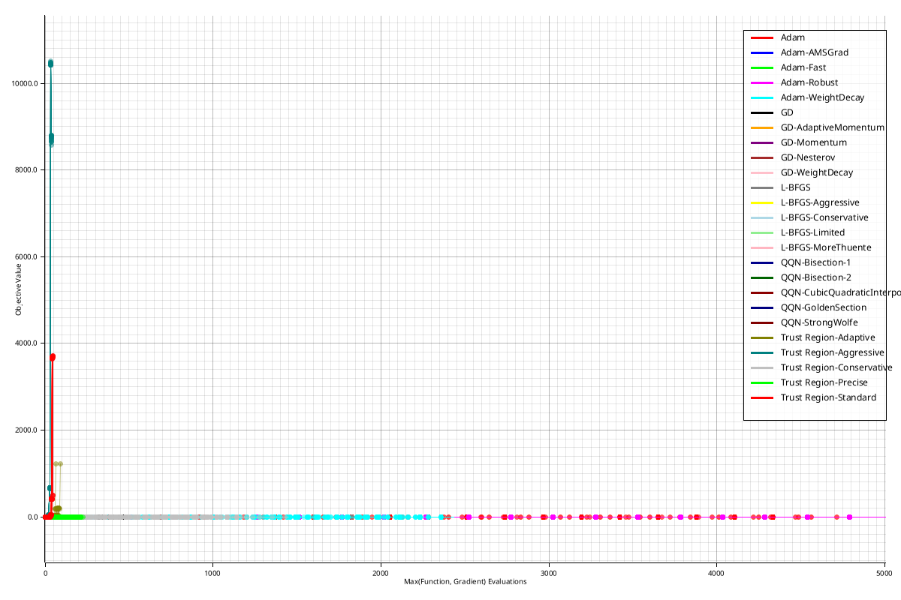
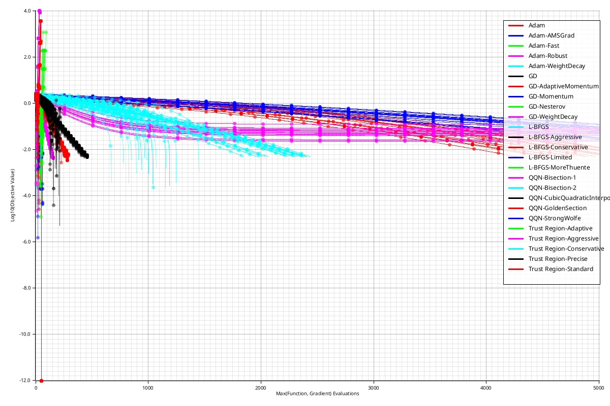

**Figure:** Convergence plots for Sphere_2D showing objective value vs iterations.
Left: Linear scale, Right: Log scale for better visualization of convergence behavior.

**Data:** [Linear scale data (CSV)](data/Sphere_2D_data.csv) | [Log scale data (CSV)](data/Sphere_2D_log_data.csv)

## Problem: Sphere_10D

**Family:** Sphere
**Dimension:** 10
**Success Threshold:** 5.000e-3
**Total Runs:** 500
**Detailed Analysis:** [View comprehensive problem analysis](reports/problem_analysis_Sphere_10D.md)

### Performance Summary
<table style="border-collapse: collapse; width: 100%; margin: 20px 0;">
<tr style="background-color: #f2f2f2;">
<th style="border: 1px solid #ddd; padding: 8px; text-align: center;">Rank</th>
<th style="border: 1px solid #ddd; padding: 8px; text-align: center;">Optimizer</th>
<th style="border: 1px solid #ddd; padding: 8px; text-align: center;">Mean Final Value (All/Success/Fail)</th>
<th style="border: 1px solid #ddd; padding: 8px; text-align: center;">Std Dev</th>
<th style="border: 1px solid #ddd; padding: 8px; text-align: center;">Best Value</th>
<th style="border: 1px solid #ddd; padding: 8px; text-align: center;">Worst Value</th>
<th style="border: 1px solid #ddd; padding: 8px; text-align: center;">Mean Function Evals (All/Success/Fail)</th>
<th style="border: 1px solid #ddd; padding: 8px; text-align: center;">Mean Gradient Evals (All/Success/Fail)</th>
<th style="border: 1px solid #ddd; padding: 8px; text-align: center;">Success Rate</th>
<th style="border: 1px solid #ddd; padding: 8px; text-align: center;">Mean Time (s)</th>
</tr>
<tr style="background-color: #d4edda; font-weight: bold;">
<td style="border: 1px solid #ddd; padding: 8px; text-align: center;">1</td>
<td style="border: 1px solid #ddd; padding: 8px; text-align: center;"><a href="reports/detailed_Sphere_10D_L-BFGS-Aggressive.md" title="Click for detailed analysis">L-BFGS-Aggressive</a></td>
<td style="border: 1px solid #ddd; padding: 8px; text-align: center;">0.00e0 / 0.00e0 / -</td>
<td style="border: 1px solid #ddd; padding: 8px; text-align: center;">0.00e0</td>
<td style="border: 1px solid #ddd; padding: 8px; text-align: center;">0.00e0</td>
<td style="border: 1px solid #ddd; padding: 8px; text-align: center;">0.00e0</td>
<td style="border: 1px solid #ddd; padding: 8px; text-align: center;">10.0 / 10.0 / -</td>
<td style="border: 1px solid #ddd; padding: 8px; text-align: center;">6.0 / 6.0 / -</td>
<td style="border: 1px solid #ddd; padding: 8px; text-align: center;">100.0%</td>
<td style="border: 1px solid #ddd; padding: 8px; text-align: center;">0.000</td>
</tr>
<tr style="background-color: #fff3cd;">
<td style="border: 1px solid #ddd; padding: 8px; text-align: center;">2</td>
<td style="border: 1px solid #ddd; padding: 8px; text-align: center;"><a href="reports/detailed_Sphere_10D_L-BFGS-MoreThuente.md" title="Click for detailed analysis">L-BFGS-MoreThuente</a></td>
<td style="border: 1px solid #ddd; padding: 8px; text-align: center;">0.00e0 / 0.00e0 / -</td>
<td style="border: 1px solid #ddd; padding: 8px; text-align: center;">0.00e0</td>
<td style="border: 1px solid #ddd; padding: 8px; text-align: center;">0.00e0</td>
<td style="border: 1px solid #ddd; padding: 8px; text-align: center;">0.00e0</td>
<td style="border: 1px solid #ddd; padding: 8px; text-align: center;">10.0 / 10.0 / -</td>
<td style="border: 1px solid #ddd; padding: 8px; text-align: center;">8.0 / 8.0 / -</td>
<td style="border: 1px solid #ddd; padding: 8px; text-align: center;">100.0%</td>
<td style="border: 1px solid #ddd; padding: 8px; text-align: center;">0.000</td>
</tr>
<tr style="">
<td style="border: 1px solid #ddd; padding: 8px; text-align: center;">3</td>
<td style="border: 1px solid #ddd; padding: 8px; text-align: center;"><a href="reports/detailed_Sphere_10D_QQN-StrongWolfe.md" title="Click for detailed analysis">QQN-StrongWolfe</a></td>
<td style="border: 1px solid #ddd; padding: 8px; text-align: center;">0.00e0 / 0.00e0 / -</td>
<td style="border: 1px solid #ddd; padding: 8px; text-align: center;">0.00e0</td>
<td style="border: 1px solid #ddd; padding: 8px; text-align: center;">0.00e0</td>
<td style="border: 1px solid #ddd; padding: 8px; text-align: center;">0.00e0</td>
<td style="border: 1px solid #ddd; padding: 8px; text-align: center;">11.0 / 11.0 / -</td>
<td style="border: 1px solid #ddd; padding: 8px; text-align: center;">9.0 / 9.0 / -</td>
<td style="border: 1px solid #ddd; padding: 8px; text-align: center;">100.0%</td>
<td style="border: 1px solid #ddd; padding: 8px; text-align: center;">0.000</td>
</tr>
<tr style="">
<td style="border: 1px solid #ddd; padding: 8px; text-align: center;">4</td>
<td style="border: 1px solid #ddd; padding: 8px; text-align: center;"><a href="reports/detailed_Sphere_10D_QQN-CubicQuadraticInterpolation.md" title="Click for detailed analysis">QQN-CubicQuadraticInterpolation</a></td>
<td style="border: 1px solid #ddd; padding: 8px; text-align: center;">0.00e0 / 0.00e0 / -</td>
<td style="border: 1px solid #ddd; padding: 8px; text-align: center;">0.00e0</td>
<td style="border: 1px solid #ddd; padding: 8px; text-align: center;">0.00e0</td>
<td style="border: 1px solid #ddd; padding: 8px; text-align: center;">0.00e0</td>
<td style="border: 1px solid #ddd; padding: 8px; text-align: center;">12.0 / 12.0 / -</td>
<td style="border: 1px solid #ddd; padding: 8px; text-align: center;">10.0 / 10.0 / -</td>
<td style="border: 1px solid #ddd; padding: 8px; text-align: center;">100.0%</td>
<td style="border: 1px solid #ddd; padding: 8px; text-align: center;">0.000</td>
</tr>
<tr style="">
<td style="border: 1px solid #ddd; padding: 8px; text-align: center;">5</td>
<td style="border: 1px solid #ddd; padding: 8px; text-align: center;"><a href="reports/detailed_Sphere_10D_L-BFGS.md" title="Click for detailed analysis">L-BFGS</a></td>
<td style="border: 1px solid #ddd; padding: 8px; text-align: center;">0.00e0 / 0.00e0 / -</td>
<td style="border: 1px solid #ddd; padding: 8px; text-align: center;">0.00e0</td>
<td style="border: 1px solid #ddd; padding: 8px; text-align: center;">0.00e0</td>
<td style="border: 1px solid #ddd; padding: 8px; text-align: center;">0.00e0</td>
<td style="border: 1px solid #ddd; padding: 8px; text-align: center;">15.0 / 15.0 / -</td>
<td style="border: 1px solid #ddd; padding: 8px; text-align: center;">11.0 / 11.0 / -</td>
<td style="border: 1px solid #ddd; padding: 8px; text-align: center;">100.0%</td>
<td style="border: 1px solid #ddd; padding: 8px; text-align: center;">0.000</td>
</tr>
<tr style="">
<td style="border: 1px solid #ddd; padding: 8px; text-align: center;">6</td>
<td style="border: 1px solid #ddd; padding: 8px; text-align: center;"><a href="reports/detailed_Sphere_10D_QQN-Bisection-1.md" title="Click for detailed analysis">QQN-Bisection-1</a></td>
<td style="border: 1px solid #ddd; padding: 8px; text-align: center;">0.00e0 / 0.00e0 / -</td>
<td style="border: 1px solid #ddd; padding: 8px; text-align: center;">0.00e0</td>
<td style="border: 1px solid #ddd; padding: 8px; text-align: center;">0.00e0</td>
<td style="border: 1px solid #ddd; padding: 8px; text-align: center;">0.00e0</td>
<td style="border: 1px solid #ddd; padding: 8px; text-align: center;">15.0 / 15.0 / -</td>
<td style="border: 1px solid #ddd; padding: 8px; text-align: center;">12.0 / 12.0 / -</td>
<td style="border: 1px solid #ddd; padding: 8px; text-align: center;">100.0%</td>
<td style="border: 1px solid #ddd; padding: 8px; text-align: center;">0.000</td>
</tr>
<tr style="">
<td style="border: 1px solid #ddd; padding: 8px; text-align: center;">7</td>
<td style="border: 1px solid #ddd; padding: 8px; text-align: center;"><a href="reports/detailed_Sphere_10D_QQN-Bisection-2.md" title="Click for detailed analysis">QQN-Bisection-2</a></td>
<td style="border: 1px solid #ddd; padding: 8px; text-align: center;">0.00e0 / 0.00e0 / -</td>
<td style="border: 1px solid #ddd; padding: 8px; text-align: center;">0.00e0</td>
<td style="border: 1px solid #ddd; padding: 8px; text-align: center;">0.00e0</td>
<td style="border: 1px solid #ddd; padding: 8px; text-align: center;">0.00e0</td>
<td style="border: 1px solid #ddd; padding: 8px; text-align: center;">13.0 / 13.0 / -</td>
<td style="border: 1px solid #ddd; padding: 8px; text-align: center;">15.0 / 15.0 / -</td>
<td style="border: 1px solid #ddd; padding: 8px; text-align: center;">100.0%</td>
<td style="border: 1px solid #ddd; padding: 8px; text-align: center;">0.000</td>
</tr>
<tr style="">
<td style="border: 1px solid #ddd; padding: 8px; text-align: center;">8</td>
<td style="border: 1px solid #ddd; padding: 8px; text-align: center;"><a href="reports/detailed_Sphere_10D_QQN-GoldenSection.md" title="Click for detailed analysis">QQN-GoldenSection</a></td>
<td style="border: 1px solid #ddd; padding: 8px; text-align: center;">1.60e-13 / 1.60e-13 / -</td>
<td style="border: 1px solid #ddd; padding: 8px; text-align: center;">1.03e-14</td>
<td style="border: 1px solid #ddd; padding: 8px; text-align: center;">1.45e-13</td>
<td style="border: 1px solid #ddd; padding: 8px; text-align: center;">1.79e-13</td>
<td style="border: 1px solid #ddd; padding: 8px; text-align: center;">46.0 / 46.0 / -</td>
<td style="border: 1px solid #ddd; padding: 8px; text-align: center;">8.0 / 8.0 / -</td>
<td style="border: 1px solid #ddd; padding: 8px; text-align: center;">100.0%</td>
<td style="border: 1px solid #ddd; padding: 8px; text-align: center;">0.000</td>
</tr>
<tr style="">
<td style="border: 1px solid #ddd; padding: 8px; text-align: center;">9</td>
<td style="border: 1px solid #ddd; padding: 8px; text-align: center;"><a href="reports/detailed_Sphere_10D_L-BFGS-Limited.md" title="Click for detailed analysis">L-BFGS-Limited</a></td>
<td style="border: 1px solid #ddd; padding: 8px; text-align: center;">1.08e-3 / 1.08e-3 / -</td>
<td style="border: 1px solid #ddd; padding: 8px; text-align: center;">1.10e-3</td>
<td style="border: 1px solid #ddd; padding: 8px; text-align: center;">5.57e-7</td>
<td style="border: 1px solid #ddd; padding: 8px; text-align: center;">4.03e-3</td>
<td style="border: 1px solid #ddd; padding: 8px; text-align: center;">40.3 / 40.3 / -</td>
<td style="border: 1px solid #ddd; padding: 8px; text-align: center;">24.6 / 24.6 / -</td>
<td style="border: 1px solid #ddd; padding: 8px; text-align: center;">100.0%</td>
<td style="border: 1px solid #ddd; padding: 8px; text-align: center;">0.001</td>
</tr>
<tr style="">
<td style="border: 1px solid #ddd; padding: 8px; text-align: center;">10</td>
<td style="border: 1px solid #ddd; padding: 8px; text-align: center;"><a href="reports/detailed_Sphere_10D_GD-WeightDecay.md" title="Click for detailed analysis">GD-WeightDecay</a></td>
<td style="border: 1px solid #ddd; padding: 8px; text-align: center;">4.61e-3 / 4.61e-3 / -</td>
<td style="border: 1px solid #ddd; padding: 8px; text-align: center;">1.67e-4</td>
<td style="border: 1px solid #ddd; padding: 8px; text-align: center;">4.33e-3</td>
<td style="border: 1px solid #ddd; padding: 8px; text-align: center;">4.92e-3</td>
<td style="border: 1px solid #ddd; padding: 8px; text-align: center;">62.5 / 62.5 / -</td>
<td style="border: 1px solid #ddd; padding: 8px; text-align: center;">122.1 / 122.1 / -</td>
<td style="border: 1px solid #ddd; padding: 8px; text-align: center;">100.0%</td>
<td style="border: 1px solid #ddd; padding: 8px; text-align: center;">0.002</td>
</tr>
<tr style="">
<td style="border: 1px solid #ddd; padding: 8px; text-align: center;">11</td>
<td style="border: 1px solid #ddd; padding: 8px; text-align: center;"><a href="reports/detailed_Sphere_10D_L-BFGS-Conservative.md" title="Click for detailed analysis">L-BFGS-Conservative</a></td>
<td style="border: 1px solid #ddd; padding: 8px; text-align: center;">4.51e-3 / 4.51e-3 / -</td>
<td style="border: 1px solid #ddd; padding: 8px; text-align: center;">2.33e-4</td>
<td style="border: 1px solid #ddd; padding: 8px; text-align: center;">4.20e-3</td>
<td style="border: 1px solid #ddd; padding: 8px; text-align: center;">4.95e-3</td>
<td style="border: 1px solid #ddd; padding: 8px; text-align: center;">197.5 / 197.5 / -</td>
<td style="border: 1px solid #ddd; padding: 8px; text-align: center;">158.6 / 158.6 / -</td>
<td style="border: 1px solid #ddd; padding: 8px; text-align: center;">100.0%</td>
<td style="border: 1px solid #ddd; padding: 8px; text-align: center;">0.005</td>
</tr>
<tr style="">
<td style="border: 1px solid #ddd; padding: 8px; text-align: center;">12</td>
<td style="border: 1px solid #ddd; padding: 8px; text-align: center;"><a href="reports/detailed_Sphere_10D_GD.md" title="Click for detailed analysis">GD</a></td>
<td style="border: 1px solid #ddd; padding: 8px; text-align: center;">4.91e-3 / 4.91e-3 / -</td>
<td style="border: 1px solid #ddd; padding: 8px; text-align: center;">5.40e-5</td>
<td style="border: 1px solid #ddd; padding: 8px; text-align: center;">4.82e-3</td>
<td style="border: 1px solid #ddd; padding: 8px; text-align: center;">5.00e-3</td>
<td style="border: 1px solid #ddd; padding: 8px; text-align: center;">192.4 / 192.4 / -</td>
<td style="border: 1px solid #ddd; padding: 8px; text-align: center;">381.9 / 381.9 / -</td>
<td style="border: 1px solid #ddd; padding: 8px; text-align: center;">100.0%</td>
<td style="border: 1px solid #ddd; padding: 8px; text-align: center;">0.005</td>
</tr>
<tr style="">
<td style="border: 1px solid #ddd; padding: 8px; text-align: center;">13</td>
<td style="border: 1px solid #ddd; padding: 8px; text-align: center;"><a href="reports/detailed_Sphere_10D_Adam-WeightDecay.md" title="Click for detailed analysis">Adam-WeightDecay</a></td>
<td style="border: 1px solid #ddd; padding: 8px; text-align: center;">4.92e-3 / 4.92e-3 / -</td>
<td style="border: 1px solid #ddd; padding: 8px; text-align: center;">3.21e-5</td>
<td style="border: 1px solid #ddd; padding: 8px; text-align: center;">4.88e-3</td>
<td style="border: 1px solid #ddd; padding: 8px; text-align: center;">4.98e-3</td>
<td style="border: 1px solid #ddd; padding: 8px; text-align: center;">968.0 / 968.0 / -</td>
<td style="border: 1px solid #ddd; padding: 8px; text-align: center;">968.0 / 968.0 / -</td>
<td style="border: 1px solid #ddd; padding: 8px; text-align: center;">100.0%</td>
<td style="border: 1px solid #ddd; padding: 8px; text-align: center;">0.022</td>
</tr>
<tr style="">
<td style="border: 1px solid #ddd; padding: 8px; text-align: center;">14</td>
<td style="border: 1px solid #ddd; padding: 8px; text-align: center;"><a href="reports/detailed_Sphere_10D_Adam.md" title="Click for detailed analysis">Adam</a></td>
<td style="border: 1px solid #ddd; padding: 8px; text-align: center;">4.98e-3 / 4.96e-3 / 5.21e-3</td>
<td style="border: 1px solid #ddd; padding: 8px; text-align: center;">5.65e-5</td>
<td style="border: 1px solid #ddd; padding: 8px; text-align: center;">4.94e-3</td>
<td style="border: 1px solid #ddd; padding: 8px; text-align: center;">5.21e-3</td>
<td style="border: 1px solid #ddd; padding: 8px; text-align: center;">2391.8 / 2386.1 / 2502.0</td>
<td style="border: 1px solid #ddd; padding: 8px; text-align: center;">2391.8 / 2386.1 / 2502.0</td>
<td style="border: 1px solid #ddd; padding: 8px; text-align: center;">95.0%</td>
<td style="border: 1px solid #ddd; padding: 8px; text-align: center;">0.052</td>
</tr>
<tr style="">
<td style="border: 1px solid #ddd; padding: 8px; text-align: center;">15</td>
<td style="border: 1px solid #ddd; padding: 8px; text-align: center;"><a href="reports/detailed_Sphere_10D_GD-Momentum.md" title="Click for detailed analysis">GD-Momentum</a></td>
<td style="border: 1px solid #ddd; padding: 8px; text-align: center;">2.93e-3 / 1.73e-3 / 6.73e-1</td>
<td style="border: 1px solid #ddd; padding: 8px; text-align: center;">2.54e-3</td>
<td style="border: 1px solid #ddd; padding: 8px; text-align: center;">2.45e-5</td>
<td style="border: 1px solid #ddd; padding: 8px; text-align: center;">8.50e-3</td>
<td style="border: 1px solid #ddd; padding: 8px; text-align: center;">19.4 / 17.9 / 23.8</td>
<td style="border: 1px solid #ddd; padding: 8px; text-align: center;">35.5 / 32.9 / 43.6</td>
<td style="border: 1px solid #ddd; padding: 8px; text-align: center;">75.0%</td>
<td style="border: 1px solid #ddd; padding: 8px; text-align: center;">0.001</td>
</tr>
<tr style="">
<td style="border: 1px solid #ddd; padding: 8px; text-align: center;">16</td>
<td style="border: 1px solid #ddd; padding: 8px; text-align: center;"><a href="reports/detailed_Sphere_10D_GD-Nesterov.md" title="Click for detailed analysis">GD-Nesterov</a></td>
<td style="border: 1px solid #ddd; padding: 8px; text-align: center;">4.10e-3 / 3.01e-3 / 4.50e-1</td>
<td style="border: 1px solid #ddd; padding: 8px; text-align: center;">1.95e-3</td>
<td style="border: 1px solid #ddd; padding: 8px; text-align: center;">1.53e-5</td>
<td style="border: 1px solid #ddd; padding: 8px; text-align: center;">7.04e-3</td>
<td style="border: 1px solid #ddd; padding: 8px; text-align: center;">19.9 / 17.7 / 23.9</td>
<td style="border: 1px solid #ddd; padding: 8px; text-align: center;">36.4 / 32.4 / 43.7</td>
<td style="border: 1px solid #ddd; padding: 8px; text-align: center;">65.0%</td>
<td style="border: 1px solid #ddd; padding: 8px; text-align: center;">0.001</td>
</tr>
<tr style="">
<td style="border: 1px solid #ddd; padding: 8px; text-align: center;">17</td>
<td style="border: 1px solid #ddd; padding: 8px; text-align: center;"><a href="reports/detailed_Sphere_10D_Trust_Region-Precise.md" title="Click for detailed analysis">Trust Region-Precise</a></td>
<td style="border: 1px solid #ddd; padding: 8px; text-align: center;">4.40e-3 / 1.54e-3 / 1.50e0</td>
<td style="border: 1px solid #ddd; padding: 8px; text-align: center;">4.49e-3</td>
<td style="border: 1px solid #ddd; padding: 8px; text-align: center;">1.01e-4</td>
<td style="border: 1px solid #ddd; padding: 8px; text-align: center;">1.53e-2</td>
<td style="border: 1px solid #ddd; padding: 8px; text-align: center;">504.0 / 496.8 / 517.3</td>
<td style="border: 1px solid #ddd; padding: 8px; text-align: center;">336.6 / 332.2 / 344.9</td>
<td style="border: 1px solid #ddd; padding: 8px; text-align: center;">65.0%</td>
<td style="border: 1px solid #ddd; padding: 8px; text-align: center;">0.004</td>
</tr>
<tr style="">
<td style="border: 1px solid #ddd; padding: 8px; text-align: center;">18</td>
<td style="border: 1px solid #ddd; padding: 8px; text-align: center;"><a href="reports/detailed_Sphere_10D_GD-AdaptiveMomentum.md" title="Click for detailed analysis">GD-AdaptiveMomentum</a></td>
<td style="border: 1px solid #ddd; padding: 8px; text-align: center;">6.09e-3 / 1.81e-3 / 1.38e0</td>
<td style="border: 1px solid #ddd; padding: 8px; text-align: center;">5.94e-3</td>
<td style="border: 1px solid #ddd; padding: 8px; text-align: center;">2.42e-4</td>
<td style="border: 1px solid #ddd; padding: 8px; text-align: center;">1.89e-2</td>
<td style="border: 1px solid #ddd; padding: 8px; text-align: center;">18.4 / 16.0 / 21.9</td>
<td style="border: 1px solid #ddd; padding: 8px; text-align: center;">33.3 / 29.0 / 39.8</td>
<td style="border: 1px solid #ddd; padding: 8px; text-align: center;">60.0%</td>
<td style="border: 1px solid #ddd; padding: 8px; text-align: center;">0.001</td>
</tr>
<tr style="">
<td style="border: 1px solid #ddd; padding: 8px; text-align: center;">19</td>
<td style="border: 1px solid #ddd; padding: 8px; text-align: center;"><a href="reports/detailed_Sphere_10D_Trust_Region-Conservative.md" title="Click for detailed analysis">Trust Region-Conservative</a></td>
<td style="border: 1px solid #ddd; padding: 8px; text-align: center;">3.41e-1 / 2.25e-3 / 5.24e-1</td>
<td style="border: 1px solid #ddd; padding: 8px; text-align: center;">3.63e-1</td>
<td style="border: 1px solid #ddd; padding: 8px; text-align: center;">1.07e-3</td>
<td style="border: 1px solid #ddd; padding: 8px; text-align: center;">1.34e0</td>
<td style="border: 1px solid #ddd; padding: 8px; text-align: center;">2968.8 / 2907.0 / 3002.0</td>
<td style="border: 1px solid #ddd; padding: 8px; text-align: center;">1980.0 / 1939.0 / 2002.0</td>
<td style="border: 1px solid #ddd; padding: 8px; text-align: center;">35.0%</td>
<td style="border: 1px solid #ddd; padding: 8px; text-align: center;">0.020</td>
</tr>
<tr style="">
<td style="border: 1px solid #ddd; padding: 8px; text-align: center;">20</td>
<td style="border: 1px solid #ddd; padding: 8px; text-align: center;"><a href="reports/detailed_Sphere_10D_Trust_Region-Adaptive.md" title="Click for detailed analysis">Trust Region-Adaptive</a></td>
<td style="border: 1px solid #ddd; padding: 8px; text-align: center;">1.67e-2 / 2.40e-3 / 1.04e3</td>
<td style="border: 1px solid #ddd; padding: 8px; text-align: center;">1.49e-2</td>
<td style="border: 1px solid #ddd; padding: 8px; text-align: center;">2.03e-4</td>
<td style="border: 1px solid #ddd; padding: 8px; text-align: center;">4.86e-2</td>
<td style="border: 1px solid #ddd; padding: 8px; text-align: center;">139.3 / 127.5 / 144.4</td>
<td style="border: 1px solid #ddd; padding: 8px; text-align: center;">93.2 / 86.0 / 96.3</td>
<td style="border: 1px solid #ddd; padding: 8px; text-align: center;">30.0%</td>
<td style="border: 1px solid #ddd; padding: 8px; text-align: center;">0.001</td>
</tr>
<tr style="">
<td style="border: 1px solid #ddd; padding: 8px; text-align: center;">21</td>
<td style="border: 1px solid #ddd; padding: 8px; text-align: center;"><a href="reports/detailed_Sphere_10D_Trust_Region-Standard.md" title="Click for detailed analysis">Trust Region-Standard</a></td>
<td style="border: 1px solid #ddd; padding: 8px; text-align: center;">7.25e-2 / 1.11e-3 / 7.94e2</td>
<td style="border: 1px solid #ddd; padding: 8px; text-align: center;">6.90e-2</td>
<td style="border: 1px solid #ddd; padding: 8px; text-align: center;">2.86e-5</td>
<td style="border: 1px solid #ddd; padding: 8px; text-align: center;">2.46e-1</td>
<td style="border: 1px solid #ddd; padding: 8px; text-align: center;">51.8 / 37.0 / 54.4</td>
<td style="border: 1px solid #ddd; padding: 8px; text-align: center;">34.6 / 25.7 / 36.2</td>
<td style="border: 1px solid #ddd; padding: 8px; text-align: center;">15.0%</td>
<td style="border: 1px solid #ddd; padding: 8px; text-align: center;">0.000</td>
</tr>
<tr style="">
<td style="border: 1px solid #ddd; padding: 8px; text-align: center;">22</td>
<td style="border: 1px solid #ddd; padding: 8px; text-align: center;"><a href="reports/detailed_Sphere_10D_Trust_Region-Aggressive.md" title="Click for detailed analysis">Trust Region-Aggressive</a></td>
<td style="border: 1px solid #ddd; padding: 8px; text-align: center;">3.80e-1 / - / 1.09e4</td>
<td style="border: 1px solid #ddd; padding: 8px; text-align: center;">2.65e-1</td>
<td style="border: 1px solid #ddd; padding: 8px; text-align: center;">1.57e-2</td>
<td style="border: 1px solid #ddd; padding: 8px; text-align: center;">9.42e-1</td>
<td style="border: 1px solid #ddd; padding: 8px; text-align: center;">30.3 / - / 30.3</td>
<td style="border: 1px solid #ddd; padding: 8px; text-align: center;">20.2 / - / 20.2</td>
<td style="border: 1px solid #ddd; padding: 8px; text-align: center;">0.0%</td>
<td style="border: 1px solid #ddd; padding: 8px; text-align: center;">0.000</td>
</tr>
<tr style="">
<td style="border: 1px solid #ddd; padding: 8px; text-align: center;">23</td>
<td style="border: 1px solid #ddd; padding: 8px; text-align: center;"><a href="reports/detailed_Sphere_10D_Adam-Fast.md" title="Click for detailed analysis">Adam-Fast</a></td>
<td style="border: 1px solid #ddd; padding: 8px; text-align: center;">7.84e-2 / - / 6.12e-1</td>
<td style="border: 1px solid #ddd; padding: 8px; text-align: center;">2.55e-2</td>
<td style="border: 1px solid #ddd; padding: 8px; text-align: center;">3.00e-2</td>
<td style="border: 1px solid #ddd; padding: 8px; text-align: center;">1.35e-1</td>
<td style="border: 1px solid #ddd; padding: 8px; text-align: center;">37.4 / - / 37.4</td>
<td style="border: 1px solid #ddd; padding: 8px; text-align: center;">36.4 / - / 36.4</td>
<td style="border: 1px solid #ddd; padding: 8px; text-align: center;">0.0%</td>
<td style="border: 1px solid #ddd; padding: 8px; text-align: center;">0.001</td>
</tr>
<tr style="">
<td style="border: 1px solid #ddd; padding: 8px; text-align: center;">24</td>
<td style="border: 1px solid #ddd; padding: 8px; text-align: center;"><a href="reports/detailed_Sphere_10D_Adam-Robust.md" title="Click for detailed analysis">Adam-Robust</a></td>
<td style="border: 1px solid #ddd; padding: 8px; text-align: center;">1.08e-1 / - / 1.08e-1</td>
<td style="border: 1px solid #ddd; padding: 8px; text-align: center;">3.40e-2</td>
<td style="border: 1px solid #ddd; padding: 8px; text-align: center;">4.84e-2</td>
<td style="border: 1px solid #ddd; padding: 8px; text-align: center;">1.71e-1</td>
<td style="border: 1px solid #ddd; padding: 8px; text-align: center;">2502.0 / - / 2502.0</td>
<td style="border: 1px solid #ddd; padding: 8px; text-align: center;">2502.0 / - / 2502.0</td>
<td style="border: 1px solid #ddd; padding: 8px; text-align: center;">0.0%</td>
<td style="border: 1px solid #ddd; padding: 8px; text-align: center;">0.061</td>
</tr>
<tr style="">
<td style="border: 1px solid #ddd; padding: 8px; text-align: center;">25</td>
<td style="border: 1px solid #ddd; padding: 8px; text-align: center;"><a href="reports/detailed_Sphere_10D_Adam-AMSGrad.md" title="Click for detailed analysis">Adam-AMSGrad</a></td>
<td style="border: 1px solid #ddd; padding: 8px; text-align: center;">2.64e-1 / - / 2.64e-1</td>
<td style="border: 1px solid #ddd; padding: 8px; text-align: center;">4.59e-2</td>
<td style="border: 1px solid #ddd; padding: 8px; text-align: center;">1.95e-1</td>
<td style="border: 1px solid #ddd; padding: 8px; text-align: center;">3.63e-1</td>
<td style="border: 1px solid #ddd; padding: 8px; text-align: center;">2502.0 / - / 2502.0</td>
<td style="border: 1px solid #ddd; padding: 8px; text-align: center;">2502.0 / - / 2502.0</td>
<td style="border: 1px solid #ddd; padding: 8px; text-align: center;">0.0%</td>
<td style="border: 1px solid #ddd; padding: 8px; text-align: center;">0.060</td>
</tr>
</table>

### Convergence Plots

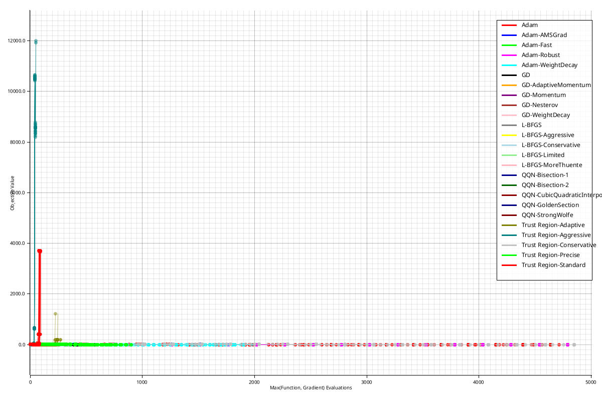
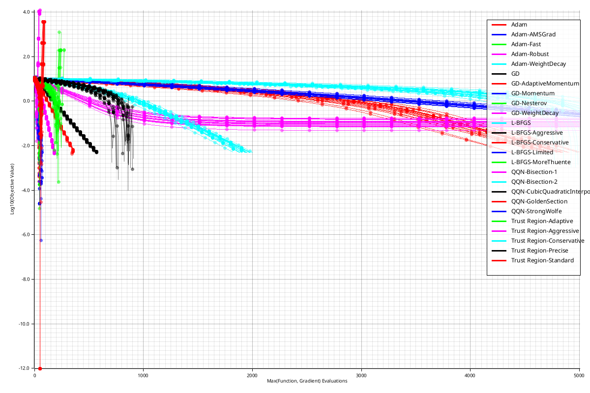

**Figure:** Convergence plots for Sphere_10D showing objective value vs iterations.
Left: Linear scale, Right: Log scale for better visualization of convergence behavior.

**Data:** [Linear scale data (CSV)](data/Sphere_10D_data.csv) | [Log scale data (CSV)](data/Sphere_10D_log_data.csv)

## Problem: Rosenbrock_2D

**Family:** Rosenbrock
**Dimension:** 2
**Success Threshold:** 8.450e-3
**Total Runs:** 500
**Detailed Analysis:** [View comprehensive problem analysis](reports/problem_analysis_Rosenbrock_2D.md)

### Performance Summary
<table style="border-collapse: collapse; width: 100%; margin: 20px 0;">
<tr style="background-color: #f2f2f2;">
<th style="border: 1px solid #ddd; padding: 8px; text-align: center;">Rank</th>
<th style="border: 1px solid #ddd; padding: 8px; text-align: center;">Optimizer</th>
<th style="border: 1px solid #ddd; padding: 8px; text-align: center;">Mean Final Value (All/Success/Fail)</th>
<th style="border: 1px solid #ddd; padding: 8px; text-align: center;">Std Dev</th>
<th style="border: 1px solid #ddd; padding: 8px; text-align: center;">Best Value</th>
<th style="border: 1px solid #ddd; padding: 8px; text-align: center;">Worst Value</th>
<th style="border: 1px solid #ddd; padding: 8px; text-align: center;">Mean Function Evals (All/Success/Fail)</th>
<th style="border: 1px solid #ddd; padding: 8px; text-align: center;">Mean Gradient Evals (All/Success/Fail)</th>
<th style="border: 1px solid #ddd; padding: 8px; text-align: center;">Success Rate</th>
<th style="border: 1px solid #ddd; padding: 8px; text-align: center;">Mean Time (s)</th>
</tr>
<tr style="background-color: #d4edda; font-weight: bold;">
<td style="border: 1px solid #ddd; padding: 8px; text-align: center;">1</td>
<td style="border: 1px solid #ddd; padding: 8px; text-align: center;"><a href="reports/detailed_Rosenbrock_2D_L-BFGS-Conservative.md" title="Click for detailed analysis">L-BFGS-Conservative</a></td>
<td style="border: 1px solid #ddd; padding: 8px; text-align: center;">6.53e-3 / 6.53e-3 / -</td>
<td style="border: 1px solid #ddd; padding: 8px; text-align: center;">2.16e-3</td>
<td style="border: 1px solid #ddd; padding: 8px; text-align: center;">1.09e-3</td>
<td style="border: 1px solid #ddd; padding: 8px; text-align: center;">8.39e-3</td>
<td style="border: 1px solid #ddd; padding: 8px; text-align: center;">985.0 / 985.0 / -</td>
<td style="border: 1px solid #ddd; padding: 8px; text-align: center;">487.4 / 487.4 / -</td>
<td style="border: 1px solid #ddd; padding: 8px; text-align: center;">100.0%</td>
<td style="border: 1px solid #ddd; padding: 8px; text-align: center;">0.016</td>
</tr>
<tr style="background-color: #fff3cd;">
<td style="border: 1px solid #ddd; padding: 8px; text-align: center;">2</td>
<td style="border: 1px solid #ddd; padding: 8px; text-align: center;"><a href="reports/detailed_Rosenbrock_2D_L-BFGS-MoreThuente.md" title="Click for detailed analysis">L-BFGS-MoreThuente</a></td>
<td style="border: 1px solid #ddd; padding: 8px; text-align: center;">1.91e-2 / 4.35e-3 / 2.99e-1</td>
<td style="border: 1px solid #ddd; padding: 8px; text-align: center;">6.42e-2</td>
<td style="border: 1px solid #ddd; padding: 8px; text-align: center;">1.40e-4</td>
<td style="border: 1px solid #ddd; padding: 8px; text-align: center;">2.99e-1</td>
<td style="border: 1px solid #ddd; padding: 8px; text-align: center;">651.0 / 535.8 / 2839.0</td>
<td style="border: 1px solid #ddd; padding: 8px; text-align: center;">485.9 / 397.3 / 2169.0</td>
<td style="border: 1px solid #ddd; padding: 8px; text-align: center;">95.0%</td>
<td style="border: 1px solid #ddd; padding: 8px; text-align: center;">0.011</td>
</tr>
<tr style="">
<td style="border: 1px solid #ddd; padding: 8px; text-align: center;">3</td>
<td style="border: 1px solid #ddd; padding: 8px; text-align: center;"><a href="reports/detailed_Rosenbrock_2D_Adam-Fast.md" title="Click for detailed analysis">Adam-Fast</a></td>
<td style="border: 1px solid #ddd; padding: 8px; text-align: center;">1.75e0 / 8.28e-3 / 5.32e0</td>
<td style="border: 1px solid #ddd; padding: 8px; text-align: center;">2.15e0</td>
<td style="border: 1px solid #ddd; padding: 8px; text-align: center;">8.12e-3</td>
<td style="border: 1px solid #ddd; padding: 8px; text-align: center;">4.88e0</td>
<td style="border: 1px solid #ddd; padding: 8px; text-align: center;">171.8 / 268.3 / 27.0</td>
<td style="border: 1px solid #ddd; padding: 8px; text-align: center;">171.4 / 268.3 / 26.0</td>
<td style="border: 1px solid #ddd; padding: 8px; text-align: center;">60.0%</td>
<td style="border: 1px solid #ddd; padding: 8px; text-align: center;">0.003</td>
</tr>
<tr style="">
<td style="border: 1px solid #ddd; padding: 8px; text-align: center;">4</td>
<td style="border: 1px solid #ddd; padding: 8px; text-align: center;"><a href="reports/detailed_Rosenbrock_2D_QQN-CubicQuadraticInterpolation.md" title="Click for detailed analysis">QQN-CubicQuadraticInterpolation</a></td>
<td style="border: 1px solid #ddd; padding: 8px; text-align: center;">3.73e-2 / 6.87e-3 / 5.76e-2</td>
<td style="border: 1px solid #ddd; padding: 8px; text-align: center;">3.12e-2</td>
<td style="border: 1px solid #ddd; padding: 8px; text-align: center;">5.16e-3</td>
<td style="border: 1px solid #ddd; padding: 8px; text-align: center;">9.89e-2</td>
<td style="border: 1px solid #ddd; padding: 8px; text-align: center;">1619.8 / 814.0 / 2156.9</td>
<td style="border: 1px solid #ddd; padding: 8px; text-align: center;">2139.1 / 1063.0 / 2856.5</td>
<td style="border: 1px solid #ddd; padding: 8px; text-align: center;">40.0%</td>
<td style="border: 1px solid #ddd; padding: 8px; text-align: center;">0.065</td>
</tr>
<tr style="">
<td style="border: 1px solid #ddd; padding: 8px; text-align: center;">5</td>
<td style="border: 1px solid #ddd; padding: 8px; text-align: center;"><a href="reports/detailed_Rosenbrock_2D_QQN-StrongWolfe.md" title="Click for detailed analysis">QQN-StrongWolfe</a></td>
<td style="border: 1px solid #ddd; padding: 8px; text-align: center;">5.67e-2 / 6.93e-3 / 8.34e-2</td>
<td style="border: 1px solid #ddd; padding: 8px; text-align: center;">7.24e-2</td>
<td style="border: 1px solid #ddd; padding: 8px; text-align: center;">4.58e-3</td>
<td style="border: 1px solid #ddd; padding: 8px; text-align: center;">3.11e-1</td>
<td style="border: 1px solid #ddd; padding: 8px; text-align: center;">2004.3 / 424.6 / 2855.0</td>
<td style="border: 1px solid #ddd; padding: 8px; text-align: center;">1524.5 / 329.3 / 2168.2</td>
<td style="border: 1px solid #ddd; padding: 8px; text-align: center;">35.0%</td>
<td style="border: 1px solid #ddd; padding: 8px; text-align: center;">0.058</td>
</tr>
<tr style="">
<td style="border: 1px solid #ddd; padding: 8px; text-align: center;">6</td>
<td style="border: 1px solid #ddd; padding: 8px; text-align: center;"><a href="reports/detailed_Rosenbrock_2D_QQN-Bisection-2.md" title="Click for detailed analysis">QQN-Bisection-2</a></td>
<td style="border: 1px solid #ddd; padding: 8px; text-align: center;">6.07e-2 / 6.61e-3 / 8.39e-2</td>
<td style="border: 1px solid #ddd; padding: 8px; text-align: center;">6.89e-2</td>
<td style="border: 1px solid #ddd; padding: 8px; text-align: center;">4.36e-3</td>
<td style="border: 1px solid #ddd; padding: 8px; text-align: center;">2.52e-1</td>
<td style="border: 1px solid #ddd; padding: 8px; text-align: center;">304.7 / 216.7 / 342.4</td>
<td style="border: 1px solid #ddd; padding: 8px; text-align: center;">215.6 / 177.5 / 231.9</td>
<td style="border: 1px solid #ddd; padding: 8px; text-align: center;">30.0%</td>
<td style="border: 1px solid #ddd; padding: 8px; text-align: center;">0.007</td>
</tr>
<tr style="">
<td style="border: 1px solid #ddd; padding: 8px; text-align: center;">7</td>
<td style="border: 1px solid #ddd; padding: 8px; text-align: center;"><a href="reports/detailed_Rosenbrock_2D_GD-AdaptiveMomentum.md" title="Click for detailed analysis">GD-AdaptiveMomentum</a></td>
<td style="border: 1px solid #ddd; padding: 8px; text-align: center;">2.30e-1 / 4.74e-3 / 8.70e-1</td>
<td style="border: 1px solid #ddd; padding: 8px; text-align: center;">8.78e-1</td>
<td style="border: 1px solid #ddd; padding: 8px; text-align: center;">3.23e-3</td>
<td style="border: 1px solid #ddd; padding: 8px; text-align: center;">4.06e0</td>
<td style="border: 1px solid #ddd; padding: 8px; text-align: center;">47.7 / 49.0 / 47.3</td>
<td style="border: 1px solid #ddd; padding: 8px; text-align: center;">91.7 / 95.0 / 90.5</td>
<td style="border: 1px solid #ddd; padding: 8px; text-align: center;">25.0%</td>
<td style="border: 1px solid #ddd; padding: 8px; text-align: center;">0.002</td>
</tr>
<tr style="">
<td style="border: 1px solid #ddd; padding: 8px; text-align: center;">8</td>
<td style="border: 1px solid #ddd; padding: 8px; text-align: center;"><a href="reports/detailed_Rosenbrock_2D_QQN-GoldenSection.md" title="Click for detailed analysis">QQN-GoldenSection</a></td>
<td style="border: 1px solid #ddd; padding: 8px; text-align: center;">1.26e-1 / 2.22e-3 / 1.39e-1</td>
<td style="border: 1px solid #ddd; padding: 8px; text-align: center;">5.76e-2</td>
<td style="border: 1px solid #ddd; padding: 8px; text-align: center;">8.08e-5</td>
<td style="border: 1px solid #ddd; padding: 8px; text-align: center;">1.93e-1</td>
<td style="border: 1px solid #ddd; padding: 8px; text-align: center;">4248.6 / 2351.5 / 4459.3</td>
<td style="border: 1px solid #ddd; padding: 8px; text-align: center;">543.8 / 290.0 / 572.0</td>
<td style="border: 1px solid #ddd; padding: 8px; text-align: center;">10.0%</td>
<td style="border: 1px solid #ddd; padding: 8px; text-align: center;">0.083</td>
</tr>
<tr style="">
<td style="border: 1px solid #ddd; padding: 8px; text-align: center;">9</td>
<td style="border: 1px solid #ddd; padding: 8px; text-align: center;"><a href="reports/detailed_Rosenbrock_2D_QQN-Bisection-1.md" title="Click for detailed analysis">QQN-Bisection-1</a></td>
<td style="border: 1px solid #ddd; padding: 8px; text-align: center;">4.65e-1 / 6.39e-3 / 4.90e-1</td>
<td style="border: 1px solid #ddd; padding: 8px; text-align: center;">8.86e-1</td>
<td style="border: 1px solid #ddd; padding: 8px; text-align: center;">6.39e-3</td>
<td style="border: 1px solid #ddd; padding: 8px; text-align: center;">3.18e0</td>
<td style="border: 1px solid #ddd; padding: 8px; text-align: center;">2363.3 / 268.0 / 2473.6</td>
<td style="border: 1px solid #ddd; padding: 8px; text-align: center;">2454.5 / 301.0 / 2567.8</td>
<td style="border: 1px solid #ddd; padding: 8px; text-align: center;">5.0%</td>
<td style="border: 1px solid #ddd; padding: 8px; text-align: center;">0.052</td>
</tr>
<tr style="">
<td style="border: 1px solid #ddd; padding: 8px; text-align: center;">10</td>
<td style="border: 1px solid #ddd; padding: 8px; text-align: center;"><a href="reports/detailed_Rosenbrock_2D_Trust_Region-Aggressive.md" title="Click for detailed analysis">Trust Region-Aggressive</a></td>
<td style="border: 1px solid #ddd; padding: 8px; text-align: center;">4.66e0 / - / 4.66e0</td>
<td style="border: 1px solid #ddd; padding: 8px; text-align: center;">3.99e-1</td>
<td style="border: 1px solid #ddd; padding: 8px; text-align: center;">4.01e0</td>
<td style="border: 1px solid #ddd; padding: 8px; text-align: center;">5.49e0</td>
<td style="border: 1px solid #ddd; padding: 8px; text-align: center;">27.6 / - / 27.6</td>
<td style="border: 1px solid #ddd; padding: 8px; text-align: center;">19.1 / - / 19.1</td>
<td style="border: 1px solid #ddd; padding: 8px; text-align: center;">0.0%</td>
<td style="border: 1px solid #ddd; padding: 8px; text-align: center;">0.000</td>
</tr>
<tr style="">
<td style="border: 1px solid #ddd; padding: 8px; text-align: center;">11</td>
<td style="border: 1px solid #ddd; padding: 8px; text-align: center;"><a href="reports/detailed_Rosenbrock_2D_GD-Momentum.md" title="Click for detailed analysis">GD-Momentum</a></td>
<td style="border: 1px solid #ddd; padding: 8px; text-align: center;">3.37e0 / - / 5.61e0</td>
<td style="border: 1px solid #ddd; padding: 8px; text-align: center;">2.04e0</td>
<td style="border: 1px solid #ddd; padding: 8px; text-align: center;">8.75e-3</td>
<td style="border: 1px solid #ddd; padding: 8px; text-align: center;">6.68e0</td>
<td style="border: 1px solid #ddd; padding: 8px; text-align: center;">23.8 / - / 23.8</td>
<td style="border: 1px solid #ddd; padding: 8px; text-align: center;">43.6 / - / 43.6</td>
<td style="border: 1px solid #ddd; padding: 8px; text-align: center;">0.0%</td>
<td style="border: 1px solid #ddd; padding: 8px; text-align: center;">0.001</td>
</tr>
<tr style="">
<td style="border: 1px solid #ddd; padding: 8px; text-align: center;">12</td>
<td style="border: 1px solid #ddd; padding: 8px; text-align: center;"><a href="reports/detailed_Rosenbrock_2D_GD-Nesterov.md" title="Click for detailed analysis">GD-Nesterov</a></td>
<td style="border: 1px solid #ddd; padding: 8px; text-align: center;">9.40e-1 / - / 1.49e0</td>
<td style="border: 1px solid #ddd; padding: 8px; text-align: center;">1.68e0</td>
<td style="border: 1px solid #ddd; padding: 8px; text-align: center;">2.47e-2</td>
<td style="border: 1px solid #ddd; padding: 8px; text-align: center;">4.55e0</td>
<td style="border: 1px solid #ddd; padding: 8px; text-align: center;">46.1 / - / 46.1</td>
<td style="border: 1px solid #ddd; padding: 8px; text-align: center;">88.3 / - / 88.3</td>
<td style="border: 1px solid #ddd; padding: 8px; text-align: center;">0.0%</td>
<td style="border: 1px solid #ddd; padding: 8px; text-align: center;">0.001</td>
</tr>
<tr style="">
<td style="border: 1px solid #ddd; padding: 8px; text-align: center;">13</td>
<td style="border: 1px solid #ddd; padding: 8px; text-align: center;"><a href="reports/detailed_Rosenbrock_2D_Trust_Region-Standard.md" title="Click for detailed analysis">Trust Region-Standard</a></td>
<td style="border: 1px solid #ddd; padding: 8px; text-align: center;">4.18e0 / - / 4.18e0</td>
<td style="border: 1px solid #ddd; padding: 8px; text-align: center;">1.83e-1</td>
<td style="border: 1px solid #ddd; padding: 8px; text-align: center;">3.95e0</td>
<td style="border: 1px solid #ddd; padding: 8px; text-align: center;">4.51e0</td>
<td style="border: 1px solid #ddd; padding: 8px; text-align: center;">89.6 / - / 89.6</td>
<td style="border: 1px solid #ddd; padding: 8px; text-align: center;">60.4 / - / 60.4</td>
<td style="border: 1px solid #ddd; padding: 8px; text-align: center;">0.0%</td>
<td style="border: 1px solid #ddd; padding: 8px; text-align: center;">0.001</td>
</tr>
<tr style="">
<td style="border: 1px solid #ddd; padding: 8px; text-align: center;">14</td>
<td style="border: 1px solid #ddd; padding: 8px; text-align: center;"><a href="reports/detailed_Rosenbrock_2D_L-BFGS.md" title="Click for detailed analysis">L-BFGS</a></td>
<td style="border: 1px solid #ddd; padding: 8px; text-align: center;">3.34e0 / - / 1.36e2</td>
<td style="border: 1px solid #ddd; padding: 8px; text-align: center;">2.82e0</td>
<td style="border: 1px solid #ddd; padding: 8px; text-align: center;">5.30e-1</td>
<td style="border: 1px solid #ddd; padding: 8px; text-align: center;">1.06e1</td>
<td style="border: 1px solid #ddd; padding: 8px; text-align: center;">121.5 / - / 121.5</td>
<td style="border: 1px solid #ddd; padding: 8px; text-align: center;">43.5 / - / 43.5</td>
<td style="border: 1px solid #ddd; padding: 8px; text-align: center;">0.0%</td>
<td style="border: 1px solid #ddd; padding: 8px; text-align: center;">0.002</td>
</tr>
<tr style="">
<td style="border: 1px solid #ddd; padding: 8px; text-align: center;">15</td>
<td style="border: 1px solid #ddd; padding: 8px; text-align: center;"><a href="reports/detailed_Rosenbrock_2D_GD-WeightDecay.md" title="Click for detailed analysis">GD-WeightDecay</a></td>
<td style="border: 1px solid #ddd; padding: 8px; text-align: center;">2.66e0 / - / 3.65e0</td>
<td style="border: 1px solid #ddd; padding: 8px; text-align: center;">1.94e0</td>
<td style="border: 1px solid #ddd; padding: 8px; text-align: center;">2.11e-2</td>
<td style="border: 1px solid #ddd; padding: 8px; text-align: center;">4.51e0</td>
<td style="border: 1px solid #ddd; padding: 8px; text-align: center;">58.7 / - / 58.7</td>
<td style="border: 1px solid #ddd; padding: 8px; text-align: center;">113.4 / - / 113.4</td>
<td style="border: 1px solid #ddd; padding: 8px; text-align: center;">0.0%</td>
<td style="border: 1px solid #ddd; padding: 8px; text-align: center;">0.002</td>
</tr>
<tr style="">
<td style="border: 1px solid #ddd; padding: 8px; text-align: center;">16</td>
<td style="border: 1px solid #ddd; padding: 8px; text-align: center;"><a href="reports/detailed_Rosenbrock_2D_Adam-WeightDecay.md" title="Click for detailed analysis">Adam-WeightDecay</a></td>
<td style="border: 1px solid #ddd; padding: 8px; text-align: center;">4.07e0 / - / 4.11e0</td>
<td style="border: 1px solid #ddd; padding: 8px; text-align: center;">9.56e-1</td>
<td style="border: 1px solid #ddd; padding: 8px; text-align: center;">1.55e-2</td>
<td style="border: 1px solid #ddd; padding: 8px; text-align: center;">4.63e0</td>
<td style="border: 1px solid #ddd; padding: 8px; text-align: center;">231.9 / - / 231.9</td>
<td style="border: 1px solid #ddd; padding: 8px; text-align: center;">231.0 / - / 231.0</td>
<td style="border: 1px solid #ddd; padding: 8px; text-align: center;">0.0%</td>
<td style="border: 1px solid #ddd; padding: 8px; text-align: center;">0.005</td>
</tr>
<tr style="">
<td style="border: 1px solid #ddd; padding: 8px; text-align: center;">17</td>
<td style="border: 1px solid #ddd; padding: 8px; text-align: center;"><a href="reports/detailed_Rosenbrock_2D_Trust_Region-Adaptive.md" title="Click for detailed analysis">Trust Region-Adaptive</a></td>
<td style="border: 1px solid #ddd; padding: 8px; text-align: center;">4.12e0 / - / 4.12e0</td>
<td style="border: 1px solid #ddd; padding: 8px; text-align: center;">2.07e-1</td>
<td style="border: 1px solid #ddd; padding: 8px; text-align: center;">3.83e0</td>
<td style="border: 1px solid #ddd; padding: 8px; text-align: center;">4.42e0</td>
<td style="border: 1px solid #ddd; padding: 8px; text-align: center;">494.4 / - / 494.4</td>
<td style="border: 1px solid #ddd; padding: 8px; text-align: center;">330.3 / - / 330.3</td>
<td style="border: 1px solid #ddd; padding: 8px; text-align: center;">0.0%</td>
<td style="border: 1px solid #ddd; padding: 8px; text-align: center;">0.003</td>
</tr>
<tr style="">
<td style="border: 1px solid #ddd; padding: 8px; text-align: center;">18</td>
<td style="border: 1px solid #ddd; padding: 8px; text-align: center;"><a href="reports/detailed_Rosenbrock_2D_Adam-Robust.md" title="Click for detailed analysis">Adam-Robust</a></td>
<td style="border: 1px solid #ddd; padding: 8px; text-align: center;">3.96e0 / - / 4.04e0</td>
<td style="border: 1px solid #ddd; padding: 8px; text-align: center;">8.22e-1</td>
<td style="border: 1px solid #ddd; padding: 8px; text-align: center;">1.90e0</td>
<td style="border: 1px solid #ddd; padding: 8px; text-align: center;">4.58e0</td>
<td style="border: 1px solid #ddd; padding: 8px; text-align: center;">419.2 / - / 419.2</td>
<td style="border: 1px solid #ddd; padding: 8px; text-align: center;">418.4 / - / 418.4</td>
<td style="border: 1px solid #ddd; padding: 8px; text-align: center;">0.0%</td>
<td style="border: 1px solid #ddd; padding: 8px; text-align: center;">0.009</td>
</tr>
<tr style="">
<td style="border: 1px solid #ddd; padding: 8px; text-align: center;">19</td>
<td style="border: 1px solid #ddd; padding: 8px; text-align: center;"><a href="reports/detailed_Rosenbrock_2D_Adam-AMSGrad.md" title="Click for detailed analysis">Adam-AMSGrad</a></td>
<td style="border: 1px solid #ddd; padding: 8px; text-align: center;">3.83e0 / - / 3.83e0</td>
<td style="border: 1px solid #ddd; padding: 8px; text-align: center;">1.33e0</td>
<td style="border: 1px solid #ddd; padding: 8px; text-align: center;">4.66e-1</td>
<td style="border: 1px solid #ddd; padding: 8px; text-align: center;">4.74e0</td>
<td style="border: 1px solid #ddd; padding: 8px; text-align: center;">678.1 / - / 678.1</td>
<td style="border: 1px solid #ddd; padding: 8px; text-align: center;">677.3 / - / 677.3</td>
<td style="border: 1px solid #ddd; padding: 8px; text-align: center;">0.0%</td>
<td style="border: 1px solid #ddd; padding: 8px; text-align: center;">0.015</td>
</tr>
<tr style="">
<td style="border: 1px solid #ddd; padding: 8px; text-align: center;">20</td>
<td style="border: 1px solid #ddd; padding: 8px; text-align: center;"><a href="reports/detailed_Rosenbrock_2D_Trust_Region-Precise.md" title="Click for detailed analysis">Trust Region-Precise</a></td>
<td style="border: 1px solid #ddd; padding: 8px; text-align: center;">7.26e0 / - / 7.26e0</td>
<td style="border: 1px solid #ddd; padding: 8px; text-align: center;">8.07e0</td>
<td style="border: 1px solid #ddd; padding: 8px; text-align: center;">3.76e0</td>
<td style="border: 1px solid #ddd; padding: 8px; text-align: center;">3.52e1</td>
<td style="border: 1px solid #ddd; padding: 8px; text-align: center;">946.2 / - / 946.2</td>
<td style="border: 1px solid #ddd; padding: 8px; text-align: center;">631.5 / - / 631.5</td>
<td style="border: 1px solid #ddd; padding: 8px; text-align: center;">0.0%</td>
<td style="border: 1px solid #ddd; padding: 8px; text-align: center;">0.006</td>
</tr>
<tr style="">
<td style="border: 1px solid #ddd; padding: 8px; text-align: center;">21</td>
<td style="border: 1px solid #ddd; padding: 8px; text-align: center;"><a href="reports/detailed_Rosenbrock_2D_GD.md" title="Click for detailed analysis">GD</a></td>
<td style="border: 1px solid #ddd; padding: 8px; text-align: center;">1.10e0 / - / 1.23e0</td>
<td style="border: 1px solid #ddd; padding: 8px; text-align: center;">1.06e0</td>
<td style="border: 1px solid #ddd; padding: 8px; text-align: center;">7.46e-1</td>
<td style="border: 1px solid #ddd; padding: 8px; text-align: center;">4.48e0</td>
<td style="border: 1px solid #ddd; padding: 8px; text-align: center;">854.0 / - / 854.0</td>
<td style="border: 1px solid #ddd; padding: 8px; text-align: center;">1704.1 / - / 1704.1</td>
<td style="border: 1px solid #ddd; padding: 8px; text-align: center;">0.0%</td>
<td style="border: 1px solid #ddd; padding: 8px; text-align: center;">0.021</td>
</tr>
<tr style="">
<td style="border: 1px solid #ddd; padding: 8px; text-align: center;">22</td>
<td style="border: 1px solid #ddd; padding: 8px; text-align: center;"><a href="reports/detailed_Rosenbrock_2D_L-BFGS-Limited.md" title="Click for detailed analysis">L-BFGS-Limited</a></td>
<td style="border: 1px solid #ddd; padding: 8px; text-align: center;">1.94e0 / - / 3.93e0</td>
<td style="border: 1px solid #ddd; padding: 8px; text-align: center;">2.01e0</td>
<td style="border: 1px solid #ddd; padding: 8px; text-align: center;">3.26e-2</td>
<td style="border: 1px solid #ddd; padding: 8px; text-align: center;">4.33e0</td>
<td style="border: 1px solid #ddd; padding: 8px; text-align: center;">2251.6 / - / 2251.6</td>
<td style="border: 1px solid #ddd; padding: 8px; text-align: center;">557.0 / - / 557.0</td>
<td style="border: 1px solid #ddd; padding: 8px; text-align: center;">0.0%</td>
<td style="border: 1px solid #ddd; padding: 8px; text-align: center;">0.025</td>
</tr>
<tr style="">
<td style="border: 1px solid #ddd; padding: 8px; text-align: center;">23</td>
<td style="border: 1px solid #ddd; padding: 8px; text-align: center;"><a href="reports/detailed_Rosenbrock_2D_Trust_Region-Conservative.md" title="Click for detailed analysis">Trust Region-Conservative</a></td>
<td style="border: 1px solid #ddd; padding: 8px; text-align: center;">2.84e1 / - / 2.84e1</td>
<td style="border: 1px solid #ddd; padding: 8px; text-align: center;">2.98e1</td>
<td style="border: 1px solid #ddd; padding: 8px; text-align: center;">1.90e-1</td>
<td style="border: 1px solid #ddd; padding: 8px; text-align: center;">1.23e2</td>
<td style="border: 1px solid #ddd; padding: 8px; text-align: center;">2770.7 / - / 2770.7</td>
<td style="border: 1px solid #ddd; padding: 8px; text-align: center;">1847.8 / - / 1847.8</td>
<td style="border: 1px solid #ddd; padding: 8px; text-align: center;">0.0%</td>
<td style="border: 1px solid #ddd; padding: 8px; text-align: center;">0.017</td>
</tr>
<tr style="">
<td style="border: 1px solid #ddd; padding: 8px; text-align: center;">24</td>
<td style="border: 1px solid #ddd; padding: 8px; text-align: center;"><a href="reports/detailed_Rosenbrock_2D_Adam.md" title="Click for detailed analysis">Adam</a></td>
<td style="border: 1px solid #ddd; padding: 8px; text-align: center;">1.22e0 / - / 1.22e0</td>
<td style="border: 1px solid #ddd; padding: 8px; text-align: center;">3.51e-1</td>
<td style="border: 1px solid #ddd; padding: 8px; text-align: center;">4.86e-1</td>
<td style="border: 1px solid #ddd; padding: 8px; text-align: center;">1.76e0</td>
<td style="border: 1px solid #ddd; padding: 8px; text-align: center;">2502.0 / - / 2502.0</td>
<td style="border: 1px solid #ddd; padding: 8px; text-align: center;">2502.0 / - / 2502.0</td>
<td style="border: 1px solid #ddd; padding: 8px; text-align: center;">0.0%</td>
<td style="border: 1px solid #ddd; padding: 8px; text-align: center;">0.049</td>
</tr>
<tr style="">
<td style="border: 1px solid #ddd; padding: 8px; text-align: center;">25</td>
<td style="border: 1px solid #ddd; padding: 8px; text-align: center;"><a href="reports/detailed_Rosenbrock_2D_L-BFGS-Aggressive.md" title="Click for detailed analysis">L-BFGS-Aggressive</a></td>
<td style="border: 1px solid #ddd; padding: 8px; text-align: center;">3.18e1 / - / 3.18e1</td>
<td style="border: 1px solid #ddd; padding: 8px; text-align: center;">2.86e1</td>
<td style="border: 1px solid #ddd; padding: 8px; text-align: center;">4.34e0</td>
<td style="border: 1px solid #ddd; padding: 8px; text-align: center;">1.12e2</td>
<td style="border: 1px solid #ddd; padding: 8px; text-align: center;">3852.0 / - / 3852.0</td>
<td style="border: 1px solid #ddd; padding: 8px; text-align: center;">1157.0 / - / 1157.0</td>
<td style="border: 1px solid #ddd; padding: 8px; text-align: center;">0.0%</td>
<td style="border: 1px solid #ddd; padding: 8px; text-align: center;">0.027</td>
</tr>
</table>

### Convergence Plots

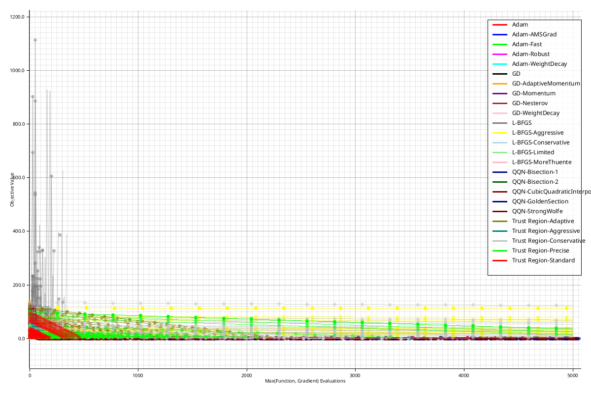
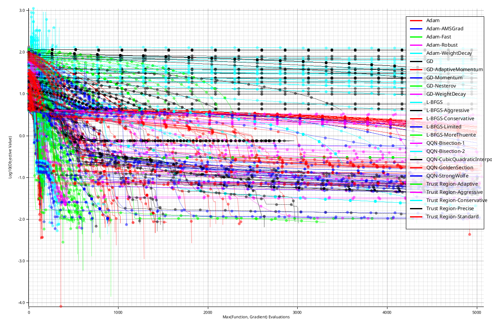

**Figure:** Convergence plots for Rosenbrock_2D showing objective value vs iterations.
Left: Linear scale, Right: Log scale for better visualization of convergence behavior.

**Data:** [Linear scale data (CSV)](data/Rosenbrock_2D_data.csv) | [Log scale data (CSV)](data/Rosenbrock_2D_log_data.csv)

## Problem: Rosenbrock_5D

**Family:** Rosenbrock
**Dimension:** 5
**Success Threshold:** 3.980e-1
**Total Runs:** 500
**Detailed Analysis:** [View comprehensive problem analysis](reports/problem_analysis_Rosenbrock_5D.md)

### Performance Summary
<table style="border-collapse: collapse; width: 100%; margin: 20px 0;">
<tr style="background-color: #f2f2f2;">
<th style="border: 1px solid #ddd; padding: 8px; text-align: center;">Rank</th>
<th style="border: 1px solid #ddd; padding: 8px; text-align: center;">Optimizer</th>
<th style="border: 1px solid #ddd; padding: 8px; text-align: center;">Mean Final Value (All/Success/Fail)</th>
<th style="border: 1px solid #ddd; padding: 8px; text-align: center;">Std Dev</th>
<th style="border: 1px solid #ddd; padding: 8px; text-align: center;">Best Value</th>
<th style="border: 1px solid #ddd; padding: 8px; text-align: center;">Worst Value</th>
<th style="border: 1px solid #ddd; padding: 8px; text-align: center;">Mean Function Evals (All/Success/Fail)</th>
<th style="border: 1px solid #ddd; padding: 8px; text-align: center;">Mean Gradient Evals (All/Success/Fail)</th>
<th style="border: 1px solid #ddd; padding: 8px; text-align: center;">Success Rate</th>
<th style="border: 1px solid #ddd; padding: 8px; text-align: center;">Mean Time (s)</th>
</tr>
<tr style="background-color: #d4edda; font-weight: bold;">
<td style="border: 1px solid #ddd; padding: 8px; text-align: center;">1</td>
<td style="border: 1px solid #ddd; padding: 8px; text-align: center;"><a href="reports/detailed_Rosenbrock_5D_QQN-StrongWolfe.md" title="Click for detailed analysis">QQN-StrongWolfe</a></td>
<td style="border: 1px solid #ddd; padding: 8px; text-align: center;">3.45e-1 / 3.45e-1 / -</td>
<td style="border: 1px solid #ddd; padding: 8px; text-align: center;">4.37e-2</td>
<td style="border: 1px solid #ddd; padding: 8px; text-align: center;">2.58e-1</td>
<td style="border: 1px solid #ddd; padding: 8px; text-align: center;">3.95e-1</td>
<td style="border: 1px solid #ddd; padding: 8px; text-align: center;">792.6 / 792.6 / -</td>
<td style="border: 1px solid #ddd; padding: 8px; text-align: center;">596.7 / 596.7 / -</td>
<td style="border: 1px solid #ddd; padding: 8px; text-align: center;">100.0%</td>
<td style="border: 1px solid #ddd; padding: 8px; text-align: center;">0.024</td>
</tr>
<tr style="background-color: #fff3cd;">
<td style="border: 1px solid #ddd; padding: 8px; text-align: center;">2</td>
<td style="border: 1px solid #ddd; padding: 8px; text-align: center;"><a href="reports/detailed_Rosenbrock_5D_QQN-Bisection-1.md" title="Click for detailed analysis">QQN-Bisection-1</a></td>
<td style="border: 1px solid #ddd; padding: 8px; text-align: center;">6.94e-1 / 3.36e-1 / 2.72e0</td>
<td style="border: 1px solid #ddd; padding: 8px; text-align: center;">1.01e0</td>
<td style="border: 1px solid #ddd; padding: 8px; text-align: center;">2.50e-1</td>
<td style="border: 1px solid #ddd; padding: 8px; text-align: center;">4.64e0</td>
<td style="border: 1px solid #ddd; padding: 8px; text-align: center;">1147.7 / 917.9 / 2449.7</td>
<td style="border: 1px solid #ddd; padding: 8px; text-align: center;">1308.1 / 1087.2 / 2560.0</td>
<td style="border: 1px solid #ddd; padding: 8px; text-align: center;">85.0%</td>
<td style="border: 1px solid #ddd; padding: 8px; text-align: center;">0.029</td>
</tr>
<tr style="">
<td style="border: 1px solid #ddd; padding: 8px; text-align: center;">3</td>
<td style="border: 1px solid #ddd; padding: 8px; text-align: center;"><a href="reports/detailed_Rosenbrock_5D_L-BFGS-MoreThuente.md" title="Click for detailed analysis">L-BFGS-MoreThuente</a></td>
<td style="border: 1px solid #ddd; padding: 8px; text-align: center;">8.32e-1 / 3.56e-1 / 2.18e0</td>
<td style="border: 1px solid #ddd; padding: 8px; text-align: center;">8.85e-1</td>
<td style="border: 1px solid #ddd; padding: 8px; text-align: center;">2.37e-1</td>
<td style="border: 1px solid #ddd; padding: 8px; text-align: center;">3.15e0</td>
<td style="border: 1px solid #ddd; padding: 8px; text-align: center;">1090.7 / 505.9 / 2455.2</td>
<td style="border: 1px solid #ddd; padding: 8px; text-align: center;">832.7 / 383.6 / 1880.5</td>
<td style="border: 1px solid #ddd; padding: 8px; text-align: center;">70.0%</td>
<td style="border: 1px solid #ddd; padding: 8px; text-align: center;">0.019</td>
</tr>
<tr style="">
<td style="border: 1px solid #ddd; padding: 8px; text-align: center;">4</td>
<td style="border: 1px solid #ddd; padding: 8px; text-align: center;"><a href="reports/detailed_Rosenbrock_5D_QQN-CubicQuadraticInterpolation.md" title="Click for detailed analysis">QQN-CubicQuadraticInterpolation</a></td>
<td style="border: 1px solid #ddd; padding: 8px; text-align: center;">4.25e-1 / 3.43e-1 / 6.17e-1</td>
<td style="border: 1px solid #ddd; padding: 8px; text-align: center;">1.40e-1</td>
<td style="border: 1px solid #ddd; padding: 8px; text-align: center;">2.38e-1</td>
<td style="border: 1px solid #ddd; padding: 8px; text-align: center;">7.25e-1</td>
<td style="border: 1px solid #ddd; padding: 8px; text-align: center;">1199.2 / 788.3 / 2158.0</td>
<td style="border: 1px solid #ddd; padding: 8px; text-align: center;">1581.3 / 1033.0 / 2860.7</td>
<td style="border: 1px solid #ddd; padding: 8px; text-align: center;">70.0%</td>
<td style="border: 1px solid #ddd; padding: 8px; text-align: center;">0.049</td>
</tr>
<tr style="">
<td style="border: 1px solid #ddd; padding: 8px; text-align: center;">5</td>
<td style="border: 1px solid #ddd; padding: 8px; text-align: center;"><a href="reports/detailed_Rosenbrock_5D_GD-WeightDecay.md" title="Click for detailed analysis">GD-WeightDecay</a></td>
<td style="border: 1px solid #ddd; padding: 8px; text-align: center;">6.90e-1 / 3.83e-1 / 1.25e0</td>
<td style="border: 1px solid #ddd; padding: 8px; text-align: center;">1.08e0</td>
<td style="border: 1px solid #ddd; padding: 8px; text-align: center;">3.59e-1</td>
<td style="border: 1px solid #ddd; padding: 8px; text-align: center;">5.35e0</td>
<td style="border: 1px solid #ddd; padding: 8px; text-align: center;">72.1 / 74.9 / 67.9</td>
<td style="border: 1px solid #ddd; padding: 8px; text-align: center;">140.8 / 146.8 / 131.8</td>
<td style="border: 1px solid #ddd; padding: 8px; text-align: center;">60.0%</td>
<td style="border: 1px solid #ddd; padding: 8px; text-align: center;">0.002</td>
</tr>
<tr style="">
<td style="border: 1px solid #ddd; padding: 8px; text-align: center;">6</td>
<td style="border: 1px solid #ddd; padding: 8px; text-align: center;"><a href="reports/detailed_Rosenbrock_5D_Adam-WeightDecay.md" title="Click for detailed analysis">Adam-WeightDecay</a></td>
<td style="border: 1px solid #ddd; padding: 8px; text-align: center;">2.07e0 / 3.96e-1 / 4.58e0</td>
<td style="border: 1px solid #ddd; padding: 8px; text-align: center;">2.05e0</td>
<td style="border: 1px solid #ddd; padding: 8px; text-align: center;">3.93e-1</td>
<td style="border: 1px solid #ddd; padding: 8px; text-align: center;">4.64e0</td>
<td style="border: 1px solid #ddd; padding: 8px; text-align: center;">1128.9 / 1388.0 / 740.2</td>
<td style="border: 1px solid #ddd; padding: 8px; text-align: center;">1128.5 / 1388.0 / 739.2</td>
<td style="border: 1px solid #ddd; padding: 8px; text-align: center;">60.0%</td>
<td style="border: 1px solid #ddd; padding: 8px; text-align: center;">0.024</td>
</tr>
<tr style="">
<td style="border: 1px solid #ddd; padding: 8px; text-align: center;">7</td>
<td style="border: 1px solid #ddd; padding: 8px; text-align: center;"><a href="reports/detailed_Rosenbrock_5D_QQN-Bisection-2.md" title="Click for detailed analysis">QQN-Bisection-2</a></td>
<td style="border: 1px solid #ddd; padding: 8px; text-align: center;">4.48e-1 / 3.37e-1 / 5.85e-1</td>
<td style="border: 1px solid #ddd; padding: 8px; text-align: center;">1.63e-1</td>
<td style="border: 1px solid #ddd; padding: 8px; text-align: center;">2.15e-1</td>
<td style="border: 1px solid #ddd; padding: 8px; text-align: center;">9.11e-1</td>
<td style="border: 1px solid #ddd; padding: 8px; text-align: center;">1588.3 / 982.9 / 2328.2</td>
<td style="border: 1px solid #ddd; padding: 8px; text-align: center;">872.0 / 591.9 / 1214.2</td>
<td style="border: 1px solid #ddd; padding: 8px; text-align: center;">55.0%</td>
<td style="border: 1px solid #ddd; padding: 8px; text-align: center;">0.039</td>
</tr>
<tr style="">
<td style="border: 1px solid #ddd; padding: 8px; text-align: center;">8</td>
<td style="border: 1px solid #ddd; padding: 8px; text-align: center;"><a href="reports/detailed_Rosenbrock_5D_QQN-GoldenSection.md" title="Click for detailed analysis">QQN-GoldenSection</a></td>
<td style="border: 1px solid #ddd; padding: 8px; text-align: center;">6.13e-1 / 3.41e-1 / 9.44e-1</td>
<td style="border: 1px solid #ddd; padding: 8px; text-align: center;">3.74e-1</td>
<td style="border: 1px solid #ddd; padding: 8px; text-align: center;">2.60e-1</td>
<td style="border: 1px solid #ddd; padding: 8px; text-align: center;">1.61e0</td>
<td style="border: 1px solid #ddd; padding: 8px; text-align: center;">3314.1 / 2364.2 / 4475.0</td>
<td style="border: 1px solid #ddd; padding: 8px; text-align: center;">408.4 / 294.4 / 547.7</td>
<td style="border: 1px solid #ddd; padding: 8px; text-align: center;">55.0%</td>
<td style="border: 1px solid #ddd; padding: 8px; text-align: center;">0.061</td>
</tr>
<tr style="">
<td style="border: 1px solid #ddd; padding: 8px; text-align: center;">9</td>
<td style="border: 1px solid #ddd; padding: 8px; text-align: center;"><a href="reports/detailed_Rosenbrock_5D_L-BFGS-Limited.md" title="Click for detailed analysis">L-BFGS-Limited</a></td>
<td style="border: 1px solid #ddd; padding: 8px; text-align: center;">4.21e-1 / 3.96e-1 / 4.41e-1</td>
<td style="border: 1px solid #ddd; padding: 8px; text-align: center;">3.55e-2</td>
<td style="border: 1px solid #ddd; padding: 8px; text-align: center;">3.92e-1</td>
<td style="border: 1px solid #ddd; padding: 8px; text-align: center;">5.47e-1</td>
<td style="border: 1px solid #ddd; padding: 8px; text-align: center;">3855.4 / 3636.6 / 4034.5</td>
<td style="border: 1px solid #ddd; padding: 8px; text-align: center;">936.0 / 885.0 / 977.8</td>
<td style="border: 1px solid #ddd; padding: 8px; text-align: center;">45.0%</td>
<td style="border: 1px solid #ddd; padding: 8px; text-align: center;">0.045</td>
</tr>
<tr style="">
<td style="border: 1px solid #ddd; padding: 8px; text-align: center;">10</td>
<td style="border: 1px solid #ddd; padding: 8px; text-align: center;"><a href="reports/detailed_Rosenbrock_5D_L-BFGS-Conservative.md" title="Click for detailed analysis">L-BFGS-Conservative</a></td>
<td style="border: 1px solid #ddd; padding: 8px; text-align: center;">2.38e0 / 3.95e-1 / 2.52e1</td>
<td style="border: 1px solid #ddd; padding: 8px; text-align: center;">1.82e0</td>
<td style="border: 1px solid #ddd; padding: 8px; text-align: center;">3.89e-1</td>
<td style="border: 1px solid #ddd; padding: 8px; text-align: center;">4.65e0</td>
<td style="border: 1px solid #ddd; padding: 8px; text-align: center;">3106.7 / 2559.2 / 3243.6</td>
<td style="border: 1px solid #ddd; padding: 8px; text-align: center;">849.6 / 746.8 / 875.4</td>
<td style="border: 1px solid #ddd; padding: 8px; text-align: center;">20.0%</td>
<td style="border: 1px solid #ddd; padding: 8px; text-align: center;">0.032</td>
</tr>
<tr style="">
<td style="border: 1px solid #ddd; padding: 8px; text-align: center;">11</td>
<td style="border: 1px solid #ddd; padding: 8px; text-align: center;"><a href="reports/detailed_Rosenbrock_5D_GD-Nesterov.md" title="Click for detailed analysis">GD-Nesterov</a></td>
<td style="border: 1px solid #ddd; padding: 8px; text-align: center;">3.32e0 / 3.94e-1 / 4.66e0</td>
<td style="border: 1px solid #ddd; padding: 8px; text-align: center;">3.73e0</td>
<td style="border: 1px solid #ddd; padding: 8px; text-align: center;">3.90e-1</td>
<td style="border: 1px solid #ddd; padding: 8px; text-align: center;">9.14e0</td>
<td style="border: 1px solid #ddd; padding: 8px; text-align: center;">335.4 / 73.5 / 364.6</td>
<td style="border: 1px solid #ddd; padding: 8px; text-align: center;">667.0 / 144.0 / 725.1</td>
<td style="border: 1px solid #ddd; padding: 8px; text-align: center;">10.0%</td>
<td style="border: 1px solid #ddd; padding: 8px; text-align: center;">0.011</td>
</tr>
<tr style="">
<td style="border: 1px solid #ddd; padding: 8px; text-align: center;">12</td>
<td style="border: 1px solid #ddd; padding: 8px; text-align: center;"><a href="reports/detailed_Rosenbrock_5D_Adam-Fast.md" title="Click for detailed analysis">Adam-Fast</a></td>
<td style="border: 1px solid #ddd; padding: 8px; text-align: center;">6.75e0 / 3.48e-1 / 1.51e1</td>
<td style="border: 1px solid #ddd; padding: 8px; text-align: center;">1.87e0</td>
<td style="border: 1px solid #ddd; padding: 8px; text-align: center;">3.48e-1</td>
<td style="border: 1px solid #ddd; padding: 8px; text-align: center;">1.03e1</td>
<td style="border: 1px solid #ddd; padding: 8px; text-align: center;">44.4 / 143.0 / 39.2</td>
<td style="border: 1px solid #ddd; padding: 8px; text-align: center;">43.5 / 143.0 / 38.2</td>
<td style="border: 1px solid #ddd; padding: 8px; text-align: center;">5.0%</td>
<td style="border: 1px solid #ddd; padding: 8px; text-align: center;">0.001</td>
</tr>
<tr style="">
<td style="border: 1px solid #ddd; padding: 8px; text-align: center;">13</td>
<td style="border: 1px solid #ddd; padding: 8px; text-align: center;"><a href="reports/detailed_Rosenbrock_5D_GD-AdaptiveMomentum.md" title="Click for detailed analysis">GD-AdaptiveMomentum</a></td>
<td style="border: 1px solid #ddd; padding: 8px; text-align: center;">1.23e1 / - / 4.60e1</td>
<td style="border: 1px solid #ddd; padding: 8px; text-align: center;">2.63e0</td>
<td style="border: 1px solid #ddd; padding: 8px; text-align: center;">8.36e0</td>
<td style="border: 1px solid #ddd; padding: 8px; text-align: center;">1.72e1</td>
<td style="border: 1px solid #ddd; padding: 8px; text-align: center;">20.6 / - / 20.6</td>
<td style="border: 1px solid #ddd; padding: 8px; text-align: center;">37.1 / - / 37.1</td>
<td style="border: 1px solid #ddd; padding: 8px; text-align: center;">0.0%</td>
<td style="border: 1px solid #ddd; padding: 8px; text-align: center;">0.001</td>
</tr>
<tr style="">
<td style="border: 1px solid #ddd; padding: 8px; text-align: center;">14</td>
<td style="border: 1px solid #ddd; padding: 8px; text-align: center;"><a href="reports/detailed_Rosenbrock_5D_GD-Momentum.md" title="Click for detailed analysis">GD-Momentum</a></td>
<td style="border: 1px solid #ddd; padding: 8px; text-align: center;">1.36e1 / - / 3.55e1</td>
<td style="border: 1px solid #ddd; padding: 8px; text-align: center;">2.65e0</td>
<td style="border: 1px solid #ddd; padding: 8px; text-align: center;">9.53e0</td>
<td style="border: 1px solid #ddd; padding: 8px; text-align: center;">1.87e1</td>
<td style="border: 1px solid #ddd; padding: 8px; text-align: center;">20.8 / - / 20.8</td>
<td style="border: 1px solid #ddd; padding: 8px; text-align: center;">37.6 / - / 37.6</td>
<td style="border: 1px solid #ddd; padding: 8px; text-align: center;">0.0%</td>
<td style="border: 1px solid #ddd; padding: 8px; text-align: center;">0.001</td>
</tr>
<tr style="">
<td style="border: 1px solid #ddd; padding: 8px; text-align: center;">15</td>
<td style="border: 1px solid #ddd; padding: 8px; text-align: center;"><a href="reports/detailed_Rosenbrock_5D_GD.md" title="Click for detailed analysis">GD</a></td>
<td style="border: 1px solid #ddd; padding: 8px; text-align: center;">4.76e0 / - / 5.09e0</td>
<td style="border: 1px solid #ddd; padding: 8px; text-align: center;">7.65e-2</td>
<td style="border: 1px solid #ddd; padding: 8px; text-align: center;">4.65e0</td>
<td style="border: 1px solid #ddd; padding: 8px; text-align: center;">4.88e0</td>
<td style="border: 1px solid #ddd; padding: 8px; text-align: center;">32.5 / - / 32.5</td>
<td style="border: 1px solid #ddd; padding: 8px; text-align: center;">61.0 / - / 61.0</td>
<td style="border: 1px solid #ddd; padding: 8px; text-align: center;">0.0%</td>
<td style="border: 1px solid #ddd; padding: 8px; text-align: center;">0.001</td>
</tr>
<tr style="">
<td style="border: 1px solid #ddd; padding: 8px; text-align: center;">16</td>
<td style="border: 1px solid #ddd; padding: 8px; text-align: center;"><a href="reports/detailed_Rosenbrock_5D_L-BFGS.md" title="Click for detailed analysis">L-BFGS</a></td>
<td style="border: 1px solid #ddd; padding: 8px; text-align: center;">1.76e1 / - / 1.50e2</td>
<td style="border: 1px solid #ddd; padding: 8px; text-align: center;">9.81e0</td>
<td style="border: 1px solid #ddd; padding: 8px; text-align: center;">7.16e0</td>
<td style="border: 1px solid #ddd; padding: 8px; text-align: center;">4.11e1</td>
<td style="border: 1px solid #ddd; padding: 8px; text-align: center;">135.3 / - / 135.3</td>
<td style="border: 1px solid #ddd; padding: 8px; text-align: center;">43.4 / - / 43.4</td>
<td style="border: 1px solid #ddd; padding: 8px; text-align: center;">0.0%</td>
<td style="border: 1px solid #ddd; padding: 8px; text-align: center;">0.002</td>
</tr>
<tr style="">
<td style="border: 1px solid #ddd; padding: 8px; text-align: center;">17</td>
<td style="border: 1px solid #ddd; padding: 8px; text-align: center;"><a href="reports/detailed_Rosenbrock_5D_Trust_Region-Aggressive.md" title="Click for detailed analysis">Trust Region-Aggressive</a></td>
<td style="border: 1px solid #ddd; padding: 8px; text-align: center;">5.00e0 / - / 5.00e0</td>
<td style="border: 1px solid #ddd; padding: 8px; text-align: center;">4.17e-1</td>
<td style="border: 1px solid #ddd; padding: 8px; text-align: center;">4.66e0</td>
<td style="border: 1px solid #ddd; padding: 8px; text-align: center;">5.93e0</td>
<td style="border: 1px solid #ddd; padding: 8px; text-align: center;">776.1 / - / 776.1</td>
<td style="border: 1px solid #ddd; padding: 8px; text-align: center;">518.1 / - / 518.1</td>
<td style="border: 1px solid #ddd; padding: 8px; text-align: center;">0.0%</td>
<td style="border: 1px solid #ddd; padding: 8px; text-align: center;">0.005</td>
</tr>
<tr style="">
<td style="border: 1px solid #ddd; padding: 8px; text-align: center;">18</td>
<td style="border: 1px solid #ddd; padding: 8px; text-align: center;"><a href="reports/detailed_Rosenbrock_5D_Trust_Region-Standard.md" title="Click for detailed analysis">Trust Region-Standard</a></td>
<td style="border: 1px solid #ddd; padding: 8px; text-align: center;">6.23e1 / - / 6.23e1</td>
<td style="border: 1px solid #ddd; padding: 8px; text-align: center;">7.73e1</td>
<td style="border: 1px solid #ddd; padding: 8px; text-align: center;">4.66e0</td>
<td style="border: 1px solid #ddd; padding: 8px; text-align: center;">2.53e2</td>
<td style="border: 1px solid #ddd; padding: 8px; text-align: center;">2827.2 / - / 2827.2</td>
<td style="border: 1px solid #ddd; padding: 8px; text-align: center;">1885.5 / - / 1885.5</td>
<td style="border: 1px solid #ddd; padding: 8px; text-align: center;">0.0%</td>
<td style="border: 1px solid #ddd; padding: 8px; text-align: center;">0.018</td>
</tr>
<tr style="">
<td style="border: 1px solid #ddd; padding: 8px; text-align: center;">19</td>
<td style="border: 1px solid #ddd; padding: 8px; text-align: center;"><a href="reports/detailed_Rosenbrock_5D_Adam-AMSGrad.md" title="Click for detailed analysis">Adam-AMSGrad</a></td>
<td style="border: 1px solid #ddd; padding: 8px; text-align: center;">4.40e0 / - / 4.40e0</td>
<td style="border: 1px solid #ddd; padding: 8px; text-align: center;">3.25e-1</td>
<td style="border: 1px solid #ddd; padding: 8px; text-align: center;">3.25e0</td>
<td style="border: 1px solid #ddd; padding: 8px; text-align: center;">4.82e0</td>
<td style="border: 1px solid #ddd; padding: 8px; text-align: center;">2442.0 / - / 2442.0</td>
<td style="border: 1px solid #ddd; padding: 8px; text-align: center;">2441.8 / - / 2441.8</td>
<td style="border: 1px solid #ddd; padding: 8px; text-align: center;">0.0%</td>
<td style="border: 1px solid #ddd; padding: 8px; text-align: center;">0.056</td>
</tr>
<tr style="">
<td style="border: 1px solid #ddd; padding: 8px; text-align: center;">20</td>
<td style="border: 1px solid #ddd; padding: 8px; text-align: center;"><a href="reports/detailed_Rosenbrock_5D_Adam.md" title="Click for detailed analysis">Adam</a></td>
<td style="border: 1px solid #ddd; padding: 8px; text-align: center;">3.92e0 / - / 3.92e0</td>
<td style="border: 1px solid #ddd; padding: 8px; text-align: center;">4.66e-1</td>
<td style="border: 1px solid #ddd; padding: 8px; text-align: center;">2.83e0</td>
<td style="border: 1px solid #ddd; padding: 8px; text-align: center;">4.65e0</td>
<td style="border: 1px solid #ddd; padding: 8px; text-align: center;">2471.6 / - / 2471.6</td>
<td style="border: 1px solid #ddd; padding: 8px; text-align: center;">2471.5 / - / 2471.5</td>
<td style="border: 1px solid #ddd; padding: 8px; text-align: center;">0.0%</td>
<td style="border: 1px solid #ddd; padding: 8px; text-align: center;">0.050</td>
</tr>
<tr style="">
<td style="border: 1px solid #ddd; padding: 8px; text-align: center;">21</td>
<td style="border: 1px solid #ddd; padding: 8px; text-align: center;"><a href="reports/detailed_Rosenbrock_5D_Trust_Region-Precise.md" title="Click for detailed analysis">Trust Region-Precise</a></td>
<td style="border: 1px solid #ddd; padding: 8px; text-align: center;">1.01e3 / - / 1.01e3</td>
<td style="border: 1px solid #ddd; padding: 8px; text-align: center;">1.27e2</td>
<td style="border: 1px solid #ddd; padding: 8px; text-align: center;">8.08e2</td>
<td style="border: 1px solid #ddd; padding: 8px; text-align: center;">1.35e3</td>
<td style="border: 1px solid #ddd; padding: 8px; text-align: center;">3002.0 / - / 3002.0</td>
<td style="border: 1px solid #ddd; padding: 8px; text-align: center;">2002.0 / - / 2002.0</td>
<td style="border: 1px solid #ddd; padding: 8px; text-align: center;">0.0%</td>
<td style="border: 1px solid #ddd; padding: 8px; text-align: center;">0.019</td>
</tr>
<tr style="">
<td style="border: 1px solid #ddd; padding: 8px; text-align: center;">22</td>
<td style="border: 1px solid #ddd; padding: 8px; text-align: center;"><a href="reports/detailed_Rosenbrock_5D_Adam-Robust.md" title="Click for detailed analysis">Adam-Robust</a></td>
<td style="border: 1px solid #ddd; padding: 8px; text-align: center;">1.46e1 / - / 1.46e1</td>
<td style="border: 1px solid #ddd; padding: 8px; text-align: center;">6.99e0</td>
<td style="border: 1px solid #ddd; padding: 8px; text-align: center;">6.12e0</td>
<td style="border: 1px solid #ddd; padding: 8px; text-align: center;">2.99e1</td>
<td style="border: 1px solid #ddd; padding: 8px; text-align: center;">2502.0 / - / 2502.0</td>
<td style="border: 1px solid #ddd; padding: 8px; text-align: center;">2502.0 / - / 2502.0</td>
<td style="border: 1px solid #ddd; padding: 8px; text-align: center;">0.0%</td>
<td style="border: 1px solid #ddd; padding: 8px; text-align: center;">0.058</td>
</tr>
<tr style="">
<td style="border: 1px solid #ddd; padding: 8px; text-align: center;">23</td>
<td style="border: 1px solid #ddd; padding: 8px; text-align: center;"><a href="reports/detailed_Rosenbrock_5D_Trust_Region-Conservative.md" title="Click for detailed analysis">Trust Region-Conservative</a></td>
<td style="border: 1px solid #ddd; padding: 8px; text-align: center;">1.02e3 / - / 1.02e3</td>
<td style="border: 1px solid #ddd; padding: 8px; text-align: center;">1.63e2</td>
<td style="border: 1px solid #ddd; padding: 8px; text-align: center;">7.14e2</td>
<td style="border: 1px solid #ddd; padding: 8px; text-align: center;">1.31e3</td>
<td style="border: 1px solid #ddd; padding: 8px; text-align: center;">3002.0 / - / 3002.0</td>
<td style="border: 1px solid #ddd; padding: 8px; text-align: center;">2002.0 / - / 2002.0</td>
<td style="border: 1px solid #ddd; padding: 8px; text-align: center;">0.0%</td>
<td style="border: 1px solid #ddd; padding: 8px; text-align: center;">0.021</td>
</tr>
<tr style="">
<td style="border: 1px solid #ddd; padding: 8px; text-align: center;">24</td>
<td style="border: 1px solid #ddd; padding: 8px; text-align: center;"><a href="reports/detailed_Rosenbrock_5D_Trust_Region-Adaptive.md" title="Click for detailed analysis">Trust Region-Adaptive</a></td>
<td style="border: 1px solid #ddd; padding: 8px; text-align: center;">8.41e2 / - / 8.41e2</td>
<td style="border: 1px solid #ddd; padding: 8px; text-align: center;">1.37e2</td>
<td style="border: 1px solid #ddd; padding: 8px; text-align: center;">5.05e2</td>
<td style="border: 1px solid #ddd; padding: 8px; text-align: center;">1.11e3</td>
<td style="border: 1px solid #ddd; padding: 8px; text-align: center;">3002.0 / - / 3002.0</td>
<td style="border: 1px solid #ddd; padding: 8px; text-align: center;">2002.0 / - / 2002.0</td>
<td style="border: 1px solid #ddd; padding: 8px; text-align: center;">0.0%</td>
<td style="border: 1px solid #ddd; padding: 8px; text-align: center;">0.019</td>
</tr>
<tr style="">
<td style="border: 1px solid #ddd; padding: 8px; text-align: center;">25</td>
<td style="border: 1px solid #ddd; padding: 8px; text-align: center;"><a href="reports/detailed_Rosenbrock_5D_L-BFGS-Aggressive.md" title="Click for detailed analysis">L-BFGS-Aggressive</a></td>
<td style="border: 1px solid #ddd; padding: 8px; text-align: center;">8.07e2 / - / 8.07e2</td>
<td style="border: 1px solid #ddd; padding: 8px; text-align: center;">4.06e2</td>
<td style="border: 1px solid #ddd; padding: 8px; text-align: center;">1.72e1</td>
<td style="border: 1px solid #ddd; padding: 8px; text-align: center;">1.19e3</td>
<td style="border: 1px solid #ddd; padding: 8px; text-align: center;">3851.6 / - / 3851.6</td>
<td style="border: 1px solid #ddd; padding: 8px; text-align: center;">1157.3 / - / 1157.3</td>
<td style="border: 1px solid #ddd; padding: 8px; text-align: center;">0.0%</td>
<td style="border: 1px solid #ddd; padding: 8px; text-align: center;">0.029</td>
</tr>
</table>

### Convergence Plots

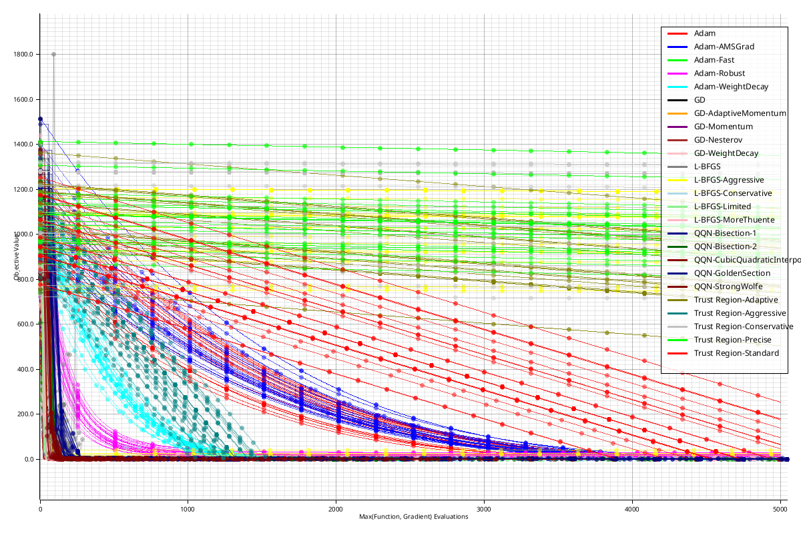
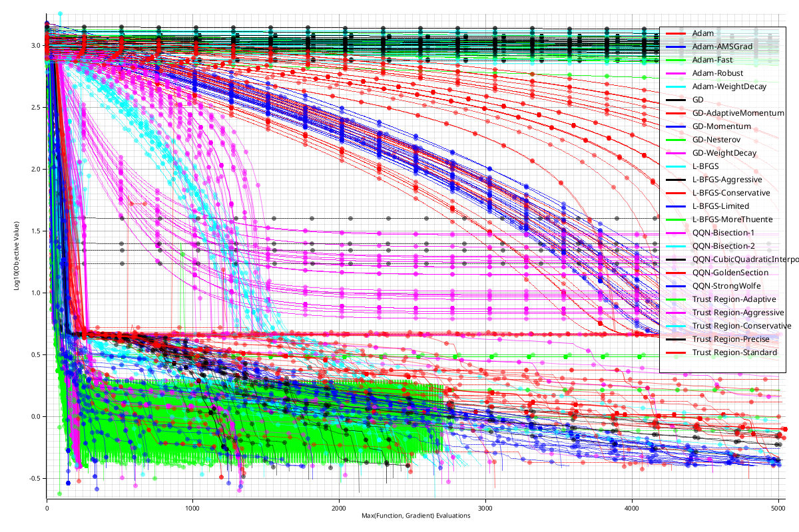

**Figure:** Convergence plots for Rosenbrock_5D showing objective value vs iterations.
Left: Linear scale, Right: Log scale for better visualization of convergence behavior.

**Data:** [Linear scale data (CSV)](data/Rosenbrock_5D_data.csv) | [Log scale data (CSV)](data/Rosenbrock_5D_log_data.csv)

## Problem: Rosenbrock_10D

**Family:** Rosenbrock
**Dimension:** 10
**Success Threshold:** 9.700e0
**Total Runs:** 500
**Detailed Analysis:** [View comprehensive problem analysis](reports/problem_analysis_Rosenbrock_10D.md)

### Performance Summary
<table style="border-collapse: collapse; width: 100%; margin: 20px 0;">
<tr style="background-color: #f2f2f2;">
<th style="border: 1px solid #ddd; padding: 8px; text-align: center;">Rank</th>
<th style="border: 1px solid #ddd; padding: 8px; text-align: center;">Optimizer</th>
<th style="border: 1px solid #ddd; padding: 8px; text-align: center;">Mean Final Value (All/Success/Fail)</th>
<th style="border: 1px solid #ddd; padding: 8px; text-align: center;">Std Dev</th>
<th style="border: 1px solid #ddd; padding: 8px; text-align: center;">Best Value</th>
<th style="border: 1px solid #ddd; padding: 8px; text-align: center;">Worst Value</th>
<th style="border: 1px solid #ddd; padding: 8px; text-align: center;">Mean Function Evals (All/Success/Fail)</th>
<th style="border: 1px solid #ddd; padding: 8px; text-align: center;">Mean Gradient Evals (All/Success/Fail)</th>
<th style="border: 1px solid #ddd; padding: 8px; text-align: center;">Success Rate</th>
<th style="border: 1px solid #ddd; padding: 8px; text-align: center;">Mean Time (s)</th>
</tr>
<tr style="background-color: #d4edda; font-weight: bold;">
<td style="border: 1px solid #ddd; padding: 8px; text-align: center;">1</td>
<td style="border: 1px solid #ddd; padding: 8px; text-align: center;"><a href="reports/detailed_Rosenbrock_10D_GD-Nesterov.md" title="Click for detailed analysis">GD-Nesterov</a></td>
<td style="border: 1px solid #ddd; padding: 8px; text-align: center;">9.31e0 / 9.31e0 / -</td>
<td style="border: 1px solid #ddd; padding: 8px; text-align: center;">1.92e-1</td>
<td style="border: 1px solid #ddd; padding: 8px; text-align: center;">8.97e0</td>
<td style="border: 1px solid #ddd; padding: 8px; text-align: center;">9.62e0</td>
<td style="border: 1px solid #ddd; padding: 8px; text-align: center;">28.6 / 28.6 / -</td>
<td style="border: 1px solid #ddd; padding: 8px; text-align: center;">54.2 / 54.2 / -</td>
<td style="border: 1px solid #ddd; padding: 8px; text-align: center;">100.0%</td>
<td style="border: 1px solid #ddd; padding: 8px; text-align: center;">0.001</td>
</tr>
<tr style="background-color: #fff3cd;">
<td style="border: 1px solid #ddd; padding: 8px; text-align: center;">2</td>
<td style="border: 1px solid #ddd; padding: 8px; text-align: center;"><a href="reports/detailed_Rosenbrock_10D_L-BFGS-Limited.md" title="Click for detailed analysis">L-BFGS-Limited</a></td>
<td style="border: 1px solid #ddd; padding: 8px; text-align: center;">9.59e0 / 9.59e0 / -</td>
<td style="border: 1px solid #ddd; padding: 8px; text-align: center;">4.89e-2</td>
<td style="border: 1px solid #ddd; padding: 8px; text-align: center;">9.51e0</td>
<td style="border: 1px solid #ddd; padding: 8px; text-align: center;">9.68e0</td>
<td style="border: 1px solid #ddd; padding: 8px; text-align: center;">62.3 / 62.3 / -</td>
<td style="border: 1px solid #ddd; padding: 8px; text-align: center;">25.5 / 25.5 / -</td>
<td style="border: 1px solid #ddd; padding: 8px; text-align: center;">100.0%</td>
<td style="border: 1px solid #ddd; padding: 8px; text-align: center;">0.001</td>
</tr>
<tr style="">
<td style="border: 1px solid #ddd; padding: 8px; text-align: center;">3</td>
<td style="border: 1px solid #ddd; padding: 8px; text-align: center;"><a href="reports/detailed_Rosenbrock_10D_GD-WeightDecay.md" title="Click for detailed analysis">GD-WeightDecay</a></td>
<td style="border: 1px solid #ddd; padding: 8px; text-align: center;">9.58e0 / 9.58e0 / -</td>
<td style="border: 1px solid #ddd; padding: 8px; text-align: center;">5.37e-2</td>
<td style="border: 1px solid #ddd; padding: 8px; text-align: center;">9.45e0</td>
<td style="border: 1px solid #ddd; padding: 8px; text-align: center;">9.67e0</td>
<td style="border: 1px solid #ddd; padding: 8px; text-align: center;">35.7 / 35.7 / -</td>
<td style="border: 1px solid #ddd; padding: 8px; text-align: center;">68.4 / 68.4 / -</td>
<td style="border: 1px solid #ddd; padding: 8px; text-align: center;">100.0%</td>
<td style="border: 1px solid #ddd; padding: 8px; text-align: center;">0.001</td>
</tr>
<tr style="">
<td style="border: 1px solid #ddd; padding: 8px; text-align: center;">4</td>
<td style="border: 1px solid #ddd; padding: 8px; text-align: center;"><a href="reports/detailed_Rosenbrock_10D_QQN-StrongWolfe.md" title="Click for detailed analysis">QQN-StrongWolfe</a></td>
<td style="border: 1px solid #ddd; padding: 8px; text-align: center;">8.69e0 / 8.69e0 / -</td>
<td style="border: 1px solid #ddd; padding: 8px; text-align: center;">5.85e-1</td>
<td style="border: 1px solid #ddd; padding: 8px; text-align: center;">7.76e0</td>
<td style="border: 1px solid #ddd; padding: 8px; text-align: center;">9.57e0</td>
<td style="border: 1px solid #ddd; padding: 8px; text-align: center;">90.3 / 90.3 / -</td>
<td style="border: 1px solid #ddd; padding: 8px; text-align: center;">73.6 / 73.6 / -</td>
<td style="border: 1px solid #ddd; padding: 8px; text-align: center;">100.0%</td>
<td style="border: 1px solid #ddd; padding: 8px; text-align: center;">0.003</td>
</tr>
<tr style="">
<td style="border: 1px solid #ddd; padding: 8px; text-align: center;">5</td>
<td style="border: 1px solid #ddd; padding: 8px; text-align: center;"><a href="reports/detailed_Rosenbrock_10D_QQN-Bisection-2.md" title="Click for detailed analysis">QQN-Bisection-2</a></td>
<td style="border: 1px solid #ddd; padding: 8px; text-align: center;">9.37e0 / 9.37e0 / -</td>
<td style="border: 1px solid #ddd; padding: 8px; text-align: center;">3.57e-1</td>
<td style="border: 1px solid #ddd; padding: 8px; text-align: center;">8.02e0</td>
<td style="border: 1px solid #ddd; padding: 8px; text-align: center;">9.67e0</td>
<td style="border: 1px solid #ddd; padding: 8px; text-align: center;">83.2 / 83.2 / -</td>
<td style="border: 1px solid #ddd; padding: 8px; text-align: center;">100.3 / 100.3 / -</td>
<td style="border: 1px solid #ddd; padding: 8px; text-align: center;">100.0%</td>
<td style="border: 1px solid #ddd; padding: 8px; text-align: center;">0.002</td>
</tr>
<tr style="">
<td style="border: 1px solid #ddd; padding: 8px; text-align: center;">6</td>
<td style="border: 1px solid #ddd; padding: 8px; text-align: center;"><a href="reports/detailed_Rosenbrock_10D_QQN-CubicQuadraticInterpolation.md" title="Click for detailed analysis">QQN-CubicQuadraticInterpolation</a></td>
<td style="border: 1px solid #ddd; padding: 8px; text-align: center;">9.60e0 / 9.60e0 / -</td>
<td style="border: 1px solid #ddd; padding: 8px; text-align: center;">5.83e-2</td>
<td style="border: 1px solid #ddd; padding: 8px; text-align: center;">9.48e0</td>
<td style="border: 1px solid #ddd; padding: 8px; text-align: center;">9.70e0</td>
<td style="border: 1px solid #ddd; padding: 8px; text-align: center;">109.6 / 109.6 / -</td>
<td style="border: 1px solid #ddd; padding: 8px; text-align: center;">137.0 / 137.0 / -</td>
<td style="border: 1px solid #ddd; padding: 8px; text-align: center;">100.0%</td>
<td style="border: 1px solid #ddd; padding: 8px; text-align: center;">0.004</td>
</tr>
<tr style="">
<td style="border: 1px solid #ddd; padding: 8px; text-align: center;">7</td>
<td style="border: 1px solid #ddd; padding: 8px; text-align: center;"><a href="reports/detailed_Rosenbrock_10D_QQN-Bisection-1.md" title="Click for detailed analysis">QQN-Bisection-1</a></td>
<td style="border: 1px solid #ddd; padding: 8px; text-align: center;">8.47e0 / 8.47e0 / -</td>
<td style="border: 1px solid #ddd; padding: 8px; text-align: center;">8.02e-1</td>
<td style="border: 1px solid #ddd; padding: 8px; text-align: center;">7.17e0</td>
<td style="border: 1px solid #ddd; padding: 8px; text-align: center;">9.68e0</td>
<td style="border: 1px solid #ddd; padding: 8px; text-align: center;">120.3 / 120.3 / -</td>
<td style="border: 1px solid #ddd; padding: 8px; text-align: center;">168.6 / 168.6 / -</td>
<td style="border: 1px solid #ddd; padding: 8px; text-align: center;">100.0%</td>
<td style="border: 1px solid #ddd; padding: 8px; text-align: center;">0.003</td>
</tr>
<tr style="">
<td style="border: 1px solid #ddd; padding: 8px; text-align: center;">8</td>
<td style="border: 1px solid #ddd; padding: 8px; text-align: center;"><a href="reports/detailed_Rosenbrock_10D_QQN-GoldenSection.md" title="Click for detailed analysis">QQN-GoldenSection</a></td>
<td style="border: 1px solid #ddd; padding: 8px; text-align: center;">9.45e0 / 9.45e0 / -</td>
<td style="border: 1px solid #ddd; padding: 8px; text-align: center;">1.57e-1</td>
<td style="border: 1px solid #ddd; padding: 8px; text-align: center;">9.03e0</td>
<td style="border: 1px solid #ddd; padding: 8px; text-align: center;">9.66e0</td>
<td style="border: 1px solid #ddd; padding: 8px; text-align: center;">277.2 / 277.2 / -</td>
<td style="border: 1px solid #ddd; padding: 8px; text-align: center;">38.6 / 38.6 / -</td>
<td style="border: 1px solid #ddd; padding: 8px; text-align: center;">100.0%</td>
<td style="border: 1px solid #ddd; padding: 8px; text-align: center;">0.005</td>
</tr>
<tr style="">
<td style="border: 1px solid #ddd; padding: 8px; text-align: center;">9</td>
<td style="border: 1px solid #ddd; padding: 8px; text-align: center;"><a href="reports/detailed_Rosenbrock_10D_L-BFGS-Conservative.md" title="Click for detailed analysis">L-BFGS-Conservative</a></td>
<td style="border: 1px solid #ddd; padding: 8px; text-align: center;">9.68e0 / 9.68e0 / -</td>
<td style="border: 1px solid #ddd; padding: 8px; text-align: center;">1.80e-2</td>
<td style="border: 1px solid #ddd; padding: 8px; text-align: center;">9.63e0</td>
<td style="border: 1px solid #ddd; padding: 8px; text-align: center;">9.70e0</td>
<td style="border: 1px solid #ddd; padding: 8px; text-align: center;">205.3 / 205.3 / -</td>
<td style="border: 1px solid #ddd; padding: 8px; text-align: center;">132.9 / 132.9 / -</td>
<td style="border: 1px solid #ddd; padding: 8px; text-align: center;">100.0%</td>
<td style="border: 1px solid #ddd; padding: 8px; text-align: center;">0.005</td>
</tr>
<tr style="">
<td style="border: 1px solid #ddd; padding: 8px; text-align: center;">10</td>
<td style="border: 1px solid #ddd; padding: 8px; text-align: center;"><a href="reports/detailed_Rosenbrock_10D_Adam-WeightDecay.md" title="Click for detailed analysis">Adam-WeightDecay</a></td>
<td style="border: 1px solid #ddd; padding: 8px; text-align: center;">9.67e0 / 9.67e0 / -</td>
<td style="border: 1px solid #ddd; padding: 8px; text-align: center;">2.09e-2</td>
<td style="border: 1px solid #ddd; padding: 8px; text-align: center;">9.61e0</td>
<td style="border: 1px solid #ddd; padding: 8px; text-align: center;">9.70e0</td>
<td style="border: 1px solid #ddd; padding: 8px; text-align: center;">789.4 / 789.4 / -</td>
<td style="border: 1px solid #ddd; padding: 8px; text-align: center;">789.4 / 789.4 / -</td>
<td style="border: 1px solid #ddd; padding: 8px; text-align: center;">100.0%</td>
<td style="border: 1px solid #ddd; padding: 8px; text-align: center;">0.018</td>
</tr>
<tr style="">
<td style="border: 1px solid #ddd; padding: 8px; text-align: center;">11</td>
<td style="border: 1px solid #ddd; padding: 8px; text-align: center;"><a href="reports/detailed_Rosenbrock_10D_Adam-AMSGrad.md" title="Click for detailed analysis">Adam-AMSGrad</a></td>
<td style="border: 1px solid #ddd; padding: 8px; text-align: center;">9.69e0 / 9.69e0 / -</td>
<td style="border: 1px solid #ddd; padding: 8px; text-align: center;">8.57e-3</td>
<td style="border: 1px solid #ddd; padding: 8px; text-align: center;">9.66e0</td>
<td style="border: 1px solid #ddd; padding: 8px; text-align: center;">9.70e0</td>
<td style="border: 1px solid #ddd; padding: 8px; text-align: center;">2353.0 / 2353.0 / -</td>
<td style="border: 1px solid #ddd; padding: 8px; text-align: center;">2353.0 / 2353.0 / -</td>
<td style="border: 1px solid #ddd; padding: 8px; text-align: center;">100.0%</td>
<td style="border: 1px solid #ddd; padding: 8px; text-align: center;">0.058</td>
</tr>
<tr style="">
<td style="border: 1px solid #ddd; padding: 8px; text-align: center;">12</td>
<td style="border: 1px solid #ddd; padding: 8px; text-align: center;"><a href="reports/detailed_Rosenbrock_10D_L-BFGS-MoreThuente.md" title="Click for detailed analysis">L-BFGS-MoreThuente</a></td>
<td style="border: 1px solid #ddd; padding: 8px; text-align: center;">9.20e0 / 8.76e0 / 1.75e1</td>
<td style="border: 1px solid #ddd; padding: 8px; text-align: center;">1.98e0</td>
<td style="border: 1px solid #ddd; padding: 8px; text-align: center;">7.83e0</td>
<td style="border: 1px solid #ddd; padding: 8px; text-align: center;">1.75e1</td>
<td style="border: 1px solid #ddd; padding: 8px; text-align: center;">212.8 / 70.2 / 2922.0</td>
<td style="border: 1px solid #ddd; padding: 8px; text-align: center;">157.8 / 56.2 / 2090.0</td>
<td style="border: 1px solid #ddd; padding: 8px; text-align: center;">95.0%</td>
<td style="border: 1px solid #ddd; padding: 8px; text-align: center;">0.003</td>
</tr>
<tr style="">
<td style="border: 1px solid #ddd; padding: 8px; text-align: center;">13</td>
<td style="border: 1px solid #ddd; padding: 8px; text-align: center;"><a href="reports/detailed_Rosenbrock_10D_Adam.md" title="Click for detailed analysis">Adam</a></td>
<td style="border: 1px solid #ddd; padding: 8px; text-align: center;">9.71e0 / 9.69e0 / 9.91e0</td>
<td style="border: 1px solid #ddd; padding: 8px; text-align: center;">6.65e-2</td>
<td style="border: 1px solid #ddd; padding: 8px; text-align: center;">9.68e0</td>
<td style="border: 1px solid #ddd; padding: 8px; text-align: center;">9.93e0</td>
<td style="border: 1px solid #ddd; padding: 8px; text-align: center;">2293.1 / 2269.9 / 2502.0</td>
<td style="border: 1px solid #ddd; padding: 8px; text-align: center;">2293.1 / 2269.9 / 2502.0</td>
<td style="border: 1px solid #ddd; padding: 8px; text-align: center;">90.0%</td>
<td style="border: 1px solid #ddd; padding: 8px; text-align: center;">0.050</td>
</tr>
<tr style="">
<td style="border: 1px solid #ddd; padding: 8px; text-align: center;">14</td>
<td style="border: 1px solid #ddd; padding: 8px; text-align: center;"><a href="reports/detailed_Rosenbrock_10D_GD.md" title="Click for detailed analysis">GD</a></td>
<td style="border: 1px solid #ddd; padding: 8px; text-align: center;">9.66e0 / 9.63e0 / 1.01e1</td>
<td style="border: 1px solid #ddd; padding: 8px; text-align: center;">5.87e-2</td>
<td style="border: 1px solid #ddd; padding: 8px; text-align: center;">9.59e0</td>
<td style="border: 1px solid #ddd; padding: 8px; text-align: center;">9.81e0</td>
<td style="border: 1px solid #ddd; padding: 8px; text-align: center;">41.5 / 40.1 / 45.4</td>
<td style="border: 1px solid #ddd; padding: 8px; text-align: center;">79.7 / 77.3 / 86.8</td>
<td style="border: 1px solid #ddd; padding: 8px; text-align: center;">75.0%</td>
<td style="border: 1px solid #ddd; padding: 8px; text-align: center;">0.001</td>
</tr>
<tr style="">
<td style="border: 1px solid #ddd; padding: 8px; text-align: center;">15</td>
<td style="border: 1px solid #ddd; padding: 8px; text-align: center;"><a href="reports/detailed_Rosenbrock_10D_GD-Momentum.md" title="Click for detailed analysis">GD-Momentum</a></td>
<td style="border: 1px solid #ddd; padding: 8px; text-align: center;">2.99e1 / 9.51e0 / 6.68e1</td>
<td style="border: 1px solid #ddd; padding: 8px; text-align: center;">2.32e1</td>
<td style="border: 1px solid #ddd; padding: 8px; text-align: center;">9.32e0</td>
<td style="border: 1px solid #ddd; padding: 8px; text-align: center;">7.10e1</td>
<td style="border: 1px solid #ddd; padding: 8px; text-align: center;">35.0 / 44.5 / 23.3</td>
<td style="border: 1px solid #ddd; padding: 8px; text-align: center;">66.5 / 85.9 / 42.7</td>
<td style="border: 1px solid #ddd; padding: 8px; text-align: center;">55.0%</td>
<td style="border: 1px solid #ddd; padding: 8px; text-align: center;">0.001</td>
</tr>
<tr style="">
<td style="border: 1px solid #ddd; padding: 8px; text-align: center;">16</td>
<td style="border: 1px solid #ddd; padding: 8px; text-align: center;"><a href="reports/detailed_Rosenbrock_10D_Adam-Fast.md" title="Click for detailed analysis">Adam-Fast</a></td>
<td style="border: 1px solid #ddd; padding: 8px; text-align: center;">1.46e1 / 9.43e0 / 2.75e1</td>
<td style="border: 1px solid #ddd; padding: 8px; text-align: center;">6.09e0</td>
<td style="border: 1px solid #ddd; padding: 8px; text-align: center;">9.18e0</td>
<td style="border: 1px solid #ddd; padding: 8px; text-align: center;">2.89e1</td>
<td style="border: 1px solid #ddd; padding: 8px; text-align: center;">61.6 / 78.3 / 47.9</td>
<td style="border: 1px solid #ddd; padding: 8px; text-align: center;">61.0 / 78.3 / 46.9</td>
<td style="border: 1px solid #ddd; padding: 8px; text-align: center;">45.0%</td>
<td style="border: 1px solid #ddd; padding: 8px; text-align: center;">0.001</td>
</tr>
<tr style="">
<td style="border: 1px solid #ddd; padding: 8px; text-align: center;">17</td>
<td style="border: 1px solid #ddd; padding: 8px; text-align: center;"><a href="reports/detailed_Rosenbrock_10D_Trust_Region-Aggressive.md" title="Click for detailed analysis">Trust Region-Aggressive</a></td>
<td style="border: 1px solid #ddd; padding: 8px; text-align: center;">1.00e1 / 9.63e0 / 1.02e1</td>
<td style="border: 1px solid #ddd; padding: 8px; text-align: center;">3.85e-1</td>
<td style="border: 1px solid #ddd; padding: 8px; text-align: center;">9.59e0</td>
<td style="border: 1px solid #ddd; padding: 8px; text-align: center;">1.09e1</td>
<td style="border: 1px solid #ddd; padding: 8px; text-align: center;">1615.8 / 1682.5 / 1587.3</td>
<td style="border: 1px solid #ddd; padding: 8px; text-align: center;">1078.0 / 1122.7 / 1058.9</td>
<td style="border: 1px solid #ddd; padding: 8px; text-align: center;">30.0%</td>
<td style="border: 1px solid #ddd; padding: 8px; text-align: center;">0.012</td>
</tr>
<tr style="">
<td style="border: 1px solid #ddd; padding: 8px; text-align: center;">18</td>
<td style="border: 1px solid #ddd; padding: 8px; text-align: center;"><a href="reports/detailed_Rosenbrock_10D_GD-AdaptiveMomentum.md" title="Click for detailed analysis">GD-AdaptiveMomentum</a></td>
<td style="border: 1px solid #ddd; padding: 8px; text-align: center;">6.19e1 / - / 1.02e2</td>
<td style="border: 1px solid #ddd; padding: 8px; text-align: center;">8.58e0</td>
<td style="border: 1px solid #ddd; padding: 8px; text-align: center;">4.55e1</td>
<td style="border: 1px solid #ddd; padding: 8px; text-align: center;">7.75e1</td>
<td style="border: 1px solid #ddd; padding: 8px; text-align: center;">23.1 / - / 23.1</td>
<td style="border: 1px solid #ddd; padding: 8px; text-align: center;">42.3 / - / 42.3</td>
<td style="border: 1px solid #ddd; padding: 8px; text-align: center;">0.0%</td>
<td style="border: 1px solid #ddd; padding: 8px; text-align: center;">0.001</td>
</tr>
<tr style="">
<td style="border: 1px solid #ddd; padding: 8px; text-align: center;">19</td>
<td style="border: 1px solid #ddd; padding: 8px; text-align: center;"><a href="reports/detailed_Rosenbrock_10D_L-BFGS.md" title="Click for detailed analysis">L-BFGS</a></td>
<td style="border: 1px solid #ddd; padding: 8px; text-align: center;">2.95e1 / - / 1.19e2</td>
<td style="border: 1px solid #ddd; padding: 8px; text-align: center;">1.98e1</td>
<td style="border: 1px solid #ddd; padding: 8px; text-align: center;">1.18e1</td>
<td style="border: 1px solid #ddd; padding: 8px; text-align: center;">1.02e2</td>
<td style="border: 1px solid #ddd; padding: 8px; text-align: center;">338.9 / - / 338.9</td>
<td style="border: 1px solid #ddd; padding: 8px; text-align: center;">103.2 / - / 103.2</td>
<td style="border: 1px solid #ddd; padding: 8px; text-align: center;">0.0%</td>
<td style="border: 1px solid #ddd; padding: 8px; text-align: center;">0.005</td>
</tr>
<tr style="">
<td style="border: 1px solid #ddd; padding: 8px; text-align: center;">20</td>
<td style="border: 1px solid #ddd; padding: 8px; text-align: center;"><a href="reports/detailed_Rosenbrock_10D_Trust_Region-Adaptive.md" title="Click for detailed analysis">Trust Region-Adaptive</a></td>
<td style="border: 1px solid #ddd; padding: 8px; text-align: center;">2.02e3 / - / 2.02e3</td>
<td style="border: 1px solid #ddd; padding: 8px; text-align: center;">2.22e2</td>
<td style="border: 1px solid #ddd; padding: 8px; text-align: center;">1.64e3</td>
<td style="border: 1px solid #ddd; padding: 8px; text-align: center;">2.59e3</td>
<td style="border: 1px solid #ddd; padding: 8px; text-align: center;">3002.0 / - / 3002.0</td>
<td style="border: 1px solid #ddd; padding: 8px; text-align: center;">2002.0 / - / 2002.0</td>
<td style="border: 1px solid #ddd; padding: 8px; text-align: center;">0.0%</td>
<td style="border: 1px solid #ddd; padding: 8px; text-align: center;">0.022</td>
</tr>
<tr style="">
<td style="border: 1px solid #ddd; padding: 8px; text-align: center;">21</td>
<td style="border: 1px solid #ddd; padding: 8px; text-align: center;"><a href="reports/detailed_Rosenbrock_10D_Trust_Region-Conservative.md" title="Click for detailed analysis">Trust Region-Conservative</a></td>
<td style="border: 1px solid #ddd; padding: 8px; text-align: center;">2.16e3 / - / 2.16e3</td>
<td style="border: 1px solid #ddd; padding: 8px; text-align: center;">2.33e2</td>
<td style="border: 1px solid #ddd; padding: 8px; text-align: center;">1.76e3</td>
<td style="border: 1px solid #ddd; padding: 8px; text-align: center;">2.55e3</td>
<td style="border: 1px solid #ddd; padding: 8px; text-align: center;">3002.0 / - / 3002.0</td>
<td style="border: 1px solid #ddd; padding: 8px; text-align: center;">2002.0 / - / 2002.0</td>
<td style="border: 1px solid #ddd; padding: 8px; text-align: center;">0.0%</td>
<td style="border: 1px solid #ddd; padding: 8px; text-align: center;">0.020</td>
</tr>
<tr style="">
<td style="border: 1px solid #ddd; padding: 8px; text-align: center;">22</td>
<td style="border: 1px solid #ddd; padding: 8px; text-align: center;"><a href="reports/detailed_Rosenbrock_10D_Trust_Region-Precise.md" title="Click for detailed analysis">Trust Region-Precise</a></td>
<td style="border: 1px solid #ddd; padding: 8px; text-align: center;">2.10e3 / - / 2.10e3</td>
<td style="border: 1px solid #ddd; padding: 8px; text-align: center;">1.92e2</td>
<td style="border: 1px solid #ddd; padding: 8px; text-align: center;">1.66e3</td>
<td style="border: 1px solid #ddd; padding: 8px; text-align: center;">2.46e3</td>
<td style="border: 1px solid #ddd; padding: 8px; text-align: center;">3002.0 / - / 3002.0</td>
<td style="border: 1px solid #ddd; padding: 8px; text-align: center;">2002.0 / - / 2002.0</td>
<td style="border: 1px solid #ddd; padding: 8px; text-align: center;">0.0%</td>
<td style="border: 1px solid #ddd; padding: 8px; text-align: center;">0.021</td>
</tr>
<tr style="">
<td style="border: 1px solid #ddd; padding: 8px; text-align: center;">23</td>
<td style="border: 1px solid #ddd; padding: 8px; text-align: center;"><a href="reports/detailed_Rosenbrock_10D_Adam-Robust.md" title="Click for detailed analysis">Adam-Robust</a></td>
<td style="border: 1px solid #ddd; padding: 8px; text-align: center;">3.49e1 / - / 3.49e1</td>
<td style="border: 1px solid #ddd; padding: 8px; text-align: center;">9.88e0</td>
<td style="border: 1px solid #ddd; padding: 8px; text-align: center;">1.61e1</td>
<td style="border: 1px solid #ddd; padding: 8px; text-align: center;">5.15e1</td>
<td style="border: 1px solid #ddd; padding: 8px; text-align: center;">2502.0 / - / 2502.0</td>
<td style="border: 1px solid #ddd; padding: 8px; text-align: center;">2502.0 / - / 2502.0</td>
<td style="border: 1px solid #ddd; padding: 8px; text-align: center;">0.0%</td>
<td style="border: 1px solid #ddd; padding: 8px; text-align: center;">0.062</td>
</tr>
<tr style="">
<td style="border: 1px solid #ddd; padding: 8px; text-align: center;">24</td>
<td style="border: 1px solid #ddd; padding: 8px; text-align: center;"><a href="reports/detailed_Rosenbrock_10D_Trust_Region-Standard.md" title="Click for detailed analysis">Trust Region-Standard</a></td>
<td style="border: 1px solid #ddd; padding: 8px; text-align: center;">1.06e3 / - / 1.06e3</td>
<td style="border: 1px solid #ddd; padding: 8px; text-align: center;">2.06e2</td>
<td style="border: 1px solid #ddd; padding: 8px; text-align: center;">6.70e2</td>
<td style="border: 1px solid #ddd; padding: 8px; text-align: center;">1.41e3</td>
<td style="border: 1px solid #ddd; padding: 8px; text-align: center;">3002.0 / - / 3002.0</td>
<td style="border: 1px solid #ddd; padding: 8px; text-align: center;">2002.0 / - / 2002.0</td>
<td style="border: 1px solid #ddd; padding: 8px; text-align: center;">0.0%</td>
<td style="border: 1px solid #ddd; padding: 8px; text-align: center;">0.020</td>
</tr>
<tr style="">
<td style="border: 1px solid #ddd; padding: 8px; text-align: center;">25</td>
<td style="border: 1px solid #ddd; padding: 8px; text-align: center;"><a href="reports/detailed_Rosenbrock_10D_L-BFGS-Aggressive.md" title="Click for detailed analysis">L-BFGS-Aggressive</a></td>
<td style="border: 1px solid #ddd; padding: 8px; text-align: center;">1.64e2 / - / 1.64e2</td>
<td style="border: 1px solid #ddd; padding: 8px; text-align: center;">3.20e2</td>
<td style="border: 1px solid #ddd; padding: 8px; text-align: center;">5.82e1</td>
<td style="border: 1px solid #ddd; padding: 8px; text-align: center;">1.56e3</td>
<td style="border: 1px solid #ddd; padding: 8px; text-align: center;">3850.3 / - / 3850.3</td>
<td style="border: 1px solid #ddd; padding: 8px; text-align: center;">1158.7 / - / 1158.7</td>
<td style="border: 1px solid #ddd; padding: 8px; text-align: center;">0.0%</td>
<td style="border: 1px solid #ddd; padding: 8px; text-align: center;">0.050</td>
</tr>
</table>

### Convergence Plots

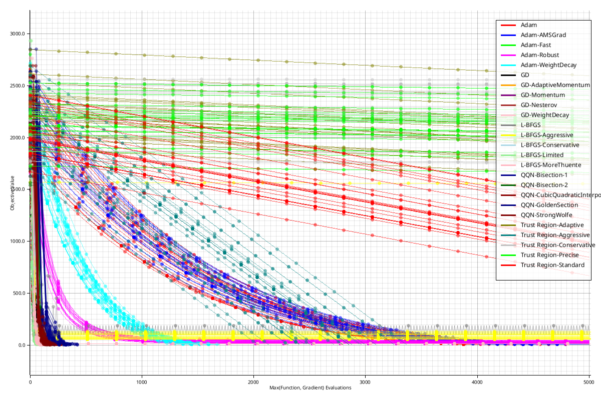
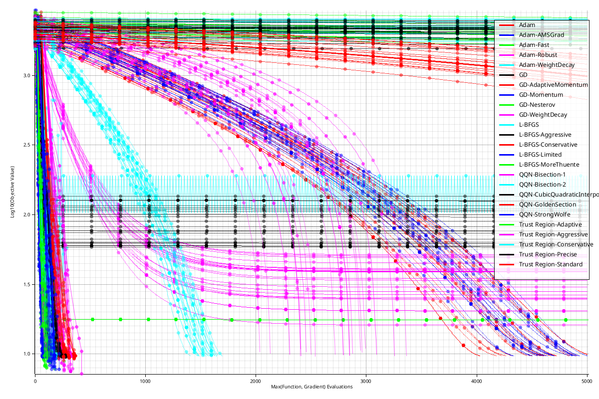

**Figure:** Convergence plots for Rosenbrock_10D showing objective value vs iterations.
Left: Linear scale, Right: Log scale for better visualization of convergence behavior.

**Data:** [Linear scale data (CSV)](data/Rosenbrock_10D_data.csv) | [Log scale data (CSV)](data/Rosenbrock_10D_log_data.csv)

## Problem: Michalewicz_2D_m10

**Family:** Michalewicz
**Dimension:** 2
**Success Threshold:** -9.960e-1
**Total Runs:** 500
**Detailed Analysis:** [View comprehensive problem analysis](reports/problem_analysis_Michalewicz_2D_m10.md)

### Performance Summary
<table style="border-collapse: collapse; width: 100%; margin: 20px 0;">
<tr style="background-color: #f2f2f2;">
<th style="border: 1px solid #ddd; padding: 8px; text-align: center;">Rank</th>
<th style="border: 1px solid #ddd; padding: 8px; text-align: center;">Optimizer</th>
<th style="border: 1px solid #ddd; padding: 8px; text-align: center;">Mean Final Value (All/Success/Fail)</th>
<th style="border: 1px solid #ddd; padding: 8px; text-align: center;">Std Dev</th>
<th style="border: 1px solid #ddd; padding: 8px; text-align: center;">Best Value</th>
<th style="border: 1px solid #ddd; padding: 8px; text-align: center;">Worst Value</th>
<th style="border: 1px solid #ddd; padding: 8px; text-align: center;">Mean Function Evals (All/Success/Fail)</th>
<th style="border: 1px solid #ddd; padding: 8px; text-align: center;">Mean Gradient Evals (All/Success/Fail)</th>
<th style="border: 1px solid #ddd; padding: 8px; text-align: center;">Success Rate</th>
<th style="border: 1px solid #ddd; padding: 8px; text-align: center;">Mean Time (s)</th>
</tr>
<tr style="background-color: #d4edda; font-weight: bold;">
<td style="border: 1px solid #ddd; padding: 8px; text-align: center;">1</td>
<td style="border: 1px solid #ddd; padding: 8px; text-align: center;"><a href="reports/detailed_Michalewicz_2D_m10_Adam.md" title="Click for detailed analysis">Adam</a></td>
<td style="border: 1px solid #ddd; padding: 8px; text-align: center;">-4.98e-1 / -9.97e-1 / -1.89e-9</td>
<td style="border: 1px solid #ddd; padding: 8px; text-align: center;">4.98e-1</td>
<td style="border: 1px solid #ddd; padding: 8px; text-align: center;">-9.97e-1</td>
<td style="border: 1px solid #ddd; padding: 8px; text-align: center;">-2.05e-12</td>
<td style="border: 1px solid #ddd; padding: 8px; text-align: center;">1642.0 / 782.0 / 2502.0</td>
<td style="border: 1px solid #ddd; padding: 8px; text-align: center;">1642.0 / 782.0 / 2502.0</td>
<td style="border: 1px solid #ddd; padding: 8px; text-align: center;">50.0%</td>
<td style="border: 1px solid #ddd; padding: 8px; text-align: center;">0.032</td>
</tr>
<tr style="background-color: #fff3cd;">
<td style="border: 1px solid #ddd; padding: 8px; text-align: center;">2</td>
<td style="border: 1px solid #ddd; padding: 8px; text-align: center;"><a href="reports/detailed_Michalewicz_2D_m10_Adam-Fast.md" title="Click for detailed analysis">Adam-Fast</a></td>
<td style="border: 1px solid #ddd; padding: 8px; text-align: center;">-5.36e-1 / -9.98e-1 / -1.20e-1</td>
<td style="border: 1px solid #ddd; padding: 8px; text-align: center;">4.86e-1</td>
<td style="border: 1px solid #ddd; padding: 8px; text-align: center;">-1.00e0</td>
<td style="border: 1px solid #ddd; padding: 8px; text-align: center;">-4.63e-13</td>
<td style="border: 1px solid #ddd; padding: 8px; text-align: center;">1058.0 / 408.0 / 1491.4</td>
<td style="border: 1px solid #ddd; padding: 8px; text-align: center;">1057.9 / 408.0 / 1491.2</td>
<td style="border: 1px solid #ddd; padding: 8px; text-align: center;">40.0%</td>
<td style="border: 1px solid #ddd; padding: 8px; text-align: center;">0.021</td>
</tr>
<tr style="">
<td style="border: 1px solid #ddd; padding: 8px; text-align: center;">3</td>
<td style="border: 1px solid #ddd; padding: 8px; text-align: center;"><a href="reports/detailed_Michalewicz_2D_m10_Adam-AMSGrad.md" title="Click for detailed analysis">Adam-AMSGrad</a></td>
<td style="border: 1px solid #ddd; padding: 8px; text-align: center;">-2.99e-1 / -9.96e-1 / -1.20e-7</td>
<td style="border: 1px solid #ddd; padding: 8px; text-align: center;">4.57e-1</td>
<td style="border: 1px solid #ddd; padding: 8px; text-align: center;">-9.96e-1</td>
<td style="border: 1px solid #ddd; padding: 8px; text-align: center;">-1.30e-12</td>
<td style="border: 1px solid #ddd; padding: 8px; text-align: center;">192.4 / 611.0 / 13.0</td>
<td style="border: 1px solid #ddd; padding: 8px; text-align: center;">191.7 / 611.0 / 12.0</td>
<td style="border: 1px solid #ddd; padding: 8px; text-align: center;">30.0%</td>
<td style="border: 1px solid #ddd; padding: 8px; text-align: center;">0.004</td>
</tr>
<tr style="">
<td style="border: 1px solid #ddd; padding: 8px; text-align: center;">4</td>
<td style="border: 1px solid #ddd; padding: 8px; text-align: center;"><a href="reports/detailed_Michalewicz_2D_m10_L-BFGS-Limited.md" title="Click for detailed analysis">L-BFGS-Limited</a></td>
<td style="border: 1px solid #ddd; padding: 8px; text-align: center;">-2.50e-1 / -9.98e-1 / -4.12e-9</td>
<td style="border: 1px solid #ddd; padding: 8px; text-align: center;">4.32e-1</td>
<td style="border: 1px solid #ddd; padding: 8px; text-align: center;">-1.00e0</td>
<td style="border: 1px solid #ddd; padding: 8px; text-align: center;">-3.18e-14</td>
<td style="border: 1px solid #ddd; padding: 8px; text-align: center;">466.0 / 1230.2 / 211.3</td>
<td style="border: 1px solid #ddd; padding: 8px; text-align: center;">278.6 / 727.8 / 128.9</td>
<td style="border: 1px solid #ddd; padding: 8px; text-align: center;">25.0%</td>
<td style="border: 1px solid #ddd; padding: 8px; text-align: center;">0.006</td>
</tr>
<tr style="">
<td style="border: 1px solid #ddd; padding: 8px; text-align: center;">5</td>
<td style="border: 1px solid #ddd; padding: 8px; text-align: center;"><a href="reports/detailed_Michalewicz_2D_m10_L-BFGS-MoreThuente.md" title="Click for detailed analysis">L-BFGS-MoreThuente</a></td>
<td style="border: 1px solid #ddd; padding: 8px; text-align: center;">-2.50e-1 / -9.98e-1 / -1.37e-8</td>
<td style="border: 1px solid #ddd; padding: 8px; text-align: center;">4.32e-1</td>
<td style="border: 1px solid #ddd; padding: 8px; text-align: center;">-1.00e0</td>
<td style="border: 1px solid #ddd; padding: 8px; text-align: center;">-4.09e-13</td>
<td style="border: 1px solid #ddd; padding: 8px; text-align: center;">752.4 / 1245.0 / 588.2</td>
<td style="border: 1px solid #ddd; padding: 8px; text-align: center;">538.8 / 891.0 / 421.4</td>
<td style="border: 1px solid #ddd; padding: 8px; text-align: center;">25.0%</td>
<td style="border: 1px solid #ddd; padding: 8px; text-align: center;">0.010</td>
</tr>
<tr style="">
<td style="border: 1px solid #ddd; padding: 8px; text-align: center;">6</td>
<td style="border: 1px solid #ddd; padding: 8px; text-align: center;"><a href="reports/detailed_Michalewicz_2D_m10_GD-Nesterov.md" title="Click for detailed analysis">GD-Nesterov</a></td>
<td style="border: 1px solid #ddd; padding: 8px; text-align: center;">-9.98e-2 / -9.98e-1 / -1.09e-6</td>
<td style="border: 1px solid #ddd; padding: 8px; text-align: center;">2.99e-1</td>
<td style="border: 1px solid #ddd; padding: 8px; text-align: center;">-9.99e-1</td>
<td style="border: 1px solid #ddd; padding: 8px; text-align: center;">-3.87e-13</td>
<td style="border: 1px solid #ddd; padding: 8px; text-align: center;">272.0 / 1028.0 / 188.0</td>
<td style="border: 1px solid #ddd; padding: 8px; text-align: center;">541.9 / 2053.0 / 374.0</td>
<td style="border: 1px solid #ddd; padding: 8px; text-align: center;">10.0%</td>
<td style="border: 1px solid #ddd; padding: 8px; text-align: center;">0.008</td>
</tr>
<tr style="">
<td style="border: 1px solid #ddd; padding: 8px; text-align: center;">7</td>
<td style="border: 1px solid #ddd; padding: 8px; text-align: center;"><a href="reports/detailed_Michalewicz_2D_m10_L-BFGS.md" title="Click for detailed analysis">L-BFGS</a></td>
<td style="border: 1px solid #ddd; padding: 8px; text-align: center;">-1.06e-1 / -9.99e-1 / -9.10e-8</td>
<td style="border: 1px solid #ddd; padding: 8px; text-align: center;">2.99e-1</td>
<td style="border: 1px solid #ddd; padding: 8px; text-align: center;">-1.00e0</td>
<td style="border: 1px solid #ddd; padding: 8px; text-align: center;">-4.83e-13</td>
<td style="border: 1px solid #ddd; padding: 8px; text-align: center;">802.0 / 953.0 / 785.2</td>
<td style="border: 1px solid #ddd; padding: 8px; text-align: center;">642.1 / 761.5 / 628.9</td>
<td style="border: 1px solid #ddd; padding: 8px; text-align: center;">10.0%</td>
<td style="border: 1px solid #ddd; padding: 8px; text-align: center;">0.013</td>
</tr>
<tr style="">
<td style="border: 1px solid #ddd; padding: 8px; text-align: center;">8</td>
<td style="border: 1px solid #ddd; padding: 8px; text-align: center;"><a href="reports/detailed_Michalewicz_2D_m10_GD-AdaptiveMomentum.md" title="Click for detailed analysis">GD-AdaptiveMomentum</a></td>
<td style="border: 1px solid #ddd; padding: 8px; text-align: center;">-5.00e-2 / -9.99e-1 / -9.64e-8</td>
<td style="border: 1px solid #ddd; padding: 8px; text-align: center;">2.18e-1</td>
<td style="border: 1px solid #ddd; padding: 8px; text-align: center;">-9.99e-1</td>
<td style="border: 1px solid #ddd; padding: 8px; text-align: center;">-6.90e-14</td>
<td style="border: 1px solid #ddd; padding: 8px; text-align: center;">29.5 / 533.0 / 3.0</td>
<td style="border: 1px solid #ddd; padding: 8px; text-align: center;">57.0 / 1063.0 / 4.0</td>
<td style="border: 1px solid #ddd; padding: 8px; text-align: center;">5.0%</td>
<td style="border: 1px solid #ddd; padding: 8px; text-align: center;">0.001</td>
</tr>
<tr style="">
<td style="border: 1px solid #ddd; padding: 8px; text-align: center;">9</td>
<td style="border: 1px solid #ddd; padding: 8px; text-align: center;"><a href="reports/detailed_Michalewicz_2D_m10_Trust_Region-Standard.md" title="Click for detailed analysis">Trust Region-Standard</a></td>
<td style="border: 1px solid #ddd; padding: 8px; text-align: center;">-6.09e-7 / - / -6.09e-7</td>
<td style="border: 1px solid #ddd; padding: 8px; text-align: center;">2.15e-6</td>
<td style="border: 1px solid #ddd; padding: 8px; text-align: center;">-9.91e-6</td>
<td style="border: 1px solid #ddd; padding: 8px; text-align: center;">-1.36e-13</td>
<td style="border: 1px solid #ddd; padding: 8px; text-align: center;">4.2 / - / 4.2</td>
<td style="border: 1px solid #ddd; padding: 8px; text-align: center;">4.0 / - / 4.0</td>
<td style="border: 1px solid #ddd; padding: 8px; text-align: center;">0.0%</td>
<td style="border: 1px solid #ddd; padding: 8px; text-align: center;">0.000</td>
</tr>
<tr style="">
<td style="border: 1px solid #ddd; padding: 8px; text-align: center;">10</td>
<td style="border: 1px solid #ddd; padding: 8px; text-align: center;"><a href="reports/detailed_Michalewicz_2D_m10_Trust_Region-Aggressive.md" title="Click for detailed analysis">Trust Region-Aggressive</a></td>
<td style="border: 1px solid #ddd; padding: 8px; text-align: center;">-5.33e-7 / - / -5.33e-7</td>
<td style="border: 1px solid #ddd; padding: 8px; text-align: center;">1.94e-6</td>
<td style="border: 1px solid #ddd; padding: 8px; text-align: center;">-8.89e-6</td>
<td style="border: 1px solid #ddd; padding: 8px; text-align: center;">-6.50e-14</td>
<td style="border: 1px solid #ddd; padding: 8px; text-align: center;">4.2 / - / 4.2</td>
<td style="border: 1px solid #ddd; padding: 8px; text-align: center;">4.0 / - / 4.0</td>
<td style="border: 1px solid #ddd; padding: 8px; text-align: center;">0.0%</td>
<td style="border: 1px solid #ddd; padding: 8px; text-align: center;">0.000</td>
</tr>
<tr style="">
<td style="border: 1px solid #ddd; padding: 8px; text-align: center;">11</td>
<td style="border: 1px solid #ddd; padding: 8px; text-align: center;"><a href="reports/detailed_Michalewicz_2D_m10_Trust_Region-Conservative.md" title="Click for detailed analysis">Trust Region-Conservative</a></td>
<td style="border: 1px solid #ddd; padding: 8px; text-align: center;">-8.81e-7 / - / -8.81e-7</td>
<td style="border: 1px solid #ddd; padding: 8px; text-align: center;">3.16e-6</td>
<td style="border: 1px solid #ddd; padding: 8px; text-align: center;">-1.46e-5</td>
<td style="border: 1px solid #ddd; padding: 8px; text-align: center;">-1.54e-13</td>
<td style="border: 1px solid #ddd; padding: 8px; text-align: center;">4.3 / - / 4.3</td>
<td style="border: 1px solid #ddd; padding: 8px; text-align: center;">4.0 / - / 4.0</td>
<td style="border: 1px solid #ddd; padding: 8px; text-align: center;">0.0%</td>
<td style="border: 1px solid #ddd; padding: 8px; text-align: center;">0.000</td>
</tr>
<tr style="">
<td style="border: 1px solid #ddd; padding: 8px; text-align: center;">12</td>
<td style="border: 1px solid #ddd; padding: 8px; text-align: center;"><a href="reports/detailed_Michalewicz_2D_m10_Trust_Region-Adaptive.md" title="Click for detailed analysis">Trust Region-Adaptive</a></td>
<td style="border: 1px solid #ddd; padding: 8px; text-align: center;">-4.40e-7 / - / -4.40e-7</td>
<td style="border: 1px solid #ddd; padding: 8px; text-align: center;">7.97e-7</td>
<td style="border: 1px solid #ddd; padding: 8px; text-align: center;">-2.59e-6</td>
<td style="border: 1px solid #ddd; padding: 8px; text-align: center;">-3.25e-14</td>
<td style="border: 1px solid #ddd; padding: 8px; text-align: center;">4.3 / - / 4.3</td>
<td style="border: 1px solid #ddd; padding: 8px; text-align: center;">4.0 / - / 4.0</td>
<td style="border: 1px solid #ddd; padding: 8px; text-align: center;">0.0%</td>
<td style="border: 1px solid #ddd; padding: 8px; text-align: center;">0.000</td>
</tr>
<tr style="">
<td style="border: 1px solid #ddd; padding: 8px; text-align: center;">13</td>
<td style="border: 1px solid #ddd; padding: 8px; text-align: center;"><a href="reports/detailed_Michalewicz_2D_m10_Trust_Region-Precise.md" title="Click for detailed analysis">Trust Region-Precise</a></td>
<td style="border: 1px solid #ddd; padding: 8px; text-align: center;">-7.80e-7 / - / -7.80e-7</td>
<td style="border: 1px solid #ddd; padding: 8px; text-align: center;">1.28e-6</td>
<td style="border: 1px solid #ddd; padding: 8px; text-align: center;">-4.71e-6</td>
<td style="border: 1px solid #ddd; padding: 8px; text-align: center;">-4.65e-14</td>
<td style="border: 1px solid #ddd; padding: 8px; text-align: center;">4.5 / - / 4.5</td>
<td style="border: 1px solid #ddd; padding: 8px; text-align: center;">4.0 / - / 4.0</td>
<td style="border: 1px solid #ddd; padding: 8px; text-align: center;">0.0%</td>
<td style="border: 1px solid #ddd; padding: 8px; text-align: center;">0.000</td>
</tr>
<tr style="">
<td style="border: 1px solid #ddd; padding: 8px; text-align: center;">14</td>
<td style="border: 1px solid #ddd; padding: 8px; text-align: center;"><a href="reports/detailed_Michalewicz_2D_m10_Adam-WeightDecay.md" title="Click for detailed analysis">Adam-WeightDecay</a></td>
<td style="border: 1px solid #ddd; padding: 8px; text-align: center;">-6.30e-7 / - / -3.49e-7</td>
<td style="border: 1px solid #ddd; padding: 8px; text-align: center;">1.10e-6</td>
<td style="border: 1px solid #ddd; padding: 8px; text-align: center;">-4.15e-6</td>
<td style="border: 1px solid #ddd; padding: 8px; text-align: center;">-1.93e-13</td>
<td style="border: 1px solid #ddd; padding: 8px; text-align: center;">13.0 / - / 13.0</td>
<td style="border: 1px solid #ddd; padding: 8px; text-align: center;">12.0 / - / 12.0</td>
<td style="border: 1px solid #ddd; padding: 8px; text-align: center;">0.0%</td>
<td style="border: 1px solid #ddd; padding: 8px; text-align: center;">0.000</td>
</tr>
<tr style="">
<td style="border: 1px solid #ddd; padding: 8px; text-align: center;">15</td>
<td style="border: 1px solid #ddd; padding: 8px; text-align: center;"><a href="reports/detailed_Michalewicz_2D_m10_Adam-Robust.md" title="Click for detailed analysis">Adam-Robust</a></td>
<td style="border: 1px solid #ddd; padding: 8px; text-align: center;">-6.43e-7 / - / -3.65e-7</td>
<td style="border: 1px solid #ddd; padding: 8px; text-align: center;">1.60e-6</td>
<td style="border: 1px solid #ddd; padding: 8px; text-align: center;">-5.48e-6</td>
<td style="border: 1px solid #ddd; padding: 8px; text-align: center;">-2.33e-13</td>
<td style="border: 1px solid #ddd; padding: 8px; text-align: center;">13.0 / - / 13.0</td>
<td style="border: 1px solid #ddd; padding: 8px; text-align: center;">12.0 / - / 12.0</td>
<td style="border: 1px solid #ddd; padding: 8px; text-align: center;">0.0%</td>
<td style="border: 1px solid #ddd; padding: 8px; text-align: center;">0.000</td>
</tr>
<tr style="">
<td style="border: 1px solid #ddd; padding: 8px; text-align: center;">16</td>
<td style="border: 1px solid #ddd; padding: 8px; text-align: center;"><a href="reports/detailed_Michalewicz_2D_m10_QQN-CubicQuadraticInterpolation.md" title="Click for detailed analysis">QQN-CubicQuadraticInterpolation</a></td>
<td style="border: 1px solid #ddd; padding: 8px; text-align: center;">-5.13e-7 / - / -5.13e-7</td>
<td style="border: 1px solid #ddd; padding: 8px; text-align: center;">2.19e-6</td>
<td style="border: 1px solid #ddd; padding: 8px; text-align: center;">-1.00e-5</td>
<td style="border: 1px solid #ddd; padding: 8px; text-align: center;">-4.20e-14</td>
<td style="border: 1px solid #ddd; padding: 8px; text-align: center;">19.1 / - / 19.1</td>
<td style="border: 1px solid #ddd; padding: 8px; text-align: center;">22.0 / - / 22.0</td>
<td style="border: 1px solid #ddd; padding: 8px; text-align: center;">0.0%</td>
<td style="border: 1px solid #ddd; padding: 8px; text-align: center;">0.001</td>
</tr>
<tr style="">
<td style="border: 1px solid #ddd; padding: 8px; text-align: center;">17</td>
<td style="border: 1px solid #ddd; padding: 8px; text-align: center;"><a href="reports/detailed_Michalewicz_2D_m10_GD-Momentum.md" title="Click for detailed analysis">GD-Momentum</a></td>
<td style="border: 1px solid #ddd; padding: 8px; text-align: center;">-4.93e-2 / - / -3.25e-2</td>
<td style="border: 1px solid #ddd; padding: 8px; text-align: center;">2.15e-1</td>
<td style="border: 1px solid #ddd; padding: 8px; text-align: center;">-9.86e-1</td>
<td style="border: 1px solid #ddd; padding: 8px; text-align: center;">-6.08e-14</td>
<td style="border: 1px solid #ddd; padding: 8px; text-align: center;">42.9 / - / 42.9</td>
<td style="border: 1px solid #ddd; padding: 8px; text-align: center;">83.7 / - / 83.7</td>
<td style="border: 1px solid #ddd; padding: 8px; text-align: center;">0.0%</td>
<td style="border: 1px solid #ddd; padding: 8px; text-align: center;">0.001</td>
</tr>
<tr style="">
<td style="border: 1px solid #ddd; padding: 8px; text-align: center;">18</td>
<td style="border: 1px solid #ddd; padding: 8px; text-align: center;"><a href="reports/detailed_Michalewicz_2D_m10_GD.md" title="Click for detailed analysis">GD</a></td>
<td style="border: 1px solid #ddd; padding: 8px; text-align: center;">-1.16e-6 / - / -1.16e-6</td>
<td style="border: 1px solid #ddd; padding: 8px; text-align: center;">2.04e-6</td>
<td style="border: 1px solid #ddd; padding: 8px; text-align: center;">-7.38e-6</td>
<td style="border: 1px solid #ddd; padding: 8px; text-align: center;">-3.67e-14</td>
<td style="border: 1px solid #ddd; padding: 8px; text-align: center;">252.8 / - / 252.8</td>
<td style="border: 1px solid #ddd; padding: 8px; text-align: center;">503.5 / - / 503.5</td>
<td style="border: 1px solid #ddd; padding: 8px; text-align: center;">0.0%</td>
<td style="border: 1px solid #ddd; padding: 8px; text-align: center;">0.006</td>
</tr>
<tr style="">
<td style="border: 1px solid #ddd; padding: 8px; text-align: center;">19</td>
<td style="border: 1px solid #ddd; padding: 8px; text-align: center;"><a href="reports/detailed_Michalewicz_2D_m10_GD-WeightDecay.md" title="Click for detailed analysis">GD-WeightDecay</a></td>
<td style="border: 1px solid #ddd; padding: 8px; text-align: center;">-3.24e-6 / - / -3.24e-6</td>
<td style="border: 1px solid #ddd; padding: 8px; text-align: center;">7.04e-6</td>
<td style="border: 1px solid #ddd; padding: 8px; text-align: center;">-2.45e-5</td>
<td style="border: 1px solid #ddd; padding: 8px; text-align: center;">-3.78e-13</td>
<td style="border: 1px solid #ddd; padding: 8px; text-align: center;">423.0 / - / 423.0</td>
<td style="border: 1px solid #ddd; padding: 8px; text-align: center;">842.5 / - / 842.5</td>
<td style="border: 1px solid #ddd; padding: 8px; text-align: center;">0.0%</td>
<td style="border: 1px solid #ddd; padding: 8px; text-align: center;">0.013</td>
</tr>
<tr style="">
<td style="border: 1px solid #ddd; padding: 8px; text-align: center;">20</td>
<td style="border: 1px solid #ddd; padding: 8px; text-align: center;"><a href="reports/detailed_Michalewicz_2D_m10_L-BFGS-Conservative.md" title="Click for detailed analysis">L-BFGS-Conservative</a></td>
<td style="border: 1px solid #ddd; padding: 8px; text-align: center;">-7.20e-7 / - / -7.20e-7</td>
<td style="border: 1px solid #ddd; padding: 8px; text-align: center;">2.35e-6</td>
<td style="border: 1px solid #ddd; padding: 8px; text-align: center;">-1.07e-5</td>
<td style="border: 1px solid #ddd; padding: 8px; text-align: center;">-2.95e-14</td>
<td style="border: 1px solid #ddd; padding: 8px; text-align: center;">838.7 / - / 838.7</td>
<td style="border: 1px solid #ddd; padding: 8px; text-align: center;">671.6 / - / 671.6</td>
<td style="border: 1px solid #ddd; padding: 8px; text-align: center;">0.0%</td>
<td style="border: 1px solid #ddd; padding: 8px; text-align: center;">0.014</td>
</tr>
<tr style="">
<td style="border: 1px solid #ddd; padding: 8px; text-align: center;">21</td>
<td style="border: 1px solid #ddd; padding: 8px; text-align: center;"><a href="reports/detailed_Michalewicz_2D_m10_QQN-Bisection-2.md" title="Click for detailed analysis">QQN-Bisection-2</a></td>
<td style="border: 1px solid #ddd; padding: 8px; text-align: center;">-4.01e-2 / - / -4.01e-2</td>
<td style="border: 1px solid #ddd; padding: 8px; text-align: center;">1.75e-1</td>
<td style="border: 1px solid #ddd; padding: 8px; text-align: center;">-8.01e-1</td>
<td style="border: 1px solid #ddd; padding: 8px; text-align: center;">-4.27e-14</td>
<td style="border: 1px solid #ddd; padding: 8px; text-align: center;">1074.5 / - / 1074.5</td>
<td style="border: 1px solid #ddd; padding: 8px; text-align: center;">516.4 / - / 516.4</td>
<td style="border: 1px solid #ddd; padding: 8px; text-align: center;">0.0%</td>
<td style="border: 1px solid #ddd; padding: 8px; text-align: center;">0.027</td>
</tr>
<tr style="">
<td style="border: 1px solid #ddd; padding: 8px; text-align: center;">22</td>
<td style="border: 1px solid #ddd; padding: 8px; text-align: center;"><a href="reports/detailed_Michalewicz_2D_m10_L-BFGS-Aggressive.md" title="Click for detailed analysis">L-BFGS-Aggressive</a></td>
<td style="border: 1px solid #ddd; padding: 8px; text-align: center;">-8.97e-2 / - / -8.97e-2</td>
<td style="border: 1px solid #ddd; padding: 8px; text-align: center;">2.69e-1</td>
<td style="border: 1px solid #ddd; padding: 8px; text-align: center;">-8.97e-1</td>
<td style="border: 1px solid #ddd; padding: 8px; text-align: center;">-2.07e-13</td>
<td style="border: 1px solid #ddd; padding: 8px; text-align: center;">1145.5 / - / 1145.5</td>
<td style="border: 1px solid #ddd; padding: 8px; text-align: center;">610.5 / - / 610.5</td>
<td style="border: 1px solid #ddd; padding: 8px; text-align: center;">0.0%</td>
<td style="border: 1px solid #ddd; padding: 8px; text-align: center;">0.015</td>
</tr>
<tr style="">
<td style="border: 1px solid #ddd; padding: 8px; text-align: center;">23</td>
<td style="border: 1px solid #ddd; padding: 8px; text-align: center;"><a href="reports/detailed_Michalewicz_2D_m10_QQN-GoldenSection.md" title="Click for detailed analysis">QQN-GoldenSection</a></td>
<td style="border: 1px solid #ddd; padding: 8px; text-align: center;">-7.52e-7 / - / -7.52e-7</td>
<td style="border: 1px solid #ddd; padding: 8px; text-align: center;">2.11e-6</td>
<td style="border: 1px solid #ddd; padding: 8px; text-align: center;">-9.60e-6</td>
<td style="border: 1px solid #ddd; padding: 8px; text-align: center;">-8.52e-13</td>
<td style="border: 1px solid #ddd; padding: 8px; text-align: center;">1573.8 / - / 1573.8</td>
<td style="border: 1px solid #ddd; padding: 8px; text-align: center;">188.7 / - / 188.7</td>
<td style="border: 1px solid #ddd; padding: 8px; text-align: center;">0.0%</td>
<td style="border: 1px solid #ddd; padding: 8px; text-align: center;">0.026</td>
</tr>
<tr style="">
<td style="border: 1px solid #ddd; padding: 8px; text-align: center;">24</td>
<td style="border: 1px solid #ddd; padding: 8px; text-align: center;"><a href="reports/detailed_Michalewicz_2D_m10_QQN-StrongWolfe.md" title="Click for detailed analysis">QQN-StrongWolfe</a></td>
<td style="border: 1px solid #ddd; padding: 8px; text-align: center;">-4.01e-2 / - / -4.01e-2</td>
<td style="border: 1px solid #ddd; padding: 8px; text-align: center;">1.75e-1</td>
<td style="border: 1px solid #ddd; padding: 8px; text-align: center;">-8.01e-1</td>
<td style="border: 1px solid #ddd; padding: 8px; text-align: center;">-8.45e-13</td>
<td style="border: 1px solid #ddd; padding: 8px; text-align: center;">1192.1 / - / 1192.1</td>
<td style="border: 1px solid #ddd; padding: 8px; text-align: center;">822.1 / - / 822.1</td>
<td style="border: 1px solid #ddd; padding: 8px; text-align: center;">0.0%</td>
<td style="border: 1px solid #ddd; padding: 8px; text-align: center;">0.031</td>
</tr>
<tr style="">
<td style="border: 1px solid #ddd; padding: 8px; text-align: center;">25</td>
<td style="border: 1px solid #ddd; padding: 8px; text-align: center;"><a href="reports/detailed_Michalewicz_2D_m10_QQN-Bisection-1.md" title="Click for detailed analysis">QQN-Bisection-1</a></td>
<td style="border: 1px solid #ddd; padding: 8px; text-align: center;">-1.99e-2 / - / -1.99e-2</td>
<td style="border: 1px solid #ddd; padding: 8px; text-align: center;">8.69e-2</td>
<td style="border: 1px solid #ddd; padding: 8px; text-align: center;">-3.99e-1</td>
<td style="border: 1px solid #ddd; padding: 8px; text-align: center;">-1.17e-13</td>
<td style="border: 1px solid #ddd; padding: 8px; text-align: center;">1278.7 / - / 1278.7</td>
<td style="border: 1px solid #ddd; padding: 8px; text-align: center;">1584.7 / - / 1584.7</td>
<td style="border: 1px solid #ddd; padding: 8px; text-align: center;">0.0%</td>
<td style="border: 1px solid #ddd; padding: 8px; text-align: center;">0.036</td>
</tr>
</table>

### Convergence Plots

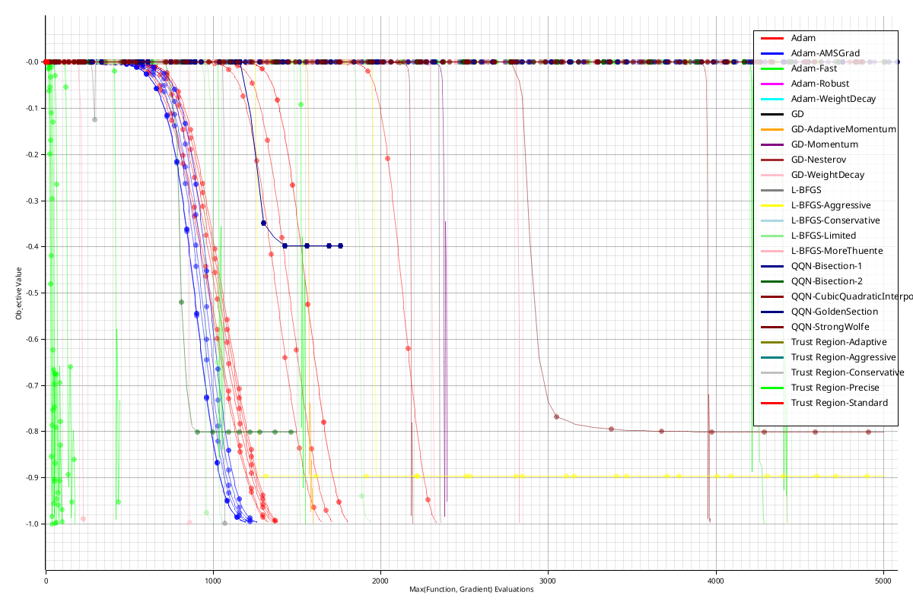

**Figure:** Convergence plots for Michalewicz_2D_m10 showing objective value vs iterations.
Left: Linear scale, Right: Log scale for better visualization of convergence behavior.

**Data:** [Linear scale data (CSV)](data/Michalewicz_2D_m10_data.csv) | [Log scale data (CSV)](data/Michalewicz_2D_m10_log_data.csv)

## Problem: Michalewicz_5D_m10

**Family:** Michalewicz
**Dimension:** 5
**Success Threshold:** -2.690e0
**Total Runs:** 500
**Detailed Analysis:** [View comprehensive problem analysis](reports/problem_analysis_Michalewicz_5D_m10.md)

### Performance Summary
<table style="border-collapse: collapse; width: 100%; margin: 20px 0;">
<tr style="background-color: #f2f2f2;">
<th style="border: 1px solid #ddd; padding: 8px; text-align: center;">Rank</th>
<th style="border: 1px solid #ddd; padding: 8px; text-align: center;">Optimizer</th>
<th style="border: 1px solid #ddd; padding: 8px; text-align: center;">Mean Final Value (All/Success/Fail)</th>
<th style="border: 1px solid #ddd; padding: 8px; text-align: center;">Std Dev</th>
<th style="border: 1px solid #ddd; padding: 8px; text-align: center;">Best Value</th>
<th style="border: 1px solid #ddd; padding: 8px; text-align: center;">Worst Value</th>
<th style="border: 1px solid #ddd; padding: 8px; text-align: center;">Mean Function Evals (All/Success/Fail)</th>
<th style="border: 1px solid #ddd; padding: 8px; text-align: center;">Mean Gradient Evals (All/Success/Fail)</th>
<th style="border: 1px solid #ddd; padding: 8px; text-align: center;">Success Rate</th>
<th style="border: 1px solid #ddd; padding: 8px; text-align: center;">Mean Time (s)</th>
</tr>
<tr style="background-color: #d4edda; font-weight: bold;">
<td style="border: 1px solid #ddd; padding: 8px; text-align: center;">1</td>
<td style="border: 1px solid #ddd; padding: 8px; text-align: center;"><a href="reports/detailed_Michalewicz_5D_m10_Adam.md" title="Click for detailed analysis">Adam</a></td>
<td style="border: 1px solid #ddd; padding: 8px; text-align: center;">-2.46e0 / -2.69e0 / -1.51e0</td>
<td style="border: 1px solid #ddd; padding: 8px; text-align: center;">5.04e-1</td>
<td style="border: 1px solid #ddd; padding: 8px; text-align: center;">-2.71e0</td>
<td style="border: 1px solid #ddd; padding: 8px; text-align: center;">-8.40e-1</td>
<td style="border: 1px solid #ddd; padding: 8px; text-align: center;">474.6 / 496.1 / 388.5</td>
<td style="border: 1px solid #ddd; padding: 8px; text-align: center;">474.4 / 496.1 / 387.5</td>
<td style="border: 1px solid #ddd; padding: 8px; text-align: center;">80.0%</td>
<td style="border: 1px solid #ddd; padding: 8px; text-align: center;">0.010</td>
</tr>
<tr style="background-color: #fff3cd;">
<td style="border: 1px solid #ddd; padding: 8px; text-align: center;">2</td>
<td style="border: 1px solid #ddd; padding: 8px; text-align: center;"><a href="reports/detailed_Michalewicz_5D_m10_Adam-Fast.md" title="Click for detailed analysis">Adam-Fast</a></td>
<td style="border: 1px solid #ddd; padding: 8px; text-align: center;">-2.63e0 / -2.81e0 / -2.25e0</td>
<td style="border: 1px solid #ddd; padding: 8px; text-align: center;">4.15e-1</td>
<td style="border: 1px solid #ddd; padding: 8px; text-align: center;">-3.29e0</td>
<td style="border: 1px solid #ddd; padding: 8px; text-align: center;">-1.73e0</td>
<td style="border: 1px solid #ddd; padding: 8px; text-align: center;">70.8 / 61.2 / 88.7</td>
<td style="border: 1px solid #ddd; padding: 8px; text-align: center;">70.5 / 61.2 / 87.7</td>
<td style="border: 1px solid #ddd; padding: 8px; text-align: center;">65.0%</td>
<td style="border: 1px solid #ddd; padding: 8px; text-align: center;">0.002</td>
</tr>
<tr style="">
<td style="border: 1px solid #ddd; padding: 8px; text-align: center;">3</td>
<td style="border: 1px solid #ddd; padding: 8px; text-align: center;"><a href="reports/detailed_Michalewicz_5D_m10_Adam-AMSGrad.md" title="Click for detailed analysis">Adam-AMSGrad</a></td>
<td style="border: 1px solid #ddd; padding: 8px; text-align: center;">-2.17e0 / -2.69e0 / -1.54e0</td>
<td style="border: 1px solid #ddd; padding: 8px; text-align: center;">6.28e-1</td>
<td style="border: 1px solid #ddd; padding: 8px; text-align: center;">-2.71e0</td>
<td style="border: 1px solid #ddd; padding: 8px; text-align: center;">-8.39e-1</td>
<td style="border: 1px solid #ddd; padding: 8px; text-align: center;">439.6 / 448.8 / 428.3</td>
<td style="border: 1px solid #ddd; padding: 8px; text-align: center;">439.1 / 448.8 / 427.3</td>
<td style="border: 1px solid #ddd; padding: 8px; text-align: center;">55.0%</td>
<td style="border: 1px solid #ddd; padding: 8px; text-align: center;">0.011</td>
</tr>
<tr style="">
<td style="border: 1px solid #ddd; padding: 8px; text-align: center;">4</td>
<td style="border: 1px solid #ddd; padding: 8px; text-align: center;"><a href="reports/detailed_Michalewicz_5D_m10_GD.md" title="Click for detailed analysis">GD</a></td>
<td style="border: 1px solid #ddd; padding: 8px; text-align: center;">-2.00e0 / -2.69e0 / -1.43e0</td>
<td style="border: 1px solid #ddd; padding: 8px; text-align: center;">7.11e-1</td>
<td style="border: 1px solid #ddd; padding: 8px; text-align: center;">-2.69e0</td>
<td style="border: 1px solid #ddd; padding: 8px; text-align: center;">-8.39e-1</td>
<td style="border: 1px solid #ddd; padding: 8px; text-align: center;">738.0 / 262.8 / 1126.7</td>
<td style="border: 1px solid #ddd; padding: 8px; text-align: center;">1473.2 / 522.6 / 2251.1</td>
<td style="border: 1px solid #ddd; padding: 8px; text-align: center;">45.0%</td>
<td style="border: 1px solid #ddd; padding: 8px; text-align: center;">0.019</td>
</tr>
<tr style="">
<td style="border: 1px solid #ddd; padding: 8px; text-align: center;">5</td>
<td style="border: 1px solid #ddd; padding: 8px; text-align: center;"><a href="reports/detailed_Michalewicz_5D_m10_QQN-Bisection-2.md" title="Click for detailed analysis">QQN-Bisection-2</a></td>
<td style="border: 1px solid #ddd; padding: 8px; text-align: center;">-1.78e0 / -2.72e0 / -1.23e0</td>
<td style="border: 1px solid #ddd; padding: 8px; text-align: center;">8.34e-1</td>
<td style="border: 1px solid #ddd; padding: 8px; text-align: center;">-2.85e0</td>
<td style="border: 1px solid #ddd; padding: 8px; text-align: center;">-2.09e-4</td>
<td style="border: 1px solid #ddd; padding: 8px; text-align: center;">1315.8 / 1795.6 / 1057.5</td>
<td style="border: 1px solid #ddd; padding: 8px; text-align: center;">669.9 / 921.0 / 534.7</td>
<td style="border: 1px solid #ddd; padding: 8px; text-align: center;">35.0%</td>
<td style="border: 1px solid #ddd; padding: 8px; text-align: center;">0.032</td>
</tr>
<tr style="">
<td style="border: 1px solid #ddd; padding: 8px; text-align: center;">6</td>
<td style="border: 1px solid #ddd; padding: 8px; text-align: center;"><a href="reports/detailed_Michalewicz_5D_m10_L-BFGS-Conservative.md" title="Click for detailed analysis">L-BFGS-Conservative</a></td>
<td style="border: 1px solid #ddd; padding: 8px; text-align: center;">-1.78e0 / -2.69e0 / -1.38e0</td>
<td style="border: 1px solid #ddd; padding: 8px; text-align: center;">7.13e-1</td>
<td style="border: 1px solid #ddd; padding: 8px; text-align: center;">-2.69e0</td>
<td style="border: 1px solid #ddd; padding: 8px; text-align: center;">-8.39e-1</td>
<td style="border: 1px solid #ddd; padding: 8px; text-align: center;">1302.2 / 834.0 / 1502.9</td>
<td style="border: 1px solid #ddd; padding: 8px; text-align: center;">793.8 / 365.8 / 977.1</td>
<td style="border: 1px solid #ddd; padding: 8px; text-align: center;">30.0%</td>
<td style="border: 1px solid #ddd; padding: 8px; text-align: center;">0.027</td>
</tr>
<tr style="">
<td style="border: 1px solid #ddd; padding: 8px; text-align: center;">7</td>
<td style="border: 1px solid #ddd; padding: 8px; text-align: center;"><a href="reports/detailed_Michalewicz_5D_m10_QQN-StrongWolfe.md" title="Click for detailed analysis">QQN-StrongWolfe</a></td>
<td style="border: 1px solid #ddd; padding: 8px; text-align: center;">-1.76e0 / -2.71e0 / -1.45e0</td>
<td style="border: 1px solid #ddd; padding: 8px; text-align: center;">7.40e-1</td>
<td style="border: 1px solid #ddd; padding: 8px; text-align: center;">-2.79e0</td>
<td style="border: 1px solid #ddd; padding: 8px; text-align: center;">-5.69e-5</td>
<td style="border: 1px solid #ddd; padding: 8px; text-align: center;">1288.2 / 784.6 / 1456.1</td>
<td style="border: 1px solid #ddd; padding: 8px; text-align: center;">1078.4 / 657.2 / 1218.8</td>
<td style="border: 1px solid #ddd; padding: 8px; text-align: center;">25.0%</td>
<td style="border: 1px solid #ddd; padding: 8px; text-align: center;">0.041</td>
</tr>
<tr style="">
<td style="border: 1px solid #ddd; padding: 8px; text-align: center;">8</td>
<td style="border: 1px solid #ddd; padding: 8px; text-align: center;"><a href="reports/detailed_Michalewicz_5D_m10_QQN-Bisection-1.md" title="Click for detailed analysis">QQN-Bisection-1</a></td>
<td style="border: 1px solid #ddd; padding: 8px; text-align: center;">-1.78e0 / -2.71e0 / -1.54e0</td>
<td style="border: 1px solid #ddd; padding: 8px; text-align: center;">6.73e-1</td>
<td style="border: 1px solid #ddd; padding: 8px; text-align: center;">-2.74e0</td>
<td style="border: 1px solid #ddd; padding: 8px; text-align: center;">-8.39e-1</td>
<td style="border: 1px solid #ddd; padding: 8px; text-align: center;">1432.2 / 784.0 / 1594.2</td>
<td style="border: 1px solid #ddd; padding: 8px; text-align: center;">1588.6 / 898.8 / 1761.1</td>
<td style="border: 1px solid #ddd; padding: 8px; text-align: center;">20.0%</td>
<td style="border: 1px solid #ddd; padding: 8px; text-align: center;">0.036</td>
</tr>
<tr style="">
<td style="border: 1px solid #ddd; padding: 8px; text-align: center;">9</td>
<td style="border: 1px solid #ddd; padding: 8px; text-align: center;"><a href="reports/detailed_Michalewicz_5D_m10_Adam-Robust.md" title="Click for detailed analysis">Adam-Robust</a></td>
<td style="border: 1px solid #ddd; padding: 8px; text-align: center;">-1.66e0 / -2.69e0 / -1.54e0</td>
<td style="border: 1px solid #ddd; padding: 8px; text-align: center;">7.10e-1</td>
<td style="border: 1px solid #ddd; padding: 8px; text-align: center;">-2.69e0</td>
<td style="border: 1px solid #ddd; padding: 8px; text-align: center;">-8.38e-1</td>
<td style="border: 1px solid #ddd; padding: 8px; text-align: center;">83.1 / 84.0 / 83.0</td>
<td style="border: 1px solid #ddd; padding: 8px; text-align: center;">82.2 / 84.0 / 82.0</td>
<td style="border: 1px solid #ddd; padding: 8px; text-align: center;">10.0%</td>
<td style="border: 1px solid #ddd; padding: 8px; text-align: center;">0.002</td>
</tr>
<tr style="">
<td style="border: 1px solid #ddd; padding: 8px; text-align: center;">10</td>
<td style="border: 1px solid #ddd; padding: 8px; text-align: center;"><a href="reports/detailed_Michalewicz_5D_m10_Adam-WeightDecay.md" title="Click for detailed analysis">Adam-WeightDecay</a></td>
<td style="border: 1px solid #ddd; padding: 8px; text-align: center;">-1.76e0 / -2.69e0 / -1.65e0</td>
<td style="border: 1px solid #ddd; padding: 8px; text-align: center;">5.77e-1</td>
<td style="border: 1px solid #ddd; padding: 8px; text-align: center;">-2.69e0</td>
<td style="border: 1px solid #ddd; padding: 8px; text-align: center;">-8.39e-1</td>
<td style="border: 1px solid #ddd; padding: 8px; text-align: center;">178.5 / 198.0 / 176.3</td>
<td style="border: 1px solid #ddd; padding: 8px; text-align: center;">177.6 / 198.0 / 175.3</td>
<td style="border: 1px solid #ddd; padding: 8px; text-align: center;">10.0%</td>
<td style="border: 1px solid #ddd; padding: 8px; text-align: center;">0.004</td>
</tr>
<tr style="">
<td style="border: 1px solid #ddd; padding: 8px; text-align: center;">11</td>
<td style="border: 1px solid #ddd; padding: 8px; text-align: center;"><a href="reports/detailed_Michalewicz_5D_m10_GD-AdaptiveMomentum.md" title="Click for detailed analysis">GD-AdaptiveMomentum</a></td>
<td style="border: 1px solid #ddd; padding: 8px; text-align: center;">-1.21e0 / -2.69e0 / -1.01e0</td>
<td style="border: 1px solid #ddd; padding: 8px; text-align: center;">5.25e-1</td>
<td style="border: 1px solid #ddd; padding: 8px; text-align: center;">-2.69e0</td>
<td style="border: 1px solid #ddd; padding: 8px; text-align: center;">-8.03e-1</td>
<td style="border: 1px solid #ddd; padding: 8px; text-align: center;">27.8 / 23.0 / 28.1</td>
<td style="border: 1px solid #ddd; padding: 8px; text-align: center;">51.6 / 43.0 / 52.1</td>
<td style="border: 1px solid #ddd; padding: 8px; text-align: center;">5.0%</td>
<td style="border: 1px solid #ddd; padding: 8px; text-align: center;">0.001</td>
</tr>
<tr style="">
<td style="border: 1px solid #ddd; padding: 8px; text-align: center;">12</td>
<td style="border: 1px solid #ddd; padding: 8px; text-align: center;"><a href="reports/detailed_Michalewicz_5D_m10_GD-Momentum.md" title="Click for detailed analysis">GD-Momentum</a></td>
<td style="border: 1px solid #ddd; padding: 8px; text-align: center;">-1.37e0 / -2.69e0 / -1.03e0</td>
<td style="border: 1px solid #ddd; padding: 8px; text-align: center;">6.63e-1</td>
<td style="border: 1px solid #ddd; padding: 8px; text-align: center;">-2.69e0</td>
<td style="border: 1px solid #ddd; padding: 8px; text-align: center;">-7.86e-1</td>
<td style="border: 1px solid #ddd; padding: 8px; text-align: center;">51.9 / 56.0 / 51.7</td>
<td style="border: 1px solid #ddd; padding: 8px; text-align: center;">99.8 / 109.0 / 99.4</td>
<td style="border: 1px solid #ddd; padding: 8px; text-align: center;">5.0%</td>
<td style="border: 1px solid #ddd; padding: 8px; text-align: center;">0.002</td>
</tr>
<tr style="">
<td style="border: 1px solid #ddd; padding: 8px; text-align: center;">13</td>
<td style="border: 1px solid #ddd; padding: 8px; text-align: center;"><a href="reports/detailed_Michalewicz_5D_m10_GD-WeightDecay.md" title="Click for detailed analysis">GD-WeightDecay</a></td>
<td style="border: 1px solid #ddd; padding: 8px; text-align: center;">-1.27e0 / -2.69e0 / -1.16e0</td>
<td style="border: 1px solid #ddd; padding: 8px; text-align: center;">5.20e-1</td>
<td style="border: 1px solid #ddd; padding: 8px; text-align: center;">-2.69e0</td>
<td style="border: 1px solid #ddd; padding: 8px; text-align: center;">-8.10e-1</td>
<td style="border: 1px solid #ddd; padding: 8px; text-align: center;">86.0 / 28.0 / 89.1</td>
<td style="border: 1px solid #ddd; padding: 8px; text-align: center;">168.1 / 53.0 / 174.1</td>
<td style="border: 1px solid #ddd; padding: 8px; text-align: center;">5.0%</td>
<td style="border: 1px solid #ddd; padding: 8px; text-align: center;">0.003</td>
</tr>
<tr style="">
<td style="border: 1px solid #ddd; padding: 8px; text-align: center;">14</td>
<td style="border: 1px solid #ddd; padding: 8px; text-align: center;"><a href="reports/detailed_Michalewicz_5D_m10_GD-Nesterov.md" title="Click for detailed analysis">GD-Nesterov</a></td>
<td style="border: 1px solid #ddd; padding: 8px; text-align: center;">-1.31e0 / -2.69e0 / -1.17e0</td>
<td style="border: 1px solid #ddd; padding: 8px; text-align: center;">6.76e-1</td>
<td style="border: 1px solid #ddd; padding: 8px; text-align: center;">-2.69e0</td>
<td style="border: 1px solid #ddd; padding: 8px; text-align: center;">-8.01e-1</td>
<td style="border: 1px solid #ddd; padding: 8px; text-align: center;">159.9 / 77.0 / 164.3</td>
<td style="border: 1px solid #ddd; padding: 8px; text-align: center;">315.9 / 151.0 / 324.5</td>
<td style="border: 1px solid #ddd; padding: 8px; text-align: center;">5.0%</td>
<td style="border: 1px solid #ddd; padding: 8px; text-align: center;">0.005</td>
</tr>
<tr style="">
<td style="border: 1px solid #ddd; padding: 8px; text-align: center;">15</td>
<td style="border: 1px solid #ddd; padding: 8px; text-align: center;"><a href="reports/detailed_Michalewicz_5D_m10_L-BFGS-MoreThuente.md" title="Click for detailed analysis">L-BFGS-MoreThuente</a></td>
<td style="border: 1px solid #ddd; padding: 8px; text-align: center;">-1.39e0 / -2.73e0 / -1.32e0</td>
<td style="border: 1px solid #ddd; padding: 8px; text-align: center;">5.83e-1</td>
<td style="border: 1px solid #ddd; padding: 8px; text-align: center;">-2.73e0</td>
<td style="border: 1px solid #ddd; padding: 8px; text-align: center;">-8.39e-1</td>
<td style="border: 1px solid #ddd; padding: 8px; text-align: center;">519.5 / 2048.0 / 439.0</td>
<td style="border: 1px solid #ddd; padding: 8px; text-align: center;">375.7 / 1468.0 / 318.2</td>
<td style="border: 1px solid #ddd; padding: 8px; text-align: center;">5.0%</td>
<td style="border: 1px solid #ddd; padding: 8px; text-align: center;">0.010</td>
</tr>
<tr style="">
<td style="border: 1px solid #ddd; padding: 8px; text-align: center;">16</td>
<td style="border: 1px solid #ddd; padding: 8px; text-align: center;"><a href="reports/detailed_Michalewicz_5D_m10_QQN-GoldenSection.md" title="Click for detailed analysis">QQN-GoldenSection</a></td>
<td style="border: 1px solid #ddd; padding: 8px; text-align: center;">-1.36e0 / -2.69e0 / -1.29e0</td>
<td style="border: 1px solid #ddd; padding: 8px; text-align: center;">7.15e-1</td>
<td style="border: 1px solid #ddd; padding: 8px; text-align: center;">-2.69e0</td>
<td style="border: 1px solid #ddd; padding: 8px; text-align: center;">-3.60e-6</td>
<td style="border: 1px solid #ddd; padding: 8px; text-align: center;">1751.2 / 446.0 / 1819.8</td>
<td style="border: 1px solid #ddd; padding: 8px; text-align: center;">245.9 / 62.0 / 255.6</td>
<td style="border: 1px solid #ddd; padding: 8px; text-align: center;">5.0%</td>
<td style="border: 1px solid #ddd; padding: 8px; text-align: center;">0.033</td>
</tr>
<tr style="">
<td style="border: 1px solid #ddd; padding: 8px; text-align: center;">17</td>
<td style="border: 1px solid #ddd; padding: 8px; text-align: center;"><a href="reports/detailed_Michalewicz_5D_m10_Trust_Region-Aggressive.md" title="Click for detailed analysis">Trust Region-Aggressive</a></td>
<td style="border: 1px solid #ddd; padding: 8px; text-align: center;">-1.81e-1 / - / -1.81e-1</td>
<td style="border: 1px solid #ddd; padding: 8px; text-align: center;">2.12e-1</td>
<td style="border: 1px solid #ddd; padding: 8px; text-align: center;">-7.69e-1</td>
<td style="border: 1px solid #ddd; padding: 8px; text-align: center;">-2.00e-4</td>
<td style="border: 1px solid #ddd; padding: 8px; text-align: center;">5.0 / - / 5.0</td>
<td style="border: 1px solid #ddd; padding: 8px; text-align: center;">4.0 / - / 4.0</td>
<td style="border: 1px solid #ddd; padding: 8px; text-align: center;">0.0%</td>
<td style="border: 1px solid #ddd; padding: 8px; text-align: center;">0.000</td>
</tr>
<tr style="">
<td style="border: 1px solid #ddd; padding: 8px; text-align: center;">18</td>
<td style="border: 1px solid #ddd; padding: 8px; text-align: center;"><a href="reports/detailed_Michalewicz_5D_m10_Trust_Region-Standard.md" title="Click for detailed analysis">Trust Region-Standard</a></td>
<td style="border: 1px solid #ddd; padding: 8px; text-align: center;">-3.29e-1 / - / -3.29e-1</td>
<td style="border: 1px solid #ddd; padding: 8px; text-align: center;">4.87e-1</td>
<td style="border: 1px solid #ddd; padding: 8px; text-align: center;">-1.53e0</td>
<td style="border: 1px solid #ddd; padding: 8px; text-align: center;">-4.71e-5</td>
<td style="border: 1px solid #ddd; padding: 8px; text-align: center;">5.5 / - / 5.5</td>
<td style="border: 1px solid #ddd; padding: 8px; text-align: center;">4.3 / - / 4.3</td>
<td style="border: 1px solid #ddd; padding: 8px; text-align: center;">0.0%</td>
<td style="border: 1px solid #ddd; padding: 8px; text-align: center;">0.000</td>
</tr>
<tr style="">
<td style="border: 1px solid #ddd; padding: 8px; text-align: center;">19</td>
<td style="border: 1px solid #ddd; padding: 8px; text-align: center;"><a href="reports/detailed_Michalewicz_5D_m10_Trust_Region-Adaptive.md" title="Click for detailed analysis">Trust Region-Adaptive</a></td>
<td style="border: 1px solid #ddd; padding: 8px; text-align: center;">-7.58e-1 / - / -7.58e-1</td>
<td style="border: 1px solid #ddd; padding: 8px; text-align: center;">6.00e-1</td>
<td style="border: 1px solid #ddd; padding: 8px; text-align: center;">-1.73e0</td>
<td style="border: 1px solid #ddd; padding: 8px; text-align: center;">-4.40e-4</td>
<td style="border: 1px solid #ddd; padding: 8px; text-align: center;">10.8 / - / 10.8</td>
<td style="border: 1px solid #ddd; padding: 8px; text-align: center;">7.9 / - / 7.9</td>
<td style="border: 1px solid #ddd; padding: 8px; text-align: center;">0.0%</td>
<td style="border: 1px solid #ddd; padding: 8px; text-align: center;">0.000</td>
</tr>
<tr style="">
<td style="border: 1px solid #ddd; padding: 8px; text-align: center;">20</td>
<td style="border: 1px solid #ddd; padding: 8px; text-align: center;"><a href="reports/detailed_Michalewicz_5D_m10_Trust_Region-Precise.md" title="Click for detailed analysis">Trust Region-Precise</a></td>
<td style="border: 1px solid #ddd; padding: 8px; text-align: center;">-9.85e-1 / - / -9.85e-1</td>
<td style="border: 1px solid #ddd; padding: 8px; text-align: center;">6.29e-1</td>
<td style="border: 1px solid #ddd; padding: 8px; text-align: center;">-1.74e0</td>
<td style="border: 1px solid #ddd; padding: 8px; text-align: center;">-1.94e-6</td>
<td style="border: 1px solid #ddd; padding: 8px; text-align: center;">41.0 / - / 41.0</td>
<td style="border: 1px solid #ddd; padding: 8px; text-align: center;">28.0 / - / 28.0</td>
<td style="border: 1px solid #ddd; padding: 8px; text-align: center;">0.0%</td>
<td style="border: 1px solid #ddd; padding: 8px; text-align: center;">0.000</td>
</tr>
<tr style="">
<td style="border: 1px solid #ddd; padding: 8px; text-align: center;">21</td>
<td style="border: 1px solid #ddd; padding: 8px; text-align: center;"><a href="reports/detailed_Michalewicz_5D_m10_L-BFGS.md" title="Click for detailed analysis">L-BFGS</a></td>
<td style="border: 1px solid #ddd; padding: 8px; text-align: center;">-9.70e-1 / - / -2.16e-1</td>
<td style="border: 1px solid #ddd; padding: 8px; text-align: center;">3.05e-1</td>
<td style="border: 1px solid #ddd; padding: 8px; text-align: center;">-1.75e0</td>
<td style="border: 1px solid #ddd; padding: 8px; text-align: center;">-7.18e-1</td>
<td style="border: 1px solid #ddd; padding: 8px; text-align: center;">90.4 / - / 90.4</td>
<td style="border: 1px solid #ddd; padding: 8px; text-align: center;">43.0 / - / 43.0</td>
<td style="border: 1px solid #ddd; padding: 8px; text-align: center;">0.0%</td>
<td style="border: 1px solid #ddd; padding: 8px; text-align: center;">0.001</td>
</tr>
<tr style="">
<td style="border: 1px solid #ddd; padding: 8px; text-align: center;">22</td>
<td style="border: 1px solid #ddd; padding: 8px; text-align: center;"><a href="reports/detailed_Michalewicz_5D_m10_Trust_Region-Conservative.md" title="Click for detailed analysis">Trust Region-Conservative</a></td>
<td style="border: 1px solid #ddd; padding: 8px; text-align: center;">-1.02e0 / - / -9.74e-1</td>
<td style="border: 1px solid #ddd; padding: 8px; text-align: center;">4.41e-1</td>
<td style="border: 1px solid #ddd; padding: 8px; text-align: center;">-1.86e0</td>
<td style="border: 1px solid #ddd; padding: 8px; text-align: center;">-1.78e-3</td>
<td style="border: 1px solid #ddd; padding: 8px; text-align: center;">263.6 / - / 263.6</td>
<td style="border: 1px solid #ddd; padding: 8px; text-align: center;">176.3 / - / 176.3</td>
<td style="border: 1px solid #ddd; padding: 8px; text-align: center;">0.0%</td>
<td style="border: 1px solid #ddd; padding: 8px; text-align: center;">0.002</td>
</tr>
<tr style="">
<td style="border: 1px solid #ddd; padding: 8px; text-align: center;">23</td>
<td style="border: 1px solid #ddd; padding: 8px; text-align: center;"><a href="reports/detailed_Michalewicz_5D_m10_L-BFGS-Limited.md" title="Click for detailed analysis">L-BFGS-Limited</a></td>
<td style="border: 1px solid #ddd; padding: 8px; text-align: center;">-9.61e-1 / - / -8.44e-1</td>
<td style="border: 1px solid #ddd; padding: 8px; text-align: center;">5.52e-1</td>
<td style="border: 1px solid #ddd; padding: 8px; text-align: center;">-1.86e0</td>
<td style="border: 1px solid #ddd; padding: 8px; text-align: center;">-5.82e-2</td>
<td style="border: 1px solid #ddd; padding: 8px; text-align: center;">2003.6 / - / 2003.6</td>
<td style="border: 1px solid #ddd; padding: 8px; text-align: center;">602.3 / - / 602.3</td>
<td style="border: 1px solid #ddd; padding: 8px; text-align: center;">0.0%</td>
<td style="border: 1px solid #ddd; padding: 8px; text-align: center;">0.025</td>
</tr>
<tr style="">
<td style="border: 1px solid #ddd; padding: 8px; text-align: center;">24</td>
<td style="border: 1px solid #ddd; padding: 8px; text-align: center;"><a href="reports/detailed_Michalewicz_5D_m10_QQN-CubicQuadraticInterpolation.md" title="Click for detailed analysis">QQN-CubicQuadraticInterpolation</a></td>
<td style="border: 1px solid #ddd; padding: 8px; text-align: center;">-8.49e-1 / - / -8.49e-1</td>
<td style="border: 1px solid #ddd; padding: 8px; text-align: center;">4.86e-1</td>
<td style="border: 1px solid #ddd; padding: 8px; text-align: center;">-1.88e0</td>
<td style="border: 1px solid #ddd; padding: 8px; text-align: center;">-4.46e-5</td>
<td style="border: 1px solid #ddd; padding: 8px; text-align: center;">1726.7 / - / 1726.7</td>
<td style="border: 1px solid #ddd; padding: 8px; text-align: center;">2117.2 / - / 2117.2</td>
<td style="border: 1px solid #ddd; padding: 8px; text-align: center;">0.0%</td>
<td style="border: 1px solid #ddd; padding: 8px; text-align: center;">0.056</td>
</tr>
<tr style="">
<td style="border: 1px solid #ddd; padding: 8px; text-align: center;">25</td>
<td style="border: 1px solid #ddd; padding: 8px; text-align: center;"><a href="reports/detailed_Michalewicz_5D_m10_L-BFGS-Aggressive.md" title="Click for detailed analysis">L-BFGS-Aggressive</a></td>
<td style="border: 1px solid #ddd; padding: 8px; text-align: center;">-5.78e-1 / - / -4.98e-1</td>
<td style="border: 1px solid #ddd; padding: 8px; text-align: center;">3.69e-1</td>
<td style="border: 1px solid #ddd; padding: 8px; text-align: center;">-1.25e0</td>
<td style="border: 1px solid #ddd; padding: 8px; text-align: center;">-9.65e-2</td>
<td style="border: 1px solid #ddd; padding: 8px; text-align: center;">3524.2 / - / 3524.2</td>
<td style="border: 1px solid #ddd; padding: 8px; text-align: center;">1063.3 / - / 1063.3</td>
<td style="border: 1px solid #ddd; padding: 8px; text-align: center;">0.0%</td>
<td style="border: 1px solid #ddd; padding: 8px; text-align: center;">0.028</td>
</tr>
</table>

### Convergence Plots

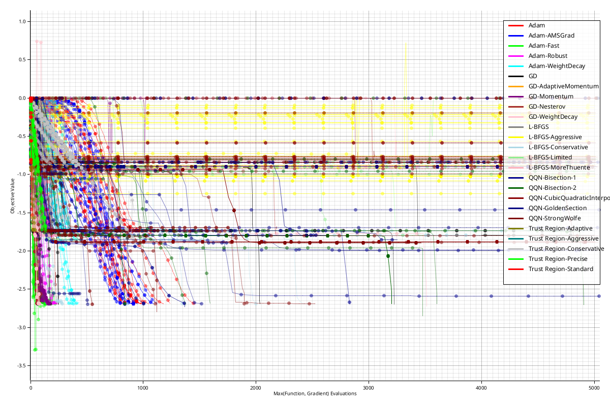
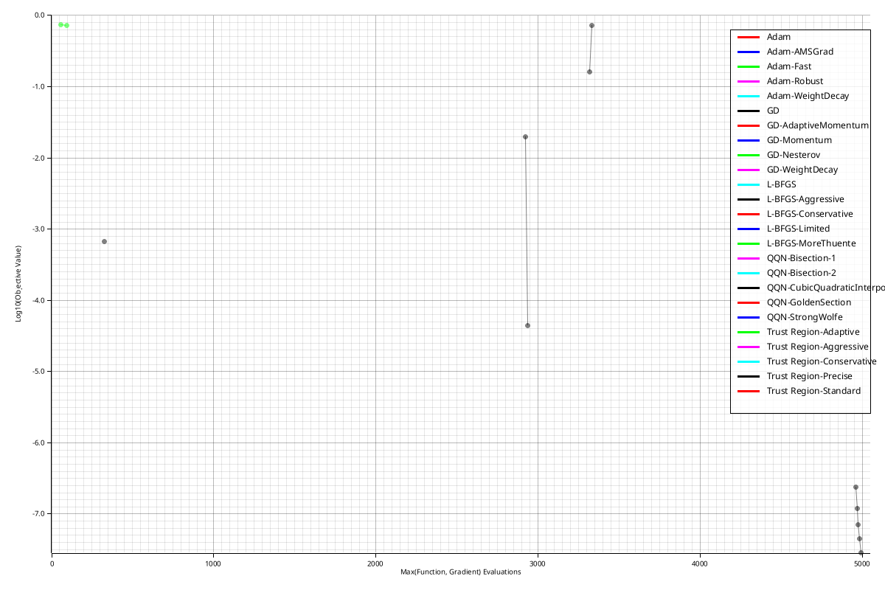

**Figure:** Convergence plots for Michalewicz_5D_m10 showing objective value vs iterations.
Left: Linear scale, Right: Log scale for better visualization of convergence behavior.

**Data:** [Linear scale data (CSV)](data/Michalewicz_5D_m10_data.csv) | [Log scale data (CSV)](data/Michalewicz_5D_m10_log_data.csv)

## Problem: Michalewicz_10D_m10

**Family:** Michalewicz
**Dimension:** 10
**Success Threshold:** -6.260e0
**Total Runs:** 500
**Detailed Analysis:** [View comprehensive problem analysis](reports/problem_analysis_Michalewicz_10D_m10.md)

### Performance Summary
<table style="border-collapse: collapse; width: 100%; margin: 20px 0;">
<tr style="background-color: #f2f2f2;">
<th style="border: 1px solid #ddd; padding: 8px; text-align: center;">Rank</th>
<th style="border: 1px solid #ddd; padding: 8px; text-align: center;">Optimizer</th>
<th style="border: 1px solid #ddd; padding: 8px; text-align: center;">Mean Final Value (All/Success/Fail)</th>
<th style="border: 1px solid #ddd; padding: 8px; text-align: center;">Std Dev</th>
<th style="border: 1px solid #ddd; padding: 8px; text-align: center;">Best Value</th>
<th style="border: 1px solid #ddd; padding: 8px; text-align: center;">Worst Value</th>
<th style="border: 1px solid #ddd; padding: 8px; text-align: center;">Mean Function Evals (All/Success/Fail)</th>
<th style="border: 1px solid #ddd; padding: 8px; text-align: center;">Mean Gradient Evals (All/Success/Fail)</th>
<th style="border: 1px solid #ddd; padding: 8px; text-align: center;">Success Rate</th>
<th style="border: 1px solid #ddd; padding: 8px; text-align: center;">Mean Time (s)</th>
</tr>
<tr style="background-color: #d4edda; font-weight: bold;">
<td style="border: 1px solid #ddd; padding: 8px; text-align: center;">1</td>
<td style="border: 1px solid #ddd; padding: 8px; text-align: center;"><a href="reports/detailed_Michalewicz_10D_m10_Adam-Fast.md" title="Click for detailed analysis">Adam-Fast</a></td>
<td style="border: 1px solid #ddd; padding: 8px; text-align: center;">-6.14e0 / -6.48e0 / -5.93e0</td>
<td style="border: 1px solid #ddd; padding: 8px; text-align: center;">4.86e-1</td>
<td style="border: 1px solid #ddd; padding: 8px; text-align: center;">-6.77e0</td>
<td style="border: 1px solid #ddd; padding: 8px; text-align: center;">-4.64e0</td>
<td style="border: 1px solid #ddd; padding: 8px; text-align: center;">106.2 / 65.9 / 127.9</td>
<td style="border: 1px solid #ddd; padding: 8px; text-align: center;">105.5 / 65.9 / 126.9</td>
<td style="border: 1px solid #ddd; padding: 8px; text-align: center;">35.0%</td>
<td style="border: 1px solid #ddd; padding: 8px; text-align: center;">0.002</td>
</tr>
<tr style="background-color: #fff3cd;">
<td style="border: 1px solid #ddd; padding: 8px; text-align: center;">2</td>
<td style="border: 1px solid #ddd; padding: 8px; text-align: center;"><a href="reports/detailed_Michalewicz_10D_m10_Adam-AMSGrad.md" title="Click for detailed analysis">Adam-AMSGrad</a></td>
<td style="border: 1px solid #ddd; padding: 8px; text-align: center;">-5.74e0 / -6.27e0 / -5.51e0</td>
<td style="border: 1px solid #ddd; padding: 8px; text-align: center;">6.30e-1</td>
<td style="border: 1px solid #ddd; padding: 8px; text-align: center;">-6.28e0</td>
<td style="border: 1px solid #ddd; padding: 8px; text-align: center;">-4.40e0</td>
<td style="border: 1px solid #ddd; padding: 8px; text-align: center;">450.1 / 458.7 / 446.4</td>
<td style="border: 1px solid #ddd; padding: 8px; text-align: center;">449.4 / 458.7 / 445.4</td>
<td style="border: 1px solid #ddd; padding: 8px; text-align: center;">30.0%</td>
<td style="border: 1px solid #ddd; padding: 8px; text-align: center;">0.012</td>
</tr>
<tr style="">
<td style="border: 1px solid #ddd; padding: 8px; text-align: center;">3</td>
<td style="border: 1px solid #ddd; padding: 8px; text-align: center;"><a href="reports/detailed_Michalewicz_10D_m10_Adam.md" title="Click for detailed analysis">Adam</a></td>
<td style="border: 1px solid #ddd; padding: 8px; text-align: center;">-5.84e0 / -6.27e0 / -5.73e0</td>
<td style="border: 1px solid #ddd; padding: 8px; text-align: center;">5.71e-1</td>
<td style="border: 1px solid #ddd; padding: 8px; text-align: center;">-6.27e0</td>
<td style="border: 1px solid #ddd; padding: 8px; text-align: center;">-4.65e0</td>
<td style="border: 1px solid #ddd; padding: 8px; text-align: center;">508.9 / 643.5 / 475.2</td>
<td style="border: 1px solid #ddd; padding: 8px; text-align: center;">508.1 / 643.5 / 474.2</td>
<td style="border: 1px solid #ddd; padding: 8px; text-align: center;">20.0%</td>
<td style="border: 1px solid #ddd; padding: 8px; text-align: center;">0.012</td>
</tr>
<tr style="">
<td style="border: 1px solid #ddd; padding: 8px; text-align: center;">4</td>
<td style="border: 1px solid #ddd; padding: 8px; text-align: center;"><a href="reports/detailed_Michalewicz_10D_m10_QQN-GoldenSection.md" title="Click for detailed analysis">QQN-GoldenSection</a></td>
<td style="border: 1px solid #ddd; padding: 8px; text-align: center;">-4.14e0 / -6.30e0 / -4.03e0</td>
<td style="border: 1px solid #ddd; padding: 8px; text-align: center;">1.08e0</td>
<td style="border: 1px solid #ddd; padding: 8px; text-align: center;">-6.30e0</td>
<td style="border: 1px solid #ddd; padding: 8px; text-align: center;">-2.32e0</td>
<td style="border: 1px solid #ddd; padding: 8px; text-align: center;">2197.4 / 2284.0 / 2192.8</td>
<td style="border: 1px solid #ddd; padding: 8px; text-align: center;">315.9 / 404.0 / 311.3</td>
<td style="border: 1px solid #ddd; padding: 8px; text-align: center;">5.0%</td>
<td style="border: 1px solid #ddd; padding: 8px; text-align: center;">0.045</td>
</tr>
<tr style="">
<td style="border: 1px solid #ddd; padding: 8px; text-align: center;">5</td>
<td style="border: 1px solid #ddd; padding: 8px; text-align: center;"><a href="reports/detailed_Michalewicz_10D_m10_QQN-Bisection-2.md" title="Click for detailed analysis">QQN-Bisection-2</a></td>
<td style="border: 1px solid #ddd; padding: 8px; text-align: center;">-4.37e0 / -6.26e0 / -4.26e0</td>
<td style="border: 1px solid #ddd; padding: 8px; text-align: center;">1.24e0</td>
<td style="border: 1px solid #ddd; padding: 8px; text-align: center;">-6.26e0</td>
<td style="border: 1px solid #ddd; padding: 8px; text-align: center;">-1.67e0</td>
<td style="border: 1px solid #ddd; padding: 8px; text-align: center;">1808.5 / 828.0 / 1860.1</td>
<td style="border: 1px solid #ddd; padding: 8px; text-align: center;">909.3 / 461.0 / 932.9</td>
<td style="border: 1px solid #ddd; padding: 8px; text-align: center;">5.0%</td>
<td style="border: 1px solid #ddd; padding: 8px; text-align: center;">0.047</td>
</tr>
<tr style="">
<td style="border: 1px solid #ddd; padding: 8px; text-align: center;">6</td>
<td style="border: 1px solid #ddd; padding: 8px; text-align: center;"><a href="reports/detailed_Michalewicz_10D_m10_QQN-StrongWolfe.md" title="Click for detailed analysis">QQN-StrongWolfe</a></td>
<td style="border: 1px solid #ddd; padding: 8px; text-align: center;">-4.71e0 / -6.27e0 / -4.63e0</td>
<td style="border: 1px solid #ddd; padding: 8px; text-align: center;">1.16e0</td>
<td style="border: 1px solid #ddd; padding: 8px; text-align: center;">-6.27e0</td>
<td style="border: 1px solid #ddd; padding: 8px; text-align: center;">-2.13e0</td>
<td style="border: 1px solid #ddd; padding: 8px; text-align: center;">1916.5 / 1546.0 / 1936.0</td>
<td style="border: 1px solid #ddd; padding: 8px; text-align: center;">1461.9 / 1254.0 / 1472.8</td>
<td style="border: 1px solid #ddd; padding: 8px; text-align: center;">5.0%</td>
<td style="border: 1px solid #ddd; padding: 8px; text-align: center;">0.063</td>
</tr>
<tr style="">
<td style="border: 1px solid #ddd; padding: 8px; text-align: center;">7</td>
<td style="border: 1px solid #ddd; padding: 8px; text-align: center;"><a href="reports/detailed_Michalewicz_10D_m10_Trust_Region-Aggressive.md" title="Click for detailed analysis">Trust Region-Aggressive</a></td>
<td style="border: 1px solid #ddd; padding: 8px; text-align: center;">-1.68e0 / - / -1.68e0</td>
<td style="border: 1px solid #ddd; padding: 8px; text-align: center;">6.53e-1</td>
<td style="border: 1px solid #ddd; padding: 8px; text-align: center;">-3.16e0</td>
<td style="border: 1px solid #ddd; padding: 8px; text-align: center;">-5.90e-1</td>
<td style="border: 1px solid #ddd; padding: 8px; text-align: center;">5.3 / - / 5.3</td>
<td style="border: 1px solid #ddd; padding: 8px; text-align: center;">4.2 / - / 4.2</td>
<td style="border: 1px solid #ddd; padding: 8px; text-align: center;">0.0%</td>
<td style="border: 1px solid #ddd; padding: 8px; text-align: center;">0.000</td>
</tr>
<tr style="">
<td style="border: 1px solid #ddd; padding: 8px; text-align: center;">8</td>
<td style="border: 1px solid #ddd; padding: 8px; text-align: center;"><a href="reports/detailed_Michalewicz_10D_m10_Trust_Region-Standard.md" title="Click for detailed analysis">Trust Region-Standard</a></td>
<td style="border: 1px solid #ddd; padding: 8px; text-align: center;">-2.49e0 / - / -2.49e0</td>
<td style="border: 1px solid #ddd; padding: 8px; text-align: center;">1.15e0</td>
<td style="border: 1px solid #ddd; padding: 8px; text-align: center;">-4.98e0</td>
<td style="border: 1px solid #ddd; padding: 8px; text-align: center;">-5.97e-1</td>
<td style="border: 1px solid #ddd; padding: 8px; text-align: center;">9.8 / - / 9.8</td>
<td style="border: 1px solid #ddd; padding: 8px; text-align: center;">7.2 / - / 7.2</td>
<td style="border: 1px solid #ddd; padding: 8px; text-align: center;">0.0%</td>
<td style="border: 1px solid #ddd; padding: 8px; text-align: center;">0.000</td>
</tr>
<tr style="">
<td style="border: 1px solid #ddd; padding: 8px; text-align: center;">9</td>
<td style="border: 1px solid #ddd; padding: 8px; text-align: center;"><a href="reports/detailed_Michalewicz_10D_m10_GD.md" title="Click for detailed analysis">GD</a></td>
<td style="border: 1px solid #ddd; padding: 8px; text-align: center;">-3.68e0 / - / -3.59e0</td>
<td style="border: 1px solid #ddd; padding: 8px; text-align: center;">7.23e-1</td>
<td style="border: 1px solid #ddd; padding: 8px; text-align: center;">-5.07e0</td>
<td style="border: 1px solid #ddd; padding: 8px; text-align: center;">-2.68e0</td>
<td style="border: 1px solid #ddd; padding: 8px; text-align: center;">17.2 / - / 17.2</td>
<td style="border: 1px solid #ddd; padding: 8px; text-align: center;">30.4 / - / 30.4</td>
<td style="border: 1px solid #ddd; padding: 8px; text-align: center;">0.0%</td>
<td style="border: 1px solid #ddd; padding: 8px; text-align: center;">0.000</td>
</tr>
<tr style="">
<td style="border: 1px solid #ddd; padding: 8px; text-align: center;">10</td>
<td style="border: 1px solid #ddd; padding: 8px; text-align: center;"><a href="reports/detailed_Michalewicz_10D_m10_Trust_Region-Adaptive.md" title="Click for detailed analysis">Trust Region-Adaptive</a></td>
<td style="border: 1px solid #ddd; padding: 8px; text-align: center;">-3.26e0 / - / -3.26e0</td>
<td style="border: 1px solid #ddd; padding: 8px; text-align: center;">9.04e-1</td>
<td style="border: 1px solid #ddd; padding: 8px; text-align: center;">-5.27e0</td>
<td style="border: 1px solid #ddd; padding: 8px; text-align: center;">-1.43e0</td>
<td style="border: 1px solid #ddd; padding: 8px; text-align: center;">28.7 / - / 28.7</td>
<td style="border: 1px solid #ddd; padding: 8px; text-align: center;">19.8 / - / 19.8</td>
<td style="border: 1px solid #ddd; padding: 8px; text-align: center;">0.0%</td>
<td style="border: 1px solid #ddd; padding: 8px; text-align: center;">0.000</td>
</tr>
<tr style="">
<td style="border: 1px solid #ddd; padding: 8px; text-align: center;">11</td>
<td style="border: 1px solid #ddd; padding: 8px; text-align: center;"><a href="reports/detailed_Michalewicz_10D_m10_GD-Nesterov.md" title="Click for detailed analysis">GD-Nesterov</a></td>
<td style="border: 1px solid #ddd; padding: 8px; text-align: center;">-3.85e0 / - / -3.74e0</td>
<td style="border: 1px solid #ddd; padding: 8px; text-align: center;">1.18e0</td>
<td style="border: 1px solid #ddd; padding: 8px; text-align: center;">-6.20e0</td>
<td style="border: 1px solid #ddd; padding: 8px; text-align: center;">-1.97e0</td>
<td style="border: 1px solid #ddd; padding: 8px; text-align: center;">26.9 / - / 26.9</td>
<td style="border: 1px solid #ddd; padding: 8px; text-align: center;">49.7 / - / 49.7</td>
<td style="border: 1px solid #ddd; padding: 8px; text-align: center;">0.0%</td>
<td style="border: 1px solid #ddd; padding: 8px; text-align: center;">0.001</td>
</tr>
<tr style="">
<td style="border: 1px solid #ddd; padding: 8px; text-align: center;">12</td>
<td style="border: 1px solid #ddd; padding: 8px; text-align: center;"><a href="reports/detailed_Michalewicz_10D_m10_GD-AdaptiveMomentum.md" title="Click for detailed analysis">GD-AdaptiveMomentum</a></td>
<td style="border: 1px solid #ddd; padding: 8px; text-align: center;">-4.59e0 / - / -4.52e0</td>
<td style="border: 1px solid #ddd; padding: 8px; text-align: center;">7.45e-1</td>
<td style="border: 1px solid #ddd; padding: 8px; text-align: center;">-6.25e0</td>
<td style="border: 1px solid #ddd; padding: 8px; text-align: center;">-2.91e0</td>
<td style="border: 1px solid #ddd; padding: 8px; text-align: center;">27.6 / - / 27.6</td>
<td style="border: 1px solid #ddd; padding: 8px; text-align: center;">51.3 / - / 51.3</td>
<td style="border: 1px solid #ddd; padding: 8px; text-align: center;">0.0%</td>
<td style="border: 1px solid #ddd; padding: 8px; text-align: center;">0.001</td>
</tr>
<tr style="">
<td style="border: 1px solid #ddd; padding: 8px; text-align: center;">13</td>
<td style="border: 1px solid #ddd; padding: 8px; text-align: center;"><a href="reports/detailed_Michalewicz_10D_m10_L-BFGS.md" title="Click for detailed analysis">L-BFGS</a></td>
<td style="border: 1px solid #ddd; padding: 8px; text-align: center;">-1.62e0 / - / -3.66e-1</td>
<td style="border: 1px solid #ddd; padding: 8px; text-align: center;">5.28e-1</td>
<td style="border: 1px solid #ddd; padding: 8px; text-align: center;">-3.01e0</td>
<td style="border: 1px solid #ddd; padding: 8px; text-align: center;">-8.79e-1</td>
<td style="border: 1px solid #ddd; padding: 8px; text-align: center;">64.8 / - / 64.8</td>
<td style="border: 1px solid #ddd; padding: 8px; text-align: center;">29.4 / - / 29.4</td>
<td style="border: 1px solid #ddd; padding: 8px; text-align: center;">0.0%</td>
<td style="border: 1px solid #ddd; padding: 8px; text-align: center;">0.001</td>
</tr>
<tr style="">
<td style="border: 1px solid #ddd; padding: 8px; text-align: center;">14</td>
<td style="border: 1px solid #ddd; padding: 8px; text-align: center;"><a href="reports/detailed_Michalewicz_10D_m10_GD-Momentum.md" title="Click for detailed analysis">GD-Momentum</a></td>
<td style="border: 1px solid #ddd; padding: 8px; text-align: center;">-3.98e0 / - / -3.79e0</td>
<td style="border: 1px solid #ddd; padding: 8px; text-align: center;">9.30e-1</td>
<td style="border: 1px solid #ddd; padding: 8px; text-align: center;">-5.42e0</td>
<td style="border: 1px solid #ddd; padding: 8px; text-align: center;">-2.16e0</td>
<td style="border: 1px solid #ddd; padding: 8px; text-align: center;">37.3 / - / 37.3</td>
<td style="border: 1px solid #ddd; padding: 8px; text-align: center;">70.6 / - / 70.6</td>
<td style="border: 1px solid #ddd; padding: 8px; text-align: center;">0.0%</td>
<td style="border: 1px solid #ddd; padding: 8px; text-align: center;">0.001</td>
</tr>
<tr style="">
<td style="border: 1px solid #ddd; padding: 8px; text-align: center;">15</td>
<td style="border: 1px solid #ddd; padding: 8px; text-align: center;"><a href="reports/detailed_Michalewicz_10D_m10_Trust_Region-Precise.md" title="Click for detailed analysis">Trust Region-Precise</a></td>
<td style="border: 1px solid #ddd; padding: 8px; text-align: center;">-3.69e0 / - / -3.69e0</td>
<td style="border: 1px solid #ddd; padding: 8px; text-align: center;">9.58e-1</td>
<td style="border: 1px solid #ddd; padding: 8px; text-align: center;">-5.30e0</td>
<td style="border: 1px solid #ddd; padding: 8px; text-align: center;">-2.10e0</td>
<td style="border: 1px solid #ddd; padding: 8px; text-align: center;">114.2 / - / 114.2</td>
<td style="border: 1px solid #ddd; padding: 8px; text-align: center;">76.8 / - / 76.8</td>
<td style="border: 1px solid #ddd; padding: 8px; text-align: center;">0.0%</td>
<td style="border: 1px solid #ddd; padding: 8px; text-align: center;">0.001</td>
</tr>
<tr style="">
<td style="border: 1px solid #ddd; padding: 8px; text-align: center;">16</td>
<td style="border: 1px solid #ddd; padding: 8px; text-align: center;"><a href="reports/detailed_Michalewicz_10D_m10_Adam-Robust.md" title="Click for detailed analysis">Adam-Robust</a></td>
<td style="border: 1px solid #ddd; padding: 8px; text-align: center;">-5.04e0 / - / -5.03e0</td>
<td style="border: 1px solid #ddd; padding: 8px; text-align: center;">7.59e-1</td>
<td style="border: 1px solid #ddd; padding: 8px; text-align: center;">-6.26e0</td>
<td style="border: 1px solid #ddd; padding: 8px; text-align: center;">-3.56e0</td>
<td style="border: 1px solid #ddd; padding: 8px; text-align: center;">111.0 / - / 111.0</td>
<td style="border: 1px solid #ddd; padding: 8px; text-align: center;">110.0 / - / 110.0</td>
<td style="border: 1px solid #ddd; padding: 8px; text-align: center;">0.0%</td>
<td style="border: 1px solid #ddd; padding: 8px; text-align: center;">0.003</td>
</tr>
<tr style="">
<td style="border: 1px solid #ddd; padding: 8px; text-align: center;">17</td>
<td style="border: 1px solid #ddd; padding: 8px; text-align: center;"><a href="reports/detailed_Michalewicz_10D_m10_Adam-WeightDecay.md" title="Click for detailed analysis">Adam-WeightDecay</a></td>
<td style="border: 1px solid #ddd; padding: 8px; text-align: center;">-5.33e0 / - / -5.31e0</td>
<td style="border: 1px solid #ddd; padding: 8px; text-align: center;">5.79e-1</td>
<td style="border: 1px solid #ddd; padding: 8px; text-align: center;">-6.26e0</td>
<td style="border: 1px solid #ddd; padding: 8px; text-align: center;">-4.39e0</td>
<td style="border: 1px solid #ddd; padding: 8px; text-align: center;">179.3 / - / 179.3</td>
<td style="border: 1px solid #ddd; padding: 8px; text-align: center;">178.3 / - / 178.3</td>
<td style="border: 1px solid #ddd; padding: 8px; text-align: center;">0.0%</td>
<td style="border: 1px solid #ddd; padding: 8px; text-align: center;">0.004</td>
</tr>
<tr style="">
<td style="border: 1px solid #ddd; padding: 8px; text-align: center;">18</td>
<td style="border: 1px solid #ddd; padding: 8px; text-align: center;"><a href="reports/detailed_Michalewicz_10D_m10_GD-WeightDecay.md" title="Click for detailed analysis">GD-WeightDecay</a></td>
<td style="border: 1px solid #ddd; padding: 8px; text-align: center;">-4.59e0 / - / -4.56e0</td>
<td style="border: 1px solid #ddd; padding: 8px; text-align: center;">7.57e-1</td>
<td style="border: 1px solid #ddd; padding: 8px; text-align: center;">-6.26e0</td>
<td style="border: 1px solid #ddd; padding: 8px; text-align: center;">-2.98e0</td>
<td style="border: 1px solid #ddd; padding: 8px; text-align: center;">174.7 / - / 174.7</td>
<td style="border: 1px solid #ddd; padding: 8px; text-align: center;">345.5 / - / 345.5</td>
<td style="border: 1px solid #ddd; padding: 8px; text-align: center;">0.0%</td>
<td style="border: 1px solid #ddd; padding: 8px; text-align: center;">0.006</td>
</tr>
<tr style="">
<td style="border: 1px solid #ddd; padding: 8px; text-align: center;">19</td>
<td style="border: 1px solid #ddd; padding: 8px; text-align: center;"><a href="reports/detailed_Michalewicz_10D_m10_Trust_Region-Conservative.md" title="Click for detailed analysis">Trust Region-Conservative</a></td>
<td style="border: 1px solid #ddd; padding: 8px; text-align: center;">-3.71e0 / - / -3.71e0</td>
<td style="border: 1px solid #ddd; padding: 8px; text-align: center;">9.15e-1</td>
<td style="border: 1px solid #ddd; padding: 8px; text-align: center;">-5.42e0</td>
<td style="border: 1px solid #ddd; padding: 8px; text-align: center;">-2.14e0</td>
<td style="border: 1px solid #ddd; padding: 8px; text-align: center;">644.0 / - / 644.0</td>
<td style="border: 1px solid #ddd; padding: 8px; text-align: center;">430.0 / - / 430.0</td>
<td style="border: 1px solid #ddd; padding: 8px; text-align: center;">0.0%</td>
<td style="border: 1px solid #ddd; padding: 8px; text-align: center;">0.005</td>
</tr>
<tr style="">
<td style="border: 1px solid #ddd; padding: 8px; text-align: center;">20</td>
<td style="border: 1px solid #ddd; padding: 8px; text-align: center;"><a href="reports/detailed_Michalewicz_10D_m10_L-BFGS-MoreThuente.md" title="Click for detailed analysis">L-BFGS-MoreThuente</a></td>
<td style="border: 1px solid #ddd; padding: 8px; text-align: center;">-4.12e0 / - / -4.11e0</td>
<td style="border: 1px solid #ddd; padding: 8px; text-align: center;">7.60e-1</td>
<td style="border: 1px solid #ddd; padding: 8px; text-align: center;">-5.98e0</td>
<td style="border: 1px solid #ddd; padding: 8px; text-align: center;">-2.73e0</td>
<td style="border: 1px solid #ddd; padding: 8px; text-align: center;">925.2 / - / 925.2</td>
<td style="border: 1px solid #ddd; padding: 8px; text-align: center;">669.2 / - / 669.2</td>
<td style="border: 1px solid #ddd; padding: 8px; text-align: center;">0.0%</td>
<td style="border: 1px solid #ddd; padding: 8px; text-align: center;">0.020</td>
</tr>
<tr style="">
<td style="border: 1px solid #ddd; padding: 8px; text-align: center;">21</td>
<td style="border: 1px solid #ddd; padding: 8px; text-align: center;"><a href="reports/detailed_Michalewicz_10D_m10_L-BFGS-Conservative.md" title="Click for detailed analysis">L-BFGS-Conservative</a></td>
<td style="border: 1px solid #ddd; padding: 8px; text-align: center;">-4.54e0 / - / -4.54e0</td>
<td style="border: 1px solid #ddd; padding: 8px; text-align: center;">9.50e-1</td>
<td style="border: 1px solid #ddd; padding: 8px; text-align: center;">-6.26e0</td>
<td style="border: 1px solid #ddd; padding: 8px; text-align: center;">-2.94e0</td>
<td style="border: 1px solid #ddd; padding: 8px; text-align: center;">2566.8 / - / 2566.8</td>
<td style="border: 1px solid #ddd; padding: 8px; text-align: center;">938.3 / - / 938.3</td>
<td style="border: 1px solid #ddd; padding: 8px; text-align: center;">0.0%</td>
<td style="border: 1px solid #ddd; padding: 8px; text-align: center;">0.037</td>
</tr>
<tr style="">
<td style="border: 1px solid #ddd; padding: 8px; text-align: center;">22</td>
<td style="border: 1px solid #ddd; padding: 8px; text-align: center;"><a href="reports/detailed_Michalewicz_10D_m10_L-BFGS-Limited.md" title="Click for detailed analysis">L-BFGS-Limited</a></td>
<td style="border: 1px solid #ddd; padding: 8px; text-align: center;">-3.62e0 / - / -3.52e0</td>
<td style="border: 1px solid #ddd; padding: 8px; text-align: center;">1.28e0</td>
<td style="border: 1px solid #ddd; padding: 8px; text-align: center;">-5.59e0</td>
<td style="border: 1px solid #ddd; padding: 8px; text-align: center;">-8.82e-1</td>
<td style="border: 1px solid #ddd; padding: 8px; text-align: center;">3009.3 / - / 3009.3</td>
<td style="border: 1px solid #ddd; padding: 8px; text-align: center;">752.5 / - / 752.5</td>
<td style="border: 1px solid #ddd; padding: 8px; text-align: center;">0.0%</td>
<td style="border: 1px solid #ddd; padding: 8px; text-align: center;">0.038</td>
</tr>
<tr style="">
<td style="border: 1px solid #ddd; padding: 8px; text-align: center;">23</td>
<td style="border: 1px solid #ddd; padding: 8px; text-align: center;"><a href="reports/detailed_Michalewicz_10D_m10_QQN-CubicQuadraticInterpolation.md" title="Click for detailed analysis">QQN-CubicQuadraticInterpolation</a></td>
<td style="border: 1px solid #ddd; padding: 8px; text-align: center;">-3.34e0 / - / -3.34e0</td>
<td style="border: 1px solid #ddd; padding: 8px; text-align: center;">1.51e0</td>
<td style="border: 1px solid #ddd; padding: 8px; text-align: center;">-6.26e0</td>
<td style="border: 1px solid #ddd; padding: 8px; text-align: center;">-9.35e-1</td>
<td style="border: 1px solid #ddd; padding: 8px; text-align: center;">1730.8 / - / 1730.8</td>
<td style="border: 1px solid #ddd; padding: 8px; text-align: center;">2143.9 / - / 2143.9</td>
<td style="border: 1px solid #ddd; padding: 8px; text-align: center;">0.0%</td>
<td style="border: 1px solid #ddd; padding: 8px; text-align: center;">0.073</td>
</tr>
<tr style="">
<td style="border: 1px solid #ddd; padding: 8px; text-align: center;">24</td>
<td style="border: 1px solid #ddd; padding: 8px; text-align: center;"><a href="reports/detailed_Michalewicz_10D_m10_L-BFGS-Aggressive.md" title="Click for detailed analysis">L-BFGS-Aggressive</a></td>
<td style="border: 1px solid #ddd; padding: 8px; text-align: center;">-1.50e0 / - / -1.30e0</td>
<td style="border: 1px solid #ddd; padding: 8px; text-align: center;">7.13e-1</td>
<td style="border: 1px solid #ddd; padding: 8px; text-align: center;">-3.26e0</td>
<td style="border: 1px solid #ddd; padding: 8px; text-align: center;">-4.98e-1</td>
<td style="border: 1px solid #ddd; padding: 8px; text-align: center;">3050.9 / - / 3050.9</td>
<td style="border: 1px solid #ddd; padding: 8px; text-align: center;">918.2 / - / 918.2</td>
<td style="border: 1px solid #ddd; padding: 8px; text-align: center;">0.0%</td>
<td style="border: 1px solid #ddd; padding: 8px; text-align: center;">0.021</td>
</tr>
<tr style="">
<td style="border: 1px solid #ddd; padding: 8px; text-align: center;">25</td>
<td style="border: 1px solid #ddd; padding: 8px; text-align: center;"><a href="reports/detailed_Michalewicz_10D_m10_QQN-Bisection-1.md" title="Click for detailed analysis">QQN-Bisection-1</a></td>
<td style="border: 1px solid #ddd; padding: 8px; text-align: center;">-4.24e0 / - / -4.24e0</td>
<td style="border: 1px solid #ddd; padding: 8px; text-align: center;">1.09e0</td>
<td style="border: 1px solid #ddd; padding: 8px; text-align: center;">-5.36e0</td>
<td style="border: 1px solid #ddd; padding: 8px; text-align: center;">-2.14e0</td>
<td style="border: 1px solid #ddd; padding: 8px; text-align: center;">2030.0 / - / 2030.0</td>
<td style="border: 1px solid #ddd; padding: 8px; text-align: center;">2151.8 / - / 2151.8</td>
<td style="border: 1px solid #ddd; padding: 8px; text-align: center;">0.0%</td>
<td style="border: 1px solid #ddd; padding: 8px; text-align: center;">0.055</td>
</tr>
</table>

### Convergence Plots

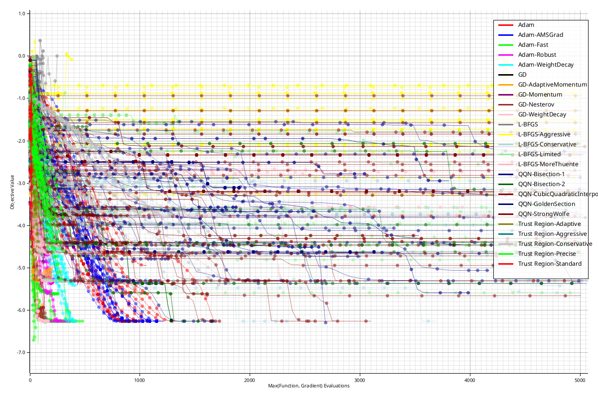
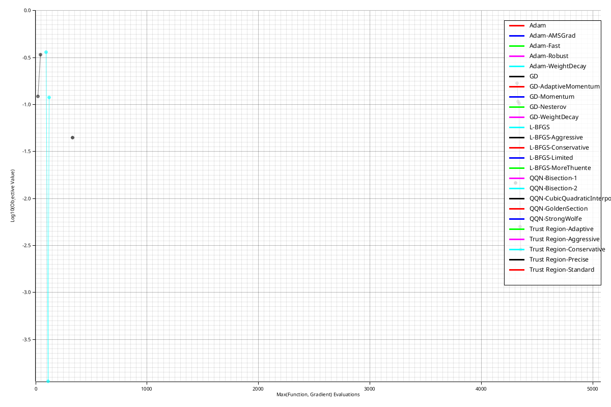

**Figure:** Convergence plots for Michalewicz_10D_m10 showing objective value vs iterations.
Left: Linear scale, Right: Log scale for better visualization of convergence behavior.

**Data:** [Linear scale data (CSV)](data/Michalewicz_10D_m10_data.csv) | [Log scale data (CSV)](data/Michalewicz_10D_m10_log_data.csv)

## Problem: Rastrigin_2D

**Family:** Rastrigin
**Dimension:** 2
**Success Threshold:** 7.960e0
**Total Runs:** 500
**Detailed Analysis:** [View comprehensive problem analysis](reports/problem_analysis_Rastrigin_2D.md)

### Performance Summary
<table style="border-collapse: collapse; width: 100%; margin: 20px 0;">
<tr style="background-color: #f2f2f2;">
<th style="border: 1px solid #ddd; padding: 8px; text-align: center;">Rank</th>
<th style="border: 1px solid #ddd; padding: 8px; text-align: center;">Optimizer</th>
<th style="border: 1px solid #ddd; padding: 8px; text-align: center;">Mean Final Value (All/Success/Fail)</th>
<th style="border: 1px solid #ddd; padding: 8px; text-align: center;">Std Dev</th>
<th style="border: 1px solid #ddd; padding: 8px; text-align: center;">Best Value</th>
<th style="border: 1px solid #ddd; padding: 8px; text-align: center;">Worst Value</th>
<th style="border: 1px solid #ddd; padding: 8px; text-align: center;">Mean Function Evals (All/Success/Fail)</th>
<th style="border: 1px solid #ddd; padding: 8px; text-align: center;">Mean Gradient Evals (All/Success/Fail)</th>
<th style="border: 1px solid #ddd; padding: 8px; text-align: center;">Success Rate</th>
<th style="border: 1px solid #ddd; padding: 8px; text-align: center;">Mean Time (s)</th>
</tr>
<tr style="background-color: #d4edda; font-weight: bold;">
<td style="border: 1px solid #ddd; padding: 8px; text-align: center;">1</td>
<td style="border: 1px solid #ddd; padding: 8px; text-align: center;"><a href="reports/detailed_Rastrigin_2D_QQN-CubicQuadraticInterpolation.md" title="Click for detailed analysis">QQN-CubicQuadraticInterpolation</a></td>
<td style="border: 1px solid #ddd; padding: 8px; text-align: center;">7.75e0 / 6.45e0 / 1.29e1</td>
<td style="border: 1px solid #ddd; padding: 8px; text-align: center;">3.18e0</td>
<td style="border: 1px solid #ddd; padding: 8px; text-align: center;">2.17e0</td>
<td style="border: 1px solid #ddd; padding: 8px; text-align: center;">1.59e1</td>
<td style="border: 1px solid #ddd; padding: 8px; text-align: center;">64.2 / 52.5 / 110.8</td>
<td style="border: 1px solid #ddd; padding: 8px; text-align: center;">72.5 / 59.5 / 124.5</td>
<td style="border: 1px solid #ddd; padding: 8px; text-align: center;">80.0%</td>
<td style="border: 1px solid #ddd; padding: 8px; text-align: center;">0.002</td>
</tr>
<tr style="background-color: #fff3cd;">
<td style="border: 1px solid #ddd; padding: 8px; text-align: center;">2</td>
<td style="border: 1px solid #ddd; padding: 8px; text-align: center;"><a href="reports/detailed_Rastrigin_2D_L-BFGS-Conservative.md" title="Click for detailed analysis">L-BFGS-Conservative</a></td>
<td style="border: 1px solid #ddd; padding: 8px; text-align: center;">9.82e0 / 7.96e0 / 1.54e1</td>
<td style="border: 1px solid #ddd; padding: 8px; text-align: center;">5.01e0</td>
<td style="border: 1px solid #ddd; padding: 8px; text-align: center;">7.96e0</td>
<td style="border: 1px solid #ddd; padding: 8px; text-align: center;">3.02e1</td>
<td style="border: 1px solid #ddd; padding: 8px; text-align: center;">455.9 / 115.1 / 1478.0</td>
<td style="border: 1px solid #ddd; padding: 8px; text-align: center;">222.1 / 64.2 / 695.6</td>
<td style="border: 1px solid #ddd; padding: 8px; text-align: center;">75.0%</td>
<td style="border: 1px solid #ddd; padding: 8px; text-align: center;">0.006</td>
</tr>
<tr style="">
<td style="border: 1px solid #ddd; padding: 8px; text-align: center;">3</td>
<td style="border: 1px solid #ddd; padding: 8px; text-align: center;"><a href="reports/detailed_Rastrigin_2D_L-BFGS-Limited.md" title="Click for detailed analysis">L-BFGS-Limited</a></td>
<td style="border: 1px solid #ddd; padding: 8px; text-align: center;">9.10e0 / 7.81e0 / 1.22e1</td>
<td style="border: 1px solid #ddd; padding: 8px; text-align: center;">2.26e0</td>
<td style="border: 1px solid #ddd; padding: 8px; text-align: center;">5.86e0</td>
<td style="border: 1px solid #ddd; padding: 8px; text-align: center;">1.29e1</td>
<td style="border: 1px solid #ddd; padding: 8px; text-align: center;">106.5 / 74.1 / 182.0</td>
<td style="border: 1px solid #ddd; padding: 8px; text-align: center;">33.0 / 24.6 / 52.3</td>
<td style="border: 1px solid #ddd; padding: 8px; text-align: center;">70.0%</td>
<td style="border: 1px solid #ddd; padding: 8px; text-align: center;">0.001</td>
</tr>
<tr style="">
<td style="border: 1px solid #ddd; padding: 8px; text-align: center;">4</td>
<td style="border: 1px solid #ddd; padding: 8px; text-align: center;"><a href="reports/detailed_Rastrigin_2D_QQN-StrongWolfe.md" title="Click for detailed analysis">QQN-StrongWolfe</a></td>
<td style="border: 1px solid #ddd; padding: 8px; text-align: center;">8.32e0 / 5.84e0 / 1.29e1</td>
<td style="border: 1px solid #ddd; padding: 8px; text-align: center;">4.20e0</td>
<td style="border: 1px solid #ddd; padding: 8px; text-align: center;">1.36e0</td>
<td style="border: 1px solid #ddd; padding: 8px; text-align: center;">1.69e1</td>
<td style="border: 1px solid #ddd; padding: 8px; text-align: center;">71.4 / 60.4 / 91.9</td>
<td style="border: 1px solid #ddd; padding: 8px; text-align: center;">58.8 / 47.3 / 80.0</td>
<td style="border: 1px solid #ddd; padding: 8px; text-align: center;">65.0%</td>
<td style="border: 1px solid #ddd; padding: 8px; text-align: center;">0.002</td>
</tr>
<tr style="">
<td style="border: 1px solid #ddd; padding: 8px; text-align: center;">5</td>
<td style="border: 1px solid #ddd; padding: 8px; text-align: center;"><a href="reports/detailed_Rastrigin_2D_QQN-Bisection-1.md" title="Click for detailed analysis">QQN-Bisection-1</a></td>
<td style="border: 1px solid #ddd; padding: 8px; text-align: center;">8.59e0 / 5.95e0 / 1.35e1</td>
<td style="border: 1px solid #ddd; padding: 8px; text-align: center;">4.47e0</td>
<td style="border: 1px solid #ddd; padding: 8px; text-align: center;">1.03e0</td>
<td style="border: 1px solid #ddd; padding: 8px; text-align: center;">1.69e1</td>
<td style="border: 1px solid #ddd; padding: 8px; text-align: center;">125.3 / 75.9 / 217.1</td>
<td style="border: 1px solid #ddd; padding: 8px; text-align: center;">166.4 / 115.8 / 260.6</td>
<td style="border: 1px solid #ddd; padding: 8px; text-align: center;">65.0%</td>
<td style="border: 1px solid #ddd; padding: 8px; text-align: center;">0.003</td>
</tr>
<tr style="">
<td style="border: 1px solid #ddd; padding: 8px; text-align: center;">6</td>
<td style="border: 1px solid #ddd; padding: 8px; text-align: center;"><a href="reports/detailed_Rastrigin_2D_QQN-GoldenSection.md" title="Click for detailed analysis">QQN-GoldenSection</a></td>
<td style="border: 1px solid #ddd; padding: 8px; text-align: center;">8.19e0 / 4.40e0 / 1.28e1</td>
<td style="border: 1px solid #ddd; padding: 8px; text-align: center;">5.01e0</td>
<td style="border: 1px solid #ddd; padding: 8px; text-align: center;">1.29e-1</td>
<td style="border: 1px solid #ddd; padding: 8px; text-align: center;">1.79e1</td>
<td style="border: 1px solid #ddd; padding: 8px; text-align: center;">156.0 / 97.5 / 227.6</td>
<td style="border: 1px solid #ddd; padding: 8px; text-align: center;">24.9 / 14.0 / 38.1</td>
<td style="border: 1px solid #ddd; padding: 8px; text-align: center;">55.0%</td>
<td style="border: 1px solid #ddd; padding: 8px; text-align: center;">0.002</td>
</tr>
<tr style="">
<td style="border: 1px solid #ddd; padding: 8px; text-align: center;">7</td>
<td style="border: 1px solid #ddd; padding: 8px; text-align: center;"><a href="reports/detailed_Rastrigin_2D_L-BFGS-MoreThuente.md" title="Click for detailed analysis">L-BFGS-MoreThuente</a></td>
<td style="border: 1px solid #ddd; padding: 8px; text-align: center;">8.30e0 / 5.40e0 / 1.24e1</td>
<td style="border: 1px solid #ddd; padding: 8px; text-align: center;">4.99e0</td>
<td style="border: 1px solid #ddd; padding: 8px; text-align: center;">1.83e0</td>
<td style="border: 1px solid #ddd; padding: 8px; text-align: center;">2.60e1</td>
<td style="border: 1px solid #ddd; padding: 8px; text-align: center;">170.8 / 70.5 / 293.6</td>
<td style="border: 1px solid #ddd; padding: 8px; text-align: center;">124.3 / 53.2 / 211.3</td>
<td style="border: 1px solid #ddd; padding: 8px; text-align: center;">55.0%</td>
<td style="border: 1px solid #ddd; padding: 8px; text-align: center;">0.003</td>
</tr>
<tr style="">
<td style="border: 1px solid #ddd; padding: 8px; text-align: center;">8</td>
<td style="border: 1px solid #ddd; padding: 8px; text-align: center;"><a href="reports/detailed_Rastrigin_2D_Adam-AMSGrad.md" title="Click for detailed analysis">Adam-AMSGrad</a></td>
<td style="border: 1px solid #ddd; padding: 8px; text-align: center;">1.02e1 / 7.96e0 / 1.29e1</td>
<td style="border: 1px solid #ddd; padding: 8px; text-align: center;">2.47e0</td>
<td style="border: 1px solid #ddd; padding: 8px; text-align: center;">7.96e0</td>
<td style="border: 1px solid #ddd; padding: 8px; text-align: center;">1.29e1</td>
<td style="border: 1px solid #ddd; padding: 8px; text-align: center;">770.2 / 751.9 / 792.6</td>
<td style="border: 1px solid #ddd; padding: 8px; text-align: center;">769.8 / 751.9 / 791.6</td>
<td style="border: 1px solid #ddd; padding: 8px; text-align: center;">55.0%</td>
<td style="border: 1px solid #ddd; padding: 8px; text-align: center;">0.018</td>
</tr>
<tr style="">
<td style="border: 1px solid #ddd; padding: 8px; text-align: center;">9</td>
<td style="border: 1px solid #ddd; padding: 8px; text-align: center;"><a href="reports/detailed_Rastrigin_2D_Adam.md" title="Click for detailed analysis">Adam</a></td>
<td style="border: 1px solid #ddd; padding: 8px; text-align: center;">1.02e1 / 7.96e0 / 1.29e1</td>
<td style="border: 1px solid #ddd; padding: 8px; text-align: center;">2.47e0</td>
<td style="border: 1px solid #ddd; padding: 8px; text-align: center;">7.96e0</td>
<td style="border: 1px solid #ddd; padding: 8px; text-align: center;">1.29e1</td>
<td style="border: 1px solid #ddd; padding: 8px; text-align: center;">780.5 / 751.5 / 815.9</td>
<td style="border: 1px solid #ddd; padding: 8px; text-align: center;">780.0 / 751.5 / 814.9</td>
<td style="border: 1px solid #ddd; padding: 8px; text-align: center;">55.0%</td>
<td style="border: 1px solid #ddd; padding: 8px; text-align: center;">0.016</td>
</tr>
<tr style="">
<td style="border: 1px solid #ddd; padding: 8px; text-align: center;">10</td>
<td style="border: 1px solid #ddd; padding: 8px; text-align: center;"><a href="reports/detailed_Rastrigin_2D_Adam-WeightDecay.md" title="Click for detailed analysis">Adam-WeightDecay</a></td>
<td style="border: 1px solid #ddd; padding: 8px; text-align: center;">9.70e0 / 7.96e0 / 1.15e1</td>
<td style="border: 1px solid #ddd; padding: 8px; text-align: center;">2.37e0</td>
<td style="border: 1px solid #ddd; padding: 8px; text-align: center;">7.96e0</td>
<td style="border: 1px solid #ddd; padding: 8px; text-align: center;">1.29e1</td>
<td style="border: 1px solid #ddd; padding: 8px; text-align: center;">254.7 / 243.8 / 265.6</td>
<td style="border: 1px solid #ddd; padding: 8px; text-align: center;">254.2 / 243.8 / 264.6</td>
<td style="border: 1px solid #ddd; padding: 8px; text-align: center;">50.0%</td>
<td style="border: 1px solid #ddd; padding: 8px; text-align: center;">0.006</td>
</tr>
<tr style="">
<td style="border: 1px solid #ddd; padding: 8px; text-align: center;">11</td>
<td style="border: 1px solid #ddd; padding: 8px; text-align: center;"><a href="reports/detailed_Rastrigin_2D_QQN-Bisection-2.md" title="Click for detailed analysis">QQN-Bisection-2</a></td>
<td style="border: 1px solid #ddd; padding: 8px; text-align: center;">8.57e0 / 4.99e0 / 1.39e1</td>
<td style="border: 1px solid #ddd; padding: 8px; text-align: center;">4.87e0</td>
<td style="border: 1px solid #ddd; padding: 8px; text-align: center;">2.07e0</td>
<td style="border: 1px solid #ddd; padding: 8px; text-align: center;">1.69e1</td>
<td style="border: 1px solid #ddd; padding: 8px; text-align: center;">23.8 / 27.0 / 22.4</td>
<td style="border: 1px solid #ddd; padding: 8px; text-align: center;">34.8 / 51.5 / 27.6</td>
<td style="border: 1px solid #ddd; padding: 8px; text-align: center;">30.0%</td>
<td style="border: 1px solid #ddd; padding: 8px; text-align: center;">0.001</td>
</tr>
<tr style="">
<td style="border: 1px solid #ddd; padding: 8px; text-align: center;">12</td>
<td style="border: 1px solid #ddd; padding: 8px; text-align: center;"><a href="reports/detailed_Rastrigin_2D_Adam-Robust.md" title="Click for detailed analysis">Adam-Robust</a></td>
<td style="border: 1px solid #ddd; padding: 8px; text-align: center;">9.20e0 / 7.96e0 / 9.45e0</td>
<td style="border: 1px solid #ddd; padding: 8px; text-align: center;">2.15e0</td>
<td style="border: 1px solid #ddd; padding: 8px; text-align: center;">7.96e0</td>
<td style="border: 1px solid #ddd; padding: 8px; text-align: center;">1.29e1</td>
<td style="border: 1px solid #ddd; padding: 8px; text-align: center;">111.5 / 111.0 / 111.6</td>
<td style="border: 1px solid #ddd; padding: 8px; text-align: center;">110.7 / 111.0 / 110.6</td>
<td style="border: 1px solid #ddd; padding: 8px; text-align: center;">15.0%</td>
<td style="border: 1px solid #ddd; padding: 8px; text-align: center;">0.003</td>
</tr>
<tr style="">
<td style="border: 1px solid #ddd; padding: 8px; text-align: center;">13</td>
<td style="border: 1px solid #ddd; padding: 8px; text-align: center;"><a href="reports/detailed_Rastrigin_2D_Trust_Region-Adaptive.md" title="Click for detailed analysis">Trust Region-Adaptive</a></td>
<td style="border: 1px solid #ddd; padding: 8px; text-align: center;">9.22e0 / 7.96e0 / 9.98e0</td>
<td style="border: 1px solid #ddd; padding: 8px; text-align: center;">2.15e0</td>
<td style="border: 1px solid #ddd; padding: 8px; text-align: center;">7.96e0</td>
<td style="border: 1px solid #ddd; padding: 8px; text-align: center;">1.30e1</td>
<td style="border: 1px solid #ddd; padding: 8px; text-align: center;">241.0 / 246.0 / 240.1</td>
<td style="border: 1px solid #ddd; padding: 8px; text-align: center;">161.3 / 165.0 / 160.7</td>
<td style="border: 1px solid #ddd; padding: 8px; text-align: center;">15.0%</td>
<td style="border: 1px solid #ddd; padding: 8px; text-align: center;">0.002</td>
</tr>
<tr style="">
<td style="border: 1px solid #ddd; padding: 8px; text-align: center;">14</td>
<td style="border: 1px solid #ddd; padding: 8px; text-align: center;"><a href="reports/detailed_Rastrigin_2D_Trust_Region-Precise.md" title="Click for detailed analysis">Trust Region-Precise</a></td>
<td style="border: 1px solid #ddd; padding: 8px; text-align: center;">9.71e0 / 7.96e0 / 9.90e0</td>
<td style="border: 1px solid #ddd; padding: 8px; text-align: center;">2.37e0</td>
<td style="border: 1px solid #ddd; padding: 8px; text-align: center;">7.96e0</td>
<td style="border: 1px solid #ddd; padding: 8px; text-align: center;">1.29e1</td>
<td style="border: 1px solid #ddd; padding: 8px; text-align: center;">915.9 / 906.0 / 917.0</td>
<td style="border: 1px solid #ddd; padding: 8px; text-align: center;">611.3 / 605.0 / 612.0</td>
<td style="border: 1px solid #ddd; padding: 8px; text-align: center;">10.0%</td>
<td style="border: 1px solid #ddd; padding: 8px; text-align: center;">0.006</td>
</tr>
<tr style="">
<td style="border: 1px solid #ddd; padding: 8px; text-align: center;">15</td>
<td style="border: 1px solid #ddd; padding: 8px; text-align: center;"><a href="reports/detailed_Rastrigin_2D_GD.md" title="Click for detailed analysis">GD</a></td>
<td style="border: 1px solid #ddd; padding: 8px; text-align: center;">1.01e1 / 7.96e0 / 1.06e1</td>
<td style="border: 1px solid #ddd; padding: 8px; text-align: center;">2.44e0</td>
<td style="border: 1px solid #ddd; padding: 8px; text-align: center;">7.96e0</td>
<td style="border: 1px solid #ddd; padding: 8px; text-align: center;">1.32e1</td>
<td style="border: 1px solid #ddd; padding: 8px; text-align: center;">13.3 / 8.0 / 13.6</td>
<td style="border: 1px solid #ddd; padding: 8px; text-align: center;">22.8 / 13.0 / 23.3</td>
<td style="border: 1px solid #ddd; padding: 8px; text-align: center;">5.0%</td>
<td style="border: 1px solid #ddd; padding: 8px; text-align: center;">0.000</td>
</tr>
<tr style="">
<td style="border: 1px solid #ddd; padding: 8px; text-align: center;">16</td>
<td style="border: 1px solid #ddd; padding: 8px; text-align: center;"><a href="reports/detailed_Rastrigin_2D_GD-Nesterov.md" title="Click for detailed analysis">GD-Nesterov</a></td>
<td style="border: 1px solid #ddd; padding: 8px; text-align: center;">9.73e0 / 7.96e0 / 1.01e1</td>
<td style="border: 1px solid #ddd; padding: 8px; text-align: center;">2.36e0</td>
<td style="border: 1px solid #ddd; padding: 8px; text-align: center;">7.96e0</td>
<td style="border: 1px solid #ddd; padding: 8px; text-align: center;">1.30e1</td>
<td style="border: 1px solid #ddd; padding: 8px; text-align: center;">20.1 / 12.0 / 20.5</td>
<td style="border: 1px solid #ddd; padding: 8px; text-align: center;">36.1 / 21.0 / 36.9</td>
<td style="border: 1px solid #ddd; padding: 8px; text-align: center;">5.0%</td>
<td style="border: 1px solid #ddd; padding: 8px; text-align: center;">0.001</td>
</tr>
<tr style="">
<td style="border: 1px solid #ddd; padding: 8px; text-align: center;">17</td>
<td style="border: 1px solid #ddd; padding: 8px; text-align: center;"><a href="reports/detailed_Rastrigin_2D_GD-WeightDecay.md" title="Click for detailed analysis">GD-WeightDecay</a></td>
<td style="border: 1px solid #ddd; padding: 8px; text-align: center;">9.77e0 / 7.96e0 / 1.02e1</td>
<td style="border: 1px solid #ddd; padding: 8px; text-align: center;">2.37e0</td>
<td style="border: 1px solid #ddd; padding: 8px; text-align: center;">7.96e0</td>
<td style="border: 1px solid #ddd; padding: 8px; text-align: center;">1.32e1</td>
<td style="border: 1px solid #ddd; padding: 8px; text-align: center;">24.3 / 29.0 / 24.1</td>
<td style="border: 1px solid #ddd; padding: 8px; text-align: center;">44.6 / 55.0 / 44.1</td>
<td style="border: 1px solid #ddd; padding: 8px; text-align: center;">5.0%</td>
<td style="border: 1px solid #ddd; padding: 8px; text-align: center;">0.001</td>
</tr>
<tr style="">
<td style="border: 1px solid #ddd; padding: 8px; text-align: center;">18</td>
<td style="border: 1px solid #ddd; padding: 8px; text-align: center;"><a href="reports/detailed_Rastrigin_2D_L-BFGS.md" title="Click for detailed analysis">L-BFGS</a></td>
<td style="border: 1px solid #ddd; padding: 8px; text-align: center;">1.99e1 / 2.49e0 / 5.99e1</td>
<td style="border: 1px solid #ddd; padding: 8px; text-align: center;">6.99e0</td>
<td style="border: 1px solid #ddd; padding: 8px; text-align: center;">2.49e0</td>
<td style="border: 1px solid #ddd; padding: 8px; text-align: center;">2.97e1</td>
<td style="border: 1px solid #ddd; padding: 8px; text-align: center;">88.4 / 126.0 / 86.4</td>
<td style="border: 1px solid #ddd; padding: 8px; text-align: center;">33.1 / 51.0 / 32.2</td>
<td style="border: 1px solid #ddd; padding: 8px; text-align: center;">5.0%</td>
<td style="border: 1px solid #ddd; padding: 8px; text-align: center;">0.001</td>
</tr>
<tr style="">
<td style="border: 1px solid #ddd; padding: 8px; text-align: center;">19</td>
<td style="border: 1px solid #ddd; padding: 8px; text-align: center;"><a href="reports/detailed_Rastrigin_2D_Trust_Region-Aggressive.md" title="Click for detailed analysis">Trust Region-Aggressive</a></td>
<td style="border: 1px solid #ddd; padding: 8px; text-align: center;">1.10e1 / - / 1.29e1</td>
<td style="border: 1px solid #ddd; padding: 8px; text-align: center;">6.76e0</td>
<td style="border: 1px solid #ddd; padding: 8px; text-align: center;">7.96e0</td>
<td style="border: 1px solid #ddd; padding: 8px; text-align: center;">3.12e1</td>
<td style="border: 1px solid #ddd; padding: 8px; text-align: center;">20.1 / - / 20.1</td>
<td style="border: 1px solid #ddd; padding: 8px; text-align: center;">14.1 / - / 14.1</td>
<td style="border: 1px solid #ddd; padding: 8px; text-align: center;">0.0%</td>
<td style="border: 1px solid #ddd; padding: 8px; text-align: center;">0.000</td>
</tr>
<tr style="">
<td style="border: 1px solid #ddd; padding: 8px; text-align: center;">20</td>
<td style="border: 1px solid #ddd; padding: 8px; text-align: center;"><a href="reports/detailed_Rastrigin_2D_GD-AdaptiveMomentum.md" title="Click for detailed analysis">GD-AdaptiveMomentum</a></td>
<td style="border: 1px solid #ddd; padding: 8px; text-align: center;">8.73e0 / - / 8.98e0</td>
<td style="border: 1px solid #ddd; padding: 8px; text-align: center;">1.78e0</td>
<td style="border: 1px solid #ddd; padding: 8px; text-align: center;">7.96e0</td>
<td style="border: 1px solid #ddd; padding: 8px; text-align: center;">1.30e1</td>
<td style="border: 1px solid #ddd; padding: 8px; text-align: center;">21.5 / - / 21.5</td>
<td style="border: 1px solid #ddd; padding: 8px; text-align: center;">39.0 / - / 39.0</td>
<td style="border: 1px solid #ddd; padding: 8px; text-align: center;">0.0%</td>
<td style="border: 1px solid #ddd; padding: 8px; text-align: center;">0.001</td>
</tr>
<tr style="">
<td style="border: 1px solid #ddd; padding: 8px; text-align: center;">21</td>
<td style="border: 1px solid #ddd; padding: 8px; text-align: center;"><a href="reports/detailed_Rastrigin_2D_GD-Momentum.md" title="Click for detailed analysis">GD-Momentum</a></td>
<td style="border: 1px solid #ddd; padding: 8px; text-align: center;">9.54e0 / - / 1.04e1</td>
<td style="border: 1px solid #ddd; padding: 8px; text-align: center;">2.33e0</td>
<td style="border: 1px solid #ddd; padding: 8px; text-align: center;">7.96e0</td>
<td style="border: 1px solid #ddd; padding: 8px; text-align: center;">1.54e1</td>
<td style="border: 1px solid #ddd; padding: 8px; text-align: center;">22.7 / - / 22.7</td>
<td style="border: 1px solid #ddd; padding: 8px; text-align: center;">41.4 / - / 41.4</td>
<td style="border: 1px solid #ddd; padding: 8px; text-align: center;">0.0%</td>
<td style="border: 1px solid #ddd; padding: 8px; text-align: center;">0.001</td>
</tr>
<tr style="">
<td style="border: 1px solid #ddd; padding: 8px; text-align: center;">22</td>
<td style="border: 1px solid #ddd; padding: 8px; text-align: center;"><a href="reports/detailed_Rastrigin_2D_Adam-Fast.md" title="Click for detailed analysis">Adam-Fast</a></td>
<td style="border: 1px solid #ddd; padding: 8px; text-align: center;">9.25e0 / - / 9.46e0</td>
<td style="border: 1px solid #ddd; padding: 8px; text-align: center;">2.00e0</td>
<td style="border: 1px solid #ddd; padding: 8px; text-align: center;">7.96e0</td>
<td style="border: 1px solid #ddd; padding: 8px; text-align: center;">1.36e1</td>
<td style="border: 1px solid #ddd; padding: 8px; text-align: center;">36.3 / - / 36.3</td>
<td style="border: 1px solid #ddd; padding: 8px; text-align: center;">35.3 / - / 35.3</td>
<td style="border: 1px solid #ddd; padding: 8px; text-align: center;">0.0%</td>
<td style="border: 1px solid #ddd; padding: 8px; text-align: center;">0.001</td>
</tr>
<tr style="">
<td style="border: 1px solid #ddd; padding: 8px; text-align: center;">23</td>
<td style="border: 1px solid #ddd; padding: 8px; text-align: center;"><a href="reports/detailed_Rastrigin_2D_Trust_Region-Standard.md" title="Click for detailed analysis">Trust Region-Standard</a></td>
<td style="border: 1px solid #ddd; padding: 8px; text-align: center;">9.02e0 / - / 9.02e0</td>
<td style="border: 1px solid #ddd; padding: 8px; text-align: center;">1.98e0</td>
<td style="border: 1px solid #ddd; padding: 8px; text-align: center;">7.96e0</td>
<td style="border: 1px solid #ddd; padding: 8px; text-align: center;">1.30e1</td>
<td style="border: 1px solid #ddd; padding: 8px; text-align: center;">63.8 / - / 63.8</td>
<td style="border: 1px solid #ddd; padding: 8px; text-align: center;">43.2 / - / 43.2</td>
<td style="border: 1px solid #ddd; padding: 8px; text-align: center;">0.0%</td>
<td style="border: 1px solid #ddd; padding: 8px; text-align: center;">0.000</td>
</tr>
<tr style="">
<td style="border: 1px solid #ddd; padding: 8px; text-align: center;">24</td>
<td style="border: 1px solid #ddd; padding: 8px; text-align: center;"><a href="reports/detailed_Rastrigin_2D_Trust_Region-Conservative.md" title="Click for detailed analysis">Trust Region-Conservative</a></td>
<td style="border: 1px solid #ddd; padding: 8px; text-align: center;">1.85e1 / - / 1.85e1</td>
<td style="border: 1px solid #ddd; padding: 8px; text-align: center;">4.65e0</td>
<td style="border: 1px solid #ddd; padding: 8px; text-align: center;">9.36e0</td>
<td style="border: 1px solid #ddd; padding: 8px; text-align: center;">2.65e1</td>
<td style="border: 1px solid #ddd; padding: 8px; text-align: center;">3002.0 / - / 3002.0</td>
<td style="border: 1px solid #ddd; padding: 8px; text-align: center;">2002.0 / - / 2002.0</td>
<td style="border: 1px solid #ddd; padding: 8px; text-align: center;">0.0%</td>
<td style="border: 1px solid #ddd; padding: 8px; text-align: center;">0.019</td>
</tr>
<tr style="">
<td style="border: 1px solid #ddd; padding: 8px; text-align: center;">25</td>
<td style="border: 1px solid #ddd; padding: 8px; text-align: center;"><a href="reports/detailed_Rastrigin_2D_L-BFGS-Aggressive.md" title="Click for detailed analysis">L-BFGS-Aggressive</a></td>
<td style="border: 1px solid #ddd; padding: 8px; text-align: center;">2.81e1 / - / 2.81e1</td>
<td style="border: 1px solid #ddd; padding: 8px; text-align: center;">4.88e0</td>
<td style="border: 1px solid #ddd; padding: 8px; text-align: center;">1.91e1</td>
<td style="border: 1px solid #ddd; padding: 8px; text-align: center;">3.73e1</td>
<td style="border: 1px solid #ddd; padding: 8px; text-align: center;">3851.8 / - / 3851.8</td>
<td style="border: 1px solid #ddd; padding: 8px; text-align: center;">1157.0 / - / 1157.0</td>
<td style="border: 1px solid #ddd; padding: 8px; text-align: center;">0.0%</td>
<td style="border: 1px solid #ddd; padding: 8px; text-align: center;">0.024</td>
</tr>
</table>

### Convergence Plots

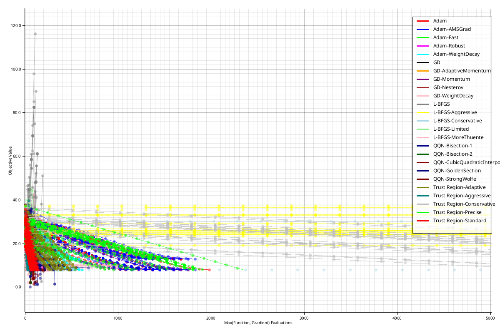
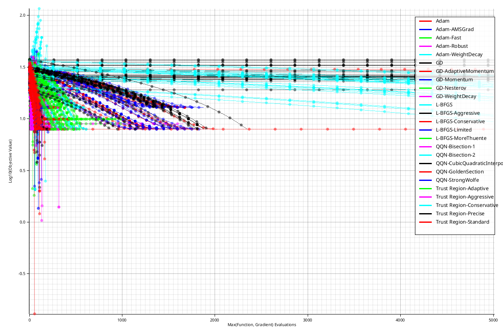

**Figure:** Convergence plots for Rastrigin_2D showing objective value vs iterations.
Left: Linear scale, Right: Log scale for better visualization of convergence behavior.

**Data:** [Linear scale data (CSV)](data/Rastrigin_2D_data.csv) | [Log scale data (CSV)](data/Rastrigin_2D_log_data.csv)

## Problem: Rastrigin_5D

**Family:** Rastrigin
**Dimension:** 5
**Success Threshold:** 2.040e1
**Total Runs:** 500
**Detailed Analysis:** [View comprehensive problem analysis](reports/problem_analysis_Rastrigin_5D.md)

### Performance Summary
<table style="border-collapse: collapse; width: 100%; margin: 20px 0;">
<tr style="background-color: #f2f2f2;">
<th style="border: 1px solid #ddd; padding: 8px; text-align: center;">Rank</th>
<th style="border: 1px solid #ddd; padding: 8px; text-align: center;">Optimizer</th>
<th style="border: 1px solid #ddd; padding: 8px; text-align: center;">Mean Final Value (All/Success/Fail)</th>
<th style="border: 1px solid #ddd; padding: 8px; text-align: center;">Std Dev</th>
<th style="border: 1px solid #ddd; padding: 8px; text-align: center;">Best Value</th>
<th style="border: 1px solid #ddd; padding: 8px; text-align: center;">Worst Value</th>
<th style="border: 1px solid #ddd; padding: 8px; text-align: center;">Mean Function Evals (All/Success/Fail)</th>
<th style="border: 1px solid #ddd; padding: 8px; text-align: center;">Mean Gradient Evals (All/Success/Fail)</th>
<th style="border: 1px solid #ddd; padding: 8px; text-align: center;">Success Rate</th>
<th style="border: 1px solid #ddd; padding: 8px; text-align: center;">Mean Time (s)</th>
</tr>
<tr style="background-color: #d4edda; font-weight: bold;">
<td style="border: 1px solid #ddd; padding: 8px; text-align: center;">1</td>
<td style="border: 1px solid #ddd; padding: 8px; text-align: center;"><a href="reports/detailed_Rastrigin_5D_GD-AdaptiveMomentum.md" title="Click for detailed analysis">GD-AdaptiveMomentum</a></td>
<td style="border: 1px solid #ddd; padding: 8px; text-align: center;">2.14e1 / 1.98e1 / 2.44e1</td>
<td style="border: 1px solid #ddd; padding: 8px; text-align: center;">2.70e0</td>
<td style="border: 1px solid #ddd; padding: 8px; text-align: center;">1.83e1</td>
<td style="border: 1px solid #ddd; padding: 8px; text-align: center;">2.98e1</td>
<td style="border: 1px solid #ddd; padding: 8px; text-align: center;">52.4 / 16.5 / 119.0</td>
<td style="border: 1px solid #ddd; padding: 8px; text-align: center;">101.3 / 29.9 / 234.0</td>
<td style="border: 1px solid #ddd; padding: 8px; text-align: center;">65.0%</td>
<td style="border: 1px solid #ddd; padding: 8px; text-align: center;">0.002</td>
</tr>
<tr style="background-color: #fff3cd;">
<td style="border: 1px solid #ddd; padding: 8px; text-align: center;">2</td>
<td style="border: 1px solid #ddd; padding: 8px; text-align: center;"><a href="reports/detailed_Rastrigin_5D_Trust_Region-Adaptive.md" title="Click for detailed analysis">Trust Region-Adaptive</a></td>
<td style="border: 1px solid #ddd; padding: 8px; text-align: center;">2.26e1 / 2.03e1 / 2.81e1</td>
<td style="border: 1px solid #ddd; padding: 8px; text-align: center;">3.17e0</td>
<td style="border: 1px solid #ddd; padding: 8px; text-align: center;">2.02e1</td>
<td style="border: 1px solid #ddd; padding: 8px; text-align: center;">2.99e1</td>
<td style="border: 1px solid #ddd; padding: 8px; text-align: center;">646.1 / 649.2 / 641.5</td>
<td style="border: 1px solid #ddd; padding: 8px; text-align: center;">431.6 / 433.8 / 428.2</td>
<td style="border: 1px solid #ddd; padding: 8px; text-align: center;">60.0%</td>
<td style="border: 1px solid #ddd; padding: 8px; text-align: center;">0.004</td>
</tr>
<tr style="">
<td style="border: 1px solid #ddd; padding: 8px; text-align: center;">3</td>
<td style="border: 1px solid #ddd; padding: 8px; text-align: center;"><a href="reports/detailed_Rastrigin_5D_Adam-Robust.md" title="Click for detailed analysis">Adam-Robust</a></td>
<td style="border: 1px solid #ddd; padding: 8px; text-align: center;">2.24e1 / 2.02e1 / 2.50e1</td>
<td style="border: 1px solid #ddd; padding: 8px; text-align: center;">3.07e0</td>
<td style="border: 1px solid #ddd; padding: 8px; text-align: center;">1.99e1</td>
<td style="border: 1px solid #ddd; padding: 8px; text-align: center;">2.99e1</td>
<td style="border: 1px solid #ddd; padding: 8px; text-align: center;">103.5 / 92.5 / 117.0</td>
<td style="border: 1px solid #ddd; padding: 8px; text-align: center;">103.0 / 92.5 / 116.0</td>
<td style="border: 1px solid #ddd; padding: 8px; text-align: center;">55.0%</td>
<td style="border: 1px solid #ddd; padding: 8px; text-align: center;">0.003</td>
</tr>
<tr style="">
<td style="border: 1px solid #ddd; padding: 8px; text-align: center;">4</td>
<td style="border: 1px solid #ddd; padding: 8px; text-align: center;"><a href="reports/detailed_Rastrigin_5D_Adam-WeightDecay.md" title="Click for detailed analysis">Adam-WeightDecay</a></td>
<td style="border: 1px solid #ddd; padding: 8px; text-align: center;">2.27e1 / 2.03e1 / 2.57e1</td>
<td style="border: 1px solid #ddd; padding: 8px; text-align: center;">3.12e0</td>
<td style="border: 1px solid #ddd; padding: 8px; text-align: center;">2.02e1</td>
<td style="border: 1px solid #ddd; padding: 8px; text-align: center;">2.98e1</td>
<td style="border: 1px solid #ddd; padding: 8px; text-align: center;">246.9 / 232.6 / 264.3</td>
<td style="border: 1px solid #ddd; padding: 8px; text-align: center;">246.4 / 232.6 / 263.3</td>
<td style="border: 1px solid #ddd; padding: 8px; text-align: center;">55.0%</td>
<td style="border: 1px solid #ddd; padding: 8px; text-align: center;">0.006</td>
</tr>
<tr style="">
<td style="border: 1px solid #ddd; padding: 8px; text-align: center;">5</td>
<td style="border: 1px solid #ddd; padding: 8px; text-align: center;"><a href="reports/detailed_Rastrigin_5D_Trust_Region-Aggressive.md" title="Click for detailed analysis">Trust Region-Aggressive</a></td>
<td style="border: 1px solid #ddd; padding: 8px; text-align: center;">2.33e1 / 1.99e1 / 2.67e1</td>
<td style="border: 1px solid #ddd; padding: 8px; text-align: center;">5.41e0</td>
<td style="border: 1px solid #ddd; padding: 8px; text-align: center;">1.82e1</td>
<td style="border: 1px solid #ddd; padding: 8px; text-align: center;">4.25e1</td>
<td style="border: 1px solid #ddd; padding: 8px; text-align: center;">45.7 / 45.6 / 45.8</td>
<td style="border: 1px solid #ddd; padding: 8px; text-align: center;">31.3 / 31.4 / 31.2</td>
<td style="border: 1px solid #ddd; padding: 8px; text-align: center;">50.0%</td>
<td style="border: 1px solid #ddd; padding: 8px; text-align: center;">0.000</td>
</tr>
<tr style="">
<td style="border: 1px solid #ddd; padding: 8px; text-align: center;">6</td>
<td style="border: 1px solid #ddd; padding: 8px; text-align: center;"><a href="reports/detailed_Rastrigin_5D_GD-WeightDecay.md" title="Click for detailed analysis">GD-WeightDecay</a></td>
<td style="border: 1px solid #ddd; padding: 8px; text-align: center;">2.25e1 / 2.01e1 / 2.50e1</td>
<td style="border: 1px solid #ddd; padding: 8px; text-align: center;">2.90e0</td>
<td style="border: 1px solid #ddd; padding: 8px; text-align: center;">1.89e1</td>
<td style="border: 1px solid #ddd; padding: 8px; text-align: center;">2.99e1</td>
<td style="border: 1px solid #ddd; padding: 8px; text-align: center;">37.8 / 18.0 / 57.6</td>
<td style="border: 1px solid #ddd; padding: 8px; text-align: center;">72.1 / 33.0 / 111.2</td>
<td style="border: 1px solid #ddd; padding: 8px; text-align: center;">50.0%</td>
<td style="border: 1px solid #ddd; padding: 8px; text-align: center;">0.001</td>
</tr>
<tr style="">
<td style="border: 1px solid #ddd; padding: 8px; text-align: center;">7</td>
<td style="border: 1px solid #ddd; padding: 8px; text-align: center;"><a href="reports/detailed_Rastrigin_5D_QQN-CubicQuadraticInterpolation.md" title="Click for detailed analysis">QQN-CubicQuadraticInterpolation</a></td>
<td style="border: 1px solid #ddd; padding: 8px; text-align: center;">2.30e1 / 1.72e1 / 2.89e1</td>
<td style="border: 1px solid #ddd; padding: 8px; text-align: center;">8.41e0</td>
<td style="border: 1px solid #ddd; padding: 8px; text-align: center;">4.91e0</td>
<td style="border: 1px solid #ddd; padding: 8px; text-align: center;">4.28e1</td>
<td style="border: 1px solid #ddd; padding: 8px; text-align: center;">106.2 / 58.3 / 154.2</td>
<td style="border: 1px solid #ddd; padding: 8px; text-align: center;">121.3 / 68.8 / 173.8</td>
<td style="border: 1px solid #ddd; padding: 8px; text-align: center;">50.0%</td>
<td style="border: 1px solid #ddd; padding: 8px; text-align: center;">0.003</td>
</tr>
<tr style="">
<td style="border: 1px solid #ddd; padding: 8px; text-align: center;">8</td>
<td style="border: 1px solid #ddd; padding: 8px; text-align: center;"><a href="reports/detailed_Rastrigin_5D_L-BFGS-MoreThuente.md" title="Click for detailed analysis">L-BFGS-MoreThuente</a></td>
<td style="border: 1px solid #ddd; padding: 8px; text-align: center;">2.54e1 / 1.62e1 / 3.91e1</td>
<td style="border: 1px solid #ddd; padding: 8px; text-align: center;">1.59e1</td>
<td style="border: 1px solid #ddd; padding: 8px; text-align: center;">7.71e0</td>
<td style="border: 1px solid #ddd; padding: 8px; text-align: center;">7.77e1</td>
<td style="border: 1px solid #ddd; padding: 8px; text-align: center;">165.1 / 49.7 / 280.4</td>
<td style="border: 1px solid #ddd; padding: 8px; text-align: center;">121.0 / 39.9 / 202.1</td>
<td style="border: 1px solid #ddd; padding: 8px; text-align: center;">50.0%</td>
<td style="border: 1px solid #ddd; padding: 8px; text-align: center;">0.003</td>
</tr>
<tr style="">
<td style="border: 1px solid #ddd; padding: 8px; text-align: center;">9</td>
<td style="border: 1px solid #ddd; padding: 8px; text-align: center;"><a href="reports/detailed_Rastrigin_5D_GD-Nesterov.md" title="Click for detailed analysis">GD-Nesterov</a></td>
<td style="border: 1px solid #ddd; padding: 8px; text-align: center;">2.35e1 / 2.02e1 / 2.66e1</td>
<td style="border: 1px solid #ddd; padding: 8px; text-align: center;">3.83e0</td>
<td style="border: 1px solid #ddd; padding: 8px; text-align: center;">1.99e1</td>
<td style="border: 1px solid #ddd; padding: 8px; text-align: center;">2.99e1</td>
<td style="border: 1px solid #ddd; padding: 8px; text-align: center;">41.2 / 13.3 / 64.0</td>
<td style="border: 1px solid #ddd; padding: 8px; text-align: center;">78.8 / 23.7 / 124.0</td>
<td style="border: 1px solid #ddd; padding: 8px; text-align: center;">45.0%</td>
<td style="border: 1px solid #ddd; padding: 8px; text-align: center;">0.001</td>
</tr>
<tr style="">
<td style="border: 1px solid #ddd; padding: 8px; text-align: center;">10</td>
<td style="border: 1px solid #ddd; padding: 8px; text-align: center;"><a href="reports/detailed_Rastrigin_5D_Trust_Region-Standard.md" title="Click for detailed analysis">Trust Region-Standard</a></td>
<td style="border: 1px solid #ddd; padding: 8px; text-align: center;">2.31e1 / 2.00e1 / 2.56e1</td>
<td style="border: 1px solid #ddd; padding: 8px; text-align: center;">3.22e0</td>
<td style="border: 1px solid #ddd; padding: 8px; text-align: center;">1.95e1</td>
<td style="border: 1px solid #ddd; padding: 8px; text-align: center;">2.99e1</td>
<td style="border: 1px solid #ddd; padding: 8px; text-align: center;">168.5 / 176.3 / 162.1</td>
<td style="border: 1px solid #ddd; padding: 8px; text-align: center;">113.2 / 118.6 / 108.7</td>
<td style="border: 1px solid #ddd; padding: 8px; text-align: center;">45.0%</td>
<td style="border: 1px solid #ddd; padding: 8px; text-align: center;">0.001</td>
</tr>
<tr style="">
<td style="border: 1px solid #ddd; padding: 8px; text-align: center;">11</td>
<td style="border: 1px solid #ddd; padding: 8px; text-align: center;"><a href="reports/detailed_Rastrigin_5D_Adam-Fast.md" title="Click for detailed analysis">Adam-Fast</a></td>
<td style="border: 1px solid #ddd; padding: 8px; text-align: center;">2.31e1 / 2.00e1 / 2.55e1</td>
<td style="border: 1px solid #ddd; padding: 8px; text-align: center;">3.21e0</td>
<td style="border: 1px solid #ddd; padding: 8px; text-align: center;">1.92e1</td>
<td style="border: 1px solid #ddd; padding: 8px; text-align: center;">2.98e1</td>
<td style="border: 1px solid #ddd; padding: 8px; text-align: center;">48.9 / 28.8 / 62.3</td>
<td style="border: 1px solid #ddd; padding: 8px; text-align: center;">48.3 / 28.8 / 61.3</td>
<td style="border: 1px solid #ddd; padding: 8px; text-align: center;">40.0%</td>
<td style="border: 1px solid #ddd; padding: 8px; text-align: center;">0.001</td>
</tr>
<tr style="">
<td style="border: 1px solid #ddd; padding: 8px; text-align: center;">12</td>
<td style="border: 1px solid #ddd; padding: 8px; text-align: center;"><a href="reports/detailed_Rastrigin_5D_QQN-StrongWolfe.md" title="Click for detailed analysis">QQN-StrongWolfe</a></td>
<td style="border: 1px solid #ddd; padding: 8px; text-align: center;">2.36e1 / 1.88e1 / 2.67e1</td>
<td style="border: 1px solid #ddd; padding: 8px; text-align: center;">5.65e0</td>
<td style="border: 1px solid #ddd; padding: 8px; text-align: center;">1.16e1</td>
<td style="border: 1px solid #ddd; padding: 8px; text-align: center;">4.08e1</td>
<td style="border: 1px solid #ddd; padding: 8px; text-align: center;">100.2 / 63.9 / 124.4</td>
<td style="border: 1px solid #ddd; padding: 8px; text-align: center;">86.0 / 49.4 / 110.3</td>
<td style="border: 1px solid #ddd; padding: 8px; text-align: center;">40.0%</td>
<td style="border: 1px solid #ddd; padding: 8px; text-align: center;">0.003</td>
</tr>
<tr style="">
<td style="border: 1px solid #ddd; padding: 8px; text-align: center;">13</td>
<td style="border: 1px solid #ddd; padding: 8px; text-align: center;"><a href="reports/detailed_Rastrigin_5D_L-BFGS-Conservative.md" title="Click for detailed analysis">L-BFGS-Conservative</a></td>
<td style="border: 1px solid #ddd; padding: 8px; text-align: center;">2.31e1 / 2.02e1 / 2.55e1</td>
<td style="border: 1px solid #ddd; padding: 8px; text-align: center;">3.25e0</td>
<td style="border: 1px solid #ddd; padding: 8px; text-align: center;">1.99e1</td>
<td style="border: 1px solid #ddd; padding: 8px; text-align: center;">3.16e1</td>
<td style="border: 1px solid #ddd; padding: 8px; text-align: center;">881.9 / 239.2 / 1310.2</td>
<td style="border: 1px solid #ddd; padding: 8px; text-align: center;">239.9 / 85.9 / 342.7</td>
<td style="border: 1px solid #ddd; padding: 8px; text-align: center;">40.0%</td>
<td style="border: 1px solid #ddd; padding: 8px; text-align: center;">0.009</td>
</tr>
<tr style="">
<td style="border: 1px solid #ddd; padding: 8px; text-align: center;">14</td>
<td style="border: 1px solid #ddd; padding: 8px; text-align: center;"><a href="reports/detailed_Rastrigin_5D_Adam-AMSGrad.md" title="Click for detailed analysis">Adam-AMSGrad</a></td>
<td style="border: 1px solid #ddd; padding: 8px; text-align: center;">2.38e1 / 2.04e1 / 2.60e1</td>
<td style="border: 1px solid #ddd; padding: 8px; text-align: center;">3.35e0</td>
<td style="border: 1px solid #ddd; padding: 8px; text-align: center;">2.04e1</td>
<td style="border: 1px solid #ddd; padding: 8px; text-align: center;">2.98e1</td>
<td style="border: 1px solid #ddd; padding: 8px; text-align: center;">719.2 / 668.8 / 752.8</td>
<td style="border: 1px solid #ddd; padding: 8px; text-align: center;">718.6 / 668.8 / 751.8</td>
<td style="border: 1px solid #ddd; padding: 8px; text-align: center;">40.0%</td>
<td style="border: 1px solid #ddd; padding: 8px; text-align: center;">0.017</td>
</tr>
<tr style="">
<td style="border: 1px solid #ddd; padding: 8px; text-align: center;">15</td>
<td style="border: 1px solid #ddd; padding: 8px; text-align: center;"><a href="reports/detailed_Rastrigin_5D_L-BFGS-Limited.md" title="Click for detailed analysis">L-BFGS-Limited</a></td>
<td style="border: 1px solid #ddd; padding: 8px; text-align: center;">2.66e1 / 1.89e1 / 3.36e1</td>
<td style="border: 1px solid #ddd; padding: 8px; text-align: center;">1.10e1</td>
<td style="border: 1px solid #ddd; padding: 8px; text-align: center;">1.70e1</td>
<td style="border: 1px solid #ddd; padding: 8px; text-align: center;">6.21e1</td>
<td style="border: 1px solid #ddd; padding: 8px; text-align: center;">115.2 / 42.9 / 154.2</td>
<td style="border: 1px solid #ddd; padding: 8px; text-align: center;">36.2 / 18.0 / 46.1</td>
<td style="border: 1px solid #ddd; padding: 8px; text-align: center;">35.0%</td>
<td style="border: 1px solid #ddd; padding: 8px; text-align: center;">0.002</td>
</tr>
<tr style="">
<td style="border: 1px solid #ddd; padding: 8px; text-align: center;">16</td>
<td style="border: 1px solid #ddd; padding: 8px; text-align: center;"><a href="reports/detailed_Rastrigin_5D_QQN-GoldenSection.md" title="Click for detailed analysis">QQN-GoldenSection</a></td>
<td style="border: 1px solid #ddd; padding: 8px; text-align: center;">2.31e1 / 1.44e1 / 2.77e1</td>
<td style="border: 1px solid #ddd; padding: 8px; text-align: center;">9.30e0</td>
<td style="border: 1px solid #ddd; padding: 8px; text-align: center;">7.97e0</td>
<td style="border: 1px solid #ddd; padding: 8px; text-align: center;">4.97e1</td>
<td style="border: 1px solid #ddd; padding: 8px; text-align: center;">266.0 / 105.0 / 352.7</td>
<td style="border: 1px solid #ddd; padding: 8px; text-align: center;">45.8 / 14.9 / 62.4</td>
<td style="border: 1px solid #ddd; padding: 8px; text-align: center;">35.0%</td>
<td style="border: 1px solid #ddd; padding: 8px; text-align: center;">0.004</td>
</tr>
<tr style="">
<td style="border: 1px solid #ddd; padding: 8px; text-align: center;">17</td>
<td style="border: 1px solid #ddd; padding: 8px; text-align: center;"><a href="reports/detailed_Rastrigin_5D_Trust_Region-Precise.md" title="Click for detailed analysis">Trust Region-Precise</a></td>
<td style="border: 1px solid #ddd; padding: 8px; text-align: center;">2.39e1 / 2.04e1 / 2.59e1</td>
<td style="border: 1px solid #ddd; padding: 8px; text-align: center;">3.48e0</td>
<td style="border: 1px solid #ddd; padding: 8px; text-align: center;">2.03e1</td>
<td style="border: 1px solid #ddd; padding: 8px; text-align: center;">2.99e1</td>
<td style="border: 1px solid #ddd; padding: 8px; text-align: center;">2558.8 / 2408.1 / 2639.9</td>
<td style="border: 1px solid #ddd; padding: 8px; text-align: center;">1706.7 / 1606.4 / 1760.6</td>
<td style="border: 1px solid #ddd; padding: 8px; text-align: center;">35.0%</td>
<td style="border: 1px solid #ddd; padding: 8px; text-align: center;">0.017</td>
</tr>
<tr style="">
<td style="border: 1px solid #ddd; padding: 8px; text-align: center;">18</td>
<td style="border: 1px solid #ddd; padding: 8px; text-align: center;"><a href="reports/detailed_Rastrigin_5D_GD.md" title="Click for detailed analysis">GD</a></td>
<td style="border: 1px solid #ddd; padding: 8px; text-align: center;">2.43e1 / 2.00e1 / 2.63e1</td>
<td style="border: 1px solid #ddd; padding: 8px; text-align: center;">3.39e0</td>
<td style="border: 1px solid #ddd; padding: 8px; text-align: center;">1.99e1</td>
<td style="border: 1px solid #ddd; padding: 8px; text-align: center;">3.03e1</td>
<td style="border: 1px solid #ddd; padding: 8px; text-align: center;">15.7 / 12.0 / 17.3</td>
<td style="border: 1px solid #ddd; padding: 8px; text-align: center;">27.7 / 21.0 / 30.6</td>
<td style="border: 1px solid #ddd; padding: 8px; text-align: center;">30.0%</td>
<td style="border: 1px solid #ddd; padding: 8px; text-align: center;">0.000</td>
</tr>
<tr style="">
<td style="border: 1px solid #ddd; padding: 8px; text-align: center;">19</td>
<td style="border: 1px solid #ddd; padding: 8px; text-align: center;"><a href="reports/detailed_Rastrigin_5D_Adam.md" title="Click for detailed analysis">Adam</a></td>
<td style="border: 1px solid #ddd; padding: 8px; text-align: center;">2.42e1 / 2.04e1 / 2.59e1</td>
<td style="border: 1px solid #ddd; padding: 8px; text-align: center;">3.16e0</td>
<td style="border: 1px solid #ddd; padding: 8px; text-align: center;">2.03e1</td>
<td style="border: 1px solid #ddd; padding: 8px; text-align: center;">2.98e1</td>
<td style="border: 1px solid #ddd; padding: 8px; text-align: center;">745.3 / 672.0 / 776.7</td>
<td style="border: 1px solid #ddd; padding: 8px; text-align: center;">744.6 / 672.0 / 775.7</td>
<td style="border: 1px solid #ddd; padding: 8px; text-align: center;">30.0%</td>
<td style="border: 1px solid #ddd; padding: 8px; text-align: center;">0.016</td>
</tr>
<tr style="">
<td style="border: 1px solid #ddd; padding: 8px; text-align: center;">20</td>
<td style="border: 1px solid #ddd; padding: 8px; text-align: center;"><a href="reports/detailed_Rastrigin_5D_QQN-Bisection-1.md" title="Click for detailed analysis">QQN-Bisection-1</a></td>
<td style="border: 1px solid #ddd; padding: 8px; text-align: center;">2.48e1 / 1.96e1 / 2.66e1</td>
<td style="border: 1px solid #ddd; padding: 8px; text-align: center;">4.08e0</td>
<td style="border: 1px solid #ddd; padding: 8px; text-align: center;">1.80e1</td>
<td style="border: 1px solid #ddd; padding: 8px; text-align: center;">3.38e1</td>
<td style="border: 1px solid #ddd; padding: 8px; text-align: center;">186.6 / 99.8 / 215.5</td>
<td style="border: 1px solid #ddd; padding: 8px; text-align: center;">211.4 / 117.2 / 242.9</td>
<td style="border: 1px solid #ddd; padding: 8px; text-align: center;">25.0%</td>
<td style="border: 1px solid #ddd; padding: 8px; text-align: center;">0.004</td>
</tr>
<tr style="">
<td style="border: 1px solid #ddd; padding: 8px; text-align: center;">21</td>
<td style="border: 1px solid #ddd; padding: 8px; text-align: center;"><a href="reports/detailed_Rastrigin_5D_QQN-Bisection-2.md" title="Click for detailed analysis">QQN-Bisection-2</a></td>
<td style="border: 1px solid #ddd; padding: 8px; text-align: center;">3.08e1 / 1.59e1 / 3.98e1</td>
<td style="border: 1px solid #ddd; padding: 8px; text-align: center;">1.62e1</td>
<td style="border: 1px solid #ddd; padding: 8px; text-align: center;">1.10e1</td>
<td style="border: 1px solid #ddd; padding: 8px; text-align: center;">6.07e1</td>
<td style="border: 1px solid #ddd; padding: 8px; text-align: center;">36.6 / 44.7 / 35.2</td>
<td style="border: 1px solid #ddd; padding: 8px; text-align: center;">41.5 / 68.3 / 36.8</td>
<td style="border: 1px solid #ddd; padding: 8px; text-align: center;">15.0%</td>
<td style="border: 1px solid #ddd; padding: 8px; text-align: center;">0.001</td>
</tr>
<tr style="">
<td style="border: 1px solid #ddd; padding: 8px; text-align: center;">22</td>
<td style="border: 1px solid #ddd; padding: 8px; text-align: center;"><a href="reports/detailed_Rastrigin_5D_GD-Momentum.md" title="Click for detailed analysis">GD-Momentum</a></td>
<td style="border: 1px solid #ddd; padding: 8px; text-align: center;">2.71e1 / 2.04e1 / 3.08e1</td>
<td style="border: 1px solid #ddd; padding: 8px; text-align: center;">5.71e0</td>
<td style="border: 1px solid #ddd; padding: 8px; text-align: center;">2.04e1</td>
<td style="border: 1px solid #ddd; padding: 8px; text-align: center;">4.39e1</td>
<td style="border: 1px solid #ddd; padding: 8px; text-align: center;">28.9 / 41.0 / 28.3</td>
<td style="border: 1px solid #ddd; padding: 8px; text-align: center;">54.0 / 79.0 / 52.6</td>
<td style="border: 1px solid #ddd; padding: 8px; text-align: center;">5.0%</td>
<td style="border: 1px solid #ddd; padding: 8px; text-align: center;">0.001</td>
</tr>
<tr style="">
<td style="border: 1px solid #ddd; padding: 8px; text-align: center;">23</td>
<td style="border: 1px solid #ddd; padding: 8px; text-align: center;"><a href="reports/detailed_Rastrigin_5D_L-BFGS.md" title="Click for detailed analysis">L-BFGS</a></td>
<td style="border: 1px solid #ddd; padding: 8px; text-align: center;">6.03e1 / - / 1.02e2</td>
<td style="border: 1px solid #ddd; padding: 8px; text-align: center;">9.97e0</td>
<td style="border: 1px solid #ddd; padding: 8px; text-align: center;">4.27e1</td>
<td style="border: 1px solid #ddd; padding: 8px; text-align: center;">7.89e1</td>
<td style="border: 1px solid #ddd; padding: 8px; text-align: center;">98.2 / - / 98.2</td>
<td style="border: 1px solid #ddd; padding: 8px; text-align: center;">35.1 / - / 35.1</td>
<td style="border: 1px solid #ddd; padding: 8px; text-align: center;">0.0%</td>
<td style="border: 1px solid #ddd; padding: 8px; text-align: center;">0.001</td>
</tr>
<tr style="">
<td style="border: 1px solid #ddd; padding: 8px; text-align: center;">24</td>
<td style="border: 1px solid #ddd; padding: 8px; text-align: center;"><a href="reports/detailed_Rastrigin_5D_Trust_Region-Conservative.md" title="Click for detailed analysis">Trust Region-Conservative</a></td>
<td style="border: 1px solid #ddd; padding: 8px; text-align: center;">6.91e1 / - / 6.91e1</td>
<td style="border: 1px solid #ddd; padding: 8px; text-align: center;">7.96e0</td>
<td style="border: 1px solid #ddd; padding: 8px; text-align: center;">5.03e1</td>
<td style="border: 1px solid #ddd; padding: 8px; text-align: center;">8.29e1</td>
<td style="border: 1px solid #ddd; padding: 8px; text-align: center;">3002.0 / - / 3002.0</td>
<td style="border: 1px solid #ddd; padding: 8px; text-align: center;">2002.0 / - / 2002.0</td>
<td style="border: 1px solid #ddd; padding: 8px; text-align: center;">0.0%</td>
<td style="border: 1px solid #ddd; padding: 8px; text-align: center;">0.020</td>
</tr>
<tr style="">
<td style="border: 1px solid #ddd; padding: 8px; text-align: center;">25</td>
<td style="border: 1px solid #ddd; padding: 8px; text-align: center;"><a href="reports/detailed_Rastrigin_5D_L-BFGS-Aggressive.md" title="Click for detailed analysis">L-BFGS-Aggressive</a></td>
<td style="border: 1px solid #ddd; padding: 8px; text-align: center;">7.97e1 / - / 7.97e1</td>
<td style="border: 1px solid #ddd; padding: 8px; text-align: center;">9.04e0</td>
<td style="border: 1px solid #ddd; padding: 8px; text-align: center;">5.68e1</td>
<td style="border: 1px solid #ddd; padding: 8px; text-align: center;">9.50e1</td>
<td style="border: 1px solid #ddd; padding: 8px; text-align: center;">3852.0 / - / 3852.0</td>
<td style="border: 1px solid #ddd; padding: 8px; text-align: center;">1157.0 / - / 1157.0</td>
<td style="border: 1px solid #ddd; padding: 8px; text-align: center;">0.0%</td>
<td style="border: 1px solid #ddd; padding: 8px; text-align: center;">0.029</td>
</tr>
</table>

### Convergence Plots

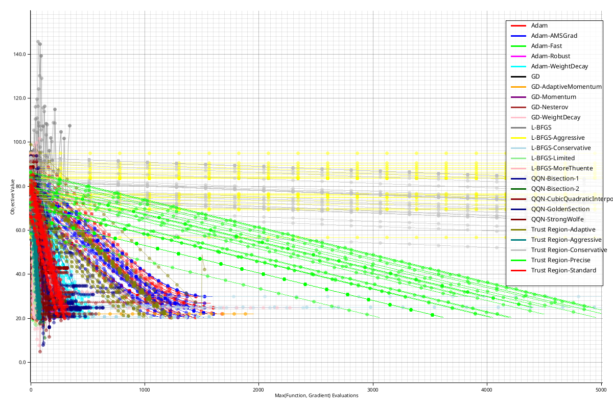
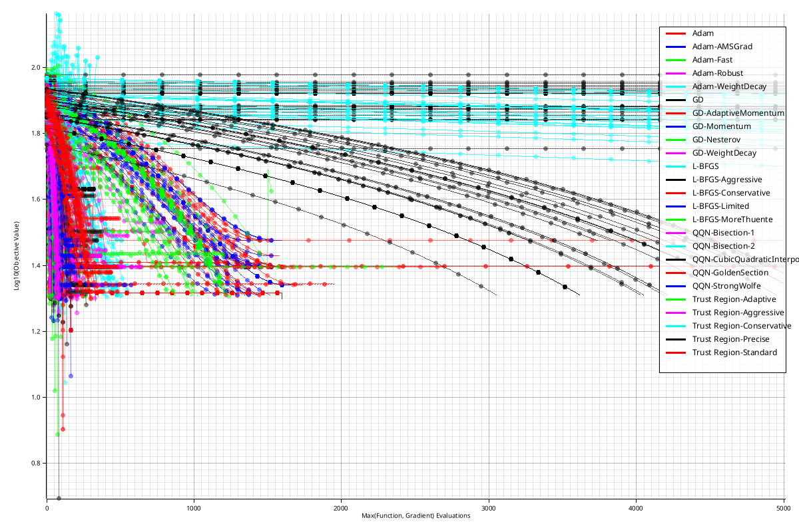

**Figure:** Convergence plots for Rastrigin_5D showing objective value vs iterations.
Left: Linear scale, Right: Log scale for better visualization of convergence behavior.

**Data:** [Linear scale data (CSV)](data/Rastrigin_5D_data.csv) | [Log scale data (CSV)](data/Rastrigin_5D_log_data.csv)

## Problem: Rastrigin_10D

**Family:** Rastrigin
**Dimension:** 10
**Success Threshold:** 4.180e1
**Total Runs:** 500
**Detailed Analysis:** [View comprehensive problem analysis](reports/problem_analysis_Rastrigin_10D.md)

### Performance Summary
<table style="border-collapse: collapse; width: 100%; margin: 20px 0;">
<tr style="background-color: #f2f2f2;">
<th style="border: 1px solid #ddd; padding: 8px; text-align: center;">Rank</th>
<th style="border: 1px solid #ddd; padding: 8px; text-align: center;">Optimizer</th>
<th style="border: 1px solid #ddd; padding: 8px; text-align: center;">Mean Final Value (All/Success/Fail)</th>
<th style="border: 1px solid #ddd; padding: 8px; text-align: center;">Std Dev</th>
<th style="border: 1px solid #ddd; padding: 8px; text-align: center;">Best Value</th>
<th style="border: 1px solid #ddd; padding: 8px; text-align: center;">Worst Value</th>
<th style="border: 1px solid #ddd; padding: 8px; text-align: center;">Mean Function Evals (All/Success/Fail)</th>
<th style="border: 1px solid #ddd; padding: 8px; text-align: center;">Mean Gradient Evals (All/Success/Fail)</th>
<th style="border: 1px solid #ddd; padding: 8px; text-align: center;">Success Rate</th>
<th style="border: 1px solid #ddd; padding: 8px; text-align: center;">Mean Time (s)</th>
</tr>
<tr style="background-color: #d4edda; font-weight: bold;">
<td style="border: 1px solid #ddd; padding: 8px; text-align: center;">1</td>
<td style="border: 1px solid #ddd; padding: 8px; text-align: center;"><a href="reports/detailed_Rastrigin_10D_L-BFGS-MoreThuente.md" title="Click for detailed analysis">L-BFGS-MoreThuente</a></td>
<td style="border: 1px solid #ddd; padding: 8px; text-align: center;">4.11e1 / 3.71e1 / 4.88e1</td>
<td style="border: 1px solid #ddd; padding: 8px; text-align: center;">7.33e0</td>
<td style="border: 1px solid #ddd; padding: 8px; text-align: center;">2.56e1</td>
<td style="border: 1px solid #ddd; padding: 8px; text-align: center;">6.07e1</td>
<td style="border: 1px solid #ddd; padding: 8px; text-align: center;">291.6 / 106.1 / 636.0</td>
<td style="border: 1px solid #ddd; padding: 8px; text-align: center;">213.8 / 81.2 / 460.1</td>
<td style="border: 1px solid #ddd; padding: 8px; text-align: center;">65.0%</td>
<td style="border: 1px solid #ddd; padding: 8px; text-align: center;">0.006</td>
</tr>
<tr style="background-color: #fff3cd;">
<td style="border: 1px solid #ddd; padding: 8px; text-align: center;">2</td>
<td style="border: 1px solid #ddd; padding: 8px; text-align: center;"><a href="reports/detailed_Rastrigin_10D_QQN-CubicQuadraticInterpolation.md" title="Click for detailed analysis">QQN-CubicQuadraticInterpolation</a></td>
<td style="border: 1px solid #ddd; padding: 8px; text-align: center;">4.52e1 / 3.98e1 / 5.34e1</td>
<td style="border: 1px solid #ddd; padding: 8px; text-align: center;">7.84e0</td>
<td style="border: 1px solid #ddd; padding: 8px; text-align: center;">3.21e1</td>
<td style="border: 1px solid #ddd; padding: 8px; text-align: center;">5.87e1</td>
<td style="border: 1px solid #ddd; padding: 8px; text-align: center;">102.5 / 76.8 / 141.0</td>
<td style="border: 1px solid #ddd; padding: 8px; text-align: center;">118.2 / 92.7 / 156.4</td>
<td style="border: 1px solid #ddd; padding: 8px; text-align: center;">60.0%</td>
<td style="border: 1px solid #ddd; padding: 8px; text-align: center;">0.003</td>
</tr>
<tr style="">
<td style="border: 1px solid #ddd; padding: 8px; text-align: center;">3</td>
<td style="border: 1px solid #ddd; padding: 8px; text-align: center;"><a href="reports/detailed_Rastrigin_10D_Adam-AMSGrad.md" title="Click for detailed analysis">Adam-AMSGrad</a></td>
<td style="border: 1px solid #ddd; padding: 8px; text-align: center;">4.48e1 / 4.18e1 / 4.85e1</td>
<td style="border: 1px solid #ddd; padding: 8px; text-align: center;">4.03e0</td>
<td style="border: 1px solid #ddd; padding: 8px; text-align: center;">4.17e1</td>
<td style="border: 1px solid #ddd; padding: 8px; text-align: center;">5.47e1</td>
<td style="border: 1px solid #ddd; padding: 8px; text-align: center;">718.0 / 694.3 / 747.0</td>
<td style="border: 1px solid #ddd; padding: 8px; text-align: center;">717.5 / 694.3 / 746.0</td>
<td style="border: 1px solid #ddd; padding: 8px; text-align: center;">55.0%</td>
<td style="border: 1px solid #ddd; padding: 8px; text-align: center;">0.018</td>
</tr>
<tr style="">
<td style="border: 1px solid #ddd; padding: 8px; text-align: center;">4</td>
<td style="border: 1px solid #ddd; padding: 8px; text-align: center;"><a href="reports/detailed_Rastrigin_10D_L-BFGS-Limited.md" title="Click for detailed analysis">L-BFGS-Limited</a></td>
<td style="border: 1px solid #ddd; padding: 8px; text-align: center;">4.36e1 / 3.98e1 / 4.74e1</td>
<td style="border: 1px solid #ddd; padding: 8px; text-align: center;">4.97e0</td>
<td style="border: 1px solid #ddd; padding: 8px; text-align: center;">3.39e1</td>
<td style="border: 1px solid #ddd; padding: 8px; text-align: center;">5.47e1</td>
<td style="border: 1px solid #ddd; padding: 8px; text-align: center;">122.0 / 44.4 / 199.5</td>
<td style="border: 1px solid #ddd; padding: 8px; text-align: center;">36.8 / 17.7 / 55.8</td>
<td style="border: 1px solid #ddd; padding: 8px; text-align: center;">50.0%</td>
<td style="border: 1px solid #ddd; padding: 8px; text-align: center;">0.002</td>
</tr>
<tr style="">
<td style="border: 1px solid #ddd; padding: 8px; text-align: center;">5</td>
<td style="border: 1px solid #ddd; padding: 8px; text-align: center;"><a href="reports/detailed_Rastrigin_10D_QQN-GoldenSection.md" title="Click for detailed analysis">QQN-GoldenSection</a></td>
<td style="border: 1px solid #ddd; padding: 8px; text-align: center;">4.53e1 / 3.65e1 / 5.41e1</td>
<td style="border: 1px solid #ddd; padding: 8px; text-align: center;">1.18e1</td>
<td style="border: 1px solid #ddd; padding: 8px; text-align: center;">2.11e1</td>
<td style="border: 1px solid #ddd; padding: 8px; text-align: center;">7.26e1</td>
<td style="border: 1px solid #ddd; padding: 8px; text-align: center;">275.4 / 148.0 / 402.8</td>
<td style="border: 1px solid #ddd; padding: 8px; text-align: center;">43.9 / 20.6 / 67.1</td>
<td style="border: 1px solid #ddd; padding: 8px; text-align: center;">50.0%</td>
<td style="border: 1px solid #ddd; padding: 8px; text-align: center;">0.005</td>
</tr>
<tr style="">
<td style="border: 1px solid #ddd; padding: 8px; text-align: center;">6</td>
<td style="border: 1px solid #ddd; padding: 8px; text-align: center;"><a href="reports/detailed_Rastrigin_10D_Trust_Region-Aggressive.md" title="Click for detailed analysis">Trust Region-Aggressive</a></td>
<td style="border: 1px solid #ddd; padding: 8px; text-align: center;">4.36e1 / 4.07e1 / 4.59e1</td>
<td style="border: 1px solid #ddd; padding: 8px; text-align: center;">3.69e0</td>
<td style="border: 1px solid #ddd; padding: 8px; text-align: center;">3.87e1</td>
<td style="border: 1px solid #ddd; padding: 8px; text-align: center;">5.26e1</td>
<td style="border: 1px solid #ddd; padding: 8px; text-align: center;">93.5 / 95.7 / 91.7</td>
<td style="border: 1px solid #ddd; padding: 8px; text-align: center;">63.1 / 64.8 / 61.8</td>
<td style="border: 1px solid #ddd; padding: 8px; text-align: center;">45.0%</td>
<td style="border: 1px solid #ddd; padding: 8px; text-align: center;">0.001</td>
</tr>
<tr style="">
<td style="border: 1px solid #ddd; padding: 8px; text-align: center;">7</td>
<td style="border: 1px solid #ddd; padding: 8px; text-align: center;"><a href="reports/detailed_Rastrigin_10D_GD-WeightDecay.md" title="Click for detailed analysis">GD-WeightDecay</a></td>
<td style="border: 1px solid #ddd; padding: 8px; text-align: center;">4.39e1 / 4.07e1 / 4.66e1</td>
<td style="border: 1px solid #ddd; padding: 8px; text-align: center;">3.41e0</td>
<td style="border: 1px solid #ddd; padding: 8px; text-align: center;">3.60e1</td>
<td style="border: 1px solid #ddd; padding: 8px; text-align: center;">4.97e1</td>
<td style="border: 1px solid #ddd; padding: 8px; text-align: center;">61.3 / 24.1 / 91.7</td>
<td style="border: 1px solid #ddd; padding: 8px; text-align: center;">119.0 / 45.2 / 179.5</td>
<td style="border: 1px solid #ddd; padding: 8px; text-align: center;">45.0%</td>
<td style="border: 1px solid #ddd; padding: 8px; text-align: center;">0.002</td>
</tr>
<tr style="">
<td style="border: 1px solid #ddd; padding: 8px; text-align: center;">8</td>
<td style="border: 1px solid #ddd; padding: 8px; text-align: center;"><a href="reports/detailed_Rastrigin_10D_QQN-Bisection-1.md" title="Click for detailed analysis">QQN-Bisection-1</a></td>
<td style="border: 1px solid #ddd; padding: 8px; text-align: center;">5.11e1 / 4.07e1 / 6.05e1</td>
<td style="border: 1px solid #ddd; padding: 8px; text-align: center;">1.61e1</td>
<td style="border: 1px solid #ddd; padding: 8px; text-align: center;">3.88e1</td>
<td style="border: 1px solid #ddd; padding: 8px; text-align: center;">8.86e1</td>
<td style="border: 1px solid #ddd; padding: 8px; text-align: center;">216.4 / 175.4 / 249.9</td>
<td style="border: 1px solid #ddd; padding: 8px; text-align: center;">240.3 / 201.3 / 272.3</td>
<td style="border: 1px solid #ddd; padding: 8px; text-align: center;">45.0%</td>
<td style="border: 1px solid #ddd; padding: 8px; text-align: center;">0.005</td>
</tr>
<tr style="">
<td style="border: 1px solid #ddd; padding: 8px; text-align: center;">9</td>
<td style="border: 1px solid #ddd; padding: 8px; text-align: center;"><a href="reports/detailed_Rastrigin_10D_GD-AdaptiveMomentum.md" title="Click for detailed analysis">GD-AdaptiveMomentum</a></td>
<td style="border: 1px solid #ddd; padding: 8px; text-align: center;">4.62e1 / 4.07e1 / 5.37e1</td>
<td style="border: 1px solid #ddd; padding: 8px; text-align: center;">7.05e0</td>
<td style="border: 1px solid #ddd; padding: 8px; text-align: center;">3.80e1</td>
<td style="border: 1px solid #ddd; padding: 8px; text-align: center;">6.94e1</td>
<td style="border: 1px solid #ddd; padding: 8px; text-align: center;">23.2 / 22.9 / 23.5</td>
<td style="border: 1px solid #ddd; padding: 8px; text-align: center;">42.9 / 42.8 / 43.0</td>
<td style="border: 1px solid #ddd; padding: 8px; text-align: center;">40.0%</td>
<td style="border: 1px solid #ddd; padding: 8px; text-align: center;">0.001</td>
</tr>
<tr style="">
<td style="border: 1px solid #ddd; padding: 8px; text-align: center;">10</td>
<td style="border: 1px solid #ddd; padding: 8px; text-align: center;"><a href="reports/detailed_Rastrigin_10D_QQN-StrongWolfe.md" title="Click for detailed analysis">QQN-StrongWolfe</a></td>
<td style="border: 1px solid #ddd; padding: 8px; text-align: center;">5.16e1 / 3.94e1 / 5.97e1</td>
<td style="border: 1px solid #ddd; padding: 8px; text-align: center;">1.59e1</td>
<td style="border: 1px solid #ddd; padding: 8px; text-align: center;">3.24e1</td>
<td style="border: 1px solid #ddd; padding: 8px; text-align: center;">9.55e1</td>
<td style="border: 1px solid #ddd; padding: 8px; text-align: center;">118.5 / 74.6 / 147.7</td>
<td style="border: 1px solid #ddd; padding: 8px; text-align: center;">102.5 / 57.8 / 132.4</td>
<td style="border: 1px solid #ddd; padding: 8px; text-align: center;">40.0%</td>
<td style="border: 1px solid #ddd; padding: 8px; text-align: center;">0.003</td>
</tr>
<tr style="">
<td style="border: 1px solid #ddd; padding: 8px; text-align: center;">11</td>
<td style="border: 1px solid #ddd; padding: 8px; text-align: center;"><a href="reports/detailed_Rastrigin_10D_Trust_Region-Adaptive.md" title="Click for detailed analysis">Trust Region-Adaptive</a></td>
<td style="border: 1px solid #ddd; padding: 8px; text-align: center;">4.39e1 / 4.16e1 / 4.55e1</td>
<td style="border: 1px solid #ddd; padding: 8px; text-align: center;">2.92e0</td>
<td style="border: 1px solid #ddd; padding: 8px; text-align: center;">4.16e1</td>
<td style="border: 1px solid #ddd; padding: 8px; text-align: center;">4.98e1</td>
<td style="border: 1px solid #ddd; padding: 8px; text-align: center;">1397.8 / 1392.4 / 1401.5</td>
<td style="border: 1px solid #ddd; padding: 8px; text-align: center;">932.7 / 929.2 / 935.0</td>
<td style="border: 1px solid #ddd; padding: 8px; text-align: center;">40.0%</td>
<td style="border: 1px solid #ddd; padding: 8px; text-align: center;">0.010</td>
</tr>
<tr style="">
<td style="border: 1px solid #ddd; padding: 8px; text-align: center;">12</td>
<td style="border: 1px solid #ddd; padding: 8px; text-align: center;"><a href="reports/detailed_Rastrigin_10D_GD.md" title="Click for detailed analysis">GD</a></td>
<td style="border: 1px solid #ddd; padding: 8px; text-align: center;">4.46e1 / 4.02e1 / 4.71e1</td>
<td style="border: 1px solid #ddd; padding: 8px; text-align: center;">4.27e0</td>
<td style="border: 1px solid #ddd; padding: 8px; text-align: center;">3.89e1</td>
<td style="border: 1px solid #ddd; padding: 8px; text-align: center;">5.47e1</td>
<td style="border: 1px solid #ddd; padding: 8px; text-align: center;">19.4 / 15.9 / 21.2</td>
<td style="border: 1px solid #ddd; padding: 8px; text-align: center;">35.0 / 28.7 / 38.5</td>
<td style="border: 1px solid #ddd; padding: 8px; text-align: center;">35.0%</td>
<td style="border: 1px solid #ddd; padding: 8px; text-align: center;">0.001</td>
</tr>
<tr style="">
<td style="border: 1px solid #ddd; padding: 8px; text-align: center;">13</td>
<td style="border: 1px solid #ddd; padding: 8px; text-align: center;"><a href="reports/detailed_Rastrigin_10D_Adam-WeightDecay.md" title="Click for detailed analysis">Adam-WeightDecay</a></td>
<td style="border: 1px solid #ddd; padding: 8px; text-align: center;">4.52e1 / 4.17e1 / 4.71e1</td>
<td style="border: 1px solid #ddd; padding: 8px; text-align: center;">3.95e0</td>
<td style="border: 1px solid #ddd; padding: 8px; text-align: center;">4.15e1</td>
<td style="border: 1px solid #ddd; padding: 8px; text-align: center;">5.47e1</td>
<td style="border: 1px solid #ddd; padding: 8px; text-align: center;">253.8 / 226.4 / 268.5</td>
<td style="border: 1px solid #ddd; padding: 8px; text-align: center;">253.2 / 226.4 / 267.5</td>
<td style="border: 1px solid #ddd; padding: 8px; text-align: center;">35.0%</td>
<td style="border: 1px solid #ddd; padding: 8px; text-align: center;">0.006</td>
</tr>
<tr style="">
<td style="border: 1px solid #ddd; padding: 8px; text-align: center;">14</td>
<td style="border: 1px solid #ddd; padding: 8px; text-align: center;"><a href="reports/detailed_Rastrigin_10D_Adam-Fast.md" title="Click for detailed analysis">Adam-Fast</a></td>
<td style="border: 1px solid #ddd; padding: 8px; text-align: center;">4.50e1 / 4.07e1 / 4.70e1</td>
<td style="border: 1px solid #ddd; padding: 8px; text-align: center;">3.97e0</td>
<td style="border: 1px solid #ddd; padding: 8px; text-align: center;">3.98e1</td>
<td style="border: 1px solid #ddd; padding: 8px; text-align: center;">5.32e1</td>
<td style="border: 1px solid #ddd; padding: 8px; text-align: center;">71.9 / 28.0 / 90.7</td>
<td style="border: 1px solid #ddd; padding: 8px; text-align: center;">71.2 / 28.0 / 89.7</td>
<td style="border: 1px solid #ddd; padding: 8px; text-align: center;">30.0%</td>
<td style="border: 1px solid #ddd; padding: 8px; text-align: center;">0.002</td>
</tr>
<tr style="">
<td style="border: 1px solid #ddd; padding: 8px; text-align: center;">15</td>
<td style="border: 1px solid #ddd; padding: 8px; text-align: center;"><a href="reports/detailed_Rastrigin_10D_Adam-Robust.md" title="Click for detailed analysis">Adam-Robust</a></td>
<td style="border: 1px solid #ddd; padding: 8px; text-align: center;">4.43e1 / 4.16e1 / 4.55e1</td>
<td style="border: 1px solid #ddd; padding: 8px; text-align: center;">4.06e0</td>
<td style="border: 1px solid #ddd; padding: 8px; text-align: center;">4.13e1</td>
<td style="border: 1px solid #ddd; padding: 8px; text-align: center;">5.48e1</td>
<td style="border: 1px solid #ddd; padding: 8px; text-align: center;">127.9 / 86.7 / 145.6</td>
<td style="border: 1px solid #ddd; padding: 8px; text-align: center;">127.2 / 86.7 / 144.6</td>
<td style="border: 1px solid #ddd; padding: 8px; text-align: center;">30.0%</td>
<td style="border: 1px solid #ddd; padding: 8px; text-align: center;">0.003</td>
</tr>
<tr style="">
<td style="border: 1px solid #ddd; padding: 8px; text-align: center;">16</td>
<td style="border: 1px solid #ddd; padding: 8px; text-align: center;"><a href="reports/detailed_Rastrigin_10D_Adam.md" title="Click for detailed analysis">Adam</a></td>
<td style="border: 1px solid #ddd; padding: 8px; text-align: center;">4.64e1 / 4.17e1 / 4.85e1</td>
<td style="border: 1px solid #ddd; padding: 8px; text-align: center;">4.42e0</td>
<td style="border: 1px solid #ddd; padding: 8px; text-align: center;">4.16e1</td>
<td style="border: 1px solid #ddd; padding: 8px; text-align: center;">5.97e1</td>
<td style="border: 1px solid #ddd; padding: 8px; text-align: center;">731.5 / 665.3 / 759.9</td>
<td style="border: 1px solid #ddd; padding: 8px; text-align: center;">730.8 / 665.3 / 758.9</td>
<td style="border: 1px solid #ddd; padding: 8px; text-align: center;">30.0%</td>
<td style="border: 1px solid #ddd; padding: 8px; text-align: center;">0.016</td>
</tr>
<tr style="">
<td style="border: 1px solid #ddd; padding: 8px; text-align: center;">17</td>
<td style="border: 1px solid #ddd; padding: 8px; text-align: center;"><a href="reports/detailed_Rastrigin_10D_Trust_Region-Standard.md" title="Click for detailed analysis">Trust Region-Standard</a></td>
<td style="border: 1px solid #ddd; padding: 8px; text-align: center;">4.50e1 / 4.13e1 / 4.74e1</td>
<td style="border: 1px solid #ddd; padding: 8px; text-align: center;">3.87e0</td>
<td style="border: 1px solid #ddd; padding: 8px; text-align: center;">4.10e1</td>
<td style="border: 1px solid #ddd; padding: 8px; text-align: center;">5.47e1</td>
<td style="border: 1px solid #ddd; padding: 8px; text-align: center;">346.6 / 346.2 / 346.7</td>
<td style="border: 1px solid #ddd; padding: 8px; text-align: center;">231.8 / 231.8 / 231.7</td>
<td style="border: 1px solid #ddd; padding: 8px; text-align: center;">25.0%</td>
<td style="border: 1px solid #ddd; padding: 8px; text-align: center;">0.002</td>
</tr>
<tr style="">
<td style="border: 1px solid #ddd; padding: 8px; text-align: center;">18</td>
<td style="border: 1px solid #ddd; padding: 8px; text-align: center;"><a href="reports/detailed_Rastrigin_10D_GD-Nesterov.md" title="Click for detailed analysis">GD-Nesterov</a></td>
<td style="border: 1px solid #ddd; padding: 8px; text-align: center;">4.47e1 / 4.10e1 / 4.63e1</td>
<td style="border: 1px solid #ddd; padding: 8px; text-align: center;">4.01e0</td>
<td style="border: 1px solid #ddd; padding: 8px; text-align: center;">4.02e1</td>
<td style="border: 1px solid #ddd; padding: 8px; text-align: center;">5.48e1</td>
<td style="border: 1px solid #ddd; padding: 8px; text-align: center;">249.0 / 15.4 / 326.9</td>
<td style="border: 1px solid #ddd; padding: 8px; text-align: center;">494.4 / 27.8 / 649.9</td>
<td style="border: 1px solid #ddd; padding: 8px; text-align: center;">25.0%</td>
<td style="border: 1px solid #ddd; padding: 8px; text-align: center;">0.008</td>
</tr>
<tr style="">
<td style="border: 1px solid #ddd; padding: 8px; text-align: center;">19</td>
<td style="border: 1px solid #ddd; padding: 8px; text-align: center;"><a href="reports/detailed_Rastrigin_10D_L-BFGS-Conservative.md" title="Click for detailed analysis">L-BFGS-Conservative</a></td>
<td style="border: 1px solid #ddd; padding: 8px; text-align: center;">4.50e1 / 4.15e1 / 4.81e1</td>
<td style="border: 1px solid #ddd; padding: 8px; text-align: center;">4.59e0</td>
<td style="border: 1px solid #ddd; padding: 8px; text-align: center;">4.06e1</td>
<td style="border: 1px solid #ddd; padding: 8px; text-align: center;">6.00e1</td>
<td style="border: 1px solid #ddd; padding: 8px; text-align: center;">2037.2 / 183.2 / 2500.7</td>
<td style="border: 1px solid #ddd; padding: 8px; text-align: center;">489.1 / 85.2 / 590.0</td>
<td style="border: 1px solid #ddd; padding: 8px; text-align: center;">20.0%</td>
<td style="border: 1px solid #ddd; padding: 8px; text-align: center;">0.020</td>
</tr>
<tr style="">
<td style="border: 1px solid #ddd; padding: 8px; text-align: center;">20</td>
<td style="border: 1px solid #ddd; padding: 8px; text-align: center;"><a href="reports/detailed_Rastrigin_10D_QQN-Bisection-2.md" title="Click for detailed analysis">QQN-Bisection-2</a></td>
<td style="border: 1px solid #ddd; padding: 8px; text-align: center;">5.38e1 / 3.46e1 / 6.33e1</td>
<td style="border: 1px solid #ddd; padding: 8px; text-align: center;">1.81e1</td>
<td style="border: 1px solid #ddd; padding: 8px; text-align: center;">2.52e1</td>
<td style="border: 1px solid #ddd; padding: 8px; text-align: center;">8.86e1</td>
<td style="border: 1px solid #ddd; padding: 8px; text-align: center;">50.6 / 45.0 / 51.6</td>
<td style="border: 1px solid #ddd; padding: 8px; text-align: center;">55.0 / 71.0 / 52.1</td>
<td style="border: 1px solid #ddd; padding: 8px; text-align: center;">15.0%</td>
<td style="border: 1px solid #ddd; padding: 8px; text-align: center;">0.001</td>
</tr>
<tr style="">
<td style="border: 1px solid #ddd; padding: 8px; text-align: center;">21</td>
<td style="border: 1px solid #ddd; padding: 8px; text-align: center;"><a href="reports/detailed_Rastrigin_10D_GD-Momentum.md" title="Click for detailed analysis">GD-Momentum</a></td>
<td style="border: 1px solid #ddd; padding: 8px; text-align: center;">5.46e1 / 4.06e1 / 6.38e1</td>
<td style="border: 1px solid #ddd; padding: 8px; text-align: center;">9.47e0</td>
<td style="border: 1px solid #ddd; padding: 8px; text-align: center;">4.06e1</td>
<td style="border: 1px solid #ddd; padding: 8px; text-align: center;">7.04e1</td>
<td style="border: 1px solid #ddd; padding: 8px; text-align: center;">30.6 / 30.0 / 30.7</td>
<td style="border: 1px solid #ddd; padding: 8px; text-align: center;">57.3 / 57.0 / 57.3</td>
<td style="border: 1px solid #ddd; padding: 8px; text-align: center;">10.0%</td>
<td style="border: 1px solid #ddd; padding: 8px; text-align: center;">0.001</td>
</tr>
<tr style="">
<td style="border: 1px solid #ddd; padding: 8px; text-align: center;">22</td>
<td style="border: 1px solid #ddd; padding: 8px; text-align: center;"><a href="reports/detailed_Rastrigin_10D_L-BFGS.md" title="Click for detailed analysis">L-BFGS</a></td>
<td style="border: 1px solid #ddd; padding: 8px; text-align: center;">1.31e2 / - / 1.85e2</td>
<td style="border: 1px solid #ddd; padding: 8px; text-align: center;">1.85e1</td>
<td style="border: 1px solid #ddd; padding: 8px; text-align: center;">8.24e1</td>
<td style="border: 1px solid #ddd; padding: 8px; text-align: center;">1.54e2</td>
<td style="border: 1px solid #ddd; padding: 8px; text-align: center;">102.0 / - / 102.0</td>
<td style="border: 1px solid #ddd; padding: 8px; text-align: center;">36.6 / - / 36.6</td>
<td style="border: 1px solid #ddd; padding: 8px; text-align: center;">0.0%</td>
<td style="border: 1px solid #ddd; padding: 8px; text-align: center;">0.001</td>
</tr>
<tr style="">
<td style="border: 1px solid #ddd; padding: 8px; text-align: center;">23</td>
<td style="border: 1px solid #ddd; padding: 8px; text-align: center;"><a href="reports/detailed_Rastrigin_10D_Trust_Region-Conservative.md" title="Click for detailed analysis">Trust Region-Conservative</a></td>
<td style="border: 1px solid #ddd; padding: 8px; text-align: center;">1.57e2 / - / 1.57e2</td>
<td style="border: 1px solid #ddd; padding: 8px; text-align: center;">1.05e1</td>
<td style="border: 1px solid #ddd; padding: 8px; text-align: center;">1.28e2</td>
<td style="border: 1px solid #ddd; padding: 8px; text-align: center;">1.71e2</td>
<td style="border: 1px solid #ddd; padding: 8px; text-align: center;">3002.0 / - / 3002.0</td>
<td style="border: 1px solid #ddd; padding: 8px; text-align: center;">2002.0 / - / 2002.0</td>
<td style="border: 1px solid #ddd; padding: 8px; text-align: center;">0.0%</td>
<td style="border: 1px solid #ddd; padding: 8px; text-align: center;">0.021</td>
</tr>
<tr style="">
<td style="border: 1px solid #ddd; padding: 8px; text-align: center;">24</td>
<td style="border: 1px solid #ddd; padding: 8px; text-align: center;"><a href="reports/detailed_Rastrigin_10D_Trust_Region-Precise.md" title="Click for detailed analysis">Trust Region-Precise</a></td>
<td style="border: 1px solid #ddd; padding: 8px; text-align: center;">9.70e1 / - / 9.70e1</td>
<td style="border: 1px solid #ddd; padding: 8px; text-align: center;">1.03e1</td>
<td style="border: 1px solid #ddd; padding: 8px; text-align: center;">6.33e1</td>
<td style="border: 1px solid #ddd; padding: 8px; text-align: center;">1.13e2</td>
<td style="border: 1px solid #ddd; padding: 8px; text-align: center;">3002.0 / - / 3002.0</td>
<td style="border: 1px solid #ddd; padding: 8px; text-align: center;">2002.0 / - / 2002.0</td>
<td style="border: 1px solid #ddd; padding: 8px; text-align: center;">0.0%</td>
<td style="border: 1px solid #ddd; padding: 8px; text-align: center;">0.021</td>
</tr>
<tr style="">
<td style="border: 1px solid #ddd; padding: 8px; text-align: center;">25</td>
<td style="border: 1px solid #ddd; padding: 8px; text-align: center;"><a href="reports/detailed_Rastrigin_10D_L-BFGS-Aggressive.md" title="Click for detailed analysis">L-BFGS-Aggressive</a></td>
<td style="border: 1px solid #ddd; padding: 8px; text-align: center;">1.63e2 / - / 1.63e2</td>
<td style="border: 1px solid #ddd; padding: 8px; text-align: center;">1.31e1</td>
<td style="border: 1px solid #ddd; padding: 8px; text-align: center;">1.40e2</td>
<td style="border: 1px solid #ddd; padding: 8px; text-align: center;">1.87e2</td>
<td style="border: 1px solid #ddd; padding: 8px; text-align: center;">3852.0 / - / 3852.0</td>
<td style="border: 1px solid #ddd; padding: 8px; text-align: center;">1157.0 / - / 1157.0</td>
<td style="border: 1px solid #ddd; padding: 8px; text-align: center;">0.0%</td>
<td style="border: 1px solid #ddd; padding: 8px; text-align: center;">0.031</td>
</tr>
</table>

### Convergence Plots

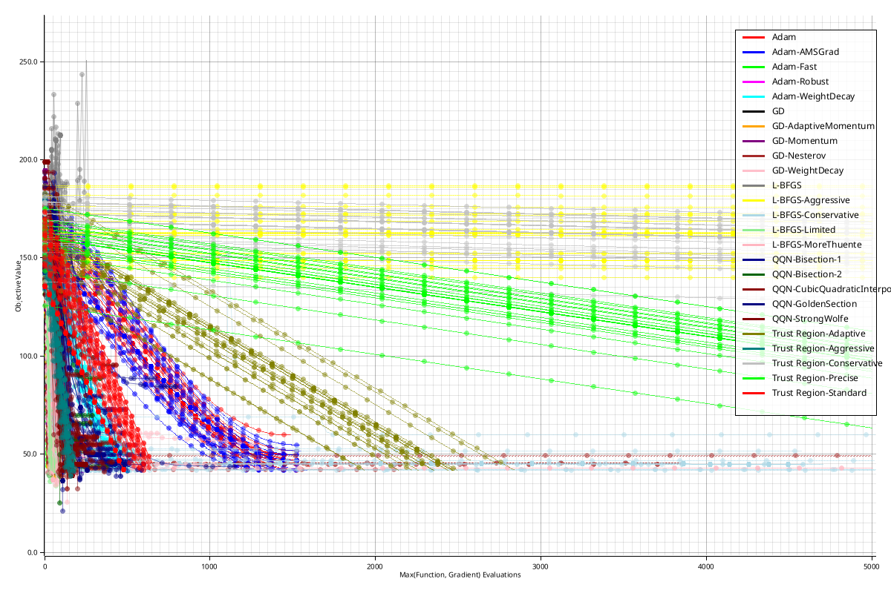
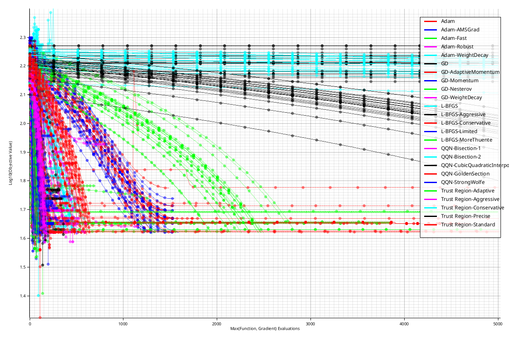

**Figure:** Convergence plots for Rastrigin_10D showing objective value vs iterations.
Left: Linear scale, Right: Log scale for better visualization of convergence behavior.

**Data:** [Linear scale data (CSV)](data/Rastrigin_10D_data.csv) | [Log scale data (CSV)](data/Rastrigin_10D_log_data.csv)

## Problem: Ackley_2D_a20_b0.2_c6.28e0

**Family:** Ackley
**Dimension:** 2
**Success Threshold:** 3.570e0
**Total Runs:** 500
**Detailed Analysis:** [View comprehensive problem analysis](reports/problem_analysis_Ackley_2D_a20_b0.2_c6.28e0.md)

### Performance Summary
<table style="border-collapse: collapse; width: 100%; margin: 20px 0;">
<tr style="background-color: #f2f2f2;">
<th style="border: 1px solid #ddd; padding: 8px; text-align: center;">Rank</th>
<th style="border: 1px solid #ddd; padding: 8px; text-align: center;">Optimizer</th>
<th style="border: 1px solid #ddd; padding: 8px; text-align: center;">Mean Final Value (All/Success/Fail)</th>
<th style="border: 1px solid #ddd; padding: 8px; text-align: center;">Std Dev</th>
<th style="border: 1px solid #ddd; padding: 8px; text-align: center;">Best Value</th>
<th style="border: 1px solid #ddd; padding: 8px; text-align: center;">Worst Value</th>
<th style="border: 1px solid #ddd; padding: 8px; text-align: center;">Mean Function Evals (All/Success/Fail)</th>
<th style="border: 1px solid #ddd; padding: 8px; text-align: center;">Mean Gradient Evals (All/Success/Fail)</th>
<th style="border: 1px solid #ddd; padding: 8px; text-align: center;">Success Rate</th>
<th style="border: 1px solid #ddd; padding: 8px; text-align: center;">Mean Time (s)</th>
</tr>
<tr style="background-color: #d4edda; font-weight: bold;">
<td style="border: 1px solid #ddd; padding: 8px; text-align: center;">1</td>
<td style="border: 1px solid #ddd; padding: 8px; text-align: center;"><a href="reports/detailed_Ackley_2D_a20_b0.2_c6.28e0_QQN-Bisection-1.md" title="Click for detailed analysis">QQN-Bisection-1</a></td>
<td style="border: 1px solid #ddd; padding: 8px; text-align: center;">2.85e0 / 2.37e0 / 3.57e0</td>
<td style="border: 1px solid #ddd; padding: 8px; text-align: center;">1.05e0</td>
<td style="border: 1px solid #ddd; padding: 8px; text-align: center;">1.12e-2</td>
<td style="border: 1px solid #ddd; padding: 8px; text-align: center;">3.57e0</td>
<td style="border: 1px solid #ddd; padding: 8px; text-align: center;">53.6 / 27.0 / 93.6</td>
<td style="border: 1px solid #ddd; padding: 8px; text-align: center;">82.3 / 50.2 / 130.6</td>
<td style="border: 1px solid #ddd; padding: 8px; text-align: center;">60.0%</td>
<td style="border: 1px solid #ddd; padding: 8px; text-align: center;">0.001</td>
</tr>
<tr style="background-color: #fff3cd;">
<td style="border: 1px solid #ddd; padding: 8px; text-align: center;">2</td>
<td style="border: 1px solid #ddd; padding: 8px; text-align: center;"><a href="reports/detailed_Ackley_2D_a20_b0.2_c6.28e0_L-BFGS.md" title="Click for detailed analysis">L-BFGS</a></td>
<td style="border: 1px solid #ddd; padding: 8px; text-align: center;">3.20e0 / 2.83e0 / 3.57e0</td>
<td style="border: 1px solid #ddd; padding: 8px; text-align: center;">4.86e-1</td>
<td style="border: 1px solid #ddd; padding: 8px; text-align: center;">1.89e0</td>
<td style="border: 1px solid #ddd; padding: 8px; text-align: center;">3.57e0</td>
<td style="border: 1px solid #ddd; padding: 8px; text-align: center;">202.7 / 17.9 / 387.5</td>
<td style="border: 1px solid #ddd; padding: 8px; text-align: center;">81.0 / 10.7 / 151.3</td>
<td style="border: 1px solid #ddd; padding: 8px; text-align: center;">50.0%</td>
<td style="border: 1px solid #ddd; padding: 8px; text-align: center;">0.003</td>
</tr>
<tr style="">
<td style="border: 1px solid #ddd; padding: 8px; text-align: center;">3</td>
<td style="border: 1px solid #ddd; padding: 8px; text-align: center;"><a href="reports/detailed_Ackley_2D_a20_b0.2_c6.28e0_L-BFGS-MoreThuente.md" title="Click for detailed analysis">L-BFGS-MoreThuente</a></td>
<td style="border: 1px solid #ddd; padding: 8px; text-align: center;">3.34e0 / 3.06e0 / 3.57e0</td>
<td style="border: 1px solid #ddd; padding: 8px; text-align: center;">4.09e-1</td>
<td style="border: 1px solid #ddd; padding: 8px; text-align: center;">1.83e0</td>
<td style="border: 1px solid #ddd; padding: 8px; text-align: center;">3.57e0</td>
<td style="border: 1px solid #ddd; padding: 8px; text-align: center;">42.2 / 19.1 / 61.2</td>
<td style="border: 1px solid #ddd; padding: 8px; text-align: center;">31.8 / 15.1 / 45.4</td>
<td style="border: 1px solid #ddd; padding: 8px; text-align: center;">45.0%</td>
<td style="border: 1px solid #ddd; padding: 8px; text-align: center;">0.001</td>
</tr>
<tr style="">
<td style="border: 1px solid #ddd; padding: 8px; text-align: center;">4</td>
<td style="border: 1px solid #ddd; padding: 8px; text-align: center;"><a href="reports/detailed_Ackley_2D_a20_b0.2_c6.28e0_QQN-Bisection-2.md" title="Click for detailed analysis">QQN-Bisection-2</a></td>
<td style="border: 1px solid #ddd; padding: 8px; text-align: center;">2.75e0 / 2.04e0 / 3.57e0</td>
<td style="border: 1px solid #ddd; padding: 8px; text-align: center;">1.16e0</td>
<td style="border: 1px solid #ddd; padding: 8px; text-align: center;">3.79e-1</td>
<td style="border: 1px solid #ddd; padding: 8px; text-align: center;">3.57e0</td>
<td style="border: 1px solid #ddd; padding: 8px; text-align: center;">36.5 / 14.6 / 51.1</td>
<td style="border: 1px solid #ddd; padding: 8px; text-align: center;">49.7 / 53.2 / 47.3</td>
<td style="border: 1px solid #ddd; padding: 8px; text-align: center;">40.0%</td>
<td style="border: 1px solid #ddd; padding: 8px; text-align: center;">0.001</td>
</tr>
<tr style="">
<td style="border: 1px solid #ddd; padding: 8px; text-align: center;">5</td>
<td style="border: 1px solid #ddd; padding: 8px; text-align: center;"><a href="reports/detailed_Ackley_2D_a20_b0.2_c6.28e0_QQN-CubicQuadraticInterpolation.md" title="Click for detailed analysis">QQN-CubicQuadraticInterpolation</a></td>
<td style="border: 1px solid #ddd; padding: 8px; text-align: center;">3.44e0 / 3.03e0 / 3.72e0</td>
<td style="border: 1px solid #ddd; padding: 8px; text-align: center;">4.86e-1</td>
<td style="border: 1px solid #ddd; padding: 8px; text-align: center;">1.95e0</td>
<td style="border: 1px solid #ddd; padding: 8px; text-align: center;">4.24e0</td>
<td style="border: 1px solid #ddd; padding: 8px; text-align: center;">496.8 / 19.2 / 815.1</td>
<td style="border: 1px solid #ddd; padding: 8px; text-align: center;">597.1 / 18.8 / 982.7</td>
<td style="border: 1px solid #ddd; padding: 8px; text-align: center;">40.0%</td>
<td style="border: 1px solid #ddd; padding: 8px; text-align: center;">0.015</td>
</tr>
<tr style="">
<td style="border: 1px solid #ddd; padding: 8px; text-align: center;">6</td>
<td style="border: 1px solid #ddd; padding: 8px; text-align: center;"><a href="reports/detailed_Ackley_2D_a20_b0.2_c6.28e0_QQN-GoldenSection.md" title="Click for detailed analysis">QQN-GoldenSection</a></td>
<td style="border: 1px solid #ddd; padding: 8px; text-align: center;">3.18e0 / 2.45e0 / 3.57e0</td>
<td style="border: 1px solid #ddd; padding: 8px; text-align: center;">6.29e-1</td>
<td style="border: 1px solid #ddd; padding: 8px; text-align: center;">1.58e0</td>
<td style="border: 1px solid #ddd; padding: 8px; text-align: center;">3.57e0</td>
<td style="border: 1px solid #ddd; padding: 8px; text-align: center;">137.5 / 47.3 / 186.1</td>
<td style="border: 1px solid #ddd; padding: 8px; text-align: center;">33.1 / 8.0 / 46.7</td>
<td style="border: 1px solid #ddd; padding: 8px; text-align: center;">35.0%</td>
<td style="border: 1px solid #ddd; padding: 8px; text-align: center;">0.002</td>
</tr>
<tr style="">
<td style="border: 1px solid #ddd; padding: 8px; text-align: center;">7</td>
<td style="border: 1px solid #ddd; padding: 8px; text-align: center;"><a href="reports/detailed_Ackley_2D_a20_b0.2_c6.28e0_L-BFGS-Aggressive.md" title="Click for detailed analysis">L-BFGS-Aggressive</a></td>
<td style="border: 1px solid #ddd; padding: 8px; text-align: center;">3.74e0 / 3.12e0 / 3.90e0</td>
<td style="border: 1px solid #ddd; padding: 8px; text-align: center;">3.90e-1</td>
<td style="border: 1px solid #ddd; padding: 8px; text-align: center;">2.80e0</td>
<td style="border: 1px solid #ddd; padding: 8px; text-align: center;">4.38e0</td>
<td style="border: 1px solid #ddd; padding: 8px; text-align: center;">3083.9 / 13.0 / 3851.7</td>
<td style="border: 1px solid #ddd; padding: 8px; text-align: center;">927.0 / 6.8 / 1157.0</td>
<td style="border: 1px solid #ddd; padding: 8px; text-align: center;">20.0%</td>
<td style="border: 1px solid #ddd; padding: 8px; text-align: center;">0.018</td>
</tr>
<tr style="">
<td style="border: 1px solid #ddd; padding: 8px; text-align: center;">8</td>
<td style="border: 1px solid #ddd; padding: 8px; text-align: center;"><a href="reports/detailed_Ackley_2D_a20_b0.2_c6.28e0_QQN-StrongWolfe.md" title="Click for detailed analysis">QQN-StrongWolfe</a></td>
<td style="border: 1px solid #ddd; padding: 8px; text-align: center;">3.49e0 / 3.04e0 / 3.57e0</td>
<td style="border: 1px solid #ddd; padding: 8px; text-align: center;">1.92e-1</td>
<td style="border: 1px solid #ddd; padding: 8px; text-align: center;">3.00e0</td>
<td style="border: 1px solid #ddd; padding: 8px; text-align: center;">3.57e0</td>
<td style="border: 1px solid #ddd; padding: 8px; text-align: center;">62.8 / 18.7 / 70.6</td>
<td style="border: 1px solid #ddd; padding: 8px; text-align: center;">56.8 / 14.7 / 64.2</td>
<td style="border: 1px solid #ddd; padding: 8px; text-align: center;">15.0%</td>
<td style="border: 1px solid #ddd; padding: 8px; text-align: center;">0.001</td>
</tr>
<tr style="">
<td style="border: 1px solid #ddd; padding: 8px; text-align: center;">9</td>
<td style="border: 1px solid #ddd; padding: 8px; text-align: center;"><a href="reports/detailed_Ackley_2D_a20_b0.2_c6.28e0_L-BFGS-Limited.md" title="Click for detailed analysis">L-BFGS-Limited</a></td>
<td style="border: 1px solid #ddd; padding: 8px; text-align: center;">3.37e0 / 2.22e0 / 3.57e0</td>
<td style="border: 1px solid #ddd; padding: 8px; text-align: center;">7.29e-1</td>
<td style="border: 1px solid #ddd; padding: 8px; text-align: center;">2.64e-1</td>
<td style="border: 1px solid #ddd; padding: 8px; text-align: center;">3.57e0</td>
<td style="border: 1px solid #ddd; padding: 8px; text-align: center;">176.7 / 20.0 / 204.4</td>
<td style="border: 1px solid #ddd; padding: 8px; text-align: center;">57.8 / 12.0 / 65.8</td>
<td style="border: 1px solid #ddd; padding: 8px; text-align: center;">15.0%</td>
<td style="border: 1px solid #ddd; padding: 8px; text-align: center;">0.002</td>
</tr>
<tr style="">
<td style="border: 1px solid #ddd; padding: 8px; text-align: center;">10</td>
<td style="border: 1px solid #ddd; padding: 8px; text-align: center;"><a href="reports/detailed_Ackley_2D_a20_b0.2_c6.28e0_Trust_Region-Adaptive.md" title="Click for detailed analysis">Trust Region-Adaptive</a></td>
<td style="border: 1px solid #ddd; padding: 8px; text-align: center;">3.60e0 / 3.32e0 / 3.67e0</td>
<td style="border: 1px solid #ddd; padding: 8px; text-align: center;">6.86e-2</td>
<td style="border: 1px solid #ddd; padding: 8px; text-align: center;">3.32e0</td>
<td style="border: 1px solid #ddd; padding: 8px; text-align: center;">3.64e0</td>
<td style="border: 1px solid #ddd; padding: 8px; text-align: center;">14.8 / 27.0 / 14.2</td>
<td style="border: 1px solid #ddd; padding: 8px; text-align: center;">10.6 / 19.0 / 10.1</td>
<td style="border: 1px solid #ddd; padding: 8px; text-align: center;">5.0%</td>
<td style="border: 1px solid #ddd; padding: 8px; text-align: center;">0.000</td>
</tr>
<tr style="">
<td style="border: 1px solid #ddd; padding: 8px; text-align: center;">11</td>
<td style="border: 1px solid #ddd; padding: 8px; text-align: center;"><a href="reports/detailed_Ackley_2D_a20_b0.2_c6.28e0_Trust_Region-Aggressive.md" title="Click for detailed analysis">Trust Region-Aggressive</a></td>
<td style="border: 1px solid #ddd; padding: 8px; text-align: center;">4.12e0 / - / 4.78e0</td>
<td style="border: 1px solid #ddd; padding: 8px; text-align: center;">3.69e-1</td>
<td style="border: 1px solid #ddd; padding: 8px; text-align: center;">3.60e0</td>
<td style="border: 1px solid #ddd; padding: 8px; text-align: center;">4.92e0</td>
<td style="border: 1px solid #ddd; padding: 8px; text-align: center;">5.3 / - / 5.3</td>
<td style="border: 1px solid #ddd; padding: 8px; text-align: center;">4.2 / - / 4.2</td>
<td style="border: 1px solid #ddd; padding: 8px; text-align: center;">0.0%</td>
<td style="border: 1px solid #ddd; padding: 8px; text-align: center;">0.000</td>
</tr>
<tr style="">
<td style="border: 1px solid #ddd; padding: 8px; text-align: center;">12</td>
<td style="border: 1px solid #ddd; padding: 8px; text-align: center;"><a href="reports/detailed_Ackley_2D_a20_b0.2_c6.28e0_Trust_Region-Standard.md" title="Click for detailed analysis">Trust Region-Standard</a></td>
<td style="border: 1px solid #ddd; padding: 8px; text-align: center;">3.68e0 / - / 5.19e0</td>
<td style="border: 1px solid #ddd; padding: 8px; text-align: center;">1.15e-1</td>
<td style="border: 1px solid #ddd; padding: 8px; text-align: center;">3.57e0</td>
<td style="border: 1px solid #ddd; padding: 8px; text-align: center;">3.98e0</td>
<td style="border: 1px solid #ddd; padding: 8px; text-align: center;">8.6 / - / 8.6</td>
<td style="border: 1px solid #ddd; padding: 8px; text-align: center;">6.4 / - / 6.4</td>
<td style="border: 1px solid #ddd; padding: 8px; text-align: center;">0.0%</td>
<td style="border: 1px solid #ddd; padding: 8px; text-align: center;">0.000</td>
</tr>
<tr style="">
<td style="border: 1px solid #ddd; padding: 8px; text-align: center;">13</td>
<td style="border: 1px solid #ddd; padding: 8px; text-align: center;"><a href="reports/detailed_Ackley_2D_a20_b0.2_c6.28e0_GD-Momentum.md" title="Click for detailed analysis">GD-Momentum</a></td>
<td style="border: 1px solid #ddd; padding: 8px; text-align: center;">3.58e0 / - / 3.70e0</td>
<td style="border: 1px solid #ddd; padding: 8px; text-align: center;">5.82e-3</td>
<td style="border: 1px solid #ddd; padding: 8px; text-align: center;">3.57e0</td>
<td style="border: 1px solid #ddd; padding: 8px; text-align: center;">3.59e0</td>
<td style="border: 1px solid #ddd; padding: 8px; text-align: center;">14.7 / - / 14.7</td>
<td style="border: 1px solid #ddd; padding: 8px; text-align: center;">25.4 / - / 25.4</td>
<td style="border: 1px solid #ddd; padding: 8px; text-align: center;">0.0%</td>
<td style="border: 1px solid #ddd; padding: 8px; text-align: center;">0.000</td>
</tr>
<tr style="">
<td style="border: 1px solid #ddd; padding: 8px; text-align: center;">14</td>
<td style="border: 1px solid #ddd; padding: 8px; text-align: center;"><a href="reports/detailed_Ackley_2D_a20_b0.2_c6.28e0_GD-AdaptiveMomentum.md" title="Click for detailed analysis">GD-AdaptiveMomentum</a></td>
<td style="border: 1px solid #ddd; padding: 8px; text-align: center;">3.57e0 / - / 3.57e0</td>
<td style="border: 1px solid #ddd; padding: 8px; text-align: center;">6.21e-11</td>
<td style="border: 1px solid #ddd; padding: 8px; text-align: center;">3.57e0</td>
<td style="border: 1px solid #ddd; padding: 8px; text-align: center;">3.57e0</td>
<td style="border: 1px solid #ddd; padding: 8px; text-align: center;">15.2 / - / 15.2</td>
<td style="border: 1px solid #ddd; padding: 8px; text-align: center;">28.3 / - / 28.3</td>
<td style="border: 1px solid #ddd; padding: 8px; text-align: center;">0.0%</td>
<td style="border: 1px solid #ddd; padding: 8px; text-align: center;">0.001</td>
</tr>
<tr style="">
<td style="border: 1px solid #ddd; padding: 8px; text-align: center;">15</td>
<td style="border: 1px solid #ddd; padding: 8px; text-align: center;"><a href="reports/detailed_Ackley_2D_a20_b0.2_c6.28e0_GD.md" title="Click for detailed analysis">GD</a></td>
<td style="border: 1px solid #ddd; padding: 8px; text-align: center;">3.57e0 / - / 3.57e0</td>
<td style="border: 1px solid #ddd; padding: 8px; text-align: center;">1.91e-11</td>
<td style="border: 1px solid #ddd; padding: 8px; text-align: center;">3.57e0</td>
<td style="border: 1px solid #ddd; padding: 8px; text-align: center;">3.57e0</td>
<td style="border: 1px solid #ddd; padding: 8px; text-align: center;">20.2 / - / 20.2</td>
<td style="border: 1px solid #ddd; padding: 8px; text-align: center;">38.4 / - / 38.4</td>
<td style="border: 1px solid #ddd; padding: 8px; text-align: center;">0.0%</td>
<td style="border: 1px solid #ddd; padding: 8px; text-align: center;">0.001</td>
</tr>
<tr style="">
<td style="border: 1px solid #ddd; padding: 8px; text-align: center;">16</td>
<td style="border: 1px solid #ddd; padding: 8px; text-align: center;"><a href="reports/detailed_Ackley_2D_a20_b0.2_c6.28e0_Trust_Region-Precise.md" title="Click for detailed analysis">Trust Region-Precise</a></td>
<td style="border: 1px solid #ddd; padding: 8px; text-align: center;">3.58e0 / - / 3.58e0</td>
<td style="border: 1px solid #ddd; padding: 8px; text-align: center;">3.92e-3</td>
<td style="border: 1px solid #ddd; padding: 8px; text-align: center;">3.57e0</td>
<td style="border: 1px solid #ddd; padding: 8px; text-align: center;">3.59e0</td>
<td style="border: 1px solid #ddd; padding: 8px; text-align: center;">39.5 / - / 39.5</td>
<td style="border: 1px solid #ddd; padding: 8px; text-align: center;">27.0 / - / 27.0</td>
<td style="border: 1px solid #ddd; padding: 8px; text-align: center;">0.0%</td>
<td style="border: 1px solid #ddd; padding: 8px; text-align: center;">0.000</td>
</tr>
<tr style="">
<td style="border: 1px solid #ddd; padding: 8px; text-align: center;">17</td>
<td style="border: 1px solid #ddd; padding: 8px; text-align: center;"><a href="reports/detailed_Ackley_2D_a20_b0.2_c6.28e0_Adam-Robust.md" title="Click for detailed analysis">Adam-Robust</a></td>
<td style="border: 1px solid #ddd; padding: 8px; text-align: center;">3.58e0 / - / 3.58e0</td>
<td style="border: 1px solid #ddd; padding: 8px; text-align: center;">1.39e-3</td>
<td style="border: 1px solid #ddd; padding: 8px; text-align: center;">3.57e0</td>
<td style="border: 1px solid #ddd; padding: 8px; text-align: center;">3.58e0</td>
<td style="border: 1px solid #ddd; padding: 8px; text-align: center;">42.9 / - / 42.9</td>
<td style="border: 1px solid #ddd; padding: 8px; text-align: center;">41.9 / - / 41.9</td>
<td style="border: 1px solid #ddd; padding: 8px; text-align: center;">0.0%</td>
<td style="border: 1px solid #ddd; padding: 8px; text-align: center;">0.001</td>
</tr>
<tr style="">
<td style="border: 1px solid #ddd; padding: 8px; text-align: center;">18</td>
<td style="border: 1px solid #ddd; padding: 8px; text-align: center;"><a href="reports/detailed_Ackley_2D_a20_b0.2_c6.28e0_GD-Nesterov.md" title="Click for detailed analysis">GD-Nesterov</a></td>
<td style="border: 1px solid #ddd; padding: 8px; text-align: center;">3.57e0 / - / 3.57e0</td>
<td style="border: 1px solid #ddd; padding: 8px; text-align: center;">3.88e-4</td>
<td style="border: 1px solid #ddd; padding: 8px; text-align: center;">3.57e0</td>
<td style="border: 1px solid #ddd; padding: 8px; text-align: center;">3.58e0</td>
<td style="border: 1px solid #ddd; padding: 8px; text-align: center;">30.6 / - / 30.6</td>
<td style="border: 1px solid #ddd; padding: 8px; text-align: center;">58.6 / - / 58.6</td>
<td style="border: 1px solid #ddd; padding: 8px; text-align: center;">0.0%</td>
<td style="border: 1px solid #ddd; padding: 8px; text-align: center;">0.001</td>
</tr>
<tr style="">
<td style="border: 1px solid #ddd; padding: 8px; text-align: center;">19</td>
<td style="border: 1px solid #ddd; padding: 8px; text-align: center;"><a href="reports/detailed_Ackley_2D_a20_b0.2_c6.28e0_Adam-Fast.md" title="Click for detailed analysis">Adam-Fast</a></td>
<td style="border: 1px solid #ddd; padding: 8px; text-align: center;">3.58e0 / - / 3.62e0</td>
<td style="border: 1px solid #ddd; padding: 8px; text-align: center;">9.44e-3</td>
<td style="border: 1px solid #ddd; padding: 8px; text-align: center;">3.57e0</td>
<td style="border: 1px solid #ddd; padding: 8px; text-align: center;">3.61e0</td>
<td style="border: 1px solid #ddd; padding: 8px; text-align: center;">52.9 / - / 52.9</td>
<td style="border: 1px solid #ddd; padding: 8px; text-align: center;">51.9 / - / 51.9</td>
<td style="border: 1px solid #ddd; padding: 8px; text-align: center;">0.0%</td>
<td style="border: 1px solid #ddd; padding: 8px; text-align: center;">0.001</td>
</tr>
<tr style="">
<td style="border: 1px solid #ddd; padding: 8px; text-align: center;">20</td>
<td style="border: 1px solid #ddd; padding: 8px; text-align: center;"><a href="reports/detailed_Ackley_2D_a20_b0.2_c6.28e0_GD-WeightDecay.md" title="Click for detailed analysis">GD-WeightDecay</a></td>
<td style="border: 1px solid #ddd; padding: 8px; text-align: center;">3.58e0 / - / 3.59e0</td>
<td style="border: 1px solid #ddd; padding: 8px; text-align: center;">7.81e-3</td>
<td style="border: 1px solid #ddd; padding: 8px; text-align: center;">3.57e0</td>
<td style="border: 1px solid #ddd; padding: 8px; text-align: center;">3.60e0</td>
<td style="border: 1px solid #ddd; padding: 8px; text-align: center;">49.2 / - / 49.2</td>
<td style="border: 1px solid #ddd; padding: 8px; text-align: center;">94.5 / - / 94.5</td>
<td style="border: 1px solid #ddd; padding: 8px; text-align: center;">0.0%</td>
<td style="border: 1px solid #ddd; padding: 8px; text-align: center;">0.002</td>
</tr>
<tr style="">
<td style="border: 1px solid #ddd; padding: 8px; text-align: center;">21</td>
<td style="border: 1px solid #ddd; padding: 8px; text-align: center;"><a href="reports/detailed_Ackley_2D_a20_b0.2_c6.28e0_Adam-WeightDecay.md" title="Click for detailed analysis">Adam-WeightDecay</a></td>
<td style="border: 1px solid #ddd; padding: 8px; text-align: center;">3.58e0 / - / 3.58e0</td>
<td style="border: 1px solid #ddd; padding: 8px; text-align: center;">7.02e-4</td>
<td style="border: 1px solid #ddd; padding: 8px; text-align: center;">3.57e0</td>
<td style="border: 1px solid #ddd; padding: 8px; text-align: center;">3.58e0</td>
<td style="border: 1px solid #ddd; padding: 8px; text-align: center;">119.4 / - / 119.4</td>
<td style="border: 1px solid #ddd; padding: 8px; text-align: center;">118.4 / - / 118.4</td>
<td style="border: 1px solid #ddd; padding: 8px; text-align: center;">0.0%</td>
<td style="border: 1px solid #ddd; padding: 8px; text-align: center;">0.003</td>
</tr>
<tr style="">
<td style="border: 1px solid #ddd; padding: 8px; text-align: center;">22</td>
<td style="border: 1px solid #ddd; padding: 8px; text-align: center;"><a href="reports/detailed_Ackley_2D_a20_b0.2_c6.28e0_Trust_Region-Conservative.md" title="Click for detailed analysis">Trust Region-Conservative</a></td>
<td style="border: 1px solid #ddd; padding: 8px; text-align: center;">3.58e0 / - / 3.58e0</td>
<td style="border: 1px solid #ddd; padding: 8px; text-align: center;">8.41e-4</td>
<td style="border: 1px solid #ddd; padding: 8px; text-align: center;">3.57e0</td>
<td style="border: 1px solid #ddd; padding: 8px; text-align: center;">3.58e0</td>
<td style="border: 1px solid #ddd; padding: 8px; text-align: center;">171.2 / - / 171.2</td>
<td style="border: 1px solid #ddd; padding: 8px; text-align: center;">114.7 / - / 114.7</td>
<td style="border: 1px solid #ddd; padding: 8px; text-align: center;">0.0%</td>
<td style="border: 1px solid #ddd; padding: 8px; text-align: center;">0.001</td>
</tr>
<tr style="">
<td style="border: 1px solid #ddd; padding: 8px; text-align: center;">23</td>
<td style="border: 1px solid #ddd; padding: 8px; text-align: center;"><a href="reports/detailed_Ackley_2D_a20_b0.2_c6.28e0_L-BFGS-Conservative.md" title="Click for detailed analysis">L-BFGS-Conservative</a></td>
<td style="border: 1px solid #ddd; padding: 8px; text-align: center;">3.57e0 / - / 3.57e0</td>
<td style="border: 1px solid #ddd; padding: 8px; text-align: center;">1.88e-8</td>
<td style="border: 1px solid #ddd; padding: 8px; text-align: center;">3.57e0</td>
<td style="border: 1px solid #ddd; padding: 8px; text-align: center;">3.57e0</td>
<td style="border: 1px solid #ddd; padding: 8px; text-align: center;">183.6 / - / 183.6</td>
<td style="border: 1px solid #ddd; padding: 8px; text-align: center;">122.5 / - / 122.5</td>
<td style="border: 1px solid #ddd; padding: 8px; text-align: center;">0.0%</td>
<td style="border: 1px solid #ddd; padding: 8px; text-align: center;">0.004</td>
</tr>
<tr style="">
<td style="border: 1px solid #ddd; padding: 8px; text-align: center;">24</td>
<td style="border: 1px solid #ddd; padding: 8px; text-align: center;"><a href="reports/detailed_Ackley_2D_a20_b0.2_c6.28e0_Adam.md" title="Click for detailed analysis">Adam</a></td>
<td style="border: 1px solid #ddd; padding: 8px; text-align: center;">3.57e0 / - / 3.57e0</td>
<td style="border: 1px solid #ddd; padding: 8px; text-align: center;">2.50e-5</td>
<td style="border: 1px solid #ddd; padding: 8px; text-align: center;">3.57e0</td>
<td style="border: 1px solid #ddd; padding: 8px; text-align: center;">3.57e0</td>
<td style="border: 1px solid #ddd; padding: 8px; text-align: center;">301.6 / - / 301.6</td>
<td style="border: 1px solid #ddd; padding: 8px; text-align: center;">300.6 / - / 300.6</td>
<td style="border: 1px solid #ddd; padding: 8px; text-align: center;">0.0%</td>
<td style="border: 1px solid #ddd; padding: 8px; text-align: center;">0.006</td>
</tr>
<tr style="">
<td style="border: 1px solid #ddd; padding: 8px; text-align: center;">25</td>
<td style="border: 1px solid #ddd; padding: 8px; text-align: center;"><a href="reports/detailed_Ackley_2D_a20_b0.2_c6.28e0_Adam-AMSGrad.md" title="Click for detailed analysis">Adam-AMSGrad</a></td>
<td style="border: 1px solid #ddd; padding: 8px; text-align: center;">3.57e0 / - / 3.57e0</td>
<td style="border: 1px solid #ddd; padding: 8px; text-align: center;">8.54e-7</td>
<td style="border: 1px solid #ddd; padding: 8px; text-align: center;">3.57e0</td>
<td style="border: 1px solid #ddd; padding: 8px; text-align: center;">3.57e0</td>
<td style="border: 1px solid #ddd; padding: 8px; text-align: center;">753.0 / - / 753.0</td>
<td style="border: 1px solid #ddd; padding: 8px; text-align: center;">752.0 / - / 752.0</td>
<td style="border: 1px solid #ddd; padding: 8px; text-align: center;">0.0%</td>
<td style="border: 1px solid #ddd; padding: 8px; text-align: center;">0.017</td>
</tr>
</table>

### Convergence Plots

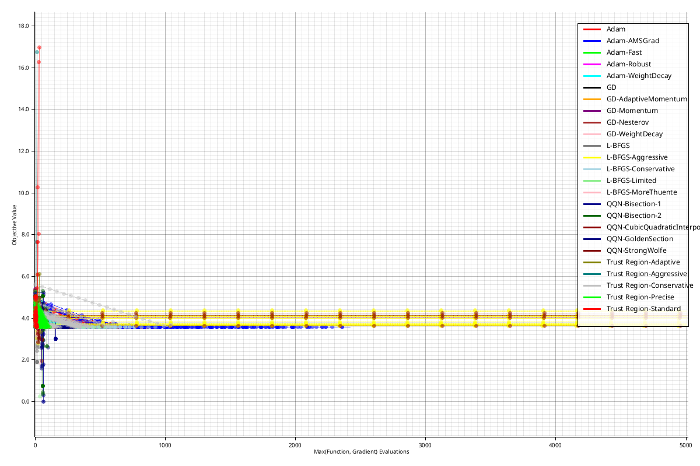
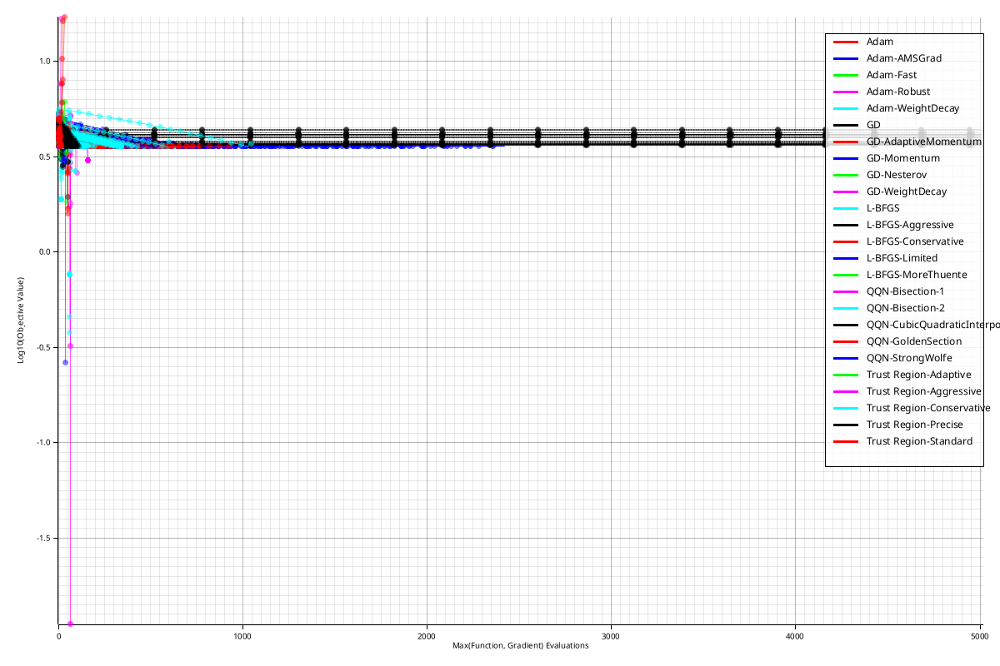

**Figure:** Convergence plots for Ackley_2D_a20_b0.2_c6.28e0 showing objective value vs iterations.
Left: Linear scale, Right: Log scale for better visualization of convergence behavior.

**Data:** [Linear scale data (CSV)](data/Ackley_2D_a20_b0.2_c6.28e0_data.csv) | [Log scale data (CSV)](data/Ackley_2D_a20_b0.2_c6.28e0_log_data.csv)

## Problem: Ackley_5D_a20_b0.2_c6.28e0

**Family:** Ackley
**Dimension:** 5
**Success Threshold:** 3.570e0
**Total Runs:** 500
**Detailed Analysis:** [View comprehensive problem analysis](reports/problem_analysis_Ackley_5D_a20_b0.2_c6.28e0.md)

### Performance Summary
<table style="border-collapse: collapse; width: 100%; margin: 20px 0;">
<tr style="background-color: #f2f2f2;">
<th style="border: 1px solid #ddd; padding: 8px; text-align: center;">Rank</th>
<th style="border: 1px solid #ddd; padding: 8px; text-align: center;">Optimizer</th>
<th style="border: 1px solid #ddd; padding: 8px; text-align: center;">Mean Final Value (All/Success/Fail)</th>
<th style="border: 1px solid #ddd; padding: 8px; text-align: center;">Std Dev</th>
<th style="border: 1px solid #ddd; padding: 8px; text-align: center;">Best Value</th>
<th style="border: 1px solid #ddd; padding: 8px; text-align: center;">Worst Value</th>
<th style="border: 1px solid #ddd; padding: 8px; text-align: center;">Mean Function Evals (All/Success/Fail)</th>
<th style="border: 1px solid #ddd; padding: 8px; text-align: center;">Mean Gradient Evals (All/Success/Fail)</th>
<th style="border: 1px solid #ddd; padding: 8px; text-align: center;">Success Rate</th>
<th style="border: 1px solid #ddd; padding: 8px; text-align: center;">Mean Time (s)</th>
</tr>
<tr style="background-color: #d4edda; font-weight: bold;">
<td style="border: 1px solid #ddd; padding: 8px; text-align: center;">1</td>
<td style="border: 1px solid #ddd; padding: 8px; text-align: center;"><a href="reports/detailed_Ackley_5D_a20_b0.2_c6.28e0_QQN-Bisection-2.md" title="Click for detailed analysis">QQN-Bisection-2</a></td>
<td style="border: 1px solid #ddd; padding: 8px; text-align: center;">3.34e0 / 3.01e0 / 3.57e0</td>
<td style="border: 1px solid #ddd; padding: 8px; text-align: center;">3.86e-1</td>
<td style="border: 1px solid #ddd; padding: 8px; text-align: center;">2.48e0</td>
<td style="border: 1px solid #ddd; padding: 8px; text-align: center;">3.57e0</td>
<td style="border: 1px solid #ddd; padding: 8px; text-align: center;">50.8 / 32.0 / 60.8</td>
<td style="border: 1px solid #ddd; padding: 8px; text-align: center;">62.6 / 61.9 / 63.0</td>
<td style="border: 1px solid #ddd; padding: 8px; text-align: center;">35.0%</td>
<td style="border: 1px solid #ddd; padding: 8px; text-align: center;">0.001</td>
</tr>
<tr style="background-color: #fff3cd;">
<td style="border: 1px solid #ddd; padding: 8px; text-align: center;">2</td>
<td style="border: 1px solid #ddd; padding: 8px; text-align: center;"><a href="reports/detailed_Ackley_5D_a20_b0.2_c6.28e0_QQN-Bisection-1.md" title="Click for detailed analysis">QQN-Bisection-1</a></td>
<td style="border: 1px solid #ddd; padding: 8px; text-align: center;">3.38e0 / 2.93e0 / 3.57e0</td>
<td style="border: 1px solid #ddd; padding: 8px; text-align: center;">3.60e-1</td>
<td style="border: 1px solid #ddd; padding: 8px; text-align: center;">2.37e0</td>
<td style="border: 1px solid #ddd; padding: 8px; text-align: center;">3.57e0</td>
<td style="border: 1px solid #ddd; padding: 8px; text-align: center;">65.2 / 19.7 / 84.6</td>
<td style="border: 1px solid #ddd; padding: 8px; text-align: center;">108.3 / 59.2 / 129.4</td>
<td style="border: 1px solid #ddd; padding: 8px; text-align: center;">30.0%</td>
<td style="border: 1px solid #ddd; padding: 8px; text-align: center;">0.002</td>
</tr>
<tr style="">
<td style="border: 1px solid #ddd; padding: 8px; text-align: center;">3</td>
<td style="border: 1px solid #ddd; padding: 8px; text-align: center;"><a href="reports/detailed_Ackley_5D_a20_b0.2_c6.28e0_L-BFGS.md" title="Click for detailed analysis">L-BFGS</a></td>
<td style="border: 1px solid #ddd; padding: 8px; text-align: center;">3.42e0 / 2.96e0 / 3.63e0</td>
<td style="border: 1px solid #ddd; padding: 8px; text-align: center;">3.93e-1</td>
<td style="border: 1px solid #ddd; padding: 8px; text-align: center;">1.87e0</td>
<td style="border: 1px solid #ddd; padding: 8px; text-align: center;">3.58e0</td>
<td style="border: 1px solid #ddd; padding: 8px; text-align: center;">121.3 / 50.4 / 144.9</td>
<td style="border: 1px solid #ddd; padding: 8px; text-align: center;">56.1 / 26.0 / 66.2</td>
<td style="border: 1px solid #ddd; padding: 8px; text-align: center;">25.0%</td>
<td style="border: 1px solid #ddd; padding: 8px; text-align: center;">0.002</td>
</tr>
<tr style="">
<td style="border: 1px solid #ddd; padding: 8px; text-align: center;">4</td>
<td style="border: 1px solid #ddd; padding: 8px; text-align: center;"><a href="reports/detailed_Ackley_5D_a20_b0.2_c6.28e0_L-BFGS-Aggressive.md" title="Click for detailed analysis">L-BFGS-Aggressive</a></td>
<td style="border: 1px solid #ddd; padding: 8px; text-align: center;">3.76e0 / 3.29e0 / 3.88e0</td>
<td style="border: 1px solid #ddd; padding: 8px; text-align: center;">2.74e-1</td>
<td style="border: 1px solid #ddd; padding: 8px; text-align: center;">3.01e0</td>
<td style="border: 1px solid #ddd; padding: 8px; text-align: center;">4.09e0</td>
<td style="border: 1px solid #ddd; padding: 8px; text-align: center;">3085.2 / 21.0 / 3851.2</td>
<td style="border: 1px solid #ddd; padding: 8px; text-align: center;">927.7 / 10.5 / 1157.0</td>
<td style="border: 1px solid #ddd; padding: 8px; text-align: center;">20.0%</td>
<td style="border: 1px solid #ddd; padding: 8px; text-align: center;">0.020</td>
</tr>
<tr style="">
<td style="border: 1px solid #ddd; padding: 8px; text-align: center;">5</td>
<td style="border: 1px solid #ddd; padding: 8px; text-align: center;"><a href="reports/detailed_Ackley_5D_a20_b0.2_c6.28e0_L-BFGS-MoreThuente.md" title="Click for detailed analysis">L-BFGS-MoreThuente</a></td>
<td style="border: 1px solid #ddd; padding: 8px; text-align: center;">3.50e0 / 2.79e0 / 3.57e0</td>
<td style="border: 1px solid #ddd; padding: 8px; text-align: center;">2.48e-1</td>
<td style="border: 1px solid #ddd; padding: 8px; text-align: center;">2.54e0</td>
<td style="border: 1px solid #ddd; padding: 8px; text-align: center;">3.57e0</td>
<td style="border: 1px solid #ddd; padding: 8px; text-align: center;">51.0 / 20.5 / 54.4</td>
<td style="border: 1px solid #ddd; padding: 8px; text-align: center;">37.2 / 16.5 / 39.6</td>
<td style="border: 1px solid #ddd; padding: 8px; text-align: center;">10.0%</td>
<td style="border: 1px solid #ddd; padding: 8px; text-align: center;">0.001</td>
</tr>
<tr style="">
<td style="border: 1px solid #ddd; padding: 8px; text-align: center;">6</td>
<td style="border: 1px solid #ddd; padding: 8px; text-align: center;"><a href="reports/detailed_Ackley_5D_a20_b0.2_c6.28e0_QQN-StrongWolfe.md" title="Click for detailed analysis">QQN-StrongWolfe</a></td>
<td style="border: 1px solid #ddd; padding: 8px; text-align: center;">3.50e0 / 2.03e0 / 3.57e0</td>
<td style="border: 1px solid #ddd; padding: 8px; text-align: center;">3.36e-1</td>
<td style="border: 1px solid #ddd; padding: 8px; text-align: center;">2.03e0</td>
<td style="border: 1px solid #ddd; padding: 8px; text-align: center;">3.57e0</td>
<td style="border: 1px solid #ddd; padding: 8px; text-align: center;">53.0 / 18.0 / 54.8</td>
<td style="border: 1px solid #ddd; padding: 8px; text-align: center;">48.7 / 16.0 / 50.4</td>
<td style="border: 1px solid #ddd; padding: 8px; text-align: center;">5.0%</td>
<td style="border: 1px solid #ddd; padding: 8px; text-align: center;">0.002</td>
</tr>
<tr style="">
<td style="border: 1px solid #ddd; padding: 8px; text-align: center;">7</td>
<td style="border: 1px solid #ddd; padding: 8px; text-align: center;"><a href="reports/detailed_Ackley_5D_a20_b0.2_c6.28e0_QQN-GoldenSection.md" title="Click for detailed analysis">QQN-GoldenSection</a></td>
<td style="border: 1px solid #ddd; padding: 8px; text-align: center;">3.51e0 / 2.30e0 / 3.57e0</td>
<td style="border: 1px solid #ddd; padding: 8px; text-align: center;">2.78e-1</td>
<td style="border: 1px solid #ddd; padding: 8px; text-align: center;">2.30e0</td>
<td style="border: 1px solid #ddd; padding: 8px; text-align: center;">3.57e0</td>
<td style="border: 1px solid #ddd; padding: 8px; text-align: center;">193.7 / 46.0 / 201.4</td>
<td style="border: 1px solid #ddd; padding: 8px; text-align: center;">38.2 / 8.0 / 39.8</td>
<td style="border: 1px solid #ddd; padding: 8px; text-align: center;">5.0%</td>
<td style="border: 1px solid #ddd; padding: 8px; text-align: center;">0.003</td>
</tr>
<tr style="">
<td style="border: 1px solid #ddd; padding: 8px; text-align: center;">8</td>
<td style="border: 1px solid #ddd; padding: 8px; text-align: center;"><a href="reports/detailed_Ackley_5D_a20_b0.2_c6.28e0_QQN-CubicQuadraticInterpolation.md" title="Click for detailed analysis">QQN-CubicQuadraticInterpolation</a></td>
<td style="border: 1px solid #ddd; padding: 8px; text-align: center;">3.56e0 / 3.14e0 / 3.58e0</td>
<td style="border: 1px solid #ddd; padding: 8px; text-align: center;">9.71e-2</td>
<td style="border: 1px solid #ddd; padding: 8px; text-align: center;">3.14e0</td>
<td style="border: 1px solid #ddd; padding: 8px; text-align: center;">3.63e0</td>
<td style="border: 1px solid #ddd; padding: 8px; text-align: center;">206.9 / 12.0 / 217.2</td>
<td style="border: 1px solid #ddd; padding: 8px; text-align: center;">229.6 / 10.0 / 241.2</td>
<td style="border: 1px solid #ddd; padding: 8px; text-align: center;">5.0%</td>
<td style="border: 1px solid #ddd; padding: 8px; text-align: center;">0.006</td>
</tr>
<tr style="">
<td style="border: 1px solid #ddd; padding: 8px; text-align: center;">9</td>
<td style="border: 1px solid #ddd; padding: 8px; text-align: center;"><a href="reports/detailed_Ackley_5D_a20_b0.2_c6.28e0_Trust_Region-Aggressive.md" title="Click for detailed analysis">Trust Region-Aggressive</a></td>
<td style="border: 1px solid #ddd; padding: 8px; text-align: center;">4.15e0 / - / 4.15e0</td>
<td style="border: 1px solid #ddd; padding: 8px; text-align: center;">2.82e-1</td>
<td style="border: 1px solid #ddd; padding: 8px; text-align: center;">3.71e0</td>
<td style="border: 1px solid #ddd; padding: 8px; text-align: center;">4.90e0</td>
<td style="border: 1px solid #ddd; padding: 8px; text-align: center;">5.0 / - / 5.0</td>
<td style="border: 1px solid #ddd; padding: 8px; text-align: center;">4.0 / - / 4.0</td>
<td style="border: 1px solid #ddd; padding: 8px; text-align: center;">0.0%</td>
<td style="border: 1px solid #ddd; padding: 8px; text-align: center;">0.000</td>
</tr>
<tr style="">
<td style="border: 1px solid #ddd; padding: 8px; text-align: center;">10</td>
<td style="border: 1px solid #ddd; padding: 8px; text-align: center;"><a href="reports/detailed_Ackley_5D_a20_b0.2_c6.28e0_Trust_Region-Standard.md" title="Click for detailed analysis">Trust Region-Standard</a></td>
<td style="border: 1px solid #ddd; padding: 8px; text-align: center;">3.65e0 / - / 4.49e0</td>
<td style="border: 1px solid #ddd; padding: 8px; text-align: center;">6.98e-2</td>
<td style="border: 1px solid #ddd; padding: 8px; text-align: center;">3.58e0</td>
<td style="border: 1px solid #ddd; padding: 8px; text-align: center;">3.85e0</td>
<td style="border: 1px solid #ddd; padding: 8px; text-align: center;">9.1 / - / 9.1</td>
<td style="border: 1px solid #ddd; padding: 8px; text-align: center;">6.7 / - / 6.7</td>
<td style="border: 1px solid #ddd; padding: 8px; text-align: center;">0.0%</td>
<td style="border: 1px solid #ddd; padding: 8px; text-align: center;">0.000</td>
</tr>
<tr style="">
<td style="border: 1px solid #ddd; padding: 8px; text-align: center;">11</td>
<td style="border: 1px solid #ddd; padding: 8px; text-align: center;"><a href="reports/detailed_Ackley_5D_a20_b0.2_c6.28e0_Trust_Region-Adaptive.md" title="Click for detailed analysis">Trust Region-Adaptive</a></td>
<td style="border: 1px solid #ddd; padding: 8px; text-align: center;">3.59e0 / - / 3.70e0</td>
<td style="border: 1px solid #ddd; padding: 8px; text-align: center;">1.87e-2</td>
<td style="border: 1px solid #ddd; padding: 8px; text-align: center;">3.58e0</td>
<td style="border: 1px solid #ddd; padding: 8px; text-align: center;">3.64e0</td>
<td style="border: 1px solid #ddd; padding: 8px; text-align: center;">17.3 / - / 17.3</td>
<td style="border: 1px solid #ddd; padding: 8px; text-align: center;">12.2 / - / 12.2</td>
<td style="border: 1px solid #ddd; padding: 8px; text-align: center;">0.0%</td>
<td style="border: 1px solid #ddd; padding: 8px; text-align: center;">0.000</td>
</tr>
<tr style="">
<td style="border: 1px solid #ddd; padding: 8px; text-align: center;">12</td>
<td style="border: 1px solid #ddd; padding: 8px; text-align: center;"><a href="reports/detailed_Ackley_5D_a20_b0.2_c6.28e0_GD-Momentum.md" title="Click for detailed analysis">GD-Momentum</a></td>
<td style="border: 1px solid #ddd; padding: 8px; text-align: center;">3.59e0 / - / 3.72e0</td>
<td style="border: 1px solid #ddd; padding: 8px; text-align: center;">8.76e-3</td>
<td style="border: 1px solid #ddd; padding: 8px; text-align: center;">3.58e0</td>
<td style="border: 1px solid #ddd; padding: 8px; text-align: center;">3.60e0</td>
<td style="border: 1px solid #ddd; padding: 8px; text-align: center;">13.0 / - / 13.0</td>
<td style="border: 1px solid #ddd; padding: 8px; text-align: center;">22.0 / - / 22.0</td>
<td style="border: 1px solid #ddd; padding: 8px; text-align: center;">0.0%</td>
<td style="border: 1px solid #ddd; padding: 8px; text-align: center;">0.000</td>
</tr>
<tr style="">
<td style="border: 1px solid #ddd; padding: 8px; text-align: center;">13</td>
<td style="border: 1px solid #ddd; padding: 8px; text-align: center;"><a href="reports/detailed_Ackley_5D_a20_b0.2_c6.28e0_GD-WeightDecay.md" title="Click for detailed analysis">GD-WeightDecay</a></td>
<td style="border: 1px solid #ddd; padding: 8px; text-align: center;">3.58e0 / - / 3.61e0</td>
<td style="border: 1px solid #ddd; padding: 8px; text-align: center;">2.48e-3</td>
<td style="border: 1px solid #ddd; padding: 8px; text-align: center;">3.57e0</td>
<td style="border: 1px solid #ddd; padding: 8px; text-align: center;">3.58e0</td>
<td style="border: 1px solid #ddd; padding: 8px; text-align: center;">15.3 / - / 15.3</td>
<td style="border: 1px solid #ddd; padding: 8px; text-align: center;">26.7 / - / 26.7</td>
<td style="border: 1px solid #ddd; padding: 8px; text-align: center;">0.0%</td>
<td style="border: 1px solid #ddd; padding: 8px; text-align: center;">0.000</td>
</tr>
<tr style="">
<td style="border: 1px solid #ddd; padding: 8px; text-align: center;">14</td>
<td style="border: 1px solid #ddd; padding: 8px; text-align: center;"><a href="reports/detailed_Ackley_5D_a20_b0.2_c6.28e0_GD-Nesterov.md" title="Click for detailed analysis">GD-Nesterov</a></td>
<td style="border: 1px solid #ddd; padding: 8px; text-align: center;">3.58e0 / - / 3.60e0</td>
<td style="border: 1px solid #ddd; padding: 8px; text-align: center;">8.71e-3</td>
<td style="border: 1px solid #ddd; padding: 8px; text-align: center;">3.57e0</td>
<td style="border: 1px solid #ddd; padding: 8px; text-align: center;">3.61e0</td>
<td style="border: 1px solid #ddd; padding: 8px; text-align: center;">17.0 / - / 17.0</td>
<td style="border: 1px solid #ddd; padding: 8px; text-align: center;">30.0 / - / 30.0</td>
<td style="border: 1px solid #ddd; padding: 8px; text-align: center;">0.0%</td>
<td style="border: 1px solid #ddd; padding: 8px; text-align: center;">0.001</td>
</tr>
<tr style="">
<td style="border: 1px solid #ddd; padding: 8px; text-align: center;">15</td>
<td style="border: 1px solid #ddd; padding: 8px; text-align: center;"><a href="reports/detailed_Ackley_5D_a20_b0.2_c6.28e0_Trust_Region-Precise.md" title="Click for detailed analysis">Trust Region-Precise</a></td>
<td style="border: 1px solid #ddd; padding: 8px; text-align: center;">3.58e0 / - / 3.62e0</td>
<td style="border: 1px solid #ddd; padding: 8px; text-align: center;">5.84e-3</td>
<td style="border: 1px solid #ddd; padding: 8px; text-align: center;">3.57e0</td>
<td style="border: 1px solid #ddd; padding: 8px; text-align: center;">3.59e0</td>
<td style="border: 1px solid #ddd; padding: 8px; text-align: center;">45.5 / - / 45.5</td>
<td style="border: 1px solid #ddd; padding: 8px; text-align: center;">30.8 / - / 30.8</td>
<td style="border: 1px solid #ddd; padding: 8px; text-align: center;">0.0%</td>
<td style="border: 1px solid #ddd; padding: 8px; text-align: center;">0.000</td>
</tr>
<tr style="">
<td style="border: 1px solid #ddd; padding: 8px; text-align: center;">16</td>
<td style="border: 1px solid #ddd; padding: 8px; text-align: center;"><a href="reports/detailed_Ackley_5D_a20_b0.2_c6.28e0_GD-AdaptiveMomentum.md" title="Click for detailed analysis">GD-AdaptiveMomentum</a></td>
<td style="border: 1px solid #ddd; padding: 8px; text-align: center;">3.57e0 / - / 3.58e0</td>
<td style="border: 1px solid #ddd; padding: 8px; text-align: center;">3.04e-4</td>
<td style="border: 1px solid #ddd; padding: 8px; text-align: center;">3.57e0</td>
<td style="border: 1px solid #ddd; padding: 8px; text-align: center;">3.58e0</td>
<td style="border: 1px solid #ddd; padding: 8px; text-align: center;">34.5 / - / 34.5</td>
<td style="border: 1px solid #ddd; padding: 8px; text-align: center;">66.3 / - / 66.3</td>
<td style="border: 1px solid #ddd; padding: 8px; text-align: center;">0.0%</td>
<td style="border: 1px solid #ddd; padding: 8px; text-align: center;">0.001</td>
</tr>
<tr style="">
<td style="border: 1px solid #ddd; padding: 8px; text-align: center;">17</td>
<td style="border: 1px solid #ddd; padding: 8px; text-align: center;"><a href="reports/detailed_Ackley_5D_a20_b0.2_c6.28e0_Adam-Robust.md" title="Click for detailed analysis">Adam-Robust</a></td>
<td style="border: 1px solid #ddd; padding: 8px; text-align: center;">3.58e0 / - / 3.58e0</td>
<td style="border: 1px solid #ddd; padding: 8px; text-align: center;">2.01e-3</td>
<td style="border: 1px solid #ddd; padding: 8px; text-align: center;">3.57e0</td>
<td style="border: 1px solid #ddd; padding: 8px; text-align: center;">3.58e0</td>
<td style="border: 1px solid #ddd; padding: 8px; text-align: center;">59.0 / - / 59.0</td>
<td style="border: 1px solid #ddd; padding: 8px; text-align: center;">58.0 / - / 58.0</td>
<td style="border: 1px solid #ddd; padding: 8px; text-align: center;">0.0%</td>
<td style="border: 1px solid #ddd; padding: 8px; text-align: center;">0.001</td>
</tr>
<tr style="">
<td style="border: 1px solid #ddd; padding: 8px; text-align: center;">18</td>
<td style="border: 1px solid #ddd; padding: 8px; text-align: center;"><a href="reports/detailed_Ackley_5D_a20_b0.2_c6.28e0_GD.md" title="Click for detailed analysis">GD</a></td>
<td style="border: 1px solid #ddd; padding: 8px; text-align: center;">3.57e0 / - / 3.57e0</td>
<td style="border: 1px solid #ddd; padding: 8px; text-align: center;">6.94e-11</td>
<td style="border: 1px solid #ddd; padding: 8px; text-align: center;">3.57e0</td>
<td style="border: 1px solid #ddd; padding: 8px; text-align: center;">3.57e0</td>
<td style="border: 1px solid #ddd; padding: 8px; text-align: center;">51.8 / - / 51.8</td>
<td style="border: 1px solid #ddd; padding: 8px; text-align: center;">100.0 / - / 100.0</td>
<td style="border: 1px solid #ddd; padding: 8px; text-align: center;">0.0%</td>
<td style="border: 1px solid #ddd; padding: 8px; text-align: center;">0.001</td>
</tr>
<tr style="">
<td style="border: 1px solid #ddd; padding: 8px; text-align: center;">19</td>
<td style="border: 1px solid #ddd; padding: 8px; text-align: center;"><a href="reports/detailed_Ackley_5D_a20_b0.2_c6.28e0_Adam-Fast.md" title="Click for detailed analysis">Adam-Fast</a></td>
<td style="border: 1px solid #ddd; padding: 8px; text-align: center;">3.59e0 / - / 3.60e0</td>
<td style="border: 1px solid #ddd; padding: 8px; text-align: center;">2.49e-2</td>
<td style="border: 1px solid #ddd; padding: 8px; text-align: center;">3.57e0</td>
<td style="border: 1px solid #ddd; padding: 8px; text-align: center;">3.66e0</td>
<td style="border: 1px solid #ddd; padding: 8px; text-align: center;">83.3 / - / 83.3</td>
<td style="border: 1px solid #ddd; padding: 8px; text-align: center;">82.3 / - / 82.3</td>
<td style="border: 1px solid #ddd; padding: 8px; text-align: center;">0.0%</td>
<td style="border: 1px solid #ddd; padding: 8px; text-align: center;">0.002</td>
</tr>
<tr style="">
<td style="border: 1px solid #ddd; padding: 8px; text-align: center;">20</td>
<td style="border: 1px solid #ddd; padding: 8px; text-align: center;"><a href="reports/detailed_Ackley_5D_a20_b0.2_c6.28e0_Trust_Region-Conservative.md" title="Click for detailed analysis">Trust Region-Conservative</a></td>
<td style="border: 1px solid #ddd; padding: 8px; text-align: center;">3.58e0 / - / 3.58e0</td>
<td style="border: 1px solid #ddd; padding: 8px; text-align: center;">6.00e-4</td>
<td style="border: 1px solid #ddd; padding: 8px; text-align: center;">3.57e0</td>
<td style="border: 1px solid #ddd; padding: 8px; text-align: center;">3.58e0</td>
<td style="border: 1px solid #ddd; padding: 8px; text-align: center;">212.3 / - / 212.3</td>
<td style="border: 1px solid #ddd; padding: 8px; text-align: center;">142.2 / - / 142.2</td>
<td style="border: 1px solid #ddd; padding: 8px; text-align: center;">0.0%</td>
<td style="border: 1px solid #ddd; padding: 8px; text-align: center;">0.002</td>
</tr>
<tr style="">
<td style="border: 1px solid #ddd; padding: 8px; text-align: center;">21</td>
<td style="border: 1px solid #ddd; padding: 8px; text-align: center;"><a href="reports/detailed_Ackley_5D_a20_b0.2_c6.28e0_Adam-WeightDecay.md" title="Click for detailed analysis">Adam-WeightDecay</a></td>
<td style="border: 1px solid #ddd; padding: 8px; text-align: center;">3.57e0 / - / 3.57e0</td>
<td style="border: 1px solid #ddd; padding: 8px; text-align: center;">3.86e-4</td>
<td style="border: 1px solid #ddd; padding: 8px; text-align: center;">3.57e0</td>
<td style="border: 1px solid #ddd; padding: 8px; text-align: center;">3.58e0</td>
<td style="border: 1px solid #ddd; padding: 8px; text-align: center;">183.0 / - / 183.0</td>
<td style="border: 1px solid #ddd; padding: 8px; text-align: center;">182.0 / - / 182.0</td>
<td style="border: 1px solid #ddd; padding: 8px; text-align: center;">0.0%</td>
<td style="border: 1px solid #ddd; padding: 8px; text-align: center;">0.004</td>
</tr>
<tr style="">
<td style="border: 1px solid #ddd; padding: 8px; text-align: center;">22</td>
<td style="border: 1px solid #ddd; padding: 8px; text-align: center;"><a href="reports/detailed_Ackley_5D_a20_b0.2_c6.28e0_L-BFGS-Limited.md" title="Click for detailed analysis">L-BFGS-Limited</a></td>
<td style="border: 1px solid #ddd; padding: 8px; text-align: center;">3.57e0 / - / 3.57e0</td>
<td style="border: 1px solid #ddd; padding: 8px; text-align: center;">1.21e-8</td>
<td style="border: 1px solid #ddd; padding: 8px; text-align: center;">3.57e0</td>
<td style="border: 1px solid #ddd; padding: 8px; text-align: center;">3.57e0</td>
<td style="border: 1px solid #ddd; padding: 8px; text-align: center;">310.5 / - / 310.5</td>
<td style="border: 1px solid #ddd; padding: 8px; text-align: center;">118.0 / - / 118.0</td>
<td style="border: 1px solid #ddd; padding: 8px; text-align: center;">0.0%</td>
<td style="border: 1px solid #ddd; padding: 8px; text-align: center;">0.005</td>
</tr>
<tr style="">
<td style="border: 1px solid #ddd; padding: 8px; text-align: center;">23</td>
<td style="border: 1px solid #ddd; padding: 8px; text-align: center;"><a href="reports/detailed_Ackley_5D_a20_b0.2_c6.28e0_L-BFGS-Conservative.md" title="Click for detailed analysis">L-BFGS-Conservative</a></td>
<td style="border: 1px solid #ddd; padding: 8px; text-align: center;">3.57e0 / - / 3.57e0</td>
<td style="border: 1px solid #ddd; padding: 8px; text-align: center;">5.12e-8</td>
<td style="border: 1px solid #ddd; padding: 8px; text-align: center;">3.57e0</td>
<td style="border: 1px solid #ddd; padding: 8px; text-align: center;">3.57e0</td>
<td style="border: 1px solid #ddd; padding: 8px; text-align: center;">373.8 / - / 373.8</td>
<td style="border: 1px solid #ddd; padding: 8px; text-align: center;">184.8 / - / 184.8</td>
<td style="border: 1px solid #ddd; padding: 8px; text-align: center;">0.0%</td>
<td style="border: 1px solid #ddd; padding: 8px; text-align: center;">0.006</td>
</tr>
<tr style="">
<td style="border: 1px solid #ddd; padding: 8px; text-align: center;">24</td>
<td style="border: 1px solid #ddd; padding: 8px; text-align: center;"><a href="reports/detailed_Ackley_5D_a20_b0.2_c6.28e0_Adam.md" title="Click for detailed analysis">Adam</a></td>
<td style="border: 1px solid #ddd; padding: 8px; text-align: center;">3.57e0 / - / 3.57e0</td>
<td style="border: 1px solid #ddd; padding: 8px; text-align: center;">8.12e-7</td>
<td style="border: 1px solid #ddd; padding: 8px; text-align: center;">3.57e0</td>
<td style="border: 1px solid #ddd; padding: 8px; text-align: center;">3.57e0</td>
<td style="border: 1px solid #ddd; padding: 8px; text-align: center;">548.5 / - / 548.5</td>
<td style="border: 1px solid #ddd; padding: 8px; text-align: center;">547.5 / - / 547.5</td>
<td style="border: 1px solid #ddd; padding: 8px; text-align: center;">0.0%</td>
<td style="border: 1px solid #ddd; padding: 8px; text-align: center;">0.012</td>
</tr>
<tr style="">
<td style="border: 1px solid #ddd; padding: 8px; text-align: center;">25</td>
<td style="border: 1px solid #ddd; padding: 8px; text-align: center;"><a href="reports/detailed_Ackley_5D_a20_b0.2_c6.28e0_Adam-AMSGrad.md" title="Click for detailed analysis">Adam-AMSGrad</a></td>
<td style="border: 1px solid #ddd; padding: 8px; text-align: center;">3.57e0 / - / 3.57e0</td>
<td style="border: 1px solid #ddd; padding: 8px; text-align: center;">2.77e-9</td>
<td style="border: 1px solid #ddd; padding: 8px; text-align: center;">3.57e0</td>
<td style="border: 1px solid #ddd; padding: 8px; text-align: center;">3.57e0</td>
<td style="border: 1px solid #ddd; padding: 8px; text-align: center;">1172.5 / - / 1172.5</td>
<td style="border: 1px solid #ddd; padding: 8px; text-align: center;">1171.5 / - / 1171.5</td>
<td style="border: 1px solid #ddd; padding: 8px; text-align: center;">0.0%</td>
<td style="border: 1px solid #ddd; padding: 8px; text-align: center;">0.028</td>
</tr>
</table>

### Convergence Plots

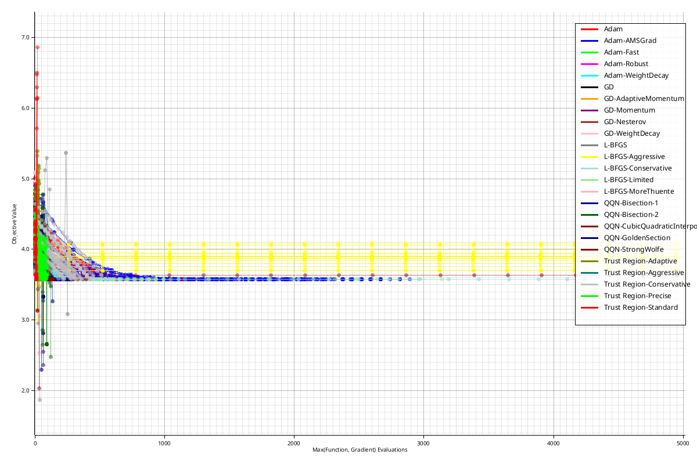
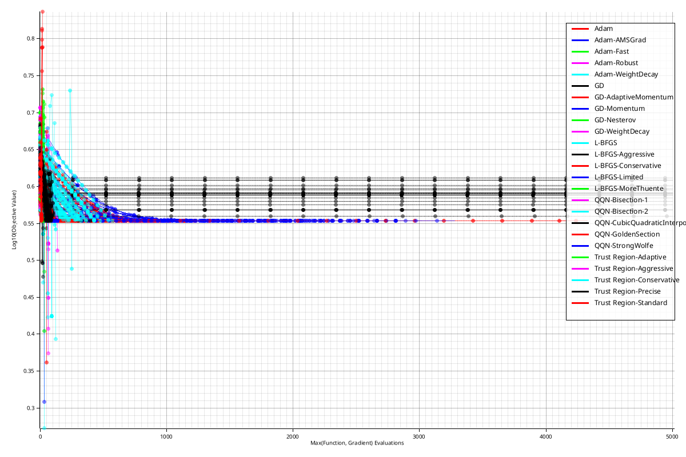

**Figure:** Convergence plots for Ackley_5D_a20_b0.2_c6.28e0 showing objective value vs iterations.
Left: Linear scale, Right: Log scale for better visualization of convergence behavior.

**Data:** [Linear scale data (CSV)](data/Ackley_5D_a20_b0.2_c6.28e0_data.csv) | [Log scale data (CSV)](data/Ackley_5D_a20_b0.2_c6.28e0_log_data.csv)

## Problem: Ackley_10D_a20_b0.2_c6.28e0

**Family:** Ackley
**Dimension:** 10
**Success Threshold:** 3.570e0
**Total Runs:** 500
**Detailed Analysis:** [View comprehensive problem analysis](reports/problem_analysis_Ackley_10D_a20_b0.2_c6.28e0.md)

### Performance Summary
<table style="border-collapse: collapse; width: 100%; margin: 20px 0;">
<tr style="background-color: #f2f2f2;">
<th style="border: 1px solid #ddd; padding: 8px; text-align: center;">Rank</th>
<th style="border: 1px solid #ddd; padding: 8px; text-align: center;">Optimizer</th>
<th style="border: 1px solid #ddd; padding: 8px; text-align: center;">Mean Final Value (All/Success/Fail)</th>
<th style="border: 1px solid #ddd; padding: 8px; text-align: center;">Std Dev</th>
<th style="border: 1px solid #ddd; padding: 8px; text-align: center;">Best Value</th>
<th style="border: 1px solid #ddd; padding: 8px; text-align: center;">Worst Value</th>
<th style="border: 1px solid #ddd; padding: 8px; text-align: center;">Mean Function Evals (All/Success/Fail)</th>
<th style="border: 1px solid #ddd; padding: 8px; text-align: center;">Mean Gradient Evals (All/Success/Fail)</th>
<th style="border: 1px solid #ddd; padding: 8px; text-align: center;">Success Rate</th>
<th style="border: 1px solid #ddd; padding: 8px; text-align: center;">Mean Time (s)</th>
</tr>
<tr style="background-color: #d4edda; font-weight: bold;">
<td style="border: 1px solid #ddd; padding: 8px; text-align: center;">1</td>
<td style="border: 1px solid #ddd; padding: 8px; text-align: center;"><a href="reports/detailed_Ackley_10D_a20_b0.2_c6.28e0_QQN-Bisection-2.md" title="Click for detailed analysis">QQN-Bisection-2</a></td>
<td style="border: 1px solid #ddd; padding: 8px; text-align: center;">3.54e0 / 3.42e0 / 3.57e0</td>
<td style="border: 1px solid #ddd; padding: 8px; text-align: center;">7.29e-2</td>
<td style="border: 1px solid #ddd; padding: 8px; text-align: center;">3.30e0</td>
<td style="border: 1px solid #ddd; padding: 8px; text-align: center;">3.57e0</td>
<td style="border: 1px solid #ddd; padding: 8px; text-align: center;">65.9 / 30.0 / 74.9</td>
<td style="border: 1px solid #ddd; padding: 8px; text-align: center;">75.8 / 63.5 / 78.9</td>
<td style="border: 1px solid #ddd; padding: 8px; text-align: center;">20.0%</td>
<td style="border: 1px solid #ddd; padding: 8px; text-align: center;">0.002</td>
</tr>
<tr style="background-color: #fff3cd;">
<td style="border: 1px solid #ddd; padding: 8px; text-align: center;">2</td>
<td style="border: 1px solid #ddd; padding: 8px; text-align: center;"><a href="reports/detailed_Ackley_10D_a20_b0.2_c6.28e0_L-BFGS.md" title="Click for detailed analysis">L-BFGS</a></td>
<td style="border: 1px solid #ddd; padding: 8px; text-align: center;">3.50e0 / 3.09e0 / 3.57e0</td>
<td style="border: 1px solid #ddd; padding: 8px; text-align: center;">2.17e-1</td>
<td style="border: 1px solid #ddd; padding: 8px; text-align: center;">2.72e0</td>
<td style="border: 1px solid #ddd; padding: 8px; text-align: center;">3.58e0</td>
<td style="border: 1px solid #ddd; padding: 8px; text-align: center;">133.3 / 38.7 / 150.0</td>
<td style="border: 1px solid #ddd; padding: 8px; text-align: center;">68.5 / 23.7 / 76.4</td>
<td style="border: 1px solid #ddd; padding: 8px; text-align: center;">15.0%</td>
<td style="border: 1px solid #ddd; padding: 8px; text-align: center;">0.002</td>
</tr>
<tr style="">
<td style="border: 1px solid #ddd; padding: 8px; text-align: center;">3</td>
<td style="border: 1px solid #ddd; padding: 8px; text-align: center;"><a href="reports/detailed_Ackley_10D_a20_b0.2_c6.28e0_QQN-Bisection-1.md" title="Click for detailed analysis">QQN-Bisection-1</a></td>
<td style="border: 1px solid #ddd; padding: 8px; text-align: center;">3.54e0 / 3.18e0 / 3.57e0</td>
<td style="border: 1px solid #ddd; padding: 8px; text-align: center;">1.23e-1</td>
<td style="border: 1px solid #ddd; padding: 8px; text-align: center;">3.08e0</td>
<td style="border: 1px solid #ddd; padding: 8px; text-align: center;">3.57e0</td>
<td style="border: 1px solid #ddd; padding: 8px; text-align: center;">96.2 / 27.0 / 103.9</td>
<td style="border: 1px solid #ddd; padding: 8px; text-align: center;">130.8 / 68.5 / 137.8</td>
<td style="border: 1px solid #ddd; padding: 8px; text-align: center;">10.0%</td>
<td style="border: 1px solid #ddd; padding: 8px; text-align: center;">0.002</td>
</tr>
<tr style="">
<td style="border: 1px solid #ddd; padding: 8px; text-align: center;">4</td>
<td style="border: 1px solid #ddd; padding: 8px; text-align: center;"><a href="reports/detailed_Ackley_10D_a20_b0.2_c6.28e0_L-BFGS-MoreThuente.md" title="Click for detailed analysis">L-BFGS-MoreThuente</a></td>
<td style="border: 1px solid #ddd; padding: 8px; text-align: center;">3.57e0 / 3.52e0 / 3.57e0</td>
<td style="border: 1px solid #ddd; padding: 8px; text-align: center;">1.12e-2</td>
<td style="border: 1px solid #ddd; padding: 8px; text-align: center;">3.52e0</td>
<td style="border: 1px solid #ddd; padding: 8px; text-align: center;">3.57e0</td>
<td style="border: 1px solid #ddd; padding: 8px; text-align: center;">55.9 / 11.0 / 58.3</td>
<td style="border: 1px solid #ddd; padding: 8px; text-align: center;">40.5 / 9.0 / 42.2</td>
<td style="border: 1px solid #ddd; padding: 8px; text-align: center;">5.0%</td>
<td style="border: 1px solid #ddd; padding: 8px; text-align: center;">0.001</td>
</tr>
<tr style="">
<td style="border: 1px solid #ddd; padding: 8px; text-align: center;">5</td>
<td style="border: 1px solid #ddd; padding: 8px; text-align: center;"><a href="reports/detailed_Ackley_10D_a20_b0.2_c6.28e0_L-BFGS-Aggressive.md" title="Click for detailed analysis">L-BFGS-Aggressive</a></td>
<td style="border: 1px solid #ddd; padding: 8px; text-align: center;">3.54e0 / 2.95e0 / 3.57e0</td>
<td style="border: 1px solid #ddd; padding: 8px; text-align: center;">1.35e-1</td>
<td style="border: 1px solid #ddd; padding: 8px; text-align: center;">2.95e0</td>
<td style="border: 1px solid #ddd; padding: 8px; text-align: center;">3.57e0</td>
<td style="border: 1px solid #ddd; padding: 8px; text-align: center;">185.8 / 31.0 / 193.9</td>
<td style="border: 1px solid #ddd; padding: 8px; text-align: center;">63.1 / 15.0 / 65.6</td>
<td style="border: 1px solid #ddd; padding: 8px; text-align: center;">5.0%</td>
<td style="border: 1px solid #ddd; padding: 8px; text-align: center;">0.003</td>
</tr>
<tr style="">
<td style="border: 1px solid #ddd; padding: 8px; text-align: center;">6</td>
<td style="border: 1px solid #ddd; padding: 8px; text-align: center;"><a href="reports/detailed_Ackley_10D_a20_b0.2_c6.28e0_QQN-CubicQuadraticInterpolation.md" title="Click for detailed analysis">QQN-CubicQuadraticInterpolation</a></td>
<td style="border: 1px solid #ddd; padding: 8px; text-align: center;">3.59e0 / 3.33e0 / 3.60e0</td>
<td style="border: 1px solid #ddd; padding: 8px; text-align: center;">9.76e-2</td>
<td style="border: 1px solid #ddd; padding: 8px; text-align: center;">3.33e0</td>
<td style="border: 1px solid #ddd; padding: 8px; text-align: center;">3.84e0</td>
<td style="border: 1px solid #ddd; padding: 8px; text-align: center;">471.4 / 15.0 / 495.4</td>
<td style="border: 1px solid #ddd; padding: 8px; text-align: center;">557.1 / 13.0 / 585.8</td>
<td style="border: 1px solid #ddd; padding: 8px; text-align: center;">5.0%</td>
<td style="border: 1px solid #ddd; padding: 8px; text-align: center;">0.016</td>
</tr>
<tr style="">
<td style="border: 1px solid #ddd; padding: 8px; text-align: center;">7</td>
<td style="border: 1px solid #ddd; padding: 8px; text-align: center;"><a href="reports/detailed_Ackley_10D_a20_b0.2_c6.28e0_Trust_Region-Aggressive.md" title="Click for detailed analysis">Trust Region-Aggressive</a></td>
<td style="border: 1px solid #ddd; padding: 8px; text-align: center;">4.16e0 / - / 4.22e0</td>
<td style="border: 1px solid #ddd; padding: 8px; text-align: center;">1.95e-1</td>
<td style="border: 1px solid #ddd; padding: 8px; text-align: center;">3.74e0</td>
<td style="border: 1px solid #ddd; padding: 8px; text-align: center;">4.55e0</td>
<td style="border: 1px solid #ddd; padding: 8px; text-align: center;">5.2 / - / 5.2</td>
<td style="border: 1px solid #ddd; padding: 8px; text-align: center;">4.1 / - / 4.1</td>
<td style="border: 1px solid #ddd; padding: 8px; text-align: center;">0.0%</td>
<td style="border: 1px solid #ddd; padding: 8px; text-align: center;">0.000</td>
</tr>
<tr style="">
<td style="border: 1px solid #ddd; padding: 8px; text-align: center;">8</td>
<td style="border: 1px solid #ddd; padding: 8px; text-align: center;"><a href="reports/detailed_Ackley_10D_a20_b0.2_c6.28e0_Trust_Region-Standard.md" title="Click for detailed analysis">Trust Region-Standard</a></td>
<td style="border: 1px solid #ddd; padding: 8px; text-align: center;">3.68e0 / - / 4.36e0</td>
<td style="border: 1px solid #ddd; padding: 8px; text-align: center;">8.69e-2</td>
<td style="border: 1px solid #ddd; padding: 8px; text-align: center;">3.58e0</td>
<td style="border: 1px solid #ddd; padding: 8px; text-align: center;">3.87e0</td>
<td style="border: 1px solid #ddd; padding: 8px; text-align: center;">9.1 / - / 9.1</td>
<td style="border: 1px solid #ddd; padding: 8px; text-align: center;">6.7 / - / 6.7</td>
<td style="border: 1px solid #ddd; padding: 8px; text-align: center;">0.0%</td>
<td style="border: 1px solid #ddd; padding: 8px; text-align: center;">0.000</td>
</tr>
<tr style="">
<td style="border: 1px solid #ddd; padding: 8px; text-align: center;">9</td>
<td style="border: 1px solid #ddd; padding: 8px; text-align: center;"><a href="reports/detailed_Ackley_10D_a20_b0.2_c6.28e0_Trust_Region-Adaptive.md" title="Click for detailed analysis">Trust Region-Adaptive</a></td>
<td style="border: 1px solid #ddd; padding: 8px; text-align: center;">3.59e0 / - / 4.41e0</td>
<td style="border: 1px solid #ddd; padding: 8px; text-align: center;">1.58e-2</td>
<td style="border: 1px solid #ddd; padding: 8px; text-align: center;">3.57e0</td>
<td style="border: 1px solid #ddd; padding: 8px; text-align: center;">3.63e0</td>
<td style="border: 1px solid #ddd; padding: 8px; text-align: center;">18.2 / - / 18.2</td>
<td style="border: 1px solid #ddd; padding: 8px; text-align: center;">12.8 / - / 12.8</td>
<td style="border: 1px solid #ddd; padding: 8px; text-align: center;">0.0%</td>
<td style="border: 1px solid #ddd; padding: 8px; text-align: center;">0.000</td>
</tr>
<tr style="">
<td style="border: 1px solid #ddd; padding: 8px; text-align: center;">10</td>
<td style="border: 1px solid #ddd; padding: 8px; text-align: center;"><a href="reports/detailed_Ackley_10D_a20_b0.2_c6.28e0_GD-Nesterov.md" title="Click for detailed analysis">GD-Nesterov</a></td>
<td style="border: 1px solid #ddd; padding: 8px; text-align: center;">3.58e0 / - / 3.66e0</td>
<td style="border: 1px solid #ddd; padding: 8px; text-align: center;">2.05e-3</td>
<td style="border: 1px solid #ddd; padding: 8px; text-align: center;">3.58e0</td>
<td style="border: 1px solid #ddd; padding: 8px; text-align: center;">3.58e0</td>
<td style="border: 1px solid #ddd; padding: 8px; text-align: center;">14.0 / - / 14.0</td>
<td style="border: 1px solid #ddd; padding: 8px; text-align: center;">24.0 / - / 24.0</td>
<td style="border: 1px solid #ddd; padding: 8px; text-align: center;">0.0%</td>
<td style="border: 1px solid #ddd; padding: 8px; text-align: center;">0.000</td>
</tr>
<tr style="">
<td style="border: 1px solid #ddd; padding: 8px; text-align: center;">11</td>
<td style="border: 1px solid #ddd; padding: 8px; text-align: center;"><a href="reports/detailed_Ackley_10D_a20_b0.2_c6.28e0_GD-Momentum.md" title="Click for detailed analysis">GD-Momentum</a></td>
<td style="border: 1px solid #ddd; padding: 8px; text-align: center;">3.58e0 / - / 3.81e0</td>
<td style="border: 1px solid #ddd; padding: 8px; text-align: center;">3.30e-3</td>
<td style="border: 1px solid #ddd; padding: 8px; text-align: center;">3.58e0</td>
<td style="border: 1px solid #ddd; padding: 8px; text-align: center;">3.59e0</td>
<td style="border: 1px solid #ddd; padding: 8px; text-align: center;">14.5 / - / 14.5</td>
<td style="border: 1px solid #ddd; padding: 8px; text-align: center;">25.0 / - / 25.0</td>
<td style="border: 1px solid #ddd; padding: 8px; text-align: center;">0.0%</td>
<td style="border: 1px solid #ddd; padding: 8px; text-align: center;">0.000</td>
</tr>
<tr style="">
<td style="border: 1px solid #ddd; padding: 8px; text-align: center;">12</td>
<td style="border: 1px solid #ddd; padding: 8px; text-align: center;"><a href="reports/detailed_Ackley_10D_a20_b0.2_c6.28e0_GD-AdaptiveMomentum.md" title="Click for detailed analysis">GD-AdaptiveMomentum</a></td>
<td style="border: 1px solid #ddd; padding: 8px; text-align: center;">3.58e0 / - / 3.60e0</td>
<td style="border: 1px solid #ddd; padding: 8px; text-align: center;">6.12e-3</td>
<td style="border: 1px solid #ddd; padding: 8px; text-align: center;">3.57e0</td>
<td style="border: 1px solid #ddd; padding: 8px; text-align: center;">3.59e0</td>
<td style="border: 1px solid #ddd; padding: 8px; text-align: center;">16.1 / - / 16.1</td>
<td style="border: 1px solid #ddd; padding: 8px; text-align: center;">28.2 / - / 28.2</td>
<td style="border: 1px solid #ddd; padding: 8px; text-align: center;">0.0%</td>
<td style="border: 1px solid #ddd; padding: 8px; text-align: center;">0.001</td>
</tr>
<tr style="">
<td style="border: 1px solid #ddd; padding: 8px; text-align: center;">13</td>
<td style="border: 1px solid #ddd; padding: 8px; text-align: center;"><a href="reports/detailed_Ackley_10D_a20_b0.2_c6.28e0_GD-WeightDecay.md" title="Click for detailed analysis">GD-WeightDecay</a></td>
<td style="border: 1px solid #ddd; padding: 8px; text-align: center;">3.58e0 / - / 3.59e0</td>
<td style="border: 1px solid #ddd; padding: 8px; text-align: center;">1.03e-3</td>
<td style="border: 1px solid #ddd; padding: 8px; text-align: center;">3.57e0</td>
<td style="border: 1px solid #ddd; padding: 8px; text-align: center;">3.58e0</td>
<td style="border: 1px solid #ddd; padding: 8px; text-align: center;">19.4 / - / 19.4</td>
<td style="border: 1px solid #ddd; padding: 8px; text-align: center;">34.8 / - / 34.8</td>
<td style="border: 1px solid #ddd; padding: 8px; text-align: center;">0.0%</td>
<td style="border: 1px solid #ddd; padding: 8px; text-align: center;">0.001</td>
</tr>
<tr style="">
<td style="border: 1px solid #ddd; padding: 8px; text-align: center;">14</td>
<td style="border: 1px solid #ddd; padding: 8px; text-align: center;"><a href="reports/detailed_Ackley_10D_a20_b0.2_c6.28e0_Trust_Region-Precise.md" title="Click for detailed analysis">Trust Region-Precise</a></td>
<td style="border: 1px solid #ddd; padding: 8px; text-align: center;">3.58e0 / - / 3.61e0</td>
<td style="border: 1px solid #ddd; padding: 8px; text-align: center;">4.57e-3</td>
<td style="border: 1px solid #ddd; padding: 8px; text-align: center;">3.57e0</td>
<td style="border: 1px solid #ddd; padding: 8px; text-align: center;">3.59e0</td>
<td style="border: 1px solid #ddd; padding: 8px; text-align: center;">42.5 / - / 42.5</td>
<td style="border: 1px solid #ddd; padding: 8px; text-align: center;">28.9 / - / 28.9</td>
<td style="border: 1px solid #ddd; padding: 8px; text-align: center;">0.0%</td>
<td style="border: 1px solid #ddd; padding: 8px; text-align: center;">0.000</td>
</tr>
<tr style="">
<td style="border: 1px solid #ddd; padding: 8px; text-align: center;">15</td>
<td style="border: 1px solid #ddd; padding: 8px; text-align: center;"><a href="reports/detailed_Ackley_10D_a20_b0.2_c6.28e0_QQN-StrongWolfe.md" title="Click for detailed analysis">QQN-StrongWolfe</a></td>
<td style="border: 1px solid #ddd; padding: 8px; text-align: center;">3.57e0 / - / 3.57e0</td>
<td style="border: 1px solid #ddd; padding: 8px; text-align: center;">5.84e-15</td>
<td style="border: 1px solid #ddd; padding: 8px; text-align: center;">3.57e0</td>
<td style="border: 1px solid #ddd; padding: 8px; text-align: center;">3.57e0</td>
<td style="border: 1px solid #ddd; padding: 8px; text-align: center;">79.2 / - / 79.2</td>
<td style="border: 1px solid #ddd; padding: 8px; text-align: center;">81.0 / - / 81.0</td>
<td style="border: 1px solid #ddd; padding: 8px; text-align: center;">0.0%</td>
<td style="border: 1px solid #ddd; padding: 8px; text-align: center;">0.002</td>
</tr>
<tr style="">
<td style="border: 1px solid #ddd; padding: 8px; text-align: center;">16</td>
<td style="border: 1px solid #ddd; padding: 8px; text-align: center;"><a href="reports/detailed_Ackley_10D_a20_b0.2_c6.28e0_L-BFGS-Limited.md" title="Click for detailed analysis">L-BFGS-Limited</a></td>
<td style="border: 1px solid #ddd; padding: 8px; text-align: center;">3.57e0 / - / 3.57e0</td>
<td style="border: 1px solid #ddd; padding: 8px; text-align: center;">4.88e-10</td>
<td style="border: 1px solid #ddd; padding: 8px; text-align: center;">3.57e0</td>
<td style="border: 1px solid #ddd; padding: 8px; text-align: center;">3.57e0</td>
<td style="border: 1px solid #ddd; padding: 8px; text-align: center;">142.2 / - / 142.2</td>
<td style="border: 1px solid #ddd; padding: 8px; text-align: center;">62.3 / - / 62.3</td>
<td style="border: 1px solid #ddd; padding: 8px; text-align: center;">0.0%</td>
<td style="border: 1px solid #ddd; padding: 8px; text-align: center;">0.003</td>
</tr>
<tr style="">
<td style="border: 1px solid #ddd; padding: 8px; text-align: center;">17</td>
<td style="border: 1px solid #ddd; padding: 8px; text-align: center;"><a href="reports/detailed_Ackley_10D_a20_b0.2_c6.28e0_Adam-Fast.md" title="Click for detailed analysis">Adam-Fast</a></td>
<td style="border: 1px solid #ddd; padding: 8px; text-align: center;">3.60e0 / - / 3.60e0</td>
<td style="border: 1px solid #ddd; padding: 8px; text-align: center;">3.42e-2</td>
<td style="border: 1px solid #ddd; padding: 8px; text-align: center;">3.57e0</td>
<td style="border: 1px solid #ddd; padding: 8px; text-align: center;">3.67e0</td>
<td style="border: 1px solid #ddd; padding: 8px; text-align: center;">106.6 / - / 106.6</td>
<td style="border: 1px solid #ddd; padding: 8px; text-align: center;">105.6 / - / 105.6</td>
<td style="border: 1px solid #ddd; padding: 8px; text-align: center;">0.0%</td>
<td style="border: 1px solid #ddd; padding: 8px; text-align: center;">0.002</td>
</tr>
<tr style="">
<td style="border: 1px solid #ddd; padding: 8px; text-align: center;">18</td>
<td style="border: 1px solid #ddd; padding: 8px; text-align: center;"><a href="reports/detailed_Ackley_10D_a20_b0.2_c6.28e0_QQN-GoldenSection.md" title="Click for detailed analysis">QQN-GoldenSection</a></td>
<td style="border: 1px solid #ddd; padding: 8px; text-align: center;">3.57e0 / - / 3.57e0</td>
<td style="border: 1px solid #ddd; padding: 8px; text-align: center;">1.01e-8</td>
<td style="border: 1px solid #ddd; padding: 8px; text-align: center;">3.57e0</td>
<td style="border: 1px solid #ddd; padding: 8px; text-align: center;">3.57e0</td>
<td style="border: 1px solid #ddd; padding: 8px; text-align: center;">186.9 / - / 186.9</td>
<td style="border: 1px solid #ddd; padding: 8px; text-align: center;">43.8 / - / 43.8</td>
<td style="border: 1px solid #ddd; padding: 8px; text-align: center;">0.0%</td>
<td style="border: 1px solid #ddd; padding: 8px; text-align: center;">0.003</td>
</tr>
<tr style="">
<td style="border: 1px solid #ddd; padding: 8px; text-align: center;">19</td>
<td style="border: 1px solid #ddd; padding: 8px; text-align: center;"><a href="reports/detailed_Ackley_10D_a20_b0.2_c6.28e0_Adam-Robust.md" title="Click for detailed analysis">Adam-Robust</a></td>
<td style="border: 1px solid #ddd; padding: 8px; text-align: center;">3.58e0 / - / 3.58e0</td>
<td style="border: 1px solid #ddd; padding: 8px; text-align: center;">1.77e-3</td>
<td style="border: 1px solid #ddd; padding: 8px; text-align: center;">3.57e0</td>
<td style="border: 1px solid #ddd; padding: 8px; text-align: center;">3.58e0</td>
<td style="border: 1px solid #ddd; padding: 8px; text-align: center;">126.8 / - / 126.8</td>
<td style="border: 1px solid #ddd; padding: 8px; text-align: center;">125.8 / - / 125.8</td>
<td style="border: 1px solid #ddd; padding: 8px; text-align: center;">0.0%</td>
<td style="border: 1px solid #ddd; padding: 8px; text-align: center;">0.003</td>
</tr>
<tr style="">
<td style="border: 1px solid #ddd; padding: 8px; text-align: center;">20</td>
<td style="border: 1px solid #ddd; padding: 8px; text-align: center;"><a href="reports/detailed_Ackley_10D_a20_b0.2_c6.28e0_GD.md" title="Click for detailed analysis">GD</a></td>
<td style="border: 1px solid #ddd; padding: 8px; text-align: center;">3.57e0 / - / 3.57e0</td>
<td style="border: 1px solid #ddd; padding: 8px; text-align: center;">2.52e-10</td>
<td style="border: 1px solid #ddd; padding: 8px; text-align: center;">3.57e0</td>
<td style="border: 1px solid #ddd; padding: 8px; text-align: center;">3.57e0</td>
<td style="border: 1px solid #ddd; padding: 8px; text-align: center;">99.3 / - / 99.3</td>
<td style="border: 1px solid #ddd; padding: 8px; text-align: center;">195.0 / - / 195.0</td>
<td style="border: 1px solid #ddd; padding: 8px; text-align: center;">0.0%</td>
<td style="border: 1px solid #ddd; padding: 8px; text-align: center;">0.003</td>
</tr>
<tr style="">
<td style="border: 1px solid #ddd; padding: 8px; text-align: center;">21</td>
<td style="border: 1px solid #ddd; padding: 8px; text-align: center;"><a href="reports/detailed_Ackley_10D_a20_b0.2_c6.28e0_L-BFGS-Conservative.md" title="Click for detailed analysis">L-BFGS-Conservative</a></td>
<td style="border: 1px solid #ddd; padding: 8px; text-align: center;">3.57e0 / - / 3.57e0</td>
<td style="border: 1px solid #ddd; padding: 8px; text-align: center;">5.22e-9</td>
<td style="border: 1px solid #ddd; padding: 8px; text-align: center;">3.57e0</td>
<td style="border: 1px solid #ddd; padding: 8px; text-align: center;">3.57e0</td>
<td style="border: 1px solid #ddd; padding: 8px; text-align: center;">170.7 / - / 170.7</td>
<td style="border: 1px solid #ddd; padding: 8px; text-align: center;">128.1 / - / 128.1</td>
<td style="border: 1px solid #ddd; padding: 8px; text-align: center;">0.0%</td>
<td style="border: 1px solid #ddd; padding: 8px; text-align: center;">0.004</td>
</tr>
<tr style="">
<td style="border: 1px solid #ddd; padding: 8px; text-align: center;">22</td>
<td style="border: 1px solid #ddd; padding: 8px; text-align: center;"><a href="reports/detailed_Ackley_10D_a20_b0.2_c6.28e0_Trust_Region-Conservative.md" title="Click for detailed analysis">Trust Region-Conservative</a></td>
<td style="border: 1px solid #ddd; padding: 8px; text-align: center;">3.58e0 / - / 3.58e0</td>
<td style="border: 1px solid #ddd; padding: 8px; text-align: center;">8.23e-4</td>
<td style="border: 1px solid #ddd; padding: 8px; text-align: center;">3.57e0</td>
<td style="border: 1px solid #ddd; padding: 8px; text-align: center;">3.58e0</td>
<td style="border: 1px solid #ddd; padding: 8px; text-align: center;">205.8 / - / 205.8</td>
<td style="border: 1px solid #ddd; padding: 8px; text-align: center;">137.7 / - / 137.7</td>
<td style="border: 1px solid #ddd; padding: 8px; text-align: center;">0.0%</td>
<td style="border: 1px solid #ddd; padding: 8px; text-align: center;">0.002</td>
</tr>
<tr style="">
<td style="border: 1px solid #ddd; padding: 8px; text-align: center;">23</td>
<td style="border: 1px solid #ddd; padding: 8px; text-align: center;"><a href="reports/detailed_Ackley_10D_a20_b0.2_c6.28e0_Adam-WeightDecay.md" title="Click for detailed analysis">Adam-WeightDecay</a></td>
<td style="border: 1px solid #ddd; padding: 8px; text-align: center;">3.57e0 / - / 3.57e0</td>
<td style="border: 1px solid #ddd; padding: 8px; text-align: center;">9.17e-6</td>
<td style="border: 1px solid #ddd; padding: 8px; text-align: center;">3.57e0</td>
<td style="border: 1px solid #ddd; padding: 8px; text-align: center;">3.57e0</td>
<td style="border: 1px solid #ddd; padding: 8px; text-align: center;">281.3 / - / 281.3</td>
<td style="border: 1px solid #ddd; padding: 8px; text-align: center;">280.3 / - / 280.3</td>
<td style="border: 1px solid #ddd; padding: 8px; text-align: center;">0.0%</td>
<td style="border: 1px solid #ddd; padding: 8px; text-align: center;">0.007</td>
</tr>
<tr style="">
<td style="border: 1px solid #ddd; padding: 8px; text-align: center;">24</td>
<td style="border: 1px solid #ddd; padding: 8px; text-align: center;"><a href="reports/detailed_Ackley_10D_a20_b0.2_c6.28e0_Adam.md" title="Click for detailed analysis">Adam</a></td>
<td style="border: 1px solid #ddd; padding: 8px; text-align: center;">3.57e0 / - / 3.57e0</td>
<td style="border: 1px solid #ddd; padding: 8px; text-align: center;">3.79e-9</td>
<td style="border: 1px solid #ddd; padding: 8px; text-align: center;">3.57e0</td>
<td style="border: 1px solid #ddd; padding: 8px; text-align: center;">3.57e0</td>
<td style="border: 1px solid #ddd; padding: 8px; text-align: center;">745.8 / - / 745.8</td>
<td style="border: 1px solid #ddd; padding: 8px; text-align: center;">744.8 / - / 744.8</td>
<td style="border: 1px solid #ddd; padding: 8px; text-align: center;">0.0%</td>
<td style="border: 1px solid #ddd; padding: 8px; text-align: center;">0.017</td>
</tr>
<tr style="">
<td style="border: 1px solid #ddd; padding: 8px; text-align: center;">25</td>
<td style="border: 1px solid #ddd; padding: 8px; text-align: center;"><a href="reports/detailed_Ackley_10D_a20_b0.2_c6.28e0_Adam-AMSGrad.md" title="Click for detailed analysis">Adam-AMSGrad</a></td>
<td style="border: 1px solid #ddd; padding: 8px; text-align: center;">3.57e0 / - / 3.57e0</td>
<td style="border: 1px solid #ddd; padding: 8px; text-align: center;">2.48e-9</td>
<td style="border: 1px solid #ddd; padding: 8px; text-align: center;">3.57e0</td>
<td style="border: 1px solid #ddd; padding: 8px; text-align: center;">3.57e0</td>
<td style="border: 1px solid #ddd; padding: 8px; text-align: center;">1241.4 / - / 1241.4</td>
<td style="border: 1px solid #ddd; padding: 8px; text-align: center;">1240.4 / - / 1240.4</td>
<td style="border: 1px solid #ddd; padding: 8px; text-align: center;">0.0%</td>
<td style="border: 1px solid #ddd; padding: 8px; text-align: center;">0.031</td>
</tr>
</table>

### Convergence Plots

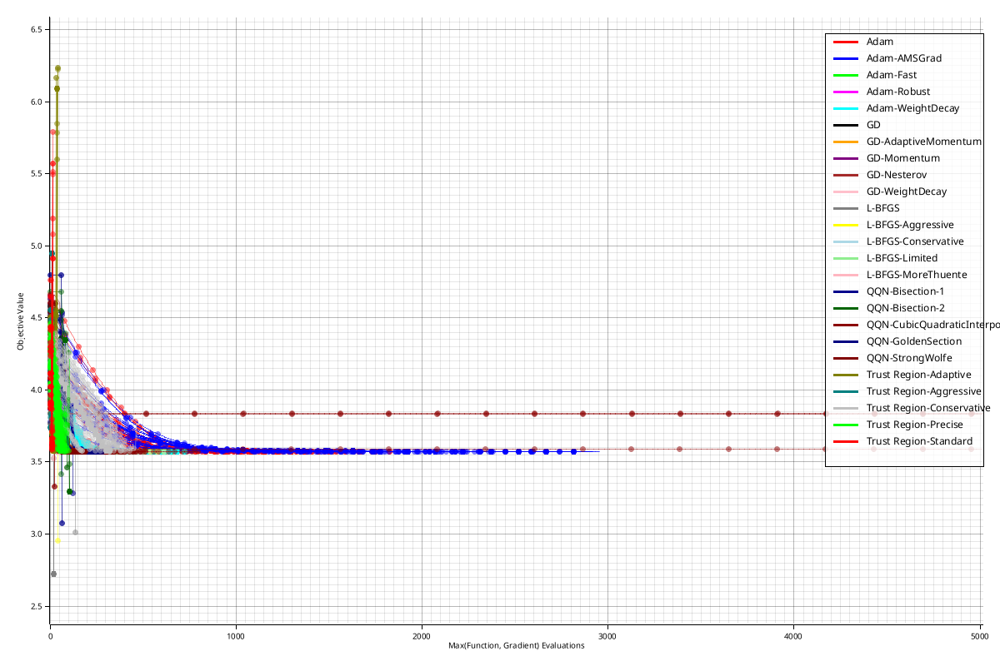
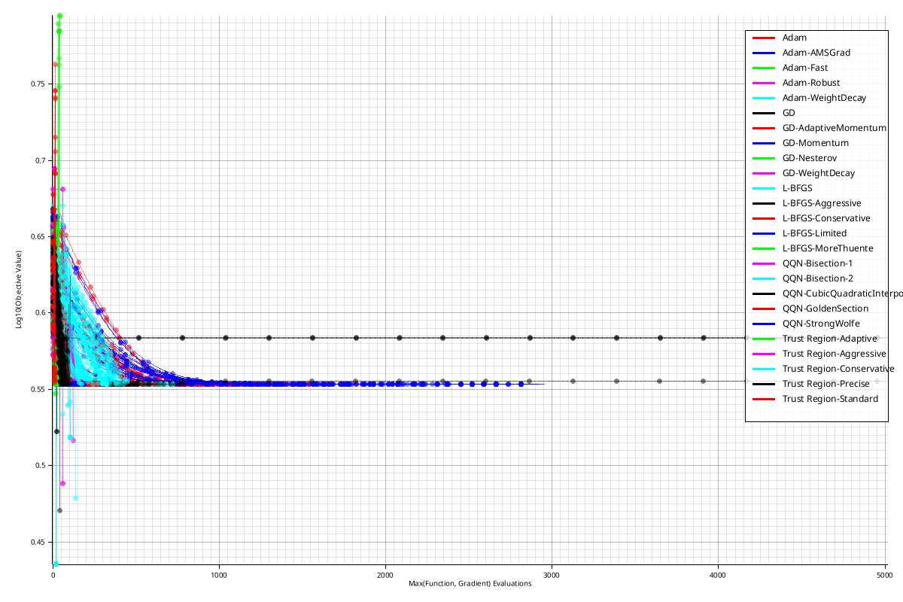

**Figure:** Convergence plots for Ackley_10D_a20_b0.2_c6.28e0 showing objective value vs iterations.
Left: Linear scale, Right: Log scale for better visualization of convergence behavior.

**Data:** [Linear scale data (CSV)](data/Ackley_10D_a20_b0.2_c6.28e0_data.csv) | [Log scale data (CSV)](data/Ackley_10D_a20_b0.2_c6.28e0_log_data.csv)

## Problem: StyblinskiTang_2D

**Family:** StyblinskiTang
**Dimension:** 2
**Success Threshold:** -7.830e1
**Total Runs:** 500
**Detailed Analysis:** [View comprehensive problem analysis](reports/problem_analysis_StyblinskiTang_2D.md)

### Performance Summary
<table style="border-collapse: collapse; width: 100%; margin: 20px 0;">
<tr style="background-color: #f2f2f2;">
<th style="border: 1px solid #ddd; padding: 8px; text-align: center;">Rank</th>
<th style="border: 1px solid #ddd; padding: 8px; text-align: center;">Optimizer</th>
<th style="border: 1px solid #ddd; padding: 8px; text-align: center;">Mean Final Value (All/Success/Fail)</th>
<th style="border: 1px solid #ddd; padding: 8px; text-align: center;">Std Dev</th>
<th style="border: 1px solid #ddd; padding: 8px; text-align: center;">Best Value</th>
<th style="border: 1px solid #ddd; padding: 8px; text-align: center;">Worst Value</th>
<th style="border: 1px solid #ddd; padding: 8px; text-align: center;">Mean Function Evals (All/Success/Fail)</th>
<th style="border: 1px solid #ddd; padding: 8px; text-align: center;">Mean Gradient Evals (All/Success/Fail)</th>
<th style="border: 1px solid #ddd; padding: 8px; text-align: center;">Success Rate</th>
<th style="border: 1px solid #ddd; padding: 8px; text-align: center;">Mean Time (s)</th>
</tr>
<tr style="background-color: #d4edda; font-weight: bold;">
<td style="border: 1px solid #ddd; padding: 8px; text-align: center;">1</td>
<td style="border: 1px solid #ddd; padding: 8px; text-align: center;"><a href="reports/detailed_StyblinskiTang_2D_QQN-GoldenSection.md" title="Click for detailed analysis">QQN-GoldenSection</a></td>
<td style="border: 1px solid #ddd; padding: 8px; text-align: center;">-7.69e1 / -7.83e1 / -6.42e1</td>
<td style="border: 1px solid #ddd; padding: 8px; text-align: center;">4.24e0</td>
<td style="border: 1px solid #ddd; padding: 8px; text-align: center;">-7.83e1</td>
<td style="border: 1px solid #ddd; padding: 8px; text-align: center;">-6.42e1</td>
<td style="border: 1px solid #ddd; padding: 8px; text-align: center;">159.8 / 148.4 / 261.5</td>
<td style="border: 1px solid #ddd; padding: 8px; text-align: center;">24.3 / 21.7 / 48.0</td>
<td style="border: 1px solid #ddd; padding: 8px; text-align: center;">90.0%</td>
<td style="border: 1px solid #ddd; padding: 8px; text-align: center;">0.002</td>
</tr>
<tr style="background-color: #fff3cd;">
<td style="border: 1px solid #ddd; padding: 8px; text-align: center;">2</td>
<td style="border: 1px solid #ddd; padding: 8px; text-align: center;"><a href="reports/detailed_StyblinskiTang_2D_L-BFGS-Conservative.md" title="Click for detailed analysis">L-BFGS-Conservative</a></td>
<td style="border: 1px solid #ddd; padding: 8px; text-align: center;">-7.69e1 / -7.83e1 / -6.42e1</td>
<td style="border: 1px solid #ddd; padding: 8px; text-align: center;">4.23e0</td>
<td style="border: 1px solid #ddd; padding: 8px; text-align: center;">-7.83e1</td>
<td style="border: 1px solid #ddd; padding: 8px; text-align: center;">-6.42e1</td>
<td style="border: 1px solid #ddd; padding: 8px; text-align: center;">300.1 / 277.4 / 504.0</td>
<td style="border: 1px solid #ddd; padding: 8px; text-align: center;">239.1 / 221.6 / 396.5</td>
<td style="border: 1px solid #ddd; padding: 8px; text-align: center;">90.0%</td>
<td style="border: 1px solid #ddd; padding: 8px; text-align: center;">0.008</td>
</tr>
<tr style="">
<td style="border: 1px solid #ddd; padding: 8px; text-align: center;">3</td>
<td style="border: 1px solid #ddd; padding: 8px; text-align: center;"><a href="reports/detailed_StyblinskiTang_2D_Adam-WeightDecay.md" title="Click for detailed analysis">Adam-WeightDecay</a></td>
<td style="border: 1px solid #ddd; padding: 8px; text-align: center;">-7.55e1 / -7.83e1 / -6.42e1</td>
<td style="border: 1px solid #ddd; padding: 8px; text-align: center;">5.64e0</td>
<td style="border: 1px solid #ddd; padding: 8px; text-align: center;">-7.83e1</td>
<td style="border: 1px solid #ddd; padding: 8px; text-align: center;">-6.42e1</td>
<td style="border: 1px solid #ddd; padding: 8px; text-align: center;">1893.5 / 1897.1 / 1879.0</td>
<td style="border: 1px solid #ddd; padding: 8px; text-align: center;">1893.3 / 1897.1 / 1878.0</td>
<td style="border: 1px solid #ddd; padding: 8px; text-align: center;">80.0%</td>
<td style="border: 1px solid #ddd; padding: 8px; text-align: center;">0.040</td>
</tr>
<tr style="">
<td style="border: 1px solid #ddd; padding: 8px; text-align: center;">4</td>
<td style="border: 1px solid #ddd; padding: 8px; text-align: center;"><a href="reports/detailed_StyblinskiTang_2D_QQN-Bisection-2.md" title="Click for detailed analysis">QQN-Bisection-2</a></td>
<td style="border: 1px solid #ddd; padding: 8px; text-align: center;">-7.48e1 / -7.83e1 / -6.42e1</td>
<td style="border: 1px solid #ddd; padding: 8px; text-align: center;">6.12e0</td>
<td style="border: 1px solid #ddd; padding: 8px; text-align: center;">-7.83e1</td>
<td style="border: 1px solid #ddd; padding: 8px; text-align: center;">-6.42e1</td>
<td style="border: 1px solid #ddd; padding: 8px; text-align: center;">99.0 / 74.8 / 171.6</td>
<td style="border: 1px solid #ddd; padding: 8px; text-align: center;">100.0 / 85.3 / 143.8</td>
<td style="border: 1px solid #ddd; padding: 8px; text-align: center;">75.0%</td>
<td style="border: 1px solid #ddd; padding: 8px; text-align: center;">0.002</td>
</tr>
<tr style="">
<td style="border: 1px solid #ddd; padding: 8px; text-align: center;">5</td>
<td style="border: 1px solid #ddd; padding: 8px; text-align: center;"><a href="reports/detailed_StyblinskiTang_2D_L-BFGS-MoreThuente.md" title="Click for detailed analysis">L-BFGS-MoreThuente</a></td>
<td style="border: 1px solid #ddd; padding: 8px; text-align: center;">-7.41e1 / -7.83e1 / -6.42e1</td>
<td style="border: 1px solid #ddd; padding: 8px; text-align: center;">6.47e0</td>
<td style="border: 1px solid #ddd; padding: 8px; text-align: center;">-7.83e1</td>
<td style="border: 1px solid #ddd; padding: 8px; text-align: center;">-6.42e1</td>
<td style="border: 1px solid #ddd; padding: 8px; text-align: center;">54.1 / 38.9 / 89.8</td>
<td style="border: 1px solid #ddd; padding: 8px; text-align: center;">41.0 / 30.0 / 66.5</td>
<td style="border: 1px solid #ddd; padding: 8px; text-align: center;">70.0%</td>
<td style="border: 1px solid #ddd; padding: 8px; text-align: center;">0.001</td>
</tr>
<tr style="">
<td style="border: 1px solid #ddd; padding: 8px; text-align: center;">6</td>
<td style="border: 1px solid #ddd; padding: 8px; text-align: center;"><a href="reports/detailed_StyblinskiTang_2D_QQN-CubicQuadraticInterpolation.md" title="Click for detailed analysis">QQN-CubicQuadraticInterpolation</a></td>
<td style="border: 1px solid #ddd; padding: 8px; text-align: center;">-7.34e1 / -7.83e1 / -6.18e1</td>
<td style="border: 1px solid #ddd; padding: 8px; text-align: center;">8.08e0</td>
<td style="border: 1px solid #ddd; padding: 8px; text-align: center;">-7.83e1</td>
<td style="border: 1px solid #ddd; padding: 8px; text-align: center;">-5.01e1</td>
<td style="border: 1px solid #ddd; padding: 8px; text-align: center;">74.5 / 50.3 / 131.0</td>
<td style="border: 1px solid #ddd; padding: 8px; text-align: center;">79.6 / 57.4 / 131.3</td>
<td style="border: 1px solid #ddd; padding: 8px; text-align: center;">70.0%</td>
<td style="border: 1px solid #ddd; padding: 8px; text-align: center;">0.002</td>
</tr>
<tr style="">
<td style="border: 1px solid #ddd; padding: 8px; text-align: center;">7</td>
<td style="border: 1px solid #ddd; padding: 8px; text-align: center;"><a href="reports/detailed_StyblinskiTang_2D_L-BFGS-Limited.md" title="Click for detailed analysis">L-BFGS-Limited</a></td>
<td style="border: 1px solid #ddd; padding: 8px; text-align: center;">-7.41e1 / -7.83e1 / -6.42e1</td>
<td style="border: 1px solid #ddd; padding: 8px; text-align: center;">6.48e0</td>
<td style="border: 1px solid #ddd; padding: 8px; text-align: center;">-7.83e1</td>
<td style="border: 1px solid #ddd; padding: 8px; text-align: center;">-6.42e1</td>
<td style="border: 1px solid #ddd; padding: 8px; text-align: center;">500.0 / 69.9 / 1503.7</td>
<td style="border: 1px solid #ddd; padding: 8px; text-align: center;">136.2 / 32.8 / 377.5</td>
<td style="border: 1px solid #ddd; padding: 8px; text-align: center;">70.0%</td>
<td style="border: 1px solid #ddd; padding: 8px; text-align: center;">0.006</td>
</tr>
<tr style="">
<td style="border: 1px solid #ddd; padding: 8px; text-align: center;">8</td>
<td style="border: 1px solid #ddd; padding: 8px; text-align: center;"><a href="reports/detailed_StyblinskiTang_2D_QQN-Bisection-1.md" title="Click for detailed analysis">QQN-Bisection-1</a></td>
<td style="border: 1px solid #ddd; padding: 8px; text-align: center;">-7.40e1 / -7.83e1 / -6.40e1</td>
<td style="border: 1px solid #ddd; padding: 8px; text-align: center;">7.84e0</td>
<td style="border: 1px solid #ddd; padding: 8px; text-align: center;">-7.83e1</td>
<td style="border: 1px solid #ddd; padding: 8px; text-align: center;">-5.01e1</td>
<td style="border: 1px solid #ddd; padding: 8px; text-align: center;">385.6 / 87.4 / 1081.7</td>
<td style="border: 1px solid #ddd; padding: 8px; text-align: center;">391.6 / 118.5 / 1028.7</td>
<td style="border: 1px solid #ddd; padding: 8px; text-align: center;">70.0%</td>
<td style="border: 1px solid #ddd; padding: 8px; text-align: center;">0.007</td>
</tr>
<tr style="">
<td style="border: 1px solid #ddd; padding: 8px; text-align: center;">9</td>
<td style="border: 1px solid #ddd; padding: 8px; text-align: center;"><a href="reports/detailed_StyblinskiTang_2D_Trust_Region-Adaptive.md" title="Click for detailed analysis">Trust Region-Adaptive</a></td>
<td style="border: 1px solid #ddd; padding: 8px; text-align: center;">-7.37e1 / -7.83e1 / -6.28e1</td>
<td style="border: 1px solid #ddd; padding: 8px; text-align: center;">1.73e1</td>
<td style="border: 1px solid #ddd; padding: 8px; text-align: center;">-7.83e1</td>
<td style="border: 1px solid #ddd; padding: 8px; text-align: center;">3.85e-1</td>
<td style="border: 1px solid #ddd; padding: 8px; text-align: center;">885.1 / 939.6 / 758.0</td>
<td style="border: 1px solid #ddd; padding: 8px; text-align: center;">591.0 / 627.4 / 506.0</td>
<td style="border: 1px solid #ddd; padding: 8px; text-align: center;">70.0%</td>
<td style="border: 1px solid #ddd; padding: 8px; text-align: center;">0.005</td>
</tr>
<tr style="">
<td style="border: 1px solid #ddd; padding: 8px; text-align: center;">10</td>
<td style="border: 1px solid #ddd; padding: 8px; text-align: center;"><a href="reports/detailed_StyblinskiTang_2D_GD.md" title="Click for detailed analysis">GD</a></td>
<td style="border: 1px solid #ddd; padding: 8px; text-align: center;">-7.34e1 / -7.83e1 / -6.42e1</td>
<td style="border: 1px solid #ddd; padding: 8px; text-align: center;">6.73e0</td>
<td style="border: 1px solid #ddd; padding: 8px; text-align: center;">-7.83e1</td>
<td style="border: 1px solid #ddd; padding: 8px; text-align: center;">-6.42e1</td>
<td style="border: 1px solid #ddd; padding: 8px; text-align: center;">66.5 / 54.8 / 88.0</td>
<td style="border: 1px solid #ddd; padding: 8px; text-align: center;">129.7 / 106.7 / 172.3</td>
<td style="border: 1px solid #ddd; padding: 8px; text-align: center;">65.0%</td>
<td style="border: 1px solid #ddd; padding: 8px; text-align: center;">0.002</td>
</tr>
<tr style="">
<td style="border: 1px solid #ddd; padding: 8px; text-align: center;">11</td>
<td style="border: 1px solid #ddd; padding: 8px; text-align: center;"><a href="reports/detailed_StyblinskiTang_2D_QQN-StrongWolfe.md" title="Click for detailed analysis">QQN-StrongWolfe</a></td>
<td style="border: 1px solid #ddd; padding: 8px; text-align: center;">-7.34e1 / -7.83e1 / -6.42e1</td>
<td style="border: 1px solid #ddd; padding: 8px; text-align: center;">6.74e0</td>
<td style="border: 1px solid #ddd; padding: 8px; text-align: center;">-7.83e1</td>
<td style="border: 1px solid #ddd; padding: 8px; text-align: center;">-6.42e1</td>
<td style="border: 1px solid #ddd; padding: 8px; text-align: center;">284.4 / 232.8 / 380.1</td>
<td style="border: 1px solid #ddd; padding: 8px; text-align: center;">225.3 / 176.2 / 316.6</td>
<td style="border: 1px solid #ddd; padding: 8px; text-align: center;">65.0%</td>
<td style="border: 1px solid #ddd; padding: 8px; text-align: center;">0.008</td>
</tr>
<tr style="">
<td style="border: 1px solid #ddd; padding: 8px; text-align: center;">12</td>
<td style="border: 1px solid #ddd; padding: 8px; text-align: center;"><a href="reports/detailed_StyblinskiTang_2D_L-BFGS.md" title="Click for detailed analysis">L-BFGS</a></td>
<td style="border: 1px solid #ddd; padding: 8px; text-align: center;">-7.45e1 / -7.83e1 / -6.80e1</td>
<td style="border: 1px solid #ddd; padding: 8px; text-align: center;">6.17e0</td>
<td style="border: 1px solid #ddd; padding: 8px; text-align: center;">-7.83e1</td>
<td style="border: 1px solid #ddd; padding: 8px; text-align: center;">-6.29e1</td>
<td style="border: 1px solid #ddd; padding: 8px; text-align: center;">132.3 / 87.1 / 177.6</td>
<td style="border: 1px solid #ddd; padding: 8px; text-align: center;">61.3 / 42.2 / 80.4</td>
<td style="border: 1px solid #ddd; padding: 8px; text-align: center;">50.0%</td>
<td style="border: 1px solid #ddd; padding: 8px; text-align: center;">0.002</td>
</tr>
<tr style="">
<td style="border: 1px solid #ddd; padding: 8px; text-align: center;">13</td>
<td style="border: 1px solid #ddd; padding: 8px; text-align: center;"><a href="reports/detailed_StyblinskiTang_2D_Trust_Region-Standard.md" title="Click for detailed analysis">Trust Region-Standard</a></td>
<td style="border: 1px solid #ddd; padding: 8px; text-align: center;">-7.21e1 / -7.83e1 / 1.52e2</td>
<td style="border: 1px solid #ddd; padding: 8px; text-align: center;">1.75e1</td>
<td style="border: 1px solid #ddd; padding: 8px; text-align: center;">-7.83e1</td>
<td style="border: 1px solid #ddd; padding: 8px; text-align: center;">3.86e-1</td>
<td style="border: 1px solid #ddd; padding: 8px; text-align: center;">212.3 / 237.0 / 195.8</td>
<td style="border: 1px solid #ddd; padding: 8px; text-align: center;">142.3 / 159.0 / 131.2</td>
<td style="border: 1px solid #ddd; padding: 8px; text-align: center;">40.0%</td>
<td style="border: 1px solid #ddd; padding: 8px; text-align: center;">0.001</td>
</tr>
<tr style="">
<td style="border: 1px solid #ddd; padding: 8px; text-align: center;">14</td>
<td style="border: 1px solid #ddd; padding: 8px; text-align: center;"><a href="reports/detailed_StyblinskiTang_2D_GD-WeightDecay.md" title="Click for detailed analysis">GD-WeightDecay</a></td>
<td style="border: 1px solid #ddd; padding: 8px; text-align: center;">-7.47e1 / -7.83e1 / -7.26e1</td>
<td style="border: 1px solid #ddd; padding: 8px; text-align: center;">6.14e0</td>
<td style="border: 1px solid #ddd; padding: 8px; text-align: center;">-7.83e1</td>
<td style="border: 1px solid #ddd; padding: 8px; text-align: center;">-6.40e1</td>
<td style="border: 1px solid #ddd; padding: 8px; text-align: center;">39.9 / 39.7 / 39.9</td>
<td style="border: 1px solid #ddd; padding: 8px; text-align: center;">76.0 / 76.4 / 75.8</td>
<td style="border: 1px solid #ddd; padding: 8px; text-align: center;">35.0%</td>
<td style="border: 1px solid #ddd; padding: 8px; text-align: center;">0.001</td>
</tr>
<tr style="">
<td style="border: 1px solid #ddd; padding: 8px; text-align: center;">15</td>
<td style="border: 1px solid #ddd; padding: 8px; text-align: center;"><a href="reports/detailed_StyblinskiTang_2D_Adam-Fast.md" title="Click for detailed analysis">Adam-Fast</a></td>
<td style="border: 1px solid #ddd; padding: 8px; text-align: center;">-7.68e1 / -7.83e1 / -7.29e1</td>
<td style="border: 1px solid #ddd; padding: 8px; text-align: center;">4.34e0</td>
<td style="border: 1px solid #ddd; padding: 8px; text-align: center;">-7.83e1</td>
<td style="border: 1px solid #ddd; padding: 8px; text-align: center;">-6.38e1</td>
<td style="border: 1px solid #ddd; padding: 8px; text-align: center;">67.3 / 59.3 / 71.6</td>
<td style="border: 1px solid #ddd; padding: 8px; text-align: center;">66.7 / 59.3 / 70.6</td>
<td style="border: 1px solid #ddd; padding: 8px; text-align: center;">35.0%</td>
<td style="border: 1px solid #ddd; padding: 8px; text-align: center;">0.001</td>
</tr>
<tr style="">
<td style="border: 1px solid #ddd; padding: 8px; text-align: center;">16</td>
<td style="border: 1px solid #ddd; padding: 8px; text-align: center;"><a href="reports/detailed_StyblinskiTang_2D_Trust_Region-Aggressive.md" title="Click for detailed analysis">Trust Region-Aggressive</a></td>
<td style="border: 1px solid #ddd; padding: 8px; text-align: center;">-6.55e1 / -7.83e1 / -6.08e1</td>
<td style="border: 1px solid #ddd; padding: 8px; text-align: center;">2.50e1</td>
<td style="border: 1px solid #ddd; padding: 8px; text-align: center;">-7.83e1</td>
<td style="border: 1px solid #ddd; padding: 8px; text-align: center;">3.64e-1</td>
<td style="border: 1px solid #ddd; padding: 8px; text-align: center;">49.3 / 59.2 / 46.8</td>
<td style="border: 1px solid #ddd; padding: 8px; text-align: center;">33.6 / 40.5 / 31.9</td>
<td style="border: 1px solid #ddd; padding: 8px; text-align: center;">20.0%</td>
<td style="border: 1px solid #ddd; padding: 8px; text-align: center;">0.000</td>
</tr>
<tr style="">
<td style="border: 1px solid #ddd; padding: 8px; text-align: center;">17</td>
<td style="border: 1px solid #ddd; padding: 8px; text-align: center;"><a href="reports/detailed_StyblinskiTang_2D_GD-Momentum.md" title="Click for detailed analysis">GD-Momentum</a></td>
<td style="border: 1px solid #ddd; padding: 8px; text-align: center;">-6.57e1 / -7.83e1 / -5.30e1</td>
<td style="border: 1px solid #ddd; padding: 8px; text-align: center;">1.59e1</td>
<td style="border: 1px solid #ddd; padding: 8px; text-align: center;">-7.83e1</td>
<td style="border: 1px solid #ddd; padding: 8px; text-align: center;">-3.90e1</td>
<td style="border: 1px solid #ddd; padding: 8px; text-align: center;">35.9 / 70.3 / 29.8</td>
<td style="border: 1px solid #ddd; padding: 8px; text-align: center;">67.8 / 137.7 / 55.5</td>
<td style="border: 1px solid #ddd; padding: 8px; text-align: center;">15.0%</td>
<td style="border: 1px solid #ddd; padding: 8px; text-align: center;">0.001</td>
</tr>
<tr style="">
<td style="border: 1px solid #ddd; padding: 8px; text-align: center;">18</td>
<td style="border: 1px solid #ddd; padding: 8px; text-align: center;"><a href="reports/detailed_StyblinskiTang_2D_GD-Nesterov.md" title="Click for detailed analysis">GD-Nesterov</a></td>
<td style="border: 1px solid #ddd; padding: 8px; text-align: center;">-6.91e1 / -7.83e1 / -6.42e1</td>
<td style="border: 1px solid #ddd; padding: 8px; text-align: center;">1.28e1</td>
<td style="border: 1px solid #ddd; padding: 8px; text-align: center;">-7.83e1</td>
<td style="border: 1px solid #ddd; padding: 8px; text-align: center;">-3.86e1</td>
<td style="border: 1px solid #ddd; padding: 8px; text-align: center;">29.1 / 35.0 / 28.5</td>
<td style="border: 1px solid #ddd; padding: 8px; text-align: center;">54.4 / 67.0 / 53.0</td>
<td style="border: 1px solid #ddd; padding: 8px; text-align: center;">10.0%</td>
<td style="border: 1px solid #ddd; padding: 8px; text-align: center;">0.001</td>
</tr>
<tr style="">
<td style="border: 1px solid #ddd; padding: 8px; text-align: center;">19</td>
<td style="border: 1px solid #ddd; padding: 8px; text-align: center;"><a href="reports/detailed_StyblinskiTang_2D_GD-AdaptiveMomentum.md" title="Click for detailed analysis">GD-AdaptiveMomentum</a></td>
<td style="border: 1px solid #ddd; padding: 8px; text-align: center;">-6.57e1 / -7.83e1 / -3.66e1</td>
<td style="border: 1px solid #ddd; padding: 8px; text-align: center;">1.57e1</td>
<td style="border: 1px solid #ddd; padding: 8px; text-align: center;">-7.83e1</td>
<td style="border: 1px solid #ddd; padding: 8px; text-align: center;">-3.85e1</td>
<td style="border: 1px solid #ddd; padding: 8px; text-align: center;">24.4 / 50.0 / 23.1</td>
<td style="border: 1px solid #ddd; padding: 8px; text-align: center;">45.0 / 97.0 / 42.2</td>
<td style="border: 1px solid #ddd; padding: 8px; text-align: center;">5.0%</td>
<td style="border: 1px solid #ddd; padding: 8px; text-align: center;">0.001</td>
</tr>
<tr style="">
<td style="border: 1px solid #ddd; padding: 8px; text-align: center;">20</td>
<td style="border: 1px solid #ddd; padding: 8px; text-align: center;"><a href="reports/detailed_StyblinskiTang_2D_Adam-Robust.md" title="Click for detailed analysis">Adam-Robust</a></td>
<td style="border: 1px solid #ddd; padding: 8px; text-align: center;">-2.07e1 / - / -2.07e1</td>
<td style="border: 1px solid #ddd; padding: 8px; text-align: center;">2.26e0</td>
<td style="border: 1px solid #ddd; padding: 8px; text-align: center;">-2.44e1</td>
<td style="border: 1px solid #ddd; padding: 8px; text-align: center;">-1.49e1</td>
<td style="border: 1px solid #ddd; padding: 8px; text-align: center;">2502.0 / - / 2502.0</td>
<td style="border: 1px solid #ddd; padding: 8px; text-align: center;">2502.0 / - / 2502.0</td>
<td style="border: 1px solid #ddd; padding: 8px; text-align: center;">0.0%</td>
<td style="border: 1px solid #ddd; padding: 8px; text-align: center;">0.056</td>
</tr>
<tr style="">
<td style="border: 1px solid #ddd; padding: 8px; text-align: center;">21</td>
<td style="border: 1px solid #ddd; padding: 8px; text-align: center;"><a href="reports/detailed_StyblinskiTang_2D_Adam.md" title="Click for detailed analysis">Adam</a></td>
<td style="border: 1px solid #ddd; padding: 8px; text-align: center;">-2.94e1 / - / -2.94e1</td>
<td style="border: 1px solid #ddd; padding: 8px; text-align: center;">2.68e0</td>
<td style="border: 1px solid #ddd; padding: 8px; text-align: center;">-3.47e1</td>
<td style="border: 1px solid #ddd; padding: 8px; text-align: center;">-2.46e1</td>
<td style="border: 1px solid #ddd; padding: 8px; text-align: center;">2502.0 / - / 2502.0</td>
<td style="border: 1px solid #ddd; padding: 8px; text-align: center;">2502.0 / - / 2502.0</td>
<td style="border: 1px solid #ddd; padding: 8px; text-align: center;">0.0%</td>
<td style="border: 1px solid #ddd; padding: 8px; text-align: center;">0.050</td>
</tr>
<tr style="">
<td style="border: 1px solid #ddd; padding: 8px; text-align: center;">22</td>
<td style="border: 1px solid #ddd; padding: 8px; text-align: center;"><a href="reports/detailed_StyblinskiTang_2D_Trust_Region-Conservative.md" title="Click for detailed analysis">Trust Region-Conservative</a></td>
<td style="border: 1px solid #ddd; padding: 8px; text-align: center;">-1.02e1 / - / -1.02e1</td>
<td style="border: 1px solid #ddd; padding: 8px; text-align: center;">4.38e-1</td>
<td style="border: 1px solid #ddd; padding: 8px; text-align: center;">-1.15e1</td>
<td style="border: 1px solid #ddd; padding: 8px; text-align: center;">-9.64e0</td>
<td style="border: 1px solid #ddd; padding: 8px; text-align: center;">3002.0 / - / 3002.0</td>
<td style="border: 1px solid #ddd; padding: 8px; text-align: center;">2002.0 / - / 2002.0</td>
<td style="border: 1px solid #ddd; padding: 8px; text-align: center;">0.0%</td>
<td style="border: 1px solid #ddd; padding: 8px; text-align: center;">0.019</td>
</tr>
<tr style="">
<td style="border: 1px solid #ddd; padding: 8px; text-align: center;">23</td>
<td style="border: 1px solid #ddd; padding: 8px; text-align: center;"><a href="reports/detailed_StyblinskiTang_2D_Trust_Region-Precise.md" title="Click for detailed analysis">Trust Region-Precise</a></td>
<td style="border: 1px solid #ddd; padding: 8px; text-align: center;">-6.26e1 / - / -6.26e1</td>
<td style="border: 1px solid #ddd; padding: 8px; text-align: center;">4.27e-1</td>
<td style="border: 1px solid #ddd; padding: 8px; text-align: center;">-6.35e1</td>
<td style="border: 1px solid #ddd; padding: 8px; text-align: center;">-6.22e1</td>
<td style="border: 1px solid #ddd; padding: 8px; text-align: center;">3002.0 / - / 3002.0</td>
<td style="border: 1px solid #ddd; padding: 8px; text-align: center;">2002.0 / - / 2002.0</td>
<td style="border: 1px solid #ddd; padding: 8px; text-align: center;">0.0%</td>
<td style="border: 1px solid #ddd; padding: 8px; text-align: center;">0.019</td>
</tr>
<tr style="">
<td style="border: 1px solid #ddd; padding: 8px; text-align: center;">24</td>
<td style="border: 1px solid #ddd; padding: 8px; text-align: center;"><a href="reports/detailed_StyblinskiTang_2D_Adam-AMSGrad.md" title="Click for detailed analysis">Adam-AMSGrad</a></td>
<td style="border: 1px solid #ddd; padding: 8px; text-align: center;">-3.03e1 / - / -3.03e1</td>
<td style="border: 1px solid #ddd; padding: 8px; text-align: center;">1.58e0</td>
<td style="border: 1px solid #ddd; padding: 8px; text-align: center;">-3.29e1</td>
<td style="border: 1px solid #ddd; padding: 8px; text-align: center;">-2.78e1</td>
<td style="border: 1px solid #ddd; padding: 8px; text-align: center;">2502.0 / - / 2502.0</td>
<td style="border: 1px solid #ddd; padding: 8px; text-align: center;">2502.0 / - / 2502.0</td>
<td style="border: 1px solid #ddd; padding: 8px; text-align: center;">0.0%</td>
<td style="border: 1px solid #ddd; padding: 8px; text-align: center;">0.056</td>
</tr>
<tr style="">
<td style="border: 1px solid #ddd; padding: 8px; text-align: center;">25</td>
<td style="border: 1px solid #ddd; padding: 8px; text-align: center;"><a href="reports/detailed_StyblinskiTang_2D_L-BFGS-Aggressive.md" title="Click for detailed analysis">L-BFGS-Aggressive</a></td>
<td style="border: 1px solid #ddd; padding: 8px; text-align: center;">-5.13e1 / - / -5.13e1</td>
<td style="border: 1px solid #ddd; padding: 8px; text-align: center;">1.89e1</td>
<td style="border: 1px solid #ddd; padding: 8px; text-align: center;">-7.77e1</td>
<td style="border: 1px solid #ddd; padding: 8px; text-align: center;">-4.63e0</td>
<td style="border: 1px solid #ddd; padding: 8px; text-align: center;">3848.1 / - / 3848.1</td>
<td style="border: 1px solid #ddd; padding: 8px; text-align: center;">1157.2 / - / 1157.2</td>
<td style="border: 1px solid #ddd; padding: 8px; text-align: center;">0.0%</td>
<td style="border: 1px solid #ddd; padding: 8px; text-align: center;">0.025</td>
</tr>
</table>

### Convergence Plots

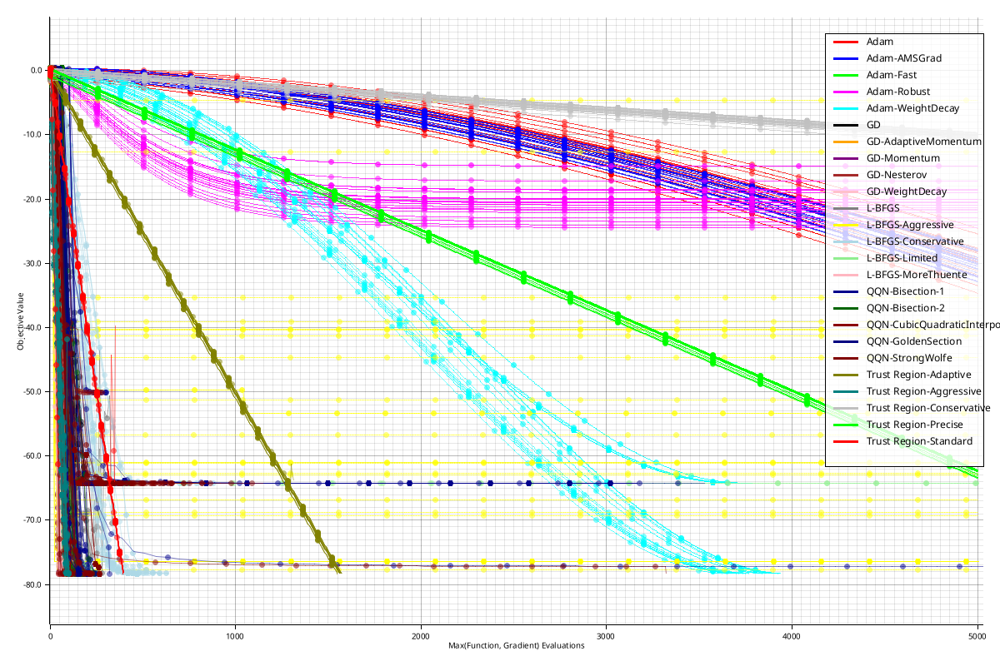
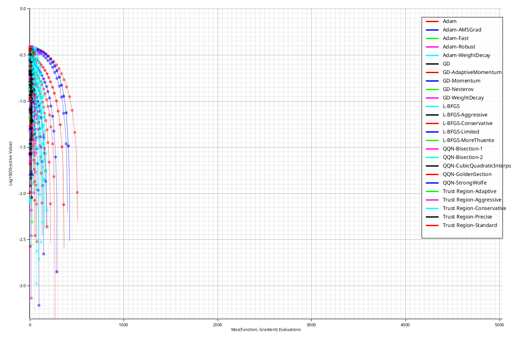

**Figure:** Convergence plots for StyblinskiTang_2D showing objective value vs iterations.
Left: Linear scale, Right: Log scale for better visualization of convergence behavior.

**Data:** [Linear scale data (CSV)](data/StyblinskiTang_2D_data.csv) | [Log scale data (CSV)](data/StyblinskiTang_2D_log_data.csv)

## Problem: StyblinskiTang_5D

**Family:** StyblinskiTang
**Dimension:** 5
**Success Threshold:** -1.950e2
**Total Runs:** 500
**Detailed Analysis:** [View comprehensive problem analysis](reports/problem_analysis_StyblinskiTang_5D.md)

### Performance Summary
<table style="border-collapse: collapse; width: 100%; margin: 20px 0;">
<tr style="background-color: #f2f2f2;">
<th style="border: 1px solid #ddd; padding: 8px; text-align: center;">Rank</th>
<th style="border: 1px solid #ddd; padding: 8px; text-align: center;">Optimizer</th>
<th style="border: 1px solid #ddd; padding: 8px; text-align: center;">Mean Final Value (All/Success/Fail)</th>
<th style="border: 1px solid #ddd; padding: 8px; text-align: center;">Std Dev</th>
<th style="border: 1px solid #ddd; padding: 8px; text-align: center;">Best Value</th>
<th style="border: 1px solid #ddd; padding: 8px; text-align: center;">Worst Value</th>
<th style="border: 1px solid #ddd; padding: 8px; text-align: center;">Mean Function Evals (All/Success/Fail)</th>
<th style="border: 1px solid #ddd; padding: 8px; text-align: center;">Mean Gradient Evals (All/Success/Fail)</th>
<th style="border: 1px solid #ddd; padding: 8px; text-align: center;">Success Rate</th>
<th style="border: 1px solid #ddd; padding: 8px; text-align: center;">Mean Time (s)</th>
</tr>
<tr style="background-color: #d4edda; font-weight: bold;">
<td style="border: 1px solid #ddd; padding: 8px; text-align: center;">1</td>
<td style="border: 1px solid #ddd; padding: 8px; text-align: center;"><a href="reports/detailed_StyblinskiTang_5D_QQN-GoldenSection.md" title="Click for detailed analysis">QQN-GoldenSection</a></td>
<td style="border: 1px solid #ddd; padding: 8px; text-align: center;">-1.90e2 / -1.96e2 / -1.77e2</td>
<td style="border: 1px solid #ddd; padding: 8px; text-align: center;">9.30e0</td>
<td style="border: 1px solid #ddd; padding: 8px; text-align: center;">-1.96e2</td>
<td style="border: 1px solid #ddd; padding: 8px; text-align: center;">-1.68e2</td>
<td style="border: 1px solid #ddd; padding: 8px; text-align: center;">330.5 / 234.0 / 555.7</td>
<td style="border: 1px solid #ddd; padding: 8px; text-align: center;">53.6 / 32.9 / 102.2</td>
<td style="border: 1px solid #ddd; padding: 8px; text-align: center;">70.0%</td>
<td style="border: 1px solid #ddd; padding: 8px; text-align: center;">0.006</td>
</tr>
<tr style="background-color: #fff3cd;">
<td style="border: 1px solid #ddd; padding: 8px; text-align: center;">2</td>
<td style="border: 1px solid #ddd; padding: 8px; text-align: center;"><a href="reports/detailed_StyblinskiTang_5D_L-BFGS-Conservative.md" title="Click for detailed analysis">L-BFGS-Conservative</a></td>
<td style="border: 1px solid #ddd; padding: 8px; text-align: center;">-1.89e2 / -1.95e2 / -1.76e2</td>
<td style="border: 1px solid #ddd; padding: 8px; text-align: center;">1.03e1</td>
<td style="border: 1px solid #ddd; padding: 8px; text-align: center;">-1.95e2</td>
<td style="border: 1px solid #ddd; padding: 8px; text-align: center;">-1.59e2</td>
<td style="border: 1px solid #ddd; padding: 8px; text-align: center;">567.8 / 288.1 / 1087.3</td>
<td style="border: 1px solid #ddd; padding: 8px; text-align: center;">343.6 / 227.8 / 558.9</td>
<td style="border: 1px solid #ddd; padding: 8px; text-align: center;">65.0%</td>
<td style="border: 1px solid #ddd; padding: 8px; text-align: center;">0.012</td>
</tr>
<tr style="">
<td style="border: 1px solid #ddd; padding: 8px; text-align: center;">3</td>
<td style="border: 1px solid #ddd; padding: 8px; text-align: center;"><a href="reports/detailed_StyblinskiTang_5D_Adam-WeightDecay.md" title="Click for detailed analysis">Adam-WeightDecay</a></td>
<td style="border: 1px solid #ddd; padding: 8px; text-align: center;">-1.90e2 / -1.95e2 / -1.82e2</td>
<td style="border: 1px solid #ddd; padding: 8px; text-align: center;">6.36e0</td>
<td style="border: 1px solid #ddd; padding: 8px; text-align: center;">-1.95e2</td>
<td style="border: 1px solid #ddd; padding: 8px; text-align: center;">-1.82e2</td>
<td style="border: 1px solid #ddd; padding: 8px; text-align: center;">1865.5 / 1840.7 / 1911.6</td>
<td style="border: 1px solid #ddd; padding: 8px; text-align: center;">1865.2 / 1840.7 / 1910.6</td>
<td style="border: 1px solid #ddd; padding: 8px; text-align: center;">65.0%</td>
<td style="border: 1px solid #ddd; padding: 8px; text-align: center;">0.041</td>
</tr>
<tr style="">
<td style="border: 1px solid #ddd; padding: 8px; text-align: center;">4</td>
<td style="border: 1px solid #ddd; padding: 8px; text-align: center;"><a href="reports/detailed_StyblinskiTang_5D_Trust_Region-Adaptive.md" title="Click for detailed analysis">Trust Region-Adaptive</a></td>
<td style="border: 1px solid #ddd; padding: 8px; text-align: center;">-1.88e2 / -1.95e2 / -1.73e2</td>
<td style="border: 1px solid #ddd; padding: 8px; text-align: center;">1.11e1</td>
<td style="border: 1px solid #ddd; padding: 8px; text-align: center;">-1.95e2</td>
<td style="border: 1px solid #ddd; padding: 8px; text-align: center;">-1.68e2</td>
<td style="border: 1px solid #ddd; padding: 8px; text-align: center;">2249.5 / 2333.3 / 2093.9</td>
<td style="border: 1px solid #ddd; padding: 8px; text-align: center;">1500.5 / 1556.5 / 1396.6</td>
<td style="border: 1px solid #ddd; padding: 8px; text-align: center;">65.0%</td>
<td style="border: 1px solid #ddd; padding: 8px; text-align: center;">0.014</td>
</tr>
<tr style="">
<td style="border: 1px solid #ddd; padding: 8px; text-align: center;">5</td>
<td style="border: 1px solid #ddd; padding: 8px; text-align: center;"><a href="reports/detailed_StyblinskiTang_5D_GD-WeightDecay.md" title="Click for detailed analysis">GD-WeightDecay</a></td>
<td style="border: 1px solid #ddd; padding: 8px; text-align: center;">-1.88e2 / -1.95e2 / -1.78e2</td>
<td style="border: 1px solid #ddd; padding: 8px; text-align: center;">1.03e1</td>
<td style="border: 1px solid #ddd; padding: 8px; text-align: center;">-1.96e2</td>
<td style="border: 1px solid #ddd; padding: 8px; text-align: center;">-1.53e2</td>
<td style="border: 1px solid #ddd; padding: 8px; text-align: center;">53.1 / 42.2 / 69.4</td>
<td style="border: 1px solid #ddd; padding: 8px; text-align: center;">102.8 / 81.5 / 134.8</td>
<td style="border: 1px solid #ddd; padding: 8px; text-align: center;">60.0%</td>
<td style="border: 1px solid #ddd; padding: 8px; text-align: center;">0.002</td>
</tr>
<tr style="">
<td style="border: 1px solid #ddd; padding: 8px; text-align: center;">6</td>
<td style="border: 1px solid #ddd; padding: 8px; text-align: center;"><a href="reports/detailed_StyblinskiTang_5D_QQN-Bisection-2.md" title="Click for detailed analysis">QQN-Bisection-2</a></td>
<td style="border: 1px solid #ddd; padding: 8px; text-align: center;">-1.89e2 / -1.96e2 / -1.78e2</td>
<td style="border: 1px solid #ddd; padding: 8px; text-align: center;">9.39e0</td>
<td style="border: 1px solid #ddd; padding: 8px; text-align: center;">-1.96e2</td>
<td style="border: 1px solid #ddd; padding: 8px; text-align: center;">-1.68e2</td>
<td style="border: 1px solid #ddd; padding: 8px; text-align: center;">177.8 / 97.3 / 298.4</td>
<td style="border: 1px solid #ddd; padding: 8px; text-align: center;">142.6 / 99.1 / 207.9</td>
<td style="border: 1px solid #ddd; padding: 8px; text-align: center;">60.0%</td>
<td style="border: 1px solid #ddd; padding: 8px; text-align: center;">0.005</td>
</tr>
<tr style="">
<td style="border: 1px solid #ddd; padding: 8px; text-align: center;">7</td>
<td style="border: 1px solid #ddd; padding: 8px; text-align: center;"><a href="reports/detailed_StyblinskiTang_5D_QQN-Bisection-1.md" title="Click for detailed analysis">QQN-Bisection-1</a></td>
<td style="border: 1px solid #ddd; padding: 8px; text-align: center;">-1.89e2 / -1.96e2 / -1.80e2</td>
<td style="border: 1px solid #ddd; padding: 8px; text-align: center;">8.22e0</td>
<td style="border: 1px solid #ddd; padding: 8px; text-align: center;">-1.96e2</td>
<td style="border: 1px solid #ddd; padding: 8px; text-align: center;">-1.68e2</td>
<td style="border: 1px solid #ddd; padding: 8px; text-align: center;">413.4 / 210.2 / 718.4</td>
<td style="border: 1px solid #ddd; padding: 8px; text-align: center;">436.9 / 244.2 / 725.9</td>
<td style="border: 1px solid #ddd; padding: 8px; text-align: center;">60.0%</td>
<td style="border: 1px solid #ddd; padding: 8px; text-align: center;">0.008</td>
</tr>
<tr style="">
<td style="border: 1px solid #ddd; padding: 8px; text-align: center;">8</td>
<td style="border: 1px solid #ddd; padding: 8px; text-align: center;"><a href="reports/detailed_StyblinskiTang_5D_Adam-Fast.md" title="Click for detailed analysis">Adam-Fast</a></td>
<td style="border: 1px solid #ddd; padding: 8px; text-align: center;">-1.88e2 / -1.96e2 / -1.73e2</td>
<td style="border: 1px solid #ddd; padding: 8px; text-align: center;">8.60e0</td>
<td style="border: 1px solid #ddd; padding: 8px; text-align: center;">-1.96e2</td>
<td style="border: 1px solid #ddd; padding: 8px; text-align: center;">-1.66e2</td>
<td style="border: 1px solid #ddd; padding: 8px; text-align: center;">65.0 / 59.4 / 71.9</td>
<td style="border: 1px solid #ddd; padding: 8px; text-align: center;">64.5 / 59.4 / 70.9</td>
<td style="border: 1px solid #ddd; padding: 8px; text-align: center;">55.0%</td>
<td style="border: 1px solid #ddd; padding: 8px; text-align: center;">0.001</td>
</tr>
<tr style="">
<td style="border: 1px solid #ddd; padding: 8px; text-align: center;">9</td>
<td style="border: 1px solid #ddd; padding: 8px; text-align: center;"><a href="reports/detailed_StyblinskiTang_5D_Trust_Region-Standard.md" title="Click for detailed analysis">Trust Region-Standard</a></td>
<td style="border: 1px solid #ddd; padding: 8px; text-align: center;">-1.88e2 / -1.95e2 / -1.80e2</td>
<td style="border: 1px solid #ddd; padding: 8px; text-align: center;">8.22e0</td>
<td style="border: 1px solid #ddd; padding: 8px; text-align: center;">-1.96e2</td>
<td style="border: 1px solid #ddd; padding: 8px; text-align: center;">-1.68e2</td>
<td style="border: 1px solid #ddd; padding: 8px; text-align: center;">568.8 / 586.9 / 546.7</td>
<td style="border: 1px solid #ddd; padding: 8px; text-align: center;">380.1 / 392.3 / 365.1</td>
<td style="border: 1px solid #ddd; padding: 8px; text-align: center;">55.0%</td>
<td style="border: 1px solid #ddd; padding: 8px; text-align: center;">0.004</td>
</tr>
<tr style="">
<td style="border: 1px solid #ddd; padding: 8px; text-align: center;">10</td>
<td style="border: 1px solid #ddd; padding: 8px; text-align: center;"><a href="reports/detailed_StyblinskiTang_5D_GD.md" title="Click for detailed analysis">GD</a></td>
<td style="border: 1px solid #ddd; padding: 8px; text-align: center;">-1.86e2 / -1.95e2 / -1.76e2</td>
<td style="border: 1px solid #ddd; padding: 8px; text-align: center;">1.17e1</td>
<td style="border: 1px solid #ddd; padding: 8px; text-align: center;">-1.95e2</td>
<td style="border: 1px solid #ddd; padding: 8px; text-align: center;">-1.53e2</td>
<td style="border: 1px solid #ddd; padding: 8px; text-align: center;">95.7 / 79.1 / 112.3</td>
<td style="border: 1px solid #ddd; padding: 8px; text-align: center;">187.9 / 155.2 / 220.6</td>
<td style="border: 1px solid #ddd; padding: 8px; text-align: center;">50.0%</td>
<td style="border: 1px solid #ddd; padding: 8px; text-align: center;">0.003</td>
</tr>
<tr style="">
<td style="border: 1px solid #ddd; padding: 8px; text-align: center;">11</td>
<td style="border: 1px solid #ddd; padding: 8px; text-align: center;"><a href="reports/detailed_StyblinskiTang_5D_L-BFGS-MoreThuente.md" title="Click for detailed analysis">L-BFGS-MoreThuente</a></td>
<td style="border: 1px solid #ddd; padding: 8px; text-align: center;">-1.89e2 / -1.96e2 / -1.82e2</td>
<td style="border: 1px solid #ddd; padding: 8px; text-align: center;">6.99e0</td>
<td style="border: 1px solid #ddd; padding: 8px; text-align: center;">-1.96e2</td>
<td style="border: 1px solid #ddd; padding: 8px; text-align: center;">-1.82e2</td>
<td style="border: 1px solid #ddd; padding: 8px; text-align: center;">209.2 / 46.4 / 372.0</td>
<td style="border: 1px solid #ddd; padding: 8px; text-align: center;">153.1 / 35.8 / 270.3</td>
<td style="border: 1px solid #ddd; padding: 8px; text-align: center;">50.0%</td>
<td style="border: 1px solid #ddd; padding: 8px; text-align: center;">0.004</td>
</tr>
<tr style="">
<td style="border: 1px solid #ddd; padding: 8px; text-align: center;">12</td>
<td style="border: 1px solid #ddd; padding: 8px; text-align: center;"><a href="reports/detailed_StyblinskiTang_5D_L-BFGS-Limited.md" title="Click for detailed analysis">L-BFGS-Limited</a></td>
<td style="border: 1px solid #ddd; padding: 8px; text-align: center;">-1.89e2 / -1.96e2 / -1.82e2</td>
<td style="border: 1px solid #ddd; padding: 8px; text-align: center;">6.97e0</td>
<td style="border: 1px solid #ddd; padding: 8px; text-align: center;">-1.96e2</td>
<td style="border: 1px solid #ddd; padding: 8px; text-align: center;">-1.82e2</td>
<td style="border: 1px solid #ddd; padding: 8px; text-align: center;">839.9 / 71.7 / 1608.0</td>
<td style="border: 1px solid #ddd; padding: 8px; text-align: center;">251.9 / 36.6 / 467.3</td>
<td style="border: 1px solid #ddd; padding: 8px; text-align: center;">50.0%</td>
<td style="border: 1px solid #ddd; padding: 8px; text-align: center;">0.011</td>
</tr>
<tr style="">
<td style="border: 1px solid #ddd; padding: 8px; text-align: center;">13</td>
<td style="border: 1px solid #ddd; padding: 8px; text-align: center;"><a href="reports/detailed_StyblinskiTang_5D_Trust_Region-Aggressive.md" title="Click for detailed analysis">Trust Region-Aggressive</a></td>
<td style="border: 1px solid #ddd; padding: 8px; text-align: center;">-1.90e2 / -1.95e2 / -1.85e2</td>
<td style="border: 1px solid #ddd; padding: 8px; text-align: center;">1.11e1</td>
<td style="border: 1px solid #ddd; padding: 8px; text-align: center;">-1.96e2</td>
<td style="border: 1px solid #ddd; padding: 8px; text-align: center;">-1.53e2</td>
<td style="border: 1px solid #ddd; padding: 8px; text-align: center;">144.5 / 148.0 / 141.6</td>
<td style="border: 1px solid #ddd; padding: 8px; text-align: center;">97.2 / 99.7 / 95.1</td>
<td style="border: 1px solid #ddd; padding: 8px; text-align: center;">45.0%</td>
<td style="border: 1px solid #ddd; padding: 8px; text-align: center;">0.001</td>
</tr>
<tr style="">
<td style="border: 1px solid #ddd; padding: 8px; text-align: center;">14</td>
<td style="border: 1px solid #ddd; padding: 8px; text-align: center;"><a href="reports/detailed_StyblinskiTang_5D_QQN-CubicQuadraticInterpolation.md" title="Click for detailed analysis">QQN-CubicQuadraticInterpolation</a></td>
<td style="border: 1px solid #ddd; padding: 8px; text-align: center;">-1.82e2 / -1.96e2 / -1.70e2</td>
<td style="border: 1px solid #ddd; padding: 8px; text-align: center;">1.48e1</td>
<td style="border: 1px solid #ddd; padding: 8px; text-align: center;">-1.96e2</td>
<td style="border: 1px solid #ddd; padding: 8px; text-align: center;">-1.53e2</td>
<td style="border: 1px solid #ddd; padding: 8px; text-align: center;">129.7 / 71.7 / 177.1</td>
<td style="border: 1px solid #ddd; padding: 8px; text-align: center;">143.3 / 86.3 / 190.0</td>
<td style="border: 1px solid #ddd; padding: 8px; text-align: center;">45.0%</td>
<td style="border: 1px solid #ddd; padding: 8px; text-align: center;">0.005</td>
</tr>
<tr style="">
<td style="border: 1px solid #ddd; padding: 8px; text-align: center;">15</td>
<td style="border: 1px solid #ddd; padding: 8px; text-align: center;"><a href="reports/detailed_StyblinskiTang_5D_QQN-StrongWolfe.md" title="Click for detailed analysis">QQN-StrongWolfe</a></td>
<td style="border: 1px solid #ddd; padding: 8px; text-align: center;">-1.85e2 / -1.96e2 / -1.78e2</td>
<td style="border: 1px solid #ddd; padding: 8px; text-align: center;">1.08e1</td>
<td style="border: 1px solid #ddd; padding: 8px; text-align: center;">-1.96e2</td>
<td style="border: 1px solid #ddd; padding: 8px; text-align: center;">-1.53e2</td>
<td style="border: 1px solid #ddd; padding: 8px; text-align: center;">261.1 / 124.6 / 352.0</td>
<td style="border: 1px solid #ddd; padding: 8px; text-align: center;">236.4 / 113.5 / 318.3</td>
<td style="border: 1px solid #ddd; padding: 8px; text-align: center;">40.0%</td>
<td style="border: 1px solid #ddd; padding: 8px; text-align: center;">0.009</td>
</tr>
<tr style="">
<td style="border: 1px solid #ddd; padding: 8px; text-align: center;">16</td>
<td style="border: 1px solid #ddd; padding: 8px; text-align: center;"><a href="reports/detailed_StyblinskiTang_5D_GD-Nesterov.md" title="Click for detailed analysis">GD-Nesterov</a></td>
<td style="border: 1px solid #ddd; padding: 8px; text-align: center;">-1.83e2 / -1.95e2 / -1.76e2</td>
<td style="border: 1px solid #ddd; padding: 8px; text-align: center;">1.83e1</td>
<td style="border: 1px solid #ddd; padding: 8px; text-align: center;">-1.96e2</td>
<td style="border: 1px solid #ddd; padding: 8px; text-align: center;">-1.17e2</td>
<td style="border: 1px solid #ddd; padding: 8px; text-align: center;">44.9 / 37.7 / 47.9</td>
<td style="border: 1px solid #ddd; padding: 8px; text-align: center;">86.0 / 72.3 / 91.9</td>
<td style="border: 1px solid #ddd; padding: 8px; text-align: center;">30.0%</td>
<td style="border: 1px solid #ddd; padding: 8px; text-align: center;">0.001</td>
</tr>
<tr style="">
<td style="border: 1px solid #ddd; padding: 8px; text-align: center;">17</td>
<td style="border: 1px solid #ddd; padding: 8px; text-align: center;"><a href="reports/detailed_StyblinskiTang_5D_L-BFGS.md" title="Click for detailed analysis">L-BFGS</a></td>
<td style="border: 1px solid #ddd; padding: 8px; text-align: center;">-1.89e2 / -1.96e2 / -1.82e2</td>
<td style="border: 1px solid #ddd; padding: 8px; text-align: center;">6.79e0</td>
<td style="border: 1px solid #ddd; padding: 8px; text-align: center;">-1.96e2</td>
<td style="border: 1px solid #ddd; padding: 8px; text-align: center;">-1.80e2</td>
<td style="border: 1px solid #ddd; padding: 8px; text-align: center;">153.3 / 98.7 / 176.8</td>
<td style="border: 1px solid #ddd; padding: 8px; text-align: center;">68.3 / 47.5 / 77.3</td>
<td style="border: 1px solid #ddd; padding: 8px; text-align: center;">30.0%</td>
<td style="border: 1px solid #ddd; padding: 8px; text-align: center;">0.002</td>
</tr>
<tr style="">
<td style="border: 1px solid #ddd; padding: 8px; text-align: center;">18</td>
<td style="border: 1px solid #ddd; padding: 8px; text-align: center;"><a href="reports/detailed_StyblinskiTang_5D_GD-Momentum.md" title="Click for detailed analysis">GD-Momentum</a></td>
<td style="border: 1px solid #ddd; padding: 8px; text-align: center;">-1.70e2 / -1.95e2 / -1.59e2</td>
<td style="border: 1px solid #ddd; padding: 8px; text-align: center;">3.57e1</td>
<td style="border: 1px solid #ddd; padding: 8px; text-align: center;">-1.95e2</td>
<td style="border: 1px solid #ddd; padding: 8px; text-align: center;">-8.05e1</td>
<td style="border: 1px solid #ddd; padding: 8px; text-align: center;">57.8 / 51.0 / 58.9</td>
<td style="border: 1px solid #ddd; padding: 8px; text-align: center;">111.7 / 99.0 / 113.9</td>
<td style="border: 1px solid #ddd; padding: 8px; text-align: center;">15.0%</td>
<td style="border: 1px solid #ddd; padding: 8px; text-align: center;">0.002</td>
</tr>
<tr style="">
<td style="border: 1px solid #ddd; padding: 8px; text-align: center;">19</td>
<td style="border: 1px solid #ddd; padding: 8px; text-align: center;"><a href="reports/detailed_StyblinskiTang_5D_GD-AdaptiveMomentum.md" title="Click for detailed analysis">GD-AdaptiveMomentum</a></td>
<td style="border: 1px solid #ddd; padding: 8px; text-align: center;">-1.55e2 / -1.95e2 / -1.29e2</td>
<td style="border: 1px solid #ddd; padding: 8px; text-align: center;">2.85e1</td>
<td style="border: 1px solid #ddd; padding: 8px; text-align: center;">-1.95e2</td>
<td style="border: 1px solid #ddd; padding: 8px; text-align: center;">-1.15e2</td>
<td style="border: 1px solid #ddd; padding: 8px; text-align: center;">34.4 / 58.5 / 31.7</td>
<td style="border: 1px solid #ddd; padding: 8px; text-align: center;">64.9 / 114.0 / 59.4</td>
<td style="border: 1px solid #ddd; padding: 8px; text-align: center;">10.0%</td>
<td style="border: 1px solid #ddd; padding: 8px; text-align: center;">0.001</td>
</tr>
<tr style="">
<td style="border: 1px solid #ddd; padding: 8px; text-align: center;">20</td>
<td style="border: 1px solid #ddd; padding: 8px; text-align: center;"><a href="reports/detailed_StyblinskiTang_5D_Adam.md" title="Click for detailed analysis">Adam</a></td>
<td style="border: 1px solid #ddd; padding: 8px; text-align: center;">-7.38e1 / - / -7.38e1</td>
<td style="border: 1px solid #ddd; padding: 8px; text-align: center;">4.48e0</td>
<td style="border: 1px solid #ddd; padding: 8px; text-align: center;">-8.30e1</td>
<td style="border: 1px solid #ddd; padding: 8px; text-align: center;">-6.64e1</td>
<td style="border: 1px solid #ddd; padding: 8px; text-align: center;">2502.0 / - / 2502.0</td>
<td style="border: 1px solid #ddd; padding: 8px; text-align: center;">2502.0 / - / 2502.0</td>
<td style="border: 1px solid #ddd; padding: 8px; text-align: center;">0.0%</td>
<td style="border: 1px solid #ddd; padding: 8px; text-align: center;">0.052</td>
</tr>
<tr style="">
<td style="border: 1px solid #ddd; padding: 8px; text-align: center;">21</td>
<td style="border: 1px solid #ddd; padding: 8px; text-align: center;"><a href="reports/detailed_StyblinskiTang_5D_Adam-AMSGrad.md" title="Click for detailed analysis">Adam-AMSGrad</a></td>
<td style="border: 1px solid #ddd; padding: 8px; text-align: center;">-7.50e1 / - / -7.50e1</td>
<td style="border: 1px solid #ddd; padding: 8px; text-align: center;">4.47e0</td>
<td style="border: 1px solid #ddd; padding: 8px; text-align: center;">-8.10e1</td>
<td style="border: 1px solid #ddd; padding: 8px; text-align: center;">-6.56e1</td>
<td style="border: 1px solid #ddd; padding: 8px; text-align: center;">2502.0 / - / 2502.0</td>
<td style="border: 1px solid #ddd; padding: 8px; text-align: center;">2502.0 / - / 2502.0</td>
<td style="border: 1px solid #ddd; padding: 8px; text-align: center;">0.0%</td>
<td style="border: 1px solid #ddd; padding: 8px; text-align: center;">0.059</td>
</tr>
<tr style="">
<td style="border: 1px solid #ddd; padding: 8px; text-align: center;">22</td>
<td style="border: 1px solid #ddd; padding: 8px; text-align: center;"><a href="reports/detailed_StyblinskiTang_5D_Adam-Robust.md" title="Click for detailed analysis">Adam-Robust</a></td>
<td style="border: 1px solid #ddd; padding: 8px; text-align: center;">-5.32e1 / - / -5.32e1</td>
<td style="border: 1px solid #ddd; padding: 8px; text-align: center;">3.79e0</td>
<td style="border: 1px solid #ddd; padding: 8px; text-align: center;">-6.12e1</td>
<td style="border: 1px solid #ddd; padding: 8px; text-align: center;">-4.49e1</td>
<td style="border: 1px solid #ddd; padding: 8px; text-align: center;">2502.0 / - / 2502.0</td>
<td style="border: 1px solid #ddd; padding: 8px; text-align: center;">2502.0 / - / 2502.0</td>
<td style="border: 1px solid #ddd; padding: 8px; text-align: center;">0.0%</td>
<td style="border: 1px solid #ddd; padding: 8px; text-align: center;">0.059</td>
</tr>
<tr style="">
<td style="border: 1px solid #ddd; padding: 8px; text-align: center;">23</td>
<td style="border: 1px solid #ddd; padding: 8px; text-align: center;"><a href="reports/detailed_StyblinskiTang_5D_Trust_Region-Precise.md" title="Click for detailed analysis">Trust Region-Precise</a></td>
<td style="border: 1px solid #ddd; padding: 8px; text-align: center;">-6.28e1 / - / -6.28e1</td>
<td style="border: 1px solid #ddd; padding: 8px; text-align: center;">7.02e-1</td>
<td style="border: 1px solid #ddd; padding: 8px; text-align: center;">-6.40e1</td>
<td style="border: 1px solid #ddd; padding: 8px; text-align: center;">-6.17e1</td>
<td style="border: 1px solid #ddd; padding: 8px; text-align: center;">3002.0 / - / 3002.0</td>
<td style="border: 1px solid #ddd; padding: 8px; text-align: center;">2002.0 / - / 2002.0</td>
<td style="border: 1px solid #ddd; padding: 8px; text-align: center;">0.0%</td>
<td style="border: 1px solid #ddd; padding: 8px; text-align: center;">0.020</td>
</tr>
<tr style="">
<td style="border: 1px solid #ddd; padding: 8px; text-align: center;">24</td>
<td style="border: 1px solid #ddd; padding: 8px; text-align: center;"><a href="reports/detailed_StyblinskiTang_5D_Trust_Region-Conservative.md" title="Click for detailed analysis">Trust Region-Conservative</a></td>
<td style="border: 1px solid #ddd; padding: 8px; text-align: center;">-1.05e1 / - / -1.05e1</td>
<td style="border: 1px solid #ddd; padding: 8px; text-align: center;">7.12e-1</td>
<td style="border: 1px solid #ddd; padding: 8px; text-align: center;">-1.22e1</td>
<td style="border: 1px solid #ddd; padding: 8px; text-align: center;">-9.39e0</td>
<td style="border: 1px solid #ddd; padding: 8px; text-align: center;">3002.0 / - / 3002.0</td>
<td style="border: 1px solid #ddd; padding: 8px; text-align: center;">2002.0 / - / 2002.0</td>
<td style="border: 1px solid #ddd; padding: 8px; text-align: center;">0.0%</td>
<td style="border: 1px solid #ddd; padding: 8px; text-align: center;">0.019</td>
</tr>
<tr style="">
<td style="border: 1px solid #ddd; padding: 8px; text-align: center;">25</td>
<td style="border: 1px solid #ddd; padding: 8px; text-align: center;"><a href="reports/detailed_StyblinskiTang_5D_L-BFGS-Aggressive.md" title="Click for detailed analysis">L-BFGS-Aggressive</a></td>
<td style="border: 1px solid #ddd; padding: 8px; text-align: center;">-1.04e2 / - / -1.04e2</td>
<td style="border: 1px solid #ddd; padding: 8px; text-align: center;">4.24e1</td>
<td style="border: 1px solid #ddd; padding: 8px; text-align: center;">-1.83e2</td>
<td style="border: 1px solid #ddd; padding: 8px; text-align: center;">-1.25e1</td>
<td style="border: 1px solid #ddd; padding: 8px; text-align: center;">3847.9 / - / 3847.9</td>
<td style="border: 1px solid #ddd; padding: 8px; text-align: center;">1157.0 / - / 1157.0</td>
<td style="border: 1px solid #ddd; padding: 8px; text-align: center;">0.0%</td>
<td style="border: 1px solid #ddd; padding: 8px; text-align: center;">0.028</td>
</tr>
</table>

### Convergence Plots

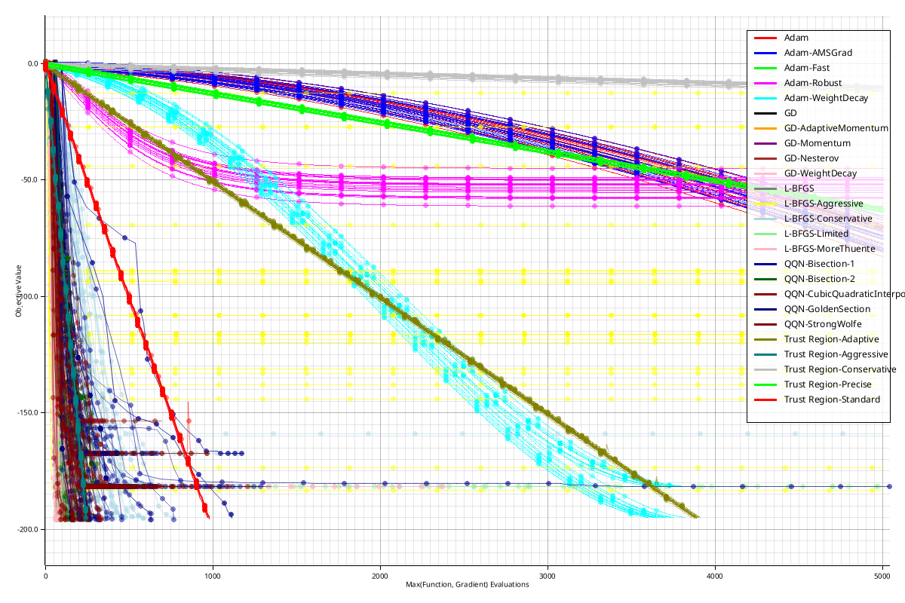
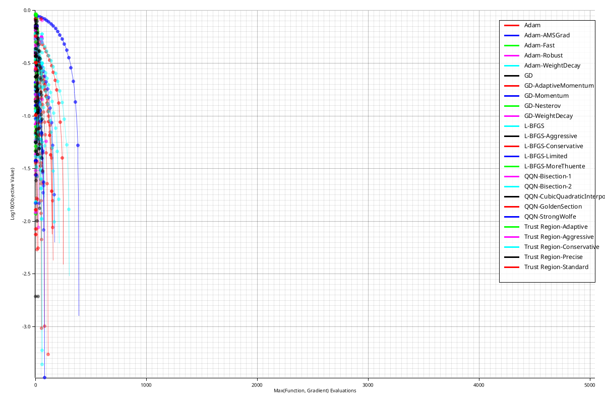

**Figure:** Convergence plots for StyblinskiTang_5D showing objective value vs iterations.
Left: Linear scale, Right: Log scale for better visualization of convergence behavior.

**Data:** [Linear scale data (CSV)](data/StyblinskiTang_5D_data.csv) | [Log scale data (CSV)](data/StyblinskiTang_5D_log_data.csv)

## Problem: StyblinskiTang_10D

**Family:** StyblinskiTang
**Dimension:** 10
**Success Threshold:** -3.780e2
**Total Runs:** 500
**Detailed Analysis:** [View comprehensive problem analysis](reports/problem_analysis_StyblinskiTang_10D.md)

### Performance Summary
<table style="border-collapse: collapse; width: 100%; margin: 20px 0;">
<tr style="background-color: #f2f2f2;">
<th style="border: 1px solid #ddd; padding: 8px; text-align: center;">Rank</th>
<th style="border: 1px solid #ddd; padding: 8px; text-align: center;">Optimizer</th>
<th style="border: 1px solid #ddd; padding: 8px; text-align: center;">Mean Final Value (All/Success/Fail)</th>
<th style="border: 1px solid #ddd; padding: 8px; text-align: center;">Std Dev</th>
<th style="border: 1px solid #ddd; padding: 8px; text-align: center;">Best Value</th>
<th style="border: 1px solid #ddd; padding: 8px; text-align: center;">Worst Value</th>
<th style="border: 1px solid #ddd; padding: 8px; text-align: center;">Mean Function Evals (All/Success/Fail)</th>
<th style="border: 1px solid #ddd; padding: 8px; text-align: center;">Mean Gradient Evals (All/Success/Fail)</th>
<th style="border: 1px solid #ddd; padding: 8px; text-align: center;">Success Rate</th>
<th style="border: 1px solid #ddd; padding: 8px; text-align: center;">Mean Time (s)</th>
</tr>
<tr style="background-color: #d4edda; font-weight: bold;">
<td style="border: 1px solid #ddd; padding: 8px; text-align: center;">1</td>
<td style="border: 1px solid #ddd; padding: 8px; text-align: center;"><a href="reports/detailed_StyblinskiTang_10D_Trust_Region-Aggressive.md" title="Click for detailed analysis">Trust Region-Aggressive</a></td>
<td style="border: 1px solid #ddd; padding: 8px; text-align: center;">-3.75e2 / -3.79e2 / -3.62e2</td>
<td style="border: 1px solid #ddd; padding: 8px; text-align: center;">1.02e1</td>
<td style="border: 1px solid #ddd; padding: 8px; text-align: center;">-3.81e2</td>
<td style="border: 1px solid #ddd; padding: 8px; text-align: center;">-3.35e2</td>
<td style="border: 1px solid #ddd; padding: 8px; text-align: center;">284.1 / 285.0 / 283.1</td>
<td style="border: 1px solid #ddd; padding: 8px; text-align: center;">190.2 / 191.0 / 189.4</td>
<td style="border: 1px solid #ddd; padding: 8px; text-align: center;">50.0%</td>
<td style="border: 1px solid #ddd; padding: 8px; text-align: center;">0.002</td>
</tr>
<tr style="background-color: #fff3cd;">
<td style="border: 1px solid #ddd; padding: 8px; text-align: center;">2</td>
<td style="border: 1px solid #ddd; padding: 8px; text-align: center;"><a href="reports/detailed_StyblinskiTang_10D_L-BFGS.md" title="Click for detailed analysis">L-BFGS</a></td>
<td style="border: 1px solid #ddd; padding: 8px; text-align: center;">-3.78e2 / -3.86e2 / -3.67e2</td>
<td style="border: 1px solid #ddd; padding: 8px; text-align: center;">9.30e0</td>
<td style="border: 1px solid #ddd; padding: 8px; text-align: center;">-3.90e2</td>
<td style="border: 1px solid #ddd; padding: 8px; text-align: center;">-3.57e2</td>
<td style="border: 1px solid #ddd; padding: 8px; text-align: center;">132.2 / 70.9 / 182.3</td>
<td style="border: 1px solid #ddd; padding: 8px; text-align: center;">59.1 / 37.4 / 76.8</td>
<td style="border: 1px solid #ddd; padding: 8px; text-align: center;">45.0%</td>
<td style="border: 1px solid #ddd; padding: 8px; text-align: center;">0.002</td>
</tr>
<tr style="">
<td style="border: 1px solid #ddd; padding: 8px; text-align: center;">3</td>
<td style="border: 1px solid #ddd; padding: 8px; text-align: center;"><a href="reports/detailed_StyblinskiTang_10D_GD-WeightDecay.md" title="Click for detailed analysis">GD-WeightDecay</a></td>
<td style="border: 1px solid #ddd; padding: 8px; text-align: center;">-3.75e2 / -3.81e2 / -3.70e2</td>
<td style="border: 1px solid #ddd; padding: 8px; text-align: center;">9.86e0</td>
<td style="border: 1px solid #ddd; padding: 8px; text-align: center;">-3.83e2</td>
<td style="border: 1px solid #ddd; padding: 8px; text-align: center;">-3.49e2</td>
<td style="border: 1px solid #ddd; padding: 8px; text-align: center;">74.7 / 51.9 / 93.3</td>
<td style="border: 1px solid #ddd; padding: 8px; text-align: center;">145.8 / 100.8 / 182.5</td>
<td style="border: 1px solid #ddd; padding: 8px; text-align: center;">45.0%</td>
<td style="border: 1px solid #ddd; padding: 8px; text-align: center;">0.003</td>
</tr>
<tr style="">
<td style="border: 1px solid #ddd; padding: 8px; text-align: center;">4</td>
<td style="border: 1px solid #ddd; padding: 8px; text-align: center;"><a href="reports/detailed_StyblinskiTang_10D_QQN-GoldenSection.md" title="Click for detailed analysis">QQN-GoldenSection</a></td>
<td style="border: 1px solid #ddd; padding: 8px; text-align: center;">-3.76e2 / -3.86e2 / -3.69e2</td>
<td style="border: 1px solid #ddd; padding: 8px; text-align: center;">1.20e1</td>
<td style="border: 1px solid #ddd; padding: 8px; text-align: center;">-3.91e2</td>
<td style="border: 1px solid #ddd; padding: 8px; text-align: center;">-3.49e2</td>
<td style="border: 1px solid #ddd; padding: 8px; text-align: center;">452.4 / 273.0 / 599.1</td>
<td style="border: 1px solid #ddd; padding: 8px; text-align: center;">74.7 / 38.7 / 104.1</td>
<td style="border: 1px solid #ddd; padding: 8px; text-align: center;">45.0%</td>
<td style="border: 1px solid #ddd; padding: 8px; text-align: center;">0.010</td>
</tr>
<tr style="">
<td style="border: 1px solid #ddd; padding: 8px; text-align: center;">5</td>
<td style="border: 1px solid #ddd; padding: 8px; text-align: center;"><a href="reports/detailed_StyblinskiTang_10D_Trust_Region-Standard.md" title="Click for detailed analysis">Trust Region-Standard</a></td>
<td style="border: 1px solid #ddd; padding: 8px; text-align: center;">-3.72e2 / -3.78e2 / -3.61e2</td>
<td style="border: 1px solid #ddd; padding: 8px; text-align: center;">1.10e1</td>
<td style="border: 1px solid #ddd; padding: 8px; text-align: center;">-3.79e2</td>
<td style="border: 1px solid #ddd; padding: 8px; text-align: center;">-3.38e2</td>
<td style="border: 1px solid #ddd; padding: 8px; text-align: center;">1120.5 / 1132.1 / 1112.7</td>
<td style="border: 1px solid #ddd; padding: 8px; text-align: center;">747.7 / 755.8 / 742.3</td>
<td style="border: 1px solid #ddd; padding: 8px; text-align: center;">40.0%</td>
<td style="border: 1px solid #ddd; padding: 8px; text-align: center;">0.008</td>
</tr>
<tr style="">
<td style="border: 1px solid #ddd; padding: 8px; text-align: center;">6</td>
<td style="border: 1px solid #ddd; padding: 8px; text-align: center;"><a href="reports/detailed_StyblinskiTang_10D_L-BFGS-MoreThuente.md" title="Click for detailed analysis">L-BFGS-MoreThuente</a></td>
<td style="border: 1px solid #ddd; padding: 8px; text-align: center;">-3.76e2 / -3.87e2 / -3.70e2</td>
<td style="border: 1px solid #ddd; padding: 8px; text-align: center;">1.18e1</td>
<td style="border: 1px solid #ddd; padding: 8px; text-align: center;">-3.91e2</td>
<td style="border: 1px solid #ddd; padding: 8px; text-align: center;">-3.49e2</td>
<td style="border: 1px solid #ddd; padding: 8px; text-align: center;">125.9 / 55.1 / 164.0</td>
<td style="border: 1px solid #ddd; padding: 8px; text-align: center;">93.2 / 42.6 / 120.5</td>
<td style="border: 1px solid #ddd; padding: 8px; text-align: center;">35.0%</td>
<td style="border: 1px solid #ddd; padding: 8px; text-align: center;">0.002</td>
</tr>
<tr style="">
<td style="border: 1px solid #ddd; padding: 8px; text-align: center;">7</td>
<td style="border: 1px solid #ddd; padding: 8px; text-align: center;"><a href="reports/detailed_StyblinskiTang_10D_QQN-Bisection-2.md" title="Click for detailed analysis">QQN-Bisection-2</a></td>
<td style="border: 1px solid #ddd; padding: 8px; text-align: center;">-3.72e2 / -3.83e2 / -3.67e2</td>
<td style="border: 1px solid #ddd; padding: 8px; text-align: center;">1.22e1</td>
<td style="border: 1px solid #ddd; padding: 8px; text-align: center;">-3.90e2</td>
<td style="border: 1px solid #ddd; padding: 8px; text-align: center;">-3.49e2</td>
<td style="border: 1px solid #ddd; padding: 8px; text-align: center;">234.2 / 109.6 / 301.2</td>
<td style="border: 1px solid #ddd; padding: 8px; text-align: center;">185.2 / 108.9 / 226.3</td>
<td style="border: 1px solid #ddd; padding: 8px; text-align: center;">35.0%</td>
<td style="border: 1px solid #ddd; padding: 8px; text-align: center;">0.006</td>
</tr>
<tr style="">
<td style="border: 1px solid #ddd; padding: 8px; text-align: center;">8</td>
<td style="border: 1px solid #ddd; padding: 8px; text-align: center;"><a href="reports/detailed_StyblinskiTang_10D_L-BFGS-Limited.md" title="Click for detailed analysis">L-BFGS-Limited</a></td>
<td style="border: 1px solid #ddd; padding: 8px; text-align: center;">-3.76e2 / -3.83e2 / -3.72e2</td>
<td style="border: 1px solid #ddd; padding: 8px; text-align: center;">7.70e0</td>
<td style="border: 1px solid #ddd; padding: 8px; text-align: center;">-3.86e2</td>
<td style="border: 1px solid #ddd; padding: 8px; text-align: center;">-3.63e2</td>
<td style="border: 1px solid #ddd; padding: 8px; text-align: center;">550.6 / 76.6 / 805.8</td>
<td style="border: 1px solid #ddd; padding: 8px; text-align: center;">179.4 / 39.9 / 254.6</td>
<td style="border: 1px solid #ddd; padding: 8px; text-align: center;">35.0%</td>
<td style="border: 1px solid #ddd; padding: 8px; text-align: center;">0.009</td>
</tr>
<tr style="">
<td style="border: 1px solid #ddd; padding: 8px; text-align: center;">9</td>
<td style="border: 1px solid #ddd; padding: 8px; text-align: center;"><a href="reports/detailed_StyblinskiTang_10D_Adam-WeightDecay.md" title="Click for detailed analysis">Adam-WeightDecay</a></td>
<td style="border: 1px solid #ddd; padding: 8px; text-align: center;">-3.74e2 / -3.78e2 / -3.71e2</td>
<td style="border: 1px solid #ddd; padding: 8px; text-align: center;">6.63e0</td>
<td style="border: 1px solid #ddd; padding: 8px; text-align: center;">-3.78e2</td>
<td style="border: 1px solid #ddd; padding: 8px; text-align: center;">-3.63e2</td>
<td style="border: 1px solid #ddd; padding: 8px; text-align: center;">1837.7 / 1709.3 / 1906.8</td>
<td style="border: 1px solid #ddd; padding: 8px; text-align: center;">1837.0 / 1709.3 / 1905.8</td>
<td style="border: 1px solid #ddd; padding: 8px; text-align: center;">35.0%</td>
<td style="border: 1px solid #ddd; padding: 8px; text-align: center;">0.043</td>
</tr>
<tr style="">
<td style="border: 1px solid #ddd; padding: 8px; text-align: center;">10</td>
<td style="border: 1px solid #ddd; padding: 8px; text-align: center;"><a href="reports/detailed_StyblinskiTang_10D_Adam-Fast.md" title="Click for detailed analysis">Adam-Fast</a></td>
<td style="border: 1px solid #ddd; padding: 8px; text-align: center;">-3.74e2 / -3.83e2 / -3.58e2</td>
<td style="border: 1px solid #ddd; padding: 8px; text-align: center;">8.40e0</td>
<td style="border: 1px solid #ddd; padding: 8px; text-align: center;">-3.85e2</td>
<td style="border: 1px solid #ddd; padding: 8px; text-align: center;">-3.62e2</td>
<td style="border: 1px solid #ddd; padding: 8px; text-align: center;">67.5 / 56.0 / 72.4</td>
<td style="border: 1px solid #ddd; padding: 8px; text-align: center;">66.8 / 56.0 / 71.4</td>
<td style="border: 1px solid #ddd; padding: 8px; text-align: center;">30.0%</td>
<td style="border: 1px solid #ddd; padding: 8px; text-align: center;">0.002</td>
</tr>
<tr style="">
<td style="border: 1px solid #ddd; padding: 8px; text-align: center;">11</td>
<td style="border: 1px solid #ddd; padding: 8px; text-align: center;"><a href="reports/detailed_StyblinskiTang_10D_GD-Nesterov.md" title="Click for detailed analysis">GD-Nesterov</a></td>
<td style="border: 1px solid #ddd; padding: 8px; text-align: center;">-3.76e2 / -3.81e2 / -3.73e2</td>
<td style="border: 1px solid #ddd; padding: 8px; text-align: center;">6.60e0</td>
<td style="border: 1px solid #ddd; padding: 8px; text-align: center;">-3.83e2</td>
<td style="border: 1px solid #ddd; padding: 8px; text-align: center;">-3.62e2</td>
<td style="border: 1px solid #ddd; padding: 8px; text-align: center;">65.9 / 42.7 / 75.9</td>
<td style="border: 1px solid #ddd; padding: 8px; text-align: center;">128.1 / 82.3 / 147.7</td>
<td style="border: 1px solid #ddd; padding: 8px; text-align: center;">30.0%</td>
<td style="border: 1px solid #ddd; padding: 8px; text-align: center;">0.002</td>
</tr>
<tr style="">
<td style="border: 1px solid #ddd; padding: 8px; text-align: center;">12</td>
<td style="border: 1px solid #ddd; padding: 8px; text-align: center;"><a href="reports/detailed_StyblinskiTang_10D_QQN-Bisection-1.md" title="Click for detailed analysis">QQN-Bisection-1</a></td>
<td style="border: 1px solid #ddd; padding: 8px; text-align: center;">-3.74e2 / -3.83e2 / -3.70e2</td>
<td style="border: 1px solid #ddd; padding: 8px; text-align: center;">9.58e0</td>
<td style="border: 1px solid #ddd; padding: 8px; text-align: center;">-3.89e2</td>
<td style="border: 1px solid #ddd; padding: 8px; text-align: center;">-3.49e2</td>
<td style="border: 1px solid #ddd; padding: 8px; text-align: center;">412.5 / 163.0 / 519.4</td>
<td style="border: 1px solid #ddd; padding: 8px; text-align: center;">453.8 / 206.8 / 559.6</td>
<td style="border: 1px solid #ddd; padding: 8px; text-align: center;">30.0%</td>
<td style="border: 1px solid #ddd; padding: 8px; text-align: center;">0.011</td>
</tr>
<tr style="">
<td style="border: 1px solid #ddd; padding: 8px; text-align: center;">13</td>
<td style="border: 1px solid #ddd; padding: 8px; text-align: center;"><a href="reports/detailed_StyblinskiTang_10D_L-BFGS-Conservative.md" title="Click for detailed analysis">L-BFGS-Conservative</a></td>
<td style="border: 1px solid #ddd; padding: 8px; text-align: center;">-3.74e2 / -3.80e2 / -3.71e2</td>
<td style="border: 1px solid #ddd; padding: 8px; text-align: center;">8.27e0</td>
<td style="border: 1px solid #ddd; padding: 8px; text-align: center;">-3.82e2</td>
<td style="border: 1px solid #ddd; padding: 8px; text-align: center;">-3.49e2</td>
<td style="border: 1px solid #ddd; padding: 8px; text-align: center;">543.3 / 267.0 / 661.7</td>
<td style="border: 1px solid #ddd; padding: 8px; text-align: center;">427.4 / 213.0 / 519.3</td>
<td style="border: 1px solid #ddd; padding: 8px; text-align: center;">30.0%</td>
<td style="border: 1px solid #ddd; padding: 8px; text-align: center;">0.015</td>
</tr>
<tr style="">
<td style="border: 1px solid #ddd; padding: 8px; text-align: center;">14</td>
<td style="border: 1px solid #ddd; padding: 8px; text-align: center;"><a href="reports/detailed_StyblinskiTang_10D_GD.md" title="Click for detailed analysis">GD</a></td>
<td style="border: 1px solid #ddd; padding: 8px; text-align: center;">-3.71e2 / -3.79e2 / -3.68e2</td>
<td style="border: 1px solid #ddd; padding: 8px; text-align: center;">9.86e0</td>
<td style="border: 1px solid #ddd; padding: 8px; text-align: center;">-3.80e2</td>
<td style="border: 1px solid #ddd; padding: 8px; text-align: center;">-3.49e2</td>
<td style="border: 1px solid #ddd; padding: 8px; text-align: center;">137.3 / 103.6 / 148.6</td>
<td style="border: 1px solid #ddd; padding: 8px; text-align: center;">270.9 / 204.2 / 293.2</td>
<td style="border: 1px solid #ddd; padding: 8px; text-align: center;">25.0%</td>
<td style="border: 1px solid #ddd; padding: 8px; text-align: center;">0.004</td>
</tr>
<tr style="">
<td style="border: 1px solid #ddd; padding: 8px; text-align: center;">15</td>
<td style="border: 1px solid #ddd; padding: 8px; text-align: center;"><a href="reports/detailed_StyblinskiTang_10D_GD-AdaptiveMomentum.md" title="Click for detailed analysis">GD-AdaptiveMomentum</a></td>
<td style="border: 1px solid #ddd; padding: 8px; text-align: center;">-3.33e2 / -3.80e2 / -3.06e2</td>
<td style="border: 1px solid #ddd; padding: 8px; text-align: center;">5.45e1</td>
<td style="border: 1px solid #ddd; padding: 8px; text-align: center;">-3.82e2</td>
<td style="border: 1px solid #ddd; padding: 8px; text-align: center;">-2.08e2</td>
<td style="border: 1px solid #ddd; padding: 8px; text-align: center;">53.4 / 52.5 / 53.6</td>
<td style="border: 1px solid #ddd; padding: 8px; text-align: center;">103.3 / 102.0 / 103.6</td>
<td style="border: 1px solid #ddd; padding: 8px; text-align: center;">20.0%</td>
<td style="border: 1px solid #ddd; padding: 8px; text-align: center;">0.002</td>
</tr>
<tr style="">
<td style="border: 1px solid #ddd; padding: 8px; text-align: center;">16</td>
<td style="border: 1px solid #ddd; padding: 8px; text-align: center;"><a href="reports/detailed_StyblinskiTang_10D_GD-Momentum.md" title="Click for detailed analysis">GD-Momentum</a></td>
<td style="border: 1px solid #ddd; padding: 8px; text-align: center;">-3.61e2 / -3.80e2 / -3.55e2</td>
<td style="border: 1px solid #ddd; padding: 8px; text-align: center;">3.81e1</td>
<td style="border: 1px solid #ddd; padding: 8px; text-align: center;">-3.82e2</td>
<td style="border: 1px solid #ddd; padding: 8px; text-align: center;">-2.01e2</td>
<td style="border: 1px solid #ddd; padding: 8px; text-align: center;">86.2 / 43.7 / 93.6</td>
<td style="border: 1px solid #ddd; padding: 8px; text-align: center;">168.4 / 84.3 / 183.3</td>
<td style="border: 1px solid #ddd; padding: 8px; text-align: center;">15.0%</td>
<td style="border: 1px solid #ddd; padding: 8px; text-align: center;">0.003</td>
</tr>
<tr style="">
<td style="border: 1px solid #ddd; padding: 8px; text-align: center;">17</td>
<td style="border: 1px solid #ddd; padding: 8px; text-align: center;"><a href="reports/detailed_StyblinskiTang_10D_QQN-CubicQuadraticInterpolation.md" title="Click for detailed analysis">QQN-CubicQuadraticInterpolation</a></td>
<td style="border: 1px solid #ddd; padding: 8px; text-align: center;">-3.66e2 / -3.88e2 / -3.62e2</td>
<td style="border: 1px solid #ddd; padding: 8px; text-align: center;">1.97e1</td>
<td style="border: 1px solid #ddd; padding: 8px; text-align: center;">-3.91e2</td>
<td style="border: 1px solid #ddd; padding: 8px; text-align: center;">-3.21e2</td>
<td style="border: 1px solid #ddd; padding: 8px; text-align: center;">172.1 / 53.0 / 193.1</td>
<td style="border: 1px solid #ddd; padding: 8px; text-align: center;">190.7 / 62.3 / 213.3</td>
<td style="border: 1px solid #ddd; padding: 8px; text-align: center;">15.0%</td>
<td style="border: 1px solid #ddd; padding: 8px; text-align: center;">0.006</td>
</tr>
<tr style="">
<td style="border: 1px solid #ddd; padding: 8px; text-align: center;">18</td>
<td style="border: 1px solid #ddd; padding: 8px; text-align: center;"><a href="reports/detailed_StyblinskiTang_10D_QQN-StrongWolfe.md" title="Click for detailed analysis">QQN-StrongWolfe</a></td>
<td style="border: 1px solid #ddd; padding: 8px; text-align: center;">-3.60e2 / -3.84e2 / -3.56e2</td>
<td style="border: 1px solid #ddd; padding: 8px; text-align: center;">1.80e1</td>
<td style="border: 1px solid #ddd; padding: 8px; text-align: center;">-3.86e2</td>
<td style="border: 1px solid #ddd; padding: 8px; text-align: center;">-3.21e2</td>
<td style="border: 1px solid #ddd; padding: 8px; text-align: center;">362.2 / 86.7 / 410.8</td>
<td style="border: 1px solid #ddd; padding: 8px; text-align: center;">317.2 / 80.3 / 359.1</td>
<td style="border: 1px solid #ddd; padding: 8px; text-align: center;">15.0%</td>
<td style="border: 1px solid #ddd; padding: 8px; text-align: center;">0.012</td>
</tr>
<tr style="">
<td style="border: 1px solid #ddd; padding: 8px; text-align: center;">19</td>
<td style="border: 1px solid #ddd; padding: 8px; text-align: center;"><a href="reports/detailed_StyblinskiTang_10D_Adam.md" title="Click for detailed analysis">Adam</a></td>
<td style="border: 1px solid #ddd; padding: 8px; text-align: center;">-1.49e2 / - / -1.49e2</td>
<td style="border: 1px solid #ddd; padding: 8px; text-align: center;">8.21e0</td>
<td style="border: 1px solid #ddd; padding: 8px; text-align: center;">-1.65e2</td>
<td style="border: 1px solid #ddd; padding: 8px; text-align: center;">-1.36e2</td>
<td style="border: 1px solid #ddd; padding: 8px; text-align: center;">2502.0 / - / 2502.0</td>
<td style="border: 1px solid #ddd; padding: 8px; text-align: center;">2502.0 / - / 2502.0</td>
<td style="border: 1px solid #ddd; padding: 8px; text-align: center;">0.0%</td>
<td style="border: 1px solid #ddd; padding: 8px; text-align: center;">0.055</td>
</tr>
<tr style="">
<td style="border: 1px solid #ddd; padding: 8px; text-align: center;">20</td>
<td style="border: 1px solid #ddd; padding: 8px; text-align: center;"><a href="reports/detailed_StyblinskiTang_10D_Adam-Robust.md" title="Click for detailed analysis">Adam-Robust</a></td>
<td style="border: 1px solid #ddd; padding: 8px; text-align: center;">-1.05e2 / - / -1.05e2</td>
<td style="border: 1px solid #ddd; padding: 8px; text-align: center;">5.69e0</td>
<td style="border: 1px solid #ddd; padding: 8px; text-align: center;">-1.13e2</td>
<td style="border: 1px solid #ddd; padding: 8px; text-align: center;">-9.23e1</td>
<td style="border: 1px solid #ddd; padding: 8px; text-align: center;">2502.0 / - / 2502.0</td>
<td style="border: 1px solid #ddd; padding: 8px; text-align: center;">2502.0 / - / 2502.0</td>
<td style="border: 1px solid #ddd; padding: 8px; text-align: center;">0.0%</td>
<td style="border: 1px solid #ddd; padding: 8px; text-align: center;">0.062</td>
</tr>
<tr style="">
<td style="border: 1px solid #ddd; padding: 8px; text-align: center;">21</td>
<td style="border: 1px solid #ddd; padding: 8px; text-align: center;"><a href="reports/detailed_StyblinskiTang_10D_Adam-AMSGrad.md" title="Click for detailed analysis">Adam-AMSGrad</a></td>
<td style="border: 1px solid #ddd; padding: 8px; text-align: center;">-1.51e2 / - / -1.51e2</td>
<td style="border: 1px solid #ddd; padding: 8px; text-align: center;">6.41e0</td>
<td style="border: 1px solid #ddd; padding: 8px; text-align: center;">-1.63e2</td>
<td style="border: 1px solid #ddd; padding: 8px; text-align: center;">-1.38e2</td>
<td style="border: 1px solid #ddd; padding: 8px; text-align: center;">2502.0 / - / 2502.0</td>
<td style="border: 1px solid #ddd; padding: 8px; text-align: center;">2502.0 / - / 2502.0</td>
<td style="border: 1px solid #ddd; padding: 8px; text-align: center;">0.0%</td>
<td style="border: 1px solid #ddd; padding: 8px; text-align: center;">0.061</td>
</tr>
<tr style="">
<td style="border: 1px solid #ddd; padding: 8px; text-align: center;">22</td>
<td style="border: 1px solid #ddd; padding: 8px; text-align: center;"><a href="reports/detailed_StyblinskiTang_10D_Trust_Region-Adaptive.md" title="Click for detailed analysis">Trust Region-Adaptive</a></td>
<td style="border: 1px solid #ddd; padding: 8px; text-align: center;">-2.51e2 / - / -2.51e2</td>
<td style="border: 1px solid #ddd; padding: 8px; text-align: center;">1.09e0</td>
<td style="border: 1px solid #ddd; padding: 8px; text-align: center;">-2.54e2</td>
<td style="border: 1px solid #ddd; padding: 8px; text-align: center;">-2.49e2</td>
<td style="border: 1px solid #ddd; padding: 8px; text-align: center;">3002.0 / - / 3002.0</td>
<td style="border: 1px solid #ddd; padding: 8px; text-align: center;">2002.0 / - / 2002.0</td>
<td style="border: 1px solid #ddd; padding: 8px; text-align: center;">0.0%</td>
<td style="border: 1px solid #ddd; padding: 8px; text-align: center;">0.020</td>
</tr>
<tr style="">
<td style="border: 1px solid #ddd; padding: 8px; text-align: center;">23</td>
<td style="border: 1px solid #ddd; padding: 8px; text-align: center;"><a href="reports/detailed_StyblinskiTang_10D_Trust_Region-Conservative.md" title="Click for detailed analysis">Trust Region-Conservative</a></td>
<td style="border: 1px solid #ddd; padding: 8px; text-align: center;">-1.09e1 / - / -1.09e1</td>
<td style="border: 1px solid #ddd; padding: 8px; text-align: center;">7.10e-1</td>
<td style="border: 1px solid #ddd; padding: 8px; text-align: center;">-1.25e1</td>
<td style="border: 1px solid #ddd; padding: 8px; text-align: center;">-9.28e0</td>
<td style="border: 1px solid #ddd; padding: 8px; text-align: center;">3002.0 / - / 3002.0</td>
<td style="border: 1px solid #ddd; padding: 8px; text-align: center;">2002.0 / - / 2002.0</td>
<td style="border: 1px solid #ddd; padding: 8px; text-align: center;">0.0%</td>
<td style="border: 1px solid #ddd; padding: 8px; text-align: center;">0.021</td>
</tr>
<tr style="">
<td style="border: 1px solid #ddd; padding: 8px; text-align: center;">24</td>
<td style="border: 1px solid #ddd; padding: 8px; text-align: center;"><a href="reports/detailed_StyblinskiTang_10D_Trust_Region-Precise.md" title="Click for detailed analysis">Trust Region-Precise</a></td>
<td style="border: 1px solid #ddd; padding: 8px; text-align: center;">-6.35e1 / - / -6.35e1</td>
<td style="border: 1px solid #ddd; padding: 8px; text-align: center;">9.97e-1</td>
<td style="border: 1px solid #ddd; padding: 8px; text-align: center;">-6.56e1</td>
<td style="border: 1px solid #ddd; padding: 8px; text-align: center;">-6.19e1</td>
<td style="border: 1px solid #ddd; padding: 8px; text-align: center;">3002.0 / - / 3002.0</td>
<td style="border: 1px solid #ddd; padding: 8px; text-align: center;">2002.0 / - / 2002.0</td>
<td style="border: 1px solid #ddd; padding: 8px; text-align: center;">0.0%</td>
<td style="border: 1px solid #ddd; padding: 8px; text-align: center;">0.023</td>
</tr>
<tr style="">
<td style="border: 1px solid #ddd; padding: 8px; text-align: center;">25</td>
<td style="border: 1px solid #ddd; padding: 8px; text-align: center;"><a href="reports/detailed_StyblinskiTang_10D_L-BFGS-Aggressive.md" title="Click for detailed analysis">L-BFGS-Aggressive</a></td>
<td style="border: 1px solid #ddd; padding: 8px; text-align: center;">-1.97e2 / - / -1.97e2</td>
<td style="border: 1px solid #ddd; padding: 8px; text-align: center;">5.94e1</td>
<td style="border: 1px solid #ddd; padding: 8px; text-align: center;">-3.07e2</td>
<td style="border: 1px solid #ddd; padding: 8px; text-align: center;">-3.33e1</td>
<td style="border: 1px solid #ddd; padding: 8px; text-align: center;">3848.4 / - / 3848.4</td>
<td style="border: 1px solid #ddd; padding: 8px; text-align: center;">1157.0 / - / 1157.0</td>
<td style="border: 1px solid #ddd; padding: 8px; text-align: center;">0.0%</td>
<td style="border: 1px solid #ddd; padding: 8px; text-align: center;">0.029</td>
</tr>
</table>

### Convergence Plots

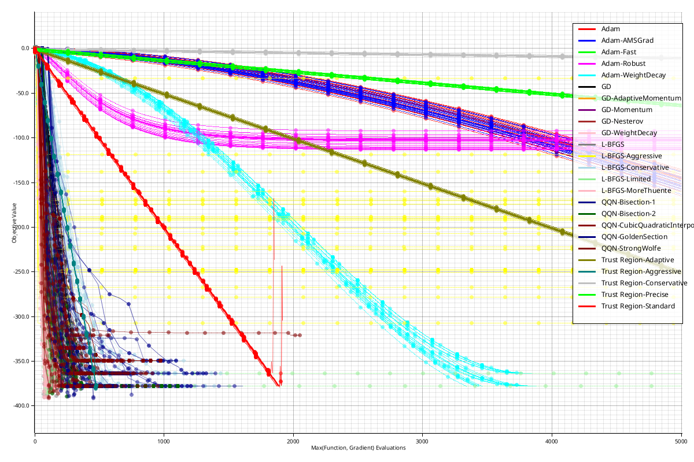
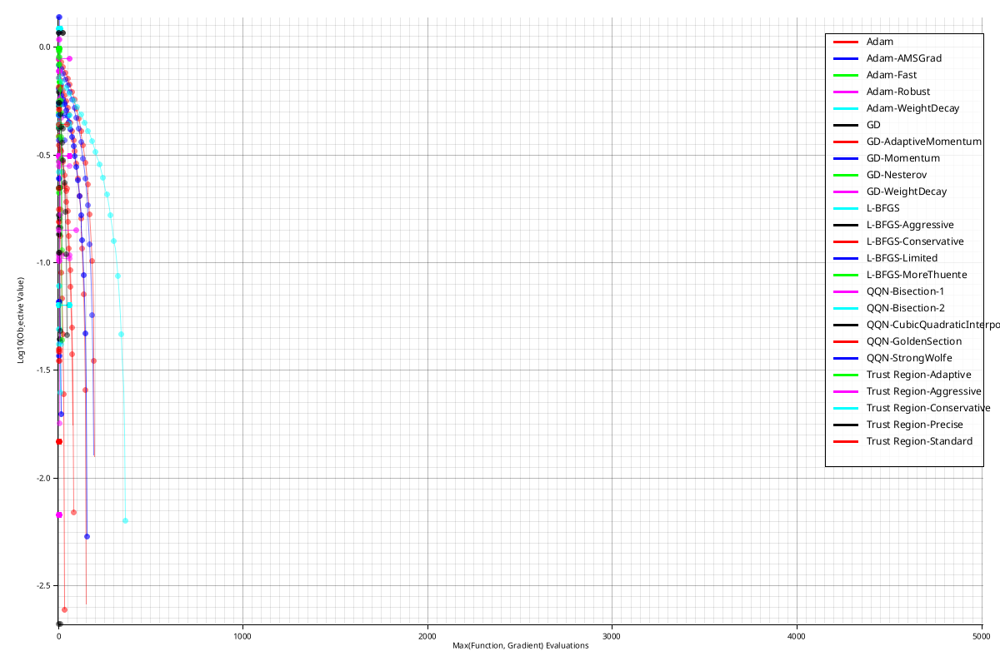

**Figure:** Convergence plots for StyblinskiTang_10D showing objective value vs iterations.
Left: Linear scale, Right: Log scale for better visualization of convergence behavior.

**Data:** [Linear scale data (CSV)](data/StyblinskiTang_10D_data.csv) | [Log scale data (CSV)](data/StyblinskiTang_10D_log_data.csv)

## Problem: Beale_2D

**Family:** Beale
**Dimension:** 2
**Success Threshold:** 1.500e-2
**Total Runs:** 500
**Detailed Analysis:** [View comprehensive problem analysis](reports/problem_analysis_Beale_2D.md)

### Performance Summary
<table style="border-collapse: collapse; width: 100%; margin: 20px 0;">
<tr style="background-color: #f2f2f2;">
<th style="border: 1px solid #ddd; padding: 8px; text-align: center;">Rank</th>
<th style="border: 1px solid #ddd; padding: 8px; text-align: center;">Optimizer</th>
<th style="border: 1px solid #ddd; padding: 8px; text-align: center;">Mean Final Value (All/Success/Fail)</th>
<th style="border: 1px solid #ddd; padding: 8px; text-align: center;">Std Dev</th>
<th style="border: 1px solid #ddd; padding: 8px; text-align: center;">Best Value</th>
<th style="border: 1px solid #ddd; padding: 8px; text-align: center;">Worst Value</th>
<th style="border: 1px solid #ddd; padding: 8px; text-align: center;">Mean Function Evals (All/Success/Fail)</th>
<th style="border: 1px solid #ddd; padding: 8px; text-align: center;">Mean Gradient Evals (All/Success/Fail)</th>
<th style="border: 1px solid #ddd; padding: 8px; text-align: center;">Success Rate</th>
<th style="border: 1px solid #ddd; padding: 8px; text-align: center;">Mean Time (s)</th>
</tr>
<tr style="background-color: #d4edda; font-weight: bold;">
<td style="border: 1px solid #ddd; padding: 8px; text-align: center;">1</td>
<td style="border: 1px solid #ddd; padding: 8px; text-align: center;"><a href="reports/detailed_Beale_2D_GD-Nesterov.md" title="Click for detailed analysis">GD-Nesterov</a></td>
<td style="border: 1px solid #ddd; padding: 8px; text-align: center;">9.18e-3 / 9.18e-3 / -</td>
<td style="border: 1px solid #ddd; padding: 8px; text-align: center;">2.78e-3</td>
<td style="border: 1px solid #ddd; padding: 8px; text-align: center;">4.69e-3</td>
<td style="border: 1px solid #ddd; padding: 8px; text-align: center;">1.44e-2</td>
<td style="border: 1px solid #ddd; padding: 8px; text-align: center;">27.7 / 27.7 / -</td>
<td style="border: 1px solid #ddd; padding: 8px; text-align: center;">52.4 / 52.4 / -</td>
<td style="border: 1px solid #ddd; padding: 8px; text-align: center;">100.0%</td>
<td style="border: 1px solid #ddd; padding: 8px; text-align: center;">0.001</td>
</tr>
<tr style="background-color: #fff3cd;">
<td style="border: 1px solid #ddd; padding: 8px; text-align: center;">2</td>
<td style="border: 1px solid #ddd; padding: 8px; text-align: center;"><a href="reports/detailed_Beale_2D_L-BFGS-MoreThuente.md" title="Click for detailed analysis">L-BFGS-MoreThuente</a></td>
<td style="border: 1px solid #ddd; padding: 8px; text-align: center;">8.71e-3 / 8.71e-3 / -</td>
<td style="border: 1px solid #ddd; padding: 8px; text-align: center;">4.80e-3</td>
<td style="border: 1px solid #ddd; padding: 8px; text-align: center;">3.68e-4</td>
<td style="border: 1px solid #ddd; padding: 8px; text-align: center;">1.50e-2</td>
<td style="border: 1px solid #ddd; padding: 8px; text-align: center;">78.1 / 78.1 / -</td>
<td style="border: 1px solid #ddd; padding: 8px; text-align: center;">58.5 / 58.5 / -</td>
<td style="border: 1px solid #ddd; padding: 8px; text-align: center;">100.0%</td>
<td style="border: 1px solid #ddd; padding: 8px; text-align: center;">0.001</td>
</tr>
<tr style="">
<td style="border: 1px solid #ddd; padding: 8px; text-align: center;">3</td>
<td style="border: 1px solid #ddd; padding: 8px; text-align: center;"><a href="reports/detailed_Beale_2D_L-BFGS-Limited.md" title="Click for detailed analysis">L-BFGS-Limited</a></td>
<td style="border: 1px solid #ddd; padding: 8px; text-align: center;">1.00e-2 / 1.00e-2 / -</td>
<td style="border: 1px solid #ddd; padding: 8px; text-align: center;">4.71e-3</td>
<td style="border: 1px solid #ddd; padding: 8px; text-align: center;">3.68e-4</td>
<td style="border: 1px solid #ddd; padding: 8px; text-align: center;">1.49e-2</td>
<td style="border: 1px solid #ddd; padding: 8px; text-align: center;">110.5 / 110.5 / -</td>
<td style="border: 1px solid #ddd; padding: 8px; text-align: center;">47.7 / 47.7 / -</td>
<td style="border: 1px solid #ddd; padding: 8px; text-align: center;">100.0%</td>
<td style="border: 1px solid #ddd; padding: 8px; text-align: center;">0.002</td>
</tr>
<tr style="">
<td style="border: 1px solid #ddd; padding: 8px; text-align: center;">4</td>
<td style="border: 1px solid #ddd; padding: 8px; text-align: center;"><a href="reports/detailed_Beale_2D_GD-WeightDecay.md" title="Click for detailed analysis">GD-WeightDecay</a></td>
<td style="border: 1px solid #ddd; padding: 8px; text-align: center;">1.48e-2 / 1.48e-2 / -</td>
<td style="border: 1px solid #ddd; padding: 8px; text-align: center;">1.25e-4</td>
<td style="border: 1px solid #ddd; padding: 8px; text-align: center;">1.46e-2</td>
<td style="border: 1px solid #ddd; padding: 8px; text-align: center;">1.49e-2</td>
<td style="border: 1px solid #ddd; padding: 8px; text-align: center;">88.0 / 88.0 / -</td>
<td style="border: 1px solid #ddd; padding: 8px; text-align: center;">172.9 / 172.9 / -</td>
<td style="border: 1px solid #ddd; padding: 8px; text-align: center;">100.0%</td>
<td style="border: 1px solid #ddd; padding: 8px; text-align: center;">0.003</td>
</tr>
<tr style="">
<td style="border: 1px solid #ddd; padding: 8px; text-align: center;">5</td>
<td style="border: 1px solid #ddd; padding: 8px; text-align: center;"><a href="reports/detailed_Beale_2D_L-BFGS-Conservative.md" title="Click for detailed analysis">L-BFGS-Conservative</a></td>
<td style="border: 1px solid #ddd; padding: 8px; text-align: center;">1.17e-2 / 1.17e-2 / -</td>
<td style="border: 1px solid #ddd; padding: 8px; text-align: center;">2.95e-3</td>
<td style="border: 1px solid #ddd; padding: 8px; text-align: center;">5.27e-3</td>
<td style="border: 1px solid #ddd; padding: 8px; text-align: center;">1.49e-2</td>
<td style="border: 1px solid #ddd; padding: 8px; text-align: center;">200.7 / 200.7 / -</td>
<td style="border: 1px solid #ddd; padding: 8px; text-align: center;">160.2 / 160.2 / -</td>
<td style="border: 1px solid #ddd; padding: 8px; text-align: center;">100.0%</td>
<td style="border: 1px solid #ddd; padding: 8px; text-align: center;">0.005</td>
</tr>
<tr style="">
<td style="border: 1px solid #ddd; padding: 8px; text-align: center;">6</td>
<td style="border: 1px solid #ddd; padding: 8px; text-align: center;"><a href="reports/detailed_Beale_2D_QQN-GoldenSection.md" title="Click for detailed analysis">QQN-GoldenSection</a></td>
<td style="border: 1px solid #ddd; padding: 8px; text-align: center;">6.90e-3 / 6.90e-3 / -</td>
<td style="border: 1px solid #ddd; padding: 8px; text-align: center;">2.42e-3</td>
<td style="border: 1px solid #ddd; padding: 8px; text-align: center;">2.42e-3</td>
<td style="border: 1px solid #ddd; padding: 8px; text-align: center;">9.87e-3</td>
<td style="border: 1px solid #ddd; padding: 8px; text-align: center;">347.2 / 347.2 / -</td>
<td style="border: 1px solid #ddd; padding: 8px; text-align: center;">48.8 / 48.8 / -</td>
<td style="border: 1px solid #ddd; padding: 8px; text-align: center;">100.0%</td>
<td style="border: 1px solid #ddd; padding: 8px; text-align: center;">0.005</td>
</tr>
<tr style="">
<td style="border: 1px solid #ddd; padding: 8px; text-align: center;">7</td>
<td style="border: 1px solid #ddd; padding: 8px; text-align: center;"><a href="reports/detailed_Beale_2D_GD.md" title="Click for detailed analysis">GD</a></td>
<td style="border: 1px solid #ddd; padding: 8px; text-align: center;">1.49e-2 / 1.49e-2 / -</td>
<td style="border: 1px solid #ddd; padding: 8px; text-align: center;">4.62e-5</td>
<td style="border: 1px solid #ddd; padding: 8px; text-align: center;">1.49e-2</td>
<td style="border: 1px solid #ddd; padding: 8px; text-align: center;">1.50e-2</td>
<td style="border: 1px solid #ddd; padding: 8px; text-align: center;">229.2 / 229.2 / -</td>
<td style="border: 1px solid #ddd; padding: 8px; text-align: center;">455.4 / 455.4 / -</td>
<td style="border: 1px solid #ddd; padding: 8px; text-align: center;">100.0%</td>
<td style="border: 1px solid #ddd; padding: 8px; text-align: center;">0.006</td>
</tr>
<tr style="">
<td style="border: 1px solid #ddd; padding: 8px; text-align: center;">8</td>
<td style="border: 1px solid #ddd; padding: 8px; text-align: center;"><a href="reports/detailed_Beale_2D_Adam-WeightDecay.md" title="Click for detailed analysis">Adam-WeightDecay</a></td>
<td style="border: 1px solid #ddd; padding: 8px; text-align: center;">1.50e-2 / 1.50e-2 / -</td>
<td style="border: 1px solid #ddd; padding: 8px; text-align: center;">2.32e-5</td>
<td style="border: 1px solid #ddd; padding: 8px; text-align: center;">1.49e-2</td>
<td style="border: 1px solid #ddd; padding: 8px; text-align: center;">1.50e-2</td>
<td style="border: 1px solid #ddd; padding: 8px; text-align: center;">1539.9 / 1539.9 / -</td>
<td style="border: 1px solid #ddd; padding: 8px; text-align: center;">1539.9 / 1539.9 / -</td>
<td style="border: 1px solid #ddd; padding: 8px; text-align: center;">100.0%</td>
<td style="border: 1px solid #ddd; padding: 8px; text-align: center;">0.031</td>
</tr>
<tr style="">
<td style="border: 1px solid #ddd; padding: 8px; text-align: center;">9</td>
<td style="border: 1px solid #ddd; padding: 8px; text-align: center;"><a href="reports/detailed_Beale_2D_QQN-CubicQuadraticInterpolation.md" title="Click for detailed analysis">QQN-CubicQuadraticInterpolation</a></td>
<td style="border: 1px solid #ddd; padding: 8px; text-align: center;">4.97e-1 / 8.27e-3 / 9.79e0</td>
<td style="border: 1px solid #ddd; padding: 8px; text-align: center;">2.13e0</td>
<td style="border: 1px solid #ddd; padding: 8px; text-align: center;">2.46e-3</td>
<td style="border: 1px solid #ddd; padding: 8px; text-align: center;">9.79e0</td>
<td style="border: 1px solid #ddd; padding: 8px; text-align: center;">218.8 / 117.1 / 2151.0</td>
<td style="border: 1px solid #ddd; padding: 8px; text-align: center;">279.2 / 143.4 / 2860.0</td>
<td style="border: 1px solid #ddd; padding: 8px; text-align: center;">95.0%</td>
<td style="border: 1px solid #ddd; padding: 8px; text-align: center;">0.008</td>
</tr>
<tr style="">
<td style="border: 1px solid #ddd; padding: 8px; text-align: center;">10</td>
<td style="border: 1px solid #ddd; padding: 8px; text-align: center;"><a href="reports/detailed_Beale_2D_QQN-Bisection-1.md" title="Click for detailed analysis">QQN-Bisection-1</a></td>
<td style="border: 1px solid #ddd; padding: 8px; text-align: center;">4.13e-1 / 6.67e-3 / 8.13e0</td>
<td style="border: 1px solid #ddd; padding: 8px; text-align: center;">1.77e0</td>
<td style="border: 1px solid #ddd; padding: 8px; text-align: center;">4.49e-3</td>
<td style="border: 1px solid #ddd; padding: 8px; text-align: center;">8.13e0</td>
<td style="border: 1px solid #ddd; padding: 8px; text-align: center;">277.4 / 170.6 / 2305.0</td>
<td style="border: 1px solid #ddd; padding: 8px; text-align: center;">333.6 / 205.6 / 2764.0</td>
<td style="border: 1px solid #ddd; padding: 8px; text-align: center;">95.0%</td>
<td style="border: 1px solid #ddd; padding: 8px; text-align: center;">0.006</td>
</tr>
<tr style="">
<td style="border: 1px solid #ddd; padding: 8px; text-align: center;">11</td>
<td style="border: 1px solid #ddd; padding: 8px; text-align: center;"><a href="reports/detailed_Beale_2D_QQN-StrongWolfe.md" title="Click for detailed analysis">QQN-StrongWolfe</a></td>
<td style="border: 1px solid #ddd; padding: 8px; text-align: center;">4.59e-1 / 1.27e-2 / 4.48e0</td>
<td style="border: 1px solid #ddd; padding: 8px; text-align: center;">1.93e0</td>
<td style="border: 1px solid #ddd; padding: 8px; text-align: center;">3.96e-3</td>
<td style="border: 1px solid #ddd; padding: 8px; text-align: center;">8.88e0</td>
<td style="border: 1px solid #ddd; padding: 8px; text-align: center;">786.0 / 534.3 / 3050.5</td>
<td style="border: 1px solid #ddd; padding: 8px; text-align: center;">668.9 / 522.1 / 1989.5</td>
<td style="border: 1px solid #ddd; padding: 8px; text-align: center;">90.0%</td>
<td style="border: 1px solid #ddd; padding: 8px; text-align: center;">0.024</td>
</tr>
<tr style="">
<td style="border: 1px solid #ddd; padding: 8px; text-align: center;">12</td>
<td style="border: 1px solid #ddd; padding: 8px; text-align: center;"><a href="reports/detailed_Beale_2D_GD-AdaptiveMomentum.md" title="Click for detailed analysis">GD-AdaptiveMomentum</a></td>
<td style="border: 1px solid #ddd; padding: 8px; text-align: center;">3.05e-1 / 4.86e-3 / 1.53e0</td>
<td style="border: 1px solid #ddd; padding: 8px; text-align: center;">6.92e-1</td>
<td style="border: 1px solid #ddd; padding: 8px; text-align: center;">6.42e-4</td>
<td style="border: 1px solid #ddd; padding: 8px; text-align: center;">2.07e0</td>
<td style="border: 1px solid #ddd; padding: 8px; text-align: center;">25.5 / 26.8 / 20.2</td>
<td style="border: 1px solid #ddd; padding: 8px; text-align: center;">47.8 / 50.6 / 36.5</td>
<td style="border: 1px solid #ddd; padding: 8px; text-align: center;">80.0%</td>
<td style="border: 1px solid #ddd; padding: 8px; text-align: center;">0.001</td>
</tr>
<tr style="">
<td style="border: 1px solid #ddd; padding: 8px; text-align: center;">13</td>
<td style="border: 1px solid #ddd; padding: 8px; text-align: center;"><a href="reports/detailed_Beale_2D_QQN-Bisection-2.md" title="Click for detailed analysis">QQN-Bisection-2</a></td>
<td style="border: 1px solid #ddd; padding: 8px; text-align: center;">2.61e0 / 7.04e-3 / 8.68e0</td>
<td style="border: 1px solid #ddd; padding: 8px; text-align: center;">3.98e0</td>
<td style="border: 1px solid #ddd; padding: 8px; text-align: center;">3.70e-3</td>
<td style="border: 1px solid #ddd; padding: 8px; text-align: center;">9.20e0</td>
<td style="border: 1px solid #ddd; padding: 8px; text-align: center;">83.8 / 114.5 / 12.0</td>
<td style="border: 1px solid #ddd; padding: 8px; text-align: center;">97.7 / 117.2 / 52.0</td>
<td style="border: 1px solid #ddd; padding: 8px; text-align: center;">70.0%</td>
<td style="border: 1px solid #ddd; padding: 8px; text-align: center;">0.002</td>
</tr>
<tr style="">
<td style="border: 1px solid #ddd; padding: 8px; text-align: center;">14</td>
<td style="border: 1px solid #ddd; padding: 8px; text-align: center;"><a href="reports/detailed_Beale_2D_L-BFGS.md" title="Click for detailed analysis">L-BFGS</a></td>
<td style="border: 1px solid #ddd; padding: 8px; text-align: center;">3.17e-2 / 8.87e-3 / 1.28e0</td>
<td style="border: 1px solid #ddd; padding: 8px; text-align: center;">4.56e-2</td>
<td style="border: 1px solid #ddd; padding: 8px; text-align: center;">1.99e-3</td>
<td style="border: 1px solid #ddd; padding: 8px; text-align: center;">1.92e-1</td>
<td style="border: 1px solid #ddd; padding: 8px; text-align: center;">122.0 / 123.8 / 118.7</td>
<td style="border: 1px solid #ddd; padding: 8px; text-align: center;">60.1 / 62.4 / 56.0</td>
<td style="border: 1px solid #ddd; padding: 8px; text-align: center;">65.0%</td>
<td style="border: 1px solid #ddd; padding: 8px; text-align: center;">0.002</td>
</tr>
<tr style="">
<td style="border: 1px solid #ddd; padding: 8px; text-align: center;">15</td>
<td style="border: 1px solid #ddd; padding: 8px; text-align: center;"><a href="reports/detailed_Beale_2D_Trust_Region-Precise.md" title="Click for detailed analysis">Trust Region-Precise</a></td>
<td style="border: 1px solid #ddd; padding: 8px; text-align: center;">1.98e-2 / 9.64e-3 / 3.15e-2</td>
<td style="border: 1px solid #ddd; padding: 8px; text-align: center;">1.21e-2</td>
<td style="border: 1px solid #ddd; padding: 8px; text-align: center;">3.20e-3</td>
<td style="border: 1px solid #ddd; padding: 8px; text-align: center;">4.17e-2</td>
<td style="border: 1px solid #ddd; padding: 8px; text-align: center;">743.8 / 667.0 / 806.6</td>
<td style="border: 1px solid #ddd; padding: 8px; text-align: center;">496.6 / 445.7 / 538.4</td>
<td style="border: 1px solid #ddd; padding: 8px; text-align: center;">45.0%</td>
<td style="border: 1px solid #ddd; padding: 8px; text-align: center;">0.005</td>
</tr>
<tr style="">
<td style="border: 1px solid #ddd; padding: 8px; text-align: center;">16</td>
<td style="border: 1px solid #ddd; padding: 8px; text-align: center;"><a href="reports/detailed_Beale_2D_Trust_Region-Aggressive.md" title="Click for detailed analysis">Trust Region-Aggressive</a></td>
<td style="border: 1px solid #ddd; padding: 8px; text-align: center;">1.23e0 / 1.33e-3 / 1.29e0</td>
<td style="border: 1px solid #ddd; padding: 8px; text-align: center;">4.13e-1</td>
<td style="border: 1px solid #ddd; padding: 8px; text-align: center;">1.33e-3</td>
<td style="border: 1px solid #ddd; padding: 8px; text-align: center;">1.91e0</td>
<td style="border: 1px solid #ddd; padding: 8px; text-align: center;">17.8 / 21.0 / 17.6</td>
<td style="border: 1px solid #ddd; padding: 8px; text-align: center;">12.6 / 15.0 / 12.4</td>
<td style="border: 1px solid #ddd; padding: 8px; text-align: center;">5.0%</td>
<td style="border: 1px solid #ddd; padding: 8px; text-align: center;">0.000</td>
</tr>
<tr style="">
<td style="border: 1px solid #ddd; padding: 8px; text-align: center;">17</td>
<td style="border: 1px solid #ddd; padding: 8px; text-align: center;"><a href="reports/detailed_Beale_2D_GD-Momentum.md" title="Click for detailed analysis">GD-Momentum</a></td>
<td style="border: 1px solid #ddd; padding: 8px; text-align: center;">1.05e0 / 1.20e-2 / 1.39e0</td>
<td style="border: 1px solid #ddd; padding: 8px; text-align: center;">9.09e-1</td>
<td style="border: 1px solid #ddd; padding: 8px; text-align: center;">1.20e-2</td>
<td style="border: 1px solid #ddd; padding: 8px; text-align: center;">2.44e0</td>
<td style="border: 1px solid #ddd; padding: 8px; text-align: center;">24.4 / 60.0 / 22.5</td>
<td style="border: 1px solid #ddd; padding: 8px; text-align: center;">44.8 / 117.0 / 40.9</td>
<td style="border: 1px solid #ddd; padding: 8px; text-align: center;">5.0%</td>
<td style="border: 1px solid #ddd; padding: 8px; text-align: center;">0.001</td>
</tr>
<tr style="">
<td style="border: 1px solid #ddd; padding: 8px; text-align: center;">18</td>
<td style="border: 1px solid #ddd; padding: 8px; text-align: center;"><a href="reports/detailed_Beale_2D_Trust_Region-Conservative.md" title="Click for detailed analysis">Trust Region-Conservative</a></td>
<td style="border: 1px solid #ddd; padding: 8px; text-align: center;">4.33e0 / 9.92e-3 / 4.55e0</td>
<td style="border: 1px solid #ddd; padding: 8px; text-align: center;">3.19e0</td>
<td style="border: 1px solid #ddd; padding: 8px; text-align: center;">9.92e-3</td>
<td style="border: 1px solid #ddd; padding: 8px; text-align: center;">1.29e1</td>
<td style="border: 1px solid #ddd; padding: 8px; text-align: center;">2999.7 / 2955.0 / 3002.0</td>
<td style="border: 1px solid #ddd; padding: 8px; text-align: center;">2000.5 / 1971.0 / 2002.0</td>
<td style="border: 1px solid #ddd; padding: 8px; text-align: center;">5.0%</td>
<td style="border: 1px solid #ddd; padding: 8px; text-align: center;">0.018</td>
</tr>
<tr style="">
<td style="border: 1px solid #ddd; padding: 8px; text-align: center;">19</td>
<td style="border: 1px solid #ddd; padding: 8px; text-align: center;"><a href="reports/detailed_Beale_2D_Adam-Fast.md" title="Click for detailed analysis">Adam-Fast</a></td>
<td style="border: 1px solid #ddd; padding: 8px; text-align: center;">9.18e-1 / - / 1.59e0</td>
<td style="border: 1px solid #ddd; padding: 8px; text-align: center;">3.01e-1</td>
<td style="border: 1px solid #ddd; padding: 8px; text-align: center;">5.41e-1</td>
<td style="border: 1px solid #ddd; padding: 8px; text-align: center;">1.52e0</td>
<td style="border: 1px solid #ddd; padding: 8px; text-align: center;">37.6 / - / 37.6</td>
<td style="border: 1px solid #ddd; padding: 8px; text-align: center;">36.6 / - / 36.6</td>
<td style="border: 1px solid #ddd; padding: 8px; text-align: center;">0.0%</td>
<td style="border: 1px solid #ddd; padding: 8px; text-align: center;">0.001</td>
</tr>
<tr style="">
<td style="border: 1px solid #ddd; padding: 8px; text-align: center;">20</td>
<td style="border: 1px solid #ddd; padding: 8px; text-align: center;"><a href="reports/detailed_Beale_2D_Trust_Region-Standard.md" title="Click for detailed analysis">Trust Region-Standard</a></td>
<td style="border: 1px solid #ddd; padding: 8px; text-align: center;">3.63e-1 / - / 2.71e2</td>
<td style="border: 1px solid #ddd; padding: 8px; text-align: center;">1.71e-1</td>
<td style="border: 1px solid #ddd; padding: 8px; text-align: center;">7.85e-2</td>
<td style="border: 1px solid #ddd; padding: 8px; text-align: center;">6.31e-1</td>
<td style="border: 1px solid #ddd; padding: 8px; text-align: center;">50.2 / - / 50.2</td>
<td style="border: 1px solid #ddd; padding: 8px; text-align: center;">34.1 / - / 34.1</td>
<td style="border: 1px solid #ddd; padding: 8px; text-align: center;">0.0%</td>
<td style="border: 1px solid #ddd; padding: 8px; text-align: center;">0.000</td>
</tr>
<tr style="">
<td style="border: 1px solid #ddd; padding: 8px; text-align: center;">21</td>
<td style="border: 1px solid #ddd; padding: 8px; text-align: center;"><a href="reports/detailed_Beale_2D_Trust_Region-Adaptive.md" title="Click for detailed analysis">Trust Region-Adaptive</a></td>
<td style="border: 1px solid #ddd; padding: 8px; text-align: center;">1.04e-1 / - / 1.27e-1</td>
<td style="border: 1px solid #ddd; padding: 8px; text-align: center;">4.61e-2</td>
<td style="border: 1px solid #ddd; padding: 8px; text-align: center;">3.79e-2</td>
<td style="border: 1px solid #ddd; padding: 8px; text-align: center;">1.85e-1</td>
<td style="border: 1px solid #ddd; padding: 8px; text-align: center;">179.6 / - / 179.6</td>
<td style="border: 1px solid #ddd; padding: 8px; text-align: center;">120.4 / - / 120.4</td>
<td style="border: 1px solid #ddd; padding: 8px; text-align: center;">0.0%</td>
<td style="border: 1px solid #ddd; padding: 8px; text-align: center;">0.001</td>
</tr>
<tr style="">
<td style="border: 1px solid #ddd; padding: 8px; text-align: center;">22</td>
<td style="border: 1px solid #ddd; padding: 8px; text-align: center;"><a href="reports/detailed_Beale_2D_Adam.md" title="Click for detailed analysis">Adam</a></td>
<td style="border: 1px solid #ddd; padding: 8px; text-align: center;">7.19e-2 / - / 7.19e-2</td>
<td style="border: 1px solid #ddd; padding: 8px; text-align: center;">3.00e-2</td>
<td style="border: 1px solid #ddd; padding: 8px; text-align: center;">3.04e-2</td>
<td style="border: 1px solid #ddd; padding: 8px; text-align: center;">1.57e-1</td>
<td style="border: 1px solid #ddd; padding: 8px; text-align: center;">2502.0 / - / 2502.0</td>
<td style="border: 1px solid #ddd; padding: 8px; text-align: center;">2502.0 / - / 2502.0</td>
<td style="border: 1px solid #ddd; padding: 8px; text-align: center;">0.0%</td>
<td style="border: 1px solid #ddd; padding: 8px; text-align: center;">0.049</td>
</tr>
<tr style="">
<td style="border: 1px solid #ddd; padding: 8px; text-align: center;">23</td>
<td style="border: 1px solid #ddd; padding: 8px; text-align: center;"><a href="reports/detailed_Beale_2D_Adam-Robust.md" title="Click for detailed analysis">Adam-Robust</a></td>
<td style="border: 1px solid #ddd; padding: 8px; text-align: center;">4.58e-1 / - / 4.58e-1</td>
<td style="border: 1px solid #ddd; padding: 8px; text-align: center;">2.48e-1</td>
<td style="border: 1px solid #ddd; padding: 8px; text-align: center;">1.68e-1</td>
<td style="border: 1px solid #ddd; padding: 8px; text-align: center;">1.07e0</td>
<td style="border: 1px solid #ddd; padding: 8px; text-align: center;">2502.0 / - / 2502.0</td>
<td style="border: 1px solid #ddd; padding: 8px; text-align: center;">2502.0 / - / 2502.0</td>
<td style="border: 1px solid #ddd; padding: 8px; text-align: center;">0.0%</td>
<td style="border: 1px solid #ddd; padding: 8px; text-align: center;">0.054</td>
</tr>
<tr style="">
<td style="border: 1px solid #ddd; padding: 8px; text-align: center;">24</td>
<td style="border: 1px solid #ddd; padding: 8px; text-align: center;"><a href="reports/detailed_Beale_2D_Adam-AMSGrad.md" title="Click for detailed analysis">Adam-AMSGrad</a></td>
<td style="border: 1px solid #ddd; padding: 8px; text-align: center;">2.17e-1 / - / 2.17e-1</td>
<td style="border: 1px solid #ddd; padding: 8px; text-align: center;">7.60e-2</td>
<td style="border: 1px solid #ddd; padding: 8px; text-align: center;">8.70e-2</td>
<td style="border: 1px solid #ddd; padding: 8px; text-align: center;">3.95e-1</td>
<td style="border: 1px solid #ddd; padding: 8px; text-align: center;">2502.0 / - / 2502.0</td>
<td style="border: 1px solid #ddd; padding: 8px; text-align: center;">2502.0 / - / 2502.0</td>
<td style="border: 1px solid #ddd; padding: 8px; text-align: center;">0.0%</td>
<td style="border: 1px solid #ddd; padding: 8px; text-align: center;">0.055</td>
</tr>
<tr style="">
<td style="border: 1px solid #ddd; padding: 8px; text-align: center;">25</td>
<td style="border: 1px solid #ddd; padding: 8px; text-align: center;"><a href="reports/detailed_Beale_2D_L-BFGS-Aggressive.md" title="Click for detailed analysis">L-BFGS-Aggressive</a></td>
<td style="border: 1px solid #ddd; padding: 8px; text-align: center;">1.39e1 / - / 1.39e1</td>
<td style="border: 1px solid #ddd; padding: 8px; text-align: center;">3.00e0</td>
<td style="border: 1px solid #ddd; padding: 8px; text-align: center;">8.86e0</td>
<td style="border: 1px solid #ddd; padding: 8px; text-align: center;">2.02e1</td>
<td style="border: 1px solid #ddd; padding: 8px; text-align: center;">3851.9 / - / 3851.9</td>
<td style="border: 1px solid #ddd; padding: 8px; text-align: center;">1157.0 / - / 1157.0</td>
<td style="border: 1px solid #ddd; padding: 8px; text-align: center;">0.0%</td>
<td style="border: 1px solid #ddd; padding: 8px; text-align: center;">0.021</td>
</tr>
</table>

### Convergence Plots

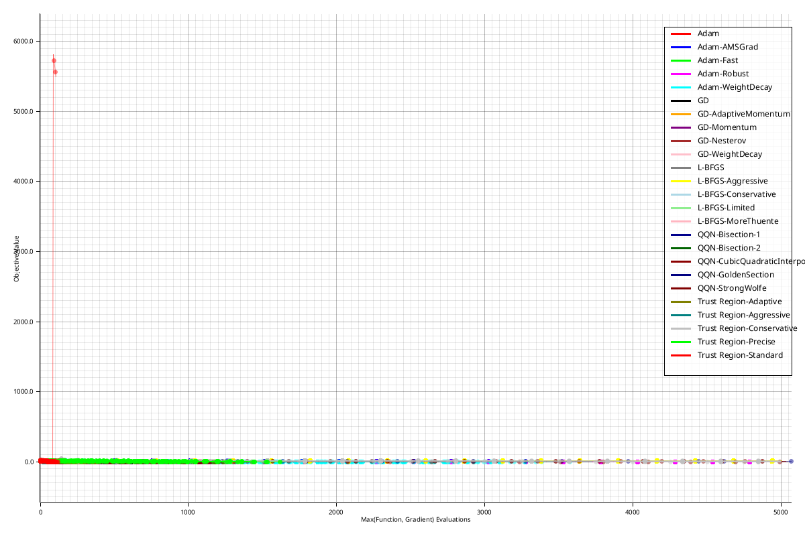
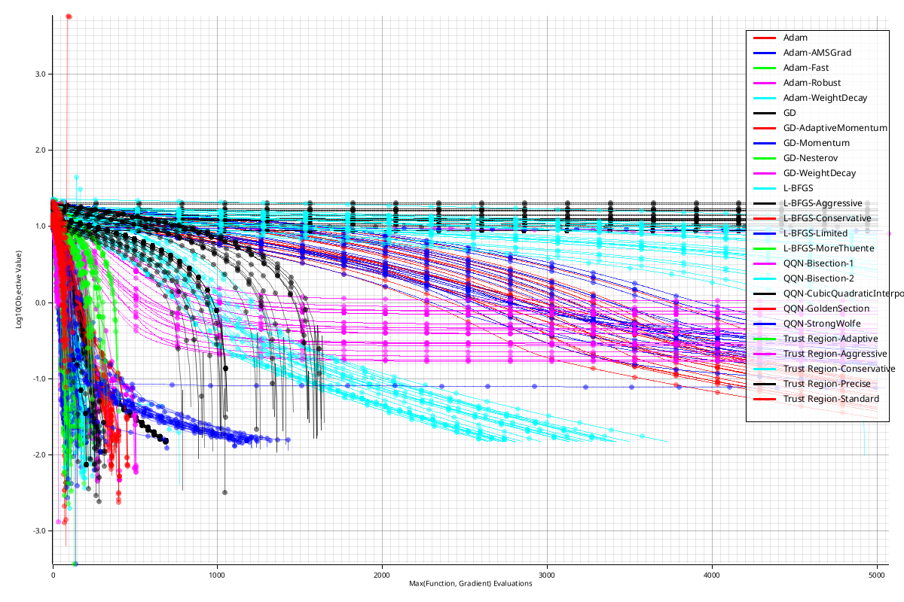

**Figure:** Convergence plots for Beale_2D showing objective value vs iterations.
Left: Linear scale, Right: Log scale for better visualization of convergence behavior.

**Data:** [Linear scale data (CSV)](data/Beale_2D_data.csv) | [Log scale data (CSV)](data/Beale_2D_log_data.csv)

## Problem: Levi_2D

**Family:** Levi
**Dimension:** 2
**Success Threshold:** 2.840e-1
**Total Runs:** 500
**Detailed Analysis:** [View comprehensive problem analysis](reports/problem_analysis_Levi_2D.md)

### Performance Summary
<table style="border-collapse: collapse; width: 100%; margin: 20px 0;">
<tr style="background-color: #f2f2f2;">
<th style="border: 1px solid #ddd; padding: 8px; text-align: center;">Rank</th>
<th style="border: 1px solid #ddd; padding: 8px; text-align: center;">Optimizer</th>
<th style="border: 1px solid #ddd; padding: 8px; text-align: center;">Mean Final Value (All/Success/Fail)</th>
<th style="border: 1px solid #ddd; padding: 8px; text-align: center;">Std Dev</th>
<th style="border: 1px solid #ddd; padding: 8px; text-align: center;">Best Value</th>
<th style="border: 1px solid #ddd; padding: 8px; text-align: center;">Worst Value</th>
<th style="border: 1px solid #ddd; padding: 8px; text-align: center;">Mean Function Evals (All/Success/Fail)</th>
<th style="border: 1px solid #ddd; padding: 8px; text-align: center;">Mean Gradient Evals (All/Success/Fail)</th>
<th style="border: 1px solid #ddd; padding: 8px; text-align: center;">Success Rate</th>
<th style="border: 1px solid #ddd; padding: 8px; text-align: center;">Mean Time (s)</th>
</tr>
<tr style="background-color: #d4edda; font-weight: bold;">
<td style="border: 1px solid #ddd; padding: 8px; text-align: center;">1</td>
<td style="border: 1px solid #ddd; padding: 8px; text-align: center;"><a href="reports/detailed_Levi_2D_QQN-GoldenSection.md" title="Click for detailed analysis">QQN-GoldenSection</a></td>
<td style="border: 1px solid #ddd; padding: 8px; text-align: center;">9.83e-1 / 1.65e-1 / 1.65e0</td>
<td style="border: 1px solid #ddd; padding: 8px; text-align: center;">8.11e-1</td>
<td style="border: 1px solid #ddd; padding: 8px; text-align: center;">1.87e-2</td>
<td style="border: 1px solid #ddd; padding: 8px; text-align: center;">1.98e0</td>
<td style="border: 1px solid #ddd; padding: 8px; text-align: center;">262.0 / 237.0 / 282.5</td>
<td style="border: 1px solid #ddd; padding: 8px; text-align: center;">42.9 / 32.7 / 51.2</td>
<td style="border: 1px solid #ddd; padding: 8px; text-align: center;">45.0%</td>
<td style="border: 1px solid #ddd; padding: 8px; text-align: center;">0.004</td>
</tr>
<tr style="background-color: #fff3cd;">
<td style="border: 1px solid #ddd; padding: 8px; text-align: center;">2</td>
<td style="border: 1px solid #ddd; padding: 8px; text-align: center;"><a href="reports/detailed_Levi_2D_QQN-CubicQuadraticInterpolation.md" title="Click for detailed analysis">QQN-CubicQuadraticInterpolation</a></td>
<td style="border: 1px solid #ddd; padding: 8px; text-align: center;">1.04e0 / 2.11e-1 / 1.59e0</td>
<td style="border: 1px solid #ddd; padding: 8px; text-align: center;">8.94e-1</td>
<td style="border: 1px solid #ddd; padding: 8px; text-align: center;">1.50e-1</td>
<td style="border: 1px solid #ddd; padding: 8px; text-align: center;">2.75e0</td>
<td style="border: 1px solid #ddd; padding: 8px; text-align: center;">189.6 / 65.8 / 272.1</td>
<td style="border: 1px solid #ddd; padding: 8px; text-align: center;">226.7 / 78.8 / 325.3</td>
<td style="border: 1px solid #ddd; padding: 8px; text-align: center;">40.0%</td>
<td style="border: 1px solid #ddd; padding: 8px; text-align: center;">0.007</td>
</tr>
<tr style="">
<td style="border: 1px solid #ddd; padding: 8px; text-align: center;">3</td>
<td style="border: 1px solid #ddd; padding: 8px; text-align: center;"><a href="reports/detailed_Levi_2D_QQN-StrongWolfe.md" title="Click for detailed analysis">QQN-StrongWolfe</a></td>
<td style="border: 1px solid #ddd; padding: 8px; text-align: center;">1.44e0 / 2.17e-1 / 1.85e0</td>
<td style="border: 1px solid #ddd; padding: 8px; text-align: center;">9.74e-1</td>
<td style="border: 1px solid #ddd; padding: 8px; text-align: center;">1.40e-1</td>
<td style="border: 1px solid #ddd; padding: 8px; text-align: center;">3.07e0</td>
<td style="border: 1px solid #ddd; padding: 8px; text-align: center;">450.4 / 108.6 / 564.3</td>
<td style="border: 1px solid #ddd; padding: 8px; text-align: center;">401.8 / 94.4 / 504.3</td>
<td style="border: 1px solid #ddd; padding: 8px; text-align: center;">25.0%</td>
<td style="border: 1px solid #ddd; padding: 8px; text-align: center;">0.014</td>
</tr>
<tr style="">
<td style="border: 1px solid #ddd; padding: 8px; text-align: center;">4</td>
<td style="border: 1px solid #ddd; padding: 8px; text-align: center;"><a href="reports/detailed_Levi_2D_L-BFGS-Limited.md" title="Click for detailed analysis">L-BFGS-Limited</a></td>
<td style="border: 1px solid #ddd; padding: 8px; text-align: center;">9.89e-1 / 1.63e-1 / 1.26e0</td>
<td style="border: 1px solid #ddd; padding: 8px; text-align: center;">6.68e-1</td>
<td style="border: 1px solid #ddd; padding: 8px; text-align: center;">1.13e-1</td>
<td style="border: 1px solid #ddd; padding: 8px; text-align: center;">2.50e0</td>
<td style="border: 1px solid #ddd; padding: 8px; text-align: center;">828.4 / 102.4 / 1070.3</td>
<td style="border: 1px solid #ddd; padding: 8px; text-align: center;">235.7 / 37.8 / 301.7</td>
<td style="border: 1px solid #ddd; padding: 8px; text-align: center;">25.0%</td>
<td style="border: 1px solid #ddd; padding: 8px; text-align: center;">0.009</td>
</tr>
<tr style="">
<td style="border: 1px solid #ddd; padding: 8px; text-align: center;">5</td>
<td style="border: 1px solid #ddd; padding: 8px; text-align: center;"><a href="reports/detailed_Levi_2D_QQN-Bisection-2.md" title="Click for detailed analysis">QQN-Bisection-2</a></td>
<td style="border: 1px solid #ddd; padding: 8px; text-align: center;">1.08e0 / 1.58e-1 / 1.49e0</td>
<td style="border: 1px solid #ddd; padding: 8px; text-align: center;">8.03e-1</td>
<td style="border: 1px solid #ddd; padding: 8px; text-align: center;">4.47e-2</td>
<td style="border: 1px solid #ddd; padding: 8px; text-align: center;">1.98e0</td>
<td style="border: 1px solid #ddd; padding: 8px; text-align: center;">77.5 / 66.8 / 80.2</td>
<td style="border: 1px solid #ddd; padding: 8px; text-align: center;">47.5 / 44.8 / 48.2</td>
<td style="border: 1px solid #ddd; padding: 8px; text-align: center;">20.0%</td>
<td style="border: 1px solid #ddd; padding: 8px; text-align: center;">0.001</td>
</tr>
<tr style="">
<td style="border: 1px solid #ddd; padding: 8px; text-align: center;">6</td>
<td style="border: 1px solid #ddd; padding: 8px; text-align: center;"><a href="reports/detailed_Levi_2D_L-BFGS-MoreThuente.md" title="Click for detailed analysis">L-BFGS-MoreThuente</a></td>
<td style="border: 1px solid #ddd; padding: 8px; text-align: center;">1.48e0 / 1.53e-1 / 1.72e0</td>
<td style="border: 1px solid #ddd; padding: 8px; text-align: center;">6.68e-1</td>
<td style="border: 1px solid #ddd; padding: 8px; text-align: center;">1.36e-1</td>
<td style="border: 1px solid #ddd; padding: 8px; text-align: center;">1.98e0</td>
<td style="border: 1px solid #ddd; padding: 8px; text-align: center;">86.2 / 45.7 / 93.4</td>
<td style="border: 1px solid #ddd; padding: 8px; text-align: center;">63.5 / 36.3 / 68.3</td>
<td style="border: 1px solid #ddd; padding: 8px; text-align: center;">15.0%</td>
<td style="border: 1px solid #ddd; padding: 8px; text-align: center;">0.001</td>
</tr>
<tr style="">
<td style="border: 1px solid #ddd; padding: 8px; text-align: center;">7</td>
<td style="border: 1px solid #ddd; padding: 8px; text-align: center;"><a href="reports/detailed_Levi_2D_L-BFGS.md" title="Click for detailed analysis">L-BFGS</a></td>
<td style="border: 1px solid #ddd; padding: 8px; text-align: center;">7.18e-1 / 2.09e-1 / 5.14e0</td>
<td style="border: 1px solid #ddd; padding: 8px; text-align: center;">6.84e-1</td>
<td style="border: 1px solid #ddd; padding: 8px; text-align: center;">1.84e-1</td>
<td style="border: 1px solid #ddd; padding: 8px; text-align: center;">2.96e0</td>
<td style="border: 1px solid #ddd; padding: 8px; text-align: center;">107.2 / 34.3 / 120.1</td>
<td style="border: 1px solid #ddd; padding: 8px; text-align: center;">45.0 / 17.3 / 49.8</td>
<td style="border: 1px solid #ddd; padding: 8px; text-align: center;">15.0%</td>
<td style="border: 1px solid #ddd; padding: 8px; text-align: center;">0.002</td>
</tr>
<tr style="">
<td style="border: 1px solid #ddd; padding: 8px; text-align: center;">8</td>
<td style="border: 1px solid #ddd; padding: 8px; text-align: center;"><a href="reports/detailed_Levi_2D_QQN-Bisection-1.md" title="Click for detailed analysis">QQN-Bisection-1</a></td>
<td style="border: 1px solid #ddd; padding: 8px; text-align: center;">1.30e0 / 2.00e-1 / 1.49e0</td>
<td style="border: 1px solid #ddd; padding: 8px; text-align: center;">7.24e-1</td>
<td style="border: 1px solid #ddd; padding: 8px; text-align: center;">1.54e-1</td>
<td style="border: 1px solid #ddd; padding: 8px; text-align: center;">2.44e0</td>
<td style="border: 1px solid #ddd; padding: 8px; text-align: center;">200.7 / 175.7 / 205.1</td>
<td style="border: 1px solid #ddd; padding: 8px; text-align: center;">224.9 / 217.0 / 226.4</td>
<td style="border: 1px solid #ddd; padding: 8px; text-align: center;">15.0%</td>
<td style="border: 1px solid #ddd; padding: 8px; text-align: center;">0.004</td>
</tr>
<tr style="">
<td style="border: 1px solid #ddd; padding: 8px; text-align: center;">9</td>
<td style="border: 1px solid #ddd; padding: 8px; text-align: center;"><a href="reports/detailed_Levi_2D_Trust_Region-Aggressive.md" title="Click for detailed analysis">Trust Region-Aggressive</a></td>
<td style="border: 1px solid #ddd; padding: 8px; text-align: center;">2.82e0 / - / 1.33e2</td>
<td style="border: 1px solid #ddd; padding: 8px; text-align: center;">7.36e-1</td>
<td style="border: 1px solid #ddd; padding: 8px; text-align: center;">1.02e0</td>
<td style="border: 1px solid #ddd; padding: 8px; text-align: center;">4.03e0</td>
<td style="border: 1px solid #ddd; padding: 8px; text-align: center;">6.3 / - / 6.3</td>
<td style="border: 1px solid #ddd; padding: 8px; text-align: center;">4.9 / - / 4.9</td>
<td style="border: 1px solid #ddd; padding: 8px; text-align: center;">0.0%</td>
<td style="border: 1px solid #ddd; padding: 8px; text-align: center;">0.000</td>
</tr>
<tr style="">
<td style="border: 1px solid #ddd; padding: 8px; text-align: center;">10</td>
<td style="border: 1px solid #ddd; padding: 8px; text-align: center;"><a href="reports/detailed_Levi_2D_Trust_Region-Standard.md" title="Click for detailed analysis">Trust Region-Standard</a></td>
<td style="border: 1px solid #ddd; padding: 8px; text-align: center;">2.18e0 / - / 2.18e0</td>
<td style="border: 1px solid #ddd; padding: 8px; text-align: center;">4.89e-1</td>
<td style="border: 1px solid #ddd; padding: 8px; text-align: center;">1.43e0</td>
<td style="border: 1px solid #ddd; padding: 8px; text-align: center;">3.40e0</td>
<td style="border: 1px solid #ddd; padding: 8px; text-align: center;">10.7 / - / 10.7</td>
<td style="border: 1px solid #ddd; padding: 8px; text-align: center;">7.8 / - / 7.8</td>
<td style="border: 1px solid #ddd; padding: 8px; text-align: center;">0.0%</td>
<td style="border: 1px solid #ddd; padding: 8px; text-align: center;">0.000</td>
</tr>
<tr style="">
<td style="border: 1px solid #ddd; padding: 8px; text-align: center;">11</td>
<td style="border: 1px solid #ddd; padding: 8px; text-align: center;"><a href="reports/detailed_Levi_2D_GD-Nesterov.md" title="Click for detailed analysis">GD-Nesterov</a></td>
<td style="border: 1px solid #ddd; padding: 8px; text-align: center;">1.84e0 / - / 1.93e0</td>
<td style="border: 1px solid #ddd; padding: 8px; text-align: center;">3.31e-1</td>
<td style="border: 1px solid #ddd; padding: 8px; text-align: center;">6.86e-1</td>
<td style="border: 1px solid #ddd; padding: 8px; text-align: center;">2.02e0</td>
<td style="border: 1px solid #ddd; padding: 8px; text-align: center;">15.2 / - / 15.2</td>
<td style="border: 1px solid #ddd; padding: 8px; text-align: center;">26.3 / - / 26.3</td>
<td style="border: 1px solid #ddd; padding: 8px; text-align: center;">0.0%</td>
<td style="border: 1px solid #ddd; padding: 8px; text-align: center;">0.000</td>
</tr>
<tr style="">
<td style="border: 1px solid #ddd; padding: 8px; text-align: center;">12</td>
<td style="border: 1px solid #ddd; padding: 8px; text-align: center;"><a href="reports/detailed_Levi_2D_Trust_Region-Adaptive.md" title="Click for detailed analysis">Trust Region-Adaptive</a></td>
<td style="border: 1px solid #ddd; padding: 8px; text-align: center;">2.03e0 / - / 2.09e0</td>
<td style="border: 1px solid #ddd; padding: 8px; text-align: center;">2.97e-1</td>
<td style="border: 1px solid #ddd; padding: 8px; text-align: center;">1.46e0</td>
<td style="border: 1px solid #ddd; padding: 8px; text-align: center;">2.80e0</td>
<td style="border: 1px solid #ddd; padding: 8px; text-align: center;">29.6 / - / 29.6</td>
<td style="border: 1px solid #ddd; padding: 8px; text-align: center;">20.4 / - / 20.4</td>
<td style="border: 1px solid #ddd; padding: 8px; text-align: center;">0.0%</td>
<td style="border: 1px solid #ddd; padding: 8px; text-align: center;">0.000</td>
</tr>
<tr style="">
<td style="border: 1px solid #ddd; padding: 8px; text-align: center;">13</td>
<td style="border: 1px solid #ddd; padding: 8px; text-align: center;"><a href="reports/detailed_Levi_2D_GD-AdaptiveMomentum.md" title="Click for detailed analysis">GD-AdaptiveMomentum</a></td>
<td style="border: 1px solid #ddd; padding: 8px; text-align: center;">1.96e0 / - / 2.06e0</td>
<td style="border: 1px solid #ddd; padding: 8px; text-align: center;">2.91e-1</td>
<td style="border: 1px solid #ddd; padding: 8px; text-align: center;">1.09e0</td>
<td style="border: 1px solid #ddd; padding: 8px; text-align: center;">2.75e0</td>
<td style="border: 1px solid #ddd; padding: 8px; text-align: center;">18.7 / - / 18.7</td>
<td style="border: 1px solid #ddd; padding: 8px; text-align: center;">33.4 / - / 33.4</td>
<td style="border: 1px solid #ddd; padding: 8px; text-align: center;">0.0%</td>
<td style="border: 1px solid #ddd; padding: 8px; text-align: center;">0.001</td>
</tr>
<tr style="">
<td style="border: 1px solid #ddd; padding: 8px; text-align: center;">14</td>
<td style="border: 1px solid #ddd; padding: 8px; text-align: center;"><a href="reports/detailed_Levi_2D_GD-Momentum.md" title="Click for detailed analysis">GD-Momentum</a></td>
<td style="border: 1px solid #ddd; padding: 8px; text-align: center;">1.75e0 / - / 2.02e0</td>
<td style="border: 1px solid #ddd; padding: 8px; text-align: center;">4.81e-1</td>
<td style="border: 1px solid #ddd; padding: 8px; text-align: center;">5.50e-1</td>
<td style="border: 1px solid #ddd; padding: 8px; text-align: center;">2.67e0</td>
<td style="border: 1px solid #ddd; padding: 8px; text-align: center;">19.0 / - / 19.0</td>
<td style="border: 1px solid #ddd; padding: 8px; text-align: center;">34.0 / - / 34.0</td>
<td style="border: 1px solid #ddd; padding: 8px; text-align: center;">0.0%</td>
<td style="border: 1px solid #ddd; padding: 8px; text-align: center;">0.001</td>
</tr>
<tr style="">
<td style="border: 1px solid #ddd; padding: 8px; text-align: center;">15</td>
<td style="border: 1px solid #ddd; padding: 8px; text-align: center;"><a href="reports/detailed_Levi_2D_GD.md" title="Click for detailed analysis">GD</a></td>
<td style="border: 1px solid #ddd; padding: 8px; text-align: center;">1.96e0 / - / 2.04e0</td>
<td style="border: 1px solid #ddd; padding: 8px; text-align: center;">3.97e-1</td>
<td style="border: 1px solid #ddd; padding: 8px; text-align: center;">1.43e0</td>
<td style="border: 1px solid #ddd; padding: 8px; text-align: center;">3.11e0</td>
<td style="border: 1px solid #ddd; padding: 8px; text-align: center;">21.9 / - / 21.9</td>
<td style="border: 1px solid #ddd; padding: 8px; text-align: center;">39.7 / - / 39.7</td>
<td style="border: 1px solid #ddd; padding: 8px; text-align: center;">0.0%</td>
<td style="border: 1px solid #ddd; padding: 8px; text-align: center;">0.001</td>
</tr>
<tr style="">
<td style="border: 1px solid #ddd; padding: 8px; text-align: center;">16</td>
<td style="border: 1px solid #ddd; padding: 8px; text-align: center;"><a href="reports/detailed_Levi_2D_GD-WeightDecay.md" title="Click for detailed analysis">GD-WeightDecay</a></td>
<td style="border: 1px solid #ddd; padding: 8px; text-align: center;">1.96e0 / - / 2.00e0</td>
<td style="border: 1px solid #ddd; padding: 8px; text-align: center;">3.73e-1</td>
<td style="border: 1px solid #ddd; padding: 8px; text-align: center;">1.19e0</td>
<td style="border: 1px solid #ddd; padding: 8px; text-align: center;">2.76e0</td>
<td style="border: 1px solid #ddd; padding: 8px; text-align: center;">28.1 / - / 28.1</td>
<td style="border: 1px solid #ddd; padding: 8px; text-align: center;">52.2 / - / 52.2</td>
<td style="border: 1px solid #ddd; padding: 8px; text-align: center;">0.0%</td>
<td style="border: 1px solid #ddd; padding: 8px; text-align: center;">0.001</td>
</tr>
<tr style="">
<td style="border: 1px solid #ddd; padding: 8px; text-align: center;">17</td>
<td style="border: 1px solid #ddd; padding: 8px; text-align: center;"><a href="reports/detailed_Levi_2D_Adam-Robust.md" title="Click for detailed analysis">Adam-Robust</a></td>
<td style="border: 1px solid #ddd; padding: 8px; text-align: center;">1.87e0 / - / 1.88e0</td>
<td style="border: 1px solid #ddd; padding: 8px; text-align: center;">2.50e-1</td>
<td style="border: 1px solid #ddd; padding: 8px; text-align: center;">1.08e0</td>
<td style="border: 1px solid #ddd; padding: 8px; text-align: center;">1.99e0</td>
<td style="border: 1px solid #ddd; padding: 8px; text-align: center;">42.6 / - / 42.6</td>
<td style="border: 1px solid #ddd; padding: 8px; text-align: center;">41.6 / - / 41.6</td>
<td style="border: 1px solid #ddd; padding: 8px; text-align: center;">0.0%</td>
<td style="border: 1px solid #ddd; padding: 8px; text-align: center;">0.001</td>
</tr>
<tr style="">
<td style="border: 1px solid #ddd; padding: 8px; text-align: center;">18</td>
<td style="border: 1px solid #ddd; padding: 8px; text-align: center;"><a href="reports/detailed_Levi_2D_Adam-Fast.md" title="Click for detailed analysis">Adam-Fast</a></td>
<td style="border: 1px solid #ddd; padding: 8px; text-align: center;">1.99e0 / - / 2.09e0</td>
<td style="border: 1px solid #ddd; padding: 8px; text-align: center;">2.23e-1</td>
<td style="border: 1px solid #ddd; padding: 8px; text-align: center;">1.43e0</td>
<td style="border: 1px solid #ddd; padding: 8px; text-align: center;">2.76e0</td>
<td style="border: 1px solid #ddd; padding: 8px; text-align: center;">47.2 / - / 47.2</td>
<td style="border: 1px solid #ddd; padding: 8px; text-align: center;">46.2 / - / 46.2</td>
<td style="border: 1px solid #ddd; padding: 8px; text-align: center;">0.0%</td>
<td style="border: 1px solid #ddd; padding: 8px; text-align: center;">0.001</td>
</tr>
<tr style="">
<td style="border: 1px solid #ddd; padding: 8px; text-align: center;">19</td>
<td style="border: 1px solid #ddd; padding: 8px; text-align: center;"><a href="reports/detailed_Levi_2D_Trust_Region-Precise.md" title="Click for detailed analysis">Trust Region-Precise</a></td>
<td style="border: 1px solid #ddd; padding: 8px; text-align: center;">2.04e0 / - / 2.04e0</td>
<td style="border: 1px solid #ddd; padding: 8px; text-align: center;">3.89e-1</td>
<td style="border: 1px solid #ddd; padding: 8px; text-align: center;">1.43e0</td>
<td style="border: 1px solid #ddd; padding: 8px; text-align: center;">3.38e0</td>
<td style="border: 1px solid #ddd; padding: 8px; text-align: center;">76.8 / - / 76.8</td>
<td style="border: 1px solid #ddd; padding: 8px; text-align: center;">51.9 / - / 51.9</td>
<td style="border: 1px solid #ddd; padding: 8px; text-align: center;">0.0%</td>
<td style="border: 1px solid #ddd; padding: 8px; text-align: center;">0.001</td>
</tr>
<tr style="">
<td style="border: 1px solid #ddd; padding: 8px; text-align: center;">20</td>
<td style="border: 1px solid #ddd; padding: 8px; text-align: center;"><a href="reports/detailed_Levi_2D_Adam-WeightDecay.md" title="Click for detailed analysis">Adam-WeightDecay</a></td>
<td style="border: 1px solid #ddd; padding: 8px; text-align: center;">1.94e0 / - / 1.95e0</td>
<td style="border: 1px solid #ddd; padding: 8px; text-align: center;">2.72e-1</td>
<td style="border: 1px solid #ddd; padding: 8px; text-align: center;">1.43e0</td>
<td style="border: 1px solid #ddd; padding: 8px; text-align: center;">2.75e0</td>
<td style="border: 1px solid #ddd; padding: 8px; text-align: center;">99.6 / - / 99.6</td>
<td style="border: 1px solid #ddd; padding: 8px; text-align: center;">98.6 / - / 98.6</td>
<td style="border: 1px solid #ddd; padding: 8px; text-align: center;">0.0%</td>
<td style="border: 1px solid #ddd; padding: 8px; text-align: center;">0.002</td>
</tr>
<tr style="">
<td style="border: 1px solid #ddd; padding: 8px; text-align: center;">21</td>
<td style="border: 1px solid #ddd; padding: 8px; text-align: center;"><a href="reports/detailed_Levi_2D_L-BFGS-Conservative.md" title="Click for detailed analysis">L-BFGS-Conservative</a></td>
<td style="border: 1px solid #ddd; padding: 8px; text-align: center;">1.94e0 / - / 1.94e0</td>
<td style="border: 1px solid #ddd; padding: 8px; text-align: center;">1.32e-1</td>
<td style="border: 1px solid #ddd; padding: 8px; text-align: center;">1.43e0</td>
<td style="border: 1px solid #ddd; padding: 8px; text-align: center;">1.98e0</td>
<td style="border: 1px solid #ddd; padding: 8px; text-align: center;">209.4 / - / 209.4</td>
<td style="border: 1px solid #ddd; padding: 8px; text-align: center;">106.5 / - / 106.5</td>
<td style="border: 1px solid #ddd; padding: 8px; text-align: center;">0.0%</td>
<td style="border: 1px solid #ddd; padding: 8px; text-align: center;">0.004</td>
</tr>
<tr style="">
<td style="border: 1px solid #ddd; padding: 8px; text-align: center;">22</td>
<td style="border: 1px solid #ddd; padding: 8px; text-align: center;"><a href="reports/detailed_Levi_2D_Adam.md" title="Click for detailed analysis">Adam</a></td>
<td style="border: 1px solid #ddd; padding: 8px; text-align: center;">1.93e0 / - / 1.93e0</td>
<td style="border: 1px solid #ddd; padding: 8px; text-align: center;">1.42e-1</td>
<td style="border: 1px solid #ddd; padding: 8px; text-align: center;">1.43e0</td>
<td style="border: 1px solid #ddd; padding: 8px; text-align: center;">1.98e0</td>
<td style="border: 1px solid #ddd; padding: 8px; text-align: center;">242.4 / - / 242.4</td>
<td style="border: 1px solid #ddd; padding: 8px; text-align: center;">241.4 / - / 241.4</td>
<td style="border: 1px solid #ddd; padding: 8px; text-align: center;">0.0%</td>
<td style="border: 1px solid #ddd; padding: 8px; text-align: center;">0.005</td>
</tr>
<tr style="">
<td style="border: 1px solid #ddd; padding: 8px; text-align: center;">23</td>
<td style="border: 1px solid #ddd; padding: 8px; text-align: center;"><a href="reports/detailed_Levi_2D_Adam-AMSGrad.md" title="Click for detailed analysis">Adam-AMSGrad</a></td>
<td style="border: 1px solid #ddd; padding: 8px; text-align: center;">1.91e0 / - / 1.91e0</td>
<td style="border: 1px solid #ddd; padding: 8px; text-align: center;">1.49e-1</td>
<td style="border: 1px solid #ddd; padding: 8px; text-align: center;">1.43e0</td>
<td style="border: 1px solid #ddd; padding: 8px; text-align: center;">1.98e0</td>
<td style="border: 1px solid #ddd; padding: 8px; text-align: center;">282.9 / - / 282.9</td>
<td style="border: 1px solid #ddd; padding: 8px; text-align: center;">281.9 / - / 281.9</td>
<td style="border: 1px solid #ddd; padding: 8px; text-align: center;">0.0%</td>
<td style="border: 1px solid #ddd; padding: 8px; text-align: center;">0.006</td>
</tr>
<tr style="">
<td style="border: 1px solid #ddd; padding: 8px; text-align: center;">24</td>
<td style="border: 1px solid #ddd; padding: 8px; text-align: center;"><a href="reports/detailed_Levi_2D_Trust_Region-Conservative.md" title="Click for detailed analysis">Trust Region-Conservative</a></td>
<td style="border: 1px solid #ddd; padding: 8px; text-align: center;">1.92e0 / - / 1.95e0</td>
<td style="border: 1px solid #ddd; padding: 8px; text-align: center;">3.13e-1</td>
<td style="border: 1px solid #ddd; padding: 8px; text-align: center;">1.07e0</td>
<td style="border: 1px solid #ddd; padding: 8px; text-align: center;">2.75e0</td>
<td style="border: 1px solid #ddd; padding: 8px; text-align: center;">490.0 / - / 490.0</td>
<td style="border: 1px solid #ddd; padding: 8px; text-align: center;">327.3 / - / 327.3</td>
<td style="border: 1px solid #ddd; padding: 8px; text-align: center;">0.0%</td>
<td style="border: 1px solid #ddd; padding: 8px; text-align: center;">0.003</td>
</tr>
<tr style="">
<td style="border: 1px solid #ddd; padding: 8px; text-align: center;">25</td>
<td style="border: 1px solid #ddd; padding: 8px; text-align: center;"><a href="reports/detailed_Levi_2D_L-BFGS-Aggressive.md" title="Click for detailed analysis">L-BFGS-Aggressive</a></td>
<td style="border: 1px solid #ddd; padding: 8px; text-align: center;">2.87e0 / - / 2.87e0</td>
<td style="border: 1px solid #ddd; padding: 8px; text-align: center;">8.03e-1</td>
<td style="border: 1px solid #ddd; padding: 8px; text-align: center;">1.00e0</td>
<td style="border: 1px solid #ddd; padding: 8px; text-align: center;">4.17e0</td>
<td style="border: 1px solid #ddd; padding: 8px; text-align: center;">3851.3 / - / 3851.3</td>
<td style="border: 1px solid #ddd; padding: 8px; text-align: center;">1157.0 / - / 1157.0</td>
<td style="border: 1px solid #ddd; padding: 8px; text-align: center;">0.0%</td>
<td style="border: 1px solid #ddd; padding: 8px; text-align: center;">0.022</td>
</tr>
</table>

### Convergence Plots

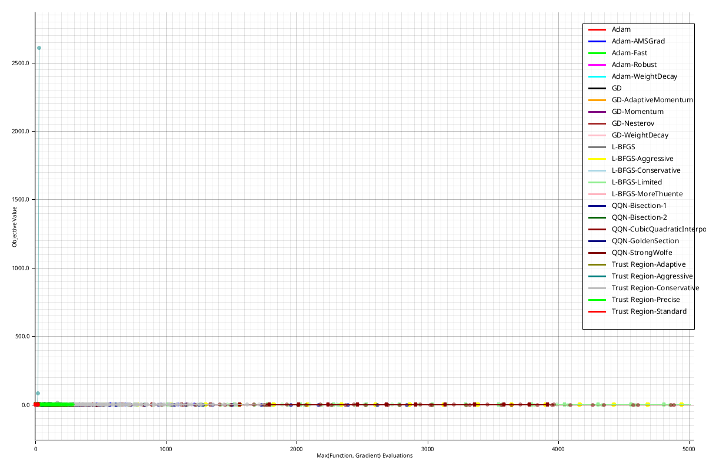
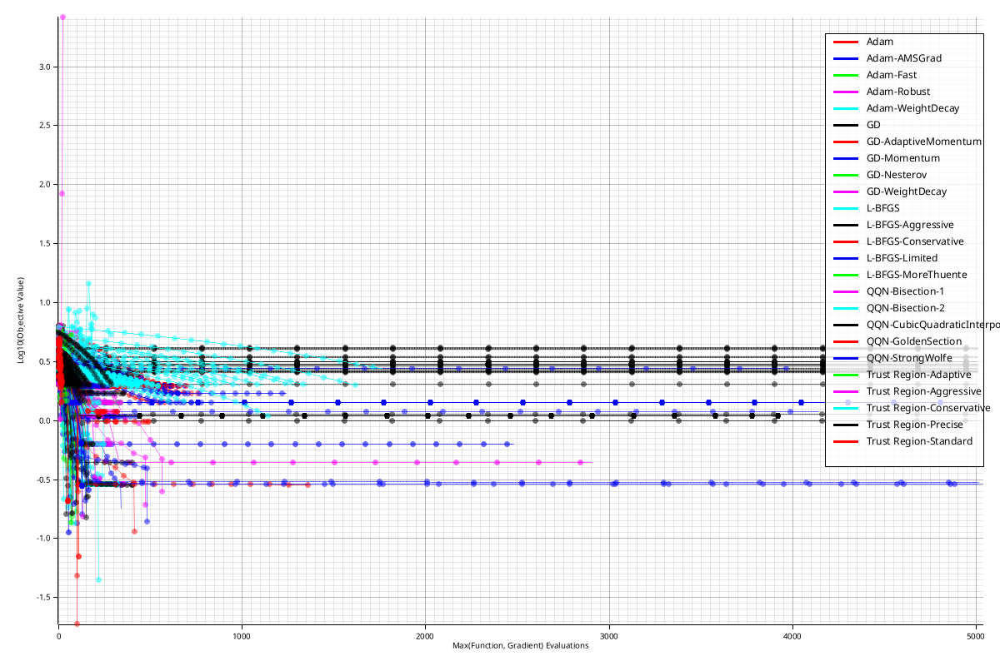

**Figure:** Convergence plots for Levi_2D showing objective value vs iterations.
Left: Linear scale, Right: Log scale for better visualization of convergence behavior.

**Data:** [Linear scale data (CSV)](data/Levi_2D_data.csv) | [Log scale data (CSV)](data/Levi_2D_log_data.csv)

## Problem: GoldsteinPrice_2D

**Family:** GoldsteinPrice
**Dimension:** 2
**Success Threshold:** 8.400e1
**Total Runs:** 500
**Detailed Analysis:** [View comprehensive problem analysis](reports/problem_analysis_GoldsteinPrice_2D.md)

### Performance Summary
<table style="border-collapse: collapse; width: 100%; margin: 20px 0;">
<tr style="background-color: #f2f2f2;">
<th style="border: 1px solid #ddd; padding: 8px; text-align: center;">Rank</th>
<th style="border: 1px solid #ddd; padding: 8px; text-align: center;">Optimizer</th>
<th style="border: 1px solid #ddd; padding: 8px; text-align: center;">Mean Final Value (All/Success/Fail)</th>
<th style="border: 1px solid #ddd; padding: 8px; text-align: center;">Std Dev</th>
<th style="border: 1px solid #ddd; padding: 8px; text-align: center;">Best Value</th>
<th style="border: 1px solid #ddd; padding: 8px; text-align: center;">Worst Value</th>
<th style="border: 1px solid #ddd; padding: 8px; text-align: center;">Mean Function Evals (All/Success/Fail)</th>
<th style="border: 1px solid #ddd; padding: 8px; text-align: center;">Mean Gradient Evals (All/Success/Fail)</th>
<th style="border: 1px solid #ddd; padding: 8px; text-align: center;">Success Rate</th>
<th style="border: 1px solid #ddd; padding: 8px; text-align: center;">Mean Time (s)</th>
</tr>
<tr style="background-color: #d4edda; font-weight: bold;">
<td style="border: 1px solid #ddd; padding: 8px; text-align: center;">1</td>
<td style="border: 1px solid #ddd; padding: 8px; text-align: center;"><a href="reports/detailed_GoldsteinPrice_2D_QQN-GoldenSection.md" title="Click for detailed analysis">QQN-GoldenSection</a></td>
<td style="border: 1px solid #ddd; padding: 8px; text-align: center;">8.40e1 / 8.40e1 / 8.40e1</td>
<td style="border: 1px solid #ddd; padding: 8px; text-align: center;">3.02e-11</td>
<td style="border: 1px solid #ddd; padding: 8px; text-align: center;">8.40e1</td>
<td style="border: 1px solid #ddd; padding: 8px; text-align: center;">8.40e1</td>
<td style="border: 1px solid #ddd; padding: 8px; text-align: center;">383.2 / 402.9 / 372.6</td>
<td style="border: 1px solid #ddd; padding: 8px; text-align: center;">57.8 / 59.4 / 56.9</td>
<td style="border: 1px solid #ddd; padding: 8px; text-align: center;">35.0%</td>
<td style="border: 1px solid #ddd; padding: 8px; text-align: center;">0.006</td>
</tr>
<tr style="background-color: #fff3cd;">
<td style="border: 1px solid #ddd; padding: 8px; text-align: center;">2</td>
<td style="border: 1px solid #ddd; padding: 8px; text-align: center;"><a href="reports/detailed_GoldsteinPrice_2D_QQN-Bisection-1.md" title="Click for detailed analysis">QQN-Bisection-1</a></td>
<td style="border: 1px solid #ddd; padding: 8px; text-align: center;">8.40e1 / 8.40e1 / 8.40e1</td>
<td style="border: 1px solid #ddd; padding: 8px; text-align: center;">1.47e-11</td>
<td style="border: 1px solid #ddd; padding: 8px; text-align: center;">8.40e1</td>
<td style="border: 1px solid #ddd; padding: 8px; text-align: center;">8.40e1</td>
<td style="border: 1px solid #ddd; padding: 8px; text-align: center;">362.8 / 223.8 / 397.5</td>
<td style="border: 1px solid #ddd; padding: 8px; text-align: center;">445.0 / 282.8 / 485.6</td>
<td style="border: 1px solid #ddd; padding: 8px; text-align: center;">20.0%</td>
<td style="border: 1px solid #ddd; padding: 8px; text-align: center;">0.010</td>
</tr>
<tr style="">
<td style="border: 1px solid #ddd; padding: 8px; text-align: center;">3</td>
<td style="border: 1px solid #ddd; padding: 8px; text-align: center;"><a href="reports/detailed_GoldsteinPrice_2D_QQN-CubicQuadraticInterpolation.md" title="Click for detailed analysis">QQN-CubicQuadraticInterpolation</a></td>
<td style="border: 1px solid #ddd; padding: 8px; text-align: center;">2.71e2 / 8.40e1 / 3.04e2</td>
<td style="border: 1px solid #ddd; padding: 8px; text-align: center;">3.24e2</td>
<td style="border: 1px solid #ddd; padding: 8px; text-align: center;">8.40e1</td>
<td style="border: 1px solid #ddd; padding: 8px; text-align: center;">8.40e2</td>
<td style="border: 1px solid #ddd; padding: 8px; text-align: center;">291.6 / 228.3 / 302.8</td>
<td style="border: 1px solid #ddd; padding: 8px; text-align: center;">344.9 / 264.3 / 359.1</td>
<td style="border: 1px solid #ddd; padding: 8px; text-align: center;">15.0%</td>
<td style="border: 1px solid #ddd; padding: 8px; text-align: center;">0.011</td>
</tr>
<tr style="">
<td style="border: 1px solid #ddd; padding: 8px; text-align: center;">4</td>
<td style="border: 1px solid #ddd; padding: 8px; text-align: center;"><a href="reports/detailed_GoldsteinPrice_2D_QQN-StrongWolfe.md" title="Click for detailed analysis">QQN-StrongWolfe</a></td>
<td style="border: 1px solid #ddd; padding: 8px; text-align: center;">8.34e1 / 7.97e1 / 8.40e1</td>
<td style="border: 1px solid #ddd; padding: 8px; text-align: center;">2.81e0</td>
<td style="border: 1px solid #ddd; padding: 8px; text-align: center;">7.11e1</td>
<td style="border: 1px solid #ddd; padding: 8px; text-align: center;">8.40e1</td>
<td style="border: 1px solid #ddd; padding: 8px; text-align: center;">552.0 / 215.7 / 611.4</td>
<td style="border: 1px solid #ddd; padding: 8px; text-align: center;">301.2 / 128.7 / 331.6</td>
<td style="border: 1px solid #ddd; padding: 8px; text-align: center;">15.0%</td>
<td style="border: 1px solid #ddd; padding: 8px; text-align: center;">0.014</td>
</tr>
<tr style="">
<td style="border: 1px solid #ddd; padding: 8px; text-align: center;">5</td>
<td style="border: 1px solid #ddd; padding: 8px; text-align: center;"><a href="reports/detailed_GoldsteinPrice_2D_QQN-Bisection-2.md" title="Click for detailed analysis">QQN-Bisection-2</a></td>
<td style="border: 1px solid #ddd; padding: 8px; text-align: center;">1.58e2 / 8.40e1 / 1.64e2</td>
<td style="border: 1px solid #ddd; padding: 8px; text-align: center;">1.99e2</td>
<td style="border: 1px solid #ddd; padding: 8px; text-align: center;">8.40e1</td>
<td style="border: 1px solid #ddd; padding: 8px; text-align: center;">8.40e2</td>
<td style="border: 1px solid #ddd; padding: 8px; text-align: center;">21.2 / 124.0 / 15.8</td>
<td style="border: 1px solid #ddd; padding: 8px; text-align: center;">45.5 / 134.0 / 40.9</td>
<td style="border: 1px solid #ddd; padding: 8px; text-align: center;">5.0%</td>
<td style="border: 1px solid #ddd; padding: 8px; text-align: center;">0.001</td>
</tr>
<tr style="">
<td style="border: 1px solid #ddd; padding: 8px; text-align: center;">6</td>
<td style="border: 1px solid #ddd; padding: 8px; text-align: center;"><a href="reports/detailed_GoldsteinPrice_2D_L-BFGS.md" title="Click for detailed analysis">L-BFGS</a></td>
<td style="border: 1px solid #ddd; padding: 8px; text-align: center;">3.97e2 / 6.35e1 / 8.39e2</td>
<td style="border: 1px solid #ddd; padding: 8px; text-align: center;">3.39e2</td>
<td style="border: 1px solid #ddd; padding: 8px; text-align: center;">6.35e1</td>
<td style="border: 1px solid #ddd; padding: 8px; text-align: center;">9.72e2</td>
<td style="border: 1px solid #ddd; padding: 8px; text-align: center;">176.8 / 78.0 / 182.0</td>
<td style="border: 1px solid #ddd; padding: 8px; text-align: center;">55.5 / 28.0 / 56.9</td>
<td style="border: 1px solid #ddd; padding: 8px; text-align: center;">5.0%</td>
<td style="border: 1px solid #ddd; padding: 8px; text-align: center;">0.003</td>
</tr>
<tr style="">
<td style="border: 1px solid #ddd; padding: 8px; text-align: center;">7</td>
<td style="border: 1px solid #ddd; padding: 8px; text-align: center;"><a href="reports/detailed_GoldsteinPrice_2D_L-BFGS-MoreThuente.md" title="Click for detailed analysis">L-BFGS-MoreThuente</a></td>
<td style="border: 1px solid #ddd; padding: 8px; text-align: center;">1.19e2 / 2.24e1 / 1.24e2</td>
<td style="border: 1px solid #ddd; padding: 8px; text-align: center;">1.66e2</td>
<td style="border: 1px solid #ddd; padding: 8px; text-align: center;">2.24e1</td>
<td style="border: 1px solid #ddd; padding: 8px; text-align: center;">8.40e2</td>
<td style="border: 1px solid #ddd; padding: 8px; text-align: center;">621.9 / 65.0 / 651.2</td>
<td style="border: 1px solid #ddd; padding: 8px; text-align: center;">445.1 / 53.0 / 465.7</td>
<td style="border: 1px solid #ddd; padding: 8px; text-align: center;">5.0%</td>
<td style="border: 1px solid #ddd; padding: 8px; text-align: center;">0.010</td>
</tr>
<tr style="">
<td style="border: 1px solid #ddd; padding: 8px; text-align: center;">8</td>
<td style="border: 1px solid #ddd; padding: 8px; text-align: center;"><a href="reports/detailed_GoldsteinPrice_2D_GD-Momentum.md" title="Click for detailed analysis">GD-Momentum</a></td>
<td style="border: 1px solid #ddd; padding: 8px; text-align: center;">7.76e2 / - / 8.98e2</td>
<td style="border: 1px solid #ddd; padding: 8px; text-align: center;">2.26e2</td>
<td style="border: 1px solid #ddd; padding: 8px; text-align: center;">8.57e1</td>
<td style="border: 1px solid #ddd; padding: 8px; text-align: center;">9.02e2</td>
<td style="border: 1px solid #ddd; padding: 8px; text-align: center;">17.9 / - / 17.9</td>
<td style="border: 1px solid #ddd; padding: 8px; text-align: center;">31.8 / - / 31.8</td>
<td style="border: 1px solid #ddd; padding: 8px; text-align: center;">0.0%</td>
<td style="border: 1px solid #ddd; padding: 8px; text-align: center;">0.000</td>
</tr>
<tr style="">
<td style="border: 1px solid #ddd; padding: 8px; text-align: center;">9</td>
<td style="border: 1px solid #ddd; padding: 8px; text-align: center;"><a href="reports/detailed_GoldsteinPrice_2D_GD-AdaptiveMomentum.md" title="Click for detailed analysis">GD-AdaptiveMomentum</a></td>
<td style="border: 1px solid #ddd; padding: 8px; text-align: center;">8.41e2 / - / 8.45e2</td>
<td style="border: 1px solid #ddd; padding: 8px; text-align: center;">6.91e-1</td>
<td style="border: 1px solid #ddd; padding: 8px; text-align: center;">8.40e2</td>
<td style="border: 1px solid #ddd; padding: 8px; text-align: center;">8.43e2</td>
<td style="border: 1px solid #ddd; padding: 8px; text-align: center;">19.9 / - / 19.9</td>
<td style="border: 1px solid #ddd; padding: 8px; text-align: center;">35.7 / - / 35.7</td>
<td style="border: 1px solid #ddd; padding: 8px; text-align: center;">0.0%</td>
<td style="border: 1px solid #ddd; padding: 8px; text-align: center;">0.001</td>
</tr>
<tr style="">
<td style="border: 1px solid #ddd; padding: 8px; text-align: center;">10</td>
<td style="border: 1px solid #ddd; padding: 8px; text-align: center;"><a href="reports/detailed_GoldsteinPrice_2D_GD-WeightDecay.md" title="Click for detailed analysis">GD-WeightDecay</a></td>
<td style="border: 1px solid #ddd; padding: 8px; text-align: center;">8.42e2 / - / 8.57e2</td>
<td style="border: 1px solid #ddd; padding: 8px; text-align: center;">3.32e0</td>
<td style="border: 1px solid #ddd; padding: 8px; text-align: center;">8.40e2</td>
<td style="border: 1px solid #ddd; padding: 8px; text-align: center;">8.54e2</td>
<td style="border: 1px solid #ddd; padding: 8px; text-align: center;">20.3 / - / 20.3</td>
<td style="border: 1px solid #ddd; padding: 8px; text-align: center;">36.6 / - / 36.6</td>
<td style="border: 1px solid #ddd; padding: 8px; text-align: center;">0.0%</td>
<td style="border: 1px solid #ddd; padding: 8px; text-align: center;">0.001</td>
</tr>
<tr style="">
<td style="border: 1px solid #ddd; padding: 8px; text-align: center;">11</td>
<td style="border: 1px solid #ddd; padding: 8px; text-align: center;"><a href="reports/detailed_GoldsteinPrice_2D_Adam-Fast.md" title="Click for detailed analysis">Adam-Fast</a></td>
<td style="border: 1px solid #ddd; padding: 8px; text-align: center;">8.43e2 / - / 8.55e2</td>
<td style="border: 1px solid #ddd; padding: 8px; text-align: center;">6.61e0</td>
<td style="border: 1px solid #ddd; padding: 8px; text-align: center;">8.40e2</td>
<td style="border: 1px solid #ddd; padding: 8px; text-align: center;">8.68e2</td>
<td style="border: 1px solid #ddd; padding: 8px; text-align: center;">35.3 / - / 35.3</td>
<td style="border: 1px solid #ddd; padding: 8px; text-align: center;">34.3 / - / 34.3</td>
<td style="border: 1px solid #ddd; padding: 8px; text-align: center;">0.0%</td>
<td style="border: 1px solid #ddd; padding: 8px; text-align: center;">0.001</td>
</tr>
<tr style="">
<td style="border: 1px solid #ddd; padding: 8px; text-align: center;">12</td>
<td style="border: 1px solid #ddd; padding: 8px; text-align: center;"><a href="reports/detailed_GoldsteinPrice_2D_GD.md" title="Click for detailed analysis">GD</a></td>
<td style="border: 1px solid #ddd; padding: 8px; text-align: center;">8.49e2 / - / 8.50e2</td>
<td style="border: 1px solid #ddd; padding: 8px; text-align: center;">4.31e0</td>
<td style="border: 1px solid #ddd; padding: 8px; text-align: center;">8.40e2</td>
<td style="border: 1px solid #ddd; padding: 8px; text-align: center;">8.55e2</td>
<td style="border: 1px solid #ddd; padding: 8px; text-align: center;">24.6 / - / 24.6</td>
<td style="border: 1px solid #ddd; padding: 8px; text-align: center;">45.1 / - / 45.1</td>
<td style="border: 1px solid #ddd; padding: 8px; text-align: center;">0.0%</td>
<td style="border: 1px solid #ddd; padding: 8px; text-align: center;">0.001</td>
</tr>
<tr style="">
<td style="border: 1px solid #ddd; padding: 8px; text-align: center;">13</td>
<td style="border: 1px solid #ddd; padding: 8px; text-align: center;"><a href="reports/detailed_GoldsteinPrice_2D_GD-Nesterov.md" title="Click for detailed analysis">GD-Nesterov</a></td>
<td style="border: 1px solid #ddd; padding: 8px; text-align: center;">8.41e2 / - / 8.57e2</td>
<td style="border: 1px solid #ddd; padding: 8px; text-align: center;">1.57e0</td>
<td style="border: 1px solid #ddd; padding: 8px; text-align: center;">8.40e2</td>
<td style="border: 1px solid #ddd; padding: 8px; text-align: center;">8.46e2</td>
<td style="border: 1px solid #ddd; padding: 8px; text-align: center;">24.6 / - / 24.6</td>
<td style="border: 1px solid #ddd; padding: 8px; text-align: center;">45.3 / - / 45.3</td>
<td style="border: 1px solid #ddd; padding: 8px; text-align: center;">0.0%</td>
<td style="border: 1px solid #ddd; padding: 8px; text-align: center;">0.001</td>
</tr>
<tr style="">
<td style="border: 1px solid #ddd; padding: 8px; text-align: center;">14</td>
<td style="border: 1px solid #ddd; padding: 8px; text-align: center;"><a href="reports/detailed_GoldsteinPrice_2D_Adam-Robust.md" title="Click for detailed analysis">Adam-Robust</a></td>
<td style="border: 1px solid #ddd; padding: 8px; text-align: center;">8.41e2 / - / 8.41e2</td>
<td style="border: 1px solid #ddd; padding: 8px; text-align: center;">8.11e-1</td>
<td style="border: 1px solid #ddd; padding: 8px; text-align: center;">8.40e2</td>
<td style="border: 1px solid #ddd; padding: 8px; text-align: center;">8.43e2</td>
<td style="border: 1px solid #ddd; padding: 8px; text-align: center;">81.0 / - / 81.0</td>
<td style="border: 1px solid #ddd; padding: 8px; text-align: center;">80.0 / - / 80.0</td>
<td style="border: 1px solid #ddd; padding: 8px; text-align: center;">0.0%</td>
<td style="border: 1px solid #ddd; padding: 8px; text-align: center;">0.002</td>
</tr>
<tr style="">
<td style="border: 1px solid #ddd; padding: 8px; text-align: center;">15</td>
<td style="border: 1px solid #ddd; padding: 8px; text-align: center;"><a href="reports/detailed_GoldsteinPrice_2D_Adam-WeightDecay.md" title="Click for detailed analysis">Adam-WeightDecay</a></td>
<td style="border: 1px solid #ddd; padding: 8px; text-align: center;">8.40e2 / - / 8.40e2</td>
<td style="border: 1px solid #ddd; padding: 8px; text-align: center;">8.83e-2</td>
<td style="border: 1px solid #ddd; padding: 8px; text-align: center;">8.40e2</td>
<td style="border: 1px solid #ddd; padding: 8px; text-align: center;">8.40e2</td>
<td style="border: 1px solid #ddd; padding: 8px; text-align: center;">209.7 / - / 209.7</td>
<td style="border: 1px solid #ddd; padding: 8px; text-align: center;">208.7 / - / 208.7</td>
<td style="border: 1px solid #ddd; padding: 8px; text-align: center;">0.0%</td>
<td style="border: 1px solid #ddd; padding: 8px; text-align: center;">0.005</td>
</tr>
<tr style="">
<td style="border: 1px solid #ddd; padding: 8px; text-align: center;">16</td>
<td style="border: 1px solid #ddd; padding: 8px; text-align: center;"><a href="reports/detailed_GoldsteinPrice_2D_L-BFGS-Conservative.md" title="Click for detailed analysis">L-BFGS-Conservative</a></td>
<td style="border: 1px solid #ddd; padding: 8px; text-align: center;">8.40e2 / - / 8.44e2</td>
<td style="border: 1px solid #ddd; padding: 8px; text-align: center;">5.91e-2</td>
<td style="border: 1px solid #ddd; padding: 8px; text-align: center;">8.40e2</td>
<td style="border: 1px solid #ddd; padding: 8px; text-align: center;">8.40e2</td>
<td style="border: 1px solid #ddd; padding: 8px; text-align: center;">346.4 / - / 346.4</td>
<td style="border: 1px solid #ddd; padding: 8px; text-align: center;">159.8 / - / 159.8</td>
<td style="border: 1px solid #ddd; padding: 8px; text-align: center;">0.0%</td>
<td style="border: 1px solid #ddd; padding: 8px; text-align: center;">0.005</td>
</tr>
<tr style="">
<td style="border: 1px solid #ddd; padding: 8px; text-align: center;">17</td>
<td style="border: 1px solid #ddd; padding: 8px; text-align: center;"><a href="reports/detailed_GoldsteinPrice_2D_Adam.md" title="Click for detailed analysis">Adam</a></td>
<td style="border: 1px solid #ddd; padding: 8px; text-align: center;">8.40e2 / - / 8.40e2</td>
<td style="border: 1px solid #ddd; padding: 8px; text-align: center;">2.66e-2</td>
<td style="border: 1px solid #ddd; padding: 8px; text-align: center;">8.40e2</td>
<td style="border: 1px solid #ddd; padding: 8px; text-align: center;">8.40e2</td>
<td style="border: 1px solid #ddd; padding: 8px; text-align: center;">597.1 / - / 597.1</td>
<td style="border: 1px solid #ddd; padding: 8px; text-align: center;">596.1 / - / 596.1</td>
<td style="border: 1px solid #ddd; padding: 8px; text-align: center;">0.0%</td>
<td style="border: 1px solid #ddd; padding: 8px; text-align: center;">0.012</td>
</tr>
<tr style="">
<td style="border: 1px solid #ddd; padding: 8px; text-align: center;">18</td>
<td style="border: 1px solid #ddd; padding: 8px; text-align: center;"><a href="reports/detailed_GoldsteinPrice_2D_Adam-AMSGrad.md" title="Click for detailed analysis">Adam-AMSGrad</a></td>
<td style="border: 1px solid #ddd; padding: 8px; text-align: center;">8.40e2 / - / 8.40e2</td>
<td style="border: 1px solid #ddd; padding: 8px; text-align: center;">2.16e-2</td>
<td style="border: 1px solid #ddd; padding: 8px; text-align: center;">8.40e2</td>
<td style="border: 1px solid #ddd; padding: 8px; text-align: center;">8.40e2</td>
<td style="border: 1px solid #ddd; padding: 8px; text-align: center;">603.6 / - / 603.6</td>
<td style="border: 1px solid #ddd; padding: 8px; text-align: center;">602.6 / - / 602.6</td>
<td style="border: 1px solid #ddd; padding: 8px; text-align: center;">0.0%</td>
<td style="border: 1px solid #ddd; padding: 8px; text-align: center;">0.014</td>
</tr>
<tr style="">
<td style="border: 1px solid #ddd; padding: 8px; text-align: center;">19</td>
<td style="border: 1px solid #ddd; padding: 8px; text-align: center;"><a href="reports/detailed_GoldsteinPrice_2D_Trust_Region-Aggressive.md" title="Click for detailed analysis">Trust Region-Aggressive</a></td>
<td style="border: 1px solid #ddd; padding: 8px; text-align: center;">9.54e2 / - / 9.54e2</td>
<td style="border: 1px solid #ddd; padding: 8px; text-align: center;">4.95e2</td>
<td style="border: 1px solid #ddd; padding: 8px; text-align: center;">8.40e2</td>
<td style="border: 1px solid #ddd; padding: 8px; text-align: center;">3.11e3</td>
<td style="border: 1px solid #ddd; padding: 8px; text-align: center;">725.5 / - / 725.5</td>
<td style="border: 1px solid #ddd; padding: 8px; text-align: center;">484.3 / - / 484.3</td>
<td style="border: 1px solid #ddd; padding: 8px; text-align: center;">0.0%</td>
<td style="border: 1px solid #ddd; padding: 8px; text-align: center;">0.005</td>
</tr>
<tr style="">
<td style="border: 1px solid #ddd; padding: 8px; text-align: center;">20</td>
<td style="border: 1px solid #ddd; padding: 8px; text-align: center;"><a href="reports/detailed_GoldsteinPrice_2D_Trust_Region-Standard.md" title="Click for detailed analysis">Trust Region-Standard</a></td>
<td style="border: 1px solid #ddd; padding: 8px; text-align: center;">1.22e3 / - / 1.22e3</td>
<td style="border: 1px solid #ddd; padding: 8px; text-align: center;">6.11e2</td>
<td style="border: 1px solid #ddd; padding: 8px; text-align: center;">8.40e2</td>
<td style="border: 1px solid #ddd; padding: 8px; text-align: center;">2.65e3</td>
<td style="border: 1px solid #ddd; padding: 8px; text-align: center;">1684.8 / - / 1684.8</td>
<td style="border: 1px solid #ddd; padding: 8px; text-align: center;">1123.9 / - / 1123.9</td>
<td style="border: 1px solid #ddd; padding: 8px; text-align: center;">0.0%</td>
<td style="border: 1px solid #ddd; padding: 8px; text-align: center;">0.010</td>
</tr>
<tr style="">
<td style="border: 1px solid #ddd; padding: 8px; text-align: center;">21</td>
<td style="border: 1px solid #ddd; padding: 8px; text-align: center;"><a href="reports/detailed_GoldsteinPrice_2D_Trust_Region-Adaptive.md" title="Click for detailed analysis">Trust Region-Adaptive</a></td>
<td style="border: 1px solid #ddd; padding: 8px; text-align: center;">2.09e3 / - / 2.09e3</td>
<td style="border: 1px solid #ddd; padding: 8px; text-align: center;">1.19e3</td>
<td style="border: 1px solid #ddd; padding: 8px; text-align: center;">8.40e2</td>
<td style="border: 1px solid #ddd; padding: 8px; text-align: center;">4.29e3</td>
<td style="border: 1px solid #ddd; padding: 8px; text-align: center;">2649.8 / - / 2649.8</td>
<td style="border: 1px solid #ddd; padding: 8px; text-align: center;">1767.2 / - / 1767.2</td>
<td style="border: 1px solid #ddd; padding: 8px; text-align: center;">0.0%</td>
<td style="border: 1px solid #ddd; padding: 8px; text-align: center;">0.016</td>
</tr>
<tr style="">
<td style="border: 1px solid #ddd; padding: 8px; text-align: center;">22</td>
<td style="border: 1px solid #ddd; padding: 8px; text-align: center;"><a href="reports/detailed_GoldsteinPrice_2D_Trust_Region-Precise.md" title="Click for detailed analysis">Trust Region-Precise</a></td>
<td style="border: 1px solid #ddd; padding: 8px; text-align: center;">2.20e3 / - / 2.20e3</td>
<td style="border: 1px solid #ddd; padding: 8px; text-align: center;">1.09e3</td>
<td style="border: 1px solid #ddd; padding: 8px; text-align: center;">8.40e2</td>
<td style="border: 1px solid #ddd; padding: 8px; text-align: center;">4.16e3</td>
<td style="border: 1px solid #ddd; padding: 8px; text-align: center;">2943.8 / - / 2943.8</td>
<td style="border: 1px solid #ddd; padding: 8px; text-align: center;">1963.2 / - / 1963.2</td>
<td style="border: 1px solid #ddd; padding: 8px; text-align: center;">0.0%</td>
<td style="border: 1px solid #ddd; padding: 8px; text-align: center;">0.018</td>
</tr>
<tr style="">
<td style="border: 1px solid #ddd; padding: 8px; text-align: center;">23</td>
<td style="border: 1px solid #ddd; padding: 8px; text-align: center;"><a href="reports/detailed_GoldsteinPrice_2D_L-BFGS-Aggressive.md" title="Click for detailed analysis">L-BFGS-Aggressive</a></td>
<td style="border: 1px solid #ddd; padding: 8px; text-align: center;">8.60e2 / - / 8.60e2</td>
<td style="border: 1px solid #ddd; padding: 8px; text-align: center;">1.24e1</td>
<td style="border: 1px solid #ddd; padding: 8px; text-align: center;">8.43e2</td>
<td style="border: 1px solid #ddd; padding: 8px; text-align: center;">9.02e2</td>
<td style="border: 1px solid #ddd; padding: 8px; text-align: center;">3847.0 / - / 3847.0</td>
<td style="border: 1px solid #ddd; padding: 8px; text-align: center;">1157.0 / - / 1157.0</td>
<td style="border: 1px solid #ddd; padding: 8px; text-align: center;">0.0%</td>
<td style="border: 1px solid #ddd; padding: 8px; text-align: center;">0.033</td>
</tr>
<tr style="">
<td style="border: 1px solid #ddd; padding: 8px; text-align: center;">24</td>
<td style="border: 1px solid #ddd; padding: 8px; text-align: center;"><a href="reports/detailed_GoldsteinPrice_2D_Trust_Region-Conservative.md" title="Click for detailed analysis">Trust Region-Conservative</a></td>
<td style="border: 1px solid #ddd; padding: 8px; text-align: center;">2.12e3 / - / 2.12e3</td>
<td style="border: 1px solid #ddd; padding: 8px; text-align: center;">1.02e3</td>
<td style="border: 1px solid #ddd; padding: 8px; text-align: center;">8.97e2</td>
<td style="border: 1px solid #ddd; padding: 8px; text-align: center;">4.67e3</td>
<td style="border: 1px solid #ddd; padding: 8px; text-align: center;">3002.0 / - / 3002.0</td>
<td style="border: 1px solid #ddd; padding: 8px; text-align: center;">2002.0 / - / 2002.0</td>
<td style="border: 1px solid #ddd; padding: 8px; text-align: center;">0.0%</td>
<td style="border: 1px solid #ddd; padding: 8px; text-align: center;">0.018</td>
</tr>
<tr style="">
<td style="border: 1px solid #ddd; padding: 8px; text-align: center;">25</td>
<td style="border: 1px solid #ddd; padding: 8px; text-align: center;"><a href="reports/detailed_GoldsteinPrice_2D_L-BFGS-Limited.md" title="Click for detailed analysis">L-BFGS-Limited</a></td>
<td style="border: 1px solid #ddd; padding: 8px; text-align: center;">8.41e1 / - / 8.41e1</td>
<td style="border: 1px solid #ddd; padding: 8px; text-align: center;">3.33e-1</td>
<td style="border: 1px solid #ddd; padding: 8px; text-align: center;">8.40e1</td>
<td style="border: 1px solid #ddd; padding: 8px; text-align: center;">8.54e1</td>
<td style="border: 1px solid #ddd; padding: 8px; text-align: center;">4259.4 / - / 4259.4</td>
<td style="border: 1px solid #ddd; padding: 8px; text-align: center;">752.8 / - / 752.8</td>
<td style="border: 1px solid #ddd; padding: 8px; text-align: center;">0.0%</td>
<td style="border: 1px solid #ddd; padding: 8px; text-align: center;">0.038</td>
</tr>
</table>

### Convergence Plots

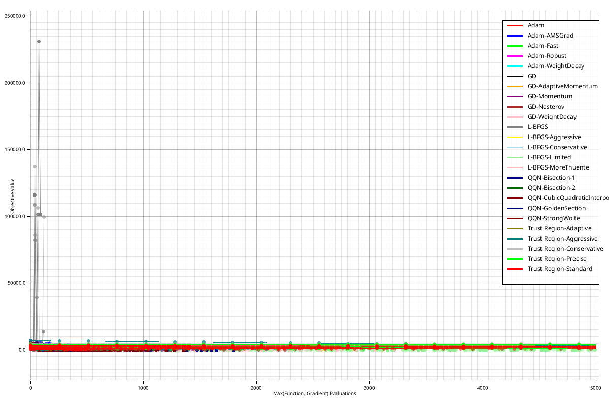
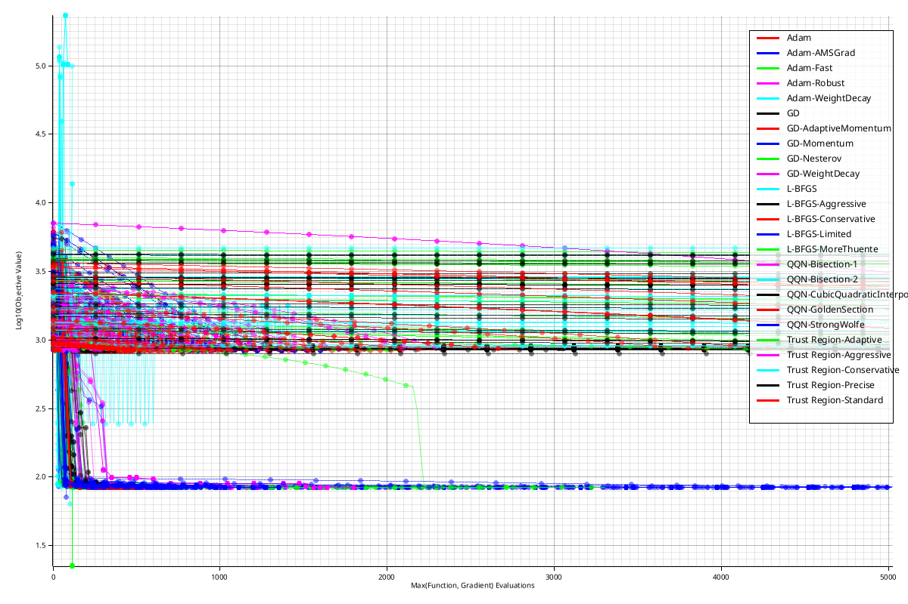

**Figure:** Convergence plots for GoldsteinPrice_2D showing objective value vs iterations.
Left: Linear scale, Right: Log scale for better visualization of convergence behavior.

**Data:** [Linear scale data (CSV)](data/GoldsteinPrice_2D_data.csv) | [Log scale data (CSV)](data/GoldsteinPrice_2D_log_data.csv)

## Problem: Matyas_2D

**Family:** Matyas
**Dimension:** 2
**Success Threshold:** 2.500e-2
**Total Runs:** 500
**Detailed Analysis:** [View comprehensive problem analysis](reports/problem_analysis_Matyas_2D.md)

### Performance Summary
<table style="border-collapse: collapse; width: 100%; margin: 20px 0;">
<tr style="background-color: #f2f2f2;">
<th style="border: 1px solid #ddd; padding: 8px; text-align: center;">Rank</th>
<th style="border: 1px solid #ddd; padding: 8px; text-align: center;">Optimizer</th>
<th style="border: 1px solid #ddd; padding: 8px; text-align: center;">Mean Final Value (All/Success/Fail)</th>
<th style="border: 1px solid #ddd; padding: 8px; text-align: center;">Std Dev</th>
<th style="border: 1px solid #ddd; padding: 8px; text-align: center;">Best Value</th>
<th style="border: 1px solid #ddd; padding: 8px; text-align: center;">Worst Value</th>
<th style="border: 1px solid #ddd; padding: 8px; text-align: center;">Mean Function Evals (All/Success/Fail)</th>
<th style="border: 1px solid #ddd; padding: 8px; text-align: center;">Mean Gradient Evals (All/Success/Fail)</th>
<th style="border: 1px solid #ddd; padding: 8px; text-align: center;">Success Rate</th>
<th style="border: 1px solid #ddd; padding: 8px; text-align: center;">Mean Time (s)</th>
</tr>
<tr style="background-color: #d4edda; font-weight: bold;">
<td style="border: 1px solid #ddd; padding: 8px; text-align: center;">1</td>
<td style="border: 1px solid #ddd; padding: 8px; text-align: center;"><a href="reports/detailed_Matyas_2D_Adam-Fast.md" title="Click for detailed analysis">Adam-Fast</a></td>
<td style="border: 1px solid #ddd; padding: 8px; text-align: center;">2.30e-2 / 2.30e-2 / -</td>
<td style="border: 1px solid #ddd; padding: 8px; text-align: center;">1.45e-3</td>
<td style="border: 1px solid #ddd; padding: 8px; text-align: center;">1.98e-2</td>
<td style="border: 1px solid #ddd; padding: 8px; text-align: center;">2.49e-2</td>
<td style="border: 1px solid #ddd; padding: 8px; text-align: center;">12.9 / 12.9 / -</td>
<td style="border: 1px solid #ddd; padding: 8px; text-align: center;">12.9 / 12.9 / -</td>
<td style="border: 1px solid #ddd; padding: 8px; text-align: center;">100.0%</td>
<td style="border: 1px solid #ddd; padding: 8px; text-align: center;">0.000</td>
</tr>
<tr style="background-color: #fff3cd;">
<td style="border: 1px solid #ddd; padding: 8px; text-align: center;">2</td>
<td style="border: 1px solid #ddd; padding: 8px; text-align: center;"><a href="reports/detailed_Matyas_2D_L-BFGS-MoreThuente.md" title="Click for detailed analysis">L-BFGS-MoreThuente</a></td>
<td style="border: 1px solid #ddd; padding: 8px; text-align: center;">1.72e-2 / 1.72e-2 / -</td>
<td style="border: 1px solid #ddd; padding: 8px; text-align: center;">8.74e-3</td>
<td style="border: 1px solid #ddd; padding: 8px; text-align: center;">2.59e-5</td>
<td style="border: 1px solid #ddd; padding: 8px; text-align: center;">2.46e-2</td>
<td style="border: 1px solid #ddd; padding: 8px; text-align: center;">20.8 / 20.8 / -</td>
<td style="border: 1px solid #ddd; padding: 8px; text-align: center;">15.5 / 15.5 / -</td>
<td style="border: 1px solid #ddd; padding: 8px; text-align: center;">100.0%</td>
<td style="border: 1px solid #ddd; padding: 8px; text-align: center;">0.000</td>
</tr>
<tr style="">
<td style="border: 1px solid #ddd; padding: 8px; text-align: center;">3</td>
<td style="border: 1px solid #ddd; padding: 8px; text-align: center;"><a href="reports/detailed_Matyas_2D_L-BFGS.md" title="Click for detailed analysis">L-BFGS</a></td>
<td style="border: 1px solid #ddd; padding: 8px; text-align: center;">1.47e-2 / 1.47e-2 / -</td>
<td style="border: 1px solid #ddd; padding: 8px; text-align: center;">9.70e-3</td>
<td style="border: 1px solid #ddd; padding: 8px; text-align: center;">5.88e-4</td>
<td style="border: 1px solid #ddd; padding: 8px; text-align: center;">2.50e-2</td>
<td style="border: 1px solid #ddd; padding: 8px; text-align: center;">20.1 / 20.1 / -</td>
<td style="border: 1px solid #ddd; padding: 8px; text-align: center;">16.4 / 16.4 / -</td>
<td style="border: 1px solid #ddd; padding: 8px; text-align: center;">100.0%</td>
<td style="border: 1px solid #ddd; padding: 8px; text-align: center;">0.000</td>
</tr>
<tr style="">
<td style="border: 1px solid #ddd; padding: 8px; text-align: center;">4</td>
<td style="border: 1px solid #ddd; padding: 8px; text-align: center;"><a href="reports/detailed_Matyas_2D_L-BFGS-Limited.md" title="Click for detailed analysis">L-BFGS-Limited</a></td>
<td style="border: 1px solid #ddd; padding: 8px; text-align: center;">1.73e-2 / 1.73e-2 / -</td>
<td style="border: 1px solid #ddd; padding: 8px; text-align: center;">5.34e-3</td>
<td style="border: 1px solid #ddd; padding: 8px; text-align: center;">7.16e-3</td>
<td style="border: 1px solid #ddd; padding: 8px; text-align: center;">2.46e-2</td>
<td style="border: 1px solid #ddd; padding: 8px; text-align: center;">24.6 / 24.6 / -</td>
<td style="border: 1px solid #ddd; padding: 8px; text-align: center;">15.9 / 15.9 / -</td>
<td style="border: 1px solid #ddd; padding: 8px; text-align: center;">100.0%</td>
<td style="border: 1px solid #ddd; padding: 8px; text-align: center;">0.000</td>
</tr>
<tr style="">
<td style="border: 1px solid #ddd; padding: 8px; text-align: center;">5</td>
<td style="border: 1px solid #ddd; padding: 8px; text-align: center;"><a href="reports/detailed_Matyas_2D_QQN-StrongWolfe.md" title="Click for detailed analysis">QQN-StrongWolfe</a></td>
<td style="border: 1px solid #ddd; padding: 8px; text-align: center;">2.73e-29 / 2.73e-29 / -</td>
<td style="border: 1px solid #ddd; padding: 8px; text-align: center;">3.90e-29</td>
<td style="border: 1px solid #ddd; padding: 8px; text-align: center;">1.77e-32</td>
<td style="border: 1px solid #ddd; padding: 8px; text-align: center;">1.69e-28</td>
<td style="border: 1px solid #ddd; padding: 8px; text-align: center;">24.0 / 24.0 / -</td>
<td style="border: 1px solid #ddd; padding: 8px; text-align: center;">25.0 / 25.0 / -</td>
<td style="border: 1px solid #ddd; padding: 8px; text-align: center;">100.0%</td>
<td style="border: 1px solid #ddd; padding: 8px; text-align: center;">0.001</td>
</tr>
<tr style="">
<td style="border: 1px solid #ddd; padding: 8px; text-align: center;">6</td>
<td style="border: 1px solid #ddd; padding: 8px; text-align: center;"><a href="reports/detailed_Matyas_2D_L-BFGS-Conservative.md" title="Click for detailed analysis">L-BFGS-Conservative</a></td>
<td style="border: 1px solid #ddd; padding: 8px; text-align: center;">2.30e-2 / 2.30e-2 / -</td>
<td style="border: 1px solid #ddd; padding: 8px; text-align: center;">1.27e-3</td>
<td style="border: 1px solid #ddd; padding: 8px; text-align: center;">2.07e-2</td>
<td style="border: 1px solid #ddd; padding: 8px; text-align: center;">2.49e-2</td>
<td style="border: 1px solid #ddd; padding: 8px; text-align: center;">39.0 / 39.0 / -</td>
<td style="border: 1px solid #ddd; padding: 8px; text-align: center;">31.4 / 31.4 / -</td>
<td style="border: 1px solid #ddd; padding: 8px; text-align: center;">100.0%</td>
<td style="border: 1px solid #ddd; padding: 8px; text-align: center;">0.001</td>
</tr>
<tr style="">
<td style="border: 1px solid #ddd; padding: 8px; text-align: center;">7</td>
<td style="border: 1px solid #ddd; padding: 8px; text-align: center;"><a href="reports/detailed_Matyas_2D_QQN-CubicQuadraticInterpolation.md" title="Click for detailed analysis">QQN-CubicQuadraticInterpolation</a></td>
<td style="border: 1px solid #ddd; padding: 8px; text-align: center;">1.07e-2 / 1.07e-2 / -</td>
<td style="border: 1px solid #ddd; padding: 8px; text-align: center;">9.48e-3</td>
<td style="border: 1px solid #ddd; padding: 8px; text-align: center;">2.70e-30</td>
<td style="border: 1px solid #ddd; padding: 8px; text-align: center;">2.47e-2</td>
<td style="border: 1px solid #ddd; padding: 8px; text-align: center;">34.0 / 34.0 / -</td>
<td style="border: 1px solid #ddd; padding: 8px; text-align: center;">37.6 / 37.6 / -</td>
<td style="border: 1px solid #ddd; padding: 8px; text-align: center;">100.0%</td>
<td style="border: 1px solid #ddd; padding: 8px; text-align: center;">0.001</td>
</tr>
<tr style="">
<td style="border: 1px solid #ddd; padding: 8px; text-align: center;">8</td>
<td style="border: 1px solid #ddd; padding: 8px; text-align: center;"><a href="reports/detailed_Matyas_2D_QQN-Bisection-1.md" title="Click for detailed analysis">QQN-Bisection-1</a></td>
<td style="border: 1px solid #ddd; padding: 8px; text-align: center;">1.91e-2 / 1.91e-2 / -</td>
<td style="border: 1px solid #ddd; padding: 8px; text-align: center;">5.76e-3</td>
<td style="border: 1px solid #ddd; padding: 8px; text-align: center;">2.83e-3</td>
<td style="border: 1px solid #ddd; padding: 8px; text-align: center;">2.50e-2</td>
<td style="border: 1px solid #ddd; padding: 8px; text-align: center;">34.2 / 34.2 / -</td>
<td style="border: 1px solid #ddd; padding: 8px; text-align: center;">70.2 / 70.2 / -</td>
<td style="border: 1px solid #ddd; padding: 8px; text-align: center;">100.0%</td>
<td style="border: 1px solid #ddd; padding: 8px; text-align: center;">0.001</td>
</tr>
<tr style="">
<td style="border: 1px solid #ddd; padding: 8px; text-align: center;">9</td>
<td style="border: 1px solid #ddd; padding: 8px; text-align: center;"><a href="reports/detailed_Matyas_2D_QQN-Bisection-2.md" title="Click for detailed analysis">QQN-Bisection-2</a></td>
<td style="border: 1px solid #ddd; padding: 8px; text-align: center;">1.49e-2 / 1.49e-2 / -</td>
<td style="border: 1px solid #ddd; padding: 8px; text-align: center;">6.16e-3</td>
<td style="border: 1px solid #ddd; padding: 8px; text-align: center;">8.19e-4</td>
<td style="border: 1px solid #ddd; padding: 8px; text-align: center;">2.50e-2</td>
<td style="border: 1px solid #ddd; padding: 8px; text-align: center;">40.9 / 40.9 / -</td>
<td style="border: 1px solid #ddd; padding: 8px; text-align: center;">67.2 / 67.2 / -</td>
<td style="border: 1px solid #ddd; padding: 8px; text-align: center;">100.0%</td>
<td style="border: 1px solid #ddd; padding: 8px; text-align: center;">0.001</td>
</tr>
<tr style="">
<td style="border: 1px solid #ddd; padding: 8px; text-align: center;">10</td>
<td style="border: 1px solid #ddd; padding: 8px; text-align: center;"><a href="reports/detailed_Matyas_2D_Adam-Robust.md" title="Click for detailed analysis">Adam-Robust</a></td>
<td style="border: 1px solid #ddd; padding: 8px; text-align: center;">2.48e-2 / 2.48e-2 / -</td>
<td style="border: 1px solid #ddd; padding: 8px; text-align: center;">1.11e-4</td>
<td style="border: 1px solid #ddd; padding: 8px; text-align: center;">2.46e-2</td>
<td style="border: 1px solid #ddd; padding: 8px; text-align: center;">2.50e-2</td>
<td style="border: 1px solid #ddd; padding: 8px; text-align: center;">79.0 / 79.0 / -</td>
<td style="border: 1px solid #ddd; padding: 8px; text-align: center;">79.0 / 79.0 / -</td>
<td style="border: 1px solid #ddd; padding: 8px; text-align: center;">100.0%</td>
<td style="border: 1px solid #ddd; padding: 8px; text-align: center;">0.002</td>
</tr>
<tr style="">
<td style="border: 1px solid #ddd; padding: 8px; text-align: center;">11</td>
<td style="border: 1px solid #ddd; padding: 8px; text-align: center;"><a href="reports/detailed_Matyas_2D_QQN-GoldenSection.md" title="Click for detailed analysis">QQN-GoldenSection</a></td>
<td style="border: 1px solid #ddd; padding: 8px; text-align: center;">1.55e-2 / 1.55e-2 / -</td>
<td style="border: 1px solid #ddd; padding: 8px; text-align: center;">6.76e-3</td>
<td style="border: 1px solid #ddd; padding: 8px; text-align: center;">1.12e-3</td>
<td style="border: 1px solid #ddd; padding: 8px; text-align: center;">2.47e-2</td>
<td style="border: 1px solid #ddd; padding: 8px; text-align: center;">138.9 / 138.9 / -</td>
<td style="border: 1px solid #ddd; padding: 8px; text-align: center;">20.6 / 20.6 / -</td>
<td style="border: 1px solid #ddd; padding: 8px; text-align: center;">100.0%</td>
<td style="border: 1px solid #ddd; padding: 8px; text-align: center;">0.002</td>
</tr>
<tr style="">
<td style="border: 1px solid #ddd; padding: 8px; text-align: center;">12</td>
<td style="border: 1px solid #ddd; padding: 8px; text-align: center;"><a href="reports/detailed_Matyas_2D_GD-Momentum.md" title="Click for detailed analysis">GD-Momentum</a></td>
<td style="border: 1px solid #ddd; padding: 8px; text-align: center;">2.49e-2 / 2.49e-2 / -</td>
<td style="border: 1px solid #ddd; padding: 8px; text-align: center;">6.76e-5</td>
<td style="border: 1px solid #ddd; padding: 8px; text-align: center;">2.48e-2</td>
<td style="border: 1px solid #ddd; padding: 8px; text-align: center;">2.50e-2</td>
<td style="border: 1px solid #ddd; padding: 8px; text-align: center;">67.2 / 67.2 / -</td>
<td style="border: 1px solid #ddd; padding: 8px; text-align: center;">131.3 / 131.3 / -</td>
<td style="border: 1px solid #ddd; padding: 8px; text-align: center;">100.0%</td>
<td style="border: 1px solid #ddd; padding: 8px; text-align: center;">0.002</td>
</tr>
<tr style="">
<td style="border: 1px solid #ddd; padding: 8px; text-align: center;">13</td>
<td style="border: 1px solid #ddd; padding: 8px; text-align: center;"><a href="reports/detailed_Matyas_2D_GD-Nesterov.md" title="Click for detailed analysis">GD-Nesterov</a></td>
<td style="border: 1px solid #ddd; padding: 8px; text-align: center;">2.49e-2 / 2.49e-2 / -</td>
<td style="border: 1px solid #ddd; padding: 8px; text-align: center;">5.97e-5</td>
<td style="border: 1px solid #ddd; padding: 8px; text-align: center;">2.48e-2</td>
<td style="border: 1px solid #ddd; padding: 8px; text-align: center;">2.50e-2</td>
<td style="border: 1px solid #ddd; padding: 8px; text-align: center;">71.0 / 71.0 / -</td>
<td style="border: 1px solid #ddd; padding: 8px; text-align: center;">139.0 / 139.0 / -</td>
<td style="border: 1px solid #ddd; padding: 8px; text-align: center;">100.0%</td>
<td style="border: 1px solid #ddd; padding: 8px; text-align: center;">0.002</td>
</tr>
<tr style="">
<td style="border: 1px solid #ddd; padding: 8px; text-align: center;">14</td>
<td style="border: 1px solid #ddd; padding: 8px; text-align: center;"><a href="reports/detailed_Matyas_2D_Adam-WeightDecay.md" title="Click for detailed analysis">Adam-WeightDecay</a></td>
<td style="border: 1px solid #ddd; padding: 8px; text-align: center;">2.49e-2 / 2.49e-2 / -</td>
<td style="border: 1px solid #ddd; padding: 8px; text-align: center;">5.00e-5</td>
<td style="border: 1px solid #ddd; padding: 8px; text-align: center;">2.48e-2</td>
<td style="border: 1px solid #ddd; padding: 8px; text-align: center;">2.50e-2</td>
<td style="border: 1px solid #ddd; padding: 8px; text-align: center;">221.4 / 221.4 / -</td>
<td style="border: 1px solid #ddd; padding: 8px; text-align: center;">221.4 / 221.4 / -</td>
<td style="border: 1px solid #ddd; padding: 8px; text-align: center;">100.0%</td>
<td style="border: 1px solid #ddd; padding: 8px; text-align: center;">0.005</td>
</tr>
<tr style="">
<td style="border: 1px solid #ddd; padding: 8px; text-align: center;">15</td>
<td style="border: 1px solid #ddd; padding: 8px; text-align: center;"><a href="reports/detailed_Matyas_2D_GD-WeightDecay.md" title="Click for detailed analysis">GD-WeightDecay</a></td>
<td style="border: 1px solid #ddd; padding: 8px; text-align: center;">2.50e-2 / 2.50e-2 / -</td>
<td style="border: 1px solid #ddd; padding: 8px; text-align: center;">1.46e-5</td>
<td style="border: 1px solid #ddd; padding: 8px; text-align: center;">2.50e-2</td>
<td style="border: 1px solid #ddd; padding: 8px; text-align: center;">2.50e-2</td>
<td style="border: 1px solid #ddd; padding: 8px; text-align: center;">223.7 / 223.7 / -</td>
<td style="border: 1px solid #ddd; padding: 8px; text-align: center;">444.4 / 444.4 / -</td>
<td style="border: 1px solid #ddd; padding: 8px; text-align: center;">100.0%</td>
<td style="border: 1px solid #ddd; padding: 8px; text-align: center;">0.007</td>
</tr>
<tr style="">
<td style="border: 1px solid #ddd; padding: 8px; text-align: center;">16</td>
<td style="border: 1px solid #ddd; padding: 8px; text-align: center;"><a href="reports/detailed_Matyas_2D_Adam.md" title="Click for detailed analysis">Adam</a></td>
<td style="border: 1px solid #ddd; padding: 8px; text-align: center;">2.50e-2 / 2.50e-2 / -</td>
<td style="border: 1px solid #ddd; padding: 8px; text-align: center;">1.45e-5</td>
<td style="border: 1px solid #ddd; padding: 8px; text-align: center;">2.49e-2</td>
<td style="border: 1px solid #ddd; padding: 8px; text-align: center;">2.50e-2</td>
<td style="border: 1px solid #ddd; padding: 8px; text-align: center;">624.2 / 624.2 / -</td>
<td style="border: 1px solid #ddd; padding: 8px; text-align: center;">624.2 / 624.2 / -</td>
<td style="border: 1px solid #ddd; padding: 8px; text-align: center;">100.0%</td>
<td style="border: 1px solid #ddd; padding: 8px; text-align: center;">0.012</td>
</tr>
<tr style="">
<td style="border: 1px solid #ddd; padding: 8px; text-align: center;">17</td>
<td style="border: 1px solid #ddd; padding: 8px; text-align: center;"><a href="reports/detailed_Matyas_2D_Adam-AMSGrad.md" title="Click for detailed analysis">Adam-AMSGrad</a></td>
<td style="border: 1px solid #ddd; padding: 8px; text-align: center;">2.50e-2 / 2.50e-2 / -</td>
<td style="border: 1px solid #ddd; padding: 8px; text-align: center;">1.14e-5</td>
<td style="border: 1px solid #ddd; padding: 8px; text-align: center;">2.50e-2</td>
<td style="border: 1px solid #ddd; padding: 8px; text-align: center;">2.50e-2</td>
<td style="border: 1px solid #ddd; padding: 8px; text-align: center;">680.7 / 680.7 / -</td>
<td style="border: 1px solid #ddd; padding: 8px; text-align: center;">680.7 / 680.7 / -</td>
<td style="border: 1px solid #ddd; padding: 8px; text-align: center;">100.0%</td>
<td style="border: 1px solid #ddd; padding: 8px; text-align: center;">0.015</td>
</tr>
<tr style="">
<td style="border: 1px solid #ddd; padding: 8px; text-align: center;">18</td>
<td style="border: 1px solid #ddd; padding: 8px; text-align: center;"><a href="reports/detailed_Matyas_2D_GD.md" title="Click for detailed analysis">GD</a></td>
<td style="border: 1px solid #ddd; padding: 8px; text-align: center;">2.50e-2 / 2.50e-2 / -</td>
<td style="border: 1px solid #ddd; padding: 8px; text-align: center;">5.93e-6</td>
<td style="border: 1px solid #ddd; padding: 8px; text-align: center;">2.50e-2</td>
<td style="border: 1px solid #ddd; padding: 8px; text-align: center;">2.50e-2</td>
<td style="border: 1px solid #ddd; padding: 8px; text-align: center;">629.6 / 629.6 / -</td>
<td style="border: 1px solid #ddd; padding: 8px; text-align: center;">1256.2 / 1256.2 / -</td>
<td style="border: 1px solid #ddd; padding: 8px; text-align: center;">100.0%</td>
<td style="border: 1px solid #ddd; padding: 8px; text-align: center;">0.015</td>
</tr>
<tr style="">
<td style="border: 1px solid #ddd; padding: 8px; text-align: center;">19</td>
<td style="border: 1px solid #ddd; padding: 8px; text-align: center;"><a href="reports/detailed_Matyas_2D_GD-AdaptiveMomentum.md" title="Click for detailed analysis">GD-AdaptiveMomentum</a></td>
<td style="border: 1px solid #ddd; padding: 8px; text-align: center;">2.51e-2 / 2.46e-2 / 3.63e-2</td>
<td style="border: 1px solid #ddd; padding: 8px; text-align: center;">2.12e-3</td>
<td style="border: 1px solid #ddd; padding: 8px; text-align: center;">2.42e-2</td>
<td style="border: 1px solid #ddd; padding: 8px; text-align: center;">3.43e-2</td>
<td style="border: 1px solid #ddd; padding: 8px; text-align: center;">29.2 / 29.6 / 22.0</td>
<td style="border: 1px solid #ddd; padding: 8px; text-align: center;">55.4 / 56.2 / 40.0</td>
<td style="border: 1px solid #ddd; padding: 8px; text-align: center;">95.0%</td>
<td style="border: 1px solid #ddd; padding: 8px; text-align: center;">0.001</td>
</tr>
<tr style="">
<td style="border: 1px solid #ddd; padding: 8px; text-align: center;">20</td>
<td style="border: 1px solid #ddd; padding: 8px; text-align: center;"><a href="reports/detailed_Matyas_2D_L-BFGS-Aggressive.md" title="Click for detailed analysis">L-BFGS-Aggressive</a></td>
<td style="border: 1px solid #ddd; padding: 8px; text-align: center;">2.44e-2 / 2.37e-2 / 3.66e-2</td>
<td style="border: 1px solid #ddd; padding: 8px; text-align: center;">3.00e-3</td>
<td style="border: 1px solid #ddd; padding: 8px; text-align: center;">2.16e-2</td>
<td style="border: 1px solid #ddd; padding: 8px; text-align: center;">3.66e-2</td>
<td style="border: 1px solid #ddd; padding: 8px; text-align: center;">217.4 / 26.2 / 3852.0</td>
<td style="border: 1px solid #ddd; padding: 8px; text-align: center;">74.0 / 16.9 / 1160.0</td>
<td style="border: 1px solid #ddd; padding: 8px; text-align: center;">95.0%</td>
<td style="border: 1px solid #ddd; padding: 8px; text-align: center;">0.002</td>
</tr>
<tr style="">
<td style="border: 1px solid #ddd; padding: 8px; text-align: center;">21</td>
<td style="border: 1px solid #ddd; padding: 8px; text-align: center;"><a href="reports/detailed_Matyas_2D_Trust_Region-Precise.md" title="Click for detailed analysis">Trust Region-Precise</a></td>
<td style="border: 1px solid #ddd; padding: 8px; text-align: center;">4.71e-2 / - / 4.71e-2</td>
<td style="border: 1px solid #ddd; padding: 8px; text-align: center;">8.16e-3</td>
<td style="border: 1px solid #ddd; padding: 8px; text-align: center;">3.00e-2</td>
<td style="border: 1px solid #ddd; padding: 8px; text-align: center;">5.69e-2</td>
<td style="border: 1px solid #ddd; padding: 8px; text-align: center;">5.0 / - / 5.0</td>
<td style="border: 1px solid #ddd; padding: 8px; text-align: center;">4.0 / - / 4.0</td>
<td style="border: 1px solid #ddd; padding: 8px; text-align: center;">0.0%</td>
<td style="border: 1px solid #ddd; padding: 8px; text-align: center;">0.000</td>
</tr>
<tr style="">
<td style="border: 1px solid #ddd; padding: 8px; text-align: center;">22</td>
<td style="border: 1px solid #ddd; padding: 8px; text-align: center;"><a href="reports/detailed_Matyas_2D_Trust_Region-Aggressive.md" title="Click for detailed analysis">Trust Region-Aggressive</a></td>
<td style="border: 1px solid #ddd; padding: 8px; text-align: center;">4.60e-2 / - / 6.67e-1</td>
<td style="border: 1px solid #ddd; padding: 8px; text-align: center;">1.09e-2</td>
<td style="border: 1px solid #ddd; padding: 8px; text-align: center;">2.86e-2</td>
<td style="border: 1px solid #ddd; padding: 8px; text-align: center;">7.46e-2</td>
<td style="border: 1px solid #ddd; padding: 8px; text-align: center;">6.3 / - / 6.3</td>
<td style="border: 1px solid #ddd; padding: 8px; text-align: center;">4.9 / - / 4.9</td>
<td style="border: 1px solid #ddd; padding: 8px; text-align: center;">0.0%</td>
<td style="border: 1px solid #ddd; padding: 8px; text-align: center;">0.000</td>
</tr>
<tr style="">
<td style="border: 1px solid #ddd; padding: 8px; text-align: center;">23</td>
<td style="border: 1px solid #ddd; padding: 8px; text-align: center;"><a href="reports/detailed_Matyas_2D_Trust_Region-Conservative.md" title="Click for detailed analysis">Trust Region-Conservative</a></td>
<td style="border: 1px solid #ddd; padding: 8px; text-align: center;">3.93e-2 / - / 3.93e-2</td>
<td style="border: 1px solid #ddd; padding: 8px; text-align: center;">6.90e-3</td>
<td style="border: 1px solid #ddd; padding: 8px; text-align: center;">2.66e-2</td>
<td style="border: 1px solid #ddd; padding: 8px; text-align: center;">5.75e-2</td>
<td style="border: 1px solid #ddd; padding: 8px; text-align: center;">7.0 / - / 7.0</td>
<td style="border: 1px solid #ddd; padding: 8px; text-align: center;">5.3 / - / 5.3</td>
<td style="border: 1px solid #ddd; padding: 8px; text-align: center;">0.0%</td>
<td style="border: 1px solid #ddd; padding: 8px; text-align: center;">0.000</td>
</tr>
<tr style="">
<td style="border: 1px solid #ddd; padding: 8px; text-align: center;">24</td>
<td style="border: 1px solid #ddd; padding: 8px; text-align: center;"><a href="reports/detailed_Matyas_2D_Trust_Region-Adaptive.md" title="Click for detailed analysis">Trust Region-Adaptive</a></td>
<td style="border: 1px solid #ddd; padding: 8px; text-align: center;">4.60e-2 / - / 6.88e-2</td>
<td style="border: 1px solid #ddd; padding: 8px; text-align: center;">1.01e-2</td>
<td style="border: 1px solid #ddd; padding: 8px; text-align: center;">2.83e-2</td>
<td style="border: 1px solid #ddd; padding: 8px; text-align: center;">6.16e-2</td>
<td style="border: 1px solid #ddd; padding: 8px; text-align: center;">7.0 / - / 7.0</td>
<td style="border: 1px solid #ddd; padding: 8px; text-align: center;">5.3 / - / 5.3</td>
<td style="border: 1px solid #ddd; padding: 8px; text-align: center;">0.0%</td>
<td style="border: 1px solid #ddd; padding: 8px; text-align: center;">0.000</td>
</tr>
<tr style="">
<td style="border: 1px solid #ddd; padding: 8px; text-align: center;">25</td>
<td style="border: 1px solid #ddd; padding: 8px; text-align: center;"><a href="reports/detailed_Matyas_2D_Trust_Region-Standard.md" title="Click for detailed analysis">Trust Region-Standard</a></td>
<td style="border: 1px solid #ddd; padding: 8px; text-align: center;">4.71e-2 / - / 2.41e-1</td>
<td style="border: 1px solid #ddd; padding: 8px; text-align: center;">9.69e-3</td>
<td style="border: 1px solid #ddd; padding: 8px; text-align: center;">3.14e-2</td>
<td style="border: 1px solid #ddd; padding: 8px; text-align: center;">7.25e-2</td>
<td style="border: 1px solid #ddd; padding: 8px; text-align: center;">7.2 / - / 7.2</td>
<td style="border: 1px solid #ddd; padding: 8px; text-align: center;">5.5 / - / 5.5</td>
<td style="border: 1px solid #ddd; padding: 8px; text-align: center;">0.0%</td>
<td style="border: 1px solid #ddd; padding: 8px; text-align: center;">0.000</td>
</tr>
</table>

### Convergence Plots

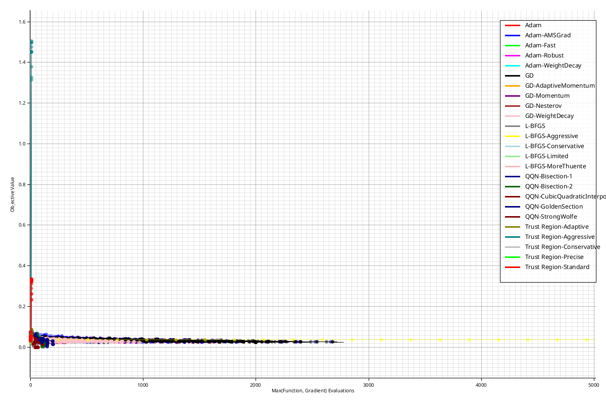
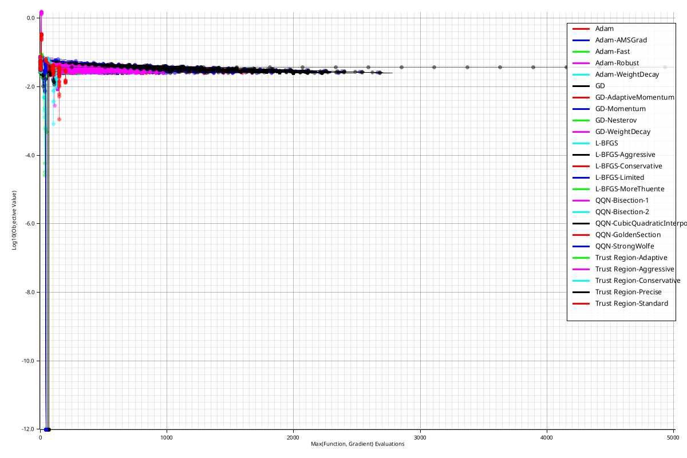

**Figure:** Convergence plots for Matyas_2D showing objective value vs iterations.
Left: Linear scale, Right: Log scale for better visualization of convergence behavior.

**Data:** [Linear scale data (CSV)](data/Matyas_2D_data.csv) | [Log scale data (CSV)](data/Matyas_2D_log_data.csv)

## Problem: Himmelblau_2D

**Family:** Himmelblau
**Dimension:** 2
**Success Threshold:** 2.500e-1
**Total Runs:** 500
**Detailed Analysis:** [View comprehensive problem analysis](reports/problem_analysis_Himmelblau_2D.md)

### Performance Summary
<table style="border-collapse: collapse; width: 100%; margin: 20px 0;">
<tr style="background-color: #f2f2f2;">
<th style="border: 1px solid #ddd; padding: 8px; text-align: center;">Rank</th>
<th style="border: 1px solid #ddd; padding: 8px; text-align: center;">Optimizer</th>
<th style="border: 1px solid #ddd; padding: 8px; text-align: center;">Mean Final Value (All/Success/Fail)</th>
<th style="border: 1px solid #ddd; padding: 8px; text-align: center;">Std Dev</th>
<th style="border: 1px solid #ddd; padding: 8px; text-align: center;">Best Value</th>
<th style="border: 1px solid #ddd; padding: 8px; text-align: center;">Worst Value</th>
<th style="border: 1px solid #ddd; padding: 8px; text-align: center;">Mean Function Evals (All/Success/Fail)</th>
<th style="border: 1px solid #ddd; padding: 8px; text-align: center;">Mean Gradient Evals (All/Success/Fail)</th>
<th style="border: 1px solid #ddd; padding: 8px; text-align: center;">Success Rate</th>
<th style="border: 1px solid #ddd; padding: 8px; text-align: center;">Mean Time (s)</th>
</tr>
<tr style="background-color: #d4edda; font-weight: bold;">
<td style="border: 1px solid #ddd; padding: 8px; text-align: center;">1</td>
<td style="border: 1px solid #ddd; padding: 8px; text-align: center;"><a href="reports/detailed_Himmelblau_2D_L-BFGS-MoreThuente.md" title="Click for detailed analysis">L-BFGS-MoreThuente</a></td>
<td style="border: 1px solid #ddd; padding: 8px; text-align: center;">1.02e-1 / 1.02e-1 / -</td>
<td style="border: 1px solid #ddd; padding: 8px; text-align: center;">7.28e-2</td>
<td style="border: 1px solid #ddd; padding: 8px; text-align: center;">8.92e-3</td>
<td style="border: 1px solid #ddd; padding: 8px; text-align: center;">2.39e-1</td>
<td style="border: 1px solid #ddd; padding: 8px; text-align: center;">36.3 / 36.3 / -</td>
<td style="border: 1px solid #ddd; padding: 8px; text-align: center;">28.3 / 28.3 / -</td>
<td style="border: 1px solid #ddd; padding: 8px; text-align: center;">100.0%</td>
<td style="border: 1px solid #ddd; padding: 8px; text-align: center;">0.000</td>
</tr>
<tr style="background-color: #fff3cd;">
<td style="border: 1px solid #ddd; padding: 8px; text-align: center;">2</td>
<td style="border: 1px solid #ddd; padding: 8px; text-align: center;"><a href="reports/detailed_Himmelblau_2D_L-BFGS-Limited.md" title="Click for detailed analysis">L-BFGS-Limited</a></td>
<td style="border: 1px solid #ddd; padding: 8px; text-align: center;">9.58e-2 / 9.58e-2 / -</td>
<td style="border: 1px solid #ddd; padding: 8px; text-align: center;">8.02e-2</td>
<td style="border: 1px solid #ddd; padding: 8px; text-align: center;">7.81e-3</td>
<td style="border: 1px solid #ddd; padding: 8px; text-align: center;">2.40e-1</td>
<td style="border: 1px solid #ddd; padding: 8px; text-align: center;">60.9 / 60.9 / -</td>
<td style="border: 1px solid #ddd; padding: 8px; text-align: center;">27.8 / 27.8 / -</td>
<td style="border: 1px solid #ddd; padding: 8px; text-align: center;">100.0%</td>
<td style="border: 1px solid #ddd; padding: 8px; text-align: center;">0.001</td>
</tr>
<tr style="">
<td style="border: 1px solid #ddd; padding: 8px; text-align: center;">3</td>
<td style="border: 1px solid #ddd; padding: 8px; text-align: center;"><a href="reports/detailed_Himmelblau_2D_QQN-StrongWolfe.md" title="Click for detailed analysis">QQN-StrongWolfe</a></td>
<td style="border: 1px solid #ddd; padding: 8px; text-align: center;">9.18e-2 / 9.18e-2 / -</td>
<td style="border: 1px solid #ddd; padding: 8px; text-align: center;">6.79e-2</td>
<td style="border: 1px solid #ddd; padding: 8px; text-align: center;">9.60e-3</td>
<td style="border: 1px solid #ddd; padding: 8px; text-align: center;">2.15e-1</td>
<td style="border: 1px solid #ddd; padding: 8px; text-align: center;">61.5 / 61.5 / -</td>
<td style="border: 1px solid #ddd; padding: 8px; text-align: center;">53.7 / 53.7 / -</td>
<td style="border: 1px solid #ddd; padding: 8px; text-align: center;">100.0%</td>
<td style="border: 1px solid #ddd; padding: 8px; text-align: center;">0.001</td>
</tr>
<tr style="">
<td style="border: 1px solid #ddd; padding: 8px; text-align: center;">4</td>
<td style="border: 1px solid #ddd; padding: 8px; text-align: center;"><a href="reports/detailed_Himmelblau_2D_QQN-GoldenSection.md" title="Click for detailed analysis">QQN-GoldenSection</a></td>
<td style="border: 1px solid #ddd; padding: 8px; text-align: center;">7.91e-2 / 7.91e-2 / -</td>
<td style="border: 1px solid #ddd; padding: 8px; text-align: center;">6.51e-2</td>
<td style="border: 1px solid #ddd; padding: 8px; text-align: center;">1.17e-4</td>
<td style="border: 1px solid #ddd; padding: 8px; text-align: center;">2.36e-1</td>
<td style="border: 1px solid #ddd; padding: 8px; text-align: center;">102.8 / 102.8 / -</td>
<td style="border: 1px solid #ddd; padding: 8px; text-align: center;">15.2 / 15.2 / -</td>
<td style="border: 1px solid #ddd; padding: 8px; text-align: center;">100.0%</td>
<td style="border: 1px solid #ddd; padding: 8px; text-align: center;">0.001</td>
</tr>
<tr style="">
<td style="border: 1px solid #ddd; padding: 8px; text-align: center;">5</td>
<td style="border: 1px solid #ddd; padding: 8px; text-align: center;"><a href="reports/detailed_Himmelblau_2D_GD.md" title="Click for detailed analysis">GD</a></td>
<td style="border: 1px solid #ddd; padding: 8px; text-align: center;">1.53e-1 / 1.53e-1 / -</td>
<td style="border: 1px solid #ddd; padding: 8px; text-align: center;">6.88e-2</td>
<td style="border: 1px solid #ddd; padding: 8px; text-align: center;">2.80e-2</td>
<td style="border: 1px solid #ddd; padding: 8px; text-align: center;">2.41e-1</td>
<td style="border: 1px solid #ddd; padding: 8px; text-align: center;">42.9 / 42.9 / -</td>
<td style="border: 1px solid #ddd; padding: 8px; text-align: center;">82.8 / 82.8 / -</td>
<td style="border: 1px solid #ddd; padding: 8px; text-align: center;">100.0%</td>
<td style="border: 1px solid #ddd; padding: 8px; text-align: center;">0.001</td>
</tr>
<tr style="">
<td style="border: 1px solid #ddd; padding: 8px; text-align: center;">6</td>
<td style="border: 1px solid #ddd; padding: 8px; text-align: center;"><a href="reports/detailed_Himmelblau_2D_QQN-Bisection-2.md" title="Click for detailed analysis">QQN-Bisection-2</a></td>
<td style="border: 1px solid #ddd; padding: 8px; text-align: center;">8.17e-2 / 8.17e-2 / -</td>
<td style="border: 1px solid #ddd; padding: 8px; text-align: center;">6.08e-2</td>
<td style="border: 1px solid #ddd; padding: 8px; text-align: center;">2.27e-3</td>
<td style="border: 1px solid #ddd; padding: 8px; text-align: center;">2.05e-1</td>
<td style="border: 1px solid #ddd; padding: 8px; text-align: center;">55.1 / 55.1 / -</td>
<td style="border: 1px solid #ddd; padding: 8px; text-align: center;">74.0 / 74.0 / -</td>
<td style="border: 1px solid #ddd; padding: 8px; text-align: center;">100.0%</td>
<td style="border: 1px solid #ddd; padding: 8px; text-align: center;">0.001</td>
</tr>
<tr style="">
<td style="border: 1px solid #ddd; padding: 8px; text-align: center;">7</td>
<td style="border: 1px solid #ddd; padding: 8px; text-align: center;"><a href="reports/detailed_Himmelblau_2D_QQN-CubicQuadraticInterpolation.md" title="Click for detailed analysis">QQN-CubicQuadraticInterpolation</a></td>
<td style="border: 1px solid #ddd; padding: 8px; text-align: center;">9.46e-2 / 9.46e-2 / -</td>
<td style="border: 1px solid #ddd; padding: 8px; text-align: center;">7.76e-2</td>
<td style="border: 1px solid #ddd; padding: 8px; text-align: center;">5.19e-3</td>
<td style="border: 1px solid #ddd; padding: 8px; text-align: center;">2.45e-1</td>
<td style="border: 1px solid #ddd; padding: 8px; text-align: center;">68.0 / 68.0 / -</td>
<td style="border: 1px solid #ddd; padding: 8px; text-align: center;">81.1 / 81.1 / -</td>
<td style="border: 1px solid #ddd; padding: 8px; text-align: center;">100.0%</td>
<td style="border: 1px solid #ddd; padding: 8px; text-align: center;">0.002</td>
</tr>
<tr style="">
<td style="border: 1px solid #ddd; padding: 8px; text-align: center;">8</td>
<td style="border: 1px solid #ddd; padding: 8px; text-align: center;"><a href="reports/detailed_Himmelblau_2D_QQN-Bisection-1.md" title="Click for detailed analysis">QQN-Bisection-1</a></td>
<td style="border: 1px solid #ddd; padding: 8px; text-align: center;">1.09e-1 / 1.09e-1 / -</td>
<td style="border: 1px solid #ddd; padding: 8px; text-align: center;">4.94e-2</td>
<td style="border: 1px solid #ddd; padding: 8px; text-align: center;">2.06e-2</td>
<td style="border: 1px solid #ddd; padding: 8px; text-align: center;">2.13e-1</td>
<td style="border: 1px solid #ddd; padding: 8px; text-align: center;">107.9 / 107.9 / -</td>
<td style="border: 1px solid #ddd; padding: 8px; text-align: center;">151.1 / 151.1 / -</td>
<td style="border: 1px solid #ddd; padding: 8px; text-align: center;">100.0%</td>
<td style="border: 1px solid #ddd; padding: 8px; text-align: center;">0.002</td>
</tr>
<tr style="">
<td style="border: 1px solid #ddd; padding: 8px; text-align: center;">9</td>
<td style="border: 1px solid #ddd; padding: 8px; text-align: center;"><a href="reports/detailed_Himmelblau_2D_L-BFGS-Conservative.md" title="Click for detailed analysis">L-BFGS-Conservative</a></td>
<td style="border: 1px solid #ddd; padding: 8px; text-align: center;">2.03e-1 / 2.03e-1 / -</td>
<td style="border: 1px solid #ddd; padding: 8px; text-align: center;">2.91e-2</td>
<td style="border: 1px solid #ddd; padding: 8px; text-align: center;">1.42e-1</td>
<td style="border: 1px solid #ddd; padding: 8px; text-align: center;">2.47e-1</td>
<td style="border: 1px solid #ddd; padding: 8px; text-align: center;">264.2 / 264.2 / -</td>
<td style="border: 1px solid #ddd; padding: 8px; text-align: center;">201.1 / 201.1 / -</td>
<td style="border: 1px solid #ddd; padding: 8px; text-align: center;">100.0%</td>
<td style="border: 1px solid #ddd; padding: 8px; text-align: center;">0.006</td>
</tr>
<tr style="">
<td style="border: 1px solid #ddd; padding: 8px; text-align: center;">10</td>
<td style="border: 1px solid #ddd; padding: 8px; text-align: center;"><a href="reports/detailed_Himmelblau_2D_Trust_Region-Adaptive.md" title="Click for detailed analysis">Trust Region-Adaptive</a></td>
<td style="border: 1px solid #ddd; padding: 8px; text-align: center;">1.32e-1 / 1.32e-1 / -</td>
<td style="border: 1px solid #ddd; padding: 8px; text-align: center;">5.93e-2</td>
<td style="border: 1px solid #ddd; padding: 8px; text-align: center;">7.13e-2</td>
<td style="border: 1px solid #ddd; padding: 8px; text-align: center;">2.46e-1</td>
<td style="border: 1px solid #ddd; padding: 8px; text-align: center;">2048.1 / 2048.1 / -</td>
<td style="border: 1px solid #ddd; padding: 8px; text-align: center;">1366.4 / 1366.4 / -</td>
<td style="border: 1px solid #ddd; padding: 8px; text-align: center;">100.0%</td>
<td style="border: 1px solid #ddd; padding: 8px; text-align: center;">0.012</td>
</tr>
<tr style="">
<td style="border: 1px solid #ddd; padding: 8px; text-align: center;">11</td>
<td style="border: 1px solid #ddd; padding: 8px; text-align: center;"><a href="reports/detailed_Himmelblau_2D_Adam-WeightDecay.md" title="Click for detailed analysis">Adam-WeightDecay</a></td>
<td style="border: 1px solid #ddd; padding: 8px; text-align: center;">2.41e-1 / 2.41e-1 / -</td>
<td style="border: 1px solid #ddd; padding: 8px; text-align: center;">4.02e-3</td>
<td style="border: 1px solid #ddd; padding: 8px; text-align: center;">2.34e-1</td>
<td style="border: 1px solid #ddd; padding: 8px; text-align: center;">2.48e-1</td>
<td style="border: 1px solid #ddd; padding: 8px; text-align: center;">1744.1 / 1744.1 / -</td>
<td style="border: 1px solid #ddd; padding: 8px; text-align: center;">1744.1 / 1744.1 / -</td>
<td style="border: 1px solid #ddd; padding: 8px; text-align: center;">100.0%</td>
<td style="border: 1px solid #ddd; padding: 8px; text-align: center;">0.036</td>
</tr>
<tr style="">
<td style="border: 1px solid #ddd; padding: 8px; text-align: center;">12</td>
<td style="border: 1px solid #ddd; padding: 8px; text-align: center;"><a href="reports/detailed_Himmelblau_2D_Trust_Region-Standard.md" title="Click for detailed analysis">Trust Region-Standard</a></td>
<td style="border: 1px solid #ddd; padding: 8px; text-align: center;">1.50e-1 / 1.19e-1 / 2.74e-1</td>
<td style="border: 1px solid #ddd; padding: 8px; text-align: center;">8.67e-2</td>
<td style="border: 1px solid #ddd; padding: 8px; text-align: center;">3.76e-3</td>
<td style="border: 1px solid #ddd; padding: 8px; text-align: center;">3.03e-1</td>
<td style="border: 1px solid #ddd; padding: 8px; text-align: center;">516.7 / 515.8 / 520.2</td>
<td style="border: 1px solid #ddd; padding: 8px; text-align: center;">345.4 / 344.9 / 347.5</td>
<td style="border: 1px solid #ddd; padding: 8px; text-align: center;">80.0%</td>
<td style="border: 1px solid #ddd; padding: 8px; text-align: center;">0.003</td>
</tr>
<tr style="">
<td style="border: 1px solid #ddd; padding: 8px; text-align: center;">13</td>
<td style="border: 1px solid #ddd; padding: 8px; text-align: center;"><a href="reports/detailed_Himmelblau_2D_GD-WeightDecay.md" title="Click for detailed analysis">GD-WeightDecay</a></td>
<td style="border: 1px solid #ddd; padding: 8px; text-align: center;">2.39e-1 / 1.57e-1 / 1.10e0</td>
<td style="border: 1px solid #ddd; padding: 8px; text-align: center;">1.93e-1</td>
<td style="border: 1px solid #ddd; padding: 8px; text-align: center;">8.90e-2</td>
<td style="border: 1px solid #ddd; padding: 8px; text-align: center;">9.73e-1</td>
<td style="border: 1px solid #ddd; padding: 8px; text-align: center;">29.6 / 28.5 / 33.0</td>
<td style="border: 1px solid #ddd; padding: 8px; text-align: center;">56.0 / 54.1 / 62.0</td>
<td style="border: 1px solid #ddd; padding: 8px; text-align: center;">75.0%</td>
<td style="border: 1px solid #ddd; padding: 8px; text-align: center;">0.001</td>
</tr>
<tr style="">
<td style="border: 1px solid #ddd; padding: 8px; text-align: center;">14</td>
<td style="border: 1px solid #ddd; padding: 8px; text-align: center;"><a href="reports/detailed_Himmelblau_2D_GD-Nesterov.md" title="Click for detailed analysis">GD-Nesterov</a></td>
<td style="border: 1px solid #ddd; padding: 8px; text-align: center;">3.58e0 / 1.24e-1 / 1.57e1</td>
<td style="border: 1px solid #ddd; padding: 8px; text-align: center;">4.24e0</td>
<td style="border: 1px solid #ddd; padding: 8px; text-align: center;">3.27e-2</td>
<td style="border: 1px solid #ddd; padding: 8px; text-align: center;">1.35e1</td>
<td style="border: 1px solid #ddd; padding: 8px; text-align: center;">26.7 / 32.6 / 22.8</td>
<td style="border: 1px solid #ddd; padding: 8px; text-align: center;">49.8 / 62.2 / 41.5</td>
<td style="border: 1px solid #ddd; padding: 8px; text-align: center;">40.0%</td>
<td style="border: 1px solid #ddd; padding: 8px; text-align: center;">0.001</td>
</tr>
<tr style="">
<td style="border: 1px solid #ddd; padding: 8px; text-align: center;">15</td>
<td style="border: 1px solid #ddd; padding: 8px; text-align: center;"><a href="reports/detailed_Himmelblau_2D_L-BFGS.md" title="Click for detailed analysis">L-BFGS</a></td>
<td style="border: 1px solid #ddd; padding: 8px; text-align: center;">1.75e0 / 7.21e-2 / 9.53e0</td>
<td style="border: 1px solid #ddd; padding: 8px; text-align: center;">1.80e0</td>
<td style="border: 1px solid #ddd; padding: 8px; text-align: center;">1.56e-2</td>
<td style="border: 1px solid #ddd; padding: 8px; text-align: center;">5.36e0</td>
<td style="border: 1px solid #ddd; padding: 8px; text-align: center;">93.7 / 44.4 / 120.2</td>
<td style="border: 1px solid #ddd; padding: 8px; text-align: center;">39.5 / 21.9 / 49.1</td>
<td style="border: 1px solid #ddd; padding: 8px; text-align: center;">35.0%</td>
<td style="border: 1px solid #ddd; padding: 8px; text-align: center;">0.001</td>
</tr>
<tr style="">
<td style="border: 1px solid #ddd; padding: 8px; text-align: center;">16</td>
<td style="border: 1px solid #ddd; padding: 8px; text-align: center;"><a href="reports/detailed_Himmelblau_2D_Trust_Region-Aggressive.md" title="Click for detailed analysis">Trust Region-Aggressive</a></td>
<td style="border: 1px solid #ddd; padding: 8px; text-align: center;">6.71e-1 / 1.31e-1 / 8.51e-1</td>
<td style="border: 1px solid #ddd; padding: 8px; text-align: center;">4.77e-1</td>
<td style="border: 1px solid #ddd; padding: 8px; text-align: center;">1.80e-2</td>
<td style="border: 1px solid #ddd; padding: 8px; text-align: center;">1.52e0</td>
<td style="border: 1px solid #ddd; padding: 8px; text-align: center;">133.1 / 132.6 / 133.2</td>
<td style="border: 1px solid #ddd; padding: 8px; text-align: center;">89.5 / 89.4 / 89.5</td>
<td style="border: 1px solid #ddd; padding: 8px; text-align: center;">25.0%</td>
<td style="border: 1px solid #ddd; padding: 8px; text-align: center;">0.001</td>
</tr>
<tr style="">
<td style="border: 1px solid #ddd; padding: 8px; text-align: center;">17</td>
<td style="border: 1px solid #ddd; padding: 8px; text-align: center;"><a href="reports/detailed_Himmelblau_2D_GD-AdaptiveMomentum.md" title="Click for detailed analysis">GD-AdaptiveMomentum</a></td>
<td style="border: 1px solid #ddd; padding: 8px; text-align: center;">1.61e1 / - / 6.94e1</td>
<td style="border: 1px solid #ddd; padding: 8px; text-align: center;">1.52e1</td>
<td style="border: 1px solid #ddd; padding: 8px; text-align: center;">1.55e0</td>
<td style="border: 1px solid #ddd; padding: 8px; text-align: center;">4.97e1</td>
<td style="border: 1px solid #ddd; padding: 8px; text-align: center;">22.8 / - / 22.8</td>
<td style="border: 1px solid #ddd; padding: 8px; text-align: center;">41.6 / - / 41.6</td>
<td style="border: 1px solid #ddd; padding: 8px; text-align: center;">0.0%</td>
<td style="border: 1px solid #ddd; padding: 8px; text-align: center;">0.001</td>
</tr>
<tr style="">
<td style="border: 1px solid #ddd; padding: 8px; text-align: center;">18</td>
<td style="border: 1px solid #ddd; padding: 8px; text-align: center;"><a href="reports/detailed_Himmelblau_2D_GD-Momentum.md" title="Click for detailed analysis">GD-Momentum</a></td>
<td style="border: 1px solid #ddd; padding: 8px; text-align: center;">1.39e1 / - / 4.37e1</td>
<td style="border: 1px solid #ddd; padding: 8px; text-align: center;">1.91e1</td>
<td style="border: 1px solid #ddd; padding: 8px; text-align: center;">3.42e-1</td>
<td style="border: 1px solid #ddd; padding: 8px; text-align: center;">6.28e1</td>
<td style="border: 1px solid #ddd; padding: 8px; text-align: center;">24.3 / - / 24.3</td>
<td style="border: 1px solid #ddd; padding: 8px; text-align: center;">44.6 / - / 44.6</td>
<td style="border: 1px solid #ddd; padding: 8px; text-align: center;">0.0%</td>
<td style="border: 1px solid #ddd; padding: 8px; text-align: center;">0.001</td>
</tr>
<tr style="">
<td style="border: 1px solid #ddd; padding: 8px; text-align: center;">19</td>
<td style="border: 1px solid #ddd; padding: 8px; text-align: center;"><a href="reports/detailed_Himmelblau_2D_Adam-Fast.md" title="Click for detailed analysis">Adam-Fast</a></td>
<td style="border: 1px solid #ddd; padding: 8px; text-align: center;">3.43e0 / - / 5.29e0</td>
<td style="border: 1px solid #ddd; padding: 8px; text-align: center;">9.20e-1</td>
<td style="border: 1px solid #ddd; padding: 8px; text-align: center;">2.15e0</td>
<td style="border: 1px solid #ddd; padding: 8px; text-align: center;">5.15e0</td>
<td style="border: 1px solid #ddd; padding: 8px; text-align: center;">69.3 / - / 69.3</td>
<td style="border: 1px solid #ddd; padding: 8px; text-align: center;">68.3 / - / 68.3</td>
<td style="border: 1px solid #ddd; padding: 8px; text-align: center;">0.0%</td>
<td style="border: 1px solid #ddd; padding: 8px; text-align: center;">0.001</td>
</tr>
<tr style="">
<td style="border: 1px solid #ddd; padding: 8px; text-align: center;">20</td>
<td style="border: 1px solid #ddd; padding: 8px; text-align: center;"><a href="reports/detailed_Himmelblau_2D_Adam.md" title="Click for detailed analysis">Adam</a></td>
<td style="border: 1px solid #ddd; padding: 8px; text-align: center;">8.20e1 / - / 8.20e1</td>
<td style="border: 1px solid #ddd; padding: 8px; text-align: center;">5.99e0</td>
<td style="border: 1px solid #ddd; padding: 8px; text-align: center;">7.20e1</td>
<td style="border: 1px solid #ddd; padding: 8px; text-align: center;">9.40e1</td>
<td style="border: 1px solid #ddd; padding: 8px; text-align: center;">2502.0 / - / 2502.0</td>
<td style="border: 1px solid #ddd; padding: 8px; text-align: center;">2502.0 / - / 2502.0</td>
<td style="border: 1px solid #ddd; padding: 8px; text-align: center;">0.0%</td>
<td style="border: 1px solid #ddd; padding: 8px; text-align: center;">0.049</td>
</tr>
<tr style="">
<td style="border: 1px solid #ddd; padding: 8px; text-align: center;">21</td>
<td style="border: 1px solid #ddd; padding: 8px; text-align: center;"><a href="reports/detailed_Himmelblau_2D_Adam-Robust.md" title="Click for detailed analysis">Adam-Robust</a></td>
<td style="border: 1px solid #ddd; padding: 8px; text-align: center;">1.05e2 / - / 1.05e2</td>
<td style="border: 1px solid #ddd; padding: 8px; text-align: center;">5.73e0</td>
<td style="border: 1px solid #ddd; padding: 8px; text-align: center;">9.10e1</td>
<td style="border: 1px solid #ddd; padding: 8px; text-align: center;">1.15e2</td>
<td style="border: 1px solid #ddd; padding: 8px; text-align: center;">2502.0 / - / 2502.0</td>
<td style="border: 1px solid #ddd; padding: 8px; text-align: center;">2502.0 / - / 2502.0</td>
<td style="border: 1px solid #ddd; padding: 8px; text-align: center;">0.0%</td>
<td style="border: 1px solid #ddd; padding: 8px; text-align: center;">0.055</td>
</tr>
<tr style="">
<td style="border: 1px solid #ddd; padding: 8px; text-align: center;">22</td>
<td style="border: 1px solid #ddd; padding: 8px; text-align: center;"><a href="reports/detailed_Himmelblau_2D_Adam-AMSGrad.md" title="Click for detailed analysis">Adam-AMSGrad</a></td>
<td style="border: 1px solid #ddd; padding: 8px; text-align: center;">8.17e1 / - / 8.17e1</td>
<td style="border: 1px solid #ddd; padding: 8px; text-align: center;">5.99e0</td>
<td style="border: 1px solid #ddd; padding: 8px; text-align: center;">7.19e1</td>
<td style="border: 1px solid #ddd; padding: 8px; text-align: center;">9.17e1</td>
<td style="border: 1px solid #ddd; padding: 8px; text-align: center;">2502.0 / - / 2502.0</td>
<td style="border: 1px solid #ddd; padding: 8px; text-align: center;">2502.0 / - / 2502.0</td>
<td style="border: 1px solid #ddd; padding: 8px; text-align: center;">0.0%</td>
<td style="border: 1px solid #ddd; padding: 8px; text-align: center;">0.055</td>
</tr>
<tr style="">
<td style="border: 1px solid #ddd; padding: 8px; text-align: center;">23</td>
<td style="border: 1px solid #ddd; padding: 8px; text-align: center;"><a href="reports/detailed_Himmelblau_2D_Trust_Region-Conservative.md" title="Click for detailed analysis">Trust Region-Conservative</a></td>
<td style="border: 1px solid #ddd; padding: 8px; text-align: center;">1.60e2 / - / 1.60e2</td>
<td style="border: 1px solid #ddd; padding: 8px; text-align: center;">3.17e0</td>
<td style="border: 1px solid #ddd; padding: 8px; text-align: center;">1.52e2</td>
<td style="border: 1px solid #ddd; padding: 8px; text-align: center;">1.65e2</td>
<td style="border: 1px solid #ddd; padding: 8px; text-align: center;">3002.0 / - / 3002.0</td>
<td style="border: 1px solid #ddd; padding: 8px; text-align: center;">2002.0 / - / 2002.0</td>
<td style="border: 1px solid #ddd; padding: 8px; text-align: center;">0.0%</td>
<td style="border: 1px solid #ddd; padding: 8px; text-align: center;">0.018</td>
</tr>
<tr style="">
<td style="border: 1px solid #ddd; padding: 8px; text-align: center;">24</td>
<td style="border: 1px solid #ddd; padding: 8px; text-align: center;"><a href="reports/detailed_Himmelblau_2D_Trust_Region-Precise.md" title="Click for detailed analysis">Trust Region-Precise</a></td>
<td style="border: 1px solid #ddd; padding: 8px; text-align: center;">1.07e2 / - / 1.07e2</td>
<td style="border: 1px solid #ddd; padding: 8px; text-align: center;">3.03e0</td>
<td style="border: 1px solid #ddd; padding: 8px; text-align: center;">1.02e2</td>
<td style="border: 1px solid #ddd; padding: 8px; text-align: center;">1.12e2</td>
<td style="border: 1px solid #ddd; padding: 8px; text-align: center;">3002.0 / - / 3002.0</td>
<td style="border: 1px solid #ddd; padding: 8px; text-align: center;">2002.0 / - / 2002.0</td>
<td style="border: 1px solid #ddd; padding: 8px; text-align: center;">0.0%</td>
<td style="border: 1px solid #ddd; padding: 8px; text-align: center;">0.018</td>
</tr>
<tr style="">
<td style="border: 1px solid #ddd; padding: 8px; text-align: center;">25</td>
<td style="border: 1px solid #ddd; padding: 8px; text-align: center;"><a href="reports/detailed_Himmelblau_2D_L-BFGS-Aggressive.md" title="Click for detailed analysis">L-BFGS-Aggressive</a></td>
<td style="border: 1px solid #ddd; padding: 8px; text-align: center;">3.44e1 / - / 3.44e1</td>
<td style="border: 1px solid #ddd; padding: 8px; text-align: center;">1.81e1</td>
<td style="border: 1px solid #ddd; padding: 8px; text-align: center;">4.95e0</td>
<td style="border: 1px solid #ddd; padding: 8px; text-align: center;">7.59e1</td>
<td style="border: 1px solid #ddd; padding: 8px; text-align: center;">3850.9 / - / 3850.9</td>
<td style="border: 1px solid #ddd; padding: 8px; text-align: center;">1157.0 / - / 1157.0</td>
<td style="border: 1px solid #ddd; padding: 8px; text-align: center;">0.0%</td>
<td style="border: 1px solid #ddd; padding: 8px; text-align: center;">0.022</td>
</tr>
</table>

### Convergence Plots

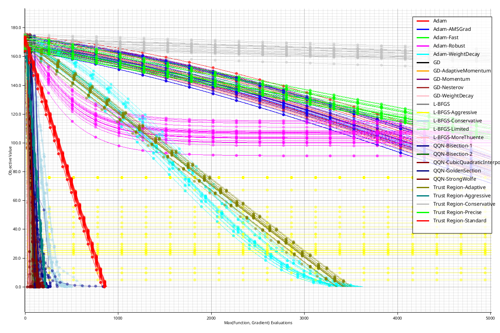
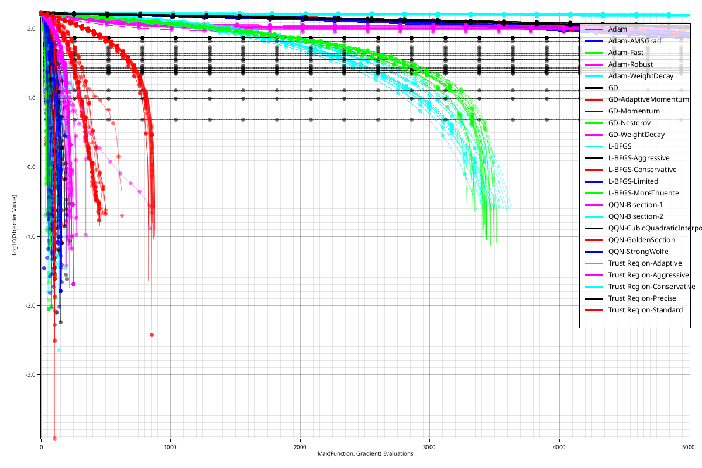

**Figure:** Convergence plots for Himmelblau_2D showing objective value vs iterations.
Left: Linear scale, Right: Log scale for better visualization of convergence behavior.

**Data:** [Linear scale data (CSV)](data/Himmelblau_2D_data.csv) | [Log scale data (CSV)](data/Himmelblau_2D_log_data.csv)

## Problem: Booth_2D

**Family:** Booth
**Dimension:** 2
**Success Threshold:** 1.200e-1
**Total Runs:** 500
**Detailed Analysis:** [View comprehensive problem analysis](reports/problem_analysis_Booth_2D.md)

### Performance Summary
<table style="border-collapse: collapse; width: 100%; margin: 20px 0;">
<tr style="background-color: #f2f2f2;">
<th style="border: 1px solid #ddd; padding: 8px; text-align: center;">Rank</th>
<th style="border: 1px solid #ddd; padding: 8px; text-align: center;">Optimizer</th>
<th style="border: 1px solid #ddd; padding: 8px; text-align: center;">Mean Final Value (All/Success/Fail)</th>
<th style="border: 1px solid #ddd; padding: 8px; text-align: center;">Std Dev</th>
<th style="border: 1px solid #ddd; padding: 8px; text-align: center;">Best Value</th>
<th style="border: 1px solid #ddd; padding: 8px; text-align: center;">Worst Value</th>
<th style="border: 1px solid #ddd; padding: 8px; text-align: center;">Mean Function Evals (All/Success/Fail)</th>
<th style="border: 1px solid #ddd; padding: 8px; text-align: center;">Mean Gradient Evals (All/Success/Fail)</th>
<th style="border: 1px solid #ddd; padding: 8px; text-align: center;">Success Rate</th>
<th style="border: 1px solid #ddd; padding: 8px; text-align: center;">Mean Time (s)</th>
</tr>
<tr style="background-color: #d4edda; font-weight: bold;">
<td style="border: 1px solid #ddd; padding: 8px; text-align: center;">1</td>
<td style="border: 1px solid #ddd; padding: 8px; text-align: center;"><a href="reports/detailed_Booth_2D_QQN-StrongWolfe.md" title="Click for detailed analysis">QQN-StrongWolfe</a></td>
<td style="border: 1px solid #ddd; padding: 8px; text-align: center;">1.13e-2 / 1.13e-2 / -</td>
<td style="border: 1px solid #ddd; padding: 8px; text-align: center;">7.50e-4</td>
<td style="border: 1px solid #ddd; padding: 8px; text-align: center;">9.93e-3</td>
<td style="border: 1px solid #ddd; padding: 8px; text-align: center;">1.29e-2</td>
<td style="border: 1px solid #ddd; padding: 8px; text-align: center;">26.0 / 26.0 / -</td>
<td style="border: 1px solid #ddd; padding: 8px; text-align: center;">21.0 / 21.0 / -</td>
<td style="border: 1px solid #ddd; padding: 8px; text-align: center;">100.0%</td>
<td style="border: 1px solid #ddd; padding: 8px; text-align: center;">0.000</td>
</tr>
<tr style="background-color: #fff3cd;">
<td style="border: 1px solid #ddd; padding: 8px; text-align: center;">2</td>
<td style="border: 1px solid #ddd; padding: 8px; text-align: center;"><a href="reports/detailed_Booth_2D_L-BFGS-MoreThuente.md" title="Click for detailed analysis">L-BFGS-MoreThuente</a></td>
<td style="border: 1px solid #ddd; padding: 8px; text-align: center;">3.86e-2 / 3.86e-2 / -</td>
<td style="border: 1px solid #ddd; padding: 8px; text-align: center;">3.42e-2</td>
<td style="border: 1px solid #ddd; padding: 8px; text-align: center;">5.15e-4</td>
<td style="border: 1px solid #ddd; padding: 8px; text-align: center;">1.13e-1</td>
<td style="border: 1px solid #ddd; padding: 8px; text-align: center;">29.7 / 29.7 / -</td>
<td style="border: 1px solid #ddd; padding: 8px; text-align: center;">22.0 / 22.0 / -</td>
<td style="border: 1px solid #ddd; padding: 8px; text-align: center;">100.0%</td>
<td style="border: 1px solid #ddd; padding: 8px; text-align: center;">0.000</td>
</tr>
<tr style="">
<td style="border: 1px solid #ddd; padding: 8px; text-align: center;">3</td>
<td style="border: 1px solid #ddd; padding: 8px; text-align: center;"><a href="reports/detailed_Booth_2D_L-BFGS.md" title="Click for detailed analysis">L-BFGS</a></td>
<td style="border: 1px solid #ddd; padding: 8px; text-align: center;">4.05e-2 / 4.05e-2 / -</td>
<td style="border: 1px solid #ddd; padding: 8px; text-align: center;">1.53e-2</td>
<td style="border: 1px solid #ddd; padding: 8px; text-align: center;">1.17e-2</td>
<td style="border: 1px solid #ddd; padding: 8px; text-align: center;">6.97e-2</td>
<td style="border: 1px solid #ddd; padding: 8px; text-align: center;">42.4 / 42.4 / -</td>
<td style="border: 1px solid #ddd; padding: 8px; text-align: center;">26.1 / 26.1 / -</td>
<td style="border: 1px solid #ddd; padding: 8px; text-align: center;">100.0%</td>
<td style="border: 1px solid #ddd; padding: 8px; text-align: center;">0.001</td>
</tr>
<tr style="">
<td style="border: 1px solid #ddd; padding: 8px; text-align: center;">4</td>
<td style="border: 1px solid #ddd; padding: 8px; text-align: center;"><a href="reports/detailed_Booth_2D_L-BFGS-Limited.md" title="Click for detailed analysis">L-BFGS-Limited</a></td>
<td style="border: 1px solid #ddd; padding: 8px; text-align: center;">6.14e-2 / 6.14e-2 / -</td>
<td style="border: 1px solid #ddd; padding: 8px; text-align: center;">3.83e-2</td>
<td style="border: 1px solid #ddd; padding: 8px; text-align: center;">2.04e-3</td>
<td style="border: 1px solid #ddd; padding: 8px; text-align: center;">1.13e-1</td>
<td style="border: 1px solid #ddd; padding: 8px; text-align: center;">56.1 / 56.1 / -</td>
<td style="border: 1px solid #ddd; padding: 8px; text-align: center;">28.1 / 28.1 / -</td>
<td style="border: 1px solid #ddd; padding: 8px; text-align: center;">100.0%</td>
<td style="border: 1px solid #ddd; padding: 8px; text-align: center;">0.001</td>
</tr>
<tr style="">
<td style="border: 1px solid #ddd; padding: 8px; text-align: center;">5</td>
<td style="border: 1px solid #ddd; padding: 8px; text-align: center;"><a href="reports/detailed_Booth_2D_QQN-GoldenSection.md" title="Click for detailed analysis">QQN-GoldenSection</a></td>
<td style="border: 1px solid #ddd; padding: 8px; text-align: center;">3.39e-2 / 3.39e-2 / -</td>
<td style="border: 1px solid #ddd; padding: 8px; text-align: center;">1.16e-2</td>
<td style="border: 1px solid #ddd; padding: 8px; text-align: center;">1.60e-2</td>
<td style="border: 1px solid #ddd; padding: 8px; text-align: center;">5.86e-2</td>
<td style="border: 1px solid #ddd; padding: 8px; text-align: center;">92.0 / 92.0 / -</td>
<td style="border: 1px solid #ddd; padding: 8px; text-align: center;">14.0 / 14.0 / -</td>
<td style="border: 1px solid #ddd; padding: 8px; text-align: center;">100.0%</td>
<td style="border: 1px solid #ddd; padding: 8px; text-align: center;">0.001</td>
</tr>
<tr style="">
<td style="border: 1px solid #ddd; padding: 8px; text-align: center;">6</td>
<td style="border: 1px solid #ddd; padding: 8px; text-align: center;"><a href="reports/detailed_Booth_2D_QQN-CubicQuadraticInterpolation.md" title="Click for detailed analysis">QQN-CubicQuadraticInterpolation</a></td>
<td style="border: 1px solid #ddd; padding: 8px; text-align: center;">2.56e-6 / 2.56e-6 / -</td>
<td style="border: 1px solid #ddd; padding: 8px; text-align: center;">2.13e-6</td>
<td style="border: 1px solid #ddd; padding: 8px; text-align: center;">2.81e-7</td>
<td style="border: 1px solid #ddd; padding: 8px; text-align: center;">7.40e-6</td>
<td style="border: 1px solid #ddd; padding: 8px; text-align: center;">56.0 / 56.0 / -</td>
<td style="border: 1px solid #ddd; padding: 8px; text-align: center;">61.0 / 61.0 / -</td>
<td style="border: 1px solid #ddd; padding: 8px; text-align: center;">100.0%</td>
<td style="border: 1px solid #ddd; padding: 8px; text-align: center;">0.001</td>
</tr>
<tr style="">
<td style="border: 1px solid #ddd; padding: 8px; text-align: center;">7</td>
<td style="border: 1px solid #ddd; padding: 8px; text-align: center;"><a href="reports/detailed_Booth_2D_QQN-Bisection-2.md" title="Click for detailed analysis">QQN-Bisection-2</a></td>
<td style="border: 1px solid #ddd; padding: 8px; text-align: center;">1.49e-2 / 1.49e-2 / -</td>
<td style="border: 1px solid #ddd; padding: 8px; text-align: center;">2.92e-3</td>
<td style="border: 1px solid #ddd; padding: 8px; text-align: center;">1.15e-2</td>
<td style="border: 1px solid #ddd; padding: 8px; text-align: center;">2.20e-2</td>
<td style="border: 1px solid #ddd; padding: 8px; text-align: center;">100.0 / 100.0 / -</td>
<td style="border: 1px solid #ddd; padding: 8px; text-align: center;">100.0 / 100.0 / -</td>
<td style="border: 1px solid #ddd; padding: 8px; text-align: center;">100.0%</td>
<td style="border: 1px solid #ddd; padding: 8px; text-align: center;">0.002</td>
</tr>
<tr style="">
<td style="border: 1px solid #ddd; padding: 8px; text-align: center;">8</td>
<td style="border: 1px solid #ddd; padding: 8px; text-align: center;"><a href="reports/detailed_Booth_2D_GD.md" title="Click for detailed analysis">GD</a></td>
<td style="border: 1px solid #ddd; padding: 8px; text-align: center;">1.17e-1 / 1.17e-1 / -</td>
<td style="border: 1px solid #ddd; padding: 8px; text-align: center;">1.31e-3</td>
<td style="border: 1px solid #ddd; padding: 8px; text-align: center;">1.15e-1</td>
<td style="border: 1px solid #ddd; padding: 8px; text-align: center;">1.20e-1</td>
<td style="border: 1px solid #ddd; padding: 8px; text-align: center;">86.0 / 86.0 / -</td>
<td style="border: 1px solid #ddd; padding: 8px; text-align: center;">169.1 / 169.1 / -</td>
<td style="border: 1px solid #ddd; padding: 8px; text-align: center;">100.0%</td>
<td style="border: 1px solid #ddd; padding: 8px; text-align: center;">0.002</td>
</tr>
<tr style="">
<td style="border: 1px solid #ddd; padding: 8px; text-align: center;">9</td>
<td style="border: 1px solid #ddd; padding: 8px; text-align: center;"><a href="reports/detailed_Booth_2D_QQN-Bisection-1.md" title="Click for detailed analysis">QQN-Bisection-1</a></td>
<td style="border: 1px solid #ddd; padding: 8px; text-align: center;">1.87e-2 / 1.87e-2 / -</td>
<td style="border: 1px solid #ddd; padding: 8px; text-align: center;">1.86e-2</td>
<td style="border: 1px solid #ddd; padding: 8px; text-align: center;">1.21e-2</td>
<td style="border: 1px solid #ddd; padding: 8px; text-align: center;">9.94e-2</td>
<td style="border: 1px solid #ddd; padding: 8px; text-align: center;">162.4 / 162.4 / -</td>
<td style="border: 1px solid #ddd; padding: 8px; text-align: center;">178.1 / 178.1 / -</td>
<td style="border: 1px solid #ddd; padding: 8px; text-align: center;">100.0%</td>
<td style="border: 1px solid #ddd; padding: 8px; text-align: center;">0.003</td>
</tr>
<tr style="">
<td style="border: 1px solid #ddd; padding: 8px; text-align: center;">10</td>
<td style="border: 1px solid #ddd; padding: 8px; text-align: center;"><a href="reports/detailed_Booth_2D_L-BFGS-Conservative.md" title="Click for detailed analysis">L-BFGS-Conservative</a></td>
<td style="border: 1px solid #ddd; padding: 8px; text-align: center;">1.10e-1 / 1.10e-1 / -</td>
<td style="border: 1px solid #ddd; padding: 8px; text-align: center;">5.23e-3</td>
<td style="border: 1px solid #ddd; padding: 8px; text-align: center;">1.03e-1</td>
<td style="border: 1px solid #ddd; padding: 8px; text-align: center;">1.20e-1</td>
<td style="border: 1px solid #ddd; padding: 8px; text-align: center;">208.0 / 208.0 / -</td>
<td style="border: 1px solid #ddd; padding: 8px; text-align: center;">167.0 / 167.0 / -</td>
<td style="border: 1px solid #ddd; padding: 8px; text-align: center;">100.0%</td>
<td style="border: 1px solid #ddd; padding: 8px; text-align: center;">0.005</td>
</tr>
<tr style="">
<td style="border: 1px solid #ddd; padding: 8px; text-align: center;">11</td>
<td style="border: 1px solid #ddd; padding: 8px; text-align: center;"><a href="reports/detailed_Booth_2D_Adam-WeightDecay.md" title="Click for detailed analysis">Adam-WeightDecay</a></td>
<td style="border: 1px solid #ddd; padding: 8px; text-align: center;">1.19e-1 / 1.19e-1 / -</td>
<td style="border: 1px solid #ddd; padding: 8px; text-align: center;">3.80e-4</td>
<td style="border: 1px solid #ddd; padding: 8px; text-align: center;">1.19e-1</td>
<td style="border: 1px solid #ddd; padding: 8px; text-align: center;">1.20e-1</td>
<td style="border: 1px solid #ddd; padding: 8px; text-align: center;">1886.3 / 1886.3 / -</td>
<td style="border: 1px solid #ddd; padding: 8px; text-align: center;">1886.3 / 1886.3 / -</td>
<td style="border: 1px solid #ddd; padding: 8px; text-align: center;">100.0%</td>
<td style="border: 1px solid #ddd; padding: 8px; text-align: center;">0.039</td>
</tr>
<tr style="">
<td style="border: 1px solid #ddd; padding: 8px; text-align: center;">12</td>
<td style="border: 1px solid #ddd; padding: 8px; text-align: center;"><a href="reports/detailed_Booth_2D_Trust_Region-Adaptive.md" title="Click for detailed analysis">Trust Region-Adaptive</a></td>
<td style="border: 1px solid #ddd; padding: 8px; text-align: center;">6.12e-2 / 5.43e-2 / 1.23e-1</td>
<td style="border: 1px solid #ddd; padding: 8px; text-align: center;">3.24e-2</td>
<td style="border: 1px solid #ddd; padding: 8px; text-align: center;">2.38e-2</td>
<td style="border: 1px solid #ddd; padding: 8px; text-align: center;">1.24e-1</td>
<td style="border: 1px solid #ddd; padding: 8px; text-align: center;">919.9 / 922.8 / 893.0</td>
<td style="border: 1px solid #ddd; padding: 8px; text-align: center;">614.2 / 616.2 / 596.0</td>
<td style="border: 1px solid #ddd; padding: 8px; text-align: center;">90.0%</td>
<td style="border: 1px solid #ddd; padding: 8px; text-align: center;">0.006</td>
</tr>
<tr style="">
<td style="border: 1px solid #ddd; padding: 8px; text-align: center;">13</td>
<td style="border: 1px solid #ddd; padding: 8px; text-align: center;"><a href="reports/detailed_Booth_2D_GD-WeightDecay.md" title="Click for detailed analysis">GD-WeightDecay</a></td>
<td style="border: 1px solid #ddd; padding: 8px; text-align: center;">1.06e0 / 1.17e-1 / 1.50e0</td>
<td style="border: 1px solid #ddd; padding: 8px; text-align: center;">4.32e-1</td>
<td style="border: 1px solid #ddd; padding: 8px; text-align: center;">1.15e-1</td>
<td style="border: 1px solid #ddd; padding: 8px; text-align: center;">1.56e0</td>
<td style="border: 1px solid #ddd; padding: 8px; text-align: center;">27.0 / 40.7 / 24.6</td>
<td style="border: 1px solid #ddd; padding: 8px; text-align: center;">50.1 / 78.3 / 45.2</td>
<td style="border: 1px solid #ddd; padding: 8px; text-align: center;">15.0%</td>
<td style="border: 1px solid #ddd; padding: 8px; text-align: center;">0.001</td>
</tr>
<tr style="">
<td style="border: 1px solid #ddd; padding: 8px; text-align: center;">14</td>
<td style="border: 1px solid #ddd; padding: 8px; text-align: center;"><a href="reports/detailed_Booth_2D_GD-Nesterov.md" title="Click for detailed analysis">GD-Nesterov</a></td>
<td style="border: 1px solid #ddd; padding: 8px; text-align: center;">1.42e0 / - / 2.56e0</td>
<td style="border: 1px solid #ddd; padding: 8px; text-align: center;">1.93e-1</td>
<td style="border: 1px solid #ddd; padding: 8px; text-align: center;">1.21e0</td>
<td style="border: 1px solid #ddd; padding: 8px; text-align: center;">1.99e0</td>
<td style="border: 1px solid #ddd; padding: 8px; text-align: center;">20.6 / - / 20.6</td>
<td style="border: 1px solid #ddd; padding: 8px; text-align: center;">37.2 / - / 37.2</td>
<td style="border: 1px solid #ddd; padding: 8px; text-align: center;">0.0%</td>
<td style="border: 1px solid #ddd; padding: 8px; text-align: center;">0.001</td>
</tr>
<tr style="">
<td style="border: 1px solid #ddd; padding: 8px; text-align: center;">15</td>
<td style="border: 1px solid #ddd; padding: 8px; text-align: center;"><a href="reports/detailed_Booth_2D_GD-AdaptiveMomentum.md" title="Click for detailed analysis">GD-AdaptiveMomentum</a></td>
<td style="border: 1px solid #ddd; padding: 8px; text-align: center;">1.56e0 / - / 9.51e0</td>
<td style="border: 1px solid #ddd; padding: 8px; text-align: center;">1.69e-1</td>
<td style="border: 1px solid #ddd; padding: 8px; text-align: center;">1.20e0</td>
<td style="border: 1px solid #ddd; padding: 8px; text-align: center;">1.92e0</td>
<td style="border: 1px solid #ddd; padding: 8px; text-align: center;">21.0 / - / 21.0</td>
<td style="border: 1px solid #ddd; padding: 8px; text-align: center;">38.0 / - / 38.0</td>
<td style="border: 1px solid #ddd; padding: 8px; text-align: center;">0.0%</td>
<td style="border: 1px solid #ddd; padding: 8px; text-align: center;">0.001</td>
</tr>
<tr style="">
<td style="border: 1px solid #ddd; padding: 8px; text-align: center;">16</td>
<td style="border: 1px solid #ddd; padding: 8px; text-align: center;"><a href="reports/detailed_Booth_2D_GD-Momentum.md" title="Click for detailed analysis">GD-Momentum</a></td>
<td style="border: 1px solid #ddd; padding: 8px; text-align: center;">1.59e0 / - / 7.27e0</td>
<td style="border: 1px solid #ddd; padding: 8px; text-align: center;">2.41e-1</td>
<td style="border: 1px solid #ddd; padding: 8px; text-align: center;">1.11e0</td>
<td style="border: 1px solid #ddd; padding: 8px; text-align: center;">2.06e0</td>
<td style="border: 1px solid #ddd; padding: 8px; text-align: center;">21.2 / - / 21.2</td>
<td style="border: 1px solid #ddd; padding: 8px; text-align: center;">38.5 / - / 38.5</td>
<td style="border: 1px solid #ddd; padding: 8px; text-align: center;">0.0%</td>
<td style="border: 1px solid #ddd; padding: 8px; text-align: center;">0.001</td>
</tr>
<tr style="">
<td style="border: 1px solid #ddd; padding: 8px; text-align: center;">17</td>
<td style="border: 1px solid #ddd; padding: 8px; text-align: center;"><a href="reports/detailed_Booth_2D_Trust_Region-Aggressive.md" title="Click for detailed analysis">Trust Region-Aggressive</a></td>
<td style="border: 1px solid #ddd; padding: 8px; text-align: center;">1.49e0 / - / 1.49e0</td>
<td style="border: 1px solid #ddd; padding: 8px; text-align: center;">4.64e-1</td>
<td style="border: 1px solid #ddd; padding: 8px; text-align: center;">4.00e-1</td>
<td style="border: 1px solid #ddd; padding: 8px; text-align: center;">2.38e0</td>
<td style="border: 1px solid #ddd; padding: 8px; text-align: center;">63.5 / - / 63.5</td>
<td style="border: 1px solid #ddd; padding: 8px; text-align: center;">43.0 / - / 43.0</td>
<td style="border: 1px solid #ddd; padding: 8px; text-align: center;">0.0%</td>
<td style="border: 1px solid #ddd; padding: 8px; text-align: center;">0.000</td>
</tr>
<tr style="">
<td style="border: 1px solid #ddd; padding: 8px; text-align: center;">18</td>
<td style="border: 1px solid #ddd; padding: 8px; text-align: center;"><a href="reports/detailed_Booth_2D_Adam-Fast.md" title="Click for detailed analysis">Adam-Fast</a></td>
<td style="border: 1px solid #ddd; padding: 8px; text-align: center;">1.92e0 / - / 3.09e0</td>
<td style="border: 1px solid #ddd; padding: 8px; text-align: center;">3.08e-1</td>
<td style="border: 1px solid #ddd; padding: 8px; text-align: center;">1.39e0</td>
<td style="border: 1px solid #ddd; padding: 8px; text-align: center;">2.43e0</td>
<td style="border: 1px solid #ddd; padding: 8px; text-align: center;">56.3 / - / 56.3</td>
<td style="border: 1px solid #ddd; padding: 8px; text-align: center;">55.3 / - / 55.3</td>
<td style="border: 1px solid #ddd; padding: 8px; text-align: center;">0.0%</td>
<td style="border: 1px solid #ddd; padding: 8px; text-align: center;">0.001</td>
</tr>
<tr style="">
<td style="border: 1px solid #ddd; padding: 8px; text-align: center;">19</td>
<td style="border: 1px solid #ddd; padding: 8px; text-align: center;"><a href="reports/detailed_Booth_2D_Trust_Region-Standard.md" title="Click for detailed analysis">Trust Region-Standard</a></td>
<td style="border: 1px solid #ddd; padding: 8px; text-align: center;">5.27e-1 / - / 5.27e-1</td>
<td style="border: 1px solid #ddd; padding: 8px; text-align: center;">1.54e-1</td>
<td style="border: 1px solid #ddd; padding: 8px; text-align: center;">3.46e-1</td>
<td style="border: 1px solid #ddd; padding: 8px; text-align: center;">7.93e-1</td>
<td style="border: 1px solid #ddd; padding: 8px; text-align: center;">235.1 / - / 235.1</td>
<td style="border: 1px solid #ddd; padding: 8px; text-align: center;">157.4 / - / 157.4</td>
<td style="border: 1px solid #ddd; padding: 8px; text-align: center;">0.0%</td>
<td style="border: 1px solid #ddd; padding: 8px; text-align: center;">0.001</td>
</tr>
<tr style="">
<td style="border: 1px solid #ddd; padding: 8px; text-align: center;">20</td>
<td style="border: 1px solid #ddd; padding: 8px; text-align: center;"><a href="reports/detailed_Booth_2D_Trust_Region-Precise.md" title="Click for detailed analysis">Trust Region-Precise</a></td>
<td style="border: 1px solid #ddd; padding: 8px; text-align: center;">1.05e1 / - / 1.05e1</td>
<td style="border: 1px solid #ddd; padding: 8px; text-align: center;">5.90e0</td>
<td style="border: 1px solid #ddd; padding: 8px; text-align: center;">2.82e0</td>
<td style="border: 1px solid #ddd; padding: 8px; text-align: center;">2.22e1</td>
<td style="border: 1px solid #ddd; padding: 8px; text-align: center;">3002.0 / - / 3002.0</td>
<td style="border: 1px solid #ddd; padding: 8px; text-align: center;">2002.0 / - / 2002.0</td>
<td style="border: 1px solid #ddd; padding: 8px; text-align: center;">0.0%</td>
<td style="border: 1px solid #ddd; padding: 8px; text-align: center;">0.018</td>
</tr>
<tr style="">
<td style="border: 1px solid #ddd; padding: 8px; text-align: center;">21</td>
<td style="border: 1px solid #ddd; padding: 8px; text-align: center;"><a href="reports/detailed_Booth_2D_Adam-Robust.md" title="Click for detailed analysis">Adam-Robust</a></td>
<td style="border: 1px solid #ddd; padding: 8px; text-align: center;">2.03e1 / - / 2.03e1</td>
<td style="border: 1px solid #ddd; padding: 8px; text-align: center;">2.55e0</td>
<td style="border: 1px solid #ddd; padding: 8px; text-align: center;">1.43e1</td>
<td style="border: 1px solid #ddd; padding: 8px; text-align: center;">2.49e1</td>
<td style="border: 1px solid #ddd; padding: 8px; text-align: center;">2502.0 / - / 2502.0</td>
<td style="border: 1px solid #ddd; padding: 8px; text-align: center;">2502.0 / - / 2502.0</td>
<td style="border: 1px solid #ddd; padding: 8px; text-align: center;">0.0%</td>
<td style="border: 1px solid #ddd; padding: 8px; text-align: center;">0.055</td>
</tr>
<tr style="">
<td style="border: 1px solid #ddd; padding: 8px; text-align: center;">22</td>
<td style="border: 1px solid #ddd; padding: 8px; text-align: center;"><a href="reports/detailed_Booth_2D_Adam.md" title="Click for detailed analysis">Adam</a></td>
<td style="border: 1px solid #ddd; padding: 8px; text-align: center;">1.20e1 / - / 1.20e1</td>
<td style="border: 1px solid #ddd; padding: 8px; text-align: center;">2.17e0</td>
<td style="border: 1px solid #ddd; padding: 8px; text-align: center;">8.76e0</td>
<td style="border: 1px solid #ddd; padding: 8px; text-align: center;">1.67e1</td>
<td style="border: 1px solid #ddd; padding: 8px; text-align: center;">2502.0 / - / 2502.0</td>
<td style="border: 1px solid #ddd; padding: 8px; text-align: center;">2502.0 / - / 2502.0</td>
<td style="border: 1px solid #ddd; padding: 8px; text-align: center;">0.0%</td>
<td style="border: 1px solid #ddd; padding: 8px; text-align: center;">0.049</td>
</tr>
<tr style="">
<td style="border: 1px solid #ddd; padding: 8px; text-align: center;">23</td>
<td style="border: 1px solid #ddd; padding: 8px; text-align: center;"><a href="reports/detailed_Booth_2D_Adam-AMSGrad.md" title="Click for detailed analysis">Adam-AMSGrad</a></td>
<td style="border: 1px solid #ddd; padding: 8px; text-align: center;">1.19e1 / - / 1.19e1</td>
<td style="border: 1px solid #ddd; padding: 8px; text-align: center;">2.01e0</td>
<td style="border: 1px solid #ddd; padding: 8px; text-align: center;">8.69e0</td>
<td style="border: 1px solid #ddd; padding: 8px; text-align: center;">1.53e1</td>
<td style="border: 1px solid #ddd; padding: 8px; text-align: center;">2502.0 / - / 2502.0</td>
<td style="border: 1px solid #ddd; padding: 8px; text-align: center;">2502.0 / - / 2502.0</td>
<td style="border: 1px solid #ddd; padding: 8px; text-align: center;">0.0%</td>
<td style="border: 1px solid #ddd; padding: 8px; text-align: center;">0.055</td>
</tr>
<tr style="">
<td style="border: 1px solid #ddd; padding: 8px; text-align: center;">24</td>
<td style="border: 1px solid #ddd; padding: 8px; text-align: center;"><a href="reports/detailed_Booth_2D_Trust_Region-Conservative.md" title="Click for detailed analysis">Trust Region-Conservative</a></td>
<td style="border: 1px solid #ddd; padding: 8px; text-align: center;">6.49e1 / - / 6.49e1</td>
<td style="border: 1px solid #ddd; padding: 8px; text-align: center;">6.14e0</td>
<td style="border: 1px solid #ddd; padding: 8px; text-align: center;">5.04e1</td>
<td style="border: 1px solid #ddd; padding: 8px; text-align: center;">7.80e1</td>
<td style="border: 1px solid #ddd; padding: 8px; text-align: center;">3002.0 / - / 3002.0</td>
<td style="border: 1px solid #ddd; padding: 8px; text-align: center;">2002.0 / - / 2002.0</td>
<td style="border: 1px solid #ddd; padding: 8px; text-align: center;">0.0%</td>
<td style="border: 1px solid #ddd; padding: 8px; text-align: center;">0.018</td>
</tr>
<tr style="">
<td style="border: 1px solid #ddd; padding: 8px; text-align: center;">25</td>
<td style="border: 1px solid #ddd; padding: 8px; text-align: center;"><a href="reports/detailed_Booth_2D_L-BFGS-Aggressive.md" title="Click for detailed analysis">L-BFGS-Aggressive</a></td>
<td style="border: 1px solid #ddd; padding: 8px; text-align: center;">7.43e1 / - / 7.43e1</td>
<td style="border: 1px solid #ddd; padding: 8px; text-align: center;">5.77e0</td>
<td style="border: 1px solid #ddd; padding: 8px; text-align: center;">6.24e1</td>
<td style="border: 1px solid #ddd; padding: 8px; text-align: center;">8.60e1</td>
<td style="border: 1px solid #ddd; padding: 8px; text-align: center;">3852.0 / - / 3852.0</td>
<td style="border: 1px solid #ddd; padding: 8px; text-align: center;">1157.0 / - / 1157.0</td>
<td style="border: 1px solid #ddd; padding: 8px; text-align: center;">0.0%</td>
<td style="border: 1px solid #ddd; padding: 8px; text-align: center;">0.021</td>
</tr>
</table>

### Convergence Plots

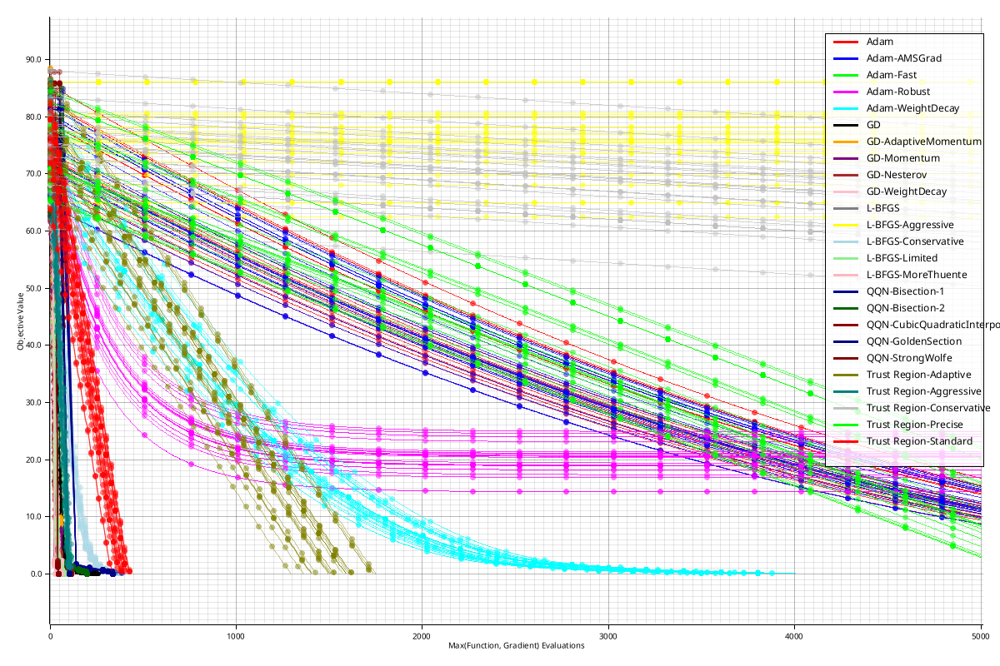
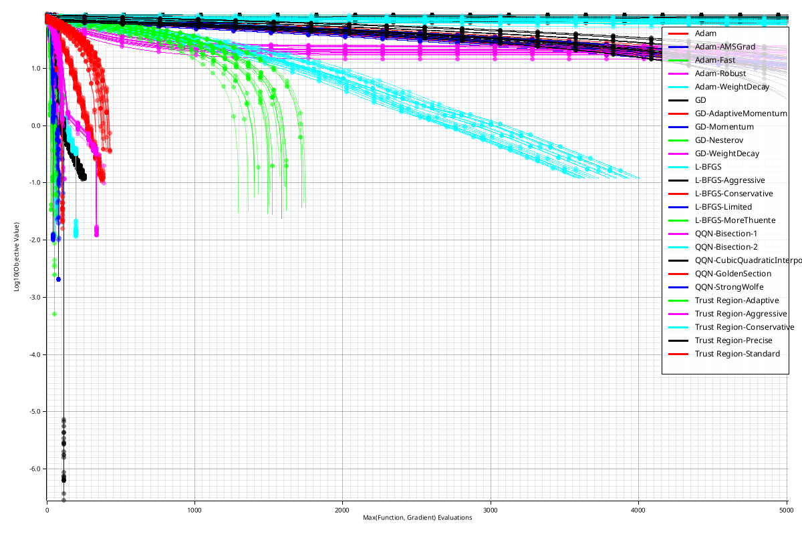

**Figure:** Convergence plots for Booth_2D showing objective value vs iterations.
Left: Linear scale, Right: Log scale for better visualization of convergence behavior.

**Data:** [Linear scale data (CSV)](data/Booth_2D_data.csv) | [Log scale data (CSV)](data/Booth_2D_log_data.csv)

## Problem: Griewank_2D

**Family:** Griewank
**Dimension:** 2
**Success Threshold:** 1.000e-8
**Total Runs:** 500
**Detailed Analysis:** [View comprehensive problem analysis](reports/problem_analysis_Griewank_2D.md)

### Performance Summary
<table style="border-collapse: collapse; width: 100%; margin: 20px 0;">
<tr style="background-color: #f2f2f2;">
<th style="border: 1px solid #ddd; padding: 8px; text-align: center;">Rank</th>
<th style="border: 1px solid #ddd; padding: 8px; text-align: center;">Optimizer</th>
<th style="border: 1px solid #ddd; padding: 8px; text-align: center;">Mean Final Value (All/Success/Fail)</th>
<th style="border: 1px solid #ddd; padding: 8px; text-align: center;">Std Dev</th>
<th style="border: 1px solid #ddd; padding: 8px; text-align: center;">Best Value</th>
<th style="border: 1px solid #ddd; padding: 8px; text-align: center;">Worst Value</th>
<th style="border: 1px solid #ddd; padding: 8px; text-align: center;">Mean Function Evals (All/Success/Fail)</th>
<th style="border: 1px solid #ddd; padding: 8px; text-align: center;">Mean Gradient Evals (All/Success/Fail)</th>
<th style="border: 1px solid #ddd; padding: 8px; text-align: center;">Success Rate</th>
<th style="border: 1px solid #ddd; padding: 8px; text-align: center;">Mean Time (s)</th>
</tr>
<tr style="background-color: #d4edda; font-weight: bold;">
<td style="border: 1px solid #ddd; padding: 8px; text-align: center;">1</td>
<td style="border: 1px solid #ddd; padding: 8px; text-align: center;"><a href="reports/detailed_Griewank_2D_Trust_Region-Standard.md" title="Click for detailed analysis">Trust Region-Standard</a></td>
<td style="border: 1px solid #ddd; padding: 8px; text-align: center;">5.99e0 / - / 5.99e0</td>
<td style="border: 1px solid #ddd; padding: 8px; text-align: center;">7.24e-2</td>
<td style="border: 1px solid #ddd; padding: 8px; text-align: center;">5.90e0</td>
<td style="border: 1px solid #ddd; padding: 8px; text-align: center;">6.16e0</td>
<td style="border: 1px solid #ddd; padding: 8px; text-align: center;">5.0 / - / 5.0</td>
<td style="border: 1px solid #ddd; padding: 8px; text-align: center;">4.0 / - / 4.0</td>
<td style="border: 1px solid #ddd; padding: 8px; text-align: center;">0.0%</td>
<td style="border: 1px solid #ddd; padding: 8px; text-align: center;">0.000</td>
</tr>
<tr style="background-color: #fff3cd;">
<td style="border: 1px solid #ddd; padding: 8px; text-align: center;">2</td>
<td style="border: 1px solid #ddd; padding: 8px; text-align: center;"><a href="reports/detailed_Griewank_2D_Trust_Region-Aggressive.md" title="Click for detailed analysis">Trust Region-Aggressive</a></td>
<td style="border: 1px solid #ddd; padding: 8px; text-align: center;">6.00e0 / - / 6.00e0</td>
<td style="border: 1px solid #ddd; padding: 8px; text-align: center;">6.58e-2</td>
<td style="border: 1px solid #ddd; padding: 8px; text-align: center;">5.90e0</td>
<td style="border: 1px solid #ddd; padding: 8px; text-align: center;">6.12e0</td>
<td style="border: 1px solid #ddd; padding: 8px; text-align: center;">5.0 / - / 5.0</td>
<td style="border: 1px solid #ddd; padding: 8px; text-align: center;">4.0 / - / 4.0</td>
<td style="border: 1px solid #ddd; padding: 8px; text-align: center;">0.0%</td>
<td style="border: 1px solid #ddd; padding: 8px; text-align: center;">0.000</td>
</tr>
<tr style="">
<td style="border: 1px solid #ddd; padding: 8px; text-align: center;">3</td>
<td style="border: 1px solid #ddd; padding: 8px; text-align: center;"><a href="reports/detailed_Griewank_2D_Trust_Region-Adaptive.md" title="Click for detailed analysis">Trust Region-Adaptive</a></td>
<td style="border: 1px solid #ddd; padding: 8px; text-align: center;">5.11e0 / - / 5.11e0</td>
<td style="border: 1px solid #ddd; padding: 8px; text-align: center;">1.18e-1</td>
<td style="border: 1px solid #ddd; padding: 8px; text-align: center;">5.00e0</td>
<td style="border: 1px solid #ddd; padding: 8px; text-align: center;">5.54e0</td>
<td style="border: 1px solid #ddd; padding: 8px; text-align: center;">16.4 / - / 16.4</td>
<td style="border: 1px solid #ddd; padding: 8px; text-align: center;">11.6 / - / 11.6</td>
<td style="border: 1px solid #ddd; padding: 8px; text-align: center;">0.0%</td>
<td style="border: 1px solid #ddd; padding: 8px; text-align: center;">0.000</td>
</tr>
<tr style="">
<td style="border: 1px solid #ddd; padding: 8px; text-align: center;">4</td>
<td style="border: 1px solid #ddd; padding: 8px; text-align: center;"><a href="reports/detailed_Griewank_2D_GD-AdaptiveMomentum.md" title="Click for detailed analysis">GD-AdaptiveMomentum</a></td>
<td style="border: 1px solid #ddd; padding: 8px; text-align: center;">4.91e0 / - / 4.99e0</td>
<td style="border: 1px solid #ddd; padding: 8px; text-align: center;">1.02e-3</td>
<td style="border: 1px solid #ddd; padding: 8px; text-align: center;">4.91e0</td>
<td style="border: 1px solid #ddd; padding: 8px; text-align: center;">4.92e0</td>
<td style="border: 1px solid #ddd; padding: 8px; text-align: center;">32.0 / - / 32.0</td>
<td style="border: 1px solid #ddd; padding: 8px; text-align: center;">60.0 / - / 60.0</td>
<td style="border: 1px solid #ddd; padding: 8px; text-align: center;">0.0%</td>
<td style="border: 1px solid #ddd; padding: 8px; text-align: center;">0.001</td>
</tr>
<tr style="">
<td style="border: 1px solid #ddd; padding: 8px; text-align: center;">5</td>
<td style="border: 1px solid #ddd; padding: 8px; text-align: center;"><a href="reports/detailed_Griewank_2D_Trust_Region-Precise.md" title="Click for detailed analysis">Trust Region-Precise</a></td>
<td style="border: 1px solid #ddd; padding: 8px; text-align: center;">4.95e0 / - / 4.95e0</td>
<td style="border: 1px solid #ddd; padding: 8px; text-align: center;">1.38e-2</td>
<td style="border: 1px solid #ddd; padding: 8px; text-align: center;">4.93e0</td>
<td style="border: 1px solid #ddd; padding: 8px; text-align: center;">4.97e0</td>
<td style="border: 1px solid #ddd; padding: 8px; text-align: center;">58.7 / - / 58.7</td>
<td style="border: 1px solid #ddd; padding: 8px; text-align: center;">39.8 / - / 39.8</td>
<td style="border: 1px solid #ddd; padding: 8px; text-align: center;">0.0%</td>
<td style="border: 1px solid #ddd; padding: 8px; text-align: center;">0.000</td>
</tr>
<tr style="">
<td style="border: 1px solid #ddd; padding: 8px; text-align: center;">6</td>
<td style="border: 1px solid #ddd; padding: 8px; text-align: center;"><a href="reports/detailed_Griewank_2D_L-BFGS-MoreThuente.md" title="Click for detailed analysis">L-BFGS-MoreThuente</a></td>
<td style="border: 1px solid #ddd; padding: 8px; text-align: center;">4.91e0 / - / 4.91e0</td>
<td style="border: 1px solid #ddd; padding: 8px; text-align: center;">1.88e-7</td>
<td style="border: 1px solid #ddd; padding: 8px; text-align: center;">4.91e0</td>
<td style="border: 1px solid #ddd; padding: 8px; text-align: center;">4.91e0</td>
<td style="border: 1px solid #ddd; padding: 8px; text-align: center;">73.0 / - / 73.0</td>
<td style="border: 1px solid #ddd; padding: 8px; text-align: center;">51.8 / - / 51.8</td>
<td style="border: 1px solid #ddd; padding: 8px; text-align: center;">0.0%</td>
<td style="border: 1px solid #ddd; padding: 8px; text-align: center;">0.001</td>
</tr>
<tr style="">
<td style="border: 1px solid #ddd; padding: 8px; text-align: center;">7</td>
<td style="border: 1px solid #ddd; padding: 8px; text-align: center;"><a href="reports/detailed_Griewank_2D_Adam-Fast.md" title="Click for detailed analysis">Adam-Fast</a></td>
<td style="border: 1px solid #ddd; padding: 8px; text-align: center;">4.91e0 / - / 4.93e0</td>
<td style="border: 1px solid #ddd; padding: 8px; text-align: center;">2.22e-3</td>
<td style="border: 1px solid #ddd; padding: 8px; text-align: center;">4.91e0</td>
<td style="border: 1px solid #ddd; padding: 8px; text-align: center;">4.92e0</td>
<td style="border: 1px solid #ddd; padding: 8px; text-align: center;">67.0 / - / 67.0</td>
<td style="border: 1px solid #ddd; padding: 8px; text-align: center;">66.0 / - / 66.0</td>
<td style="border: 1px solid #ddd; padding: 8px; text-align: center;">0.0%</td>
<td style="border: 1px solid #ddd; padding: 8px; text-align: center;">0.001</td>
</tr>
<tr style="">
<td style="border: 1px solid #ddd; padding: 8px; text-align: center;">8</td>
<td style="border: 1px solid #ddd; padding: 8px; text-align: center;"><a href="reports/detailed_Griewank_2D_QQN-CubicQuadraticInterpolation.md" title="Click for detailed analysis">QQN-CubicQuadraticInterpolation</a></td>
<td style="border: 1px solid #ddd; padding: 8px; text-align: center;">4.80e0 / - / 4.80e0</td>
<td style="border: 1px solid #ddd; padding: 8px; text-align: center;">4.73e-1</td>
<td style="border: 1px solid #ddd; padding: 8px; text-align: center;">2.74e0</td>
<td style="border: 1px solid #ddd; padding: 8px; text-align: center;">4.91e0</td>
<td style="border: 1px solid #ddd; padding: 8px; text-align: center;">77.3 / - / 77.3</td>
<td style="border: 1px solid #ddd; padding: 8px; text-align: center;">75.3 / - / 75.3</td>
<td style="border: 1px solid #ddd; padding: 8px; text-align: center;">0.0%</td>
<td style="border: 1px solid #ddd; padding: 8px; text-align: center;">0.002</td>
</tr>
<tr style="">
<td style="border: 1px solid #ddd; padding: 8px; text-align: center;">9</td>
<td style="border: 1px solid #ddd; padding: 8px; text-align: center;"><a href="reports/detailed_Griewank_2D_QQN-Bisection-2.md" title="Click for detailed analysis">QQN-Bisection-2</a></td>
<td style="border: 1px solid #ddd; padding: 8px; text-align: center;">4.66e0 / - / 4.66e0</td>
<td style="border: 1px solid #ddd; padding: 8px; text-align: center;">2.21e-1</td>
<td style="border: 1px solid #ddd; padding: 8px; text-align: center;">4.25e0</td>
<td style="border: 1px solid #ddd; padding: 8px; text-align: center;">4.91e0</td>
<td style="border: 1px solid #ddd; padding: 8px; text-align: center;">94.6 / - / 94.6</td>
<td style="border: 1px solid #ddd; padding: 8px; text-align: center;">84.5 / - / 84.5</td>
<td style="border: 1px solid #ddd; padding: 8px; text-align: center;">0.0%</td>
<td style="border: 1px solid #ddd; padding: 8px; text-align: center;">0.002</td>
</tr>
<tr style="">
<td style="border: 1px solid #ddd; padding: 8px; text-align: center;">10</td>
<td style="border: 1px solid #ddd; padding: 8px; text-align: center;"><a href="reports/detailed_Griewank_2D_QQN-Bisection-1.md" title="Click for detailed analysis">QQN-Bisection-1</a></td>
<td style="border: 1px solid #ddd; padding: 8px; text-align: center;">4.91e0 / - / 4.91e0</td>
<td style="border: 1px solid #ddd; padding: 8px; text-align: center;">1.27e-13</td>
<td style="border: 1px solid #ddd; padding: 8px; text-align: center;">4.91e0</td>
<td style="border: 1px solid #ddd; padding: 8px; text-align: center;">4.91e0</td>
<td style="border: 1px solid #ddd; padding: 8px; text-align: center;">76.3 / - / 76.3</td>
<td style="border: 1px solid #ddd; padding: 8px; text-align: center;">116.0 / - / 116.0</td>
<td style="border: 1px solid #ddd; padding: 8px; text-align: center;">0.0%</td>
<td style="border: 1px solid #ddd; padding: 8px; text-align: center;">0.002</td>
</tr>
<tr style="">
<td style="border: 1px solid #ddd; padding: 8px; text-align: center;">11</td>
<td style="border: 1px solid #ddd; padding: 8px; text-align: center;"><a href="reports/detailed_Griewank_2D_GD-Momentum.md" title="Click for detailed analysis">GD-Momentum</a></td>
<td style="border: 1px solid #ddd; padding: 8px; text-align: center;">4.91e0 / - / 4.91e0</td>
<td style="border: 1px solid #ddd; padding: 8px; text-align: center;">3.95e-4</td>
<td style="border: 1px solid #ddd; padding: 8px; text-align: center;">4.91e0</td>
<td style="border: 1px solid #ddd; padding: 8px; text-align: center;">4.91e0</td>
<td style="border: 1px solid #ddd; padding: 8px; text-align: center;">100.2 / - / 100.2</td>
<td style="border: 1px solid #ddd; padding: 8px; text-align: center;">196.3 / - / 196.3</td>
<td style="border: 1px solid #ddd; padding: 8px; text-align: center;">0.0%</td>
<td style="border: 1px solid #ddd; padding: 8px; text-align: center;">0.003</td>
</tr>
<tr style="">
<td style="border: 1px solid #ddd; padding: 8px; text-align: center;">12</td>
<td style="border: 1px solid #ddd; padding: 8px; text-align: center;"><a href="reports/detailed_Griewank_2D_QQN-GoldenSection.md" title="Click for detailed analysis">QQN-GoldenSection</a></td>
<td style="border: 1px solid #ddd; padding: 8px; text-align: center;">4.91e0 / - / 4.91e0</td>
<td style="border: 1px solid #ddd; padding: 8px; text-align: center;">1.03e-13</td>
<td style="border: 1px solid #ddd; padding: 8px; text-align: center;">4.91e0</td>
<td style="border: 1px solid #ddd; padding: 8px; text-align: center;">4.91e0</td>
<td style="border: 1px solid #ddd; padding: 8px; text-align: center;">258.3 / - / 258.3</td>
<td style="border: 1px solid #ddd; padding: 8px; text-align: center;">49.5 / - / 49.5</td>
<td style="border: 1px solid #ddd; padding: 8px; text-align: center;">0.0%</td>
<td style="border: 1px solid #ddd; padding: 8px; text-align: center;">0.004</td>
</tr>
<tr style="">
<td style="border: 1px solid #ddd; padding: 8px; text-align: center;">13</td>
<td style="border: 1px solid #ddd; padding: 8px; text-align: center;"><a href="reports/detailed_Griewank_2D_GD-Nesterov.md" title="Click for detailed analysis">GD-Nesterov</a></td>
<td style="border: 1px solid #ddd; padding: 8px; text-align: center;">4.91e0 / - / 4.91e0</td>
<td style="border: 1px solid #ddd; padding: 8px; text-align: center;">1.59e-4</td>
<td style="border: 1px solid #ddd; padding: 8px; text-align: center;">4.91e0</td>
<td style="border: 1px solid #ddd; padding: 8px; text-align: center;">4.91e0</td>
<td style="border: 1px solid #ddd; padding: 8px; text-align: center;">125.0 / - / 125.0</td>
<td style="border: 1px solid #ddd; padding: 8px; text-align: center;">245.9 / - / 245.9</td>
<td style="border: 1px solid #ddd; padding: 8px; text-align: center;">0.0%</td>
<td style="border: 1px solid #ddd; padding: 8px; text-align: center;">0.004</td>
</tr>
<tr style="">
<td style="border: 1px solid #ddd; padding: 8px; text-align: center;">14</td>
<td style="border: 1px solid #ddd; padding: 8px; text-align: center;"><a href="reports/detailed_Griewank_2D_L-BFGS.md" title="Click for detailed analysis">L-BFGS</a></td>
<td style="border: 1px solid #ddd; padding: 8px; text-align: center;">4.91e0 / - / 4.91e0</td>
<td style="border: 1px solid #ddd; padding: 8px; text-align: center;">3.46e-8</td>
<td style="border: 1px solid #ddd; padding: 8px; text-align: center;">4.91e0</td>
<td style="border: 1px solid #ddd; padding: 8px; text-align: center;">4.91e0</td>
<td style="border: 1px solid #ddd; padding: 8px; text-align: center;">295.6 / - / 295.6</td>
<td style="border: 1px solid #ddd; padding: 8px; text-align: center;">202.4 / - / 202.4</td>
<td style="border: 1px solid #ddd; padding: 8px; text-align: center;">0.0%</td>
<td style="border: 1px solid #ddd; padding: 8px; text-align: center;">0.006</td>
</tr>
<tr style="">
<td style="border: 1px solid #ddd; padding: 8px; text-align: center;">15</td>
<td style="border: 1px solid #ddd; padding: 8px; text-align: center;"><a href="reports/detailed_Griewank_2D_Trust_Region-Conservative.md" title="Click for detailed analysis">Trust Region-Conservative</a></td>
<td style="border: 1px solid #ddd; padding: 8px; text-align: center;">4.92e0 / - / 4.92e0</td>
<td style="border: 1px solid #ddd; padding: 8px; text-align: center;">2.48e-3</td>
<td style="border: 1px solid #ddd; padding: 8px; text-align: center;">4.91e0</td>
<td style="border: 1px solid #ddd; padding: 8px; text-align: center;">4.92e0</td>
<td style="border: 1px solid #ddd; padding: 8px; text-align: center;">336.5 / - / 336.5</td>
<td style="border: 1px solid #ddd; padding: 8px; text-align: center;">225.0 / - / 225.0</td>
<td style="border: 1px solid #ddd; padding: 8px; text-align: center;">0.0%</td>
<td style="border: 1px solid #ddd; padding: 8px; text-align: center;">0.002</td>
</tr>
<tr style="">
<td style="border: 1px solid #ddd; padding: 8px; text-align: center;">16</td>
<td style="border: 1px solid #ddd; padding: 8px; text-align: center;"><a href="reports/detailed_Griewank_2D_QQN-StrongWolfe.md" title="Click for detailed analysis">QQN-StrongWolfe</a></td>
<td style="border: 1px solid #ddd; padding: 8px; text-align: center;">4.74e0 / - / 4.74e0</td>
<td style="border: 1px solid #ddd; padding: 8px; text-align: center;">3.50e-1</td>
<td style="border: 1px solid #ddd; padding: 8px; text-align: center;">3.76e0</td>
<td style="border: 1px solid #ddd; padding: 8px; text-align: center;">4.91e0</td>
<td style="border: 1px solid #ddd; padding: 8px; text-align: center;">347.6 / - / 347.6</td>
<td style="border: 1px solid #ddd; padding: 8px; text-align: center;">390.4 / - / 390.4</td>
<td style="border: 1px solid #ddd; padding: 8px; text-align: center;">0.0%</td>
<td style="border: 1px solid #ddd; padding: 8px; text-align: center;">0.015</td>
</tr>
<tr style="">
<td style="border: 1px solid #ddd; padding: 8px; text-align: center;">17</td>
<td style="border: 1px solid #ddd; padding: 8px; text-align: center;"><a href="reports/detailed_Griewank_2D_L-BFGS-Conservative.md" title="Click for detailed analysis">L-BFGS-Conservative</a></td>
<td style="border: 1px solid #ddd; padding: 8px; text-align: center;">4.91e0 / - / 4.91e0</td>
<td style="border: 1px solid #ddd; padding: 8px; text-align: center;">3.16e-9</td>
<td style="border: 1px solid #ddd; padding: 8px; text-align: center;">4.91e0</td>
<td style="border: 1px solid #ddd; padding: 8px; text-align: center;">4.91e0</td>
<td style="border: 1px solid #ddd; padding: 8px; text-align: center;">504.6 / - / 504.6</td>
<td style="border: 1px solid #ddd; padding: 8px; text-align: center;">402.6 / - / 402.6</td>
<td style="border: 1px solid #ddd; padding: 8px; text-align: center;">0.0%</td>
<td style="border: 1px solid #ddd; padding: 8px; text-align: center;">0.012</td>
</tr>
<tr style="">
<td style="border: 1px solid #ddd; padding: 8px; text-align: center;">18</td>
<td style="border: 1px solid #ddd; padding: 8px; text-align: center;"><a href="reports/detailed_Griewank_2D_GD-WeightDecay.md" title="Click for detailed analysis">GD-WeightDecay</a></td>
<td style="border: 1px solid #ddd; padding: 8px; text-align: center;">4.91e0 / - / 4.91e0</td>
<td style="border: 1px solid #ddd; padding: 8px; text-align: center;">9.98e-8</td>
<td style="border: 1px solid #ddd; padding: 8px; text-align: center;">4.91e0</td>
<td style="border: 1px solid #ddd; padding: 8px; text-align: center;">4.91e0</td>
<td style="border: 1px solid #ddd; padding: 8px; text-align: center;">406.6 / - / 406.6</td>
<td style="border: 1px solid #ddd; padding: 8px; text-align: center;">809.2 / - / 809.2</td>
<td style="border: 1px solid #ddd; padding: 8px; text-align: center;">0.0%</td>
<td style="border: 1px solid #ddd; padding: 8px; text-align: center;">0.012</td>
</tr>
<tr style="">
<td style="border: 1px solid #ddd; padding: 8px; text-align: center;">19</td>
<td style="border: 1px solid #ddd; padding: 8px; text-align: center;"><a href="reports/detailed_Griewank_2D_L-BFGS-Limited.md" title="Click for detailed analysis">L-BFGS-Limited</a></td>
<td style="border: 1px solid #ddd; padding: 8px; text-align: center;">4.91e0 / - / 4.91e0</td>
<td style="border: 1px solid #ddd; padding: 8px; text-align: center;">4.49e-8</td>
<td style="border: 1px solid #ddd; padding: 8px; text-align: center;">4.91e0</td>
<td style="border: 1px solid #ddd; padding: 8px; text-align: center;">4.91e0</td>
<td style="border: 1px solid #ddd; padding: 8px; text-align: center;">927.3 / - / 927.3</td>
<td style="border: 1px solid #ddd; padding: 8px; text-align: center;">525.2 / - / 525.2</td>
<td style="border: 1px solid #ddd; padding: 8px; text-align: center;">0.0%</td>
<td style="border: 1px solid #ddd; padding: 8px; text-align: center;">0.021</td>
</tr>
<tr style="">
<td style="border: 1px solid #ddd; padding: 8px; text-align: center;">20</td>
<td style="border: 1px solid #ddd; padding: 8px; text-align: center;"><a href="reports/detailed_Griewank_2D_L-BFGS-Aggressive.md" title="Click for detailed analysis">L-BFGS-Aggressive</a></td>
<td style="border: 1px solid #ddd; padding: 8px; text-align: center;">4.91e0 / - / 4.91e0</td>
<td style="border: 1px solid #ddd; padding: 8px; text-align: center;">7.72e-3</td>
<td style="border: 1px solid #ddd; padding: 8px; text-align: center;">4.91e0</td>
<td style="border: 1px solid #ddd; padding: 8px; text-align: center;">4.95e0</td>
<td style="border: 1px solid #ddd; padding: 8px; text-align: center;">2427.6 / - / 2427.6</td>
<td style="border: 1px solid #ddd; padding: 8px; text-align: center;">1400.0 / - / 1400.0</td>
<td style="border: 1px solid #ddd; padding: 8px; text-align: center;">0.0%</td>
<td style="border: 1px solid #ddd; padding: 8px; text-align: center;">0.055</td>
</tr>
<tr style="">
<td style="border: 1px solid #ddd; padding: 8px; text-align: center;">21</td>
<td style="border: 1px solid #ddd; padding: 8px; text-align: center;"><a href="reports/detailed_Griewank_2D_Adam-WeightDecay.md" title="Click for detailed analysis">Adam-WeightDecay</a></td>
<td style="border: 1px solid #ddd; padding: 8px; text-align: center;">4.92e0 / - / 4.92e0</td>
<td style="border: 1px solid #ddd; padding: 8px; text-align: center;">2.33e-6</td>
<td style="border: 1px solid #ddd; padding: 8px; text-align: center;">4.92e0</td>
<td style="border: 1px solid #ddd; padding: 8px; text-align: center;">4.92e0</td>
<td style="border: 1px solid #ddd; padding: 8px; text-align: center;">2231.2 / - / 2231.2</td>
<td style="border: 1px solid #ddd; padding: 8px; text-align: center;">2230.2 / - / 2230.2</td>
<td style="border: 1px solid #ddd; padding: 8px; text-align: center;">0.0%</td>
<td style="border: 1px solid #ddd; padding: 8px; text-align: center;">0.047</td>
</tr>
<tr style="">
<td style="border: 1px solid #ddd; padding: 8px; text-align: center;">22</td>
<td style="border: 1px solid #ddd; padding: 8px; text-align: center;"><a href="reports/detailed_Griewank_2D_GD.md" title="Click for detailed analysis">GD</a></td>
<td style="border: 1px solid #ddd; padding: 8px; text-align: center;">4.91e0 / - / 4.91e0</td>
<td style="border: 1px solid #ddd; padding: 8px; text-align: center;">3.24e-8</td>
<td style="border: 1px solid #ddd; padding: 8px; text-align: center;">4.91e0</td>
<td style="border: 1px solid #ddd; padding: 8px; text-align: center;">4.91e0</td>
<td style="border: 1px solid #ddd; padding: 8px; text-align: center;">1668.0 / - / 1668.0</td>
<td style="border: 1px solid #ddd; padding: 8px; text-align: center;">3334.0 / - / 3334.0</td>
<td style="border: 1px solid #ddd; padding: 8px; text-align: center;">0.0%</td>
<td style="border: 1px solid #ddd; padding: 8px; text-align: center;">0.041</td>
</tr>
<tr style="">
<td style="border: 1px solid #ddd; padding: 8px; text-align: center;">23</td>
<td style="border: 1px solid #ddd; padding: 8px; text-align: center;"><a href="reports/detailed_Griewank_2D_Adam-Robust.md" title="Click for detailed analysis">Adam-Robust</a></td>
<td style="border: 1px solid #ddd; padding: 8px; text-align: center;">5.36e0 / - / 5.36e0</td>
<td style="border: 1px solid #ddd; padding: 8px; text-align: center;">6.83e-2</td>
<td style="border: 1px solid #ddd; padding: 8px; text-align: center;">5.26e0</td>
<td style="border: 1px solid #ddd; padding: 8px; text-align: center;">5.48e0</td>
<td style="border: 1px solid #ddd; padding: 8px; text-align: center;">2502.0 / - / 2502.0</td>
<td style="border: 1px solid #ddd; padding: 8px; text-align: center;">2502.0 / - / 2502.0</td>
<td style="border: 1px solid #ddd; padding: 8px; text-align: center;">0.0%</td>
<td style="border: 1px solid #ddd; padding: 8px; text-align: center;">0.056</td>
</tr>
<tr style="">
<td style="border: 1px solid #ddd; padding: 8px; text-align: center;">24</td>
<td style="border: 1px solid #ddd; padding: 8px; text-align: center;"><a href="reports/detailed_Griewank_2D_Adam.md" title="Click for detailed analysis">Adam</a></td>
<td style="border: 1px solid #ddd; padding: 8px; text-align: center;">5.24e0 / - / 5.24e0</td>
<td style="border: 1px solid #ddd; padding: 8px; text-align: center;">4.43e-2</td>
<td style="border: 1px solid #ddd; padding: 8px; text-align: center;">5.16e0</td>
<td style="border: 1px solid #ddd; padding: 8px; text-align: center;">5.30e0</td>
<td style="border: 1px solid #ddd; padding: 8px; text-align: center;">2502.0 / - / 2502.0</td>
<td style="border: 1px solid #ddd; padding: 8px; text-align: center;">2502.0 / - / 2502.0</td>
<td style="border: 1px solid #ddd; padding: 8px; text-align: center;">0.0%</td>
<td style="border: 1px solid #ddd; padding: 8px; text-align: center;">0.050</td>
</tr>
<tr style="">
<td style="border: 1px solid #ddd; padding: 8px; text-align: center;">25</td>
<td style="border: 1px solid #ddd; padding: 8px; text-align: center;"><a href="reports/detailed_Griewank_2D_Adam-AMSGrad.md" title="Click for detailed analysis">Adam-AMSGrad</a></td>
<td style="border: 1px solid #ddd; padding: 8px; text-align: center;">5.24e0 / - / 5.24e0</td>
<td style="border: 1px solid #ddd; padding: 8px; text-align: center;">4.70e-2</td>
<td style="border: 1px solid #ddd; padding: 8px; text-align: center;">5.16e0</td>
<td style="border: 1px solid #ddd; padding: 8px; text-align: center;">5.30e0</td>
<td style="border: 1px solid #ddd; padding: 8px; text-align: center;">2502.0 / - / 2502.0</td>
<td style="border: 1px solid #ddd; padding: 8px; text-align: center;">2502.0 / - / 2502.0</td>
<td style="border: 1px solid #ddd; padding: 8px; text-align: center;">0.0%</td>
<td style="border: 1px solid #ddd; padding: 8px; text-align: center;">0.057</td>
</tr>
</table>

### Convergence Plots

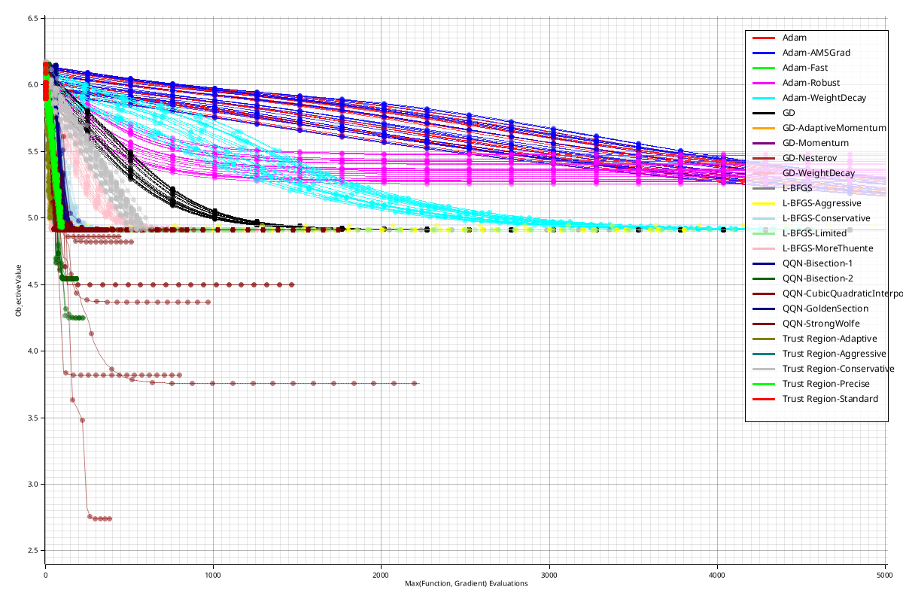
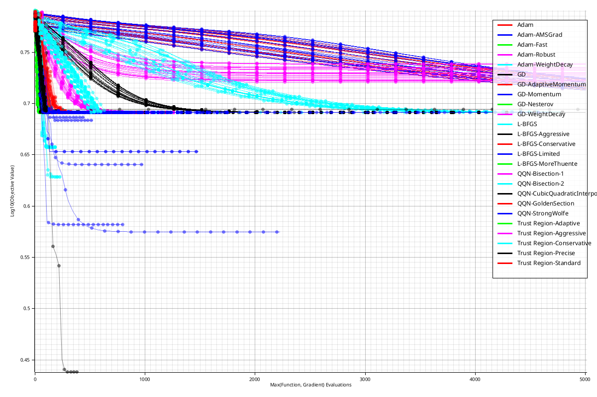

**Figure:** Convergence plots for Griewank_2D showing objective value vs iterations.
Left: Linear scale, Right: Log scale for better visualization of convergence behavior.

**Data:** [Linear scale data (CSV)](data/Griewank_2D_data.csv) | [Log scale data (CSV)](data/Griewank_2D_log_data.csv)

## Problem: Griewank_5D

**Family:** Griewank
**Dimension:** 5
**Success Threshold:** 1.000e-8
**Total Runs:** 500
**Detailed Analysis:** [View comprehensive problem analysis](reports/problem_analysis_Griewank_5D.md)

### Performance Summary
<table style="border-collapse: collapse; width: 100%; margin: 20px 0;">
<tr style="background-color: #f2f2f2;">
<th style="border: 1px solid #ddd; padding: 8px; text-align: center;">Rank</th>
<th style="border: 1px solid #ddd; padding: 8px; text-align: center;">Optimizer</th>
<th style="border: 1px solid #ddd; padding: 8px; text-align: center;">Mean Final Value (All/Success/Fail)</th>
<th style="border: 1px solid #ddd; padding: 8px; text-align: center;">Std Dev</th>
<th style="border: 1px solid #ddd; padding: 8px; text-align: center;">Best Value</th>
<th style="border: 1px solid #ddd; padding: 8px; text-align: center;">Worst Value</th>
<th style="border: 1px solid #ddd; padding: 8px; text-align: center;">Mean Function Evals (All/Success/Fail)</th>
<th style="border: 1px solid #ddd; padding: 8px; text-align: center;">Mean Gradient Evals (All/Success/Fail)</th>
<th style="border: 1px solid #ddd; padding: 8px; text-align: center;">Success Rate</th>
<th style="border: 1px solid #ddd; padding: 8px; text-align: center;">Mean Time (s)</th>
</tr>
<tr style="background-color: #d4edda; font-weight: bold;">
<td style="border: 1px solid #ddd; padding: 8px; text-align: center;">1</td>
<td style="border: 1px solid #ddd; padding: 8px; text-align: center;"><a href="reports/detailed_Griewank_5D_Trust_Region-Aggressive.md" title="Click for detailed analysis">Trust Region-Aggressive</a></td>
<td style="border: 1px solid #ddd; padding: 8px; text-align: center;">1.35e1 / - / 1.35e1</td>
<td style="border: 1px solid #ddd; padding: 8px; text-align: center;">2.50e-2</td>
<td style="border: 1px solid #ddd; padding: 8px; text-align: center;">1.35e1</td>
<td style="border: 1px solid #ddd; padding: 8px; text-align: center;">1.35e1</td>
<td style="border: 1px solid #ddd; padding: 8px; text-align: center;">5.0 / - / 5.0</td>
<td style="border: 1px solid #ddd; padding: 8px; text-align: center;">4.0 / - / 4.0</td>
<td style="border: 1px solid #ddd; padding: 8px; text-align: center;">0.0%</td>
<td style="border: 1px solid #ddd; padding: 8px; text-align: center;">0.000</td>
</tr>
<tr style="background-color: #fff3cd;">
<td style="border: 1px solid #ddd; padding: 8px; text-align: center;">2</td>
<td style="border: 1px solid #ddd; padding: 8px; text-align: center;"><a href="reports/detailed_Griewank_5D_Trust_Region-Adaptive.md" title="Click for detailed analysis">Trust Region-Adaptive</a></td>
<td style="border: 1px solid #ddd; padding: 8px; text-align: center;">1.35e1 / - / 1.35e1</td>
<td style="border: 1px solid #ddd; padding: 8px; text-align: center;">3.00e-2</td>
<td style="border: 1px solid #ddd; padding: 8px; text-align: center;">1.34e1</td>
<td style="border: 1px solid #ddd; padding: 8px; text-align: center;">1.35e1</td>
<td style="border: 1px solid #ddd; padding: 8px; text-align: center;">5.0 / - / 5.0</td>
<td style="border: 1px solid #ddd; padding: 8px; text-align: center;">4.0 / - / 4.0</td>
<td style="border: 1px solid #ddd; padding: 8px; text-align: center;">0.0%</td>
<td style="border: 1px solid #ddd; padding: 8px; text-align: center;">0.000</td>
</tr>
<tr style="">
<td style="border: 1px solid #ddd; padding: 8px; text-align: center;">3</td>
<td style="border: 1px solid #ddd; padding: 8px; text-align: center;"><a href="reports/detailed_Griewank_5D_Trust_Region-Standard.md" title="Click for detailed analysis">Trust Region-Standard</a></td>
<td style="border: 1px solid #ddd; padding: 8px; text-align: center;">1.35e1 / - / 1.35e1</td>
<td style="border: 1px solid #ddd; padding: 8px; text-align: center;">2.54e-2</td>
<td style="border: 1px solid #ddd; padding: 8px; text-align: center;">1.34e1</td>
<td style="border: 1px solid #ddd; padding: 8px; text-align: center;">1.36e1</td>
<td style="border: 1px solid #ddd; padding: 8px; text-align: center;">5.0 / - / 5.0</td>
<td style="border: 1px solid #ddd; padding: 8px; text-align: center;">4.0 / - / 4.0</td>
<td style="border: 1px solid #ddd; padding: 8px; text-align: center;">0.0%</td>
<td style="border: 1px solid #ddd; padding: 8px; text-align: center;">0.000</td>
</tr>
<tr style="">
<td style="border: 1px solid #ddd; padding: 8px; text-align: center;">4</td>
<td style="border: 1px solid #ddd; padding: 8px; text-align: center;"><a href="reports/detailed_Griewank_5D_Trust_Region-Precise.md" title="Click for detailed analysis">Trust Region-Precise</a></td>
<td style="border: 1px solid #ddd; padding: 8px; text-align: center;">1.34e1 / - / 1.34e1</td>
<td style="border: 1px solid #ddd; padding: 8px; text-align: center;">3.58e-1</td>
<td style="border: 1px solid #ddd; padding: 8px; text-align: center;">1.23e1</td>
<td style="border: 1px solid #ddd; padding: 8px; text-align: center;">1.36e1</td>
<td style="border: 1px solid #ddd; padding: 8px; text-align: center;">11.4 / - / 11.4</td>
<td style="border: 1px solid #ddd; padding: 8px; text-align: center;">8.3 / - / 8.3</td>
<td style="border: 1px solid #ddd; padding: 8px; text-align: center;">0.0%</td>
<td style="border: 1px solid #ddd; padding: 8px; text-align: center;">0.000</td>
</tr>
<tr style="">
<td style="border: 1px solid #ddd; padding: 8px; text-align: center;">5</td>
<td style="border: 1px solid #ddd; padding: 8px; text-align: center;"><a href="reports/detailed_Griewank_5D_Adam-Fast.md" title="Click for detailed analysis">Adam-Fast</a></td>
<td style="border: 1px solid #ddd; padding: 8px; text-align: center;">1.23e1 / - / 1.23e1</td>
<td style="border: 1px solid #ddd; padding: 8px; text-align: center;">1.49e-2</td>
<td style="border: 1px solid #ddd; padding: 8px; text-align: center;">1.22e1</td>
<td style="border: 1px solid #ddd; padding: 8px; text-align: center;">1.23e1</td>
<td style="border: 1px solid #ddd; padding: 8px; text-align: center;">67.1 / - / 67.1</td>
<td style="border: 1px solid #ddd; padding: 8px; text-align: center;">66.1 / - / 66.1</td>
<td style="border: 1px solid #ddd; padding: 8px; text-align: center;">0.0%</td>
<td style="border: 1px solid #ddd; padding: 8px; text-align: center;">0.001</td>
</tr>
<tr style="">
<td style="border: 1px solid #ddd; padding: 8px; text-align: center;">6</td>
<td style="border: 1px solid #ddd; padding: 8px; text-align: center;"><a href="reports/detailed_Griewank_5D_L-BFGS-MoreThuente.md" title="Click for detailed analysis">L-BFGS-MoreThuente</a></td>
<td style="border: 1px solid #ddd; padding: 8px; text-align: center;">1.22e1 / - / 1.22e1</td>
<td style="border: 1px solid #ddd; padding: 8px; text-align: center;">2.35e-7</td>
<td style="border: 1px solid #ddd; padding: 8px; text-align: center;">1.22e1</td>
<td style="border: 1px solid #ddd; padding: 8px; text-align: center;">1.22e1</td>
<td style="border: 1px solid #ddd; padding: 8px; text-align: center;">118.5 / - / 118.5</td>
<td style="border: 1px solid #ddd; padding: 8px; text-align: center;">84.1 / - / 84.1</td>
<td style="border: 1px solid #ddd; padding: 8px; text-align: center;">0.0%</td>
<td style="border: 1px solid #ddd; padding: 8px; text-align: center;">0.003</td>
</tr>
<tr style="">
<td style="border: 1px solid #ddd; padding: 8px; text-align: center;">7</td>
<td style="border: 1px solid #ddd; padding: 8px; text-align: center;"><a href="reports/detailed_Griewank_5D_QQN-CubicQuadraticInterpolation.md" title="Click for detailed analysis">QQN-CubicQuadraticInterpolation</a></td>
<td style="border: 1px solid #ddd; padding: 8px; text-align: center;">1.28e1 / - / 1.28e1</td>
<td style="border: 1px solid #ddd; padding: 8px; text-align: center;">2.58e-1</td>
<td style="border: 1px solid #ddd; padding: 8px; text-align: center;">1.22e1</td>
<td style="border: 1px solid #ddd; padding: 8px; text-align: center;">1.32e1</td>
<td style="border: 1px solid #ddd; padding: 8px; text-align: center;">115.1 / - / 115.1</td>
<td style="border: 1px solid #ddd; padding: 8px; text-align: center;">133.7 / - / 133.7</td>
<td style="border: 1px solid #ddd; padding: 8px; text-align: center;">0.0%</td>
<td style="border: 1px solid #ddd; padding: 8px; text-align: center;">0.004</td>
</tr>
<tr style="">
<td style="border: 1px solid #ddd; padding: 8px; text-align: center;">8</td>
<td style="border: 1px solid #ddd; padding: 8px; text-align: center;"><a href="reports/detailed_Griewank_5D_GD-AdaptiveMomentum.md" title="Click for detailed analysis">GD-AdaptiveMomentum</a></td>
<td style="border: 1px solid #ddd; padding: 8px; text-align: center;">1.23e1 / - / 1.23e1</td>
<td style="border: 1px solid #ddd; padding: 8px; text-align: center;">3.22e-2</td>
<td style="border: 1px solid #ddd; padding: 8px; text-align: center;">1.22e1</td>
<td style="border: 1px solid #ddd; padding: 8px; text-align: center;">1.23e1</td>
<td style="border: 1px solid #ddd; padding: 8px; text-align: center;">133.1 / - / 133.1</td>
<td style="border: 1px solid #ddd; padding: 8px; text-align: center;">262.2 / - / 262.2</td>
<td style="border: 1px solid #ddd; padding: 8px; text-align: center;">0.0%</td>
<td style="border: 1px solid #ddd; padding: 8px; text-align: center;">0.005</td>
</tr>
<tr style="">
<td style="border: 1px solid #ddd; padding: 8px; text-align: center;">9</td>
<td style="border: 1px solid #ddd; padding: 8px; text-align: center;"><a href="reports/detailed_Griewank_5D_L-BFGS.md" title="Click for detailed analysis">L-BFGS</a></td>
<td style="border: 1px solid #ddd; padding: 8px; text-align: center;">1.22e1 / - / 1.22e1</td>
<td style="border: 1px solid #ddd; padding: 8px; text-align: center;">9.54e-5</td>
<td style="border: 1px solid #ddd; padding: 8px; text-align: center;">1.22e1</td>
<td style="border: 1px solid #ddd; padding: 8px; text-align: center;">1.22e1</td>
<td style="border: 1px solid #ddd; padding: 8px; text-align: center;">259.7 / - / 259.7</td>
<td style="border: 1px solid #ddd; padding: 8px; text-align: center;">175.6 / - / 175.6</td>
<td style="border: 1px solid #ddd; padding: 8px; text-align: center;">0.0%</td>
<td style="border: 1px solid #ddd; padding: 8px; text-align: center;">0.006</td>
</tr>
<tr style="">
<td style="border: 1px solid #ddd; padding: 8px; text-align: center;">10</td>
<td style="border: 1px solid #ddd; padding: 8px; text-align: center;"><a href="reports/detailed_Griewank_5D_Trust_Region-Conservative.md" title="Click for detailed analysis">Trust Region-Conservative</a></td>
<td style="border: 1px solid #ddd; padding: 8px; text-align: center;">1.23e1 / - / 1.23e1</td>
<td style="border: 1px solid #ddd; padding: 8px; text-align: center;">2.20e-3</td>
<td style="border: 1px solid #ddd; padding: 8px; text-align: center;">1.23e1</td>
<td style="border: 1px solid #ddd; padding: 8px; text-align: center;">1.23e1</td>
<td style="border: 1px solid #ddd; padding: 8px; text-align: center;">380.4 / - / 380.4</td>
<td style="border: 1px solid #ddd; padding: 8px; text-align: center;">254.3 / - / 254.3</td>
<td style="border: 1px solid #ddd; padding: 8px; text-align: center;">0.0%</td>
<td style="border: 1px solid #ddd; padding: 8px; text-align: center;">0.003</td>
</tr>
<tr style="">
<td style="border: 1px solid #ddd; padding: 8px; text-align: center;">11</td>
<td style="border: 1px solid #ddd; padding: 8px; text-align: center;"><a href="reports/detailed_Griewank_5D_L-BFGS-Limited.md" title="Click for detailed analysis">L-BFGS-Limited</a></td>
<td style="border: 1px solid #ddd; padding: 8px; text-align: center;">1.22e1 / - / 1.22e1</td>
<td style="border: 1px solid #ddd; padding: 8px; text-align: center;">6.37e-8</td>
<td style="border: 1px solid #ddd; padding: 8px; text-align: center;">1.22e1</td>
<td style="border: 1px solid #ddd; padding: 8px; text-align: center;">1.22e1</td>
<td style="border: 1px solid #ddd; padding: 8px; text-align: center;">632.5 / - / 632.5</td>
<td style="border: 1px solid #ddd; padding: 8px; text-align: center;">364.1 / - / 364.1</td>
<td style="border: 1px solid #ddd; padding: 8px; text-align: center;">0.0%</td>
<td style="border: 1px solid #ddd; padding: 8px; text-align: center;">0.015</td>
</tr>
<tr style="">
<td style="border: 1px solid #ddd; padding: 8px; text-align: center;">12</td>
<td style="border: 1px solid #ddd; padding: 8px; text-align: center;"><a href="reports/detailed_Griewank_5D_GD-Momentum.md" title="Click for detailed analysis">GD-Momentum</a></td>
<td style="border: 1px solid #ddd; padding: 8px; text-align: center;">1.22e1 / - / 1.22e1</td>
<td style="border: 1px solid #ddd; padding: 8px; text-align: center;">2.64e-9</td>
<td style="border: 1px solid #ddd; padding: 8px; text-align: center;">1.22e1</td>
<td style="border: 1px solid #ddd; padding: 8px; text-align: center;">1.22e1</td>
<td style="border: 1px solid #ddd; padding: 8px; text-align: center;">387.2 / - / 387.2</td>
<td style="border: 1px solid #ddd; padding: 8px; text-align: center;">770.4 / - / 770.4</td>
<td style="border: 1px solid #ddd; padding: 8px; text-align: center;">0.0%</td>
<td style="border: 1px solid #ddd; padding: 8px; text-align: center;">0.012</td>
</tr>
<tr style="">
<td style="border: 1px solid #ddd; padding: 8px; text-align: center;">13</td>
<td style="border: 1px solid #ddd; padding: 8px; text-align: center;"><a href="reports/detailed_Griewank_5D_GD-Nesterov.md" title="Click for detailed analysis">GD-Nesterov</a></td>
<td style="border: 1px solid #ddd; padding: 8px; text-align: center;">1.22e1 / - / 1.22e1</td>
<td style="border: 1px solid #ddd; padding: 8px; text-align: center;">3.37e-9</td>
<td style="border: 1px solid #ddd; padding: 8px; text-align: center;">1.22e1</td>
<td style="border: 1px solid #ddd; padding: 8px; text-align: center;">1.22e1</td>
<td style="border: 1px solid #ddd; padding: 8px; text-align: center;">394.2 / - / 394.2</td>
<td style="border: 1px solid #ddd; padding: 8px; text-align: center;">784.4 / - / 784.4</td>
<td style="border: 1px solid #ddd; padding: 8px; text-align: center;">0.0%</td>
<td style="border: 1px solid #ddd; padding: 8px; text-align: center;">0.013</td>
</tr>
<tr style="">
<td style="border: 1px solid #ddd; padding: 8px; text-align: center;">14</td>
<td style="border: 1px solid #ddd; padding: 8px; text-align: center;"><a href="reports/detailed_Griewank_5D_L-BFGS-Conservative.md" title="Click for detailed analysis">L-BFGS-Conservative</a></td>
<td style="border: 1px solid #ddd; padding: 8px; text-align: center;">1.22e1 / - / 1.22e1</td>
<td style="border: 1px solid #ddd; padding: 8px; text-align: center;">5.03e-9</td>
<td style="border: 1px solid #ddd; padding: 8px; text-align: center;">1.22e1</td>
<td style="border: 1px solid #ddd; padding: 8px; text-align: center;">1.22e1</td>
<td style="border: 1px solid #ddd; padding: 8px; text-align: center;">705.6 / - / 705.6</td>
<td style="border: 1px solid #ddd; padding: 8px; text-align: center;">563.4 / - / 563.4</td>
<td style="border: 1px solid #ddd; padding: 8px; text-align: center;">0.0%</td>
<td style="border: 1px solid #ddd; padding: 8px; text-align: center;">0.019</td>
</tr>
<tr style="">
<td style="border: 1px solid #ddd; padding: 8px; text-align: center;">15</td>
<td style="border: 1px solid #ddd; padding: 8px; text-align: center;"><a href="reports/detailed_Griewank_5D_QQN-GoldenSection.md" title="Click for detailed analysis">QQN-GoldenSection</a></td>
<td style="border: 1px solid #ddd; padding: 8px; text-align: center;">1.12e1 / - / 1.12e1</td>
<td style="border: 1px solid #ddd; padding: 8px; text-align: center;">3.02e0</td>
<td style="border: 1px solid #ddd; padding: 8px; text-align: center;">1.62e0</td>
<td style="border: 1px solid #ddd; padding: 8px; text-align: center;">1.22e1</td>
<td style="border: 1px solid #ddd; padding: 8px; text-align: center;">1154.2 / - / 1154.2</td>
<td style="border: 1px solid #ddd; padding: 8px; text-align: center;">179.5 / - / 179.5</td>
<td style="border: 1px solid #ddd; padding: 8px; text-align: center;">0.0%</td>
<td style="border: 1px solid #ddd; padding: 8px; text-align: center;">0.023</td>
</tr>
<tr style="">
<td style="border: 1px solid #ddd; padding: 8px; text-align: center;">16</td>
<td style="border: 1px solid #ddd; padding: 8px; text-align: center;"><a href="reports/detailed_Griewank_5D_L-BFGS-Aggressive.md" title="Click for detailed analysis">L-BFGS-Aggressive</a></td>
<td style="border: 1px solid #ddd; padding: 8px; text-align: center;">1.09e1 / - / 1.09e1</td>
<td style="border: 1px solid #ddd; padding: 8px; text-align: center;">2.56e0</td>
<td style="border: 1px solid #ddd; padding: 8px; text-align: center;">5.15e0</td>
<td style="border: 1px solid #ddd; padding: 8px; text-align: center;">1.22e1</td>
<td style="border: 1px solid #ddd; padding: 8px; text-align: center;">1097.7 / - / 1097.7</td>
<td style="border: 1px solid #ddd; padding: 8px; text-align: center;">361.9 / - / 361.9</td>
<td style="border: 1px solid #ddd; padding: 8px; text-align: center;">0.0%</td>
<td style="border: 1px solid #ddd; padding: 8px; text-align: center;">0.015</td>
</tr>
<tr style="">
<td style="border: 1px solid #ddd; padding: 8px; text-align: center;">17</td>
<td style="border: 1px solid #ddd; padding: 8px; text-align: center;"><a href="reports/detailed_Griewank_5D_QQN-Bisection-2.md" title="Click for detailed analysis">QQN-Bisection-2</a></td>
<td style="border: 1px solid #ddd; padding: 8px; text-align: center;">1.21e1 / - / 1.21e1</td>
<td style="border: 1px solid #ddd; padding: 8px; text-align: center;">5.61e-1</td>
<td style="border: 1px solid #ddd; padding: 8px; text-align: center;">9.76e0</td>
<td style="border: 1px solid #ddd; padding: 8px; text-align: center;">1.22e1</td>
<td style="border: 1px solid #ddd; padding: 8px; text-align: center;">984.9 / - / 984.9</td>
<td style="border: 1px solid #ddd; padding: 8px; text-align: center;">511.8 / - / 511.8</td>
<td style="border: 1px solid #ddd; padding: 8px; text-align: center;">0.0%</td>
<td style="border: 1px solid #ddd; padding: 8px; text-align: center;">0.025</td>
</tr>
<tr style="">
<td style="border: 1px solid #ddd; padding: 8px; text-align: center;">18</td>
<td style="border: 1px solid #ddd; padding: 8px; text-align: center;"><a href="reports/detailed_Griewank_5D_QQN-Bisection-1.md" title="Click for detailed analysis">QQN-Bisection-1</a></td>
<td style="border: 1px solid #ddd; padding: 8px; text-align: center;">1.06e1 / - / 1.06e1</td>
<td style="border: 1px solid #ddd; padding: 8px; text-align: center;">3.32e0</td>
<td style="border: 1px solid #ddd; padding: 8px; text-align: center;">2.18e0</td>
<td style="border: 1px solid #ddd; padding: 8px; text-align: center;">1.22e1</td>
<td style="border: 1px solid #ddd; padding: 8px; text-align: center;">872.0 / - / 872.0</td>
<td style="border: 1px solid #ddd; padding: 8px; text-align: center;">839.0 / - / 839.0</td>
<td style="border: 1px solid #ddd; padding: 8px; text-align: center;">0.0%</td>
<td style="border: 1px solid #ddd; padding: 8px; text-align: center;">0.020</td>
</tr>
<tr style="">
<td style="border: 1px solid #ddd; padding: 8px; text-align: center;">19</td>
<td style="border: 1px solid #ddd; padding: 8px; text-align: center;"><a href="reports/detailed_Griewank_5D_GD-WeightDecay.md" title="Click for detailed analysis">GD-WeightDecay</a></td>
<td style="border: 1px solid #ddd; padding: 8px; text-align: center;">1.22e1 / - / 1.22e1</td>
<td style="border: 1px solid #ddd; padding: 8px; text-align: center;">1.86e-5</td>
<td style="border: 1px solid #ddd; padding: 8px; text-align: center;">1.22e1</td>
<td style="border: 1px solid #ddd; padding: 8px; text-align: center;">1.22e1</td>
<td style="border: 1px solid #ddd; padding: 8px; text-align: center;">915.3 / - / 915.3</td>
<td style="border: 1px solid #ddd; padding: 8px; text-align: center;">1826.6 / - / 1826.6</td>
<td style="border: 1px solid #ddd; padding: 8px; text-align: center;">0.0%</td>
<td style="border: 1px solid #ddd; padding: 8px; text-align: center;">0.030</td>
</tr>
<tr style="">
<td style="border: 1px solid #ddd; padding: 8px; text-align: center;">20</td>
<td style="border: 1px solid #ddd; padding: 8px; text-align: center;"><a href="reports/detailed_Griewank_5D_QQN-StrongWolfe.md" title="Click for detailed analysis">QQN-StrongWolfe</a></td>
<td style="border: 1px solid #ddd; padding: 8px; text-align: center;">1.09e1 / - / 1.09e1</td>
<td style="border: 1px solid #ddd; padding: 8px; text-align: center;">2.09e0</td>
<td style="border: 1px solid #ddd; padding: 8px; text-align: center;">5.74e0</td>
<td style="border: 1px solid #ddd; padding: 8px; text-align: center;">1.33e1</td>
<td style="border: 1px solid #ddd; padding: 8px; text-align: center;">1535.0 / - / 1535.0</td>
<td style="border: 1px solid #ddd; padding: 8px; text-align: center;">1691.7 / - / 1691.7</td>
<td style="border: 1px solid #ddd; padding: 8px; text-align: center;">0.0%</td>
<td style="border: 1px solid #ddd; padding: 8px; text-align: center;">0.071</td>
</tr>
<tr style="">
<td style="border: 1px solid #ddd; padding: 8px; text-align: center;">21</td>
<td style="border: 1px solid #ddd; padding: 8px; text-align: center;"><a href="reports/detailed_Griewank_5D_Adam-WeightDecay.md" title="Click for detailed analysis">Adam-WeightDecay</a></td>
<td style="border: 1px solid #ddd; padding: 8px; text-align: center;">1.23e1 / - / 1.23e1</td>
<td style="border: 1px solid #ddd; padding: 8px; text-align: center;">6.66e-3</td>
<td style="border: 1px solid #ddd; padding: 8px; text-align: center;">1.23e1</td>
<td style="border: 1px solid #ddd; padding: 8px; text-align: center;">1.23e1</td>
<td style="border: 1px solid #ddd; padding: 8px; text-align: center;">1651.7 / - / 1651.7</td>
<td style="border: 1px solid #ddd; padding: 8px; text-align: center;">1650.7 / - / 1650.7</td>
<td style="border: 1px solid #ddd; padding: 8px; text-align: center;">0.0%</td>
<td style="border: 1px solid #ddd; padding: 8px; text-align: center;">0.037</td>
</tr>
<tr style="">
<td style="border: 1px solid #ddd; padding: 8px; text-align: center;">22</td>
<td style="border: 1px solid #ddd; padding: 8px; text-align: center;"><a href="reports/detailed_Griewank_5D_GD.md" title="Click for detailed analysis">GD</a></td>
<td style="border: 1px solid #ddd; padding: 8px; text-align: center;">1.22e1 / - / 1.22e1</td>
<td style="border: 1px solid #ddd; padding: 8px; text-align: center;">1.06e-3</td>
<td style="border: 1px solid #ddd; padding: 8px; text-align: center;">1.22e1</td>
<td style="border: 1px solid #ddd; padding: 8px; text-align: center;">1.22e1</td>
<td style="border: 1px solid #ddd; padding: 8px; text-align: center;">1668.0 / - / 1668.0</td>
<td style="border: 1px solid #ddd; padding: 8px; text-align: center;">3334.0 / - / 3334.0</td>
<td style="border: 1px solid #ddd; padding: 8px; text-align: center;">0.0%</td>
<td style="border: 1px solid #ddd; padding: 8px; text-align: center;">0.044</td>
</tr>
<tr style="">
<td style="border: 1px solid #ddd; padding: 8px; text-align: center;">23</td>
<td style="border: 1px solid #ddd; padding: 8px; text-align: center;"><a href="reports/detailed_Griewank_5D_Adam.md" title="Click for detailed analysis">Adam</a></td>
<td style="border: 1px solid #ddd; padding: 8px; text-align: center;">1.25e1 / - / 1.25e1</td>
<td style="border: 1px solid #ddd; padding: 8px; text-align: center;">2.35e-2</td>
<td style="border: 1px solid #ddd; padding: 8px; text-align: center;">1.25e1</td>
<td style="border: 1px solid #ddd; padding: 8px; text-align: center;">1.25e1</td>
<td style="border: 1px solid #ddd; padding: 8px; text-align: center;">2502.0 / - / 2502.0</td>
<td style="border: 1px solid #ddd; padding: 8px; text-align: center;">2502.0 / - / 2502.0</td>
<td style="border: 1px solid #ddd; padding: 8px; text-align: center;">0.0%</td>
<td style="border: 1px solid #ddd; padding: 8px; text-align: center;">0.052</td>
</tr>
<tr style="">
<td style="border: 1px solid #ddd; padding: 8px; text-align: center;">24</td>
<td style="border: 1px solid #ddd; padding: 8px; text-align: center;"><a href="reports/detailed_Griewank_5D_Adam-Robust.md" title="Click for detailed analysis">Adam-Robust</a></td>
<td style="border: 1px solid #ddd; padding: 8px; text-align: center;">1.29e1 / - / 1.29e1</td>
<td style="border: 1px solid #ddd; padding: 8px; text-align: center;">6.91e-2</td>
<td style="border: 1px solid #ddd; padding: 8px; text-align: center;">1.28e1</td>
<td style="border: 1px solid #ddd; padding: 8px; text-align: center;">1.30e1</td>
<td style="border: 1px solid #ddd; padding: 8px; text-align: center;">2502.0 / - / 2502.0</td>
<td style="border: 1px solid #ddd; padding: 8px; text-align: center;">2502.0 / - / 2502.0</td>
<td style="border: 1px solid #ddd; padding: 8px; text-align: center;">0.0%</td>
<td style="border: 1px solid #ddd; padding: 8px; text-align: center;">0.059</td>
</tr>
<tr style="">
<td style="border: 1px solid #ddd; padding: 8px; text-align: center;">25</td>
<td style="border: 1px solid #ddd; padding: 8px; text-align: center;"><a href="reports/detailed_Griewank_5D_Adam-AMSGrad.md" title="Click for detailed analysis">Adam-AMSGrad</a></td>
<td style="border: 1px solid #ddd; padding: 8px; text-align: center;">1.25e1 / - / 1.25e1</td>
<td style="border: 1px solid #ddd; padding: 8px; text-align: center;">2.91e-2</td>
<td style="border: 1px solid #ddd; padding: 8px; text-align: center;">1.25e1</td>
<td style="border: 1px solid #ddd; padding: 8px; text-align: center;">1.26e1</td>
<td style="border: 1px solid #ddd; padding: 8px; text-align: center;">2502.0 / - / 2502.0</td>
<td style="border: 1px solid #ddd; padding: 8px; text-align: center;">2502.0 / - / 2502.0</td>
<td style="border: 1px solid #ddd; padding: 8px; text-align: center;">0.0%</td>
<td style="border: 1px solid #ddd; padding: 8px; text-align: center;">0.059</td>
</tr>
</table>

### Convergence Plots

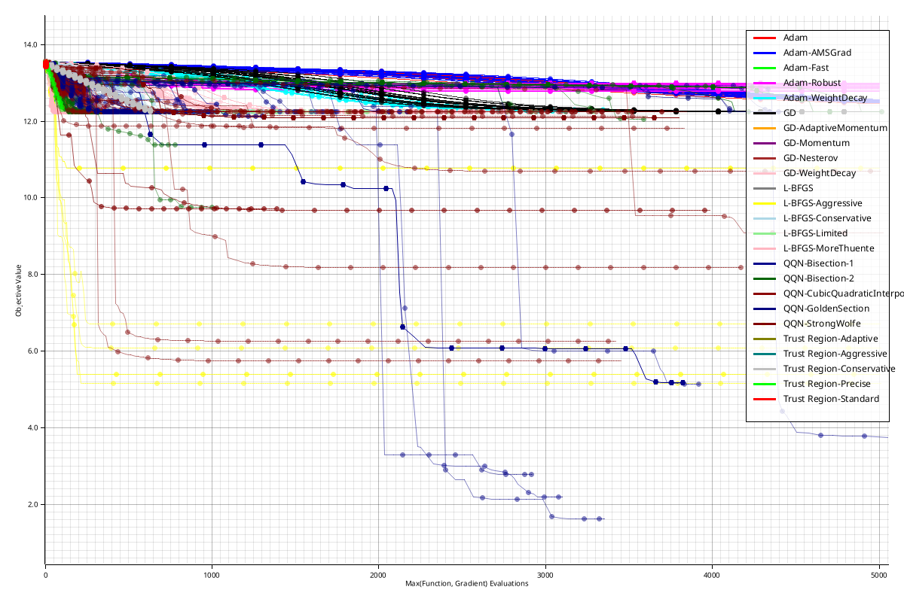
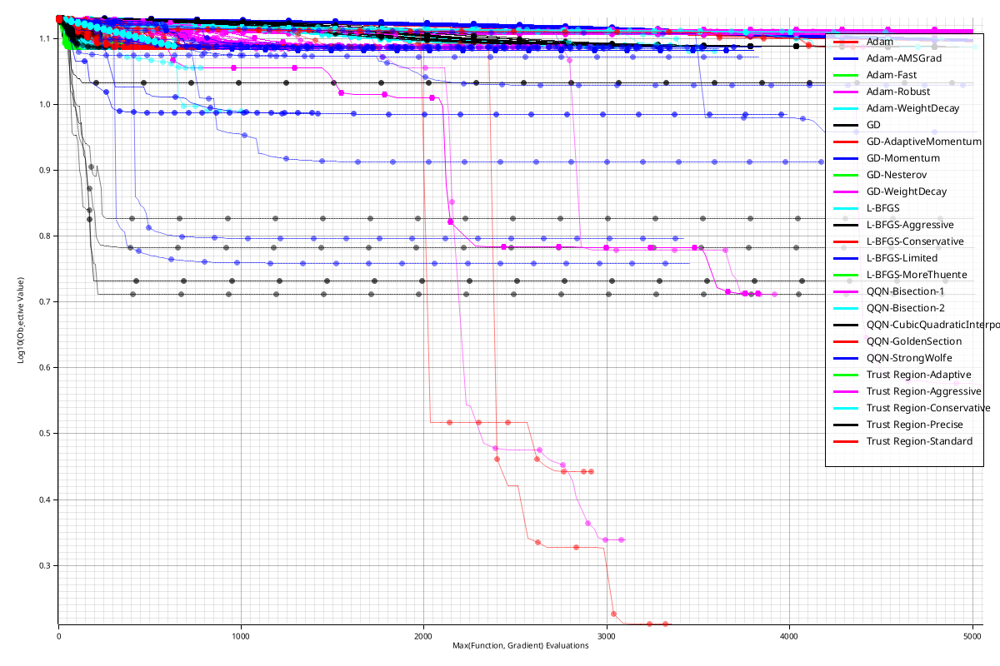

**Figure:** Convergence plots for Griewank_5D showing objective value vs iterations.
Left: Linear scale, Right: Log scale for better visualization of convergence behavior.

**Data:** [Linear scale data (CSV)](data/Griewank_5D_data.csv) | [Log scale data (CSV)](data/Griewank_5D_log_data.csv)

## Problem: Griewank_10D

**Family:** Griewank
**Dimension:** 10
**Success Threshold:** 1.000e-8
**Total Runs:** 500
**Detailed Analysis:** [View comprehensive problem analysis](reports/problem_analysis_Griewank_10D.md)

### Performance Summary
<table style="border-collapse: collapse; width: 100%; margin: 20px 0;">
<tr style="background-color: #f2f2f2;">
<th style="border: 1px solid #ddd; padding: 8px; text-align: center;">Rank</th>
<th style="border: 1px solid #ddd; padding: 8px; text-align: center;">Optimizer</th>
<th style="border: 1px solid #ddd; padding: 8px; text-align: center;">Mean Final Value (All/Success/Fail)</th>
<th style="border: 1px solid #ddd; padding: 8px; text-align: center;">Std Dev</th>
<th style="border: 1px solid #ddd; padding: 8px; text-align: center;">Best Value</th>
<th style="border: 1px solid #ddd; padding: 8px; text-align: center;">Worst Value</th>
<th style="border: 1px solid #ddd; padding: 8px; text-align: center;">Mean Function Evals (All/Success/Fail)</th>
<th style="border: 1px solid #ddd; padding: 8px; text-align: center;">Mean Gradient Evals (All/Success/Fail)</th>
<th style="border: 1px solid #ddd; padding: 8px; text-align: center;">Success Rate</th>
<th style="border: 1px solid #ddd; padding: 8px; text-align: center;">Mean Time (s)</th>
</tr>
<tr style="background-color: #d4edda; font-weight: bold;">
<td style="border: 1px solid #ddd; padding: 8px; text-align: center;">1</td>
<td style="border: 1px solid #ddd; padding: 8px; text-align: center;"><a href="reports/detailed_Griewank_10D_QQN-Bisection-1.md" title="Click for detailed analysis">QQN-Bisection-1</a></td>
<td style="border: 1px solid #ddd; padding: 8px; text-align: center;">2.19e1 / 5.93e-10 / 2.31e1</td>
<td style="border: 1px solid #ddd; padding: 8px; text-align: center;">9.08e0</td>
<td style="border: 1px solid #ddd; padding: 8px; text-align: center;">5.93e-10</td>
<td style="border: 1px solid #ddd; padding: 8px; text-align: center;">2.58e1</td>
<td style="border: 1px solid #ddd; padding: 8px; text-align: center;">2381.1 / 395.0 / 2485.6</td>
<td style="border: 1px solid #ddd; padding: 8px; text-align: center;">2427.0 / 394.0 / 2534.0</td>
<td style="border: 1px solid #ddd; padding: 8px; text-align: center;">5.0%</td>
<td style="border: 1px solid #ddd; padding: 8px; text-align: center;">0.065</td>
</tr>
<tr style="background-color: #fff3cd;">
<td style="border: 1px solid #ddd; padding: 8px; text-align: center;">2</td>
<td style="border: 1px solid #ddd; padding: 8px; text-align: center;"><a href="reports/detailed_Griewank_10D_Trust_Region-Precise.md" title="Click for detailed analysis">Trust Region-Precise</a></td>
<td style="border: 1px solid #ddd; padding: 8px; text-align: center;">2.60e1 / - / 2.60e1</td>
<td style="border: 1px solid #ddd; padding: 8px; text-align: center;">1.72e-2</td>
<td style="border: 1px solid #ddd; padding: 8px; text-align: center;">2.60e1</td>
<td style="border: 1px solid #ddd; padding: 8px; text-align: center;">2.60e1</td>
<td style="border: 1px solid #ddd; padding: 8px; text-align: center;">5.0 / - / 5.0</td>
<td style="border: 1px solid #ddd; padding: 8px; text-align: center;">4.0 / - / 4.0</td>
<td style="border: 1px solid #ddd; padding: 8px; text-align: center;">0.0%</td>
<td style="border: 1px solid #ddd; padding: 8px; text-align: center;">0.000</td>
</tr>
<tr style="">
<td style="border: 1px solid #ddd; padding: 8px; text-align: center;">3</td>
<td style="border: 1px solid #ddd; padding: 8px; text-align: center;"><a href="reports/detailed_Griewank_10D_Trust_Region-Standard.md" title="Click for detailed analysis">Trust Region-Standard</a></td>
<td style="border: 1px solid #ddd; padding: 8px; text-align: center;">2.60e1 / - / 2.60e1</td>
<td style="border: 1px solid #ddd; padding: 8px; text-align: center;">2.15e-2</td>
<td style="border: 1px solid #ddd; padding: 8px; text-align: center;">2.60e1</td>
<td style="border: 1px solid #ddd; padding: 8px; text-align: center;">2.60e1</td>
<td style="border: 1px solid #ddd; padding: 8px; text-align: center;">5.0 / - / 5.0</td>
<td style="border: 1px solid #ddd; padding: 8px; text-align: center;">4.0 / - / 4.0</td>
<td style="border: 1px solid #ddd; padding: 8px; text-align: center;">0.0%</td>
<td style="border: 1px solid #ddd; padding: 8px; text-align: center;">0.000</td>
</tr>
<tr style="">
<td style="border: 1px solid #ddd; padding: 8px; text-align: center;">4</td>
<td style="border: 1px solid #ddd; padding: 8px; text-align: center;"><a href="reports/detailed_Griewank_10D_Trust_Region-Adaptive.md" title="Click for detailed analysis">Trust Region-Adaptive</a></td>
<td style="border: 1px solid #ddd; padding: 8px; text-align: center;">2.60e1 / - / 2.60e1</td>
<td style="border: 1px solid #ddd; padding: 8px; text-align: center;">1.74e-2</td>
<td style="border: 1px solid #ddd; padding: 8px; text-align: center;">2.60e1</td>
<td style="border: 1px solid #ddd; padding: 8px; text-align: center;">2.60e1</td>
<td style="border: 1px solid #ddd; padding: 8px; text-align: center;">5.0 / - / 5.0</td>
<td style="border: 1px solid #ddd; padding: 8px; text-align: center;">4.0 / - / 4.0</td>
<td style="border: 1px solid #ddd; padding: 8px; text-align: center;">0.0%</td>
<td style="border: 1px solid #ddd; padding: 8px; text-align: center;">0.000</td>
</tr>
<tr style="">
<td style="border: 1px solid #ddd; padding: 8px; text-align: center;">5</td>
<td style="border: 1px solid #ddd; padding: 8px; text-align: center;"><a href="reports/detailed_Griewank_10D_Trust_Region-Aggressive.md" title="Click for detailed analysis">Trust Region-Aggressive</a></td>
<td style="border: 1px solid #ddd; padding: 8px; text-align: center;">2.60e1 / - / 2.60e1</td>
<td style="border: 1px solid #ddd; padding: 8px; text-align: center;">1.61e-2</td>
<td style="border: 1px solid #ddd; padding: 8px; text-align: center;">2.60e1</td>
<td style="border: 1px solid #ddd; padding: 8px; text-align: center;">2.60e1</td>
<td style="border: 1px solid #ddd; padding: 8px; text-align: center;">5.0 / - / 5.0</td>
<td style="border: 1px solid #ddd; padding: 8px; text-align: center;">4.0 / - / 4.0</td>
<td style="border: 1px solid #ddd; padding: 8px; text-align: center;">0.0%</td>
<td style="border: 1px solid #ddd; padding: 8px; text-align: center;">0.000</td>
</tr>
<tr style="">
<td style="border: 1px solid #ddd; padding: 8px; text-align: center;">6</td>
<td style="border: 1px solid #ddd; padding: 8px; text-align: center;"><a href="reports/detailed_Griewank_10D_QQN-CubicQuadraticInterpolation.md" title="Click for detailed analysis">QQN-CubicQuadraticInterpolation</a></td>
<td style="border: 1px solid #ddd; padding: 8px; text-align: center;">2.45e1 / - / 2.45e1</td>
<td style="border: 1px solid #ddd; padding: 8px; text-align: center;">5.40e0</td>
<td style="border: 1px solid #ddd; padding: 8px; text-align: center;">9.67e-1</td>
<td style="border: 1px solid #ddd; padding: 8px; text-align: center;">2.58e1</td>
<td style="border: 1px solid #ddd; padding: 8px; text-align: center;">108.6 / - / 108.6</td>
<td style="border: 1px solid #ddd; padding: 8px; text-align: center;">128.8 / - / 128.8</td>
<td style="border: 1px solid #ddd; padding: 8px; text-align: center;">0.0%</td>
<td style="border: 1px solid #ddd; padding: 8px; text-align: center;">0.003</td>
</tr>
<tr style="">
<td style="border: 1px solid #ddd; padding: 8px; text-align: center;">7</td>
<td style="border: 1px solid #ddd; padding: 8px; text-align: center;"><a href="reports/detailed_Griewank_10D_L-BFGS.md" title="Click for detailed analysis">L-BFGS</a></td>
<td style="border: 1px solid #ddd; padding: 8px; text-align: center;">1.92e1 / - / 1.93e1</td>
<td style="border: 1px solid #ddd; padding: 8px; text-align: center;">3.29e0</td>
<td style="border: 1px solid #ddd; padding: 8px; text-align: center;">1.20e1</td>
<td style="border: 1px solid #ddd; padding: 8px; text-align: center;">2.43e1</td>
<td style="border: 1px solid #ddd; padding: 8px; text-align: center;">483.9 / - / 483.9</td>
<td style="border: 1px solid #ddd; padding: 8px; text-align: center;">323.4 / - / 323.4</td>
<td style="border: 1px solid #ddd; padding: 8px; text-align: center;">0.0%</td>
<td style="border: 1px solid #ddd; padding: 8px; text-align: center;">0.012</td>
</tr>
<tr style="">
<td style="border: 1px solid #ddd; padding: 8px; text-align: center;">8</td>
<td style="border: 1px solid #ddd; padding: 8px; text-align: center;"><a href="reports/detailed_Griewank_10D_L-BFGS-MoreThuente.md" title="Click for detailed analysis">L-BFGS-MoreThuente</a></td>
<td style="border: 1px solid #ddd; padding: 8px; text-align: center;">1.42e1 / - / 1.42e1</td>
<td style="border: 1px solid #ddd; padding: 8px; text-align: center;">5.29e0</td>
<td style="border: 1px solid #ddd; padding: 8px; text-align: center;">1.93e0</td>
<td style="border: 1px solid #ddd; padding: 8px; text-align: center;">2.12e1</td>
<td style="border: 1px solid #ddd; padding: 8px; text-align: center;">499.3 / - / 499.3</td>
<td style="border: 1px solid #ddd; padding: 8px; text-align: center;">357.1 / - / 357.1</td>
<td style="border: 1px solid #ddd; padding: 8px; text-align: center;">0.0%</td>
<td style="border: 1px solid #ddd; padding: 8px; text-align: center;">0.011</td>
</tr>
<tr style="">
<td style="border: 1px solid #ddd; padding: 8px; text-align: center;">9</td>
<td style="border: 1px solid #ddd; padding: 8px; text-align: center;"><a href="reports/detailed_Griewank_10D_Adam-Fast.md" title="Click for detailed analysis">Adam-Fast</a></td>
<td style="border: 1px solid #ddd; padding: 8px; text-align: center;">1.17e1 / - / 1.17e1</td>
<td style="border: 1px solid #ddd; padding: 8px; text-align: center;">3.57e0</td>
<td style="border: 1px solid #ddd; padding: 8px; text-align: center;">2.84e0</td>
<td style="border: 1px solid #ddd; padding: 8px; text-align: center;">1.50e1</td>
<td style="border: 1px solid #ddd; padding: 8px; text-align: center;">950.2 / - / 950.2</td>
<td style="border: 1px solid #ddd; padding: 8px; text-align: center;">949.2 / - / 949.2</td>
<td style="border: 1px solid #ddd; padding: 8px; text-align: center;">0.0%</td>
<td style="border: 1px solid #ddd; padding: 8px; text-align: center;">0.022</td>
</tr>
<tr style="">
<td style="border: 1px solid #ddd; padding: 8px; text-align: center;">10</td>
<td style="border: 1px solid #ddd; padding: 8px; text-align: center;"><a href="reports/detailed_Griewank_10D_Trust_Region-Conservative.md" title="Click for detailed analysis">Trust Region-Conservative</a></td>
<td style="border: 1px solid #ddd; padding: 8px; text-align: center;">2.08e1 / - / 2.08e1</td>
<td style="border: 1px solid #ddd; padding: 8px; text-align: center;">2.32e0</td>
<td style="border: 1px solid #ddd; padding: 8px; text-align: center;">1.60e1</td>
<td style="border: 1px solid #ddd; padding: 8px; text-align: center;">2.43e1</td>
<td style="border: 1px solid #ddd; padding: 8px; text-align: center;">1557.3 / - / 1557.3</td>
<td style="border: 1px solid #ddd; padding: 8px; text-align: center;">1038.9 / - / 1038.9</td>
<td style="border: 1px solid #ddd; padding: 8px; text-align: center;">0.0%</td>
<td style="border: 1px solid #ddd; padding: 8px; text-align: center;">0.012</td>
</tr>
<tr style="">
<td style="border: 1px solid #ddd; padding: 8px; text-align: center;">11</td>
<td style="border: 1px solid #ddd; padding: 8px; text-align: center;"><a href="reports/detailed_Griewank_10D_GD-AdaptiveMomentum.md" title="Click for detailed analysis">GD-AdaptiveMomentum</a></td>
<td style="border: 1px solid #ddd; padding: 8px; text-align: center;">1.90e1 / - / 1.90e1</td>
<td style="border: 1px solid #ddd; padding: 8px; text-align: center;">3.00e0</td>
<td style="border: 1px solid #ddd; padding: 8px; text-align: center;">1.39e1</td>
<td style="border: 1px solid #ddd; padding: 8px; text-align: center;">2.12e1</td>
<td style="border: 1px solid #ddd; padding: 8px; text-align: center;">920.4 / - / 920.4</td>
<td style="border: 1px solid #ddd; padding: 8px; text-align: center;">1837.3 / - / 1837.3</td>
<td style="border: 1px solid #ddd; padding: 8px; text-align: center;">0.0%</td>
<td style="border: 1px solid #ddd; padding: 8px; text-align: center;">0.035</td>
</tr>
<tr style="">
<td style="border: 1px solid #ddd; padding: 8px; text-align: center;">12</td>
<td style="border: 1px solid #ddd; padding: 8px; text-align: center;"><a href="reports/detailed_Griewank_10D_L-BFGS-Conservative.md" title="Click for detailed analysis">L-BFGS-Conservative</a></td>
<td style="border: 1px solid #ddd; padding: 8px; text-align: center;">2.33e1 / - / 2.33e1</td>
<td style="border: 1px solid #ddd; padding: 8px; text-align: center;">1.54e0</td>
<td style="border: 1px solid #ddd; padding: 8px; text-align: center;">2.01e1</td>
<td style="border: 1px solid #ddd; padding: 8px; text-align: center;">2.49e1</td>
<td style="border: 1px solid #ddd; padding: 8px; text-align: center;">1668.3 / - / 1668.3</td>
<td style="border: 1px solid #ddd; padding: 8px; text-align: center;">1326.4 / - / 1326.4</td>
<td style="border: 1px solid #ddd; padding: 8px; text-align: center;">0.0%</td>
<td style="border: 1px solid #ddd; padding: 8px; text-align: center;">0.049</td>
</tr>
<tr style="">
<td style="border: 1px solid #ddd; padding: 8px; text-align: center;">13</td>
<td style="border: 1px solid #ddd; padding: 8px; text-align: center;"><a href="reports/detailed_Griewank_10D_L-BFGS-Limited.md" title="Click for detailed analysis">L-BFGS-Limited</a></td>
<td style="border: 1px solid #ddd; padding: 8px; text-align: center;">1.95e1 / - / 1.95e1</td>
<td style="border: 1px solid #ddd; padding: 8px; text-align: center;">3.46e0</td>
<td style="border: 1px solid #ddd; padding: 8px; text-align: center;">8.48e0</td>
<td style="border: 1px solid #ddd; padding: 8px; text-align: center;">2.38e1</td>
<td style="border: 1px solid #ddd; padding: 8px; text-align: center;">2256.7 / - / 2256.7</td>
<td style="border: 1px solid #ddd; padding: 8px; text-align: center;">1243.3 / - / 1243.3</td>
<td style="border: 1px solid #ddd; padding: 8px; text-align: center;">0.0%</td>
<td style="border: 1px solid #ddd; padding: 8px; text-align: center;">0.059</td>
</tr>
<tr style="">
<td style="border: 1px solid #ddd; padding: 8px; text-align: center;">14</td>
<td style="border: 1px solid #ddd; padding: 8px; text-align: center;"><a href="reports/detailed_Griewank_10D_QQN-StrongWolfe.md" title="Click for detailed analysis">QQN-StrongWolfe</a></td>
<td style="border: 1px solid #ddd; padding: 8px; text-align: center;">6.06e0 / - / 6.06e0</td>
<td style="border: 1px solid #ddd; padding: 8px; text-align: center;">1.00e1</td>
<td style="border: 1px solid #ddd; padding: 8px; text-align: center;">9.86e-3</td>
<td style="border: 1px solid #ddd; padding: 8px; text-align: center;">2.60e1</td>
<td style="border: 1px solid #ddd; padding: 8px; text-align: center;">2281.2 / - / 2281.2</td>
<td style="border: 1px solid #ddd; padding: 8px; text-align: center;">2144.8 / - / 2144.8</td>
<td style="border: 1px solid #ddd; padding: 8px; text-align: center;">0.0%</td>
<td style="border: 1px solid #ddd; padding: 8px; text-align: center;">0.091</td>
</tr>
<tr style="">
<td style="border: 1px solid #ddd; padding: 8px; text-align: center;">15</td>
<td style="border: 1px solid #ddd; padding: 8px; text-align: center;"><a href="reports/detailed_Griewank_10D_QQN-Bisection-2.md" title="Click for detailed analysis">QQN-Bisection-2</a></td>
<td style="border: 1px solid #ddd; padding: 8px; text-align: center;">2.33e1 / - / 2.33e1</td>
<td style="border: 1px solid #ddd; padding: 8px; text-align: center;">7.17e0</td>
<td style="border: 1px solid #ddd; padding: 8px; text-align: center;">1.67e0</td>
<td style="border: 1px solid #ddd; padding: 8px; text-align: center;">2.58e1</td>
<td style="border: 1px solid #ddd; padding: 8px; text-align: center;">3260.0 / - / 3260.0</td>
<td style="border: 1px solid #ddd; padding: 8px; text-align: center;">1558.8 / - / 1558.8</td>
<td style="border: 1px solid #ddd; padding: 8px; text-align: center;">0.0%</td>
<td style="border: 1px solid #ddd; padding: 8px; text-align: center;">0.083</td>
</tr>
<tr style="">
<td style="border: 1px solid #ddd; padding: 8px; text-align: center;">16</td>
<td style="border: 1px solid #ddd; padding: 8px; text-align: center;"><a href="reports/detailed_Griewank_10D_QQN-GoldenSection.md" title="Click for detailed analysis">QQN-GoldenSection</a></td>
<td style="border: 1px solid #ddd; padding: 8px; text-align: center;">2.35e1 / - / 2.35e1</td>
<td style="border: 1px solid #ddd; padding: 8px; text-align: center;">6.71e0</td>
<td style="border: 1px solid #ddd; padding: 8px; text-align: center;">2.19e0</td>
<td style="border: 1px solid #ddd; padding: 8px; text-align: center;">2.58e1</td>
<td style="border: 1px solid #ddd; padding: 8px; text-align: center;">4343.6 / - / 4343.6</td>
<td style="border: 1px solid #ddd; padding: 8px; text-align: center;">509.6 / - / 509.6</td>
<td style="border: 1px solid #ddd; padding: 8px; text-align: center;">0.0%</td>
<td style="border: 1px solid #ddd; padding: 8px; text-align: center;">0.085</td>
</tr>
<tr style="">
<td style="border: 1px solid #ddd; padding: 8px; text-align: center;">17</td>
<td style="border: 1px solid #ddd; padding: 8px; text-align: center;"><a href="reports/detailed_Griewank_10D_GD-Nesterov.md" title="Click for detailed analysis">GD-Nesterov</a></td>
<td style="border: 1px solid #ddd; padding: 8px; text-align: center;">2.21e1 / - / 2.21e1</td>
<td style="border: 1px solid #ddd; padding: 8px; text-align: center;">2.17e-1</td>
<td style="border: 1px solid #ddd; padding: 8px; text-align: center;">2.15e1</td>
<td style="border: 1px solid #ddd; padding: 8px; text-align: center;">2.23e1</td>
<td style="border: 1px solid #ddd; padding: 8px; text-align: center;">1668.0 / - / 1668.0</td>
<td style="border: 1px solid #ddd; padding: 8px; text-align: center;">3334.0 / - / 3334.0</td>
<td style="border: 1px solid #ddd; padding: 8px; text-align: center;">0.0%</td>
<td style="border: 1px solid #ddd; padding: 8px; text-align: center;">0.058</td>
</tr>
<tr style="">
<td style="border: 1px solid #ddd; padding: 8px; text-align: center;">18</td>
<td style="border: 1px solid #ddd; padding: 8px; text-align: center;"><a href="reports/detailed_Griewank_10D_GD-Momentum.md" title="Click for detailed analysis">GD-Momentum</a></td>
<td style="border: 1px solid #ddd; padding: 8px; text-align: center;">2.20e1 / - / 2.20e1</td>
<td style="border: 1px solid #ddd; padding: 8px; text-align: center;">3.14e-1</td>
<td style="border: 1px solid #ddd; padding: 8px; text-align: center;">2.16e1</td>
<td style="border: 1px solid #ddd; padding: 8px; text-align: center;">2.24e1</td>
<td style="border: 1px solid #ddd; padding: 8px; text-align: center;">1668.0 / - / 1668.0</td>
<td style="border: 1px solid #ddd; padding: 8px; text-align: center;">3334.0 / - / 3334.0</td>
<td style="border: 1px solid #ddd; padding: 8px; text-align: center;">0.0%</td>
<td style="border: 1px solid #ddd; padding: 8px; text-align: center;">0.054</td>
</tr>
<tr style="">
<td style="border: 1px solid #ddd; padding: 8px; text-align: center;">19</td>
<td style="border: 1px solid #ddd; padding: 8px; text-align: center;"><a href="reports/detailed_Griewank_10D_GD.md" title="Click for detailed analysis">GD</a></td>
<td style="border: 1px solid #ddd; padding: 8px; text-align: center;">2.56e1 / - / 2.56e1</td>
<td style="border: 1px solid #ddd; padding: 8px; text-align: center;">2.73e-2</td>
<td style="border: 1px solid #ddd; padding: 8px; text-align: center;">2.55e1</td>
<td style="border: 1px solid #ddd; padding: 8px; text-align: center;">2.57e1</td>
<td style="border: 1px solid #ddd; padding: 8px; text-align: center;">1668.0 / - / 1668.0</td>
<td style="border: 1px solid #ddd; padding: 8px; text-align: center;">3334.0 / - / 3334.0</td>
<td style="border: 1px solid #ddd; padding: 8px; text-align: center;">0.0%</td>
<td style="border: 1px solid #ddd; padding: 8px; text-align: center;">0.049</td>
</tr>
<tr style="">
<td style="border: 1px solid #ddd; padding: 8px; text-align: center;">20</td>
<td style="border: 1px solid #ddd; padding: 8px; text-align: center;"><a href="reports/detailed_Griewank_10D_GD-WeightDecay.md" title="Click for detailed analysis">GD-WeightDecay</a></td>
<td style="border: 1px solid #ddd; padding: 8px; text-align: center;">2.48e1 / - / 2.48e1</td>
<td style="border: 1px solid #ddd; padding: 8px; text-align: center;">3.83e-2</td>
<td style="border: 1px solid #ddd; padding: 8px; text-align: center;">2.48e1</td>
<td style="border: 1px solid #ddd; padding: 8px; text-align: center;">2.49e1</td>
<td style="border: 1px solid #ddd; padding: 8px; text-align: center;">1668.0 / - / 1668.0</td>
<td style="border: 1px solid #ddd; padding: 8px; text-align: center;">3334.0 / - / 3334.0</td>
<td style="border: 1px solid #ddd; padding: 8px; text-align: center;">0.0%</td>
<td style="border: 1px solid #ddd; padding: 8px; text-align: center;">0.059</td>
</tr>
<tr style="">
<td style="border: 1px solid #ddd; padding: 8px; text-align: center;">21</td>
<td style="border: 1px solid #ddd; padding: 8px; text-align: center;"><a href="reports/detailed_Griewank_10D_Adam-AMSGrad.md" title="Click for detailed analysis">Adam-AMSGrad</a></td>
<td style="border: 1px solid #ddd; padding: 8px; text-align: center;">2.54e1 / - / 2.54e1</td>
<td style="border: 1px solid #ddd; padding: 8px; text-align: center;">2.09e-2</td>
<td style="border: 1px solid #ddd; padding: 8px; text-align: center;">2.53e1</td>
<td style="border: 1px solid #ddd; padding: 8px; text-align: center;">2.54e1</td>
<td style="border: 1px solid #ddd; padding: 8px; text-align: center;">2502.0 / - / 2502.0</td>
<td style="border: 1px solid #ddd; padding: 8px; text-align: center;">2502.0 / - / 2502.0</td>
<td style="border: 1px solid #ddd; padding: 8px; text-align: center;">0.0%</td>
<td style="border: 1px solid #ddd; padding: 8px; text-align: center;">0.064</td>
</tr>
<tr style="">
<td style="border: 1px solid #ddd; padding: 8px; text-align: center;">22</td>
<td style="border: 1px solid #ddd; padding: 8px; text-align: center;"><a href="reports/detailed_Griewank_10D_Adam-WeightDecay.md" title="Click for detailed analysis">Adam-WeightDecay</a></td>
<td style="border: 1px solid #ddd; padding: 8px; text-align: center;">2.42e1 / - / 2.42e1</td>
<td style="border: 1px solid #ddd; padding: 8px; text-align: center;">1.44e-2</td>
<td style="border: 1px solid #ddd; padding: 8px; text-align: center;">2.41e1</td>
<td style="border: 1px solid #ddd; padding: 8px; text-align: center;">2.42e1</td>
<td style="border: 1px solid #ddd; padding: 8px; text-align: center;">2502.0 / - / 2502.0</td>
<td style="border: 1px solid #ddd; padding: 8px; text-align: center;">2502.0 / - / 2502.0</td>
<td style="border: 1px solid #ddd; padding: 8px; text-align: center;">0.0%</td>
<td style="border: 1px solid #ddd; padding: 8px; text-align: center;">0.061</td>
</tr>
<tr style="">
<td style="border: 1px solid #ddd; padding: 8px; text-align: center;">23</td>
<td style="border: 1px solid #ddd; padding: 8px; text-align: center;"><a href="reports/detailed_Griewank_10D_Adam-Robust.md" title="Click for detailed analysis">Adam-Robust</a></td>
<td style="border: 1px solid #ddd; padding: 8px; text-align: center;">2.55e1 / - / 2.55e1</td>
<td style="border: 1px solid #ddd; padding: 8px; text-align: center;">2.00e-2</td>
<td style="border: 1px solid #ddd; padding: 8px; text-align: center;">2.55e1</td>
<td style="border: 1px solid #ddd; padding: 8px; text-align: center;">2.55e1</td>
<td style="border: 1px solid #ddd; padding: 8px; text-align: center;">2502.0 / - / 2502.0</td>
<td style="border: 1px solid #ddd; padding: 8px; text-align: center;">2502.0 / - / 2502.0</td>
<td style="border: 1px solid #ddd; padding: 8px; text-align: center;">0.0%</td>
<td style="border: 1px solid #ddd; padding: 8px; text-align: center;">0.063</td>
</tr>
<tr style="">
<td style="border: 1px solid #ddd; padding: 8px; text-align: center;">24</td>
<td style="border: 1px solid #ddd; padding: 8px; text-align: center;"><a href="reports/detailed_Griewank_10D_Adam.md" title="Click for detailed analysis">Adam</a></td>
<td style="border: 1px solid #ddd; padding: 8px; text-align: center;">2.54e1 / - / 2.54e1</td>
<td style="border: 1px solid #ddd; padding: 8px; text-align: center;">2.20e-2</td>
<td style="border: 1px solid #ddd; padding: 8px; text-align: center;">2.53e1</td>
<td style="border: 1px solid #ddd; padding: 8px; text-align: center;">2.54e1</td>
<td style="border: 1px solid #ddd; padding: 8px; text-align: center;">2502.0 / - / 2502.0</td>
<td style="border: 1px solid #ddd; padding: 8px; text-align: center;">2502.0 / - / 2502.0</td>
<td style="border: 1px solid #ddd; padding: 8px; text-align: center;">0.0%</td>
<td style="border: 1px solid #ddd; padding: 8px; text-align: center;">0.057</td>
</tr>
<tr style="">
<td style="border: 1px solid #ddd; padding: 8px; text-align: center;">25</td>
<td style="border: 1px solid #ddd; padding: 8px; text-align: center;"><a href="reports/detailed_Griewank_10D_L-BFGS-Aggressive.md" title="Click for detailed analysis">L-BFGS-Aggressive</a></td>
<td style="border: 1px solid #ddd; padding: 8px; text-align: center;">6.09e0 / - / 6.09e0</td>
<td style="border: 1px solid #ddd; padding: 8px; text-align: center;">5.66e0</td>
<td style="border: 1px solid #ddd; padding: 8px; text-align: center;">1.01e0</td>
<td style="border: 1px solid #ddd; padding: 8px; text-align: center;">2.16e1</td>
<td style="border: 1px solid #ddd; padding: 8px; text-align: center;">3817.8 / - / 3817.8</td>
<td style="border: 1px solid #ddd; padding: 8px; text-align: center;">1190.2 / - / 1190.2</td>
<td style="border: 1px solid #ddd; padding: 8px; text-align: center;">0.0%</td>
<td style="border: 1px solid #ddd; padding: 8px; text-align: center;">0.054</td>
</tr>
</table>

### Convergence Plots

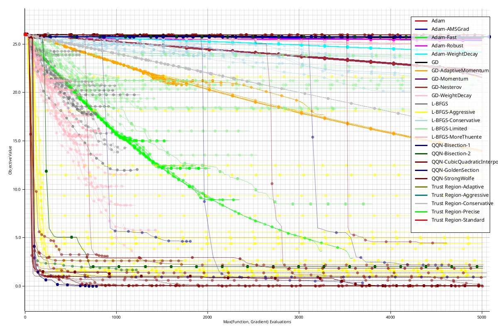
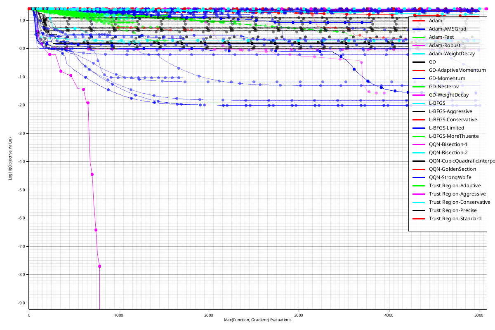

**Figure:** Convergence plots for Griewank_10D showing objective value vs iterations.
Left: Linear scale, Right: Log scale for better visualization of convergence behavior.

**Data:** [Linear scale data (CSV)](data/Griewank_10D_data.csv) | [Log scale data (CSV)](data/Griewank_10D_log_data.csv)

## Problem: Schwefel_2D

**Family:** Schwefel
**Dimension:** 2
**Success Threshold:** 1.000e-8
**Total Runs:** 500
**Detailed Analysis:** [View comprehensive problem analysis](reports/problem_analysis_Schwefel_2D.md)

### Performance Summary
<table style="border-collapse: collapse; width: 100%; margin: 20px 0;">
<tr style="background-color: #f2f2f2;">
<th style="border: 1px solid #ddd; padding: 8px; text-align: center;">Rank</th>
<th style="border: 1px solid #ddd; padding: 8px; text-align: center;">Optimizer</th>
<th style="border: 1px solid #ddd; padding: 8px; text-align: center;">Mean Final Value (All/Success/Fail)</th>
<th style="border: 1px solid #ddd; padding: 8px; text-align: center;">Std Dev</th>
<th style="border: 1px solid #ddd; padding: 8px; text-align: center;">Best Value</th>
<th style="border: 1px solid #ddd; padding: 8px; text-align: center;">Worst Value</th>
<th style="border: 1px solid #ddd; padding: 8px; text-align: center;">Mean Function Evals (All/Success/Fail)</th>
<th style="border: 1px solid #ddd; padding: 8px; text-align: center;">Mean Gradient Evals (All/Success/Fail)</th>
<th style="border: 1px solid #ddd; padding: 8px; text-align: center;">Success Rate</th>
<th style="border: 1px solid #ddd; padding: 8px; text-align: center;">Mean Time (s)</th>
</tr>
<tr style="background-color: #d4edda; font-weight: bold;">
<td style="border: 1px solid #ddd; padding: 8px; text-align: center;">1</td>
<td style="border: 1px solid #ddd; padding: 8px; text-align: center;"><a href="reports/detailed_Schwefel_2D_QQN-StrongWolfe.md" title="Click for detailed analysis">QQN-StrongWolfe</a></td>
<td style="border: 1px solid #ddd; padding: 8px; text-align: center;">-7.26e2 / -2.02e3 / 5.67e2</td>
<td style="border: 1px solid #ddd; padding: 8px; text-align: center;">2.56e3</td>
<td style="border: 1px solid #ddd; padding: 8px; text-align: center;">-1.07e4</td>
<td style="border: 1px solid #ddd; padding: 8px; text-align: center;">5.92e2</td>
<td style="border: 1px solid #ddd; padding: 8px; text-align: center;">379.3 / 45.3 / 713.3</td>
<td style="border: 1px solid #ddd; padding: 8px; text-align: center;">421.9 / 47.4 / 796.4</td>
<td style="border: 1px solid #ddd; padding: 8px; text-align: center;">50.0%</td>
<td style="border: 1px solid #ddd; padding: 8px; text-align: center;">0.016</td>
</tr>
<tr style="background-color: #fff3cd;">
<td style="border: 1px solid #ddd; padding: 8px; text-align: center;">2</td>
<td style="border: 1px solid #ddd; padding: 8px; text-align: center;"><a href="reports/detailed_Schwefel_2D_QQN-CubicQuadraticInterpolation.md" title="Click for detailed analysis">QQN-CubicQuadraticInterpolation</a></td>
<td style="border: 1px solid #ddd; padding: 8px; text-align: center;">7.11e2 / - / 7.11e2</td>
<td style="border: 1px solid #ddd; padding: 8px; text-align: center;">0.00e0</td>
<td style="border: 1px solid #ddd; padding: 8px; text-align: center;">7.11e2</td>
<td style="border: 1px solid #ddd; padding: 8px; text-align: center;">7.11e2</td>
<td style="border: 1px solid #ddd; padding: 8px; text-align: center;">57.9 / - / 57.9</td>
<td style="border: 1px solid #ddd; padding: 8px; text-align: center;">55.6 / - / 55.6</td>
<td style="border: 1px solid #ddd; padding: 8px; text-align: center;">0.0%</td>
<td style="border: 1px solid #ddd; padding: 8px; text-align: center;">0.001</td>
</tr>
<tr style="">
<td style="border: 1px solid #ddd; padding: 8px; text-align: center;">3</td>
<td style="border: 1px solid #ddd; padding: 8px; text-align: center;"><a href="reports/detailed_Schwefel_2D_QQN-Bisection-2.md" title="Click for detailed analysis">QQN-Bisection-2</a></td>
<td style="border: 1px solid #ddd; padding: 8px; text-align: center;">7.11e2 / - / 7.11e2</td>
<td style="border: 1px solid #ddd; padding: 8px; text-align: center;">0.00e0</td>
<td style="border: 1px solid #ddd; padding: 8px; text-align: center;">7.11e2</td>
<td style="border: 1px solid #ddd; padding: 8px; text-align: center;">7.11e2</td>
<td style="border: 1px solid #ddd; padding: 8px; text-align: center;">50.9 / - / 50.9</td>
<td style="border: 1px solid #ddd; padding: 8px; text-align: center;">79.1 / - / 79.1</td>
<td style="border: 1px solid #ddd; padding: 8px; text-align: center;">0.0%</td>
<td style="border: 1px solid #ddd; padding: 8px; text-align: center;">0.001</td>
</tr>
<tr style="">
<td style="border: 1px solid #ddd; padding: 8px; text-align: center;">4</td>
<td style="border: 1px solid #ddd; padding: 8px; text-align: center;"><a href="reports/detailed_Schwefel_2D_QQN-Bisection-1.md" title="Click for detailed analysis">QQN-Bisection-1</a></td>
<td style="border: 1px solid #ddd; padding: 8px; text-align: center;">7.11e2 / - / 7.11e2</td>
<td style="border: 1px solid #ddd; padding: 8px; text-align: center;">3.40e-13</td>
<td style="border: 1px solid #ddd; padding: 8px; text-align: center;">7.11e2</td>
<td style="border: 1px solid #ddd; padding: 8px; text-align: center;">7.11e2</td>
<td style="border: 1px solid #ddd; padding: 8px; text-align: center;">47.6 / - / 47.6</td>
<td style="border: 1px solid #ddd; padding: 8px; text-align: center;">90.0 / - / 90.0</td>
<td style="border: 1px solid #ddd; padding: 8px; text-align: center;">0.0%</td>
<td style="border: 1px solid #ddd; padding: 8px; text-align: center;">0.001</td>
</tr>
<tr style="">
<td style="border: 1px solid #ddd; padding: 8px; text-align: center;">5</td>
<td style="border: 1px solid #ddd; padding: 8px; text-align: center;"><a href="reports/detailed_Schwefel_2D_L-BFGS-Aggressive.md" title="Click for detailed analysis">L-BFGS-Aggressive</a></td>
<td style="border: 1px solid #ddd; padding: 8px; text-align: center;">7.11e2 / - / 7.11e2</td>
<td style="border: 1px solid #ddd; padding: 8px; text-align: center;">2.18e-2</td>
<td style="border: 1px solid #ddd; padding: 8px; text-align: center;">7.11e2</td>
<td style="border: 1px solid #ddd; padding: 8px; text-align: center;">7.11e2</td>
<td style="border: 1px solid #ddd; padding: 8px; text-align: center;">101.0 / - / 101.0</td>
<td style="border: 1px solid #ddd; padding: 8px; text-align: center;">41.0 / - / 41.0</td>
<td style="border: 1px solid #ddd; padding: 8px; text-align: center;">0.0%</td>
<td style="border: 1px solid #ddd; padding: 8px; text-align: center;">0.001</td>
</tr>
<tr style="">
<td style="border: 1px solid #ddd; padding: 8px; text-align: center;">6</td>
<td style="border: 1px solid #ddd; padding: 8px; text-align: center;"><a href="reports/detailed_Schwefel_2D_QQN-GoldenSection.md" title="Click for detailed analysis">QQN-GoldenSection</a></td>
<td style="border: 1px solid #ddd; padding: 8px; text-align: center;">7.11e2 / - / 7.11e2</td>
<td style="border: 1px solid #ddd; padding: 8px; text-align: center;">1.80e-4</td>
<td style="border: 1px solid #ddd; padding: 8px; text-align: center;">7.11e2</td>
<td style="border: 1px solid #ddd; padding: 8px; text-align: center;">7.11e2</td>
<td style="border: 1px solid #ddd; padding: 8px; text-align: center;">145.1 / - / 145.1</td>
<td style="border: 1px solid #ddd; padding: 8px; text-align: center;">37.2 / - / 37.2</td>
<td style="border: 1px solid #ddd; padding: 8px; text-align: center;">0.0%</td>
<td style="border: 1px solid #ddd; padding: 8px; text-align: center;">0.002</td>
</tr>
<tr style="">
<td style="border: 1px solid #ddd; padding: 8px; text-align: center;">7</td>
<td style="border: 1px solid #ddd; padding: 8px; text-align: center;"><a href="reports/detailed_Schwefel_2D_L-BFGS-MoreThuente.md" title="Click for detailed analysis">L-BFGS-MoreThuente</a></td>
<td style="border: 1px solid #ddd; padding: 8px; text-align: center;">7.11e2 / - / 7.11e2</td>
<td style="border: 1px solid #ddd; padding: 8px; text-align: center;">1.08e-4</td>
<td style="border: 1px solid #ddd; padding: 8px; text-align: center;">7.11e2</td>
<td style="border: 1px solid #ddd; padding: 8px; text-align: center;">7.11e2</td>
<td style="border: 1px solid #ddd; padding: 8px; text-align: center;">147.6 / - / 147.6</td>
<td style="border: 1px solid #ddd; padding: 8px; text-align: center;">104.3 / - / 104.3</td>
<td style="border: 1px solid #ddd; padding: 8px; text-align: center;">0.0%</td>
<td style="border: 1px solid #ddd; padding: 8px; text-align: center;">0.003</td>
</tr>
<tr style="">
<td style="border: 1px solid #ddd; padding: 8px; text-align: center;">8</td>
<td style="border: 1px solid #ddd; padding: 8px; text-align: center;"><a href="reports/detailed_Schwefel_2D_GD-AdaptiveMomentum.md" title="Click for detailed analysis">GD-AdaptiveMomentum</a></td>
<td style="border: 1px solid #ddd; padding: 8px; text-align: center;">7.11e2 / - / 7.12e2</td>
<td style="border: 1px solid #ddd; padding: 8px; text-align: center;">2.67e-3</td>
<td style="border: 1px solid #ddd; padding: 8px; text-align: center;">7.11e2</td>
<td style="border: 1px solid #ddd; padding: 8px; text-align: center;">7.11e2</td>
<td style="border: 1px solid #ddd; padding: 8px; text-align: center;">89.0 / - / 89.0</td>
<td style="border: 1px solid #ddd; padding: 8px; text-align: center;">174.0 / - / 174.0</td>
<td style="border: 1px solid #ddd; padding: 8px; text-align: center;">0.0%</td>
<td style="border: 1px solid #ddd; padding: 8px; text-align: center;">0.003</td>
</tr>
<tr style="">
<td style="border: 1px solid #ddd; padding: 8px; text-align: center;">9</td>
<td style="border: 1px solid #ddd; padding: 8px; text-align: center;"><a href="reports/detailed_Schwefel_2D_Trust_Region-Aggressive.md" title="Click for detailed analysis">Trust Region-Aggressive</a></td>
<td style="border: 1px solid #ddd; padding: 8px; text-align: center;">7.17e2 / - / 7.17e2</td>
<td style="border: 1px solid #ddd; padding: 8px; text-align: center;">6.24e-1</td>
<td style="border: 1px solid #ddd; padding: 8px; text-align: center;">7.16e2</td>
<td style="border: 1px solid #ddd; padding: 8px; text-align: center;">7.18e2</td>
<td style="border: 1px solid #ddd; padding: 8px; text-align: center;">179.0 / - / 179.0</td>
<td style="border: 1px solid #ddd; padding: 8px; text-align: center;">120.0 / - / 120.0</td>
<td style="border: 1px solid #ddd; padding: 8px; text-align: center;">0.0%</td>
<td style="border: 1px solid #ddd; padding: 8px; text-align: center;">0.001</td>
</tr>
<tr style="">
<td style="border: 1px solid #ddd; padding: 8px; text-align: center;">10</td>
<td style="border: 1px solid #ddd; padding: 8px; text-align: center;"><a href="reports/detailed_Schwefel_2D_L-BFGS.md" title="Click for detailed analysis">L-BFGS</a></td>
<td style="border: 1px solid #ddd; padding: 8px; text-align: center;">7.11e2 / - / 7.11e2</td>
<td style="border: 1px solid #ddd; padding: 8px; text-align: center;">1.01e-4</td>
<td style="border: 1px solid #ddd; padding: 8px; text-align: center;">7.11e2</td>
<td style="border: 1px solid #ddd; padding: 8px; text-align: center;">7.11e2</td>
<td style="border: 1px solid #ddd; padding: 8px; text-align: center;">292.1 / - / 292.1</td>
<td style="border: 1px solid #ddd; padding: 8px; text-align: center;">220.4 / - / 220.4</td>
<td style="border: 1px solid #ddd; padding: 8px; text-align: center;">0.0%</td>
<td style="border: 1px solid #ddd; padding: 8px; text-align: center;">0.008</td>
</tr>
<tr style="">
<td style="border: 1px solid #ddd; padding: 8px; text-align: center;">11</td>
<td style="border: 1px solid #ddd; padding: 8px; text-align: center;"><a href="reports/detailed_Schwefel_2D_L-BFGS-Limited.md" title="Click for detailed analysis">L-BFGS-Limited</a></td>
<td style="border: 1px solid #ddd; padding: 8px; text-align: center;">7.11e2 / - / 7.11e2</td>
<td style="border: 1px solid #ddd; padding: 8px; text-align: center;">7.74e-7</td>
<td style="border: 1px solid #ddd; padding: 8px; text-align: center;">7.11e2</td>
<td style="border: 1px solid #ddd; padding: 8px; text-align: center;">7.11e2</td>
<td style="border: 1px solid #ddd; padding: 8px; text-align: center;">513.3 / - / 513.3</td>
<td style="border: 1px solid #ddd; padding: 8px; text-align: center;">306.5 / - / 306.5</td>
<td style="border: 1px solid #ddd; padding: 8px; text-align: center;">0.0%</td>
<td style="border: 1px solid #ddd; padding: 8px; text-align: center;">0.013</td>
</tr>
<tr style="">
<td style="border: 1px solid #ddd; padding: 8px; text-align: center;">12</td>
<td style="border: 1px solid #ddd; padding: 8px; text-align: center;"><a href="reports/detailed_Schwefel_2D_GD-Momentum.md" title="Click for detailed analysis">GD-Momentum</a></td>
<td style="border: 1px solid #ddd; padding: 8px; text-align: center;">7.11e2 / - / 7.11e2</td>
<td style="border: 1px solid #ddd; padding: 8px; text-align: center;">1.25e-7</td>
<td style="border: 1px solid #ddd; padding: 8px; text-align: center;">7.11e2</td>
<td style="border: 1px solid #ddd; padding: 8px; text-align: center;">7.11e2</td>
<td style="border: 1px solid #ddd; padding: 8px; text-align: center;">277.4 / - / 277.4</td>
<td style="border: 1px solid #ddd; padding: 8px; text-align: center;">550.9 / - / 550.9</td>
<td style="border: 1px solid #ddd; padding: 8px; text-align: center;">0.0%</td>
<td style="border: 1px solid #ddd; padding: 8px; text-align: center;">0.008</td>
</tr>
<tr style="">
<td style="border: 1px solid #ddd; padding: 8px; text-align: center;">13</td>
<td style="border: 1px solid #ddd; padding: 8px; text-align: center;"><a href="reports/detailed_Schwefel_2D_GD-Nesterov.md" title="Click for detailed analysis">GD-Nesterov</a></td>
<td style="border: 1px solid #ddd; padding: 8px; text-align: center;">7.11e2 / - / 7.11e2</td>
<td style="border: 1px solid #ddd; padding: 8px; text-align: center;">1.94e-7</td>
<td style="border: 1px solid #ddd; padding: 8px; text-align: center;">7.11e2</td>
<td style="border: 1px solid #ddd; padding: 8px; text-align: center;">7.11e2</td>
<td style="border: 1px solid #ddd; padding: 8px; text-align: center;">292.6 / - / 292.6</td>
<td style="border: 1px solid #ddd; padding: 8px; text-align: center;">581.2 / - / 581.2</td>
<td style="border: 1px solid #ddd; padding: 8px; text-align: center;">0.0%</td>
<td style="border: 1px solid #ddd; padding: 8px; text-align: center;">0.009</td>
</tr>
<tr style="">
<td style="border: 1px solid #ddd; padding: 8px; text-align: center;">14</td>
<td style="border: 1px solid #ddd; padding: 8px; text-align: center;"><a href="reports/detailed_Schwefel_2D_Trust_Region-Standard.md" title="Click for detailed analysis">Trust Region-Standard</a></td>
<td style="border: 1px solid #ddd; padding: 8px; text-align: center;">7.12e2 / - / 7.12e2</td>
<td style="border: 1px solid #ddd; padding: 8px; text-align: center;">2.41e-1</td>
<td style="border: 1px solid #ddd; padding: 8px; text-align: center;">7.12e2</td>
<td style="border: 1px solid #ddd; padding: 8px; text-align: center;">7.12e2</td>
<td style="border: 1px solid #ddd; padding: 8px; text-align: center;">711.8 / - / 711.8</td>
<td style="border: 1px solid #ddd; padding: 8px; text-align: center;">475.2 / - / 475.2</td>
<td style="border: 1px solid #ddd; padding: 8px; text-align: center;">0.0%</td>
<td style="border: 1px solid #ddd; padding: 8px; text-align: center;">0.005</td>
</tr>
<tr style="">
<td style="border: 1px solid #ddd; padding: 8px; text-align: center;">15</td>
<td style="border: 1px solid #ddd; padding: 8px; text-align: center;"><a href="reports/detailed_Schwefel_2D_GD-WeightDecay.md" title="Click for detailed analysis">GD-WeightDecay</a></td>
<td style="border: 1px solid #ddd; padding: 8px; text-align: center;">7.11e2 / - / 7.11e2</td>
<td style="border: 1px solid #ddd; padding: 8px; text-align: center;">2.21e-8</td>
<td style="border: 1px solid #ddd; padding: 8px; text-align: center;">7.11e2</td>
<td style="border: 1px solid #ddd; padding: 8px; text-align: center;">7.11e2</td>
<td style="border: 1px solid #ddd; padding: 8px; text-align: center;">1115.0 / - / 1115.0</td>
<td style="border: 1px solid #ddd; padding: 8px; text-align: center;">2225.9 / - / 2225.9</td>
<td style="border: 1px solid #ddd; padding: 8px; text-align: center;">0.0%</td>
<td style="border: 1px solid #ddd; padding: 8px; text-align: center;">0.034</td>
</tr>
<tr style="">
<td style="border: 1px solid #ddd; padding: 8px; text-align: center;">16</td>
<td style="border: 1px solid #ddd; padding: 8px; text-align: center;"><a href="reports/detailed_Schwefel_2D_L-BFGS-Conservative.md" title="Click for detailed analysis">L-BFGS-Conservative</a></td>
<td style="border: 1px solid #ddd; padding: 8px; text-align: center;">7.11e2 / - / 7.11e2</td>
<td style="border: 1px solid #ddd; padding: 8px; text-align: center;">5.50e-8</td>
<td style="border: 1px solid #ddd; padding: 8px; text-align: center;">7.11e2</td>
<td style="border: 1px solid #ddd; padding: 8px; text-align: center;">7.11e2</td>
<td style="border: 1px solid #ddd; padding: 8px; text-align: center;">2095.3 / - / 2095.3</td>
<td style="border: 1px solid #ddd; padding: 8px; text-align: center;">1674.5 / - / 1674.5</td>
<td style="border: 1px solid #ddd; padding: 8px; text-align: center;">0.0%</td>
<td style="border: 1px solid #ddd; padding: 8px; text-align: center;">0.057</td>
</tr>
<tr style="">
<td style="border: 1px solid #ddd; padding: 8px; text-align: center;">17</td>
<td style="border: 1px solid #ddd; padding: 8px; text-align: center;"><a href="reports/detailed_Schwefel_2D_Adam-Fast.md" title="Click for detailed analysis">Adam-Fast</a></td>
<td style="border: 1px solid #ddd; padding: 8px; text-align: center;">7.11e2 / - / 7.11e2</td>
<td style="border: 1px solid #ddd; padding: 8px; text-align: center;">9.50e-8</td>
<td style="border: 1px solid #ddd; padding: 8px; text-align: center;">7.11e2</td>
<td style="border: 1px solid #ddd; padding: 8px; text-align: center;">7.11e2</td>
<td style="border: 1px solid #ddd; padding: 8px; text-align: center;">1972.4 / - / 1972.4</td>
<td style="border: 1px solid #ddd; padding: 8px; text-align: center;">1971.4 / - / 1971.4</td>
<td style="border: 1px solid #ddd; padding: 8px; text-align: center;">0.0%</td>
<td style="border: 1px solid #ddd; padding: 8px; text-align: center;">0.039</td>
</tr>
<tr style="">
<td style="border: 1px solid #ddd; padding: 8px; text-align: center;">18</td>
<td style="border: 1px solid #ddd; padding: 8px; text-align: center;"><a href="reports/detailed_Schwefel_2D_Trust_Region-Adaptive.md" title="Click for detailed analysis">Trust Region-Adaptive</a></td>
<td style="border: 1px solid #ddd; padding: 8px; text-align: center;">7.11e2 / - / 7.11e2</td>
<td style="border: 1px solid #ddd; padding: 8px; text-align: center;">6.05e-2</td>
<td style="border: 1px solid #ddd; padding: 8px; text-align: center;">7.11e2</td>
<td style="border: 1px solid #ddd; padding: 8px; text-align: center;">7.11e2</td>
<td style="border: 1px solid #ddd; padding: 8px; text-align: center;">2834.8 / - / 2834.8</td>
<td style="border: 1px solid #ddd; padding: 8px; text-align: center;">1890.5 / - / 1890.5</td>
<td style="border: 1px solid #ddd; padding: 8px; text-align: center;">0.0%</td>
<td style="border: 1px solid #ddd; padding: 8px; text-align: center;">0.018</td>
</tr>
<tr style="">
<td style="border: 1px solid #ddd; padding: 8px; text-align: center;">19</td>
<td style="border: 1px solid #ddd; padding: 8px; text-align: center;"><a href="reports/detailed_Schwefel_2D_GD.md" title="Click for detailed analysis">GD</a></td>
<td style="border: 1px solid #ddd; padding: 8px; text-align: center;">7.11e2 / - / 7.11e2</td>
<td style="border: 1px solid #ddd; padding: 8px; text-align: center;">9.48e-4</td>
<td style="border: 1px solid #ddd; padding: 8px; text-align: center;">7.11e2</td>
<td style="border: 1px solid #ddd; padding: 8px; text-align: center;">7.11e2</td>
<td style="border: 1px solid #ddd; padding: 8px; text-align: center;">1668.0 / - / 1668.0</td>
<td style="border: 1px solid #ddd; padding: 8px; text-align: center;">3334.0 / - / 3334.0</td>
<td style="border: 1px solid #ddd; padding: 8px; text-align: center;">0.0%</td>
<td style="border: 1px solid #ddd; padding: 8px; text-align: center;">0.041</td>
</tr>
<tr style="">
<td style="border: 1px solid #ddd; padding: 8px; text-align: center;">20</td>
<td style="border: 1px solid #ddd; padding: 8px; text-align: center;"><a href="reports/detailed_Schwefel_2D_Adam.md" title="Click for detailed analysis">Adam</a></td>
<td style="border: 1px solid #ddd; padding: 8px; text-align: center;">9.35e2 / - / 9.35e2</td>
<td style="border: 1px solid #ddd; padding: 8px; text-align: center;">7.54e-1</td>
<td style="border: 1px solid #ddd; padding: 8px; text-align: center;">9.33e2</td>
<td style="border: 1px solid #ddd; padding: 8px; text-align: center;">9.36e2</td>
<td style="border: 1px solid #ddd; padding: 8px; text-align: center;">2502.0 / - / 2502.0</td>
<td style="border: 1px solid #ddd; padding: 8px; text-align: center;">2502.0 / - / 2502.0</td>
<td style="border: 1px solid #ddd; padding: 8px; text-align: center;">0.0%</td>
<td style="border: 1px solid #ddd; padding: 8px; text-align: center;">0.050</td>
</tr>
<tr style="">
<td style="border: 1px solid #ddd; padding: 8px; text-align: center;">21</td>
<td style="border: 1px solid #ddd; padding: 8px; text-align: center;"><a href="reports/detailed_Schwefel_2D_Trust_Region-Conservative.md" title="Click for detailed analysis">Trust Region-Conservative</a></td>
<td style="border: 1px solid #ddd; padding: 8px; text-align: center;">9.37e2 / - / 9.37e2</td>
<td style="border: 1px solid #ddd; padding: 8px; text-align: center;">8.10e-1</td>
<td style="border: 1px solid #ddd; padding: 8px; text-align: center;">9.35e2</td>
<td style="border: 1px solid #ddd; padding: 8px; text-align: center;">9.39e2</td>
<td style="border: 1px solid #ddd; padding: 8px; text-align: center;">3002.0 / - / 3002.0</td>
<td style="border: 1px solid #ddd; padding: 8px; text-align: center;">2002.0 / - / 2002.0</td>
<td style="border: 1px solid #ddd; padding: 8px; text-align: center;">0.0%</td>
<td style="border: 1px solid #ddd; padding: 8px; text-align: center;">0.019</td>
</tr>
<tr style="">
<td style="border: 1px solid #ddd; padding: 8px; text-align: center;">22</td>
<td style="border: 1px solid #ddd; padding: 8px; text-align: center;"><a href="reports/detailed_Schwefel_2D_Adam-WeightDecay.md" title="Click for detailed analysis">Adam-WeightDecay</a></td>
<td style="border: 1px solid #ddd; padding: 8px; text-align: center;">9.10e2 / - / 9.10e2</td>
<td style="border: 1px solid #ddd; padding: 8px; text-align: center;">8.43e-1</td>
<td style="border: 1px solid #ddd; padding: 8px; text-align: center;">9.09e2</td>
<td style="border: 1px solid #ddd; padding: 8px; text-align: center;">9.12e2</td>
<td style="border: 1px solid #ddd; padding: 8px; text-align: center;">2502.0 / - / 2502.0</td>
<td style="border: 1px solid #ddd; padding: 8px; text-align: center;">2502.0 / - / 2502.0</td>
<td style="border: 1px solid #ddd; padding: 8px; text-align: center;">0.0%</td>
<td style="border: 1px solid #ddd; padding: 8px; text-align: center;">0.054</td>
</tr>
<tr style="">
<td style="border: 1px solid #ddd; padding: 8px; text-align: center;">23</td>
<td style="border: 1px solid #ddd; padding: 8px; text-align: center;"><a href="reports/detailed_Schwefel_2D_Adam-AMSGrad.md" title="Click for detailed analysis">Adam-AMSGrad</a></td>
<td style="border: 1px solid #ddd; padding: 8px; text-align: center;">9.35e2 / - / 9.35e2</td>
<td style="border: 1px solid #ddd; padding: 8px; text-align: center;">7.05e-1</td>
<td style="border: 1px solid #ddd; padding: 8px; text-align: center;">9.34e2</td>
<td style="border: 1px solid #ddd; padding: 8px; text-align: center;">9.36e2</td>
<td style="border: 1px solid #ddd; padding: 8px; text-align: center;">2502.0 / - / 2502.0</td>
<td style="border: 1px solid #ddd; padding: 8px; text-align: center;">2502.0 / - / 2502.0</td>
<td style="border: 1px solid #ddd; padding: 8px; text-align: center;">0.0%</td>
<td style="border: 1px solid #ddd; padding: 8px; text-align: center;">0.057</td>
</tr>
<tr style="">
<td style="border: 1px solid #ddd; padding: 8px; text-align: center;">24</td>
<td style="border: 1px solid #ddd; padding: 8px; text-align: center;"><a href="reports/detailed_Schwefel_2D_Adam-Robust.md" title="Click for detailed analysis">Adam-Robust</a></td>
<td style="border: 1px solid #ddd; padding: 8px; text-align: center;">9.37e2 / - / 9.37e2</td>
<td style="border: 1px solid #ddd; padding: 8px; text-align: center;">6.80e-1</td>
<td style="border: 1px solid #ddd; padding: 8px; text-align: center;">9.36e2</td>
<td style="border: 1px solid #ddd; padding: 8px; text-align: center;">9.39e2</td>
<td style="border: 1px solid #ddd; padding: 8px; text-align: center;">2502.0 / - / 2502.0</td>
<td style="border: 1px solid #ddd; padding: 8px; text-align: center;">2502.0 / - / 2502.0</td>
<td style="border: 1px solid #ddd; padding: 8px; text-align: center;">0.0%</td>
<td style="border: 1px solid #ddd; padding: 8px; text-align: center;">0.057</td>
</tr>
<tr style="">
<td style="border: 1px solid #ddd; padding: 8px; text-align: center;">25</td>
<td style="border: 1px solid #ddd; padding: 8px; text-align: center;"><a href="reports/detailed_Schwefel_2D_Trust_Region-Precise.md" title="Click for detailed analysis">Trust Region-Precise</a></td>
<td style="border: 1px solid #ddd; padding: 8px; text-align: center;">8.84e2 / - / 8.84e2</td>
<td style="border: 1px solid #ddd; padding: 8px; text-align: center;">7.64e-1</td>
<td style="border: 1px solid #ddd; padding: 8px; text-align: center;">8.83e2</td>
<td style="border: 1px solid #ddd; padding: 8px; text-align: center;">8.86e2</td>
<td style="border: 1px solid #ddd; padding: 8px; text-align: center;">3002.0 / - / 3002.0</td>
<td style="border: 1px solid #ddd; padding: 8px; text-align: center;">2002.0 / - / 2002.0</td>
<td style="border: 1px solid #ddd; padding: 8px; text-align: center;">0.0%</td>
<td style="border: 1px solid #ddd; padding: 8px; text-align: center;">0.019</td>
</tr>
</table>

### Convergence Plots

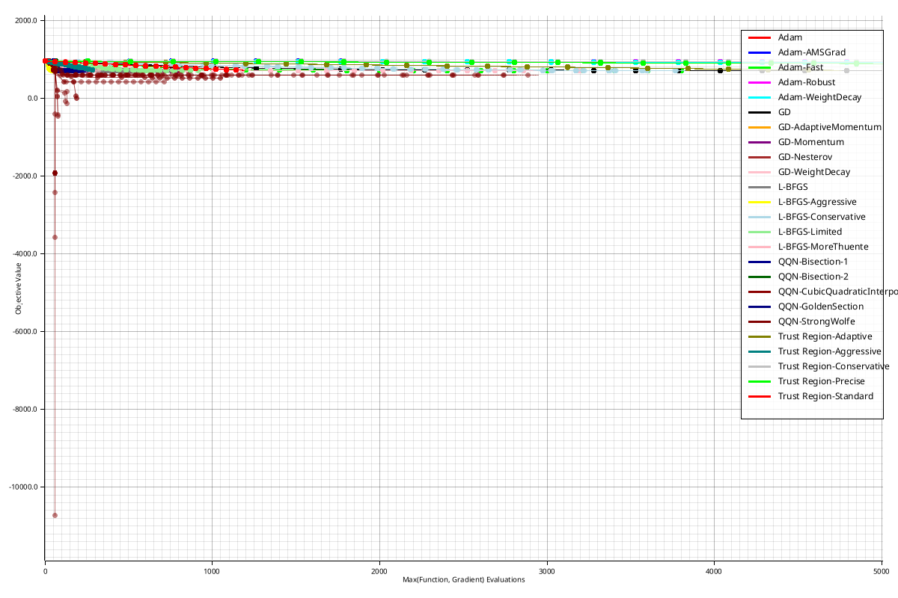
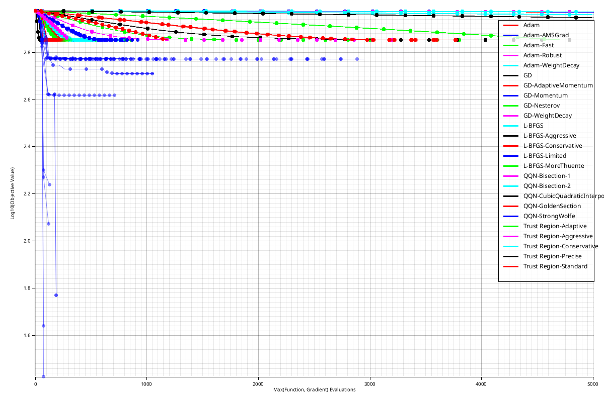

**Figure:** Convergence plots for Schwefel_2D showing objective value vs iterations.
Left: Linear scale, Right: Log scale for better visualization of convergence behavior.

**Data:** [Linear scale data (CSV)](data/Schwefel_2D_data.csv) | [Log scale data (CSV)](data/Schwefel_2D_log_data.csv)

## Problem: Schwefel_5D

**Family:** Schwefel
**Dimension:** 5
**Success Threshold:** 1.000e-8
**Total Runs:** 500
**Detailed Analysis:** [View comprehensive problem analysis](reports/problem_analysis_Schwefel_5D.md)

### Performance Summary
<table style="border-collapse: collapse; width: 100%; margin: 20px 0;">
<tr style="background-color: #f2f2f2;">
<th style="border: 1px solid #ddd; padding: 8px; text-align: center;">Rank</th>
<th style="border: 1px solid #ddd; padding: 8px; text-align: center;">Optimizer</th>
<th style="border: 1px solid #ddd; padding: 8px; text-align: center;">Mean Final Value (All/Success/Fail)</th>
<th style="border: 1px solid #ddd; padding: 8px; text-align: center;">Std Dev</th>
<th style="border: 1px solid #ddd; padding: 8px; text-align: center;">Best Value</th>
<th style="border: 1px solid #ddd; padding: 8px; text-align: center;">Worst Value</th>
<th style="border: 1px solid #ddd; padding: 8px; text-align: center;">Mean Function Evals (All/Success/Fail)</th>
<th style="border: 1px solid #ddd; padding: 8px; text-align: center;">Mean Gradient Evals (All/Success/Fail)</th>
<th style="border: 1px solid #ddd; padding: 8px; text-align: center;">Success Rate</th>
<th style="border: 1px solid #ddd; padding: 8px; text-align: center;">Mean Time (s)</th>
</tr>
<tr style="background-color: #d4edda; font-weight: bold;">
<td style="border: 1px solid #ddd; padding: 8px; text-align: center;">1</td>
<td style="border: 1px solid #ddd; padding: 8px; text-align: center;"><a href="reports/detailed_Schwefel_5D_QQN-StrongWolfe.md" title="Click for detailed analysis">QQN-StrongWolfe</a></td>
<td style="border: 1px solid #ddd; padding: 8px; text-align: center;">-1.74e3 / -4.67e3 / 1.20e3</td>
<td style="border: 1px solid #ddd; padding: 8px; text-align: center;">7.34e3</td>
<td style="border: 1px solid #ddd; padding: 8px; text-align: center;">-3.30e4</td>
<td style="border: 1px solid #ddd; padding: 8px; text-align: center;">1.48e3</td>
<td style="border: 1px solid #ddd; padding: 8px; text-align: center;">349.1 / 43.9 / 654.4</td>
<td style="border: 1px solid #ddd; padding: 8px; text-align: center;">391.5 / 44.8 / 738.2</td>
<td style="border: 1px solid #ddd; padding: 8px; text-align: center;">50.0%</td>
<td style="border: 1px solid #ddd; padding: 8px; text-align: center;">0.015</td>
</tr>
<tr style="background-color: #fff3cd;">
<td style="border: 1px solid #ddd; padding: 8px; text-align: center;">2</td>
<td style="border: 1px solid #ddd; padding: 8px; text-align: center;"><a href="reports/detailed_Schwefel_5D_QQN-CubicQuadraticInterpolation.md" title="Click for detailed analysis">QQN-CubicQuadraticInterpolation</a></td>
<td style="border: 1px solid #ddd; padding: 8px; text-align: center;">1.78e3 / - / 1.78e3</td>
<td style="border: 1px solid #ddd; padding: 8px; text-align: center;">4.55e-13</td>
<td style="border: 1px solid #ddd; padding: 8px; text-align: center;">1.78e3</td>
<td style="border: 1px solid #ddd; padding: 8px; text-align: center;">1.78e3</td>
<td style="border: 1px solid #ddd; padding: 8px; text-align: center;">57.3 / - / 57.3</td>
<td style="border: 1px solid #ddd; padding: 8px; text-align: center;">55.5 / - / 55.5</td>
<td style="border: 1px solid #ddd; padding: 8px; text-align: center;">0.0%</td>
<td style="border: 1px solid #ddd; padding: 8px; text-align: center;">0.001</td>
</tr>
<tr style="">
<td style="border: 1px solid #ddd; padding: 8px; text-align: center;">3</td>
<td style="border: 1px solid #ddd; padding: 8px; text-align: center;"><a href="reports/detailed_Schwefel_5D_QQN-Bisection-2.md" title="Click for detailed analysis">QQN-Bisection-2</a></td>
<td style="border: 1px solid #ddd; padding: 8px; text-align: center;">1.78e3 / - / 1.78e3</td>
<td style="border: 1px solid #ddd; padding: 8px; text-align: center;">4.69e-13</td>
<td style="border: 1px solid #ddd; padding: 8px; text-align: center;">1.78e3</td>
<td style="border: 1px solid #ddd; padding: 8px; text-align: center;">1.78e3</td>
<td style="border: 1px solid #ddd; padding: 8px; text-align: center;">52.0 / - / 52.0</td>
<td style="border: 1px solid #ddd; padding: 8px; text-align: center;">80.0 / - / 80.0</td>
<td style="border: 1px solid #ddd; padding: 8px; text-align: center;">0.0%</td>
<td style="border: 1px solid #ddd; padding: 8px; text-align: center;">0.001</td>
</tr>
<tr style="">
<td style="border: 1px solid #ddd; padding: 8px; text-align: center;">4</td>
<td style="border: 1px solid #ddd; padding: 8px; text-align: center;"><a href="reports/detailed_Schwefel_5D_L-BFGS-Aggressive.md" title="Click for detailed analysis">L-BFGS-Aggressive</a></td>
<td style="border: 1px solid #ddd; padding: 8px; text-align: center;">1.78e3 / - / 1.78e3</td>
<td style="border: 1px solid #ddd; padding: 8px; text-align: center;">4.59e-2</td>
<td style="border: 1px solid #ddd; padding: 8px; text-align: center;">1.78e3</td>
<td style="border: 1px solid #ddd; padding: 8px; text-align: center;">1.78e3</td>
<td style="border: 1px solid #ddd; padding: 8px; text-align: center;">101.0 / - / 101.0</td>
<td style="border: 1px solid #ddd; padding: 8px; text-align: center;">41.0 / - / 41.0</td>
<td style="border: 1px solid #ddd; padding: 8px; text-align: center;">0.0%</td>
<td style="border: 1px solid #ddd; padding: 8px; text-align: center;">0.001</td>
</tr>
<tr style="">
<td style="border: 1px solid #ddd; padding: 8px; text-align: center;">5</td>
<td style="border: 1px solid #ddd; padding: 8px; text-align: center;"><a href="reports/detailed_Schwefel_5D_QQN-Bisection-1.md" title="Click for detailed analysis">QQN-Bisection-1</a></td>
<td style="border: 1px solid #ddd; padding: 8px; text-align: center;">1.78e3 / - / 1.78e3</td>
<td style="border: 1px solid #ddd; padding: 8px; text-align: center;">4.55e-13</td>
<td style="border: 1px solid #ddd; padding: 8px; text-align: center;">1.78e3</td>
<td style="border: 1px solid #ddd; padding: 8px; text-align: center;">1.78e3</td>
<td style="border: 1px solid #ddd; padding: 8px; text-align: center;">52.0 / - / 52.0</td>
<td style="border: 1px solid #ddd; padding: 8px; text-align: center;">94.0 / - / 94.0</td>
<td style="border: 1px solid #ddd; padding: 8px; text-align: center;">0.0%</td>
<td style="border: 1px solid #ddd; padding: 8px; text-align: center;">0.001</td>
</tr>
<tr style="">
<td style="border: 1px solid #ddd; padding: 8px; text-align: center;">6</td>
<td style="border: 1px solid #ddd; padding: 8px; text-align: center;"><a href="reports/detailed_Schwefel_5D_QQN-GoldenSection.md" title="Click for detailed analysis">QQN-GoldenSection</a></td>
<td style="border: 1px solid #ddd; padding: 8px; text-align: center;">1.78e3 / - / 1.78e3</td>
<td style="border: 1px solid #ddd; padding: 8px; text-align: center;">4.96e-13</td>
<td style="border: 1px solid #ddd; padding: 8px; text-align: center;">1.78e3</td>
<td style="border: 1px solid #ddd; padding: 8px; text-align: center;">1.78e3</td>
<td style="border: 1px solid #ddd; padding: 8px; text-align: center;">149.4 / - / 149.4</td>
<td style="border: 1px solid #ddd; padding: 8px; text-align: center;">28.8 / - / 28.8</td>
<td style="border: 1px solid #ddd; padding: 8px; text-align: center;">0.0%</td>
<td style="border: 1px solid #ddd; padding: 8px; text-align: center;">0.002</td>
</tr>
<tr style="">
<td style="border: 1px solid #ddd; padding: 8px; text-align: center;">7</td>
<td style="border: 1px solid #ddd; padding: 8px; text-align: center;"><a href="reports/detailed_Schwefel_5D_L-BFGS-MoreThuente.md" title="Click for detailed analysis">L-BFGS-MoreThuente</a></td>
<td style="border: 1px solid #ddd; padding: 8px; text-align: center;">1.78e3 / - / 1.78e3</td>
<td style="border: 1px solid #ddd; padding: 8px; text-align: center;">9.47e-6</td>
<td style="border: 1px solid #ddd; padding: 8px; text-align: center;">1.78e3</td>
<td style="border: 1px solid #ddd; padding: 8px; text-align: center;">1.78e3</td>
<td style="border: 1px solid #ddd; padding: 8px; text-align: center;">158.2 / - / 158.2</td>
<td style="border: 1px solid #ddd; padding: 8px; text-align: center;">111.3 / - / 111.3</td>
<td style="border: 1px solid #ddd; padding: 8px; text-align: center;">0.0%</td>
<td style="border: 1px solid #ddd; padding: 8px; text-align: center;">0.004</td>
</tr>
<tr style="">
<td style="border: 1px solid #ddd; padding: 8px; text-align: center;">8</td>
<td style="border: 1px solid #ddd; padding: 8px; text-align: center;"><a href="reports/detailed_Schwefel_5D_GD-AdaptiveMomentum.md" title="Click for detailed analysis">GD-AdaptiveMomentum</a></td>
<td style="border: 1px solid #ddd; padding: 8px; text-align: center;">1.78e3 / - / 1.78e3</td>
<td style="border: 1px solid #ddd; padding: 8px; text-align: center;">2.87e-3</td>
<td style="border: 1px solid #ddd; padding: 8px; text-align: center;">1.78e3</td>
<td style="border: 1px solid #ddd; padding: 8px; text-align: center;">1.78e3</td>
<td style="border: 1px solid #ddd; padding: 8px; text-align: center;">124.3 / - / 124.3</td>
<td style="border: 1px solid #ddd; padding: 8px; text-align: center;">244.6 / - / 244.6</td>
<td style="border: 1px solid #ddd; padding: 8px; text-align: center;">0.0%</td>
<td style="border: 1px solid #ddd; padding: 8px; text-align: center;">0.004</td>
</tr>
<tr style="">
<td style="border: 1px solid #ddd; padding: 8px; text-align: center;">9</td>
<td style="border: 1px solid #ddd; padding: 8px; text-align: center;"><a href="reports/detailed_Schwefel_5D_L-BFGS.md" title="Click for detailed analysis">L-BFGS</a></td>
<td style="border: 1px solid #ddd; padding: 8px; text-align: center;">1.78e3 / - / 1.78e3</td>
<td style="border: 1px solid #ddd; padding: 8px; text-align: center;">1.27e-5</td>
<td style="border: 1px solid #ddd; padding: 8px; text-align: center;">1.78e3</td>
<td style="border: 1px solid #ddd; padding: 8px; text-align: center;">1.78e3</td>
<td style="border: 1px solid #ddd; padding: 8px; text-align: center;">325.7 / - / 325.7</td>
<td style="border: 1px solid #ddd; padding: 8px; text-align: center;">245.2 / - / 245.2</td>
<td style="border: 1px solid #ddd; padding: 8px; text-align: center;">0.0%</td>
<td style="border: 1px solid #ddd; padding: 8px; text-align: center;">0.008</td>
</tr>
<tr style="">
<td style="border: 1px solid #ddd; padding: 8px; text-align: center;">10</td>
<td style="border: 1px solid #ddd; padding: 8px; text-align: center;"><a href="reports/detailed_Schwefel_5D_Trust_Region-Aggressive.md" title="Click for detailed analysis">Trust Region-Aggressive</a></td>
<td style="border: 1px solid #ddd; padding: 8px; text-align: center;">1.78e3 / - / 1.78e3</td>
<td style="border: 1px solid #ddd; padding: 8px; text-align: center;">9.61e-1</td>
<td style="border: 1px solid #ddd; padding: 8px; text-align: center;">1.78e3</td>
<td style="border: 1px solid #ddd; padding: 8px; text-align: center;">1.78e3</td>
<td style="border: 1px solid #ddd; padding: 8px; text-align: center;">446.0 / - / 446.0</td>
<td style="border: 1px solid #ddd; padding: 8px; text-align: center;">298.0 / - / 298.0</td>
<td style="border: 1px solid #ddd; padding: 8px; text-align: center;">0.0%</td>
<td style="border: 1px solid #ddd; padding: 8px; text-align: center;">0.003</td>
</tr>
<tr style="">
<td style="border: 1px solid #ddd; padding: 8px; text-align: center;">11</td>
<td style="border: 1px solid #ddd; padding: 8px; text-align: center;"><a href="reports/detailed_Schwefel_5D_GD-Momentum.md" title="Click for detailed analysis">GD-Momentum</a></td>
<td style="border: 1px solid #ddd; padding: 8px; text-align: center;">1.78e3 / - / 1.78e3</td>
<td style="border: 1px solid #ddd; padding: 8px; text-align: center;">2.77e-7</td>
<td style="border: 1px solid #ddd; padding: 8px; text-align: center;">1.78e3</td>
<td style="border: 1px solid #ddd; padding: 8px; text-align: center;">1.78e3</td>
<td style="border: 1px solid #ddd; padding: 8px; text-align: center;">323.9 / - / 323.9</td>
<td style="border: 1px solid #ddd; padding: 8px; text-align: center;">643.8 / - / 643.8</td>
<td style="border: 1px solid #ddd; padding: 8px; text-align: center;">0.0%</td>
<td style="border: 1px solid #ddd; padding: 8px; text-align: center;">0.010</td>
</tr>
<tr style="">
<td style="border: 1px solid #ddd; padding: 8px; text-align: center;">12</td>
<td style="border: 1px solid #ddd; padding: 8px; text-align: center;"><a href="reports/detailed_Schwefel_5D_GD-Nesterov.md" title="Click for detailed analysis">GD-Nesterov</a></td>
<td style="border: 1px solid #ddd; padding: 8px; text-align: center;">1.78e3 / - / 1.78e3</td>
<td style="border: 1px solid #ddd; padding: 8px; text-align: center;">3.12e-7</td>
<td style="border: 1px solid #ddd; padding: 8px; text-align: center;">1.78e3</td>
<td style="border: 1px solid #ddd; padding: 8px; text-align: center;">1.78e3</td>
<td style="border: 1px solid #ddd; padding: 8px; text-align: center;">339.1 / - / 339.1</td>
<td style="border: 1px solid #ddd; padding: 8px; text-align: center;">674.1 / - / 674.1</td>
<td style="border: 1px solid #ddd; padding: 8px; text-align: center;">0.0%</td>
<td style="border: 1px solid #ddd; padding: 8px; text-align: center;">0.011</td>
</tr>
<tr style="">
<td style="border: 1px solid #ddd; padding: 8px; text-align: center;">13</td>
<td style="border: 1px solid #ddd; padding: 8px; text-align: center;"><a href="reports/detailed_Schwefel_5D_L-BFGS-Limited.md" title="Click for detailed analysis">L-BFGS-Limited</a></td>
<td style="border: 1px solid #ddd; padding: 8px; text-align: center;">1.79e3 / - / 1.79e3</td>
<td style="border: 1px solid #ddd; padding: 8px; text-align: center;">5.71e1</td>
<td style="border: 1px solid #ddd; padding: 8px; text-align: center;">1.78e3</td>
<td style="border: 1px solid #ddd; padding: 8px; text-align: center;">2.04e3</td>
<td style="border: 1px solid #ddd; padding: 8px; text-align: center;">661.0 / - / 661.0</td>
<td style="border: 1px solid #ddd; padding: 8px; text-align: center;">396.8 / - / 396.8</td>
<td style="border: 1px solid #ddd; padding: 8px; text-align: center;">0.0%</td>
<td style="border: 1px solid #ddd; padding: 8px; text-align: center;">0.020</td>
</tr>
<tr style="">
<td style="border: 1px solid #ddd; padding: 8px; text-align: center;">14</td>
<td style="border: 1px solid #ddd; padding: 8px; text-align: center;"><a href="reports/detailed_Schwefel_5D_Trust_Region-Standard.md" title="Click for detailed analysis">Trust Region-Standard</a></td>
<td style="border: 1px solid #ddd; padding: 8px; text-align: center;">1.78e3 / - / 1.78e3</td>
<td style="border: 1px solid #ddd; padding: 8px; text-align: center;">2.49e-1</td>
<td style="border: 1px solid #ddd; padding: 8px; text-align: center;">1.78e3</td>
<td style="border: 1px solid #ddd; padding: 8px; text-align: center;">1.78e3</td>
<td style="border: 1px solid #ddd; padding: 8px; text-align: center;">1774.8 / - / 1774.8</td>
<td style="border: 1px solid #ddd; padding: 8px; text-align: center;">1183.9 / - / 1183.9</td>
<td style="border: 1px solid #ddd; padding: 8px; text-align: center;">0.0%</td>
<td style="border: 1px solid #ddd; padding: 8px; text-align: center;">0.012</td>
</tr>
<tr style="">
<td style="border: 1px solid #ddd; padding: 8px; text-align: center;">15</td>
<td style="border: 1px solid #ddd; padding: 8px; text-align: center;"><a href="reports/detailed_Schwefel_5D_GD-WeightDecay.md" title="Click for detailed analysis">GD-WeightDecay</a></td>
<td style="border: 1px solid #ddd; padding: 8px; text-align: center;">1.78e3 / - / 1.78e3</td>
<td style="border: 1px solid #ddd; padding: 8px; text-align: center;">5.29e-8</td>
<td style="border: 1px solid #ddd; padding: 8px; text-align: center;">1.78e3</td>
<td style="border: 1px solid #ddd; padding: 8px; text-align: center;">1.78e3</td>
<td style="border: 1px solid #ddd; padding: 8px; text-align: center;">1124.1 / - / 1124.1</td>
<td style="border: 1px solid #ddd; padding: 8px; text-align: center;">2244.2 / - / 2244.2</td>
<td style="border: 1px solid #ddd; padding: 8px; text-align: center;">0.0%</td>
<td style="border: 1px solid #ddd; padding: 8px; text-align: center;">0.036</td>
</tr>
<tr style="">
<td style="border: 1px solid #ddd; padding: 8px; text-align: center;">16</td>
<td style="border: 1px solid #ddd; padding: 8px; text-align: center;"><a href="reports/detailed_Schwefel_5D_Adam-Fast.md" title="Click for detailed analysis">Adam-Fast</a></td>
<td style="border: 1px solid #ddd; padding: 8px; text-align: center;">1.78e3 / - / 1.78e3</td>
<td style="border: 1px solid #ddd; padding: 8px; text-align: center;">2.06e-7</td>
<td style="border: 1px solid #ddd; padding: 8px; text-align: center;">1.78e3</td>
<td style="border: 1px solid #ddd; padding: 8px; text-align: center;">1.78e3</td>
<td style="border: 1px solid #ddd; padding: 8px; text-align: center;">1907.4 / - / 1907.4</td>
<td style="border: 1px solid #ddd; padding: 8px; text-align: center;">1906.4 / - / 1906.4</td>
<td style="border: 1px solid #ddd; padding: 8px; text-align: center;">0.0%</td>
<td style="border: 1px solid #ddd; padding: 8px; text-align: center;">0.039</td>
</tr>
<tr style="">
<td style="border: 1px solid #ddd; padding: 8px; text-align: center;">17</td>
<td style="border: 1px solid #ddd; padding: 8px; text-align: center;"><a href="reports/detailed_Schwefel_5D_L-BFGS-Conservative.md" title="Click for detailed analysis">L-BFGS-Conservative</a></td>
<td style="border: 1px solid #ddd; padding: 8px; text-align: center;">1.78e3 / - / 1.78e3</td>
<td style="border: 1px solid #ddd; padding: 8px; text-align: center;">2.02e-7</td>
<td style="border: 1px solid #ddd; padding: 8px; text-align: center;">1.78e3</td>
<td style="border: 1px solid #ddd; padding: 8px; text-align: center;">1.78e3</td>
<td style="border: 1px solid #ddd; padding: 8px; text-align: center;">2163.4 / - / 2163.4</td>
<td style="border: 1px solid #ddd; padding: 8px; text-align: center;">1729.5 / - / 1729.5</td>
<td style="border: 1px solid #ddd; padding: 8px; text-align: center;">0.0%</td>
<td style="border: 1px solid #ddd; padding: 8px; text-align: center;">0.061</td>
</tr>
<tr style="">
<td style="border: 1px solid #ddd; padding: 8px; text-align: center;">18</td>
<td style="border: 1px solid #ddd; padding: 8px; text-align: center;"><a href="reports/detailed_Schwefel_5D_GD.md" title="Click for detailed analysis">GD</a></td>
<td style="border: 1px solid #ddd; padding: 8px; text-align: center;">1.78e3 / - / 1.78e3</td>
<td style="border: 1px solid #ddd; padding: 8px; text-align: center;">1.99e-3</td>
<td style="border: 1px solid #ddd; padding: 8px; text-align: center;">1.78e3</td>
<td style="border: 1px solid #ddd; padding: 8px; text-align: center;">1.78e3</td>
<td style="border: 1px solid #ddd; padding: 8px; text-align: center;">1668.0 / - / 1668.0</td>
<td style="border: 1px solid #ddd; padding: 8px; text-align: center;">3334.0 / - / 3334.0</td>
<td style="border: 1px solid #ddd; padding: 8px; text-align: center;">0.0%</td>
<td style="border: 1px solid #ddd; padding: 8px; text-align: center;">0.044</td>
</tr>
<tr style="">
<td style="border: 1px solid #ddd; padding: 8px; text-align: center;">19</td>
<td style="border: 1px solid #ddd; padding: 8px; text-align: center;"><a href="reports/detailed_Schwefel_5D_Adam-AMSGrad.md" title="Click for detailed analysis">Adam-AMSGrad</a></td>
<td style="border: 1px solid #ddd; padding: 8px; text-align: center;">2.34e3 / - / 2.34e3</td>
<td style="border: 1px solid #ddd; padding: 8px; text-align: center;">1.27e0</td>
<td style="border: 1px solid #ddd; padding: 8px; text-align: center;">2.34e3</td>
<td style="border: 1px solid #ddd; padding: 8px; text-align: center;">2.34e3</td>
<td style="border: 1px solid #ddd; padding: 8px; text-align: center;">2502.0 / - / 2502.0</td>
<td style="border: 1px solid #ddd; padding: 8px; text-align: center;">2502.0 / - / 2502.0</td>
<td style="border: 1px solid #ddd; padding: 8px; text-align: center;">0.0%</td>
<td style="border: 1px solid #ddd; padding: 8px; text-align: center;">0.059</td>
</tr>
<tr style="">
<td style="border: 1px solid #ddd; padding: 8px; text-align: center;">20</td>
<td style="border: 1px solid #ddd; padding: 8px; text-align: center;"><a href="reports/detailed_Schwefel_5D_Trust_Region-Precise.md" title="Click for detailed analysis">Trust Region-Precise</a></td>
<td style="border: 1px solid #ddd; padding: 8px; text-align: center;">2.30e3 / - / 2.30e3</td>
<td style="border: 1px solid #ddd; padding: 8px; text-align: center;">1.15e0</td>
<td style="border: 1px solid #ddd; padding: 8px; text-align: center;">2.30e3</td>
<td style="border: 1px solid #ddd; padding: 8px; text-align: center;">2.31e3</td>
<td style="border: 1px solid #ddd; padding: 8px; text-align: center;">3002.0 / - / 3002.0</td>
<td style="border: 1px solid #ddd; padding: 8px; text-align: center;">2002.0 / - / 2002.0</td>
<td style="border: 1px solid #ddd; padding: 8px; text-align: center;">0.0%</td>
<td style="border: 1px solid #ddd; padding: 8px; text-align: center;">0.020</td>
</tr>
<tr style="">
<td style="border: 1px solid #ddd; padding: 8px; text-align: center;">21</td>
<td style="border: 1px solid #ddd; padding: 8px; text-align: center;"><a href="reports/detailed_Schwefel_5D_Adam-WeightDecay.md" title="Click for detailed analysis">Adam-WeightDecay</a></td>
<td style="border: 1px solid #ddd; padding: 8px; text-align: center;">2.28e3 / - / 2.28e3</td>
<td style="border: 1px solid #ddd; padding: 8px; text-align: center;">1.09e0</td>
<td style="border: 1px solid #ddd; padding: 8px; text-align: center;">2.27e3</td>
<td style="border: 1px solid #ddd; padding: 8px; text-align: center;">2.28e3</td>
<td style="border: 1px solid #ddd; padding: 8px; text-align: center;">2502.0 / - / 2502.0</td>
<td style="border: 1px solid #ddd; padding: 8px; text-align: center;">2502.0 / - / 2502.0</td>
<td style="border: 1px solid #ddd; padding: 8px; text-align: center;">0.0%</td>
<td style="border: 1px solid #ddd; padding: 8px; text-align: center;">0.056</td>
</tr>
<tr style="">
<td style="border: 1px solid #ddd; padding: 8px; text-align: center;">22</td>
<td style="border: 1px solid #ddd; padding: 8px; text-align: center;"><a href="reports/detailed_Schwefel_5D_Adam-Robust.md" title="Click for detailed analysis">Adam-Robust</a></td>
<td style="border: 1px solid #ddd; padding: 8px; text-align: center;">2.34e3 / - / 2.34e3</td>
<td style="border: 1px solid #ddd; padding: 8px; text-align: center;">1.19e0</td>
<td style="border: 1px solid #ddd; padding: 8px; text-align: center;">2.34e3</td>
<td style="border: 1px solid #ddd; padding: 8px; text-align: center;">2.34e3</td>
<td style="border: 1px solid #ddd; padding: 8px; text-align: center;">2502.0 / - / 2502.0</td>
<td style="border: 1px solid #ddd; padding: 8px; text-align: center;">2502.0 / - / 2502.0</td>
<td style="border: 1px solid #ddd; padding: 8px; text-align: center;">0.0%</td>
<td style="border: 1px solid #ddd; padding: 8px; text-align: center;">0.059</td>
</tr>
<tr style="">
<td style="border: 1px solid #ddd; padding: 8px; text-align: center;">23</td>
<td style="border: 1px solid #ddd; padding: 8px; text-align: center;"><a href="reports/detailed_Schwefel_5D_Trust_Region-Conservative.md" title="Click for detailed analysis">Trust Region-Conservative</a></td>
<td style="border: 1px solid #ddd; padding: 8px; text-align: center;">2.36e3 / - / 2.36e3</td>
<td style="border: 1px solid #ddd; padding: 8px; text-align: center;">1.17e0</td>
<td style="border: 1px solid #ddd; padding: 8px; text-align: center;">2.35e3</td>
<td style="border: 1px solid #ddd; padding: 8px; text-align: center;">2.36e3</td>
<td style="border: 1px solid #ddd; padding: 8px; text-align: center;">3002.0 / - / 3002.0</td>
<td style="border: 1px solid #ddd; padding: 8px; text-align: center;">2002.0 / - / 2002.0</td>
<td style="border: 1px solid #ddd; padding: 8px; text-align: center;">0.0%</td>
<td style="border: 1px solid #ddd; padding: 8px; text-align: center;">0.020</td>
</tr>
<tr style="">
<td style="border: 1px solid #ddd; padding: 8px; text-align: center;">24</td>
<td style="border: 1px solid #ddd; padding: 8px; text-align: center;"><a href="reports/detailed_Schwefel_5D_Adam.md" title="Click for detailed analysis">Adam</a></td>
<td style="border: 1px solid #ddd; padding: 8px; text-align: center;">2.34e3 / - / 2.34e3</td>
<td style="border: 1px solid #ddd; padding: 8px; text-align: center;">1.25e0</td>
<td style="border: 1px solid #ddd; padding: 8px; text-align: center;">2.33e3</td>
<td style="border: 1px solid #ddd; padding: 8px; text-align: center;">2.34e3</td>
<td style="border: 1px solid #ddd; padding: 8px; text-align: center;">2502.0 / - / 2502.0</td>
<td style="border: 1px solid #ddd; padding: 8px; text-align: center;">2502.0 / - / 2502.0</td>
<td style="border: 1px solid #ddd; padding: 8px; text-align: center;">0.0%</td>
<td style="border: 1px solid #ddd; padding: 8px; text-align: center;">0.052</td>
</tr>
<tr style="">
<td style="border: 1px solid #ddd; padding: 8px; text-align: center;">25</td>
<td style="border: 1px solid #ddd; padding: 8px; text-align: center;"><a href="reports/detailed_Schwefel_5D_Trust_Region-Adaptive.md" title="Click for detailed analysis">Trust Region-Adaptive</a></td>
<td style="border: 1px solid #ddd; padding: 8px; text-align: center;">2.12e3 / - / 2.12e3</td>
<td style="border: 1px solid #ddd; padding: 8px; text-align: center;">1.37e0</td>
<td style="border: 1px solid #ddd; padding: 8px; text-align: center;">2.11e3</td>
<td style="border: 1px solid #ddd; padding: 8px; text-align: center;">2.12e3</td>
<td style="border: 1px solid #ddd; padding: 8px; text-align: center;">3002.0 / - / 3002.0</td>
<td style="border: 1px solid #ddd; padding: 8px; text-align: center;">2002.0 / - / 2002.0</td>
<td style="border: 1px solid #ddd; padding: 8px; text-align: center;">0.0%</td>
<td style="border: 1px solid #ddd; padding: 8px; text-align: center;">0.020</td>
</tr>
</table>

### Convergence Plots

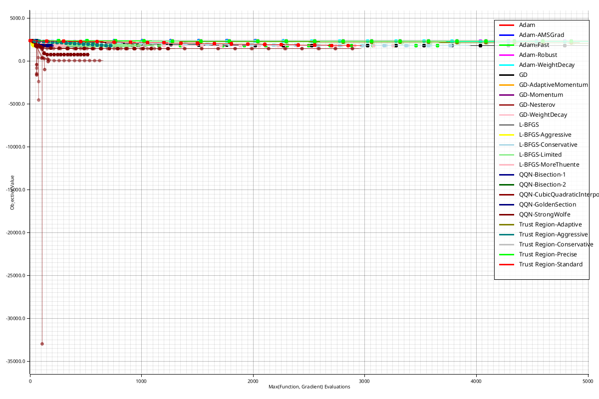
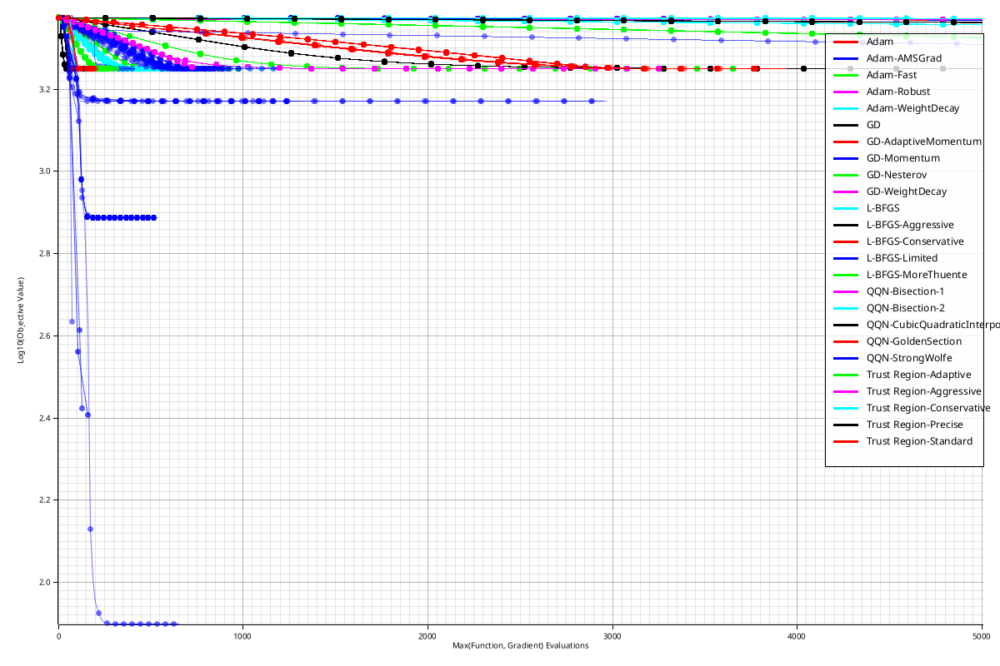

**Figure:** Convergence plots for Schwefel_5D showing objective value vs iterations.
Left: Linear scale, Right: Log scale for better visualization of convergence behavior.

**Data:** [Linear scale data (CSV)](data/Schwefel_5D_data.csv) | [Log scale data (CSV)](data/Schwefel_5D_log_data.csv)

## Problem: Schwefel_10D

**Family:** Schwefel
**Dimension:** 10
**Success Threshold:** 1.000e-8
**Total Runs:** 500
**Detailed Analysis:** [View comprehensive problem analysis](reports/problem_analysis_Schwefel_10D.md)

### Performance Summary
<table style="border-collapse: collapse; width: 100%; margin: 20px 0;">
<tr style="background-color: #f2f2f2;">
<th style="border: 1px solid #ddd; padding: 8px; text-align: center;">Rank</th>
<th style="border: 1px solid #ddd; padding: 8px; text-align: center;">Optimizer</th>
<th style="border: 1px solid #ddd; padding: 8px; text-align: center;">Mean Final Value (All/Success/Fail)</th>
<th style="border: 1px solid #ddd; padding: 8px; text-align: center;">Std Dev</th>
<th style="border: 1px solid #ddd; padding: 8px; text-align: center;">Best Value</th>
<th style="border: 1px solid #ddd; padding: 8px; text-align: center;">Worst Value</th>
<th style="border: 1px solid #ddd; padding: 8px; text-align: center;">Mean Function Evals (All/Success/Fail)</th>
<th style="border: 1px solid #ddd; padding: 8px; text-align: center;">Mean Gradient Evals (All/Success/Fail)</th>
<th style="border: 1px solid #ddd; padding: 8px; text-align: center;">Success Rate</th>
<th style="border: 1px solid #ddd; padding: 8px; text-align: center;">Mean Time (s)</th>
</tr>
<tr style="background-color: #d4edda; font-weight: bold;">
<td style="border: 1px solid #ddd; padding: 8px; text-align: center;">1</td>
<td style="border: 1px solid #ddd; padding: 8px; text-align: center;"><a href="reports/detailed_Schwefel_10D_QQN-StrongWolfe.md" title="Click for detailed analysis">QQN-StrongWolfe</a></td>
<td style="border: 1px solid #ddd; padding: 8px; text-align: center;">8.35e2 / -5.67e2 / 2.24e3</td>
<td style="border: 1px solid #ddd; padding: 8px; text-align: center;">1.64e3</td>
<td style="border: 1px solid #ddd; padding: 8px; text-align: center;">-2.28e3</td>
<td style="border: 1px solid #ddd; padding: 8px; text-align: center;">2.96e3</td>
<td style="border: 1px solid #ddd; padding: 8px; text-align: center;">395.5 / 96.5 / 694.5</td>
<td style="border: 1px solid #ddd; padding: 8px; text-align: center;">432.2 / 92.6 / 771.8</td>
<td style="border: 1px solid #ddd; padding: 8px; text-align: center;">50.0%</td>
<td style="border: 1px solid #ddd; padding: 8px; text-align: center;">0.019</td>
</tr>
<tr style="background-color: #fff3cd;">
<td style="border: 1px solid #ddd; padding: 8px; text-align: center;">2</td>
<td style="border: 1px solid #ddd; padding: 8px; text-align: center;"><a href="reports/detailed_Schwefel_10D_QQN-CubicQuadraticInterpolation.md" title="Click for detailed analysis">QQN-CubicQuadraticInterpolation</a></td>
<td style="border: 1px solid #ddd; padding: 8px; text-align: center;">3.55e3 / - / 3.55e3</td>
<td style="border: 1px solid #ddd; padding: 8px; text-align: center;">1.43e-3</td>
<td style="border: 1px solid #ddd; padding: 8px; text-align: center;">3.55e3</td>
<td style="border: 1px solid #ddd; padding: 8px; text-align: center;">3.55e3</td>
<td style="border: 1px solid #ddd; padding: 8px; text-align: center;">56.9 / - / 56.9</td>
<td style="border: 1px solid #ddd; padding: 8px; text-align: center;">54.9 / - / 54.9</td>
<td style="border: 1px solid #ddd; padding: 8px; text-align: center;">0.0%</td>
<td style="border: 1px solid #ddd; padding: 8px; text-align: center;">0.001</td>
</tr>
<tr style="">
<td style="border: 1px solid #ddd; padding: 8px; text-align: center;">3</td>
<td style="border: 1px solid #ddd; padding: 8px; text-align: center;"><a href="reports/detailed_Schwefel_10D_QQN-Bisection-2.md" title="Click for detailed analysis">QQN-Bisection-2</a></td>
<td style="border: 1px solid #ddd; padding: 8px; text-align: center;">3.55e3 / - / 3.55e3</td>
<td style="border: 1px solid #ddd; padding: 8px; text-align: center;">9.09e-13</td>
<td style="border: 1px solid #ddd; padding: 8px; text-align: center;">3.55e3</td>
<td style="border: 1px solid #ddd; padding: 8px; text-align: center;">3.55e3</td>
<td style="border: 1px solid #ddd; padding: 8px; text-align: center;">52.0 / - / 52.0</td>
<td style="border: 1px solid #ddd; padding: 8px; text-align: center;">80.0 / - / 80.0</td>
<td style="border: 1px solid #ddd; padding: 8px; text-align: center;">0.0%</td>
<td style="border: 1px solid #ddd; padding: 8px; text-align: center;">0.002</td>
</tr>
<tr style="">
<td style="border: 1px solid #ddd; padding: 8px; text-align: center;">4</td>
<td style="border: 1px solid #ddd; padding: 8px; text-align: center;"><a href="reports/detailed_Schwefel_10D_L-BFGS-Aggressive.md" title="Click for detailed analysis">L-BFGS-Aggressive</a></td>
<td style="border: 1px solid #ddd; padding: 8px; text-align: center;">3.55e3 / - / 3.55e3</td>
<td style="border: 1px solid #ddd; padding: 8px; text-align: center;">4.65e-2</td>
<td style="border: 1px solid #ddd; padding: 8px; text-align: center;">3.55e3</td>
<td style="border: 1px solid #ddd; padding: 8px; text-align: center;">3.55e3</td>
<td style="border: 1px solid #ddd; padding: 8px; text-align: center;">101.0 / - / 101.0</td>
<td style="border: 1px solid #ddd; padding: 8px; text-align: center;">41.0 / - / 41.0</td>
<td style="border: 1px solid #ddd; padding: 8px; text-align: center;">0.0%</td>
<td style="border: 1px solid #ddd; padding: 8px; text-align: center;">0.002</td>
</tr>
<tr style="">
<td style="border: 1px solid #ddd; padding: 8px; text-align: center;">5</td>
<td style="border: 1px solid #ddd; padding: 8px; text-align: center;"><a href="reports/detailed_Schwefel_10D_QQN-Bisection-1.md" title="Click for detailed analysis">QQN-Bisection-1</a></td>
<td style="border: 1px solid #ddd; padding: 8px; text-align: center;">3.55e3 / - / 3.55e3</td>
<td style="border: 1px solid #ddd; padding: 8px; text-align: center;">9.09e-13</td>
<td style="border: 1px solid #ddd; padding: 8px; text-align: center;">3.55e3</td>
<td style="border: 1px solid #ddd; padding: 8px; text-align: center;">3.55e3</td>
<td style="border: 1px solid #ddd; padding: 8px; text-align: center;">52.0 / - / 52.0</td>
<td style="border: 1px solid #ddd; padding: 8px; text-align: center;">94.0 / - / 94.0</td>
<td style="border: 1px solid #ddd; padding: 8px; text-align: center;">0.0%</td>
<td style="border: 1px solid #ddd; padding: 8px; text-align: center;">0.001</td>
</tr>
<tr style="">
<td style="border: 1px solid #ddd; padding: 8px; text-align: center;">6</td>
<td style="border: 1px solid #ddd; padding: 8px; text-align: center;"><a href="reports/detailed_Schwefel_10D_QQN-GoldenSection.md" title="Click for detailed analysis">QQN-GoldenSection</a></td>
<td style="border: 1px solid #ddd; padding: 8px; text-align: center;">3.55e3 / - / 3.55e3</td>
<td style="border: 1px solid #ddd; padding: 8px; text-align: center;">9.37e-13</td>
<td style="border: 1px solid #ddd; padding: 8px; text-align: center;">3.55e3</td>
<td style="border: 1px solid #ddd; padding: 8px; text-align: center;">3.55e3</td>
<td style="border: 1px solid #ddd; padding: 8px; text-align: center;">147.8 / - / 147.8</td>
<td style="border: 1px solid #ddd; padding: 8px; text-align: center;">27.6 / - / 27.6</td>
<td style="border: 1px solid #ddd; padding: 8px; text-align: center;">0.0%</td>
<td style="border: 1px solid #ddd; padding: 8px; text-align: center;">0.002</td>
</tr>
<tr style="">
<td style="border: 1px solid #ddd; padding: 8px; text-align: center;">7</td>
<td style="border: 1px solid #ddd; padding: 8px; text-align: center;"><a href="reports/detailed_Schwefel_10D_L-BFGS-MoreThuente.md" title="Click for detailed analysis">L-BFGS-MoreThuente</a></td>
<td style="border: 1px solid #ddd; padding: 8px; text-align: center;">3.55e3 / - / 3.55e3</td>
<td style="border: 1px solid #ddd; padding: 8px; text-align: center;">9.88e-4</td>
<td style="border: 1px solid #ddd; padding: 8px; text-align: center;">3.55e3</td>
<td style="border: 1px solid #ddd; padding: 8px; text-align: center;">3.55e3</td>
<td style="border: 1px solid #ddd; padding: 8px; text-align: center;">159.3 / - / 159.3</td>
<td style="border: 1px solid #ddd; padding: 8px; text-align: center;">112.2 / - / 112.2</td>
<td style="border: 1px solid #ddd; padding: 8px; text-align: center;">0.0%</td>
<td style="border: 1px solid #ddd; padding: 8px; text-align: center;">0.004</td>
</tr>
<tr style="">
<td style="border: 1px solid #ddd; padding: 8px; text-align: center;">8</td>
<td style="border: 1px solid #ddd; padding: 8px; text-align: center;"><a href="reports/detailed_Schwefel_10D_GD-AdaptiveMomentum.md" title="Click for detailed analysis">GD-AdaptiveMomentum</a></td>
<td style="border: 1px solid #ddd; padding: 8px; text-align: center;">3.55e3 / - / 3.55e3</td>
<td style="border: 1px solid #ddd; padding: 8px; text-align: center;">2.35e-3</td>
<td style="border: 1px solid #ddd; padding: 8px; text-align: center;">3.55e3</td>
<td style="border: 1px solid #ddd; padding: 8px; text-align: center;">3.55e3</td>
<td style="border: 1px solid #ddd; padding: 8px; text-align: center;">164.1 / - / 164.1</td>
<td style="border: 1px solid #ddd; padding: 8px; text-align: center;">324.1 / - / 324.1</td>
<td style="border: 1px solid #ddd; padding: 8px; text-align: center;">0.0%</td>
<td style="border: 1px solid #ddd; padding: 8px; text-align: center;">0.007</td>
</tr>
<tr style="">
<td style="border: 1px solid #ddd; padding: 8px; text-align: center;">9</td>
<td style="border: 1px solid #ddd; padding: 8px; text-align: center;"><a href="reports/detailed_Schwefel_10D_L-BFGS.md" title="Click for detailed analysis">L-BFGS</a></td>
<td style="border: 1px solid #ddd; padding: 8px; text-align: center;">3.55e3 / - / 3.55e3</td>
<td style="border: 1px solid #ddd; padding: 8px; text-align: center;">5.04e-4</td>
<td style="border: 1px solid #ddd; padding: 8px; text-align: center;">3.55e3</td>
<td style="border: 1px solid #ddd; padding: 8px; text-align: center;">3.55e3</td>
<td style="border: 1px solid #ddd; padding: 8px; text-align: center;">300.9 / - / 300.9</td>
<td style="border: 1px solid #ddd; padding: 8px; text-align: center;">224.6 / - / 224.6</td>
<td style="border: 1px solid #ddd; padding: 8px; text-align: center;">0.0%</td>
<td style="border: 1px solid #ddd; padding: 8px; text-align: center;">0.008</td>
</tr>
<tr style="">
<td style="border: 1px solid #ddd; padding: 8px; text-align: center;">10</td>
<td style="border: 1px solid #ddd; padding: 8px; text-align: center;"><a href="reports/detailed_Schwefel_10D_L-BFGS-Limited.md" title="Click for detailed analysis">L-BFGS-Limited</a></td>
<td style="border: 1px solid #ddd; padding: 8px; text-align: center;">3.55e3 / - / 3.55e3</td>
<td style="border: 1px solid #ddd; padding: 8px; text-align: center;">3.01e1</td>
<td style="border: 1px solid #ddd; padding: 8px; text-align: center;">3.42e3</td>
<td style="border: 1px solid #ddd; padding: 8px; text-align: center;">3.55e3</td>
<td style="border: 1px solid #ddd; padding: 8px; text-align: center;">577.7 / - / 577.7</td>
<td style="border: 1px solid #ddd; padding: 8px; text-align: center;">353.5 / - / 353.5</td>
<td style="border: 1px solid #ddd; padding: 8px; text-align: center;">0.0%</td>
<td style="border: 1px solid #ddd; padding: 8px; text-align: center;">0.020</td>
</tr>
<tr style="">
<td style="border: 1px solid #ddd; padding: 8px; text-align: center;">11</td>
<td style="border: 1px solid #ddd; padding: 8px; text-align: center;"><a href="reports/detailed_Schwefel_10D_GD-Momentum.md" title="Click for detailed analysis">GD-Momentum</a></td>
<td style="border: 1px solid #ddd; padding: 8px; text-align: center;">3.55e3 / - / 3.55e3</td>
<td style="border: 1px solid #ddd; padding: 8px; text-align: center;">7.18e-7</td>
<td style="border: 1px solid #ddd; padding: 8px; text-align: center;">3.55e3</td>
<td style="border: 1px solid #ddd; padding: 8px; text-align: center;">3.55e3</td>
<td style="border: 1px solid #ddd; padding: 8px; text-align: center;">380.3 / - / 380.3</td>
<td style="border: 1px solid #ddd; padding: 8px; text-align: center;">756.6 / - / 756.6</td>
<td style="border: 1px solid #ddd; padding: 8px; text-align: center;">0.0%</td>
<td style="border: 1px solid #ddd; padding: 8px; text-align: center;">0.012</td>
</tr>
<tr style="">
<td style="border: 1px solid #ddd; padding: 8px; text-align: center;">12</td>
<td style="border: 1px solid #ddd; padding: 8px; text-align: center;"><a href="reports/detailed_Schwefel_10D_GD-Nesterov.md" title="Click for detailed analysis">GD-Nesterov</a></td>
<td style="border: 1px solid #ddd; padding: 8px; text-align: center;">3.55e3 / - / 3.55e3</td>
<td style="border: 1px solid #ddd; padding: 8px; text-align: center;">9.50e-7</td>
<td style="border: 1px solid #ddd; padding: 8px; text-align: center;">3.55e3</td>
<td style="border: 1px solid #ddd; padding: 8px; text-align: center;">3.55e3</td>
<td style="border: 1px solid #ddd; padding: 8px; text-align: center;">392.1 / - / 392.1</td>
<td style="border: 1px solid #ddd; padding: 8px; text-align: center;">780.2 / - / 780.2</td>
<td style="border: 1px solid #ddd; padding: 8px; text-align: center;">0.0%</td>
<td style="border: 1px solid #ddd; padding: 8px; text-align: center;">0.013</td>
</tr>
<tr style="">
<td style="border: 1px solid #ddd; padding: 8px; text-align: center;">13</td>
<td style="border: 1px solid #ddd; padding: 8px; text-align: center;"><a href="reports/detailed_Schwefel_10D_Trust_Region-Aggressive.md" title="Click for detailed analysis">Trust Region-Aggressive</a></td>
<td style="border: 1px solid #ddd; padding: 8px; text-align: center;">3.56e3 / - / 3.56e3</td>
<td style="border: 1px solid #ddd; padding: 8px; text-align: center;">1.17e0</td>
<td style="border: 1px solid #ddd; padding: 8px; text-align: center;">3.56e3</td>
<td style="border: 1px solid #ddd; padding: 8px; text-align: center;">3.56e3</td>
<td style="border: 1px solid #ddd; padding: 8px; text-align: center;">888.8 / - / 888.8</td>
<td style="border: 1px solid #ddd; padding: 8px; text-align: center;">593.2 / - / 593.2</td>
<td style="border: 1px solid #ddd; padding: 8px; text-align: center;">0.0%</td>
<td style="border: 1px solid #ddd; padding: 8px; text-align: center;">0.007</td>
</tr>
<tr style="">
<td style="border: 1px solid #ddd; padding: 8px; text-align: center;">14</td>
<td style="border: 1px solid #ddd; padding: 8px; text-align: center;"><a href="reports/detailed_Schwefel_10D_Adam-Fast.md" title="Click for detailed analysis">Adam-Fast</a></td>
<td style="border: 1px solid #ddd; padding: 8px; text-align: center;">3.55e3 / - / 3.55e3</td>
<td style="border: 1px solid #ddd; padding: 8px; text-align: center;">1.13e-7</td>
<td style="border: 1px solid #ddd; padding: 8px; text-align: center;">3.55e3</td>
<td style="border: 1px solid #ddd; padding: 8px; text-align: center;">3.55e3</td>
<td style="border: 1px solid #ddd; padding: 8px; text-align: center;">1628.7 / - / 1628.7</td>
<td style="border: 1px solid #ddd; padding: 8px; text-align: center;">1627.7 / - / 1627.7</td>
<td style="border: 1px solid #ddd; padding: 8px; text-align: center;">0.0%</td>
<td style="border: 1px solid #ddd; padding: 8px; text-align: center;">0.035</td>
</tr>
<tr style="">
<td style="border: 1px solid #ddd; padding: 8px; text-align: center;">15</td>
<td style="border: 1px solid #ddd; padding: 8px; text-align: center;"><a href="reports/detailed_Schwefel_10D_GD-WeightDecay.md" title="Click for detailed analysis">GD-WeightDecay</a></td>
<td style="border: 1px solid #ddd; padding: 8px; text-align: center;">3.55e3 / - / 3.55e3</td>
<td style="border: 1px solid #ddd; padding: 8px; text-align: center;">8.32e-8</td>
<td style="border: 1px solid #ddd; padding: 8px; text-align: center;">3.55e3</td>
<td style="border: 1px solid #ddd; padding: 8px; text-align: center;">3.55e3</td>
<td style="border: 1px solid #ddd; padding: 8px; text-align: center;">1194.6 / - / 1194.6</td>
<td style="border: 1px solid #ddd; padding: 8px; text-align: center;">2385.2 / - / 2385.2</td>
<td style="border: 1px solid #ddd; padding: 8px; text-align: center;">0.0%</td>
<td style="border: 1px solid #ddd; padding: 8px; text-align: center;">0.040</td>
</tr>
<tr style="">
<td style="border: 1px solid #ddd; padding: 8px; text-align: center;">16</td>
<td style="border: 1px solid #ddd; padding: 8px; text-align: center;"><a href="reports/detailed_Schwefel_10D_L-BFGS-Conservative.md" title="Click for detailed analysis">L-BFGS-Conservative</a></td>
<td style="border: 1px solid #ddd; padding: 8px; text-align: center;">3.55e3 / - / 3.55e3</td>
<td style="border: 1px solid #ddd; padding: 8px; text-align: center;">3.86e-7</td>
<td style="border: 1px solid #ddd; padding: 8px; text-align: center;">3.55e3</td>
<td style="border: 1px solid #ddd; padding: 8px; text-align: center;">3.55e3</td>
<td style="border: 1px solid #ddd; padding: 8px; text-align: center;">2188.9 / - / 2188.9</td>
<td style="border: 1px solid #ddd; padding: 8px; text-align: center;">1749.7 / - / 1749.7</td>
<td style="border: 1px solid #ddd; padding: 8px; text-align: center;">0.0%</td>
<td style="border: 1px solid #ddd; padding: 8px; text-align: center;">0.064</td>
</tr>
<tr style="">
<td style="border: 1px solid #ddd; padding: 8px; text-align: center;">17</td>
<td style="border: 1px solid #ddd; padding: 8px; text-align: center;"><a href="reports/detailed_Schwefel_10D_GD.md" title="Click for detailed analysis">GD</a></td>
<td style="border: 1px solid #ddd; padding: 8px; text-align: center;">3.55e3 / - / 3.55e3</td>
<td style="border: 1px solid #ddd; padding: 8px; text-align: center;">8.86e-3</td>
<td style="border: 1px solid #ddd; padding: 8px; text-align: center;">3.55e3</td>
<td style="border: 1px solid #ddd; padding: 8px; text-align: center;">3.55e3</td>
<td style="border: 1px solid #ddd; padding: 8px; text-align: center;">1668.0 / - / 1668.0</td>
<td style="border: 1px solid #ddd; padding: 8px; text-align: center;">3334.0 / - / 3334.0</td>
<td style="border: 1px solid #ddd; padding: 8px; text-align: center;">0.0%</td>
<td style="border: 1px solid #ddd; padding: 8px; text-align: center;">0.046</td>
</tr>
<tr style="">
<td style="border: 1px solid #ddd; padding: 8px; text-align: center;">18</td>
<td style="border: 1px solid #ddd; padding: 8px; text-align: center;"><a href="reports/detailed_Schwefel_10D_Adam-Robust.md" title="Click for detailed analysis">Adam-Robust</a></td>
<td style="border: 1px solid #ddd; padding: 8px; text-align: center;">4.69e3 / - / 4.69e3</td>
<td style="border: 1px solid #ddd; padding: 8px; text-align: center;">1.88e0</td>
<td style="border: 1px solid #ddd; padding: 8px; text-align: center;">4.68e3</td>
<td style="border: 1px solid #ddd; padding: 8px; text-align: center;">4.69e3</td>
<td style="border: 1px solid #ddd; padding: 8px; text-align: center;">2502.0 / - / 2502.0</td>
<td style="border: 1px solid #ddd; padding: 8px; text-align: center;">2502.0 / - / 2502.0</td>
<td style="border: 1px solid #ddd; padding: 8px; text-align: center;">0.0%</td>
<td style="border: 1px solid #ddd; padding: 8px; text-align: center;">0.064</td>
</tr>
<tr style="">
<td style="border: 1px solid #ddd; padding: 8px; text-align: center;">19</td>
<td style="border: 1px solid #ddd; padding: 8px; text-align: center;"><a href="reports/detailed_Schwefel_10D_Adam-AMSGrad.md" title="Click for detailed analysis">Adam-AMSGrad</a></td>
<td style="border: 1px solid #ddd; padding: 8px; text-align: center;">4.67e3 / - / 4.67e3</td>
<td style="border: 1px solid #ddd; padding: 8px; text-align: center;">1.85e0</td>
<td style="border: 1px solid #ddd; padding: 8px; text-align: center;">4.67e3</td>
<td style="border: 1px solid #ddd; padding: 8px; text-align: center;">4.68e3</td>
<td style="border: 1px solid #ddd; padding: 8px; text-align: center;">2502.0 / - / 2502.0</td>
<td style="border: 1px solid #ddd; padding: 8px; text-align: center;">2502.0 / - / 2502.0</td>
<td style="border: 1px solid #ddd; padding: 8px; text-align: center;">0.0%</td>
<td style="border: 1px solid #ddd; padding: 8px; text-align: center;">0.063</td>
</tr>
<tr style="">
<td style="border: 1px solid #ddd; padding: 8px; text-align: center;">20</td>
<td style="border: 1px solid #ddd; padding: 8px; text-align: center;"><a href="reports/detailed_Schwefel_10D_Trust_Region-Adaptive.md" title="Click for detailed analysis">Trust Region-Adaptive</a></td>
<td style="border: 1px solid #ddd; padding: 8px; text-align: center;">4.48e3 / - / 4.48e3</td>
<td style="border: 1px solid #ddd; padding: 8px; text-align: center;">1.82e0</td>
<td style="border: 1px solid #ddd; padding: 8px; text-align: center;">4.48e3</td>
<td style="border: 1px solid #ddd; padding: 8px; text-align: center;">4.49e3</td>
<td style="border: 1px solid #ddd; padding: 8px; text-align: center;">3002.0 / - / 3002.0</td>
<td style="border: 1px solid #ddd; padding: 8px; text-align: center;">2002.0 / - / 2002.0</td>
<td style="border: 1px solid #ddd; padding: 8px; text-align: center;">0.0%</td>
<td style="border: 1px solid #ddd; padding: 8px; text-align: center;">0.022</td>
</tr>
<tr style="">
<td style="border: 1px solid #ddd; padding: 8px; text-align: center;">21</td>
<td style="border: 1px solid #ddd; padding: 8px; text-align: center;"><a href="reports/detailed_Schwefel_10D_Trust_Region-Standard.md" title="Click for detailed analysis">Trust Region-Standard</a></td>
<td style="border: 1px solid #ddd; padding: 8px; text-align: center;">3.73e3 / - / 3.73e3</td>
<td style="border: 1px solid #ddd; padding: 8px; text-align: center;">2.12e0</td>
<td style="border: 1px solid #ddd; padding: 8px; text-align: center;">3.73e3</td>
<td style="border: 1px solid #ddd; padding: 8px; text-align: center;">3.74e3</td>
<td style="border: 1px solid #ddd; padding: 8px; text-align: center;">3002.0 / - / 3002.0</td>
<td style="border: 1px solid #ddd; padding: 8px; text-align: center;">2002.0 / - / 2002.0</td>
<td style="border: 1px solid #ddd; padding: 8px; text-align: center;">0.0%</td>
<td style="border: 1px solid #ddd; padding: 8px; text-align: center;">0.022</td>
</tr>
<tr style="">
<td style="border: 1px solid #ddd; padding: 8px; text-align: center;">22</td>
<td style="border: 1px solid #ddd; padding: 8px; text-align: center;"><a href="reports/detailed_Schwefel_10D_Trust_Region-Conservative.md" title="Click for detailed analysis">Trust Region-Conservative</a></td>
<td style="border: 1px solid #ddd; padding: 8px; text-align: center;">4.72e3 / - / 4.72e3</td>
<td style="border: 1px solid #ddd; padding: 8px; text-align: center;">1.20e0</td>
<td style="border: 1px solid #ddd; padding: 8px; text-align: center;">4.72e3</td>
<td style="border: 1px solid #ddd; padding: 8px; text-align: center;">4.73e3</td>
<td style="border: 1px solid #ddd; padding: 8px; text-align: center;">3002.0 / - / 3002.0</td>
<td style="border: 1px solid #ddd; padding: 8px; text-align: center;">2002.0 / - / 2002.0</td>
<td style="border: 1px solid #ddd; padding: 8px; text-align: center;">0.0%</td>
<td style="border: 1px solid #ddd; padding: 8px; text-align: center;">0.022</td>
</tr>
<tr style="">
<td style="border: 1px solid #ddd; padding: 8px; text-align: center;">23</td>
<td style="border: 1px solid #ddd; padding: 8px; text-align: center;"><a href="reports/detailed_Schwefel_10D_Trust_Region-Precise.md" title="Click for detailed analysis">Trust Region-Precise</a></td>
<td style="border: 1px solid #ddd; padding: 8px; text-align: center;">4.67e3 / - / 4.67e3</td>
<td style="border: 1px solid #ddd; padding: 8px; text-align: center;">1.71e0</td>
<td style="border: 1px solid #ddd; padding: 8px; text-align: center;">4.67e3</td>
<td style="border: 1px solid #ddd; padding: 8px; text-align: center;">4.67e3</td>
<td style="border: 1px solid #ddd; padding: 8px; text-align: center;">3002.0 / - / 3002.0</td>
<td style="border: 1px solid #ddd; padding: 8px; text-align: center;">2002.0 / - / 2002.0</td>
<td style="border: 1px solid #ddd; padding: 8px; text-align: center;">0.0%</td>
<td style="border: 1px solid #ddd; padding: 8px; text-align: center;">0.022</td>
</tr>
<tr style="">
<td style="border: 1px solid #ddd; padding: 8px; text-align: center;">24</td>
<td style="border: 1px solid #ddd; padding: 8px; text-align: center;"><a href="reports/detailed_Schwefel_10D_Adam.md" title="Click for detailed analysis">Adam</a></td>
<td style="border: 1px solid #ddd; padding: 8px; text-align: center;">4.67e3 / - / 4.67e3</td>
<td style="border: 1px solid #ddd; padding: 8px; text-align: center;">2.21e0</td>
<td style="border: 1px solid #ddd; padding: 8px; text-align: center;">4.67e3</td>
<td style="border: 1px solid #ddd; padding: 8px; text-align: center;">4.68e3</td>
<td style="border: 1px solid #ddd; padding: 8px; text-align: center;">2502.0 / - / 2502.0</td>
<td style="border: 1px solid #ddd; padding: 8px; text-align: center;">2502.0 / - / 2502.0</td>
<td style="border: 1px solid #ddd; padding: 8px; text-align: center;">0.0%</td>
<td style="border: 1px solid #ddd; padding: 8px; text-align: center;">0.056</td>
</tr>
<tr style="">
<td style="border: 1px solid #ddd; padding: 8px; text-align: center;">25</td>
<td style="border: 1px solid #ddd; padding: 8px; text-align: center;"><a href="reports/detailed_Schwefel_10D_Adam-WeightDecay.md" title="Click for detailed analysis">Adam-WeightDecay</a></td>
<td style="border: 1px solid #ddd; padding: 8px; text-align: center;">4.55e3 / - / 4.55e3</td>
<td style="border: 1px solid #ddd; padding: 8px; text-align: center;">1.50e0</td>
<td style="border: 1px solid #ddd; padding: 8px; text-align: center;">4.55e3</td>
<td style="border: 1px solid #ddd; padding: 8px; text-align: center;">4.56e3</td>
<td style="border: 1px solid #ddd; padding: 8px; text-align: center;">2502.0 / - / 2502.0</td>
<td style="border: 1px solid #ddd; padding: 8px; text-align: center;">2502.0 / - / 2502.0</td>
<td style="border: 1px solid #ddd; padding: 8px; text-align: center;">0.0%</td>
<td style="border: 1px solid #ddd; padding: 8px; text-align: center;">0.060</td>
</tr>
</table>

### Convergence Plots

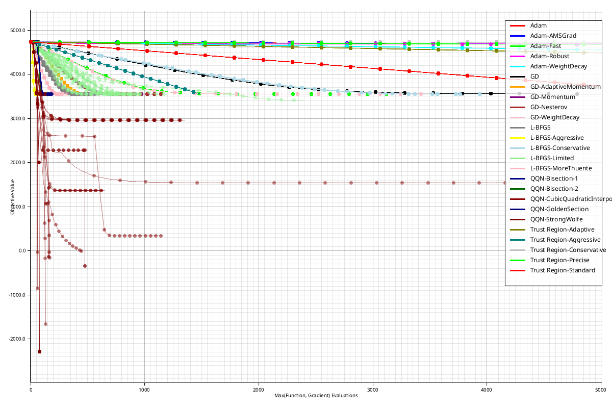
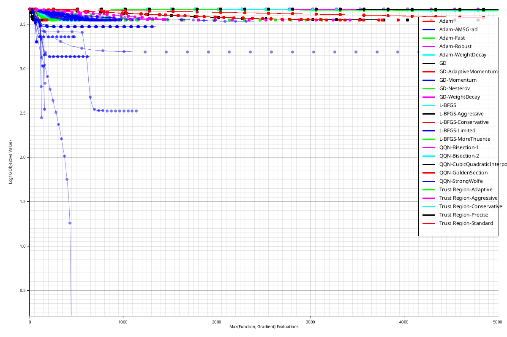

**Figure:** Convergence plots for Schwefel_10D showing objective value vs iterations.
Left: Linear scale, Right: Log scale for better visualization of convergence behavior.

**Data:** [Linear scale data (CSV)](data/Schwefel_10D_data.csv) | [Log scale data (CSV)](data/Schwefel_10D_log_data.csv)

## Problem: Levy_2D

**Family:** LevyN
**Dimension:** 2
**Success Threshold:** 1.000e-6
**Total Runs:** 500
**Detailed Analysis:** [View comprehensive problem analysis](reports/problem_analysis_Levy_2D.md)

### Performance Summary
<table style="border-collapse: collapse; width: 100%; margin: 20px 0;">
<tr style="background-color: #f2f2f2;">
<th style="border: 1px solid #ddd; padding: 8px; text-align: center;">Rank</th>
<th style="border: 1px solid #ddd; padding: 8px; text-align: center;">Optimizer</th>
<th style="border: 1px solid #ddd; padding: 8px; text-align: center;">Mean Final Value (All/Success/Fail)</th>
<th style="border: 1px solid #ddd; padding: 8px; text-align: center;">Std Dev</th>
<th style="border: 1px solid #ddd; padding: 8px; text-align: center;">Best Value</th>
<th style="border: 1px solid #ddd; padding: 8px; text-align: center;">Worst Value</th>
<th style="border: 1px solid #ddd; padding: 8px; text-align: center;">Mean Function Evals (All/Success/Fail)</th>
<th style="border: 1px solid #ddd; padding: 8px; text-align: center;">Mean Gradient Evals (All/Success/Fail)</th>
<th style="border: 1px solid #ddd; padding: 8px; text-align: center;">Success Rate</th>
<th style="border: 1px solid #ddd; padding: 8px; text-align: center;">Mean Time (s)</th>
</tr>
<tr style="background-color: #d4edda; font-weight: bold;">
<td style="border: 1px solid #ddd; padding: 8px; text-align: center;">1</td>
<td style="border: 1px solid #ddd; padding: 8px; text-align: center;"><a href="reports/detailed_Levy_2D_QQN-StrongWolfe.md" title="Click for detailed analysis">QQN-StrongWolfe</a></td>
<td style="border: 1px solid #ddd; padding: 8px; text-align: center;">2.98e-7 / 2.98e-7 / -</td>
<td style="border: 1px solid #ddd; padding: 8px; text-align: center;">3.89e-7</td>
<td style="border: 1px solid #ddd; padding: 8px; text-align: center;">1.89e-10</td>
<td style="border: 1px solid #ddd; padding: 8px; text-align: center;">9.85e-7</td>
<td style="border: 1px solid #ddd; padding: 8px; text-align: center;">79.0 / 79.0 / -</td>
<td style="border: 1px solid #ddd; padding: 8px; text-align: center;">86.5 / 86.5 / -</td>
<td style="border: 1px solid #ddd; padding: 8px; text-align: center;">100.0%</td>
<td style="border: 1px solid #ddd; padding: 8px; text-align: center;">0.003</td>
</tr>
<tr style="background-color: #fff3cd;">
<td style="border: 1px solid #ddd; padding: 8px; text-align: center;">2</td>
<td style="border: 1px solid #ddd; padding: 8px; text-align: center;"><a href="reports/detailed_Levy_2D_QQN-CubicQuadraticInterpolation.md" title="Click for detailed analysis">QQN-CubicQuadraticInterpolation</a></td>
<td style="border: 1px solid #ddd; padding: 8px; text-align: center;">8.29e-8 / 8.29e-8 / -</td>
<td style="border: 1px solid #ddd; padding: 8px; text-align: center;">1.84e-7</td>
<td style="border: 1px solid #ddd; padding: 8px; text-align: center;">5.12e-10</td>
<td style="border: 1px solid #ddd; padding: 8px; text-align: center;">8.65e-7</td>
<td style="border: 1px solid #ddd; padding: 8px; text-align: center;">87.6 / 87.6 / -</td>
<td style="border: 1px solid #ddd; padding: 8px; text-align: center;">101.8 / 101.8 / -</td>
<td style="border: 1px solid #ddd; padding: 8px; text-align: center;">100.0%</td>
<td style="border: 1px solid #ddd; padding: 8px; text-align: center;">0.003</td>
</tr>
<tr style="">
<td style="border: 1px solid #ddd; padding: 8px; text-align: center;">3</td>
<td style="border: 1px solid #ddd; padding: 8px; text-align: center;"><a href="reports/detailed_Levy_2D_QQN-Bisection-2.md" title="Click for detailed analysis">QQN-Bisection-2</a></td>
<td style="border: 1px solid #ddd; padding: 8px; text-align: center;">1.80e-7 / 1.80e-7 / -</td>
<td style="border: 1px solid #ddd; padding: 8px; text-align: center;">2.24e-7</td>
<td style="border: 1px solid #ddd; padding: 8px; text-align: center;">2.53e-9</td>
<td style="border: 1px solid #ddd; padding: 8px; text-align: center;">8.17e-7</td>
<td style="border: 1px solid #ddd; padding: 8px; text-align: center;">93.0 / 93.0 / -</td>
<td style="border: 1px solid #ddd; padding: 8px; text-align: center;">107.6 / 107.6 / -</td>
<td style="border: 1px solid #ddd; padding: 8px; text-align: center;">100.0%</td>
<td style="border: 1px solid #ddd; padding: 8px; text-align: center;">0.002</td>
</tr>
<tr style="">
<td style="border: 1px solid #ddd; padding: 8px; text-align: center;">4</td>
<td style="border: 1px solid #ddd; padding: 8px; text-align: center;"><a href="reports/detailed_Levy_2D_QQN-Bisection-1.md" title="Click for detailed analysis">QQN-Bisection-1</a></td>
<td style="border: 1px solid #ddd; padding: 8px; text-align: center;">1.15e-7 / 1.15e-7 / -</td>
<td style="border: 1px solid #ddd; padding: 8px; text-align: center;">1.44e-7</td>
<td style="border: 1px solid #ddd; padding: 8px; text-align: center;">2.81e-9</td>
<td style="border: 1px solid #ddd; padding: 8px; text-align: center;">5.10e-7</td>
<td style="border: 1px solid #ddd; padding: 8px; text-align: center;">102.2 / 102.2 / -</td>
<td style="border: 1px solid #ddd; padding: 8px; text-align: center;">146.8 / 146.8 / -</td>
<td style="border: 1px solid #ddd; padding: 8px; text-align: center;">100.0%</td>
<td style="border: 1px solid #ddd; padding: 8px; text-align: center;">0.003</td>
</tr>
<tr style="">
<td style="border: 1px solid #ddd; padding: 8px; text-align: center;">5</td>
<td style="border: 1px solid #ddd; padding: 8px; text-align: center;"><a href="reports/detailed_Levy_2D_QQN-GoldenSection.md" title="Click for detailed analysis">QQN-GoldenSection</a></td>
<td style="border: 1px solid #ddd; padding: 8px; text-align: center;">1.81e-7 / 1.81e-7 / -</td>
<td style="border: 1px solid #ddd; padding: 8px; text-align: center;">2.48e-7</td>
<td style="border: 1px solid #ddd; padding: 8px; text-align: center;">1.48e-10</td>
<td style="border: 1px solid #ddd; padding: 8px; text-align: center;">8.51e-7</td>
<td style="border: 1px solid #ddd; padding: 8px; text-align: center;">300.9 / 300.9 / -</td>
<td style="border: 1px solid #ddd; padding: 8px; text-align: center;">42.8 / 42.8 / -</td>
<td style="border: 1px solid #ddd; padding: 8px; text-align: center;">100.0%</td>
<td style="border: 1px solid #ddd; padding: 8px; text-align: center;">0.005</td>
</tr>
<tr style="">
<td style="border: 1px solid #ddd; padding: 8px; text-align: center;">6</td>
<td style="border: 1px solid #ddd; padding: 8px; text-align: center;"><a href="reports/detailed_Levy_2D_GD-WeightDecay.md" title="Click for detailed analysis">GD-WeightDecay</a></td>
<td style="border: 1px solid #ddd; padding: 8px; text-align: center;">9.96e-7 / 9.96e-7 / -</td>
<td style="border: 1px solid #ddd; padding: 8px; text-align: center;">1.94e-9</td>
<td style="border: 1px solid #ddd; padding: 8px; text-align: center;">9.93e-7</td>
<td style="border: 1px solid #ddd; padding: 8px; text-align: center;">1.00e-6</td>
<td style="border: 1px solid #ddd; padding: 8px; text-align: center;">1453.5 / 1453.5 / -</td>
<td style="border: 1px solid #ddd; padding: 8px; text-align: center;">2904.1 / 2904.1 / -</td>
<td style="border: 1px solid #ddd; padding: 8px; text-align: center;">100.0%</td>
<td style="border: 1px solid #ddd; padding: 8px; text-align: center;">0.046</td>
</tr>
<tr style="">
<td style="border: 1px solid #ddd; padding: 8px; text-align: center;">7</td>
<td style="border: 1px solid #ddd; padding: 8px; text-align: center;"><a href="reports/detailed_Levy_2D_Adam-WeightDecay.md" title="Click for detailed analysis">Adam-WeightDecay</a></td>
<td style="border: 1px solid #ddd; padding: 8px; text-align: center;">9.83e-7 / 9.83e-7 / -</td>
<td style="border: 1px solid #ddd; padding: 8px; text-align: center;">7.75e-9</td>
<td style="border: 1px solid #ddd; padding: 8px; text-align: center;">9.67e-7</td>
<td style="border: 1px solid #ddd; padding: 8px; text-align: center;">9.98e-7</td>
<td style="border: 1px solid #ddd; padding: 8px; text-align: center;">2229.0 / 2229.0 / -</td>
<td style="border: 1px solid #ddd; padding: 8px; text-align: center;">2229.0 / 2229.0 / -</td>
<td style="border: 1px solid #ddd; padding: 8px; text-align: center;">100.0%</td>
<td style="border: 1px solid #ddd; padding: 8px; text-align: center;">0.048</td>
</tr>
<tr style="">
<td style="border: 1px solid #ddd; padding: 8px; text-align: center;">8</td>
<td style="border: 1px solid #ddd; padding: 8px; text-align: center;"><a href="reports/detailed_Levy_2D_L-BFGS-MoreThuente.md" title="Click for detailed analysis">L-BFGS-MoreThuente</a></td>
<td style="border: 1px solid #ddd; padding: 8px; text-align: center;">5.43e-6 / 6.14e-7 / 9.69e-5</td>
<td style="border: 1px solid #ddd; padding: 8px; text-align: center;">2.10e-5</td>
<td style="border: 1px solid #ddd; padding: 8px; text-align: center;">7.84e-9</td>
<td style="border: 1px solid #ddd; padding: 8px; text-align: center;">9.69e-5</td>
<td style="border: 1px solid #ddd; padding: 8px; text-align: center;">286.5 / 147.8 / 2921.0</td>
<td style="border: 1px solid #ddd; padding: 8px; text-align: center;">202.8 / 103.6 / 2087.0</td>
<td style="border: 1px solid #ddd; padding: 8px; text-align: center;">95.0%</td>
<td style="border: 1px solid #ddd; padding: 8px; text-align: center;">0.006</td>
</tr>
<tr style="">
<td style="border: 1px solid #ddd; padding: 8px; text-align: center;">9</td>
<td style="border: 1px solid #ddd; padding: 8px; text-align: center;"><a href="reports/detailed_Levy_2D_L-BFGS-Limited.md" title="Click for detailed analysis">L-BFGS-Limited</a></td>
<td style="border: 1px solid #ddd; padding: 8px; text-align: center;">1.05e-6 / 8.71e-7 / 4.54e-6</td>
<td style="border: 1px solid #ddd; padding: 8px; text-align: center;">8.37e-7</td>
<td style="border: 1px solid #ddd; padding: 8px; text-align: center;">1.49e-7</td>
<td style="border: 1px solid #ddd; padding: 8px; text-align: center;">4.54e-6</td>
<td style="border: 1px solid #ddd; padding: 8px; text-align: center;">583.7 / 422.7 / 3642.0</td>
<td style="border: 1px solid #ddd; padding: 8px; text-align: center;">308.2 / 252.6 / 1364.0</td>
<td style="border: 1px solid #ddd; padding: 8px; text-align: center;">95.0%</td>
<td style="border: 1px solid #ddd; padding: 8px; text-align: center;">0.013</td>
</tr>
<tr style="">
<td style="border: 1px solid #ddd; padding: 8px; text-align: center;">10</td>
<td style="border: 1px solid #ddd; padding: 8px; text-align: center;"><a href="reports/detailed_Levy_2D_L-BFGS-Conservative.md" title="Click for detailed analysis">L-BFGS-Conservative</a></td>
<td style="border: 1px solid #ddd; padding: 8px; text-align: center;">9.25e-7 / 5.49e-7 / 3.06e-6</td>
<td style="border: 1px solid #ddd; padding: 8px; text-align: center;">1.12e-6</td>
<td style="border: 1px solid #ddd; padding: 8px; text-align: center;">8.80e-8</td>
<td style="border: 1px solid #ddd; padding: 8px; text-align: center;">5.33e-6</td>
<td style="border: 1px solid #ddd; padding: 8px; text-align: center;">626.6 / 246.1 / 2782.7</td>
<td style="border: 1px solid #ddd; padding: 8px; text-align: center;">500.2 / 196.2 / 2223.3</td>
<td style="border: 1px solid #ddd; padding: 8px; text-align: center;">85.0%</td>
<td style="border: 1px solid #ddd; padding: 8px; text-align: center;">0.016</td>
</tr>
<tr style="">
<td style="border: 1px solid #ddd; padding: 8px; text-align: center;">11</td>
<td style="border: 1px solid #ddd; padding: 8px; text-align: center;"><a href="reports/detailed_Levy_2D_L-BFGS.md" title="Click for detailed analysis">L-BFGS</a></td>
<td style="border: 1px solid #ddd; padding: 8px; text-align: center;">2.76e-4 / 7.15e-7 / 3.69e-2</td>
<td style="border: 1px solid #ddd; padding: 8px; text-align: center;">9.23e-4</td>
<td style="border: 1px solid #ddd; padding: 8px; text-align: center;">1.57e-7</td>
<td style="border: 1px solid #ddd; padding: 8px; text-align: center;">4.12e-3</td>
<td style="border: 1px solid #ddd; padding: 8px; text-align: center;">285.0 / 159.9 / 785.2</td>
<td style="border: 1px solid #ddd; padding: 8px; text-align: center;">215.3 / 118.1 / 604.5</td>
<td style="border: 1px solid #ddd; padding: 8px; text-align: center;">80.0%</td>
<td style="border: 1px solid #ddd; padding: 8px; text-align: center;">0.007</td>
</tr>
<tr style="">
<td style="border: 1px solid #ddd; padding: 8px; text-align: center;">12</td>
<td style="border: 1px solid #ddd; padding: 8px; text-align: center;"><a href="reports/detailed_Levy_2D_L-BFGS-Aggressive.md" title="Click for detailed analysis">L-BFGS-Aggressive</a></td>
<td style="border: 1px solid #ddd; padding: 8px; text-align: center;">6.19e-4 / 7.57e-7 / 2.06e-3</td>
<td style="border: 1px solid #ddd; padding: 8px; text-align: center;">9.61e-4</td>
<td style="border: 1px solid #ddd; padding: 8px; text-align: center;">6.80e-8</td>
<td style="border: 1px solid #ddd; padding: 8px; text-align: center;">2.64e-3</td>
<td style="border: 1px solid #ddd; padding: 8px; text-align: center;">1303.1 / 212.6 / 3847.7</td>
<td style="border: 1px solid #ddd; padding: 8px; text-align: center;">419.9 / 101.4 / 1163.0</td>
<td style="border: 1px solid #ddd; padding: 8px; text-align: center;">70.0%</td>
<td style="border: 1px solid #ddd; padding: 8px; text-align: center;">0.017</td>
</tr>
<tr style="">
<td style="border: 1px solid #ddd; padding: 8px; text-align: center;">13</td>
<td style="border: 1px solid #ddd; padding: 8px; text-align: center;"><a href="reports/detailed_Levy_2D_Trust_Region-Aggressive.md" title="Click for detailed analysis">Trust Region-Aggressive</a></td>
<td style="border: 1px solid #ddd; padding: 8px; text-align: center;">1.31e0 / - / 1.31e0</td>
<td style="border: 1px solid #ddd; padding: 8px; text-align: center;">2.09e-1</td>
<td style="border: 1px solid #ddd; padding: 8px; text-align: center;">9.21e-1</td>
<td style="border: 1px solid #ddd; padding: 8px; text-align: center;">1.57e0</td>
<td style="border: 1px solid #ddd; padding: 8px; text-align: center;">5.0 / - / 5.0</td>
<td style="border: 1px solid #ddd; padding: 8px; text-align: center;">4.0 / - / 4.0</td>
<td style="border: 1px solid #ddd; padding: 8px; text-align: center;">0.0%</td>
<td style="border: 1px solid #ddd; padding: 8px; text-align: center;">0.000</td>
</tr>
<tr style="">
<td style="border: 1px solid #ddd; padding: 8px; text-align: center;">14</td>
<td style="border: 1px solid #ddd; padding: 8px; text-align: center;"><a href="reports/detailed_Levy_2D_Trust_Region-Standard.md" title="Click for detailed analysis">Trust Region-Standard</a></td>
<td style="border: 1px solid #ddd; padding: 8px; text-align: center;">8.95e-2 / - / 3.36e0</td>
<td style="border: 1px solid #ddd; padding: 8px; text-align: center;">1.06e-1</td>
<td style="border: 1px solid #ddd; padding: 8px; text-align: center;">1.62e-3</td>
<td style="border: 1px solid #ddd; padding: 8px; text-align: center;">2.78e-1</td>
<td style="border: 1px solid #ddd; padding: 8px; text-align: center;">18.2 / - / 18.2</td>
<td style="border: 1px solid #ddd; padding: 8px; text-align: center;">12.8 / - / 12.8</td>
<td style="border: 1px solid #ddd; padding: 8px; text-align: center;">0.0%</td>
<td style="border: 1px solid #ddd; padding: 8px; text-align: center;">0.000</td>
</tr>
<tr style="">
<td style="border: 1px solid #ddd; padding: 8px; text-align: center;">15</td>
<td style="border: 1px solid #ddd; padding: 8px; text-align: center;"><a href="reports/detailed_Levy_2D_GD-AdaptiveMomentum.md" title="Click for detailed analysis">GD-AdaptiveMomentum</a></td>
<td style="border: 1px solid #ddd; padding: 8px; text-align: center;">8.12e-2 / - / 3.36e-1</td>
<td style="border: 1px solid #ddd; padding: 8px; text-align: center;">2.32e-2</td>
<td style="border: 1px solid #ddd; padding: 8px; text-align: center;">4.71e-2</td>
<td style="border: 1px solid #ddd; padding: 8px; text-align: center;">1.33e-1</td>
<td style="border: 1px solid #ddd; padding: 8px; text-align: center;">16.4 / - / 16.4</td>
<td style="border: 1px solid #ddd; padding: 8px; text-align: center;">28.7 / - / 28.7</td>
<td style="border: 1px solid #ddd; padding: 8px; text-align: center;">0.0%</td>
<td style="border: 1px solid #ddd; padding: 8px; text-align: center;">0.001</td>
</tr>
<tr style="">
<td style="border: 1px solid #ddd; padding: 8px; text-align: center;">16</td>
<td style="border: 1px solid #ddd; padding: 8px; text-align: center;"><a href="reports/detailed_Levy_2D_Trust_Region-Adaptive.md" title="Click for detailed analysis">Trust Region-Adaptive</a></td>
<td style="border: 1px solid #ddd; padding: 8px; text-align: center;">8.94e-2 / - / 1.01e1</td>
<td style="border: 1px solid #ddd; padding: 8px; text-align: center;">3.84e-2</td>
<td style="border: 1px solid #ddd; padding: 8px; text-align: center;">2.21e-2</td>
<td style="border: 1px solid #ddd; padding: 8px; text-align: center;">1.58e-1</td>
<td style="border: 1px solid #ddd; padding: 8px; text-align: center;">27.2 / - / 27.2</td>
<td style="border: 1px solid #ddd; padding: 8px; text-align: center;">18.7 / - / 18.7</td>
<td style="border: 1px solid #ddd; padding: 8px; text-align: center;">0.0%</td>
<td style="border: 1px solid #ddd; padding: 8px; text-align: center;">0.000</td>
</tr>
<tr style="">
<td style="border: 1px solid #ddd; padding: 8px; text-align: center;">17</td>
<td style="border: 1px solid #ddd; padding: 8px; text-align: center;"><a href="reports/detailed_Levy_2D_GD-Nesterov.md" title="Click for detailed analysis">GD-Nesterov</a></td>
<td style="border: 1px solid #ddd; padding: 8px; text-align: center;">8.90e-2 / - / 1.31e-1</td>
<td style="border: 1px solid #ddd; padding: 8px; text-align: center;">2.76e-2</td>
<td style="border: 1px solid #ddd; padding: 8px; text-align: center;">5.32e-2</td>
<td style="border: 1px solid #ddd; padding: 8px; text-align: center;">1.35e-1</td>
<td style="border: 1px solid #ddd; padding: 8px; text-align: center;">22.4 / - / 22.4</td>
<td style="border: 1px solid #ddd; padding: 8px; text-align: center;">40.7 / - / 40.7</td>
<td style="border: 1px solid #ddd; padding: 8px; text-align: center;">0.0%</td>
<td style="border: 1px solid #ddd; padding: 8px; text-align: center;">0.001</td>
</tr>
<tr style="">
<td style="border: 1px solid #ddd; padding: 8px; text-align: center;">18</td>
<td style="border: 1px solid #ddd; padding: 8px; text-align: center;"><a href="reports/detailed_Levy_2D_GD-Momentum.md" title="Click for detailed analysis">GD-Momentum</a></td>
<td style="border: 1px solid #ddd; padding: 8px; text-align: center;">8.16e-2 / - / 1.57e-1</td>
<td style="border: 1px solid #ddd; padding: 8px; text-align: center;">2.36e-2</td>
<td style="border: 1px solid #ddd; padding: 8px; text-align: center;">4.74e-2</td>
<td style="border: 1px solid #ddd; padding: 8px; text-align: center;">1.35e-1</td>
<td style="border: 1px solid #ddd; padding: 8px; text-align: center;">22.5 / - / 22.5</td>
<td style="border: 1px solid #ddd; padding: 8px; text-align: center;">41.0 / - / 41.0</td>
<td style="border: 1px solid #ddd; padding: 8px; text-align: center;">0.0%</td>
<td style="border: 1px solid #ddd; padding: 8px; text-align: center;">0.001</td>
</tr>
<tr style="">
<td style="border: 1px solid #ddd; padding: 8px; text-align: center;">19</td>
<td style="border: 1px solid #ddd; padding: 8px; text-align: center;"><a href="reports/detailed_Levy_2D_Adam-Fast.md" title="Click for detailed analysis">Adam-Fast</a></td>
<td style="border: 1px solid #ddd; padding: 8px; text-align: center;">1.28e-3 / - / 7.87e-2</td>
<td style="border: 1px solid #ddd; padding: 8px; text-align: center;">1.16e-3</td>
<td style="border: 1px solid #ddd; padding: 8px; text-align: center;">1.12e-5</td>
<td style="border: 1px solid #ddd; padding: 8px; text-align: center;">3.97e-3</td>
<td style="border: 1px solid #ddd; padding: 8px; text-align: center;">36.5 / - / 36.5</td>
<td style="border: 1px solid #ddd; padding: 8px; text-align: center;">35.5 / - / 35.5</td>
<td style="border: 1px solid #ddd; padding: 8px; text-align: center;">0.0%</td>
<td style="border: 1px solid #ddd; padding: 8px; text-align: center;">0.001</td>
</tr>
<tr style="">
<td style="border: 1px solid #ddd; padding: 8px; text-align: center;">20</td>
<td style="border: 1px solid #ddd; padding: 8px; text-align: center;"><a href="reports/detailed_Levy_2D_Trust_Region-Precise.md" title="Click for detailed analysis">Trust Region-Precise</a></td>
<td style="border: 1px solid #ddd; padding: 8px; text-align: center;">5.28e-2 / - / 6.16e-2</td>
<td style="border: 1px solid #ddd; padding: 8px; text-align: center;">1.75e-2</td>
<td style="border: 1px solid #ddd; padding: 8px; text-align: center;">9.90e-3</td>
<td style="border: 1px solid #ddd; padding: 8px; text-align: center;">8.35e-2</td>
<td style="border: 1px solid #ddd; padding: 8px; text-align: center;">70.6 / - / 70.6</td>
<td style="border: 1px solid #ddd; padding: 8px; text-align: center;">47.7 / - / 47.7</td>
<td style="border: 1px solid #ddd; padding: 8px; text-align: center;">0.0%</td>
<td style="border: 1px solid #ddd; padding: 8px; text-align: center;">0.001</td>
</tr>
<tr style="">
<td style="border: 1px solid #ddd; padding: 8px; text-align: center;">21</td>
<td style="border: 1px solid #ddd; padding: 8px; text-align: center;"><a href="reports/detailed_Levy_2D_Trust_Region-Conservative.md" title="Click for detailed analysis">Trust Region-Conservative</a></td>
<td style="border: 1px solid #ddd; padding: 8px; text-align: center;">1.34e-2 / - / 1.34e-2</td>
<td style="border: 1px solid #ddd; padding: 8px; text-align: center;">2.06e-3</td>
<td style="border: 1px solid #ddd; padding: 8px; text-align: center;">9.88e-3</td>
<td style="border: 1px solid #ddd; padding: 8px; text-align: center;">1.65e-2</td>
<td style="border: 1px solid #ddd; padding: 8px; text-align: center;">385.2 / - / 385.2</td>
<td style="border: 1px solid #ddd; padding: 8px; text-align: center;">257.5 / - / 257.5</td>
<td style="border: 1px solid #ddd; padding: 8px; text-align: center;">0.0%</td>
<td style="border: 1px solid #ddd; padding: 8px; text-align: center;">0.003</td>
</tr>
<tr style="">
<td style="border: 1px solid #ddd; padding: 8px; text-align: center;">22</td>
<td style="border: 1px solid #ddd; padding: 8px; text-align: center;"><a href="reports/detailed_Levy_2D_GD.md" title="Click for detailed analysis">GD</a></td>
<td style="border: 1px solid #ddd; padding: 8px; text-align: center;">2.39e-4 / - / 2.39e-4</td>
<td style="border: 1px solid #ddd; padding: 8px; text-align: center;">2.63e-5</td>
<td style="border: 1px solid #ddd; padding: 8px; text-align: center;">1.85e-4</td>
<td style="border: 1px solid #ddd; padding: 8px; text-align: center;">2.75e-4</td>
<td style="border: 1px solid #ddd; padding: 8px; text-align: center;">1668.0 / - / 1668.0</td>
<td style="border: 1px solid #ddd; padding: 8px; text-align: center;">3334.0 / - / 3334.0</td>
<td style="border: 1px solid #ddd; padding: 8px; text-align: center;">0.0%</td>
<td style="border: 1px solid #ddd; padding: 8px; text-align: center;">0.043</td>
</tr>
<tr style="">
<td style="border: 1px solid #ddd; padding: 8px; text-align: center;">23</td>
<td style="border: 1px solid #ddd; padding: 8px; text-align: center;"><a href="reports/detailed_Levy_2D_Adam-AMSGrad.md" title="Click for detailed analysis">Adam-AMSGrad</a></td>
<td style="border: 1px solid #ddd; padding: 8px; text-align: center;">2.61e-2 / - / 2.61e-2</td>
<td style="border: 1px solid #ddd; padding: 8px; text-align: center;">1.26e-2</td>
<td style="border: 1px solid #ddd; padding: 8px; text-align: center;">1.24e-2</td>
<td style="border: 1px solid #ddd; padding: 8px; text-align: center;">5.59e-2</td>
<td style="border: 1px solid #ddd; padding: 8px; text-align: center;">2502.0 / - / 2502.0</td>
<td style="border: 1px solid #ddd; padding: 8px; text-align: center;">2502.0 / - / 2502.0</td>
<td style="border: 1px solid #ddd; padding: 8px; text-align: center;">0.0%</td>
<td style="border: 1px solid #ddd; padding: 8px; text-align: center;">0.058</td>
</tr>
<tr style="">
<td style="border: 1px solid #ddd; padding: 8px; text-align: center;">24</td>
<td style="border: 1px solid #ddd; padding: 8px; text-align: center;"><a href="reports/detailed_Levy_2D_Adam.md" title="Click for detailed analysis">Adam</a></td>
<td style="border: 1px solid #ddd; padding: 8px; text-align: center;">5.69e-3 / - / 5.69e-3</td>
<td style="border: 1px solid #ddd; padding: 8px; text-align: center;">3.31e-3</td>
<td style="border: 1px solid #ddd; padding: 8px; text-align: center;">1.60e-3</td>
<td style="border: 1px solid #ddd; padding: 8px; text-align: center;">1.48e-2</td>
<td style="border: 1px solid #ddd; padding: 8px; text-align: center;">2502.0 / - / 2502.0</td>
<td style="border: 1px solid #ddd; padding: 8px; text-align: center;">2502.0 / - / 2502.0</td>
<td style="border: 1px solid #ddd; padding: 8px; text-align: center;">0.0%</td>
<td style="border: 1px solid #ddd; padding: 8px; text-align: center;">0.052</td>
</tr>
<tr style="">
<td style="border: 1px solid #ddd; padding: 8px; text-align: center;">25</td>
<td style="border: 1px solid #ddd; padding: 8px; text-align: center;"><a href="reports/detailed_Levy_2D_Adam-Robust.md" title="Click for detailed analysis">Adam-Robust</a></td>
<td style="border: 1px solid #ddd; padding: 8px; text-align: center;">4.34e-2 / - / 4.34e-2</td>
<td style="border: 1px solid #ddd; padding: 8px; text-align: center;">2.28e-2</td>
<td style="border: 1px solid #ddd; padding: 8px; text-align: center;">1.83e-2</td>
<td style="border: 1px solid #ddd; padding: 8px; text-align: center;">9.34e-2</td>
<td style="border: 1px solid #ddd; padding: 8px; text-align: center;">2502.0 / - / 2502.0</td>
<td style="border: 1px solid #ddd; padding: 8px; text-align: center;">2502.0 / - / 2502.0</td>
<td style="border: 1px solid #ddd; padding: 8px; text-align: center;">0.0%</td>
<td style="border: 1px solid #ddd; padding: 8px; text-align: center;">0.058</td>
</tr>
</table>

### Convergence Plots

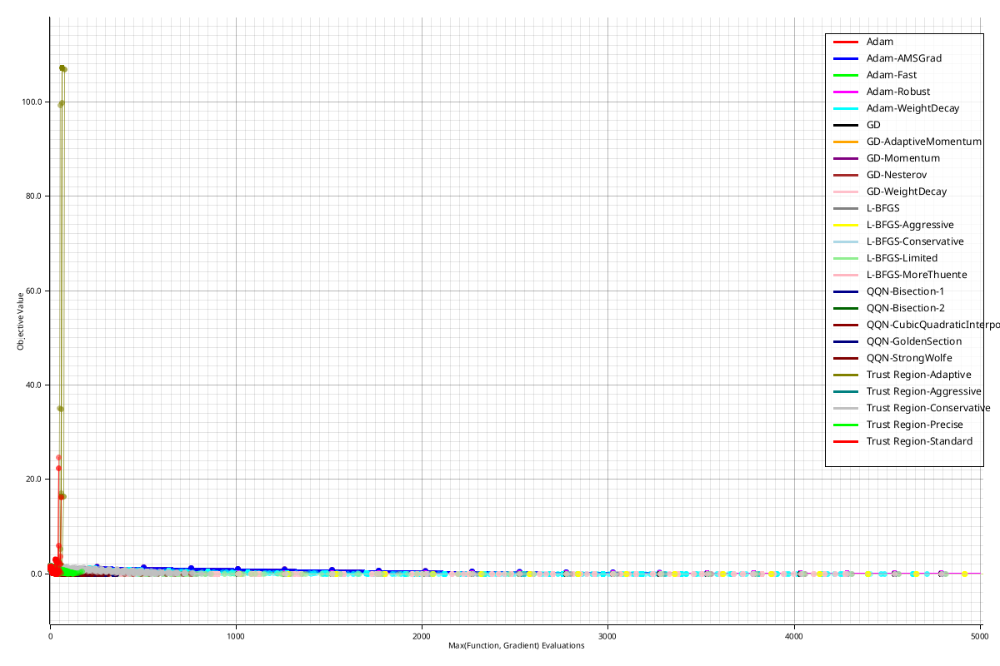
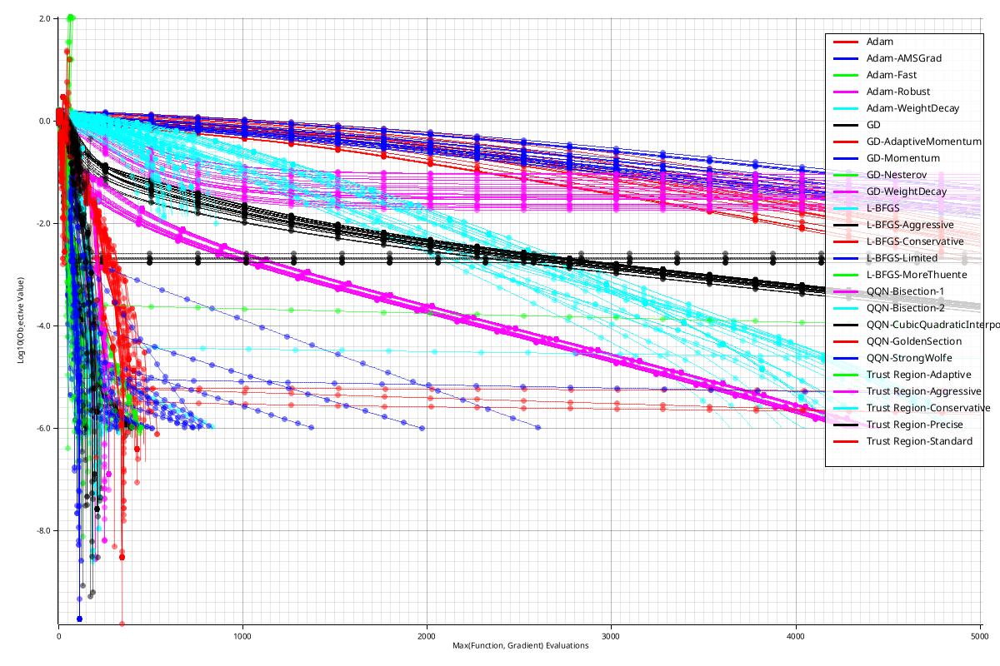

**Figure:** Convergence plots for Levy_2D showing objective value vs iterations.
Left: Linear scale, Right: Log scale for better visualization of convergence behavior.

**Data:** [Linear scale data (CSV)](data/Levy_2D_data.csv) | [Log scale data (CSV)](data/Levy_2D_log_data.csv)

## Problem: Levy_5D

**Family:** LevyN
**Dimension:** 5
**Success Threshold:** 1.000e-6
**Total Runs:** 500
**Detailed Analysis:** [View comprehensive problem analysis](reports/problem_analysis_Levy_5D.md)

### Performance Summary
<table style="border-collapse: collapse; width: 100%; margin: 20px 0;">
<tr style="background-color: #f2f2f2;">
<th style="border: 1px solid #ddd; padding: 8px; text-align: center;">Rank</th>
<th style="border: 1px solid #ddd; padding: 8px; text-align: center;">Optimizer</th>
<th style="border: 1px solid #ddd; padding: 8px; text-align: center;">Mean Final Value (All/Success/Fail)</th>
<th style="border: 1px solid #ddd; padding: 8px; text-align: center;">Std Dev</th>
<th style="border: 1px solid #ddd; padding: 8px; text-align: center;">Best Value</th>
<th style="border: 1px solid #ddd; padding: 8px; text-align: center;">Worst Value</th>
<th style="border: 1px solid #ddd; padding: 8px; text-align: center;">Mean Function Evals (All/Success/Fail)</th>
<th style="border: 1px solid #ddd; padding: 8px; text-align: center;">Mean Gradient Evals (All/Success/Fail)</th>
<th style="border: 1px solid #ddd; padding: 8px; text-align: center;">Success Rate</th>
<th style="border: 1px solid #ddd; padding: 8px; text-align: center;">Mean Time (s)</th>
</tr>
<tr style="background-color: #d4edda; font-weight: bold;">
<td style="border: 1px solid #ddd; padding: 8px; text-align: center;">1</td>
<td style="border: 1px solid #ddd; padding: 8px; text-align: center;"><a href="reports/detailed_Levy_5D_QQN-StrongWolfe.md" title="Click for detailed analysis">QQN-StrongWolfe</a></td>
<td style="border: 1px solid #ddd; padding: 8px; text-align: center;">3.31e-7 / 3.31e-7 / -</td>
<td style="border: 1px solid #ddd; padding: 8px; text-align: center;">3.09e-7</td>
<td style="border: 1px solid #ddd; padding: 8px; text-align: center;">1.45e-9</td>
<td style="border: 1px solid #ddd; padding: 8px; text-align: center;">9.50e-7</td>
<td style="border: 1px solid #ddd; padding: 8px; text-align: center;">69.2 / 69.2 / -</td>
<td style="border: 1px solid #ddd; padding: 8px; text-align: center;">75.8 / 75.8 / -</td>
<td style="border: 1px solid #ddd; padding: 8px; text-align: center;">100.0%</td>
<td style="border: 1px solid #ddd; padding: 8px; text-align: center;">0.002</td>
</tr>
<tr style="background-color: #fff3cd;">
<td style="border: 1px solid #ddd; padding: 8px; text-align: center;">2</td>
<td style="border: 1px solid #ddd; padding: 8px; text-align: center;"><a href="reports/detailed_Levy_5D_QQN-CubicQuadraticInterpolation.md" title="Click for detailed analysis">QQN-CubicQuadraticInterpolation</a></td>
<td style="border: 1px solid #ddd; padding: 8px; text-align: center;">2.65e-7 / 2.65e-7 / -</td>
<td style="border: 1px solid #ddd; padding: 8px; text-align: center;">2.41e-7</td>
<td style="border: 1px solid #ddd; padding: 8px; text-align: center;">2.28e-9</td>
<td style="border: 1px solid #ddd; padding: 8px; text-align: center;">8.78e-7</td>
<td style="border: 1px solid #ddd; padding: 8px; text-align: center;">96.0 / 96.0 / -</td>
<td style="border: 1px solid #ddd; padding: 8px; text-align: center;">115.0 / 115.0 / -</td>
<td style="border: 1px solid #ddd; padding: 8px; text-align: center;">100.0%</td>
<td style="border: 1px solid #ddd; padding: 8px; text-align: center;">0.003</td>
</tr>
<tr style="">
<td style="border: 1px solid #ddd; padding: 8px; text-align: center;">3</td>
<td style="border: 1px solid #ddd; padding: 8px; text-align: center;"><a href="reports/detailed_Levy_5D_QQN-Bisection-2.md" title="Click for detailed analysis">QQN-Bisection-2</a></td>
<td style="border: 1px solid #ddd; padding: 8px; text-align: center;">2.16e-7 / 2.16e-7 / -</td>
<td style="border: 1px solid #ddd; padding: 8px; text-align: center;">2.19e-7</td>
<td style="border: 1px solid #ddd; padding: 8px; text-align: center;">1.51e-10</td>
<td style="border: 1px solid #ddd; padding: 8px; text-align: center;">8.82e-7</td>
<td style="border: 1px solid #ddd; padding: 8px; text-align: center;">101.3 / 101.3 / -</td>
<td style="border: 1px solid #ddd; padding: 8px; text-align: center;">121.8 / 121.8 / -</td>
<td style="border: 1px solid #ddd; padding: 8px; text-align: center;">100.0%</td>
<td style="border: 1px solid #ddd; padding: 8px; text-align: center;">0.003</td>
</tr>
<tr style="">
<td style="border: 1px solid #ddd; padding: 8px; text-align: center;">4</td>
<td style="border: 1px solid #ddd; padding: 8px; text-align: center;"><a href="reports/detailed_Levy_5D_QQN-Bisection-1.md" title="Click for detailed analysis">QQN-Bisection-1</a></td>
<td style="border: 1px solid #ddd; padding: 8px; text-align: center;">3.74e-7 / 3.74e-7 / -</td>
<td style="border: 1px solid #ddd; padding: 8px; text-align: center;">3.37e-7</td>
<td style="border: 1px solid #ddd; padding: 8px; text-align: center;">4.32e-9</td>
<td style="border: 1px solid #ddd; padding: 8px; text-align: center;">9.98e-7</td>
<td style="border: 1px solid #ddd; padding: 8px; text-align: center;">103.4 / 103.4 / -</td>
<td style="border: 1px solid #ddd; padding: 8px; text-align: center;">140.7 / 140.7 / -</td>
<td style="border: 1px solid #ddd; padding: 8px; text-align: center;">100.0%</td>
<td style="border: 1px solid #ddd; padding: 8px; text-align: center;">0.003</td>
</tr>
<tr style="">
<td style="border: 1px solid #ddd; padding: 8px; text-align: center;">5</td>
<td style="border: 1px solid #ddd; padding: 8px; text-align: center;"><a href="reports/detailed_Levy_5D_QQN-GoldenSection.md" title="Click for detailed analysis">QQN-GoldenSection</a></td>
<td style="border: 1px solid #ddd; padding: 8px; text-align: center;">2.57e-7 / 2.57e-7 / -</td>
<td style="border: 1px solid #ddd; padding: 8px; text-align: center;">2.61e-7</td>
<td style="border: 1px solid #ddd; padding: 8px; text-align: center;">1.77e-10</td>
<td style="border: 1px solid #ddd; padding: 8px; text-align: center;">8.61e-7</td>
<td style="border: 1px solid #ddd; padding: 8px; text-align: center;">382.3 / 382.3 / -</td>
<td style="border: 1px solid #ddd; padding: 8px; text-align: center;">55.4 / 55.4 / -</td>
<td style="border: 1px solid #ddd; padding: 8px; text-align: center;">100.0%</td>
<td style="border: 1px solid #ddd; padding: 8px; text-align: center;">0.007</td>
</tr>
<tr style="">
<td style="border: 1px solid #ddd; padding: 8px; text-align: center;">6</td>
<td style="border: 1px solid #ddd; padding: 8px; text-align: center;"><a href="reports/detailed_Levy_5D_L-BFGS-MoreThuente.md" title="Click for detailed analysis">L-BFGS-MoreThuente</a></td>
<td style="border: 1px solid #ddd; padding: 8px; text-align: center;">6.91e-7 / 6.91e-7 / -</td>
<td style="border: 1px solid #ddd; padding: 8px; text-align: center;">2.89e-7</td>
<td style="border: 1px solid #ddd; padding: 8px; text-align: center;">1.12e-9</td>
<td style="border: 1px solid #ddd; padding: 8px; text-align: center;">9.44e-7</td>
<td style="border: 1px solid #ddd; padding: 8px; text-align: center;">296.9 / 296.9 / -</td>
<td style="border: 1px solid #ddd; padding: 8px; text-align: center;">209.3 / 209.3 / -</td>
<td style="border: 1px solid #ddd; padding: 8px; text-align: center;">100.0%</td>
<td style="border: 1px solid #ddd; padding: 8px; text-align: center;">0.006</td>
</tr>
<tr style="">
<td style="border: 1px solid #ddd; padding: 8px; text-align: center;">7</td>
<td style="border: 1px solid #ddd; padding: 8px; text-align: center;"><a href="reports/detailed_Levy_5D_L-BFGS-Conservative.md" title="Click for detailed analysis">L-BFGS-Conservative</a></td>
<td style="border: 1px solid #ddd; padding: 8px; text-align: center;">6.68e-7 / 6.68e-7 / -</td>
<td style="border: 1px solid #ddd; padding: 8px; text-align: center;">2.83e-7</td>
<td style="border: 1px solid #ddd; padding: 8px; text-align: center;">1.69e-8</td>
<td style="border: 1px solid #ddd; padding: 8px; text-align: center;">9.92e-7</td>
<td style="border: 1px solid #ddd; padding: 8px; text-align: center;">332.8 / 332.8 / -</td>
<td style="border: 1px solid #ddd; padding: 8px; text-align: center;">266.2 / 266.2 / -</td>
<td style="border: 1px solid #ddd; padding: 8px; text-align: center;">100.0%</td>
<td style="border: 1px solid #ddd; padding: 8px; text-align: center;">0.008</td>
</tr>
<tr style="">
<td style="border: 1px solid #ddd; padding: 8px; text-align: center;">8</td>
<td style="border: 1px solid #ddd; padding: 8px; text-align: center;"><a href="reports/detailed_Levy_5D_GD-WeightDecay.md" title="Click for detailed analysis">GD-WeightDecay</a></td>
<td style="border: 1px solid #ddd; padding: 8px; text-align: center;">9.96e-7 / 9.96e-7 / -</td>
<td style="border: 1px solid #ddd; padding: 8px; text-align: center;">2.36e-9</td>
<td style="border: 1px solid #ddd; padding: 8px; text-align: center;">9.93e-7</td>
<td style="border: 1px solid #ddd; padding: 8px; text-align: center;">1.00e-6</td>
<td style="border: 1px solid #ddd; padding: 8px; text-align: center;">1448.8 / 1448.8 / -</td>
<td style="border: 1px solid #ddd; padding: 8px; text-align: center;">2894.6 / 2894.6 / -</td>
<td style="border: 1px solid #ddd; padding: 8px; text-align: center;">100.0%</td>
<td style="border: 1px solid #ddd; padding: 8px; text-align: center;">0.048</td>
</tr>
<tr style="">
<td style="border: 1px solid #ddd; padding: 8px; text-align: center;">9</td>
<td style="border: 1px solid #ddd; padding: 8px; text-align: center;"><a href="reports/detailed_Levy_5D_L-BFGS.md" title="Click for detailed analysis">L-BFGS</a></td>
<td style="border: 1px solid #ddd; padding: 8px; text-align: center;">9.06e-6 / 7.80e-7 / 2.17e-1</td>
<td style="border: 1px solid #ddd; padding: 8px; text-align: center;">2.44e-5</td>
<td style="border: 1px solid #ddd; padding: 8px; text-align: center;">2.47e-7</td>
<td style="border: 1px solid #ddd; padding: 8px; text-align: center;">8.80e-5</td>
<td style="border: 1px solid #ddd; padding: 8px; text-align: center;">173.6 / 173.6 / 173.5</td>
<td style="border: 1px solid #ddd; padding: 8px; text-align: center;">114.9 / 117.2 / 105.5</td>
<td style="border: 1px solid #ddd; padding: 8px; text-align: center;">80.0%</td>
<td style="border: 1px solid #ddd; padding: 8px; text-align: center;">0.004</td>
</tr>
<tr style="">
<td style="border: 1px solid #ddd; padding: 8px; text-align: center;">10</td>
<td style="border: 1px solid #ddd; padding: 8px; text-align: center;"><a href="reports/detailed_Levy_5D_L-BFGS-Aggressive.md" title="Click for detailed analysis">L-BFGS-Aggressive</a></td>
<td style="border: 1px solid #ddd; padding: 8px; text-align: center;">2.73e-2 / 8.81e-7 / 1.09e-1</td>
<td style="border: 1px solid #ddd; padding: 8px; text-align: center;">8.04e-2</td>
<td style="border: 1px solid #ddd; padding: 8px; text-align: center;">6.19e-7</td>
<td style="border: 1px solid #ddd; padding: 8px; text-align: center;">2.69e-1</td>
<td style="border: 1px solid #ddd; padding: 8px; text-align: center;">825.3 / 254.7 / 2537.2</td>
<td style="border: 1px solid #ddd; padding: 8px; text-align: center;">290.9 / 120.6 / 801.8</td>
<td style="border: 1px solid #ddd; padding: 8px; text-align: center;">75.0%</td>
<td style="border: 1px solid #ddd; padding: 8px; text-align: center;">0.012</td>
</tr>
<tr style="">
<td style="border: 1px solid #ddd; padding: 8px; text-align: center;">11</td>
<td style="border: 1px solid #ddd; padding: 8px; text-align: center;"><a href="reports/detailed_Levy_5D_L-BFGS-Limited.md" title="Click for detailed analysis">L-BFGS-Limited</a></td>
<td style="border: 1px solid #ddd; padding: 8px; text-align: center;">2.87e-4 / 7.94e-7 / 9.56e-4</td>
<td style="border: 1px solid #ddd; padding: 8px; text-align: center;">1.19e-3</td>
<td style="border: 1px solid #ddd; padding: 8px; text-align: center;">2.75e-7</td>
<td style="border: 1px solid #ddd; padding: 8px; text-align: center;">5.49e-3</td>
<td style="border: 1px solid #ddd; padding: 8px; text-align: center;">1375.8 / 404.7 / 3641.7</td>
<td style="border: 1px solid #ddd; padding: 8px; text-align: center;">554.0 / 207.4 / 1362.5</td>
<td style="border: 1px solid #ddd; padding: 8px; text-align: center;">70.0%</td>
<td style="border: 1px solid #ddd; padding: 8px; text-align: center;">0.025</td>
</tr>
<tr style="">
<td style="border: 1px solid #ddd; padding: 8px; text-align: center;">12</td>
<td style="border: 1px solid #ddd; padding: 8px; text-align: center;"><a href="reports/detailed_Levy_5D_Adam-WeightDecay.md" title="Click for detailed analysis">Adam-WeightDecay</a></td>
<td style="border: 1px solid #ddd; padding: 8px; text-align: center;">1.43e-6 / 9.88e-7 / 2.10e-6</td>
<td style="border: 1px solid #ddd; padding: 8px; text-align: center;">8.76e-7</td>
<td style="border: 1px solid #ddd; padding: 8px; text-align: center;">9.65e-7</td>
<td style="border: 1px solid #ddd; padding: 8px; text-align: center;">3.65e-6</td>
<td style="border: 1px solid #ddd; padding: 8px; text-align: center;">2087.2 / 2062.5 / 2124.2</td>
<td style="border: 1px solid #ddd; padding: 8px; text-align: center;">2086.8 / 2062.5 / 2123.2</td>
<td style="border: 1px solid #ddd; padding: 8px; text-align: center;">60.0%</td>
<td style="border: 1px solid #ddd; padding: 8px; text-align: center;">0.048</td>
</tr>
<tr style="">
<td style="border: 1px solid #ddd; padding: 8px; text-align: center;">13</td>
<td style="border: 1px solid #ddd; padding: 8px; text-align: center;"><a href="reports/detailed_Levy_5D_GD-Nesterov.md" title="Click for detailed analysis">GD-Nesterov</a></td>
<td style="border: 1px solid #ddd; padding: 8px; text-align: center;">8.41e-2 / 9.88e-7 / 1.28e-1</td>
<td style="border: 1px solid #ddd; padding: 8px; text-align: center;">5.12e-2</td>
<td style="border: 1px solid #ddd; padding: 8px; text-align: center;">9.78e-7</td>
<td style="border: 1px solid #ddd; padding: 8px; text-align: center;">1.69e-1</td>
<td style="border: 1px solid #ddd; padding: 8px; text-align: center;">102.2 / 327.4 / 27.1</td>
<td style="border: 1px solid #ddd; padding: 8px; text-align: center;">200.6 / 651.8 / 50.1</td>
<td style="border: 1px solid #ddd; padding: 8px; text-align: center;">25.0%</td>
<td style="border: 1px solid #ddd; padding: 8px; text-align: center;">0.003</td>
</tr>
<tr style="">
<td style="border: 1px solid #ddd; padding: 8px; text-align: center;">14</td>
<td style="border: 1px solid #ddd; padding: 8px; text-align: center;"><a href="reports/detailed_Levy_5D_GD-Momentum.md" title="Click for detailed analysis">GD-Momentum</a></td>
<td style="border: 1px solid #ddd; padding: 8px; text-align: center;">1.34e-1 / 9.75e-7 / 1.91e-1</td>
<td style="border: 1px solid #ddd; padding: 8px; text-align: center;">5.30e-2</td>
<td style="border: 1px solid #ddd; padding: 8px; text-align: center;">9.75e-7</td>
<td style="border: 1px solid #ddd; padding: 8px; text-align: center;">2.19e-1</td>
<td style="border: 1px solid #ddd; padding: 8px; text-align: center;">56.5 / 325.0 / 26.7</td>
<td style="border: 1px solid #ddd; padding: 8px; text-align: center;">109.2 / 647.0 / 49.4</td>
<td style="border: 1px solid #ddd; padding: 8px; text-align: center;">10.0%</td>
<td style="border: 1px solid #ddd; padding: 8px; text-align: center;">0.002</td>
</tr>
<tr style="">
<td style="border: 1px solid #ddd; padding: 8px; text-align: center;">15</td>
<td style="border: 1px solid #ddd; padding: 8px; text-align: center;"><a href="reports/detailed_Levy_5D_Trust_Region-Aggressive.md" title="Click for detailed analysis">Trust Region-Aggressive</a></td>
<td style="border: 1px solid #ddd; padding: 8px; text-align: center;">3.97e-1 / - / 4.37e-1</td>
<td style="border: 1px solid #ddd; padding: 8px; text-align: center;">1.27e-1</td>
<td style="border: 1px solid #ddd; padding: 8px; text-align: center;">1.82e-1</td>
<td style="border: 1px solid #ddd; padding: 8px; text-align: center;">6.94e-1</td>
<td style="border: 1px solid #ddd; padding: 8px; text-align: center;">8.2 / - / 8.2</td>
<td style="border: 1px solid #ddd; padding: 8px; text-align: center;">6.1 / - / 6.1</td>
<td style="border: 1px solid #ddd; padding: 8px; text-align: center;">0.0%</td>
<td style="border: 1px solid #ddd; padding: 8px; text-align: center;">0.000</td>
</tr>
<tr style="">
<td style="border: 1px solid #ddd; padding: 8px; text-align: center;">16</td>
<td style="border: 1px solid #ddd; padding: 8px; text-align: center;"><a href="reports/detailed_Levy_5D_Trust_Region-Standard.md" title="Click for detailed analysis">Trust Region-Standard</a></td>
<td style="border: 1px solid #ddd; padding: 8px; text-align: center;">1.08e-1 / - / 2.49e0</td>
<td style="border: 1px solid #ddd; padding: 8px; text-align: center;">1.08e-1</td>
<td style="border: 1px solid #ddd; padding: 8px; text-align: center;">2.56e-4</td>
<td style="border: 1px solid #ddd; padding: 8px; text-align: center;">3.29e-1</td>
<td style="border: 1px solid #ddd; padding: 8px; text-align: center;">26.4 / - / 26.4</td>
<td style="border: 1px solid #ddd; padding: 8px; text-align: center;">18.1 / - / 18.1</td>
<td style="border: 1px solid #ddd; padding: 8px; text-align: center;">0.0%</td>
<td style="border: 1px solid #ddd; padding: 8px; text-align: center;">0.000</td>
</tr>
<tr style="">
<td style="border: 1px solid #ddd; padding: 8px; text-align: center;">17</td>
<td style="border: 1px solid #ddd; padding: 8px; text-align: center;"><a href="reports/detailed_Levy_5D_GD-AdaptiveMomentum.md" title="Click for detailed analysis">GD-AdaptiveMomentum</a></td>
<td style="border: 1px solid #ddd; padding: 8px; text-align: center;">1.61e-1 / - / 4.77e-1</td>
<td style="border: 1px solid #ddd; padding: 8px; text-align: center;">2.84e-2</td>
<td style="border: 1px solid #ddd; padding: 8px; text-align: center;">1.14e-1</td>
<td style="border: 1px solid #ddd; padding: 8px; text-align: center;">2.14e-1</td>
<td style="border: 1px solid #ddd; padding: 8px; text-align: center;">19.2 / - / 19.2</td>
<td style="border: 1px solid #ddd; padding: 8px; text-align: center;">34.5 / - / 34.5</td>
<td style="border: 1px solid #ddd; padding: 8px; text-align: center;">0.0%</td>
<td style="border: 1px solid #ddd; padding: 8px; text-align: center;">0.001</td>
</tr>
<tr style="">
<td style="border: 1px solid #ddd; padding: 8px; text-align: center;">18</td>
<td style="border: 1px solid #ddd; padding: 8px; text-align: center;"><a href="reports/detailed_Levy_5D_Adam-Fast.md" title="Click for detailed analysis">Adam-Fast</a></td>
<td style="border: 1px solid #ddd; padding: 8px; text-align: center;">1.32e-2 / - / 1.67e-1</td>
<td style="border: 1px solid #ddd; padding: 8px; text-align: center;">6.66e-3</td>
<td style="border: 1px solid #ddd; padding: 8px; text-align: center;">4.50e-3</td>
<td style="border: 1px solid #ddd; padding: 8px; text-align: center;">3.10e-2</td>
<td style="border: 1px solid #ddd; padding: 8px; text-align: center;">37.0 / - / 37.0</td>
<td style="border: 1px solid #ddd; padding: 8px; text-align: center;">36.0 / - / 36.0</td>
<td style="border: 1px solid #ddd; padding: 8px; text-align: center;">0.0%</td>
<td style="border: 1px solid #ddd; padding: 8px; text-align: center;">0.001</td>
</tr>
<tr style="">
<td style="border: 1px solid #ddd; padding: 8px; text-align: center;">19</td>
<td style="border: 1px solid #ddd; padding: 8px; text-align: center;"><a href="reports/detailed_Levy_5D_Trust_Region-Adaptive.md" title="Click for detailed analysis">Trust Region-Adaptive</a></td>
<td style="border: 1px solid #ddd; padding: 8px; text-align: center;">7.95e-2 / - / 1.06e1</td>
<td style="border: 1px solid #ddd; padding: 8px; text-align: center;">3.33e-2</td>
<td style="border: 1px solid #ddd; padding: 8px; text-align: center;">2.89e-3</td>
<td style="border: 1px solid #ddd; padding: 8px; text-align: center;">1.30e-1</td>
<td style="border: 1px solid #ddd; padding: 8px; text-align: center;">46.9 / - / 46.9</td>
<td style="border: 1px solid #ddd; padding: 8px; text-align: center;">31.9 / - / 31.9</td>
<td style="border: 1px solid #ddd; padding: 8px; text-align: center;">0.0%</td>
<td style="border: 1px solid #ddd; padding: 8px; text-align: center;">0.000</td>
</tr>
<tr style="">
<td style="border: 1px solid #ddd; padding: 8px; text-align: center;">20</td>
<td style="border: 1px solid #ddd; padding: 8px; text-align: center;"><a href="reports/detailed_Levy_5D_Trust_Region-Precise.md" title="Click for detailed analysis">Trust Region-Precise</a></td>
<td style="border: 1px solid #ddd; padding: 8px; text-align: center;">3.62e-2 / - / 3.62e-2</td>
<td style="border: 1px solid #ddd; padding: 8px; text-align: center;">1.15e-2</td>
<td style="border: 1px solid #ddd; padding: 8px; text-align: center;">1.69e-2</td>
<td style="border: 1px solid #ddd; padding: 8px; text-align: center;">5.90e-2</td>
<td style="border: 1px solid #ddd; padding: 8px; text-align: center;">168.1 / - / 168.1</td>
<td style="border: 1px solid #ddd; padding: 8px; text-align: center;">112.7 / - / 112.7</td>
<td style="border: 1px solid #ddd; padding: 8px; text-align: center;">0.0%</td>
<td style="border: 1px solid #ddd; padding: 8px; text-align: center;">0.001</td>
</tr>
<tr style="">
<td style="border: 1px solid #ddd; padding: 8px; text-align: center;">21</td>
<td style="border: 1px solid #ddd; padding: 8px; text-align: center;"><a href="reports/detailed_Levy_5D_Trust_Region-Conservative.md" title="Click for detailed analysis">Trust Region-Conservative</a></td>
<td style="border: 1px solid #ddd; padding: 8px; text-align: center;">1.23e-2 / - / 1.23e-2</td>
<td style="border: 1px solid #ddd; padding: 8px; text-align: center;">2.42e-3</td>
<td style="border: 1px solid #ddd; padding: 8px; text-align: center;">8.28e-3</td>
<td style="border: 1px solid #ddd; padding: 8px; text-align: center;">1.73e-2</td>
<td style="border: 1px solid #ddd; padding: 8px; text-align: center;">996.6 / - / 996.6</td>
<td style="border: 1px solid #ddd; padding: 8px; text-align: center;">665.1 / - / 665.1</td>
<td style="border: 1px solid #ddd; padding: 8px; text-align: center;">0.0%</td>
<td style="border: 1px solid #ddd; padding: 8px; text-align: center;">0.007</td>
</tr>
<tr style="">
<td style="border: 1px solid #ddd; padding: 8px; text-align: center;">22</td>
<td style="border: 1px solid #ddd; padding: 8px; text-align: center;"><a href="reports/detailed_Levy_5D_GD.md" title="Click for detailed analysis">GD</a></td>
<td style="border: 1px solid #ddd; padding: 8px; text-align: center;">2.32e-4 / - / 2.32e-4</td>
<td style="border: 1px solid #ddd; padding: 8px; text-align: center;">2.08e-5</td>
<td style="border: 1px solid #ddd; padding: 8px; text-align: center;">1.98e-4</td>
<td style="border: 1px solid #ddd; padding: 8px; text-align: center;">2.68e-4</td>
<td style="border: 1px solid #ddd; padding: 8px; text-align: center;">1668.0 / - / 1668.0</td>
<td style="border: 1px solid #ddd; padding: 8px; text-align: center;">3334.0 / - / 3334.0</td>
<td style="border: 1px solid #ddd; padding: 8px; text-align: center;">0.0%</td>
<td style="border: 1px solid #ddd; padding: 8px; text-align: center;">0.045</td>
</tr>
<tr style="">
<td style="border: 1px solid #ddd; padding: 8px; text-align: center;">23</td>
<td style="border: 1px solid #ddd; padding: 8px; text-align: center;"><a href="reports/detailed_Levy_5D_Adam-Robust.md" title="Click for detailed analysis">Adam-Robust</a></td>
<td style="border: 1px solid #ddd; padding: 8px; text-align: center;">6.80e-2 / - / 6.80e-2</td>
<td style="border: 1px solid #ddd; padding: 8px; text-align: center;">2.38e-2</td>
<td style="border: 1px solid #ddd; padding: 8px; text-align: center;">3.18e-2</td>
<td style="border: 1px solid #ddd; padding: 8px; text-align: center;">1.12e-1</td>
<td style="border: 1px solid #ddd; padding: 8px; text-align: center;">2502.0 / - / 2502.0</td>
<td style="border: 1px solid #ddd; padding: 8px; text-align: center;">2502.0 / - / 2502.0</td>
<td style="border: 1px solid #ddd; padding: 8px; text-align: center;">0.0%</td>
<td style="border: 1px solid #ddd; padding: 8px; text-align: center;">0.060</td>
</tr>
<tr style="">
<td style="border: 1px solid #ddd; padding: 8px; text-align: center;">24</td>
<td style="border: 1px solid #ddd; padding: 8px; text-align: center;"><a href="reports/detailed_Levy_5D_Adam-AMSGrad.md" title="Click for detailed analysis">Adam-AMSGrad</a></td>
<td style="border: 1px solid #ddd; padding: 8px; text-align: center;">7.64e-2 / - / 7.64e-2</td>
<td style="border: 1px solid #ddd; padding: 8px; text-align: center;">1.84e-2</td>
<td style="border: 1px solid #ddd; padding: 8px; text-align: center;">5.66e-2</td>
<td style="border: 1px solid #ddd; padding: 8px; text-align: center;">1.23e-1</td>
<td style="border: 1px solid #ddd; padding: 8px; text-align: center;">2502.0 / - / 2502.0</td>
<td style="border: 1px solid #ddd; padding: 8px; text-align: center;">2502.0 / - / 2502.0</td>
<td style="border: 1px solid #ddd; padding: 8px; text-align: center;">0.0%</td>
<td style="border: 1px solid #ddd; padding: 8px; text-align: center;">0.060</td>
</tr>
<tr style="">
<td style="border: 1px solid #ddd; padding: 8px; text-align: center;">25</td>
<td style="border: 1px solid #ddd; padding: 8px; text-align: center;"><a href="reports/detailed_Levy_5D_Adam.md" title="Click for detailed analysis">Adam</a></td>
<td style="border: 1px solid #ddd; padding: 8px; text-align: center;">7.73e-3 / - / 7.73e-3</td>
<td style="border: 1px solid #ddd; padding: 8px; text-align: center;">2.59e-3</td>
<td style="border: 1px solid #ddd; padding: 8px; text-align: center;">3.13e-3</td>
<td style="border: 1px solid #ddd; padding: 8px; text-align: center;">1.23e-2</td>
<td style="border: 1px solid #ddd; padding: 8px; text-align: center;">2502.0 / - / 2502.0</td>
<td style="border: 1px solid #ddd; padding: 8px; text-align: center;">2502.0 / - / 2502.0</td>
<td style="border: 1px solid #ddd; padding: 8px; text-align: center;">0.0%</td>
<td style="border: 1px solid #ddd; padding: 8px; text-align: center;">0.054</td>
</tr>
</table>

### Convergence Plots

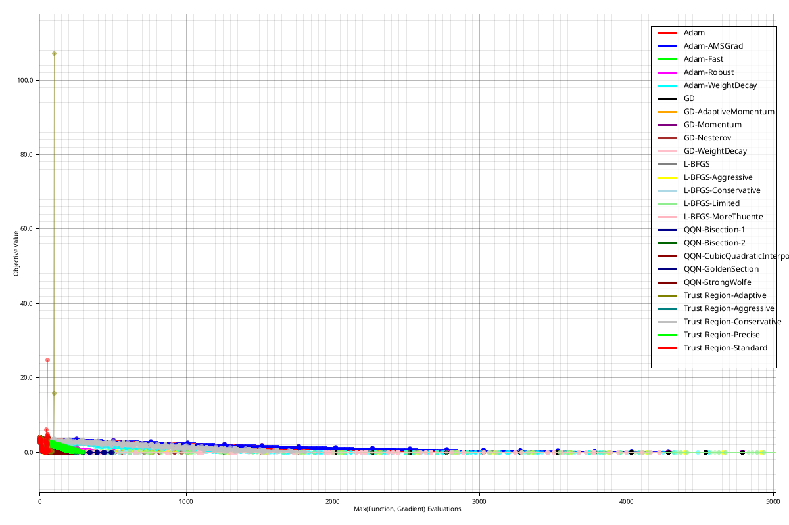
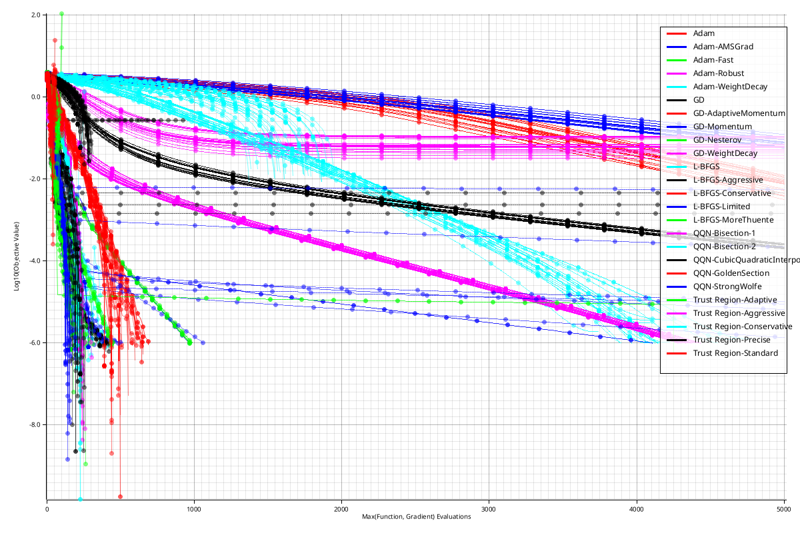

**Figure:** Convergence plots for Levy_5D showing objective value vs iterations.
Left: Linear scale, Right: Log scale for better visualization of convergence behavior.

**Data:** [Linear scale data (CSV)](data/Levy_5D_data.csv) | [Log scale data (CSV)](data/Levy_5D_log_data.csv)

## Problem: Levy_10D

**Family:** LevyN
**Dimension:** 10
**Success Threshold:** 1.000e-6
**Total Runs:** 500
**Detailed Analysis:** [View comprehensive problem analysis](reports/problem_analysis_Levy_10D.md)

### Performance Summary
<table style="border-collapse: collapse; width: 100%; margin: 20px 0;">
<tr style="background-color: #f2f2f2;">
<th style="border: 1px solid #ddd; padding: 8px; text-align: center;">Rank</th>
<th style="border: 1px solid #ddd; padding: 8px; text-align: center;">Optimizer</th>
<th style="border: 1px solid #ddd; padding: 8px; text-align: center;">Mean Final Value (All/Success/Fail)</th>
<th style="border: 1px solid #ddd; padding: 8px; text-align: center;">Std Dev</th>
<th style="border: 1px solid #ddd; padding: 8px; text-align: center;">Best Value</th>
<th style="border: 1px solid #ddd; padding: 8px; text-align: center;">Worst Value</th>
<th style="border: 1px solid #ddd; padding: 8px; text-align: center;">Mean Function Evals (All/Success/Fail)</th>
<th style="border: 1px solid #ddd; padding: 8px; text-align: center;">Mean Gradient Evals (All/Success/Fail)</th>
<th style="border: 1px solid #ddd; padding: 8px; text-align: center;">Success Rate</th>
<th style="border: 1px solid #ddd; padding: 8px; text-align: center;">Mean Time (s)</th>
</tr>
<tr style="background-color: #d4edda; font-weight: bold;">
<td style="border: 1px solid #ddd; padding: 8px; text-align: center;">1</td>
<td style="border: 1px solid #ddd; padding: 8px; text-align: center;"><a href="reports/detailed_Levy_10D_QQN-StrongWolfe.md" title="Click for detailed analysis">QQN-StrongWolfe</a></td>
<td style="border: 1px solid #ddd; padding: 8px; text-align: center;">1.46e-7 / 1.46e-7 / -</td>
<td style="border: 1px solid #ddd; padding: 8px; text-align: center;">2.27e-7</td>
<td style="border: 1px solid #ddd; padding: 8px; text-align: center;">7.28e-10</td>
<td style="border: 1px solid #ddd; padding: 8px; text-align: center;">8.42e-7</td>
<td style="border: 1px solid #ddd; padding: 8px; text-align: center;">70.1 / 70.1 / -</td>
<td style="border: 1px solid #ddd; padding: 8px; text-align: center;">77.3 / 77.3 / -</td>
<td style="border: 1px solid #ddd; padding: 8px; text-align: center;">100.0%</td>
<td style="border: 1px solid #ddd; padding: 8px; text-align: center;">0.002</td>
</tr>
<tr style="background-color: #fff3cd;">
<td style="border: 1px solid #ddd; padding: 8px; text-align: center;">2</td>
<td style="border: 1px solid #ddd; padding: 8px; text-align: center;"><a href="reports/detailed_Levy_10D_QQN-CubicQuadraticInterpolation.md" title="Click for detailed analysis">QQN-CubicQuadraticInterpolation</a></td>
<td style="border: 1px solid #ddd; padding: 8px; text-align: center;">2.83e-7 / 2.83e-7 / -</td>
<td style="border: 1px solid #ddd; padding: 8px; text-align: center;">2.18e-7</td>
<td style="border: 1px solid #ddd; padding: 8px; text-align: center;">2.06e-9</td>
<td style="border: 1px solid #ddd; padding: 8px; text-align: center;">7.21e-7</td>
<td style="border: 1px solid #ddd; padding: 8px; text-align: center;">98.6 / 98.6 / -</td>
<td style="border: 1px solid #ddd; padding: 8px; text-align: center;">118.6 / 118.6 / -</td>
<td style="border: 1px solid #ddd; padding: 8px; text-align: center;">100.0%</td>
<td style="border: 1px solid #ddd; padding: 8px; text-align: center;">0.003</td>
</tr>
<tr style="">
<td style="border: 1px solid #ddd; padding: 8px; text-align: center;">3</td>
<td style="border: 1px solid #ddd; padding: 8px; text-align: center;"><a href="reports/detailed_Levy_10D_QQN-Bisection-2.md" title="Click for detailed analysis">QQN-Bisection-2</a></td>
<td style="border: 1px solid #ddd; padding: 8px; text-align: center;">2.70e-7 / 2.70e-7 / -</td>
<td style="border: 1px solid #ddd; padding: 8px; text-align: center;">3.13e-7</td>
<td style="border: 1px solid #ddd; padding: 8px; text-align: center;">1.96e-10</td>
<td style="border: 1px solid #ddd; padding: 8px; text-align: center;">9.48e-7</td>
<td style="border: 1px solid #ddd; padding: 8px; text-align: center;">111.1 / 111.1 / -</td>
<td style="border: 1px solid #ddd; padding: 8px; text-align: center;">126.5 / 126.5 / -</td>
<td style="border: 1px solid #ddd; padding: 8px; text-align: center;">100.0%</td>
<td style="border: 1px solid #ddd; padding: 8px; text-align: center;">0.003</td>
</tr>
<tr style="">
<td style="border: 1px solid #ddd; padding: 8px; text-align: center;">4</td>
<td style="border: 1px solid #ddd; padding: 8px; text-align: center;"><a href="reports/detailed_Levy_10D_QQN-Bisection-1.md" title="Click for detailed analysis">QQN-Bisection-1</a></td>
<td style="border: 1px solid #ddd; padding: 8px; text-align: center;">2.49e-7 / 2.49e-7 / -</td>
<td style="border: 1px solid #ddd; padding: 8px; text-align: center;">2.81e-7</td>
<td style="border: 1px solid #ddd; padding: 8px; text-align: center;">1.67e-8</td>
<td style="border: 1px solid #ddd; padding: 8px; text-align: center;">9.80e-7</td>
<td style="border: 1px solid #ddd; padding: 8px; text-align: center;">109.7 / 109.7 / -</td>
<td style="border: 1px solid #ddd; padding: 8px; text-align: center;">146.6 / 146.6 / -</td>
<td style="border: 1px solid #ddd; padding: 8px; text-align: center;">100.0%</td>
<td style="border: 1px solid #ddd; padding: 8px; text-align: center;">0.003</td>
</tr>
<tr style="">
<td style="border: 1px solid #ddd; padding: 8px; text-align: center;">5</td>
<td style="border: 1px solid #ddd; padding: 8px; text-align: center;"><a href="reports/detailed_Levy_10D_L-BFGS-MoreThuente.md" title="Click for detailed analysis">L-BFGS-MoreThuente</a></td>
<td style="border: 1px solid #ddd; padding: 8px; text-align: center;">7.24e-7 / 7.24e-7 / -</td>
<td style="border: 1px solid #ddd; padding: 8px; text-align: center;">2.59e-7</td>
<td style="border: 1px solid #ddd; padding: 8px; text-align: center;">8.40e-8</td>
<td style="border: 1px solid #ddd; padding: 8px; text-align: center;">9.97e-7</td>
<td style="border: 1px solid #ddd; padding: 8px; text-align: center;">165.1 / 165.1 / -</td>
<td style="border: 1px solid #ddd; padding: 8px; text-align: center;">115.5 / 115.5 / -</td>
<td style="border: 1px solid #ddd; padding: 8px; text-align: center;">100.0%</td>
<td style="border: 1px solid #ddd; padding: 8px; text-align: center;">0.004</td>
</tr>
<tr style="">
<td style="border: 1px solid #ddd; padding: 8px; text-align: center;">6</td>
<td style="border: 1px solid #ddd; padding: 8px; text-align: center;"><a href="reports/detailed_Levy_10D_QQN-GoldenSection.md" title="Click for detailed analysis">QQN-GoldenSection</a></td>
<td style="border: 1px solid #ddd; padding: 8px; text-align: center;">2.74e-7 / 2.74e-7 / -</td>
<td style="border: 1px solid #ddd; padding: 8px; text-align: center;">3.41e-7</td>
<td style="border: 1px solid #ddd; padding: 8px; text-align: center;">1.87e-10</td>
<td style="border: 1px solid #ddd; padding: 8px; text-align: center;">9.92e-7</td>
<td style="border: 1px solid #ddd; padding: 8px; text-align: center;">399.3 / 399.3 / -</td>
<td style="border: 1px solid #ddd; padding: 8px; text-align: center;">57.8 / 57.8 / -</td>
<td style="border: 1px solid #ddd; padding: 8px; text-align: center;">100.0%</td>
<td style="border: 1px solid #ddd; padding: 8px; text-align: center;">0.007</td>
</tr>
<tr style="">
<td style="border: 1px solid #ddd; padding: 8px; text-align: center;">7</td>
<td style="border: 1px solid #ddd; padding: 8px; text-align: center;"><a href="reports/detailed_Levy_10D_L-BFGS-Conservative.md" title="Click for detailed analysis">L-BFGS-Conservative</a></td>
<td style="border: 1px solid #ddd; padding: 8px; text-align: center;">6.63e-7 / 6.63e-7 / -</td>
<td style="border: 1px solid #ddd; padding: 8px; text-align: center;">2.81e-7</td>
<td style="border: 1px solid #ddd; padding: 8px; text-align: center;">7.05e-8</td>
<td style="border: 1px solid #ddd; padding: 8px; text-align: center;">9.84e-7</td>
<td style="border: 1px solid #ddd; padding: 8px; text-align: center;">365.9 / 365.9 / -</td>
<td style="border: 1px solid #ddd; padding: 8px; text-align: center;">293.2 / 293.2 / -</td>
<td style="border: 1px solid #ddd; padding: 8px; text-align: center;">100.0%</td>
<td style="border: 1px solid #ddd; padding: 8px; text-align: center;">0.010</td>
</tr>
<tr style="">
<td style="border: 1px solid #ddd; padding: 8px; text-align: center;">8</td>
<td style="border: 1px solid #ddd; padding: 8px; text-align: center;"><a href="reports/detailed_Levy_10D_GD-WeightDecay.md" title="Click for detailed analysis">GD-WeightDecay</a></td>
<td style="border: 1px solid #ddd; padding: 8px; text-align: center;">9.97e-7 / 9.97e-7 / -</td>
<td style="border: 1px solid #ddd; padding: 8px; text-align: center;">2.35e-9</td>
<td style="border: 1px solid #ddd; padding: 8px; text-align: center;">9.93e-7</td>
<td style="border: 1px solid #ddd; padding: 8px; text-align: center;">1.00e-6</td>
<td style="border: 1px solid #ddd; padding: 8px; text-align: center;">1451.7 / 1451.7 / -</td>
<td style="border: 1px solid #ddd; padding: 8px; text-align: center;">2900.3 / 2900.3 / -</td>
<td style="border: 1px solid #ddd; padding: 8px; text-align: center;">100.0%</td>
<td style="border: 1px solid #ddd; padding: 8px; text-align: center;">0.052</td>
</tr>
<tr style="">
<td style="border: 1px solid #ddd; padding: 8px; text-align: center;">9</td>
<td style="border: 1px solid #ddd; padding: 8px; text-align: center;"><a href="reports/detailed_Levy_10D_L-BFGS.md" title="Click for detailed analysis">L-BFGS</a></td>
<td style="border: 1px solid #ddd; padding: 8px; text-align: center;">3.06e-4 / 8.13e-7 / 1.98e-2</td>
<td style="border: 1px solid #ddd; padding: 8px; text-align: center;">1.21e-3</td>
<td style="border: 1px solid #ddd; padding: 8px; text-align: center;">3.36e-7</td>
<td style="border: 1px solid #ddd; padding: 8px; text-align: center;">5.54e-3</td>
<td style="border: 1px solid #ddd; padding: 8px; text-align: center;">223.2 / 238.6 / 161.8</td>
<td style="border: 1px solid #ddd; padding: 8px; text-align: center;">139.2 / 149.7 / 97.5</td>
<td style="border: 1px solid #ddd; padding: 8px; text-align: center;">80.0%</td>
<td style="border: 1px solid #ddd; padding: 8px; text-align: center;">0.005</td>
</tr>
<tr style="">
<td style="border: 1px solid #ddd; padding: 8px; text-align: center;">10</td>
<td style="border: 1px solid #ddd; padding: 8px; text-align: center;"><a href="reports/detailed_Levy_10D_L-BFGS-Limited.md" title="Click for detailed analysis">L-BFGS-Limited</a></td>
<td style="border: 1px solid #ddd; padding: 8px; text-align: center;">2.41e-5 / 9.15e-7 / 1.17e-4</td>
<td style="border: 1px solid #ddd; padding: 8px; text-align: center;">9.83e-5</td>
<td style="border: 1px solid #ddd; padding: 8px; text-align: center;">5.25e-7</td>
<td style="border: 1px solid #ddd; padding: 8px; text-align: center;">4.52e-4</td>
<td style="border: 1px solid #ddd; padding: 8px; text-align: center;">1051.8 / 398.4 / 3665.5</td>
<td style="border: 1px solid #ddd; padding: 8px; text-align: center;">438.6 / 213.0 / 1340.8</td>
<td style="border: 1px solid #ddd; padding: 8px; text-align: center;">80.0%</td>
<td style="border: 1px solid #ddd; padding: 8px; text-align: center;">0.021</td>
</tr>
<tr style="">
<td style="border: 1px solid #ddd; padding: 8px; text-align: center;">11</td>
<td style="border: 1px solid #ddd; padding: 8px; text-align: center;"><a href="reports/detailed_Levy_10D_L-BFGS-Aggressive.md" title="Click for detailed analysis">L-BFGS-Aggressive</a></td>
<td style="border: 1px solid #ddd; padding: 8px; text-align: center;">1.27e0 / 7.52e-7 / 1.69e0</td>
<td style="border: 1px solid #ddd; padding: 8px; text-align: center;">8.13e-1</td>
<td style="border: 1px solid #ddd; padding: 8px; text-align: center;">4.01e-7</td>
<td style="border: 1px solid #ddd; padding: 8px; text-align: center;">1.95e0</td>
<td style="border: 1px solid #ddd; padding: 8px; text-align: center;">2637.9 / 287.2 / 3421.5</td>
<td style="border: 1px solid #ddd; padding: 8px; text-align: center;">818.9 / 134.4 / 1047.0</td>
<td style="border: 1px solid #ddd; padding: 8px; text-align: center;">25.0%</td>
<td style="border: 1px solid #ddd; padding: 8px; text-align: center;">0.034</td>
</tr>
<tr style="">
<td style="border: 1px solid #ddd; padding: 8px; text-align: center;">12</td>
<td style="border: 1px solid #ddd; padding: 8px; text-align: center;"><a href="reports/detailed_Levy_10D_Trust_Region-Aggressive.md" title="Click for detailed analysis">Trust Region-Aggressive</a></td>
<td style="border: 1px solid #ddd; padding: 8px; text-align: center;">3.29e-1 / - / 6.17e-1</td>
<td style="border: 1px solid #ddd; padding: 8px; text-align: center;">1.18e-1</td>
<td style="border: 1px solid #ddd; padding: 8px; text-align: center;">8.74e-2</td>
<td style="border: 1px solid #ddd; padding: 8px; text-align: center;">6.04e-1</td>
<td style="border: 1px solid #ddd; padding: 8px; text-align: center;">11.8 / - / 11.8</td>
<td style="border: 1px solid #ddd; padding: 8px; text-align: center;">8.5 / - / 8.5</td>
<td style="border: 1px solid #ddd; padding: 8px; text-align: center;">0.0%</td>
<td style="border: 1px solid #ddd; padding: 8px; text-align: center;">0.000</td>
</tr>
<tr style="">
<td style="border: 1px solid #ddd; padding: 8px; text-align: center;">13</td>
<td style="border: 1px solid #ddd; padding: 8px; text-align: center;"><a href="reports/detailed_Levy_10D_Trust_Region-Standard.md" title="Click for detailed analysis">Trust Region-Standard</a></td>
<td style="border: 1px solid #ddd; padding: 8px; text-align: center;">1.84e-1 / - / 2.04e0</td>
<td style="border: 1px solid #ddd; padding: 8px; text-align: center;">1.05e-1</td>
<td style="border: 1px solid #ddd; padding: 8px; text-align: center;">9.98e-3</td>
<td style="border: 1px solid #ddd; padding: 8px; text-align: center;">3.86e-1</td>
<td style="border: 1px solid #ddd; padding: 8px; text-align: center;">29.6 / - / 29.6</td>
<td style="border: 1px solid #ddd; padding: 8px; text-align: center;">20.4 / - / 20.4</td>
<td style="border: 1px solid #ddd; padding: 8px; text-align: center;">0.0%</td>
<td style="border: 1px solid #ddd; padding: 8px; text-align: center;">0.000</td>
</tr>
<tr style="">
<td style="border: 1px solid #ddd; padding: 8px; text-align: center;">14</td>
<td style="border: 1px solid #ddd; padding: 8px; text-align: center;"><a href="reports/detailed_Levy_10D_GD-AdaptiveMomentum.md" title="Click for detailed analysis">GD-AdaptiveMomentum</a></td>
<td style="border: 1px solid #ddd; padding: 8px; text-align: center;">1.61e-1 / - / 6.50e-1</td>
<td style="border: 1px solid #ddd; padding: 8px; text-align: center;">1.76e-2</td>
<td style="border: 1px solid #ddd; padding: 8px; text-align: center;">1.39e-1</td>
<td style="border: 1px solid #ddd; padding: 8px; text-align: center;">1.97e-1</td>
<td style="border: 1px solid #ddd; padding: 8px; text-align: center;">21.9 / - / 21.9</td>
<td style="border: 1px solid #ddd; padding: 8px; text-align: center;">39.8 / - / 39.8</td>
<td style="border: 1px solid #ddd; padding: 8px; text-align: center;">0.0%</td>
<td style="border: 1px solid #ddd; padding: 8px; text-align: center;">0.001</td>
</tr>
<tr style="">
<td style="border: 1px solid #ddd; padding: 8px; text-align: center;">15</td>
<td style="border: 1px solid #ddd; padding: 8px; text-align: center;"><a href="reports/detailed_Levy_10D_Adam-Fast.md" title="Click for detailed analysis">Adam-Fast</a></td>
<td style="border: 1px solid #ddd; padding: 8px; text-align: center;">3.10e-2 / - / 3.12e-1</td>
<td style="border: 1px solid #ddd; padding: 8px; text-align: center;">9.76e-3</td>
<td style="border: 1px solid #ddd; padding: 8px; text-align: center;">1.12e-2</td>
<td style="border: 1px solid #ddd; padding: 8px; text-align: center;">5.14e-2</td>
<td style="border: 1px solid #ddd; padding: 8px; text-align: center;">36.9 / - / 36.9</td>
<td style="border: 1px solid #ddd; padding: 8px; text-align: center;">35.9 / - / 35.9</td>
<td style="border: 1px solid #ddd; padding: 8px; text-align: center;">0.0%</td>
<td style="border: 1px solid #ddd; padding: 8px; text-align: center;">0.001</td>
</tr>
<tr style="">
<td style="border: 1px solid #ddd; padding: 8px; text-align: center;">16</td>
<td style="border: 1px solid #ddd; padding: 8px; text-align: center;"><a href="reports/detailed_Levy_10D_GD-Momentum.md" title="Click for detailed analysis">GD-Momentum</a></td>
<td style="border: 1px solid #ddd; padding: 8px; text-align: center;">1.70e-1 / - / 2.58e-1</td>
<td style="border: 1px solid #ddd; padding: 8px; text-align: center;">2.85e-2</td>
<td style="border: 1px solid #ddd; padding: 8px; text-align: center;">1.20e-1</td>
<td style="border: 1px solid #ddd; padding: 8px; text-align: center;">2.19e-1</td>
<td style="border: 1px solid #ddd; padding: 8px; text-align: center;">28.1 / - / 28.1</td>
<td style="border: 1px solid #ddd; padding: 8px; text-align: center;">52.2 / - / 52.2</td>
<td style="border: 1px solid #ddd; padding: 8px; text-align: center;">0.0%</td>
<td style="border: 1px solid #ddd; padding: 8px; text-align: center;">0.001</td>
</tr>
<tr style="">
<td style="border: 1px solid #ddd; padding: 8px; text-align: center;">17</td>
<td style="border: 1px solid #ddd; padding: 8px; text-align: center;"><a href="reports/detailed_Levy_10D_GD-Nesterov.md" title="Click for detailed analysis">GD-Nesterov</a></td>
<td style="border: 1px solid #ddd; padding: 8px; text-align: center;">1.28e-1 / - / 1.74e-1</td>
<td style="border: 1px solid #ddd; padding: 8px; text-align: center;">2.12e-2</td>
<td style="border: 1px solid #ddd; padding: 8px; text-align: center;">9.79e-2</td>
<td style="border: 1px solid #ddd; padding: 8px; text-align: center;">1.74e-1</td>
<td style="border: 1px solid #ddd; padding: 8px; text-align: center;">28.4 / - / 28.4</td>
<td style="border: 1px solid #ddd; padding: 8px; text-align: center;">52.7 / - / 52.7</td>
<td style="border: 1px solid #ddd; padding: 8px; text-align: center;">0.0%</td>
<td style="border: 1px solid #ddd; padding: 8px; text-align: center;">0.001</td>
</tr>
<tr style="">
<td style="border: 1px solid #ddd; padding: 8px; text-align: center;">18</td>
<td style="border: 1px solid #ddd; padding: 8px; text-align: center;"><a href="reports/detailed_Levy_10D_Trust_Region-Adaptive.md" title="Click for detailed analysis">Trust Region-Adaptive</a></td>
<td style="border: 1px solid #ddd; padding: 8px; text-align: center;">7.36e-2 / - / 7.36e-2</td>
<td style="border: 1px solid #ddd; padding: 8px; text-align: center;">4.00e-2</td>
<td style="border: 1px solid #ddd; padding: 8px; text-align: center;">1.96e-2</td>
<td style="border: 1px solid #ddd; padding: 8px; text-align: center;">1.41e-1</td>
<td style="border: 1px solid #ddd; padding: 8px; text-align: center;">84.5 / - / 84.5</td>
<td style="border: 1px solid #ddd; padding: 8px; text-align: center;">57.0 / - / 57.0</td>
<td style="border: 1px solid #ddd; padding: 8px; text-align: center;">0.0%</td>
<td style="border: 1px solid #ddd; padding: 8px; text-align: center;">0.001</td>
</tr>
<tr style="">
<td style="border: 1px solid #ddd; padding: 8px; text-align: center;">19</td>
<td style="border: 1px solid #ddd; padding: 8px; text-align: center;"><a href="reports/detailed_Levy_10D_Trust_Region-Precise.md" title="Click for detailed analysis">Trust Region-Precise</a></td>
<td style="border: 1px solid #ddd; padding: 8px; text-align: center;">3.14e-2 / - / 3.14e-2</td>
<td style="border: 1px solid #ddd; padding: 8px; text-align: center;">1.13e-2</td>
<td style="border: 1px solid #ddd; padding: 8px; text-align: center;">1.56e-2</td>
<td style="border: 1px solid #ddd; padding: 8px; text-align: center;">5.18e-2</td>
<td style="border: 1px solid #ddd; padding: 8px; text-align: center;">325.6 / - / 325.6</td>
<td style="border: 1px solid #ddd; padding: 8px; text-align: center;">217.7 / - / 217.7</td>
<td style="border: 1px solid #ddd; padding: 8px; text-align: center;">0.0%</td>
<td style="border: 1px solid #ddd; padding: 8px; text-align: center;">0.003</td>
</tr>
<tr style="">
<td style="border: 1px solid #ddd; padding: 8px; text-align: center;">20</td>
<td style="border: 1px solid #ddd; padding: 8px; text-align: center;"><a href="reports/detailed_Levy_10D_Trust_Region-Conservative.md" title="Click for detailed analysis">Trust Region-Conservative</a></td>
<td style="border: 1px solid #ddd; padding: 8px; text-align: center;">1.21e-2 / - / 1.21e-2</td>
<td style="border: 1px solid #ddd; padding: 8px; text-align: center;">2.16e-3</td>
<td style="border: 1px solid #ddd; padding: 8px; text-align: center;">9.38e-3</td>
<td style="border: 1px solid #ddd; padding: 8px; text-align: center;">1.68e-2</td>
<td style="border: 1px solid #ddd; padding: 8px; text-align: center;">1976.9 / - / 1976.9</td>
<td style="border: 1px solid #ddd; padding: 8px; text-align: center;">1318.6 / - / 1318.6</td>
<td style="border: 1px solid #ddd; padding: 8px; text-align: center;">0.0%</td>
<td style="border: 1px solid #ddd; padding: 8px; text-align: center;">0.016</td>
</tr>
<tr style="">
<td style="border: 1px solid #ddd; padding: 8px; text-align: center;">21</td>
<td style="border: 1px solid #ddd; padding: 8px; text-align: center;"><a href="reports/detailed_Levy_10D_Adam-WeightDecay.md" title="Click for detailed analysis">Adam-WeightDecay</a></td>
<td style="border: 1px solid #ddd; padding: 8px; text-align: center;">2.78e-6 / - / 2.80e-6</td>
<td style="border: 1px solid #ddd; padding: 8px; text-align: center;">1.09e-6</td>
<td style="border: 1px solid #ddd; padding: 8px; text-align: center;">1.40e-6</td>
<td style="border: 1px solid #ddd; padding: 8px; text-align: center;">5.41e-6</td>
<td style="border: 1px solid #ddd; padding: 8px; text-align: center;">1897.2 / - / 1897.2</td>
<td style="border: 1px solid #ddd; padding: 8px; text-align: center;">1896.2 / - / 1896.2</td>
<td style="border: 1px solid #ddd; padding: 8px; text-align: center;">0.0%</td>
<td style="border: 1px solid #ddd; padding: 8px; text-align: center;">0.047</td>
</tr>
<tr style="">
<td style="border: 1px solid #ddd; padding: 8px; text-align: center;">22</td>
<td style="border: 1px solid #ddd; padding: 8px; text-align: center;"><a href="reports/detailed_Levy_10D_GD.md" title="Click for detailed analysis">GD</a></td>
<td style="border: 1px solid #ddd; padding: 8px; text-align: center;">2.28e-4 / - / 2.28e-4</td>
<td style="border: 1px solid #ddd; padding: 8px; text-align: center;">3.05e-5</td>
<td style="border: 1px solid #ddd; padding: 8px; text-align: center;">1.85e-4</td>
<td style="border: 1px solid #ddd; padding: 8px; text-align: center;">2.81e-4</td>
<td style="border: 1px solid #ddd; padding: 8px; text-align: center;">1668.0 / - / 1668.0</td>
<td style="border: 1px solid #ddd; padding: 8px; text-align: center;">3334.0 / - / 3334.0</td>
<td style="border: 1px solid #ddd; padding: 8px; text-align: center;">0.0%</td>
<td style="border: 1px solid #ddd; padding: 8px; text-align: center;">0.049</td>
</tr>
<tr style="">
<td style="border: 1px solid #ddd; padding: 8px; text-align: center;">23</td>
<td style="border: 1px solid #ddd; padding: 8px; text-align: center;"><a href="reports/detailed_Levy_10D_Adam.md" title="Click for detailed analysis">Adam</a></td>
<td style="border: 1px solid #ddd; padding: 8px; text-align: center;">6.46e-3 / - / 6.46e-3</td>
<td style="border: 1px solid #ddd; padding: 8px; text-align: center;">2.05e-3</td>
<td style="border: 1px solid #ddd; padding: 8px; text-align: center;">2.32e-3</td>
<td style="border: 1px solid #ddd; padding: 8px; text-align: center;">1.09e-2</td>
<td style="border: 1px solid #ddd; padding: 8px; text-align: center;">2502.0 / - / 2502.0</td>
<td style="border: 1px solid #ddd; padding: 8px; text-align: center;">2502.0 / - / 2502.0</td>
<td style="border: 1px solid #ddd; padding: 8px; text-align: center;">0.0%</td>
<td style="border: 1px solid #ddd; padding: 8px; text-align: center;">0.058</td>
</tr>
<tr style="">
<td style="border: 1px solid #ddd; padding: 8px; text-align: center;">24</td>
<td style="border: 1px solid #ddd; padding: 8px; text-align: center;"><a href="reports/detailed_Levy_10D_Adam-Robust.md" title="Click for detailed analysis">Adam-Robust</a></td>
<td style="border: 1px solid #ddd; padding: 8px; text-align: center;">9.82e-2 / - / 9.82e-2</td>
<td style="border: 1px solid #ddd; padding: 8px; text-align: center;">2.53e-2</td>
<td style="border: 1px solid #ddd; padding: 8px; text-align: center;">6.13e-2</td>
<td style="border: 1px solid #ddd; padding: 8px; text-align: center;">1.55e-1</td>
<td style="border: 1px solid #ddd; padding: 8px; text-align: center;">2502.0 / - / 2502.0</td>
<td style="border: 1px solid #ddd; padding: 8px; text-align: center;">2502.0 / - / 2502.0</td>
<td style="border: 1px solid #ddd; padding: 8px; text-align: center;">0.0%</td>
<td style="border: 1px solid #ddd; padding: 8px; text-align: center;">0.065</td>
</tr>
<tr style="">
<td style="border: 1px solid #ddd; padding: 8px; text-align: center;">25</td>
<td style="border: 1px solid #ddd; padding: 8px; text-align: center;"><a href="reports/detailed_Levy_10D_Adam-AMSGrad.md" title="Click for detailed analysis">Adam-AMSGrad</a></td>
<td style="border: 1px solid #ddd; padding: 8px; text-align: center;">1.51e-1 / - / 1.51e-1</td>
<td style="border: 1px solid #ddd; padding: 8px; text-align: center;">2.79e-2</td>
<td style="border: 1px solid #ddd; padding: 8px; text-align: center;">1.12e-1</td>
<td style="border: 1px solid #ddd; padding: 8px; text-align: center;">2.09e-1</td>
<td style="border: 1px solid #ddd; padding: 8px; text-align: center;">2502.0 / - / 2502.0</td>
<td style="border: 1px solid #ddd; padding: 8px; text-align: center;">2502.0 / - / 2502.0</td>
<td style="border: 1px solid #ddd; padding: 8px; text-align: center;">0.0%</td>
<td style="border: 1px solid #ddd; padding: 8px; text-align: center;">0.065</td>
</tr>
</table>

### Convergence Plots

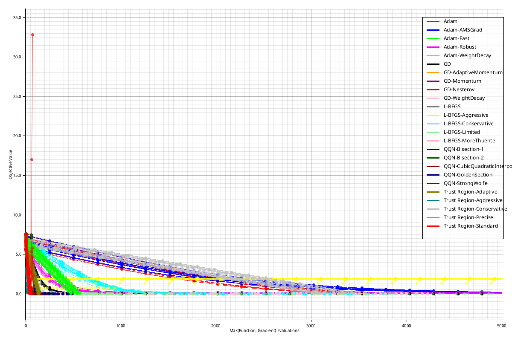
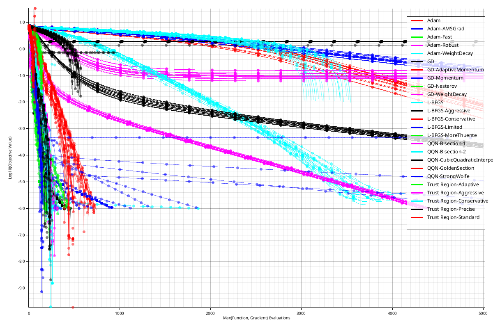

**Figure:** Convergence plots for Levy_10D showing objective value vs iterations.
Left: Linear scale, Right: Log scale for better visualization of convergence behavior.

**Data:** [Linear scale data (CSV)](data/Levy_10D_data.csv) | [Log scale data (CSV)](data/Levy_10D_log_data.csv)

## Problem: Zakharov_2D

**Family:** Zakharov
**Dimension:** 2
**Success Threshold:** 1.000e-8
**Total Runs:** 500
**Detailed Analysis:** [View comprehensive problem analysis](reports/problem_analysis_Zakharov_2D.md)

### Performance Summary
<table style="border-collapse: collapse; width: 100%; margin: 20px 0;">
<tr style="background-color: #f2f2f2;">
<th style="border: 1px solid #ddd; padding: 8px; text-align: center;">Rank</th>
<th style="border: 1px solid #ddd; padding: 8px; text-align: center;">Optimizer</th>
<th style="border: 1px solid #ddd; padding: 8px; text-align: center;">Mean Final Value (All/Success/Fail)</th>
<th style="border: 1px solid #ddd; padding: 8px; text-align: center;">Std Dev</th>
<th style="border: 1px solid #ddd; padding: 8px; text-align: center;">Best Value</th>
<th style="border: 1px solid #ddd; padding: 8px; text-align: center;">Worst Value</th>
<th style="border: 1px solid #ddd; padding: 8px; text-align: center;">Mean Function Evals (All/Success/Fail)</th>
<th style="border: 1px solid #ddd; padding: 8px; text-align: center;">Mean Gradient Evals (All/Success/Fail)</th>
<th style="border: 1px solid #ddd; padding: 8px; text-align: center;">Success Rate</th>
<th style="border: 1px solid #ddd; padding: 8px; text-align: center;">Mean Time (s)</th>
</tr>
<tr style="background-color: #d4edda; font-weight: bold;">
<td style="border: 1px solid #ddd; padding: 8px; text-align: center;">1</td>
<td style="border: 1px solid #ddd; padding: 8px; text-align: center;"><a href="reports/detailed_Zakharov_2D_L-BFGS-MoreThuente.md" title="Click for detailed analysis">L-BFGS-MoreThuente</a></td>
<td style="border: 1px solid #ddd; padding: 8px; text-align: center;">7.07e-9 / 7.07e-9 / -</td>
<td style="border: 1px solid #ddd; padding: 8px; text-align: center;">1.81e-9</td>
<td style="border: 1px solid #ddd; padding: 8px; text-align: center;">3.76e-9</td>
<td style="border: 1px solid #ddd; padding: 8px; text-align: center;">9.71e-9</td>
<td style="border: 1px solid #ddd; padding: 8px; text-align: center;">67.3 / 67.3 / -</td>
<td style="border: 1px solid #ddd; padding: 8px; text-align: center;">49.2 / 49.2 / -</td>
<td style="border: 1px solid #ddd; padding: 8px; text-align: center;">100.0%</td>
<td style="border: 1px solid #ddd; padding: 8px; text-align: center;">0.001</td>
</tr>
<tr style="background-color: #fff3cd;">
<td style="border: 1px solid #ddd; padding: 8px; text-align: center;">2</td>
<td style="border: 1px solid #ddd; padding: 8px; text-align: center;"><a href="reports/detailed_Zakharov_2D_QQN-Bisection-2.md" title="Click for detailed analysis">QQN-Bisection-2</a></td>
<td style="border: 1px solid #ddd; padding: 8px; text-align: center;">9.02e-14 / 9.02e-14 / -</td>
<td style="border: 1px solid #ddd; padding: 8px; text-align: center;">2.34e-13</td>
<td style="border: 1px solid #ddd; padding: 8px; text-align: center;">4.37e-17</td>
<td style="border: 1px solid #ddd; padding: 8px; text-align: center;">9.97e-13</td>
<td style="border: 1px solid #ddd; padding: 8px; text-align: center;">84.0 / 84.0 / -</td>
<td style="border: 1px solid #ddd; padding: 8px; text-align: center;">90.0 / 90.0 / -</td>
<td style="border: 1px solid #ddd; padding: 8px; text-align: center;">100.0%</td>
<td style="border: 1px solid #ddd; padding: 8px; text-align: center;">0.002</td>
</tr>
<tr style="">
<td style="border: 1px solid #ddd; padding: 8px; text-align: center;">3</td>
<td style="border: 1px solid #ddd; padding: 8px; text-align: center;"><a href="reports/detailed_Zakharov_2D_QQN-CubicQuadraticInterpolation.md" title="Click for detailed analysis">QQN-CubicQuadraticInterpolation</a></td>
<td style="border: 1px solid #ddd; padding: 8px; text-align: center;">1.52e-9 / 1.52e-9 / -</td>
<td style="border: 1px solid #ddd; padding: 8px; text-align: center;">3.10e-9</td>
<td style="border: 1px solid #ddd; padding: 8px; text-align: center;">1.85e-11</td>
<td style="border: 1px solid #ddd; padding: 8px; text-align: center;">9.62e-9</td>
<td style="border: 1px solid #ddd; padding: 8px; text-align: center;">89.2 / 89.2 / -</td>
<td style="border: 1px solid #ddd; padding: 8px; text-align: center;">97.9 / 97.9 / -</td>
<td style="border: 1px solid #ddd; padding: 8px; text-align: center;">100.0%</td>
<td style="border: 1px solid #ddd; padding: 8px; text-align: center;">0.003</td>
</tr>
<tr style="">
<td style="border: 1px solid #ddd; padding: 8px; text-align: center;">4</td>
<td style="border: 1px solid #ddd; padding: 8px; text-align: center;"><a href="reports/detailed_Zakharov_2D_QQN-StrongWolfe.md" title="Click for detailed analysis">QQN-StrongWolfe</a></td>
<td style="border: 1px solid #ddd; padding: 8px; text-align: center;">4.83e-9 / 4.83e-9 / -</td>
<td style="border: 1px solid #ddd; padding: 8px; text-align: center;">2.70e-9</td>
<td style="border: 1px solid #ddd; padding: 8px; text-align: center;">1.51e-9</td>
<td style="border: 1px solid #ddd; padding: 8px; text-align: center;">9.93e-9</td>
<td style="border: 1px solid #ddd; padding: 8px; text-align: center;">95.0 / 95.0 / -</td>
<td style="border: 1px solid #ddd; padding: 8px; text-align: center;">98.2 / 98.2 / -</td>
<td style="border: 1px solid #ddd; padding: 8px; text-align: center;">100.0%</td>
<td style="border: 1px solid #ddd; padding: 8px; text-align: center;">0.003</td>
</tr>
<tr style="">
<td style="border: 1px solid #ddd; padding: 8px; text-align: center;">5</td>
<td style="border: 1px solid #ddd; padding: 8px; text-align: center;"><a href="reports/detailed_Zakharov_2D_QQN-GoldenSection.md" title="Click for detailed analysis">QQN-GoldenSection</a></td>
<td style="border: 1px solid #ddd; padding: 8px; text-align: center;">7.14e-11 / 7.14e-11 / -</td>
<td style="border: 1px solid #ddd; padding: 8px; text-align: center;">3.11e-10</td>
<td style="border: 1px solid #ddd; padding: 8px; text-align: center;">5.21e-21</td>
<td style="border: 1px solid #ddd; padding: 8px; text-align: center;">1.43e-9</td>
<td style="border: 1px solid #ddd; padding: 8px; text-align: center;">180.9 / 180.9 / -</td>
<td style="border: 1px solid #ddd; padding: 8px; text-align: center;">25.7 / 25.7 / -</td>
<td style="border: 1px solid #ddd; padding: 8px; text-align: center;">100.0%</td>
<td style="border: 1px solid #ddd; padding: 8px; text-align: center;">0.003</td>
</tr>
<tr style="">
<td style="border: 1px solid #ddd; padding: 8px; text-align: center;">6</td>
<td style="border: 1px solid #ddd; padding: 8px; text-align: center;"><a href="reports/detailed_Zakharov_2D_QQN-Bisection-1.md" title="Click for detailed analysis">QQN-Bisection-1</a></td>
<td style="border: 1px solid #ddd; padding: 8px; text-align: center;">7.75e-14 / 7.75e-14 / -</td>
<td style="border: 1px solid #ddd; padding: 8px; text-align: center;">8.83e-14</td>
<td style="border: 1px solid #ddd; padding: 8px; text-align: center;">9.76e-18</td>
<td style="border: 1px solid #ddd; padding: 8px; text-align: center;">3.54e-13</td>
<td style="border: 1px solid #ddd; padding: 8px; text-align: center;">114.6 / 114.6 / -</td>
<td style="border: 1px solid #ddd; padding: 8px; text-align: center;">155.6 / 155.6 / -</td>
<td style="border: 1px solid #ddd; padding: 8px; text-align: center;">100.0%</td>
<td style="border: 1px solid #ddd; padding: 8px; text-align: center;">0.002</td>
</tr>
<tr style="">
<td style="border: 1px solid #ddd; padding: 8px; text-align: center;">7</td>
<td style="border: 1px solid #ddd; padding: 8px; text-align: center;"><a href="reports/detailed_Zakharov_2D_GD.md" title="Click for detailed analysis">GD</a></td>
<td style="border: 1px solid #ddd; padding: 8px; text-align: center;">9.76e-9 / 9.76e-9 / -</td>
<td style="border: 1px solid #ddd; padding: 8px; text-align: center;">9.66e-11</td>
<td style="border: 1px solid #ddd; padding: 8px; text-align: center;">9.61e-9</td>
<td style="border: 1px solid #ddd; padding: 8px; text-align: center;">9.97e-9</td>
<td style="border: 1px solid #ddd; padding: 8px; text-align: center;">417.4 / 417.4 / -</td>
<td style="border: 1px solid #ddd; padding: 8px; text-align: center;">831.9 / 831.9 / -</td>
<td style="border: 1px solid #ddd; padding: 8px; text-align: center;">100.0%</td>
<td style="border: 1px solid #ddd; padding: 8px; text-align: center;">0.011</td>
</tr>
<tr style="">
<td style="border: 1px solid #ddd; padding: 8px; text-align: center;">8</td>
<td style="border: 1px solid #ddd; padding: 8px; text-align: center;"><a href="reports/detailed_Zakharov_2D_Adam-WeightDecay.md" title="Click for detailed analysis">Adam-WeightDecay</a></td>
<td style="border: 1px solid #ddd; padding: 8px; text-align: center;">9.88e-9 / 9.88e-9 / -</td>
<td style="border: 1px solid #ddd; padding: 8px; text-align: center;">7.13e-11</td>
<td style="border: 1px solid #ddd; padding: 8px; text-align: center;">9.74e-9</td>
<td style="border: 1px solid #ddd; padding: 8px; text-align: center;">9.97e-9</td>
<td style="border: 1px solid #ddd; padding: 8px; text-align: center;">2040.6 / 2040.6 / -</td>
<td style="border: 1px solid #ddd; padding: 8px; text-align: center;">2040.6 / 2040.6 / -</td>
<td style="border: 1px solid #ddd; padding: 8px; text-align: center;">100.0%</td>
<td style="border: 1px solid #ddd; padding: 8px; text-align: center;">0.043</td>
</tr>
<tr style="">
<td style="border: 1px solid #ddd; padding: 8px; text-align: center;">9</td>
<td style="border: 1px solid #ddd; padding: 8px; text-align: center;"><a href="reports/detailed_Zakharov_2D_L-BFGS-Limited.md" title="Click for detailed analysis">L-BFGS-Limited</a></td>
<td style="border: 1px solid #ddd; padding: 8px; text-align: center;">6.46e-7 / 6.80e-9 / 6.40e-6</td>
<td style="border: 1px solid #ddd; padding: 8px; text-align: center;">2.30e-6</td>
<td style="border: 1px solid #ddd; padding: 8px; text-align: center;">1.04e-9</td>
<td style="border: 1px solid #ddd; padding: 8px; text-align: center;">1.04e-5</td>
<td style="border: 1px solid #ddd; padding: 8px; text-align: center;">658.2 / 313.6 / 3759.5</td>
<td style="border: 1px solid #ddd; padding: 8px; text-align: center;">289.9 / 183.2 / 1250.0</td>
<td style="border: 1px solid #ddd; padding: 8px; text-align: center;">90.0%</td>
<td style="border: 1px solid #ddd; padding: 8px; text-align: center;">0.012</td>
</tr>
<tr style="">
<td style="border: 1px solid #ddd; padding: 8px; text-align: center;">10</td>
<td style="border: 1px solid #ddd; padding: 8px; text-align: center;"><a href="reports/detailed_Zakharov_2D_L-BFGS-Conservative.md" title="Click for detailed analysis">L-BFGS-Conservative</a></td>
<td style="border: 1px solid #ddd; padding: 8px; text-align: center;">6.39e-7 / 6.63e-9 / 2.53e-6</td>
<td style="border: 1px solid #ddd; padding: 8px; text-align: center;">1.89e-6</td>
<td style="border: 1px solid #ddd; padding: 8px; text-align: center;">5.41e-10</td>
<td style="border: 1px solid #ddd; padding: 8px; text-align: center;">6.44e-6</td>
<td style="border: 1px solid #ddd; padding: 8px; text-align: center;">863.5 / 223.9 / 2782.2</td>
<td style="border: 1px solid #ddd; padding: 8px; text-align: center;">690.0 / 178.0 / 2226.0</td>
<td style="border: 1px solid #ddd; padding: 8px; text-align: center;">75.0%</td>
<td style="border: 1px solid #ddd; padding: 8px; text-align: center;">0.022</td>
</tr>
<tr style="">
<td style="border: 1px solid #ddd; padding: 8px; text-align: center;">11</td>
<td style="border: 1px solid #ddd; padding: 8px; text-align: center;"><a href="reports/detailed_Zakharov_2D_L-BFGS-Aggressive.md" title="Click for detailed analysis">L-BFGS-Aggressive</a></td>
<td style="border: 1px solid #ddd; padding: 8px; text-align: center;">3.75e0 / 1.69e-9 / 1.25e1</td>
<td style="border: 1px solid #ddd; padding: 8px; text-align: center;">5.80e0</td>
<td style="border: 1px solid #ddd; padding: 8px; text-align: center;">4.91e-10</td>
<td style="border: 1px solid #ddd; padding: 8px; text-align: center;">1.50e1</td>
<td style="border: 1px solid #ddd; padding: 8px; text-align: center;">1213.0 / 82.0 / 3852.0</td>
<td style="border: 1px solid #ddd; padding: 8px; text-align: center;">369.6 / 32.1 / 1157.0</td>
<td style="border: 1px solid #ddd; padding: 8px; text-align: center;">70.0%</td>
<td style="border: 1px solid #ddd; padding: 8px; text-align: center;">0.007</td>
</tr>
<tr style="">
<td style="border: 1px solid #ddd; padding: 8px; text-align: center;">12</td>
<td style="border: 1px solid #ddd; padding: 8px; text-align: center;"><a href="reports/detailed_Zakharov_2D_L-BFGS.md" title="Click for detailed analysis">L-BFGS</a></td>
<td style="border: 1px solid #ddd; padding: 8px; text-align: center;">1.12e-2 / 5.54e-9 / 7.19e-2</td>
<td style="border: 1px solid #ddd; padding: 8px; text-align: center;">2.14e-2</td>
<td style="border: 1px solid #ddd; padding: 8px; text-align: center;">5.69e-10</td>
<td style="border: 1px solid #ddd; padding: 8px; text-align: center;">7.06e-2</td>
<td style="border: 1px solid #ddd; padding: 8px; text-align: center;">158.7 / 188.2 / 114.4</td>
<td style="border: 1px solid #ddd; padding: 8px; text-align: center;">83.8 / 102.4 / 55.9</td>
<td style="border: 1px solid #ddd; padding: 8px; text-align: center;">60.0%</td>
<td style="border: 1px solid #ddd; padding: 8px; text-align: center;">0.003</td>
</tr>
<tr style="">
<td style="border: 1px solid #ddd; padding: 8px; text-align: center;">13</td>
<td style="border: 1px solid #ddd; padding: 8px; text-align: center;"><a href="reports/detailed_Zakharov_2D_GD-WeightDecay.md" title="Click for detailed analysis">GD-WeightDecay</a></td>
<td style="border: 1px solid #ddd; padding: 8px; text-align: center;">5.04e-2 / 9.15e-9 / 1.14e-1</td>
<td style="border: 1px solid #ddd; padding: 8px; text-align: center;">3.90e-2</td>
<td style="border: 1px solid #ddd; padding: 8px; text-align: center;">8.63e-9</td>
<td style="border: 1px solid #ddd; padding: 8px; text-align: center;">1.34e-1</td>
<td style="border: 1px solid #ddd; padding: 8px; text-align: center;">47.9 / 128.6 / 21.0</td>
<td style="border: 1px solid #ddd; padding: 8px; text-align: center;">92.0 / 254.2 / 38.0</td>
<td style="border: 1px solid #ddd; padding: 8px; text-align: center;">25.0%</td>
<td style="border: 1px solid #ddd; padding: 8px; text-align: center;">0.001</td>
</tr>
<tr style="">
<td style="border: 1px solid #ddd; padding: 8px; text-align: center;">14</td>
<td style="border: 1px solid #ddd; padding: 8px; text-align: center;"><a href="reports/detailed_Zakharov_2D_Trust_Region-Aggressive.md" title="Click for detailed analysis">Trust Region-Aggressive</a></td>
<td style="border: 1px solid #ddd; padding: 8px; text-align: center;">4.18e-1 / - / 5.16e4</td>
<td style="border: 1px solid #ddd; padding: 8px; text-align: center;">2.85e-1</td>
<td style="border: 1px solid #ddd; padding: 8px; text-align: center;">2.34e-2</td>
<td style="border: 1px solid #ddd; padding: 8px; text-align: center;">1.01e0</td>
<td style="border: 1px solid #ddd; padding: 8px; text-align: center;">18.9 / - / 18.9</td>
<td style="border: 1px solid #ddd; padding: 8px; text-align: center;">13.2 / - / 13.2</td>
<td style="border: 1px solid #ddd; padding: 8px; text-align: center;">0.0%</td>
<td style="border: 1px solid #ddd; padding: 8px; text-align: center;">0.000</td>
</tr>
<tr style="">
<td style="border: 1px solid #ddd; padding: 8px; text-align: center;">15</td>
<td style="border: 1px solid #ddd; padding: 8px; text-align: center;"><a href="reports/detailed_Zakharov_2D_GD-AdaptiveMomentum.md" title="Click for detailed analysis">GD-AdaptiveMomentum</a></td>
<td style="border: 1px solid #ddd; padding: 8px; text-align: center;">1.17e-1 / - / 7.05e-1</td>
<td style="border: 1px solid #ddd; padding: 8px; text-align: center;">4.37e-2</td>
<td style="border: 1px solid #ddd; padding: 8px; text-align: center;">4.66e-2</td>
<td style="border: 1px solid #ddd; padding: 8px; text-align: center;">2.13e-1</td>
<td style="border: 1px solid #ddd; padding: 8px; text-align: center;">16.6 / - / 16.6</td>
<td style="border: 1px solid #ddd; padding: 8px; text-align: center;">29.3 / - / 29.3</td>
<td style="border: 1px solid #ddd; padding: 8px; text-align: center;">0.0%</td>
<td style="border: 1px solid #ddd; padding: 8px; text-align: center;">0.001</td>
</tr>
<tr style="">
<td style="border: 1px solid #ddd; padding: 8px; text-align: center;">16</td>
<td style="border: 1px solid #ddd; padding: 8px; text-align: center;"><a href="reports/detailed_Zakharov_2D_GD-Nesterov.md" title="Click for detailed analysis">GD-Nesterov</a></td>
<td style="border: 1px solid #ddd; padding: 8px; text-align: center;">1.12e-1 / - / 6.00e-1</td>
<td style="border: 1px solid #ddd; padding: 8px; text-align: center;">4.69e-2</td>
<td style="border: 1px solid #ddd; padding: 8px; text-align: center;">4.50e-2</td>
<td style="border: 1px solid #ddd; padding: 8px; text-align: center;">2.22e-1</td>
<td style="border: 1px solid #ddd; padding: 8px; text-align: center;">16.7 / - / 16.7</td>
<td style="border: 1px solid #ddd; padding: 8px; text-align: center;">29.4 / - / 29.4</td>
<td style="border: 1px solid #ddd; padding: 8px; text-align: center;">0.0%</td>
<td style="border: 1px solid #ddd; padding: 8px; text-align: center;">0.001</td>
</tr>
<tr style="">
<td style="border: 1px solid #ddd; padding: 8px; text-align: center;">17</td>
<td style="border: 1px solid #ddd; padding: 8px; text-align: center;"><a href="reports/detailed_Zakharov_2D_GD-Momentum.md" title="Click for detailed analysis">GD-Momentum</a></td>
<td style="border: 1px solid #ddd; padding: 8px; text-align: center;">1.40e-1 / - / 1.08e0</td>
<td style="border: 1px solid #ddd; padding: 8px; text-align: center;">6.44e-2</td>
<td style="border: 1px solid #ddd; padding: 8px; text-align: center;">3.05e-2</td>
<td style="border: 1px solid #ddd; padding: 8px; text-align: center;">2.36e-1</td>
<td style="border: 1px solid #ddd; padding: 8px; text-align: center;">17.1 / - / 17.1</td>
<td style="border: 1px solid #ddd; padding: 8px; text-align: center;">30.2 / - / 30.2</td>
<td style="border: 1px solid #ddd; padding: 8px; text-align: center;">0.0%</td>
<td style="border: 1px solid #ddd; padding: 8px; text-align: center;">0.000</td>
</tr>
<tr style="">
<td style="border: 1px solid #ddd; padding: 8px; text-align: center;">18</td>
<td style="border: 1px solid #ddd; padding: 8px; text-align: center;"><a href="reports/detailed_Zakharov_2D_Trust_Region-Standard.md" title="Click for detailed analysis">Trust Region-Standard</a></td>
<td style="border: 1px solid #ddd; padding: 8px; text-align: center;">1.39e-1 / - / 2.38e0</td>
<td style="border: 1px solid #ddd; padding: 8px; text-align: center;">6.02e-2</td>
<td style="border: 1px solid #ddd; padding: 8px; text-align: center;">6.18e-2</td>
<td style="border: 1px solid #ddd; padding: 8px; text-align: center;">2.84e-1</td>
<td style="border: 1px solid #ddd; padding: 8px; text-align: center;">38.3 / - / 38.3</td>
<td style="border: 1px solid #ddd; padding: 8px; text-align: center;">26.2 / - / 26.2</td>
<td style="border: 1px solid #ddd; padding: 8px; text-align: center;">0.0%</td>
<td style="border: 1px solid #ddd; padding: 8px; text-align: center;">0.000</td>
</tr>
<tr style="">
<td style="border: 1px solid #ddd; padding: 8px; text-align: center;">19</td>
<td style="border: 1px solid #ddd; padding: 8px; text-align: center;"><a href="reports/detailed_Zakharov_2D_Adam-Fast.md" title="Click for detailed analysis">Adam-Fast</a></td>
<td style="border: 1px solid #ddd; padding: 8px; text-align: center;">1.28e-2 / - / 2.81e-1</td>
<td style="border: 1px solid #ddd; padding: 8px; text-align: center;">1.07e-2</td>
<td style="border: 1px solid #ddd; padding: 8px; text-align: center;">2.51e-4</td>
<td style="border: 1px solid #ddd; padding: 8px; text-align: center;">3.54e-2</td>
<td style="border: 1px solid #ddd; padding: 8px; text-align: center;">37.5 / - / 37.5</td>
<td style="border: 1px solid #ddd; padding: 8px; text-align: center;">36.5 / - / 36.5</td>
<td style="border: 1px solid #ddd; padding: 8px; text-align: center;">0.0%</td>
<td style="border: 1px solid #ddd; padding: 8px; text-align: center;">0.001</td>
</tr>
<tr style="">
<td style="border: 1px solid #ddd; padding: 8px; text-align: center;">20</td>
<td style="border: 1px solid #ddd; padding: 8px; text-align: center;"><a href="reports/detailed_Zakharov_2D_Trust_Region-Adaptive.md" title="Click for detailed analysis">Trust Region-Adaptive</a></td>
<td style="border: 1px solid #ddd; padding: 8px; text-align: center;">3.73e-2 / - / 4.96e3</td>
<td style="border: 1px solid #ddd; padding: 8px; text-align: center;">2.14e-2</td>
<td style="border: 1px solid #ddd; padding: 8px; text-align: center;">1.27e-2</td>
<td style="border: 1px solid #ddd; padding: 8px; text-align: center;">7.66e-2</td>
<td style="border: 1px solid #ddd; padding: 8px; text-align: center;">121.0 / - / 121.0</td>
<td style="border: 1px solid #ddd; padding: 8px; text-align: center;">81.3 / - / 81.3</td>
<td style="border: 1px solid #ddd; padding: 8px; text-align: center;">0.0%</td>
<td style="border: 1px solid #ddd; padding: 8px; text-align: center;">0.001</td>
</tr>
<tr style="">
<td style="border: 1px solid #ddd; padding: 8px; text-align: center;">21</td>
<td style="border: 1px solid #ddd; padding: 8px; text-align: center;"><a href="reports/detailed_Zakharov_2D_Trust_Region-Precise.md" title="Click for detailed analysis">Trust Region-Precise</a></td>
<td style="border: 1px solid #ddd; padding: 8px; text-align: center;">8.88e-3 / - / 6.91e-2</td>
<td style="border: 1px solid #ddd; padding: 8px; text-align: center;">4.37e-3</td>
<td style="border: 1px solid #ddd; padding: 8px; text-align: center;">2.51e-3</td>
<td style="border: 1px solid #ddd; padding: 8px; text-align: center;">1.55e-2</td>
<td style="border: 1px solid #ddd; padding: 8px; text-align: center;">503.2 / - / 503.2</td>
<td style="border: 1px solid #ddd; padding: 8px; text-align: center;">336.0 / - / 336.0</td>
<td style="border: 1px solid #ddd; padding: 8px; text-align: center;">0.0%</td>
<td style="border: 1px solid #ddd; padding: 8px; text-align: center;">0.003</td>
</tr>
<tr style="">
<td style="border: 1px solid #ddd; padding: 8px; text-align: center;">22</td>
<td style="border: 1px solid #ddd; padding: 8px; text-align: center;"><a href="reports/detailed_Zakharov_2D_Trust_Region-Conservative.md" title="Click for detailed analysis">Trust Region-Conservative</a></td>
<td style="border: 1px solid #ddd; padding: 8px; text-align: center;">7.48e-1 / - / 8.84e-1</td>
<td style="border: 1px solid #ddd; padding: 8px; text-align: center;">1.51e0</td>
<td style="border: 1px solid #ddd; padding: 8px; text-align: center;">3.07e-5</td>
<td style="border: 1px solid #ddd; padding: 8px; text-align: center;">6.57e0</td>
<td style="border: 1px solid #ddd; padding: 8px; text-align: center;">2569.1 / - / 2569.1</td>
<td style="border: 1px solid #ddd; padding: 8px; text-align: center;">1713.4 / - / 1713.4</td>
<td style="border: 1px solid #ddd; padding: 8px; text-align: center;">0.0%</td>
<td style="border: 1px solid #ddd; padding: 8px; text-align: center;">0.016</td>
</tr>
<tr style="">
<td style="border: 1px solid #ddd; padding: 8px; text-align: center;">23</td>
<td style="border: 1px solid #ddd; padding: 8px; text-align: center;"><a href="reports/detailed_Zakharov_2D_Adam.md" title="Click for detailed analysis">Adam</a></td>
<td style="border: 1px solid #ddd; padding: 8px; text-align: center;">1.77e-3 / - / 1.77e-3</td>
<td style="border: 1px solid #ddd; padding: 8px; text-align: center;">1.69e-3</td>
<td style="border: 1px solid #ddd; padding: 8px; text-align: center;">5.24e-5</td>
<td style="border: 1px solid #ddd; padding: 8px; text-align: center;">6.40e-3</td>
<td style="border: 1px solid #ddd; padding: 8px; text-align: center;">2502.0 / - / 2502.0</td>
<td style="border: 1px solid #ddd; padding: 8px; text-align: center;">2502.0 / - / 2502.0</td>
<td style="border: 1px solid #ddd; padding: 8px; text-align: center;">0.0%</td>
<td style="border: 1px solid #ddd; padding: 8px; text-align: center;">0.050</td>
</tr>
<tr style="">
<td style="border: 1px solid #ddd; padding: 8px; text-align: center;">24</td>
<td style="border: 1px solid #ddd; padding: 8px; text-align: center;"><a href="reports/detailed_Zakharov_2D_Adam-Robust.md" title="Click for detailed analysis">Adam-Robust</a></td>
<td style="border: 1px solid #ddd; padding: 8px; text-align: center;">3.83e-2 / - / 3.83e-2</td>
<td style="border: 1px solid #ddd; padding: 8px; text-align: center;">2.87e-2</td>
<td style="border: 1px solid #ddd; padding: 8px; text-align: center;">6.91e-3</td>
<td style="border: 1px solid #ddd; padding: 8px; text-align: center;">1.35e-1</td>
<td style="border: 1px solid #ddd; padding: 8px; text-align: center;">2502.0 / - / 2502.0</td>
<td style="border: 1px solid #ddd; padding: 8px; text-align: center;">2502.0 / - / 2502.0</td>
<td style="border: 1px solid #ddd; padding: 8px; text-align: center;">0.0%</td>
<td style="border: 1px solid #ddd; padding: 8px; text-align: center;">0.056</td>
</tr>
<tr style="">
<td style="border: 1px solid #ddd; padding: 8px; text-align: center;">25</td>
<td style="border: 1px solid #ddd; padding: 8px; text-align: center;"><a href="reports/detailed_Zakharov_2D_Adam-AMSGrad.md" title="Click for detailed analysis">Adam-AMSGrad</a></td>
<td style="border: 1px solid #ddd; padding: 8px; text-align: center;">9.29e-2 / - / 9.29e-2</td>
<td style="border: 1px solid #ddd; padding: 8px; text-align: center;">2.94e-2</td>
<td style="border: 1px solid #ddd; padding: 8px; text-align: center;">4.85e-2</td>
<td style="border: 1px solid #ddd; padding: 8px; text-align: center;">1.34e-1</td>
<td style="border: 1px solid #ddd; padding: 8px; text-align: center;">2502.0 / - / 2502.0</td>
<td style="border: 1px solid #ddd; padding: 8px; text-align: center;">2502.0 / - / 2502.0</td>
<td style="border: 1px solid #ddd; padding: 8px; text-align: center;">0.0%</td>
<td style="border: 1px solid #ddd; padding: 8px; text-align: center;">0.057</td>
</tr>
</table>

### Convergence Plots

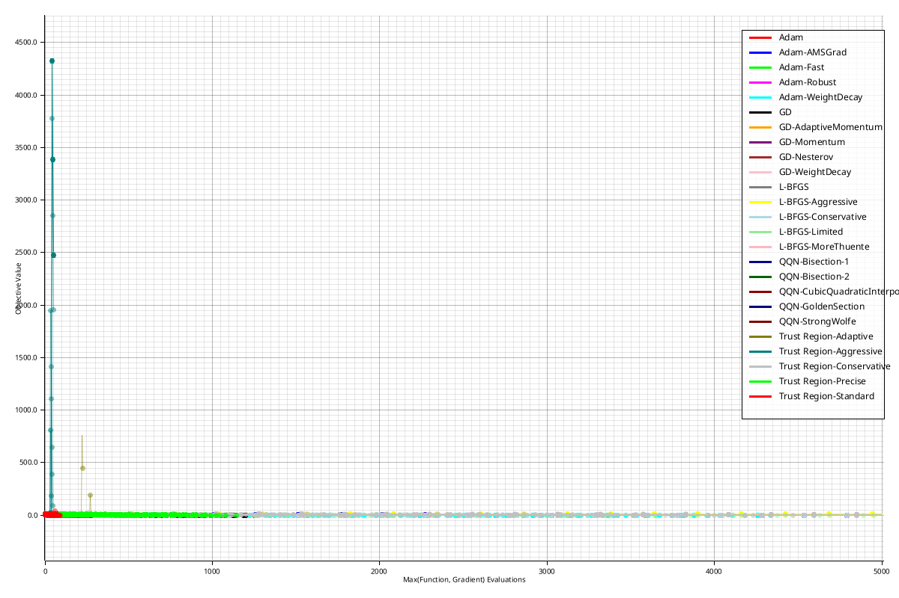
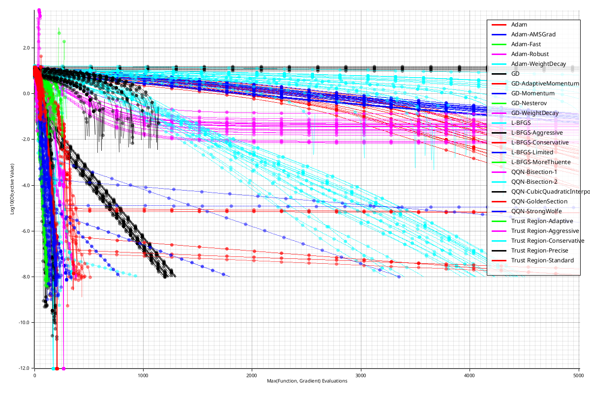

**Figure:** Convergence plots for Zakharov_2D showing objective value vs iterations.
Left: Linear scale, Right: Log scale for better visualization of convergence behavior.

**Data:** [Linear scale data (CSV)](data/Zakharov_2D_data.csv) | [Log scale data (CSV)](data/Zakharov_2D_log_data.csv)

## Problem: Zakharov_5D

**Family:** Zakharov
**Dimension:** 5
**Success Threshold:** 1.000e-8
**Total Runs:** 500
**Detailed Analysis:** [View comprehensive problem analysis](reports/problem_analysis_Zakharov_5D.md)

### Performance Summary
<table style="border-collapse: collapse; width: 100%; margin: 20px 0;">
<tr style="background-color: #f2f2f2;">
<th style="border: 1px solid #ddd; padding: 8px; text-align: center;">Rank</th>
<th style="border: 1px solid #ddd; padding: 8px; text-align: center;">Optimizer</th>
<th style="border: 1px solid #ddd; padding: 8px; text-align: center;">Mean Final Value (All/Success/Fail)</th>
<th style="border: 1px solid #ddd; padding: 8px; text-align: center;">Std Dev</th>
<th style="border: 1px solid #ddd; padding: 8px; text-align: center;">Best Value</th>
<th style="border: 1px solid #ddd; padding: 8px; text-align: center;">Worst Value</th>
<th style="border: 1px solid #ddd; padding: 8px; text-align: center;">Mean Function Evals (All/Success/Fail)</th>
<th style="border: 1px solid #ddd; padding: 8px; text-align: center;">Mean Gradient Evals (All/Success/Fail)</th>
<th style="border: 1px solid #ddd; padding: 8px; text-align: center;">Success Rate</th>
<th style="border: 1px solid #ddd; padding: 8px; text-align: center;">Mean Time (s)</th>
</tr>
<tr style="background-color: #d4edda; font-weight: bold;">
<td style="border: 1px solid #ddd; padding: 8px; text-align: center;">1</td>
<td style="border: 1px solid #ddd; padding: 8px; text-align: center;"><a href="reports/detailed_Zakharov_5D_QQN-GoldenSection.md" title="Click for detailed analysis">QQN-GoldenSection</a></td>
<td style="border: 1px solid #ddd; padding: 8px; text-align: center;">2.83e-12 / 2.83e-12 / -</td>
<td style="border: 1px solid #ddd; padding: 8px; text-align: center;">2.87e-12</td>
<td style="border: 1px solid #ddd; padding: 8px; text-align: center;">2.45e-13</td>
<td style="border: 1px solid #ddd; padding: 8px; text-align: center;">1.21e-11</td>
<td style="border: 1px solid #ddd; padding: 8px; text-align: center;">138.0 / 138.0 / -</td>
<td style="border: 1px solid #ddd; padding: 8px; text-align: center;">20.0 / 20.0 / -</td>
<td style="border: 1px solid #ddd; padding: 8px; text-align: center;">100.0%</td>
<td style="border: 1px solid #ddd; padding: 8px; text-align: center;">0.002</td>
</tr>
<tr style="background-color: #fff3cd;">
<td style="border: 1px solid #ddd; padding: 8px; text-align: center;">2</td>
<td style="border: 1px solid #ddd; padding: 8px; text-align: center;"><a href="reports/detailed_Zakharov_5D_QQN-StrongWolfe.md" title="Click for detailed analysis">QQN-StrongWolfe</a></td>
<td style="border: 1px solid #ddd; padding: 8px; text-align: center;">2.41e-9 / 2.41e-9 / -</td>
<td style="border: 1px solid #ddd; padding: 8px; text-align: center;">3.17e-9</td>
<td style="border: 1px solid #ddd; padding: 8px; text-align: center;">2.91e-14</td>
<td style="border: 1px solid #ddd; padding: 8px; text-align: center;">9.91e-9</td>
<td style="border: 1px solid #ddd; padding: 8px; text-align: center;">100.3 / 100.3 / -</td>
<td style="border: 1px solid #ddd; padding: 8px; text-align: center;">90.7 / 90.7 / -</td>
<td style="border: 1px solid #ddd; padding: 8px; text-align: center;">100.0%</td>
<td style="border: 1px solid #ddd; padding: 8px; text-align: center;">0.003</td>
</tr>
<tr style="">
<td style="border: 1px solid #ddd; padding: 8px; text-align: center;">3</td>
<td style="border: 1px solid #ddd; padding: 8px; text-align: center;"><a href="reports/detailed_Zakharov_5D_QQN-Bisection-2.md" title="Click for detailed analysis">QQN-Bisection-2</a></td>
<td style="border: 1px solid #ddd; padding: 8px; text-align: center;">1.50e-9 / 1.50e-9 / -</td>
<td style="border: 1px solid #ddd; padding: 8px; text-align: center;">1.97e-9</td>
<td style="border: 1px solid #ddd; padding: 8px; text-align: center;">2.56e-15</td>
<td style="border: 1px solid #ddd; padding: 8px; text-align: center;">6.16e-9</td>
<td style="border: 1px solid #ddd; padding: 8px; text-align: center;">114.7 / 114.7 / -</td>
<td style="border: 1px solid #ddd; padding: 8px; text-align: center;">114.9 / 114.9 / -</td>
<td style="border: 1px solid #ddd; padding: 8px; text-align: center;">100.0%</td>
<td style="border: 1px solid #ddd; padding: 8px; text-align: center;">0.003</td>
</tr>
<tr style="">
<td style="border: 1px solid #ddd; padding: 8px; text-align: center;">4</td>
<td style="border: 1px solid #ddd; padding: 8px; text-align: center;"><a href="reports/detailed_Zakharov_5D_QQN-Bisection-1.md" title="Click for detailed analysis">QQN-Bisection-1</a></td>
<td style="border: 1px solid #ddd; padding: 8px; text-align: center;">1.12e-12 / 1.12e-12 / -</td>
<td style="border: 1px solid #ddd; padding: 8px; text-align: center;">2.99e-12</td>
<td style="border: 1px solid #ddd; padding: 8px; text-align: center;">5.59e-14</td>
<td style="border: 1px solid #ddd; padding: 8px; text-align: center;">1.40e-11</td>
<td style="border: 1px solid #ddd; padding: 8px; text-align: center;">118.0 / 118.0 / -</td>
<td style="border: 1px solid #ddd; padding: 8px; text-align: center;">159.0 / 159.0 / -</td>
<td style="border: 1px solid #ddd; padding: 8px; text-align: center;">100.0%</td>
<td style="border: 1px solid #ddd; padding: 8px; text-align: center;">0.002</td>
</tr>
<tr style="">
<td style="border: 1px solid #ddd; padding: 8px; text-align: center;">5</td>
<td style="border: 1px solid #ddd; padding: 8px; text-align: center;"><a href="reports/detailed_Zakharov_5D_QQN-CubicQuadraticInterpolation.md" title="Click for detailed analysis">QQN-CubicQuadraticInterpolation</a></td>
<td style="border: 1px solid #ddd; padding: 8px; text-align: center;">1.52e-9 / 1.52e-9 / -</td>
<td style="border: 1px solid #ddd; padding: 8px; text-align: center;">1.59e-9</td>
<td style="border: 1px solid #ddd; padding: 8px; text-align: center;">3.50e-12</td>
<td style="border: 1px solid #ddd; padding: 8px; text-align: center;">5.23e-9</td>
<td style="border: 1px solid #ddd; padding: 8px; text-align: center;">205.0 / 205.0 / -</td>
<td style="border: 1px solid #ddd; padding: 8px; text-align: center;">254.2 / 254.2 / -</td>
<td style="border: 1px solid #ddd; padding: 8px; text-align: center;">100.0%</td>
<td style="border: 1px solid #ddd; padding: 8px; text-align: center;">0.008</td>
</tr>
<tr style="">
<td style="border: 1px solid #ddd; padding: 8px; text-align: center;">6</td>
<td style="border: 1px solid #ddd; padding: 8px; text-align: center;"><a href="reports/detailed_Zakharov_5D_L-BFGS-Conservative.md" title="Click for detailed analysis">L-BFGS-Conservative</a></td>
<td style="border: 1px solid #ddd; padding: 8px; text-align: center;">7.32e-9 / 7.32e-9 / -</td>
<td style="border: 1px solid #ddd; padding: 8px; text-align: center;">2.98e-9</td>
<td style="border: 1px solid #ddd; padding: 8px; text-align: center;">2.42e-10</td>
<td style="border: 1px solid #ddd; padding: 8px; text-align: center;">9.99e-9</td>
<td style="border: 1px solid #ddd; padding: 8px; text-align: center;">492.9 / 492.9 / -</td>
<td style="border: 1px solid #ddd; padding: 8px; text-align: center;">363.2 / 363.2 / -</td>
<td style="border: 1px solid #ddd; padding: 8px; text-align: center;">100.0%</td>
<td style="border: 1px solid #ddd; padding: 8px; text-align: center;">0.012</td>
</tr>
<tr style="">
<td style="border: 1px solid #ddd; padding: 8px; text-align: center;">7</td>
<td style="border: 1px solid #ddd; padding: 8px; text-align: center;"><a href="reports/detailed_Zakharov_5D_L-BFGS-MoreThuente.md" title="Click for detailed analysis">L-BFGS-MoreThuente</a></td>
<td style="border: 1px solid #ddd; padding: 8px; text-align: center;">9.32e-9 / 9.32e-9 / -</td>
<td style="border: 1px solid #ddd; padding: 8px; text-align: center;">3.60e-10</td>
<td style="border: 1px solid #ddd; padding: 8px; text-align: center;">8.60e-9</td>
<td style="border: 1px solid #ddd; padding: 8px; text-align: center;">9.95e-9</td>
<td style="border: 1px solid #ddd; padding: 8px; text-align: center;">634.6 / 634.6 / -</td>
<td style="border: 1px solid #ddd; padding: 8px; text-align: center;">459.4 / 459.4 / -</td>
<td style="border: 1px solid #ddd; padding: 8px; text-align: center;">100.0%</td>
<td style="border: 1px solid #ddd; padding: 8px; text-align: center;">0.013</td>
</tr>
<tr style="">
<td style="border: 1px solid #ddd; padding: 8px; text-align: center;">8</td>
<td style="border: 1px solid #ddd; padding: 8px; text-align: center;"><a href="reports/detailed_Zakharov_5D_GD.md" title="Click for detailed analysis">GD</a></td>
<td style="border: 1px solid #ddd; padding: 8px; text-align: center;">9.78e-9 / 9.78e-9 / -</td>
<td style="border: 1px solid #ddd; padding: 8px; text-align: center;">9.76e-11</td>
<td style="border: 1px solid #ddd; padding: 8px; text-align: center;">9.63e-9</td>
<td style="border: 1px solid #ddd; padding: 8px; text-align: center;">9.97e-9</td>
<td style="border: 1px solid #ddd; padding: 8px; text-align: center;">477.1 / 477.1 / -</td>
<td style="border: 1px solid #ddd; padding: 8px; text-align: center;">951.1 / 951.1 / -</td>
<td style="border: 1px solid #ddd; padding: 8px; text-align: center;">100.0%</td>
<td style="border: 1px solid #ddd; padding: 8px; text-align: center;">0.012</td>
</tr>
<tr style="">
<td style="border: 1px solid #ddd; padding: 8px; text-align: center;">9</td>
<td style="border: 1px solid #ddd; padding: 8px; text-align: center;"><a href="reports/detailed_Zakharov_5D_L-BFGS-Limited.md" title="Click for detailed analysis">L-BFGS-Limited</a></td>
<td style="border: 1px solid #ddd; padding: 8px; text-align: center;">1.94e-8 / 9.19e-9 / 2.13e-7</td>
<td style="border: 1px solid #ddd; padding: 8px; text-align: center;">4.45e-8</td>
<td style="border: 1px solid #ddd; padding: 8px; text-align: center;">7.85e-9</td>
<td style="border: 1px solid #ddd; padding: 8px; text-align: center;">2.13e-7</td>
<td style="border: 1px solid #ddd; padding: 8px; text-align: center;">1078.6 / 918.1 / 4128.0</td>
<td style="border: 1px solid #ddd; padding: 8px; text-align: center;">348.1 / 319.9 / 884.0</td>
<td style="border: 1px solid #ddd; padding: 8px; text-align: center;">95.0%</td>
<td style="border: 1px solid #ddd; padding: 8px; text-align: center;">0.016</td>
</tr>
<tr style="">
<td style="border: 1px solid #ddd; padding: 8px; text-align: center;">10</td>
<td style="border: 1px solid #ddd; padding: 8px; text-align: center;"><a href="reports/detailed_Zakharov_5D_Adam-WeightDecay.md" title="Click for detailed analysis">Adam-WeightDecay</a></td>
<td style="border: 1px solid #ddd; padding: 8px; text-align: center;">8.37e-3 / 9.85e-9 / 2.16e-2</td>
<td style="border: 1px solid #ddd; padding: 8px; text-align: center;">1.11e-2</td>
<td style="border: 1px solid #ddd; padding: 8px; text-align: center;">9.76e-9</td>
<td style="border: 1px solid #ddd; padding: 8px; text-align: center;">2.83e-2</td>
<td style="border: 1px solid #ddd; padding: 8px; text-align: center;">1586.3 / 2185.7 / 687.2</td>
<td style="border: 1px solid #ddd; padding: 8px; text-align: center;">1585.9 / 2185.7 / 686.2</td>
<td style="border: 1px solid #ddd; padding: 8px; text-align: center;">60.0%</td>
<td style="border: 1px solid #ddd; padding: 8px; text-align: center;">0.035</td>
</tr>
<tr style="">
<td style="border: 1px solid #ddd; padding: 8px; text-align: center;">11</td>
<td style="border: 1px solid #ddd; padding: 8px; text-align: center;"><a href="reports/detailed_Zakharov_5D_GD-WeightDecay.md" title="Click for detailed analysis">GD-WeightDecay</a></td>
<td style="border: 1px solid #ddd; padding: 8px; text-align: center;">6.65e-1 / 9.50e-9 / 1.02e0</td>
<td style="border: 1px solid #ddd; padding: 8px; text-align: center;">4.12e-1</td>
<td style="border: 1px solid #ddd; padding: 8px; text-align: center;">9.24e-9</td>
<td style="border: 1px solid #ddd; padding: 8px; text-align: center;">1.11e0</td>
<td style="border: 1px solid #ddd; padding: 8px; text-align: center;">52.5 / 148.4 / 20.6</td>
<td style="border: 1px solid #ddd; padding: 8px; text-align: center;">101.3 / 293.8 / 37.2</td>
<td style="border: 1px solid #ddd; padding: 8px; text-align: center;">25.0%</td>
<td style="border: 1px solid #ddd; padding: 8px; text-align: center;">0.002</td>
</tr>
<tr style="">
<td style="border: 1px solid #ddd; padding: 8px; text-align: center;">12</td>
<td style="border: 1px solid #ddd; padding: 8px; text-align: center;"><a href="reports/detailed_Zakharov_5D_GD-Nesterov.md" title="Click for detailed analysis">GD-Nesterov</a></td>
<td style="border: 1px solid #ddd; padding: 8px; text-align: center;">1.16e0 / - / 5.05e0</td>
<td style="border: 1px solid #ddd; padding: 8px; text-align: center;">3.12e-1</td>
<td style="border: 1px solid #ddd; padding: 8px; text-align: center;">6.47e-1</td>
<td style="border: 1px solid #ddd; padding: 8px; text-align: center;">1.77e0</td>
<td style="border: 1px solid #ddd; padding: 8px; text-align: center;">18.1 / - / 18.1</td>
<td style="border: 1px solid #ddd; padding: 8px; text-align: center;">32.1 / - / 32.1</td>
<td style="border: 1px solid #ddd; padding: 8px; text-align: center;">0.0%</td>
<td style="border: 1px solid #ddd; padding: 8px; text-align: center;">0.001</td>
</tr>
<tr style="">
<td style="border: 1px solid #ddd; padding: 8px; text-align: center;">13</td>
<td style="border: 1px solid #ddd; padding: 8px; text-align: center;"><a href="reports/detailed_Zakharov_5D_GD-AdaptiveMomentum.md" title="Click for detailed analysis">GD-AdaptiveMomentum</a></td>
<td style="border: 1px solid #ddd; padding: 8px; text-align: center;">1.12e0 / - / 6.97e1</td>
<td style="border: 1px solid #ddd; padding: 8px; text-align: center;">2.76e-1</td>
<td style="border: 1px solid #ddd; padding: 8px; text-align: center;">6.32e-1</td>
<td style="border: 1px solid #ddd; padding: 8px; text-align: center;">1.51e0</td>
<td style="border: 1px solid #ddd; padding: 8px; text-align: center;">18.5 / - / 18.5</td>
<td style="border: 1px solid #ddd; padding: 8px; text-align: center;">33.0 / - / 33.0</td>
<td style="border: 1px solid #ddd; padding: 8px; text-align: center;">0.0%</td>
<td style="border: 1px solid #ddd; padding: 8px; text-align: center;">0.001</td>
</tr>
<tr style="">
<td style="border: 1px solid #ddd; padding: 8px; text-align: center;">14</td>
<td style="border: 1px solid #ddd; padding: 8px; text-align: center;"><a href="reports/detailed_Zakharov_5D_GD-Momentum.md" title="Click for detailed analysis">GD-Momentum</a></td>
<td style="border: 1px solid #ddd; padding: 8px; text-align: center;">1.08e0 / - / 5.45e1</td>
<td style="border: 1px solid #ddd; padding: 8px; text-align: center;">2.87e-1</td>
<td style="border: 1px solid #ddd; padding: 8px; text-align: center;">5.32e-1</td>
<td style="border: 1px solid #ddd; padding: 8px; text-align: center;">1.65e0</td>
<td style="border: 1px solid #ddd; padding: 8px; text-align: center;">18.9 / - / 18.9</td>
<td style="border: 1px solid #ddd; padding: 8px; text-align: center;">33.9 / - / 33.9</td>
<td style="border: 1px solid #ddd; padding: 8px; text-align: center;">0.0%</td>
<td style="border: 1px solid #ddd; padding: 8px; text-align: center;">0.001</td>
</tr>
<tr style="">
<td style="border: 1px solid #ddd; padding: 8px; text-align: center;">15</td>
<td style="border: 1px solid #ddd; padding: 8px; text-align: center;"><a href="reports/detailed_Zakharov_5D_Adam-Fast.md" title="Click for detailed analysis">Adam-Fast</a></td>
<td style="border: 1px solid #ddd; padding: 8px; text-align: center;">1.34e-1 / - / 9.66e0</td>
<td style="border: 1px solid #ddd; padding: 8px; text-align: center;">6.10e-2</td>
<td style="border: 1px solid #ddd; padding: 8px; text-align: center;">3.45e-2</td>
<td style="border: 1px solid #ddd; padding: 8px; text-align: center;">2.30e-1</td>
<td style="border: 1px solid #ddd; padding: 8px; text-align: center;">34.8 / - / 34.8</td>
<td style="border: 1px solid #ddd; padding: 8px; text-align: center;">33.8 / - / 33.8</td>
<td style="border: 1px solid #ddd; padding: 8px; text-align: center;">0.0%</td>
<td style="border: 1px solid #ddd; padding: 8px; text-align: center;">0.001</td>
</tr>
<tr style="">
<td style="border: 1px solid #ddd; padding: 8px; text-align: center;">16</td>
<td style="border: 1px solid #ddd; padding: 8px; text-align: center;"><a href="reports/detailed_Zakharov_5D_L-BFGS.md" title="Click for detailed analysis">L-BFGS</a></td>
<td style="border: 1px solid #ddd; padding: 8px; text-align: center;">2.47e0 / - / 2.69e1</td>
<td style="border: 1px solid #ddd; padding: 8px; text-align: center;">2.24e0</td>
<td style="border: 1px solid #ddd; padding: 8px; text-align: center;">7.99e-3</td>
<td style="border: 1px solid #ddd; padding: 8px; text-align: center;">7.72e0</td>
<td style="border: 1px solid #ddd; padding: 8px; text-align: center;">93.0 / - / 93.0</td>
<td style="border: 1px solid #ddd; padding: 8px; text-align: center;">39.9 / - / 39.9</td>
<td style="border: 1px solid #ddd; padding: 8px; text-align: center;">0.0%</td>
<td style="border: 1px solid #ddd; padding: 8px; text-align: center;">0.002</td>
</tr>
<tr style="">
<td style="border: 1px solid #ddd; padding: 8px; text-align: center;">17</td>
<td style="border: 1px solid #ddd; padding: 8px; text-align: center;"><a href="reports/detailed_Zakharov_5D_Trust_Region-Aggressive.md" title="Click for detailed analysis">Trust Region-Aggressive</a></td>
<td style="border: 1px solid #ddd; padding: 8px; text-align: center;">5.65e1 / - / 5.65e1</td>
<td style="border: 1px solid #ddd; padding: 8px; text-align: center;">1.12e2</td>
<td style="border: 1px solid #ddd; padding: 8px; text-align: center;">6.02e-1</td>
<td style="border: 1px solid #ddd; padding: 8px; text-align: center;">4.25e2</td>
<td style="border: 1px solid #ddd; padding: 8px; text-align: center;">2415.8 / - / 2415.8</td>
<td style="border: 1px solid #ddd; padding: 8px; text-align: center;">1611.2 / - / 1611.2</td>
<td style="border: 1px solid #ddd; padding: 8px; text-align: center;">0.0%</td>
<td style="border: 1px solid #ddd; padding: 8px; text-align: center;">0.016</td>
</tr>
<tr style="">
<td style="border: 1px solid #ddd; padding: 8px; text-align: center;">18</td>
<td style="border: 1px solid #ddd; padding: 8px; text-align: center;"><a href="reports/detailed_Zakharov_5D_L-BFGS-Aggressive.md" title="Click for detailed analysis">L-BFGS-Aggressive</a></td>
<td style="border: 1px solid #ddd; padding: 8px; text-align: center;">4.22e1 / - / 4.22e1</td>
<td style="border: 1px solid #ddd; padding: 8px; text-align: center;">8.64e0</td>
<td style="border: 1px solid #ddd; padding: 8px; text-align: center;">2.82e1</td>
<td style="border: 1px solid #ddd; padding: 8px; text-align: center;">6.13e1</td>
<td style="border: 1px solid #ddd; padding: 8px; text-align: center;">3309.5 / - / 3309.5</td>
<td style="border: 1px solid #ddd; padding: 8px; text-align: center;">1693.5 / - / 1693.5</td>
<td style="border: 1px solid #ddd; padding: 8px; text-align: center;">0.0%</td>
<td style="border: 1px solid #ddd; padding: 8px; text-align: center;">0.061</td>
</tr>
<tr style="">
<td style="border: 1px solid #ddd; padding: 8px; text-align: center;">19</td>
<td style="border: 1px solid #ddd; padding: 8px; text-align: center;"><a href="reports/detailed_Zakharov_5D_Adam.md" title="Click for detailed analysis">Adam</a></td>
<td style="border: 1px solid #ddd; padding: 8px; text-align: center;">2.82e-3 / - / 2.82e-3</td>
<td style="border: 1px solid #ddd; padding: 8px; text-align: center;">2.38e-3</td>
<td style="border: 1px solid #ddd; padding: 8px; text-align: center;">2.65e-4</td>
<td style="border: 1px solid #ddd; padding: 8px; text-align: center;">7.47e-3</td>
<td style="border: 1px solid #ddd; padding: 8px; text-align: center;">2502.0 / - / 2502.0</td>
<td style="border: 1px solid #ddd; padding: 8px; text-align: center;">2502.0 / - / 2502.0</td>
<td style="border: 1px solid #ddd; padding: 8px; text-align: center;">0.0%</td>
<td style="border: 1px solid #ddd; padding: 8px; text-align: center;">0.052</td>
</tr>
<tr style="">
<td style="border: 1px solid #ddd; padding: 8px; text-align: center;">20</td>
<td style="border: 1px solid #ddd; padding: 8px; text-align: center;"><a href="reports/detailed_Zakharov_5D_Trust_Region-Adaptive.md" title="Click for detailed analysis">Trust Region-Adaptive</a></td>
<td style="border: 1px solid #ddd; padding: 8px; text-align: center;">3.10e3 / - / 3.10e3</td>
<td style="border: 1px solid #ddd; padding: 8px; text-align: center;">8.27e2</td>
<td style="border: 1px solid #ddd; padding: 8px; text-align: center;">1.77e3</td>
<td style="border: 1px solid #ddd; padding: 8px; text-align: center;">4.98e3</td>
<td style="border: 1px solid #ddd; padding: 8px; text-align: center;">3002.0 / - / 3002.0</td>
<td style="border: 1px solid #ddd; padding: 8px; text-align: center;">2002.0 / - / 2002.0</td>
<td style="border: 1px solid #ddd; padding: 8px; text-align: center;">0.0%</td>
<td style="border: 1px solid #ddd; padding: 8px; text-align: center;">0.020</td>
</tr>
<tr style="">
<td style="border: 1px solid #ddd; padding: 8px; text-align: center;">21</td>
<td style="border: 1px solid #ddd; padding: 8px; text-align: center;"><a href="reports/detailed_Zakharov_5D_Trust_Region-Standard.md" title="Click for detailed analysis">Trust Region-Standard</a></td>
<td style="border: 1px solid #ddd; padding: 8px; text-align: center;">2.28e3 / - / 2.28e3</td>
<td style="border: 1px solid #ddd; padding: 8px; text-align: center;">8.27e2</td>
<td style="border: 1px solid #ddd; padding: 8px; text-align: center;">6.92e2</td>
<td style="border: 1px solid #ddd; padding: 8px; text-align: center;">3.84e3</td>
<td style="border: 1px solid #ddd; padding: 8px; text-align: center;">3002.0 / - / 3002.0</td>
<td style="border: 1px solid #ddd; padding: 8px; text-align: center;">2002.0 / - / 2002.0</td>
<td style="border: 1px solid #ddd; padding: 8px; text-align: center;">0.0%</td>
<td style="border: 1px solid #ddd; padding: 8px; text-align: center;">0.020</td>
</tr>
<tr style="">
<td style="border: 1px solid #ddd; padding: 8px; text-align: center;">22</td>
<td style="border: 1px solid #ddd; padding: 8px; text-align: center;"><a href="reports/detailed_Zakharov_5D_Trust_Region-Precise.md" title="Click for detailed analysis">Trust Region-Precise</a></td>
<td style="border: 1px solid #ddd; padding: 8px; text-align: center;">3.50e3 / - / 3.50e3</td>
<td style="border: 1px solid #ddd; padding: 8px; text-align: center;">7.96e2</td>
<td style="border: 1px solid #ddd; padding: 8px; text-align: center;">2.04e3</td>
<td style="border: 1px solid #ddd; padding: 8px; text-align: center;">4.73e3</td>
<td style="border: 1px solid #ddd; padding: 8px; text-align: center;">3002.0 / - / 3002.0</td>
<td style="border: 1px solid #ddd; padding: 8px; text-align: center;">2002.0 / - / 2002.0</td>
<td style="border: 1px solid #ddd; padding: 8px; text-align: center;">0.0%</td>
<td style="border: 1px solid #ddd; padding: 8px; text-align: center;">0.020</td>
</tr>
<tr style="">
<td style="border: 1px solid #ddd; padding: 8px; text-align: center;">23</td>
<td style="border: 1px solid #ddd; padding: 8px; text-align: center;"><a href="reports/detailed_Zakharov_5D_Adam-AMSGrad.md" title="Click for detailed analysis">Adam-AMSGrad</a></td>
<td style="border: 1px solid #ddd; padding: 8px; text-align: center;">2.23e-2 / - / 2.23e-2</td>
<td style="border: 1px solid #ddd; padding: 8px; text-align: center;">1.32e-2</td>
<td style="border: 1px solid #ddd; padding: 8px; text-align: center;">4.59e-3</td>
<td style="border: 1px solid #ddd; padding: 8px; text-align: center;">5.39e-2</td>
<td style="border: 1px solid #ddd; padding: 8px; text-align: center;">2502.0 / - / 2502.0</td>
<td style="border: 1px solid #ddd; padding: 8px; text-align: center;">2502.0 / - / 2502.0</td>
<td style="border: 1px solid #ddd; padding: 8px; text-align: center;">0.0%</td>
<td style="border: 1px solid #ddd; padding: 8px; text-align: center;">0.059</td>
</tr>
<tr style="">
<td style="border: 1px solid #ddd; padding: 8px; text-align: center;">24</td>
<td style="border: 1px solid #ddd; padding: 8px; text-align: center;"><a href="reports/detailed_Zakharov_5D_Adam-Robust.md" title="Click for detailed analysis">Adam-Robust</a></td>
<td style="border: 1px solid #ddd; padding: 8px; text-align: center;">7.06e-2 / - / 7.06e-2</td>
<td style="border: 1px solid #ddd; padding: 8px; text-align: center;">7.45e-2</td>
<td style="border: 1px solid #ddd; padding: 8px; text-align: center;">6.18e-3</td>
<td style="border: 1px solid #ddd; padding: 8px; text-align: center;">2.91e-1</td>
<td style="border: 1px solid #ddd; padding: 8px; text-align: center;">2502.0 / - / 2502.0</td>
<td style="border: 1px solid #ddd; padding: 8px; text-align: center;">2502.0 / - / 2502.0</td>
<td style="border: 1px solid #ddd; padding: 8px; text-align: center;">0.0%</td>
<td style="border: 1px solid #ddd; padding: 8px; text-align: center;">0.059</td>
</tr>
<tr style="">
<td style="border: 1px solid #ddd; padding: 8px; text-align: center;">25</td>
<td style="border: 1px solid #ddd; padding: 8px; text-align: center;"><a href="reports/detailed_Zakharov_5D_Trust_Region-Conservative.md" title="Click for detailed analysis">Trust Region-Conservative</a></td>
<td style="border: 1px solid #ddd; padding: 8px; text-align: center;">3.28e3 / - / 3.28e3</td>
<td style="border: 1px solid #ddd; padding: 8px; text-align: center;">6.15e2</td>
<td style="border: 1px solid #ddd; padding: 8px; text-align: center;">2.05e3</td>
<td style="border: 1px solid #ddd; padding: 8px; text-align: center;">4.46e3</td>
<td style="border: 1px solid #ddd; padding: 8px; text-align: center;">3002.0 / - / 3002.0</td>
<td style="border: 1px solid #ddd; padding: 8px; text-align: center;">2002.0 / - / 2002.0</td>
<td style="border: 1px solid #ddd; padding: 8px; text-align: center;">0.0%</td>
<td style="border: 1px solid #ddd; padding: 8px; text-align: center;">0.020</td>
</tr>
</table>

### Convergence Plots

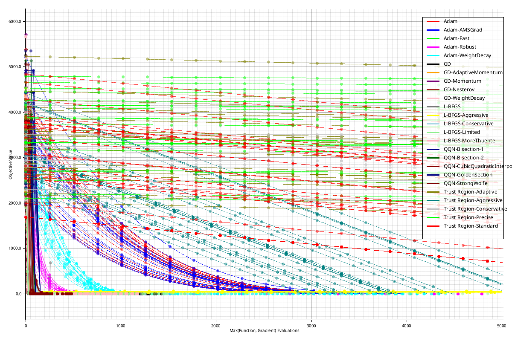
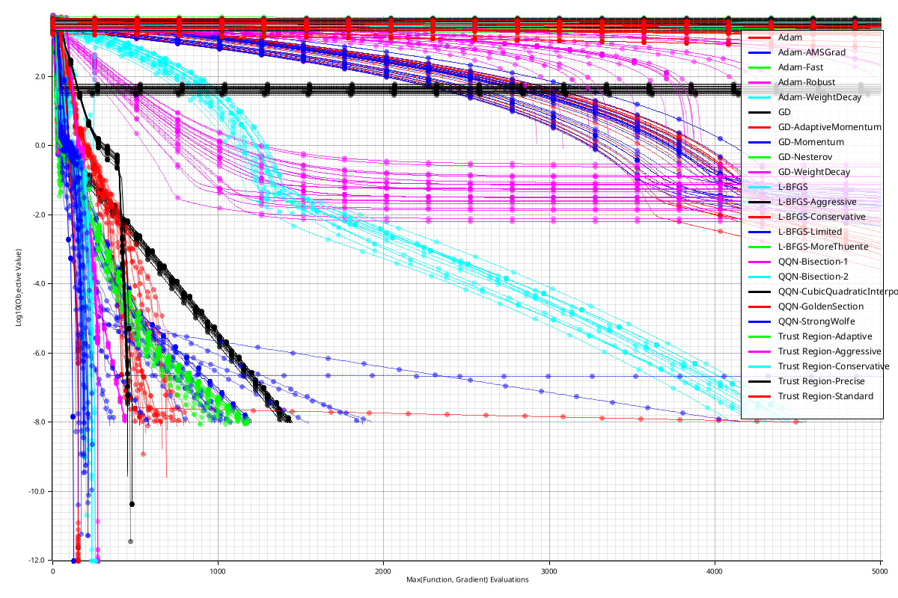

**Figure:** Convergence plots for Zakharov_5D showing objective value vs iterations.
Left: Linear scale, Right: Log scale for better visualization of convergence behavior.

**Data:** [Linear scale data (CSV)](data/Zakharov_5D_data.csv) | [Log scale data (CSV)](data/Zakharov_5D_log_data.csv)

## Problem: Zakharov_10D

**Family:** Zakharov
**Dimension:** 10
**Success Threshold:** 1.000e-8
**Total Runs:** 500
**Detailed Analysis:** [View comprehensive problem analysis](reports/problem_analysis_Zakharov_10D.md)

### Performance Summary
<table style="border-collapse: collapse; width: 100%; margin: 20px 0;">
<tr style="background-color: #f2f2f2;">
<th style="border: 1px solid #ddd; padding: 8px; text-align: center;">Rank</th>
<th style="border: 1px solid #ddd; padding: 8px; text-align: center;">Optimizer</th>
<th style="border: 1px solid #ddd; padding: 8px; text-align: center;">Mean Final Value (All/Success/Fail)</th>
<th style="border: 1px solid #ddd; padding: 8px; text-align: center;">Std Dev</th>
<th style="border: 1px solid #ddd; padding: 8px; text-align: center;">Best Value</th>
<th style="border: 1px solid #ddd; padding: 8px; text-align: center;">Worst Value</th>
<th style="border: 1px solid #ddd; padding: 8px; text-align: center;">Mean Function Evals (All/Success/Fail)</th>
<th style="border: 1px solid #ddd; padding: 8px; text-align: center;">Mean Gradient Evals (All/Success/Fail)</th>
<th style="border: 1px solid #ddd; padding: 8px; text-align: center;">Success Rate</th>
<th style="border: 1px solid #ddd; padding: 8px; text-align: center;">Mean Time (s)</th>
</tr>
<tr style="background-color: #d4edda; font-weight: bold;">
<td style="border: 1px solid #ddd; padding: 8px; text-align: center;">1</td>
<td style="border: 1px solid #ddd; padding: 8px; text-align: center;"><a href="reports/detailed_Zakharov_10D_QQN-GoldenSection.md" title="Click for detailed analysis">QQN-GoldenSection</a></td>
<td style="border: 1px solid #ddd; padding: 8px; text-align: center;">1.50e-9 / 1.50e-9 / -</td>
<td style="border: 1px solid #ddd; padding: 8px; text-align: center;">2.57e-9</td>
<td style="border: 1px solid #ddd; padding: 8px; text-align: center;">3.14e-19</td>
<td style="border: 1px solid #ddd; padding: 8px; text-align: center;">8.28e-9</td>
<td style="border: 1px solid #ddd; padding: 8px; text-align: center;">233.1 / 233.1 / -</td>
<td style="border: 1px solid #ddd; padding: 8px; text-align: center;">32.6 / 32.6 / -</td>
<td style="border: 1px solid #ddd; padding: 8px; text-align: center;">100.0%</td>
<td style="border: 1px solid #ddd; padding: 8px; text-align: center;">0.004</td>
</tr>
<tr style="background-color: #fff3cd;">
<td style="border: 1px solid #ddd; padding: 8px; text-align: center;">2</td>
<td style="border: 1px solid #ddd; padding: 8px; text-align: center;"><a href="reports/detailed_Zakharov_10D_QQN-Bisection-2.md" title="Click for detailed analysis">QQN-Bisection-2</a></td>
<td style="border: 1px solid #ddd; padding: 8px; text-align: center;">1.58e-9 / 1.58e-9 / -</td>
<td style="border: 1px solid #ddd; padding: 8px; text-align: center;">9.47e-10</td>
<td style="border: 1px solid #ddd; padding: 8px; text-align: center;">1.13e-10</td>
<td style="border: 1px solid #ddd; padding: 8px; text-align: center;">3.31e-9</td>
<td style="border: 1px solid #ddd; padding: 8px; text-align: center;">159.2 / 159.2 / -</td>
<td style="border: 1px solid #ddd; padding: 8px; text-align: center;">162.8 / 162.8 / -</td>
<td style="border: 1px solid #ddd; padding: 8px; text-align: center;">100.0%</td>
<td style="border: 1px solid #ddd; padding: 8px; text-align: center;">0.004</td>
</tr>
<tr style="">
<td style="border: 1px solid #ddd; padding: 8px; text-align: center;">3</td>
<td style="border: 1px solid #ddd; padding: 8px; text-align: center;"><a href="reports/detailed_Zakharov_10D_QQN-Bisection-1.md" title="Click for detailed analysis">QQN-Bisection-1</a></td>
<td style="border: 1px solid #ddd; padding: 8px; text-align: center;">1.96e-9 / 1.96e-9 / -</td>
<td style="border: 1px solid #ddd; padding: 8px; text-align: center;">2.69e-9</td>
<td style="border: 1px solid #ddd; padding: 8px; text-align: center;">4.68e-16</td>
<td style="border: 1px solid #ddd; padding: 8px; text-align: center;">8.14e-9</td>
<td style="border: 1px solid #ddd; padding: 8px; text-align: center;">161.5 / 161.5 / -</td>
<td style="border: 1px solid #ddd; padding: 8px; text-align: center;">181.8 / 181.8 / -</td>
<td style="border: 1px solid #ddd; padding: 8px; text-align: center;">100.0%</td>
<td style="border: 1px solid #ddd; padding: 8px; text-align: center;">0.003</td>
</tr>
<tr style="">
<td style="border: 1px solid #ddd; padding: 8px; text-align: center;">4</td>
<td style="border: 1px solid #ddd; padding: 8px; text-align: center;"><a href="reports/detailed_Zakharov_10D_QQN-CubicQuadraticInterpolation.md" title="Click for detailed analysis">QQN-CubicQuadraticInterpolation</a></td>
<td style="border: 1px solid #ddd; padding: 8px; text-align: center;">1.75e-9 / 1.75e-9 / -</td>
<td style="border: 1px solid #ddd; padding: 8px; text-align: center;">9.69e-10</td>
<td style="border: 1px solid #ddd; padding: 8px; text-align: center;">4.53e-10</td>
<td style="border: 1px solid #ddd; padding: 8px; text-align: center;">4.49e-9</td>
<td style="border: 1px solid #ddd; padding: 8px; text-align: center;">312.8 / 312.8 / -</td>
<td style="border: 1px solid #ddd; padding: 8px; text-align: center;">397.0 / 397.0 / -</td>
<td style="border: 1px solid #ddd; padding: 8px; text-align: center;">100.0%</td>
<td style="border: 1px solid #ddd; padding: 8px; text-align: center;">0.013</td>
</tr>
<tr style="">
<td style="border: 1px solid #ddd; padding: 8px; text-align: center;">5</td>
<td style="border: 1px solid #ddd; padding: 8px; text-align: center;"><a href="reports/detailed_Zakharov_10D_QQN-StrongWolfe.md" title="Click for detailed analysis">QQN-StrongWolfe</a></td>
<td style="border: 1px solid #ddd; padding: 8px; text-align: center;">9.67e-4 / 1.43e-9 / 1.93e-2</td>
<td style="border: 1px solid #ddd; padding: 8px; text-align: center;">4.21e-3</td>
<td style="border: 1px solid #ddd; padding: 8px; text-align: center;">2.12e-14</td>
<td style="border: 1px solid #ddd; padding: 8px; text-align: center;">1.93e-2</td>
<td style="border: 1px solid #ddd; padding: 8px; text-align: center;">281.4 / 155.3 / 2679.0</td>
<td style="border: 1px solid #ddd; padding: 8px; text-align: center;">240.4 / 128.6 / 2366.0</td>
<td style="border: 1px solid #ddd; padding: 8px; text-align: center;">95.0%</td>
<td style="border: 1px solid #ddd; padding: 8px; text-align: center;">0.009</td>
</tr>
<tr style="">
<td style="border: 1px solid #ddd; padding: 8px; text-align: center;">6</td>
<td style="border: 1px solid #ddd; padding: 8px; text-align: center;"><a href="reports/detailed_Zakharov_10D_L-BFGS-Limited.md" title="Click for detailed analysis">L-BFGS-Limited</a></td>
<td style="border: 1px solid #ddd; padding: 8px; text-align: center;">9.29e-2 / 8.84e-9 / 2.06e-1</td>
<td style="border: 1px solid #ddd; padding: 8px; text-align: center;">2.40e-1</td>
<td style="border: 1px solid #ddd; padding: 8px; text-align: center;">5.26e-9</td>
<td style="border: 1px solid #ddd; padding: 8px; text-align: center;">9.86e-1</td>
<td style="border: 1px solid #ddd; padding: 8px; text-align: center;">2588.7 / 1401.7 / 4039.4</td>
<td style="border: 1px solid #ddd; padding: 8px; text-align: center;">695.6 / 469.5 / 972.0</td>
<td style="border: 1px solid #ddd; padding: 8px; text-align: center;">55.0%</td>
<td style="border: 1px solid #ddd; padding: 8px; text-align: center;">0.034</td>
</tr>
<tr style="">
<td style="border: 1px solid #ddd; padding: 8px; text-align: center;">7</td>
<td style="border: 1px solid #ddd; padding: 8px; text-align: center;"><a href="reports/detailed_Zakharov_10D_GD-WeightDecay.md" title="Click for detailed analysis">GD-WeightDecay</a></td>
<td style="border: 1px solid #ddd; padding: 8px; text-align: center;">1.98e0 / 9.46e-9 / 2.15e1</td>
<td style="border: 1px solid #ddd; padding: 8px; text-align: center;">1.58e0</td>
<td style="border: 1px solid #ddd; padding: 8px; text-align: center;">8.77e-9</td>
<td style="border: 1px solid #ddd; padding: 8px; text-align: center;">6.14e0</td>
<td style="border: 1px solid #ddd; padding: 8px; text-align: center;">67.5 / 166.3 / 25.2</td>
<td style="border: 1px solid #ddd; padding: 8px; text-align: center;">131.4 / 329.7 / 46.4</td>
<td style="border: 1px solid #ddd; padding: 8px; text-align: center;">30.0%</td>
<td style="border: 1px solid #ddd; padding: 8px; text-align: center;">0.002</td>
</tr>
<tr style="">
<td style="border: 1px solid #ddd; padding: 8px; text-align: center;">8</td>
<td style="border: 1px solid #ddd; padding: 8px; text-align: center;"><a href="reports/detailed_Zakharov_10D_GD.md" title="Click for detailed analysis">GD</a></td>
<td style="border: 1px solid #ddd; padding: 8px; text-align: center;">3.24e-1 / 9.73e-9 / 3.74e-1</td>
<td style="border: 1px solid #ddd; padding: 8px; text-align: center;">1.93e-1</td>
<td style="border: 1px solid #ddd; padding: 8px; text-align: center;">9.65e-9</td>
<td style="border: 1px solid #ddd; padding: 8px; text-align: center;">8.37e-1</td>
<td style="border: 1px solid #ddd; padding: 8px; text-align: center;">686.0 / 507.0 / 705.9</td>
<td style="border: 1px solid #ddd; padding: 8px; text-align: center;">1368.2 / 1011.0 / 1407.9</td>
<td style="border: 1px solid #ddd; padding: 8px; text-align: center;">10.0%</td>
<td style="border: 1px solid #ddd; padding: 8px; text-align: center;">0.020</td>
</tr>
<tr style="">
<td style="border: 1px solid #ddd; padding: 8px; text-align: center;">9</td>
<td style="border: 1px solid #ddd; padding: 8px; text-align: center;"><a href="reports/detailed_Zakharov_10D_GD-Nesterov.md" title="Click for detailed analysis">GD-Nesterov</a></td>
<td style="border: 1px solid #ddd; padding: 8px; text-align: center;">6.13e0 / - / 8.62e2</td>
<td style="border: 1px solid #ddd; padding: 8px; text-align: center;">4.19e0</td>
<td style="border: 1px solid #ddd; padding: 8px; text-align: center;">1.87e0</td>
<td style="border: 1px solid #ddd; padding: 8px; text-align: center;">1.57e1</td>
<td style="border: 1px solid #ddd; padding: 8px; text-align: center;">20.2 / - / 20.2</td>
<td style="border: 1px solid #ddd; padding: 8px; text-align: center;">36.5 / - / 36.5</td>
<td style="border: 1px solid #ddd; padding: 8px; text-align: center;">0.0%</td>
<td style="border: 1px solid #ddd; padding: 8px; text-align: center;">0.001</td>
</tr>
<tr style="">
<td style="border: 1px solid #ddd; padding: 8px; text-align: center;">10</td>
<td style="border: 1px solid #ddd; padding: 8px; text-align: center;"><a href="reports/detailed_Zakharov_10D_GD-AdaptiveMomentum.md" title="Click for detailed analysis">GD-AdaptiveMomentum</a></td>
<td style="border: 1px solid #ddd; padding: 8px; text-align: center;">6.66e0 / - / 6.98e3</td>
<td style="border: 1px solid #ddd; padding: 8px; text-align: center;">4.71e0</td>
<td style="border: 1px solid #ddd; padding: 8px; text-align: center;">1.69e0</td>
<td style="border: 1px solid #ddd; padding: 8px; text-align: center;">1.84e1</td>
<td style="border: 1px solid #ddd; padding: 8px; text-align: center;">20.9 / - / 20.9</td>
<td style="border: 1px solid #ddd; padding: 8px; text-align: center;">37.7 / - / 37.7</td>
<td style="border: 1px solid #ddd; padding: 8px; text-align: center;">0.0%</td>
<td style="border: 1px solid #ddd; padding: 8px; text-align: center;">0.001</td>
</tr>
<tr style="">
<td style="border: 1px solid #ddd; padding: 8px; text-align: center;">11</td>
<td style="border: 1px solid #ddd; padding: 8px; text-align: center;"><a href="reports/detailed_Zakharov_10D_GD-Momentum.md" title="Click for detailed analysis">GD-Momentum</a></td>
<td style="border: 1px solid #ddd; padding: 8px; text-align: center;">5.10e0 / - / 6.41e3</td>
<td style="border: 1px solid #ddd; padding: 8px; text-align: center;">3.16e0</td>
<td style="border: 1px solid #ddd; padding: 8px; text-align: center;">2.06e0</td>
<td style="border: 1px solid #ddd; padding: 8px; text-align: center;">1.37e1</td>
<td style="border: 1px solid #ddd; padding: 8px; text-align: center;">21.1 / - / 21.1</td>
<td style="border: 1px solid #ddd; padding: 8px; text-align: center;">38.3 / - / 38.3</td>
<td style="border: 1px solid #ddd; padding: 8px; text-align: center;">0.0%</td>
<td style="border: 1px solid #ddd; padding: 8px; text-align: center;">0.001</td>
</tr>
<tr style="">
<td style="border: 1px solid #ddd; padding: 8px; text-align: center;">12</td>
<td style="border: 1px solid #ddd; padding: 8px; text-align: center;"><a href="reports/detailed_Zakharov_10D_Adam-Fast.md" title="Click for detailed analysis">Adam-Fast</a></td>
<td style="border: 1px solid #ddd; padding: 8px; text-align: center;">1.42e0 / - / 1.13e3</td>
<td style="border: 1px solid #ddd; padding: 8px; text-align: center;">1.41e0</td>
<td style="border: 1px solid #ddd; padding: 8px; text-align: center;">1.01e-1</td>
<td style="border: 1px solid #ddd; padding: 8px; text-align: center;">4.49e0</td>
<td style="border: 1px solid #ddd; padding: 8px; text-align: center;">34.7 / - / 34.7</td>
<td style="border: 1px solid #ddd; padding: 8px; text-align: center;">33.7 / - / 33.7</td>
<td style="border: 1px solid #ddd; padding: 8px; text-align: center;">0.0%</td>
<td style="border: 1px solid #ddd; padding: 8px; text-align: center;">0.001</td>
</tr>
<tr style="">
<td style="border: 1px solid #ddd; padding: 8px; text-align: center;">13</td>
<td style="border: 1px solid #ddd; padding: 8px; text-align: center;"><a href="reports/detailed_Zakharov_10D_L-BFGS-Conservative.md" title="Click for detailed analysis">L-BFGS-Conservative</a></td>
<td style="border: 1px solid #ddd; padding: 8px; text-align: center;">6.53e4 / - / 7.82e23</td>
<td style="border: 1px solid #ddd; padding: 8px; text-align: center;">1.94e4</td>
<td style="border: 1px solid #ddd; padding: 8px; text-align: center;">4.25e1</td>
<td style="border: 1px solid #ddd; padding: 8px; text-align: center;">9.00e4</td>
<td style="border: 1px solid #ddd; padding: 8px; text-align: center;">68.5 / - / 68.5</td>
<td style="border: 1px solid #ddd; padding: 8px; text-align: center;">46.9 / - / 46.9</td>
<td style="border: 1px solid #ddd; padding: 8px; text-align: center;">0.0%</td>
<td style="border: 1px solid #ddd; padding: 8px; text-align: center;">0.002</td>
</tr>
<tr style="">
<td style="border: 1px solid #ddd; padding: 8px; text-align: center;">14</td>
<td style="border: 1px solid #ddd; padding: 8px; text-align: center;"><a href="reports/detailed_Zakharov_10D_Adam-WeightDecay.md" title="Click for detailed analysis">Adam-WeightDecay</a></td>
<td style="border: 1px solid #ddd; padding: 8px; text-align: center;">1.28e-1 / - / 1.79e-1</td>
<td style="border: 1px solid #ddd; padding: 8px; text-align: center;">3.91e-2</td>
<td style="border: 1px solid #ddd; padding: 8px; text-align: center;">7.54e-2</td>
<td style="border: 1px solid #ddd; padding: 8px; text-align: center;">2.00e-1</td>
<td style="border: 1px solid #ddd; padding: 8px; text-align: center;">683.1 / - / 683.1</td>
<td style="border: 1px solid #ddd; padding: 8px; text-align: center;">682.1 / - / 682.1</td>
<td style="border: 1px solid #ddd; padding: 8px; text-align: center;">0.0%</td>
<td style="border: 1px solid #ddd; padding: 8px; text-align: center;">0.016</td>
</tr>
<tr style="">
<td style="border: 1px solid #ddd; padding: 8px; text-align: center;">15</td>
<td style="border: 1px solid #ddd; padding: 8px; text-align: center;"><a href="reports/detailed_Zakharov_10D_Adam-AMSGrad.md" title="Click for detailed analysis">Adam-AMSGrad</a></td>
<td style="border: 1px solid #ddd; padding: 8px; text-align: center;">1.06e-1 / - / 1.09e-1</td>
<td style="border: 1px solid #ddd; padding: 8px; text-align: center;">3.07e-2</td>
<td style="border: 1px solid #ddd; padding: 8px; text-align: center;">3.26e-2</td>
<td style="border: 1px solid #ddd; padding: 8px; text-align: center;">1.62e-1</td>
<td style="border: 1px solid #ddd; padding: 8px; text-align: center;">2016.2 / - / 2016.2</td>
<td style="border: 1px solid #ddd; padding: 8px; text-align: center;">2015.2 / - / 2015.2</td>
<td style="border: 1px solid #ddd; padding: 8px; text-align: center;">0.0%</td>
<td style="border: 1px solid #ddd; padding: 8px; text-align: center;">0.050</td>
</tr>
<tr style="">
<td style="border: 1px solid #ddd; padding: 8px; text-align: center;">16</td>
<td style="border: 1px solid #ddd; padding: 8px; text-align: center;"><a href="reports/detailed_Zakharov_10D_L-BFGS.md" title="Click for detailed analysis">L-BFGS</a></td>
<td style="border: 1px solid #ddd; padding: 8px; text-align: center;">3.30e3 / - / 2.07e4</td>
<td style="border: 1px solid #ddd; padding: 8px; text-align: center;">1.82e3</td>
<td style="border: 1px solid #ddd; padding: 8px; text-align: center;">9.62e2</td>
<td style="border: 1px solid #ddd; padding: 8px; text-align: center;">7.08e3</td>
<td style="border: 1px solid #ddd; padding: 8px; text-align: center;">3286.7 / - / 3286.7</td>
<td style="border: 1px solid #ddd; padding: 8px; text-align: center;">987.4 / - / 987.4</td>
<td style="border: 1px solid #ddd; padding: 8px; text-align: center;">0.0%</td>
<td style="border: 1px solid #ddd; padding: 8px; text-align: center;">0.060</td>
</tr>
<tr style="">
<td style="border: 1px solid #ddd; padding: 8px; text-align: center;">17</td>
<td style="border: 1px solid #ddd; padding: 8px; text-align: center;"><a href="reports/detailed_Zakharov_10D_Adam.md" title="Click for detailed analysis">Adam</a></td>
<td style="border: 1px solid #ddd; padding: 8px; text-align: center;">4.43e-2 / - / 4.52e-2</td>
<td style="border: 1px solid #ddd; padding: 8px; text-align: center;">4.11e-2</td>
<td style="border: 1px solid #ddd; padding: 8px; text-align: center;">1.69e-3</td>
<td style="border: 1px solid #ddd; padding: 8px; text-align: center;">1.16e-1</td>
<td style="border: 1px solid #ddd; padding: 8px; text-align: center;">2253.9 / - / 2253.9</td>
<td style="border: 1px solid #ddd; padding: 8px; text-align: center;">2253.4 / - / 2253.4</td>
<td style="border: 1px solid #ddd; padding: 8px; text-align: center;">0.0%</td>
<td style="border: 1px solid #ddd; padding: 8px; text-align: center;">0.050</td>
</tr>
<tr style="">
<td style="border: 1px solid #ddd; padding: 8px; text-align: center;">18</td>
<td style="border: 1px solid #ddd; padding: 8px; text-align: center;"><a href="reports/detailed_Zakharov_10D_Trust_Region-Standard.md" title="Click for detailed analysis">Trust Region-Standard</a></td>
<td style="border: 1px solid #ddd; padding: 8px; text-align: center;">5.72e5 / - / 5.72e5</td>
<td style="border: 1px solid #ddd; padding: 8px; text-align: center;">1.14e5</td>
<td style="border: 1px solid #ddd; padding: 8px; text-align: center;">3.74e5</td>
<td style="border: 1px solid #ddd; padding: 8px; text-align: center;">8.01e5</td>
<td style="border: 1px solid #ddd; padding: 8px; text-align: center;">3002.0 / - / 3002.0</td>
<td style="border: 1px solid #ddd; padding: 8px; text-align: center;">2002.0 / - / 2002.0</td>
<td style="border: 1px solid #ddd; padding: 8px; text-align: center;">0.0%</td>
<td style="border: 1px solid #ddd; padding: 8px; text-align: center;">0.022</td>
</tr>
<tr style="">
<td style="border: 1px solid #ddd; padding: 8px; text-align: center;">19</td>
<td style="border: 1px solid #ddd; padding: 8px; text-align: center;"><a href="reports/detailed_Zakharov_10D_Trust_Region-Aggressive.md" title="Click for detailed analysis">Trust Region-Aggressive</a></td>
<td style="border: 1px solid #ddd; padding: 8px; text-align: center;">5.60e5 / - / 5.60e5</td>
<td style="border: 1px solid #ddd; padding: 8px; text-align: center;">8.22e4</td>
<td style="border: 1px solid #ddd; padding: 8px; text-align: center;">4.02e5</td>
<td style="border: 1px solid #ddd; padding: 8px; text-align: center;">7.12e5</td>
<td style="border: 1px solid #ddd; padding: 8px; text-align: center;">3002.0 / - / 3002.0</td>
<td style="border: 1px solid #ddd; padding: 8px; text-align: center;">2002.0 / - / 2002.0</td>
<td style="border: 1px solid #ddd; padding: 8px; text-align: center;">0.0%</td>
<td style="border: 1px solid #ddd; padding: 8px; text-align: center;">0.022</td>
</tr>
<tr style="">
<td style="border: 1px solid #ddd; padding: 8px; text-align: center;">20</td>
<td style="border: 1px solid #ddd; padding: 8px; text-align: center;"><a href="reports/detailed_Zakharov_10D_Trust_Region-Precise.md" title="Click for detailed analysis">Trust Region-Precise</a></td>
<td style="border: 1px solid #ddd; padding: 8px; text-align: center;">5.73e5 / - / 5.73e5</td>
<td style="border: 1px solid #ddd; padding: 8px; text-align: center;">9.27e4</td>
<td style="border: 1px solid #ddd; padding: 8px; text-align: center;">4.07e5</td>
<td style="border: 1px solid #ddd; padding: 8px; text-align: center;">7.69e5</td>
<td style="border: 1px solid #ddd; padding: 8px; text-align: center;">3002.0 / - / 3002.0</td>
<td style="border: 1px solid #ddd; padding: 8px; text-align: center;">2002.0 / - / 2002.0</td>
<td style="border: 1px solid #ddd; padding: 8px; text-align: center;">0.0%</td>
<td style="border: 1px solid #ddd; padding: 8px; text-align: center;">0.022</td>
</tr>
<tr style="">
<td style="border: 1px solid #ddd; padding: 8px; text-align: center;">21</td>
<td style="border: 1px solid #ddd; padding: 8px; text-align: center;"><a href="reports/detailed_Zakharov_10D_Trust_Region-Adaptive.md" title="Click for detailed analysis">Trust Region-Adaptive</a></td>
<td style="border: 1px solid #ddd; padding: 8px; text-align: center;">5.56e5 / - / 5.56e5</td>
<td style="border: 1px solid #ddd; padding: 8px; text-align: center;">9.19e4</td>
<td style="border: 1px solid #ddd; padding: 8px; text-align: center;">4.08e5</td>
<td style="border: 1px solid #ddd; padding: 8px; text-align: center;">7.62e5</td>
<td style="border: 1px solid #ddd; padding: 8px; text-align: center;">3002.0 / - / 3002.0</td>
<td style="border: 1px solid #ddd; padding: 8px; text-align: center;">2002.0 / - / 2002.0</td>
<td style="border: 1px solid #ddd; padding: 8px; text-align: center;">0.0%</td>
<td style="border: 1px solid #ddd; padding: 8px; text-align: center;">0.022</td>
</tr>
<tr style="">
<td style="border: 1px solid #ddd; padding: 8px; text-align: center;">22</td>
<td style="border: 1px solid #ddd; padding: 8px; text-align: center;"><a href="reports/detailed_Zakharov_10D_Trust_Region-Conservative.md" title="Click for detailed analysis">Trust Region-Conservative</a></td>
<td style="border: 1px solid #ddd; padding: 8px; text-align: center;">5.85e5 / - / 5.85e5</td>
<td style="border: 1px solid #ddd; padding: 8px; text-align: center;">6.69e4</td>
<td style="border: 1px solid #ddd; padding: 8px; text-align: center;">4.55e5</td>
<td style="border: 1px solid #ddd; padding: 8px; text-align: center;">7.39e5</td>
<td style="border: 1px solid #ddd; padding: 8px; text-align: center;">3002.0 / - / 3002.0</td>
<td style="border: 1px solid #ddd; padding: 8px; text-align: center;">2002.0 / - / 2002.0</td>
<td style="border: 1px solid #ddd; padding: 8px; text-align: center;">0.0%</td>
<td style="border: 1px solid #ddd; padding: 8px; text-align: center;">0.022</td>
</tr>
<tr style="">
<td style="border: 1px solid #ddd; padding: 8px; text-align: center;">23</td>
<td style="border: 1px solid #ddd; padding: 8px; text-align: center;"><a href="reports/detailed_Zakharov_10D_Adam-Robust.md" title="Click for detailed analysis">Adam-Robust</a></td>
<td style="border: 1px solid #ddd; padding: 8px; text-align: center;">3.12e0 / - / 3.12e0</td>
<td style="border: 1px solid #ddd; padding: 8px; text-align: center;">6.81e0</td>
<td style="border: 1px solid #ddd; padding: 8px; text-align: center;">2.92e-2</td>
<td style="border: 1px solid #ddd; padding: 8px; text-align: center;">2.78e1</td>
<td style="border: 1px solid #ddd; padding: 8px; text-align: center;">2502.0 / - / 2502.0</td>
<td style="border: 1px solid #ddd; padding: 8px; text-align: center;">2502.0 / - / 2502.0</td>
<td style="border: 1px solid #ddd; padding: 8px; text-align: center;">0.0%</td>
<td style="border: 1px solid #ddd; padding: 8px; text-align: center;">0.062</td>
</tr>
<tr style="">
<td style="border: 1px solid #ddd; padding: 8px; text-align: center;">24</td>
<td style="border: 1px solid #ddd; padding: 8px; text-align: center;"><a href="reports/detailed_Zakharov_10D_L-BFGS-MoreThuente.md" title="Click for detailed analysis">L-BFGS-MoreThuente</a></td>
<td style="border: 1px solid #ddd; padding: 8px; text-align: center;">1.67e-6 / - / 1.67e-6</td>
<td style="border: 1px solid #ddd; padding: 8px; text-align: center;">9.70e-7</td>
<td style="border: 1px solid #ddd; padding: 8px; text-align: center;">4.87e-7</td>
<td style="border: 1px solid #ddd; padding: 8px; text-align: center;">4.27e-6</td>
<td style="border: 1px solid #ddd; padding: 8px; text-align: center;">2886.3 / - / 2886.3</td>
<td style="border: 1px solid #ddd; padding: 8px; text-align: center;">2120.1 / - / 2120.1</td>
<td style="border: 1px solid #ddd; padding: 8px; text-align: center;">0.0%</td>
<td style="border: 1px solid #ddd; padding: 8px; text-align: center;">0.059</td>
</tr>
<tr style="">
<td style="border: 1px solid #ddd; padding: 8px; text-align: center;">25</td>
<td style="border: 1px solid #ddd; padding: 8px; text-align: center;"><a href="reports/detailed_Zakharov_10D_L-BFGS-Aggressive.md" title="Click for detailed analysis">L-BFGS-Aggressive</a></td>
<td style="border: 1px solid #ddd; padding: 8px; text-align: center;">9.79e-1 / - / 9.79e-1</td>
<td style="border: 1px solid #ddd; padding: 8px; text-align: center;">8.37e-1</td>
<td style="border: 1px solid #ddd; padding: 8px; text-align: center;">1.37e-2</td>
<td style="border: 1px solid #ddd; padding: 8px; text-align: center;">3.03e0</td>
<td style="border: 1px solid #ddd; padding: 8px; text-align: center;">3811.6 / - / 3811.6</td>
<td style="border: 1px solid #ddd; padding: 8px; text-align: center;">1197.5 / - / 1197.5</td>
<td style="border: 1px solid #ddd; padding: 8px; text-align: center;">0.0%</td>
<td style="border: 1px solid #ddd; padding: 8px; text-align: center;">0.052</td>
</tr>
</table>

### Convergence Plots

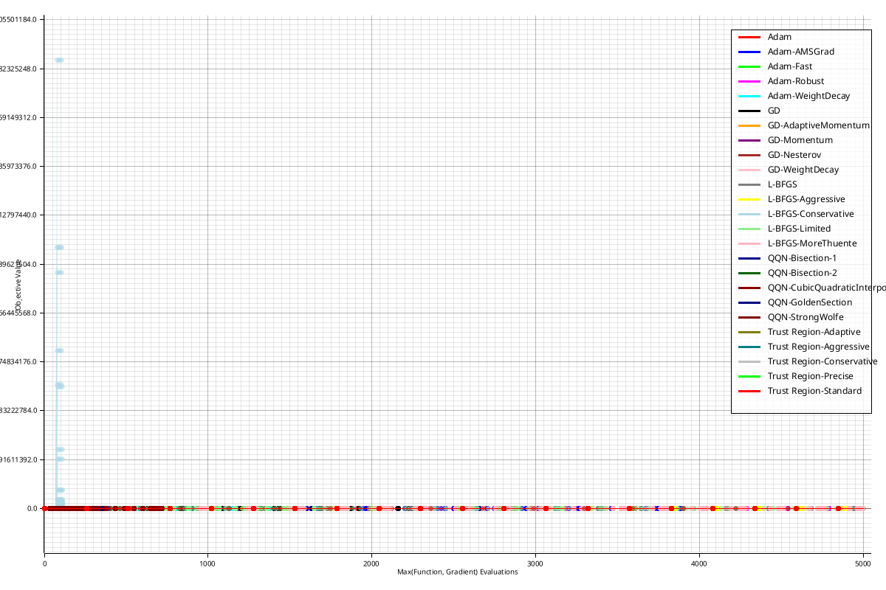
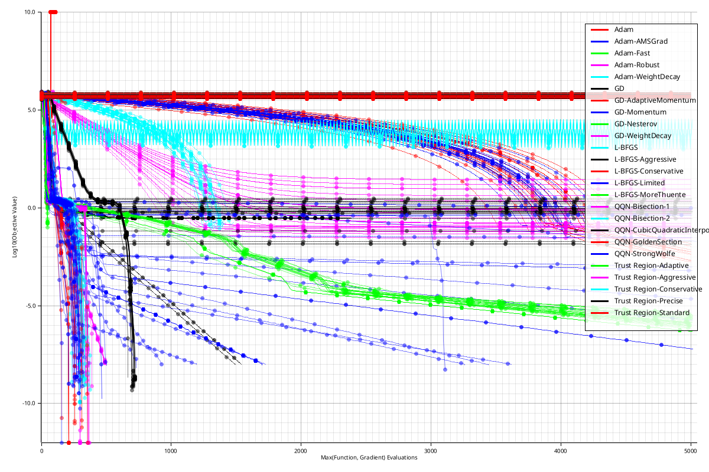

**Figure:** Convergence plots for Zakharov_10D showing objective value vs iterations.
Left: Linear scale, Right: Log scale for better visualization of convergence behavior.

**Data:** [Linear scale data (CSV)](data/Zakharov_10D_data.csv) | [Log scale data (CSV)](data/Zakharov_10D_log_data.csv)

## Problem: IllConditionedRosenbrock_2D_alpha100

**Family:** IllConditionedRosenbrock
**Dimension:** 2
**Success Threshold:** 1.000e-6
**Total Runs:** 500
**Detailed Analysis:** [View comprehensive problem analysis](reports/problem_analysis_IllConditionedRosenbrock_2D_alpha100.md)

### Performance Summary
<table style="border-collapse: collapse; width: 100%; margin: 20px 0;">
<tr style="background-color: #f2f2f2;">
<th style="border: 1px solid #ddd; padding: 8px; text-align: center;">Rank</th>
<th style="border: 1px solid #ddd; padding: 8px; text-align: center;">Optimizer</th>
<th style="border: 1px solid #ddd; padding: 8px; text-align: center;">Mean Final Value (All/Success/Fail)</th>
<th style="border: 1px solid #ddd; padding: 8px; text-align: center;">Std Dev</th>
<th style="border: 1px solid #ddd; padding: 8px; text-align: center;">Best Value</th>
<th style="border: 1px solid #ddd; padding: 8px; text-align: center;">Worst Value</th>
<th style="border: 1px solid #ddd; padding: 8px; text-align: center;">Mean Function Evals (All/Success/Fail)</th>
<th style="border: 1px solid #ddd; padding: 8px; text-align: center;">Mean Gradient Evals (All/Success/Fail)</th>
<th style="border: 1px solid #ddd; padding: 8px; text-align: center;">Success Rate</th>
<th style="border: 1px solid #ddd; padding: 8px; text-align: center;">Mean Time (s)</th>
</tr>
<tr style="background-color: #d4edda; font-weight: bold;">
<td style="border: 1px solid #ddd; padding: 8px; text-align: center;">1</td>
<td style="border: 1px solid #ddd; padding: 8px; text-align: center;"><a href="reports/detailed_IllConditionedRosenbrock_2D_alpha100_L-BFGS-Conservative.md" title="Click for detailed analysis">L-BFGS-Conservative</a></td>
<td style="border: 1px solid #ddd; padding: 8px; text-align: center;">2.69e-4 / 4.11e-7 / 1.35e-3</td>
<td style="border: 1px solid #ddd; padding: 8px; text-align: center;">1.04e-3</td>
<td style="border: 1px solid #ddd; padding: 8px; text-align: center;">2.05e-9</td>
<td style="border: 1px solid #ddd; padding: 8px; text-align: center;">4.76e-3</td>
<td style="border: 1px solid #ddd; padding: 8px; text-align: center;">1800.6 / 1411.6 / 3356.5</td>
<td style="border: 1px solid #ddd; padding: 8px; text-align: center;">861.2 / 662.7 / 1655.2</td>
<td style="border: 1px solid #ddd; padding: 8px; text-align: center;">80.0%</td>
<td style="border: 1px solid #ddd; padding: 8px; text-align: center;">0.030</td>
</tr>
<tr style="background-color: #fff3cd;">
<td style="border: 1px solid #ddd; padding: 8px; text-align: center;">2</td>
<td style="border: 1px solid #ddd; padding: 8px; text-align: center;"><a href="reports/detailed_IllConditionedRosenbrock_2D_alpha100_L-BFGS-MoreThuente.md" title="Click for detailed analysis">L-BFGS-MoreThuente</a></td>
<td style="border: 1px solid #ddd; padding: 8px; text-align: center;">1.52e-2 / 6.05e-7 / 4.35e-2</td>
<td style="border: 1px solid #ddd; padding: 8px; text-align: center;">6.51e-2</td>
<td style="border: 1px solid #ddd; padding: 8px; text-align: center;">3.79e-9</td>
<td style="border: 1px solid #ddd; padding: 8px; text-align: center;">2.99e-1</td>
<td style="border: 1px solid #ddd; padding: 8px; text-align: center;">1487.5 / 725.9 / 2901.7</td>
<td style="border: 1px solid #ddd; padding: 8px; text-align: center;">1085.5 / 536.1 / 2105.7</td>
<td style="border: 1px solid #ddd; padding: 8px; text-align: center;">65.0%</td>
<td style="border: 1px solid #ddd; padding: 8px; text-align: center;">0.027</td>
</tr>
<tr style="">
<td style="border: 1px solid #ddd; padding: 8px; text-align: center;">3</td>
<td style="border: 1px solid #ddd; padding: 8px; text-align: center;"><a href="reports/detailed_IllConditionedRosenbrock_2D_alpha100_QQN-CubicQuadraticInterpolation.md" title="Click for detailed analysis">QQN-CubicQuadraticInterpolation</a></td>
<td style="border: 1px solid #ddd; padding: 8px; text-align: center;">3.48e-2 / 9.40e-8 / 5.35e-2</td>
<td style="border: 1px solid #ddd; padding: 8px; text-align: center;">3.38e-2</td>
<td style="border: 1px solid #ddd; padding: 8px; text-align: center;">4.34e-10</td>
<td style="border: 1px solid #ddd; padding: 8px; text-align: center;">9.89e-2</td>
<td style="border: 1px solid #ddd; padding: 8px; text-align: center;">1722.9 / 916.9 / 2156.9</td>
<td style="border: 1px solid #ddd; padding: 8px; text-align: center;">2273.4 / 1189.6 / 2857.1</td>
<td style="border: 1px solid #ddd; padding: 8px; text-align: center;">35.0%</td>
<td style="border: 1px solid #ddd; padding: 8px; text-align: center;">0.070</td>
</tr>
<tr style="">
<td style="border: 1px solid #ddd; padding: 8px; text-align: center;">4</td>
<td style="border: 1px solid #ddd; padding: 8px; text-align: center;"><a href="reports/detailed_IllConditionedRosenbrock_2D_alpha100_QQN-Bisection-2.md" title="Click for detailed analysis">QQN-Bisection-2</a></td>
<td style="border: 1px solid #ddd; padding: 8px; text-align: center;">5.88e-2 / 3.20e-7 / 7.84e-2</td>
<td style="border: 1px solid #ddd; padding: 8px; text-align: center;">7.05e-2</td>
<td style="border: 1px solid #ddd; padding: 8px; text-align: center;">6.64e-9</td>
<td style="border: 1px solid #ddd; padding: 8px; text-align: center;">2.52e-1</td>
<td style="border: 1px solid #ddd; padding: 8px; text-align: center;">479.6 / 288.6 / 543.3</td>
<td style="border: 1px solid #ddd; padding: 8px; text-align: center;">303.8 / 234.2 / 326.9</td>
<td style="border: 1px solid #ddd; padding: 8px; text-align: center;">25.0%</td>
<td style="border: 1px solid #ddd; padding: 8px; text-align: center;">0.012</td>
</tr>
<tr style="">
<td style="border: 1px solid #ddd; padding: 8px; text-align: center;">5</td>
<td style="border: 1px solid #ddd; padding: 8px; text-align: center;"><a href="reports/detailed_IllConditionedRosenbrock_2D_alpha100_QQN-StrongWolfe.md" title="Click for detailed analysis">QQN-StrongWolfe</a></td>
<td style="border: 1px solid #ddd; padding: 8px; text-align: center;">5.46e-2 / 1.53e-7 / 6.83e-2</td>
<td style="border: 1px solid #ddd; padding: 8px; text-align: center;">7.38e-2</td>
<td style="border: 1px solid #ddd; padding: 8px; text-align: center;">9.29e-9</td>
<td style="border: 1px solid #ddd; padding: 8px; text-align: center;">3.11e-1</td>
<td style="border: 1px solid #ddd; padding: 8px; text-align: center;">2343.8 / 296.0 / 2855.7</td>
<td style="border: 1px solid #ddd; padding: 8px; text-align: center;">1784.5 / 255.8 / 2166.7</td>
<td style="border: 1px solid #ddd; padding: 8px; text-align: center;">20.0%</td>
<td style="border: 1px solid #ddd; padding: 8px; text-align: center;">0.072</td>
</tr>
<tr style="">
<td style="border: 1px solid #ddd; padding: 8px; text-align: center;">6</td>
<td style="border: 1px solid #ddd; padding: 8px; text-align: center;"><a href="reports/detailed_IllConditionedRosenbrock_2D_alpha100_QQN-Bisection-1.md" title="Click for detailed analysis">QQN-Bisection-1</a></td>
<td style="border: 1px solid #ddd; padding: 8px; text-align: center;">4.65e-1 / 1.58e-8 / 4.90e-1</td>
<td style="border: 1px solid #ddd; padding: 8px; text-align: center;">8.86e-1</td>
<td style="border: 1px solid #ddd; padding: 8px; text-align: center;">1.58e-8</td>
<td style="border: 1px solid #ddd; padding: 8px; text-align: center;">3.18e0</td>
<td style="border: 1px solid #ddd; padding: 8px; text-align: center;">2369.2 / 385.0 / 2473.6</td>
<td style="border: 1px solid #ddd; padding: 8px; text-align: center;">2460.2 / 414.0 / 2567.8</td>
<td style="border: 1px solid #ddd; padding: 8px; text-align: center;">5.0%</td>
<td style="border: 1px solid #ddd; padding: 8px; text-align: center;">0.052</td>
</tr>
<tr style="">
<td style="border: 1px solid #ddd; padding: 8px; text-align: center;">7</td>
<td style="border: 1px solid #ddd; padding: 8px; text-align: center;"><a href="reports/detailed_IllConditionedRosenbrock_2D_alpha100_Trust_Region-Aggressive.md" title="Click for detailed analysis">Trust Region-Aggressive</a></td>
<td style="border: 1px solid #ddd; padding: 8px; text-align: center;">4.66e0 / - / 4.66e0</td>
<td style="border: 1px solid #ddd; padding: 8px; text-align: center;">3.99e-1</td>
<td style="border: 1px solid #ddd; padding: 8px; text-align: center;">4.01e0</td>
<td style="border: 1px solid #ddd; padding: 8px; text-align: center;">5.49e0</td>
<td style="border: 1px solid #ddd; padding: 8px; text-align: center;">27.6 / - / 27.6</td>
<td style="border: 1px solid #ddd; padding: 8px; text-align: center;">19.1 / - / 19.1</td>
<td style="border: 1px solid #ddd; padding: 8px; text-align: center;">0.0%</td>
<td style="border: 1px solid #ddd; padding: 8px; text-align: center;">0.000</td>
</tr>
<tr style="">
<td style="border: 1px solid #ddd; padding: 8px; text-align: center;">8</td>
<td style="border: 1px solid #ddd; padding: 8px; text-align: center;"><a href="reports/detailed_IllConditionedRosenbrock_2D_alpha100_GD-Momentum.md" title="Click for detailed analysis">GD-Momentum</a></td>
<td style="border: 1px solid #ddd; padding: 8px; text-align: center;">3.37e0 / - / 5.61e0</td>
<td style="border: 1px solid #ddd; padding: 8px; text-align: center;">2.04e0</td>
<td style="border: 1px solid #ddd; padding: 8px; text-align: center;">8.75e-3</td>
<td style="border: 1px solid #ddd; padding: 8px; text-align: center;">6.68e0</td>
<td style="border: 1px solid #ddd; padding: 8px; text-align: center;">23.8 / - / 23.8</td>
<td style="border: 1px solid #ddd; padding: 8px; text-align: center;">43.6 / - / 43.6</td>
<td style="border: 1px solid #ddd; padding: 8px; text-align: center;">0.0%</td>
<td style="border: 1px solid #ddd; padding: 8px; text-align: center;">0.001</td>
</tr>
<tr style="">
<td style="border: 1px solid #ddd; padding: 8px; text-align: center;">9</td>
<td style="border: 1px solid #ddd; padding: 8px; text-align: center;"><a href="reports/detailed_IllConditionedRosenbrock_2D_alpha100_GD-Nesterov.md" title="Click for detailed analysis">GD-Nesterov</a></td>
<td style="border: 1px solid #ddd; padding: 8px; text-align: center;">9.40e-1 / - / 1.49e0</td>
<td style="border: 1px solid #ddd; padding: 8px; text-align: center;">1.68e0</td>
<td style="border: 1px solid #ddd; padding: 8px; text-align: center;">2.47e-2</td>
<td style="border: 1px solid #ddd; padding: 8px; text-align: center;">4.55e0</td>
<td style="border: 1px solid #ddd; padding: 8px; text-align: center;">46.1 / - / 46.1</td>
<td style="border: 1px solid #ddd; padding: 8px; text-align: center;">88.3 / - / 88.3</td>
<td style="border: 1px solid #ddd; padding: 8px; text-align: center;">0.0%</td>
<td style="border: 1px solid #ddd; padding: 8px; text-align: center;">0.001</td>
</tr>
<tr style="">
<td style="border: 1px solid #ddd; padding: 8px; text-align: center;">10</td>
<td style="border: 1px solid #ddd; padding: 8px; text-align: center;"><a href="reports/detailed_IllConditionedRosenbrock_2D_alpha100_GD-AdaptiveMomentum.md" title="Click for detailed analysis">GD-AdaptiveMomentum</a></td>
<td style="border: 1px solid #ddd; padding: 8px; text-align: center;">2.30e-1 / - / 8.18e-1</td>
<td style="border: 1px solid #ddd; padding: 8px; text-align: center;">8.78e-1</td>
<td style="border: 1px solid #ddd; padding: 8px; text-align: center;">3.23e-3</td>
<td style="border: 1px solid #ddd; padding: 8px; text-align: center;">4.06e0</td>
<td style="border: 1px solid #ddd; padding: 8px; text-align: center;">49.2 / - / 49.2</td>
<td style="border: 1px solid #ddd; padding: 8px; text-align: center;">94.4 / - / 94.4</td>
<td style="border: 1px solid #ddd; padding: 8px; text-align: center;">0.0%</td>
<td style="border: 1px solid #ddd; padding: 8px; text-align: center;">0.002</td>
</tr>
<tr style="">
<td style="border: 1px solid #ddd; padding: 8px; text-align: center;">11</td>
<td style="border: 1px solid #ddd; padding: 8px; text-align: center;"><a href="reports/detailed_IllConditionedRosenbrock_2D_alpha100_Trust_Region-Standard.md" title="Click for detailed analysis">Trust Region-Standard</a></td>
<td style="border: 1px solid #ddd; padding: 8px; text-align: center;">4.18e0 / - / 4.18e0</td>
<td style="border: 1px solid #ddd; padding: 8px; text-align: center;">1.83e-1</td>
<td style="border: 1px solid #ddd; padding: 8px; text-align: center;">3.95e0</td>
<td style="border: 1px solid #ddd; padding: 8px; text-align: center;">4.51e0</td>
<td style="border: 1px solid #ddd; padding: 8px; text-align: center;">89.6 / - / 89.6</td>
<td style="border: 1px solid #ddd; padding: 8px; text-align: center;">60.4 / - / 60.4</td>
<td style="border: 1px solid #ddd; padding: 8px; text-align: center;">0.0%</td>
<td style="border: 1px solid #ddd; padding: 8px; text-align: center;">0.001</td>
</tr>
<tr style="">
<td style="border: 1px solid #ddd; padding: 8px; text-align: center;">12</td>
<td style="border: 1px solid #ddd; padding: 8px; text-align: center;"><a href="reports/detailed_IllConditionedRosenbrock_2D_alpha100_L-BFGS.md" title="Click for detailed analysis">L-BFGS</a></td>
<td style="border: 1px solid #ddd; padding: 8px; text-align: center;">3.34e0 / - / 1.36e2</td>
<td style="border: 1px solid #ddd; padding: 8px; text-align: center;">2.82e0</td>
<td style="border: 1px solid #ddd; padding: 8px; text-align: center;">5.30e-1</td>
<td style="border: 1px solid #ddd; padding: 8px; text-align: center;">1.06e1</td>
<td style="border: 1px solid #ddd; padding: 8px; text-align: center;">121.5 / - / 121.5</td>
<td style="border: 1px solid #ddd; padding: 8px; text-align: center;">43.5 / - / 43.5</td>
<td style="border: 1px solid #ddd; padding: 8px; text-align: center;">0.0%</td>
<td style="border: 1px solid #ddd; padding: 8px; text-align: center;">0.002</td>
</tr>
<tr style="">
<td style="border: 1px solid #ddd; padding: 8px; text-align: center;">13</td>
<td style="border: 1px solid #ddd; padding: 8px; text-align: center;"><a href="reports/detailed_IllConditionedRosenbrock_2D_alpha100_GD-WeightDecay.md" title="Click for detailed analysis">GD-WeightDecay</a></td>
<td style="border: 1px solid #ddd; padding: 8px; text-align: center;">2.66e0 / - / 3.65e0</td>
<td style="border: 1px solid #ddd; padding: 8px; text-align: center;">1.94e0</td>
<td style="border: 1px solid #ddd; padding: 8px; text-align: center;">2.11e-2</td>
<td style="border: 1px solid #ddd; padding: 8px; text-align: center;">4.51e0</td>
<td style="border: 1px solid #ddd; padding: 8px; text-align: center;">58.7 / - / 58.7</td>
<td style="border: 1px solid #ddd; padding: 8px; text-align: center;">113.4 / - / 113.4</td>
<td style="border: 1px solid #ddd; padding: 8px; text-align: center;">0.0%</td>
<td style="border: 1px solid #ddd; padding: 8px; text-align: center;">0.002</td>
</tr>
<tr style="">
<td style="border: 1px solid #ddd; padding: 8px; text-align: center;">14</td>
<td style="border: 1px solid #ddd; padding: 8px; text-align: center;"><a href="reports/detailed_IllConditionedRosenbrock_2D_alpha100_Adam-WeightDecay.md" title="Click for detailed analysis">Adam-WeightDecay</a></td>
<td style="border: 1px solid #ddd; padding: 8px; text-align: center;">4.07e0 / - / 4.11e0</td>
<td style="border: 1px solid #ddd; padding: 8px; text-align: center;">9.56e-1</td>
<td style="border: 1px solid #ddd; padding: 8px; text-align: center;">1.55e-2</td>
<td style="border: 1px solid #ddd; padding: 8px; text-align: center;">4.63e0</td>
<td style="border: 1px solid #ddd; padding: 8px; text-align: center;">231.9 / - / 231.9</td>
<td style="border: 1px solid #ddd; padding: 8px; text-align: center;">231.0 / - / 231.0</td>
<td style="border: 1px solid #ddd; padding: 8px; text-align: center;">0.0%</td>
<td style="border: 1px solid #ddd; padding: 8px; text-align: center;">0.005</td>
</tr>
<tr style="">
<td style="border: 1px solid #ddd; padding: 8px; text-align: center;">15</td>
<td style="border: 1px solid #ddd; padding: 8px; text-align: center;"><a href="reports/detailed_IllConditionedRosenbrock_2D_alpha100_Adam-Fast.md" title="Click for detailed analysis">Adam-Fast</a></td>
<td style="border: 1px solid #ddd; padding: 8px; text-align: center;">1.75e0 / - / 2.13e0</td>
<td style="border: 1px solid #ddd; padding: 8px; text-align: center;">2.15e0</td>
<td style="border: 1px solid #ddd; padding: 8px; text-align: center;">2.49e-6</td>
<td style="border: 1px solid #ddd; padding: 8px; text-align: center;">4.88e0</td>
<td style="border: 1px solid #ddd; padding: 8px; text-align: center;">313.6 / - / 313.6</td>
<td style="border: 1px solid #ddd; padding: 8px; text-align: center;">312.6 / - / 312.6</td>
<td style="border: 1px solid #ddd; padding: 8px; text-align: center;">0.0%</td>
<td style="border: 1px solid #ddd; padding: 8px; text-align: center;">0.006</td>
</tr>
<tr style="">
<td style="border: 1px solid #ddd; padding: 8px; text-align: center;">16</td>
<td style="border: 1px solid #ddd; padding: 8px; text-align: center;"><a href="reports/detailed_IllConditionedRosenbrock_2D_alpha100_Trust_Region-Adaptive.md" title="Click for detailed analysis">Trust Region-Adaptive</a></td>
<td style="border: 1px solid #ddd; padding: 8px; text-align: center;">4.12e0 / - / 4.12e0</td>
<td style="border: 1px solid #ddd; padding: 8px; text-align: center;">2.07e-1</td>
<td style="border: 1px solid #ddd; padding: 8px; text-align: center;">3.83e0</td>
<td style="border: 1px solid #ddd; padding: 8px; text-align: center;">4.42e0</td>
<td style="border: 1px solid #ddd; padding: 8px; text-align: center;">494.4 / - / 494.4</td>
<td style="border: 1px solid #ddd; padding: 8px; text-align: center;">330.3 / - / 330.3</td>
<td style="border: 1px solid #ddd; padding: 8px; text-align: center;">0.0%</td>
<td style="border: 1px solid #ddd; padding: 8px; text-align: center;">0.003</td>
</tr>
<tr style="">
<td style="border: 1px solid #ddd; padding: 8px; text-align: center;">17</td>
<td style="border: 1px solid #ddd; padding: 8px; text-align: center;"><a href="reports/detailed_IllConditionedRosenbrock_2D_alpha100_Adam-Robust.md" title="Click for detailed analysis">Adam-Robust</a></td>
<td style="border: 1px solid #ddd; padding: 8px; text-align: center;">3.96e0 / - / 4.04e0</td>
<td style="border: 1px solid #ddd; padding: 8px; text-align: center;">8.22e-1</td>
<td style="border: 1px solid #ddd; padding: 8px; text-align: center;">1.90e0</td>
<td style="border: 1px solid #ddd; padding: 8px; text-align: center;">4.58e0</td>
<td style="border: 1px solid #ddd; padding: 8px; text-align: center;">419.2 / - / 419.2</td>
<td style="border: 1px solid #ddd; padding: 8px; text-align: center;">418.4 / - / 418.4</td>
<td style="border: 1px solid #ddd; padding: 8px; text-align: center;">0.0%</td>
<td style="border: 1px solid #ddd; padding: 8px; text-align: center;">0.009</td>
</tr>
<tr style="">
<td style="border: 1px solid #ddd; padding: 8px; text-align: center;">18</td>
<td style="border: 1px solid #ddd; padding: 8px; text-align: center;"><a href="reports/detailed_IllConditionedRosenbrock_2D_alpha100_Adam-AMSGrad.md" title="Click for detailed analysis">Adam-AMSGrad</a></td>
<td style="border: 1px solid #ddd; padding: 8px; text-align: center;">3.83e0 / - / 3.83e0</td>
<td style="border: 1px solid #ddd; padding: 8px; text-align: center;">1.33e0</td>
<td style="border: 1px solid #ddd; padding: 8px; text-align: center;">4.66e-1</td>
<td style="border: 1px solid #ddd; padding: 8px; text-align: center;">4.74e0</td>
<td style="border: 1px solid #ddd; padding: 8px; text-align: center;">678.1 / - / 678.1</td>
<td style="border: 1px solid #ddd; padding: 8px; text-align: center;">677.3 / - / 677.3</td>
<td style="border: 1px solid #ddd; padding: 8px; text-align: center;">0.0%</td>
<td style="border: 1px solid #ddd; padding: 8px; text-align: center;">0.015</td>
</tr>
<tr style="">
<td style="border: 1px solid #ddd; padding: 8px; text-align: center;">19</td>
<td style="border: 1px solid #ddd; padding: 8px; text-align: center;"><a href="reports/detailed_IllConditionedRosenbrock_2D_alpha100_Trust_Region-Precise.md" title="Click for detailed analysis">Trust Region-Precise</a></td>
<td style="border: 1px solid #ddd; padding: 8px; text-align: center;">7.26e0 / - / 7.26e0</td>
<td style="border: 1px solid #ddd; padding: 8px; text-align: center;">8.07e0</td>
<td style="border: 1px solid #ddd; padding: 8px; text-align: center;">3.76e0</td>
<td style="border: 1px solid #ddd; padding: 8px; text-align: center;">3.52e1</td>
<td style="border: 1px solid #ddd; padding: 8px; text-align: center;">946.2 / - / 946.2</td>
<td style="border: 1px solid #ddd; padding: 8px; text-align: center;">631.5 / - / 631.5</td>
<td style="border: 1px solid #ddd; padding: 8px; text-align: center;">0.0%</td>
<td style="border: 1px solid #ddd; padding: 8px; text-align: center;">0.006</td>
</tr>
<tr style="">
<td style="border: 1px solid #ddd; padding: 8px; text-align: center;">20</td>
<td style="border: 1px solid #ddd; padding: 8px; text-align: center;"><a href="reports/detailed_IllConditionedRosenbrock_2D_alpha100_GD.md" title="Click for detailed analysis">GD</a></td>
<td style="border: 1px solid #ddd; padding: 8px; text-align: center;">1.10e0 / - / 1.23e0</td>
<td style="border: 1px solid #ddd; padding: 8px; text-align: center;">1.06e0</td>
<td style="border: 1px solid #ddd; padding: 8px; text-align: center;">7.46e-1</td>
<td style="border: 1px solid #ddd; padding: 8px; text-align: center;">4.48e0</td>
<td style="border: 1px solid #ddd; padding: 8px; text-align: center;">854.0 / - / 854.0</td>
<td style="border: 1px solid #ddd; padding: 8px; text-align: center;">1704.1 / - / 1704.1</td>
<td style="border: 1px solid #ddd; padding: 8px; text-align: center;">0.0%</td>
<td style="border: 1px solid #ddd; padding: 8px; text-align: center;">0.021</td>
</tr>
<tr style="">
<td style="border: 1px solid #ddd; padding: 8px; text-align: center;">21</td>
<td style="border: 1px solid #ddd; padding: 8px; text-align: center;"><a href="reports/detailed_IllConditionedRosenbrock_2D_alpha100_L-BFGS-Limited.md" title="Click for detailed analysis">L-BFGS-Limited</a></td>
<td style="border: 1px solid #ddd; padding: 8px; text-align: center;">1.94e0 / - / 3.93e0</td>
<td style="border: 1px solid #ddd; padding: 8px; text-align: center;">2.01e0</td>
<td style="border: 1px solid #ddd; padding: 8px; text-align: center;">3.26e-2</td>
<td style="border: 1px solid #ddd; padding: 8px; text-align: center;">4.33e0</td>
<td style="border: 1px solid #ddd; padding: 8px; text-align: center;">2251.6 / - / 2251.6</td>
<td style="border: 1px solid #ddd; padding: 8px; text-align: center;">557.0 / - / 557.0</td>
<td style="border: 1px solid #ddd; padding: 8px; text-align: center;">0.0%</td>
<td style="border: 1px solid #ddd; padding: 8px; text-align: center;">0.025</td>
</tr>
<tr style="">
<td style="border: 1px solid #ddd; padding: 8px; text-align: center;">22</td>
<td style="border: 1px solid #ddd; padding: 8px; text-align: center;"><a href="reports/detailed_IllConditionedRosenbrock_2D_alpha100_Trust_Region-Conservative.md" title="Click for detailed analysis">Trust Region-Conservative</a></td>
<td style="border: 1px solid #ddd; padding: 8px; text-align: center;">2.84e1 / - / 2.84e1</td>
<td style="border: 1px solid #ddd; padding: 8px; text-align: center;">2.98e1</td>
<td style="border: 1px solid #ddd; padding: 8px; text-align: center;">1.90e-1</td>
<td style="border: 1px solid #ddd; padding: 8px; text-align: center;">1.23e2</td>
<td style="border: 1px solid #ddd; padding: 8px; text-align: center;">2770.7 / - / 2770.7</td>
<td style="border: 1px solid #ddd; padding: 8px; text-align: center;">1847.8 / - / 1847.8</td>
<td style="border: 1px solid #ddd; padding: 8px; text-align: center;">0.0%</td>
<td style="border: 1px solid #ddd; padding: 8px; text-align: center;">0.017</td>
</tr>
<tr style="">
<td style="border: 1px solid #ddd; padding: 8px; text-align: center;">23</td>
<td style="border: 1px solid #ddd; padding: 8px; text-align: center;"><a href="reports/detailed_IllConditionedRosenbrock_2D_alpha100_Adam.md" title="Click for detailed analysis">Adam</a></td>
<td style="border: 1px solid #ddd; padding: 8px; text-align: center;">1.22e0 / - / 1.22e0</td>
<td style="border: 1px solid #ddd; padding: 8px; text-align: center;">3.51e-1</td>
<td style="border: 1px solid #ddd; padding: 8px; text-align: center;">4.86e-1</td>
<td style="border: 1px solid #ddd; padding: 8px; text-align: center;">1.76e0</td>
<td style="border: 1px solid #ddd; padding: 8px; text-align: center;">2502.0 / - / 2502.0</td>
<td style="border: 1px solid #ddd; padding: 8px; text-align: center;">2502.0 / - / 2502.0</td>
<td style="border: 1px solid #ddd; padding: 8px; text-align: center;">0.0%</td>
<td style="border: 1px solid #ddd; padding: 8px; text-align: center;">0.049</td>
</tr>
<tr style="">
<td style="border: 1px solid #ddd; padding: 8px; text-align: center;">24</td>
<td style="border: 1px solid #ddd; padding: 8px; text-align: center;"><a href="reports/detailed_IllConditionedRosenbrock_2D_alpha100_L-BFGS-Aggressive.md" title="Click for detailed analysis">L-BFGS-Aggressive</a></td>
<td style="border: 1px solid #ddd; padding: 8px; text-align: center;">3.18e1 / - / 3.18e1</td>
<td style="border: 1px solid #ddd; padding: 8px; text-align: center;">2.86e1</td>
<td style="border: 1px solid #ddd; padding: 8px; text-align: center;">4.34e0</td>
<td style="border: 1px solid #ddd; padding: 8px; text-align: center;">1.12e2</td>
<td style="border: 1px solid #ddd; padding: 8px; text-align: center;">3852.0 / - / 3852.0</td>
<td style="border: 1px solid #ddd; padding: 8px; text-align: center;">1157.0 / - / 1157.0</td>
<td style="border: 1px solid #ddd; padding: 8px; text-align: center;">0.0%</td>
<td style="border: 1px solid #ddd; padding: 8px; text-align: center;">0.027</td>
</tr>
<tr style="">
<td style="border: 1px solid #ddd; padding: 8px; text-align: center;">25</td>
<td style="border: 1px solid #ddd; padding: 8px; text-align: center;"><a href="reports/detailed_IllConditionedRosenbrock_2D_alpha100_QQN-GoldenSection.md" title="Click for detailed analysis">QQN-GoldenSection</a></td>
<td style="border: 1px solid #ddd; padding: 8px; text-align: center;">1.25e-1 / - / 1.25e-1</td>
<td style="border: 1px solid #ddd; padding: 8px; text-align: center;">5.78e-2</td>
<td style="border: 1px solid #ddd; padding: 8px; text-align: center;">6.99e-5</td>
<td style="border: 1px solid #ddd; padding: 8px; text-align: center;">1.93e-1</td>
<td style="border: 1px solid #ddd; padding: 8px; text-align: center;">4459.4 / - / 4459.4</td>
<td style="border: 1px solid #ddd; padding: 8px; text-align: center;">570.7 / - / 570.7</td>
<td style="border: 1px solid #ddd; padding: 8px; text-align: center;">0.0%</td>
<td style="border: 1px solid #ddd; padding: 8px; text-align: center;">0.081</td>
</tr>
</table>

### Convergence Plots

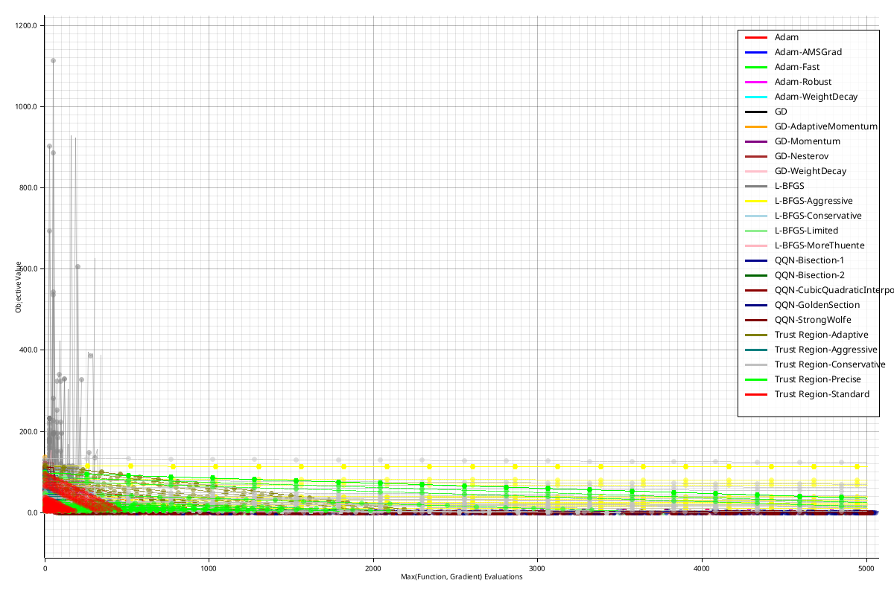
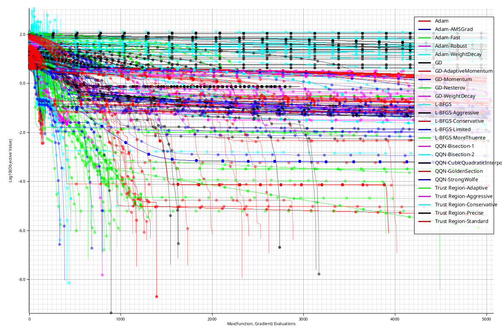

**Figure:** Convergence plots for IllConditionedRosenbrock_2D_alpha100 showing objective value vs iterations.
Left: Linear scale, Right: Log scale for better visualization of convergence behavior.

**Data:** [Linear scale data (CSV)](data/IllConditionedRosenbrock_2D_alpha100_data.csv) | [Log scale data (CSV)](data/IllConditionedRosenbrock_2D_alpha100_log_data.csv)

## Problem: IllConditionedRosenbrock_5D_alpha100

**Family:** IllConditionedRosenbrock
**Dimension:** 5
**Success Threshold:** 1.000e-6
**Total Runs:** 500
**Detailed Analysis:** [View comprehensive problem analysis](reports/problem_analysis_IllConditionedRosenbrock_5D_alpha100.md)

### Performance Summary
<table style="border-collapse: collapse; width: 100%; margin: 20px 0;">
<tr style="background-color: #f2f2f2;">
<th style="border: 1px solid #ddd; padding: 8px; text-align: center;">Rank</th>
<th style="border: 1px solid #ddd; padding: 8px; text-align: center;">Optimizer</th>
<th style="border: 1px solid #ddd; padding: 8px; text-align: center;">Mean Final Value (All/Success/Fail)</th>
<th style="border: 1px solid #ddd; padding: 8px; text-align: center;">Std Dev</th>
<th style="border: 1px solid #ddd; padding: 8px; text-align: center;">Best Value</th>
<th style="border: 1px solid #ddd; padding: 8px; text-align: center;">Worst Value</th>
<th style="border: 1px solid #ddd; padding: 8px; text-align: center;">Mean Function Evals (All/Success/Fail)</th>
<th style="border: 1px solid #ddd; padding: 8px; text-align: center;">Mean Gradient Evals (All/Success/Fail)</th>
<th style="border: 1px solid #ddd; padding: 8px; text-align: center;">Success Rate</th>
<th style="border: 1px solid #ddd; padding: 8px; text-align: center;">Mean Time (s)</th>
</tr>
<tr style="background-color: #d4edda; font-weight: bold;">
<td style="border: 1px solid #ddd; padding: 8px; text-align: center;">1</td>
<td style="border: 1px solid #ddd; padding: 8px; text-align: center;"><a href="reports/detailed_IllConditionedRosenbrock_5D_alpha100_QQN-StrongWolfe.md" title="Click for detailed analysis">QQN-StrongWolfe</a></td>
<td style="border: 1px solid #ddd; padding: 8px; text-align: center;">1.59e-7 / 1.59e-7 / -</td>
<td style="border: 1px solid #ddd; padding: 8px; text-align: center;">1.68e-7</td>
<td style="border: 1px solid #ddd; padding: 8px; text-align: center;">2.70e-9</td>
<td style="border: 1px solid #ddd; padding: 8px; text-align: center;">5.77e-7</td>
<td style="border: 1px solid #ddd; padding: 8px; text-align: center;">1191.3 / 1191.3 / -</td>
<td style="border: 1px solid #ddd; padding: 8px; text-align: center;">923.7 / 923.7 / -</td>
<td style="border: 1px solid #ddd; padding: 8px; text-align: center;">100.0%</td>
<td style="border: 1px solid #ddd; padding: 8px; text-align: center;">0.037</td>
</tr>
<tr style="background-color: #fff3cd;">
<td style="border: 1px solid #ddd; padding: 8px; text-align: center;">2</td>
<td style="border: 1px solid #ddd; padding: 8px; text-align: center;"><a href="reports/detailed_IllConditionedRosenbrock_5D_alpha100_QQN-Bisection-1.md" title="Click for detailed analysis">QQN-Bisection-1</a></td>
<td style="border: 1px solid #ddd; padding: 8px; text-align: center;">4.19e-1 / 2.73e-7 / 2.09e0</td>
<td style="border: 1px solid #ddd; padding: 8px; text-align: center;">1.11e0</td>
<td style="border: 1px solid #ddd; padding: 8px; text-align: center;">2.00e-9</td>
<td style="border: 1px solid #ddd; padding: 8px; text-align: center;">4.64e0</td>
<td style="border: 1px solid #ddd; padding: 8px; text-align: center;">1511.2 / 1282.2 / 2427.0</td>
<td style="border: 1px solid #ddd; padding: 8px; text-align: center;">1688.7 / 1465.1 / 2582.8</td>
<td style="border: 1px solid #ddd; padding: 8px; text-align: center;">80.0%</td>
<td style="border: 1px solid #ddd; padding: 8px; text-align: center;">0.040</td>
</tr>
<tr style="">
<td style="border: 1px solid #ddd; padding: 8px; text-align: center;">3</td>
<td style="border: 1px solid #ddd; padding: 8px; text-align: center;"><a href="reports/detailed_IllConditionedRosenbrock_5D_alpha100_QQN-CubicQuadraticInterpolation.md" title="Click for detailed analysis">QQN-CubicQuadraticInterpolation</a></td>
<td style="border: 1px solid #ddd; padding: 8px; text-align: center;">1.97e-1 / 2.61e-7 / 5.64e-1</td>
<td style="border: 1px solid #ddd; padding: 8px; text-align: center;">2.84e-1</td>
<td style="border: 1px solid #ddd; padding: 8px; text-align: center;">4.07e-9</td>
<td style="border: 1px solid #ddd; padding: 8px; text-align: center;">7.25e-1</td>
<td style="border: 1px solid #ddd; padding: 8px; text-align: center;">1403.3 / 996.9 / 2158.0</td>
<td style="border: 1px solid #ddd; padding: 8px; text-align: center;">1847.2 / 1301.6 / 2860.3</td>
<td style="border: 1px solid #ddd; padding: 8px; text-align: center;">65.0%</td>
<td style="border: 1px solid #ddd; padding: 8px; text-align: center;">0.062</td>
</tr>
<tr style="">
<td style="border: 1px solid #ddd; padding: 8px; text-align: center;">4</td>
<td style="border: 1px solid #ddd; padding: 8px; text-align: center;"><a href="reports/detailed_IllConditionedRosenbrock_5D_alpha100_QQN-GoldenSection.md" title="Click for detailed analysis">QQN-GoldenSection</a></td>
<td style="border: 1px solid #ddd; padding: 8px; text-align: center;">4.32e-1 / 3.17e-7 / 6.65e-1</td>
<td style="border: 1px solid #ddd; padding: 8px; text-align: center;">5.14e-1</td>
<td style="border: 1px solid #ddd; padding: 8px; text-align: center;">5.69e-8</td>
<td style="border: 1px solid #ddd; padding: 8px; text-align: center;">1.61e0</td>
<td style="border: 1px solid #ddd; padding: 8px; text-align: center;">3805.3 / 2558.7 / 4476.6</td>
<td style="border: 1px solid #ddd; padding: 8px; text-align: center;">472.9 / 330.3 / 549.8</td>
<td style="border: 1px solid #ddd; padding: 8px; text-align: center;">35.0%</td>
<td style="border: 1px solid #ddd; padding: 8px; text-align: center;">0.070</td>
</tr>
<tr style="">
<td style="border: 1px solid #ddd; padding: 8px; text-align: center;">5</td>
<td style="border: 1px solid #ddd; padding: 8px; text-align: center;"><a href="reports/detailed_IllConditionedRosenbrock_5D_alpha100_L-BFGS-MoreThuente.md" title="Click for detailed analysis">L-BFGS-MoreThuente</a></td>
<td style="border: 1px solid #ddd; padding: 8px; text-align: center;">6.34e-1 / 5.74e-7 / 2.17e8</td>
<td style="border: 1px solid #ddd; padding: 8px; text-align: center;">9.97e-1</td>
<td style="border: 1px solid #ddd; padding: 8px; text-align: center;">3.07e-7</td>
<td style="border: 1px solid #ddd; padding: 8px; text-align: center;">3.15e0</td>
<td style="border: 1px solid #ddd; padding: 8px; text-align: center;">2320.8 / 1338.5 / 2566.4</td>
<td style="border: 1px solid #ddd; padding: 8px; text-align: center;">1758.8 / 1002.0 / 1947.9</td>
<td style="border: 1px solid #ddd; padding: 8px; text-align: center;">20.0%</td>
<td style="border: 1px solid #ddd; padding: 8px; text-align: center;">0.041</td>
</tr>
<tr style="">
<td style="border: 1px solid #ddd; padding: 8px; text-align: center;">6</td>
<td style="border: 1px solid #ddd; padding: 8px; text-align: center;"><a href="reports/detailed_IllConditionedRosenbrock_5D_alpha100_QQN-Bisection-2.md" title="Click for detailed analysis">QQN-Bisection-2</a></td>
<td style="border: 1px solid #ddd; padding: 8px; text-align: center;">2.99e-1 / 4.06e-7 / 3.51e-1</td>
<td style="border: 1px solid #ddd; padding: 8px; text-align: center;">2.82e-1</td>
<td style="border: 1px solid #ddd; padding: 8px; text-align: center;">4.91e-8</td>
<td style="border: 1px solid #ddd; padding: 8px; text-align: center;">9.11e-1</td>
<td style="border: 1px solid #ddd; padding: 8px; text-align: center;">1647.8 / 1342.7 / 1701.6</td>
<td style="border: 1px solid #ddd; padding: 8px; text-align: center;">917.0 / 824.7 / 933.3</td>
<td style="border: 1px solid #ddd; padding: 8px; text-align: center;">15.0%</td>
<td style="border: 1px solid #ddd; padding: 8px; text-align: center;">0.041</td>
</tr>
<tr style="">
<td style="border: 1px solid #ddd; padding: 8px; text-align: center;">7</td>
<td style="border: 1px solid #ddd; padding: 8px; text-align: center;"><a href="reports/detailed_IllConditionedRosenbrock_5D_alpha100_GD-AdaptiveMomentum.md" title="Click for detailed analysis">GD-AdaptiveMomentum</a></td>
<td style="border: 1px solid #ddd; padding: 8px; text-align: center;">1.23e1 / - / 4.60e1</td>
<td style="border: 1px solid #ddd; padding: 8px; text-align: center;">2.63e0</td>
<td style="border: 1px solid #ddd; padding: 8px; text-align: center;">8.36e0</td>
<td style="border: 1px solid #ddd; padding: 8px; text-align: center;">1.72e1</td>
<td style="border: 1px solid #ddd; padding: 8px; text-align: center;">20.6 / - / 20.6</td>
<td style="border: 1px solid #ddd; padding: 8px; text-align: center;">37.1 / - / 37.1</td>
<td style="border: 1px solid #ddd; padding: 8px; text-align: center;">0.0%</td>
<td style="border: 1px solid #ddd; padding: 8px; text-align: center;">0.001</td>
</tr>
<tr style="">
<td style="border: 1px solid #ddd; padding: 8px; text-align: center;">8</td>
<td style="border: 1px solid #ddd; padding: 8px; text-align: center;"><a href="reports/detailed_IllConditionedRosenbrock_5D_alpha100_GD-Momentum.md" title="Click for detailed analysis">GD-Momentum</a></td>
<td style="border: 1px solid #ddd; padding: 8px; text-align: center;">1.36e1 / - / 3.55e1</td>
<td style="border: 1px solid #ddd; padding: 8px; text-align: center;">2.65e0</td>
<td style="border: 1px solid #ddd; padding: 8px; text-align: center;">9.53e0</td>
<td style="border: 1px solid #ddd; padding: 8px; text-align: center;">1.87e1</td>
<td style="border: 1px solid #ddd; padding: 8px; text-align: center;">20.8 / - / 20.8</td>
<td style="border: 1px solid #ddd; padding: 8px; text-align: center;">37.6 / - / 37.6</td>
<td style="border: 1px solid #ddd; padding: 8px; text-align: center;">0.0%</td>
<td style="border: 1px solid #ddd; padding: 8px; text-align: center;">0.001</td>
</tr>
<tr style="">
<td style="border: 1px solid #ddd; padding: 8px; text-align: center;">9</td>
<td style="border: 1px solid #ddd; padding: 8px; text-align: center;"><a href="reports/detailed_IllConditionedRosenbrock_5D_alpha100_GD.md" title="Click for detailed analysis">GD</a></td>
<td style="border: 1px solid #ddd; padding: 8px; text-align: center;">4.76e0 / - / 5.09e0</td>
<td style="border: 1px solid #ddd; padding: 8px; text-align: center;">7.65e-2</td>
<td style="border: 1px solid #ddd; padding: 8px; text-align: center;">4.65e0</td>
<td style="border: 1px solid #ddd; padding: 8px; text-align: center;">4.88e0</td>
<td style="border: 1px solid #ddd; padding: 8px; text-align: center;">32.5 / - / 32.5</td>
<td style="border: 1px solid #ddd; padding: 8px; text-align: center;">61.0 / - / 61.0</td>
<td style="border: 1px solid #ddd; padding: 8px; text-align: center;">0.0%</td>
<td style="border: 1px solid #ddd; padding: 8px; text-align: center;">0.001</td>
</tr>
<tr style="">
<td style="border: 1px solid #ddd; padding: 8px; text-align: center;">10</td>
<td style="border: 1px solid #ddd; padding: 8px; text-align: center;"><a href="reports/detailed_IllConditionedRosenbrock_5D_alpha100_Adam-Fast.md" title="Click for detailed analysis">Adam-Fast</a></td>
<td style="border: 1px solid #ddd; padding: 8px; text-align: center;">6.73e0 / - / 1.43e1</td>
<td style="border: 1px solid #ddd; padding: 8px; text-align: center;">1.93e0</td>
<td style="border: 1px solid #ddd; padding: 8px; text-align: center;">2.74e-2</td>
<td style="border: 1px solid #ddd; padding: 8px; text-align: center;">1.03e1</td>
<td style="border: 1px solid #ddd; padding: 8px; text-align: center;">49.9 / - / 49.9</td>
<td style="border: 1px solid #ddd; padding: 8px; text-align: center;">48.9 / - / 48.9</td>
<td style="border: 1px solid #ddd; padding: 8px; text-align: center;">0.0%</td>
<td style="border: 1px solid #ddd; padding: 8px; text-align: center;">0.001</td>
</tr>
<tr style="">
<td style="border: 1px solid #ddd; padding: 8px; text-align: center;">11</td>
<td style="border: 1px solid #ddd; padding: 8px; text-align: center;"><a href="reports/detailed_IllConditionedRosenbrock_5D_alpha100_L-BFGS.md" title="Click for detailed analysis">L-BFGS</a></td>
<td style="border: 1px solid #ddd; padding: 8px; text-align: center;">1.76e1 / - / 1.50e2</td>
<td style="border: 1px solid #ddd; padding: 8px; text-align: center;">9.81e0</td>
<td style="border: 1px solid #ddd; padding: 8px; text-align: center;">7.16e0</td>
<td style="border: 1px solid #ddd; padding: 8px; text-align: center;">4.11e1</td>
<td style="border: 1px solid #ddd; padding: 8px; text-align: center;">135.3 / - / 135.3</td>
<td style="border: 1px solid #ddd; padding: 8px; text-align: center;">43.4 / - / 43.4</td>
<td style="border: 1px solid #ddd; padding: 8px; text-align: center;">0.0%</td>
<td style="border: 1px solid #ddd; padding: 8px; text-align: center;">0.002</td>
</tr>
<tr style="">
<td style="border: 1px solid #ddd; padding: 8px; text-align: center;">12</td>
<td style="border: 1px solid #ddd; padding: 8px; text-align: center;"><a href="reports/detailed_IllConditionedRosenbrock_5D_alpha100_GD-Nesterov.md" title="Click for detailed analysis">GD-Nesterov</a></td>
<td style="border: 1px solid #ddd; padding: 8px; text-align: center;">3.32e0 / - / 4.24e0</td>
<td style="border: 1px solid #ddd; padding: 8px; text-align: center;">3.73e0</td>
<td style="border: 1px solid #ddd; padding: 8px; text-align: center;">3.78e-1</td>
<td style="border: 1px solid #ddd; padding: 8px; text-align: center;">9.14e0</td>
<td style="border: 1px solid #ddd; padding: 8px; text-align: center;">372.4 / - / 372.4</td>
<td style="border: 1px solid #ddd; padding: 8px; text-align: center;">740.7 / - / 740.7</td>
<td style="border: 1px solid #ddd; padding: 8px; text-align: center;">0.0%</td>
<td style="border: 1px solid #ddd; padding: 8px; text-align: center;">0.012</td>
</tr>
<tr style="">
<td style="border: 1px solid #ddd; padding: 8px; text-align: center;">13</td>
<td style="border: 1px solid #ddd; padding: 8px; text-align: center;"><a href="reports/detailed_IllConditionedRosenbrock_5D_alpha100_Trust_Region-Aggressive.md" title="Click for detailed analysis">Trust Region-Aggressive</a></td>
<td style="border: 1px solid #ddd; padding: 8px; text-align: center;">5.00e0 / - / 5.00e0</td>
<td style="border: 1px solid #ddd; padding: 8px; text-align: center;">4.17e-1</td>
<td style="border: 1px solid #ddd; padding: 8px; text-align: center;">4.66e0</td>
<td style="border: 1px solid #ddd; padding: 8px; text-align: center;">5.93e0</td>
<td style="border: 1px solid #ddd; padding: 8px; text-align: center;">776.1 / - / 776.1</td>
<td style="border: 1px solid #ddd; padding: 8px; text-align: center;">518.1 / - / 518.1</td>
<td style="border: 1px solid #ddd; padding: 8px; text-align: center;">0.0%</td>
<td style="border: 1px solid #ddd; padding: 8px; text-align: center;">0.005</td>
</tr>
<tr style="">
<td style="border: 1px solid #ddd; padding: 8px; text-align: center;">14</td>
<td style="border: 1px solid #ddd; padding: 8px; text-align: center;"><a href="reports/detailed_IllConditionedRosenbrock_5D_alpha100_GD-WeightDecay.md" title="Click for detailed analysis">GD-WeightDecay</a></td>
<td style="border: 1px solid #ddd; padding: 8px; text-align: center;">6.17e-1 / - / 7.32e-1</td>
<td style="border: 1px solid #ddd; padding: 8px; text-align: center;">1.10e0</td>
<td style="border: 1px solid #ddd; padding: 8px; text-align: center;">1.46e-1</td>
<td style="border: 1px solid #ddd; padding: 8px; text-align: center;">5.35e0</td>
<td style="border: 1px solid #ddd; padding: 8px; text-align: center;">459.3 / - / 459.3</td>
<td style="border: 1px solid #ddd; padding: 8px; text-align: center;">914.6 / - / 914.6</td>
<td style="border: 1px solid #ddd; padding: 8px; text-align: center;">0.0%</td>
<td style="border: 1px solid #ddd; padding: 8px; text-align: center;">0.015</td>
</tr>
<tr style="">
<td style="border: 1px solid #ddd; padding: 8px; text-align: center;">15</td>
<td style="border: 1px solid #ddd; padding: 8px; text-align: center;"><a href="reports/detailed_IllConditionedRosenbrock_5D_alpha100_Adam-WeightDecay.md" title="Click for detailed analysis">Adam-WeightDecay</a></td>
<td style="border: 1px solid #ddd; padding: 8px; text-align: center;">1.83e0 / - / 1.84e0</td>
<td style="border: 1px solid #ddd; padding: 8px; text-align: center;">2.24e0</td>
<td style="border: 1px solid #ddd; padding: 8px; text-align: center;">1.84e-3</td>
<td style="border: 1px solid #ddd; padding: 8px; text-align: center;">4.64e0</td>
<td style="border: 1px solid #ddd; padding: 8px; text-align: center;">1797.3 / - / 1797.3</td>
<td style="border: 1px solid #ddd; padding: 8px; text-align: center;">1796.9 / - / 1796.9</td>
<td style="border: 1px solid #ddd; padding: 8px; text-align: center;">0.0%</td>
<td style="border: 1px solid #ddd; padding: 8px; text-align: center;">0.038</td>
</tr>
<tr style="">
<td style="border: 1px solid #ddd; padding: 8px; text-align: center;">16</td>
<td style="border: 1px solid #ddd; padding: 8px; text-align: center;"><a href="reports/detailed_IllConditionedRosenbrock_5D_alpha100_L-BFGS-Conservative.md" title="Click for detailed analysis">L-BFGS-Conservative</a></td>
<td style="border: 1px solid #ddd; padding: 8px; text-align: center;">2.37e0 / - / 2.02e1</td>
<td style="border: 1px solid #ddd; padding: 8px; text-align: center;">1.84e0</td>
<td style="border: 1px solid #ddd; padding: 8px; text-align: center;">2.46e-1</td>
<td style="border: 1px solid #ddd; padding: 8px; text-align: center;">4.65e0</td>
<td style="border: 1px solid #ddd; padding: 8px; text-align: center;">3386.6 / - / 3386.6</td>
<td style="border: 1px solid #ddd; padding: 8px; text-align: center;">911.7 / - / 911.7</td>
<td style="border: 1px solid #ddd; padding: 8px; text-align: center;">0.0%</td>
<td style="border: 1px solid #ddd; padding: 8px; text-align: center;">0.034</td>
</tr>
<tr style="">
<td style="border: 1px solid #ddd; padding: 8px; text-align: center;">17</td>
<td style="border: 1px solid #ddd; padding: 8px; text-align: center;"><a href="reports/detailed_IllConditionedRosenbrock_5D_alpha100_Trust_Region-Standard.md" title="Click for detailed analysis">Trust Region-Standard</a></td>
<td style="border: 1px solid #ddd; padding: 8px; text-align: center;">6.23e1 / - / 6.23e1</td>
<td style="border: 1px solid #ddd; padding: 8px; text-align: center;">7.73e1</td>
<td style="border: 1px solid #ddd; padding: 8px; text-align: center;">4.66e0</td>
<td style="border: 1px solid #ddd; padding: 8px; text-align: center;">2.53e2</td>
<td style="border: 1px solid #ddd; padding: 8px; text-align: center;">2827.2 / - / 2827.2</td>
<td style="border: 1px solid #ddd; padding: 8px; text-align: center;">1885.5 / - / 1885.5</td>
<td style="border: 1px solid #ddd; padding: 8px; text-align: center;">0.0%</td>
<td style="border: 1px solid #ddd; padding: 8px; text-align: center;">0.018</td>
</tr>
<tr style="">
<td style="border: 1px solid #ddd; padding: 8px; text-align: center;">18</td>
<td style="border: 1px solid #ddd; padding: 8px; text-align: center;"><a href="reports/detailed_IllConditionedRosenbrock_5D_alpha100_Adam-AMSGrad.md" title="Click for detailed analysis">Adam-AMSGrad</a></td>
<td style="border: 1px solid #ddd; padding: 8px; text-align: center;">4.40e0 / - / 4.40e0</td>
<td style="border: 1px solid #ddd; padding: 8px; text-align: center;">3.25e-1</td>
<td style="border: 1px solid #ddd; padding: 8px; text-align: center;">3.25e0</td>
<td style="border: 1px solid #ddd; padding: 8px; text-align: center;">4.82e0</td>
<td style="border: 1px solid #ddd; padding: 8px; text-align: center;">2442.0 / - / 2442.0</td>
<td style="border: 1px solid #ddd; padding: 8px; text-align: center;">2441.8 / - / 2441.8</td>
<td style="border: 1px solid #ddd; padding: 8px; text-align: center;">0.0%</td>
<td style="border: 1px solid #ddd; padding: 8px; text-align: center;">0.056</td>
</tr>
<tr style="">
<td style="border: 1px solid #ddd; padding: 8px; text-align: center;">19</td>
<td style="border: 1px solid #ddd; padding: 8px; text-align: center;"><a href="reports/detailed_IllConditionedRosenbrock_5D_alpha100_Adam.md" title="Click for detailed analysis">Adam</a></td>
<td style="border: 1px solid #ddd; padding: 8px; text-align: center;">3.92e0 / - / 3.92e0</td>
<td style="border: 1px solid #ddd; padding: 8px; text-align: center;">4.66e-1</td>
<td style="border: 1px solid #ddd; padding: 8px; text-align: center;">2.83e0</td>
<td style="border: 1px solid #ddd; padding: 8px; text-align: center;">4.65e0</td>
<td style="border: 1px solid #ddd; padding: 8px; text-align: center;">2471.6 / - / 2471.6</td>
<td style="border: 1px solid #ddd; padding: 8px; text-align: center;">2471.5 / - / 2471.5</td>
<td style="border: 1px solid #ddd; padding: 8px; text-align: center;">0.0%</td>
<td style="border: 1px solid #ddd; padding: 8px; text-align: center;">0.050</td>
</tr>
<tr style="">
<td style="border: 1px solid #ddd; padding: 8px; text-align: center;">20</td>
<td style="border: 1px solid #ddd; padding: 8px; text-align: center;"><a href="reports/detailed_IllConditionedRosenbrock_5D_alpha100_Trust_Region-Precise.md" title="Click for detailed analysis">Trust Region-Precise</a></td>
<td style="border: 1px solid #ddd; padding: 8px; text-align: center;">1.01e3 / - / 1.01e3</td>
<td style="border: 1px solid #ddd; padding: 8px; text-align: center;">1.27e2</td>
<td style="border: 1px solid #ddd; padding: 8px; text-align: center;">8.08e2</td>
<td style="border: 1px solid #ddd; padding: 8px; text-align: center;">1.35e3</td>
<td style="border: 1px solid #ddd; padding: 8px; text-align: center;">3002.0 / - / 3002.0</td>
<td style="border: 1px solid #ddd; padding: 8px; text-align: center;">2002.0 / - / 2002.0</td>
<td style="border: 1px solid #ddd; padding: 8px; text-align: center;">0.0%</td>
<td style="border: 1px solid #ddd; padding: 8px; text-align: center;">0.019</td>
</tr>
<tr style="">
<td style="border: 1px solid #ddd; padding: 8px; text-align: center;">21</td>
<td style="border: 1px solid #ddd; padding: 8px; text-align: center;"><a href="reports/detailed_IllConditionedRosenbrock_5D_alpha100_Adam-Robust.md" title="Click for detailed analysis">Adam-Robust</a></td>
<td style="border: 1px solid #ddd; padding: 8px; text-align: center;">1.46e1 / - / 1.46e1</td>
<td style="border: 1px solid #ddd; padding: 8px; text-align: center;">6.99e0</td>
<td style="border: 1px solid #ddd; padding: 8px; text-align: center;">6.12e0</td>
<td style="border: 1px solid #ddd; padding: 8px; text-align: center;">2.99e1</td>
<td style="border: 1px solid #ddd; padding: 8px; text-align: center;">2502.0 / - / 2502.0</td>
<td style="border: 1px solid #ddd; padding: 8px; text-align: center;">2502.0 / - / 2502.0</td>
<td style="border: 1px solid #ddd; padding: 8px; text-align: center;">0.0%</td>
<td style="border: 1px solid #ddd; padding: 8px; text-align: center;">0.058</td>
</tr>
<tr style="">
<td style="border: 1px solid #ddd; padding: 8px; text-align: center;">22</td>
<td style="border: 1px solid #ddd; padding: 8px; text-align: center;"><a href="reports/detailed_IllConditionedRosenbrock_5D_alpha100_Trust_Region-Adaptive.md" title="Click for detailed analysis">Trust Region-Adaptive</a></td>
<td style="border: 1px solid #ddd; padding: 8px; text-align: center;">8.41e2 / - / 8.41e2</td>
<td style="border: 1px solid #ddd; padding: 8px; text-align: center;">1.37e2</td>
<td style="border: 1px solid #ddd; padding: 8px; text-align: center;">5.05e2</td>
<td style="border: 1px solid #ddd; padding: 8px; text-align: center;">1.11e3</td>
<td style="border: 1px solid #ddd; padding: 8px; text-align: center;">3002.0 / - / 3002.0</td>
<td style="border: 1px solid #ddd; padding: 8px; text-align: center;">2002.0 / - / 2002.0</td>
<td style="border: 1px solid #ddd; padding: 8px; text-align: center;">0.0%</td>
<td style="border: 1px solid #ddd; padding: 8px; text-align: center;">0.019</td>
</tr>
<tr style="">
<td style="border: 1px solid #ddd; padding: 8px; text-align: center;">23</td>
<td style="border: 1px solid #ddd; padding: 8px; text-align: center;"><a href="reports/detailed_IllConditionedRosenbrock_5D_alpha100_Trust_Region-Conservative.md" title="Click for detailed analysis">Trust Region-Conservative</a></td>
<td style="border: 1px solid #ddd; padding: 8px; text-align: center;">1.02e3 / - / 1.02e3</td>
<td style="border: 1px solid #ddd; padding: 8px; text-align: center;">1.63e2</td>
<td style="border: 1px solid #ddd; padding: 8px; text-align: center;">7.14e2</td>
<td style="border: 1px solid #ddd; padding: 8px; text-align: center;">1.31e3</td>
<td style="border: 1px solid #ddd; padding: 8px; text-align: center;">3002.0 / - / 3002.0</td>
<td style="border: 1px solid #ddd; padding: 8px; text-align: center;">2002.0 / - / 2002.0</td>
<td style="border: 1px solid #ddd; padding: 8px; text-align: center;">0.0%</td>
<td style="border: 1px solid #ddd; padding: 8px; text-align: center;">0.019</td>
</tr>
<tr style="">
<td style="border: 1px solid #ddd; padding: 8px; text-align: center;">24</td>
<td style="border: 1px solid #ddd; padding: 8px; text-align: center;"><a href="reports/detailed_IllConditionedRosenbrock_5D_alpha100_L-BFGS-Aggressive.md" title="Click for detailed analysis">L-BFGS-Aggressive</a></td>
<td style="border: 1px solid #ddd; padding: 8px; text-align: center;">8.07e2 / - / 8.07e2</td>
<td style="border: 1px solid #ddd; padding: 8px; text-align: center;">4.06e2</td>
<td style="border: 1px solid #ddd; padding: 8px; text-align: center;">1.72e1</td>
<td style="border: 1px solid #ddd; padding: 8px; text-align: center;">1.19e3</td>
<td style="border: 1px solid #ddd; padding: 8px; text-align: center;">3851.6 / - / 3851.6</td>
<td style="border: 1px solid #ddd; padding: 8px; text-align: center;">1157.3 / - / 1157.3</td>
<td style="border: 1px solid #ddd; padding: 8px; text-align: center;">0.0%</td>
<td style="border: 1px solid #ddd; padding: 8px; text-align: center;">0.029</td>
</tr>
<tr style="">
<td style="border: 1px solid #ddd; padding: 8px; text-align: center;">25</td>
<td style="border: 1px solid #ddd; padding: 8px; text-align: center;"><a href="reports/detailed_IllConditionedRosenbrock_5D_alpha100_L-BFGS-Limited.md" title="Click for detailed analysis">L-BFGS-Limited</a></td>
<td style="border: 1px solid #ddd; padding: 8px; text-align: center;">4.05e-1 / - / 4.05e-1</td>
<td style="border: 1px solid #ddd; padding: 8px; text-align: center;">5.13e-2</td>
<td style="border: 1px solid #ddd; padding: 8px; text-align: center;">3.00e-1</td>
<td style="border: 1px solid #ddd; padding: 8px; text-align: center;">5.47e-1</td>
<td style="border: 1px solid #ddd; padding: 8px; text-align: center;">4035.2 / - / 4035.2</td>
<td style="border: 1px solid #ddd; padding: 8px; text-align: center;">975.5 / - / 975.5</td>
<td style="border: 1px solid #ddd; padding: 8px; text-align: center;">0.0%</td>
<td style="border: 1px solid #ddd; padding: 8px; text-align: center;">0.045</td>
</tr>
</table>

### Convergence Plots

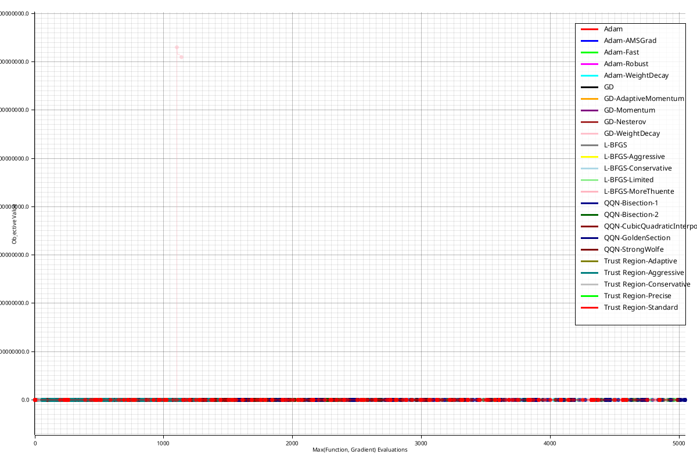
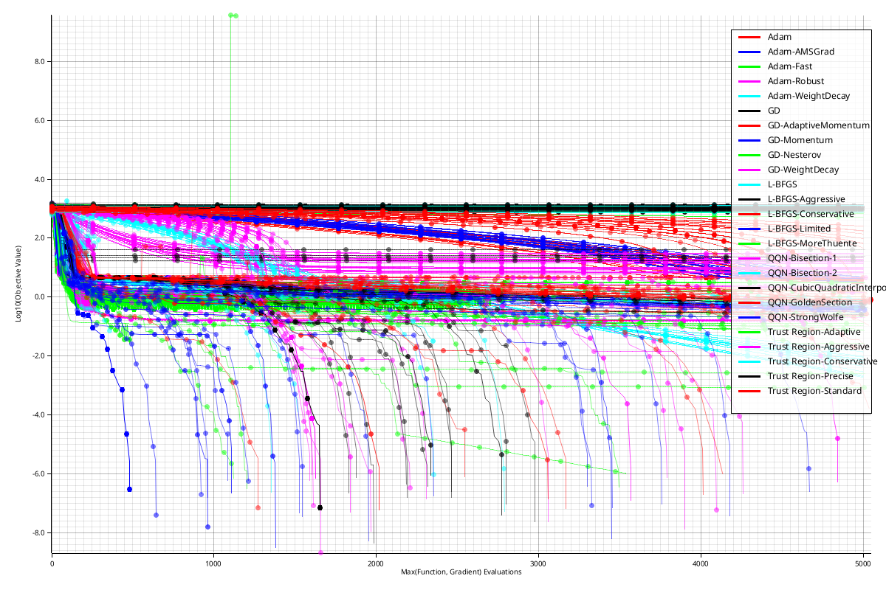

**Figure:** Convergence plots for IllConditionedRosenbrock_5D_alpha100 showing objective value vs iterations.
Left: Linear scale, Right: Log scale for better visualization of convergence behavior.

**Data:** [Linear scale data (CSV)](data/IllConditionedRosenbrock_5D_alpha100_data.csv) | [Log scale data (CSV)](data/IllConditionedRosenbrock_5D_alpha100_log_data.csv)

## Problem: IllConditionedRosenbrock_10D_alpha100

**Family:** IllConditionedRosenbrock
**Dimension:** 10
**Success Threshold:** 1.000e-6
**Total Runs:** 500
**Detailed Analysis:** [View comprehensive problem analysis](reports/problem_analysis_IllConditionedRosenbrock_10D_alpha100.md)

### Performance Summary
<table style="border-collapse: collapse; width: 100%; margin: 20px 0;">
<tr style="background-color: #f2f2f2;">
<th style="border: 1px solid #ddd; padding: 8px; text-align: center;">Rank</th>
<th style="border: 1px solid #ddd; padding: 8px; text-align: center;">Optimizer</th>
<th style="border: 1px solid #ddd; padding: 8px; text-align: center;">Mean Final Value (All/Success/Fail)</th>
<th style="border: 1px solid #ddd; padding: 8px; text-align: center;">Std Dev</th>
<th style="border: 1px solid #ddd; padding: 8px; text-align: center;">Best Value</th>
<th style="border: 1px solid #ddd; padding: 8px; text-align: center;">Worst Value</th>
<th style="border: 1px solid #ddd; padding: 8px; text-align: center;">Mean Function Evals (All/Success/Fail)</th>
<th style="border: 1px solid #ddd; padding: 8px; text-align: center;">Mean Gradient Evals (All/Success/Fail)</th>
<th style="border: 1px solid #ddd; padding: 8px; text-align: center;">Success Rate</th>
<th style="border: 1px solid #ddd; padding: 8px; text-align: center;">Mean Time (s)</th>
</tr>
<tr style="background-color: #d4edda; font-weight: bold;">
<td style="border: 1px solid #ddd; padding: 8px; text-align: center;">1</td>
<td style="border: 1px solid #ddd; padding: 8px; text-align: center;"><a href="reports/detailed_IllConditionedRosenbrock_10D_alpha100_QQN-CubicQuadraticInterpolation.md" title="Click for detailed analysis">QQN-CubicQuadraticInterpolation</a></td>
<td style="border: 1px solid #ddd; padding: 8px; text-align: center;">6.00e-1 / 4.76e-7 / 2.40e0</td>
<td style="border: 1px solid #ddd; padding: 8px; text-align: center;">1.52e0</td>
<td style="border: 1px solid #ddd; padding: 8px; text-align: center;">1.13e-7</td>
<td style="border: 1px solid #ddd; padding: 8px; text-align: center;">4.99e0</td>
<td style="border: 1px solid #ddd; padding: 8px; text-align: center;">1666.2 / 1502.5 / 2157.2</td>
<td style="border: 1px solid #ddd; padding: 8px; text-align: center;">2202.3 / 1983.8 / 2858.0</td>
<td style="border: 1px solid #ddd; padding: 8px; text-align: center;">75.0%</td>
<td style="border: 1px solid #ddd; padding: 8px; text-align: center;">0.073</td>
</tr>
<tr style="background-color: #fff3cd;">
<td style="border: 1px solid #ddd; padding: 8px; text-align: center;">2</td>
<td style="border: 1px solid #ddd; padding: 8px; text-align: center;"><a href="reports/detailed_IllConditionedRosenbrock_10D_alpha100_QQN-StrongWolfe.md" title="Click for detailed analysis">QQN-StrongWolfe</a></td>
<td style="border: 1px solid #ddd; padding: 8px; text-align: center;">5.85e-1 / 3.84e-7 / 1.95e0</td>
<td style="border: 1px solid #ddd; padding: 8px; text-align: center;">1.24e0</td>
<td style="border: 1px solid #ddd; padding: 8px; text-align: center;">9.35e-8</td>
<td style="border: 1px solid #ddd; padding: 8px; text-align: center;">4.79e0</td>
<td style="border: 1px solid #ddd; padding: 8px; text-align: center;">1847.0 / 1392.1 / 2908.3</td>
<td style="border: 1px solid #ddd; padding: 8px; text-align: center;">1421.8 / 1125.4 / 2113.3</td>
<td style="border: 1px solid #ddd; padding: 8px; text-align: center;">70.0%</td>
<td style="border: 1px solid #ddd; padding: 8px; text-align: center;">0.059</td>
</tr>
<tr style="">
<td style="border: 1px solid #ddd; padding: 8px; text-align: center;">3</td>
<td style="border: 1px solid #ddd; padding: 8px; text-align: center;"><a href="reports/detailed_IllConditionedRosenbrock_10D_alpha100_QQN-Bisection-1.md" title="Click for detailed analysis">QQN-Bisection-1</a></td>
<td style="border: 1px solid #ddd; padding: 8px; text-align: center;">1.22e0 / 4.08e-7 / 3.49e0</td>
<td style="border: 1px solid #ddd; padding: 8px; text-align: center;">2.80e0</td>
<td style="border: 1px solid #ddd; padding: 8px; text-align: center;">1.19e-7</td>
<td style="border: 1px solid #ddd; padding: 8px; text-align: center;">9.52e0</td>
<td style="border: 1px solid #ddd; padding: 8px; text-align: center;">1844.9 / 1555.1 / 2383.1</td>
<td style="border: 1px solid #ddd; padding: 8px; text-align: center;">2020.3 / 1680.4 / 2651.7</td>
<td style="border: 1px solid #ddd; padding: 8px; text-align: center;">65.0%</td>
<td style="border: 1px solid #ddd; padding: 8px; text-align: center;">0.052</td>
</tr>
<tr style="">
<td style="border: 1px solid #ddd; padding: 8px; text-align: center;">4</td>
<td style="border: 1px solid #ddd; padding: 8px; text-align: center;"><a href="reports/detailed_IllConditionedRosenbrock_10D_alpha100_QQN-Bisection-2.md" title="Click for detailed analysis">QQN-Bisection-2</a></td>
<td style="border: 1px solid #ddd; padding: 8px; text-align: center;">4.40e0 / 1.07e-7 / 4.63e0</td>
<td style="border: 1px solid #ddd; padding: 8px; text-align: center;">1.40e0</td>
<td style="border: 1px solid #ddd; padding: 8px; text-align: center;">1.07e-7</td>
<td style="border: 1px solid #ddd; padding: 8px; text-align: center;">5.50e0</td>
<td style="border: 1px solid #ddd; padding: 8px; text-align: center;">1646.8 / 1672.0 / 1645.5</td>
<td style="border: 1px solid #ddd; padding: 8px; text-align: center;">904.2 / 1063.0 / 895.9</td>
<td style="border: 1px solid #ddd; padding: 8px; text-align: center;">5.0%</td>
<td style="border: 1px solid #ddd; padding: 8px; text-align: center;">0.042</td>
</tr>
<tr style="">
<td style="border: 1px solid #ddd; padding: 8px; text-align: center;">5</td>
<td style="border: 1px solid #ddd; padding: 8px; text-align: center;"><a href="reports/detailed_IllConditionedRosenbrock_10D_alpha100_GD-AdaptiveMomentum.md" title="Click for detailed analysis">GD-AdaptiveMomentum</a></td>
<td style="border: 1px solid #ddd; padding: 8px; text-align: center;">6.19e1 / - / 1.02e2</td>
<td style="border: 1px solid #ddd; padding: 8px; text-align: center;">8.58e0</td>
<td style="border: 1px solid #ddd; padding: 8px; text-align: center;">4.55e1</td>
<td style="border: 1px solid #ddd; padding: 8px; text-align: center;">7.75e1</td>
<td style="border: 1px solid #ddd; padding: 8px; text-align: center;">23.1 / - / 23.1</td>
<td style="border: 1px solid #ddd; padding: 8px; text-align: center;">42.3 / - / 42.3</td>
<td style="border: 1px solid #ddd; padding: 8px; text-align: center;">0.0%</td>
<td style="border: 1px solid #ddd; padding: 8px; text-align: center;">0.001</td>
</tr>
<tr style="">
<td style="border: 1px solid #ddd; padding: 8px; text-align: center;">6</td>
<td style="border: 1px solid #ddd; padding: 8px; text-align: center;"><a href="reports/detailed_IllConditionedRosenbrock_10D_alpha100_GD.md" title="Click for detailed analysis">GD</a></td>
<td style="border: 1px solid #ddd; padding: 8px; text-align: center;">9.66e0 / - / 9.96e0</td>
<td style="border: 1px solid #ddd; padding: 8px; text-align: center;">5.91e-2</td>
<td style="border: 1px solid #ddd; padding: 8px; text-align: center;">9.59e0</td>
<td style="border: 1px solid #ddd; padding: 8px; text-align: center;">9.81e0</td>
<td style="border: 1px solid #ddd; padding: 8px; text-align: center;">46.6 / - / 46.6</td>
<td style="border: 1px solid #ddd; padding: 8px; text-align: center;">89.3 / - / 89.3</td>
<td style="border: 1px solid #ddd; padding: 8px; text-align: center;">0.0%</td>
<td style="border: 1px solid #ddd; padding: 8px; text-align: center;">0.001</td>
</tr>
<tr style="">
<td style="border: 1px solid #ddd; padding: 8px; text-align: center;">7</td>
<td style="border: 1px solid #ddd; padding: 8px; text-align: center;"><a href="reports/detailed_IllConditionedRosenbrock_10D_alpha100_Adam-Fast.md" title="Click for detailed analysis">Adam-Fast</a></td>
<td style="border: 1px solid #ddd; padding: 8px; text-align: center;">1.05e1 / - / 1.53e1</td>
<td style="border: 1px solid #ddd; padding: 8px; text-align: center;">1.00e1</td>
<td style="border: 1px solid #ddd; padding: 8px; text-align: center;">1.58e-1</td>
<td style="border: 1px solid #ddd; padding: 8px; text-align: center;">2.89e1</td>
<td style="border: 1px solid #ddd; padding: 8px; text-align: center;">149.2 / - / 149.2</td>
<td style="border: 1px solid #ddd; padding: 8px; text-align: center;">148.2 / - / 148.2</td>
<td style="border: 1px solid #ddd; padding: 8px; text-align: center;">0.0%</td>
<td style="border: 1px solid #ddd; padding: 8px; text-align: center;">0.003</td>
</tr>
<tr style="">
<td style="border: 1px solid #ddd; padding: 8px; text-align: center;">8</td>
<td style="border: 1px solid #ddd; padding: 8px; text-align: center;"><a href="reports/detailed_IllConditionedRosenbrock_10D_alpha100_L-BFGS.md" title="Click for detailed analysis">L-BFGS</a></td>
<td style="border: 1px solid #ddd; padding: 8px; text-align: center;">2.95e1 / - / 1.19e2</td>
<td style="border: 1px solid #ddd; padding: 8px; text-align: center;">1.98e1</td>
<td style="border: 1px solid #ddd; padding: 8px; text-align: center;">1.18e1</td>
<td style="border: 1px solid #ddd; padding: 8px; text-align: center;">1.02e2</td>
<td style="border: 1px solid #ddd; padding: 8px; text-align: center;">338.9 / - / 338.9</td>
<td style="border: 1px solid #ddd; padding: 8px; text-align: center;">103.2 / - / 103.2</td>
<td style="border: 1px solid #ddd; padding: 8px; text-align: center;">0.0%</td>
<td style="border: 1px solid #ddd; padding: 8px; text-align: center;">0.005</td>
</tr>
<tr style="">
<td style="border: 1px solid #ddd; padding: 8px; text-align: center;">9</td>
<td style="border: 1px solid #ddd; padding: 8px; text-align: center;"><a href="reports/detailed_IllConditionedRosenbrock_10D_alpha100_GD-Momentum.md" title="Click for detailed analysis">GD-Momentum</a></td>
<td style="border: 1px solid #ddd; padding: 8px; text-align: center;">2.51e1 / - / 3.04e1</td>
<td style="border: 1px solid #ddd; padding: 8px; text-align: center;">2.75e1</td>
<td style="border: 1px solid #ddd; padding: 8px; text-align: center;">4.82e-1</td>
<td style="border: 1px solid #ddd; padding: 8px; text-align: center;">7.10e1</td>
<td style="border: 1px solid #ddd; padding: 8px; text-align: center;">517.6 / - / 517.6</td>
<td style="border: 1px solid #ddd; padding: 8px; text-align: center;">1031.4 / - / 1031.4</td>
<td style="border: 1px solid #ddd; padding: 8px; text-align: center;">0.0%</td>
<td style="border: 1px solid #ddd; padding: 8px; text-align: center;">0.016</td>
</tr>
<tr style="">
<td style="border: 1px solid #ddd; padding: 8px; text-align: center;">10</td>
<td style="border: 1px solid #ddd; padding: 8px; text-align: center;"><a href="reports/detailed_IllConditionedRosenbrock_10D_alpha100_Trust_Region-Aggressive.md" title="Click for detailed analysis">Trust Region-Aggressive</a></td>
<td style="border: 1px solid #ddd; padding: 8px; text-align: center;">1.00e1 / - / 6.55e1</td>
<td style="border: 1px solid #ddd; padding: 8px; text-align: center;">3.85e-1</td>
<td style="border: 1px solid #ddd; padding: 8px; text-align: center;">9.59e0</td>
<td style="border: 1px solid #ddd; padding: 8px; text-align: center;">1.09e1</td>
<td style="border: 1px solid #ddd; padding: 8px; text-align: center;">1618.0 / - / 1618.0</td>
<td style="border: 1px solid #ddd; padding: 8px; text-align: center;">1079.3 / - / 1079.3</td>
<td style="border: 1px solid #ddd; padding: 8px; text-align: center;">0.0%</td>
<td style="border: 1px solid #ddd; padding: 8px; text-align: center;">0.011</td>
</tr>
<tr style="">
<td style="border: 1px solid #ddd; padding: 8px; text-align: center;">11</td>
<td style="border: 1px solid #ddd; padding: 8px; text-align: center;"><a href="reports/detailed_IllConditionedRosenbrock_10D_alpha100_GD-WeightDecay.md" title="Click for detailed analysis">GD-WeightDecay</a></td>
<td style="border: 1px solid #ddd; padding: 8px; text-align: center;">1.23e0 / - / 1.34e0</td>
<td style="border: 1px solid #ddd; padding: 8px; text-align: center;">1.66e0</td>
<td style="border: 1px solid #ddd; padding: 8px; text-align: center;">1.69e-1</td>
<td style="border: 1px solid #ddd; padding: 8px; text-align: center;">5.06e0</td>
<td style="border: 1px solid #ddd; padding: 8px; text-align: center;">1217.3 / - / 1217.3</td>
<td style="border: 1px solid #ddd; padding: 8px; text-align: center;">2431.8 / - / 2431.8</td>
<td style="border: 1px solid #ddd; padding: 8px; text-align: center;">0.0%</td>
<td style="border: 1px solid #ddd; padding: 8px; text-align: center;">0.042</td>
</tr>
<tr style="">
<td style="border: 1px solid #ddd; padding: 8px; text-align: center;">12</td>
<td style="border: 1px solid #ddd; padding: 8px; text-align: center;"><a href="reports/detailed_IllConditionedRosenbrock_10D_alpha100_Adam-WeightDecay.md" title="Click for detailed analysis">Adam-WeightDecay</a></td>
<td style="border: 1px solid #ddd; padding: 8px; text-align: center;">2.38e0 / - / 2.38e0</td>
<td style="border: 1px solid #ddd; padding: 8px; text-align: center;">4.12e0</td>
<td style="border: 1px solid #ddd; padding: 8px; text-align: center;">6.46e-6</td>
<td style="border: 1px solid #ddd; padding: 8px; text-align: center;">9.58e0</td>
<td style="border: 1px solid #ddd; padding: 8px; text-align: center;">2074.9 / - / 2074.9</td>
<td style="border: 1px solid #ddd; padding: 8px; text-align: center;">2074.7 / - / 2074.7</td>
<td style="border: 1px solid #ddd; padding: 8px; text-align: center;">0.0%</td>
<td style="border: 1px solid #ddd; padding: 8px; text-align: center;">0.048</td>
</tr>
<tr style="">
<td style="border: 1px solid #ddd; padding: 8px; text-align: center;">13</td>
<td style="border: 1px solid #ddd; padding: 8px; text-align: center;"><a href="reports/detailed_IllConditionedRosenbrock_10D_alpha100_L-BFGS-Conservative.md" title="Click for detailed analysis">L-BFGS-Conservative</a></td>
<td style="border: 1px solid #ddd; padding: 8px; text-align: center;">5.59e0 / - / 1.90e4</td>
<td style="border: 1px solid #ddd; padding: 8px; text-align: center;">2.63e0</td>
<td style="border: 1px solid #ddd; padding: 8px; text-align: center;">1.03e0</td>
<td style="border: 1px solid #ddd; padding: 8px; text-align: center;">9.60e0</td>
<td style="border: 1px solid #ddd; padding: 8px; text-align: center;">3278.5 / - / 3278.5</td>
<td style="border: 1px solid #ddd; padding: 8px; text-align: center;">971.0 / - / 971.0</td>
<td style="border: 1px solid #ddd; padding: 8px; text-align: center;">0.0%</td>
<td style="border: 1px solid #ddd; padding: 8px; text-align: center;">0.038</td>
</tr>
<tr style="">
<td style="border: 1px solid #ddd; padding: 8px; text-align: center;">14</td>
<td style="border: 1px solid #ddd; padding: 8px; text-align: center;"><a href="reports/detailed_IllConditionedRosenbrock_10D_alpha100_GD-Nesterov.md" title="Click for detailed analysis">GD-Nesterov</a></td>
<td style="border: 1px solid #ddd; padding: 8px; text-align: center;">1.17e0 / - / 1.17e0</td>
<td style="border: 1px solid #ddd; padding: 8px; text-align: center;">1.66e-2</td>
<td style="border: 1px solid #ddd; padding: 8px; text-align: center;">1.12e0</td>
<td style="border: 1px solid #ddd; padding: 8px; text-align: center;">1.19e0</td>
<td style="border: 1px solid #ddd; padding: 8px; text-align: center;">1514.9 / - / 1514.9</td>
<td style="border: 1px solid #ddd; padding: 8px; text-align: center;">3025.8 / - / 3025.8</td>
<td style="border: 1px solid #ddd; padding: 8px; text-align: center;">0.0%</td>
<td style="border: 1px solid #ddd; padding: 8px; text-align: center;">0.051</td>
</tr>
<tr style="">
<td style="border: 1px solid #ddd; padding: 8px; text-align: center;">15</td>
<td style="border: 1px solid #ddd; padding: 8px; text-align: center;"><a href="reports/detailed_IllConditionedRosenbrock_10D_alpha100_Adam.md" title="Click for detailed analysis">Adam</a></td>
<td style="border: 1px solid #ddd; padding: 8px; text-align: center;">9.11e0 / - / 9.11e0</td>
<td style="border: 1px solid #ddd; padding: 8px; text-align: center;">4.86e-1</td>
<td style="border: 1px solid #ddd; padding: 8px; text-align: center;">7.98e0</td>
<td style="border: 1px solid #ddd; padding: 8px; text-align: center;">9.93e0</td>
<td style="border: 1px solid #ddd; padding: 8px; text-align: center;">2475.8 / - / 2475.8</td>
<td style="border: 1px solid #ddd; padding: 8px; text-align: center;">2475.6 / - / 2475.6</td>
<td style="border: 1px solid #ddd; padding: 8px; text-align: center;">0.0%</td>
<td style="border: 1px solid #ddd; padding: 8px; text-align: center;">0.054</td>
</tr>
<tr style="">
<td style="border: 1px solid #ddd; padding: 8px; text-align: center;">16</td>
<td style="border: 1px solid #ddd; padding: 8px; text-align: center;"><a href="reports/detailed_IllConditionedRosenbrock_10D_alpha100_Adam-AMSGrad.md" title="Click for detailed analysis">Adam-AMSGrad</a></td>
<td style="border: 1px solid #ddd; padding: 8px; text-align: center;">9.31e0 / - / 9.31e0</td>
<td style="border: 1px solid #ddd; padding: 8px; text-align: center;">3.61e-1</td>
<td style="border: 1px solid #ddd; padding: 8px; text-align: center;">8.08e0</td>
<td style="border: 1px solid #ddd; padding: 8px; text-align: center;">9.69e0</td>
<td style="border: 1px solid #ddd; padding: 8px; text-align: center;">2490.9 / - / 2490.9</td>
<td style="border: 1px solid #ddd; padding: 8px; text-align: center;">2490.8 / - / 2490.8</td>
<td style="border: 1px solid #ddd; padding: 8px; text-align: center;">0.0%</td>
<td style="border: 1px solid #ddd; padding: 8px; text-align: center;">0.061</td>
</tr>
<tr style="">
<td style="border: 1px solid #ddd; padding: 8px; text-align: center;">17</td>
<td style="border: 1px solid #ddd; padding: 8px; text-align: center;"><a href="reports/detailed_IllConditionedRosenbrock_10D_alpha100_Trust_Region-Precise.md" title="Click for detailed analysis">Trust Region-Precise</a></td>
<td style="border: 1px solid #ddd; padding: 8px; text-align: center;">2.10e3 / - / 2.10e3</td>
<td style="border: 1px solid #ddd; padding: 8px; text-align: center;">1.92e2</td>
<td style="border: 1px solid #ddd; padding: 8px; text-align: center;">1.66e3</td>
<td style="border: 1px solid #ddd; padding: 8px; text-align: center;">2.46e3</td>
<td style="border: 1px solid #ddd; padding: 8px; text-align: center;">3002.0 / - / 3002.0</td>
<td style="border: 1px solid #ddd; padding: 8px; text-align: center;">2002.0 / - / 2002.0</td>
<td style="border: 1px solid #ddd; padding: 8px; text-align: center;">0.0%</td>
<td style="border: 1px solid #ddd; padding: 8px; text-align: center;">0.021</td>
</tr>
<tr style="">
<td style="border: 1px solid #ddd; padding: 8px; text-align: center;">18</td>
<td style="border: 1px solid #ddd; padding: 8px; text-align: center;"><a href="reports/detailed_IllConditionedRosenbrock_10D_alpha100_Trust_Region-Standard.md" title="Click for detailed analysis">Trust Region-Standard</a></td>
<td style="border: 1px solid #ddd; padding: 8px; text-align: center;">1.06e3 / - / 1.06e3</td>
<td style="border: 1px solid #ddd; padding: 8px; text-align: center;">2.06e2</td>
<td style="border: 1px solid #ddd; padding: 8px; text-align: center;">6.70e2</td>
<td style="border: 1px solid #ddd; padding: 8px; text-align: center;">1.41e3</td>
<td style="border: 1px solid #ddd; padding: 8px; text-align: center;">3002.0 / - / 3002.0</td>
<td style="border: 1px solid #ddd; padding: 8px; text-align: center;">2002.0 / - / 2002.0</td>
<td style="border: 1px solid #ddd; padding: 8px; text-align: center;">0.0%</td>
<td style="border: 1px solid #ddd; padding: 8px; text-align: center;">0.021</td>
</tr>
<tr style="">
<td style="border: 1px solid #ddd; padding: 8px; text-align: center;">19</td>
<td style="border: 1px solid #ddd; padding: 8px; text-align: center;"><a href="reports/detailed_IllConditionedRosenbrock_10D_alpha100_Adam-Robust.md" title="Click for detailed analysis">Adam-Robust</a></td>
<td style="border: 1px solid #ddd; padding: 8px; text-align: center;">3.49e1 / - / 3.49e1</td>
<td style="border: 1px solid #ddd; padding: 8px; text-align: center;">9.88e0</td>
<td style="border: 1px solid #ddd; padding: 8px; text-align: center;">1.61e1</td>
<td style="border: 1px solid #ddd; padding: 8px; text-align: center;">5.15e1</td>
<td style="border: 1px solid #ddd; padding: 8px; text-align: center;">2502.0 / - / 2502.0</td>
<td style="border: 1px solid #ddd; padding: 8px; text-align: center;">2502.0 / - / 2502.0</td>
<td style="border: 1px solid #ddd; padding: 8px; text-align: center;">0.0%</td>
<td style="border: 1px solid #ddd; padding: 8px; text-align: center;">0.061</td>
</tr>
<tr style="">
<td style="border: 1px solid #ddd; padding: 8px; text-align: center;">20</td>
<td style="border: 1px solid #ddd; padding: 8px; text-align: center;"><a href="reports/detailed_IllConditionedRosenbrock_10D_alpha100_Trust_Region-Adaptive.md" title="Click for detailed analysis">Trust Region-Adaptive</a></td>
<td style="border: 1px solid #ddd; padding: 8px; text-align: center;">2.02e3 / - / 2.02e3</td>
<td style="border: 1px solid #ddd; padding: 8px; text-align: center;">2.22e2</td>
<td style="border: 1px solid #ddd; padding: 8px; text-align: center;">1.64e3</td>
<td style="border: 1px solid #ddd; padding: 8px; text-align: center;">2.59e3</td>
<td style="border: 1px solid #ddd; padding: 8px; text-align: center;">3002.0 / - / 3002.0</td>
<td style="border: 1px solid #ddd; padding: 8px; text-align: center;">2002.0 / - / 2002.0</td>
<td style="border: 1px solid #ddd; padding: 8px; text-align: center;">0.0%</td>
<td style="border: 1px solid #ddd; padding: 8px; text-align: center;">0.020</td>
</tr>
<tr style="">
<td style="border: 1px solid #ddd; padding: 8px; text-align: center;">21</td>
<td style="border: 1px solid #ddd; padding: 8px; text-align: center;"><a href="reports/detailed_IllConditionedRosenbrock_10D_alpha100_Trust_Region-Conservative.md" title="Click for detailed analysis">Trust Region-Conservative</a></td>
<td style="border: 1px solid #ddd; padding: 8px; text-align: center;">2.16e3 / - / 2.16e3</td>
<td style="border: 1px solid #ddd; padding: 8px; text-align: center;">2.33e2</td>
<td style="border: 1px solid #ddd; padding: 8px; text-align: center;">1.76e3</td>
<td style="border: 1px solid #ddd; padding: 8px; text-align: center;">2.55e3</td>
<td style="border: 1px solid #ddd; padding: 8px; text-align: center;">3002.0 / - / 3002.0</td>
<td style="border: 1px solid #ddd; padding: 8px; text-align: center;">2002.0 / - / 2002.0</td>
<td style="border: 1px solid #ddd; padding: 8px; text-align: center;">0.0%</td>
<td style="border: 1px solid #ddd; padding: 8px; text-align: center;">0.020</td>
</tr>
<tr style="">
<td style="border: 1px solid #ddd; padding: 8px; text-align: center;">22</td>
<td style="border: 1px solid #ddd; padding: 8px; text-align: center;"><a href="reports/detailed_IllConditionedRosenbrock_10D_alpha100_L-BFGS-Limited.md" title="Click for detailed analysis">L-BFGS-Limited</a></td>
<td style="border: 1px solid #ddd; padding: 8px; text-align: center;">3.86e0 / - / 3.86e0</td>
<td style="border: 1px solid #ddd; padding: 8px; text-align: center;">5.50e-1</td>
<td style="border: 1px solid #ddd; padding: 8px; text-align: center;">2.71e0</td>
<td style="border: 1px solid #ddd; padding: 8px; text-align: center;">5.45e0</td>
<td style="border: 1px solid #ddd; padding: 8px; text-align: center;">4036.8 / - / 4036.8</td>
<td style="border: 1px solid #ddd; padding: 8px; text-align: center;">972.0 / - / 972.0</td>
<td style="border: 1px solid #ddd; padding: 8px; text-align: center;">0.0%</td>
<td style="border: 1px solid #ddd; padding: 8px; text-align: center;">0.048</td>
</tr>
<tr style="">
<td style="border: 1px solid #ddd; padding: 8px; text-align: center;">23</td>
<td style="border: 1px solid #ddd; padding: 8px; text-align: center;"><a href="reports/detailed_IllConditionedRosenbrock_10D_alpha100_L-BFGS-Aggressive.md" title="Click for detailed analysis">L-BFGS-Aggressive</a></td>
<td style="border: 1px solid #ddd; padding: 8px; text-align: center;">1.64e2 / - / 1.64e2</td>
<td style="border: 1px solid #ddd; padding: 8px; text-align: center;">3.20e2</td>
<td style="border: 1px solid #ddd; padding: 8px; text-align: center;">5.82e1</td>
<td style="border: 1px solid #ddd; padding: 8px; text-align: center;">1.56e3</td>
<td style="border: 1px solid #ddd; padding: 8px; text-align: center;">3850.3 / - / 3850.3</td>
<td style="border: 1px solid #ddd; padding: 8px; text-align: center;">1158.7 / - / 1158.7</td>
<td style="border: 1px solid #ddd; padding: 8px; text-align: center;">0.0%</td>
<td style="border: 1px solid #ddd; padding: 8px; text-align: center;">0.051</td>
</tr>
<tr style="">
<td style="border: 1px solid #ddd; padding: 8px; text-align: center;">24</td>
<td style="border: 1px solid #ddd; padding: 8px; text-align: center;"><a href="reports/detailed_IllConditionedRosenbrock_10D_alpha100_L-BFGS-MoreThuente.md" title="Click for detailed analysis">L-BFGS-MoreThuente</a></td>
<td style="border: 1px solid #ddd; padding: 8px; text-align: center;">3.41e0 / - / 3.41e0</td>
<td style="border: 1px solid #ddd; padding: 8px; text-align: center;">3.98e0</td>
<td style="border: 1px solid #ddd; padding: 8px; text-align: center;">3.35e-5</td>
<td style="border: 1px solid #ddd; padding: 8px; text-align: center;">1.75e1</td>
<td style="border: 1px solid #ddd; padding: 8px; text-align: center;">2853.3 / - / 2853.3</td>
<td style="border: 1px solid #ddd; padding: 8px; text-align: center;">2155.7 / - / 2155.7</td>
<td style="border: 1px solid #ddd; padding: 8px; text-align: center;">0.0%</td>
<td style="border: 1px solid #ddd; padding: 8px; text-align: center;">0.053</td>
</tr>
<tr style="">
<td style="border: 1px solid #ddd; padding: 8px; text-align: center;">25</td>
<td style="border: 1px solid #ddd; padding: 8px; text-align: center;"><a href="reports/detailed_IllConditionedRosenbrock_10D_alpha100_QQN-GoldenSection.md" title="Click for detailed analysis">QQN-GoldenSection</a></td>
<td style="border: 1px solid #ddd; padding: 8px; text-align: center;">4.56e0 / - / 4.56e0</td>
<td style="border: 1px solid #ddd; padding: 8px; text-align: center;">1.82e0</td>
<td style="border: 1px solid #ddd; padding: 8px; text-align: center;">4.63e-1</td>
<td style="border: 1px solid #ddd; padding: 8px; text-align: center;">6.66e0</td>
<td style="border: 1px solid #ddd; padding: 8px; text-align: center;">4477.5 / - / 4477.5</td>
<td style="border: 1px solid #ddd; padding: 8px; text-align: center;">551.8 / - / 551.8</td>
<td style="border: 1px solid #ddd; padding: 8px; text-align: center;">0.0%</td>
<td style="border: 1px solid #ddd; padding: 8px; text-align: center;">0.086</td>
</tr>
</table>

### Convergence Plots

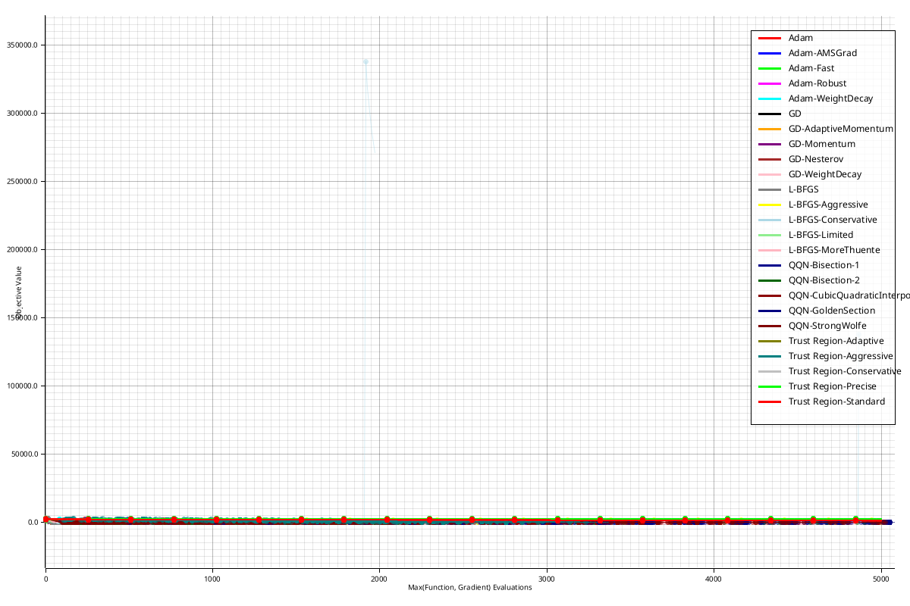
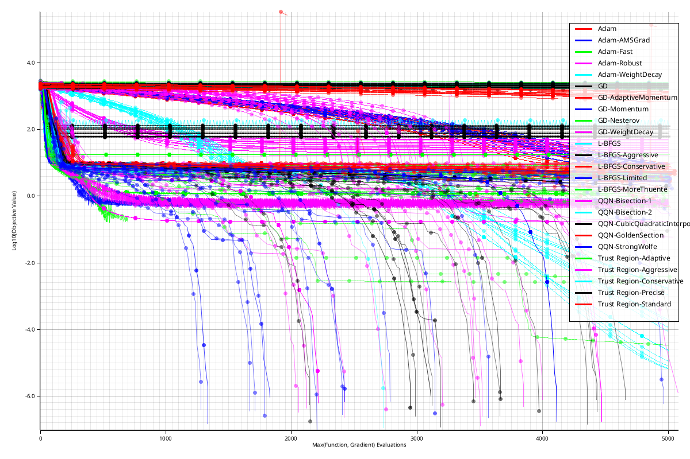

**Figure:** Convergence plots for IllConditionedRosenbrock_10D_alpha100 showing objective value vs iterations.
Left: Linear scale, Right: Log scale for better visualization of convergence behavior.

**Data:** [Linear scale data (CSV)](data/IllConditionedRosenbrock_10D_alpha100_data.csv) | [Log scale data (CSV)](data/IllConditionedRosenbrock_10D_alpha100_log_data.csv)

## Problem: Trigonometric_2D

**Family:** Trigonometric
**Dimension:** 2
**Success Threshold:** 1.000e-6
**Total Runs:** 500
**Detailed Analysis:** [View comprehensive problem analysis](reports/problem_analysis_Trigonometric_2D.md)

### Performance Summary
<table style="border-collapse: collapse; width: 100%; margin: 20px 0;">
<tr style="background-color: #f2f2f2;">
<th style="border: 1px solid #ddd; padding: 8px; text-align: center;">Rank</th>
<th style="border: 1px solid #ddd; padding: 8px; text-align: center;">Optimizer</th>
<th style="border: 1px solid #ddd; padding: 8px; text-align: center;">Mean Final Value (All/Success/Fail)</th>
<th style="border: 1px solid #ddd; padding: 8px; text-align: center;">Std Dev</th>
<th style="border: 1px solid #ddd; padding: 8px; text-align: center;">Best Value</th>
<th style="border: 1px solid #ddd; padding: 8px; text-align: center;">Worst Value</th>
<th style="border: 1px solid #ddd; padding: 8px; text-align: center;">Mean Function Evals (All/Success/Fail)</th>
<th style="border: 1px solid #ddd; padding: 8px; text-align: center;">Mean Gradient Evals (All/Success/Fail)</th>
<th style="border: 1px solid #ddd; padding: 8px; text-align: center;">Success Rate</th>
<th style="border: 1px solid #ddd; padding: 8px; text-align: center;">Mean Time (s)</th>
</tr>
<tr style="background-color: #d4edda; font-weight: bold;">
<td style="border: 1px solid #ddd; padding: 8px; text-align: center;">1</td>
<td style="border: 1px solid #ddd; padding: 8px; text-align: center;"><a href="reports/detailed_Trigonometric_2D_L-BFGS-MoreThuente.md" title="Click for detailed analysis">L-BFGS-MoreThuente</a></td>
<td style="border: 1px solid #ddd; padding: 8px; text-align: center;">4.44e-7 / 4.44e-7 / -</td>
<td style="border: 1px solid #ddd; padding: 8px; text-align: center;">3.28e-7</td>
<td style="border: 1px solid #ddd; padding: 8px; text-align: center;">1.25e-8</td>
<td style="border: 1px solid #ddd; padding: 8px; text-align: center;">9.94e-7</td>
<td style="border: 1px solid #ddd; padding: 8px; text-align: center;">85.4 / 85.4 / -</td>
<td style="border: 1px solid #ddd; padding: 8px; text-align: center;">61.9 / 61.9 / -</td>
<td style="border: 1px solid #ddd; padding: 8px; text-align: center;">100.0%</td>
<td style="border: 1px solid #ddd; padding: 8px; text-align: center;">0.001</td>
</tr>
<tr style="background-color: #fff3cd;">
<td style="border: 1px solid #ddd; padding: 8px; text-align: center;">2</td>
<td style="border: 1px solid #ddd; padding: 8px; text-align: center;"><a href="reports/detailed_Trigonometric_2D_QQN-CubicQuadraticInterpolation.md" title="Click for detailed analysis">QQN-CubicQuadraticInterpolation</a></td>
<td style="border: 1px solid #ddd; padding: 8px; text-align: center;">3.11e-7 / 3.11e-7 / -</td>
<td style="border: 1px solid #ddd; padding: 8px; text-align: center;">3.76e-7</td>
<td style="border: 1px solid #ddd; padding: 8px; text-align: center;">6.47e-10</td>
<td style="border: 1px solid #ddd; padding: 8px; text-align: center;">9.84e-7</td>
<td style="border: 1px solid #ddd; padding: 8px; text-align: center;">95.8 / 95.8 / -</td>
<td style="border: 1px solid #ddd; padding: 8px; text-align: center;">115.2 / 115.2 / -</td>
<td style="border: 1px solid #ddd; padding: 8px; text-align: center;">100.0%</td>
<td style="border: 1px solid #ddd; padding: 8px; text-align: center;">0.003</td>
</tr>
<tr style="">
<td style="border: 1px solid #ddd; padding: 8px; text-align: center;">3</td>
<td style="border: 1px solid #ddd; padding: 8px; text-align: center;"><a href="reports/detailed_Trigonometric_2D_QQN-StrongWolfe.md" title="Click for detailed analysis">QQN-StrongWolfe</a></td>
<td style="border: 1px solid #ddd; padding: 8px; text-align: center;">4.90e-7 / 4.90e-7 / -</td>
<td style="border: 1px solid #ddd; padding: 8px; text-align: center;">2.12e-7</td>
<td style="border: 1px solid #ddd; padding: 8px; text-align: center;">2.93e-9</td>
<td style="border: 1px solid #ddd; padding: 8px; text-align: center;">9.96e-7</td>
<td style="border: 1px solid #ddd; padding: 8px; text-align: center;">107.8 / 107.8 / -</td>
<td style="border: 1px solid #ddd; padding: 8px; text-align: center;">113.5 / 113.5 / -</td>
<td style="border: 1px solid #ddd; padding: 8px; text-align: center;">100.0%</td>
<td style="border: 1px solid #ddd; padding: 8px; text-align: center;">0.003</td>
</tr>
<tr style="">
<td style="border: 1px solid #ddd; padding: 8px; text-align: center;">4</td>
<td style="border: 1px solid #ddd; padding: 8px; text-align: center;"><a href="reports/detailed_Trigonometric_2D_L-BFGS-Conservative.md" title="Click for detailed analysis">L-BFGS-Conservative</a></td>
<td style="border: 1px solid #ddd; padding: 8px; text-align: center;">5.22e-7 / 5.22e-7 / -</td>
<td style="border: 1px solid #ddd; padding: 8px; text-align: center;">2.95e-7</td>
<td style="border: 1px solid #ddd; padding: 8px; text-align: center;">3.92e-8</td>
<td style="border: 1px solid #ddd; padding: 8px; text-align: center;">9.76e-7</td>
<td style="border: 1px solid #ddd; padding: 8px; text-align: center;">129.4 / 129.4 / -</td>
<td style="border: 1px solid #ddd; padding: 8px; text-align: center;">98.5 / 98.5 / -</td>
<td style="border: 1px solid #ddd; padding: 8px; text-align: center;">100.0%</td>
<td style="border: 1px solid #ddd; padding: 8px; text-align: center;">0.003</td>
</tr>
<tr style="">
<td style="border: 1px solid #ddd; padding: 8px; text-align: center;">5</td>
<td style="border: 1px solid #ddd; padding: 8px; text-align: center;"><a href="reports/detailed_Trigonometric_2D_QQN-Bisection-2.md" title="Click for detailed analysis">QQN-Bisection-2</a></td>
<td style="border: 1px solid #ddd; padding: 8px; text-align: center;">2.06e-7 / 2.06e-7 / -</td>
<td style="border: 1px solid #ddd; padding: 8px; text-align: center;">2.73e-7</td>
<td style="border: 1px solid #ddd; padding: 8px; text-align: center;">7.96e-10</td>
<td style="border: 1px solid #ddd; padding: 8px; text-align: center;">8.24e-7</td>
<td style="border: 1px solid #ddd; padding: 8px; text-align: center;">207.1 / 207.1 / -</td>
<td style="border: 1px solid #ddd; padding: 8px; text-align: center;">155.3 / 155.3 / -</td>
<td style="border: 1px solid #ddd; padding: 8px; text-align: center;">100.0%</td>
<td style="border: 1px solid #ddd; padding: 8px; text-align: center;">0.005</td>
</tr>
<tr style="">
<td style="border: 1px solid #ddd; padding: 8px; text-align: center;">6</td>
<td style="border: 1px solid #ddd; padding: 8px; text-align: center;"><a href="reports/detailed_Trigonometric_2D_QQN-Bisection-1.md" title="Click for detailed analysis">QQN-Bisection-1</a></td>
<td style="border: 1px solid #ddd; padding: 8px; text-align: center;">2.08e-7 / 2.08e-7 / -</td>
<td style="border: 1px solid #ddd; padding: 8px; text-align: center;">2.21e-7</td>
<td style="border: 1px solid #ddd; padding: 8px; text-align: center;">1.49e-9</td>
<td style="border: 1px solid #ddd; padding: 8px; text-align: center;">7.99e-7</td>
<td style="border: 1px solid #ddd; padding: 8px; text-align: center;">220.8 / 220.8 / -</td>
<td style="border: 1px solid #ddd; padding: 8px; text-align: center;">239.0 / 239.0 / -</td>
<td style="border: 1px solid #ddd; padding: 8px; text-align: center;">100.0%</td>
<td style="border: 1px solid #ddd; padding: 8px; text-align: center;">0.004</td>
</tr>
<tr style="">
<td style="border: 1px solid #ddd; padding: 8px; text-align: center;">7</td>
<td style="border: 1px solid #ddd; padding: 8px; text-align: center;"><a href="reports/detailed_Trigonometric_2D_GD.md" title="Click for detailed analysis">GD</a></td>
<td style="border: 1px solid #ddd; padding: 8px; text-align: center;">9.80e-7 / 9.80e-7 / -</td>
<td style="border: 1px solid #ddd; padding: 8px; text-align: center;">1.07e-8</td>
<td style="border: 1px solid #ddd; padding: 8px; text-align: center;">9.61e-7</td>
<td style="border: 1px solid #ddd; padding: 8px; text-align: center;">9.99e-7</td>
<td style="border: 1px solid #ddd; padding: 8px; text-align: center;">361.1 / 361.1 / -</td>
<td style="border: 1px solid #ddd; padding: 8px; text-align: center;">719.2 / 719.2 / -</td>
<td style="border: 1px solid #ddd; padding: 8px; text-align: center;">100.0%</td>
<td style="border: 1px solid #ddd; padding: 8px; text-align: center;">0.009</td>
</tr>
<tr style="">
<td style="border: 1px solid #ddd; padding: 8px; text-align: center;">8</td>
<td style="border: 1px solid #ddd; padding: 8px; text-align: center;"><a href="reports/detailed_Trigonometric_2D_Adam.md" title="Click for detailed analysis">Adam</a></td>
<td style="border: 1px solid #ddd; padding: 8px; text-align: center;">9.77e-7 / 9.77e-7 / -</td>
<td style="border: 1px solid #ddd; padding: 8px; text-align: center;">1.59e-8</td>
<td style="border: 1px solid #ddd; padding: 8px; text-align: center;">9.40e-7</td>
<td style="border: 1px solid #ddd; padding: 8px; text-align: center;">9.98e-7</td>
<td style="border: 1px solid #ddd; padding: 8px; text-align: center;">1269.5 / 1269.5 / -</td>
<td style="border: 1px solid #ddd; padding: 8px; text-align: center;">1269.5 / 1269.5 / -</td>
<td style="border: 1px solid #ddd; padding: 8px; text-align: center;">100.0%</td>
<td style="border: 1px solid #ddd; padding: 8px; text-align: center;">0.025</td>
</tr>
<tr style="">
<td style="border: 1px solid #ddd; padding: 8px; text-align: center;">9</td>
<td style="border: 1px solid #ddd; padding: 8px; text-align: center;"><a href="reports/detailed_Trigonometric_2D_QQN-GoldenSection.md" title="Click for detailed analysis">QQN-GoldenSection</a></td>
<td style="border: 1px solid #ddd; padding: 8px; text-align: center;">1.28e-3 / 2.04e-7 / 2.55e-2</td>
<td style="border: 1px solid #ddd; padding: 8px; text-align: center;">5.56e-3</td>
<td style="border: 1px solid #ddd; padding: 8px; text-align: center;">6.12e-10</td>
<td style="border: 1px solid #ddd; padding: 8px; text-align: center;">2.55e-2</td>
<td style="border: 1px solid #ddd; padding: 8px; text-align: center;">462.6 / 256.4 / 4379.0</td>
<td style="border: 1px solid #ddd; padding: 8px; text-align: center;">68.0 / 36.4 / 667.0</td>
<td style="border: 1px solid #ddd; padding: 8px; text-align: center;">95.0%</td>
<td style="border: 1px solid #ddd; padding: 8px; text-align: center;">0.008</td>
</tr>
<tr style="">
<td style="border: 1px solid #ddd; padding: 8px; text-align: center;">10</td>
<td style="border: 1px solid #ddd; padding: 8px; text-align: center;"><a href="reports/detailed_Trigonometric_2D_L-BFGS.md" title="Click for detailed analysis">L-BFGS</a></td>
<td style="border: 1px solid #ddd; padding: 8px; text-align: center;">7.24e-5 / 3.40e-7 / 4.06e-2</td>
<td style="border: 1px solid #ddd; padding: 8px; text-align: center;">3.13e-4</td>
<td style="border: 1px solid #ddd; padding: 8px; text-align: center;">8.58e-10</td>
<td style="border: 1px solid #ddd; padding: 8px; text-align: center;">1.44e-3</td>
<td style="border: 1px solid #ddd; padding: 8px; text-align: center;">93.3 / 89.4 / 129.0</td>
<td style="border: 1px solid #ddd; padding: 8px; text-align: center;">55.6 / 53.9 / 71.0</td>
<td style="border: 1px solid #ddd; padding: 8px; text-align: center;">90.0%</td>
<td style="border: 1px solid #ddd; padding: 8px; text-align: center;">0.002</td>
</tr>
<tr style="">
<td style="border: 1px solid #ddd; padding: 8px; text-align: center;">11</td>
<td style="border: 1px solid #ddd; padding: 8px; text-align: center;"><a href="reports/detailed_Trigonometric_2D_L-BFGS-Limited.md" title="Click for detailed analysis">L-BFGS-Limited</a></td>
<td style="border: 1px solid #ddd; padding: 8px; text-align: center;">7.02e-6 / 5.20e-7 / 6.55e-5</td>
<td style="border: 1px solid #ddd; padding: 8px; text-align: center;">2.23e-5</td>
<td style="border: 1px solid #ddd; padding: 8px; text-align: center;">2.15e-8</td>
<td style="border: 1px solid #ddd; padding: 8px; text-align: center;">1.00e-4</td>
<td style="border: 1px solid #ddd; padding: 8px; text-align: center;">433.9 / 88.2 / 3545.0</td>
<td style="border: 1px solid #ddd; padding: 8px; text-align: center;">187.6 / 45.7 / 1464.5</td>
<td style="border: 1px solid #ddd; padding: 8px; text-align: center;">90.0%</td>
<td style="border: 1px solid #ddd; padding: 8px; text-align: center;">0.008</td>
</tr>
<tr style="">
<td style="border: 1px solid #ddd; padding: 8px; text-align: center;">12</td>
<td style="border: 1px solid #ddd; padding: 8px; text-align: center;"><a href="reports/detailed_Trigonometric_2D_GD-WeightDecay.md" title="Click for detailed analysis">GD-WeightDecay</a></td>
<td style="border: 1px solid #ddd; padding: 8px; text-align: center;">7.79e-5 / 9.42e-7 / 1.40e-3</td>
<td style="border: 1px solid #ddd; padding: 8px; text-align: center;">3.18e-4</td>
<td style="border: 1px solid #ddd; padding: 8px; text-align: center;">8.75e-7</td>
<td style="border: 1px solid #ddd; padding: 8px; text-align: center;">1.46e-3</td>
<td style="border: 1px solid #ddd; padding: 8px; text-align: center;">102.4 / 115.9 / 25.7</td>
<td style="border: 1px solid #ddd; padding: 8px; text-align: center;">201.7 / 228.9 / 47.3</td>
<td style="border: 1px solid #ddd; padding: 8px; text-align: center;">85.0%</td>
<td style="border: 1px solid #ddd; padding: 8px; text-align: center;">0.003</td>
</tr>
<tr style="">
<td style="border: 1px solid #ddd; padding: 8px; text-align: center;">13</td>
<td style="border: 1px solid #ddd; padding: 8px; text-align: center;"><a href="reports/detailed_Trigonometric_2D_Adam-AMSGrad.md" title="Click for detailed analysis">Adam-AMSGrad</a></td>
<td style="border: 1px solid #ddd; padding: 8px; text-align: center;">1.08e-6 / 9.73e-7 / 1.66e-6</td>
<td style="border: 1px solid #ddd; padding: 8px; text-align: center;">3.54e-7</td>
<td style="border: 1px solid #ddd; padding: 8px; text-align: center;">9.47e-7</td>
<td style="border: 1px solid #ddd; padding: 8px; text-align: center;">2.57e-6</td>
<td style="border: 1px solid #ddd; padding: 8px; text-align: center;">1241.2 / 1018.6 / 2502.0</td>
<td style="border: 1px solid #ddd; padding: 8px; text-align: center;">1241.2 / 1018.6 / 2502.0</td>
<td style="border: 1px solid #ddd; padding: 8px; text-align: center;">85.0%</td>
<td style="border: 1px solid #ddd; padding: 8px; text-align: center;">0.028</td>
</tr>
<tr style="">
<td style="border: 1px solid #ddd; padding: 8px; text-align: center;">14</td>
<td style="border: 1px solid #ddd; padding: 8px; text-align: center;"><a href="reports/detailed_Trigonometric_2D_L-BFGS-Aggressive.md" title="Click for detailed analysis">L-BFGS-Aggressive</a></td>
<td style="border: 1px solid #ddd; padding: 8px; text-align: center;">3.62e-4 / 3.20e-7 / 1.81e-3</td>
<td style="border: 1px solid #ddd; padding: 8px; text-align: center;">1.35e-3</td>
<td style="border: 1px solid #ddd; padding: 8px; text-align: center;">7.20e-8</td>
<td style="border: 1px solid #ddd; padding: 8px; text-align: center;">6.20e-3</td>
<td style="border: 1px solid #ddd; padding: 8px; text-align: center;">843.0 / 91.0 / 3850.8</td>
<td style="border: 1px solid #ddd; padding: 8px; text-align: center;">260.9 / 36.0 / 1160.8</td>
<td style="border: 1px solid #ddd; padding: 8px; text-align: center;">80.0%</td>
<td style="border: 1px solid #ddd; padding: 8px; text-align: center;">0.009</td>
</tr>
<tr style="">
<td style="border: 1px solid #ddd; padding: 8px; text-align: center;">15</td>
<td style="border: 1px solid #ddd; padding: 8px; text-align: center;"><a href="reports/detailed_Trigonometric_2D_Adam-WeightDecay.md" title="Click for detailed analysis">Adam-WeightDecay</a></td>
<td style="border: 1px solid #ddd; padding: 8px; text-align: center;">1.12e-5 / 8.54e-7 / 6.77e-5</td>
<td style="border: 1px solid #ddd; padding: 8px; text-align: center;">2.61e-5</td>
<td style="border: 1px solid #ddd; padding: 8px; text-align: center;">3.77e-7</td>
<td style="border: 1px solid #ddd; padding: 8px; text-align: center;">1.09e-4</td>
<td style="border: 1px solid #ddd; padding: 8px; text-align: center;">362.9 / 440.2 / 131.0</td>
<td style="border: 1px solid #ddd; padding: 8px; text-align: center;">362.6 / 440.2 / 130.0</td>
<td style="border: 1px solid #ddd; padding: 8px; text-align: center;">75.0%</td>
<td style="border: 1px solid #ddd; padding: 8px; text-align: center;">0.008</td>
</tr>
<tr style="">
<td style="border: 1px solid #ddd; padding: 8px; text-align: center;">16</td>
<td style="border: 1px solid #ddd; padding: 8px; text-align: center;"><a href="reports/detailed_Trigonometric_2D_Adam-Fast.md" title="Click for detailed analysis">Adam-Fast</a></td>
<td style="border: 1px solid #ddd; padding: 8px; text-align: center;">3.42e-3 / 1.89e-8 / 6.40e-3</td>
<td style="border: 1px solid #ddd; padding: 8px; text-align: center;">1.18e-2</td>
<td style="border: 1px solid #ddd; padding: 8px; text-align: center;">1.89e-8</td>
<td style="border: 1px solid #ddd; padding: 8px; text-align: center;">5.46e-2</td>
<td style="border: 1px solid #ddd; padding: 8px; text-align: center;">47.6 / 149.0 / 42.3</td>
<td style="border: 1px solid #ddd; padding: 8px; text-align: center;">46.6 / 149.0 / 41.3</td>
<td style="border: 1px solid #ddd; padding: 8px; text-align: center;">5.0%</td>
<td style="border: 1px solid #ddd; padding: 8px; text-align: center;">0.001</td>
</tr>
<tr style="">
<td style="border: 1px solid #ddd; padding: 8px; text-align: center;">17</td>
<td style="border: 1px solid #ddd; padding: 8px; text-align: center;"><a href="reports/detailed_Trigonometric_2D_Adam-Robust.md" title="Click for detailed analysis">Adam-Robust</a></td>
<td style="border: 1px solid #ddd; padding: 8px; text-align: center;">2.79e-3 / 5.08e-7 / 3.26e-3</td>
<td style="border: 1px solid #ddd; padding: 8px; text-align: center;">1.20e-2</td>
<td style="border: 1px solid #ddd; padding: 8px; text-align: center;">5.08e-7</td>
<td style="border: 1px solid #ddd; padding: 8px; text-align: center;">5.49e-2</td>
<td style="border: 1px solid #ddd; padding: 8px; text-align: center;">442.4 / 99.0 / 460.5</td>
<td style="border: 1px solid #ddd; padding: 8px; text-align: center;">441.6 / 99.0 / 459.7</td>
<td style="border: 1px solid #ddd; padding: 8px; text-align: center;">5.0%</td>
<td style="border: 1px solid #ddd; padding: 8px; text-align: center;">0.010</td>
</tr>
<tr style="">
<td style="border: 1px solid #ddd; padding: 8px; text-align: center;">18</td>
<td style="border: 1px solid #ddd; padding: 8px; text-align: center;"><a href="reports/detailed_Trigonometric_2D_Trust_Region-Adaptive.md" title="Click for detailed analysis">Trust Region-Adaptive</a></td>
<td style="border: 1px solid #ddd; padding: 8px; text-align: center;">3.54e-2 / - / 8.77e0</td>
<td style="border: 1px solid #ddd; padding: 8px; text-align: center;">2.95e-2</td>
<td style="border: 1px solid #ddd; padding: 8px; text-align: center;">1.73e-3</td>
<td style="border: 1px solid #ddd; padding: 8px; text-align: center;">1.31e-1</td>
<td style="border: 1px solid #ddd; padding: 8px; text-align: center;">12.8 / - / 12.8</td>
<td style="border: 1px solid #ddd; padding: 8px; text-align: center;">9.0 / - / 9.0</td>
<td style="border: 1px solid #ddd; padding: 8px; text-align: center;">0.0%</td>
<td style="border: 1px solid #ddd; padding: 8px; text-align: center;">0.000</td>
</tr>
<tr style="">
<td style="border: 1px solid #ddd; padding: 8px; text-align: center;">19</td>
<td style="border: 1px solid #ddd; padding: 8px; text-align: center;"><a href="reports/detailed_Trigonometric_2D_Trust_Region-Standard.md" title="Click for detailed analysis">Trust Region-Standard</a></td>
<td style="border: 1px solid #ddd; padding: 8px; text-align: center;">6.36e-2 / - / 1.22e1</td>
<td style="border: 1px solid #ddd; padding: 8px; text-align: center;">3.16e-2</td>
<td style="border: 1px solid #ddd; padding: 8px; text-align: center;">1.78e-2</td>
<td style="border: 1px solid #ddd; padding: 8px; text-align: center;">1.24e-1</td>
<td style="border: 1px solid #ddd; padding: 8px; text-align: center;">13.5 / - / 13.5</td>
<td style="border: 1px solid #ddd; padding: 8px; text-align: center;">9.6 / - / 9.6</td>
<td style="border: 1px solid #ddd; padding: 8px; text-align: center;">0.0%</td>
<td style="border: 1px solid #ddd; padding: 8px; text-align: center;">0.000</td>
</tr>
<tr style="">
<td style="border: 1px solid #ddd; padding: 8px; text-align: center;">20</td>
<td style="border: 1px solid #ddd; padding: 8px; text-align: center;"><a href="reports/detailed_Trigonometric_2D_Trust_Region-Precise.md" title="Click for detailed analysis">Trust Region-Precise</a></td>
<td style="border: 1px solid #ddd; padding: 8px; text-align: center;">2.77e-2 / - / 1.11e-1</td>
<td style="border: 1px solid #ddd; padding: 8px; text-align: center;">1.84e-2</td>
<td style="border: 1px solid #ddd; padding: 8px; text-align: center;">5.80e-4</td>
<td style="border: 1px solid #ddd; padding: 8px; text-align: center;">5.90e-2</td>
<td style="border: 1px solid #ddd; padding: 8px; text-align: center;">16.8 / - / 16.8</td>
<td style="border: 1px solid #ddd; padding: 8px; text-align: center;">11.8 / - / 11.8</td>
<td style="border: 1px solid #ddd; padding: 8px; text-align: center;">0.0%</td>
<td style="border: 1px solid #ddd; padding: 8px; text-align: center;">0.000</td>
</tr>
<tr style="">
<td style="border: 1px solid #ddd; padding: 8px; text-align: center;">21</td>
<td style="border: 1px solid #ddd; padding: 8px; text-align: center;"><a href="reports/detailed_Trigonometric_2D_Trust_Region-Aggressive.md" title="Click for detailed analysis">Trust Region-Aggressive</a></td>
<td style="border: 1px solid #ddd; padding: 8px; text-align: center;">8.31e-2 / - / 2.50e1</td>
<td style="border: 1px solid #ddd; padding: 8px; text-align: center;">4.80e-2</td>
<td style="border: 1px solid #ddd; padding: 8px; text-align: center;">3.83e-3</td>
<td style="border: 1px solid #ddd; padding: 8px; text-align: center;">1.87e-1</td>
<td style="border: 1px solid #ddd; padding: 8px; text-align: center;">18.3 / - / 18.3</td>
<td style="border: 1px solid #ddd; padding: 8px; text-align: center;">12.5 / - / 12.5</td>
<td style="border: 1px solid #ddd; padding: 8px; text-align: center;">0.0%</td>
<td style="border: 1px solid #ddd; padding: 8px; text-align: center;">0.000</td>
</tr>
<tr style="">
<td style="border: 1px solid #ddd; padding: 8px; text-align: center;">22</td>
<td style="border: 1px solid #ddd; padding: 8px; text-align: center;"><a href="reports/detailed_Trigonometric_2D_GD-Momentum.md" title="Click for detailed analysis">GD-Momentum</a></td>
<td style="border: 1px solid #ddd; padding: 8px; text-align: center;">1.94e-2 / - / 3.43e-2</td>
<td style="border: 1px solid #ddd; padding: 8px; text-align: center;">2.32e-2</td>
<td style="border: 1px solid #ddd; padding: 8px; text-align: center;">1.04e-5</td>
<td style="border: 1px solid #ddd; padding: 8px; text-align: center;">5.49e-2</td>
<td style="border: 1px solid #ddd; padding: 8px; text-align: center;">22.1 / - / 22.1</td>
<td style="border: 1px solid #ddd; padding: 8px; text-align: center;">40.1 / - / 40.1</td>
<td style="border: 1px solid #ddd; padding: 8px; text-align: center;">0.0%</td>
<td style="border: 1px solid #ddd; padding: 8px; text-align: center;">0.001</td>
</tr>
<tr style="">
<td style="border: 1px solid #ddd; padding: 8px; text-align: center;">23</td>
<td style="border: 1px solid #ddd; padding: 8px; text-align: center;"><a href="reports/detailed_Trigonometric_2D_GD-AdaptiveMomentum.md" title="Click for detailed analysis">GD-AdaptiveMomentum</a></td>
<td style="border: 1px solid #ddd; padding: 8px; text-align: center;">1.10e-3 / - / 7.65e-3</td>
<td style="border: 1px solid #ddd; padding: 8px; text-align: center;">1.47e-3</td>
<td style="border: 1px solid #ddd; padding: 8px; text-align: center;">3.16e-6</td>
<td style="border: 1px solid #ddd; padding: 8px; text-align: center;">5.02e-3</td>
<td style="border: 1px solid #ddd; padding: 8px; text-align: center;">23.2 / - / 23.2</td>
<td style="border: 1px solid #ddd; padding: 8px; text-align: center;">42.4 / - / 42.4</td>
<td style="border: 1px solid #ddd; padding: 8px; text-align: center;">0.0%</td>
<td style="border: 1px solid #ddd; padding: 8px; text-align: center;">0.001</td>
</tr>
<tr style="">
<td style="border: 1px solid #ddd; padding: 8px; text-align: center;">24</td>
<td style="border: 1px solid #ddd; padding: 8px; text-align: center;"><a href="reports/detailed_Trigonometric_2D_GD-Nesterov.md" title="Click for detailed analysis">GD-Nesterov</a></td>
<td style="border: 1px solid #ddd; padding: 8px; text-align: center;">1.68e-2 / - / 2.31e-2</td>
<td style="border: 1px solid #ddd; padding: 8px; text-align: center;">2.17e-2</td>
<td style="border: 1px solid #ddd; padding: 8px; text-align: center;">3.82e-6</td>
<td style="border: 1px solid #ddd; padding: 8px; text-align: center;">5.48e-2</td>
<td style="border: 1px solid #ddd; padding: 8px; text-align: center;">24.2 / - / 24.2</td>
<td style="border: 1px solid #ddd; padding: 8px; text-align: center;">44.5 / - / 44.5</td>
<td style="border: 1px solid #ddd; padding: 8px; text-align: center;">0.0%</td>
<td style="border: 1px solid #ddd; padding: 8px; text-align: center;">0.001</td>
</tr>
<tr style="">
<td style="border: 1px solid #ddd; padding: 8px; text-align: center;">25</td>
<td style="border: 1px solid #ddd; padding: 8px; text-align: center;"><a href="reports/detailed_Trigonometric_2D_Trust_Region-Conservative.md" title="Click for detailed analysis">Trust Region-Conservative</a></td>
<td style="border: 1px solid #ddd; padding: 8px; text-align: center;">6.45e-3 / - / 8.94e-3</td>
<td style="border: 1px solid #ddd; padding: 8px; text-align: center;">1.22e-2</td>
<td style="border: 1px solid #ddd; padding: 8px; text-align: center;">6.53e-4</td>
<td style="border: 1px solid #ddd; padding: 8px; text-align: center;">4.88e-2</td>
<td style="border: 1px solid #ddd; padding: 8px; text-align: center;">43.2 / - / 43.2</td>
<td style="border: 1px solid #ddd; padding: 8px; text-align: center;">29.5 / - / 29.5</td>
<td style="border: 1px solid #ddd; padding: 8px; text-align: center;">0.0%</td>
<td style="border: 1px solid #ddd; padding: 8px; text-align: center;">0.000</td>
</tr>
</table>

### Convergence Plots

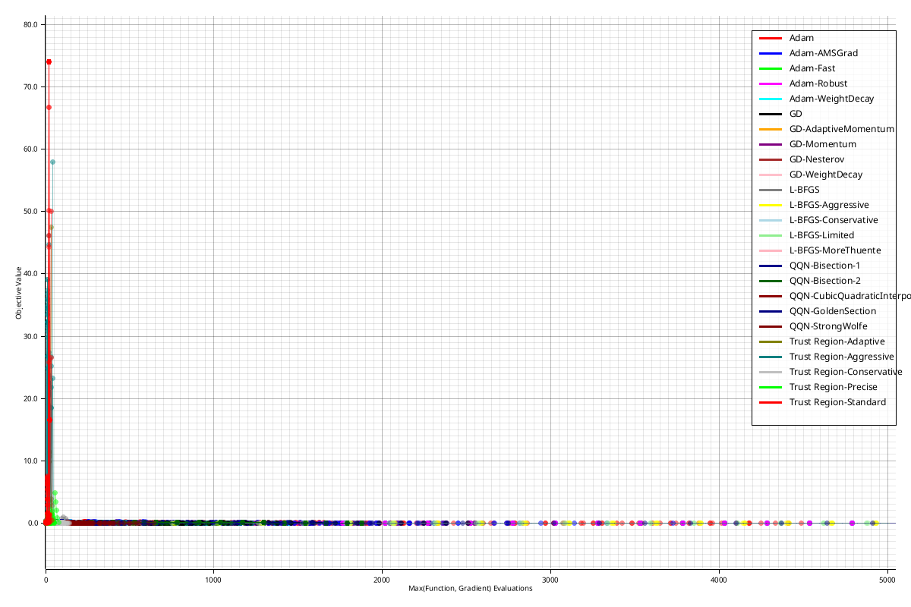
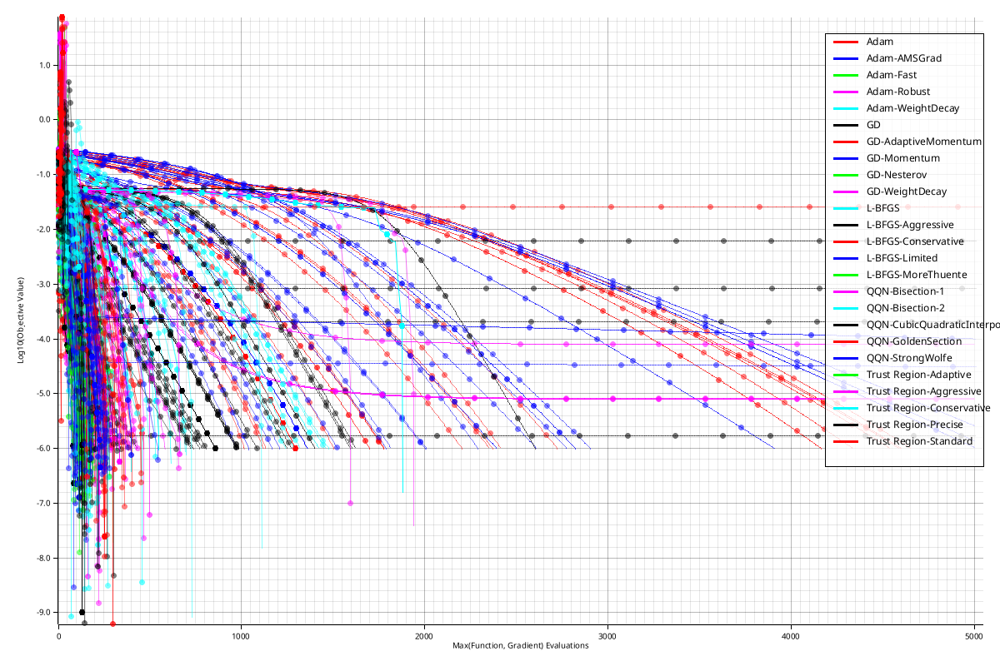

**Figure:** Convergence plots for Trigonometric_2D showing objective value vs iterations.
Left: Linear scale, Right: Log scale for better visualization of convergence behavior.

**Data:** [Linear scale data (CSV)](data/Trigonometric_2D_data.csv) | [Log scale data (CSV)](data/Trigonometric_2D_log_data.csv)

## Problem: Trigonometric_5D

**Family:** Trigonometric
**Dimension:** 5
**Success Threshold:** 1.000e-6
**Total Runs:** 500
**Detailed Analysis:** [View comprehensive problem analysis](reports/problem_analysis_Trigonometric_5D.md)

### Performance Summary
<table style="border-collapse: collapse; width: 100%; margin: 20px 0;">
<tr style="background-color: #f2f2f2;">
<th style="border: 1px solid #ddd; padding: 8px; text-align: center;">Rank</th>
<th style="border: 1px solid #ddd; padding: 8px; text-align: center;">Optimizer</th>
<th style="border: 1px solid #ddd; padding: 8px; text-align: center;">Mean Final Value (All/Success/Fail)</th>
<th style="border: 1px solid #ddd; padding: 8px; text-align: center;">Std Dev</th>
<th style="border: 1px solid #ddd; padding: 8px; text-align: center;">Best Value</th>
<th style="border: 1px solid #ddd; padding: 8px; text-align: center;">Worst Value</th>
<th style="border: 1px solid #ddd; padding: 8px; text-align: center;">Mean Function Evals (All/Success/Fail)</th>
<th style="border: 1px solid #ddd; padding: 8px; text-align: center;">Mean Gradient Evals (All/Success/Fail)</th>
<th style="border: 1px solid #ddd; padding: 8px; text-align: center;">Success Rate</th>
<th style="border: 1px solid #ddd; padding: 8px; text-align: center;">Mean Time (s)</th>
</tr>
<tr style="background-color: #d4edda; font-weight: bold;">
<td style="border: 1px solid #ddd; padding: 8px; text-align: center;">1</td>
<td style="border: 1px solid #ddd; padding: 8px; text-align: center;"><a href="reports/detailed_Trigonometric_5D_QQN-CubicQuadraticInterpolation.md" title="Click for detailed analysis">QQN-CubicQuadraticInterpolation</a></td>
<td style="border: 1px solid #ddd; padding: 8px; text-align: center;">4.16e-7 / 4.16e-7 / -</td>
<td style="border: 1px solid #ddd; padding: 8px; text-align: center;">3.74e-7</td>
<td style="border: 1px solid #ddd; padding: 8px; text-align: center;">1.09e-9</td>
<td style="border: 1px solid #ddd; padding: 8px; text-align: center;">9.80e-7</td>
<td style="border: 1px solid #ddd; padding: 8px; text-align: center;">389.1 / 389.1 / -</td>
<td style="border: 1px solid #ddd; padding: 8px; text-align: center;">505.6 / 505.6 / -</td>
<td style="border: 1px solid #ddd; padding: 8px; text-align: center;">100.0%</td>
<td style="border: 1px solid #ddd; padding: 8px; text-align: center;">0.016</td>
</tr>
<tr style="background-color: #fff3cd;">
<td style="border: 1px solid #ddd; padding: 8px; text-align: center;">2</td>
<td style="border: 1px solid #ddd; padding: 8px; text-align: center;"><a href="reports/detailed_Trigonometric_5D_GD.md" title="Click for detailed analysis">GD</a></td>
<td style="border: 1px solid #ddd; padding: 8px; text-align: center;">9.83e-7 / 9.83e-7 / -</td>
<td style="border: 1px solid #ddd; padding: 8px; text-align: center;">7.74e-9</td>
<td style="border: 1px solid #ddd; padding: 8px; text-align: center;">9.62e-7</td>
<td style="border: 1px solid #ddd; padding: 8px; text-align: center;">9.94e-7</td>
<td style="border: 1px solid #ddd; padding: 8px; text-align: center;">399.2 / 399.2 / -</td>
<td style="border: 1px solid #ddd; padding: 8px; text-align: center;">795.4 / 795.4 / -</td>
<td style="border: 1px solid #ddd; padding: 8px; text-align: center;">100.0%</td>
<td style="border: 1px solid #ddd; padding: 8px; text-align: center;">0.011</td>
</tr>
<tr style="">
<td style="border: 1px solid #ddd; padding: 8px; text-align: center;">3</td>
<td style="border: 1px solid #ddd; padding: 8px; text-align: center;"><a href="reports/detailed_Trigonometric_5D_QQN-GoldenSection.md" title="Click for detailed analysis">QQN-GoldenSection</a></td>
<td style="border: 1px solid #ddd; padding: 8px; text-align: center;">2.34e-7 / 2.34e-7 / -</td>
<td style="border: 1px solid #ddd; padding: 8px; text-align: center;">2.85e-7</td>
<td style="border: 1px solid #ddd; padding: 8px; text-align: center;">3.03e-9</td>
<td style="border: 1px solid #ddd; padding: 8px; text-align: center;">8.60e-7</td>
<td style="border: 1px solid #ddd; padding: 8px; text-align: center;">1123.5 / 1123.5 / -</td>
<td style="border: 1px solid #ddd; padding: 8px; text-align: center;">151.7 / 151.7 / -</td>
<td style="border: 1px solid #ddd; padding: 8px; text-align: center;">100.0%</td>
<td style="border: 1px solid #ddd; padding: 8px; text-align: center;">0.021</td>
</tr>
<tr style="">
<td style="border: 1px solid #ddd; padding: 8px; text-align: center;">4</td>
<td style="border: 1px solid #ddd; padding: 8px; text-align: center;"><a href="reports/detailed_Trigonometric_5D_L-BFGS-Limited.md" title="Click for detailed analysis">L-BFGS-Limited</a></td>
<td style="border: 1px solid #ddd; padding: 8px; text-align: center;">2.14e-3 / 9.41e-7 / 4.27e-2</td>
<td style="border: 1px solid #ddd; padding: 8px; text-align: center;">9.31e-3</td>
<td style="border: 1px solid #ddd; padding: 8px; text-align: center;">7.20e-7</td>
<td style="border: 1px solid #ddd; padding: 8px; text-align: center;">4.27e-2</td>
<td style="border: 1px solid #ddd; padding: 8px; text-align: center;">1331.0 / 1180.6 / 4188.0</td>
<td style="border: 1px solid #ddd; padding: 8px; text-align: center;">414.7 / 393.0 / 827.0</td>
<td style="border: 1px solid #ddd; padding: 8px; text-align: center;">95.0%</td>
<td style="border: 1px solid #ddd; padding: 8px; text-align: center;">0.019</td>
</tr>
<tr style="">
<td style="border: 1px solid #ddd; padding: 8px; text-align: center;">5</td>
<td style="border: 1px solid #ddd; padding: 8px; text-align: center;"><a href="reports/detailed_Trigonometric_5D_L-BFGS-Conservative.md" title="Click for detailed analysis">L-BFGS-Conservative</a></td>
<td style="border: 1px solid #ddd; padding: 8px; text-align: center;">2.73e-3 / 6.94e-7 / 2.72e-2</td>
<td style="border: 1px solid #ddd; padding: 8px; text-align: center;">1.19e-2</td>
<td style="border: 1px solid #ddd; padding: 8px; text-align: center;">1.66e-7</td>
<td style="border: 1px solid #ddd; padding: 8px; text-align: center;">5.45e-2</td>
<td style="border: 1px solid #ddd; padding: 8px; text-align: center;">887.4 / 557.2 / 3859.0</td>
<td style="border: 1px solid #ddd; padding: 8px; text-align: center;">373.8 / 287.6 / 1149.0</td>
<td style="border: 1px solid #ddd; padding: 8px; text-align: center;">90.0%</td>
<td style="border: 1px solid #ddd; padding: 8px; text-align: center;">0.014</td>
</tr>
<tr style="">
<td style="border: 1px solid #ddd; padding: 8px; text-align: center;">6</td>
<td style="border: 1px solid #ddd; padding: 8px; text-align: center;"><a href="reports/detailed_Trigonometric_5D_QQN-Bisection-1.md" title="Click for detailed analysis">QQN-Bisection-1</a></td>
<td style="border: 1px solid #ddd; padding: 8px; text-align: center;">8.71e-4 / 4.00e-7 / 8.71e-3</td>
<td style="border: 1px solid #ddd; padding: 8px; text-align: center;">3.70e-3</td>
<td style="border: 1px solid #ddd; padding: 8px; text-align: center;">1.72e-10</td>
<td style="border: 1px solid #ddd; padding: 8px; text-align: center;">1.70e-2</td>
<td style="border: 1px solid #ddd; padding: 8px; text-align: center;">664.0 / 442.9 / 2653.5</td>
<td style="border: 1px solid #ddd; padding: 8px; text-align: center;">669.6 / 479.5 / 2381.0</td>
<td style="border: 1px solid #ddd; padding: 8px; text-align: center;">90.0%</td>
<td style="border: 1px solid #ddd; padding: 8px; text-align: center;">0.015</td>
</tr>
<tr style="">
<td style="border: 1px solid #ddd; padding: 8px; text-align: center;">7</td>
<td style="border: 1px solid #ddd; padding: 8px; text-align: center;"><a href="reports/detailed_Trigonometric_5D_QQN-StrongWolfe.md" title="Click for detailed analysis">QQN-StrongWolfe</a></td>
<td style="border: 1px solid #ddd; padding: 8px; text-align: center;">7.54e-7 / 6.32e-7 / 1.86e-6</td>
<td style="border: 1px solid #ddd; padding: 8px; text-align: center;">4.98e-7</td>
<td style="border: 1px solid #ddd; padding: 8px; text-align: center;">1.51e-8</td>
<td style="border: 1px solid #ddd; padding: 8px; text-align: center;">1.93e-6</td>
<td style="border: 1px solid #ddd; padding: 8px; text-align: center;">1274.7 / 1133.0 / 2549.5</td>
<td style="border: 1px solid #ddd; padding: 8px; text-align: center;">1222.6 / 1083.4 / 2475.0</td>
<td style="border: 1px solid #ddd; padding: 8px; text-align: center;">90.0%</td>
<td style="border: 1px solid #ddd; padding: 8px; text-align: center;">0.042</td>
</tr>
<tr style="">
<td style="border: 1px solid #ddd; padding: 8px; text-align: center;">8</td>
<td style="border: 1px solid #ddd; padding: 8px; text-align: center;"><a href="reports/detailed_Trigonometric_5D_Adam.md" title="Click for detailed analysis">Adam</a></td>
<td style="border: 1px solid #ddd; padding: 8px; text-align: center;">1.12e-2 / 9.70e-7 / 7.50e-2</td>
<td style="border: 1px solid #ddd; padding: 8px; text-align: center;">2.74e-2</td>
<td style="border: 1px solid #ddd; padding: 8px; text-align: center;">8.42e-7</td>
<td style="border: 1px solid #ddd; padding: 8px; text-align: center;">8.54e-2</td>
<td style="border: 1px solid #ddd; padding: 8px; text-align: center;">1728.1 / 1695.0 / 1915.7</td>
<td style="border: 1px solid #ddd; padding: 8px; text-align: center;">1728.0 / 1695.0 / 1915.3</td>
<td style="border: 1px solid #ddd; padding: 8px; text-align: center;">85.0%</td>
<td style="border: 1px solid #ddd; padding: 8px; text-align: center;">0.038</td>
</tr>
<tr style="">
<td style="border: 1px solid #ddd; padding: 8px; text-align: center;">9</td>
<td style="border: 1px solid #ddd; padding: 8px; text-align: center;"><a href="reports/detailed_Trigonometric_5D_QQN-Bisection-2.md" title="Click for detailed analysis">QQN-Bisection-2</a></td>
<td style="border: 1px solid #ddd; padding: 8px; text-align: center;">3.22e-7 / 3.22e-7 / -</td>
<td style="border: 1px solid #ddd; padding: 8px; text-align: center;">3.08e-7</td>
<td style="border: 1px solid #ddd; padding: 8px; text-align: center;">6.17e-10</td>
<td style="border: 1px solid #ddd; padding: 8px; text-align: center;">9.20e-7</td>
<td style="border: 1px solid #ddd; padding: 8px; text-align: center;">305.6 / 382.1 / 0.0</td>
<td style="border: 1px solid #ddd; padding: 8px; text-align: center;">182.8 / 228.4 / 0.0</td>
<td style="border: 1px solid #ddd; padding: 8px; text-align: center;">80.0%</td>
<td style="border: 1px solid #ddd; padding: 8px; text-align: center;">0.008</td>
</tr>
<tr style="">
<td style="border: 1px solid #ddd; padding: 8px; text-align: center;">10</td>
<td style="border: 1px solid #ddd; padding: 8px; text-align: center;"><a href="reports/detailed_Trigonometric_5D_GD-WeightDecay.md" title="Click for detailed analysis">GD-WeightDecay</a></td>
<td style="border: 1px solid #ddd; padding: 8px; text-align: center;">1.27e-2 / 9.18e-7 / 5.43e-2</td>
<td style="border: 1px solid #ddd; padding: 8px; text-align: center;">2.60e-2</td>
<td style="border: 1px solid #ddd; padding: 8px; text-align: center;">8.18e-7</td>
<td style="border: 1px solid #ddd; padding: 8px; text-align: center;">8.53e-2</td>
<td style="border: 1px solid #ddd; padding: 8px; text-align: center;">105.4 / 126.6 / 41.8</td>
<td style="border: 1px solid #ddd; padding: 8px; text-align: center;">207.6 / 250.2 / 79.6</td>
<td style="border: 1px solid #ddd; padding: 8px; text-align: center;">75.0%</td>
<td style="border: 1px solid #ddd; padding: 8px; text-align: center;">0.004</td>
</tr>
<tr style="">
<td style="border: 1px solid #ddd; padding: 8px; text-align: center;">11</td>
<td style="border: 1px solid #ddd; padding: 8px; text-align: center;"><a href="reports/detailed_Trigonometric_5D_L-BFGS-MoreThuente.md" title="Click for detailed analysis">L-BFGS-MoreThuente</a></td>
<td style="border: 1px solid #ddd; padding: 8px; text-align: center;">5.44e-4 / 6.87e-7 / 2.18e-3</td>
<td style="border: 1px solid #ddd; padding: 8px; text-align: center;">2.01e-3</td>
<td style="border: 1px solid #ddd; padding: 8px; text-align: center;">1.15e-7</td>
<td style="border: 1px solid #ddd; padding: 8px; text-align: center;">9.19e-3</td>
<td style="border: 1px solid #ddd; padding: 8px; text-align: center;">1087.8 / 482.1 / 2905.0</td>
<td style="border: 1px solid #ddd; padding: 8px; text-align: center;">785.3 / 346.1 / 2103.0</td>
<td style="border: 1px solid #ddd; padding: 8px; text-align: center;">75.0%</td>
<td style="border: 1px solid #ddd; padding: 8px; text-align: center;">0.022</td>
</tr>
<tr style="">
<td style="border: 1px solid #ddd; padding: 8px; text-align: center;">12</td>
<td style="border: 1px solid #ddd; padding: 8px; text-align: center;"><a href="reports/detailed_Trigonometric_5D_Adam-WeightDecay.md" title="Click for detailed analysis">Adam-WeightDecay</a></td>
<td style="border: 1px solid #ddd; padding: 8px; text-align: center;">1.94e-2 / 8.81e-7 / 6.50e-2</td>
<td style="border: 1px solid #ddd; padding: 8px; text-align: center;">3.06e-2</td>
<td style="border: 1px solid #ddd; padding: 8px; text-align: center;">3.70e-7</td>
<td style="border: 1px solid #ddd; padding: 8px; text-align: center;">8.53e-2</td>
<td style="border: 1px solid #ddd; padding: 8px; text-align: center;">784.6 / 740.3 / 888.0</td>
<td style="border: 1px solid #ddd; padding: 8px; text-align: center;">784.3 / 740.3 / 887.0</td>
<td style="border: 1px solid #ddd; padding: 8px; text-align: center;">70.0%</td>
<td style="border: 1px solid #ddd; padding: 8px; text-align: center;">0.018</td>
</tr>
<tr style="">
<td style="border: 1px solid #ddd; padding: 8px; text-align: center;">13</td>
<td style="border: 1px solid #ddd; padding: 8px; text-align: center;"><a href="reports/detailed_Trigonometric_5D_Adam-AMSGrad.md" title="Click for detailed analysis">Adam-AMSGrad</a></td>
<td style="border: 1px solid #ddd; padding: 8px; text-align: center;">2.94e-2 / 9.81e-7 / 4.52e-2</td>
<td style="border: 1px solid #ddd; padding: 8px; text-align: center;">3.49e-2</td>
<td style="border: 1px solid #ddd; padding: 8px; text-align: center;">9.71e-7</td>
<td style="border: 1px solid #ddd; padding: 8px; text-align: center;">8.56e-2</td>
<td style="border: 1px solid #ddd; padding: 8px; text-align: center;">2192.1 / 1616.4 / 2502.0</td>
<td style="border: 1px solid #ddd; padding: 8px; text-align: center;">2192.1 / 1616.4 / 2502.0</td>
<td style="border: 1px solid #ddd; padding: 8px; text-align: center;">35.0%</td>
<td style="border: 1px solid #ddd; padding: 8px; text-align: center;">0.053</td>
</tr>
<tr style="">
<td style="border: 1px solid #ddd; padding: 8px; text-align: center;">14</td>
<td style="border: 1px solid #ddd; padding: 8px; text-align: center;"><a href="reports/detailed_Trigonometric_5D_Adam-Robust.md" title="Click for detailed analysis">Adam-Robust</a></td>
<td style="border: 1px solid #ddd; padding: 8px; text-align: center;">1.32e-2 / 7.70e-7 / 1.79e-2</td>
<td style="border: 1px solid #ddd; padding: 8px; text-align: center;">2.17e-2</td>
<td style="border: 1px solid #ddd; padding: 8px; text-align: center;">2.34e-7</td>
<td style="border: 1px solid #ddd; padding: 8px; text-align: center;">5.45e-2</td>
<td style="border: 1px solid #ddd; padding: 8px; text-align: center;">978.1 / 288.0 / 1150.7</td>
<td style="border: 1px solid #ddd; padding: 8px; text-align: center;">977.7 / 288.0 / 1150.1</td>
<td style="border: 1px solid #ddd; padding: 8px; text-align: center;">20.0%</td>
<td style="border: 1px solid #ddd; padding: 8px; text-align: center;">0.024</td>
</tr>
<tr style="">
<td style="border: 1px solid #ddd; padding: 8px; text-align: center;">15</td>
<td style="border: 1px solid #ddd; padding: 8px; text-align: center;"><a href="reports/detailed_Trigonometric_5D_Trust_Region-Aggressive.md" title="Click for detailed analysis">Trust Region-Aggressive</a></td>
<td style="border: 1px solid #ddd; padding: 8px; text-align: center;">1.41e0 / - / 1.41e0</td>
<td style="border: 1px solid #ddd; padding: 8px; text-align: center;">4.40e-1</td>
<td style="border: 1px solid #ddd; padding: 8px; text-align: center;">6.56e-1</td>
<td style="border: 1px solid #ddd; padding: 8px; text-align: center;">2.25e0</td>
<td style="border: 1px solid #ddd; padding: 8px; text-align: center;">5.2 / - / 5.2</td>
<td style="border: 1px solid #ddd; padding: 8px; text-align: center;">4.1 / - / 4.1</td>
<td style="border: 1px solid #ddd; padding: 8px; text-align: center;">0.0%</td>
<td style="border: 1px solid #ddd; padding: 8px; text-align: center;">0.000</td>
</tr>
<tr style="">
<td style="border: 1px solid #ddd; padding: 8px; text-align: center;">16</td>
<td style="border: 1px solid #ddd; padding: 8px; text-align: center;"><a href="reports/detailed_Trigonometric_5D_Trust_Region-Standard.md" title="Click for detailed analysis">Trust Region-Standard</a></td>
<td style="border: 1px solid #ddd; padding: 8px; text-align: center;">3.83e-1 / - / 4.09e-1</td>
<td style="border: 1px solid #ddd; padding: 8px; text-align: center;">1.87e-1</td>
<td style="border: 1px solid #ddd; padding: 8px; text-align: center;">9.07e-2</td>
<td style="border: 1px solid #ddd; padding: 8px; text-align: center;">7.66e-1</td>
<td style="border: 1px solid #ddd; padding: 8px; text-align: center;">9.8 / - / 9.8</td>
<td style="border: 1px solid #ddd; padding: 8px; text-align: center;">7.2 / - / 7.2</td>
<td style="border: 1px solid #ddd; padding: 8px; text-align: center;">0.0%</td>
<td style="border: 1px solid #ddd; padding: 8px; text-align: center;">0.000</td>
</tr>
<tr style="">
<td style="border: 1px solid #ddd; padding: 8px; text-align: center;">17</td>
<td style="border: 1px solid #ddd; padding: 8px; text-align: center;"><a href="reports/detailed_Trigonometric_5D_Trust_Region-Adaptive.md" title="Click for detailed analysis">Trust Region-Adaptive</a></td>
<td style="border: 1px solid #ddd; padding: 8px; text-align: center;">1.18e-1 / - / 1.25e-1</td>
<td style="border: 1px solid #ddd; padding: 8px; text-align: center;">7.80e-2</td>
<td style="border: 1px solid #ddd; padding: 8px; text-align: center;">6.37e-3</td>
<td style="border: 1px solid #ddd; padding: 8px; text-align: center;">3.04e-1</td>
<td style="border: 1px solid #ddd; padding: 8px; text-align: center;">26.1 / - / 26.1</td>
<td style="border: 1px solid #ddd; padding: 8px; text-align: center;">18.1 / - / 18.1</td>
<td style="border: 1px solid #ddd; padding: 8px; text-align: center;">0.0%</td>
<td style="border: 1px solid #ddd; padding: 8px; text-align: center;">0.000</td>
</tr>
<tr style="">
<td style="border: 1px solid #ddd; padding: 8px; text-align: center;">18</td>
<td style="border: 1px solid #ddd; padding: 8px; text-align: center;"><a href="reports/detailed_Trigonometric_5D_GD-Momentum.md" title="Click for detailed analysis">GD-Momentum</a></td>
<td style="border: 1px solid #ddd; padding: 8px; text-align: center;">1.13e-1 / - / 1.57e-1</td>
<td style="border: 1px solid #ddd; padding: 8px; text-align: center;">1.61e-1</td>
<td style="border: 1px solid #ddd; padding: 8px; text-align: center;">1.95e-3</td>
<td style="border: 1px solid #ddd; padding: 8px; text-align: center;">6.71e-1</td>
<td style="border: 1px solid #ddd; padding: 8px; text-align: center;">25.0 / - / 25.0</td>
<td style="border: 1px solid #ddd; padding: 8px; text-align: center;">46.0 / - / 46.0</td>
<td style="border: 1px solid #ddd; padding: 8px; text-align: center;">0.0%</td>
<td style="border: 1px solid #ddd; padding: 8px; text-align: center;">0.001</td>
</tr>
<tr style="">
<td style="border: 1px solid #ddd; padding: 8px; text-align: center;">19</td>
<td style="border: 1px solid #ddd; padding: 8px; text-align: center;"><a href="reports/detailed_Trigonometric_5D_GD-AdaptiveMomentum.md" title="Click for detailed analysis">GD-AdaptiveMomentum</a></td>
<td style="border: 1px solid #ddd; padding: 8px; text-align: center;">7.25e-3 / - / 1.79e-2</td>
<td style="border: 1px solid #ddd; padding: 8px; text-align: center;">1.92e-2</td>
<td style="border: 1px solid #ddd; padding: 8px; text-align: center;">8.14e-5</td>
<td style="border: 1px solid #ddd; padding: 8px; text-align: center;">7.35e-2</td>
<td style="border: 1px solid #ddd; padding: 8px; text-align: center;">30.6 / - / 30.6</td>
<td style="border: 1px solid #ddd; padding: 8px; text-align: center;">57.1 / - / 57.1</td>
<td style="border: 1px solid #ddd; padding: 8px; text-align: center;">0.0%</td>
<td style="border: 1px solid #ddd; padding: 8px; text-align: center;">0.001</td>
</tr>
<tr style="">
<td style="border: 1px solid #ddd; padding: 8px; text-align: center;">20</td>
<td style="border: 1px solid #ddd; padding: 8px; text-align: center;"><a href="reports/detailed_Trigonometric_5D_GD-Nesterov.md" title="Click for detailed analysis">GD-Nesterov</a></td>
<td style="border: 1px solid #ddd; padding: 8px; text-align: center;">1.24e-2 / - / 1.60e-2</td>
<td style="border: 1px solid #ddd; padding: 8px; text-align: center;">2.08e-2</td>
<td style="border: 1px solid #ddd; padding: 8px; text-align: center;">5.47e-5</td>
<td style="border: 1px solid #ddd; padding: 8px; text-align: center;">5.55e-2</td>
<td style="border: 1px solid #ddd; padding: 8px; text-align: center;">33.5 / - / 33.5</td>
<td style="border: 1px solid #ddd; padding: 8px; text-align: center;">63.1 / - / 63.1</td>
<td style="border: 1px solid #ddd; padding: 8px; text-align: center;">0.0%</td>
<td style="border: 1px solid #ddd; padding: 8px; text-align: center;">0.001</td>
</tr>
<tr style="">
<td style="border: 1px solid #ddd; padding: 8px; text-align: center;">21</td>
<td style="border: 1px solid #ddd; padding: 8px; text-align: center;"><a href="reports/detailed_Trigonometric_5D_Adam-Fast.md" title="Click for detailed analysis">Adam-Fast</a></td>
<td style="border: 1px solid #ddd; padding: 8px; text-align: center;">4.40e-2 / - / 6.17e-2</td>
<td style="border: 1px solid #ddd; padding: 8px; text-align: center;">4.54e-2</td>
<td style="border: 1px solid #ddd; padding: 8px; text-align: center;">6.01e-4</td>
<td style="border: 1px solid #ddd; padding: 8px; text-align: center;">1.43e-1</td>
<td style="border: 1px solid #ddd; padding: 8px; text-align: center;">54.8 / - / 54.8</td>
<td style="border: 1px solid #ddd; padding: 8px; text-align: center;">53.8 / - / 53.8</td>
<td style="border: 1px solid #ddd; padding: 8px; text-align: center;">0.0%</td>
<td style="border: 1px solid #ddd; padding: 8px; text-align: center;">0.001</td>
</tr>
<tr style="">
<td style="border: 1px solid #ddd; padding: 8px; text-align: center;">22</td>
<td style="border: 1px solid #ddd; padding: 8px; text-align: center;"><a href="reports/detailed_Trigonometric_5D_Trust_Region-Precise.md" title="Click for detailed analysis">Trust Region-Precise</a></td>
<td style="border: 1px solid #ddd; padding: 8px; text-align: center;">5.59e-2 / - / 5.59e-2</td>
<td style="border: 1px solid #ddd; padding: 8px; text-align: center;">2.09e-2</td>
<td style="border: 1px solid #ddd; padding: 8px; text-align: center;">1.47e-2</td>
<td style="border: 1px solid #ddd; padding: 8px; text-align: center;">9.38e-2</td>
<td style="border: 1px solid #ddd; padding: 8px; text-align: center;">84.8 / - / 84.8</td>
<td style="border: 1px solid #ddd; padding: 8px; text-align: center;">57.2 / - / 57.2</td>
<td style="border: 1px solid #ddd; padding: 8px; text-align: center;">0.0%</td>
<td style="border: 1px solid #ddd; padding: 8px; text-align: center;">0.001</td>
</tr>
<tr style="">
<td style="border: 1px solid #ddd; padding: 8px; text-align: center;">23</td>
<td style="border: 1px solid #ddd; padding: 8px; text-align: center;"><a href="reports/detailed_Trigonometric_5D_L-BFGS.md" title="Click for detailed analysis">L-BFGS</a></td>
<td style="border: 1px solid #ddd; padding: 8px; text-align: center;">6.13e-2 / - / 4.77e0</td>
<td style="border: 1px solid #ddd; padding: 8px; text-align: center;">7.89e-2</td>
<td style="border: 1px solid #ddd; padding: 8px; text-align: center;">1.11e-4</td>
<td style="border: 1px solid #ddd; padding: 8px; text-align: center;">3.01e-1</td>
<td style="border: 1px solid #ddd; padding: 8px; text-align: center;">233.9 / - / 233.9</td>
<td style="border: 1px solid #ddd; padding: 8px; text-align: center;">97.5 / - / 97.5</td>
<td style="border: 1px solid #ddd; padding: 8px; text-align: center;">0.0%</td>
<td style="border: 1px solid #ddd; padding: 8px; text-align: center;">0.004</td>
</tr>
<tr style="">
<td style="border: 1px solid #ddd; padding: 8px; text-align: center;">24</td>
<td style="border: 1px solid #ddd; padding: 8px; text-align: center;"><a href="reports/detailed_Trigonometric_5D_Trust_Region-Conservative.md" title="Click for detailed analysis">Trust Region-Conservative</a></td>
<td style="border: 1px solid #ddd; padding: 8px; text-align: center;">1.80e-2 / - / 1.91e-2</td>
<td style="border: 1px solid #ddd; padding: 8px; text-align: center;">1.91e-2</td>
<td style="border: 1px solid #ddd; padding: 8px; text-align: center;">2.44e-4</td>
<td style="border: 1px solid #ddd; padding: 8px; text-align: center;">5.47e-2</td>
<td style="border: 1px solid #ddd; padding: 8px; text-align: center;">425.6 / - / 425.6</td>
<td style="border: 1px solid #ddd; padding: 8px; text-align: center;">284.4 / - / 284.4</td>
<td style="border: 1px solid #ddd; padding: 8px; text-align: center;">0.0%</td>
<td style="border: 1px solid #ddd; padding: 8px; text-align: center;">0.003</td>
</tr>
<tr style="">
<td style="border: 1px solid #ddd; padding: 8px; text-align: center;">25</td>
<td style="border: 1px solid #ddd; padding: 8px; text-align: center;"><a href="reports/detailed_Trigonometric_5D_L-BFGS-Aggressive.md" title="Click for detailed analysis">L-BFGS-Aggressive</a></td>
<td style="border: 1px solid #ddd; padding: 8px; text-align: center;">1.22e0 / - / 1.22e0</td>
<td style="border: 1px solid #ddd; padding: 8px; text-align: center;">5.81e-1</td>
<td style="border: 1px solid #ddd; padding: 8px; text-align: center;">1.48e-1</td>
<td style="border: 1px solid #ddd; padding: 8px; text-align: center;">2.56e0</td>
<td style="border: 1px solid #ddd; padding: 8px; text-align: center;">3851.9 / - / 3851.9</td>
<td style="border: 1px solid #ddd; padding: 8px; text-align: center;">1157.0 / - / 1157.0</td>
<td style="border: 1px solid #ddd; padding: 8px; text-align: center;">0.0%</td>
<td style="border: 1px solid #ddd; padding: 8px; text-align: center;">0.025</td>
</tr>
</table>

### Convergence Plots

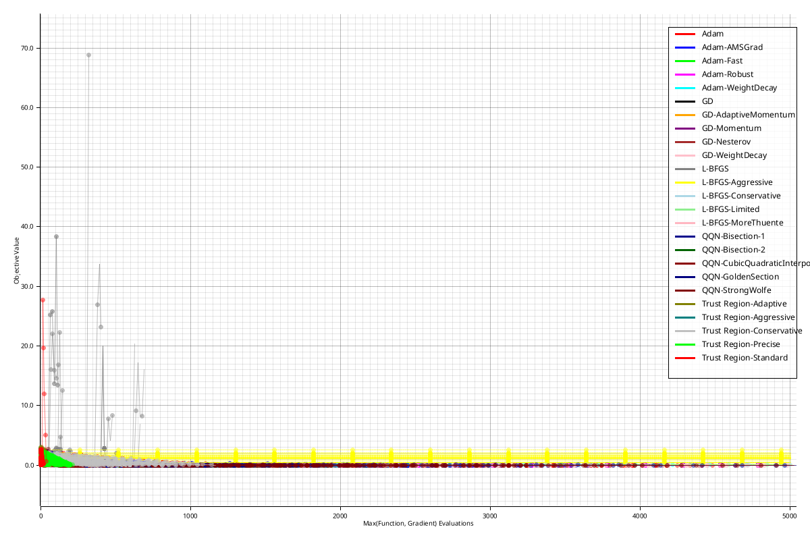
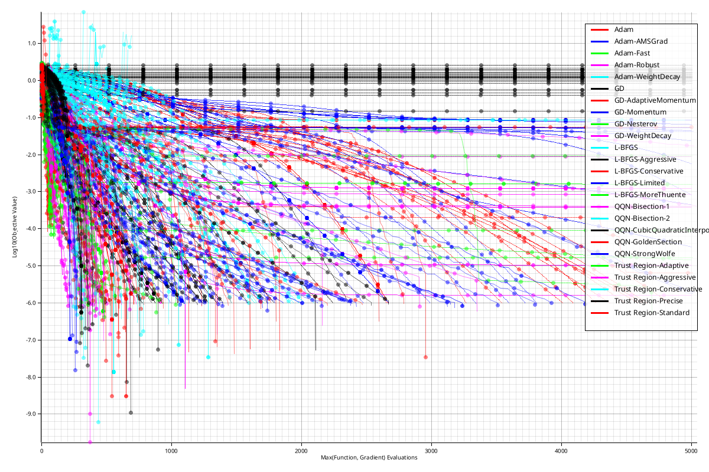

**Figure:** Convergence plots for Trigonometric_5D showing objective value vs iterations.
Left: Linear scale, Right: Log scale for better visualization of convergence behavior.

**Data:** [Linear scale data (CSV)](data/Trigonometric_5D_data.csv) | [Log scale data (CSV)](data/Trigonometric_5D_log_data.csv)

## Problem: Trigonometric_10D

**Family:** Trigonometric
**Dimension:** 10
**Success Threshold:** 1.000e-6
**Total Runs:** 500
**Detailed Analysis:** [View comprehensive problem analysis](reports/problem_analysis_Trigonometric_10D.md)

### Performance Summary
<table style="border-collapse: collapse; width: 100%; margin: 20px 0;">
<tr style="background-color: #f2f2f2;">
<th style="border: 1px solid #ddd; padding: 8px; text-align: center;">Rank</th>
<th style="border: 1px solid #ddd; padding: 8px; text-align: center;">Optimizer</th>
<th style="border: 1px solid #ddd; padding: 8px; text-align: center;">Mean Final Value (All/Success/Fail)</th>
<th style="border: 1px solid #ddd; padding: 8px; text-align: center;">Std Dev</th>
<th style="border: 1px solid #ddd; padding: 8px; text-align: center;">Best Value</th>
<th style="border: 1px solid #ddd; padding: 8px; text-align: center;">Worst Value</th>
<th style="border: 1px solid #ddd; padding: 8px; text-align: center;">Mean Function Evals (All/Success/Fail)</th>
<th style="border: 1px solid #ddd; padding: 8px; text-align: center;">Mean Gradient Evals (All/Success/Fail)</th>
<th style="border: 1px solid #ddd; padding: 8px; text-align: center;">Success Rate</th>
<th style="border: 1px solid #ddd; padding: 8px; text-align: center;">Mean Time (s)</th>
</tr>
<tr style="background-color: #d4edda; font-weight: bold;">
<td style="border: 1px solid #ddd; padding: 8px; text-align: center;">1</td>
<td style="border: 1px solid #ddd; padding: 8px; text-align: center;"><a href="reports/detailed_Trigonometric_10D_QQN-StrongWolfe.md" title="Click for detailed analysis">QQN-StrongWolfe</a></td>
<td style="border: 1px solid #ddd; padding: 8px; text-align: center;">2.92e-7 / 2.92e-7 / -</td>
<td style="border: 1px solid #ddd; padding: 8px; text-align: center;">2.02e-7</td>
<td style="border: 1px solid #ddd; padding: 8px; text-align: center;">9.27e-9</td>
<td style="border: 1px solid #ddd; padding: 8px; text-align: center;">7.23e-7</td>
<td style="border: 1px solid #ddd; padding: 8px; text-align: center;">347.3 / 347.3 / -</td>
<td style="border: 1px solid #ddd; padding: 8px; text-align: center;">333.1 / 333.1 / -</td>
<td style="border: 1px solid #ddd; padding: 8px; text-align: center;">100.0%</td>
<td style="border: 1px solid #ddd; padding: 8px; text-align: center;">0.015</td>
</tr>
<tr style="background-color: #fff3cd;">
<td style="border: 1px solid #ddd; padding: 8px; text-align: center;">2</td>
<td style="border: 1px solid #ddd; padding: 8px; text-align: center;"><a href="reports/detailed_Trigonometric_10D_QQN-CubicQuadraticInterpolation.md" title="Click for detailed analysis">QQN-CubicQuadraticInterpolation</a></td>
<td style="border: 1px solid #ddd; padding: 8px; text-align: center;">4.48e-7 / 4.48e-7 / -</td>
<td style="border: 1px solid #ddd; padding: 8px; text-align: center;">2.76e-7</td>
<td style="border: 1px solid #ddd; padding: 8px; text-align: center;">9.99e-9</td>
<td style="border: 1px solid #ddd; padding: 8px; text-align: center;">9.71e-7</td>
<td style="border: 1px solid #ddd; padding: 8px; text-align: center;">329.2 / 329.2 / -</td>
<td style="border: 1px solid #ddd; padding: 8px; text-align: center;">424.6 / 424.6 / -</td>
<td style="border: 1px solid #ddd; padding: 8px; text-align: center;">100.0%</td>
<td style="border: 1px solid #ddd; padding: 8px; text-align: center;">0.016</td>
</tr>
<tr style="">
<td style="border: 1px solid #ddd; padding: 8px; text-align: center;">3</td>
<td style="border: 1px solid #ddd; padding: 8px; text-align: center;"><a href="reports/detailed_Trigonometric_10D_GD-WeightDecay.md" title="Click for detailed analysis">GD-WeightDecay</a></td>
<td style="border: 1px solid #ddd; padding: 8px; text-align: center;">8.30e-3 / 9.34e-7 / 5.65e-2</td>
<td style="border: 1px solid #ddd; padding: 8px; text-align: center;">2.55e-2</td>
<td style="border: 1px solid #ddd; padding: 8px; text-align: center;">8.63e-7</td>
<td style="border: 1px solid #ddd; padding: 8px; text-align: center;">1.07e-1</td>
<td style="border: 1px solid #ddd; padding: 8px; text-align: center;">134.4 / 151.6 / 37.0</td>
<td style="border: 1px solid #ddd; padding: 8px; text-align: center;">265.8 / 300.3 / 70.0</td>
<td style="border: 1px solid #ddd; padding: 8px; text-align: center;">85.0%</td>
<td style="border: 1px solid #ddd; padding: 8px; text-align: center;">0.006</td>
</tr>
<tr style="">
<td style="border: 1px solid #ddd; padding: 8px; text-align: center;">4</td>
<td style="border: 1px solid #ddd; padding: 8px; text-align: center;"><a href="reports/detailed_Trigonometric_10D_QQN-Bisection-1.md" title="Click for detailed analysis">QQN-Bisection-1</a></td>
<td style="border: 1px solid #ddd; padding: 8px; text-align: center;">7.53e-4 / 4.26e-7 / 5.02e-3</td>
<td style="border: 1px solid #ddd; padding: 8px; text-align: center;">2.61e-3</td>
<td style="border: 1px solid #ddd; padding: 8px; text-align: center;">2.91e-8</td>
<td style="border: 1px solid #ddd; padding: 8px; text-align: center;">1.18e-2</td>
<td style="border: 1px solid #ddd; padding: 8px; text-align: center;">858.0 / 591.1 / 2370.7</td>
<td style="border: 1px solid #ddd; padding: 8px; text-align: center;">945.2 / 640.2 / 2674.0</td>
<td style="border: 1px solid #ddd; padding: 8px; text-align: center;">85.0%</td>
<td style="border: 1px solid #ddd; padding: 8px; text-align: center;">0.027</td>
</tr>
<tr style="">
<td style="border: 1px solid #ddd; padding: 8px; text-align: center;">5</td>
<td style="border: 1px solid #ddd; padding: 8px; text-align: center;"><a href="reports/detailed_Trigonometric_10D_QQN-GoldenSection.md" title="Click for detailed analysis">QQN-GoldenSection</a></td>
<td style="border: 1px solid #ddd; padding: 8px; text-align: center;">4.35e-4 / 5.18e-7 / 2.17e-3</td>
<td style="border: 1px solid #ddd; padding: 8px; text-align: center;">1.06e-3</td>
<td style="border: 1px solid #ddd; padding: 8px; text-align: center;">1.12e-7</td>
<td style="border: 1px solid #ddd; padding: 8px; text-align: center;">3.88e-3</td>
<td style="border: 1px solid #ddd; padding: 8px; text-align: center;">1834.2 / 1182.4 / 4441.5</td>
<td style="border: 1px solid #ddd; padding: 8px; text-align: center;">247.2 / 163.6 / 581.5</td>
<td style="border: 1px solid #ddd; padding: 8px; text-align: center;">80.0%</td>
<td style="border: 1px solid #ddd; padding: 8px; text-align: center;">0.039</td>
</tr>
<tr style="">
<td style="border: 1px solid #ddd; padding: 8px; text-align: center;">6</td>
<td style="border: 1px solid #ddd; padding: 8px; text-align: center;"><a href="reports/detailed_Trigonometric_10D_QQN-Bisection-2.md" title="Click for detailed analysis">QQN-Bisection-2</a></td>
<td style="border: 1px solid #ddd; padding: 8px; text-align: center;">3.56e-7 / 3.56e-7 / -</td>
<td style="border: 1px solid #ddd; padding: 8px; text-align: center;">2.58e-7</td>
<td style="border: 1px solid #ddd; padding: 8px; text-align: center;">8.26e-8</td>
<td style="border: 1px solid #ddd; padding: 8px; text-align: center;">9.59e-7</td>
<td style="border: 1px solid #ddd; padding: 8px; text-align: center;">357.8 / 477.1 / 0.0</td>
<td style="border: 1px solid #ddd; padding: 8px; text-align: center;">243.8 / 325.1 / 0.0</td>
<td style="border: 1px solid #ddd; padding: 8px; text-align: center;">75.0%</td>
<td style="border: 1px solid #ddd; padding: 8px; text-align: center;">0.011</td>
</tr>
<tr style="">
<td style="border: 1px solid #ddd; padding: 8px; text-align: center;">7</td>
<td style="border: 1px solid #ddd; padding: 8px; text-align: center;"><a href="reports/detailed_Trigonometric_10D_Adam-WeightDecay.md" title="Click for detailed analysis">Adam-WeightDecay</a></td>
<td style="border: 1px solid #ddd; padding: 8px; text-align: center;">4.24e-2 / 9.61e-7 / 1.42e-1</td>
<td style="border: 1px solid #ddd; padding: 8px; text-align: center;">1.14e-1</td>
<td style="border: 1px solid #ddd; padding: 8px; text-align: center;">8.69e-7</td>
<td style="border: 1px solid #ddd; padding: 8px; text-align: center;">5.20e-1</td>
<td style="border: 1px solid #ddd; padding: 8px; text-align: center;">803.8 / 937.4 / 492.0</td>
<td style="border: 1px solid #ddd; padding: 8px; text-align: center;">803.5 / 937.4 / 491.0</td>
<td style="border: 1px solid #ddd; padding: 8px; text-align: center;">70.0%</td>
<td style="border: 1px solid #ddd; padding: 8px; text-align: center;">0.023</td>
</tr>
<tr style="">
<td style="border: 1px solid #ddd; padding: 8px; text-align: center;">8</td>
<td style="border: 1px solid #ddd; padding: 8px; text-align: center;"><a href="reports/detailed_Trigonometric_10D_L-BFGS-MoreThuente.md" title="Click for detailed analysis">L-BFGS-MoreThuente</a></td>
<td style="border: 1px solid #ddd; padding: 8px; text-align: center;">1.34e-2 / 9.22e-7 / 3.36e-2</td>
<td style="border: 1px solid #ddd; padding: 8px; text-align: center;">3.73e-2</td>
<td style="border: 1px solid #ddd; padding: 8px; text-align: center;">4.78e-7</td>
<td style="border: 1px solid #ddd; padding: 8px; text-align: center;">1.60e-1</td>
<td style="border: 1px solid #ddd; padding: 8px; text-align: center;">1949.3 / 1305.0 / 2915.8</td>
<td style="border: 1px solid #ddd; padding: 8px; text-align: center;">1398.7 / 938.8 / 2088.5</td>
<td style="border: 1px solid #ddd; padding: 8px; text-align: center;">60.0%</td>
<td style="border: 1px solid #ddd; padding: 8px; text-align: center;">0.048</td>
</tr>
<tr style="">
<td style="border: 1px solid #ddd; padding: 8px; text-align: center;">9</td>
<td style="border: 1px solid #ddd; padding: 8px; text-align: center;"><a href="reports/detailed_Trigonometric_10D_GD.md" title="Click for detailed analysis">GD</a></td>
<td style="border: 1px solid #ddd; padding: 8px; text-align: center;">4.39e-3 / 9.87e-7 / 9.75e-3</td>
<td style="border: 1px solid #ddd; padding: 8px; text-align: center;">1.89e-2</td>
<td style="border: 1px solid #ddd; padding: 8px; text-align: center;">9.77e-7</td>
<td style="border: 1px solid #ddd; padding: 8px; text-align: center;">8.69e-2</td>
<td style="border: 1px solid #ddd; padding: 8px; text-align: center;">958.0 / 377.2 / 1668.0</td>
<td style="border: 1px solid #ddd; padding: 8px; text-align: center;">1913.5 / 751.4 / 3334.0</td>
<td style="border: 1px solid #ddd; padding: 8px; text-align: center;">55.0%</td>
<td style="border: 1px solid #ddd; padding: 8px; text-align: center;">0.035</td>
</tr>
<tr style="">
<td style="border: 1px solid #ddd; padding: 8px; text-align: center;">10</td>
<td style="border: 1px solid #ddd; padding: 8px; text-align: center;"><a href="reports/detailed_Trigonometric_10D_Adam.md" title="Click for detailed analysis">Adam</a></td>
<td style="border: 1px solid #ddd; padding: 8px; text-align: center;">9.69e-2 / 9.84e-7 / 1.49e-1</td>
<td style="border: 1px solid #ddd; padding: 8px; text-align: center;">2.10e-1</td>
<td style="border: 1px solid #ddd; padding: 8px; text-align: center;">9.68e-7</td>
<td style="border: 1px solid #ddd; padding: 8px; text-align: center;">7.20e-1</td>
<td style="border: 1px solid #ddd; padding: 8px; text-align: center;">2080.5 / 1799.3 / 2231.9</td>
<td style="border: 1px solid #ddd; padding: 8px; text-align: center;">2080.3 / 1799.3 / 2231.7</td>
<td style="border: 1px solid #ddd; padding: 8px; text-align: center;">35.0%</td>
<td style="border: 1px solid #ddd; padding: 8px; text-align: center;">0.056</td>
</tr>
<tr style="">
<td style="border: 1px solid #ddd; padding: 8px; text-align: center;">11</td>
<td style="border: 1px solid #ddd; padding: 8px; text-align: center;"><a href="reports/detailed_Trigonometric_10D_L-BFGS-Conservative.md" title="Click for detailed analysis">L-BFGS-Conservative</a></td>
<td style="border: 1px solid #ddd; padding: 8px; text-align: center;">1.45e-2 / 8.96e-7 / 1.26e1</td>
<td style="border: 1px solid #ddd; padding: 8px; text-align: center;">2.11e-2</td>
<td style="border: 1px solid #ddd; padding: 8px; text-align: center;">7.52e-7</td>
<td style="border: 1px solid #ddd; padding: 8px; text-align: center;">6.07e-2</td>
<td style="border: 1px solid #ddd; padding: 8px; text-align: center;">3123.2 / 1499.6 / 3664.3</td>
<td style="border: 1px solid #ddd; padding: 8px; text-align: center;">944.3 / 635.0 / 1047.4</td>
<td style="border: 1px solid #ddd; padding: 8px; text-align: center;">25.0%</td>
<td style="border: 1px solid #ddd; padding: 8px; text-align: center;">0.042</td>
</tr>
<tr style="">
<td style="border: 1px solid #ddd; padding: 8px; text-align: center;">12</td>
<td style="border: 1px solid #ddd; padding: 8px; text-align: center;"><a href="reports/detailed_Trigonometric_10D_Adam-Robust.md" title="Click for detailed analysis">Adam-Robust</a></td>
<td style="border: 1px solid #ddd; padding: 8px; text-align: center;">7.12e-2 / 9.85e-7 / 7.92e-2</td>
<td style="border: 1px solid #ddd; padding: 8px; text-align: center;">1.09e-1</td>
<td style="border: 1px solid #ddd; padding: 8px; text-align: center;">9.71e-7</td>
<td style="border: 1px solid #ddd; padding: 8px; text-align: center;">5.20e-1</td>
<td style="border: 1px solid #ddd; padding: 8px; text-align: center;">1825.9 / 451.0 / 1978.7</td>
<td style="border: 1px solid #ddd; padding: 8px; text-align: center;">1825.7 / 451.0 / 1978.4</td>
<td style="border: 1px solid #ddd; padding: 8px; text-align: center;">10.0%</td>
<td style="border: 1px solid #ddd; padding: 8px; text-align: center;">0.054</td>
</tr>
<tr style="">
<td style="border: 1px solid #ddd; padding: 8px; text-align: center;">13</td>
<td style="border: 1px solid #ddd; padding: 8px; text-align: center;"><a href="reports/detailed_Trigonometric_10D_Trust_Region-Aggressive.md" title="Click for detailed analysis">Trust Region-Aggressive</a></td>
<td style="border: 1px solid #ddd; padding: 8px; text-align: center;">1.90e0 / - / 1.90e0</td>
<td style="border: 1px solid #ddd; padding: 8px; text-align: center;">5.88e-1</td>
<td style="border: 1px solid #ddd; padding: 8px; text-align: center;">9.79e-1</td>
<td style="border: 1px solid #ddd; padding: 8px; text-align: center;">3.67e0</td>
<td style="border: 1px solid #ddd; padding: 8px; text-align: center;">12.2 / - / 12.2</td>
<td style="border: 1px solid #ddd; padding: 8px; text-align: center;">8.8 / - / 8.8</td>
<td style="border: 1px solid #ddd; padding: 8px; text-align: center;">0.0%</td>
<td style="border: 1px solid #ddd; padding: 8px; text-align: center;">0.000</td>
</tr>
<tr style="">
<td style="border: 1px solid #ddd; padding: 8px; text-align: center;">14</td>
<td style="border: 1px solid #ddd; padding: 8px; text-align: center;"><a href="reports/detailed_Trigonometric_10D_Trust_Region-Standard.md" title="Click for detailed analysis">Trust Region-Standard</a></td>
<td style="border: 1px solid #ddd; padding: 8px; text-align: center;">6.02e-1 / - / 6.02e-1</td>
<td style="border: 1px solid #ddd; padding: 8px; text-align: center;">2.65e-1</td>
<td style="border: 1px solid #ddd; padding: 8px; text-align: center;">1.37e-1</td>
<td style="border: 1px solid #ddd; padding: 8px; text-align: center;">1.10e0</td>
<td style="border: 1px solid #ddd; padding: 8px; text-align: center;">34.1 / - / 34.1</td>
<td style="border: 1px solid #ddd; padding: 8px; text-align: center;">23.4 / - / 23.4</td>
<td style="border: 1px solid #ddd; padding: 8px; text-align: center;">0.0%</td>
<td style="border: 1px solid #ddd; padding: 8px; text-align: center;">0.000</td>
</tr>
<tr style="">
<td style="border: 1px solid #ddd; padding: 8px; text-align: center;">15</td>
<td style="border: 1px solid #ddd; padding: 8px; text-align: center;"><a href="reports/detailed_Trigonometric_10D_GD-Momentum.md" title="Click for detailed analysis">GD-Momentum</a></td>
<td style="border: 1px solid #ddd; padding: 8px; text-align: center;">7.49e-1 / - / 1.17e0</td>
<td style="border: 1px solid #ddd; padding: 8px; text-align: center;">1.00e0</td>
<td style="border: 1px solid #ddd; padding: 8px; text-align: center;">1.63e-3</td>
<td style="border: 1px solid #ddd; padding: 8px; text-align: center;">3.24e0</td>
<td style="border: 1px solid #ddd; padding: 8px; text-align: center;">34.0 / - / 34.0</td>
<td style="border: 1px solid #ddd; padding: 8px; text-align: center;">63.9 / - / 63.9</td>
<td style="border: 1px solid #ddd; padding: 8px; text-align: center;">0.0%</td>
<td style="border: 1px solid #ddd; padding: 8px; text-align: center;">0.001</td>
</tr>
<tr style="">
<td style="border: 1px solid #ddd; padding: 8px; text-align: center;">16</td>
<td style="border: 1px solid #ddd; padding: 8px; text-align: center;"><a href="reports/detailed_Trigonometric_10D_L-BFGS.md" title="Click for detailed analysis">L-BFGS</a></td>
<td style="border: 1px solid #ddd; padding: 8px; text-align: center;">7.04e0 / - / 4.76e1</td>
<td style="border: 1px solid #ddd; padding: 8px; text-align: center;">2.41e0</td>
<td style="border: 1px solid #ddd; padding: 8px; text-align: center;">2.41e0</td>
<td style="border: 1px solid #ddd; padding: 8px; text-align: center;">1.10e1</td>
<td style="border: 1px solid #ddd; padding: 8px; text-align: center;">77.5 / - / 77.5</td>
<td style="border: 1px solid #ddd; padding: 8px; text-align: center;">26.1 / - / 26.1</td>
<td style="border: 1px solid #ddd; padding: 8px; text-align: center;">0.0%</td>
<td style="border: 1px solid #ddd; padding: 8px; text-align: center;">0.001</td>
</tr>
<tr style="">
<td style="border: 1px solid #ddd; padding: 8px; text-align: center;">17</td>
<td style="border: 1px solid #ddd; padding: 8px; text-align: center;"><a href="reports/detailed_Trigonometric_10D_GD-Nesterov.md" title="Click for detailed analysis">GD-Nesterov</a></td>
<td style="border: 1px solid #ddd; padding: 8px; text-align: center;">1.13e-1 / - / 1.85e-1</td>
<td style="border: 1px solid #ddd; padding: 8px; text-align: center;">6.81e-2</td>
<td style="border: 1px solid #ddd; padding: 8px; text-align: center;">2.35e-2</td>
<td style="border: 1px solid #ddd; padding: 8px; text-align: center;">3.74e-1</td>
<td style="border: 1px solid #ddd; padding: 8px; text-align: center;">45.1 / - / 45.1</td>
<td style="border: 1px solid #ddd; padding: 8px; text-align: center;">86.3 / - / 86.3</td>
<td style="border: 1px solid #ddd; padding: 8px; text-align: center;">0.0%</td>
<td style="border: 1px solid #ddd; padding: 8px; text-align: center;">0.002</td>
</tr>
<tr style="">
<td style="border: 1px solid #ddd; padding: 8px; text-align: center;">18</td>
<td style="border: 1px solid #ddd; padding: 8px; text-align: center;"><a href="reports/detailed_Trigonometric_10D_GD-AdaptiveMomentum.md" title="Click for detailed analysis">GD-AdaptiveMomentum</a></td>
<td style="border: 1px solid #ddd; padding: 8px; text-align: center;">1.04e-1 / - / 1.41e-1</td>
<td style="border: 1px solid #ddd; padding: 8px; text-align: center;">7.11e-2</td>
<td style="border: 1px solid #ddd; padding: 8px; text-align: center;">4.06e-2</td>
<td style="border: 1px solid #ddd; padding: 8px; text-align: center;">3.72e-1</td>
<td style="border: 1px solid #ddd; padding: 8px; text-align: center;">48.0 / - / 48.0</td>
<td style="border: 1px solid #ddd; padding: 8px; text-align: center;">92.1 / - / 92.1</td>
<td style="border: 1px solid #ddd; padding: 8px; text-align: center;">0.0%</td>
<td style="border: 1px solid #ddd; padding: 8px; text-align: center;">0.002</td>
</tr>
<tr style="">
<td style="border: 1px solid #ddd; padding: 8px; text-align: center;">19</td>
<td style="border: 1px solid #ddd; padding: 8px; text-align: center;"><a href="reports/detailed_Trigonometric_10D_Trust_Region-Adaptive.md" title="Click for detailed analysis">Trust Region-Adaptive</a></td>
<td style="border: 1px solid #ddd; padding: 8px; text-align: center;">1.86e-1 / - / 1.86e-1</td>
<td style="border: 1px solid #ddd; padding: 8px; text-align: center;">1.19e-1</td>
<td style="border: 1px solid #ddd; padding: 8px; text-align: center;">2.37e-2</td>
<td style="border: 1px solid #ddd; padding: 8px; text-align: center;">4.38e-1</td>
<td style="border: 1px solid #ddd; padding: 8px; text-align: center;">118.4 / - / 118.4</td>
<td style="border: 1px solid #ddd; padding: 8px; text-align: center;">79.6 / - / 79.6</td>
<td style="border: 1px solid #ddd; padding: 8px; text-align: center;">0.0%</td>
<td style="border: 1px solid #ddd; padding: 8px; text-align: center;">0.001</td>
</tr>
<tr style="">
<td style="border: 1px solid #ddd; padding: 8px; text-align: center;">20</td>
<td style="border: 1px solid #ddd; padding: 8px; text-align: center;"><a href="reports/detailed_Trigonometric_10D_Adam-Fast.md" title="Click for detailed analysis">Adam-Fast</a></td>
<td style="border: 1px solid #ddd; padding: 8px; text-align: center;">4.92e-2 / - / 6.24e-2</td>
<td style="border: 1px solid #ddd; padding: 8px; text-align: center;">7.75e-2</td>
<td style="border: 1px solid #ddd; padding: 8px; text-align: center;">1.74e-4</td>
<td style="border: 1px solid #ddd; padding: 8px; text-align: center;">2.99e-1</td>
<td style="border: 1px solid #ddd; padding: 8px; text-align: center;">102.7 / - / 102.7</td>
<td style="border: 1px solid #ddd; padding: 8px; text-align: center;">101.7 / - / 101.7</td>
<td style="border: 1px solid #ddd; padding: 8px; text-align: center;">0.0%</td>
<td style="border: 1px solid #ddd; padding: 8px; text-align: center;">0.003</td>
</tr>
<tr style="">
<td style="border: 1px solid #ddd; padding: 8px; text-align: center;">21</td>
<td style="border: 1px solid #ddd; padding: 8px; text-align: center;"><a href="reports/detailed_Trigonometric_10D_Trust_Region-Precise.md" title="Click for detailed analysis">Trust Region-Precise</a></td>
<td style="border: 1px solid #ddd; padding: 8px; text-align: center;">1.07e-1 / - / 1.07e-1</td>
<td style="border: 1px solid #ddd; padding: 8px; text-align: center;">6.92e-2</td>
<td style="border: 1px solid #ddd; padding: 8px; text-align: center;">2.28e-2</td>
<td style="border: 1px solid #ddd; padding: 8px; text-align: center;">2.53e-1</td>
<td style="border: 1px solid #ddd; padding: 8px; text-align: center;">455.3 / - / 455.3</td>
<td style="border: 1px solid #ddd; padding: 8px; text-align: center;">304.2 / - / 304.2</td>
<td style="border: 1px solid #ddd; padding: 8px; text-align: center;">0.0%</td>
<td style="border: 1px solid #ddd; padding: 8px; text-align: center;">0.005</td>
</tr>
<tr style="">
<td style="border: 1px solid #ddd; padding: 8px; text-align: center;">22</td>
<td style="border: 1px solid #ddd; padding: 8px; text-align: center;"><a href="reports/detailed_Trigonometric_10D_Trust_Region-Conservative.md" title="Click for detailed analysis">Trust Region-Conservative</a></td>
<td style="border: 1px solid #ddd; padding: 8px; text-align: center;">1.22e0 / - / 1.22e0</td>
<td style="border: 1px solid #ddd; padding: 8px; text-align: center;">1.60e0</td>
<td style="border: 1px solid #ddd; padding: 8px; text-align: center;">3.82e-3</td>
<td style="border: 1px solid #ddd; padding: 8px; text-align: center;">5.77e0</td>
<td style="border: 1px solid #ddd; padding: 8px; text-align: center;">2651.3 / - / 2651.3</td>
<td style="border: 1px solid #ddd; padding: 8px; text-align: center;">1768.2 / - / 1768.2</td>
<td style="border: 1px solid #ddd; padding: 8px; text-align: center;">0.0%</td>
<td style="border: 1px solid #ddd; padding: 8px; text-align: center;">0.028</td>
</tr>
<tr style="">
<td style="border: 1px solid #ddd; padding: 8px; text-align: center;">23</td>
<td style="border: 1px solid #ddd; padding: 8px; text-align: center;"><a href="reports/detailed_Trigonometric_10D_Adam-AMSGrad.md" title="Click for detailed analysis">Adam-AMSGrad</a></td>
<td style="border: 1px solid #ddd; padding: 8px; text-align: center;">3.00e-2 / - / 3.00e-2</td>
<td style="border: 1px solid #ddd; padding: 8px; text-align: center;">3.66e-2</td>
<td style="border: 1px solid #ddd; padding: 8px; text-align: center;">7.20e-6</td>
<td style="border: 1px solid #ddd; padding: 8px; text-align: center;">8.75e-2</td>
<td style="border: 1px solid #ddd; padding: 8px; text-align: center;">2502.0 / - / 2502.0</td>
<td style="border: 1px solid #ddd; padding: 8px; text-align: center;">2502.0 / - / 2502.0</td>
<td style="border: 1px solid #ddd; padding: 8px; text-align: center;">0.0%</td>
<td style="border: 1px solid #ddd; padding: 8px; text-align: center;">0.074</td>
</tr>
<tr style="">
<td style="border: 1px solid #ddd; padding: 8px; text-align: center;">24</td>
<td style="border: 1px solid #ddd; padding: 8px; text-align: center;"><a href="reports/detailed_Trigonometric_10D_L-BFGS-Limited.md" title="Click for detailed analysis">L-BFGS-Limited</a></td>
<td style="border: 1px solid #ddd; padding: 8px; text-align: center;">7.31e-3 / - / 7.31e-3</td>
<td style="border: 1px solid #ddd; padding: 8px; text-align: center;">1.99e-2</td>
<td style="border: 1px solid #ddd; padding: 8px; text-align: center;">9.82e-6</td>
<td style="border: 1px solid #ddd; padding: 8px; text-align: center;">8.19e-2</td>
<td style="border: 1px solid #ddd; padding: 8px; text-align: center;">3943.6 / - / 3943.6</td>
<td style="border: 1px solid #ddd; padding: 8px; text-align: center;">1063.8 / - / 1063.8</td>
<td style="border: 1px solid #ddd; padding: 8px; text-align: center;">0.0%</td>
<td style="border: 1px solid #ddd; padding: 8px; text-align: center;">0.057</td>
</tr>
<tr style="">
<td style="border: 1px solid #ddd; padding: 8px; text-align: center;">25</td>
<td style="border: 1px solid #ddd; padding: 8px; text-align: center;"><a href="reports/detailed_Trigonometric_10D_L-BFGS-Aggressive.md" title="Click for detailed analysis">L-BFGS-Aggressive</a></td>
<td style="border: 1px solid #ddd; padding: 8px; text-align: center;">1.00e1 / - / 1.00e1</td>
<td style="border: 1px solid #ddd; padding: 8px; text-align: center;">4.32e0</td>
<td style="border: 1px solid #ddd; padding: 8px; text-align: center;">2.42e0</td>
<td style="border: 1px solid #ddd; padding: 8px; text-align: center;">1.75e1</td>
<td style="border: 1px solid #ddd; padding: 8px; text-align: center;">3852.0 / - / 3852.0</td>
<td style="border: 1px solid #ddd; padding: 8px; text-align: center;">1157.0 / - / 1157.0</td>
<td style="border: 1px solid #ddd; padding: 8px; text-align: center;">0.0%</td>
<td style="border: 1px solid #ddd; padding: 8px; text-align: center;">0.032</td>
</tr>
</table>

### Convergence Plots

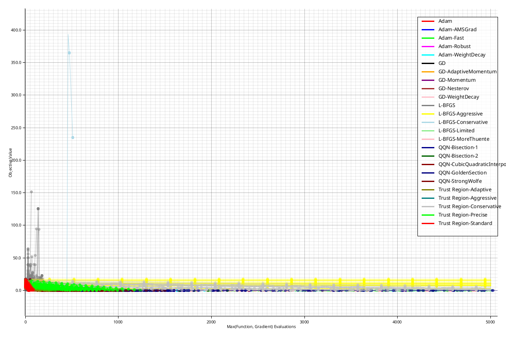
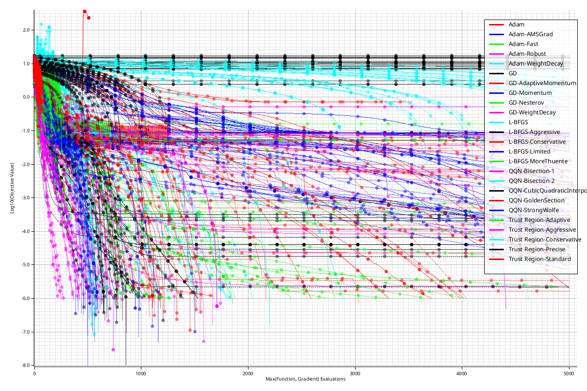

**Figure:** Convergence plots for Trigonometric_10D showing objective value vs iterations.
Left: Linear scale, Right: Log scale for better visualization of convergence behavior.

**Data:** [Linear scale data (CSV)](data/Trigonometric_10D_data.csv) | [Log scale data (CSV)](data/Trigonometric_10D_log_data.csv)

## Problem: PenaltyI_2D_alpha1e6

**Family:** PenaltyI
**Dimension:** 2
**Success Threshold:** 1.000e-6
**Total Runs:** 500
**Detailed Analysis:** [View comprehensive problem analysis](reports/problem_analysis_PenaltyI_2D_alpha1e6.md)

### Performance Summary
<table style="border-collapse: collapse; width: 100%; margin: 20px 0;">
<tr style="background-color: #f2f2f2;">
<th style="border: 1px solid #ddd; padding: 8px; text-align: center;">Rank</th>
<th style="border: 1px solid #ddd; padding: 8px; text-align: center;">Optimizer</th>
<th style="border: 1px solid #ddd; padding: 8px; text-align: center;">Mean Final Value (All/Success/Fail)</th>
<th style="border: 1px solid #ddd; padding: 8px; text-align: center;">Std Dev</th>
<th style="border: 1px solid #ddd; padding: 8px; text-align: center;">Best Value</th>
<th style="border: 1px solid #ddd; padding: 8px; text-align: center;">Worst Value</th>
<th style="border: 1px solid #ddd; padding: 8px; text-align: center;">Mean Function Evals (All/Success/Fail)</th>
<th style="border: 1px solid #ddd; padding: 8px; text-align: center;">Mean Gradient Evals (All/Success/Fail)</th>
<th style="border: 1px solid #ddd; padding: 8px; text-align: center;">Success Rate</th>
<th style="border: 1px solid #ddd; padding: 8px; text-align: center;">Mean Time (s)</th>
</tr>
<tr style="background-color: #d4edda; font-weight: bold;">
<td style="border: 1px solid #ddd; padding: 8px; text-align: center;">1</td>
<td style="border: 1px solid #ddd; padding: 8px; text-align: center;"><a href="reports/detailed_PenaltyI_2D_alpha1e6_GD-Momentum.md" title="Click for detailed analysis">GD-Momentum</a></td>
<td style="border: 1px solid #ddd; padding: 8px; text-align: center;">1.33e0 / - / 6.67e1</td>
<td style="border: 1px solid #ddd; padding: 8px; text-align: center;">1.25e-1</td>
<td style="border: 1px solid #ddd; padding: 8px; text-align: center;">1.15e0</td>
<td style="border: 1px solid #ddd; padding: 8px; text-align: center;">1.56e0</td>
<td style="border: 1px solid #ddd; padding: 8px; text-align: center;">13.0 / - / 13.0</td>
<td style="border: 1px solid #ddd; padding: 8px; text-align: center;">22.0 / - / 22.0</td>
<td style="border: 1px solid #ddd; padding: 8px; text-align: center;">0.0%</td>
<td style="border: 1px solid #ddd; padding: 8px; text-align: center;">0.000</td>
</tr>
<tr style="background-color: #fff3cd;">
<td style="border: 1px solid #ddd; padding: 8px; text-align: center;">2</td>
<td style="border: 1px solid #ddd; padding: 8px; text-align: center;"><a href="reports/detailed_PenaltyI_2D_alpha1e6_GD-WeightDecay.md" title="Click for detailed analysis">GD-WeightDecay</a></td>
<td style="border: 1px solid #ddd; padding: 8px; text-align: center;">1.30e0 / - / 5.08e0</td>
<td style="border: 1px solid #ddd; padding: 8px; text-align: center;">1.13e-1</td>
<td style="border: 1px solid #ddd; padding: 8px; text-align: center;">1.13e0</td>
<td style="border: 1px solid #ddd; padding: 8px; text-align: center;">1.47e0</td>
<td style="border: 1px solid #ddd; padding: 8px; text-align: center;">13.2 / - / 13.2</td>
<td style="border: 1px solid #ddd; padding: 8px; text-align: center;">22.3 / - / 22.3</td>
<td style="border: 1px solid #ddd; padding: 8px; text-align: center;">0.0%</td>
<td style="border: 1px solid #ddd; padding: 8px; text-align: center;">0.000</td>
</tr>
<tr style="">
<td style="border: 1px solid #ddd; padding: 8px; text-align: center;">3</td>
<td style="border: 1px solid #ddd; padding: 8px; text-align: center;"><a href="reports/detailed_PenaltyI_2D_alpha1e6_GD-Nesterov.md" title="Click for detailed analysis">GD-Nesterov</a></td>
<td style="border: 1px solid #ddd; padding: 8px; text-align: center;">1.38e0 / - / 1.46e2</td>
<td style="border: 1px solid #ddd; padding: 8px; text-align: center;">1.48e-1</td>
<td style="border: 1px solid #ddd; padding: 8px; text-align: center;">1.13e0</td>
<td style="border: 1px solid #ddd; padding: 8px; text-align: center;">1.63e0</td>
<td style="border: 1px solid #ddd; padding: 8px; text-align: center;">13.9 / - / 13.9</td>
<td style="border: 1px solid #ddd; padding: 8px; text-align: center;">23.8 / - / 23.8</td>
<td style="border: 1px solid #ddd; padding: 8px; text-align: center;">0.0%</td>
<td style="border: 1px solid #ddd; padding: 8px; text-align: center;">0.000</td>
</tr>
<tr style="">
<td style="border: 1px solid #ddd; padding: 8px; text-align: center;">4</td>
<td style="border: 1px solid #ddd; padding: 8px; text-align: center;"><a href="reports/detailed_PenaltyI_2D_alpha1e6_GD.md" title="Click for detailed analysis">GD</a></td>
<td style="border: 1px solid #ddd; padding: 8px; text-align: center;">1.17e0 / - / 1.37e1</td>
<td style="border: 1px solid #ddd; padding: 8px; text-align: center;">2.11e-2</td>
<td style="border: 1px solid #ddd; padding: 8px; text-align: center;">1.14e0</td>
<td style="border: 1px solid #ddd; padding: 8px; text-align: center;">1.21e0</td>
<td style="border: 1px solid #ddd; padding: 8px; text-align: center;">14.9 / - / 14.9</td>
<td style="border: 1px solid #ddd; padding: 8px; text-align: center;">25.9 / - / 25.9</td>
<td style="border: 1px solid #ddd; padding: 8px; text-align: center;">0.0%</td>
<td style="border: 1px solid #ddd; padding: 8px; text-align: center;">0.000</td>
</tr>
<tr style="">
<td style="border: 1px solid #ddd; padding: 8px; text-align: center;">5</td>
<td style="border: 1px solid #ddd; padding: 8px; text-align: center;"><a href="reports/detailed_PenaltyI_2D_alpha1e6_Adam-Fast.md" title="Click for detailed analysis">Adam-Fast</a></td>
<td style="border: 1px solid #ddd; padding: 8px; text-align: center;">1.41e0 / - / 1.01e2</td>
<td style="border: 1px solid #ddd; padding: 8px; text-align: center;">1.17e-1</td>
<td style="border: 1px solid #ddd; padding: 8px; text-align: center;">1.17e0</td>
<td style="border: 1px solid #ddd; padding: 8px; text-align: center;">1.59e0</td>
<td style="border: 1px solid #ddd; padding: 8px; text-align: center;">22.0 / - / 22.0</td>
<td style="border: 1px solid #ddd; padding: 8px; text-align: center;">21.0 / - / 21.0</td>
<td style="border: 1px solid #ddd; padding: 8px; text-align: center;">0.0%</td>
<td style="border: 1px solid #ddd; padding: 8px; text-align: center;">0.000</td>
</tr>
<tr style="">
<td style="border: 1px solid #ddd; padding: 8px; text-align: center;">6</td>
<td style="border: 1px solid #ddd; padding: 8px; text-align: center;"><a href="reports/detailed_PenaltyI_2D_alpha1e6_GD-AdaptiveMomentum.md" title="Click for detailed analysis">GD-AdaptiveMomentum</a></td>
<td style="border: 1px solid #ddd; padding: 8px; text-align: center;">1.19e0 / - / 7.74e2</td>
<td style="border: 1px solid #ddd; padding: 8px; text-align: center;">3.86e-2</td>
<td style="border: 1px solid #ddd; padding: 8px; text-align: center;">1.13e0</td>
<td style="border: 1px solid #ddd; padding: 8px; text-align: center;">1.27e0</td>
<td style="border: 1px solid #ddd; padding: 8px; text-align: center;">17.6 / - / 17.6</td>
<td style="border: 1px solid #ddd; padding: 8px; text-align: center;">31.1 / - / 31.1</td>
<td style="border: 1px solid #ddd; padding: 8px; text-align: center;">0.0%</td>
<td style="border: 1px solid #ddd; padding: 8px; text-align: center;">0.001</td>
</tr>
<tr style="">
<td style="border: 1px solid #ddd; padding: 8px; text-align: center;">7</td>
<td style="border: 1px solid #ddd; padding: 8px; text-align: center;"><a href="reports/detailed_PenaltyI_2D_alpha1e6_QQN-CubicQuadraticInterpolation.md" title="Click for detailed analysis">QQN-CubicQuadraticInterpolation</a></td>
<td style="border: 1px solid #ddd; padding: 8px; text-align: center;">1.12e0 / - / 1.12e0</td>
<td style="border: 1px solid #ddd; padding: 8px; text-align: center;">2.16e-16</td>
<td style="border: 1px solid #ddd; padding: 8px; text-align: center;">1.12e0</td>
<td style="border: 1px solid #ddd; padding: 8px; text-align: center;">1.12e0</td>
<td style="border: 1px solid #ddd; padding: 8px; text-align: center;">38.0 / - / 38.0</td>
<td style="border: 1px solid #ddd; padding: 8px; text-align: center;">38.0 / - / 38.0</td>
<td style="border: 1px solid #ddd; padding: 8px; text-align: center;">0.0%</td>
<td style="border: 1px solid #ddd; padding: 8px; text-align: center;">0.001</td>
</tr>
<tr style="">
<td style="border: 1px solid #ddd; padding: 8px; text-align: center;">8</td>
<td style="border: 1px solid #ddd; padding: 8px; text-align: center;"><a href="reports/detailed_PenaltyI_2D_alpha1e6_L-BFGS.md" title="Click for detailed analysis">L-BFGS</a></td>
<td style="border: 1px solid #ddd; padding: 8px; text-align: center;">1.34e0 / - / 7.22e4</td>
<td style="border: 1px solid #ddd; padding: 8px; text-align: center;">1.89e-1</td>
<td style="border: 1px solid #ddd; padding: 8px; text-align: center;">1.15e0</td>
<td style="border: 1px solid #ddd; padding: 8px; text-align: center;">1.76e0</td>
<td style="border: 1px solid #ddd; padding: 8px; text-align: center;">109.5 / - / 109.5</td>
<td style="border: 1px solid #ddd; padding: 8px; text-align: center;">42.8 / - / 42.8</td>
<td style="border: 1px solid #ddd; padding: 8px; text-align: center;">0.0%</td>
<td style="border: 1px solid #ddd; padding: 8px; text-align: center;">0.002</td>
</tr>
<tr style="">
<td style="border: 1px solid #ddd; padding: 8px; text-align: center;">9</td>
<td style="border: 1px solid #ddd; padding: 8px; text-align: center;"><a href="reports/detailed_PenaltyI_2D_alpha1e6_Adam-Robust.md" title="Click for detailed analysis">Adam-Robust</a></td>
<td style="border: 1px solid #ddd; padding: 8px; text-align: center;">1.14e0 / - / 2.11e0</td>
<td style="border: 1px solid #ddd; padding: 8px; text-align: center;">1.08e-2</td>
<td style="border: 1px solid #ddd; padding: 8px; text-align: center;">1.13e0</td>
<td style="border: 1px solid #ddd; padding: 8px; text-align: center;">1.16e0</td>
<td style="border: 1px solid #ddd; padding: 8px; text-align: center;">107.1 / - / 107.1</td>
<td style="border: 1px solid #ddd; padding: 8px; text-align: center;">106.1 / - / 106.1</td>
<td style="border: 1px solid #ddd; padding: 8px; text-align: center;">0.0%</td>
<td style="border: 1px solid #ddd; padding: 8px; text-align: center;">0.003</td>
</tr>
<tr style="">
<td style="border: 1px solid #ddd; padding: 8px; text-align: center;">10</td>
<td style="border: 1px solid #ddd; padding: 8px; text-align: center;"><a href="reports/detailed_PenaltyI_2D_alpha1e6_Adam-WeightDecay.md" title="Click for detailed analysis">Adam-WeightDecay</a></td>
<td style="border: 1px solid #ddd; padding: 8px; text-align: center;">1.14e0 / - / 1.59e0</td>
<td style="border: 1px solid #ddd; padding: 8px; text-align: center;">3.71e-3</td>
<td style="border: 1px solid #ddd; padding: 8px; text-align: center;">1.13e0</td>
<td style="border: 1px solid #ddd; padding: 8px; text-align: center;">1.15e0</td>
<td style="border: 1px solid #ddd; padding: 8px; text-align: center;">226.2 / - / 226.2</td>
<td style="border: 1px solid #ddd; padding: 8px; text-align: center;">225.2 / - / 225.2</td>
<td style="border: 1px solid #ddd; padding: 8px; text-align: center;">0.0%</td>
<td style="border: 1px solid #ddd; padding: 8px; text-align: center;">0.005</td>
</tr>
<tr style="">
<td style="border: 1px solid #ddd; padding: 8px; text-align: center;">11</td>
<td style="border: 1px solid #ddd; padding: 8px; text-align: center;"><a href="reports/detailed_PenaltyI_2D_alpha1e6_QQN-Bisection-2.md" title="Click for detailed analysis">QQN-Bisection-2</a></td>
<td style="border: 1px solid #ddd; padding: 8px; text-align: center;">2.42e0 / - / 2.42e0</td>
<td style="border: 1px solid #ddd; padding: 8px; text-align: center;">1.73e0</td>
<td style="border: 1px solid #ddd; padding: 8px; text-align: center;">1.17e0</td>
<td style="border: 1px solid #ddd; padding: 8px; text-align: center;">6.97e0</td>
<td style="border: 1px solid #ddd; padding: 8px; text-align: center;">299.3 / - / 299.3</td>
<td style="border: 1px solid #ddd; padding: 8px; text-align: center;">191.0 / - / 191.0</td>
<td style="border: 1px solid #ddd; padding: 8px; text-align: center;">0.0%</td>
<td style="border: 1px solid #ddd; padding: 8px; text-align: center;">0.007</td>
</tr>
<tr style="">
<td style="border: 1px solid #ddd; padding: 8px; text-align: center;">12</td>
<td style="border: 1px solid #ddd; padding: 8px; text-align: center;"><a href="reports/detailed_PenaltyI_2D_alpha1e6_Adam.md" title="Click for detailed analysis">Adam</a></td>
<td style="border: 1px solid #ddd; padding: 8px; text-align: center;">1.13e0 / - / 1.17e0</td>
<td style="border: 1px solid #ddd; padding: 8px; text-align: center;">9.31e-4</td>
<td style="border: 1px solid #ddd; padding: 8px; text-align: center;">1.13e0</td>
<td style="border: 1px solid #ddd; padding: 8px; text-align: center;">1.13e0</td>
<td style="border: 1px solid #ddd; padding: 8px; text-align: center;">625.9 / - / 625.9</td>
<td style="border: 1px solid #ddd; padding: 8px; text-align: center;">624.9 / - / 624.9</td>
<td style="border: 1px solid #ddd; padding: 8px; text-align: center;">0.0%</td>
<td style="border: 1px solid #ddd; padding: 8px; text-align: center;">0.013</td>
</tr>
<tr style="">
<td style="border: 1px solid #ddd; padding: 8px; text-align: center;">13</td>
<td style="border: 1px solid #ddd; padding: 8px; text-align: center;"><a href="reports/detailed_PenaltyI_2D_alpha1e6_Adam-AMSGrad.md" title="Click for detailed analysis">Adam-AMSGrad</a></td>
<td style="border: 1px solid #ddd; padding: 8px; text-align: center;">1.13e0 / - / 1.16e0</td>
<td style="border: 1px solid #ddd; padding: 8px; text-align: center;">9.86e-4</td>
<td style="border: 1px solid #ddd; padding: 8px; text-align: center;">1.13e0</td>
<td style="border: 1px solid #ddd; padding: 8px; text-align: center;">1.13e0</td>
<td style="border: 1px solid #ddd; padding: 8px; text-align: center;">647.9 / - / 647.9</td>
<td style="border: 1px solid #ddd; padding: 8px; text-align: center;">646.9 / - / 646.9</td>
<td style="border: 1px solid #ddd; padding: 8px; text-align: center;">0.0%</td>
<td style="border: 1px solid #ddd; padding: 8px; text-align: center;">0.015</td>
</tr>
<tr style="">
<td style="border: 1px solid #ddd; padding: 8px; text-align: center;">14</td>
<td style="border: 1px solid #ddd; padding: 8px; text-align: center;"><a href="reports/detailed_PenaltyI_2D_alpha1e6_L-BFGS-Conservative.md" title="Click for detailed analysis">L-BFGS-Conservative</a></td>
<td style="border: 1px solid #ddd; padding: 8px; text-align: center;">1.13e0 / - / 1.13e0</td>
<td style="border: 1px solid #ddd; padding: 8px; text-align: center;">3.93e-3</td>
<td style="border: 1px solid #ddd; padding: 8px; text-align: center;">1.12e0</td>
<td style="border: 1px solid #ddd; padding: 8px; text-align: center;">1.14e0</td>
<td style="border: 1px solid #ddd; padding: 8px; text-align: center;">1183.8 / - / 1183.8</td>
<td style="border: 1px solid #ddd; padding: 8px; text-align: center;">457.6 / - / 457.6</td>
<td style="border: 1px solid #ddd; padding: 8px; text-align: center;">0.0%</td>
<td style="border: 1px solid #ddd; padding: 8px; text-align: center;">0.015</td>
</tr>
<tr style="">
<td style="border: 1px solid #ddd; padding: 8px; text-align: center;">15</td>
<td style="border: 1px solid #ddd; padding: 8px; text-align: center;"><a href="reports/detailed_PenaltyI_2D_alpha1e6_QQN-Bisection-1.md" title="Click for detailed analysis">QQN-Bisection-1</a></td>
<td style="border: 1px solid #ddd; padding: 8px; text-align: center;">1.12e0 / - / 1.12e0</td>
<td style="border: 1px solid #ddd; padding: 8px; text-align: center;">8.85e-7</td>
<td style="border: 1px solid #ddd; padding: 8px; text-align: center;">1.12e0</td>
<td style="border: 1px solid #ddd; padding: 8px; text-align: center;">1.13e0</td>
<td style="border: 1px solid #ddd; padding: 8px; text-align: center;">1032.0 / - / 1032.0</td>
<td style="border: 1px solid #ddd; padding: 8px; text-align: center;">1345.3 / - / 1345.3</td>
<td style="border: 1px solid #ddd; padding: 8px; text-align: center;">0.0%</td>
<td style="border: 1px solid #ddd; padding: 8px; text-align: center;">0.032</td>
</tr>
<tr style="">
<td style="border: 1px solid #ddd; padding: 8px; text-align: center;">16</td>
<td style="border: 1px solid #ddd; padding: 8px; text-align: center;"><a href="reports/detailed_PenaltyI_2D_alpha1e6_QQN-GoldenSection.md" title="Click for detailed analysis">QQN-GoldenSection</a></td>
<td style="border: 1px solid #ddd; padding: 8px; text-align: center;">1.13e0 / - / 1.13e0</td>
<td style="border: 1px solid #ddd; padding: 8px; text-align: center;">1.00e-4</td>
<td style="border: 1px solid #ddd; padding: 8px; text-align: center;">1.12e0</td>
<td style="border: 1px solid #ddd; padding: 8px; text-align: center;">1.13e0</td>
<td style="border: 1px solid #ddd; padding: 8px; text-align: center;">2567.9 / - / 2567.9</td>
<td style="border: 1px solid #ddd; padding: 8px; text-align: center;">339.1 / - / 339.1</td>
<td style="border: 1px solid #ddd; padding: 8px; text-align: center;">0.0%</td>
<td style="border: 1px solid #ddd; padding: 8px; text-align: center;">0.046</td>
</tr>
<tr style="">
<td style="border: 1px solid #ddd; padding: 8px; text-align: center;">17</td>
<td style="border: 1px solid #ddd; padding: 8px; text-align: center;"><a href="reports/detailed_PenaltyI_2D_alpha1e6_L-BFGS-Aggressive.md" title="Click for detailed analysis">L-BFGS-Aggressive</a></td>
<td style="border: 1px solid #ddd; padding: 8px; text-align: center;">4.69e4 / - / 4.69e4</td>
<td style="border: 1px solid #ddd; padding: 8px; text-align: center;">1.12e5</td>
<td style="border: 1px solid #ddd; padding: 8px; text-align: center;">1.17e0</td>
<td style="border: 1px solid #ddd; padding: 8px; text-align: center;">3.51e5</td>
<td style="border: 1px solid #ddd; padding: 8px; text-align: center;">2664.3 / - / 2664.3</td>
<td style="border: 1px solid #ddd; padding: 8px; text-align: center;">1595.5 / - / 1595.5</td>
<td style="border: 1px solid #ddd; padding: 8px; text-align: center;">0.0%</td>
<td style="border: 1px solid #ddd; padding: 8px; text-align: center;">0.051</td>
</tr>
<tr style="">
<td style="border: 1px solid #ddd; padding: 8px; text-align: center;">18</td>
<td style="border: 1px solid #ddd; padding: 8px; text-align: center;"><a href="reports/detailed_PenaltyI_2D_alpha1e6_QQN-StrongWolfe.md" title="Click for detailed analysis">QQN-StrongWolfe</a></td>
<td style="border: 1px solid #ddd; padding: 8px; text-align: center;">1.14e0 / - / 1.14e0</td>
<td style="border: 1px solid #ddd; padding: 8px; text-align: center;">1.65e-2</td>
<td style="border: 1px solid #ddd; padding: 8px; text-align: center;">1.12e0</td>
<td style="border: 1px solid #ddd; padding: 8px; text-align: center;">1.19e0</td>
<td style="border: 1px solid #ddd; padding: 8px; text-align: center;">3162.1 / - / 3162.1</td>
<td style="border: 1px solid #ddd; padding: 8px; text-align: center;">1611.3 / - / 1611.3</td>
<td style="border: 1px solid #ddd; padding: 8px; text-align: center;">0.0%</td>
<td style="border: 1px solid #ddd; padding: 8px; text-align: center;">0.086</td>
</tr>
<tr style="">
<td style="border: 1px solid #ddd; padding: 8px; text-align: center;">19</td>
<td style="border: 1px solid #ddd; padding: 8px; text-align: center;"><a href="reports/detailed_PenaltyI_2D_alpha1e6_Trust_Region-Adaptive.md" title="Click for detailed analysis">Trust Region-Adaptive</a></td>
<td style="border: 1px solid #ddd; padding: 8px; text-align: center;">1.32e5 / - / 1.32e5</td>
<td style="border: 1px solid #ddd; padding: 8px; text-align: center;">8.14e4</td>
<td style="border: 1px solid #ddd; padding: 8px; text-align: center;">1.57e4</td>
<td style="border: 1px solid #ddd; padding: 8px; text-align: center;">3.15e5</td>
<td style="border: 1px solid #ddd; padding: 8px; text-align: center;">3002.0 / - / 3002.0</td>
<td style="border: 1px solid #ddd; padding: 8px; text-align: center;">2002.0 / - / 2002.0</td>
<td style="border: 1px solid #ddd; padding: 8px; text-align: center;">0.0%</td>
<td style="border: 1px solid #ddd; padding: 8px; text-align: center;">0.019</td>
</tr>
<tr style="">
<td style="border: 1px solid #ddd; padding: 8px; text-align: center;">20</td>
<td style="border: 1px solid #ddd; padding: 8px; text-align: center;"><a href="reports/detailed_PenaltyI_2D_alpha1e6_Trust_Region-Standard.md" title="Click for detailed analysis">Trust Region-Standard</a></td>
<td style="border: 1px solid #ddd; padding: 8px; text-align: center;">1.43e5 / - / 1.43e5</td>
<td style="border: 1px solid #ddd; padding: 8px; text-align: center;">8.01e4</td>
<td style="border: 1px solid #ddd; padding: 8px; text-align: center;">3.60e4</td>
<td style="border: 1px solid #ddd; padding: 8px; text-align: center;">3.21e5</td>
<td style="border: 1px solid #ddd; padding: 8px; text-align: center;">3002.0 / - / 3002.0</td>
<td style="border: 1px solid #ddd; padding: 8px; text-align: center;">2002.0 / - / 2002.0</td>
<td style="border: 1px solid #ddd; padding: 8px; text-align: center;">0.0%</td>
<td style="border: 1px solid #ddd; padding: 8px; text-align: center;">0.019</td>
</tr>
<tr style="">
<td style="border: 1px solid #ddd; padding: 8px; text-align: center;">21</td>
<td style="border: 1px solid #ddd; padding: 8px; text-align: center;"><a href="reports/detailed_PenaltyI_2D_alpha1e6_Trust_Region-Precise.md" title="Click for detailed analysis">Trust Region-Precise</a></td>
<td style="border: 1px solid #ddd; padding: 8px; text-align: center;">1.67e5 / - / 1.67e5</td>
<td style="border: 1px solid #ddd; padding: 8px; text-align: center;">7.86e4</td>
<td style="border: 1px solid #ddd; padding: 8px; text-align: center;">2.57e4</td>
<td style="border: 1px solid #ddd; padding: 8px; text-align: center;">2.92e5</td>
<td style="border: 1px solid #ddd; padding: 8px; text-align: center;">3002.0 / - / 3002.0</td>
<td style="border: 1px solid #ddd; padding: 8px; text-align: center;">2002.0 / - / 2002.0</td>
<td style="border: 1px solid #ddd; padding: 8px; text-align: center;">0.0%</td>
<td style="border: 1px solid #ddd; padding: 8px; text-align: center;">0.019</td>
</tr>
<tr style="">
<td style="border: 1px solid #ddd; padding: 8px; text-align: center;">22</td>
<td style="border: 1px solid #ddd; padding: 8px; text-align: center;"><a href="reports/detailed_PenaltyI_2D_alpha1e6_Trust_Region-Aggressive.md" title="Click for detailed analysis">Trust Region-Aggressive</a></td>
<td style="border: 1px solid #ddd; padding: 8px; text-align: center;">1.39e5 / - / 1.39e5</td>
<td style="border: 1px solid #ddd; padding: 8px; text-align: center;">7.17e4</td>
<td style="border: 1px solid #ddd; padding: 8px; text-align: center;">1.23e4</td>
<td style="border: 1px solid #ddd; padding: 8px; text-align: center;">2.70e5</td>
<td style="border: 1px solid #ddd; padding: 8px; text-align: center;">3002.0 / - / 3002.0</td>
<td style="border: 1px solid #ddd; padding: 8px; text-align: center;">2002.0 / - / 2002.0</td>
<td style="border: 1px solid #ddd; padding: 8px; text-align: center;">0.0%</td>
<td style="border: 1px solid #ddd; padding: 8px; text-align: center;">0.019</td>
</tr>
<tr style="">
<td style="border: 1px solid #ddd; padding: 8px; text-align: center;">23</td>
<td style="border: 1px solid #ddd; padding: 8px; text-align: center;"><a href="reports/detailed_PenaltyI_2D_alpha1e6_Trust_Region-Conservative.md" title="Click for detailed analysis">Trust Region-Conservative</a></td>
<td style="border: 1px solid #ddd; padding: 8px; text-align: center;">1.39e5 / - / 1.39e5</td>
<td style="border: 1px solid #ddd; padding: 8px; text-align: center;">8.98e4</td>
<td style="border: 1px solid #ddd; padding: 8px; text-align: center;">8.35e3</td>
<td style="border: 1px solid #ddd; padding: 8px; text-align: center;">4.03e5</td>
<td style="border: 1px solid #ddd; padding: 8px; text-align: center;">3002.0 / - / 3002.0</td>
<td style="border: 1px solid #ddd; padding: 8px; text-align: center;">2002.0 / - / 2002.0</td>
<td style="border: 1px solid #ddd; padding: 8px; text-align: center;">0.0%</td>
<td style="border: 1px solid #ddd; padding: 8px; text-align: center;">0.019</td>
</tr>
<tr style="">
<td style="border: 1px solid #ddd; padding: 8px; text-align: center;">24</td>
<td style="border: 1px solid #ddd; padding: 8px; text-align: center;"><a href="reports/detailed_PenaltyI_2D_alpha1e6_L-BFGS-MoreThuente.md" title="Click for detailed analysis">L-BFGS-MoreThuente</a></td>
<td style="border: 1px solid #ddd; padding: 8px; text-align: center;">4.78e0 / - / 4.78e0</td>
<td style="border: 1px solid #ddd; padding: 8px; text-align: center;">2.66e0</td>
<td style="border: 1px solid #ddd; padding: 8px; text-align: center;">1.18e0</td>
<td style="border: 1px solid #ddd; padding: 8px; text-align: center;">8.48e0</td>
<td style="border: 1px solid #ddd; padding: 8px; text-align: center;">2878.8 / - / 2878.8</td>
<td style="border: 1px solid #ddd; padding: 8px; text-align: center;">2127.8 / - / 2127.8</td>
<td style="border: 1px solid #ddd; padding: 8px; text-align: center;">0.0%</td>
<td style="border: 1px solid #ddd; padding: 8px; text-align: center;">0.043</td>
</tr>
<tr style="">
<td style="border: 1px solid #ddd; padding: 8px; text-align: center;">25</td>
<td style="border: 1px solid #ddd; padding: 8px; text-align: center;"><a href="reports/detailed_PenaltyI_2D_alpha1e6_L-BFGS-Limited.md" title="Click for detailed analysis">L-BFGS-Limited</a></td>
<td style="border: 1px solid #ddd; padding: 8px; text-align: center;">1.18e0 / - / 1.18e0</td>
<td style="border: 1px solid #ddd; padding: 8px; text-align: center;">5.23e-2</td>
<td style="border: 1px solid #ddd; padding: 8px; text-align: center;">1.13e0</td>
<td style="border: 1px solid #ddd; padding: 8px; text-align: center;">1.31e0</td>
<td style="border: 1px solid #ddd; padding: 8px; text-align: center;">4341.4 / - / 4341.4</td>
<td style="border: 1px solid #ddd; padding: 8px; text-align: center;">669.0 / - / 669.0</td>
<td style="border: 1px solid #ddd; padding: 8px; text-align: center;">0.0%</td>
<td style="border: 1px solid #ddd; padding: 8px; text-align: center;">0.030</td>
</tr>
</table>

### Convergence Plots

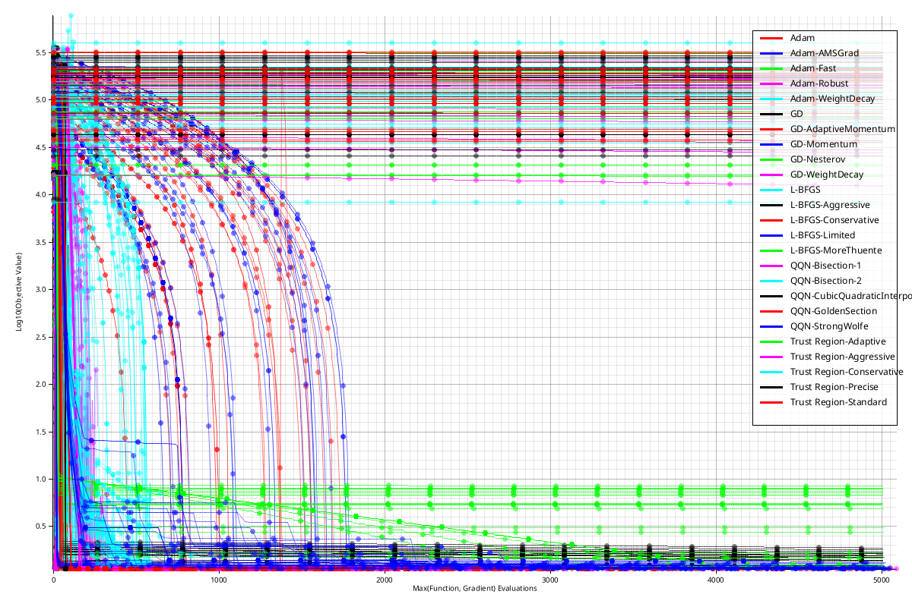

**Figure:** Convergence plots for PenaltyI_2D_alpha1e6 showing objective value vs iterations.
Left: Linear scale, Right: Log scale for better visualization of convergence behavior.

**Data:** [Linear scale data (CSV)](data/PenaltyI_2D_alpha1e6_data.csv) | [Log scale data (CSV)](data/PenaltyI_2D_alpha1e6_log_data.csv)

## Problem: PenaltyI_5D_alpha1e6

**Family:** PenaltyI
**Dimension:** 5
**Success Threshold:** 1.000e-6
**Total Runs:** 500
**Detailed Analysis:** [View comprehensive problem analysis](reports/problem_analysis_PenaltyI_5D_alpha1e6.md)

### Performance Summary
<table style="border-collapse: collapse; width: 100%; margin: 20px 0;">
<tr style="background-color: #f2f2f2;">
<th style="border: 1px solid #ddd; padding: 8px; text-align: center;">Rank</th>
<th style="border: 1px solid #ddd; padding: 8px; text-align: center;">Optimizer</th>
<th style="border: 1px solid #ddd; padding: 8px; text-align: center;">Mean Final Value (All/Success/Fail)</th>
<th style="border: 1px solid #ddd; padding: 8px; text-align: center;">Std Dev</th>
<th style="border: 1px solid #ddd; padding: 8px; text-align: center;">Best Value</th>
<th style="border: 1px solid #ddd; padding: 8px; text-align: center;">Worst Value</th>
<th style="border: 1px solid #ddd; padding: 8px; text-align: center;">Mean Function Evals (All/Success/Fail)</th>
<th style="border: 1px solid #ddd; padding: 8px; text-align: center;">Mean Gradient Evals (All/Success/Fail)</th>
<th style="border: 1px solid #ddd; padding: 8px; text-align: center;">Success Rate</th>
<th style="border: 1px solid #ddd; padding: 8px; text-align: center;">Mean Time (s)</th>
</tr>
<tr style="background-color: #d4edda; font-weight: bold;">
<td style="border: 1px solid #ddd; padding: 8px; text-align: center;">1</td>
<td style="border: 1px solid #ddd; padding: 8px; text-align: center;"><a href="reports/detailed_PenaltyI_5D_alpha1e6_GD-AdaptiveMomentum.md" title="Click for detailed analysis">GD-AdaptiveMomentum</a></td>
<td style="border: 1px solid #ddd; padding: 8px; text-align: center;">3.11e0 / - / 5.87e2</td>
<td style="border: 1px solid #ddd; padding: 8px; text-align: center;">1.85e-1</td>
<td style="border: 1px solid #ddd; padding: 8px; text-align: center;">2.87e0</td>
<td style="border: 1px solid #ddd; padding: 8px; text-align: center;">3.51e0</td>
<td style="border: 1px solid #ddd; padding: 8px; text-align: center;">13.9 / - / 13.9</td>
<td style="border: 1px solid #ddd; padding: 8px; text-align: center;">23.8 / - / 23.8</td>
<td style="border: 1px solid #ddd; padding: 8px; text-align: center;">0.0%</td>
<td style="border: 1px solid #ddd; padding: 8px; text-align: center;">0.000</td>
</tr>
<tr style="background-color: #fff3cd;">
<td style="border: 1px solid #ddd; padding: 8px; text-align: center;">2</td>
<td style="border: 1px solid #ddd; padding: 8px; text-align: center;"><a href="reports/detailed_PenaltyI_5D_alpha1e6_GD-Nesterov.md" title="Click for detailed analysis">GD-Nesterov</a></td>
<td style="border: 1px solid #ddd; padding: 8px; text-align: center;">3.13e0 / - / 3.89e2</td>
<td style="border: 1px solid #ddd; padding: 8px; text-align: center;">1.71e-1</td>
<td style="border: 1px solid #ddd; padding: 8px; text-align: center;">2.82e0</td>
<td style="border: 1px solid #ddd; padding: 8px; text-align: center;">3.40e0</td>
<td style="border: 1px solid #ddd; padding: 8px; text-align: center;">14.1 / - / 14.1</td>
<td style="border: 1px solid #ddd; padding: 8px; text-align: center;">24.1 / - / 24.1</td>
<td style="border: 1px solid #ddd; padding: 8px; text-align: center;">0.0%</td>
<td style="border: 1px solid #ddd; padding: 8px; text-align: center;">0.000</td>
</tr>
<tr style="">
<td style="border: 1px solid #ddd; padding: 8px; text-align: center;">3</td>
<td style="border: 1px solid #ddd; padding: 8px; text-align: center;"><a href="reports/detailed_PenaltyI_5D_alpha1e6_GD-Momentum.md" title="Click for detailed analysis">GD-Momentum</a></td>
<td style="border: 1px solid #ddd; padding: 8px; text-align: center;">3.25e0 / - / 9.24e1</td>
<td style="border: 1px solid #ddd; padding: 8px; text-align: center;">2.14e-1</td>
<td style="border: 1px solid #ddd; padding: 8px; text-align: center;">2.86e0</td>
<td style="border: 1px solid #ddd; padding: 8px; text-align: center;">3.55e0</td>
<td style="border: 1px solid #ddd; padding: 8px; text-align: center;">14.4 / - / 14.4</td>
<td style="border: 1px solid #ddd; padding: 8px; text-align: center;">24.8 / - / 24.8</td>
<td style="border: 1px solid #ddd; padding: 8px; text-align: center;">0.0%</td>
<td style="border: 1px solid #ddd; padding: 8px; text-align: center;">0.000</td>
</tr>
<tr style="">
<td style="border: 1px solid #ddd; padding: 8px; text-align: center;">4</td>
<td style="border: 1px solid #ddd; padding: 8px; text-align: center;"><a href="reports/detailed_PenaltyI_5D_alpha1e6_GD-WeightDecay.md" title="Click for detailed analysis">GD-WeightDecay</a></td>
<td style="border: 1px solid #ddd; padding: 8px; text-align: center;">3.12e0 / - / 3.50e1</td>
<td style="border: 1px solid #ddd; padding: 8px; text-align: center;">1.51e-1</td>
<td style="border: 1px solid #ddd; padding: 8px; text-align: center;">2.83e0</td>
<td style="border: 1px solid #ddd; padding: 8px; text-align: center;">3.42e0</td>
<td style="border: 1px solid #ddd; padding: 8px; text-align: center;">14.5 / - / 14.5</td>
<td style="border: 1px solid #ddd; padding: 8px; text-align: center;">25.0 / - / 25.0</td>
<td style="border: 1px solid #ddd; padding: 8px; text-align: center;">0.0%</td>
<td style="border: 1px solid #ddd; padding: 8px; text-align: center;">0.000</td>
</tr>
<tr style="">
<td style="border: 1px solid #ddd; padding: 8px; text-align: center;">5</td>
<td style="border: 1px solid #ddd; padding: 8px; text-align: center;"><a href="reports/detailed_PenaltyI_5D_alpha1e6_GD.md" title="Click for detailed analysis">GD</a></td>
<td style="border: 1px solid #ddd; padding: 8px; text-align: center;">2.96e0 / - / 8.04e1</td>
<td style="border: 1px solid #ddd; padding: 8px; text-align: center;">6.91e-2</td>
<td style="border: 1px solid #ddd; padding: 8px; text-align: center;">2.84e0</td>
<td style="border: 1px solid #ddd; padding: 8px; text-align: center;">3.09e0</td>
<td style="border: 1px solid #ddd; padding: 8px; text-align: center;">17.1 / - / 17.1</td>
<td style="border: 1px solid #ddd; padding: 8px; text-align: center;">30.1 / - / 30.1</td>
<td style="border: 1px solid #ddd; padding: 8px; text-align: center;">0.0%</td>
<td style="border: 1px solid #ddd; padding: 8px; text-align: center;">0.000</td>
</tr>
<tr style="">
<td style="border: 1px solid #ddd; padding: 8px; text-align: center;">6</td>
<td style="border: 1px solid #ddd; padding: 8px; text-align: center;"><a href="reports/detailed_PenaltyI_5D_alpha1e6_Adam-Fast.md" title="Click for detailed analysis">Adam-Fast</a></td>
<td style="border: 1px solid #ddd; padding: 8px; text-align: center;">3.82e0 / - / 4.69e2</td>
<td style="border: 1px solid #ddd; padding: 8px; text-align: center;">3.13e-1</td>
<td style="border: 1px solid #ddd; padding: 8px; text-align: center;">2.99e0</td>
<td style="border: 1px solid #ddd; padding: 8px; text-align: center;">4.26e0</td>
<td style="border: 1px solid #ddd; padding: 8px; text-align: center;">29.0 / - / 29.0</td>
<td style="border: 1px solid #ddd; padding: 8px; text-align: center;">28.0 / - / 28.0</td>
<td style="border: 1px solid #ddd; padding: 8px; text-align: center;">0.0%</td>
<td style="border: 1px solid #ddd; padding: 8px; text-align: center;">0.001</td>
</tr>
<tr style="">
<td style="border: 1px solid #ddd; padding: 8px; text-align: center;">7</td>
<td style="border: 1px solid #ddd; padding: 8px; text-align: center;"><a href="reports/detailed_PenaltyI_5D_alpha1e6_QQN-CubicQuadraticInterpolation.md" title="Click for detailed analysis">QQN-CubicQuadraticInterpolation</a></td>
<td style="border: 1px solid #ddd; padding: 8px; text-align: center;">2.81e0 / - / 2.81e0</td>
<td style="border: 1px solid #ddd; padding: 8px; text-align: center;">7.09e-16</td>
<td style="border: 1px solid #ddd; padding: 8px; text-align: center;">2.81e0</td>
<td style="border: 1px solid #ddd; padding: 8px; text-align: center;">2.81e0</td>
<td style="border: 1px solid #ddd; padding: 8px; text-align: center;">38.0 / - / 38.0</td>
<td style="border: 1px solid #ddd; padding: 8px; text-align: center;">38.0 / - / 38.0</td>
<td style="border: 1px solid #ddd; padding: 8px; text-align: center;">0.0%</td>
<td style="border: 1px solid #ddd; padding: 8px; text-align: center;">0.001</td>
</tr>
<tr style="">
<td style="border: 1px solid #ddd; padding: 8px; text-align: center;">8</td>
<td style="border: 1px solid #ddd; padding: 8px; text-align: center;"><a href="reports/detailed_PenaltyI_5D_alpha1e6_L-BFGS.md" title="Click for detailed analysis">L-BFGS</a></td>
<td style="border: 1px solid #ddd; padding: 8px; text-align: center;">4.24e0 / - / 7.00e4</td>
<td style="border: 1px solid #ddd; padding: 8px; text-align: center;">5.18e-1</td>
<td style="border: 1px solid #ddd; padding: 8px; text-align: center;">3.16e0</td>
<td style="border: 1px solid #ddd; padding: 8px; text-align: center;">5.00e0</td>
<td style="border: 1px solid #ddd; padding: 8px; text-align: center;">95.2 / - / 95.2</td>
<td style="border: 1px solid #ddd; padding: 8px; text-align: center;">37.2 / - / 37.2</td>
<td style="border: 1px solid #ddd; padding: 8px; text-align: center;">0.0%</td>
<td style="border: 1px solid #ddd; padding: 8px; text-align: center;">0.002</td>
</tr>
<tr style="">
<td style="border: 1px solid #ddd; padding: 8px; text-align: center;">9</td>
<td style="border: 1px solid #ddd; padding: 8px; text-align: center;"><a href="reports/detailed_PenaltyI_5D_alpha1e6_Adam-Robust.md" title="Click for detailed analysis">Adam-Robust</a></td>
<td style="border: 1px solid #ddd; padding: 8px; text-align: center;">2.87e0 / - / 2.16e1</td>
<td style="border: 1px solid #ddd; padding: 8px; text-align: center;">2.05e-2</td>
<td style="border: 1px solid #ddd; padding: 8px; text-align: center;">2.82e0</td>
<td style="border: 1px solid #ddd; padding: 8px; text-align: center;">2.91e0</td>
<td style="border: 1px solid #ddd; padding: 8px; text-align: center;">120.4 / - / 120.4</td>
<td style="border: 1px solid #ddd; padding: 8px; text-align: center;">119.4 / - / 119.4</td>
<td style="border: 1px solid #ddd; padding: 8px; text-align: center;">0.0%</td>
<td style="border: 1px solid #ddd; padding: 8px; text-align: center;">0.003</td>
</tr>
<tr style="">
<td style="border: 1px solid #ddd; padding: 8px; text-align: center;">10</td>
<td style="border: 1px solid #ddd; padding: 8px; text-align: center;"><a href="reports/detailed_PenaltyI_5D_alpha1e6_Adam-WeightDecay.md" title="Click for detailed analysis">Adam-WeightDecay</a></td>
<td style="border: 1px solid #ddd; padding: 8px; text-align: center;">2.85e0 / - / 7.65e0</td>
<td style="border: 1px solid #ddd; padding: 8px; text-align: center;">6.33e-3</td>
<td style="border: 1px solid #ddd; padding: 8px; text-align: center;">2.84e0</td>
<td style="border: 1px solid #ddd; padding: 8px; text-align: center;">2.86e0</td>
<td style="border: 1px solid #ddd; padding: 8px; text-align: center;">260.1 / - / 260.1</td>
<td style="border: 1px solid #ddd; padding: 8px; text-align: center;">259.1 / - / 259.1</td>
<td style="border: 1px solid #ddd; padding: 8px; text-align: center;">0.0%</td>
<td style="border: 1px solid #ddd; padding: 8px; text-align: center;">0.006</td>
</tr>
<tr style="">
<td style="border: 1px solid #ddd; padding: 8px; text-align: center;">11</td>
<td style="border: 1px solid #ddd; padding: 8px; text-align: center;"><a href="reports/detailed_PenaltyI_5D_alpha1e6_QQN-Bisection-2.md" title="Click for detailed analysis">QQN-Bisection-2</a></td>
<td style="border: 1px solid #ddd; padding: 8px; text-align: center;">1.03e1 / - / 1.03e1</td>
<td style="border: 1px solid #ddd; padding: 8px; text-align: center;">5.36e0</td>
<td style="border: 1px solid #ddd; padding: 8px; text-align: center;">3.91e0</td>
<td style="border: 1px solid #ddd; padding: 8px; text-align: center;">2.42e1</td>
<td style="border: 1px solid #ddd; padding: 8px; text-align: center;">469.8 / - / 469.8</td>
<td style="border: 1px solid #ddd; padding: 8px; text-align: center;">271.2 / - / 271.2</td>
<td style="border: 1px solid #ddd; padding: 8px; text-align: center;">0.0%</td>
<td style="border: 1px solid #ddd; padding: 8px; text-align: center;">0.011</td>
</tr>
<tr style="">
<td style="border: 1px solid #ddd; padding: 8px; text-align: center;">12</td>
<td style="border: 1px solid #ddd; padding: 8px; text-align: center;"><a href="reports/detailed_PenaltyI_5D_alpha1e6_Adam.md" title="Click for detailed analysis">Adam</a></td>
<td style="border: 1px solid #ddd; padding: 8px; text-align: center;">2.82e0 / - / 2.90e0</td>
<td style="border: 1px solid #ddd; padding: 8px; text-align: center;">1.88e-3</td>
<td style="border: 1px solid #ddd; padding: 8px; text-align: center;">2.81e0</td>
<td style="border: 1px solid #ddd; padding: 8px; text-align: center;">2.82e0</td>
<td style="border: 1px solid #ddd; padding: 8px; text-align: center;">733.5 / - / 733.5</td>
<td style="border: 1px solid #ddd; padding: 8px; text-align: center;">732.5 / - / 732.5</td>
<td style="border: 1px solid #ddd; padding: 8px; text-align: center;">0.0%</td>
<td style="border: 1px solid #ddd; padding: 8px; text-align: center;">0.015</td>
</tr>
<tr style="">
<td style="border: 1px solid #ddd; padding: 8px; text-align: center;">13</td>
<td style="border: 1px solid #ddd; padding: 8px; text-align: center;"><a href="reports/detailed_PenaltyI_5D_alpha1e6_Adam-AMSGrad.md" title="Click for detailed analysis">Adam-AMSGrad</a></td>
<td style="border: 1px solid #ddd; padding: 8px; text-align: center;">2.82e0 / - / 2.85e0</td>
<td style="border: 1px solid #ddd; padding: 8px; text-align: center;">2.49e-3</td>
<td style="border: 1px solid #ddd; padding: 8px; text-align: center;">2.81e0</td>
<td style="border: 1px solid #ddd; padding: 8px; text-align: center;">2.82e0</td>
<td style="border: 1px solid #ddd; padding: 8px; text-align: center;">747.3 / - / 747.3</td>
<td style="border: 1px solid #ddd; padding: 8px; text-align: center;">746.3 / - / 746.3</td>
<td style="border: 1px solid #ddd; padding: 8px; text-align: center;">0.0%</td>
<td style="border: 1px solid #ddd; padding: 8px; text-align: center;">0.018</td>
</tr>
<tr style="">
<td style="border: 1px solid #ddd; padding: 8px; text-align: center;">14</td>
<td style="border: 1px solid #ddd; padding: 8px; text-align: center;"><a href="reports/detailed_PenaltyI_5D_alpha1e6_L-BFGS-Aggressive.md" title="Click for detailed analysis">L-BFGS-Aggressive</a></td>
<td style="border: 1px solid #ddd; padding: 8px; text-align: center;">2.82e5 / - / 2.82e5</td>
<td style="border: 1px solid #ddd; padding: 8px; text-align: center;">2.24e5</td>
<td style="border: 1px solid #ddd; padding: 8px; text-align: center;">3.49e0</td>
<td style="border: 1px solid #ddd; padding: 8px; text-align: center;">6.03e5</td>
<td style="border: 1px solid #ddd; padding: 8px; text-align: center;">1110.7 / - / 1110.7</td>
<td style="border: 1px solid #ddd; padding: 8px; text-align: center;">660.1 / - / 660.1</td>
<td style="border: 1px solid #ddd; padding: 8px; text-align: center;">0.0%</td>
<td style="border: 1px solid #ddd; padding: 8px; text-align: center;">0.022</td>
</tr>
<tr style="">
<td style="border: 1px solid #ddd; padding: 8px; text-align: center;">15</td>
<td style="border: 1px solid #ddd; padding: 8px; text-align: center;"><a href="reports/detailed_PenaltyI_5D_alpha1e6_QQN-GoldenSection.md" title="Click for detailed analysis">QQN-GoldenSection</a></td>
<td style="border: 1px solid #ddd; padding: 8px; text-align: center;">2.81e0 / - / 2.81e0</td>
<td style="border: 1px solid #ddd; padding: 8px; text-align: center;">7.61e-5</td>
<td style="border: 1px solid #ddd; padding: 8px; text-align: center;">2.81e0</td>
<td style="border: 1px solid #ddd; padding: 8px; text-align: center;">2.81e0</td>
<td style="border: 1px solid #ddd; padding: 8px; text-align: center;">3026.4 / - / 3026.4</td>
<td style="border: 1px solid #ddd; padding: 8px; text-align: center;">398.0 / - / 398.0</td>
<td style="border: 1px solid #ddd; padding: 8px; text-align: center;">0.0%</td>
<td style="border: 1px solid #ddd; padding: 8px; text-align: center;">0.057</td>
</tr>
<tr style="">
<td style="border: 1px solid #ddd; padding: 8px; text-align: center;">16</td>
<td style="border: 1px solid #ddd; padding: 8px; text-align: center;"><a href="reports/detailed_PenaltyI_5D_alpha1e6_L-BFGS-Conservative.md" title="Click for detailed analysis">L-BFGS-Conservative</a></td>
<td style="border: 1px solid #ddd; padding: 8px; text-align: center;">2.84e0 / - / 2.85e0</td>
<td style="border: 1px solid #ddd; padding: 8px; text-align: center;">2.73e-2</td>
<td style="border: 1px solid #ddd; padding: 8px; text-align: center;">2.81e0</td>
<td style="border: 1px solid #ddd; padding: 8px; text-align: center;">2.91e0</td>
<td style="border: 1px solid #ddd; padding: 8px; text-align: center;">3087.5 / - / 3087.5</td>
<td style="border: 1px solid #ddd; padding: 8px; text-align: center;">889.9 / - / 889.9</td>
<td style="border: 1px solid #ddd; padding: 8px; text-align: center;">0.0%</td>
<td style="border: 1px solid #ddd; padding: 8px; text-align: center;">0.033</td>
</tr>
<tr style="">
<td style="border: 1px solid #ddd; padding: 8px; text-align: center;">17</td>
<td style="border: 1px solid #ddd; padding: 8px; text-align: center;"><a href="reports/detailed_PenaltyI_5D_alpha1e6_Trust_Region-Aggressive.md" title="Click for detailed analysis">Trust Region-Aggressive</a></td>
<td style="border: 1px solid #ddd; padding: 8px; text-align: center;">3.61e5 / - / 3.61e5</td>
<td style="border: 1px solid #ddd; padding: 8px; text-align: center;">1.19e5</td>
<td style="border: 1px solid #ddd; padding: 8px; text-align: center;">1.76e5</td>
<td style="border: 1px solid #ddd; padding: 8px; text-align: center;">5.61e5</td>
<td style="border: 1px solid #ddd; padding: 8px; text-align: center;">3002.0 / - / 3002.0</td>
<td style="border: 1px solid #ddd; padding: 8px; text-align: center;">2002.0 / - / 2002.0</td>
<td style="border: 1px solid #ddd; padding: 8px; text-align: center;">0.0%</td>
<td style="border: 1px solid #ddd; padding: 8px; text-align: center;">0.020</td>
</tr>
<tr style="">
<td style="border: 1px solid #ddd; padding: 8px; text-align: center;">18</td>
<td style="border: 1px solid #ddd; padding: 8px; text-align: center;"><a href="reports/detailed_PenaltyI_5D_alpha1e6_Trust_Region-Precise.md" title="Click for detailed analysis">Trust Region-Precise</a></td>
<td style="border: 1px solid #ddd; padding: 8px; text-align: center;">4.20e5 / - / 4.20e5</td>
<td style="border: 1px solid #ddd; padding: 8px; text-align: center;">1.11e5</td>
<td style="border: 1px solid #ddd; padding: 8px; text-align: center;">2.36e5</td>
<td style="border: 1px solid #ddd; padding: 8px; text-align: center;">6.26e5</td>
<td style="border: 1px solid #ddd; padding: 8px; text-align: center;">3002.0 / - / 3002.0</td>
<td style="border: 1px solid #ddd; padding: 8px; text-align: center;">2002.0 / - / 2002.0</td>
<td style="border: 1px solid #ddd; padding: 8px; text-align: center;">0.0%</td>
<td style="border: 1px solid #ddd; padding: 8px; text-align: center;">0.020</td>
</tr>
<tr style="">
<td style="border: 1px solid #ddd; padding: 8px; text-align: center;">19</td>
<td style="border: 1px solid #ddd; padding: 8px; text-align: center;"><a href="reports/detailed_PenaltyI_5D_alpha1e6_Trust_Region-Adaptive.md" title="Click for detailed analysis">Trust Region-Adaptive</a></td>
<td style="border: 1px solid #ddd; padding: 8px; text-align: center;">3.71e5 / - / 3.71e5</td>
<td style="border: 1px solid #ddd; padding: 8px; text-align: center;">1.47e5</td>
<td style="border: 1px solid #ddd; padding: 8px; text-align: center;">9.78e4</td>
<td style="border: 1px solid #ddd; padding: 8px; text-align: center;">6.40e5</td>
<td style="border: 1px solid #ddd; padding: 8px; text-align: center;">3002.0 / - / 3002.0</td>
<td style="border: 1px solid #ddd; padding: 8px; text-align: center;">2002.0 / - / 2002.0</td>
<td style="border: 1px solid #ddd; padding: 8px; text-align: center;">0.0%</td>
<td style="border: 1px solid #ddd; padding: 8px; text-align: center;">0.020</td>
</tr>
<tr style="">
<td style="border: 1px solid #ddd; padding: 8px; text-align: center;">20</td>
<td style="border: 1px solid #ddd; padding: 8px; text-align: center;"><a href="reports/detailed_PenaltyI_5D_alpha1e6_Trust_Region-Standard.md" title="Click for detailed analysis">Trust Region-Standard</a></td>
<td style="border: 1px solid #ddd; padding: 8px; text-align: center;">3.74e5 / - / 3.74e5</td>
<td style="border: 1px solid #ddd; padding: 8px; text-align: center;">1.32e5</td>
<td style="border: 1px solid #ddd; padding: 8px; text-align: center;">1.16e5</td>
<td style="border: 1px solid #ddd; padding: 8px; text-align: center;">7.18e5</td>
<td style="border: 1px solid #ddd; padding: 8px; text-align: center;">3002.0 / - / 3002.0</td>
<td style="border: 1px solid #ddd; padding: 8px; text-align: center;">2002.0 / - / 2002.0</td>
<td style="border: 1px solid #ddd; padding: 8px; text-align: center;">0.0%</td>
<td style="border: 1px solid #ddd; padding: 8px; text-align: center;">0.020</td>
</tr>
<tr style="">
<td style="border: 1px solid #ddd; padding: 8px; text-align: center;">21</td>
<td style="border: 1px solid #ddd; padding: 8px; text-align: center;"><a href="reports/detailed_PenaltyI_5D_alpha1e6_Trust_Region-Conservative.md" title="Click for detailed analysis">Trust Region-Conservative</a></td>
<td style="border: 1px solid #ddd; padding: 8px; text-align: center;">3.90e5 / - / 3.90e5</td>
<td style="border: 1px solid #ddd; padding: 8px; text-align: center;">1.18e5</td>
<td style="border: 1px solid #ddd; padding: 8px; text-align: center;">1.47e5</td>
<td style="border: 1px solid #ddd; padding: 8px; text-align: center;">5.82e5</td>
<td style="border: 1px solid #ddd; padding: 8px; text-align: center;">3002.0 / - / 3002.0</td>
<td style="border: 1px solid #ddd; padding: 8px; text-align: center;">2002.0 / - / 2002.0</td>
<td style="border: 1px solid #ddd; padding: 8px; text-align: center;">0.0%</td>
<td style="border: 1px solid #ddd; padding: 8px; text-align: center;">0.020</td>
</tr>
<tr style="">
<td style="border: 1px solid #ddd; padding: 8px; text-align: center;">22</td>
<td style="border: 1px solid #ddd; padding: 8px; text-align: center;"><a href="reports/detailed_PenaltyI_5D_alpha1e6_L-BFGS-MoreThuente.md" title="Click for detailed analysis">L-BFGS-MoreThuente</a></td>
<td style="border: 1px solid #ddd; padding: 8px; text-align: center;">1.29e1 / - / 1.29e1</td>
<td style="border: 1px solid #ddd; padding: 8px; text-align: center;">4.81e0</td>
<td style="border: 1px solid #ddd; padding: 8px; text-align: center;">3.57e0</td>
<td style="border: 1px solid #ddd; padding: 8px; text-align: center;">1.92e1</td>
<td style="border: 1px solid #ddd; padding: 8px; text-align: center;">2860.6 / - / 2860.6</td>
<td style="border: 1px solid #ddd; padding: 8px; text-align: center;">2144.8 / - / 2144.8</td>
<td style="border: 1px solid #ddd; padding: 8px; text-align: center;">0.0%</td>
<td style="border: 1px solid #ddd; padding: 8px; text-align: center;">0.037</td>
</tr>
<tr style="">
<td style="border: 1px solid #ddd; padding: 8px; text-align: center;">23</td>
<td style="border: 1px solid #ddd; padding: 8px; text-align: center;"><a href="reports/detailed_PenaltyI_5D_alpha1e6_L-BFGS-Limited.md" title="Click for detailed analysis">L-BFGS-Limited</a></td>
<td style="border: 1px solid #ddd; padding: 8px; text-align: center;">2.96e0 / - / 2.96e0</td>
<td style="border: 1px solid #ddd; padding: 8px; text-align: center;">9.11e-2</td>
<td style="border: 1px solid #ddd; padding: 8px; text-align: center;">2.84e0</td>
<td style="border: 1px solid #ddd; padding: 8px; text-align: center;">3.13e0</td>
<td style="border: 1px solid #ddd; padding: 8px; text-align: center;">4259.2 / - / 4259.2</td>
<td style="border: 1px solid #ddd; padding: 8px; text-align: center;">752.5 / - / 752.5</td>
<td style="border: 1px solid #ddd; padding: 8px; text-align: center;">0.0%</td>
<td style="border: 1px solid #ddd; padding: 8px; text-align: center;">0.037</td>
</tr>
<tr style="">
<td style="border: 1px solid #ddd; padding: 8px; text-align: center;">24</td>
<td style="border: 1px solid #ddd; padding: 8px; text-align: center;"><a href="reports/detailed_PenaltyI_5D_alpha1e6_QQN-StrongWolfe.md" title="Click for detailed analysis">QQN-StrongWolfe</a></td>
<td style="border: 1px solid #ddd; padding: 8px; text-align: center;">4.21e0 / - / 4.21e0</td>
<td style="border: 1px solid #ddd; padding: 8px; text-align: center;">1.19e0</td>
<td style="border: 1px solid #ddd; padding: 8px; text-align: center;">2.86e0</td>
<td style="border: 1px solid #ddd; padding: 8px; text-align: center;">7.74e0</td>
<td style="border: 1px solid #ddd; padding: 8px; text-align: center;">3121.1 / - / 3121.1</td>
<td style="border: 1px solid #ddd; padding: 8px; text-align: center;">1901.5 / - / 1901.5</td>
<td style="border: 1px solid #ddd; padding: 8px; text-align: center;">0.0%</td>
<td style="border: 1px solid #ddd; padding: 8px; text-align: center;">0.087</td>
</tr>
<tr style="">
<td style="border: 1px solid #ddd; padding: 8px; text-align: center;">25</td>
<td style="border: 1px solid #ddd; padding: 8px; text-align: center;"><a href="reports/detailed_PenaltyI_5D_alpha1e6_QQN-Bisection-1.md" title="Click for detailed analysis">QQN-Bisection-1</a></td>
<td style="border: 1px solid #ddd; padding: 8px; text-align: center;">2.81e0 / - / 2.81e0</td>
<td style="border: 1px solid #ddd; padding: 8px; text-align: center;">6.12e-4</td>
<td style="border: 1px solid #ddd; padding: 8px; text-align: center;">2.81e0</td>
<td style="border: 1px solid #ddd; padding: 8px; text-align: center;">2.81e0</td>
<td style="border: 1px solid #ddd; padding: 8px; text-align: center;">2178.7 / - / 2178.7</td>
<td style="border: 1px solid #ddd; padding: 8px; text-align: center;">2868.3 / - / 2868.3</td>
<td style="border: 1px solid #ddd; padding: 8px; text-align: center;">0.0%</td>
<td style="border: 1px solid #ddd; padding: 8px; text-align: center;">0.072</td>
</tr>
</table>

### Convergence Plots

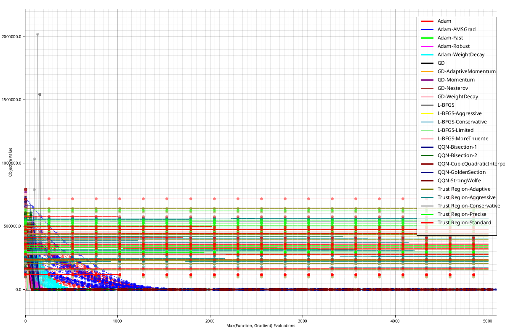
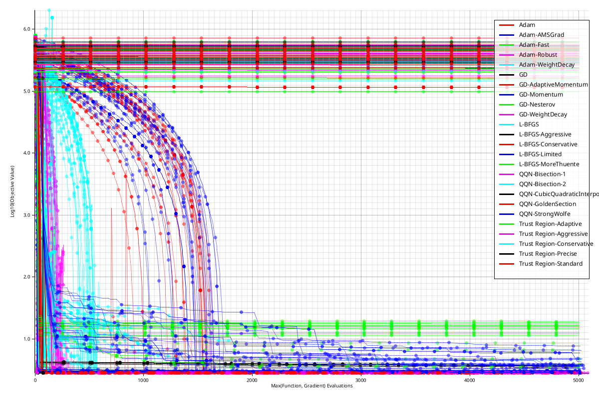

**Figure:** Convergence plots for PenaltyI_5D_alpha1e6 showing objective value vs iterations.
Left: Linear scale, Right: Log scale for better visualization of convergence behavior.

**Data:** [Linear scale data (CSV)](data/PenaltyI_5D_alpha1e6_data.csv) | [Log scale data (CSV)](data/PenaltyI_5D_alpha1e6_log_data.csv)

## Problem: PenaltyI_10D_alpha1e6

**Family:** PenaltyI
**Dimension:** 10
**Success Threshold:** 1.000e-6
**Total Runs:** 500
**Detailed Analysis:** [View comprehensive problem analysis](reports/problem_analysis_PenaltyI_10D_alpha1e6.md)

### Performance Summary
<table style="border-collapse: collapse; width: 100%; margin: 20px 0;">
<tr style="background-color: #f2f2f2;">
<th style="border: 1px solid #ddd; padding: 8px; text-align: center;">Rank</th>
<th style="border: 1px solid #ddd; padding: 8px; text-align: center;">Optimizer</th>
<th style="border: 1px solid #ddd; padding: 8px; text-align: center;">Mean Final Value (All/Success/Fail)</th>
<th style="border: 1px solid #ddd; padding: 8px; text-align: center;">Std Dev</th>
<th style="border: 1px solid #ddd; padding: 8px; text-align: center;">Best Value</th>
<th style="border: 1px solid #ddd; padding: 8px; text-align: center;">Worst Value</th>
<th style="border: 1px solid #ddd; padding: 8px; text-align: center;">Mean Function Evals (All/Success/Fail)</th>
<th style="border: 1px solid #ddd; padding: 8px; text-align: center;">Mean Gradient Evals (All/Success/Fail)</th>
<th style="border: 1px solid #ddd; padding: 8px; text-align: center;">Success Rate</th>
<th style="border: 1px solid #ddd; padding: 8px; text-align: center;">Mean Time (s)</th>
</tr>
<tr style="background-color: #d4edda; font-weight: bold;">
<td style="border: 1px solid #ddd; padding: 8px; text-align: center;">1</td>
<td style="border: 1px solid #ddd; padding: 8px; text-align: center;"><a href="reports/detailed_PenaltyI_10D_alpha1e6_L-BFGS-Aggressive.md" title="Click for detailed analysis">L-BFGS-Aggressive</a></td>
<td style="border: 1px solid #ddd; padding: 8px; text-align: center;">7.30e5 / - / 7.30e5</td>
<td style="border: 1px solid #ddd; padding: 8px; text-align: center;">1.81e5</td>
<td style="border: 1px solid #ddd; padding: 8px; text-align: center;">2.94e5</td>
<td style="border: 1px solid #ddd; padding: 8px; text-align: center;">1.04e6</td>
<td style="border: 1px solid #ddd; padding: 8px; text-align: center;">11.0 / - / 11.0</td>
<td style="border: 1px solid #ddd; padding: 8px; text-align: center;">18.0 / - / 18.0</td>
<td style="border: 1px solid #ddd; padding: 8px; text-align: center;">0.0%</td>
<td style="border: 1px solid #ddd; padding: 8px; text-align: center;">0.001</td>
</tr>
<tr style="background-color: #fff3cd;">
<td style="border: 1px solid #ddd; padding: 8px; text-align: center;">2</td>
<td style="border: 1px solid #ddd; padding: 8px; text-align: center;"><a href="reports/detailed_PenaltyI_10D_alpha1e6_GD-Nesterov.md" title="Click for detailed analysis">GD-Nesterov</a></td>
<td style="border: 1px solid #ddd; padding: 8px; text-align: center;">6.47e0 / - / 4.81e2</td>
<td style="border: 1px solid #ddd; padding: 8px; text-align: center;">2.98e-1</td>
<td style="border: 1px solid #ddd; padding: 8px; text-align: center;">5.95e0</td>
<td style="border: 1px solid #ddd; padding: 8px; text-align: center;">7.00e0</td>
<td style="border: 1px solid #ddd; padding: 8px; text-align: center;">14.9 / - / 14.9</td>
<td style="border: 1px solid #ddd; padding: 8px; text-align: center;">25.8 / - / 25.8</td>
<td style="border: 1px solid #ddd; padding: 8px; text-align: center;">0.0%</td>
<td style="border: 1px solid #ddd; padding: 8px; text-align: center;">0.000</td>
</tr>
<tr style="">
<td style="border: 1px solid #ddd; padding: 8px; text-align: center;">3</td>
<td style="border: 1px solid #ddd; padding: 8px; text-align: center;"><a href="reports/detailed_PenaltyI_10D_alpha1e6_GD-AdaptiveMomentum.md" title="Click for detailed analysis">GD-AdaptiveMomentum</a></td>
<td style="border: 1px solid #ddd; padding: 8px; text-align: center;">6.03e0 / - / 1.60e2</td>
<td style="border: 1px solid #ddd; padding: 8px; text-align: center;">2.61e-1</td>
<td style="border: 1px solid #ddd; padding: 8px; text-align: center;">5.67e0</td>
<td style="border: 1px solid #ddd; padding: 8px; text-align: center;">6.49e0</td>
<td style="border: 1px solid #ddd; padding: 8px; text-align: center;">15.0 / - / 15.0</td>
<td style="border: 1px solid #ddd; padding: 8px; text-align: center;">26.0 / - / 26.0</td>
<td style="border: 1px solid #ddd; padding: 8px; text-align: center;">0.0%</td>
<td style="border: 1px solid #ddd; padding: 8px; text-align: center;">0.000</td>
</tr>
<tr style="">
<td style="border: 1px solid #ddd; padding: 8px; text-align: center;">4</td>
<td style="border: 1px solid #ddd; padding: 8px; text-align: center;"><a href="reports/detailed_PenaltyI_10D_alpha1e6_GD-Momentum.md" title="Click for detailed analysis">GD-Momentum</a></td>
<td style="border: 1px solid #ddd; padding: 8px; text-align: center;">6.12e0 / - / 2.58e2</td>
<td style="border: 1px solid #ddd; padding: 8px; text-align: center;">3.63e-1</td>
<td style="border: 1px solid #ddd; padding: 8px; text-align: center;">5.66e0</td>
<td style="border: 1px solid #ddd; padding: 8px; text-align: center;">6.78e0</td>
<td style="border: 1px solid #ddd; padding: 8px; text-align: center;">15.4 / - / 15.4</td>
<td style="border: 1px solid #ddd; padding: 8px; text-align: center;">26.8 / - / 26.8</td>
<td style="border: 1px solid #ddd; padding: 8px; text-align: center;">0.0%</td>
<td style="border: 1px solid #ddd; padding: 8px; text-align: center;">0.000</td>
</tr>
<tr style="">
<td style="border: 1px solid #ddd; padding: 8px; text-align: center;">5</td>
<td style="border: 1px solid #ddd; padding: 8px; text-align: center;"><a href="reports/detailed_PenaltyI_10D_alpha1e6_GD-WeightDecay.md" title="Click for detailed analysis">GD-WeightDecay</a></td>
<td style="border: 1px solid #ddd; padding: 8px; text-align: center;">6.01e0 / - / 6.01e1</td>
<td style="border: 1px solid #ddd; padding: 8px; text-align: center;">2.37e-1</td>
<td style="border: 1px solid #ddd; padding: 8px; text-align: center;">5.68e0</td>
<td style="border: 1px solid #ddd; padding: 8px; text-align: center;">6.50e0</td>
<td style="border: 1px solid #ddd; padding: 8px; text-align: center;">15.8 / - / 15.8</td>
<td style="border: 1px solid #ddd; padding: 8px; text-align: center;">27.5 / - / 27.5</td>
<td style="border: 1px solid #ddd; padding: 8px; text-align: center;">0.0%</td>
<td style="border: 1px solid #ddd; padding: 8px; text-align: center;">0.000</td>
</tr>
<tr style="">
<td style="border: 1px solid #ddd; padding: 8px; text-align: center;">6</td>
<td style="border: 1px solid #ddd; padding: 8px; text-align: center;"><a href="reports/detailed_PenaltyI_10D_alpha1e6_GD.md" title="Click for detailed analysis">GD</a></td>
<td style="border: 1px solid #ddd; padding: 8px; text-align: center;">5.82e0 / - / 6.02e0</td>
<td style="border: 1px solid #ddd; padding: 8px; text-align: center;">8.06e-2</td>
<td style="border: 1px solid #ddd; padding: 8px; text-align: center;">5.72e0</td>
<td style="border: 1px solid #ddd; padding: 8px; text-align: center;">5.98e0</td>
<td style="border: 1px solid #ddd; padding: 8px; text-align: center;">19.4 / - / 19.4</td>
<td style="border: 1px solid #ddd; padding: 8px; text-align: center;">34.7 / - / 34.7</td>
<td style="border: 1px solid #ddd; padding: 8px; text-align: center;">0.0%</td>
<td style="border: 1px solid #ddd; padding: 8px; text-align: center;">0.001</td>
</tr>
<tr style="">
<td style="border: 1px solid #ddd; padding: 8px; text-align: center;">7</td>
<td style="border: 1px solid #ddd; padding: 8px; text-align: center;"><a href="reports/detailed_PenaltyI_10D_alpha1e6_QQN-CubicQuadraticInterpolation.md" title="Click for detailed analysis">QQN-CubicQuadraticInterpolation</a></td>
<td style="border: 1px solid #ddd; padding: 8px; text-align: center;">5.62e0 / - / 5.62e0</td>
<td style="border: 1px solid #ddd; padding: 8px; text-align: center;">1.32e-15</td>
<td style="border: 1px solid #ddd; padding: 8px; text-align: center;">5.62e0</td>
<td style="border: 1px solid #ddd; padding: 8px; text-align: center;">5.62e0</td>
<td style="border: 1px solid #ddd; padding: 8px; text-align: center;">38.0 / - / 38.0</td>
<td style="border: 1px solid #ddd; padding: 8px; text-align: center;">38.0 / - / 38.0</td>
<td style="border: 1px solid #ddd; padding: 8px; text-align: center;">0.0%</td>
<td style="border: 1px solid #ddd; padding: 8px; text-align: center;">0.001</td>
</tr>
<tr style="">
<td style="border: 1px solid #ddd; padding: 8px; text-align: center;">8</td>
<td style="border: 1px solid #ddd; padding: 8px; text-align: center;"><a href="reports/detailed_PenaltyI_10D_alpha1e6_Adam-Fast.md" title="Click for detailed analysis">Adam-Fast</a></td>
<td style="border: 1px solid #ddd; padding: 8px; text-align: center;">7.65e0 / - / 1.17e3</td>
<td style="border: 1px solid #ddd; padding: 8px; text-align: center;">6.20e-1</td>
<td style="border: 1px solid #ddd; padding: 8px; text-align: center;">6.14e0</td>
<td style="border: 1px solid #ddd; padding: 8px; text-align: center;">8.45e0</td>
<td style="border: 1px solid #ddd; padding: 8px; text-align: center;">42.3 / - / 42.3</td>
<td style="border: 1px solid #ddd; padding: 8px; text-align: center;">41.3 / - / 41.3</td>
<td style="border: 1px solid #ddd; padding: 8px; text-align: center;">0.0%</td>
<td style="border: 1px solid #ddd; padding: 8px; text-align: center;">0.001</td>
</tr>
<tr style="">
<td style="border: 1px solid #ddd; padding: 8px; text-align: center;">9</td>
<td style="border: 1px solid #ddd; padding: 8px; text-align: center;"><a href="reports/detailed_PenaltyI_10D_alpha1e6_L-BFGS.md" title="Click for detailed analysis">L-BFGS</a></td>
<td style="border: 1px solid #ddd; padding: 8px; text-align: center;">8.82e0 / - / 1.71e5</td>
<td style="border: 1px solid #ddd; padding: 8px; text-align: center;">9.45e-1</td>
<td style="border: 1px solid #ddd; padding: 8px; text-align: center;">6.68e0</td>
<td style="border: 1px solid #ddd; padding: 8px; text-align: center;">1.03e1</td>
<td style="border: 1px solid #ddd; padding: 8px; text-align: center;">101.3 / - / 101.3</td>
<td style="border: 1px solid #ddd; padding: 8px; text-align: center;">38.8 / - / 38.8</td>
<td style="border: 1px solid #ddd; padding: 8px; text-align: center;">0.0%</td>
<td style="border: 1px solid #ddd; padding: 8px; text-align: center;">0.002</td>
</tr>
<tr style="">
<td style="border: 1px solid #ddd; padding: 8px; text-align: center;">10</td>
<td style="border: 1px solid #ddd; padding: 8px; text-align: center;"><a href="reports/detailed_PenaltyI_10D_alpha1e6_Adam-Robust.md" title="Click for detailed analysis">Adam-Robust</a></td>
<td style="border: 1px solid #ddd; padding: 8px; text-align: center;">5.75e0 / - / 2.18e1</td>
<td style="border: 1px solid #ddd; padding: 8px; text-align: center;">3.12e-2</td>
<td style="border: 1px solid #ddd; padding: 8px; text-align: center;">5.66e0</td>
<td style="border: 1px solid #ddd; padding: 8px; text-align: center;">5.80e0</td>
<td style="border: 1px solid #ddd; padding: 8px; text-align: center;">129.1 / - / 129.1</td>
<td style="border: 1px solid #ddd; padding: 8px; text-align: center;">128.1 / - / 128.1</td>
<td style="border: 1px solid #ddd; padding: 8px; text-align: center;">0.0%</td>
<td style="border: 1px solid #ddd; padding: 8px; text-align: center;">0.003</td>
</tr>
<tr style="">
<td style="border: 1px solid #ddd; padding: 8px; text-align: center;">11</td>
<td style="border: 1px solid #ddd; padding: 8px; text-align: center;"><a href="reports/detailed_PenaltyI_10D_alpha1e6_Adam-WeightDecay.md" title="Click for detailed analysis">Adam-WeightDecay</a></td>
<td style="border: 1px solid #ddd; padding: 8px; text-align: center;">5.71e0 / - / 9.99e0</td>
<td style="border: 1px solid #ddd; padding: 8px; text-align: center;">1.16e-2</td>
<td style="border: 1px solid #ddd; padding: 8px; text-align: center;">5.68e0</td>
<td style="border: 1px solid #ddd; padding: 8px; text-align: center;">5.73e0</td>
<td style="border: 1px solid #ddd; padding: 8px; text-align: center;">274.1 / - / 274.1</td>
<td style="border: 1px solid #ddd; padding: 8px; text-align: center;">273.1 / - / 273.1</td>
<td style="border: 1px solid #ddd; padding: 8px; text-align: center;">0.0%</td>
<td style="border: 1px solid #ddd; padding: 8px; text-align: center;">0.007</td>
</tr>
<tr style="">
<td style="border: 1px solid #ddd; padding: 8px; text-align: center;">12</td>
<td style="border: 1px solid #ddd; padding: 8px; text-align: center;"><a href="reports/detailed_PenaltyI_10D_alpha1e6_Adam-AMSGrad.md" title="Click for detailed analysis">Adam-AMSGrad</a></td>
<td style="border: 1px solid #ddd; padding: 8px; text-align: center;">5.64e0 / - / 5.66e0</td>
<td style="border: 1px solid #ddd; padding: 8px; text-align: center;">4.81e-3</td>
<td style="border: 1px solid #ddd; padding: 8px; text-align: center;">5.63e0</td>
<td style="border: 1px solid #ddd; padding: 8px; text-align: center;">5.65e0</td>
<td style="border: 1px solid #ddd; padding: 8px; text-align: center;">761.0 / - / 761.0</td>
<td style="border: 1px solid #ddd; padding: 8px; text-align: center;">760.0 / - / 760.0</td>
<td style="border: 1px solid #ddd; padding: 8px; text-align: center;">0.0%</td>
<td style="border: 1px solid #ddd; padding: 8px; text-align: center;">0.019</td>
</tr>
<tr style="">
<td style="border: 1px solid #ddd; padding: 8px; text-align: center;">13</td>
<td style="border: 1px solid #ddd; padding: 8px; text-align: center;"><a href="reports/detailed_PenaltyI_10D_alpha1e6_Adam.md" title="Click for detailed analysis">Adam</a></td>
<td style="border: 1px solid #ddd; padding: 8px; text-align: center;">5.64e0 / - / 5.68e0</td>
<td style="border: 1px solid #ddd; padding: 8px; text-align: center;">2.42e-3</td>
<td style="border: 1px solid #ddd; padding: 8px; text-align: center;">5.63e0</td>
<td style="border: 1px solid #ddd; padding: 8px; text-align: center;">5.64e0</td>
<td style="border: 1px solid #ddd; padding: 8px; text-align: center;">764.5 / - / 764.5</td>
<td style="border: 1px solid #ddd; padding: 8px; text-align: center;">763.5 / - / 763.5</td>
<td style="border: 1px solid #ddd; padding: 8px; text-align: center;">0.0%</td>
<td style="border: 1px solid #ddd; padding: 8px; text-align: center;">0.017</td>
</tr>
<tr style="">
<td style="border: 1px solid #ddd; padding: 8px; text-align: center;">14</td>
<td style="border: 1px solid #ddd; padding: 8px; text-align: center;"><a href="reports/detailed_PenaltyI_10D_alpha1e6_QQN-Bisection-2.md" title="Click for detailed analysis">QQN-Bisection-2</a></td>
<td style="border: 1px solid #ddd; padding: 8px; text-align: center;">1.86e1 / - / 1.86e1</td>
<td style="border: 1px solid #ddd; padding: 8px; text-align: center;">5.50e0</td>
<td style="border: 1px solid #ddd; padding: 8px; text-align: center;">9.12e0</td>
<td style="border: 1px solid #ddd; padding: 8px; text-align: center;">2.63e1</td>
<td style="border: 1px solid #ddd; padding: 8px; text-align: center;">1070.2 / - / 1070.2</td>
<td style="border: 1px solid #ddd; padding: 8px; text-align: center;">557.1 / - / 557.1</td>
<td style="border: 1px solid #ddd; padding: 8px; text-align: center;">0.0%</td>
<td style="border: 1px solid #ddd; padding: 8px; text-align: center;">0.027</td>
</tr>
<tr style="">
<td style="border: 1px solid #ddd; padding: 8px; text-align: center;">15</td>
<td style="border: 1px solid #ddd; padding: 8px; text-align: center;"><a href="reports/detailed_PenaltyI_10D_alpha1e6_L-BFGS-Conservative.md" title="Click for detailed analysis">L-BFGS-Conservative</a></td>
<td style="border: 1px solid #ddd; padding: 8px; text-align: center;">5.72e0 / - / 5.73e0</td>
<td style="border: 1px solid #ddd; padding: 8px; text-align: center;">1.07e-1</td>
<td style="border: 1px solid #ddd; padding: 8px; text-align: center;">5.63e0</td>
<td style="border: 1px solid #ddd; padding: 8px; text-align: center;">6.06e0</td>
<td style="border: 1px solid #ddd; padding: 8px; text-align: center;">2611.7 / - / 2611.7</td>
<td style="border: 1px solid #ddd; padding: 8px; text-align: center;">911.9 / - / 911.9</td>
<td style="border: 1px solid #ddd; padding: 8px; text-align: center;">0.0%</td>
<td style="border: 1px solid #ddd; padding: 8px; text-align: center;">0.034</td>
</tr>
<tr style="">
<td style="border: 1px solid #ddd; padding: 8px; text-align: center;">16</td>
<td style="border: 1px solid #ddd; padding: 8px; text-align: center;"><a href="reports/detailed_PenaltyI_10D_alpha1e6_QQN-GoldenSection.md" title="Click for detailed analysis">QQN-GoldenSection</a></td>
<td style="border: 1px solid #ddd; padding: 8px; text-align: center;">5.63e0 / - / 5.63e0</td>
<td style="border: 1px solid #ddd; padding: 8px; text-align: center;">1.88e-4</td>
<td style="border: 1px solid #ddd; padding: 8px; text-align: center;">5.62e0</td>
<td style="border: 1px solid #ddd; padding: 8px; text-align: center;">5.63e0</td>
<td style="border: 1px solid #ddd; padding: 8px; text-align: center;">4382.9 / - / 4382.9</td>
<td style="border: 1px solid #ddd; padding: 8px; text-align: center;">566.8 / - / 566.8</td>
<td style="border: 1px solid #ddd; padding: 8px; text-align: center;">0.0%</td>
<td style="border: 1px solid #ddd; padding: 8px; text-align: center;">0.085</td>
</tr>
<tr style="">
<td style="border: 1px solid #ddd; padding: 8px; text-align: center;">17</td>
<td style="border: 1px solid #ddd; padding: 8px; text-align: center;"><a href="reports/detailed_PenaltyI_10D_alpha1e6_Trust_Region-Aggressive.md" title="Click for detailed analysis">Trust Region-Aggressive</a></td>
<td style="border: 1px solid #ddd; padding: 8px; text-align: center;">7.20e5 / - / 7.20e5</td>
<td style="border: 1px solid #ddd; padding: 8px; text-align: center;">1.73e5</td>
<td style="border: 1px solid #ddd; padding: 8px; text-align: center;">3.91e5</td>
<td style="border: 1px solid #ddd; padding: 8px; text-align: center;">1.04e6</td>
<td style="border: 1px solid #ddd; padding: 8px; text-align: center;">3002.0 / - / 3002.0</td>
<td style="border: 1px solid #ddd; padding: 8px; text-align: center;">2002.0 / - / 2002.0</td>
<td style="border: 1px solid #ddd; padding: 8px; text-align: center;">0.0%</td>
<td style="border: 1px solid #ddd; padding: 8px; text-align: center;">0.021</td>
</tr>
<tr style="">
<td style="border: 1px solid #ddd; padding: 8px; text-align: center;">18</td>
<td style="border: 1px solid #ddd; padding: 8px; text-align: center;"><a href="reports/detailed_PenaltyI_10D_alpha1e6_Trust_Region-Adaptive.md" title="Click for detailed analysis">Trust Region-Adaptive</a></td>
<td style="border: 1px solid #ddd; padding: 8px; text-align: center;">7.20e5 / - / 7.20e5</td>
<td style="border: 1px solid #ddd; padding: 8px; text-align: center;">1.83e5</td>
<td style="border: 1px solid #ddd; padding: 8px; text-align: center;">3.49e5</td>
<td style="border: 1px solid #ddd; padding: 8px; text-align: center;">1.14e6</td>
<td style="border: 1px solid #ddd; padding: 8px; text-align: center;">3002.0 / - / 3002.0</td>
<td style="border: 1px solid #ddd; padding: 8px; text-align: center;">2002.0 / - / 2002.0</td>
<td style="border: 1px solid #ddd; padding: 8px; text-align: center;">0.0%</td>
<td style="border: 1px solid #ddd; padding: 8px; text-align: center;">0.021</td>
</tr>
<tr style="">
<td style="border: 1px solid #ddd; padding: 8px; text-align: center;">19</td>
<td style="border: 1px solid #ddd; padding: 8px; text-align: center;"><a href="reports/detailed_PenaltyI_10D_alpha1e6_Trust_Region-Conservative.md" title="Click for detailed analysis">Trust Region-Conservative</a></td>
<td style="border: 1px solid #ddd; padding: 8px; text-align: center;">7.72e5 / - / 7.72e5</td>
<td style="border: 1px solid #ddd; padding: 8px; text-align: center;">1.26e5</td>
<td style="border: 1px solid #ddd; padding: 8px; text-align: center;">5.48e5</td>
<td style="border: 1px solid #ddd; padding: 8px; text-align: center;">1.03e6</td>
<td style="border: 1px solid #ddd; padding: 8px; text-align: center;">3002.0 / - / 3002.0</td>
<td style="border: 1px solid #ddd; padding: 8px; text-align: center;">2002.0 / - / 2002.0</td>
<td style="border: 1px solid #ddd; padding: 8px; text-align: center;">0.0%</td>
<td style="border: 1px solid #ddd; padding: 8px; text-align: center;">0.021</td>
</tr>
<tr style="">
<td style="border: 1px solid #ddd; padding: 8px; text-align: center;">20</td>
<td style="border: 1px solid #ddd; padding: 8px; text-align: center;"><a href="reports/detailed_PenaltyI_10D_alpha1e6_Trust_Region-Standard.md" title="Click for detailed analysis">Trust Region-Standard</a></td>
<td style="border: 1px solid #ddd; padding: 8px; text-align: center;">7.40e5 / - / 7.40e5</td>
<td style="border: 1px solid #ddd; padding: 8px; text-align: center;">2.39e5</td>
<td style="border: 1px solid #ddd; padding: 8px; text-align: center;">2.96e5</td>
<td style="border: 1px solid #ddd; padding: 8px; text-align: center;">1.19e6</td>
<td style="border: 1px solid #ddd; padding: 8px; text-align: center;">3002.0 / - / 3002.0</td>
<td style="border: 1px solid #ddd; padding: 8px; text-align: center;">2002.0 / - / 2002.0</td>
<td style="border: 1px solid #ddd; padding: 8px; text-align: center;">0.0%</td>
<td style="border: 1px solid #ddd; padding: 8px; text-align: center;">0.021</td>
</tr>
<tr style="">
<td style="border: 1px solid #ddd; padding: 8px; text-align: center;">21</td>
<td style="border: 1px solid #ddd; padding: 8px; text-align: center;"><a href="reports/detailed_PenaltyI_10D_alpha1e6_Trust_Region-Precise.md" title="Click for detailed analysis">Trust Region-Precise</a></td>
<td style="border: 1px solid #ddd; padding: 8px; text-align: center;">7.75e5 / - / 7.75e5</td>
<td style="border: 1px solid #ddd; padding: 8px; text-align: center;">1.73e5</td>
<td style="border: 1px solid #ddd; padding: 8px; text-align: center;">4.16e5</td>
<td style="border: 1px solid #ddd; padding: 8px; text-align: center;">9.96e5</td>
<td style="border: 1px solid #ddd; padding: 8px; text-align: center;">3002.0 / - / 3002.0</td>
<td style="border: 1px solid #ddd; padding: 8px; text-align: center;">2002.0 / - / 2002.0</td>
<td style="border: 1px solid #ddd; padding: 8px; text-align: center;">0.0%</td>
<td style="border: 1px solid #ddd; padding: 8px; text-align: center;">0.021</td>
</tr>
<tr style="">
<td style="border: 1px solid #ddd; padding: 8px; text-align: center;">22</td>
<td style="border: 1px solid #ddd; padding: 8px; text-align: center;"><a href="reports/detailed_PenaltyI_10D_alpha1e6_L-BFGS-MoreThuente.md" title="Click for detailed analysis">L-BFGS-MoreThuente</a></td>
<td style="border: 1px solid #ddd; padding: 8px; text-align: center;">2.89e1 / - / 2.89e1</td>
<td style="border: 1px solid #ddd; padding: 8px; text-align: center;">6.69e0</td>
<td style="border: 1px solid #ddd; padding: 8px; text-align: center;">1.06e1</td>
<td style="border: 1px solid #ddd; padding: 8px; text-align: center;">3.74e1</td>
<td style="border: 1px solid #ddd; padding: 8px; text-align: center;">2859.4 / - / 2859.4</td>
<td style="border: 1px solid #ddd; padding: 8px; text-align: center;">2145.0 / - / 2145.0</td>
<td style="border: 1px solid #ddd; padding: 8px; text-align: center;">0.0%</td>
<td style="border: 1px solid #ddd; padding: 8px; text-align: center;">0.034</td>
</tr>
<tr style="">
<td style="border: 1px solid #ddd; padding: 8px; text-align: center;">23</td>
<td style="border: 1px solid #ddd; padding: 8px; text-align: center;"><a href="reports/detailed_PenaltyI_10D_alpha1e6_L-BFGS-Limited.md" title="Click for detailed analysis">L-BFGS-Limited</a></td>
<td style="border: 1px solid #ddd; padding: 8px; text-align: center;">5.89e0 / - / 5.89e0</td>
<td style="border: 1px solid #ddd; padding: 8px; text-align: center;">1.07e-1</td>
<td style="border: 1px solid #ddd; padding: 8px; text-align: center;">5.78e0</td>
<td style="border: 1px solid #ddd; padding: 8px; text-align: center;">6.13e0</td>
<td style="border: 1px solid #ddd; padding: 8px; text-align: center;">4213.4 / - / 4213.4</td>
<td style="border: 1px solid #ddd; padding: 8px; text-align: center;">799.4 / - / 799.4</td>
<td style="border: 1px solid #ddd; padding: 8px; text-align: center;">0.0%</td>
<td style="border: 1px solid #ddd; padding: 8px; text-align: center;">0.043</td>
</tr>
<tr style="">
<td style="border: 1px solid #ddd; padding: 8px; text-align: center;">24</td>
<td style="border: 1px solid #ddd; padding: 8px; text-align: center;"><a href="reports/detailed_PenaltyI_10D_alpha1e6_QQN-StrongWolfe.md" title="Click for detailed analysis">QQN-StrongWolfe</a></td>
<td style="border: 1px solid #ddd; padding: 8px; text-align: center;">1.10e1 / - / 1.10e1</td>
<td style="border: 1px solid #ddd; padding: 8px; text-align: center;">3.01e0</td>
<td style="border: 1px solid #ddd; padding: 8px; text-align: center;">8.12e0</td>
<td style="border: 1px solid #ddd; padding: 8px; text-align: center;">2.06e1</td>
<td style="border: 1px solid #ddd; padding: 8px; text-align: center;">3057.8 / - / 3057.8</td>
<td style="border: 1px solid #ddd; padding: 8px; text-align: center;">1962.7 / - / 1962.7</td>
<td style="border: 1px solid #ddd; padding: 8px; text-align: center;">0.0%</td>
<td style="border: 1px solid #ddd; padding: 8px; text-align: center;">0.090</td>
</tr>
<tr style="">
<td style="border: 1px solid #ddd; padding: 8px; text-align: center;">25</td>
<td style="border: 1px solid #ddd; padding: 8px; text-align: center;"><a href="reports/detailed_PenaltyI_10D_alpha1e6_QQN-Bisection-1.md" title="Click for detailed analysis">QQN-Bisection-1</a></td>
<td style="border: 1px solid #ddd; padding: 8px; text-align: center;">5.63e0 / - / 5.63e0</td>
<td style="border: 1px solid #ddd; padding: 8px; text-align: center;">2.30e-3</td>
<td style="border: 1px solid #ddd; padding: 8px; text-align: center;">5.63e0</td>
<td style="border: 1px solid #ddd; padding: 8px; text-align: center;">5.63e0</td>
<td style="border: 1px solid #ddd; padding: 8px; text-align: center;">2161.3 / - / 2161.3</td>
<td style="border: 1px solid #ddd; padding: 8px; text-align: center;">2898.1 / - / 2898.1</td>
<td style="border: 1px solid #ddd; padding: 8px; text-align: center;">0.0%</td>
<td style="border: 1px solid #ddd; padding: 8px; text-align: center;">0.075</td>
</tr>
</table>

### Convergence Plots

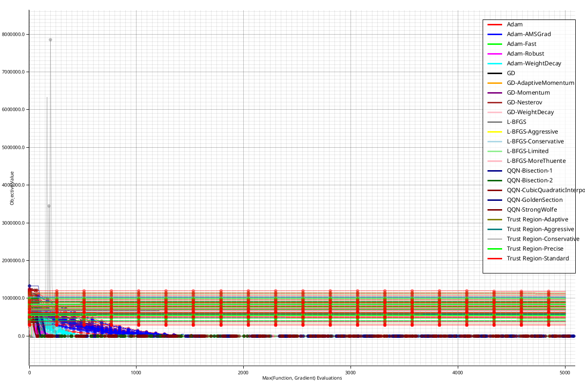
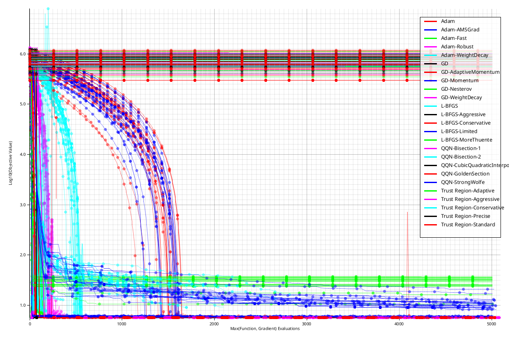

**Figure:** Convergence plots for PenaltyI_10D_alpha1e6 showing objective value vs iterations.
Left: Linear scale, Right: Log scale for better visualization of convergence behavior.

**Data:** [Linear scale data (CSV)](data/PenaltyI_10D_alpha1e6_data.csv) | [Log scale data (CSV)](data/PenaltyI_10D_alpha1e6_log_data.csv)

## Problem: Barrier_2D_mu0.1

**Family:** Barrier
**Dimension:** 2
**Success Threshold:** 1.000e-6
**Total Runs:** 500
**Detailed Analysis:** [View comprehensive problem analysis](reports/problem_analysis_Barrier_2D_mu0.1.md)

### Performance Summary
<table style="border-collapse: collapse; width: 100%; margin: 20px 0;">
<tr style="background-color: #f2f2f2;">
<th style="border: 1px solid #ddd; padding: 8px; text-align: center;">Rank</th>
<th style="border: 1px solid #ddd; padding: 8px; text-align: center;">Optimizer</th>
<th style="border: 1px solid #ddd; padding: 8px; text-align: center;">Mean Final Value (All/Success/Fail)</th>
<th style="border: 1px solid #ddd; padding: 8px; text-align: center;">Std Dev</th>
<th style="border: 1px solid #ddd; padding: 8px; text-align: center;">Best Value</th>
<th style="border: 1px solid #ddd; padding: 8px; text-align: center;">Worst Value</th>
<th style="border: 1px solid #ddd; padding: 8px; text-align: center;">Mean Function Evals (All/Success/Fail)</th>
<th style="border: 1px solid #ddd; padding: 8px; text-align: center;">Mean Gradient Evals (All/Success/Fail)</th>
<th style="border: 1px solid #ddd; padding: 8px; text-align: center;">Success Rate</th>
<th style="border: 1px solid #ddd; padding: 8px; text-align: center;">Mean Time (s)</th>
</tr>
<tr style="background-color: #d4edda; font-weight: bold;">
<td style="border: 1px solid #ddd; padding: 8px; text-align: center;">1</td>
<td style="border: 1px solid #ddd; padding: 8px; text-align: center;"><a href="reports/detailed_Barrier_2D_mu0.1_GD-AdaptiveMomentum.md" title="Click for detailed analysis">GD-AdaptiveMomentum</a></td>
<td style="border: 1px solid #ddd; padding: 8px; text-align: center;">4.07e-1 / - / 4.65e-1</td>
<td style="border: 1px solid #ddd; padding: 8px; text-align: center;">2.15e-3</td>
<td style="border: 1px solid #ddd; padding: 8px; text-align: center;">4.05e-1</td>
<td style="border: 1px solid #ddd; padding: 8px; text-align: center;">4.09e-1</td>
<td style="border: 1px solid #ddd; padding: 8px; text-align: center;">1.6 / - / 1.6</td>
<td style="border: 1px solid #ddd; padding: 8px; text-align: center;">2.7 / - / 2.7</td>
<td style="border: 1px solid #ddd; padding: 8px; text-align: center;">0.0%</td>
<td style="border: 1px solid #ddd; padding: 8px; text-align: center;">0.000</td>
</tr>
<tr style="background-color: #fff3cd;">
<td style="border: 1px solid #ddd; padding: 8px; text-align: center;">2</td>
<td style="border: 1px solid #ddd; padding: 8px; text-align: center;"><a href="reports/detailed_Barrier_2D_mu0.1_Trust_Region-Aggressive.md" title="Click for detailed analysis">Trust Region-Aggressive</a></td>
<td style="border: 1px solid #ddd; padding: 8px; text-align: center;">2.25e0 / - / 2.25e0</td>
<td style="border: 1px solid #ddd; padding: 8px; text-align: center;">2.02e0</td>
<td style="border: 1px solid #ddd; padding: 8px; text-align: center;">5.85e-1</td>
<td style="border: 1px solid #ddd; padding: 8px; text-align: center;">5.05e0</td>
<td style="border: 1px solid #ddd; padding: 8px; text-align: center;">3.4 / - / 3.4</td>
<td style="border: 1px solid #ddd; padding: 8px; text-align: center;">2.5 / - / 2.5</td>
<td style="border: 1px solid #ddd; padding: 8px; text-align: center;">0.0%</td>
<td style="border: 1px solid #ddd; padding: 8px; text-align: center;">0.000</td>
</tr>
<tr style="">
<td style="border: 1px solid #ddd; padding: 8px; text-align: center;">3</td>
<td style="border: 1px solid #ddd; padding: 8px; text-align: center;"><a href="reports/detailed_Barrier_2D_mu0.1_Trust_Region-Standard.md" title="Click for detailed analysis">Trust Region-Standard</a></td>
<td style="border: 1px solid #ddd; padding: 8px; text-align: center;">7.17e-1 / - / 7.17e-1</td>
<td style="border: 1px solid #ddd; padding: 8px; text-align: center;">4.33e-1</td>
<td style="border: 1px solid #ddd; padding: 8px; text-align: center;">4.00e-1</td>
<td style="border: 1px solid #ddd; padding: 8px; text-align: center;">1.64e0</td>
<td style="border: 1px solid #ddd; padding: 8px; text-align: center;">10.2 / - / 10.2</td>
<td style="border: 1px solid #ddd; padding: 8px; text-align: center;">7.8 / - / 7.8</td>
<td style="border: 1px solid #ddd; padding: 8px; text-align: center;">0.0%</td>
<td style="border: 1px solid #ddd; padding: 8px; text-align: center;">0.000</td>
</tr>
<tr style="">
<td style="border: 1px solid #ddd; padding: 8px; text-align: center;">4</td>
<td style="border: 1px solid #ddd; padding: 8px; text-align: center;"><a href="reports/detailed_Barrier_2D_mu0.1_Trust_Region-Adaptive.md" title="Click for detailed analysis">Trust Region-Adaptive</a></td>
<td style="border: 1px solid #ddd; padding: 8px; text-align: center;">4.54e-1 / - / 4.54e-1</td>
<td style="border: 1px solid #ddd; padding: 8px; text-align: center;">9.24e-2</td>
<td style="border: 1px solid #ddd; padding: 8px; text-align: center;">4.00e-1</td>
<td style="border: 1px solid #ddd; padding: 8px; text-align: center;">7.59e-1</td>
<td style="border: 1px solid #ddd; padding: 8px; text-align: center;">24.1 / - / 24.1</td>
<td style="border: 1px solid #ddd; padding: 8px; text-align: center;">17.0 / - / 17.0</td>
<td style="border: 1px solid #ddd; padding: 8px; text-align: center;">0.0%</td>
<td style="border: 1px solid #ddd; padding: 8px; text-align: center;">0.000</td>
</tr>
<tr style="">
<td style="border: 1px solid #ddd; padding: 8px; text-align: center;">5</td>
<td style="border: 1px solid #ddd; padding: 8px; text-align: center;"><a href="reports/detailed_Barrier_2D_mu0.1_GD-Nesterov.md" title="Click for detailed analysis">GD-Nesterov</a></td>
<td style="border: 1px solid #ddd; padding: 8px; text-align: center;">4.02e-1 / - / 5.03e-1</td>
<td style="border: 1px solid #ddd; padding: 8px; text-align: center;">1.25e-3</td>
<td style="border: 1px solid #ddd; padding: 8px; text-align: center;">4.00e-1</td>
<td style="border: 1px solid #ddd; padding: 8px; text-align: center;">4.04e-1</td>
<td style="border: 1px solid #ddd; padding: 8px; text-align: center;">20.4 / - / 20.4</td>
<td style="border: 1px solid #ddd; padding: 8px; text-align: center;">36.9 / - / 36.9</td>
<td style="border: 1px solid #ddd; padding: 8px; text-align: center;">0.0%</td>
<td style="border: 1px solid #ddd; padding: 8px; text-align: center;">0.001</td>
</tr>
<tr style="">
<td style="border: 1px solid #ddd; padding: 8px; text-align: center;">6</td>
<td style="border: 1px solid #ddd; padding: 8px; text-align: center;"><a href="reports/detailed_Barrier_2D_mu0.1_GD-Momentum.md" title="Click for detailed analysis">GD-Momentum</a></td>
<td style="border: 1px solid #ddd; padding: 8px; text-align: center;">4.02e-1 / - / 5.05e-1</td>
<td style="border: 1px solid #ddd; padding: 8px; text-align: center;">1.12e-3</td>
<td style="border: 1px solid #ddd; padding: 8px; text-align: center;">4.00e-1</td>
<td style="border: 1px solid #ddd; padding: 8px; text-align: center;">4.04e-1</td>
<td style="border: 1px solid #ddd; padding: 8px; text-align: center;">20.9 / - / 20.9</td>
<td style="border: 1px solid #ddd; padding: 8px; text-align: center;">37.8 / - / 37.8</td>
<td style="border: 1px solid #ddd; padding: 8px; text-align: center;">0.0%</td>
<td style="border: 1px solid #ddd; padding: 8px; text-align: center;">0.001</td>
</tr>
<tr style="">
<td style="border: 1px solid #ddd; padding: 8px; text-align: center;">7</td>
<td style="border: 1px solid #ddd; padding: 8px; text-align: center;"><a href="reports/detailed_Barrier_2D_mu0.1_Adam-Fast.md" title="Click for detailed analysis">Adam-Fast</a></td>
<td style="border: 1px solid #ddd; padding: 8px; text-align: center;">4.21e-1 / - / 5.15e-1</td>
<td style="border: 1px solid #ddd; padding: 8px; text-align: center;">1.74e-2</td>
<td style="border: 1px solid #ddd; padding: 8px; text-align: center;">4.00e-1</td>
<td style="border: 1px solid #ddd; padding: 8px; text-align: center;">4.57e-1</td>
<td style="border: 1px solid #ddd; padding: 8px; text-align: center;">31.4 / - / 31.4</td>
<td style="border: 1px solid #ddd; padding: 8px; text-align: center;">30.4 / - / 30.4</td>
<td style="border: 1px solid #ddd; padding: 8px; text-align: center;">0.0%</td>
<td style="border: 1px solid #ddd; padding: 8px; text-align: center;">0.001</td>
</tr>
<tr style="">
<td style="border: 1px solid #ddd; padding: 8px; text-align: center;">8</td>
<td style="border: 1px solid #ddd; padding: 8px; text-align: center;"><a href="reports/detailed_Barrier_2D_mu0.1_GD-WeightDecay.md" title="Click for detailed analysis">GD-WeightDecay</a></td>
<td style="border: 1px solid #ddd; padding: 8px; text-align: center;">4.00e-1 / - / 4.00e-1</td>
<td style="border: 1px solid #ddd; padding: 8px; text-align: center;">1.36e-5</td>
<td style="border: 1px solid #ddd; padding: 8px; text-align: center;">4.00e-1</td>
<td style="border: 1px solid #ddd; padding: 8px; text-align: center;">4.00e-1</td>
<td style="border: 1px solid #ddd; padding: 8px; text-align: center;">49.0 / - / 49.0</td>
<td style="border: 1px solid #ddd; padding: 8px; text-align: center;">94.0 / - / 94.0</td>
<td style="border: 1px solid #ddd; padding: 8px; text-align: center;">0.0%</td>
<td style="border: 1px solid #ddd; padding: 8px; text-align: center;">0.002</td>
</tr>
<tr style="">
<td style="border: 1px solid #ddd; padding: 8px; text-align: center;">9</td>
<td style="border: 1px solid #ddd; padding: 8px; text-align: center;"><a href="reports/detailed_Barrier_2D_mu0.1_Trust_Region-Precise.md" title="Click for detailed analysis">Trust Region-Precise</a></td>
<td style="border: 1px solid #ddd; padding: 8px; text-align: center;">4.09e-1 / - / 4.55e-1</td>
<td style="border: 1px solid #ddd; padding: 8px; text-align: center;">1.27e-2</td>
<td style="border: 1px solid #ddd; padding: 8px; text-align: center;">4.00e-1</td>
<td style="border: 1px solid #ddd; padding: 8px; text-align: center;">4.61e-1</td>
<td style="border: 1px solid #ddd; padding: 8px; text-align: center;">96.7 / - / 96.7</td>
<td style="border: 1px solid #ddd; padding: 8px; text-align: center;">65.1 / - / 65.1</td>
<td style="border: 1px solid #ddd; padding: 8px; text-align: center;">0.0%</td>
<td style="border: 1px solid #ddd; padding: 8px; text-align: center;">0.001</td>
</tr>
<tr style="">
<td style="border: 1px solid #ddd; padding: 8px; text-align: center;">10</td>
<td style="border: 1px solid #ddd; padding: 8px; text-align: center;"><a href="reports/detailed_Barrier_2D_mu0.1_L-BFGS-Limited.md" title="Click for detailed analysis">L-BFGS-Limited</a></td>
<td style="border: 1px solid #ddd; padding: 8px; text-align: center;">4.00e-1 / - / 4.00e-1</td>
<td style="border: 1px solid #ddd; padding: 8px; text-align: center;">2.73e-3</td>
<td style="border: 1px solid #ddd; padding: 8px; text-align: center;">4.00e-1</td>
<td style="border: 1px solid #ddd; padding: 8px; text-align: center;">4.12e-1</td>
<td style="border: 1px solid #ddd; padding: 8px; text-align: center;">140.3 / - / 140.3</td>
<td style="border: 1px solid #ddd; padding: 8px; text-align: center;">84.8 / - / 84.8</td>
<td style="border: 1px solid #ddd; padding: 8px; text-align: center;">0.0%</td>
<td style="border: 1px solid #ddd; padding: 8px; text-align: center;">0.003</td>
</tr>
<tr style="">
<td style="border: 1px solid #ddd; padding: 8px; text-align: center;">11</td>
<td style="border: 1px solid #ddd; padding: 8px; text-align: center;"><a href="reports/detailed_Barrier_2D_mu0.1_Trust_Region-Conservative.md" title="Click for detailed analysis">Trust Region-Conservative</a></td>
<td style="border: 1px solid #ddd; padding: 8px; text-align: center;">4.53e-1 / - / 4.61e-1</td>
<td style="border: 1px solid #ddd; padding: 8px; text-align: center;">7.97e-2</td>
<td style="border: 1px solid #ddd; padding: 8px; text-align: center;">4.00e-1</td>
<td style="border: 1px solid #ddd; padding: 8px; text-align: center;">6.13e-1</td>
<td style="border: 1px solid #ddd; padding: 8px; text-align: center;">494.1 / - / 494.1</td>
<td style="border: 1px solid #ddd; padding: 8px; text-align: center;">330.2 / - / 330.2</td>
<td style="border: 1px solid #ddd; padding: 8px; text-align: center;">0.0%</td>
<td style="border: 1px solid #ddd; padding: 8px; text-align: center;">0.003</td>
</tr>
<tr style="">
<td style="border: 1px solid #ddd; padding: 8px; text-align: center;">12</td>
<td style="border: 1px solid #ddd; padding: 8px; text-align: center;"><a href="reports/detailed_Barrier_2D_mu0.1_GD.md" title="Click for detailed analysis">GD</a></td>
<td style="border: 1px solid #ddd; padding: 8px; text-align: center;">4.00e-1 / - / 4.00e-1</td>
<td style="border: 1px solid #ddd; padding: 8px; text-align: center;">2.64e-11</td>
<td style="border: 1px solid #ddd; padding: 8px; text-align: center;">4.00e-1</td>
<td style="border: 1px solid #ddd; padding: 8px; text-align: center;">4.00e-1</td>
<td style="border: 1px solid #ddd; padding: 8px; text-align: center;">292.1 / - / 292.1</td>
<td style="border: 1px solid #ddd; padding: 8px; text-align: center;">582.1 / - / 582.1</td>
<td style="border: 1px solid #ddd; padding: 8px; text-align: center;">0.0%</td>
<td style="border: 1px solid #ddd; padding: 8px; text-align: center;">0.007</td>
</tr>
<tr style="">
<td style="border: 1px solid #ddd; padding: 8px; text-align: center;">13</td>
<td style="border: 1px solid #ddd; padding: 8px; text-align: center;"><a href="reports/detailed_Barrier_2D_mu0.1_L-BFGS-Conservative.md" title="Click for detailed analysis">L-BFGS-Conservative</a></td>
<td style="border: 1px solid #ddd; padding: 8px; text-align: center;">4.00e-1 / - / 4.00e-1</td>
<td style="border: 1px solid #ddd; padding: 8px; text-align: center;">5.47e-8</td>
<td style="border: 1px solid #ddd; padding: 8px; text-align: center;">4.00e-1</td>
<td style="border: 1px solid #ddd; padding: 8px; text-align: center;">4.00e-1</td>
<td style="border: 1px solid #ddd; padding: 8px; text-align: center;">880.4 / - / 880.4</td>
<td style="border: 1px solid #ddd; padding: 8px; text-align: center;">703.8 / - / 703.8</td>
<td style="border: 1px solid #ddd; padding: 8px; text-align: center;">0.0%</td>
<td style="border: 1px solid #ddd; padding: 8px; text-align: center;">0.023</td>
</tr>
<tr style="">
<td style="border: 1px solid #ddd; padding: 8px; text-align: center;">14</td>
<td style="border: 1px solid #ddd; padding: 8px; text-align: center;"><a href="reports/detailed_Barrier_2D_mu0.1_Adam-WeightDecay.md" title="Click for detailed analysis">Adam-WeightDecay</a></td>
<td style="border: 1px solid #ddd; padding: 8px; text-align: center;">4.00e-1 / - / 4.00e-1</td>
<td style="border: 1px solid #ddd; padding: 8px; text-align: center;">2.30e-9</td>
<td style="border: 1px solid #ddd; padding: 8px; text-align: center;">4.00e-1</td>
<td style="border: 1px solid #ddd; padding: 8px; text-align: center;">4.00e-1</td>
<td style="border: 1px solid #ddd; padding: 8px; text-align: center;">1498.4 / - / 1498.4</td>
<td style="border: 1px solid #ddd; padding: 8px; text-align: center;">1497.4 / - / 1497.4</td>
<td style="border: 1px solid #ddd; padding: 8px; text-align: center;">0.0%</td>
<td style="border: 1px solid #ddd; padding: 8px; text-align: center;">0.032</td>
</tr>
<tr style="">
<td style="border: 1px solid #ddd; padding: 8px; text-align: center;">15</td>
<td style="border: 1px solid #ddd; padding: 8px; text-align: center;"><a href="reports/detailed_Barrier_2D_mu0.1_Adam-AMSGrad.md" title="Click for detailed analysis">Adam-AMSGrad</a></td>
<td style="border: 1px solid #ddd; padding: 8px; text-align: center;">4.13e-1 / - / 4.13e-1</td>
<td style="border: 1px solid #ddd; padding: 8px; text-align: center;">1.06e-2</td>
<td style="border: 1px solid #ddd; padding: 8px; text-align: center;">4.01e-1</td>
<td style="border: 1px solid #ddd; padding: 8px; text-align: center;">4.31e-1</td>
<td style="border: 1px solid #ddd; padding: 8px; text-align: center;">2502.0 / - / 2502.0</td>
<td style="border: 1px solid #ddd; padding: 8px; text-align: center;">2502.0 / - / 2502.0</td>
<td style="border: 1px solid #ddd; padding: 8px; text-align: center;">0.0%</td>
<td style="border: 1px solid #ddd; padding: 8px; text-align: center;">0.056</td>
</tr>
<tr style="">
<td style="border: 1px solid #ddd; padding: 8px; text-align: center;">16</td>
<td style="border: 1px solid #ddd; padding: 8px; text-align: center;"><a href="reports/detailed_Barrier_2D_mu0.1_Adam.md" title="Click for detailed analysis">Adam</a></td>
<td style="border: 1px solid #ddd; padding: 8px; text-align: center;">4.00e-1 / - / 4.00e-1</td>
<td style="border: 1px solid #ddd; padding: 8px; text-align: center;">1.38e-4</td>
<td style="border: 1px solid #ddd; padding: 8px; text-align: center;">4.00e-1</td>
<td style="border: 1px solid #ddd; padding: 8px; text-align: center;">4.00e-1</td>
<td style="border: 1px solid #ddd; padding: 8px; text-align: center;">2502.0 / - / 2502.0</td>
<td style="border: 1px solid #ddd; padding: 8px; text-align: center;">2502.0 / - / 2502.0</td>
<td style="border: 1px solid #ddd; padding: 8px; text-align: center;">0.0%</td>
<td style="border: 1px solid #ddd; padding: 8px; text-align: center;">0.051</td>
</tr>
<tr style="">
<td style="border: 1px solid #ddd; padding: 8px; text-align: center;">17</td>
<td style="border: 1px solid #ddd; padding: 8px; text-align: center;"><a href="reports/detailed_Barrier_2D_mu0.1_Adam-Robust.md" title="Click for detailed analysis">Adam-Robust</a></td>
<td style="border: 1px solid #ddd; padding: 8px; text-align: center;">4.09e-1 / - / 4.09e-1</td>
<td style="border: 1px solid #ddd; padding: 8px; text-align: center;">7.17e-3</td>
<td style="border: 1px solid #ddd; padding: 8px; text-align: center;">4.00e-1</td>
<td style="border: 1px solid #ddd; padding: 8px; text-align: center;">4.27e-1</td>
<td style="border: 1px solid #ddd; padding: 8px; text-align: center;">2502.0 / - / 2502.0</td>
<td style="border: 1px solid #ddd; padding: 8px; text-align: center;">2502.0 / - / 2502.0</td>
<td style="border: 1px solid #ddd; padding: 8px; text-align: center;">0.0%</td>
<td style="border: 1px solid #ddd; padding: 8px; text-align: center;">0.056</td>
</tr>
</table>

### Convergence Plots

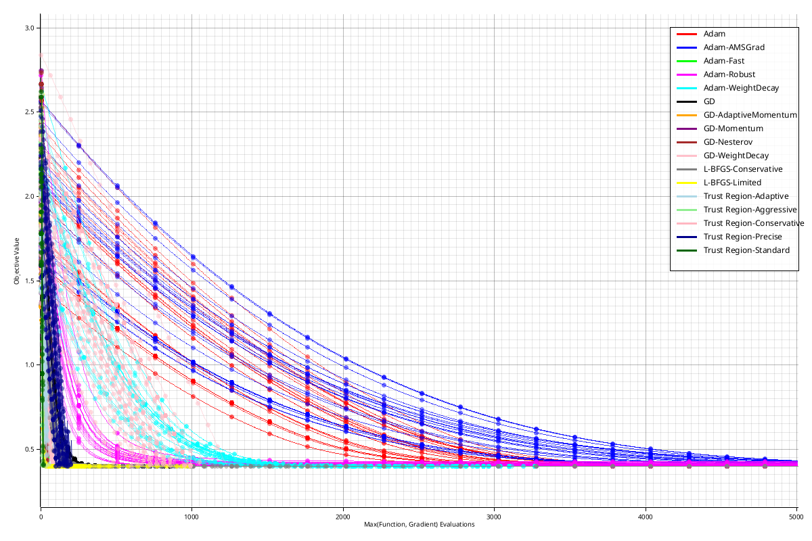
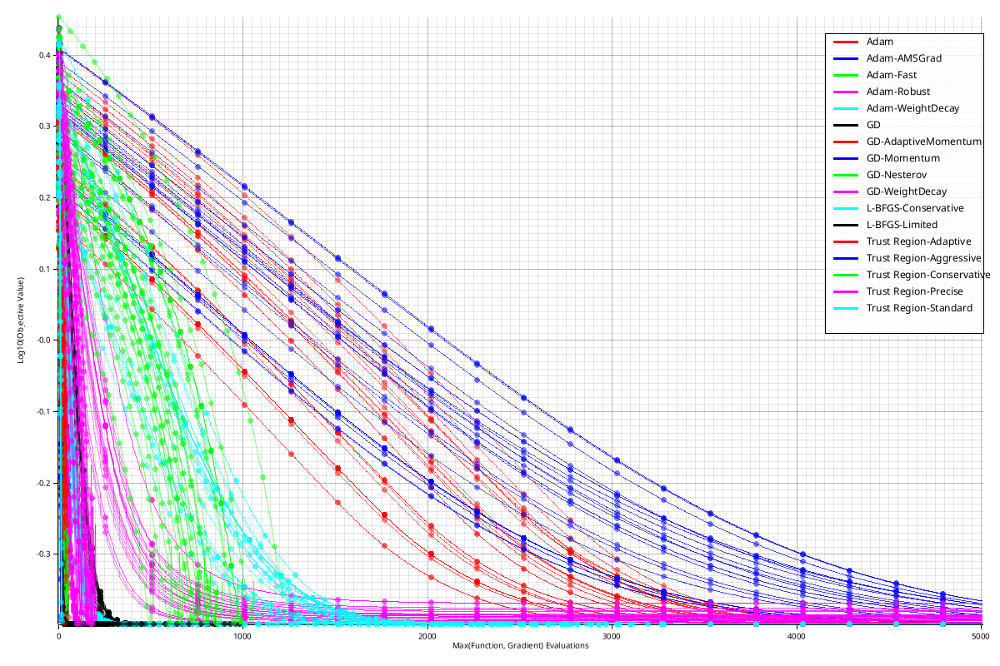

**Figure:** Convergence plots for Barrier_2D_mu0.1 showing objective value vs iterations.
Left: Linear scale, Right: Log scale for better visualization of convergence behavior.

**Data:** [Linear scale data (CSV)](data/Barrier_2D_mu0.1_data.csv) | [Log scale data (CSV)](data/Barrier_2D_mu0.1_log_data.csv)

## Problem: Barrier_5D_mu0.1

**Family:** Barrier
**Dimension:** 5
**Success Threshold:** 1.000e-6
**Total Runs:** 500
**Detailed Analysis:** [View comprehensive problem analysis](reports/problem_analysis_Barrier_5D_mu0.1.md)

### Performance Summary
<table style="border-collapse: collapse; width: 100%; margin: 20px 0;">
<tr style="background-color: #f2f2f2;">
<th style="border: 1px solid #ddd; padding: 8px; text-align: center;">Rank</th>
<th style="border: 1px solid #ddd; padding: 8px; text-align: center;">Optimizer</th>
<th style="border: 1px solid #ddd; padding: 8px; text-align: center;">Mean Final Value (All/Success/Fail)</th>
<th style="border: 1px solid #ddd; padding: 8px; text-align: center;">Std Dev</th>
<th style="border: 1px solid #ddd; padding: 8px; text-align: center;">Best Value</th>
<th style="border: 1px solid #ddd; padding: 8px; text-align: center;">Worst Value</th>
<th style="border: 1px solid #ddd; padding: 8px; text-align: center;">Mean Function Evals (All/Success/Fail)</th>
<th style="border: 1px solid #ddd; padding: 8px; text-align: center;">Mean Gradient Evals (All/Success/Fail)</th>
<th style="border: 1px solid #ddd; padding: 8px; text-align: center;">Success Rate</th>
<th style="border: 1px solid #ddd; padding: 8px; text-align: center;">Mean Time (s)</th>
</tr>
<tr style="background-color: #d4edda; font-weight: bold;">
<td style="border: 1px solid #ddd; padding: 8px; text-align: center;">1</td>
<td style="border: 1px solid #ddd; padding: 8px; text-align: center;"><a href="reports/detailed_Barrier_5D_mu0.1_Trust_Region-Aggressive.md" title="Click for detailed analysis">Trust Region-Aggressive</a></td>
<td style="border: 1px solid #ddd; padding: 8px; text-align: center;">1.86e0 / - / 1.86e0</td>
<td style="border: 1px solid #ddd; padding: 8px; text-align: center;">2.57e-1</td>
<td style="border: 1px solid #ddd; padding: 8px; text-align: center;">1.53e0</td>
<td style="border: 1px solid #ddd; padding: 8px; text-align: center;">2.39e0</td>
<td style="border: 1px solid #ddd; padding: 8px; text-align: center;">6.8 / - / 6.8</td>
<td style="border: 1px solid #ddd; padding: 8px; text-align: center;">5.5 / - / 5.5</td>
<td style="border: 1px solid #ddd; padding: 8px; text-align: center;">0.0%</td>
<td style="border: 1px solid #ddd; padding: 8px; text-align: center;">0.000</td>
</tr>
<tr style="background-color: #fff3cd;">
<td style="border: 1px solid #ddd; padding: 8px; text-align: center;">2</td>
<td style="border: 1px solid #ddd; padding: 8px; text-align: center;"><a href="reports/detailed_Barrier_5D_mu0.1_Trust_Region-Standard.md" title="Click for detailed analysis">Trust Region-Standard</a></td>
<td style="border: 1px solid #ddd; padding: 8px; text-align: center;">1.32e0 / - / 1.32e0</td>
<td style="border: 1px solid #ddd; padding: 8px; text-align: center;">4.17e-1</td>
<td style="border: 1px solid #ddd; padding: 8px; text-align: center;">9.99e-1</td>
<td style="border: 1px solid #ddd; padding: 8px; text-align: center;">2.27e0</td>
<td style="border: 1px solid #ddd; padding: 8px; text-align: center;">18.4 / - / 18.4</td>
<td style="border: 1px solid #ddd; padding: 8px; text-align: center;">13.2 / - / 13.2</td>
<td style="border: 1px solid #ddd; padding: 8px; text-align: center;">0.0%</td>
<td style="border: 1px solid #ddd; padding: 8px; text-align: center;">0.000</td>
</tr>
<tr style="">
<td style="border: 1px solid #ddd; padding: 8px; text-align: center;">3</td>
<td style="border: 1px solid #ddd; padding: 8px; text-align: center;"><a href="reports/detailed_Barrier_5D_mu0.1_GD-Nesterov.md" title="Click for detailed analysis">GD-Nesterov</a></td>
<td style="border: 1px solid #ddd; padding: 8px; text-align: center;">1.01e0 / - / 1.26e0</td>
<td style="border: 1px solid #ddd; padding: 8px; text-align: center;">2.52e-3</td>
<td style="border: 1px solid #ddd; padding: 8px; text-align: center;">1.00e0</td>
<td style="border: 1px solid #ddd; padding: 8px; text-align: center;">1.01e0</td>
<td style="border: 1px solid #ddd; padding: 8px; text-align: center;">20.4 / - / 20.4</td>
<td style="border: 1px solid #ddd; padding: 8px; text-align: center;">36.7 / - / 36.7</td>
<td style="border: 1px solid #ddd; padding: 8px; text-align: center;">0.0%</td>
<td style="border: 1px solid #ddd; padding: 8px; text-align: center;">0.001</td>
</tr>
<tr style="">
<td style="border: 1px solid #ddd; padding: 8px; text-align: center;">4</td>
<td style="border: 1px solid #ddd; padding: 8px; text-align: center;"><a href="reports/detailed_Barrier_5D_mu0.1_GD-Momentum.md" title="Click for detailed analysis">GD-Momentum</a></td>
<td style="border: 1px solid #ddd; padding: 8px; text-align: center;">1.01e0 / - / 1.37e0</td>
<td style="border: 1px solid #ddd; padding: 8px; text-align: center;">2.07e-3</td>
<td style="border: 1px solid #ddd; padding: 8px; text-align: center;">1.00e0</td>
<td style="border: 1px solid #ddd; padding: 8px; text-align: center;">1.01e0</td>
<td style="border: 1px solid #ddd; padding: 8px; text-align: center;">21.0 / - / 21.0</td>
<td style="border: 1px solid #ddd; padding: 8px; text-align: center;">38.0 / - / 38.0</td>
<td style="border: 1px solid #ddd; padding: 8px; text-align: center;">0.0%</td>
<td style="border: 1px solid #ddd; padding: 8px; text-align: center;">0.001</td>
</tr>
<tr style="">
<td style="border: 1px solid #ddd; padding: 8px; text-align: center;">5</td>
<td style="border: 1px solid #ddd; padding: 8px; text-align: center;"><a href="reports/detailed_Barrier_5D_mu0.1_Adam-Fast.md" title="Click for detailed analysis">Adam-Fast</a></td>
<td style="border: 1px solid #ddd; padding: 8px; text-align: center;">1.08e0 / - / 1.28e0</td>
<td style="border: 1px solid #ddd; padding: 8px; text-align: center;">3.82e-2</td>
<td style="border: 1px solid #ddd; padding: 8px; text-align: center;">1.03e0</td>
<td style="border: 1px solid #ddd; padding: 8px; text-align: center;">1.15e0</td>
<td style="border: 1px solid #ddd; padding: 8px; text-align: center;">31.7 / - / 31.7</td>
<td style="border: 1px solid #ddd; padding: 8px; text-align: center;">30.7 / - / 30.7</td>
<td style="border: 1px solid #ddd; padding: 8px; text-align: center;">0.0%</td>
<td style="border: 1px solid #ddd; padding: 8px; text-align: center;">0.001</td>
</tr>
<tr style="">
<td style="border: 1px solid #ddd; padding: 8px; text-align: center;">6</td>
<td style="border: 1px solid #ddd; padding: 8px; text-align: center;"><a href="reports/detailed_Barrier_5D_mu0.1_Trust_Region-Adaptive.md" title="Click for detailed analysis">Trust Region-Adaptive</a></td>
<td style="border: 1px solid #ddd; padding: 8px; text-align: center;">1.10e0 / - / 1.10e0</td>
<td style="border: 1px solid #ddd; padding: 8px; text-align: center;">1.36e-1</td>
<td style="border: 1px solid #ddd; padding: 8px; text-align: center;">9.99e-1</td>
<td style="border: 1px solid #ddd; padding: 8px; text-align: center;">1.37e0</td>
<td style="border: 1px solid #ddd; padding: 8px; text-align: center;">56.7 / - / 56.7</td>
<td style="border: 1px solid #ddd; padding: 8px; text-align: center;">38.7 / - / 38.7</td>
<td style="border: 1px solid #ddd; padding: 8px; text-align: center;">0.0%</td>
<td style="border: 1px solid #ddd; padding: 8px; text-align: center;">0.000</td>
</tr>
<tr style="">
<td style="border: 1px solid #ddd; padding: 8px; text-align: center;">7</td>
<td style="border: 1px solid #ddd; padding: 8px; text-align: center;"><a href="reports/detailed_Barrier_5D_mu0.1_GD-WeightDecay.md" title="Click for detailed analysis">GD-WeightDecay</a></td>
<td style="border: 1px solid #ddd; padding: 8px; text-align: center;">9.99e-1 / - / 9.99e-1</td>
<td style="border: 1px solid #ddd; padding: 8px; text-align: center;">2.51e-5</td>
<td style="border: 1px solid #ddd; padding: 8px; text-align: center;">9.99e-1</td>
<td style="border: 1px solid #ddd; padding: 8px; text-align: center;">9.99e-1</td>
<td style="border: 1px solid #ddd; padding: 8px; text-align: center;">49.2 / - / 49.2</td>
<td style="border: 1px solid #ddd; padding: 8px; text-align: center;">94.5 / - / 94.5</td>
<td style="border: 1px solid #ddd; padding: 8px; text-align: center;">0.0%</td>
<td style="border: 1px solid #ddd; padding: 8px; text-align: center;">0.002</td>
</tr>
<tr style="">
<td style="border: 1px solid #ddd; padding: 8px; text-align: center;">8</td>
<td style="border: 1px solid #ddd; padding: 8px; text-align: center;"><a href="reports/detailed_Barrier_5D_mu0.1_L-BFGS-Limited.md" title="Click for detailed analysis">L-BFGS-Limited</a></td>
<td style="border: 1px solid #ddd; padding: 8px; text-align: center;">1.00e0 / - / 1.00e0</td>
<td style="border: 1px solid #ddd; padding: 8px; text-align: center;">7.64e-3</td>
<td style="border: 1px solid #ddd; padding: 8px; text-align: center;">9.99e-1</td>
<td style="border: 1px solid #ddd; padding: 8px; text-align: center;">1.03e0</td>
<td style="border: 1px solid #ddd; padding: 8px; text-align: center;">182.4 / - / 182.4</td>
<td style="border: 1px solid #ddd; padding: 8px; text-align: center;">106.2 / - / 106.2</td>
<td style="border: 1px solid #ddd; padding: 8px; text-align: center;">0.0%</td>
<td style="border: 1px solid #ddd; padding: 8px; text-align: center;">0.004</td>
</tr>
<tr style="">
<td style="border: 1px solid #ddd; padding: 8px; text-align: center;">9</td>
<td style="border: 1px solid #ddd; padding: 8px; text-align: center;"><a href="reports/detailed_Barrier_5D_mu0.1_Trust_Region-Precise.md" title="Click for detailed analysis">Trust Region-Precise</a></td>
<td style="border: 1px solid #ddd; padding: 8px; text-align: center;">1.01e0 / - / 1.02e0</td>
<td style="border: 1px solid #ddd; padding: 8px; text-align: center;">6.96e-3</td>
<td style="border: 1px solid #ddd; padding: 8px; text-align: center;">9.99e-1</td>
<td style="border: 1px solid #ddd; padding: 8px; text-align: center;">1.02e0</td>
<td style="border: 1px solid #ddd; padding: 8px; text-align: center;">220.3 / - / 220.3</td>
<td style="border: 1px solid #ddd; padding: 8px; text-align: center;">147.7 / - / 147.7</td>
<td style="border: 1px solid #ddd; padding: 8px; text-align: center;">0.0%</td>
<td style="border: 1px solid #ddd; padding: 8px; text-align: center;">0.002</td>
</tr>
<tr style="">
<td style="border: 1px solid #ddd; padding: 8px; text-align: center;">10</td>
<td style="border: 1px solid #ddd; padding: 8px; text-align: center;"><a href="reports/detailed_Barrier_5D_mu0.1_GD.md" title="Click for detailed analysis">GD</a></td>
<td style="border: 1px solid #ddd; padding: 8px; text-align: center;">9.99e-1 / - / 9.99e-1</td>
<td style="border: 1px solid #ddd; padding: 8px; text-align: center;">2.58e-11</td>
<td style="border: 1px solid #ddd; padding: 8px; text-align: center;">9.99e-1</td>
<td style="border: 1px solid #ddd; padding: 8px; text-align: center;">9.99e-1</td>
<td style="border: 1px solid #ddd; padding: 8px; text-align: center;">304.1 / - / 304.1</td>
<td style="border: 1px solid #ddd; padding: 8px; text-align: center;">606.2 / - / 606.2</td>
<td style="border: 1px solid #ddd; padding: 8px; text-align: center;">0.0%</td>
<td style="border: 1px solid #ddd; padding: 8px; text-align: center;">0.008</td>
</tr>
<tr style="">
<td style="border: 1px solid #ddd; padding: 8px; text-align: center;">11</td>
<td style="border: 1px solid #ddd; padding: 8px; text-align: center;"><a href="reports/detailed_Barrier_5D_mu0.1_L-BFGS-Conservative.md" title="Click for detailed analysis">L-BFGS-Conservative</a></td>
<td style="border: 1px solid #ddd; padding: 8px; text-align: center;">9.99e-1 / - / 9.99e-1</td>
<td style="border: 1px solid #ddd; padding: 8px; text-align: center;">6.70e-9</td>
<td style="border: 1px solid #ddd; padding: 8px; text-align: center;">9.99e-1</td>
<td style="border: 1px solid #ddd; padding: 8px; text-align: center;">9.99e-1</td>
<td style="border: 1px solid #ddd; padding: 8px; text-align: center;">599.6 / - / 599.6</td>
<td style="border: 1px solid #ddd; padding: 8px; text-align: center;">479.2 / - / 479.2</td>
<td style="border: 1px solid #ddd; padding: 8px; text-align: center;">0.0%</td>
<td style="border: 1px solid #ddd; padding: 8px; text-align: center;">0.015</td>
</tr>
<tr style="">
<td style="border: 1px solid #ddd; padding: 8px; text-align: center;">12</td>
<td style="border: 1px solid #ddd; padding: 8px; text-align: center;"><a href="reports/detailed_Barrier_5D_mu0.1_Trust_Region-Conservative.md" title="Click for detailed analysis">Trust Region-Conservative</a></td>
<td style="border: 1px solid #ddd; padding: 8px; text-align: center;">1.00e0 / - / 1.04e0</td>
<td style="border: 1px solid #ddd; padding: 8px; text-align: center;">7.53e-3</td>
<td style="border: 1px solid #ddd; padding: 8px; text-align: center;">9.99e-1</td>
<td style="border: 1px solid #ddd; padding: 8px; text-align: center;">1.03e0</td>
<td style="border: 1px solid #ddd; padding: 8px; text-align: center;">1250.3 / - / 1250.3</td>
<td style="border: 1px solid #ddd; padding: 8px; text-align: center;">834.2 / - / 834.2</td>
<td style="border: 1px solid #ddd; padding: 8px; text-align: center;">0.0%</td>
<td style="border: 1px solid #ddd; padding: 8px; text-align: center;">0.009</td>
</tr>
<tr style="">
<td style="border: 1px solid #ddd; padding: 8px; text-align: center;">13</td>
<td style="border: 1px solid #ddd; padding: 8px; text-align: center;"><a href="reports/detailed_Barrier_5D_mu0.1_Adam-WeightDecay.md" title="Click for detailed analysis">Adam-WeightDecay</a></td>
<td style="border: 1px solid #ddd; padding: 8px; text-align: center;">9.99e-1 / - / 9.99e-1</td>
<td style="border: 1px solid #ddd; padding: 8px; text-align: center;">2.92e-9</td>
<td style="border: 1px solid #ddd; padding: 8px; text-align: center;">9.99e-1</td>
<td style="border: 1px solid #ddd; padding: 8px; text-align: center;">9.99e-1</td>
<td style="border: 1px solid #ddd; padding: 8px; text-align: center;">1316.6 / - / 1316.6</td>
<td style="border: 1px solid #ddd; padding: 8px; text-align: center;">1315.6 / - / 1315.6</td>
<td style="border: 1px solid #ddd; padding: 8px; text-align: center;">0.0%</td>
<td style="border: 1px solid #ddd; padding: 8px; text-align: center;">0.029</td>
</tr>
<tr style="">
<td style="border: 1px solid #ddd; padding: 8px; text-align: center;">14</td>
<td style="border: 1px solid #ddd; padding: 8px; text-align: center;"><a href="reports/detailed_Barrier_5D_mu0.1_Adam.md" title="Click for detailed analysis">Adam</a></td>
<td style="border: 1px solid #ddd; padding: 8px; text-align: center;">9.99e-1 / - / 9.99e-1</td>
<td style="border: 1px solid #ddd; padding: 8px; text-align: center;">9.02e-6</td>
<td style="border: 1px solid #ddd; padding: 8px; text-align: center;">9.99e-1</td>
<td style="border: 1px solid #ddd; padding: 8px; text-align: center;">9.99e-1</td>
<td style="border: 1px solid #ddd; padding: 8px; text-align: center;">2502.0 / - / 2502.0</td>
<td style="border: 1px solid #ddd; padding: 8px; text-align: center;">2502.0 / - / 2502.0</td>
<td style="border: 1px solid #ddd; padding: 8px; text-align: center;">0.0%</td>
<td style="border: 1px solid #ddd; padding: 8px; text-align: center;">0.052</td>
</tr>
<tr style="">
<td style="border: 1px solid #ddd; padding: 8px; text-align: center;">15</td>
<td style="border: 1px solid #ddd; padding: 8px; text-align: center;"><a href="reports/detailed_Barrier_5D_mu0.1_Adam-AMSGrad.md" title="Click for detailed analysis">Adam-AMSGrad</a></td>
<td style="border: 1px solid #ddd; padding: 8px; text-align: center;">1.03e0 / - / 1.03e0</td>
<td style="border: 1px solid #ddd; padding: 8px; text-align: center;">1.71e-2</td>
<td style="border: 1px solid #ddd; padding: 8px; text-align: center;">1.01e0</td>
<td style="border: 1px solid #ddd; padding: 8px; text-align: center;">1.07e0</td>
<td style="border: 1px solid #ddd; padding: 8px; text-align: center;">2502.0 / - / 2502.0</td>
<td style="border: 1px solid #ddd; padding: 8px; text-align: center;">2502.0 / - / 2502.0</td>
<td style="border: 1px solid #ddd; padding: 8px; text-align: center;">0.0%</td>
<td style="border: 1px solid #ddd; padding: 8px; text-align: center;">0.058</td>
</tr>
<tr style="">
<td style="border: 1px solid #ddd; padding: 8px; text-align: center;">16</td>
<td style="border: 1px solid #ddd; padding: 8px; text-align: center;"><a href="reports/detailed_Barrier_5D_mu0.1_Adam-Robust.md" title="Click for detailed analysis">Adam-Robust</a></td>
<td style="border: 1px solid #ddd; padding: 8px; text-align: center;">1.01e0 / - / 1.01e0</td>
<td style="border: 1px solid #ddd; padding: 8px; text-align: center;">4.00e-3</td>
<td style="border: 1px solid #ddd; padding: 8px; text-align: center;">1.00e0</td>
<td style="border: 1px solid #ddd; padding: 8px; text-align: center;">1.01e0</td>
<td style="border: 1px solid #ddd; padding: 8px; text-align: center;">2502.0 / - / 2502.0</td>
<td style="border: 1px solid #ddd; padding: 8px; text-align: center;">2502.0 / - / 2502.0</td>
<td style="border: 1px solid #ddd; padding: 8px; text-align: center;">0.0%</td>
<td style="border: 1px solid #ddd; padding: 8px; text-align: center;">0.058</td>
</tr>
</table>

### Convergence Plots

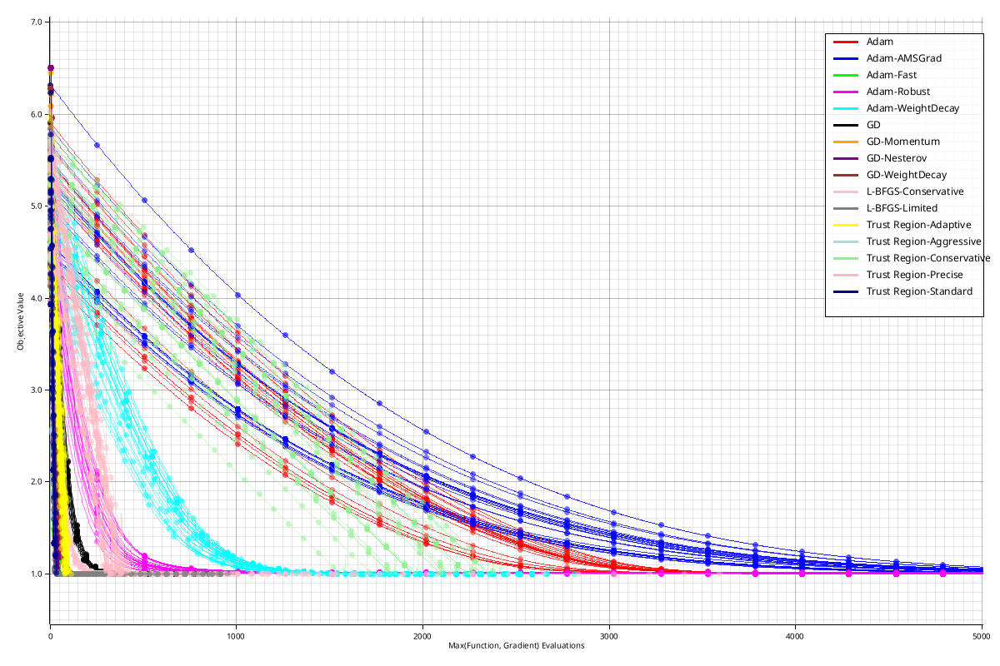
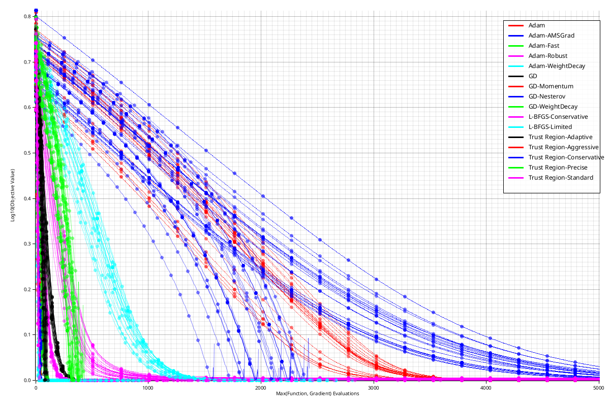

**Figure:** Convergence plots for Barrier_5D_mu0.1 showing objective value vs iterations.
Left: Linear scale, Right: Log scale for better visualization of convergence behavior.

**Data:** [Linear scale data (CSV)](data/Barrier_5D_mu0.1_data.csv) | [Log scale data (CSV)](data/Barrier_5D_mu0.1_log_data.csv)

## Problem: Barrier_10D_mu0.1

**Family:** Barrier
**Dimension:** 10
**Success Threshold:** 1.000e-6
**Total Runs:** 500
**Detailed Analysis:** [View comprehensive problem analysis](reports/problem_analysis_Barrier_10D_mu0.1.md)

### Performance Summary
<table style="border-collapse: collapse; width: 100%; margin: 20px 0;">
<tr style="background-color: #f2f2f2;">
<th style="border: 1px solid #ddd; padding: 8px; text-align: center;">Rank</th>
<th style="border: 1px solid #ddd; padding: 8px; text-align: center;">Optimizer</th>
<th style="border: 1px solid #ddd; padding: 8px; text-align: center;">Mean Final Value (All/Success/Fail)</th>
<th style="border: 1px solid #ddd; padding: 8px; text-align: center;">Std Dev</th>
<th style="border: 1px solid #ddd; padding: 8px; text-align: center;">Best Value</th>
<th style="border: 1px solid #ddd; padding: 8px; text-align: center;">Worst Value</th>
<th style="border: 1px solid #ddd; padding: 8px; text-align: center;">Mean Function Evals (All/Success/Fail)</th>
<th style="border: 1px solid #ddd; padding: 8px; text-align: center;">Mean Gradient Evals (All/Success/Fail)</th>
<th style="border: 1px solid #ddd; padding: 8px; text-align: center;">Success Rate</th>
<th style="border: 1px solid #ddd; padding: 8px; text-align: center;">Mean Time (s)</th>
</tr>
<tr style="background-color: #d4edda; font-weight: bold;">
<td style="border: 1px solid #ddd; padding: 8px; text-align: center;">1</td>
<td style="border: 1px solid #ddd; padding: 8px; text-align: center;"><a href="reports/detailed_Barrier_10D_mu0.1_Trust_Region-Aggressive.md" title="Click for detailed analysis">Trust Region-Aggressive</a></td>
<td style="border: 1px solid #ddd; padding: 8px; text-align: center;">3.43e0 / - / 3.43e0</td>
<td style="border: 1px solid #ddd; padding: 8px; text-align: center;">1.45e0</td>
<td style="border: 1px solid #ddd; padding: 8px; text-align: center;">2.00e0</td>
<td style="border: 1px solid #ddd; padding: 8px; text-align: center;">7.03e0</td>
<td style="border: 1px solid #ddd; padding: 8px; text-align: center;">10.9 / - / 10.9</td>
<td style="border: 1px solid #ddd; padding: 8px; text-align: center;">8.2 / - / 8.2</td>
<td style="border: 1px solid #ddd; padding: 8px; text-align: center;">0.0%</td>
<td style="border: 1px solid #ddd; padding: 8px; text-align: center;">0.000</td>
</tr>
<tr style="background-color: #fff3cd;">
<td style="border: 1px solid #ddd; padding: 8px; text-align: center;">2</td>
<td style="border: 1px solid #ddd; padding: 8px; text-align: center;"><a href="reports/detailed_Barrier_10D_mu0.1_Trust_Region-Standard.md" title="Click for detailed analysis">Trust Region-Standard</a></td>
<td style="border: 1px solid #ddd; padding: 8px; text-align: center;">2.34e0 / - / 2.34e0</td>
<td style="border: 1px solid #ddd; padding: 8px; text-align: center;">4.45e-1</td>
<td style="border: 1px solid #ddd; padding: 8px; text-align: center;">2.00e0</td>
<td style="border: 1px solid #ddd; padding: 8px; text-align: center;">3.32e0</td>
<td style="border: 1px solid #ddd; padding: 8px; text-align: center;">30.9 / - / 30.9</td>
<td style="border: 1px solid #ddd; padding: 8px; text-align: center;">21.5 / - / 21.5</td>
<td style="border: 1px solid #ddd; padding: 8px; text-align: center;">0.0%</td>
<td style="border: 1px solid #ddd; padding: 8px; text-align: center;">0.000</td>
</tr>
<tr style="">
<td style="border: 1px solid #ddd; padding: 8px; text-align: center;">3</td>
<td style="border: 1px solid #ddd; padding: 8px; text-align: center;"><a href="reports/detailed_Barrier_10D_mu0.1_GD-Nesterov.md" title="Click for detailed analysis">GD-Nesterov</a></td>
<td style="border: 1px solid #ddd; padding: 8px; text-align: center;">2.00e0 / - / 2.50e0</td>
<td style="border: 1px solid #ddd; padding: 8px; text-align: center;">5.49e-3</td>
<td style="border: 1px solid #ddd; padding: 8px; text-align: center;">2.00e0</td>
<td style="border: 1px solid #ddd; padding: 8px; text-align: center;">2.02e0</td>
<td style="border: 1px solid #ddd; padding: 8px; text-align: center;">21.1 / - / 21.1</td>
<td style="border: 1px solid #ddd; padding: 8px; text-align: center;">38.1 / - / 38.1</td>
<td style="border: 1px solid #ddd; padding: 8px; text-align: center;">0.0%</td>
<td style="border: 1px solid #ddd; padding: 8px; text-align: center;">0.001</td>
</tr>
<tr style="">
<td style="border: 1px solid #ddd; padding: 8px; text-align: center;">4</td>
<td style="border: 1px solid #ddd; padding: 8px; text-align: center;"><a href="reports/detailed_Barrier_10D_mu0.1_GD-Momentum.md" title="Click for detailed analysis">GD-Momentum</a></td>
<td style="border: 1px solid #ddd; padding: 8px; text-align: center;">2.01e0 / - / 3.39e0</td>
<td style="border: 1px solid #ddd; padding: 8px; text-align: center;">8.36e-3</td>
<td style="border: 1px solid #ddd; padding: 8px; text-align: center;">2.00e0</td>
<td style="border: 1px solid #ddd; padding: 8px; text-align: center;">2.03e0</td>
<td style="border: 1px solid #ddd; padding: 8px; text-align: center;">21.2 / - / 21.2</td>
<td style="border: 1px solid #ddd; padding: 8px; text-align: center;">38.5 / - / 38.5</td>
<td style="border: 1px solid #ddd; padding: 8px; text-align: center;">0.0%</td>
<td style="border: 1px solid #ddd; padding: 8px; text-align: center;">0.001</td>
</tr>
<tr style="">
<td style="border: 1px solid #ddd; padding: 8px; text-align: center;">5</td>
<td style="border: 1px solid #ddd; padding: 8px; text-align: center;"><a href="reports/detailed_Barrier_10D_mu0.1_Adam-Fast.md" title="Click for detailed analysis">Adam-Fast</a></td>
<td style="border: 1px solid #ddd; padding: 8px; text-align: center;">2.18e0 / - / 2.58e0</td>
<td style="border: 1px solid #ddd; padding: 8px; text-align: center;">5.92e-2</td>
<td style="border: 1px solid #ddd; padding: 8px; text-align: center;">2.07e0</td>
<td style="border: 1px solid #ddd; padding: 8px; text-align: center;">2.32e0</td>
<td style="border: 1px solid #ddd; padding: 8px; text-align: center;">31.5 / - / 31.5</td>
<td style="border: 1px solid #ddd; padding: 8px; text-align: center;">30.5 / - / 30.5</td>
<td style="border: 1px solid #ddd; padding: 8px; text-align: center;">0.0%</td>
<td style="border: 1px solid #ddd; padding: 8px; text-align: center;">0.001</td>
</tr>
<tr style="">
<td style="border: 1px solid #ddd; padding: 8px; text-align: center;">6</td>
<td style="border: 1px solid #ddd; padding: 8px; text-align: center;"><a href="reports/detailed_Barrier_10D_mu0.1_GD-WeightDecay.md" title="Click for detailed analysis">GD-WeightDecay</a></td>
<td style="border: 1px solid #ddd; padding: 8px; text-align: center;">2.00e0 / - / 2.00e0</td>
<td style="border: 1px solid #ddd; padding: 8px; text-align: center;">3.12e-5</td>
<td style="border: 1px solid #ddd; padding: 8px; text-align: center;">2.00e0</td>
<td style="border: 1px solid #ddd; padding: 8px; text-align: center;">2.00e0</td>
<td style="border: 1px solid #ddd; padding: 8px; text-align: center;">49.4 / - / 49.4</td>
<td style="border: 1px solid #ddd; padding: 8px; text-align: center;">94.8 / - / 94.8</td>
<td style="border: 1px solid #ddd; padding: 8px; text-align: center;">0.0%</td>
<td style="border: 1px solid #ddd; padding: 8px; text-align: center;">0.002</td>
</tr>
<tr style="">
<td style="border: 1px solid #ddd; padding: 8px; text-align: center;">7</td>
<td style="border: 1px solid #ddd; padding: 8px; text-align: center;"><a href="reports/detailed_Barrier_10D_mu0.1_Trust_Region-Adaptive.md" title="Click for detailed analysis">Trust Region-Adaptive</a></td>
<td style="border: 1px solid #ddd; padding: 8px; text-align: center;">2.11e0 / - / 2.17e0</td>
<td style="border: 1px solid #ddd; padding: 8px; text-align: center;">1.18e-1</td>
<td style="border: 1px solid #ddd; padding: 8px; text-align: center;">2.00e0</td>
<td style="border: 1px solid #ddd; padding: 8px; text-align: center;">2.31e0</td>
<td style="border: 1px solid #ddd; padding: 8px; text-align: center;">106.3 / - / 106.3</td>
<td style="border: 1px solid #ddd; padding: 8px; text-align: center;">71.8 / - / 71.8</td>
<td style="border: 1px solid #ddd; padding: 8px; text-align: center;">0.0%</td>
<td style="border: 1px solid #ddd; padding: 8px; text-align: center;">0.001</td>
</tr>
<tr style="">
<td style="border: 1px solid #ddd; padding: 8px; text-align: center;">8</td>
<td style="border: 1px solid #ddd; padding: 8px; text-align: center;"><a href="reports/detailed_Barrier_10D_mu0.1_L-BFGS-Limited.md" title="Click for detailed analysis">L-BFGS-Limited</a></td>
<td style="border: 1px solid #ddd; padding: 8px; text-align: center;">2.00e0 / - / 2.00e0</td>
<td style="border: 1px solid #ddd; padding: 8px; text-align: center;">5.54e-9</td>
<td style="border: 1px solid #ddd; padding: 8px; text-align: center;">2.00e0</td>
<td style="border: 1px solid #ddd; padding: 8px; text-align: center;">2.00e0</td>
<td style="border: 1px solid #ddd; padding: 8px; text-align: center;">195.4 / - / 195.4</td>
<td style="border: 1px solid #ddd; padding: 8px; text-align: center;">114.3 / - / 114.3</td>
<td style="border: 1px solid #ddd; padding: 8px; text-align: center;">0.0%</td>
<td style="border: 1px solid #ddd; padding: 8px; text-align: center;">0.004</td>
</tr>
<tr style="">
<td style="border: 1px solid #ddd; padding: 8px; text-align: center;">9</td>
<td style="border: 1px solid #ddd; padding: 8px; text-align: center;"><a href="reports/detailed_Barrier_10D_mu0.1_Trust_Region-Precise.md" title="Click for detailed analysis">Trust Region-Precise</a></td>
<td style="border: 1px solid #ddd; padding: 8px; text-align: center;">2.01e0 / - / 2.04e0</td>
<td style="border: 1px solid #ddd; padding: 8px; text-align: center;">9.07e-3</td>
<td style="border: 1px solid #ddd; padding: 8px; text-align: center;">2.00e0</td>
<td style="border: 1px solid #ddd; padding: 8px; text-align: center;">2.03e0</td>
<td style="border: 1px solid #ddd; padding: 8px; text-align: center;">413.8 / - / 413.8</td>
<td style="border: 1px solid #ddd; padding: 8px; text-align: center;">276.5 / - / 276.5</td>
<td style="border: 1px solid #ddd; padding: 8px; text-align: center;">0.0%</td>
<td style="border: 1px solid #ddd; padding: 8px; text-align: center;">0.003</td>
</tr>
<tr style="">
<td style="border: 1px solid #ddd; padding: 8px; text-align: center;">10</td>
<td style="border: 1px solid #ddd; padding: 8px; text-align: center;"><a href="reports/detailed_Barrier_10D_mu0.1_GD.md" title="Click for detailed analysis">GD</a></td>
<td style="border: 1px solid #ddd; padding: 8px; text-align: center;">2.00e0 / - / 2.00e0</td>
<td style="border: 1px solid #ddd; padding: 8px; text-align: center;">4.65e-11</td>
<td style="border: 1px solid #ddd; padding: 8px; text-align: center;">2.00e0</td>
<td style="border: 1px solid #ddd; padding: 8px; text-align: center;">2.00e0</td>
<td style="border: 1px solid #ddd; padding: 8px; text-align: center;">305.0 / - / 305.0</td>
<td style="border: 1px solid #ddd; padding: 8px; text-align: center;">606.0 / - / 606.0</td>
<td style="border: 1px solid #ddd; padding: 8px; text-align: center;">0.0%</td>
<td style="border: 1px solid #ddd; padding: 8px; text-align: center;">0.008</td>
</tr>
<tr style="">
<td style="border: 1px solid #ddd; padding: 8px; text-align: center;">11</td>
<td style="border: 1px solid #ddd; padding: 8px; text-align: center;"><a href="reports/detailed_Barrier_10D_mu0.1_L-BFGS-Conservative.md" title="Click for detailed analysis">L-BFGS-Conservative</a></td>
<td style="border: 1px solid #ddd; padding: 8px; text-align: center;">2.00e0 / - / 2.00e0</td>
<td style="border: 1px solid #ddd; padding: 8px; text-align: center;">1.05e-8</td>
<td style="border: 1px solid #ddd; padding: 8px; text-align: center;">2.00e0</td>
<td style="border: 1px solid #ddd; padding: 8px; text-align: center;">2.00e0</td>
<td style="border: 1px solid #ddd; padding: 8px; text-align: center;">555.1 / - / 555.1</td>
<td style="border: 1px solid #ddd; padding: 8px; text-align: center;">443.6 / - / 443.6</td>
<td style="border: 1px solid #ddd; padding: 8px; text-align: center;">0.0%</td>
<td style="border: 1px solid #ddd; padding: 8px; text-align: center;">0.015</td>
</tr>
<tr style="">
<td style="border: 1px solid #ddd; padding: 8px; text-align: center;">12</td>
<td style="border: 1px solid #ddd; padding: 8px; text-align: center;"><a href="reports/detailed_Barrier_10D_mu0.1_Adam-WeightDecay.md" title="Click for detailed analysis">Adam-WeightDecay</a></td>
<td style="border: 1px solid #ddd; padding: 8px; text-align: center;">2.00e0 / - / 2.00e0</td>
<td style="border: 1px solid #ddd; padding: 8px; text-align: center;">5.53e-9</td>
<td style="border: 1px solid #ddd; padding: 8px; text-align: center;">2.00e0</td>
<td style="border: 1px solid #ddd; padding: 8px; text-align: center;">2.00e0</td>
<td style="border: 1px solid #ddd; padding: 8px; text-align: center;">1144.5 / - / 1144.5</td>
<td style="border: 1px solid #ddd; padding: 8px; text-align: center;">1143.5 / - / 1143.5</td>
<td style="border: 1px solid #ddd; padding: 8px; text-align: center;">0.0%</td>
<td style="border: 1px solid #ddd; padding: 8px; text-align: center;">0.027</td>
</tr>
<tr style="">
<td style="border: 1px solid #ddd; padding: 8px; text-align: center;">13</td>
<td style="border: 1px solid #ddd; padding: 8px; text-align: center;"><a href="reports/detailed_Barrier_10D_mu0.1_Trust_Region-Conservative.md" title="Click for detailed analysis">Trust Region-Conservative</a></td>
<td style="border: 1px solid #ddd; padding: 8px; text-align: center;">2.00e0 / - / 2.05e0</td>
<td style="border: 1px solid #ddd; padding: 8px; text-align: center;">9.92e-3</td>
<td style="border: 1px solid #ddd; padding: 8px; text-align: center;">2.00e0</td>
<td style="border: 1px solid #ddd; padding: 8px; text-align: center;">2.04e0</td>
<td style="border: 1px solid #ddd; padding: 8px; text-align: center;">2487.1 / - / 2487.1</td>
<td style="border: 1px solid #ddd; padding: 8px; text-align: center;">1658.4 / - / 1658.4</td>
<td style="border: 1px solid #ddd; padding: 8px; text-align: center;">0.0%</td>
<td style="border: 1px solid #ddd; padding: 8px; text-align: center;">0.018</td>
</tr>
<tr style="">
<td style="border: 1px solid #ddd; padding: 8px; text-align: center;">14</td>
<td style="border: 1px solid #ddd; padding: 8px; text-align: center;"><a href="reports/detailed_Barrier_10D_mu0.1_Adam-AMSGrad.md" title="Click for detailed analysis">Adam-AMSGrad</a></td>
<td style="border: 1px solid #ddd; padding: 8px; text-align: center;">2.04e0 / - / 2.04e0</td>
<td style="border: 1px solid #ddd; padding: 8px; text-align: center;">1.32e-2</td>
<td style="border: 1px solid #ddd; padding: 8px; text-align: center;">2.02e0</td>
<td style="border: 1px solid #ddd; padding: 8px; text-align: center;">2.07e0</td>
<td style="border: 1px solid #ddd; padding: 8px; text-align: center;">2502.0 / - / 2502.0</td>
<td style="border: 1px solid #ddd; padding: 8px; text-align: center;">2502.0 / - / 2502.0</td>
<td style="border: 1px solid #ddd; padding: 8px; text-align: center;">0.0%</td>
<td style="border: 1px solid #ddd; padding: 8px; text-align: center;">0.062</td>
</tr>
<tr style="">
<td style="border: 1px solid #ddd; padding: 8px; text-align: center;">15</td>
<td style="border: 1px solid #ddd; padding: 8px; text-align: center;"><a href="reports/detailed_Barrier_10D_mu0.1_Adam.md" title="Click for detailed analysis">Adam</a></td>
<td style="border: 1px solid #ddd; padding: 8px; text-align: center;">2.00e0 / - / 2.00e0</td>
<td style="border: 1px solid #ddd; padding: 8px; text-align: center;">4.64e-7</td>
<td style="border: 1px solid #ddd; padding: 8px; text-align: center;">2.00e0</td>
<td style="border: 1px solid #ddd; padding: 8px; text-align: center;">2.00e0</td>
<td style="border: 1px solid #ddd; padding: 8px; text-align: center;">2502.0 / - / 2502.0</td>
<td style="border: 1px solid #ddd; padding: 8px; text-align: center;">2502.0 / - / 2502.0</td>
<td style="border: 1px solid #ddd; padding: 8px; text-align: center;">0.0%</td>
<td style="border: 1px solid #ddd; padding: 8px; text-align: center;">0.056</td>
</tr>
<tr style="">
<td style="border: 1px solid #ddd; padding: 8px; text-align: center;">16</td>
<td style="border: 1px solid #ddd; padding: 8px; text-align: center;"><a href="reports/detailed_Barrier_10D_mu0.1_Adam-Robust.md" title="Click for detailed analysis">Adam-Robust</a></td>
<td style="border: 1px solid #ddd; padding: 8px; text-align: center;">2.00e0 / - / 2.00e0</td>
<td style="border: 1px solid #ddd; padding: 8px; text-align: center;">2.51e-3</td>
<td style="border: 1px solid #ddd; padding: 8px; text-align: center;">2.00e0</td>
<td style="border: 1px solid #ddd; padding: 8px; text-align: center;">2.01e0</td>
<td style="border: 1px solid #ddd; padding: 8px; text-align: center;">2502.0 / - / 2502.0</td>
<td style="border: 1px solid #ddd; padding: 8px; text-align: center;">2502.0 / - / 2502.0</td>
<td style="border: 1px solid #ddd; padding: 8px; text-align: center;">0.0%</td>
<td style="border: 1px solid #ddd; padding: 8px; text-align: center;">0.062</td>
</tr>
</table>

### Convergence Plots

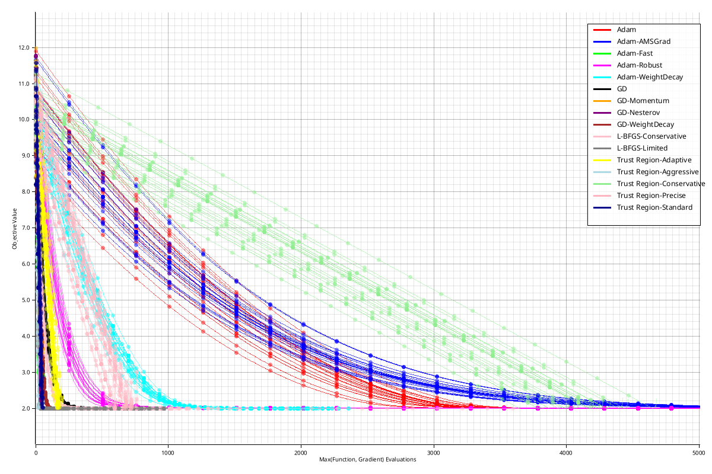
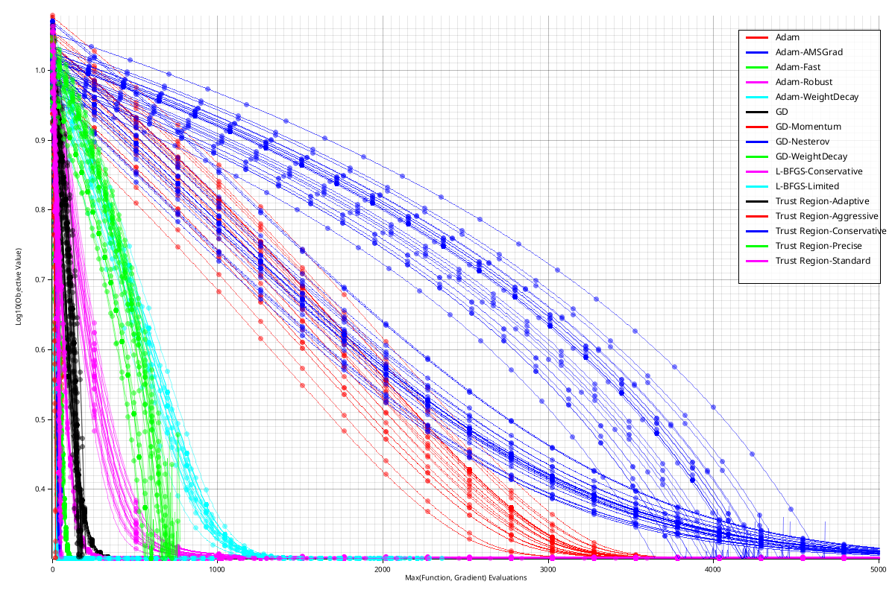

**Figure:** Convergence plots for Barrier_10D_mu0.1 showing objective value vs iterations.
Left: Linear scale, Right: Log scale for better visualization of convergence behavior.

**Data:** [Linear scale data (CSV)](data/Barrier_10D_mu0.1_data.csv) | [Log scale data (CSV)](data/Barrier_10D_mu0.1_log_data.csv)

## Problem: NoisySphere_2D_sigma0.01

**Family:** NoisySphere
**Dimension:** 2
**Success Threshold:** 1.660e0
**Total Runs:** 500
**Detailed Analysis:** [View comprehensive problem analysis](reports/problem_analysis_NoisySphere_2D_sigma0.01.md)

### Performance Summary
<table style="border-collapse: collapse; width: 100%; margin: 20px 0;">
<tr style="background-color: #f2f2f2;">
<th style="border: 1px solid #ddd; padding: 8px; text-align: center;">Rank</th>
<th style="border: 1px solid #ddd; padding: 8px; text-align: center;">Optimizer</th>
<th style="border: 1px solid #ddd; padding: 8px; text-align: center;">Mean Final Value (All/Success/Fail)</th>
<th style="border: 1px solid #ddd; padding: 8px; text-align: center;">Std Dev</th>
<th style="border: 1px solid #ddd; padding: 8px; text-align: center;">Best Value</th>
<th style="border: 1px solid #ddd; padding: 8px; text-align: center;">Worst Value</th>
<th style="border: 1px solid #ddd; padding: 8px; text-align: center;">Mean Function Evals (All/Success/Fail)</th>
<th style="border: 1px solid #ddd; padding: 8px; text-align: center;">Mean Gradient Evals (All/Success/Fail)</th>
<th style="border: 1px solid #ddd; padding: 8px; text-align: center;">Success Rate</th>
<th style="border: 1px solid #ddd; padding: 8px; text-align: center;">Mean Time (s)</th>
</tr>
<tr style="background-color: #d4edda; font-weight: bold;">
<td style="border: 1px solid #ddd; padding: 8px; text-align: center;">1</td>
<td style="border: 1px solid #ddd; padding: 8px; text-align: center;"><a href="reports/detailed_NoisySphere_2D_sigma0.01_L-BFGS-Conservative.md" title="Click for detailed analysis">L-BFGS-Conservative</a></td>
<td style="border: 1px solid #ddd; padding: 8px; text-align: center;">1.57e0 / 1.57e0 / -</td>
<td style="border: 1px solid #ddd; padding: 8px; text-align: center;">7.01e-2</td>
<td style="border: 1px solid #ddd; padding: 8px; text-align: center;">1.46e0</td>
<td style="border: 1px solid #ddd; padding: 8px; text-align: center;">1.66e0</td>
<td style="border: 1px solid #ddd; padding: 8px; text-align: center;">97.0 / 121.2 / 0.0</td>
<td style="border: 1px solid #ddd; padding: 8px; text-align: center;">22.7 / 28.4 / 0.0</td>
<td style="border: 1px solid #ddd; padding: 8px; text-align: center;">80.0%</td>
<td style="border: 1px solid #ddd; padding: 8px; text-align: center;">0.002</td>
</tr>
<tr style="background-color: #fff3cd;">
<td style="border: 1px solid #ddd; padding: 8px; text-align: center;">2</td>
<td style="border: 1px solid #ddd; padding: 8px; text-align: center;"><a href="reports/detailed_NoisySphere_2D_sigma0.01_QQN-StrongWolfe.md" title="Click for detailed analysis">QQN-StrongWolfe</a></td>
<td style="border: 1px solid #ddd; padding: 8px; text-align: center;">9.23e-1 / 7.53e-1 / 1.94e0</td>
<td style="border: 1px solid #ddd; padding: 8px; text-align: center;">6.21e-1</td>
<td style="border: 1px solid #ddd; padding: 8px; text-align: center;">2.83e-2</td>
<td style="border: 1px solid #ddd; padding: 8px; text-align: center;">2.06e0</td>
<td style="border: 1px solid #ddd; padding: 8px; text-align: center;">30.5 / 45.8 / 7.5</td>
<td style="border: 1px solid #ddd; padding: 8px; text-align: center;">13.5 / 21.0 / 2.2</td>
<td style="border: 1px solid #ddd; padding: 8px; text-align: center;">60.0%</td>
<td style="border: 1px solid #ddd; padding: 8px; text-align: center;">0.001</td>
</tr>
<tr style="">
<td style="border: 1px solid #ddd; padding: 8px; text-align: center;">3</td>
<td style="border: 1px solid #ddd; padding: 8px; text-align: center;"><a href="reports/detailed_NoisySphere_2D_sigma0.01_L-BFGS-Limited.md" title="Click for detailed analysis">L-BFGS-Limited</a></td>
<td style="border: 1px solid #ddd; padding: 8px; text-align: center;">1.64e0 / 1.13e0 / 2.22e0</td>
<td style="border: 1px solid #ddd; padding: 8px; text-align: center;">6.02e-1</td>
<td style="border: 1px solid #ddd; padding: 8px; text-align: center;">7.63e-1</td>
<td style="border: 1px solid #ddd; padding: 8px; text-align: center;">2.63e0</td>
<td style="border: 1px solid #ddd; padding: 8px; text-align: center;">31.4 / 42.4 / 22.3</td>
<td style="border: 1px solid #ddd; padding: 8px; text-align: center;">7.2 / 9.3 / 5.5</td>
<td style="border: 1px solid #ddd; padding: 8px; text-align: center;">45.0%</td>
<td style="border: 1px solid #ddd; padding: 8px; text-align: center;">0.001</td>
</tr>
<tr style="">
<td style="border: 1px solid #ddd; padding: 8px; text-align: center;">4</td>
<td style="border: 1px solid #ddd; padding: 8px; text-align: center;"><a href="reports/detailed_NoisySphere_2D_sigma0.01_L-BFGS.md" title="Click for detailed analysis">L-BFGS</a></td>
<td style="border: 1px solid #ddd; padding: 8px; text-align: center;">1.60e0 / 9.49e-1 / 1.77e1</td>
<td style="border: 1px solid #ddd; padding: 8px; text-align: center;">7.10e-1</td>
<td style="border: 1px solid #ddd; padding: 8px; text-align: center;">7.26e-2</td>
<td style="border: 1px solid #ddd; padding: 8px; text-align: center;">2.72e0</td>
<td style="border: 1px solid #ddd; padding: 8px; text-align: center;">33.2 / 16.8 / 44.2</td>
<td style="border: 1px solid #ddd; padding: 8px; text-align: center;">11.3 / 7.1 / 14.2</td>
<td style="border: 1px solid #ddd; padding: 8px; text-align: center;">40.0%</td>
<td style="border: 1px solid #ddd; padding: 8px; text-align: center;">0.001</td>
</tr>
<tr style="">
<td style="border: 1px solid #ddd; padding: 8px; text-align: center;">5</td>
<td style="border: 1px solid #ddd; padding: 8px; text-align: center;"><a href="reports/detailed_NoisySphere_2D_sigma0.01_GD-Momentum.md" title="Click for detailed analysis">GD-Momentum</a></td>
<td style="border: 1px solid #ddd; padding: 8px; text-align: center;">1.90e0 / 1.57e0 / 3.07e0</td>
<td style="border: 1px solid #ddd; padding: 8px; text-align: center;">3.87e-1</td>
<td style="border: 1px solid #ddd; padding: 8px; text-align: center;">1.43e0</td>
<td style="border: 1px solid #ddd; padding: 8px; text-align: center;">2.79e0</td>
<td style="border: 1px solid #ddd; padding: 8px; text-align: center;">6.8 / 6.0 / 7.2</td>
<td style="border: 1px solid #ddd; padding: 8px; text-align: center;">10.6 / 9.0 / 11.4</td>
<td style="border: 1px solid #ddd; padding: 8px; text-align: center;">35.0%</td>
<td style="border: 1px solid #ddd; padding: 8px; text-align: center;">0.001</td>
</tr>
<tr style="">
<td style="border: 1px solid #ddd; padding: 8px; text-align: center;">6</td>
<td style="border: 1px solid #ddd; padding: 8px; text-align: center;"><a href="reports/detailed_NoisySphere_2D_sigma0.01_GD.md" title="Click for detailed analysis">GD</a></td>
<td style="border: 1px solid #ddd; padding: 8px; text-align: center;">1.89e0 / 1.53e0 / 2.71e0</td>
<td style="border: 1px solid #ddd; padding: 8px; text-align: center;">3.41e-1</td>
<td style="border: 1px solid #ddd; padding: 8px; text-align: center;">1.42e0</td>
<td style="border: 1px solid #ddd; padding: 8px; text-align: center;">2.44e0</td>
<td style="border: 1px solid #ddd; padding: 8px; text-align: center;">8.9 / 11.4 / 7.6</td>
<td style="border: 1px solid #ddd; padding: 8px; text-align: center;">15.1 / 19.9 / 12.5</td>
<td style="border: 1px solid #ddd; padding: 8px; text-align: center;">35.0%</td>
<td style="border: 1px solid #ddd; padding: 8px; text-align: center;">0.001</td>
</tr>
<tr style="">
<td style="border: 1px solid #ddd; padding: 8px; text-align: center;">7</td>
<td style="border: 1px solid #ddd; padding: 8px; text-align: center;"><a href="reports/detailed_NoisySphere_2D_sigma0.01_Adam-Fast.md" title="Click for detailed analysis">Adam-Fast</a></td>
<td style="border: 1px solid #ddd; padding: 8px; text-align: center;">1.79e0 / 1.55e0 / 2.67e0</td>
<td style="border: 1px solid #ddd; padding: 8px; text-align: center;">2.14e-1</td>
<td style="border: 1px solid #ddd; padding: 8px; text-align: center;">1.40e0</td>
<td style="border: 1px solid #ddd; padding: 8px; text-align: center;">2.24e0</td>
<td style="border: 1px solid #ddd; padding: 8px; text-align: center;">12.3 / 9.6 / 13.8</td>
<td style="border: 1px solid #ddd; padding: 8px; text-align: center;">11.8 / 9.6 / 12.9</td>
<td style="border: 1px solid #ddd; padding: 8px; text-align: center;">35.0%</td>
<td style="border: 1px solid #ddd; padding: 8px; text-align: center;">0.001</td>
</tr>
<tr style="">
<td style="border: 1px solid #ddd; padding: 8px; text-align: center;">8</td>
<td style="border: 1px solid #ddd; padding: 8px; text-align: center;"><a href="reports/detailed_NoisySphere_2D_sigma0.01_QQN-Bisection-1.md" title="Click for detailed analysis">QQN-Bisection-1</a></td>
<td style="border: 1px solid #ddd; padding: 8px; text-align: center;">1.33e0 / 9.94e-1 / 2.12e0</td>
<td style="border: 1px solid #ddd; padding: 8px; text-align: center;">6.30e-1</td>
<td style="border: 1px solid #ddd; padding: 8px; text-align: center;">2.16e-1</td>
<td style="border: 1px solid #ddd; padding: 8px; text-align: center;">2.48e0</td>
<td style="border: 1px solid #ddd; padding: 8px; text-align: center;">41.2 / 87.4 / 16.4</td>
<td style="border: 1px solid #ddd; padding: 8px; text-align: center;">52.4 / 120.9 / 15.5</td>
<td style="border: 1px solid #ddd; padding: 8px; text-align: center;">35.0%</td>
<td style="border: 1px solid #ddd; padding: 8px; text-align: center;">0.003</td>
</tr>
<tr style="">
<td style="border: 1px solid #ddd; padding: 8px; text-align: center;">9</td>
<td style="border: 1px solid #ddd; padding: 8px; text-align: center;"><a href="reports/detailed_NoisySphere_2D_sigma0.01_GD-AdaptiveMomentum.md" title="Click for detailed analysis">GD-AdaptiveMomentum</a></td>
<td style="border: 1px solid #ddd; padding: 8px; text-align: center;">1.90e0 / 1.56e0 / 2.89e0</td>
<td style="border: 1px solid #ddd; padding: 8px; text-align: center;">3.25e-1</td>
<td style="border: 1px solid #ddd; padding: 8px; text-align: center;">1.45e0</td>
<td style="border: 1px solid #ddd; padding: 8px; text-align: center;">2.42e0</td>
<td style="border: 1px solid #ddd; padding: 8px; text-align: center;">6.6 / 6.5 / 6.6</td>
<td style="border: 1px solid #ddd; padding: 8px; text-align: center;">10.3 / 10.0 / 10.4</td>
<td style="border: 1px solid #ddd; padding: 8px; text-align: center;">30.0%</td>
<td style="border: 1px solid #ddd; padding: 8px; text-align: center;">0.001</td>
</tr>
<tr style="">
<td style="border: 1px solid #ddd; padding: 8px; text-align: center;">10</td>
<td style="border: 1px solid #ddd; padding: 8px; text-align: center;"><a href="reports/detailed_NoisySphere_2D_sigma0.01_GD-WeightDecay.md" title="Click for detailed analysis">GD-WeightDecay</a></td>
<td style="border: 1px solid #ddd; padding: 8px; text-align: center;">1.97e0 / 1.63e0 / 2.61e0</td>
<td style="border: 1px solid #ddd; padding: 8px; text-align: center;">2.59e-1</td>
<td style="border: 1px solid #ddd; padding: 8px; text-align: center;">1.61e0</td>
<td style="border: 1px solid #ddd; padding: 8px; text-align: center;">2.40e0</td>
<td style="border: 1px solid #ddd; padding: 8px; text-align: center;">6.8 / 5.2 / 7.3</td>
<td style="border: 1px solid #ddd; padding: 8px; text-align: center;">10.6 / 7.4 / 11.6</td>
<td style="border: 1px solid #ddd; padding: 8px; text-align: center;">25.0%</td>
<td style="border: 1px solid #ddd; padding: 8px; text-align: center;">0.001</td>
</tr>
<tr style="">
<td style="border: 1px solid #ddd; padding: 8px; text-align: center;">11</td>
<td style="border: 1px solid #ddd; padding: 8px; text-align: center;"><a href="reports/detailed_NoisySphere_2D_sigma0.01_GD-Nesterov.md" title="Click for detailed analysis">GD-Nesterov</a></td>
<td style="border: 1px solid #ddd; padding: 8px; text-align: center;">2.00e0 / 1.57e0 / 3.39e0</td>
<td style="border: 1px solid #ddd; padding: 8px; text-align: center;">3.81e-1</td>
<td style="border: 1px solid #ddd; padding: 8px; text-align: center;">1.53e0</td>
<td style="border: 1px solid #ddd; padding: 8px; text-align: center;">2.76e0</td>
<td style="border: 1px solid #ddd; padding: 8px; text-align: center;">7.0 / 5.8 / 7.4</td>
<td style="border: 1px solid #ddd; padding: 8px; text-align: center;">11.1 / 8.6 / 11.9</td>
<td style="border: 1px solid #ddd; padding: 8px; text-align: center;">25.0%</td>
<td style="border: 1px solid #ddd; padding: 8px; text-align: center;">0.001</td>
</tr>
<tr style="">
<td style="border: 1px solid #ddd; padding: 8px; text-align: center;">12</td>
<td style="border: 1px solid #ddd; padding: 8px; text-align: center;"><a href="reports/detailed_NoisySphere_2D_sigma0.01_L-BFGS-MoreThuente.md" title="Click for detailed analysis">L-BFGS-MoreThuente</a></td>
<td style="border: 1px solid #ddd; padding: 8px; text-align: center;">1.84e0 / 5.60e-1 / 2.19e0</td>
<td style="border: 1px solid #ddd; padding: 8px; text-align: center;">7.24e-1</td>
<td style="border: 1px solid #ddd; padding: 8px; text-align: center;">1.12e-1</td>
<td style="border: 1px solid #ddd; padding: 8px; text-align: center;">2.67e0</td>
<td style="border: 1px solid #ddd; padding: 8px; text-align: center;">18.7 / 17.3 / 18.9</td>
<td style="border: 1px solid #ddd; padding: 8px; text-align: center;">16.2 / 15.3 / 16.4</td>
<td style="border: 1px solid #ddd; padding: 8px; text-align: center;">15.0%</td>
<td style="border: 1px solid #ddd; padding: 8px; text-align: center;">0.001</td>
</tr>
<tr style="">
<td style="border: 1px solid #ddd; padding: 8px; text-align: center;">13</td>
<td style="border: 1px solid #ddd; padding: 8px; text-align: center;"><a href="reports/detailed_NoisySphere_2D_sigma0.01_QQN-GoldenSection.md" title="Click for detailed analysis">QQN-GoldenSection</a></td>
<td style="border: 1px solid #ddd; padding: 8px; text-align: center;">2.04e0 / 1.45e0 / 2.09e0</td>
<td style="border: 1px solid #ddd; padding: 8px; text-align: center;">2.79e-1</td>
<td style="border: 1px solid #ddd; padding: 8px; text-align: center;">1.45e0</td>
<td style="border: 1px solid #ddd; padding: 8px; text-align: center;">2.45e0</td>
<td style="border: 1px solid #ddd; padding: 8px; text-align: center;">27.1 / 50.0 / 25.8</td>
<td style="border: 1px solid #ddd; padding: 8px; text-align: center;">5.3 / 8.0 / 5.2</td>
<td style="border: 1px solid #ddd; padding: 8px; text-align: center;">5.0%</td>
<td style="border: 1px solid #ddd; padding: 8px; text-align: center;">0.001</td>
</tr>
<tr style="">
<td style="border: 1px solid #ddd; padding: 8px; text-align: center;">14</td>
<td style="border: 1px solid #ddd; padding: 8px; text-align: center;"><a href="reports/detailed_NoisySphere_2D_sigma0.01_Adam-AMSGrad.md" title="Click for detailed analysis">Adam-AMSGrad</a></td>
<td style="border: 1px solid #ddd; padding: 8px; text-align: center;">2.09e0 / 1.65e0 / 2.12e0</td>
<td style="border: 1px solid #ddd; padding: 8px; text-align: center;">2.71e-1</td>
<td style="border: 1px solid #ddd; padding: 8px; text-align: center;">1.65e0</td>
<td style="border: 1px solid #ddd; padding: 8px; text-align: center;">2.60e0</td>
<td style="border: 1px solid #ddd; padding: 8px; text-align: center;">25.7 / 11.0 / 26.5</td>
<td style="border: 1px solid #ddd; padding: 8px; text-align: center;">24.9 / 11.0 / 25.6</td>
<td style="border: 1px solid #ddd; padding: 8px; text-align: center;">5.0%</td>
<td style="border: 1px solid #ddd; padding: 8px; text-align: center;">0.002</td>
</tr>
<tr style="">
<td style="border: 1px solid #ddd; padding: 8px; text-align: center;">15</td>
<td style="border: 1px solid #ddd; padding: 8px; text-align: center;"><a href="reports/detailed_NoisySphere_2D_sigma0.01_QQN-Bisection-2.md" title="Click for detailed analysis">QQN-Bisection-2</a></td>
<td style="border: 1px solid #ddd; padding: 8px; text-align: center;">1.97e0 / - / 1.97e0</td>
<td style="border: 1px solid #ddd; padding: 8px; text-align: center;">7.03e-3</td>
<td style="border: 1px solid #ddd; padding: 8px; text-align: center;">1.96e0</td>
<td style="border: 1px solid #ddd; padding: 8px; text-align: center;">1.97e0</td>
<td style="border: 1px solid #ddd; padding: 8px; text-align: center;">2.4 / - / 2.4</td>
<td style="border: 1px solid #ddd; padding: 8px; text-align: center;">1.0 / - / 1.0</td>
<td style="border: 1px solid #ddd; padding: 8px; text-align: center;">0.0%</td>
<td style="border: 1px solid #ddd; padding: 8px; text-align: center;">0.000</td>
</tr>
<tr style="">
<td style="border: 1px solid #ddd; padding: 8px; text-align: center;">16</td>
<td style="border: 1px solid #ddd; padding: 8px; text-align: center;"><a href="reports/detailed_NoisySphere_2D_sigma0.01_Trust_Region-Standard.md" title="Click for detailed analysis">Trust Region-Standard</a></td>
<td style="border: 1px solid #ddd; padding: 8px; text-align: center;">2.10e0 / - / 2.10e0</td>
<td style="border: 1px solid #ddd; padding: 8px; text-align: center;">2.61e-1</td>
<td style="border: 1px solid #ddd; padding: 8px; text-align: center;">1.70e0</td>
<td style="border: 1px solid #ddd; padding: 8px; text-align: center;">2.64e0</td>
<td style="border: 1px solid #ddd; padding: 8px; text-align: center;">4.0 / - / 4.0</td>
<td style="border: 1px solid #ddd; padding: 8px; text-align: center;">3.2 / - / 3.2</td>
<td style="border: 1px solid #ddd; padding: 8px; text-align: center;">0.0%</td>
<td style="border: 1px solid #ddd; padding: 8px; text-align: center;">0.000</td>
</tr>
<tr style="">
<td style="border: 1px solid #ddd; padding: 8px; text-align: center;">17</td>
<td style="border: 1px solid #ddd; padding: 8px; text-align: center;"><a href="reports/detailed_NoisySphere_2D_sigma0.01_Trust_Region-Adaptive.md" title="Click for detailed analysis">Trust Region-Adaptive</a></td>
<td style="border: 1px solid #ddd; padding: 8px; text-align: center;">2.03e0 / - / 2.03e0</td>
<td style="border: 1px solid #ddd; padding: 8px; text-align: center;">2.74e-1</td>
<td style="border: 1px solid #ddd; padding: 8px; text-align: center;">1.67e0</td>
<td style="border: 1px solid #ddd; padding: 8px; text-align: center;">2.62e0</td>
<td style="border: 1px solid #ddd; padding: 8px; text-align: center;">4.2 / - / 4.2</td>
<td style="border: 1px solid #ddd; padding: 8px; text-align: center;">3.4 / - / 3.4</td>
<td style="border: 1px solid #ddd; padding: 8px; text-align: center;">0.0%</td>
<td style="border: 1px solid #ddd; padding: 8px; text-align: center;">0.000</td>
</tr>
<tr style="">
<td style="border: 1px solid #ddd; padding: 8px; text-align: center;">18</td>
<td style="border: 1px solid #ddd; padding: 8px; text-align: center;"><a href="reports/detailed_NoisySphere_2D_sigma0.01_Trust_Region-Aggressive.md" title="Click for detailed analysis">Trust Region-Aggressive</a></td>
<td style="border: 1px solid #ddd; padding: 8px; text-align: center;">2.09e0 / - / 2.09e0</td>
<td style="border: 1px solid #ddd; padding: 8px; text-align: center;">2.18e-1</td>
<td style="border: 1px solid #ddd; padding: 8px; text-align: center;">1.70e0</td>
<td style="border: 1px solid #ddd; padding: 8px; text-align: center;">2.50e0</td>
<td style="border: 1px solid #ddd; padding: 8px; text-align: center;">4.2 / - / 4.2</td>
<td style="border: 1px solid #ddd; padding: 8px; text-align: center;">3.4 / - / 3.4</td>
<td style="border: 1px solid #ddd; padding: 8px; text-align: center;">0.0%</td>
<td style="border: 1px solid #ddd; padding: 8px; text-align: center;">0.000</td>
</tr>
<tr style="">
<td style="border: 1px solid #ddd; padding: 8px; text-align: center;">19</td>
<td style="border: 1px solid #ddd; padding: 8px; text-align: center;"><a href="reports/detailed_NoisySphere_2D_sigma0.01_L-BFGS-Aggressive.md" title="Click for detailed analysis">L-BFGS-Aggressive</a></td>
<td style="border: 1px solid #ddd; padding: 8px; text-align: center;">2.05e0 / - / 2.05e0</td>
<td style="border: 1px solid #ddd; padding: 8px; text-align: center;">2.75e-1</td>
<td style="border: 1px solid #ddd; padding: 8px; text-align: center;">1.69e0</td>
<td style="border: 1px solid #ddd; padding: 8px; text-align: center;">2.57e0</td>
<td style="border: 1px solid #ddd; padding: 8px; text-align: center;">5.5 / - / 5.5</td>
<td style="border: 1px solid #ddd; padding: 8px; text-align: center;">2.4 / - / 2.4</td>
<td style="border: 1px solid #ddd; padding: 8px; text-align: center;">0.0%</td>
<td style="border: 1px solid #ddd; padding: 8px; text-align: center;">0.000</td>
</tr>
<tr style="">
<td style="border: 1px solid #ddd; padding: 8px; text-align: center;">20</td>
<td style="border: 1px solid #ddd; padding: 8px; text-align: center;"><a href="reports/detailed_NoisySphere_2D_sigma0.01_Trust_Region-Conservative.md" title="Click for detailed analysis">Trust Region-Conservative</a></td>
<td style="border: 1px solid #ddd; padding: 8px; text-align: center;">2.06e0 / - / 2.06e0</td>
<td style="border: 1px solid #ddd; padding: 8px; text-align: center;">2.96e-1</td>
<td style="border: 1px solid #ddd; padding: 8px; text-align: center;">1.68e0</td>
<td style="border: 1px solid #ddd; padding: 8px; text-align: center;">2.87e0</td>
<td style="border: 1px solid #ddd; padding: 8px; text-align: center;">5.0 / - / 5.0</td>
<td style="border: 1px solid #ddd; padding: 8px; text-align: center;">3.9 / - / 3.9</td>
<td style="border: 1px solid #ddd; padding: 8px; text-align: center;">0.0%</td>
<td style="border: 1px solid #ddd; padding: 8px; text-align: center;">0.000</td>
</tr>
<tr style="">
<td style="border: 1px solid #ddd; padding: 8px; text-align: center;">21</td>
<td style="border: 1px solid #ddd; padding: 8px; text-align: center;"><a href="reports/detailed_NoisySphere_2D_sigma0.01_Trust_Region-Precise.md" title="Click for detailed analysis">Trust Region-Precise</a></td>
<td style="border: 1px solid #ddd; padding: 8px; text-align: center;">2.19e0 / - / 2.19e0</td>
<td style="border: 1px solid #ddd; padding: 8px; text-align: center;">2.25e-1</td>
<td style="border: 1px solid #ddd; padding: 8px; text-align: center;">1.76e0</td>
<td style="border: 1px solid #ddd; padding: 8px; text-align: center;">2.54e0</td>
<td style="border: 1px solid #ddd; padding: 8px; text-align: center;">5.3 / - / 5.3</td>
<td style="border: 1px solid #ddd; padding: 8px; text-align: center;">4.1 / - / 4.1</td>
<td style="border: 1px solid #ddd; padding: 8px; text-align: center;">0.0%</td>
<td style="border: 1px solid #ddd; padding: 8px; text-align: center;">0.000</td>
</tr>
<tr style="">
<td style="border: 1px solid #ddd; padding: 8px; text-align: center;">22</td>
<td style="border: 1px solid #ddd; padding: 8px; text-align: center;"><a href="reports/detailed_NoisySphere_2D_sigma0.01_QQN-CubicQuadraticInterpolation.md" title="Click for detailed analysis">QQN-CubicQuadraticInterpolation</a></td>
<td style="border: 1px solid #ddd; padding: 8px; text-align: center;">2.04e0 / - / 2.04e0</td>
<td style="border: 1px solid #ddd; padding: 8px; text-align: center;">2.13e-1</td>
<td style="border: 1px solid #ddd; padding: 8px; text-align: center;">1.70e0</td>
<td style="border: 1px solid #ddd; padding: 8px; text-align: center;">2.34e0</td>
<td style="border: 1px solid #ddd; padding: 8px; text-align: center;">9.2 / - / 9.2</td>
<td style="border: 1px solid #ddd; padding: 8px; text-align: center;">7.5 / - / 7.5</td>
<td style="border: 1px solid #ddd; padding: 8px; text-align: center;">0.0%</td>
<td style="border: 1px solid #ddd; padding: 8px; text-align: center;">0.001</td>
</tr>
<tr style="">
<td style="border: 1px solid #ddd; padding: 8px; text-align: center;">23</td>
<td style="border: 1px solid #ddd; padding: 8px; text-align: center;"><a href="reports/detailed_NoisySphere_2D_sigma0.01_Adam-Robust.md" title="Click for detailed analysis">Adam-Robust</a></td>
<td style="border: 1px solid #ddd; padding: 8px; text-align: center;">2.05e0 / - / 2.10e0</td>
<td style="border: 1px solid #ddd; padding: 8px; text-align: center;">2.41e-1</td>
<td style="border: 1px solid #ddd; padding: 8px; text-align: center;">1.73e0</td>
<td style="border: 1px solid #ddd; padding: 8px; text-align: center;">2.70e0</td>
<td style="border: 1px solid #ddd; padding: 8px; text-align: center;">16.9 / - / 16.9</td>
<td style="border: 1px solid #ddd; padding: 8px; text-align: center;">16.1 / - / 16.1</td>
<td style="border: 1px solid #ddd; padding: 8px; text-align: center;">0.0%</td>
<td style="border: 1px solid #ddd; padding: 8px; text-align: center;">0.001</td>
</tr>
<tr style="">
<td style="border: 1px solid #ddd; padding: 8px; text-align: center;">24</td>
<td style="border: 1px solid #ddd; padding: 8px; text-align: center;"><a href="reports/detailed_NoisySphere_2D_sigma0.01_Adam.md" title="Click for detailed analysis">Adam</a></td>
<td style="border: 1px solid #ddd; padding: 8px; text-align: center;">2.12e0 / - / 2.13e0</td>
<td style="border: 1px solid #ddd; padding: 8px; text-align: center;">2.39e-1</td>
<td style="border: 1px solid #ddd; padding: 8px; text-align: center;">1.71e0</td>
<td style="border: 1px solid #ddd; padding: 8px; text-align: center;">2.59e0</td>
<td style="border: 1px solid #ddd; padding: 8px; text-align: center;">21.4 / - / 21.4</td>
<td style="border: 1px solid #ddd; padding: 8px; text-align: center;">20.6 / - / 20.6</td>
<td style="border: 1px solid #ddd; padding: 8px; text-align: center;">0.0%</td>
<td style="border: 1px solid #ddd; padding: 8px; text-align: center;">0.001</td>
</tr>
<tr style="">
<td style="border: 1px solid #ddd; padding: 8px; text-align: center;">25</td>
<td style="border: 1px solid #ddd; padding: 8px; text-align: center;"><a href="reports/detailed_NoisySphere_2D_sigma0.01_Adam-WeightDecay.md" title="Click for detailed analysis">Adam-WeightDecay</a></td>
<td style="border: 1px solid #ddd; padding: 8px; text-align: center;">2.17e0 / - / 2.18e0</td>
<td style="border: 1px solid #ddd; padding: 8px; text-align: center;">2.38e-1</td>
<td style="border: 1px solid #ddd; padding: 8px; text-align: center;">1.75e0</td>
<td style="border: 1px solid #ddd; padding: 8px; text-align: center;">2.68e0</td>
<td style="border: 1px solid #ddd; padding: 8px; text-align: center;">27.6 / - / 27.6</td>
<td style="border: 1px solid #ddd; padding: 8px; text-align: center;">26.9 / - / 26.9</td>
<td style="border: 1px solid #ddd; padding: 8px; text-align: center;">0.0%</td>
<td style="border: 1px solid #ddd; padding: 8px; text-align: center;">0.002</td>
</tr>
</table>

### Convergence Plots

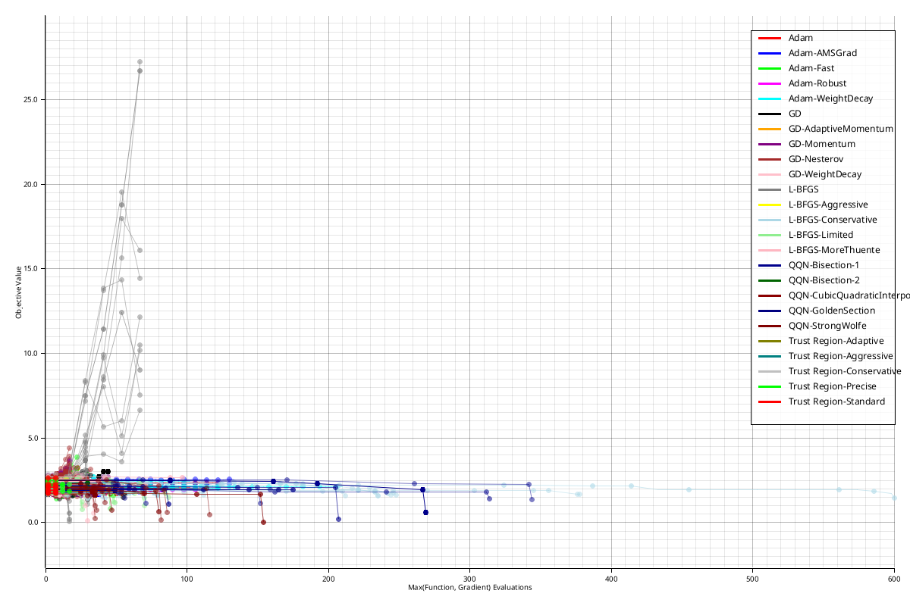
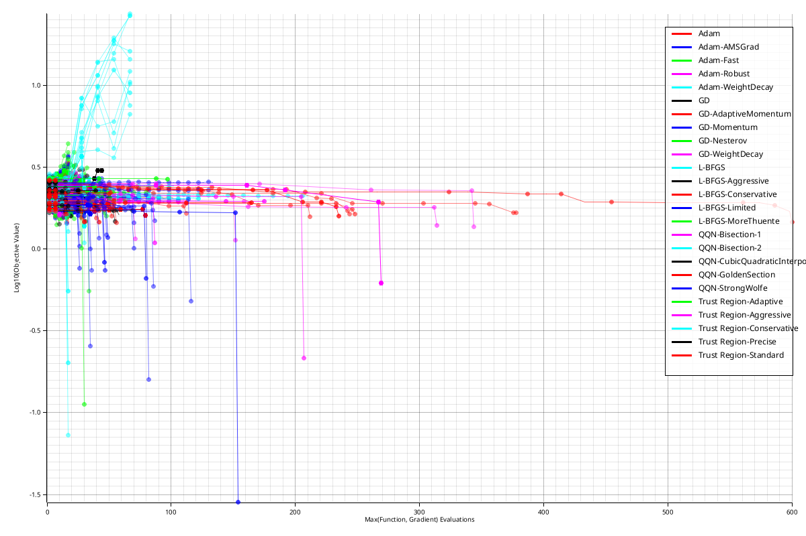

**Figure:** Convergence plots for NoisySphere_2D_sigma0.01 showing objective value vs iterations.
Left: Linear scale, Right: Log scale for better visualization of convergence behavior.

**Data:** [Linear scale data (CSV)](data/NoisySphere_2D_sigma0.01_data.csv) | [Log scale data (CSV)](data/NoisySphere_2D_sigma0.01_log_data.csv)

## Problem: NoisySphere_5D_sigma0.01

**Family:** NoisySphere
**Dimension:** 5
**Success Threshold:** 4.580e0
**Total Runs:** 500
**Detailed Analysis:** [View comprehensive problem analysis](reports/problem_analysis_NoisySphere_5D_sigma0.01.md)

### Performance Summary
<table style="border-collapse: collapse; width: 100%; margin: 20px 0;">
<tr style="background-color: #f2f2f2;">
<th style="border: 1px solid #ddd; padding: 8px; text-align: center;">Rank</th>
<th style="border: 1px solid #ddd; padding: 8px; text-align: center;">Optimizer</th>
<th style="border: 1px solid #ddd; padding: 8px; text-align: center;">Mean Final Value (All/Success/Fail)</th>
<th style="border: 1px solid #ddd; padding: 8px; text-align: center;">Std Dev</th>
<th style="border: 1px solid #ddd; padding: 8px; text-align: center;">Best Value</th>
<th style="border: 1px solid #ddd; padding: 8px; text-align: center;">Worst Value</th>
<th style="border: 1px solid #ddd; padding: 8px; text-align: center;">Mean Function Evals (All/Success/Fail)</th>
<th style="border: 1px solid #ddd; padding: 8px; text-align: center;">Mean Gradient Evals (All/Success/Fail)</th>
<th style="border: 1px solid #ddd; padding: 8px; text-align: center;">Success Rate</th>
<th style="border: 1px solid #ddd; padding: 8px; text-align: center;">Mean Time (s)</th>
</tr>
<tr style="background-color: #d4edda; font-weight: bold;">
<td style="border: 1px solid #ddd; padding: 8px; text-align: center;">1</td>
<td style="border: 1px solid #ddd; padding: 8px; text-align: center;"><a href="reports/detailed_NoisySphere_5D_sigma0.01_L-BFGS-Conservative.md" title="Click for detailed analysis">L-BFGS-Conservative</a></td>
<td style="border: 1px solid #ddd; padding: 8px; text-align: center;">4.42e0 / 4.42e0 / -</td>
<td style="border: 1px solid #ddd; padding: 8px; text-align: center;">1.19e-1</td>
<td style="border: 1px solid #ddd; padding: 8px; text-align: center;">4.14e0</td>
<td style="border: 1px solid #ddd; padding: 8px; text-align: center;">4.57e0</td>
<td style="border: 1px solid #ddd; padding: 8px; text-align: center;">120.3 / 141.5 / 0.0</td>
<td style="border: 1px solid #ddd; padding: 8px; text-align: center;">27.4 / 32.2 / 0.0</td>
<td style="border: 1px solid #ddd; padding: 8px; text-align: center;">85.0%</td>
<td style="border: 1px solid #ddd; padding: 8px; text-align: center;">0.004</td>
</tr>
<tr style="background-color: #fff3cd;">
<td style="border: 1px solid #ddd; padding: 8px; text-align: center;">2</td>
<td style="border: 1px solid #ddd; padding: 8px; text-align: center;"><a href="reports/detailed_NoisySphere_5D_sigma0.01_L-BFGS-Limited.md" title="Click for detailed analysis">L-BFGS-Limited</a></td>
<td style="border: 1px solid #ddd; padding: 8px; text-align: center;">3.90e0 / 3.42e0 / 4.96e0</td>
<td style="border: 1px solid #ddd; padding: 8px; text-align: center;">8.53e-1</td>
<td style="border: 1px solid #ddd; padding: 8px; text-align: center;">2.63e0</td>
<td style="border: 1px solid #ddd; padding: 8px; text-align: center;">5.48e0</td>
<td style="border: 1px solid #ddd; padding: 8px; text-align: center;">35.4 / 47.6 / 20.4</td>
<td style="border: 1px solid #ddd; padding: 8px; text-align: center;">7.7 / 10.1 / 4.7</td>
<td style="border: 1px solid #ddd; padding: 8px; text-align: center;">55.0%</td>
<td style="border: 1px solid #ddd; padding: 8px; text-align: center;">0.001</td>
</tr>
<tr style="">
<td style="border: 1px solid #ddd; padding: 8px; text-align: center;">3</td>
<td style="border: 1px solid #ddd; padding: 8px; text-align: center;"><a href="reports/detailed_NoisySphere_5D_sigma0.01_QQN-StrongWolfe.md" title="Click for detailed analysis">QQN-StrongWolfe</a></td>
<td style="border: 1px solid #ddd; padding: 8px; text-align: center;">3.67e0 / 3.15e0 / 5.25e0</td>
<td style="border: 1px solid #ddd; padding: 8px; text-align: center;">1.35e0</td>
<td style="border: 1px solid #ddd; padding: 8px; text-align: center;">1.11e0</td>
<td style="border: 1px solid #ddd; padding: 8px; text-align: center;">5.33e0</td>
<td style="border: 1px solid #ddd; padding: 8px; text-align: center;">18.9 / 29.1 / 10.6</td>
<td style="border: 1px solid #ddd; padding: 8px; text-align: center;">7.2 / 12.7 / 2.7</td>
<td style="border: 1px solid #ddd; padding: 8px; text-align: center;">45.0%</td>
<td style="border: 1px solid #ddd; padding: 8px; text-align: center;">0.001</td>
</tr>
<tr style="">
<td style="border: 1px solid #ddd; padding: 8px; text-align: center;">4</td>
<td style="border: 1px solid #ddd; padding: 8px; text-align: center;"><a href="reports/detailed_NoisySphere_5D_sigma0.01_QQN-Bisection-1.md" title="Click for detailed analysis">QQN-Bisection-1</a></td>
<td style="border: 1px solid #ddd; padding: 8px; text-align: center;">4.46e0 / 3.91e0 / 5.44e0</td>
<td style="border: 1px solid #ddd; padding: 8px; text-align: center;">9.06e-1</td>
<td style="border: 1px solid #ddd; padding: 8px; text-align: center;">2.43e0</td>
<td style="border: 1px solid #ddd; padding: 8px; text-align: center;">6.17e0</td>
<td style="border: 1px solid #ddd; padding: 8px; text-align: center;">75.7 / 91.0 / 63.1</td>
<td style="border: 1px solid #ddd; padding: 8px; text-align: center;">94.8 / 112.0 / 80.6</td>
<td style="border: 1px solid #ddd; padding: 8px; text-align: center;">45.0%</td>
<td style="border: 1px solid #ddd; padding: 8px; text-align: center;">0.011</td>
</tr>
<tr style="">
<td style="border: 1px solid #ddd; padding: 8px; text-align: center;">5</td>
<td style="border: 1px solid #ddd; padding: 8px; text-align: center;"><a href="reports/detailed_NoisySphere_5D_sigma0.01_GD-Nesterov.md" title="Click for detailed analysis">GD-Nesterov</a></td>
<td style="border: 1px solid #ddd; padding: 8px; text-align: center;">4.94e0 / 4.48e0 / 6.46e0</td>
<td style="border: 1px solid #ddd; padding: 8px; text-align: center;">5.68e-1</td>
<td style="border: 1px solid #ddd; padding: 8px; text-align: center;">4.26e0</td>
<td style="border: 1px solid #ddd; padding: 8px; text-align: center;">6.47e0</td>
<td style="border: 1px solid #ddd; padding: 8px; text-align: center;">6.8 / 8.7 / 6.0</td>
<td style="border: 1px solid #ddd; padding: 8px; text-align: center;">11.1 / 14.3 / 9.7</td>
<td style="border: 1px solid #ddd; padding: 8px; text-align: center;">30.0%</td>
<td style="border: 1px solid #ddd; padding: 8px; text-align: center;">0.001</td>
</tr>
<tr style="">
<td style="border: 1px solid #ddd; padding: 8px; text-align: center;">6</td>
<td style="border: 1px solid #ddd; padding: 8px; text-align: center;"><a href="reports/detailed_NoisySphere_5D_sigma0.01_GD-WeightDecay.md" title="Click for detailed analysis">GD-WeightDecay</a></td>
<td style="border: 1px solid #ddd; padding: 8px; text-align: center;">4.90e0 / 4.52e0 / 5.77e0</td>
<td style="border: 1px solid #ddd; padding: 8px; text-align: center;">3.24e-1</td>
<td style="border: 1px solid #ddd; padding: 8px; text-align: center;">4.47e0</td>
<td style="border: 1px solid #ddd; padding: 8px; text-align: center;">5.53e0</td>
<td style="border: 1px solid #ddd; padding: 8px; text-align: center;">6.5 / 5.6 / 6.8</td>
<td style="border: 1px solid #ddd; padding: 8px; text-align: center;">10.2 / 8.2 / 10.9</td>
<td style="border: 1px solid #ddd; padding: 8px; text-align: center;">25.0%</td>
<td style="border: 1px solid #ddd; padding: 8px; text-align: center;">0.001</td>
</tr>
<tr style="">
<td style="border: 1px solid #ddd; padding: 8px; text-align: center;">7</td>
<td style="border: 1px solid #ddd; padding: 8px; text-align: center;"><a href="reports/detailed_NoisySphere_5D_sigma0.01_GD-Momentum.md" title="Click for detailed analysis">GD-Momentum</a></td>
<td style="border: 1px solid #ddd; padding: 8px; text-align: center;">5.02e0 / 4.48e0 / 6.22e0</td>
<td style="border: 1px solid #ddd; padding: 8px; text-align: center;">5.62e-1</td>
<td style="border: 1px solid #ddd; padding: 8px; text-align: center;">4.41e0</td>
<td style="border: 1px solid #ddd; padding: 8px; text-align: center;">6.38e0</td>
<td style="border: 1px solid #ddd; padding: 8px; text-align: center;">7.9 / 7.8 / 7.9</td>
<td style="border: 1px solid #ddd; padding: 8px; text-align: center;">12.7 / 12.6 / 12.7</td>
<td style="border: 1px solid #ddd; padding: 8px; text-align: center;">25.0%</td>
<td style="border: 1px solid #ddd; padding: 8px; text-align: center;">0.001</td>
</tr>
<tr style="">
<td style="border: 1px solid #ddd; padding: 8px; text-align: center;">8</td>
<td style="border: 1px solid #ddd; padding: 8px; text-align: center;"><a href="reports/detailed_NoisySphere_5D_sigma0.01_L-BFGS-MoreThuente.md" title="Click for detailed analysis">L-BFGS-MoreThuente</a></td>
<td style="border: 1px solid #ddd; padding: 8px; text-align: center;">4.61e0 / 4.08e0 / 5.49e0</td>
<td style="border: 1px solid #ddd; padding: 8px; text-align: center;">8.49e-1</td>
<td style="border: 1px solid #ddd; padding: 8px; text-align: center;">3.27e0</td>
<td style="border: 1px solid #ddd; padding: 8px; text-align: center;">5.99e0</td>
<td style="border: 1px solid #ddd; padding: 8px; text-align: center;">12.3 / 35.8 / 4.5</td>
<td style="border: 1px solid #ddd; padding: 8px; text-align: center;">11.0 / 32.6 / 3.8</td>
<td style="border: 1px solid #ddd; padding: 8px; text-align: center;">25.0%</td>
<td style="border: 1px solid #ddd; padding: 8px; text-align: center;">0.001</td>
</tr>
<tr style="">
<td style="border: 1px solid #ddd; padding: 8px; text-align: center;">9</td>
<td style="border: 1px solid #ddd; padding: 8px; text-align: center;"><a href="reports/detailed_NoisySphere_5D_sigma0.01_GD.md" title="Click for detailed analysis">GD</a></td>
<td style="border: 1px solid #ddd; padding: 8px; text-align: center;">5.18e0 / 4.45e0 / 5.91e0</td>
<td style="border: 1px solid #ddd; padding: 8px; text-align: center;">6.70e-1</td>
<td style="border: 1px solid #ddd; padding: 8px; text-align: center;">4.36e0</td>
<td style="border: 1px solid #ddd; padding: 8px; text-align: center;">6.37e0</td>
<td style="border: 1px solid #ddd; padding: 8px; text-align: center;">9.2 / 17.5 / 7.2</td>
<td style="border: 1px solid #ddd; padding: 8px; text-align: center;">15.7 / 32.0 / 11.6</td>
<td style="border: 1px solid #ddd; padding: 8px; text-align: center;">20.0%</td>
<td style="border: 1px solid #ddd; padding: 8px; text-align: center;">0.002</td>
</tr>
<tr style="">
<td style="border: 1px solid #ddd; padding: 8px; text-align: center;">10</td>
<td style="border: 1px solid #ddd; padding: 8px; text-align: center;"><a href="reports/detailed_NoisySphere_5D_sigma0.01_L-BFGS.md" title="Click for detailed analysis">L-BFGS</a></td>
<td style="border: 1px solid #ddd; padding: 8px; text-align: center;">4.79e0 / 3.40e0 / 1.80e1</td>
<td style="border: 1px solid #ddd; padding: 8px; text-align: center;">8.89e-1</td>
<td style="border: 1px solid #ddd; padding: 8px; text-align: center;">2.91e0</td>
<td style="border: 1px solid #ddd; padding: 8px; text-align: center;">5.60e0</td>
<td style="border: 1px solid #ddd; padding: 8px; text-align: center;">38.4 / 18.0 / 43.5</td>
<td style="border: 1px solid #ddd; padding: 8px; text-align: center;">12.6 / 7.5 / 13.9</td>
<td style="border: 1px solid #ddd; padding: 8px; text-align: center;">20.0%</td>
<td style="border: 1px solid #ddd; padding: 8px; text-align: center;">0.002</td>
</tr>
<tr style="">
<td style="border: 1px solid #ddd; padding: 8px; text-align: center;">11</td>
<td style="border: 1px solid #ddd; padding: 8px; text-align: center;"><a href="reports/detailed_NoisySphere_5D_sigma0.01_GD-AdaptiveMomentum.md" title="Click for detailed analysis">GD-AdaptiveMomentum</a></td>
<td style="border: 1px solid #ddd; padding: 8px; text-align: center;">5.04e0 / 4.45e0 / 5.99e0</td>
<td style="border: 1px solid #ddd; padding: 8px; text-align: center;">4.04e-1</td>
<td style="border: 1px solid #ddd; padding: 8px; text-align: center;">4.36e0</td>
<td style="border: 1px solid #ddd; padding: 8px; text-align: center;">5.70e0</td>
<td style="border: 1px solid #ddd; padding: 8px; text-align: center;">7.0 / 7.3 / 6.9</td>
<td style="border: 1px solid #ddd; padding: 8px; text-align: center;">11.1 / 11.7 / 10.9</td>
<td style="border: 1px solid #ddd; padding: 8px; text-align: center;">15.0%</td>
<td style="border: 1px solid #ddd; padding: 8px; text-align: center;">0.001</td>
</tr>
<tr style="">
<td style="border: 1px solid #ddd; padding: 8px; text-align: center;">12</td>
<td style="border: 1px solid #ddd; padding: 8px; text-align: center;"><a href="reports/detailed_NoisySphere_5D_sigma0.01_Adam-Fast.md" title="Click for detailed analysis">Adam-Fast</a></td>
<td style="border: 1px solid #ddd; padding: 8px; text-align: center;">4.97e0 / 4.36e0 / 6.27e0</td>
<td style="border: 1px solid #ddd; padding: 8px; text-align: center;">4.47e-1</td>
<td style="border: 1px solid #ddd; padding: 8px; text-align: center;">4.17e0</td>
<td style="border: 1px solid #ddd; padding: 8px; text-align: center;">5.79e0</td>
<td style="border: 1px solid #ddd; padding: 8px; text-align: center;">11.7 / 15.0 / 11.3</td>
<td style="border: 1px solid #ddd; padding: 8px; text-align: center;">11.1 / 15.0 / 10.7</td>
<td style="border: 1px solid #ddd; padding: 8px; text-align: center;">10.0%</td>
<td style="border: 1px solid #ddd; padding: 8px; text-align: center;">0.001</td>
</tr>
<tr style="">
<td style="border: 1px solid #ddd; padding: 8px; text-align: center;">13</td>
<td style="border: 1px solid #ddd; padding: 8px; text-align: center;"><a href="reports/detailed_NoisySphere_5D_sigma0.01_QQN-GoldenSection.md" title="Click for detailed analysis">QQN-GoldenSection</a></td>
<td style="border: 1px solid #ddd; padding: 8px; text-align: center;">4.88e0 / 3.67e0 / 5.18e0</td>
<td style="border: 1px solid #ddd; padding: 8px; text-align: center;">7.47e-1</td>
<td style="border: 1px solid #ddd; padding: 8px; text-align: center;">3.49e0</td>
<td style="border: 1px solid #ddd; padding: 8px; text-align: center;">6.27e0</td>
<td style="border: 1px solid #ddd; padding: 8px; text-align: center;">21.2 / 49.0 / 18.2</td>
<td style="border: 1px solid #ddd; padding: 8px; text-align: center;">4.9 / 8.0 / 4.6</td>
<td style="border: 1px solid #ddd; padding: 8px; text-align: center;">10.0%</td>
<td style="border: 1px solid #ddd; padding: 8px; text-align: center;">0.001</td>
</tr>
<tr style="">
<td style="border: 1px solid #ddd; padding: 8px; text-align: center;">14</td>
<td style="border: 1px solid #ddd; padding: 8px; text-align: center;"><a href="reports/detailed_NoisySphere_5D_sigma0.01_L-BFGS-Aggressive.md" title="Click for detailed analysis">L-BFGS-Aggressive</a></td>
<td style="border: 1px solid #ddd; padding: 8px; text-align: center;">5.18e0 / - / 5.18e0</td>
<td style="border: 1px solid #ddd; padding: 8px; text-align: center;">4.15e-1</td>
<td style="border: 1px solid #ddd; padding: 8px; text-align: center;">4.66e0</td>
<td style="border: 1px solid #ddd; padding: 8px; text-align: center;">5.74e0</td>
<td style="border: 1px solid #ddd; padding: 8px; text-align: center;">4.2 / - / 4.2</td>
<td style="border: 1px solid #ddd; padding: 8px; text-align: center;">1.8 / - / 1.8</td>
<td style="border: 1px solid #ddd; padding: 8px; text-align: center;">0.0%</td>
<td style="border: 1px solid #ddd; padding: 8px; text-align: center;">0.000</td>
</tr>
<tr style="">
<td style="border: 1px solid #ddd; padding: 8px; text-align: center;">15</td>
<td style="border: 1px solid #ddd; padding: 8px; text-align: center;"><a href="reports/detailed_NoisySphere_5D_sigma0.01_Trust_Region-Aggressive.md" title="Click for detailed analysis">Trust Region-Aggressive</a></td>
<td style="border: 1px solid #ddd; padding: 8px; text-align: center;">5.27e0 / - / 5.27e0</td>
<td style="border: 1px solid #ddd; padding: 8px; text-align: center;">3.43e-1</td>
<td style="border: 1px solid #ddd; padding: 8px; text-align: center;">4.65e0</td>
<td style="border: 1px solid #ddd; padding: 8px; text-align: center;">5.82e0</td>
<td style="border: 1px solid #ddd; padding: 8px; text-align: center;">3.5 / - / 3.5</td>
<td style="border: 1px solid #ddd; padding: 8px; text-align: center;">2.8 / - / 2.8</td>
<td style="border: 1px solid #ddd; padding: 8px; text-align: center;">0.0%</td>
<td style="border: 1px solid #ddd; padding: 8px; text-align: center;">0.000</td>
</tr>
<tr style="">
<td style="border: 1px solid #ddd; padding: 8px; text-align: center;">16</td>
<td style="border: 1px solid #ddd; padding: 8px; text-align: center;"><a href="reports/detailed_NoisySphere_5D_sigma0.01_Trust_Region-Adaptive.md" title="Click for detailed analysis">Trust Region-Adaptive</a></td>
<td style="border: 1px solid #ddd; padding: 8px; text-align: center;">5.32e0 / - / 5.32e0</td>
<td style="border: 1px solid #ddd; padding: 8px; text-align: center;">3.69e-1</td>
<td style="border: 1px solid #ddd; padding: 8px; text-align: center;">4.65e0</td>
<td style="border: 1px solid #ddd; padding: 8px; text-align: center;">6.03e0</td>
<td style="border: 1px solid #ddd; padding: 8px; text-align: center;">3.5 / - / 3.5</td>
<td style="border: 1px solid #ddd; padding: 8px; text-align: center;">2.8 / - / 2.8</td>
<td style="border: 1px solid #ddd; padding: 8px; text-align: center;">0.0%</td>
<td style="border: 1px solid #ddd; padding: 8px; text-align: center;">0.000</td>
</tr>
<tr style="">
<td style="border: 1px solid #ddd; padding: 8px; text-align: center;">17</td>
<td style="border: 1px solid #ddd; padding: 8px; text-align: center;"><a href="reports/detailed_NoisySphere_5D_sigma0.01_Trust_Region-Standard.md" title="Click for detailed analysis">Trust Region-Standard</a></td>
<td style="border: 1px solid #ddd; padding: 8px; text-align: center;">5.20e0 / - / 5.20e0</td>
<td style="border: 1px solid #ddd; padding: 8px; text-align: center;">3.94e-1</td>
<td style="border: 1px solid #ddd; padding: 8px; text-align: center;">4.73e0</td>
<td style="border: 1px solid #ddd; padding: 8px; text-align: center;">6.28e0</td>
<td style="border: 1px solid #ddd; padding: 8px; text-align: center;">4.2 / - / 4.2</td>
<td style="border: 1px solid #ddd; padding: 8px; text-align: center;">3.4 / - / 3.4</td>
<td style="border: 1px solid #ddd; padding: 8px; text-align: center;">0.0%</td>
<td style="border: 1px solid #ddd; padding: 8px; text-align: center;">0.000</td>
</tr>
<tr style="">
<td style="border: 1px solid #ddd; padding: 8px; text-align: center;">18</td>
<td style="border: 1px solid #ddd; padding: 8px; text-align: center;"><a href="reports/detailed_NoisySphere_5D_sigma0.01_Trust_Region-Conservative.md" title="Click for detailed analysis">Trust Region-Conservative</a></td>
<td style="border: 1px solid #ddd; padding: 8px; text-align: center;">5.20e0 / - / 5.20e0</td>
<td style="border: 1px solid #ddd; padding: 8px; text-align: center;">3.98e-1</td>
<td style="border: 1px solid #ddd; padding: 8px; text-align: center;">4.59e0</td>
<td style="border: 1px solid #ddd; padding: 8px; text-align: center;">5.78e0</td>
<td style="border: 1px solid #ddd; padding: 8px; text-align: center;">5.7 / - / 5.7</td>
<td style="border: 1px solid #ddd; padding: 8px; text-align: center;">4.4 / - / 4.4</td>
<td style="border: 1px solid #ddd; padding: 8px; text-align: center;">0.0%</td>
<td style="border: 1px solid #ddd; padding: 8px; text-align: center;">0.000</td>
</tr>
<tr style="">
<td style="border: 1px solid #ddd; padding: 8px; text-align: center;">19</td>
<td style="border: 1px solid #ddd; padding: 8px; text-align: center;"><a href="reports/detailed_NoisySphere_5D_sigma0.01_Trust_Region-Precise.md" title="Click for detailed analysis">Trust Region-Precise</a></td>
<td style="border: 1px solid #ddd; padding: 8px; text-align: center;">5.28e0 / - / 5.28e0</td>
<td style="border: 1px solid #ddd; padding: 8px; text-align: center;">4.50e-1</td>
<td style="border: 1px solid #ddd; padding: 8px; text-align: center;">4.65e0</td>
<td style="border: 1px solid #ddd; padding: 8px; text-align: center;">6.08e0</td>
<td style="border: 1px solid #ddd; padding: 8px; text-align: center;">6.5 / - / 6.5</td>
<td style="border: 1px solid #ddd; padding: 8px; text-align: center;">5.0 / - / 5.0</td>
<td style="border: 1px solid #ddd; padding: 8px; text-align: center;">0.0%</td>
<td style="border: 1px solid #ddd; padding: 8px; text-align: center;">0.001</td>
</tr>
<tr style="">
<td style="border: 1px solid #ddd; padding: 8px; text-align: center;">20</td>
<td style="border: 1px solid #ddd; padding: 8px; text-align: center;"><a href="reports/detailed_NoisySphere_5D_sigma0.01_QQN-CubicQuadraticInterpolation.md" title="Click for detailed analysis">QQN-CubicQuadraticInterpolation</a></td>
<td style="border: 1px solid #ddd; padding: 8px; text-align: center;">5.26e0 / - / 5.26e0</td>
<td style="border: 1px solid #ddd; padding: 8px; text-align: center;">3.22e-1</td>
<td style="border: 1px solid #ddd; padding: 8px; text-align: center;">4.75e0</td>
<td style="border: 1px solid #ddd; padding: 8px; text-align: center;">5.60e0</td>
<td style="border: 1px solid #ddd; padding: 8px; text-align: center;">7.2 / - / 7.2</td>
<td style="border: 1px solid #ddd; padding: 8px; text-align: center;">6.3 / - / 6.3</td>
<td style="border: 1px solid #ddd; padding: 8px; text-align: center;">0.0%</td>
<td style="border: 1px solid #ddd; padding: 8px; text-align: center;">0.001</td>
</tr>
<tr style="">
<td style="border: 1px solid #ddd; padding: 8px; text-align: center;">21</td>
<td style="border: 1px solid #ddd; padding: 8px; text-align: center;"><a href="reports/detailed_NoisySphere_5D_sigma0.01_Adam-WeightDecay.md" title="Click for detailed analysis">Adam-WeightDecay</a></td>
<td style="border: 1px solid #ddd; padding: 8px; text-align: center;">5.19e0 / - / 5.22e0</td>
<td style="border: 1px solid #ddd; padding: 8px; text-align: center;">3.01e-1</td>
<td style="border: 1px solid #ddd; padding: 8px; text-align: center;">4.61e0</td>
<td style="border: 1px solid #ddd; padding: 8px; text-align: center;">5.75e0</td>
<td style="border: 1px solid #ddd; padding: 8px; text-align: center;">16.6 / - / 16.6</td>
<td style="border: 1px solid #ddd; padding: 8px; text-align: center;">15.9 / - / 15.9</td>
<td style="border: 1px solid #ddd; padding: 8px; text-align: center;">0.0%</td>
<td style="border: 1px solid #ddd; padding: 8px; text-align: center;">0.002</td>
</tr>
<tr style="">
<td style="border: 1px solid #ddd; padding: 8px; text-align: center;">22</td>
<td style="border: 1px solid #ddd; padding: 8px; text-align: center;"><a href="reports/detailed_NoisySphere_5D_sigma0.01_Adam-Robust.md" title="Click for detailed analysis">Adam-Robust</a></td>
<td style="border: 1px solid #ddd; padding: 8px; text-align: center;">5.05e0 / - / 5.11e0</td>
<td style="border: 1px solid #ddd; padding: 8px; text-align: center;">3.49e-1</td>
<td style="border: 1px solid #ddd; padding: 8px; text-align: center;">4.59e0</td>
<td style="border: 1px solid #ddd; padding: 8px; text-align: center;">5.62e0</td>
<td style="border: 1px solid #ddd; padding: 8px; text-align: center;">17.1 / - / 17.1</td>
<td style="border: 1px solid #ddd; padding: 8px; text-align: center;">16.4 / - / 16.4</td>
<td style="border: 1px solid #ddd; padding: 8px; text-align: center;">0.0%</td>
<td style="border: 1px solid #ddd; padding: 8px; text-align: center;">0.002</td>
</tr>
<tr style="">
<td style="border: 1px solid #ddd; padding: 8px; text-align: center;">23</td>
<td style="border: 1px solid #ddd; padding: 8px; text-align: center;"><a href="reports/detailed_NoisySphere_5D_sigma0.01_Adam-AMSGrad.md" title="Click for detailed analysis">Adam-AMSGrad</a></td>
<td style="border: 1px solid #ddd; padding: 8px; text-align: center;">5.41e0 / - / 5.42e0</td>
<td style="border: 1px solid #ddd; padding: 8px; text-align: center;">3.72e-1</td>
<td style="border: 1px solid #ddd; padding: 8px; text-align: center;">4.93e0</td>
<td style="border: 1px solid #ddd; padding: 8px; text-align: center;">6.36e0</td>
<td style="border: 1px solid #ddd; padding: 8px; text-align: center;">18.6 / - / 18.6</td>
<td style="border: 1px solid #ddd; padding: 8px; text-align: center;">17.9 / - / 17.9</td>
<td style="border: 1px solid #ddd; padding: 8px; text-align: center;">0.0%</td>
<td style="border: 1px solid #ddd; padding: 8px; text-align: center;">0.002</td>
</tr>
<tr style="">
<td style="border: 1px solid #ddd; padding: 8px; text-align: center;">24</td>
<td style="border: 1px solid #ddd; padding: 8px; text-align: center;"><a href="reports/detailed_NoisySphere_5D_sigma0.01_Adam.md" title="Click for detailed analysis">Adam</a></td>
<td style="border: 1px solid #ddd; padding: 8px; text-align: center;">5.40e0 / - / 5.42e0</td>
<td style="border: 1px solid #ddd; padding: 8px; text-align: center;">2.69e-1</td>
<td style="border: 1px solid #ddd; padding: 8px; text-align: center;">4.71e0</td>
<td style="border: 1px solid #ddd; padding: 8px; text-align: center;">5.92e0</td>
<td style="border: 1px solid #ddd; padding: 8px; text-align: center;">26.1 / - / 26.1</td>
<td style="border: 1px solid #ddd; padding: 8px; text-align: center;">25.3 / - / 25.3</td>
<td style="border: 1px solid #ddd; padding: 8px; text-align: center;">0.0%</td>
<td style="border: 1px solid #ddd; padding: 8px; text-align: center;">0.003</td>
</tr>
</table>

### Convergence Plots

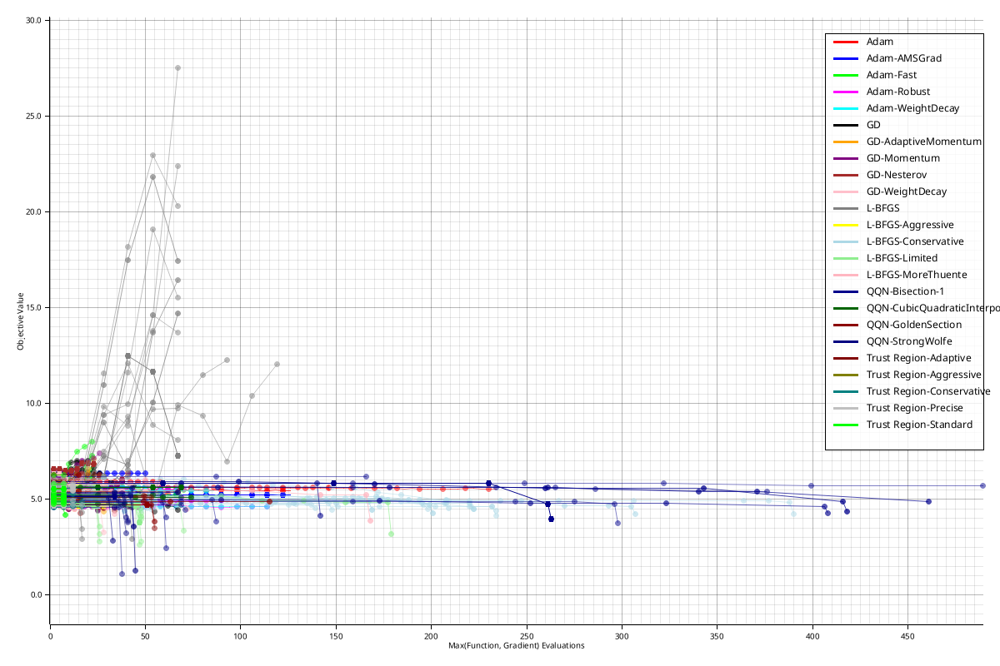
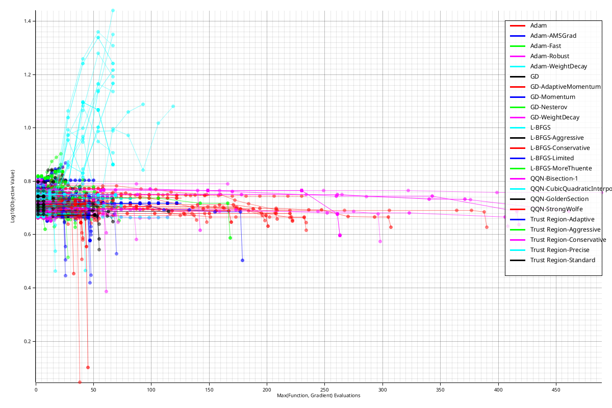

**Figure:** Convergence plots for NoisySphere_5D_sigma0.01 showing objective value vs iterations.
Left: Linear scale, Right: Log scale for better visualization of convergence behavior.

**Data:** [Linear scale data (CSV)](data/NoisySphere_5D_sigma0.01_data.csv) | [Log scale data (CSV)](data/NoisySphere_5D_sigma0.01_log_data.csv)

## Problem: NoisySphere_10D_sigma0.01

**Family:** NoisySphere
**Dimension:** 10
**Success Threshold:** 9.710e0
**Total Runs:** 500
**Detailed Analysis:** [View comprehensive problem analysis](reports/problem_analysis_NoisySphere_10D_sigma0.01.md)

### Performance Summary
<table style="border-collapse: collapse; width: 100%; margin: 20px 0;">
<tr style="background-color: #f2f2f2;">
<th style="border: 1px solid #ddd; padding: 8px; text-align: center;">Rank</th>
<th style="border: 1px solid #ddd; padding: 8px; text-align: center;">Optimizer</th>
<th style="border: 1px solid #ddd; padding: 8px; text-align: center;">Mean Final Value (All/Success/Fail)</th>
<th style="border: 1px solid #ddd; padding: 8px; text-align: center;">Std Dev</th>
<th style="border: 1px solid #ddd; padding: 8px; text-align: center;">Best Value</th>
<th style="border: 1px solid #ddd; padding: 8px; text-align: center;">Worst Value</th>
<th style="border: 1px solid #ddd; padding: 8px; text-align: center;">Mean Function Evals (All/Success/Fail)</th>
<th style="border: 1px solid #ddd; padding: 8px; text-align: center;">Mean Gradient Evals (All/Success/Fail)</th>
<th style="border: 1px solid #ddd; padding: 8px; text-align: center;">Success Rate</th>
<th style="border: 1px solid #ddd; padding: 8px; text-align: center;">Mean Time (s)</th>
</tr>
<tr style="background-color: #d4edda; font-weight: bold;">
<td style="border: 1px solid #ddd; padding: 8px; text-align: center;">1</td>
<td style="border: 1px solid #ddd; padding: 8px; text-align: center;"><a href="reports/detailed_NoisySphere_10D_sigma0.01_L-BFGS-Conservative.md" title="Click for detailed analysis">L-BFGS-Conservative</a></td>
<td style="border: 1px solid #ddd; padding: 8px; text-align: center;">9.49e0 / 9.49e0 / -</td>
<td style="border: 1px solid #ddd; padding: 8px; text-align: center;">1.72e-1</td>
<td style="border: 1px solid #ddd; padding: 8px; text-align: center;">9.16e0</td>
<td style="border: 1px solid #ddd; padding: 8px; text-align: center;">9.70e0</td>
<td style="border: 1px solid #ddd; padding: 8px; text-align: center;">93.8 / 110.3 / 0.0</td>
<td style="border: 1px solid #ddd; padding: 8px; text-align: center;">24.9 / 29.2 / 0.0</td>
<td style="border: 1px solid #ddd; padding: 8px; text-align: center;">85.0%</td>
<td style="border: 1px solid #ddd; padding: 8px; text-align: center;">0.006</td>
</tr>
<tr style="background-color: #fff3cd;">
<td style="border: 1px solid #ddd; padding: 8px; text-align: center;">2</td>
<td style="border: 1px solid #ddd; padding: 8px; text-align: center;"><a href="reports/detailed_NoisySphere_10D_sigma0.01_L-BFGS-Limited.md" title="Click for detailed analysis">L-BFGS-Limited</a></td>
<td style="border: 1px solid #ddd; padding: 8px; text-align: center;">9.06e0 / 8.52e0 / 1.03e1</td>
<td style="border: 1px solid #ddd; padding: 8px; text-align: center;">1.17e0</td>
<td style="border: 1px solid #ddd; padding: 8px; text-align: center;">6.79e0</td>
<td style="border: 1px solid #ddd; padding: 8px; text-align: center;">1.08e1</td>
<td style="border: 1px solid #ddd; padding: 8px; text-align: center;">32.2 / 57.7 / 11.5</td>
<td style="border: 1px solid #ddd; padding: 8px; text-align: center;">6.8 / 11.7 / 2.7</td>
<td style="border: 1px solid #ddd; padding: 8px; text-align: center;">45.0%</td>
<td style="border: 1px solid #ddd; padding: 8px; text-align: center;">0.002</td>
</tr>
<tr style="">
<td style="border: 1px solid #ddd; padding: 8px; text-align: center;">3</td>
<td style="border: 1px solid #ddd; padding: 8px; text-align: center;"><a href="reports/detailed_NoisySphere_10D_sigma0.01_QQN-Bisection-1.md" title="Click for detailed analysis">QQN-Bisection-1</a></td>
<td style="border: 1px solid #ddd; padding: 8px; text-align: center;">9.08e0 / 8.48e0 / 1.04e1</td>
<td style="border: 1px solid #ddd; padding: 8px; text-align: center;">1.54e0</td>
<td style="border: 1px solid #ddd; padding: 8px; text-align: center;">4.69e0</td>
<td style="border: 1px solid #ddd; padding: 8px; text-align: center;">1.10e1</td>
<td style="border: 1px solid #ddd; padding: 8px; text-align: center;">55.0 / 76.9 / 37.2</td>
<td style="border: 1px solid #ddd; padding: 8px; text-align: center;">77.5 / 117.3 / 44.8</td>
<td style="border: 1px solid #ddd; padding: 8px; text-align: center;">45.0%</td>
<td style="border: 1px solid #ddd; padding: 8px; text-align: center;">0.016</td>
</tr>
<tr style="">
<td style="border: 1px solid #ddd; padding: 8px; text-align: center;">4</td>
<td style="border: 1px solid #ddd; padding: 8px; text-align: center;"><a href="reports/detailed_NoisySphere_10D_sigma0.01_GD-AdaptiveMomentum.md" title="Click for detailed analysis">GD-AdaptiveMomentum</a></td>
<td style="border: 1px solid #ddd; padding: 8px; text-align: center;">9.91e0 / 9.62e0 / 1.09e1</td>
<td style="border: 1px solid #ddd; padding: 8px; text-align: center;">3.10e-1</td>
<td style="border: 1px solid #ddd; padding: 8px; text-align: center;">9.45e0</td>
<td style="border: 1px solid #ddd; padding: 8px; text-align: center;">1.04e1</td>
<td style="border: 1px solid #ddd; padding: 8px; text-align: center;">8.0 / 8.7 / 7.6</td>
<td style="border: 1px solid #ddd; padding: 8px; text-align: center;">13.3 / 14.4 / 12.8</td>
<td style="border: 1px solid #ddd; padding: 8px; text-align: center;">35.0%</td>
<td style="border: 1px solid #ddd; padding: 8px; text-align: center;">0.002</td>
</tr>
<tr style="">
<td style="border: 1px solid #ddd; padding: 8px; text-align: center;">5</td>
<td style="border: 1px solid #ddd; padding: 8px; text-align: center;"><a href="reports/detailed_NoisySphere_10D_sigma0.01_QQN-StrongWolfe.md" title="Click for detailed analysis">QQN-StrongWolfe</a></td>
<td style="border: 1px solid #ddd; padding: 8px; text-align: center;">9.41e0 / 8.36e0 / 1.07e1</td>
<td style="border: 1px solid #ddd; padding: 8px; text-align: center;">1.31e0</td>
<td style="border: 1px solid #ddd; padding: 8px; text-align: center;">7.23e0</td>
<td style="border: 1px solid #ddd; padding: 8px; text-align: center;">1.10e1</td>
<td style="border: 1px solid #ddd; padding: 8px; text-align: center;">19.9 / 55.6 / 8.0</td>
<td style="border: 1px solid #ddd; padding: 8px; text-align: center;">7.1 / 22.0 / 2.1</td>
<td style="border: 1px solid #ddd; padding: 8px; text-align: center;">25.0%</td>
<td style="border: 1px solid #ddd; padding: 8px; text-align: center;">0.002</td>
</tr>
<tr style="">
<td style="border: 1px solid #ddd; padding: 8px; text-align: center;">6</td>
<td style="border: 1px solid #ddd; padding: 8px; text-align: center;"><a href="reports/detailed_NoisySphere_10D_sigma0.01_L-BFGS.md" title="Click for detailed analysis">L-BFGS</a></td>
<td style="border: 1px solid #ddd; padding: 8px; text-align: center;">9.87e0 / 8.23e0 / 2.93e1</td>
<td style="border: 1px solid #ddd; padding: 8px; text-align: center;">1.30e0</td>
<td style="border: 1px solid #ddd; padding: 8px; text-align: center;">7.46e0</td>
<td style="border: 1px solid #ddd; padding: 8px; text-align: center;">1.16e1</td>
<td style="border: 1px solid #ddd; padding: 8px; text-align: center;">31.4 / 15.5 / 35.4</td>
<td style="border: 1px solid #ddd; padding: 8px; text-align: center;">10.3 / 6.8 / 11.2</td>
<td style="border: 1px solid #ddd; padding: 8px; text-align: center;">20.0%</td>
<td style="border: 1px solid #ddd; padding: 8px; text-align: center;">0.002</td>
</tr>
<tr style="">
<td style="border: 1px solid #ddd; padding: 8px; text-align: center;">7</td>
<td style="border: 1px solid #ddd; padding: 8px; text-align: center;"><a href="reports/detailed_NoisySphere_10D_sigma0.01_Adam-Fast.md" title="Click for detailed analysis">Adam-Fast</a></td>
<td style="border: 1px solid #ddd; padding: 8px; text-align: center;">1.01e1 / 9.55e0 / 1.15e1</td>
<td style="border: 1px solid #ddd; padding: 8px; text-align: center;">4.38e-1</td>
<td style="border: 1px solid #ddd; padding: 8px; text-align: center;">9.46e0</td>
<td style="border: 1px solid #ddd; padding: 8px; text-align: center;">1.10e1</td>
<td style="border: 1px solid #ddd; padding: 8px; text-align: center;">9.7 / 5.7 / 10.4</td>
<td style="border: 1px solid #ddd; padding: 8px; text-align: center;">9.2 / 5.7 / 9.8</td>
<td style="border: 1px solid #ddd; padding: 8px; text-align: center;">15.0%</td>
<td style="border: 1px solid #ddd; padding: 8px; text-align: center;">0.002</td>
</tr>
<tr style="">
<td style="border: 1px solid #ddd; padding: 8px; text-align: center;">8</td>
<td style="border: 1px solid #ddd; padding: 8px; text-align: center;"><a href="reports/detailed_NoisySphere_10D_sigma0.01_GD-Nesterov.md" title="Click for detailed analysis">GD-Nesterov</a></td>
<td style="border: 1px solid #ddd; padding: 8px; text-align: center;">1.01e1 / 9.67e0 / 1.12e1</td>
<td style="border: 1px solid #ddd; padding: 8px; text-align: center;">4.86e-1</td>
<td style="border: 1px solid #ddd; padding: 8px; text-align: center;">9.63e0</td>
<td style="border: 1px solid #ddd; padding: 8px; text-align: center;">1.17e1</td>
<td style="border: 1px solid #ddd; padding: 8px; text-align: center;">7.5 / 5.7 / 7.9</td>
<td style="border: 1px solid #ddd; padding: 8px; text-align: center;">12.2 / 8.3 / 12.9</td>
<td style="border: 1px solid #ddd; padding: 8px; text-align: center;">15.0%</td>
<td style="border: 1px solid #ddd; padding: 8px; text-align: center;">0.002</td>
</tr>
<tr style="">
<td style="border: 1px solid #ddd; padding: 8px; text-align: center;">9</td>
<td style="border: 1px solid #ddd; padding: 8px; text-align: center;"><a href="reports/detailed_NoisySphere_10D_sigma0.01_GD-Momentum.md" title="Click for detailed analysis">GD-Momentum</a></td>
<td style="border: 1px solid #ddd; padding: 8px; text-align: center;">1.05e1 / 9.66e0 / 1.13e1</td>
<td style="border: 1px solid #ddd; padding: 8px; text-align: center;">6.75e-1</td>
<td style="border: 1px solid #ddd; padding: 8px; text-align: center;">9.66e0</td>
<td style="border: 1px solid #ddd; padding: 8px; text-align: center;">1.21e1</td>
<td style="border: 1px solid #ddd; padding: 8px; text-align: center;">6.8 / 9.0 / 6.6</td>
<td style="border: 1px solid #ddd; padding: 8px; text-align: center;">10.8 / 15.0 / 10.3</td>
<td style="border: 1px solid #ddd; padding: 8px; text-align: center;">10.0%</td>
<td style="border: 1px solid #ddd; padding: 8px; text-align: center;">0.002</td>
</tr>
<tr style="">
<td style="border: 1px solid #ddd; padding: 8px; text-align: center;">10</td>
<td style="border: 1px solid #ddd; padding: 8px; text-align: center;"><a href="reports/detailed_NoisySphere_10D_sigma0.01_L-BFGS-MoreThuente.md" title="Click for detailed analysis">L-BFGS-MoreThuente</a></td>
<td style="border: 1px solid #ddd; padding: 8px; text-align: center;">9.77e0 / 7.10e0 / 1.05e1</td>
<td style="border: 1px solid #ddd; padding: 8px; text-align: center;">1.48e0</td>
<td style="border: 1px solid #ddd; padding: 8px; text-align: center;">6.61e0</td>
<td style="border: 1px solid #ddd; padding: 8px; text-align: center;">1.14e1</td>
<td style="border: 1px solid #ddd; padding: 8px; text-align: center;">12.4 / 17.5 / 11.9</td>
<td style="border: 1px solid #ddd; padding: 8px; text-align: center;">11.1 / 15.5 / 10.6</td>
<td style="border: 1px solid #ddd; padding: 8px; text-align: center;">10.0%</td>
<td style="border: 1px solid #ddd; padding: 8px; text-align: center;">0.002</td>
</tr>
<tr style="">
<td style="border: 1px solid #ddd; padding: 8px; text-align: center;">11</td>
<td style="border: 1px solid #ddd; padding: 8px; text-align: center;"><a href="reports/detailed_NoisySphere_10D_sigma0.01_GD.md" title="Click for detailed analysis">GD</a></td>
<td style="border: 1px solid #ddd; padding: 8px; text-align: center;">1.05e1 / 9.57e0 / 1.12e1</td>
<td style="border: 1px solid #ddd; padding: 8px; text-align: center;">5.34e-1</td>
<td style="border: 1px solid #ddd; padding: 8px; text-align: center;">9.54e0</td>
<td style="border: 1px solid #ddd; padding: 8px; text-align: center;">1.12e1</td>
<td style="border: 1px solid #ddd; padding: 8px; text-align: center;">10.2 / 16.5 / 9.6</td>
<td style="border: 1px solid #ddd; padding: 8px; text-align: center;">17.4 / 30.0 / 16.0</td>
<td style="border: 1px solid #ddd; padding: 8px; text-align: center;">10.0%</td>
<td style="border: 1px solid #ddd; padding: 8px; text-align: center;">0.003</td>
</tr>
<tr style="">
<td style="border: 1px solid #ddd; padding: 8px; text-align: center;">12</td>
<td style="border: 1px solid #ddd; padding: 8px; text-align: center;"><a href="reports/detailed_NoisySphere_10D_sigma0.01_GD-WeightDecay.md" title="Click for detailed analysis">GD-WeightDecay</a></td>
<td style="border: 1px solid #ddd; padding: 8px; text-align: center;">1.03e1 / 9.66e0 / 1.11e1</td>
<td style="border: 1px solid #ddd; padding: 8px; text-align: center;">4.70e-1</td>
<td style="border: 1px solid #ddd; padding: 8px; text-align: center;">9.66e0</td>
<td style="border: 1px solid #ddd; padding: 8px; text-align: center;">1.12e1</td>
<td style="border: 1px solid #ddd; padding: 8px; text-align: center;">6.0 / 11.0 / 5.8</td>
<td style="border: 1px solid #ddd; padding: 8px; text-align: center;">9.9 / 19.0 / 9.5</td>
<td style="border: 1px solid #ddd; padding: 8px; text-align: center;">5.0%</td>
<td style="border: 1px solid #ddd; padding: 8px; text-align: center;">0.002</td>
</tr>
<tr style="">
<td style="border: 1px solid #ddd; padding: 8px; text-align: center;">13</td>
<td style="border: 1px solid #ddd; padding: 8px; text-align: center;"><a href="reports/detailed_NoisySphere_10D_sigma0.01_QQN-GoldenSection.md" title="Click for detailed analysis">QQN-GoldenSection</a></td>
<td style="border: 1px solid #ddd; padding: 8px; text-align: center;">1.03e1 / 9.18e0 / 1.04e1</td>
<td style="border: 1px solid #ddd; padding: 8px; text-align: center;">5.55e-1</td>
<td style="border: 1px solid #ddd; padding: 8px; text-align: center;">9.18e0</td>
<td style="border: 1px solid #ddd; padding: 8px; text-align: center;">1.11e1</td>
<td style="border: 1px solid #ddd; padding: 8px; text-align: center;">22.1 / 49.0 / 20.6</td>
<td style="border: 1px solid #ddd; padding: 8px; text-align: center;">5.9 / 8.0 / 5.8</td>
<td style="border: 1px solid #ddd; padding: 8px; text-align: center;">5.0%</td>
<td style="border: 1px solid #ddd; padding: 8px; text-align: center;">0.002</td>
</tr>
<tr style="">
<td style="border: 1px solid #ddd; padding: 8px; text-align: center;">14</td>
<td style="border: 1px solid #ddd; padding: 8px; text-align: center;"><a href="reports/detailed_NoisySphere_10D_sigma0.01_Adam-Robust.md" title="Click for detailed analysis">Adam-Robust</a></td>
<td style="border: 1px solid #ddd; padding: 8px; text-align: center;">1.04e1 / 9.71e0 / 1.05e1</td>
<td style="border: 1px solid #ddd; padding: 8px; text-align: center;">5.73e-1</td>
<td style="border: 1px solid #ddd; padding: 8px; text-align: center;">9.71e0</td>
<td style="border: 1px solid #ddd; padding: 8px; text-align: center;">1.17e1</td>
<td style="border: 1px solid #ddd; padding: 8px; text-align: center;">18.1 / 9.0 / 18.6</td>
<td style="border: 1px solid #ddd; padding: 8px; text-align: center;">17.4 / 9.0 / 17.9</td>
<td style="border: 1px solid #ddd; padding: 8px; text-align: center;">5.0%</td>
<td style="border: 1px solid #ddd; padding: 8px; text-align: center;">0.003</td>
</tr>
<tr style="">
<td style="border: 1px solid #ddd; padding: 8px; text-align: center;">15</td>
<td style="border: 1px solid #ddd; padding: 8px; text-align: center;"><a href="reports/detailed_NoisySphere_10D_sigma0.01_QQN-CubicQuadraticInterpolation.md" title="Click for detailed analysis">QQN-CubicQuadraticInterpolation</a></td>
<td style="border: 1px solid #ddd; padding: 8px; text-align: center;">1.04e1 / - / 1.04e1</td>
<td style="border: 1px solid #ddd; padding: 8px; text-align: center;">1.61e-1</td>
<td style="border: 1px solid #ddd; padding: 8px; text-align: center;">1.03e1</td>
<td style="border: 1px solid #ddd; padding: 8px; text-align: center;">1.07e1</td>
<td style="border: 1px solid #ddd; padding: 8px; text-align: center;">1.9 / - / 1.9</td>
<td style="border: 1px solid #ddd; padding: 8px; text-align: center;">1.4 / - / 1.4</td>
<td style="border: 1px solid #ddd; padding: 8px; text-align: center;">0.0%</td>
<td style="border: 1px solid #ddd; padding: 8px; text-align: center;">0.000</td>
</tr>
<tr style="">
<td style="border: 1px solid #ddd; padding: 8px; text-align: center;">16</td>
<td style="border: 1px solid #ddd; padding: 8px; text-align: center;"><a href="reports/detailed_NoisySphere_10D_sigma0.01_Trust_Region-Adaptive.md" title="Click for detailed analysis">Trust Region-Adaptive</a></td>
<td style="border: 1px solid #ddd; padding: 8px; text-align: center;">1.04e1 / - / 1.04e1</td>
<td style="border: 1px solid #ddd; padding: 8px; text-align: center;">6.06e-1</td>
<td style="border: 1px solid #ddd; padding: 8px; text-align: center;">9.73e0</td>
<td style="border: 1px solid #ddd; padding: 8px; text-align: center;">1.17e1</td>
<td style="border: 1px solid #ddd; padding: 8px; text-align: center;">2.8 / - / 2.8</td>
<td style="border: 1px solid #ddd; padding: 8px; text-align: center;">2.2 / - / 2.2</td>
<td style="border: 1px solid #ddd; padding: 8px; text-align: center;">0.0%</td>
<td style="border: 1px solid #ddd; padding: 8px; text-align: center;">0.000</td>
</tr>
<tr style="">
<td style="border: 1px solid #ddd; padding: 8px; text-align: center;">17</td>
<td style="border: 1px solid #ddd; padding: 8px; text-align: center;"><a href="reports/detailed_NoisySphere_10D_sigma0.01_Trust_Region-Standard.md" title="Click for detailed analysis">Trust Region-Standard</a></td>
<td style="border: 1px solid #ddd; padding: 8px; text-align: center;">1.06e1 / - / 1.06e1</td>
<td style="border: 1px solid #ddd; padding: 8px; text-align: center;">5.93e-1</td>
<td style="border: 1px solid #ddd; padding: 8px; text-align: center;">9.80e0</td>
<td style="border: 1px solid #ddd; padding: 8px; text-align: center;">1.16e1</td>
<td style="border: 1px solid #ddd; padding: 8px; text-align: center;">3.2 / - / 3.2</td>
<td style="border: 1px solid #ddd; padding: 8px; text-align: center;">2.6 / - / 2.6</td>
<td style="border: 1px solid #ddd; padding: 8px; text-align: center;">0.0%</td>
<td style="border: 1px solid #ddd; padding: 8px; text-align: center;">0.000</td>
</tr>
<tr style="">
<td style="border: 1px solid #ddd; padding: 8px; text-align: center;">18</td>
<td style="border: 1px solid #ddd; padding: 8px; text-align: center;"><a href="reports/detailed_NoisySphere_10D_sigma0.01_Trust_Region-Aggressive.md" title="Click for detailed analysis">Trust Region-Aggressive</a></td>
<td style="border: 1px solid #ddd; padding: 8px; text-align: center;">1.04e1 / - / 1.04e1</td>
<td style="border: 1px solid #ddd; padding: 8px; text-align: center;">5.45e-1</td>
<td style="border: 1px solid #ddd; padding: 8px; text-align: center;">9.77e0</td>
<td style="border: 1px solid #ddd; padding: 8px; text-align: center;">1.14e1</td>
<td style="border: 1px solid #ddd; padding: 8px; text-align: center;">3.5 / - / 3.5</td>
<td style="border: 1px solid #ddd; padding: 8px; text-align: center;">2.8 / - / 2.8</td>
<td style="border: 1px solid #ddd; padding: 8px; text-align: center;">0.0%</td>
<td style="border: 1px solid #ddd; padding: 8px; text-align: center;">0.001</td>
</tr>
<tr style="">
<td style="border: 1px solid #ddd; padding: 8px; text-align: center;">19</td>
<td style="border: 1px solid #ddd; padding: 8px; text-align: center;"><a href="reports/detailed_NoisySphere_10D_sigma0.01_L-BFGS-Aggressive.md" title="Click for detailed analysis">L-BFGS-Aggressive</a></td>
<td style="border: 1px solid #ddd; padding: 8px; text-align: center;">1.06e1 / - / 1.06e1</td>
<td style="border: 1px solid #ddd; padding: 8px; text-align: center;">5.02e-1</td>
<td style="border: 1px solid #ddd; padding: 8px; text-align: center;">9.75e0</td>
<td style="border: 1px solid #ddd; padding: 8px; text-align: center;">1.11e1</td>
<td style="border: 1px solid #ddd; padding: 8px; text-align: center;">5.4 / - / 5.4</td>
<td style="border: 1px solid #ddd; padding: 8px; text-align: center;">2.2 / - / 2.2</td>
<td style="border: 1px solid #ddd; padding: 8px; text-align: center;">0.0%</td>
<td style="border: 1px solid #ddd; padding: 8px; text-align: center;">0.001</td>
</tr>
<tr style="">
<td style="border: 1px solid #ddd; padding: 8px; text-align: center;">20</td>
<td style="border: 1px solid #ddd; padding: 8px; text-align: center;"><a href="reports/detailed_NoisySphere_10D_sigma0.01_Trust_Region-Precise.md" title="Click for detailed analysis">Trust Region-Precise</a></td>
<td style="border: 1px solid #ddd; padding: 8px; text-align: center;">1.06e1 / - / 1.06e1</td>
<td style="border: 1px solid #ddd; padding: 8px; text-align: center;">3.31e-1</td>
<td style="border: 1px solid #ddd; padding: 8px; text-align: center;">9.93e0</td>
<td style="border: 1px solid #ddd; padding: 8px; text-align: center;">1.12e1</td>
<td style="border: 1px solid #ddd; padding: 8px; text-align: center;">4.8 / - / 4.8</td>
<td style="border: 1px solid #ddd; padding: 8px; text-align: center;">3.7 / - / 3.7</td>
<td style="border: 1px solid #ddd; padding: 8px; text-align: center;">0.0%</td>
<td style="border: 1px solid #ddd; padding: 8px; text-align: center;">0.001</td>
</tr>
<tr style="">
<td style="border: 1px solid #ddd; padding: 8px; text-align: center;">21</td>
<td style="border: 1px solid #ddd; padding: 8px; text-align: center;"><a href="reports/detailed_NoisySphere_10D_sigma0.01_Trust_Region-Conservative.md" title="Click for detailed analysis">Trust Region-Conservative</a></td>
<td style="border: 1px solid #ddd; padding: 8px; text-align: center;">1.04e1 / - / 1.04e1</td>
<td style="border: 1px solid #ddd; padding: 8px; text-align: center;">3.84e-1</td>
<td style="border: 1px solid #ddd; padding: 8px; text-align: center;">9.82e0</td>
<td style="border: 1px solid #ddd; padding: 8px; text-align: center;">1.13e1</td>
<td style="border: 1px solid #ddd; padding: 8px; text-align: center;">6.4 / - / 6.4</td>
<td style="border: 1px solid #ddd; padding: 8px; text-align: center;">4.8 / - / 4.8</td>
<td style="border: 1px solid #ddd; padding: 8px; text-align: center;">0.0%</td>
<td style="border: 1px solid #ddd; padding: 8px; text-align: center;">0.001</td>
</tr>
<tr style="">
<td style="border: 1px solid #ddd; padding: 8px; text-align: center;">22</td>
<td style="border: 1px solid #ddd; padding: 8px; text-align: center;"><a href="reports/detailed_NoisySphere_10D_sigma0.01_Adam.md" title="Click for detailed analysis">Adam</a></td>
<td style="border: 1px solid #ddd; padding: 8px; text-align: center;">1.07e1 / - / 1.07e1</td>
<td style="border: 1px solid #ddd; padding: 8px; text-align: center;">5.63e-1</td>
<td style="border: 1px solid #ddd; padding: 8px; text-align: center;">9.85e0</td>
<td style="border: 1px solid #ddd; padding: 8px; text-align: center;">1.20e1</td>
<td style="border: 1px solid #ddd; padding: 8px; text-align: center;">18.2 / - / 18.2</td>
<td style="border: 1px solid #ddd; padding: 8px; text-align: center;">17.5 / - / 17.5</td>
<td style="border: 1px solid #ddd; padding: 8px; text-align: center;">0.0%</td>
<td style="border: 1px solid #ddd; padding: 8px; text-align: center;">0.003</td>
</tr>
<tr style="">
<td style="border: 1px solid #ddd; padding: 8px; text-align: center;">23</td>
<td style="border: 1px solid #ddd; padding: 8px; text-align: center;"><a href="reports/detailed_NoisySphere_10D_sigma0.01_Adam-AMSGrad.md" title="Click for detailed analysis">Adam-AMSGrad</a></td>
<td style="border: 1px solid #ddd; padding: 8px; text-align: center;">1.04e1 / - / 1.04e1</td>
<td style="border: 1px solid #ddd; padding: 8px; text-align: center;">6.25e-1</td>
<td style="border: 1px solid #ddd; padding: 8px; text-align: center;">9.72e0</td>
<td style="border: 1px solid #ddd; padding: 8px; text-align: center;">1.18e1</td>
<td style="border: 1px solid #ddd; padding: 8px; text-align: center;">18.9 / - / 18.9</td>
<td style="border: 1px solid #ddd; padding: 8px; text-align: center;">18.1 / - / 18.1</td>
<td style="border: 1px solid #ddd; padding: 8px; text-align: center;">0.0%</td>
<td style="border: 1px solid #ddd; padding: 8px; text-align: center;">0.004</td>
</tr>
<tr style="">
<td style="border: 1px solid #ddd; padding: 8px; text-align: center;">24</td>
<td style="border: 1px solid #ddd; padding: 8px; text-align: center;"><a href="reports/detailed_NoisySphere_10D_sigma0.01_Adam-WeightDecay.md" title="Click for detailed analysis">Adam-WeightDecay</a></td>
<td style="border: 1px solid #ddd; padding: 8px; text-align: center;">1.03e1 / - / 1.04e1</td>
<td style="border: 1px solid #ddd; padding: 8px; text-align: center;">4.33e-1</td>
<td style="border: 1px solid #ddd; padding: 8px; text-align: center;">9.74e0</td>
<td style="border: 1px solid #ddd; padding: 8px; text-align: center;">1.13e1</td>
<td style="border: 1px solid #ddd; padding: 8px; text-align: center;">28.9 / - / 28.9</td>
<td style="border: 1px solid #ddd; padding: 8px; text-align: center;">28.2 / - / 28.2</td>
<td style="border: 1px solid #ddd; padding: 8px; text-align: center;">0.0%</td>
<td style="border: 1px solid #ddd; padding: 8px; text-align: center;">0.006</td>
</tr>
</table>

### Convergence Plots

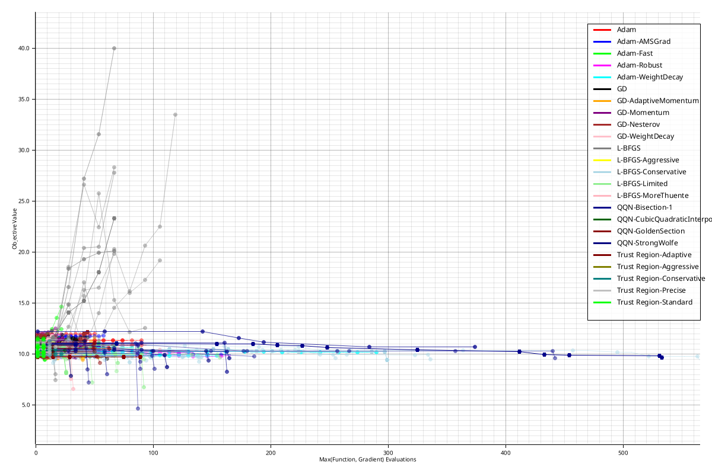
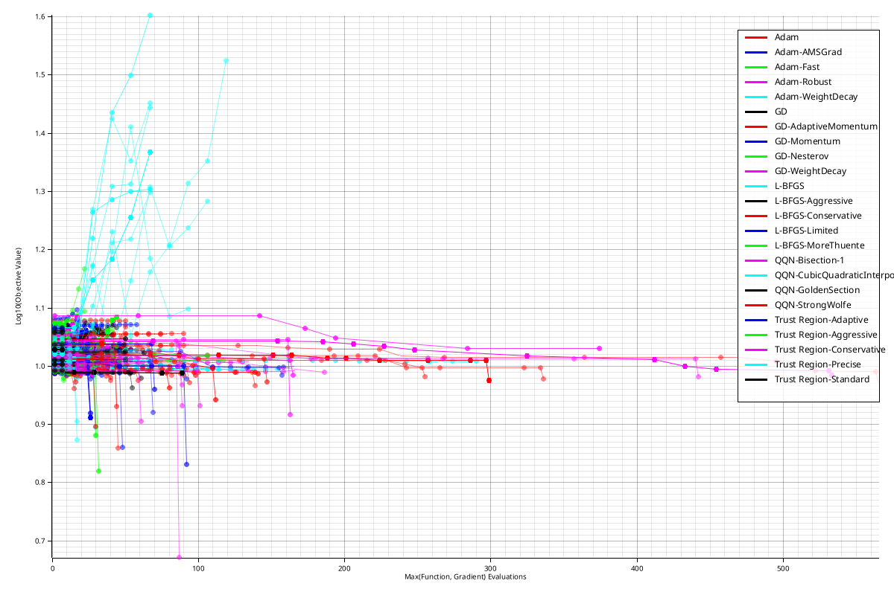

**Figure:** Convergence plots for NoisySphere_10D_sigma0.01 showing objective value vs iterations.
Left: Linear scale, Right: Log scale for better visualization of convergence behavior.

**Data:** [Linear scale data (CSV)](data/NoisySphere_10D_sigma0.01_data.csv) | [Log scale data (CSV)](data/NoisySphere_10D_sigma0.01_log_data.csv)

## Problem: SparseRosenbrock_4D

**Family:** SparseRosenbrock
**Dimension:** 4
**Success Threshold:** 1.000e-6
**Total Runs:** 500
**Detailed Analysis:** [View comprehensive problem analysis](reports/problem_analysis_SparseRosenbrock_4D.md)

### Performance Summary
<table style="border-collapse: collapse; width: 100%; margin: 20px 0;">
<tr style="background-color: #f2f2f2;">
<th style="border: 1px solid #ddd; padding: 8px; text-align: center;">Rank</th>
<th style="border: 1px solid #ddd; padding: 8px; text-align: center;">Optimizer</th>
<th style="border: 1px solid #ddd; padding: 8px; text-align: center;">Mean Final Value (All/Success/Fail)</th>
<th style="border: 1px solid #ddd; padding: 8px; text-align: center;">Std Dev</th>
<th style="border: 1px solid #ddd; padding: 8px; text-align: center;">Best Value</th>
<th style="border: 1px solid #ddd; padding: 8px; text-align: center;">Worst Value</th>
<th style="border: 1px solid #ddd; padding: 8px; text-align: center;">Mean Function Evals (All/Success/Fail)</th>
<th style="border: 1px solid #ddd; padding: 8px; text-align: center;">Mean Gradient Evals (All/Success/Fail)</th>
<th style="border: 1px solid #ddd; padding: 8px; text-align: center;">Success Rate</th>
<th style="border: 1px solid #ddd; padding: 8px; text-align: center;">Mean Time (s)</th>
</tr>
<tr style="background-color: #d4edda; font-weight: bold;">
<td style="border: 1px solid #ddd; padding: 8px; text-align: center;">1</td>
<td style="border: 1px solid #ddd; padding: 8px; text-align: center;"><a href="reports/detailed_SparseRosenbrock_4D_QQN-CubicQuadraticInterpolation.md" title="Click for detailed analysis">QQN-CubicQuadraticInterpolation</a></td>
<td style="border: 1px solid #ddd; padding: 8px; text-align: center;">5.85e-2 / 2.51e-7 / 1.06e-1</td>
<td style="border: 1px solid #ddd; padding: 8px; text-align: center;">6.41e-2</td>
<td style="border: 1px solid #ddd; padding: 8px; text-align: center;">6.10e-9</td>
<td style="border: 1px solid #ddd; padding: 8px; text-align: center;">2.15e-1</td>
<td style="border: 1px solid #ddd; padding: 8px; text-align: center;">1743.3 / 1232.1 / 2161.5</td>
<td style="border: 1px solid #ddd; padding: 8px; text-align: center;">2296.6 / 1609.7 / 2858.5</td>
<td style="border: 1px solid #ddd; padding: 8px; text-align: center;">45.0%</td>
<td style="border: 1px solid #ddd; padding: 8px; text-align: center;">0.073</td>
</tr>
<tr style="background-color: #fff3cd;">
<td style="border: 1px solid #ddd; padding: 8px; text-align: center;">2</td>
<td style="border: 1px solid #ddd; padding: 8px; text-align: center;"><a href="reports/detailed_SparseRosenbrock_4D_QQN-StrongWolfe.md" title="Click for detailed analysis">QQN-StrongWolfe</a></td>
<td style="border: 1px solid #ddd; padding: 8px; text-align: center;">3.39e-1 / 3.07e-7 / 4.52e-1</td>
<td style="border: 1px solid #ddd; padding: 8px; text-align: center;">6.28e-1</td>
<td style="border: 1px solid #ddd; padding: 8px; text-align: center;">2.24e-8</td>
<td style="border: 1px solid #ddd; padding: 8px; text-align: center;">3.00e0</td>
<td style="border: 1px solid #ddd; padding: 8px; text-align: center;">2429.1 / 1164.2 / 2850.7</td>
<td style="border: 1px solid #ddd; padding: 8px; text-align: center;">1866.5 / 937.2 / 2176.3</td>
<td style="border: 1px solid #ddd; padding: 8px; text-align: center;">25.0%</td>
<td style="border: 1px solid #ddd; padding: 8px; text-align: center;">0.081</td>
</tr>
<tr style="">
<td style="border: 1px solid #ddd; padding: 8px; text-align: center;">3</td>
<td style="border: 1px solid #ddd; padding: 8px; text-align: center;"><a href="reports/detailed_SparseRosenbrock_4D_L-BFGS-MoreThuente.md" title="Click for detailed analysis">L-BFGS-MoreThuente</a></td>
<td style="border: 1px solid #ddd; padding: 8px; text-align: center;">1.75e0 / 5.76e-7 / 2.19e0</td>
<td style="border: 1px solid #ddd; padding: 8px; text-align: center;">2.72e0</td>
<td style="border: 1px solid #ddd; padding: 8px; text-align: center;">2.55e-7</td>
<td style="border: 1px solid #ddd; padding: 8px; text-align: center;">8.30e0</td>
<td style="border: 1px solid #ddd; padding: 8px; text-align: center;">2601.9 / 1543.5 / 2866.6</td>
<td style="border: 1px solid #ddd; padding: 8px; text-align: center;">1948.2 / 1168.0 / 2143.3</td>
<td style="border: 1px solid #ddd; padding: 8px; text-align: center;">20.0%</td>
<td style="border: 1px solid #ddd; padding: 8px; text-align: center;">0.046</td>
</tr>
<tr style="">
<td style="border: 1px solid #ddd; padding: 8px; text-align: center;">4</td>
<td style="border: 1px solid #ddd; padding: 8px; text-align: center;"><a href="reports/detailed_SparseRosenbrock_4D_QQN-Bisection-1.md" title="Click for detailed analysis">QQN-Bisection-1</a></td>
<td style="border: 1px solid #ddd; padding: 8px; text-align: center;">4.56e-1 / 4.28e-7 / 5.37e-1</td>
<td style="border: 1px solid #ddd; padding: 8px; text-align: center;">4.62e-1</td>
<td style="border: 1px solid #ddd; padding: 8px; text-align: center;">9.12e-8</td>
<td style="border: 1px solid #ddd; padding: 8px; text-align: center;">1.60e0</td>
<td style="border: 1px solid #ddd; padding: 8px; text-align: center;">2290.2 / 1654.0 / 2402.5</td>
<td style="border: 1px solid #ddd; padding: 8px; text-align: center;">2516.9 / 1867.7 / 2631.5</td>
<td style="border: 1px solid #ddd; padding: 8px; text-align: center;">15.0%</td>
<td style="border: 1px solid #ddd; padding: 8px; text-align: center;">0.057</td>
</tr>
<tr style="">
<td style="border: 1px solid #ddd; padding: 8px; text-align: center;">5</td>
<td style="border: 1px solid #ddd; padding: 8px; text-align: center;"><a href="reports/detailed_SparseRosenbrock_4D_QQN-Bisection-2.md" title="Click for detailed analysis">QQN-Bisection-2</a></td>
<td style="border: 1px solid #ddd; padding: 8px; text-align: center;">1.42e0 / 5.00e-7 / 2.13e0</td>
<td style="border: 1px solid #ddd; padding: 8px; text-align: center;">1.80e0</td>
<td style="border: 1px solid #ddd; padding: 8px; text-align: center;">5.00e-7</td>
<td style="border: 1px solid #ddd; padding: 8px; text-align: center;">3.95e0</td>
<td style="border: 1px solid #ddd; padding: 8px; text-align: center;">193.1 / 398.0 / 182.3</td>
<td style="border: 1px solid #ddd; padding: 8px; text-align: center;">107.8 / 351.0 / 95.0</td>
<td style="border: 1px solid #ddd; padding: 8px; text-align: center;">5.0%</td>
<td style="border: 1px solid #ddd; padding: 8px; text-align: center;">0.005</td>
</tr>
<tr style="">
<td style="border: 1px solid #ddd; padding: 8px; text-align: center;">6</td>
<td style="border: 1px solid #ddd; padding: 8px; text-align: center;"><a href="reports/detailed_SparseRosenbrock_4D_QQN-GoldenSection.md" title="Click for detailed analysis">QQN-GoldenSection</a></td>
<td style="border: 1px solid #ddd; padding: 8px; text-align: center;">3.33e-1 / 6.04e-7 / 3.50e-1</td>
<td style="border: 1px solid #ddd; padding: 8px; text-align: center;">1.76e-1</td>
<td style="border: 1px solid #ddd; padding: 8px; text-align: center;">6.04e-7</td>
<td style="border: 1px solid #ddd; padding: 8px; text-align: center;">6.84e-1</td>
<td style="border: 1px solid #ddd; padding: 8px; text-align: center;">4306.3 / 1392.0 / 4459.7</td>
<td style="border: 1px solid #ddd; padding: 8px; text-align: center;">542.5 / 194.0 / 560.9</td>
<td style="border: 1px solid #ddd; padding: 8px; text-align: center;">5.0%</td>
<td style="border: 1px solid #ddd; padding: 8px; text-align: center;">0.085</td>
</tr>
<tr style="">
<td style="border: 1px solid #ddd; padding: 8px; text-align: center;">7</td>
<td style="border: 1px solid #ddd; padding: 8px; text-align: center;"><a href="reports/detailed_SparseRosenbrock_4D_GD-Momentum.md" title="Click for detailed analysis">GD-Momentum</a></td>
<td style="border: 1px solid #ddd; padding: 8px; text-align: center;">7.53e0 / - / 1.10e1</td>
<td style="border: 1px solid #ddd; padding: 8px; text-align: center;">3.27e0</td>
<td style="border: 1px solid #ddd; padding: 8px; text-align: center;">4.55e-3</td>
<td style="border: 1px solid #ddd; padding: 8px; text-align: center;">1.12e1</td>
<td style="border: 1px solid #ddd; padding: 8px; text-align: center;">21.8 / - / 21.8</td>
<td style="border: 1px solid #ddd; padding: 8px; text-align: center;">39.5 / - / 39.5</td>
<td style="border: 1px solid #ddd; padding: 8px; text-align: center;">0.0%</td>
<td style="border: 1px solid #ddd; padding: 8px; text-align: center;">0.001</td>
</tr>
<tr style="">
<td style="border: 1px solid #ddd; padding: 8px; text-align: center;">8</td>
<td style="border: 1px solid #ddd; padding: 8px; text-align: center;"><a href="reports/detailed_SparseRosenbrock_4D_Trust_Region-Aggressive.md" title="Click for detailed analysis">Trust Region-Aggressive</a></td>
<td style="border: 1px solid #ddd; padding: 8px; text-align: center;">8.72e0 / - / 8.72e0</td>
<td style="border: 1px solid #ddd; padding: 8px; text-align: center;">4.61e-1</td>
<td style="border: 1px solid #ddd; padding: 8px; text-align: center;">7.92e0</td>
<td style="border: 1px solid #ddd; padding: 8px; text-align: center;">9.65e0</td>
<td style="border: 1px solid #ddd; padding: 8px; text-align: center;">57.2 / - / 57.2</td>
<td style="border: 1px solid #ddd; padding: 8px; text-align: center;">38.8 / - / 38.8</td>
<td style="border: 1px solid #ddd; padding: 8px; text-align: center;">0.0%</td>
<td style="border: 1px solid #ddd; padding: 8px; text-align: center;">0.000</td>
</tr>
<tr style="">
<td style="border: 1px solid #ddd; padding: 8px; text-align: center;">9</td>
<td style="border: 1px solid #ddd; padding: 8px; text-align: center;"><a href="reports/detailed_SparseRosenbrock_4D_GD-AdaptiveMomentum.md" title="Click for detailed analysis">GD-AdaptiveMomentum</a></td>
<td style="border: 1px solid #ddd; padding: 8px; text-align: center;">4.83e-1 / - / 1.31e0</td>
<td style="border: 1px solid #ddd; padding: 8px; text-align: center;">1.90e0</td>
<td style="border: 1px solid #ddd; padding: 8px; text-align: center;">1.98e-3</td>
<td style="border: 1px solid #ddd; padding: 8px; text-align: center;">8.75e0</td>
<td style="border: 1px solid #ddd; padding: 8px; text-align: center;">56.2 / - / 56.2</td>
<td style="border: 1px solid #ddd; padding: 8px; text-align: center;">108.4 / - / 108.4</td>
<td style="border: 1px solid #ddd; padding: 8px; text-align: center;">0.0%</td>
<td style="border: 1px solid #ddd; padding: 8px; text-align: center;">0.002</td>
</tr>
<tr style="">
<td style="border: 1px solid #ddd; padding: 8px; text-align: center;">10</td>
<td style="border: 1px solid #ddd; padding: 8px; text-align: center;"><a href="reports/detailed_SparseRosenbrock_4D_GD-Nesterov.md" title="Click for detailed analysis">GD-Nesterov</a></td>
<td style="border: 1px solid #ddd; padding: 8px; text-align: center;">1.76e0 / - / 3.38e0</td>
<td style="border: 1px solid #ddd; padding: 8px; text-align: center;">3.38e0</td>
<td style="border: 1px solid #ddd; padding: 8px; text-align: center;">2.34e-2</td>
<td style="border: 1px solid #ddd; padding: 8px; text-align: center;">8.89e0</td>
<td style="border: 1px solid #ddd; padding: 8px; text-align: center;">61.4 / - / 61.4</td>
<td style="border: 1px solid #ddd; padding: 8px; text-align: center;">118.7 / - / 118.7</td>
<td style="border: 1px solid #ddd; padding: 8px; text-align: center;">0.0%</td>
<td style="border: 1px solid #ddd; padding: 8px; text-align: center;">0.002</td>
</tr>
<tr style="">
<td style="border: 1px solid #ddd; padding: 8px; text-align: center;">11</td>
<td style="border: 1px solid #ddd; padding: 8px; text-align: center;"><a href="reports/detailed_SparseRosenbrock_4D_L-BFGS.md" title="Click for detailed analysis">L-BFGS</a></td>
<td style="border: 1px solid #ddd; padding: 8px; text-align: center;">8.80e0 / - / 9.62e1</td>
<td style="border: 1px solid #ddd; padding: 8px; text-align: center;">9.30e0</td>
<td style="border: 1px solid #ddd; padding: 8px; text-align: center;">6.28e-1</td>
<td style="border: 1px solid #ddd; padding: 8px; text-align: center;">4.04e1</td>
<td style="border: 1px solid #ddd; padding: 8px; text-align: center;">143.9 / - / 143.9</td>
<td style="border: 1px solid #ddd; padding: 8px; text-align: center;">46.1 / - / 46.1</td>
<td style="border: 1px solid #ddd; padding: 8px; text-align: center;">0.0%</td>
<td style="border: 1px solid #ddd; padding: 8px; text-align: center;">0.002</td>
</tr>
<tr style="">
<td style="border: 1px solid #ddd; padding: 8px; text-align: center;">12</td>
<td style="border: 1px solid #ddd; padding: 8px; text-align: center;"><a href="reports/detailed_SparseRosenbrock_4D_Trust_Region-Standard.md" title="Click for detailed analysis">Trust Region-Standard</a></td>
<td style="border: 1px solid #ddd; padding: 8px; text-align: center;">8.25e0 / - / 8.25e0</td>
<td style="border: 1px solid #ddd; padding: 8px; text-align: center;">2.76e-1</td>
<td style="border: 1px solid #ddd; padding: 8px; text-align: center;">7.68e0</td>
<td style="border: 1px solid #ddd; padding: 8px; text-align: center;">8.68e0</td>
<td style="border: 1px solid #ddd; padding: 8px; text-align: center;">168.3 / - / 168.3</td>
<td style="border: 1px solid #ddd; padding: 8px; text-align: center;">112.9 / - / 112.9</td>
<td style="border: 1px solid #ddd; padding: 8px; text-align: center;">0.0%</td>
<td style="border: 1px solid #ddd; padding: 8px; text-align: center;">0.001</td>
</tr>
<tr style="">
<td style="border: 1px solid #ddd; padding: 8px; text-align: center;">13</td>
<td style="border: 1px solid #ddd; padding: 8px; text-align: center;"><a href="reports/detailed_SparseRosenbrock_4D_GD-WeightDecay.md" title="Click for detailed analysis">GD-WeightDecay</a></td>
<td style="border: 1px solid #ddd; padding: 8px; text-align: center;">2.54e0 / - / 3.04e0</td>
<td style="border: 1px solid #ddd; padding: 8px; text-align: center;">3.81e0</td>
<td style="border: 1px solid #ddd; padding: 8px; text-align: center;">3.82e-2</td>
<td style="border: 1px solid #ddd; padding: 8px; text-align: center;">9.04e0</td>
<td style="border: 1px solid #ddd; padding: 8px; text-align: center;">105.6 / - / 105.6</td>
<td style="border: 1px solid #ddd; padding: 8px; text-align: center;">207.2 / - / 207.2</td>
<td style="border: 1px solid #ddd; padding: 8px; text-align: center;">0.0%</td>
<td style="border: 1px solid #ddd; padding: 8px; text-align: center;">0.003</td>
</tr>
<tr style="">
<td style="border: 1px solid #ddd; padding: 8px; text-align: center;">14</td>
<td style="border: 1px solid #ddd; padding: 8px; text-align: center;"><a href="reports/detailed_SparseRosenbrock_4D_Adam-Fast.md" title="Click for detailed analysis">Adam-Fast</a></td>
<td style="border: 1px solid #ddd; padding: 8px; text-align: center;">1.76e0 / - / 1.92e0</td>
<td style="border: 1px solid #ddd; padding: 8px; text-align: center;">3.50e0</td>
<td style="border: 1px solid #ddd; padding: 8px; text-align: center;">5.57e-4</td>
<td style="border: 1px solid #ddd; padding: 8px; text-align: center;">9.44e0</td>
<td style="border: 1px solid #ddd; padding: 8px; text-align: center;">243.3 / - / 243.3</td>
<td style="border: 1px solid #ddd; padding: 8px; text-align: center;">242.3 / - / 242.3</td>
<td style="border: 1px solid #ddd; padding: 8px; text-align: center;">0.0%</td>
<td style="border: 1px solid #ddd; padding: 8px; text-align: center;">0.005</td>
</tr>
<tr style="">
<td style="border: 1px solid #ddd; padding: 8px; text-align: center;">15</td>
<td style="border: 1px solid #ddd; padding: 8px; text-align: center;"><a href="reports/detailed_SparseRosenbrock_4D_Adam-Robust.md" title="Click for detailed analysis">Adam-Robust</a></td>
<td style="border: 1px solid #ddd; padding: 8px; text-align: center;">7.48e0 / - / 7.53e0</td>
<td style="border: 1px solid #ddd; padding: 8px; text-align: center;">1.92e0</td>
<td style="border: 1px solid #ddd; padding: 8px; text-align: center;">3.60e0</td>
<td style="border: 1px solid #ddd; padding: 8px; text-align: center;">8.93e0</td>
<td style="border: 1px solid #ddd; padding: 8px; text-align: center;">672.2 / - / 672.2</td>
<td style="border: 1px solid #ddd; padding: 8px; text-align: center;">671.5 / - / 671.5</td>
<td style="border: 1px solid #ddd; padding: 8px; text-align: center;">0.0%</td>
<td style="border: 1px solid #ddd; padding: 8px; text-align: center;">0.015</td>
</tr>
<tr style="">
<td style="border: 1px solid #ddd; padding: 8px; text-align: center;">16</td>
<td style="border: 1px solid #ddd; padding: 8px; text-align: center;"><a href="reports/detailed_SparseRosenbrock_4D_GD.md" title="Click for detailed analysis">GD</a></td>
<td style="border: 1px solid #ddd; padding: 8px; text-align: center;">1.80e0 / - / 1.88e0</td>
<td style="border: 1px solid #ddd; padding: 8px; text-align: center;">2.31e0</td>
<td style="border: 1px solid #ddd; padding: 8px; text-align: center;">9.10e-1</td>
<td style="border: 1px solid #ddd; padding: 8px; text-align: center;">9.48e0</td>
<td style="border: 1px solid #ddd; padding: 8px; text-align: center;">510.1 / - / 510.1</td>
<td style="border: 1px solid #ddd; padding: 8px; text-align: center;">1016.7 / - / 1016.7</td>
<td style="border: 1px solid #ddd; padding: 8px; text-align: center;">0.0%</td>
<td style="border: 1px solid #ddd; padding: 8px; text-align: center;">0.013</td>
</tr>
<tr style="">
<td style="border: 1px solid #ddd; padding: 8px; text-align: center;">17</td>
<td style="border: 1px solid #ddd; padding: 8px; text-align: center;"><a href="reports/detailed_SparseRosenbrock_4D_Trust_Region-Adaptive.md" title="Click for detailed analysis">Trust Region-Adaptive</a></td>
<td style="border: 1px solid #ddd; padding: 8px; text-align: center;">8.31e0 / - / 8.31e0</td>
<td style="border: 1px solid #ddd; padding: 8px; text-align: center;">2.62e-1</td>
<td style="border: 1px solid #ddd; padding: 8px; text-align: center;">7.78e0</td>
<td style="border: 1px solid #ddd; padding: 8px; text-align: center;">8.82e0</td>
<td style="border: 1px solid #ddd; padding: 8px; text-align: center;">954.8 / - / 954.8</td>
<td style="border: 1px solid #ddd; padding: 8px; text-align: center;">637.2 / - / 637.2</td>
<td style="border: 1px solid #ddd; padding: 8px; text-align: center;">0.0%</td>
<td style="border: 1px solid #ddd; padding: 8px; text-align: center;">0.006</td>
</tr>
<tr style="">
<td style="border: 1px solid #ddd; padding: 8px; text-align: center;">18</td>
<td style="border: 1px solid #ddd; padding: 8px; text-align: center;"><a href="reports/detailed_SparseRosenbrock_4D_Adam-WeightDecay.md" title="Click for detailed analysis">Adam-WeightDecay</a></td>
<td style="border: 1px solid #ddd; padding: 8px; text-align: center;">6.04e0 / - / 6.07e0</td>
<td style="border: 1px solid #ddd; padding: 8px; text-align: center;">3.95e0</td>
<td style="border: 1px solid #ddd; padding: 8px; text-align: center;">1.75e-2</td>
<td style="border: 1px solid #ddd; padding: 8px; text-align: center;">9.24e0</td>
<td style="border: 1px solid #ddd; padding: 8px; text-align: center;">843.5 / - / 843.5</td>
<td style="border: 1px solid #ddd; padding: 8px; text-align: center;">842.8 / - / 842.8</td>
<td style="border: 1px solid #ddd; padding: 8px; text-align: center;">0.0%</td>
<td style="border: 1px solid #ddd; padding: 8px; text-align: center;">0.018</td>
</tr>
<tr style="">
<td style="border: 1px solid #ddd; padding: 8px; text-align: center;">19</td>
<td style="border: 1px solid #ddd; padding: 8px; text-align: center;"><a href="reports/detailed_SparseRosenbrock_4D_Trust_Region-Precise.md" title="Click for detailed analysis">Trust Region-Precise</a></td>
<td style="border: 1px solid #ddd; padding: 8px; text-align: center;">2.16e1 / - / 2.16e1</td>
<td style="border: 1px solid #ddd; padding: 8px; text-align: center;">2.75e1</td>
<td style="border: 1px solid #ddd; padding: 8px; text-align: center;">7.75e0</td>
<td style="border: 1px solid #ddd; padding: 8px; text-align: center;">1.10e2</td>
<td style="border: 1px solid #ddd; padding: 8px; text-align: center;">1739.2 / - / 1739.2</td>
<td style="border: 1px solid #ddd; padding: 8px; text-align: center;">1160.1 / - / 1160.1</td>
<td style="border: 1px solid #ddd; padding: 8px; text-align: center;">0.0%</td>
<td style="border: 1px solid #ddd; padding: 8px; text-align: center;">0.011</td>
</tr>
<tr style="">
<td style="border: 1px solid #ddd; padding: 8px; text-align: center;">20</td>
<td style="border: 1px solid #ddd; padding: 8px; text-align: center;"><a href="reports/detailed_SparseRosenbrock_4D_L-BFGS-Conservative.md" title="Click for detailed analysis">L-BFGS-Conservative</a></td>
<td style="border: 1px solid #ddd; padding: 8px; text-align: center;">1.54e0 / - / 1.27e2</td>
<td style="border: 1px solid #ddd; padding: 8px; text-align: center;">2.53e0</td>
<td style="border: 1px solid #ddd; padding: 8px; text-align: center;">3.78e-5</td>
<td style="border: 1px solid #ddd; padding: 8px; text-align: center;">8.02e0</td>
<td style="border: 1px solid #ddd; padding: 8px; text-align: center;">3413.7 / - / 3413.7</td>
<td style="border: 1px solid #ddd; padding: 8px; text-align: center;">1050.9 / - / 1050.9</td>
<td style="border: 1px solid #ddd; padding: 8px; text-align: center;">0.0%</td>
<td style="border: 1px solid #ddd; padding: 8px; text-align: center;">0.039</td>
</tr>
<tr style="">
<td style="border: 1px solid #ddd; padding: 8px; text-align: center;">21</td>
<td style="border: 1px solid #ddd; padding: 8px; text-align: center;"><a href="reports/detailed_SparseRosenbrock_4D_Adam-AMSGrad.md" title="Click for detailed analysis">Adam-AMSGrad</a></td>
<td style="border: 1px solid #ddd; padding: 8px; text-align: center;">3.39e0 / - / 3.39e0</td>
<td style="border: 1px solid #ddd; padding: 8px; text-align: center;">1.45e0</td>
<td style="border: 1px solid #ddd; padding: 8px; text-align: center;">1.65e0</td>
<td style="border: 1px solid #ddd; padding: 8px; text-align: center;">8.86e0</td>
<td style="border: 1px solid #ddd; padding: 8px; text-align: center;">2394.2 / - / 2394.2</td>
<td style="border: 1px solid #ddd; padding: 8px; text-align: center;">2394.1 / - / 2394.1</td>
<td style="border: 1px solid #ddd; padding: 8px; text-align: center;">0.0%</td>
<td style="border: 1px solid #ddd; padding: 8px; text-align: center;">0.054</td>
</tr>
<tr style="">
<td style="border: 1px solid #ddd; padding: 8px; text-align: center;">22</td>
<td style="border: 1px solid #ddd; padding: 8px; text-align: center;"><a href="reports/detailed_SparseRosenbrock_4D_L-BFGS-Limited.md" title="Click for detailed analysis">L-BFGS-Limited</a></td>
<td style="border: 1px solid #ddd; padding: 8px; text-align: center;">1.85e0 / - / 2.33e0</td>
<td style="border: 1px solid #ddd; padding: 8px; text-align: center;">2.55e0</td>
<td style="border: 1px solid #ddd; padding: 8px; text-align: center;">7.38e-2</td>
<td style="border: 1px solid #ddd; padding: 8px; text-align: center;">7.73e0</td>
<td style="border: 1px solid #ddd; padding: 8px; text-align: center;">3916.8 / - / 3916.8</td>
<td style="border: 1px solid #ddd; padding: 8px; text-align: center;">889.4 / - / 889.4</td>
<td style="border: 1px solid #ddd; padding: 8px; text-align: center;">0.0%</td>
<td style="border: 1px solid #ddd; padding: 8px; text-align: center;">0.042</td>
</tr>
<tr style="">
<td style="border: 1px solid #ddd; padding: 8px; text-align: center;">23</td>
<td style="border: 1px solid #ddd; padding: 8px; text-align: center;"><a href="reports/detailed_SparseRosenbrock_4D_Trust_Region-Conservative.md" title="Click for detailed analysis">Trust Region-Conservative</a></td>
<td style="border: 1px solid #ddd; padding: 8px; text-align: center;">4.72e1 / - / 4.72e1</td>
<td style="border: 1px solid #ddd; padding: 8px; text-align: center;">4.50e1</td>
<td style="border: 1px solid #ddd; padding: 8px; text-align: center;">3.37e-1</td>
<td style="border: 1px solid #ddd; padding: 8px; text-align: center;">1.58e2</td>
<td style="border: 1px solid #ddd; padding: 8px; text-align: center;">2998.1 / - / 2998.1</td>
<td style="border: 1px solid #ddd; padding: 8px; text-align: center;">1999.4 / - / 1999.4</td>
<td style="border: 1px solid #ddd; padding: 8px; text-align: center;">0.0%</td>
<td style="border: 1px solid #ddd; padding: 8px; text-align: center;">0.019</td>
</tr>
<tr style="">
<td style="border: 1px solid #ddd; padding: 8px; text-align: center;">24</td>
<td style="border: 1px solid #ddd; padding: 8px; text-align: center;"><a href="reports/detailed_SparseRosenbrock_4D_Adam.md" title="Click for detailed analysis">Adam</a></td>
<td style="border: 1px solid #ddd; padding: 8px; text-align: center;">2.06e0 / - / 2.06e0</td>
<td style="border: 1px solid #ddd; padding: 8px; text-align: center;">4.83e-1</td>
<td style="border: 1px solid #ddd; padding: 8px; text-align: center;">1.19e0</td>
<td style="border: 1px solid #ddd; padding: 8px; text-align: center;">3.18e0</td>
<td style="border: 1px solid #ddd; padding: 8px; text-align: center;">2502.0 / - / 2502.0</td>
<td style="border: 1px solid #ddd; padding: 8px; text-align: center;">2502.0 / - / 2502.0</td>
<td style="border: 1px solid #ddd; padding: 8px; text-align: center;">0.0%</td>
<td style="border: 1px solid #ddd; padding: 8px; text-align: center;">0.050</td>
</tr>
<tr style="">
<td style="border: 1px solid #ddd; padding: 8px; text-align: center;">25</td>
<td style="border: 1px solid #ddd; padding: 8px; text-align: center;"><a href="reports/detailed_SparseRosenbrock_4D_L-BFGS-Aggressive.md" title="Click for detailed analysis">L-BFGS-Aggressive</a></td>
<td style="border: 1px solid #ddd; padding: 8px; text-align: center;">6.34e1 / - / 6.34e1</td>
<td style="border: 1px solid #ddd; padding: 8px; text-align: center;">4.42e1</td>
<td style="border: 1px solid #ddd; padding: 8px; text-align: center;">8.59e0</td>
<td style="border: 1px solid #ddd; padding: 8px; text-align: center;">1.72e2</td>
<td style="border: 1px solid #ddd; padding: 8px; text-align: center;">3852.0 / - / 3852.0</td>
<td style="border: 1px solid #ddd; padding: 8px; text-align: center;">1157.0 / - / 1157.0</td>
<td style="border: 1px solid #ddd; padding: 8px; text-align: center;">0.0%</td>
<td style="border: 1px solid #ddd; padding: 8px; text-align: center;">0.029</td>
</tr>
</table>

### Convergence Plots

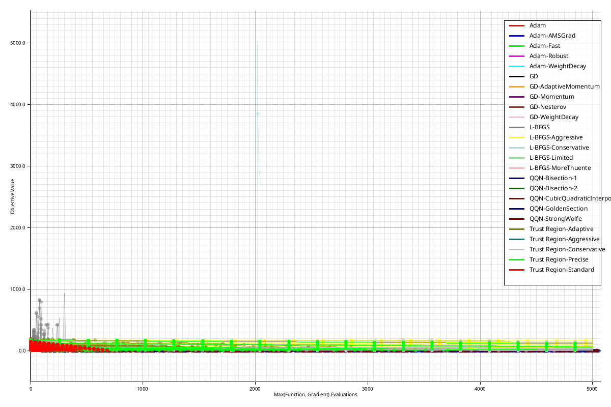
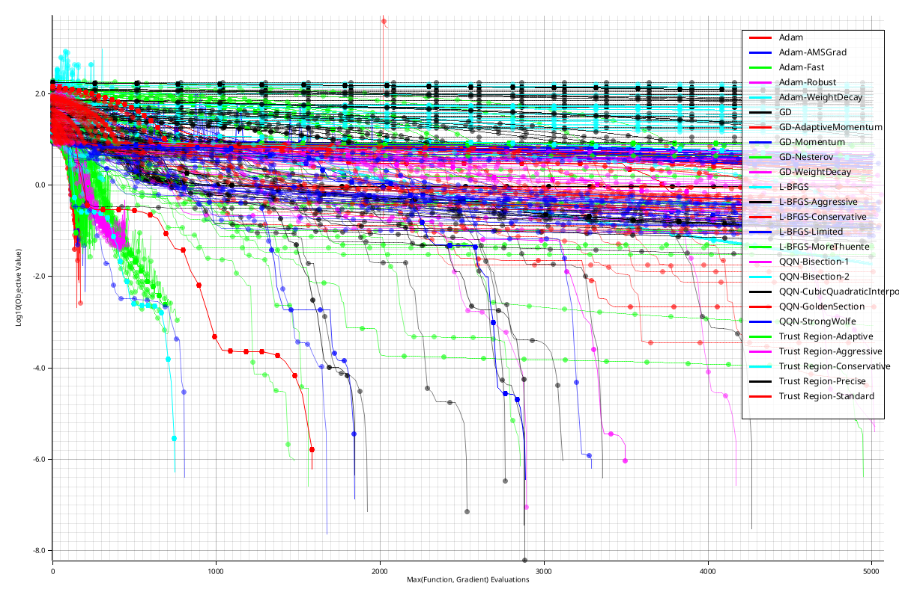

**Figure:** Convergence plots for SparseRosenbrock_4D showing objective value vs iterations.
Left: Linear scale, Right: Log scale for better visualization of convergence behavior.

**Data:** [Linear scale data (CSV)](data/SparseRosenbrock_4D_data.csv) | [Log scale data (CSV)](data/SparseRosenbrock_4D_log_data.csv)

## Problem: SparseRosenbrock_10D

**Family:** SparseRosenbrock
**Dimension:** 10
**Success Threshold:** 1.000e-6
**Total Runs:** 500
**Detailed Analysis:** [View comprehensive problem analysis](reports/problem_analysis_SparseRosenbrock_10D.md)

### Performance Summary
<table style="border-collapse: collapse; width: 100%; margin: 20px 0;">
<tr style="background-color: #f2f2f2;">
<th style="border: 1px solid #ddd; padding: 8px; text-align: center;">Rank</th>
<th style="border: 1px solid #ddd; padding: 8px; text-align: center;">Optimizer</th>
<th style="border: 1px solid #ddd; padding: 8px; text-align: center;">Mean Final Value (All/Success/Fail)</th>
<th style="border: 1px solid #ddd; padding: 8px; text-align: center;">Std Dev</th>
<th style="border: 1px solid #ddd; padding: 8px; text-align: center;">Best Value</th>
<th style="border: 1px solid #ddd; padding: 8px; text-align: center;">Worst Value</th>
<th style="border: 1px solid #ddd; padding: 8px; text-align: center;">Mean Function Evals (All/Success/Fail)</th>
<th style="border: 1px solid #ddd; padding: 8px; text-align: center;">Mean Gradient Evals (All/Success/Fail)</th>
<th style="border: 1px solid #ddd; padding: 8px; text-align: center;">Success Rate</th>
<th style="border: 1px solid #ddd; padding: 8px; text-align: center;">Mean Time (s)</th>
</tr>
<tr style="background-color: #d4edda; font-weight: bold;">
<td style="border: 1px solid #ddd; padding: 8px; text-align: center;">1</td>
<td style="border: 1px solid #ddd; padding: 8px; text-align: center;"><a href="reports/detailed_SparseRosenbrock_10D_QQN-CubicQuadraticInterpolation.md" title="Click for detailed analysis">QQN-CubicQuadraticInterpolation</a></td>
<td style="border: 1px solid #ddd; padding: 8px; text-align: center;">1.42e-1 / 3.59e-7 / 3.15e-1</td>
<td style="border: 1px solid #ddd; padding: 8px; text-align: center;">1.61e-1</td>
<td style="border: 1px solid #ddd; padding: 8px; text-align: center;">1.89e-8</td>
<td style="border: 1px solid #ddd; padding: 8px; text-align: center;">3.94e-1</td>
<td style="border: 1px solid #ddd; padding: 8px; text-align: center;">1670.9 / 1272.4 / 2158.0</td>
<td style="border: 1px solid #ddd; padding: 8px; text-align: center;">2197.7 / 1659.5 / 2855.3</td>
<td style="border: 1px solid #ddd; padding: 8px; text-align: center;">55.0%</td>
<td style="border: 1px solid #ddd; padding: 8px; text-align: center;">0.073</td>
</tr>
<tr style="background-color: #fff3cd;">
<td style="border: 1px solid #ddd; padding: 8px; text-align: center;">2</td>
<td style="border: 1px solid #ddd; padding: 8px; text-align: center;"><a href="reports/detailed_SparseRosenbrock_10D_QQN-StrongWolfe.md" title="Click for detailed analysis">QQN-StrongWolfe</a></td>
<td style="border: 1px solid #ddd; padding: 8px; text-align: center;">5.37e-1 / 3.92e-7 / 9.76e-1</td>
<td style="border: 1px solid #ddd; padding: 8px; text-align: center;">7.63e-1</td>
<td style="border: 1px solid #ddd; padding: 8px; text-align: center;">1.90e-9</td>
<td style="border: 1px solid #ddd; padding: 8px; text-align: center;">3.16e0</td>
<td style="border: 1px solid #ddd; padding: 8px; text-align: center;">2419.7 / 1904.6 / 2841.2</td>
<td style="border: 1px solid #ddd; padding: 8px; text-align: center;">1873.5 / 1496.8 / 2181.7</td>
<td style="border: 1px solid #ddd; padding: 8px; text-align: center;">45.0%</td>
<td style="border: 1px solid #ddd; padding: 8px; text-align: center;">0.076</td>
</tr>
<tr style="">
<td style="border: 1px solid #ddd; padding: 8px; text-align: center;">3</td>
<td style="border: 1px solid #ddd; padding: 8px; text-align: center;"><a href="reports/detailed_SparseRosenbrock_10D_QQN-Bisection-1.md" title="Click for detailed analysis">QQN-Bisection-1</a></td>
<td style="border: 1px solid #ddd; padding: 8px; text-align: center;">6.70e-1 / 4.53e-7 / 8.38e-1</td>
<td style="border: 1px solid #ddd; padding: 8px; text-align: center;">9.09e-1</td>
<td style="border: 1px solid #ddd; padding: 8px; text-align: center;">1.26e-7</td>
<td style="border: 1px solid #ddd; padding: 8px; text-align: center;">3.85e0</td>
<td style="border: 1px solid #ddd; padding: 8px; text-align: center;">2281.2 / 1984.5 / 2355.4</td>
<td style="border: 1px solid #ddd; padding: 8px; text-align: center;">2583.2 / 2207.5 / 2677.1</td>
<td style="border: 1px solid #ddd; padding: 8px; text-align: center;">20.0%</td>
<td style="border: 1px solid #ddd; padding: 8px; text-align: center;">0.067</td>
</tr>
<tr style="">
<td style="border: 1px solid #ddd; padding: 8px; text-align: center;">4</td>
<td style="border: 1px solid #ddd; padding: 8px; text-align: center;"><a href="reports/detailed_SparseRosenbrock_10D_QQN-GoldenSection.md" title="Click for detailed analysis">QQN-GoldenSection</a></td>
<td style="border: 1px solid #ddd; padding: 8px; text-align: center;">5.84e-1 / 5.69e-7 / 6.15e-1</td>
<td style="border: 1px solid #ddd; padding: 8px; text-align: center;">5.22e-1</td>
<td style="border: 1px solid #ddd; padding: 8px; text-align: center;">5.69e-7</td>
<td style="border: 1px solid #ddd; padding: 8px; text-align: center;">2.38e0</td>
<td style="border: 1px solid #ddd; padding: 8px; text-align: center;">4401.4 / 2918.0 / 4479.5</td>
<td style="border: 1px solid #ddd; padding: 8px; text-align: center;">542.9 / 380.0 / 551.4</td>
<td style="border: 1px solid #ddd; padding: 8px; text-align: center;">5.0%</td>
<td style="border: 1px solid #ddd; padding: 8px; text-align: center;">0.085</td>
</tr>
<tr style="">
<td style="border: 1px solid #ddd; padding: 8px; text-align: center;">5</td>
<td style="border: 1px solid #ddd; padding: 8px; text-align: center;"><a href="reports/detailed_SparseRosenbrock_10D_GD-Momentum.md" title="Click for detailed analysis">GD-Momentum</a></td>
<td style="border: 1px solid #ddd; padding: 8px; text-align: center;">1.97e1 / - / 3.15e1</td>
<td style="border: 1px solid #ddd; padding: 8px; text-align: center;">6.57e0</td>
<td style="border: 1px solid #ddd; padding: 8px; text-align: center;">1.63e-1</td>
<td style="border: 1px solid #ddd; padding: 8px; text-align: center;">2.46e1</td>
<td style="border: 1px solid #ddd; padding: 8px; text-align: center;">21.1 / - / 21.1</td>
<td style="border: 1px solid #ddd; padding: 8px; text-align: center;">38.2 / - / 38.2</td>
<td style="border: 1px solid #ddd; padding: 8px; text-align: center;">0.0%</td>
<td style="border: 1px solid #ddd; padding: 8px; text-align: center;">0.001</td>
</tr>
<tr style="">
<td style="border: 1px solid #ddd; padding: 8px; text-align: center;">6</td>
<td style="border: 1px solid #ddd; padding: 8px; text-align: center;"><a href="reports/detailed_SparseRosenbrock_10D_GD-AdaptiveMomentum.md" title="Click for detailed analysis">GD-AdaptiveMomentum</a></td>
<td style="border: 1px solid #ddd; padding: 8px; text-align: center;">1.01e1 / - / 1.31e1</td>
<td style="border: 1px solid #ddd; padding: 8px; text-align: center;">1.11e1</td>
<td style="border: 1px solid #ddd; padding: 8px; text-align: center;">4.53e-3</td>
<td style="border: 1px solid #ddd; padding: 8px; text-align: center;">2.48e1</td>
<td style="border: 1px solid #ddd; padding: 8px; text-align: center;">43.6 / - / 43.6</td>
<td style="border: 1px solid #ddd; padding: 8px; text-align: center;">83.3 / - / 83.3</td>
<td style="border: 1px solid #ddd; padding: 8px; text-align: center;">0.0%</td>
<td style="border: 1px solid #ddd; padding: 8px; text-align: center;">0.002</td>
</tr>
<tr style="">
<td style="border: 1px solid #ddd; padding: 8px; text-align: center;">7</td>
<td style="border: 1px solid #ddd; padding: 8px; text-align: center;"><a href="reports/detailed_SparseRosenbrock_10D_L-BFGS.md" title="Click for detailed analysis">L-BFGS</a></td>
<td style="border: 1px solid #ddd; padding: 8px; text-align: center;">2.96e1 / - / 2.80e2</td>
<td style="border: 1px solid #ddd; padding: 8px; text-align: center;">1.43e1</td>
<td style="border: 1px solid #ddd; padding: 8px; text-align: center;">8.52e0</td>
<td style="border: 1px solid #ddd; padding: 8px; text-align: center;">5.31e1</td>
<td style="border: 1px solid #ddd; padding: 8px; text-align: center;">136.4 / - / 136.4</td>
<td style="border: 1px solid #ddd; padding: 8px; text-align: center;">43.7 / - / 43.7</td>
<td style="border: 1px solid #ddd; padding: 8px; text-align: center;">0.0%</td>
<td style="border: 1px solid #ddd; padding: 8px; text-align: center;">0.002</td>
</tr>
<tr style="">
<td style="border: 1px solid #ddd; padding: 8px; text-align: center;">8</td>
<td style="border: 1px solid #ddd; padding: 8px; text-align: center;"><a href="reports/detailed_SparseRosenbrock_10D_Trust_Region-Aggressive.md" title="Click for detailed analysis">Trust Region-Aggressive</a></td>
<td style="border: 1px solid #ddd; padding: 8px; text-align: center;">2.11e1 / - / 2.11e1</td>
<td style="border: 1px solid #ddd; padding: 8px; text-align: center;">8.10e-1</td>
<td style="border: 1px solid #ddd; padding: 8px; text-align: center;">1.97e1</td>
<td style="border: 1px solid #ddd; padding: 8px; text-align: center;">2.26e1</td>
<td style="border: 1px solid #ddd; padding: 8px; text-align: center;">122.0 / - / 122.0</td>
<td style="border: 1px solid #ddd; padding: 8px; text-align: center;">82.0 / - / 82.0</td>
<td style="border: 1px solid #ddd; padding: 8px; text-align: center;">0.0%</td>
<td style="border: 1px solid #ddd; padding: 8px; text-align: center;">0.001</td>
</tr>
<tr style="">
<td style="border: 1px solid #ddd; padding: 8px; text-align: center;">9</td>
<td style="border: 1px solid #ddd; padding: 8px; text-align: center;"><a href="reports/detailed_SparseRosenbrock_10D_GD-Nesterov.md" title="Click for detailed analysis">GD-Nesterov</a></td>
<td style="border: 1px solid #ddd; padding: 8px; text-align: center;">1.36e-1 / - / 7.90e-1</td>
<td style="border: 1px solid #ddd; padding: 8px; text-align: center;">1.59e-1</td>
<td style="border: 1px solid #ddd; padding: 8px; text-align: center;">3.00e-2</td>
<td style="border: 1px solid #ddd; padding: 8px; text-align: center;">6.58e-1</td>
<td style="border: 1px solid #ddd; padding: 8px; text-align: center;">100.3 / - / 100.3</td>
<td style="border: 1px solid #ddd; padding: 8px; text-align: center;">196.6 / - / 196.6</td>
<td style="border: 1px solid #ddd; padding: 8px; text-align: center;">0.0%</td>
<td style="border: 1px solid #ddd; padding: 8px; text-align: center;">0.003</td>
</tr>
<tr style="">
<td style="border: 1px solid #ddd; padding: 8px; text-align: center;">10</td>
<td style="border: 1px solid #ddd; padding: 8px; text-align: center;"><a href="reports/detailed_SparseRosenbrock_10D_GD-WeightDecay.md" title="Click for detailed analysis">GD-WeightDecay</a></td>
<td style="border: 1px solid #ddd; padding: 8px; text-align: center;">4.40e0 / - / 4.84e0</td>
<td style="border: 1px solid #ddd; padding: 8px; text-align: center;">8.57e0</td>
<td style="border: 1px solid #ddd; padding: 8px; text-align: center;">6.70e-2</td>
<td style="border: 1px solid #ddd; padding: 8px; text-align: center;">2.20e1</td>
<td style="border: 1px solid #ddd; padding: 8px; text-align: center;">127.2 / - / 127.2</td>
<td style="border: 1px solid #ddd; padding: 8px; text-align: center;">250.4 / - / 250.4</td>
<td style="border: 1px solid #ddd; padding: 8px; text-align: center;">0.0%</td>
<td style="border: 1px solid #ddd; padding: 8px; text-align: center;">0.004</td>
</tr>
<tr style="">
<td style="border: 1px solid #ddd; padding: 8px; text-align: center;">11</td>
<td style="border: 1px solid #ddd; padding: 8px; text-align: center;"><a href="reports/detailed_SparseRosenbrock_10D_Adam-Fast.md" title="Click for detailed analysis">Adam-Fast</a></td>
<td style="border: 1px solid #ddd; padding: 8px; text-align: center;">1.49e0 / - / 1.90e0</td>
<td style="border: 1px solid #ddd; padding: 8px; text-align: center;">5.47e0</td>
<td style="border: 1px solid #ddd; padding: 8px; text-align: center;">2.53e-2</td>
<td style="border: 1px solid #ddd; padding: 8px; text-align: center;">2.53e1</td>
<td style="border: 1px solid #ddd; padding: 8px; text-align: center;">206.0 / - / 206.0</td>
<td style="border: 1px solid #ddd; padding: 8px; text-align: center;">205.0 / - / 205.0</td>
<td style="border: 1px solid #ddd; padding: 8px; text-align: center;">0.0%</td>
<td style="border: 1px solid #ddd; padding: 8px; text-align: center;">0.005</td>
</tr>
<tr style="">
<td style="border: 1px solid #ddd; padding: 8px; text-align: center;">12</td>
<td style="border: 1px solid #ddd; padding: 8px; text-align: center;"><a href="reports/detailed_SparseRosenbrock_10D_Trust_Region-Standard.md" title="Click for detailed analysis">Trust Region-Standard</a></td>
<td style="border: 1px solid #ddd; padding: 8px; text-align: center;">2.05e1 / - / 2.05e1</td>
<td style="border: 1px solid #ddd; padding: 8px; text-align: center;">3.97e-1</td>
<td style="border: 1px solid #ddd; padding: 8px; text-align: center;">1.95e1</td>
<td style="border: 1px solid #ddd; padding: 8px; text-align: center;">2.11e1</td>
<td style="border: 1px solid #ddd; padding: 8px; text-align: center;">439.7 / - / 439.7</td>
<td style="border: 1px solid #ddd; padding: 8px; text-align: center;">293.8 / - / 293.8</td>
<td style="border: 1px solid #ddd; padding: 8px; text-align: center;">0.0%</td>
<td style="border: 1px solid #ddd; padding: 8px; text-align: center;">0.003</td>
</tr>
<tr style="">
<td style="border: 1px solid #ddd; padding: 8px; text-align: center;">13</td>
<td style="border: 1px solid #ddd; padding: 8px; text-align: center;"><a href="reports/detailed_SparseRosenbrock_10D_GD.md" title="Click for detailed analysis">GD</a></td>
<td style="border: 1px solid #ddd; padding: 8px; text-align: center;">3.18e0 / - / 3.27e0</td>
<td style="border: 1px solid #ddd; padding: 8px; text-align: center;">5.56e0</td>
<td style="border: 1px solid #ddd; padding: 8px; text-align: center;">1.19e0</td>
<td style="border: 1px solid #ddd; padding: 8px; text-align: center;">1.98e1</td>
<td style="border: 1px solid #ddd; padding: 8px; text-align: center;">388.9 / - / 388.9</td>
<td style="border: 1px solid #ddd; padding: 8px; text-align: center;">773.9 / - / 773.9</td>
<td style="border: 1px solid #ddd; padding: 8px; text-align: center;">0.0%</td>
<td style="border: 1px solid #ddd; padding: 8px; text-align: center;">0.011</td>
</tr>
<tr style="">
<td style="border: 1px solid #ddd; padding: 8px; text-align: center;">14</td>
<td style="border: 1px solid #ddd; padding: 8px; text-align: center;"><a href="reports/detailed_SparseRosenbrock_10D_QQN-Bisection-2.md" title="Click for detailed analysis">QQN-Bisection-2</a></td>
<td style="border: 1px solid #ddd; padding: 8px; text-align: center;">3.21e0 / - / 3.21e0</td>
<td style="border: 1px solid #ddd; padding: 8px; text-align: center;">5.76e0</td>
<td style="border: 1px solid #ddd; padding: 8px; text-align: center;">3.42e-1</td>
<td style="border: 1px solid #ddd; padding: 8px; text-align: center;">1.61e1</td>
<td style="border: 1px solid #ddd; padding: 8px; text-align: center;">842.9 / - / 842.9</td>
<td style="border: 1px solid #ddd; padding: 8px; text-align: center;">423.4 / - / 423.4</td>
<td style="border: 1px solid #ddd; padding: 8px; text-align: center;">0.0%</td>
<td style="border: 1px solid #ddd; padding: 8px; text-align: center;">0.022</td>
</tr>
<tr style="">
<td style="border: 1px solid #ddd; padding: 8px; text-align: center;">15</td>
<td style="border: 1px solid #ddd; padding: 8px; text-align: center;"><a href="reports/detailed_SparseRosenbrock_10D_Trust_Region-Adaptive.md" title="Click for detailed analysis">Trust Region-Adaptive</a></td>
<td style="border: 1px solid #ddd; padding: 8px; text-align: center;">2.92e1 / - / 2.92e1</td>
<td style="border: 1px solid #ddd; padding: 8px; text-align: center;">2.81e1</td>
<td style="border: 1px solid #ddd; padding: 8px; text-align: center;">2.02e1</td>
<td style="border: 1px solid #ddd; padding: 8px; text-align: center;">1.48e2</td>
<td style="border: 1px solid #ddd; padding: 8px; text-align: center;">2139.5 / - / 2139.5</td>
<td style="border: 1px solid #ddd; padding: 8px; text-align: center;">1427.0 / - / 1427.0</td>
<td style="border: 1px solid #ddd; padding: 8px; text-align: center;">0.0%</td>
<td style="border: 1px solid #ddd; padding: 8px; text-align: center;">0.014</td>
</tr>
<tr style="">
<td style="border: 1px solid #ddd; padding: 8px; text-align: center;">16</td>
<td style="border: 1px solid #ddd; padding: 8px; text-align: center;"><a href="reports/detailed_SparseRosenbrock_10D_Adam-WeightDecay.md" title="Click for detailed analysis">Adam-WeightDecay</a></td>
<td style="border: 1px solid #ddd; padding: 8px; text-align: center;">3.26e0 / - / 3.27e0</td>
<td style="border: 1px solid #ddd; padding: 8px; text-align: center;">7.72e0</td>
<td style="border: 1px solid #ddd; padding: 8px; text-align: center;">1.06e-2</td>
<td style="border: 1px solid #ddd; padding: 8px; text-align: center;">2.18e1</td>
<td style="border: 1px solid #ddd; padding: 8px; text-align: center;">2150.9 / - / 2150.9</td>
<td style="border: 1px solid #ddd; padding: 8px; text-align: center;">2150.8 / - / 2150.8</td>
<td style="border: 1px solid #ddd; padding: 8px; text-align: center;">0.0%</td>
<td style="border: 1px solid #ddd; padding: 8px; text-align: center;">0.049</td>
</tr>
<tr style="">
<td style="border: 1px solid #ddd; padding: 8px; text-align: center;">17</td>
<td style="border: 1px solid #ddd; padding: 8px; text-align: center;"><a href="reports/detailed_SparseRosenbrock_10D_L-BFGS-Conservative.md" title="Click for detailed analysis">L-BFGS-Conservative</a></td>
<td style="border: 1px solid #ddd; padding: 8px; text-align: center;">6.35e0 / - / 1.05e7</td>
<td style="border: 1px solid #ddd; padding: 8px; text-align: center;">7.52e0</td>
<td style="border: 1px solid #ddd; padding: 8px; text-align: center;">2.96e-2</td>
<td style="border: 1px solid #ddd; padding: 8px; text-align: center;">2.05e1</td>
<td style="border: 1px solid #ddd; padding: 8px; text-align: center;">3686.9 / - / 3686.9</td>
<td style="border: 1px solid #ddd; padding: 8px; text-align: center;">974.5 / - / 974.5</td>
<td style="border: 1px solid #ddd; padding: 8px; text-align: center;">0.0%</td>
<td style="border: 1px solid #ddd; padding: 8px; text-align: center;">0.039</td>
</tr>
<tr style="">
<td style="border: 1px solid #ddd; padding: 8px; text-align: center;">18</td>
<td style="border: 1px solid #ddd; padding: 8px; text-align: center;"><a href="reports/detailed_SparseRosenbrock_10D_Adam-Robust.md" title="Click for detailed analysis">Adam-Robust</a></td>
<td style="border: 1px solid #ddd; padding: 8px; text-align: center;">1.19e1 / - / 1.19e1</td>
<td style="border: 1px solid #ddd; padding: 8px; text-align: center;">2.29e0</td>
<td style="border: 1px solid #ddd; padding: 8px; text-align: center;">9.15e0</td>
<td style="border: 1px solid #ddd; padding: 8px; text-align: center;">2.07e1</td>
<td style="border: 1px solid #ddd; padding: 8px; text-align: center;">2380.8 / - / 2380.8</td>
<td style="border: 1px solid #ddd; padding: 8px; text-align: center;">2380.7 / - / 2380.7</td>
<td style="border: 1px solid #ddd; padding: 8px; text-align: center;">0.0%</td>
<td style="border: 1px solid #ddd; padding: 8px; text-align: center;">0.058</td>
</tr>
<tr style="">
<td style="border: 1px solid #ddd; padding: 8px; text-align: center;">19</td>
<td style="border: 1px solid #ddd; padding: 8px; text-align: center;"><a href="reports/detailed_SparseRosenbrock_10D_L-BFGS-MoreThuente.md" title="Click for detailed analysis">L-BFGS-MoreThuente</a></td>
<td style="border: 1px solid #ddd; padding: 8px; text-align: center;">7.13e0 / - / 7.68e0</td>
<td style="border: 1px solid #ddd; padding: 8px; text-align: center;">7.28e0</td>
<td style="border: 1px solid #ddd; padding: 8px; text-align: center;">2.91e-4</td>
<td style="border: 1px solid #ddd; padding: 8px; text-align: center;">2.01e1</td>
<td style="border: 1px solid #ddd; padding: 8px; text-align: center;">2749.9 / - / 2749.9</td>
<td style="border: 1px solid #ddd; padding: 8px; text-align: center;">2027.7 / - / 2027.7</td>
<td style="border: 1px solid #ddd; padding: 8px; text-align: center;">0.0%</td>
<td style="border: 1px solid #ddd; padding: 8px; text-align: center;">0.052</td>
</tr>
<tr style="">
<td style="border: 1px solid #ddd; padding: 8px; text-align: center;">20</td>
<td style="border: 1px solid #ddd; padding: 8px; text-align: center;"><a href="reports/detailed_SparseRosenbrock_10D_Adam.md" title="Click for detailed analysis">Adam</a></td>
<td style="border: 1px solid #ddd; padding: 8px; text-align: center;">4.91e0 / - / 4.91e0</td>
<td style="border: 1px solid #ddd; padding: 8px; text-align: center;">1.16e0</td>
<td style="border: 1px solid #ddd; padding: 8px; text-align: center;">3.14e0</td>
<td style="border: 1px solid #ddd; padding: 8px; text-align: center;">7.20e0</td>
<td style="border: 1px solid #ddd; padding: 8px; text-align: center;">2502.0 / - / 2502.0</td>
<td style="border: 1px solid #ddd; padding: 8px; text-align: center;">2502.0 / - / 2502.0</td>
<td style="border: 1px solid #ddd; padding: 8px; text-align: center;">0.0%</td>
<td style="border: 1px solid #ddd; padding: 8px; text-align: center;">0.054</td>
</tr>
<tr style="">
<td style="border: 1px solid #ddd; padding: 8px; text-align: center;">21</td>
<td style="border: 1px solid #ddd; padding: 8px; text-align: center;"><a href="reports/detailed_SparseRosenbrock_10D_Adam-AMSGrad.md" title="Click for detailed analysis">Adam-AMSGrad</a></td>
<td style="border: 1px solid #ddd; padding: 8px; text-align: center;">5.73e0 / - / 5.73e0</td>
<td style="border: 1px solid #ddd; padding: 8px; text-align: center;">9.36e-1</td>
<td style="border: 1px solid #ddd; padding: 8px; text-align: center;">4.14e0</td>
<td style="border: 1px solid #ddd; padding: 8px; text-align: center;">7.62e0</td>
<td style="border: 1px solid #ddd; padding: 8px; text-align: center;">2502.0 / - / 2502.0</td>
<td style="border: 1px solid #ddd; padding: 8px; text-align: center;">2502.0 / - / 2502.0</td>
<td style="border: 1px solid #ddd; padding: 8px; text-align: center;">0.0%</td>
<td style="border: 1px solid #ddd; padding: 8px; text-align: center;">0.060</td>
</tr>
<tr style="">
<td style="border: 1px solid #ddd; padding: 8px; text-align: center;">22</td>
<td style="border: 1px solid #ddd; padding: 8px; text-align: center;"><a href="reports/detailed_SparseRosenbrock_10D_Trust_Region-Precise.md" title="Click for detailed analysis">Trust Region-Precise</a></td>
<td style="border: 1px solid #ddd; padding: 8px; text-align: center;">1.04e2 / - / 1.04e2</td>
<td style="border: 1px solid #ddd; padding: 8px; text-align: center;">6.99e1</td>
<td style="border: 1px solid #ddd; padding: 8px; text-align: center;">1.18e0</td>
<td style="border: 1px solid #ddd; padding: 8px; text-align: center;">2.43e2</td>
<td style="border: 1px solid #ddd; padding: 8px; text-align: center;">3002.0 / - / 3002.0</td>
<td style="border: 1px solid #ddd; padding: 8px; text-align: center;">2002.0 / - / 2002.0</td>
<td style="border: 1px solid #ddd; padding: 8px; text-align: center;">0.0%</td>
<td style="border: 1px solid #ddd; padding: 8px; text-align: center;">0.020</td>
</tr>
<tr style="">
<td style="border: 1px solid #ddd; padding: 8px; text-align: center;">23</td>
<td style="border: 1px solid #ddd; padding: 8px; text-align: center;"><a href="reports/detailed_SparseRosenbrock_10D_Trust_Region-Conservative.md" title="Click for detailed analysis">Trust Region-Conservative</a></td>
<td style="border: 1px solid #ddd; padding: 8px; text-align: center;">1.56e2 / - / 1.56e2</td>
<td style="border: 1px solid #ddd; padding: 8px; text-align: center;">4.85e1</td>
<td style="border: 1px solid #ddd; padding: 8px; text-align: center;">6.91e1</td>
<td style="border: 1px solid #ddd; padding: 8px; text-align: center;">2.68e2</td>
<td style="border: 1px solid #ddd; padding: 8px; text-align: center;">3002.0 / - / 3002.0</td>
<td style="border: 1px solid #ddd; padding: 8px; text-align: center;">2002.0 / - / 2002.0</td>
<td style="border: 1px solid #ddd; padding: 8px; text-align: center;">0.0%</td>
<td style="border: 1px solid #ddd; padding: 8px; text-align: center;">0.020</td>
</tr>
<tr style="">
<td style="border: 1px solid #ddd; padding: 8px; text-align: center;">24</td>
<td style="border: 1px solid #ddd; padding: 8px; text-align: center;"><a href="reports/detailed_SparseRosenbrock_10D_L-BFGS-Limited.md" title="Click for detailed analysis">L-BFGS-Limited</a></td>
<td style="border: 1px solid #ddd; padding: 8px; text-align: center;">1.28e0 / - / 1.28e0</td>
<td style="border: 1px solid #ddd; padding: 8px; text-align: center;">3.17e0</td>
<td style="border: 1px solid #ddd; padding: 8px; text-align: center;">3.17e-1</td>
<td style="border: 1px solid #ddd; padding: 8px; text-align: center;">1.51e1</td>
<td style="border: 1px solid #ddd; padding: 8px; text-align: center;">3999.6 / - / 3999.6</td>
<td style="border: 1px solid #ddd; padding: 8px; text-align: center;">1009.0 / - / 1009.0</td>
<td style="border: 1px solid #ddd; padding: 8px; text-align: center;">0.0%</td>
<td style="border: 1px solid #ddd; padding: 8px; text-align: center;">0.051</td>
</tr>
<tr style="">
<td style="border: 1px solid #ddd; padding: 8px; text-align: center;">25</td>
<td style="border: 1px solid #ddd; padding: 8px; text-align: center;"><a href="reports/detailed_SparseRosenbrock_10D_L-BFGS-Aggressive.md" title="Click for detailed analysis">L-BFGS-Aggressive</a></td>
<td style="border: 1px solid #ddd; padding: 8px; text-align: center;">1.81e2 / - / 1.81e2</td>
<td style="border: 1px solid #ddd; padding: 8px; text-align: center;">7.47e1</td>
<td style="border: 1px solid #ddd; padding: 8px; text-align: center;">8.09e1</td>
<td style="border: 1px solid #ddd; padding: 8px; text-align: center;">4.01e2</td>
<td style="border: 1px solid #ddd; padding: 8px; text-align: center;">3852.0 / - / 3852.0</td>
<td style="border: 1px solid #ddd; padding: 8px; text-align: center;">1157.0 / - / 1157.0</td>
<td style="border: 1px solid #ddd; padding: 8px; text-align: center;">0.0%</td>
<td style="border: 1px solid #ddd; padding: 8px; text-align: center;">0.029</td>
</tr>
</table>

### Convergence Plots

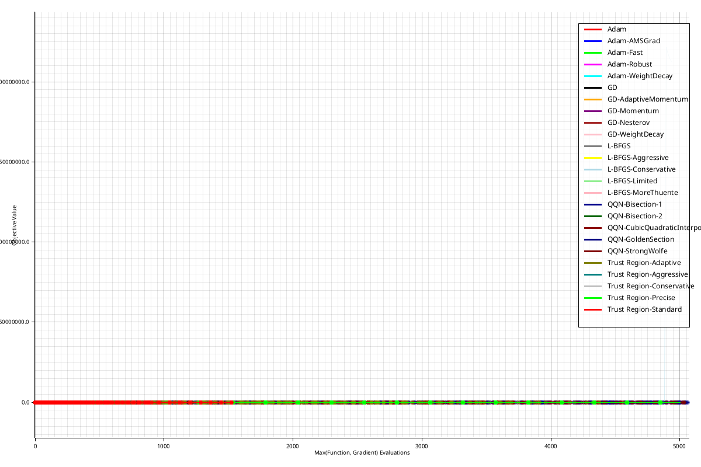
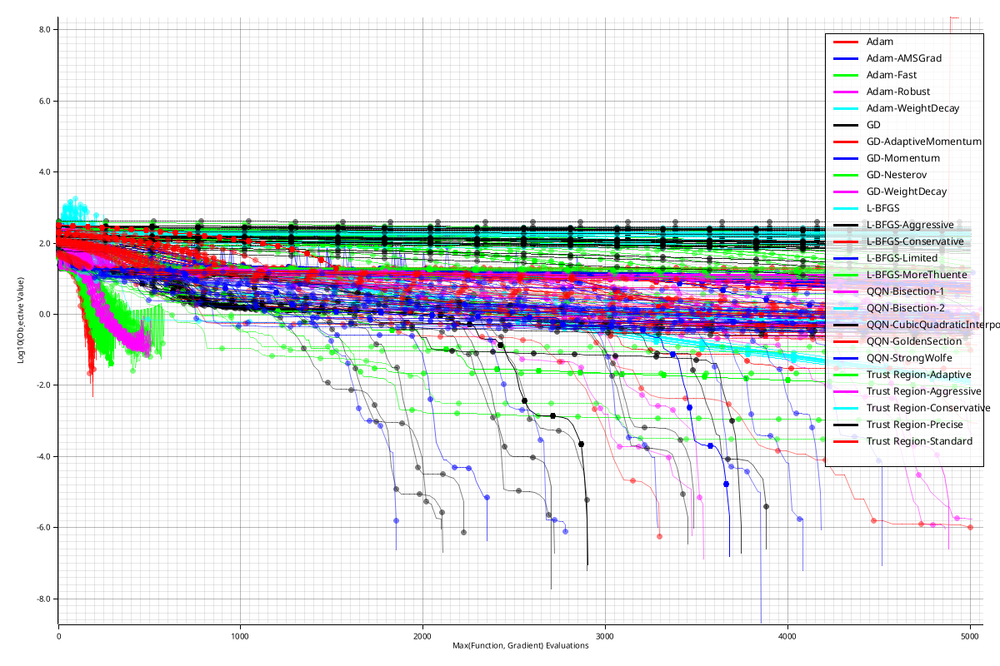

**Figure:** Convergence plots for SparseRosenbrock_10D showing objective value vs iterations.
Left: Linear scale, Right: Log scale for better visualization of convergence behavior.

**Data:** [Linear scale data (CSV)](data/SparseRosenbrock_10D_data.csv) | [Log scale data (CSV)](data/SparseRosenbrock_10D_log_data.csv)

## Problem: SparseQuadratic_5D_pattern[1, 3]

**Family:** SparseQuadratic
**Dimension:** 5
**Success Threshold:** 1.000e-6
**Total Runs:** 500
**Detailed Analysis:** [View comprehensive problem analysis](reports/problem_analysis_SparseQuadratic_5D_pattern[1,_3].md)

### Performance Summary
<table style="border-collapse: collapse; width: 100%; margin: 20px 0;">
<tr style="background-color: #f2f2f2;">
<th style="border: 1px solid #ddd; padding: 8px; text-align: center;">Rank</th>
<th style="border: 1px solid #ddd; padding: 8px; text-align: center;">Optimizer</th>
<th style="border: 1px solid #ddd; padding: 8px; text-align: center;">Mean Final Value (All/Success/Fail)</th>
<th style="border: 1px solid #ddd; padding: 8px; text-align: center;">Std Dev</th>
<th style="border: 1px solid #ddd; padding: 8px; text-align: center;">Best Value</th>
<th style="border: 1px solid #ddd; padding: 8px; text-align: center;">Worst Value</th>
<th style="border: 1px solid #ddd; padding: 8px; text-align: center;">Mean Function Evals (All/Success/Fail)</th>
<th style="border: 1px solid #ddd; padding: 8px; text-align: center;">Mean Gradient Evals (All/Success/Fail)</th>
<th style="border: 1px solid #ddd; padding: 8px; text-align: center;">Success Rate</th>
<th style="border: 1px solid #ddd; padding: 8px; text-align: center;">Mean Time (s)</th>
</tr>
<tr style="background-color: #d4edda; font-weight: bold;">
<td style="border: 1px solid #ddd; padding: 8px; text-align: center;">1</td>
<td style="border: 1px solid #ddd; padding: 8px; text-align: center;"><a href="reports/detailed_SparseQuadratic_5D_pattern[1,_3]_L-BFGS-MoreThuente.md" title="Click for detailed analysis">L-BFGS-MoreThuente</a></td>
<td style="border: 1px solid #ddd; padding: 8px; text-align: center;">8.81e-8 / 8.81e-8 / -</td>
<td style="border: 1px solid #ddd; padding: 8px; text-align: center;">1.36e-7</td>
<td style="border: 1px solid #ddd; padding: 8px; text-align: center;">1.12e-8</td>
<td style="border: 1px solid #ddd; padding: 8px; text-align: center;">6.56e-7</td>
<td style="border: 1px solid #ddd; padding: 8px; text-align: center;">23.6 / 23.6 / -</td>
<td style="border: 1px solid #ddd; padding: 8px; text-align: center;">17.8 / 17.8 / -</td>
<td style="border: 1px solid #ddd; padding: 8px; text-align: center;">100.0%</td>
<td style="border: 1px solid #ddd; padding: 8px; text-align: center;">0.000</td>
</tr>
<tr style="background-color: #fff3cd;">
<td style="border: 1px solid #ddd; padding: 8px; text-align: center;">2</td>
<td style="border: 1px solid #ddd; padding: 8px; text-align: center;"><a href="reports/detailed_SparseQuadratic_5D_pattern[1,_3]_L-BFGS-Aggressive.md" title="Click for detailed analysis">L-BFGS-Aggressive</a></td>
<td style="border: 1px solid #ddd; padding: 8px; text-align: center;">2.84e-7 / 2.84e-7 / -</td>
<td style="border: 1px solid #ddd; padding: 8px; text-align: center;">3.06e-8</td>
<td style="border: 1px solid #ddd; padding: 8px; text-align: center;">2.36e-7</td>
<td style="border: 1px solid #ddd; padding: 8px; text-align: center;">3.36e-7</td>
<td style="border: 1px solid #ddd; padding: 8px; text-align: center;">31.0 / 31.0 / -</td>
<td style="border: 1px solid #ddd; padding: 8px; text-align: center;">15.0 / 15.0 / -</td>
<td style="border: 1px solid #ddd; padding: 8px; text-align: center;">100.0%</td>
<td style="border: 1px solid #ddd; padding: 8px; text-align: center;">0.000</td>
</tr>
<tr style="">
<td style="border: 1px solid #ddd; padding: 8px; text-align: center;">3</td>
<td style="border: 1px solid #ddd; padding: 8px; text-align: center;"><a href="reports/detailed_SparseQuadratic_5D_pattern[1,_3]_QQN-StrongWolfe.md" title="Click for detailed analysis">QQN-StrongWolfe</a></td>
<td style="border: 1px solid #ddd; padding: 8px; text-align: center;">2.22e-7 / 2.22e-7 / -</td>
<td style="border: 1px solid #ddd; padding: 8px; text-align: center;">1.26e-7</td>
<td style="border: 1px solid #ddd; padding: 8px; text-align: center;">4.00e-8</td>
<td style="border: 1px solid #ddd; padding: 8px; text-align: center;">4.52e-7</td>
<td style="border: 1px solid #ddd; padding: 8px; text-align: center;">29.1 / 29.1 / -</td>
<td style="border: 1px solid #ddd; padding: 8px; text-align: center;">29.0 / 29.0 / -</td>
<td style="border: 1px solid #ddd; padding: 8px; text-align: center;">100.0%</td>
<td style="border: 1px solid #ddd; padding: 8px; text-align: center;">0.001</td>
</tr>
<tr style="">
<td style="border: 1px solid #ddd; padding: 8px; text-align: center;">4</td>
<td style="border: 1px solid #ddd; padding: 8px; text-align: center;"><a href="reports/detailed_SparseQuadratic_5D_pattern[1,_3]_L-BFGS.md" title="Click for detailed analysis">L-BFGS</a></td>
<td style="border: 1px solid #ddd; padding: 8px; text-align: center;">4.77e-7 / 4.77e-7 / -</td>
<td style="border: 1px solid #ddd; padding: 8px; text-align: center;">3.20e-7</td>
<td style="border: 1px solid #ddd; padding: 8px; text-align: center;">1.77e-8</td>
<td style="border: 1px solid #ddd; padding: 8px; text-align: center;">9.73e-7</td>
<td style="border: 1px solid #ddd; padding: 8px; text-align: center;">48.4 / 48.4 / -</td>
<td style="border: 1px solid #ddd; padding: 8px; text-align: center;">31.4 / 31.4 / -</td>
<td style="border: 1px solid #ddd; padding: 8px; text-align: center;">100.0%</td>
<td style="border: 1px solid #ddd; padding: 8px; text-align: center;">0.001</td>
</tr>
<tr style="">
<td style="border: 1px solid #ddd; padding: 8px; text-align: center;">5</td>
<td style="border: 1px solid #ddd; padding: 8px; text-align: center;"><a href="reports/detailed_SparseQuadratic_5D_pattern[1,_3]_QQN-Bisection-2.md" title="Click for detailed analysis">QQN-Bisection-2</a></td>
<td style="border: 1px solid #ddd; padding: 8px; text-align: center;">1.58e-7 / 1.58e-7 / -</td>
<td style="border: 1px solid #ddd; padding: 8px; text-align: center;">2.16e-7</td>
<td style="border: 1px solid #ddd; padding: 8px; text-align: center;">1.83e-9</td>
<td style="border: 1px solid #ddd; padding: 8px; text-align: center;">7.77e-7</td>
<td style="border: 1px solid #ddd; padding: 8px; text-align: center;">37.5 / 37.5 / -</td>
<td style="border: 1px solid #ddd; padding: 8px; text-align: center;">70.5 / 70.5 / -</td>
<td style="border: 1px solid #ddd; padding: 8px; text-align: center;">100.0%</td>
<td style="border: 1px solid #ddd; padding: 8px; text-align: center;">0.001</td>
</tr>
<tr style="">
<td style="border: 1px solid #ddd; padding: 8px; text-align: center;">6</td>
<td style="border: 1px solid #ddd; padding: 8px; text-align: center;"><a href="reports/detailed_SparseQuadratic_5D_pattern[1,_3]_QQN-CubicQuadraticInterpolation.md" title="Click for detailed analysis">QQN-CubicQuadraticInterpolation</a></td>
<td style="border: 1px solid #ddd; padding: 8px; text-align: center;">4.31e-7 / 4.31e-7 / -</td>
<td style="border: 1px solid #ddd; padding: 8px; text-align: center;">3.85e-8</td>
<td style="border: 1px solid #ddd; padding: 8px; text-align: center;">3.60e-7</td>
<td style="border: 1px solid #ddd; padding: 8px; text-align: center;">4.92e-7</td>
<td style="border: 1px solid #ddd; padding: 8px; text-align: center;">57.0 / 57.0 / -</td>
<td style="border: 1px solid #ddd; padding: 8px; text-align: center;">57.0 / 57.0 / -</td>
<td style="border: 1px solid #ddd; padding: 8px; text-align: center;">100.0%</td>
<td style="border: 1px solid #ddd; padding: 8px; text-align: center;">0.001</td>
</tr>
<tr style="">
<td style="border: 1px solid #ddd; padding: 8px; text-align: center;">7</td>
<td style="border: 1px solid #ddd; padding: 8px; text-align: center;"><a href="reports/detailed_SparseQuadratic_5D_pattern[1,_3]_QQN-Bisection-1.md" title="Click for detailed analysis">QQN-Bisection-1</a></td>
<td style="border: 1px solid #ddd; padding: 8px; text-align: center;">1.79e-7 / 1.79e-7 / -</td>
<td style="border: 1px solid #ddd; padding: 8px; text-align: center;">2.00e-7</td>
<td style="border: 1px solid #ddd; padding: 8px; text-align: center;">4.95e-9</td>
<td style="border: 1px solid #ddd; padding: 8px; text-align: center;">7.40e-7</td>
<td style="border: 1px solid #ddd; padding: 8px; text-align: center;">38.0 / 38.0 / -</td>
<td style="border: 1px solid #ddd; padding: 8px; text-align: center;">81.0 / 81.0 / -</td>
<td style="border: 1px solid #ddd; padding: 8px; text-align: center;">100.0%</td>
<td style="border: 1px solid #ddd; padding: 8px; text-align: center;">0.001</td>
</tr>
<tr style="">
<td style="border: 1px solid #ddd; padding: 8px; text-align: center;">8</td>
<td style="border: 1px solid #ddd; padding: 8px; text-align: center;"><a href="reports/detailed_SparseQuadratic_5D_pattern[1,_3]_QQN-GoldenSection.md" title="Click for detailed analysis">QQN-GoldenSection</a></td>
<td style="border: 1px solid #ddd; padding: 8px; text-align: center;">1.09e-7 / 1.09e-7 / -</td>
<td style="border: 1px solid #ddd; padding: 8px; text-align: center;">1.38e-7</td>
<td style="border: 1px solid #ddd; padding: 8px; text-align: center;">2.49e-9</td>
<td style="border: 1px solid #ddd; padding: 8px; text-align: center;">4.81e-7</td>
<td style="border: 1px solid #ddd; padding: 8px; text-align: center;">132.7 / 132.7 / -</td>
<td style="border: 1px solid #ddd; padding: 8px; text-align: center;">19.7 / 19.7 / -</td>
<td style="border: 1px solid #ddd; padding: 8px; text-align: center;">100.0%</td>
<td style="border: 1px solid #ddd; padding: 8px; text-align: center;">0.002</td>
</tr>
<tr style="">
<td style="border: 1px solid #ddd; padding: 8px; text-align: center;">9</td>
<td style="border: 1px solid #ddd; padding: 8px; text-align: center;"><a href="reports/detailed_SparseQuadratic_5D_pattern[1,_3]_L-BFGS-Limited.md" title="Click for detailed analysis">L-BFGS-Limited</a></td>
<td style="border: 1px solid #ddd; padding: 8px; text-align: center;">4.57e-7 / 4.57e-7 / -</td>
<td style="border: 1px solid #ddd; padding: 8px; text-align: center;">2.77e-7</td>
<td style="border: 1px solid #ddd; padding: 8px; text-align: center;">4.26e-9</td>
<td style="border: 1px solid #ddd; padding: 8px; text-align: center;">9.93e-7</td>
<td style="border: 1px solid #ddd; padding: 8px; text-align: center;">117.5 / 117.5 / -</td>
<td style="border: 1px solid #ddd; padding: 8px; text-align: center;">70.2 / 70.2 / -</td>
<td style="border: 1px solid #ddd; padding: 8px; text-align: center;">100.0%</td>
<td style="border: 1px solid #ddd; padding: 8px; text-align: center;">0.003</td>
</tr>
<tr style="">
<td style="border: 1px solid #ddd; padding: 8px; text-align: center;">10</td>
<td style="border: 1px solid #ddd; padding: 8px; text-align: center;"><a href="reports/detailed_SparseQuadratic_5D_pattern[1,_3]_GD-WeightDecay.md" title="Click for detailed analysis">GD-WeightDecay</a></td>
<td style="border: 1px solid #ddd; padding: 8px; text-align: center;">9.21e-7 / 9.21e-7 / -</td>
<td style="border: 1px solid #ddd; padding: 8px; text-align: center;">4.76e-8</td>
<td style="border: 1px solid #ddd; padding: 8px; text-align: center;">8.42e-7</td>
<td style="border: 1px solid #ddd; padding: 8px; text-align: center;">9.96e-7</td>
<td style="border: 1px solid #ddd; padding: 8px; text-align: center;">99.8 / 99.8 / -</td>
<td style="border: 1px solid #ddd; padding: 8px; text-align: center;">196.5 / 196.5 / -</td>
<td style="border: 1px solid #ddd; padding: 8px; text-align: center;">100.0%</td>
<td style="border: 1px solid #ddd; padding: 8px; text-align: center;">0.003</td>
</tr>
<tr style="">
<td style="border: 1px solid #ddd; padding: 8px; text-align: center;">11</td>
<td style="border: 1px solid #ddd; padding: 8px; text-align: center;"><a href="reports/detailed_SparseQuadratic_5D_pattern[1,_3]_L-BFGS-Conservative.md" title="Click for detailed analysis">L-BFGS-Conservative</a></td>
<td style="border: 1px solid #ddd; padding: 8px; text-align: center;">2.84e-7 / 2.84e-7 / -</td>
<td style="border: 1px solid #ddd; padding: 8px; text-align: center;">3.62e-7</td>
<td style="border: 1px solid #ddd; padding: 8px; text-align: center;">1.15e-10</td>
<td style="border: 1px solid #ddd; padding: 8px; text-align: center;">9.31e-7</td>
<td style="border: 1px solid #ddd; padding: 8px; text-align: center;">314.8 / 314.8 / -</td>
<td style="border: 1px solid #ddd; padding: 8px; text-align: center;">252.4 / 252.4 / -</td>
<td style="border: 1px solid #ddd; padding: 8px; text-align: center;">100.0%</td>
<td style="border: 1px solid #ddd; padding: 8px; text-align: center;">0.008</td>
</tr>
<tr style="">
<td style="border: 1px solid #ddd; padding: 8px; text-align: center;">12</td>
<td style="border: 1px solid #ddd; padding: 8px; text-align: center;"><a href="reports/detailed_SparseQuadratic_5D_pattern[1,_3]_GD.md" title="Click for detailed analysis">GD</a></td>
<td style="border: 1px solid #ddd; padding: 8px; text-align: center;">9.77e-7 / 9.77e-7 / -</td>
<td style="border: 1px solid #ddd; padding: 8px; text-align: center;">1.24e-8</td>
<td style="border: 1px solid #ddd; padding: 8px; text-align: center;">9.59e-7</td>
<td style="border: 1px solid #ddd; padding: 8px; text-align: center;">9.96e-7</td>
<td style="border: 1px solid #ddd; padding: 8px; text-align: center;">352.9 / 352.9 / -</td>
<td style="border: 1px solid #ddd; padding: 8px; text-align: center;">702.9 / 702.9 / -</td>
<td style="border: 1px solid #ddd; padding: 8px; text-align: center;">100.0%</td>
<td style="border: 1px solid #ddd; padding: 8px; text-align: center;">0.010</td>
</tr>
<tr style="">
<td style="border: 1px solid #ddd; padding: 8px; text-align: center;">13</td>
<td style="border: 1px solid #ddd; padding: 8px; text-align: center;"><a href="reports/detailed_SparseQuadratic_5D_pattern[1,_3]_Adam-WeightDecay.md" title="Click for detailed analysis">Adam-WeightDecay</a></td>
<td style="border: 1px solid #ddd; padding: 8px; text-align: center;">9.85e-7 / 9.85e-7 / -</td>
<td style="border: 1px solid #ddd; padding: 8px; text-align: center;">7.96e-9</td>
<td style="border: 1px solid #ddd; padding: 8px; text-align: center;">9.73e-7</td>
<td style="border: 1px solid #ddd; padding: 8px; text-align: center;">9.99e-7</td>
<td style="border: 1px solid #ddd; padding: 8px; text-align: center;">1727.8 / 1727.8 / -</td>
<td style="border: 1px solid #ddd; padding: 8px; text-align: center;">1727.8 / 1727.8 / -</td>
<td style="border: 1px solid #ddd; padding: 8px; text-align: center;">100.0%</td>
<td style="border: 1px solid #ddd; padding: 8px; text-align: center;">0.038</td>
</tr>
<tr style="">
<td style="border: 1px solid #ddd; padding: 8px; text-align: center;">14</td>
<td style="border: 1px solid #ddd; padding: 8px; text-align: center;"><a href="reports/detailed_SparseQuadratic_5D_pattern[1,_3]_Trust_Region-Aggressive.md" title="Click for detailed analysis">Trust Region-Aggressive</a></td>
<td style="border: 1px solid #ddd; padding: 8px; text-align: center;">1.17e-1 / - / 1.82e4</td>
<td style="border: 1px solid #ddd; padding: 8px; text-align: center;">1.29e-1</td>
<td style="border: 1px solid #ddd; padding: 8px; text-align: center;">1.23e-3</td>
<td style="border: 1px solid #ddd; padding: 8px; text-align: center;">4.05e-1</td>
<td style="border: 1px solid #ddd; padding: 8px; text-align: center;">27.0 / - / 27.0</td>
<td style="border: 1px solid #ddd; padding: 8px; text-align: center;">18.0 / - / 18.0</td>
<td style="border: 1px solid #ddd; padding: 8px; text-align: center;">0.0%</td>
<td style="border: 1px solid #ddd; padding: 8px; text-align: center;">0.000</td>
</tr>
<tr style="">
<td style="border: 1px solid #ddd; padding: 8px; text-align: center;">15</td>
<td style="border: 1px solid #ddd; padding: 8px; text-align: center;"><a href="reports/detailed_SparseQuadratic_5D_pattern[1,_3]_GD-AdaptiveMomentum.md" title="Click for detailed analysis">GD-AdaptiveMomentum</a></td>
<td style="border: 1px solid #ddd; padding: 8px; text-align: center;">1.05e-2 / - / 9.75e-1</td>
<td style="border: 1px solid #ddd; padding: 8px; text-align: center;">6.86e-3</td>
<td style="border: 1px solid #ddd; padding: 8px; text-align: center;">1.01e-3</td>
<td style="border: 1px solid #ddd; padding: 8px; text-align: center;">2.26e-2</td>
<td style="border: 1px solid #ddd; padding: 8px; text-align: center;">19.4 / - / 19.4</td>
<td style="border: 1px solid #ddd; padding: 8px; text-align: center;">34.8 / - / 34.8</td>
<td style="border: 1px solid #ddd; padding: 8px; text-align: center;">0.0%</td>
<td style="border: 1px solid #ddd; padding: 8px; text-align: center;">0.001</td>
</tr>
<tr style="">
<td style="border: 1px solid #ddd; padding: 8px; text-align: center;">16</td>
<td style="border: 1px solid #ddd; padding: 8px; text-align: center;"><a href="reports/detailed_SparseQuadratic_5D_pattern[1,_3]_GD-Nesterov.md" title="Click for detailed analysis">GD-Nesterov</a></td>
<td style="border: 1px solid #ddd; padding: 8px; text-align: center;">2.50e-3 / - / 3.19e-1</td>
<td style="border: 1px solid #ddd; padding: 8px; text-align: center;">7.03e-4</td>
<td style="border: 1px solid #ddd; padding: 8px; text-align: center;">1.29e-3</td>
<td style="border: 1px solid #ddd; padding: 8px; text-align: center;">4.30e-3</td>
<td style="border: 1px solid #ddd; padding: 8px; text-align: center;">22.0 / - / 22.0</td>
<td style="border: 1px solid #ddd; padding: 8px; text-align: center;">40.0 / - / 40.0</td>
<td style="border: 1px solid #ddd; padding: 8px; text-align: center;">0.0%</td>
<td style="border: 1px solid #ddd; padding: 8px; text-align: center;">0.001</td>
</tr>
<tr style="">
<td style="border: 1px solid #ddd; padding: 8px; text-align: center;">17</td>
<td style="border: 1px solid #ddd; padding: 8px; text-align: center;"><a href="reports/detailed_SparseQuadratic_5D_pattern[1,_3]_GD-Momentum.md" title="Click for detailed analysis">GD-Momentum</a></td>
<td style="border: 1px solid #ddd; padding: 8px; text-align: center;">2.65e-3 / - / 5.03e-1</td>
<td style="border: 1px solid #ddd; padding: 8px; text-align: center;">9.14e-4</td>
<td style="border: 1px solid #ddd; padding: 8px; text-align: center;">1.36e-3</td>
<td style="border: 1px solid #ddd; padding: 8px; text-align: center;">5.02e-3</td>
<td style="border: 1px solid #ddd; padding: 8px; text-align: center;">22.0 / - / 22.0</td>
<td style="border: 1px solid #ddd; padding: 8px; text-align: center;">40.0 / - / 40.0</td>
<td style="border: 1px solid #ddd; padding: 8px; text-align: center;">0.0%</td>
<td style="border: 1px solid #ddd; padding: 8px; text-align: center;">0.001</td>
</tr>
<tr style="">
<td style="border: 1px solid #ddd; padding: 8px; text-align: center;">18</td>
<td style="border: 1px solid #ddd; padding: 8px; text-align: center;"><a href="reports/detailed_SparseQuadratic_5D_pattern[1,_3]_Trust_Region-Standard.md" title="Click for detailed analysis">Trust Region-Standard</a></td>
<td style="border: 1px solid #ddd; padding: 8px; text-align: center;">9.79e-2 / - / 1.81e2</td>
<td style="border: 1px solid #ddd; padding: 8px; text-align: center;">7.28e-2</td>
<td style="border: 1px solid #ddd; padding: 8px; text-align: center;">1.27e-3</td>
<td style="border: 1px solid #ddd; padding: 8px; text-align: center;">2.08e-1</td>
<td style="border: 1px solid #ddd; padding: 8px; text-align: center;">40.6 / - / 40.6</td>
<td style="border: 1px solid #ddd; padding: 8px; text-align: center;">27.1 / - / 27.1</td>
<td style="border: 1px solid #ddd; padding: 8px; text-align: center;">0.0%</td>
<td style="border: 1px solid #ddd; padding: 8px; text-align: center;">0.000</td>
</tr>
<tr style="">
<td style="border: 1px solid #ddd; padding: 8px; text-align: center;">19</td>
<td style="border: 1px solid #ddd; padding: 8px; text-align: center;"><a href="reports/detailed_SparseQuadratic_5D_pattern[1,_3]_Adam-Fast.md" title="Click for detailed analysis">Adam-Fast</a></td>
<td style="border: 1px solid #ddd; padding: 8px; text-align: center;">3.59e-2 / - / 3.56e-1</td>
<td style="border: 1px solid #ddd; padding: 8px; text-align: center;">1.71e-2</td>
<td style="border: 1px solid #ddd; padding: 8px; text-align: center;">8.66e-3</td>
<td style="border: 1px solid #ddd; padding: 8px; text-align: center;">7.11e-2</td>
<td style="border: 1px solid #ddd; padding: 8px; text-align: center;">37.5 / - / 37.5</td>
<td style="border: 1px solid #ddd; padding: 8px; text-align: center;">36.5 / - / 36.5</td>
<td style="border: 1px solid #ddd; padding: 8px; text-align: center;">0.0%</td>
<td style="border: 1px solid #ddd; padding: 8px; text-align: center;">0.001</td>
</tr>
<tr style="">
<td style="border: 1px solid #ddd; padding: 8px; text-align: center;">20</td>
<td style="border: 1px solid #ddd; padding: 8px; text-align: center;"><a href="reports/detailed_SparseQuadratic_5D_pattern[1,_3]_Trust_Region-Adaptive.md" title="Click for detailed analysis">Trust Region-Adaptive</a></td>
<td style="border: 1px solid #ddd; padding: 8px; text-align: center;">2.28e-2 / - / 1.23e3</td>
<td style="border: 1px solid #ddd; padding: 8px; text-align: center;">2.10e-2</td>
<td style="border: 1px solid #ddd; padding: 8px; text-align: center;">2.94e-4</td>
<td style="border: 1px solid #ddd; padding: 8px; text-align: center;">6.12e-2</td>
<td style="border: 1px solid #ddd; padding: 8px; text-align: center;">90.2 / - / 90.2</td>
<td style="border: 1px solid #ddd; padding: 8px; text-align: center;">60.2 / - / 60.2</td>
<td style="border: 1px solid #ddd; padding: 8px; text-align: center;">0.0%</td>
<td style="border: 1px solid #ddd; padding: 8px; text-align: center;">0.001</td>
</tr>
<tr style="">
<td style="border: 1px solid #ddd; padding: 8px; text-align: center;">21</td>
<td style="border: 1px solid #ddd; padding: 8px; text-align: center;"><a href="reports/detailed_SparseQuadratic_5D_pattern[1,_3]_Trust_Region-Precise.md" title="Click for detailed analysis">Trust Region-Precise</a></td>
<td style="border: 1px solid #ddd; padding: 8px; text-align: center;">4.17e-3 / - / 4.92e-1</td>
<td style="border: 1px solid #ddd; padding: 8px; text-align: center;">4.35e-3</td>
<td style="border: 1px solid #ddd; padding: 8px; text-align: center;">4.26e-5</td>
<td style="border: 1px solid #ddd; padding: 8px; text-align: center;">1.40e-2</td>
<td style="border: 1px solid #ddd; padding: 8px; text-align: center;">306.4 / - / 306.4</td>
<td style="border: 1px solid #ddd; padding: 8px; text-align: center;">204.3 / - / 204.3</td>
<td style="border: 1px solid #ddd; padding: 8px; text-align: center;">0.0%</td>
<td style="border: 1px solid #ddd; padding: 8px; text-align: center;">0.002</td>
</tr>
<tr style="">
<td style="border: 1px solid #ddd; padding: 8px; text-align: center;">22</td>
<td style="border: 1px solid #ddd; padding: 8px; text-align: center;"><a href="reports/detailed_SparseQuadratic_5D_pattern[1,_3]_Trust_Region-Conservative.md" title="Click for detailed analysis">Trust Region-Conservative</a></td>
<td style="border: 1px solid #ddd; padding: 8px; text-align: center;">6.33e-4 / - / 4.06e0</td>
<td style="border: 1px solid #ddd; padding: 8px; text-align: center;">5.57e-4</td>
<td style="border: 1px solid #ddd; padding: 8px; text-align: center;">2.15e-5</td>
<td style="border: 1px solid #ddd; padding: 8px; text-align: center;">2.08e-3</td>
<td style="border: 1px solid #ddd; padding: 8px; text-align: center;">1737.1 / - / 1737.1</td>
<td style="border: 1px solid #ddd; padding: 8px; text-align: center;">1158.2 / - / 1158.2</td>
<td style="border: 1px solid #ddd; padding: 8px; text-align: center;">0.0%</td>
<td style="border: 1px solid #ddd; padding: 8px; text-align: center;">0.012</td>
</tr>
<tr style="">
<td style="border: 1px solid #ddd; padding: 8px; text-align: center;">23</td>
<td style="border: 1px solid #ddd; padding: 8px; text-align: center;"><a href="reports/detailed_SparseQuadratic_5D_pattern[1,_3]_Adam.md" title="Click for detailed analysis">Adam</a></td>
<td style="border: 1px solid #ddd; padding: 8px; text-align: center;">3.67e-3 / - / 3.67e-3</td>
<td style="border: 1px solid #ddd; padding: 8px; text-align: center;">1.54e-3</td>
<td style="border: 1px solid #ddd; padding: 8px; text-align: center;">5.91e-4</td>
<td style="border: 1px solid #ddd; padding: 8px; text-align: center;">5.76e-3</td>
<td style="border: 1px solid #ddd; padding: 8px; text-align: center;">2502.0 / - / 2502.0</td>
<td style="border: 1px solid #ddd; padding: 8px; text-align: center;">2502.0 / - / 2502.0</td>
<td style="border: 1px solid #ddd; padding: 8px; text-align: center;">0.0%</td>
<td style="border: 1px solid #ddd; padding: 8px; text-align: center;">0.052</td>
</tr>
<tr style="">
<td style="border: 1px solid #ddd; padding: 8px; text-align: center;">24</td>
<td style="border: 1px solid #ddd; padding: 8px; text-align: center;"><a href="reports/detailed_SparseQuadratic_5D_pattern[1,_3]_Adam-AMSGrad.md" title="Click for detailed analysis">Adam-AMSGrad</a></td>
<td style="border: 1px solid #ddd; padding: 8px; text-align: center;">1.95e-1 / - / 1.95e-1</td>
<td style="border: 1px solid #ddd; padding: 8px; text-align: center;">5.56e-2</td>
<td style="border: 1px solid #ddd; padding: 8px; text-align: center;">1.19e-1</td>
<td style="border: 1px solid #ddd; padding: 8px; text-align: center;">3.19e-1</td>
<td style="border: 1px solid #ddd; padding: 8px; text-align: center;">2502.0 / - / 2502.0</td>
<td style="border: 1px solid #ddd; padding: 8px; text-align: center;">2502.0 / - / 2502.0</td>
<td style="border: 1px solid #ddd; padding: 8px; text-align: center;">0.0%</td>
<td style="border: 1px solid #ddd; padding: 8px; text-align: center;">0.058</td>
</tr>
<tr style="">
<td style="border: 1px solid #ddd; padding: 8px; text-align: center;">25</td>
<td style="border: 1px solid #ddd; padding: 8px; text-align: center;"><a href="reports/detailed_SparseQuadratic_5D_pattern[1,_3]_Adam-Robust.md" title="Click for detailed analysis">Adam-Robust</a></td>
<td style="border: 1px solid #ddd; padding: 8px; text-align: center;">6.93e-2 / - / 6.93e-2</td>
<td style="border: 1px solid #ddd; padding: 8px; text-align: center;">2.46e-2</td>
<td style="border: 1px solid #ddd; padding: 8px; text-align: center;">2.83e-2</td>
<td style="border: 1px solid #ddd; padding: 8px; text-align: center;">1.11e-1</td>
<td style="border: 1px solid #ddd; padding: 8px; text-align: center;">2502.0 / - / 2502.0</td>
<td style="border: 1px solid #ddd; padding: 8px; text-align: center;">2502.0 / - / 2502.0</td>
<td style="border: 1px solid #ddd; padding: 8px; text-align: center;">0.0%</td>
<td style="border: 1px solid #ddd; padding: 8px; text-align: center;">0.058</td>
</tr>
</table>

### Convergence Plots

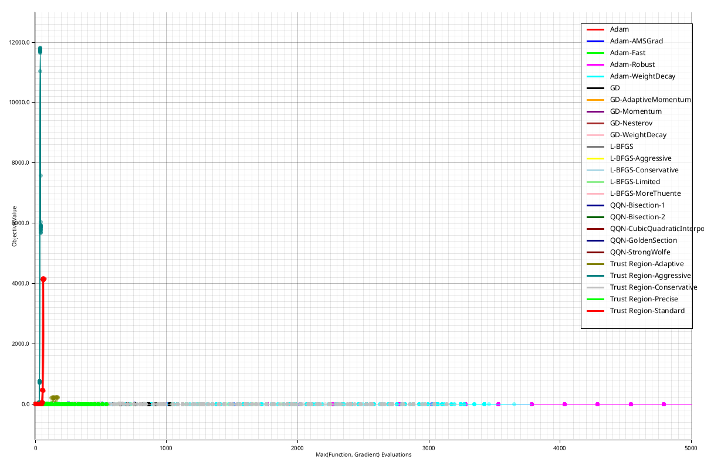
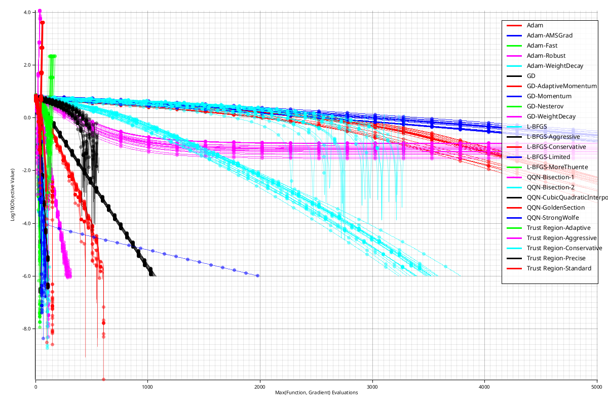

**Figure:** Convergence plots for SparseQuadratic_5D_pattern[1, 3] showing objective value vs iterations.
Left: Linear scale, Right: Log scale for better visualization of convergence behavior.

**Data:** [Linear scale data (CSV)](data/SparseQuadratic_5D_pattern[1,_3]_data.csv) | [Log scale data (CSV)](data/SparseQuadratic_5D_pattern[1,_3]_log_data.csv)

## Problem: SparseQuadratic_10D_pattern[1, 3]

**Family:** SparseQuadratic
**Dimension:** 10
**Success Threshold:** 1.000e-6
**Total Runs:** 500
**Detailed Analysis:** [View comprehensive problem analysis](reports/problem_analysis_SparseQuadratic_10D_pattern[1,_3].md)

### Performance Summary
<table style="border-collapse: collapse; width: 100%; margin: 20px 0;">
<tr style="background-color: #f2f2f2;">
<th style="border: 1px solid #ddd; padding: 8px; text-align: center;">Rank</th>
<th style="border: 1px solid #ddd; padding: 8px; text-align: center;">Optimizer</th>
<th style="border: 1px solid #ddd; padding: 8px; text-align: center;">Mean Final Value (All/Success/Fail)</th>
<th style="border: 1px solid #ddd; padding: 8px; text-align: center;">Std Dev</th>
<th style="border: 1px solid #ddd; padding: 8px; text-align: center;">Best Value</th>
<th style="border: 1px solid #ddd; padding: 8px; text-align: center;">Worst Value</th>
<th style="border: 1px solid #ddd; padding: 8px; text-align: center;">Mean Function Evals (All/Success/Fail)</th>
<th style="border: 1px solid #ddd; padding: 8px; text-align: center;">Mean Gradient Evals (All/Success/Fail)</th>
<th style="border: 1px solid #ddd; padding: 8px; text-align: center;">Success Rate</th>
<th style="border: 1px solid #ddd; padding: 8px; text-align: center;">Mean Time (s)</th>
</tr>
<tr style="background-color: #d4edda; font-weight: bold;">
<td style="border: 1px solid #ddd; padding: 8px; text-align: center;">1</td>
<td style="border: 1px solid #ddd; padding: 8px; text-align: center;"><a href="reports/detailed_SparseQuadratic_10D_pattern[1,_3]_L-BFGS-MoreThuente.md" title="Click for detailed analysis">L-BFGS-MoreThuente</a></td>
<td style="border: 1px solid #ddd; padding: 8px; text-align: center;">2.20e-7 / 2.20e-7 / -</td>
<td style="border: 1px solid #ddd; padding: 8px; text-align: center;">2.42e-7</td>
<td style="border: 1px solid #ddd; padding: 8px; text-align: center;">2.06e-8</td>
<td style="border: 1px solid #ddd; padding: 8px; text-align: center;">8.82e-7</td>
<td style="border: 1px solid #ddd; padding: 8px; text-align: center;">28.2 / 28.2 / -</td>
<td style="border: 1px solid #ddd; padding: 8px; text-align: center;">21.0 / 21.0 / -</td>
<td style="border: 1px solid #ddd; padding: 8px; text-align: center;">100.0%</td>
<td style="border: 1px solid #ddd; padding: 8px; text-align: center;">0.001</td>
</tr>
<tr style="background-color: #fff3cd;">
<td style="border: 1px solid #ddd; padding: 8px; text-align: center;">2</td>
<td style="border: 1px solid #ddd; padding: 8px; text-align: center;"><a href="reports/detailed_SparseQuadratic_10D_pattern[1,_3]_L-BFGS-Aggressive.md" title="Click for detailed analysis">L-BFGS-Aggressive</a></td>
<td style="border: 1px solid #ddd; padding: 8px; text-align: center;">2.16e-7 / 2.16e-7 / -</td>
<td style="border: 1px solid #ddd; padding: 8px; text-align: center;">1.67e-8</td>
<td style="border: 1px solid #ddd; padding: 8px; text-align: center;">1.72e-7</td>
<td style="border: 1px solid #ddd; padding: 8px; text-align: center;">2.44e-7</td>
<td style="border: 1px solid #ddd; padding: 8px; text-align: center;">38.0 / 38.0 / -</td>
<td style="border: 1px solid #ddd; padding: 8px; text-align: center;">18.0 / 18.0 / -</td>
<td style="border: 1px solid #ddd; padding: 8px; text-align: center;">100.0%</td>
<td style="border: 1px solid #ddd; padding: 8px; text-align: center;">0.001</td>
</tr>
<tr style="">
<td style="border: 1px solid #ddd; padding: 8px; text-align: center;">3</td>
<td style="border: 1px solid #ddd; padding: 8px; text-align: center;"><a href="reports/detailed_SparseQuadratic_10D_pattern[1,_3]_QQN-StrongWolfe.md" title="Click for detailed analysis">QQN-StrongWolfe</a></td>
<td style="border: 1px solid #ddd; padding: 8px; text-align: center;">2.19e-7 / 2.19e-7 / -</td>
<td style="border: 1px solid #ddd; padding: 8px; text-align: center;">1.50e-7</td>
<td style="border: 1px solid #ddd; padding: 8px; text-align: center;">8.82e-8</td>
<td style="border: 1px solid #ddd; padding: 8px; text-align: center;">8.12e-7</td>
<td style="border: 1px solid #ddd; padding: 8px; text-align: center;">43.1 / 43.1 / -</td>
<td style="border: 1px solid #ddd; padding: 8px; text-align: center;">44.1 / 44.1 / -</td>
<td style="border: 1px solid #ddd; padding: 8px; text-align: center;">100.0%</td>
<td style="border: 1px solid #ddd; padding: 8px; text-align: center;">0.001</td>
</tr>
<tr style="">
<td style="border: 1px solid #ddd; padding: 8px; text-align: center;">4</td>
<td style="border: 1px solid #ddd; padding: 8px; text-align: center;"><a href="reports/detailed_SparseQuadratic_10D_pattern[1,_3]_L-BFGS-Limited.md" title="Click for detailed analysis">L-BFGS-Limited</a></td>
<td style="border: 1px solid #ddd; padding: 8px; text-align: center;">4.74e-7 / 4.74e-7 / -</td>
<td style="border: 1px solid #ddd; padding: 8px; text-align: center;">2.74e-7</td>
<td style="border: 1px solid #ddd; padding: 8px; text-align: center;">5.73e-8</td>
<td style="border: 1px solid #ddd; padding: 8px; text-align: center;">9.57e-7</td>
<td style="border: 1px solid #ddd; padding: 8px; text-align: center;">58.5 / 58.5 / -</td>
<td style="border: 1px solid #ddd; padding: 8px; text-align: center;">34.5 / 34.5 / -</td>
<td style="border: 1px solid #ddd; padding: 8px; text-align: center;">100.0%</td>
<td style="border: 1px solid #ddd; padding: 8px; text-align: center;">0.001</td>
</tr>
<tr style="">
<td style="border: 1px solid #ddd; padding: 8px; text-align: center;">5</td>
<td style="border: 1px solid #ddd; padding: 8px; text-align: center;"><a href="reports/detailed_SparseQuadratic_10D_pattern[1,_3]_QQN-Bisection-2.md" title="Click for detailed analysis">QQN-Bisection-2</a></td>
<td style="border: 1px solid #ddd; padding: 8px; text-align: center;">3.81e-7 / 3.81e-7 / -</td>
<td style="border: 1px solid #ddd; padding: 8px; text-align: center;">3.20e-7</td>
<td style="border: 1px solid #ddd; padding: 8px; text-align: center;">2.03e-8</td>
<td style="border: 1px solid #ddd; padding: 8px; text-align: center;">9.46e-7</td>
<td style="border: 1px solid #ddd; padding: 8px; text-align: center;">46.4 / 46.4 / -</td>
<td style="border: 1px solid #ddd; padding: 8px; text-align: center;">73.7 / 73.7 / -</td>
<td style="border: 1px solid #ddd; padding: 8px; text-align: center;">100.0%</td>
<td style="border: 1px solid #ddd; padding: 8px; text-align: center;">0.001</td>
</tr>
<tr style="">
<td style="border: 1px solid #ddd; padding: 8px; text-align: center;">6</td>
<td style="border: 1px solid #ddd; padding: 8px; text-align: center;"><a href="reports/detailed_SparseQuadratic_10D_pattern[1,_3]_QQN-CubicQuadraticInterpolation.md" title="Click for detailed analysis">QQN-CubicQuadraticInterpolation</a></td>
<td style="border: 1px solid #ddd; padding: 8px; text-align: center;">2.38e-8 / 2.38e-8 / -</td>
<td style="border: 1px solid #ddd; padding: 8px; text-align: center;">1.47e-8</td>
<td style="border: 1px solid #ddd; padding: 8px; text-align: center;">2.26e-9</td>
<td style="border: 1px solid #ddd; padding: 8px; text-align: center;">4.52e-8</td>
<td style="border: 1px solid #ddd; padding: 8px; text-align: center;">60.4 / 60.4 / -</td>
<td style="border: 1px solid #ddd; padding: 8px; text-align: center;">61.4 / 61.4 / -</td>
<td style="border: 1px solid #ddd; padding: 8px; text-align: center;">100.0%</td>
<td style="border: 1px solid #ddd; padding: 8px; text-align: center;">0.002</td>
</tr>
<tr style="">
<td style="border: 1px solid #ddd; padding: 8px; text-align: center;">7</td>
<td style="border: 1px solid #ddd; padding: 8px; text-align: center;"><a href="reports/detailed_SparseQuadratic_10D_pattern[1,_3]_QQN-Bisection-1.md" title="Click for detailed analysis">QQN-Bisection-1</a></td>
<td style="border: 1px solid #ddd; padding: 8px; text-align: center;">5.68e-7 / 5.68e-7 / -</td>
<td style="border: 1px solid #ddd; padding: 8px; text-align: center;">3.82e-7</td>
<td style="border: 1px solid #ddd; padding: 8px; text-align: center;">2.29e-8</td>
<td style="border: 1px solid #ddd; padding: 8px; text-align: center;">9.90e-7</td>
<td style="border: 1px solid #ddd; padding: 8px; text-align: center;">55.8 / 55.8 / -</td>
<td style="border: 1px solid #ddd; padding: 8px; text-align: center;">94.5 / 94.5 / -</td>
<td style="border: 1px solid #ddd; padding: 8px; text-align: center;">100.0%</td>
<td style="border: 1px solid #ddd; padding: 8px; text-align: center;">0.001</td>
</tr>
<tr style="">
<td style="border: 1px solid #ddd; padding: 8px; text-align: center;">8</td>
<td style="border: 1px solid #ddd; padding: 8px; text-align: center;"><a href="reports/detailed_SparseQuadratic_10D_pattern[1,_3]_QQN-GoldenSection.md" title="Click for detailed analysis">QQN-GoldenSection</a></td>
<td style="border: 1px solid #ddd; padding: 8px; text-align: center;">3.11e-7 / 3.11e-7 / -</td>
<td style="border: 1px solid #ddd; padding: 8px; text-align: center;">3.27e-7</td>
<td style="border: 1px solid #ddd; padding: 8px; text-align: center;">7.74e-9</td>
<td style="border: 1px solid #ddd; padding: 8px; text-align: center;">9.91e-7</td>
<td style="border: 1px solid #ddd; padding: 8px; text-align: center;">156.2 / 156.2 / -</td>
<td style="border: 1px solid #ddd; padding: 8px; text-align: center;">23.0 / 23.0 / -</td>
<td style="border: 1px solid #ddd; padding: 8px; text-align: center;">100.0%</td>
<td style="border: 1px solid #ddd; padding: 8px; text-align: center;">0.002</td>
</tr>
<tr style="">
<td style="border: 1px solid #ddd; padding: 8px; text-align: center;">9</td>
<td style="border: 1px solid #ddd; padding: 8px; text-align: center;"><a href="reports/detailed_SparseQuadratic_10D_pattern[1,_3]_GD-WeightDecay.md" title="Click for detailed analysis">GD-WeightDecay</a></td>
<td style="border: 1px solid #ddd; padding: 8px; text-align: center;">9.31e-7 / 9.31e-7 / -</td>
<td style="border: 1px solid #ddd; padding: 8px; text-align: center;">3.38e-8</td>
<td style="border: 1px solid #ddd; padding: 8px; text-align: center;">8.75e-7</td>
<td style="border: 1px solid #ddd; padding: 8px; text-align: center;">9.98e-7</td>
<td style="border: 1px solid #ddd; padding: 8px; text-align: center;">103.2 / 103.2 / -</td>
<td style="border: 1px solid #ddd; padding: 8px; text-align: center;">203.4 / 203.4 / -</td>
<td style="border: 1px solid #ddd; padding: 8px; text-align: center;">100.0%</td>
<td style="border: 1px solid #ddd; padding: 8px; text-align: center;">0.004</td>
</tr>
<tr style="">
<td style="border: 1px solid #ddd; padding: 8px; text-align: center;">10</td>
<td style="border: 1px solid #ddd; padding: 8px; text-align: center;"><a href="reports/detailed_SparseQuadratic_10D_pattern[1,_3]_L-BFGS-Conservative.md" title="Click for detailed analysis">L-BFGS-Conservative</a></td>
<td style="border: 1px solid #ddd; padding: 8px; text-align: center;">2.03e-7 / 2.03e-7 / -</td>
<td style="border: 1px solid #ddd; padding: 8px; text-align: center;">2.96e-7</td>
<td style="border: 1px solid #ddd; padding: 8px; text-align: center;">2.80e-9</td>
<td style="border: 1px solid #ddd; padding: 8px; text-align: center;">9.97e-7</td>
<td style="border: 1px solid #ddd; padding: 8px; text-align: center;">339.5 / 339.5 / -</td>
<td style="border: 1px solid #ddd; padding: 8px; text-align: center;">272.2 / 272.2 / -</td>
<td style="border: 1px solid #ddd; padding: 8px; text-align: center;">100.0%</td>
<td style="border: 1px solid #ddd; padding: 8px; text-align: center;">0.009</td>
</tr>
<tr style="">
<td style="border: 1px solid #ddd; padding: 8px; text-align: center;">11</td>
<td style="border: 1px solid #ddd; padding: 8px; text-align: center;"><a href="reports/detailed_SparseQuadratic_10D_pattern[1,_3]_GD.md" title="Click for detailed analysis">GD</a></td>
<td style="border: 1px solid #ddd; padding: 8px; text-align: center;">9.80e-7 / 9.80e-7 / -</td>
<td style="border: 1px solid #ddd; padding: 8px; text-align: center;">1.20e-8</td>
<td style="border: 1px solid #ddd; padding: 8px; text-align: center;">9.60e-7</td>
<td style="border: 1px solid #ddd; padding: 8px; text-align: center;">1.00e-6</td>
<td style="border: 1px solid #ddd; padding: 8px; text-align: center;">360.1 / 360.1 / -</td>
<td style="border: 1px solid #ddd; padding: 8px; text-align: center;">717.3 / 717.3 / -</td>
<td style="border: 1px solid #ddd; padding: 8px; text-align: center;">100.0%</td>
<td style="border: 1px solid #ddd; padding: 8px; text-align: center;">0.010</td>
</tr>
<tr style="">
<td style="border: 1px solid #ddd; padding: 8px; text-align: center;">12</td>
<td style="border: 1px solid #ddd; padding: 8px; text-align: center;"><a href="reports/detailed_SparseQuadratic_10D_pattern[1,_3]_Adam-WeightDecay.md" title="Click for detailed analysis">Adam-WeightDecay</a></td>
<td style="border: 1px solid #ddd; padding: 8px; text-align: center;">9.83e-7 / 9.83e-7 / -</td>
<td style="border: 1px solid #ddd; padding: 8px; text-align: center;">7.84e-9</td>
<td style="border: 1px solid #ddd; padding: 8px; text-align: center;">9.70e-7</td>
<td style="border: 1px solid #ddd; padding: 8px; text-align: center;">9.98e-7</td>
<td style="border: 1px solid #ddd; padding: 8px; text-align: center;">1532.3 / 1532.3 / -</td>
<td style="border: 1px solid #ddd; padding: 8px; text-align: center;">1532.3 / 1532.3 / -</td>
<td style="border: 1px solid #ddd; padding: 8px; text-align: center;">100.0%</td>
<td style="border: 1px solid #ddd; padding: 8px; text-align: center;">0.037</td>
</tr>
<tr style="">
<td style="border: 1px solid #ddd; padding: 8px; text-align: center;">13</td>
<td style="border: 1px solid #ddd; padding: 8px; text-align: center;"><a href="reports/detailed_SparseQuadratic_10D_pattern[1,_3]_L-BFGS.md" title="Click for detailed analysis">L-BFGS</a></td>
<td style="border: 1px solid #ddd; padding: 8px; text-align: center;">3.23e-6 / 4.63e-7 / 1.93e-2</td>
<td style="border: 1px solid #ddd; padding: 8px; text-align: center;">9.38e-6</td>
<td style="border: 1px solid #ddd; padding: 8px; text-align: center;">1.06e-8</td>
<td style="border: 1px solid #ddd; padding: 8px; text-align: center;">4.19e-5</td>
<td style="border: 1px solid #ddd; padding: 8px; text-align: center;">75.7 / 71.0 / 117.5</td>
<td style="border: 1px solid #ddd; padding: 8px; text-align: center;">45.8 / 44.7 / 56.0</td>
<td style="border: 1px solid #ddd; padding: 8px; text-align: center;">90.0%</td>
<td style="border: 1px solid #ddd; padding: 8px; text-align: center;">0.002</td>
</tr>
<tr style="">
<td style="border: 1px solid #ddd; padding: 8px; text-align: center;">14</td>
<td style="border: 1px solid #ddd; padding: 8px; text-align: center;"><a href="reports/detailed_SparseQuadratic_10D_pattern[1,_3]_Trust_Region-Aggressive.md" title="Click for detailed analysis">Trust Region-Aggressive</a></td>
<td style="border: 1px solid #ddd; padding: 8px; text-align: center;">4.14e-1 / - / 2.01e4</td>
<td style="border: 1px solid #ddd; padding: 8px; text-align: center;">3.04e-1</td>
<td style="border: 1px solid #ddd; padding: 8px; text-align: center;">4.44e-3</td>
<td style="border: 1px solid #ddd; padding: 8px; text-align: center;">8.89e-1</td>
<td style="border: 1px solid #ddd; padding: 8px; text-align: center;">31.6 / - / 31.6</td>
<td style="border: 1px solid #ddd; padding: 8px; text-align: center;">21.1 / - / 21.1</td>
<td style="border: 1px solid #ddd; padding: 8px; text-align: center;">0.0%</td>
<td style="border: 1px solid #ddd; padding: 8px; text-align: center;">0.000</td>
</tr>
<tr style="">
<td style="border: 1px solid #ddd; padding: 8px; text-align: center;">15</td>
<td style="border: 1px solid #ddd; padding: 8px; text-align: center;"><a href="reports/detailed_SparseQuadratic_10D_pattern[1,_3]_GD-AdaptiveMomentum.md" title="Click for detailed analysis">GD-AdaptiveMomentum</a></td>
<td style="border: 1px solid #ddd; padding: 8px; text-align: center;">1.43e-2 / - / 1.57e0</td>
<td style="border: 1px solid #ddd; padding: 8px; text-align: center;">9.17e-3</td>
<td style="border: 1px solid #ddd; padding: 8px; text-align: center;">3.91e-3</td>
<td style="border: 1px solid #ddd; padding: 8px; text-align: center;">3.45e-2</td>
<td style="border: 1px solid #ddd; padding: 8px; text-align: center;">21.9 / - / 21.9</td>
<td style="border: 1px solid #ddd; padding: 8px; text-align: center;">39.9 / - / 39.9</td>
<td style="border: 1px solid #ddd; padding: 8px; text-align: center;">0.0%</td>
<td style="border: 1px solid #ddd; padding: 8px; text-align: center;">0.001</td>
</tr>
<tr style="">
<td style="border: 1px solid #ddd; padding: 8px; text-align: center;">16</td>
<td style="border: 1px solid #ddd; padding: 8px; text-align: center;"><a href="reports/detailed_SparseQuadratic_10D_pattern[1,_3]_GD-Nesterov.md" title="Click for detailed analysis">GD-Nesterov</a></td>
<td style="border: 1px solid #ddd; padding: 8px; text-align: center;">7.92e-3 / - / 6.03e-1</td>
<td style="border: 1px solid #ddd; padding: 8px; text-align: center;">4.11e-3</td>
<td style="border: 1px solid #ddd; padding: 8px; text-align: center;">3.06e-3</td>
<td style="border: 1px solid #ddd; padding: 8px; text-align: center;">1.89e-2</td>
<td style="border: 1px solid #ddd; padding: 8px; text-align: center;">23.1 / - / 23.1</td>
<td style="border: 1px solid #ddd; padding: 8px; text-align: center;">42.1 / - / 42.1</td>
<td style="border: 1px solid #ddd; padding: 8px; text-align: center;">0.0%</td>
<td style="border: 1px solid #ddd; padding: 8px; text-align: center;">0.001</td>
</tr>
<tr style="">
<td style="border: 1px solid #ddd; padding: 8px; text-align: center;">17</td>
<td style="border: 1px solid #ddd; padding: 8px; text-align: center;"><a href="reports/detailed_SparseQuadratic_10D_pattern[1,_3]_GD-Momentum.md" title="Click for detailed analysis">GD-Momentum</a></td>
<td style="border: 1px solid #ddd; padding: 8px; text-align: center;">1.22e-2 / - / 9.15e-1</td>
<td style="border: 1px solid #ddd; padding: 8px; text-align: center;">5.50e-3</td>
<td style="border: 1px solid #ddd; padding: 8px; text-align: center;">4.36e-3</td>
<td style="border: 1px solid #ddd; padding: 8px; text-align: center;">2.40e-2</td>
<td style="border: 1px solid #ddd; padding: 8px; text-align: center;">23.1 / - / 23.1</td>
<td style="border: 1px solid #ddd; padding: 8px; text-align: center;">42.3 / - / 42.3</td>
<td style="border: 1px solid #ddd; padding: 8px; text-align: center;">0.0%</td>
<td style="border: 1px solid #ddd; padding: 8px; text-align: center;">0.001</td>
</tr>
<tr style="">
<td style="border: 1px solid #ddd; padding: 8px; text-align: center;">18</td>
<td style="border: 1px solid #ddd; padding: 8px; text-align: center;"><a href="reports/detailed_SparseQuadratic_10D_pattern[1,_3]_Adam-Fast.md" title="Click for detailed analysis">Adam-Fast</a></td>
<td style="border: 1px solid #ddd; padding: 8px; text-align: center;">8.40e-2 / - / 7.28e-1</td>
<td style="border: 1px solid #ddd; padding: 8px; text-align: center;">2.78e-2</td>
<td style="border: 1px solid #ddd; padding: 8px; text-align: center;">3.11e-2</td>
<td style="border: 1px solid #ddd; padding: 8px; text-align: center;">1.51e-1</td>
<td style="border: 1px solid #ddd; padding: 8px; text-align: center;">37.3 / - / 37.3</td>
<td style="border: 1px solid #ddd; padding: 8px; text-align: center;">36.3 / - / 36.3</td>
<td style="border: 1px solid #ddd; padding: 8px; text-align: center;">0.0%</td>
<td style="border: 1px solid #ddd; padding: 8px; text-align: center;">0.001</td>
</tr>
<tr style="">
<td style="border: 1px solid #ddd; padding: 8px; text-align: center;">19</td>
<td style="border: 1px solid #ddd; padding: 8px; text-align: center;"><a href="reports/detailed_SparseQuadratic_10D_pattern[1,_3]_Trust_Region-Standard.md" title="Click for detailed analysis">Trust Region-Standard</a></td>
<td style="border: 1px solid #ddd; padding: 8px; text-align: center;">9.50e-2 / - / 1.02e2</td>
<td style="border: 1px solid #ddd; padding: 8px; text-align: center;">7.61e-2</td>
<td style="border: 1px solid #ddd; padding: 8px; text-align: center;">6.36e-3</td>
<td style="border: 1px solid #ddd; padding: 8px; text-align: center;">2.27e-1</td>
<td style="border: 1px solid #ddd; padding: 8px; text-align: center;">57.5 / - / 57.5</td>
<td style="border: 1px solid #ddd; padding: 8px; text-align: center;">38.4 / - / 38.4</td>
<td style="border: 1px solid #ddd; padding: 8px; text-align: center;">0.0%</td>
<td style="border: 1px solid #ddd; padding: 8px; text-align: center;">0.000</td>
</tr>
<tr style="">
<td style="border: 1px solid #ddd; padding: 8px; text-align: center;">20</td>
<td style="border: 1px solid #ddd; padding: 8px; text-align: center;"><a href="reports/detailed_SparseQuadratic_10D_pattern[1,_3]_Trust_Region-Adaptive.md" title="Click for detailed analysis">Trust Region-Adaptive</a></td>
<td style="border: 1px solid #ddd; padding: 8px; text-align: center;">2.47e-2 / - / 1.28e3</td>
<td style="border: 1px solid #ddd; padding: 8px; text-align: center;">1.93e-2</td>
<td style="border: 1px solid #ddd; padding: 8px; text-align: center;">9.51e-4</td>
<td style="border: 1px solid #ddd; padding: 8px; text-align: center;">6.40e-2</td>
<td style="border: 1px solid #ddd; padding: 8px; text-align: center;">162.1 / - / 162.1</td>
<td style="border: 1px solid #ddd; padding: 8px; text-align: center;">108.1 / - / 108.1</td>
<td style="border: 1px solid #ddd; padding: 8px; text-align: center;">0.0%</td>
<td style="border: 1px solid #ddd; padding: 8px; text-align: center;">0.001</td>
</tr>
<tr style="">
<td style="border: 1px solid #ddd; padding: 8px; text-align: center;">21</td>
<td style="border: 1px solid #ddd; padding: 8px; text-align: center;"><a href="reports/detailed_SparseQuadratic_10D_pattern[1,_3]_Trust_Region-Precise.md" title="Click for detailed analysis">Trust Region-Precise</a></td>
<td style="border: 1px solid #ddd; padding: 8px; text-align: center;">3.71e-3 / - / 1.80e-1</td>
<td style="border: 1px solid #ddd; padding: 8px; text-align: center;">4.06e-3</td>
<td style="border: 1px solid #ddd; padding: 8px; text-align: center;">8.82e-5</td>
<td style="border: 1px solid #ddd; padding: 8px; text-align: center;">1.39e-2</td>
<td style="border: 1px solid #ddd; padding: 8px; text-align: center;">589.1 / - / 589.1</td>
<td style="border: 1px solid #ddd; padding: 8px; text-align: center;">393.0 / - / 393.0</td>
<td style="border: 1px solid #ddd; padding: 8px; text-align: center;">0.0%</td>
<td style="border: 1px solid #ddd; padding: 8px; text-align: center;">0.005</td>
</tr>
<tr style="">
<td style="border: 1px solid #ddd; padding: 8px; text-align: center;">22</td>
<td style="border: 1px solid #ddd; padding: 8px; text-align: center;"><a href="reports/detailed_SparseQuadratic_10D_pattern[1,_3]_Adam.md" title="Click for detailed analysis">Adam</a></td>
<td style="border: 1px solid #ddd; padding: 8px; text-align: center;">2.03e-3 / - / 2.03e-3</td>
<td style="border: 1px solid #ddd; padding: 8px; text-align: center;">8.81e-4</td>
<td style="border: 1px solid #ddd; padding: 8px; text-align: center;">3.96e-4</td>
<td style="border: 1px solid #ddd; padding: 8px; text-align: center;">3.78e-3</td>
<td style="border: 1px solid #ddd; padding: 8px; text-align: center;">2502.0 / - / 2502.0</td>
<td style="border: 1px solid #ddd; padding: 8px; text-align: center;">2502.0 / - / 2502.0</td>
<td style="border: 1px solid #ddd; padding: 8px; text-align: center;">0.0%</td>
<td style="border: 1px solid #ddd; padding: 8px; text-align: center;">0.057</td>
</tr>
<tr style="">
<td style="border: 1px solid #ddd; padding: 8px; text-align: center;">23</td>
<td style="border: 1px solid #ddd; padding: 8px; text-align: center;"><a href="reports/detailed_SparseQuadratic_10D_pattern[1,_3]_Adam-AMSGrad.md" title="Click for detailed analysis">Adam-AMSGrad</a></td>
<td style="border: 1px solid #ddd; padding: 8px; text-align: center;">2.33e-1 / - / 2.33e-1</td>
<td style="border: 1px solid #ddd; padding: 8px; text-align: center;">4.06e-2</td>
<td style="border: 1px solid #ddd; padding: 8px; text-align: center;">1.70e-1</td>
<td style="border: 1px solid #ddd; padding: 8px; text-align: center;">3.20e-1</td>
<td style="border: 1px solid #ddd; padding: 8px; text-align: center;">2502.0 / - / 2502.0</td>
<td style="border: 1px solid #ddd; padding: 8px; text-align: center;">2502.0 / - / 2502.0</td>
<td style="border: 1px solid #ddd; padding: 8px; text-align: center;">0.0%</td>
<td style="border: 1px solid #ddd; padding: 8px; text-align: center;">0.064</td>
</tr>
<tr style="">
<td style="border: 1px solid #ddd; padding: 8px; text-align: center;">24</td>
<td style="border: 1px solid #ddd; padding: 8px; text-align: center;"><a href="reports/detailed_SparseQuadratic_10D_pattern[1,_3]_Adam-Robust.md" title="Click for detailed analysis">Adam-Robust</a></td>
<td style="border: 1px solid #ddd; padding: 8px; text-align: center;">1.03e-1 / - / 1.03e-1</td>
<td style="border: 1px solid #ddd; padding: 8px; text-align: center;">3.53e-2</td>
<td style="border: 1px solid #ddd; padding: 8px; text-align: center;">4.23e-2</td>
<td style="border: 1px solid #ddd; padding: 8px; text-align: center;">1.71e-1</td>
<td style="border: 1px solid #ddd; padding: 8px; text-align: center;">2502.0 / - / 2502.0</td>
<td style="border: 1px solid #ddd; padding: 8px; text-align: center;">2502.0 / - / 2502.0</td>
<td style="border: 1px solid #ddd; padding: 8px; text-align: center;">0.0%</td>
<td style="border: 1px solid #ddd; padding: 8px; text-align: center;">0.064</td>
</tr>
<tr style="">
<td style="border: 1px solid #ddd; padding: 8px; text-align: center;">25</td>
<td style="border: 1px solid #ddd; padding: 8px; text-align: center;"><a href="reports/detailed_SparseQuadratic_10D_pattern[1,_3]_Trust_Region-Conservative.md" title="Click for detailed analysis">Trust Region-Conservative</a></td>
<td style="border: 1px solid #ddd; padding: 8px; text-align: center;">1.83e0 / - / 1.83e0</td>
<td style="border: 1px solid #ddd; padding: 8px; text-align: center;">5.92e-1</td>
<td style="border: 1px solid #ddd; padding: 8px; text-align: center;">6.04e-1</td>
<td style="border: 1px solid #ddd; padding: 8px; text-align: center;">3.15e0</td>
<td style="border: 1px solid #ddd; padding: 8px; text-align: center;">3002.0 / - / 3002.0</td>
<td style="border: 1px solid #ddd; padding: 8px; text-align: center;">2002.0 / - / 2002.0</td>
<td style="border: 1px solid #ddd; padding: 8px; text-align: center;">0.0%</td>
<td style="border: 1px solid #ddd; padding: 8px; text-align: center;">0.024</td>
</tr>
</table>

### Convergence Plots

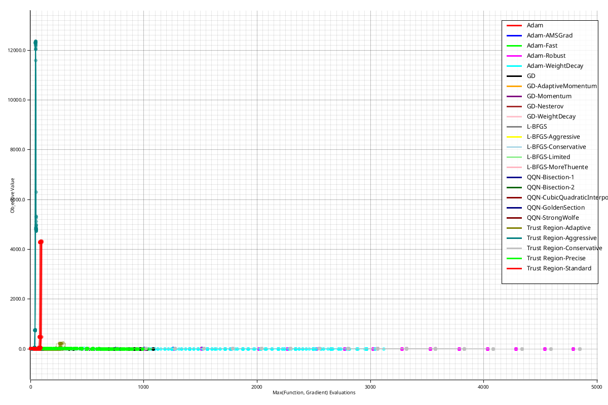
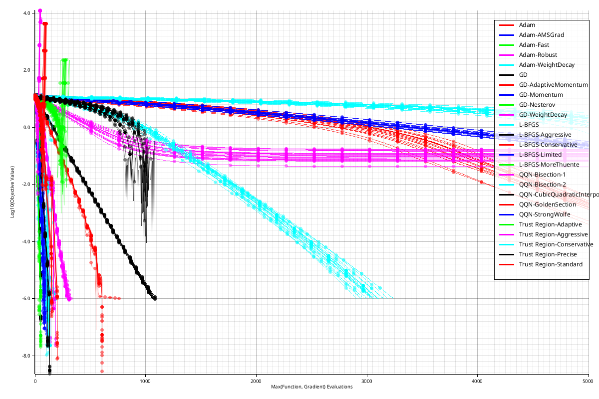

**Figure:** Convergence plots for SparseQuadratic_10D_pattern[1, 3] showing objective value vs iterations.
Left: Linear scale, Right: Log scale for better visualization of convergence behavior.

**Data:** [Linear scale data (CSV)](data/SparseQuadratic_10D_pattern[1,_3]_data.csv) | [Log scale data (CSV)](data/SparseQuadratic_10D_pattern[1,_3]_log_data.csv)

## Problem: LogisticRegression_100samples_5features_reg0.01

**Family:** LogisticRegression
**Dimension:** 5
**Success Threshold:** 3.150e-1
**Total Runs:** 500
**Detailed Analysis:** [View comprehensive problem analysis](reports/problem_analysis_LogisticRegression_100samples_5features_reg0.01.md)

### Performance Summary
<table style="border-collapse: collapse; width: 100%; margin: 20px 0;">
<tr style="background-color: #f2f2f2;">
<th style="border: 1px solid #ddd; padding: 8px; text-align: center;">Rank</th>
<th style="border: 1px solid #ddd; padding: 8px; text-align: center;">Optimizer</th>
<th style="border: 1px solid #ddd; padding: 8px; text-align: center;">Mean Final Value (All/Success/Fail)</th>
<th style="border: 1px solid #ddd; padding: 8px; text-align: center;">Std Dev</th>
<th style="border: 1px solid #ddd; padding: 8px; text-align: center;">Best Value</th>
<th style="border: 1px solid #ddd; padding: 8px; text-align: center;">Worst Value</th>
<th style="border: 1px solid #ddd; padding: 8px; text-align: center;">Mean Function Evals (All/Success/Fail)</th>
<th style="border: 1px solid #ddd; padding: 8px; text-align: center;">Mean Gradient Evals (All/Success/Fail)</th>
<th style="border: 1px solid #ddd; padding: 8px; text-align: center;">Success Rate</th>
<th style="border: 1px solid #ddd; padding: 8px; text-align: center;">Mean Time (s)</th>
</tr>
<tr style="background-color: #d4edda; font-weight: bold;">
<td style="border: 1px solid #ddd; padding: 8px; text-align: center;">1</td>
<td style="border: 1px solid #ddd; padding: 8px; text-align: center;"><a href="reports/detailed_LogisticRegression_100samples_5features_reg0.01_Trust_Region-Adaptive.md" title="Click for detailed analysis">Trust Region-Adaptive</a></td>
<td style="border: 1px solid #ddd; padding: 8px; text-align: center;">6.95e-1 / - / 6.95e-1</td>
<td style="border: 1px solid #ddd; padding: 8px; text-align: center;">3.03e-2</td>
<td style="border: 1px solid #ddd; padding: 8px; text-align: center;">6.37e-1</td>
<td style="border: 1px solid #ddd; padding: 8px; text-align: center;">7.46e-1</td>
<td style="border: 1px solid #ddd; padding: 8px; text-align: center;">5.0 / - / 5.0</td>
<td style="border: 1px solid #ddd; padding: 8px; text-align: center;">4.0 / - / 4.0</td>
<td style="border: 1px solid #ddd; padding: 8px; text-align: center;">0.0%</td>
<td style="border: 1px solid #ddd; padding: 8px; text-align: center;">0.002</td>
</tr>
<tr style="background-color: #fff3cd;">
<td style="border: 1px solid #ddd; padding: 8px; text-align: center;">2</td>
<td style="border: 1px solid #ddd; padding: 8px; text-align: center;"><a href="reports/detailed_LogisticRegression_100samples_5features_reg0.01_Trust_Region-Aggressive.md" title="Click for detailed analysis">Trust Region-Aggressive</a></td>
<td style="border: 1px solid #ddd; padding: 8px; text-align: center;">6.98e-1 / - / 6.98e-1</td>
<td style="border: 1px solid #ddd; padding: 8px; text-align: center;">2.53e-2</td>
<td style="border: 1px solid #ddd; padding: 8px; text-align: center;">6.53e-1</td>
<td style="border: 1px solid #ddd; padding: 8px; text-align: center;">7.51e-1</td>
<td style="border: 1px solid #ddd; padding: 8px; text-align: center;">5.0 / - / 5.0</td>
<td style="border: 1px solid #ddd; padding: 8px; text-align: center;">4.0 / - / 4.0</td>
<td style="border: 1px solid #ddd; padding: 8px; text-align: center;">0.0%</td>
<td style="border: 1px solid #ddd; padding: 8px; text-align: center;">0.002</td>
</tr>
<tr style="">
<td style="border: 1px solid #ddd; padding: 8px; text-align: center;">3</td>
<td style="border: 1px solid #ddd; padding: 8px; text-align: center;"><a href="reports/detailed_LogisticRegression_100samples_5features_reg0.01_Trust_Region-Standard.md" title="Click for detailed analysis">Trust Region-Standard</a></td>
<td style="border: 1px solid #ddd; padding: 8px; text-align: center;">6.98e-1 / - / 6.98e-1</td>
<td style="border: 1px solid #ddd; padding: 8px; text-align: center;">3.18e-2</td>
<td style="border: 1px solid #ddd; padding: 8px; text-align: center;">6.55e-1</td>
<td style="border: 1px solid #ddd; padding: 8px; text-align: center;">7.75e-1</td>
<td style="border: 1px solid #ddd; padding: 8px; text-align: center;">5.0 / - / 5.0</td>
<td style="border: 1px solid #ddd; padding: 8px; text-align: center;">4.0 / - / 4.0</td>
<td style="border: 1px solid #ddd; padding: 8px; text-align: center;">0.0%</td>
<td style="border: 1px solid #ddd; padding: 8px; text-align: center;">0.002</td>
</tr>
<tr style="">
<td style="border: 1px solid #ddd; padding: 8px; text-align: center;">4</td>
<td style="border: 1px solid #ddd; padding: 8px; text-align: center;"><a href="reports/detailed_LogisticRegression_100samples_5features_reg0.01_Trust_Region-Precise.md" title="Click for detailed analysis">Trust Region-Precise</a></td>
<td style="border: 1px solid #ddd; padding: 8px; text-align: center;">6.78e-1 / - / 6.78e-1</td>
<td style="border: 1px solid #ddd; padding: 8px; text-align: center;">2.08e-2</td>
<td style="border: 1px solid #ddd; padding: 8px; text-align: center;">6.48e-1</td>
<td style="border: 1px solid #ddd; padding: 8px; text-align: center;">7.23e-1</td>
<td style="border: 1px solid #ddd; padding: 8px; text-align: center;">5.5 / - / 5.5</td>
<td style="border: 1px solid #ddd; padding: 8px; text-align: center;">4.3 / - / 4.3</td>
<td style="border: 1px solid #ddd; padding: 8px; text-align: center;">0.0%</td>
<td style="border: 1px solid #ddd; padding: 8px; text-align: center;">0.002</td>
</tr>
<tr style="">
<td style="border: 1px solid #ddd; padding: 8px; text-align: center;">5</td>
<td style="border: 1px solid #ddd; padding: 8px; text-align: center;"><a href="reports/detailed_LogisticRegression_100samples_5features_reg0.01_Trust_Region-Conservative.md" title="Click for detailed analysis">Trust Region-Conservative</a></td>
<td style="border: 1px solid #ddd; padding: 8px; text-align: center;">4.24e-1 / - / 4.24e-1</td>
<td style="border: 1px solid #ddd; padding: 8px; text-align: center;">2.86e-3</td>
<td style="border: 1px solid #ddd; padding: 8px; text-align: center;">4.20e-1</td>
<td style="border: 1px solid #ddd; padding: 8px; text-align: center;">4.28e-1</td>
<td style="border: 1px solid #ddd; padding: 8px; text-align: center;">86.6 / - / 86.6</td>
<td style="border: 1px solid #ddd; padding: 8px; text-align: center;">58.4 / - / 58.4</td>
<td style="border: 1px solid #ddd; padding: 8px; text-align: center;">0.0%</td>
<td style="border: 1px solid #ddd; padding: 8px; text-align: center;">0.025</td>
</tr>
<tr style="">
<td style="border: 1px solid #ddd; padding: 8px; text-align: center;">6</td>
<td style="border: 1px solid #ddd; padding: 8px; text-align: center;"><a href="reports/detailed_LogisticRegression_100samples_5features_reg0.01_QQN-StrongWolfe.md" title="Click for detailed analysis">QQN-StrongWolfe</a></td>
<td style="border: 1px solid #ddd; padding: 8px; text-align: center;">3.15e-1 / - / 3.15e-1</td>
<td style="border: 1px solid #ddd; padding: 8px; text-align: center;">2.43e-12</td>
<td style="border: 1px solid #ddd; padding: 8px; text-align: center;">3.15e-1</td>
<td style="border: 1px solid #ddd; padding: 8px; text-align: center;">3.15e-1</td>
<td style="border: 1px solid #ddd; padding: 8px; text-align: center;">74.3 / - / 74.3</td>
<td style="border: 1px solid #ddd; padding: 8px; text-align: center;">82.4 / - / 82.4</td>
<td style="border: 1px solid #ddd; padding: 8px; text-align: center;">0.0%</td>
<td style="border: 1px solid #ddd; padding: 8px; text-align: center;">0.031</td>
</tr>
<tr style="">
<td style="border: 1px solid #ddd; padding: 8px; text-align: center;">7</td>
<td style="border: 1px solid #ddd; padding: 8px; text-align: center;"><a href="reports/detailed_LogisticRegression_100samples_5features_reg0.01_QQN-Bisection-2.md" title="Click for detailed analysis">QQN-Bisection-2</a></td>
<td style="border: 1px solid #ddd; padding: 8px; text-align: center;">3.15e-1 / - / 3.15e-1</td>
<td style="border: 1px solid #ddd; padding: 8px; text-align: center;">2.84e-12</td>
<td style="border: 1px solid #ddd; padding: 8px; text-align: center;">3.15e-1</td>
<td style="border: 1px solid #ddd; padding: 8px; text-align: center;">3.15e-1</td>
<td style="border: 1px solid #ddd; padding: 8px; text-align: center;">98.5 / - / 98.5</td>
<td style="border: 1px solid #ddd; padding: 8px; text-align: center;">74.5 / - / 74.5</td>
<td style="border: 1px solid #ddd; padding: 8px; text-align: center;">0.0%</td>
<td style="border: 1px solid #ddd; padding: 8px; text-align: center;">0.033</td>
</tr>
<tr style="">
<td style="border: 1px solid #ddd; padding: 8px; text-align: center;">8</td>
<td style="border: 1px solid #ddd; padding: 8px; text-align: center;"><a href="reports/detailed_LogisticRegression_100samples_5features_reg0.01_Adam-Fast.md" title="Click for detailed analysis">Adam-Fast</a></td>
<td style="border: 1px solid #ddd; padding: 8px; text-align: center;">3.16e-1 / - / 3.16e-1</td>
<td style="border: 1px solid #ddd; padding: 8px; text-align: center;">7.81e-5</td>
<td style="border: 1px solid #ddd; padding: 8px; text-align: center;">3.16e-1</td>
<td style="border: 1px solid #ddd; padding: 8px; text-align: center;">3.16e-1</td>
<td style="border: 1px solid #ddd; padding: 8px; text-align: center;">90.8 / - / 90.8</td>
<td style="border: 1px solid #ddd; padding: 8px; text-align: center;">89.8 / - / 89.8</td>
<td style="border: 1px solid #ddd; padding: 8px; text-align: center;">0.0%</td>
<td style="border: 1px solid #ddd; padding: 8px; text-align: center;">0.033</td>
</tr>
<tr style="">
<td style="border: 1px solid #ddd; padding: 8px; text-align: center;">9</td>
<td style="border: 1px solid #ddd; padding: 8px; text-align: center;"><a href="reports/detailed_LogisticRegression_100samples_5features_reg0.01_L-BFGS-MoreThuente.md" title="Click for detailed analysis">L-BFGS-MoreThuente</a></td>
<td style="border: 1px solid #ddd; padding: 8px; text-align: center;">3.15e-1 / - / 3.15e-1</td>
<td style="border: 1px solid #ddd; padding: 8px; text-align: center;">2.25e-5</td>
<td style="border: 1px solid #ddd; padding: 8px; text-align: center;">3.15e-1</td>
<td style="border: 1px solid #ddd; padding: 8px; text-align: center;">3.15e-1</td>
<td style="border: 1px solid #ddd; padding: 8px; text-align: center;">106.7 / - / 106.7</td>
<td style="border: 1px solid #ddd; padding: 8px; text-align: center;">76.0 / - / 76.0</td>
<td style="border: 1px solid #ddd; padding: 8px; text-align: center;">0.0%</td>
<td style="border: 1px solid #ddd; padding: 8px; text-align: center;">0.035</td>
</tr>
<tr style="">
<td style="border: 1px solid #ddd; padding: 8px; text-align: center;">10</td>
<td style="border: 1px solid #ddd; padding: 8px; text-align: center;"><a href="reports/detailed_LogisticRegression_100samples_5features_reg0.01_QQN-CubicQuadraticInterpolation.md" title="Click for detailed analysis">QQN-CubicQuadraticInterpolation</a></td>
<td style="border: 1px solid #ddd; padding: 8px; text-align: center;">3.15e-1 / - / 3.15e-1</td>
<td style="border: 1px solid #ddd; padding: 8px; text-align: center;">2.75e-12</td>
<td style="border: 1px solid #ddd; padding: 8px; text-align: center;">3.15e-1</td>
<td style="border: 1px solid #ddd; padding: 8px; text-align: center;">3.15e-1</td>
<td style="border: 1px solid #ddd; padding: 8px; text-align: center;">91.5 / - / 91.5</td>
<td style="border: 1px solid #ddd; padding: 8px; text-align: center;">93.6 / - / 93.6</td>
<td style="border: 1px solid #ddd; padding: 8px; text-align: center;">0.0%</td>
<td style="border: 1px solid #ddd; padding: 8px; text-align: center;">0.036</td>
</tr>
<tr style="">
<td style="border: 1px solid #ddd; padding: 8px; text-align: center;">11</td>
<td style="border: 1px solid #ddd; padding: 8px; text-align: center;"><a href="reports/detailed_LogisticRegression_100samples_5features_reg0.01_QQN-Bisection-1.md" title="Click for detailed analysis">QQN-Bisection-1</a></td>
<td style="border: 1px solid #ddd; padding: 8px; text-align: center;">3.15e-1 / - / 3.15e-1</td>
<td style="border: 1px solid #ddd; padding: 8px; text-align: center;">2.67e-12</td>
<td style="border: 1px solid #ddd; padding: 8px; text-align: center;">3.15e-1</td>
<td style="border: 1px solid #ddd; padding: 8px; text-align: center;">3.15e-1</td>
<td style="border: 1px solid #ddd; padding: 8px; text-align: center;">98.5 / - / 98.5</td>
<td style="border: 1px solid #ddd; padding: 8px; text-align: center;">92.5 / - / 92.5</td>
<td style="border: 1px solid #ddd; padding: 8px; text-align: center;">0.0%</td>
<td style="border: 1px solid #ddd; padding: 8px; text-align: center;">0.037</td>
</tr>
<tr style="">
<td style="border: 1px solid #ddd; padding: 8px; text-align: center;">12</td>
<td style="border: 1px solid #ddd; padding: 8px; text-align: center;"><a href="reports/detailed_LogisticRegression_100samples_5features_reg0.01_QQN-GoldenSection.md" title="Click for detailed analysis">QQN-GoldenSection</a></td>
<td style="border: 1px solid #ddd; padding: 8px; text-align: center;">3.15e-1 / - / 3.15e-1</td>
<td style="border: 1px solid #ddd; padding: 8px; text-align: center;">2.54e-12</td>
<td style="border: 1px solid #ddd; padding: 8px; text-align: center;">3.15e-1</td>
<td style="border: 1px solid #ddd; padding: 8px; text-align: center;">3.15e-1</td>
<td style="border: 1px solid #ddd; padding: 8px; text-align: center;">307.2 / - / 307.2</td>
<td style="border: 1px solid #ddd; padding: 8px; text-align: center;">57.9 / - / 57.9</td>
<td style="border: 1px solid #ddd; padding: 8px; text-align: center;">0.0%</td>
<td style="border: 1px solid #ddd; padding: 8px; text-align: center;">0.069</td>
</tr>
<tr style="">
<td style="border: 1px solid #ddd; padding: 8px; text-align: center;">13</td>
<td style="border: 1px solid #ddd; padding: 8px; text-align: center;"><a href="reports/detailed_LogisticRegression_100samples_5features_reg0.01_L-BFGS-Conservative.md" title="Click for detailed analysis">L-BFGS-Conservative</a></td>
<td style="border: 1px solid #ddd; padding: 8px; text-align: center;">3.15e-1 / - / 3.15e-1</td>
<td style="border: 1px solid #ddd; padding: 8px; text-align: center;">5.86e-11</td>
<td style="border: 1px solid #ddd; padding: 8px; text-align: center;">3.15e-1</td>
<td style="border: 1px solid #ddd; padding: 8px; text-align: center;">3.15e-1</td>
<td style="border: 1px solid #ddd; padding: 8px; text-align: center;">559.5 / - / 559.5</td>
<td style="border: 1px solid #ddd; padding: 8px; text-align: center;">447.2 / - / 447.2</td>
<td style="border: 1px solid #ddd; padding: 8px; text-align: center;">0.0%</td>
<td style="border: 1px solid #ddd; padding: 8px; text-align: center;">0.189</td>
</tr>
<tr style="">
<td style="border: 1px solid #ddd; padding: 8px; text-align: center;">14</td>
<td style="border: 1px solid #ddd; padding: 8px; text-align: center;"><a href="reports/detailed_LogisticRegression_100samples_5features_reg0.01_GD-AdaptiveMomentum.md" title="Click for detailed analysis">GD-AdaptiveMomentum</a></td>
<td style="border: 1px solid #ddd; padding: 8px; text-align: center;">3.15e-1 / - / 3.15e-1</td>
<td style="border: 1px solid #ddd; padding: 8px; text-align: center;">4.41e-9</td>
<td style="border: 1px solid #ddd; padding: 8px; text-align: center;">3.15e-1</td>
<td style="border: 1px solid #ddd; padding: 8px; text-align: center;">3.15e-1</td>
<td style="border: 1px solid #ddd; padding: 8px; text-align: center;">426.1 / - / 426.1</td>
<td style="border: 1px solid #ddd; padding: 8px; text-align: center;">850.2 / - / 850.2</td>
<td style="border: 1px solid #ddd; padding: 8px; text-align: center;">0.0%</td>
<td style="border: 1px solid #ddd; padding: 8px; text-align: center;">0.235</td>
</tr>
<tr style="">
<td style="border: 1px solid #ddd; padding: 8px; text-align: center;">15</td>
<td style="border: 1px solid #ddd; padding: 8px; text-align: center;"><a href="reports/detailed_LogisticRegression_100samples_5features_reg0.01_L-BFGS-Aggressive.md" title="Click for detailed analysis">L-BFGS-Aggressive</a></td>
<td style="border: 1px solid #ddd; padding: 8px; text-align: center;">3.15e-1 / - / 3.15e-1</td>
<td style="border: 1px solid #ddd; padding: 8px; text-align: center;">1.24e-4</td>
<td style="border: 1px solid #ddd; padding: 8px; text-align: center;">3.15e-1</td>
<td style="border: 1px solid #ddd; padding: 8px; text-align: center;">3.16e-1</td>
<td style="border: 1px solid #ddd; padding: 8px; text-align: center;">1776.5 / - / 1776.5</td>
<td style="border: 1px solid #ddd; padding: 8px; text-align: center;">1030.2 / - / 1030.2</td>
<td style="border: 1px solid #ddd; padding: 8px; text-align: center;">0.0%</td>
<td style="border: 1px solid #ddd; padding: 8px; text-align: center;">0.515</td>
</tr>
<tr style="">
<td style="border: 1px solid #ddd; padding: 8px; text-align: center;">16</td>
<td style="border: 1px solid #ddd; padding: 8px; text-align: center;"><a href="reports/detailed_LogisticRegression_100samples_5features_reg0.01_L-BFGS.md" title="Click for detailed analysis">L-BFGS</a></td>
<td style="border: 1px solid #ddd; padding: 8px; text-align: center;">3.15e-1 / - / 3.16e-1</td>
<td style="border: 1px solid #ddd; padding: 8px; text-align: center;">6.42e-5</td>
<td style="border: 1px solid #ddd; padding: 8px; text-align: center;">3.15e-1</td>
<td style="border: 1px solid #ddd; padding: 8px; text-align: center;">3.16e-1</td>
<td style="border: 1px solid #ddd; padding: 8px; text-align: center;">2673.8 / - / 2673.8</td>
<td style="border: 1px solid #ddd; padding: 8px; text-align: center;">1730.2 / - / 1730.2</td>
<td style="border: 1px solid #ddd; padding: 8px; text-align: center;">0.0%</td>
<td style="border: 1px solid #ddd; padding: 8px; text-align: center;">0.800</td>
</tr>
<tr style="">
<td style="border: 1px solid #ddd; padding: 8px; text-align: center;">17</td>
<td style="border: 1px solid #ddd; padding: 8px; text-align: center;"><a href="reports/detailed_LogisticRegression_100samples_5features_reg0.01_L-BFGS-Limited.md" title="Click for detailed analysis">L-BFGS-Limited</a></td>
<td style="border: 1px solid #ddd; padding: 8px; text-align: center;">3.15e-1 / - / 3.15e-1</td>
<td style="border: 1px solid #ddd; padding: 8px; text-align: center;">1.97e-5</td>
<td style="border: 1px solid #ddd; padding: 8px; text-align: center;">3.15e-1</td>
<td style="border: 1px solid #ddd; padding: 8px; text-align: center;">3.15e-1</td>
<td style="border: 1px solid #ddd; padding: 8px; text-align: center;">3043.5 / - / 3043.5</td>
<td style="border: 1px solid #ddd; padding: 8px; text-align: center;">1816.7 / - / 1816.7</td>
<td style="border: 1px solid #ddd; padding: 8px; text-align: center;">0.0%</td>
<td style="border: 1px solid #ddd; padding: 8px; text-align: center;">0.895</td>
</tr>
<tr style="">
<td style="border: 1px solid #ddd; padding: 8px; text-align: center;">18</td>
<td style="border: 1px solid #ddd; padding: 8px; text-align: center;"><a href="reports/detailed_LogisticRegression_100samples_5features_reg0.01_GD-Momentum.md" title="Click for detailed analysis">GD-Momentum</a></td>
<td style="border: 1px solid #ddd; padding: 8px; text-align: center;">3.15e-1 / - / 3.15e-1</td>
<td style="border: 1px solid #ddd; padding: 8px; text-align: center;">3.78e-7</td>
<td style="border: 1px solid #ddd; padding: 8px; text-align: center;">3.15e-1</td>
<td style="border: 1px solid #ddd; padding: 8px; text-align: center;">3.15e-1</td>
<td style="border: 1px solid #ddd; padding: 8px; text-align: center;">1668.0 / - / 1668.0</td>
<td style="border: 1px solid #ddd; padding: 8px; text-align: center;">3334.0 / - / 3334.0</td>
<td style="border: 1px solid #ddd; padding: 8px; text-align: center;">0.0%</td>
<td style="border: 1px solid #ddd; padding: 8px; text-align: center;">0.906</td>
</tr>
<tr style="">
<td style="border: 1px solid #ddd; padding: 8px; text-align: center;">19</td>
<td style="border: 1px solid #ddd; padding: 8px; text-align: center;"><a href="reports/detailed_LogisticRegression_100samples_5features_reg0.01_GD-Nesterov.md" title="Click for detailed analysis">GD-Nesterov</a></td>
<td style="border: 1px solid #ddd; padding: 8px; text-align: center;">3.15e-1 / - / 3.15e-1</td>
<td style="border: 1px solid #ddd; padding: 8px; text-align: center;">3.66e-7</td>
<td style="border: 1px solid #ddd; padding: 8px; text-align: center;">3.15e-1</td>
<td style="border: 1px solid #ddd; padding: 8px; text-align: center;">3.15e-1</td>
<td style="border: 1px solid #ddd; padding: 8px; text-align: center;">1668.0 / - / 1668.0</td>
<td style="border: 1px solid #ddd; padding: 8px; text-align: center;">3334.0 / - / 3334.0</td>
<td style="border: 1px solid #ddd; padding: 8px; text-align: center;">0.0%</td>
<td style="border: 1px solid #ddd; padding: 8px; text-align: center;">0.909</td>
</tr>
<tr style="">
<td style="border: 1px solid #ddd; padding: 8px; text-align: center;">20</td>
<td style="border: 1px solid #ddd; padding: 8px; text-align: center;"><a href="reports/detailed_LogisticRegression_100samples_5features_reg0.01_GD-WeightDecay.md" title="Click for detailed analysis">GD-WeightDecay</a></td>
<td style="border: 1px solid #ddd; padding: 8px; text-align: center;">3.27e-1 / - / 3.27e-1</td>
<td style="border: 1px solid #ddd; padding: 8px; text-align: center;">3.54e-4</td>
<td style="border: 1px solid #ddd; padding: 8px; text-align: center;">3.26e-1</td>
<td style="border: 1px solid #ddd; padding: 8px; text-align: center;">3.27e-1</td>
<td style="border: 1px solid #ddd; padding: 8px; text-align: center;">1668.0 / - / 1668.0</td>
<td style="border: 1px solid #ddd; padding: 8px; text-align: center;">3334.0 / - / 3334.0</td>
<td style="border: 1px solid #ddd; padding: 8px; text-align: center;">0.0%</td>
<td style="border: 1px solid #ddd; padding: 8px; text-align: center;">0.913</td>
</tr>
<tr style="">
<td style="border: 1px solid #ddd; padding: 8px; text-align: center;">21</td>
<td style="border: 1px solid #ddd; padding: 8px; text-align: center;"><a href="reports/detailed_LogisticRegression_100samples_5features_reg0.01_GD.md" title="Click for detailed analysis">GD</a></td>
<td style="border: 1px solid #ddd; padding: 8px; text-align: center;">3.77e-1 / - / 3.77e-1</td>
<td style="border: 1px solid #ddd; padding: 8px; text-align: center;">2.81e-3</td>
<td style="border: 1px solid #ddd; padding: 8px; text-align: center;">3.72e-1</td>
<td style="border: 1px solid #ddd; padding: 8px; text-align: center;">3.81e-1</td>
<td style="border: 1px solid #ddd; padding: 8px; text-align: center;">1668.0 / - / 1668.0</td>
<td style="border: 1px solid #ddd; padding: 8px; text-align: center;">3334.0 / - / 3334.0</td>
<td style="border: 1px solid #ddd; padding: 8px; text-align: center;">0.0%</td>
<td style="border: 1px solid #ddd; padding: 8px; text-align: center;">0.906</td>
</tr>
<tr style="">
<td style="border: 1px solid #ddd; padding: 8px; text-align: center;">22</td>
<td style="border: 1px solid #ddd; padding: 8px; text-align: center;"><a href="reports/detailed_LogisticRegression_100samples_5features_reg0.01_Adam.md" title="Click for detailed analysis">Adam</a></td>
<td style="border: 1px solid #ddd; padding: 8px; text-align: center;">4.02e-1 / - / 4.02e-1</td>
<td style="border: 1px solid #ddd; padding: 8px; text-align: center;">9.33e-3</td>
<td style="border: 1px solid #ddd; padding: 8px; text-align: center;">3.92e-1</td>
<td style="border: 1px solid #ddd; padding: 8px; text-align: center;">4.21e-1</td>
<td style="border: 1px solid #ddd; padding: 8px; text-align: center;">2502.0 / - / 2502.0</td>
<td style="border: 1px solid #ddd; padding: 8px; text-align: center;">2502.0 / - / 2502.0</td>
<td style="border: 1px solid #ddd; padding: 8px; text-align: center;">0.0%</td>
<td style="border: 1px solid #ddd; padding: 8px; text-align: center;">0.892</td>
</tr>
<tr style="">
<td style="border: 1px solid #ddd; padding: 8px; text-align: center;">23</td>
<td style="border: 1px solid #ddd; padding: 8px; text-align: center;"><a href="reports/detailed_LogisticRegression_100samples_5features_reg0.01_Adam-WeightDecay.md" title="Click for detailed analysis">Adam-WeightDecay</a></td>
<td style="border: 1px solid #ddd; padding: 8px; text-align: center;">3.22e-1 / - / 3.22e-1</td>
<td style="border: 1px solid #ddd; padding: 8px; text-align: center;">1.09e-3</td>
<td style="border: 1px solid #ddd; padding: 8px; text-align: center;">3.20e-1</td>
<td style="border: 1px solid #ddd; padding: 8px; text-align: center;">3.24e-1</td>
<td style="border: 1px solid #ddd; padding: 8px; text-align: center;">2502.0 / - / 2502.0</td>
<td style="border: 1px solid #ddd; padding: 8px; text-align: center;">2502.0 / - / 2502.0</td>
<td style="border: 1px solid #ddd; padding: 8px; text-align: center;">0.0%</td>
<td style="border: 1px solid #ddd; padding: 8px; text-align: center;">0.899</td>
</tr>
<tr style="">
<td style="border: 1px solid #ddd; padding: 8px; text-align: center;">24</td>
<td style="border: 1px solid #ddd; padding: 8px; text-align: center;"><a href="reports/detailed_LogisticRegression_100samples_5features_reg0.01_Adam-AMSGrad.md" title="Click for detailed analysis">Adam-AMSGrad</a></td>
<td style="border: 1px solid #ddd; padding: 8px; text-align: center;">4.05e-1 / - / 4.05e-1</td>
<td style="border: 1px solid #ddd; padding: 8px; text-align: center;">9.76e-3</td>
<td style="border: 1px solid #ddd; padding: 8px; text-align: center;">3.87e-1</td>
<td style="border: 1px solid #ddd; padding: 8px; text-align: center;">4.23e-1</td>
<td style="border: 1px solid #ddd; padding: 8px; text-align: center;">2502.0 / - / 2502.0</td>
<td style="border: 1px solid #ddd; padding: 8px; text-align: center;">2502.0 / - / 2502.0</td>
<td style="border: 1px solid #ddd; padding: 8px; text-align: center;">0.0%</td>
<td style="border: 1px solid #ddd; padding: 8px; text-align: center;">0.900</td>
</tr>
<tr style="">
<td style="border: 1px solid #ddd; padding: 8px; text-align: center;">25</td>
<td style="border: 1px solid #ddd; padding: 8px; text-align: center;"><a href="reports/detailed_LogisticRegression_100samples_5features_reg0.01_Adam-Robust.md" title="Click for detailed analysis">Adam-Robust</a></td>
<td style="border: 1px solid #ddd; padding: 8px; text-align: center;">4.32e-1 / - / 4.32e-1</td>
<td style="border: 1px solid #ddd; padding: 8px; text-align: center;">1.22e-2</td>
<td style="border: 1px solid #ddd; padding: 8px; text-align: center;">4.13e-1</td>
<td style="border: 1px solid #ddd; padding: 8px; text-align: center;">4.60e-1</td>
<td style="border: 1px solid #ddd; padding: 8px; text-align: center;">2502.0 / - / 2502.0</td>
<td style="border: 1px solid #ddd; padding: 8px; text-align: center;">2502.0 / - / 2502.0</td>
<td style="border: 1px solid #ddd; padding: 8px; text-align: center;">0.0%</td>
<td style="border: 1px solid #ddd; padding: 8px; text-align: center;">0.901</td>
</tr>
</table>

### Convergence Plots

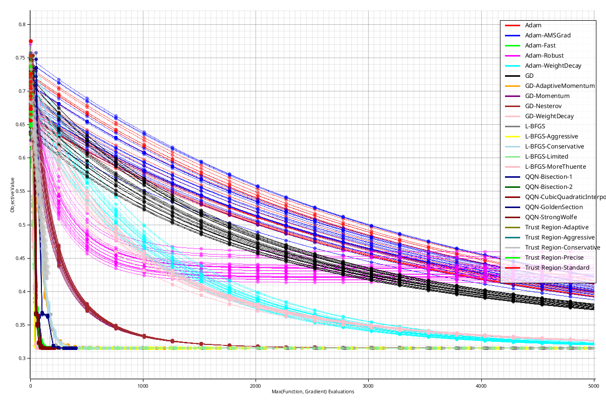
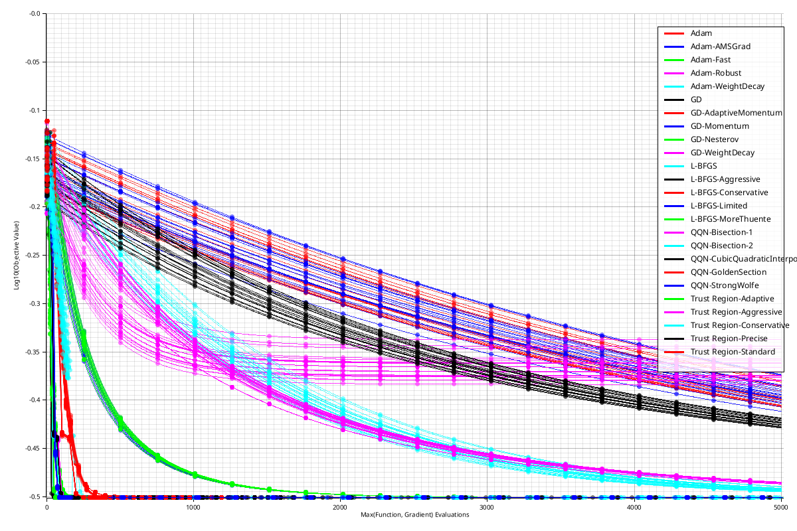

**Figure:** Convergence plots for LogisticRegression_100samples_5features_reg0.01 showing objective value vs iterations.
Left: Linear scale, Right: Log scale for better visualization of convergence behavior.

**Data:** [Linear scale data (CSV)](data/LogisticRegression_100samples_5features_reg0.01_data.csv) | [Log scale data (CSV)](data/LogisticRegression_100samples_5features_reg0.01_log_data.csv)

## Problem: LogisticRegression_200samples_10features_reg0.01

**Family:** LogisticRegression
**Dimension:** 10
**Success Threshold:** 3.230e-1
**Total Runs:** 500
**Detailed Analysis:** [View comprehensive problem analysis](reports/problem_analysis_LogisticRegression_200samples_10features_reg0.01.md)

### Performance Summary
<table style="border-collapse: collapse; width: 100%; margin: 20px 0;">
<tr style="background-color: #f2f2f2;">
<th style="border: 1px solid #ddd; padding: 8px; text-align: center;">Rank</th>
<th style="border: 1px solid #ddd; padding: 8px; text-align: center;">Optimizer</th>
<th style="border: 1px solid #ddd; padding: 8px; text-align: center;">Mean Final Value (All/Success/Fail)</th>
<th style="border: 1px solid #ddd; padding: 8px; text-align: center;">Std Dev</th>
<th style="border: 1px solid #ddd; padding: 8px; text-align: center;">Best Value</th>
<th style="border: 1px solid #ddd; padding: 8px; text-align: center;">Worst Value</th>
<th style="border: 1px solid #ddd; padding: 8px; text-align: center;">Mean Function Evals (All/Success/Fail)</th>
<th style="border: 1px solid #ddd; padding: 8px; text-align: center;">Mean Gradient Evals (All/Success/Fail)</th>
<th style="border: 1px solid #ddd; padding: 8px; text-align: center;">Success Rate</th>
<th style="border: 1px solid #ddd; padding: 8px; text-align: center;">Mean Time (s)</th>
</tr>
<tr style="background-color: #d4edda; font-weight: bold;">
<td style="border: 1px solid #ddd; padding: 8px; text-align: center;">1</td>
<td style="border: 1px solid #ddd; padding: 8px; text-align: center;"><a href="reports/detailed_LogisticRegression_200samples_10features_reg0.01_Trust_Region-Precise.md" title="Click for detailed analysis">Trust Region-Precise</a></td>
<td style="border: 1px solid #ddd; padding: 8px; text-align: center;">7.01e-1 / - / 7.01e-1</td>
<td style="border: 1px solid #ddd; padding: 8px; text-align: center;">2.67e-2</td>
<td style="border: 1px solid #ddd; padding: 8px; text-align: center;">6.59e-1</td>
<td style="border: 1px solid #ddd; padding: 8px; text-align: center;">7.56e-1</td>
<td style="border: 1px solid #ddd; padding: 8px; text-align: center;">5.0 / - / 5.0</td>
<td style="border: 1px solid #ddd; padding: 8px; text-align: center;">4.0 / - / 4.0</td>
<td style="border: 1px solid #ddd; padding: 8px; text-align: center;">0.0%</td>
<td style="border: 1px solid #ddd; padding: 8px; text-align: center;">0.003</td>
</tr>
<tr style="background-color: #fff3cd;">
<td style="border: 1px solid #ddd; padding: 8px; text-align: center;">2</td>
<td style="border: 1px solid #ddd; padding: 8px; text-align: center;"><a href="reports/detailed_LogisticRegression_200samples_10features_reg0.01_Trust_Region-Standard.md" title="Click for detailed analysis">Trust Region-Standard</a></td>
<td style="border: 1px solid #ddd; padding: 8px; text-align: center;">7.01e-1 / - / 7.01e-1</td>
<td style="border: 1px solid #ddd; padding: 8px; text-align: center;">2.90e-2</td>
<td style="border: 1px solid #ddd; padding: 8px; text-align: center;">6.45e-1</td>
<td style="border: 1px solid #ddd; padding: 8px; text-align: center;">7.53e-1</td>
<td style="border: 1px solid #ddd; padding: 8px; text-align: center;">5.0 / - / 5.0</td>
<td style="border: 1px solid #ddd; padding: 8px; text-align: center;">4.0 / - / 4.0</td>
<td style="border: 1px solid #ddd; padding: 8px; text-align: center;">0.0%</td>
<td style="border: 1px solid #ddd; padding: 8px; text-align: center;">0.003</td>
</tr>
<tr style="">
<td style="border: 1px solid #ddd; padding: 8px; text-align: center;">3</td>
<td style="border: 1px solid #ddd; padding: 8px; text-align: center;"><a href="reports/detailed_LogisticRegression_200samples_10features_reg0.01_Trust_Region-Aggressive.md" title="Click for detailed analysis">Trust Region-Aggressive</a></td>
<td style="border: 1px solid #ddd; padding: 8px; text-align: center;">7.03e-1 / - / 7.03e-1</td>
<td style="border: 1px solid #ddd; padding: 8px; text-align: center;">2.08e-2</td>
<td style="border: 1px solid #ddd; padding: 8px; text-align: center;">6.65e-1</td>
<td style="border: 1px solid #ddd; padding: 8px; text-align: center;">7.53e-1</td>
<td style="border: 1px solid #ddd; padding: 8px; text-align: center;">5.0 / - / 5.0</td>
<td style="border: 1px solid #ddd; padding: 8px; text-align: center;">4.0 / - / 4.0</td>
<td style="border: 1px solid #ddd; padding: 8px; text-align: center;">0.0%</td>
<td style="border: 1px solid #ddd; padding: 8px; text-align: center;">0.003</td>
</tr>
<tr style="">
<td style="border: 1px solid #ddd; padding: 8px; text-align: center;">4</td>
<td style="border: 1px solid #ddd; padding: 8px; text-align: center;"><a href="reports/detailed_LogisticRegression_200samples_10features_reg0.01_Trust_Region-Adaptive.md" title="Click for detailed analysis">Trust Region-Adaptive</a></td>
<td style="border: 1px solid #ddd; padding: 8px; text-align: center;">7.06e-1 / - / 7.06e-1</td>
<td style="border: 1px solid #ddd; padding: 8px; text-align: center;">2.50e-2</td>
<td style="border: 1px solid #ddd; padding: 8px; text-align: center;">6.56e-1</td>
<td style="border: 1px solid #ddd; padding: 8px; text-align: center;">7.48e-1</td>
<td style="border: 1px solid #ddd; padding: 8px; text-align: center;">5.0 / - / 5.0</td>
<td style="border: 1px solid #ddd; padding: 8px; text-align: center;">4.0 / - / 4.0</td>
<td style="border: 1px solid #ddd; padding: 8px; text-align: center;">0.0%</td>
<td style="border: 1px solid #ddd; padding: 8px; text-align: center;">0.003</td>
</tr>
<tr style="">
<td style="border: 1px solid #ddd; padding: 8px; text-align: center;">5</td>
<td style="border: 1px solid #ddd; padding: 8px; text-align: center;"><a href="reports/detailed_LogisticRegression_200samples_10features_reg0.01_Trust_Region-Conservative.md" title="Click for detailed analysis">Trust Region-Conservative</a></td>
<td style="border: 1px solid #ddd; padding: 8px; text-align: center;">4.44e-1 / - / 4.44e-1</td>
<td style="border: 1px solid #ddd; padding: 8px; text-align: center;">2.76e-3</td>
<td style="border: 1px solid #ddd; padding: 8px; text-align: center;">4.39e-1</td>
<td style="border: 1px solid #ddd; padding: 8px; text-align: center;">4.49e-1</td>
<td style="border: 1px solid #ddd; padding: 8px; text-align: center;">82.4 / - / 82.4</td>
<td style="border: 1px solid #ddd; padding: 8px; text-align: center;">55.6 / - / 55.6</td>
<td style="border: 1px solid #ddd; padding: 8px; text-align: center;">0.0%</td>
<td style="border: 1px solid #ddd; padding: 8px; text-align: center;">0.044</td>
</tr>
<tr style="">
<td style="border: 1px solid #ddd; padding: 8px; text-align: center;">6</td>
<td style="border: 1px solid #ddd; padding: 8px; text-align: center;"><a href="reports/detailed_LogisticRegression_200samples_10features_reg0.01_L-BFGS-MoreThuente.md" title="Click for detailed analysis">L-BFGS-MoreThuente</a></td>
<td style="border: 1px solid #ddd; padding: 8px; text-align: center;">3.23e-1 / - / 3.23e-1</td>
<td style="border: 1px solid #ddd; padding: 8px; text-align: center;">2.80e-4</td>
<td style="border: 1px solid #ddd; padding: 8px; text-align: center;">3.23e-1</td>
<td style="border: 1px solid #ddd; padding: 8px; text-align: center;">3.24e-1</td>
<td style="border: 1px solid #ddd; padding: 8px; text-align: center;">86.2 / - / 86.2</td>
<td style="border: 1px solid #ddd; padding: 8px; text-align: center;">62.2 / - / 62.2</td>
<td style="border: 1px solid #ddd; padding: 8px; text-align: center;">0.0%</td>
<td style="border: 1px solid #ddd; padding: 8px; text-align: center;">0.050</td>
</tr>
<tr style="">
<td style="border: 1px solid #ddd; padding: 8px; text-align: center;">7</td>
<td style="border: 1px solid #ddd; padding: 8px; text-align: center;"><a href="reports/detailed_LogisticRegression_200samples_10features_reg0.01_Adam-Fast.md" title="Click for detailed analysis">Adam-Fast</a></td>
<td style="border: 1px solid #ddd; padding: 8px; text-align: center;">3.24e-1 / - / 3.24e-1</td>
<td style="border: 1px solid #ddd; padding: 8px; text-align: center;">2.79e-4</td>
<td style="border: 1px solid #ddd; padding: 8px; text-align: center;">3.23e-1</td>
<td style="border: 1px solid #ddd; padding: 8px; text-align: center;">3.24e-1</td>
<td style="border: 1px solid #ddd; padding: 8px; text-align: center;">77.0 / - / 77.0</td>
<td style="border: 1px solid #ddd; padding: 8px; text-align: center;">76.0 / - / 76.0</td>
<td style="border: 1px solid #ddd; padding: 8px; text-align: center;">0.0%</td>
<td style="border: 1px solid #ddd; padding: 8px; text-align: center;">0.050</td>
</tr>
<tr style="">
<td style="border: 1px solid #ddd; padding: 8px; text-align: center;">8</td>
<td style="border: 1px solid #ddd; padding: 8px; text-align: center;"><a href="reports/detailed_LogisticRegression_200samples_10features_reg0.01_QQN-StrongWolfe.md" title="Click for detailed analysis">QQN-StrongWolfe</a></td>
<td style="border: 1px solid #ddd; padding: 8px; text-align: center;">3.23e-1 / - / 3.23e-1</td>
<td style="border: 1px solid #ddd; padding: 8px; text-align: center;">1.79e-12</td>
<td style="border: 1px solid #ddd; padding: 8px; text-align: center;">3.23e-1</td>
<td style="border: 1px solid #ddd; padding: 8px; text-align: center;">3.23e-1</td>
<td style="border: 1px solid #ddd; padding: 8px; text-align: center;">80.3 / - / 80.3</td>
<td style="border: 1px solid #ddd; padding: 8px; text-align: center;">89.2 / - / 89.2</td>
<td style="border: 1px solid #ddd; padding: 8px; text-align: center;">0.0%</td>
<td style="border: 1px solid #ddd; padding: 8px; text-align: center;">0.059</td>
</tr>
<tr style="">
<td style="border: 1px solid #ddd; padding: 8px; text-align: center;">9</td>
<td style="border: 1px solid #ddd; padding: 8px; text-align: center;"><a href="reports/detailed_LogisticRegression_200samples_10features_reg0.01_QQN-Bisection-2.md" title="Click for detailed analysis">QQN-Bisection-2</a></td>
<td style="border: 1px solid #ddd; padding: 8px; text-align: center;">3.23e-1 / - / 3.23e-1</td>
<td style="border: 1px solid #ddd; padding: 8px; text-align: center;">1.19e-12</td>
<td style="border: 1px solid #ddd; padding: 8px; text-align: center;">3.23e-1</td>
<td style="border: 1px solid #ddd; padding: 8px; text-align: center;">3.23e-1</td>
<td style="border: 1px solid #ddd; padding: 8px; text-align: center;">110.7 / - / 110.7</td>
<td style="border: 1px solid #ddd; padding: 8px; text-align: center;">84.3 / - / 84.3</td>
<td style="border: 1px solid #ddd; padding: 8px; text-align: center;">0.0%</td>
<td style="border: 1px solid #ddd; padding: 8px; text-align: center;">0.066</td>
</tr>
<tr style="">
<td style="border: 1px solid #ddd; padding: 8px; text-align: center;">10</td>
<td style="border: 1px solid #ddd; padding: 8px; text-align: center;"><a href="reports/detailed_LogisticRegression_200samples_10features_reg0.01_QQN-CubicQuadraticInterpolation.md" title="Click for detailed analysis">QQN-CubicQuadraticInterpolation</a></td>
<td style="border: 1px solid #ddd; padding: 8px; text-align: center;">3.23e-1 / - / 3.23e-1</td>
<td style="border: 1px solid #ddd; padding: 8px; text-align: center;">1.34e-12</td>
<td style="border: 1px solid #ddd; padding: 8px; text-align: center;">3.23e-1</td>
<td style="border: 1px solid #ddd; padding: 8px; text-align: center;">3.23e-1</td>
<td style="border: 1px solid #ddd; padding: 8px; text-align: center;">105.4 / - / 105.4</td>
<td style="border: 1px solid #ddd; padding: 8px; text-align: center;">103.4 / - / 103.4</td>
<td style="border: 1px solid #ddd; padding: 8px; text-align: center;">0.0%</td>
<td style="border: 1px solid #ddd; padding: 8px; text-align: center;">0.072</td>
</tr>
<tr style="">
<td style="border: 1px solid #ddd; padding: 8px; text-align: center;">11</td>
<td style="border: 1px solid #ddd; padding: 8px; text-align: center;"><a href="reports/detailed_LogisticRegression_200samples_10features_reg0.01_QQN-Bisection-1.md" title="Click for detailed analysis">QQN-Bisection-1</a></td>
<td style="border: 1px solid #ddd; padding: 8px; text-align: center;">3.23e-1 / - / 3.23e-1</td>
<td style="border: 1px solid #ddd; padding: 8px; text-align: center;">1.05e-12</td>
<td style="border: 1px solid #ddd; padding: 8px; text-align: center;">3.23e-1</td>
<td style="border: 1px solid #ddd; padding: 8px; text-align: center;">3.23e-1</td>
<td style="border: 1px solid #ddd; padding: 8px; text-align: center;">110.7 / - / 110.7</td>
<td style="border: 1px solid #ddd; padding: 8px; text-align: center;">103.5 / - / 103.5</td>
<td style="border: 1px solid #ddd; padding: 8px; text-align: center;">0.0%</td>
<td style="border: 1px solid #ddd; padding: 8px; text-align: center;">0.072</td>
</tr>
<tr style="">
<td style="border: 1px solid #ddd; padding: 8px; text-align: center;">12</td>
<td style="border: 1px solid #ddd; padding: 8px; text-align: center;"><a href="reports/detailed_LogisticRegression_200samples_10features_reg0.01_QQN-GoldenSection.md" title="Click for detailed analysis">QQN-GoldenSection</a></td>
<td style="border: 1px solid #ddd; padding: 8px; text-align: center;">3.23e-1 / - / 3.23e-1</td>
<td style="border: 1px solid #ddd; padding: 8px; text-align: center;">1.79e-12</td>
<td style="border: 1px solid #ddd; padding: 8px; text-align: center;">3.23e-1</td>
<td style="border: 1px solid #ddd; padding: 8px; text-align: center;">3.23e-1</td>
<td style="border: 1px solid #ddd; padding: 8px; text-align: center;">360.0 / - / 360.0</td>
<td style="border: 1px solid #ddd; padding: 8px; text-align: center;">77.1 / - / 77.1</td>
<td style="border: 1px solid #ddd; padding: 8px; text-align: center;">0.0%</td>
<td style="border: 1px solid #ddd; padding: 8px; text-align: center;">0.143</td>
</tr>
<tr style="">
<td style="border: 1px solid #ddd; padding: 8px; text-align: center;">13</td>
<td style="border: 1px solid #ddd; padding: 8px; text-align: center;"><a href="reports/detailed_LogisticRegression_200samples_10features_reg0.01_L-BFGS-Conservative.md" title="Click for detailed analysis">L-BFGS-Conservative</a></td>
<td style="border: 1px solid #ddd; padding: 8px; text-align: center;">3.23e-1 / - / 3.23e-1</td>
<td style="border: 1px solid #ddd; padding: 8px; text-align: center;">9.74e-11</td>
<td style="border: 1px solid #ddd; padding: 8px; text-align: center;">3.23e-1</td>
<td style="border: 1px solid #ddd; padding: 8px; text-align: center;">3.23e-1</td>
<td style="border: 1px solid #ddd; padding: 8px; text-align: center;">545.5 / - / 545.5</td>
<td style="border: 1px solid #ddd; padding: 8px; text-align: center;">436.0 / - / 436.0</td>
<td style="border: 1px solid #ddd; padding: 8px; text-align: center;">0.0%</td>
<td style="border: 1px solid #ddd; padding: 8px; text-align: center;">0.324</td>
</tr>
<tr style="">
<td style="border: 1px solid #ddd; padding: 8px; text-align: center;">14</td>
<td style="border: 1px solid #ddd; padding: 8px; text-align: center;"><a href="reports/detailed_LogisticRegression_200samples_10features_reg0.01_GD-AdaptiveMomentum.md" title="Click for detailed analysis">GD-AdaptiveMomentum</a></td>
<td style="border: 1px solid #ddd; padding: 8px; text-align: center;">3.23e-1 / - / 3.23e-1</td>
<td style="border: 1px solid #ddd; padding: 8px; text-align: center;">4.50e-9</td>
<td style="border: 1px solid #ddd; padding: 8px; text-align: center;">3.23e-1</td>
<td style="border: 1px solid #ddd; padding: 8px; text-align: center;">3.23e-1</td>
<td style="border: 1px solid #ddd; padding: 8px; text-align: center;">479.1 / - / 479.1</td>
<td style="border: 1px solid #ddd; padding: 8px; text-align: center;">956.3 / - / 956.3</td>
<td style="border: 1px solid #ddd; padding: 8px; text-align: center;">0.0%</td>
<td style="border: 1px solid #ddd; padding: 8px; text-align: center;">0.478</td>
</tr>
<tr style="">
<td style="border: 1px solid #ddd; padding: 8px; text-align: center;">15</td>
<td style="border: 1px solid #ddd; padding: 8px; text-align: center;"><a href="reports/detailed_LogisticRegression_200samples_10features_reg0.01_L-BFGS.md" title="Click for detailed analysis">L-BFGS</a></td>
<td style="border: 1px solid #ddd; padding: 8px; text-align: center;">3.23e-1 / - / 3.23e-1</td>
<td style="border: 1px solid #ddd; padding: 8px; text-align: center;">5.35e-6</td>
<td style="border: 1px solid #ddd; padding: 8px; text-align: center;">3.23e-1</td>
<td style="border: 1px solid #ddd; padding: 8px; text-align: center;">3.23e-1</td>
<td style="border: 1px solid #ddd; padding: 8px; text-align: center;">2311.4 / - / 2311.4</td>
<td style="border: 1px solid #ddd; padding: 8px; text-align: center;">1584.2 / - / 1584.2</td>
<td style="border: 1px solid #ddd; padding: 8px; text-align: center;">0.0%</td>
<td style="border: 1px solid #ddd; padding: 8px; text-align: center;">1.256</td>
</tr>
<tr style="">
<td style="border: 1px solid #ddd; padding: 8px; text-align: center;">16</td>
<td style="border: 1px solid #ddd; padding: 8px; text-align: center;"><a href="reports/detailed_LogisticRegression_200samples_10features_reg0.01_L-BFGS-Aggressive.md" title="Click for detailed analysis">L-BFGS-Aggressive</a></td>
<td style="border: 1px solid #ddd; padding: 8px; text-align: center;">3.25e-1 / - / 3.25e-1</td>
<td style="border: 1px solid #ddd; padding: 8px; text-align: center;">7.06e-4</td>
<td style="border: 1px solid #ddd; padding: 8px; text-align: center;">3.23e-1</td>
<td style="border: 1px solid #ddd; padding: 8px; text-align: center;">3.26e-1</td>
<td style="border: 1px solid #ddd; padding: 8px; text-align: center;">3432.2 / - / 3432.2</td>
<td style="border: 1px solid #ddd; padding: 8px; text-align: center;">1106.6 / - / 1106.6</td>
<td style="border: 1px solid #ddd; padding: 8px; text-align: center;">0.0%</td>
<td style="border: 1px solid #ddd; padding: 8px; text-align: center;">1.407</td>
</tr>
<tr style="">
<td style="border: 1px solid #ddd; padding: 8px; text-align: center;">17</td>
<td style="border: 1px solid #ddd; padding: 8px; text-align: center;"><a href="reports/detailed_LogisticRegression_200samples_10features_reg0.01_GD-WeightDecay.md" title="Click for detailed analysis">GD-WeightDecay</a></td>
<td style="border: 1px solid #ddd; padding: 8px; text-align: center;">3.39e-1 / - / 3.39e-1</td>
<td style="border: 1px solid #ddd; padding: 8px; text-align: center;">4.45e-4</td>
<td style="border: 1px solid #ddd; padding: 8px; text-align: center;">3.38e-1</td>
<td style="border: 1px solid #ddd; padding: 8px; text-align: center;">3.40e-1</td>
<td style="border: 1px solid #ddd; padding: 8px; text-align: center;">1668.0 / - / 1668.0</td>
<td style="border: 1px solid #ddd; padding: 8px; text-align: center;">3334.0 / - / 3334.0</td>
<td style="border: 1px solid #ddd; padding: 8px; text-align: center;">0.0%</td>
<td style="border: 1px solid #ddd; padding: 8px; text-align: center;">1.649</td>
</tr>
<tr style="">
<td style="border: 1px solid #ddd; padding: 8px; text-align: center;">18</td>
<td style="border: 1px solid #ddd; padding: 8px; text-align: center;"><a href="reports/detailed_LogisticRegression_200samples_10features_reg0.01_GD-Momentum.md" title="Click for detailed analysis">GD-Momentum</a></td>
<td style="border: 1px solid #ddd; padding: 8px; text-align: center;">3.23e-1 / - / 3.23e-1</td>
<td style="border: 1px solid #ddd; padding: 8px; text-align: center;">7.07e-7</td>
<td style="border: 1px solid #ddd; padding: 8px; text-align: center;">3.23e-1</td>
<td style="border: 1px solid #ddd; padding: 8px; text-align: center;">3.23e-1</td>
<td style="border: 1px solid #ddd; padding: 8px; text-align: center;">1668.0 / - / 1668.0</td>
<td style="border: 1px solid #ddd; padding: 8px; text-align: center;">3334.0 / - / 3334.0</td>
<td style="border: 1px solid #ddd; padding: 8px; text-align: center;">0.0%</td>
<td style="border: 1px solid #ddd; padding: 8px; text-align: center;">1.648</td>
</tr>
<tr style="">
<td style="border: 1px solid #ddd; padding: 8px; text-align: center;">19</td>
<td style="border: 1px solid #ddd; padding: 8px; text-align: center;"><a href="reports/detailed_LogisticRegression_200samples_10features_reg0.01_GD.md" title="Click for detailed analysis">GD</a></td>
<td style="border: 1px solid #ddd; padding: 8px; text-align: center;">3.97e-1 / - / 3.97e-1</td>
<td style="border: 1px solid #ddd; padding: 8px; text-align: center;">3.28e-3</td>
<td style="border: 1px solid #ddd; padding: 8px; text-align: center;">3.93e-1</td>
<td style="border: 1px solid #ddd; padding: 8px; text-align: center;">4.05e-1</td>
<td style="border: 1px solid #ddd; padding: 8px; text-align: center;">1668.0 / - / 1668.0</td>
<td style="border: 1px solid #ddd; padding: 8px; text-align: center;">3334.0 / - / 3334.0</td>
<td style="border: 1px solid #ddd; padding: 8px; text-align: center;">0.0%</td>
<td style="border: 1px solid #ddd; padding: 8px; text-align: center;">1.640</td>
</tr>
<tr style="">
<td style="border: 1px solid #ddd; padding: 8px; text-align: center;">20</td>
<td style="border: 1px solid #ddd; padding: 8px; text-align: center;"><a href="reports/detailed_LogisticRegression_200samples_10features_reg0.01_GD-Nesterov.md" title="Click for detailed analysis">GD-Nesterov</a></td>
<td style="border: 1px solid #ddd; padding: 8px; text-align: center;">3.23e-1 / - / 3.23e-1</td>
<td style="border: 1px solid #ddd; padding: 8px; text-align: center;">6.77e-7</td>
<td style="border: 1px solid #ddd; padding: 8px; text-align: center;">3.23e-1</td>
<td style="border: 1px solid #ddd; padding: 8px; text-align: center;">3.23e-1</td>
<td style="border: 1px solid #ddd; padding: 8px; text-align: center;">1668.0 / - / 1668.0</td>
<td style="border: 1px solid #ddd; padding: 8px; text-align: center;">3334.0 / - / 3334.0</td>
<td style="border: 1px solid #ddd; padding: 8px; text-align: center;">0.0%</td>
<td style="border: 1px solid #ddd; padding: 8px; text-align: center;">1.649</td>
</tr>
<tr style="">
<td style="border: 1px solid #ddd; padding: 8px; text-align: center;">21</td>
<td style="border: 1px solid #ddd; padding: 8px; text-align: center;"><a href="reports/detailed_LogisticRegression_200samples_10features_reg0.01_Adam.md" title="Click for detailed analysis">Adam</a></td>
<td style="border: 1px solid #ddd; padding: 8px; text-align: center;">3.92e-1 / - / 3.92e-1</td>
<td style="border: 1px solid #ddd; padding: 8px; text-align: center;">9.22e-3</td>
<td style="border: 1px solid #ddd; padding: 8px; text-align: center;">3.75e-1</td>
<td style="border: 1px solid #ddd; padding: 8px; text-align: center;">4.09e-1</td>
<td style="border: 1px solid #ddd; padding: 8px; text-align: center;">2502.0 / - / 2502.0</td>
<td style="border: 1px solid #ddd; padding: 8px; text-align: center;">2502.0 / - / 2502.0</td>
<td style="border: 1px solid #ddd; padding: 8px; text-align: center;">0.0%</td>
<td style="border: 1px solid #ddd; padding: 8px; text-align: center;">1.617</td>
</tr>
<tr style="">
<td style="border: 1px solid #ddd; padding: 8px; text-align: center;">22</td>
<td style="border: 1px solid #ddd; padding: 8px; text-align: center;"><a href="reports/detailed_LogisticRegression_200samples_10features_reg0.01_Adam-AMSGrad.md" title="Click for detailed analysis">Adam-AMSGrad</a></td>
<td style="border: 1px solid #ddd; padding: 8px; text-align: center;">3.95e-1 / - / 3.95e-1</td>
<td style="border: 1px solid #ddd; padding: 8px; text-align: center;">5.85e-3</td>
<td style="border: 1px solid #ddd; padding: 8px; text-align: center;">3.84e-1</td>
<td style="border: 1px solid #ddd; padding: 8px; text-align: center;">4.09e-1</td>
<td style="border: 1px solid #ddd; padding: 8px; text-align: center;">2502.0 / - / 2502.0</td>
<td style="border: 1px solid #ddd; padding: 8px; text-align: center;">2502.0 / - / 2502.0</td>
<td style="border: 1px solid #ddd; padding: 8px; text-align: center;">0.0%</td>
<td style="border: 1px solid #ddd; padding: 8px; text-align: center;">1.620</td>
</tr>
<tr style="">
<td style="border: 1px solid #ddd; padding: 8px; text-align: center;">23</td>
<td style="border: 1px solid #ddd; padding: 8px; text-align: center;"><a href="reports/detailed_LogisticRegression_200samples_10features_reg0.01_Adam-WeightDecay.md" title="Click for detailed analysis">Adam-WeightDecay</a></td>
<td style="border: 1px solid #ddd; padding: 8px; text-align: center;">3.27e-1 / - / 3.27e-1</td>
<td style="border: 1px solid #ddd; padding: 8px; text-align: center;">8.69e-4</td>
<td style="border: 1px solid #ddd; padding: 8px; text-align: center;">3.25e-1</td>
<td style="border: 1px solid #ddd; padding: 8px; text-align: center;">3.29e-1</td>
<td style="border: 1px solid #ddd; padding: 8px; text-align: center;">2502.0 / - / 2502.0</td>
<td style="border: 1px solid #ddd; padding: 8px; text-align: center;">2502.0 / - / 2502.0</td>
<td style="border: 1px solid #ddd; padding: 8px; text-align: center;">0.0%</td>
<td style="border: 1px solid #ddd; padding: 8px; text-align: center;">1.618</td>
</tr>
<tr style="">
<td style="border: 1px solid #ddd; padding: 8px; text-align: center;">24</td>
<td style="border: 1px solid #ddd; padding: 8px; text-align: center;"><a href="reports/detailed_LogisticRegression_200samples_10features_reg0.01_Adam-Robust.md" title="Click for detailed analysis">Adam-Robust</a></td>
<td style="border: 1px solid #ddd; padding: 8px; text-align: center;">4.12e-1 / - / 4.12e-1</td>
<td style="border: 1px solid #ddd; padding: 8px; text-align: center;">8.61e-3</td>
<td style="border: 1px solid #ddd; padding: 8px; text-align: center;">3.96e-1</td>
<td style="border: 1px solid #ddd; padding: 8px; text-align: center;">4.28e-1</td>
<td style="border: 1px solid #ddd; padding: 8px; text-align: center;">2502.0 / - / 2502.0</td>
<td style="border: 1px solid #ddd; padding: 8px; text-align: center;">2502.0 / - / 2502.0</td>
<td style="border: 1px solid #ddd; padding: 8px; text-align: center;">0.0%</td>
<td style="border: 1px solid #ddd; padding: 8px; text-align: center;">1.621</td>
</tr>
<tr style="">
<td style="border: 1px solid #ddd; padding: 8px; text-align: center;">25</td>
<td style="border: 1px solid #ddd; padding: 8px; text-align: center;"><a href="reports/detailed_LogisticRegression_200samples_10features_reg0.01_L-BFGS-Limited.md" title="Click for detailed analysis">L-BFGS-Limited</a></td>
<td style="border: 1px solid #ddd; padding: 8px; text-align: center;">3.23e-1 / - / 3.23e-1</td>
<td style="border: 1px solid #ddd; padding: 8px; text-align: center;">8.38e-5</td>
<td style="border: 1px solid #ddd; padding: 8px; text-align: center;">3.23e-1</td>
<td style="border: 1px solid #ddd; padding: 8px; text-align: center;">3.24e-1</td>
<td style="border: 1px solid #ddd; padding: 8px; text-align: center;">3146.0 / - / 3146.0</td>
<td style="border: 1px solid #ddd; padding: 8px; text-align: center;">1859.6 / - / 1859.6</td>
<td style="border: 1px solid #ddd; padding: 8px; text-align: center;">0.0%</td>
<td style="border: 1px solid #ddd; padding: 8px; text-align: center;">1.621</td>
</tr>
</table>

### Convergence Plots

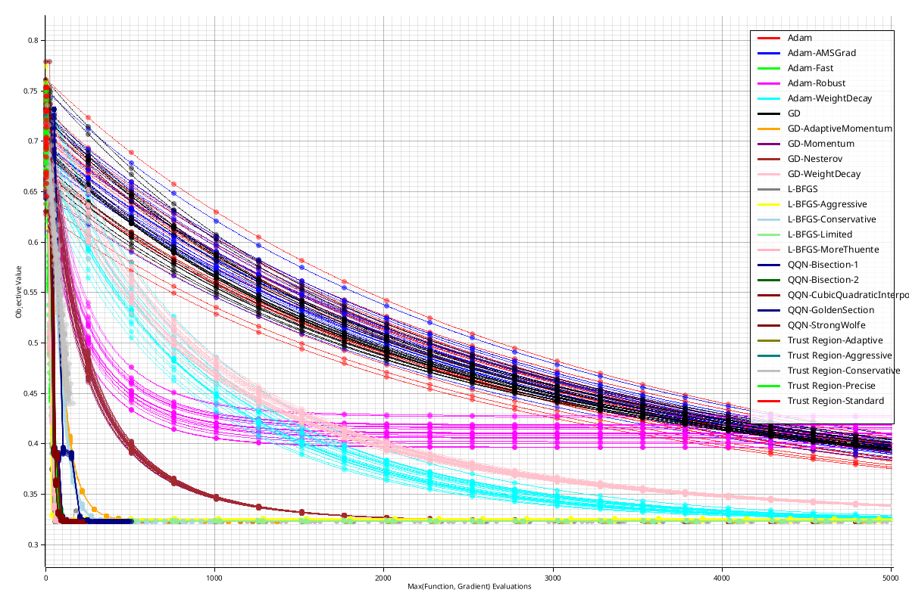
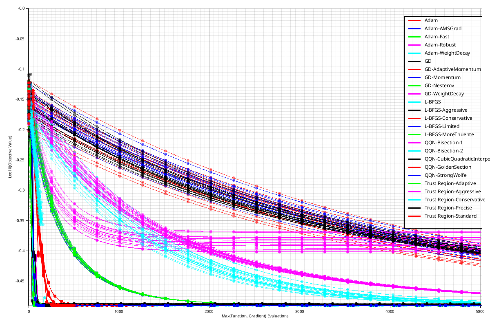

**Figure:** Convergence plots for LogisticRegression_200samples_10features_reg0.01 showing objective value vs iterations.
Left: Linear scale, Right: Log scale for better visualization of convergence behavior.

**Data:** [Linear scale data (CSV)](data/LogisticRegression_200samples_10features_reg0.01_data.csv) | [Log scale data (CSV)](data/LogisticRegression_200samples_10features_reg0.01_log_data.csv)

## Problem: LinearRegression_100samples_5features_reg0.01

**Family:** LinearRegression
**Dimension:** 5
**Success Threshold:** 7.150e-2
**Total Runs:** 500
**Detailed Analysis:** [View comprehensive problem analysis](reports/problem_analysis_LinearRegression_100samples_5features_reg0.01.md)

### Performance Summary
<table style="border-collapse: collapse; width: 100%; margin: 20px 0;">
<tr style="background-color: #f2f2f2;">
<th style="border: 1px solid #ddd; padding: 8px; text-align: center;">Rank</th>
<th style="border: 1px solid #ddd; padding: 8px; text-align: center;">Optimizer</th>
<th style="border: 1px solid #ddd; padding: 8px; text-align: center;">Mean Final Value (All/Success/Fail)</th>
<th style="border: 1px solid #ddd; padding: 8px; text-align: center;">Std Dev</th>
<th style="border: 1px solid #ddd; padding: 8px; text-align: center;">Best Value</th>
<th style="border: 1px solid #ddd; padding: 8px; text-align: center;">Worst Value</th>
<th style="border: 1px solid #ddd; padding: 8px; text-align: center;">Mean Function Evals (All/Success/Fail)</th>
<th style="border: 1px solid #ddd; padding: 8px; text-align: center;">Mean Gradient Evals (All/Success/Fail)</th>
<th style="border: 1px solid #ddd; padding: 8px; text-align: center;">Success Rate</th>
<th style="border: 1px solid #ddd; padding: 8px; text-align: center;">Mean Time (s)</th>
</tr>
<tr style="background-color: #d4edda; font-weight: bold;">
<td style="border: 1px solid #ddd; padding: 8px; text-align: center;">1</td>
<td style="border: 1px solid #ddd; padding: 8px; text-align: center;"><a href="reports/detailed_LinearRegression_100samples_5features_reg0.01_Trust_Region-Aggressive.md" title="Click for detailed analysis">Trust Region-Aggressive</a></td>
<td style="border: 1px solid #ddd; padding: 8px; text-align: center;">5.15e-1 / - / 3.62e4</td>
<td style="border: 1px solid #ddd; padding: 8px; text-align: center;">2.89e-1</td>
<td style="border: 1px solid #ddd; padding: 8px; text-align: center;">1.13e-1</td>
<td style="border: 1px solid #ddd; padding: 8px; text-align: center;">1.01e0</td>
<td style="border: 1px solid #ddd; padding: 8px; text-align: center;">34.0 / - / 34.0</td>
<td style="border: 1px solid #ddd; padding: 8px; text-align: center;">22.8 / - / 22.8</td>
<td style="border: 1px solid #ddd; padding: 8px; text-align: center;">0.0%</td>
<td style="border: 1px solid #ddd; padding: 8px; text-align: center;">0.009</td>
</tr>
<tr style="background-color: #fff3cd;">
<td style="border: 1px solid #ddd; padding: 8px; text-align: center;">2</td>
<td style="border: 1px solid #ddd; padding: 8px; text-align: center;"><a href="reports/detailed_LinearRegression_100samples_5features_reg0.01_GD-AdaptiveMomentum.md" title="Click for detailed analysis">GD-AdaptiveMomentum</a></td>
<td style="border: 1px solid #ddd; padding: 8px; text-align: center;">1.93e-1 / - / 2.00e0</td>
<td style="border: 1px solid #ddd; padding: 8px; text-align: center;">1.30e-2</td>
<td style="border: 1px solid #ddd; padding: 8px; text-align: center;">1.66e-1</td>
<td style="border: 1px solid #ddd; padding: 8px; text-align: center;">2.15e-1</td>
<td style="border: 1px solid #ddd; padding: 8px; text-align: center;">23.0 / - / 23.0</td>
<td style="border: 1px solid #ddd; padding: 8px; text-align: center;">42.0 / - / 42.0</td>
<td style="border: 1px solid #ddd; padding: 8px; text-align: center;">0.0%</td>
<td style="border: 1px solid #ddd; padding: 8px; text-align: center;">0.012</td>
</tr>
<tr style="">
<td style="border: 1px solid #ddd; padding: 8px; text-align: center;">3</td>
<td style="border: 1px solid #ddd; padding: 8px; text-align: center;"><a href="reports/detailed_LinearRegression_100samples_5features_reg0.01_GD-Nesterov.md" title="Click for detailed analysis">GD-Nesterov</a></td>
<td style="border: 1px solid #ddd; padding: 8px; text-align: center;">1.90e-1 / - / 9.19e-1</td>
<td style="border: 1px solid #ddd; padding: 8px; text-align: center;">8.87e-3</td>
<td style="border: 1px solid #ddd; padding: 8px; text-align: center;">1.67e-1</td>
<td style="border: 1px solid #ddd; padding: 8px; text-align: center;">2.05e-1</td>
<td style="border: 1px solid #ddd; padding: 8px; text-align: center;">23.9 / - / 23.9</td>
<td style="border: 1px solid #ddd; padding: 8px; text-align: center;">43.8 / - / 43.8</td>
<td style="border: 1px solid #ddd; padding: 8px; text-align: center;">0.0%</td>
<td style="border: 1px solid #ddd; padding: 8px; text-align: center;">0.012</td>
</tr>
<tr style="">
<td style="border: 1px solid #ddd; padding: 8px; text-align: center;">4</td>
<td style="border: 1px solid #ddd; padding: 8px; text-align: center;"><a href="reports/detailed_LinearRegression_100samples_5features_reg0.01_GD-Momentum.md" title="Click for detailed analysis">GD-Momentum</a></td>
<td style="border: 1px solid #ddd; padding: 8px; text-align: center;">2.20e-1 / - / 1.36e0</td>
<td style="border: 1px solid #ddd; padding: 8px; text-align: center;">1.44e-2</td>
<td style="border: 1px solid #ddd; padding: 8px; text-align: center;">1.95e-1</td>
<td style="border: 1px solid #ddd; padding: 8px; text-align: center;">2.48e-1</td>
<td style="border: 1px solid #ddd; padding: 8px; text-align: center;">24.1 / - / 24.1</td>
<td style="border: 1px solid #ddd; padding: 8px; text-align: center;">44.2 / - / 44.2</td>
<td style="border: 1px solid #ddd; padding: 8px; text-align: center;">0.0%</td>
<td style="border: 1px solid #ddd; padding: 8px; text-align: center;">0.012</td>
</tr>
<tr style="">
<td style="border: 1px solid #ddd; padding: 8px; text-align: center;">5</td>
<td style="border: 1px solid #ddd; padding: 8px; text-align: center;"><a href="reports/detailed_LinearRegression_100samples_5features_reg0.01_Trust_Region-Standard.md" title="Click for detailed analysis">Trust Region-Standard</a></td>
<td style="border: 1px solid #ddd; padding: 8px; text-align: center;">1.36e-1 / - / 1.10e2</td>
<td style="border: 1px solid #ddd; padding: 8px; text-align: center;">6.56e-2</td>
<td style="border: 1px solid #ddd; padding: 8px; text-align: center;">8.16e-2</td>
<td style="border: 1px solid #ddd; padding: 8px; text-align: center;">2.94e-1</td>
<td style="border: 1px solid #ddd; padding: 8px; text-align: center;">76.2 / - / 76.2</td>
<td style="border: 1px solid #ddd; padding: 8px; text-align: center;">50.9 / - / 50.9</td>
<td style="border: 1px solid #ddd; padding: 8px; text-align: center;">0.0%</td>
<td style="border: 1px solid #ddd; padding: 8px; text-align: center;">0.020</td>
</tr>
<tr style="">
<td style="border: 1px solid #ddd; padding: 8px; text-align: center;">6</td>
<td style="border: 1px solid #ddd; padding: 8px; text-align: center;"><a href="reports/detailed_LinearRegression_100samples_5features_reg0.01_Adam-Fast.md" title="Click for detailed analysis">Adam-Fast</a></td>
<td style="border: 1px solid #ddd; padding: 8px; text-align: center;">1.61e-1 / - / 1.90e-1</td>
<td style="border: 1px solid #ddd; padding: 8px; text-align: center;">5.78e-2</td>
<td style="border: 1px solid #ddd; padding: 8px; text-align: center;">7.20e-2</td>
<td style="border: 1px solid #ddd; padding: 8px; text-align: center;">2.34e-1</td>
<td style="border: 1px solid #ddd; padding: 8px; text-align: center;">102.4 / - / 102.4</td>
<td style="border: 1px solid #ddd; padding: 8px; text-align: center;">101.4 / - / 101.4</td>
<td style="border: 1px solid #ddd; padding: 8px; text-align: center;">0.0%</td>
<td style="border: 1px solid #ddd; padding: 8px; text-align: center;">0.035</td>
</tr>
<tr style="">
<td style="border: 1px solid #ddd; padding: 8px; text-align: center;">7</td>
<td style="border: 1px solid #ddd; padding: 8px; text-align: center;"><a href="reports/detailed_LinearRegression_100samples_5features_reg0.01_QQN-Bisection-2.md" title="Click for detailed analysis">QQN-Bisection-2</a></td>
<td style="border: 1px solid #ddd; padding: 8px; text-align: center;">7.15e-2 / - / 7.15e-2</td>
<td style="border: 1px solid #ddd; padding: 8px; text-align: center;">3.89e-14</td>
<td style="border: 1px solid #ddd; padding: 8px; text-align: center;">7.15e-2</td>
<td style="border: 1px solid #ddd; padding: 8px; text-align: center;">7.15e-2</td>
<td style="border: 1px solid #ddd; padding: 8px; text-align: center;">103.0 / - / 103.0</td>
<td style="border: 1px solid #ddd; padding: 8px; text-align: center;">117.0 / - / 117.0</td>
<td style="border: 1px solid #ddd; padding: 8px; text-align: center;">0.0%</td>
<td style="border: 1px solid #ddd; padding: 8px; text-align: center;">0.038</td>
</tr>
<tr style="">
<td style="border: 1px solid #ddd; padding: 8px; text-align: center;">8</td>
<td style="border: 1px solid #ddd; padding: 8px; text-align: center;"><a href="reports/detailed_LinearRegression_100samples_5features_reg0.01_L-BFGS-Aggressive.md" title="Click for detailed analysis">L-BFGS-Aggressive</a></td>
<td style="border: 1px solid #ddd; padding: 8px; text-align: center;">7.15e-2 / - / 7.15e-2</td>
<td style="border: 1px solid #ddd; padding: 8px; text-align: center;">3.23e-14</td>
<td style="border: 1px solid #ddd; padding: 8px; text-align: center;">7.15e-2</td>
<td style="border: 1px solid #ddd; padding: 8px; text-align: center;">7.15e-2</td>
<td style="border: 1px solid #ddd; padding: 8px; text-align: center;">153.1 / - / 153.1</td>
<td style="border: 1px solid #ddd; padding: 8px; text-align: center;">67.6 / - / 67.6</td>
<td style="border: 1px solid #ddd; padding: 8px; text-align: center;">0.0%</td>
<td style="border: 1px solid #ddd; padding: 8px; text-align: center;">0.036</td>
</tr>
<tr style="">
<td style="border: 1px solid #ddd; padding: 8px; text-align: center;">9</td>
<td style="border: 1px solid #ddd; padding: 8px; text-align: center;"><a href="reports/detailed_LinearRegression_100samples_5features_reg0.01_QQN-StrongWolfe.md" title="Click for detailed analysis">QQN-StrongWolfe</a></td>
<td style="border: 1px solid #ddd; padding: 8px; text-align: center;">7.15e-2 / - / 7.15e-2</td>
<td style="border: 1px solid #ddd; padding: 8px; text-align: center;">8.70e-14</td>
<td style="border: 1px solid #ddd; padding: 8px; text-align: center;">7.15e-2</td>
<td style="border: 1px solid #ddd; padding: 8px; text-align: center;">7.15e-2</td>
<td style="border: 1px solid #ddd; padding: 8px; text-align: center;">109.2 / - / 109.2</td>
<td style="border: 1px solid #ddd; padding: 8px; text-align: center;">116.7 / - / 116.7</td>
<td style="border: 1px solid #ddd; padding: 8px; text-align: center;">0.0%</td>
<td style="border: 1px solid #ddd; padding: 8px; text-align: center;">0.041</td>
</tr>
<tr style="">
<td style="border: 1px solid #ddd; padding: 8px; text-align: center;">10</td>
<td style="border: 1px solid #ddd; padding: 8px; text-align: center;"><a href="reports/detailed_LinearRegression_100samples_5features_reg0.01_QQN-CubicQuadraticInterpolation.md" title="Click for detailed analysis">QQN-CubicQuadraticInterpolation</a></td>
<td style="border: 1px solid #ddd; padding: 8px; text-align: center;">7.15e-2 / - / 7.15e-2</td>
<td style="border: 1px solid #ddd; padding: 8px; text-align: center;">1.77e-9</td>
<td style="border: 1px solid #ddd; padding: 8px; text-align: center;">7.15e-2</td>
<td style="border: 1px solid #ddd; padding: 8px; text-align: center;">7.15e-2</td>
<td style="border: 1px solid #ddd; padding: 8px; text-align: center;">118.9 / - / 118.9</td>
<td style="border: 1px solid #ddd; padding: 8px; text-align: center;">110.4 / - / 110.4</td>
<td style="border: 1px solid #ddd; padding: 8px; text-align: center;">0.0%</td>
<td style="border: 1px solid #ddd; padding: 8px; text-align: center;">0.041</td>
</tr>
<tr style="">
<td style="border: 1px solid #ddd; padding: 8px; text-align: center;">11</td>
<td style="border: 1px solid #ddd; padding: 8px; text-align: center;"><a href="reports/detailed_LinearRegression_100samples_5features_reg0.01_QQN-Bisection-1.md" title="Click for detailed analysis">QQN-Bisection-1</a></td>
<td style="border: 1px solid #ddd; padding: 8px; text-align: center;">7.15e-2 / - / 7.15e-2</td>
<td style="border: 1px solid #ddd; padding: 8px; text-align: center;">9.50e-15</td>
<td style="border: 1px solid #ddd; padding: 8px; text-align: center;">7.15e-2</td>
<td style="border: 1px solid #ddd; padding: 8px; text-align: center;">7.15e-2</td>
<td style="border: 1px solid #ddd; padding: 8px; text-align: center;">123.0 / - / 123.0</td>
<td style="border: 1px solid #ddd; padding: 8px; text-align: center;">153.0 / - / 153.0</td>
<td style="border: 1px solid #ddd; padding: 8px; text-align: center;">0.0%</td>
<td style="border: 1px solid #ddd; padding: 8px; text-align: center;">0.048</td>
</tr>
<tr style="">
<td style="border: 1px solid #ddd; padding: 8px; text-align: center;">12</td>
<td style="border: 1px solid #ddd; padding: 8px; text-align: center;"><a href="reports/detailed_LinearRegression_100samples_5features_reg0.01_L-BFGS.md" title="Click for detailed analysis">L-BFGS</a></td>
<td style="border: 1px solid #ddd; padding: 8px; text-align: center;">7.16e-2 / - / 1.38e-1</td>
<td style="border: 1px solid #ddd; padding: 8px; text-align: center;">1.11e-4</td>
<td style="border: 1px solid #ddd; padding: 8px; text-align: center;">7.15e-2</td>
<td style="border: 1px solid #ddd; padding: 8px; text-align: center;">7.19e-2</td>
<td style="border: 1px solid #ddd; padding: 8px; text-align: center;">234.7 / - / 234.7</td>
<td style="border: 1px solid #ddd; padding: 8px; text-align: center;">133.2 / - / 133.2</td>
<td style="border: 1px solid #ddd; padding: 8px; text-align: center;">0.0%</td>
<td style="border: 1px solid #ddd; padding: 8px; text-align: center;">0.060</td>
</tr>
<tr style="">
<td style="border: 1px solid #ddd; padding: 8px; text-align: center;">13</td>
<td style="border: 1px solid #ddd; padding: 8px; text-align: center;"><a href="reports/detailed_LinearRegression_100samples_5features_reg0.01_QQN-GoldenSection.md" title="Click for detailed analysis">QQN-GoldenSection</a></td>
<td style="border: 1px solid #ddd; padding: 8px; text-align: center;">7.15e-2 / - / 7.15e-2</td>
<td style="border: 1px solid #ddd; padding: 8px; text-align: center;">1.34e-9</td>
<td style="border: 1px solid #ddd; padding: 8px; text-align: center;">7.15e-2</td>
<td style="border: 1px solid #ddd; padding: 8px; text-align: center;">7.15e-2</td>
<td style="border: 1px solid #ddd; padding: 8px; text-align: center;">325.7 / - / 325.7</td>
<td style="border: 1px solid #ddd; padding: 8px; text-align: center;">60.3 / - / 60.3</td>
<td style="border: 1px solid #ddd; padding: 8px; text-align: center;">0.0%</td>
<td style="border: 1px solid #ddd; padding: 8px; text-align: center;">0.063</td>
</tr>
<tr style="">
<td style="border: 1px solid #ddd; padding: 8px; text-align: center;">14</td>
<td style="border: 1px solid #ddd; padding: 8px; text-align: center;"><a href="reports/detailed_LinearRegression_100samples_5features_reg0.01_Trust_Region-Adaptive.md" title="Click for detailed analysis">Trust Region-Adaptive</a></td>
<td style="border: 1px solid #ddd; padding: 8px; text-align: center;">8.84e-2 / - / 1.55e3</td>
<td style="border: 1px solid #ddd; padding: 8px; text-align: center;">1.64e-2</td>
<td style="border: 1px solid #ddd; padding: 8px; text-align: center;">7.37e-2</td>
<td style="border: 1px solid #ddd; padding: 8px; text-align: center;">1.22e-1</td>
<td style="border: 1px solid #ddd; padding: 8px; text-align: center;">234.8 / - / 234.8</td>
<td style="border: 1px solid #ddd; padding: 8px; text-align: center;">156.6 / - / 156.6</td>
<td style="border: 1px solid #ddd; padding: 8px; text-align: center;">0.0%</td>
<td style="border: 1px solid #ddd; padding: 8px; text-align: center;">0.062</td>
</tr>
<tr style="">
<td style="border: 1px solid #ddd; padding: 8px; text-align: center;">15</td>
<td style="border: 1px solid #ddd; padding: 8px; text-align: center;"><a href="reports/detailed_LinearRegression_100samples_5features_reg0.01_GD-WeightDecay.md" title="Click for detailed analysis">GD-WeightDecay</a></td>
<td style="border: 1px solid #ddd; padding: 8px; text-align: center;">7.15e-2 / - / 7.15e-2</td>
<td style="border: 1px solid #ddd; padding: 8px; text-align: center;">2.05e-10</td>
<td style="border: 1px solid #ddd; padding: 8px; text-align: center;">7.15e-2</td>
<td style="border: 1px solid #ddd; padding: 8px; text-align: center;">7.15e-2</td>
<td style="border: 1px solid #ddd; padding: 8px; text-align: center;">165.2 / - / 165.2</td>
<td style="border: 1px solid #ddd; padding: 8px; text-align: center;">328.3 / - / 328.3</td>
<td style="border: 1px solid #ddd; padding: 8px; text-align: center;">0.0%</td>
<td style="border: 1px solid #ddd; padding: 8px; text-align: center;">0.088</td>
</tr>
<tr style="">
<td style="border: 1px solid #ddd; padding: 8px; text-align: center;">16</td>
<td style="border: 1px solid #ddd; padding: 8px; text-align: center;"><a href="reports/detailed_LinearRegression_100samples_5features_reg0.01_L-BFGS-Limited.md" title="Click for detailed analysis">L-BFGS-Limited</a></td>
<td style="border: 1px solid #ddd; padding: 8px; text-align: center;">7.15e-2 / - / 7.15e-2</td>
<td style="border: 1px solid #ddd; padding: 8px; text-align: center;">2.24e-10</td>
<td style="border: 1px solid #ddd; padding: 8px; text-align: center;">7.15e-2</td>
<td style="border: 1px solid #ddd; padding: 8px; text-align: center;">7.15e-2</td>
<td style="border: 1px solid #ddd; padding: 8px; text-align: center;">540.6 / - / 540.6</td>
<td style="border: 1px solid #ddd; padding: 8px; text-align: center;">312.5 / - / 312.5</td>
<td style="border: 1px solid #ddd; padding: 8px; text-align: center;">0.0%</td>
<td style="border: 1px solid #ddd; padding: 8px; text-align: center;">0.149</td>
</tr>
<tr style="">
<td style="border: 1px solid #ddd; padding: 8px; text-align: center;">17</td>
<td style="border: 1px solid #ddd; padding: 8px; text-align: center;"><a href="reports/detailed_LinearRegression_100samples_5features_reg0.01_L-BFGS-MoreThuente.md" title="Click for detailed analysis">L-BFGS-MoreThuente</a></td>
<td style="border: 1px solid #ddd; padding: 8px; text-align: center;">7.16e-2 / - / 7.16e-2</td>
<td style="border: 1px solid #ddd; padding: 8px; text-align: center;">5.33e-5</td>
<td style="border: 1px solid #ddd; padding: 8px; text-align: center;">7.15e-2</td>
<td style="border: 1px solid #ddd; padding: 8px; text-align: center;">7.18e-2</td>
<td style="border: 1px solid #ddd; padding: 8px; text-align: center;">796.0 / - / 796.0</td>
<td style="border: 1px solid #ddd; padding: 8px; text-align: center;">562.6 / - / 562.6</td>
<td style="border: 1px solid #ddd; padding: 8px; text-align: center;">0.0%</td>
<td style="border: 1px solid #ddd; padding: 8px; text-align: center;">0.229</td>
</tr>
<tr style="">
<td style="border: 1px solid #ddd; padding: 8px; text-align: center;">18</td>
<td style="border: 1px solid #ddd; padding: 8px; text-align: center;"><a href="reports/detailed_LinearRegression_100samples_5features_reg0.01_Trust_Region-Precise.md" title="Click for detailed analysis">Trust Region-Precise</a></td>
<td style="border: 1px solid #ddd; padding: 8px; text-align: center;">7.70e-2 / - / 1.38e-1</td>
<td style="border: 1px solid #ddd; padding: 8px; text-align: center;">4.69e-3</td>
<td style="border: 1px solid #ddd; padding: 8px; text-align: center;">7.18e-2</td>
<td style="border: 1px solid #ddd; padding: 8px; text-align: center;">8.71e-2</td>
<td style="border: 1px solid #ddd; padding: 8px; text-align: center;">851.2 / - / 851.2</td>
<td style="border: 1px solid #ddd; padding: 8px; text-align: center;">567.9 / - / 567.9</td>
<td style="border: 1px solid #ddd; padding: 8px; text-align: center;">0.0%</td>
<td style="border: 1px solid #ddd; padding: 8px; text-align: center;">0.221</td>
</tr>
<tr style="">
<td style="border: 1px solid #ddd; padding: 8px; text-align: center;">19</td>
<td style="border: 1px solid #ddd; padding: 8px; text-align: center;"><a href="reports/detailed_LinearRegression_100samples_5features_reg0.01_GD.md" title="Click for detailed analysis">GD</a></td>
<td style="border: 1px solid #ddd; padding: 8px; text-align: center;">7.15e-2 / - / 7.15e-2</td>
<td style="border: 1px solid #ddd; padding: 8px; text-align: center;">5.94e-11</td>
<td style="border: 1px solid #ddd; padding: 8px; text-align: center;">7.15e-2</td>
<td style="border: 1px solid #ddd; padding: 8px; text-align: center;">7.15e-2</td>
<td style="border: 1px solid #ddd; padding: 8px; text-align: center;">512.3 / - / 512.3</td>
<td style="border: 1px solid #ddd; padding: 8px; text-align: center;">1022.6 / - / 1022.6</td>
<td style="border: 1px solid #ddd; padding: 8px; text-align: center;">0.0%</td>
<td style="border: 1px solid #ddd; padding: 8px; text-align: center;">0.268</td>
</tr>
<tr style="">
<td style="border: 1px solid #ddd; padding: 8px; text-align: center;">20</td>
<td style="border: 1px solid #ddd; padding: 8px; text-align: center;"><a href="reports/detailed_LinearRegression_100samples_5features_reg0.01_L-BFGS-Conservative.md" title="Click for detailed analysis">L-BFGS-Conservative</a></td>
<td style="border: 1px solid #ddd; padding: 8px; text-align: center;">7.15e-2 / - / 7.15e-2</td>
<td style="border: 1px solid #ddd; padding: 8px; text-align: center;">3.26e-10</td>
<td style="border: 1px solid #ddd; padding: 8px; text-align: center;">7.15e-2</td>
<td style="border: 1px solid #ddd; padding: 8px; text-align: center;">7.15e-2</td>
<td style="border: 1px solid #ddd; padding: 8px; text-align: center;">1306.5 / - / 1306.5</td>
<td style="border: 1px solid #ddd; padding: 8px; text-align: center;">1044.8 / - / 1044.8</td>
<td style="border: 1px solid #ddd; padding: 8px; text-align: center;">0.0%</td>
<td style="border: 1px solid #ddd; padding: 8px; text-align: center;">0.406</td>
</tr>
<tr style="">
<td style="border: 1px solid #ddd; padding: 8px; text-align: center;">21</td>
<td style="border: 1px solid #ddd; padding: 8px; text-align: center;"><a href="reports/detailed_LinearRegression_100samples_5features_reg0.01_Adam-AMSGrad.md" title="Click for detailed analysis">Adam-AMSGrad</a></td>
<td style="border: 1px solid #ddd; padding: 8px; text-align: center;">3.06e0 / - / 3.06e0</td>
<td style="border: 1px solid #ddd; padding: 8px; text-align: center;">3.82e-1</td>
<td style="border: 1px solid #ddd; padding: 8px; text-align: center;">2.47e0</td>
<td style="border: 1px solid #ddd; padding: 8px; text-align: center;">3.69e0</td>
<td style="border: 1px solid #ddd; padding: 8px; text-align: center;">2502.0 / - / 2502.0</td>
<td style="border: 1px solid #ddd; padding: 8px; text-align: center;">2502.0 / - / 2502.0</td>
<td style="border: 1px solid #ddd; padding: 8px; text-align: center;">0.0%</td>
<td style="border: 1px solid #ddd; padding: 8px; text-align: center;">0.839</td>
</tr>
<tr style="">
<td style="border: 1px solid #ddd; padding: 8px; text-align: center;">22</td>
<td style="border: 1px solid #ddd; padding: 8px; text-align: center;"><a href="reports/detailed_LinearRegression_100samples_5features_reg0.01_Adam-Robust.md" title="Click for detailed analysis">Adam-Robust</a></td>
<td style="border: 1px solid #ddd; padding: 8px; text-align: center;">4.89e0 / - / 4.89e0</td>
<td style="border: 1px solid #ddd; padding: 8px; text-align: center;">5.55e-1</td>
<td style="border: 1px solid #ddd; padding: 8px; text-align: center;">4.01e0</td>
<td style="border: 1px solid #ddd; padding: 8px; text-align: center;">6.12e0</td>
<td style="border: 1px solid #ddd; padding: 8px; text-align: center;">2502.0 / - / 2502.0</td>
<td style="border: 1px solid #ddd; padding: 8px; text-align: center;">2502.0 / - / 2502.0</td>
<td style="border: 1px solid #ddd; padding: 8px; text-align: center;">0.0%</td>
<td style="border: 1px solid #ddd; padding: 8px; text-align: center;">0.836</td>
</tr>
<tr style="">
<td style="border: 1px solid #ddd; padding: 8px; text-align: center;">23</td>
<td style="border: 1px solid #ddd; padding: 8px; text-align: center;"><a href="reports/detailed_LinearRegression_100samples_5features_reg0.01_Adam.md" title="Click for detailed analysis">Adam</a></td>
<td style="border: 1px solid #ddd; padding: 8px; text-align: center;">2.88e0 / - / 2.88e0</td>
<td style="border: 1px solid #ddd; padding: 8px; text-align: center;">4.16e-1</td>
<td style="border: 1px solid #ddd; padding: 8px; text-align: center;">2.36e0</td>
<td style="border: 1px solid #ddd; padding: 8px; text-align: center;">3.78e0</td>
<td style="border: 1px solid #ddd; padding: 8px; text-align: center;">2502.0 / - / 2502.0</td>
<td style="border: 1px solid #ddd; padding: 8px; text-align: center;">2502.0 / - / 2502.0</td>
<td style="border: 1px solid #ddd; padding: 8px; text-align: center;">0.0%</td>
<td style="border: 1px solid #ddd; padding: 8px; text-align: center;">0.833</td>
</tr>
<tr style="">
<td style="border: 1px solid #ddd; padding: 8px; text-align: center;">24</td>
<td style="border: 1px solid #ddd; padding: 8px; text-align: center;"><a href="reports/detailed_LinearRegression_100samples_5features_reg0.01_Adam-WeightDecay.md" title="Click for detailed analysis">Adam-WeightDecay</a></td>
<td style="border: 1px solid #ddd; padding: 8px; text-align: center;">7.18e-2 / - / 7.18e-2</td>
<td style="border: 1px solid #ddd; padding: 8px; text-align: center;">1.52e-4</td>
<td style="border: 1px solid #ddd; padding: 8px; text-align: center;">7.16e-2</td>
<td style="border: 1px solid #ddd; padding: 8px; text-align: center;">7.21e-2</td>
<td style="border: 1px solid #ddd; padding: 8px; text-align: center;">2502.0 / - / 2502.0</td>
<td style="border: 1px solid #ddd; padding: 8px; text-align: center;">2502.0 / - / 2502.0</td>
<td style="border: 1px solid #ddd; padding: 8px; text-align: center;">0.0%</td>
<td style="border: 1px solid #ddd; padding: 8px; text-align: center;">0.830</td>
</tr>
<tr style="">
<td style="border: 1px solid #ddd; padding: 8px; text-align: center;">25</td>
<td style="border: 1px solid #ddd; padding: 8px; text-align: center;"><a href="reports/detailed_LinearRegression_100samples_5features_reg0.01_Trust_Region-Conservative.md" title="Click for detailed analysis">Trust Region-Conservative</a></td>
<td style="border: 1px solid #ddd; padding: 8px; text-align: center;">7.87e0 / - / 7.87e0</td>
<td style="border: 1px solid #ddd; padding: 8px; text-align: center;">9.98e-1</td>
<td style="border: 1px solid #ddd; padding: 8px; text-align: center;">6.26e0</td>
<td style="border: 1px solid #ddd; padding: 8px; text-align: center;">9.77e0</td>
<td style="border: 1px solid #ddd; padding: 8px; text-align: center;">3002.0 / - / 3002.0</td>
<td style="border: 1px solid #ddd; padding: 8px; text-align: center;">2002.0 / - / 2002.0</td>
<td style="border: 1px solid #ddd; padding: 8px; text-align: center;">0.0%</td>
<td style="border: 1px solid #ddd; padding: 8px; text-align: center;">0.769</td>
</tr>
</table>

### Convergence Plots

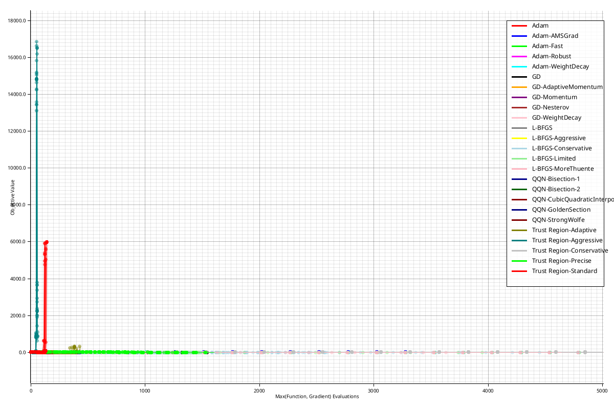
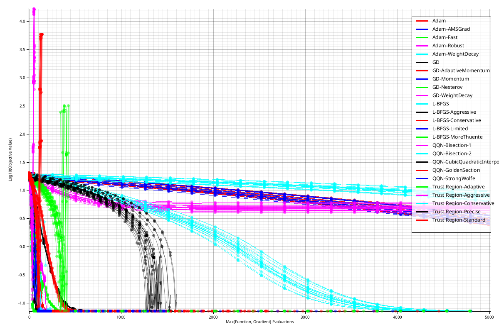

**Figure:** Convergence plots for LinearRegression_100samples_5features_reg0.01 showing objective value vs iterations.
Left: Linear scale, Right: Log scale for better visualization of convergence behavior.

**Data:** [Linear scale data (CSV)](data/LinearRegression_100samples_5features_reg0.01_data.csv) | [Log scale data (CSV)](data/LinearRegression_100samples_5features_reg0.01_log_data.csv)

## Problem: LinearRegression_200samples_10features_reg0.01

**Family:** LinearRegression
**Dimension:** 10
**Success Threshold:** 4.820e-1
**Total Runs:** 500
**Detailed Analysis:** [View comprehensive problem analysis](reports/problem_analysis_LinearRegression_200samples_10features_reg0.01.md)

### Performance Summary
<table style="border-collapse: collapse; width: 100%; margin: 20px 0;">
<tr style="background-color: #f2f2f2;">
<th style="border: 1px solid #ddd; padding: 8px; text-align: center;">Rank</th>
<th style="border: 1px solid #ddd; padding: 8px; text-align: center;">Optimizer</th>
<th style="border: 1px solid #ddd; padding: 8px; text-align: center;">Mean Final Value (All/Success/Fail)</th>
<th style="border: 1px solid #ddd; padding: 8px; text-align: center;">Std Dev</th>
<th style="border: 1px solid #ddd; padding: 8px; text-align: center;">Best Value</th>
<th style="border: 1px solid #ddd; padding: 8px; text-align: center;">Worst Value</th>
<th style="border: 1px solid #ddd; padding: 8px; text-align: center;">Mean Function Evals (All/Success/Fail)</th>
<th style="border: 1px solid #ddd; padding: 8px; text-align: center;">Mean Gradient Evals (All/Success/Fail)</th>
<th style="border: 1px solid #ddd; padding: 8px; text-align: center;">Success Rate</th>
<th style="border: 1px solid #ddd; padding: 8px; text-align: center;">Mean Time (s)</th>
</tr>
<tr style="background-color: #d4edda; font-weight: bold;">
<td style="border: 1px solid #ddd; padding: 8px; text-align: center;">1</td>
<td style="border: 1px solid #ddd; padding: 8px; text-align: center;"><a href="reports/detailed_LinearRegression_200samples_10features_reg0.01_QQN-CubicQuadraticInterpolation.md" title="Click for detailed analysis">QQN-CubicQuadraticInterpolation</a></td>
<td style="border: 1px solid #ddd; padding: 8px; text-align: center;">4.82e-1 / 4.82e-1 / -</td>
<td style="border: 1px solid #ddd; padding: 8px; text-align: center;">2.65e-5</td>
<td style="border: 1px solid #ddd; padding: 8px; text-align: center;">4.82e-1</td>
<td style="border: 1px solid #ddd; padding: 8px; text-align: center;">4.82e-1</td>
<td style="border: 1px solid #ddd; padding: 8px; text-align: center;">54.1 / 54.1 / -</td>
<td style="border: 1px solid #ddd; padding: 8px; text-align: center;">55.7 / 55.7 / -</td>
<td style="border: 1px solid #ddd; padding: 8px; text-align: center;">100.0%</td>
<td style="border: 1px solid #ddd; padding: 8px; text-align: center;">0.035</td>
</tr>
<tr style="background-color: #fff3cd;">
<td style="border: 1px solid #ddd; padding: 8px; text-align: center;">2</td>
<td style="border: 1px solid #ddd; padding: 8px; text-align: center;"><a href="reports/detailed_LinearRegression_200samples_10features_reg0.01_QQN-StrongWolfe.md" title="Click for detailed analysis">QQN-StrongWolfe</a></td>
<td style="border: 1px solid #ddd; padding: 8px; text-align: center;">4.82e-1 / 4.82e-1 / -</td>
<td style="border: 1px solid #ddd; padding: 8px; text-align: center;">1.42e-5</td>
<td style="border: 1px solid #ddd; padding: 8px; text-align: center;">4.82e-1</td>
<td style="border: 1px solid #ddd; padding: 8px; text-align: center;">4.82e-1</td>
<td style="border: 1px solid #ddd; padding: 8px; text-align: center;">62.0 / 62.0 / -</td>
<td style="border: 1px solid #ddd; padding: 8px; text-align: center;">62.0 / 62.0 / -</td>
<td style="border: 1px solid #ddd; padding: 8px; text-align: center;">100.0%</td>
<td style="border: 1px solid #ddd; padding: 8px; text-align: center;">0.039</td>
</tr>
<tr style="">
<td style="border: 1px solid #ddd; padding: 8px; text-align: center;">3</td>
<td style="border: 1px solid #ddd; padding: 8px; text-align: center;"><a href="reports/detailed_LinearRegression_200samples_10features_reg0.01_L-BFGS-MoreThuente.md" title="Click for detailed analysis">L-BFGS-MoreThuente</a></td>
<td style="border: 1px solid #ddd; padding: 8px; text-align: center;">4.82e-1 / 4.82e-1 / -</td>
<td style="border: 1px solid #ddd; padding: 8px; text-align: center;">8.59e-5</td>
<td style="border: 1px solid #ddd; padding: 8px; text-align: center;">4.82e-1</td>
<td style="border: 1px solid #ddd; padding: 8px; text-align: center;">4.82e-1</td>
<td style="border: 1px solid #ddd; padding: 8px; text-align: center;">72.8 / 72.8 / -</td>
<td style="border: 1px solid #ddd; padding: 8px; text-align: center;">52.0 / 52.0 / -</td>
<td style="border: 1px solid #ddd; padding: 8px; text-align: center;">100.0%</td>
<td style="border: 1px solid #ddd; padding: 8px; text-align: center;">0.038</td>
</tr>
<tr style="">
<td style="border: 1px solid #ddd; padding: 8px; text-align: center;">4</td>
<td style="border: 1px solid #ddd; padding: 8px; text-align: center;"><a href="reports/detailed_LinearRegression_200samples_10features_reg0.01_QQN-Bisection-2.md" title="Click for detailed analysis">QQN-Bisection-2</a></td>
<td style="border: 1px solid #ddd; padding: 8px; text-align: center;">4.82e-1 / 4.82e-1 / -</td>
<td style="border: 1px solid #ddd; padding: 8px; text-align: center;">1.86e-6</td>
<td style="border: 1px solid #ddd; padding: 8px; text-align: center;">4.82e-1</td>
<td style="border: 1px solid #ddd; padding: 8px; text-align: center;">4.82e-1</td>
<td style="border: 1px solid #ddd; padding: 8px; text-align: center;">69.0 / 69.0 / -</td>
<td style="border: 1px solid #ddd; padding: 8px; text-align: center;">89.0 / 89.0 / -</td>
<td style="border: 1px solid #ddd; padding: 8px; text-align: center;">100.0%</td>
<td style="border: 1px solid #ddd; padding: 8px; text-align: center;">0.050</td>
</tr>
<tr style="">
<td style="border: 1px solid #ddd; padding: 8px; text-align: center;">5</td>
<td style="border: 1px solid #ddd; padding: 8px; text-align: center;"><a href="reports/detailed_LinearRegression_200samples_10features_reg0.01_QQN-GoldenSection.md" title="Click for detailed analysis">QQN-GoldenSection</a></td>
<td style="border: 1px solid #ddd; padding: 8px; text-align: center;">4.82e-1 / 4.82e-1 / -</td>
<td style="border: 1px solid #ddd; padding: 8px; text-align: center;">1.59e-5</td>
<td style="border: 1px solid #ddd; padding: 8px; text-align: center;">4.82e-1</td>
<td style="border: 1px solid #ddd; padding: 8px; text-align: center;">4.82e-1</td>
<td style="border: 1px solid #ddd; padding: 8px; text-align: center;">180.0 / 180.0 / -</td>
<td style="border: 1px solid #ddd; padding: 8px; text-align: center;">26.0 / 26.0 / -</td>
<td style="border: 1px solid #ddd; padding: 8px; text-align: center;">100.0%</td>
<td style="border: 1px solid #ddd; padding: 8px; text-align: center;">0.059</td>
</tr>
<tr style="">
<td style="border: 1px solid #ddd; padding: 8px; text-align: center;">6</td>
<td style="border: 1px solid #ddd; padding: 8px; text-align: center;"><a href="reports/detailed_LinearRegression_200samples_10features_reg0.01_QQN-Bisection-1.md" title="Click for detailed analysis">QQN-Bisection-1</a></td>
<td style="border: 1px solid #ddd; padding: 8px; text-align: center;">4.82e-1 / 4.82e-1 / -</td>
<td style="border: 1px solid #ddd; padding: 8px; text-align: center;">1.93e-6</td>
<td style="border: 1px solid #ddd; padding: 8px; text-align: center;">4.82e-1</td>
<td style="border: 1px solid #ddd; padding: 8px; text-align: center;">4.82e-1</td>
<td style="border: 1px solid #ddd; padding: 8px; text-align: center;">89.0 / 89.0 / -</td>
<td style="border: 1px solid #ddd; padding: 8px; text-align: center;">122.0 / 122.0 / -</td>
<td style="border: 1px solid #ddd; padding: 8px; text-align: center;">100.0%</td>
<td style="border: 1px solid #ddd; padding: 8px; text-align: center;">0.066</td>
</tr>
<tr style="">
<td style="border: 1px solid #ddd; padding: 8px; text-align: center;">7</td>
<td style="border: 1px solid #ddd; padding: 8px; text-align: center;"><a href="reports/detailed_LinearRegression_200samples_10features_reg0.01_L-BFGS-Limited.md" title="Click for detailed analysis">L-BFGS-Limited</a></td>
<td style="border: 1px solid #ddd; padding: 8px; text-align: center;">4.82e-1 / 4.82e-1 / -</td>
<td style="border: 1px solid #ddd; padding: 8px; text-align: center;">9.14e-5</td>
<td style="border: 1px solid #ddd; padding: 8px; text-align: center;">4.82e-1</td>
<td style="border: 1px solid #ddd; padding: 8px; text-align: center;">4.82e-1</td>
<td style="border: 1px solid #ddd; padding: 8px; text-align: center;">159.2 / 159.2 / -</td>
<td style="border: 1px solid #ddd; padding: 8px; text-align: center;">71.7 / 71.7 / -</td>
<td style="border: 1px solid #ddd; padding: 8px; text-align: center;">100.0%</td>
<td style="border: 1px solid #ddd; padding: 8px; text-align: center;">0.069</td>
</tr>
<tr style="">
<td style="border: 1px solid #ddd; padding: 8px; text-align: center;">8</td>
<td style="border: 1px solid #ddd; padding: 8px; text-align: center;"><a href="reports/detailed_LinearRegression_200samples_10features_reg0.01_L-BFGS-Aggressive.md" title="Click for detailed analysis">L-BFGS-Aggressive</a></td>
<td style="border: 1px solid #ddd; padding: 8px; text-align: center;">4.82e-1 / 4.82e-1 / -</td>
<td style="border: 1px solid #ddd; padding: 8px; text-align: center;">2.65e-5</td>
<td style="border: 1px solid #ddd; padding: 8px; text-align: center;">4.82e-1</td>
<td style="border: 1px solid #ddd; padding: 8px; text-align: center;">4.82e-1</td>
<td style="border: 1px solid #ddd; padding: 8px; text-align: center;">205.7 / 205.7 / -</td>
<td style="border: 1px solid #ddd; padding: 8px; text-align: center;">89.8 / 89.8 / -</td>
<td style="border: 1px solid #ddd; padding: 8px; text-align: center;">100.0%</td>
<td style="border: 1px solid #ddd; padding: 8px; text-align: center;">0.086</td>
</tr>
<tr style="">
<td style="border: 1px solid #ddd; padding: 8px; text-align: center;">9</td>
<td style="border: 1px solid #ddd; padding: 8px; text-align: center;"><a href="reports/detailed_LinearRegression_200samples_10features_reg0.01_GD-WeightDecay.md" title="Click for detailed analysis">GD-WeightDecay</a></td>
<td style="border: 1px solid #ddd; padding: 8px; text-align: center;">4.82e-1 / 4.82e-1 / -</td>
<td style="border: 1px solid #ddd; padding: 8px; text-align: center;">9.82e-6</td>
<td style="border: 1px solid #ddd; padding: 8px; text-align: center;">4.82e-1</td>
<td style="border: 1px solid #ddd; padding: 8px; text-align: center;">4.82e-1</td>
<td style="border: 1px solid #ddd; padding: 8px; text-align: center;">116.7 / 116.7 / -</td>
<td style="border: 1px solid #ddd; padding: 8px; text-align: center;">230.3 / 230.3 / -</td>
<td style="border: 1px solid #ddd; padding: 8px; text-align: center;">100.0%</td>
<td style="border: 1px solid #ddd; padding: 8px; text-align: center;">0.111</td>
</tr>
<tr style="">
<td style="border: 1px solid #ddd; padding: 8px; text-align: center;">10</td>
<td style="border: 1px solid #ddd; padding: 8px; text-align: center;"><a href="reports/detailed_LinearRegression_200samples_10features_reg0.01_L-BFGS-Conservative.md" title="Click for detailed analysis">L-BFGS-Conservative</a></td>
<td style="border: 1px solid #ddd; padding: 8px; text-align: center;">4.82e-1 / 4.82e-1 / -</td>
<td style="border: 1px solid #ddd; padding: 8px; text-align: center;">2.33e-5</td>
<td style="border: 1px solid #ddd; padding: 8px; text-align: center;">4.82e-1</td>
<td style="border: 1px solid #ddd; padding: 8px; text-align: center;">4.82e-1</td>
<td style="border: 1px solid #ddd; padding: 8px; text-align: center;">436.2 / 436.2 / -</td>
<td style="border: 1px solid #ddd; padding: 8px; text-align: center;">349.6 / 349.6 / -</td>
<td style="border: 1px solid #ddd; padding: 8px; text-align: center;">100.0%</td>
<td style="border: 1px solid #ddd; padding: 8px; text-align: center;">0.244</td>
</tr>
<tr style="">
<td style="border: 1px solid #ddd; padding: 8px; text-align: center;">11</td>
<td style="border: 1px solid #ddd; padding: 8px; text-align: center;"><a href="reports/detailed_LinearRegression_200samples_10features_reg0.01_GD.md" title="Click for detailed analysis">GD</a></td>
<td style="border: 1px solid #ddd; padding: 8px; text-align: center;">4.82e-1 / 4.82e-1 / -</td>
<td style="border: 1px solid #ddd; padding: 8px; text-align: center;">3.41e-6</td>
<td style="border: 1px solid #ddd; padding: 8px; text-align: center;">4.82e-1</td>
<td style="border: 1px solid #ddd; padding: 8px; text-align: center;">4.82e-1</td>
<td style="border: 1px solid #ddd; padding: 8px; text-align: center;">343.6 / 343.6 / -</td>
<td style="border: 1px solid #ddd; padding: 8px; text-align: center;">684.1 / 684.1 / -</td>
<td style="border: 1px solid #ddd; padding: 8px; text-align: center;">100.0%</td>
<td style="border: 1px solid #ddd; padding: 8px; text-align: center;">0.323</td>
</tr>
<tr style="">
<td style="border: 1px solid #ddd; padding: 8px; text-align: center;">12</td>
<td style="border: 1px solid #ddd; padding: 8px; text-align: center;"><a href="reports/detailed_LinearRegression_200samples_10features_reg0.01_L-BFGS.md" title="Click for detailed analysis">L-BFGS</a></td>
<td style="border: 1px solid #ddd; padding: 8px; text-align: center;">4.82e-1 / 4.82e-1 / 7.49e-1</td>
<td style="border: 1px solid #ddd; padding: 8px; text-align: center;">2.94e-4</td>
<td style="border: 1px solid #ddd; padding: 8px; text-align: center;">4.82e-1</td>
<td style="border: 1px solid #ddd; padding: 8px; text-align: center;">4.83e-1</td>
<td style="border: 1px solid #ddd; padding: 8px; text-align: center;">77.5 / 73.2 / 115.5</td>
<td style="border: 1px solid #ddd; padding: 8px; text-align: center;">51.8 / 50.7 / 61.5</td>
<td style="border: 1px solid #ddd; padding: 8px; text-align: center;">90.0%</td>
<td style="border: 1px solid #ddd; padding: 8px; text-align: center;">0.039</td>
</tr>
<tr style="">
<td style="border: 1px solid #ddd; padding: 8px; text-align: center;">13</td>
<td style="border: 1px solid #ddd; padding: 8px; text-align: center;"><a href="reports/detailed_LinearRegression_200samples_10features_reg0.01_Adam-Fast.md" title="Click for detailed analysis">Adam-Fast</a></td>
<td style="border: 1px solid #ddd; padding: 8px; text-align: center;">5.10e-1 / 4.82e-1 / 5.22e-1</td>
<td style="border: 1px solid #ddd; padding: 8px; text-align: center;">3.77e-2</td>
<td style="border: 1px solid #ddd; padding: 8px; text-align: center;">4.82e-1</td>
<td style="border: 1px solid #ddd; padding: 8px; text-align: center;">5.69e-1</td>
<td style="border: 1px solid #ddd; padding: 8px; text-align: center;">189.9 / 213.0 / 184.1</td>
<td style="border: 1px solid #ddd; padding: 8px; text-align: center;">189.1 / 213.0 / 183.1</td>
<td style="border: 1px solid #ddd; padding: 8px; text-align: center;">20.0%</td>
<td style="border: 1px solid #ddd; padding: 8px; text-align: center;">0.115</td>
</tr>
<tr style="">
<td style="border: 1px solid #ddd; padding: 8px; text-align: center;">14</td>
<td style="border: 1px solid #ddd; padding: 8px; text-align: center;"><a href="reports/detailed_LinearRegression_200samples_10features_reg0.01_GD-AdaptiveMomentum.md" title="Click for detailed analysis">GD-AdaptiveMomentum</a></td>
<td style="border: 1px solid #ddd; padding: 8px; text-align: center;">1.89e0 / - / 5.05e0</td>
<td style="border: 1px solid #ddd; padding: 8px; text-align: center;">2.57e-2</td>
<td style="border: 1px solid #ddd; padding: 8px; text-align: center;">1.85e0</td>
<td style="border: 1px solid #ddd; padding: 8px; text-align: center;">1.94e0</td>
<td style="border: 1px solid #ddd; padding: 8px; text-align: center;">35.0 / - / 35.0</td>
<td style="border: 1px solid #ddd; padding: 8px; text-align: center;">66.0 / - / 66.0</td>
<td style="border: 1px solid #ddd; padding: 8px; text-align: center;">0.0%</td>
<td style="border: 1px solid #ddd; padding: 8px; text-align: center;">0.032</td>
</tr>
<tr style="">
<td style="border: 1px solid #ddd; padding: 8px; text-align: center;">15</td>
<td style="border: 1px solid #ddd; padding: 8px; text-align: center;"><a href="reports/detailed_LinearRegression_200samples_10features_reg0.01_GD-Nesterov.md" title="Click for detailed analysis">GD-Nesterov</a></td>
<td style="border: 1px solid #ddd; padding: 8px; text-align: center;">1.30e0 / - / 1.80e0</td>
<td style="border: 1px solid #ddd; padding: 8px; text-align: center;">1.42e-2</td>
<td style="border: 1px solid #ddd; padding: 8px; text-align: center;">1.27e0</td>
<td style="border: 1px solid #ddd; padding: 8px; text-align: center;">1.34e0</td>
<td style="border: 1px solid #ddd; padding: 8px; text-align: center;">37.9 / - / 37.9</td>
<td style="border: 1px solid #ddd; padding: 8px; text-align: center;">71.8 / - / 71.8</td>
<td style="border: 1px solid #ddd; padding: 8px; text-align: center;">0.0%</td>
<td style="border: 1px solid #ddd; padding: 8px; text-align: center;">0.035</td>
</tr>
<tr style="">
<td style="border: 1px solid #ddd; padding: 8px; text-align: center;">16</td>
<td style="border: 1px solid #ddd; padding: 8px; text-align: center;"><a href="reports/detailed_LinearRegression_200samples_10features_reg0.01_GD-Momentum.md" title="Click for detailed analysis">GD-Momentum</a></td>
<td style="border: 1px solid #ddd; padding: 8px; text-align: center;">1.57e0 / - / 2.46e0</td>
<td style="border: 1px solid #ddd; padding: 8px; text-align: center;">1.89e-2</td>
<td style="border: 1px solid #ddd; padding: 8px; text-align: center;">1.53e0</td>
<td style="border: 1px solid #ddd; padding: 8px; text-align: center;">1.61e0</td>
<td style="border: 1px solid #ddd; padding: 8px; text-align: center;">38.1 / - / 38.1</td>
<td style="border: 1px solid #ddd; padding: 8px; text-align: center;">72.2 / - / 72.2</td>
<td style="border: 1px solid #ddd; padding: 8px; text-align: center;">0.0%</td>
<td style="border: 1px solid #ddd; padding: 8px; text-align: center;">0.035</td>
</tr>
<tr style="">
<td style="border: 1px solid #ddd; padding: 8px; text-align: center;">17</td>
<td style="border: 1px solid #ddd; padding: 8px; text-align: center;"><a href="reports/detailed_LinearRegression_200samples_10features_reg0.01_Trust_Region-Aggressive.md" title="Click for detailed analysis">Trust Region-Aggressive</a></td>
<td style="border: 1px solid #ddd; padding: 8px; text-align: center;">8.81e-1 / - / 3.92e4</td>
<td style="border: 1px solid #ddd; padding: 8px; text-align: center;">3.13e-1</td>
<td style="border: 1px solid #ddd; padding: 8px; text-align: center;">5.71e-1</td>
<td style="border: 1px solid #ddd; padding: 8px; text-align: center;">1.52e0</td>
<td style="border: 1px solid #ddd; padding: 8px; text-align: center;">111.1 / - / 111.1</td>
<td style="border: 1px solid #ddd; padding: 8px; text-align: center;">74.2 / - / 74.2</td>
<td style="border: 1px solid #ddd; padding: 8px; text-align: center;">0.0%</td>
<td style="border: 1px solid #ddd; padding: 8px; text-align: center;">0.054</td>
</tr>
<tr style="">
<td style="border: 1px solid #ddd; padding: 8px; text-align: center;">18</td>
<td style="border: 1px solid #ddd; padding: 8px; text-align: center;"><a href="reports/detailed_LinearRegression_200samples_10features_reg0.01_Trust_Region-Standard.md" title="Click for detailed analysis">Trust Region-Standard</a></td>
<td style="border: 1px solid #ddd; padding: 8px; text-align: center;">5.80e-1 / - / 2.56e3</td>
<td style="border: 1px solid #ddd; padding: 8px; text-align: center;">8.41e-2</td>
<td style="border: 1px solid #ddd; padding: 8px; text-align: center;">4.94e-1</td>
<td style="border: 1px solid #ddd; padding: 8px; text-align: center;">7.27e-1</td>
<td style="border: 1px solid #ddd; padding: 8px; text-align: center;">372.2 / - / 372.2</td>
<td style="border: 1px solid #ddd; padding: 8px; text-align: center;">248.3 / - / 248.3</td>
<td style="border: 1px solid #ddd; padding: 8px; text-align: center;">0.0%</td>
<td style="border: 1px solid #ddd; padding: 8px; text-align: center;">0.178</td>
</tr>
<tr style="">
<td style="border: 1px solid #ddd; padding: 8px; text-align: center;">19</td>
<td style="border: 1px solid #ddd; padding: 8px; text-align: center;"><a href="reports/detailed_LinearRegression_200samples_10features_reg0.01_Trust_Region-Adaptive.md" title="Click for detailed analysis">Trust Region-Adaptive</a></td>
<td style="border: 1px solid #ddd; padding: 8px; text-align: center;">5.08e-1 / - / 1.08e3</td>
<td style="border: 1px solid #ddd; padding: 8px; text-align: center;">1.89e-2</td>
<td style="border: 1px solid #ddd; padding: 8px; text-align: center;">4.83e-1</td>
<td style="border: 1px solid #ddd; padding: 8px; text-align: center;">5.40e-1</td>
<td style="border: 1px solid #ddd; padding: 8px; text-align: center;">1420.7 / - / 1420.7</td>
<td style="border: 1px solid #ddd; padding: 8px; text-align: center;">947.2 / - / 947.2</td>
<td style="border: 1px solid #ddd; padding: 8px; text-align: center;">0.0%</td>
<td style="border: 1px solid #ddd; padding: 8px; text-align: center;">0.673</td>
</tr>
<tr style="">
<td style="border: 1px solid #ddd; padding: 8px; text-align: center;">20</td>
<td style="border: 1px solid #ddd; padding: 8px; text-align: center;"><a href="reports/detailed_LinearRegression_200samples_10features_reg0.01_Trust_Region-Conservative.md" title="Click for detailed analysis">Trust Region-Conservative</a></td>
<td style="border: 1px solid #ddd; padding: 8px; text-align: center;">1.06e2 / - / 1.06e2</td>
<td style="border: 1px solid #ddd; padding: 8px; text-align: center;">1.88e0</td>
<td style="border: 1px solid #ddd; padding: 8px; text-align: center;">1.03e2</td>
<td style="border: 1px solid #ddd; padding: 8px; text-align: center;">1.10e2</td>
<td style="border: 1px solid #ddd; padding: 8px; text-align: center;">3002.0 / - / 3002.0</td>
<td style="border: 1px solid #ddd; padding: 8px; text-align: center;">2002.0 / - / 2002.0</td>
<td style="border: 1px solid #ddd; padding: 8px; text-align: center;">0.0%</td>
<td style="border: 1px solid #ddd; padding: 8px; text-align: center;">1.421</td>
</tr>
<tr style="">
<td style="border: 1px solid #ddd; padding: 8px; text-align: center;">21</td>
<td style="border: 1px solid #ddd; padding: 8px; text-align: center;"><a href="reports/detailed_LinearRegression_200samples_10features_reg0.01_Trust_Region-Precise.md" title="Click for detailed analysis">Trust Region-Precise</a></td>
<td style="border: 1px solid #ddd; padding: 8px; text-align: center;">5.39e1 / - / 5.39e1</td>
<td style="border: 1px solid #ddd; padding: 8px; text-align: center;">3.12e0</td>
<td style="border: 1px solid #ddd; padding: 8px; text-align: center;">4.85e1</td>
<td style="border: 1px solid #ddd; padding: 8px; text-align: center;">5.96e1</td>
<td style="border: 1px solid #ddd; padding: 8px; text-align: center;">3002.0 / - / 3002.0</td>
<td style="border: 1px solid #ddd; padding: 8px; text-align: center;">2002.0 / - / 2002.0</td>
<td style="border: 1px solid #ddd; padding: 8px; text-align: center;">0.0%</td>
<td style="border: 1px solid #ddd; padding: 8px; text-align: center;">1.422</td>
</tr>
<tr style="">
<td style="border: 1px solid #ddd; padding: 8px; text-align: center;">22</td>
<td style="border: 1px solid #ddd; padding: 8px; text-align: center;"><a href="reports/detailed_LinearRegression_200samples_10features_reg0.01_Adam-AMSGrad.md" title="Click for detailed analysis">Adam-AMSGrad</a></td>
<td style="border: 1px solid #ddd; padding: 8px; text-align: center;">5.39e1 / - / 5.39e1</td>
<td style="border: 1px solid #ddd; padding: 8px; text-align: center;">1.53e0</td>
<td style="border: 1px solid #ddd; padding: 8px; text-align: center;">5.00e1</td>
<td style="border: 1px solid #ddd; padding: 8px; text-align: center;">5.75e1</td>
<td style="border: 1px solid #ddd; padding: 8px; text-align: center;">2502.0 / - / 2502.0</td>
<td style="border: 1px solid #ddd; padding: 8px; text-align: center;">2502.0 / - / 2502.0</td>
<td style="border: 1px solid #ddd; padding: 8px; text-align: center;">0.0%</td>
<td style="border: 1px solid #ddd; padding: 8px; text-align: center;">1.511</td>
</tr>
<tr style="">
<td style="border: 1px solid #ddd; padding: 8px; text-align: center;">23</td>
<td style="border: 1px solid #ddd; padding: 8px; text-align: center;"><a href="reports/detailed_LinearRegression_200samples_10features_reg0.01_Adam.md" title="Click for detailed analysis">Adam</a></td>
<td style="border: 1px solid #ddd; padding: 8px; text-align: center;">5.34e1 / - / 5.34e1</td>
<td style="border: 1px solid #ddd; padding: 8px; text-align: center;">2.38e0</td>
<td style="border: 1px solid #ddd; padding: 8px; text-align: center;">4.86e1</td>
<td style="border: 1px solid #ddd; padding: 8px; text-align: center;">5.85e1</td>
<td style="border: 1px solid #ddd; padding: 8px; text-align: center;">2502.0 / - / 2502.0</td>
<td style="border: 1px solid #ddd; padding: 8px; text-align: center;">2502.0 / - / 2502.0</td>
<td style="border: 1px solid #ddd; padding: 8px; text-align: center;">0.0%</td>
<td style="border: 1px solid #ddd; padding: 8px; text-align: center;">1.496</td>
</tr>
<tr style="">
<td style="border: 1px solid #ddd; padding: 8px; text-align: center;">24</td>
<td style="border: 1px solid #ddd; padding: 8px; text-align: center;"><a href="reports/detailed_LinearRegression_200samples_10features_reg0.01_Adam-Robust.md" title="Click for detailed analysis">Adam-Robust</a></td>
<td style="border: 1px solid #ddd; padding: 8px; text-align: center;">6.34e1 / - / 6.34e1</td>
<td style="border: 1px solid #ddd; padding: 8px; text-align: center;">2.14e0</td>
<td style="border: 1px solid #ddd; padding: 8px; text-align: center;">5.92e1</td>
<td style="border: 1px solid #ddd; padding: 8px; text-align: center;">6.79e1</td>
<td style="border: 1px solid #ddd; padding: 8px; text-align: center;">2502.0 / - / 2502.0</td>
<td style="border: 1px solid #ddd; padding: 8px; text-align: center;">2502.0 / - / 2502.0</td>
<td style="border: 1px solid #ddd; padding: 8px; text-align: center;">0.0%</td>
<td style="border: 1px solid #ddd; padding: 8px; text-align: center;">1.508</td>
</tr>
<tr style="">
<td style="border: 1px solid #ddd; padding: 8px; text-align: center;">25</td>
<td style="border: 1px solid #ddd; padding: 8px; text-align: center;"><a href="reports/detailed_LinearRegression_200samples_10features_reg0.01_Adam-WeightDecay.md" title="Click for detailed analysis">Adam-WeightDecay</a></td>
<td style="border: 1px solid #ddd; padding: 8px; text-align: center;">2.42e0 / - / 2.42e0</td>
<td style="border: 1px solid #ddd; padding: 8px; text-align: center;">4.49e-1</td>
<td style="border: 1px solid #ddd; padding: 8px; text-align: center;">1.66e0</td>
<td style="border: 1px solid #ddd; padding: 8px; text-align: center;">3.54e0</td>
<td style="border: 1px solid #ddd; padding: 8px; text-align: center;">2502.0 / - / 2502.0</td>
<td style="border: 1px solid #ddd; padding: 8px; text-align: center;">2502.0 / - / 2502.0</td>
<td style="border: 1px solid #ddd; padding: 8px; text-align: center;">0.0%</td>
<td style="border: 1px solid #ddd; padding: 8px; text-align: center;">1.499</td>
</tr>
</table>

### Convergence Plots

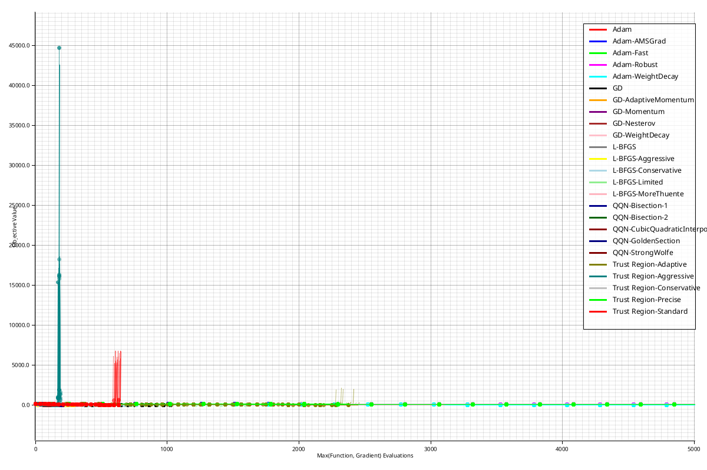
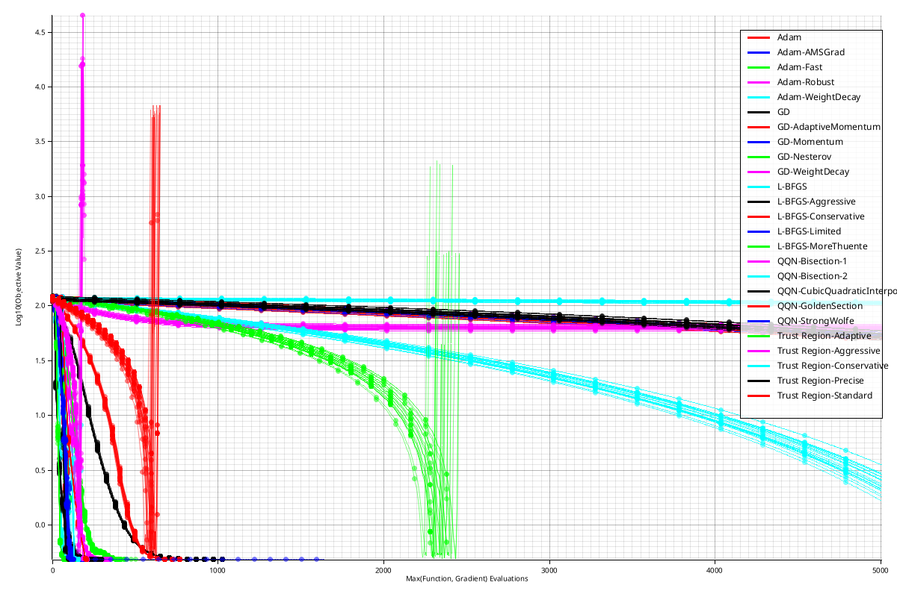

**Figure:** Convergence plots for LinearRegression_200samples_10features_reg0.01 showing objective value vs iterations.
Left: Linear scale, Right: Log scale for better visualization of convergence behavior.

**Data:** [Linear scale data (CSV)](data/LinearRegression_200samples_10features_reg0.01_data.csv) | [Log scale data (CSV)](data/LinearRegression_200samples_10features_reg0.01_log_data.csv)

## Problem: NeuralNetwork_100samples_layers_5_10_3

**Family:** NeuralNetwork
**Dimension:** 0
**Success Threshold:** 1.400e-1
**Total Runs:** 500
**Detailed Analysis:** [View comprehensive problem analysis](reports/problem_analysis_NeuralNetwork_100samples_layers_5_10_3.md)

### Performance Summary
<table style="border-collapse: collapse; width: 100%; margin: 20px 0;">
<tr style="background-color: #f2f2f2;">
<th style="border: 1px solid #ddd; padding: 8px; text-align: center;">Rank</th>
<th style="border: 1px solid #ddd; padding: 8px; text-align: center;">Optimizer</th>
<th style="border: 1px solid #ddd; padding: 8px; text-align: center;">Mean Final Value (All/Success/Fail)</th>
<th style="border: 1px solid #ddd; padding: 8px; text-align: center;">Std Dev</th>
<th style="border: 1px solid #ddd; padding: 8px; text-align: center;">Best Value</th>
<th style="border: 1px solid #ddd; padding: 8px; text-align: center;">Worst Value</th>
<th style="border: 1px solid #ddd; padding: 8px; text-align: center;">Mean Function Evals (All/Success/Fail)</th>
<th style="border: 1px solid #ddd; padding: 8px; text-align: center;">Mean Gradient Evals (All/Success/Fail)</th>
<th style="border: 1px solid #ddd; padding: 8px; text-align: center;">Success Rate</th>
<th style="border: 1px solid #ddd; padding: 8px; text-align: center;">Mean Time (s)</th>
</tr>
<tr style="background-color: #d4edda; font-weight: bold;">
<td style="border: 1px solid #ddd; padding: 8px; text-align: center;">1</td>
<td style="border: 1px solid #ddd; padding: 8px; text-align: center;"><a href="reports/detailed_NeuralNetwork_100samples_layers_5_10_3_QQN-Bisection-1.md" title="Click for detailed analysis">QQN-Bisection-1</a></td>
<td style="border: 1px solid #ddd; padding: 8px; text-align: center;">1.40e-1 / 1.40e-1 / 1.43e-1</td>
<td style="border: 1px solid #ddd; padding: 8px; text-align: center;">9.76e-4</td>
<td style="border: 1px solid #ddd; padding: 8px; text-align: center;">1.38e-1</td>
<td style="border: 1px solid #ddd; padding: 8px; text-align: center;">1.43e-1</td>
<td style="border: 1px solid #ddd; padding: 8px; text-align: center;">727.2 / 632.8 / 2520.0</td>
<td style="border: 1px solid #ddd; padding: 8px; text-align: center;">739.0 / 643.5 / 2555.0</td>
<td style="border: 1px solid #ddd; padding: 8px; text-align: center;">95.0%</td>
<td style="border: 1px solid #ddd; padding: 8px; text-align: center;">0.643</td>
</tr>
<tr style="background-color: #fff3cd;">
<td style="border: 1px solid #ddd; padding: 8px; text-align: center;">2</td>
<td style="border: 1px solid #ddd; padding: 8px; text-align: center;"><a href="reports/detailed_NeuralNetwork_100samples_layers_5_10_3_QQN-Bisection-2.md" title="Click for detailed analysis">QQN-Bisection-2</a></td>
<td style="border: 1px solid #ddd; padding: 8px; text-align: center;">1.40e-1 / 1.40e-1 / 1.42e-1</td>
<td style="border: 1px solid #ddd; padding: 8px; text-align: center;">1.16e-3</td>
<td style="border: 1px solid #ddd; padding: 8px; text-align: center;">1.39e-1</td>
<td style="border: 1px solid #ddd; padding: 8px; text-align: center;">1.45e-1</td>
<td style="border: 1px solid #ddd; padding: 8px; text-align: center;">864.2 / 623.7 / 3029.0</td>
<td style="border: 1px solid #ddd; padding: 8px; text-align: center;">646.5 / 517.8 / 1804.0</td>
<td style="border: 1px solid #ddd; padding: 8px; text-align: center;">90.0%</td>
<td style="border: 1px solid #ddd; padding: 8px; text-align: center;">0.629</td>
</tr>
<tr style="">
<td style="border: 1px solid #ddd; padding: 8px; text-align: center;">3</td>
<td style="border: 1px solid #ddd; padding: 8px; text-align: center;"><a href="reports/detailed_NeuralNetwork_100samples_layers_5_10_3_Adam-WeightDecay.md" title="Click for detailed analysis">Adam-WeightDecay</a></td>
<td style="border: 1px solid #ddd; padding: 8px; text-align: center;">1.41e-1 / 1.40e-1 / 1.46e-1</td>
<td style="border: 1px solid #ddd; padding: 8px; text-align: center;">2.52e-3</td>
<td style="border: 1px solid #ddd; padding: 8px; text-align: center;">1.40e-1</td>
<td style="border: 1px solid #ddd; padding: 8px; text-align: center;">1.51e-1</td>
<td style="border: 1px solid #ddd; padding: 8px; text-align: center;">1794.2 / 1669.2 / 2502.0</td>
<td style="border: 1px solid #ddd; padding: 8px; text-align: center;">1794.2 / 1669.2 / 2502.0</td>
<td style="border: 1px solid #ddd; padding: 8px; text-align: center;">85.0%</td>
<td style="border: 1px solid #ddd; padding: 8px; text-align: center;">1.486</td>
</tr>
<tr style="">
<td style="border: 1px solid #ddd; padding: 8px; text-align: center;">4</td>
<td style="border: 1px solid #ddd; padding: 8px; text-align: center;"><a href="reports/detailed_NeuralNetwork_100samples_layers_5_10_3_QQN-CubicQuadraticInterpolation.md" title="Click for detailed analysis">QQN-CubicQuadraticInterpolation</a></td>
<td style="border: 1px solid #ddd; padding: 8px; text-align: center;">1.41e-1 / 1.39e-1 / 1.49e-1</td>
<td style="border: 1px solid #ddd; padding: 8px; text-align: center;">4.67e-3</td>
<td style="border: 1px solid #ddd; padding: 8px; text-align: center;">1.37e-1</td>
<td style="border: 1px solid #ddd; padding: 8px; text-align: center;">1.58e-1</td>
<td style="border: 1px solid #ddd; padding: 8px; text-align: center;">764.9 / 637.8 / 1273.5</td>
<td style="border: 1px solid #ddd; padding: 8px; text-align: center;">1009.8 / 842.0 / 1681.0</td>
<td style="border: 1px solid #ddd; padding: 8px; text-align: center;">80.0%</td>
<td style="border: 1px solid #ddd; padding: 8px; text-align: center;">0.831</td>
</tr>
<tr style="">
<td style="border: 1px solid #ddd; padding: 8px; text-align: center;">5</td>
<td style="border: 1px solid #ddd; padding: 8px; text-align: center;"><a href="reports/detailed_NeuralNetwork_100samples_layers_5_10_3_QQN-GoldenSection.md" title="Click for detailed analysis">QQN-GoldenSection</a></td>
<td style="border: 1px solid #ddd; padding: 8px; text-align: center;">1.41e-1 / 1.40e-1 / 1.45e-1</td>
<td style="border: 1px solid #ddd; padding: 8px; text-align: center;">3.06e-3</td>
<td style="border: 1px solid #ddd; padding: 8px; text-align: center;">1.38e-1</td>
<td style="border: 1px solid #ddd; padding: 8px; text-align: center;">1.51e-1</td>
<td style="border: 1px solid #ddd; padding: 8px; text-align: center;">2749.2 / 2195.0 / 4411.6</td>
<td style="border: 1px solid #ddd; padding: 8px; text-align: center;">386.9 / 310.4 / 616.6</td>
<td style="border: 1px solid #ddd; padding: 8px; text-align: center;">75.0%</td>
<td style="border: 1px solid #ddd; padding: 8px; text-align: center;">0.957</td>
</tr>
<tr style="">
<td style="border: 1px solid #ddd; padding: 8px; text-align: center;">6</td>
<td style="border: 1px solid #ddd; padding: 8px; text-align: center;"><a href="reports/detailed_NeuralNetwork_100samples_layers_5_10_3_Adam-Fast.md" title="Click for detailed analysis">Adam-Fast</a></td>
<td style="border: 1px solid #ddd; padding: 8px; text-align: center;">1.43e-1 / 1.40e-1 / 1.48e-1</td>
<td style="border: 1px solid #ddd; padding: 8px; text-align: center;">5.10e-3</td>
<td style="border: 1px solid #ddd; padding: 8px; text-align: center;">1.39e-1</td>
<td style="border: 1px solid #ddd; padding: 8px; text-align: center;">1.56e-1</td>
<td style="border: 1px solid #ddd; padding: 8px; text-align: center;">149.3 / 119.3 / 194.2</td>
<td style="border: 1px solid #ddd; padding: 8px; text-align: center;">148.9 / 119.3 / 193.2</td>
<td style="border: 1px solid #ddd; padding: 8px; text-align: center;">60.0%</td>
<td style="border: 1px solid #ddd; padding: 8px; text-align: center;">0.125</td>
</tr>
<tr style="">
<td style="border: 1px solid #ddd; padding: 8px; text-align: center;">7</td>
<td style="border: 1px solid #ddd; padding: 8px; text-align: center;"><a href="reports/detailed_NeuralNetwork_100samples_layers_5_10_3_L-BFGS-Conservative.md" title="Click for detailed analysis">L-BFGS-Conservative</a></td>
<td style="border: 1px solid #ddd; padding: 8px; text-align: center;">1.48e-1 / 1.40e-1 / 1.54e-1</td>
<td style="border: 1px solid #ddd; padding: 8px; text-align: center;">9.87e-3</td>
<td style="border: 1px solid #ddd; padding: 8px; text-align: center;">1.40e-1</td>
<td style="border: 1px solid #ddd; padding: 8px; text-align: center;">1.70e-1</td>
<td style="border: 1px solid #ddd; padding: 8px; text-align: center;">1970.8 / 1055.2 / 2719.8</td>
<td style="border: 1px solid #ddd; padding: 8px; text-align: center;">1279.8 / 778.6 / 1689.9</td>
<td style="border: 1px solid #ddd; padding: 8px; text-align: center;">45.0%</td>
<td style="border: 1px solid #ddd; padding: 8px; text-align: center;">1.252</td>
</tr>
<tr style="">
<td style="border: 1px solid #ddd; padding: 8px; text-align: center;">8</td>
<td style="border: 1px solid #ddd; padding: 8px; text-align: center;"><a href="reports/detailed_NeuralNetwork_100samples_layers_5_10_3_QQN-StrongWolfe.md" title="Click for detailed analysis">QQN-StrongWolfe</a></td>
<td style="border: 1px solid #ddd; padding: 8px; text-align: center;">1.43e-1 / 1.39e-1 / 1.47e-1</td>
<td style="border: 1px solid #ddd; padding: 8px; text-align: center;">4.72e-3</td>
<td style="border: 1px solid #ddd; padding: 8px; text-align: center;">1.38e-1</td>
<td style="border: 1px solid #ddd; padding: 8px; text-align: center;">1.53e-1</td>
<td style="border: 1px solid #ddd; padding: 8px; text-align: center;">1646.3 / 660.4 / 2452.9</td>
<td style="border: 1px solid #ddd; padding: 8px; text-align: center;">1751.5 / 741.9 / 2577.6</td>
<td style="border: 1px solid #ddd; padding: 8px; text-align: center;">45.0%</td>
<td style="border: 1px solid #ddd; padding: 8px; text-align: center;">1.542</td>
</tr>
<tr style="">
<td style="border: 1px solid #ddd; padding: 8px; text-align: center;">9</td>
<td style="border: 1px solid #ddd; padding: 8px; text-align: center;"><a href="reports/detailed_NeuralNetwork_100samples_layers_5_10_3_L-BFGS-Limited.md" title="Click for detailed analysis">L-BFGS-Limited</a></td>
<td style="border: 1px solid #ddd; padding: 8px; text-align: center;">1.47e-1 / 1.40e-1 / 1.53e-1</td>
<td style="border: 1px solid #ddd; padding: 8px; text-align: center;">1.08e-2</td>
<td style="border: 1px solid #ddd; padding: 8px; text-align: center;">1.40e-1</td>
<td style="border: 1px solid #ddd; padding: 8px; text-align: center;">1.76e-1</td>
<td style="border: 1px solid #ddd; padding: 8px; text-align: center;">2641.3 / 1897.3 / 3250.0</td>
<td style="border: 1px solid #ddd; padding: 8px; text-align: center;">1109.3 / 994.3 / 1203.4</td>
<td style="border: 1px solid #ddd; padding: 8px; text-align: center;">45.0%</td>
<td style="border: 1px solid #ddd; padding: 8px; text-align: center;">1.307</td>
</tr>
<tr style="">
<td style="border: 1px solid #ddd; padding: 8px; text-align: center;">10</td>
<td style="border: 1px solid #ddd; padding: 8px; text-align: center;"><a href="reports/detailed_NeuralNetwork_100samples_layers_5_10_3_L-BFGS-MoreThuente.md" title="Click for detailed analysis">L-BFGS-MoreThuente</a></td>
<td style="border: 1px solid #ddd; padding: 8px; text-align: center;">1.51e-1 / 1.40e-1 / 1.53e-1</td>
<td style="border: 1px solid #ddd; padding: 8px; text-align: center;">7.64e-3</td>
<td style="border: 1px solid #ddd; padding: 8px; text-align: center;">1.40e-1</td>
<td style="border: 1px solid #ddd; padding: 8px; text-align: center;">1.64e-1</td>
<td style="border: 1px solid #ddd; padding: 8px; text-align: center;">2755.1 / 2187.0 / 2855.4</td>
<td style="border: 1px solid #ddd; padding: 8px; text-align: center;">2074.3 / 1632.3 / 2152.3</td>
<td style="border: 1px solid #ddd; padding: 8px; text-align: center;">15.0%</td>
<td style="border: 1px solid #ddd; padding: 8px; text-align: center;">1.880</td>
</tr>
<tr style="">
<td style="border: 1px solid #ddd; padding: 8px; text-align: center;">11</td>
<td style="border: 1px solid #ddd; padding: 8px; text-align: center;"><a href="reports/detailed_NeuralNetwork_100samples_layers_5_10_3_Adam.md" title="Click for detailed analysis">Adam</a></td>
<td style="border: 1px solid #ddd; padding: 8px; text-align: center;">1.53e-1 / 1.40e-1 / 1.55e-1</td>
<td style="border: 1px solid #ddd; padding: 8px; text-align: center;">6.87e-3</td>
<td style="border: 1px solid #ddd; padding: 8px; text-align: center;">1.40e-1</td>
<td style="border: 1px solid #ddd; padding: 8px; text-align: center;">1.64e-1</td>
<td style="border: 1px solid #ddd; padding: 8px; text-align: center;">2473.1 / 2213.0 / 2502.0</td>
<td style="border: 1px solid #ddd; padding: 8px; text-align: center;">2473.1 / 2213.0 / 2502.0</td>
<td style="border: 1px solid #ddd; padding: 8px; text-align: center;">10.0%</td>
<td style="border: 1px solid #ddd; padding: 8px; text-align: center;">2.047</td>
</tr>
<tr style="">
<td style="border: 1px solid #ddd; padding: 8px; text-align: center;">12</td>
<td style="border: 1px solid #ddd; padding: 8px; text-align: center;"><a href="reports/detailed_NeuralNetwork_100samples_layers_5_10_3_L-BFGS-Aggressive.md" title="Click for detailed analysis">L-BFGS-Aggressive</a></td>
<td style="border: 1px solid #ddd; padding: 8px; text-align: center;">1.50e-1 / 1.40e-1 / 1.51e-1</td>
<td style="border: 1px solid #ddd; padding: 8px; text-align: center;">6.38e-3</td>
<td style="border: 1px solid #ddd; padding: 8px; text-align: center;">1.40e-1</td>
<td style="border: 1px solid #ddd; padding: 8px; text-align: center;">1.62e-1</td>
<td style="border: 1px solid #ddd; padding: 8px; text-align: center;">2776.7 / 3131.0 / 2758.0</td>
<td style="border: 1px solid #ddd; padding: 8px; text-align: center;">1087.3 / 1251.0 / 1078.7</td>
<td style="border: 1px solid #ddd; padding: 8px; text-align: center;">5.0%</td>
<td style="border: 1px solid #ddd; padding: 8px; text-align: center;">1.320</td>
</tr>
<tr style="">
<td style="border: 1px solid #ddd; padding: 8px; text-align: center;">13</td>
<td style="border: 1px solid #ddd; padding: 8px; text-align: center;"><a href="reports/detailed_NeuralNetwork_100samples_layers_5_10_3_Trust_Region-Aggressive.md" title="Click for detailed analysis">Trust Region-Aggressive</a></td>
<td style="border: 1px solid #ddd; padding: 8px; text-align: center;">2.83e-1 / - / 7.98e-1</td>
<td style="border: 1px solid #ddd; padding: 8px; text-align: center;">7.46e-2</td>
<td style="border: 1px solid #ddd; padding: 8px; text-align: center;">2.09e-1</td>
<td style="border: 1px solid #ddd; padding: 8px; text-align: center;">4.06e-1</td>
<td style="border: 1px solid #ddd; padding: 8px; text-align: center;">23.0 / - / 23.0</td>
<td style="border: 1px solid #ddd; padding: 8px; text-align: center;">15.9 / - / 15.9</td>
<td style="border: 1px solid #ddd; padding: 8px; text-align: center;">0.0%</td>
<td style="border: 1px solid #ddd; padding: 8px; text-align: center;">0.015</td>
</tr>
<tr style="">
<td style="border: 1px solid #ddd; padding: 8px; text-align: center;">14</td>
<td style="border: 1px solid #ddd; padding: 8px; text-align: center;"><a href="reports/detailed_NeuralNetwork_100samples_layers_5_10_3_GD-AdaptiveMomentum.md" title="Click for detailed analysis">GD-AdaptiveMomentum</a></td>
<td style="border: 1px solid #ddd; padding: 8px; text-align: center;">2.23e-1 / - / 2.56e-1</td>
<td style="border: 1px solid #ddd; padding: 8px; text-align: center;">1.54e-3</td>
<td style="border: 1px solid #ddd; padding: 8px; text-align: center;">2.20e-1</td>
<td style="border: 1px solid #ddd; padding: 8px; text-align: center;">2.26e-1</td>
<td style="border: 1px solid #ddd; padding: 8px; text-align: center;">15.9 / - / 15.9</td>
<td style="border: 1px solid #ddd; padding: 8px; text-align: center;">27.8 / - / 27.8</td>
<td style="border: 1px solid #ddd; padding: 8px; text-align: center;">0.0%</td>
<td style="border: 1px solid #ddd; padding: 8px; text-align: center;">0.021</td>
</tr>
<tr style="">
<td style="border: 1px solid #ddd; padding: 8px; text-align: center;">15</td>
<td style="border: 1px solid #ddd; padding: 8px; text-align: center;"><a href="reports/detailed_NeuralNetwork_100samples_layers_5_10_3_GD-Momentum.md" title="Click for detailed analysis">GD-Momentum</a></td>
<td style="border: 1px solid #ddd; padding: 8px; text-align: center;">2.22e-1 / - / 2.34e-1</td>
<td style="border: 1px solid #ddd; padding: 8px; text-align: center;">2.44e-3</td>
<td style="border: 1px solid #ddd; padding: 8px; text-align: center;">2.17e-1</td>
<td style="border: 1px solid #ddd; padding: 8px; text-align: center;">2.26e-1</td>
<td style="border: 1px solid #ddd; padding: 8px; text-align: center;">21.2 / - / 21.2</td>
<td style="border: 1px solid #ddd; padding: 8px; text-align: center;">38.4 / - / 38.4</td>
<td style="border: 1px solid #ddd; padding: 8px; text-align: center;">0.0%</td>
<td style="border: 1px solid #ddd; padding: 8px; text-align: center;">0.028</td>
</tr>
<tr style="">
<td style="border: 1px solid #ddd; padding: 8px; text-align: center;">16</td>
<td style="border: 1px solid #ddd; padding: 8px; text-align: center;"><a href="reports/detailed_NeuralNetwork_100samples_layers_5_10_3_Trust_Region-Standard.md" title="Click for detailed analysis">Trust Region-Standard</a></td>
<td style="border: 1px solid #ddd; padding: 8px; text-align: center;">2.29e-1 / - / 4.01e-1</td>
<td style="border: 1px solid #ddd; padding: 8px; text-align: center;">4.35e-2</td>
<td style="border: 1px solid #ddd; padding: 8px; text-align: center;">1.83e-1</td>
<td style="border: 1px solid #ddd; padding: 8px; text-align: center;">3.25e-1</td>
<td style="border: 1px solid #ddd; padding: 8px; text-align: center;">35.5 / - / 35.5</td>
<td style="border: 1px solid #ddd; padding: 8px; text-align: center;">24.2 / - / 24.2</td>
<td style="border: 1px solid #ddd; padding: 8px; text-align: center;">0.0%</td>
<td style="border: 1px solid #ddd; padding: 8px; text-align: center;">0.023</td>
</tr>
<tr style="">
<td style="border: 1px solid #ddd; padding: 8px; text-align: center;">17</td>
<td style="border: 1px solid #ddd; padding: 8px; text-align: center;"><a href="reports/detailed_NeuralNetwork_100samples_layers_5_10_3_GD-Nesterov.md" title="Click for detailed analysis">GD-Nesterov</a></td>
<td style="border: 1px solid #ddd; padding: 8px; text-align: center;">2.21e-1 / - / 2.27e-1</td>
<td style="border: 1px solid #ddd; padding: 8px; text-align: center;">2.17e-3</td>
<td style="border: 1px solid #ddd; padding: 8px; text-align: center;">2.18e-1</td>
<td style="border: 1px solid #ddd; padding: 8px; text-align: center;">2.27e-1</td>
<td style="border: 1px solid #ddd; padding: 8px; text-align: center;">21.6 / - / 21.6</td>
<td style="border: 1px solid #ddd; padding: 8px; text-align: center;">39.2 / - / 39.2</td>
<td style="border: 1px solid #ddd; padding: 8px; text-align: center;">0.0%</td>
<td style="border: 1px solid #ddd; padding: 8px; text-align: center;">0.029</td>
</tr>
<tr style="">
<td style="border: 1px solid #ddd; padding: 8px; text-align: center;">18</td>
<td style="border: 1px solid #ddd; padding: 8px; text-align: center;"><a href="reports/detailed_NeuralNetwork_100samples_layers_5_10_3_Trust_Region-Precise.md" title="Click for detailed analysis">Trust Region-Precise</a></td>
<td style="border: 1px solid #ddd; padding: 8px; text-align: center;">2.16e-1 / - / 2.23e-1</td>
<td style="border: 1px solid #ddd; padding: 8px; text-align: center;">7.38e-3</td>
<td style="border: 1px solid #ddd; padding: 8px; text-align: center;">1.97e-1</td>
<td style="border: 1px solid #ddd; padding: 8px; text-align: center;">2.27e-1</td>
<td style="border: 1px solid #ddd; padding: 8px; text-align: center;">42.9 / - / 42.9</td>
<td style="border: 1px solid #ddd; padding: 8px; text-align: center;">29.2 / - / 29.2</td>
<td style="border: 1px solid #ddd; padding: 8px; text-align: center;">0.0%</td>
<td style="border: 1px solid #ddd; padding: 8px; text-align: center;">0.027</td>
</tr>
<tr style="">
<td style="border: 1px solid #ddd; padding: 8px; text-align: center;">19</td>
<td style="border: 1px solid #ddd; padding: 8px; text-align: center;"><a href="reports/detailed_NeuralNetwork_100samples_layers_5_10_3_Trust_Region-Adaptive.md" title="Click for detailed analysis">Trust Region-Adaptive</a></td>
<td style="border: 1px solid #ddd; padding: 8px; text-align: center;">2.09e-1 / - / 8.19e-1</td>
<td style="border: 1px solid #ddd; padding: 8px; text-align: center;">1.73e-2</td>
<td style="border: 1px solid #ddd; padding: 8px; text-align: center;">1.78e-1</td>
<td style="border: 1px solid #ddd; padding: 8px; text-align: center;">2.42e-1</td>
<td style="border: 1px solid #ddd; padding: 8px; text-align: center;">46.5 / - / 46.5</td>
<td style="border: 1px solid #ddd; padding: 8px; text-align: center;">31.5 / - / 31.5</td>
<td style="border: 1px solid #ddd; padding: 8px; text-align: center;">0.0%</td>
<td style="border: 1px solid #ddd; padding: 8px; text-align: center;">0.029</td>
</tr>
<tr style="">
<td style="border: 1px solid #ddd; padding: 8px; text-align: center;">20</td>
<td style="border: 1px solid #ddd; padding: 8px; text-align: center;"><a href="reports/detailed_NeuralNetwork_100samples_layers_5_10_3_Trust_Region-Conservative.md" title="Click for detailed analysis">Trust Region-Conservative</a></td>
<td style="border: 1px solid #ddd; padding: 8px; text-align: center;">2.20e-1 / - / 2.20e-1</td>
<td style="border: 1px solid #ddd; padding: 8px; text-align: center;">1.45e-3</td>
<td style="border: 1px solid #ddd; padding: 8px; text-align: center;">2.18e-1</td>
<td style="border: 1px solid #ddd; padding: 8px; text-align: center;">2.23e-1</td>
<td style="border: 1px solid #ddd; padding: 8px; text-align: center;">159.9 / - / 159.9</td>
<td style="border: 1px solid #ddd; padding: 8px; text-align: center;">107.3 / - / 107.3</td>
<td style="border: 1px solid #ddd; padding: 8px; text-align: center;">0.0%</td>
<td style="border: 1px solid #ddd; padding: 8px; text-align: center;">0.100</td>
</tr>
<tr style="">
<td style="border: 1px solid #ddd; padding: 8px; text-align: center;">21</td>
<td style="border: 1px solid #ddd; padding: 8px; text-align: center;"><a href="reports/detailed_NeuralNetwork_100samples_layers_5_10_3_L-BFGS.md" title="Click for detailed analysis">L-BFGS</a></td>
<td style="border: 1px solid #ddd; padding: 8px; text-align: center;">1.61e-1 / - / 2.39e-1</td>
<td style="border: 1px solid #ddd; padding: 8px; text-align: center;">1.94e-2</td>
<td style="border: 1px solid #ddd; padding: 8px; text-align: center;">1.41e-1</td>
<td style="border: 1px solid #ddd; padding: 8px; text-align: center;">2.14e-1</td>
<td style="border: 1px solid #ddd; padding: 8px; text-align: center;">1556.7 / - / 1556.7</td>
<td style="border: 1px solid #ddd; padding: 8px; text-align: center;">883.5 / - / 883.5</td>
<td style="border: 1px solid #ddd; padding: 8px; text-align: center;">0.0%</td>
<td style="border: 1px solid #ddd; padding: 8px; text-align: center;">0.904</td>
</tr>
<tr style="">
<td style="border: 1px solid #ddd; padding: 8px; text-align: center;">22</td>
<td style="border: 1px solid #ddd; padding: 8px; text-align: center;"><a href="reports/detailed_NeuralNetwork_100samples_layers_5_10_3_GD.md" title="Click for detailed analysis">GD</a></td>
<td style="border: 1px solid #ddd; padding: 8px; text-align: center;">2.03e-1 / - / 2.03e-1</td>
<td style="border: 1px solid #ddd; padding: 8px; text-align: center;">2.81e-3</td>
<td style="border: 1px solid #ddd; padding: 8px; text-align: center;">1.98e-1</td>
<td style="border: 1px solid #ddd; padding: 8px; text-align: center;">2.08e-1</td>
<td style="border: 1px solid #ddd; padding: 8px; text-align: center;">1668.0 / - / 1668.0</td>
<td style="border: 1px solid #ddd; padding: 8px; text-align: center;">3334.0 / - / 3334.0</td>
<td style="border: 1px solid #ddd; padding: 8px; text-align: center;">0.0%</td>
<td style="border: 1px solid #ddd; padding: 8px; text-align: center;">2.339</td>
</tr>
<tr style="">
<td style="border: 1px solid #ddd; padding: 8px; text-align: center;">23</td>
<td style="border: 1px solid #ddd; padding: 8px; text-align: center;"><a href="reports/detailed_NeuralNetwork_100samples_layers_5_10_3_GD-WeightDecay.md" title="Click for detailed analysis">GD-WeightDecay</a></td>
<td style="border: 1px solid #ddd; padding: 8px; text-align: center;">1.84e-1 / - / 1.84e-1</td>
<td style="border: 1px solid #ddd; padding: 8px; text-align: center;">3.79e-3</td>
<td style="border: 1px solid #ddd; padding: 8px; text-align: center;">1.80e-1</td>
<td style="border: 1px solid #ddd; padding: 8px; text-align: center;">1.96e-1</td>
<td style="border: 1px solid #ddd; padding: 8px; text-align: center;">1668.0 / - / 1668.0</td>
<td style="border: 1px solid #ddd; padding: 8px; text-align: center;">3334.0 / - / 3334.0</td>
<td style="border: 1px solid #ddd; padding: 8px; text-align: center;">0.0%</td>
<td style="border: 1px solid #ddd; padding: 8px; text-align: center;">2.360</td>
</tr>
<tr style="">
<td style="border: 1px solid #ddd; padding: 8px; text-align: center;">24</td>
<td style="border: 1px solid #ddd; padding: 8px; text-align: center;"><a href="reports/detailed_NeuralNetwork_100samples_layers_5_10_3_Adam-Robust.md" title="Click for detailed analysis">Adam-Robust</a></td>
<td style="border: 1px solid #ddd; padding: 8px; text-align: center;">1.67e-1 / - / 1.67e-1</td>
<td style="border: 1px solid #ddd; padding: 8px; text-align: center;">9.86e-3</td>
<td style="border: 1px solid #ddd; padding: 8px; text-align: center;">1.48e-1</td>
<td style="border: 1px solid #ddd; padding: 8px; text-align: center;">1.86e-1</td>
<td style="border: 1px solid #ddd; padding: 8px; text-align: center;">2502.0 / - / 2502.0</td>
<td style="border: 1px solid #ddd; padding: 8px; text-align: center;">2502.0 / - / 2502.0</td>
<td style="border: 1px solid #ddd; padding: 8px; text-align: center;">0.0%</td>
<td style="border: 1px solid #ddd; padding: 8px; text-align: center;">2.086</td>
</tr>
<tr style="">
<td style="border: 1px solid #ddd; padding: 8px; text-align: center;">25</td>
<td style="border: 1px solid #ddd; padding: 8px; text-align: center;"><a href="reports/detailed_NeuralNetwork_100samples_layers_5_10_3_Adam-AMSGrad.md" title="Click for detailed analysis">Adam-AMSGrad</a></td>
<td style="border: 1px solid #ddd; padding: 8px; text-align: center;">1.54e-1 / - / 1.54e-1</td>
<td style="border: 1px solid #ddd; padding: 8px; text-align: center;">9.68e-3</td>
<td style="border: 1px solid #ddd; padding: 8px; text-align: center;">1.40e-1</td>
<td style="border: 1px solid #ddd; padding: 8px; text-align: center;">1.74e-1</td>
<td style="border: 1px solid #ddd; padding: 8px; text-align: center;">2502.0 / - / 2502.0</td>
<td style="border: 1px solid #ddd; padding: 8px; text-align: center;">2502.0 / - / 2502.0</td>
<td style="border: 1px solid #ddd; padding: 8px; text-align: center;">0.0%</td>
<td style="border: 1px solid #ddd; padding: 8px; text-align: center;">2.087</td>
</tr>
</table>

### Convergence Plots

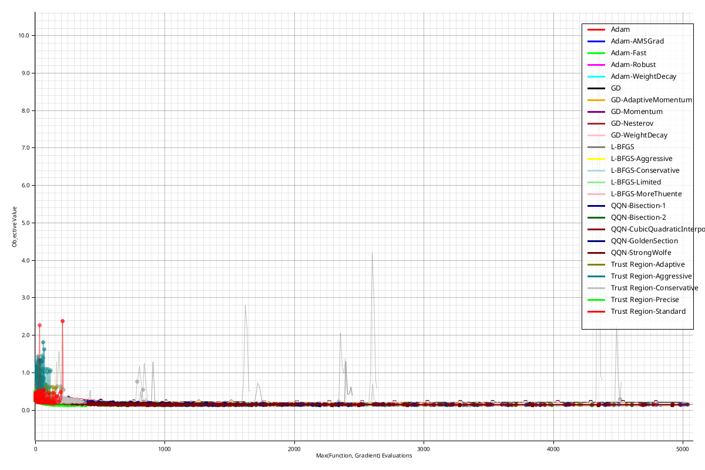
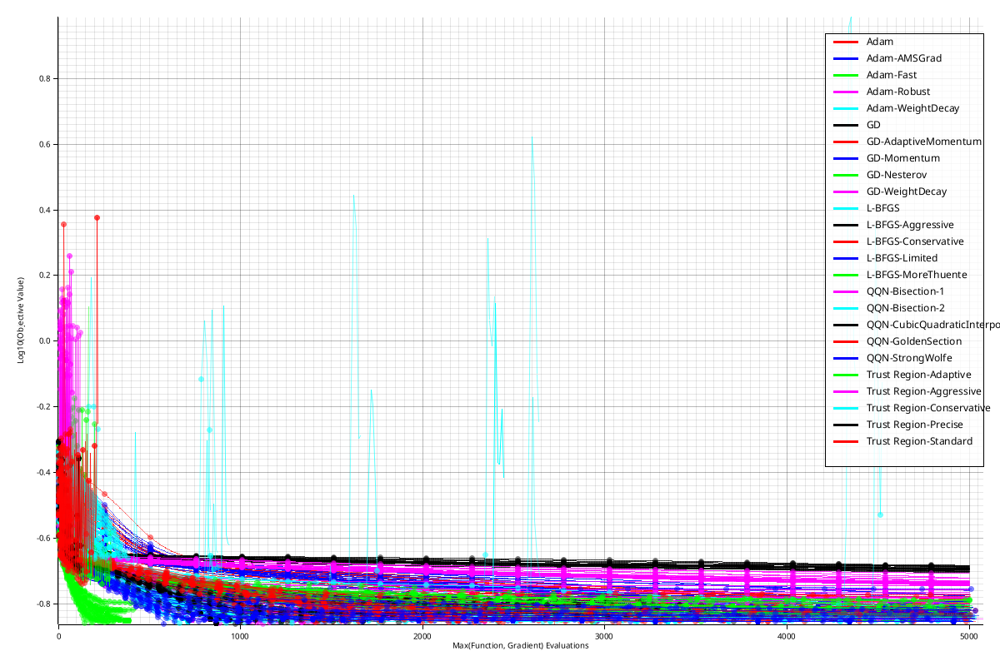

**Figure:** Convergence plots for NeuralNetwork_100samples_layers_5_10_3 showing objective value vs iterations.
Left: Linear scale, Right: Log scale for better visualization of convergence behavior.

**Data:** [Linear scale data (CSV)](data/NeuralNetwork_100samples_layers_5_10_3_data.csv) | [Log scale data (CSV)](data/NeuralNetwork_100samples_layers_5_10_3_log_data.csv)

## Problem: NeuralNetwork_100samples_layers_10_20_5

**Family:** NeuralNetwork
**Dimension:** 0
**Success Threshold:** 3.820e-2
**Total Runs:** 500
**Detailed Analysis:** [View comprehensive problem analysis](reports/problem_analysis_NeuralNetwork_100samples_layers_10_20_5.md)

### Performance Summary
<table style="border-collapse: collapse; width: 100%; margin: 20px 0;">
<tr style="background-color: #f2f2f2;">
<th style="border: 1px solid #ddd; padding: 8px; text-align: center;">Rank</th>
<th style="border: 1px solid #ddd; padding: 8px; text-align: center;">Optimizer</th>
<th style="border: 1px solid #ddd; padding: 8px; text-align: center;">Mean Final Value (All/Success/Fail)</th>
<th style="border: 1px solid #ddd; padding: 8px; text-align: center;">Std Dev</th>
<th style="border: 1px solid #ddd; padding: 8px; text-align: center;">Best Value</th>
<th style="border: 1px solid #ddd; padding: 8px; text-align: center;">Worst Value</th>
<th style="border: 1px solid #ddd; padding: 8px; text-align: center;">Mean Function Evals (All/Success/Fail)</th>
<th style="border: 1px solid #ddd; padding: 8px; text-align: center;">Mean Gradient Evals (All/Success/Fail)</th>
<th style="border: 1px solid #ddd; padding: 8px; text-align: center;">Success Rate</th>
<th style="border: 1px solid #ddd; padding: 8px; text-align: center;">Mean Time (s)</th>
</tr>
<tr style="background-color: #d4edda; font-weight: bold;">
<td style="border: 1px solid #ddd; padding: 8px; text-align: center;">1</td>
<td style="border: 1px solid #ddd; padding: 8px; text-align: center;"><a href="reports/detailed_NeuralNetwork_100samples_layers_10_20_5_QQN-Bisection-2.md" title="Click for detailed analysis">QQN-Bisection-2</a></td>
<td style="border: 1px solid #ddd; padding: 8px; text-align: center;">3.80e-2 / 3.80e-2 / -</td>
<td style="border: 1px solid #ddd; padding: 8px; text-align: center;">1.53e-4</td>
<td style="border: 1px solid #ddd; padding: 8px; text-align: center;">3.77e-2</td>
<td style="border: 1px solid #ddd; padding: 8px; text-align: center;">3.82e-2</td>
<td style="border: 1px solid #ddd; padding: 8px; text-align: center;">883.2 / 883.2 / -</td>
<td style="border: 1px solid #ddd; padding: 8px; text-align: center;">753.1 / 753.1 / -</td>
<td style="border: 1px solid #ddd; padding: 8px; text-align: center;">100.0%</td>
<td style="border: 1px solid #ddd; padding: 8px; text-align: center;">1.296</td>
</tr>
<tr style="background-color: #fff3cd;">
<td style="border: 1px solid #ddd; padding: 8px; text-align: center;">2</td>
<td style="border: 1px solid #ddd; padding: 8px; text-align: center;"><a href="reports/detailed_NeuralNetwork_100samples_layers_10_20_5_QQN-Bisection-1.md" title="Click for detailed analysis">QQN-Bisection-1</a></td>
<td style="border: 1px solid #ddd; padding: 8px; text-align: center;">3.80e-2 / 3.80e-2 / -</td>
<td style="border: 1px solid #ddd; padding: 8px; text-align: center;">1.20e-4</td>
<td style="border: 1px solid #ddd; padding: 8px; text-align: center;">3.78e-2</td>
<td style="border: 1px solid #ddd; padding: 8px; text-align: center;">3.82e-2</td>
<td style="border: 1px solid #ddd; padding: 8px; text-align: center;">1029.0 / 1029.0 / -</td>
<td style="border: 1px solid #ddd; padding: 8px; text-align: center;">983.5 / 983.5 / -</td>
<td style="border: 1px solid #ddd; padding: 8px; text-align: center;">100.0%</td>
<td style="border: 1px solid #ddd; padding: 8px; text-align: center;">1.615</td>
</tr>
<tr style="">
<td style="border: 1px solid #ddd; padding: 8px; text-align: center;">3</td>
<td style="border: 1px solid #ddd; padding: 8px; text-align: center;"><a href="reports/detailed_NeuralNetwork_100samples_layers_10_20_5_QQN-CubicQuadraticInterpolation.md" title="Click for detailed analysis">QQN-CubicQuadraticInterpolation</a></td>
<td style="border: 1px solid #ddd; padding: 8px; text-align: center;">3.80e-2 / 3.80e-2 / -</td>
<td style="border: 1px solid #ddd; padding: 8px; text-align: center;">1.40e-4</td>
<td style="border: 1px solid #ddd; padding: 8px; text-align: center;">3.77e-2</td>
<td style="border: 1px solid #ddd; padding: 8px; text-align: center;">3.82e-2</td>
<td style="border: 1px solid #ddd; padding: 8px; text-align: center;">959.5 / 959.5 / -</td>
<td style="border: 1px solid #ddd; padding: 8px; text-align: center;">1271.2 / 1271.2 / -</td>
<td style="border: 1px solid #ddd; padding: 8px; text-align: center;">100.0%</td>
<td style="border: 1px solid #ddd; padding: 8px; text-align: center;">1.947</td>
</tr>
<tr style="">
<td style="border: 1px solid #ddd; padding: 8px; text-align: center;">4</td>
<td style="border: 1px solid #ddd; padding: 8px; text-align: center;"><a href="reports/detailed_NeuralNetwork_100samples_layers_10_20_5_Adam-WeightDecay.md" title="Click for detailed analysis">Adam-WeightDecay</a></td>
<td style="border: 1px solid #ddd; padding: 8px; text-align: center;">3.82e-2 / 3.82e-2 / -</td>
<td style="border: 1px solid #ddd; padding: 8px; text-align: center;">1.26e-5</td>
<td style="border: 1px solid #ddd; padding: 8px; text-align: center;">3.82e-2</td>
<td style="border: 1px solid #ddd; padding: 8px; text-align: center;">3.82e-2</td>
<td style="border: 1px solid #ddd; padding: 8px; text-align: center;">1278.0 / 1278.0 / -</td>
<td style="border: 1px solid #ddd; padding: 8px; text-align: center;">1278.0 / 1278.0 / -</td>
<td style="border: 1px solid #ddd; padding: 8px; text-align: center;">100.0%</td>
<td style="border: 1px solid #ddd; padding: 8px; text-align: center;">2.066</td>
</tr>
<tr style="">
<td style="border: 1px solid #ddd; padding: 8px; text-align: center;">5</td>
<td style="border: 1px solid #ddd; padding: 8px; text-align: center;"><a href="reports/detailed_NeuralNetwork_100samples_layers_10_20_5_QQN-GoldenSection.md" title="Click for detailed analysis">QQN-GoldenSection</a></td>
<td style="border: 1px solid #ddd; padding: 8px; text-align: center;">3.83e-2 / 3.81e-2 / 3.95e-2</td>
<td style="border: 1px solid #ddd; padding: 8px; text-align: center;">6.37e-4</td>
<td style="border: 1px solid #ddd; padding: 8px; text-align: center;">3.79e-2</td>
<td style="border: 1px solid #ddd; padding: 8px; text-align: center;">4.07e-2</td>
<td style="border: 1px solid #ddd; padding: 8px; text-align: center;">3686.0 / 3560.4 / 4397.7</td>
<td style="border: 1px solid #ddd; padding: 8px; text-align: center;">526.2 / 508.5 / 627.0</td>
<td style="border: 1px solid #ddd; padding: 8px; text-align: center;">85.0%</td>
<td style="border: 1px solid #ddd; padding: 8px; text-align: center;">2.351</td>
</tr>
<tr style="">
<td style="border: 1px solid #ddd; padding: 8px; text-align: center;">6</td>
<td style="border: 1px solid #ddd; padding: 8px; text-align: center;"><a href="reports/detailed_NeuralNetwork_100samples_layers_10_20_5_QQN-StrongWolfe.md" title="Click for detailed analysis">QQN-StrongWolfe</a></td>
<td style="border: 1px solid #ddd; padding: 8px; text-align: center;">4.07e-2 / 3.80e-2 / 4.70e-2</td>
<td style="border: 1px solid #ddd; padding: 8px; text-align: center;">4.88e-3</td>
<td style="border: 1px solid #ddd; padding: 8px; text-align: center;">3.75e-2</td>
<td style="border: 1px solid #ddd; padding: 8px; text-align: center;">5.26e-2</td>
<td style="border: 1px solid #ddd; padding: 8px; text-align: center;">1111.5 / 561.3 / 2395.3</td>
<td style="border: 1px solid #ddd; padding: 8px; text-align: center;">1232.7 / 637.4 / 2621.7</td>
<td style="border: 1px solid #ddd; padding: 8px; text-align: center;">70.0%</td>
<td style="border: 1px solid #ddd; padding: 8px; text-align: center;">2.001</td>
</tr>
<tr style="">
<td style="border: 1px solid #ddd; padding: 8px; text-align: center;">7</td>
<td style="border: 1px solid #ddd; padding: 8px; text-align: center;"><a href="reports/detailed_NeuralNetwork_100samples_layers_10_20_5_Adam-Fast.md" title="Click for detailed analysis">Adam-Fast</a></td>
<td style="border: 1px solid #ddd; padding: 8px; text-align: center;">4.15e-2 / 3.79e-2 / 4.70e-2</td>
<td style="border: 1px solid #ddd; padding: 8px; text-align: center;">4.48e-3</td>
<td style="border: 1px solid #ddd; padding: 8px; text-align: center;">3.71e-2</td>
<td style="border: 1px solid #ddd; padding: 8px; text-align: center;">5.25e-2</td>
<td style="border: 1px solid #ddd; padding: 8px; text-align: center;">168.4 / 151.4 / 185.4</td>
<td style="border: 1px solid #ddd; padding: 8px; text-align: center;">167.9 / 151.4 / 184.4</td>
<td style="border: 1px solid #ddd; padding: 8px; text-align: center;">50.0%</td>
<td style="border: 1px solid #ddd; padding: 8px; text-align: center;">0.263</td>
</tr>
<tr style="">
<td style="border: 1px solid #ddd; padding: 8px; text-align: center;">8</td>
<td style="border: 1px solid #ddd; padding: 8px; text-align: center;"><a href="reports/detailed_NeuralNetwork_100samples_layers_10_20_5_L-BFGS-Conservative.md" title="Click for detailed analysis">L-BFGS-Conservative</a></td>
<td style="border: 1px solid #ddd; padding: 8px; text-align: center;">4.39e-2 / 3.82e-2 / 4.53e-2</td>
<td style="border: 1px solid #ddd; padding: 8px; text-align: center;">5.59e-3</td>
<td style="border: 1px solid #ddd; padding: 8px; text-align: center;">3.82e-2</td>
<td style="border: 1px solid #ddd; padding: 8px; text-align: center;">5.53e-2</td>
<td style="border: 1px solid #ddd; padding: 8px; text-align: center;">2571.8 / 1184.5 / 2918.7</td>
<td style="border: 1px solid #ddd; padding: 8px; text-align: center;">1711.7 / 830.5 / 1931.9</td>
<td style="border: 1px solid #ddd; padding: 8px; text-align: center;">20.0%</td>
<td style="border: 1px solid #ddd; padding: 8px; text-align: center;">3.085</td>
</tr>
<tr style="">
<td style="border: 1px solid #ddd; padding: 8px; text-align: center;">9</td>
<td style="border: 1px solid #ddd; padding: 8px; text-align: center;"><a href="reports/detailed_NeuralNetwork_100samples_layers_10_20_5_Adam.md" title="Click for detailed analysis">Adam</a></td>
<td style="border: 1px solid #ddd; padding: 8px; text-align: center;">4.42e-2 / 3.82e-2 / 4.48e-2</td>
<td style="border: 1px solid #ddd; padding: 8px; text-align: center;">4.45e-3</td>
<td style="border: 1px solid #ddd; padding: 8px; text-align: center;">3.82e-2</td>
<td style="border: 1px solid #ddd; padding: 8px; text-align: center;">5.22e-2</td>
<td style="border: 1px solid #ddd; padding: 8px; text-align: center;">2469.9 / 2181.0 / 2502.0</td>
<td style="border: 1px solid #ddd; padding: 8px; text-align: center;">2469.9 / 2181.0 / 2502.0</td>
<td style="border: 1px solid #ddd; padding: 8px; text-align: center;">10.0%</td>
<td style="border: 1px solid #ddd; padding: 8px; text-align: center;">3.834</td>
</tr>
<tr style="">
<td style="border: 1px solid #ddd; padding: 8px; text-align: center;">10</td>
<td style="border: 1px solid #ddd; padding: 8px; text-align: center;"><a href="reports/detailed_NeuralNetwork_100samples_layers_10_20_5_Adam-AMSGrad.md" title="Click for detailed analysis">Adam-AMSGrad</a></td>
<td style="border: 1px solid #ddd; padding: 8px; text-align: center;">4.96e-2 / 3.82e-2 / 5.02e-2</td>
<td style="border: 1px solid #ddd; padding: 8px; text-align: center;">6.01e-3</td>
<td style="border: 1px solid #ddd; padding: 8px; text-align: center;">3.82e-2</td>
<td style="border: 1px solid #ddd; padding: 8px; text-align: center;">5.96e-2</td>
<td style="border: 1px solid #ddd; padding: 8px; text-align: center;">2495.8 / 2377.0 / 2502.0</td>
<td style="border: 1px solid #ddd; padding: 8px; text-align: center;">2495.8 / 2377.0 / 2502.0</td>
<td style="border: 1px solid #ddd; padding: 8px; text-align: center;">5.0%</td>
<td style="border: 1px solid #ddd; padding: 8px; text-align: center;">3.943</td>
</tr>
<tr style="">
<td style="border: 1px solid #ddd; padding: 8px; text-align: center;">11</td>
<td style="border: 1px solid #ddd; padding: 8px; text-align: center;"><a href="reports/detailed_NeuralNetwork_100samples_layers_10_20_5_Trust_Region-Standard.md" title="Click for detailed analysis">Trust Region-Standard</a></td>
<td style="border: 1px solid #ddd; padding: 8px; text-align: center;">2.32e-1 / - / 2.74e-1</td>
<td style="border: 1px solid #ddd; padding: 8px; text-align: center;">2.14e-2</td>
<td style="border: 1px solid #ddd; padding: 8px; text-align: center;">2.02e-1</td>
<td style="border: 1px solid #ddd; padding: 8px; text-align: center;">2.90e-1</td>
<td style="border: 1px solid #ddd; padding: 8px; text-align: center;">5.3 / - / 5.3</td>
<td style="border: 1px solid #ddd; padding: 8px; text-align: center;">4.2 / - / 4.2</td>
<td style="border: 1px solid #ddd; padding: 8px; text-align: center;">0.0%</td>
<td style="border: 1px solid #ddd; padding: 8px; text-align: center;">0.007</td>
</tr>
<tr style="">
<td style="border: 1px solid #ddd; padding: 8px; text-align: center;">12</td>
<td style="border: 1px solid #ddd; padding: 8px; text-align: center;"><a href="reports/detailed_NeuralNetwork_100samples_layers_10_20_5_Trust_Region-Aggressive.md" title="Click for detailed analysis">Trust Region-Aggressive</a></td>
<td style="border: 1px solid #ddd; padding: 8px; text-align: center;">2.26e-1 / - / 7.57e-1</td>
<td style="border: 1px solid #ddd; padding: 8px; text-align: center;">2.99e-2</td>
<td style="border: 1px solid #ddd; padding: 8px; text-align: center;">1.72e-1</td>
<td style="border: 1px solid #ddd; padding: 8px; text-align: center;">3.26e-1</td>
<td style="border: 1px solid #ddd; padding: 8px; text-align: center;">7.8 / - / 7.8</td>
<td style="border: 1px solid #ddd; padding: 8px; text-align: center;">5.9 / - / 5.9</td>
<td style="border: 1px solid #ddd; padding: 8px; text-align: center;">0.0%</td>
<td style="border: 1px solid #ddd; padding: 8px; text-align: center;">0.010</td>
</tr>
<tr style="">
<td style="border: 1px solid #ddd; padding: 8px; text-align: center;">13</td>
<td style="border: 1px solid #ddd; padding: 8px; text-align: center;"><a href="reports/detailed_NeuralNetwork_100samples_layers_10_20_5_Trust_Region-Precise.md" title="Click for detailed analysis">Trust Region-Precise</a></td>
<td style="border: 1px solid #ddd; padding: 8px; text-align: center;">1.61e-1 / - / 1.61e-1</td>
<td style="border: 1px solid #ddd; padding: 8px; text-align: center;">2.73e-3</td>
<td style="border: 1px solid #ddd; padding: 8px; text-align: center;">1.54e-1</td>
<td style="border: 1px solid #ddd; padding: 8px; text-align: center;">1.66e-1</td>
<td style="border: 1px solid #ddd; padding: 8px; text-align: center;">23.4 / - / 23.4</td>
<td style="border: 1px solid #ddd; padding: 8px; text-align: center;">16.3 / - / 16.3</td>
<td style="border: 1px solid #ddd; padding: 8px; text-align: center;">0.0%</td>
<td style="border: 1px solid #ddd; padding: 8px; text-align: center;">0.028</td>
</tr>
<tr style="">
<td style="border: 1px solid #ddd; padding: 8px; text-align: center;">14</td>
<td style="border: 1px solid #ddd; padding: 8px; text-align: center;"><a href="reports/detailed_NeuralNetwork_100samples_layers_10_20_5_GD-AdaptiveMomentum.md" title="Click for detailed analysis">GD-AdaptiveMomentum</a></td>
<td style="border: 1px solid #ddd; padding: 8px; text-align: center;">1.63e-1 / - / 1.74e-1</td>
<td style="border: 1px solid #ddd; padding: 8px; text-align: center;">2.28e-3</td>
<td style="border: 1px solid #ddd; padding: 8px; text-align: center;">1.59e-1</td>
<td style="border: 1px solid #ddd; padding: 8px; text-align: center;">1.68e-1</td>
<td style="border: 1px solid #ddd; padding: 8px; text-align: center;">15.2 / - / 15.2</td>
<td style="border: 1px solid #ddd; padding: 8px; text-align: center;">26.5 / - / 26.5</td>
<td style="border: 1px solid #ddd; padding: 8px; text-align: center;">0.0%</td>
<td style="border: 1px solid #ddd; padding: 8px; text-align: center;">0.037</td>
</tr>
<tr style="">
<td style="border: 1px solid #ddd; padding: 8px; text-align: center;">15</td>
<td style="border: 1px solid #ddd; padding: 8px; text-align: center;"><a href="reports/detailed_NeuralNetwork_100samples_layers_10_20_5_Trust_Region-Adaptive.md" title="Click for detailed analysis">Trust Region-Adaptive</a></td>
<td style="border: 1px solid #ddd; padding: 8px; text-align: center;">1.56e-1 / - / 1.76e-1</td>
<td style="border: 1px solid #ddd; padding: 8px; text-align: center;">2.06e-2</td>
<td style="border: 1px solid #ddd; padding: 8px; text-align: center;">9.50e-2</td>
<td style="border: 1px solid #ddd; padding: 8px; text-align: center;">1.87e-1</td>
<td style="border: 1px solid #ddd; padding: 8px; text-align: center;">26.9 / - / 26.9</td>
<td style="border: 1px solid #ddd; padding: 8px; text-align: center;">18.5 / - / 18.5</td>
<td style="border: 1px solid #ddd; padding: 8px; text-align: center;">0.0%</td>
<td style="border: 1px solid #ddd; padding: 8px; text-align: center;">0.032</td>
</tr>
<tr style="">
<td style="border: 1px solid #ddd; padding: 8px; text-align: center;">16</td>
<td style="border: 1px solid #ddd; padding: 8px; text-align: center;"><a href="reports/detailed_NeuralNetwork_100samples_layers_10_20_5_Trust_Region-Conservative.md" title="Click for detailed analysis">Trust Region-Conservative</a></td>
<td style="border: 1px solid #ddd; padding: 8px; text-align: center;">1.48e-1 / - / 1.48e-1</td>
<td style="border: 1px solid #ddd; padding: 8px; text-align: center;">6.57e-3</td>
<td style="border: 1px solid #ddd; padding: 8px; text-align: center;">1.21e-1</td>
<td style="border: 1px solid #ddd; padding: 8px; text-align: center;">1.53e-1</td>
<td style="border: 1px solid #ddd; padding: 8px; text-align: center;">122.0 / - / 122.0</td>
<td style="border: 1px solid #ddd; padding: 8px; text-align: center;">82.0 / - / 82.0</td>
<td style="border: 1px solid #ddd; padding: 8px; text-align: center;">0.0%</td>
<td style="border: 1px solid #ddd; padding: 8px; text-align: center;">0.142</td>
</tr>
<tr style="">
<td style="border: 1px solid #ddd; padding: 8px; text-align: center;">17</td>
<td style="border: 1px solid #ddd; padding: 8px; text-align: center;"><a href="reports/detailed_NeuralNetwork_100samples_layers_10_20_5_GD-Momentum.md" title="Click for detailed analysis">GD-Momentum</a></td>
<td style="border: 1px solid #ddd; padding: 8px; text-align: center;">1.57e-1 / - / 1.63e-1</td>
<td style="border: 1px solid #ddd; padding: 8px; text-align: center;">2.52e-2</td>
<td style="border: 1px solid #ddd; padding: 8px; text-align: center;">4.69e-2</td>
<td style="border: 1px solid #ddd; padding: 8px; text-align: center;">1.65e-1</td>
<td style="border: 1px solid #ddd; padding: 8px; text-align: center;">102.7 / - / 102.7</td>
<td style="border: 1px solid #ddd; padding: 8px; text-align: center;">201.4 / - / 201.4</td>
<td style="border: 1px solid #ddd; padding: 8px; text-align: center;">0.0%</td>
<td style="border: 1px solid #ddd; padding: 8px; text-align: center;">0.269</td>
</tr>
<tr style="">
<td style="border: 1px solid #ddd; padding: 8px; text-align: center;">18</td>
<td style="border: 1px solid #ddd; padding: 8px; text-align: center;"><a href="reports/detailed_NeuralNetwork_100samples_layers_10_20_5_GD-Nesterov.md" title="Click for detailed analysis">GD-Nesterov</a></td>
<td style="border: 1px solid #ddd; padding: 8px; text-align: center;">1.21e-1 / - / 1.23e-1</td>
<td style="border: 1px solid #ddd; padding: 8px; text-align: center;">5.47e-2</td>
<td style="border: 1px solid #ddd; padding: 8px; text-align: center;">4.04e-2</td>
<td style="border: 1px solid #ddd; padding: 8px; text-align: center;">1.64e-1</td>
<td style="border: 1px solid #ddd; padding: 8px; text-align: center;">596.8 / - / 596.8</td>
<td style="border: 1px solid #ddd; padding: 8px; text-align: center;">1190.2 / - / 1190.2</td>
<td style="border: 1px solid #ddd; padding: 8px; text-align: center;">0.0%</td>
<td style="border: 1px solid #ddd; padding: 8px; text-align: center;">1.586</td>
</tr>
<tr style="">
<td style="border: 1px solid #ddd; padding: 8px; text-align: center;">19</td>
<td style="border: 1px solid #ddd; padding: 8px; text-align: center;"><a href="reports/detailed_NeuralNetwork_100samples_layers_10_20_5_L-BFGS.md" title="Click for detailed analysis">L-BFGS</a></td>
<td style="border: 1px solid #ddd; padding: 8px; text-align: center;">6.71e-2 / - / 1.36e-1</td>
<td style="border: 1px solid #ddd; padding: 8px; text-align: center;">2.68e-2</td>
<td style="border: 1px solid #ddd; padding: 8px; text-align: center;">4.42e-2</td>
<td style="border: 1px solid #ddd; padding: 8px; text-align: center;">1.50e-1</td>
<td style="border: 1px solid #ddd; padding: 8px; text-align: center;">1846.8 / - / 1846.8</td>
<td style="border: 1px solid #ddd; padding: 8px; text-align: center;">1043.8 / - / 1043.8</td>
<td style="border: 1px solid #ddd; padding: 8px; text-align: center;">0.0%</td>
<td style="border: 1px solid #ddd; padding: 8px; text-align: center;">2.005</td>
</tr>
<tr style="">
<td style="border: 1px solid #ddd; padding: 8px; text-align: center;">20</td>
<td style="border: 1px solid #ddd; padding: 8px; text-align: center;"><a href="reports/detailed_NeuralNetwork_100samples_layers_10_20_5_L-BFGS-Limited.md" title="Click for detailed analysis">L-BFGS-Limited</a></td>
<td style="border: 1px solid #ddd; padding: 8px; text-align: center;">5.06e-2 / - / 5.06e-2</td>
<td style="border: 1px solid #ddd; padding: 8px; text-align: center;">8.80e-3</td>
<td style="border: 1px solid #ddd; padding: 8px; text-align: center;">4.16e-2</td>
<td style="border: 1px solid #ddd; padding: 8px; text-align: center;">8.19e-2</td>
<td style="border: 1px solid #ddd; padding: 8px; text-align: center;">3290.1 / - / 3290.1</td>
<td style="border: 1px solid #ddd; padding: 8px; text-align: center;">1552.5 / - / 1552.5</td>
<td style="border: 1px solid #ddd; padding: 8px; text-align: center;">0.0%</td>
<td style="border: 1px solid #ddd; padding: 8px; text-align: center;">3.444</td>
</tr>
<tr style="">
<td style="border: 1px solid #ddd; padding: 8px; text-align: center;">21</td>
<td style="border: 1px solid #ddd; padding: 8px; text-align: center;"><a href="reports/detailed_NeuralNetwork_100samples_layers_10_20_5_GD-WeightDecay.md" title="Click for detailed analysis">GD-WeightDecay</a></td>
<td style="border: 1px solid #ddd; padding: 8px; text-align: center;">9.58e-2 / - / 9.58e-2</td>
<td style="border: 1px solid #ddd; padding: 8px; text-align: center;">2.99e-3</td>
<td style="border: 1px solid #ddd; padding: 8px; text-align: center;">9.05e-2</td>
<td style="border: 1px solid #ddd; padding: 8px; text-align: center;">1.02e-1</td>
<td style="border: 1px solid #ddd; padding: 8px; text-align: center;">1668.0 / - / 1668.0</td>
<td style="border: 1px solid #ddd; padding: 8px; text-align: center;">3334.0 / - / 3334.0</td>
<td style="border: 1px solid #ddd; padding: 8px; text-align: center;">0.0%</td>
<td style="border: 1px solid #ddd; padding: 8px; text-align: center;">4.432</td>
</tr>
<tr style="">
<td style="border: 1px solid #ddd; padding: 8px; text-align: center;">22</td>
<td style="border: 1px solid #ddd; padding: 8px; text-align: center;"><a href="reports/detailed_NeuralNetwork_100samples_layers_10_20_5_GD.md" title="Click for detailed analysis">GD</a></td>
<td style="border: 1px solid #ddd; padding: 8px; text-align: center;">1.28e-1 / - / 1.28e-1</td>
<td style="border: 1px solid #ddd; padding: 8px; text-align: center;">4.01e-3</td>
<td style="border: 1px solid #ddd; padding: 8px; text-align: center;">1.18e-1</td>
<td style="border: 1px solid #ddd; padding: 8px; text-align: center;">1.34e-1</td>
<td style="border: 1px solid #ddd; padding: 8px; text-align: center;">1668.0 / - / 1668.0</td>
<td style="border: 1px solid #ddd; padding: 8px; text-align: center;">3334.0 / - / 3334.0</td>
<td style="border: 1px solid #ddd; padding: 8px; text-align: center;">0.0%</td>
<td style="border: 1px solid #ddd; padding: 8px; text-align: center;">4.458</td>
</tr>
<tr style="">
<td style="border: 1px solid #ddd; padding: 8px; text-align: center;">23</td>
<td style="border: 1px solid #ddd; padding: 8px; text-align: center;"><a href="reports/detailed_NeuralNetwork_100samples_layers_10_20_5_Adam-Robust.md" title="Click for detailed analysis">Adam-Robust</a></td>
<td style="border: 1px solid #ddd; padding: 8px; text-align: center;">5.97e-2 / - / 5.97e-2</td>
<td style="border: 1px solid #ddd; padding: 8px; text-align: center;">5.49e-3</td>
<td style="border: 1px solid #ddd; padding: 8px; text-align: center;">4.85e-2</td>
<td style="border: 1px solid #ddd; padding: 8px; text-align: center;">7.16e-2</td>
<td style="border: 1px solid #ddd; padding: 8px; text-align: center;">2502.0 / - / 2502.0</td>
<td style="border: 1px solid #ddd; padding: 8px; text-align: center;">2502.0 / - / 2502.0</td>
<td style="border: 1px solid #ddd; padding: 8px; text-align: center;">0.0%</td>
<td style="border: 1px solid #ddd; padding: 8px; text-align: center;">3.922</td>
</tr>
<tr style="">
<td style="border: 1px solid #ddd; padding: 8px; text-align: center;">24</td>
<td style="border: 1px solid #ddd; padding: 8px; text-align: center;"><a href="reports/detailed_NeuralNetwork_100samples_layers_10_20_5_L-BFGS-Aggressive.md" title="Click for detailed analysis">L-BFGS-Aggressive</a></td>
<td style="border: 1px solid #ddd; padding: 8px; text-align: center;">5.60e-2 / - / 5.60e-2</td>
<td style="border: 1px solid #ddd; padding: 8px; text-align: center;">4.60e-3</td>
<td style="border: 1px solid #ddd; padding: 8px; text-align: center;">4.81e-2</td>
<td style="border: 1px solid #ddd; padding: 8px; text-align: center;">6.46e-2</td>
<td style="border: 1px solid #ddd; padding: 8px; text-align: center;">3655.3 / - / 3655.3</td>
<td style="border: 1px solid #ddd; padding: 8px; text-align: center;">1352.0 / - / 1352.0</td>
<td style="border: 1px solid #ddd; padding: 8px; text-align: center;">0.0%</td>
<td style="border: 1px solid #ddd; padding: 8px; text-align: center;">3.155</td>
</tr>
<tr style="">
<td style="border: 1px solid #ddd; padding: 8px; text-align: center;">25</td>
<td style="border: 1px solid #ddd; padding: 8px; text-align: center;"><a href="reports/detailed_NeuralNetwork_100samples_layers_10_20_5_L-BFGS-MoreThuente.md" title="Click for detailed analysis">L-BFGS-MoreThuente</a></td>
<td style="border: 1px solid #ddd; padding: 8px; text-align: center;">6.08e-2 / - / 6.08e-2</td>
<td style="border: 1px solid #ddd; padding: 8px; text-align: center;">4.08e-3</td>
<td style="border: 1px solid #ddd; padding: 8px; text-align: center;">5.29e-2</td>
<td style="border: 1px solid #ddd; padding: 8px; text-align: center;">6.95e-2</td>
<td style="border: 1px solid #ddd; padding: 8px; text-align: center;">2831.2 / - / 2831.2</td>
<td style="border: 1px solid #ddd; padding: 8px; text-align: center;">2179.0 / - / 2179.0</td>
<td style="border: 1px solid #ddd; padding: 8px; text-align: center;">0.0%</td>
<td style="border: 1px solid #ddd; padding: 8px; text-align: center;">3.733</td>
</tr>
</table>

### Convergence Plots

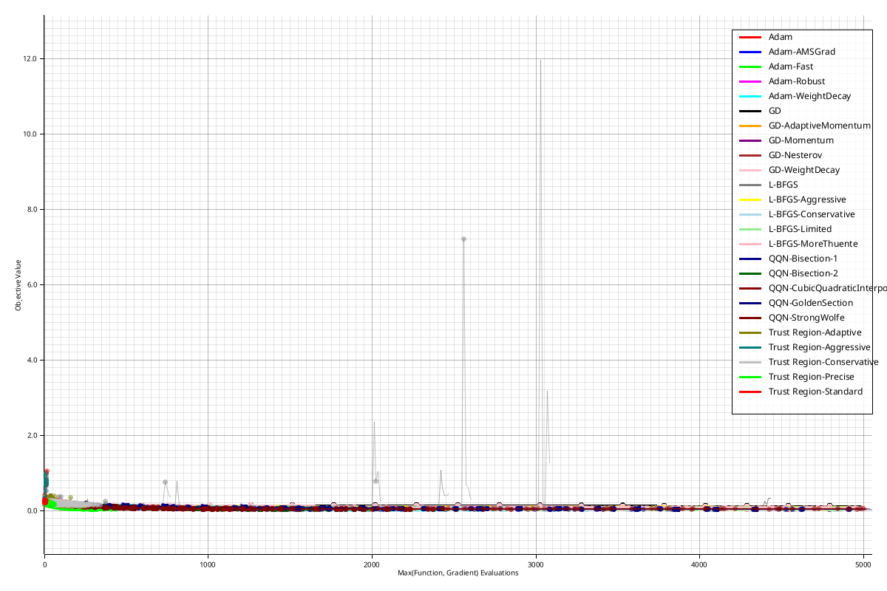
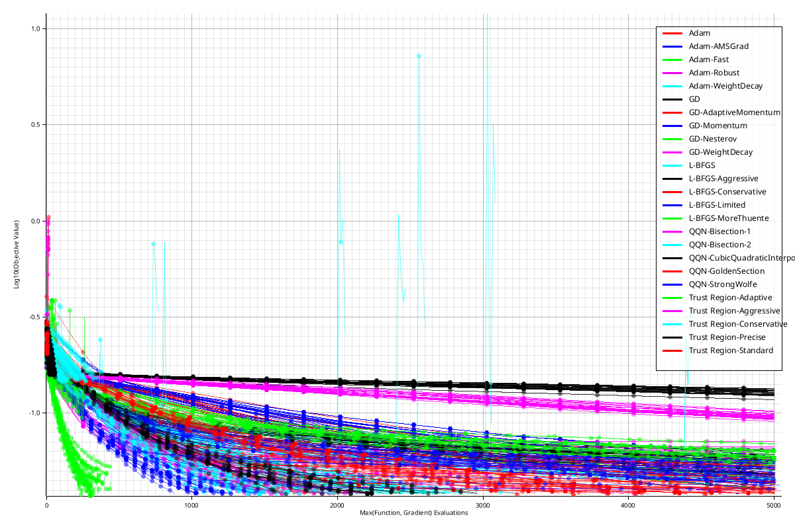

**Figure:** Convergence plots for NeuralNetwork_100samples_layers_10_20_5 showing objective value vs iterations.
Left: Linear scale, Right: Log scale for better visualization of convergence behavior.

**Data:** [Linear scale data (CSV)](data/NeuralNetwork_100samples_layers_10_20_5_data.csv) | [Log scale data (CSV)](data/NeuralNetwork_100samples_layers_10_20_5_log_data.csv)

## Problem: SVM_100samples_5features_C1

**Family:** SVM
**Dimension:** 5
**Success Threshold:** 6.430e-1
**Total Runs:** 500
**Detailed Analysis:** [View comprehensive problem analysis](reports/problem_analysis_SVM_100samples_5features_C1.md)

### Performance Summary
<table style="border-collapse: collapse; width: 100%; margin: 20px 0;">
<tr style="background-color: #f2f2f2;">
<th style="border: 1px solid #ddd; padding: 8px; text-align: center;">Rank</th>
<th style="border: 1px solid #ddd; padding: 8px; text-align: center;">Optimizer</th>
<th style="border: 1px solid #ddd; padding: 8px; text-align: center;">Mean Final Value (All/Success/Fail)</th>
<th style="border: 1px solid #ddd; padding: 8px; text-align: center;">Std Dev</th>
<th style="border: 1px solid #ddd; padding: 8px; text-align: center;">Best Value</th>
<th style="border: 1px solid #ddd; padding: 8px; text-align: center;">Worst Value</th>
<th style="border: 1px solid #ddd; padding: 8px; text-align: center;">Mean Function Evals (All/Success/Fail)</th>
<th style="border: 1px solid #ddd; padding: 8px; text-align: center;">Mean Gradient Evals (All/Success/Fail)</th>
<th style="border: 1px solid #ddd; padding: 8px; text-align: center;">Success Rate</th>
<th style="border: 1px solid #ddd; padding: 8px; text-align: center;">Mean Time (s)</th>
</tr>
<tr style="background-color: #d4edda; font-weight: bold;">
<td style="border: 1px solid #ddd; padding: 8px; text-align: center;">1</td>
<td style="border: 1px solid #ddd; padding: 8px; text-align: center;"><a href="reports/detailed_SVM_100samples_5features_C1_L-BFGS-Aggressive.md" title="Click for detailed analysis">L-BFGS-Aggressive</a></td>
<td style="border: 1px solid #ddd; padding: 8px; text-align: center;">6.43e-1 / 6.43e-1 / -</td>
<td style="border: 1px solid #ddd; padding: 8px; text-align: center;">1.41e-10</td>
<td style="border: 1px solid #ddd; padding: 8px; text-align: center;">6.43e-1</td>
<td style="border: 1px solid #ddd; padding: 8px; text-align: center;">6.43e-1</td>
<td style="border: 1px solid #ddd; padding: 8px; text-align: center;">46.0 / 46.0 / -</td>
<td style="border: 1px solid #ddd; padding: 8px; text-align: center;">21.0 / 21.0 / -</td>
<td style="border: 1px solid #ddd; padding: 8px; text-align: center;">100.0%</td>
<td style="border: 1px solid #ddd; padding: 8px; text-align: center;">0.011</td>
</tr>
<tr style="background-color: #fff3cd;">
<td style="border: 1px solid #ddd; padding: 8px; text-align: center;">2</td>
<td style="border: 1px solid #ddd; padding: 8px; text-align: center;"><a href="reports/detailed_SVM_100samples_5features_C1_L-BFGS.md" title="Click for detailed analysis">L-BFGS</a></td>
<td style="border: 1px solid #ddd; padding: 8px; text-align: center;">6.43e-1 / 6.43e-1 / -</td>
<td style="border: 1px solid #ddd; padding: 8px; text-align: center;">1.38e-12</td>
<td style="border: 1px solid #ddd; padding: 8px; text-align: center;">6.43e-1</td>
<td style="border: 1px solid #ddd; padding: 8px; text-align: center;">6.43e-1</td>
<td style="border: 1px solid #ddd; padding: 8px; text-align: center;">42.0 / 42.0 / -</td>
<td style="border: 1px solid #ddd; padding: 8px; text-align: center;">29.0 / 29.0 / -</td>
<td style="border: 1px solid #ddd; padding: 8px; text-align: center;">100.0%</td>
<td style="border: 1px solid #ddd; padding: 8px; text-align: center;">0.012</td>
</tr>
<tr style="">
<td style="border: 1px solid #ddd; padding: 8px; text-align: center;">3</td>
<td style="border: 1px solid #ddd; padding: 8px; text-align: center;"><a href="reports/detailed_SVM_100samples_5features_C1_L-BFGS-MoreThuente.md" title="Click for detailed analysis">L-BFGS-MoreThuente</a></td>
<td style="border: 1px solid #ddd; padding: 8px; text-align: center;">6.43e-1 / 6.43e-1 / -</td>
<td style="border: 1px solid #ddd; padding: 8px; text-align: center;">1.35e-5</td>
<td style="border: 1px solid #ddd; padding: 8px; text-align: center;">6.43e-1</td>
<td style="border: 1px solid #ddd; padding: 8px; text-align: center;">6.43e-1</td>
<td style="border: 1px solid #ddd; padding: 8px; text-align: center;">41.3 / 41.3 / -</td>
<td style="border: 1px solid #ddd; padding: 8px; text-align: center;">31.0 / 31.0 / -</td>
<td style="border: 1px solid #ddd; padding: 8px; text-align: center;">100.0%</td>
<td style="border: 1px solid #ddd; padding: 8px; text-align: center;">0.013</td>
</tr>
<tr style="">
<td style="border: 1px solid #ddd; padding: 8px; text-align: center;">4</td>
<td style="border: 1px solid #ddd; padding: 8px; text-align: center;"><a href="reports/detailed_SVM_100samples_5features_C1_QQN-StrongWolfe.md" title="Click for detailed analysis">QQN-StrongWolfe</a></td>
<td style="border: 1px solid #ddd; padding: 8px; text-align: center;">6.43e-1 / 6.43e-1 / -</td>
<td style="border: 1px solid #ddd; padding: 8px; text-align: center;">1.43e-5</td>
<td style="border: 1px solid #ddd; padding: 8px; text-align: center;">6.43e-1</td>
<td style="border: 1px solid #ddd; padding: 8px; text-align: center;">6.43e-1</td>
<td style="border: 1px solid #ddd; padding: 8px; text-align: center;">57.5 / 57.5 / -</td>
<td style="border: 1px solid #ddd; padding: 8px; text-align: center;">58.1 / 58.1 / -</td>
<td style="border: 1px solid #ddd; padding: 8px; text-align: center;">100.0%</td>
<td style="border: 1px solid #ddd; padding: 8px; text-align: center;">0.022</td>
</tr>
<tr style="">
<td style="border: 1px solid #ddd; padding: 8px; text-align: center;">5</td>
<td style="border: 1px solid #ddd; padding: 8px; text-align: center;"><a href="reports/detailed_SVM_100samples_5features_C1_QQN-CubicQuadraticInterpolation.md" title="Click for detailed analysis">QQN-CubicQuadraticInterpolation</a></td>
<td style="border: 1px solid #ddd; padding: 8px; text-align: center;">6.43e-1 / 6.43e-1 / -</td>
<td style="border: 1px solid #ddd; padding: 8px; text-align: center;">7.64e-7</td>
<td style="border: 1px solid #ddd; padding: 8px; text-align: center;">6.43e-1</td>
<td style="border: 1px solid #ddd; padding: 8px; text-align: center;">6.43e-1</td>
<td style="border: 1px solid #ddd; padding: 8px; text-align: center;">61.6 / 61.6 / -</td>
<td style="border: 1px solid #ddd; padding: 8px; text-align: center;">73.8 / 73.8 / -</td>
<td style="border: 1px solid #ddd; padding: 8px; text-align: center;">100.0%</td>
<td style="border: 1px solid #ddd; padding: 8px; text-align: center;">0.026</td>
</tr>
<tr style="">
<td style="border: 1px solid #ddd; padding: 8px; text-align: center;">6</td>
<td style="border: 1px solid #ddd; padding: 8px; text-align: center;"><a href="reports/detailed_SVM_100samples_5features_C1_QQN-Bisection-2.md" title="Click for detailed analysis">QQN-Bisection-2</a></td>
<td style="border: 1px solid #ddd; padding: 8px; text-align: center;">6.43e-1 / 6.43e-1 / -</td>
<td style="border: 1px solid #ddd; padding: 8px; text-align: center;">1.80e-5</td>
<td style="border: 1px solid #ddd; padding: 8px; text-align: center;">6.43e-1</td>
<td style="border: 1px solid #ddd; padding: 8px; text-align: center;">6.43e-1</td>
<td style="border: 1px solid #ddd; padding: 8px; text-align: center;">68.8 / 68.8 / -</td>
<td style="border: 1px solid #ddd; padding: 8px; text-align: center;">88.0 / 88.0 / -</td>
<td style="border: 1px solid #ddd; padding: 8px; text-align: center;">100.0%</td>
<td style="border: 1px solid #ddd; padding: 8px; text-align: center;">0.030</td>
</tr>
<tr style="">
<td style="border: 1px solid #ddd; padding: 8px; text-align: center;">7</td>
<td style="border: 1px solid #ddd; padding: 8px; text-align: center;"><a href="reports/detailed_SVM_100samples_5features_C1_QQN-Bisection-1.md" title="Click for detailed analysis">QQN-Bisection-1</a></td>
<td style="border: 1px solid #ddd; padding: 8px; text-align: center;">6.43e-1 / 6.43e-1 / -</td>
<td style="border: 1px solid #ddd; padding: 8px; text-align: center;">1.39e-5</td>
<td style="border: 1px solid #ddd; padding: 8px; text-align: center;">6.43e-1</td>
<td style="border: 1px solid #ddd; padding: 8px; text-align: center;">6.43e-1</td>
<td style="border: 1px solid #ddd; padding: 8px; text-align: center;">83.4 / 83.4 / -</td>
<td style="border: 1px solid #ddd; padding: 8px; text-align: center;">123.5 / 123.5 / -</td>
<td style="border: 1px solid #ddd; padding: 8px; text-align: center;">100.0%</td>
<td style="border: 1px solid #ddd; padding: 8px; text-align: center;">0.040</td>
</tr>
<tr style="">
<td style="border: 1px solid #ddd; padding: 8px; text-align: center;">8</td>
<td style="border: 1px solid #ddd; padding: 8px; text-align: center;"><a href="reports/detailed_SVM_100samples_5features_C1_L-BFGS-Conservative.md" title="Click for detailed analysis">L-BFGS-Conservative</a></td>
<td style="border: 1px solid #ddd; padding: 8px; text-align: center;">6.43e-1 / 6.43e-1 / -</td>
<td style="border: 1px solid #ddd; padding: 8px; text-align: center;">1.59e-5</td>
<td style="border: 1px solid #ddd; padding: 8px; text-align: center;">6.43e-1</td>
<td style="border: 1px solid #ddd; padding: 8px; text-align: center;">6.43e-1</td>
<td style="border: 1px solid #ddd; padding: 8px; text-align: center;">133.7 / 133.7 / -</td>
<td style="border: 1px solid #ddd; padding: 8px; text-align: center;">104.5 / 104.5 / -</td>
<td style="border: 1px solid #ddd; padding: 8px; text-align: center;">100.0%</td>
<td style="border: 1px solid #ddd; padding: 8px; text-align: center;">0.045</td>
</tr>
<tr style="">
<td style="border: 1px solid #ddd; padding: 8px; text-align: center;">9</td>
<td style="border: 1px solid #ddd; padding: 8px; text-align: center;"><a href="reports/detailed_SVM_100samples_5features_C1_GD-WeightDecay.md" title="Click for detailed analysis">GD-WeightDecay</a></td>
<td style="border: 1px solid #ddd; padding: 8px; text-align: center;">6.43e-1 / 6.43e-1 / -</td>
<td style="border: 1px solid #ddd; padding: 8px; text-align: center;">2.96e-6</td>
<td style="border: 1px solid #ddd; padding: 8px; text-align: center;">6.43e-1</td>
<td style="border: 1px solid #ddd; padding: 8px; text-align: center;">6.43e-1</td>
<td style="border: 1px solid #ddd; padding: 8px; text-align: center;">97.2 / 97.2 / -</td>
<td style="border: 1px solid #ddd; padding: 8px; text-align: center;">191.3 / 191.3 / -</td>
<td style="border: 1px solid #ddd; padding: 8px; text-align: center;">100.0%</td>
<td style="border: 1px solid #ddd; padding: 8px; text-align: center;">0.055</td>
</tr>
<tr style="">
<td style="border: 1px solid #ddd; padding: 8px; text-align: center;">10</td>
<td style="border: 1px solid #ddd; padding: 8px; text-align: center;"><a href="reports/detailed_SVM_100samples_5features_C1_GD.md" title="Click for detailed analysis">GD</a></td>
<td style="border: 1px solid #ddd; padding: 8px; text-align: center;">6.43e-1 / 6.43e-1 / -</td>
<td style="border: 1px solid #ddd; padding: 8px; text-align: center;">1.32e-6</td>
<td style="border: 1px solid #ddd; padding: 8px; text-align: center;">6.43e-1</td>
<td style="border: 1px solid #ddd; padding: 8px; text-align: center;">6.43e-1</td>
<td style="border: 1px solid #ddd; padding: 8px; text-align: center;">274.4 / 274.4 / -</td>
<td style="border: 1px solid #ddd; padding: 8px; text-align: center;">545.8 / 545.8 / -</td>
<td style="border: 1px solid #ddd; padding: 8px; text-align: center;">100.0%</td>
<td style="border: 1px solid #ddd; padding: 8px; text-align: center;">0.153</td>
</tr>
<tr style="">
<td style="border: 1px solid #ddd; padding: 8px; text-align: center;">11</td>
<td style="border: 1px solid #ddd; padding: 8px; text-align: center;"><a href="reports/detailed_SVM_100samples_5features_C1_Adam-WeightDecay.md" title="Click for detailed analysis">Adam-WeightDecay</a></td>
<td style="border: 1px solid #ddd; padding: 8px; text-align: center;">6.43e-1 / 6.43e-1 / -</td>
<td style="border: 1px solid #ddd; padding: 8px; text-align: center;">1.36e-6</td>
<td style="border: 1px solid #ddd; padding: 8px; text-align: center;">6.43e-1</td>
<td style="border: 1px solid #ddd; padding: 8px; text-align: center;">6.43e-1</td>
<td style="border: 1px solid #ddd; padding: 8px; text-align: center;">628.6 / 628.6 / -</td>
<td style="border: 1px solid #ddd; padding: 8px; text-align: center;">628.6 / 628.6 / -</td>
<td style="border: 1px solid #ddd; padding: 8px; text-align: center;">100.0%</td>
<td style="border: 1px solid #ddd; padding: 8px; text-align: center;">0.225</td>
</tr>
<tr style="">
<td style="border: 1px solid #ddd; padding: 8px; text-align: center;">12</td>
<td style="border: 1px solid #ddd; padding: 8px; text-align: center;"><a href="reports/detailed_SVM_100samples_5features_C1_Adam.md" title="Click for detailed analysis">Adam</a></td>
<td style="border: 1px solid #ddd; padding: 8px; text-align: center;">6.43e-1 / 6.43e-1 / -</td>
<td style="border: 1px solid #ddd; padding: 8px; text-align: center;">5.18e-7</td>
<td style="border: 1px solid #ddd; padding: 8px; text-align: center;">6.43e-1</td>
<td style="border: 1px solid #ddd; padding: 8px; text-align: center;">6.43e-1</td>
<td style="border: 1px solid #ddd; padding: 8px; text-align: center;">1826.7 / 1826.7 / -</td>
<td style="border: 1px solid #ddd; padding: 8px; text-align: center;">1826.7 / 1826.7 / -</td>
<td style="border: 1px solid #ddd; padding: 8px; text-align: center;">100.0%</td>
<td style="border: 1px solid #ddd; padding: 8px; text-align: center;">0.646</td>
</tr>
<tr style="">
<td style="border: 1px solid #ddd; padding: 8px; text-align: center;">13</td>
<td style="border: 1px solid #ddd; padding: 8px; text-align: center;"><a href="reports/detailed_SVM_100samples_5features_C1_QQN-GoldenSection.md" title="Click for detailed analysis">QQN-GoldenSection</a></td>
<td style="border: 1px solid #ddd; padding: 8px; text-align: center;">6.43e-1 / 6.43e-1 / 6.43e-1</td>
<td style="border: 1px solid #ddd; padding: 8px; text-align: center;">1.87e-5</td>
<td style="border: 1px solid #ddd; padding: 8px; text-align: center;">6.43e-1</td>
<td style="border: 1px solid #ddd; padding: 8px; text-align: center;">6.43e-1</td>
<td style="border: 1px solid #ddd; padding: 8px; text-align: center;">228.9 / 206.3 / 432.0</td>
<td style="border: 1px solid #ddd; padding: 8px; text-align: center;">33.4 / 30.0 / 64.0</td>
<td style="border: 1px solid #ddd; padding: 8px; text-align: center;">90.0%</td>
<td style="border: 1px solid #ddd; padding: 8px; text-align: center;">0.046</td>
</tr>
<tr style="">
<td style="border: 1px solid #ddd; padding: 8px; text-align: center;">14</td>
<td style="border: 1px solid #ddd; padding: 8px; text-align: center;"><a href="reports/detailed_SVM_100samples_5features_C1_L-BFGS-Limited.md" title="Click for detailed analysis">L-BFGS-Limited</a></td>
<td style="border: 1px solid #ddd; padding: 8px; text-align: center;">6.43e-1 / 6.43e-1 / 6.43e-1</td>
<td style="border: 1px solid #ddd; padding: 8px; text-align: center;">1.94e-5</td>
<td style="border: 1px solid #ddd; padding: 8px; text-align: center;">6.43e-1</td>
<td style="border: 1px solid #ddd; padding: 8px; text-align: center;">6.43e-1</td>
<td style="border: 1px solid #ddd; padding: 8px; text-align: center;">444.7 / 47.2 / 4022.0</td>
<td style="border: 1px solid #ddd; padding: 8px; text-align: center;">121.8 / 25.8 / 986.0</td>
<td style="border: 1px solid #ddd; padding: 8px; text-align: center;">90.0%</td>
<td style="border: 1px solid #ddd; padding: 8px; text-align: center;">0.095</td>
</tr>
<tr style="">
<td style="border: 1px solid #ddd; padding: 8px; text-align: center;">15</td>
<td style="border: 1px solid #ddd; padding: 8px; text-align: center;"><a href="reports/detailed_SVM_100samples_5features_C1_Adam-AMSGrad.md" title="Click for detailed analysis">Adam-AMSGrad</a></td>
<td style="border: 1px solid #ddd; padding: 8px; text-align: center;">6.43e-1 / 6.43e-1 / 6.43e-1</td>
<td style="border: 1px solid #ddd; padding: 8px; text-align: center;">1.41e-5</td>
<td style="border: 1px solid #ddd; padding: 8px; text-align: center;">6.43e-1</td>
<td style="border: 1px solid #ddd; padding: 8px; text-align: center;">6.43e-1</td>
<td style="border: 1px solid #ddd; padding: 8px; text-align: center;">1984.2 / 1926.7 / 2502.0</td>
<td style="border: 1px solid #ddd; padding: 8px; text-align: center;">1984.2 / 1926.7 / 2502.0</td>
<td style="border: 1px solid #ddd; padding: 8px; text-align: center;">90.0%</td>
<td style="border: 1px solid #ddd; padding: 8px; text-align: center;">0.702</td>
</tr>
<tr style="">
<td style="border: 1px solid #ddd; padding: 8px; text-align: center;">16</td>
<td style="border: 1px solid #ddd; padding: 8px; text-align: center;"><a href="reports/detailed_SVM_100samples_5features_C1_Adam-Robust.md" title="Click for detailed analysis">Adam-Robust</a></td>
<td style="border: 1px solid #ddd; padding: 8px; text-align: center;">6.43e-1 / 6.43e-1 / 6.43e-1</td>
<td style="border: 1px solid #ddd; padding: 8px; text-align: center;">1.65e-4</td>
<td style="border: 1px solid #ddd; padding: 8px; text-align: center;">6.43e-1</td>
<td style="border: 1px solid #ddd; padding: 8px; text-align: center;">6.44e-1</td>
<td style="border: 1px solid #ddd; padding: 8px; text-align: center;">1414.2 / 425.2 / 2403.1</td>
<td style="border: 1px solid #ddd; padding: 8px; text-align: center;">1414.0 / 425.2 / 2402.8</td>
<td style="border: 1px solid #ddd; padding: 8px; text-align: center;">50.0%</td>
<td style="border: 1px solid #ddd; padding: 8px; text-align: center;">0.499</td>
</tr>
<tr style="">
<td style="border: 1px solid #ddd; padding: 8px; text-align: center;">17</td>
<td style="border: 1px solid #ddd; padding: 8px; text-align: center;"><a href="reports/detailed_SVM_100samples_5features_C1_Trust_Region-Standard.md" title="Click for detailed analysis">Trust Region-Standard</a></td>
<td style="border: 1px solid #ddd; padding: 8px; text-align: center;">8.13e-1 / - / 3.47e2</td>
<td style="border: 1px solid #ddd; padding: 8px; text-align: center;">1.49e-1</td>
<td style="border: 1px solid #ddd; padding: 8px; text-align: center;">6.44e-1</td>
<td style="border: 1px solid #ddd; padding: 8px; text-align: center;">1.03e0</td>
<td style="border: 1px solid #ddd; padding: 8px; text-align: center;">15.4 / - / 15.4</td>
<td style="border: 1px solid #ddd; padding: 8px; text-align: center;">10.8 / - / 10.8</td>
<td style="border: 1px solid #ddd; padding: 8px; text-align: center;">0.0%</td>
<td style="border: 1px solid #ddd; padding: 8px; text-align: center;">0.004</td>
</tr>
<tr style="">
<td style="border: 1px solid #ddd; padding: 8px; text-align: center;">18</td>
<td style="border: 1px solid #ddd; padding: 8px; text-align: center;"><a href="reports/detailed_SVM_100samples_5features_C1_Trust_Region-Aggressive.md" title="Click for detailed analysis">Trust Region-Aggressive</a></td>
<td style="border: 1px solid #ddd; padding: 8px; text-align: center;">9.81e-1 / - / 1.00e3</td>
<td style="border: 1px solid #ddd; padding: 8px; text-align: center;">1.95e-1</td>
<td style="border: 1px solid #ddd; padding: 8px; text-align: center;">6.48e-1</td>
<td style="border: 1px solid #ddd; padding: 8px; text-align: center;">1.26e0</td>
<td style="border: 1px solid #ddd; padding: 8px; text-align: center;">16.3 / - / 16.3</td>
<td style="border: 1px solid #ddd; padding: 8px; text-align: center;">11.4 / - / 11.4</td>
<td style="border: 1px solid #ddd; padding: 8px; text-align: center;">0.0%</td>
<td style="border: 1px solid #ddd; padding: 8px; text-align: center;">0.005</td>
</tr>
<tr style="">
<td style="border: 1px solid #ddd; padding: 8px; text-align: center;">19</td>
<td style="border: 1px solid #ddd; padding: 8px; text-align: center;"><a href="reports/detailed_SVM_100samples_5features_C1_Trust_Region-Adaptive.md" title="Click for detailed analysis">Trust Region-Adaptive</a></td>
<td style="border: 1px solid #ddd; padding: 8px; text-align: center;">6.71e-1 / - / 4.68e0</td>
<td style="border: 1px solid #ddd; padding: 8px; text-align: center;">2.02e-2</td>
<td style="border: 1px solid #ddd; padding: 8px; text-align: center;">6.46e-1</td>
<td style="border: 1px solid #ddd; padding: 8px; text-align: center;">7.07e-1</td>
<td style="border: 1px solid #ddd; padding: 8px; text-align: center;">19.0 / - / 19.0</td>
<td style="border: 1px solid #ddd; padding: 8px; text-align: center;">13.3 / - / 13.3</td>
<td style="border: 1px solid #ddd; padding: 8px; text-align: center;">0.0%</td>
<td style="border: 1px solid #ddd; padding: 8px; text-align: center;">0.005</td>
</tr>
<tr style="">
<td style="border: 1px solid #ddd; padding: 8px; text-align: center;">20</td>
<td style="border: 1px solid #ddd; padding: 8px; text-align: center;"><a href="reports/detailed_SVM_100samples_5features_C1_GD-AdaptiveMomentum.md" title="Click for detailed analysis">GD-AdaptiveMomentum</a></td>
<td style="border: 1px solid #ddd; padding: 8px; text-align: center;">6.48e-1 / - / 7.53e-1</td>
<td style="border: 1px solid #ddd; padding: 8px; text-align: center;">1.84e-3</td>
<td style="border: 1px solid #ddd; padding: 8px; text-align: center;">6.44e-1</td>
<td style="border: 1px solid #ddd; padding: 8px; text-align: center;">6.50e-1</td>
<td style="border: 1px solid #ddd; padding: 8px; text-align: center;">17.6 / - / 17.6</td>
<td style="border: 1px solid #ddd; padding: 8px; text-align: center;">31.3 / - / 31.3</td>
<td style="border: 1px solid #ddd; padding: 8px; text-align: center;">0.0%</td>
<td style="border: 1px solid #ddd; padding: 8px; text-align: center;">0.009</td>
</tr>
<tr style="">
<td style="border: 1px solid #ddd; padding: 8px; text-align: center;">21</td>
<td style="border: 1px solid #ddd; padding: 8px; text-align: center;"><a href="reports/detailed_SVM_100samples_5features_C1_Trust_Region-Precise.md" title="Click for detailed analysis">Trust Region-Precise</a></td>
<td style="border: 1px solid #ddd; padding: 8px; text-align: center;">6.47e-1 / - / 9.38e-1</td>
<td style="border: 1px solid #ddd; padding: 8px; text-align: center;">2.36e-3</td>
<td style="border: 1px solid #ddd; padding: 8px; text-align: center;">6.44e-1</td>
<td style="border: 1px solid #ddd; padding: 8px; text-align: center;">6.54e-1</td>
<td style="border: 1px solid #ddd; padding: 8px; text-align: center;">36.2 / - / 36.2</td>
<td style="border: 1px solid #ddd; padding: 8px; text-align: center;">24.5 / - / 24.5</td>
<td style="border: 1px solid #ddd; padding: 8px; text-align: center;">0.0%</td>
<td style="border: 1px solid #ddd; padding: 8px; text-align: center;">0.010</td>
</tr>
<tr style="">
<td style="border: 1px solid #ddd; padding: 8px; text-align: center;">22</td>
<td style="border: 1px solid #ddd; padding: 8px; text-align: center;"><a href="reports/detailed_SVM_100samples_5features_C1_Adam-Fast.md" title="Click for detailed analysis">Adam-Fast</a></td>
<td style="border: 1px solid #ddd; padding: 8px; text-align: center;">6.66e-1 / - / 6.84e-1</td>
<td style="border: 1px solid #ddd; padding: 8px; text-align: center;">1.46e-2</td>
<td style="border: 1px solid #ddd; padding: 8px; text-align: center;">6.44e-1</td>
<td style="border: 1px solid #ddd; padding: 8px; text-align: center;">6.92e-1</td>
<td style="border: 1px solid #ddd; padding: 8px; text-align: center;">32.8 / - / 32.8</td>
<td style="border: 1px solid #ddd; padding: 8px; text-align: center;">31.8 / - / 31.8</td>
<td style="border: 1px solid #ddd; padding: 8px; text-align: center;">0.0%</td>
<td style="border: 1px solid #ddd; padding: 8px; text-align: center;">0.012</td>
</tr>
<tr style="">
<td style="border: 1px solid #ddd; padding: 8px; text-align: center;">23</td>
<td style="border: 1px solid #ddd; padding: 8px; text-align: center;"><a href="reports/detailed_SVM_100samples_5features_C1_GD-Momentum.md" title="Click for detailed analysis">GD-Momentum</a></td>
<td style="border: 1px solid #ddd; padding: 8px; text-align: center;">6.47e-1 / - / 6.73e-1</td>
<td style="border: 1px solid #ddd; padding: 8px; text-align: center;">1.80e-3</td>
<td style="border: 1px solid #ddd; padding: 8px; text-align: center;">6.45e-1</td>
<td style="border: 1px solid #ddd; padding: 8px; text-align: center;">6.52e-1</td>
<td style="border: 1px solid #ddd; padding: 8px; text-align: center;">24.9 / - / 24.9</td>
<td style="border: 1px solid #ddd; padding: 8px; text-align: center;">45.8 / - / 45.8</td>
<td style="border: 1px solid #ddd; padding: 8px; text-align: center;">0.0%</td>
<td style="border: 1px solid #ddd; padding: 8px; text-align: center;">0.013</td>
</tr>
<tr style="">
<td style="border: 1px solid #ddd; padding: 8px; text-align: center;">24</td>
<td style="border: 1px solid #ddd; padding: 8px; text-align: center;"><a href="reports/detailed_SVM_100samples_5features_C1_GD-Nesterov.md" title="Click for detailed analysis">GD-Nesterov</a></td>
<td style="border: 1px solid #ddd; padding: 8px; text-align: center;">6.46e-1 / - / 6.64e-1</td>
<td style="border: 1px solid #ddd; padding: 8px; text-align: center;">1.77e-3</td>
<td style="border: 1px solid #ddd; padding: 8px; text-align: center;">6.43e-1</td>
<td style="border: 1px solid #ddd; padding: 8px; text-align: center;">6.49e-1</td>
<td style="border: 1px solid #ddd; padding: 8px; text-align: center;">25.1 / - / 25.1</td>
<td style="border: 1px solid #ddd; padding: 8px; text-align: center;">46.1 / - / 46.1</td>
<td style="border: 1px solid #ddd; padding: 8px; text-align: center;">0.0%</td>
<td style="border: 1px solid #ddd; padding: 8px; text-align: center;">0.014</td>
</tr>
<tr style="">
<td style="border: 1px solid #ddd; padding: 8px; text-align: center;">25</td>
<td style="border: 1px solid #ddd; padding: 8px; text-align: center;"><a href="reports/detailed_SVM_100samples_5features_C1_Trust_Region-Conservative.md" title="Click for detailed analysis">Trust Region-Conservative</a></td>
<td style="border: 1px solid #ddd; padding: 8px; text-align: center;">6.44e-1 / - / 2.82e0</td>
<td style="border: 1px solid #ddd; padding: 8px; text-align: center;">8.34e-4</td>
<td style="border: 1px solid #ddd; padding: 8px; text-align: center;">6.43e-1</td>
<td style="border: 1px solid #ddd; padding: 8px; text-align: center;">6.46e-1</td>
<td style="border: 1px solid #ddd; padding: 8px; text-align: center;">134.5 / - / 134.5</td>
<td style="border: 1px solid #ddd; padding: 8px; text-align: center;">89.9 / - / 89.9</td>
<td style="border: 1px solid #ddd; padding: 8px; text-align: center;">0.0%</td>
<td style="border: 1px solid #ddd; padding: 8px; text-align: center;">0.038</td>
</tr>
</table>

### Convergence Plots

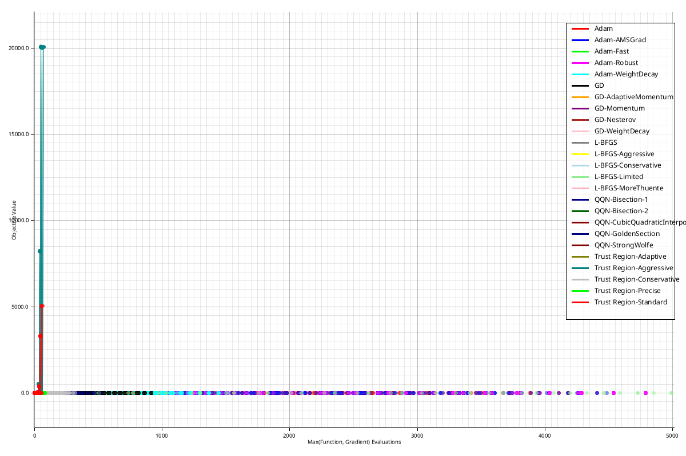
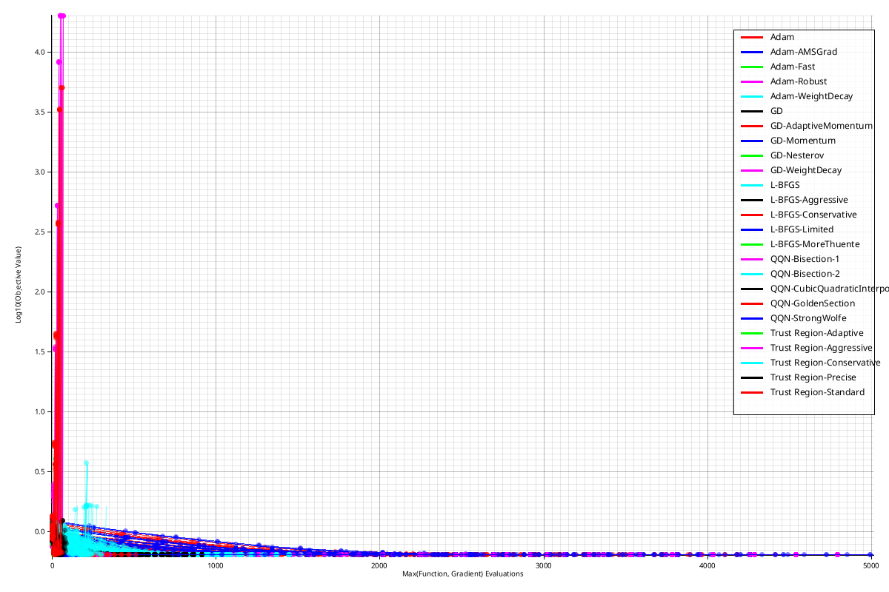

**Figure:** Convergence plots for SVM_100samples_5features_C1 showing objective value vs iterations.
Left: Linear scale, Right: Log scale for better visualization of convergence behavior.

**Data:** [Linear scale data (CSV)](data/SVM_100samples_5features_C1_data.csv) | [Log scale data (CSV)](data/SVM_100samples_5features_C1_log_data.csv)

## Problem: SVM_200samples_10features_C1

**Family:** SVM
**Dimension:** 10
**Success Threshold:** 6.860e-1
**Total Runs:** 500
**Detailed Analysis:** [View comprehensive problem analysis](reports/problem_analysis_SVM_200samples_10features_C1.md)

### Performance Summary
<table style="border-collapse: collapse; width: 100%; margin: 20px 0;">
<tr style="background-color: #f2f2f2;">
<th style="border: 1px solid #ddd; padding: 8px; text-align: center;">Rank</th>
<th style="border: 1px solid #ddd; padding: 8px; text-align: center;">Optimizer</th>
<th style="border: 1px solid #ddd; padding: 8px; text-align: center;">Mean Final Value (All/Success/Fail)</th>
<th style="border: 1px solid #ddd; padding: 8px; text-align: center;">Std Dev</th>
<th style="border: 1px solid #ddd; padding: 8px; text-align: center;">Best Value</th>
<th style="border: 1px solid #ddd; padding: 8px; text-align: center;">Worst Value</th>
<th style="border: 1px solid #ddd; padding: 8px; text-align: center;">Mean Function Evals (All/Success/Fail)</th>
<th style="border: 1px solid #ddd; padding: 8px; text-align: center;">Mean Gradient Evals (All/Success/Fail)</th>
<th style="border: 1px solid #ddd; padding: 8px; text-align: center;">Success Rate</th>
<th style="border: 1px solid #ddd; padding: 8px; text-align: center;">Mean Time (s)</th>
</tr>
<tr style="background-color: #d4edda; font-weight: bold;">
<td style="border: 1px solid #ddd; padding: 8px; text-align: center;">1</td>
<td style="border: 1px solid #ddd; padding: 8px; text-align: center;"><a href="reports/detailed_SVM_200samples_10features_C1_Trust_Region-Aggressive.md" title="Click for detailed analysis">Trust Region-Aggressive</a></td>
<td style="border: 1px solid #ddd; padding: 8px; text-align: center;">1.05e0 / - / 1.84e0</td>
<td style="border: 1px solid #ddd; padding: 8px; text-align: center;">1.36e-1</td>
<td style="border: 1px solid #ddd; padding: 8px; text-align: center;">7.01e-1</td>
<td style="border: 1px solid #ddd; padding: 8px; text-align: center;">1.30e0</td>
<td style="border: 1px solid #ddd; padding: 8px; text-align: center;">11.8 / - / 11.8</td>
<td style="border: 1px solid #ddd; padding: 8px; text-align: center;">8.5 / - / 8.5</td>
<td style="border: 1px solid #ddd; padding: 8px; text-align: center;">0.0%</td>
<td style="border: 1px solid #ddd; padding: 8px; text-align: center;">0.006</td>
</tr>
<tr style="background-color: #fff3cd;">
<td style="border: 1px solid #ddd; padding: 8px; text-align: center;">2</td>
<td style="border: 1px solid #ddd; padding: 8px; text-align: center;"><a href="reports/detailed_SVM_200samples_10features_C1_Trust_Region-Standard.md" title="Click for detailed analysis">Trust Region-Standard</a></td>
<td style="border: 1px solid #ddd; padding: 8px; text-align: center;">8.58e-1 / - / 8.76e-1</td>
<td style="border: 1px solid #ddd; padding: 8px; text-align: center;">1.55e-1</td>
<td style="border: 1px solid #ddd; padding: 8px; text-align: center;">6.89e-1</td>
<td style="border: 1px solid #ddd; padding: 8px; text-align: center;">1.09e0</td>
<td style="border: 1px solid #ddd; padding: 8px; text-align: center;">20.8 / - / 20.8</td>
<td style="border: 1px solid #ddd; padding: 8px; text-align: center;">14.2 / - / 14.2</td>
<td style="border: 1px solid #ddd; padding: 8px; text-align: center;">0.0%</td>
<td style="border: 1px solid #ddd; padding: 8px; text-align: center;">0.011</td>
</tr>
<tr style="">
<td style="border: 1px solid #ddd; padding: 8px; text-align: center;">3</td>
<td style="border: 1px solid #ddd; padding: 8px; text-align: center;"><a href="reports/detailed_SVM_200samples_10features_C1_Trust_Region-Adaptive.md" title="Click for detailed analysis">Trust Region-Adaptive</a></td>
<td style="border: 1px solid #ddd; padding: 8px; text-align: center;">7.09e-1 / - / 6.77e0</td>
<td style="border: 1px solid #ddd; padding: 8px; text-align: center;">1.91e-2</td>
<td style="border: 1px solid #ddd; padding: 8px; text-align: center;">6.88e-1</td>
<td style="border: 1px solid #ddd; padding: 8px; text-align: center;">7.52e-1</td>
<td style="border: 1px solid #ddd; padding: 8px; text-align: center;">24.4 / - / 24.4</td>
<td style="border: 1px solid #ddd; padding: 8px; text-align: center;">16.7 / - / 16.7</td>
<td style="border: 1px solid #ddd; padding: 8px; text-align: center;">0.0%</td>
<td style="border: 1px solid #ddd; padding: 8px; text-align: center;">0.012</td>
</tr>
<tr style="">
<td style="border: 1px solid #ddd; padding: 8px; text-align: center;">4</td>
<td style="border: 1px solid #ddd; padding: 8px; text-align: center;"><a href="reports/detailed_SVM_200samples_10features_C1_GD-AdaptiveMomentum.md" title="Click for detailed analysis">GD-AdaptiveMomentum</a></td>
<td style="border: 1px solid #ddd; padding: 8px; text-align: center;">6.93e-1 / - / 7.83e-1</td>
<td style="border: 1px solid #ddd; padding: 8px; text-align: center;">1.42e-3</td>
<td style="border: 1px solid #ddd; padding: 8px; text-align: center;">6.89e-1</td>
<td style="border: 1px solid #ddd; padding: 8px; text-align: center;">6.95e-1</td>
<td style="border: 1px solid #ddd; padding: 8px; text-align: center;">18.0 / - / 18.0</td>
<td style="border: 1px solid #ddd; padding: 8px; text-align: center;">32.0 / - / 32.0</td>
<td style="border: 1px solid #ddd; padding: 8px; text-align: center;">0.0%</td>
<td style="border: 1px solid #ddd; padding: 8px; text-align: center;">0.017</td>
</tr>
<tr style="">
<td style="border: 1px solid #ddd; padding: 8px; text-align: center;">5</td>
<td style="border: 1px solid #ddd; padding: 8px; text-align: center;"><a href="reports/detailed_SVM_200samples_10features_C1_Trust_Region-Precise.md" title="Click for detailed analysis">Trust Region-Precise</a></td>
<td style="border: 1px solid #ddd; padding: 8px; text-align: center;">6.94e-1 / - / 9.09e-1</td>
<td style="border: 1px solid #ddd; padding: 8px; text-align: center;">3.54e-3</td>
<td style="border: 1px solid #ddd; padding: 8px; text-align: center;">6.88e-1</td>
<td style="border: 1px solid #ddd; padding: 8px; text-align: center;">7.00e-1</td>
<td style="border: 1px solid #ddd; padding: 8px; text-align: center;">36.1 / - / 36.1</td>
<td style="border: 1px solid #ddd; padding: 8px; text-align: center;">24.6 / - / 24.6</td>
<td style="border: 1px solid #ddd; padding: 8px; text-align: center;">0.0%</td>
<td style="border: 1px solid #ddd; padding: 8px; text-align: center;">0.019</td>
</tr>
<tr style="">
<td style="border: 1px solid #ddd; padding: 8px; text-align: center;">6</td>
<td style="border: 1px solid #ddd; padding: 8px; text-align: center;"><a href="reports/detailed_SVM_200samples_10features_C1_GD-Nesterov.md" title="Click for detailed analysis">GD-Nesterov</a></td>
<td style="border: 1px solid #ddd; padding: 8px; text-align: center;">6.92e-1 / - / 7.03e-1</td>
<td style="border: 1px solid #ddd; padding: 8px; text-align: center;">1.03e-3</td>
<td style="border: 1px solid #ddd; padding: 8px; text-align: center;">6.89e-1</td>
<td style="border: 1px solid #ddd; padding: 8px; text-align: center;">6.93e-1</td>
<td style="border: 1px solid #ddd; padding: 8px; text-align: center;">25.7 / - / 25.7</td>
<td style="border: 1px solid #ddd; padding: 8px; text-align: center;">47.4 / - / 47.4</td>
<td style="border: 1px solid #ddd; padding: 8px; text-align: center;">0.0%</td>
<td style="border: 1px solid #ddd; padding: 8px; text-align: center;">0.024</td>
</tr>
<tr style="">
<td style="border: 1px solid #ddd; padding: 8px; text-align: center;">7</td>
<td style="border: 1px solid #ddd; padding: 8px; text-align: center;"><a href="reports/detailed_SVM_200samples_10features_C1_GD-Momentum.md" title="Click for detailed analysis">GD-Momentum</a></td>
<td style="border: 1px solid #ddd; padding: 8px; text-align: center;">6.92e-1 / - / 7.08e-1</td>
<td style="border: 1px solid #ddd; padding: 8px; text-align: center;">1.53e-3</td>
<td style="border: 1px solid #ddd; padding: 8px; text-align: center;">6.89e-1</td>
<td style="border: 1px solid #ddd; padding: 8px; text-align: center;">6.96e-1</td>
<td style="border: 1px solid #ddd; padding: 8px; text-align: center;">25.8 / - / 25.8</td>
<td style="border: 1px solid #ddd; padding: 8px; text-align: center;">47.5 / - / 47.5</td>
<td style="border: 1px solid #ddd; padding: 8px; text-align: center;">0.0%</td>
<td style="border: 1px solid #ddd; padding: 8px; text-align: center;">0.024</td>
</tr>
<tr style="">
<td style="border: 1px solid #ddd; padding: 8px; text-align: center;">8</td>
<td style="border: 1px solid #ddd; padding: 8px; text-align: center;"><a href="reports/detailed_SVM_200samples_10features_C1_Adam-Fast.md" title="Click for detailed analysis">Adam-Fast</a></td>
<td style="border: 1px solid #ddd; padding: 8px; text-align: center;">7.13e-1 / - / 7.22e-1</td>
<td style="border: 1px solid #ddd; padding: 8px; text-align: center;">1.75e-2</td>
<td style="border: 1px solid #ddd; padding: 8px; text-align: center;">6.87e-1</td>
<td style="border: 1px solid #ddd; padding: 8px; text-align: center;">7.38e-1</td>
<td style="border: 1px solid #ddd; padding: 8px; text-align: center;">42.1 / - / 42.1</td>
<td style="border: 1px solid #ddd; padding: 8px; text-align: center;">41.1 / - / 41.1</td>
<td style="border: 1px solid #ddd; padding: 8px; text-align: center;">0.0%</td>
<td style="border: 1px solid #ddd; padding: 8px; text-align: center;">0.027</td>
</tr>
<tr style="">
<td style="border: 1px solid #ddd; padding: 8px; text-align: center;">9</td>
<td style="border: 1px solid #ddd; padding: 8px; text-align: center;"><a href="reports/detailed_SVM_200samples_10features_C1_L-BFGS-Aggressive.md" title="Click for detailed analysis">L-BFGS-Aggressive</a></td>
<td style="border: 1px solid #ddd; padding: 8px; text-align: center;">6.86e-1 / - / 6.86e-1</td>
<td style="border: 1px solid #ddd; padding: 8px; text-align: center;">6.90e-6</td>
<td style="border: 1px solid #ddd; padding: 8px; text-align: center;">6.86e-1</td>
<td style="border: 1px solid #ddd; padding: 8px; text-align: center;">6.86e-1</td>
<td style="border: 1px solid #ddd; padding: 8px; text-align: center;">124.0 / - / 124.0</td>
<td style="border: 1px solid #ddd; padding: 8px; text-align: center;">45.6 / - / 45.6</td>
<td style="border: 1px solid #ddd; padding: 8px; text-align: center;">0.0%</td>
<td style="border: 1px solid #ddd; padding: 8px; text-align: center;">0.051</td>
</tr>
<tr style="">
<td style="border: 1px solid #ddd; padding: 8px; text-align: center;">10</td>
<td style="border: 1px solid #ddd; padding: 8px; text-align: center;"><a href="reports/detailed_SVM_200samples_10features_C1_Trust_Region-Conservative.md" title="Click for detailed analysis">Trust Region-Conservative</a></td>
<td style="border: 1px solid #ddd; padding: 8px; text-align: center;">6.88e-1 / - / 2.49e0</td>
<td style="border: 1px solid #ddd; padding: 8px; text-align: center;">8.43e-4</td>
<td style="border: 1px solid #ddd; padding: 8px; text-align: center;">6.87e-1</td>
<td style="border: 1px solid #ddd; padding: 8px; text-align: center;">6.90e-1</td>
<td style="border: 1px solid #ddd; padding: 8px; text-align: center;">130.4 / - / 130.4</td>
<td style="border: 1px solid #ddd; padding: 8px; text-align: center;">87.2 / - / 87.2</td>
<td style="border: 1px solid #ddd; padding: 8px; text-align: center;">0.0%</td>
<td style="border: 1px solid #ddd; padding: 8px; text-align: center;">0.066</td>
</tr>
<tr style="">
<td style="border: 1px solid #ddd; padding: 8px; text-align: center;">11</td>
<td style="border: 1px solid #ddd; padding: 8px; text-align: center;"><a href="reports/detailed_SVM_200samples_10features_C1_L-BFGS.md" title="Click for detailed analysis">L-BFGS</a></td>
<td style="border: 1px solid #ddd; padding: 8px; text-align: center;">6.86e-1 / - / 7.68e-1</td>
<td style="border: 1px solid #ddd; padding: 8px; text-align: center;">6.08e-5</td>
<td style="border: 1px solid #ddd; padding: 8px; text-align: center;">6.86e-1</td>
<td style="border: 1px solid #ddd; padding: 8px; text-align: center;">6.86e-1</td>
<td style="border: 1px solid #ddd; padding: 8px; text-align: center;">321.6 / - / 321.6</td>
<td style="border: 1px solid #ddd; padding: 8px; text-align: center;">149.2 / - / 149.2</td>
<td style="border: 1px solid #ddd; padding: 8px; text-align: center;">0.0%</td>
<td style="border: 1px solid #ddd; padding: 8px; text-align: center;">0.143</td>
</tr>
<tr style="">
<td style="border: 1px solid #ddd; padding: 8px; text-align: center;">12</td>
<td style="border: 1px solid #ddd; padding: 8px; text-align: center;"><a href="reports/detailed_SVM_200samples_10features_C1_GD-WeightDecay.md" title="Click for detailed analysis">GD-WeightDecay</a></td>
<td style="border: 1px solid #ddd; padding: 8px; text-align: center;">6.86e-1 / - / 6.86e-1</td>
<td style="border: 1px solid #ddd; padding: 8px; text-align: center;">5.36e-7</td>
<td style="border: 1px solid #ddd; padding: 8px; text-align: center;">6.86e-1</td>
<td style="border: 1px solid #ddd; padding: 8px; text-align: center;">6.86e-1</td>
<td style="border: 1px solid #ddd; padding: 8px; text-align: center;">177.0 / - / 177.0</td>
<td style="border: 1px solid #ddd; padding: 8px; text-align: center;">350.0 / - / 350.0</td>
<td style="border: 1px solid #ddd; padding: 8px; text-align: center;">0.0%</td>
<td style="border: 1px solid #ddd; padding: 8px; text-align: center;">0.172</td>
</tr>
<tr style="">
<td style="border: 1px solid #ddd; padding: 8px; text-align: center;">13</td>
<td style="border: 1px solid #ddd; padding: 8px; text-align: center;"><a href="reports/detailed_SVM_200samples_10features_C1_QQN-CubicQuadraticInterpolation.md" title="Click for detailed analysis">QQN-CubicQuadraticInterpolation</a></td>
<td style="border: 1px solid #ddd; padding: 8px; text-align: center;">6.86e-1 / - / 6.86e-1</td>
<td style="border: 1px solid #ddd; padding: 8px; text-align: center;">5.68e-6</td>
<td style="border: 1px solid #ddd; padding: 8px; text-align: center;">6.86e-1</td>
<td style="border: 1px solid #ddd; padding: 8px; text-align: center;">6.86e-1</td>
<td style="border: 1px solid #ddd; padding: 8px; text-align: center;">289.4 / - / 289.4</td>
<td style="border: 1px solid #ddd; padding: 8px; text-align: center;">367.2 / - / 367.2</td>
<td style="border: 1px solid #ddd; padding: 8px; text-align: center;">0.0%</td>
<td style="border: 1px solid #ddd; padding: 8px; text-align: center;">0.223</td>
</tr>
<tr style="">
<td style="border: 1px solid #ddd; padding: 8px; text-align: center;">14</td>
<td style="border: 1px solid #ddd; padding: 8px; text-align: center;"><a href="reports/detailed_SVM_200samples_10features_C1_L-BFGS-Conservative.md" title="Click for detailed analysis">L-BFGS-Conservative</a></td>
<td style="border: 1px solid #ddd; padding: 8px; text-align: center;">6.86e-1 / - / 6.86e-1</td>
<td style="border: 1px solid #ddd; padding: 8px; text-align: center;">5.85e-6</td>
<td style="border: 1px solid #ddd; padding: 8px; text-align: center;">6.86e-1</td>
<td style="border: 1px solid #ddd; padding: 8px; text-align: center;">6.86e-1</td>
<td style="border: 1px solid #ddd; padding: 8px; text-align: center;">624.9 / - / 624.9</td>
<td style="border: 1px solid #ddd; padding: 8px; text-align: center;">260.6 / - / 260.6</td>
<td style="border: 1px solid #ddd; padding: 8px; text-align: center;">0.0%</td>
<td style="border: 1px solid #ddd; padding: 8px; text-align: center;">0.263</td>
</tr>
<tr style="">
<td style="border: 1px solid #ddd; padding: 8px; text-align: center;">15</td>
<td style="border: 1px solid #ddd; padding: 8px; text-align: center;"><a href="reports/detailed_SVM_200samples_10features_C1_L-BFGS-Limited.md" title="Click for detailed analysis">L-BFGS-Limited</a></td>
<td style="border: 1px solid #ddd; padding: 8px; text-align: center;">6.86e-1 / - / 6.86e-1</td>
<td style="border: 1px solid #ddd; padding: 8px; text-align: center;">1.04e-4</td>
<td style="border: 1px solid #ddd; padding: 8px; text-align: center;">6.86e-1</td>
<td style="border: 1px solid #ddd; padding: 8px; text-align: center;">6.87e-1</td>
<td style="border: 1px solid #ddd; padding: 8px; text-align: center;">770.6 / - / 770.6</td>
<td style="border: 1px solid #ddd; padding: 8px; text-align: center;">155.2 / - / 155.2</td>
<td style="border: 1px solid #ddd; padding: 8px; text-align: center;">0.0%</td>
<td style="border: 1px solid #ddd; padding: 8px; text-align: center;">0.264</td>
</tr>
<tr style="">
<td style="border: 1px solid #ddd; padding: 8px; text-align: center;">16</td>
<td style="border: 1px solid #ddd; padding: 8px; text-align: center;"><a href="reports/detailed_SVM_200samples_10features_C1_L-BFGS-MoreThuente.md" title="Click for detailed analysis">L-BFGS-MoreThuente</a></td>
<td style="border: 1px solid #ddd; padding: 8px; text-align: center;">6.86e-1 / - / 5.16e3</td>
<td style="border: 1px solid #ddd; padding: 8px; text-align: center;">1.39e-4</td>
<td style="border: 1px solid #ddd; padding: 8px; text-align: center;">6.86e-1</td>
<td style="border: 1px solid #ddd; padding: 8px; text-align: center;">6.87e-1</td>
<td style="border: 1px solid #ddd; padding: 8px; text-align: center;">555.0 / - / 555.0</td>
<td style="border: 1px solid #ddd; padding: 8px; text-align: center;">452.6 / - / 452.6</td>
<td style="border: 1px solid #ddd; padding: 8px; text-align: center;">0.0%</td>
<td style="border: 1px solid #ddd; padding: 8px; text-align: center;">0.311</td>
</tr>
<tr style="">
<td style="border: 1px solid #ddd; padding: 8px; text-align: center;">17</td>
<td style="border: 1px solid #ddd; padding: 8px; text-align: center;"><a href="reports/detailed_SVM_200samples_10features_C1_QQN-GoldenSection.md" title="Click for detailed analysis">QQN-GoldenSection</a></td>
<td style="border: 1px solid #ddd; padding: 8px; text-align: center;">6.86e-1 / - / 6.86e-1</td>
<td style="border: 1px solid #ddd; padding: 8px; text-align: center;">6.68e-6</td>
<td style="border: 1px solid #ddd; padding: 8px; text-align: center;">6.86e-1</td>
<td style="border: 1px solid #ddd; padding: 8px; text-align: center;">6.86e-1</td>
<td style="border: 1px solid #ddd; padding: 8px; text-align: center;">925.2 / - / 925.2</td>
<td style="border: 1px solid #ddd; padding: 8px; text-align: center;">129.4 / - / 129.4</td>
<td style="border: 1px solid #ddd; padding: 8px; text-align: center;">0.0%</td>
<td style="border: 1px solid #ddd; padding: 8px; text-align: center;">0.317</td>
</tr>
<tr style="">
<td style="border: 1px solid #ddd; padding: 8px; text-align: center;">18</td>
<td style="border: 1px solid #ddd; padding: 8px; text-align: center;"><a href="reports/detailed_SVM_200samples_10features_C1_Adam-Robust.md" title="Click for detailed analysis">Adam-Robust</a></td>
<td style="border: 1px solid #ddd; padding: 8px; text-align: center;">6.86e-1 / - / 6.86e-1</td>
<td style="border: 1px solid #ddd; padding: 8px; text-align: center;">1.02e-5</td>
<td style="border: 1px solid #ddd; padding: 8px; text-align: center;">6.86e-1</td>
<td style="border: 1px solid #ddd; padding: 8px; text-align: center;">6.86e-1</td>
<td style="border: 1px solid #ddd; padding: 8px; text-align: center;">547.7 / - / 547.7</td>
<td style="border: 1px solid #ddd; padding: 8px; text-align: center;">546.7 / - / 546.7</td>
<td style="border: 1px solid #ddd; padding: 8px; text-align: center;">0.0%</td>
<td style="border: 1px solid #ddd; padding: 8px; text-align: center;">0.348</td>
</tr>
<tr style="">
<td style="border: 1px solid #ddd; padding: 8px; text-align: center;">19</td>
<td style="border: 1px solid #ddd; padding: 8px; text-align: center;"><a href="reports/detailed_SVM_200samples_10features_C1_Adam-WeightDecay.md" title="Click for detailed analysis">Adam-WeightDecay</a></td>
<td style="border: 1px solid #ddd; padding: 8px; text-align: center;">6.86e-1 / - / 6.86e-1</td>
<td style="border: 1px solid #ddd; padding: 8px; text-align: center;">7.15e-6</td>
<td style="border: 1px solid #ddd; padding: 8px; text-align: center;">6.86e-1</td>
<td style="border: 1px solid #ddd; padding: 8px; text-align: center;">6.86e-1</td>
<td style="border: 1px solid #ddd; padding: 8px; text-align: center;">668.9 / - / 668.9</td>
<td style="border: 1px solid #ddd; padding: 8px; text-align: center;">667.9 / - / 667.9</td>
<td style="border: 1px solid #ddd; padding: 8px; text-align: center;">0.0%</td>
<td style="border: 1px solid #ddd; padding: 8px; text-align: center;">0.421</td>
</tr>
<tr style="">
<td style="border: 1px solid #ddd; padding: 8px; text-align: center;">20</td>
<td style="border: 1px solid #ddd; padding: 8px; text-align: center;"><a href="reports/detailed_SVM_200samples_10features_C1_GD.md" title="Click for detailed analysis">GD</a></td>
<td style="border: 1px solid #ddd; padding: 8px; text-align: center;">6.86e-1 / - / 6.86e-1</td>
<td style="border: 1px solid #ddd; padding: 8px; text-align: center;">1.59e-6</td>
<td style="border: 1px solid #ddd; padding: 8px; text-align: center;">6.86e-1</td>
<td style="border: 1px solid #ddd; padding: 8px; text-align: center;">6.86e-1</td>
<td style="border: 1px solid #ddd; padding: 8px; text-align: center;">450.0 / - / 450.0</td>
<td style="border: 1px solid #ddd; padding: 8px; text-align: center;">896.0 / - / 896.0</td>
<td style="border: 1px solid #ddd; padding: 8px; text-align: center;">0.0%</td>
<td style="border: 1px solid #ddd; padding: 8px; text-align: center;">0.437</td>
</tr>
<tr style="">
<td style="border: 1px solid #ddd; padding: 8px; text-align: center;">21</td>
<td style="border: 1px solid #ddd; padding: 8px; text-align: center;"><a href="reports/detailed_SVM_200samples_10features_C1_QQN-Bisection-2.md" title="Click for detailed analysis">QQN-Bisection-2</a></td>
<td style="border: 1px solid #ddd; padding: 8px; text-align: center;">6.86e-1 / - / 6.86e-1</td>
<td style="border: 1px solid #ddd; padding: 8px; text-align: center;">1.16e-5</td>
<td style="border: 1px solid #ddd; padding: 8px; text-align: center;">6.86e-1</td>
<td style="border: 1px solid #ddd; padding: 8px; text-align: center;">6.86e-1</td>
<td style="border: 1px solid #ddd; padding: 8px; text-align: center;">911.8 / - / 911.8</td>
<td style="border: 1px solid #ddd; padding: 8px; text-align: center;">494.9 / - / 494.9</td>
<td style="border: 1px solid #ddd; padding: 8px; text-align: center;">0.0%</td>
<td style="border: 1px solid #ddd; padding: 8px; text-align: center;">0.458</td>
</tr>
<tr style="">
<td style="border: 1px solid #ddd; padding: 8px; text-align: center;">22</td>
<td style="border: 1px solid #ddd; padding: 8px; text-align: center;"><a href="reports/detailed_SVM_200samples_10features_C1_QQN-StrongWolfe.md" title="Click for detailed analysis">QQN-StrongWolfe</a></td>
<td style="border: 1px solid #ddd; padding: 8px; text-align: center;">6.86e-1 / - / 6.86e-1</td>
<td style="border: 1px solid #ddd; padding: 8px; text-align: center;">3.82e-6</td>
<td style="border: 1px solid #ddd; padding: 8px; text-align: center;">6.86e-1</td>
<td style="border: 1px solid #ddd; padding: 8px; text-align: center;">6.86e-1</td>
<td style="border: 1px solid #ddd; padding: 8px; text-align: center;">1065.5 / - / 1065.5</td>
<td style="border: 1px solid #ddd; padding: 8px; text-align: center;">723.1 / - / 723.1</td>
<td style="border: 1px solid #ddd; padding: 8px; text-align: center;">0.0%</td>
<td style="border: 1px solid #ddd; padding: 8px; text-align: center;">0.585</td>
</tr>
<tr style="">
<td style="border: 1px solid #ddd; padding: 8px; text-align: center;">23</td>
<td style="border: 1px solid #ddd; padding: 8px; text-align: center;"><a href="reports/detailed_SVM_200samples_10features_C1_QQN-Bisection-1.md" title="Click for detailed analysis">QQN-Bisection-1</a></td>
<td style="border: 1px solid #ddd; padding: 8px; text-align: center;">6.86e-1 / - / 6.86e-1</td>
<td style="border: 1px solid #ddd; padding: 8px; text-align: center;">5.90e-6</td>
<td style="border: 1px solid #ddd; padding: 8px; text-align: center;">6.86e-1</td>
<td style="border: 1px solid #ddd; padding: 8px; text-align: center;">6.86e-1</td>
<td style="border: 1px solid #ddd; padding: 8px; text-align: center;">1454.6 / - / 1454.6</td>
<td style="border: 1px solid #ddd; padding: 8px; text-align: center;">1709.2 / - / 1709.2</td>
<td style="border: 1px solid #ddd; padding: 8px; text-align: center;">0.0%</td>
<td style="border: 1px solid #ddd; padding: 8px; text-align: center;">1.043</td>
</tr>
<tr style="">
<td style="border: 1px solid #ddd; padding: 8px; text-align: center;">24</td>
<td style="border: 1px solid #ddd; padding: 8px; text-align: center;"><a href="reports/detailed_SVM_200samples_10features_C1_Adam.md" title="Click for detailed analysis">Adam</a></td>
<td style="border: 1px solid #ddd; padding: 8px; text-align: center;">6.86e-1 / - / 6.86e-1</td>
<td style="border: 1px solid #ddd; padding: 8px; text-align: center;">9.57e-6</td>
<td style="border: 1px solid #ddd; padding: 8px; text-align: center;">6.86e-1</td>
<td style="border: 1px solid #ddd; padding: 8px; text-align: center;">6.86e-1</td>
<td style="border: 1px solid #ddd; padding: 8px; text-align: center;">1755.8 / - / 1755.8</td>
<td style="border: 1px solid #ddd; padding: 8px; text-align: center;">1754.8 / - / 1754.8</td>
<td style="border: 1px solid #ddd; padding: 8px; text-align: center;">0.0%</td>
<td style="border: 1px solid #ddd; padding: 8px; text-align: center;">1.097</td>
</tr>
<tr style="">
<td style="border: 1px solid #ddd; padding: 8px; text-align: center;">25</td>
<td style="border: 1px solid #ddd; padding: 8px; text-align: center;"><a href="reports/detailed_SVM_200samples_10features_C1_Adam-AMSGrad.md" title="Click for detailed analysis">Adam-AMSGrad</a></td>
<td style="border: 1px solid #ddd; padding: 8px; text-align: center;">6.86e-1 / - / 6.86e-1</td>
<td style="border: 1px solid #ddd; padding: 8px; text-align: center;">1.01e-5</td>
<td style="border: 1px solid #ddd; padding: 8px; text-align: center;">6.86e-1</td>
<td style="border: 1px solid #ddd; padding: 8px; text-align: center;">6.86e-1</td>
<td style="border: 1px solid #ddd; padding: 8px; text-align: center;">1996.0 / - / 1996.0</td>
<td style="border: 1px solid #ddd; padding: 8px; text-align: center;">1995.1 / - / 1995.1</td>
<td style="border: 1px solid #ddd; padding: 8px; text-align: center;">0.0%</td>
<td style="border: 1px solid #ddd; padding: 8px; text-align: center;">1.254</td>
</tr>
</table>

### Convergence Plots

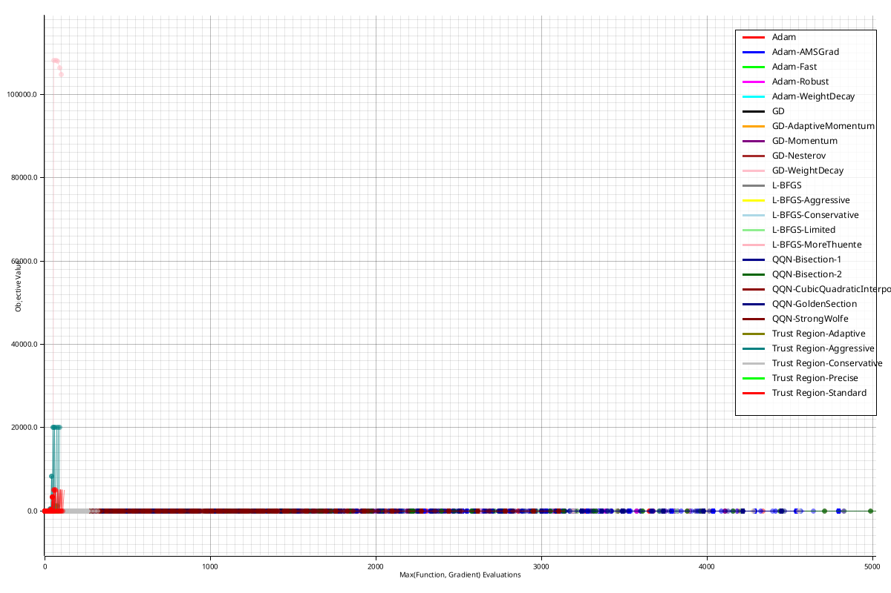
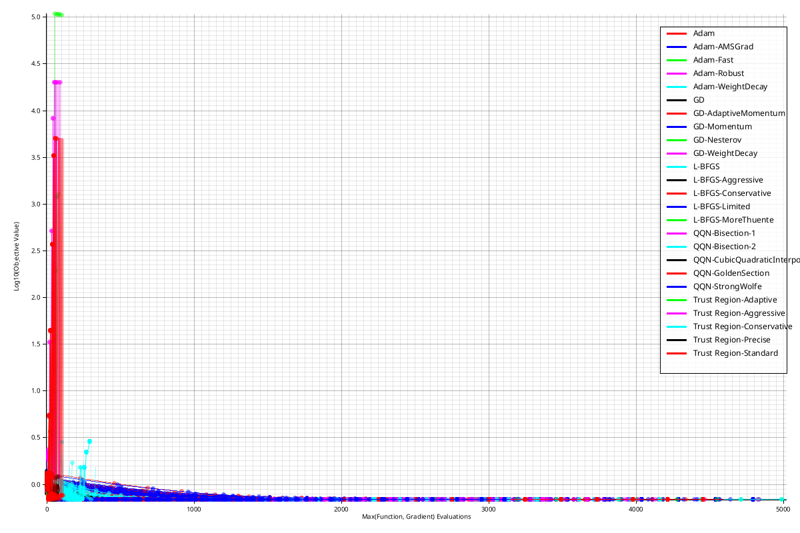

**Figure:** Convergence plots for SVM_200samples_10features_C1 showing objective value vs iterations.
Left: Linear scale, Right: Log scale for better visualization of convergence behavior.

**Data:** [Linear scale data (CSV)](data/SVM_200samples_10features_C1_data.csv) | [Log scale data (CSV)](data/SVM_200samples_10features_C1_log_data.csv)

## Optimizer Family vs Problem Family Performance Matrix
This table shows how different optimizer families perform across different problem families. Each cell contains:
- **Average Ranking**: Mean rank of the optimizer family across all problems in the problem family
- **Best Rank**: Average of the best rank achieved by any variant in the optimizer family for each problem
- **Best Variant**: The specific optimizer variant that achieved the best average rank
- **Worst Variant**: The specific optimizer variant that achieved the worst average rank
<table style="border-collapse: collapse; width: 100%; margin: 20px 0; font-size: 11px;">
<tr style="background-color: #f2f2f2;">
<th style="border: 1px solid #ddd; padding: 8px; text-align: center; font-weight: bold;">Problem Family</th>
<th style="border: 1px solid #ddd; padding: 8px; text-align: center; font-weight: bold; writing-mode: vertical-lr; text-orientation: mixed;">Adam</th>
<th style="border: 1px solid #ddd; padding: 8px; text-align: center; font-weight: bold; writing-mode: vertical-lr; text-orientation: mixed;">GD</th>
<th style="border: 1px solid #ddd; padding: 8px; text-align: center; font-weight: bold; writing-mode: vertical-lr; text-orientation: mixed;">L-BFGS</th>
<th style="border: 1px solid #ddd; padding: 8px; text-align: center; font-weight: bold; writing-mode: vertical-lr; text-orientation: mixed;">QQN</th>
<th style="border: 1px solid #ddd; padding: 8px; text-align: center; font-weight: bold; writing-mode: vertical-lr; text-orientation: mixed;">Trust Region</th>
</tr>
<tr>
<td style="border: 1px solid #ddd; padding: 8px; font-weight: bold; background-color: #f8f9fa;">Ackley</td>
<td style="border: 1px solid #ddd; padding: 6px; text-align: center; font-size: 10px;">

<strong>Avg Rank:</strong> 16.3

<strong>Best Rank:</strong> 12.0

<strong>Best Var:</strong> Adam-AMSGrad

<strong>Worst Var:</strong> Adam-Fast

</td>
<td style="border: 1px solid #ddd; padding: 6px; text-align: center; font-size: 10px;">

<strong>Avg Rank:</strong> 16.5

<strong>Best Rank:</strong> 9.7

<strong>Best Var:</strong> GD

<strong>Worst Var:</strong> GD-Momentum

</td>
<td style="border: 1px solid #ddd; padding: 6px; text-align: center; font-size: 10px;">

<strong>Avg Rank:</strong> 6.5

<strong>Best Rank:</strong> 2.3

<strong>Best Var:</strong> L-BFGS

<strong>Worst Var:</strong> Conservative

</td>
<td style="border: 1px solid #ddd; padding: 6px; text-align: center; background-color: #90EE90; font-size: 10px;">

<strong>Avg Rank:</strong> 5.1

<strong>Best Rank:</strong> 1.0

<strong>Best Var:</strong> Bisection-1

<strong>Worst Var:</strong> GoldenSection

</td>
<td style="border: 1px solid #ddd; padding: 6px; text-align: center; background-color: #FFB6C1; font-size: 10px;">

<strong>Avg Rank:</strong> 20.7

<strong>Best Rank:</strong> 13.7

<strong>Best Var:</strong> Conservative

<strong>Worst Var:</strong> Aggressive

</td>
</tr>
<tr>
<td style="border: 1px solid #ddd; padding: 8px; font-weight: bold; background-color: #f8f9fa;">Barrier</td>
<td style="border: 1px solid #ddd; padding: 6px; text-align: center; font-size: 10px;">

<strong>Avg Rank:</strong> 8.5

<strong>Best Rank:</strong> 3.0

<strong>Best Var:</strong> WeightDecay

<strong>Worst Var:</strong> Adam-Fast

</td>
<td style="border: 1px solid #ddd; padding: 6px; text-align: center; font-size: 10px;">

<strong>Avg Rank:</strong> 6.2

<strong>Best Rank:</strong> 1.0

<strong>Best Var:</strong> GD

<strong>Worst Var:</strong> AdaptiveMom...

</td>
<td style="border: 1px solid #ddd; padding: 6px; text-align: center; background-color: #90EE90; font-size: 10px;">

<strong>Avg Rank:</strong> 3.7

<strong>Best Rank:</strong> 2.3

<strong>Best Var:</strong> Conservative

<strong>Worst Var:</strong> L-BFGS-Limited

</td>
<td style="border: 1px solid #ddd; padding: 6px; text-align: center; font-size: 10px;">

<strong>Avg Rank:</strong> inf

<strong>Best Rank:</strong> inf

<strong>Best Var:</strong> N/A

<strong>Worst Var:</strong> N/A

</td>
<td style="border: 1px solid #ddd; padding: 6px; text-align: center; background-color: #FFB6C1; font-size: 10px;">

<strong>Avg Rank:</strong> 13.1

<strong>Best Rank:</strong> 8.0

<strong>Best Var:</strong> Conservative

<strong>Worst Var:</strong> Aggressive

</td>
</tr>
<tr>
<td style="border: 1px solid #ddd; padding: 8px; font-weight: bold; background-color: #f8f9fa;">Beale</td>
<td style="border: 1px solid #ddd; padding: 6px; text-align: center; background-color: #FFB6C1; font-size: 10px;">

<strong>Avg Rank:</strong> 19.0

<strong>Best Rank:</strong> 8.0

<strong>Best Var:</strong> WeightDecay

<strong>Worst Var:</strong> Adam-Fast

</td>
<td style="border: 1px solid #ddd; padding: 6px; text-align: center; background-color: #90EE90; font-size: 10px;">

<strong>Avg Rank:</strong> 8.8

<strong>Best Rank:</strong> 3.0

<strong>Best Var:</strong> GD-Nesterov

<strong>Worst Var:</strong> GD-Momentum

</td>
<td style="border: 1px solid #ddd; padding: 6px; text-align: center; font-size: 10px;">

<strong>Avg Rank:</strong> 10.0

<strong>Best Rank:</strong> 2.0

<strong>Best Var:</strong> MoreThuente

<strong>Worst Var:</strong> Aggressive

</td>
<td style="border: 1px solid #ddd; padding: 6px; text-align: center; font-size: 10px;">

<strong>Avg Rank:</strong> 8.8

<strong>Best Rank:</strong> 1.0

<strong>Best Var:</strong> GoldenSection

<strong>Worst Var:</strong> Bisection-2

</td>
<td style="border: 1px solid #ddd; padding: 6px; text-align: center; font-size: 10px;">

<strong>Avg Rank:</strong> 18.4

<strong>Best Rank:</strong> 15.0

<strong>Best Var:</strong> Precise

<strong>Worst Var:</strong> Standard

</td>
</tr>
<tr>
<td style="border: 1px solid #ddd; padding: 8px; font-weight: bold; background-color: #f8f9fa;">Booth</td>
<td style="border: 1px solid #ddd; padding: 6px; text-align: center; background-color: #FFB6C1; font-size: 10px;">

<strong>Avg Rank:</strong> 19.2

<strong>Best Rank:</strong> 11.0

<strong>Best Var:</strong> WeightDecay

<strong>Worst Var:</strong> Adam-Robust

</td>
<td style="border: 1px solid #ddd; padding: 6px; text-align: center; font-size: 10px;">

<strong>Avg Rank:</strong> 14.6

<strong>Best Rank:</strong> 10.0

<strong>Best Var:</strong> GD

<strong>Worst Var:</strong> GD-Momentum

</td>
<td style="border: 1px solid #ddd; padding: 6px; text-align: center; font-size: 10px;">

<strong>Avg Rank:</strong> 11.0

<strong>Best Rank:</strong> 6.0

<strong>Best Var:</strong> MoreThuente

<strong>Worst Var:</strong> Aggressive

</td>
<td style="border: 1px solid #ddd; padding: 6px; text-align: center; background-color: #90EE90; font-size: 10px;">

<strong>Avg Rank:</strong> 3.0

<strong>Best Rank:</strong> 1.0

<strong>Best Var:</strong> CubicQuadIn...

<strong>Worst Var:</strong> GoldenSection

</td>
<td style="border: 1px solid #ddd; padding: 6px; text-align: center; font-size: 10px;">

<strong>Avg Rank:</strong> 17.2

<strong>Best Rank:</strong> 12.0

<strong>Best Var:</strong> Adaptive

<strong>Worst Var:</strong> Conservative

</td>
</tr>
<tr>
<td style="border: 1px solid #ddd; padding: 8px; font-weight: bold; background-color: #f8f9fa;">GoldsteinPrice</td>
<td style="border: 1px solid #ddd; padding: 6px; text-align: center; font-size: 10px;">

<strong>Avg Rank:</strong> 13.2

<strong>Best Rank:</strong> 10.0

<strong>Best Var:</strong> Adam-AMSGrad

<strong>Worst Var:</strong> Adam-Fast

</td>
<td style="border: 1px solid #ddd; padding: 6px; text-align: center; font-size: 10px;">

<strong>Avg Rank:</strong> 15.2

<strong>Best Rank:</strong> 9.0

<strong>Best Var:</strong> GD-Momentum

<strong>Worst Var:</strong> GD

</td>
<td style="border: 1px solid #ddd; padding: 6px; text-align: center; font-size: 10px;">

<strong>Avg Rank:</strong> 10.4

<strong>Best Rank:</strong> 5.0

<strong>Best Var:</strong> MoreThuente

<strong>Worst Var:</strong> Aggressive

</td>
<td style="border: 1px solid #ddd; padding: 6px; text-align: center; background-color: #90EE90; font-size: 10px;">

<strong>Avg Rank:</strong> 3.2

<strong>Best Rank:</strong> 1.0

<strong>Best Var:</strong> GoldenSection

<strong>Worst Var:</strong> Bisection-2

</td>
<td style="border: 1px solid #ddd; padding: 6px; text-align: center; background-color: #FFB6C1; font-size: 10px;">

<strong>Avg Rank:</strong> 23.0

<strong>Best Rank:</strong> 21.0

<strong>Best Var:</strong> Aggressive

<strong>Worst Var:</strong> Precise

</td>
</tr>
<tr>
<td style="border: 1px solid #ddd; padding: 8px; font-weight: bold; background-color: #f8f9fa;">Griewank</td>
<td style="border: 1px solid #ddd; padding: 6px; text-align: center; font-size: 10px;">

<strong>Avg Rank:</strong> 17.7

<strong>Best Rank:</strong> 12.0

<strong>Best Var:</strong> Adam-Fast

<strong>Worst Var:</strong> Adam-Robust

</td>
<td style="border: 1px solid #ddd; padding: 6px; text-align: center; font-size: 10px;">

<strong>Avg Rank:</strong> 12.0

<strong>Best Rank:</strong> 7.7

<strong>Best Var:</strong> GD-Momentum

<strong>Worst Var:</strong> GD

</td>
<td style="border: 1px solid #ddd; padding: 6px; text-align: center; font-size: 10px;">

<strong>Avg Rank:</strong> 7.9

<strong>Best Rank:</strong> 3.7

<strong>Best Var:</strong> Aggressive

<strong>Worst Var:</strong> L-BFGS-Limited

</td>
<td style="border: 1px solid #ddd; padding: 6px; text-align: center; background-color: #90EE90; font-size: 10px;">

<strong>Avg Rank:</strong> 6.3

<strong>Best Rank:</strong> 1.0

<strong>Best Var:</strong> StrongWolfe

<strong>Worst Var:</strong> CubicQuadIn...

</td>
<td style="border: 1px solid #ddd; padding: 6px; text-align: center; background-color: #FFB6C1; font-size: 10px;">

<strong>Avg Rank:</strong> 21.1

<strong>Best Rank:</strong> 13.7

<strong>Best Var:</strong> Conservative

<strong>Worst Var:</strong> Aggressive

</td>
</tr>
<tr>
<td style="border: 1px solid #ddd; padding: 8px; font-weight: bold; background-color: #f8f9fa;">Himmelblau</td>
<td style="border: 1px solid #ddd; padding: 6px; text-align: center; background-color: #FFB6C1; font-size: 10px;">

<strong>Avg Rank:</strong> 18.8

<strong>Best Rank:</strong> 11.0

<strong>Best Var:</strong> WeightDecay

<strong>Worst Var:</strong> Adam-Robust

</td>
<td style="border: 1px solid #ddd; padding: 6px; text-align: center; font-size: 10px;">

<strong>Avg Rank:</strong> 14.6

<strong>Best Rank:</strong> 9.0

<strong>Best Var:</strong> GD

<strong>Worst Var:</strong> AdaptiveMom...

</td>
<td style="border: 1px solid #ddd; padding: 6px; text-align: center; font-size: 10px;">

<strong>Avg Rank:</strong> 11.2

<strong>Best Rank:</strong> 5.0

<strong>Best Var:</strong> L-BFGS-Limited

<strong>Worst Var:</strong> Aggressive

</td>
<td style="border: 1px solid #ddd; padding: 6px; text-align: center; background-color: #90EE90; font-size: 10px;">

<strong>Avg Rank:</strong> 3.4

<strong>Best Rank:</strong> 1.0

<strong>Best Var:</strong> GoldenSection

<strong>Worst Var:</strong> Bisection-1

</td>
<td style="border: 1px solid #ddd; padding: 6px; text-align: center; font-size: 10px;">

<strong>Avg Rank:</strong> 17.0

<strong>Best Rank:</strong> 8.0

<strong>Best Var:</strong> Adaptive

<strong>Worst Var:</strong> Conservative

</td>
</tr>
<tr>
<td style="border: 1px solid #ddd; padding: 8px; font-weight: bold; background-color: #f8f9fa;">IllConditionedRosenbrock</td>
<td style="border: 1px solid #ddd; padding: 6px; text-align: center; font-size: 10px;">

<strong>Avg Rank:</strong> 14.2

<strong>Best Rank:</strong> 9.0

<strong>Best Var:</strong> WeightDecay

<strong>Worst Var:</strong> Adam-Robust

</td>
<td style="border: 1px solid #ddd; padding: 6px; text-align: center; font-size: 10px;">

<strong>Avg Rank:</strong> 12.5

<strong>Best Rank:</strong> 7.0

<strong>Best Var:</strong> GD-Nesterov

<strong>Worst Var:</strong> GD-Momentum

</td>
<td style="border: 1px solid #ddd; padding: 6px; text-align: center; font-size: 10px;">

<strong>Avg Rank:</strong> 12.5

<strong>Best Rank:</strong> 4.7

<strong>Best Var:</strong> MoreThuente

<strong>Worst Var:</strong> Aggressive

</td>
<td style="border: 1px solid #ddd; padding: 6px; text-align: center; background-color: #90EE90; font-size: 10px;">

<strong>Avg Rank:</strong> 4.1

<strong>Best Rank:</strong> 1.7

<strong>Best Var:</strong> CubicQuadIn...

<strong>Worst Var:</strong> GoldenSection

</td>
<td style="border: 1px solid #ddd; padding: 6px; text-align: center; background-color: #FFB6C1; font-size: 10px;">

<strong>Avg Rank:</strong> 21.8

<strong>Best Rank:</strong> 16.7

<strong>Best Var:</strong> Aggressive

<strong>Worst Var:</strong> Conservative

</td>
</tr>
<tr>
<td style="border: 1px solid #ddd; padding: 8px; font-weight: bold; background-color: #f8f9fa;">Levi</td>
<td style="border: 1px solid #ddd; padding: 6px; text-align: center; font-size: 10px;">

<strong>Avg Rank:</strong> 14.4

<strong>Best Rank:</strong> 11.0

<strong>Best Var:</strong> Adam-Robust

<strong>Worst Var:</strong> Adam-Fast

</td>
<td style="border: 1px solid #ddd; padding: 6px; text-align: center; font-size: 10px;">

<strong>Avg Rank:</strong> 14.6

<strong>Best Rank:</strong> 9.0

<strong>Best Var:</strong> GD-Momentum

<strong>Worst Var:</strong> GD-WeightDecay

</td>
<td style="border: 1px solid #ddd; padding: 6px; text-align: center; font-size: 10px;">

<strong>Avg Rank:</strong> 11.6

<strong>Best Rank:</strong> 3.0

<strong>Best Var:</strong> L-BFGS-Limited

<strong>Worst Var:</strong> Aggressive

</td>
<td style="border: 1px solid #ddd; padding: 6px; text-align: center; background-color: #90EE90; font-size: 10px;">

<strong>Avg Rank:</strong> 3.8

<strong>Best Rank:</strong> 1.0

<strong>Best Var:</strong> GoldenSection

<strong>Worst Var:</strong> Bisection-1

</td>
<td style="border: 1px solid #ddd; padding: 6px; text-align: center; background-color: #FFB6C1; font-size: 10px;">

<strong>Avg Rank:</strong> 20.6

<strong>Best Rank:</strong> 13.0

<strong>Best Var:</strong> Conservative

<strong>Worst Var:</strong> Aggressive

</td>
</tr>
<tr>
<td style="border: 1px solid #ddd; padding: 8px; font-weight: bold; background-color: #f8f9fa;">Levy</td>
<td style="border: 1px solid #ddd; padding: 6px; text-align: center; font-size: 10px;">

<strong>Avg Rank:</strong> 15.9

<strong>Best Rank:</strong> 10.0

<strong>Best Var:</strong> WeightDecay

<strong>Worst Var:</strong> Adam-AMSGrad

</td>
<td style="border: 1px solid #ddd; padding: 6px; text-align: center; font-size: 10px;">

<strong>Avg Rank:</strong> 16.2

<strong>Best Rank:</strong> 7.7

<strong>Best Var:</strong> GD-WeightDecay

<strong>Worst Var:</strong> AdaptiveMom...

</td>
<td style="border: 1px solid #ddd; padding: 6px; text-align: center; font-size: 10px;">

<strong>Avg Rank:</strong> 9.1

<strong>Best Rank:</strong> 6.7

<strong>Best Var:</strong> Conservative

<strong>Worst Var:</strong> Aggressive

</td>
<td style="border: 1px solid #ddd; padding: 6px; text-align: center; background-color: #90EE90; font-size: 10px;">

<strong>Avg Rank:</strong> 3.0

<strong>Best Rank:</strong> 1.0

<strong>Best Var:</strong> Bisection-2

<strong>Worst Var:</strong> StrongWolfe

</td>
<td style="border: 1px solid #ddd; padding: 6px; text-align: center; background-color: #FFB6C1; font-size: 10px;">

<strong>Avg Rank:</strong> 20.8

<strong>Best Rank:</strong> 16.0

<strong>Best Var:</strong> Conservative

<strong>Worst Var:</strong> Aggressive

</td>
</tr>
<tr>
<td style="border: 1px solid #ddd; padding: 8px; font-weight: bold; background-color: #f8f9fa;">Matyas</td>
<td style="border: 1px solid #ddd; padding: 6px; text-align: center; font-size: 10px;">

<strong>Avg Rank:</strong> 13.2

<strong>Best Rank:</strong> 10.0

<strong>Best Var:</strong> Adam-Fast

<strong>Worst Var:</strong> Adam-AMSGrad

</td>
<td style="border: 1px solid #ddd; padding: 6px; text-align: center; font-size: 10px;">

<strong>Avg Rank:</strong> 16.0

<strong>Best Rank:</strong> 12.0

<strong>Best Var:</strong> GD-Momentum

<strong>Worst Var:</strong> AdaptiveMom...

</td>
<td style="border: 1px solid #ddd; padding: 6px; text-align: center; font-size: 10px;">

<strong>Avg Rank:</strong> 8.8

<strong>Best Rank:</strong> 3.0

<strong>Best Var:</strong> L-BFGS

<strong>Worst Var:</strong> Aggressive

</td>
<td style="border: 1px solid #ddd; padding: 6px; text-align: center; background-color: #90EE90; font-size: 10px;">

<strong>Avg Rank:</strong> 4.0

<strong>Best Rank:</strong> 1.0

<strong>Best Var:</strong> StrongWolfe

<strong>Worst Var:</strong> Bisection-1

</td>
<td style="border: 1px solid #ddd; padding: 6px; text-align: center; background-color: #FFB6C1; font-size: 10px;">

<strong>Avg Rank:</strong> 23.0

<strong>Best Rank:</strong> 21.0

<strong>Best Var:</strong> Conservative

<strong>Worst Var:</strong> Precise

</td>
</tr>
<tr>
<td style="border: 1px solid #ddd; padding: 8px; font-weight: bold; background-color: #f8f9fa;">Michalewicz</td>
<td style="border: 1px solid #ddd; padding: 6px; text-align: center; background-color: #90EE90; font-size: 10px;">

<strong>Avg Rank:</strong> 6.2

<strong>Best Rank:</strong> 1.0

<strong>Best Var:</strong> Adam

<strong>Worst Var:</strong> Adam-Robust

</td>
<td style="border: 1px solid #ddd; padding: 6px; text-align: center; font-size: 10px;">

<strong>Avg Rank:</strong> 12.1

<strong>Best Rank:</strong> 6.7

<strong>Best Var:</strong> AdaptiveMom...

<strong>Worst Var:</strong> GD-WeightDecay

</td>
<td style="border: 1px solid #ddd; padding: 6px; text-align: center; font-size: 10px;">

<strong>Avg Rank:</strong> 14.3

<strong>Best Rank:</strong> 7.0

<strong>Best Var:</strong> MoreThuente

<strong>Worst Var:</strong> Aggressive

</td>
<td style="border: 1px solid #ddd; padding: 6px; text-align: center; font-size: 10px;">

<strong>Avg Rank:</strong> 11.9

<strong>Best Rank:</strong> 6.7

<strong>Best Var:</strong> Bisection-2

<strong>Worst Var:</strong> CubicQuadIn...

</td>
<td style="border: 1px solid #ddd; padding: 6px; text-align: center; background-color: #FFB6C1; font-size: 10px;">

<strong>Avg Rank:</strong> 20.5

<strong>Best Rank:</strong> 16.3

<strong>Best Var:</strong> Conservative

<strong>Worst Var:</strong> Aggressive

</td>
</tr>
<tr>
<td style="border: 1px solid #ddd; padding: 8px; font-weight: bold; background-color: #f8f9fa;">Neural Networks</td>
<td style="border: 1px solid #ddd; padding: 6px; text-align: center; font-size: 10px;">

<strong>Avg Rank:</strong> 9.1

<strong>Best Rank:</strong> 3.5

<strong>Best Var:</strong> WeightDecay

<strong>Worst Var:</strong> Adam-Robust

</td>
<td style="border: 1px solid #ddd; padding: 6px; text-align: center; font-size: 10px;">

<strong>Avg Rank:</strong> 19.4

<strong>Best Rank:</strong> 16.0

<strong>Best Var:</strong> GD-WeightDecay

<strong>Worst Var:</strong> AdaptiveMom...

</td>
<td style="border: 1px solid #ddd; padding: 6px; text-align: center; font-size: 10px;">

<strong>Avg Rank:</strong> 11.3

<strong>Best Rank:</strong> 8.0

<strong>Best Var:</strong> Conservative

<strong>Worst Var:</strong> L-BFGS

</td>
<td style="border: 1px solid #ddd; padding: 6px; text-align: center; background-color: #90EE90; font-size: 10px;">

<strong>Avg Rank:</strong> 3.6

<strong>Best Rank:</strong> 1.0

<strong>Best Var:</strong> Bisection-2

<strong>Worst Var:</strong> StrongWolfe

</td>
<td style="border: 1px solid #ddd; padding: 6px; text-align: center; background-color: #FFB6C1; font-size: 10px;">

<strong>Avg Rank:</strong> 21.6

<strong>Best Rank:</strong> 18.5

<strong>Best Var:</strong> Adaptive

<strong>Worst Var:</strong> Standard

</td>
</tr>
<tr>
<td style="border: 1px solid #ddd; padding: 8px; font-weight: bold; background-color: #f8f9fa;">NoisySphere</td>
<td style="border: 1px solid #ddd; padding: 6px; text-align: center; font-size: 10px;">

<strong>Avg Rank:</strong> 16.9

<strong>Best Rank:</strong> 8.7

<strong>Best Var:</strong> Adam-Fast

<strong>Worst Var:</strong> Adam

</td>
<td style="border: 1px solid #ddd; padding: 6px; text-align: center; font-size: 10px;">

<strong>Avg Rank:</strong> 8.8

<strong>Best Rank:</strong> 5.3

<strong>Best Var:</strong> AdaptiveMom...

<strong>Worst Var:</strong> GD-WeightDecay

</td>
<td style="border: 1px solid #ddd; padding: 6px; text-align: center; background-color: #90EE90; font-size: 10px;">

<strong>Avg Rank:</strong> 7.4

<strong>Best Rank:</strong> 1.0

<strong>Best Var:</strong> Conservative

<strong>Worst Var:</strong> Aggressive

</td>
<td style="border: 1px solid #ddd; padding: 6px; text-align: center; font-size: 10px;">

<strong>Avg Rank:</strong> 9.9

<strong>Best Rank:</strong> 2.7

<strong>Best Var:</strong> StrongWolfe

<strong>Worst Var:</strong> CubicQuadIn...

</td>
<td style="border: 1px solid #ddd; padding: 6px; text-align: center; background-color: #FFB6C1; font-size: 10px;">

<strong>Avg Rank:</strong> 19.9

<strong>Best Rank:</strong> 16.3

<strong>Best Var:</strong> Conservative

<strong>Worst Var:</strong> Precise

</td>
</tr>
<tr>
<td style="border: 1px solid #ddd; padding: 8px; font-weight: bold; background-color: #f8f9fa;">PenaltyI</td>
<td style="border: 1px solid #ddd; padding: 6px; text-align: center; font-size: 10px;">

<strong>Avg Rank:</strong> 8.1

<strong>Best Rank:</strong> 4.3

<strong>Best Var:</strong> Adam-AMSGrad

<strong>Worst Var:</strong> Adam-Fast

</td>
<td style="border: 1px solid #ddd; padding: 6px; text-align: center; font-size: 10px;">

<strong>Avg Rank:</strong> 12.3

<strong>Best Rank:</strong> 9.7

<strong>Best Var:</strong> GD

<strong>Worst Var:</strong> GD-Nesterov

</td>
<td style="border: 1px solid #ddd; padding: 6px; text-align: center; font-size: 10px;">

<strong>Avg Rank:</strong> 14.3

<strong>Best Rank:</strong> 5.7

<strong>Best Var:</strong> Conservative

<strong>Worst Var:</strong> Aggressive

</td>
<td style="border: 1px solid #ddd; padding: 6px; text-align: center; background-color: #90EE90; font-size: 10px;">

<strong>Avg Rank:</strong> 7.5

<strong>Best Rank:</strong> 1.0

<strong>Best Var:</strong> CubicQuadIn...

<strong>Worst Var:</strong> Bisection-2

</td>
<td style="border: 1px solid #ddd; padding: 6px; text-align: center; background-color: #FFB6C1; font-size: 10px;">

<strong>Avg Rank:</strong> 22.9

<strong>Best Rank:</strong> 20.7

<strong>Best Var:</strong> Adaptive

<strong>Worst Var:</strong> Precise

</td>
</tr>
<tr>
<td style="border: 1px solid #ddd; padding: 8px; font-weight: bold; background-color: #f8f9fa;">Rastrigin</td>
<td style="border: 1px solid #ddd; padding: 6px; text-align: center; font-size: 10px;">

<strong>Avg Rank:</strong> 11.4

<strong>Best Rank:</strong> 4.7

<strong>Best Var:</strong> Adam-AMSGrad

<strong>Worst Var:</strong> Adam-Fast

</td>
<td style="border: 1px solid #ddd; padding: 6px; text-align: center; font-size: 10px;">

<strong>Avg Rank:</strong> 14.2

<strong>Best Rank:</strong> 7.7

<strong>Best Var:</strong> GD-WeightDecay

<strong>Worst Var:</strong> GD-Momentum

</td>
<td style="border: 1px solid #ddd; padding: 6px; text-align: center; font-size: 10px;">

<strong>Avg Rank:</strong> 14.1

<strong>Best Rank:</strong> 3.7

<strong>Best Var:</strong> MoreThuente

<strong>Worst Var:</strong> Aggressive

</td>
<td style="border: 1px solid #ddd; padding: 6px; text-align: center; background-color: #90EE90; font-size: 10px;">

<strong>Avg Rank:</strong> 9.9

<strong>Best Rank:</strong> 3.0

<strong>Best Var:</strong> CubicQuadIn...

<strong>Worst Var:</strong> Bisection-2

</td>
<td style="border: 1px solid #ddd; padding: 6px; text-align: center; background-color: #FFB6C1; font-size: 10px;">

<strong>Avg Rank:</strong> 15.4

<strong>Best Rank:</strong> 7.0

<strong>Best Var:</strong> Adaptive

<strong>Worst Var:</strong> Conservative

</td>
</tr>
<tr>
<td style="border: 1px solid #ddd; padding: 8px; font-weight: bold; background-color: #f8f9fa;">Regression</td>
<td style="border: 1px solid #ddd; padding: 6px; text-align: center; font-size: 10px;">

<strong>Avg Rank:</strong> 18.5

<strong>Best Rank:</strong> 13.2

<strong>Best Var:</strong> Adam-Fast

<strong>Worst Var:</strong> Adam-Robust

</td>
<td style="border: 1px solid #ddd; padding: 6px; text-align: center; font-size: 10px;">

<strong>Avg Rank:</strong> 13.6

<strong>Best Rank:</strong> 8.2

<strong>Best Var:</strong> GD-WeightDecay

<strong>Worst Var:</strong> GD

</td>
<td style="border: 1px solid #ddd; padding: 6px; text-align: center; font-size: 10px;">

<strong>Avg Rank:</strong> 8.9

<strong>Best Rank:</strong> 4.8

<strong>Best Var:</strong> Conservative

<strong>Worst Var:</strong> L-BFGS

</td>
<td style="border: 1px solid #ddd; padding: 6px; text-align: center; background-color: #90EE90; font-size: 10px;">

<strong>Avg Rank:</strong> 3.4

<strong>Best Rank:</strong> 1.0

<strong>Best Var:</strong> Bisection-1

<strong>Worst Var:</strong> GoldenSection

</td>
<td style="border: 1px solid #ddd; padding: 6px; text-align: center; background-color: #FFB6C1; font-size: 10px;">

<strong>Avg Rank:</strong> 20.6

<strong>Best Rank:</strong> 17.2

<strong>Best Var:</strong> Adaptive

<strong>Worst Var:</strong> Conservative

</td>
</tr>
<tr>
<td style="border: 1px solid #ddd; padding: 8px; font-weight: bold; background-color: #f8f9fa;">Rosenbrock</td>
<td style="border: 1px solid #ddd; padding: 6px; text-align: center; font-size: 10px;">

<strong>Avg Rank:</strong> 13.4

<strong>Best Rank:</strong> 6.0

<strong>Best Var:</strong> Adam-Fast

<strong>Worst Var:</strong> Adam-Robust

</td>
<td style="border: 1px solid #ddd; padding: 6px; text-align: center; font-size: 10px;">

<strong>Avg Rank:</strong> 12.1

<strong>Best Rank:</strong> 5.0

<strong>Best Var:</strong> GD-Nesterov

<strong>Worst Var:</strong> GD-Momentum

</td>
<td style="border: 1px solid #ddd; padding: 6px; text-align: center; font-size: 10px;">

<strong>Avg Rank:</strong> 12.6

<strong>Best Rank:</strong> 4.0

<strong>Best Var:</strong> MoreThuente

<strong>Worst Var:</strong> Aggressive

</td>
<td style="border: 1px solid #ddd; padding: 6px; text-align: center; background-color: #90EE90; font-size: 10px;">

<strong>Avg Rank:</strong> 4.9

<strong>Best Rank:</strong> 2.0

<strong>Best Var:</strong> StrongWolfe

<strong>Worst Var:</strong> GoldenSection

</td>
<td style="border: 1px solid #ddd; padding: 6px; text-align: center; background-color: #FFB6C1; font-size: 10px;">

<strong>Avg Rank:</strong> 22.0

<strong>Best Rank:</strong> 17.7

<strong>Best Var:</strong> Aggressive

<strong>Worst Var:</strong> Conservative

</td>
</tr>
<tr>
<td style="border: 1px solid #ddd; padding: 8px; font-weight: bold; background-color: #f8f9fa;">SVM</td>
<td style="border: 1px solid #ddd; padding: 6px; text-align: center; font-size: 10px;">

<strong>Avg Rank:</strong> 13.5

<strong>Best Rank:</strong> 8.5

<strong>Best Var:</strong> WeightDecay

<strong>Worst Var:</strong> Adam-Fast

</td>
<td style="border: 1px solid #ddd; padding: 6px; text-align: center; font-size: 10px;">

<strong>Avg Rank:</strong> 13.9

<strong>Best Rank:</strong> 5.0

<strong>Best Var:</strong> GD-WeightDecay

<strong>Worst Var:</strong> AdaptiveMom...

</td>
<td style="border: 1px solid #ddd; padding: 6px; text-align: center; font-size: 10px;">

<strong>Avg Rank:</strong> 9.6

<strong>Best Rank:</strong> 3.0

<strong>Best Var:</strong> Conservative

<strong>Worst Var:</strong> L-BFGS-Limited

</td>
<td style="border: 1px solid #ddd; padding: 6px; text-align: center; background-color: #90EE90; font-size: 10px;">

<strong>Avg Rank:</strong> 6.3

<strong>Best Rank:</strong> 2.5

<strong>Best Var:</strong> StrongWolfe

<strong>Worst Var:</strong> GoldenSection

</td>
<td style="border: 1px solid #ddd; padding: 6px; text-align: center; background-color: #FFB6C1; font-size: 10px;">

<strong>Avg Rank:</strong> 21.7

<strong>Best Rank:</strong> 17.0

<strong>Best Var:</strong> Conservative

<strong>Worst Var:</strong> Aggressive

</td>
</tr>
<tr>
<td style="border: 1px solid #ddd; padding: 8px; font-weight: bold; background-color: #f8f9fa;">Schwefel</td>
<td style="border: 1px solid #ddd; padding: 6px; text-align: center; background-color: #FFB6C1; font-size: 10px;">

<strong>Avg Rank:</strong> 20.1

<strong>Best Rank:</strong> 10.7

<strong>Best Var:</strong> Adam-Fast

<strong>Worst Var:</strong> Adam-Robust

</td>
<td style="border: 1px solid #ddd; padding: 6px; text-align: center; font-size: 10px;">

<strong>Avg Rank:</strong> 10.5

<strong>Best Rank:</strong> 6.7

<strong>Best Var:</strong> GD-WeightDecay

<strong>Worst Var:</strong> GD

</td>
<td style="border: 1px solid #ddd; padding: 6px; text-align: center; font-size: 10px;">

<strong>Avg Rank:</strong> 10.5

<strong>Best Rank:</strong> 4.3

<strong>Best Var:</strong> Conservative

<strong>Worst Var:</strong> Aggressive

</td>
<td style="border: 1px solid #ddd; padding: 6px; text-align: center; background-color: #90EE90; font-size: 10px;">

<strong>Avg Rank:</strong> 4.3

<strong>Best Rank:</strong> 1.0

<strong>Best Var:</strong> StrongWolfe

<strong>Worst Var:</strong> GoldenSection

</td>
<td style="border: 1px solid #ddd; padding: 6px; text-align: center; font-size: 10px;">

<strong>Avg Rank:</strong> 19.7

<strong>Best Rank:</strong> 16.7

<strong>Best Var:</strong> Standard

<strong>Worst Var:</strong> Conservative

</td>
</tr>
<tr>
<td style="border: 1px solid #ddd; padding: 8px; font-weight: bold; background-color: #f8f9fa;">SparseQuadratic</td>
<td style="border: 1px solid #ddd; padding: 6px; text-align: center; font-size: 10px;">

<strong>Avg Rank:</strong> 18.9

<strong>Best Rank:</strong> 12.5

<strong>Best Var:</strong> WeightDecay

<strong>Worst Var:</strong> Adam-AMSGrad

</td>
<td style="border: 1px solid #ddd; padding: 6px; text-align: center; font-size: 10px;">

<strong>Avg Rank:</strong> 14.5

<strong>Best Rank:</strong> 10.5

<strong>Best Var:</strong> GD-WeightDecay

<strong>Worst Var:</strong> AdaptiveMom...

</td>
<td style="border: 1px solid #ddd; padding: 6px; text-align: center; font-size: 10px;">

<strong>Avg Rank:</strong> 6.4

<strong>Best Rank:</strong> 1.5

<strong>Best Var:</strong> MoreThuente

<strong>Worst Var:</strong> L-BFGS

</td>
<td style="border: 1px solid #ddd; padding: 6px; text-align: center; background-color: #90EE90; font-size: 10px;">

<strong>Avg Rank:</strong> 4.9

<strong>Best Rank:</strong> 1.5

<strong>Best Var:</strong> GoldenSection

<strong>Worst Var:</strong> Bisection-1

</td>
<td style="border: 1px solid #ddd; padding: 6px; text-align: center; background-color: #FFB6C1; font-size: 10px;">

<strong>Avg Rank:</strong> 20.3

<strong>Best Rank:</strong> 14.5

<strong>Best Var:</strong> Precise

<strong>Worst Var:</strong> Aggressive

</td>
</tr>
<tr>
<td style="border: 1px solid #ddd; padding: 8px; font-weight: bold; background-color: #f8f9fa;">SparseRosenbrock</td>
<td style="border: 1px solid #ddd; padding: 6px; text-align: center; font-size: 10px;">

<strong>Avg Rank:</strong> 12.9

<strong>Best Rank:</strong> 8.0

<strong>Best Var:</strong> Adam-Fast

<strong>Worst Var:</strong> Adam-Robust

</td>
<td style="border: 1px solid #ddd; padding: 6px; text-align: center; font-size: 10px;">

<strong>Avg Rank:</strong> 11.8

<strong>Best Rank:</strong> 6.0

<strong>Best Var:</strong> GD-Nesterov

<strong>Worst Var:</strong> GD-Momentum

</td>
<td style="border: 1px solid #ddd; padding: 6px; text-align: center; font-size: 10px;">

<strong>Avg Rank:</strong> 15.2

<strong>Best Rank:</strong> 4.5

<strong>Best Var:</strong> MoreThuente

<strong>Worst Var:</strong> Aggressive

</td>
<td style="border: 1px solid #ddd; padding: 6px; text-align: center; background-color: #90EE90; font-size: 10px;">

<strong>Avg Rank:</strong> 3.7

<strong>Best Rank:</strong> 1.0

<strong>Best Var:</strong> CubicQuadIn...

<strong>Worst Var:</strong> Bisection-2

</td>
<td style="border: 1px solid #ddd; padding: 6px; text-align: center; background-color: #FFB6C1; font-size: 10px;">

<strong>Avg Rank:</strong> 21.4

<strong>Best Rank:</strong> 19.0

<strong>Best Var:</strong> Standard

<strong>Worst Var:</strong> Conservative

</td>
</tr>
<tr>
<td style="border: 1px solid #ddd; padding: 8px; font-weight: bold; background-color: #f8f9fa;">Sphere</td>
<td style="border: 1px solid #ddd; padding: 6px; text-align: center; background-color: #FFB6C1; font-size: 10px;">

<strong>Avg Rank:</strong> 20.1

<strong>Best Rank:</strong> 14.5

<strong>Best Var:</strong> WeightDecay

<strong>Worst Var:</strong> Adam-AMSGrad

</td>
<td style="border: 1px solid #ddd; padding: 6px; text-align: center; font-size: 10px;">

<strong>Avg Rank:</strong> 13.9

<strong>Best Rank:</strong> 10.0

<strong>Best Var:</strong> GD-Momentum

<strong>Worst Var:</strong> AdaptiveMom...

</td>
<td style="border: 1px solid #ddd; padding: 6px; text-align: center; font-size: 10px;">

<strong>Avg Rank:</strong> 6.1

<strong>Best Rank:</strong> 1.0

<strong>Best Var:</strong> Aggressive

<strong>Worst Var:</strong> Conservative

</td>
<td style="border: 1px solid #ddd; padding: 6px; text-align: center; background-color: #90EE90; font-size: 10px;">

<strong>Avg Rank:</strong> 5.3

<strong>Best Rank:</strong> 3.0

<strong>Best Var:</strong> StrongWolfe

<strong>Worst Var:</strong> GoldenSection

</td>
<td style="border: 1px solid #ddd; padding: 6px; text-align: center; font-size: 10px;">

<strong>Avg Rank:</strong> 19.6

<strong>Best Rank:</strong> 14.0

<strong>Best Var:</strong> Conservative

<strong>Worst Var:</strong> Aggressive

</td>
</tr>
<tr>
<td style="border: 1px solid #ddd; padding: 8px; font-weight: bold; background-color: #f8f9fa;">StyblinskiTang</td>
<td style="border: 1px solid #ddd; padding: 6px; text-align: center; background-color: #FFB6C1; font-size: 10px;">

<strong>Avg Rank:</strong> 16.6

<strong>Best Rank:</strong> 4.3

<strong>Best Var:</strong> WeightDecay

<strong>Worst Var:</strong> Adam-Robust

</td>
<td style="border: 1px solid #ddd; padding: 6px; text-align: center; font-size: 10px;">

<strong>Avg Rank:</strong> 14.2

<strong>Best Rank:</strong> 7.3

<strong>Best Var:</strong> GD-WeightDecay

<strong>Worst Var:</strong> AdaptiveMom...

</td>
<td style="border: 1px solid #ddd; padding: 6px; text-align: center; font-size: 10px;">

<strong>Avg Rank:</strong> 10.3

<strong>Best Rank:</strong> 2.3

<strong>Best Var:</strong> Conservative

<strong>Worst Var:</strong> Aggressive

</td>
<td style="border: 1px solid #ddd; padding: 6px; text-align: center; background-color: #90EE90; font-size: 10px;">

<strong>Avg Rank:</strong> 8.7

<strong>Best Rank:</strong> 1.7

<strong>Best Var:</strong> GoldenSection

<strong>Worst Var:</strong> StrongWolfe

</td>
<td style="border: 1px solid #ddd; padding: 6px; text-align: center; font-size: 10px;">

<strong>Avg Rank:</strong> 15.3

<strong>Best Rank:</strong> 4.3

<strong>Best Var:</strong> Standard

<strong>Worst Var:</strong> Conservative

</td>
</tr>
<tr>
<td style="border: 1px solid #ddd; padding: 8px; font-weight: bold; background-color: #f8f9fa;">Trigonometric</td>
<td style="border: 1px solid #ddd; padding: 6px; text-align: center; font-size: 10px;">

<strong>Avg Rank:</strong> 12.7

<strong>Best Rank:</strong> 7.3

<strong>Best Var:</strong> Adam

<strong>Worst Var:</strong> Adam-Fast

</td>
<td style="border: 1px solid #ddd; padding: 6px; text-align: center; font-size: 10px;">

<strong>Avg Rank:</strong> 14.3

<strong>Best Rank:</strong> 5.0

<strong>Best Var:</strong> GD

<strong>Worst Var:</strong> GD-Momentum

</td>
<td style="border: 1px solid #ddd; padding: 6px; text-align: center; font-size: 10px;">

<strong>Avg Rank:</strong> 12.7

<strong>Best Rank:</strong> 5.3

<strong>Best Var:</strong> MoreThuente

<strong>Worst Var:</strong> Aggressive

</td>
<td style="border: 1px solid #ddd; padding: 6px; text-align: center; background-color: #90EE90; font-size: 10px;">

<strong>Avg Rank:</strong> 4.0

<strong>Best Rank:</strong> 1.0

<strong>Best Var:</strong> CubicQuadIn...

<strong>Worst Var:</strong> Bisection-2

</td>
<td style="border: 1px solid #ddd; padding: 6px; text-align: center; background-color: #FFB6C1; font-size: 10px;">

<strong>Avg Rank:</strong> 21.3

<strong>Best Rank:</strong> 17.7

<strong>Best Var:</strong> Conservative

<strong>Worst Var:</strong> Aggressive

</td>
</tr>
<tr>
<td style="border: 1px solid #ddd; padding: 8px; font-weight: bold; background-color: #f8f9fa;">Zakharov</td>
<td style="border: 1px solid #ddd; padding: 6px; text-align: center; font-size: 10px;">

<strong>Avg Rank:</strong> 13.4

<strong>Best Rank:</strong> 9.3

<strong>Best Var:</strong> WeightDecay

<strong>Worst Var:</strong> Adam-Robust

</td>
<td style="border: 1px solid #ddd; padding: 6px; text-align: center; font-size: 10px;">

<strong>Avg Rank:</strong> 14.7

<strong>Best Rank:</strong> 7.3

<strong>Best Var:</strong> GD

<strong>Worst Var:</strong> AdaptiveMom...

</td>
<td style="border: 1px solid #ddd; padding: 6px; text-align: center; font-size: 10px;">

<strong>Avg Rank:</strong> 11.7

<strong>Best Rank:</strong> 6.0

<strong>Best Var:</strong> MoreThuente

<strong>Worst Var:</strong> L-BFGS

</td>
<td style="border: 1px solid #ddd; padding: 6px; text-align: center; background-color: #90EE90; font-size: 10px;">

<strong>Avg Rank:</strong> 3.0

<strong>Best Rank:</strong> 1.0

<strong>Best Var:</strong> Bisection-1

<strong>Worst Var:</strong> StrongWolfe

</td>
<td style="border: 1px solid #ddd; padding: 6px; text-align: center; background-color: #FFB6C1; font-size: 10px;">

<strong>Avg Rank:</strong> 22.2

<strong>Best Rank:</strong> 19.0

<strong>Best Var:</strong> Adaptive

<strong>Worst Var:</strong> Conservative

</td>
</tr>
</table>
**Legend:**
- **Avg Rank**: Average ranking of all variants in the optimizer family across problems in the problem family (lower is better)
- Green cells indicate the best performing optimizer family for that problem family
- Red cells indicate the worst performing optimizer family for that problem family

# Optimizer Comparison Matrix

Matrix showing all comparisons. Green indicates QQN won (statistically significant), red indicates non-QQN optimizer won (statistically significant), gray indicates no significant difference.

<table class="comparison-matrix">
  <tr><th></th>
    <th>Adam</th>
    <th>Adam-AMSGrad</th>
    <th>Adam-Fast</th>
    <th>Adam-Robust</th>
    <th>Adam-WeightDecay</th>
    <th>GD</th>
    <th>GD-AdaptiveMomentum</th>
    <th>GD-Momentum</th>
    <th>GD-Nesterov</th>
    <th>GD-WeightDecay</th>
    <th>L-BFGS</th>
    <th>L-BFGS-Aggressive</th>
    <th>L-BFGS-Conservative</th>
    <th>L-BFGS-Limited</th>
    <th>L-BFGS-MoreThuente</th>
    <th>Trust Region-Adaptive</th>
    <th>Trust Region-Aggressive</th>
    <th>Trust Region-Conservative</th>
    <th>Trust Region-Precise</th>
    <th>Trust Region-Standard</th>
  </tr>
  <tr>
    <th>QQN-Bisection-1</th>
    <td>
<strong>Ackley_10D_a20_b0.2_c6.28e0</strong> obj: -0.039 cost: -614.95

<strong>Ackley_2D_a20_b0.2_c6.28e0</strong> obj: -0.723 cost: -218.65

<strong>Ackley_5D_a20_b0.2_c6.28e0</strong> obj: -0.192 cost: -440.15

<strong>Barrier_10D_mu0.1</strong> obj: inf cost: -2.5e3

<strong>Barrier_2D_mu0.1</strong> obj: inf cost: -2.5e3

<strong>Barrier_5D_mu0.1</strong> obj: inf cost: -2.5e3

<strong>Beale_2D</strong> obj: 0.341 cost: -2.2e3

<strong>Booth_2D</strong> obj: -12.01 cost: -2.3e3

<strong>GoldsteinPrice_2D</strong> obj: -756.03 cost: -152.10

<strong>Griewank_10D</strong> obj: -3.44 cost: -45.40

<strong>Griewank_2D</strong> obj: -0.324 cost: -2.4e3

<strong>Griewank_5D</strong> obj: -1.91 cost: -1.6e3

<strong>Himmelblau_2D</strong> obj: -81.88 cost: -2.4e3

<strong>IllConditionedRosenbrock_10D_alpha100</strong> obj: -7.89 cost: -455.40

<strong>IllConditionedRosenbrock_2D_alpha100</strong> obj: -0.758 cost: -34.75

<strong>IllConditionedRosenbrock_5D_alpha100</strong> obj: -3.50 cost: -781.90

<strong>Levi_2D</strong> obj: -0.628 cost: -10.45

<strong>Levy_10D</strong> obj: -0.006 cost: -2.4e3

<strong>Levy_2D</strong> obj: -0.006 cost: -2.4e3

<strong>Levy_5D</strong> obj: -0.008 cost: -2.4e3

<strong>LinearRegression_100samples_5features_reg0.01</strong> obj: -2.81 cost: -2.3e3

<strong>LinearRegression_200samples_10features_reg0.01</strong> obj: -52.96 cost: -2.4e3

<strong>LogisticRegression_100samples_5features_reg0.01</strong> obj: -0.087 cost: -2.4e3

<strong>LogisticRegression_200samples_10features_reg0.01</strong> obj: -0.069 cost: -2.4e3

<strong>Matyas_2D</strong> obj: -0.006 cost: -553.50

<strong>Michalewicz_10D_m10</strong> obj: 1.60 cost: 1.7e3

<strong>Michalewicz_2D_m10</strong> obj: 0.478 cost: -57.30

<strong>Michalewicz_5D_m10</strong> obj: inf cost: 1.1e3

<strong>NeuralNetwork_100samples_layers_10_20_5</strong> obj: -0.006 cost: -1.4e3

<strong>NeuralNetwork_100samples_layers_5_10_3</strong> obj: -0.014 cost: -1.7e3

<strong>NoisySphere_10D_sigma0.01</strong> obj: NaN cost: 60.00

<strong>NoisySphere_2D_sigma0.01</strong> obj: NaN cost: 33.00

<strong>NoisySphere_5D_sigma0.01</strong> obj: NaN cost: 70.35

<strong>PenaltyI_10D_alpha1e6</strong> obj: -0.048 cost: 2.1e3

<strong>PenaltyI_2D_alpha1e6</strong> obj: -0.047 cost: 719.45

<strong>PenaltyI_5D_alpha1e6</strong> obj: -0.085 cost: 2.1e3

<strong>Rastrigin_10D</strong> obj: inf cost: -488.95

<strong>Rastrigin_2D</strong> obj: -1.61 cost: -613.35

<strong>Rastrigin_5D</strong> obj: 0.621 cost: -533.25

<strong>Rosenbrock_10D</strong> obj: -1.24 cost: -2.1e3

<strong>Rosenbrock_2D</strong> obj: -0.758 cost: -40.40

<strong>Rosenbrock_5D</strong> obj: -3.22 cost: -1.2e3

<strong>SVM_100samples_5features_C1</strong> obj: -0.000 cost: -1.7e3

<strong>SVM_200samples_10features_C1</strong> obj: -0.000 cost: -46.65

<strong>Schwefel_10D</strong> obj: -1.1e3 cost: -2.4e3

<strong>Schwefel_2D</strong> obj: -224.17 cost: -2.4e3

<strong>Schwefel_5D</strong> obj: -560.66 cost: -2.4e3

<strong>SparseQuadratic_10D_pattern[1, 3]</strong> obj: -0.002 cost: -2.4e3

<strong>SparseQuadratic_5D_pattern[1, 3]</strong> obj: -0.004 cost: -2.4e3

<strong>SparseRosenbrock_10D</strong> obj: -4.24 cost: 81.20

<strong>SparseRosenbrock_4D</strong> obj: -1.60 cost: 15.05

<strong>Sphere_10D</strong> obj: -0.005 cost: -2.4e3

<strong>Sphere_2D</strong> obj: -0.008 cost: -2.4e3

<strong>StyblinskiTang_10D</strong> obj: -224.95 cost: -2.0e3

<strong>StyblinskiTang_2D</strong> obj: -44.60 cost: -2.1e3

<strong>StyblinskiTang_5D</strong> obj: -115.46 cost: -2.1e3

<strong>Trigonometric_10D</strong> obj: -0.096 cost: -1.1e3

<strong>Trigonometric_2D</strong> obj: -0.000 cost: -1.0e3

<strong>Trigonometric_5D</strong> obj: -0.010 cost: -1.0e3

<strong>Zakharov_10D</strong> obj: -0.045 cost: -2.1e3

<strong>Zakharov_2D</strong> obj: -0.002 cost: -2.3e3

<strong>Zakharov_5D</strong> obj: -0.003 cost: -2.3e3
</td>
    <td>
<strong>Ackley_10D_a20_b0.2_c6.28e0</strong> obj: -0.039 cost: -1.1e3

<strong>Ackley_2D_a20_b0.2_c6.28e0</strong> obj: -0.723 cost: -670.05

<strong>Ackley_5D_a20_b0.2_c6.28e0</strong> obj: -0.192 cost: -1.1e3

<strong>Barrier_10D_mu0.1</strong> obj: inf cost: -2.5e3

<strong>Barrier_2D_mu0.1</strong> obj: inf cost: -2.5e3

<strong>Barrier_5D_mu0.1</strong> obj: inf cost: -2.5e3

<strong>Beale_2D</strong> obj: 0.196 cost: -2.2e3

<strong>Booth_2D</strong> obj: -11.92 cost: -2.3e3

<strong>GoldsteinPrice_2D</strong> obj: -756.02 cost: -158.60

<strong>Griewank_10D</strong> obj: -3.44 cost: -45.40

<strong>Griewank_2D</strong> obj: -0.327 cost: -2.4e3

<strong>Griewank_5D</strong> obj: -1.93 cost: -1.6e3

<strong>Himmelblau_2D</strong> obj: -81.58 cost: -2.4e3

<strong>IllConditionedRosenbrock_10D_alpha100</strong> obj: -8.09 cost: -470.60

<strong>IllConditionedRosenbrock_2D_alpha100</strong> obj: -3.37 cost: 1.8e3

<strong>IllConditionedRosenbrock_5D_alpha100</strong> obj: -3.98 cost: -752.30

<strong>Levi_2D</strong> obj: -0.613 cost: -50.95

<strong>Levy_10D</strong> obj: -0.151 cost: -2.4e3

<strong>Levy_2D</strong> obj: -0.026 cost: -2.4e3

<strong>Levy_5D</strong> obj: -0.076 cost: -2.4e3

<strong>LinearRegression_100samples_5features_reg0.01</strong> obj: -2.98 cost: -2.3e3

<strong>LinearRegression_200samples_10features_reg0.01</strong> obj: -53.45 cost: -2.4e3

<strong>LogisticRegression_100samples_5features_reg0.01</strong> obj: -0.090 cost: -2.4e3

<strong>LogisticRegression_200samples_10features_reg0.01</strong> obj: -0.072 cost: -2.4e3

<strong>Matyas_2D</strong> obj: -0.006 cost: -610.00

<strong>Michalewicz_10D_m10</strong> obj: 1.50 cost: 1.7e3

<strong>Michalewicz_2D_m10</strong> obj: 0.279 cost: 1.4e3

<strong>Michalewicz_5D_m10</strong> obj: inf cost: 1.2e3

<strong>NeuralNetwork_100samples_layers_10_20_5</strong> obj: -0.012 cost: -1.5e3

<strong>NeuralNetwork_100samples_layers_5_10_3</strong> obj: -0.014 cost: -1.8e3

<strong>NoisySphere_10D_sigma0.01</strong> obj: NaN cost: 59.40

<strong>NoisySphere_2D_sigma0.01</strong> obj: NaN cost: 28.75

<strong>NoisySphere_5D_sigma0.01</strong> obj: NaN cost: 77.90

<strong>PenaltyI_10D_alpha1e6</strong> obj: -0.030 cost: 2.1e3

<strong>PenaltyI_2D_alpha1e6</strong> obj: -0.033 cost: 697.45

<strong>PenaltyI_5D_alpha1e6</strong> obj: -0.038 cost: 2.1e3

<strong>Rastrigin_10D</strong> obj: inf cost: -475.45

<strong>Rastrigin_2D</strong> obj: -1.61 cost: -603.05

<strong>Rastrigin_5D</strong> obj: 1.06 cost: -507.15

<strong>Rosenbrock_10D</strong> obj: -1.22 cost: -2.2e3

<strong>Rosenbrock_2D</strong> obj: -3.37 cost: 1.8e3

<strong>Rosenbrock_5D</strong> obj: -3.70 cost: -1.1e3

<strong>SVM_100samples_5features_C1</strong> obj: -0.000 cost: -1.9e3

<strong>SVM_200samples_10features_C1</strong> obj: -0.000 cost: -286.85

<strong>Schwefel_10D</strong> obj: -1.1e3 cost: -2.4e3

<strong>Schwefel_2D</strong> obj: -224.19 cost: -2.4e3

<strong>Schwefel_5D</strong> obj: -560.42 cost: -2.4e3

<strong>SparseQuadratic_10D_pattern[1, 3]</strong> obj: -0.233 cost: -2.4e3

<strong>SparseQuadratic_5D_pattern[1, 3]</strong> obj: -0.195 cost: -2.4e3

<strong>SparseRosenbrock_10D</strong> obj: -5.06 cost: 81.20

<strong>SparseRosenbrock_4D</strong> obj: -2.93 cost: 122.90

<strong>Sphere_10D</strong> obj: -0.264 cost: -2.5e3

<strong>Sphere_2D</strong> obj: -0.072 cost: -2.5e3

<strong>StyblinskiTang_10D</strong> obj: -222.77 cost: -2.0e3

<strong>StyblinskiTang_2D</strong> obj: -43.74 cost: -2.1e3

<strong>StyblinskiTang_5D</strong> obj: -114.33 cost: -2.1e3

<strong>Trigonometric_10D</strong> obj: -0.029 cost: -1.6e3

<strong>Trigonometric_2D</strong> obj: -0.000 cost: -994.15

<strong>Trigonometric_5D</strong> obj: -0.029 cost: -1.5e3

<strong>Zakharov_10D</strong> obj: -0.109 cost: -1.8e3

<strong>Zakharov_2D</strong> obj: -0.093 cost: -2.3e3

<strong>Zakharov_5D</strong> obj: -0.022 cost: -2.3e3
</td>
    <td>
<strong>Ackley_10D_a20_b0.2_c6.28e0</strong> obj: -0.067 cost: 24.25

<strong>Ackley_2D_a20_b0.2_c6.28e0</strong> obj: -0.766 cost: 30.05

<strong>Ackley_5D_a20_b0.2_c6.28e0</strong> obj: -0.219 cost: 25.05

<strong>Barrier_10D_mu0.1</strong> obj: inf cost: -31.50

<strong>Barrier_2D_mu0.1</strong> obj: inf cost: -31.40

<strong>Barrier_5D_mu0.1</strong> obj: inf cost: -31.70

<strong>Beale_2D</strong> obj: -1.18 cost: 297.15

<strong>Booth_2D</strong> obj: -3.07 cost: 121.75

<strong>GoldsteinPrice_2D</strong> obj: -770.69 cost: 409.70

<strong>Griewank_10D</strong> obj: 10.24 cost: 1.5e3

<strong>Griewank_2D</strong> obj: -0.019 cost: 49.00

<strong>Griewank_5D</strong> obj: -1.70 cost: 813.55

<strong>Himmelblau_2D</strong> obj: -5.18 cost: 81.80

<strong>IllConditionedRosenbrock_10D_alpha100</strong> obj: -14.11 cost: 1.9e3

<strong>IllConditionedRosenbrock_2D_alpha100</strong> obj: -1.66 cost: 2.2e3

<strong>IllConditionedRosenbrock_5D_alpha100</strong> obj: -13.92 cost: 1.6e3

<strong>Levi_2D</strong> obj: -0.796 cost: 184.75

<strong>Levy_10D</strong> obj: -0.312 cost: 109.65

<strong>Levy_2D</strong> obj: -0.079 cost: 110.25

<strong>Levy_5D</strong> obj: -0.167 cost: 103.65

<strong>LinearRegression_100samples_5features_reg0.01</strong> obj: -0.118 cost: 50.60

<strong>LinearRegression_200samples_10features_reg0.01</strong> obj: -0.033 cost: -67.90

<strong>LogisticRegression_100samples_5features_reg0.01</strong> obj: -0.001 cost: 7.75

<strong>LogisticRegression_200samples_10features_reg0.01</strong> obj: -0.001 cost: 33.65

<strong>Matyas_2D</strong> obj: -0.004 cost: 57.80

<strong>Michalewicz_10D_m10</strong> obj: 1.88 cost: 2.1e3

<strong>Michalewicz_2D_m10</strong> obj: 0.451 cost: 526.65

<strong>Michalewicz_5D_m10</strong> obj: inf cost: 1.5e3

<strong>NeuralNetwork_100samples_layers_10_20_5</strong> obj: -0.004 cost: 860.60

<strong>NeuralNetwork_100samples_layers_5_10_3</strong> obj: -0.003 cost: 592.95

<strong>NoisySphere_10D_sigma0.01</strong> obj: NaN cost: 68.55

<strong>NoisySphere_2D_sigma0.01</strong> obj: NaN cost: 42.10

<strong>NoisySphere_5D_sigma0.01</strong> obj: NaN cost: 84.75

<strong>PenaltyI_10D_alpha1e6</strong> obj: -1.2e3 cost: 2.9e3

<strong>PenaltyI_2D_alpha1e6</strong> obj: -100.34 cost: 1.3e3

<strong>PenaltyI_5D_alpha1e6</strong> obj: -466.18 cost: 2.8e3

<strong>Rastrigin_10D</strong> obj: inf cost: 170.65

<strong>Rastrigin_2D</strong> obj: -0.874 cost: 130.85

<strong>Rastrigin_5D</strong> obj: 1.52 cost: 163.15

<strong>Rosenbrock_10D</strong> obj: -10.92 cost: 107.00

<strong>Rosenbrock_2D</strong> obj: -1.67 cost: 2.3e3

<strong>Rosenbrock_5D</strong> obj: -13.66 cost: 1.3e3

<strong>SVM_100samples_5features_C1</strong> obj: -0.041 cost: 90.75

<strong>SVM_200samples_10features_C1</strong> obj: -0.036 cost: 1.7e3

<strong>Schwefel_10D</strong> obj: -0.000 cost: -1.5e3

<strong>Schwefel_2D</strong> obj: -0.000 cost: -1.9e3

<strong>Schwefel_5D</strong> obj: -0.000 cost: -1.8e3

<strong>SparseQuadratic_10D_pattern[1, 3]</strong> obj: -0.728 cost: 57.20

<strong>SparseQuadratic_5D_pattern[1, 3]</strong> obj: -0.356 cost: 43.50

<strong>SparseRosenbrock_10D</strong> obj: -1.23 cost: 2.4e3

<strong>SparseRosenbrock_4D</strong> obj: -1.46 cost: 2.3e3

<strong>Sphere_10D</strong> obj: -0.612 cost: -22.40

<strong>Sphere_2D</strong> obj: -0.088 cost: -18.50

<strong>StyblinskiTang_10D</strong> obj: -8.98 cost: 386.25

<strong>StyblinskiTang_2D</strong> obj: 0.778 cost: 347.30

<strong>StyblinskiTang_5D</strong> obj: -3.74 cost: 379.85

<strong>Trigonometric_10D</strong> obj: -0.062 cost: 842.55

<strong>Trigonometric_2D</strong> obj: -0.006 cost: 199.40

<strong>Trigonometric_5D</strong> obj: -0.061 cost: 644.90

<strong>Zakharov_10D</strong> obj: -1.1e3 cost: 147.10

<strong>Zakharov_2D</strong> obj: -0.281 cost: 118.10

<strong>Zakharov_5D</strong> obj: -9.66 cost: 124.20
</td>
    <td>
<strong>Ackley_10D_a20_b0.2_c6.28e0</strong> obj: -0.042 cost: 4.05

<strong>Ackley_2D_a20_b0.2_c6.28e0</strong> obj: -0.731 cost: 40.05

<strong>Ackley_5D_a20_b0.2_c6.28e0</strong> obj: -0.198 cost: 49.35

<strong>Barrier_10D_mu0.1</strong> obj: inf cost: -2.5e3

<strong>Barrier_2D_mu0.1</strong> obj: inf cost: -2.5e3

<strong>Barrier_5D_mu0.1</strong> obj: inf cost: -2.5e3

<strong>Beale_2D</strong> obj: -0.045 cost: -2.2e3

<strong>Booth_2D</strong> obj: -20.25 cost: -2.3e3

<strong>GoldsteinPrice_2D</strong> obj: -757.17 cost: 364.00

<strong>Griewank_10D</strong> obj: -3.57 cost: -45.40

<strong>Griewank_2D</strong> obj: -0.445 cost: -2.4e3

<strong>Griewank_5D</strong> obj: -2.30 cost: -1.6e3

<strong>Himmelblau_2D</strong> obj: -105.34 cost: -2.4e3

<strong>IllConditionedRosenbrock_10D_alpha100</strong> obj: -33.68 cost: -481.65

<strong>IllConditionedRosenbrock_2D_alpha100</strong> obj: -3.57 cost: 2.0e3

<strong>IllConditionedRosenbrock_5D_alpha100</strong> obj: -14.19 cost: -812.30

<strong>Levi_2D</strong> obj: -0.585 cost: 189.35

<strong>Levy_10D</strong> obj: -0.098 cost: -2.4e3

<strong>Levy_2D</strong> obj: -0.043 cost: -2.4e3

<strong>Levy_5D</strong> obj: -0.068 cost: -2.4e3

<strong>LinearRegression_100samples_5features_reg0.01</strong> obj: -4.82 cost: -2.3e3

<strong>LinearRegression_200samples_10features_reg0.01</strong> obj: -62.95 cost: -2.4e3

<strong>LogisticRegression_100samples_5features_reg0.01</strong> obj: -0.116 cost: -2.4e3

<strong>LogisticRegression_200samples_10features_reg0.01</strong> obj: -0.088 cost: -2.4e3

<strong>Matyas_2D</strong> obj: -0.006 cost: -8.30

<strong>Michalewicz_10D_m10</strong> obj: 0.791 cost: 2.1e3

<strong>Michalewicz_2D_m10</strong> obj: -0.020 cost: 1.6e3

<strong>Michalewicz_5D_m10</strong> obj: inf cost: 1.5e3

<strong>NeuralNetwork_100samples_layers_10_20_5</strong> obj: -0.022 cost: -1.5e3

<strong>NeuralNetwork_100samples_layers_5_10_3</strong> obj: -0.027 cost: -1.8e3

<strong>NoisySphere_10D_sigma0.01</strong> obj: NaN cost: 60.15

<strong>NoisySphere_2D_sigma0.01</strong> obj: NaN cost: 37.50

<strong>NoisySphere_5D_sigma0.01</strong> obj: NaN cost: 79.35

<strong>PenaltyI_10D_alpha1e6</strong> obj: -16.21 cost: 2.8e3

<strong>PenaltyI_2D_alpha1e6</strong> obj: -0.985 cost: 1.2e3

<strong>PenaltyI_5D_alpha1e6</strong> obj: -18.76 cost: 2.7e3

<strong>Rastrigin_10D</strong> obj: inf cost: 114.65

<strong>Rastrigin_2D</strong> obj: -0.633 cost: 55.65

<strong>Rastrigin_5D</strong> obj: 2.45 cost: 108.55

<strong>Rosenbrock_10D</strong> obj: -26.43 cost: -2.3e3

<strong>Rosenbrock_2D</strong> obj: -3.57 cost: 2.0e3

<strong>Rosenbrock_5D</strong> obj: -13.92 cost: -1.2e3

<strong>SVM_100samples_5features_C1</strong> obj: -0.000 cost: -1.3e3

<strong>SVM_200samples_10features_C1</strong> obj: -0.000 cost: 1.2e3

<strong>Schwefel_10D</strong> obj: -1.1e3 cost: -2.4e3

<strong>Schwefel_2D</strong> obj: -226.48 cost: -2.4e3

<strong>Schwefel_5D</strong> obj: -565.88 cost: -2.4e3

<strong>SparseQuadratic_10D_pattern[1, 3]</strong> obj: -0.103 cost: -2.4e3

<strong>SparseQuadratic_5D_pattern[1, 3]</strong> obj: -0.069 cost: -2.4e3

<strong>SparseRosenbrock_10D</strong> obj: -11.23 cost: 202.45

<strong>SparseRosenbrock_4D</strong> obj: -7.08 cost: 1.8e3

<strong>Sphere_10D</strong> obj: -0.108 cost: -2.5e3

<strong>Sphere_2D</strong> obj: -0.059 cost: -2.5e3

<strong>StyblinskiTang_10D</strong> obj: -269.27 cost: -2.0e3

<strong>StyblinskiTang_2D</strong> obj: -53.34 cost: -2.1e3

<strong>StyblinskiTang_5D</strong> obj: -136.15 cost: -2.1e3

<strong>Trigonometric_10D</strong> obj: -0.071 cost: -880.65

<strong>Trigonometric_2D</strong> obj: -0.003 cost: -195.45

<strong>Trigonometric_5D</strong> obj: -0.013 cost: -278.45

<strong>Zakharov_10D</strong> obj: -3.12 cost: -2.3e3

<strong>Zakharov_2D</strong> obj: -0.038 cost: -2.3e3

<strong>Zakharov_5D</strong> obj: -0.071 cost: -2.3e3
</td>
    <td>
<strong>Ackley_10D_a20_b0.2_c6.28e0</strong> obj: -0.039 cost: -150.45

<strong>Ackley_2D_a20_b0.2_c6.28e0</strong> obj: -0.725 cost: -36.45

<strong>Ackley_5D_a20_b0.2_c6.28e0</strong> obj: -0.193 cost: -74.65

<strong>Barrier_10D_mu0.1</strong> obj: inf cost: -1.1e3

<strong>Barrier_2D_mu0.1</strong> obj: inf cost: -1.5e3

<strong>Barrier_5D_mu0.1</strong> obj: inf cost: -1.3e3

<strong>Beale_2D</strong> obj: 0.398 cost: -1.2e3

<strong>Booth_2D</strong> obj: -0.101 cost: -1.7e3

<strong>GoldsteinPrice_2D</strong> obj: -756.21 cost: 235.30

<strong>Griewank_10D</strong> obj: -2.24 cost: -45.40

<strong>Griewank_2D</strong> obj: -0.005 cost: -2.1e3

<strong>Griewank_5D</strong> obj: -1.68 cost: -771.05

<strong>Himmelblau_2D</strong> obj: -0.132 cost: -1.6e3

<strong>IllConditionedRosenbrock_10D_alpha100</strong> obj: -1.16 cost: -54.60

<strong>IllConditionedRosenbrock_2D_alpha100</strong> obj: -3.65 cost: 2.2e3

<strong>IllConditionedRosenbrock_5D_alpha100</strong> obj: -1.42 cost: -107.60

<strong>Levi_2D</strong> obj: -0.649 cost: 132.35

<strong>Levy_10D</strong> obj: -0.000 cost: -1.8e3

<strong>Levy_2D</strong> obj: -0.000 cost: -2.1e3

<strong>Levy_5D</strong> obj: -0.000 cost: -1.9e3

<strong>LinearRegression_100samples_5features_reg0.01</strong> obj: -0.000 cost: -2.3e3

<strong>LinearRegression_200samples_10features_reg0.01</strong> obj: -1.94 cost: -2.4e3

<strong>LogisticRegression_100samples_5features_reg0.01</strong> obj: -0.006 cost: -2.4e3

<strong>LogisticRegression_200samples_10features_reg0.01</strong> obj: -0.004 cost: -2.4e3

<strong>Matyas_2D</strong> obj: -0.006 cost: -150.70

<strong>Michalewicz_10D_m10</strong> obj: 1.08 cost: 2.0e3

<strong>Michalewicz_2D_m10</strong> obj: -0.020 cost: 1.6e3

<strong>Michalewicz_5D_m10</strong> obj: inf cost: 1.4e3

<strong>NeuralNetwork_100samples_layers_10_20_5</strong> obj: -0.000 cost: -249.00

<strong>NeuralNetwork_100samples_layers_5_10_3</strong> obj: -0.001 cost: -1.1e3

<strong>NoisySphere_10D_sigma0.01</strong> obj: NaN cost: 49.30

<strong>NoisySphere_2D_sigma0.01</strong> obj: NaN cost: 26.80

<strong>NoisySphere_5D_sigma0.01</strong> obj: NaN cost: 79.80

<strong>PenaltyI_10D_alpha1e6</strong> obj: -4.36 cost: 2.6e3

<strong>PenaltyI_2D_alpha1e6</strong> obj: -0.468 cost: 1.1e3

<strong>PenaltyI_5D_alpha1e6</strong> obj: -4.84 cost: 2.6e3

<strong>Rastrigin_10D</strong> obj: inf cost: -11.25

<strong>Rastrigin_2D</strong> obj: -1.12 cost: -87.55

<strong>Rastrigin_5D</strong> obj: 2.11 cost: -34.85

<strong>Rosenbrock_10D</strong> obj: -1.20 cost: -620.80

<strong>Rosenbrock_2D</strong> obj: -3.65 cost: 2.2e3

<strong>Rosenbrock_5D</strong> obj: -1.38 cost: 180.25

<strong>SVM_100samples_5features_C1</strong> obj: -0.000 cost: -505.05

<strong>SVM_200samples_10features_C1</strong> obj: -0.000 cost: 1.0e3

<strong>Schwefel_10D</strong> obj: -998.80 cost: -2.4e3

<strong>Schwefel_2D</strong> obj: -199.79 cost: -2.4e3

<strong>Schwefel_5D</strong> obj: -499.27 cost: -2.4e3

<strong>SparseQuadratic_10D_pattern[1, 3]</strong> obj: -0.000 cost: -1.4e3

<strong>SparseQuadratic_5D_pattern[1, 3]</strong> obj: -0.000 cost: -1.6e3

<strong>SparseRosenbrock_10D</strong> obj: -2.60 cost: 432.25

<strong>SparseRosenbrock_4D</strong> obj: -5.61 cost: 1.7e3

<strong>Sphere_10D</strong> obj: -0.005 cost: -953.00

<strong>Sphere_2D</strong> obj: -0.005 cost: -1.1e3

<strong>StyblinskiTang_10D</strong> obj: -0.660 cost: -1.4e3

<strong>StyblinskiTang_2D</strong> obj: 1.45 cost: -1.5e3

<strong>StyblinskiTang_5D</strong> obj: 1.04 cost: -1.4e3

<strong>Trigonometric_10D</strong> obj: -0.042 cost: 141.45

<strong>Trigonometric_2D</strong> obj: -0.000 cost: -115.90

<strong>Trigonometric_5D</strong> obj: -0.019 cost: -84.90

<strong>Zakharov_10D</strong> obj: -0.179 cost: -501.30

<strong>Zakharov_2D</strong> obj: -0.000 cost: -1.9e3

<strong>Zakharov_5D</strong> obj: -0.009 cost: -1.4e3
</td>
    <td>
<strong>Ackley_10D_a20_b0.2_c6.28e0</strong> obj: -0.039 cost: -64.15

<strong>Ackley_2D_a20_b0.2_c6.28e0</strong> obj: -0.723 cost: 44.55

<strong>Ackley_5D_a20_b0.2_c6.28e0</strong> obj: -0.192 cost: 8.35

<strong>Barrier_10D_mu0.1</strong> obj: inf cost: -606.00

<strong>Barrier_2D_mu0.1</strong> obj: inf cost: -582.10

<strong>Barrier_5D_mu0.1</strong> obj: inf cost: -606.20

<strong>Beale_2D</strong> obj: 0.398 cost: -120.65

<strong>Booth_2D</strong> obj: -0.099 cost: 8.95

<strong>GoldsteinPrice_2D</strong> obj: -766.00 cost: 399.90

<strong>Griewank_10D</strong> obj: -3.68 cost: -877.40

<strong>Griewank_2D</strong> obj: -0.000 cost: -3.2e3

<strong>Griewank_5D</strong> obj: -1.64 cost: -2.5e3

<strong>Himmelblau_2D</strong> obj: -0.044 cost: 68.30

<strong>IllConditionedRosenbrock_10D_alpha100</strong> obj: -8.74 cost: 1.9e3

<strong>IllConditionedRosenbrock_2D_alpha100</strong> obj: -0.762 cost: 763.15

<strong>IllConditionedRosenbrock_5D_alpha100</strong> obj: -4.67 cost: 1.6e3

<strong>Levi_2D</strong> obj: -0.745 cost: 192.25

<strong>Levy_10D</strong> obj: -0.000 cost: -3.2e3

<strong>Levy_2D</strong> obj: -0.000 cost: -3.2e3

<strong>Levy_5D</strong> obj: -0.000 cost: -3.2e3

<strong>LinearRegression_100samples_5features_reg0.01</strong> obj: -0.000 cost: -869.60

<strong>LinearRegression_200samples_10features_reg0.01</strong> obj: -0.000 cost: -562.10

<strong>LogisticRegression_100samples_5features_reg0.01</strong> obj: -0.062 cost: -3.2e3

<strong>LogisticRegression_200samples_10features_reg0.01</strong> obj: -0.074 cost: -3.2e3

<strong>Matyas_2D</strong> obj: -0.006 cost: -1.2e3

<strong>Michalewicz_10D_m10</strong> obj: -0.650 cost: 2.1e3

<strong>Michalewicz_2D_m10</strong> obj: -0.020 cost: 1.1e3

<strong>Michalewicz_5D_m10</strong> obj: inf cost: 124.10

<strong>NeuralNetwork_100samples_layers_10_20_5</strong> obj: -0.090 cost: -2.3e3

<strong>NeuralNetwork_100samples_layers_5_10_3</strong> obj: -0.063 cost: -2.6e3

<strong>NoisySphere_10D_sigma0.01</strong> obj: NaN cost: 60.85

<strong>NoisySphere_2D_sigma0.01</strong> obj: NaN cost: 39.40

<strong>NoisySphere_5D_sigma0.01</strong> obj: NaN cost: 80.75

<strong>PenaltyI_10D_alpha1e6</strong> obj: -0.391 cost: 2.9e3

<strong>PenaltyI_2D_alpha1e6</strong> obj: -12.54 cost: 1.3e3

<strong>PenaltyI_5D_alpha1e6</strong> obj: -77.63 cost: 2.8e3

<strong>Rastrigin_10D</strong> obj: inf cost: 207.50

<strong>Rastrigin_2D</strong> obj: -1.84 cost: 144.40

<strong>Rastrigin_5D</strong> obj: 0.439 cost: 184.35

<strong>Rosenbrock_10D</strong> obj: -1.28 cost: 88.95

<strong>Rosenbrock_2D</strong> obj: -0.762 cost: 757.50

<strong>Rosenbrock_5D</strong> obj: -4.39 cost: 1.2e3

<strong>SVM_100samples_5features_C1</strong> obj: -0.000 cost: -422.25

<strong>SVM_200samples_10features_C1</strong> obj: 0.000 cost: 813.15

<strong>Schwefel_10D</strong> obj: -1.24 cost: -3.2e3

<strong>Schwefel_2D</strong> obj: -0.089 cost: -3.2e3

<strong>Schwefel_5D</strong> obj: -0.249 cost: -3.2e3

<strong>SparseQuadratic_10D_pattern[1, 3]</strong> obj: -0.000 cost: -622.80

<strong>SparseQuadratic_5D_pattern[1, 3]</strong> obj: -0.000 cost: -621.90

<strong>SparseRosenbrock_10D</strong> obj: -2.60 cost: 1.8e3

<strong>SparseRosenbrock_4D</strong> obj: -1.42 cost: 1.5e3

<strong>Sphere_10D</strong> obj: -0.005 cost: -366.90

<strong>Sphere_2D</strong> obj: -0.005 cost: -287.10

<strong>StyblinskiTang_10D</strong> obj: -3.24 cost: 182.80

<strong>StyblinskiTang_2D</strong> obj: -0.659 cost: 284.95

<strong>StyblinskiTang_5D</strong> obj: -3.63 cost: 256.95

<strong>Trigonometric_10D</strong> obj: -0.004 cost: -968.30

<strong>Trigonometric_2D</strong> obj: -0.000 cost: -472.20

<strong>Trigonometric_5D</strong> obj: 0.001 cost: -95.70

<strong>Zakharov_10D</strong> obj: -0.337 cost: -1.2e3

<strong>Zakharov_2D</strong> obj: -0.000 cost: -676.30

<strong>Zakharov_5D</strong> obj: -0.000 cost: -792.10
</td>
    <td>
<strong>Ackley_10D_a20_b0.2_c6.28e0</strong> obj: -0.063 cost: 102.65

<strong>Ackley_2D_a20_b0.2_c6.28e0</strong> obj: -0.723 cost: 54.65

<strong>Ackley_5D_a20_b0.2_c6.28e0</strong> obj: -0.194 cost: 42.05

<strong>Barrier_10D_mu0.1</strong> obj: NaN cost: 0.000

<strong>Barrier_2D_mu0.1</strong> obj: NaN cost: -2.70

<strong>Barrier_5D_mu0.1</strong> obj: NaN cost: 0.000

<strong>Beale_2D</strong> obj: 0.104 cost: 286.95

<strong>Booth_2D</strong> obj: -9.49 cost: 140.05

<strong>GoldsteinPrice_2D</strong> obj: -761.42 cost: 409.30

<strong>Griewank_10D</strong> obj: 2.93 cost: 619.30

<strong>Griewank_2D</strong> obj: -0.079 cost: 56.00

<strong>Griewank_5D</strong> obj: -1.66 cost: 618.45

<strong>Himmelblau_2D</strong> obj: -69.30 cost: 109.50

<strong>IllConditionedRosenbrock_10D_alpha100</strong> obj: -100.97 cost: 2.0e3

<strong>IllConditionedRosenbrock_2D_alpha100</strong> obj: -0.353 cost: 2.4e3

<strong>IllConditionedRosenbrock_5D_alpha100</strong> obj: -45.58 cost: 1.7e3

<strong>Levi_2D</strong> obj: -0.757 cost: 198.55

<strong>Levy_10D</strong> obj: -0.650 cost: 106.75

<strong>Levy_2D</strong> obj: -0.336 cost: 118.05

<strong>Levy_5D</strong> obj: -0.477 cost: 106.15

<strong>LinearRegression_100samples_5features_reg0.01</strong> obj: -1.93 cost: 111.00

<strong>LinearRegression_200samples_10features_reg0.01</strong> obj: -4.56 cost: 56.00

<strong>LogisticRegression_100samples_5features_reg0.01</strong> obj: -0.000 cost: -751.65

<strong>LogisticRegression_200samples_10features_reg0.01</strong> obj: -0.000 cost: -845.65

<strong>Matyas_2D</strong> obj: -0.006 cost: 15.35

<strong>Michalewicz_10D_m10</strong> obj: 0.282 cost: 2.1e3

<strong>Michalewicz_2D_m10</strong> obj: 0.030 cost: 1.5e3

<strong>Michalewicz_5D_m10</strong> obj: inf cost: 1.5e3

<strong>NeuralNetwork_100samples_layers_10_20_5</strong> obj: -0.136 cost: 1.0e3

<strong>NeuralNetwork_100samples_layers_5_10_3</strong> obj: -0.117 cost: 714.45

<strong>NoisySphere_10D_sigma0.01</strong> obj: NaN cost: 64.90

<strong>NoisySphere_2D_sigma0.01</strong> obj: NaN cost: 44.15

<strong>NoisySphere_5D_sigma0.01</strong> obj: NaN cost: 85.40

<strong>PenaltyI_10D_alpha1e6</strong> obj: -154.28 cost: 2.9e3

<strong>PenaltyI_2D_alpha1e6</strong> obj: -772.86 cost: 1.3e3

<strong>PenaltyI_5D_alpha1e6</strong> obj: -584.59 cost: 2.8e3

<strong>Rastrigin_10D</strong> obj: inf cost: 199.65

<strong>Rastrigin_2D</strong> obj: -0.392 cost: 128.15

<strong>Rastrigin_5D</strong> obj: 3.40 cost: 110.70

<strong>Rosenbrock_10D</strong> obj: -93.72 cost: 126.30

<strong>Rosenbrock_2D</strong> obj: -0.188 cost: 2.4e3

<strong>Rosenbrock_5D</strong> obj: -45.31 cost: 1.3e3

<strong>SVM_100samples_5features_C1</strong> obj: -0.110 cost: 92.25

<strong>SVM_200samples_10features_C1</strong> obj: -0.097 cost: 1.7e3

<strong>Schwefel_10D</strong> obj: -1.00 cost: -230.10

<strong>Schwefel_2D</strong> obj: -1.07 cost: -84.00

<strong>Schwefel_5D</strong> obj: -1.04 cost: -150.60

<strong>SparseQuadratic_10D_pattern[1, 3]</strong> obj: -1.57 cost: 54.60

<strong>SparseQuadratic_5D_pattern[1, 3]</strong> obj: -0.975 cost: 46.20

<strong>SparseRosenbrock_10D</strong> obj: -12.46 cost: 2.5e3

<strong>SparseRosenbrock_4D</strong> obj: -0.849 cost: 2.4e3

<strong>Sphere_10D</strong> obj: -0.551 cost: -18.30

<strong>Sphere_2D</strong> obj: -0.205 cost: -9.20

<strong>StyblinskiTang_10D</strong> obj: -53.22 cost: 350.45

<strong>StyblinskiTang_2D</strong> obj: -35.37 cost: 369.65

<strong>StyblinskiTang_5D</strong> obj: -54.09 cost: 379.95

<strong>Trigonometric_10D</strong> obj: -0.140 cost: 853.15

<strong>Trigonometric_2D</strong> obj: -0.008 cost: 204.60

<strong>Trigonometric_5D</strong> obj: -0.017 cost: 642.60

<strong>Zakharov_10D</strong> obj: -7.0e3 cost: 144.10

<strong>Zakharov_2D</strong> obj: -0.705 cost: 126.30

<strong>Zakharov_5D</strong> obj: -69.65 cost: 126.00
</td>
    <td>
<strong>Ackley_10D_a20_b0.2_c6.28e0</strong> obj: -0.272 cost: 105.85

<strong>Ackley_2D_a20_b0.2_c6.28e0</strong> obj: -0.846 cost: 57.55

<strong>Ackley_5D_a20_b0.2_c6.28e0</strong> obj: -0.337 cost: 86.35

<strong>Barrier_10D_mu0.1</strong> obj: inf cost: -38.50

<strong>Barrier_2D_mu0.1</strong> obj: inf cost: -37.80

<strong>Barrier_5D_mu0.1</strong> obj: inf cost: -38.00

<strong>Beale_2D</strong> obj: -0.907 cost: 290.00

<strong>Booth_2D</strong> obj: -7.25 cost: 139.55

<strong>GoldsteinPrice_2D</strong> obj: -814.49 cost: 413.20

<strong>Griewank_10D</strong> obj: -0.106 cost: -877.40

<strong>Griewank_2D</strong> obj: -0.000 cost: -80.30

<strong>Griewank_5D</strong> obj: -1.64 cost: 110.25

<strong>Himmelblau_2D</strong> obj: -43.54 cost: 106.50

<strong>IllConditionedRosenbrock_10D_alpha100</strong> obj: -29.18 cost: 988.95

<strong>IllConditionedRosenbrock_2D_alpha100</strong> obj: -5.14 cost: 2.4e3

<strong>IllConditionedRosenbrock_5D_alpha100</strong> obj: -35.04 cost: 1.7e3

<strong>Levi_2D</strong> obj: -0.718 cost: 197.95

<strong>Levy_10D</strong> obj: -0.258 cost: 94.35

<strong>Levy_2D</strong> obj: -0.157 cost: 105.75

<strong>Levy_5D</strong> obj: -0.172 cost: 31.45

<strong>LinearRegression_100samples_5features_reg0.01</strong> obj: -1.29 cost: 108.80

<strong>LinearRegression_200samples_10features_reg0.01</strong> obj: -1.98 cost: 49.80

<strong>LogisticRegression_100samples_5features_reg0.01</strong> obj: -0.000 cost: -3.2e3

<strong>LogisticRegression_200samples_10features_reg0.01</strong> obj: -0.000 cost: -3.2e3

<strong>Matyas_2D</strong> obj: -0.006 cost: -60.60

<strong>Michalewicz_10D_m10</strong> obj: -0.446 cost: 2.1e3

<strong>Michalewicz_2D_m10</strong> obj: 0.013 cost: 1.5e3

<strong>Michalewicz_5D_m10</strong> obj: inf cost: 1.5e3

<strong>NeuralNetwork_100samples_layers_10_20_5</strong> obj: -0.125 cost: 827.60

<strong>NeuralNetwork_100samples_layers_5_10_3</strong> obj: -0.095 cost: 703.85

<strong>NoisySphere_10D_sigma0.01</strong> obj: NaN cost: 67.45

<strong>NoisySphere_2D_sigma0.01</strong> obj: NaN cost: 43.90

<strong>NoisySphere_5D_sigma0.01</strong> obj: NaN cost: 83.80

<strong>PenaltyI_10D_alpha1e6</strong> obj: -252.50 cost: 2.9e3

<strong>PenaltyI_2D_alpha1e6</strong> obj: -65.62 cost: 1.3e3

<strong>PenaltyI_5D_alpha1e6</strong> obj: -89.62 cost: 2.8e3

<strong>Rastrigin_10D</strong> obj: inf cost: 185.25

<strong>Rastrigin_2D</strong> obj: -1.83 cost: 125.75

<strong>Rastrigin_5D</strong> obj: -5.48 cost: 158.10

<strong>Rosenbrock_10D</strong> obj: -26.80 cost: 102.15

<strong>Rosenbrock_2D</strong> obj: -5.14 cost: 2.4e3

<strong>Rosenbrock_5D</strong> obj: -34.77 cost: 1.3e3

<strong>SVM_100samples_5features_C1</strong> obj: -0.030 cost: 77.75

<strong>SVM_200samples_10features_C1</strong> obj: -0.022 cost: 1.7e3

<strong>Schwefel_10D</strong> obj: -0.000 cost: -662.60

<strong>Schwefel_2D</strong> obj: -0.000 cost: -460.90

<strong>Schwefel_5D</strong> obj: -0.000 cost: -549.80

<strong>SparseQuadratic_10D_pattern[1, 3]</strong> obj: -0.915 cost: 52.20

<strong>SparseQuadratic_5D_pattern[1, 3]</strong> obj: -0.503 cost: 41.00

<strong>SparseRosenbrock_10D</strong> obj: -30.87 cost: 2.5e3

<strong>SparseRosenbrock_4D</strong> obj: -10.49 cost: 2.5e3

<strong>Sphere_10D</strong> obj: -0.170 cost: -20.55

<strong>Sphere_2D</strong> obj: -0.000 cost: -15.90

<strong>StyblinskiTang_10D</strong> obj: -15.64 cost: 285.30

<strong>StyblinskiTang_2D</strong> obj: -17.27 cost: 346.75

<strong>StyblinskiTang_5D</strong> obj: -24.95 cost: 333.20

<strong>Trigonometric_10D</strong> obj: -1.17 cost: 881.35

<strong>Trigonometric_2D</strong> obj: -0.034 cost: 206.90

<strong>Trigonometric_5D</strong> obj: -0.157 cost: 653.70

<strong>Zakharov_10D</strong> obj: -6.4e3 cost: 143.50

<strong>Zakharov_2D</strong> obj: -1.08 cost: 125.40

<strong>Zakharov_5D</strong> obj: -54.47 cost: 125.10
</td>
    <td>
<strong>Ackley_10D_a20_b0.2_c6.28e0</strong> obj: -0.121 cost: 106.85

<strong>Ackley_2D_a20_b0.2_c6.28e0</strong> obj: -0.723 cost: 24.35

<strong>Ackley_5D_a20_b0.2_c6.28e0</strong> obj: -0.218 cost: 78.35

<strong>Barrier_10D_mu0.1</strong> obj: inf cost: -38.10

<strong>Barrier_2D_mu0.1</strong> obj: inf cost: -36.90

<strong>Barrier_5D_mu0.1</strong> obj: inf cost: -36.70

<strong>Beale_2D</strong> obj: 0.404 cost: 282.35

<strong>Booth_2D</strong> obj: -2.54 cost: 140.85

<strong>GoldsteinPrice_2D</strong> obj: -773.08 cost: 399.70

<strong>Griewank_10D</strong> obj: -0.209 cost: -877.40

<strong>Griewank_2D</strong> obj: -0.000 cost: -129.90

<strong>Griewank_5D</strong> obj: -1.64 cost: 96.25

<strong>Himmelblau_2D</strong> obj: -9.38 cost: 101.30

<strong>IllConditionedRosenbrock_10D_alpha100</strong> obj: 0.053 cost: -1.0e3

<strong>IllConditionedRosenbrock_2D_alpha100</strong> obj: -1.02 cost: 2.4e3

<strong>IllConditionedRosenbrock_5D_alpha100</strong> obj: -3.82 cost: 949.00

<strong>Levi_2D</strong> obj: -0.637 cost: 205.65

<strong>Levy_10D</strong> obj: -0.174 cost: 93.85

<strong>Levy_2D</strong> obj: -0.131 cost: 106.05

<strong>Levy_5D</strong> obj: -0.096 cost: -59.90

<strong>LinearRegression_100samples_5features_reg0.01</strong> obj: -0.848 cost: 109.20

<strong>LinearRegression_200samples_10features_reg0.01</strong> obj: -1.32 cost: 50.20

<strong>LogisticRegression_100samples_5features_reg0.01</strong> obj: -0.000 cost: -3.2e3

<strong>LogisticRegression_200samples_10features_reg0.01</strong> obj: -0.000 cost: -3.2e3

<strong>Matyas_2D</strong> obj: -0.006 cost: -68.30

<strong>Michalewicz_10D_m10</strong> obj: -0.499 cost: 2.1e3

<strong>Michalewicz_2D_m10</strong> obj: 0.080 cost: 1.0e3

<strong>Michalewicz_5D_m10</strong> obj: inf cost: 1.3e3

<strong>NeuralNetwork_100samples_layers_10_20_5</strong> obj: -0.085 cost: -161.20

<strong>NeuralNetwork_100samples_layers_5_10_3</strong> obj: -0.087 cost: 703.05

<strong>NoisySphere_10D_sigma0.01</strong> obj: NaN cost: 66.00

<strong>NoisySphere_2D_sigma0.01</strong> obj: NaN cost: 43.40

<strong>NoisySphere_5D_sigma0.01</strong> obj: NaN cost: 85.35

<strong>PenaltyI_10D_alpha1e6</strong> obj: -475.42 cost: 2.9e3

<strong>PenaltyI_2D_alpha1e6</strong> obj: -145.07 cost: 1.3e3

<strong>PenaltyI_5D_alpha1e6</strong> obj: -386.37 cost: 2.8e3

<strong>Rastrigin_10D</strong> obj: inf cost: -251.80

<strong>Rastrigin_2D</strong> obj: -1.42 cost: 131.00

<strong>Rastrigin_5D</strong> obj: 1.10 cost: 133.20

<strong>Rosenbrock_10D</strong> obj: -0.843 cost: 114.40

<strong>Rosenbrock_2D</strong> obj: -1.02 cost: 2.4e3

<strong>Rosenbrock_5D</strong> obj: -3.54 cost: 642.15

<strong>SVM_100samples_5features_C1</strong> obj: -0.021 cost: 77.45

<strong>SVM_200samples_10features_C1</strong> obj: -0.017 cost: 1.7e3

<strong>Schwefel_10D</strong> obj: -0.000 cost: -686.20

<strong>Schwefel_2D</strong> obj: -0.000 cost: -491.20

<strong>Schwefel_5D</strong> obj: -0.000 cost: -580.10

<strong>SparseQuadratic_10D_pattern[1, 3]</strong> obj: -0.603 cost: 52.40

<strong>SparseQuadratic_5D_pattern[1, 3]</strong> obj: -0.319 cost: 41.00

<strong>SparseRosenbrock_10D</strong> obj: -0.119 cost: 2.4e3

<strong>SparseRosenbrock_4D</strong> obj: -2.92 cost: 2.4e3

<strong>Sphere_10D</strong> obj: -0.159 cost: -21.35

<strong>Sphere_2D</strong> obj: -0.003 cost: -14.90

<strong>StyblinskiTang_10D</strong> obj: 0.889 cost: 325.65

<strong>StyblinskiTang_2D</strong> obj: -8.40 cost: 360.20

<strong>StyblinskiTang_5D</strong> obj: -7.34 cost: 358.85

<strong>Trigonometric_10D</strong> obj: -0.185 cost: 858.95

<strong>Trigonometric_2D</strong> obj: -0.023 cost: 202.50

<strong>Trigonometric_5D</strong> obj: -0.015 cost: 636.60

<strong>Zakharov_10D</strong> obj: -861.65 cost: 145.30

<strong>Zakharov_2D</strong> obj: -0.600 cost: 126.20

<strong>Zakharov_5D</strong> obj: -5.05 cost: 126.90
</td>
    <td>
<strong>Ackley_10D_a20_b0.2_c6.28e0</strong> obj: -0.058 cost: 96.05

<strong>Ackley_2D_a20_b0.2_c6.28e0</strong> obj: -0.734 cost: -11.55

<strong>Ackley_5D_a20_b0.2_c6.28e0</strong> obj: -0.232 cost: 81.65

<strong>Barrier_10D_mu0.1</strong> obj: inf cost: -94.80

<strong>Barrier_2D_mu0.1</strong> obj: inf cost: -94.00

<strong>Barrier_5D_mu0.1</strong> obj: inf cost: -94.50

<strong>Beale_2D</strong> obj: 0.398 cost: 161.85

<strong>Booth_2D</strong> obj: -1.27 cost: 127.90

<strong>GoldsteinPrice_2D</strong> obj: -773.24 cost: 408.40

<strong>Griewank_10D</strong> obj: -2.88 cost: -877.40

<strong>Griewank_2D</strong> obj: -0.000 cost: -693.20

<strong>Griewank_5D</strong> obj: -1.64 cost: -945.95

<strong>Himmelblau_2D</strong> obj: -0.284 cost: 95.05

<strong>IllConditionedRosenbrock_10D_alpha100</strong> obj: -0.117 cost: -411.45

<strong>IllConditionedRosenbrock_2D_alpha100</strong> obj: -3.18 cost: 2.4e3

<strong>IllConditionedRosenbrock_5D_alpha100</strong> obj: -0.314 cost: 775.10

<strong>Levi_2D</strong> obj: -0.700 cost: 179.75

<strong>Levy_10D</strong> obj: -0.000 cost: -2.8e3

<strong>Levy_2D</strong> obj: -0.000 cost: -2.8e3

<strong>Levy_5D</strong> obj: -0.000 cost: -2.8e3

<strong>LinearRegression_100samples_5features_reg0.01</strong> obj: -0.000 cost: -175.30

<strong>LinearRegression_200samples_10features_reg0.01</strong> obj: -0.000 cost: -108.30

<strong>LogisticRegression_100samples_5features_reg0.01</strong> obj: -0.012 cost: -3.2e3

<strong>LogisticRegression_200samples_10features_reg0.01</strong> obj: -0.015 cost: -3.2e3

<strong>Matyas_2D</strong> obj: -0.006 cost: -373.70

<strong>Michalewicz_10D_m10</strong> obj: 0.325 cost: 1.8e3

<strong>Michalewicz_2D_m10</strong> obj: -0.020 cost: 742.20

<strong>Michalewicz_5D_m10</strong> obj: inf cost: 1.4e3

<strong>NeuralNetwork_100samples_layers_10_20_5</strong> obj: -0.058 cost: -2.3e3

<strong>NeuralNetwork_100samples_layers_5_10_3</strong> obj: -0.045 cost: -2.6e3

<strong>NoisySphere_10D_sigma0.01</strong> obj: NaN cost: 68.30

<strong>NoisySphere_2D_sigma0.01</strong> obj: NaN cost: 43.90

<strong>NoisySphere_5D_sigma0.01</strong> obj: NaN cost: 86.20

<strong>PenaltyI_10D_alpha1e6</strong> obj: -54.47 cost: 2.9e3

<strong>PenaltyI_2D_alpha1e6</strong> obj: -3.95 cost: 1.3e3

<strong>PenaltyI_5D_alpha1e6</strong> obj: -32.21 cost: 2.8e3

<strong>Rastrigin_10D</strong> obj: inf cost: 123.50

<strong>Rastrigin_2D</strong> obj: -1.50 cost: 122.50

<strong>Rastrigin_5D</strong> obj: 2.31 cost: 139.95

<strong>Rosenbrock_10D</strong> obj: -1.11 cost: 100.20

<strong>Rosenbrock_2D</strong> obj: -3.18 cost: 2.3e3

<strong>Rosenbrock_5D</strong> obj: -0.037 cost: 1.2e3

<strong>SVM_100samples_5features_C1</strong> obj: -0.000 cost: -67.75

<strong>SVM_200samples_10features_C1</strong> obj: 0.000 cost: 1.4e3

<strong>Schwefel_10D</strong> obj: -0.000 cost: -2.3e3

<strong>Schwefel_2D</strong> obj: -0.000 cost: -2.1e3

<strong>Schwefel_5D</strong> obj: -0.000 cost: -2.2e3

<strong>SparseQuadratic_10D_pattern[1, 3]</strong> obj: -0.000 cost: -108.90

<strong>SparseQuadratic_5D_pattern[1, 3]</strong> obj: -0.000 cost: -115.50

<strong>SparseRosenbrock_10D</strong> obj: -4.17 cost: 2.3e3

<strong>SparseRosenbrock_4D</strong> obj: -2.58 cost: 2.3e3

<strong>Sphere_10D</strong> obj: -0.005 cost: -107.10

<strong>Sphere_2D</strong> obj: -0.005 cost: -85.30

<strong>StyblinskiTang_10D</strong> obj: 0.465 cost: 308.00

<strong>StyblinskiTang_2D</strong> obj: 0.547 cost: 338.55

<strong>StyblinskiTang_5D</strong> obj: -0.913 cost: 342.05

<strong>Trigonometric_10D</strong> obj: -0.008 cost: 679.50

<strong>Trigonometric_2D</strong> obj: -0.000 cost: 45.35

<strong>Trigonometric_5D</strong> obj: -0.013 cost: 492.15

<strong>Zakharov_10D</strong> obj: -15.07 cost: 50.40

<strong>Zakharov_2D</strong> obj: -0.085 cost: 63.55

<strong>Zakharov_5D</strong> obj: -0.762 cost: 57.65
</td>
    <td>
<strong>Ackley_10D_a20_b0.2_c6.28e0</strong> obj: 0.033 cost: -2.45

<strong>Ackley_2D_a20_b0.2_c6.28e0</strong> obj: -0.351 cost: -119.75

<strong>Ackley_5D_a20_b0.2_c6.28e0</strong> obj: -0.082 cost: -12.95

<strong>Barrier_10D_mu0.1</strong> obj: NaN cost: 0.000

<strong>Barrier_2D_mu0.1</strong> obj: NaN cost: 0.000

<strong>Barrier_5D_mu0.1</strong> obj: NaN cost: 0.000

<strong>Beale_2D</strong> obj: -0.042 cost: 212.75

<strong>Booth_2D</strong> obj: -0.022 cost: 135.65

<strong>GoldsteinPrice_2D</strong> obj: -715.84 cost: 268.20

<strong>Griewank_10D</strong> obj: 2.65 cost: 2.0e3

<strong>Griewank_2D</strong> obj: -0.000 cost: -179.65

<strong>Griewank_5D</strong> obj: -1.64 cost: 620.95

<strong>Himmelblau_2D</strong> obj: -6.11 cost: 57.40

<strong>IllConditionedRosenbrock_10D_alpha100</strong> obj: -117.32 cost: 1.7e3

<strong>IllConditionedRosenbrock_2D_alpha100</strong> obj: -135.33 cost: 2.3e3

<strong>IllConditionedRosenbrock_5D_alpha100</strong> obj: -149.14 cost: 1.6e3

<strong>Levi_2D</strong> obj: -3.10 cost: 124.75

<strong>Levy_10D</strong> obj: -0.004 cost: -76.70

<strong>Levy_2D</strong> obj: -0.007 cost: -138.25

<strong>Levy_5D</strong> obj: -0.043 cost: -32.90

<strong>LinearRegression_100samples_5features_reg0.01</strong> obj: -0.066 cost: -81.70

<strong>LinearRegression_200samples_10features_reg0.01</strong> obj: -0.027 cost: 44.55

<strong>LogisticRegression_100samples_5features_reg0.01</strong> obj: -0.000 cost: -2.6e3

<strong>LogisticRegression_200samples_10features_reg0.01</strong> obj: -0.000 cost: -2.2e3

<strong>Matyas_2D</strong> obj: 0.004 cost: 50.65

<strong>Michalewicz_10D_m10</strong> obj: -3.87 cost: 2.1e3

<strong>Michalewicz_2D_m10</strong> obj: 0.080 cost: 782.35

<strong>Michalewicz_5D_m10</strong> obj: inf cost: 1.5e3

<strong>NeuralNetwork_100samples_layers_10_20_5</strong> obj: -0.098 cost: -817.75

<strong>NeuralNetwork_100samples_layers_5_10_3</strong> obj: -0.099 cost: -814.40

<strong>NoisySphere_10D_sigma0.01</strong> obj: NaN cost: 46.80

<strong>NoisySphere_2D_sigma0.01</strong> obj: NaN cost: 21.25

<strong>NoisySphere_5D_sigma0.01</strong> obj: NaN cost: 58.05

<strong>PenaltyI_10D_alpha1e6</strong> obj: -1.7e5 cost: 2.8e3

<strong>PenaltyI_2D_alpha1e6</strong> obj: -7.2e4 cost: 1.2e3

<strong>PenaltyI_5D_alpha1e6</strong> obj: -7.0e4 cost: 2.8e3

<strong>Rastrigin_10D</strong> obj: inf cost: 140.55

<strong>Rastrigin_2D</strong> obj: -48.45 cost: 78.75

<strong>Rastrigin_5D</strong> obj: -76.91 cost: 113.80

<strong>Rosenbrock_10D</strong> obj: -110.07 cost: -170.35

<strong>Rosenbrock_2D</strong> obj: -135.33 cost: 2.3e3

<strong>Rosenbrock_5D</strong> obj: -148.87 cost: 1.2e3

<strong>SVM_100samples_5features_C1</strong> obj: 0.000 cost: 81.55

<strong>SVM_200samples_10features_C1</strong> obj: -0.082 cost: 1.4e3

<strong>Schwefel_10D</strong> obj: -0.003 cost: -206.95

<strong>Schwefel_2D</strong> obj: -0.000 cost: -202.15

<strong>Schwefel_5D</strong> obj: -0.000 cost: -231.70

<strong>SparseQuadratic_10D_pattern[1, 3]</strong> obj: -0.002 cost: 18.85

<strong>SparseQuadratic_5D_pattern[1, 3]</strong> obj: -0.000 cost: 32.65

<strong>SparseRosenbrock_10D</strong> obj: -279.44 cost: 2.4e3

<strong>SparseRosenbrock_4D</strong> obj: -95.78 cost: 2.4e3

<strong>Sphere_10D</strong> obj: 0.000 cost: 0.000

<strong>Sphere_2D</strong> obj: -0.000 cost: 1.50

<strong>StyblinskiTang_10D</strong> obj: 1.53 cost: 321.60

<strong>StyblinskiTang_2D</strong> obj: -0.876 cost: 282.25

<strong>StyblinskiTang_5D</strong> obj: -2.97 cost: 291.50

<strong>Trigonometric_10D</strong> obj: -47.56 cost: 867.80

<strong>Trigonometric_2D</strong> obj: -0.004 cost: 153.65

<strong>Trigonometric_5D</strong> obj: -4.77 cost: 465.75

<strong>Zakharov_10D</strong> obj: -2.1e4 cost: -3.1e3

<strong>Zakharov_2D</strong> obj: -0.029 cost: -3.10

<strong>Zakharov_5D</strong> obj: -26.91 cost: 65.95
</td>
    <td>
<strong>Ackley_10D_a20_b0.2_c6.28e0</strong> obj: -0.008 cost: -54.90

<strong>Ackley_2D_a20_b0.2_c6.28e0</strong> obj: -0.891 cost: -3.0e3

<strong>Ackley_5D_a20_b0.2_c6.28e0</strong> obj: -0.376 cost: -3.0e3

<strong>Barrier_10D_mu0.1</strong> obj: NaN cost: 0.000

<strong>Barrier_2D_mu0.1</strong> obj: NaN cost: 0.000

<strong>Barrier_5D_mu0.1</strong> obj: NaN cost: 0.000

<strong>Beale_2D</strong> obj: -13.46 cost: -3.5e3

<strong>Booth_2D</strong> obj: -74.30 cost: -3.7e3

<strong>GoldsteinPrice_2D</strong> obj: -776.00 cost: -3.4e3

<strong>Griewank_10D</strong> obj: 15.84 cost: -1.4e3

<strong>Griewank_2D</strong> obj: -0.002 cost: -2.3e3

<strong>Griewank_5D</strong> obj: -0.287 cost: -217.05

<strong>Himmelblau_2D</strong> obj: -34.32 cost: -3.7e3

<strong>IllConditionedRosenbrock_10D_alpha100</strong> obj: -162.97 cost: -1.8e3

<strong>IllConditionedRosenbrock_2D_alpha100</strong> obj: -31.36 cost: -1.4e3

<strong>IllConditionedRosenbrock_5D_alpha100</strong> obj: -806.42 cost: -2.2e3

<strong>Levi_2D</strong> obj: -1.57 cost: -3.6e3

<strong>Levy_10D</strong> obj: -1.27 cost: -2.5e3

<strong>Levy_2D</strong> obj: -0.001 cost: -1.2e3

<strong>Levy_5D</strong> obj: -0.027 cost: -684.65

<strong>LinearRegression_100samples_5features_reg0.01</strong> obj: -0.000 cost: -0.100

<strong>LinearRegression_200samples_10features_reg0.01</strong> obj: -0.000 cost: -83.65

<strong>LogisticRegression_100samples_5features_reg0.01</strong> obj: -0.000 cost: -1.7e3

<strong>LogisticRegression_200samples_10features_reg0.01</strong> obj: -0.001 cost: -3.3e3

<strong>Matyas_2D</strong> obj: -0.005 cost: -146.75

<strong>Michalewicz_10D_m10</strong> obj: -2.94 cost: -881.35

<strong>Michalewicz_2D_m10</strong> obj: 0.070 cost: 438.50

<strong>Michalewicz_5D_m10</strong> obj: inf cost: -1.9e3

<strong>NeuralNetwork_100samples_layers_10_20_5</strong> obj: -0.018 cost: -2.6e3

<strong>NeuralNetwork_100samples_layers_5_10_3</strong> obj: -0.011 cost: -2.0e3

<strong>NoisySphere_10D_sigma0.01</strong> obj: NaN cost: 72.85

<strong>NoisySphere_2D_sigma0.01</strong> obj: NaN cost: 48.90

<strong>NoisySphere_5D_sigma0.01</strong> obj: NaN cost: 92.20

<strong>PenaltyI_10D_alpha1e6</strong> obj: -7.3e5 cost: 2.9e3

<strong>PenaltyI_2D_alpha1e6</strong> obj: -4.7e4 cost: -1.3e3

<strong>PenaltyI_5D_alpha1e6</strong> obj: -2.8e5 cost: 1.8e3

<strong>Rastrigin_10D</strong> obj: inf cost: -3.6e3

<strong>Rastrigin_2D</strong> obj: -19.52 cost: -3.7e3

<strong>Rastrigin_5D</strong> obj: -54.85 cost: -3.6e3

<strong>Rosenbrock_10D</strong> obj: -155.72 cost: -3.7e3

<strong>Rosenbrock_2D</strong> obj: -31.36 cost: -1.4e3

<strong>Rosenbrock_5D</strong> obj: -806.15 cost: -2.5e3

<strong>SVM_100samples_5features_C1</strong> obj: -0.000 cost: 77.55

<strong>SVM_200samples_10features_C1</strong> obj: -0.000 cost: 1.6e3

<strong>Schwefel_10D</strong> obj: -0.415 cost: -7.00

<strong>Schwefel_2D</strong> obj: -0.142 cost: -11.00

<strong>Schwefel_5D</strong> obj: -0.264 cost: -7.00

<strong>SparseQuadratic_10D_pattern[1, 3]</strong> obj: 0.000 cost: 56.50

<strong>SparseQuadratic_5D_pattern[1, 3]</strong> obj: -0.000 cost: 50.00

<strong>SparseRosenbrock_10D</strong> obj: -180.08 cost: -1.3e3

<strong>SparseRosenbrock_4D</strong> obj: -62.96 cost: -1.3e3

<strong>Sphere_10D</strong> obj: 0.000 cost: 5.00

<strong>Sphere_2D</strong> obj: 0.000 cost: 5.00

<strong>StyblinskiTang_10D</strong> obj: -177.58 cost: -3.4e3

<strong>StyblinskiTang_2D</strong> obj: -22.68 cost: -3.4e3

<strong>StyblinskiTang_5D</strong> obj: -85.23 cost: -3.4e3

<strong>Trigonometric_10D</strong> obj: -10.01 cost: -2.9e3

<strong>Trigonometric_2D</strong> obj: -0.000 cost: -595.95

<strong>Trigonometric_5D</strong> obj: -1.22 cost: -3.2e3

<strong>Zakharov_10D</strong> obj: -0.979 cost: -3.6e3

<strong>Zakharov_2D</strong> obj: -3.75 cost: -1.1e3

<strong>Zakharov_5D</strong> obj: -42.20 cost: -3.2e3
</td>
    <td>
<strong>Ackley_10D_a20_b0.2_c6.28e0</strong> obj: -0.039 cost: -39.80

<strong>Ackley_2D_a20_b0.2_c6.28e0</strong> obj: -0.723 cost: -100.65

<strong>Ackley_5D_a20_b0.2_c6.28e0</strong> obj: -0.192 cost: -265.40

<strong>Barrier_10D_mu0.1</strong> obj: inf cost: -555.15

<strong>Barrier_2D_mu0.1</strong> obj: inf cost: -880.35

<strong>Barrier_5D_mu0.1</strong> obj: inf cost: -599.65

<strong>Beale_2D</strong> obj: 0.401 cost: 134.10

<strong>Booth_2D</strong> obj: -0.091 cost: -29.95

<strong>GoldsteinPrice_2D</strong> obj: -760.22 cost: 98.60

<strong>Griewank_10D</strong> obj: -1.38 cost: 788.30

<strong>Griewank_2D</strong> obj: -0.000 cost: -388.60

<strong>Griewank_5D</strong> obj: -1.64 cost: 175.00

<strong>Himmelblau_2D</strong> obj: -0.093 cost: -113.10

<strong>IllConditionedRosenbrock_10D_alpha100</strong> obj: -1.9e4 cost: -1.3e3

<strong>IllConditionedRosenbrock_2D_alpha100</strong> obj: 0.465 cost: 666.65

<strong>IllConditionedRosenbrock_5D_alpha100</strong> obj: -19.81 cost: -1.7e3

<strong>Levi_2D</strong> obj: -0.641 cost: 22.50

<strong>Levy_10D</strong> obj: -0.000 cost: -219.40

<strong>Levy_2D</strong> obj: -0.000 cost: -479.85

<strong>Levy_5D</strong> obj: -0.000 cost: -192.15

<strong>LinearRegression_100samples_5features_reg0.01</strong> obj: -0.000 cost: -1.2e3

<strong>LinearRegression_200samples_10features_reg0.01</strong> obj: -0.000 cost: -314.25

<strong>LogisticRegression_100samples_5features_reg0.01</strong> obj: -0.000 cost: -460.95

<strong>LogisticRegression_200samples_10features_reg0.01</strong> obj: -0.000 cost: -434.85

<strong>Matyas_2D</strong> obj: -0.004 cost: 31.75

<strong>Michalewicz_10D_m10</strong> obj: 0.298 cost: -397.15

<strong>Michalewicz_2D_m10</strong> obj: -0.020 cost: 745.80

<strong>Michalewicz_5D_m10</strong> obj: inf cost: 295.10

<strong>NeuralNetwork_100samples_layers_10_20_5</strong> obj: -0.006 cost: -1.5e3

<strong>NeuralNetwork_100samples_layers_5_10_3</strong> obj: -0.008 cost: -1.2e3

<strong>NoisySphere_10D_sigma0.01</strong> obj: NaN cost: -15.50

<strong>NoisySphere_2D_sigma0.01</strong> obj: NaN cost: -42.50

<strong>NoisySphere_5D_sigma0.01</strong> obj: NaN cost: -23.85

<strong>PenaltyI_10D_alpha1e6</strong> obj: -0.103 cost: 286.40

<strong>PenaltyI_2D_alpha1e6</strong> obj: -0.005 cost: 161.60

<strong>PenaltyI_5D_alpha1e6</strong> obj: -0.033 cost: -219.15

<strong>Rastrigin_10D</strong> obj: inf cost: -1.8e3

<strong>Rastrigin_2D</strong> obj: -1.23 cost: -288.70

<strong>Rastrigin_5D</strong> obj: 1.47 cost: -669.80

<strong>Rosenbrock_10D</strong> obj: -1.21 cost: -36.75

<strong>Rosenbrock_2D</strong> obj: 0.459 cost: 1.5e3

<strong>Rosenbrock_5D</strong> obj: -19.55 cost: -1.8e3

<strong>SVM_100samples_5features_C1</strong> obj: -0.000 cost: -10.15

<strong>SVM_200samples_10features_C1</strong> obj: -0.000 cost: 1.1e3

<strong>Schwefel_10D</strong> obj: -0.000 cost: -2.1e3

<strong>Schwefel_2D</strong> obj: -0.000 cost: -2.0e3

<strong>Schwefel_5D</strong> obj: -0.000 cost: -2.1e3

<strong>SparseQuadratic_10D_pattern[1, 3]</strong> obj: 0.000 cost: -245.00

<strong>SparseQuadratic_5D_pattern[1, 3]</strong> obj: -0.000 cost: -233.80

<strong>SparseRosenbrock_10D</strong> obj: -1.1e7 cost: -1.1e3

<strong>SparseRosenbrock_4D</strong> obj: -126.36 cost: -896.60

<strong>Sphere_10D</strong> obj: -0.005 cost: -182.50

<strong>Sphere_2D</strong> obj: -0.004 cost: -141.25

<strong>StyblinskiTang_10D</strong> obj: -0.271 cost: -89.55

<strong>StyblinskiTang_2D</strong> obj: 2.87 cost: 114.50

<strong>StyblinskiTang_5D</strong> obj: -0.751 cost: -122.95

<strong>Trigonometric_10D</strong> obj: -9.45 cost: -2.2e3

<strong>Trigonometric_2D</strong> obj: -0.000 cost: 117.60

<strong>Trigonometric_5D</strong> obj: -0.002 cost: -187.70

<strong>Zakharov_10D</strong> obj: -7.8e23 cost: 113.25

<strong>Zakharov_2D</strong> obj: -0.000 cost: -707.85

<strong>Zakharov_5D</strong> obj: -0.000 cost: -333.85
</td>
    <td>
<strong>Ackley_10D_a20_b0.2_c6.28e0</strong> obj: -0.039 cost: -11.30

<strong>Ackley_2D_a20_b0.2_c6.28e0</strong> obj: -0.520 cost: -93.75

<strong>Ackley_5D_a20_b0.2_c6.28e0</strong> obj: -0.192 cost: -202.15

<strong>Barrier_10D_mu0.1</strong> obj: inf cost: -195.45

<strong>Barrier_2D_mu0.1</strong> obj: inf cost: -140.35

<strong>Barrier_5D_mu0.1</strong> obj: inf cost: -182.40

<strong>Beale_2D</strong> obj: 0.403 cost: 224.25

<strong>Booth_2D</strong> obj: -0.043 cost: 121.95

<strong>GoldsteinPrice_2D</strong> obj: -0.133 cost: -3.8e3

<strong>Griewank_10D</strong> obj: 2.42 cost: 199.90

<strong>Griewank_2D</strong> obj: -0.000 cost: -811.30

<strong>Griewank_5D</strong> obj: -1.64 cost: 248.20

<strong>Himmelblau_2D</strong> obj: 0.013 cost: 90.20

<strong>IllConditionedRosenbrock_10D_alpha100</strong> obj: -2.64 cost: -2.0e3

<strong>IllConditionedRosenbrock_2D_alpha100</strong> obj: -3.46 cost: 215.70

<strong>IllConditionedRosenbrock_5D_alpha100</strong> obj: 0.014 cost: -2.3e3

<strong>Levi_2D</strong> obj: 0.309 cost: -596.40

<strong>Levy_10D</strong> obj: -0.000 cost: -905.25

<strong>Levy_2D</strong> obj: -0.000 cost: -436.95

<strong>Levy_5D</strong> obj: -0.000 cost: -1.2e3

<strong>LinearRegression_100samples_5features_reg0.01</strong> obj: -0.000 cost: -387.60

<strong>LinearRegression_200samples_10features_reg0.01</strong> obj: -0.000 cost: -37.15

<strong>LogisticRegression_100samples_5features_reg0.01</strong> obj: -0.000 cost: -2.9e3

<strong>LogisticRegression_200samples_10features_reg0.01</strong> obj: -0.000 cost: -3.0e3

<strong>Matyas_2D</strong> obj: 0.002 cost: 46.05

<strong>Michalewicz_10D_m10</strong> obj: -0.713 cost: -839.75

<strong>Michalewicz_2D_m10</strong> obj: 0.230 cost: 1.1e3

<strong>Michalewicz_5D_m10</strong> obj: inf cost: -406.25

<strong>NeuralNetwork_100samples_layers_10_20_5</strong> obj: -0.013 cost: -2.3e3

<strong>NeuralNetwork_100samples_layers_5_10_3</strong> obj: -0.007 cost: -1.9e3

<strong>NoisySphere_10D_sigma0.01</strong> obj: NaN cost: 46.00

<strong>NoisySphere_2D_sigma0.01</strong> obj: NaN cost: 23.10

<strong>NoisySphere_5D_sigma0.01</strong> obj: NaN cost: 61.05

<strong>PenaltyI_10D_alpha1e6</strong> obj: -0.261 cost: -1.3e3

<strong>PenaltyI_2D_alpha1e6</strong> obj: -0.054 cost: -3.0e3

<strong>PenaltyI_5D_alpha1e6</strong> obj: -0.143 cost: -1.4e3

<strong>Rastrigin_10D</strong> obj: inf cost: 120.60

<strong>Rastrigin_2D</strong> obj: -0.539 cost: 60.65

<strong>Rastrigin_5D</strong> obj: -3.59 cost: 96.85

<strong>Rosenbrock_10D</strong> obj: -1.12 cost: 106.30

<strong>Rosenbrock_2D</strong> obj: -3.46 cost: 210.05

<strong>Rosenbrock_5D</strong> obj: 0.273 cost: -2.5e3

<strong>SVM_100samples_5features_C1</strong> obj: -0.000 cost: -321.15

<strong>SVM_200samples_10features_C1</strong> obj: -0.000 cost: 938.55

<strong>Schwefel_10D</strong> obj: 6.91 cost: -484.30

<strong>Schwefel_2D</strong> obj: -0.000 cost: -423.30

<strong>Schwefel_5D</strong> obj: -13.10 cost: -566.95

<strong>SparseQuadratic_10D_pattern[1, 3]</strong> obj: 0.000 cost: 35.95

<strong>SparseQuadratic_5D_pattern[1, 3]</strong> obj: -0.000 cost: -36.55

<strong>SparseRosenbrock_10D</strong> obj: -0.605 cost: -1.4e3

<strong>SparseRosenbrock_4D</strong> obj: -1.87 cost: -1.4e3

<strong>Sphere_10D</strong> obj: -0.001 cost: -25.30

<strong>Sphere_2D</strong> obj: -0.001 cost: -8.05

<strong>StyblinskiTang_10D</strong> obj: 1.70 cost: -96.85

<strong>StyblinskiTang_2D</strong> obj: 0.059 cost: -85.40

<strong>StyblinskiTang_5D</strong> obj: -0.657 cost: -395.00

<strong>Trigonometric_10D</strong> obj: -0.007 cost: -3.0e3

<strong>Trigonometric_2D</strong> obj: -0.000 cost: -186.85

<strong>Trigonometric_5D</strong> obj: -0.001 cost: -631.30

<strong>Zakharov_10D</strong> obj: -0.093 cost: -2.4e3

<strong>Zakharov_2D</strong> obj: -0.000 cost: -502.60

<strong>Zakharov_5D</strong> obj: -0.000 cost: -919.60
</td>
    <td>
<strong>Ackley_10D_a20_b0.2_c6.28e0</strong> obj: -0.037 cost: 74.95

<strong>Ackley_2D_a20_b0.2_c6.28e0</strong> obj: -0.490 cost: 40.70

<strong>Ackley_5D_a20_b0.2_c6.28e0</strong> obj: -0.114 cost: 57.35

<strong>Barrier_10D_mu0.1</strong> obj: NaN cost: 0.000

<strong>Barrier_2D_mu0.1</strong> obj: NaN cost: 0.000

<strong>Barrier_5D_mu0.1</strong> obj: NaN cost: 0.000

<strong>Beale_2D</strong> obj: 0.404 cost: 256.65

<strong>Booth_2D</strong> obj: -0.020 cost: 148.35

<strong>GoldsteinPrice_2D</strong> obj: -34.72 cost: -176.85

<strong>Griewank_10D</strong> obj: 7.71 cost: 2.0e3

<strong>Griewank_2D</strong> obj: -0.000 cost: 42.95

<strong>Griewank_5D</strong> obj: -1.64 cost: 762.10

<strong>Himmelblau_2D</strong> obj: 0.008 cost: 114.80

<strong>IllConditionedRosenbrock_10D_alpha100</strong> obj: -2.19 cost: -832.95

<strong>IllConditionedRosenbrock_2D_alpha100</strong> obj: 0.450 cost: 979.80

<strong>IllConditionedRosenbrock_5D_alpha100</strong> obj: -1.7e8 cost: -631.10

<strong>Levi_2D</strong> obj: -0.185 cost: 145.75

<strong>Levy_10D</strong> obj: -0.000 cost: -18.55

<strong>Levy_2D</strong> obj: -0.000 cost: -139.75

<strong>Levy_5D</strong> obj: -0.000 cost: -156.20

<strong>LinearRegression_100samples_5features_reg0.01</strong> obj: -0.000 cost: -643.00

<strong>LinearRegression_200samples_10features_reg0.01</strong> obj: -0.000 cost: 49.20

<strong>LogisticRegression_100samples_5features_reg0.01</strong> obj: -0.000 cost: -8.15

<strong>LogisticRegression_200samples_10features_reg0.01</strong> obj: -0.000 cost: 24.45

<strong>Matyas_2D</strong> obj: 0.002 cost: 49.90

<strong>Michalewicz_10D_m10</strong> obj: -0.123 cost: 1.2e3

<strong>Michalewicz_2D_m10</strong> obj: 0.230 cost: 831.90

<strong>Michalewicz_5D_m10</strong> obj: inf cost: 1.1e3

<strong>NeuralNetwork_100samples_layers_10_20_5</strong> obj: -0.023 cost: -1.8e3

<strong>NeuralNetwork_100samples_layers_5_10_3</strong> obj: -0.011 cost: -2.0e3

<strong>NoisySphere_10D_sigma0.01</strong> obj: NaN cost: 65.80

<strong>NoisySphere_2D_sigma0.01</strong> obj: NaN cost: 35.75

<strong>NoisySphere_5D_sigma0.01</strong> obj: NaN cost: 84.15

<strong>PenaltyI_10D_alpha1e6</strong> obj: -23.24 cost: 38.60

<strong>PenaltyI_2D_alpha1e6</strong> obj: -3.65 cost: -1.5e3

<strong>PenaltyI_5D_alpha1e6</strong> obj: -10.08 cost: 7.80

<strong>Rastrigin_10D</strong> obj: inf cost: -49.00

<strong>Rastrigin_2D</strong> obj: 0.033 cost: -3.70

<strong>Rastrigin_5D</strong> obj: -2.85 cost: 47.00

<strong>Rosenbrock_10D</strong> obj: -0.729 cost: -44.15

<strong>Rosenbrock_2D</strong> obj: 0.446 cost: 1.8e3

<strong>Rosenbrock_5D</strong> obj: -0.208 cost: 218.45

<strong>SVM_100samples_5features_C1</strong> obj: 0.000 cost: 82.25

<strong>SVM_200samples_10features_C1</strong> obj: -5.2e3 cost: 1.2e3

<strong>Schwefel_10D</strong> obj: -0.000 cost: -65.35

<strong>Schwefel_2D</strong> obj: -0.000 cost: -57.60

<strong>Schwefel_5D</strong> obj: -0.000 cost: -64.25

<strong>SparseQuadratic_10D_pattern[1, 3]</strong> obj: 0.000 cost: 66.30

<strong>SparseQuadratic_5D_pattern[1, 3]</strong> obj: 0.000 cost: 57.35

<strong>SparseRosenbrock_10D</strong> obj: -7.01 cost: -166.75

<strong>SparseRosenbrock_4D</strong> obj: -1.30 cost: -84.90

<strong>Sphere_10D</strong> obj: 0.000 cost: 5.00

<strong>Sphere_2D</strong> obj: 0.000 cost: 5.00

<strong>StyblinskiTang_10D</strong> obj: 2.04 cost: 327.85

<strong>StyblinskiTang_2D</strong> obj: 0.056 cost: 360.45

<strong>StyblinskiTang_5D</strong> obj: -0.627 cost: 235.65

<strong>Trigonometric_10D</strong> obj: -0.013 cost: -1.0e3

<strong>Trigonometric_2D</strong> obj: -0.000 cost: 161.60

<strong>Trigonometric_5D</strong> obj: 0.000 cost: -388.10

<strong>Zakharov_10D</strong> obj: -0.000 cost: -2.7e3

<strong>Zakharov_2D</strong> obj: -0.000 cost: 88.25

<strong>Zakharov_5D</strong> obj: -0.000 cost: -475.65
</td>
    <td>
<strong>Ackley_10D_a20_b0.2_c6.28e0</strong> obj: -0.874 cost: 112.65

<strong>Ackley_2D_a20_b0.2_c6.28e0</strong> obj: -0.805 cost: 68.15

<strong>Ackley_5D_a20_b0.2_c6.28e0</strong> obj: -0.322 cost: 91.05

<strong>Barrier_10D_mu0.1</strong> obj: inf cost: -106.30

<strong>Barrier_2D_mu0.1</strong> obj: inf cost: -24.05

<strong>Barrier_5D_mu0.1</strong> obj: inf cost: -56.70

<strong>Beale_2D</strong> obj: 0.286 cost: 155.15

<strong>Booth_2D</strong> obj: -0.042 cost: -741.80

<strong>GoldsteinPrice_2D</strong> obj: -2.0e3 cost: -2.2e3

<strong>Griewank_10D</strong> obj: -4.06 cost: 2.5e3

<strong>Griewank_2D</strong> obj: -0.194 cost: 99.60

<strong>Griewank_5D</strong> obj: -2.90 cost: 875.65

<strong>Himmelblau_2D</strong> obj: -0.023 cost: -1.9e3

<strong>IllConditionedRosenbrock_10D_alpha100</strong> obj: -2.0e3 cost: -981.65

<strong>IllConditionedRosenbrock_2D_alpha100</strong> obj: -3.66 cost: 2.0e3

<strong>IllConditionedRosenbrock_5D_alpha100</strong> obj: -840.53 cost: -1.3e3

<strong>Levi_2D</strong> obj: -0.796 cost: 202.35

<strong>Levy_10D</strong> obj: -0.074 cost: 62.05

<strong>Levy_2D</strong> obj: -10.05 cost: 119.55

<strong>Levy_5D</strong> obj: -10.61 cost: 93.80

<strong>LinearRegression_100samples_5features_reg0.01</strong> obj: -1.5e3 cost: -81.75

<strong>LinearRegression_200samples_10features_reg0.01</strong> obj: -1.1e3 cost: -1.3e3

<strong>LogisticRegression_100samples_5features_reg0.01</strong> obj: -0.380 cost: 93.55

<strong>LogisticRegression_200samples_10features_reg0.01</strong> obj: -0.383 cost: 105.65

<strong>Matyas_2D</strong> obj: -0.050 cost: 63.75

<strong>Michalewicz_10D_m10</strong> obj: -0.981 cost: 2.1e3

<strong>Michalewicz_2D_m10</strong> obj: -0.020 cost: 1.6e3

<strong>Michalewicz_5D_m10</strong> obj: inf cost: 1.6e3

<strong>NeuralNetwork_100samples_layers_10_20_5</strong> obj: -0.138 cost: 1.0e3

<strong>NeuralNetwork_100samples_layers_5_10_3</strong> obj: -0.680 cost: 695.80

<strong>NoisySphere_10D_sigma0.01</strong> obj: NaN cost: 75.50

<strong>NoisySphere_2D_sigma0.01</strong> obj: NaN cost: 50.20

<strong>NoisySphere_5D_sigma0.01</strong> obj: NaN cost: 92.95

<strong>PenaltyI_10D_alpha1e6</strong> obj: -7.2e5 cost: -103.95

<strong>PenaltyI_2D_alpha1e6</strong> obj: -1.3e5 cost: -1.7e3

<strong>PenaltyI_5D_alpha1e6</strong> obj: -3.7e5 cost: -133.65

<strong>Rastrigin_10D</strong> obj: inf cost: -1.2e3

<strong>Rastrigin_2D</strong> obj: -1.08 cost: -73.85

<strong>Rastrigin_5D</strong> obj: 1.43 cost: -434.10

<strong>Rosenbrock_10D</strong> obj: -2.0e3 cost: -2.8e3

<strong>Rosenbrock_2D</strong> obj: -3.66 cost: 2.0e3

<strong>Rosenbrock_5D</strong> obj: -840.26 cost: -1.7e3

<strong>SVM_100samples_5features_C1</strong> obj: -4.04 cost: 104.55

<strong>SVM_200samples_10features_C1</strong> obj: -6.08 cost: 1.7e3

<strong>Schwefel_10D</strong> obj: -930.17 cost: -2.9e3

<strong>Schwefel_2D</strong> obj: -0.368 cost: -2.7e3

<strong>Schwefel_5D</strong> obj: -340.28 cost: -2.9e3

<strong>SparseQuadratic_10D_pattern[1, 3]</strong> obj: -1.3e3 cost: -67.55

<strong>SparseQuadratic_5D_pattern[1, 3]</strong> obj: -1.2e3 cost: -9.20

<strong>SparseRosenbrock_10D</strong> obj: -28.57 cost: 443.70

<strong>SparseRosenbrock_4D</strong> obj: -7.85 cost: 1.6e3

<strong>Sphere_10D</strong> obj: -729.61 cost: -124.35

<strong>Sphere_2D</strong> obj: -668.43 cost: -26.10

<strong>StyblinskiTang_10D</strong> obj: -122.86 cost: -2.5e3

<strong>StyblinskiTang_2D</strong> obj: -0.373 cost: -470.55

<strong>StyblinskiTang_5D</strong> obj: -1.76 cost: -1.8e3

<strong>Trigonometric_10D</strong> obj: -0.185 cost: 826.85

<strong>Trigonometric_2D</strong> obj: -8.77 cost: 234.25

<strong>Trigonometric_5D</strong> obj: -0.125 cost: 673.55

<strong>Zakharov_10D</strong> obj: -5.6e5 cost: -2.8e3

<strong>Zakharov_2D</strong> obj: -5.0e3 cost: 34.55

<strong>Zakharov_5D</strong> obj: -3.1e3 cost: -2.8e3
</td>
    <td>
<strong>Ackley_10D_a20_b0.2_c6.28e0</strong> obj: -0.682 cost: 125.70

<strong>Ackley_2D_a20_b0.2_c6.28e0</strong> obj: -1.92 cost: 77.65

<strong>Ackley_5D_a20_b0.2_c6.28e0</strong> obj: -0.772 cost: 103.35

<strong>Barrier_10D_mu0.1</strong> obj: inf cost: -10.90

<strong>Barrier_2D_mu0.1</strong> obj: NaN cost: -3.35

<strong>Barrier_5D_mu0.1</strong> obj: inf cost: -6.75

<strong>Beale_2D</strong> obj: -0.814 cost: 316.95

<strong>Booth_2D</strong> obj: -1.48 cost: 114.55

<strong>GoldsteinPrice_2D</strong> obj: -870.35 cost: -280.45

<strong>Griewank_10D</strong> obj: -4.07 cost: 2.5e3

<strong>Griewank_2D</strong> obj: -1.09 cost: 111.00

<strong>Griewank_5D</strong> obj: -2.90 cost: 875.65

<strong>Himmelblau_2D</strong> obj: -0.562 cost: 18.05

<strong>IllConditionedRosenbrock_10D_alpha100</strong> obj: -64.32 cost: 402.30

<strong>IllConditionedRosenbrock_2D_alpha100</strong> obj: -4.20 cost: 2.4e3

<strong>IllConditionedRosenbrock_5D_alpha100</strong> obj: -4.58 cost: 913.55

<strong>Levi_2D</strong> obj: -132.00 cost: 225.60

<strong>Levy_10D</strong> obj: -0.617 cost: 134.80

<strong>Levy_2D</strong> obj: -1.31 cost: 141.75

<strong>Levy_5D</strong> obj: -0.437 cost: 132.50

<strong>LinearRegression_100samples_5features_reg0.01</strong> obj: -3.6e4 cost: 118.95

<strong>LinearRegression_200samples_10features_reg0.01</strong> obj: -3.9e4 cost: 10.90

<strong>LogisticRegression_100samples_5features_reg0.01</strong> obj: -0.383 cost: 93.55

<strong>LogisticRegression_200samples_10features_reg0.01</strong> obj: -0.379 cost: 105.65

<strong>Matyas_2D</strong> obj: -0.648 cost: 64.35

<strong>Michalewicz_10D_m10</strong> obj: -2.56 cost: 2.2e3

<strong>Michalewicz_2D_m10</strong> obj: -0.020 cost: 1.6e3

<strong>Michalewicz_5D_m10</strong> obj: inf cost: 1.6e3

<strong>NeuralNetwork_100samples_layers_10_20_5</strong> obj: -0.719 cost: 1.0e3

<strong>NeuralNetwork_100samples_layers_5_10_3</strong> obj: -0.659 cost: 719.25

<strong>NoisySphere_10D_sigma0.01</strong> obj: NaN cost: 74.75

<strong>NoisySphere_2D_sigma0.01</strong> obj: NaN cost: 50.20

<strong>NoisySphere_5D_sigma0.01</strong> obj: NaN cost: 92.95

<strong>PenaltyI_10D_alpha1e6</strong> obj: -7.2e5 cost: -103.95

<strong>PenaltyI_2D_alpha1e6</strong> obj: -1.4e5 cost: -1.7e3

<strong>PenaltyI_5D_alpha1e6</strong> obj: -3.6e5 cost: -133.65

<strong>Rastrigin_10D</strong> obj: inf cost: 149.05

<strong>Rastrigin_2D</strong> obj: -4.30 cost: 147.00

<strong>Rastrigin_5D</strong> obj: 1.54 cost: 166.35

<strong>Rosenbrock_10D</strong> obj: -1.53 cost: -1.4e3

<strong>Rosenbrock_2D</strong> obj: -4.20 cost: 2.4e3

<strong>Rosenbrock_5D</strong> obj: -4.30 cost: 533.00

<strong>SVM_100samples_5features_C1</strong> obj: -1.0e3 cost: 107.25

<strong>SVM_200samples_10features_C1</strong> obj: -1.15 cost: 1.7e3

<strong>Schwefel_10D</strong> obj: -5.91 cost: -794.80

<strong>Schwefel_2D</strong> obj: -6.47 cost: -89.00

<strong>Schwefel_5D</strong> obj: -5.60 cost: -352.00

<strong>SparseQuadratic_10D_pattern[1, 3]</strong> obj: -2.0e4 cost: 62.90

<strong>SparseQuadratic_5D_pattern[1, 3]</strong> obj: -1.8e4 cost: 54.00

<strong>SparseRosenbrock_10D</strong> obj: -20.41 cost: 2.5e3

<strong>SparseRosenbrock_4D</strong> obj: -8.27 cost: 2.5e3

<strong>Sphere_10D</strong> obj: -1.1e4 cost: -15.30

<strong>Sphere_2D</strong> obj: -8.0e3 cost: -3.60

<strong>StyblinskiTang_10D</strong> obj: -3.66 cost: 169.70

<strong>StyblinskiTang_2D</strong> obj: -9.69 cost: 365.30

<strong>StyblinskiTang_5D</strong> obj: 0.229 cost: 300.35

<strong>Trigonometric_10D</strong> obj: -1.90 cost: 933.05

<strong>Trigonometric_2D</strong> obj: -25.04 cost: 228.70

<strong>Trigonometric_5D</strong> obj: -1.40 cost: 694.55

<strong>Zakharov_10D</strong> obj: -5.6e5 cost: -2.8e3

<strong>Zakharov_2D</strong> obj: -5.2e4 cost: 136.65

<strong>Zakharov_5D</strong> obj: -56.54 cost: -2.3e3
</td>
    <td>
<strong>Ackley_10D_a20_b0.2_c6.28e0</strong> obj: -0.042 cost: -74.90

<strong>Ackley_2D_a20_b0.2_c6.28e0</strong> obj: -0.731 cost: -88.25

<strong>Ackley_5D_a20_b0.2_c6.28e0</strong> obj: -0.194 cost: -103.95

<strong>Barrier_10D_mu0.1</strong> obj: inf cost: -2.5e3

<strong>Barrier_2D_mu0.1</strong> obj: inf cost: -494.15

<strong>Barrier_5D_mu0.1</strong> obj: inf cost: -1.3e3

<strong>Beale_2D</strong> obj: -3.91 cost: -2.7e3

<strong>Booth_2D</strong> obj: -64.91 cost: -2.8e3

<strong>GoldsteinPrice_2D</strong> obj: -2.0e3 cost: -2.6e3

<strong>Griewank_10D</strong> obj: 1.10 cost: 899.25

<strong>Griewank_2D</strong> obj: -0.006 cost: -220.50

<strong>Griewank_5D</strong> obj: -1.66 cost: 500.20

<strong>Himmelblau_2D</strong> obj: -159.89 cost: -2.9e3

<strong>IllConditionedRosenbrock_10D_alpha100</strong> obj: -2.2e3 cost: -981.65

<strong>IllConditionedRosenbrock_2D_alpha100</strong> obj: -27.91 cost: -303.45

<strong>IllConditionedRosenbrock_5D_alpha100</strong> obj: -1.0e3 cost: -1.3e3

<strong>Levi_2D</strong> obj: -0.653 cost: -258.05

<strong>Levy_10D</strong> obj: -0.012 cost: -1.8e3

<strong>Levy_2D</strong> obj: -0.013 cost: -238.50

<strong>Levy_5D</strong> obj: -0.012 cost: -856.00

<strong>LinearRegression_100samples_5features_reg0.01</strong> obj: -7.80 cost: -2.8e3

<strong>LinearRegression_200samples_10features_reg0.01</strong> obj: -105.57 cost: -2.9e3

<strong>LogisticRegression_100samples_5features_reg0.01</strong> obj: -0.109 cost: 11.95

<strong>LogisticRegression_200samples_10features_reg0.01</strong> obj: -0.120 cost: 28.25

<strong>Matyas_2D</strong> obj: -0.020 cost: 63.75

<strong>Michalewicz_10D_m10</strong> obj: -0.529 cost: 1.5e3

<strong>Michalewicz_2D_m10</strong> obj: -0.020 cost: 1.6e3

<strong>Michalewicz_5D_m10</strong> obj: inf cost: 1.3e3

<strong>NeuralNetwork_100samples_layers_10_20_5</strong> obj: -0.110 cost: 907.00

<strong>NeuralNetwork_100samples_layers_5_10_3</strong> obj: -0.080 cost: 582.30

<strong>NoisySphere_10D_sigma0.01</strong> obj: NaN cost: 71.85

<strong>NoisySphere_2D_sigma0.01</strong> obj: NaN cost: 49.45

<strong>NoisySphere_5D_sigma0.01</strong> obj: NaN cost: 90.75

<strong>PenaltyI_10D_alpha1e6</strong> obj: -7.7e5 cost: -103.95

<strong>PenaltyI_2D_alpha1e6</strong> obj: -1.4e5 cost: -1.7e3

<strong>PenaltyI_5D_alpha1e6</strong> obj: -3.9e5 cost: -133.65

<strong>Rastrigin_10D</strong> obj: inf cost: -2.8e3

<strong>Rastrigin_2D</strong> obj: -9.92 cost: -2.8e3

<strong>Rastrigin_5D</strong> obj: -44.22 cost: -2.8e3

<strong>Rosenbrock_10D</strong> obj: -2.2e3 cost: -2.8e3

<strong>Rosenbrock_2D</strong> obj: -27.91 cost: -309.10

<strong>Rosenbrock_5D</strong> obj: -1.0e3 cost: -1.7e3

<strong>SVM_100samples_5features_C1</strong> obj: -2.18 cost: -10.95

<strong>SVM_200samples_10features_C1</strong> obj: -1.81 cost: 1.6e3

<strong>Schwefel_10D</strong> obj: -1.2e3 cost: -2.9e3

<strong>Schwefel_2D</strong> obj: -225.98 cost: -2.9e3

<strong>Schwefel_5D</strong> obj: -580.28 cost: -2.9e3

<strong>SparseQuadratic_10D_pattern[1, 3]</strong> obj: -1.83 cost: -2.9e3

<strong>SparseQuadratic_5D_pattern[1, 3]</strong> obj: -4.06 cost: -1.7e3

<strong>SparseRosenbrock_10D</strong> obj: -155.08 cost: -418.80

<strong>SparseRosenbrock_4D</strong> obj: -46.71 cost: -481.05

<strong>Sphere_10D</strong> obj: -0.341 cost: -3.0e3

<strong>Sphere_2D</strong> obj: -0.002 cost: -586.95

<strong>StyblinskiTang_10D</strong> obj: -363.27 cost: -2.5e3

<strong>StyblinskiTang_2D</strong> obj: -63.78 cost: -2.6e3

<strong>StyblinskiTang_5D</strong> obj: -178.82 cost: -2.6e3

<strong>Trigonometric_10D</strong> obj: -1.22 cost: -1.7e3

<strong>Trigonometric_2D</strong> obj: -0.009 cost: 203.75

<strong>Trigonometric_5D</strong> obj: -0.018 cost: 274.10

<strong>Zakharov_10D</strong> obj: -5.9e5 cost: -2.8e3

<strong>Zakharov_2D</strong> obj: -0.884 cost: -2.4e3

<strong>Zakharov_5D</strong> obj: -3.3e3 cost: -2.8e3
</td>
    <td>
<strong>Ackley_10D_a20_b0.2_c6.28e0</strong> obj: -0.075 cost: 88.40

<strong>Ackley_2D_a20_b0.2_c6.28e0</strong> obj: -0.731 cost: 43.40

<strong>Ackley_5D_a20_b0.2_c6.28e0</strong> obj: -0.239 cost: 62.85

<strong>Barrier_10D_mu0.1</strong> obj: inf cost: -413.80

<strong>Barrier_2D_mu0.1</strong> obj: inf cost: -96.65

<strong>Barrier_5D_mu0.1</strong> obj: inf cost: -220.35

<strong>Beale_2D</strong> obj: 0.391 cost: -409.05

<strong>Booth_2D</strong> obj: -10.47 cost: -2.8e3

<strong>GoldsteinPrice_2D</strong> obj: -2.1e3 cost: -2.5e3

<strong>Griewank_10D</strong> obj: -4.07 cost: 2.5e3

<strong>Griewank_2D</strong> obj: -0.037 cost: 57.30

<strong>Griewank_5D</strong> obj: -2.78 cost: 869.20

<strong>Himmelblau_2D</strong> obj: -106.43 cost: -2.9e3

<strong>IllConditionedRosenbrock_10D_alpha100</strong> obj: -2.1e3 cost: -981.65

<strong>IllConditionedRosenbrock_2D_alpha100</strong> obj: -6.80 cost: 1.5e3

<strong>IllConditionedRosenbrock_5D_alpha100</strong> obj: -1.0e3 cost: -1.3e3

<strong>Levi_2D</strong> obj: -0.737 cost: 155.10

<strong>Levy_10D</strong> obj: -0.031 cost: -179.00

<strong>Levy_2D</strong> obj: -0.062 cost: 76.15

<strong>Levy_5D</strong> obj: -0.036 cost: -27.40

<strong>LinearRegression_100samples_5features_reg0.01</strong> obj: -0.066 cost: -698.25

<strong>LinearRegression_200samples_10features_reg0.01</strong> obj: -53.44 cost: -2.9e3

<strong>LogisticRegression_100samples_5features_reg0.01</strong> obj: -0.363 cost: 93.10

<strong>LogisticRegression_200samples_10features_reg0.01</strong> obj: -0.378 cost: 105.65

<strong>Matyas_2D</strong> obj: -0.028 cost: 65.70

<strong>Michalewicz_10D_m10</strong> obj: -0.550 cost: 2.1e3

<strong>Michalewicz_2D_m10</strong> obj: -0.020 cost: 1.6e3

<strong>Michalewicz_5D_m10</strong> obj: inf cost: 1.6e3

<strong>NeuralNetwork_100samples_layers_10_20_5</strong> obj: -0.123 cost: 1.0e3

<strong>NeuralNetwork_100samples_layers_5_10_3</strong> obj: -0.083 cost: 699.40

<strong>NoisySphere_10D_sigma0.01</strong> obj: NaN cost: 73.45

<strong>NoisySphere_2D_sigma0.01</strong> obj: NaN cost: 49.15

<strong>NoisySphere_5D_sigma0.01</strong> obj: NaN cost: 89.90

<strong>PenaltyI_10D_alpha1e6</strong> obj: -7.7e5 cost: -103.95

<strong>PenaltyI_2D_alpha1e6</strong> obj: -1.7e5 cost: -1.7e3

<strong>PenaltyI_5D_alpha1e6</strong> obj: -4.2e5 cost: -133.65

<strong>Rastrigin_10D</strong> obj: inf cost: -2.8e3

<strong>Rastrigin_2D</strong> obj: -1.11 cost: -748.75

<strong>Rastrigin_5D</strong> obj: 0.895 cost: -2.3e3

<strong>Rosenbrock_10D</strong> obj: -2.1e3 cost: -2.8e3

<strong>Rosenbrock_2D</strong> obj: -6.80 cost: 1.5e3

<strong>Rosenbrock_5D</strong> obj: -1.0e3 cost: -1.7e3

<strong>SVM_100samples_5features_C1</strong> obj: -0.295 cost: 87.30

<strong>SVM_200samples_10features_C1</strong> obj: -0.223 cost: 1.7e3

<strong>Schwefel_10D</strong> obj: -1.1e3 cost: -2.9e3

<strong>Schwefel_2D</strong> obj: -173.80 cost: -2.9e3

<strong>Schwefel_5D</strong> obj: -528.18 cost: -2.9e3

<strong>SparseQuadratic_10D_pattern[1, 3]</strong> obj: -0.180 cost: -494.60

<strong>SparseQuadratic_5D_pattern[1, 3]</strong> obj: -0.492 cost: -225.35

<strong>SparseRosenbrock_10D</strong> obj: -103.22 cost: -418.80

<strong>SparseRosenbrock_4D</strong> obj: -21.13 cost: 777.90

<strong>Sphere_10D</strong> obj: -0.527 cost: -489.00

<strong>Sphere_2D</strong> obj: -0.658 cost: -100.35

<strong>StyblinskiTang_10D</strong> obj: -310.68 cost: -2.5e3

<strong>StyblinskiTang_2D</strong> obj: -11.42 cost: -2.6e3

<strong>StyblinskiTang_5D</strong> obj: -126.56 cost: -2.6e3

<strong>Trigonometric_10D</strong> obj: -0.107 cost: 489.95

<strong>Trigonometric_2D</strong> obj: -0.111 cost: 230.20

<strong>Trigonometric_5D</strong> obj: -0.055 cost: 614.90

<strong>Zakharov_10D</strong> obj: -5.7e5 cost: -2.8e3

<strong>Zakharov_2D</strong> obj: -0.069 cost: -347.60

<strong>Zakharov_5D</strong> obj: -3.5e3 cost: -2.8e3
</td>
    <td>
<strong>Ackley_10D_a20_b0.2_c6.28e0</strong> obj: -0.825 cost: 121.80

<strong>Ackley_2D_a20_b0.2_c6.28e0</strong> obj: -2.34 cost: 74.35

<strong>Ackley_5D_a20_b0.2_c6.28e0</strong> obj: -1.11 cost: 99.30

<strong>Barrier_10D_mu0.1</strong> obj: inf cost: -30.90

<strong>Barrier_2D_mu0.1</strong> obj: inf cost: -10.20

<strong>Barrier_5D_mu0.1</strong> obj: inf cost: -18.40

<strong>Beale_2D</strong> obj: -270.27 cost: 284.55

<strong>Booth_2D</strong> obj: -0.508 cost: -57.05

<strong>GoldsteinPrice_2D</strong> obj: -1.1e3 cost: -1.2e3

<strong>Griewank_10D</strong> obj: -4.07 cost: 2.5e3

<strong>Griewank_2D</strong> obj: -1.08 cost: 111.00

<strong>Griewank_5D</strong> obj: -2.90 cost: 875.65

<strong>Himmelblau_2D</strong> obj: -0.041 cost: -365.60

<strong>IllConditionedRosenbrock_10D_alpha100</strong> obj: -1.1e3 cost: -981.65

<strong>IllConditionedRosenbrock_2D_alpha100</strong> obj: -3.71 cost: 2.4e3

<strong>IllConditionedRosenbrock_5D_alpha100</strong> obj: -61.84 cost: -1.1e3

<strong>Levi_2D</strong> obj: -0.879 cost: 221.25

<strong>Levy_10D</strong> obj: -2.04 cost: 116.90

<strong>Levy_2D</strong> obj: -3.36 cost: 128.55

<strong>Levy_5D</strong> obj: -2.49 cost: 114.30

<strong>LinearRegression_100samples_5features_reg0.01</strong> obj: -110.25 cost: 76.75

<strong>LinearRegression_200samples_10features_reg0.01</strong> obj: -2.6e3 cost: -250.25

<strong>LogisticRegression_100samples_5features_reg0.01</strong> obj: -0.382 cost: 93.55

<strong>LogisticRegression_200samples_10features_reg0.01</strong> obj: -0.378 cost: 105.65

<strong>Matyas_2D</strong> obj: -0.222 cost: 63.45

<strong>Michalewicz_10D_m10</strong> obj: -1.75 cost: 2.2e3

<strong>Michalewicz_2D_m10</strong> obj: -0.020 cost: 1.6e3

<strong>Michalewicz_5D_m10</strong> obj: inf cost: 1.6e3

<strong>NeuralNetwork_100samples_layers_10_20_5</strong> obj: -0.236 cost: 1.0e3

<strong>NeuralNetwork_100samples_layers_5_10_3</strong> obj: -0.261 cost: 706.80

<strong>NoisySphere_10D_sigma0.01</strong> obj: NaN cost: 75.00

<strong>NoisySphere_2D_sigma0.01</strong> obj: NaN cost: 50.45

<strong>NoisySphere_5D_sigma0.01</strong> obj: NaN cost: 92.20

<strong>PenaltyI_10D_alpha1e6</strong> obj: -7.4e5 cost: -103.95

<strong>PenaltyI_2D_alpha1e6</strong> obj: -1.4e5 cost: -1.7e3

<strong>PenaltyI_5D_alpha1e6</strong> obj: -3.7e5 cost: -133.65

<strong>Rastrigin_10D</strong> obj: inf cost: -104.00

<strong>Rastrigin_2D</strong> obj: -0.430 cost: 103.35

<strong>Rastrigin_5D</strong> obj: 1.79 cost: 43.55

<strong>Rosenbrock_10D</strong> obj: -1.0e3 cost: -2.8e3

<strong>Rosenbrock_2D</strong> obj: -3.71 cost: 2.4e3

<strong>Rosenbrock_5D</strong> obj: -61.56 cost: -1.5e3

<strong>SVM_100samples_5features_C1</strong> obj: -346.32 cost: 108.15

<strong>SVM_200samples_10features_C1</strong> obj: -0.190 cost: 1.7e3

<strong>Schwefel_10D</strong> obj: -181.50 cost: -2.9e3

<strong>Schwefel_2D</strong> obj: -1.39 cost: -621.80

<strong>Schwefel_5D</strong> obj: -1.42 cost: -1.7e3

<strong>SparseQuadratic_10D_pattern[1, 3]</strong> obj: -102.16 cost: 37.00

<strong>SparseQuadratic_5D_pattern[1, 3]</strong> obj: -180.62 cost: 40.35

<strong>SparseRosenbrock_10D</strong> obj: -19.82 cost: 2.1e3

<strong>SparseRosenbrock_4D</strong> obj: -7.79 cost: 2.3e3

<strong>Sphere_10D</strong> obj: -675.15 cost: -36.75

<strong>Sphere_2D</strong> obj: -1.3e3 cost: -12.15

<strong>StyblinskiTang_10D</strong> obj: -6.43 cost: -666.70

<strong>StyblinskiTang_2D</strong> obj: -134.13 cost: 202.30

<strong>StyblinskiTang_5D</strong> obj: -0.862 cost: -123.95

<strong>Trigonometric_10D</strong> obj: -0.601 cost: 911.15

<strong>Trigonometric_2D</strong> obj: -12.17 cost: 233.50

<strong>Trigonometric_5D</strong> obj: -0.408 cost: 689.90

<strong>Zakharov_10D</strong> obj: -5.7e5 cost: -2.8e3

<strong>Zakharov_2D</strong> obj: -2.38 cost: 117.30

<strong>Zakharov_5D</strong> obj: -2.3e3 cost: -2.8e3
</td>
                </tr>
  <tr>
    <th>QQN-Bisection-2</th>
    <td>
<strong>Ackley_10D_a20_b0.2_c6.28e0</strong> obj: inf cost: -662.70

<strong>Ackley_2D_a20_b0.2_c6.28e0</strong> obj: inf cost: -246.50

<strong>Ackley_5D_a20_b0.2_c6.28e0</strong> obj: inf cost: -480.70

<strong>Barrier_10D_mu0.1</strong> obj: inf cost: -2.5e3

<strong>Barrier_2D_mu0.1</strong> obj: inf cost: -2.5e3

<strong>Barrier_5D_mu0.1</strong> obj: inf cost: -2.5e3

<strong>Beale_2D</strong> obj: 2.54 cost: -2.4e3

<strong>Booth_2D</strong> obj: -12.01 cost: -2.4e3

<strong>GoldsteinPrice_2D</strong> obj: inf cost: -551.55

<strong>Griewank_10D</strong> obj: -2.02 cost: 758.00

<strong>Griewank_2D</strong> obj: -0.574 cost: -2.4e3

<strong>Griewank_5D</strong> obj: -0.446 cost: -1.5e3

<strong>Himmelblau_2D</strong> obj: -81.90 cost: -2.4e3

<strong>IllConditionedRosenbrock_10D_alpha100</strong> obj: -4.72 cost: -828.90

<strong>IllConditionedRosenbrock_2D_alpha100</strong> obj: -1.16 cost: -2.0e3

<strong>IllConditionedRosenbrock_5D_alpha100</strong> obj: -3.62 cost: -823.85

<strong>Levi_2D</strong> obj: inf cost: -162.85

<strong>Levy_10D</strong> obj: -0.006 cost: -2.4e3

<strong>Levy_2D</strong> obj: -0.006 cost: -2.4e3

<strong>Levy_5D</strong> obj: -0.008 cost: -2.4e3

<strong>LinearRegression_100samples_5features_reg0.01</strong> obj: -2.81 cost: -2.4e3

<strong>LinearRegression_200samples_10features_reg0.01</strong> obj: -52.96 cost: -2.4e3

<strong>LogisticRegression_100samples_5features_reg0.01</strong> obj: -0.087 cost: -2.4e3

<strong>LogisticRegression_200samples_10features_reg0.01</strong> obj: -0.069 cost: -2.4e3

<strong>Matyas_2D</strong> obj: -0.010 cost: -556.35

<strong>Michalewicz_10D_m10</strong> obj: inf cost: 1.3e3

<strong>Michalewicz_2D_m10</strong> obj: 0.458 cost: -567.55

<strong>Michalewicz_5D_m10</strong> obj: inf cost: 841.25

<strong>NeuralNetwork_100samples_layers_10_20_5</strong> obj: -0.006 cost: -1.6e3

<strong>NeuralNetwork_100samples_layers_5_10_3</strong> obj: -0.014 cost: -1.6e3

<strong>NoisySphere_10D_sigma0.01</strong> obj: NaN cost: -18.25

<strong>NoisySphere_2D_sigma0.01</strong> obj: NaN cost: -19.05

<strong>NoisySphere_5D_sigma0.01</strong> obj: NaN cost: -26.10

<strong>PenaltyI_10D_alpha1e6</strong> obj: 12.92 cost: 305.70

<strong>PenaltyI_2D_alpha1e6</strong> obj: 1.25 cost: -326.60

<strong>PenaltyI_5D_alpha1e6</strong> obj: 7.44 cost: -263.75

<strong>Rastrigin_10D</strong> obj: inf cost: -675.60

<strong>Rastrigin_2D</strong> obj: inf cost: -744.15

<strong>Rastrigin_5D</strong> obj: inf cost: -703.25

<strong>Rosenbrock_10D</strong> obj: -0.347 cost: -2.2e3

<strong>Rosenbrock_2D</strong> obj: -1.16 cost: -2.2e3

<strong>Rosenbrock_5D</strong> obj: -3.47 cost: -882.95

<strong>SVM_100samples_5features_C1</strong> obj: -0.000 cost: -1.7e3

<strong>SVM_200samples_10features_C1</strong> obj: -0.000 cost: -844.05

<strong>Schwefel_10D</strong> obj: -1.1e3 cost: -2.4e3

<strong>Schwefel_2D</strong> obj: -224.17 cost: -2.4e3

<strong>Schwefel_5D</strong> obj: -560.66 cost: -2.4e3

<strong>SparseQuadratic_10D_pattern[1, 3]</strong> obj: -0.002 cost: -2.4e3

<strong>SparseQuadratic_5D_pattern[1, 3]</strong> obj: -0.004 cost: -2.4e3

<strong>SparseRosenbrock_10D</strong> obj: inf cost: -1.7e3

<strong>SparseRosenbrock_4D</strong> obj: inf cost: -2.3e3

<strong>Sphere_10D</strong> obj: -0.005 cost: -2.4e3

<strong>Sphere_2D</strong> obj: -0.008 cost: -2.4e3

<strong>StyblinskiTang_10D</strong> obj: -223.22 cost: -2.3e3

<strong>StyblinskiTang_2D</strong> obj: -45.36 cost: -2.4e3

<strong>StyblinskiTang_5D</strong> obj: -114.79 cost: -2.3e3

<strong>Trigonometric_10D</strong> obj: inf cost: -1.7e3

<strong>Trigonometric_2D</strong> obj: -0.000 cost: -1.1e3

<strong>Trigonometric_5D</strong> obj: inf cost: -1.4e3

<strong>Zakharov_10D</strong> obj: -0.045 cost: -2.1e3

<strong>Zakharov_2D</strong> obj: -0.002 cost: -2.4e3

<strong>Zakharov_5D</strong> obj: -0.003 cost: -2.4e3
</td>
    <td>
<strong>Ackley_10D_a20_b0.2_c6.28e0</strong> obj: inf cost: -1.2e3

<strong>Ackley_2D_a20_b0.2_c6.28e0</strong> obj: inf cost: -697.90

<strong>Ackley_5D_a20_b0.2_c6.28e0</strong> obj: inf cost: -1.1e3

<strong>Barrier_10D_mu0.1</strong> obj: inf cost: -2.5e3

<strong>Barrier_2D_mu0.1</strong> obj: inf cost: -2.5e3

<strong>Barrier_5D_mu0.1</strong> obj: inf cost: -2.5e3

<strong>Beale_2D</strong> obj: 2.39 cost: -2.4e3

<strong>Booth_2D</strong> obj: -11.92 cost: -2.4e3

<strong>GoldsteinPrice_2D</strong> obj: inf cost: -558.05

<strong>Griewank_10D</strong> obj: -2.02 cost: 758.00

<strong>Griewank_2D</strong> obj: -0.577 cost: -2.4e3

<strong>Griewank_5D</strong> obj: -0.461 cost: -1.5e3

<strong>Himmelblau_2D</strong> obj: -81.61 cost: -2.4e3

<strong>IllConditionedRosenbrock_10D_alpha100</strong> obj: -4.91 cost: -844.10

<strong>IllConditionedRosenbrock_2D_alpha100</strong> obj: -3.78 cost: -190.70

<strong>IllConditionedRosenbrock_5D_alpha100</strong> obj: -4.10 cost: -794.25

<strong>Levi_2D</strong> obj: inf cost: -203.35

<strong>Levy_10D</strong> obj: -0.151 cost: -2.4e3

<strong>Levy_2D</strong> obj: -0.026 cost: -2.4e3

<strong>Levy_5D</strong> obj: -0.076 cost: -2.4e3

<strong>LinearRegression_100samples_5features_reg0.01</strong> obj: -2.98 cost: -2.4e3

<strong>LinearRegression_200samples_10features_reg0.01</strong> obj: -53.45 cost: -2.4e3

<strong>LogisticRegression_100samples_5features_reg0.01</strong> obj: -0.090 cost: -2.4e3

<strong>LogisticRegression_200samples_10features_reg0.01</strong> obj: -0.072 cost: -2.4e3

<strong>Matyas_2D</strong> obj: -0.010 cost: -612.85

<strong>Michalewicz_10D_m10</strong> obj: inf cost: 1.4e3

<strong>Michalewicz_2D_m10</strong> obj: 0.259 cost: 882.05

<strong>Michalewicz_5D_m10</strong> obj: inf cost: 876.25

<strong>NeuralNetwork_100samples_layers_10_20_5</strong> obj: -0.012 cost: -1.6e3

<strong>NeuralNetwork_100samples_layers_5_10_3</strong> obj: -0.014 cost: -1.6e3

<strong>NoisySphere_10D_sigma0.01</strong> obj: NaN cost: -18.85

<strong>NoisySphere_2D_sigma0.01</strong> obj: NaN cost: -23.30

<strong>NoisySphere_5D_sigma0.01</strong> obj: NaN cost: -18.55

<strong>PenaltyI_10D_alpha1e6</strong> obj: 12.94 cost: 309.20

<strong>PenaltyI_2D_alpha1e6</strong> obj: 1.26 cost: -348.60

<strong>PenaltyI_5D_alpha1e6</strong> obj: 7.48 cost: -277.55

<strong>Rastrigin_10D</strong> obj: inf cost: -662.10

<strong>Rastrigin_2D</strong> obj: inf cost: -733.85

<strong>Rastrigin_5D</strong> obj: inf cost: -677.15

<strong>Rosenbrock_10D</strong> obj: -0.320 cost: -2.3e3

<strong>Rosenbrock_2D</strong> obj: -3.77 cost: -364.60

<strong>Rosenbrock_5D</strong> obj: -3.95 cost: -853.35

<strong>SVM_100samples_5features_C1</strong> obj: -0.000 cost: -1.9e3

<strong>SVM_200samples_10features_C1</strong> obj: -0.000 cost: -1.1e3

<strong>Schwefel_10D</strong> obj: -1.1e3 cost: -2.4e3

<strong>Schwefel_2D</strong> obj: -224.19 cost: -2.4e3

<strong>Schwefel_5D</strong> obj: -560.42 cost: -2.4e3

<strong>SparseQuadratic_10D_pattern[1, 3]</strong> obj: -0.233 cost: -2.4e3

<strong>SparseQuadratic_5D_pattern[1, 3]</strong> obj: -0.195 cost: -2.4e3

<strong>SparseRosenbrock_10D</strong> obj: inf cost: -1.7e3

<strong>SparseRosenbrock_4D</strong> obj: inf cost: -2.2e3

<strong>Sphere_10D</strong> obj: -0.264 cost: -2.5e3

<strong>Sphere_2D</strong> obj: -0.072 cost: -2.5e3

<strong>StyblinskiTang_10D</strong> obj: -221.04 cost: -2.3e3

<strong>StyblinskiTang_2D</strong> obj: -44.50 cost: -2.4e3

<strong>StyblinskiTang_5D</strong> obj: -113.66 cost: -2.3e3

<strong>Trigonometric_10D</strong> obj: inf cost: -2.1e3

<strong>Trigonometric_2D</strong> obj: -0.000 cost: -1.0e3

<strong>Trigonometric_5D</strong> obj: inf cost: -1.9e3

<strong>Zakharov_10D</strong> obj: -0.109 cost: -1.9e3

<strong>Zakharov_2D</strong> obj: -0.093 cost: -2.4e3

<strong>Zakharov_5D</strong> obj: -0.022 cost: -2.4e3
</td>
    <td>
<strong>Ackley_10D_a20_b0.2_c6.28e0</strong> obj: inf cost: -23.50

<strong>Ackley_2D_a20_b0.2_c6.28e0</strong> obj: inf cost: 2.20

<strong>Ackley_5D_a20_b0.2_c6.28e0</strong> obj: inf cost: -15.50

<strong>Barrier_10D_mu0.1</strong> obj: inf cost: -31.50

<strong>Barrier_2D_mu0.1</strong> obj: inf cost: -31.40

<strong>Barrier_5D_mu0.1</strong> obj: inf cost: -31.70

<strong>Beale_2D</strong> obj: 1.02 cost: 69.05

<strong>Booth_2D</strong> obj: -3.07 cost: 43.70

<strong>GoldsteinPrice_2D</strong> obj: inf cost: 10.25

<strong>Griewank_10D</strong> obj: 11.66 cost: 2.3e3

<strong>Griewank_2D</strong> obj: -0.269 cost: 37.10

<strong>Griewank_5D</strong> obj: -0.234 cost: 917.75

<strong>Himmelblau_2D</strong> obj: -5.21 cost: 4.85

<strong>IllConditionedRosenbrock_10D_alpha100</strong> obj: -10.94 cost: 1.5e3

<strong>IllConditionedRosenbrock_2D_alpha100</strong> obj: -2.07 cost: 173.85

<strong>IllConditionedRosenbrock_5D_alpha100</strong> obj: -14.04 cost: 1.6e3

<strong>Levi_2D</strong> obj: inf cost: 32.35

<strong>Levy_10D</strong> obj: -0.312 cost: 89.60

<strong>Levy_2D</strong> obj: -0.079 cost: 71.10

<strong>Levy_5D</strong> obj: -0.167 cost: 84.75

<strong>LinearRegression_100samples_5features_reg0.01</strong> obj: -0.118 cost: 14.60

<strong>LinearRegression_200samples_10features_reg0.01</strong> obj: -0.033 cost: -100.90

<strong>LogisticRegression_100samples_5features_reg0.01</strong> obj: -0.001 cost: 7.75

<strong>LogisticRegression_200samples_10features_reg0.01</strong> obj: -0.001 cost: 33.65

<strong>Matyas_2D</strong> obj: -0.008 cost: 54.95

<strong>Michalewicz_10D_m10</strong> obj: inf cost: 1.7e3

<strong>Michalewicz_2D_m10</strong> obj: 0.431 cost: 16.40

<strong>Michalewicz_5D_m10</strong> obj: inf cost: 1.2e3

<strong>NeuralNetwork_100samples_layers_10_20_5</strong> obj: -0.004 cost: 714.85

<strong>NeuralNetwork_100samples_layers_5_10_3</strong> obj: -0.003 cost: 714.90

<strong>NoisySphere_10D_sigma0.01</strong> obj: NaN cost: -9.70

<strong>NoisySphere_2D_sigma0.01</strong> obj: NaN cost: -9.95

<strong>NoisySphere_5D_sigma0.01</strong> obj: NaN cost: -11.70

<strong>PenaltyI_10D_alpha1e6</strong> obj: -1.1e3 cost: 1.0e3

<strong>PenaltyI_2D_alpha1e6</strong> obj: -99.04 cost: 277.30

<strong>PenaltyI_5D_alpha1e6</strong> obj: -458.66 cost: 440.75

<strong>Rastrigin_10D</strong> obj: inf cost: -16.00

<strong>Rastrigin_2D</strong> obj: inf cost: 0.050

<strong>Rastrigin_5D</strong> obj: inf cost: -6.85

<strong>Rosenbrock_10D</strong> obj: -10.02 cost: 38.70

<strong>Rosenbrock_2D</strong> obj: -2.07 cost: 141.75

<strong>Rosenbrock_5D</strong> obj: -13.91 cost: 1.5e3

<strong>SVM_100samples_5features_C1</strong> obj: -0.041 cost: 55.80

<strong>SVM_200samples_10features_C1</strong> obj: -0.036 cost: 869.65

<strong>Schwefel_10D</strong> obj: -0.000 cost: -1.5e3

<strong>Schwefel_2D</strong> obj: -0.000 cost: -1.9e3

<strong>Schwefel_5D</strong> obj: -0.000 cost: -1.8e3

<strong>SparseQuadratic_10D_pattern[1, 3]</strong> obj: -0.728 cost: 36.40

<strong>SparseQuadratic_5D_pattern[1, 3]</strong> obj: -0.356 cost: 32.95

<strong>SparseRosenbrock_10D</strong> obj: inf cost: 637.10

<strong>SparseRosenbrock_4D</strong> obj: inf cost: -49.60

<strong>Sphere_10D</strong> obj: -0.612 cost: -22.40

<strong>Sphere_2D</strong> obj: -0.088 cost: -18.50

<strong>StyblinskiTang_10D</strong> obj: -7.25 cost: 170.25

<strong>StyblinskiTang_2D</strong> obj: 0.017 cost: 41.85

<strong>StyblinskiTang_5D</strong> obj: -3.06 cost: 117.45

<strong>Trigonometric_10D</strong> obj: inf cost: 255.10

<strong>Trigonometric_2D</strong> obj: -0.006 cost: 170.15

<strong>Trigonometric_5D</strong> obj: inf cost: 251.25

<strong>Zakharov_10D</strong> obj: -1.1e3 cost: 128.20

<strong>Zakharov_2D</strong> obj: -0.281 cost: 52.50

<strong>Zakharov_5D</strong> obj: -9.66 cost: 83.10
</td>
    <td>
<strong>Ackley_10D_a20_b0.2_c6.28e0</strong> obj: inf cost: -43.70

<strong>Ackley_2D_a20_b0.2_c6.28e0</strong> obj: inf cost: 12.20

<strong>Ackley_5D_a20_b0.2_c6.28e0</strong> obj: inf cost: 8.80

<strong>Barrier_10D_mu0.1</strong> obj: inf cost: -2.5e3

<strong>Barrier_2D_mu0.1</strong> obj: inf cost: -2.5e3

<strong>Barrier_5D_mu0.1</strong> obj: inf cost: -2.5e3

<strong>Beale_2D</strong> obj: 2.15 cost: -2.4e3

<strong>Booth_2D</strong> obj: -20.25 cost: -2.4e3

<strong>GoldsteinPrice_2D</strong> obj: inf cost: -35.45

<strong>Griewank_10D</strong> obj: -2.15 cost: 758.00

<strong>Griewank_2D</strong> obj: -0.695 cost: -2.4e3

<strong>Griewank_5D</strong> obj: -0.834 cost: -1.5e3

<strong>Himmelblau_2D</strong> obj: -105.37 cost: -2.4e3

<strong>IllConditionedRosenbrock_10D_alpha100</strong> obj: -30.50 cost: -855.15

<strong>IllConditionedRosenbrock_2D_alpha100</strong> obj: -3.98 cost: 68.20

<strong>IllConditionedRosenbrock_5D_alpha100</strong> obj: -14.31 cost: -854.25

<strong>Levi_2D</strong> obj: inf cost: 36.95

<strong>Levy_10D</strong> obj: -0.098 cost: -2.4e3

<strong>Levy_2D</strong> obj: -0.043 cost: -2.4e3

<strong>Levy_5D</strong> obj: -0.068 cost: -2.4e3

<strong>LinearRegression_100samples_5features_reg0.01</strong> obj: -4.82 cost: -2.4e3

<strong>LinearRegression_200samples_10features_reg0.01</strong> obj: -62.95 cost: -2.4e3

<strong>LogisticRegression_100samples_5features_reg0.01</strong> obj: -0.116 cost: -2.4e3

<strong>LogisticRegression_200samples_10features_reg0.01</strong> obj: -0.088 cost: -2.4e3

<strong>Matyas_2D</strong> obj: -0.010 cost: -11.15

<strong>Michalewicz_10D_m10</strong> obj: inf cost: 1.7e3

<strong>Michalewicz_2D_m10</strong> obj: -0.040 cost: 1.1e3

<strong>Michalewicz_5D_m10</strong> obj: inf cost: 1.2e3

<strong>NeuralNetwork_100samples_layers_10_20_5</strong> obj: -0.022 cost: -1.6e3

<strong>NeuralNetwork_100samples_layers_5_10_3</strong> obj: -0.027 cost: -1.6e3

<strong>NoisySphere_10D_sigma0.01</strong> obj: NaN cost: -18.10

<strong>NoisySphere_2D_sigma0.01</strong> obj: NaN cost: -14.55

<strong>NoisySphere_5D_sigma0.01</strong> obj: NaN cost: -17.10

<strong>PenaltyI_10D_alpha1e6</strong> obj: -3.24 cost: 941.10

<strong>PenaltyI_2D_alpha1e6</strong> obj: 0.309 cost: 192.20

<strong>PenaltyI_5D_alpha1e6</strong> obj: -11.24 cost: 349.35

<strong>Rastrigin_10D</strong> obj: inf cost: -72.00

<strong>Rastrigin_2D</strong> obj: inf cost: -75.15

<strong>Rastrigin_5D</strong> obj: inf cost: -61.45

<strong>Rosenbrock_10D</strong> obj: -25.53 cost: -2.4e3

<strong>Rosenbrock_2D</strong> obj: -3.98 cost: -105.70

<strong>Rosenbrock_5D</strong> obj: -14.16 cost: -913.35

<strong>SVM_100samples_5features_C1</strong> obj: -0.000 cost: -1.3e3

<strong>SVM_200samples_10features_C1</strong> obj: -0.000 cost: 364.05

<strong>Schwefel_10D</strong> obj: -1.1e3 cost: -2.4e3

<strong>Schwefel_2D</strong> obj: -226.48 cost: -2.4e3

<strong>Schwefel_5D</strong> obj: -565.88 cost: -2.4e3

<strong>SparseQuadratic_10D_pattern[1, 3]</strong> obj: -0.103 cost: -2.4e3

<strong>SparseQuadratic_5D_pattern[1, 3]</strong> obj: -0.069 cost: -2.4e3

<strong>SparseRosenbrock_10D</strong> obj: inf cost: -1.5e3

<strong>SparseRosenbrock_4D</strong> obj: inf cost: -478.55

<strong>Sphere_10D</strong> obj: -0.108 cost: -2.5e3

<strong>Sphere_2D</strong> obj: -0.059 cost: -2.5e3

<strong>StyblinskiTang_10D</strong> obj: -267.54 cost: -2.3e3

<strong>StyblinskiTang_2D</strong> obj: -54.10 cost: -2.4e3

<strong>StyblinskiTang_5D</strong> obj: -135.47 cost: -2.3e3

<strong>Trigonometric_10D</strong> obj: inf cost: -1.5e3

<strong>Trigonometric_2D</strong> obj: -0.003 cost: -224.70

<strong>Trigonometric_5D</strong> obj: inf cost: -672.10

<strong>Zakharov_10D</strong> obj: -3.12 cost: -2.3e3

<strong>Zakharov_2D</strong> obj: -0.038 cost: -2.4e3

<strong>Zakharov_5D</strong> obj: -0.071 cost: -2.4e3
</td>
    <td>
<strong>Ackley_10D_a20_b0.2_c6.28e0</strong> obj: inf cost: -198.20

<strong>Ackley_2D_a20_b0.2_c6.28e0</strong> obj: inf cost: -64.30

<strong>Ackley_5D_a20_b0.2_c6.28e0</strong> obj: inf cost: -115.20

<strong>Barrier_10D_mu0.1</strong> obj: inf cost: -1.1e3

<strong>Barrier_2D_mu0.1</strong> obj: inf cost: -1.5e3

<strong>Barrier_5D_mu0.1</strong> obj: inf cost: -1.3e3

<strong>Beale_2D</strong> obj: 2.59 cost: -1.4e3

<strong>Booth_2D</strong> obj: -0.104 cost: -1.8e3

<strong>GoldsteinPrice_2D</strong> obj: inf cost: -164.15

<strong>Griewank_10D</strong> obj: -0.824 cost: 758.00

<strong>Griewank_2D</strong> obj: -0.255 cost: -2.1e3

<strong>Griewank_5D</strong> obj: -0.219 cost: -666.85

<strong>Himmelblau_2D</strong> obj: -0.159 cost: -1.7e3

<strong>IllConditionedRosenbrock_10D_alpha100</strong> obj: 2.01 cost: -428.10

<strong>IllConditionedRosenbrock_2D_alpha100</strong> obj: -4.05 cost: 255.50

<strong>IllConditionedRosenbrock_5D_alpha100</strong> obj: -1.54 cost: -149.55

<strong>Levi_2D</strong> obj: inf cost: -20.05

<strong>Levy_10D</strong> obj: -0.000 cost: -1.8e3

<strong>Levy_2D</strong> obj: -0.000 cost: -2.1e3

<strong>Levy_5D</strong> obj: -0.000 cost: -2.0e3

<strong>LinearRegression_100samples_5features_reg0.01</strong> obj: -0.000 cost: -2.4e3

<strong>LinearRegression_200samples_10features_reg0.01</strong> obj: -1.94 cost: -2.4e3

<strong>LogisticRegression_100samples_5features_reg0.01</strong> obj: -0.006 cost: -2.4e3

<strong>LogisticRegression_200samples_10features_reg0.01</strong> obj: -0.004 cost: -2.4e3

<strong>Matyas_2D</strong> obj: -0.010 cost: -153.55

<strong>Michalewicz_10D_m10</strong> obj: inf cost: 1.6e3

<strong>Michalewicz_2D_m10</strong> obj: -0.040 cost: 1.1e3

<strong>Michalewicz_5D_m10</strong> obj: inf cost: 1.1e3

<strong>NeuralNetwork_100samples_layers_10_20_5</strong> obj: -0.000 cost: -394.75

<strong>NeuralNetwork_100samples_layers_5_10_3</strong> obj: -0.001 cost: -929.95

<strong>NoisySphere_10D_sigma0.01</strong> obj: NaN cost: -28.95

<strong>NoisySphere_2D_sigma0.01</strong> obj: NaN cost: -25.25

<strong>NoisySphere_5D_sigma0.01</strong> obj: NaN cost: -16.65

<strong>PenaltyI_10D_alpha1e6</strong> obj: 8.61 cost: 796.10

<strong>PenaltyI_2D_alpha1e6</strong> obj: 0.826 cost: 73.10

<strong>PenaltyI_5D_alpha1e6</strong> obj: 2.68 cost: 209.65

<strong>Rastrigin_10D</strong> obj: inf cost: -197.90

<strong>Rastrigin_2D</strong> obj: inf cost: -218.35

<strong>Rastrigin_5D</strong> obj: inf cost: -204.85

<strong>Rosenbrock_10D</strong> obj: -0.301 cost: -689.10

<strong>Rosenbrock_2D</strong> obj: -4.05 cost: 81.60

<strong>Rosenbrock_5D</strong> obj: -1.62 cost: 459.75

<strong>SVM_100samples_5features_C1</strong> obj: -0.000 cost: -540.00

<strong>SVM_200samples_10features_C1</strong> obj: 0.000 cost: 242.85

<strong>Schwefel_10D</strong> obj: -998.80 cost: -2.4e3

<strong>Schwefel_2D</strong> obj: -199.79 cost: -2.4e3

<strong>Schwefel_5D</strong> obj: -499.27 cost: -2.4e3

<strong>SparseQuadratic_10D_pattern[1, 3]</strong> obj: -0.000 cost: -1.5e3

<strong>SparseQuadratic_5D_pattern[1, 3]</strong> obj: -0.000 cost: -1.7e3

<strong>SparseRosenbrock_10D</strong> obj: inf cost: -1.3e3

<strong>SparseRosenbrock_4D</strong> obj: inf cost: -649.80

<strong>Sphere_10D</strong> obj: -0.005 cost: -953.00

<strong>Sphere_2D</strong> obj: -0.005 cost: -1.1e3

<strong>StyblinskiTang_10D</strong> obj: 1.07 cost: -1.6e3

<strong>StyblinskiTang_2D</strong> obj: 0.690 cost: -1.8e3

<strong>StyblinskiTang_5D</strong> obj: 1.72 cost: -1.7e3

<strong>Trigonometric_10D</strong> obj: inf cost: -446.00

<strong>Trigonometric_2D</strong> obj: -0.000 cost: -145.15

<strong>Trigonometric_5D</strong> obj: inf cost: -478.55

<strong>Zakharov_10D</strong> obj: -0.179 cost: -520.20

<strong>Zakharov_2D</strong> obj: -0.000 cost: -2.0e3

<strong>Zakharov_5D</strong> obj: -0.009 cost: -1.5e3
</td>
    <td>
<strong>Ackley_10D_a20_b0.2_c6.28e0</strong> obj: inf cost: -111.90

<strong>Ackley_2D_a20_b0.2_c6.28e0</strong> obj: inf cost: 16.70

<strong>Ackley_5D_a20_b0.2_c6.28e0</strong> obj: inf cost: -32.20

<strong>Barrier_10D_mu0.1</strong> obj: inf cost: -606.00

<strong>Barrier_2D_mu0.1</strong> obj: inf cost: -582.10

<strong>Barrier_5D_mu0.1</strong> obj: inf cost: -606.20

<strong>Beale_2D</strong> obj: 2.59 cost: -348.75

<strong>Booth_2D</strong> obj: -0.102 cost: -69.10

<strong>GoldsteinPrice_2D</strong> obj: inf cost: 0.450

<strong>Griewank_10D</strong> obj: -2.26 cost: -74.00

<strong>Griewank_2D</strong> obj: -0.250 cost: -3.2e3

<strong>Griewank_5D</strong> obj: -0.179 cost: -2.3e3

<strong>Himmelblau_2D</strong> obj: -0.072 cost: -8.65

<strong>IllConditionedRosenbrock_10D_alpha100</strong> obj: -5.56 cost: 1.6e3

<strong>IllConditionedRosenbrock_2D_alpha100</strong> obj: -1.17 cost: -1.2e3

<strong>IllConditionedRosenbrock_5D_alpha100</strong> obj: -4.79 cost: 1.6e3

<strong>Levi_2D</strong> obj: inf cost: 39.85

<strong>Levy_10D</strong> obj: -0.000 cost: -3.2e3

<strong>Levy_2D</strong> obj: -0.000 cost: -3.2e3

<strong>Levy_5D</strong> obj: -0.000 cost: -3.2e3

<strong>LinearRegression_100samples_5features_reg0.01</strong> obj: -0.000 cost: -905.60

<strong>LinearRegression_200samples_10features_reg0.01</strong> obj: -0.000 cost: -595.10

<strong>LogisticRegression_100samples_5features_reg0.01</strong> obj: -0.062 cost: -3.2e3

<strong>LogisticRegression_200samples_10features_reg0.01</strong> obj: -0.074 cost: -3.2e3

<strong>Matyas_2D</strong> obj: -0.010 cost: -1.2e3

<strong>Michalewicz_10D_m10</strong> obj: inf cost: 1.8e3

<strong>Michalewicz_2D_m10</strong> obj: -0.040 cost: 570.95

<strong>Michalewicz_5D_m10</strong> obj: inf cost: -157.40

<strong>NeuralNetwork_100samples_layers_10_20_5</strong> obj: -0.090 cost: -2.5e3

<strong>NeuralNetwork_100samples_layers_5_10_3</strong> obj: -0.063 cost: -2.5e3

<strong>NoisySphere_10D_sigma0.01</strong> obj: NaN cost: -17.40

<strong>NoisySphere_2D_sigma0.01</strong> obj: NaN cost: -12.65

<strong>NoisySphere_5D_sigma0.01</strong> obj: NaN cost: -15.70

<strong>PenaltyI_10D_alpha1e6</strong> obj: 12.58 cost: 1.0e3

<strong>PenaltyI_2D_alpha1e6</strong> obj: -11.25 cost: 273.40

<strong>PenaltyI_5D_alpha1e6</strong> obj: -70.11 cost: 439.65

<strong>Rastrigin_10D</strong> obj: inf cost: 20.85

<strong>Rastrigin_2D</strong> obj: inf cost: 13.60

<strong>Rastrigin_5D</strong> obj: inf cost: 14.35

<strong>Rosenbrock_10D</strong> obj: -0.385 cost: 20.65

<strong>Rosenbrock_2D</strong> obj: -1.17 cost: -1.4e3

<strong>Rosenbrock_5D</strong> obj: -4.64 cost: 1.5e3

<strong>SVM_100samples_5features_C1</strong> obj: -0.000 cost: -457.20

<strong>SVM_200samples_10features_C1</strong> obj: 0.000 cost: 15.75

<strong>Schwefel_10D</strong> obj: -1.24 cost: -3.3e3

<strong>Schwefel_2D</strong> obj: -0.089 cost: -3.3e3

<strong>Schwefel_5D</strong> obj: -0.249 cost: -3.3e3

<strong>SparseQuadratic_10D_pattern[1, 3]</strong> obj: -0.000 cost: -643.60

<strong>SparseQuadratic_5D_pattern[1, 3]</strong> obj: -0.000 cost: -632.45

<strong>SparseRosenbrock_10D</strong> obj: inf cost: 69.20

<strong>SparseRosenbrock_4D</strong> obj: inf cost: -823.00

<strong>Sphere_10D</strong> obj: -0.005 cost: -366.90

<strong>Sphere_2D</strong> obj: -0.005 cost: -287.10

<strong>StyblinskiTang_10D</strong> obj: -1.52 cost: -33.20

<strong>StyblinskiTang_2D</strong> obj: -1.42 cost: -20.50

<strong>StyblinskiTang_5D</strong> obj: -2.96 cost: -5.45

<strong>Trigonometric_10D</strong> obj: inf cost: -1.6e3

<strong>Trigonometric_2D</strong> obj: -0.000 cost: -501.45

<strong>Trigonometric_5D</strong> obj: inf cost: -489.35

<strong>Zakharov_10D</strong> obj: -0.337 cost: -1.2e3

<strong>Zakharov_2D</strong> obj: -0.000 cost: -741.90

<strong>Zakharov_5D</strong> obj: -0.000 cost: -833.20
</td>
    <td>
<strong>Ackley_10D_a20_b0.2_c6.28e0</strong> obj: inf cost: 54.90

<strong>Ackley_2D_a20_b0.2_c6.28e0</strong> obj: inf cost: 26.80

<strong>Ackley_5D_a20_b0.2_c6.28e0</strong> obj: inf cost: 1.50

<strong>Barrier_10D_mu0.1</strong> obj: NaN cost: 0.000

<strong>Barrier_2D_mu0.1</strong> obj: NaN cost: -2.70

<strong>Barrier_5D_mu0.1</strong> obj: NaN cost: 0.000

<strong>Beale_2D</strong> obj: 2.30 cost: 58.85

<strong>Booth_2D</strong> obj: -9.49 cost: 62.00

<strong>GoldsteinPrice_2D</strong> obj: inf cost: 9.85

<strong>Griewank_10D</strong> obj: 4.35 cost: 1.4e3

<strong>Griewank_2D</strong> obj: -0.329 cost: 44.10

<strong>Griewank_5D</strong> obj: -0.196 cost: 722.65

<strong>Himmelblau_2D</strong> obj: -69.32 cost: 32.55

<strong>IllConditionedRosenbrock_10D_alpha100</strong> obj: -97.79 cost: 1.6e3

<strong>IllConditionedRosenbrock_2D_alpha100</strong> obj: -0.759 cost: 393.05

<strong>IllConditionedRosenbrock_5D_alpha100</strong> obj: -45.70 cost: 1.6e3

<strong>Levi_2D</strong> obj: inf cost: 46.15

<strong>Levy_10D</strong> obj: -0.650 cost: 86.70

<strong>Levy_2D</strong> obj: -0.336 cost: 78.90

<strong>Levy_5D</strong> obj: -0.477 cost: 87.25

<strong>LinearRegression_100samples_5features_reg0.01</strong> obj: -1.93 cost: 75.00

<strong>LinearRegression_200samples_10features_reg0.01</strong> obj: -4.56 cost: 23.00

<strong>LogisticRegression_100samples_5features_reg0.01</strong> obj: -0.000 cost: -751.65

<strong>LogisticRegression_200samples_10features_reg0.01</strong> obj: -0.000 cost: -845.65

<strong>Matyas_2D</strong> obj: -0.010 cost: 12.50

<strong>Michalewicz_10D_m10</strong> obj: inf cost: 1.8e3

<strong>Michalewicz_2D_m10</strong> obj: 0.010 cost: 1.0e3

<strong>Michalewicz_5D_m10</strong> obj: inf cost: 1.3e3

<strong>NeuralNetwork_100samples_layers_10_20_5</strong> obj: -0.136 cost: 856.75

<strong>NeuralNetwork_100samples_layers_5_10_3</strong> obj: -0.117 cost: 836.40

<strong>NoisySphere_10D_sigma0.01</strong> obj: NaN cost: -13.35

<strong>NoisySphere_2D_sigma0.01</strong> obj: NaN cost: -7.90

<strong>NoisySphere_5D_sigma0.01</strong> obj: NaN cost: -11.05

<strong>PenaltyI_10D_alpha1e6</strong> obj: -141.31 cost: 1.0e3

<strong>PenaltyI_2D_alpha1e6</strong> obj: -771.57 cost: 268.20

<strong>PenaltyI_5D_alpha1e6</strong> obj: -577.07 cost: 445.95

<strong>Rastrigin_10D</strong> obj: inf cost: 13.00

<strong>Rastrigin_2D</strong> obj: inf cost: -2.65

<strong>Rastrigin_5D</strong> obj: inf cost: -59.30

<strong>Rosenbrock_10D</strong> obj: -92.82 cost: 58.00

<strong>Rosenbrock_2D</strong> obj: -0.593 cost: 221.90

<strong>Rosenbrock_5D</strong> obj: -45.55 cost: 1.6e3

<strong>SVM_100samples_5features_C1</strong> obj: -0.110 cost: 57.30

<strong>SVM_200samples_10features_C1</strong> obj: -0.097 cost: 879.75

<strong>Schwefel_10D</strong> obj: -1.00 cost: -244.10

<strong>Schwefel_2D</strong> obj: -1.07 cost: -94.90

<strong>Schwefel_5D</strong> obj: -1.04 cost: -164.60

<strong>SparseQuadratic_10D_pattern[1, 3]</strong> obj: -1.57 cost: 33.80

<strong>SparseQuadratic_5D_pattern[1, 3]</strong> obj: -0.975 cost: 35.65

<strong>SparseRosenbrock_10D</strong> obj: inf cost: 759.80

<strong>SparseRosenbrock_4D</strong> obj: inf cost: 85.30

<strong>Sphere_10D</strong> obj: -0.551 cost: -18.30

<strong>Sphere_2D</strong> obj: -0.205 cost: -9.20

<strong>StyblinskiTang_10D</strong> obj: -51.49 cost: 134.45

<strong>StyblinskiTang_2D</strong> obj: -36.13 cost: 64.20

<strong>StyblinskiTang_5D</strong> obj: -53.41 cost: 117.55

<strong>Trigonometric_10D</strong> obj: inf cost: 265.70

<strong>Trigonometric_2D</strong> obj: -0.008 cost: 175.35

<strong>Trigonometric_5D</strong> obj: inf cost: 248.95

<strong>Zakharov_10D</strong> obj: -7.0e3 cost: 125.20

<strong>Zakharov_2D</strong> obj: -0.705 cost: 60.70

<strong>Zakharov_5D</strong> obj: -69.65 cost: 84.90
</td>
    <td>
<strong>Ackley_10D_a20_b0.2_c6.28e0</strong> obj: inf cost: 58.10

<strong>Ackley_2D_a20_b0.2_c6.28e0</strong> obj: inf cost: 29.70

<strong>Ackley_5D_a20_b0.2_c6.28e0</strong> obj: inf cost: 45.80

<strong>Barrier_10D_mu0.1</strong> obj: inf cost: -38.50

<strong>Barrier_2D_mu0.1</strong> obj: inf cost: -37.80

<strong>Barrier_5D_mu0.1</strong> obj: inf cost: -38.00

<strong>Beale_2D</strong> obj: 1.29 cost: 61.90

<strong>Booth_2D</strong> obj: -7.25 cost: 61.50

<strong>GoldsteinPrice_2D</strong> obj: inf cost: 13.75

<strong>Griewank_10D</strong> obj: 1.31 cost: -74.00

<strong>Griewank_2D</strong> obj: -0.250 cost: -92.20

<strong>Griewank_5D</strong> obj: -0.175 cost: 214.45

<strong>Himmelblau_2D</strong> obj: -43.57 cost: 29.55

<strong>IllConditionedRosenbrock_10D_alpha100</strong> obj: -26.00 cost: 615.45

<strong>IllConditionedRosenbrock_2D_alpha100</strong> obj: -5.55 cost: 443.85

<strong>IllConditionedRosenbrock_5D_alpha100</strong> obj: -35.16 cost: 1.6e3

<strong>Levi_2D</strong> obj: inf cost: 45.55

<strong>Levy_10D</strong> obj: -0.258 cost: 74.30

<strong>Levy_2D</strong> obj: -0.157 cost: 66.60

<strong>Levy_5D</strong> obj: -0.172 cost: 12.55

<strong>LinearRegression_100samples_5features_reg0.01</strong> obj: -1.29 cost: 72.80

<strong>LinearRegression_200samples_10features_reg0.01</strong> obj: -1.98 cost: 16.80

<strong>LogisticRegression_100samples_5features_reg0.01</strong> obj: -0.000 cost: -3.2e3

<strong>LogisticRegression_200samples_10features_reg0.01</strong> obj: -0.000 cost: -3.2e3

<strong>Matyas_2D</strong> obj: -0.010 cost: -63.45

<strong>Michalewicz_10D_m10</strong> obj: inf cost: 1.7e3

<strong>Michalewicz_2D_m10</strong> obj: -0.008 cost: 990.75

<strong>Michalewicz_5D_m10</strong> obj: inf cost: 1.2e3

<strong>NeuralNetwork_100samples_layers_10_20_5</strong> obj: -0.125 cost: 681.85

<strong>NeuralNetwork_100samples_layers_5_10_3</strong> obj: -0.094 cost: 825.80

<strong>NoisySphere_10D_sigma0.01</strong> obj: NaN cost: -10.80

<strong>NoisySphere_2D_sigma0.01</strong> obj: NaN cost: -8.15

<strong>NoisySphere_5D_sigma0.01</strong> obj: NaN cost: -12.65

<strong>PenaltyI_10D_alpha1e6</strong> obj: -239.53 cost: 1.0e3

<strong>PenaltyI_2D_alpha1e6</strong> obj: -64.32 cost: 277.30

<strong>PenaltyI_5D_alpha1e6</strong> obj: -82.10 cost: 444.95

<strong>Rastrigin_10D</strong> obj: inf cost: -1.40

<strong>Rastrigin_2D</strong> obj: inf cost: -5.05

<strong>Rastrigin_5D</strong> obj: inf cost: -11.90

<strong>Rosenbrock_10D</strong> obj: -25.91 cost: 33.85

<strong>Rosenbrock_2D</strong> obj: -5.54 cost: 269.95

<strong>Rosenbrock_5D</strong> obj: -35.01 cost: 1.6e3

<strong>SVM_100samples_5features_C1</strong> obj: -0.030 cost: 42.80

<strong>SVM_200samples_10features_C1</strong> obj: -0.022 cost: 864.25

<strong>Schwefel_10D</strong> obj: -0.000 cost: -676.60

<strong>Schwefel_2D</strong> obj: -0.000 cost: -471.80

<strong>Schwefel_5D</strong> obj: -0.000 cost: -563.80

<strong>SparseQuadratic_10D_pattern[1, 3]</strong> obj: -0.915 cost: 31.40

<strong>SparseQuadratic_5D_pattern[1, 3]</strong> obj: -0.503 cost: 30.45

<strong>SparseRosenbrock_10D</strong> obj: inf cost: 804.90

<strong>SparseRosenbrock_4D</strong> obj: inf cost: 154.20

<strong>Sphere_10D</strong> obj: -0.170 cost: -20.55

<strong>Sphere_2D</strong> obj: -0.000 cost: -15.90

<strong>StyblinskiTang_10D</strong> obj: -13.91 cost: 69.30

<strong>StyblinskiTang_2D</strong> obj: -18.04 cost: 41.30

<strong>StyblinskiTang_5D</strong> obj: -24.28 cost: 70.80

<strong>Trigonometric_10D</strong> obj: inf cost: 293.90

<strong>Trigonometric_2D</strong> obj: -0.034 cost: 177.65

<strong>Trigonometric_5D</strong> obj: inf cost: 260.05

<strong>Zakharov_10D</strong> obj: -6.4e3 cost: 124.60

<strong>Zakharov_2D</strong> obj: -1.08 cost: 59.80

<strong>Zakharov_5D</strong> obj: -54.47 cost: 84.00
</td>
    <td>
<strong>Ackley_10D_a20_b0.2_c6.28e0</strong> obj: inf cost: 59.10

<strong>Ackley_2D_a20_b0.2_c6.28e0</strong> obj: inf cost: -3.50

<strong>Ackley_5D_a20_b0.2_c6.28e0</strong> obj: inf cost: 37.80

<strong>Barrier_10D_mu0.1</strong> obj: inf cost: -38.10

<strong>Barrier_2D_mu0.1</strong> obj: inf cost: -36.90

<strong>Barrier_5D_mu0.1</strong> obj: inf cost: -36.70

<strong>Beale_2D</strong> obj: 2.60 cost: 54.25

<strong>Booth_2D</strong> obj: -2.54 cost: 62.80

<strong>GoldsteinPrice_2D</strong> obj: inf cost: 0.250

<strong>Griewank_10D</strong> obj: 1.21 cost: -74.00

<strong>Griewank_2D</strong> obj: -0.250 cost: -141.80

<strong>Griewank_5D</strong> obj: -0.175 cost: 200.45

<strong>Himmelblau_2D</strong> obj: -9.41 cost: 24.35

<strong>IllConditionedRosenbrock_10D_alpha100</strong> obj: 3.23 cost: -1.4e3

<strong>IllConditionedRosenbrock_2D_alpha100</strong> obj: -1.43 cost: 399.15

<strong>IllConditionedRosenbrock_5D_alpha100</strong> obj: -3.94 cost: 907.05

<strong>Levi_2D</strong> obj: inf cost: 53.25

<strong>Levy_10D</strong> obj: -0.174 cost: 73.80

<strong>Levy_2D</strong> obj: -0.131 cost: 66.90

<strong>Levy_5D</strong> obj: -0.096 cost: -78.80

<strong>LinearRegression_100samples_5features_reg0.01</strong> obj: -0.848 cost: 73.20

<strong>LinearRegression_200samples_10features_reg0.01</strong> obj: -1.32 cost: 17.20

<strong>LogisticRegression_100samples_5features_reg0.01</strong> obj: -0.000 cost: -3.2e3

<strong>LogisticRegression_200samples_10features_reg0.01</strong> obj: -0.000 cost: -3.2e3

<strong>Matyas_2D</strong> obj: -0.010 cost: -71.15

<strong>Michalewicz_10D_m10</strong> obj: inf cost: 1.8e3

<strong>Michalewicz_2D_m10</strong> obj: 0.060 cost: 532.55

<strong>Michalewicz_5D_m10</strong> obj: inf cost: 1000.00

<strong>NeuralNetwork_100samples_layers_10_20_5</strong> obj: -0.085 cost: -306.95

<strong>NeuralNetwork_100samples_layers_5_10_3</strong> obj: -0.087 cost: 825.00

<strong>NoisySphere_10D_sigma0.01</strong> obj: NaN cost: -12.25

<strong>NoisySphere_2D_sigma0.01</strong> obj: NaN cost: -8.65

<strong>NoisySphere_5D_sigma0.01</strong> obj: NaN cost: -11.10

<strong>PenaltyI_10D_alpha1e6</strong> obj: -462.45 cost: 1.0e3

<strong>PenaltyI_2D_alpha1e6</strong> obj: -143.78 cost: 275.50

<strong>PenaltyI_5D_alpha1e6</strong> obj: -378.85 cost: 445.65

<strong>Rastrigin_10D</strong> obj: inf cost: -438.45

<strong>Rastrigin_2D</strong> obj: inf cost: 0.200

<strong>Rastrigin_5D</strong> obj: inf cost: -36.80

<strong>Rosenbrock_10D</strong> obj: 0.054 cost: 46.10

<strong>Rosenbrock_2D</strong> obj: -1.43 cost: 225.25

<strong>Rosenbrock_5D</strong> obj: -3.79 cost: 921.65

<strong>SVM_100samples_5features_C1</strong> obj: -0.021 cost: 42.50

<strong>SVM_200samples_10features_C1</strong> obj: -0.017 cost: 864.35

<strong>Schwefel_10D</strong> obj: -0.000 cost: -700.20

<strong>Schwefel_2D</strong> obj: -0.000 cost: -502.10

<strong>Schwefel_5D</strong> obj: -0.000 cost: -594.10

<strong>SparseQuadratic_10D_pattern[1, 3]</strong> obj: -0.603 cost: 31.60

<strong>SparseQuadratic_5D_pattern[1, 3]</strong> obj: -0.319 cost: 30.45

<strong>SparseRosenbrock_10D</strong> obj: inf cost: 646.50

<strong>SparseRosenbrock_4D</strong> obj: inf cost: 75.00

<strong>Sphere_10D</strong> obj: -0.159 cost: -21.35

<strong>Sphere_2D</strong> obj: -0.003 cost: -14.90

<strong>StyblinskiTang_10D</strong> obj: 2.62 cost: 109.65

<strong>StyblinskiTang_2D</strong> obj: -9.16 cost: 54.75

<strong>StyblinskiTang_5D</strong> obj: -6.66 cost: 96.45

<strong>Trigonometric_10D</strong> obj: inf cost: 271.50

<strong>Trigonometric_2D</strong> obj: -0.023 cost: 173.25

<strong>Trigonometric_5D</strong> obj: inf cost: 242.95

<strong>Zakharov_10D</strong> obj: -861.65 cost: 126.40

<strong>Zakharov_2D</strong> obj: -0.600 cost: 60.60

<strong>Zakharov_5D</strong> obj: -5.05 cost: 85.80
</td>
    <td>
<strong>Ackley_10D_a20_b0.2_c6.28e0</strong> obj: inf cost: 48.30

<strong>Ackley_2D_a20_b0.2_c6.28e0</strong> obj: inf cost: -39.40

<strong>Ackley_5D_a20_b0.2_c6.28e0</strong> obj: inf cost: 41.10

<strong>Barrier_10D_mu0.1</strong> obj: inf cost: -94.80

<strong>Barrier_2D_mu0.1</strong> obj: inf cost: -94.00

<strong>Barrier_5D_mu0.1</strong> obj: inf cost: -94.50

<strong>Beale_2D</strong> obj: 2.59 cost: -66.25

<strong>Booth_2D</strong> obj: -1.28 cost: 49.85

<strong>GoldsteinPrice_2D</strong> obj: inf cost: 8.95

<strong>Griewank_10D</strong> obj: -1.46 cost: -74.00

<strong>Griewank_2D</strong> obj: -0.250 cost: -705.10

<strong>Griewank_5D</strong> obj: -0.176 cost: -841.75

<strong>Himmelblau_2D</strong> obj: -0.312 cost: 18.10

<strong>IllConditionedRosenbrock_10D_alpha100</strong> obj: 3.06 cost: -784.95

<strong>IllConditionedRosenbrock_2D_alpha100</strong> obj: -3.59 cost: 374.05

<strong>IllConditionedRosenbrock_5D_alpha100</strong> obj: -0.434 cost: 733.15

<strong>Levi_2D</strong> obj: inf cost: 27.35

<strong>Levy_10D</strong> obj: -0.000 cost: -2.8e3

<strong>Levy_2D</strong> obj: -0.000 cost: -2.8e3

<strong>Levy_5D</strong> obj: -0.000 cost: -2.8e3

<strong>LinearRegression_100samples_5features_reg0.01</strong> obj: -0.000 cost: -211.30

<strong>LinearRegression_200samples_10features_reg0.01</strong> obj: -0.000 cost: -141.30

<strong>LogisticRegression_100samples_5features_reg0.01</strong> obj: -0.012 cost: -3.2e3

<strong>LogisticRegression_200samples_10features_reg0.01</strong> obj: -0.015 cost: -3.2e3

<strong>Matyas_2D</strong> obj: -0.010 cost: -376.55

<strong>Michalewicz_10D_m10</strong> obj: inf cost: 1.5e3

<strong>Michalewicz_2D_m10</strong> obj: -0.040 cost: 231.95

<strong>Michalewicz_5D_m10</strong> obj: inf cost: 1.1e3

<strong>NeuralNetwork_100samples_layers_10_20_5</strong> obj: -0.058 cost: -2.5e3

<strong>NeuralNetwork_100samples_layers_5_10_3</strong> obj: -0.045 cost: -2.5e3

<strong>NoisySphere_10D_sigma0.01</strong> obj: NaN cost: -9.95

<strong>NoisySphere_2D_sigma0.01</strong> obj: NaN cost: -8.15

<strong>NoisySphere_5D_sigma0.01</strong> obj: NaN cost: -10.25

<strong>PenaltyI_10D_alpha1e6</strong> obj: -41.50 cost: 1.0e3

<strong>PenaltyI_2D_alpha1e6</strong> obj: -2.66 cost: 277.00

<strong>PenaltyI_5D_alpha1e6</strong> obj: -24.69 cost: 444.75

<strong>Rastrigin_10D</strong> obj: inf cost: -63.15

<strong>Rastrigin_2D</strong> obj: inf cost: -8.30

<strong>Rastrigin_5D</strong> obj: inf cost: -30.05

<strong>Rosenbrock_10D</strong> obj: -0.212 cost: 31.90

<strong>Rosenbrock_2D</strong> obj: -3.59 cost: 200.15

<strong>Rosenbrock_5D</strong> obj: -0.282 cost: 1.4e3

<strong>SVM_100samples_5features_C1</strong> obj: -0.000 cost: -102.70

<strong>SVM_200samples_10features_C1</strong> obj: 0.000 cost: 561.75

<strong>Schwefel_10D</strong> obj: -0.000 cost: -2.3e3

<strong>Schwefel_2D</strong> obj: -0.000 cost: -2.1e3

<strong>Schwefel_5D</strong> obj: -0.000 cost: -2.2e3

<strong>SparseQuadratic_10D_pattern[1, 3]</strong> obj: -0.000 cost: -129.70

<strong>SparseQuadratic_5D_pattern[1, 3]</strong> obj: -0.000 cost: -126.05

<strong>SparseRosenbrock_10D</strong> obj: inf cost: 592.70

<strong>SparseRosenbrock_4D</strong> obj: inf cost: -13.50

<strong>Sphere_10D</strong> obj: -0.005 cost: -107.10

<strong>Sphere_2D</strong> obj: -0.005 cost: -85.30

<strong>StyblinskiTang_10D</strong> obj: 2.19 cost: 92.00

<strong>StyblinskiTang_2D</strong> obj: -0.215 cost: 33.10

<strong>StyblinskiTang_5D</strong> obj: -0.236 cost: 79.65

<strong>Trigonometric_10D</strong> obj: inf cost: 92.05

<strong>Trigonometric_2D</strong> obj: -0.000 cost: 16.10

<strong>Trigonometric_5D</strong> obj: inf cost: 98.50

<strong>Zakharov_10D</strong> obj: -15.07 cost: 31.50

<strong>Zakharov_2D</strong> obj: -0.085 cost: -2.05

<strong>Zakharov_5D</strong> obj: -0.762 cost: 16.55
</td>
    <td>
<strong>Ackley_10D_a20_b0.2_c6.28e0</strong> obj: inf cost: -50.20

<strong>Ackley_2D_a20_b0.2_c6.28e0</strong> obj: inf cost: -147.60

<strong>Ackley_5D_a20_b0.2_c6.28e0</strong> obj: inf cost: -53.50

<strong>Barrier_10D_mu0.1</strong> obj: NaN cost: 0.000

<strong>Barrier_2D_mu0.1</strong> obj: NaN cost: 0.000

<strong>Barrier_5D_mu0.1</strong> obj: NaN cost: 0.000

<strong>Beale_2D</strong> obj: 2.15 cost: -15.35

<strong>Booth_2D</strong> obj: -0.026 cost: 57.60

<strong>GoldsteinPrice_2D</strong> obj: inf cost: -131.25

<strong>Griewank_10D</strong> obj: 4.07 cost: 2.8e3

<strong>Griewank_2D</strong> obj: -0.250 cost: -191.55

<strong>Griewank_5D</strong> obj: -0.177 cost: 725.15

<strong>Himmelblau_2D</strong> obj: -6.13 cost: -19.55

<strong>IllConditionedRosenbrock_10D_alpha100</strong> obj: -114.14 cost: 1.3e3

<strong>IllConditionedRosenbrock_2D_alpha100</strong> obj: -135.73 cost: 365.95

<strong>IllConditionedRosenbrock_5D_alpha100</strong> obj: -149.26 cost: 1.5e3

<strong>Levi_2D</strong> obj: inf cost: -27.65

<strong>Levy_10D</strong> obj: -0.004 cost: -96.75

<strong>Levy_2D</strong> obj: -0.007 cost: -177.40

<strong>Levy_5D</strong> obj: -0.043 cost: -51.80

<strong>LinearRegression_100samples_5features_reg0.01</strong> obj: -0.066 cost: -117.70

<strong>LinearRegression_200samples_10features_reg0.01</strong> obj: -0.027 cost: 11.55

<strong>LogisticRegression_100samples_5features_reg0.01</strong> obj: -0.000 cost: -2.6e3

<strong>LogisticRegression_200samples_10features_reg0.01</strong> obj: -0.000 cost: -2.2e3

<strong>Matyas_2D</strong> obj: 0.000 cost: 47.80

<strong>Michalewicz_10D_m10</strong> obj: inf cost: 1.7e3

<strong>Michalewicz_2D_m10</strong> obj: 0.060 cost: 272.10

<strong>Michalewicz_5D_m10</strong> obj: inf cost: 1.2e3

<strong>NeuralNetwork_100samples_layers_10_20_5</strong> obj: -0.098 cost: -963.50

<strong>NeuralNetwork_100samples_layers_5_10_3</strong> obj: -0.099 cost: -692.45

<strong>NoisySphere_10D_sigma0.01</strong> obj: NaN cost: -31.45

<strong>NoisySphere_2D_sigma0.01</strong> obj: NaN cost: -30.80

<strong>NoisySphere_5D_sigma0.01</strong> obj: NaN cost: -38.40

<strong>PenaltyI_10D_alpha1e6</strong> obj: -1.7e5 cost: 968.90

<strong>PenaltyI_2D_alpha1e6</strong> obj: -7.2e4 cost: 189.85

<strong>PenaltyI_5D_alpha1e6</strong> obj: -7.0e4 cost: 374.50

<strong>Rastrigin_10D</strong> obj: inf cost: -46.10

<strong>Rastrigin_2D</strong> obj: inf cost: -52.05

<strong>Rastrigin_5D</strong> obj: inf cost: -56.20

<strong>Rosenbrock_10D</strong> obj: -109.17 cost: -238.65

<strong>Rosenbrock_2D</strong> obj: -135.73 cost: 192.05

<strong>Rosenbrock_5D</strong> obj: -149.11 cost: 1.5e3

<strong>SVM_100samples_5features_C1</strong> obj: 0.000 cost: 46.60

<strong>SVM_200samples_10features_C1</strong> obj: -0.082 cost: 590.15

<strong>Schwefel_10D</strong> obj: -0.003 cost: -220.95

<strong>Schwefel_2D</strong> obj: -0.000 cost: -213.05

<strong>Schwefel_5D</strong> obj: -0.000 cost: -245.70

<strong>SparseQuadratic_10D_pattern[1, 3]</strong> obj: -0.002 cost: -1.95

<strong>SparseQuadratic_5D_pattern[1, 3]</strong> obj: -0.000 cost: 22.10

<strong>SparseRosenbrock_10D</strong> obj: inf cost: 706.70

<strong>SparseRosenbrock_4D</strong> obj: inf cost: 49.80

<strong>Sphere_10D</strong> obj: 0.000 cost: 0.000

<strong>Sphere_2D</strong> obj: -0.000 cost: 1.50

<strong>StyblinskiTang_10D</strong> obj: 3.26 cost: 105.60

<strong>StyblinskiTang_2D</strong> obj: -1.64 cost: -23.20

<strong>StyblinskiTang_5D</strong> obj: -2.29 cost: 29.10

<strong>Trigonometric_10D</strong> obj: inf cost: 280.35

<strong>Trigonometric_2D</strong> obj: -0.004 cost: 124.40

<strong>Trigonometric_5D</strong> obj: inf cost: 72.10

<strong>Zakharov_10D</strong> obj: -2.1e4 cost: -3.1e3

<strong>Zakharov_2D</strong> obj: -0.029 cost: -68.70

<strong>Zakharov_5D</strong> obj: -26.91 cost: 24.85
</td>
    <td>
<strong>Ackley_10D_a20_b0.2_c6.28e0</strong> obj: inf cost: -102.65

<strong>Ackley_2D_a20_b0.2_c6.28e0</strong> obj: inf cost: -3.0e3

<strong>Ackley_5D_a20_b0.2_c6.28e0</strong> obj: inf cost: -3.0e3

<strong>Barrier_10D_mu0.1</strong> obj: NaN cost: 0.000

<strong>Barrier_2D_mu0.1</strong> obj: NaN cost: 0.000

<strong>Barrier_5D_mu0.1</strong> obj: NaN cost: 0.000

<strong>Beale_2D</strong> obj: -11.26 cost: -3.7e3

<strong>Booth_2D</strong> obj: -74.30 cost: -3.8e3

<strong>GoldsteinPrice_2D</strong> obj: inf cost: -3.8e3

<strong>Griewank_10D</strong> obj: 17.26 cost: -557.80

<strong>Griewank_2D</strong> obj: -0.252 cost: -2.3e3

<strong>Griewank_5D</strong> obj: 1.18 cost: -112.85

<strong>Himmelblau_2D</strong> obj: -34.35 cost: -3.8e3

<strong>IllConditionedRosenbrock_10D_alpha100</strong> obj: -159.79 cost: -2.2e3

<strong>IllConditionedRosenbrock_2D_alpha100</strong> obj: -31.77 cost: -3.4e3

<strong>IllConditionedRosenbrock_5D_alpha100</strong> obj: -806.54 cost: -2.2e3

<strong>Levi_2D</strong> obj: inf cost: -3.8e3

<strong>Levy_10D</strong> obj: -1.27 cost: -2.5e3

<strong>Levy_2D</strong> obj: -0.001 cost: -1.2e3

<strong>Levy_5D</strong> obj: -0.027 cost: -703.55

<strong>LinearRegression_100samples_5features_reg0.01</strong> obj: 0.000 cost: -36.10

<strong>LinearRegression_200samples_10features_reg0.01</strong> obj: -0.000 cost: -116.65

<strong>LogisticRegression_100samples_5features_reg0.01</strong> obj: -0.000 cost: -1.7e3

<strong>LogisticRegression_200samples_10features_reg0.01</strong> obj: -0.001 cost: -3.3e3

<strong>Matyas_2D</strong> obj: -0.010 cost: -149.60

<strong>Michalewicz_10D_m10</strong> obj: inf cost: -1.2e3

<strong>Michalewicz_2D_m10</strong> obj: 0.050 cost: -71.75

<strong>Michalewicz_5D_m10</strong> obj: inf cost: -2.2e3

<strong>NeuralNetwork_100samples_layers_10_20_5</strong> obj: -0.018 cost: -2.8e3

<strong>NeuralNetwork_100samples_layers_5_10_3</strong> obj: -0.010 cost: -1.9e3

<strong>NoisySphere_10D_sigma0.01</strong> obj: NaN cost: -5.40

<strong>NoisySphere_2D_sigma0.01</strong> obj: NaN cost: -3.15

<strong>NoisySphere_5D_sigma0.01</strong> obj: NaN cost: -4.25

<strong>PenaltyI_10D_alpha1e6</strong> obj: -7.3e5 cost: 1.1e3

<strong>PenaltyI_2D_alpha1e6</strong> obj: -4.7e4 cost: -2.4e3

<strong>PenaltyI_5D_alpha1e6</strong> obj: -2.8e5 cost: -645.45

<strong>Rastrigin_10D</strong> obj: inf cost: -3.8e3

<strong>Rastrigin_2D</strong> obj: inf cost: -3.8e3

<strong>Rastrigin_5D</strong> obj: inf cost: -3.8e3

<strong>Rosenbrock_10D</strong> obj: -154.82 cost: -3.8e3

<strong>Rosenbrock_2D</strong> obj: -31.77 cost: -3.5e3

<strong>Rosenbrock_5D</strong> obj: -806.39 cost: -2.3e3

<strong>SVM_100samples_5features_C1</strong> obj: -0.000 cost: 42.60

<strong>SVM_200samples_10features_C1</strong> obj: -0.000 cost: 787.75

<strong>Schwefel_10D</strong> obj: -0.415 cost: -21.00

<strong>Schwefel_2D</strong> obj: -0.142 cost: -21.90

<strong>Schwefel_5D</strong> obj: -0.264 cost: -21.00

<strong>SparseQuadratic_10D_pattern[1, 3]</strong> obj: 0.000 cost: 35.70

<strong>SparseQuadratic_5D_pattern[1, 3]</strong> obj: -0.000 cost: 39.45

<strong>SparseRosenbrock_10D</strong> obj: inf cost: -3.0e3

<strong>SparseRosenbrock_4D</strong> obj: inf cost: -3.7e3

<strong>Sphere_10D</strong> obj: 0.000 cost: 5.00

<strong>Sphere_2D</strong> obj: 0.000 cost: 5.00

<strong>StyblinskiTang_10D</strong> obj: -175.86 cost: -3.6e3

<strong>StyblinskiTang_2D</strong> obj: -23.45 cost: -3.7e3

<strong>StyblinskiTang_5D</strong> obj: -84.55 cost: -3.7e3

<strong>Trigonometric_10D</strong> obj: inf cost: -3.5e3

<strong>Trigonometric_2D</strong> obj: -0.000 cost: -625.20

<strong>Trigonometric_5D</strong> obj: inf cost: -3.5e3

<strong>Zakharov_10D</strong> obj: -0.979 cost: -3.6e3

<strong>Zakharov_2D</strong> obj: -3.75 cost: -1.1e3

<strong>Zakharov_5D</strong> obj: -42.20 cost: -3.2e3
</td>
    <td>
<strong>Ackley_10D_a20_b0.2_c6.28e0</strong> obj: inf cost: -87.55

<strong>Ackley_2D_a20_b0.2_c6.28e0</strong> obj: inf cost: -128.50

<strong>Ackley_5D_a20_b0.2_c6.28e0</strong> obj: inf cost: -305.95

<strong>Barrier_10D_mu0.1</strong> obj: inf cost: -555.15

<strong>Barrier_2D_mu0.1</strong> obj: inf cost: -880.35

<strong>Barrier_5D_mu0.1</strong> obj: inf cost: -599.65

<strong>Beale_2D</strong> obj: 2.60 cost: -94.00

<strong>Booth_2D</strong> obj: -0.095 cost: -108.00

<strong>GoldsteinPrice_2D</strong> obj: inf cost: -300.85

<strong>Griewank_10D</strong> obj: 0.040 cost: 1.6e3

<strong>Griewank_2D</strong> obj: -0.250 cost: -400.50

<strong>Griewank_5D</strong> obj: -0.175 cost: 279.20

<strong>Himmelblau_2D</strong> obj: -0.121 cost: -190.05

<strong>IllConditionedRosenbrock_10D_alpha100</strong> obj: -1.9e4 cost: -1.6e3

<strong>IllConditionedRosenbrock_2D_alpha100</strong> obj: 0.059 cost: -1.3e3

<strong>IllConditionedRosenbrock_5D_alpha100</strong> obj: -19.93 cost: -1.7e3

<strong>Levi_2D</strong> obj: inf cost: -129.90

<strong>Levy_10D</strong> obj: -0.000 cost: -239.45

<strong>Levy_2D</strong> obj: -0.000 cost: -519.00

<strong>Levy_5D</strong> obj: -0.000 cost: -211.05

<strong>LinearRegression_100samples_5features_reg0.01</strong> obj: -0.000 cost: -1.2e3

<strong>LinearRegression_200samples_10features_reg0.01</strong> obj: -0.000 cost: -347.25

<strong>LogisticRegression_100samples_5features_reg0.01</strong> obj: -0.000 cost: -460.95

<strong>LogisticRegression_200samples_10features_reg0.01</strong> obj: -0.000 cost: -434.85

<strong>Matyas_2D</strong> obj: -0.008 cost: 28.90

<strong>Michalewicz_10D_m10</strong> obj: inf cost: -758.30

<strong>Michalewicz_2D_m10</strong> obj: -0.040 cost: 235.55

<strong>Michalewicz_5D_m10</strong> obj: inf cost: 13.60

<strong>NeuralNetwork_100samples_layers_10_20_5</strong> obj: -0.006 cost: -1.7e3

<strong>NeuralNetwork_100samples_layers_5_10_3</strong> obj: -0.008 cost: -1.1e3

<strong>NoisySphere_10D_sigma0.01</strong> obj: NaN cost: -93.75

<strong>NoisySphere_2D_sigma0.01</strong> obj: NaN cost: -94.55

<strong>NoisySphere_5D_sigma0.01</strong> obj: NaN cost: -120.30

<strong>PenaltyI_10D_alpha1e6</strong> obj: 12.86 cost: -1.5e3

<strong>PenaltyI_2D_alpha1e6</strong> obj: 1.29 cost: -884.45

<strong>PenaltyI_5D_alpha1e6</strong> obj: 7.49 cost: -2.6e3

<strong>Rastrigin_10D</strong> obj: inf cost: -2.0e3

<strong>Rastrigin_2D</strong> obj: inf cost: -419.50

<strong>Rastrigin_5D</strong> obj: inf cost: -839.80

<strong>Rosenbrock_10D</strong> obj: -0.313 cost: -105.05

<strong>Rosenbrock_2D</strong> obj: 0.054 cost: -671.40

<strong>Rosenbrock_5D</strong> obj: -19.80 cost: -1.5e3

<strong>SVM_100samples_5features_C1</strong> obj: -0.000 cost: -45.10

<strong>SVM_200samples_10features_C1</strong> obj: 0.000 cost: 286.90

<strong>Schwefel_10D</strong> obj: -0.000 cost: -2.1e3

<strong>Schwefel_2D</strong> obj: -0.000 cost: -2.0e3

<strong>Schwefel_5D</strong> obj: -0.000 cost: -2.1e3

<strong>SparseQuadratic_10D_pattern[1, 3]</strong> obj: 0.000 cost: -265.80

<strong>SparseQuadratic_5D_pattern[1, 3]</strong> obj: -0.000 cost: -244.35

<strong>SparseRosenbrock_10D</strong> obj: inf cost: -2.8e3

<strong>SparseRosenbrock_4D</strong> obj: inf cost: -3.2e3

<strong>Sphere_10D</strong> obj: -0.005 cost: -182.50

<strong>Sphere_2D</strong> obj: -0.004 cost: -141.25

<strong>StyblinskiTang_10D</strong> obj: 1.46 cost: -305.55

<strong>StyblinskiTang_2D</strong> obj: 2.11 cost: -190.95

<strong>StyblinskiTang_5D</strong> obj: -0.074 cost: -385.35

<strong>Trigonometric_10D</strong> obj: inf cost: -2.8e3

<strong>Trigonometric_2D</strong> obj: -0.000 cost: 88.35

<strong>Trigonometric_5D</strong> obj: inf cost: -581.35

<strong>Zakharov_10D</strong> obj: -7.8e23 cost: 94.35

<strong>Zakharov_2D</strong> obj: -0.000 cost: -773.45

<strong>Zakharov_5D</strong> obj: -0.000 cost: -374.95
</td>
    <td>
<strong>Ackley_10D_a20_b0.2_c6.28e0</strong> obj: inf cost: -59.05

<strong>Ackley_2D_a20_b0.2_c6.28e0</strong> obj: inf cost: -121.60

<strong>Ackley_5D_a20_b0.2_c6.28e0</strong> obj: inf cost: -242.70

<strong>Barrier_10D_mu0.1</strong> obj: inf cost: -195.45

<strong>Barrier_2D_mu0.1</strong> obj: inf cost: -140.35

<strong>Barrier_5D_mu0.1</strong> obj: inf cost: -182.40

<strong>Beale_2D</strong> obj: 2.60 cost: -3.85

<strong>Booth_2D</strong> obj: -0.046 cost: 43.90

<strong>GoldsteinPrice_2D</strong> obj: inf cost: -4.2e3

<strong>Griewank_10D</strong> obj: 3.84 cost: 1.0e3

<strong>Griewank_2D</strong> obj: -0.250 cost: -823.20

<strong>Griewank_5D</strong> obj: -0.175 cost: 352.40

<strong>Himmelblau_2D</strong> obj: -0.014 cost: 13.25

<strong>IllConditionedRosenbrock_10D_alpha100</strong> obj: 0.540 cost: -2.4e3

<strong>IllConditionedRosenbrock_2D_alpha100</strong> obj: -3.87 cost: -1.8e3

<strong>IllConditionedRosenbrock_5D_alpha100</strong> obj: -0.106 cost: -2.4e3

<strong>Levi_2D</strong> obj: inf cost: -748.80

<strong>Levy_10D</strong> obj: -0.000 cost: -925.30

<strong>Levy_2D</strong> obj: -0.000 cost: -476.10

<strong>Levy_5D</strong> obj: -0.000 cost: -1.3e3

<strong>LinearRegression_100samples_5features_reg0.01</strong> obj: -0.000 cost: -423.60

<strong>LinearRegression_200samples_10features_reg0.01</strong> obj: -0.000 cost: -70.15

<strong>LogisticRegression_100samples_5features_reg0.01</strong> obj: -0.000 cost: -2.9e3

<strong>LogisticRegression_200samples_10features_reg0.01</strong> obj: -0.000 cost: -3.0e3

<strong>Matyas_2D</strong> obj: -0.002 cost: 43.20

<strong>Michalewicz_10D_m10</strong> obj: inf cost: -1.2e3

<strong>Michalewicz_2D_m10</strong> obj: 0.210 cost: 607.75

<strong>Michalewicz_5D_m10</strong> obj: inf cost: -687.75

<strong>NeuralNetwork_100samples_layers_10_20_5</strong> obj: -0.013 cost: -2.4e3

<strong>NeuralNetwork_100samples_layers_5_10_3</strong> obj: -0.007 cost: -1.8e3

<strong>NoisySphere_10D_sigma0.01</strong> obj: NaN cost: -32.25

<strong>NoisySphere_2D_sigma0.01</strong> obj: NaN cost: -28.95

<strong>NoisySphere_5D_sigma0.01</strong> obj: NaN cost: -35.40

<strong>PenaltyI_10D_alpha1e6</strong> obj: 12.71 cost: -3.1e3

<strong>PenaltyI_2D_alpha1e6</strong> obj: 1.24 cost: -4.0e3

<strong>PenaltyI_5D_alpha1e6</strong> obj: 7.38 cost: -3.8e3

<strong>Rastrigin_10D</strong> obj: inf cost: -66.05

<strong>Rastrigin_2D</strong> obj: inf cost: -70.15

<strong>Rastrigin_5D</strong> obj: inf cost: -73.15

<strong>Rosenbrock_10D</strong> obj: -0.222 cost: 38.00

<strong>Rosenbrock_2D</strong> obj: -3.87 cost: -1.9e3

<strong>Rosenbrock_5D</strong> obj: 0.027 cost: -2.3e3

<strong>SVM_100samples_5features_C1</strong> obj: -0.000 cost: -356.10

<strong>SVM_200samples_10features_C1</strong> obj: -0.000 cost: 141.15

<strong>Schwefel_10D</strong> obj: 6.91 cost: -498.30

<strong>Schwefel_2D</strong> obj: -0.000 cost: -434.20

<strong>Schwefel_5D</strong> obj: -13.10 cost: -580.95

<strong>SparseQuadratic_10D_pattern[1, 3]</strong> obj: -0.000 cost: 15.15

<strong>SparseQuadratic_5D_pattern[1, 3]</strong> obj: -0.000 cost: -47.10

<strong>SparseRosenbrock_10D</strong> obj: inf cost: -3.2e3

<strong>SparseRosenbrock_4D</strong> obj: inf cost: -3.7e3

<strong>Sphere_10D</strong> obj: -0.001 cost: -25.30

<strong>Sphere_2D</strong> obj: -0.001 cost: -8.05

<strong>StyblinskiTang_10D</strong> obj: 3.43 cost: -312.85

<strong>StyblinskiTang_2D</strong> obj: -0.703 cost: -390.85

<strong>StyblinskiTang_5D</strong> obj: 0.019 cost: -657.40

<strong>Trigonometric_10D</strong> obj: inf cost: -3.6e3

<strong>Trigonometric_2D</strong> obj: -0.000 cost: -216.10

<strong>Trigonometric_5D</strong> obj: inf cost: -1.0e3

<strong>Zakharov_10D</strong> obj: -0.093 cost: -2.4e3

<strong>Zakharov_2D</strong> obj: -0.000 cost: -568.20

<strong>Zakharov_5D</strong> obj: -0.000 cost: -960.70
</td>
    <td>
<strong>Ackley_10D_a20_b0.2_c6.28e0</strong> obj: inf cost: 27.20

<strong>Ackley_2D_a20_b0.2_c6.28e0</strong> obj: inf cost: 12.85

<strong>Ackley_5D_a20_b0.2_c6.28e0</strong> obj: inf cost: 16.80

<strong>Barrier_10D_mu0.1</strong> obj: NaN cost: 0.000

<strong>Barrier_2D_mu0.1</strong> obj: NaN cost: 0.000

<strong>Barrier_5D_mu0.1</strong> obj: NaN cost: 0.000

<strong>Beale_2D</strong> obj: 2.60 cost: 28.55

<strong>Booth_2D</strong> obj: -0.024 cost: 70.30

<strong>GoldsteinPrice_2D</strong> obj: inf cost: -576.30

<strong>Griewank_10D</strong> obj: 9.13 cost: 2.8e3

<strong>Griewank_2D</strong> obj: -0.250 cost: 31.05

<strong>Griewank_5D</strong> obj: -0.175 cost: 866.30

<strong>Himmelblau_2D</strong> obj: -0.020 cost: 37.85

<strong>IllConditionedRosenbrock_10D_alpha100</strong> obj: 0.986 cost: -1.2e3

<strong>IllConditionedRosenbrock_2D_alpha100</strong> obj: 0.044 cost: -1.0e3

<strong>IllConditionedRosenbrock_5D_alpha100</strong> obj: -1.7e8 cost: -673.05

<strong>Levi_2D</strong> obj: inf cost: -6.65

<strong>Levy_10D</strong> obj: -0.000 cost: -38.60

<strong>Levy_2D</strong> obj: -0.000 cost: -178.90

<strong>Levy_5D</strong> obj: -0.000 cost: -175.10

<strong>LinearRegression_100samples_5features_reg0.01</strong> obj: -0.000 cost: -679.00

<strong>LinearRegression_200samples_10features_reg0.01</strong> obj: -0.000 cost: 16.20

<strong>LogisticRegression_100samples_5features_reg0.01</strong> obj: -0.000 cost: -8.15

<strong>LogisticRegression_200samples_10features_reg0.01</strong> obj: -0.000 cost: 24.45

<strong>Matyas_2D</strong> obj: -0.002 cost: 47.05

<strong>Michalewicz_10D_m10</strong> obj: inf cost: 883.25

<strong>Michalewicz_2D_m10</strong> obj: 0.209 cost: 321.65

<strong>Michalewicz_5D_m10</strong> obj: inf cost: 796.40

<strong>NeuralNetwork_100samples_layers_10_20_5</strong> obj: -0.023 cost: -1.9e3

<strong>NeuralNetwork_100samples_layers_5_10_3</strong> obj: -0.011 cost: -1.9e3

<strong>NoisySphere_10D_sigma0.01</strong> obj: NaN cost: -12.45

<strong>NoisySphere_2D_sigma0.01</strong> obj: NaN cost: -16.30

<strong>NoisySphere_5D_sigma0.01</strong> obj: NaN cost: -12.30

<strong>PenaltyI_10D_alpha1e6</strong> obj: -10.27 cost: -1.8e3

<strong>PenaltyI_2D_alpha1e6</strong> obj: -2.36 cost: -2.6e3

<strong>PenaltyI_5D_alpha1e6</strong> obj: -2.56 cost: -2.4e3

<strong>Rastrigin_10D</strong> obj: inf cost: -235.65

<strong>Rastrigin_2D</strong> obj: inf cost: -134.50

<strong>Rastrigin_5D</strong> obj: inf cost: -123.00

<strong>Rosenbrock_10D</strong> obj: 0.168 cost: -112.45

<strong>Rosenbrock_2D</strong> obj: 0.042 cost: -337.40

<strong>Rosenbrock_5D</strong> obj: -0.453 cost: 497.95

<strong>SVM_100samples_5features_C1</strong> obj: -0.000 cost: 47.30

<strong>SVM_200samples_10features_C1</strong> obj: -5.2e3 cost: 356.80

<strong>Schwefel_10D</strong> obj: -0.000 cost: -79.35

<strong>Schwefel_2D</strong> obj: -0.000 cost: -68.50

<strong>Schwefel_5D</strong> obj: -0.000 cost: -78.25

<strong>SparseQuadratic_10D_pattern[1, 3]</strong> obj: 0.000 cost: 45.50

<strong>SparseQuadratic_5D_pattern[1, 3]</strong> obj: 0.000 cost: 46.80

<strong>SparseRosenbrock_10D</strong> obj: inf cost: -1.9e3

<strong>SparseRosenbrock_4D</strong> obj: inf cost: -2.4e3

<strong>Sphere_10D</strong> obj: 0.000 cost: 5.00

<strong>Sphere_2D</strong> obj: 0.000 cost: 5.00

<strong>StyblinskiTang_10D</strong> obj: 3.77 cost: 111.85

<strong>StyblinskiTang_2D</strong> obj: -0.706 cost: 55.00

<strong>StyblinskiTang_5D</strong> obj: 0.049 cost: -26.75

<strong>Trigonometric_10D</strong> obj: inf cost: -1.6e3

<strong>Trigonometric_2D</strong> obj: -0.000 cost: 132.35

<strong>Trigonometric_5D</strong> obj: inf cost: -781.75

<strong>Zakharov_10D</strong> obj: -0.000 cost: -2.7e3

<strong>Zakharov_2D</strong> obj: -0.000 cost: 22.65

<strong>Zakharov_5D</strong> obj: -0.000 cost: -516.75
</td>
    <td>
<strong>Ackley_10D_a20_b0.2_c6.28e0</strong> obj: inf cost: 64.90

<strong>Ackley_2D_a20_b0.2_c6.28e0</strong> obj: inf cost: 40.30

<strong>Ackley_5D_a20_b0.2_c6.28e0</strong> obj: inf cost: 50.50

<strong>Barrier_10D_mu0.1</strong> obj: inf cost: -106.30

<strong>Barrier_2D_mu0.1</strong> obj: inf cost: -24.05

<strong>Barrier_5D_mu0.1</strong> obj: inf cost: -56.70

<strong>Beale_2D</strong> obj: 2.48 cost: -72.95

<strong>Booth_2D</strong> obj: -0.046 cost: -819.85

<strong>GoldsteinPrice_2D</strong> obj: inf cost: -2.6e3

<strong>Griewank_10D</strong> obj: -2.65 cost: 3.3e3

<strong>Griewank_2D</strong> obj: -0.444 cost: 87.70

<strong>Griewank_5D</strong> obj: -1.44 cost: 979.85

<strong>Himmelblau_2D</strong> obj: -0.050 cost: -2.0e3

<strong>IllConditionedRosenbrock_10D_alpha100</strong> obj: -2.0e3 cost: -1.4e3

<strong>IllConditionedRosenbrock_2D_alpha100</strong> obj: -4.06 cost: -7.00

<strong>IllConditionedRosenbrock_5D_alpha100</strong> obj: -840.65 cost: -1.4e3

<strong>Levi_2D</strong> obj: inf cost: 49.95

<strong>Levy_10D</strong> obj: -0.074 cost: 42.00

<strong>Levy_2D</strong> obj: -10.05 cost: 80.40

<strong>Levy_5D</strong> obj: -10.61 cost: 74.90

<strong>LinearRegression_100samples_5features_reg0.01</strong> obj: -1.5e3 cost: -117.75

<strong>LinearRegression_200samples_10features_reg0.01</strong> obj: -1.1e3 cost: -1.3e3

<strong>LogisticRegression_100samples_5features_reg0.01</strong> obj: -0.380 cost: 93.55

<strong>LogisticRegression_200samples_10features_reg0.01</strong> obj: -0.383 cost: 105.65

<strong>Matyas_2D</strong> obj: -0.054 cost: 60.90

<strong>Michalewicz_10D_m10</strong> obj: inf cost: 1.8e3

<strong>Michalewicz_2D_m10</strong> obj: -0.040 cost: 1.1e3

<strong>Michalewicz_5D_m10</strong> obj: inf cost: 1.3e3

<strong>NeuralNetwork_100samples_layers_10_20_5</strong> obj: -0.138 cost: 856.40

<strong>NeuralNetwork_100samples_layers_5_10_3</strong> obj: -0.679 cost: 817.75

<strong>NoisySphere_10D_sigma0.01</strong> obj: NaN cost: -2.75

<strong>NoisySphere_2D_sigma0.01</strong> obj: NaN cost: -1.85

<strong>NoisySphere_5D_sigma0.01</strong> obj: NaN cost: -3.50

<strong>PenaltyI_10D_alpha1e6</strong> obj: -7.2e5 cost: -1.9e3

<strong>PenaltyI_2D_alpha1e6</strong> obj: -1.3e5 cost: -2.7e3

<strong>PenaltyI_5D_alpha1e6</strong> obj: -3.7e5 cost: -2.5e3

<strong>Rastrigin_10D</strong> obj: inf cost: -1.3e3

<strong>Rastrigin_2D</strong> obj: inf cost: -204.65

<strong>Rastrigin_5D</strong> obj: inf cost: -604.10

<strong>Rosenbrock_10D</strong> obj: -2.0e3 cost: -2.9e3

<strong>Rosenbrock_2D</strong> obj: -4.06 cost: -180.90

<strong>Rosenbrock_5D</strong> obj: -840.50 cost: -1.4e3

<strong>SVM_100samples_5features_C1</strong> obj: -4.04 cost: 69.60

<strong>SVM_200samples_10features_C1</strong> obj: -6.08 cost: 887.40

<strong>Schwefel_10D</strong> obj: -930.17 cost: -2.9e3

<strong>Schwefel_2D</strong> obj: -0.368 cost: -2.8e3

<strong>Schwefel_5D</strong> obj: -340.28 cost: -2.9e3

<strong>SparseQuadratic_10D_pattern[1, 3]</strong> obj: -1.3e3 cost: -88.35

<strong>SparseQuadratic_5D_pattern[1, 3]</strong> obj: -1.2e3 cost: -19.75

<strong>SparseRosenbrock_10D</strong> obj: inf cost: -1.3e3

<strong>SparseRosenbrock_4D</strong> obj: inf cost: -761.10

<strong>Sphere_10D</strong> obj: -729.61 cost: -124.35

<strong>Sphere_2D</strong> obj: -668.43 cost: -26.10

<strong>StyblinskiTang_10D</strong> obj: -121.13 cost: -2.8e3

<strong>StyblinskiTang_2D</strong> obj: -1.13 cost: -776.00

<strong>StyblinskiTang_5D</strong> obj: -1.09 cost: -2.1e3

<strong>Trigonometric_10D</strong> obj: inf cost: 239.40

<strong>Trigonometric_2D</strong> obj: -8.77 cost: 205.00

<strong>Trigonometric_5D</strong> obj: inf cost: 279.90

<strong>Zakharov_10D</strong> obj: -5.6e5 cost: -2.8e3

<strong>Zakharov_2D</strong> obj: -5.0e3 cost: -31.05

<strong>Zakharov_5D</strong> obj: -3.1e3 cost: -2.9e3
</td>
    <td>
<strong>Ackley_10D_a20_b0.2_c6.28e0</strong> obj: inf cost: 77.95

<strong>Ackley_2D_a20_b0.2_c6.28e0</strong> obj: inf cost: 49.80

<strong>Ackley_5D_a20_b0.2_c6.28e0</strong> obj: inf cost: 62.80

<strong>Barrier_10D_mu0.1</strong> obj: inf cost: -10.90

<strong>Barrier_2D_mu0.1</strong> obj: NaN cost: -3.35

<strong>Barrier_5D_mu0.1</strong> obj: inf cost: -6.75

<strong>Beale_2D</strong> obj: 1.38 cost: 88.85

<strong>Booth_2D</strong> obj: -1.48 cost: 36.50

<strong>GoldsteinPrice_2D</strong> obj: inf cost: -679.90

<strong>Griewank_10D</strong> obj: -2.65 cost: 3.3e3

<strong>Griewank_2D</strong> obj: -1.34 cost: 99.10

<strong>Griewank_5D</strong> obj: -1.43 cost: 979.85

<strong>Himmelblau_2D</strong> obj: -0.589 cost: -58.90

<strong>IllConditionedRosenbrock_10D_alpha100</strong> obj: -61.15 cost: 28.80

<strong>IllConditionedRosenbrock_2D_alpha100</strong> obj: -4.60 cost: 459.80

<strong>IllConditionedRosenbrock_5D_alpha100</strong> obj: -4.70 cost: 871.60

<strong>Levi_2D</strong> obj: inf cost: 73.20

<strong>Levy_10D</strong> obj: -0.617 cost: 114.75

<strong>Levy_2D</strong> obj: -1.31 cost: 102.60

<strong>Levy_5D</strong> obj: -0.437 cost: 113.60

<strong>LinearRegression_100samples_5features_reg0.01</strong> obj: -3.6e4 cost: 82.95

<strong>LinearRegression_200samples_10features_reg0.01</strong> obj: -3.9e4 cost: -22.10

<strong>LogisticRegression_100samples_5features_reg0.01</strong> obj: -0.383 cost: 93.55

<strong>LogisticRegression_200samples_10features_reg0.01</strong> obj: -0.379 cost: 105.65

<strong>Matyas_2D</strong> obj: -0.652 cost: 61.50

<strong>Michalewicz_10D_m10</strong> obj: inf cost: 1.8e3

<strong>Michalewicz_2D_m10</strong> obj: -0.040 cost: 1.1e3

<strong>Michalewicz_5D_m10</strong> obj: inf cost: 1.3e3

<strong>NeuralNetwork_100samples_layers_10_20_5</strong> obj: -0.719 cost: 875.40

<strong>NeuralNetwork_100samples_layers_5_10_3</strong> obj: -0.658 cost: 841.20

<strong>NoisySphere_10D_sigma0.01</strong> obj: NaN cost: -3.50

<strong>NoisySphere_2D_sigma0.01</strong> obj: NaN cost: -1.85

<strong>NoisySphere_5D_sigma0.01</strong> obj: NaN cost: -3.50

<strong>PenaltyI_10D_alpha1e6</strong> obj: -7.2e5 cost: -1.9e3

<strong>PenaltyI_2D_alpha1e6</strong> obj: -1.4e5 cost: -2.7e3

<strong>PenaltyI_5D_alpha1e6</strong> obj: -3.6e5 cost: -2.5e3

<strong>Rastrigin_10D</strong> obj: inf cost: -37.60

<strong>Rastrigin_2D</strong> obj: inf cost: 16.20

<strong>Rastrigin_5D</strong> obj: inf cost: -3.65

<strong>Rosenbrock_10D</strong> obj: -0.628 cost: -1.5e3

<strong>Rosenbrock_2D</strong> obj: -4.60 cost: 285.90

<strong>Rosenbrock_5D</strong> obj: -4.55 cost: 812.50

<strong>SVM_100samples_5features_C1</strong> obj: -1.0e3 cost: 72.30

<strong>SVM_200samples_10features_C1</strong> obj: -1.15 cost: 899.90

<strong>Schwefel_10D</strong> obj: -5.91 cost: -808.80

<strong>Schwefel_2D</strong> obj: -6.47 cost: -99.90

<strong>Schwefel_5D</strong> obj: -5.60 cost: -366.00

<strong>SparseQuadratic_10D_pattern[1, 3]</strong> obj: -2.0e4 cost: 42.10

<strong>SparseQuadratic_5D_pattern[1, 3]</strong> obj: -1.8e4 cost: 43.45

<strong>SparseRosenbrock_10D</strong> obj: inf cost: 721.10

<strong>SparseRosenbrock_4D</strong> obj: inf cost: 136.50

<strong>Sphere_10D</strong> obj: -1.1e4 cost: -15.30

<strong>Sphere_2D</strong> obj: -8.0e3 cost: -3.60

<strong>StyblinskiTang_10D</strong> obj: -1.93 cost: -46.30

<strong>StyblinskiTang_2D</strong> obj: -10.45 cost: 59.85

<strong>StyblinskiTang_5D</strong> obj: 0.906 cost: 37.95

<strong>Trigonometric_10D</strong> obj: inf cost: 345.60

<strong>Trigonometric_2D</strong> obj: -25.04 cost: 199.45

<strong>Trigonometric_5D</strong> obj: inf cost: 300.90

<strong>Zakharov_10D</strong> obj: -5.6e5 cost: -2.8e3

<strong>Zakharov_2D</strong> obj: -5.2e4 cost: 71.05

<strong>Zakharov_5D</strong> obj: -56.54 cost: -2.3e3
</td>
    <td>
<strong>Ackley_10D_a20_b0.2_c6.28e0</strong> obj: inf cost: -122.65

<strong>Ackley_2D_a20_b0.2_c6.28e0</strong> obj: inf cost: -116.10

<strong>Ackley_5D_a20_b0.2_c6.28e0</strong> obj: inf cost: -144.50

<strong>Barrier_10D_mu0.1</strong> obj: inf cost: -2.5e3

<strong>Barrier_2D_mu0.1</strong> obj: inf cost: -494.15

<strong>Barrier_5D_mu0.1</strong> obj: inf cost: -1.3e3

<strong>Beale_2D</strong> obj: -1.72 cost: -2.9e3

<strong>Booth_2D</strong> obj: -64.92 cost: -2.9e3

<strong>GoldsteinPrice_2D</strong> obj: inf cost: -3.0e3

<strong>Griewank_10D</strong> obj: 2.52 cost: 1.7e3

<strong>Griewank_2D</strong> obj: -0.256 cost: -232.40

<strong>Griewank_5D</strong> obj: -0.193 cost: 604.40

<strong>Himmelblau_2D</strong> obj: -159.92 cost: -2.9e3

<strong>IllConditionedRosenbrock_10D_alpha100</strong> obj: -2.2e3 cost: -1.4e3

<strong>IllConditionedRosenbrock_2D_alpha100</strong> obj: -28.32 cost: -2.3e3

<strong>IllConditionedRosenbrock_5D_alpha100</strong> obj: -1.0e3 cost: -1.4e3

<strong>Levi_2D</strong> obj: inf cost: -410.45

<strong>Levy_10D</strong> obj: -0.012 cost: -1.9e3

<strong>Levy_2D</strong> obj: -0.013 cost: -277.65

<strong>Levy_5D</strong> obj: -0.012 cost: -874.90

<strong>LinearRegression_100samples_5features_reg0.01</strong> obj: -7.80 cost: -2.9e3

<strong>LinearRegression_200samples_10features_reg0.01</strong> obj: -105.57 cost: -2.9e3

<strong>LogisticRegression_100samples_5features_reg0.01</strong> obj: -0.109 cost: 11.95

<strong>LogisticRegression_200samples_10features_reg0.01</strong> obj: -0.120 cost: 28.25

<strong>Matyas_2D</strong> obj: -0.024 cost: 60.90

<strong>Michalewicz_10D_m10</strong> obj: inf cost: 1.2e3

<strong>Michalewicz_2D_m10</strong> obj: -0.040 cost: 1.1e3

<strong>Michalewicz_5D_m10</strong> obj: inf cost: 1.1e3

<strong>NeuralNetwork_100samples_layers_10_20_5</strong> obj: -0.110 cost: 761.25

<strong>NeuralNetwork_100samples_layers_5_10_3</strong> obj: -0.080 cost: 704.25

<strong>NoisySphere_10D_sigma0.01</strong> obj: NaN cost: -6.40

<strong>NoisySphere_2D_sigma0.01</strong> obj: NaN cost: -2.60

<strong>NoisySphere_5D_sigma0.01</strong> obj: NaN cost: -5.70

<strong>PenaltyI_10D_alpha1e6</strong> obj: -7.7e5 cost: -1.9e3

<strong>PenaltyI_2D_alpha1e6</strong> obj: -1.4e5 cost: -2.7e3

<strong>PenaltyI_5D_alpha1e6</strong> obj: -3.9e5 cost: -2.5e3

<strong>Rastrigin_10D</strong> obj: inf cost: -2.9e3

<strong>Rastrigin_2D</strong> obj: inf cost: -3.0e3

<strong>Rastrigin_5D</strong> obj: inf cost: -3.0e3

<strong>Rosenbrock_10D</strong> obj: -2.2e3 cost: -2.9e3

<strong>Rosenbrock_2D</strong> obj: -28.32 cost: -2.5e3

<strong>Rosenbrock_5D</strong> obj: -1.0e3 cost: -1.4e3

<strong>SVM_100samples_5features_C1</strong> obj: -2.18 cost: -45.90

<strong>SVM_200samples_10features_C1</strong> obj: -1.81 cost: 781.35

<strong>Schwefel_10D</strong> obj: -1.2e3 cost: -2.9e3

<strong>Schwefel_2D</strong> obj: -225.98 cost: -2.9e3

<strong>Schwefel_5D</strong> obj: -580.28 cost: -2.9e3

<strong>SparseQuadratic_10D_pattern[1, 3]</strong> obj: -1.83 cost: -2.9e3

<strong>SparseQuadratic_5D_pattern[1, 3]</strong> obj: -4.06 cost: -1.7e3

<strong>SparseRosenbrock_10D</strong> obj: inf cost: -2.2e3

<strong>SparseRosenbrock_4D</strong> obj: inf cost: -2.8e3

<strong>Sphere_10D</strong> obj: -0.341 cost: -3.0e3

<strong>Sphere_2D</strong> obj: -0.002 cost: -586.95

<strong>StyblinskiTang_10D</strong> obj: -361.54 cost: -2.8e3

<strong>StyblinskiTang_2D</strong> obj: -64.54 cost: -2.9e3

<strong>StyblinskiTang_5D</strong> obj: -178.14 cost: -2.8e3

<strong>Trigonometric_10D</strong> obj: inf cost: -2.3e3

<strong>Trigonometric_2D</strong> obj: -0.009 cost: 174.50

<strong>Trigonometric_5D</strong> obj: inf cost: -119.55

<strong>Zakharov_10D</strong> obj: -5.9e5 cost: -2.8e3

<strong>Zakharov_2D</strong> obj: -0.884 cost: -2.5e3

<strong>Zakharov_5D</strong> obj: -3.3e3 cost: -2.9e3
</td>
    <td>
<strong>Ackley_10D_a20_b0.2_c6.28e0</strong> obj: inf cost: 40.65

<strong>Ackley_2D_a20_b0.2_c6.28e0</strong> obj: inf cost: 15.55

<strong>Ackley_5D_a20_b0.2_c6.28e0</strong> obj: inf cost: 22.30

<strong>Barrier_10D_mu0.1</strong> obj: inf cost: -413.80

<strong>Barrier_2D_mu0.1</strong> obj: inf cost: -96.65

<strong>Barrier_5D_mu0.1</strong> obj: inf cost: -220.35

<strong>Beale_2D</strong> obj: 2.59 cost: -637.15

<strong>Booth_2D</strong> obj: -10.47 cost: -2.9e3

<strong>GoldsteinPrice_2D</strong> obj: inf cost: -2.9e3

<strong>Griewank_10D</strong> obj: -2.65 cost: 3.3e3

<strong>Griewank_2D</strong> obj: -0.287 cost: 45.40

<strong>Griewank_5D</strong> obj: -1.31 cost: 973.40

<strong>Himmelblau_2D</strong> obj: -106.46 cost: -2.9e3

<strong>IllConditionedRosenbrock_10D_alpha100</strong> obj: -2.1e3 cost: -1.4e3

<strong>IllConditionedRosenbrock_2D_alpha100</strong> obj: -7.21 cost: -458.80

<strong>IllConditionedRosenbrock_5D_alpha100</strong> obj: -1.0e3 cost: -1.4e3

<strong>Levi_2D</strong> obj: inf cost: 2.70

<strong>Levy_10D</strong> obj: -0.031 cost: -199.05

<strong>Levy_2D</strong> obj: -0.062 cost: 37.00

<strong>Levy_5D</strong> obj: -0.036 cost: -46.30

<strong>LinearRegression_100samples_5features_reg0.01</strong> obj: -0.066 cost: -734.25

<strong>LinearRegression_200samples_10features_reg0.01</strong> obj: -53.44 cost: -2.9e3

<strong>LogisticRegression_100samples_5features_reg0.01</strong> obj: -0.363 cost: 93.10

<strong>LogisticRegression_200samples_10features_reg0.01</strong> obj: -0.378 cost: 105.65

<strong>Matyas_2D</strong> obj: -0.032 cost: 62.85

<strong>Michalewicz_10D_m10</strong> obj: inf cost: 1.7e3

<strong>Michalewicz_2D_m10</strong> obj: -0.040 cost: 1.1e3

<strong>Michalewicz_5D_m10</strong> obj: inf cost: 1.3e3

<strong>NeuralNetwork_100samples_layers_10_20_5</strong> obj: -0.123 cost: 859.80

<strong>NeuralNetwork_100samples_layers_5_10_3</strong> obj: -0.083 cost: 821.35

<strong>NoisySphere_10D_sigma0.01</strong> obj: NaN cost: -4.80

<strong>NoisySphere_2D_sigma0.01</strong> obj: NaN cost: -2.90

<strong>NoisySphere_5D_sigma0.01</strong> obj: NaN cost: -6.55

<strong>PenaltyI_10D_alpha1e6</strong> obj: -7.7e5 cost: -1.9e3

<strong>PenaltyI_2D_alpha1e6</strong> obj: -1.7e5 cost: -2.7e3

<strong>PenaltyI_5D_alpha1e6</strong> obj: -4.2e5 cost: -2.5e3

<strong>Rastrigin_10D</strong> obj: inf cost: -2.9e3

<strong>Rastrigin_2D</strong> obj: inf cost: -879.55

<strong>Rastrigin_5D</strong> obj: inf cost: -2.5e3

<strong>Rosenbrock_10D</strong> obj: -2.1e3 cost: -2.9e3

<strong>Rosenbrock_2D</strong> obj: -7.20 cost: -632.70

<strong>Rosenbrock_5D</strong> obj: -1.0e3 cost: -1.4e3

<strong>SVM_100samples_5features_C1</strong> obj: -0.295 cost: 52.35

<strong>SVM_200samples_10features_C1</strong> obj: -0.223 cost: 875.65

<strong>Schwefel_10D</strong> obj: -1.1e3 cost: -2.9e3

<strong>Schwefel_2D</strong> obj: -173.80 cost: -2.9e3

<strong>Schwefel_5D</strong> obj: -528.18 cost: -2.9e3

<strong>SparseQuadratic_10D_pattern[1, 3]</strong> obj: -0.180 cost: -515.40

<strong>SparseQuadratic_5D_pattern[1, 3]</strong> obj: -0.492 cost: -235.90

<strong>SparseRosenbrock_10D</strong> obj: inf cost: -2.2e3

<strong>SparseRosenbrock_4D</strong> obj: inf cost: -1.5e3

<strong>Sphere_10D</strong> obj: -0.527 cost: -489.00

<strong>Sphere_2D</strong> obj: -0.658 cost: -100.35

<strong>StyblinskiTang_10D</strong> obj: -308.96 cost: -2.8e3

<strong>StyblinskiTang_2D</strong> obj: -12.19 cost: -2.9e3

<strong>StyblinskiTang_5D</strong> obj: -125.88 cost: -2.8e3

<strong>Trigonometric_10D</strong> obj: inf cost: -97.50

<strong>Trigonometric_2D</strong> obj: -0.111 cost: 200.95

<strong>Trigonometric_5D</strong> obj: inf cost: 221.25

<strong>Zakharov_10D</strong> obj: -5.7e5 cost: -2.8e3

<strong>Zakharov_2D</strong> obj: -0.069 cost: -413.20

<strong>Zakharov_5D</strong> obj: -3.5e3 cost: -2.9e3
</td>
    <td>
<strong>Ackley_10D_a20_b0.2_c6.28e0</strong> obj: inf cost: 74.05

<strong>Ackley_2D_a20_b0.2_c6.28e0</strong> obj: inf cost: 46.50

<strong>Ackley_5D_a20_b0.2_c6.28e0</strong> obj: inf cost: 58.75

<strong>Barrier_10D_mu0.1</strong> obj: inf cost: -30.90

<strong>Barrier_2D_mu0.1</strong> obj: inf cost: -10.20

<strong>Barrier_5D_mu0.1</strong> obj: inf cost: -18.40

<strong>Beale_2D</strong> obj: -268.07 cost: 56.45

<strong>Booth_2D</strong> obj: -0.512 cost: -135.10

<strong>GoldsteinPrice_2D</strong> obj: inf cost: -1.6e3

<strong>Griewank_10D</strong> obj: -2.65 cost: 3.3e3

<strong>Griewank_2D</strong> obj: -1.33 cost: 99.10

<strong>Griewank_5D</strong> obj: -1.43 cost: 979.85

<strong>Himmelblau_2D</strong> obj: -0.068 cost: -442.55

<strong>IllConditionedRosenbrock_10D_alpha100</strong> obj: -1.1e3 cost: -1.4e3

<strong>IllConditionedRosenbrock_2D_alpha100</strong> obj: -4.12 cost: 397.85

<strong>IllConditionedRosenbrock_5D_alpha100</strong> obj: -61.96 cost: -1.2e3

<strong>Levi_2D</strong> obj: inf cost: 68.85

<strong>Levy_10D</strong> obj: -2.04 cost: 96.85

<strong>Levy_2D</strong> obj: -3.36 cost: 89.40

<strong>Levy_5D</strong> obj: -2.49 cost: 95.40

<strong>LinearRegression_100samples_5features_reg0.01</strong> obj: -110.25 cost: 40.75

<strong>LinearRegression_200samples_10features_reg0.01</strong> obj: -2.6e3 cost: -283.25

<strong>LogisticRegression_100samples_5features_reg0.01</strong> obj: -0.382 cost: 93.55

<strong>LogisticRegression_200samples_10features_reg0.01</strong> obj: -0.378 cost: 105.65

<strong>Matyas_2D</strong> obj: -0.226 cost: 60.60

<strong>Michalewicz_10D_m10</strong> obj: inf cost: 1.8e3

<strong>Michalewicz_2D_m10</strong> obj: -0.040 cost: 1.1e3

<strong>Michalewicz_5D_m10</strong> obj: inf cost: 1.3e3

<strong>NeuralNetwork_100samples_layers_10_20_5</strong> obj: -0.236 cost: 877.95

<strong>NeuralNetwork_100samples_layers_5_10_3</strong> obj: -0.261 cost: 828.75

<strong>NoisySphere_10D_sigma0.01</strong> obj: NaN cost: -3.25

<strong>NoisySphere_2D_sigma0.01</strong> obj: NaN cost: -1.60

<strong>NoisySphere_5D_sigma0.01</strong> obj: NaN cost: -4.25

<strong>PenaltyI_10D_alpha1e6</strong> obj: -7.4e5 cost: -1.9e3

<strong>PenaltyI_2D_alpha1e6</strong> obj: -1.4e5 cost: -2.7e3

<strong>PenaltyI_5D_alpha1e6</strong> obj: -3.7e5 cost: -2.5e3

<strong>Rastrigin_10D</strong> obj: inf cost: -290.65

<strong>Rastrigin_2D</strong> obj: inf cost: -27.45

<strong>Rastrigin_5D</strong> obj: inf cost: -126.45

<strong>Rosenbrock_10D</strong> obj: -1.0e3 cost: -2.9e3

<strong>Rosenbrock_2D</strong> obj: -4.12 cost: 223.95

<strong>Rosenbrock_5D</strong> obj: -61.81 cost: -1.2e3

<strong>SVM_100samples_5features_C1</strong> obj: -346.32 cost: 73.20

<strong>SVM_200samples_10features_C1</strong> obj: -0.190 cost: 891.00

<strong>Schwefel_10D</strong> obj: -181.50 cost: -2.9e3

<strong>Schwefel_2D</strong> obj: -1.39 cost: -632.70

<strong>Schwefel_5D</strong> obj: -1.42 cost: -1.7e3

<strong>SparseQuadratic_10D_pattern[1, 3]</strong> obj: -102.16 cost: 16.20

<strong>SparseQuadratic_5D_pattern[1, 3]</strong> obj: -180.62 cost: 29.80

<strong>SparseRosenbrock_10D</strong> obj: inf cost: 403.40

<strong>SparseRosenbrock_4D</strong> obj: inf cost: 25.35

<strong>Sphere_10D</strong> obj: -675.15 cost: -36.75

<strong>Sphere_2D</strong> obj: -1.3e3 cost: -12.15

<strong>StyblinskiTang_10D</strong> obj: -4.70 cost: -882.70

<strong>StyblinskiTang_2D</strong> obj: -134.89 cost: -103.15

<strong>StyblinskiTang_5D</strong> obj: -0.186 cost: -386.35

<strong>Trigonometric_10D</strong> obj: inf cost: 323.70

<strong>Trigonometric_2D</strong> obj: -12.17 cost: 204.25

<strong>Trigonometric_5D</strong> obj: inf cost: 296.25

<strong>Zakharov_10D</strong> obj: -5.7e5 cost: -2.8e3

<strong>Zakharov_2D</strong> obj: -2.38 cost: 51.70

<strong>Zakharov_5D</strong> obj: -2.3e3 cost: -2.9e3
</td>
                </tr>
  <tr>
    <th>QQN-CubicQuadraticInterpolation</th>
    <td>
<strong>Ackley_10D_a20_b0.2_c6.28e0</strong> obj: 0.014 cost: -184.95

<strong>Ackley_2D_a20_b0.2_c6.28e0</strong> obj: -0.133 cost: 298.65

<strong>Ackley_5D_a20_b0.2_c6.28e0</strong> obj: -0.019 cost: -313.80

<strong>Barrier_10D_mu0.1</strong> obj: inf cost: -2.5e3

<strong>Barrier_2D_mu0.1</strong> obj: inf cost: -2.5e3

<strong>Barrier_5D_mu0.1</strong> obj: inf cost: -2.5e3

<strong>Beale_2D</strong> obj: 0.425 cost: -2.2e3

<strong>Booth_2D</strong> obj: -12.03 cost: -2.4e3

<strong>GoldsteinPrice_2D</strong> obj: -569.18 cost: -252.25

<strong>Griewank_10D</strong> obj: -0.867 cost: -2.4e3

<strong>Griewank_2D</strong> obj: -0.433 cost: -2.4e3

<strong>Griewank_5D</strong> obj: 0.278 cost: -2.4e3

<strong>Himmelblau_2D</strong> obj: -81.89 cost: -2.4e3

<strong>IllConditionedRosenbrock_10D_alpha100</strong> obj: -8.51 cost: -273.40

<strong>IllConditionedRosenbrock_2D_alpha100</strong> obj: -1.19 cost: -228.55

<strong>IllConditionedRosenbrock_5D_alpha100</strong> obj: -3.72 cost: -624.45

<strong>Levi_2D</strong> obj: -0.891 cost: -15.10

<strong>Levy_10D</strong> obj: -0.006 cost: -2.4e3

<strong>Levy_2D</strong> obj: -0.006 cost: -2.4e3

<strong>Levy_5D</strong> obj: -0.008 cost: -2.4e3

<strong>LinearRegression_100samples_5features_reg0.01</strong> obj: -2.81 cost: -2.4e3

<strong>LinearRegression_200samples_10features_reg0.01</strong> obj: -52.96 cost: -2.4e3

<strong>LogisticRegression_100samples_5features_reg0.01</strong> obj: -0.087 cost: -2.4e3

<strong>LogisticRegression_200samples_10features_reg0.01</strong> obj: -0.069 cost: -2.4e3

<strong>Matyas_2D</strong> obj: -0.014 cost: -586.15

<strong>Michalewicz_10D_m10</strong> obj: 2.49 cost: 1.6e3

<strong>Michalewicz_2D_m10</strong> obj: 0.498 cost: -1.6e3

<strong>Michalewicz_5D_m10</strong> obj: 1.61 cost: 1.6e3

<strong>NeuralNetwork_100samples_layers_10_20_5</strong> obj: -0.006 cost: -1.2e3

<strong>NeuralNetwork_100samples_layers_5_10_3</strong> obj: -0.012 cost: -1.5e3

<strong>NoisySphere_10D_sigma0.01</strong> obj: NaN cost: -16.35

<strong>NoisySphere_2D_sigma0.01</strong> obj: NaN cost: -12.25

<strong>NoisySphere_5D_sigma0.01</strong> obj: NaN cost: -18.85

<strong>PenaltyI_10D_alpha1e6</strong> obj: -0.052 cost: -726.50

<strong>PenaltyI_2D_alpha1e6</strong> obj: -0.047 cost: -587.90

<strong>PenaltyI_5D_alpha1e6</strong> obj: -0.086 cost: -695.50

<strong>Rastrigin_10D</strong> obj: -1.23 cost: -613.35

<strong>Rastrigin_2D</strong> obj: -2.45 cost: -708.00

<strong>Rastrigin_5D</strong> obj: -1.20 cost: -623.95

<strong>Rosenbrock_10D</strong> obj: -0.116 cost: -2.2e3

<strong>Rosenbrock_2D</strong> obj: -1.19 cost: -362.90

<strong>Rosenbrock_5D</strong> obj: -3.49 cost: -890.30

<strong>SVM_100samples_5features_C1</strong> obj: -0.000 cost: -1.8e3

<strong>SVM_200samples_10features_C1</strong> obj: -0.000 cost: -1.4e3

<strong>Schwefel_10D</strong> obj: -1.1e3 cost: -2.4e3

<strong>Schwefel_2D</strong> obj: -224.17 cost: -2.4e3

<strong>Schwefel_5D</strong> obj: -560.66 cost: -2.4e3

<strong>SparseQuadratic_10D_pattern[1, 3]</strong> obj: -0.002 cost: -2.4e3

<strong>SparseQuadratic_5D_pattern[1, 3]</strong> obj: -0.004 cost: -2.4e3

<strong>SparseRosenbrock_10D</strong> obj: -4.77 cost: -304.35

<strong>SparseRosenbrock_4D</strong> obj: -2.00 cost: -205.45

<strong>Sphere_10D</strong> obj: -0.005 cost: -2.4e3

<strong>Sphere_2D</strong> obj: -0.008 cost: -2.4e3

<strong>StyblinskiTang_10D</strong> obj: -216.52 cost: -2.3e3

<strong>StyblinskiTang_2D</strong> obj: -43.94 cost: -2.4e3

<strong>StyblinskiTang_5D</strong> obj: -107.78 cost: -2.4e3

<strong>Trigonometric_10D</strong> obj: -0.097 cost: -1.7e3

<strong>Trigonometric_2D</strong> obj: -0.000 cost: -1.2e3

<strong>Trigonometric_5D</strong> obj: -0.011 cost: -1.2e3

<strong>Zakharov_10D</strong> obj: -0.045 cost: -1.9e3

<strong>Zakharov_2D</strong> obj: -0.002 cost: -2.4e3

<strong>Zakharov_5D</strong> obj: -0.003 cost: -2.2e3
</td>
    <td>
<strong>Ackley_10D_a20_b0.2_c6.28e0</strong> obj: 0.014 cost: -680.55

<strong>Ackley_2D_a20_b0.2_c6.28e0</strong> obj: -0.132 cost: -152.75

<strong>Ackley_5D_a20_b0.2_c6.28e0</strong> obj: -0.019 cost: -937.80

<strong>Barrier_10D_mu0.1</strong> obj: inf cost: -2.5e3

<strong>Barrier_2D_mu0.1</strong> obj: inf cost: -2.5e3

<strong>Barrier_5D_mu0.1</strong> obj: inf cost: -2.5e3

<strong>Beale_2D</strong> obj: 0.280 cost: -2.2e3

<strong>Booth_2D</strong> obj: -11.94 cost: -2.4e3

<strong>GoldsteinPrice_2D</strong> obj: -569.18 cost: -258.75

<strong>Griewank_10D</strong> obj: -0.868 cost: -2.4e3

<strong>Griewank_2D</strong> obj: -0.435 cost: -2.4e3

<strong>Griewank_5D</strong> obj: 0.263 cost: -2.4e3

<strong>Himmelblau_2D</strong> obj: -81.60 cost: -2.4e3

<strong>IllConditionedRosenbrock_10D_alpha100</strong> obj: -8.71 cost: -288.60

<strong>IllConditionedRosenbrock_2D_alpha100</strong> obj: -3.80 cost: 1.6e3

<strong>IllConditionedRosenbrock_5D_alpha100</strong> obj: -4.20 cost: -594.85

<strong>Levi_2D</strong> obj: -0.876 cost: -55.60

<strong>Levy_10D</strong> obj: -0.151 cost: -2.4e3

<strong>Levy_2D</strong> obj: -0.026 cost: -2.4e3

<strong>Levy_5D</strong> obj: -0.076 cost: -2.4e3

<strong>LinearRegression_100samples_5features_reg0.01</strong> obj: -2.98 cost: -2.4e3

<strong>LinearRegression_200samples_10features_reg0.01</strong> obj: -53.45 cost: -2.4e3

<strong>LogisticRegression_100samples_5features_reg0.01</strong> obj: -0.090 cost: -2.4e3

<strong>LogisticRegression_200samples_10features_reg0.01</strong> obj: -0.072 cost: -2.4e3

<strong>Matyas_2D</strong> obj: -0.014 cost: -642.65

<strong>Michalewicz_10D_m10</strong> obj: 2.40 cost: 1.7e3

<strong>Michalewicz_2D_m10</strong> obj: 0.299 cost: -170.40

<strong>Michalewicz_5D_m10</strong> obj: 1.32 cost: 1.7e3

<strong>NeuralNetwork_100samples_layers_10_20_5</strong> obj: -0.012 cost: -1.2e3

<strong>NeuralNetwork_100samples_layers_5_10_3</strong> obj: -0.013 cost: -1.5e3

<strong>NoisySphere_10D_sigma0.01</strong> obj: NaN cost: -16.95

<strong>NoisySphere_2D_sigma0.01</strong> obj: NaN cost: -16.50

<strong>NoisySphere_5D_sigma0.01</strong> obj: NaN cost: -11.30

<strong>PenaltyI_10D_alpha1e6</strong> obj: -0.034 cost: -723.00

<strong>PenaltyI_2D_alpha1e6</strong> obj: -0.033 cost: -609.90

<strong>PenaltyI_5D_alpha1e6</strong> obj: -0.039 cost: -709.30

<strong>Rastrigin_10D</strong> obj: 0.397 cost: -599.85

<strong>Rastrigin_2D</strong> obj: -2.45 cost: -697.70

<strong>Rastrigin_5D</strong> obj: -0.758 cost: -597.85

<strong>Rosenbrock_10D</strong> obj: -0.089 cost: -2.2e3

<strong>Rosenbrock_2D</strong> obj: -3.80 cost: 1.5e3

<strong>Rosenbrock_5D</strong> obj: -3.97 cost: -860.70

<strong>SVM_100samples_5features_C1</strong> obj: -0.000 cost: -1.9e3

<strong>SVM_200samples_10features_C1</strong> obj: -0.000 cost: -1.6e3

<strong>Schwefel_10D</strong> obj: -1.1e3 cost: -2.4e3

<strong>Schwefel_2D</strong> obj: -224.19 cost: -2.4e3

<strong>Schwefel_5D</strong> obj: -560.42 cost: -2.4e3

<strong>SparseQuadratic_10D_pattern[1, 3]</strong> obj: -0.233 cost: -2.4e3

<strong>SparseQuadratic_5D_pattern[1, 3]</strong> obj: -0.195 cost: -2.4e3

<strong>SparseRosenbrock_10D</strong> obj: -5.59 cost: -304.35

<strong>SparseRosenbrock_4D</strong> obj: -3.33 cost: -97.60

<strong>Sphere_10D</strong> obj: -0.264 cost: -2.5e3

<strong>Sphere_2D</strong> obj: -0.072 cost: -2.5e3

<strong>StyblinskiTang_10D</strong> obj: -214.34 cost: -2.3e3

<strong>StyblinskiTang_2D</strong> obj: -43.09 cost: -2.4e3

<strong>StyblinskiTang_5D</strong> obj: -106.65 cost: -2.4e3

<strong>Trigonometric_10D</strong> obj: -0.030 cost: -2.1e3

<strong>Trigonometric_2D</strong> obj: -0.000 cost: -1.1e3

<strong>Trigonometric_5D</strong> obj: -0.029 cost: -1.7e3

<strong>Zakharov_10D</strong> obj: -0.109 cost: -1.6e3

<strong>Zakharov_2D</strong> obj: -0.093 cost: -2.4e3

<strong>Zakharov_5D</strong> obj: -0.022 cost: -2.2e3
</td>
    <td>
<strong>Ackley_10D_a20_b0.2_c6.28e0</strong> obj: -0.014 cost: 454.25

<strong>Ackley_2D_a20_b0.2_c6.28e0</strong> obj: -0.175 cost: 547.35

<strong>Ackley_5D_a20_b0.2_c6.28e0</strong> obj: -0.046 cost: 151.40

<strong>Barrier_10D_mu0.1</strong> obj: inf cost: -31.50

<strong>Barrier_2D_mu0.1</strong> obj: inf cost: -31.40

<strong>Barrier_5D_mu0.1</strong> obj: inf cost: -31.70

<strong>Beale_2D</strong> obj: -1.10 cost: 241.60

<strong>Booth_2D</strong> obj: -3.09 cost: 4.70

<strong>GoldsteinPrice_2D</strong> obj: -583.85 cost: 309.55

<strong>Griewank_10D</strong> obj: 12.82 cost: -821.40

<strong>Griewank_2D</strong> obj: -0.127 cost: 11.55

<strong>Griewank_5D</strong> obj: 0.491 cost: 66.60

<strong>Himmelblau_2D</strong> obj: -5.20 cost: 11.80

<strong>IllConditionedRosenbrock_10D_alpha100</strong> obj: -14.74 cost: 2.1e3

<strong>IllConditionedRosenbrock_2D_alpha100</strong> obj: -2.09 cost: 2.0e3

<strong>IllConditionedRosenbrock_5D_alpha100</strong> obj: -14.14 cost: 1.8e3

<strong>Levi_2D</strong> obj: -1.06 cost: 180.10

<strong>Levy_10D</strong> obj: -0.312 cost: 81.70

<strong>Levy_2D</strong> obj: -0.079 cost: 65.30

<strong>Levy_5D</strong> obj: -0.167 cost: 78.00

<strong>LinearRegression_100samples_5features_reg0.01</strong> obj: -0.118 cost: 16.50

<strong>LinearRegression_200samples_10features_reg0.01</strong> obj: -0.032 cost: -134.20

<strong>LogisticRegression_100samples_5features_reg0.01</strong> obj: -0.001 cost: 3.45

<strong>LogisticRegression_200samples_10features_reg0.01</strong> obj: -0.001 cost: 29.30

<strong>Matyas_2D</strong> obj: -0.012 cost: 25.15

<strong>Michalewicz_10D_m10</strong> obj: 2.78 cost: 2.0e3

<strong>Michalewicz_2D_m10</strong> obj: 0.471 cost: -1.0e3

<strong>Michalewicz_5D_m10</strong> obj: 1.77 cost: 2.0e3

<strong>NeuralNetwork_100samples_layers_10_20_5</strong> obj: -0.004 cost: 1.1e3

<strong>NeuralNetwork_100samples_layers_5_10_3</strong> obj: -0.002 cost: 860.50

<strong>NoisySphere_10D_sigma0.01</strong> obj: NaN cost: -7.80

<strong>NoisySphere_2D_sigma0.01</strong> obj: NaN cost: -3.15

<strong>NoisySphere_5D_sigma0.01</strong> obj: NaN cost: -4.45

<strong>PenaltyI_10D_alpha1e6</strong> obj: -1.2e3 cost: -4.30

<strong>PenaltyI_2D_alpha1e6</strong> obj: -100.34 cost: 16.00

<strong>PenaltyI_5D_alpha1e6</strong> obj: -466.18 cost: 9.00

<strong>Rastrigin_10D</strong> obj: 0.080 cost: 46.25

<strong>Rastrigin_2D</strong> obj: -1.72 cost: 36.20

<strong>Rastrigin_5D</strong> obj: -0.304 cost: 72.45

<strong>Rosenbrock_10D</strong> obj: -9.79 cost: 75.40

<strong>Rosenbrock_2D</strong> obj: -2.10 cost: 2.0e3

<strong>Rosenbrock_5D</strong> obj: -13.93 cost: 1.5e3

<strong>SVM_100samples_5features_C1</strong> obj: -0.041 cost: 41.00

<strong>SVM_200samples_10features_C1</strong> obj: -0.036 cost: 325.10

<strong>Schwefel_10D</strong> obj: 0.000 cost: -1.6e3

<strong>Schwefel_2D</strong> obj: -0.000 cost: -1.9e3

<strong>Schwefel_5D</strong> obj: -0.000 cost: -1.8e3

<strong>SparseQuadratic_10D_pattern[1, 3]</strong> obj: -0.728 cost: 24.10

<strong>SparseQuadratic_5D_pattern[1, 3]</strong> obj: -0.356 cost: 19.50

<strong>SparseRosenbrock_10D</strong> obj: -1.75 cost: 2.0e3

<strong>SparseRosenbrock_4D</strong> obj: -1.86 cost: 2.1e3

<strong>Sphere_10D</strong> obj: -0.612 cost: -25.40

<strong>Sphere_2D</strong> obj: -0.088 cost: -21.50

<strong>StyblinskiTang_10D</strong> obj: -0.550 cost: 123.15

<strong>StyblinskiTang_2D</strong> obj: 1.43 cost: 12.75

<strong>StyblinskiTang_5D</strong> obj: 3.95 cost: 78.35

<strong>Trigonometric_10D</strong> obj: -0.062 cost: 321.90

<strong>Trigonometric_2D</strong> obj: -0.006 cost: 67.60

<strong>Trigonometric_5D</strong> obj: -0.062 cost: 450.80

<strong>Zakharov_10D</strong> obj: -1.1e3 cost: 362.30

<strong>Zakharov_2D</strong> obj: -0.281 cost: 60.40

<strong>Zakharov_5D</strong> obj: -9.66 cost: 219.40
</td>
    <td>
<strong>Ackley_10D_a20_b0.2_c6.28e0</strong> obj: 0.012 cost: 434.05

<strong>Ackley_2D_a20_b0.2_c6.28e0</strong> obj: -0.141 cost: 557.35

<strong>Ackley_5D_a20_b0.2_c6.28e0</strong> obj: -0.025 cost: 175.70

<strong>Barrier_10D_mu0.1</strong> obj: inf cost: -2.5e3

<strong>Barrier_2D_mu0.1</strong> obj: inf cost: -2.5e3

<strong>Barrier_5D_mu0.1</strong> obj: inf cost: -2.5e3

<strong>Beale_2D</strong> obj: 0.039 cost: -2.2e3

<strong>Booth_2D</strong> obj: -20.27 cost: -2.4e3

<strong>GoldsteinPrice_2D</strong> obj: -570.32 cost: 263.85

<strong>Griewank_10D</strong> obj: -0.993 cost: -2.4e3

<strong>Griewank_2D</strong> obj: -0.554 cost: -2.4e3

<strong>Griewank_5D</strong> obj: -0.109 cost: -2.4e3

<strong>Himmelblau_2D</strong> obj: -105.36 cost: -2.4e3

<strong>IllConditionedRosenbrock_10D_alpha100</strong> obj: -34.30 cost: -299.65

<strong>IllConditionedRosenbrock_2D_alpha100</strong> obj: -4.00 cost: 1.9e3

<strong>IllConditionedRosenbrock_5D_alpha100</strong> obj: -14.42 cost: -654.85

<strong>Levi_2D</strong> obj: -0.848 cost: 184.70

<strong>Levy_10D</strong> obj: -0.098 cost: -2.4e3

<strong>Levy_2D</strong> obj: -0.043 cost: -2.4e3

<strong>Levy_5D</strong> obj: -0.068 cost: -2.4e3

<strong>LinearRegression_100samples_5features_reg0.01</strong> obj: -4.82 cost: -2.4e3

<strong>LinearRegression_200samples_10features_reg0.01</strong> obj: -62.95 cost: -2.4e3

<strong>LogisticRegression_100samples_5features_reg0.01</strong> obj: -0.116 cost: -2.4e3

<strong>LogisticRegression_200samples_10features_reg0.01</strong> obj: -0.088 cost: -2.4e3

<strong>Matyas_2D</strong> obj: -0.014 cost: -40.95

<strong>Michalewicz_10D_m10</strong> obj: 1.68 cost: 2.0e3

<strong>Michalewicz_2D_m10</strong> obj: -0.000 cost: 9.00

<strong>Michalewicz_5D_m10</strong> obj: 0.804 cost: 2.0e3

<strong>NeuralNetwork_100samples_layers_10_20_5</strong> obj: -0.022 cost: -1.2e3

<strong>NeuralNetwork_100samples_layers_5_10_3</strong> obj: -0.026 cost: -1.5e3

<strong>NoisySphere_10D_sigma0.01</strong> obj: NaN cost: -16.20

<strong>NoisySphere_2D_sigma0.01</strong> obj: NaN cost: -7.75

<strong>NoisySphere_5D_sigma0.01</strong> obj: NaN cost: -9.85

<strong>PenaltyI_10D_alpha1e6</strong> obj: -16.22 cost: -91.10

<strong>PenaltyI_2D_alpha1e6</strong> obj: -0.985 cost: -69.10

<strong>PenaltyI_5D_alpha1e6</strong> obj: -18.76 cost: -82.40

<strong>Rastrigin_10D</strong> obj: 0.865 cost: -9.75

<strong>Rastrigin_2D</strong> obj: -1.48 cost: -39.00

<strong>Rastrigin_5D</strong> obj: 0.627 cost: 17.85

<strong>Rosenbrock_10D</strong> obj: -25.30 cost: -2.4e3

<strong>Rosenbrock_2D</strong> obj: -4.00 cost: 1.7e3

<strong>Rosenbrock_5D</strong> obj: -14.19 cost: -920.70

<strong>SVM_100samples_5features_C1</strong> obj: -0.000 cost: -1.3e3

<strong>SVM_200samples_10features_C1</strong> obj: -0.000 cost: -180.50

<strong>Schwefel_10D</strong> obj: -1.1e3 cost: -2.4e3

<strong>Schwefel_2D</strong> obj: -226.48 cost: -2.4e3

<strong>Schwefel_5D</strong> obj: -565.88 cost: -2.4e3

<strong>SparseQuadratic_10D_pattern[1, 3]</strong> obj: -0.103 cost: -2.4e3

<strong>SparseQuadratic_5D_pattern[1, 3]</strong> obj: -0.069 cost: -2.4e3

<strong>SparseRosenbrock_10D</strong> obj: -11.76 cost: -183.10

<strong>SparseRosenbrock_4D</strong> obj: -7.47 cost: 1.6e3

<strong>Sphere_10D</strong> obj: -0.108 cost: -2.5e3

<strong>Sphere_2D</strong> obj: -0.059 cost: -2.5e3

<strong>StyblinskiTang_10D</strong> obj: -260.84 cost: -2.3e3

<strong>StyblinskiTang_2D</strong> obj: -52.69 cost: -2.4e3

<strong>StyblinskiTang_5D</strong> obj: -128.47 cost: -2.4e3

<strong>Trigonometric_10D</strong> obj: -0.071 cost: -1.4e3

<strong>Trigonometric_2D</strong> obj: -0.003 cost: -327.25

<strong>Trigonometric_5D</strong> obj: -0.014 cost: -472.55

<strong>Zakharov_10D</strong> obj: -3.12 cost: -2.1e3

<strong>Zakharov_2D</strong> obj: -0.038 cost: -2.4e3

<strong>Zakharov_5D</strong> obj: -0.071 cost: -2.2e3
</td>
    <td>
<strong>Ackley_10D_a20_b0.2_c6.28e0</strong> obj: 0.014 cost: 279.55

<strong>Ackley_2D_a20_b0.2_c6.28e0</strong> obj: -0.134 cost: 480.85

<strong>Ackley_5D_a20_b0.2_c6.28e0</strong> obj: -0.019 cost: 51.70

<strong>Barrier_10D_mu0.1</strong> obj: inf cost: -1.1e3

<strong>Barrier_2D_mu0.1</strong> obj: inf cost: -1.5e3

<strong>Barrier_5D_mu0.1</strong> obj: inf cost: -1.3e3

<strong>Beale_2D</strong> obj: 0.482 cost: -1.3e3

<strong>Booth_2D</strong> obj: -0.119 cost: -1.8e3

<strong>GoldsteinPrice_2D</strong> obj: -569.37 cost: 135.15

<strong>Griewank_10D</strong> obj: 0.331 cost: -2.4e3

<strong>Griewank_2D</strong> obj: -0.114 cost: -2.2e3

<strong>Griewank_5D</strong> obj: 0.505 cost: -1.5e3

<strong>Himmelblau_2D</strong> obj: -0.146 cost: -1.7e3

<strong>IllConditionedRosenbrock_10D_alpha100</strong> obj: -1.78 cost: 127.40

<strong>IllConditionedRosenbrock_2D_alpha100</strong> obj: -4.08 cost: 2.0e3

<strong>IllConditionedRosenbrock_5D_alpha100</strong> obj: -1.64 cost: 49.85

<strong>Levi_2D</strong> obj: -0.912 cost: 127.70

<strong>Levy_10D</strong> obj: -0.000 cost: -1.8e3

<strong>Levy_2D</strong> obj: -0.000 cost: -2.1e3

<strong>Levy_5D</strong> obj: -0.000 cost: -2.0e3

<strong>LinearRegression_100samples_5features_reg0.01</strong> obj: -0.000 cost: -2.4e3

<strong>LinearRegression_200samples_10features_reg0.01</strong> obj: -1.94 cost: -2.4e3

<strong>LogisticRegression_100samples_5features_reg0.01</strong> obj: -0.006 cost: -2.4e3

<strong>LogisticRegression_200samples_10features_reg0.01</strong> obj: -0.004 cost: -2.4e3

<strong>Matyas_2D</strong> obj: -0.014 cost: -183.35

<strong>Michalewicz_10D_m10</strong> obj: 1.97 cost: 2.0e3

<strong>Michalewicz_2D_m10</strong> obj: -0.000 cost: 9.00

<strong>Michalewicz_5D_m10</strong> obj: 0.904 cost: 1.9e3

<strong>NeuralNetwork_100samples_layers_10_20_5</strong> obj: -0.000 cost: -6.80

<strong>NeuralNetwork_100samples_layers_5_10_3</strong> obj: 0.000 cost: -784.35

<strong>NoisySphere_10D_sigma0.01</strong> obj: NaN cost: -27.05

<strong>NoisySphere_2D_sigma0.01</strong> obj: NaN cost: -18.45

<strong>NoisySphere_5D_sigma0.01</strong> obj: NaN cost: -9.40

<strong>PenaltyI_10D_alpha1e6</strong> obj: -4.36 cost: -236.10

<strong>PenaltyI_2D_alpha1e6</strong> obj: -0.468 cost: -188.20

<strong>PenaltyI_5D_alpha1e6</strong> obj: -4.84 cost: -222.10

<strong>Rastrigin_10D</strong> obj: -0.010 cost: -135.65

<strong>Rastrigin_2D</strong> obj: -1.96 cost: -182.20

<strong>Rastrigin_5D</strong> obj: 0.292 cost: -125.55

<strong>Rosenbrock_10D</strong> obj: -0.070 cost: -652.40

<strong>Rosenbrock_2D</strong> obj: -4.07 cost: 1.9e3

<strong>Rosenbrock_5D</strong> obj: -1.65 cost: 452.40

<strong>SVM_100samples_5features_C1</strong> obj: -0.000 cost: -554.80

<strong>SVM_200samples_10features_C1</strong> obj: -0.000 cost: -301.70

<strong>Schwefel_10D</strong> obj: -998.80 cost: -2.4e3

<strong>Schwefel_2D</strong> obj: -199.79 cost: -2.4e3

<strong>Schwefel_5D</strong> obj: -499.27 cost: -2.4e3

<strong>SparseQuadratic_10D_pattern[1, 3]</strong> obj: -0.000 cost: -1.5e3

<strong>SparseQuadratic_5D_pattern[1, 3]</strong> obj: -0.000 cost: -1.7e3

<strong>SparseRosenbrock_10D</strong> obj: -3.12 cost: 46.70

<strong>SparseRosenbrock_4D</strong> obj: -6.01 cost: 1.5e3

<strong>Sphere_10D</strong> obj: -0.005 cost: -956.00

<strong>Sphere_2D</strong> obj: -0.005 cost: -1.1e3

<strong>StyblinskiTang_10D</strong> obj: 7.77 cost: -1.6e3

<strong>StyblinskiTang_2D</strong> obj: 2.11 cost: -1.8e3

<strong>StyblinskiTang_5D</strong> obj: 8.73 cost: -1.7e3

<strong>Trigonometric_10D</strong> obj: -0.042 cost: -379.20

<strong>Trigonometric_2D</strong> obj: -0.000 cost: -247.70

<strong>Trigonometric_5D</strong> obj: -0.020 cost: -279.00

<strong>Zakharov_10D</strong> obj: -0.179 cost: -286.10

<strong>Zakharov_2D</strong> obj: -0.000 cost: -1.9e3

<strong>Zakharov_5D</strong> obj: -0.009 cost: -1.3e3
</td>
    <td>
<strong>Ackley_10D_a20_b0.2_c6.28e0</strong> obj: 0.014 cost: 365.85

<strong>Ackley_2D_a20_b0.2_c6.28e0</strong> obj: -0.132 cost: 561.85

<strong>Ackley_5D_a20_b0.2_c6.28e0</strong> obj: -0.019 cost: 134.70

<strong>Barrier_10D_mu0.1</strong> obj: inf cost: -606.00

<strong>Barrier_2D_mu0.1</strong> obj: inf cost: -582.10

<strong>Barrier_5D_mu0.1</strong> obj: inf cost: -606.20

<strong>Beale_2D</strong> obj: 0.482 cost: -176.20

<strong>Booth_2D</strong> obj: -0.117 cost: -108.10

<strong>GoldsteinPrice_2D</strong> obj: -579.15 cost: 299.75

<strong>Griewank_10D</strong> obj: -1.11 cost: -3.2e3

<strong>Griewank_2D</strong> obj: -0.109 cost: -3.3e3

<strong>Griewank_5D</strong> obj: 0.545 cost: -3.2e3

<strong>Himmelblau_2D</strong> obj: -0.059 cost: -1.70

<strong>IllConditionedRosenbrock_10D_alpha100</strong> obj: -9.36 cost: 2.1e3

<strong>IllConditionedRosenbrock_2D_alpha100</strong> obj: -1.19 cost: 569.35

<strong>IllConditionedRosenbrock_5D_alpha100</strong> obj: -4.89 cost: 1.8e3

<strong>Levi_2D</strong> obj: -1.01 cost: 187.60

<strong>Levy_10D</strong> obj: -0.000 cost: -3.2e3

<strong>Levy_2D</strong> obj: -0.000 cost: -3.2e3

<strong>Levy_5D</strong> obj: -0.000 cost: -3.2e3

<strong>LinearRegression_100samples_5features_reg0.01</strong> obj: -0.000 cost: -903.70

<strong>LinearRegression_200samples_10features_reg0.01</strong> obj: -0.000 cost: -628.40

<strong>LogisticRegression_100samples_5features_reg0.01</strong> obj: -0.062 cost: -3.2e3

<strong>LogisticRegression_200samples_10features_reg0.01</strong> obj: -0.074 cost: -3.2e3

<strong>Matyas_2D</strong> obj: -0.014 cost: -1.2e3

<strong>Michalewicz_10D_m10</strong> obj: 0.244 cost: 2.1e3

<strong>Michalewicz_2D_m10</strong> obj: 0.000 cost: -481.50

<strong>Michalewicz_5D_m10</strong> obj: 1.15 cost: 644.65

<strong>NeuralNetwork_100samples_layers_10_20_5</strong> obj: -0.090 cost: -2.1e3

<strong>NeuralNetwork_100samples_layers_5_10_3</strong> obj: -0.061 cost: -2.3e3

<strong>NoisySphere_10D_sigma0.01</strong> obj: NaN cost: -15.50

<strong>NoisySphere_2D_sigma0.01</strong> obj: NaN cost: -5.85

<strong>NoisySphere_5D_sigma0.01</strong> obj: NaN cost: -8.45

<strong>PenaltyI_10D_alpha1e6</strong> obj: -0.395 cost: 3.30

<strong>PenaltyI_2D_alpha1e6</strong> obj: -12.54 cost: 12.10

<strong>PenaltyI_5D_alpha1e6</strong> obj: -77.63 cost: 7.90

<strong>Rastrigin_10D</strong> obj: 0.524 cost: 83.10

<strong>Rastrigin_2D</strong> obj: -2.68 cost: 49.75

<strong>Rastrigin_5D</strong> obj: -1.38 cost: 93.65

<strong>Rosenbrock_10D</strong> obj: -0.154 cost: 57.35

<strong>Rosenbrock_2D</strong> obj: -1.19 cost: 435.00

<strong>Rosenbrock_5D</strong> obj: -4.66 cost: 1.5e3

<strong>SVM_100samples_5features_C1</strong> obj: -0.000 cost: -472.00

<strong>SVM_200samples_10features_C1</strong> obj: 0.000 cost: -528.80

<strong>Schwefel_10D</strong> obj: -1.24 cost: -3.3e3

<strong>Schwefel_2D</strong> obj: -0.089 cost: -3.3e3

<strong>Schwefel_5D</strong> obj: -0.249 cost: -3.3e3

<strong>SparseQuadratic_10D_pattern[1, 3]</strong> obj: -0.000 cost: -655.90

<strong>SparseQuadratic_5D_pattern[1, 3]</strong> obj: -0.000 cost: -645.90

<strong>SparseRosenbrock_10D</strong> obj: -3.13 cost: 1.4e3

<strong>SparseRosenbrock_4D</strong> obj: -1.82 cost: 1.3e3

<strong>Sphere_10D</strong> obj: -0.005 cost: -369.90

<strong>Sphere_2D</strong> obj: -0.005 cost: -290.10

<strong>StyblinskiTang_10D</strong> obj: 5.19 cost: -80.30

<strong>StyblinskiTang_2D</strong> obj: -0.006 cost: -49.60

<strong>StyblinskiTang_5D</strong> obj: 4.05 cost: -44.55

<strong>Trigonometric_10D</strong> obj: -0.004 cost: -1.5e3

<strong>Trigonometric_2D</strong> obj: -0.000 cost: -604.00

<strong>Trigonometric_5D</strong> obj: -0.000 cost: -289.80

<strong>Zakharov_10D</strong> obj: -0.337 cost: -971.20

<strong>Zakharov_2D</strong> obj: -0.000 cost: -734.00

<strong>Zakharov_5D</strong> obj: -0.000 cost: -696.90
</td>
    <td>
<strong>Ackley_10D_a20_b0.2_c6.28e0</strong> obj: -0.009 cost: 532.65

<strong>Ackley_2D_a20_b0.2_c6.28e0</strong> obj: -0.132 cost: 571.95

<strong>Ackley_5D_a20_b0.2_c6.28e0</strong> obj: -0.021 cost: 168.40

<strong>Barrier_10D_mu0.1</strong> obj: NaN cost: 0.000

<strong>Barrier_2D_mu0.1</strong> obj: NaN cost: -2.70

<strong>Barrier_5D_mu0.1</strong> obj: NaN cost: 0.000

<strong>Beale_2D</strong> obj: 0.188 cost: 231.40

<strong>Booth_2D</strong> obj: -9.51 cost: 23.00

<strong>GoldsteinPrice_2D</strong> obj: -574.57 cost: 309.15

<strong>Griewank_10D</strong> obj: 5.50 cost: -1.7e3

<strong>Griewank_2D</strong> obj: -0.187 cost: 18.55

<strong>Griewank_5D</strong> obj: 0.529 cost: -128.50

<strong>Himmelblau_2D</strong> obj: -69.31 cost: 39.50

<strong>IllConditionedRosenbrock_10D_alpha100</strong> obj: -101.59 cost: 2.2e3

<strong>IllConditionedRosenbrock_2D_alpha100</strong> obj: -0.783 cost: 2.2e3

<strong>IllConditionedRosenbrock_5D_alpha100</strong> obj: -45.81 cost: 1.8e3

<strong>Levi_2D</strong> obj: -1.02 cost: 193.90

<strong>Levy_10D</strong> obj: -0.650 cost: 78.80

<strong>Levy_2D</strong> obj: -0.336 cost: 73.10

<strong>Levy_5D</strong> obj: -0.477 cost: 80.50

<strong>LinearRegression_100samples_5features_reg0.01</strong> obj: -1.93 cost: 76.90

<strong>LinearRegression_200samples_10features_reg0.01</strong> obj: -4.56 cost: -10.30

<strong>LogisticRegression_100samples_5features_reg0.01</strong> obj: -0.000 cost: -755.95

<strong>LogisticRegression_200samples_10features_reg0.01</strong> obj: -0.000 cost: -850.00

<strong>Matyas_2D</strong> obj: -0.014 cost: -17.30

<strong>Michalewicz_10D_m10</strong> obj: 1.18 cost: 2.1e3

<strong>Michalewicz_2D_m10</strong> obj: 0.050 cost: -34.95

<strong>Michalewicz_5D_m10</strong> obj: 0.245 cost: 2.1e3

<strong>NeuralNetwork_100samples_layers_10_20_5</strong> obj: -0.136 cost: 1.2e3

<strong>NeuralNetwork_100samples_layers_5_10_3</strong> obj: -0.115 cost: 982.00

<strong>NoisySphere_10D_sigma0.01</strong> obj: NaN cost: -11.45

<strong>NoisySphere_2D_sigma0.01</strong> obj: NaN cost: -1.10

<strong>NoisySphere_5D_sigma0.01</strong> obj: NaN cost: -3.80

<strong>PenaltyI_10D_alpha1e6</strong> obj: -154.28 cost: 12.00

<strong>PenaltyI_2D_alpha1e6</strong> obj: -772.86 cost: 6.90

<strong>PenaltyI_5D_alpha1e6</strong> obj: -584.59 cost: 14.20

<strong>Rastrigin_10D</strong> obj: -3.27 cost: 75.25

<strong>Rastrigin_2D</strong> obj: -1.24 cost: 33.50

<strong>Rastrigin_5D</strong> obj: 1.58 cost: 20.00

<strong>Rosenbrock_10D</strong> obj: -92.59 cost: 94.70

<strong>Rosenbrock_2D</strong> obj: -0.616 cost: 2.0e3

<strong>Rosenbrock_5D</strong> obj: -45.58 cost: 1.5e3

<strong>SVM_100samples_5features_C1</strong> obj: -0.110 cost: 42.50

<strong>SVM_200samples_10features_C1</strong> obj: -0.097 cost: 335.20

<strong>Schwefel_10D</strong> obj: -1.00 cost: -267.15

<strong>Schwefel_2D</strong> obj: -1.07 cost: -116.15

<strong>Schwefel_5D</strong> obj: -1.04 cost: -187.20

<strong>SparseQuadratic_10D_pattern[1, 3]</strong> obj: -1.57 cost: 21.50

<strong>SparseQuadratic_5D_pattern[1, 3]</strong> obj: -0.975 cost: 22.20

<strong>SparseRosenbrock_10D</strong> obj: -12.99 cost: 2.1e3

<strong>SparseRosenbrock_4D</strong> obj: -1.25 cost: 2.2e3

<strong>Sphere_10D</strong> obj: -0.551 cost: -21.30

<strong>Sphere_2D</strong> obj: -0.205 cost: -12.20

<strong>StyblinskiTang_10D</strong> obj: -44.79 cost: 87.35

<strong>StyblinskiTang_2D</strong> obj: -34.71 cost: 35.10

<strong>StyblinskiTang_5D</strong> obj: -46.40 cost: 78.45

<strong>Trigonometric_10D</strong> obj: -0.141 cost: 332.50

<strong>Trigonometric_2D</strong> obj: -0.008 cost: 72.80

<strong>Trigonometric_5D</strong> obj: -0.018 cost: 448.50

<strong>Zakharov_10D</strong> obj: -7.0e3 cost: 359.30

<strong>Zakharov_2D</strong> obj: -0.705 cost: 68.60

<strong>Zakharov_5D</strong> obj: -69.65 cost: 221.20
</td>
    <td>
<strong>Ackley_10D_a20_b0.2_c6.28e0</strong> obj: -0.219 cost: 535.85

<strong>Ackley_2D_a20_b0.2_c6.28e0</strong> obj: -0.256 cost: 574.85

<strong>Ackley_5D_a20_b0.2_c6.28e0</strong> obj: -0.164 cost: 212.70

<strong>Barrier_10D_mu0.1</strong> obj: inf cost: -38.50

<strong>Barrier_2D_mu0.1</strong> obj: inf cost: -37.80

<strong>Barrier_5D_mu0.1</strong> obj: inf cost: -38.00

<strong>Beale_2D</strong> obj: -0.822 cost: 234.45

<strong>Booth_2D</strong> obj: -7.27 cost: 22.50

<strong>GoldsteinPrice_2D</strong> obj: -627.65 cost: 313.05

<strong>Griewank_10D</strong> obj: 2.47 cost: -3.2e3

<strong>Griewank_2D</strong> obj: -0.109 cost: -117.75

<strong>Griewank_5D</strong> obj: 0.549 cost: -636.70

<strong>Himmelblau_2D</strong> obj: -43.56 cost: 36.50

<strong>IllConditionedRosenbrock_10D_alpha100</strong> obj: -29.80 cost: 1.2e3

<strong>IllConditionedRosenbrock_2D_alpha100</strong> obj: -5.57 cost: 2.2e3

<strong>IllConditionedRosenbrock_5D_alpha100</strong> obj: -35.26 cost: 1.8e3

<strong>Levi_2D</strong> obj: -0.981 cost: 193.30

<strong>Levy_10D</strong> obj: -0.258 cost: 66.40

<strong>Levy_2D</strong> obj: -0.157 cost: 60.80

<strong>Levy_5D</strong> obj: -0.172 cost: 5.80

<strong>LinearRegression_100samples_5features_reg0.01</strong> obj: -1.29 cost: 74.70

<strong>LinearRegression_200samples_10features_reg0.01</strong> obj: -1.98 cost: -16.50

<strong>LogisticRegression_100samples_5features_reg0.01</strong> obj: -0.000 cost: -3.2e3

<strong>LogisticRegression_200samples_10features_reg0.01</strong> obj: -0.000 cost: -3.2e3

<strong>Matyas_2D</strong> obj: -0.014 cost: -93.25

<strong>Michalewicz_10D_m10</strong> obj: 0.447 cost: 2.1e3

<strong>Michalewicz_2D_m10</strong> obj: 0.032 cost: -61.70

<strong>Michalewicz_5D_m10</strong> obj: 0.261 cost: 2.0e3

<strong>NeuralNetwork_100samples_layers_10_20_5</strong> obj: -0.125 cost: 1.1e3

<strong>NeuralNetwork_100samples_layers_5_10_3</strong> obj: -0.093 cost: 971.40

<strong>NoisySphere_10D_sigma0.01</strong> obj: NaN cost: -8.90

<strong>NoisySphere_2D_sigma0.01</strong> obj: NaN cost: -1.35

<strong>NoisySphere_5D_sigma0.01</strong> obj: NaN cost: -5.40

<strong>PenaltyI_10D_alpha1e6</strong> obj: -252.51 cost: 11.20

<strong>PenaltyI_2D_alpha1e6</strong> obj: -65.62 cost: 16.00

<strong>PenaltyI_5D_alpha1e6</strong> obj: -89.62 cost: 13.20

<strong>Rastrigin_10D</strong> obj: -16.26 cost: 60.85

<strong>Rastrigin_2D</strong> obj: -2.67 cost: 31.10

<strong>Rastrigin_5D</strong> obj: -7.30 cost: 67.40

<strong>Rosenbrock_10D</strong> obj: -25.67 cost: 70.55

<strong>Rosenbrock_2D</strong> obj: -5.57 cost: 2.1e3

<strong>Rosenbrock_5D</strong> obj: -35.03 cost: 1.5e3

<strong>SVM_100samples_5features_C1</strong> obj: -0.030 cost: 28.00

<strong>SVM_200samples_10features_C1</strong> obj: -0.022 cost: 319.70

<strong>Schwefel_10D</strong> obj: 0.000 cost: -699.65

<strong>Schwefel_2D</strong> obj: -0.000 cost: -493.05

<strong>Schwefel_5D</strong> obj: -0.000 cost: -586.40

<strong>SparseQuadratic_10D_pattern[1, 3]</strong> obj: -0.915 cost: 19.10

<strong>SparseQuadratic_5D_pattern[1, 3]</strong> obj: -0.503 cost: 17.00

<strong>SparseRosenbrock_10D</strong> obj: -31.40 cost: 2.2e3

<strong>SparseRosenbrock_4D</strong> obj: -10.89 cost: 2.3e3

<strong>Sphere_10D</strong> obj: -0.170 cost: -23.55

<strong>Sphere_2D</strong> obj: -0.000 cost: -18.90

<strong>StyblinskiTang_10D</strong> obj: -7.21 cost: 22.20

<strong>StyblinskiTang_2D</strong> obj: -16.62 cost: 12.20

<strong>StyblinskiTang_5D</strong> obj: -17.27 cost: 31.70

<strong>Trigonometric_10D</strong> obj: -1.17 cost: 360.70

<strong>Trigonometric_2D</strong> obj: -0.034 cost: 75.10

<strong>Trigonometric_5D</strong> obj: -0.157 cost: 459.60

<strong>Zakharov_10D</strong> obj: -6.4e3 cost: 358.70

<strong>Zakharov_2D</strong> obj: -1.08 cost: 67.70

<strong>Zakharov_5D</strong> obj: -54.47 cost: 220.30
</td>
    <td>
<strong>Ackley_10D_a20_b0.2_c6.28e0</strong> obj: -0.067 cost: 536.85

<strong>Ackley_2D_a20_b0.2_c6.28e0</strong> obj: -0.133 cost: 541.65

<strong>Ackley_5D_a20_b0.2_c6.28e0</strong> obj: -0.045 cost: 204.70

<strong>Barrier_10D_mu0.1</strong> obj: inf cost: -38.10

<strong>Barrier_2D_mu0.1</strong> obj: inf cost: -36.90

<strong>Barrier_5D_mu0.1</strong> obj: inf cost: -36.70

<strong>Beale_2D</strong> obj: 0.488 cost: 226.80

<strong>Booth_2D</strong> obj: -2.56 cost: 23.80

<strong>GoldsteinPrice_2D</strong> obj: -586.23 cost: 299.55

<strong>Griewank_10D</strong> obj: 2.36 cost: -3.2e3

<strong>Griewank_2D</strong> obj: -0.109 cost: -167.35

<strong>Griewank_5D</strong> obj: 0.549 cost: -650.70

<strong>Himmelblau_2D</strong> obj: -9.39 cost: 31.30

<strong>IllConditionedRosenbrock_10D_alpha100</strong> obj: -0.569 cost: -823.45

<strong>IllConditionedRosenbrock_2D_alpha100</strong> obj: -1.46 cost: 2.2e3

<strong>IllConditionedRosenbrock_5D_alpha100</strong> obj: -4.04 cost: 1.1e3

<strong>Levi_2D</strong> obj: -0.899 cost: 201.00

<strong>Levy_10D</strong> obj: -0.174 cost: 65.90

<strong>Levy_2D</strong> obj: -0.131 cost: 61.10

<strong>Levy_5D</strong> obj: -0.096 cost: -85.55

<strong>LinearRegression_100samples_5features_reg0.01</strong> obj: -0.848 cost: 75.10

<strong>LinearRegression_200samples_10features_reg0.01</strong> obj: -1.32 cost: -16.10

<strong>LogisticRegression_100samples_5features_reg0.01</strong> obj: -0.000 cost: -3.2e3

<strong>LogisticRegression_200samples_10features_reg0.01</strong> obj: -0.000 cost: -3.2e3

<strong>Matyas_2D</strong> obj: -0.014 cost: -100.95

<strong>Michalewicz_10D_m10</strong> obj: 0.395 cost: 2.1e3

<strong>Michalewicz_2D_m10</strong> obj: 0.100 cost: -519.90

<strong>Michalewicz_5D_m10</strong> obj: 0.395 cost: 1.8e3

<strong>NeuralNetwork_100samples_layers_10_20_5</strong> obj: -0.085 cost: 81.00

<strong>NeuralNetwork_100samples_layers_5_10_3</strong> obj: -0.085 cost: 970.60

<strong>NoisySphere_10D_sigma0.01</strong> obj: NaN cost: -10.35

<strong>NoisySphere_2D_sigma0.01</strong> obj: NaN cost: -1.85

<strong>NoisySphere_5D_sigma0.01</strong> obj: NaN cost: -3.85

<strong>PenaltyI_10D_alpha1e6</strong> obj: -475.42 cost: 12.20

<strong>PenaltyI_2D_alpha1e6</strong> obj: -145.07 cost: 14.20

<strong>PenaltyI_5D_alpha1e6</strong> obj: -386.37 cost: 13.90

<strong>Rastrigin_10D</strong> obj: 0.262 cost: -376.20

<strong>Rastrigin_2D</strong> obj: -2.26 cost: 36.35

<strong>Rastrigin_5D</strong> obj: -0.724 cost: 42.50

<strong>Rosenbrock_10D</strong> obj: 0.285 cost: 82.80

<strong>Rosenbrock_2D</strong> obj: -1.45 cost: 2.1e3

<strong>Rosenbrock_5D</strong> obj: -3.81 cost: 914.30

<strong>SVM_100samples_5features_C1</strong> obj: -0.021 cost: 27.70

<strong>SVM_200samples_10features_C1</strong> obj: -0.017 cost: 319.80

<strong>Schwefel_10D</strong> obj: 0.000 cost: -723.25

<strong>Schwefel_2D</strong> obj: -0.000 cost: -523.35

<strong>Schwefel_5D</strong> obj: -0.000 cost: -616.70

<strong>SparseQuadratic_10D_pattern[1, 3]</strong> obj: -0.603 cost: 19.30

<strong>SparseQuadratic_5D_pattern[1, 3]</strong> obj: -0.319 cost: 17.00

<strong>SparseRosenbrock_10D</strong> obj: -0.648 cost: 2.0e3

<strong>SparseRosenbrock_4D</strong> obj: -3.32 cost: 2.2e3

<strong>Sphere_10D</strong> obj: -0.159 cost: -24.35

<strong>Sphere_2D</strong> obj: -0.003 cost: -17.90

<strong>StyblinskiTang_10D</strong> obj: 9.32 cost: 62.55

<strong>StyblinskiTang_2D</strong> obj: -7.74 cost: 25.65

<strong>StyblinskiTang_5D</strong> obj: 0.344 cost: 57.35

<strong>Trigonometric_10D</strong> obj: -0.185 cost: 338.30

<strong>Trigonometric_2D</strong> obj: -0.023 cost: 70.70

<strong>Trigonometric_5D</strong> obj: -0.016 cost: 442.50

<strong>Zakharov_10D</strong> obj: -861.65 cost: 360.50

<strong>Zakharov_2D</strong> obj: -0.600 cost: 68.50

<strong>Zakharov_5D</strong> obj: -5.05 cost: 222.10
</td>
    <td>
<strong>Ackley_10D_a20_b0.2_c6.28e0</strong> obj: -0.004 cost: 526.05

<strong>Ackley_2D_a20_b0.2_c6.28e0</strong> obj: -0.144 cost: 505.75

<strong>Ackley_5D_a20_b0.2_c6.28e0</strong> obj: -0.059 cost: 208.00

<strong>Barrier_10D_mu0.1</strong> obj: inf cost: -94.80

<strong>Barrier_2D_mu0.1</strong> obj: inf cost: -94.00

<strong>Barrier_5D_mu0.1</strong> obj: inf cost: -94.50

<strong>Beale_2D</strong> obj: 0.483 cost: 106.30

<strong>Booth_2D</strong> obj: -1.29 cost: 10.85

<strong>GoldsteinPrice_2D</strong> obj: -586.39 cost: 308.25

<strong>Griewank_10D</strong> obj: -0.307 cost: -3.2e3

<strong>Griewank_2D</strong> obj: -0.109 cost: -730.65

<strong>Griewank_5D</strong> obj: 0.549 cost: -1.7e3

<strong>Himmelblau_2D</strong> obj: -0.299 cost: 25.05

<strong>IllConditionedRosenbrock_10D_alpha100</strong> obj: -0.740 cost: -229.45

<strong>IllConditionedRosenbrock_2D_alpha100</strong> obj: -3.61 cost: 2.2e3

<strong>IllConditionedRosenbrock_5D_alpha100</strong> obj: -0.535 cost: 932.55

<strong>Levi_2D</strong> obj: -0.963 cost: 175.10

<strong>Levy_10D</strong> obj: -0.000 cost: -2.8e3

<strong>Levy_2D</strong> obj: -0.000 cost: -2.8e3

<strong>Levy_5D</strong> obj: -0.000 cost: -2.8e3

<strong>LinearRegression_100samples_5features_reg0.01</strong> obj: -0.000 cost: -209.40

<strong>LinearRegression_200samples_10features_reg0.01</strong> obj: -0.000 cost: -174.60

<strong>LogisticRegression_100samples_5features_reg0.01</strong> obj: -0.012 cost: -3.2e3

<strong>LogisticRegression_200samples_10features_reg0.01</strong> obj: -0.015 cost: -3.2e3

<strong>Matyas_2D</strong> obj: -0.014 cost: -406.35

<strong>Michalewicz_10D_m10</strong> obj: 1.22 cost: 1.8e3

<strong>Michalewicz_2D_m10</strong> obj: 0.000 cost: -820.50

<strong>Michalewicz_5D_m10</strong> obj: 0.388 cost: 1.9e3

<strong>NeuralNetwork_100samples_layers_10_20_5</strong> obj: -0.058 cost: -2.1e3

<strong>NeuralNetwork_100samples_layers_5_10_3</strong> obj: -0.043 cost: -2.3e3

<strong>NoisySphere_10D_sigma0.01</strong> obj: NaN cost: -8.05

<strong>NoisySphere_2D_sigma0.01</strong> obj: NaN cost: -1.35

<strong>NoisySphere_5D_sigma0.01</strong> obj: NaN cost: -3.00

<strong>PenaltyI_10D_alpha1e6</strong> obj: -54.47 cost: 10.50

<strong>PenaltyI_2D_alpha1e6</strong> obj: -3.95 cost: 15.70

<strong>PenaltyI_5D_alpha1e6</strong> obj: -32.21 cost: 13.00

<strong>Rastrigin_10D</strong> obj: 1.30 cost: -0.900

<strong>Rastrigin_2D</strong> obj: -2.35 cost: 27.85

<strong>Rastrigin_5D</strong> obj: 0.484 cost: 49.25

<strong>Rosenbrock_10D</strong> obj: 0.019 cost: 68.60

<strong>Rosenbrock_2D</strong> obj: -3.61 cost: 2.0e3

<strong>Rosenbrock_5D</strong> obj: -0.305 cost: 1.4e3

<strong>SVM_100samples_5features_C1</strong> obj: -0.000 cost: -117.50

<strong>SVM_200samples_10features_C1</strong> obj: 0.000 cost: 17.20

<strong>Schwefel_10D</strong> obj: 0.000 cost: -2.3e3

<strong>Schwefel_2D</strong> obj: -0.000 cost: -2.2e3

<strong>Schwefel_5D</strong> obj: -0.000 cost: -2.2e3

<strong>SparseQuadratic_10D_pattern[1, 3]</strong> obj: -0.000 cost: -142.00

<strong>SparseQuadratic_5D_pattern[1, 3]</strong> obj: -0.000 cost: -139.50

<strong>SparseRosenbrock_10D</strong> obj: -4.70 cost: 1.9e3

<strong>SparseRosenbrock_4D</strong> obj: -2.98 cost: 2.1e3

<strong>Sphere_10D</strong> obj: -0.005 cost: -110.10

<strong>Sphere_2D</strong> obj: -0.005 cost: -88.30

<strong>StyblinskiTang_10D</strong> obj: 8.89 cost: 44.90

<strong>StyblinskiTang_2D</strong> obj: 1.20 cost: 4.00

<strong>StyblinskiTang_5D</strong> obj: 6.77 cost: 40.55

<strong>Trigonometric_10D</strong> obj: -0.008 cost: 158.85

<strong>Trigonometric_2D</strong> obj: -0.000 cost: -86.45

<strong>Trigonometric_5D</strong> obj: -0.014 cost: 298.05

<strong>Zakharov_10D</strong> obj: -15.07 cost: 265.60

<strong>Zakharov_2D</strong> obj: -0.085 cost: 5.85

<strong>Zakharov_5D</strong> obj: -0.762 cost: 152.85
</td>
    <td>
<strong>Ackley_10D_a20_b0.2_c6.28e0</strong> obj: 0.087 cost: 427.55

<strong>Ackley_2D_a20_b0.2_c6.28e0</strong> obj: 0.240 cost: 397.55

<strong>Ackley_5D_a20_b0.2_c6.28e0</strong> obj: 0.091 cost: 113.40

<strong>Barrier_10D_mu0.1</strong> obj: NaN cost: 0.000

<strong>Barrier_2D_mu0.1</strong> obj: NaN cost: 0.000

<strong>Barrier_5D_mu0.1</strong> obj: NaN cost: 0.000

<strong>Beale_2D</strong> obj: 0.043 cost: 157.20

<strong>Booth_2D</strong> obj: -0.041 cost: 18.60

<strong>GoldsteinPrice_2D</strong> obj: -529.00 cost: 168.05

<strong>Griewank_10D</strong> obj: 5.23 cost: -355.15

<strong>Griewank_2D</strong> obj: -0.109 cost: -217.10

<strong>Griewank_5D</strong> obj: 0.547 cost: -126.00

<strong>Himmelblau_2D</strong> obj: -6.12 cost: -12.60

<strong>IllConditionedRosenbrock_10D_alpha100</strong> obj: -117.94 cost: 1.9e3

<strong>IllConditionedRosenbrock_2D_alpha100</strong> obj: -135.76 cost: 2.2e3

<strong>IllConditionedRosenbrock_5D_alpha100</strong> obj: -149.37 cost: 1.7e3

<strong>Levi_2D</strong> obj: -3.36 cost: 120.10

<strong>Levy_10D</strong> obj: -0.004 cost: -104.65

<strong>Levy_2D</strong> obj: -0.007 cost: -183.20

<strong>Levy_5D</strong> obj: -0.043 cost: -58.55

<strong>LinearRegression_100samples_5features_reg0.01</strong> obj: -0.066 cost: -115.80

<strong>LinearRegression_200samples_10features_reg0.01</strong> obj: -0.027 cost: -21.75

<strong>LogisticRegression_100samples_5features_reg0.01</strong> obj: -0.000 cost: -2.6e3

<strong>LogisticRegression_200samples_10features_reg0.01</strong> obj: -0.000 cost: -2.2e3

<strong>Matyas_2D</strong> obj: -0.004 cost: 18.00

<strong>Michalewicz_10D_m10</strong> obj: -2.98 cost: 2.1e3

<strong>Michalewicz_2D_m10</strong> obj: 0.100 cost: -780.35

<strong>Michalewicz_5D_m10</strong> obj: -0.633 cost: 2.0e3

<strong>NeuralNetwork_100samples_layers_10_20_5</strong> obj: -0.098 cost: -575.55

<strong>NeuralNetwork_100samples_layers_5_10_3</strong> obj: -0.098 cost: -546.85

<strong>NoisySphere_10D_sigma0.01</strong> obj: NaN cost: -29.55

<strong>NoisySphere_2D_sigma0.01</strong> obj: NaN cost: -24.00

<strong>NoisySphere_5D_sigma0.01</strong> obj: NaN cost: -31.15

<strong>PenaltyI_10D_alpha1e6</strong> obj: -1.7e5 cost: -63.30

<strong>PenaltyI_2D_alpha1e6</strong> obj: -7.2e4 cost: -71.45

<strong>PenaltyI_5D_alpha1e6</strong> obj: -7.0e4 cost: -57.25

<strong>Rastrigin_10D</strong> obj: -139.86 cost: 16.15

<strong>Rastrigin_2D</strong> obj: -49.29 cost: -15.90

<strong>Rastrigin_5D</strong> obj: -78.73 cost: 23.10

<strong>Rosenbrock_10D</strong> obj: -108.94 cost: -201.95

<strong>Rosenbrock_2D</strong> obj: -135.75 cost: 2.0e3

<strong>Rosenbrock_5D</strong> obj: -149.14 cost: 1.4e3

<strong>SVM_100samples_5features_C1</strong> obj: 0.000 cost: 31.80

<strong>SVM_200samples_10features_C1</strong> obj: -0.082 cost: 45.60

<strong>Schwefel_10D</strong> obj: -0.003 cost: -244.00

<strong>Schwefel_2D</strong> obj: -0.000 cost: -234.30

<strong>Schwefel_5D</strong> obj: -0.000 cost: -268.30

<strong>SparseQuadratic_10D_pattern[1, 3]</strong> obj: -0.002 cost: -14.25

<strong>SparseQuadratic_5D_pattern[1, 3]</strong> obj: -0.000 cost: 8.65

<strong>SparseRosenbrock_10D</strong> obj: -279.97 cost: 2.1e3

<strong>SparseRosenbrock_4D</strong> obj: -96.17 cost: 2.2e3

<strong>Sphere_10D</strong> obj: 0.000 cost: -3.00

<strong>Sphere_2D</strong> obj: -0.000 cost: -1.50

<strong>StyblinskiTang_10D</strong> obj: 9.96 cost: 58.50

<strong>StyblinskiTang_2D</strong> obj: -0.223 cost: -52.30

<strong>StyblinskiTang_5D</strong> obj: 4.72 cost: -10.00

<strong>Trigonometric_10D</strong> obj: -47.56 cost: 347.15

<strong>Trigonometric_2D</strong> obj: -0.004 cost: 21.85

<strong>Trigonometric_5D</strong> obj: -4.77 cost: 271.65

<strong>Zakharov_10D</strong> obj: -2.1e4 cost: -2.9e3

<strong>Zakharov_2D</strong> obj: -0.029 cost: -60.80

<strong>Zakharov_5D</strong> obj: -26.91 cost: 161.15
</td>
    <td>
<strong>Ackley_10D_a20_b0.2_c6.28e0</strong> obj: 0.045 cost: 375.10

<strong>Ackley_2D_a20_b0.2_c6.28e0</strong> obj: -0.301 cost: -2.5e3

<strong>Ackley_5D_a20_b0.2_c6.28e0</strong> obj: -0.203 cost: -2.9e3

<strong>Barrier_10D_mu0.1</strong> obj: NaN cost: 0.000

<strong>Barrier_2D_mu0.1</strong> obj: NaN cost: 0.000

<strong>Barrier_5D_mu0.1</strong> obj: NaN cost: 0.000

<strong>Beale_2D</strong> obj: -13.38 cost: -3.6e3

<strong>Booth_2D</strong> obj: -74.32 cost: -3.8e3

<strong>GoldsteinPrice_2D</strong> obj: -589.16 cost: -3.5e3

<strong>Griewank_10D</strong> obj: 18.41 cost: -3.7e3

<strong>Griewank_2D</strong> obj: -0.110 cost: -2.3e3

<strong>Griewank_5D</strong> obj: 1.90 cost: -964.00

<strong>Himmelblau_2D</strong> obj: -34.33 cost: -3.8e3

<strong>IllConditionedRosenbrock_10D_alpha100</strong> obj: -163.59 cost: -1.6e3

<strong>IllConditionedRosenbrock_2D_alpha100</strong> obj: -31.79 cost: -1.6e3

<strong>IllConditionedRosenbrock_5D_alpha100</strong> obj: -806.64 cost: -2.0e3

<strong>Levi_2D</strong> obj: -1.83 cost: -3.6e3

<strong>Levy_10D</strong> obj: -1.27 cost: -2.5e3

<strong>Levy_2D</strong> obj: -0.001 cost: -1.2e3

<strong>Levy_5D</strong> obj: -0.027 cost: -710.30

<strong>LinearRegression_100samples_5features_reg0.01</strong> obj: 0.000 cost: -34.20

<strong>LinearRegression_200samples_10features_reg0.01</strong> obj: -0.000 cost: -149.95

<strong>LogisticRegression_100samples_5features_reg0.01</strong> obj: -0.000 cost: -1.7e3

<strong>LogisticRegression_200samples_10features_reg0.01</strong> obj: -0.001 cost: -3.3e3

<strong>Matyas_2D</strong> obj: -0.014 cost: -179.40

<strong>Michalewicz_10D_m10</strong> obj: -2.04 cost: -907.00

<strong>Michalewicz_2D_m10</strong> obj: 0.090 cost: -1.1e3

<strong>Michalewicz_5D_m10</strong> obj: -0.351 cost: -1.4e3

<strong>NeuralNetwork_100samples_layers_10_20_5</strong> obj: -0.018 cost: -2.4e3

<strong>NeuralNetwork_100samples_layers_5_10_3</strong> obj: -0.009 cost: -1.8e3

<strong>NoisySphere_10D_sigma0.01</strong> obj: NaN cost: -3.50

<strong>NoisySphere_2D_sigma0.01</strong> obj: NaN cost: 3.65

<strong>NoisySphere_5D_sigma0.01</strong> obj: NaN cost: 3.00

<strong>PenaltyI_10D_alpha1e6</strong> obj: -7.3e5 cost: 20.00

<strong>PenaltyI_2D_alpha1e6</strong> obj: -4.7e4 cost: -2.6e3

<strong>PenaltyI_5D_alpha1e6</strong> obj: -2.8e5 cost: -1.1e3

<strong>Rastrigin_10D</strong> obj: -117.95 cost: -3.7e3

<strong>Rastrigin_2D</strong> obj: -20.36 cost: -3.8e3

<strong>Rastrigin_5D</strong> obj: -56.67 cost: -3.7e3

<strong>Rosenbrock_10D</strong> obj: -154.59 cost: -3.7e3

<strong>Rosenbrock_2D</strong> obj: -31.79 cost: -1.7e3

<strong>Rosenbrock_5D</strong> obj: -806.41 cost: -2.3e3

<strong>SVM_100samples_5features_C1</strong> obj: -0.000 cost: 27.80

<strong>SVM_200samples_10features_C1</strong> obj: -0.000 cost: 243.20

<strong>Schwefel_10D</strong> obj: -0.415 cost: -44.05

<strong>Schwefel_2D</strong> obj: -0.142 cost: -43.15

<strong>Schwefel_5D</strong> obj: -0.264 cost: -43.60

<strong>SparseQuadratic_10D_pattern[1, 3]</strong> obj: -0.000 cost: 23.40

<strong>SparseQuadratic_5D_pattern[1, 3]</strong> obj: 0.000 cost: 26.00

<strong>SparseRosenbrock_10D</strong> obj: -180.61 cost: -1.7e3

<strong>SparseRosenbrock_4D</strong> obj: -63.35 cost: -1.6e3

<strong>Sphere_10D</strong> obj: 0.000 cost: 2.00

<strong>Sphere_2D</strong> obj: 0.000 cost: 2.00

<strong>StyblinskiTang_10D</strong> obj: -169.15 cost: -3.7e3

<strong>StyblinskiTang_2D</strong> obj: -22.03 cost: -3.8e3

<strong>StyblinskiTang_5D</strong> obj: -77.54 cost: -3.7e3

<strong>Trigonometric_10D</strong> obj: -10.01 cost: -3.4e3

<strong>Trigonometric_2D</strong> obj: -0.000 cost: -727.75

<strong>Trigonometric_5D</strong> obj: -1.22 cost: -3.3e3

<strong>Zakharov_10D</strong> obj: -0.979 cost: -3.4e3

<strong>Zakharov_2D</strong> obj: -3.75 cost: -1.1e3

<strong>Zakharov_5D</strong> obj: -42.20 cost: -3.1e3
</td>
    <td>
<strong>Ackley_10D_a20_b0.2_c6.28e0</strong> obj: 0.014 cost: 390.20

<strong>Ackley_2D_a20_b0.2_c6.28e0</strong> obj: -0.132 cost: 416.65

<strong>Ackley_5D_a20_b0.2_c6.28e0</strong> obj: -0.019 cost: -139.05

<strong>Barrier_10D_mu0.1</strong> obj: inf cost: -555.15

<strong>Barrier_2D_mu0.1</strong> obj: inf cost: -880.35

<strong>Barrier_5D_mu0.1</strong> obj: inf cost: -599.65

<strong>Beale_2D</strong> obj: 0.486 cost: 78.55

<strong>Booth_2D</strong> obj: -0.110 cost: -147.00

<strong>GoldsteinPrice_2D</strong> obj: -573.38 cost: -1.55

<strong>Griewank_10D</strong> obj: 1.20 cost: -1.5e3

<strong>Griewank_2D</strong> obj: -0.109 cost: -426.05

<strong>Griewank_5D</strong> obj: 0.549 cost: -571.95

<strong>Himmelblau_2D</strong> obj: -0.108 cost: -183.10

<strong>IllConditionedRosenbrock_10D_alpha100</strong> obj: -1.9e4 cost: -1.1e3

<strong>IllConditionedRosenbrock_2D_alpha100</strong> obj: 0.035 cost: 472.85

<strong>IllConditionedRosenbrock_5D_alpha100</strong> obj: -20.03 cost: -1.5e3

<strong>Levi_2D</strong> obj: -0.904 cost: 17.85

<strong>Levy_10D</strong> obj: -0.000 cost: -247.35

<strong>Levy_2D</strong> obj: -0.000 cost: -524.80

<strong>Levy_5D</strong> obj: -0.000 cost: -217.80

<strong>LinearRegression_100samples_5features_reg0.01</strong> obj: -0.000 cost: -1.2e3

<strong>LinearRegression_200samples_10features_reg0.01</strong> obj: -0.000 cost: -380.55

<strong>LogisticRegression_100samples_5features_reg0.01</strong> obj: -0.000 cost: -465.25

<strong>LogisticRegression_200samples_10features_reg0.01</strong> obj: -0.000 cost: -439.20

<strong>Matyas_2D</strong> obj: -0.012 cost: -0.900

<strong>Michalewicz_10D_m10</strong> obj: 1.19 cost: -422.80

<strong>Michalewicz_2D_m10</strong> obj: 0.000 cost: -816.90

<strong>Michalewicz_5D_m10</strong> obj: 0.927 cost: 815.65

<strong>NeuralNetwork_100samples_layers_10_20_5</strong> obj: -0.006 cost: -1.3e3

<strong>NeuralNetwork_100samples_layers_5_10_3</strong> obj: -0.007 cost: -960.95

<strong>NoisySphere_10D_sigma0.01</strong> obj: NaN cost: -91.85

<strong>NoisySphere_2D_sigma0.01</strong> obj: NaN cost: -87.75

<strong>NoisySphere_5D_sigma0.01</strong> obj: NaN cost: -113.05

<strong>PenaltyI_10D_alpha1e6</strong> obj: -0.107 cost: -2.6e3

<strong>PenaltyI_2D_alpha1e6</strong> obj: -0.005 cost: -1.1e3

<strong>PenaltyI_5D_alpha1e6</strong> obj: -0.034 cost: -3.0e3

<strong>Rastrigin_10D</strong> obj: -1.53 cost: -1.9e3

<strong>Rastrigin_2D</strong> obj: -2.07 cost: -383.35

<strong>Rastrigin_5D</strong> obj: -0.349 cost: -760.50

<strong>Rosenbrock_10D</strong> obj: -0.082 cost: -68.35

<strong>Rosenbrock_2D</strong> obj: 0.031 cost: 1.2e3

<strong>Rosenbrock_5D</strong> obj: -19.82 cost: -1.5e3

<strong>SVM_100samples_5features_C1</strong> obj: -0.000 cost: -59.90

<strong>SVM_200samples_10features_C1</strong> obj: 0.000 cost: -257.65

<strong>Schwefel_10D</strong> obj: 0.000 cost: -2.1e3

<strong>Schwefel_2D</strong> obj: -0.000 cost: -2.0e3

<strong>Schwefel_5D</strong> obj: -0.000 cost: -2.1e3

<strong>SparseQuadratic_10D_pattern[1, 3]</strong> obj: -0.000 cost: -278.10

<strong>SparseQuadratic_5D_pattern[1, 3]</strong> obj: 0.000 cost: -257.80

<strong>SparseRosenbrock_10D</strong> obj: -1.1e7 cost: -1.5e3

<strong>SparseRosenbrock_4D</strong> obj: -126.76 cost: -1.1e3

<strong>Sphere_10D</strong> obj: -0.005 cost: -185.50

<strong>Sphere_2D</strong> obj: -0.004 cost: -144.25

<strong>StyblinskiTang_10D</strong> obj: 8.16 cost: -352.65

<strong>StyblinskiTang_2D</strong> obj: 3.52 cost: -220.05

<strong>StyblinskiTang_5D</strong> obj: 6.93 cost: -424.45

<strong>Trigonometric_10D</strong> obj: -9.45 cost: -2.7e3

<strong>Trigonometric_2D</strong> obj: -0.000 cost: -14.20

<strong>Trigonometric_5D</strong> obj: -0.003 cost: -381.80

<strong>Zakharov_10D</strong> obj: -7.8e23 cost: 328.45

<strong>Zakharov_2D</strong> obj: -0.000 cost: -765.55

<strong>Zakharov_5D</strong> obj: -0.000 cost: -238.65
</td>
    <td>
<strong>Ackley_10D_a20_b0.2_c6.28e0</strong> obj: 0.014 cost: 418.70

<strong>Ackley_2D_a20_b0.2_c6.28e0</strong> obj: 0.070 cost: 423.55

<strong>Ackley_5D_a20_b0.2_c6.28e0</strong> obj: -0.019 cost: -75.80

<strong>Barrier_10D_mu0.1</strong> obj: inf cost: -195.45

<strong>Barrier_2D_mu0.1</strong> obj: inf cost: -140.35

<strong>Barrier_5D_mu0.1</strong> obj: inf cost: -182.40

<strong>Beale_2D</strong> obj: 0.487 cost: 168.70

<strong>Booth_2D</strong> obj: -0.061 cost: 4.90

<strong>GoldsteinPrice_2D</strong> obj: 186.71 cost: -3.9e3

<strong>Griewank_10D</strong> obj: 5.00 cost: -2.1e3

<strong>Griewank_2D</strong> obj: -0.109 cost: -848.75

<strong>Griewank_5D</strong> obj: 0.549 cost: -498.75

<strong>Himmelblau_2D</strong> obj: -0.001 cost: 20.20

<strong>IllConditionedRosenbrock_10D_alpha100</strong> obj: -3.26 cost: -1.8e3

<strong>IllConditionedRosenbrock_2D_alpha100</strong> obj: -3.89 cost: 21.90

<strong>IllConditionedRosenbrock_5D_alpha100</strong> obj: -0.208 cost: -2.2e3

<strong>Levi_2D</strong> obj: 0.046 cost: -601.05

<strong>Levy_10D</strong> obj: -0.000 cost: -933.20

<strong>Levy_2D</strong> obj: -0.000 cost: -481.90

<strong>Levy_5D</strong> obj: -0.000 cost: -1.3e3

<strong>LinearRegression_100samples_5features_reg0.01</strong> obj: 0.000 cost: -421.70

<strong>LinearRegression_200samples_10features_reg0.01</strong> obj: -0.000 cost: -103.45

<strong>LogisticRegression_100samples_5features_reg0.01</strong> obj: -0.000 cost: -2.9e3

<strong>LogisticRegression_200samples_10features_reg0.01</strong> obj: -0.000 cost: -3.0e3

<strong>Matyas_2D</strong> obj: -0.007 cost: 13.40

<strong>Michalewicz_10D_m10</strong> obj: 0.180 cost: -865.40

<strong>Michalewicz_2D_m10</strong> obj: 0.250 cost: -444.70

<strong>Michalewicz_5D_m10</strong> obj: -0.006 cost: 114.30

<strong>NeuralNetwork_100samples_layers_10_20_5</strong> obj: -0.013 cost: -2.0e3

<strong>NeuralNetwork_100samples_layers_5_10_3</strong> obj: -0.006 cost: -1.6e3

<strong>NoisySphere_10D_sigma0.01</strong> obj: NaN cost: -30.35

<strong>NoisySphere_2D_sigma0.01</strong> obj: NaN cost: -22.15

<strong>NoisySphere_5D_sigma0.01</strong> obj: NaN cost: -28.15

<strong>PenaltyI_10D_alpha1e6</strong> obj: -0.265 cost: -4.2e3

<strong>PenaltyI_2D_alpha1e6</strong> obj: -0.054 cost: -4.3e3

<strong>PenaltyI_5D_alpha1e6</strong> obj: -0.143 cost: -4.2e3

<strong>Rastrigin_10D</strong> obj: 1.63 cost: -3.80

<strong>Rastrigin_2D</strong> obj: -1.38 cost: -34.00

<strong>Rastrigin_5D</strong> obj: -5.42 cost: 6.15

<strong>Rosenbrock_10D</strong> obj: 0.009 cost: 74.70

<strong>Rosenbrock_2D</strong> obj: -3.89 cost: -112.45

<strong>Rosenbrock_5D</strong> obj: 0.004 cost: -2.3e3

<strong>SVM_100samples_5features_C1</strong> obj: -0.000 cost: -370.90

<strong>SVM_200samples_10features_C1</strong> obj: -0.000 cost: -403.40

<strong>Schwefel_10D</strong> obj: 6.91 cost: -521.35

<strong>Schwefel_2D</strong> obj: -0.000 cost: -455.45

<strong>Schwefel_5D</strong> obj: -13.10 cost: -603.55

<strong>SparseQuadratic_10D_pattern[1, 3]</strong> obj: -0.000 cost: 2.85

<strong>SparseQuadratic_5D_pattern[1, 3]</strong> obj: -0.000 cost: -60.55

<strong>SparseRosenbrock_10D</strong> obj: -1.13 cost: -1.8e3

<strong>SparseRosenbrock_4D</strong> obj: -2.27 cost: -1.6e3

<strong>Sphere_10D</strong> obj: -0.001 cost: -28.30

<strong>Sphere_2D</strong> obj: -0.001 cost: -11.05

<strong>StyblinskiTang_10D</strong> obj: 10.13 cost: -359.95

<strong>StyblinskiTang_2D</strong> obj: 0.712 cost: -419.95

<strong>StyblinskiTang_5D</strong> obj: 7.03 cost: -696.50

<strong>Trigonometric_10D</strong> obj: -0.007 cost: -3.5e3

<strong>Trigonometric_2D</strong> obj: -0.000 cost: -318.65

<strong>Trigonometric_5D</strong> obj: -0.002 cost: -825.40

<strong>Zakharov_10D</strong> obj: -0.093 cost: -2.2e3

<strong>Zakharov_2D</strong> obj: -0.000 cost: -560.30

<strong>Zakharov_5D</strong> obj: -0.000 cost: -824.40
</td>
    <td>
<strong>Ackley_10D_a20_b0.2_c6.28e0</strong> obj: 0.017 cost: 504.95

<strong>Ackley_2D_a20_b0.2_c6.28e0</strong> obj: 0.100 cost: 558.00

<strong>Ackley_5D_a20_b0.2_c6.28e0</strong> obj: 0.059 cost: 183.70

<strong>Barrier_10D_mu0.1</strong> obj: NaN cost: 0.000

<strong>Barrier_2D_mu0.1</strong> obj: NaN cost: 0.000

<strong>Barrier_5D_mu0.1</strong> obj: NaN cost: 0.000

<strong>Beale_2D</strong> obj: 0.489 cost: 201.10

<strong>Booth_2D</strong> obj: -0.039 cost: 31.30

<strong>GoldsteinPrice_2D</strong> obj: 152.13 cost: -277.00

<strong>Griewank_10D</strong> obj: 10.28 cost: -370.50

<strong>Griewank_2D</strong> obj: -0.109 cost: 5.50

<strong>Griewank_5D</strong> obj: 0.549 cost: 15.15

<strong>Himmelblau_2D</strong> obj: -0.007 cost: 44.80

<strong>IllConditionedRosenbrock_10D_alpha100</strong> obj: -2.81 cost: -650.95

<strong>IllConditionedRosenbrock_2D_alpha100</strong> obj: 0.020 cost: 786.00

<strong>IllConditionedRosenbrock_5D_alpha100</strong> obj: -1.7e8 cost: -473.65

<strong>Levi_2D</strong> obj: -0.448 cost: 141.10

<strong>Levy_10D</strong> obj: -0.000 cost: -46.50

<strong>Levy_2D</strong> obj: -0.000 cost: -184.70

<strong>Levy_5D</strong> obj: -0.000 cost: -181.85

<strong>LinearRegression_100samples_5features_reg0.01</strong> obj: -0.000 cost: -677.10

<strong>LinearRegression_200samples_10features_reg0.01</strong> obj: -0.000 cost: -17.10

<strong>LogisticRegression_100samples_5features_reg0.01</strong> obj: -0.000 cost: -12.45

<strong>LogisticRegression_200samples_10features_reg0.01</strong> obj: -0.000 cost: 20.10

<strong>Matyas_2D</strong> obj: -0.007 cost: 17.25

<strong>Michalewicz_10D_m10</strong> obj: 0.771 cost: 1.2e3

<strong>Michalewicz_2D_m10</strong> obj: 0.250 cost: -730.80

<strong>Michalewicz_5D_m10</strong> obj: 0.537 cost: 1.6e3

<strong>NeuralNetwork_100samples_layers_10_20_5</strong> obj: -0.023 cost: -1.6e3

<strong>NeuralNetwork_100samples_layers_5_10_3</strong> obj: -0.010 cost: -1.7e3

<strong>NoisySphere_10D_sigma0.01</strong> obj: NaN cost: -10.55

<strong>NoisySphere_2D_sigma0.01</strong> obj: NaN cost: -9.50

<strong>NoisySphere_5D_sigma0.01</strong> obj: NaN cost: -5.05

<strong>PenaltyI_10D_alpha1e6</strong> obj: -23.25 cost: -2.8e3

<strong>PenaltyI_2D_alpha1e6</strong> obj: -3.65 cost: -2.8e3

<strong>PenaltyI_5D_alpha1e6</strong> obj: -10.08 cost: -2.8e3

<strong>Rastrigin_10D</strong> obj: 4.07 cost: -173.40

<strong>Rastrigin_2D</strong> obj: -0.811 cost: -98.35

<strong>Rastrigin_5D</strong> obj: -4.67 cost: -43.70

<strong>Rosenbrock_10D</strong> obj: 0.400 cost: -75.75

<strong>Rosenbrock_2D</strong> obj: 0.018 cost: 1.5e3

<strong>Rosenbrock_5D</strong> obj: -0.476 cost: 490.60

<strong>SVM_100samples_5features_C1</strong> obj: 0.000 cost: 32.50

<strong>SVM_200samples_10features_C1</strong> obj: -5.2e3 cost: -187.75

<strong>Schwefel_10D</strong> obj: -0.000 cost: -102.40

<strong>Schwefel_2D</strong> obj: -0.000 cost: -89.75

<strong>Schwefel_5D</strong> obj: -0.000 cost: -100.85

<strong>SparseQuadratic_10D_pattern[1, 3]</strong> obj: -0.000 cost: 33.20

<strong>SparseQuadratic_5D_pattern[1, 3]</strong> obj: 0.000 cost: 33.35

<strong>SparseRosenbrock_10D</strong> obj: -7.54 cost: -552.30

<strong>SparseRosenbrock_4D</strong> obj: -1.69 cost: -305.40

<strong>Sphere_10D</strong> obj: 0.000 cost: 2.00

<strong>Sphere_2D</strong> obj: 0.000 cost: 2.00

<strong>StyblinskiTang_10D</strong> obj: 10.47 cost: 64.75

<strong>StyblinskiTang_2D</strong> obj: 0.709 cost: 25.90

<strong>StyblinskiTang_5D</strong> obj: 7.06 cost: -65.85

<strong>Trigonometric_10D</strong> obj: -0.013 cost: -1.5e3

<strong>Trigonometric_2D</strong> obj: -0.000 cost: 29.80

<strong>Trigonometric_5D</strong> obj: -0.001 cost: -582.20

<strong>Zakharov_10D</strong> obj: -0.000 cost: -2.5e3

<strong>Zakharov_2D</strong> obj: -0.000 cost: 30.55

<strong>Zakharov_5D</strong> obj: -0.000 cost: -380.45
</td>
    <td>
<strong>Ackley_10D_a20_b0.2_c6.28e0</strong> obj: -0.821 cost: 542.65

<strong>Ackley_2D_a20_b0.2_c6.28e0</strong> obj: -0.215 cost: 585.45

<strong>Ackley_5D_a20_b0.2_c6.28e0</strong> obj: -0.149 cost: 217.40

<strong>Barrier_10D_mu0.1</strong> obj: inf cost: -106.30

<strong>Barrier_2D_mu0.1</strong> obj: inf cost: -24.05

<strong>Barrier_5D_mu0.1</strong> obj: inf cost: -56.70

<strong>Beale_2D</strong> obj: 0.370 cost: 99.60

<strong>Booth_2D</strong> obj: -0.061 cost: -858.85

<strong>GoldsteinPrice_2D</strong> obj: -1.8e3 cost: -2.3e3

<strong>Griewank_10D</strong> obj: -1.49 cost: 123.80

<strong>Griewank_2D</strong> obj: -0.303 cost: 62.15

<strong>Griewank_5D</strong> obj: -0.711 cost: 128.70

<strong>Himmelblau_2D</strong> obj: -0.037 cost: -2.0e3

<strong>IllConditionedRosenbrock_10D_alpha100</strong> obj: -2.0e3 cost: -799.65

<strong>IllConditionedRosenbrock_2D_alpha100</strong> obj: -4.09 cost: 1.8e3

<strong>IllConditionedRosenbrock_5D_alpha100</strong> obj: -840.75 cost: -1.2e3

<strong>Levi_2D</strong> obj: -1.06 cost: 197.70

<strong>Levy_10D</strong> obj: -0.074 cost: 34.10

<strong>Levy_2D</strong> obj: -10.05 cost: 74.60

<strong>Levy_5D</strong> obj: -10.61 cost: 68.15

<strong>LinearRegression_100samples_5features_reg0.01</strong> obj: -1.5e3 cost: -115.85

<strong>LinearRegression_200samples_10features_reg0.01</strong> obj: -1.1e3 cost: -1.4e3

<strong>LogisticRegression_100samples_5features_reg0.01</strong> obj: -0.380 cost: 89.25

<strong>LogisticRegression_200samples_10features_reg0.01</strong> obj: -0.383 cost: 101.30

<strong>Matyas_2D</strong> obj: -0.058 cost: 31.10

<strong>Michalewicz_10D_m10</strong> obj: -0.087 cost: 2.1e3

<strong>Michalewicz_2D_m10</strong> obj: -0.000 cost: 17.70

<strong>Michalewicz_5D_m10</strong> obj: -0.091 cost: 2.1e3

<strong>NeuralNetwork_100samples_layers_10_20_5</strong> obj: -0.138 cost: 1.2e3

<strong>NeuralNetwork_100samples_layers_5_10_3</strong> obj: -0.678 cost: 963.35

<strong>NoisySphere_10D_sigma0.01</strong> obj: NaN cost: -0.850

<strong>NoisySphere_2D_sigma0.01</strong> obj: NaN cost: 4.95

<strong>NoisySphere_5D_sigma0.01</strong> obj: NaN cost: 3.75

<strong>PenaltyI_10D_alpha1e6</strong> obj: -7.2e5 cost: -3.0e3

<strong>PenaltyI_2D_alpha1e6</strong> obj: -1.3e5 cost: -3.0e3

<strong>PenaltyI_5D_alpha1e6</strong> obj: -3.7e5 cost: -3.0e3

<strong>Rastrigin_10D</strong> obj: 1.29 cost: -1.3e3

<strong>Rastrigin_2D</strong> obj: -1.93 cost: -168.50

<strong>Rastrigin_5D</strong> obj: -0.392 cost: -524.80

<strong>Rosenbrock_10D</strong> obj: -2.0e3 cost: -2.9e3

<strong>Rosenbrock_2D</strong> obj: -4.08 cost: 1.6e3

<strong>Rosenbrock_5D</strong> obj: -840.53 cost: -1.4e3

<strong>SVM_100samples_5features_C1</strong> obj: -4.04 cost: 54.80

<strong>SVM_200samples_10features_C1</strong> obj: -6.08 cost: 342.85

<strong>Schwefel_10D</strong> obj: -930.17 cost: -2.9e3

<strong>Schwefel_2D</strong> obj: -0.368 cost: -2.8e3

<strong>Schwefel_5D</strong> obj: -340.28 cost: -2.9e3

<strong>SparseQuadratic_10D_pattern[1, 3]</strong> obj: -1.3e3 cost: -100.65

<strong>SparseQuadratic_5D_pattern[1, 3]</strong> obj: -1.2e3 cost: -33.20

<strong>SparseRosenbrock_10D</strong> obj: -29.10 cost: 58.15

<strong>SparseRosenbrock_4D</strong> obj: -8.25 cost: 1.3e3

<strong>Sphere_10D</strong> obj: -729.61 cost: -127.35

<strong>Sphere_2D</strong> obj: -668.43 cost: -29.10

<strong>StyblinskiTang_10D</strong> obj: -114.43 cost: -2.8e3

<strong>StyblinskiTang_2D</strong> obj: 0.280 cost: -805.10

<strong>StyblinskiTang_5D</strong> obj: 5.92 cost: -2.1e3

<strong>Trigonometric_10D</strong> obj: -0.186 cost: 306.20

<strong>Trigonometric_2D</strong> obj: -8.77 cost: 102.45

<strong>Trigonometric_5D</strong> obj: -0.125 cost: 479.45

<strong>Zakharov_10D</strong> obj: -5.6e5 cost: -2.6e3

<strong>Zakharov_2D</strong> obj: -5.0e3 cost: -23.15

<strong>Zakharov_5D</strong> obj: -3.1e3 cost: -2.7e3
</td>
    <td>
<strong>Ackley_10D_a20_b0.2_c6.28e0</strong> obj: -0.629 cost: 555.70

<strong>Ackley_2D_a20_b0.2_c6.28e0</strong> obj: -1.33 cost: 594.95

<strong>Ackley_5D_a20_b0.2_c6.28e0</strong> obj: -0.599 cost: 229.70

<strong>Barrier_10D_mu0.1</strong> obj: inf cost: -10.90

<strong>Barrier_2D_mu0.1</strong> obj: NaN cost: -3.35

<strong>Barrier_5D_mu0.1</strong> obj: inf cost: -6.75

<strong>Beale_2D</strong> obj: -0.730 cost: 261.40

<strong>Booth_2D</strong> obj: -1.49 cost: -2.50

<strong>GoldsteinPrice_2D</strong> obj: -683.50 cost: -380.60

<strong>Griewank_10D</strong> obj: -1.49 cost: 123.80

<strong>Griewank_2D</strong> obj: -1.20 cost: 73.55

<strong>Griewank_5D</strong> obj: -0.710 cost: 128.70

<strong>Himmelblau_2D</strong> obj: -0.576 cost: -51.95

<strong>IllConditionedRosenbrock_10D_alpha100</strong> obj: -64.94 cost: 584.30

<strong>IllConditionedRosenbrock_2D_alpha100</strong> obj: -4.63 cost: 2.2e3

<strong>IllConditionedRosenbrock_5D_alpha100</strong> obj: -4.80 cost: 1.1e3

<strong>Levi_2D</strong> obj: -132.27 cost: 220.95

<strong>Levy_10D</strong> obj: -0.617 cost: 106.85

<strong>Levy_2D</strong> obj: -1.31 cost: 96.80

<strong>Levy_5D</strong> obj: -0.437 cost: 106.85

<strong>LinearRegression_100samples_5features_reg0.01</strong> obj: -3.6e4 cost: 84.85

<strong>LinearRegression_200samples_10features_reg0.01</strong> obj: -3.9e4 cost: -55.40

<strong>LogisticRegression_100samples_5features_reg0.01</strong> obj: -0.383 cost: 89.25

<strong>LogisticRegression_200samples_10features_reg0.01</strong> obj: -0.379 cost: 101.30

<strong>Matyas_2D</strong> obj: -0.657 cost: 31.70

<strong>Michalewicz_10D_m10</strong> obj: -1.67 cost: 2.1e3

<strong>Michalewicz_2D_m10</strong> obj: 0.000 cost: 17.75

<strong>Michalewicz_5D_m10</strong> obj: -0.668 cost: 2.1e3

<strong>NeuralNetwork_100samples_layers_10_20_5</strong> obj: -0.719 cost: 1.3e3

<strong>NeuralNetwork_100samples_layers_5_10_3</strong> obj: -0.657 cost: 986.80

<strong>NoisySphere_10D_sigma0.01</strong> obj: NaN cost: -1.60

<strong>NoisySphere_2D_sigma0.01</strong> obj: NaN cost: 4.95

<strong>NoisySphere_5D_sigma0.01</strong> obj: NaN cost: 3.75

<strong>PenaltyI_10D_alpha1e6</strong> obj: -7.2e5 cost: -3.0e3

<strong>PenaltyI_2D_alpha1e6</strong> obj: -1.4e5 cost: -3.0e3

<strong>PenaltyI_5D_alpha1e6</strong> obj: -3.6e5 cost: -3.0e3

<strong>Rastrigin_10D</strong> obj: 1.65 cost: 24.65

<strong>Rastrigin_2D</strong> obj: -5.14 cost: 52.35

<strong>Rastrigin_5D</strong> obj: -0.284 cost: 75.65

<strong>Rosenbrock_10D</strong> obj: -0.396 cost: -1.5e3

<strong>Rosenbrock_2D</strong> obj: -4.62 cost: 2.1e3

<strong>Rosenbrock_5D</strong> obj: -4.57 cost: 805.15

<strong>SVM_100samples_5features_C1</strong> obj: -1.0e3 cost: 57.50

<strong>SVM_200samples_10features_C1</strong> obj: -1.15 cost: 355.35

<strong>Schwefel_10D</strong> obj: -5.91 cost: -831.85

<strong>Schwefel_2D</strong> obj: -6.47 cost: -121.15

<strong>Schwefel_5D</strong> obj: -5.60 cost: -388.60

<strong>SparseQuadratic_10D_pattern[1, 3]</strong> obj: -2.0e4 cost: 29.80

<strong>SparseQuadratic_5D_pattern[1, 3]</strong> obj: -1.8e4 cost: 30.00

<strong>SparseRosenbrock_10D</strong> obj: -20.94 cost: 2.1e3

<strong>SparseRosenbrock_4D</strong> obj: -8.66 cost: 2.2e3

<strong>Sphere_10D</strong> obj: -1.1e4 cost: -18.30

<strong>Sphere_2D</strong> obj: -8.0e3 cost: -6.60

<strong>StyblinskiTang_10D</strong> obj: 4.77 cost: -93.40

<strong>StyblinskiTang_2D</strong> obj: -9.04 cost: 30.75

<strong>StyblinskiTang_5D</strong> obj: 7.91 cost: -1.15

<strong>Trigonometric_10D</strong> obj: -1.90 cost: 412.40

<strong>Trigonometric_2D</strong> obj: -25.04 cost: 96.90

<strong>Trigonometric_5D</strong> obj: -1.41 cost: 500.45

<strong>Zakharov_10D</strong> obj: -5.6e5 cost: -2.6e3

<strong>Zakharov_2D</strong> obj: -5.2e4 cost: 78.95

<strong>Zakharov_5D</strong> obj: -56.54 cost: -2.2e3
</td>
    <td>
<strong>Ackley_10D_a20_b0.2_c6.28e0</strong> obj: 0.011 cost: 355.10

<strong>Ackley_2D_a20_b0.2_c6.28e0</strong> obj: -0.141 cost: 429.05

<strong>Ackley_5D_a20_b0.2_c6.28e0</strong> obj: -0.020 cost: 22.40

<strong>Barrier_10D_mu0.1</strong> obj: inf cost: -2.5e3

<strong>Barrier_2D_mu0.1</strong> obj: inf cost: -494.15

<strong>Barrier_5D_mu0.1</strong> obj: inf cost: -1.3e3

<strong>Beale_2D</strong> obj: -3.83 cost: -2.7e3

<strong>Booth_2D</strong> obj: -64.93 cost: -2.9e3

<strong>GoldsteinPrice_2D</strong> obj: -1.8e3 cost: -2.7e3

<strong>Griewank_10D</strong> obj: 3.67 cost: -1.4e3

<strong>Griewank_2D</strong> obj: -0.114 cost: -257.95

<strong>Griewank_5D</strong> obj: 0.532 cost: -246.75

<strong>Himmelblau_2D</strong> obj: -159.91 cost: -2.9e3

<strong>IllConditionedRosenbrock_10D_alpha100</strong> obj: -2.2e3 cost: -799.65

<strong>IllConditionedRosenbrock_2D_alpha100</strong> obj: -28.34 cost: -497.25

<strong>IllConditionedRosenbrock_5D_alpha100</strong> obj: -1.0e3 cost: -1.2e3

<strong>Levi_2D</strong> obj: -0.916 cost: -262.70

<strong>Levy_10D</strong> obj: -0.012 cost: -1.9e3

<strong>Levy_2D</strong> obj: -0.013 cost: -283.45

<strong>Levy_5D</strong> obj: -0.012 cost: -881.65

<strong>LinearRegression_100samples_5features_reg0.01</strong> obj: -7.80 cost: -2.9e3

<strong>LinearRegression_200samples_10features_reg0.01</strong> obj: -105.57 cost: -2.9e3

<strong>LogisticRegression_100samples_5features_reg0.01</strong> obj: -0.109 cost: 7.65

<strong>LogisticRegression_200samples_10features_reg0.01</strong> obj: -0.120 cost: 23.90

<strong>Matyas_2D</strong> obj: -0.029 cost: 31.10

<strong>Michalewicz_10D_m10</strong> obj: 0.365 cost: 1.5e3

<strong>Michalewicz_2D_m10</strong> obj: 0.000 cost: 17.70

<strong>Michalewicz_5D_m10</strong> obj: 0.125 cost: 1.9e3

<strong>NeuralNetwork_100samples_layers_10_20_5</strong> obj: -0.110 cost: 1.1e3

<strong>NeuralNetwork_100samples_layers_5_10_3</strong> obj: -0.078 cost: 849.85

<strong>NoisySphere_10D_sigma0.01</strong> obj: NaN cost: -4.50

<strong>NoisySphere_2D_sigma0.01</strong> obj: NaN cost: 4.20

<strong>NoisySphere_5D_sigma0.01</strong> obj: NaN cost: 1.55

<strong>PenaltyI_10D_alpha1e6</strong> obj: -7.7e5 cost: -3.0e3

<strong>PenaltyI_2D_alpha1e6</strong> obj: -1.4e5 cost: -3.0e3

<strong>PenaltyI_5D_alpha1e6</strong> obj: -3.9e5 cost: -3.0e3

<strong>Rastrigin_10D</strong> obj: -112.06 cost: -2.9e3

<strong>Rastrigin_2D</strong> obj: -10.76 cost: -2.9e3

<strong>Rastrigin_5D</strong> obj: -46.04 cost: -2.9e3

<strong>Rosenbrock_10D</strong> obj: -2.2e3 cost: -2.9e3

<strong>Rosenbrock_2D</strong> obj: -28.34 cost: -631.60

<strong>Rosenbrock_5D</strong> obj: -1.0e3 cost: -1.4e3

<strong>SVM_100samples_5features_C1</strong> obj: -2.18 cost: -60.70

<strong>SVM_200samples_10features_C1</strong> obj: -1.81 cost: 236.80

<strong>Schwefel_10D</strong> obj: -1.2e3 cost: -2.9e3

<strong>Schwefel_2D</strong> obj: -225.98 cost: -2.9e3

<strong>Schwefel_5D</strong> obj: -580.28 cost: -2.9e3

<strong>SparseQuadratic_10D_pattern[1, 3]</strong> obj: -1.83 cost: -2.9e3

<strong>SparseQuadratic_5D_pattern[1, 3]</strong> obj: -4.06 cost: -1.7e3

<strong>SparseRosenbrock_10D</strong> obj: -155.61 cost: -804.35

<strong>SparseRosenbrock_4D</strong> obj: -47.11 cost: -701.55

<strong>Sphere_10D</strong> obj: -0.341 cost: -3.0e3

<strong>Sphere_2D</strong> obj: -0.002 cost: -589.95

<strong>StyblinskiTang_10D</strong> obj: -354.84 cost: -2.8e3

<strong>StyblinskiTang_2D</strong> obj: -63.13 cost: -2.9e3

<strong>StyblinskiTang_5D</strong> obj: -171.14 cost: -2.9e3

<strong>Trigonometric_10D</strong> obj: -1.22 cost: -2.2e3

<strong>Trigonometric_2D</strong> obj: -0.009 cost: 71.95

<strong>Trigonometric_5D</strong> obj: -0.019 cost: 80.00

<strong>Zakharov_10D</strong> obj: -5.9e5 cost: -2.6e3

<strong>Zakharov_2D</strong> obj: -0.884 cost: -2.5e3

<strong>Zakharov_5D</strong> obj: -3.3e3 cost: -2.7e3
</td>
    <td>
<strong>Ackley_10D_a20_b0.2_c6.28e0</strong> obj: -0.021 cost: 518.40

<strong>Ackley_2D_a20_b0.2_c6.28e0</strong> obj: -0.140 cost: 560.70

<strong>Ackley_5D_a20_b0.2_c6.28e0</strong> obj: -0.065 cost: 189.20

<strong>Barrier_10D_mu0.1</strong> obj: inf cost: -413.80

<strong>Barrier_2D_mu0.1</strong> obj: inf cost: -96.65

<strong>Barrier_5D_mu0.1</strong> obj: inf cost: -220.35

<strong>Beale_2D</strong> obj: 0.476 cost: -464.60

<strong>Booth_2D</strong> obj: -10.48 cost: -2.9e3

<strong>GoldsteinPrice_2D</strong> obj: -1.9e3 cost: -2.6e3

<strong>Griewank_10D</strong> obj: -1.50 cost: 123.80

<strong>Griewank_2D</strong> obj: -0.146 cost: 19.85

<strong>Griewank_5D</strong> obj: -0.590 cost: 122.25

<strong>Himmelblau_2D</strong> obj: -106.45 cost: -2.9e3

<strong>IllConditionedRosenbrock_10D_alpha100</strong> obj: -2.1e3 cost: -799.65

<strong>IllConditionedRosenbrock_2D_alpha100</strong> obj: -7.23 cost: 1.3e3

<strong>IllConditionedRosenbrock_5D_alpha100</strong> obj: -1.0e3 cost: -1.2e3

<strong>Levi_2D</strong> obj: -1.000 cost: 150.45

<strong>Levy_10D</strong> obj: -0.031 cost: -206.95

<strong>Levy_2D</strong> obj: -0.062 cost: 31.20

<strong>Levy_5D</strong> obj: -0.036 cost: -53.05

<strong>LinearRegression_100samples_5features_reg0.01</strong> obj: -0.066 cost: -732.35

<strong>LinearRegression_200samples_10features_reg0.01</strong> obj: -53.44 cost: -2.9e3

<strong>LogisticRegression_100samples_5features_reg0.01</strong> obj: -0.363 cost: 88.80

<strong>LogisticRegression_200samples_10features_reg0.01</strong> obj: -0.378 cost: 101.30

<strong>Matyas_2D</strong> obj: -0.036 cost: 33.05

<strong>Michalewicz_10D_m10</strong> obj: 0.343 cost: 2.0e3

<strong>Michalewicz_2D_m10</strong> obj: 0.000 cost: 17.50

<strong>Michalewicz_5D_m10</strong> obj: 0.136 cost: 2.1e3

<strong>NeuralNetwork_100samples_layers_10_20_5</strong> obj: -0.123 cost: 1.2e3

<strong>NeuralNetwork_100samples_layers_5_10_3</strong> obj: -0.082 cost: 966.95

<strong>NoisySphere_10D_sigma0.01</strong> obj: NaN cost: -2.90

<strong>NoisySphere_2D_sigma0.01</strong> obj: NaN cost: 3.90

<strong>NoisySphere_5D_sigma0.01</strong> obj: NaN cost: 0.700

<strong>PenaltyI_10D_alpha1e6</strong> obj: -7.7e5 cost: -3.0e3

<strong>PenaltyI_2D_alpha1e6</strong> obj: -1.7e5 cost: -3.0e3

<strong>PenaltyI_5D_alpha1e6</strong> obj: -4.2e5 cost: -3.0e3

<strong>Rastrigin_10D</strong> obj: -51.76 cost: -2.9e3

<strong>Rastrigin_2D</strong> obj: -1.96 cost: -843.40

<strong>Rastrigin_5D</strong> obj: -0.927 cost: -2.4e3

<strong>Rosenbrock_10D</strong> obj: -2.1e3 cost: -2.9e3

<strong>Rosenbrock_2D</strong> obj: -7.23 cost: 1.2e3

<strong>Rosenbrock_5D</strong> obj: -1.0e3 cost: -1.4e3

<strong>SVM_100samples_5features_C1</strong> obj: -0.295 cost: 37.55

<strong>SVM_200samples_10features_C1</strong> obj: -0.223 cost: 331.10

<strong>Schwefel_10D</strong> obj: -1.1e3 cost: -2.9e3

<strong>Schwefel_2D</strong> obj: -173.80 cost: -2.9e3

<strong>Schwefel_5D</strong> obj: -528.18 cost: -2.9e3

<strong>SparseQuadratic_10D_pattern[1, 3]</strong> obj: -0.180 cost: -527.70

<strong>SparseQuadratic_5D_pattern[1, 3]</strong> obj: -0.492 cost: -249.35

<strong>SparseRosenbrock_10D</strong> obj: -103.75 cost: -804.35

<strong>SparseRosenbrock_4D</strong> obj: -21.53 cost: 557.40

<strong>Sphere_10D</strong> obj: -0.527 cost: -492.00

<strong>Sphere_2D</strong> obj: -0.658 cost: -103.35

<strong>StyblinskiTang_10D</strong> obj: -302.26 cost: -2.8e3

<strong>StyblinskiTang_2D</strong> obj: -10.77 cost: -2.9e3

<strong>StyblinskiTang_5D</strong> obj: -118.87 cost: -2.9e3

<strong>Trigonometric_10D</strong> obj: -0.107 cost: -30.70

<strong>Trigonometric_2D</strong> obj: -0.111 cost: 98.40

<strong>Trigonometric_5D</strong> obj: -0.056 cost: 420.80

<strong>Zakharov_10D</strong> obj: -5.7e5 cost: -2.6e3

<strong>Zakharov_2D</strong> obj: -0.069 cost: -405.30

<strong>Zakharov_5D</strong> obj: -3.5e3 cost: -2.7e3
</td>
    <td>
<strong>Ackley_10D_a20_b0.2_c6.28e0</strong> obj: -0.771 cost: 551.80

<strong>Ackley_2D_a20_b0.2_c6.28e0</strong> obj: -1.75 cost: 591.65

<strong>Ackley_5D_a20_b0.2_c6.28e0</strong> obj: -0.935 cost: 225.65

<strong>Barrier_10D_mu0.1</strong> obj: inf cost: -30.90

<strong>Barrier_2D_mu0.1</strong> obj: inf cost: -10.20

<strong>Barrier_5D_mu0.1</strong> obj: inf cost: -18.40

<strong>Beale_2D</strong> obj: -270.19 cost: 229.00

<strong>Booth_2D</strong> obj: -0.527 cost: -174.10

<strong>GoldsteinPrice_2D</strong> obj: -951.31 cost: -1.3e3

<strong>Griewank_10D</strong> obj: -1.50 cost: 123.80

<strong>Griewank_2D</strong> obj: -1.19 cost: 73.55

<strong>Griewank_5D</strong> obj: -0.709 cost: 128.70

<strong>Himmelblau_2D</strong> obj: -0.055 cost: -435.60

<strong>IllConditionedRosenbrock_10D_alpha100</strong> obj: -1.1e3 cost: -799.65

<strong>IllConditionedRosenbrock_2D_alpha100</strong> obj: -4.15 cost: 2.2e3

<strong>IllConditionedRosenbrock_5D_alpha100</strong> obj: -62.06 cost: -980.10

<strong>Levi_2D</strong> obj: -1.14 cost: 216.60

<strong>Levy_10D</strong> obj: -2.04 cost: 88.95

<strong>Levy_2D</strong> obj: -3.36 cost: 83.60

<strong>Levy_5D</strong> obj: -2.49 cost: 88.65

<strong>LinearRegression_100samples_5features_reg0.01</strong> obj: -110.25 cost: 42.65

<strong>LinearRegression_200samples_10features_reg0.01</strong> obj: -2.6e3 cost: -316.55

<strong>LogisticRegression_100samples_5features_reg0.01</strong> obj: -0.382 cost: 89.25

<strong>LogisticRegression_200samples_10features_reg0.01</strong> obj: -0.378 cost: 101.30

<strong>Matyas_2D</strong> obj: -0.230 cost: 30.80

<strong>Michalewicz_10D_m10</strong> obj: -0.855 cost: 2.1e3

<strong>Michalewicz_2D_m10</strong> obj: 0.000 cost: 17.80

<strong>Michalewicz_5D_m10</strong> obj: -0.520 cost: 2.1e3

<strong>NeuralNetwork_100samples_layers_10_20_5</strong> obj: -0.236 cost: 1.3e3

<strong>NeuralNetwork_100samples_layers_5_10_3</strong> obj: -0.260 cost: 974.35

<strong>NoisySphere_10D_sigma0.01</strong> obj: NaN cost: -1.35

<strong>NoisySphere_2D_sigma0.01</strong> obj: NaN cost: 5.20

<strong>NoisySphere_5D_sigma0.01</strong> obj: NaN cost: 3.00

<strong>PenaltyI_10D_alpha1e6</strong> obj: -7.4e5 cost: -3.0e3

<strong>PenaltyI_2D_alpha1e6</strong> obj: -1.4e5 cost: -3.0e3

<strong>PenaltyI_5D_alpha1e6</strong> obj: -3.7e5 cost: -3.0e3

<strong>Rastrigin_10D</strong> obj: -0.638 cost: -228.40

<strong>Rastrigin_2D</strong> obj: -1.28 cost: 8.70

<strong>Rastrigin_5D</strong> obj: -0.035 cost: -47.15

<strong>Rosenbrock_10D</strong> obj: -1.0e3 cost: -2.9e3

<strong>Rosenbrock_2D</strong> obj: -4.14 cost: 2.0e3

<strong>Rosenbrock_5D</strong> obj: -61.83 cost: -1.2e3

<strong>SVM_100samples_5features_C1</strong> obj: -346.32 cost: 58.40

<strong>SVM_200samples_10features_C1</strong> obj: -0.190 cost: 346.45

<strong>Schwefel_10D</strong> obj: -181.50 cost: -2.9e3

<strong>Schwefel_2D</strong> obj: -1.39 cost: -653.95

<strong>Schwefel_5D</strong> obj: -1.42 cost: -1.7e3

<strong>SparseQuadratic_10D_pattern[1, 3]</strong> obj: -102.16 cost: 3.90

<strong>SparseQuadratic_5D_pattern[1, 3]</strong> obj: -180.62 cost: 16.35

<strong>SparseRosenbrock_10D</strong> obj: -20.35 cost: 1.8e3

<strong>SparseRosenbrock_4D</strong> obj: -8.19 cost: 2.1e3

<strong>Sphere_10D</strong> obj: -675.15 cost: -39.75

<strong>Sphere_2D</strong> obj: -1.3e3 cost: -15.15

<strong>StyblinskiTang_10D</strong> obj: 2.00 cost: -929.80

<strong>StyblinskiTang_2D</strong> obj: -133.47 cost: -132.25

<strong>StyblinskiTang_5D</strong> obj: 6.82 cost: -425.45

<strong>Trigonometric_10D</strong> obj: -0.602 cost: 390.50

<strong>Trigonometric_2D</strong> obj: -12.17 cost: 101.70

<strong>Trigonometric_5D</strong> obj: -0.409 cost: 495.80

<strong>Zakharov_10D</strong> obj: -5.7e5 cost: -2.6e3

<strong>Zakharov_2D</strong> obj: -2.38 cost: 59.60

<strong>Zakharov_5D</strong> obj: -2.3e3 cost: -2.7e3
</td>
                </tr>
  <tr>
    <th>QQN-GoldenSection</th>
    <td>
<strong>Ackley_10D_a20_b0.2_c6.28e0</strong> obj: -0.000 cost: -558.85

<strong>Ackley_2D_a20_b0.2_c6.28e0</strong> obj: -0.394 cost: -164.10

<strong>Ackley_5D_a20_b0.2_c6.28e0</strong> obj: -0.064 cost: -354.85

<strong>Barrier_10D_mu0.1</strong> obj: inf cost: -2.5e3

<strong>Barrier_2D_mu0.1</strong> obj: inf cost: -2.5e3

<strong>Barrier_5D_mu0.1</strong> obj: inf cost: -2.5e3

<strong>Beale_2D</strong> obj: -0.065 cost: -2.2e3

<strong>Booth_2D</strong> obj: -12.00 cost: -2.4e3

<strong>GoldsteinPrice_2D</strong> obj: -756.03 cost: -213.90

<strong>Griewank_10D</strong> obj: -1.86 cost: 1.8e3

<strong>Griewank_2D</strong> obj: -0.324 cost: -2.2e3

<strong>Griewank_5D</strong> obj: -1.28 cost: -1.3e3

<strong>Himmelblau_2D</strong> obj: -81.91 cost: -2.4e3

<strong>IllConditionedRosenbrock_10D_alpha100</strong> obj: -4.55 cost: 2.0e3

<strong>IllConditionedRosenbrock_2D_alpha100</strong> obj: -1.10 cost: 2.0e3

<strong>IllConditionedRosenbrock_5D_alpha100</strong> obj: -3.48 cost: 1.3e3

<strong>Levi_2D</strong> obj: -0.944 cost: 19.60

<strong>Levy_10D</strong> obj: -0.006 cost: -2.1e3

<strong>Levy_2D</strong> obj: -0.006 cost: -2.2e3

<strong>Levy_5D</strong> obj: -0.008 cost: -2.1e3

<strong>LinearRegression_100samples_5features_reg0.01</strong> obj: -2.81 cost: -2.2e3

<strong>LinearRegression_200samples_10features_reg0.01</strong> obj: -52.96 cost: -2.3e3

<strong>LogisticRegression_100samples_5features_reg0.01</strong> obj: -0.087 cost: -2.2e3

<strong>LogisticRegression_200samples_10features_reg0.01</strong> obj: -0.069 cost: -2.1e3

<strong>Matyas_2D</strong> obj: -0.009 cost: -485.25

<strong>Michalewicz_10D_m10</strong> obj: 1.69 cost: 1.7e3

<strong>Michalewicz_2D_m10</strong> obj: 0.498 cost: -68.20

<strong>Michalewicz_5D_m10</strong> obj: 1.10 cost: 1.3e3

<strong>NeuralNetwork_100samples_layers_10_20_5</strong> obj: -0.006 cost: 1.2e3

<strong>NeuralNetwork_100samples_layers_5_10_3</strong> obj: -0.012 cost: 276.05

<strong>NoisySphere_10D_sigma0.01</strong> obj: NaN cost: 3.80

<strong>NoisySphere_2D_sigma0.01</strong> obj: NaN cost: 5.60

<strong>NoisySphere_5D_sigma0.01</strong> obj: NaN cost: -4.85

<strong>PenaltyI_10D_alpha1e6</strong> obj: -0.052 cost: 3.6e3

<strong>PenaltyI_2D_alpha1e6</strong> obj: -0.047 cost: 1.9e3

<strong>PenaltyI_5D_alpha1e6</strong> obj: -0.086 cost: 2.3e3

<strong>Rastrigin_10D</strong> obj: -1.14 cost: -456.10

<strong>Rastrigin_2D</strong> obj: -2.01 cost: -624.50

<strong>Rastrigin_5D</strong> obj: -1.16 cost: -479.30

<strong>Rosenbrock_10D</strong> obj: -0.265 cost: -2.0e3

<strong>Rosenbrock_2D</strong> obj: -1.10 cost: 1.7e3

<strong>Rosenbrock_5D</strong> obj: -3.30 cost: 842.45

<strong>SVM_100samples_5features_C1</strong> obj: -0.000 cost: -1.6e3

<strong>SVM_200samples_10features_C1</strong> obj: 0.000 cost: -830.55

<strong>Schwefel_10D</strong> obj: -1.1e3 cost: -2.4e3

<strong>Schwefel_2D</strong> obj: -224.17 cost: -2.4e3

<strong>Schwefel_5D</strong> obj: -560.66 cost: -2.4e3

<strong>SparseQuadratic_10D_pattern[1, 3]</strong> obj: -0.002 cost: -2.3e3

<strong>SparseQuadratic_5D_pattern[1, 3]</strong> obj: -0.004 cost: -2.4e3

<strong>SparseRosenbrock_10D</strong> obj: -4.32 cost: 1.9e3

<strong>SparseRosenbrock_4D</strong> obj: -1.73 cost: 1.8e3

<strong>Sphere_10D</strong> obj: -0.005 cost: -2.3e3

<strong>Sphere_2D</strong> obj: -0.008 cost: -2.4e3

<strong>StyblinskiTang_10D</strong> obj: -227.01 cost: -2.0e3

<strong>StyblinskiTang_2D</strong> obj: -47.48 cost: -2.3e3

<strong>StyblinskiTang_5D</strong> obj: -116.19 cost: -2.2e3

<strong>Trigonometric_10D</strong> obj: -0.097 cost: -246.30

<strong>Trigonometric_2D</strong> obj: 0.001 cost: -806.95

<strong>Trigonometric_5D</strong> obj: -0.011 cost: -604.65

<strong>Zakharov_10D</strong> obj: -0.045 cost: -2.0e3

<strong>Zakharov_2D</strong> obj: -0.002 cost: -2.3e3

<strong>Zakharov_5D</strong> obj: -0.003 cost: -2.4e3
</td>
    <td>
<strong>Ackley_10D_a20_b0.2_c6.28e0</strong> obj: -0.000 cost: -1.1e3

<strong>Ackley_2D_a20_b0.2_c6.28e0</strong> obj: -0.394 cost: -615.50

<strong>Ackley_5D_a20_b0.2_c6.28e0</strong> obj: -0.064 cost: -978.85

<strong>Barrier_10D_mu0.1</strong> obj: inf cost: -2.5e3

<strong>Barrier_2D_mu0.1</strong> obj: inf cost: -2.5e3

<strong>Barrier_5D_mu0.1</strong> obj: inf cost: -2.5e3

<strong>Beale_2D</strong> obj: -0.210 cost: -2.2e3

<strong>Booth_2D</strong> obj: -11.91 cost: -2.4e3

<strong>GoldsteinPrice_2D</strong> obj: -756.02 cost: -220.40

<strong>Griewank_10D</strong> obj: -1.87 cost: 1.8e3

<strong>Griewank_2D</strong> obj: -0.327 cost: -2.2e3

<strong>Griewank_5D</strong> obj: -1.29 cost: -1.3e3

<strong>Himmelblau_2D</strong> obj: -81.61 cost: -2.4e3

<strong>IllConditionedRosenbrock_10D_alpha100</strong> obj: -4.75 cost: 2.0e3

<strong>IllConditionedRosenbrock_2D_alpha100</strong> obj: -3.71 cost: 3.8e3

<strong>IllConditionedRosenbrock_5D_alpha100</strong> obj: -3.97 cost: 1.4e3

<strong>Levi_2D</strong> obj: -0.928 cost: -20.90

<strong>Levy_10D</strong> obj: -0.151 cost: -2.1e3

<strong>Levy_2D</strong> obj: -0.026 cost: -2.2e3

<strong>Levy_5D</strong> obj: -0.076 cost: -2.1e3

<strong>LinearRegression_100samples_5features_reg0.01</strong> obj: -2.98 cost: -2.2e3

<strong>LinearRegression_200samples_10features_reg0.01</strong> obj: -53.45 cost: -2.3e3

<strong>LogisticRegression_100samples_5features_reg0.01</strong> obj: -0.090 cost: -2.2e3

<strong>LogisticRegression_200samples_10features_reg0.01</strong> obj: -0.072 cost: -2.1e3

<strong>Matyas_2D</strong> obj: -0.009 cost: -541.75

<strong>Michalewicz_10D_m10</strong> obj: 1.60 cost: 1.7e3

<strong>Michalewicz_2D_m10</strong> obj: 0.299 cost: 1.4e3

<strong>Michalewicz_5D_m10</strong> obj: 0.812 cost: 1.3e3

<strong>NeuralNetwork_100samples_layers_10_20_5</strong> obj: -0.011 cost: 1.2e3

<strong>NeuralNetwork_100samples_layers_5_10_3</strong> obj: -0.013 cost: 247.15

<strong>NoisySphere_10D_sigma0.01</strong> obj: NaN cost: 3.20

<strong>NoisySphere_2D_sigma0.01</strong> obj: NaN cost: 1.35

<strong>NoisySphere_5D_sigma0.01</strong> obj: NaN cost: 2.70

<strong>PenaltyI_10D_alpha1e6</strong> obj: -0.034 cost: 3.6e3

<strong>PenaltyI_2D_alpha1e6</strong> obj: -0.033 cost: 1.9e3

<strong>PenaltyI_5D_alpha1e6</strong> obj: -0.039 cost: 2.3e3

<strong>Rastrigin_10D</strong> obj: 0.493 cost: -442.60

<strong>Rastrigin_2D</strong> obj: -2.01 cost: -614.20

<strong>Rastrigin_5D</strong> obj: -0.714 cost: -453.20

<strong>Rosenbrock_10D</strong> obj: -0.239 cost: -2.1e3

<strong>Rosenbrock_2D</strong> obj: -3.71 cost: 3.6e3

<strong>Rosenbrock_5D</strong> obj: -3.78 cost: 872.05

<strong>SVM_100samples_5features_C1</strong> obj: -0.000 cost: -1.8e3

<strong>SVM_200samples_10features_C1</strong> obj: 0.000 cost: -1.1e3

<strong>Schwefel_10D</strong> obj: -1.1e3 cost: -2.4e3

<strong>Schwefel_2D</strong> obj: -224.19 cost: -2.4e3

<strong>Schwefel_5D</strong> obj: -560.42 cost: -2.4e3

<strong>SparseQuadratic_10D_pattern[1, 3]</strong> obj: -0.233 cost: -2.3e3

<strong>SparseQuadratic_5D_pattern[1, 3]</strong> obj: -0.195 cost: -2.4e3

<strong>SparseRosenbrock_10D</strong> obj: -5.15 cost: 1.9e3

<strong>SparseRosenbrock_4D</strong> obj: -3.06 cost: 1.9e3

<strong>Sphere_10D</strong> obj: -0.264 cost: -2.5e3

<strong>Sphere_2D</strong> obj: -0.072 cost: -2.5e3

<strong>StyblinskiTang_10D</strong> obj: -224.83 cost: -2.0e3

<strong>StyblinskiTang_2D</strong> obj: -46.62 cost: -2.3e3

<strong>StyblinskiTang_5D</strong> obj: -115.06 cost: -2.2e3

<strong>Trigonometric_10D</strong> obj: -0.030 cost: -667.80

<strong>Trigonometric_2D</strong> obj: 0.001 cost: -778.60

<strong>Trigonometric_5D</strong> obj: -0.029 cost: -1.1e3

<strong>Zakharov_10D</strong> obj: -0.109 cost: -1.8e3

<strong>Zakharov_2D</strong> obj: -0.093 cost: -2.3e3

<strong>Zakharov_5D</strong> obj: -0.022 cost: -2.4e3
</td>
    <td>
<strong>Ackley_10D_a20_b0.2_c6.28e0</strong> obj: -0.028 cost: 80.35

<strong>Ackley_2D_a20_b0.2_c6.28e0</strong> obj: -0.437 cost: 84.60

<strong>Ackley_5D_a20_b0.2_c6.28e0</strong> obj: -0.090 cost: 110.35

<strong>Barrier_10D_mu0.1</strong> obj: inf cost: -31.50

<strong>Barrier_2D_mu0.1</strong> obj: inf cost: -31.40

<strong>Barrier_5D_mu0.1</strong> obj: inf cost: -31.70

<strong>Beale_2D</strong> obj: -1.59 cost: 309.60

<strong>Booth_2D</strong> obj: -3.05 cost: 35.70

<strong>GoldsteinPrice_2D</strong> obj: -770.69 cost: 347.90

<strong>Griewank_10D</strong> obj: 11.82 cost: 3.4e3

<strong>Griewank_2D</strong> obj: -0.019 cost: 191.30

<strong>Griewank_5D</strong> obj: -1.06 cost: 1.1e3

<strong>Himmelblau_2D</strong> obj: -5.21 cost: 33.55

<strong>IllConditionedRosenbrock_10D_alpha100</strong> obj: -10.77 cost: 4.3e3

<strong>IllConditionedRosenbrock_2D_alpha100</strong> obj: -2.00 cost: 4.1e3

<strong>IllConditionedRosenbrock_5D_alpha100</strong> obj: -13.91 cost: 3.8e3

<strong>Levi_2D</strong> obj: -1.11 cost: 214.80

<strong>Levy_10D</strong> obj: -0.312 cost: 362.40

<strong>Levy_2D</strong> obj: -0.079 cost: 264.45

<strong>Levy_5D</strong> obj: -0.167 cost: 345.30

<strong>LinearRegression_100samples_5features_reg0.01</strong> obj: -0.118 cost: 223.30

<strong>LinearRegression_200samples_10features_reg0.01</strong> obj: -0.032 cost: -9.90

<strong>LogisticRegression_100samples_5features_reg0.01</strong> obj: -0.001 cost: 216.40

<strong>LogisticRegression_200samples_10features_reg0.01</strong> obj: -0.001 cost: 283.00

<strong>Matyas_2D</strong> obj: -0.008 cost: 126.05

<strong>Michalewicz_10D_m10</strong> obj: 1.98 cost: 2.1e3

<strong>Michalewicz_2D_m10</strong> obj: 0.471 cost: 515.75

<strong>Michalewicz_5D_m10</strong> obj: 1.26 cost: 1.7e3

<strong>NeuralNetwork_100samples_layers_10_20_5</strong> obj: -0.004 cost: 3.5e3

<strong>NeuralNetwork_100samples_layers_5_10_3</strong> obj: -0.002 cost: 2.6e3

<strong>NoisySphere_10D_sigma0.01</strong> obj: NaN cost: 12.35

<strong>NoisySphere_2D_sigma0.01</strong> obj: NaN cost: 14.70

<strong>NoisySphere_5D_sigma0.01</strong> obj: NaN cost: 9.55

<strong>PenaltyI_10D_alpha1e6</strong> obj: -1.2e3 cost: 4.3e3

<strong>PenaltyI_2D_alpha1e6</strong> obj: -100.34 cost: 2.5e3

<strong>PenaltyI_5D_alpha1e6</strong> obj: -466.18 cost: 3.0e3

<strong>Rastrigin_10D</strong> obj: 0.176 cost: 203.50

<strong>Rastrigin_2D</strong> obj: -1.27 cost: 119.70

<strong>Rastrigin_5D</strong> obj: -0.260 cost: 217.10

<strong>Rosenbrock_10D</strong> obj: -9.94 cost: 215.60

<strong>Rosenbrock_2D</strong> obj: -2.01 cost: 4.1e3

<strong>Rosenbrock_5D</strong> obj: -13.74 cost: 3.3e3

<strong>SVM_100samples_5features_C1</strong> obj: -0.041 cost: 196.10

<strong>SVM_200samples_10features_C1</strong> obj: -0.036 cost: 883.15

<strong>Schwefel_10D</strong> obj: -0.000 cost: -1.5e3

<strong>Schwefel_2D</strong> obj: 0.000 cost: -1.8e3

<strong>Schwefel_5D</strong> obj: -0.000 cost: -1.8e3

<strong>SparseQuadratic_10D_pattern[1, 3]</strong> obj: -0.728 cost: 118.85

<strong>SparseQuadratic_5D_pattern[1, 3]</strong> obj: -0.356 cost: 95.20

<strong>SparseRosenbrock_10D</strong> obj: -1.31 cost: 4.2e3

<strong>SparseRosenbrock_4D</strong> obj: -1.59 cost: 4.1e3

<strong>Sphere_10D</strong> obj: -0.612 cost: 8.60

<strong>Sphere_2D</strong> obj: -0.088 cost: 12.50

<strong>StyblinskiTang_10D</strong> obj: -11.04 cost: 384.85

<strong>StyblinskiTang_2D</strong> obj: -2.11 cost: 92.45

<strong>StyblinskiTang_5D</strong> obj: -4.47 cost: 265.50

<strong>Trigonometric_10D</strong> obj: -0.062 cost: 1.7e3

<strong>Trigonometric_2D</strong> obj: -0.005 cost: 414.95

<strong>Trigonometric_5D</strong> obj: -0.062 cost: 1.1e3

<strong>Zakharov_10D</strong> obj: -1.1e3 cost: 198.35

<strong>Zakharov_2D</strong> obj: -0.281 cost: 143.45

<strong>Zakharov_5D</strong> obj: -9.66 cost: 103.20
</td>
    <td>
<strong>Ackley_10D_a20_b0.2_c6.28e0</strong> obj: -0.002 cost: 60.15

<strong>Ackley_2D_a20_b0.2_c6.28e0</strong> obj: -0.403 cost: 94.60

<strong>Ackley_5D_a20_b0.2_c6.28e0</strong> obj: -0.069 cost: 134.65

<strong>Barrier_10D_mu0.1</strong> obj: inf cost: -2.5e3

<strong>Barrier_2D_mu0.1</strong> obj: inf cost: -2.5e3

<strong>Barrier_5D_mu0.1</strong> obj: inf cost: -2.5e3

<strong>Beale_2D</strong> obj: -0.451 cost: -2.2e3

<strong>Booth_2D</strong> obj: -20.23 cost: -2.4e3

<strong>GoldsteinPrice_2D</strong> obj: -757.17 cost: 302.20

<strong>Griewank_10D</strong> obj: -1.99 cost: 1.8e3

<strong>Griewank_2D</strong> obj: -0.445 cost: -2.2e3

<strong>Griewank_5D</strong> obj: -1.66 cost: -1.3e3

<strong>Himmelblau_2D</strong> obj: -105.37 cost: -2.4e3

<strong>IllConditionedRosenbrock_10D_alpha100</strong> obj: -30.34 cost: 2.0e3

<strong>IllConditionedRosenbrock_2D_alpha100</strong> obj: -3.91 cost: 4.0e3

<strong>IllConditionedRosenbrock_5D_alpha100</strong> obj: -14.18 cost: 1.3e3

<strong>Levi_2D</strong> obj: -0.900 cost: 219.40

<strong>Levy_10D</strong> obj: -0.098 cost: -2.1e3

<strong>Levy_2D</strong> obj: -0.043 cost: -2.2e3

<strong>Levy_5D</strong> obj: -0.068 cost: -2.1e3

<strong>LinearRegression_100samples_5features_reg0.01</strong> obj: -4.82 cost: -2.2e3

<strong>LinearRegression_200samples_10features_reg0.01</strong> obj: -62.95 cost: -2.3e3

<strong>LogisticRegression_100samples_5features_reg0.01</strong> obj: -0.116 cost: -2.2e3

<strong>LogisticRegression_200samples_10features_reg0.01</strong> obj: -0.088 cost: -2.1e3

<strong>Matyas_2D</strong> obj: -0.009 cost: 59.95

<strong>Michalewicz_10D_m10</strong> obj: 0.884 cost: 2.1e3

<strong>Michalewicz_2D_m10</strong> obj: -0.000 cost: 1.6e3

<strong>Michalewicz_5D_m10</strong> obj: 0.293 cost: 1.7e3

<strong>NeuralNetwork_100samples_layers_10_20_5</strong> obj: -0.021 cost: 1.2e3

<strong>NeuralNetwork_100samples_layers_5_10_3</strong> obj: -0.026 cost: 247.15

<strong>NoisySphere_10D_sigma0.01</strong> obj: NaN cost: 3.95

<strong>NoisySphere_2D_sigma0.01</strong> obj: NaN cost: 10.10

<strong>NoisySphere_5D_sigma0.01</strong> obj: NaN cost: 4.15

<strong>PenaltyI_10D_alpha1e6</strong> obj: -16.21 cost: 4.3e3

<strong>PenaltyI_2D_alpha1e6</strong> obj: -0.985 cost: 2.5e3

<strong>PenaltyI_5D_alpha1e6</strong> obj: -18.76 cost: 2.9e3

<strong>Rastrigin_10D</strong> obj: 0.961 cost: 147.50

<strong>Rastrigin_2D</strong> obj: -1.03 cost: 44.50

<strong>Rastrigin_5D</strong> obj: 0.670 cost: 162.50

<strong>Rosenbrock_10D</strong> obj: -25.45 cost: -2.2e3

<strong>Rosenbrock_2D</strong> obj: -3.91 cost: 3.8e3

<strong>Rosenbrock_5D</strong> obj: -14.00 cost: 812.05

<strong>SVM_100samples_5features_C1</strong> obj: -0.000 cost: -1.2e3

<strong>SVM_200samples_10features_C1</strong> obj: -0.000 cost: 377.55

<strong>Schwefel_10D</strong> obj: -1.1e3 cost: -2.4e3

<strong>Schwefel_2D</strong> obj: -226.48 cost: -2.4e3

<strong>Schwefel_5D</strong> obj: -565.88 cost: -2.4e3

<strong>SparseQuadratic_10D_pattern[1, 3]</strong> obj: -0.103 cost: -2.3e3

<strong>SparseQuadratic_5D_pattern[1, 3]</strong> obj: -0.069 cost: -2.4e3

<strong>SparseRosenbrock_10D</strong> obj: -11.32 cost: 2.0e3

<strong>SparseRosenbrock_4D</strong> obj: -7.20 cost: 3.6e3

<strong>Sphere_10D</strong> obj: -0.108 cost: -2.5e3

<strong>Sphere_2D</strong> obj: -0.059 cost: -2.5e3

<strong>StyblinskiTang_10D</strong> obj: -271.33 cost: -2.0e3

<strong>StyblinskiTang_2D</strong> obj: -56.23 cost: -2.3e3

<strong>StyblinskiTang_5D</strong> obj: -136.88 cost: -2.2e3

<strong>Trigonometric_10D</strong> obj: -0.071 cost: 8.30

<strong>Trigonometric_2D</strong> obj: -0.002 cost: 20.10

<strong>Trigonometric_5D</strong> obj: -0.014 cost: 145.30

<strong>Zakharov_10D</strong> obj: -3.12 cost: -2.3e3

<strong>Zakharov_2D</strong> obj: -0.038 cost: -2.3e3

<strong>Zakharov_5D</strong> obj: -0.071 cost: -2.4e3
</td>
    <td>
<strong>Ackley_10D_a20_b0.2_c6.28e0</strong> obj: -0.000 cost: -94.35

<strong>Ackley_2D_a20_b0.2_c6.28e0</strong> obj: -0.396 cost: 18.10

<strong>Ackley_5D_a20_b0.2_c6.28e0</strong> obj: -0.064 cost: 10.65

<strong>Barrier_10D_mu0.1</strong> obj: inf cost: -1.1e3

<strong>Barrier_2D_mu0.1</strong> obj: inf cost: -1.5e3

<strong>Barrier_5D_mu0.1</strong> obj: inf cost: -1.3e3

<strong>Beale_2D</strong> obj: -0.008 cost: -1.2e3

<strong>Booth_2D</strong> obj: -0.085 cost: -1.8e3

<strong>GoldsteinPrice_2D</strong> obj: -756.21 cost: 173.50

<strong>Griewank_10D</strong> obj: -0.666 cost: 1.8e3

<strong>Griewank_2D</strong> obj: -0.005 cost: -2.0e3

<strong>Griewank_5D</strong> obj: -1.05 cost: -497.45

<strong>Himmelblau_2D</strong> obj: -0.161 cost: -1.6e3

<strong>IllConditionedRosenbrock_10D_alpha100</strong> obj: 2.18 cost: 2.4e3

<strong>IllConditionedRosenbrock_2D_alpha100</strong> obj: -3.99 cost: 4.2e3

<strong>IllConditionedRosenbrock_5D_alpha100</strong> obj: -1.41 cost: 2.0e3

<strong>Levi_2D</strong> obj: -0.964 cost: 162.40

<strong>Levy_10D</strong> obj: -0.000 cost: -1.5e3

<strong>Levy_2D</strong> obj: -0.000 cost: -1.9e3

<strong>Levy_5D</strong> obj: -0.000 cost: -1.7e3

<strong>LinearRegression_100samples_5features_reg0.01</strong> obj: -0.000 cost: -2.2e3

<strong>LinearRegression_200samples_10features_reg0.01</strong> obj: -1.94 cost: -2.3e3

<strong>LogisticRegression_100samples_5features_reg0.01</strong> obj: -0.006 cost: -2.2e3

<strong>LogisticRegression_200samples_10features_reg0.01</strong> obj: -0.004 cost: -2.1e3

<strong>Matyas_2D</strong> obj: -0.009 cost: -82.45

<strong>Michalewicz_10D_m10</strong> obj: 1.17 cost: 2.0e3

<strong>Michalewicz_2D_m10</strong> obj: -0.000 cost: 1.6e3

<strong>Michalewicz_5D_m10</strong> obj: 0.393 cost: 1.6e3

<strong>NeuralNetwork_100samples_layers_10_20_5</strong> obj: 0.000 cost: 2.4e3

<strong>NeuralNetwork_100samples_layers_5_10_3</strong> obj: 0.000 cost: 955.00

<strong>NoisySphere_10D_sigma0.01</strong> obj: NaN cost: -6.90

<strong>NoisySphere_2D_sigma0.01</strong> obj: NaN cost: -0.600

<strong>NoisySphere_5D_sigma0.01</strong> obj: NaN cost: 4.60

<strong>PenaltyI_10D_alpha1e6</strong> obj: -4.36 cost: 4.1e3

<strong>PenaltyI_2D_alpha1e6</strong> obj: -0.468 cost: 2.3e3

<strong>PenaltyI_5D_alpha1e6</strong> obj: -4.84 cost: 2.8e3

<strong>Rastrigin_10D</strong> obj: 0.085 cost: 21.60

<strong>Rastrigin_2D</strong> obj: -1.52 cost: -98.70

<strong>Rastrigin_5D</strong> obj: 0.335 cost: 19.10

<strong>Rosenbrock_10D</strong> obj: -0.220 cost: -512.20

<strong>Rosenbrock_2D</strong> obj: -3.99 cost: 4.0e3

<strong>Rosenbrock_5D</strong> obj: -1.46 cost: 2.2e3

<strong>SVM_100samples_5features_C1</strong> obj: -0.000 cost: -399.70

<strong>SVM_200samples_10features_C1</strong> obj: 0.000 cost: 256.35

<strong>Schwefel_10D</strong> obj: -998.80 cost: -2.4e3

<strong>Schwefel_2D</strong> obj: -199.79 cost: -2.4e3

<strong>Schwefel_5D</strong> obj: -499.27 cost: -2.4e3

<strong>SparseQuadratic_10D_pattern[1, 3]</strong> obj: -0.000 cost: -1.4e3

<strong>SparseQuadratic_5D_pattern[1, 3]</strong> obj: -0.000 cost: -1.6e3

<strong>SparseRosenbrock_10D</strong> obj: -2.68 cost: 2.3e3

<strong>SparseRosenbrock_4D</strong> obj: -5.73 cost: 3.5e3

<strong>Sphere_10D</strong> obj: -0.005 cost: -922.00

<strong>Sphere_2D</strong> obj: -0.005 cost: -1.1e3

<strong>StyblinskiTang_10D</strong> obj: -2.72 cost: -1.4e3

<strong>StyblinskiTang_2D</strong> obj: -1.43 cost: -1.7e3

<strong>StyblinskiTang_5D</strong> obj: 0.314 cost: -1.5e3

<strong>Trigonometric_10D</strong> obj: -0.042 cost: 1.0e3

<strong>Trigonometric_2D</strong> obj: 0.001 cost: 99.65

<strong>Trigonometric_5D</strong> obj: -0.020 cost: 338.85

<strong>Zakharov_10D</strong> obj: -0.179 cost: -450.05

<strong>Zakharov_2D</strong> obj: -0.000 cost: -1.9e3

<strong>Zakharov_5D</strong> obj: -0.009 cost: -1.4e3
</td>
    <td>
<strong>Ackley_10D_a20_b0.2_c6.28e0</strong> obj: 0.000 cost: -8.05

<strong>Ackley_2D_a20_b0.2_c6.28e0</strong> obj: -0.394 cost: 99.10

<strong>Ackley_5D_a20_b0.2_c6.28e0</strong> obj: -0.064 cost: 93.65

<strong>Barrier_10D_mu0.1</strong> obj: inf cost: -606.00

<strong>Barrier_2D_mu0.1</strong> obj: inf cost: -582.10

<strong>Barrier_5D_mu0.1</strong> obj: inf cost: -606.20

<strong>Beale_2D</strong> obj: -0.008 cost: -108.20

<strong>Booth_2D</strong> obj: -0.083 cost: -77.10

<strong>GoldsteinPrice_2D</strong> obj: -766.00 cost: 338.10

<strong>Griewank_10D</strong> obj: -2.11 cost: 1.0e3

<strong>Griewank_2D</strong> obj: -0.000 cost: -3.1e3

<strong>Griewank_5D</strong> obj: -1.01 cost: -2.2e3

<strong>Himmelblau_2D</strong> obj: -0.074 cost: 20.05

<strong>IllConditionedRosenbrock_10D_alpha100</strong> obj: -5.40 cost: 4.4e3

<strong>IllConditionedRosenbrock_2D_alpha100</strong> obj: -1.10 cost: 2.8e3

<strong>IllConditionedRosenbrock_5D_alpha100</strong> obj: -4.65 cost: 3.7e3

<strong>Levi_2D</strong> obj: -1.06 cost: 222.30

<strong>Levy_10D</strong> obj: -0.000 cost: -2.9e3

<strong>Levy_2D</strong> obj: -0.000 cost: -3.0e3

<strong>Levy_5D</strong> obj: -0.000 cost: -3.0e3

<strong>LinearRegression_100samples_5features_reg0.01</strong> obj: -0.000 cost: -696.90

<strong>LinearRegression_200samples_10features_reg0.01</strong> obj: -0.000 cost: -504.10

<strong>LogisticRegression_100samples_5features_reg0.01</strong> obj: -0.062 cost: -3.0e3

<strong>LogisticRegression_200samples_10features_reg0.01</strong> obj: -0.074 cost: -3.0e3

<strong>Matyas_2D</strong> obj: -0.009 cost: -1.1e3

<strong>Michalewicz_10D_m10</strong> obj: -0.557 cost: 2.2e3

<strong>Michalewicz_2D_m10</strong> obj: 0.000 cost: 1.1e3

<strong>Michalewicz_5D_m10</strong> obj: 0.636 cost: 277.90

<strong>NeuralNetwork_100samples_layers_10_20_5</strong> obj: -0.090 cost: 352.00

<strong>NeuralNetwork_100samples_layers_5_10_3</strong> obj: -0.062 cost: -584.85

<strong>NoisySphere_10D_sigma0.01</strong> obj: NaN cost: 4.65

<strong>NoisySphere_2D_sigma0.01</strong> obj: NaN cost: 12.00

<strong>NoisySphere_5D_sigma0.01</strong> obj: NaN cost: 5.55

<strong>PenaltyI_10D_alpha1e6</strong> obj: -0.395 cost: 4.3e3

<strong>PenaltyI_2D_alpha1e6</strong> obj: -12.54 cost: 2.5e3

<strong>PenaltyI_5D_alpha1e6</strong> obj: -77.63 cost: 3.0e3

<strong>Rastrigin_10D</strong> obj: 0.620 cost: 240.35

<strong>Rastrigin_2D</strong> obj: -2.24 cost: 133.25

<strong>Rastrigin_5D</strong> obj: -1.34 cost: 238.30

<strong>Rosenbrock_10D</strong> obj: -0.304 cost: 197.55

<strong>Rosenbrock_2D</strong> obj: -1.10 cost: 2.5e3

<strong>Rosenbrock_5D</strong> obj: -4.47 cost: 3.3e3

<strong>SVM_100samples_5features_C1</strong> obj: -0.000 cost: -316.90

<strong>SVM_200samples_10features_C1</strong> obj: 0.000 cost: 29.25

<strong>Schwefel_10D</strong> obj: -1.24 cost: -3.2e3

<strong>Schwefel_2D</strong> obj: -0.089 cost: -3.2e3

<strong>Schwefel_5D</strong> obj: -0.249 cost: -3.2e3

<strong>SparseQuadratic_10D_pattern[1, 3]</strong> obj: -0.000 cost: -561.15

<strong>SparseQuadratic_5D_pattern[1, 3]</strong> obj: -0.000 cost: -570.20

<strong>SparseRosenbrock_10D</strong> obj: -2.68 cost: 3.6e3

<strong>SparseRosenbrock_4D</strong> obj: -1.54 cost: 3.3e3

<strong>Sphere_10D</strong> obj: -0.005 cost: -335.90

<strong>Sphere_2D</strong> obj: -0.005 cost: -256.10

<strong>StyblinskiTang_10D</strong> obj: -5.30 cost: 181.40

<strong>StyblinskiTang_2D</strong> obj: -3.54 cost: 30.10

<strong>StyblinskiTang_5D</strong> obj: -4.37 cost: 142.60

<strong>Trigonometric_10D</strong> obj: -0.004 cost: -79.35

<strong>Trigonometric_2D</strong> obj: 0.001 cost: -256.65

<strong>Trigonometric_5D</strong> obj: -0.000 cost: 328.05

<strong>Zakharov_10D</strong> obj: -0.337 cost: -1.1e3

<strong>Zakharov_2D</strong> obj: -0.000 cost: -650.95

<strong>Zakharov_5D</strong> obj: -0.000 cost: -813.10
</td>
    <td>
<strong>Ackley_10D_a20_b0.2_c6.28e0</strong> obj: -0.024 cost: 158.75

<strong>Ackley_2D_a20_b0.2_c6.28e0</strong> obj: -0.394 cost: 109.20

<strong>Ackley_5D_a20_b0.2_c6.28e0</strong> obj: -0.065 cost: 127.35

<strong>Barrier_10D_mu0.1</strong> obj: NaN cost: 0.000

<strong>Barrier_2D_mu0.1</strong> obj: NaN cost: -2.70

<strong>Barrier_5D_mu0.1</strong> obj: NaN cost: 0.000

<strong>Beale_2D</strong> obj: -0.302 cost: 299.40

<strong>Booth_2D</strong> obj: -9.47 cost: 54.00

<strong>GoldsteinPrice_2D</strong> obj: -761.42 cost: 347.50

<strong>Griewank_10D</strong> obj: 4.51 cost: 2.5e3

<strong>Griewank_2D</strong> obj: -0.079 cost: 198.30

<strong>Griewank_5D</strong> obj: -1.02 cost: 892.05

<strong>Himmelblau_2D</strong> obj: -69.33 cost: 61.25

<strong>IllConditionedRosenbrock_10D_alpha100</strong> obj: -97.63 cost: 4.4e3

<strong>IllConditionedRosenbrock_2D_alpha100</strong> obj: -0.692 cost: 4.4e3

<strong>IllConditionedRosenbrock_5D_alpha100</strong> obj: -45.57 cost: 3.8e3

<strong>Levi_2D</strong> obj: -1.07 cost: 228.60

<strong>Levy_10D</strong> obj: -0.650 cost: 359.50

<strong>Levy_2D</strong> obj: -0.336 cost: 272.25

<strong>Levy_5D</strong> obj: -0.477 cost: 347.80

<strong>LinearRegression_100samples_5features_reg0.01</strong> obj: -1.93 cost: 283.70

<strong>LinearRegression_200samples_10features_reg0.01</strong> obj: -4.56 cost: 114.00

<strong>LogisticRegression_100samples_5features_reg0.01</strong> obj: -0.000 cost: -543.00

<strong>LogisticRegression_200samples_10features_reg0.01</strong> obj: -0.000 cost: -596.30

<strong>Matyas_2D</strong> obj: -0.010 cost: 83.60

<strong>Michalewicz_10D_m10</strong> obj: 0.375 cost: 2.1e3

<strong>Michalewicz_2D_m10</strong> obj: 0.050 cost: 1.5e3

<strong>Michalewicz_5D_m10</strong> obj: -0.266 cost: 1.7e3

<strong>NeuralNetwork_100samples_layers_10_20_5</strong> obj: -0.136 cost: 3.7e3

<strong>NeuralNetwork_100samples_layers_5_10_3</strong> obj: -0.115 cost: 2.7e3

<strong>NoisySphere_10D_sigma0.01</strong> obj: NaN cost: 8.70

<strong>NoisySphere_2D_sigma0.01</strong> obj: NaN cost: 16.75

<strong>NoisySphere_5D_sigma0.01</strong> obj: NaN cost: 10.20

<strong>PenaltyI_10D_alpha1e6</strong> obj: -154.28 cost: 4.4e3

<strong>PenaltyI_2D_alpha1e6</strong> obj: -772.86 cost: 2.5e3

<strong>PenaltyI_5D_alpha1e6</strong> obj: -584.59 cost: 3.0e3

<strong>Rastrigin_10D</strong> obj: -3.18 cost: 232.50

<strong>Rastrigin_2D</strong> obj: -0.793 cost: 117.00

<strong>Rastrigin_5D</strong> obj: 1.63 cost: 164.65

<strong>Rosenbrock_10D</strong> obj: -92.74 cost: 234.90

<strong>Rosenbrock_2D</strong> obj: -0.528 cost: 4.2e3

<strong>Rosenbrock_5D</strong> obj: -45.39 cost: 3.3e3

<strong>SVM_100samples_5features_C1</strong> obj: -0.110 cost: 197.60

<strong>SVM_200samples_10features_C1</strong> obj: -0.097 cost: 893.25

<strong>Schwefel_10D</strong> obj: -1.00 cost: -176.30

<strong>Schwefel_2D</strong> obj: -1.07 cost: -28.95

<strong>Schwefel_5D</strong> obj: -1.04 cost: -95.20

<strong>SparseQuadratic_10D_pattern[1, 3]</strong> obj: -1.57 cost: 116.25

<strong>SparseQuadratic_5D_pattern[1, 3]</strong> obj: -0.975 cost: 97.90

<strong>SparseRosenbrock_10D</strong> obj: -12.55 cost: 4.3e3

<strong>SparseRosenbrock_4D</strong> obj: -0.973 cost: 4.2e3

<strong>Sphere_10D</strong> obj: -0.551 cost: 12.70

<strong>Sphere_2D</strong> obj: -0.205 cost: 21.80

<strong>StyblinskiTang_10D</strong> obj: -55.28 cost: 349.05

<strong>StyblinskiTang_2D</strong> obj: -38.25 cost: 114.80

<strong>StyblinskiTang_5D</strong> obj: -54.82 cost: 265.60

<strong>Trigonometric_10D</strong> obj: -0.140 cost: 1.7e3

<strong>Trigonometric_2D</strong> obj: -0.006 cost: 420.15

<strong>Trigonometric_5D</strong> obj: -0.018 cost: 1.1e3

<strong>Zakharov_10D</strong> obj: -7.0e3 cost: 195.35

<strong>Zakharov_2D</strong> obj: -0.705 cost: 151.65

<strong>Zakharov_5D</strong> obj: -69.65 cost: 105.00
</td>
    <td>
<strong>Ackley_10D_a20_b0.2_c6.28e0</strong> obj: -0.233 cost: 161.95

<strong>Ackley_2D_a20_b0.2_c6.28e0</strong> obj: -0.517 cost: 112.10

<strong>Ackley_5D_a20_b0.2_c6.28e0</strong> obj: -0.208 cost: 171.65

<strong>Barrier_10D_mu0.1</strong> obj: inf cost: -38.50

<strong>Barrier_2D_mu0.1</strong> obj: inf cost: -37.80

<strong>Barrier_5D_mu0.1</strong> obj: inf cost: -38.00

<strong>Beale_2D</strong> obj: -1.31 cost: 302.45

<strong>Booth_2D</strong> obj: -7.23 cost: 53.50

<strong>GoldsteinPrice_2D</strong> obj: -814.49 cost: 351.40

<strong>Griewank_10D</strong> obj: 1.47 cost: 1.0e3

<strong>Griewank_2D</strong> obj: -0.000 cost: 62.00

<strong>Griewank_5D</strong> obj: -1.00 cost: 383.85

<strong>Himmelblau_2D</strong> obj: -43.57 cost: 58.25

<strong>IllConditionedRosenbrock_10D_alpha100</strong> obj: -25.84 cost: 3.4e3

<strong>IllConditionedRosenbrock_2D_alpha100</strong> obj: -5.48 cost: 4.4e3

<strong>IllConditionedRosenbrock_5D_alpha100</strong> obj: -35.03 cost: 3.8e3

<strong>Levi_2D</strong> obj: -1.03 cost: 228.00

<strong>Levy_10D</strong> obj: -0.258 cost: 347.10

<strong>Levy_2D</strong> obj: -0.157 cost: 259.95

<strong>Levy_5D</strong> obj: -0.172 cost: 273.10

<strong>LinearRegression_100samples_5features_reg0.01</strong> obj: -1.29 cost: 281.50

<strong>LinearRegression_200samples_10features_reg0.01</strong> obj: -1.98 cost: 107.80

<strong>LogisticRegression_100samples_5features_reg0.01</strong> obj: -0.000 cost: -3.0e3

<strong>LogisticRegression_200samples_10features_reg0.01</strong> obj: -0.000 cost: -3.0e3

<strong>Matyas_2D</strong> obj: -0.009 cost: 7.65

<strong>Michalewicz_10D_m10</strong> obj: -0.353 cost: 2.1e3

<strong>Michalewicz_2D_m10</strong> obj: 0.032 cost: 1.5e3

<strong>Michalewicz_5D_m10</strong> obj: -0.250 cost: 1.7e3

<strong>NeuralNetwork_100samples_layers_10_20_5</strong> obj: -0.124 cost: 3.5e3

<strong>NeuralNetwork_100samples_layers_5_10_3</strong> obj: -0.093 cost: 2.7e3

<strong>NoisySphere_10D_sigma0.01</strong> obj: NaN cost: 11.25

<strong>NoisySphere_2D_sigma0.01</strong> obj: NaN cost: 16.50

<strong>NoisySphere_5D_sigma0.01</strong> obj: NaN cost: 8.60

<strong>PenaltyI_10D_alpha1e6</strong> obj: -252.51 cost: 4.4e3

<strong>PenaltyI_2D_alpha1e6</strong> obj: -65.62 cost: 2.5e3

<strong>PenaltyI_5D_alpha1e6</strong> obj: -89.62 cost: 3.0e3

<strong>Rastrigin_10D</strong> obj: -16.16 cost: 218.10

<strong>Rastrigin_2D</strong> obj: -2.23 cost: 114.60

<strong>Rastrigin_5D</strong> obj: -7.25 cost: 212.05

<strong>Rosenbrock_10D</strong> obj: -25.82 cost: 210.75

<strong>Rosenbrock_2D</strong> obj: -5.48 cost: 4.2e3

<strong>Rosenbrock_5D</strong> obj: -34.85 cost: 3.3e3

<strong>SVM_100samples_5features_C1</strong> obj: -0.030 cost: 183.10

<strong>SVM_200samples_10features_C1</strong> obj: -0.022 cost: 877.75

<strong>Schwefel_10D</strong> obj: -0.000 cost: -608.80

<strong>Schwefel_2D</strong> obj: 0.000 cost: -405.85

<strong>Schwefel_5D</strong> obj: -0.000 cost: -494.40

<strong>SparseQuadratic_10D_pattern[1, 3]</strong> obj: -0.915 cost: 113.85

<strong>SparseQuadratic_5D_pattern[1, 3]</strong> obj: -0.503 cost: 92.70

<strong>SparseRosenbrock_10D</strong> obj: -30.96 cost: 4.4e3

<strong>SparseRosenbrock_4D</strong> obj: -10.62 cost: 4.3e3

<strong>Sphere_10D</strong> obj: -0.170 cost: 10.45

<strong>Sphere_2D</strong> obj: -0.000 cost: 15.10

<strong>StyblinskiTang_10D</strong> obj: -17.70 cost: 283.90

<strong>StyblinskiTang_2D</strong> obj: -20.16 cost: 91.90

<strong>StyblinskiTang_5D</strong> obj: -25.68 cost: 218.85

<strong>Trigonometric_10D</strong> obj: -1.17 cost: 1.8e3

<strong>Trigonometric_2D</strong> obj: -0.033 cost: 422.45

<strong>Trigonometric_5D</strong> obj: -0.157 cost: 1.1e3

<strong>Zakharov_10D</strong> obj: -6.4e3 cost: 194.75

<strong>Zakharov_2D</strong> obj: -1.08 cost: 150.75

<strong>Zakharov_5D</strong> obj: -54.47 cost: 104.10
</td>
    <td>
<strong>Ackley_10D_a20_b0.2_c6.28e0</strong> obj: -0.082 cost: 162.95

<strong>Ackley_2D_a20_b0.2_c6.28e0</strong> obj: -0.395 cost: 78.90

<strong>Ackley_5D_a20_b0.2_c6.28e0</strong> obj: -0.089 cost: 163.65

<strong>Barrier_10D_mu0.1</strong> obj: inf cost: -38.10

<strong>Barrier_2D_mu0.1</strong> obj: inf cost: -36.90

<strong>Barrier_5D_mu0.1</strong> obj: inf cost: -36.70

<strong>Beale_2D</strong> obj: -0.002 cost: 294.80

<strong>Booth_2D</strong> obj: -2.52 cost: 54.80

<strong>GoldsteinPrice_2D</strong> obj: -773.08 cost: 337.90

<strong>Griewank_10D</strong> obj: 1.37 cost: 1.0e3

<strong>Griewank_2D</strong> obj: -0.000 cost: 12.40

<strong>Griewank_5D</strong> obj: -1.00 cost: 369.85

<strong>Himmelblau_2D</strong> obj: -9.41 cost: 53.05

<strong>IllConditionedRosenbrock_10D_alpha100</strong> obj: 3.39 cost: 1.5e3

<strong>IllConditionedRosenbrock_2D_alpha100</strong> obj: -1.36 cost: 4.4e3

<strong>IllConditionedRosenbrock_5D_alpha100</strong> obj: -3.81 cost: 3.1e3

<strong>Levi_2D</strong> obj: -0.952 cost: 235.70

<strong>Levy_10D</strong> obj: -0.174 cost: 346.60

<strong>Levy_2D</strong> obj: -0.131 cost: 260.25

<strong>Levy_5D</strong> obj: -0.096 cost: 181.75

<strong>LinearRegression_100samples_5features_reg0.01</strong> obj: -0.848 cost: 281.90

<strong>LinearRegression_200samples_10features_reg0.01</strong> obj: -1.32 cost: 108.20

<strong>LogisticRegression_100samples_5features_reg0.01</strong> obj: -0.000 cost: -3.0e3

<strong>LogisticRegression_200samples_10features_reg0.01</strong> obj: -0.000 cost: -3.0e3

<strong>Matyas_2D</strong> obj: -0.009 cost: -0.050

<strong>Michalewicz_10D_m10</strong> obj: -0.406 cost: 2.1e3

<strong>Michalewicz_2D_m10</strong> obj: 0.100 cost: 1.0e3

<strong>Michalewicz_5D_m10</strong> obj: -0.116 cost: 1.4e3

<strong>NeuralNetwork_100samples_layers_10_20_5</strong> obj: -0.085 cost: 2.5e3

<strong>NeuralNetwork_100samples_layers_5_10_3</strong> obj: -0.086 cost: 2.7e3

<strong>NoisySphere_10D_sigma0.01</strong> obj: NaN cost: 9.80

<strong>NoisySphere_2D_sigma0.01</strong> obj: NaN cost: 16.00

<strong>NoisySphere_5D_sigma0.01</strong> obj: NaN cost: 10.15

<strong>PenaltyI_10D_alpha1e6</strong> obj: -475.42 cost: 4.4e3

<strong>PenaltyI_2D_alpha1e6</strong> obj: -145.07 cost: 2.5e3

<strong>PenaltyI_5D_alpha1e6</strong> obj: -386.37 cost: 3.0e3

<strong>Rastrigin_10D</strong> obj: 0.358 cost: -218.95

<strong>Rastrigin_2D</strong> obj: -1.82 cost: 119.85

<strong>Rastrigin_5D</strong> obj: -0.681 cost: 187.15

<strong>Rosenbrock_10D</strong> obj: 0.135 cost: 223.00

<strong>Rosenbrock_2D</strong> obj: -1.36 cost: 4.2e3

<strong>Rosenbrock_5D</strong> obj: -3.62 cost: 2.6e3

<strong>SVM_100samples_5features_C1</strong> obj: -0.021 cost: 182.80

<strong>SVM_200samples_10features_C1</strong> obj: -0.017 cost: 877.85

<strong>Schwefel_10D</strong> obj: -0.000 cost: -632.40

<strong>Schwefel_2D</strong> obj: 0.000 cost: -436.15

<strong>Schwefel_5D</strong> obj: -0.000 cost: -524.70

<strong>SparseQuadratic_10D_pattern[1, 3]</strong> obj: -0.603 cost: 114.05

<strong>SparseQuadratic_5D_pattern[1, 3]</strong> obj: -0.319 cost: 92.70

<strong>SparseRosenbrock_10D</strong> obj: -0.205 cost: 4.2e3

<strong>SparseRosenbrock_4D</strong> obj: -3.05 cost: 4.2e3

<strong>Sphere_10D</strong> obj: -0.159 cost: 9.65

<strong>Sphere_2D</strong> obj: -0.003 cost: 16.10

<strong>StyblinskiTang_10D</strong> obj: -1.17 cost: 324.25

<strong>StyblinskiTang_2D</strong> obj: -11.28 cost: 105.35

<strong>StyblinskiTang_5D</strong> obj: -8.07 cost: 244.50

<strong>Trigonometric_10D</strong> obj: -0.185 cost: 1.7e3

<strong>Trigonometric_2D</strong> obj: -0.022 cost: 418.05

<strong>Trigonometric_5D</strong> obj: -0.016 cost: 1.1e3

<strong>Zakharov_10D</strong> obj: -861.65 cost: 196.55

<strong>Zakharov_2D</strong> obj: -0.600 cost: 151.55

<strong>Zakharov_5D</strong> obj: -5.05 cost: 105.90
</td>
    <td>
<strong>Ackley_10D_a20_b0.2_c6.28e0</strong> obj: -0.019 cost: 152.15

<strong>Ackley_2D_a20_b0.2_c6.28e0</strong> obj: -0.405 cost: 43.00

<strong>Ackley_5D_a20_b0.2_c6.28e0</strong> obj: -0.103 cost: 166.95

<strong>Barrier_10D_mu0.1</strong> obj: inf cost: -94.80

<strong>Barrier_2D_mu0.1</strong> obj: inf cost: -94.00

<strong>Barrier_5D_mu0.1</strong> obj: inf cost: -94.50

<strong>Beale_2D</strong> obj: -0.008 cost: 174.30

<strong>Booth_2D</strong> obj: -1.26 cost: 41.85

<strong>GoldsteinPrice_2D</strong> obj: -773.24 cost: 346.60

<strong>Griewank_10D</strong> obj: -1.31 cost: 1.0e3

<strong>Griewank_2D</strong> obj: -0.000 cost: -550.90

<strong>Griewank_5D</strong> obj: -1.00 cost: -672.35

<strong>Himmelblau_2D</strong> obj: -0.314 cost: 46.80

<strong>IllConditionedRosenbrock_10D_alpha100</strong> obj: 3.22 cost: 2.0e3

<strong>IllConditionedRosenbrock_2D_alpha100</strong> obj: -3.52 cost: 4.3e3

<strong>IllConditionedRosenbrock_5D_alpha100</strong> obj: -0.300 cost: 2.9e3

<strong>Levi_2D</strong> obj: -1.02 cost: 209.80

<strong>Levy_10D</strong> obj: -0.000 cost: -2.5e3

<strong>Levy_2D</strong> obj: -0.000 cost: -2.6e3

<strong>Levy_5D</strong> obj: -0.000 cost: -2.5e3

<strong>LinearRegression_100samples_5features_reg0.01</strong> obj: -0.000 cost: -2.60

<strong>LinearRegression_200samples_10features_reg0.01</strong> obj: -0.000 cost: -50.30

<strong>LogisticRegression_100samples_5features_reg0.01</strong> obj: -0.012 cost: -3.0e3

<strong>LogisticRegression_200samples_10features_reg0.01</strong> obj: -0.015 cost: -3.0e3

<strong>Matyas_2D</strong> obj: -0.009 cost: -305.45

<strong>Michalewicz_10D_m10</strong> obj: 0.419 cost: 1.9e3

<strong>Michalewicz_2D_m10</strong> obj: 0.000 cost: 731.30

<strong>Michalewicz_5D_m10</strong> obj: -0.123 cost: 1.6e3

<strong>NeuralNetwork_100samples_layers_10_20_5</strong> obj: -0.057 cost: 352.00

<strong>NeuralNetwork_100samples_layers_5_10_3</strong> obj: -0.043 cost: -584.85

<strong>NoisySphere_10D_sigma0.01</strong> obj: NaN cost: 12.10

<strong>NoisySphere_2D_sigma0.01</strong> obj: NaN cost: 16.50

<strong>NoisySphere_5D_sigma0.01</strong> obj: NaN cost: 11.00

<strong>PenaltyI_10D_alpha1e6</strong> obj: -54.47 cost: 4.4e3

<strong>PenaltyI_2D_alpha1e6</strong> obj: -3.95 cost: 2.5e3

<strong>PenaltyI_5D_alpha1e6</strong> obj: -32.21 cost: 3.0e3

<strong>Rastrigin_10D</strong> obj: 1.40 cost: 156.35

<strong>Rastrigin_2D</strong> obj: -1.90 cost: 111.35

<strong>Rastrigin_5D</strong> obj: 0.527 cost: 193.90

<strong>Rosenbrock_10D</strong> obj: -0.131 cost: 208.80

<strong>Rosenbrock_2D</strong> obj: -3.52 cost: 4.1e3

<strong>Rosenbrock_5D</strong> obj: -0.118 cost: 3.2e3

<strong>SVM_100samples_5features_C1</strong> obj: -0.000 cost: 37.60

<strong>SVM_200samples_10features_C1</strong> obj: 0.000 cost: 575.25

<strong>Schwefel_10D</strong> obj: -0.000 cost: -2.2e3

<strong>Schwefel_2D</strong> obj: 0.000 cost: -2.1e3

<strong>Schwefel_5D</strong> obj: -0.000 cost: -2.1e3

<strong>SparseQuadratic_10D_pattern[1, 3]</strong> obj: -0.000 cost: -47.25

<strong>SparseQuadratic_5D_pattern[1, 3]</strong> obj: -0.000 cost: -63.80

<strong>SparseRosenbrock_10D</strong> obj: -4.26 cost: 4.2e3

<strong>SparseRosenbrock_4D</strong> obj: -2.71 cost: 4.1e3

<strong>Sphere_10D</strong> obj: -0.005 cost: -76.10

<strong>Sphere_2D</strong> obj: -0.005 cost: -54.30

<strong>StyblinskiTang_10D</strong> obj: -1.60 cost: 306.60

<strong>StyblinskiTang_2D</strong> obj: -2.34 cost: 83.70

<strong>StyblinskiTang_5D</strong> obj: -1.64 cost: 227.70

<strong>Trigonometric_10D</strong> obj: -0.008 cost: 1.6e3

<strong>Trigonometric_2D</strong> obj: 0.001 cost: 260.90

<strong>Trigonometric_5D</strong> obj: -0.014 cost: 915.90

<strong>Zakharov_10D</strong> obj: -15.07 cost: 101.65

<strong>Zakharov_2D</strong> obj: -0.085 cost: 88.90

<strong>Zakharov_5D</strong> obj: -0.762 cost: 36.65
</td>
    <td>
<strong>Ackley_10D_a20_b0.2_c6.28e0</strong> obj: 0.073 cost: 53.65

<strong>Ackley_2D_a20_b0.2_c6.28e0</strong> obj: -0.022 cost: -65.20

<strong>Ackley_5D_a20_b0.2_c6.28e0</strong> obj: 0.047 cost: 72.35

<strong>Barrier_10D_mu0.1</strong> obj: NaN cost: 0.000

<strong>Barrier_2D_mu0.1</strong> obj: NaN cost: 0.000

<strong>Barrier_5D_mu0.1</strong> obj: NaN cost: 0.000

<strong>Beale_2D</strong> obj: -0.448 cost: 225.20

<strong>Booth_2D</strong> obj: -0.007 cost: 49.60

<strong>GoldsteinPrice_2D</strong> obj: -715.84 cost: 206.40

<strong>Griewank_10D</strong> obj: 4.23 cost: 3.9e3

<strong>Griewank_2D</strong> obj: -0.000 cost: -37.35

<strong>Griewank_5D</strong> obj: -1.01 cost: 894.55

<strong>Himmelblau_2D</strong> obj: -6.14 cost: 9.15

<strong>IllConditionedRosenbrock_10D_alpha100</strong> obj: -113.98 cost: 4.1e3

<strong>IllConditionedRosenbrock_2D_alpha100</strong> obj: -135.67 cost: 4.3e3

<strong>IllConditionedRosenbrock_5D_alpha100</strong> obj: -149.13 cost: 3.7e3

<strong>Levi_2D</strong> obj: -3.41 cost: 154.80

<strong>Levy_10D</strong> obj: -0.004 cost: 176.05

<strong>Levy_2D</strong> obj: -0.007 cost: 15.95

<strong>Levy_5D</strong> obj: -0.043 cost: 208.75

<strong>LinearRegression_100samples_5features_reg0.01</strong> obj: -0.066 cost: 91.00

<strong>LinearRegression_200samples_10features_reg0.01</strong> obj: -0.027 cost: 102.55

<strong>LogisticRegression_100samples_5features_reg0.01</strong> obj: -0.000 cost: -2.4e3

<strong>LogisticRegression_200samples_10features_reg0.01</strong> obj: -0.000 cost: -2.0e3

<strong>Matyas_2D</strong> obj: 0.001 cost: 118.90

<strong>Michalewicz_10D_m10</strong> obj: -3.78 cost: 2.1e3

<strong>Michalewicz_2D_m10</strong> obj: 0.100 cost: 771.45

<strong>Michalewicz_5D_m10</strong> obj: -1.14 cost: 1.7e3

<strong>NeuralNetwork_100samples_layers_10_20_5</strong> obj: -0.098 cost: 1.8e3

<strong>NeuralNetwork_100samples_layers_5_10_3</strong> obj: -0.098 cost: 1.2e3

<strong>NoisySphere_10D_sigma0.01</strong> obj: NaN cost: -9.40

<strong>NoisySphere_2D_sigma0.01</strong> obj: NaN cost: -6.15

<strong>NoisySphere_5D_sigma0.01</strong> obj: NaN cost: -17.15

<strong>PenaltyI_10D_alpha1e6</strong> obj: -1.7e5 cost: 4.3e3

<strong>PenaltyI_2D_alpha1e6</strong> obj: -7.2e4 cost: 2.5e3

<strong>PenaltyI_5D_alpha1e6</strong> obj: -7.0e4 cost: 2.9e3

<strong>Rastrigin_10D</strong> obj: -139.76 cost: 173.40

<strong>Rastrigin_2D</strong> obj: -48.85 cost: 67.60

<strong>Rastrigin_5D</strong> obj: -78.69 cost: 167.75

<strong>Rosenbrock_10D</strong> obj: -109.09 cost: -61.75

<strong>Rosenbrock_2D</strong> obj: -135.67 cost: 4.1e3

<strong>Rosenbrock_5D</strong> obj: -148.95 cost: 3.2e3

<strong>SVM_100samples_5features_C1</strong> obj: 0.000 cost: 186.90

<strong>SVM_200samples_10features_C1</strong> obj: -0.082 cost: 603.65

<strong>Schwefel_10D</strong> obj: -0.003 cost: -153.15

<strong>Schwefel_2D</strong> obj: -0.000 cost: -147.10

<strong>Schwefel_5D</strong> obj: -0.000 cost: -176.30

<strong>SparseQuadratic_10D_pattern[1, 3]</strong> obj: -0.002 cost: 80.50

<strong>SparseQuadratic_5D_pattern[1, 3]</strong> obj: -0.000 cost: 84.35

<strong>SparseRosenbrock_10D</strong> obj: -279.53 cost: 4.3e3

<strong>SparseRosenbrock_4D</strong> obj: -95.90 cost: 4.2e3

<strong>Sphere_10D</strong> obj: 0.000 cost: 31.00

<strong>Sphere_2D</strong> obj: -0.000 cost: 32.50

<strong>StyblinskiTang_10D</strong> obj: -0.527 cost: 320.20

<strong>StyblinskiTang_2D</strong> obj: -3.76 cost: 27.40

<strong>StyblinskiTang_5D</strong> obj: -3.70 cost: 177.15

<strong>Trigonometric_10D</strong> obj: -47.56 cost: 1.8e3

<strong>Trigonometric_2D</strong> obj: -0.003 cost: 369.20

<strong>Trigonometric_5D</strong> obj: -4.77 cost: 889.50

<strong>Zakharov_10D</strong> obj: -2.1e4 cost: -3.1e3

<strong>Zakharov_2D</strong> obj: -0.029 cost: 22.25

<strong>Zakharov_5D</strong> obj: -26.91 cost: 44.95
</td>
    <td>
<strong>Ackley_10D_a20_b0.2_c6.28e0</strong> obj: 0.031 cost: 1.20

<strong>Ackley_2D_a20_b0.2_c6.28e0</strong> obj: -0.562 cost: -2.9e3

<strong>Ackley_5D_a20_b0.2_c6.28e0</strong> obj: -0.247 cost: -2.9e3

<strong>Barrier_10D_mu0.1</strong> obj: NaN cost: 0.000

<strong>Barrier_2D_mu0.1</strong> obj: NaN cost: 0.000

<strong>Barrier_5D_mu0.1</strong> obj: NaN cost: 0.000

<strong>Beale_2D</strong> obj: -13.87 cost: -3.5e3

<strong>Booth_2D</strong> obj: -74.28 cost: -3.8e3

<strong>GoldsteinPrice_2D</strong> obj: -776.00 cost: -3.5e3

<strong>Griewank_10D</strong> obj: 17.42 cost: 525.80

<strong>Griewank_2D</strong> obj: -0.002 cost: -2.2e3

<strong>Griewank_5D</strong> obj: 0.350 cost: 56.55

<strong>Himmelblau_2D</strong> obj: -34.35 cost: -3.7e3

<strong>IllConditionedRosenbrock_10D_alpha100</strong> obj: -159.63 cost: 627.20

<strong>IllConditionedRosenbrock_2D_alpha100</strong> obj: -31.70 cost: 607.45

<strong>IllConditionedRosenbrock_5D_alpha100</strong> obj: -806.41 cost: -46.20

<strong>Levi_2D</strong> obj: -1.88 cost: -3.6e3

<strong>Levy_10D</strong> obj: -1.27 cost: -2.2e3

<strong>Levy_2D</strong> obj: -0.001 cost: -1.0e3

<strong>Levy_5D</strong> obj: -0.027 cost: -443.00

<strong>LinearRegression_100samples_5features_reg0.01</strong> obj: 0.000 cost: 172.60

<strong>LinearRegression_200samples_10features_reg0.01</strong> obj: -0.000 cost: -25.65

<strong>LogisticRegression_100samples_5features_reg0.01</strong> obj: -0.000 cost: -1.5e3

<strong>LogisticRegression_200samples_10features_reg0.01</strong> obj: -0.001 cost: -3.1e3

<strong>Matyas_2D</strong> obj: -0.009 cost: -78.50

<strong>Michalewicz_10D_m10</strong> obj: -2.84 cost: -853.55

<strong>Michalewicz_2D_m10</strong> obj: 0.090 cost: 427.60

<strong>Michalewicz_5D_m10</strong> obj: -0.862 cost: -1.8e3

<strong>NeuralNetwork_100samples_layers_10_20_5</strong> obj: -0.018 cost: 30.65

<strong>NeuralNetwork_100samples_layers_5_10_3</strong> obj: -0.009 cost: -27.50

<strong>NoisySphere_10D_sigma0.01</strong> obj: NaN cost: 16.65

<strong>NoisySphere_2D_sigma0.01</strong> obj: NaN cost: 21.50

<strong>NoisySphere_5D_sigma0.01</strong> obj: NaN cost: 17.00

<strong>PenaltyI_10D_alpha1e6</strong> obj: -7.3e5 cost: 4.4e3

<strong>PenaltyI_2D_alpha1e6</strong> obj: -4.7e4 cost: -97.45

<strong>PenaltyI_5D_alpha1e6</strong> obj: -2.8e5 cost: 1.9e3

<strong>Rastrigin_10D</strong> obj: -117.86 cost: -3.6e3

<strong>Rastrigin_2D</strong> obj: -19.92 cost: -3.7e3

<strong>Rastrigin_5D</strong> obj: -56.62 cost: -3.6e3

<strong>Rosenbrock_10D</strong> obj: -154.74 cost: -3.6e3

<strong>Rosenbrock_2D</strong> obj: -31.70 cost: 396.55

<strong>Rosenbrock_5D</strong> obj: -806.23 cost: -537.50

<strong>SVM_100samples_5features_C1</strong> obj: -0.000 cost: 182.90

<strong>SVM_200samples_10features_C1</strong> obj: -0.000 cost: 801.25

<strong>Schwefel_10D</strong> obj: -0.415 cost: 46.80

<strong>Schwefel_2D</strong> obj: -0.142 cost: 44.05

<strong>Schwefel_5D</strong> obj: -0.264 cost: 48.40

<strong>SparseQuadratic_10D_pattern[1, 3]</strong> obj: 0.000 cost: 118.15

<strong>SparseQuadratic_5D_pattern[1, 3]</strong> obj: -0.000 cost: 101.70

<strong>SparseRosenbrock_10D</strong> obj: -180.17 cost: 549.45

<strong>SparseRosenbrock_4D</strong> obj: -63.08 cost: 454.30

<strong>Sphere_10D</strong> obj: 0.000 cost: 36.00

<strong>Sphere_2D</strong> obj: 0.000 cost: 36.00

<strong>StyblinskiTang_10D</strong> obj: -179.64 cost: -3.4e3

<strong>StyblinskiTang_2D</strong> obj: -25.57 cost: -3.7e3

<strong>StyblinskiTang_5D</strong> obj: -85.96 cost: -3.5e3

<strong>Trigonometric_10D</strong> obj: -10.01 cost: -2.0e3

<strong>Trigonometric_2D</strong> obj: 0.001 cost: -380.40

<strong>Trigonometric_5D</strong> obj: -1.22 cost: -2.7e3

<strong>Zakharov_10D</strong> obj: -0.979 cost: -3.6e3

<strong>Zakharov_2D</strong> obj: -3.75 cost: -1.0e3

<strong>Zakharov_5D</strong> obj: -42.20 cost: -3.2e3
</td>
    <td>
<strong>Ackley_10D_a20_b0.2_c6.28e0</strong> obj: -0.000 cost: 16.30

<strong>Ackley_2D_a20_b0.2_c6.28e0</strong> obj: -0.394 cost: -46.10

<strong>Ackley_5D_a20_b0.2_c6.28e0</strong> obj: -0.064 cost: -180.10

<strong>Barrier_10D_mu0.1</strong> obj: inf cost: -555.15

<strong>Barrier_2D_mu0.1</strong> obj: inf cost: -880.35

<strong>Barrier_5D_mu0.1</strong> obj: inf cost: -599.65

<strong>Beale_2D</strong> obj: -0.005 cost: 146.55

<strong>Booth_2D</strong> obj: -0.076 cost: -116.00

<strong>GoldsteinPrice_2D</strong> obj: -760.22 cost: 36.80

<strong>Griewank_10D</strong> obj: 0.198 cost: 2.7e3

<strong>Griewank_2D</strong> obj: -0.000 cost: -246.30

<strong>Griewank_5D</strong> obj: -1.00 cost: 448.60

<strong>Himmelblau_2D</strong> obj: -0.123 cost: -161.35

<strong>IllConditionedRosenbrock_10D_alpha100</strong> obj: -1.9e4 cost: 1.2e3

<strong>IllConditionedRosenbrock_2D_alpha100</strong> obj: 0.125 cost: 2.7e3

<strong>IllConditionedRosenbrock_5D_alpha100</strong> obj: -19.80 cost: 418.75

<strong>Levi_2D</strong> obj: -0.956 cost: 52.55

<strong>Levy_10D</strong> obj: -0.000 cost: 33.35

<strong>Levy_2D</strong> obj: -0.000 cost: -325.65

<strong>Levy_5D</strong> obj: -0.000 cost: 49.50

<strong>LinearRegression_100samples_5features_reg0.01</strong> obj: -0.000 cost: -980.80

<strong>LinearRegression_200samples_10features_reg0.01</strong> obj: -0.000 cost: -256.25

<strong>LogisticRegression_100samples_5features_reg0.01</strong> obj: -0.000 cost: -252.30

<strong>LogisticRegression_200samples_10features_reg0.01</strong> obj: -0.000 cost: -185.50

<strong>Matyas_2D</strong> obj: -0.007 cost: 100.00

<strong>Michalewicz_10D_m10</strong> obj: 0.391 cost: -369.35

<strong>Michalewicz_2D_m10</strong> obj: -0.000 cost: 734.90

<strong>Michalewicz_5D_m10</strong> obj: 0.416 cost: 448.90

<strong>NeuralNetwork_100samples_layers_10_20_5</strong> obj: -0.006 cost: 1.1e3

<strong>NeuralNetwork_100samples_layers_5_10_3</strong> obj: -0.007 cost: 778.40

<strong>NoisySphere_10D_sigma0.01</strong> obj: NaN cost: -71.70

<strong>NoisySphere_2D_sigma0.01</strong> obj: NaN cost: -69.90

<strong>NoisySphere_5D_sigma0.01</strong> obj: NaN cost: -99.05

<strong>PenaltyI_10D_alpha1e6</strong> obj: -0.107 cost: 1.8e3

<strong>PenaltyI_2D_alpha1e6</strong> obj: -0.005 cost: 1.4e3

<strong>PenaltyI_5D_alpha1e6</strong> obj: -0.034 cost: -61.10

<strong>Rastrigin_10D</strong> obj: -1.44 cost: -1.8e3

<strong>Rastrigin_2D</strong> obj: -1.63 cost: -299.85

<strong>Rastrigin_5D</strong> obj: -0.305 cost: -615.85

<strong>Rosenbrock_10D</strong> obj: -0.232 cost: 71.85

<strong>Rosenbrock_2D</strong> obj: 0.119 cost: 3.3e3

<strong>Rosenbrock_5D</strong> obj: -19.63 cost: 207.35

<strong>SVM_100samples_5features_C1</strong> obj: -0.000 cost: 95.20

<strong>SVM_200samples_10features_C1</strong> obj: 0.000 cost: 300.40

<strong>Schwefel_10D</strong> obj: -0.000 cost: -2.0e3

<strong>Schwefel_2D</strong> obj: 0.000 cost: -2.0e3

<strong>Schwefel_5D</strong> obj: -0.000 cost: -2.0e3

<strong>SparseQuadratic_10D_pattern[1, 3]</strong> obj: 0.000 cost: -183.35

<strong>SparseQuadratic_5D_pattern[1, 3]</strong> obj: -0.000 cost: -182.10

<strong>SparseRosenbrock_10D</strong> obj: -1.1e7 cost: 714.55

<strong>SparseRosenbrock_4D</strong> obj: -126.49 cost: 892.65

<strong>Sphere_10D</strong> obj: -0.005 cost: -151.50

<strong>Sphere_2D</strong> obj: -0.004 cost: -110.25

<strong>StyblinskiTang_10D</strong> obj: -2.33 cost: -90.95

<strong>StyblinskiTang_2D</strong> obj: -0.017 cost: -140.35

<strong>StyblinskiTang_5D</strong> obj: -1.48 cost: -237.30

<strong>Trigonometric_10D</strong> obj: -9.45 cost: -1.3e3

<strong>Trigonometric_2D</strong> obj: 0.001 cost: 333.15

<strong>Trigonometric_5D</strong> obj: -0.003 cost: 236.05

<strong>Zakharov_10D</strong> obj: -7.8e23 cost: 164.50

<strong>Zakharov_2D</strong> obj: -0.000 cost: -682.50

<strong>Zakharov_5D</strong> obj: -0.000 cost: -354.85
</td>
    <td>
<strong>Ackley_10D_a20_b0.2_c6.28e0</strong> obj: 0.000 cost: 44.80

<strong>Ackley_2D_a20_b0.2_c6.28e0</strong> obj: -0.191 cost: -39.20

<strong>Ackley_5D_a20_b0.2_c6.28e0</strong> obj: -0.064 cost: -116.85

<strong>Barrier_10D_mu0.1</strong> obj: inf cost: -195.45

<strong>Barrier_2D_mu0.1</strong> obj: inf cost: -140.35

<strong>Barrier_5D_mu0.1</strong> obj: inf cost: -182.40

<strong>Beale_2D</strong> obj: -0.003 cost: 236.70

<strong>Booth_2D</strong> obj: -0.028 cost: 35.90

<strong>GoldsteinPrice_2D</strong> obj: -0.133 cost: -3.9e3

<strong>Griewank_10D</strong> obj: 4.00 cost: 2.1e3

<strong>Griewank_2D</strong> obj: -0.000 cost: -669.00

<strong>Griewank_5D</strong> obj: -1.00 cost: 521.80

<strong>Himmelblau_2D</strong> obj: -0.017 cost: 41.95

<strong>IllConditionedRosenbrock_10D_alpha100</strong> obj: 0.704 cost: 440.75

<strong>IllConditionedRosenbrock_2D_alpha100</strong> obj: -3.80 cost: 2.2e3

<strong>IllConditionedRosenbrock_5D_alpha100</strong> obj: 0.027 cost: -229.85

<strong>Levi_2D</strong> obj: -0.006 cost: -566.35

<strong>Levy_10D</strong> obj: -0.000 cost: -652.50

<strong>Levy_2D</strong> obj: -0.000 cost: -282.75

<strong>Levy_5D</strong> obj: -0.000 cost: -993.50

<strong>LinearRegression_100samples_5features_reg0.01</strong> obj: 0.000 cost: -214.90

<strong>LinearRegression_200samples_10features_reg0.01</strong> obj: 0.000 cost: 20.85

<strong>LogisticRegression_100samples_5features_reg0.01</strong> obj: -0.000 cost: -2.7e3

<strong>LogisticRegression_200samples_10features_reg0.01</strong> obj: -0.000 cost: -2.8e3

<strong>Matyas_2D</strong> obj: -0.002 cost: 114.30

<strong>Michalewicz_10D_m10</strong> obj: -0.620 cost: -811.95

<strong>Michalewicz_2D_m10</strong> obj: 0.250 cost: 1.1e3

<strong>Michalewicz_5D_m10</strong> obj: -0.517 cost: -252.45

<strong>NeuralNetwork_100samples_layers_10_20_5</strong> obj: -0.012 cost: 395.90

<strong>NeuralNetwork_100samples_layers_5_10_3</strong> obj: -0.006 cost: 107.85

<strong>NoisySphere_10D_sigma0.01</strong> obj: NaN cost: -10.20

<strong>NoisySphere_2D_sigma0.01</strong> obj: NaN cost: -4.30

<strong>NoisySphere_5D_sigma0.01</strong> obj: NaN cost: -14.15

<strong>PenaltyI_10D_alpha1e6</strong> obj: -0.265 cost: 169.55

<strong>PenaltyI_2D_alpha1e6</strong> obj: -0.054 cost: -1.8e3

<strong>PenaltyI_5D_alpha1e6</strong> obj: -0.143 cost: -1.2e3

<strong>Rastrigin_10D</strong> obj: 1.73 cost: 153.45

<strong>Rastrigin_2D</strong> obj: -0.939 cost: 49.50

<strong>Rastrigin_5D</strong> obj: -5.37 cost: 150.80

<strong>Rosenbrock_10D</strong> obj: -0.141 cost: 214.90

<strong>Rosenbrock_2D</strong> obj: -3.80 cost: 2.0e3

<strong>Rosenbrock_5D</strong> obj: 0.191 cost: -541.35

<strong>SVM_100samples_5features_C1</strong> obj: -0.000 cost: -215.80

<strong>SVM_200samples_10features_C1</strong> obj: -0.000 cost: 154.65

<strong>Schwefel_10D</strong> obj: 6.91 cost: -430.50

<strong>Schwefel_2D</strong> obj: 0.000 cost: -368.25

<strong>Schwefel_5D</strong> obj: -13.10 cost: -511.55

<strong>SparseQuadratic_10D_pattern[1, 3]</strong> obj: -0.000 cost: 97.60

<strong>SparseQuadratic_5D_pattern[1, 3]</strong> obj: -0.000 cost: 15.15

<strong>SparseRosenbrock_10D</strong> obj: -0.691 cost: 401.85

<strong>SparseRosenbrock_4D</strong> obj: -2.00 cost: 389.45

<strong>Sphere_10D</strong> obj: -0.001 cost: 5.70

<strong>Sphere_2D</strong> obj: -0.001 cost: 22.95

<strong>StyblinskiTang_10D</strong> obj: -0.362 cost: -98.25

<strong>StyblinskiTang_2D</strong> obj: -2.83 cost: -340.25

<strong>StyblinskiTang_5D</strong> obj: -1.39 cost: -509.35

<strong>Trigonometric_10D</strong> obj: -0.007 cost: -2.1e3

<strong>Trigonometric_2D</strong> obj: 0.001 cost: 28.70

<strong>Trigonometric_5D</strong> obj: -0.002 cost: -207.55

<strong>Zakharov_10D</strong> obj: -0.093 cost: -2.4e3

<strong>Zakharov_2D</strong> obj: -0.000 cost: -477.25

<strong>Zakharov_5D</strong> obj: -0.000 cost: -940.60
</td>
    <td>
<strong>Ackley_10D_a20_b0.2_c6.28e0</strong> obj: 0.003 cost: 131.05

<strong>Ackley_2D_a20_b0.2_c6.28e0</strong> obj: -0.162 cost: 95.25

<strong>Ackley_5D_a20_b0.2_c6.28e0</strong> obj: 0.014 cost: 142.65

<strong>Barrier_10D_mu0.1</strong> obj: NaN cost: 0.000

<strong>Barrier_2D_mu0.1</strong> obj: NaN cost: 0.000

<strong>Barrier_5D_mu0.1</strong> obj: NaN cost: 0.000

<strong>Beale_2D</strong> obj: -0.002 cost: 269.10

<strong>Booth_2D</strong> obj: -0.005 cost: 62.30

<strong>GoldsteinPrice_2D</strong> obj: -34.72 cost: -238.65

<strong>Griewank_10D</strong> obj: 9.28 cost: 3.8e3

<strong>Griewank_2D</strong> obj: -0.000 cost: 185.25

<strong>Griewank_5D</strong> obj: -1.00 cost: 1.0e3

<strong>Himmelblau_2D</strong> obj: -0.022 cost: 66.55

<strong>IllConditionedRosenbrock_10D_alpha100</strong> obj: 1.15 cost: 1.6e3

<strong>IllConditionedRosenbrock_2D_alpha100</strong> obj: 0.110 cost: 3.0e3

<strong>IllConditionedRosenbrock_5D_alpha100</strong> obj: -1.7e8 cost: 1.5e3

<strong>Levi_2D</strong> obj: -0.501 cost: 175.80

<strong>Levy_10D</strong> obj: -0.000 cost: 234.20

<strong>Levy_2D</strong> obj: -0.000 cost: 14.45

<strong>Levy_5D</strong> obj: -0.000 cost: 85.45

<strong>LinearRegression_100samples_5features_reg0.01</strong> obj: -0.000 cost: -470.30

<strong>LinearRegression_200samples_10features_reg0.01</strong> obj: 0.000 cost: 107.20

<strong>LogisticRegression_100samples_5features_reg0.01</strong> obj: -0.000 cost: 200.50

<strong>LogisticRegression_200samples_10features_reg0.01</strong> obj: -0.000 cost: 273.80

<strong>Matyas_2D</strong> obj: -0.002 cost: 118.15

<strong>Michalewicz_10D_m10</strong> obj: -0.029 cost: 1.3e3

<strong>Michalewicz_2D_m10</strong> obj: 0.250 cost: 821.00

<strong>Michalewicz_5D_m10</strong> obj: 0.026 cost: 1.2e3

<strong>NeuralNetwork_100samples_layers_10_20_5</strong> obj: -0.023 cost: 854.80

<strong>NeuralNetwork_100samples_layers_5_10_3</strong> obj: -0.010 cost: -5.95

<strong>NoisySphere_10D_sigma0.01</strong> obj: NaN cost: 9.60

<strong>NoisySphere_2D_sigma0.01</strong> obj: NaN cost: 8.35

<strong>NoisySphere_5D_sigma0.01</strong> obj: NaN cost: 8.95

<strong>PenaltyI_10D_alpha1e6</strong> obj: -23.25 cost: 1.5e3

<strong>PenaltyI_2D_alpha1e6</strong> obj: -3.65 cost: -310.90

<strong>PenaltyI_5D_alpha1e6</strong> obj: -10.08 cost: 165.85

<strong>Rastrigin_10D</strong> obj: 4.17 cost: -16.15

<strong>Rastrigin_2D</strong> obj: -0.367 cost: -14.85

<strong>Rastrigin_5D</strong> obj: -4.63 cost: 100.95

<strong>Rosenbrock_10D</strong> obj: 0.250 cost: 64.45

<strong>Rosenbrock_2D</strong> obj: 0.106 cost: 3.6e3

<strong>Rosenbrock_5D</strong> obj: -0.289 cost: 2.2e3

<strong>SVM_100samples_5features_C1</strong> obj: 0.000 cost: 187.60

<strong>SVM_200samples_10features_C1</strong> obj: -5.2e3 cost: 370.30

<strong>Schwefel_10D</strong> obj: -0.000 cost: -11.55

<strong>Schwefel_2D</strong> obj: 0.000 cost: -2.55

<strong>Schwefel_5D</strong> obj: -0.000 cost: -8.85

<strong>SparseQuadratic_10D_pattern[1, 3]</strong> obj: 0.000 cost: 127.95

<strong>SparseQuadratic_5D_pattern[1, 3]</strong> obj: 0.000 cost: 109.05

<strong>SparseRosenbrock_10D</strong> obj: -7.09 cost: 1.7e3

<strong>SparseRosenbrock_4D</strong> obj: -1.42 cost: 1.7e3

<strong>Sphere_10D</strong> obj: 0.000 cost: 36.00

<strong>Sphere_2D</strong> obj: 0.000 cost: 36.00

<strong>StyblinskiTang_10D</strong> obj: -0.018 cost: 326.45

<strong>StyblinskiTang_2D</strong> obj: -2.83 cost: 105.60

<strong>StyblinskiTang_5D</strong> obj: -1.36 cost: 121.30

<strong>Trigonometric_10D</strong> obj: -0.013 cost: -115.10

<strong>Trigonometric_2D</strong> obj: 0.001 cost: 377.15

<strong>Trigonometric_5D</strong> obj: -0.001 cost: 35.65

<strong>Zakharov_10D</strong> obj: -0.000 cost: -2.7e3

<strong>Zakharov_2D</strong> obj: -0.000 cost: 113.60

<strong>Zakharov_5D</strong> obj: -0.000 cost: -496.65
</td>
    <td>
<strong>Ackley_10D_a20_b0.2_c6.28e0</strong> obj: -0.835 cost: 168.75

<strong>Ackley_2D_a20_b0.2_c6.28e0</strong> obj: -0.476 cost: 122.70

<strong>Ackley_5D_a20_b0.2_c6.28e0</strong> obj: -0.193 cost: 176.35

<strong>Barrier_10D_mu0.1</strong> obj: inf cost: -106.30

<strong>Barrier_2D_mu0.1</strong> obj: inf cost: -24.05

<strong>Barrier_5D_mu0.1</strong> obj: inf cost: -56.70

<strong>Beale_2D</strong> obj: -0.120 cost: 167.60

<strong>Booth_2D</strong> obj: -0.027 cost: -827.85

<strong>GoldsteinPrice_2D</strong> obj: -2.0e3 cost: -2.3e3

<strong>Griewank_10D</strong> obj: -2.49 cost: 4.3e3

<strong>Griewank_2D</strong> obj: -0.194 cost: 241.90

<strong>Griewank_5D</strong> obj: -2.26 cost: 1.1e3

<strong>Himmelblau_2D</strong> obj: -0.053 cost: -1.9e3

<strong>IllConditionedRosenbrock_10D_alpha100</strong> obj: -2.0e3 cost: 1.5e3

<strong>IllConditionedRosenbrock_2D_alpha100</strong> obj: -4.00 cost: 4.0e3

<strong>IllConditionedRosenbrock_5D_alpha100</strong> obj: -840.52 cost: 803.35

<strong>Levi_2D</strong> obj: -1.11 cost: 232.40

<strong>Levy_10D</strong> obj: -0.074 cost: 314.80

<strong>Levy_2D</strong> obj: -10.05 cost: 273.75

<strong>Levy_5D</strong> obj: -10.61 cost: 335.45

<strong>LinearRegression_100samples_5features_reg0.01</strong> obj: -1.5e3 cost: 90.95

<strong>LinearRegression_200samples_10features_reg0.01</strong> obj: -1.1e3 cost: -1.2e3

<strong>LogisticRegression_100samples_5features_reg0.01</strong> obj: -0.380 cost: 302.20

<strong>LogisticRegression_200samples_10features_reg0.01</strong> obj: -0.383 cost: 355.00

<strong>Matyas_2D</strong> obj: -0.053 cost: 132.00

<strong>Michalewicz_10D_m10</strong> obj: -0.888 cost: 2.2e3

<strong>Michalewicz_2D_m10</strong> obj: -0.000 cost: 1.6e3

<strong>Michalewicz_5D_m10</strong> obj: -0.603 cost: 1.7e3

<strong>NeuralNetwork_100samples_layers_10_20_5</strong> obj: -0.138 cost: 3.7e3

<strong>NeuralNetwork_100samples_layers_5_10_3</strong> obj: -0.678 cost: 2.7e3

<strong>NoisySphere_10D_sigma0.01</strong> obj: NaN cost: 19.30

<strong>NoisySphere_2D_sigma0.01</strong> obj: NaN cost: 22.80

<strong>NoisySphere_5D_sigma0.01</strong> obj: NaN cost: 17.75

<strong>PenaltyI_10D_alpha1e6</strong> obj: -7.2e5 cost: 1.4e3

<strong>PenaltyI_2D_alpha1e6</strong> obj: -1.3e5 cost: -434.10

<strong>PenaltyI_5D_alpha1e6</strong> obj: -3.7e5 cost: 24.40

<strong>Rastrigin_10D</strong> obj: 1.38 cost: -1.1e3

<strong>Rastrigin_2D</strong> obj: -1.48 cost: -85.00

<strong>Rastrigin_5D</strong> obj: -0.349 cost: -380.15

<strong>Rosenbrock_10D</strong> obj: -2.0e3 cost: -2.7e3

<strong>Rosenbrock_2D</strong> obj: -4.00 cost: 3.8e3

<strong>Rosenbrock_5D</strong> obj: -840.34 cost: 312.05

<strong>SVM_100samples_5features_C1</strong> obj: -4.04 cost: 209.90

<strong>SVM_200samples_10features_C1</strong> obj: -6.08 cost: 900.90

<strong>Schwefel_10D</strong> obj: -930.17 cost: -2.9e3

<strong>Schwefel_2D</strong> obj: -0.368 cost: -2.7e3

<strong>Schwefel_5D</strong> obj: -340.28 cost: -2.9e3

<strong>SparseQuadratic_10D_pattern[1, 3]</strong> obj: -1.3e3 cost: -5.90

<strong>SparseQuadratic_5D_pattern[1, 3]</strong> obj: -1.2e3 cost: 42.50

<strong>SparseRosenbrock_10D</strong> obj: -28.66 cost: 2.3e3

<strong>SparseRosenbrock_4D</strong> obj: -7.97 cost: 3.4e3

<strong>Sphere_10D</strong> obj: -729.61 cost: -93.35

<strong>Sphere_2D</strong> obj: -668.43 cost: 4.90

<strong>StyblinskiTang_10D</strong> obj: -124.92 cost: -2.5e3

<strong>StyblinskiTang_2D</strong> obj: -3.26 cost: -725.40

<strong>StyblinskiTang_5D</strong> obj: -2.49 cost: -1.9e3

<strong>Trigonometric_10D</strong> obj: -0.186 cost: 1.7e3

<strong>Trigonometric_2D</strong> obj: -8.77 cost: 449.80

<strong>Trigonometric_5D</strong> obj: -0.125 cost: 1.1e3

<strong>Zakharov_10D</strong> obj: -5.6e5 cost: -2.8e3

<strong>Zakharov_2D</strong> obj: -5.0e3 cost: 59.90

<strong>Zakharov_5D</strong> obj: -3.1e3 cost: -2.9e3
</td>
    <td>
<strong>Ackley_10D_a20_b0.2_c6.28e0</strong> obj: -0.643 cost: 181.80

<strong>Ackley_2D_a20_b0.2_c6.28e0</strong> obj: -1.60 cost: 132.20

<strong>Ackley_5D_a20_b0.2_c6.28e0</strong> obj: -0.644 cost: 188.65

<strong>Barrier_10D_mu0.1</strong> obj: inf cost: -10.90

<strong>Barrier_2D_mu0.1</strong> obj: NaN cost: -3.35

<strong>Barrier_5D_mu0.1</strong> obj: inf cost: -6.75

<strong>Beale_2D</strong> obj: -1.22 cost: 329.40

<strong>Booth_2D</strong> obj: -1.46 cost: 28.50

<strong>GoldsteinPrice_2D</strong> obj: -870.35 cost: -342.25

<strong>Griewank_10D</strong> obj: -2.49 cost: 4.3e3

<strong>Griewank_2D</strong> obj: -1.09 cost: 253.30

<strong>Griewank_5D</strong> obj: -2.26 cost: 1.1e3

<strong>Himmelblau_2D</strong> obj: -0.592 cost: -30.20

<strong>IllConditionedRosenbrock_10D_alpha100</strong> obj: -60.98 cost: 2.9e3

<strong>IllConditionedRosenbrock_2D_alpha100</strong> obj: -4.54 cost: 4.4e3

<strong>IllConditionedRosenbrock_5D_alpha100</strong> obj: -4.56 cost: 3.0e3

<strong>Levi_2D</strong> obj: -132.32 cost: 255.65

<strong>Levy_10D</strong> obj: -0.617 cost: 387.55

<strong>Levy_2D</strong> obj: -1.31 cost: 295.95

<strong>Levy_5D</strong> obj: -0.437 cost: 374.15

<strong>LinearRegression_100samples_5features_reg0.01</strong> obj: -3.6e4 cost: 291.65

<strong>LinearRegression_200samples_10features_reg0.01</strong> obj: -3.9e4 cost: 68.90

<strong>LogisticRegression_100samples_5features_reg0.01</strong> obj: -0.383 cost: 302.20

<strong>LogisticRegression_200samples_10features_reg0.01</strong> obj: -0.379 cost: 355.00

<strong>Matyas_2D</strong> obj: -0.652 cost: 132.60

<strong>Michalewicz_10D_m10</strong> obj: -2.47 cost: 2.2e3

<strong>Michalewicz_2D_m10</strong> obj: -0.000 cost: 1.6e3

<strong>Michalewicz_5D_m10</strong> obj: -1.18 cost: 1.7e3

<strong>NeuralNetwork_100samples_layers_10_20_5</strong> obj: -0.719 cost: 3.7e3

<strong>NeuralNetwork_100samples_layers_5_10_3</strong> obj: -0.657 cost: 2.7e3

<strong>NoisySphere_10D_sigma0.01</strong> obj: NaN cost: 18.55

<strong>NoisySphere_2D_sigma0.01</strong> obj: NaN cost: 22.80

<strong>NoisySphere_5D_sigma0.01</strong> obj: NaN cost: 17.75

<strong>PenaltyI_10D_alpha1e6</strong> obj: -7.2e5 cost: 1.4e3

<strong>PenaltyI_2D_alpha1e6</strong> obj: -1.4e5 cost: -434.10

<strong>PenaltyI_5D_alpha1e6</strong> obj: -3.6e5 cost: 24.40

<strong>Rastrigin_10D</strong> obj: 1.75 cost: 181.90

<strong>Rastrigin_2D</strong> obj: -4.70 cost: 135.85

<strong>Rastrigin_5D</strong> obj: -0.240 cost: 220.30

<strong>Rosenbrock_10D</strong> obj: -0.546 cost: -1.3e3

<strong>Rosenbrock_2D</strong> obj: -4.54 cost: 4.2e3

<strong>Rosenbrock_5D</strong> obj: -4.38 cost: 2.5e3

<strong>SVM_100samples_5features_C1</strong> obj: -1.0e3 cost: 212.60

<strong>SVM_200samples_10features_C1</strong> obj: -1.15 cost: 913.40

<strong>Schwefel_10D</strong> obj: -5.91 cost: -741.00

<strong>Schwefel_2D</strong> obj: -6.47 cost: -33.95

<strong>Schwefel_5D</strong> obj: -5.60 cost: -296.60

<strong>SparseQuadratic_10D_pattern[1, 3]</strong> obj: -2.0e4 cost: 124.55

<strong>SparseQuadratic_5D_pattern[1, 3]</strong> obj: -1.8e4 cost: 105.70

<strong>SparseRosenbrock_10D</strong> obj: -20.50 cost: 4.3e3

<strong>SparseRosenbrock_4D</strong> obj: -8.39 cost: 4.2e3

<strong>Sphere_10D</strong> obj: -1.1e4 cost: 15.70

<strong>Sphere_2D</strong> obj: -8.0e3 cost: 27.40

<strong>StyblinskiTang_10D</strong> obj: -5.72 cost: 168.30

<strong>StyblinskiTang_2D</strong> obj: -12.58 cost: 110.45

<strong>StyblinskiTang_5D</strong> obj: -0.502 cost: 186.00

<strong>Trigonometric_10D</strong> obj: -1.90 cost: 1.8e3

<strong>Trigonometric_2D</strong> obj: -25.04 cost: 444.25

<strong>Trigonometric_5D</strong> obj: -1.41 cost: 1.1e3

<strong>Zakharov_10D</strong> obj: -5.6e5 cost: -2.8e3

<strong>Zakharov_2D</strong> obj: -5.2e4 cost: 162.00

<strong>Zakharov_5D</strong> obj: -56.54 cost: -2.3e3
</td>
    <td>
<strong>Ackley_10D_a20_b0.2_c6.28e0</strong> obj: -0.003 cost: -18.80

<strong>Ackley_2D_a20_b0.2_c6.28e0</strong> obj: -0.402 cost: -33.70

<strong>Ackley_5D_a20_b0.2_c6.28e0</strong> obj: -0.065 cost: -18.65

<strong>Barrier_10D_mu0.1</strong> obj: inf cost: -2.5e3

<strong>Barrier_2D_mu0.1</strong> obj: inf cost: -494.15

<strong>Barrier_5D_mu0.1</strong> obj: inf cost: -1.3e3

<strong>Beale_2D</strong> obj: -4.32 cost: -2.7e3

<strong>Booth_2D</strong> obj: -64.90 cost: -2.9e3

<strong>GoldsteinPrice_2D</strong> obj: -2.0e3 cost: -2.6e3

<strong>Griewank_10D</strong> obj: 2.68 cost: 2.8e3

<strong>Griewank_2D</strong> obj: -0.006 cost: -78.20

<strong>Griewank_5D</strong> obj: -1.02 cost: 773.80

<strong>Himmelblau_2D</strong> obj: -159.92 cost: -2.9e3

<strong>IllConditionedRosenbrock_10D_alpha100</strong> obj: -2.2e3 cost: 1.5e3

<strong>IllConditionedRosenbrock_2D_alpha100</strong> obj: -28.25 cost: 1.7e3

<strong>IllConditionedRosenbrock_5D_alpha100</strong> obj: -1.0e3 cost: 803.35

<strong>Levi_2D</strong> obj: -0.968 cost: -228.00

<strong>Levy_10D</strong> obj: -0.012 cost: -1.6e3

<strong>Levy_2D</strong> obj: -0.013 cost: -84.30

<strong>Levy_5D</strong> obj: -0.012 cost: -614.35

<strong>LinearRegression_100samples_5features_reg0.01</strong> obj: -7.80 cost: -2.7e3

<strong>LinearRegression_200samples_10features_reg0.01</strong> obj: -105.56 cost: -2.8e3

<strong>LogisticRegression_100samples_5features_reg0.01</strong> obj: -0.109 cost: 220.60

<strong>LogisticRegression_200samples_10features_reg0.01</strong> obj: -0.120 cost: 277.60

<strong>Matyas_2D</strong> obj: -0.024 cost: 132.00

<strong>Michalewicz_10D_m10</strong> obj: -0.435 cost: 1.6e3

<strong>Michalewicz_2D_m10</strong> obj: 0.000 cost: 1.6e3

<strong>Michalewicz_5D_m10</strong> obj: -0.387 cost: 1.5e3

<strong>NeuralNetwork_100samples_layers_10_20_5</strong> obj: -0.110 cost: 3.6e3

<strong>NeuralNetwork_100samples_layers_5_10_3</strong> obj: -0.079 cost: 2.6e3

<strong>NoisySphere_10D_sigma0.01</strong> obj: NaN cost: 15.65

<strong>NoisySphere_2D_sigma0.01</strong> obj: NaN cost: 22.05

<strong>NoisySphere_5D_sigma0.01</strong> obj: NaN cost: 15.55

<strong>PenaltyI_10D_alpha1e6</strong> obj: -7.7e5 cost: 1.4e3

<strong>PenaltyI_2D_alpha1e6</strong> obj: -1.4e5 cost: -434.10

<strong>PenaltyI_5D_alpha1e6</strong> obj: -3.9e5 cost: 24.40

<strong>Rastrigin_10D</strong> obj: -111.97 cost: -2.7e3

<strong>Rastrigin_2D</strong> obj: -10.32 cost: -2.8e3

<strong>Rastrigin_5D</strong> obj: -46.00 cost: -2.7e3

<strong>Rosenbrock_10D</strong> obj: -2.2e3 cost: -2.7e3

<strong>Rosenbrock_2D</strong> obj: -28.25 cost: 1.5e3

<strong>Rosenbrock_5D</strong> obj: -1.0e3 cost: 312.05

<strong>SVM_100samples_5features_C1</strong> obj: -2.18 cost: 94.40

<strong>SVM_200samples_10features_C1</strong> obj: -1.81 cost: 794.85

<strong>Schwefel_10D</strong> obj: -1.2e3 cost: -2.9e3

<strong>Schwefel_2D</strong> obj: -225.98 cost: -2.9e3

<strong>Schwefel_5D</strong> obj: -580.28 cost: -2.9e3

<strong>SparseQuadratic_10D_pattern[1, 3]</strong> obj: -1.83 cost: -2.8e3

<strong>SparseQuadratic_5D_pattern[1, 3]</strong> obj: -4.06 cost: -1.6e3

<strong>SparseRosenbrock_10D</strong> obj: -155.16 cost: 1.4e3

<strong>SparseRosenbrock_4D</strong> obj: -46.84 cost: 1.3e3

<strong>Sphere_10D</strong> obj: -0.341 cost: -2.9e3

<strong>Sphere_2D</strong> obj: -0.002 cost: -555.95

<strong>StyblinskiTang_10D</strong> obj: -365.33 cost: -2.5e3

<strong>StyblinskiTang_2D</strong> obj: -66.67 cost: -2.8e3

<strong>StyblinskiTang_5D</strong> obj: -179.55 cost: -2.7e3

<strong>Trigonometric_10D</strong> obj: -1.22 cost: -817.10

<strong>Trigonometric_2D</strong> obj: -0.008 cost: 419.30

<strong>Trigonometric_5D</strong> obj: -0.019 cost: 697.85

<strong>Zakharov_10D</strong> obj: -5.9e5 cost: -2.8e3

<strong>Zakharov_2D</strong> obj: -0.884 cost: -2.4e3

<strong>Zakharov_5D</strong> obj: -3.3e3 cost: -2.9e3
</td>
    <td>
<strong>Ackley_10D_a20_b0.2_c6.28e0</strong> obj: -0.035 cost: 144.50

<strong>Ackley_2D_a20_b0.2_c6.28e0</strong> obj: -0.402 cost: 97.95

<strong>Ackley_5D_a20_b0.2_c6.28e0</strong> obj: -0.110 cost: 148.15

<strong>Barrier_10D_mu0.1</strong> obj: inf cost: -413.80

<strong>Barrier_2D_mu0.1</strong> obj: inf cost: -96.65

<strong>Barrier_5D_mu0.1</strong> obj: inf cost: -220.35

<strong>Beale_2D</strong> obj: -0.015 cost: -396.60

<strong>Booth_2D</strong> obj: -10.45 cost: -2.9e3

<strong>GoldsteinPrice_2D</strong> obj: -2.1e3 cost: -2.6e3

<strong>Griewank_10D</strong> obj: -2.49 cost: 4.3e3

<strong>Griewank_2D</strong> obj: -0.037 cost: 199.60

<strong>Griewank_5D</strong> obj: -2.14 cost: 1.1e3

<strong>Himmelblau_2D</strong> obj: -106.46 cost: -2.9e3

<strong>IllConditionedRosenbrock_10D_alpha100</strong> obj: -2.1e3 cost: 1.5e3

<strong>IllConditionedRosenbrock_2D_alpha100</strong> obj: -7.14 cost: 3.5e3

<strong>IllConditionedRosenbrock_5D_alpha100</strong> obj: -1.0e3 cost: 803.35

<strong>Levi_2D</strong> obj: -1.05 cost: 185.15

<strong>Levy_10D</strong> obj: -0.031 cost: 73.75

<strong>Levy_2D</strong> obj: -0.062 cost: 230.35

<strong>Levy_5D</strong> obj: -0.036 cost: 214.25

<strong>LinearRegression_100samples_5features_reg0.01</strong> obj: -0.066 cost: -525.55

<strong>LinearRegression_200samples_10features_reg0.01</strong> obj: -53.44 cost: -2.8e3

<strong>LogisticRegression_100samples_5features_reg0.01</strong> obj: -0.363 cost: 301.75

<strong>LogisticRegression_200samples_10features_reg0.01</strong> obj: -0.378 cost: 355.00

<strong>Matyas_2D</strong> obj: -0.032 cost: 133.95

<strong>Michalewicz_10D_m10</strong> obj: -0.457 cost: 2.1e3

<strong>Michalewicz_2D_m10</strong> obj: 0.000 cost: 1.6e3

<strong>Michalewicz_5D_m10</strong> obj: -0.375 cost: 1.7e3

<strong>NeuralNetwork_100samples_layers_10_20_5</strong> obj: -0.123 cost: 3.7e3

<strong>NeuralNetwork_100samples_layers_5_10_3</strong> obj: -0.082 cost: 2.7e3

<strong>NoisySphere_10D_sigma0.01</strong> obj: NaN cost: 17.25

<strong>NoisySphere_2D_sigma0.01</strong> obj: NaN cost: 21.75

<strong>NoisySphere_5D_sigma0.01</strong> obj: NaN cost: 14.70

<strong>PenaltyI_10D_alpha1e6</strong> obj: -7.7e5 cost: 1.4e3

<strong>PenaltyI_2D_alpha1e6</strong> obj: -1.7e5 cost: -434.10

<strong>PenaltyI_5D_alpha1e6</strong> obj: -4.2e5 cost: 24.40

<strong>Rastrigin_10D</strong> obj: -51.67 cost: -2.7e3

<strong>Rastrigin_2D</strong> obj: -1.52 cost: -759.90

<strong>Rastrigin_5D</strong> obj: -0.883 cost: -2.3e3

<strong>Rosenbrock_10D</strong> obj: -2.1e3 cost: -2.7e3

<strong>Rosenbrock_2D</strong> obj: -7.14 cost: 3.3e3

<strong>Rosenbrock_5D</strong> obj: -1.0e3 cost: 312.05

<strong>SVM_100samples_5features_C1</strong> obj: -0.295 cost: 192.65

<strong>SVM_200samples_10features_C1</strong> obj: -0.223 cost: 889.15

<strong>Schwefel_10D</strong> obj: -1.1e3 cost: -2.9e3

<strong>Schwefel_2D</strong> obj: -173.80 cost: -2.9e3

<strong>Schwefel_5D</strong> obj: -528.18 cost: -2.9e3

<strong>SparseQuadratic_10D_pattern[1, 3]</strong> obj: -0.180 cost: -432.95

<strong>SparseQuadratic_5D_pattern[1, 3]</strong> obj: -0.492 cost: -173.65

<strong>SparseRosenbrock_10D</strong> obj: -103.31 cost: 1.4e3

<strong>SparseRosenbrock_4D</strong> obj: -21.25 cost: 2.6e3

<strong>Sphere_10D</strong> obj: -0.527 cost: -458.00

<strong>Sphere_2D</strong> obj: -0.658 cost: -69.35

<strong>StyblinskiTang_10D</strong> obj: -312.74 cost: -2.5e3

<strong>StyblinskiTang_2D</strong> obj: -14.31 cost: -2.8e3

<strong>StyblinskiTang_5D</strong> obj: -127.29 cost: -2.7e3

<strong>Trigonometric_10D</strong> obj: -0.107 cost: 1.4e3

<strong>Trigonometric_2D</strong> obj: -0.109 cost: 445.75

<strong>Trigonometric_5D</strong> obj: -0.056 cost: 1.0e3

<strong>Zakharov_10D</strong> obj: -5.7e5 cost: -2.8e3

<strong>Zakharov_2D</strong> obj: -0.069 cost: -322.25

<strong>Zakharov_5D</strong> obj: -3.5e3 cost: -2.9e3
</td>
    <td>
<strong>Ackley_10D_a20_b0.2_c6.28e0</strong> obj: -0.785 cost: 177.90

<strong>Ackley_2D_a20_b0.2_c6.28e0</strong> obj: -2.01 cost: 128.90

<strong>Ackley_5D_a20_b0.2_c6.28e0</strong> obj: -0.979 cost: 184.60

<strong>Barrier_10D_mu0.1</strong> obj: inf cost: -30.90

<strong>Barrier_2D_mu0.1</strong> obj: inf cost: -10.20

<strong>Barrier_5D_mu0.1</strong> obj: inf cost: -18.40

<strong>Beale_2D</strong> obj: -270.68 cost: 297.00

<strong>Booth_2D</strong> obj: -0.493 cost: -143.10

<strong>GoldsteinPrice_2D</strong> obj: -1.1e3 cost: -1.3e3

<strong>Griewank_10D</strong> obj: -2.49 cost: 4.3e3

<strong>Griewank_2D</strong> obj: -1.08 cost: 253.30

<strong>Griewank_5D</strong> obj: -2.26 cost: 1.1e3

<strong>Himmelblau_2D</strong> obj: -0.071 cost: -413.85

<strong>IllConditionedRosenbrock_10D_alpha100</strong> obj: -1.1e3 cost: 1.5e3

<strong>IllConditionedRosenbrock_2D_alpha100</strong> obj: -4.05 cost: 4.4e3

<strong>IllConditionedRosenbrock_5D_alpha100</strong> obj: -61.82 cost: 978.10

<strong>Levi_2D</strong> obj: -1.19 cost: 251.30

<strong>Levy_10D</strong> obj: -2.04 cost: 369.65

<strong>Levy_2D</strong> obj: -3.36 cost: 282.75

<strong>Levy_5D</strong> obj: -2.49 cost: 355.95

<strong>LinearRegression_100samples_5features_reg0.01</strong> obj: -110.25 cost: 249.45

<strong>LinearRegression_200samples_10features_reg0.01</strong> obj: -2.6e3 cost: -192.25

<strong>LogisticRegression_100samples_5features_reg0.01</strong> obj: -0.382 cost: 302.20

<strong>LogisticRegression_200samples_10features_reg0.01</strong> obj: -0.378 cost: 355.00

<strong>Matyas_2D</strong> obj: -0.225 cost: 131.70

<strong>Michalewicz_10D_m10</strong> obj: -1.66 cost: 2.2e3

<strong>Michalewicz_2D_m10</strong> obj: -0.000 cost: 1.6e3

<strong>Michalewicz_5D_m10</strong> obj: -1.03 cost: 1.7e3

<strong>NeuralNetwork_100samples_layers_10_20_5</strong> obj: -0.236 cost: 3.7e3

<strong>NeuralNetwork_100samples_layers_5_10_3</strong> obj: -0.260 cost: 2.7e3

<strong>NoisySphere_10D_sigma0.01</strong> obj: NaN cost: 18.80

<strong>NoisySphere_2D_sigma0.01</strong> obj: NaN cost: 23.05

<strong>NoisySphere_5D_sigma0.01</strong> obj: NaN cost: 17.00

<strong>PenaltyI_10D_alpha1e6</strong> obj: -7.4e5 cost: 1.4e3

<strong>PenaltyI_2D_alpha1e6</strong> obj: -1.4e5 cost: -434.10

<strong>PenaltyI_5D_alpha1e6</strong> obj: -3.7e5 cost: 24.40

<strong>Rastrigin_10D</strong> obj: -0.542 cost: -71.15

<strong>Rastrigin_2D</strong> obj: -0.831 cost: 92.20

<strong>Rastrigin_5D</strong> obj: 0.009 cost: 97.50

<strong>Rosenbrock_10D</strong> obj: -1.0e3 cost: -2.7e3

<strong>Rosenbrock_2D</strong> obj: -4.05 cost: 4.2e3

<strong>Rosenbrock_5D</strong> obj: -61.64 cost: 486.80

<strong>SVM_100samples_5features_C1</strong> obj: -346.32 cost: 213.50

<strong>SVM_200samples_10features_C1</strong> obj: -0.190 cost: 904.50

<strong>Schwefel_10D</strong> obj: -181.50 cost: -2.9e3

<strong>Schwefel_2D</strong> obj: -1.39 cost: -566.75

<strong>Schwefel_5D</strong> obj: -1.42 cost: -1.6e3

<strong>SparseQuadratic_10D_pattern[1, 3]</strong> obj: -102.16 cost: 98.65

<strong>SparseQuadratic_5D_pattern[1, 3]</strong> obj: -180.62 cost: 92.05

<strong>SparseRosenbrock_10D</strong> obj: -19.91 cost: 4.0e3

<strong>SparseRosenbrock_4D</strong> obj: -7.91 cost: 4.1e3

<strong>Sphere_10D</strong> obj: -675.15 cost: -5.75

<strong>Sphere_2D</strong> obj: -1.3e3 cost: 18.85

<strong>StyblinskiTang_10D</strong> obj: -8.49 cost: -668.10

<strong>StyblinskiTang_2D</strong> obj: -137.01 cost: -52.55

<strong>StyblinskiTang_5D</strong> obj: -1.59 cost: -238.30

<strong>Trigonometric_10D</strong> obj: -0.601 cost: 1.8e3

<strong>Trigonometric_2D</strong> obj: -12.17 cost: 449.05

<strong>Trigonometric_5D</strong> obj: -0.409 cost: 1.1e3

<strong>Zakharov_10D</strong> obj: -5.7e5 cost: -2.8e3

<strong>Zakharov_2D</strong> obj: -2.38 cost: 142.65

<strong>Zakharov_5D</strong> obj: -2.3e3 cost: -2.9e3
</td>
                </tr>
  <tr>
    <th>QQN-StrongWolfe</th>
    <td>
<strong>Ackley_10D_a20_b0.2_c6.28e0</strong> obj: -0.000 cost: -664.70

<strong>Ackley_2D_a20_b0.2_c6.28e0</strong> obj: -0.080 cost: -238.80

<strong>Ackley_5D_a20_b0.2_c6.28e0</strong> obj: -0.077 cost: -495.50

<strong>Barrier_10D_mu0.1</strong> obj: inf cost: -2.5e3

<strong>Barrier_2D_mu0.1</strong> obj: inf cost: -2.5e3

<strong>Barrier_5D_mu0.1</strong> obj: inf cost: -2.5e3

<strong>Beale_2D</strong> obj: 0.388 cost: -1.7e3

<strong>Booth_2D</strong> obj: -12.02 cost: -2.5e3

<strong>GoldsteinPrice_2D</strong> obj: -756.67 cost: -45.05

<strong>Griewank_10D</strong> obj: -19.31 cost: -99.35

<strong>Griewank_2D</strong> obj: -0.491 cost: -2.1e3

<strong>Griewank_5D</strong> obj: -1.57 cost: -804.10

<strong>Himmelblau_2D</strong> obj: -81.89 cost: -2.4e3

<strong>IllConditionedRosenbrock_10D_alpha100</strong> obj: -8.53 cost: -628.80

<strong>IllConditionedRosenbrock_2D_alpha100</strong> obj: -1.17 cost: -157.90

<strong>IllConditionedRosenbrock_5D_alpha100</strong> obj: -3.92 cost: -1.3e3

<strong>Levi_2D</strong> obj: -0.485 cost: 208.00

<strong>Levy_10D</strong> obj: -0.006 cost: -2.4e3

<strong>Levy_2D</strong> obj: -0.006 cost: -2.4e3

<strong>Levy_5D</strong> obj: -0.008 cost: -2.4e3

<strong>LinearRegression_100samples_5features_reg0.01</strong> obj: -2.81 cost: -2.4e3

<strong>LinearRegression_200samples_10features_reg0.01</strong> obj: -52.96 cost: -2.4e3

<strong>LogisticRegression_100samples_5features_reg0.01</strong> obj: -0.087 cost: -2.4e3

<strong>LogisticRegression_200samples_10features_reg0.01</strong> obj: -0.069 cost: -2.4e3

<strong>Matyas_2D</strong> obj: -0.025 cost: -599.20

<strong>Michalewicz_10D_m10</strong> obj: 1.12 cost: 1.4e3

<strong>Michalewicz_2D_m10</strong> obj: 0.458 cost: -449.90

<strong>Michalewicz_5D_m10</strong> obj: 0.695 cost: 813.85

<strong>NeuralNetwork_100samples_layers_10_20_5</strong> obj: -0.003 cost: -1.2e3

<strong>NeuralNetwork_100samples_layers_5_10_3</strong> obj: -0.010 cost: -715.75

<strong>NoisySphere_10D_sigma0.01</strong> obj: NaN cost: 1.65

<strong>NoisySphere_2D_sigma0.01</strong> obj: NaN cost: 9.05

<strong>NoisySphere_5D_sigma0.01</strong> obj: NaN cost: -7.15

<strong>PenaltyI_10D_alpha1e6</strong> obj: 5.35 cost: 2.3e3

<strong>PenaltyI_2D_alpha1e6</strong> obj: -0.032 cost: 2.5e3

<strong>PenaltyI_5D_alpha1e6</strong> obj: 1.31 cost: 2.4e3

<strong>Rastrigin_10D</strong> obj: 5.14 cost: -612.95

<strong>Rastrigin_2D</strong> obj: -1.88 cost: -709.10

<strong>Rastrigin_5D</strong> obj: -0.669 cost: -645.00

<strong>Rosenbrock_10D</strong> obj: -1.03 cost: -2.2e3

<strong>Rosenbrock_2D</strong> obj: -1.17 cost: -497.60

<strong>Rosenbrock_5D</strong> obj: -3.57 cost: -1.7e3

<strong>SVM_100samples_5features_C1</strong> obj: -0.000 cost: -1.8e3

<strong>SVM_200samples_10features_C1</strong> obj: -0.000 cost: -690.30

<strong>Schwefel_10D</strong> obj: -3.8e3 cost: -2.1e3

<strong>Schwefel_2D</strong> obj: -1.7e3 cost: -2.1e3

<strong>Schwefel_5D</strong> obj: -4.1e3 cost: -2.1e3

<strong>SparseQuadratic_10D_pattern[1, 3]</strong> obj: -0.002 cost: -2.5e3

<strong>SparseQuadratic_5D_pattern[1, 3]</strong> obj: -0.004 cost: -2.5e3

<strong>SparseRosenbrock_10D</strong> obj: -4.37 cost: -82.30

<strong>SparseRosenbrock_4D</strong> obj: -1.72 cost: -72.95

<strong>Sphere_10D</strong> obj: -0.005 cost: -2.4e3

<strong>Sphere_2D</strong> obj: -0.008 cost: -2.4e3

<strong>StyblinskiTang_10D</strong> obj: -210.94 cost: -2.1e3

<strong>StyblinskiTang_2D</strong> obj: -43.95 cost: -2.2e3

<strong>StyblinskiTang_5D</strong> obj: -111.32 cost: -2.2e3

<strong>Trigonometric_10D</strong> obj: -0.097 cost: -1.7e3

<strong>Trigonometric_2D</strong> obj: -0.000 cost: -1.2e3

<strong>Trigonometric_5D</strong> obj: -0.011 cost: -452.65

<strong>Zakharov_10D</strong> obj: -0.044 cost: -2.0e3

<strong>Zakharov_2D</strong> obj: -0.002 cost: -2.4e3

<strong>Zakharov_5D</strong> obj: -0.003 cost: -2.4e3
</td>
    <td>
<strong>Ackley_10D_a20_b0.2_c6.28e0</strong> obj: -0.000 cost: -1.2e3

<strong>Ackley_2D_a20_b0.2_c6.28e0</strong> obj: -0.080 cost: -690.20

<strong>Ackley_5D_a20_b0.2_c6.28e0</strong> obj: -0.077 cost: -1.1e3

<strong>Barrier_10D_mu0.1</strong> obj: inf cost: -2.5e3

<strong>Barrier_2D_mu0.1</strong> obj: inf cost: -2.5e3

<strong>Barrier_5D_mu0.1</strong> obj: inf cost: -2.5e3

<strong>Beale_2D</strong> obj: 0.242 cost: -1.7e3

<strong>Booth_2D</strong> obj: -11.93 cost: -2.5e3

<strong>GoldsteinPrice_2D</strong> obj: -756.67 cost: -51.55

<strong>Griewank_10D</strong> obj: -19.31 cost: -99.35

<strong>Griewank_2D</strong> obj: -0.494 cost: -2.1e3

<strong>Griewank_5D</strong> obj: -1.59 cost: -804.10

<strong>Himmelblau_2D</strong> obj: -81.60 cost: -2.4e3

<strong>IllConditionedRosenbrock_10D_alpha100</strong> obj: -8.73 cost: -644.00

<strong>IllConditionedRosenbrock_2D_alpha100</strong> obj: -3.78 cost: 1.7e3

<strong>IllConditionedRosenbrock_5D_alpha100</strong> obj: -4.40 cost: -1.3e3

<strong>Levi_2D</strong> obj: -0.470 cost: 167.50

<strong>Levy_10D</strong> obj: -0.151 cost: -2.4e3

<strong>Levy_2D</strong> obj: -0.026 cost: -2.4e3

<strong>Levy_5D</strong> obj: -0.076 cost: -2.4e3

<strong>LinearRegression_100samples_5features_reg0.01</strong> obj: -2.98 cost: -2.4e3

<strong>LinearRegression_200samples_10features_reg0.01</strong> obj: -53.45 cost: -2.4e3

<strong>LogisticRegression_100samples_5features_reg0.01</strong> obj: -0.090 cost: -2.4e3

<strong>LogisticRegression_200samples_10features_reg0.01</strong> obj: -0.072 cost: -2.4e3

<strong>Matyas_2D</strong> obj: -0.025 cost: -655.70

<strong>Michalewicz_10D_m10</strong> obj: 1.03 cost: 1.5e3

<strong>Michalewicz_2D_m10</strong> obj: 0.259 cost: 999.70

<strong>Michalewicz_5D_m10</strong> obj: 0.410 cost: 848.85

<strong>NeuralNetwork_100samples_layers_10_20_5</strong> obj: -0.009 cost: -1.3e3

<strong>NeuralNetwork_100samples_layers_5_10_3</strong> obj: -0.011 cost: -744.65

<strong>NoisySphere_10D_sigma0.01</strong> obj: NaN cost: 1.05

<strong>NoisySphere_2D_sigma0.01</strong> obj: NaN cost: 4.80

<strong>NoisySphere_5D_sigma0.01</strong> obj: NaN cost: 0.400

<strong>PenaltyI_10D_alpha1e6</strong> obj: 5.36 cost: 2.3e3

<strong>PenaltyI_2D_alpha1e6</strong> obj: -0.018 cost: 2.5e3

<strong>PenaltyI_5D_alpha1e6</strong> obj: 1.36 cost: 2.4e3

<strong>Rastrigin_10D</strong> obj: 6.77 cost: -599.45

<strong>Rastrigin_2D</strong> obj: -1.88 cost: -698.80

<strong>Rastrigin_5D</strong> obj: -0.226 cost: -618.90

<strong>Rosenbrock_10D</strong> obj: -1.00 cost: -2.3e3

<strong>Rosenbrock_2D</strong> obj: -3.78 cost: 1.3e3

<strong>Rosenbrock_5D</strong> obj: -4.05 cost: -1.6e3

<strong>SVM_100samples_5features_C1</strong> obj: -0.000 cost: -1.9e3

<strong>SVM_200samples_10features_C1</strong> obj: -0.000 cost: -930.50

<strong>Schwefel_10D</strong> obj: -3.8e3 cost: -2.1e3

<strong>Schwefel_2D</strong> obj: -1.7e3 cost: -2.1e3

<strong>Schwefel_5D</strong> obj: -4.1e3 cost: -2.1e3

<strong>SparseQuadratic_10D_pattern[1, 3]</strong> obj: -0.233 cost: -2.5e3

<strong>SparseQuadratic_5D_pattern[1, 3]</strong> obj: -0.195 cost: -2.5e3

<strong>SparseRosenbrock_10D</strong> obj: -5.20 cost: -82.30

<strong>SparseRosenbrock_4D</strong> obj: -3.05 cost: 34.90

<strong>Sphere_10D</strong> obj: -0.264 cost: -2.5e3

<strong>Sphere_2D</strong> obj: -0.072 cost: -2.5e3

<strong>StyblinskiTang_10D</strong> obj: -208.76 cost: -2.1e3

<strong>StyblinskiTang_2D</strong> obj: -43.09 cost: -2.2e3

<strong>StyblinskiTang_5D</strong> obj: -110.18 cost: -2.2e3

<strong>Trigonometric_10D</strong> obj: -0.030 cost: -2.2e3

<strong>Trigonometric_2D</strong> obj: -0.000 cost: -1.1e3

<strong>Trigonometric_5D</strong> obj: -0.029 cost: -916.60

<strong>Zakharov_10D</strong> obj: -0.108 cost: -1.7e3

<strong>Zakharov_2D</strong> obj: -0.093 cost: -2.4e3

<strong>Zakharov_5D</strong> obj: -0.022 cost: -2.4e3
</td>
    <td>
<strong>Ackley_10D_a20_b0.2_c6.28e0</strong> obj: -0.028 cost: -25.50

<strong>Ackley_2D_a20_b0.2_c6.28e0</strong> obj: -0.123 cost: 9.90

<strong>Ackley_5D_a20_b0.2_c6.28e0</strong> obj: -0.104 cost: -30.30

<strong>Barrier_10D_mu0.1</strong> obj: inf cost: -31.50

<strong>Barrier_2D_mu0.1</strong> obj: inf cost: -31.40

<strong>Barrier_5D_mu0.1</strong> obj: inf cost: -31.70

<strong>Beale_2D</strong> obj: -1.13 cost: 750.85

<strong>Booth_2D</strong> obj: -3.08 cost: -30.30

<strong>GoldsteinPrice_2D</strong> obj: -771.34 cost: 516.75

<strong>Griewank_10D</strong> obj: -5.63 cost: 1.5e3

<strong>Griewank_2D</strong> obj: -0.186 cost: 323.40

<strong>Griewank_5D</strong> obj: -1.36 cost: 1.6e3

<strong>Himmelblau_2D</strong> obj: -5.20 cost: -7.65

<strong>IllConditionedRosenbrock_10D_alpha100</strong> obj: -14.75 cost: 1.7e3

<strong>IllConditionedRosenbrock_2D_alpha100</strong> obj: -2.07 cost: 2.0e3

<strong>IllConditionedRosenbrock_5D_alpha100</strong> obj: -14.34 cost: 1.1e3

<strong>Levi_2D</strong> obj: -0.652 cost: 403.20

<strong>Levy_10D</strong> obj: -0.312 cost: 40.40

<strong>Levy_2D</strong> obj: -0.079 cost: 50.05

<strong>Levy_5D</strong> obj: -0.167 cost: 38.85

<strong>LinearRegression_100samples_5features_reg0.01</strong> obj: -0.118 cost: 14.45

<strong>LinearRegression_200samples_10features_reg0.01</strong> obj: -0.032 cost: -126.20

<strong>LogisticRegression_100samples_5features_reg0.01</strong> obj: -0.001 cost: -8.40

<strong>LogisticRegression_200samples_10features_reg0.01</strong> obj: -0.001 cost: 12.20

<strong>Matyas_2D</strong> obj: -0.023 cost: 12.10

<strong>Michalewicz_10D_m10</strong> obj: 1.41 cost: 1.8e3

<strong>Michalewicz_2D_m10</strong> obj: 0.431 cost: 134.05

<strong>Michalewicz_5D_m10</strong> obj: 0.856 cost: 1.2e3

<strong>NeuralNetwork_100samples_layers_10_20_5</strong> obj: -0.002 cost: 1.1e3

<strong>NeuralNetwork_100samples_layers_5_10_3</strong> obj: 0.000 cost: 1.6e3

<strong>NoisySphere_10D_sigma0.01</strong> obj: NaN cost: 10.20

<strong>NoisySphere_2D_sigma0.01</strong> obj: NaN cost: 18.15

<strong>NoisySphere_5D_sigma0.01</strong> obj: NaN cost: 7.25

<strong>PenaltyI_10D_alpha1e6</strong> obj: -1.2e3 cost: 3.0e3

<strong>PenaltyI_2D_alpha1e6</strong> obj: -100.32 cost: 3.1e3

<strong>PenaltyI_5D_alpha1e6</strong> obj: -464.78 cost: 3.1e3

<strong>Rastrigin_10D</strong> obj: 6.45 cost: 46.65

<strong>Rastrigin_2D</strong> obj: -1.14 cost: 35.10

<strong>Rastrigin_5D</strong> obj: 0.228 cost: 51.40

<strong>Rosenbrock_10D</strong> obj: -10.70 cost: 28.75

<strong>Rosenbrock_2D</strong> obj: -2.08 cost: 1.8e3

<strong>Rosenbrock_5D</strong> obj: -14.01 cost: 748.25

<strong>SVM_100samples_5features_C1</strong> obj: -0.041 cost: 26.10

<strong>SVM_200samples_10features_C1</strong> obj: -0.036 cost: 1.0e3

<strong>Schwefel_10D</strong> obj: -2.7e3 cost: -1.2e3

<strong>Schwefel_2D</strong> obj: -1.4e3 cost: -1.5e3

<strong>Schwefel_5D</strong> obj: -3.5e3 cost: -1.5e3

<strong>SparseQuadratic_10D_pattern[1, 3]</strong> obj: -0.728 cost: 6.80

<strong>SparseQuadratic_5D_pattern[1, 3]</strong> obj: -0.356 cost: -8.40

<strong>SparseRosenbrock_10D</strong> obj: -1.36 cost: 2.2e3

<strong>SparseRosenbrock_4D</strong> obj: -1.58 cost: 2.2e3

<strong>Sphere_10D</strong> obj: -0.612 cost: -26.40

<strong>Sphere_2D</strong> obj: -0.088 cost: -22.50

<strong>StyblinskiTang_10D</strong> obj: 5.03 cost: 294.90

<strong>StyblinskiTang_2D</strong> obj: 1.43 cost: 217.65

<strong>StyblinskiTang_5D</strong> obj: 0.412 cost: 196.70

<strong>Trigonometric_10D</strong> obj: -0.062 cost: 249.30

<strong>Trigonometric_2D</strong> obj: -0.006 cost: 66.45

<strong>Trigonometric_5D</strong> obj: -0.062 cost: 1.2e3

<strong>Zakharov_10D</strong> obj: -1.1e3 cost: 246.75

<strong>Zakharov_2D</strong> obj: -0.281 cost: 60.95

<strong>Zakharov_5D</strong> obj: -9.66 cost: 65.50
</td>
    <td>
<strong>Ackley_10D_a20_b0.2_c6.28e0</strong> obj: -0.002 cost: -45.70

<strong>Ackley_2D_a20_b0.2_c6.28e0</strong> obj: -0.089 cost: 19.90

<strong>Ackley_5D_a20_b0.2_c6.28e0</strong> obj: -0.083 cost: -6.00

<strong>Barrier_10D_mu0.1</strong> obj: inf cost: -2.5e3

<strong>Barrier_2D_mu0.1</strong> obj: inf cost: -2.5e3

<strong>Barrier_5D_mu0.1</strong> obj: inf cost: -2.5e3

<strong>Beale_2D</strong> obj: 0.001 cost: -1.7e3

<strong>Booth_2D</strong> obj: -20.26 cost: -2.5e3

<strong>GoldsteinPrice_2D</strong> obj: -757.81 cost: 471.05

<strong>Griewank_10D</strong> obj: -19.44 cost: -99.35

<strong>Griewank_2D</strong> obj: -0.612 cost: -2.1e3

<strong>Griewank_5D</strong> obj: -1.96 cost: -804.10

<strong>Himmelblau_2D</strong> obj: -105.36 cost: -2.4e3

<strong>IllConditionedRosenbrock_10D_alpha100</strong> obj: -34.32 cost: -655.05

<strong>IllConditionedRosenbrock_2D_alpha100</strong> obj: -3.98 cost: 1.9e3

<strong>IllConditionedRosenbrock_5D_alpha100</strong> obj: -14.61 cost: -1.3e3

<strong>Levi_2D</strong> obj: -0.441 cost: 407.80

<strong>Levy_10D</strong> obj: -0.098 cost: -2.4e3

<strong>Levy_2D</strong> obj: -0.043 cost: -2.4e3

<strong>Levy_5D</strong> obj: -0.068 cost: -2.4e3

<strong>LinearRegression_100samples_5features_reg0.01</strong> obj: -4.82 cost: -2.4e3

<strong>LinearRegression_200samples_10features_reg0.01</strong> obj: -62.95 cost: -2.4e3

<strong>LogisticRegression_100samples_5features_reg0.01</strong> obj: -0.116 cost: -2.4e3

<strong>LogisticRegression_200samples_10features_reg0.01</strong> obj: -0.088 cost: -2.4e3

<strong>Matyas_2D</strong> obj: -0.025 cost: -54.00

<strong>Michalewicz_10D_m10</strong> obj: 0.314 cost: 1.8e3

<strong>Michalewicz_2D_m10</strong> obj: -0.040 cost: 1.2e3

<strong>Michalewicz_5D_m10</strong> obj: -0.108 cost: 1.2e3

<strong>NeuralNetwork_100samples_layers_10_20_5</strong> obj: -0.019 cost: -1.3e3

<strong>NeuralNetwork_100samples_layers_5_10_3</strong> obj: -0.024 cost: -744.65

<strong>NoisySphere_10D_sigma0.01</strong> obj: NaN cost: 1.80

<strong>NoisySphere_2D_sigma0.01</strong> obj: NaN cost: 13.55

<strong>NoisySphere_5D_sigma0.01</strong> obj: NaN cost: 1.85

<strong>PenaltyI_10D_alpha1e6</strong> obj: -10.82 cost: 2.9e3

<strong>PenaltyI_2D_alpha1e6</strong> obj: -0.970 cost: 3.1e3

<strong>PenaltyI_5D_alpha1e6</strong> obj: -17.36 cost: 3.0e3

<strong>Rastrigin_10D</strong> obj: 7.23 cost: -9.35

<strong>Rastrigin_2D</strong> obj: -0.900 cost: -40.10

<strong>Rastrigin_5D</strong> obj: 1.16 cost: -3.20

<strong>Rosenbrock_10D</strong> obj: -26.22 cost: -2.4e3

<strong>Rosenbrock_2D</strong> obj: -3.98 cost: 1.6e3

<strong>Rosenbrock_5D</strong> obj: -14.27 cost: -1.7e3

<strong>SVM_100samples_5features_C1</strong> obj: -0.000 cost: -1.4e3

<strong>SVM_200samples_10features_C1</strong> obj: -0.000 cost: 517.80

<strong>Schwefel_10D</strong> obj: -3.9e3 cost: -2.1e3

<strong>Schwefel_2D</strong> obj: -1.7e3 cost: -2.1e3

<strong>Schwefel_5D</strong> obj: -4.1e3 cost: -2.1e3

<strong>SparseQuadratic_10D_pattern[1, 3]</strong> obj: -0.103 cost: -2.5e3

<strong>SparseQuadratic_5D_pattern[1, 3]</strong> obj: -0.069 cost: -2.5e3

<strong>SparseRosenbrock_10D</strong> obj: -11.37 cost: 38.95

<strong>SparseRosenbrock_4D</strong> obj: -7.19 cost: 1.8e3

<strong>Sphere_10D</strong> obj: -0.108 cost: -2.5e3

<strong>Sphere_2D</strong> obj: -0.059 cost: -2.5e3

<strong>StyblinskiTang_10D</strong> obj: -255.26 cost: -2.1e3

<strong>StyblinskiTang_2D</strong> obj: -52.69 cost: -2.2e3

<strong>StyblinskiTang_5D</strong> obj: -132.00 cost: -2.2e3

<strong>Trigonometric_10D</strong> obj: -0.071 cost: -1.5e3

<strong>Trigonometric_2D</strong> obj: -0.003 cost: -328.40

<strong>Trigonometric_5D</strong> obj: -0.014 cost: 297.30

<strong>Zakharov_10D</strong> obj: -3.12 cost: -2.2e3

<strong>Zakharov_2D</strong> obj: -0.038 cost: -2.4e3

<strong>Zakharov_5D</strong> obj: -0.071 cost: -2.4e3
</td>
    <td>
<strong>Ackley_10D_a20_b0.2_c6.28e0</strong> obj: -0.000 cost: -200.20

<strong>Ackley_2D_a20_b0.2_c6.28e0</strong> obj: -0.082 cost: -56.60

<strong>Ackley_5D_a20_b0.2_c6.28e0</strong> obj: -0.077 cost: -130.00

<strong>Barrier_10D_mu0.1</strong> obj: inf cost: -1.1e3

<strong>Barrier_2D_mu0.1</strong> obj: inf cost: -1.5e3

<strong>Barrier_5D_mu0.1</strong> obj: inf cost: -1.3e3

<strong>Beale_2D</strong> obj: 0.444 cost: -751.45

<strong>Booth_2D</strong> obj: -0.108 cost: -1.9e3

<strong>GoldsteinPrice_2D</strong> obj: -756.86 cost: 342.35

<strong>Griewank_10D</strong> obj: -18.11 cost: -99.35

<strong>Griewank_2D</strong> obj: -0.172 cost: -1.8e3

<strong>Griewank_5D</strong> obj: -1.34 cost: 46.20

<strong>Himmelblau_2D</strong> obj: -0.149 cost: -1.7e3

<strong>IllConditionedRosenbrock_10D_alpha100</strong> obj: -1.80 cost: -228.00

<strong>IllConditionedRosenbrock_2D_alpha100</strong> obj: -4.06 cost: 2.1e3

<strong>IllConditionedRosenbrock_5D_alpha100</strong> obj: -1.84 cost: -606.00

<strong>Levi_2D</strong> obj: -0.506 cost: 350.80

<strong>Levy_10D</strong> obj: -0.000 cost: -1.8e3

<strong>Levy_2D</strong> obj: -0.000 cost: -2.1e3

<strong>Levy_5D</strong> obj: -0.000 cost: -2.0e3

<strong>LinearRegression_100samples_5features_reg0.01</strong> obj: -0.000 cost: -2.4e3

<strong>LinearRegression_200samples_10features_reg0.01</strong> obj: -1.94 cost: -2.4e3

<strong>LogisticRegression_100samples_5features_reg0.01</strong> obj: -0.006 cost: -2.4e3

<strong>LogisticRegression_200samples_10features_reg0.01</strong> obj: -0.004 cost: -2.4e3

<strong>Matyas_2D</strong> obj: -0.025 cost: -196.40

<strong>Michalewicz_10D_m10</strong> obj: 0.600 cost: 1.7e3

<strong>Michalewicz_2D_m10</strong> obj: -0.040 cost: 1.2e3

<strong>Michalewicz_5D_m10</strong> obj: -0.008 cost: 1.1e3

<strong>NeuralNetwork_100samples_layers_10_20_5</strong> obj: 0.003 cost: -45.30

<strong>NeuralNetwork_100samples_layers_5_10_3</strong> obj: 0.002 cost: -36.80

<strong>NoisySphere_10D_sigma0.01</strong> obj: NaN cost: -9.05

<strong>NoisySphere_2D_sigma0.01</strong> obj: NaN cost: 2.85

<strong>NoisySphere_5D_sigma0.01</strong> obj: NaN cost: 2.30

<strong>PenaltyI_10D_alpha1e6</strong> obj: 1.04 cost: 2.8e3

<strong>PenaltyI_2D_alpha1e6</strong> obj: -0.453 cost: 2.9e3

<strong>PenaltyI_5D_alpha1e6</strong> obj: -3.44 cost: 2.9e3

<strong>Rastrigin_10D</strong> obj: 6.36 cost: -135.25

<strong>Rastrigin_2D</strong> obj: -1.39 cost: -183.30

<strong>Rastrigin_5D</strong> obj: 0.823 cost: -146.60

<strong>Rosenbrock_10D</strong> obj: -0.983 cost: -699.05

<strong>Rosenbrock_2D</strong> obj: -4.05 cost: 1.8e3

<strong>Rosenbrock_5D</strong> obj: -1.73 cost: -336.25

<strong>SVM_100samples_5features_C1</strong> obj: -0.000 cost: -569.70

<strong>SVM_200samples_10features_C1</strong> obj: -0.000 cost: 396.60

<strong>Schwefel_10D</strong> obj: -3.7e3 cost: -2.1e3

<strong>Schwefel_2D</strong> obj: -1.6e3 cost: -2.1e3

<strong>Schwefel_5D</strong> obj: -4.0e3 cost: -2.1e3

<strong>SparseQuadratic_10D_pattern[1, 3]</strong> obj: -0.000 cost: -1.5e3

<strong>SparseQuadratic_5D_pattern[1, 3]</strong> obj: -0.000 cost: -1.7e3

<strong>SparseRosenbrock_10D</strong> obj: -2.73 cost: 268.75

<strong>SparseRosenbrock_4D</strong> obj: -5.73 cost: 1.6e3

<strong>Sphere_10D</strong> obj: -0.005 cost: -957.00

<strong>Sphere_2D</strong> obj: -0.005 cost: -1.1e3

<strong>StyblinskiTang_10D</strong> obj: 13.35 cost: -1.5e3

<strong>StyblinskiTang_2D</strong> obj: 2.10 cost: -1.6e3

<strong>StyblinskiTang_5D</strong> obj: 5.19 cost: -1.6e3

<strong>Trigonometric_10D</strong> obj: -0.042 cost: -451.80

<strong>Trigonometric_2D</strong> obj: -0.000 cost: -248.85

<strong>Trigonometric_5D</strong> obj: -0.020 cost: 490.85

<strong>Zakharov_10D</strong> obj: -0.178 cost: -401.65

<strong>Zakharov_2D</strong> obj: -0.000 cost: -1.9e3

<strong>Zakharov_5D</strong> obj: -0.009 cost: -1.5e3
</td>
    <td>
<strong>Ackley_10D_a20_b0.2_c6.28e0</strong> obj: -0.000 cost: -113.90

<strong>Ackley_2D_a20_b0.2_c6.28e0</strong> obj: -0.080 cost: 24.40

<strong>Ackley_5D_a20_b0.2_c6.28e0</strong> obj: -0.077 cost: -47.00

<strong>Barrier_10D_mu0.1</strong> obj: inf cost: -606.00

<strong>Barrier_2D_mu0.1</strong> obj: inf cost: -582.10

<strong>Barrier_5D_mu0.1</strong> obj: inf cost: -606.20

<strong>Beale_2D</strong> obj: 0.444 cost: 333.05

<strong>Booth_2D</strong> obj: -0.106 cost: -143.10

<strong>GoldsteinPrice_2D</strong> obj: -766.64 cost: 506.95

<strong>Griewank_10D</strong> obj: -19.55 cost: -931.35

<strong>Griewank_2D</strong> obj: -0.167 cost: -2.9e3

<strong>Griewank_5D</strong> obj: -1.30 cost: -1.6e3

<strong>Himmelblau_2D</strong> obj: -0.061 cost: -21.15

<strong>IllConditionedRosenbrock_10D_alpha100</strong> obj: -9.38 cost: 1.8e3

<strong>IllConditionedRosenbrock_2D_alpha100</strong> obj: -1.17 cost: 640.00

<strong>IllConditionedRosenbrock_5D_alpha100</strong> obj: -5.09 cost: 1.1e3

<strong>Levi_2D</strong> obj: -0.602 cost: 410.70

<strong>Levy_10D</strong> obj: -0.000 cost: -3.3e3

<strong>Levy_2D</strong> obj: -0.000 cost: -3.2e3

<strong>Levy_5D</strong> obj: -0.000 cost: -3.3e3

<strong>LinearRegression_100samples_5features_reg0.01</strong> obj: -0.000 cost: -905.75

<strong>LinearRegression_200samples_10features_reg0.01</strong> obj: -0.000 cost: -620.40

<strong>LogisticRegression_100samples_5features_reg0.01</strong> obj: -0.062 cost: -3.3e3

<strong>LogisticRegression_200samples_10features_reg0.01</strong> obj: -0.074 cost: -3.2e3

<strong>Matyas_2D</strong> obj: -0.025 cost: -1.2e3

<strong>Michalewicz_10D_m10</strong> obj: -1.13 cost: 1.9e3

<strong>Michalewicz_2D_m10</strong> obj: -0.040 cost: 688.60

<strong>Michalewicz_5D_m10</strong> obj: 0.235 cost: -184.80

<strong>NeuralNetwork_100samples_layers_10_20_5</strong> obj: -0.087 cost: -2.1e3

<strong>NeuralNetwork_100samples_layers_5_10_3</strong> obj: -0.059 cost: -1.6e3

<strong>NoisySphere_10D_sigma0.01</strong> obj: NaN cost: 2.50

<strong>NoisySphere_2D_sigma0.01</strong> obj: NaN cost: 15.45

<strong>NoisySphere_5D_sigma0.01</strong> obj: NaN cost: 3.25

<strong>PenaltyI_10D_alpha1e6</strong> obj: 5.00 cost: 3.0e3

<strong>PenaltyI_2D_alpha1e6</strong> obj: -12.53 cost: 3.1e3

<strong>PenaltyI_5D_alpha1e6</strong> obj: -76.23 cost: 3.1e3

<strong>Rastrigin_10D</strong> obj: 6.89 cost: 83.50

<strong>Rastrigin_2D</strong> obj: -2.10 cost: 48.65

<strong>Rastrigin_5D</strong> obj: -0.851 cost: 72.60

<strong>Rosenbrock_10D</strong> obj: -1.07 cost: 10.70

<strong>Rosenbrock_2D</strong> obj: -1.17 cost: 300.30

<strong>Rosenbrock_5D</strong> obj: -4.74 cost: 731.65

<strong>SVM_100samples_5features_C1</strong> obj: -0.000 cost: -486.90

<strong>SVM_200samples_10features_C1</strong> obj: 0.000 cost: 169.50

<strong>Schwefel_10D</strong> obj: -2.7e3 cost: -2.9e3

<strong>Schwefel_2D</strong> obj: -1.4e3 cost: -2.9e3

<strong>Schwefel_5D</strong> obj: -3.5e3 cost: -2.9e3

<strong>SparseQuadratic_10D_pattern[1, 3]</strong> obj: -0.000 cost: -673.20

<strong>SparseQuadratic_5D_pattern[1, 3]</strong> obj: -0.000 cost: -673.80

<strong>SparseRosenbrock_10D</strong> obj: -2.73 cost: 1.6e3

<strong>SparseRosenbrock_4D</strong> obj: -1.54 cost: 1.4e3

<strong>Sphere_10D</strong> obj: -0.005 cost: -370.90

<strong>Sphere_2D</strong> obj: -0.005 cost: -291.10

<strong>StyblinskiTang_10D</strong> obj: 10.76 cost: 91.45

<strong>StyblinskiTang_2D</strong> obj: -0.011 cost: 155.30

<strong>StyblinskiTang_5D</strong> obj: 0.513 cost: 73.80

<strong>Trigonometric_10D</strong> obj: -0.004 cost: -1.6e3

<strong>Trigonometric_2D</strong> obj: -0.000 cost: -605.15

<strong>Trigonometric_5D</strong> obj: -0.000 cost: 480.05

<strong>Zakharov_10D</strong> obj: -0.336 cost: -1.1e3

<strong>Zakharov_2D</strong> obj: -0.000 cost: -733.45

<strong>Zakharov_5D</strong> obj: -0.000 cost: -850.80
</td>
    <td>
<strong>Ackley_10D_a20_b0.2_c6.28e0</strong> obj: -0.024 cost: 52.90

<strong>Ackley_2D_a20_b0.2_c6.28e0</strong> obj: -0.080 cost: 34.50

<strong>Ackley_5D_a20_b0.2_c6.28e0</strong> obj: -0.078 cost: -13.30

<strong>Barrier_10D_mu0.1</strong> obj: NaN cost: 0.000

<strong>Barrier_2D_mu0.1</strong> obj: NaN cost: -2.70

<strong>Barrier_5D_mu0.1</strong> obj: NaN cost: 0.000

<strong>Beale_2D</strong> obj: 0.150 cost: 740.65

<strong>Booth_2D</strong> obj: -9.49 cost: -12.00

<strong>GoldsteinPrice_2D</strong> obj: -762.06 cost: 516.35

<strong>Griewank_10D</strong> obj: -12.94 cost: 565.35

<strong>Griewank_2D</strong> obj: -0.246 cost: 330.40

<strong>Griewank_5D</strong> obj: -1.32 cost: 1.4e3

<strong>Himmelblau_2D</strong> obj: -69.31 cost: 20.05

<strong>IllConditionedRosenbrock_10D_alpha100</strong> obj: -101.61 cost: 1.8e3

<strong>IllConditionedRosenbrock_2D_alpha100</strong> obj: -0.763 cost: 2.2e3

<strong>IllConditionedRosenbrock_5D_alpha100</strong> obj: -46.00 cost: 1.2e3

<strong>Levi_2D</strong> obj: -0.614 cost: 417.00

<strong>Levy_10D</strong> obj: -0.650 cost: 37.50

<strong>Levy_2D</strong> obj: -0.336 cost: 57.85

<strong>Levy_5D</strong> obj: -0.477 cost: 41.35

<strong>LinearRegression_100samples_5features_reg0.01</strong> obj: -1.93 cost: 74.85

<strong>LinearRegression_200samples_10features_reg0.01</strong> obj: -4.56 cost: -2.30

<strong>LogisticRegression_100samples_5features_reg0.01</strong> obj: -0.000 cost: -767.80

<strong>LogisticRegression_200samples_10features_reg0.01</strong> obj: -0.000 cost: -867.10

<strong>Matyas_2D</strong> obj: -0.025 cost: -30.35

<strong>Michalewicz_10D_m10</strong> obj: -0.195 cost: 1.9e3

<strong>Michalewicz_2D_m10</strong> obj: 0.010 cost: 1.1e3

<strong>Michalewicz_5D_m10</strong> obj: -0.668 cost: 1.2e3

<strong>NeuralNetwork_100samples_layers_10_20_5</strong> obj: -0.134 cost: 1.2e3

<strong>NeuralNetwork_100samples_layers_5_10_3</strong> obj: -0.113 cost: 1.7e3

<strong>NoisySphere_10D_sigma0.01</strong> obj: NaN cost: 6.55

<strong>NoisySphere_2D_sigma0.01</strong> obj: NaN cost: 20.20

<strong>NoisySphere_5D_sigma0.01</strong> obj: NaN cost: 7.90

<strong>PenaltyI_10D_alpha1e6</strong> obj: -148.89 cost: 3.0e3

<strong>PenaltyI_2D_alpha1e6</strong> obj: -772.85 cost: 3.1e3

<strong>PenaltyI_5D_alpha1e6</strong> obj: -583.19 cost: 3.1e3

<strong>Rastrigin_10D</strong> obj: 3.10 cost: 75.65

<strong>Rastrigin_2D</strong> obj: -0.660 cost: 32.40

<strong>Rastrigin_5D</strong> obj: 2.11 cost: -1.05

<strong>Rosenbrock_10D</strong> obj: -93.51 cost: 48.05

<strong>Rosenbrock_2D</strong> obj: -0.597 cost: 1.9e3

<strong>Rosenbrock_5D</strong> obj: -45.66 cost: 755.55

<strong>SVM_100samples_5features_C1</strong> obj: -0.110 cost: 27.60

<strong>SVM_200samples_10features_C1</strong> obj: -0.097 cost: 1.0e3

<strong>Schwefel_10D</strong> obj: -2.7e3 cost: 113.15

<strong>Schwefel_2D</strong> obj: -1.4e3 cost: 249.45

<strong>Schwefel_5D</strong> obj: -3.5e3 cost: 147.35

<strong>SparseQuadratic_10D_pattern[1, 3]</strong> obj: -1.57 cost: 4.20

<strong>SparseQuadratic_5D_pattern[1, 3]</strong> obj: -0.975 cost: -5.70

<strong>SparseRosenbrock_10D</strong> obj: -12.60 cost: 2.3e3

<strong>SparseRosenbrock_4D</strong> obj: -0.967 cost: 2.3e3

<strong>Sphere_10D</strong> obj: -0.551 cost: -22.30

<strong>Sphere_2D</strong> obj: -0.205 cost: -13.20

<strong>StyblinskiTang_10D</strong> obj: -39.21 cost: 259.10

<strong>StyblinskiTang_2D</strong> obj: -34.72 cost: 240.00

<strong>StyblinskiTang_5D</strong> obj: -49.94 cost: 196.80

<strong>Trigonometric_10D</strong> obj: -0.141 cost: 259.90

<strong>Trigonometric_2D</strong> obj: -0.008 cost: 71.65

<strong>Trigonometric_5D</strong> obj: -0.018 cost: 1.2e3

<strong>Zakharov_10D</strong> obj: -7.0e3 cost: 243.75

<strong>Zakharov_2D</strong> obj: -0.705 cost: 69.15

<strong>Zakharov_5D</strong> obj: -69.65 cost: 67.30
</td>
    <td>
<strong>Ackley_10D_a20_b0.2_c6.28e0</strong> obj: -0.233 cost: 56.10

<strong>Ackley_2D_a20_b0.2_c6.28e0</strong> obj: -0.204 cost: 37.40

<strong>Ackley_5D_a20_b0.2_c6.28e0</strong> obj: -0.222 cost: 31.00

<strong>Barrier_10D_mu0.1</strong> obj: inf cost: -38.50

<strong>Barrier_2D_mu0.1</strong> obj: inf cost: -37.80

<strong>Barrier_5D_mu0.1</strong> obj: inf cost: -38.00

<strong>Beale_2D</strong> obj: -0.860 cost: 743.70

<strong>Booth_2D</strong> obj: -7.25 cost: -12.50

<strong>GoldsteinPrice_2D</strong> obj: -815.14 cost: 520.25

<strong>Griewank_10D</strong> obj: -15.98 cost: -931.35

<strong>Griewank_2D</strong> obj: -0.168 cost: 194.10

<strong>Griewank_5D</strong> obj: -1.30 cost: 927.50

<strong>Himmelblau_2D</strong> obj: -43.56 cost: 17.05

<strong>IllConditionedRosenbrock_10D_alpha100</strong> obj: -29.81 cost: 815.55

<strong>IllConditionedRosenbrock_2D_alpha100</strong> obj: -5.55 cost: 2.3e3

<strong>IllConditionedRosenbrock_5D_alpha100</strong> obj: -35.46 cost: 1.2e3

<strong>Levi_2D</strong> obj: -0.575 cost: 416.40

<strong>Levy_10D</strong> obj: -0.258 cost: 25.10

<strong>Levy_2D</strong> obj: -0.157 cost: 45.55

<strong>Levy_5D</strong> obj: -0.172 cost: -33.35

<strong>LinearRegression_100samples_5features_reg0.01</strong> obj: -1.29 cost: 72.65

<strong>LinearRegression_200samples_10features_reg0.01</strong> obj: -1.98 cost: -8.50

<strong>LogisticRegression_100samples_5features_reg0.01</strong> obj: -0.000 cost: -3.3e3

<strong>LogisticRegression_200samples_10features_reg0.01</strong> obj: -0.000 cost: -3.2e3

<strong>Matyas_2D</strong> obj: -0.025 cost: -106.30

<strong>Michalewicz_10D_m10</strong> obj: -0.923 cost: 1.8e3

<strong>Michalewicz_2D_m10</strong> obj: -0.008 cost: 1.1e3

<strong>Michalewicz_5D_m10</strong> obj: -0.651 cost: 1.2e3

<strong>NeuralNetwork_100samples_layers_10_20_5</strong> obj: -0.122 cost: 1.0e3

<strong>NeuralNetwork_100samples_layers_5_10_3</strong> obj: -0.091 cost: 1.7e3

<strong>NoisySphere_10D_sigma0.01</strong> obj: NaN cost: 9.10

<strong>NoisySphere_2D_sigma0.01</strong> obj: NaN cost: 19.95

<strong>NoisySphere_5D_sigma0.01</strong> obj: NaN cost: 6.30

<strong>PenaltyI_10D_alpha1e6</strong> obj: -247.11 cost: 3.0e3

<strong>PenaltyI_2D_alpha1e6</strong> obj: -65.60 cost: 3.1e3

<strong>PenaltyI_5D_alpha1e6</strong> obj: -88.22 cost: 3.1e3

<strong>Rastrigin_10D</strong> obj: -9.89 cost: 61.25

<strong>Rastrigin_2D</strong> obj: -2.10 cost: 30.00

<strong>Rastrigin_5D</strong> obj: -6.77 cost: 46.35

<strong>Rosenbrock_10D</strong> obj: -26.59 cost: 23.90

<strong>Rosenbrock_2D</strong> obj: -5.55 cost: 2.0e3

<strong>Rosenbrock_5D</strong> obj: -35.11 cost: 755.05

<strong>SVM_100samples_5features_C1</strong> obj: -0.030 cost: 13.10

<strong>SVM_200samples_10features_C1</strong> obj: -0.022 cost: 1.0e3

<strong>Schwefel_10D</strong> obj: -2.7e3 cost: -319.35

<strong>Schwefel_2D</strong> obj: -1.4e3 cost: -127.45

<strong>Schwefel_5D</strong> obj: -3.5e3 cost: -251.85

<strong>SparseQuadratic_10D_pattern[1, 3]</strong> obj: -0.915 cost: 1.80

<strong>SparseQuadratic_5D_pattern[1, 3]</strong> obj: -0.503 cost: -10.90

<strong>SparseRosenbrock_10D</strong> obj: -31.01 cost: 2.4e3

<strong>SparseRosenbrock_4D</strong> obj: -10.61 cost: 2.4e3

<strong>Sphere_10D</strong> obj: -0.170 cost: -24.55

<strong>Sphere_2D</strong> obj: -0.000 cost: -19.90

<strong>StyblinskiTang_10D</strong> obj: -1.64 cost: 193.95

<strong>StyblinskiTang_2D</strong> obj: -16.63 cost: 217.10

<strong>StyblinskiTang_5D</strong> obj: -20.81 cost: 150.05

<strong>Trigonometric_10D</strong> obj: -1.17 cost: 288.10

<strong>Trigonometric_2D</strong> obj: -0.034 cost: 73.95

<strong>Trigonometric_5D</strong> obj: -0.157 cost: 1.2e3

<strong>Zakharov_10D</strong> obj: -6.4e3 cost: 243.15

<strong>Zakharov_2D</strong> obj: -1.08 cost: 68.25

<strong>Zakharov_5D</strong> obj: -54.47 cost: 66.40
</td>
    <td>
<strong>Ackley_10D_a20_b0.2_c6.28e0</strong> obj: -0.082 cost: 57.10

<strong>Ackley_2D_a20_b0.2_c6.28e0</strong> obj: -0.081 cost: 4.20

<strong>Ackley_5D_a20_b0.2_c6.28e0</strong> obj: -0.103 cost: 23.00

<strong>Barrier_10D_mu0.1</strong> obj: inf cost: -38.10

<strong>Barrier_2D_mu0.1</strong> obj: inf cost: -36.90

<strong>Barrier_5D_mu0.1</strong> obj: inf cost: -36.70

<strong>Beale_2D</strong> obj: 0.450 cost: 736.05

<strong>Booth_2D</strong> obj: -2.55 cost: -11.20

<strong>GoldsteinPrice_2D</strong> obj: -773.72 cost: 506.75

<strong>Griewank_10D</strong> obj: -16.08 cost: -931.35

<strong>Griewank_2D</strong> obj: -0.167 cost: 144.50

<strong>Griewank_5D</strong> obj: -1.30 cost: 913.50

<strong>Himmelblau_2D</strong> obj: -9.40 cost: 11.85

<strong>IllConditionedRosenbrock_10D_alpha100</strong> obj: -0.584 cost: -1.2e3

<strong>IllConditionedRosenbrock_2D_alpha100</strong> obj: -1.44 cost: 2.3e3

<strong>IllConditionedRosenbrock_5D_alpha100</strong> obj: -4.24 cost: 450.60

<strong>Levi_2D</strong> obj: -0.493 cost: 424.10

<strong>Levy_10D</strong> obj: -0.174 cost: 24.60

<strong>Levy_2D</strong> obj: -0.131 cost: 45.85

<strong>Levy_5D</strong> obj: -0.096 cost: -124.70

<strong>LinearRegression_100samples_5features_reg0.01</strong> obj: -0.848 cost: 73.05

<strong>LinearRegression_200samples_10features_reg0.01</strong> obj: -1.32 cost: -8.10

<strong>LogisticRegression_100samples_5features_reg0.01</strong> obj: -0.000 cost: -3.3e3

<strong>LogisticRegression_200samples_10features_reg0.01</strong> obj: -0.000 cost: -3.2e3

<strong>Matyas_2D</strong> obj: -0.025 cost: -114.00

<strong>Michalewicz_10D_m10</strong> obj: -0.975 cost: 1.9e3

<strong>Michalewicz_2D_m10</strong> obj: 0.060 cost: 650.20

<strong>Michalewicz_5D_m10</strong> obj: -0.517 cost: 972.60

<strong>NeuralNetwork_100samples_layers_10_20_5</strong> obj: -0.082 cost: 42.50

<strong>NeuralNetwork_100samples_layers_5_10_3</strong> obj: -0.083 cost: 1.7e3

<strong>NoisySphere_10D_sigma0.01</strong> obj: NaN cost: 7.65

<strong>NoisySphere_2D_sigma0.01</strong> obj: NaN cost: 19.45

<strong>NoisySphere_5D_sigma0.01</strong> obj: NaN cost: 7.85

<strong>PenaltyI_10D_alpha1e6</strong> obj: -470.02 cost: 3.0e3

<strong>PenaltyI_2D_alpha1e6</strong> obj: -145.06 cost: 3.1e3

<strong>PenaltyI_5D_alpha1e6</strong> obj: -384.97 cost: 3.1e3

<strong>Rastrigin_10D</strong> obj: 6.63 cost: -375.80

<strong>Rastrigin_2D</strong> obj: -1.68 cost: 35.25

<strong>Rastrigin_5D</strong> obj: -0.193 cost: 21.45

<strong>Rosenbrock_10D</strong> obj: -0.628 cost: 36.15

<strong>Rosenbrock_2D</strong> obj: -1.43 cost: 1.9e3

<strong>Rosenbrock_5D</strong> obj: -3.89 cost: 125.65

<strong>SVM_100samples_5features_C1</strong> obj: -0.021 cost: 12.80

<strong>SVM_200samples_10features_C1</strong> obj: -0.017 cost: 1.0e3

<strong>Schwefel_10D</strong> obj: -2.7e3 cost: -342.95

<strong>Schwefel_2D</strong> obj: -1.4e3 cost: -157.75

<strong>Schwefel_5D</strong> obj: -3.5e3 cost: -282.15

<strong>SparseQuadratic_10D_pattern[1, 3]</strong> obj: -0.603 cost: 2.00

<strong>SparseQuadratic_5D_pattern[1, 3]</strong> obj: -0.319 cost: -10.90

<strong>SparseRosenbrock_10D</strong> obj: -0.253 cost: 2.2e3

<strong>SparseRosenbrock_4D</strong> obj: -3.04 cost: 2.3e3

<strong>Sphere_10D</strong> obj: -0.159 cost: -25.35

<strong>Sphere_2D</strong> obj: -0.003 cost: -18.90

<strong>StyblinskiTang_10D</strong> obj: 14.90 cost: 234.30

<strong>StyblinskiTang_2D</strong> obj: -7.75 cost: 230.55

<strong>StyblinskiTang_5D</strong> obj: -3.19 cost: 175.70

<strong>Trigonometric_10D</strong> obj: -0.185 cost: 265.70

<strong>Trigonometric_2D</strong> obj: -0.023 cost: 69.55

<strong>Trigonometric_5D</strong> obj: -0.016 cost: 1.2e3

<strong>Zakharov_10D</strong> obj: -861.65 cost: 244.95

<strong>Zakharov_2D</strong> obj: -0.600 cost: 69.05

<strong>Zakharov_5D</strong> obj: -5.05 cost: 68.20
</td>
    <td>
<strong>Ackley_10D_a20_b0.2_c6.28e0</strong> obj: -0.019 cost: 46.30

<strong>Ackley_2D_a20_b0.2_c6.28e0</strong> obj: -0.092 cost: -31.70

<strong>Ackley_5D_a20_b0.2_c6.28e0</strong> obj: -0.117 cost: 26.30

<strong>Barrier_10D_mu0.1</strong> obj: inf cost: -94.80

<strong>Barrier_2D_mu0.1</strong> obj: inf cost: -94.00

<strong>Barrier_5D_mu0.1</strong> obj: inf cost: -94.50

<strong>Beale_2D</strong> obj: 0.445 cost: 615.55

<strong>Booth_2D</strong> obj: -1.28 cost: -24.15

<strong>GoldsteinPrice_2D</strong> obj: -773.88 cost: 515.45

<strong>Griewank_10D</strong> obj: -18.75 cost: -931.35

<strong>Griewank_2D</strong> obj: -0.167 cost: -418.80

<strong>Griewank_5D</strong> obj: -1.30 cost: -128.70

<strong>Himmelblau_2D</strong> obj: -0.302 cost: 5.60

<strong>IllConditionedRosenbrock_10D_alpha100</strong> obj: -0.755 cost: -584.85

<strong>IllConditionedRosenbrock_2D_alpha100</strong> obj: -3.59 cost: 2.2e3

<strong>IllConditionedRosenbrock_5D_alpha100</strong> obj: -0.732 cost: 276.70

<strong>Levi_2D</strong> obj: -0.557 cost: 398.20

<strong>Levy_10D</strong> obj: -0.000 cost: -2.8e3

<strong>Levy_2D</strong> obj: -0.000 cost: -2.8e3

<strong>Levy_5D</strong> obj: -0.000 cost: -2.8e3

<strong>LinearRegression_100samples_5features_reg0.01</strong> obj: -0.000 cost: -211.45

<strong>LinearRegression_200samples_10features_reg0.01</strong> obj: -0.000 cost: -166.60

<strong>LogisticRegression_100samples_5features_reg0.01</strong> obj: -0.012 cost: -3.3e3

<strong>LogisticRegression_200samples_10features_reg0.01</strong> obj: -0.015 cost: -3.2e3

<strong>Matyas_2D</strong> obj: -0.025 cost: -419.40

<strong>Michalewicz_10D_m10</strong> obj: -0.151 cost: 1.6e3

<strong>Michalewicz_2D_m10</strong> obj: -0.040 cost: 349.60

<strong>Michalewicz_5D_m10</strong> obj: -0.525 cost: 1.1e3

<strong>NeuralNetwork_100samples_layers_10_20_5</strong> obj: -0.055 cost: -2.1e3

<strong>NeuralNetwork_100samples_layers_5_10_3</strong> obj: -0.041 cost: -1.6e3

<strong>NoisySphere_10D_sigma0.01</strong> obj: NaN cost: 9.95

<strong>NoisySphere_2D_sigma0.01</strong> obj: NaN cost: 19.95

<strong>NoisySphere_5D_sigma0.01</strong> obj: NaN cost: 8.70

<strong>PenaltyI_10D_alpha1e6</strong> obj: -49.07 cost: 3.0e3

<strong>PenaltyI_2D_alpha1e6</strong> obj: -3.94 cost: 3.1e3

<strong>PenaltyI_5D_alpha1e6</strong> obj: -30.81 cost: 3.1e3

<strong>Rastrigin_10D</strong> obj: 7.67 cost: -0.500

<strong>Rastrigin_2D</strong> obj: -1.77 cost: 26.75

<strong>Rastrigin_5D</strong> obj: 1.02 cost: 28.20

<strong>Rosenbrock_10D</strong> obj: -0.895 cost: 21.95

<strong>Rosenbrock_2D</strong> obj: -3.59 cost: 1.9e3

<strong>Rosenbrock_5D</strong> obj: -0.385 cost: 651.85

<strong>SVM_100samples_5features_C1</strong> obj: -0.000 cost: -132.40

<strong>SVM_200samples_10features_C1</strong> obj: 0.000 cost: 715.50

<strong>Schwefel_10D</strong> obj: -2.7e3 cost: -1.9e3

<strong>Schwefel_2D</strong> obj: -1.4e3 cost: -1.8e3

<strong>Schwefel_5D</strong> obj: -3.5e3 cost: -1.9e3

<strong>SparseQuadratic_10D_pattern[1, 3]</strong> obj: -0.000 cost: -159.30

<strong>SparseQuadratic_5D_pattern[1, 3]</strong> obj: -0.000 cost: -167.40

<strong>SparseRosenbrock_10D</strong> obj: -4.30 cost: 2.2e3

<strong>SparseRosenbrock_4D</strong> obj: -2.70 cost: 2.2e3

<strong>Sphere_10D</strong> obj: -0.005 cost: -111.10

<strong>Sphere_2D</strong> obj: -0.005 cost: -89.30

<strong>StyblinskiTang_10D</strong> obj: 14.47 cost: 216.65

<strong>StyblinskiTang_2D</strong> obj: 1.20 cost: 208.90

<strong>StyblinskiTang_5D</strong> obj: 3.23 cost: 158.90

<strong>Trigonometric_10D</strong> obj: -0.008 cost: 86.25

<strong>Trigonometric_2D</strong> obj: -0.000 cost: -87.60

<strong>Trigonometric_5D</strong> obj: -0.014 cost: 1.1e3

<strong>Zakharov_10D</strong> obj: -15.07 cost: 150.05

<strong>Zakharov_2D</strong> obj: -0.085 cost: 6.40

<strong>Zakharov_5D</strong> obj: -0.762 cost: -1.05
</td>
    <td>
<strong>Ackley_10D_a20_b0.2_c6.28e0</strong> obj: 0.073 cost: -52.20

<strong>Ackley_2D_a20_b0.2_c6.28e0</strong> obj: 0.292 cost: -139.90

<strong>Ackley_5D_a20_b0.2_c6.28e0</strong> obj: 0.033 cost: -68.30

<strong>Barrier_10D_mu0.1</strong> obj: NaN cost: 0.000

<strong>Barrier_2D_mu0.1</strong> obj: NaN cost: 0.000

<strong>Barrier_5D_mu0.1</strong> obj: NaN cost: 0.000

<strong>Beale_2D</strong> obj: 0.005 cost: 666.45

<strong>Booth_2D</strong> obj: -0.029 cost: -16.40

<strong>GoldsteinPrice_2D</strong> obj: -716.49 cost: 375.25

<strong>Griewank_10D</strong> obj: -13.22 cost: 1.9e3

<strong>Griewank_2D</strong> obj: -0.167 cost: 94.75

<strong>Griewank_5D</strong> obj: -1.30 cost: 1.4e3

<strong>Himmelblau_2D</strong> obj: -6.12 cost: -32.05

<strong>IllConditionedRosenbrock_10D_alpha100</strong> obj: -117.95 cost: 1.5e3

<strong>IllConditionedRosenbrock_2D_alpha100</strong> obj: -135.74 cost: 2.2e3

<strong>IllConditionedRosenbrock_5D_alpha100</strong> obj: -149.56 cost: 1.1e3

<strong>Levi_2D</strong> obj: -2.96 cost: 343.20

<strong>Levy_10D</strong> obj: -0.004 cost: -145.95

<strong>Levy_2D</strong> obj: -0.007 cost: -198.45

<strong>Levy_5D</strong> obj: -0.043 cost: -97.70

<strong>LinearRegression_100samples_5features_reg0.01</strong> obj: -0.066 cost: -117.85

<strong>LinearRegression_200samples_10features_reg0.01</strong> obj: -0.027 cost: -13.75

<strong>LogisticRegression_100samples_5features_reg0.01</strong> obj: -0.000 cost: -2.6e3

<strong>LogisticRegression_200samples_10features_reg0.01</strong> obj: -0.000 cost: -2.2e3

<strong>Matyas_2D</strong> obj: -0.015 cost: 4.95

<strong>Michalewicz_10D_m10</strong> obj: -4.35 cost: 1.9e3

<strong>Michalewicz_2D_m10</strong> obj: 0.060 cost: 389.75

<strong>Michalewicz_5D_m10</strong> obj: -1.55 cost: 1.2e3

<strong>NeuralNetwork_100samples_layers_10_20_5</strong> obj: -0.096 cost: -614.05

<strong>NeuralNetwork_100samples_layers_5_10_3</strong> obj: -0.096 cost: 200.70

<strong>NoisySphere_10D_sigma0.01</strong> obj: NaN cost: -11.55

<strong>NoisySphere_2D_sigma0.01</strong> obj: NaN cost: -2.70

<strong>NoisySphere_5D_sigma0.01</strong> obj: NaN cost: -19.45

<strong>PenaltyI_10D_alpha1e6</strong> obj: -1.7e5 cost: 3.0e3

<strong>PenaltyI_2D_alpha1e6</strong> obj: -7.2e4 cost: 3.1e3

<strong>PenaltyI_5D_alpha1e6</strong> obj: -7.0e4 cost: 3.0e3

<strong>Rastrigin_10D</strong> obj: -133.49 cost: 16.55

<strong>Rastrigin_2D</strong> obj: -48.72 cost: -17.00

<strong>Rastrigin_5D</strong> obj: -78.20 cost: 2.05

<strong>Rosenbrock_10D</strong> obj: -109.85 cost: -248.60

<strong>Rosenbrock_2D</strong> obj: -135.73 cost: 1.9e3

<strong>Rosenbrock_5D</strong> obj: -149.22 cost: 657.35

<strong>SVM_100samples_5features_C1</strong> obj: 0.000 cost: 16.90

<strong>SVM_200samples_10features_C1</strong> obj: -0.082 cost: 743.90

<strong>Schwefel_10D</strong> obj: -2.7e3 cost: 136.30

<strong>Schwefel_2D</strong> obj: -1.4e3 cost: 131.30

<strong>Schwefel_5D</strong> obj: -3.5e3 cost: 66.25

<strong>SparseQuadratic_10D_pattern[1, 3]</strong> obj: -0.002 cost: -31.55

<strong>SparseQuadratic_5D_pattern[1, 3]</strong> obj: -0.000 cost: -19.25

<strong>SparseRosenbrock_10D</strong> obj: -279.58 cost: 2.3e3

<strong>SparseRosenbrock_4D</strong> obj: -95.89 cost: 2.3e3

<strong>Sphere_10D</strong> obj: 0.000 cost: -4.00

<strong>Sphere_2D</strong> obj: -0.000 cost: -2.50

<strong>StyblinskiTang_10D</strong> obj: 15.54 cost: 230.25

<strong>StyblinskiTang_2D</strong> obj: -0.227 cost: 152.60

<strong>StyblinskiTang_5D</strong> obj: 1.18 cost: 108.35

<strong>Trigonometric_10D</strong> obj: -47.56 cost: 274.55

<strong>Trigonometric_2D</strong> obj: -0.004 cost: 20.70

<strong>Trigonometric_5D</strong> obj: -4.77 cost: 1.0e3

<strong>Zakharov_10D</strong> obj: -2.1e4 cost: -3.0e3

<strong>Zakharov_2D</strong> obj: -0.029 cost: -60.25

<strong>Zakharov_5D</strong> obj: -26.91 cost: 7.25
</td>
    <td>
<strong>Ackley_10D_a20_b0.2_c6.28e0</strong> obj: 0.031 cost: -104.65

<strong>Ackley_2D_a20_b0.2_c6.28e0</strong> obj: -0.248 cost: -3.0e3

<strong>Ackley_5D_a20_b0.2_c6.28e0</strong> obj: -0.261 cost: -3.0e3

<strong>Barrier_10D_mu0.1</strong> obj: NaN cost: 0.000

<strong>Barrier_2D_mu0.1</strong> obj: NaN cost: 0.000

<strong>Barrier_5D_mu0.1</strong> obj: NaN cost: 0.000

<strong>Beale_2D</strong> obj: -13.41 cost: -3.1e3

<strong>Booth_2D</strong> obj: -74.31 cost: -3.8e3

<strong>GoldsteinPrice_2D</strong> obj: -776.65 cost: -3.3e3

<strong>Griewank_10D</strong> obj: -0.031 cost: -1.4e3

<strong>Griewank_2D</strong> obj: -0.169 cost: -2.0e3

<strong>Griewank_5D</strong> obj: 0.053 cost: 600.20

<strong>Himmelblau_2D</strong> obj: -34.34 cost: -3.8e3

<strong>IllConditionedRosenbrock_10D_alpha100</strong> obj: -163.61 cost: -2.0e3

<strong>IllConditionedRosenbrock_2D_alpha100</strong> obj: -31.77 cost: -1.5e3

<strong>IllConditionedRosenbrock_5D_alpha100</strong> obj: -806.84 cost: -2.7e3

<strong>Levi_2D</strong> obj: -1.43 cost: -3.4e3

<strong>Levy_10D</strong> obj: -1.27 cost: -2.6e3

<strong>Levy_2D</strong> obj: -0.001 cost: -1.2e3

<strong>Levy_5D</strong> obj: -0.027 cost: -749.45

<strong>LinearRegression_100samples_5features_reg0.01</strong> obj: 0.000 cost: -36.25

<strong>LinearRegression_200samples_10features_reg0.01</strong> obj: -0.000 cost: -141.95

<strong>LogisticRegression_100samples_5features_reg0.01</strong> obj: -0.000 cost: -1.7e3

<strong>LogisticRegression_200samples_10features_reg0.01</strong> obj: -0.001 cost: -3.3e3

<strong>Matyas_2D</strong> obj: -0.024 cost: -192.45

<strong>Michalewicz_10D_m10</strong> obj: -3.41 cost: -1.1e3

<strong>Michalewicz_2D_m10</strong> obj: 0.050 cost: 45.90

<strong>Michalewicz_5D_m10</strong> obj: -1.26 cost: -2.2e3

<strong>NeuralNetwork_100samples_layers_10_20_5</strong> obj: -0.015 cost: -2.4e3

<strong>NeuralNetwork_100samples_layers_5_10_3</strong> obj: -0.007 cost: -1.0e3

<strong>NoisySphere_10D_sigma0.01</strong> obj: NaN cost: 14.50

<strong>NoisySphere_2D_sigma0.01</strong> obj: NaN cost: 24.95

<strong>NoisySphere_5D_sigma0.01</strong> obj: NaN cost: 14.70

<strong>PenaltyI_10D_alpha1e6</strong> obj: -7.3e5 cost: 3.0e3

<strong>PenaltyI_2D_alpha1e6</strong> obj: -4.7e4 cost: 496.70

<strong>PenaltyI_5D_alpha1e6</strong> obj: -2.8e5 cost: 2.0e3

<strong>Rastrigin_10D</strong> obj: -111.58 cost: -3.7e3

<strong>Rastrigin_2D</strong> obj: -19.78 cost: -3.8e3

<strong>Rastrigin_5D</strong> obj: -56.14 cost: -3.8e3

<strong>Rosenbrock_10D</strong> obj: -155.50 cost: -3.8e3

<strong>Rosenbrock_2D</strong> obj: -31.77 cost: -1.8e3

<strong>Rosenbrock_5D</strong> obj: -806.49 cost: -3.1e3

<strong>SVM_100samples_5features_C1</strong> obj: -0.000 cost: 12.90

<strong>SVM_200samples_10features_C1</strong> obj: -0.000 cost: 941.50

<strong>Schwefel_10D</strong> obj: -2.7e3 cost: 336.25

<strong>Schwefel_2D</strong> obj: -1.4e3 cost: 322.45

<strong>Schwefel_5D</strong> obj: -3.5e3 cost: 290.95

<strong>SparseQuadratic_10D_pattern[1, 3]</strong> obj: 0.000 cost: 6.10

<strong>SparseQuadratic_5D_pattern[1, 3]</strong> obj: -0.000 cost: -1.90

<strong>SparseRosenbrock_10D</strong> obj: -180.22 cost: -1.4e3

<strong>SparseRosenbrock_4D</strong> obj: -63.07 cost: -1.4e3

<strong>Sphere_10D</strong> obj: 0.000 cost: 1.00

<strong>Sphere_2D</strong> obj: 0.000 cost: 1.00

<strong>StyblinskiTang_10D</strong> obj: -163.58 cost: -3.5e3

<strong>StyblinskiTang_2D</strong> obj: -22.04 cost: -3.6e3

<strong>StyblinskiTang_5D</strong> obj: -81.08 cost: -3.6e3

<strong>Trigonometric_10D</strong> obj: -10.01 cost: -3.5e3

<strong>Trigonometric_2D</strong> obj: -0.000 cost: -728.90

<strong>Trigonometric_5D</strong> obj: -1.22 cost: -2.6e3

<strong>Zakharov_10D</strong> obj: -0.978 cost: -3.5e3

<strong>Zakharov_2D</strong> obj: -3.75 cost: -1.1e3

<strong>Zakharov_5D</strong> obj: -42.20 cost: -3.2e3
</td>
    <td>
<strong>Ackley_10D_a20_b0.2_c6.28e0</strong> obj: -0.000 cost: -89.55

<strong>Ackley_2D_a20_b0.2_c6.28e0</strong> obj: -0.080 cost: -120.80

<strong>Ackley_5D_a20_b0.2_c6.28e0</strong> obj: -0.077 cost: -320.75

<strong>Barrier_10D_mu0.1</strong> obj: inf cost: -555.15

<strong>Barrier_2D_mu0.1</strong> obj: inf cost: -880.35

<strong>Barrier_5D_mu0.1</strong> obj: inf cost: -599.65

<strong>Beale_2D</strong> obj: 0.448 cost: 587.80

<strong>Booth_2D</strong> obj: -0.099 cost: -182.00

<strong>GoldsteinPrice_2D</strong> obj: -760.87 cost: 205.65

<strong>Griewank_10D</strong> obj: -17.25 cost: 734.35

<strong>Griewank_2D</strong> obj: -0.167 cost: -114.20

<strong>Griewank_5D</strong> obj: -1.30 cost: 992.25

<strong>Himmelblau_2D</strong> obj: -0.111 cost: -202.55

<strong>IllConditionedRosenbrock_10D_alpha100</strong> obj: -1.9e4 cost: -1.4e3

<strong>IllConditionedRosenbrock_2D_alpha100</strong> obj: 0.054 cost: 543.50

<strong>IllConditionedRosenbrock_5D_alpha100</strong> obj: -20.23 cost: -2.2e3

<strong>Levi_2D</strong> obj: -0.497 cost: 240.95

<strong>Levy_10D</strong> obj: -0.000 cost: -288.65

<strong>Levy_2D</strong> obj: -0.000 cost: -540.05

<strong>Levy_5D</strong> obj: -0.000 cost: -256.95

<strong>LinearRegression_100samples_5features_reg0.01</strong> obj: -0.000 cost: -1.2e3

<strong>LinearRegression_200samples_10features_reg0.01</strong> obj: -0.000 cost: -372.55

<strong>LogisticRegression_100samples_5features_reg0.01</strong> obj: -0.000 cost: -477.10

<strong>LogisticRegression_200samples_10features_reg0.01</strong> obj: -0.000 cost: -456.30

<strong>Matyas_2D</strong> obj: -0.023 cost: -13.95

<strong>Michalewicz_10D_m10</strong> obj: -0.179 cost: -650.25

<strong>Michalewicz_2D_m10</strong> obj: -0.040 cost: 353.20

<strong>Michalewicz_5D_m10</strong> obj: 0.014 cost: -13.80

<strong>NeuralNetwork_100samples_layers_10_20_5</strong> obj: -0.003 cost: -1.3e3

<strong>NeuralNetwork_100samples_layers_5_10_3</strong> obj: -0.004 cost: -213.40

<strong>NoisySphere_10D_sigma0.01</strong> obj: NaN cost: -73.85

<strong>NoisySphere_2D_sigma0.01</strong> obj: NaN cost: -66.45

<strong>NoisySphere_5D_sigma0.01</strong> obj: NaN cost: -101.35

<strong>PenaltyI_10D_alpha1e6</strong> obj: 5.29 cost: 446.10

<strong>PenaltyI_2D_alpha1e6</strong> obj: 0.009 cost: 2.0e3

<strong>PenaltyI_5D_alpha1e6</strong> obj: 1.37 cost: 33.60

<strong>Rastrigin_10D</strong> obj: 4.84 cost: -1.9e3

<strong>Rastrigin_2D</strong> obj: -1.50 cost: -384.45

<strong>Rastrigin_5D</strong> obj: 0.183 cost: -781.55

<strong>Rosenbrock_10D</strong> obj: -0.995 cost: -115.00

<strong>Rosenbrock_2D</strong> obj: 0.050 cost: 1.0e3

<strong>Rosenbrock_5D</strong> obj: -19.90 cost: -2.3e3

<strong>SVM_100samples_5features_C1</strong> obj: -0.000 cost: -74.80

<strong>SVM_200samples_10features_C1</strong> obj: -0.000 cost: 440.65

<strong>Schwefel_10D</strong> obj: -2.7e3 cost: -1.8e3

<strong>Schwefel_2D</strong> obj: -1.4e3 cost: -1.7e3

<strong>Schwefel_5D</strong> obj: -3.5e3 cost: -1.8e3

<strong>SparseQuadratic_10D_pattern[1, 3]</strong> obj: 0.000 cost: -295.40

<strong>SparseQuadratic_5D_pattern[1, 3]</strong> obj: -0.000 cost: -285.70

<strong>SparseRosenbrock_10D</strong> obj: -1.1e7 cost: -1.3e3

<strong>SparseRosenbrock_4D</strong> obj: -126.48 cost: -984.60

<strong>Sphere_10D</strong> obj: -0.005 cost: -186.50

<strong>Sphere_2D</strong> obj: -0.004 cost: -145.25

<strong>StyblinskiTang_10D</strong> obj: 13.73 cost: -180.90

<strong>StyblinskiTang_2D</strong> obj: 3.52 cost: -15.15

<strong>StyblinskiTang_5D</strong> obj: 3.40 cost: -306.10

<strong>Trigonometric_10D</strong> obj: -9.45 cost: -2.8e3

<strong>Trigonometric_2D</strong> obj: -0.000 cost: -15.35

<strong>Trigonometric_5D</strong> obj: -0.003 cost: 388.05

<strong>Zakharov_10D</strong> obj: -7.8e23 cost: 212.90

<strong>Zakharov_2D</strong> obj: -0.000 cost: -765.00

<strong>Zakharov_5D</strong> obj: -0.000 cost: -392.55
</td>
    <td>
<strong>Ackley_10D_a20_b0.2_c6.28e0</strong> obj: -0.000 cost: -61.05

<strong>Ackley_2D_a20_b0.2_c6.28e0</strong> obj: 0.122 cost: -113.90

<strong>Ackley_5D_a20_b0.2_c6.28e0</strong> obj: -0.077 cost: -257.50

<strong>Barrier_10D_mu0.1</strong> obj: inf cost: -195.45

<strong>Barrier_2D_mu0.1</strong> obj: inf cost: -140.35

<strong>Barrier_5D_mu0.1</strong> obj: inf cost: -182.40

<strong>Beale_2D</strong> obj: 0.449 cost: 677.95

<strong>Booth_2D</strong> obj: -0.050 cost: -30.10

<strong>GoldsteinPrice_2D</strong> obj: -0.778 cost: -3.7e3

<strong>Griewank_10D</strong> obj: -13.45 cost: 145.95

<strong>Griewank_2D</strong> obj: -0.167 cost: -536.90

<strong>Griewank_5D</strong> obj: -1.30 cost: 1.1e3

<strong>Himmelblau_2D</strong> obj: -0.004 cost: 0.750

<strong>IllConditionedRosenbrock_10D_alpha100</strong> obj: -3.27 cost: -2.2e3

<strong>IllConditionedRosenbrock_2D_alpha100</strong> obj: -3.87 cost: 92.55

<strong>IllConditionedRosenbrock_5D_alpha100</strong> obj: -0.405 cost: -2.8e3

<strong>Levi_2D</strong> obj: 0.453 cost: -377.95

<strong>Levy_10D</strong> obj: -0.000 cost: -974.50

<strong>Levy_2D</strong> obj: -0.000 cost: -497.15

<strong>Levy_5D</strong> obj: -0.000 cost: -1.3e3

<strong>LinearRegression_100samples_5features_reg0.01</strong> obj: -0.000 cost: -423.75

<strong>LinearRegression_200samples_10features_reg0.01</strong> obj: -0.000 cost: -95.45

<strong>LogisticRegression_100samples_5features_reg0.01</strong> obj: -0.000 cost: -3.0e3

<strong>LogisticRegression_200samples_10features_reg0.01</strong> obj: -0.000 cost: -3.1e3

<strong>Matyas_2D</strong> obj: -0.017 cost: 0.350

<strong>Michalewicz_10D_m10</strong> obj: -1.19 cost: -1.1e3

<strong>Michalewicz_2D_m10</strong> obj: 0.210 cost: 725.40

<strong>Michalewicz_5D_m10</strong> obj: -0.918 cost: -715.15

<strong>NeuralNetwork_100samples_layers_10_20_5</strong> obj: -0.010 cost: -2.1e3

<strong>NeuralNetwork_100samples_layers_5_10_3</strong> obj: -0.004 cost: -883.95

<strong>NoisySphere_10D_sigma0.01</strong> obj: NaN cost: -12.35

<strong>NoisySphere_2D_sigma0.01</strong> obj: NaN cost: -0.850

<strong>NoisySphere_5D_sigma0.01</strong> obj: NaN cost: -16.45

<strong>PenaltyI_10D_alpha1e6</strong> obj: 5.13 cost: -1.2e3

<strong>PenaltyI_2D_alpha1e6</strong> obj: -0.039 cost: -1.2e3

<strong>PenaltyI_5D_alpha1e6</strong> obj: 1.26 cost: -1.1e3

<strong>Rastrigin_10D</strong> obj: 8.00 cost: -3.40

<strong>Rastrigin_2D</strong> obj: -0.807 cost: -35.10

<strong>Rastrigin_5D</strong> obj: -4.88 cost: -14.90

<strong>Rosenbrock_10D</strong> obj: -0.904 cost: 28.05

<strong>Rosenbrock_2D</strong> obj: -3.87 cost: -247.15

<strong>Rosenbrock_5D</strong> obj: -0.076 cost: -3.1e3

<strong>SVM_100samples_5features_C1</strong> obj: -0.000 cost: -385.80

<strong>SVM_200samples_10features_C1</strong> obj: -0.000 cost: 294.90

<strong>Schwefel_10D</strong> obj: -2.7e3 cost: -141.05

<strong>Schwefel_2D</strong> obj: -1.4e3 cost: -89.85

<strong>Schwefel_5D</strong> obj: -3.5e3 cost: -269.00

<strong>SparseQuadratic_10D_pattern[1, 3]</strong> obj: -0.000 cost: -14.45

<strong>SparseQuadratic_5D_pattern[1, 3]</strong> obj: -0.000 cost: -88.45

<strong>SparseRosenbrock_10D</strong> obj: -0.739 cost: -1.6e3

<strong>SparseRosenbrock_4D</strong> obj: -1.99 cost: -1.5e3

<strong>Sphere_10D</strong> obj: -0.001 cost: -29.30

<strong>Sphere_2D</strong> obj: -0.001 cost: -12.05

<strong>StyblinskiTang_10D</strong> obj: 15.70 cost: -188.20

<strong>StyblinskiTang_2D</strong> obj: 0.707 cost: -215.05

<strong>StyblinskiTang_5D</strong> obj: 3.49 cost: -578.15

<strong>Trigonometric_10D</strong> obj: -0.007 cost: -3.6e3

<strong>Trigonometric_2D</strong> obj: -0.000 cost: -319.80

<strong>Trigonometric_5D</strong> obj: -0.002 cost: -55.55

<strong>Zakharov_10D</strong> obj: -0.092 cost: -2.3e3

<strong>Zakharov_2D</strong> obj: -0.000 cost: -559.75

<strong>Zakharov_5D</strong> obj: -0.000 cost: -978.30
</td>
    <td>
<strong>Ackley_10D_a20_b0.2_c6.28e0</strong> obj: 0.003 cost: 25.20

<strong>Ackley_2D_a20_b0.2_c6.28e0</strong> obj: 0.152 cost: 20.55

<strong>Ackley_5D_a20_b0.2_c6.28e0</strong> obj: 0.001 cost: 2.00

<strong>Barrier_10D_mu0.1</strong> obj: NaN cost: 0.000

<strong>Barrier_2D_mu0.1</strong> obj: NaN cost: 0.000

<strong>Barrier_5D_mu0.1</strong> obj: NaN cost: 0.000

<strong>Beale_2D</strong> obj: 0.451 cost: 710.35

<strong>Booth_2D</strong> obj: -0.027 cost: -3.70

<strong>GoldsteinPrice_2D</strong> obj: -35.36 cost: -69.80

<strong>Griewank_10D</strong> obj: -8.16 cost: 1.9e3

<strong>Griewank_2D</strong> obj: -0.167 cost: 317.35

<strong>Griewank_5D</strong> obj: -1.30 cost: 1.6e3

<strong>Himmelblau_2D</strong> obj: -0.010 cost: 25.35

<strong>IllConditionedRosenbrock_10D_alpha100</strong> obj: -2.83 cost: -1.0e3

<strong>IllConditionedRosenbrock_2D_alpha100</strong> obj: 0.039 cost: 856.65

<strong>IllConditionedRosenbrock_5D_alpha100</strong> obj: -1.7e8 cost: -1.1e3

<strong>Levi_2D</strong> obj: -0.042 cost: 364.20

<strong>Levy_10D</strong> obj: -0.000 cost: -87.80

<strong>Levy_2D</strong> obj: -0.000 cost: -199.95

<strong>Levy_5D</strong> obj: -0.000 cost: -221.00

<strong>LinearRegression_100samples_5features_reg0.01</strong> obj: -0.000 cost: -679.15

<strong>LinearRegression_200samples_10features_reg0.01</strong> obj: -0.000 cost: -9.10

<strong>LogisticRegression_100samples_5features_reg0.01</strong> obj: -0.000 cost: -24.30

<strong>LogisticRegression_200samples_10features_reg0.01</strong> obj: -0.000 cost: 3.00

<strong>Matyas_2D</strong> obj: -0.017 cost: 4.20

<strong>Michalewicz_10D_m10</strong> obj: -0.599 cost: 991.30

<strong>Michalewicz_2D_m10</strong> obj: 0.209 cost: 439.30

<strong>Michalewicz_5D_m10</strong> obj: -0.376 cost: 769.00

<strong>NeuralNetwork_100samples_layers_10_20_5</strong> obj: -0.020 cost: -1.6e3

<strong>NeuralNetwork_100samples_layers_5_10_3</strong> obj: -0.008 cost: -997.75

<strong>NoisySphere_10D_sigma0.01</strong> obj: NaN cost: 7.45

<strong>NoisySphere_2D_sigma0.01</strong> obj: NaN cost: 11.80

<strong>NoisySphere_5D_sigma0.01</strong> obj: NaN cost: 6.65

<strong>PenaltyI_10D_alpha1e6</strong> obj: -17.85 cost: 198.30

<strong>PenaltyI_2D_alpha1e6</strong> obj: -3.64 cost: 283.25

<strong>PenaltyI_5D_alpha1e6</strong> obj: -8.68 cost: 260.55

<strong>Rastrigin_10D</strong> obj: 10.44 cost: -173.00

<strong>Rastrigin_2D</strong> obj: -0.235 cost: -99.45

<strong>Rastrigin_5D</strong> obj: -4.14 cost: -64.75

<strong>Rosenbrock_10D</strong> obj: -0.514 cost: -122.40

<strong>Rosenbrock_2D</strong> obj: 0.038 cost: 1.4e3

<strong>Rosenbrock_5D</strong> obj: -0.556 cost: -298.05

<strong>SVM_100samples_5features_C1</strong> obj: 0.000 cost: 17.60

<strong>SVM_200samples_10features_C1</strong> obj: -5.2e3 cost: 510.55

<strong>Schwefel_10D</strong> obj: -2.7e3 cost: 277.90

<strong>Schwefel_2D</strong> obj: -1.4e3 cost: 275.85

<strong>Schwefel_5D</strong> obj: -3.5e3 cost: 233.70

<strong>SparseQuadratic_10D_pattern[1, 3]</strong> obj: -0.000 cost: 15.90

<strong>SparseQuadratic_5D_pattern[1, 3]</strong> obj: 0.000 cost: 5.45

<strong>SparseRosenbrock_10D</strong> obj: -7.14 cost: -330.25

<strong>SparseRosenbrock_4D</strong> obj: -1.41 cost: -172.90

<strong>Sphere_10D</strong> obj: 0.000 cost: 1.00

<strong>Sphere_2D</strong> obj: 0.000 cost: 1.00

<strong>StyblinskiTang_10D</strong> obj: 16.05 cost: 236.50

<strong>StyblinskiTang_2D</strong> obj: 0.705 cost: 230.80

<strong>StyblinskiTang_5D</strong> obj: 3.52 cost: 52.50

<strong>Trigonometric_10D</strong> obj: -0.013 cost: -1.6e3

<strong>Trigonometric_2D</strong> obj: 0.000 cost: 28.65

<strong>Trigonometric_5D</strong> obj: -0.001 cost: 187.65

<strong>Zakharov_10D</strong> obj: 0.001 cost: -2.6e3

<strong>Zakharov_2D</strong> obj: -0.000 cost: 31.10

<strong>Zakharov_5D</strong> obj: -0.000 cost: -534.35
</td>
    <td>
<strong>Ackley_10D_a20_b0.2_c6.28e0</strong> obj: -0.835 cost: 62.90

<strong>Ackley_2D_a20_b0.2_c6.28e0</strong> obj: -0.162 cost: 48.00

<strong>Ackley_5D_a20_b0.2_c6.28e0</strong> obj: -0.206 cost: 35.70

<strong>Barrier_10D_mu0.1</strong> obj: inf cost: -106.30

<strong>Barrier_2D_mu0.1</strong> obj: inf cost: -24.05

<strong>Barrier_5D_mu0.1</strong> obj: inf cost: -56.70

<strong>Beale_2D</strong> obj: 0.332 cost: 608.85

<strong>Booth_2D</strong> obj: -0.050 cost: -893.85

<strong>GoldsteinPrice_2D</strong> obj: -2.0e3 cost: -2.1e3

<strong>Griewank_10D</strong> obj: -19.94 cost: 2.4e3

<strong>Griewank_2D</strong> obj: -0.362 cost: 374.00

<strong>Griewank_5D</strong> obj: -2.56 cost: 1.7e3

<strong>Himmelblau_2D</strong> obj: -0.040 cost: -2.0e3

<strong>IllConditionedRosenbrock_10D_alpha100</strong> obj: -2.0e3 cost: -1.2e3

<strong>IllConditionedRosenbrock_2D_alpha100</strong> obj: -4.07 cost: 1.8e3

<strong>IllConditionedRosenbrock_5D_alpha100</strong> obj: -840.95 cost: -1.8e3

<strong>Levi_2D</strong> obj: -0.652 cost: 420.80

<strong>Levy_10D</strong> obj: -0.074 cost: -7.20

<strong>Levy_2D</strong> obj: -10.05 cost: 59.35

<strong>Levy_5D</strong> obj: -10.61 cost: 29.00

<strong>LinearRegression_100samples_5features_reg0.01</strong> obj: -1.5e3 cost: -117.90

<strong>LinearRegression_200samples_10features_reg0.01</strong> obj: -1.1e3 cost: -1.4e3

<strong>LogisticRegression_100samples_5features_reg0.01</strong> obj: -0.380 cost: 77.40

<strong>LogisticRegression_200samples_10features_reg0.01</strong> obj: -0.383 cost: 84.20

<strong>Matyas_2D</strong> obj: -0.069 cost: 18.05

<strong>Michalewicz_10D_m10</strong> obj: -1.46 cost: 1.9e3

<strong>Michalewicz_2D_m10</strong> obj: -0.040 cost: 1.2e3

<strong>Michalewicz_5D_m10</strong> obj: -1.00 cost: 1.3e3

<strong>NeuralNetwork_100samples_layers_10_20_5</strong> obj: -0.136 cost: 1.2e3

<strong>NeuralNetwork_100samples_layers_5_10_3</strong> obj: -0.676 cost: 1.7e3

<strong>NoisySphere_10D_sigma0.01</strong> obj: NaN cost: 17.15

<strong>NoisySphere_2D_sigma0.01</strong> obj: NaN cost: 26.25

<strong>NoisySphere_5D_sigma0.01</strong> obj: NaN cost: 15.45

<strong>PenaltyI_10D_alpha1e6</strong> obj: -7.2e5 cost: 55.75

<strong>PenaltyI_2D_alpha1e6</strong> obj: -1.3e5 cost: 160.05

<strong>PenaltyI_5D_alpha1e6</strong> obj: -3.7e5 cost: 119.10

<strong>Rastrigin_10D</strong> obj: 7.66 cost: -1.3e3

<strong>Rastrigin_2D</strong> obj: -1.35 cost: -169.60

<strong>Rastrigin_5D</strong> obj: 0.139 cost: -545.85

<strong>Rosenbrock_10D</strong> obj: -2.0e3 cost: -2.9e3

<strong>Rosenbrock_2D</strong> obj: -4.06 cost: 1.5e3

<strong>Rosenbrock_5D</strong> obj: -840.61 cost: -2.2e3

<strong>SVM_100samples_5features_C1</strong> obj: -4.04 cost: 39.90

<strong>SVM_200samples_10features_C1</strong> obj: -6.08 cost: 1.0e3

<strong>Schwefel_10D</strong> obj: -3.6e3 cost: -2.6e3

<strong>Schwefel_2D</strong> obj: -1.4e3 cost: -2.4e3

<strong>Schwefel_5D</strong> obj: -3.9e3 cost: -2.6e3

<strong>SparseQuadratic_10D_pattern[1, 3]</strong> obj: -1.3e3 cost: -117.95

<strong>SparseQuadratic_5D_pattern[1, 3]</strong> obj: -1.2e3 cost: -61.10

<strong>SparseRosenbrock_10D</strong> obj: -28.70 cost: 280.20

<strong>SparseRosenbrock_4D</strong> obj: -7.97 cost: 1.5e3

<strong>Sphere_10D</strong> obj: -729.61 cost: -128.35

<strong>Sphere_2D</strong> obj: -668.43 cost: -30.10

<strong>StyblinskiTang_10D</strong> obj: -108.85 cost: -2.6e3

<strong>StyblinskiTang_2D</strong> obj: 0.276 cost: -600.20

<strong>StyblinskiTang_5D</strong> obj: 2.38 cost: -2.0e3

<strong>Trigonometric_10D</strong> obj: -0.186 cost: 233.60

<strong>Trigonometric_2D</strong> obj: -8.77 cost: 101.30

<strong>Trigonometric_5D</strong> obj: -0.125 cost: 1.2e3

<strong>Zakharov_10D</strong> obj: -5.6e5 cost: -2.7e3

<strong>Zakharov_2D</strong> obj: -5.0e3 cost: -22.60

<strong>Zakharov_5D</strong> obj: -3.1e3 cost: -2.9e3
</td>
    <td>
<strong>Ackley_10D_a20_b0.2_c6.28e0</strong> obj: -0.643 cost: 75.95

<strong>Ackley_2D_a20_b0.2_c6.28e0</strong> obj: -1.28 cost: 57.50

<strong>Ackley_5D_a20_b0.2_c6.28e0</strong> obj: -0.657 cost: 48.00

<strong>Barrier_10D_mu0.1</strong> obj: inf cost: -10.90

<strong>Barrier_2D_mu0.1</strong> obj: NaN cost: -3.35

<strong>Barrier_5D_mu0.1</strong> obj: inf cost: -6.75

<strong>Beale_2D</strong> obj: -0.767 cost: 770.65

<strong>Booth_2D</strong> obj: -1.48 cost: -37.50

<strong>GoldsteinPrice_2D</strong> obj: -870.99 cost: -173.40

<strong>Griewank_10D</strong> obj: -19.94 cost: 2.4e3

<strong>Griewank_2D</strong> obj: -1.26 cost: 385.40

<strong>Griewank_5D</strong> obj: -2.56 cost: 1.7e3

<strong>Himmelblau_2D</strong> obj: -0.579 cost: -71.40

<strong>IllConditionedRosenbrock_10D_alpha100</strong> obj: -64.96 cost: 228.90

<strong>IllConditionedRosenbrock_2D_alpha100</strong> obj: -4.61 cost: 2.3e3

<strong>IllConditionedRosenbrock_5D_alpha100</strong> obj: -5.00 cost: 415.15

<strong>Levi_2D</strong> obj: -131.86 cost: 444.05

<strong>Levy_10D</strong> obj: -0.617 cost: 65.55

<strong>Levy_2D</strong> obj: -1.31 cost: 81.55

<strong>Levy_5D</strong> obj: -0.437 cost: 67.70

<strong>LinearRegression_100samples_5features_reg0.01</strong> obj: -3.6e4 cost: 82.80

<strong>LinearRegression_200samples_10features_reg0.01</strong> obj: -3.9e4 cost: -47.40

<strong>LogisticRegression_100samples_5features_reg0.01</strong> obj: -0.383 cost: 77.40

<strong>LogisticRegression_200samples_10features_reg0.01</strong> obj: -0.379 cost: 84.20

<strong>Matyas_2D</strong> obj: -0.667 cost: 18.65

<strong>Michalewicz_10D_m10</strong> obj: -3.04 cost: 1.9e3

<strong>Michalewicz_2D_m10</strong> obj: -0.040 cost: 1.2e3

<strong>Michalewicz_5D_m10</strong> obj: -1.58 cost: 1.3e3

<strong>NeuralNetwork_100samples_layers_10_20_5</strong> obj: -0.717 cost: 1.2e3

<strong>NeuralNetwork_100samples_layers_5_10_3</strong> obj: -0.655 cost: 1.7e3

<strong>NoisySphere_10D_sigma0.01</strong> obj: NaN cost: 16.40

<strong>NoisySphere_2D_sigma0.01</strong> obj: NaN cost: 26.25

<strong>NoisySphere_5D_sigma0.01</strong> obj: NaN cost: 15.45

<strong>PenaltyI_10D_alpha1e6</strong> obj: -7.2e5 cost: 55.75

<strong>PenaltyI_2D_alpha1e6</strong> obj: -1.4e5 cost: 160.05

<strong>PenaltyI_5D_alpha1e6</strong> obj: -3.6e5 cost: 119.10

<strong>Rastrigin_10D</strong> obj: 8.02 cost: 25.05

<strong>Rastrigin_2D</strong> obj: -4.57 cost: 51.25

<strong>Rastrigin_5D</strong> obj: 0.248 cost: 54.60

<strong>Rosenbrock_10D</strong> obj: -1.31 cost: -1.5e3

<strong>Rosenbrock_2D</strong> obj: -4.60 cost: 2.0e3

<strong>Rosenbrock_5D</strong> obj: -4.65 cost: 16.50

<strong>SVM_100samples_5features_C1</strong> obj: -1.0e3 cost: 42.60

<strong>SVM_200samples_10features_C1</strong> obj: -1.15 cost: 1.1e3

<strong>Schwefel_10D</strong> obj: -2.7e3 cost: -451.55

<strong>Schwefel_2D</strong> obj: -1.4e3 cost: 244.45

<strong>Schwefel_5D</strong> obj: -3.5e3 cost: -54.05

<strong>SparseQuadratic_10D_pattern[1, 3]</strong> obj: -2.0e4 cost: 12.50

<strong>SparseQuadratic_5D_pattern[1, 3]</strong> obj: -1.8e4 cost: 2.10

<strong>SparseRosenbrock_10D</strong> obj: -20.54 cost: 2.3e3

<strong>SparseRosenbrock_4D</strong> obj: -8.38 cost: 2.4e3

<strong>Sphere_10D</strong> obj: -1.1e4 cost: -19.30

<strong>Sphere_2D</strong> obj: -8.0e3 cost: -7.60

<strong>StyblinskiTang_10D</strong> obj: 10.35 cost: 78.35

<strong>StyblinskiTang_2D</strong> obj: -9.04 cost: 235.65

<strong>StyblinskiTang_5D</strong> obj: 4.38 cost: 117.20

<strong>Trigonometric_10D</strong> obj: -1.90 cost: 339.80

<strong>Trigonometric_2D</strong> obj: -25.04 cost: 95.75

<strong>Trigonometric_5D</strong> obj: -1.41 cost: 1.3e3

<strong>Zakharov_10D</strong> obj: -5.6e5 cost: -2.7e3

<strong>Zakharov_2D</strong> obj: -5.2e4 cost: 79.50

<strong>Zakharov_5D</strong> obj: -56.54 cost: -2.3e3
</td>
    <td>
<strong>Ackley_10D_a20_b0.2_c6.28e0</strong> obj: -0.003 cost: -124.65

<strong>Ackley_2D_a20_b0.2_c6.28e0</strong> obj: -0.089 cost: -108.40

<strong>Ackley_5D_a20_b0.2_c6.28e0</strong> obj: -0.078 cost: -159.30

<strong>Barrier_10D_mu0.1</strong> obj: inf cost: -2.5e3

<strong>Barrier_2D_mu0.1</strong> obj: inf cost: -494.15

<strong>Barrier_5D_mu0.1</strong> obj: inf cost: -1.3e3

<strong>Beale_2D</strong> obj: -3.87 cost: -2.2e3

<strong>Booth_2D</strong> obj: -64.92 cost: -3.0e3

<strong>GoldsteinPrice_2D</strong> obj: -2.0e3 cost: -2.4e3

<strong>Griewank_10D</strong> obj: -14.77 cost: 845.30

<strong>Griewank_2D</strong> obj: -0.173 cost: 53.90

<strong>Griewank_5D</strong> obj: -1.32 cost: 1.3e3

<strong>Himmelblau_2D</strong> obj: -159.91 cost: -2.9e3

<strong>IllConditionedRosenbrock_10D_alpha100</strong> obj: -2.2e3 cost: -1.2e3

<strong>IllConditionedRosenbrock_2D_alpha100</strong> obj: -28.32 cost: -426.60

<strong>IllConditionedRosenbrock_5D_alpha100</strong> obj: -1.0e3 cost: -1.8e3

<strong>Levi_2D</strong> obj: -0.509 cost: -39.60

<strong>Levy_10D</strong> obj: -0.012 cost: -1.9e3

<strong>Levy_2D</strong> obj: -0.013 cost: -298.70

<strong>Levy_5D</strong> obj: -0.012 cost: -920.80

<strong>LinearRegression_100samples_5features_reg0.01</strong> obj: -7.80 cost: -2.9e3

<strong>LinearRegression_200samples_10features_reg0.01</strong> obj: -105.57 cost: -2.9e3

<strong>LogisticRegression_100samples_5features_reg0.01</strong> obj: -0.109 cost: -4.20

<strong>LogisticRegression_200samples_10features_reg0.01</strong> obj: -0.120 cost: 6.80

<strong>Matyas_2D</strong> obj: -0.039 cost: 18.05

<strong>Michalewicz_10D_m10</strong> obj: -1.01 cost: 1.3e3

<strong>Michalewicz_2D_m10</strong> obj: -0.040 cost: 1.2e3

<strong>Michalewicz_5D_m10</strong> obj: -0.788 cost: 1.0e3

<strong>NeuralNetwork_100samples_layers_10_20_5</strong> obj: -0.107 cost: 1.1e3

<strong>NeuralNetwork_100samples_layers_5_10_3</strong> obj: -0.076 cost: 1.6e3

<strong>NoisySphere_10D_sigma0.01</strong> obj: NaN cost: 13.50

<strong>NoisySphere_2D_sigma0.01</strong> obj: NaN cost: 25.50

<strong>NoisySphere_5D_sigma0.01</strong> obj: NaN cost: 13.25

<strong>PenaltyI_10D_alpha1e6</strong> obj: -7.7e5 cost: 55.75

<strong>PenaltyI_2D_alpha1e6</strong> obj: -1.4e5 cost: 160.05

<strong>PenaltyI_5D_alpha1e6</strong> obj: -3.9e5 cost: 119.10

<strong>Rastrigin_10D</strong> obj: -105.69 cost: -2.9e3

<strong>Rastrigin_2D</strong> obj: -10.19 cost: -2.9e3

<strong>Rastrigin_5D</strong> obj: -45.51 cost: -2.9e3

<strong>Rosenbrock_10D</strong> obj: -2.2e3 cost: -2.9e3

<strong>Rosenbrock_2D</strong> obj: -28.32 cost: -766.30

<strong>Rosenbrock_5D</strong> obj: -1.0e3 cost: -2.2e3

<strong>SVM_100samples_5features_C1</strong> obj: -2.18 cost: -75.60

<strong>SVM_200samples_10features_C1</strong> obj: -1.81 cost: 935.10

<strong>Schwefel_10D</strong> obj: -3.9e3 cost: -2.6e3

<strong>Schwefel_2D</strong> obj: -1.7e3 cost: -2.6e3

<strong>Schwefel_5D</strong> obj: -4.1e3 cost: -2.6e3

<strong>SparseQuadratic_10D_pattern[1, 3]</strong> obj: -1.83 cost: -3.0e3

<strong>SparseQuadratic_5D_pattern[1, 3]</strong> obj: -4.06 cost: -1.7e3

<strong>SparseRosenbrock_10D</strong> obj: -155.21 cost: -582.30

<strong>SparseRosenbrock_4D</strong> obj: -46.83 cost: -569.05

<strong>Sphere_10D</strong> obj: -0.341 cost: -3.0e3

<strong>Sphere_2D</strong> obj: -0.002 cost: -590.95

<strong>StyblinskiTang_10D</strong> obj: -349.26 cost: -2.6e3

<strong>StyblinskiTang_2D</strong> obj: -63.13 cost: -2.7e3

<strong>StyblinskiTang_5D</strong> obj: -174.67 cost: -2.7e3

<strong>Trigonometric_10D</strong> obj: -1.22 cost: -2.3e3

<strong>Trigonometric_2D</strong> obj: -0.009 cost: 70.80

<strong>Trigonometric_5D</strong> obj: -0.019 cost: 849.85

<strong>Zakharov_10D</strong> obj: -5.9e5 cost: -2.7e3

<strong>Zakharov_2D</strong> obj: -0.884 cost: -2.5e3

<strong>Zakharov_5D</strong> obj: -3.3e3 cost: -2.9e3
</td>
    <td>
<strong>Ackley_10D_a20_b0.2_c6.28e0</strong> obj: -0.035 cost: 38.65

<strong>Ackley_2D_a20_b0.2_c6.28e0</strong> obj: -0.088 cost: 23.25

<strong>Ackley_5D_a20_b0.2_c6.28e0</strong> obj: -0.123 cost: 7.50

<strong>Barrier_10D_mu0.1</strong> obj: inf cost: -413.80

<strong>Barrier_2D_mu0.1</strong> obj: inf cost: -96.65

<strong>Barrier_5D_mu0.1</strong> obj: inf cost: -220.35

<strong>Beale_2D</strong> obj: 0.438 cost: 44.65

<strong>Booth_2D</strong> obj: -10.47 cost: -3.0e3

<strong>GoldsteinPrice_2D</strong> obj: -2.1e3 cost: -2.4e3

<strong>Griewank_10D</strong> obj: -19.94 cost: 2.4e3

<strong>Griewank_2D</strong> obj: -0.204 cost: 331.70

<strong>Griewank_5D</strong> obj: -2.44 cost: 1.7e3

<strong>Himmelblau_2D</strong> obj: -106.45 cost: -2.9e3

<strong>IllConditionedRosenbrock_10D_alpha100</strong> obj: -2.1e3 cost: -1.2e3

<strong>IllConditionedRosenbrock_2D_alpha100</strong> obj: -7.21 cost: 1.4e3

<strong>IllConditionedRosenbrock_5D_alpha100</strong> obj: -1.0e3 cost: -1.8e3

<strong>Levi_2D</strong> obj: -0.594 cost: 373.55

<strong>Levy_10D</strong> obj: -0.031 cost: -248.25

<strong>Levy_2D</strong> obj: -0.062 cost: 15.95

<strong>Levy_5D</strong> obj: -0.036 cost: -92.20

<strong>LinearRegression_100samples_5features_reg0.01</strong> obj: -0.066 cost: -734.40

<strong>LinearRegression_200samples_10features_reg0.01</strong> obj: -53.44 cost: -2.9e3

<strong>LogisticRegression_100samples_5features_reg0.01</strong> obj: -0.363 cost: 76.95

<strong>LogisticRegression_200samples_10features_reg0.01</strong> obj: -0.378 cost: 84.20

<strong>Matyas_2D</strong> obj: -0.047 cost: 20.00

<strong>Michalewicz_10D_m10</strong> obj: -1.03 cost: 1.8e3

<strong>Michalewicz_2D_m10</strong> obj: -0.040 cost: 1.2e3

<strong>Michalewicz_5D_m10</strong> obj: -0.777 cost: 1.2e3

<strong>NeuralNetwork_100samples_layers_10_20_5</strong> obj: -0.120 cost: 1.2e3

<strong>NeuralNetwork_100samples_layers_5_10_3</strong> obj: -0.080 cost: 1.7e3

<strong>NoisySphere_10D_sigma0.01</strong> obj: NaN cost: 15.10

<strong>NoisySphere_2D_sigma0.01</strong> obj: NaN cost: 25.20

<strong>NoisySphere_5D_sigma0.01</strong> obj: NaN cost: 12.40

<strong>PenaltyI_10D_alpha1e6</strong> obj: -7.7e5 cost: 55.75

<strong>PenaltyI_2D_alpha1e6</strong> obj: -1.7e5 cost: 160.05

<strong>PenaltyI_5D_alpha1e6</strong> obj: -4.2e5 cost: 119.10

<strong>Rastrigin_10D</strong> obj: -45.39 cost: -2.9e3

<strong>Rastrigin_2D</strong> obj: -1.38 cost: -844.50

<strong>Rastrigin_5D</strong> obj: -0.395 cost: -2.5e3

<strong>Rosenbrock_10D</strong> obj: -2.1e3 cost: -2.9e3

<strong>Rosenbrock_2D</strong> obj: -7.21 cost: 1.1e3

<strong>Rosenbrock_5D</strong> obj: -1.0e3 cost: -2.2e3

<strong>SVM_100samples_5features_C1</strong> obj: -0.295 cost: 22.65

<strong>SVM_200samples_10features_C1</strong> obj: -0.223 cost: 1.0e3

<strong>Schwefel_10D</strong> obj: -3.8e3 cost: -2.6e3

<strong>Schwefel_2D</strong> obj: -1.6e3 cost: -2.6e3

<strong>Schwefel_5D</strong> obj: -4.0e3 cost: -2.6e3

<strong>SparseQuadratic_10D_pattern[1, 3]</strong> obj: -0.180 cost: -545.00

<strong>SparseQuadratic_5D_pattern[1, 3]</strong> obj: -0.492 cost: -277.25

<strong>SparseRosenbrock_10D</strong> obj: -103.36 cost: -582.30

<strong>SparseRosenbrock_4D</strong> obj: -21.25 cost: 689.90

<strong>Sphere_10D</strong> obj: -0.527 cost: -493.00

<strong>Sphere_2D</strong> obj: -0.658 cost: -104.35

<strong>StyblinskiTang_10D</strong> obj: -296.68 cost: -2.6e3

<strong>StyblinskiTang_2D</strong> obj: -10.78 cost: -2.7e3

<strong>StyblinskiTang_5D</strong> obj: -122.41 cost: -2.7e3

<strong>Trigonometric_10D</strong> obj: -0.107 cost: -103.30

<strong>Trigonometric_2D</strong> obj: -0.111 cost: 97.25

<strong>Trigonometric_5D</strong> obj: -0.056 cost: 1.2e3

<strong>Zakharov_10D</strong> obj: -5.7e5 cost: -2.7e3

<strong>Zakharov_2D</strong> obj: -0.069 cost: -404.75

<strong>Zakharov_5D</strong> obj: -3.5e3 cost: -2.9e3
</td>
    <td>
<strong>Ackley_10D_a20_b0.2_c6.28e0</strong> obj: -0.785 cost: 72.05

<strong>Ackley_2D_a20_b0.2_c6.28e0</strong> obj: -1.69 cost: 54.20

<strong>Ackley_5D_a20_b0.2_c6.28e0</strong> obj: -0.992 cost: 43.95

<strong>Barrier_10D_mu0.1</strong> obj: inf cost: -30.90

<strong>Barrier_2D_mu0.1</strong> obj: inf cost: -10.20

<strong>Barrier_5D_mu0.1</strong> obj: inf cost: -18.40

<strong>Beale_2D</strong> obj: -270.22 cost: 738.25

<strong>Booth_2D</strong> obj: -0.516 cost: -209.10

<strong>GoldsteinPrice_2D</strong> obj: -1.1e3 cost: -1.1e3

<strong>Griewank_10D</strong> obj: -19.94 cost: 2.4e3

<strong>Griewank_2D</strong> obj: -1.25 cost: 385.40

<strong>Griewank_5D</strong> obj: -2.56 cost: 1.7e3

<strong>Himmelblau_2D</strong> obj: -0.058 cost: -455.05

<strong>IllConditionedRosenbrock_10D_alpha100</strong> obj: -1.1e3 cost: -1.2e3

<strong>IllConditionedRosenbrock_2D_alpha100</strong> obj: -4.13 cost: 2.3e3

<strong>IllConditionedRosenbrock_5D_alpha100</strong> obj: -62.26 cost: -1.6e3

<strong>Levi_2D</strong> obj: -0.735 cost: 439.70

<strong>Levy_10D</strong> obj: -2.04 cost: 47.65

<strong>Levy_2D</strong> obj: -3.36 cost: 68.35

<strong>Levy_5D</strong> obj: -2.49 cost: 49.50

<strong>LinearRegression_100samples_5features_reg0.01</strong> obj: -110.25 cost: 40.60

<strong>LinearRegression_200samples_10features_reg0.01</strong> obj: -2.6e3 cost: -308.55

<strong>LogisticRegression_100samples_5features_reg0.01</strong> obj: -0.382 cost: 77.40

<strong>LogisticRegression_200samples_10features_reg0.01</strong> obj: -0.378 cost: 84.20

<strong>Matyas_2D</strong> obj: -0.241 cost: 17.75

<strong>Michalewicz_10D_m10</strong> obj: -2.23 cost: 1.9e3

<strong>Michalewicz_2D_m10</strong> obj: -0.040 cost: 1.2e3

<strong>Michalewicz_5D_m10</strong> obj: -1.43 cost: 1.3e3

<strong>NeuralNetwork_100samples_layers_10_20_5</strong> obj: -0.234 cost: 1.2e3

<strong>NeuralNetwork_100samples_layers_5_10_3</strong> obj: -0.258 cost: 1.7e3

<strong>NoisySphere_10D_sigma0.01</strong> obj: NaN cost: 16.65

<strong>NoisySphere_2D_sigma0.01</strong> obj: NaN cost: 26.50

<strong>NoisySphere_5D_sigma0.01</strong> obj: NaN cost: 14.70

<strong>PenaltyI_10D_alpha1e6</strong> obj: -7.4e5 cost: 55.75

<strong>PenaltyI_2D_alpha1e6</strong> obj: -1.4e5 cost: 160.05

<strong>PenaltyI_5D_alpha1e6</strong> obj: -3.7e5 cost: 119.10

<strong>Rastrigin_10D</strong> obj: 5.73 cost: -228.00

<strong>Rastrigin_2D</strong> obj: -0.698 cost: 7.60

<strong>Rastrigin_5D</strong> obj: 0.497 cost: -68.20

<strong>Rosenbrock_10D</strong> obj: -1.0e3 cost: -2.9e3

<strong>Rosenbrock_2D</strong> obj: -4.12 cost: 1.9e3

<strong>Rosenbrock_5D</strong> obj: -61.91 cost: -2.0e3

<strong>SVM_100samples_5features_C1</strong> obj: -346.32 cost: 43.50

<strong>SVM_200samples_10features_C1</strong> obj: -0.190 cost: 1.0e3

<strong>Schwefel_10D</strong> obj: -2.9e3 cost: -2.6e3

<strong>Schwefel_2D</strong> obj: -1.4e3 cost: -288.35

<strong>Schwefel_5D</strong> obj: -3.5e3 cost: -1.4e3

<strong>SparseQuadratic_10D_pattern[1, 3]</strong> obj: -102.16 cost: -13.40

<strong>SparseQuadratic_5D_pattern[1, 3]</strong> obj: -180.62 cost: -11.55

<strong>SparseRosenbrock_10D</strong> obj: -19.96 cost: 2.0e3

<strong>SparseRosenbrock_4D</strong> obj: -7.91 cost: 2.3e3

<strong>Sphere_10D</strong> obj: -675.15 cost: -40.75

<strong>Sphere_2D</strong> obj: -1.3e3 cost: -16.15

<strong>StyblinskiTang_10D</strong> obj: 7.58 cost: -758.05

<strong>StyblinskiTang_2D</strong> obj: -133.48 cost: 72.65

<strong>StyblinskiTang_5D</strong> obj: 3.28 cost: -307.10

<strong>Trigonometric_10D</strong> obj: -0.602 cost: 317.90

<strong>Trigonometric_2D</strong> obj: -12.17 cost: 100.55

<strong>Trigonometric_5D</strong> obj: -0.409 cost: 1.3e3

<strong>Zakharov_10D</strong> obj: -5.7e5 cost: -2.7e3

<strong>Zakharov_2D</strong> obj: -2.38 cost: 60.15

<strong>Zakharov_5D</strong> obj: -2.3e3 cost: -2.9e3
</td>
                </tr>
            </table>

        

    <strong>Legend:</strong> Each cell shows all problem comparisons.
    Green = QQN variant won,
    Red = Non-QQN optimizer won.
    Gray = No statistically significant difference.
    (obj) = objective value comparison, (cost) = computational cost comparison.
    deltas show the signed difference (QQN mean - Non-QQN mean): negative values favor QQN for minimization problems.

            

## Conclusions

### Key Findings
- **QQN Performance:** QQN variants won on 48/62 problems (77.4% win rate)
- **Convergence Analysis:** Statistical significance testing reveals meaningful performance differences
- **Efficiency Trade-offs:** Different optimizers show varying trade-offs between solution quality and computational cost
- **Problem-Specific Insights:** Performance varies significantly across problem families

## Experimental Details

### Methodology

- **Runs per configuration:** 20 independent runs with different random seeds
- **Success criteria:** Minimum 1e-7% improvement per iteration OR optimizer-specific convergence within 5000 iterations or 5000 objective evaluations
- **Time limit:** DurationWrapper { nanos: 600000000000 } per run
- **Hardware:** Standard CPU implementation
- **Implementation:** Rust-based optimization framework

---

*Generated by QQN Optimizer Benchmark Suite v0.1.0*
*Report generated on: 2025-08-02 20:44:04 UTC*
